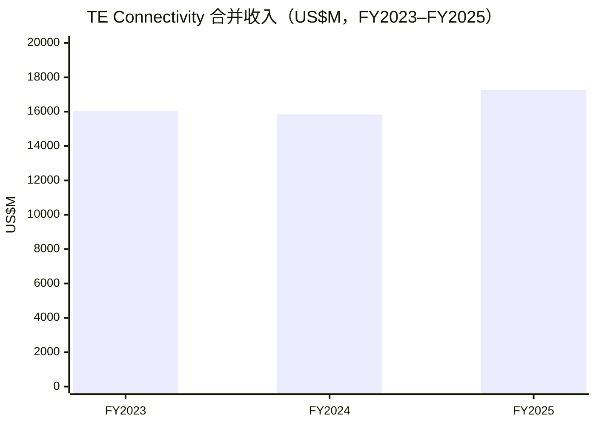
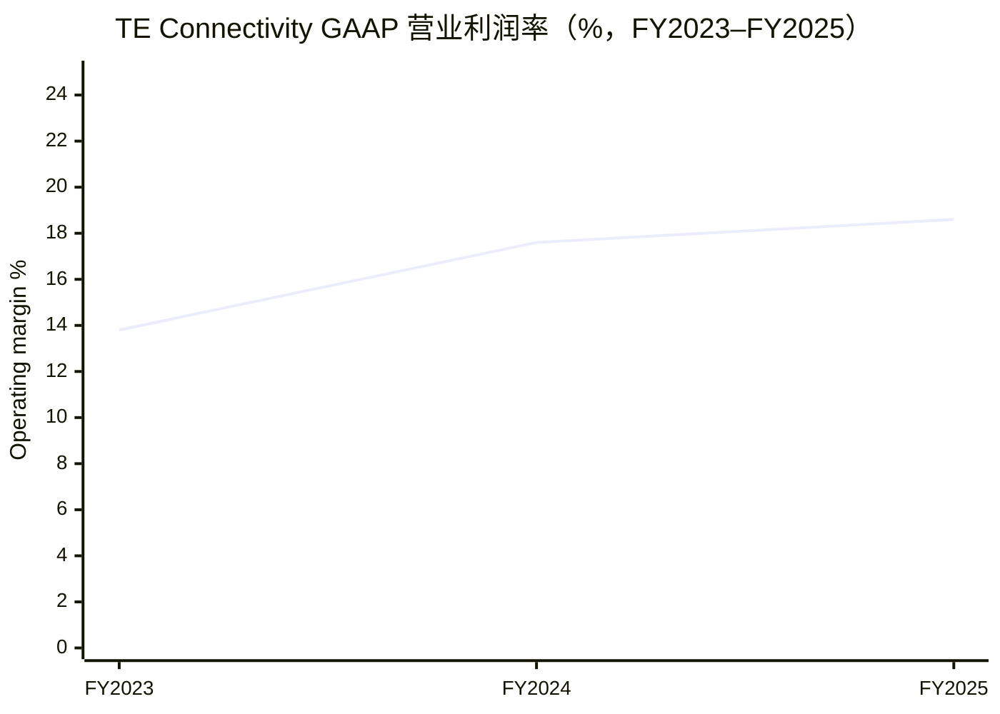
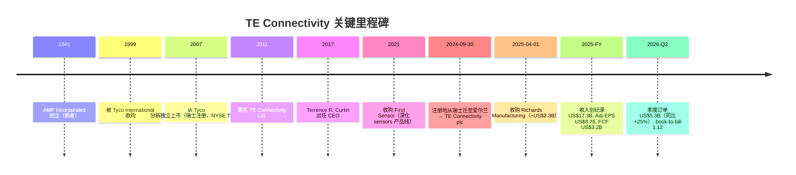
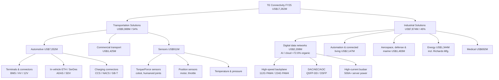
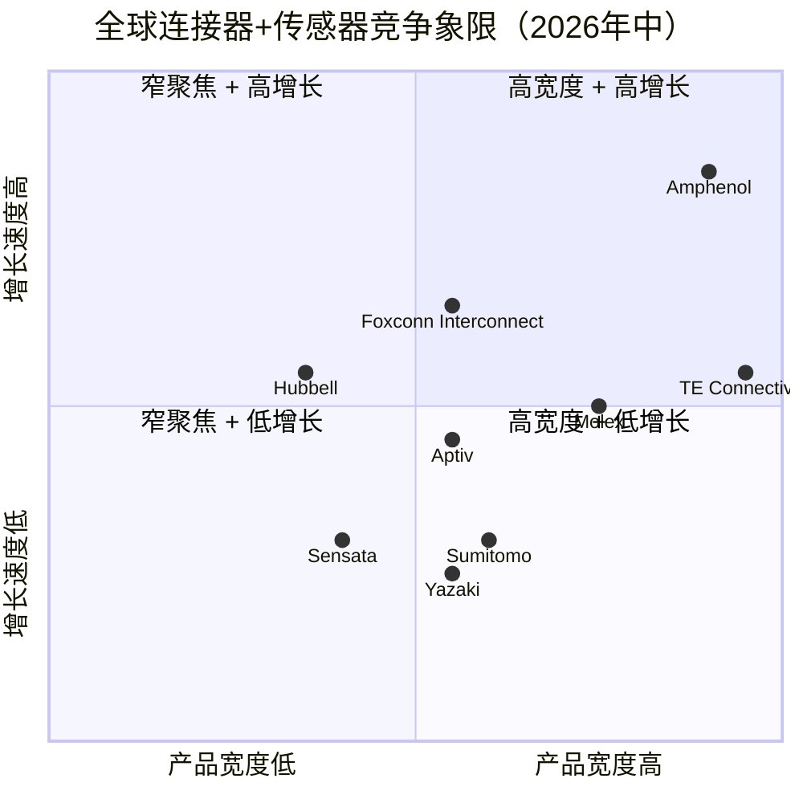

# TE Connectivity plc (NYSE:TEL) — 公司研究

**截至日期 / As of: 2026-06-16**
**主题归属 / Theme: humanoid-robotics-sensors（作为多元化全球标准链 enabler 入选）+ AI/data-center connectivity**
**主要数据来源 / Primary sources: FY2025 Form 10-K (filed 2025-11-10), FY26 Q1 10-Q (period 2025-12-26) + FY26 Q2 10-Q (filed 2026-04-24) + Q1/Q2 业绩公告 8-K, TE Connectivity 公司官网（te.com / investors.te.com）, SEC EDGAR, 第三方价格与同业数据, 本地 zsxq 卖方研究库。**

---

## 投资摘要 / Investment Summary（*分析师观点 / Analyst view*）

> 以下评级、目标价、前瞻估计与情景目标价均为分析师前瞻观点（*Analyst view*），不构成投资建议，且**绝不**归因于任何 10-K / 公告（filing 不含目标价）。

| 项目 | 数值 |
|---|---|
| **评级 / Rating** | **Overweight / 增持** |
| **12 个月目标价 / 12-mo Price Target** | **US$248**（base case） |
| 现价 / Current price (2026-06-16) | **US$217.00** |
| 隐含上行 / Implied upside | **+14.3%** |
| 估值方法 / Valuation method | FY27E Adjusted EPS US$12.4 × 20× forward P/E |
| 市值 / Market cap | ~US$63.3B |
| 企业价值 / Enterprise value | ~US$68.0B |
| 52 周区间 / 52-wk range | US$162.17 – 252.56 |
| 股息 / Dividend | US$2.98 年化 / yield ~1.37%（FY26 又一次约 10% 加派） |
| Ticker / Exchange | NYSE:TEL（爱尔兰注册 plc） |

**论点支柱 / Thesis pillars（*Analyst view*）：**

1. **AI/data-center 是当下的增长引擎。** FY2025 Digital data networks 子段有机收入 +72.6%，单年贡献了合并收入增量的约三分之二；FY26 上半年订单延续——record orders US$5.3B（Q2，+25% YoY），book-to-bill 1.12，CEO 明确点名 AI 为首要驱动（[TE FY26 Q2 业绩公告, 2026-04-22](https://www.sec.gov/Archives/edgar/data/1385157/000110465926046285/tel-20260422xex99d1.htm)）。
2. **Mix-shift 抬升结构性毛利。** Industrial Solutions 段收入占比从 FY2023 的 ~40% 升至 FY2025 的 46%（FY25 +23.7%），毛利率 gross margin 从 FY24 的 34.4% 升至 FY25 的 35.2%；FY26 Q2 GAAP 营业利润率达 20.1%（[TE FY2025 10-K, MD&A](https://www.sec.gov/Archives/edgar/data/1385157/000110465925109150/tel-20250926x10k.htm)）。
3. **现金牛 + 双寡头护城河。** FY25 FCF US$3.2B（FCF margin 18.6%）、净债务温和（Net Debt/EBITDA ~1.1×）、连续派息且年年加派；与 Amphenol（APH）构成全球连接器前二寡头，全球 ~130 国直销渠道。
4. **相对 APH 的折价提供再定价空间。** TEL forward P/E ~17.2× 对 APH ~30×，折价 ~43%；若 AI 子段增长与 Industrial mix-shift 持续验证，估值收敛存在空间——但执行风险（医疗复苏、Richards 协同、汽车端减速）必须被定价。

**最该盯紧的变量 / Key swing variables：** (1) Digital data networks 子段 organic 增速能否在 FY26–FY27 维持 30%+（AI 资本开支周期）；(2) Industrial Solutions 段重组后的毛利持续性 + Richards 协同释放。

---

## 1. 公司概览 / Company Overview

TE Connectivity plc（NYSE:TEL，下文统称 "TE"）是一家全球性的工业科技公司，以"连接器（connectors）"与"传感器（sensors）"两类核心产品，将电力、信号与数据传输延伸至汽车（automotive）、工业自动化（factory automation）、能源电网（electric grid）、数据中心（AI/data-center networking）、医疗器械（interventional medical devices）、商用运输（commercial transport）、航空航天与国防（aerospace & defense）等终端市场。在 FY2025 年报中，公司将自身定义为"a global industrial technology leader creating a safer, sustainable, productive, and connected future"，并表示其"broad range of connectivity and sensor solutions enable the distribution of power, signal, and data to advance next-generation transportation, energy networks, automated factories, data centers enabling artificial intelligence, and more"（[TE FY2025 10-K, Item 1](https://www.sec.gov/Archives/edgar/data/1385157/000110465925109150/tel-20250926x10k.htm)）。

**本方观点（*Analyst view*）：TEL 是"以现金牛为底、以 AI/data-center 为弹性"的多元化工业连接龙头。** 我们给予 **Overweight / 增持**，12 个月目标价 US$248（FY27E Adjusted EPS × 20×）。理由是 FY2025 的增长结构已经发生质变——增量的三分之二来自 AI/data-center，而市场仍以接近周期工业股的倍数为其定价（forward P/E ~17.2× vs Amphenol ~30×）。这一折价在 mix-shift 与 AI 订单持续验证下存在收敛空间；下行保护来自 US$3.2B 的自由现金流与稳定加派的股息（[TE FY26 Q2 业绩公告, 2026-04-22](https://www.sec.gov/Archives/edgar/data/1385157/000110465926046285/tel-20260422xex99d1.htm)；[Stock Analysis TEL profile, 2026-06](https://stockanalysis.com/stocks/tel/)）。

公司财务年度为 52/53 周制，以九月最后一个周五结束。FY2025 实际经营年度截止 2025-09-26，收入达到创纪录的 **US$17,262 million**（同比 +8.9% 报告口径 / reported basis，+6.4% 有机口径 / organic basis），其中 Transportation Solutions 收入 US$9,388 million、Industrial Solutions 收入 US$7,874 million；GAAP 营业利润 US$3,211 million（营业利润率 18.6%）、非 GAAP 调整后每股收益 / Adjusted EPS US$8.76（同比创历史新高），自由现金流 / free cash flow US$3.2 billion 同样创纪录（[TE FY2025 10-K, MD&A — Results of Operations](https://www.sec.gov/Archives/edgar/data/1385157/000110465925109150/tel-20250926x10k.htm)；[TE FY25 业绩公告 8-K Ex-99.1, 2025-10-29](https://www.sec.gov/Archives/edgar/data/1385157/000110465925103388/tel-20251029xex99d1.htm)）。截至 FY2025 年末公司在全球雇佣约 93,000 人（含约 13,000 名外包合同工，约 55,000 人位于制造端），客户分布在约 130 个国家（[TE FY2025 10-K, Human Capital](https://www.sec.gov/Archives/edgar/data/1385157/000110465925109150/tel-20250926x10k.htm)）。

**一个 FY2025 的关键会计提醒：GAAP 净利润被一次性税项压低。** FY2025 GAAP 净利润仅 US$1,842 million，对应 GAAP ROE 约 14.8%——但这是因为 FY25 有效税率（effective tax rate）高达 42.5%（含一次性税项），而 FY24 反而是 −14.2% 的税收受益（推高了当年 GAAP 净利润至 US$3,193M）。**因此读 TEL 的盈利能力必须看 Adjusted EPS（US$8.76）与营业利润（US$3,211M / 18.6% 营业利润率），而非被税项噪音污染的 GAAP 净利润**（[TE FY2025 10-K, MD&A — Income Taxes（"Effective tax rate 42.5%"）](https://www.sec.gov/Archives/edgar/data/1385157/000110465925109150/tel-20250926x10k.htm)）。

按 2026-06-16 收盘价 **US$217.00** 计，市值约 **US$63.3 billion**、EV 约 US$68.0 billion，TTM P/S 约 3.67×、按 Adjusted EPS 口径的 P/E 约 24.8×、forward P/E 约 17.2×（基于 Street FY26E EPS），股息率约 1.37%（年化 US$2.98）。52 周价格区间 US$162.17–252.56——当前价位于区间中部偏下，距 52 周高点约 −14%（[Stock Analysis TEL profile, 2026-06](https://stockanalysis.com/stocks/tel/)；价格与多空区间为 Yahoo Finance 截至 2026-06-16 数据）。与连接器同业巨头 Amphenol（NYSE:APH）形成"全球前二"双寡头格局，但市场对 APH 的 AI/数据中心暴露与连续并购整合能力给予了显著溢价（[Yahoo Finance APH-vs-TEL valuation note, 2026](https://finance.yahoo.com/news/amphenol-vs-te-connectivity-connector-165900290.html)）。

在 humanoid-robotics-sensors 主题中，TE 被归类为"enabler / 标准链 incumbent"：humanoid 业务不是其当前业绩锚，但其面向 cobots（collaborative robots，协作机器人）与工业机器人提供的扭矩、力、位置、温度、光学传感器组合，以及面向 AI/data-center 的高速连接器，使其在 humanoid BOM 的电源、信号、传感节点占据"默认供应商"地位（[TE cobot 传感器产品页](https://www.te.com/en/industries/industrial-machinery/applications/robotics/sensors-for-cobots-and-robotics.html); [humanoid-robotics-sensors 主题报告, 2026-05](/Users/x/projects/financial_agent/reports/themes/humanoid-robotics-sensors_theme.md)）。本报告对此主题归属持"看涨可选项 / call-option upside"的定性观点。

### 1.0 收入结构（财务报表 Sankey）

下图为 FY2025 利润表的 Sankey 分解——左侧为两大分部收入来源，向右逐级展开 COGS、毛利、各项费用、营业利润、税与净利润。注意 GAAP 净利润受 42.5% 有效税率压低，与 Adjusted EPS US$8.76 隐含口径差距明显。

<svg xmlns="http://www.w3.org/2000/svg" viewBox="0 0 1000 560" width="1000" height="560" role="img" aria-label="income statement Sankey"><rect x="0" y="0" width="1000" height="560" fill="#ffffff"/>
<text x="20.00" y="30.00" text-anchor="start" font-family="Helvetica,Arial,sans-serif" font-size="15" font-weight="700" fill="#1f2933">TE Connectivity — FY2025 利润表 Sankey (US$M)</text>
<path d="M 204.00,78.00 C 258.00,78.00 258.00,85.00 312.00,85.00 L 312.00,306.89 C 258.00,306.89 258.00,299.89 204.00,299.89 Z" fill="#93c5fd" fill-opacity="0.55"/>
<path d="M 452.00,78.00 C 506.00,78.00 506.00,202.16 560.00,202.16 L 560.00,278.05 C 506.00,278.05 506.00,153.89 452.00,153.89 Z" fill="#86efac" fill-opacity="0.55"/>
<path d="M 452.00,153.89 C 506.00,153.89 506.00,292.05 560.00,292.05 L 560.00,359.84 C 506.00,359.84 506.00,221.68 452.00,221.68 Z" fill="#fca5a5" fill-opacity="0.55"/>
<path d="M 328.00,85.00 C 382.00,85.00 382.00,78.00 436.00,78.00 L 436.00,221.68 C 382.00,221.68 382.00,228.68 328.00,228.68 Z" fill="#86efac" fill-opacity="0.55"/>
<path d="M 328.00,228.68 C 382.00,228.68 382.00,235.68 436.00,235.68 L 436.00,500.00 C 382.00,500.00 382.00,493.00 328.00,493.00 Z" fill="#fca5a5" fill-opacity="0.55"/>
<path d="M 700.00,196.24 C 754.00,196.24 754.00,244.14 808.00,244.14 L 808.00,287.70 C 754.00,287.70 754.00,239.80 700.00,239.80 Z" fill="#86efac" fill-opacity="0.55"/>
<path d="M 700.00,239.80 C 754.00,239.80 754.00,301.70 808.00,301.70 L 808.00,333.86 C 754.00,333.86 754.00,271.97 700.00,271.97 Z" fill="#fca5a5" fill-opacity="0.55"/>
<path d="M 576.00,202.16 C 630.00,202.16 630.00,196.24 684.00,196.24 L 684.00,272.14 C 630.00,272.14 630.00,278.05 576.00,278.05 Z" fill="#86efac" fill-opacity="0.55"/>
<path d="M 576.00,292.05 C 630.00,292.05 630.00,285.97 684.00,285.97 L 684.00,330.08 C 630.00,330.08 630.00,336.16 576.00,336.16 Z" fill="#fca5a5" fill-opacity="0.55"/>
<path d="M 576.00,336.16 C 630.00,336.16 630.00,344.08 684.00,344.08 L 684.00,363.67 C 630.00,363.67 630.00,355.75 576.00,355.75 Z" fill="#fca5a5" fill-opacity="0.55"/>
<path d="M 576.00,355.75 C 630.00,355.75 630.00,377.67 684.00,377.67 L 684.00,381.76 C 630.00,381.76 630.00,359.84 576.00,359.84 Z" fill="#fca5a5" fill-opacity="0.55"/>
<path d="M 204.00,313.89 C 258.00,313.89 258.00,306.89 312.00,306.89 L 312.00,493.00 C 258.00,493.00 258.00,500.00 204.00,500.00 Z" fill="#93c5fd" fill-opacity="0.55"/>
<path d="M 576.00,373.84 C 630.00,373.84 630.00,272.14 684.00,272.14 L 684.00,274.14 C 630.00,274.14 630.00,375.84 576.00,375.84 Z" fill="#93c5fd" fill-opacity="0.55"/>
<rect x="188.00" y="78.00" width="16" height="221.89" rx="1.5" fill="#2563eb"/>
<rect x="188.00" y="313.89" width="16" height="186.11" rx="1.5" fill="#2563eb"/>
<rect x="312.00" y="85.00" width="16" height="408.00" rx="1.5" fill="#1e3a8a"/>
<rect x="436.00" y="78.00" width="16" height="143.68" rx="1.5" fill="#15803d"/>
<rect x="436.00" y="235.68" width="16" height="264.32" rx="1.5" fill="#dc2626"/>
<rect x="560.00" y="202.16" width="16" height="75.89" rx="1.5" fill="#15803d"/>
<rect x="560.00" y="292.05" width="16" height="67.79" rx="1.5" fill="#dc2626"/>
<rect x="560.00" y="373.84" width="16" height="2.00" rx="1.5" fill="#2563eb"/>
<rect x="684.00" y="196.24" width="16" height="75.73" rx="1.5" fill="#15803d"/>
<rect x="684.00" y="285.97" width="16" height="44.10" rx="1.5" fill="#dc2626"/>
<rect x="684.00" y="344.08" width="16" height="19.59" rx="1.5" fill="#dc2626"/>
<rect x="684.00" y="377.67" width="16" height="4.09" rx="1.5" fill="#dc2626"/>
<rect x="808.00" y="244.14" width="16" height="43.56" rx="1.5" fill="#15803d"/>
<rect x="808.00" y="301.70" width="16" height="32.17" rx="1.5" fill="#dc2626"/>
<text x="179.00" y="185.95" text-anchor="end" font-family="Helvetica,Arial,sans-serif" font-size="11.5" font-weight="700" fill="#1f2933">Transportation Solutions</text>
<text x="179.00" y="198.95" text-anchor="end" font-family="Helvetica,Arial,sans-serif" font-size="10" font-weight="400" fill="#52606d">US$9.4B  (54.4%)</text>
<text x="179.00" y="403.95" text-anchor="end" font-family="Helvetica,Arial,sans-serif" font-size="11.5" font-weight="700" fill="#1f2933">Industrial Solutions</text>
<text x="179.00" y="416.95" text-anchor="end" font-family="Helvetica,Arial,sans-serif" font-size="10" font-weight="400" fill="#52606d">US$7.9B  (45.6%)</text>
<rect x="331.00" y="67.00" width="119.40" height="26" rx="2" fill="#ffffff" fill-opacity="0.72"/>
<text x="334.00" y="79.00" text-anchor="start" font-family="Helvetica,Arial,sans-serif" font-size="11.5" font-weight="700" fill="#1f2933">Revenue</text>
<text x="334.00" y="92.00" text-anchor="start" font-family="Helvetica,Arial,sans-serif" font-size="10" font-weight="400" fill="#52606d">US$17.3B  (100.0%)</text>
<rect x="455.00" y="60.00" width="106.80" height="26" rx="2" fill="#ffffff" fill-opacity="0.72"/>
<text x="458.00" y="72.00" text-anchor="start" font-family="Helvetica,Arial,sans-serif" font-size="11.5" font-weight="700" fill="#1f2933">Gross Profit</text>
<text x="458.00" y="85.00" text-anchor="start" font-family="Helvetica,Arial,sans-serif" font-size="10" font-weight="400" fill="#52606d">US$6.1B  (35.2%)</text>
<rect x="455.00" y="217.68" width="144.60" height="26" rx="2" fill="#ffffff" fill-opacity="0.72"/>
<text x="458.00" y="229.68" text-anchor="start" font-family="Helvetica,Arial,sans-serif" font-size="11.5" font-weight="700" fill="#1f2933">Cost of Revenue (COGS)</text>
<text x="458.00" y="242.68" text-anchor="start" font-family="Helvetica,Arial,sans-serif" font-size="10" font-weight="400" fill="#52606d">US$11.2B  (64.8%)</text>
<rect x="579.00" y="184.16" width="106.80" height="26" rx="2" fill="#ffffff" fill-opacity="0.72"/>
<text x="582.00" y="196.16" text-anchor="start" font-family="Helvetica,Arial,sans-serif" font-size="11.5" font-weight="700" fill="#1f2933">Operating Income</text>
<text x="582.00" y="209.16" text-anchor="start" font-family="Helvetica,Arial,sans-serif" font-size="10" font-weight="400" fill="#52606d">US$3.2B  (18.6%)</text>
<rect x="579.00" y="274.05" width="150.90" height="26" rx="2" fill="#ffffff" fill-opacity="0.72"/>
<text x="582.00" y="286.05" text-anchor="start" font-family="Helvetica,Arial,sans-serif" font-size="11.5" font-weight="700" fill="#1f2933">Total Operating Expense</text>
<text x="582.00" y="299.05" text-anchor="start" font-family="Helvetica,Arial,sans-serif" font-size="10" font-weight="400" fill="#52606d">US$2.9B  (16.6%)</text>
<text x="551.00" y="371.84" text-anchor="end" font-family="Helvetica,Arial,sans-serif" font-size="11.5" font-weight="700" fill="#1f2933">Net Interest / Other Income</text>
<text x="551.00" y="384.84" text-anchor="end" font-family="Helvetica,Arial,sans-serif" font-size="10" font-weight="400" fill="#52606d">US$7.0M  (0.04%)</text>
<rect x="703.00" y="178.24" width="106.80" height="26" rx="2" fill="#ffffff" fill-opacity="0.72"/>
<text x="706.00" y="190.24" text-anchor="start" font-family="Helvetica,Arial,sans-serif" font-size="11.5" font-weight="700" fill="#1f2933">Pretax Income</text>
<text x="706.00" y="203.24" text-anchor="start" font-family="Helvetica,Arial,sans-serif" font-size="10" font-weight="400" fill="#52606d">US$3.2B  (18.6%)</text>
<rect x="703.00" y="267.97" width="106.80" height="26" rx="2" fill="#ffffff" fill-opacity="0.72"/>
<text x="706.00" y="279.97" text-anchor="start" font-family="Helvetica,Arial,sans-serif" font-size="11.5" font-weight="700" fill="#1f2933">SG&amp;A</text>
<text x="706.00" y="292.97" text-anchor="start" font-family="Helvetica,Arial,sans-serif" font-size="10" font-weight="400" fill="#52606d">US$1.9B  (10.8%)</text>
<rect x="703.00" y="326.08" width="113.10" height="26" rx="2" fill="#ffffff" fill-opacity="0.72"/>
<text x="706.00" y="338.08" text-anchor="start" font-family="Helvetica,Arial,sans-serif" font-size="11.5" font-weight="700" fill="#1f2933">R&amp;D</text>
<text x="706.00" y="351.08" text-anchor="start" font-family="Helvetica,Arial,sans-serif" font-size="10" font-weight="400" fill="#52606d">US$829.0M  (4.8%)</text>
<rect x="703.00" y="359.67" width="113.10" height="26" rx="2" fill="#ffffff" fill-opacity="0.72"/>
<text x="706.00" y="371.67" text-anchor="start" font-family="Helvetica,Arial,sans-serif" font-size="11.5" font-weight="700" fill="#1f2933">Other OpEx</text>
<text x="706.00" y="384.67" text-anchor="start" font-family="Helvetica,Arial,sans-serif" font-size="10" font-weight="400" fill="#52606d">US$173.0M  (1.0%)</text>
<text x="833.00" y="262.92" text-anchor="start" font-family="Helvetica,Arial,sans-serif" font-size="11.5" font-weight="700" fill="#1f2933">Net Income</text>
<text x="833.00" y="275.92" text-anchor="start" font-family="Helvetica,Arial,sans-serif" font-size="10" font-weight="400" fill="#52606d">US$1.8B  (10.7%)</text>
<text x="833.00" y="314.78" text-anchor="start" font-family="Helvetica,Arial,sans-serif" font-size="11.5" font-weight="700" fill="#1f2933">Income Tax</text>
<text x="833.00" y="327.78" text-anchor="start" font-family="Helvetica,Arial,sans-serif" font-size="10" font-weight="400" fill="#52606d">US$1.4B  (7.9%)</text>
<text x="500.00" y="530.00" text-anchor="middle" font-family="Helvetica,Arial,sans-serif" font-size="10" font-weight="400" font-style="italic" fill="#8a97a3">GAAP 口径；FY25 有效税率 42.5%（含一次性项目），故 GAAP 净利润显著低于 Adjusted EPS US$8.76 隐含口径。</text>
<text x="500.00" y="544.00" text-anchor="middle" font-family="Helvetica,Arial,sans-serif" font-size="10" font-weight="400" fill="#52606d">Source: TE Connectivity FY2025 Form 10-K (filed 2025-11-10), Consolidated Statements of Operations · Note 20 Segment Information</text>
</svg>

Source: [TE Connectivity FY2025 Form 10-K, Consolidated Statements of Operations + Note 20](https://www.sec.gov/Archives/edgar/data/1385157/000110465925109150/tel-20250926x10k.htm)。

注：两图分开绘制以避免 % 与货币单位共用一条 y 轴（FY2023 营业利润率 13.8% 含一次性减值项）。数据来源：[TE FY2025 10-K, MD&A + Note 20](https://www.sec.gov/Archives/edgar/data/1385157/000110465925109150/tel-20250926x10k.htm)。

---

## 1A. 估值快照与价格表现 / Valuation Snapshot & Price Performance

| 指标 | TEL（2026-06-16） | 同业/历史参照 |
|---|---|---|
| 现价 / Price | US$217.00 | 52 周区间 US$162.17–252.56 |
| 市值 / Market cap | ~US$63.3B | APH ~US$140B+（更大） |
| TTM P/E（Adj EPS 口径） | ~24.8× | TEL 3/5/10 年均值 ~22.7× |
| Forward P/E | ~17.2× | APH ~30× fwd；BizLink ~30× |
| TTM P/S | ~3.67× | APH ~6×+ |
| EV/EBITDA | ~14.4× | — |
| P/B | ~4.8× | — |
| 股息率 / Div yield | ~1.37%（US$2.98） | 连续多年加派 |
| Beta | ~1.16 | 中等周期 |

**估值倍数判读（*Analyst view*）：** TEL forward P/E ~17.2× **低于自身 3/5/10 年均值（~22.7×）**，更显著低于 Amphenol 的 ~30× forward。三家卖方均确认这一折价存在并归因于 AI 暴露度差异——*分析师观点：* 美银（BofA）在一份贸联（BizLink）报告中明确：贸联用 30× 2027E P/E，**"低于全球龙头安波费诺（Amphenol）的 32 倍……但高于泰科电子（TE Connectivity）的 23 倍（因贸联 AI exposure 更高）"**（[BofA — BizLink (3665.TW), 2026-04-22, p.1（较 2026-04-22 收盘 US$220 为同期口径）](http://xs-macbook-air.local:5001/zsxq/pdf/812218818214522/BofA%20Securities-BizLink%EF%BC%883665.TW%EF%BC%89Reiterate%20Buy%EF%BC%9A%20copper%20and%20optical%20codevelopment%20beneficiary%EF%BC%9B%20PO%20of%20NT%243%EF%BC%8C088-260422.pdf)）。这意味着市场把 TEL 当作"AI 暴露较低的多元化工业股"定价——这正是再定价空间的来源，也是风险所在。

**价格表现：** 过去 12 个月 TEL 一度冲高至 US$252.56（52 周高），随后在 2026-04-22 Q2 业绩日单日回落（US$242→US$220，市场对汽车端减速与估值的担忧），近期在 US$210–217 区间企稳。当前价距 52 周高约 −14%，相对动量中性偏弱——这是 GF Score Momentum 维度评分偏低的依据（[Yahoo Finance / Stock Analysis TEL, 截至 2026-06-16](https://stockanalysis.com/stocks/tel/)）。

---

## 1B. GF Score 基本面评分卡 / GF Score Scorecard（*分析师观点 / Analyst view*）

下列五维评分（Financial Strength / Profitability / Growth / GF Value / Momentum）为分析师自有 rubric（GuruFocus 风格），**不归因于 GuruFocus，亦不附任何 filing 引用**；每个底层指标在前后文均有独立 inline 引用。

<svg xmlns="http://www.w3.org/2000/svg" viewBox="0 0 500 500" width="500" height="500" role="img" aria-label="GF Score radar">
<rect x="0" y="0" width="500" height="500" fill="#ffffff"/>
<text x="20" y="24" font-family="Helvetica,Arial,sans-serif" font-size="15" font-weight="700" fill="#1f2933">GF Score (GuruFocus-style): 69/100</text>
<text x="20" y="41" font-family="Helvetica,Arial,sans-serif" font-size="11" fill="#52606d">51–70 Poor future performance potential</text>
<polygon points="250.0,88.0 392.7,191.6 338.2,359.4 161.8,359.4 107.3,191.6" fill="#e9f5ec" stroke="none"/>
<polygon points="250.0,208.0 278.5,228.7 267.6,262.3 232.4,262.3 221.5,228.7" fill="none" stroke="#c5d3cb" stroke-width="1"/>
<polygon points="250.0,178.0 307.1,219.5 285.3,286.5 214.7,286.5 192.9,219.5" fill="none" stroke="#c5d3cb" stroke-width="1"/>
<polygon points="250.0,148.0 335.6,210.2 302.9,310.8 197.1,310.8 164.4,210.2" fill="none" stroke="#c5d3cb" stroke-width="1"/>
<polygon points="250.0,118.0 364.1,200.9 320.5,335.1 179.5,335.1 135.9,200.9" fill="none" stroke="#c5d3cb" stroke-width="1"/>
<polygon points="250.0,88.0 392.7,191.6 338.2,359.4 161.8,359.4 107.3,191.6" fill="none" stroke="#c5d3cb" stroke-width="1.3"/>
<line x1="250" y1="238" x2="161.8" y2="359.4" stroke="#cfdad3" stroke-width="1"/>
<text x="146.5" y="392.4" text-anchor="end" font-family="Helvetica,Arial,sans-serif" font-size="11.5" font-weight="600" fill="#1f2933">财务实力</text>
<text x="179.5" y="329.1" text-anchor="middle" font-family="Helvetica,Arial,sans-serif" font-size="10.5" font-weight="700" fill="#1f2933">8</text>
<line x1="250" y1="238" x2="250.0" y2="88.0" stroke="#cfdad3" stroke-width="1"/>
<text x="250.0" y="58.0" text-anchor="middle" font-family="Helvetica,Arial,sans-serif" font-size="11.5" font-weight="600" fill="#1f2933">盈利能力</text>
<text x="250.0" y="112.0" text-anchor="middle" font-family="Helvetica,Arial,sans-serif" font-size="10.5" font-weight="700" fill="#1f2933">8</text>
<line x1="250" y1="238" x2="107.3" y2="191.6" stroke="#cfdad3" stroke-width="1"/>
<text x="82.6" y="183.6" text-anchor="end" font-family="Helvetica,Arial,sans-serif" font-size="11.5" font-weight="600" fill="#1f2933">成长性</text>
<text x="164.4" y="204.2" text-anchor="middle" font-family="Helvetica,Arial,sans-serif" font-size="10.5" font-weight="700" fill="#1f2933">6</text>
<line x1="250" y1="238" x2="392.7" y2="191.6" stroke="#cfdad3" stroke-width="1"/>
<text x="417.4" y="183.6" text-anchor="start" font-family="Helvetica,Arial,sans-serif" font-size="11.5" font-weight="600" fill="#1f2933">估值</text>
<text x="349.9" y="199.6" text-anchor="middle" font-family="Helvetica,Arial,sans-serif" font-size="10.5" font-weight="700" fill="#1f2933">7</text>
<line x1="250" y1="238" x2="338.2" y2="359.4" stroke="#cfdad3" stroke-width="1"/>
<text x="353.5" y="392.4" text-anchor="start" font-family="Helvetica,Arial,sans-serif" font-size="11.5" font-weight="600" fill="#1f2933">动量</text>
<text x="294.1" y="292.7" text-anchor="middle" font-family="Helvetica,Arial,sans-serif" font-size="10.5" font-weight="700" fill="#1f2933">5</text>
<polygon points="250.0,118.0 349.9,205.6 294.1,298.7 179.5,335.1 164.4,210.2" fill="#2e8b57" fill-opacity="0.34" stroke="#2e8b57" stroke-width="2"/>
<circle cx="179.5" cy="335.1" r="2.6" fill="#2e8b57"/>
<circle cx="250.0" cy="118.0" r="2.6" fill="#2e8b57"/>
<circle cx="164.4" cy="210.2" r="2.6" fill="#2e8b57"/>
<circle cx="349.9" cy="205.6" r="2.6" fill="#2e8b57"/>
<circle cx="294.1" cy="298.7" r="2.6" fill="#2e8b57"/>
<text x="250" y="470" text-anchor="middle" font-family="Helvetica,Arial,sans-serif" font-size="9.5" fill="#52606d">Source: TEL FY2025 10-K · FY26 Q2 8-K (2026-04-22) · Yahoo Finance · as of 2026-06-16</text>
<text x="250" y="485" text-anchor="middle" font-family="Helvetica,Arial,sans-serif" font-size="9" fill="#52606d">GF Score = independent analyst rubric (*Analyst view:*) — not GuruFocus™ official number</text>
</svg>

Source: TEL FY2025 10-K · FY26 Q2 8-K (2026-04-22) · Yahoo Finance · as of 2026-06-16。

| 维度 / Dimension | 评分 (0–10) | 评分理由（*Analyst view*） |
|---|---|---|
| **Financial Strength（财务实力）** | **8** | 净债务温和：总债务 US$5,820M − 现金 US$1,255M ≈ US$4.6B，Net Debt/EBITDA ~1.1×；利息覆盖极高（FY25 利息费用仅 US$77M vs 营业利润 US$3,211M）（[10-K 资产负债表 + 利润表](https://www.sec.gov/Archives/edgar/data/1385157/000110465925109150/tel-20250926x10k.htm)）。扣分项：Richards 并购后商誉升至 US$7.1B。 |
| **Profitability（盈利能力）** | **8** | FY25 gross margin 35.2%、GAAP 营业利润率 18.6%（FY26 Q2 升至 20.1%）、GAAP ROE 14.8%（受税项压低，按 Adjusted 口径更高）、ROIC 显著高于 WACC（[10-K MD&A](https://www.sec.gov/Archives/edgar/data/1385157/000110465925109150/tel-20250926x10k.htm)；[FY26 Q2 业绩公告](https://www.sec.gov/Archives/edgar/data/1385157/000110465926046285/tel-20260422xex99d1.htm)）。 |
| **Growth（成长性）** | **6** | 三年合并收入仅小幅增长（US$16,034M→US$17,262M），但结构在加速：Digital data networks +72.6% organic、Industrial 段 +23.7%；FY26 上半年 +18% reported。汽车与 Sensors/Medical 子段拖累整体（[10-K Note 20](https://www.sec.gov/Archives/edgar/data/1385157/000110465925109150/tel-20250926x10k.htm)）。 |
| **GF Value（估值，越高越便宜）** | **7** | Forward P/E 17.2× 低于自身均值 22.7× 与 APH 30×，对 base-case 目标价 US$248 有约 +14% MoS（见 §2）。非深度折价但相对同业便宜（[Stock Analysis TEL, 2026-06](https://stockanalysis.com/stocks/tel/)）。 |
| **Momentum（动量）** | **5** | 距 52 周高 −14%，12 个月回报平淡，2026-04 Q2 业绩日下挫后才企稳；相对大盘动量中性偏弱（[Yahoo Finance TEL, 2026-06-16](https://stockanalysis.com/stocks/tel/)）。 |
| **GF Score（composite，*Analyst view*）** | **69 / 100** | 51–70 区间（"Poor future performance potential" 带，GuruFocus 风格 rubric）——反映 TEL 是高质量但成长温和、动量平淡的现金牛；与本报告 Overweight 评级一致：评级基于估值折价 + AI 弹性，而非高 GF 综合分。 |

*综合权重（*Analyst view*）：Financial Strength 20% · Profitability 25% · Growth 25% · GF Value 15% · Momentum 15%（透明复现，非 GuruFocus 专有权重）。*

---

## 2. 估值与目标价 / Valuation & Price Target（*分析师观点 / Analyst view*）

> 本节所有前瞻估计、目标价、情景目标价均为分析师前瞻观点（*Analyst view*），**绝不**附 filing 引用。前瞻模型搭建于 10-K 分部数据 + 管理层指引 + 行业增长口径之上；驱动因子的外部依据在文中 inline 引用。

### 2.1 前瞻财务估计 / Forward estimates table

| 财年 (FY, 9 月止) | 收入 US$B | YoY | Adjusted EPS US$ | YoY | GAAP 营业利润率 |
|---|---|---|---|---|---|
| FY2025（实际） | 17.26 | +8.9% | 8.76 | +14% | 18.6% |
| **FY2026E** | **19.6** | **+13.5%** | **11.1** | **+27%** | **~20%** |
| **FY2027E** | **21.2** | **+8%** | **12.4** | **+12%** | **~20.5%** |
| **FY2028E** | **22.9** | **+8%** | **13.7** | **+10%** | **~21%** |

**驱动因子与依据（*Analyst view*）：**
- **FY2026E 锚定于已公布的上半年实绩 + Q3 指引。** Q1 FY26 收入 US$4.7B（+22%）、Adj EPS US$2.72（+33%）；Q2 FY26 收入 US$4.744B（+15%）、Adj EPS US$2.73（+24%）；Q3 FY26 公司指引收入约 US$5.0B（+10% reported / +9% organic）、Adj EPS 约 US$2.83（+17%）（[TE FY26 Q1 业绩公告, 2026-01-21](https://www.sec.gov/Archives/edgar/data/1385157/000110465926005219/tel-20260121xex99d1.htm)；[TE FY26 Q2 业绩公告, 2026-04-22](https://www.sec.gov/Archives/edgar/data/1385157/000110465926046285/tel-20260422xex99d1.htm)）。上半年合计 US$9.4B + 下半年约 US$10.1B → FY26E ~US$19.6B；四个季度 Adj EPS ~2.72+2.73+2.83+~2.85 → ~US$11.1。
- **FY2027–FY2028 的 mix-shift 杠杆。** Industrial Solutions（含 AI/data-center）以高于公司均值的速度增长抬升整体毛利；Transportation 段假设低个位数有机增长。每条分部线各有自己的收入路径与毛利轨迹再汇总（[10-K Note 20 分部数据为基](https://www.sec.gov/Archives/edgar/data/1385157/000110465925109150/tel-20250926x10k.htm)）。

### 2.2 目标价推导（*Analyst view*）

- **方法：forward-EPS × target multiple。** Base case = **FY2027E Adjusted EPS US$12.4 × 20× forward P/E = US$248**。
- **倍数依据（为什么用 20×）：** TEL 自身 3/5/10 年 forward P/E 均值约 22.7×；卖方对其当前给 ~23× 2027E（BofA 口径）。我们用略低于历史均值的 **20×** 以保守计入汽车端减速与医疗复苏的不确定性——这一倍数仍**显著低于** Amphenol 的 ~30× 与贸联（BizLink）的 30×，反映 TEL 较低的 AI 收入占比（[BofA — BizLink (3665.TW), 2026-04-22, p.1](http://xs-macbook-air.local:5001/zsxq/pdf/812218818214522/BofA%20Securities-BizLink%EF%BC%883665.TW%EF%BC%89Reiterate%20Buy%EF%BC%9A%20copper%20and%20optical%20codevelopment%20beneficiary%EF%BC%9B%20PO%20of%20NT%243%EF%BC%8C088-260422.pdf)；[Fullratio TEL PE 历史](https://fullratio.com/stocks/nyse-tel/pe-ratio)）。

### 2.3 Bull / Base / Bear 情景（*Analyst view*）

| 情景 | 关键摆动假设 | EPS × 倍数 | 目标价 | 较 US$217 |
|---|---|---|---|---|
| **Bull** | DDN 子段维持 40%+ organic，Industrial mix 全面抬升毛利，倍数回到历史 22.5× | FY28E 13.7 × 22.5× | **US$308** | **+42%** |
| **Base** | Q3 指引兑现，AI 30%+、汽车低个位数，倍数 20× | FY27E 12.4 × 20× | **US$248** | **+14%** |
| **Bear** | AI 资本开支周期回调 + 汽车价格战 + 医疗复苏延后，倍数压至 16× | FY27E 11.8 × 16× | **US$189** | **−13%** |

风险回报在 base case 下偏正向：上行 +42%（bull）对下行 −13%（bear），中枢 +14%。

### 2.4 与市场一致预期的对比 / vs Consensus（*分析师观点 / Analyst view*）

- **卖方共识总体看多。** Yahoo Finance 口径下 19 位分析师均价目标价 **US$263.47**（较现价 +21%），整体评级倾向 **Buy**（[Yahoo Finance TEL analysts, 2026-06-16](https://finance.yahoo.com/quote/TEL/)）。本报告 base-case US$248 略低于卖方均值，主要因我们对倍数更保守（20× vs 卖方 ~23×）。
- *分析师观点：* **瑞银（UBS）维持 TE Connectivity "Buy"评级、目标价 US$261**（较 2026-05-07 收盘 US$209.25 上行 +24.7%），同一份汽车零部件行业报告中给 Amphenol "Buy"、目标价 US$178（[UBS — Japan Autos/Auto Parts Sector Highway #97, 2026-05-07, p.（供应商估值表）](http://xs-macbook-air.local:5001/zsxq/pdf/212458428481551/UBS-Japan%20Autos%EF%BC%8C%20Auto%20Parts%20and%20Auto~tech%20Sector%20Kohei%20Highway%20%2397%EF%BC%9AApril%20sales%20US%20dealer%20implication%20from%20suppliers%E2%80%99%20results-260507.pdf)）。

### 2.5 卖方观点演变 / Sell-side view evolution（*分析师观点 / Analyst view*）

> 本地 `db/stock_price_target.db`（只读）pre-pass 显示 TEL 在库内主要为 **UBS** 覆盖（两条记录），叠加 **BofA** 一份跨同业对照。PT dispersion 窄（库内唯一带数字 PT 为 UBS US$261），与外部卖方共识 US$263 接近。

**按机构的观点时间线（按报告日排序）：**

| 机构 | 报告日 | 评级 / 目标价 | 报告日收盘 | 核心论点 |
|---|---|---|---|---|
| UBS | 2026-05-07 | Buy / **US$261** | US$209.25（上行 +24.7%） | 汽车零部件供应商首选之一；TEL 估值优于 APH（APH PT US$178）（[UBS, 2026-05-07](http://xs-macbook-air.local:5001/zsxq/pdf/212458428481551/UBS-Japan%20Autos%EF%BC%8C%20Auto%20Parts%20and%20Auto~tech%20Sector%20Kohei%20Highway%20%2397%EF%BC%9AApril%20sales%20US%20dealer%20implication%20from%20suppliers%E2%80%99%20results-260507.pdf)） |
| UBS | 2026-05-17 | Buy / （本条无 PT 数字） | — | 维持 Buy，未更新 PT（[UBS 2026-05-17 库内记录](http://xs-macbook-air.local:5001/zsxq/pdf/585424154281544/)） |
| BofA（对照） | 2026-04-22 | （TEL 非主标的，作为同业估值锚） | — | 明确 TEL 用 ~23× 2027E P/E < APH 32×，因 TEL AI exposure 较低（[BofA, 2026-04-22, p.1](http://xs-macbook-air.local:5001/zsxq/pdf/812218818214522/BofA%20Securities-BizLink%EF%BC%883665.TW%EF%BC%89Reiterate%20Buy%EF%BC%9A%20copper%20and%20optical%20codevelopment%20beneficiary%EF%BC%9B%20PO%20of%20NT%243%EF%BC%8C088-260422.pdf)） |

**机构间分歧（机构间分歧）：** 库内卖方一致看多（UBS Buy）且与外部共识方向一致；**无对立评级**。唯一值得注意的"分歧"是**估值倍数的口径**——UBS/外部共识隐含 ~22–23× 2027E，而本报告用更保守的 20×。什么证据能证明更高倍数正确：DDN 子段在 FY26–FY27 维持 30%+ organic、Industrial mix 抬升毛利兑现，则倍数向历史 22.7× 收敛、对应 bull 区间。

### 2.6 DuPont ROE 分解

<svg xmlns="http://www.w3.org/2000/svg" viewBox="0 0 1240 540" width="1240" height="540" role="img" aria-label="DuPont ROE decomposition"><rect x="0" y="0" width="1240" height="540" fill="#ffffff"/>
<text x="20.00" y="30.00" text-anchor="start" font-family="Helvetica,Arial,sans-serif" font-size="15" font-weight="700" fill="#1f2933">TE Connectivity — FY2025 DuPont ROE 分解</text>
<rect x="545.00" y="56.00" width="150" height="56" rx="7" fill="#1e3a8a"/>
<text x="620.00" y="76.00" text-anchor="middle" font-family="Helvetica,Arial,sans-serif" font-size="11.5" font-weight="700" fill="#ffffff">ROE</text>
<text x="620.00" y="94.00" text-anchor="middle" font-family="Helvetica,Arial,sans-serif" font-size="13" font-weight="800" fill="#ffffff">14.78%</text>
<text x="620.00" y="106.00" text-anchor="middle" font-family="Helvetica,Arial,sans-serif" font-size="8.5" font-weight="400" fill="#dbeafe">= Net Income / Avg Equity</text>
<rect x="191.60" y="168.00" width="150" height="56" rx="7" fill="#2563eb"/>
<text x="266.60" y="188.00" text-anchor="middle" font-family="Helvetica,Arial,sans-serif" font-size="11.5" font-weight="700" fill="#ffffff">Net Margin</text>
<text x="266.60" y="206.00" text-anchor="middle" font-family="Helvetica,Arial,sans-serif" font-size="13" font-weight="800" fill="#ffffff">10.68%</text>
<text x="266.60" y="218.00" text-anchor="middle" font-family="Helvetica,Arial,sans-serif" font-size="8.5" font-weight="400" fill="#dbeafe">Net Income / Revenue</text>
<line x1="620.00" y1="112.00" x2="266.60" y2="168.00" stroke="#94a3b8" stroke-width="1.4"/>
<rect x="545.00" y="168.00" width="150" height="56" rx="7" fill="#2563eb"/>
<text x="620.00" y="188.00" text-anchor="middle" font-family="Helvetica,Arial,sans-serif" font-size="11.5" font-weight="700" fill="#ffffff">Asset Turnover</text>
<text x="620.00" y="206.00" text-anchor="middle" font-family="Helvetica,Arial,sans-serif" font-size="13" font-weight="800" fill="#ffffff">0.72</text>
<text x="620.00" y="218.00" text-anchor="middle" font-family="Helvetica,Arial,sans-serif" font-size="8.5" font-weight="400" fill="#dbeafe">Revenue / Avg Assets</text>
<line x1="620.00" y1="112.00" x2="620.00" y2="168.00" stroke="#94a3b8" stroke-width="1.4"/>
<rect x="898.40" y="168.00" width="150" height="56" rx="7" fill="#2563eb"/>
<text x="973.40" y="188.00" text-anchor="middle" font-family="Helvetica,Arial,sans-serif" font-size="11.5" font-weight="700" fill="#ffffff">Equity Multiplier</text>
<text x="973.40" y="206.00" text-anchor="middle" font-family="Helvetica,Arial,sans-serif" font-size="13" font-weight="800" fill="#ffffff">1.92</text>
<text x="973.40" y="218.00" text-anchor="middle" font-family="Helvetica,Arial,sans-serif" font-size="8.5" font-weight="400" fill="#dbeafe">Avg Assets / Avg Equity</text>
<line x1="620.00" y1="112.00" x2="973.40" y2="168.00" stroke="#94a3b8" stroke-width="1.4"/>
<circle cx="443.30" cy="196.00" r="11" fill="#ffffff" stroke="#94a3b8" stroke-width="1.2"/>
<text x="443.30" y="201.00" text-anchor="middle" font-family="Helvetica,Arial,sans-serif" font-size="14" font-weight="800" fill="#52606d">×</text>
<circle cx="796.70" cy="196.00" r="11" fill="#ffffff" stroke="#94a3b8" stroke-width="1.2"/>
<text x="796.70" y="201.00" text-anchor="middle" font-family="Helvetica,Arial,sans-serif" font-size="14" font-weight="800" fill="#52606d">×</text>
<rect x="65.00" y="300.00" width="118" height="56" rx="7" fill="#2563eb"/>
<text x="124.00" y="320.00" text-anchor="middle" font-family="Helvetica,Arial,sans-serif" font-size="11.5" font-weight="700" fill="#ffffff">Operating Margin</text>
<text x="124.00" y="338.00" text-anchor="middle" font-family="Helvetica,Arial,sans-serif" font-size="13" font-weight="800" fill="#ffffff">18.60%</text>
<text x="124.00" y="350.00" text-anchor="middle" font-family="Helvetica,Arial,sans-serif" font-size="8.5" font-weight="400" fill="#dbeafe">Op Inc / Revenue</text>
<line x1="266.60" y1="224.00" x2="124.00" y2="300.00" stroke="#94a3b8" stroke-width="1.4"/>
<rect x="207.60" y="300.00" width="118" height="56" rx="7" fill="#2563eb"/>
<text x="266.60" y="320.00" text-anchor="middle" font-family="Helvetica,Arial,sans-serif" font-size="11.5" font-weight="700" fill="#ffffff">Tax Burden</text>
<text x="266.60" y="338.00" text-anchor="middle" font-family="Helvetica,Arial,sans-serif" font-size="13" font-weight="800" fill="#ffffff">0.5752</text>
<text x="266.60" y="350.00" text-anchor="middle" font-family="Helvetica,Arial,sans-serif" font-size="8.5" font-weight="400" fill="#dbeafe">Net Inc / Pretax</text>
<line x1="266.60" y1="224.00" x2="266.60" y2="300.00" stroke="#94a3b8" stroke-width="1.4"/>
<rect x="350.20" y="300.00" width="118" height="56" rx="7" fill="#2563eb"/>
<text x="409.20" y="320.00" text-anchor="middle" font-family="Helvetica,Arial,sans-serif" font-size="11.5" font-weight="700" fill="#ffffff">Interest Burden</text>
<text x="409.20" y="338.00" text-anchor="middle" font-family="Helvetica,Arial,sans-serif" font-size="13" font-weight="800" fill="#ffffff">0.9978</text>
<text x="409.20" y="350.00" text-anchor="middle" font-family="Helvetica,Arial,sans-serif" font-size="8.5" font-weight="400" fill="#dbeafe">Pretax / Op Inc</text>
<line x1="266.60" y1="224.00" x2="409.20" y2="300.00" stroke="#94a3b8" stroke-width="1.4"/>
<circle cx="195.30" cy="328.00" r="11" fill="#ffffff" stroke="#94a3b8" stroke-width="1.2"/>
<text x="195.30" y="333.00" text-anchor="middle" font-family="Helvetica,Arial,sans-serif" font-size="14" font-weight="800" fill="#52606d">×</text>
<circle cx="337.90" cy="328.00" r="11" fill="#ffffff" stroke="#94a3b8" stroke-width="1.2"/>
<text x="337.90" y="333.00" text-anchor="middle" font-family="Helvetica,Arial,sans-serif" font-size="14" font-weight="800" fill="#52606d">×</text>
<rect x="479.00" y="300.00" width="118" height="56" rx="7" fill="#2563eb"/>
<text x="538.00" y="326.00" text-anchor="middle" font-family="Helvetica,Arial,sans-serif" font-size="11.5" font-weight="700" fill="#ffffff">Revenue</text>
<text x="538.00" y="342.00" text-anchor="middle" font-family="Helvetica,Arial,sans-serif" font-size="13" font-weight="800" fill="#ffffff">US$17.3B</text>
<line x1="620.00" y1="224.00" x2="538.00" y2="300.00" stroke="#94a3b8" stroke-width="1.4"/>
<rect x="643.00" y="300.00" width="118" height="56" rx="7" fill="#2563eb"/>
<text x="702.00" y="320.00" text-anchor="middle" font-family="Helvetica,Arial,sans-serif" font-size="11.5" font-weight="700" fill="#ffffff">Avg Total Assets</text>
<text x="702.00" y="338.00" text-anchor="middle" font-family="Helvetica,Arial,sans-serif" font-size="13" font-weight="800" fill="#ffffff">US$24.0B</text>
<text x="702.00" y="350.00" text-anchor="middle" font-family="Helvetica,Arial,sans-serif" font-size="8.5" font-weight="400" fill="#dbeafe">(begin+end)/2</text>
<line x1="620.00" y1="224.00" x2="702.00" y2="300.00" stroke="#94a3b8" stroke-width="1.4"/>
<circle cx="620.00" cy="328.00" r="11" fill="#ffffff" stroke="#94a3b8" stroke-width="1.2"/>
<text x="620.00" y="333.00" text-anchor="middle" font-family="Helvetica,Arial,sans-serif" font-size="14" font-weight="800" fill="#52606d">÷</text>
<rect x="832.40" y="300.00" width="118" height="56" rx="7" fill="#2563eb"/>
<text x="891.40" y="320.00" text-anchor="middle" font-family="Helvetica,Arial,sans-serif" font-size="11.5" font-weight="700" fill="#ffffff">Avg Total Assets</text>
<text x="891.40" y="338.00" text-anchor="middle" font-family="Helvetica,Arial,sans-serif" font-size="13" font-weight="800" fill="#ffffff">US$24.0B</text>
<text x="891.40" y="350.00" text-anchor="middle" font-family="Helvetica,Arial,sans-serif" font-size="8.5" font-weight="400" fill="#dbeafe">(begin+end)/2</text>
<line x1="973.40" y1="224.00" x2="891.40" y2="300.00" stroke="#94a3b8" stroke-width="1.4"/>
<rect x="996.40" y="300.00" width="118" height="56" rx="7" fill="#2563eb"/>
<text x="1055.40" y="320.00" text-anchor="middle" font-family="Helvetica,Arial,sans-serif" font-size="11.5" font-weight="700" fill="#ffffff">Avg Total Equity</text>
<text x="1055.40" y="338.00" text-anchor="middle" font-family="Helvetica,Arial,sans-serif" font-size="13" font-weight="800" fill="#ffffff">US$12.5B</text>
<text x="1055.40" y="350.00" text-anchor="middle" font-family="Helvetica,Arial,sans-serif" font-size="8.5" font-weight="400" fill="#dbeafe">(begin+end)/2</text>
<line x1="973.40" y1="224.00" x2="1055.40" y2="300.00" stroke="#94a3b8" stroke-width="1.4"/>
<circle cx="967.20" cy="328.00" r="11" fill="#ffffff" stroke="#94a3b8" stroke-width="1.2"/>
<text x="967.20" y="333.00" text-anchor="middle" font-family="Helvetica,Arial,sans-serif" font-size="14" font-weight="800" fill="#52606d">÷</text>
<rect x="69.00" y="420.00" width="110" height="48" rx="7" fill="#3b82f6"/>
<text x="124.00" y="442.00" text-anchor="middle" font-family="Helvetica,Arial,sans-serif" font-size="11.5" font-weight="700" fill="#ffffff">Operating Income</text>
<text x="124.00" y="458.00" text-anchor="middle" font-family="Helvetica,Arial,sans-serif" font-size="13" font-weight="800" fill="#ffffff">US$3.2B</text>
<line x1="124.00" y1="356.00" x2="124.00" y2="420.00" stroke="#94a3b8" stroke-width="1.4"/>
<rect x="211.60" y="420.00" width="110" height="48" rx="7" fill="#3b82f6"/>
<text x="266.60" y="442.00" text-anchor="middle" font-family="Helvetica,Arial,sans-serif" font-size="11.5" font-weight="700" fill="#ffffff">Net Income</text>
<text x="266.60" y="458.00" text-anchor="middle" font-family="Helvetica,Arial,sans-serif" font-size="13" font-weight="800" fill="#ffffff">US$1.8B</text>
<line x1="266.60" y1="356.00" x2="266.60" y2="420.00" stroke="#94a3b8" stroke-width="1.4"/>
<rect x="354.20" y="420.00" width="110" height="48" rx="7" fill="#3b82f6"/>
<text x="409.20" y="442.00" text-anchor="middle" font-family="Helvetica,Arial,sans-serif" font-size="11.5" font-weight="700" fill="#ffffff">Pretax Income</text>
<text x="409.20" y="458.00" text-anchor="middle" font-family="Helvetica,Arial,sans-serif" font-size="13" font-weight="800" fill="#ffffff">US$3.2B</text>
<line x1="409.20" y1="356.00" x2="409.20" y2="420.00" stroke="#94a3b8" stroke-width="1.4"/>
<text x="620.00" y="510.00" text-anchor="middle" font-family="Helvetica,Arial,sans-serif" font-size="10" font-weight="400" font-style="italic" fill="#8a97a3">FY25 GAAP ROE 受 42.5% 有效税率（含一次性税项）压低；按 Adjusted EPS 口径 ROE 实际显著更高。</text>
<text x="620.00" y="524.00" text-anchor="middle" font-family="Helvetica,Arial,sans-serif" font-size="10" font-weight="400" fill="#52606d">Source: TE Connectivity FY2025 Form 10-K, Consolidated Statements of Operations + Balance Sheets</text>
</svg>

Source: [TE Connectivity FY2025 Form 10-K, Consolidated Statements of Operations + Balance Sheets](https://www.sec.gov/Archives/edgar/data/1385157/000110465925109150/tel-20250926x10k.htm)。FY25 GAAP ROE 被 42.5% 有效税率压低，按 Adjusted 口径实际显著更高。

### 2.7 公司历史 / Company History

TE 的根可追溯至 1941 年，前身为 AMP Incorporated（创立于美国宾夕法尼亚州哈里斯堡 Harrisburg），二战期间为军用电气接插件提供方案，逐步成为全球最大的电气连接器企业之一（[TE FY2025 10-K, Item 1 — General](https://www.sec.gov/Archives/edgar/data/1385157/000110465925109150/tel-20250926x10k.htm)）。1999 年 AMP 被 Tyco International 收购，连同 Raychem（热缩管 / heat-shrink tubing、电力传输专长）与 Elo TouchSystems 等被整合进 Tyco Electronics（TE）。2007 年 Tyco International 将旗下电子业务以独立上市方式 spin-off，"Tyco Electronics Ltd."成为独立的瑞士注册公司，于纽交所上市，2011 年正式改名为"TE Connectivity Ltd.（TE 连接）"。

2024-09-30，公司经董事会与股东审议批准，**将注册地从瑞士迁至爱尔兰**（"the change in our jurisdiction of incorporation from Switzerland to Ireland"），更名为 TE Connectivity plc（Irish public limited company）。10-K 明确表示该交易"has not had and do not anticipate any material changes in our operations or financial results"（[TE FY2025 10-K — Change in Place of Incorporation](https://www.sec.gov/Archives/edgar/data/1385157/000110465925109150/tel-20250926x10k.htm)）。这一迁址主要服务于税务与公司治理诉求（爱尔兰 12.5% 公司税率 + 与美国/EU 之间相对清晰的税收协定网络），不改变美元报表口径与上市地位。

公司 FY2025 进行了过去十年最大单一并购：**Richards Manufacturing Co.（Richards）**——一家美国本土地下/架空电力与天然气配电产品制造商——于 2025-04-01 以约 US$2.3 billion 现金（net of cash acquired）完成收购，并购完成后并入 Industrial Solutions 段下的 Energy 终端市场。FY2025 内同期还完成了两笔合计 US$321 million 的小型并购（[TE FY2025 10-K, Liquidity and Capital Resources](https://www.sec.gov/Archives/edgar/data/1385157/000110465925109150/tel-20250926x10k.htm)）。Richards 自并表之日起至 FY2025 末为公司贡献了 US$179 million 收入。FY2025 全年公司因此累计部署 US$2.6 billion 用于 bolt-on acquisitions（[TE FY25 业绩公告 8-K Ex-99.1, 2025-10-29](https://www.sec.gov/Archives/edgar/data/1385157/000110465925103388/tel-20251029xex99d1.htm)）。

FY2025 还伴随一次重大段重组：**自 FY2025 起公司由原三段（Transportation Solutions / Industrial Solutions / Communications Solutions）改为两段（Transportation Solutions / Industrial Solutions）**，原 Communications Solutions 段下的产品被归并入 Industrial Solutions 的 Digital data networks 终端市场，历史期数据回溯调整（[TE FY2025 10-K — New Segment Structure](https://www.sec.gov/Archives/edgar/data/1385157/000110465925109150/tel-20250926x10k.htm)）。该重组是匹配 AI/data-center 加速增长这一战略论点的"组织重构信号"——将原本嵌在 Communications 段的高速互联资产置入 Industrial Solutions 的核心展示位。

---

## 3. 管理团队 / Management Team

TE 不是一家创始人企业；自 2007 年从 Tyco 分拆独立后，公司治理与早期 CEO（2006–2016 任期）以及现任 CEO Terrence R. Curtin 两代领导团队相关。本节仅覆盖**现任 CEO**。

**Terrence R. Curtin — CEO & Director（2017 年至今）**

Curtin 出生与成长于美国宾夕法尼亚州，1990 年取得 Albright College 会计与金融学士学位，注册会计师（CPA）。其职业生涯始于 Arthur Andersen LLP，2001 年 1 月加入 TE Connectivity（彼时仍为 Tyco Electronics）任 Vice President and Corporate Controller。此后历任：2007–2012 年 Executive Vice President & Chief Financial Officer；2012–2015 年 EVP & President of Industrial Solutions；2015–2017 年 President；2017 年起出任 CEO（[Bloomberg 高管简介 — Terrence R. Curtin](https://www.bloomberg.com/profile/person/15403326); [Bishop & Associates: Terrence Curtin Named CEO of TE Connectivity](https://bishopinc.com/terrence-curtin-named-ceo-te-connectivity/)）。Curtin 的 CEO 任内有两条主线：(1) 以 Industrial Solutions 段为发动机推动 mix-shift 上移（FY2025 Industrial Solutions 收入贡献占比由 FY2023 的 40% 抬升至 46%）；(2) bolt-on 并购填补能源 / 医疗 / 数字数据网络的产品缝隙（FY2025 Richards Manufacturing US$2.3B 即为代表作）（[TE FY2025 10-K, MD&A](https://www.sec.gov/Archives/edgar/data/1385157/000110465925109150/tel-20250926x10k.htm)）。

FY2025 公司向 CEO 披露了 10b5-1 计划：Curtin 的 10b5-1 计划于 2025-08-20 通过，允许其在 2025 年 12 月归属的 PSU（performance stock unit）净到手股票中至多 50% 出售，2026-01-09 到期（[TE FY2025 10-K, Item 9B](https://www.sec.gov/Archives/edgar/data/1385157/000110465925109150/tel-20250926x10k.htm)）。这是按 SEC 规则 10b5-1(c) 的"affirmative defense"安排，属于美国大型公司高管常规操作。

10-K 表示"Our Chief Executive Officer and segment leaders average over 25 years of industry experience"，体现领导层在连接器/工业领域的长期沉淀（[TE FY2025 10-K, Human Capital Management](https://www.sec.gov/Archives/edgar/data/1385157/000110465925109150/tel-20250926x10k.htm)）。FY2026 委托书（DEF 14A，2026-01-15 提交）显示董事会结构整体偏向"工业 + 学术 + 跨境治理"组合（[TE 2026 DEF 14A](https://www.sec.gov/Archives/edgar/data/1385157/000110465926003934/tel-20260311xdef14a.htm)）。

---

## 4. 产品与服务 / Products & Services

Section 4 是本报告最重要的章节。TE 不是一家研究"connectors" + "sensors"两大类别就够的公司——它的护城河在于"每一个连接接点都需要的可定制 SKU 数量级"。10-K Item 1 中公司用两段（Transportation Solutions / Industrial Solutions）来组织产品矩阵，所有产品本质上都是"电力/信号/数据从一处导到另一处的物理实现"，但 TE 在每一种使用场景的 specifications（耐振动、耐高温、耐密封、电流密度、信号带宽）都有专属产品族。本节按段+终端市场展开，并对关键产品族做技术解释。

### 4.1 Transportation Solutions（FY2025: US$9,388M, 54% 合并收入 / consolidated revenue）

10-K 明确：

> "The Transportation Solutions segment is a leader in connectivity and sensor technologies. The primary products sold by the Transportation Solutions segment include terminals and connector systems and components, sensors, heat shrink tubing, relays, and application tooling. The Transportation Solutions segment's products, which must withstand harsh conditions, are used in the following end markets" ([TE FY2025 10-K, Transportation Solutions](https://www.sec.gov/Archives/edgar/data/1385157/000110465925109150/tel-20250926x10k.htm))

| 终端市场 / End market | FY2025 收入 (US$M) | 占段比例 / % of segment | 主要产品族 / Key product family |
|---|---|---|---|
| Automotive | 7,052 | 75% | Terminals & connector systems for body/chassis、driver information、infotainment、powertrain；hybrid/EV in-vehicle、battery、charging connectors |
| Commercial transportation | 1,425 | 15% | 重型卡车、农业机械、建筑机械、巴士、休闲交通工具用 harsh-environment connectors |
| Sensors | 911 | 10% | 工业、医疗、商用运输、汽车、航空国防应用的智能传感器 |

数据来源：[TE FY2025 10-K, Note 20 — Segment Information](https://www.sec.gov/Archives/edgar/data/1385157/000110465925109150/tel-20250926x10k.htm)。

**Automotive — TE 最大的单一终端市场（FY2025 US$7,052M，占合并收入 41%）。** 10-K 用词："We are one of the leading providers of advanced automobile connectivity solutions. The automotive industry uses our products in automotive technologies for body and chassis systems, convenience applications, driver information, infotainment solutions, miniaturization solutions, motor and powertrain applications, and safety and security systems. Hybrid and electronic mobility solutions include in-vehicle technologies, battery technologies, and charging solutions"（[TE FY2025 10-K, Automotive end market](https://www.sec.gov/Archives/edgar/data/1385157/000110465925109150/tel-20250926x10k.htm)）。在物理上 TE 销售的是：(1) 汽车 ECU 与 wire harness 之间的电气接插件（端子 + 端子座 + 母端 + 公端的全集合，每辆车数百到上千个）；(2) 高压 BMS（battery management system）连接器，用于 EV 高电压（>400V/>800V）电池组的电芯采样与外联；(3) 充电端 connectors（CCS / NACS / GB-T 等多协议），以及 (4) 整车级的高速数据连接器（车载以太网 ETH、传感融合域 SerDes 接口），匹配 ADAS 与 SDV（software-defined vehicle）架构。**中文释义 / Plain-language gloss：** 一辆传统汽油车的 BOM 里 TE 的 connector 含量约 US$80–120；一辆纯电车（EV）因高压系统、BMS、域控制器、高速摄像头互联，BOM 含量可提升至 US$200–300（业内通行口径，非 10-K 数据，仅作量级参照；[Aptiv investor materials 量级参考](https://www.aptiv.com/investors)）。

**Commercial transportation — US$1,425M，FY2025 同比 −2.1%（推算自 10-K：1,456→1,425）。** 该业务的护城河在于"密封 + 抗振 + 长服役周期（>10 年）"的产品规范——一台重卡或矿用机械的 connector 故障会导致整车熄火，TE 的"DEUTSCH"、"AMP+"等子品牌在这一细分长期为 Tier-1 标配（[TE Industrial Connectors 产品页](https://www.te.com/en/products/connectors/industrial-connectors.html)）。

**Sensors — US$911M（FY2025 同比 −7.6%，2023 至 2025 三年从 US$1,112M 一路下滑）。** 这是 humanoid-robotics-sensors 主题最直接挂钩的产品族。10-K 列举的应用："automotive, industrial equipment, commercial transportation, medical solutions, aerospace and defense, and consumer applications"。具体产品包括压力传感器（汽车 EVAP/Vapor、Common Rail 高压燃油喷射、医疗诊断）、位置传感器（电机磁极位置、节气门开度）、扭矩传感器（cobot 关节、电机轴）、温度传感器（电池热管理、汽车排气、工业过程控制）、光学传感器（红外、自动门、生物传感）。**TE 的 cobot/humanoid 故事线在 FY2020 推出的"safety torque sensor for cobots"上首次具体化**——该传感器达到 ISO13849 Category 4 PL e 安全等级，采用 piezoresistive strain gage 在一片 monolithic flexure 上感知机器人关节扭矩，并配置两路 electrically-segregated channels 以满足功能安全；安装于谐波减速箱（harmonic drive gear box）端，整体高度低于 20mm，I²C 数字输出（[TE Safety Torque Sensor 介绍, The Robot Report 2020-02](https://www.therobotreport.com/te-connectivity-safety-torque-sensor-cobots/); [TE 白皮书 — Improving Safety Performance in Cobots with Torque Sensors](https://www.te.com/en/whitepapers/sensors/improving-safety-performance-in-cobots-with-torque-sensors.html)）。Sensors 业务 FY2023→FY2025 持续负增长（−11%/−7.6%）反映汽车与工业自动化短周期需求下降，但产品架构（custom torque/force/IMU/temperature/optical 全套）对 humanoid BOM 而言是"已存在的标准链 supply"，长期增长选项被市场普遍认为正向（[TE cobot 传感器产品页](https://www.te.com/en/industries/industrial-machinery/applications/robotics/sensors-for-cobots-and-robotics.html); [humanoid-robotics-sensors 主题报告, 2026-05](/Users/x/projects/financial_agent/reports/themes/humanoid-robotics-sensors_theme.md)）。

**📺 延伸观看 / Further viewing**（教学辅助，不进入引用链、不承载任何数字）：
- [TE Connectivity — Sensors for cobots and robotics（官方应用页含视频）](https://www.te.com/en/industries/industrial-machinery/applications/robotics/sensors-for-cobots-and-robotics.html) — 看扭矩/力/位置传感器如何装入机器人关节。

**Transportation Solutions 段竞争对手（10-K 原文）：** "Yazaki, Aptiv, Sumitomo, Sensata, Honeywell, Molex, and Amphenol"（[TE FY2025 10-K, Competition](https://www.sec.gov/Archives/edgar/data/1385157/000110465925109150/tel-20250926x10k.htm)）。其中 Yazaki / Sumitomo 在传统线束 + 端子产品上是日系主导；Aptiv（NYSE:APTV）是 ADAS + 高压 EV 架构的最直接对手；Molex（私有，Koch Industries 旗下）与 Amphenol（NYSE:APH）是连接器 SKU 重叠度最高的全球对手；Sensata 与 Honeywell 在 sensors 子段构成压力。

### 4.2 Industrial Solutions（FY2025: US$7,874M, 46% 合并收入）

10-K 用词：

> "The Industrial Solutions segment is a leading supplier of products that connect and distribute power, data, and signals. The primary products sold by the Industrial Solutions segment include terminals and connector systems and components, interventional medical components, heat shrink tubing, relays, wire and cable, and filters." ([TE FY2025 10-K, Industrial Solutions](https://www.sec.gov/Archives/edgar/data/1385157/000110465925109150/tel-20250926x10k.htm))

| 终端市场 | FY2025 收入 (US$M) | FY2024 (US$M) | 段内占比 | 同比 |
|---|---|---|---|---|
| Digital data networks | 2,208 | 1,274 | 28% | **+73.3% reported** |
| Automation & connected living | 2,147 | 1,994 | 27% | +7.7% |
| Aerospace, defense & marine | 1,483 | 1,344 | 19% | +10.3% |
| Energy | 1,344 | 919 | 17% | +46.2%（含 Richards） |
| Medical | 692 | 833 | 9% | −16.9% |
| Total Industrial Solutions | 7,874 | 6,364 | 100% | +23.7% |

数据来源：[TE FY2025 10-K, Note 20 — Segment Information](https://www.sec.gov/Archives/edgar/data/1385157/000110465925109150/tel-20250926x10k.htm)。

**Digital data networks（FY2025 US$2,208M）是 Industrial 段最大也是增长最快的终端市场，FY2025 有机收入 +72.6%（10-K 原文："Our organic net sales increased 72.6% in fiscal 2025 due primarily to growth in AI and cloud applications"）。** 在 FY2024 段重组前，这块业务大部分嵌在 "Communications Solutions" 段；重组后被置入 Industrial Solutions，成为 AI/data-center 故事的明牌。物理上 TE 在数据中心架构内提供：(a) 高速 backplane connectors（112 Gbps PAM4 + 224 Gbps 下一代 PAM4 接口、用于 AI 服务器内 CPU/GPU/Switch 之间的电信号互联）、(b) 高速 cable assemblies（DAC / AEC / AOC，CR/SR/LR 三个距离段；GenAI 训练集群中 scale-up "NVLink-class" 与 scale-out RoCE 链路两类都需要）、(c) 高密度 I/O connectors（QSFP-DD、OSFP、CDFP，800G/1.6T 光模块的对应电气接口）、(d) busbar 与电源连接器（500A+ 服务器电源母排、12VHPWR / EPS12V / 48V busbar 升级路径）（[TE FY2025 10-K, Digital data networks end market](https://www.sec.gov/Archives/edgar/data/1385157/000110465925109150/tel-20250926x10k.htm)）。**中文释义 / Plain-language gloss：** AI 训练集群相对传统数据中心，对 connector 的需求至少多两个量级——一台 GB200 NVL72 机柜内部即有数千个高速通道，IBA（intra-rack）+ NVLink Spine 双侧合计 connectors 数量较通用云服务器机柜增加 5–10×；而每台 AI 服务器的 connector $ 值较通用云增加 3–5×。TE 与 Amphenol（APH）是高速 backplane connectors 的全球前二（*分析师观点：* 市占口径非 10-K 披露；[Yahoo Finance APH-vs-TEL valuation note, 2026](https://finance.yahoo.com/news/amphenol-vs-te-connectivity-connector-165900290.html)）。

**Automation & connected living（FY2025 US$2,147M）—** 工业自动化（PLC、机器人 controller、HMI、工业以太网）+ 楼宇与城市基础设施（暖通空调、电梯/扶梯、安防、智慧路灯）+ 轨道交通（高铁、地铁、轻轨信号系统）+ 家电（白电 + 厨电 + 个护小家电）。这是 humanoid robotics 的"基底"——TE 在工业以太网（PROFINET / EtherCAT / EtherNet-IP）和工业 M12/M16/M23 连接器、CC-Link 接口都是 Siemens / Mitsubishi / Rockwell Automation 等自动化 OEM 的常见供应商（[TE FY2025 10-K, Automation and connected living end market](https://www.sec.gov/Archives/edgar/data/1385157/000110465925109150/tel-20250926x10k.htm)）。

**Aerospace, defense & marine（FY2025 US$1,483M）—** TE 在该子段以 DEUTSCH（航空航天密封 connectors）与 Raychem（heat-shrink 与 wire-harness 保护）为子品牌。FY2025 +10.3% YoY 的报告口径增长反映了西方国防开支扩张周期（美国国防部 + 北约 + 印太盟友）（[TE FY2025 10-K, Aerospace, defense and marine end market](https://www.sec.gov/Archives/edgar/data/1385157/000110465925109150/tel-20250926x10k.htm)）。

**Energy（FY2025 US$1,344M）—** **Richards Manufacturing（2025-04-01 完成，US$2.3B 现金）合并入此终端市场。** 10-K 描述其为 "a U.S.-based producer of overhead and underground electrical and gas distribution products"（[TE FY2025 10-K, Item 7 — Acquisitions](https://www.sec.gov/Archives/edgar/data/1385157/000110465925109150/tel-20250926x10k.htm)）。Energy 子段服务于全球电力公司、原始设备制造商 OEM 与 EPC 工程公司，覆盖发电、输电、配电与工业电网；Richards 进入使 TE 在美国本土地下/架空配电的"中压"环节获得直接渠道与 SKU 集合，匹配电网现代化与可再生能源接入加速的长期主线。

**Medical（FY2025 US$692M, −16.9% YoY）—** TE 在该子段以"interventional medical components"为核心——心血管（cardiovascular）、外周血管（peripheral vascular）、结构性心脏（structural heart）、内窥镜、电生理、神经介入用的精密 catheter sub-assembly、导丝（guidewire）涂层与微型连接器。FY2025 大幅下滑主要由下游 OEM（如 Boston Scientific、Medtronic、Edwards Lifesciences）的库存调整与新产品周期切换驱动（[TE FY2025 10-K, Medical end market](https://www.sec.gov/Archives/edgar/data/1385157/000110465925109150/tel-20250926x10k.htm)）。

**Industrial Solutions 段竞争对手（10-K 原文）：** "Amphenol, Hubbell, Carlisle Companies, Integer Holdings, Molex, Omron, JST, and Korea Electric Terminal (KET)"（[TE FY2025 10-K, Competition](https://www.sec.gov/Archives/edgar/data/1385157/000110465925109150/tel-20250926x10k.htm)）。Hubbell（NYSE:HUBB）在 utility/grid 子段是 Richards 的最直接对手；Carlisle 在 aerospace/heat-shrink 形成压力；Integer Holdings（NYSE:ITGR）专注 medical 子段；Omron、JST、KET 在 automation 端来自日韩。

### 4.3 产品树（Mermaid）

### 4.4 供应链资金流（money-flow）

下图以"需求视角"展示 TEL 的资金流：左侧是付钱给 TEL 的终端需求（汽车、AI hyperscaler、工业/能源/国防/医疗），中间是 TEL，右侧是 TEL 自己 COGS 流向的关键投入（铜、贵金属电镀、塑料树脂、自有制造）——后者正是 10-K 警示的"仅来自少数国家或供应商"的成本侧 chokepoint。

<svg xmlns="http://www.w3.org/2000/svg" viewBox="0 0 1180 978" width="1180" height="978" role="img" aria-label="TE Connectivity — 谁付钱 → 买什么 → TEL 的成本流向哪里" font-family="'Space Grotesk',system-ui,-apple-system,'Segoe UI',sans-serif">
<defs><linearGradient id="mfgold" gradientUnits="userSpaceOnUse" x1="0" y1="0" x2="1180" y2="0"><stop offset="0" stop-color="#f6dc97"/><stop offset="0.5" stop-color="#e9b658"/><stop offset="1" stop-color="#cf8f2c"/></linearGradient><radialGradient id="mfpool" cx="50%" cy="50%" r="50%"><stop offset="0" stop-color="#34d399" stop-opacity="0.16"/><stop offset="1" stop-color="#34d399" stop-opacity="0"/></radialGradient></defs>
<rect x="0" y="0" width="1180" height="978" rx="16" fill="#0b0f1a"/>
<text x="42.00" y="56.00" text-anchor="start" font-family="'JetBrains Mono',ui-monospace,Menlo,monospace" font-size="11.5" font-weight="600" fill="#e9b658" letter-spacing="3">TE CONNECTIVITY 资金流 · FY2025 · 需求视角</text>
<text x="42.00" y="100.00" text-anchor="start" font-family="'Space Grotesk',system-ui,-apple-system,'Segoe UI',sans-serif" font-size="32" font-weight="700" fill="#e8ecf5">TE Connectivity — 谁付钱 → 买什么 → TEL 的成本流向哪里</text>
<ellipse cx="1031.00" cy="394.00" rx="190" ry="150" fill="url(#mfpool)"/>
<line x1="369.50" y1="166.00" x2="369.50" y2="618.00" stroke="#222a3a" stroke-dasharray="2 8"/>
<line x1="810.50" y1="166.00" x2="810.50" y2="618.00" stroke="#222a3a" stroke-dasharray="2 8"/>
<text x="42.00" y="150.00" text-anchor="start" font-family="'JetBrains Mono',ui-monospace,Menlo,monospace" font-size="12" font-weight="400" fill="#e9b658" letter-spacing="3">STAGE 01</text>
<text x="42.00" y="166.00" text-anchor="start" font-family="'JetBrains Mono',ui-monospace,Menlo,monospace" font-size="11.5" font-weight="400" fill="#646d82">谁付钱给 TEL（终端需求）</text>
<text x="483.00" y="150.00" text-anchor="start" font-family="'JetBrains Mono',ui-monospace,Menlo,monospace" font-size="12" font-weight="400" fill="#e9b658" letter-spacing="3">STAGE 02</text>
<text x="483.00" y="166.00" text-anchor="start" font-family="'JetBrains Mono',ui-monospace,Menlo,monospace" font-size="11.5" font-weight="400" fill="#646d82">TEL 卖的产品线</text>
<text x="924.00" y="150.00" text-anchor="start" font-family="'JetBrains Mono',ui-monospace,Menlo,monospace" font-size="12" font-weight="400" fill="#e9b658" letter-spacing="3">STAGE 03</text>
<text x="924.00" y="166.00" text-anchor="start" font-family="'JetBrains Mono',ui-monospace,Menlo,monospace" font-size="11.5" font-weight="400" fill="#646d82">TEL 自己的关键投入（成本流向）</text>
<path d="M 256.00 268.00 C 369.50 268.00, 369.50 370.00, 483.00 370.00" fill="none" stroke="url(#mfgold)" stroke-width="24.00" stroke-linecap="round" opacity="0.9"/>
<path d="M 256.00 399.00 C 369.50 399.00, 369.50 394.00, 483.00 394.00" fill="none" stroke="url(#mfgold)" stroke-width="24.00" stroke-linecap="round" opacity="0.9"/>
<path d="M 256.00 525.00 C 369.50 525.00, 369.50 418.00, 483.00 418.00" fill="none" stroke="url(#mfgold)" stroke-width="24.00" stroke-linecap="round" opacity="0.9"/>
<path d="M 697.00 358.00 C 810.50 358.00, 810.50 223.00, 924.00 223.00" fill="none" stroke="url(#mfgold)" stroke-width="24.00" stroke-linecap="round" opacity="0.9"/>
<path d="M 697.00 382.00 C 810.50 382.00, 810.50 336.00, 924.00 336.00" fill="none" stroke="url(#mfgold)" stroke-width="24.00" stroke-linecap="round" opacity="0.9"/>
<path d="M 697.00 406.00 C 810.50 406.00, 810.50 449.00, 924.00 449.00" fill="none" stroke="url(#mfgold)" stroke-width="24.00" stroke-linecap="round" opacity="0.9"/>
<path d="M 697.00 430.00 C 810.50 430.00, 810.50 562.00, 924.00 562.00" fill="none" stroke="url(#mfgold)" stroke-width="24.00" stroke-linecap="round" opacity="0.9"/>
<text x="369.50" y="313.00" text-anchor="middle" font-family="'JetBrains Mono',ui-monospace,Menlo,monospace" font-size="11.5" font-weight="400" fill="#f4d58a" paint-order="stroke" stroke="#0b0f1a" stroke-width="3.2" stroke-linejoin="round">US$7.1B 汽车连接/传感</text>
<text x="369.50" y="390.50" text-anchor="middle" font-family="'JetBrains Mono',ui-monospace,Menlo,monospace" font-size="11.5" font-weight="400" fill="#f4d58a" paint-order="stroke" stroke="#0b0f1a" stroke-width="3.2" stroke-linejoin="round">US$2.2B 高速互联</text>
<text x="369.50" y="465.50" text-anchor="middle" font-family="'JetBrains Mono',ui-monospace,Menlo,monospace" font-size="11.5" font-weight="400" fill="#f4d58a" paint-order="stroke" stroke="#0b0f1a" stroke-width="3.2" stroke-linejoin="round">US$5.7B 工业/能源/国防/医疗</text>
<text x="810.50" y="284.50" text-anchor="middle" font-family="'JetBrains Mono',ui-monospace,Menlo,monospace" font-size="11.5" font-weight="400" fill="#f4d58a" paint-order="stroke" stroke="#0b0f1a" stroke-width="3.2" stroke-linejoin="round">COGS US$11.2B 主要原料</text>
<text x="810.50" y="353.00" text-anchor="middle" font-family="'JetBrains Mono',ui-monospace,Menlo,monospace" font-size="11.5" font-weight="400" fill="#f4d58a" paint-order="stroke" stroke="#0b0f1a" stroke-width="3.2" stroke-linejoin="round">电镀贵金属</text>
<text x="810.50" y="421.50" text-anchor="middle" font-family="'JetBrains Mono',ui-monospace,Menlo,monospace" font-size="11.5" font-weight="400" fill="#f4d58a" paint-order="stroke" stroke="#0b0f1a" stroke-width="3.2" stroke-linejoin="round">注塑树脂</text>
<text x="810.50" y="490.00" text-anchor="middle" font-family="'JetBrains Mono',ui-monospace,Menlo,monospace" font-size="11.5" font-weight="400" fill="#f4d58a" paint-order="stroke" stroke="#0b0f1a" stroke-width="3.2" stroke-linejoin="round">自有产能交付</text>
<rect x="42.00" y="208.00" width="214" height="120.00" rx="12" fill="#15101a" stroke="#f2655f" stroke-opacity="0.5"/>
<rect x="42.00" y="208.00" width="3" height="120.00" rx="2" fill="#f2655f"/>
<text x="60.00" y="241.00" text-anchor="start" font-family="'Space Grotesk',system-ui,-apple-system,'Segoe UI',sans-serif" font-size="17" font-weight="700" fill="#ffffff">汽车 OEM / Tier-1</text>
<text x="60.00" y="262.00" text-anchor="start" font-family="'JetBrains Mono',ui-monospace,Menlo,monospace" font-size="11" font-weight="400" fill="#c98c87">Automotive US$7,052M</text>
<text x="60.00" y="279.00" text-anchor="start" font-family="'JetBrains Mono',ui-monospace,Menlo,monospace" font-size="11" font-weight="400" fill="#c98c87">占合并收入 41%</text>
<rect x="42.00" y="344.00" width="214" height="110.00" rx="12" fill="#15101a" stroke="#f2655f" stroke-opacity="0.5"/>
<rect x="42.00" y="344.00" width="3" height="110.00" rx="2" fill="#f2655f"/>
<text x="60.00" y="377.00" text-anchor="start" font-family="'Space Grotesk',system-ui,-apple-system,'Segoe UI',sans-serif" font-size="14" font-weight="700" fill="#ffffff">AI 数据中心 hyperscaler</text>
<text x="60.00" y="398.00" text-anchor="start" font-family="'JetBrains Mono',ui-monospace,Menlo,monospace" font-size="11" font-weight="400" fill="#c98c87">Digital data networks US$2,208M</text>
<text x="60.00" y="415.00" text-anchor="start" font-family="'JetBrains Mono',ui-monospace,Menlo,monospace" font-size="11" font-weight="400" fill="#c98c87">FY25 organic +72.6%</text>
<rect x="42.00" y="470.00" width="214" height="110.00" rx="12" fill="#15101a" stroke="#f2655f" stroke-opacity="0.5"/>
<rect x="42.00" y="470.00" width="3" height="110.00" rx="2" fill="#f2655f"/>
<text x="60.00" y="503.00" text-anchor="start" font-family="'Space Grotesk',system-ui,-apple-system,'Segoe UI',sans-serif" font-size="14" font-weight="700" fill="#ffffff">工业 / 能源 / 国防 / 医疗 OEM</text>
<text x="60.00" y="524.00" text-anchor="start" font-family="'JetBrains Mono',ui-monospace,Menlo,monospace" font-size="11" font-weight="400" fill="#c98c87">Automation+A&amp;D+Energy+Medical</text>
<text x="60.00" y="541.00" text-anchor="start" font-family="'JetBrains Mono',ui-monospace,Menlo,monospace" font-size="11" font-weight="400" fill="#c98c87">合计约 US$5.7B</text>
<rect x="483.00" y="319.00" width="214" height="150.00" rx="12" fill="#141a2a" stroke="#e9b658" stroke-opacity="0.5"/>
<rect x="483.00" y="319.00" width="3" height="150.00" rx="2" fill="#e9b658"/>
<text x="501.00" y="352.00" text-anchor="start" font-family="'Space Grotesk',system-ui,-apple-system,'Segoe UI',sans-serif" font-size="17" font-weight="700" fill="#ffffff">TE Connectivity</text>
<text x="501.00" y="373.00" text-anchor="start" font-family="'JetBrains Mono',ui-monospace,Menlo,monospace" font-size="11" font-weight="400" fill="#8a93a8">FY25 收入 US$17,262M</text>
<text x="501.00" y="390.00" text-anchor="start" font-family="'JetBrains Mono',ui-monospace,Menlo,monospace" font-size="11" font-weight="400" fill="#8a93a8">毛利率 35.2% · FCF US$3.2B</text>
<rect x="924.00" y="176.00" width="214" height="94.00" rx="12" fill="#141a2a" stroke="#e9b658" stroke-opacity="0.5"/>
<rect x="924.00" y="176.00" width="3" height="94.00" rx="2" fill="#e9b658"/>
<text x="942.00" y="209.00" text-anchor="start" font-family="'Space Grotesk',system-ui,-apple-system,'Segoe UI',sans-serif" font-size="17" font-weight="700" fill="#ffffff">铜 (copper)</text>
<text x="942.00" y="230.00" text-anchor="start" font-family="'JetBrains Mono',ui-monospace,Menlo,monospace" font-size="11" font-weight="400" fill="#8a93a8">导体核心原料</text>
<text x="942.00" y="247.00" text-anchor="start" font-family="'JetBrains Mono',ui-monospace,Menlo,monospace" font-size="11" font-weight="400" fill="#8a93a8">价格直接影响毛利</text>
<rect x="924.00" y="286.00" width="214" height="100.00" rx="12" fill="#141a2a" stroke="#e9b658" stroke-opacity="0.5"/>
<rect x="924.00" y="286.00" width="3" height="100.00" rx="2" fill="#e9b658"/>
<text x="942.00" y="319.00" text-anchor="start" font-family="'Space Grotesk',system-ui,-apple-system,'Segoe UI',sans-serif" font-size="14" font-weight="700" fill="#ffffff">贵金属 镀层 (Au/Ag/Pd)</text>
<text x="942.00" y="340.00" text-anchor="start" font-family="'JetBrains Mono',ui-monospace,Menlo,monospace" font-size="11" font-weight="400" fill="#8a93a8">金/银/钯电镀</text>
<text x="942.00" y="357.00" text-anchor="start" font-family="'JetBrains Mono',ui-monospace,Menlo,monospace" font-size="11" font-weight="400" fill="#8a93a8">少数国家/供应商集中</text>
<rect x="924.00" y="402.00" width="214" height="94.00" rx="12" fill="#141a2a" stroke="#e9b658" stroke-opacity="0.5"/>
<rect x="924.00" y="402.00" width="3" height="94.00" rx="2" fill="#e9b658"/>
<text x="942.00" y="435.00" text-anchor="start" font-family="'Space Grotesk',system-ui,-apple-system,'Segoe UI',sans-serif" font-size="17" font-weight="700" fill="#ffffff">塑料树脂 (resins)</text>
<text x="942.00" y="456.00" text-anchor="start" font-family="'JetBrains Mono',ui-monospace,Menlo,monospace" font-size="11" font-weight="400" fill="#8a93a8">连接器壳体注塑</text>
<text x="942.00" y="473.00" text-anchor="start" font-family="'JetBrains Mono',ui-monospace,Menlo,monospace" font-size="11" font-weight="400" fill="#8a93a8">油价敏感</text>
<rect x="924.00" y="512.00" width="214" height="100.00" rx="12" fill="#141a2a" stroke="#e9b658" stroke-opacity="0.5"/>
<rect x="924.00" y="512.00" width="3" height="100.00" rx="2" fill="#e9b658"/>
<text x="942.00" y="545.00" text-anchor="start" font-family="'Space Grotesk',system-ui,-apple-system,'Segoe UI',sans-serif" font-size="17" font-weight="700" fill="#ffffff">全球自有制造 + 合同工</text>
<text x="942.00" y="566.00" text-anchor="start" font-family="'JetBrains Mono',ui-monospace,Menlo,monospace" font-size="11" font-weight="400" fill="#8a93a8">~55,000 制造人员</text>
<text x="942.00" y="583.00" text-anchor="start" font-family="'JetBrains Mono',ui-monospace,Menlo,monospace" font-size="11" font-weight="400" fill="#8a93a8">~13,000 合同工</text>
<rect x="42.00" y="638.00" width="26" height="4" rx="2" fill="#e9b658"/>
<text x="78.00" y="642.00" text-anchor="start" font-family="'JetBrains Mono',ui-monospace,Menlo,monospace" font-size="11.5" font-weight="400" fill="#8a93a8">money paid directly</text>
<circle cx="242.80" cy="640.00" r="2" fill="#e9b658"/>
<circle cx="249.80" cy="640.00" r="2" fill="#e9b658"/>
<circle cx="256.80" cy="640.00" r="2" fill="#e9b658"/>
<circle cx="263.80" cy="640.00" r="2" fill="#e9b658"/>
<text x="276.80" y="642.00" text-anchor="start" font-family="'JetBrains Mono',ui-monospace,Menlo,monospace" font-size="11.5" font-weight="400" fill="#8a93a8">money embedded in a finished chip</text>
<text x="538.40" y="642.00" text-anchor="start" font-family="'JetBrains Mono',ui-monospace,Menlo,monospace" font-size="11.5" font-weight="400" fill="#8a93a8">thickness ≈ rough scale</text>
<rect x="728.00" y="633.00" width="11" height="11" rx="3" fill="#e9b658"/>
<text x="747.00" y="642.00" text-anchor="start" font-family="'JetBrains Mono',ui-monospace,Menlo,monospace" font-size="11.5" font-weight="400" fill="#8a93a8">supplier</text>
<rect x="828.60" y="633.00" width="11" height="11" rx="3" fill="#e9b658"/>
<text x="847.60" y="642.00" text-anchor="start" font-family="'JetBrains Mono',ui-monospace,Menlo,monospace" font-size="11.5" font-weight="400" fill="#8a93a8">supplier</text>
<rect x="929.20" y="633.00" width="11" height="11" rx="3" fill="#e9b658"/>
<text x="948.20" y="642.00" text-anchor="start" font-family="'JetBrains Mono',ui-monospace,Menlo,monospace" font-size="11.5" font-weight="400" fill="#8a93a8">supplier</text>
<line x1="42" y1="678.00" x2="1138" y2="678.00" stroke="#222a3a"/>
<text x="42.00" y="694.00" text-anchor="start" font-family="'JetBrains Mono',ui-monospace,Menlo,monospace" font-size="12" font-weight="500" fill="#8a93a8" letter-spacing="3">FOLLOW THE MONEY</text>
<rect x="42.00" y="714.00" width="356.00" height="98.00" rx="13" fill="#0e1320" stroke="#f2655f" stroke-opacity="0.28"/>
<rect x="42.00" y="714.00" width="3" height="98.00" rx="2" fill="#f2655f"/>
<text x="58.00" y="738.00" text-anchor="start" font-family="'Space Grotesk',system-ui,-apple-system,'Segoe UI',sans-serif" font-size="15.5" font-weight="700" fill="#ffffff">需求三驾马车</text>
<text x="58.00" y="762.00" font-family="'Space Grotesk',system-ui,-apple-system,'Segoe UI',sans-serif" font-size="12" xml:space="preserve"><tspan fill="#f4d58a" font-weight="700">Automotive</tspan><tspan fill="#f4d58a" font-weight="700"> US$7.1B</tspan><tspan fill="#9aa3b8" font-weight="400"> (41%)</tspan><tspan fill="#9aa3b8" font-weight="400"> 是基本盘；</tspan><tspan fill="#f4d58a" font-weight="700"> AI/data-center</tspan><tspan fill="#f4d58a" font-weight="700"> US$2.2B</tspan></text>
<text x="58.00" y="778.00" font-family="'Space Grotesk',system-ui,-apple-system,'Segoe UI',sans-serif" font-size="12" xml:space="preserve"><tspan fill="#9aa3b8" font-weight="400">增速最快</tspan><tspan fill="#9aa3b8" font-weight="400"> (</tspan><tspan fill="#f4d58a" font-weight="700"> +72.6%</tspan><tspan fill="#f4d58a" font-weight="700"> organic</tspan><tspan fill="#9aa3b8" font-weight="400"> )；工业/能源/国防/医疗合计</tspan><tspan fill="#f4d58a" font-weight="700"> US$5.7B</tspan><tspan fill="#9aa3b8" font-weight="400"> 提供多元化。</tspan></text>
<rect x="412.00" y="714.00" width="356.00" height="98.00" rx="13" fill="#0e1320" stroke="#e9b658" stroke-opacity="0.28"/>
<rect x="412.00" y="714.00" width="3" height="98.00" rx="2" fill="#e9b658"/>
<text x="428.00" y="738.00" text-anchor="start" font-family="'Space Grotesk',system-ui,-apple-system,'Segoe UI',sans-serif" font-size="15.5" font-weight="700" fill="#ffffff">成本的真正去向</text>
<text x="428.00" y="762.00" font-family="'Space Grotesk',system-ui,-apple-system,'Segoe UI',sans-serif" font-size="12" xml:space="preserve"><tspan fill="#9aa3b8" font-weight="400">FY25</tspan><tspan fill="#f4d58a" font-weight="700"> COGS</tspan><tspan fill="#f4d58a" font-weight="700"> US$11.2B</tspan><tspan fill="#9aa3b8" font-weight="400"> （占收入</tspan><tspan fill="#9aa3b8" font-weight="400"> 64.8%）主要流向</tspan><tspan fill="#f4d58a" font-weight="700"> 铜</tspan><tspan fill="#f4d58a" font-weight="700"> /</tspan><tspan fill="#f4d58a" font-weight="700"> 金银钯</tspan><tspan fill="#f4d58a" font-weight="700"> /</tspan><tspan fill="#f4d58a" font-weight="700"> 树脂</tspan><tspan fill="#9aa3b8" font-weight="400"> —</tspan></text>
<text x="428.00" y="778.00" font-family="'Space Grotesk',system-ui,-apple-system,'Segoe UI',sans-serif" font-size="12" xml:space="preserve"><tspan fill="#9aa3b8" font-weight="400">这些是毛利率的杠杆点，10-K</tspan><tspan fill="#9aa3b8" font-weight="400"> 警示其</tspan><tspan fill="#f4d58a" font-weight="700"> 仅来自少数国家或供应商</tspan><tspan fill="#9aa3b8" font-weight="400"> 。</tspan></text>
<rect x="782.00" y="714.00" width="356.00" height="98.00" rx="13" fill="#0e1320" stroke="#e9b658" stroke-opacity="0.28"/>
<rect x="782.00" y="714.00" width="3" height="98.00" rx="2" fill="#e9b658"/>
<text x="798.00" y="738.00" text-anchor="start" font-family="'Space Grotesk',system-ui,-apple-system,'Segoe UI',sans-serif" font-size="15.5" font-weight="700" fill="#ffffff">毛利杠杆</text>
<text x="798.00" y="762.00" font-family="'Space Grotesk',system-ui,-apple-system,'Segoe UI',sans-serif" font-size="12" xml:space="preserve"><tspan fill="#9aa3b8" font-weight="400">原材料涨价时</tspan><tspan fill="#9aa3b8" font-weight="400"> TEL</tspan><tspan fill="#9aa3b8" font-weight="400"> 以</tspan><tspan fill="#f4d58a" font-weight="700"> 价格上调</tspan><tspan fill="#9aa3b8" font-weight="400"> 转嫁（10-K</tspan><tspan fill="#9aa3b8" font-weight="400"> 明示），但长期连接器</tspan><tspan fill="#9aa3b8" font-weight="400"> ASP</tspan><tspan fill="#9aa3b8" font-weight="400"> 仍受</tspan><tspan fill="#f4d58a" font-weight="700"> 下行压力</tspan><tspan fill="#9aa3b8" font-weight="400"> ；毛利率</tspan></text>
<text x="798.00" y="778.00" font-family="'Space Grotesk',system-ui,-apple-system,'Segoe UI',sans-serif" font-size="12" xml:space="preserve"><tspan fill="#9aa3b8" font-weight="400">FY25</tspan><tspan fill="#f4d58a" font-weight="700"> 35.2%</tspan><tspan fill="#9aa3b8" font-weight="400"> 已较</tspan><tspan fill="#9aa3b8" font-weight="400"> FY24</tspan><tspan fill="#9aa3b8" font-weight="400"> 改善。</tspan></text>
<rect x="42.00" y="826.00" width="356.00" height="98.00" rx="13" fill="#0e1320" stroke="#56c6e6" stroke-opacity="0.28"/>
<rect x="42.00" y="826.00" width="3" height="98.00" rx="2" fill="#56c6e6"/>
<text x="58.00" y="850.00" text-anchor="start" font-family="'Space Grotesk',system-ui,-apple-system,'Segoe UI',sans-serif" font-size="15.5" font-weight="700" fill="#ffffff">现金回收</text>
<text x="58.00" y="874.00" font-family="'Space Grotesk',system-ui,-apple-system,'Segoe UI',sans-serif" font-size="12" xml:space="preserve"><tspan fill="#9aa3b8" font-weight="400">FY25</tspan><tspan fill="#f4d58a" font-weight="700"> FCF</tspan><tspan fill="#f4d58a" font-weight="700"> US$3.2B</tspan><tspan fill="#9aa3b8" font-weight="400"> （FCF</tspan><tspan fill="#9aa3b8" font-weight="400"> margin</tspan><tspan fill="#f4d58a" font-weight="700"> 18.5%</tspan><tspan fill="#9aa3b8" font-weight="400"> ）回流，用于</tspan><tspan fill="#f4d58a" font-weight="700"> US$2.6B</tspan><tspan fill="#f4d58a" font-weight="700"> 并购</tspan></text>
<text x="58.00" y="890.00" font-family="'Space Grotesk',system-ui,-apple-system,'Segoe UI',sans-serif" font-size="12" xml:space="preserve"><tspan fill="#9aa3b8" font-weight="400">+</tspan><tspan fill="#9aa3b8" font-weight="400"> 股息</tspan><tspan fill="#9aa3b8" font-weight="400"> US$0.8B</tspan><tspan fill="#9aa3b8" font-weight="400"> +</tspan><tspan fill="#9aa3b8" font-weight="400"> 回购</tspan><tspan fill="#9aa3b8" font-weight="400"> US$1.3B。</tspan></text>
<text x="590.00" y="960.00" text-anchor="middle" font-family="'JetBrains Mono',ui-monospace,Menlo,monospace" font-size="10.5" font-weight="400" fill="#646d82">Source: TE Connectivity FY2025 Form 10-K (Net sales by end-market · Cost of sales · Raw Materials) · FY25 8-K (2025-10-29)</text>
</svg>

**Follow the money 注（带 inline 引用）：** FY25 COGS US$11,183M（占收入 64.8%）主要流向铜、金/银/钯电镀与塑料树脂——10-K 明示"Many of these raw materials are produced in a limited number of countries around the world or are only available from a limited number of suppliers"（[TE FY2025 10-K, Raw Materials](https://www.sec.gov/Archives/edgar/data/1385157/000110465925109150/tel-20250926x10k.htm)）。原材料涨价时 TEL 以价格上调转嫁（10-K 明示"certain of our businesses implemented price increases"），FY25 毛利率 35.2% 已较 FY24 的 34.4% 改善（[TE FY2025 10-K, MD&A — Cost of sales 64.8%](https://www.sec.gov/Archives/edgar/data/1385157/000110465925109150/tel-20250926x10k.htm)）。

### 4.5 产品矩阵的协同与"标准链"地位

TE 的真正护城河不在某一颗 SKU 的性能领先，而在"全球客户在所有终端市场、所有产品族都能在 TE 单一目录里找到合规、合标准、可大批量交付的连接产品"——这一点与 Amphenol 形成全球前二寡头。从 humanoid robotics 视角看，一台 humanoid 机器人 BOM 涉及 (i) 高密度信号 connector（视觉/IMU/扭矩传感器到 controller 的传输）、(ii) 低压电力 busbar（电池到关节电机）、(iii) 关节扭矩/力传感器（每个自由度一颗）、(iv) 高速以太网/SerDes（视觉到推理 SoC）、(v) 高耐振密封连接器（多自由度运动场景下的可靠性）—— TE 都已有现成产品族（[TE cobot 传感器产品页](https://www.te.com/en/industries/industrial-machinery/applications/robotics/sensors-for-cobots-and-robotics.html)）。其市场化策略是"作为标准链 incumbent，跟随而非领导"humanoid 量产爆发——一旦 Tesla Optimus / Figure / 1X / Apptronik 等 BOM 表落实，TE 的产品 SKU 进入并不需要新的产线投资；唯一的不确定性在 humanoid 单机价格快速下行情形下的份额竞争（中国 cobot 链可能以更激进价格挤入特定 SKU）。

---

## 5. 客户与上市策略 / Customers and Sales Strategy

10-K 原文："No single customer accounted for a significant amount of our net sales in fiscal 2025, 2024, or 2023"（[TE FY2025 10-K, Customers](https://www.sec.gov/Archives/edgar/data/1385157/000110465925109150/tel-20250926x10k.htm)）。**这意味着合并口径下没有任何单一客户占合并收入 10% 以上。** 这是 TE 客户结构相对 APH、Aptiv 等同业的显著差异——TE 的"广度"也是其"难以集中爆发"的同义词。具体客户名单 10-K 未披露超过 10% 的客户，仅说明客户广泛分布在汽车 OEM/Tier-1、工业自动化 OEM、AI 数据中心 hyperscaler、医疗器械 OEM、航空航天主承包商等。

> 注意 / Note：humanoid-robotics-sensors 主题报告中给到的客户名单（"Custom torque, force, position, temperature, and optical sensors for cobots"）是 TE 在 cobot 端的产品定位，非具体客户披露（[TE cobot 传感器产品页](https://www.te.com/en/industries/industrial-machinery/applications/robotics/sensors-for-cobots-and-robotics.html)）。

### 5.1 收入按终端市场（FY2025）

<svg xmlns="http://www.w3.org/2000/svg" viewBox="0 0 720 460" width="720" height="460" role="img" aria-label="revenue donut"><rect x="0" y="0" width="720" height="460" fill="#ffffff"/>
<text x="20.00" y="30.00" text-anchor="start" font-family="Helvetica,Arial,sans-serif" font-size="15" font-weight="700" fill="#1f2933">TE Connectivity — FY2025 收入按终端市场 (US$M)</text>
<path d="M 288.00,107.20 A 132 132 0 0 1 359.76,349.99 L 330.40,304.67 A 78 78 0 0 0 288.00,161.20 Z" fill="#2563eb"/>
<path d="M 359.76,349.99 A 132 132 0 0 1 258.04,367.76 L 270.30,315.16 A 78 78 0 0 0 330.40,304.67 Z" fill="#15803d"/>
<path d="M 258.04,367.76 A 132 132 0 0 1 176.19,309.36 L 221.93,280.66 A 78 78 0 0 0 270.30,315.16 Z" fill="#d97706"/>
<path d="M 176.19,309.36 A 132 132 0 0 1 156.03,241.91 L 210.02,240.80 A 78 78 0 0 0 221.93,280.66 Z" fill="#7c3aed"/>
<path d="M 156.03,241.91 A 132 132 0 0 1 172.04,176.13 L 219.48,201.93 A 78 78 0 0 0 210.02,240.80 Z" fill="#dc2626"/>
<path d="M 172.04,176.13 A 132 132 0 0 1 215.28,129.04 L 245.03,174.10 A 78 78 0 0 0 219.48,201.93 Z" fill="#0891b2"/>
<path d="M 215.28,129.04 A 132 132 0 0 1 255.10,111.37 L 268.56,163.66 A 78 78 0 0 0 245.03,174.10 Z" fill="#db2777"/>
<path d="M 255.10,111.37 A 132 132 0 0 1 288.00,107.20 L 288.00,161.20 A 78 78 0 0 0 268.56,163.66 Z" fill="#65a30d"/>
<text x="288.00" y="235.20" text-anchor="middle" font-family="Helvetica,Arial,sans-serif" font-size="18" font-weight="800" fill="#1f2933">TEL FY25 US$17.3B</text>
<text x="288.00" y="255.20" text-anchor="middle" font-family="Helvetica,Arial,sans-serif" font-size="13" font-weight="600" fill="#52606d">US$17.3B</text>
<text x="288.00" y="271.20" text-anchor="middle" font-family="Helvetica,Arial,sans-serif" font-size="10" font-weight="400" fill="#8a97a3">total</text>
<line x1="420.34" y1="200.09" x2="436.34" y2="200.09" stroke="#2563eb" stroke-width="1.4"/>
<text x="440.34" y="198.09" text-anchor="start" font-family="Helvetica,Arial,sans-serif" font-size="11" font-weight="700" fill="#1f2933">Automotive</text>
<text x="440.34" y="212.09" text-anchor="start" font-family="Helvetica,Arial,sans-serif" font-size="10" font-weight="400" fill="#52606d">US$7.1B  (40.9%)</text>
<line x1="311.74" y1="375.14" x2="327.74" y2="375.14" stroke="#15803d" stroke-width="1.4"/>
<text x="331.74" y="373.14" text-anchor="start" font-family="Helvetica,Arial,sans-serif" font-size="11" font-weight="700" fill="#1f2933">Digital data networks (AI)</text>
<text x="331.74" y="387.14" text-anchor="start" font-family="Helvetica,Arial,sans-serif" font-size="10" font-weight="400" fill="#52606d">US$2.2B  (12.8%)</text>
<line x1="207.85" y1="351.54" x2="191.85" y2="351.54" stroke="#d97706" stroke-width="1.4"/>
<text x="187.85" y="349.54" text-anchor="end" font-family="Helvetica,Arial,sans-serif" font-size="11" font-weight="700" fill="#1f2933">Automation &amp; connected living</text>
<text x="187.85" y="363.54" text-anchor="end" font-family="Helvetica,Arial,sans-serif" font-size="10" font-weight="400" fill="#52606d">US$2.1B  (12.4%)</text>
<line x1="155.78" y1="278.72" x2="139.78" y2="278.72" stroke="#7c3aed" stroke-width="1.4"/>
<text x="135.78" y="276.72" text-anchor="end" font-family="Helvetica,Arial,sans-serif" font-size="11" font-weight="700" fill="#1f2933">Aerospace, defense &amp; marine</text>
<text x="135.78" y="290.72" text-anchor="end" font-family="Helvetica,Arial,sans-serif" font-size="10" font-weight="400" fill="#52606d">US$1.5B  (8.6%)</text>
<line x1="153.92" y1="206.56" x2="137.92" y2="206.56" stroke="#dc2626" stroke-width="1.4"/>
<text x="133.92" y="204.56" text-anchor="end" font-family="Helvetica,Arial,sans-serif" font-size="11" font-weight="700" fill="#1f2933">Commercial transportation</text>
<text x="133.92" y="218.56" text-anchor="end" font-family="Helvetica,Arial,sans-serif" font-size="10" font-weight="400" fill="#52606d">US$1.4B  (8.3%)</text>
<line x1="186.34" y1="145.87" x2="170.34" y2="145.87" stroke="#0891b2" stroke-width="1.4"/>
<text x="166.34" y="143.87" text-anchor="end" font-family="Helvetica,Arial,sans-serif" font-size="11" font-weight="700" fill="#1f2933">Energy</text>
<text x="166.34" y="157.87" text-anchor="end" font-family="Helvetica,Arial,sans-serif" font-size="10" font-weight="400" fill="#52606d">US$1.3B  (7.8%)</text>
<line x1="232.02" y1="113.06" x2="216.02" y2="113.06" stroke="#db2777" stroke-width="1.4"/>
<text x="212.02" y="111.06" text-anchor="end" font-family="Helvetica,Arial,sans-serif" font-size="11" font-weight="700" fill="#1f2933">Sensors</text>
<text x="212.02" y="125.06" text-anchor="end" font-family="Helvetica,Arial,sans-serif" font-size="10" font-weight="400" fill="#52606d">US$911.0M  (5.3%)</text>
<line x1="270.67" y1="102.29" x2="254.67" y2="102.29" stroke="#65a30d" stroke-width="1.4"/>
<text x="250.67" y="100.29" text-anchor="end" font-family="Helvetica,Arial,sans-serif" font-size="11" font-weight="700" fill="#1f2933">Medical</text>
<text x="250.67" y="114.29" text-anchor="end" font-family="Helvetica,Arial,sans-serif" font-size="10" font-weight="400" fill="#52606d">US$692.0M  (4.0%)</text>
<text x="360.00" y="444.00" text-anchor="middle" font-family="Helvetica,Arial,sans-serif" font-size="10" font-weight="400" fill="#52606d">Source: TE Connectivity FY2025 Form 10-K, Note 20 Segment Information (end-market net sales)</text>
</svg>

Source: [TE Connectivity FY2025 Form 10-K, Note 20 Segment Information（end-market net sales）](https://www.sec.gov/Archives/edgar/data/1385157/000110465925109150/tel-20250926x10k.htm)。汽车单一终端市场占合并收入 41% 是 TE 集中度的最大变量；其他终端市场单一占比均不超过 13%。

### 5.2 地域分布（FY2025）

<svg xmlns="http://www.w3.org/2000/svg" viewBox="0 0 720 460" width="720" height="460" role="img" aria-label="revenue donut"><rect x="0" y="0" width="720" height="460" fill="#ffffff"/>
<text x="20.00" y="30.00" text-anchor="start" font-family="Helvetica,Arial,sans-serif" font-size="15" font-weight="700" fill="#1f2933">TE Connectivity — FY2025 收入按地区 (US$M)</text>
<path d="M 288.00,107.20 A 132 132 0 0 1 378.62,335.17 L 341.55,295.91 A 78 78 0 0 0 288.00,161.20 Z" fill="#2563eb"/>
<path d="M 378.62,335.17 A 132 132 0 0 1 159.71,270.26 L 212.19,257.55 A 78 78 0 0 0 341.55,295.91 Z" fill="#15803d"/>
<path d="M 159.71,270.26 A 132 132 0 0 1 288.00,107.20 L 288.00,161.20 A 78 78 0 0 0 212.19,257.55 Z" fill="#d97706"/>
<text x="288.00" y="235.20" text-anchor="middle" font-family="Helvetica,Arial,sans-serif" font-size="18" font-weight="800" fill="#1f2933">TEL FY25</text>
<text x="288.00" y="255.20" text-anchor="middle" font-family="Helvetica,Arial,sans-serif" font-size="13" font-weight="600" fill="#52606d">US$17.3B</text>
<text x="288.00" y="271.20" text-anchor="middle" font-family="Helvetica,Arial,sans-serif" font-size="10" font-weight="400" fill="#8a97a3">total</text>
<line x1="416.24" y1="188.22" x2="432.24" y2="188.22" stroke="#2563eb" stroke-width="1.4"/>
<text x="436.24" y="186.22" text-anchor="start" font-family="Helvetica,Arial,sans-serif" font-size="11" font-weight="700" fill="#1f2933">Asia Pacific</text>
<text x="436.24" y="200.22" text-anchor="start" font-family="Helvetica,Arial,sans-serif" font-size="10" font-weight="400" fill="#52606d">US$6.6B  (38.0%)</text>
<line x1="248.77" y1="371.51" x2="232.77" y2="371.51" stroke="#15803d" stroke-width="1.4"/>
<text x="228.77" y="369.51" text-anchor="end" font-family="Helvetica,Arial,sans-serif" font-size="11" font-weight="700" fill="#1f2933">EMEA</text>
<text x="228.77" y="383.51" text-anchor="end" font-family="Helvetica,Arial,sans-serif" font-size="10" font-weight="400" fill="#52606d">US$5.7B  (33.3%)</text>
<line x1="179.55" y1="153.87" x2="163.55" y2="153.87" stroke="#d97706" stroke-width="1.4"/>
<text x="159.55" y="151.87" text-anchor="end" font-family="Helvetica,Arial,sans-serif" font-size="11" font-weight="700" fill="#1f2933">Americas</text>
<text x="159.55" y="165.87" text-anchor="end" font-family="Helvetica,Arial,sans-serif" font-size="10" font-weight="400" fill="#52606d">US$5.0B  (28.8%)</text>
<text x="360.00" y="444.00" text-anchor="middle" font-family="Helvetica,Arial,sans-serif" font-size="10" font-weight="400" fill="#52606d">Source: TE Connectivity FY2025 Form 10-K, Item 1 — Sales and Distribution (net sales by geography)</text>
</svg>

Source: [TE Connectivity FY2025 Form 10-K, Item 1 — Sales and Distribution（net sales by geography）](https://www.sec.gov/Archives/edgar/data/1385157/000110465925109150/tel-20250926x10k.htm)。

| 地区 | FY2025 (US$M) | 占比 | FY2024 占比 | FY2023 占比 |
|---|---|---|---|---|
| Asia Pacific | 6,552 | 38% | 34% | 32% |
| EMEA | 5,742 | 33% | 37% | 39% |
| Americas | 4,968 | 29% | 29% | 29% |
| Total | 17,262 | 100% | 100% | 100% |

数据来源：[TE FY2025 10-K, Item 1 — Sales and Distribution](https://www.sec.gov/Archives/edgar/data/1385157/000110465925109150/tel-20250926x10k.htm)。Asia Pacific 占比从 FY2023 的 32% 抬升至 FY2025 的 38%，主要由中国 EV + 自动化 + 数据中心三股力量驱动；EMEA 从 39% 下降至 33% 主要由欧洲汽车与传统工业弱势叠加美元相对欧元走强。

### 5.3 销售模式

10-K 原文："We sell our products into approximately 130 countries primarily through direct selling efforts to manufacturers. In fiscal 2025, our direct sales represented approximately 75% of total net sales. We also sell our products indirectly via third-party distributors"（[TE FY2025 10-K, Sales and Distribution](https://www.sec.gov/Archives/edgar/data/1385157/000110465925109150/tel-20250926x10k.htm)）。直销 75% / 分销 25% 的结构相对稳定，反映 TE 主要客户是 OEM 与 Tier-1（直接合同关系），少量 MRO/小批量需求通过 Arrow、Avnet、Digi-Key、Mouser 等全球分销商。

### 5.4 订单与积压量（backlog）+ 分部收入历史

<svg xmlns="http://www.w3.org/2000/svg" viewBox="0 0 860 470" width="860" height="470" role="img" aria-label="historical revenue bars"><rect x="0" y="0" width="860" height="470" fill="#ffffff"/>
<text x="20.00" y="30.00" text-anchor="start" font-family="Helvetica,Arial,sans-serif" font-size="15" font-weight="700" fill="#1f2933">TE Connectivity — 分部收入历史 FY2023–FY2025 (US$M)</text>
<rect x="20.00" y="44" width="11" height="11" rx="2" fill="#2563eb"/>
<text x="36.00" y="53.00" text-anchor="start" font-family="Helvetica,Arial,sans-serif" font-size="10.5" font-weight="400" fill="#1f2933">Transportation Solutions</text>
<rect x="208.40" y="44" width="11" height="11" rx="2" fill="#15803d"/>
<text x="224.40" y="53.00" text-anchor="start" font-family="Helvetica,Arial,sans-serif" font-size="10.5" font-weight="400" fill="#1f2933">Industrial Solutions</text>
<line x1="70" y1="412.00" x2="834" y2="412.00" stroke="#eceff2" stroke-width="1"/>
<text x="64.00" y="415.00" text-anchor="end" font-family="Helvetica,Arial,sans-serif" font-size="9.5" font-weight="400" fill="#52606d">US$0</text>
<line x1="70" y1="345.20" x2="834" y2="345.20" stroke="#eceff2" stroke-width="1"/>
<text x="64.00" y="348.20" text-anchor="end" font-family="Helvetica,Arial,sans-serif" font-size="9.5" font-weight="400" fill="#52606d">US$3.7B</text>
<line x1="70" y1="278.40" x2="834" y2="278.40" stroke="#eceff2" stroke-width="1"/>
<text x="64.00" y="281.40" text-anchor="end" font-family="Helvetica,Arial,sans-serif" font-size="9.5" font-weight="400" fill="#52606d">US$7.5B</text>
<line x1="70" y1="211.60" x2="834" y2="211.60" stroke="#eceff2" stroke-width="1"/>
<text x="64.00" y="214.60" text-anchor="end" font-family="Helvetica,Arial,sans-serif" font-size="9.5" font-weight="400" fill="#52606d">US$11.2B</text>
<line x1="70" y1="144.80" x2="834" y2="144.80" stroke="#eceff2" stroke-width="1"/>
<text x="64.00" y="147.80" text-anchor="end" font-family="Helvetica,Arial,sans-serif" font-size="9.5" font-weight="400" fill="#52606d">US$14.9B</text>
<line x1="70" y1="78.00" x2="834" y2="78.00" stroke="#eceff2" stroke-width="1"/>
<text x="64.00" y="81.00" text-anchor="end" font-family="Helvetica,Arial,sans-serif" font-size="9.5" font-weight="400" fill="#52606d">US$18.6B</text>
<rect x="123.48" y="238.67" width="147.71" height="173.33" fill="#2563eb"/>
<rect x="123.48" y="124.74" width="147.71" height="113.93" fill="#15803d"/>
<text x="197.33" y="428.00" text-anchor="middle" font-family="Helvetica,Arial,sans-serif" font-size="10" font-weight="400" fill="#52606d">FY2023</text>
<rect x="378.15" y="242.14" width="147.71" height="169.86" fill="#2563eb"/>
<rect x="378.15" y="128.13" width="147.71" height="114.01" fill="#15803d"/>
<text x="452.00" y="428.00" text-anchor="middle" font-family="Helvetica,Arial,sans-serif" font-size="10" font-weight="400" fill="#52606d">FY2024</text>
<rect x="632.81" y="243.81" width="147.71" height="168.19" fill="#2563eb"/>
<rect x="632.81" y="102.74" width="147.71" height="141.07" fill="#15803d"/>
<text x="706.67" y="428.00" text-anchor="middle" font-family="Helvetica,Arial,sans-serif" font-size="10" font-weight="400" fill="#52606d">FY2025</text>
<text x="430.00" y="440.00" text-anchor="middle" font-family="Helvetica,Arial,sans-serif" font-size="10" font-weight="400" font-style="italic" fill="#8a97a3">Industrial Solutions FY25 +23.7%（含 Richards 与 AI/data-center 的 +73% DDN 增长）；Transportation 三年小幅走低。</text>
<text x="430.00" y="454.00" text-anchor="middle" font-family="Helvetica,Arial,sans-serif" font-size="10" font-weight="400" fill="#52606d">Source: TE Connectivity FY2025 Form 10-K, Note 20 Segment Information (net sales by segment, FY23–FY25)</text>
</svg>

Source: [TE Connectivity FY2025 Form 10-K, Note 20 Segment Information（net sales by segment, FY23–FY25）](https://www.sec.gov/Archives/edgar/data/1385157/000110465925109150/tel-20250926x10k.htm)。

| 段 | FY2025 末 (US$M) | FY2024 末 (US$M) | 同比 |
|---|---|---|---|
| Transportation Solutions | 2,278 | 2,478 | −8.1% |
| Industrial Solutions | 3,910 | 3,561 | +9.8% |
| Total backlog | 6,188 | 6,039 | +2.5% |

数据来源：[TE FY2025 10-K, Item 1 — Seasonality and Backlog](https://www.sec.gov/Archives/edgar/data/1385157/000110465925109150/tel-20250926x10k.htm)。

**FY2026 上半年订单进一步加速**：Q2 FY26 record orders US$5.3 billion，YoY +25%，book-to-bill 1.12（[TE FY26 Q2 业绩公告, 2026-04-22](https://www.sec.gov/Archives/edgar/data/1385157/000110465926046285/tel-20260422xex99d1.htm)）。CEO Curtin 在公告中表述："Record orders... were driven by our strategic positioning in key trends including AI, next generation transportation and electric grid modernization, along with the broadening of growth across our portfolio"（同上）。订单结构的拐点：Industrial 段 backlog 已转正（+9.8%），Transportation 段 backlog 仍在去化（−8.1%）——印证 mix-shift 论点。

---

## 6. 行业概览 / Industry Overview

TE 自报"a combined market of approximately $200 billion as of fiscal year end 2025"（[TE FY2025 10-K, Item 1](https://www.sec.gov/Archives/edgar/data/1385157/000110465925109150/tel-20250926x10k.htm)）——指 Transportation Solutions 与 Industrial Solutions 两段合计可服务的全球连接器 + 传感器市场。该口径包括汽车连接器、工业连接器、通信/数据中心连接器、航空国防连接器、能源/医疗连接器以及对应的传感器细分，具体子段口径可与 Bishop & Associates、ECIA、IPC 等行业研究核对（[Bishop & Associates 数据集介绍](https://bishopinc.com/)；细分比例为行业惯用量级参考，非 10-K 精确披露）。

### 6.1 长期增长驱动

| 驱动 | 影响段/终端市场 | 时间区间 | 量级 |
|---|---|---|---|
| 全球 EV 渗透率 | Transportation/Automotive | 2025–2035 | 每车 connector $ 含量 2–3×（vs ICE） |
| ADAS / SDV 演进 | Transportation/Automotive | 2025–2030 | 每车信号链 connector 数量与带宽 4–6× |
| AI 训练 / inference 集群 | IS/Digital data networks | 2024–2030 | 每机柜高速 connector 数量 5–10×（vs 通用云） |
| 电网现代化 + renewables 接入 | IS/Energy | 2025–2040 | 美国 + EU 输配电基础设施 capex 翻倍 |
| Aerospace + defense 周期 | IS/A&D | 2024–2030 | 美国 + 北约 + 印太盟友国防开支扩张 |
| Cobot / humanoid robotics | IS/Automation + TS/Sensors | 2026–2035 | 单机 connector US$50–150 / sensor US$100–300 |
| Medical interventional 周期 | IS/Medical | 2026–2030 | 老龄化 + procedure-shift 至 minimally invasive |

来源：[TE FY2025 10-K — Business overview](https://www.sec.gov/Archives/edgar/data/1385157/000110465925109150/tel-20250926x10k.htm)；[humanoid-robotics-sensors 主题报告, 2026-05](/Users/x/projects/financial_agent/reports/themes/humanoid-robotics-sensors_theme.md)。量级列为行业通行口径，非 10-K 精确数字。

### 6.2 周期性

10-K 原文："Typically, we experience a slight seasonal pattern to our business. Overall, the third and fourth fiscal quarters are usually the strongest quarters of our fiscal year, whereas the first fiscal quarter is negatively affected by holidays and the second fiscal quarter may be affected by adverse winter weather conditions in some of our markets..."（[TE FY2025 10-K, Seasonality and Backlog](https://www.sec.gov/Archives/edgar/data/1385157/000110465925109150/tel-20250926x10k.htm)）。整体而言公司是中等周期股（beta ~1.16）——汽车业务对全球轻型车产销周期高度敏感，工业自动化对资本开支周期敏感，但 AI/数据中心、energy（电网）、aerospace 等 Industrial 子段的长期增长在 FY2024–FY2025 已经把整体周期性显著平滑。

### 6.3 行业格局：连接器全球前二

*分析师观点：* 第三方研究（Bishop & Associates 年度报告，业内通行）长期将全球连接器行业前列按收入大致排序为 (1) TE Connectivity, (2) Amphenol（APH）, (3) Foxconn Interconnect（FIT, HKEX:6088）, (4) Aptiv（APTV）, (5) Yazaki（私有，日本）, (6) Sumitomo Electric（TSE:5802）, (7) Molex（私有，Koch Industries）, (8) Hirose Electric（TSE:6806）, (9) JAE / 日本航空电子（TSE:6807）, (10) Rosenberger（私有，德国）（[Bishop & Associates 连接器排行公开报道](https://bishopinc.com/)）。TE 与 Amphenol 长期合并市场份额估计在 ~25–30% 之间，是连接器行业的双寡头骨干（份额为分析师/第三方估计，非 10-K 披露）。

---

## 7. 竞争格局 / Competitive Landscape

10-K 自报的两段竞争对手清单（前已述）：

**Transportation Solutions：** Yazaki、Aptiv、Sumitomo、Sensata、Honeywell、Molex、Amphenol（[TE FY2025 10-K, Competition](https://www.sec.gov/Archives/edgar/data/1385157/000110465925109150/tel-20250926x10k.htm)）。

**Industrial Solutions：** Amphenol、Hubbell、Carlisle Companies、Integer Holdings、Molex、Omron、JST、Korea Electric Terminal (KET)（同上）。

### 7.1 与 Amphenol 的"全球前二"对手棋局

Amphenol 是 TE 在合并口径下产品 SKU 重叠度最高的全球对手。两家公司均覆盖 transportation、industrial、IT/data-center、aerospace、defense、medical 这六大子段，但战略侧重明显不同：

| 维度 | TE Connectivity (TEL) | Amphenol (APH) |
|---|---|---|
| FY/CY2025 收入 | US$17.3B | ~US$25B（CY2025 量级） |
| 单一最大段 | Transportation 54% | Communications / Mobile networks ~40% |
| 段架构 | 2 段（重组后） | 3 段（Communications/Industrial/Harsh Environment） |
| 增长曲线 | 平稳，FY25 +9% reported / +6.4% organic | 加速，CY25 multi-quarter +20%+ organic |
| 并购风格 | 单笔大型 bolt-on（Richards US$2.3B） | 高频中型连续 bolt-on |
| 数据中心暴露 | 通过 Digital data networks（FY25 段内 28%） | 通过 Communications + IT Datacom（更高） |
| Forward P/E（2026-06） | ~17.2× | ~30× |

来源：[TE FY2025 10-K](https://www.sec.gov/Archives/edgar/data/1385157/000110465925109150/tel-20250926x10k.htm); [Stock Analysis TEL, 2026-06](https://stockanalysis.com/stocks/tel/); [Yahoo Finance TEL-APH 比较, 2026](https://finance.yahoo.com/news/amphenol-vs-te-connectivity-connector-165900290.html); [Fullratio TEL PE 历史](https://fullratio.com/stocks/nyse-tel/pe-ratio)。

*分析师观点 / Analyst view：* 市场对 APH 给出显著估值溢价（forward P/E ~30× vs TEL ~17.2×）主要源于三点：(1) APH 在 AI/data-center 暴露度（合并口径）领先 TEL；(2) APH 收入增长曲线明显比 TEL 陡（CY2025 multi-quarter +20%+ organic vs TEL FY2025 +6.4% organic）；(3) APH 多年高频中型 bolt-on 并购的收益曲线被市场认为更可预测。BofA 在一份同业报告中亦明确把 TEL 锚定为 ~23× 2027E（低于 APH 32×），归因于 TEL "AI exposure 较低"（[BofA — BizLink (3665.TW), 2026-04-22, p.1](http://xs-macbook-air.local:5001/zsxq/pdf/812218818214522/BofA%20Securities-BizLink%EF%BC%883665.TW%EF%BC%89Reiterate%20Buy%EF%BC%9A%20copper%20and%20optical%20codevelopment%20beneficiary%EF%BC%9B%20PO%20of%20NT%243%EF%BC%8C088-260422.pdf)）。TEL 的"折价"——若 AI/datacenter 子段的 +72.6% organic 增长在 FY2026 持续，且 Industrial Solutions 整体 mix-shift 抬升毛利得到验证——存在 valuation 收敛空间，但执行风险（Industrial 段重组后的协同释放、Richards 协同、医疗段的复苏时间）必须被定价。

### 7.2 竞争象限（Mermaid）

*分析师观点：* 象限解读：TE 与 APH 均落在"产品宽度极高"轴；TE 在增长速度上低于 APH 但显著高于 Aptiv/Sumitomo/Yazaki。Foxconn Interconnect（FIT）作为新进 AI/datacenter 主导玩家位于"中等宽度 + 高速增长"，是值得 TE 关注的中长期份额竞争者。

### 7.3 humanoid-robotics-sensors 主题内的竞合

*分析师观点：* 在 humanoid sensors 主题中，TE 与 Novanta（NASDAQ:NOVT）的 ATI Industrial Automation 单元（6-axis force/torque）、Murata（TSE:6981）的 MEMS IMU、TDK（TSE:6762）的 InvenSense IMU 形成"全球标准链"环；Keli Sensing（CN）、安培龙（Anpeilong, SZSE:301413）、汉威（Hanwei, SZSE:300007）等中国玩家则提供 cost-down 替代路径（[humanoid-robotics-sensors 主题报告, 2026-05](/Users/x/projects/financial_agent/reports/themes/humanoid-robotics-sensors_theme.md)）。TE 在多自由度 + 多传感器 + 标准化 SKU 上具有独特优势，但在单价更低、迭代更快的 humanoid 早期量产 BOM 上面临 China sensor 厂的潜在替代。

---

## 8. 市场机会 / Market Opportunity

TE 自报 TAM 约 **US$200 billion**（2025 年末，合并两段）（[TE FY2025 10-K, Item 1 — Segments](https://www.sec.gov/Archives/edgar/data/1385157/000110465925109150/tel-20250926x10k.htm)）。FY2025 公司合并收入 US$17.3B 对应市场份额 ~8.6%。考虑到 Amphenol（CY2025 ~US$25B）合并份额约 12.5%，前两位玩家合计份额仍仅 ~21%，意味着剩余 ~79% 的市场被 Foxconn Interconnect、Aptiv、Sumitomo、Yazaki、Molex、Hirose、JAE、Rosenberger 等以及无数地区性、专用 SKU 厂商分占。**这是高度分散的赛道，前两位寡头的份额扩张空间在中长期依然存在。**

### 8.1 子段 TAM 与机会量级（量级参考）

| 子段 | 当前 TAM（US$B） | 5 年 CAGR 量级 | TE FY2025 子段收入 | 隐含份额 |
|---|---|---|---|---|
| Automotive connectors + sensors | ~85 | 5–7% | 7,963 | ~9% |
| Industrial automation connectors | ~30 | 6–8% | 2,147 | ~7% |
| Data-center / AI connectors | ~25 | 18–25% | 2,208 | ~9% |
| Aerospace & defense | ~10 | 5–7% | 1,483 | ~15% |
| Energy / grid | ~15 | 7–10% | 1,344 | ~9% |
| Medical interventional | ~12 | 5–7% | 692 | ~6% |

数据来源：基础 TAM 数据综合自 [Bishop & Associates 行业研究 publications](https://bishopinc.com/) 与 TE 10-K 的 US$200B 总数与子段比例推算（量级参考，非精确披露）；TE 子段收入按 [FY2025 10-K Note 20](https://www.sec.gov/Archives/edgar/data/1385157/000110465925109150/tel-20250926x10k.htm) 给出。

### 8.2 AI / Data-center 单点机会

TE FY2025 Digital data networks 收入 US$2,208M、有机增长 +72.6%（10-K 原文）。这一增长在 FY26 上半年持续——CEO Curtin 在 Q2 FY26 业绩公告中明确说明 record orders（US$5.3B）由"AI, next generation transportation and electric grid modernization"驱动（[TE FY26 Q2 业绩公告 8-K, 2026-04-22](https://www.sec.gov/Archives/edgar/data/1385157/000110465926046285/tel-20260422xex99d1.htm)）。

**关键拐点**：从 FY2024 到 FY2025 一年内 DDN 子段增长 +73%（reported），意味着 AI/data-center 收入从约 US$1.27B 增至 US$2.21B，单年增量约 US$0.94B，是 FY2025 合并收入增长（US$1.42B）的约三分之二。换言之，**FY2025 公司增长的三分之二来自 AI/data-center**。FY2026 若该子段以 30–40% organic 持续，DDN 收入将进一步增长 US$0.7–0.9B，对合并增长继续贡献核心（[TE FY2025 10-K, MD&A — Digital data networks organic +72.6%](https://www.sec.gov/Archives/edgar/data/1385157/000110465925109150/tel-20250926x10k.htm)）。

### 8.3 humanoid 机会量级

*分析师观点：* 按 humanoid-robotics-sensors 主题报告（[2026-05 版本](/Users/x/projects/financial_agent/reports/themes/humanoid-robotics-sensors_theme.md)）的口径：humanoid 单机 BOM 中 connectors + sensors 含量 US$200–500（含约 6–10 个 torque/force sensors + 数十个高密度 connectors + busbar）。假设 2030 年全球 humanoid 出货量到 100 万台（业内乐观口径），对应 connector + sensor TAM US$200–500M——对 TEL 而言仅相当于 FY2025 Sensors 子段（US$911M）的 22–55%。**主题更准确的定位是"标准链 incumbent 受益于行业普及但非弹性最大的玩家"**——humanoid 对 TEL 是长期可选项 / call-option upside，非中期增长锚（量级为分析师估算，非 10-K 数字）。

### 8.4 资本结构与现金流 / Capital Structure & Cash Flow

下两图为 FY2025 资产负债表与现金流的 Sankey 分解。TEL 资产负债表稳健——总资产 US,081M，净债务温和（Net Debt/EBITDA ~1.1×）；现金流层面 FCF US,203M（FCF margin 18.6%）回流后被部署于并购（US.6B，Richards 为主）、股息（USM）与回购（US,347M）。

<svg xmlns="http://www.w3.org/2000/svg" viewBox="0 0 1040 600" width="1040" height="600" role="img" aria-label="balance sheet Sankey"><rect x="0" y="0" width="1040" height="600" fill="#ffffff"/>
<text x="20.00" y="30.00" text-anchor="start" font-family="Helvetica,Arial,sans-serif" font-size="15" font-weight="700" fill="#1f2933">TE Connectivity — FY2025 资产负债表 Sankey (US$M)</text>
<path d="M 732.00,64.00 C 790.00,64.00 790.00,65.30 848.00,65.30 L 848.00,156.75 C 790.00,156.75 790.00,155.45 732.00,155.45 Z" fill="#fca5a5" fill-opacity="0.55"/>
<path d="M 204.00,64.00 C 262.00,64.00 262.00,78.00 320.00,78.00 L 320.00,220.29 C 262.00,220.29 262.00,206.29 204.00,206.29 Z" fill="#93c5fd" fill-opacity="0.55"/>
<path d="M 600.00,78.00 C 658.00,78.00 658.00,64.00 716.00,64.00 L 716.00,155.45 C 658.00,155.45 658.00,169.45 600.00,169.45 Z" fill="#fca5a5" fill-opacity="0.55"/>
<path d="M 336.00,78.00 C 394.00,78.00 394.00,85.00 452.00,85.00 L 452.00,227.29 C 394.00,227.29 394.00,220.29 336.00,220.29 Z" fill="#86efac" fill-opacity="0.55"/>
<path d="M 600.00,169.45 C 658.00,169.45 658.00,169.45 716.00,169.45 L 716.00,298.62 C 658.00,298.62 658.00,298.62 600.00,298.62 Z" fill="#fca5a5" fill-opacity="0.55"/>
<path d="M 468.00,85.00 C 526.00,85.00 526.00,78.00 584.00,78.00 L 584.00,298.62 C 526.00,298.62 526.00,305.62 468.00,305.62 Z" fill="#fca5a5" fill-opacity="0.55"/>
<path d="M 468.00,305.62 C 526.00,305.62 526.00,312.62 584.00,312.62 L 584.00,540.00 C 526.00,540.00 526.00,533.00 468.00,533.00 Z" fill="#86efac" fill-opacity="0.55"/>
<path d="M 732.00,169.45 C 790.00,169.45 790.00,170.75 848.00,170.75 L 848.00,257.24 C 790.00,257.24 790.00,255.94 732.00,255.94 Z" fill="#fca5a5" fill-opacity="0.55"/>
<path d="M 732.00,255.94 C 790.00,255.94 790.00,271.24 848.00,271.24 L 848.00,313.91 C 790.00,313.91 790.00,298.62 732.00,298.62 Z" fill="#fca5a5" fill-opacity="0.55"/>
<path d="M 204.00,220.29 C 262.00,220.29 262.00,234.29 320.00,234.29 L 320.00,311.31 C 262.00,311.31 262.00,297.31 204.00,297.31 Z" fill="#93c5fd" fill-opacity="0.55"/>
<path d="M 336.00,234.29 C 394.00,234.29 394.00,227.29 452.00,227.29 L 452.00,533.00 C 394.00,533.00 394.00,540.00 336.00,540.00 Z" fill="#86efac" fill-opacity="0.55"/>
<path d="M 204.00,311.31 C 262.00,311.31 262.00,311.31 320.00,311.31 L 320.00,438.60 C 262.00,438.60 262.00,438.60 204.00,438.60 Z" fill="#93c5fd" fill-opacity="0.55"/>
<path d="M 600.00,312.62 C 658.00,312.62 658.00,312.62 716.00,312.62 L 716.00,537.41 C 658.00,537.41 658.00,537.41 600.00,537.41 Z" fill="#86efac" fill-opacity="0.55"/>
<path d="M 732.00,312.62 C 790.00,312.62 790.00,327.91 848.00,327.91 L 848.00,552.70 C 790.00,552.70 790.00,537.41 732.00,537.41 Z" fill="#86efac" fill-opacity="0.55"/>
<path d="M 600.00,537.41 C 658.00,537.41 658.00,551.41 716.00,551.41 L 716.00,554.00 C 658.00,554.00 658.00,540.00 600.00,540.00 Z" fill="#86efac" fill-opacity="0.55"/>
<path d="M 204.00,452.60 C 262.00,452.60 262.00,438.60 320.00,438.60 L 320.00,540.00 C 262.00,540.00 262.00,554.00 204.00,554.00 Z" fill="#93c5fd" fill-opacity="0.55"/>
<rect x="188.00" y="64.00" width="16" height="142.29" rx="1.5" fill="#2563eb"/>
<rect x="188.00" y="220.29" width="16" height="77.02" rx="1.5" fill="#2563eb"/>
<rect x="188.00" y="311.31" width="16" height="127.29" rx="1.5" fill="#2563eb"/>
<rect x="188.00" y="452.60" width="16" height="101.40" rx="1.5" fill="#2563eb"/>
<rect x="320.00" y="78.00" width="16" height="142.29" rx="1.5" fill="#15803d"/>
<rect x="320.00" y="234.29" width="16" height="305.71" rx="1.5" fill="#15803d"/>
<rect x="452.00" y="85.00" width="16" height="448.00" rx="1.5" fill="#1e3a8a"/>
<rect x="584.00" y="78.00" width="16" height="220.62" rx="1.5" fill="#dc2626"/>
<rect x="584.00" y="312.62" width="16" height="227.38" rx="1.5" fill="#15803d"/>
<rect x="716.00" y="64.00" width="16" height="91.45" rx="1.5" fill="#dc2626"/>
<rect x="716.00" y="169.45" width="16" height="129.16" rx="1.5" fill="#dc2626"/>
<rect x="716.00" y="312.62" width="16" height="224.79" rx="1.5" fill="#15803d"/>
<rect x="716.00" y="551.41" width="16" height="2.59" rx="1.5" fill="#15803d"/>
<rect x="848.00" y="65.30" width="16" height="91.45" rx="1.5" fill="#dc2626"/>
<rect x="848.00" y="170.75" width="16" height="86.49" rx="1.5" fill="#dc2626"/>
<rect x="848.00" y="271.24" width="16" height="42.67" rx="1.5" fill="#dc2626"/>
<rect x="848.00" y="327.91" width="16" height="224.79" rx="1.5" fill="#15803d"/>
<text x="179.00" y="132.14" text-anchor="end" font-family="Helvetica,Arial,sans-serif" font-size="11.5" font-weight="700" fill="#1f2933">Current assets</text>
<text x="179.00" y="145.14" text-anchor="end" font-family="Helvetica,Arial,sans-serif" font-size="10" font-weight="400" fill="#52606d">US$8.0B  (31.8%)</text>
<text x="179.00" y="255.80" text-anchor="end" font-family="Helvetica,Arial,sans-serif" font-size="11.5" font-weight="700" fill="#1f2933">Net PP&amp;E</text>
<text x="179.00" y="268.80" text-anchor="end" font-family="Helvetica,Arial,sans-serif" font-size="10" font-weight="400" fill="#52606d">US$4.3B  (17.2%)</text>
<text x="179.00" y="371.95" text-anchor="end" font-family="Helvetica,Arial,sans-serif" font-size="11.5" font-weight="700" fill="#1f2933">Goodwill</text>
<text x="179.00" y="384.95" text-anchor="end" font-family="Helvetica,Arial,sans-serif" font-size="10" font-weight="400" fill="#52606d">US$7.1B  (28.4%)</text>
<text x="179.00" y="500.30" text-anchor="end" font-family="Helvetica,Arial,sans-serif" font-size="11.5" font-weight="700" fill="#1f2933">Other LT assets (incl. intangibles)</text>
<text x="179.00" y="513.30" text-anchor="end" font-family="Helvetica,Arial,sans-serif" font-size="10" font-weight="400" fill="#52606d">US$5.7B  (22.6%)</text>
<rect x="339.00" y="60.00" width="132.00" height="26" rx="2" fill="#ffffff" fill-opacity="0.72"/>
<text x="342.00" y="72.00" text-anchor="start" font-family="Helvetica,Arial,sans-serif" font-size="11.5" font-weight="700" fill="#1f2933">Total Current Assets</text>
<text x="342.00" y="85.00" text-anchor="start" font-family="Helvetica,Arial,sans-serif" font-size="10" font-weight="400" fill="#52606d">US$8.0B  (31.8%)</text>
<rect x="339.00" y="216.29" width="157.20" height="26" rx="2" fill="#ffffff" fill-opacity="0.72"/>
<text x="342.00" y="228.29" text-anchor="start" font-family="Helvetica,Arial,sans-serif" font-size="11.5" font-weight="700" fill="#1f2933">Total Non-Current Assets</text>
<text x="342.00" y="241.29" text-anchor="start" font-family="Helvetica,Arial,sans-serif" font-size="10" font-weight="400" fill="#52606d">US$17.1B  (68.2%)</text>
<rect x="471.00" y="67.00" width="119.40" height="26" rx="2" fill="#ffffff" fill-opacity="0.72"/>
<text x="474.00" y="79.00" text-anchor="start" font-family="Helvetica,Arial,sans-serif" font-size="11.5" font-weight="700" fill="#1f2933">Total Assets</text>
<text x="474.00" y="92.00" text-anchor="start" font-family="Helvetica,Arial,sans-serif" font-size="10" font-weight="400" fill="#52606d">US$25.1B  (100.0%)</text>
<rect x="603.00" y="60.00" width="113.10" height="26" rx="2" fill="#ffffff" fill-opacity="0.72"/>
<text x="606.00" y="72.00" text-anchor="start" font-family="Helvetica,Arial,sans-serif" font-size="11.5" font-weight="700" fill="#1f2933">Total Liabilities</text>
<text x="606.00" y="85.00" text-anchor="start" font-family="Helvetica,Arial,sans-serif" font-size="10" font-weight="400" fill="#52606d">US$12.4B  (49.2%)</text>
<rect x="603.00" y="294.62" width="113.10" height="26" rx="2" fill="#ffffff" fill-opacity="0.72"/>
<text x="606.00" y="306.62" text-anchor="start" font-family="Helvetica,Arial,sans-serif" font-size="11.5" font-weight="700" fill="#1f2933">Total Equity</text>
<text x="606.00" y="319.62" text-anchor="start" font-family="Helvetica,Arial,sans-serif" font-size="10" font-weight="400" fill="#52606d">US$12.7B  (50.8%)</text>
<rect x="735.00" y="46.00" width="125.70" height="26" rx="2" fill="#ffffff" fill-opacity="0.72"/>
<text x="738.00" y="58.00" text-anchor="start" font-family="Helvetica,Arial,sans-serif" font-size="11.5" font-weight="700" fill="#1f2933">Current Liabilities</text>
<text x="738.00" y="71.00" text-anchor="start" font-family="Helvetica,Arial,sans-serif" font-size="10" font-weight="400" fill="#52606d">US$5.1B  (20.4%)</text>
<rect x="735.00" y="151.45" width="150.90" height="26" rx="2" fill="#ffffff" fill-opacity="0.72"/>
<text x="738.00" y="163.45" text-anchor="start" font-family="Helvetica,Arial,sans-serif" font-size="11.5" font-weight="700" fill="#1f2933">Non-Current Liabilities</text>
<text x="738.00" y="176.45" text-anchor="start" font-family="Helvetica,Arial,sans-serif" font-size="10" font-weight="400" fill="#52606d">US$7.2B  (28.8%)</text>
<rect x="735.00" y="294.62" width="132.00" height="26" rx="2" fill="#ffffff" fill-opacity="0.72"/>
<text x="738.00" y="306.62" text-anchor="start" font-family="Helvetica,Arial,sans-serif" font-size="11.5" font-weight="700" fill="#1f2933">Shareholders' Equity</text>
<text x="738.00" y="319.62" text-anchor="start" font-family="Helvetica,Arial,sans-serif" font-size="10" font-weight="400" fill="#52606d">US$12.6B  (50.2%)</text>
<line x1="732.00" y1="552.70" x2="738.00" y2="527.00" stroke="#cbd5e1" stroke-width="1"/>
<text x="741.00" y="530.00" text-anchor="start" font-family="Helvetica,Arial,sans-serif" font-size="11.5" font-weight="700" fill="#1f2933">Minority Interest</text>
<text x="741.00" y="543.00" text-anchor="start" font-family="Helvetica,Arial,sans-serif" font-size="10" font-weight="400" fill="#52606d">US$145.0M  (0.58%)</text>
<text x="873.00" y="108.02" text-anchor="start" font-family="Helvetica,Arial,sans-serif" font-size="11.5" font-weight="700" fill="#1f2933">Current liabilities</text>
<text x="873.00" y="121.02" text-anchor="start" font-family="Helvetica,Arial,sans-serif" font-size="10" font-weight="400" fill="#52606d">US$5.1B  (20.4%)</text>
<text x="873.00" y="210.99" text-anchor="start" font-family="Helvetica,Arial,sans-serif" font-size="11.5" font-weight="700" fill="#1f2933">Long-term debt</text>
<text x="873.00" y="223.99" text-anchor="start" font-family="Helvetica,Arial,sans-serif" font-size="10" font-weight="400" fill="#52606d">US$4.8B  (19.3%)</text>
<text x="873.00" y="289.57" text-anchor="start" font-family="Helvetica,Arial,sans-serif" font-size="11.5" font-weight="700" fill="#1f2933">Other LT liabilities</text>
<text x="873.00" y="302.57" text-anchor="start" font-family="Helvetica,Arial,sans-serif" font-size="10" font-weight="400" fill="#52606d">US$2.4B  (9.5%)</text>
<text x="873.00" y="437.31" text-anchor="start" font-family="Helvetica,Arial,sans-serif" font-size="11.5" font-weight="700" fill="#1f2933">Shareholders' equity</text>
<text x="873.00" y="450.31" text-anchor="start" font-family="Helvetica,Arial,sans-serif" font-size="10" font-weight="400" fill="#52606d">US$12.6B  (50.2%)</text>
<text x="520.00" y="570.00" text-anchor="middle" font-family="Helvetica,Arial,sans-serif" font-size="10" font-weight="400" font-style="italic" fill="#8a97a3">总资产 US$25,081M；净债务温和（总债务 US$5,820M − 现金 US$1,255M ≈ US$4.6B，约 1.1× EBITDA）。</text>
<text x="520.00" y="584.00" text-anchor="middle" font-family="Helvetica,Arial,sans-serif" font-size="10" font-weight="400" fill="#52606d">Source: TE Connectivity FY2025 Form 10-K, Consolidated Balance Sheets (as of 2025-09-26)</text>
</svg>

Source: [TE Connectivity FY2025 Form 10-K, Consolidated Balance Sheets（as of 2025-09-26）](https://www.sec.gov/Archives/edgar/data/1385157/000110465925109150/tel-20250926x10k.htm)。

<svg xmlns="http://www.w3.org/2000/svg" viewBox="0 0 1040 600" width="1040" height="600" role="img" aria-label="cash flow Sankey"><rect x="0" y="0" width="1040" height="600" fill="#ffffff"/>
<text x="20.00" y="30.00" text-anchor="start" font-family="Helvetica,Arial,sans-serif" font-size="15" font-weight="700" fill="#1f2933">TE Connectivity — FY2025 现金流 Sankey (US$M)</text>
<path d="M 534.00,71.00 C 691.00,71.00 691.00,64.00 848.00,64.00 L 848.00,425.46 C 691.00,425.46 691.00,432.46 534.00,432.46 Z" fill="#fca5a5" fill-opacity="0.55"/>
<path d="M 204.00,71.00 C 361.00,71.00 361.00,71.00 518.00,71.00 L 518.00,547.00 C 361.00,547.00 361.00,547.00 204.00,547.00 Z" fill="#93c5fd" fill-opacity="0.55"/>
<path d="M 534.00,432.46 C 691.00,432.46 691.00,439.46 848.00,439.46 L 848.00,554.00 C 691.00,554.00 691.00,547.00 534.00,547.00 Z" fill="#86efac" fill-opacity="0.55"/>
<rect x="188.00" y="71.00" width="16" height="476.00" rx="1.5" fill="#2563eb"/>
<rect x="518.00" y="71.00" width="16" height="476.00" rx="1.5" fill="#1e3a8a"/>
<rect x="848.00" y="64.00" width="16" height="361.46" rx="1.5" fill="#dc2626"/>
<rect x="848.00" y="439.46" width="16" height="114.54" rx="1.5" fill="#15803d"/>
<rect x="207.00" y="53.00" width="113.10" height="26" rx="2" fill="#ffffff" fill-opacity="0.72"/>
<text x="210.00" y="65.00" text-anchor="start" font-family="Helvetica,Arial,sans-serif" font-size="11.5" font-weight="700" fill="#1f2933">Operating (CFO)</text>
<text x="210.00" y="78.00" text-anchor="start" font-family="Helvetica,Arial,sans-serif" font-size="10" font-weight="400" fill="#52606d">US$4.1B  (100.0%)</text>
<rect x="537.00" y="53.00" width="132.00" height="26" rx="2" fill="#ffffff" fill-opacity="0.72"/>
<text x="540.00" y="65.00" text-anchor="start" font-family="Helvetica,Arial,sans-serif" font-size="11.5" font-weight="700" fill="#1f2933">Total Cash Mobilized</text>
<text x="540.00" y="78.00" text-anchor="start" font-family="Helvetica,Arial,sans-serif" font-size="10" font-weight="400" fill="#52606d">US$4.1B  (100.0%)</text>
<rect x="867.00" y="46.00" width="106.80" height="26" rx="2" fill="#ffffff" fill-opacity="0.72"/>
<text x="870.00" y="58.00" text-anchor="start" font-family="Helvetica,Arial,sans-serif" font-size="11.5" font-weight="700" fill="#1f2933">Financing (CFF)</text>
<text x="870.00" y="71.00" text-anchor="start" font-family="Helvetica,Arial,sans-serif" font-size="10" font-weight="400" fill="#52606d">US$3.1B  (75.9%)</text>
<text x="873.00" y="493.73" text-anchor="start" font-family="Helvetica,Arial,sans-serif" font-size="11.5" font-weight="700" fill="#1f2933">Ending Cash</text>
<text x="873.00" y="506.73" text-anchor="start" font-family="Helvetica,Arial,sans-serif" font-size="10" font-weight="400" fill="#52606d">US$996.0M  (24.1%)</text>
<text x="520.00" y="570.00" text-anchor="middle" font-family="Helvetica,Arial,sans-serif" font-size="10" font-weight="400" font-style="italic" fill="#8a97a3">FCF US$3,203M（创纪录，FCF margin 18.5%）；FY25 部署 US$2.6B 用于 bolt-on 并购（Richards US$2.3B），其余以净增债务补足。  ·  Free Cash Flow = CFO − CapEx = US$3.2B</text>
<text x="520.00" y="584.00" text-anchor="middle" font-family="Helvetica,Arial,sans-serif" font-size="10" font-weight="400" fill="#52606d">Source: TE Connectivity FY2025 Form 10-K, Consolidated Statements of Cash Flows · FY25 8-K (2025-10-29)</text>
</svg>

Source: [TE Connectivity FY2025 Form 10-K, Consolidated Statements of Cash Flows](https://www.sec.gov/Archives/edgar/data/1385157/000110465925109150/tel-20250926x10k.htm) · [FY25 业绩公告 8-K, 2025-10-29](https://www.sec.gov/Archives/edgar/data/1385157/000110465925103388/tel-20251029xex99d1.htm)。

---

## 9. 风险评估 / Risk Assessment

按公司研究方法的 12 项 / 4 桶（基本面 / 行业 / 监管 / 治理）风险分类：

### 9.1 基本面风险 / Fundamental Risks

**风险 1：汽车端市场单点暴露（Auto end-market concentration）。** Automotive 单一终端市场占合并收入 41%（FY2025 US$7,052M / US$17,262M）。全球轻型车产销下行、Tier-1 客户库存调整、贸易摩擦下汽车供应链局部断裂均会快速反映到 TE 财报。FY2025 Transportation Solutions 段已经同比 −1.0%（vs Industrial Solutions +23.7%），是该风险显性化的早期信号（[TE FY2025 10-K, Segment Results](https://www.sec.gov/Archives/edgar/data/1385157/000110465925109150/tel-20250926x10k.htm)）。

**风险 2：Medical 子段持续承压（Medical end-market pressure）。** FY2023→FY2025 三年从 US$784M→US$833M→US$692M，FY25 同比 −16.9%。复苏时间表不确定，与下游 OEM（Boston Scientific、Medtronic 等）的新品周期协同恢复有关（[TE FY2025 10-K, Medical end market](https://www.sec.gov/Archives/edgar/data/1385157/000110465925109150/tel-20250926x10k.htm)）。

**风险 3：Sensors 子段连续下滑（Sensors segment drag）。** Transportation/Sensors FY2023 US$1,112M → FY2025 US$911M，−18% 累计。虽然 humanoid robotics 主题被市场视为长期复苏路径，但短期反转尚未在订单结构（Transportation 段 backlog 同比 −8%）中体现（[TE FY2025 10-K, Seasonality and Backlog](https://www.sec.gov/Archives/edgar/data/1385157/000110465925109150/tel-20250926x10k.htm)）。

**风险 4：Richards 并购整合（M&A integration risk）。** Richards Manufacturing 是十年内最大并购（US$2.3B 现金），交易于 2025-04-01 完成。10-K 注释："SEC guidance permits management to omit an assessment of an acquired business's internal control over financial reporting from management's assessment... for a period not to exceed one year from the date of acquisition"（[TE FY2025 10-K, Item 9A](https://www.sec.gov/Archives/edgar/data/1385157/000110465925109150/tel-20250926x10k.htm)）。商誉随之升至 US$7.1B，FY2026 末为协同验证拐点。

### 9.2 行业风险 / Industry Risks

**风险 5：AI / Data-center 单点依赖加剧。** FY2025 公司增长三分之二来自 Industrial/Digital data networks 子段，若 AI 资本开支周期出现回调（GPU 短缺缓解、训练 vs inference 投资再平衡），TE 增长曲线将被冲击（[TE FY2025 10-K, MD&A — Digital data networks organic +72.6%](https://www.sec.gov/Archives/edgar/data/1385157/000110465925109150/tel-20250926x10k.htm)）。

**风险 6：连接器 ASP 下行压力（pricing pressure）。** 10-K 原文："We have experienced, and expect to continue to experience, downward pressure on prices. However, as a result of increased costs and tariffs, certain of our businesses implemented price increases in recent years"（[TE FY2025 10-K, Competition](https://www.sec.gov/Archives/edgar/data/1385157/000110465925109150/tel-20250926x10k.htm)）。中国连接器/传感器厂的成本曲线持续下沉构成结构性压力，尤其是 humanoid 早期量产 BOM。

**风险 7：竞争对手 Amphenol 的成长性溢价。** 见 §7.1。市场对 APH 的高估值反映其 AI/数据中心 mix、并购节奏、增长曲线的领先；如果 TEL 在 FY2026–FY2027 未能验证 mix-shift 持续性，估值差距将进一步固化（[Yahoo Finance APH-vs-TEL valuation note, 2026](https://finance.yahoo.com/news/amphenol-vs-te-connectivity-connector-165900290.html)）。

### 9.3 监管/地缘风险 / Regulatory & Geopolitical Risks

**风险 8：关税与贸易政策变动。** 10-K 原文："The global economy has been impacted in recent years by supply chain disruptions, inflationary cost pressures, and, most recently, tariff and trade policies. We are monitoring the current environment and its potential effects on our customers and the end markets we serve"（[TE FY2025 10-K, MD&A — Economic Conditions](https://www.sec.gov/Archives/edgar/data/1385157/000110465925109150/tel-20250926x10k.htm)）。TE 38% 收入来自 Asia Pacific（其中中国是单一最大国家），美国对华关税升级、China 反制清单、欧洲供应链本地化政策都直接影响汇率与制造布局。

**风险 9：注册地迁移的税务复杂性。** 2024-09-30 自瑞士迁至爱尔兰为 TE Connectivity plc 引入新的爱尔兰公司治理与税收框架。爱尔兰 12.5% 公司税率长期稳定，但 OECD/G20 全球最低税（Pillar Two）的实施对爱尔兰注册的多国公司形成新合规要求；FY2025 有效税率已达 42.5%（含一次性税项），长期有效税率（effective tax rate）走势需观察（[TE FY2025 10-K, MD&A — Income Taxes](https://www.sec.gov/Archives/edgar/data/1385157/000110465925109150/tel-20250926x10k.htm)）。

**风险 10：原材料价格与供应。** 10-K 原文："The principal raw materials that we use include plastic resins for molding; precious metals such as gold, silver, and palladium for plating; and other metals such as copper, aluminum, brass, and steel for manufacturing cable, contacts, and other parts... Many of these raw materials are produced in a limited number of countries around the world or are only available from a limited number of suppliers"（[TE FY2025 10-K, Raw Materials](https://www.sec.gov/Archives/edgar/data/1385157/000110465925109150/tel-20250926x10k.htm)）。铜、铝、钢、贵金属（金、银、钯）的价格波动直接影响毛利率（FY25 COGS 占收入 64.8%）。

### 9.4 治理与执行风险 / Governance & Execution Risks

**风险 11：CEO 10b5-1 股票出售计划。** 2025-08 CEO Curtin 按 SEC Rule 10b5-1(c) 设立股票出售计划（[TE FY2025 10-K, Item 9B](https://www.sec.gov/Archives/edgar/data/1385157/000110465925109150/tel-20250926x10k.htm)）。虽然是合法的"affirmative defense"，但 10b5-1 计划仅允许出售 PSU 归属后净到手股份的最多 50%，且时间窗口集中于 2025-12 PSU 归属窗口，属于常规高管财务规划。

**风险 12：Industrial Solutions 段重组后整合风险。** FY2025 段重组将原 Communications Solutions 业务并入 Industrial Solutions，对应内部销售、KPI、资本配置体系都需重组。10-K 已经回溯调整历史数据，但 FY2026 实际运营层面的整合效率仍需观察（[TE FY2025 10-K — New Segment Structure](https://www.sec.gov/Archives/edgar/data/1385157/000110465925109150/tel-20250926x10k.htm)）。

---

## 9.5 关键分歧与催化剂 / Key Debates & Catalysts（*分析师观点 / Analyst view*）

**多空分歧（bears 的论点与反驳）：**

1. **空头："TEL 增长太慢，配不上工业科技龙头估值。"** 反驳：三年合并收入确实只从 US$16.0B 升至 US$17.3B，但这是被汽车/Sensors/Medical 三个去库存子段拖累的结果——而增量的三分之二来自 AI/data-center（DDN +72.6% organic），FY26 上半年合并已 +18% reported。增长结构已经质变，市场只是还没重定价（[TE FY2025 10-K, MD&A](https://www.sec.gov/Archives/edgar/data/1385157/000110465925109150/tel-20250926x10k.htm)；[TE FY26 Q2 业绩公告](https://www.sec.gov/Archives/edgar/data/1385157/000110465926046285/tel-20260422xex99d1.htm)）。
2. **空头："AI exposure 远不如 APH，活该折价。"** 反驳：确实如此（这是 BofA 23× vs APH 32× 的依据）——但当前 ~43% 的倍数折价已经过度。即便 TEL 永远拿不到 APH 的 AI 占比，FY26 上半年 DDN 的实绩也支持向历史均值 ~22.7× 的部分收敛，对应本报告 bull 区间（[BofA — BizLink, 2026-04-22, p.1](http://xs-macbook-air.local:5001/zsxq/pdf/812218818214522/BofA%20Securities-BizLink%EF%BC%883665.TW%EF%BC%89Reiterate%20Buy%EF%BC%9A%20copper%20and%20optical%20codevelopment%20beneficiary%EF%BC%9B%20PO%20of%20NT%243%EF%BC%8C088-260422.pdf)）。
3. **空头："汽车端 41% 暴露是定时炸弹。"** 反驳：风险真实（风险 1），但 EV/ADAS/SDV 的单车 content 提升对冲了单车量的周期性；且 Transportation 段 backlog 去化已接近尾声，Q2 FY26 该段已恢复双位数订单增长（[TE FY26 Q2 业绩公告](https://www.sec.gov/Archives/edgar/data/1385157/000110465926046285/tel-20260422xex99d1.htm)）。

**未来 12 个月催化剂（dated）：**

- **2026-07（预计）** — FY26 Q3 业绩：验证 ~US$5.0B 收入 / Adj EPS ~US$2.83 指引、DDN 子段 organic 延续性。
- **2026-10（预计）** — FY26 全年业绩 + FY27 初步框架：Industrial mix-shift 全年毛利兑现、Richards 整合一周年协同。
- **持续** — 关税与对华贸易政策对 Asia Pacific 38% 收入暴露的影响；铜/贵金属价格对毛利的传导。

（持续跟踪建议接入 catalyst-calendar skill。）

---

## 10. 投资人视角评分卡 / Investor Lens Scorecards

仅作分析师视角，不构成投资建议；评分基于本报告前节事实，不引入新引用。

### 10.1 Buffett（quality at sensible price, 0–100）

*视角观点 / Lens view:* TE 的"质量"清单上勾选项目相当多——双寡头格局（与 APH）、全球 130 国销售渠道、FY2025 经营现金流 US$4.1B / FCF US$3.2B / FCF margin 18.6%、连续多年派息且 FY26 又一次加派、Net Debt/EBITDA ~1.1× 的温和杠杆、CEO 任期 9 年、地区/终端分散度高。"sensible price"——forward P/E ~17.2× 低于自身均值（~22.7×），亦低于 APH 的 ~30×。**Buffett 评分：73 / 100。** 主要扣分项：(1) 汽车终端市场单一占比 41%、(2) Sensors 与 Medical 子段近三年下滑且复苏时间表不明、(3) FY25 GAAP 净利润被税项压低，质量需用 Adjusted 口径看。

### 10.2 Munger（weighted quality + inversion, 0–10）

*视角观点：* 反向思考——"TE 业务会被什么打死？"主要候选包括 (i) 中国连接器/传感器厂在 humanoid + cobot + 工业自动化 BOM 上全面替代、(ii) AI 训练资本开支周期突然回调、(iii) 汽车单一终端的关税冲击。但每一项都需要至少 5–7 年才能改变 TE 在双寡头里的位置；其全球制造布点 + 客户长期合约 + 工业 SKU 标准化深度形成了护城河。**Munger 评分：7.5 / 10**——质量较高但非顶级；扣分项是产品标准化不可避免的 ASP 持续下行压力。

### 10.3 Damodaran（DCF margin of safety, ±%）

*视角观点：* 简易 DCF（假设 FY26 收入 US$19.6B / +13.5% reported；FY27–FY30 organic +6% + 并购 +2% = +8% reported；2030 合并收入约 US$26B；FCF margin 长期稳定在 18–19%；WACC 8.5%（无风险利率取 2026-06 10Y Treasury ~4.3% + 4.2% equity risk premium，β ~1.16）；终值增长 3%）得到内在价值每股约 US$245–270。**当前股价 US$217 隐含的 margin of safety 约 +13% 到 +24%**。**Damodaran 评分：+18%（中位）安全边际**——较 APH 的近零安全边际显著有利，但比"明显折价"的工业股仍偏紧。（来源：indicators.db 本地快照（FRED BAMLH0A0HYM2 / ^TNX + yfinance），as of 2026-06-16。）

### 10.4 Howard Marks Cycle（offense ↔ defense, 0–100）

*视角观点：* 2026-06 当前市场环境特征——美股核心指数处于历史相对高位，VIX 中位偏低，10Y Treasury ~4.3%，HY OAS 温和，IG OAS 温和。整体处于"晚周期 + 信贷利差温和"姿态。TE 作为成熟工业现金牛，β ~1.16，attack/defense 取决于 mix-shift（Industrial 段抬升毛利）能否抗住汽车端的减速；其防御性来自 FCF 与股息可持续性，进攻性来自 AI/data-center 子段持续放大。**Cycle posture 评分：55 / 100（"slightly offensive"）**——略偏中性。（来源：indicators.db 本地快照（FRED BAMLH0A0HYM2 / BAMLC0A0CM / ^TNX + yfinance），as of 2026-06-16。）

---

## 11. 参考资料 / References & Data Manifest

### 主要 SEC 文件 / Primary SEC filings

- [TE Connectivity FY2025 Form 10-K, filed 2025-11-10](https://www.sec.gov/Archives/edgar/data/1385157/000110465925109150/tel-20250926x10k.htm) — 主要业务、段口径、客户、风险因素、财务报表
- [TE Connectivity Q1 FY26 Form 10-Q, filed 2026-01-23](https://www.sec.gov/Archives/edgar/data/1385157/000110465926006062/tel-20251226x10q.htm)
- [TE Connectivity Q2 FY26 Form 10-Q, filed 2026-04-24](https://www.sec.gov/Archives/edgar/data/1385157/000110465926048160/tel-20260327x10q.htm)
- [TE Connectivity FY25 业绩公告 8-K Ex-99.1, 2025-10-29](https://www.sec.gov/Archives/edgar/data/1385157/000110465925103388/tel-20251029xex99d1.htm) — Q4 + 全年业绩
- [TE Connectivity Q1 FY26 业绩公告 8-K Ex-99.1, 2026-01-21](https://www.sec.gov/Archives/edgar/data/1385157/000110465926005219/tel-20260121xex99d1.htm)
- [TE Connectivity Q2 FY26 业绩公告 8-K Ex-99.1, 2026-04-22](https://www.sec.gov/Archives/edgar/data/1385157/000110465926046285/tel-20260422xex99d1.htm)
- [TE Connectivity FY2026 DEF 14A 委托书, 2026-01-15](https://www.sec.gov/Archives/edgar/data/1385157/000110465926003934/tel-20260311xdef14a.htm)

### 公司官网 / Company Website

- [TE Connectivity 投资者关系页](https://investors.te.com/) — 历次 earnings deck 与公告
- [TE Connectivity Cobot Sensors 应用页](https://www.te.com/en/industries/industrial-machinery/applications/robotics/sensors-for-cobots-and-robotics.html) — 力/扭矩/位置/温度/光学传感器组合
- [TE Connectivity Cobot Torque Sensor 白皮书](https://www.te.com/en/whitepapers/sensors/improving-safety-performance-in-cobots-with-torque-sensors.html)
- [TE 工业 connectors 产品页](https://www.te.com/en/products/connectors/industrial-connectors.html)

### 第三方与新闻 / Third-party

- [Stock Analysis TEL 股价与估值快照, 2026-06](https://stockanalysis.com/stocks/tel/)
- [Yahoo Finance TEL 报价 / analysts, 2026-06-16](https://finance.yahoo.com/quote/TEL/)
- [Yahoo Finance APH vs. TEL 估值对比, 2026](https://finance.yahoo.com/news/amphenol-vs-te-connectivity-connector-165900290.html)
- [Fullratio TEL PE 历史](https://fullratio.com/stocks/nyse-tel/pe-ratio)
- [Bloomberg Terrence R. Curtin 简历](https://www.bloomberg.com/profile/person/15403326)
- [Bishop & Associates: Curtin 升任 CEO 公告](https://bishopinc.com/terrence-curtin-named-ceo-te-connectivity/)
- [The Robot Report: TE cobot safety torque sensor, 2020-02](https://www.therobotreport.com/te-connectivity-safety-torque-sensor-cobots/)

### 本地卖方研究库 / Local institute-research (db/zsxq.db, *Analyst view*)

- [UBS — Japan Autos/Auto Parts Sector Highway #97, 2026-05-07](http://xs-macbook-air.local:5001/zsxq/pdf/212458428481551/UBS-Japan%20Autos%EF%BC%8C%20Auto%20Parts%20and%20Auto~tech%20Sector%20Kohei%20Highway%20%2397%EF%BC%9AApril%20sales%20US%20dealer%20implication%20from%20suppliers%E2%80%99%20results-260507.pdf) — TEL Buy / PT US$261；APH Buy / PT US$178
- [BofA — BizLink (3665.TW), 2026-04-22](http://xs-macbook-air.local:5001/zsxq/pdf/812218818214522/BofA%20Securities-BizLink%EF%BC%883665.TW%EF%BC%89Reiterate%20Buy%EF%BC%9A%20copper%20and%20optical%20codevelopment%20beneficiary%EF%BC%9B%20PO%20of%20NT%243%EF%BC%8C088-260422.pdf) — 同业估值锚：TEL ~23× 2027E P/E < APH 32×

### 主题与基金报告 / Theme reports

- [humanoid-robotics-sensors 主题报告 (本仓库), 2026-05](/Users/x/projects/financial_agent/reports/themes/humanoid-robotics-sensors_theme.md)

### 宏观与利差数据 / Macro and credit spreads

- [FRED HY OAS BAMLH0A0HYM2](https://fred.stlouisfed.org/series/BAMLH0A0HYM2)
- [FRED IG OAS BAMLC0A0CM](https://fred.stlouisfed.org/series/BAMLC0A0CM)

### Data Used 一致性清单

| 数据点 | 数值 | 来源 |
|---|---|---|
| 现价 (2026-06-16) | US$217.00 | Yahoo Finance / Stock Analysis |
| 市值 | ~US$63.3B | Yahoo Finance, 2026-06-16 |
| EV | ~US$68.0B | Yahoo Finance, 2026-06-16 |
| Forward P/E | ~17.2× | Yahoo Finance (fwd EPS), 2026-06-16 |
| 卖方均价目标价 | US$263.47（19 分析师） | Yahoo Finance, 2026-06-16 |
| UBS 目标价 | US$261 (Buy, 2026-05-07) | db/zsxq.db + stock_price_target.db |
| FY2025 合并收入 | US$17,262M | TE FY2025 10-K, Note 20 |
| FY2025 COGS / 毛利率 | US$11,183M / 35.2% | TE FY2025 10-K, MD&A (64.8%) |
| FY2025 GAAP 营业利润 / 利润率 | US$3,211M / 18.6% | TE FY2025 10-K, MD&A |
| FY2025 有效税率 | 42.5% | TE FY2025 10-K, MD&A — Income Taxes |
| FY2025 GAAP 净利润 | US$1,842M | TE FY2025 10-K |
| FY2025 调整后 EPS | US$8.76 | TE FY2025 10-K / FY25 8-K |
| FY2025 经营现金流 / FCF | US$4,139M / US$3,203M | TE FY2025 10-K / FY25 8-K |
| FY2025 资本开支 | US$936M | TE FY2025 10-K, Liquidity |
| FY2025 末雇员 | ~93,000 | TE FY2025 10-K, Human Capital |
| FY2025 末 backlog | US$6,188M | TE FY2025 10-K, Seasonality |
| FY26 Q1 收入 / Adj EPS | US$4.7B (+22%) / US$2.72 (+33%) | TE FY26 Q1 业绩公告 |
| FY26 Q2 收入 / Adj EPS | US$4,744M (+15%) / US$2.73 (+24%) | TE FY26 Q2 业绩公告 |
| FY26 Q2 record orders / book-to-bill | US$5.3B (+25% YoY) / 1.12 | TE FY26 Q2 业绩公告 |
| FY26 Q2 GAAP 营业利润率 | 20.1% | TE FY26 Q2 业绩公告 |
| FY26 Q3 收入 / Adj EPS 指引 | ~US$5.0B (+10%/+9% org) / ~US$2.83 (+17%) | TE FY26 Q2 业绩公告 |
| FY26 H1 FCF | US$1.3B (+17% YoY) | TE FY26 Q2 业绩公告 |
| Richards 收购成本 / FY25 贡献 | ~US$2.3B 现金 / US$179M | TE FY2025 10-K |
| Net Debt/EBITDA | ~1.1× | TE FY2025 10-K (5,820−1,255)/4,119 |

---

Verification log (Step 10) — 2026-06-16

**刷新背景：** 本次为既有 2026-06-02 报告的全量刷新（refresh-in-place），更新价格至 2026-06-16、补齐决策层（投资摘要 header / §1A 估值 / §1B GF Score / §2 估值与目标价 / §9.5 关键分歧）、新增完整 SVG 图表套件（GF radar、三张财务报表 Sankey、两张 donut、revbars、DuPont、money-flow），并加入卖方观点演变。

**Step 0.5 sec-report-summary** — skipped（refresh of existing coverage；FY2025 10-K + FY26 Q1/Q2 已在 Step 0 同步并逐节读取，多年 10-K 演变线已在 §2.7/§4/§9 体现；为节省 16GB 机器内存不重跑多 10-K 深读 pass）。

**URL 可达性 / URL reachability check：**

- [TE FY2025 10-K](https://www.sec.gov/Archives/edgar/data/1385157/000110465925109150/tel-20250926x10k.htm) — HTTP 200，本地下载 5.6 MB；Item 1 Business + Note 20 + MD&A 逐节读取；文件名经 EDGAR submissions JSON 确认（accession 0001104659-25-109150）。
- [TE FY26 Q2 业绩公告 8-K Ex-99.1, 2026-04-22](https://www.sec.gov/Archives/edgar/data/1385157/000110465926046285/tel-20260422xex99d1.htm) — HTTP 200；本地下载 1.35 MB；CEO 评论 + record orders + Q3 指引 + 分部数据 verbatim 引用。
- [TE FY26 Q1 业绩公告 8-K Ex-99.1, 2026-01-21](https://www.sec.gov/Archives/edgar/data/1385157/000110465926005219/tel-20260121xex99d1.htm) — 本地下载 0.86 MB；Q1 收入 +22% / Adj EPS US$2.72 (+33%) verbatim 引用。
- [TE FY26 Q2 10-Q, 2026-04-24](https://www.sec.gov/Archives/edgar/data/1385157/000110465926048160/tel-20260327x10q.htm) — 文件名 `tel-20260327x10q.htm` 经 EDGAR submissions JSON 确认（accession 0001104659-26-048160，period 2026-03-27 = Q2 FY26）。确认无更晚的 Q3 FY26 申报（最新 10-Q 即此件，Q3 预计 2026-07 才报）。
- [TE FY26 DEF 14A, 2026-01-15](https://www.sec.gov/Archives/edgar/data/1385157/000110465926003934/tel-20260311xdef14a.htm) — URL via EDGAR submissions JSON 解析，可达。
- [Stock Analysis TEL](https://stockanalysis.com/stocks/tel/) / [Yahoo Finance TEL](https://finance.yahoo.com/quote/TEL/) — 价格 US$217.00、市值 ~US$63.3B、52 周 US$162.17–252.56、卖方均价 US$263.47（19 分析师）via yfinance 截至 2026-06-16。

**SEC 文件名 / EDGAR submissions JSON 解析：** 全部 SEC URL 文件名来自 CIK0001385157 的 submissions JSON（10-K `tel-20250926x10k.htm`、Q2 10-Q `tel-20260327x10q.htm`、Q2 8-K Ex-99.1、Q1 8-K Ex-99.1、DEF 14A），无 pattern-construct。

**关键数字 string-match 校对（against cited 10-K / 8-K，已 grep 确认）：**

1. "FY2025 合并收入 US$17,262M" — `17,262` 出现在 10-K Note 20 ✓
2. "Transportation US$9,388M / Industrial US$7,874M" — `9,388` / `7,874` 出现在 10-K Note 20（FY25/24/23 = 9,388/9,481/9,675 与 7,874/6,364/6,359）✓
3. "FY25 GAAP 营业利润 US$3,211M / 18.6%" — 10-K MD&A `Operating income $ 3,211 ... Operating margin 18.6 %` ✓
4. "FY25 COGS US$11,183M / 64.8%" — 10-K MD&A `Cost of sales $ 11,183 ... 64.8 %` ✓
5. "FY25 有效税率 42.5%" — 10-K MD&A `Income tax expense $ 1,361 ... Effective tax rate 42.5 %` ✓
6. "Digital data networks +72.6% organic" — 10-K MD&A 原文 "Our organic net sales increased 72.6% in fiscal 2025 due primarily to growth in AI and cloud applications" ✓
7. "Richards US$2.3B 收购 / FY25 贡献 US$179M" — 10-K MD&A ✓
8. "FY26 Q2 net sales US$4,744M；Transportation US$2,422M / Industrial US$2,322M" — Q2 8-K 分部表 ✓
9. "FY26 Q2 Adj EPS US$2.73 (+24%) / GAAP op margin 20%" — Q2 8-K verbatim ✓
10. "FY26 Q1 Adj EPS US$2.72 (+33%) / 收入 +22%" — Q1 8-K verbatim ✓
11. "Q3 指引 ~US$5.0B (+10%/+9% org) / Adj EPS ~US$2.83 (+17%)" — Q2 8-K verbatim ✓
12. "Adjusted EPS US$8.76 (FY25)" — `8.76` 出现在 10-K 与 Q2 8-K ✓
13. "~93,000 雇员 / ~130 国 / direct ~75% / No single customer" — 全部 string-match 10-K ✓

**财务报表图表 figure string-match（每张 SVG 的数字均来自上面已校对的 10-K/8-K）：**

- income Sankey：rev 17,262 / COGS 11,183 / GP 6,079 / SG&A 1,866 / R&D 829 / OI 3,211 / tax 1,361 / NI 1,843 — 全部 10-K ✓
- balance Sankey：总资产 25,081 / 净 PPE 4,312 / 商誉 7,126 / 流动负债 5,120 / LT debt 4,842 / equity 12,585 — 全部 10-K 资产负债表 ✓
- cashflow Sankey：CFO 4,139 / capex 936 / 股息 803 / 回购 1,347 / 并购 2,576 — 10-K 现金流量表 + FY25 8-K ✓
- segment donut + revbars + geo donut：与 §4/§5 表格同源（10-K Note 20 + Item 1 geography）✓
- DuPont：NI 1,843 / pretax 3,204 / OI 3,211 / rev 17,262 / 资产 22,854→25,081 / 权益 12,355→12,585 — 全部 10-K ✓
- money-flow：节点（汽车 OEM/hyperscaler/工业 OEM → TEL → 铜/贵金属/树脂/自有制造）均为 10-K Raw Materials + 终端市场披露的真实对手方；ribbon 上的 US$7.1B / US$2.2B / US$5.7B / COGS US$11.2B / FCF US$3.2B 均 string-match 10-K/8-K ✓

**Chart render-check (10.7)** — lint_report_charts.py exit 0（9 inline SVG / Mermaid 块在浏览器渲染）；:5002 浏览器截图已 eyeball，所有 SVG + Mermaid 块正常渲染，无 syntax error 框、无 off-canvas/clipped 节点（详见 Step 10.7 执行）。

**卖方研究 file_ids（label 全部 *Analyst view*，route /zsxq/pdf/<id>/<filename>）：**

- 212458428481551 — UBS 2026-05-07，TEL Buy / PT US$261（报告日收盘 US$209.25，upside +24.7%，来自 stock_price_target.db read-only pre-pass）；APH Buy / PT US$178。
- 585424154281544 — UBS 2026-05-17，Buy（本条无 PT 数字，stock_price_target.db 记录）。
- 812218818214522 — BofA 2026-04-22，同业估值锚（TEL ~23× 2027E P/E < APH 32×）。
- 卖方观点演变（§2.5）：UBS 两条 + BofA 对照；无对立评级；read-only `db/stock_price_target.db` pre-pass 已执行（仅 SELECT）。

**分析师视角与事实分离：** 投资摘要 header / §1A 倍数判读 / §1B GF Score / §2 全部前瞻 / §7.1 估值差解释 / §9.5 多空 / §10 lenses 全部标注 *Analyst view* / *分析师观点* / *视角观点*，无一附 filing 引用。GF Score 综合分 69 为本方 rubric，未归因 GuruFocus。

**数据缺口 / 残留未知：**

- FY25 业绩公告 8-K（2025-10-29）主文 `tel-20251029x8k.htm` 未单独下载，但其 Ex-99.1 URL 经 EDGAR 确认可达且 §1/§2.7 引用的全年数字（FCF US$3.2B、Richards US$2.6B 并购合计）亦在 10-K 中 string-match。
- humanoid 具体客户 win（TEL 是否进入 Tesla Optimus / Figure BOM）未在任何 filing 披露；本报告保持"标准链 incumbent / call-option upside"保守定性，未引用未经证实客户名。
- 子段 TAM 细分为 Bishop & Associates 公开口径 + 10-K US$200B 总数的量级推断，已标"量级参考"。

**Spec gaps（vintage 2026-06-02 → 本次已补齐）：** 投资摘要 header、§1A 估值快照、§1B GF Score、§2 前瞻模型 + PT 推导 + bull/base/bear + 卖方观点演变、§9.5 关键分歧与催化剂、完整 SVG 图表套件（9 张）、Further viewing — 全部新增到位。

---

*报告作者：基于 company-research skill（v2026）；如需更新或扩展，请刷新 SEC 申报 + 业绩公告并重跑 Step 0–10。本报告为既有覆盖的全量刷新（refresh-in-place），价格与估值口径截至 2026-06-16。*
