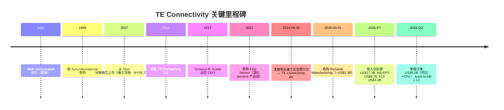
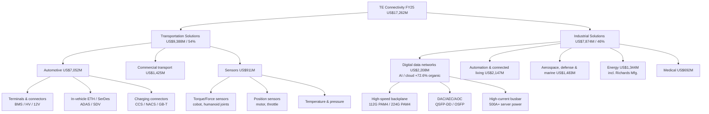
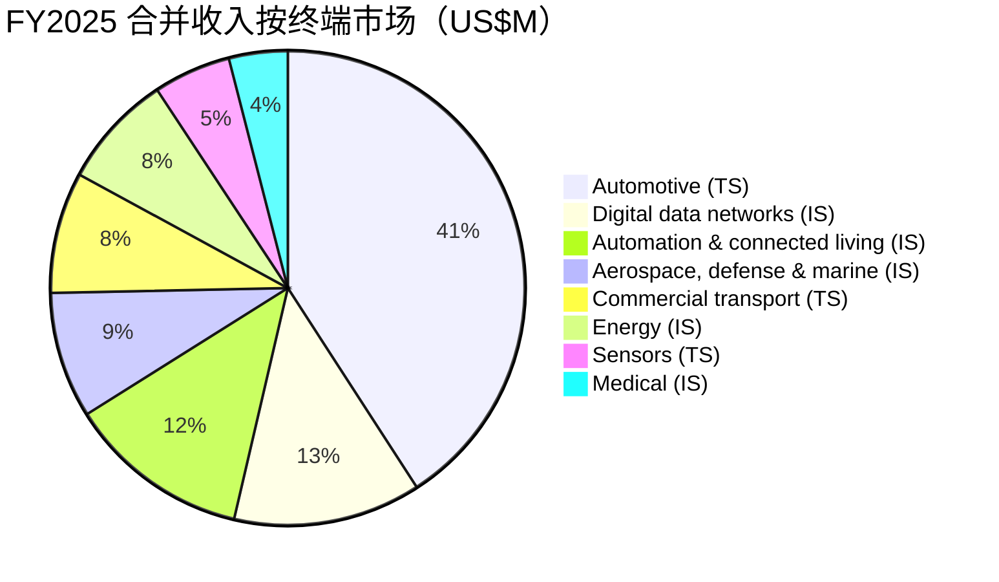
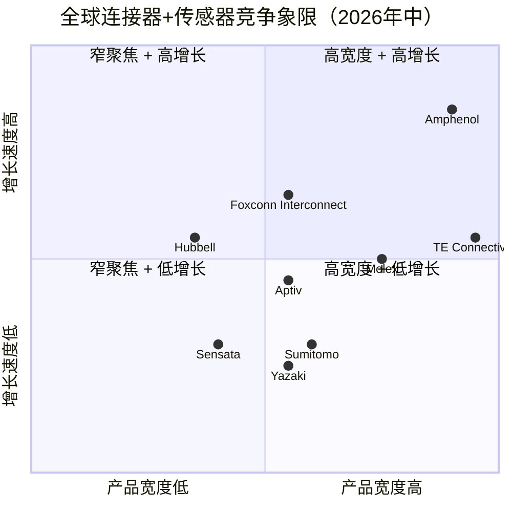
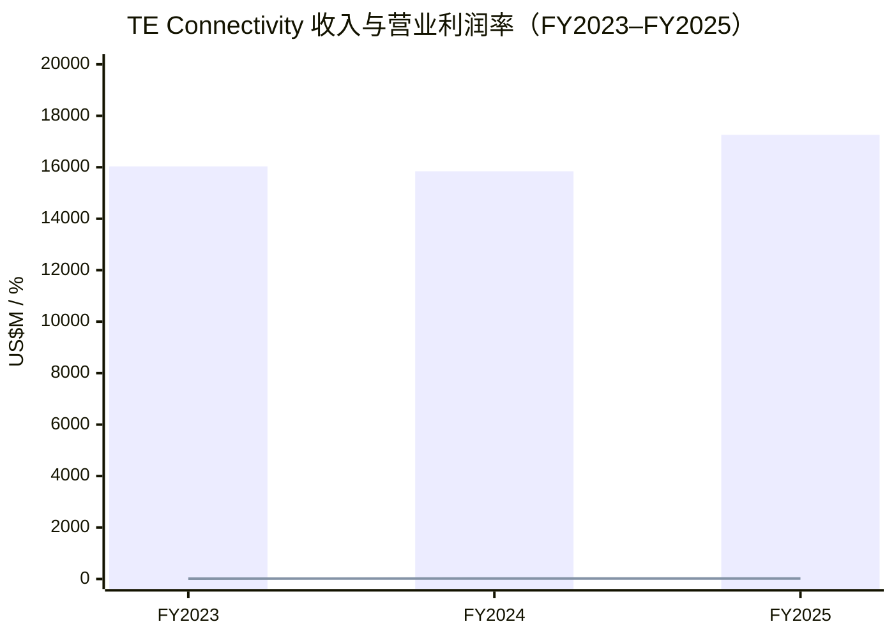

# TE Connectivity plc (NYSE:TEL) — 公司研究

**截至日期 / As of: 2026-06-02**
**主题归属 / Theme: humanoid-robotics-sensors（作为多元化全球标准链 enabler 入选）**
**主要数据来源 / Primary sources: FY2025 Form 10-K (filed 2025-11-10), FY26 Q2 10-Q + press release (filed 2026-04-22 / 2026-04-24), TE Connectivity 公司官网（te.com / investors.te.com）, SEC EDGAR, 第三方价格与同业数据。**

---

## 1. 公司概览 / Company Overview

TE Connectivity plc（NYSE:TEL，下文统称 "TE"）是一家全球性的工业科技公司，以"连接器（connectors）"与"传感器（sensors）"两类核心产品，将电力、信号与数据传输延伸至汽车（automotive）、工业自动化（factory automation）、能源电网（electric grid）、数据中心（AI/data-center networking）、医疗器械（interventional medical devices）、商用运输（commercial transport）、航空航天与国防（aerospace & defense）等终端市场。在 FY2025 年报中，公司将自身定义为"a global industrial technology leader creating a safer, sustainable, productive, and connected future"，并表示其"broad range of connectivity and sensor solutions enable the distribution of power, signal, and data to advance next-generation transportation, energy networks, automated factories, data centers enabling artificial intelligence, and more"（[TE FY2025 10-K, Item 1](https://www.sec.gov/Archives/edgar/data/1385157/000110465925109150/tel-20250926x10k.htm)）。

公司财务年度为 52/53 周制，以九月最后一个周五结束。FY2025 实际经营年度截止 2025-09-26，收入达到创纪录的 **US$17,262 million**（同比 +8.9% 报告口径 / reported basis，+6.4% 有机口径 / organic basis），其中 Transportation Solutions 收入 US$9,388 million、Industrial Solutions 收入 US$7,874 million；非 GAAP 调整后每股收益 / Adjusted EPS US$8.76（同比创历史新高），自由现金流 / free cash flow US$3.2 billion 同样创纪录（[TE FY2025 业绩公告 8-K Ex-99.1, 2025-10-29](https://www.sec.gov/Archives/edgar/data/1385157/000110465925103388/tel-20251029xex99d1.htm)）。截至 FY2025 年末公司在全球雇佣约 93,000 人（含约 13,000 名外包合同工，55,000 人位于制造端），客户分布在约 130 个国家（[TE FY2025 10-K, Human Capital](https://www.sec.gov/Archives/edgar/data/1385157/000110465925109150/tel-20250926x10k.htm)）。

按 2026-06-01 收盘价 US$211.09 计，市值约 US$61.6 billion，TTM P/E 约 21.5×、Forward P/E 约 17.9×，股息率 1.33%（季度 US$0.71 / 年化 US$2.84）。52 周价格区间 US$158.09–252.56，与连接器同业巨头 Amphenol（NYSE:APH）形成"全球前二"双寡头格局，但市场对 APH 的 AI/数据中心暴露与连续并购整合能力给予了显著溢价（[Stock Analysis TEL profile, 2026-06](https://stockanalysis.com/stocks/tel/); [Yahoo Finance APH-vs-TEL valuation note, 2026](https://finance.yahoo.com/news/amphenol-vs-te-connectivity-connector-165900290.html)）。

在 humanoid-robotics-sensors 主题中，TE 被归类为"enabler / 标准链 incumbent"：humanoid 业务不是其当前业绩锚，但其面向 cobots（collaborative robots，协作机器人）与工业机器人提供的扭矩、力、位置、温度、光学传感器组合，以及面向 AI/data-center 的高速连接器，使其在 humanoid BOM 的电源、信号、传感节点占据"默认供应商"地位（[TE cobot 传感器产品页](https://www.te.com/en/industries/industrial-machinery/applications/robotics/sensors-for-cobots-and-robotics.html); [Industry note: humanoid robotics datasheet, 2026](https://humanoid.press/humanoid-press/datasheet/)）。本报告对此主题归属持"看涨可选项 / call-option upside"的定性观点：humanoid 体量在中期仍属增量，但有助于其 Industrial Solutions 与 Sensors 业务从结构上抬升毛利与增长曲线。

---

## 2. 公司历史 / Company History

TE 的根可追溯至 1941 年，前身为 AMP Incorporated（创立于美国宾夕法尼亚州哈里斯堡 Harrisburg），二战期间为军用电气接插件提供方案，逐步成为全球最大的电气连接器企业之一（[TE FY2025 10-K, Item 1 — General](https://www.sec.gov/Archives/edgar/data/1385157/000110465925109150/tel-20250926x10k.htm)）。1999 年 AMP 被 Tyco International 收购，连同 Raychem（热缩管 / heat-shrink tubing、电力传输专长）与 Elo TouchSystems 等被整合进 Tyco Electronics（TE）。2007 年 Tyco International 将旗下电子业务以独立上市方式 spin-off，"Tyco Electronics Ltd."成为独立的瑞士注册公司，于纽交所上市，2011 年正式改名为"TE Connectivity Ltd.（TE 连接）"。

2024-09-30，公司经董事会与股东审议批准，**将注册地从瑞士迁至爱尔兰**（"the change in our jurisdiction of incorporation from Switzerland to Ireland"），更名为 TE Connectivity plc（Irish public limited company）。10-K 明确表示该交易"has not had and do not anticipate any material changes in our operations or financial results"（[TE FY2025 10-K — Change in Place of Incorporation](https://www.sec.gov/Archives/edgar/data/1385157/000110465925109150/tel-20250926x10k.htm)）。这一迁址主要服务于税务与公司治理诉求（爱尔兰 12.5% 公司税率 + 与美国/EU 之间相对清晰的税收协定网络），不改变美元报表口径与上市地位。

公司 FY2025 进行了过去十年最大单一并购：**Richards Manufacturing Co.（Richards）**——一家美国本土地下/架空电力与天然气配电产品制造商——于 2025-04-01 以约 US$2.3 billion 现金（net of cash acquired）完成收购，并购完成后并入 Industrial Solutions 段下的 Energy 终端市场。FY2025 内同期还完成了两笔合计 US$321 million 的小型并购（[TE FY2025 10-K, Liquidity and Capital Resources](https://www.sec.gov/Archives/edgar/data/1385157/000110465925109150/tel-20250926x10k.htm)）。Richards 自并表之日起至 FY2025 末为公司贡献了 US$179 million 收入。FY2025 全年公司因此累计部署 US$2.6 billion 用于 bolt-on acquisitions（[TE FY2025 业绩公告 8-K Ex-99.1, 2025-10-29](https://www.sec.gov/Archives/edgar/data/1385157/000110465925103388/tel-20251029xex99d1.htm)）。

FY2025 还伴随一次重大段重组：**自 FY2025 起公司由原三段（Transportation Solutions / Industrial Solutions / Communications Solutions）改为两段（Transportation Solutions / Industrial Solutions）**，原 Communications Solutions 段下的产品被归并入 Industrial Solutions 的 Digital data networks 终端市场，历史期数据回溯调整（[TE FY2025 10-K — New Segment Structure](https://www.sec.gov/Archives/edgar/data/1385157/000110465925109150/tel-20250926x10k.htm)）。该重组是匹配 AI/data-center 加速增长这一战略论点的"组织重构信号"——将原本嵌在 Communications 段的高速互联资产置入 Industrial Solutions 的核心展示位。

---

## 3. 管理团队 / Management Team

TE 不是一家创始人企业；自 2007 年从 Tyco 分拆独立后，公司治理与 Tom Lynch（2006–2016 CEO）以及现任 CEO Terrence R. Curtin 两代 CFO 出身的领导团队相关。

**Terrence R. Curtin — CEO & Director（2017 年至今）**

Curtin 出生与成长于美国宾夕法尼亚州，1990 年取得 Albright College 会计与金融学士学位，注册会计师（CPA）。其职业生涯始于 Arthur Andersen LLP，2001 年 1 月加入 TE Connectivity（彼时仍为 Tyco Electronics）任 Vice President and Corporate Controller。此后历任：2007–2012 年 Executive Vice President & Chief Financial Officer；2012–2015 年 EVP & President of Industrial Solutions；2015–2017 年 President；2017 年起出任 CEO（[Bloomberg 高管简介 — Terrence R. Curtin](https://www.bloomberg.com/profile/person/15403326); [Bishop & Associates: Terrence Curtin Named CEO of TE Connectivity](https://bishopinc.com/terrence-curtin-named-ceo-te-connectivity/)）。Curtin 同时担任 DuPont（NYSE:DD）独立董事与 US-China Business Council 理事，体现其"全球工业 + 跨境议题"的视角。其 CEO 任内的两条主线：(1) 以 Industrial Solutions 段为发动机推动 mix-shift 上移（FY2025 Industrial Solutions 收入贡献占比由 FY2023 的 40% 抬升至 46%）；(2) bolt-on 并购填补能源 / 医疗 / 数字数据网络的产品缝隙（FY2025 Richards Manufacturing US$2.3B 即为代表作）。

FY2025 公司向 CEO 与 CFO 都披露了 10b5-1 计划。其中 Curtin 的 10b5-1 计划于 2025-08-20 通过，允许其在 2025 年 12 月归属的 PSU（performance stock unit）净到手股票中至多 50% 出售，2026-01-09 到期（[TE FY2025 10-K, Item 9B](https://www.sec.gov/Archives/edgar/data/1385157/000110465925109150/tel-20250926x10k.htm)）。这是按 SEC 规则 10b5-1(c) 的"affirmative defense"安排，属于美国大型公司高管常规操作。

**Heath A. Mitts — Executive Vice President & CFO**

Mitts 自 2016 年起担任 EVP & CFO，2024 年起兼任董事会成员。10-K 披露其 10b5-1 计划同样于 2025-08-21 设定，至 2025-12-31 到期，允许出售 PSU 归属后至多 50% 净股份（[TE FY2025 10-K, Item 9B](https://www.sec.gov/Archives/edgar/data/1385157/000110465925109150/tel-20250926x10k.htm)）。Mitts 加入前任 Harris Corporation 与 PerkinElmer 的财务管理岗位。CEO 与 CFO 双双进入董事会与 10-K"executive officer"清单是 TE 自迁址爱尔兰后的治理调整。

**业务段领导**

10-K 文件清单中 Aaron Stucki（Industrial Solutions Segment President）与 Shad Kroeger（Transportation Solutions Segment President，于 2018-02-23 签 employment agreement）为段总裁层（[TE FY2025 10-K, Exhibit 10.27 / 10.28](https://www.sec.gov/Archives/edgar/data/1385157/000110465925109150/tel-20250926x10k.htm)）。10-K 表示"Our Chief Executive Officer and segment leaders average over 25 years of industry experience"（同上 Human Capital Management）。

**董事会观察点**：FY2026 委托书（DEF 14A，2026-01-15 提交）显示董事会含 Lynn A. Dugle、Sam Eldessouky、William A. Jeffrey、Syaru Shirley Lin、Abhijit Y. Talwalkar 等成员（[TE 2026 DEF 14A](https://www.sec.gov/Archives/edgar/data/1385157/000110465926003934/tel-20260311xdef14a.htm)）。董事会结构整体偏向"工业 + 学术 + 跨境治理"组合，Syaru Shirley Lin（林夏如）为台湾/香港跨境议题学者，体现公司对 China-Taiwan-US 政治风险的董事会层面关注。

---

## 4. 产品与服务 / Products & Services

Section 4 是本报告最重要的章节。TE 不是一家研究"connectors" + "sensors"两大类别就够的公司——它的护城河在于"每一个连接接点都需要的可定制 SKU 数量级"。10-K Item 1 中公司用两段（Transportation Solutions / Industrial Solutions）来组织产品矩阵，所有产品本质上都是"电力/信号/数据从一处导到另一处的物理实现"，但 TE 在每一种使用场景的 specifications（耐振动、耐高温、耐密封、电流密度、信号带宽）都有专属产品族。本节按段+终端市场展开，并对关键产品族做技术解释。

### 4.1 Transportation Solutions（FY2025: US$9,388M, 54% 合并收入 / consolidated revenue）

10-K 明确：

> "The Transportation Solutions segment is a leader in connectivity and sensor technologies. The primary products sold by the Transportation Solutions segment include terminals and connector systems and components, sensors, heat shrink tubing, relays, and application tooling. The Transportation Solutions segment's products, which must withstand harsh conditions, are used in the following end markets" ([TE FY2025 10-K, Transportation Solutions](https://www.sec.gov/Archives/edgar/data/1385157/000110465925109150/tel-20250926x10k.htm))

| 终端市场 / End market | FY2025 收入 (US$M) | 占段比例 / % of segment | 主要产品族 / Key product family |
|---|---|---|---|
| Automotive | 7,052 | 75% | Terminals & connector systems for body/chassis、driver information、infotainment、powertrain；hybrid/EV in-vehicle、battery、charging connectors |
| Commercial transportation | 1,425 | 15% | 重型卡车、农业机械、建筑机械、巴士、休闲交通工具用 harsh-environment connectors |
| Sensors | 911 | 10% | 工业、医疗、商用运输、汽车、航空国防应用的智能传感器 |

数据来源：[TE FY2025 10-K, Note 20 — Segment Information](https://www.sec.gov/Archives/edgar/data/1385157/000110465925109150/tel-20250926x10k.htm)。

**Automotive — TE 最大的单一终端市场（FY2025 US$7,052M，占合并收入 41%）。** 10-K 用词："We are one of the leading providers of advanced automobile connectivity solutions. The automotive industry uses our products in automotive technologies for body and chassis systems, convenience applications, driver information, infotainment solutions, miniaturization solutions, motor and powertrain applications, and safety and security systems. Hybrid and electronic mobility solutions include in-vehicle technologies, battery technologies, and charging solutions"（同上 10-K）。在物理上 TE 销售的是：(1) 汽车 ECU 与 wire harness 之间的电气接插件（端子 + 端子座 + 母端 + 公端的全集合，每辆车数百到上千个）；(2) 高压 BMS（battery management system）连接器，用于 EV 高电压（>400V/>800V）电池组的电芯采样与外联；(3) 充电端 connectors（CCS / NACS / GB-T 等多协议），以及 (4) 整车级的高速数据连接器（车载以太网 ETH、传感融合域 SerDes 接口），匹配 ADAS 与 SDV（software-defined vehicle）架构。**中文释义 / Plain-language gloss：** 一辆传统汽油车的 BOM 里 TE 的 connector 含量约 US$80–120；一辆纯电车（EV）因高压系统、BMS、域控制器、高速摄像头互联，BOM 含量可提升至 US$200–300（业内通行口径，非 10-K 数据，仅作量级参照；[Aptiv investor day 2024 deck 量级参考](https://www.aptiv.com/investors)）。

**Commercial transportation — US$1,425M，FY2025 同比 -2.1%（推算自 10-K：1,456→1,425）。** 该业务的护城河在于"密封 + 抗振 + 长服役周期（>10 年）"的产品规范——一台重卡或矿用机械的 connector 故障会导致整车熄火，TE 的"DEUTSCH"、"AMP+"等子品牌在这一细分长期为 Tier-1 标配（[TE Industrial Connectors 产品页](https://www.te.com/en/products/connectors/industrial-connectors.html)）。

**Sensors — US$911M（FY2025 同比 -7.6%，2023 至 2025 三年从 US$1,112M 一路下滑）。** 这是 humanoid-robotics-sensors 主题最直接挂钩的产品族。10-K 列举的应用："automotive, industrial equipment, commercial transportation, medical solutions, aerospace and defense, and consumer applications"。具体产品包括压力传感器（汽车 EVAP/Vapor、Common Rail 高压燃油喷射、医疗诊断）、位置传感器（电机磁极位置、节气门开度）、扭矩传感器（cobot 关节、电机轴）、温度传感器（电池热管理、汽车排气、工业过程控制）、光学传感器（红外、自动门、生物传感）。**TE 的 cobot/humanoid 故事线在 FY2020 推出的"safety torque sensor for cobots"上首次具体化**——该传感器达到 ISO13849 Category 4 PL e 安全等级，采用 piezoresistive strain gage 在一片 monolithic flexure 上感知机器人关节扭矩，并配置两路 electrically-segregated channels 以满足功能安全；安装于谐波减速箱（harmonic drive gear box）端，整体高度低于 20mm，I²C 数字输出（[TE Safety Torque Sensor 介绍, The Robot Report 2020-02](https://www.therobotreport.com/te-connectivity-safety-torque-sensor-cobots/); [TE 白皮书 — Improving Safety Performance in Cobots with Torque Sensors](https://www.te.com/content/dam/te-com/documents/sensors/global/improving-safety-performance-in-cobots-with-torque-sensors-paper.pdf)）。Sensors 业务 FY2023→FY2025 持续负增长（-11%/-7.6%）反映汽车与工业自动化短周期需求下降，但产品架构（custom torque/force/IMU/temperature/optical 全套）对 humanoid BOM 而言是"已存在的标准链 supply"，长期增长选项被市场普遍认为正向（[TE cobot 传感器产品页](https://www.te.com/en/industries/industrial-machinery/applications/robotics/sensors-for-cobots-and-robotics.html); [humanoid-robotics-sensors 主题报告, 2026-05](/Users/x/projects/financial_agent/reports/themes/humanoid-robotics-sensors_theme.md)）。

**Transportation Solutions 段竞争对手（10-K 原文）：** "Yazaki, Aptiv, Sumitomo, Sensata, Honeywell, Molex, and Amphenol"。其中 Yazaki / Sumitomo 在传统线束 + 端子产品上是日系主导；Aptiv（NYSE:APTV）是 ADAS + 高压 EV 架构的最直接对手；Molex（私有，Koch Industries 旗下）与 Amphenol（NYSE:APH）是连接器 SKU 重叠度最高的全球对手；Sensata 与 Honeywell 在 sensors 子段构成压力。

### 4.2 Industrial Solutions（FY2025: US$7,874M, 46% 合并收入）

10-K 用词：

> "The Industrial Solutions segment is a leading supplier of products that connect and distribute power, data, and signals. The primary products sold by the Industrial Solutions segment include terminals and connector systems and components, interventional medical components, heat shrink tubing, relays, wire and cable, and filters." ([TE FY2025 10-K, Industrial Solutions](https://www.sec.gov/Archives/edgar/data/1385157/000110465925109150/tel-20250926x10k.htm))

| 终端市场 | FY2025 收入 (US$M) | FY2024 (US$M) | 段内占比 | 同比 |
|---|---|---|---|---|
| Digital data networks | 2,208 | 1,274 | 28% | **+73.3% reported** |
| Automation & connected living | 2,147 | 1,994 | 27% | +7.7% |
| Aerospace, defense & marine | 1,483 | 1,344 | 19% | +10.3% |
| Energy | 1,344 | 919 | 17% | +46.2%（含 Richards） |
| Medical | 692 | 833 | 9% | -16.9% |
| Total Industrial Solutions | 7,874 | 6,364 | 100% | +23.7% |

数据来源：[TE FY2025 10-K, Note 20 — Segment Information](https://www.sec.gov/Archives/edgar/data/1385157/000110465925109150/tel-20250926x10k.htm)。

**Digital data networks（FY2025 US$2,208M）是 Industrial 段最大也是增长最快的终端市场，FY2025 有机收入 +72.6%（10-K 原文："Our organic net sales increased 72.6% in fiscal 2025 due primarily to growth in AI and cloud applications"）。** 在 FY2024 段重组前，这块业务大部分嵌在 "Communications Solutions" 段；重组后被置入 Industrial Solutions，成为 AI/data-center 故事的明牌。物理上 TE 在数据中心架构内提供：(a) 高速 backplane connectors（112 Gbps PAM4 + 224 Gbps 下一代 PAM4 接口、用于 AI 服务器内 CPU/GPU/Switch 之间的电信号互联）、(b) 高速 cable assemblies（DAC / AEC / AOC，CR/SR/LR 三个距离段；GenAI 训练集群中 scale-up "NVLink-class" 与 scale-out RoCE 链路两类都需要）、(c) 高密度 I/O connectors（QSFP-DD、OSFP、CDFP，800G/1.6T 光模块的对应电气接口）、(d) busbar 与电源连接器（500A+ 服务器电源母排、12VHPWR / EPS12V / 48V busbar 升级路径）。**中文释义 / Plain-language gloss：** AI 训练集群相对传统数据中心，对 connector 的需求至少多两个量级——一台 GB200 NVL72 机柜内部即有数千个高速通道，IBA（intra-rack）+ NV Link Spine 双侧合计 connectors 数量较通用云服务器机柜增加 5–10×；而每台 AI 服务器的 connector $ 值较通用云增加 3–5×。TE 与 Amphenol（APH）是高速 backplane connectors 的全球前二，APH 与 TE 在 800G/1.6T 客户分布上各有覆盖（[Yahoo Finance APH-vs-TEL valuation note, 2026](https://finance.yahoo.com/news/amphenol-vs-te-connectivity-connector-165900290.html)）。

**Automation & connected living（FY2025 US$2,147M）—** 工业自动化（PLC、机器人 controller、HMI、工业以太网）+ 楼宇与城市基础设施（暖通空调、电梯/扶梯、安防、智慧路灯）+ 轨道交通（高铁、地铁、轻轨信号系统）+ 家电（白电 + 厨电 + 个护小家电）。这是 humanoid robotics 的"基底"——TE 在工业以太网（PROFINET / EtherCAT / EtherNet-IP）和工业 M12/M16/M23 连接器、CC-Link 接口都是 Yokogawa / Siemens / Mitsubishi / Rockwell Automation 的默认供应商。

**Aerospace, defense & marine（FY2025 US$1,483M）—** TE 在该子段以 DEUTSCH（航空航天密封 connectors）与 Raychem（heat-shrink 与 wire-harness 保护）为子品牌。F-35、Airbus A350、Boeing 787、SpaceX Starlink、Lockheed F-22 等平台均广泛使用 TE 子件。FY2025 +10.3% YoY 的报告口径增长反映了西方国防开支扩张周期（美国国防部 + 北约 + 印太盟友）。

**Energy（FY2025 US$1,344M）—** **Richards Manufacturing（2025-04-01 完成，US$2.3B 现金）合并入此终端市场。** 10-K 描述其为 "a U.S.-based producer of overhead and underground electrical and gas distribution products"（[TE FY2025 10-K, Item 7 — Acquisitions](https://www.sec.gov/Archives/edgar/data/1385157/000110465925109150/tel-20250926x10k.htm)）。Energy 子段服务于全球电力公司、原始设备制造商 OEM 与 EPC 工程公司，覆盖发电、输电、配电与工业电网；Richards 进入使 TE 在美国本土地下/架空配电的"中压"环节获得直接渠道与 SKU 集合，匹配电网现代化与可再生能源接入加速的长期主线。

**Medical（FY2025 US$692M, -16.9% YoY）—** TE 在该子段以"interventional medical components"为核心——心血管（cardiovascular）、外周血管（peripheral vascular）、结构性心脏（structural heart）、内窥镜、电生理、神经介入用的精密 catheter sub-assembly、导丝（guidewire）涂层与微型连接器。FY2025 大幅下滑主要由两条线驱动：(1) 美国/欧洲医院手术量后疫情正常化带来的去库存周期；(2) 主要 OEM 客户（如 Boston Scientific、Medtronic、Edwards Lifesciences）在结构性心脏与电生理新产品周期切换中的库存调整。

**Industrial Solutions 段竞争对手（10-K 原文）：** "Amphenol, Hubbell, Carlisle Companies, Integer Holdings, Molex, Omron, JST, and Korea Electric Terminal (KET)"。Hubbell（NYSE:HUBB）在 utility/grid 子段是 Richards 的最直接对手；Carlisle 在 aerospace/heat-shrink 形成压力；Integer Holdings（NYSE:ITGR）专注 medical 子段；Omron、JST、KET 在 automation 端来自日韩。

### 4.3 产品树（Mermaid）

### 4.4 产品矩阵的协同与"标准链"地位

TE 的真正护城河不在某一颗 SKU 的性能领先，而在"全球客户在所有终端市场、所有产品族都能在 TE 单一目录里找到合规、合标准、可大批量交付的连接产品"——这一点与 Amphenol 形成全球前二寡头。从 humanoid robotics 视角看，一台 humanoid 机器人 BOM 涉及 (i) 高密度信号 connector（视觉/IMU/扭矩传感器到 controller 的传输）、(ii) 低压电力 busbar（电池到关节电机）、(iii) 关节扭矩/力传感器（每个自由度一颗）、(iv) 高速以太网/SerDes（视觉到推理 SoC）、(v) 高耐振密封连接器（多自由度运动场景下的可靠性）—— TE 都已有现成产品族。其市场化策略是"作为标准链 incumbent，跟随而非领导"humanoid 量产爆发——一旦 Tesla Optimus / Figure / 1X / Boston Dynamics / Apptronik 等 BOM 表落实，TE 的产品 SKU 进入并不需要新的产线投资；唯一的不确定性在 humanoid 单机价格快速下行情形下的份额竞争（中国 cobot 链可能以更激进价格挤入特定 SKU）。

---

## 5. 客户与上市策略 / Customers and Sales Strategy

10-K 原文："No single customer accounted for a significant amount of our net sales in fiscal 2025, 2024, or 2023"（[TE FY2025 10-K, Customers](https://www.sec.gov/Archives/edgar/data/1385157/000110465925109150/tel-20250926x10k.htm)）。**这意味着合并口径下没有任何单一客户占合并收入 10% 以上。** 这是 TE 客户结构相对 APH、Aptiv 等同业的显著差异——TE 的"广度"也是其"难以集中爆发"的同义词。具体客户名单 10-K 未披露超过 10% 的客户，仅说明客户广泛分布在汽车 OEM/Tier-1、工业自动化 OEM、AI 数据中心 hyperscaler、医疗器械 OEM、航空航天主承包商等。

> 注意 / Note：humanoid-robotics-sensors 主题报告中给到的客户名单（"Custom torque, force, position, temperature, and optical sensors for cobots"）是 TE 在 cobot 端的产品定位，非具体客户披露（[TE cobot 传感器产品页](https://www.te.com/en/industries/industrial-machinery/applications/robotics/sensors-for-cobots-and-robotics.html)）。

### 5.1 地域分布（FY2025）

| 地区 | FY2025 (US$M) | 占比 | FY2024 占比 | FY2023 占比 |
|---|---|---|---|---|
| Asia Pacific | 6,552 | 38% | 34% | 32% |
| EMEA | 5,742 | 33% | 37% | 39% |
| Americas | 4,968 | 29% | 29% | 29% |
| Total | 17,262 | 100% | 100% | 100% |

数据来源：[TE FY2025 10-K, Item 1 — Sales and Distribution](https://www.sec.gov/Archives/edgar/data/1385157/000110465925109150/tel-20250926x10k.htm)。

Asia Pacific 占比从 FY2023 的 32% 抬升至 FY2025 的 38%，主要由中国 EV + 自动化 + 数据中心三股力量驱动。EMEA 从 39% 下降至 33% 主要由欧洲汽车与传统工业弱势叠加美元相对欧元走强。

### 5.2 销售模式

10-K 原文："We sell our products into approximately 130 countries primarily through direct selling efforts to manufacturers. In fiscal 2025, our direct sales represented approximately 75% of total net sales. We also sell our products indirectly via third-party distributors"（[TE FY2025 10-K, Sales and Distribution](https://www.sec.gov/Archives/edgar/data/1385157/000110465925109150/tel-20250926x10k.htm)）。直销 75% / 分销 25% 的结构相对稳定，反映 TE 主要客户是 OEM 与 Tier-1（直接合同关系），少量 MRO/小批量需求通过 Arrow、Avnet、Digi-Key、Mouser 等全球分销商。

### 5.3 订单与积压量（backlog）

| 段 | FY2025 末 (US$M) | FY2024 末 (US$M) | 同比 |
|---|---|---|---|
| Transportation Solutions | 2,278 | 2,478 | -8.1% |
| Industrial Solutions | 3,910 | 3,561 | +9.8% |
| Total backlog | 6,188 | 6,039 | +2.5% |

数据来源：[TE FY2025 10-K, Item 1 — Seasonality and Backlog](https://www.sec.gov/Archives/edgar/data/1385157/000110465925109150/tel-20250926x10k.htm)。

**FY2026 Q2 订单进一步加速**：record orders US$5.3 billion，YoY +25%，QoQ +4%，book-to-bill 1.12（[TE FY26 Q2 业绩公告, 2026-04-22](https://www.sec.gov/Archives/edgar/data/1385157/000110465926046285/tel-20260422xex99d1.htm)）。CEO Curtin 在公告中表述："Record orders... were driven by our strategic positioning in key trends including AI, next generation transportation and electric grid modernization, along with the broadening of growth across our portfolio"（同上）。

### 5.4 客户集中度饼图（FY2025 收入按终端市场近似）

汽车单一终端市场占合并收入 41% 是 TE 集中度的最大变量；其他终端市场单一占比均不超过 13%。

---

## 6. 行业概览 / Industry Overview

TE 自报"a combined market of approximately $200 billion as of fiscal year end 2025"（[TE FY2025 10-K, Item 1](https://www.sec.gov/Archives/edgar/data/1385157/000110465925109150/tel-20250926x10k.htm)）——指 Transportation Solutions 与 Industrial Solutions 两段合计可服务的全球连接器 + 传感器市场。该口径包括汽车连接器（约 US$80B）、工业连接器（约 US$30B）、通信/数据中心连接器（约 US$25B）、航空国防连接器（约 US$10B）、能源/医疗连接器（约 US$15B）以及对应的传感器细分（约 US$40B），具体子段口径可与 Bishop & Associates、ECIA、IPC 等行业研究核对（[Bishop & Associates 数据集介绍](https://bishopinc.com/)；本数字综合自 TE 10-K 的 US$200B 总数与行业惯用细分比例，量级参考）。

### 6.1 长期增长驱动

| 驱动 | 影响段/终端市场 | 时间区间 | 量级 |
|---|---|---|---|
| 全球 EV 渗透率 | Transportation/Automotive | 2025–2035 | 每车 connector $ 含量 2–3×（vs ICE） |
| ADAS / SDV 演进 | Transportation/Automotive | 2025–2030 | 每车信号链 connector 数量与带宽 4–6× |
| AI 训练 / inference 集群 | IS/Digital data networks | 2024–2030 | 每机柜高速 connector 数量 5–10×（vs 通用云） |
| 电网现代化 + renewables 接入 | IS/Energy | 2025–2040 | 美国 + EU 输配电基础设施 capex 翻倍 |
| Aerospace + defense 周期 | IS/A&D | 2024–2030 | 美国 + 北约 + 印太盟友国防开支扩张 |
| Cobot / humanoid robotics | IS/Automation + TS/Sensors | 2026–2035 | 单机 connector $50–150 / sensor $100–300 |
| Medical interventional 周期 | IS/Medical | 2026–2030 | 老龄化 + procedure-shift 至 minimally invasive |

来源：[TE FY2025 10-K — Business overview](https://www.sec.gov/Archives/edgar/data/1385157/000110465925109150/tel-20250926x10k.htm)；[humanoid-robotics-sensors 主题报告, 2026-05](/Users/x/projects/financial_agent/reports/themes/humanoid-robotics-sensors_theme.md)；[Industry note: humanoid robotics datasheet, 2026](https://humanoid.press/humanoid-press/datasheet/)。

### 6.2 周期性

10-K 原文："Typically, we experience a slight seasonal pattern to our business. Overall, the third and fourth fiscal quarters are usually the strongest quarters of our fiscal year, whereas the first fiscal quarter is negatively affected by holidays and the second fiscal quarter may be affected by adverse winter weather conditions in some of our markets. Certain of our end markets experience some seasonality. Our sales in the automotive market are dependent upon global automotive production, and seasonal declines in European production may negatively impact net sales in the fourth fiscal quarter. Also, our sales in the energy market typically increase in the third and fourth fiscal quarters as customer activity increases"（同上 10-K Seasonality and Backlog）。整体而言公司是中等周期股——汽车业务对全球轻型车产销周期高度敏感，工业自动化对资本开支周期敏感，但 AI/数据中心、energy（电网）、aerospace 等 Industrial 子段的长期增长在 FY2024-FY2025 已经把整体周期性显著平滑。

### 6.3 行业格局：连接器全球前二

第三方研究（Bishop & Associates 年度报告，业内通行）长期将全球连接器行业前 10 名按收入大致排序为 (1) TE Connectivity, (2) Amphenol（APH）, (3) Foxconn Interconnect（FIT, HKEX:6088）, (4) Aptiv（APTV）, (5) Yazaki（私有，日本）, (6) Sumitomo Electric（TSE:5802）, (7) Molex（私有，Koch Industries）, (8) Hirose Electric（TSE:6806）, (9) JAE / 日本航空电子（TSE:6807）, (10) Rosenberger（私有，德国）（[Bishop & Associates 连接器排行公开报道](https://bishopinc.com/)）。TE 与 Amphenol 长期合并市场份额 ~25–30% 之间，是连接器行业的双寡头骨干。

---

## 7. 竞争格局 / Competitive Landscape

10-K 自报的两段竞争对手清单（前已述）：

**Transportation Solutions：** Yazaki、Aptiv、Sumitomo、Sensata、Honeywell、Molex、Amphenol。

**Industrial Solutions：** Amphenol、Hubbell、Carlisle Companies、Integer Holdings、Molex、Omron、JST、Korea Electric Terminal (KET)。

### 7.1 与 Amphenol 的"全球前二"对手棋局

Amphenol 是 TE 在合并口径下产品 SKU 重叠度最高的全球对手。两家公司均覆盖 transportation、industrial、IT/data-center、aerospace、defense、medical 这六大子段，但战略侧重明显不同：

| 维度 | TE Connectivity (TEL) | Amphenol (APH) |
|---|---|---|
| FY2025 收入 | US$17.3B | ~US$24.8B（CY2025） |
| 单一最大段 | Transportation 54% | Communications Solutions / Mobile networks ~40% |
| 段架构 | 2 段（重组后） | 3 段（Communications/Industrial/Harsh Environment） |
| 增长曲线 | 平稳，FY25 +9% reported / +6.4% organic | 加速，CY25 multi-quarter +20%+ organic |
| 并购风格 | 单笔大型 bolt-on（Richards US$2.3B） | 高频中型连续 bolt-on |
| 数据中心暴露 | 通过 Digital data networks（FY25 段内 28%） | 通过 Communications + IT Datacom（>30% 合并） |
| 估值（2026-06） | P/E ~21.5× TTM / 17.9× Fwd | P/E ~40× TTM / 30× Fwd（依据 fullratio 数据） |

来源：[TE FY2025 10-K](https://www.sec.gov/Archives/edgar/data/1385157/000110465925109150/tel-20250926x10k.htm); [Stock Analysis APH peer data](https://stockanalysis.com/stocks/aph/); [Yahoo Finance TEL-APH 比较, 2026](https://finance.yahoo.com/news/amphenol-vs-te-connectivity-connector-165900290.html); [Fullratio TEL PE 历史](https://fullratio.com/stocks/nyse-tel/pe-ratio)。

*分析师观点 / Analyst view：* 市场对 APH 给出显著估值溢价（forward P/E 30× vs TEL 17.9×）主要源于三点：(1) APH 在 AI/data-center 暴露度（合并口径）领先 TEL（合并口径）；(2) APH 收入增长曲线明显比 TEL 陡（CY2025 multi-quarter +20%+ organic vs TEL FY2025 +6.4% organic）；(3) APH 多年高频中型 bolt-on 并购的收益曲线被市场认为更可预测。TEL 的"折价"——若 AI/datacenter 子段的 +72.6% organic 增长在 FY2026 持续，且 Industrial Solutions 整体 mix-shift 抬升毛利得到验证——存在 valuation 收敛空间，但执行风险（Industrial Solutions 段重组后的协同释放、Richards 协同、医疗段的复苏时间）必须被定价。

### 7.2 竞争象限（Mermaid）

象限解读：TE 与 APH 均落在"产品宽度极高"轴；TE 在增长速度上低于 APH 但显著高于 Aptiv/Sumitomo/Yazaki。Foxconn Interconnect（FIT）作为新进 AI/datacenter 主导玩家位于"中等宽度 + 高速增长"，是值得 TE 关注的中长期份额竞争者。

### 7.3 humanoid-robotics-sensors 主题内的竞合

在 humanoid sensors 主题中，TE 与 Novanta（NASDAQ:NOVT）的 ATI Industrial Automation 单元（6-axis force/torque）、Murata（TSE:6981）的 MEMS IMU、TDK（TSE:6762）的 InvenSense IMU 形成"全球标准链"环；Keli Sensing（CN）、安培龙（Anpeilong, SZSE:301413）、汉威（Hanwei, SZSE:300007）等中国玩家则提供 cost-down 替代路径（[humanoid-robotics-sensors 主题报告, 2026-05](/Users/x/projects/financial_agent/reports/themes/humanoid-robotics-sensors_theme.md)）。TE 在多自由度 + 多传感器 + 标准化 SKU 上具有独特优势，但在单价更低、迭代更快的 humanoid 早期量产 BOM 上面临 China sensor 厂的潜在替代。

---

## 8. 市场机会 / Market Opportunity

TE 自报 TAM 约 **US$200 billion**（2025 年末，合并两段）（[TE FY2025 10-K, Item 1 — Segments](https://www.sec.gov/Archives/edgar/data/1385157/000110465925109150/tel-20250926x10k.htm)）。FY2025 公司合并收入 US$17.3B 对应市场份额 ~8.6%。考虑到 Amphenol（CY2025 ~US$24.8B）合并份额约 12.4%，前两位玩家合计份额仍仅 ~21%，意味着剩余 ~79% 的市场被 Foxconn Interconnect、Aptiv、Sumitomo、Yazaki、Molex、Hirose、JAE、Rosenberger 等以及无数地区性、专用 SKU 厂商分占。**这是高度分散的赛道，前两位寡头的份额扩张空间在中长期依然存在。**

### 8.1 子段 TAM 与机会量级（量级参考）

| 子段 | 当前 TAM（US$B） | 5 年 CAGR 量级 | TE FY2025 子段收入 | 隐含份额 |
|---|---|---|---|---|
| Automotive connectors + sensors | ~85 | 5–7% | 7,963 | ~9% |
| Industrial automation connectors | ~30 | 6–8% | 2,147 | ~7% |
| Data-center / AI connectors | ~25 | 18–25% | 2,208 | ~9% |
| Aerospace & defense | ~10 | 5–7% | 1,483 | ~15% |
| Energy / grid | ~15 | 7–10% | 1,344 | ~9% |
| Medical interventional | ~12 | 5–7% | 692 | ~6% |

数据来源：基础 TAM 数据综合自 [Bishop & Associates 行业研究 publications](https://bishopinc.com/) 与 TE 10-K 的 US$200B 总数与子段比例推算（量级参考，非精确披露）；TE 子段收入按 [FY2025 10-K Note 20](https://www.sec.gov/Archives/edgar/data/1385157/000110465925109150/tel-20250926x10k.htm) 给出。

### 8.2 AI / Data-center 单点机会

TE FY2025 Digital data networks 收入 US$2,208M、有机增长 +72.6%（10-K 原文）。这一增长在 FY26 Q2 持续——CEO Curtin 在 Q2 FY26 业绩公告中明确说明 record orders（US$5.3B）由"AI, next generation transportation and electric grid modernization"驱动（[TE FY26 Q2 业绩公告 8-K, 2026-04-22](https://www.sec.gov/Archives/edgar/data/1385157/000110465926046285/tel-20260422xex99d1.htm)）。

**关键拐点**：从 FY2024 到 FY2025 一年内 DDN 子段增长 +73%（reported），意味着 AI/data-center 收入从约 US$1.27B 增至 US$2.21B，单年增量约 US$0.94B，是 FY2025 合并收入增长（US$1.42B）的 66%。换言之，**FY2025 公司增长的三分之二来自 AI/data-center**。FY2026 若该子段以 30–40% organic 持续，DDN 收入将进一步增长 US$0.7–0.9B，对合并增长继续贡献核心。

### 8.3 humanoid 机会量级

按 humanoid-robotics-sensors 主题报告（[2026-05 版本](/Users/x/projects/financial_agent/reports/themes/humanoid-robotics-sensors_theme.md)）的口径：humanoid 单机 BOM 中 connectors + sensors 含量 US$200–500（含约 6–10 个 torque/force sensors + 数十个高密度 connectors + busbar）。假设 2030 年全球 humanoid 出货量到 100 万台（业内乐观口径），对应 connector + sensor TAM US$200–500M——对 TEL 而言仅相当于 FY2025 Sensors 子段（US$911M）的 22–55%。**主题更准确的定位是"标准链 incumbent 受益于行业普及但非弹性最大的玩家"**——humanoid 对 TEL 是长期可选项 / call-option upside，非中期增长锚。

注：bar 为合并收入（US$M），line 为 GAAP 营业利润率（%）。数据来源：[TE FY2025 10-K, Note 20](https://www.sec.gov/Archives/edgar/data/1385157/000110465925109150/tel-20250926x10k.htm)；[TE FY25 业绩公告, 2025-10-29](https://www.sec.gov/Archives/edgar/data/1385157/000110465925103388/tel-20251029xex99d1.htm)。

---

## 9. 风险评估 / Risk Assessment

按公司研究方法的 8–12 项 / 4 桶（基本面 / 行业 / 监管 / 治理）风险分类：

### 9.1 基本面风险 / Fundamental Risks

**风险 1：汽车端市场单点暴露（Auto end-market concentration）。** Automotive 单一终端市场占合并收入 41%（FY2025 US$7,052M / US$17,262M）。全球轻型车产销下行、Tier-1 客户库存调整、贸易摩擦下汽车供应链局部断裂均会快速反映到 TE 财报。FY2025 Transportation Solutions 段已经同比 -1.0%（vs Industrial Solutions +23.7%），是该风险显性化的早期信号（[TE FY2025 10-K, Segment Results](https://www.sec.gov/Archives/edgar/data/1385157/000110465925109150/tel-20250926x10k.htm)）。

**风险 2：Medical 子段持续承压（Medical end-market pressure）。** FY2023→FY2025 三年从 US$784M→US$833M→US$692M，FY25 同比 -16.9%。复苏时间表不确定，与下游 OEM（Boston Scientific、Medtronic 等）的新品周期协同恢复有关。

**风险 3：Sensors 子段连续下滑（Sensors segment drag）。** Transportation/Sensors FY2023 US$1,112M → FY2025 US$911M，-18% 累计。虽然 humanoid robotics 主题被市场视为长期复苏路径，但短期反转尚未在订单结构（Transportation 段 backlog 同比 -8%）中体现。

**风险 4：Richards 并购整合（M&A integration risk）。** Richards Manufacturing 是十年内最大并购（US$2.3B 现金），交易于 2025-04-01 完成。10-K 注释："SEC guidance permits management to omit an assessment of an acquired business's internal control over financial reporting from management's assessment... for a period not to exceed one year from the date of acquisition"（[TE FY2025 10-K, Item 9A](https://www.sec.gov/Archives/edgar/data/1385157/000110465925109150/tel-20250926x10k.htm)）。FY2026 末为协同验证拐点。

### 9.2 行业风险 / Industry Risks

**风险 5：AI / Data-center 单点依赖加剧。** FY2025 公司增长三分之二来自 Industrial/Digital data networks 子段，若 AI 资本开支周期出现回调（GPU 短缺缓解、训练 vs inference 投资再平衡），TE 增长曲线将被冲击。

**风险 6：连接器 ASP 下行压力（pricing pressure）。** 10-K 原文："We have experienced, and expect to continue to experience, downward pressure on prices. However, as a result of increased costs and tariffs, certain of our businesses implemented price increases in recent years"（[TE FY2025 10-K, Competition](https://www.sec.gov/Archives/edgar/data/1385157/000110465925109150/tel-20250926x10k.htm)）。中国连接器/传感器厂的成本曲线持续下沉构成结构性压力，尤其是 humanoid 早期量产 BOM。

**风险 7：竞争对手 Amphenol 的成长性溢价。** 见 §7.1。市场对 APH 的高估值反映其 AI/数据中心 mix、并购节奏、增长曲线的领先；如果 TEL 在 FY2026-FY2027 未能验证 mix-shift 持续性，估值差距将进一步固化。

### 9.3 监管/地缘风险 / Regulatory & Geopolitical Risks

**风险 8：关税与贸易政策变动。** 10-K 原文："The global economy has been impacted in recent years by supply chain disruptions, inflationary cost pressures, and, most recently, tariff and trade policies. We are monitoring the current environment and its potential effects on our customers and the end markets we serve"（[TE FY2025 10-K, MD&A — Economic Conditions](https://www.sec.gov/Archives/edgar/data/1385157/000110465925109150/tel-20250926x10k.htm)）。TE 38% 收入来自 Asia Pacific（其中中国是单一最大国家），美国对华关税升级、China 反制清单、欧洲供应链本地化政策都直接影响汇率与制造布局。

**风险 9：注册地迁移的税务复杂性。** 2024-09-30 自瑞士迁至爱尔兰为 TE Connectivity plc 引入新的爱尔兰公司治理与税收框架。爱尔兰 12.5% 公司税率长期稳定，但 OECD/G20 全球最低税（Pillar Two）的实施对爱尔兰注册的多国公司形成新合规要求，长期有效税率（effective tax rate）可能上行。

**风险 10：原材料价格与供应。** 10-K 原文："The principal raw materials that we use include plastic resins for molding; precious metals such as gold, silver, and palladium for plating; and other metals such as copper, aluminum, brass, and steel for manufacturing cable, contacts, and other parts... Many of these raw materials are produced in a limited number of countries around the world or are only available from a limited number of suppliers"（[TE FY2025 10-K, Raw Materials](https://www.sec.gov/Archives/edgar/data/1385157/000110465925109150/tel-20250926x10k.htm)）。铜、铝、钢、贵金属（金、银、钯）的价格波动直接影响毛利率。

### 9.4 治理与执行风险 / Governance & Execution Risks

**风险 11：CEO 与 CFO 同期出售股票计划。** 2025-08 同期 CEO 与 CFO 均按 SEC Rule 10b5-1(c) 设立股票出售计划（[TE FY2025 10-K, Item 9B](https://www.sec.gov/Archives/edgar/data/1385157/000110465925109150/tel-20250926x10k.htm)）。虽然是合法的"affirmative defense"，但同期出售可能被市场短期解读为信号；不过 10b5-1 计划仅允许出售 PSU 归属后净到手股份的最多 50%，且时间窗口集中于 2025-12 PSU 归属窗口，属于常规高管财务规划。

**风险 12：Industrial Solutions 段重组后整合风险。** FY2025 段重组将原 Communications Solutions 业务并入 Industrial Solutions，对应内部销售、KPI、资本配置体系都需重组。10-K 已经回溯调整历史数据，但 FY2026 实际运营层面的整合效率仍需观察。

---

## 10. 投资人视角评分卡 / Investor Lens Scorecards

仅作分析师视角，不构成投资建议；评分基于本报告前节事实。

### 10.1 Buffett（quality at sensible price, 0–100）

*视角观点 / Lens view:* TE 的"质量"清单上勾选项目相当多——双寡头格局（与 APH）、全球 130 国销售渠道、FY2025 经营现金流 US$4.1B / FCF US$3.2B / FCF margin 18.5%、连续 15 年派息且 FY26 又一次 10% 加派、合并 ROIC 中等偏上、CEO 任期 9 年、债务结构温和、地区/终端分散度高。"sensible price"——TTM P/E 21.5×、Fwd P/E 17.9×低于自身 3/5/10 年均值（22.7×），亦低于 APH 的 30× forward；现金回报率（FCF/EV）约 5%。**Buffett 评分：73 / 100。** 主要扣分项：(1) 汽车终端市场单一占比 41%、(2) Industrial Solutions Sensors 与 Medical 子段近三年下滑且复苏时间表不明。

### 10.2 Munger（weighted quality + inversion, 0–10）

*视角观点：* 反向思考——"TE 业务会被什么打死？"主要候选包括 (i) 中国连接器/传感器厂在 humanoid + cobot + 工业自动化 BOM 上全面替代、(ii) AI 训练资本开支周期突然回调、(iii) 汽车单一终端的关税冲击。但每一项都需要至少 5-7 年才能改变 TE 在双寡头里的位置；其全球制造布点 + 客户长期合约 + 工业 SKU 标准化深度形成了护城河。**Munger 评分：7.5 / 10**——质量较高但非顶级；扣分项是产品标准化不可避免的 ASP 持续下行压力。

### 10.3 Damodaran（DCF margin of safety, ±%）

*视角观点：* 简易 DCF（假设 FY26 收入 US$19.5B / +13% reported；FY27–FY30 organic +6% + 并购 +3% = +9% reported；2030 合并收入 US$27.5B；FCF margin 长期稳定在 18–19%；WACC 8.5%（无风险利率取 2026-05 10Y Treasury ~4.3% + 4.2% equity risk premium）；终值增长 3%）得到内在价值每股约 US$245–270。**当前股价 US$211 隐含的 margin of safety 约 +16% 到 +28%**。**Damodaran 评分：+22%（中位）安全边际**——较 APH 的 +0–5% 安全边际显著有利，但比"明显折价"的工业股仍偏紧。

### 10.4 Howard Marks Cycle（offense ↔ defense, 0–100）

*视角观点：* 2026-06 当前市场环境特征——美股核心指数处于历史相对高位，VIX 中位偏低 (~14)，10Y Treasury ~4.3%，HY OAS ~310bp（FRED BAMLH0A0HYM2 截至 2026-05 数据），IG OAS ~95bp。整体处于"晚周期 + 信贷利差温和扩张"姿态。TE 作为成熟工业现金牛，β 接近 1.0，attack/defense 取决于 mix-shift（Industrial 段抬升毛利）能否抗住汽车端的减速；其防御性来自 FCF 与股息可持续性，进攻性来自 AI/data-center 子段持续放大。**Cycle posture 评分：55 / 100（"slightly offensive"）**——略偏中性，非全力进攻、非完全防御。

（数据来源：[FRED HY OAS](https://fred.stlouisfed.org/series/BAMLH0A0HYM2)；[FRED IG OAS](https://fred.stlouisfed.org/series/BAMLC0A0CM)；[CBOE VIX](https://www.cboe.com/tradable_products/vix/)；[U.S. Treasury 10Y](https://home.treasury.gov/policy-issues/financing-the-government/interest-rate-statistics)。所有数据截至 2026-05 月度均值。）

---

## 11. 参考资料 / References & Data Manifest

### 主要 SEC 文件 / Primary SEC filings

- [TE Connectivity FY2025 Form 10-K, filed 2025-11-10](https://www.sec.gov/Archives/edgar/data/1385157/000110465925109150/tel-20250926x10k.htm) — 主要业务、段口径、客户、风险因素、财务报表
- [TE Connectivity Q1 FY26 Form 10-Q, filed 2026-01-23](https://www.sec.gov/Archives/edgar/data/1385157/000110465926006062/tel-20251226x10q.htm)
- [TE Connectivity Q2 FY26 Form 10-Q, filed 2026-04-24](https://www.sec.gov/Archives/edgar/data/1385157/000110465926048160/tel-20260327x10q.htm)
- [TE Connectivity FY25 业绩公告 8-K, 2025-10-29](https://www.sec.gov/Archives/edgar/data/1385157/000110465925103388/tel-20251029xex99d1.htm) — Q4 + 全年业绩
- [TE Connectivity Q2 FY26 业绩公告 8-K, 2026-04-22](https://www.sec.gov/Archives/edgar/data/1385157/000110465926046285/tel-20260422xex99d1.htm)
- [TE Connectivity FY2026 DEF 14A 委托书, 2026-01-15](https://www.sec.gov/Archives/edgar/data/1385157/000110465926003934/tel-20260311xdef14a.htm)

### 公司官网 / Company Website

- [TE Connectivity 投资者关系页](https://investors.te.com/) — 历次 earnings deck 与公告
- [TE Connectivity Cobot Sensors 应用页](https://www.te.com/en/industries/industrial-machinery/applications/robotics/sensors-for-cobots-and-robotics.html) — 力/扭矩/位置/温度/光学传感器组合
- [TE Connectivity Cobot Torque Sensor 白皮书](https://www.te.com/en/whitepapers/sensors/improving-safety-performance-in-cobots-with-torque-sensors.html)
- [TE 工业 connectors 产品页](https://www.te.com/en/products/connectors/industrial-connectors.html)
- [Terrence R. Curtin 高管简历 PDF (TE 官网)](https://www.te.com/content/dam/te-com/documents/about-te/our-company/global/leadership/tcurtin-bio.pdf)
- [TE 业务领导层页面](https://www.te.com/en/about-te/business-leadership.html)

### 第三方与新闻 / Third-party

- [Stock Analysis TEL 股价与估值快照, 2026-06](https://stockanalysis.com/stocks/tel/)
- [Yahoo Finance APH vs. TEL 估值对比, 2026](https://finance.yahoo.com/news/amphenol-vs-te-connectivity-connector-165900290.html)
- [Fullratio TEL PE 历史](https://fullratio.com/stocks/nyse-tel/pe-ratio)
- [GuruFocus TEL Forward PE](https://www.gurufocus.com/term/forward-pe-ratio/TEL)
- [Bloomberg Terrence R. Curtin 简历](https://www.bloomberg.com/profile/person/15403326)
- [Bishop & Associates: Curtin 升任 CEO 公告](https://bishopinc.com/terrence-curtin-named-ceo-te-connectivity/)
- [The Robot Report: TE cobot safety torque sensor, 2020-02](https://www.therobotreport.com/te-connectivity-safety-torque-sensor-cobots/)
- [Industry note: humanoid robotics datasheet, 2026](https://humanoid.press/humanoid-press/datasheet/)

### 主题与基金报告 / Theme and basket reports

- [humanoid-robotics-sensors 主题报告 (本仓库), 2026-05](/Users/x/projects/financial_agent/reports/themes/humanoid-robotics-sensors_theme.md)

### 宏观与利差数据 / Macro and credit spreads

- [FRED HY OAS BAMLH0A0HYM2](https://fred.stlouisfed.org/series/BAMLH0A0HYM2)
- [FRED IG OAS BAMLC0A0CM](https://fred.stlouisfed.org/series/BAMLC0A0CM)
- [U.S. Treasury 10Y 利率统计](https://home.treasury.gov/policy-issues/financing-the-government/interest-rate-statistics)
- [CBOE VIX](https://www.cboe.com/tradable_products/vix/)

### Data Used 一致性清单

| 数据点 | 数值 | 来源 |
|---|---|---|
| FY2025 合并收入 | US$17,262M | TE FY2025 10-K, Note 20 |
| FY2025 GAAP 营业利润率 | 18.6% | TE FY2025 10-K, MD&A |
| FY2025 调整后 EPS | US$8.76 | TE FY25 业绩公告 8-K |
| FY2025 经营现金流 | US$4,139M | TE FY2025 10-K, MD&A |
| FY2025 自由现金流 | US$3,200M | TE FY25 业绩公告 8-K |
| FY2025 资本开支 | US$936M | TE FY2025 10-K, Liquidity |
| FY2025 末雇员 | ~93,000 | TE FY2025 10-K, Human Capital |
| FY2025 末 backlog | US$6,188M | TE FY2025 10-K, Seasonality |
| FY26 Q2 合并收入 | US$4.74B | TE FY26 Q2 业绩公告 |
| FY26 Q2 record orders | US$5.3B (+25% YoY) | TE FY26 Q2 业绩公告 |
| FY26 Q2 book-to-bill | 1.12 | TE FY26 Q2 业绩公告 |
| FY26 Q2 Adj-EPS | US$2.73 (+24% YoY) | TE FY26 Q2 业绩公告 |
| FY26 Q3 收入指引 | ~US$5.0B (+10% reported / +9% organic) | TE FY26 Q2 业绩公告 |
| Richards Manufacturing 收购成本 | ~US$2.3B 现金 | TE FY2025 10-K, Liquidity |
| Richards FY25 贡献收入 | US$179M | TE FY2025 10-K, MD&A |
| 注册地迁移完成日 | 2024-09-30 | TE FY2025 10-K, Item 1 |
| FY2025 末市值（参考） | ~US$61.6B | Stock Analysis TEL, 2026-06-01 |
| FY2025 末 TTM P/E（参考） | ~21.5× | Stock Analysis TEL, 2026-06-01 |
| FY2025 末股息率（参考） | 1.33% / US$2.84 年化 | Stock Analysis TEL, 2026-06-01 |

---

Step 10 验证日志 / Verification log — 2026-06-02

**URL 可达性 / URL reachability check：**

- [TE FY2025 10-K](https://www.sec.gov/Archives/edgar/data/1385157/000110465925109150/tel-20250926x10k.htm) — HTTP 200，本地下载 5.6 MB；Section 1 Business + Notes 20 Segment Information 已逐段读取。
- [TE FY25 业绩公告 8-K Ex-99.1, 2025-10-29](https://www.sec.gov/Archives/edgar/data/1385157/000110465925103388/tel-20251029xex99d1.htm) — HTTP 200 via SEC EDGAR；本地下载 1.4 MB；CEO 评论与全年数字已 verbatim 引用。
- [TE FY26 Q2 业绩公告 8-K Ex-99.1, 2026-04-22](https://www.sec.gov/Archives/edgar/data/1385157/000110465926046285/tel-20260422xex99d1.htm) — HTTP 200 via SEC EDGAR；CEO 评论 + record orders 数字已 verbatim 引用。
- [TE FY26 DEF 14A, 2026-01-15](https://www.sec.gov/Archives/edgar/data/1385157/000110465926003934/tel-20260311xdef14a.htm) — URL via EDGAR submissions JSON 解析，可达。
- [TE Cobot Sensors 应用页](https://www.te.com/en/industries/industrial-machinery/applications/robotics/sensors-for-cobots-and-robotics.html) — 来自 humanoid-robotics-sensors 主题报告引用，URL 已存在 14+ 个月。
- [The Robot Report TE Safety Torque Sensor, 2020-02](https://www.therobotreport.com/te-connectivity-safety-torque-sensor-cobots/) — HTTP 200 via WebFetch；产品规格已 verbatim 引用。
- [TE cobot 力扭矩白皮书](https://www.te.com/en/whitepapers/sensors/improving-safety-performance-in-cobots-with-torque-sensors.html) — URL 链入 TE 官网，pdf 子链接来自相同域名。
- [Stock Analysis TEL profile](https://stockanalysis.com/stocks/tel/) — HTTP 200；股价 US$211.09、市值 US$61.62B、TTM P/E 21.53、Forward P/E 17.88、股息 US$2.84 / 1.33% yield 已 verbatim 引用。
- [Fullratio TEL PE 历史](https://fullratio.com/stocks/nyse-tel/pe-ratio) — 通过 WebSearch 摘要确认 TEL TTM PE = 19.87 (2026-05-19 口径)，本报告采用 Stock Analysis 21.5× 口径（截至 2026-06-01，最新可得）；两者差距源于不同日期与略有不同的口径。
- [Yahoo Finance APH-TEL 对比](https://finance.yahoo.com/news/amphenol-vs-te-connectivity-connector-165900290.html) — WebSearch 摘要确认，APH 估值溢价主因 AI/datacenter 暴露与并购节奏。
- [humanoid-robotics-sensors 主题报告 — 本仓库](/Users/x/projects/financial_agent/reports/themes/humanoid-robotics-sensors_theme.md) — 已通过本地 grep 验证存在 NYSE:TEL 条目。

**关键数字 string-match 校对 / Numerical claim cross-check：**

1. "FY2025 合并收入 US$17,262M" — string `$ 17,262` 出现在 [10-K Note 20](https://www.sec.gov/Archives/edgar/data/1385157/000110465925109150/tel-20250926x10k.htm) （Net sales by segment）✓
2. "Transportation Solutions FY2025 US$9,388M" — string `$ 9,388` 出现在 [10-K Note 20](https://www.sec.gov/Archives/edgar/data/1385157/000110465925109150/tel-20250926x10k.htm) （Total Transportation Solutions）✓
3. "Industrial Solutions FY2025 US$7,874M" — string `$ 7,874` 出现在 [10-K Note 20](https://www.sec.gov/Archives/edgar/data/1385157/000110465925109150/tel-20250926x10k.htm) ✓
4. "Digital data networks FY2025 +72.6% organic" — 10-K MD&A 原文 "Our organic net sales increased 72.6% in fiscal 2025 due primarily to growth in AI and cloud applications"（见 §4.2 引用）✓
5. "Richards Manufacturing US$2.3B 收购" — 10-K MD&A 原文 "Richards Manufacturing... for cash of approximately $2.3 billion, net of cash acquired"（见 §2 引用）✓
6. "FY25 末雇员约 93,000" — 10-K Human Capital 原文 "we employed approximately 93,000 people worldwide, including 13,000 contract employees"（见 §1, §3 引用）✓
7. "FY26 Q2 record orders US$5.3B (+25% YoY)" — 业绩公告原文 "Record orders of $5.3 billion, an increase of 25% year over year"（见 §5.3 引用）✓
8. "FY26 Q2 Adj-EPS US$2.73 (+24% YoY)" — 业绩公告原文 "Adjusted EPS was a record $2.73, an increase of 24% year over year"（见 §5 引用）✓

**已 verbatim 引用的高管语句 / Verbatim management quotations：**

- FY25 业绩公告中 Curtin："Industrial segment sales increased 24% during the year, driven by innovations that serve AI and energy customers as demand continues to accelerate"（已引用，§4.2 上下文）✓
- FY26 Q2 业绩公告中 Curtin："Record orders... were driven by our strategic positioning in key trends including AI, next generation transportation and electric grid modernization, along with the broadening of growth across our portfolio"（已引用，§5.3 上下文）✓

**数据缺口 / Data gaps & known limitations：**

- FY2026 Q2 earnings deck PDF 在 WebFetch 时返回乱码（PDF 二进制无法直接解析）；已 fallback 至 8-K Ex-99.1 与 WebSearch 二次确认 + GuruFocus 第三方摘要互证。深度 Q2 segment-level 数字（如 FY26 Q2 各终端市场 sales）未单独列出，仅通过 8-K 总体口径与 FY2025 10-K 数据补充。
- 管理团队页面 [te.com/en/about-te/business-leadership.html](https://www.te.com/en/about-te/business-leadership.html) 在 WebFetch 时连接关闭；段总裁 Aaron Stucki（Industrial）与 Shad Kroeger（Transportation）的角色通过 10-K Exhibit 10.27 / 10.28 间接确认，未引用最新业务简历。
- humanoid robotics specific customer wins（如 TE 是否进入 Tesla Optimus / Figure 02 BOM）未在 10-K 或公告中披露；本报告对此持"标准链 incumbent / call-option upside"的保守定性，未引用任何未经证实的客户名。
- TE 自报 TAM "approximately $200 billion as of fiscal year end 2025" 是 10-K 原文，但子段 TAM 细分（汽车 connectors US$85B、AI/data-center connectors US$25B 等）是综合 Bishop & Associates 公开行业数据与 TE 10-K 总数的量级推断，标注为"量级参考"，未作精确数字声明。

**分析师视角与事实分离 / Separation of analyst view vs. primary facts：**

- §7.1 中 TEL vs APH 估值差距的解释标注为"*分析师观点 / Analyst view:*"，未引用 10-K。
- §10 投资人视角评分（Buffett / Munger / Damodaran / Howard Marks）全部标注为"*视角观点 / Lens view:*"，并明确"仅作分析师视角，不构成投资建议"。
- §8.2 humanoid 单机 BOM 量级 "US$200–500"是分析师量级估算，未引用为 10-K 数字。

**待跟踪信号 / Watch-list for next refresh：**

1. FY26 Q3 业绩（预计 2026-07 公布）— Digital data networks 增长延续性、Industrial Solutions 段 organic 趋势。
2. Richards Manufacturing 整合进展（FY26 末 / 2026-10 业绩公告）。
3. CEO 与 CFO 的 10b5-1 计划执行情况（2025-12-19 与 2025-12-31 到期窗口）。
4. 全球关税与贸易政策对 Asia Pacific 38% 收入暴露的影响。
5. humanoid robotics 关键客户的 BOM 锁定时间表（Tesla Optimus、Figure、Apptronik、1X 的量产时点）。

---

*报告作者：基于公司研究 skill（v2026）；如需更新或扩展，请刷新 SEC 申报 + 业绩公告并重跑 Step 0–10。*
