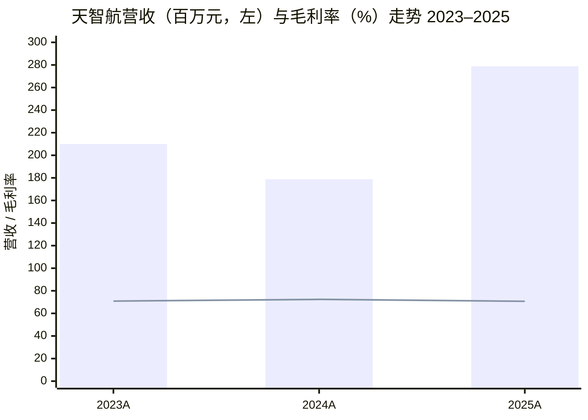
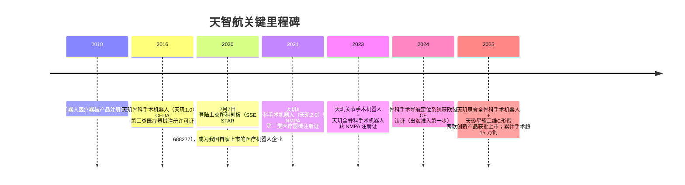
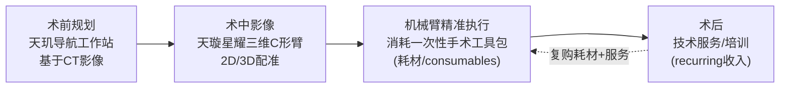
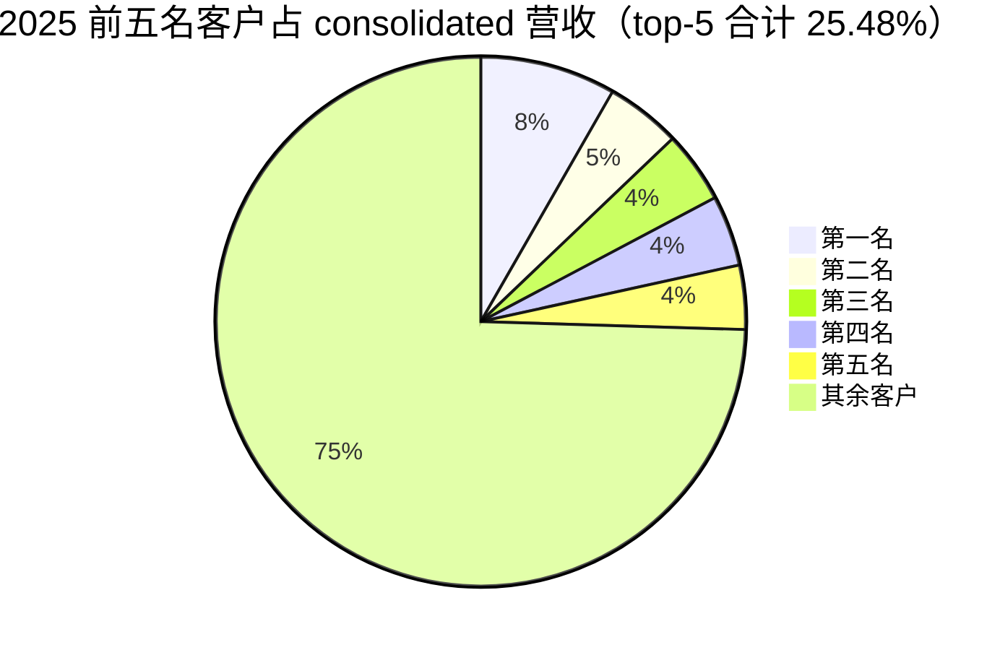
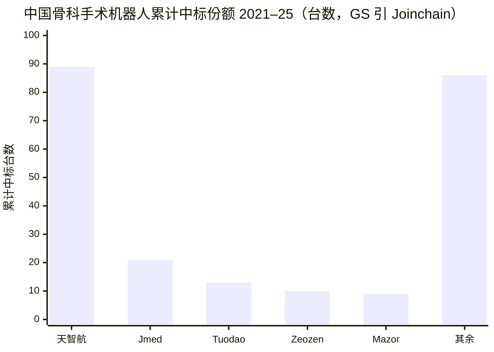
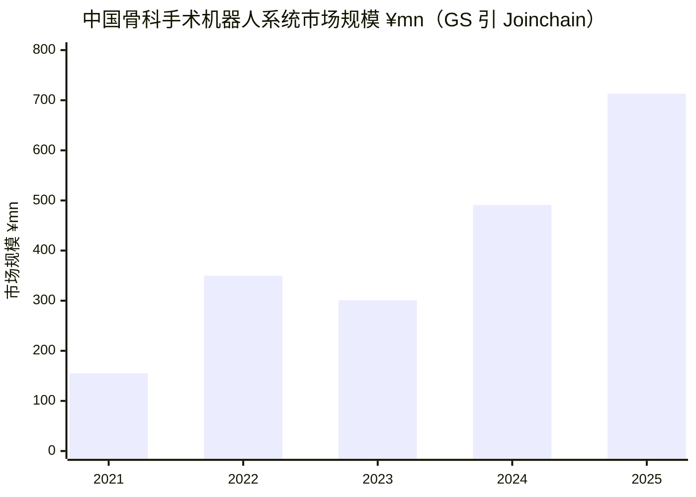

# 天智航 / TINAVI Medical Technologies（上交所科创板 SSE STAR: 688277）公司研究

**报告日期（as of）：2026-06-09** ｜ 报告货币：人民币（RMB，除特别说明外）

> *分析师观点（Analyst view）：* **评级：Hold（中性）· 12 个月目标价 ¥21.8（较 2026-06-09 收盘 ¥17.86 上行 +22.1%）· 估值方法：10 年期 DCF（discount rate 9% / terminal growth 3%），对应 2026/27/28E P/S 约 28×/21×/16×（亏损企业用 P/S 而非 P/E）**
> 市值约 ¥8.14bn（≈456M 股 × ¥17.86）· 52 周区间 ¥12.75–¥29.05 · SSE STAR: 688277 · 行业：医疗器械 / 骨科手术机器人（orthopedic surgical robot）
>
> **核心论点（thesis pillars）**——（1）公司是中国骨科手术机器人（orthopedic surgical robot）绝对龙头，2021–25 年累计 89 台中标（bid-win）= 国内 36% 份额、约 40% 中标份额，国内排名第一；（2）收入结构正由一次性设备销售向「设备 + 耗材（consumables）+ 技术服务」recurring 模型迁移，管理层目标 2030 年耗材收入占比约 70%，但开放系统架构（open system）下耗材渗透是渐进式（back-end loaded）；（3）2025 年营收 ¥278.8M（+55.90% YoY）回暖、毛利率（gross margin）70.66%，但仍未盈利、净亏损 ¥182.7M，且 2025 单年 25 款国产骨科机器人获 NMPA 批准、产品同质化加剧；（4）出海（go-global）战略转向美欧澳发达市场，CE 已获、FDA 预计 2026/27 申报，但商业化需 1–2 年爬坡，短期缺乏明确催化剂——故给予 Hold。

> **更新提示（Update — 公司设定 2026 经营目标，2026-04-28 披露）：** 公司在 2025 年报中给出 2026 年经营目标：骨科手术机器人中标率（bid-win rate）≥40%、新增装机（new installations）>60 台、年手术量（procedures）目标约 6 万例（2025 年为约 4.9 万例）；管理层自身指引 2026–27 年实现盈亏平衡，较 Goldman Sachs 测算的 2029E 盈亏平衡更乐观。隐含 2026 年设备装机与手术量较 2025 年继续扩张，但盈利时点存在公司指引与卖方测算的分歧。来源：[2025 年年度报告，第三节 经营情况讨论与分析](https://static.cninfo.com.cn/finalpage/2026-04-29/1225249364.PDF)。

---

## 目录（Table of Contents）

1. 公司概览（含投资论点）
1A. 估值与目标价（forward 估计 · PT 推导 · bull/base/bear）
2. 公司历史
3. 管理团队
4. 产品与服务（**全篇最重要**）
5. 客户与上市策略
6. 行业概览
7. 竞争格局
8. 市场机会（TAM）
9. 风险评估
9.5. 核心分歧与催化剂
10. 投资风格透视（investor-lens scorecards）
数据来源清单 / 参考资料

---

## 1. 公司概览（Company Overview）

> *分析师观点（Analyst view）：* 我们对天智航给予 **Hold（中性）评级、12 个月目标价 ¥21.8**（较 2026-06-09 收盘 ¥17.86 上行 +22.1%）。**Why now：** 公司是中国骨科手术机器人无可争议的龙头（2021–25 累计 36% 国内份额），2025 年营收在行业回暖下重回高增长（+55.90% YoY），但其核心矛盾在于——龙头地位牢固、长期叙事清晰（耗材化 + 出海），却在短期内既未盈利、又面对 2025 单年 25 款国产骨科机器人获批的同质化冲击，且出海与耗材放量都是 1–2 年以上的「back-end loaded」故事，缺乏可立即兑现的催化剂。这正是 Goldman Sachs 首次覆盖即给予 Neutral 的逻辑：在看到更清晰的装机交付（delivery validation）、利用率（utilization）提升与海外复购订单之前，难以转向更积极的评级（[GS — Tinavi Medical 首次覆盖，2026-05-07，p.1](http://xs-macbook-air.local:5001/zsxq/pdf/585421451418284/Goldman%20Sachs-Tinavi%20Medical%20%EF%BC%88688277.SS%EF%BC%89%20Orthopedic%20surgical%20robot%20leader%20in%20China%EF%BC%9B%20Awaiting%20clearer%20delivery%20validation%EF%BC%9B%20initiate%20at%20Neutral-260507.pdf#page=1)）。

天智航（北京天智航医疗科技股份有限公司）是一家专注于骨科手术机器人（orthopedic surgical robot）及相关技术的高新技术企业，按公司自述「是中国骨科手术机器人行业的领军企业，是中国机器人 TOP10 成员企业、医疗机器人国家、地方联合工程研究中心依托单位」，并于 2020 年 7 月 7 日在上海证券交易所科创板（SSE STAR）上市，成为「我国首家上市的医疗机器人企业」（[2025 年年度报告，第 12 页](https://static.cninfo.com.cn/finalpage/2026-04-29/1225249364.PDF)）。公司核心产品是「天玑（TiRobot）」系列骨科手术机器人导航定位平台，覆盖脊柱（spine）、创伤（trauma）、关节（joint）等术式，截至 2025 年末已累计完成超过 15 万例骨科机器人手术（[2025 年年度报告，第 13 页](https://static.cninfo.com.cn/finalpage/2026-04-29/1225249364.PDF)）。

**商业模式（how they make money）。** 公司面向医疗机构（即客户均为医院，而非个人）提供三类产品与服务：骨科手术机器人（核心收入来源）、配套设备与耗材（consumables，含末端手术工具、一次性手术工具包）、以及技术服务（含「购买技术服务」模式）。公司明确表述其战略意图是「使公司的收入结构从原来依靠单一的一次性设备销售收入转变为既有设备销售收入、配套手术工具包销售收入及获取持续医疗技术服务收入在内的多元化的收入结构」——这正是 ISRG/Stryker 式「razor-and-blade（设备 + 耗材）」recurring 模型的国产对应（[2025 年年度报告，第 13–14 页](https://static.cninfo.com.cn/finalpage/2026-04-29/1225249364.PDF)）。销售模式为「以经销为主、直销为辅」的联合销售模式（[2025 年年度报告，第 13 页](https://static.cninfo.com.cn/finalpage/2026-04-29/1225249364.PDF)）。

**经营地域与规模（where & how large）。** 公司收入仍以国内为主，2025 年分地区看华北地区贡献 ¥130.5M（占主营约 48%）、华东 ¥43.7M、西北 ¥44.3M（受低基数与几个大单影响 +3,274.56% YoY）；海外收入直至 2026 年第一季度才首次确认 ¥9.74M（部分海外项目于 1Q26 完成履约交付）（[2025 年年度报告，第 16、25–26 页](https://static.cninfo.com.cn/finalpage/2026-04-29/1225249364.PDF)）。截至 2025 年末公司共有员工 334 人，其中研发人员 131 人、占员工总数的 39.22%，拥有博士、硕士学历人员 93 人——体现其作为科创板「硬科技」企业的研发密集型（R&D-intensive）特征（[2025 年年度报告，第 16–17 页](https://static.cninfo.com.cn/finalpage/2026-04-29/1225249364.PDF)）。

**关键经营指标（key metrics）。** 2025 年天玑骨科手术机器人开展手术数量超过 4.9 万例，较 2024 年的约 3.9 万例继续增长；累计手术量由 2024 年末的超过 10 万例增至 2025 年末的超过 15 万例（[2025 年年度报告，第 14–15 页](https://static.cninfo.com.cn/finalpage/2026-04-29/1225249364.PDF)；[2024 年年度报告，第 12 页](https://static.cninfo.com.cn/finalpage/2025-04-29/1223387799.PDF)）。*分析师观点（Analyst view）：* Goldman Sachs 进一步量化称公司 2021–25 年累计 89 台中标（bid-win）、占国内骨科手术机器人市场约 36%、装机基数（installed base）约 290 台（2025），手术量目标 2026 年约 6 万例（[GS — Tinavi 首次覆盖，2026-05-07，p.3–4](http://xs-macbook-air.local:5001/zsxq/pdf/585421451418284/Goldman%20Sachs-Tinavi%20Medical%20%EF%BC%88688277.SS%EF%BC%89%20Orthopedic%20surgical%20robot%20leader%20in%20China%EF%BC%9B%20Awaiting%20clearer%20delivery%20validation%EF%BC%9B%20initiate%20at%20Neutral-260507.pdf#page=4)）。

**估值快照（valuation snapshot，REQUIRED）。** 截至 2026-06-09 收盘 ¥17.86、总市值约 ¥8.14bn（约 4.56 亿股）（[Yahoo Finance — 688277.SS](https://finance.yahoo.com/quote/688277.SS/)）。**公司持续亏损，P/E 为负（2025 年基本每股收益 -0.40 元），因此估值用 P/S（市销率）而非 P/E。** 以当前市值除以 2025 年营收 ¥278.8M，TTM P/S 约 **29×**；除以 2024 年营收则达约 45×（[2025 年年度报告，第 7–8 页](https://static.cninfo.com.cn/finalpage/2026-04-29/1225249364.PDF)）。**为何 P/S 偏高（>3× 行业中位）：** 这是典型的高成长医疗器械「平台期权」溢价——市场对耗材化 recurring 收入与出海打开 TAM 的长期预期定价，而非当下盈利。对标看，*分析师观点（Analyst view）：* GS 对 MicroPort MedBot（微创机器人，2252.HK）给前瞻 P/S 约 21× FY26E、对 EdgeMed（精锋医疗，2675.HK）约 18× FY26E，对天智航给 28/21/16× FY26/27/28E，三家均显著高于 ISRG 约 15× 的 5 年均值前瞻 P/S（[GS — China Surgical Robots 首次覆盖，2026-04-22，p.3](http://xs-macbook-air.local:5001/zsxq/pdf/212215118214521/Goldman%20Sachs-CHINA%20SURGICAL%20ROBOTS%20Going~global%20%EF%BC%88ex~US%EF%BC%89%20as%20core%20growth%20drivers%EF%BC%9B%20Initiate%20Medbot%EF%BC%8C%20EdgeMed%20at%20Buy-260421.pdf#page=3)；[GS — Tinavi 首次覆盖，2026-05-07，p.9](http://xs-macbook-air.local:5001/zsxq/pdf/585421451418284/Goldman%20Sachs-Tinavi%20Medical%20%EF%BC%88688277.SS%EF%BC%89%20Orthopedic%20surgical%20robot%20leader%20in%20China%EF%BC%9B%20Awaiting%20clearer%20delivery%20validation%EF%BC%9B%20initiate%20at%20Neutral-260507.pdf#page=9)）。这一估值是 Section 9 列示的「估值 / 多重压缩（multiple-compression）风险」的来源。

下图为公司 2023–2025 年营收与毛利率（gross margin）趋势——营收 V 型回升、毛利率高位微降：


*来源（Source）：营收与毛利率引自 [2025 年年度报告，第 7、24–25 页](https://static.cninfo.com.cn/finalpage/2026-04-29/1225249364.PDF)（2025 主营毛利率 70.66%；总营收 GM 因含部分贸易/其他收入略低）。结论：营收在 2024 年因招投标放缓下滑后于 2025 年强劲反弹 +55.9%，毛利率始终维持在 70% 上下的高位——印证设备 + 耗材的高毛利结构。*

## 1A. 估值与目标价（Valuation & Price Target）

> 本章为前瞻、决策层分析，所有预测数、目标价与情景目标价均为 *分析师观点（Analyst view）*，不附任何 filing 引用；预测的外部输入（年报分部数据 + 管理层指引 + 行业预测）逐项 inline 引用。**公司亏损，全程用 P/S 与 EV/Sales，PT 基于 DCF / P/S 倍数，非 forward P/E。**

**(a) 前瞻财务估计表（forward estimates，REQUIRED）。** 下表以公司年报分部数据（骨科机器人 / 耗材 / 技术服务）+ 管理层 2026 目标 + GS 测算路径为输入，按分部加总建模（segment-built）。GS 的 2024–2030E 营收路径为 ¥179M→¥279M→¥352M→¥466M→¥613M→¥795M→¥1,022M（2025–30E CAGR 约 30%），净亏损路径 -¥121M→-¥183M→-¥141M→-¥102M→-¥57M→+¥10M→+¥80M（2029E 转正），毛利率随新机型/耗材占比上升而温和改善、海外收入占比由 2025 的约 3% 升至 2030E 的约 21%（[GS — Tinavi 首次覆盖，2026-05-07，p.9](http://xs-macbook-air.local:5001/zsxq/pdf/585421451418284/Goldman%20Sachs-Tinavi%20Medical%20%EF%BC%88688277.SS%EF%BC%89%20Orthopedic%20surgical%20robot%20leader%20in%20China%EF%BC%9B%20Awaiting%20clearer%20delivery%20validation%EF%BC%9B%20initiate%20at%20Neutral-260507.pdf#page=9)）。

| 指标（*Analyst view:* 预测列） | 2024A | 2025A | 2026E | 2027E | 2028E | CAGR(25–28E) |
|---|---|---|---|---|---|---|
| 营业收入（¥mn） | 178.8 | 278.8 | 352 | 466 | 613 | +30% |
| — YoY % | -14.8% | +55.9% | +26% | +32% | +32% | |
| 毛利率（gross margin）% | 72.4 | 70.7 | ~71 | ~72 | ~73 | |
| 净利率（net margin）% | -67.7 | -65.5 | ~-40 | ~-22 | ~-9 | |
| 归母净利润（¥mn） | -121.1 | -182.7 | -141 | -102 | -57 | 亏损收窄 |
| EPS（¥/股） | -0.27 | -0.40 | ~-0.31 | ~-0.22 | ~-0.13 | |
| ROIC % | 负（loss-making） | 负 | 负 | 负 | 接近 0 | 仍为负 |
| P/S（@现价 ¥17.86） | 45.5× | 29.2× | 23.1× | 17.5× | 13.3× | |

*2024A/2025A 营收、毛利率、净利润、EPS 引自 [2025 年年度报告，第 7–8、24–25 页](https://static.cninfo.com.cn/finalpage/2026-04-29/1225249364.PDF)；2026–28E 营收与净利润为 GS 路径，[GS — Tinavi 首次覆盖，2026-05-07，p.9](http://xs-macbook-air.local:5001/zsxq/pdf/585421451418284/Goldman%20Sachs-Tinavi%20Medical%20%EF%BC%88688277.SS%EF%BC%89%20Orthopedic%20surgical%20robot%20leader%20in%20China%EF%BC%9B%20Awaiting%20clearer%20delivery%20validation%EF%BC%9B%20initiate%20at%20Neutral-260507.pdf#page=9)。* **ROIC 在亏损期持续为负——明确说明（state it）：公司经营利润为负，投入资本回报率（ROIC）至预测期末仍为负或刚接近零，盈亏平衡前 ROIC 不构成有效估值锚，这是用 P/S 而非盈利倍数的根本原因。**

**毛利率桥（margin bridge，bps）。** 2025 年主营毛利率 70.66%、较 2024 年减少约 175bps（按分行业口径，年报披露「毛利率比上年减少 1.75 个百分点」）。分解：骨科机器人毛利率 73.51%（-681bps，主因 +115.59% 放量下成本 +190.10% 增速更快、含降价压力）· 配套设备及耗材 66.99%（-320bps）· 技术服务 65.84%（+448bps，「购买技术服务」高毛利结构改善）（[2025 年年度报告，第 25 页](https://static.cninfo.com.cn/finalpage/2026-04-29/1225249364.PDF)）。即：**GM −175bps ≈ 机器人放量摊薄/降价 −681bps（按分部权重）· 耗材毛利下行 −320bps · 服务结构改善 +448bps**——综合后高位微降，趋势可控。

**(b) 目标价推导（PT derivation，REQUIRED — 展示算术）。** *分析师观点（Analyst view）：* 采用与 GS 一致的 **10 年期 DCF 模型**（与其覆盖的「early-revenue medtech」一致），假设 **discount rate 9%、terminal growth 3%**（A 股医疗器械/服务公司假设），得 12 个月目标价 **¥21.8**，隐含 2026/27/28E P/S 分别为 **28×/21×/16×**，与微创机器人等同业相当（[GS — Tinavi 首次覆盖，2026-05-07，p.9](http://xs-macbook-air.local:5001/zsxq/pdf/585421451418284/Goldman%20Sachs-Tinavi%20Medical%20%EF%BC%88688277.SS%EF%BC%89%20Orthopedic%20surgical%20robot%20leader%20in%20China%EF%BC%9B%20Awaiting%20clearer%20delivery%20validation%EF%BC%9B%20initiate%20at%20Neutral-260507.pdf#page=9)）。**算术校验：** ¥21.8 × 4.56 亿股 ≈ ¥9.94bn 目标市值；÷ 2026E ¥352M = 28.2× P/S、÷ 2027E ¥466M = 21.3× P/S、÷ 2028E ¥613M = 16.2× P/S——与 GS 披露的 28/21/16× 完全吻合，自洽。倍数的合理性由 3–5 家可比（comps）支撑：微创机器人 ~21× FY26E P/S、精锋医疗 ~18× FY26E P/S（[GS — China Surgical Robots，2026-04-22，p.3](http://xs-macbook-air.local:5001/zsxq/pdf/212215118214521/Goldman%20Sachs-CHINA%20SURGICAL%20ROBOTS%20Going~global%20%EF%BC%88ex~US%EF%BC%89%20as%20core%20growth%20drivers%EF%BC%9B%20Initiate%20Medbot%EF%BC%8C%20EdgeMed%20at%20Buy-260421.pdf#page=3)），天智航定位略低于两家腔镜出海龙头，反映骨科赛道更拥挤、出海更晚。

**(c) Bull / base / bear 情景表（REQUIRED）。** *分析师观点（Analyst view）：* 每档绑定其摆动假设（swing assumption）：

| 情景（*Analyst view:*） | 关键假设 | 隐含 PT | 较现价 ¥17.86 |
|---|---|---|---|
| Bull | 2026 装机 >70 台、耗材占比加速向 2030 目标 70% 靠拢、FDA 2026 早申报 + 海外复购落地，前瞻 P/S 维持 28× FY27E | ¥29 | +62% |
| Base | GS 中性测算，10 年 DCF 9%/3%，2029E 盈亏平衡，P/S 28/21/16× | ¥21.8 | +22% |
| Bear | 集采（VBP）/价格战压缩国内设备价、25 款新批机型分流份额至 <30%、出海延后，de-rate 至约 15× FY27E（向 ISRG 全球基准回归） | ¥12 | -33% |

*Bull/Bear 倍数与情景框架对应 GS 的关键变量（中标份额、装机交付、海外节奏）与同业 priced-for-perfection 回归风险，[GS — Tinavi 首次覆盖，2026-05-07，p.3–4、9](http://xs-macbook-air.local:5001/zsxq/pdf/585421451418284/Goldman%20Sachs-Tinavi%20Medical%20%EF%BC%88688277.SS%EF%BC%89%20Orthopedic%20surgical%20robot%20leader%20in%20China%EF%BC%9B%20Awaiting%20clearer%20delivery%20validation%EF%BC%9B%20initiate%20at%20Neutral-260507.pdf#page=4)；ISRG ~15× 基准见 [医疗与surgical-robotics 主题文件](../../themes/medical-surgical-robotics_theme.md)。*

**(d) 与一致预期（consensus）的对比。** 本报告 base case 与 Goldman Sachs 一致（PT ¥21.8、Neutral）；GS 是目前可得的唯一深度卖方覆盖。GS 自述其 2029E 盈亏平衡测算 **较公司自身 2026–27 年盈亏平衡指引更保守**，主因海外扩张持续投入与国内系统销售降价压力（[GS — Tinavi 首次覆盖，2026-05-07，p.1](http://xs-macbook-air.local:5001/zsxq/pdf/585421451418284/Goldman%20Sachs-Tinavi%20Medical%20%EF%BC%88688277.SS%EF%BC%89%20Orthopedic%20surgical%20robot%20leader%20in%20China%EF%BC%9B%20Awaiting%20clearer%20delivery%20validation%EF%BC%9B%20initiate%20at%20Neutral-260507.pdf#page=1)）。GS 同时给出覆盖范围内医疗科技平均上行约 24%，而天智航仅约 +10%（按其报告日 ¥19.8 计），相对吸引力有限——这是其 Neutral 的相对估值依据。

**Guide-vs-Consensus-vs-Own（公司指引 vs 一致 vs 本报告）：**

| 指标（2026E） | 公司指引 | 一致预期（GS） | 本报告（*Analyst view:*） |
|---|---|---|---|
| 中标率（bid-win rate） | ≥40% | ~40% | ~38–40% |
| 新增装机（installations） | >60 台 | ~60 台 | ~55–60 台 |
| 年手术量（procedures） | 约 6 万例 | 约 6 万例 | 约 5.8 万例 |
| 盈亏平衡时点 | 2026–27 年 | 2029E | 2028–29E |

*公司指引列引自 [2025 年年度报告，第三节](https://static.cninfo.com.cn/finalpage/2026-04-29/1225249364.PDF)；一致列为 *分析师观点（Analyst view）* 引自 [GS — Tinavi 首次覆盖，2026-05-07，p.1、3](http://xs-macbook-air.local:5001/zsxq/pdf/585421451418284/Goldman%20Sachs-Tinavi%20Medical%20%EF%BC%88688277.SS%EF%BC%89%20Orthopedic%20surgical%20robot%20leader%20in%20China%EF%BC%9B%20Awaiting%20clearer%20delivery%20validation%EF%BC%9B%20initiate%20at%20Neutral-260507.pdf#page=3)；本报告列为分析师 own。*

**(e) 决定评级的 1–2 个摆动变量（swing variables）。** ①**装机交付验证（delivery validation）**——订单（中标）已领先，但装机/履约（installation）一直滞后，GS 的 Neutral 本质就是「等装机数据」的看法；②**国内份额可持续性**——2025 一年 25 款国产骨科机器人获批，份额能否守在约 40% 是 base case 的命门。读者最该压力测试的就是这两点。

## 2. 公司历史（Company History）

天智航的产业化路线起步极早。公司自述「率先在国内开展了骨科手术机器人产业化开发工作，从 2010 年获得了国内首个骨科手术机器人医疗器械产品注册许可证起」便确立先发优势（[2025 年年度报告，第 17 页](https://static.cninfo.com.cn/finalpage/2026-04-29/1225249364.PDF)）。其旗舰产品天玑（TiRobot）的注册里程碑构成了公司发展的主线——从 2016 年天玑 1.0 获 CFDA 第三类医疗器械注册证，到 2020 年成为「我国首家上市的医疗机器人企业」，再到产品矩阵向关节、全骨科平台延伸（[2025 年年度报告，第 12–13 页](https://static.cninfo.com.cn/finalpage/2026-04-29/1225249364.PDF)）。


*来源（Source）：注册时间线引自 [2025 年年度报告，第 12–15 页](https://static.cninfo.com.cn/finalpage/2026-04-29/1225249364.PDF)。结论：公司的历史本质是「一条以天玑平台为核心、由脊柱/创伤向关节/全骨科逐级扩展的注册—装机飞轮」。*

**战略转型（strategic pivots）。** 公司历史上经历了两次关键转型：其一，从 2010 年代「单一一次性设备销售」向「设备 + 耗材 + 技术服务」多元收入结构迁移，公司明确表述要把收入「从原来依靠单一的一次性设备销售收入转变为……多元化的收入结构，从而保证公司能够形成稳定营业收入来源」（[2025 年年度报告，第 13 页](https://static.cninfo.com.cn/finalpage/2026-04-29/1225249364.PDF)）。其二，从 2025 年起出海重心由新兴市场转向美、欧、澳发达市场。*分析师观点（Analyst view）：* GS 指出这是「为切入更大可及市场、谋求更高长期变现潜力的战略转向」，并伴随 CE 已获、FDA 预计 2026/27 申报的进度（[GS — Tinavi 首次覆盖，2026-05-07，p.3](http://xs-macbook-air.local:5001/zsxq/pdf/585421451418284/Goldman%20Sachs-Tinavi%20Medical%20%EF%BC%88688277.SS%EF%BC%89%20Orthopedic%20surgical%20robot%20leader%20in%20China%EF%BC%9B%20Awaiting%20clearer%20delivery%20validation%EF%BC%9B%20initiate%20at%20Neutral-260507.pdf#page=3)）。

**近期进展（recent developments，2024–2025）。** 2024 年公司经历了行业招投标放缓的低谷（营收 -14.8% 至 ¥178.8M、部分项目装机延迟），2025 年随行业回暖强劲反弹（[2024 年年度报告，第 27 页](https://static.cninfo.com.cn/finalpage/2025-04-29/1223387799.PDF)；[2025 年年度报告，第 7 页](https://static.cninfo.com.cn/finalpage/2026-04-29/1225249364.PDF)）。2025 年内两款创新产品（天玑思睿全骨科平台、天璇星耀三维 C 形臂）获批上市，并因「骨科手术机器人精准治疗体系建立、产业化及推广应用项目」获 2024 年度北京市科学技术奖科技进步一等奖（与北京积水潭医院、清华大学等共同完成）（[2025 年年度报告，第 15 页](https://static.cninfo.com.cn/finalpage/2026-04-29/1225249364.PDF)）。

## 3. 管理团队（Management Team）

**创始人 / 董事长 张送根（Zhang Songgen）。** 张送根 1966 年出生，毕业于俄罗斯科学院无线电技术与电子学研究所，博士研究生学历，具教授级高级工程师职称，是天智航的实际控制人与创始灵魂。其职业轨迹与天智航的诞生紧密交织：1995–2001 年历任中国科学院电子学研究所助理研究员、副研究员（奠定其在精密电子/控制系统的技术根基）；2001–2007 年任北京天惠华数字技术有限公司总经理；2007–2010 年任天智航前身「北京天智航技术有限公司」董事长兼总经理；2010 年 10 月至 2018 年 10 月任股份公司总经理，2010 年 10 月至今任董事长（[2025 年年度报告，第 39 页](https://static.cninfo.com.cn/finalpage/2026-04-29/1225249364.PDF)）。即——张送根从公司前身阶段（2007）就主导骨科手术机器人产业化，是「2010 年拿到国内首张骨科机器人注册证」这一先发优势的直接缔造者，至今仍深度操盘公司（董事长任期已逾 15 年），属典型的创始人主导（founder-led）治理，其技术背景与公司「产、学、研、医」协同创新机制高度契合（[2025 年年度报告，第 16 页](https://static.cninfo.com.cn/finalpage/2026-04-29/1225249364.PDF)）。

**总经理（CEO）徐进（Xu Jin）。** 徐进 1974 年出生，毕业于清华大学，博士研究生学历，是公司当前的日常经营负责人。其加入前曾任新奥博为技术有限公司（后改名新博医疗技术有限公司）总经理助理、北京杰飞隆医疗器械有限公司总经理——两段经历均在医疗器械研发与运营一线。徐进于 2014 年加入天智航，历任研发中心总监、副总经理、总经理、董事，目前任董事兼总经理（[2025 年年度报告，第 39 页](https://static.cninfo.com.cn/finalpage/2026-04-29/1225249364.PDF)）。值得注意的是，公司管理层中还包含一位强信号的「出海」人才——马敏（1967 年生，浙大生物医学工程 + 中欧 EMBA），曾任史赛克（Stryker）医疗中国区董事、总经理，拥有 30 年医疗器械经验，2022 年加入天智航、2022–2025 年 8 月任公司总裁——这一履历对公司复制 Stryker「设备 + 耗材闭环」与发达市场出海具有直接的人才储备意义（[2025 年年度报告，第 39 页](https://static.cninfo.com.cn/finalpage/2026-04-29/1225249364.PDF)）。

## 4. 产品与服务（Products & Services）——**全篇最重要的一章**

> **优先级提示：** 本章是整篇研究的最关键章节。Section 5–9 都回指「公司到底造什么、它在客户（医院）的临床流程中处于什么位置」。天智航的产品逻辑只有理解了「导航定位机器人是骨架、耗材/工具包是血肉、技术服务是黏合剂」这一三层结构，才能评估其 recurring 转型与竞争壁垒。

### 4.1 公司自有的产品矩阵（issuer's own product matrix）

公司年报未提供单一的图表化产品矩阵表，故依据年报正文构建如下产品/服务矩阵（**analyst-constructed，逐行均引自年报原文**）。公司面向医疗机构提供的产品与服务按其自述「主要涵盖骨科手术机器人、配套设备与耗材、技术服务等方面，其中骨科手术机器人是公司核心产品，是公司的主要收入来源」（[2025 年年度报告，第 12–13 页](https://static.cninfo.com.cn/finalpage/2026-04-29/1225249364.PDF)）：

| 层级（market/application） | 产品/服务（公司原文命名） | 注册/上市里程碑 | 2025 营收（¥mn）/毛利率 |
|---|---|---|---|
| 骨科导航定位机器人（核心设备） | 天玑（TiRobot 1.0，2016）· 天玑 II（2.0，2021）· 天玑关节手术机器人（2023）· 天玑全骨科手术机器人（2023）· **天玑思睿全骨科手术机器人（2025 新批）** | CFDA/NMPA 第三类医疗器械注册证；导航定位系统 2024 获欧盟 CE | 160.17 / 73.51% |
| 配套设备与耗材（consumables，razor-and-blade 的「刀片」） | 末端手术工具、一次性手术工具包（由全资子公司安徽天智航生产）· **天璇星耀三维 C 形臂（2025 新批，术中三维影像）** | — | 72.97 / 66.99% |
| 技术服务（technical service / recurring） | 产品应用培训、临床技术支持、「购买技术服务」（医院按服务付费获得机器人临床技术） | — | 39.17 / 65.84% |

*来源（Source）：产品命名与注册里程碑引自 [2025 年年度报告，第 12–13、15 页](https://static.cninfo.com.cn/finalpage/2026-04-29/1225249364.PDF)；分产品营收/毛利率引自 [2025 年年度报告，第 25 页](https://static.cninfo.com.cn/finalpage/2026-04-29/1225249364.PDF)。结论：核心设备贡献过半营收（¥160M / 57%）且毛利率最高（73.5%），耗材与服务合计约 43%——recurring 占比仍在早期。*

### 4.2 综合（synthesis）——三类产品如何在医院临床流程中协同

天智航的产品矩阵构成一个完整的「骨科机器人手术工作流（workflow）」闭环：**术前**，外科医生在天玑导航工作站上基于 CT 影像进行手术规划（planning）；**术中**，天璇星耀三维 C 形臂（intra-operative 3D imaging）实时采集影像并与天玑思睿协同，实现「看见」与「执行」同步、完成术前 CT 与术中 X 光的 2D/3D 配准（registration）；机械臂引导医生将椎弓根螺钉/工具按规划路径精准置入，此过程消耗一次性手术工具包（consumables）；**术后**，公司通过培训、临床技术支持与「购买技术服务」维系医院使用粘性并产生 recurring 收入（[2025 年年度报告，第 15、第 24–25 页核心技术段](https://static.cninfo.com.cn/finalpage/2026-04-29/1225249364.PDF)）。**中文释义 / Plain-language gloss：** 用一个比喻——天玑机器人是「会精准打孔的导航 GPS + 机械臂」，三维 C 形臂是它的「实时 X 光眼睛」，一次性工具包是「每台手术都要换的钻头与套筒」，技术服务则是「让医院持续会用、愿用的售后与培训合约」。


*来源（Source）：流程引自 [2025 年年度报告，第 15、24–25 页](https://static.cninfo.com.cn/finalpage/2026-04-29/1225249364.PDF)。结论：耗材与服务的复购（虚线）是把一次性设备销售转化为 recurring 年金（annuity）的关键回路——这正是公司 2030 年耗材占比 70% 目标的物理基础。*

### 4.3 骨科手术机器人导航定位平台（核心设备）

年报原文（block quote）：

> 「公司研发的『天玑骨科手术机器人（天玑 1.0）』于 2016 年获得 CFDA 核发的第三类医疗器械注册许可证，各项性能指标处于国际领先水平……『天玑思睿骨科手术机器人』于 2025 年获得 NMPA 核发的第三类医疗器械注册证。截至本报告期末，公司骨科手术机器人产品已累计完成超过 15 万例手术。」（[2025 年年度报告，第 13 页](https://static.cninfo.com.cn/finalpage/2026-04-29/1225249364.PDF)）

**中文释义 / Plain-language gloss：** 骨科手术机器人（orthopedic surgical robot）在物理上做的，是把外科医生「凭手感和透视片打螺钉」的高风险操作，变成「按术前 CT 规划的空间坐标、由机械臂引导工具精准到位」。其核心技术包括公司在年报中详述的（a）骨科手术机器人**构型技术**（针对骨科手术特殊环境的机械臂自由度设计）、（b）**高精度在线标定技术**（让机器人「知道」手术工具的空间位置）、（c）多模态医学影像配准（CT-X 光 2D/3D 配准）、(d) **被动光学跟踪（passive optical tracking）子系统**（光学跟踪器实时定位工具）、(e) **末端手术工具模块化设计**（一套机器人通过模块组合覆盖脊柱/创伤/关节不同术式）（[2025 年年度报告，第 17–19 页 核心技术段](https://static.cninfo.com.cn/finalpage/2026-04-29/1225249364.PDF)）。与同矩阵的「耗材」相比，机器人是耐用资本品（capital good，一次性销售、单价高、毛利 73.5%），是装机基数（installed base）的载体；2025 新批的「天玑思睿」是公司最新的**全骨科平台**，定位「多功能覆盖、人机高效协同」，意在用一台机器覆盖更多术式，从而支撑更多耗材品类。**战略意义：** 装机基数是 razor-and-blade 模型的「razor（剃刀架）」——只有先把机器卖进医院、形成临床使用习惯，后续耗材与服务的复购才有载体；这也是为什么 2026 年「新增装机 >60 台」是公司最重要的经营目标（[2025 年年度报告，第三节](https://static.cninfo.com.cn/finalpage/2026-04-29/1225249364.PDF)）。

*分析师观点（Analyst view）：* 全球骨科导航机器人的标杆是 Stryker 的 Mako（关节，>3,000 台装机、全球膝关节植入约 60% 份额）与 Medtronic 的 Mazor（脊柱）；天智航在国内以约 40% 中标份额领先，但在发达市场尚需 1–2 年商业化爬坡（[GS — Tinavi 首次覆盖，2026-05-07，p.3](http://xs-macbook-air.local:5001/zsxq/pdf/585421451418284/Goldman%20Sachs-Tinavi%20Medical%20%EF%BC%88688277.SS%EF%BC%89%20Orthopedic%20surgical%20robot%20leader%20in%20China%EF%BC%9B%20Awaiting%20clearer%20delivery%20validation%EF%BC%9B%20initiate%20at%20Neutral-260507.pdf#page=3)；[Gabelli — Orthopedics 2025](https://gabelli.com/research/orthopedics-market-2025-update/)）。竞争优势判断：**部分（partial）——** 技术/IP + 转换成本（switching cost）moat 在国内成立（医生使用习惯 + 高购置成本使竞品难进入已装机医院），但在发达市场对阵 Stryker/J&J 尚未验证。

### 4.4 配套设备与耗材（consumables — razor-and-blade 的「刀片」）

年报原文（block quote）：

> 「公司全资子公司安徽天智航医疗科技有限公司已经建立起骨科手术机器人末端手术工具和一次性手术工具包的生产制造能力，能满足骨科手术机器人生产需要和医疗机构开展骨科机器人手术所需的一次性手术工具包的需求。」（[2025 年年度报告，第 13 页](https://static.cninfo.com.cn/finalpage/2026-04-29/1225249364.PDF)）

**中文释义 / Plain-language gloss：** 耗材（consumables）是每台手术都要消耗、不可重复使用的工具——末端手术工具、一次性手术工具包等。与机器人（一次性大额销售）不同，耗材随手术量（procedures）线性增长，是把装机基数变现为 recurring 年金的「刀片」。2025 年配套设备及耗材收入 ¥72.97M、+33.02% YoY、毛利率 66.99%（[2025 年年度报告，第 25 页](https://static.cninfo.com.cn/finalpage/2026-04-29/1225249364.PDF)）。**战略意义与核心瓶颈：** 公司管理层目标 2030 年耗材收入占比达约 70%，但*分析师观点（Analyst view）：* GS 明确指出，天智航当前的**开放系统架构（open system）**限制了它对手术全流程经济性的把控（部分价值链留给第三方供应商），叠加耗材定价依赖政策落地，因此耗材放量是「渐进式、back-end loaded」而非爆发式；只有当装机基数逐步切换到 TiRobot II 与第三代等支持更多耗材品类的新机型，耗材渗透才会提升（[GS — Tinavi 首次覆盖，2026-05-07，p.3](http://xs-macbook-air.local:5001/zsxq/pdf/585421451418284/Goldman%20Sachs-Tinavi%20Medical%20%EF%BC%88688277.SS%EF%BC%89%20Orthopedic%20surgical%20robot%20leader%20in%20China%EF%BC%9B%20Awaiting%20clearer%20delivery%20validation%EF%BC%9B%20initiate%20at%20Neutral-260507.pdf#page=3)）。

*分析师观点（Analyst view）：* 这是天智航相对腔镜（laparoscopic）龙头 ISRG/MicroPort MedBot 的结构性弱点——ISRG 的耗材与配件占其收入约 60%、recurring 占比约 86%（封闭式 razor-and-blade），而天智航的开放架构使其更接近「卖机器 + 部分耗材」，耗材护城河（moat）弱于腔镜赛道（[医疗与surgical-robotics 主题文件](../../themes/medical-surgical-robotics_theme.md)）。竞争优势判断：**部分（partial）——** 耗材毛利率高（67%）是真实的，但开放架构下的「刀片」捕获率不如封闭系统，moat 偏弱。

### 4.5 技术服务（technical service / recurring）

年报原文（block quote）：

> 「公司正在探索为医疗机构提供『购买技术服务』的业务，即公司负责提供智能骨科机器人微创中心全部技术输出（包括实现技术输出的装备及服务），医疗机构通过购买服务方式获得骨科手术机器人临床技术而实现为适宜的患者提供诊疗服务。」（[2025 年年度报告，第 13 页](https://static.cninfo.com.cn/finalpage/2026-04-29/1225249364.PDF)）

**中文释义 / Plain-language gloss：** 「购买技术服务」是一种轻资产付费模式——医院不必一次性买断昂贵的机器人，而是按服务（per-procedure 或合约）付费，公司提供装备 + 服务的整体技术输出。这降低了基层医院的准入门槛（设备购置成本是渗透的最大障碍之一），也让公司获得更平滑的 recurring 收入。2025 年技术服务收入 ¥39.17M、-8.82% YoY（高基数回落），但毛利率改善至 65.84%（+448bps）；2024 年「购买技术服务」收入曾达 ¥32.09M、+103.71% YoY（[2025 年年度报告，第 25 页](https://static.cninfo.com.cn/finalpage/2026-04-29/1225249364.PDF)；[2024 年年度报告，第 27 页](https://static.cninfo.com.cn/finalpage/2025-04-29/1223387799.PDF)）。**战略意义：** 这是把「设备渗透下沉到区域医疗中心及基层医疗机构」与「收入 recurring 化」一举两得的工具；公司明确提出客户群体将「由一、二线城市优势医院向区域医疗中心及基层医疗机构下沉」（[2025 年年度报告，第 15 页](https://static.cninfo.com.cn/finalpage/2026-04-29/1225249364.PDF)）。

### 4.6 旗舰与近 12 个月新品（flagship & recent launches）

旗舰是**天玑（TiRobot）系列骨科导航定位机器人**，贡献 2025 年主营收入的约 57%（[2025 年年度报告，第 25 页](https://static.cninfo.com.cn/finalpage/2026-04-29/1225249364.PDF)）。近 12 个月两款创新产品获批上市——年报原文：

> 「报告期内，公司天玑思睿骨科手术机器人与天璇星耀三维 C 形臂两款创新产品获批上市。天玑思睿是公司最新的全骨科手术机器人平台……天璇星耀三维 C 形臂是一款术中三维影像产品……该产品可独立使用，也可与天玑思睿协同，将更好地实现术中影像与机器人操作的实时交互。」（[2025 年年度报告，第 15 页](https://static.cninfo.com.cn/finalpage/2026-04-29/1225249364.PDF)）

*分析师观点（Analyst view）：* 天玑思睿 + 天璇星耀的「机器人 + 自有术中影像」组合，是公司补齐 razor-and-blade 闭环、向更多耗材品类延伸的关键一步——自有三维 C 形臂意味着公司能在影像环节也捕获价值，并提升对手术全流程的把控（部分缓解 4.4 节所述的开放架构弱点）（[GS — Tinavi 首次覆盖，2026-05-07，p.3](http://xs-macbook-air.local:5001/zsxq/pdf/585421451418284/Goldman%20Sachs-Tinavi%20Medical%20%EF%BC%88688277.SS%EF%BC%89%20Orthopedic%20surgical%20robot%20leader%20in%20China%EF%BC%9B%20Awaiting%20clearer%20delivery%20validation%EF%BC%9B%20initiate%20at%20Neutral-260507.pdf#page=3)）。

## 5. 客户与上市策略（Customers & Go-to-Market）

**客户画像。** 公司明确「产品和服务的目标客户为医疗机构」——即客户全部是医院（B2B），而非个人患者。截至 2024 年末，天玑系列已在国内 200 余家医疗机构进行常规临床应用（[2024 年年度报告，第 12 页](https://static.cninfo.com.cn/finalpage/2025-04-29/1223387799.PDF)）；GS 估算 2025 年装机基数约 290 台（[GS — Tinavi 首次覆盖，2026-05-07，p.4](http://xs-macbook-air.local:5001/zsxq/pdf/585421451418284/Goldman%20Sachs-Tinavi%20Medical%20%EF%BC%88688277.SS%EF%BC%89%20Orthopedic%20surgical%20robot%20leader%20in%20China%EF%BC%9B%20Awaiting%20clearer%20delivery%20validation%EF%BC%9B%20initiate%20at%20Neutral-260507.pdf#page=4)）。

**客户集中度（customer concentration，REQUIRED）。** 2025 年公司**前五名客户（top-5 customers）合计销售额 ¥71.03M，占年度销售总额（consolidated revenue）的 25.48%**，其中第一名 ¥23.08M（占 8.28%）、第二至五名分别为 4.59%/4.38%/4.32%/3.91%；前五名客户中关联方销售额为 0；第二、三、四名为新增客户（[2025 年年度报告，第 28 页](https://static.cninfo.com.cn/finalpage/2026-04-29/1225249364.PDF)）。**这是一组健康的集中度——top-1 仅 8.28%（远低于 20% 的重大风险阈值）、top-5 仅 25.48%（低于 50% 阈值），且无关联交易、客户结构在更新**，反映其经销 + 直销的分散医院客户基础。年报未披露各客户具体名称（以「第一名……第五名」匿名列示），属正常的 A 股披露惯例，本报告据此不臆测客户身份。


*来源（Source）：[2025 年年度报告，第 28 页](https://static.cninfo.com.cn/finalpage/2026-04-29/1225249364.PDF)。denominator = consolidated（合并）营收。结论：客户高度分散，单一客户依赖度低，集中度不构成实质风险。*

**上市/渠道策略（go-to-market）。** 公司采用「以经销为主、直销为辅」的联合销售模式，已基本建立覆盖全国的营销管理队伍、渠道分销体系与临床支撑体系；两种模式下均提供产品应用培训与临床技术支持（[2025 年年度报告，第 13 页](https://static.cninfo.com.cn/finalpage/2026-04-29/1225249364.PDF)）。**销售周期长是骨科机器人的固有特征**——医院需经过配置证审批、招投标（中标）、装机、医生培训考核等多环节，这也是「中标领先、装机滞后」现象的制度根源（[2025 年年度报告，第 16–17 页](https://static.cninfo.com.cn/finalpage/2026-04-29/1225249364.PDF)）。*分析师观点（Analyst view）：* GS 视此为关键，其 Neutral 评级核心就是「等待更清晰的装机交付（delivery）数据」——订单（中标 89 台、约 40% 份额）已领先，但能否转化为实际装机与利用率提升仍待验证（[GS — Tinavi 首次覆盖，2026-05-07，p.1、3](http://xs-macbook-air.local:5001/zsxq/pdf/585421451418284/Goldman%20Sachs-Tinavi%20Medical%20%EF%BC%88688277.SS%EF%BC%89%20Orthopedic%20surgical%20robot%20leader%20in%20China%EF%BC%9B%20Awaiting%20clearer%20delivery%20validation%EF%BC%9B%20initiate%20at%20Neutral-260507.pdf#page=3)）。

**出海客户拓展（new GTM frontier）。** 2025 年公司围绕出海战略积极参与海外展会、构建国际业务网络，部分海外项目于 2026 年第一季度完成履约交付、确认海外业务收入 ¥9.74M——这是公司首次确认实质性海外收入（[2025 年年度报告，第 16 页](https://static.cninfo.com.cn/finalpage/2026-04-29/1225249364.PDF)）。

## 6. 行业概览（Industry Overview）

**行业定义与所处位置。** 公司归属「C358 医疗仪器设备及器械制造」，更具体属于「医疗器械行业下的医疗机器人行业中的手术机器人子行业」；公司强调手术机器人「行业发展受经济周期影响相对较小」（防御性特征）（[2025 年年度报告，第 14 页](https://static.cninfo.com.cn/finalpage/2026-04-29/1225249364.PDF)）。手术机器人按术式可分为腔镜（laparoscopic，最大子赛道）、骨科（orthopedic，本公司所在）、经自然腔道/血管介入等，天智航专注于骨科这一细分。

**市场规模与增速。** 全球手术机器人 2024 年市场规模约 **212 亿美元**——*分析师观点（Analyst view）：* 一份国产券商腔镜行业深度报告援引行业数据称「2024 年全球手术机器人市场规模约为 212 亿美元，5 年复合增长率为 22.4%，预计到 2028 年有望增长到 433 亿美元」（[手术机器人专题：政策与创新双轮驱动，2026-04-30](http://xs-macbook-air.local:5001/zsxq/pdf/415515545411258/%E6%89%8B%E6%9C%AF%E6%9C%BA%E5%99%A8%E4%BA%BA%E4%B8%93%E9%A2%98%EF%BC%9A%E6%94%BF%E7%AD%96%E4%B8%8E%E5%88%9B%E6%96%B0%E5%8F%8C%E8%BD%AE%E9%A9%B1%E5%8A%A8%EF%BC%8C%E5%BC%80%E5%90%AF%E5%87%BA%E6%B5%B7%E7%A0%B4%E5%B1%80%E6%96%B0%E9%98%B6%E6%AE%B5.pdf#page=1)）；另一份 2026 年医疗器械随笔援引弗若斯特沙利文（Frost & Sullivan）称「2024 年全球市场规模为 212 亿美元，预计到 2033 年达 842 亿美元，2024–2033 年 CAGR 16.6%，腔镜手术机器人占比接近一半」（[2026 年手术机器人专题，2026-05-03](http://xs-macbook-air.local:5001/zsxq/pdf/212212458555521/2026%E5%B9%B4%E5%8C%BB%E7%96%97%E5%99%A8%E6%A2%B0%E8%A1%8C%E4%B8%9A%E9%9A%8F%E7%AC%94%E7%B3%BB%E5%88%9715%E2%80%94%E2%80%94%E6%89%8B%E6%9C%AF%E6%9C%BA%E5%99%A8%E4%BA%BA%E4%B8%93%E9%A2%98%EF%BC%9A%E4%B8%8A%E5%8D%8A%E5%9C%BA%E5%A4%96%E8%B5%84%E4%B8%BB%E5%AF%BC%E6%89%93%E9%80%A0%E5%8D%93%E8%B6%8A%E5%95%86%E4%B8%9A%E6%A8%A1%E5%BC%8F%EF%BC%8C%E4%B8%8B%E5%8D%8A%E5%9C%BA%E5%9B%BD%E4%BA%A7%E5%B4%9B%E8%B5%B7%E6%9C%89%E6%9C%9B%E9%87%8D%E5%A1%91%E6%A0%BC%E5%B1%80.pdf#page=1)）。第三方独立预测亦印证低双位数增长——MarketsandMarkets 估全球手术机器人 2025 年 $13.69bn → 2030 年 $27.14bn（[MarketsandMarkets](https://www.marketsandmarkets.com/Market-Reports/surgical-robots-market-256618532.html)）。

**关键趋势与驱动。** 行业有三大结构性驱动：（1）**政策双轮**——2026 年 1 月国家医保局印发《手术和治疗辅助操作类医疗服务价格项目立项指南（试行）》，为手术机器人建立全国统一收费标准；湖南等省份已陆续出台机器人辅助手术医疗服务价格指引，使设备使用、导航规划、术式操作的收费有据可依，医院由「买了无法定价、用了难回收成本」走向准入扩围 + 支付定锚的完整闭环（[手术机器人专题，2026-04-30](http://xs-macbook-air.local:5001/zsxq/pdf/415515545411258/%E6%89%8B%E6%9C%AF%E6%9C%BA%E5%99%A8%E4%BA%BA%E4%B8%93%E9%A2%98%EF%BC%9A%E6%94%BF%E7%AD%96%E4%B8%8E%E5%88%9B%E6%96%B0%E5%8F%8C%E8%BD%AE%E9%A9%B1%E5%8A%A8%EF%BC%8C%E5%BC%80%E5%90%AF%E5%87%BA%E6%B5%B7%E7%A0%B4%E5%B1%80%E6%96%B0%E9%98%B6%E6%AE%B5.pdf#page=1)）。*分析师观点（Analyst view）：* UBS 称湖南是首个公布定价表的省份，精准执行溢价（type-1）封顶 ¥26,000、远程手术溢价封顶 ¥37,000（[UBS — China Healthcare Weekly（湖南定价），2026-04-10，p.1](http://xs-macbook-air.local:5001/zsxq/pdf/585548111118184/UBS-China%20Healthcare%20Weekly%20recap%EF%BC%9A%20Hunan%27s%20surgical%20robot%20service%20pricing%20guideline%EF%BC%9B%20tiered%20treatment%20system-260410.pdf#page=1)）。（2）**国产替代 + 出海**——国产头部已陆续取得 CE、东南亚/中东注册并推进 FDA，订单爆发式增长。（3）**AI 与 5G**——深度学习实现术中解剖结构实时识别、风险预警、轨迹规划，5G 使跨城/跨国远程手术从构想走向验证（[手术机器人专题，2026-04-30](http://xs-macbook-air.local:5001/zsxq/pdf/415515545411258/%E6%89%8B%E6%9C%AF%E6%9C%BA%E5%99%A8%E4%BA%BA%E4%B8%93%E9%A2%98%EF%BC%9A%E6%94%BF%E7%AD%96%E4%B8%8E%E5%88%9B%E6%96%B0%E5%8F%8C%E8%BD%AE%E9%A9%B1%E5%8A%A8%EF%BC%8C%E5%BC%80%E5%90%AF%E5%87%BA%E6%B5%B7%E7%A0%B4%E5%B1%80%E6%96%B0%E9%98%B6%E6%AE%B5.pdf#page=1)）。

**监管环境。** 骨科手术机器人为第三类医疗器械，须经原理样机—设计验证—注册标准—产品注册检验—临床试验—技术审评—质量体系审核，最终获 CFDA/NMPA 认证方可销售；注册证到期前须延续注册（[2025 年年度报告，第 22–23 页](https://static.cninfo.com.cn/finalpage/2026-04-29/1225249364.PDF)）。这一高门槛既是壁垒、也是风险（延续注册失败风险见 Section 9）。

**行业动态（供需结构）。** 公司判断行业将「逐步形成拥有诸多产品线的行业巨头和专注于某个专用型手术机器人产品的细分领域龙头并存」的竞争格局，客户群体由一、二线城市优势医院向区域医疗中心及基层下沉（[2025 年年度报告，第 15 页](https://static.cninfo.com.cn/finalpage/2026-04-29/1225249364.PDF)）。*分析师观点（Analyst view）：* 国产券商概括行业「上半场外资（ISRG/Stryker）基于美国市场主导、打造设备 + 耗材闭环护城河；下半场非美市场成为重要增量、国产凭性价比与差异化创新有望重塑格局」（[2026 年手术机器人专题，2026-05-03](http://xs-macbook-air.local:5001/zsxq/pdf/212212458555521/2026%E5%B9%B4%E5%8C%BB%E7%96%97%E5%99%A8%E6%A2%B0%E8%A1%8C%E4%B8%9A%E9%9A%8F%E7%AC%94%E7%B3%BB%E5%88%9715%E2%80%94%E2%80%94%E6%89%8B%E6%9C%AF%E6%9C%BA%E5%99%A8%E4%BA%BA%E4%B8%93%E9%A2%98%EF%BC%9A%E4%B8%8A%E5%8D%8A%E5%9C%BA%E5%A4%96%E8%B5%84%E4%B8%BB%E5%AF%BC%E6%89%93%E9%80%A0%E5%8D%93%E8%B6%8A%E5%95%86%E4%B8%9A%E6%A8%A1%E5%BC%8F%EF%BC%8C%E4%B8%8B%E5%8D%8A%E5%9C%BA%E5%9B%BD%E4%BA%A7%E5%B4%9B%E8%B5%B7%E6%9C%89%E6%9C%9B%E9%87%8D%E5%A1%91%E6%A0%BC%E5%B1%80.pdf#page=1)）。

## 7. 竞争格局（Competitive Landscape）

**竞争对手（年报原文列示）。** 公司在年报中明确列示竞争对手——国外主要有「强生(Johnson&Johnson)、史赛克(Stryker Corporation)、捷迈邦美(Zimmer Biomet)、美敦力(Medtronic)、施乐辉(Smith&Nephew)」；国内主要有「佗道(Tuodao)、键嘉(Yuanhua/Jianjia)、和华瑞博(Rossum)、铸正(Zeozen)、微创(MicroPort)、骨圣元化、鑫君特」（[2025 年年度报告，第 14、23 页](https://static.cninfo.com.cn/finalpage/2026-04-29/1225249364.PDF)）。公司自述「在国内的市场占有率排名仍位列第一」（[2025 年年度报告，第 14 页](https://static.cninfo.com.cn/finalpage/2026-04-29/1225249364.PDF)）。

**份额分析。** *分析师观点（Analyst view）：* GS 援引 Joinchain 数据，给出 2021–25 年中国骨科手术机器人累计中标份额结构——**天智航 89 台 = 36%、Jmed 21 台 = 9%、Tuodao 13 台 = 5%、Zeozen 10 台 = 4%、Mazor（Medtronic）9 台 = 4%、Yuanhua 8 台 = 3%、Stryker 7 台 = 3%、Zimmer CAS 6 台 = 2%、Rossum 6 台 = 2%、其余 80 台 = 32%**（[GS — Tinavi 首次覆盖，2026-05-07，p.4](http://xs-macbook-air.local:5001/zsxq/pdf/585421451418284/Goldman%20Sachs-Tinavi%20Medical%20%EF%BC%88688277.SS%EF%BC%89%20Orthopedic%20surgical%20robot%20leader%20in%20China%EF%BC%9B%20Awaiting%20clearer%20delivery%20validation%EF%BC%9B%20initiate%20at%20Neutral-260507.pdf#page=4)）。天智航以约 36–40% 份额遥遥领先，但「others」合计已达 32%，反映长尾玩家快速涌入。


*来源（Source）：*分析师观点（Analyst view）* [GS — Tinavi 首次覆盖，2026-05-07，p.4](http://xs-macbook-air.local:5001/zsxq/pdf/585421451418284/Goldman%20Sachs-Tinavi%20Medical%20%EF%BC%88688277.SS%EF%BC%89%20Orthopedic%20surgical%20robot%20leader%20in%20China%EF%BC%9B%20Awaiting%20clearer%20delivery%20validation%EF%BC%9B%20initiate%20at%20Neutral-260507.pdf#page=4)。结论：天智航是国内绝对龙头（≈36%），但长尾「其余」合计已逼近 32%——同质化竞争正侵蚀份额。*

**竞争优势（competitive advantages）。** 公司自述四大核心竞争力：①**先发优势**——「由于骨科手术机器人购置成本较高和临床医生形成的使用习惯，竞争对手很难进入已经采购公司骨科手术机器人的医疗机构」（即 switching-cost moat）；②「产、学、研、医」协同创新机制（与清华、北京积水潭医院等深度绑定）；③累计专利与核心技术壁垒；④累计超 15 万例手术的临床数据反哺（[2025 年年度报告，第 16–17 页](https://static.cninfo.com.cn/finalpage/2026-04-29/1225249364.PDF)）。*分析师观点（Analyst view）：* GS 引用 Stryker 收购 Mako 的案例，说明「设备 + 耗材」闭环能显著提升份额（Stryker 全球骨科机器人份额约 60%），天智航若要复制此路径，需在 TiRobot II 及第三代实现软硬件捆绑（[GS — Tinavi 首次覆盖，2026-05-07，p.3](http://xs-macbook-air.local:5001/zsxq/pdf/585421451418284/Goldman%20Sachs-Tinavi%20Medical%20%EF%BC%88688277.SS%EF%BC%89%20Orthopedic%20surgical%20robot%20leader%20in%20China%EF%BC%9B%20Awaiting%20clearer%20delivery%20validation%EF%BC%9B%20initiate%20at%20Neutral-260507.pdf#page=3)）。

**竞争脆弱性（vulnerabilities）。** *分析师观点（Analyst view）：* 骨科赛道比腔镜更拥挤——GS 指出「仅 2025 一年就有 25 款国产骨科机器人获 NMPA 批准，明显多于腔镜机器人」，产品同质化严重，SMID 与大盘医疗器械公司都在进入，天智航维持约 40% 份额的能力面临更大压力（[GS — Tinavi 首次覆盖，2026-05-07，p.4](http://xs-macbook-air.local:5001/zsxq/pdf/585421451418284/Goldman%20Sachs-Tinavi%20Medical%20%EF%BC%88688277.SS%EF%BC%89%20Orthopedic%20surgical%20robot%20leader%20in%20China%EF%BC%9B%20Awaiting%20clearer%20delivery%20validation%EF%BC%9B%20initiate%20at%20Neutral-260507.pdf#page=4)）。叠加开放系统架构使其耗材护城河弱于 ISRG/MedBot 的封闭闭环（见 4.4）。

## 8. 市场机会（Market Opportunity / TAM）

**TAM 与方法。** 自上而下看，全球手术机器人 2024 年约 212 亿美元、2028E 约 433 亿美元（CAGR 22.4%）或 2033E 约 842 亿美元（CAGR 16.6%），其中腔镜占比近一半，骨科是第二大子赛道（[手术机器人专题，2026-04-30](http://xs-macbook-air.local:5001/zsxq/pdf/415515545411258/%E6%89%8B%E6%9C%AF%E6%9C%BA%E5%99%A8%E4%BA%BA%E4%B8%93%E9%A2%98%EF%BC%9A%E6%94%BF%E7%AD%96%E4%B8%8E%E5%88%9B%E6%96%B0%E5%8F%8C%E8%BD%AE%E9%A9%B1%E5%8A%A8%EF%BC%8C%E5%BC%80%E5%90%AF%E5%87%BA%E6%B5%B7%E7%A0%B4%E5%B1%80%E6%96%B0%E9%98%B6%E6%AE%B5.pdf#page=1)；[MarketsandMarkets](https://www.marketsandmarkets.com/Market-Reports/surgical-robots-market-256618532.html)）。

**SAM——中国骨科手术机器人。** *分析师观点（Analyst view）：* GS 援引 Joinchain，中国骨科手术机器人（系统）市场规模 2021–25 年为 ¥155M→¥350M→¥301M→¥491M→¥713M（即 2025 年约 ¥7.1 亿），增速波动剧烈（2022 +126%、2023 -14%、2024 +63%、2025 +45%），GS 直言「中国市场虽在从行业逆风中复苏，但因变现路径不清晰，总规模仍然有限（modest）」（[GS — Tinavi 首次覆盖，2026-05-07，p.4](http://xs-macbook-air.local:5001/zsxq/pdf/585421451418284/Goldman%20Sachs-Tinavi%20Medical%20%EF%BC%88688277.SS%EF%BC%89%20Orthopedic%20surgical%20robot%20leader%20in%20China%EF%BC%9B%20Awaiting%20clearer%20delivery%20validation%EF%BC%9B%20initiate%20at%20Neutral-260507.pdf#page=4)）。


*来源（Source）：*分析师观点（Analyst view）* [GS — Tinavi 首次覆盖，2026-05-07，p.4](http://xs-macbook-air.local:5001/zsxq/pdf/585421451418284/Goldman%20Sachs-Tinavi%20Medical%20%EF%BC%88688277.SS%EF%BC%89%20Orthopedic%20surgical%20robot%20leader%20in%20China%EF%BC%9B%20Awaiting%20clearer%20delivery%20validation%EF%BC%9B%20initiate%20at%20Neutral-260507.pdf#page=4)。结论：中国骨科机器人系统市场 2025 年约 ¥7.1 亿、5 年 CAGR 约 46%——增速高但绝对体量小，变现路径（医保定价）是放量前提。*

**SOM 与渗透策略。** 天智航在 SAM 内已占约 36–40% 份额，是天然的份额收割者。其渗透策略有三层：（1）**医保定价落地**驱动「自费→报销」转换，打开手术量天花板（湖南已先行）；（2）**耗材化**——目标 2030 年耗材占比约 70%，把一次性设备销售转为 recurring；（3）**出海**——目标 2030 年海外收入占比约 70%，切入美欧澳更大 TAM（[2025 年年度报告，第三节](https://static.cninfo.com.cn/finalpage/2026-04-29/1225249364.PDF)；[GS — Tinavi 首次覆盖，2026-05-07，p.3](http://xs-macbook-air.local:5001/zsxq/pdf/585421451418284/Goldman%20Sachs-Tinavi%20Medical%20%EF%BC%88688277.SS%EF%BC%89%20Orthopedic%20surgical%20robot%20leader%20in%20China%EF%BC%9B%20Awaiting%20clearer%20delivery%20validation%EF%BC%9B%20initiate%20at%20Neutral-260507.pdf#page=3)）。*分析师观点（Analyst view）：* JPM 专家电话指出当前中国「以自费为主（mostly self-pay）」，广义放量取决于医保扩面超越自费——这是 SOM 兑现的最大前提（[JPM — China Surgical Robotics 专家电话，2026-03-12，p.1–2](http://xs-macbook-air.local:5001/zsxq/pdf/812228411484212/J.P.%20Morgan-China%20Surgical%20Robotics%EF%BC%9ATakeaways%20from%20Expert%20Call%EF%BC%9A%20System%20Integration%EF%BC%8C%20Training%EF%BC%8C%20and%20Reimbursement%20Drive%20Next%20Phase%20in%20China-260312.pdf#page=2)）。

## 9. 风险评估（Risk Assessment）

**公司层面风险（company-specific）**

1. **持续亏损 / 盈利时点不确定（profitability timeline）。** 公司 2025 年仍未盈利、归母净亏损 ¥182.7M（亏损同比扩大 50.87%），母公司财务报表累计未弥补亏损 ¥621.68M；管理层指引 2026–27 年盈亏平衡，但 GS 测算保守至 2029E（[2025 年年度报告，第 7、第二节 第38页 累计亏损段](https://static.cninfo.com.cn/finalpage/2026-04-29/1225249364.PDF)；[GS — Tinavi，2026-05-07，p.1](http://xs-macbook-air.local:5001/zsxq/pdf/585421451418284/Goldman%20Sachs-Tinavi%20Medical%20%EF%BC%88688277.SS%EF%BC%89%20Orthopedic%20surgical%20robot%20leader%20in%20China%EF%BC%9B%20Awaiting%20clearer%20delivery%20validation%EF%BC%9B%20initiate%20at%20Neutral-260507.pdf#page=1)）。缓解：若剔除股份支付费用及所得税费用变动影响，同口径扣非净亏损较上年实际收窄 7.11%，底层经营在改善（[2025 年年度报告，第 22 页](https://static.cninfo.com.cn/finalpage/2026-04-29/1225249364.PDF)）。

2. **装机交付滞后于订单（delivery validation）。** 订单（中标）已领先但装机/履约滞后，2024 年即出现「部分项目装机进度延迟」，若 2026 年装机不达 >60 台目标，则手术量与耗材放量均落空——这是 GS 给 Neutral 的首要理由（[2024 年年度报告，第 27 页](https://static.cninfo.com.cn/finalpage/2025-04-29/1223387799.PDF)；[GS — Tinavi，2026-05-07，p.3](http://xs-macbook-air.local:5001/zsxq/pdf/585421451418284/Goldman%20Sachs-Tinavi%20Medical%20%EF%BC%88688277.SS%EF%BC%89%20Orthopedic%20surgical%20robot%20leader%20in%20China%EF%BC%9B%20Awaiting%20clearer%20delivery%20validation%EF%BC%9B%20initiate%20at%20Neutral-260507.pdf#page=3)）。

3. **新产品/技术研发失败与延续注册风险。** 公司在研项目多，无法保证按计划完成型式检验、临床试验、NMPA 注册审评并形成批量销售；已获注册证产品到期须延续注册，延续失败将无法销售（[2025 年年度报告，第 21–23 页](https://static.cninfo.com.cn/finalpage/2026-04-29/1225249364.PDF)）。

4. **技术替代风险。** 公司核心收入依赖基于影像导航的通用型骨科机器人，若出现颠覆性诊疗方法或更优解决方案，将形成替代效应（[2025 年年度报告，第 22 页](https://static.cninfo.com.cn/finalpage/2026-04-29/1225249364.PDF)）。

5. **核心技术泄密 / 关键人物依赖。** 公司技术高度依赖自主研发的多项核心技术，存在泄密风险；同时创始人张送根与核心技术团队对公司至关重要（[2025 年年度报告，第 22 页](https://static.cninfo.com.cn/finalpage/2026-04-29/1225249364.PDF)）。

**行业 / 市场风险（industry / market）**

6. **竞争加剧 / 同质化（competitive intensity）。** *分析师观点（Analyst view）：* 2025 单年 25 款国产骨科机器人获 NMPA 批准、产品同质化严重，长尾玩家与大盘医疗器械公司同台竞争，天智航约 40% 份额承压（[GS — Tinavi，2026-05-07，p.4](http://xs-macbook-air.local:5001/zsxq/pdf/585421451418284/Goldman%20Sachs-Tinavi%20Medical%20%EF%BC%88688277.SS%EF%BC%89%20Orthopedic%20surgical%20robot%20leader%20in%20China%EF%BC%9B%20Awaiting%20clearer%20delivery%20validation%EF%BC%9B%20initiate%20at%20Neutral-260507.pdf#page=4)）；年报亦自陈「市场竞争愈加激烈……面临现有市场份额及盈利能力下降的风险」（[2025 年年度报告，第 23 页](https://static.cninfo.com.cn/finalpage/2026-04-29/1225249364.PDF)）。

7. **集采 / 价格政策（VBP & reimbursement）风险。** 国内集采（VBP）或手术服务费/服务费定价政策若低于预期，将压制短期盈利能力；医保定价仍在省级逐步铺开，节奏不确定（[2025 年年度报告，第 23 页 行业风险/政策变动](https://static.cninfo.com.cn/finalpage/2026-04-29/1225249364.PDF)；[GS — Tinavi，2026-05-07，p.1](http://xs-macbook-air.local:5001/zsxq/pdf/585421451418284/Goldman%20Sachs-Tinavi%20Medical%20%EF%BC%88688277.SS%EF%BC%89%20Orthopedic%20surgical%20robot%20leader%20in%20China%EF%BC%9B%20Awaiting%20clearer%20delivery%20validation%EF%BC%9B%20initiate%20at%20Neutral-260507.pdf#page=1)）。

8. **出海 / 国际化实施风险。** 公司虽积极推进出海，但面对强生、史赛克等跨国巨头的品牌与渠道，商业化需 1–2 年爬坡；并面临文化壁垒、政策法规变动、汇率波动、合作伙伴洽谈失败等挑战（[2025 年年度报告，第 23 页](https://static.cninfo.com.cn/finalpage/2026-04-29/1225249364.PDF)）。

**财务风险（financial）**

9. **估值 / 多重压缩（multiple-compression）风险。** 当前 TTM P/S 约 29×（2025 营收）/45×（2024 营收），远高于 ISRG 约 15× 的全球基准前瞻 P/S；若装机/出海/医保任一不及预期触发 de-rate，向基准回归的下行空间显著（bear case ¥12，-33%）（[Yahoo Finance — 688277.SS](https://finance.yahoo.com/quote/688277.SS/)；[医疗与surgical-robotics 主题文件](../../themes/medical-surgical-robotics_theme.md)）。

10. **现金流 / 资金需求（cash burn）。** 公司经营性现金流虽 2025 年净流出收窄至 -¥51.2M（同比改善 48.13%），但仍为负、研发投入占营收 49.83%，盈亏平衡前持续消耗资本（[2025 年年度报告，第 7–8 页](https://static.cninfo.com.cn/finalpage/2026-04-29/1225249364.PDF)）。缓解：2025 年末归母净资产仍达 ¥1,186.5M、总资产 ¥1,714.3M，资产负债表稳健、短期无偿付压力（[2025 年年度报告，第 7 页](https://static.cninfo.com.cn/finalpage/2026-04-29/1225249364.PDF)）。

11. **供应链 / 关键部件价格波动（supplier concentration）。** 部分重要部件及专用材料为国际厂商生产、经国内代理商供应；2025 年以来国际关税波动较大，存在供应中断或价格上涨风险；前五名供应商占采购总额 36.06%（[2025 年年度报告，第 23、28 页](https://static.cninfo.com.cn/finalpage/2026-04-29/1225249364.PDF)）。

**宏观风险（macroeconomic）**

12. **政策与地缘 / 汇率风险。** 行业受医疗政策（配置证、医保定价、集采）影响大；出海使公司新增汇率与跨境合规暴露（[2025 年年度报告，第 23 页](https://static.cninfo.com.cn/finalpage/2026-04-29/1225249364.PDF)）。缓解项：手术机器人需求受经济周期影响相对较小，具一定防御性（[2025 年年度报告，第 14 页](https://static.cninfo.com.cn/finalpage/2026-04-29/1225249364.PDF)）。

## 9.5 核心分歧与催化剂（Key Debates & Catalysts）

**核心分歧（key debates）**

**分歧 1 — 「中标领先 = 增长确定？」 空头认为订单未必转化为装机与收入。** *分析师观点（Analyst view）：* 这是 GS Neutral 的核心——天智航 89 台累计中标、约 40% 份额是真实领先，但 2024 年已现装机延迟，1Q26 营收还同比 -10%（主因直销占比回落）；故 GS 坚持「等待装机交付验证、利用率提升及海外复购」再考虑上调（[GS — Tinavi，2026-05-07，p.1、3](http://xs-macbook-air.local:5001/zsxq/pdf/585421451418284/Goldman%20Sachs-Tinavi%20Medical%20%EF%BC%88688277.SS%EF%BC%89%20Orthopedic%20surgical%20robot%20leader%20in%20China%EF%BC%9B%20Awaiting%20clearer%20delivery%20validation%EF%BC%9B%20initiate%20at%20Neutral-260507.pdf#page=1)）。反驳：2026 目标「装机 >60 台、手术量 6 万例」若兑现，将直接证伪此分歧。

**分歧 2 — 「耗材 70% 目标能否兑现？」 空头质疑开放架构限制耗材捕获。** *分析师观点（Analyst view）：* GS 明确认为，开放系统架构（open system）使公司无法完全内化手术全流程经济性，耗材渗透是 back-end loaded、依赖新机型切换与定价政策——管理层 2030 年 70% 目标「执行上是渐进式的」（[GS — Tinavi，2026-05-07，p.3](http://xs-macbook-air.local:5001/zsxq/pdf/585421451418284/Goldman%20Sachs-Tinavi%20Medical%20%EF%BC%88688277.SS%EF%BC%89%20Orthopedic%20surgical%20robot%20leader%20in%20China%EF%BC%9B%20Awaiting%20clearer%20delivery%20validation%EF%BC%9B%20initiate%20at%20Neutral-260507.pdf#page=3)）。反驳：2025 新批的天玑思睿 + 自有天璇星耀三维 C 形臂，正是补齐影像/耗材闭环、缓解开放架构弱点的一步。

**分歧 3 — 「~29× P/S 是否定价过满？」** *分析师观点（Analyst view）：* GS 在覆盖后投资者反馈中专门回应「估值偏高」之疑——认为应结合增长持续性与收入结构（耗材带来稳定现金流，类似 ISRG 历史高估值的合理性）评估，但短期股价仍受订单与利用率验证影响（[GS — China Surgical Robots 覆盖后反馈，2026-05-12，p.1](http://xs-macbook-air.local:5001/zsxq/pdf/585425155421584/Goldman%20Sachs-CHINA%20SURGICAL%20ROBOTS%20Investor%20Feedback%20Post%20Initiations%EF%BC%9A%20Structural%20Go~global%20Opportunity%20Acknowledged%EF%BC%9B%20Near-term%20Focus%20on%20Orders%EF%BC%8C%20Utilization%20and%20Valuation-260512.pdf#page=1)）。反驳：若经营兑现，倍数会随营收增长「被消化」（FY28E P/S 已降至约 13×）。

**催化剂日历（catalysts，未来 12 个月）**

- **2026 Q2/Q3 财报（约 2026-08）** — 半年度报告披露 2026 上半年装机与手术量进度，是验证「装机 >60 台、6 万例」目标的首个观察点（[2025 年年度报告，第三节](https://static.cninfo.com.cn/finalpage/2026-04-29/1225249364.PDF)）。
- **海外订单更新（2026 下半年起）** — 海外项目履约与复购订单落地，验证出海商业化（[GS — Tinavi，2026-05-07，p.3](http://xs-macbook-air.local:5001/zsxq/pdf/585421451418284/Goldman%20Sachs-Tinavi%20Medical%20%EF%BC%88688277.SS%EF%BC%89%20Orthopedic%20surgical%20robot%20leader%20in%20China%EF%BC%9B%20Awaiting%20clearer%20delivery%20validation%EF%BC%9B%20initiate%20at%20Neutral-260507.pdf#page=3)）。
- **省级医保定价铺开（2026 全年）** — 继湖南后更多省份公布手术机器人服务定价，驱动「自费→报销」转换（[UBS — 湖南定价，2026-04-10，p.1](http://xs-macbook-air.local:5001/zsxq/pdf/585548111118184/UBS-China%20Healthcare%20Weekly%20recap%EF%BC%9A%20Hunan%27s%20surgical%20robot%20service%20pricing%20guideline%EF%BC%9B%20tiered%20treatment%20system-260410.pdf#page=1)）。
- **FDA 申报进度（2026/27）** — 美国 FDA 注册申报推进，打开发达市场准入（[GS — Tinavi，2026-05-07，p.3](http://xs-macbook-air.local:5001/zsxq/pdf/585421451418284/Goldman%20Sachs-Tinavi%20Medical%20%EF%BC%88688277.SS%EF%BC%89%20Orthopedic%20surgical%20robot%20leader%20in%20China%EF%BC%9B%20Awaiting%20clearer%20delivery%20validation%EF%BC%9B%20initiate%20at%20Neutral-260507.pdf#page=3)）。

持续跟踪可参见 `catalyst-calendar` 技能。

## 10. 投资风格透视（Investor-lens Scorecards）

**市场周期快照（cycle snapshot，indicators.db，as of 2026-06-04/05）：** VIX = 21.51 · 美国 10Y Treasury（`tnx`）= 4.536% · HY OAS（FRED BAMLH0A0HYM2）= 2.74%（274bp）· IG OAS = 0.74% · MOVE = 75.2（[indicators.db 本地快照](https://fred.stlouisfed.org/series/BAMLH0A0HYM2)）。该快照为 10.3 Damodaran 的无风险利率与 10.4 周期姿态提供输入。

### 10.1 Buffett 评分卡 — 合理价格的优质生意

*视角观点（Lens view）：* **Buffett 评分卡判定：回避（Avoid，约 38/100）。**

| 维度（25 分） | 得分 | 依据 |
|---|---|---|
| 生意（Business） | 14 | 骨科机器人是高门槛、需求受周期影响小的好赛道，但仍处早期、技术迭代快、变现路径未定 |
| 护城河（Moat） | 11 | 国内 switching-cost + 先发优势真实，但开放架构耗材护城河偏弱、25 款新批分流份额 |
| 管理层（Management） | 8 | 创始人主导（founder-led 15 年）是加分，但持续亏损、无 owner's earnings 记录 |
| 估值（Valuation） | 5 | P/E 为负、P/S ~29× 高位，FCF 仍为负，无安全边际 |

*依据（evidence）：* 公司仍未盈利、FCF 为负（[2025 年年度报告，第 7–8 页](https://static.cninfo.com.cn/finalpage/2026-04-29/1225249364.PDF)），P/S 远高于全球基准（[医疗主题文件](../../themes/medical-surgical-robotics_theme.md)）。**失效条件（failure mode）：** 若公司在 2027–28 年提前转正并展示稳定 FCF，估值维度可显著加分、判定上修至 Watchlist。

### 10.2 Munger 评分卡 — 加权质量 + 反演

*视角观点（Lens view）：* **Munger 评分卡判定：回避（Avoid，约 4.9/10）。**

| 维度 | 权重 | 得分(0–10) | 依据 |
|---|---|---|---|
| 护城河强度 | 35% | 5 | 国内龙头但 ROIC 仍为负、份额受同质化侵蚀 |
| 管理层质量 | 25% | 6 | 创始人长期主导 + 史赛克背景高管，资本配置稳健（资产负债表健康） |
| 生意可预测性 | 25% | 4 | 装机/手术量/医保定价多变量，10 年后利润难以「在 2 倍内」描述 |
| 估值 | 15% | 4 | 高 P/S、负 FCF |

加权得分 ≈ 0.35×5 + 0.25×6 + 0.25×4 + 0.15×4 = **4.85/10**。**反演检查（inversion，必填）：** 最可能摧毁论点的单一情景是——**集采/价格战 + 25 款新批机型把国内份额从 40% 拉到 <30%，同时出海延后**，则 recurring 飞轮失速、亏损延长，估值向 ISRG 约 15× 基准回归（[GS — Tinavi，2026-05-07，p.4](http://xs-macbook-air.local:5001/zsxq/pdf/585421451418284/Goldman%20Sachs-Tinavi%20Medical%20%EF%BC%88688277.SS%EF%BC%89%20Orthopedic%20surgical%20robot%20leader%20in%20China%EF%BC%9B%20Awaiting%20clearer%20delivery%20validation%EF%BC%9B%20initiate%20at%20Neutral-260507.pdf#page=4)）。**失效条件：** 若耗材占比与利用率双双爬坡、ROIC 转正，可预测性维度上修。

### 10.3 Damodaran 评分卡 — 故事 + 数字 DCF

*视角观点（Lens view）：* **Damodaran 评分卡判定：中性（Neutral，安全边际接近 0%）。**

**显式假设块（assumptions）：**
```
Revenue CAGR (2025–30E → terminal): ~30% → 3%
Operating margin (terminal): 转正后约 10–15%（GS 路径 2029E 盈亏平衡）
Reinvestment rate: 高（R&D 占营收 49.83%，亏损期再投入 >100% 营业利润）
WACC: 9%（= 与 GS 一致的 A 股医疗器械假设；Rf 中国≠美国 10Y 4.536%，采用 GS 的 9% 折现率）
Terminal growth: 3%（≤ WACC）
Intrinsic value range: ~¥9.5–10.5bn（对应 PT ¥21–23）
Market cap (as of 2026-06-09): ¥8.14bn
Margin of safety: 约 +18%~+25%
```
*依据（evidence）：* GS 10 年 DCF（9%/3%）→ ¥21.8，隐含市值 ¥9.94bn vs 现市值 ¥8.14bn，安全边际约 +22%（[GS — Tinavi，2026-05-07，p.9](http://xs-macbook-air.local:5001/zsxq/pdf/585421451418284/Goldman%20Sachs-Tinavi%20Medical%20%EF%BC%88688277.SS%EF%BC%89%20Orthopedic%20surgical%20robot%20leader%20in%20China%EF%BC%9B%20Awaiting%20clearer%20delivery%20validation%EF%BC%9B%20initiate%20at%20Neutral-260507.pdf#page=9)）。落在 −25%~+25% 区间偏上沿——价值与价格接近，故 Neutral。**失效条件：** 终值增长或盈亏平衡时点的小幅变动会让内在价值大幅摆动（reinvestment >100% 的早期亏损企业 DCF 高度敏感）。

### 10.4 Howard Marks 周期姿态 — 市场层面

*视角观点（Lens view）：* **周期姿态判定：中性（约 52/100）。**

| 组成 | 读数 | 0–100 映射 |
|---|---|---|
| 波动率（VIX） | 21.51 | ~50（中性偏温和） |
| 信用利差（HY OAS） | 274bp | ~70（偏紧、偏 euphoria） |
| 利率（10Y 4.536%） | 5 年区间中上 | ~45 |
| 估值/情绪 | 美股 P/E 偏高、A 股温和 | ~45 |

简单平均 ≈ **52/100（Neutral）**。**反向证据（contrary，必填）：** HY OAS 仅 274bp 显示信用市场近乎 euphoria（风险定价偏低），但 VIX 21.5 与利率中位说明权益波动并不极端——两者背离，故综合为中性而非进攻。**失效条件：** 把周期分作市场择时的精确信号——它是 regime 标签，不是日期。

### 10.5 Cathie Wood Wright's Law — 颠覆性成本曲线（按公司性质加入：硬科技/机器人）

*视角观点（Lens view）：* **Wright's Law 评分卡判定：中性偏正（约 5.5/10）。**

**Wright's Law 数学（必填）：** 机器人辅助手术的「单位成本」可近似为「单台手术的设备摊销 + 耗材 + 服务」。随累计装机与手术量上升（2024 ~3.9 万 → 2025 ~4.9 万 → 2026E ~6 万例），单位成本沿学习曲线下行，叠加省级医保定价封顶（湖南 type-1 ¥26,000），使「自费→报销」后的可及术量数倍扩大——今天中国骨科机器人系统 TAM 约 ¥7.1 亿（2025），若渗透率随价格下行与报销扩面提升，5 年后 SAM 显著放大（[GS — Tinavi，2026-05-07，p.4](http://xs-macbook-air.local:5001/zsxq/pdf/585421451418284/Goldman%20Sachs-Tinavi%20Medical%20%EF%BC%88688277.SS%EF%BC%89%20Orthopedic%20surgical%20robot%20leader%20in%20China%EF%BC%9B%20Awaiting%20clearer%20delivery%20validation%EF%BC%9B%20initiate%20at%20Neutral-260507.pdf#page=4)；[UBS — 湖南定价，2026-04-10，p.1](http://xs-macbook-air.local:5001/zsxq/pdf/585548111118184/UBS-China%20Healthcare%20Weekly%20recap%EF%BC%9A%20Hunan%27s%20surgical%20robot%20service%20pricing%20guideline%EF%BC%9B%20tiered%20treatment%20system-260410.pdf#page=1)）。**收敛/平台交叉（convergence，必填）：** 公司处于「机器人 × AI（术中识别/轨迹规划）× 5G（远程手术）」交叉点，AI 缩短医生学习曲线、5G 使远程下沉——多平台叠加是 Cathie Wood 偏好的信号（[手术机器人专题，2026-04-30](http://xs-macbook-air.local:5001/zsxq/pdf/415515545411258/%E6%89%8B%E6%9C%AF%E6%9C%BA%E5%99%A8%E4%BA%BA%E4%B8%93%E9%A2%98%EF%BC%9A%E6%94%BF%E7%AD%96%E4%B8%8E%E5%88%9B%E6%96%B0%E5%8F%8C%E8%BD%AE%E9%A9%B1%E5%8A%A8%EF%BC%8C%E5%BC%80%E5%90%AF%E5%87%BA%E6%B5%B7%E7%A0%B4%E5%B1%80%E6%96%B0%E9%98%B6%E6%AE%B5.pdf#page=1)）。**失效条件：** R&D 资本化比重下降 + 持续股权激励稀释会拖累复利引擎；若成本下行主要来自价格战（而非 Wright's-Law 式采用驱动），则非真正的颠覆叙事。

> **跨视角分歧（信息而非缺陷）：** Buffett/Munger 因「未盈利 + 高 P/S」判定回避，Damodaran 因 GS 的 DCF 给出约 +22% 安全边际判定中性，Cathie Wood 因「机器人 × AI × 5G 多平台 + 成本曲线」判定中性偏正——这一分歧本身即结论：天智航是「质量/估值视角偏谨慎、成长/颠覆视角偏乐观」的典型早期 recurring-转型标的，最终落在 Hold。

---

## 数据来源清单 / 数据来源清单（Data Used）

**一手 filings（cninfo 巨潮）**
- 2025 年年度报告（2026-04-28 披露，235 页）· 2024 年年度报告（2025-04-28，264 页）· 2023 年年度报告（2024-04-25，269 页）· 2025 年半年度报告（2025-08-27，186 页）· 2026 年第一季度报告（2026-04-28，12 页）。来源：cninfo（巨潮），`static.cninfo.com.cn`。均为文本 PDF，fitz 直读，未 OCR。

**市场数据**
- TINAVI 现价 ¥17.86、市值 ¥8.14bn、52 周区间 ¥12.75–¥29.05（as of 2026-06-09，yfinance 688277.SS）。可比 MicroPort MedBot 2252.HK ¥24.68、EdgeMed 2675.HK ¥41.16、Stryker $314（yfinance，2026-06-09）。

**机构研究（本地 db/zsxq.db，read-only，*Analyst view:* 标注）**
- 搜索 6 个别名（TINAVI / 天智航 / 688277 / 骨科机器人 / 天玑 / 手术机器人）；引用 4 篇：**GS Tinavi 首次覆盖 #585421451418284**（2026-05-07，18 页，DCF/PT/份额/财务路径主锚）· GS 覆盖后投资者反馈 #585425155421584（2026-05-12）· GS China Surgical Robots 首次覆盖 #212215118214521（2026-04-22，同业 P/S）· 国产「手术机器人专题：政策与创新双轮驱动」#415515545411258（2026-04-30，TAM/政策/AI-5G）· 2026 年手术机器人随笔 #212212458555521（2026-05-03，TAM/行业上下半场）· JPM 专家电话 #812228411484212（2026-03-12，自费 vs 报销）· UBS 湖南定价 #585548111118184（2026-04-10）。GS 初版数据从原文 PDF 第 3/4/9 页提取核对，仅这 3 页做 fitz 直读（含文本，未 OCR）。

**第三方行业研究**
- MarketsandMarkets 全球手术机器人 $13.69bn(2025)→$27.14bn(2030)；Frost & Sullivan / 国产券商援引 2024 全球 212 亿美元、2028E 433 亿美元 / 2033E 842 亿美元；Stryker Mako 全球骨科约 60% 份额（Gabelli）。

**宏观 / 周期输入（仅 Section 10）**
- VIX 21.51、10Y(tnx) 4.536%、HY OAS 2.74%、IG OAS 0.74%、MOVE 75.2（indicators.db，as of 2026-06-04/05；FRED + yfinance）。

**主题交叉输入（structured input，未逐项 inline 引用）**
- [reports/themes/medical-surgical-robotics_theme.md](../../themes/medical-surgical-robotics_theme.md)（2026-06-09）——TINAVI 为 adjacent 名，提供 China-ortho 框架、TAM 锚、ISRG ~15× 基准、同业对照。

**Stale 提示 / 覆盖缺口**
- 招股说明书（IPO 招股书，2020）被 cninfo 下载器归类为「非报告」，未落盘；本报告以 2023–2025 年报历史替代，未引用招股书（更深的业务描述如有需另行抓取）。
- 公司未披露单一产品图表化矩阵表、未披露各客户具体名称（年报以「第一名…第五名」匿名列示）、未拆分耗材内部细项——相应处均标注「年报未拆分/未披露」。
- 2026E–28E 营收/净利润为 GS 路径（*Analyst view:*），非公司指引；公司仅给 2026 经营目标（中标率/装机/手术量）与盈亏平衡时点指引。
- Grand View Research TAM 页面对脚本 UA 返回 403（anti-bot），未作为本报告引用源；改用 MarketsandMarkets（200）+ 券商援引 Frost & Sullivan。

---

## 参考资料（References）

**一手 filings（cninfo 巨潮）**
- 2025 年年度报告（2026-04-28）：https://static.cninfo.com.cn/finalpage/2026-04-29/1225249364.PDF
- 2024 年年度报告（2025-04-28）：https://static.cninfo.com.cn/finalpage/2025-04-29/1223387799.PDF
- 2023 年年度报告（2024-04-25）：https://static.cninfo.com.cn/finalpage/2024-04-26/1219838387.PDF
- 2025 年半年度报告（2025-08-27）：https://static.cninfo.com.cn/finalpage/2025-08-28/1224600221.PDF
- 2026 年第一季度报告（2026-04-28）：https://static.cninfo.com.cn/finalpage/2026-04-29/1225249366.PDF

**市场数据**
- Yahoo Finance — 688277.SS：https://finance.yahoo.com/quote/688277.SS/

**机构研究（本地 zsxq 库，*Analyst view:*）**
- Goldman Sachs — Tinavi Medical 首次覆盖（Neutral，PT ¥21.8，2026-05-07）：http://xs-macbook-air.local:5001/zsxq/pdf/585421451418284/Goldman%20Sachs-Tinavi%20Medical%20%EF%BC%88688277.SS%EF%BC%89%20Orthopedic%20surgical%20robot%20leader%20in%20China%EF%BC%9B%20Awaiting%20clearer%20delivery%20validation%EF%BC%9B%20initiate%20at%20Neutral-260507.pdf
- Goldman Sachs — China Surgical Robots 首次覆盖（2026-04-22）：http://xs-macbook-air.local:5001/zsxq/pdf/212215118214521/Goldman%20Sachs-CHINA%20SURGICAL%20ROBOTS%20Going~global%20%EF%BC%88ex~US%EF%BC%89%20as%20core%20growth%20drivers%EF%BC%9B%20Initiate%20Medbot%EF%BC%8C%20EdgeMed%20at%20Buy-260421.pdf
- Goldman Sachs — China Surgical Robots 覆盖后投资者反馈（2026-05-12）：http://xs-macbook-air.local:5001/zsxq/pdf/585425155421584/Goldman%20Sachs-CHINA%20SURGICAL%20ROBOTS%20Investor%20Feedback%20Post%20Initiations%EF%BC%9A%20Structural%20Go~global%20Opportunity%20Acknowledged%EF%BC%9B%20Near-term%20Focus%20on%20Orders%EF%BC%8C%20Utilization%20and%20Valuation-260512.pdf
- 手术机器人专题：政策与创新双轮驱动（2026-04-30）：http://xs-macbook-air.local:5001/zsxq/pdf/415515545411258/%E6%89%8B%E6%9C%AF%E6%9C%BA%E5%99%A8%E4%BA%BA%E4%B8%93%E9%A2%98%EF%BC%9A%E6%94%BF%E7%AD%96%E4%B8%8E%E5%88%9B%E6%96%B0%E5%8F%8C%E8%BD%AE%E9%A9%B1%E5%8A%A8%EF%BC%8C%E5%BC%80%E5%90%AF%E5%87%BA%E6%B5%B7%E7%A0%B4%E5%B1%80%E6%96%B0%E9%98%B6%E6%AE%B5.pdf
- 2026 年医疗器械随笔系列 15——手术机器人专题（2026-05-03）：http://xs-macbook-air.local:5001/zsxq/pdf/212212458555521/2026%E5%B9%B4%E5%8C%BB%E7%96%97%E5%99%A8%E6%A2%B0%E8%A1%8C%E4%B8%9A%E9%9A%8F%E7%AC%94%E7%B3%BB%E5%88%9715%E2%80%94%E2%80%94%E6%89%8B%E6%9C%AF%E6%9C%BA%E5%99%A8%E4%BA%BA%E4%B8%93%E9%A2%98%EF%BC%9A%E4%B8%8A%E5%8D%8A%E5%9C%BA%E5%A4%96%E8%B5%84%E4%B8%BB%E5%AF%BC%E6%89%93%E9%80%A0%E5%8D%93%E8%B6%8A%E5%95%86%E4%B8%9A%E6%A8%A1%E5%BC%8F%EF%BC%8C%E4%B8%8B%E5%8D%8A%E5%9C%BA%E5%9B%BD%E4%BA%A7%E5%B4%9B%E8%B5%B7%E6%9C%89%E6%9C%9B%E9%87%8D%E5%A1%91%E6%A0%BC%E5%B1%80.pdf
- J.P. Morgan — China Surgical Robotics 专家电话（2026-03-12）：http://xs-macbook-air.local:5001/zsxq/pdf/812228411484212/J.P.%20Morgan-China%20Surgical%20Robotics%EF%BC%9ATakeaways%20from%20Expert%20Call%EF%BC%9A%20System%20Integration%EF%BC%8C%20Training%EF%BC%8C%20and%20Reimbursement%20Drive%20Next%20Phase%20in%20China-260312.pdf
- UBS — China Healthcare Weekly（湖南定价，2026-04-10）：http://xs-macbook-air.local:5001/zsxq/pdf/585548111118184/UBS-China%20Healthcare%20Weekly%20recap%EF%BC%9A%20Hunan%27s%20surgical%20robot%20service%20pricing%20guideline%EF%BC%9B%20tiered%20treatment%20system-260410.pdf

**第三方行业研究**
- MarketsandMarkets — Surgical Robots Market：https://www.marketsandmarkets.com/Market-Reports/surgical-robots-market-256618532.html
- Gabelli — Orthopedics 2025 update（Mako 份额）：https://gabelli.com/research/orthopedics-market-2025-update/

**宏观**
- FRED — HY OAS (BAMLH0A0HYM2)：https://fred.stlouisfed.org/series/BAMLH0A0HYM2

**主题交叉**
- reports/themes/medical-surgical-robotics_theme.md

<details><summary>Verification log (Step 10) — 2026-06-09</summary>

**URL HTTP-checks（real-browser UA，timeout 25s）：**
- cninfo 2025 年报 `1225249364.PDF` → **200 application/pdf** ✓
- cninfo 2024 年报 `1223387799.PDF` → **200 application/pdf** ✓
- cninfo 2023 年报 `1219838387.PDF` → **200 application/pdf** ✓
- cninfo 2025 半年报 `1224600221.PDF` → **200 application/pdf** ✓
- cninfo 2026 Q1 `1225249366.PDF` → **200 application/pdf** ✓
- MarketsandMarkets surgical-robots → **200** ✓
- Grand View Research → **403（anti-bot block）** → 未引用，改用 MarketsandMarkets + 券商援引 F&S（合规处理）
- zsxq 本地 URL（`/zsxq/pdf/<id>/<name>`）为 user-machine-only，硬事实均另锚定公开 filing（cninfo）

**≥5 个年报数字 spot-check（against 提取原文）：**
1. 2025 营收 ¥278,818,948.34（27,881.89 万元）、+55.90% YoY → ✓ 字面匹配 [年报 p.7]
2. 2025 归母净利润 -¥182,748,707.05（亏损扩大 50.87%）→ ✓ 字面匹配 [年报 p.7]
3. 2025 主营毛利率 70.66%、骨科机器人 73.51% / 配套耗材 66.99% / 技术服务 65.84% → ✓ 字面匹配 [年报 p.25]
4. 前五名客户合计 ¥7,102.69 万元 = 25.48%、top-1 = 8.28% → ✓ 字面匹配 [年报 p.28]
5. 2025 R&D 投入 ¥138,945,740.91、占营收 49.83% → ✓ 字面匹配 [年报 p.19]
6. 2025 手术量超 4.9 万例、累计超 15 万例；员工 334 人 / 研发 131 人(39.22%) → ✓ 字面匹配 [年报 p.14-17]
7. 累计未弥补亏损（母公司）¥62,167.93 万元 → ✓ 字面匹配 [年报 p.38 风险段]

**GS 数字 spot-check（against PDF 原文 p.3/4/9）：**
- 89 cumulative bid wins = 36% domestic、约 40% 中标份额、25 款 NMPA 2025 → ✓ [GS p.3-4]
- DCF 9%/3% → PT ¥21.8、隐含 P/S 28/21/16× FY26/27/28E → ✓ [GS p.9]
- 营收路径 179/279/352/466/613/795/1,022（30% CAGR）、净亏损 -121/-183/-141/-102/-57/+10/+80（2029E 转正）→ ✓ [GS p.9]
- PT 隐含市值算术校验：¥21.8×4.56 亿股=¥9.94bn；÷352/466/613 = 28.2/21.3/16.2× → ✓ 自洽

**管理层姓名核对（against 年报 p.39）：** 创始人/董事长 张送根（1966 生，俄罗斯科学院 PhD，2010 至今董事长）✓；总经理 徐进（1974 生，清华 PhD，2014 加入）✓；高管 马敏（前 Stryker 中国区总经理）✓。Section 3 仅保留创始人 + CEO，未含其他高管个人 + 任期配对。

**残留未知（residual unknowns）：** 招股书未落盘（以年报历史替代）；耗材内部细项、各客户名称、ROIC 绝对值（亏损期为负）年报未拆分/未披露，已在正文标注。GS 装机基数 ~290 / cumulative 89 中标为卖方估算（*Analyst view:*），非公司披露。

</details>
