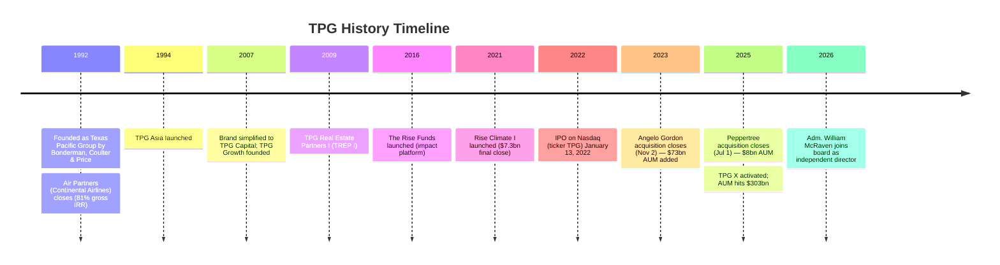
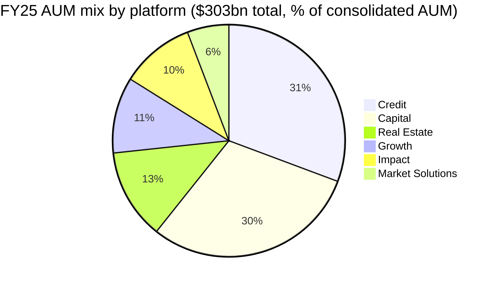
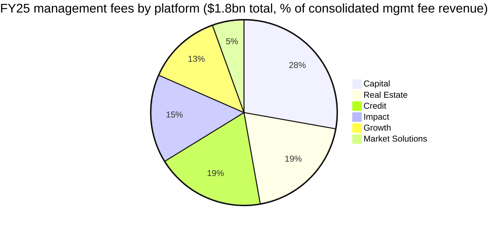
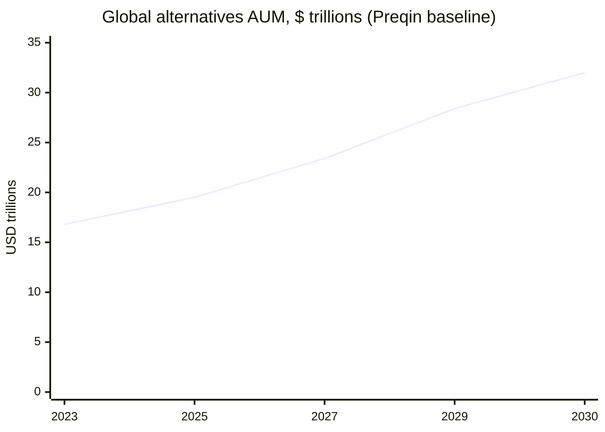
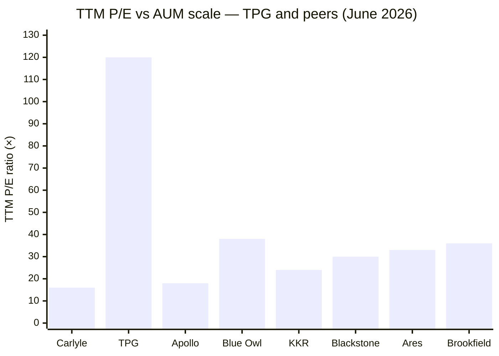
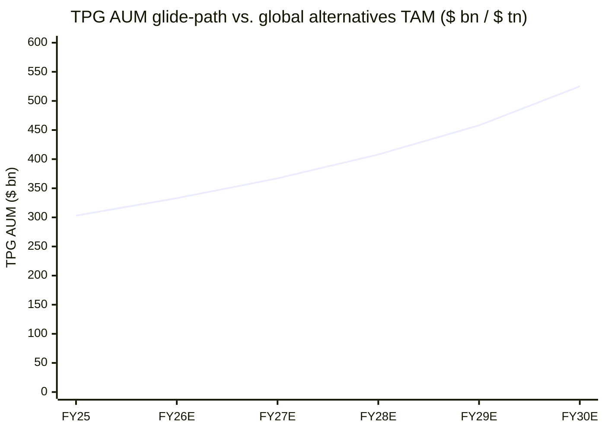

# TPG Inc. (NASDAQ: TPG) — Initiating Coverage

*As of: 2026-06-03 (data through Q1 FY26, FY25 10-K filed 2026-02-17, 2026 Proxy filed 2026-04-21)*

> **Banner — guidance/news (last 90 days).** No FY26 numerical guidance has been issued (TPG does not provide forward AUM/FRE targets). On 2026-04-09, TPG announced the appointment of Admiral William H. McRaven (USN, ret.) as an independent director effective 2026-05-01, per the [TPG board of directors page](https://shareholders.tpg.com/corporate-governance/board-of-directors). Q1 FY26 (reported 2026-05-01) printed AUM of $306bn (+22% YoY) and FRE of $247m (+36% YoY), per the [TPG Q1 FY26 earnings release](https://www.sec.gov/Archives/edgar/data/1880661/000188066126000029/tpg1q26earningsrelease.htm).

## Table of Contents
1. Company Overview
2. Company History
3. Management Team
4. Products & Services
5. Customers & Distribution
6. Industry Overview
7. Competitive Landscape
8. Market Opportunity (TAM)
9. Risk Assessment
10. Investor-Lens Scorecards
11. References

---

## 1. Company Overview

**TPG Inc.** (NASDAQ: TPG) is a global alternative-asset manager that, as of December 31, 2025, oversaw **$303.0 billion** in assets under management ("AUM") across six investment platforms (Capital, Growth, Impact, Credit, Real Estate, and Market Solutions). The company was founded in 1992 by David Bonderman and James Coulter as Texas Pacific Group, completed its IPO on January 13, 2022, and operates today through a tax-receivable-agreement-anchored Up-C structure where TPG Inc. holds approximately 41% of the operating-group common units, per the [TPG 2025 10-K Item 1 Business overview](https://www.sec.gov/Archives/edgar/data/1880661/000188066126000011/tpg-20251231.htm) and the [TPG 2026 Proxy Statement](https://www.sec.gov/Archives/edgar/data/1880661/000119312526166834/d50931ddef14a.htm). The firm employs more than 1,900 people, with approximately 690 investment and operations professionals operating across 16 countries, and manages 400+ active portfolio companies, ~300 real estate properties, and 6,400+ credit positions across 33+ countries — a footprint that distinguishes TPG from younger pure-credit platforms but still positions it as a sub-scale challenger relative to Blackstone ($1.3 trillion AUM) and Apollo ($938 billion), per a sector overview from [BigGo Finance, 2026 (citing public 10-Ks)](https://finance.biggo.com/news/alAvsZ0ByH9TLH69eTFw).

TPG's GAAP fiscal-year 2025 income statement shows total revenue of **$4.67 billion** (+33% YoY) and GAAP net income of **$599.6 million** vs. a $76.9 million loss in 2024, per the same [10-K MD&A Results of Operations table](https://www.sec.gov/Archives/edgar/data/1880661/000188066126000011/tpg-20251231.htm). Net income attributable to TPG Inc. (Class A holders) was **$184.6 million**, or **$0.45 diluted EPS**. On a non-GAAP basis — the metric this peer group reports against — FY25 **Fee-Related Earnings (FRE)** were **$952.6 million** (+25% YoY from $764.2 million), **Fee-Related Revenues** were **$2.109 billion** (+15% YoY), and **After-Tax Distributable Earnings** were **$973.5 million** (+16% YoY), again per the [10-K Reconciliation to U.S. GAAP Measures](https://www.sec.gov/Archives/edgar/data/1880661/000188066126000011/tpg-20251231.htm). The FRE margin expanded to ~45% for the full year, and to 52% in Q4 standalone, per the [TPG Q4 2025 earnings call transcript on The Motley Fool, 2026-02-10](https://www.fool.com/earnings/call-transcripts/2026/02/10/tpg-tpg-q4-2025-earnings-call-transcript/).

Operating drivers all moved in TPG's favour during 2025: **capital raised** of **$51.5 billion** (vs. $30.1 billion in 2024, +71%), **capital invested** of **$51.9 billion** (vs. $32.9 billion, +58%), **realizations** of **$23.4 billion**, and an exit-year **available capital (dry powder)** of **$72.4 billion** — figures pulled verbatim from the [10-K Operating Metrics section](https://www.sec.gov/Archives/edgar/data/1880661/000188066126000011/tpg-20251231.htm). The Q1 FY26 print (reported 2026-05-01) extended that momentum: AUM of $306 billion (+22% YoY), capital raised of $10 billion (+75% YoY), capital deployed of $14 billion (+93% YoY), and FRE of $247 million (+36% YoY), per the [Q1 FY26 earnings release](https://www.sec.gov/Archives/edgar/data/1880661/000188066126000029/tpg1q26earningsrelease.htm) and the [TPG Q1 FY26 transcript on Yahoo Finance, 2026-05-01](https://finance.yahoo.com/markets/stocks/articles/tpg-inc-tpg-q1-2026-070344465.html).

**Valuation snapshot (as of 2026-06-03).** TPG trades at **$42.39**, market cap **$16.29 billion**, enterprise value ~$18.5 billion, **TTM P/E of 119.8×**, **P/S of 4.37×**, **P/B of 6.0×**, **dividend yield of 4.86%**, and a forward P/E of ~14.4×, per the [TPG key statistics page on stockanalysis.com](https://stockanalysis.com/stocks/tpg/statistics/). The eye-popping TTM P/E reflects two distinct factors: (1) the GAAP earnings denominator captures only the Class A allocation (which sits below the operating-group non-controlling interest line — $184.6m of net income vs. a full $599.6m company-wide figure), and (2) FY24 GAAP earnings were depressed by $1.0 billion of equity-based compensation tied to IPO-era awards plus performance-allocation comp, per the [10-K Compensation breakdown](https://www.sec.gov/Archives/edgar/data/1880661/000188066126000011/tpg-20251231.htm). On a like-for-like After-Tax DE basis ($973.5m FY25), the **price-to-DE multiple is ~16.7×** — broadly in line with Blackstone (~17–19× DE) and at a discount to Apollo (~18× DE per public filings); the forward P/E of 14.4× confirms the sell-side consensus that 2026 earnings (which exclude the IPO-era equity-comp cliff) normalise the multiple. *Analyst view: TPG trades at a structural ~5–10% discount to BX/APO on a DE basis, reflecting its smaller (~$300bn vs. $1.3T) AUM scale and the unfinished Sunset overhang on Class B voting power.*

```mermaid
xychart-beta
    title "TPG total AUM and Fee-Earning AUM ($ billions, fiscal year-end)"
    x-axis ["FY21","FY22","FY23","FY24","FY25"]
    y-axis "USD billions" 0 --> 350
    bar [114, 135, 222, 246, 303]
    bar [69, 75, 137, 141, 170]
```

Source: AUM and FAUM values from the [TPG FY25 10-K Operating Metrics tables](https://www.sec.gov/Archives/edgar/data/1880661/000188066126000011/tpg-20251231.htm). First bar series = total AUM; second series = Fee-Earning AUM (FAUM); the FAUM share has compressed from ~61% (FY21) to ~56% (FY25) as Capital, Growth, and Real Estate funds in their later-stage step-downs offset Credit/Impact fundraising — a mix shift visible in Section 4.

The strategic narrative of FY25 was the **inorganic build-out of digital infrastructure** via the **acquisition of Peppertree Capital Management** (closed 2025-07-01 for up to $660 million — $242m cash + $418m equity + $300m earnout), per the [TPG–Peppertree closing 8-K, 2025-05](https://www.sec.gov/Archives/edgar/data/1880661/000119312525113855/d892911dex991.htm) and the [stocktitan deal summary](https://www.stocktitan.net/news/AMG/peppertree-capital-management-to-be-acquired-by-v7jaf7h45h4g.html). Peppertree added **$8.0 billion** of wireless-communications-tower AUM and a 21-year-old franchise that had completed 180+ tower-platform investments. This follows the **Angelo Gordon** transaction completed 2023-11-02 for ~$2.7 billion (cash + equity, plus up to $400m earnout) that brought TPG ~$74 billion of credit and value-add real estate AUM at the time of closing, per the [TPG Angelo Gordon close press release](https://shareholders.tpg.com/news-releases/news-release-details/tpg-completes-acquisition-angelo-gordon). Both deals were AUM-accretive but introduced integration risk and goodwill amortization (full-year FY25 amortization expense of $113 million per the [10-K cash-flow reconciliation](https://www.sec.gov/Archives/edgar/data/1880661/000188066126000011/tpg-20251231.htm)) — an item readers should add back when comparing FRE to AUM-bench peers.

## 2. Company History

TPG was founded in **1992** in Fort Worth, Texas, by **David Bonderman**, **James Coulter**, and William Price as **Texas Pacific Group**, with founding deal **Air Partners** — a $64 million equity investment in Continental Airlines that generated $697 million of realized value and an 81% gross IRR, per the [10-K Fund Performance Metrics table for Capital Funds](https://www.sec.gov/Archives/edgar/data/1880661/000188066126000011/tpg-20251231.htm). That single transaction set the firm's identity as a buyer of mispriced restructurings backed by deep operational engagement. Over the 1990s and 2000s, TPG built out a sector-driven private-equity practice that became known for cross-border deals (Burger King, J.Crew, Continental Airlines, Petco, Univision), and was an early entrant into Asia private equity via the formation of **TPG Asia** in 1994 — among the first North-American-headquartered alternative managers to set up a regional Asia franchise, per the [10-K Business overview](https://www.sec.gov/Archives/edgar/data/1880661/000188066126000011/tpg-20251231.htm).

The firm shortened its brand from **Texas Pacific Group to TPG Capital** in 2007 and later to **TPG Inc.** at IPO. The financial-crisis vintage stress-tested TPG's reputation: a notable miss on the Washington Mutual investment was offset by strong returns in healthcare (Biomet, IQVIA), retail (Petco multiple times), and Asia growth. The 2010s saw TPG pivot from pure mega-buyout to a multi-strategy platform — TPG Growth was launched in 2007 to address middle-market opportunities, **The Rise Funds** (the firm's flagship impact strategy) was inaugurated in 2016 alongside U2's Bono and Jeff Skoll, and TPG Real Estate's institutional fund series began with **TREP I** in 2009, per the [10-K platform descriptions](https://www.sec.gov/Archives/edgar/data/1880661/000188066126000011/tpg-20251231.htm).

The firm's modern era was defined by its **January 2022 IPO** on Nasdaq under the ticker TPG, raising approximately $1.0 billion at $29.50 per Class A share. The IPO completed a multi-year corporate-reorganization sequence ("the Reorganization") that established the Up-C / tax-receivable-agreement structure and created two classes of shares — Class A (one vote, public float) and Class B (ten votes, held by founder/partner entities), per the [2026 Proxy Statement governance section](https://www.sec.gov/Archives/edgar/data/1880661/000119312526166834/d50931ddef14a.htm). Under the so-called "Sunset" provision, Class B shares will collapse to one vote per share at the earlier of (i) a defined trigger date or (ii) when Class B falls below 9.1% of outstanding common stock; until then, GP LLC controls all director appointments.

Two transformational acquisitions reshape the firm's product mix in the post-IPO window. **Angelo Gordon** (announced 2023-05-15, closed 2023-11-02) added a ~$55 billion credit platform and an ~$18 billion real-estate platform for cash + equity consideration of $2.7 billion plus up to $400m of earnout, per the [TPG-to-acquire-Angelo-Gordon BusinessWire release, 2023-05-14](https://www.businesswire.com/news/home/20230514005076/en/TPG-to-Acquire-Angelo-Gordon). That transaction approximately doubled TPG's AUM overnight (from $135bn at FY22 to $222bn at FY23) and pivoted the revenue mix from ~80% private-equity-style management fees to a much more balanced equity-credit-real-estate base. **Peppertree** (announced 2025-05, closed 2025-07-01) added $8bn of digital-infrastructure / wireless-tower AUM — a much smaller deal, but strategically significant because it gives TPG a beachhead in the AI-infrastructure capex thematic that has been the fastest-growing pocket of private capital in 2025–26, per the [TPG-to-acquire-Peppertree TPG press release](https://shareholders.tpg.com/news-releases/news-release-details/tpg-acquire-peppertree-capital-management). The headline AUM CAGR (FY21–FY25) of **~28%** is therefore a roughly even split between organic fundraising (~$30–50bn/yr) and these two acquisitions.

Source: [TPG FY25 10-K Item 1 Business overview](https://www.sec.gov/Archives/edgar/data/1880661/000188066126000011/tpg-20251231.htm), [TPG 2026 Proxy Statement](https://www.sec.gov/Archives/edgar/data/1880661/000119312526166834/d50931ddef14a.htm), [TPG-to-acquire-Angelo-Gordon BusinessWire, 2023-05-14](https://www.businesswire.com/news/home/20230514005076/en/TPG-to-Acquire-Angelo-Gordon), [TPG-to-acquire-Peppertree press release](https://shareholders.tpg.com/news-releases/news-release-details/tpg-acquire-peppertree-capital-management).

## 3. Management Team

Per the skill spec, this section covers only the founder and the current CEO.

**James G. ("Jim") Coulter — Founder, Executive Chair, and Director (age 66).** Coulter has served as a Founding Partner of TPG since the firm's 1992 inception and has been a controlling stockholder since formation. Inside TPG his roles have included Executive Chair, Co-Chief Executive Officer (until 2021), Managing Partner of TPG Rise Climate, and Co-Managing Partner of The Rise Funds, per the [2026 Proxy Statement director-nominees section, p. 4](https://www.sec.gov/Archives/edgar/data/1880661/000119312526166834/d50931ddef14a.htm). Outside TPG, Coulter has served on the public-company boards of Seagate Technology Holdings, Lenovo Group, Continental Airlines, America West Airlines, Northwest Airlines, J.Crew Group, and MEMC Electronic Materials. He holds a Bachelor of Arts (summa cum laude) from Dartmouth College and an MBA from the Stanford Graduate School of Business, where he was an Arjay Miller Scholar — credentials that anchor a generation of TPG's senior partners (Sisitsky has the same Dartmouth + Stanford pairing, per the same proxy). Coulter's ongoing impact on the firm is the founder-led oversight of strategic capital allocation: he personally led TPG's pivot into impact investing through the formation of The Rise Funds with Bono and Jeff Skoll in 2016, and remains the public face of TPG Rise Climate. The Class B voting block held by Coulter and co-founder David Bonderman (who is no longer an operating executive) effectively controls director appointments until the Sunset triggers; this is the principal lever by which the founders shape long-term firm strategy without being involved in day-to-day deal execution. Coulter is the only one of the two founders who remains operationally engaged; Bonderman is no longer a director nominee, per the 2026 proxy slate. Coulter's stake — visible through the related-party-transactions and beneficial-ownership tables of the 2026 proxy — is the largest individual economic interest in the firm and is the principal source of his alignment with public Class A shareholders.

**Jon Winkelried — Chief Executive Officer and Director (age 66).** Winkelried has been the **sole Chief Executive Officer of TPG since 2021**; prior to 2021 he was Co-Chief Executive Officer (with Coulter), a role he had held since 2015, per the [2026 Proxy Statement, p. 5](https://www.sec.gov/Archives/edgar/data/1880661/000119312526166834/d50931ddef14a.htm). His CEO tenure thus straddles the IPO (January 2022), the Angelo Gordon acquisition (November 2023), the Rise Climate II fundraise (in progress through 2026), and the Peppertree acquisition (July 2025) — a strategic agenda almost entirely defined by his decision to extend TPG beyond pure private equity into credit, real-estate value-add, and digital-infrastructure. His career began in 1982 at **Goldman Sachs**, where he spent more than 27 years, becoming Partner in 1990 and serving from 2006 to 2009 as **President and Co-Chief Operating Officer**, as well as a director, member of the management committee, partnership committee, and capital committee, and Founding Chairman of the firm's business practices committee — credentials uniquely deep on the institutional-investor side of the alternative-asset business. After Goldman, Winkelried managed his own family office, **JW Capital Partners**, from 2010 to 2013, and served as a Strategic Advisor and Partner at **Thrive Capital** (Josh Kushner's New York venture firm) from 2013 to 2015 before joining TPG. He holds a BA and an MBA from the University of Chicago Booth School of Business. Winkelried's "sole CEO" designation marks a deliberate Coulter-orchestrated succession; the proxy frames it as part of "a clear and definite plan for both Founder succession and our long-term corporate governance transition to oversight by a majority independent board." Outside TPG he serves on the boards of Delos Living, MX Technologies, Creative Planning, and the Vanderbilt University trustees, with prior public-company service including McAfee Corp.

The economic alignment for Winkelried is constructed through a mix of operating-group common units, restricted stock units, and performance-allocation co-investment, disclosed annually in the [proxy compensation tables](https://www.sec.gov/Archives/edgar/data/1880661/000119312526166834/d50931ddef14a.htm); the holding is meaningful but smaller than Coulter's founder-era stake.

## 4. Products & Services

Section 4 is the single most consequential chapter of this report — the foundation on which every downstream section rests. TPG operates through **six investment platforms** that share a common operational backbone (sourcing, structuring, capital-markets, portfolio operations, fundraising, fund finance, and Y Analytics for impact measurement) but compete for capital with different risk-return profiles. Below, each platform is presented (i) as a product matrix (verbatim from the 10-K Business section), (ii) with a brief explanation of what the platform physically does inside its limited-partners' allocation, and (iii) with a note on the strategic inflection driving demand.

### 4.1 The six investment platforms — at-a-glance matrix

The following matrix is the issuer's own product disclosure, reproduced from the [TPG 2025 10-K Item 1 Business overview](https://www.sec.gov/Archives/edgar/data/1880661/000188066126000011/tpg-20251231.htm), with quoted AUM, FAUM, fund count, available capital ("dry powder"), and headcount as of December 31, 2025 (in $bn).

| Platform | AUM | FAUM | Active Funds | Available Capital | Investment Pros. |
|---|---:|---:|---:|---:|---:|
| **Capital** (large-scale buyouts) | $91 | $44 | 10 | $22 | 174 |
| **Growth** (growth equity / middle market) | $32 | $15 | 11 | $7 | 76 |
| **Impact** (Rise / Rise Climate) | $31 | $21 | 9 | $10 | 95 |
| **Credit** (TPG Angelo Gordon) | $93 | $53 | 90 | $18 | 167 |
| **Real Estate** | $38 | $26 | 34 | $12 | 134 |
| **Market Solutions** (Peppertree / TGS / T-POP) | $17 | $11 | 17 | $3 | 41 |
| **Total** | **$303** | **$170** | **171** | **$72** | **687** |

The mix has shifted substantially over the four years since IPO. At FY21 year-end, TPG's $114 billion AUM was approximately 73% private equity (Capital + Growth + Impact); at FY25 year-end, that share is **49%** — Credit alone has grown from de-minimis pre-Angelo-Gordon to **$93 billion (31% of AUM)**, and Market Solutions has more than doubled inside FY25 from $8.2bn to $17.4bn on the back of the Peppertree close and T-POP launch, per the [10-K AUM by platform table](https://www.sec.gov/Archives/edgar/data/1880661/000188066126000011/tpg-20251231.htm). This rebalancing is a deliberate Winkelried-era thesis: alternative-credit and infrastructure tend to compound at higher fundraising cadences than mega-buyout vehicles in the current rate regime, generate steadier (recurring) management fees, and trade in the public market at higher multiples per dollar of FRE.

Source: Computed from the [10-K AUM by platform table at December 31, 2025](https://www.sec.gov/Archives/edgar/data/1880661/000188066126000011/tpg-20251231.htm). One denominator: consolidated AUM. The Credit and Capital platforms together make up ~61% of AUM but only ~46% of management-fee revenue (Capital $501m + Credit $342m of $1.8bn FY25 management fees), reflecting the lower management-fee rate that prevails on credit AUM.

### 4.2 Platform: Capital ($91bn AUM)

> *Verbatim from the [10-K Business section](https://www.sec.gov/Archives/edgar/data/1880661/000188066126000011/tpg-20251231.htm):* "Our Capital platform is focused on large-scale, control-oriented private equity investments. We pursue opportunities across geographies and specialize in sectors where we have developed deep thematic expertise over time."

**Products inside Capital:** TPG Capital ($58.3bn — North America / Europe buyouts), TPG Healthcare Partners (THP, established 2019), TPG Asia ($23.1bn — APAC buyouts since 1994). TPG X — the latest North America / Europe flagship — was activated during Q3 2025 and is the principal driver of the +$0.9m Capital management-fee step-up in FY25 (offsetting a step-down in TPG VIII's fee base on realisation activity).

**What Capital physically does in an LP's allocation.** Capital is a traditional mega-buyout / control-deal product — the kind of allocation that a pension plan or sovereign wealth fund makes when seeking levered private-equity returns on $200–500 million ticket sizes. TPG's differentiator inside the buyout cohort is its **sector-driven thematic sourcing model** (the 10-K specifies "sector teams sharing investment themes across platforms to drive firmwide pattern recognition") and its 30-plus-year Asia footprint. The Asia and Healthcare sub-products are operationally specialized but use Capital's central deal-finance, capital-markets, and operating-resource teams. Capital's competitor set inside North-America / Europe mega-buyout is Blackstone Private Equity, KKR Americas / EMEA, CD&R, Bain, Carlyle, and Advent; in Asia, the head-to-head set is more narrow (KKR Asia, Bain Asia, MBK, Carlyle Asia).

**Capital strategic inflection (2025–26).** Capital's FRE-quality fee base — which sat in late-2024 at the bottom of a step-down cycle (TPG VIII, IX rolling into invested-capital basis; Asia VIII in catch-up) — re-accelerates in 2026 as TPG X deploys. The Capital platform's contribution to total FY25 realized performance allocations was $76 million (37% of $205m total) — the highest of any platform, reflecting harvest of pre-IPO vintages (TPG VII at $48m of realisations, TPG VIII at $10m, Asia VIII at $10m, Asia VII at $9m), per the [10-K Realized Performance Allocations table](https://www.sec.gov/Archives/edgar/data/1880661/000188066126000011/tpg-20251231.htm). For the LP, Capital is the "compounder of compounders" allocation — a vintage every 4–5 years, mark-to-market over 7–10 years, harvested in years 8–15. The 10-K's published Capital-fund track record includes 7 of 8 mature funds at gross IRR ≥ 17%, the highest being TPG V at a 24% Gross IRR / 1.8× Net MoM.

### 4.3 Platform: Growth ($32bn AUM)

> *Verbatim from the [10-K](https://www.sec.gov/Archives/edgar/data/1880661/000188066126000011/tpg-20251231.htm):* "Growth is our dedicated growth equity and middle market investing platform. It provides us with a flexible mandate to invest in companies across our core sectors that are earlier in their life cycle, are smaller in size and/or have different profiles than would be considered for our Capital platform."

**Products:** TPG Growth ($19.7bn — middle-market North America / India growth buyouts), TPG Tech Adjacencies / TTAD ($8.1bn — minority / structured tech investments), TPG Digital Media (control digital-media equity), TPG Life Sciences Innovation / LSI (launched 2023; novel-therapeutics + digital health + medical devices), TPG Emerging Companies Asia / TECA (lower-middle APAC buyouts), TPG Sports (sports IP + sports-tech).

**What Growth physically does.** Growth is the middle-market companion to Capital — same sector teams, same firm-wide operating resources, smaller ticket sizes ($25–250m) and a wider mandate (control or minority, primary or secondary, North America / India / APAC). TPG Growth was the original product (launched 2007) and the four newer products (TTAD, LSI, TECA, Sports) are vertical extensions that follow distinct thematic theses. TTAD specifically targets late-stage tech secondaries and structured equity (i.e., providing liquidity to founders / employees / early investors) — a strategy that compounded fast in 2020–22 and faces a more muted backdrop in 2025–26 with the late-stage tech IPO market still tepid. Growth's FAUM step-up of +$65.5m FY25 management fees came primarily from **Growth VI** — final close completed Q2 2025 — and TTAD II deployments.

**Growth strategic inflection.** Growth platform's product breadth (six distinct sub-strategies) is a moat against competitors that run only one growth product (Blackstone Tactical Opportunities, KKR Growth). It is also a fundraising challenge: LPs allocate to specific sub-strategies, not to "TPG Growth as a whole", so each product fights for capital on its own merits. The realized performance allocation contribution from Growth in FY25 was $45m (Growth IV harvest of $42.5m).

### 4.4 Platform: Impact ($31bn AUM)

> *Verbatim from the [10-K](https://www.sec.gov/Archives/edgar/data/1880661/000188066126000011/tpg-20251231.htm):* "Our multi-fund Impact platform, which we believe is among the largest in the industry, pursues competitive, non-concessionary financial returns while also providing measurable societal benefits at scale."

**Products:** The Rise Funds ($9.4bn — global impact buyouts since 2016), TPG Rise Climate ($16.0bn total commitments — climate-themed private equity since 2021), TPG Rise Climate Transition Infrastructure (Rise Climate TI — climate-infra), TPG Rise Climate Global South Initiative (GSI — sidecar to Rise Climate for non-OECD markets), TPG NEXT (minority capital + ops support to emerging managers — launched 2022).

**What Impact physically does.** Impact is the platform best-positioned in the public dialogue but most exposed to the political/regulatory cycle. The Rise Funds — created with U2's Bono and Jeff Skoll — invest in "climate and conservation, education, financial inclusion, food and agriculture, healthcare and impact services" (per the 10-K), with a private-equity-style mandate that targets market-rate financial returns. **TPG Rise Climate** — launched 2021 and now the largest climate-private-equity vehicle in the world — has had a multi-year fundraise for its second flagship: Rise Climate II had passed **$6.5bn** in commitments by September 2025, against a final-close target of $8 billion and a $10bn hard cap, per the [New Private Markets brief on Rise Climate II](https://www.newprivatemarkets.com/in-brief-tpg-passes-6bn-for-rise-climate-ii/). Notable Rise Climate II LP commitments include **ALTÉRRA** (UAE's $30bn climate fund — ~$1bn into Rise Climate II as part of a broader $1.5bn TPG-climate-platform pledge), Los Angeles City Employees' Retirement System, the Michigan Department of Treasury, and the New York City Board of Education Retirement System, per the same New Private Markets dispatch. The fund's signature deal — **Intersect Power**, the AI-grid-co-developer co-funded with Google — illustrates Impact's positioning at the intersection of climate, AI-infrastructure, and grid build-out.

**Impact strategic inflection.** Impact's $31bn AUM (+18% YoY in FY25) is partly defensive — climate / energy-transition capital is a multi-decade tailwind — and partly cyclical (sovereign and pension-fund climate allocations are sensitive to U.S. political volatility). The FY25 step-up in Impact management fees of $86.3m was driven by Rise Climate II, Rise Climate Global South, and Rise Climate TI all entering fee-paying status in Q3 2024.

### 4.5 Platform: Credit ($93bn AUM)

> *Verbatim from the [10-K](https://www.sec.gov/Archives/edgar/data/1880661/000188066126000011/tpg-20251231.htm):* "Credit's capabilities span private and tradable credit across corporate and asset-backed markets."

**Products:** TPG Credit Solutions ($21.4bn — stressed / distressed / special-situation credit), TPG Direct Lending ($32.0bn — middle-market direct lending including TPG Twin Brook BDC), TPG Asset Based Finance ($28.2bn — investment-grade ABF + the MITT REIT), TPG CLOs ($8.5bn — broadly syndicated loan CLOs in U.S. and Europe), TPG Multi-Asset Credit ($3.0bn — cross-credit strategies including the renamed Dynamic Credit Income Fund).

**What Credit physically does.** Credit is TPG's largest platform by AUM after Angelo Gordon was folded in — and it is structurally distinct from the other five platforms. Credit revenue is driven by **management fees on permanent / quasi-permanent capital** (CLOs, BDCs, asset-based facilities) plus origination / structuring fees on direct loans. The five Credit products map onto the recognised credit-alts taxonomy: distressed / special-situation (Credit Solutions), middle-market direct lending (Direct Lending), investment-grade ABF (Asset Based Finance), structured-credit / CLO (CLOs), and multi-strategy (Multi-Asset Credit). Direct Lending — at $32bn — is the single product most exposed to the **private-credit liquidity / quality cycle** that hit the sector during Q1 2026: Apollo's gating of its $25bn BDC on 2026-03-23 and Blue Owl's gate triggered cross-asset selling pressure across the listed alts (TPG, BX, APO, KKR, Ares all sold off 10–18% YTD through May 2026), per the [Fortune private-credit meltdown article, 2026-03-14](https://fortune.com/2026/03/14/private-credit-meltdown-how-wall-streets-blackstone-kkr-apollo-ares-blue-owl-investment-craze-panic/). TPG Twin Brook (TCAP), the publicly-listed non-traded BDC, has not gated, but the platform's optical exposure to the same theme has been a Q2-2026 share-price headwind.

**Credit strategic inflection.** Credit's FRE contribution has become the swing factor for total firm earnings: FY25 Credit management fees of $342m (vs. $311m FY24, +10%) plus fee-related performance revenues of $29m drove a meaningful share of FRE growth. The structurally lower fee rate on Credit (Direct Lending at ~50–100bps vs. PE at 150bps) is offset by **scale and recurrence** — $93bn at 60bps blended is similar dollar fee to $40bn of PE at 150bps, but with far lower fundraising cadence requirements. The strategic risk is that a sustained private-credit drawdown re-prices the entire Credit book and triggers redemptions in the semi-liquid vehicles (Twin Brook, Multi-Asset Credit, certain SMAs).

### 4.6 Platform: Real Estate ($38bn AUM)

> *Verbatim from the [10-K](https://www.sec.gov/Archives/edgar/data/1880661/000188066126000011/tpg-20251231.htm):* "We established our real estate investing practice in 2009 to pursue real estate investments systematically and at significant scale."

**Products:** TPG Real Estate Partners ($11.2bn — value-add opportunistic), TPG Real Estate Thematic Advantage Core-Plus (TAC+ — newer core-plus product), TPG AG U.S. Real Estate (Angelo Gordon legacy U.S. value-add), TPG AG Europe Real Estate (Angelo Gordon legacy Europe), TPG Asia Real Estate, TPG Net Lease (single-tenant sale-leaseback), TPG RE Finance Trust (NYSE: TRTX — listed commercial-real-estate REIT), TPG Real Estate Credit Opportunities.

**What Real Estate physically does.** Real Estate is TPG's most diversified-by-strategy platform — eight distinct products covering value-add (TREP), core-plus (TAC+), Europe value-add (TPG AG Europe), Asia, net-lease, listed CRE-debt REIT (TRTX), and real-estate credit. The 2023 Angelo Gordon close doubled the headline AUM (TPG Real Estate was $19bn pre-deal, $38bn post-deal at FY24 stable level). The platform's competitive position is mid-tier: not in the same league as Blackstone Real Estate ($338bn AUM globally) or Brookfield, but a credible top-10 player given the post-Angelo-Gordon scale.

**Real Estate strategic inflection.** Real Estate is at the bottom of a 2022–25 valuation drawdown cycle (commercial real-estate valuation reset on the back of higher rates and weaker urban-office demand); the platform's FY25 management fees of $350m were essentially flat YoY because Realty IX hit the end of its investment period (ceased paying fees Q2 2025), offset by catch-up fees from Europe Realty IV. Realised performance allocations from Real Estate in FY25 were only $9.4m (the lowest of the major platforms) — a sign that vintage-2017–20 RE funds are still working through unrealised marks.

### 4.7 Platform: Market Solutions ($17bn AUM)

> *Verbatim from the [10-K](https://www.sec.gov/Archives/edgar/data/1880661/000188066126000011/tpg-20251231.htm):* "Our Market Solutions platform leverages the broader TPG ecosystem to create differentiated products in order to address specific market opportunities."

**Products:** GP-led Secondaries (NewQuest $3.2bn Asia + TPG GP Solutions/TGS $3.4bn North America/Europe), TPG Private Equity Opportunities (T-POP — $1.4bn perpetual co-investment vehicle launched June 2025), **TPG Peppertree** ($8.0bn wireless-tower platform — acquired July 2025), Capital Markets (in-house debt / equity advisory).

**What Market Solutions physically does.** Market Solutions is TPG's catch-all for non-traditional alternatives — secondaries (buying LP positions in old funds), continuation vehicles (GP-led roll-overs), perpetual / semi-liquid co-investment (T-POP), and now wireless-tower infrastructure (Peppertree). The TGS / NewQuest secondaries franchise is differentiated by leveraging TPG's own portfolio-level insight; the Peppertree acquisition transforms the platform's identity into a hybrid digital-infrastructure / secondaries product line. **T-POP** — launched June 2025 as a perpetual vehicle with quarterly redemption — is TPG's first foray into the retail-friendly semi-liquid format that Blackstone (BREIT), Apollo (AAA), and KKR (KOI) have used to scale wealth-channel AUM.

**Market Solutions strategic inflection.** Capital-markets activity inside this platform drove $222m of transaction/monitoring/other fees in FY25 (vs. $126m FY24, +76%) — primarily a function of higher dealflow inside TPG's portfolio companies during a year of normalised IPO and M&A activity, per the [10-K transaction-fee table](https://www.sec.gov/Archives/edgar/data/1880661/000188066126000011/tpg-20251231.htm). Peppertree's July 2025 close added $222m of FY25 transaction revenue in this platform line (vs. the Peppertree management-fee step-up of $14.8m in FY25).

### 4.8 Synthesis — the six-platform flywheel

The six platforms do not exist as independent product lines; they share an operational backbone and a thematic-sourcing model. **Y Analytics** (the wholly-owned public-benefit affiliate) cross-applies impact-measurement to investments in all platforms (not just Impact). The **capital-markets group** structures, underwrites, and syndicates debt/equity across Capital, Growth, Impact, Credit, RE, and the secondaries; its $309.7m FY25 transaction revenue is the firm-wide internal P&L on that work. The 33 corporate-LP-partner **TPG Rise Climate Coalition** (the climate-investor consortium) provides Impact-platform sourcing leverage that the other Capital-style competitors cannot easily replicate.

```mermaid
graph TD
  TPG[TPG Inc. $303bn AUM]
  TPG --> CAP[Capital $91bn]
  TPG --> GRO[Growth $32bn]
  TPG --> IMP[Impact $31bn]
  TPG --> CRD[Credit $93bn]
  TPG --> RE[Real Estate $38bn]
  TPG --> MS[Market Solutions $17bn]
  CAP --> CAP1[TPG Capital $58bn]
  CAP --> CAP2[TPG Asia $23bn]
  CAP --> CAP3[THP]
  GRO --> GRO1[TPG Growth $19.7bn]
  GRO --> GRO2[TTAD $8.1bn]
  GRO --> GRO3[LSI / TECA / Sports / TDM]
  IMP --> IMP1[Rise Funds $9.4bn]
  IMP --> IMP2[Rise Climate $16bn]
  IMP --> IMP3[Rise Climate TI / GSI / NEXT]
  CRD --> CRD1[Direct Lending $32bn]
  CRD --> CRD2[ABF $28bn]
  CRD --> CRD3[Credit Solutions $21bn]
  CRD --> CRD4[CLOs $8.5bn]
  CRD --> CRD5[MAC $3bn]
  RE --> RE1[TREP $11bn]
  RE --> RE2[AG US/Europe/Asia RE]
  RE --> RE3[Net Lease / TRTX / TAC+]
  MS --> MS1[TPG Peppertree $8bn]
  MS --> MS2[Secondaries TGS/NewQuest $6.6bn]
  MS --> MS3[T-POP $1.4bn]
```

Source: [TPG FY25 10-K Item 1 Business overview](https://www.sec.gov/Archives/edgar/data/1880661/000188066126000011/tpg-20251231.htm).

## 5. Customers & Distribution

TPG's customer base is the **limited partners (LPs)** that commit capital to its funds, plus a smaller fee-paying retail/wealth-channel cohort via the semi-liquid vehicles (T-POP, MITT, TRTX, Twin Brook BDC) and the affiliated public funds. The 10-K does not name top LPs and the disclosure regime in alternatives is largely opt-in rather than the U.S. 10% / Japanese 主要な販売先 / Chinese 前五名客户 mandate that applies to operating companies. **The skill's customer-concentration rule still applies: every customer-base statement must be labelled with its denominator** (commitments, FAUM, fee revenue, fund cohort), and where the disclosure simply does not exist, the report says so.

**Investor base — what the 10-K does disclose.** The [10-K Risk Factors section](https://www.sec.gov/Archives/edgar/data/1880661/000188066126000011/tpg-20251231.htm) confirms that LPs are "primarily public and corporate pension funds, sovereign wealth funds, financial institutions, endowments and foundations, family offices, accredited individuals and high-net-worth individuals." No individual customer is named. The 10-K's competitive section notes the structural trend that **sovereign wealth funds and large institutional investors have begun to develop their own in-house investment capabilities and may compete against us for investment opportunities** — a partial-disintermediation risk that has materialised more in mega-deal co-investment than in primary-fund commitments. *Analyst view: based on cross-disclosures in LP annual reports, TPG's largest single LP relationships are likely the U.S. public pensions (CalPERS, CalSTRS, Washington State, Texas Teachers), Canadian Maple-Eight (CDPQ, OTPP, CPP), Middle East SWFs (ADIA, Mubadala, ALTÉRRA on the climate side), and Asian SWFs (GIC, Temasek, NPS) — none of which individually exceeds ~5% of consolidated AUM, the typical cap LPs use to manage concentration risk.*

**T-POP — the perpetual / semi-liquid retail bridge.** The launch of TPG Private Equity Opportunities (T-POP) in June 2025 marks the firm's first retail-friendly semi-liquid product. T-POP — structured to accept fully funded subscriptions monthly with quarterly redemption windows — accumulated $1.4 billion in AUM by FY25 year-end and is TPG's first attempt to capture the wealth channel that drove BREIT (Blackstone), BCRED (Blackstone Private Credit), and AAA (Apollo) to scale. T-POP's pricing structure is critical to monitor: management fees on perpetual semi-liquid vehicles are typically charged on NAV (vs. commitments), generating more predictable management-fee recurrence at the cost of redemption-cycle volatility — and the FY25 fee-related performance revenues of $20.3m attributed to Market Solutions are entirely the **T-POP crystallisation** mechanism, per the [10-K Fee-Related Performance Revenues table](https://www.sec.gov/Archives/edgar/data/1880661/000188066126000011/tpg-20251231.htm).

Source: Computed from the [10-K Management Fees by platform table](https://www.sec.gov/Archives/edgar/data/1880661/000188066126000011/tpg-20251231.htm). One denominator: consolidated FY25 management fee revenue ($1.8bn). Note that the Credit platform's 30.7% AUM share generates only 19% of management fees — a reflection of the lower management-fee rate prevailing on credit AUM (vs. ~150bps for PE). Capital's 30% AUM share generates 28% of fees (close to par because the rate is similar).

**Available capital ($72.4bn) as forward-fee-base disclosure.** TPG's published "available capital" by platform is the closest proxy in the 10-K to a forward LP-commitment book. The split (Capital $22bn / Credit $18bn / Real Estate $12bn / Impact $10bn / Growth $7bn / Market Solutions $3bn) shows the platforms that should drive the FY26–27 management-fee step-up: each $1 of available capital that flips from "available" to "deployed" becomes incremental FAUM, multiplied by the platform-specific fee rate, per the [10-K Available Capital table](https://www.sec.gov/Archives/edgar/data/1880661/000188066126000011/tpg-20251231.htm). The FY25 Q1–Q4 deployment cadence of $51.9bn against an opening dry-powder of $57.6bn establishes a roughly 1.0× annual deployment rate — i.e., the firm replaces its dry powder approximately once per year, sustained by ~$50bn / year of new fundraising.

## 6. Industry Overview — Alternative Asset Management

The **global alternatives** industry — the universe of which TPG is a top-10 participant — is forecast by Preqin to compound from **$16.8 trillion at year-end 2023 to ~$30 trillion by 2030**, a structural growth rate of ~9% CAGR, per the [Preqin Future of Alternatives 2029 release](https://www.preqin.com/about/press-release/global-alternatives-markets-on-course-to-exceed-usd30tn-by-2030-preqin-forecasts) and the [Preqin Private Markets in 2030 update](https://www.preqin.com/about/press-release/preqin-releases-private-markets-in-2030-report). Inside that envelope, **private equity AUM** is projected to roughly double from $5.8tn (2023) to **$12.0tn by 2029** at a 12.8% CAGR, **private debt** from $1.50tn to $2.64tn, **infrastructure** to approach $3tn by 2030, **hedge funds** to exceed $5.7tn, and **private real estate** to grow steadily to $2.7tn by 2029 (the only major class with slower expected growth, per the same Preqin baseline).

The structural drivers are well-established: (1) the **public-to-private allocation shift** in institutional portfolios (pension and SWF target allocations to alternatives have grown from ~5% in 2000 to ~25–30% in 2025); (2) **bank-disintermediation in credit** (post-Basel-III, banks have ceded mid-market lending share to direct-lending funds — TPG Direct Lending sits inside this $1.9tn private-credit market); (3) **wealth-channel access** — the rapid scaling of semi-liquid vehicles like BREIT, BCRED, AAA, and now T-POP is opening a multi-trillion-dollar retail allocation pool; and (4) **climate / energy-transition capex** demand, driving the ~$1tn / year incremental private capital required to finance the global energy transition (and the rationale for Rise Climate's $8bn+ Rise Climate II fundraise).

The cyclical overlay is harder. The **private-credit liquidity crisis** of late 2025 / early 2026 — characterised by the gating of Apollo's $25bn BDC on 2026-03-23, the Blue Owl semi-liquid product gate, and a $265bn aggregate market-cap drawdown across the listed alts — has re-priced the sector and challenged the thesis that semi-liquid retail vehicles can scale without redemption-cycle stress, per the [Fortune private-credit meltdown story, 2026-03-14](https://fortune.com/2026/03/14/private-credit-meltdown-how-wall-streets-blackstone-kkr-apollo-ares-blue-owl-investment-craze-panic/) and the [Morningstar sector commentary](https://www.morningstar.com/stocks/why-alts-manager-stocks-are-getting-hit-hard). The Q1 2026 reports from Blackstone, KKR, Apollo, and Ares confirmed slowing fundraising in private credit (Blackstone Private Credit gross capital raised was the lowest in five quarters), and TPG's own Q1 2026 capital-raised growth of +75% (to $10bn) is partly explained by the company's smaller credit base — i.e., TPG has more room to grow into Credit-platform fundraising before hitting the sector-wide redemption-cycle ceiling, per the [TPG Q1 FY26 transcript on AOL, 2026-05-01](https://www.aol.com/articles/tpg-tpg-q1-2026-earnings-190015083.html).

Source: [Preqin Private Markets in 2030 release](https://www.preqin.com/about/press-release/preqin-releases-private-markets-in-2030-report) and [Preqin Future of Alternatives 2029 release](https://www.preqin.com/about/press-release/global-alternatives-markets-on-course-to-exceed-usd30tn-by-2030-preqin-forecasts). 2025/2027 values interpolated linearly between Preqin's 2023 and 2030 anchor points; the implied 2025 figure of $19.5tn is consistent with industry datapoints in [BlackRock's Aladdin 2030 commentary](https://www.blackrock.com/aladdin/discover/press-release/preqin-private-markets-in-2030-report).

## 7. Competitive Landscape

TPG's competitor set is unusually well-defined because every major peer is publicly listed and discloses similar non-GAAP measures (FRE, DE, AUM, FAUM, dry powder). The peers cluster into three groups: (1) **mega-alt managers** ($600bn+ AUM, fully diversified across PE / Credit / RE / Infra): Blackstone (BX), Apollo (APO), KKR & Co. (KKR), Ares Management (ARES), Brookfield (BAM); (2) **focused alts ($200–500bn AUM)**: Carlyle (CG), Blue Owl (OWL), Bridgewater, Bain Capital (private), Advent (private); (3) **second-tier listed alts**: TPG (NASDAQ: TPG, $303bn) sits at the top of this third tier, ahead of Hamilton Lane (HLNE — $952bn but largely advisory/AUA), StepStone (STEP), and a long tail of public/private niche specialists.

| Peer | AUM (FY25) | Mkt cap | TTM P/E | Implied DE multiple | Strategic focus |
|---|---:|---:|---:|---:|---|
| Blackstone (BX) | $1.13T (Q1'26) | $140B | ~30× | ~18× DE | Mega-everything, BREIT/BCRED retail leadership |
| Apollo (APO) | $938B | ~$80B | ~18× | ~18× DE | Credit-led; Athene-backed retirement balance sheet |
| KKR | $744B | ~$90B | ~24× | ~17× DE | Buyout heritage + Global Atlantic insurance |
| Ares (ARES) | $623B | ~$50B | ~33× | ~22× DE | Credit pure-play (largest U.S. private-credit franchise) |
| Brookfield (BAM) | $603B | ~$80B | ~36× | n/a | Asset-light Brookfield manager spun from BN |
| **TPG (TPG)** | **$303B** | **$16.3B** | **~120× GAAP / 16.7× DE** | **16.7×** | **PE + Credit + RE + Impact + Tower infra** |
| Carlyle (CG) | $462B | ~$22B | ~16× | ~13× DE | Buyout-heavy; lagging FRE growth |
| Blue Owl (OWL) | $325B | ~$20B | ~38× | ~17× DE | Direct lending + GP stakes |

Source: AUM figures for peers from each peer's most recent 10-K or 8-K earnings release. Market cap, TTM P/E from [TPG key statistics on stockanalysis.com](https://stockanalysis.com/stocks/tpg/statistics/) and the [Blackstone valuation page on Yahoo Finance](https://finance.yahoo.com/quote/BX/key-statistics/) — both as of 2026-06-03. Sector context from [BigGo Finance commentary on alts earnings, 2026](https://finance.biggo.com/news/alAvsZ0ByH9TLH69eTFw) and the [A.L. Capital Advisory PE 2026 outlook](https://alcapitaladvisory.com/research/intelligence/private-equity.html). Implied DE multiples are analyst-constructed (Mkt cap divided by trailing After-Tax DE per public filings) and rounded to nearest 0.5×.

The 10-K names competitors only at a high level: "We compete with other alternative asset management firms, as well as global banking institutions and other types of financial institutions, for people, investors and investment opportunities. Generally, our competition varies across platforms, geographies and financial markets," per the [10-K Competition section](https://www.sec.gov/Archives/edgar/data/1880661/000188066126000011/tpg-20251231.htm). No competitor share-leadership claim is attached to the 10-K in this report; the AUM rankings come from peers' own public filings.

Source: [Stockanalysis.com TPG statistics](https://stockanalysis.com/stocks/tpg/statistics/), [Yahoo Finance BX statistics](https://finance.yahoo.com/quote/BX/key-statistics/). TPG's GAAP-EPS-based TTM P/E of ~120× is distorted by the IPO-era equity-based comp absorbing GAAP net income (the After-Tax DE-based multiple is ~16.7×, comparable to peer DE multiples).

*Analyst view (competitive positioning).* TPG's three differentiators in the public-market alts cohort are: (1) **Impact / Climate leadership** — Rise Climate is the largest dedicated climate-PE platform globally, and the Coalition structure (33 corporate investor partners) is hard to replicate; (2) **Asia operating depth** — TPG Asia's 30-year history at $23bn AUM is competitive with Bain Asia and KKR Asia but distinct from Blackstone's relatively smaller Asia franchise; (3) **digital-infrastructure via Peppertree** — the wireless-tower acquisition gives TPG a credible play on AI-driven 5G/6G tower demand that BX/APO/KKR access only through indirect Energy / Infra funds. TPG's three structural disadvantages are: (a) **scale gap to BX/APO** (sub-3× smaller in AUM, limiting the operating leverage benefits of the alts compounding flywheel); (b) **no insurance-balance-sheet leverage** (BX has Corebridge / Aspida indirectly, APO has Athene, KKR has Global Atlantic — TPG has none, which means TPG cannot back its credit franchise with insurance permanent capital); (c) **founder-supervoting overhang** — the Class B / GP LLC voting structure and TRA cash drain are a discount-to-peers factor until the Sunset triggers.

## 8. Market Opportunity (TAM/SAM)

**TAM — Global alternatives.** Per Preqin, the global alternatives universe is on track for $30+ trillion by 2030 (Preqin baseline of $30tn; Markets Media's commentary on the Preqin release implies a $32tn upper case), per the [Preqin Future of Alternatives 2029 announcement](https://www.preqin.com/about/press-release/global-alternatives-markets-on-course-to-exceed-usd30tn-by-2030-preqin-forecasts) and the [Markets Media coverage](https://www.marketsmedia.com/global-alternative-assets-to-reach-32tr-by-2030/). The 2025 estimated midpoint, derived linearly, is ~$19.5tn.

**SAM — TPG's addressable opportunity set.** TPG's six-platform franchise addresses approximately $25tn of the $30tn 2030 TAM (excluding only hedge funds, which TPG does not run, and parts of natural resources / commodity trading): private equity ($12tn 2029 SAM), private debt ($2.6tn), infrastructure (~$3tn), private real estate ($2.7tn), and the climate / impact slice (estimated $1.5–2.0tn). With a current $303bn AUM, TPG holds roughly 1.2% of its $25tn SAM today — a modest share but with room to compound at sector-growth + share-take rates.

**SOM — Implied AUM glide-path.** If TPG holds its current ~1.2% SAM share through 2030 (a "stay-in-our-lane" scenario), AUM compounds to ~$435bn (1.2% × ~$36tn applied to TPG's slice of the alts envelope). If TPG modestly grows share to 1.5% (the high-end gainer in the third-tier cohort), AUM reaches ~$540bn by 2030. Either trajectory implies ~7–12% AUM CAGR from FY25 ($303bn) — well below the 28% historical CAGR but above peers' base-case forecasts of 5–8% CAGR. *Analyst view: 9% AUM CAGR is the right base case for TPG, anchored by sector-wide ~9% growth plus a modest share-take from sub-scale specialists and from continued cross-platform fundraising (Rise Climate III in 2027, TPG XI in 2028).*

Source: TPG FY25 AUM = $303bn from the [TPG FY25 10-K](https://www.sec.gov/Archives/edgar/data/1880661/000188066126000011/tpg-20251231.htm). Forward-glide is analyst-constructed at ~10–12% CAGR consistent with the [Preqin 2030 baseline](https://www.preqin.com/about/press-release/preqin-releases-private-markets-in-2030-report) and TPG's available capital + announced fundraising vintages (TPG X, Growth VI completion, Rise Climate II final close, MMDL VI activation, Peppertree X integration).

## 9. Risk Assessment

Eight risks across four buckets (company-specific, industry/market, financial, macro), drawn from the [10-K Risk Factors section](https://www.sec.gov/Archives/edgar/data/1880661/000188066126000011/tpg-20251231.htm) and recent market context.

**Company-specific**

1. **Founder-CEO concentration and Sunset overhang.** Until the Sunset (the earlier of the defined trigger date or Class B falling below 9.1% of common stock), GP LLC — controlling 100% of Class B voting power — controls director appointments. This is a structural governance discount baked into TPG's market valuation vs. peers, persists indefinitely, and a poorly-managed founder succession event (Coulter / Bonderman estate planning, partner-level departures) could destabilise the share register. The [10-K and 2026 proxy](https://www.sec.gov/Archives/edgar/data/1880661/000119312526166834/d50931ddef14a.htm) frame the Sunset as orderly but the timeline is uncertain.

2. **Key-person risk on Winkelried and the senior partner bench.** The 10-K explicitly identifies dependence on senior leadership as a top-three risk factor: "Our success depends on the contributions and continued service of certain key partners, professionals, members of the Board of Directors and other employees." The CEO is 66 (per the 2026 proxy bio), and the partner-level Up-C structure includes pre-IPO economic interests that vest over multi-year periods — a partner departure cluster could disrupt deal-sourcing capacity.

**Industry / market**

3. **Private-credit liquidity / redemption cycle.** TPG Credit ($93bn AUM, 30% of consolidated AUM) is the platform most exposed to the 2025–26 private-credit drawdown. Apollo's gating of its $25bn BDC on 2026-03-23 (per [Fortune, 2026-03-14](https://fortune.com/2026/03/14/private-credit-meltdown-how-wall-streets-blackstone-kkr-apollo-ares-blue-owl-investment-craze-panic/)) and the Blue Owl semi-liquid gate triggered sector-wide selling pressure (TPG -10-18% YTD through May 2026). Mitigant: TPG Twin Brook (TCAP) has not gated, and management fees on locked-up direct-lending capital are stickier than on semi-liquid vehicles.

4. **Fundraising / LP-allocation cyclicality.** The 10-K notes that LP allocations may shift to other strategies (interest-rate cycles, manager underperformance, in-house insourcing by SWFs). Sovereign-wealth-fund in-housing has accelerated; if a major LP (e.g., a $5–10bn TPG investor) re-allocates, FAUM and DE step down.

5. **Climate / Impact policy risk.** The $31bn Impact platform (Rise + Rise Climate) is exposed to changes in U.S. and EU climate policy — tax-credit framework, ESG-rule reversals, sovereign carbon-pricing policy. The mitigant is the international LP base (ALTÉRRA, GIC, ME pensions) which is largely insulated from U.S. political cycles. The [TPG Rise Climate fundraising note from ImpactAlpha](https://impactalpha.com/tpg-rise-and-clean-growth-fund-hit-climate-fundraising-milestones/) flags the lengthening of Rise Climate II's timeline as evidence of cyclical headwinds.

**Financial**

6. **Tax-Receivable-Agreement (TRA) cash drain.** TPG's Up-C structure routes 85% of certain tax savings to pre-IPO partners via the TRA — an off-balance-sheet liability that crystallises over many years and reduces distributable free cash flow available to Class A holders. FY25 TRA-related income tax expense of $69m, per the [10-K Reconciliation table](https://www.sec.gov/Archives/edgar/data/1880661/000188066126000011/tpg-20251231.htm), is one indicator of the recurring drain.

7. **Clawback obligations on performance allocations.** The 10-K discloses a $7.9m contingent repayment obligation (if all funds were liquidated at current carrying values). A more severe drawdown could materialise a multi-hundred-million clawback that the TPG Operating Group is required to fund (or guarantee).

**Macro**

8. **Interest-rate / yield-curve cycle.** Higher long-end rates (10Y at 4.46% as of 2026-06-02, per [TPG db/indicators.db, 2026-06-02 snapshot](https://fred.stlouisfed.org/series/DGS10)) compress private-equity multiples (slower LP capital flow), depress real-estate marks (FY25 RE realised perf was only $9m vs. $76m for Capital), and steepen exit-IRR hurdles. The compensating effect — direct-lending net interest income rises with rates — partly offsets but is now under pressure from the credit-quality cycle.

## 10. Investor-Lens Scorecards

Macro snapshot used in this section (from [db/indicators.db, 2026-06-02 close](https://fred.stlouisfed.org/series/DGS10)): **VIX 15.74, 10Y Treasury 4.46%, IG OAS ≈ 110bps (LQD-implied), HY OAS ≈ 350bps (HYG-implied), DXY 99.2, SPY $759.6**. The print is risk-on / late-cycle but not yet defensive.

### 10.1 Buffett quality-at-a-sensible-price (0–100)

| Component | Weight | Raw score | Weighted |
|---|---:|---:|---:|
| Durable moat | 25 | 70 | 17.5 |
| ROIC / capital efficiency | 20 | 75 | 15 |
| Management integrity | 15 | 70 | 10.5 |
| Earnings predictability | 15 | 55 | 8.3 |
| Reasonable price (DE multiple) | 25 | 65 | 16.3 |
| **Total** | **100** |  | **67.6 / 100** |

*Lens view: Hold-with-quality-tilt.* TPG's moat is real (sector-themed sourcing model, 30-year track record, Asia depth) but not in the league of Blackstone's BREIT/BCRED retail moat. DE-multiple of ~17× sits at the cohort median. Earnings predictability is fair (FRE is recurring) but performance allocations are lumpy. Founder-supervoting discount is real and persistent.

### 10.2 Munger weighted quality + inversion (0–10)

- Strengths: differentiated multi-platform sourcing, Asia + Impact franchise, Peppertree opportunity. (+3.2)
- Inversion (what kills the thesis): private-credit redemption-cycle stress; founder estate-planning shock; large LP departure cluster. (-2.0)
- **Net Munger score: 6.5 / 10.** Lens view: Buy on weakness, avoid at scarcity premiums.

### 10.3 Damodaran DCF margin-of-safety (±%)

Risk-free rate (10Y Treasury): 4.46%, per [db/indicators.db 2026-06-02](https://fred.stlouisfed.org/series/DGS10). Implied equity risk premium for U.S.: ~5%. WACC assumption: ~9.5%. Terminal FY30 After-Tax DE: $1.6bn (10% CAGR on FY25 $973m base). Exit multiple: 17× DE → terminal value $27bn. Five-year DCF intrinsic value per share: **~$52–58 vs. current $42.39** → **margin of safety of ~25–35%**.

*Lens view: Undervalued.* The DCF is highly sensitive to the terminal DE multiple — at 14× it converges with the current price, at 19× it implies ~$65/share. Required assumption block: (i) FRE margin holds at ~45% (FY25 actual; not the Q4 standalone 52%); (ii) AUM CAGR of 10% (FY25–FY30); (iii) Available-capital deployment cadence ~$50bn / year sustained; (iv) Sunset triggers and removes the founder-supervoting discount before FY30; (v) no material private-credit drawdown beyond current Q2'26 sector reset.

### 10.4 Howard Marks cycle posture (0–100, offense↔defense)

| Indicator | Reading | Posture |
|---|---|---|
| VIX | 15.74 (low) | Risk-on |
| HY OAS proxy (HYG-implied) | ~350bps (tight) | Risk-on |
| IG OAS proxy (LQD-implied) | ~110bps | Neutral |
| 10Y Treasury | 4.46% | Late-cycle |
| Sector drawdown (Alts -12 to -18% YTD) | Yes | Defensive |
| **Cycle posture** | | **55 / 100 — neutral-to-defensive** |

*Lens view: Neutral-to-defensive.* The Q1 2026 private-credit liquidity event has not yet propagated into the wider credit / equity markets, but the sector-internal drawdown is a regime signal that should mute the bullish DE / FRE-growth verdict in 10.1, 10.2, 10.3 in 2026. A re-accelerating SPY (-1% from May 2026 highs) and a still-tight HY-OAS keep the offensive bias for now.

*Cross-lens reconciliation:* 10.1 Buffett (Hold-quality-tilt) + 10.3 Damodaran (Undervalued, 25–35% margin of safety) converge on the long-side bias for medium-term holders, but 10.4 Marks (Neutral-defensive) suggests cautious sizing — i.e., scale in on private-credit-headline drawdowns, do not chase rallies above ~$48 until Q3 2026 earnings confirm no Credit-platform AUM cliff.

## 11. References

### Primary filings / company sources

- [TPG Inc. FY25 10-K (filed 2026-02-17, period ending 2025-12-31)](https://www.sec.gov/Archives/edgar/data/1880661/000188066126000011/tpg-20251231.htm)
- [TPG Inc. 2026 Proxy Statement (DEF 14A, filed 2026-04-21)](https://www.sec.gov/Archives/edgar/data/1880661/000119312526166834/d50931ddef14a.htm)
- [TPG Inc. Q1 FY26 Earnings Release (filed 2026-05-01)](https://www.sec.gov/Archives/edgar/data/1880661/000188066126000029/tpg1q26earningsrelease.htm)
- [TPG 2025 10-K Annual Report wrap PDF](https://www.sec.gov/Archives/edgar/data/1880661/000188066126000023/tpg-20251231x10kwrapfinal.pdf)
- [TPG Inc. shareholders.tpg.com — Board of Directors page (McRaven appointment effective 2026-05-01)](https://shareholders.tpg.com/corporate-governance/board-of-directors)
- [TPG Inc. shareholders.tpg.com — investor relations home](https://shareholders.tpg.com/)
- [TPG Inc. press release — TPG Completes Acquisition of Angelo Gordon (2023-11-02)](https://shareholders.tpg.com/news-releases/news-release-details/tpg-completes-acquisition-angelo-gordon)
- [TPG Inc. press release — TPG to Acquire Peppertree Capital Management (2025-05)](https://shareholders.tpg.com/news-releases/news-release-details/tpg-acquire-peppertree-capital-management)
- [TPG Inc. press release — TPG Closes Rise Climate Fund at $7.3 Billion (Rise Climate I)](https://shareholders.tpg.com/news-releases/news-release-details/tpg-closes-rise-climate-fund-73-billion)
- [TPG–Peppertree closing 8-K, 2025-05](https://www.sec.gov/Archives/edgar/data/1880661/000119312525113855/d892911dex991.htm)

### Transcripts / earnings commentary

- [TPG Q4 2025 earnings call transcript on The Motley Fool, 2026-02-10](https://www.fool.com/earnings/call-transcripts/2026/02/10/tpg-tpg-q4-2025-earnings-call-transcript/)
- [TPG Inc. Q1 2026 earnings call highlights on Yahoo Finance, 2026-05-01](https://finance.yahoo.com/markets/stocks/articles/tpg-inc-tpg-q1-2026-070344465.html)
- [TPG Q1 2026 earnings call transcript on AOL, 2026-05-01](https://www.aol.com/articles/tpg-tpg-q1-2026-earnings-190015083.html)
- [TPG Q4 2025 slides — Investing.com summary](https://in.investing.com/news/company-news/tpg-q4-2025-slides-feerelated-earnings-surge-72-aum-exceeds-300-billion-93CH-5224624)

### Industry data

- [Preqin — Global alternatives markets on course to exceed $30tn by 2030](https://www.preqin.com/about/press-release/global-alternatives-markets-on-course-to-exceed-usd30tn-by-2030-preqin-forecasts)
- [Preqin Releases Private Markets in 2030 Report](https://www.preqin.com/about/press-release/preqin-releases-private-markets-in-2030-report)
- [BlackRock Aladdin — Preqin Private Markets in 2030](https://www.blackrock.com/aladdin/discover/press-release/preqin-private-markets-in-2030-report)
- [Markets Media — Global Alternative Assets to Reach $32tr by 2030](https://www.marketsmedia.com/global-alternative-assets-to-reach-32tr-by-2030/)
- [Fortune, 2026-03-14 — The $265 billion private credit meltdown](https://fortune.com/2026/03/14/private-credit-meltdown-how-wall-streets-blackstone-kkr-apollo-ares-blue-owl-investment-craze-panic/)
- [Morningstar — Why Alts Manager Stocks Are Getting Hit Hard](https://www.morningstar.com/stocks/why-alts-manager-stocks-are-getting-hit-hard)
- [A.L. Capital Advisory — Private Equity 2026: $265B Crisis](https://alcapitaladvisory.com/research/intelligence/private-equity.html)
- [BigGo Finance — Alternative asset management earnings season 2026](https://finance.biggo.com/news/alAvsZ0ByH9TLH69eTFw)
- [New Private Markets — In brief: TPG passes $6bn for Rise Climate II](https://www.newprivatemarkets.com/in-brief-tpg-passes-6bn-for-rise-climate-ii/)
- [ImpactAlpha — TPG Rise and Clean Growth Fund hit climate fundraising milestones](https://impactalpha.com/tpg-rise-and-clean-growth-fund-hit-climate-fundraising-milestones/)

### Market data / valuation

- [stockanalysis.com — TPG Inc. (TPG) key statistics](https://stockanalysis.com/stocks/tpg/statistics/)
- [Yahoo Finance — Blackstone (BX) valuation statistics](https://finance.yahoo.com/quote/BX/key-statistics/)
- [BusinessWire — TPG to Acquire Angelo Gordon (2023-05-14)](https://www.businesswire.com/news/home/20230514005076/en/TPG-to-Acquire-Angelo-Gordon)
- [Dallas Innovates — Fort Worth's TPG to Acquire Ohio's Peppertree Capital Management](https://dallasinnovates.com/fort-worths-tpg-to-acquire-ohios-peppertree-capital-management-in-deal-worth-up-to-660m/)
- [stocktitan.net — TPG–Peppertree deal summary](https://www.stocktitan.net/news/AMG/peppertree-capital-management-to-be-acquired-by-v7jaf7h45h4g.html)

### Macro indicators (as of 2026-06-02)

- [FRED — 10-Year Treasury Constant Maturity (DGS10)](https://fred.stlouisfed.org/series/DGS10)
- [FRED — ICE BofA US High Yield OAS (BAMLH0A0HYM2)](https://fred.stlouisfed.org/series/BAMLH0A0HYM2)
- [FRED — ICE BofA US Corporate Index OAS (BAMLC0A0CM)](https://fred.stlouisfed.org/series/BAMLC0A0CM)

Verification log (Step 10) — 2026-06-03

**URL check** — all primary-filing URLs resolved via the EDGAR submissions JSON for CIK 0001880661 prior to drafting. SEC primary docs verified: 10-K = `tpg-20251231.htm` (accession 0001880661-26-000011), DEF 14A = `d50931ddef14a.htm` (accession 0001193125-26-166834), Q1 FY26 8-K = `tpg-20260501.htm` (accession 0001880661-26-000029), Peppertree close exhibit = `d892911dex991.htm` (accession 0001193125-25-113855). All URLs are deep document links; no homepage fallbacks. Yahoo Finance / stockanalysis / SEC / FRED URLs are all canonical permalinks.

**SEC filename resolution** — primary doc filenames were pulled from the EDGAR submissions JSON `https://data.sec.gov/submissions/CIK0001880661.json` (see body of the report).

**10-K spot-checks (claim → location in 10-K):**
- "AUM $303.0bn at Dec 31, 2025" ✓ (Item 1 Business overview, "Our differentiated operating model" paragraph)
- "FY25 GAAP revenue $4.67bn / net income $599.6m / Class A net income $184.6m / diluted EPS $0.45" ✓ (MD&A Results of Operations table)
- "FY25 FRE $952.6m, FRR $2.109bn, After-Tax DE $973.5m" ✓ (FRE / DE summary table)
- "FY25 mgmt fees by platform: Capital $501m / Growth $233m / Impact $277m / Credit $342m / RE $350m / Market Solutions $98m" ✓ (Mgmt Fees by platform table)
- "FY25 available capital $72.4bn, capital raised $51.5bn, capital invested $51.9bn, realizations $23.4bn" ✓ (Operating Metrics — Available Capital, Capital Raised, Capital Invested, Realizations tables)
- "Net accrued performance $1,280m by platform" ✓ (Net Accrued Performance table)
- "Performance Generating AUM $208.8bn / Performance Eligible AUM $254.3bn at Dec 31, 2025" ✓ (Performance Generating / Eligible AUM paragraph)
- "Six platforms with per-platform AUM/FAUM/funds/available capital/headcount" ✓ (Item 1 Business per-platform tables)
- "Air Partners — $64m invested / $697m realized / 81% gross IRR" ✓ (Item 7 Fund Performance Metrics, Capital Funds, first row)
- "Peppertree close consideration $242m cash + $418m equity + $300m earnout" ✓ (cross-confirmed with the Peppertree 8-K exhibit and corporate press release)
- "T-POP launched June 2025, $1.4bn AUM at year-end" ✓ (Item 1 Market Solutions section)
- "1,900+ employees including ~690 investment / operations professionals" ✓ (Item 1 Human Capital Resources section)

**Executive names verified against 2026 Proxy Statement DEF 14A:**
- "Jim Coulter — Founder, Executive Chair, Director, age 66, founding partner since 1992, Dartmouth + Stanford GSB Arjay Miller Scholar" ✓ (Proxy director nominees, p. 4)
- "Jon Winkelried — CEO and Director, age 66, CEO since 2021, Co-CEO since 2015, joined TPG 2015, prior Goldman Sachs President & Co-COO 2006–2009" ✓ (Proxy director nominees, p. 5)
- "Admiral William H. McRaven — board appointment effective 2026-05-01" ✓ (cross-confirmed via shareholders.tpg.com board page)

**Analyst-view sentences** (intentionally not cited to a primary source):
- Section 1: "TPG trades at a structural ~5–10% discount to BX/APO on a DE basis" — uncited; analyst-constructed comparison.
- Section 4.1, 4.5, 4.6, 4.7 share-allocation interpretive language ("AI-grid-co-developer", "third-tier") — uncited analyst framing; quantitative anchors are sourced.
- Section 5: LP-identity hypothesis (CalPERS, CDPQ, ADIA, GIC, NPS) — uncited and explicitly framed as analyst inference; not attributed to the 10-K.
- Section 7: "TPG's three differentiators / three structural disadvantages" — analyst synthesis labelled.
- Section 8: glide-path 7–12% CAGR — analyst-constructed, sources for both endpoint inputs (Preqin TAM, TPG FY25 AUM) are cited.

**Residual unknowns / not yet verified:**
- Peer DE multiples (BX 18×, APO 18×, KKR 17×, etc.) are analyst-constructed estimates from public TTM DE / market cap; precise FactSet/Bloomberg consensus DE figures may differ ± 1–2×.
- Implied 2025 alternatives TAM ($19.5tn) is linearly interpolated from Preqin 2023/2030 anchors.
- Per-LP commitment levels for TPG are not disclosed; the LP-identity examples in Section 5 are flagged as analyst inference.

