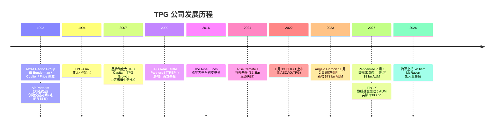
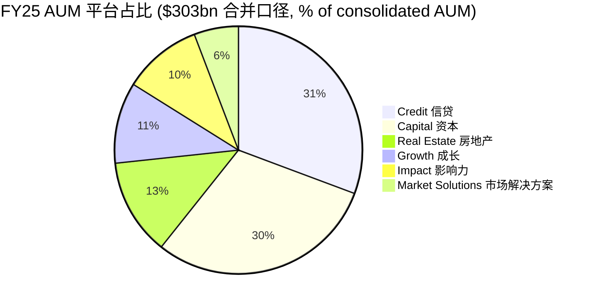
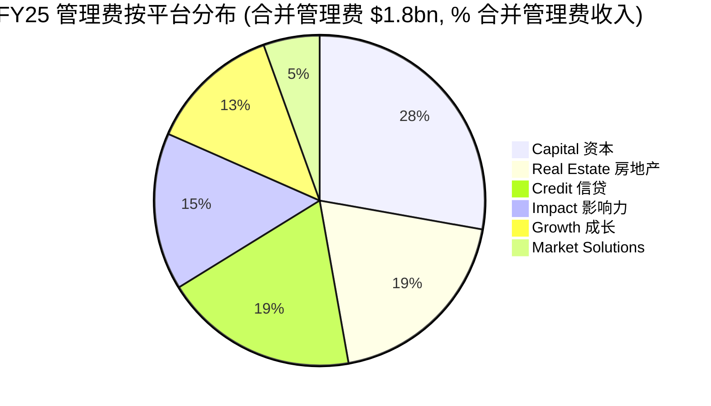
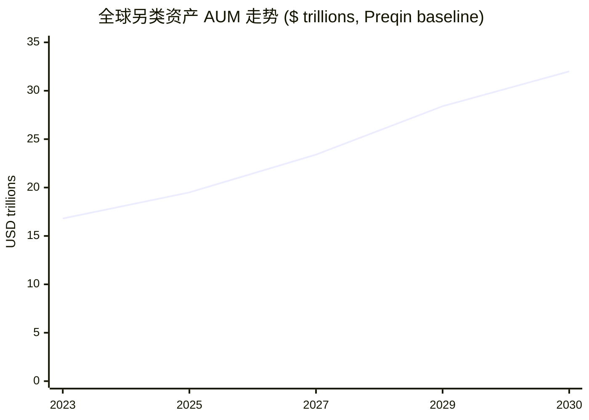
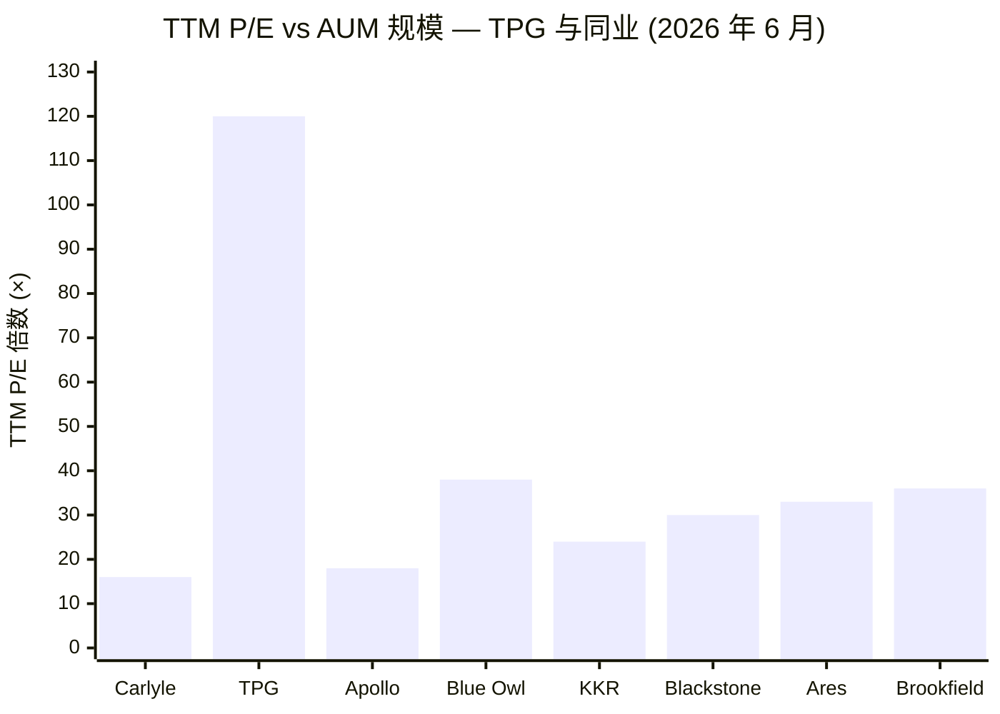
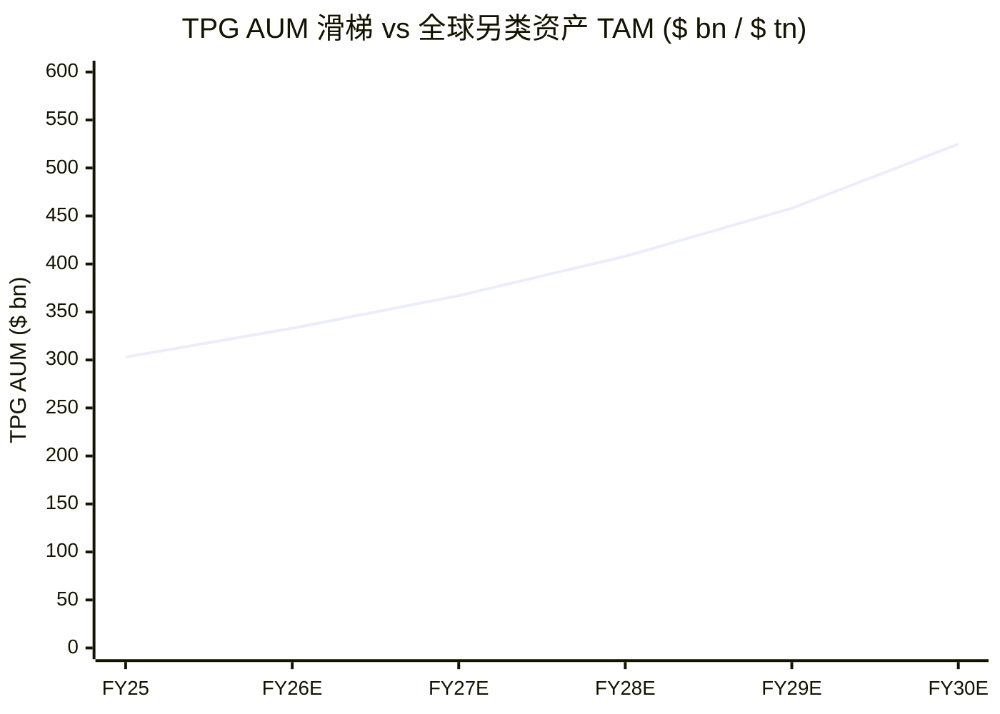

# TPG Inc. (NASDAQ: TPG) — 首次覆盖深度研究

*数据截至: 2026-06-03 (含 FY26 一季度业绩, FY25 10-K 报告披露于 2026-02-17, 2026 委托书披露于 2026-04-21)*

> **导语 — 业绩指引/重大新闻（近 90 天）**. TPG 不发布 FY26 前瞻 AUM / FRE 数字指引（行业惯例）。2026-04-09 公司公告任命 William H. McRaven 海军上将（U.S. Navy, ret.）为独立董事，2026-05-01 生效，详见 [TPG 董事会页面](https://shareholders.tpg.com/corporate-governance/board-of-directors)。FY26 一季度（2026-05-01 披露）AUM 达 $306 bn（同比 +22%），FRE / fee-related earnings 达 $247m（同比 +36%），详见 [TPG Q1 FY26 业绩公告](https://www.sec.gov/Archives/edgar/data/1880661/000188066126000029/tpg1q26earningsrelease.htm)。

## 目录
1. 公司概览
2. 公司历史
3. 管理团队
4. 产品与服务
5. 客户与上市策略
6. 行业概览
7. 竞争格局
8. 市场机会
9. 风险评估
10. 投资者视角评分卡
11. 参考资料

---

## 1. 公司概览

**TPG Inc.** （NASDAQ: TPG）是一家全球另类资产管理公司 / alternative asset manager。截至 2025-12-31，公司在六个投资平台（Capital 资本平台 / Growth 成长平台 / Impact 影响力平台 / Credit 信贷平台 / Real Estate 房地产平台 / Market Solutions 市场解决方案平台）合计管理 AUM (assets under management, 管理规模) **$303.0 bn**。公司于 1992 年由 David Bonderman 与 James Coulter 创立（彼时名为 Texas Pacific Group / 德州太平洋集团），并于 2022-01-13 在纳斯达克完成 IPO。公司采用 Up-C / 上市公司+合伙人级运营公司 双层结构 + tax-receivable agreement / 税收应收协议（TRA）架构，截至 2025-12-31，TPG Inc. 持有运营层合伙单位 (Common Units) 约 41%，详见 [TPG FY25 10-K 业务概览](https://www.sec.gov/Archives/edgar/data/1880661/000188066126000011/tpg-20251231.htm) 与 [TPG 2026 委托书](https://www.sec.gov/Archives/edgar/data/1880661/000119312526166834/d50931ddef14a.htm)。公司全球员工超过 1,900 人，其中投资及运营专业人员约 690 名，覆盖 16 个国家／地区。截至 FY25 年末，公司管理 400 多家活跃组合公司、约 300 处房地产物业、6,400+ 信贷头寸，业务覆盖 33+ 个国家／地区——这一覆盖度使 TPG 区别于较新的纯信贷平台 (pure-credit platform)，但相对于 Blackstone $1.3 万亿 AUM 与 Apollo $938 bn 而言仍属第三梯队 / sub-scale 挑战者，详见 [BigGo Finance 2026 另类资产管理行业评述](https://finance.biggo.com/news/alAvsZ0ByH9TLH69eTFw)。

公司 FY25 GAAP 损益情况：总营收 **$4.67 bn**（同比 +33%），GAAP 净利润 **$599.6m**（FY24 为净亏 $76.9m）；归属 Class A 普通股股东净利润 **$184.6m**，对应稀释 EPS **$0.45**，详见 [10-K MD&A 经营业绩表](https://www.sec.gov/Archives/edgar/data/1880661/000188066126000011/tpg-20251231.htm)。公司 / 同业更看重的非 GAAP 衡量口径：FY25 **Fee-Related Earnings (FRE, 费用相关收益)** 为 **$952.6m**（同比 +25%，FY24 为 $764.2m）；**Fee-Related Revenues (FRR, 费用相关收入)** 为 **$2.109 bn**（同比 +15%）；**After-Tax Distributable Earnings (After-Tax DE, 税后可分配收益)** 为 **$973.5m**（同比 +16%），同样见 [10-K 非 GAAP 调节表](https://www.sec.gov/Archives/edgar/data/1880661/000188066126000011/tpg-20251231.htm)。全年 FRE 利润率约 45%，其中 Q4 单季度高达 52%，详见 [TPG Q4 2025 业绩电话会议纪要 (The Motley Fool, 2026-02-10)](https://www.fool.com/earnings/call-transcripts/2026/02/10/tpg-tpg-q4-2025-earnings-call-transcript/)。

经营驱动指标 FY25 全部走高：**capital raised / 募资额** $51.5 bn (vs. FY24 $30.1 bn, 同比 +71%)；**capital invested / 投资额** $51.9 bn (vs. $32.9 bn, +58%)；**realizations / 退出额** $23.4 bn；以及年末 **available capital / dry powder (待投资本 / 干火药)** **$72.4 bn**——数据来源 [10-K 经营指标章节](https://www.sec.gov/Archives/edgar/data/1880661/000188066126000011/tpg-20251231.htm)。FY26 一季度业绩（2026-05-01 披露）延续这一动能：AUM $306 bn (同比 +22%)、capital raised $10 bn (+75%)、capital deployed $14 bn (+93%)、FRE $247m (+36%)，详见 [Q1 FY26 业绩公告](https://www.sec.gov/Archives/edgar/data/1880661/000188066126000029/tpg1q26earningsrelease.htm) 与 [TPG Q1 FY26 业绩纪要 (Yahoo Finance, 2026-05-01)](https://finance.yahoo.com/markets/stocks/articles/tpg-inc-tpg-q1-2026-070344465.html)。

**估值快照（2026-06-03 收盘后）。** TPG 收盘价 **$42.39**，总市值 **$16.29 bn**，企业价值约 $18.5 bn；**TTM P/E 119.8×**, **P/S 4.37×**, **P/B 6.0×**, **股息率 4.86%**, 前瞻 P/E 约 14.4×，详见 [stockanalysis.com TPG 关键统计](https://stockanalysis.com/stocks/tpg/statistics/)。极高的 TTM P/E 由两个因素共同造成：(1) GAAP 净利润分子仅反映 Class A 部分（净利润 $184.6m，远低于公司整体 $599.6m，差额由运营层 non-controlling interest 持有）；(2) FY24 GAAP 利润被 IPO 期权激励 + 业绩分配工资合计约 $1.9 bn 大幅吞噬，详见 [10-K 工资 / 福利明细表](https://www.sec.gov/Archives/edgar/data/1880661/000188066126000011/tpg-20251231.htm)。换算到 After-Tax DE 口径（FY25 $973.5m），**Price-to-DE 倍数约 16.7×**——基本与 Blackstone (17–19× DE) 同档，相对 Apollo (~18× DE) 略低；前瞻 P/E 14.4× 也佐证卖方一致预期 2026 年 GAAP 盈利在 IPO 期权摊销退潮后回归正常。*分析师观点：TPG 在 DE 口径下相对 BX / APO 折价约 5–10%，主因是 AUM 规模 (~$300bn vs. $1.3T) 与 Class B 超级投票权 Sunset 条款尚未触发产生的治理折扣。*

```mermaid
xychart-beta
    title "TPG 总 AUM 与 Fee-Earning AUM 走势 ($ bn, 财年末)"
    x-axis ["FY21","FY22","FY23","FY24","FY25"]
    y-axis "USD bn" 0 --> 350
    bar [114, 135, 222, 246, 303]
    bar [69, 75, 137, 141, 170]
```

数据来源：AUM 与 FAUM 数据均自 [TPG FY25 10-K 经营指标章节](https://www.sec.gov/Archives/edgar/data/1880661/000188066126000011/tpg-20251231.htm)。第一组柱为总 AUM，第二组柱为 Fee-Earning AUM (FAUM)。FAUM 在总 AUM 中的占比由 FY21 的约 61% 压缩至 FY25 的约 56%，主因 Capital / Growth / Real Estate 平台进入后期 step-down 期 (管理费基础下调) 与 Credit / Impact 平台募资同步进行——这一结构调整在第 4 章产品与服务中详细展开。

FY25 战略主线是通过 **数字基础设施 / digital infrastructure** 并购构建第二增长极。公司于 **2025-07-01 完成对 Peppertree Capital Management 的收购**——交易对价最高 $660m ($242m 现金 + $418m 股权 + 最高 $300m 业绩对赌)，详见 [TPG–Peppertree 收购 8-K (2025-05)](https://www.sec.gov/Archives/edgar/data/1880661/000119312525113855/d892911dex991.htm) 与 [stocktitan 交易摘要](https://www.stocktitan.net/news/AMG/peppertree-capital-management-to-be-acquired-by-v7jaf7h45h4g.html)。Peppertree 为 TPG 带来 **$8.0 bn 无线通信铁塔 (wireless-communications-tower) AUM**, 拥有 21 年历史与 180+ 铁塔平台投资经验。这是继 **Angelo Gordon** (2023-11-02 完成收购, 总对价约 $2.7 bn + 最高 $400m 业绩对赌, 当时为 TPG 带来 ~$74 bn 信贷 + 价值增值型房地产 AUM) 之后又一次平台级并购，详见 [TPG–Angelo Gordon 完成收购 PR](https://shareholders.tpg.com/news-releases/news-release-details/tpg-completes-acquisition-angelo-gordon)。两笔交易均属 AUM 增厚但带来整合风险与商誉摊销 (FY25 摊销费用 $113m, 详见 [10-K 现金流调节表](https://www.sec.gov/Archives/edgar/data/1880661/000188066126000011/tpg-20251231.htm))——读者在 FRE 对 AUM 同业比较时需要回加摊销。

## 2. 公司历史

TPG 于 **1992 年** 在德州沃斯堡 (Fort Worth, Texas) 由 **David Bonderman**、**James Coulter** 与 William Price 创立，初名 **Texas Pacific Group / 德州太平洋集团**。创始交易 **Air Partners** 为大陆航空 (Continental Airlines) $64m 股权重组投资，最终实现 $697m 退出收入，毛 IRR 81% / Gross MoM 10.9×，详见 [10-K Item 7 基金业绩表 — Capital 平台](https://www.sec.gov/Archives/edgar/data/1880661/000188066126000011/tpg-20251231.htm)。这一笔交易奠定了公司"通过深度运营介入收购错价重组型资产"的早期画像。1990 年代至 2000 年代，TPG 形成行业主导式 / sector-led 的并购策略，主导了 Burger King、J.Crew、大陆航空、Petco、Univision 等知名交易。**TPG Asia** 于 1994 年成立，是北美总部另类管理人中最早进入亚太地区者之一，详见 [10-K 业务概览](https://www.sec.gov/Archives/edgar/data/1880661/000188066126000011/tpg-20251231.htm)。

公司品牌于 2007 年由 Texas Pacific Group 简化为 **TPG Capital**, 后随 IPO 调整为 **TPG Inc.**。金融危机洗礼了 TPG 的声誉：Washington Mutual 一役巨亏被医疗 (Biomet, IQVIA)、零售 (Petco 多次进出) 与亚太成长股的回报抵消。2010 年代 TPG 由纯巨型杠杆收购模式转向多策略平台：**TPG Growth** (中等市值业务) 于 2007 年成立；**The Rise Funds** (公司旗舰影响力策略) 于 2016 年由公司、U2 主唱 Bono、Jeff Skoll 共同发起；**TPG Real Estate** 的 TREP I 于 2009 年成立，详见同一份 [10-K 平台描述](https://www.sec.gov/Archives/edgar/data/1880661/000188066126000011/tpg-20251231.htm)。

公司现代史以 **2022 年 1 月 IPO** 为分水岭：在纳斯达克以 TPG 代码挂牌，发行价 $29.50/A 股，募资约 $10 亿。IPO 完成了多年公司重组 ("Reorganization")，确立 Up-C + TRA 双层架构 + 双层股权结构 (Class A 一股一票/公众持有; Class B 一股十票/合伙人级实体持有)，详见 [2026 委托书治理章节](https://www.sec.gov/Archives/edgar/data/1880661/000119312526166834/d50931ddef14a.htm)。所谓 "Sunset" 条款规定：当 Class B 股份占总流通股本的比例跌破 9.1% 或某约定日期触发，则 Class B 转为一股一票；在此之前，GP LLC 控制董事任命。

后 IPO 阶段两笔重大并购重塑公司产品组合。**Angelo Gordon** (2023-05-15 公告, 2023-11-02 交割) 带来 ~$55 bn 信贷平台 + ~$18 bn 房地产平台，总对价 $2.7 bn 现金+股权 + 最高 $400m 业绩对赌，详见 [TPG 拟收购 Angelo Gordon BusinessWire 2023-05-14](https://www.businesswire.com/news/home/20230514005076/en/TPG-to-Acquire-Angelo-Gordon)。该交易使 TPG AUM 一夜从 FY22 末 $135 bn 跳升至 FY23 末 $222 bn，并将公司从约 80% PE 管理费收入的画像转向 PE / Credit / RE 三足鼎立。**Peppertree** (2025-05 公告, 2025-07-01 交割) 带来 $8 bn 数字基础设施 / 无线铁塔 AUM——交易额虽小但战略意义深远：使 TPG 在 2025–26 年增长最快的私募资本子板块 (AI 基础设施资本开支主题) 拥有一席之地，详见 [TPG–Peppertree 收购公告](https://shareholders.tpg.com/news-releases/news-release-details/tpg-acquire-peppertree-capital-management)。FY21–FY25 AUM CAGR 约 28% 大致由 50% 内生募资 + 50% 上述两笔并购构成。

来源：[TPG FY25 10-K Item 1 业务概览](https://www.sec.gov/Archives/edgar/data/1880661/000188066126000011/tpg-20251231.htm)、[TPG 2026 委托书](https://www.sec.gov/Archives/edgar/data/1880661/000119312526166834/d50931ddef14a.htm)、[TPG–Angelo Gordon BusinessWire 2023-05-14](https://www.businesswire.com/news/home/20230514005076/en/TPG-to-Acquire-Angelo-Gordon)、[TPG–Peppertree 收购公告](https://shareholders.tpg.com/news-releases/news-release-details/tpg-acquire-peppertree-capital-management)。

## 3. 管理团队

按本工作流规范，本章仅覆盖 **创始人 (Founder)** 与 **现任 CEO**。

**James G. ("Jim") Coulter — 创始人、执行董事长 / Executive Chair、董事 (66 岁)。** 自 1992 年公司创立起 Coulter 就是公司合伙人 (Founding Partner) 与控股股东。公司内部历任执行董事长 / Co-CEO (至 2021 年止)、TPG Rise Climate 管理合伙人、The Rise Funds 联合管理合伙人，详见 [2026 委托书董事候选人介绍第 4 页](https://www.sec.gov/Archives/edgar/data/1880661/000119312526166834/d50931ddef14a.htm)。公司外履历：Seagate Technology Holdings、Lenovo Group、大陆航空、America West Airlines、Northwest Airlines、J.Crew Group、MEMC Electronic Materials 等公众公司的董事会成员；Dartmouth College 文学学士 (summa cum laude) + Stanford Graduate School of Business MBA / Arjay Miller Scholar——这一学历背景在 TPG 高级合伙人圈层（如 President Sisitsky 同样毕业自 Dartmouth + Stanford）中具有代际复现的鲜明特征。Coulter 对公司至今的影响主要体现在 **战略性资本配置**：2016 年他亲自牵头，联手 Bono 与 Jeff Skoll 创立 The Rise Funds 影响力平台；至今他仍是 TPG Rise Climate 气候基金最公开的人格化代表。Coulter 与联合创始人 David Bonderman (已不任公司高管) 通过 Class B 超级投票权事实上控制董事任命——这是创始人不参与日常交易但塑造公司长期战略的主要杠杆。Coulter 是两位创始人中目前唯一仍在公司运营层活跃者；Bonderman 已不在 2026 年董事候选人名单中。Coulter 在公司中的经济权益 (通过委托书关联方交易表与受益所有权表披露) 是公司最大的个人股权敞口，也是创始人与 Class A 公众股东利益对齐的主要锚点。

**Jon Winkelried — CEO 与董事 (66 岁)。** Winkelried 自 **2021 年起任公司独任 CEO**；此前从 2015 年起任 Co-CEO (与 Coulter 共担)，详见 [2026 委托书第 5 页](https://www.sec.gov/Archives/edgar/data/1880661/000119312526166834/d50931ddef14a.htm)。其 CEO 任期跨越 IPO (2022-01)、Angelo Gordon 并购 (2023-11)、Rise Climate II 募资 (持续至 2026)、Peppertree 收购 (2025-07)，以及由"纯 PE 集团"向"多平台另类管理人"的战略转向几乎全部由其执笔。职业生涯起步于 1982 年的 **Goldman Sachs**，在那里工作 27+ 年：1990 年升合伙人，2006–2009 任 **总裁兼 Co-COO** 及董事，长期任管理委员会、合伙人委员会与资本委员会成员、商业行为委员会创始主席——背景在另类管理 / 投资者关系侧极为深厚。离开 Goldman 后，他于 2010–2013 主理家族办公室 **JW Capital Partners**，2013–2015 任纽约 VC 公司 **Thrive Capital** (Josh Kushner 创立) 的战略顾问与合伙人，2015 年加入 TPG。学历：University of Chicago 文学学士 + University of Chicago Booth MBA。"独任 CEO" 的安排被委托书定性为"对创始人接班与长期治理向独立董事多数主导的有序过渡的明确规划"。公司外现任 Delos Living、MX Technologies、Creative Planning 的董事，担任 Vanderbilt University 受托人，曾在 McAfee Corp 担任公众公司董事。

Winkelried 的经济激励通过运营层合伙单位 + 受限股票单位 (RSU) + 业绩分配跟投三层架构组成，每年在 [委托书薪酬章节](https://www.sec.gov/Archives/edgar/data/1880661/000119312526166834/d50931ddef14a.htm) 披露；规模有相当体量但显著小于创始人 Coulter 的开公司期股。

## 4. 产品与服务

第 4 章是全篇深度研究的最重要章节——后续行业分析、客户分析、竞争分析与风险分析的基础全都从这里展开。TPG 通过 **六大投资平台** 运营，平台之间共享运营底座 (sourcing 项目获取、structuring 结构化、capital markets 资本市场、portfolio operations 投后运营、fundraising 募资、fund finance 基金融资、Y Analytics 影响力测量)，但在风险收益曲线上有清晰差异。

### 4.1 六大平台 — 产品矩阵概览

下表为 [TPG 2025 10-K Item 1 业务概览](https://www.sec.gov/Archives/edgar/data/1880661/000188066126000011/tpg-20251231.htm) 公司自报产品矩阵，AUM / FAUM / 基金数 / 待投资本 / 团队人员均为 2025-12-31 数据（单位：$ bn）：

| 平台 / Platform | AUM | FAUM | 活跃基金数 | 待投资本 | 投资专业人员 |
|---|---:|---:|---:|---:|---:|
| **Capital 资本平台** (大额并购) | $91 | $44 | 10 | $22 | 174 |
| **Growth 成长平台** (成长 / 中等市值) | $32 | $15 | 11 | $7 | 76 |
| **Impact 影响力平台** (Rise / Rise Climate) | $31 | $21 | 9 | $10 | 95 |
| **Credit 信贷平台** (TPG Angelo Gordon) | $93 | $53 | 90 | $18 | 167 |
| **Real Estate 房地产平台** | $38 | $26 | 34 | $12 | 134 |
| **Market Solutions 市场解决方案** (Peppertree / TGS / T-POP) | $17 | $11 | 17 | $3 | 41 |
| **合计** | **$303** | **$170** | **171** | **$72** | **687** |

平台结构在 IPO 后的四年里发生显著变化。FY21 末 $114 bn AUM 中，约 73% 为 PE 系 (Capital + Growth + Impact)；FY25 末同口径占比降至 **49%**——其中 Credit 单一平台从并购 Angelo Gordon 前几乎可忽略不计跃升至 **$93 bn (占总 AUM 31%)**；Market Solutions FY25 一年内由 $8.2 bn 翻倍至 $17.4 bn，主要驱动力是 Peppertree 收购与 T-POP 启动，详见 [10-K 各平台 AUM 表](https://www.sec.gov/Archives/edgar/data/1880661/000188066126000011/tpg-20251231.htm)。这是 Winkelried 任期内的明确战略再平衡：另类信贷与基础设施的募资节奏 / fundraising cadence 显著高于巨型 PE，在公开市场中按 FRE 估值倍数也更优。

来源：[10-K 2025-12-31 各平台 AUM 表](https://www.sec.gov/Archives/edgar/data/1880661/000188066126000011/tpg-20251231.htm)。单一分母为合并 AUM。Credit + Capital 平台合占 AUM 约 61%，但仅贡献管理费收入约 46% (Capital $501m + Credit $342m / FY25 管理费合计 $1.8 bn)，反映了信贷 AUM 较低的管理费率结构。

### 4.2 Platform: Capital ($91bn AUM)

> *[10-K 业务章节](https://www.sec.gov/Archives/edgar/data/1880661/000188066126000011/tpg-20251231.htm) 原文：* "Our Capital platform is focused on large-scale, control-oriented private equity investments. We pursue opportunities across geographies and specialize in sectors where we have developed deep thematic expertise over time." (我们的资本平台聚焦于大规模、控制型 PE 投资。)

**产品组合：** TPG Capital ($58.3 bn — 北美 / 欧洲并购)、TPG Healthcare Partners (THP, 2019 年成立)、TPG Asia ($23.1 bn — APAC 并购自 1994 年起)。**TPG X**（最新一支北美 / 欧洲旗舰基金）于 2025 Q3 启动 fee-paying，是 FY25 Capital 管理费同比 +$0.9m 的主要正向驱动 (抵消 TPG VIII fee base step-down)。

**Capital 平台在 LP 资产配置中的功能定位 / 中文释义 / Plain-language gloss：** Capital 是传统巨型并购 / control-deal 型产品——对应养老金 / SWF 在追求杠杆型 PE 回报时在 $200–500m 单笔投资上的配置。TPG 在 PE 巨头中的差异化在于：(1) **sector-driven thematic sourcing model / 行业导向主题化项目获取** ("sector teams sharing investment themes across platforms to drive firmwide pattern recognition"，自 10-K 原文)；(2) 亚太布局已 30+ 年。Asia 与 Healthcare 两个 sub-product 在运营上各有专长，但共享 Capital 平台的中央并购融资 / 资本市场 / 投后赋能团队。Capital 的竞争对手集合：北美 / 欧洲大型并购市场为 Blackstone Private Equity、KKR Americas / EMEA、CD&R、Bain、Carlyle、Advent；亚洲并购市场对手集合更窄 (KKR Asia、Bain Asia、MBK、Carlyle Asia)。

**Capital 平台 2025–26 战略拐点。** Capital 的 FRE 质量管理费基础在 2024 年末曾处于 step-down 周期底部 (TPG VIII / IX 进入 invested-capital 计费、Asia VIII 处于 catch-up 阶段)，将在 2026 年随 TPG X 部署逐步重回上升通道。Capital 平台 FY25 贡献了已实现业绩分配 $76m (占总 $205m 的 37%) — 为各平台最高——主要来自 IPO 前期份基金的退出 (TPG VII $48m, TPG VIII $10m, Asia VIII $10m, Asia VII $9m)，详见 [10-K 已实现业绩分配表](https://www.sec.gov/Archives/edgar/data/1880661/000188066126000011/tpg-20251231.htm)。从 LP 视角，Capital 是"复利之上的复利"产品——每 4–5 年一支份基金、7–10 年估值锁定、8–15 年退出。10-K 披露的 Capital 平台基金历史业绩中，8 支成熟基金里有 7 支毛 IRR ≥ 17%，最高者 TPG V 毛 IRR 24% / 净 MoM 1.8×。

### 4.3 Platform: Growth ($32bn AUM)

> *[10-K 原文](https://www.sec.gov/Archives/edgar/data/1880661/000188066126000011/tpg-20251231.htm)：* "Growth is our dedicated growth equity and middle market investing platform." (成长平台是我们专门的成长股权 / 中等市值投资平台。)

**产品组合：** TPG Growth ($19.7 bn — 中等市值 北美/印度 成长收购)、TPG Tech Adjacencies / TTAD ($8.1 bn — 科技少数股权 / 结构化投资)、TPG Digital Media (TDM, 控制型数字媒体股权)、TPG Life Sciences Innovation / LSI (2023 成立，覆盖新药 / 数字健康 / 医疗器械)、TPG Emerging Companies Asia / TECA (APAC 低中等市值并购)、TPG Sports (体育 IP + 体育科技)。

**Growth 平台功能定位。** Growth 是 Capital 的中等市值伴生产品——同样的行业团队 / 同样的运营底座 / 较小单笔规模 ($25–250m) / 更广的策略灵活度 (控制 / 少数 / 主投 / 结构化 / 北美 / 印度 / APAC)。TPG Growth 是原始产品（2007 成立），TTAD / LSI / TECA / Sports 等较新产品是行业导向的纵向延伸。TTAD 主要服务后期科技二次交易 (late-stage tech secondaries) 与结构化股权——即为创始人 / 员工 / 早期投资者提供流动性 (相当于"私募版老股转让")——2020–22 高速扩张，2025–26 在科技 IPO 市场温和环境中节奏放缓。Growth 平台 FY25 +$65.5m 管理费主要来自 **Growth VI** (Q2 2025 完成最终关账) 与 TTAD II 部署。

**Growth 平台战略拐点。** Growth 平台产品广度 (六个独立子策略) 是相对单一产品成长策略 (Blackstone Tactical Opportunities、KKR Growth) 的护城河，但也是募资挑战：LP 是按子策略而非按 "TPG Growth 整体" 配置资金。FY25 Growth 平台已实现业绩分配贡献 $45m (主要来自 Growth IV $42.5m 退出)。

### 4.4 Platform: Impact ($31bn AUM)

> *[10-K 原文](https://www.sec.gov/Archives/edgar/data/1880661/000188066126000011/tpg-20251231.htm)：* "Our multi-fund Impact platform... pursues competitive, non-concessionary financial returns while also providing measurable societal benefits at scale." (本平台追求具竞争力的非让利型财务回报，同时提供可量化的社会效益。)

**产品组合：** The Rise Funds ($9.4 bn — 全球影响力并购自 2016 起)、TPG Rise Climate ($16.0 bn 总承诺 — 主题式气候 PE)、TPG Rise Climate Transition Infrastructure / Rise Climate TI (气候基础设施)、TPG Rise Climate Global South Initiative / GSI (Rise Climate 的非 OECD 市场附属基金)、TPG NEXT (新兴管理人扶持 — 2022 启动)。

**Impact 平台功能定位。** Impact 在公开舆论中是 TPG 最有辨识度的平台，但也是政治 / 监管周期敏感度最高的平台。The Rise Funds — 由公司、Bono、Jeff Skoll 共同发起 — 投资于"气候与自然保护、教育、普惠金融、食品与农业、医疗及影响力服务" (10-K 原文)，按 PE 标准追求市场化财务回报。**TPG Rise Climate** (2021 启动，现为全球最大的气候 PE 工具) 第二期基金 Rise Climate II 已多轮关账：截至 2025-09，承诺额已超过 **$6.5 bn**，最终关账目标 $8 bn，硬顶 $10 bn，详见 [New Private Markets Rise Climate II 报道](https://www.newprivatemarkets.com/in-brief-tpg-passes-6bn-for-rise-climate-ii/)。重要 LP 包括 **ALTÉRRA** (阿联酋 $30bn 气候基金 — 对 Rise Climate II 承诺约 $1bn, 占其向 TPG 气候平台 $1.5bn 总承诺的大部分)、洛杉矶市雇员退休基金、密歇根州财政部、纽约市教育委员会退休基金，同上来源。标志性投资为 **Intersect Power** (清洁能源开发商，与 Google 联合融资支持 AI 时代电网建设)，体现 Impact 平台在气候、AI 基础设施与电网叠加交叉点上的战略定位。

**Impact 平台战略拐点。** Impact $31 bn AUM (FY25 同比 +18%) 部分为防御性 (气候 / 能源转型资本是多十年顺风)，部分为周期性 (主权与养老金气候配置对美国政治波动敏感)。FY25 Impact 平台管理费 +$86.3m 主要由 Rise Climate II / GSI / TI 三只新基金在 Q3 2024 进入 fee-paying 推动。

### 4.5 Platform: Credit ($93bn AUM)

> *[10-K 原文](https://www.sec.gov/Archives/edgar/data/1880661/000188066126000011/tpg-20251231.htm)：* "Credit's capabilities span private and tradable credit across corporate and asset-backed markets." (信贷平台能力覆盖私募与可交易型信贷, 横跨企业债与资产支持市场。)

**产品组合：** TPG Credit Solutions ($21.4 bn — 困境 / 特殊状况企业信贷)、TPG Direct Lending ($32.0 bn — 中等市值直接放贷, 含 TPG Twin Brook BDC)、TPG Asset Based Finance ($28.2 bn — 投资级 ABF + MITT REIT)、TPG CLOs ($8.5 bn — 美国 / 欧洲广义银团贷款 CLO)、TPG Multi-Asset Credit ($3.0 bn — 跨信贷策略, 含已更名为 Dynamic Credit Income Fund 的旧 Super Fund)。

**Credit 平台功能定位。** Credit 是 Angelo Gordon 并入后 TPG 最大的单一平台，与其他五个平台在收入结构上有结构性差异。Credit 收入由 **永久 / 半永久资本上的管理费** (CLOs、BDCs、ABF facilities) + 直接放贷的发起 / 结构化费驱动。五个 Credit 产品对应业界认可的信贷另类分类：困境 / 特殊状况 (Credit Solutions)、中等市值直接放贷 (Direct Lending)、投资级 ABF (Asset Based Finance)、结构化信贷 / CLO (CLOs)、多策略 (Multi-Asset Credit)。Direct Lending ($32 bn) 是受 **2025-Q4 / 2026-Q1 私募信贷流动性 / 资质周期** 冲击最大的子产品：Apollo $25bn BDC 于 2026-03-23 触发 gating, Blue Owl gate 引发整个板块抛压 (TPG / BX / APO / KKR / Ares 等 YTD 至 2026-05 跌幅 10–18%)，详见 [Fortune 私募信贷崩盘报道 2026-03-14](https://fortune.com/2026/03/14/private-credit-meltdown-how-wall-streets-blackstone-kkr-apollo-ares-blue-owl-investment-craze-panic/)。TPG Twin Brook (TCAP, 公众非交易 BDC) 至本报告时尚未 gate，但平台对同一主题的视觉敞口在 Q2 2026 是股价的明显逆风。

**Credit 平台战略拐点。** Credit 的 FRE 贡献已成为公司全口径盈利能力的关键摆动因素：FY25 Credit 管理费 $342m (vs. FY24 $311m, +10%) + fee-related performance revenue $29m 驱动 FRE 增长很大一块。信贷管理费率结构性低于 PE (Direct Lending 约 50–100bps vs. PE ~150bps) 由 **规模与持续性** 补偿——$93 bn × 60bps 与 $40 bn × 150bps 美元贡献相近, 但前者募资节奏要求显著更低。战略风险是若私募信贷长期回撤蔓延，整个 Credit 帐面将被重新定价并触发半流动工具 (Twin Brook、Multi-Asset Credit、若干 SMA) 赎回。

### 4.6 Platform: Real Estate ($38bn AUM)

> *[10-K 原文](https://www.sec.gov/Archives/edgar/data/1880661/000188066126000011/tpg-20251231.htm)：* "We established our real estate investing practice in 2009 to pursue real estate investments systematically and at significant scale." (我们 2009 年设立房地产投资业务，以系统化、显著规模化方式开展房地产投资。)

**产品组合：** TPG Real Estate Partners / TREP ($11.2 bn — 价值增值机会型)、TPG Real Estate Thematic Advantage Core-Plus / TAC+ (较新的 core-plus 产品)、TPG AG U.S. Real Estate (Angelo Gordon 遗存美国 value-add)、TPG AG Europe Real Estate (欧洲 value-add)、TPG Asia Real Estate、TPG Net Lease (单租户售后回租)、TPG RE Finance Trust (NYSE: TRTX — 上市商业地产 REIT)、TPG Real Estate Credit Opportunities。

**Real Estate 平台功能定位。** Real Estate 是 TPG 子策略最分散的平台——八个独立产品覆盖 value-add (TREP)、core-plus (TAC+)、欧洲 value-add、亚洲、净租赁、上市 CRE 债务 REIT (TRTX)、房地产信贷。2023 年 Angelo Gordon 并购使该平台 AUM 一夜翻倍 (合并前 ~$19bn → FY24 末稳定 ~$38bn)。竞争地位居中：与 Blackstone Real Estate ($338bn) 与 Brookfield 不在同一量级，但已是可信的全球前十大房地产管理人。

**Real Estate 战略拐点。** Real Estate 平台目前正处于 2022–25 估值回调的尾段 (商业地产估值受高利率与城市办公需求疲软重置)；FY25 管理费 $350m 基本同比持平，因 Realty IX 进入投资期末尾 (Q2 2025 起停止 fee-paying), 被 Europe Realty IV 追计费收入抵消。FY25 已实现业绩分配仅 $9.4m (各主要平台中最低) — 反映 2017–20 年份次基金尚处于未实现估值阶段。

### 4.7 Platform: Market Solutions ($17bn AUM)

> *[10-K 原文](https://www.sec.gov/Archives/edgar/data/1880661/000188066126000011/tpg-20251231.htm)：* "Our Market Solutions platform leverages the broader TPG ecosystem to create differentiated products in order to address specific market opportunities." (我们的市场解决方案平台借助更广义 TPG 生态创建差异化产品。)

**产品组合：** GP-led Secondaries (NewQuest $3.2 bn 亚洲 + TPG GP Solutions/TGS $3.4 bn 北美/欧洲)、TPG Private Equity Opportunities / T-POP ($1.4 bn 永久跟投工具, 2025-06 启动)、**TPG Peppertree** ($8.0 bn 无线铁塔平台, 2025-07 收购)、Capital Markets (内置 债 / 股权咨询)。

**Market Solutions 功能定位。** Market Solutions 是 TPG 非传统另类的集合体——含 secondaries (购买基金的 LP 头寸)、continuation vehicles (GP 主导的份基金 roll-over)、永久 / 半流动跟投 (T-POP) 与现在的无线铁塔基础设施 (Peppertree)。TGS / NewQuest 二级市场业务的差异化来自利用 TPG 自身组合公司洞察；Peppertree 的并购将平台定位转向"数字基础设施 + secondaries"双重身份。**T-POP** (2025-06 启动, 永久型工具, 月度认购 + 季度赎回) 是 TPG 在 BREIT (Blackstone)、AAA (Apollo)、KOI (KKR) 已成功扩张的零售 / 财富管道半流动格式上的首次尝试。

**Market Solutions 战略拐点。** 平台内的资本市场业务在 FY25 贡献了 $222m 交易 / 监督 / 其他费用 (vs. FY24 $126m, +76%) — 主要由 TPG 组合公司 IPO / M&A 活动在 2025 年回暖驱动, 详见 [10-K 交易费用表](https://www.sec.gov/Archives/edgar/data/1880661/000188066126000011/tpg-20251231.htm)。Peppertree 2025-07 关账为本平台贡献 FY25 +$14.8m 管理费 (相对总平台管理费基数偏小, 主要价值贡献尚未充分体现)。

### 4.8 综述 — 六平台飞轮 / Six-platform Flywheel

六大平台并非各自独立的产品线，而是共享运营底座与主题化 sourcing 模式。**Y Analytics** (公司全资公众利益附属机构, public-benefit affiliate) 不仅服务 Impact 平台, 也将影响力测量横向应用于其他平台。**资本市场团队 / capital-markets group** 跨 Capital / Growth / Impact / Credit / RE / secondaries 进行结构化 / 承销 / 联合放贷，FY25 全公司 $309.7m 交易收入即此团队的 P&L 内化。33 家企业 LP 组成的 **TPG Rise Climate Coalition** (气候投资人联盟) 提供 Capital 系 PE 巨头不易复制的 Impact 平台 sourcing 杠杆。

```mermaid
graph TD
  TPG[TPG Inc. $303bn AUM]
  TPG --> CAP[Capital $91bn 资本平台]
  TPG --> GRO[Growth $32bn 成长平台]
  TPG --> IMP[Impact $31bn 影响力平台]
  TPG --> CRD[Credit $93bn 信贷平台]
  TPG --> RE[Real Estate $38bn 房地产平台]
  TPG --> MS[Market Solutions $17bn 市场解决方案平台]
  CAP --> CAP1[TPG Capital $58bn]
  CAP --> CAP2[TPG Asia $23bn]
  CAP --> CAP3[THP]
  GRO --> GRO1[TPG Growth $19.7bn]
  GRO --> GRO2[TTAD $8.1bn]
  GRO --> GRO3[LSI / TECA / Sports / TDM]
  IMP --> IMP1[Rise Funds $9.4bn]
  IMP --> IMP2[Rise Climate $16bn]
  IMP --> IMP3[Rise Climate TI / GSI / NEXT]
  CRD --> CRD1[Direct Lending $32bn]
  CRD --> CRD2[ABF $28bn]
  CRD --> CRD3[Credit Solutions $21bn]
  CRD --> CRD4[CLOs $8.5bn]
  CRD --> CRD5[MAC $3bn]
  RE --> RE1[TREP $11bn]
  RE --> RE2[AG US/Europe/Asia RE]
  RE --> RE3[Net Lease / TRTX / TAC+]
  MS --> MS1[TPG Peppertree $8bn]
  MS --> MS2[Secondaries TGS/NewQuest $6.6bn]
  MS --> MS3[T-POP $1.4bn]
```

来源：[TPG FY25 10-K Item 1 业务概览](https://www.sec.gov/Archives/edgar/data/1880661/000188066126000011/tpg-20251231.htm)。

## 5. 客户与上市策略 / Customer Base & Distribution

TPG 的"客户"基本是承诺资金的 **有限合伙人 LPs**，加上半流动工具 (T-POP、MITT、TRTX、Twin Brook BDC) 中的零售 / 财富管道客户。10-K 并未点名披露 TPG 任何具体 LP 名称，原因是另类资产管理行业披露制度上偏向自愿披露，而非美国 10-K / 日本 主要な販売先 / 中国 前五名客户 等强制披露。**本工作流"客户集中度需标注分母"规则仍然适用：报告中每一处客户基础描述都需要说明其分母 (是承诺额 / FAUM / 费用收入 / 基金组别), 没有披露的就直说没有。**

**LP 基础 — 10-K 的实际披露内容。** [10-K 风险因素章节](https://www.sec.gov/Archives/edgar/data/1880661/000188066126000011/tpg-20251231.htm) 表明 LP 主要是"公私养老金、SWF、金融机构、基金会与捐赠基金、家族办公室、高净值个人与合资格个人投资者"，无逐户披露。10-K 竞争章节标注的结构性趋势是 **"SWF 与大型机构投资者已开始建立内部投资能力, 可能就投资机会与我们竞争"** — 即 SWF 主权投资人 in-housing 的部分去中介化风险——已在大型并购联合投资中显现, 但在主要基金募资上影响有限。*分析师观点：基于 LP 年度报告交叉披露推断, TPG 的最大 LP 关系可能包括美国 公共养老金 (CalPERS、CalSTRS、Washington State、Texas Teachers)、加拿大枫叶八大 (CDPQ、OTPP、CPP)、中东 SWF (ADIA、Mubadala、ALTÉRRA — 气候侧)、亚洲 SWF (GIC、Temasek、NPS)。任一单一 LP 占 TPG 合并 AUM 比例预计不超过约 5%（这是 LP 自身管理集中度的常用上限）。*

**T-POP — 永久 / 半流动零售桥梁。** 2025-06 启动的 TPG Private Equity Opportunities (T-POP) 是公司首支零售友好半流动工具。T-POP 结构为月度全额认购 + 季度赎回, 至 FY25 末累计 AUM $1.4 bn, 是 TPG 在 Blackstone BREIT、Blackstone Private Credit (BCRED)、Apollo AAA 已开发的财富管道格式上的首次实践。T-POP 的费率结构值得密切关注：永久半流动工具的管理费一般按 NAV 计 (而非按承诺额), 因此管理费可预测性更强, 代价是赎回周期波动放大——FY25 Market Solutions 平台 $20.3m fee-related performance revenue 正是 **T-POP 的结晶化机制 / crystallisation mechanism** 贡献, 详见 [10-K Fee-Related Performance Revenues 表](https://www.sec.gov/Archives/edgar/data/1880661/000188066126000011/tpg-20251231.htm)。

来源：基于 [10-K 各平台管理费表](https://www.sec.gov/Archives/edgar/data/1880661/000188066126000011/tpg-20251231.htm) 计算。单一分母为合并 FY25 管理费 $1.8bn。请注意 Credit 平台 AUM 占比 30.7%, 但仅贡献管理费 19%, 反映信贷 AUM 的管理费率结构性低于 PE 之约 150bps。Capital 平台 AUM 占比 30% 贡献管理费 28% (基本对齐, 费率相近)。

**Available Capital $72.4 bn 作为前瞻费基披露。** TPG 在 10-K 中按平台披露的"待投资本"是该 10-K 中最接近"前瞻 LP 承诺账本"的指标。结构 (Capital $22bn / Credit $18bn / Real Estate $12bn / Impact $10bn / Growth $7bn / Market Solutions $3bn) 显示驱动 FY26–27 管理费阶梯增长的平台来源：每一美元 "available" 转为 "deployed" 后, 即转入 FAUM 并按该平台费率结转管理费, 详见 [10-K Available Capital 表](https://www.sec.gov/Archives/edgar/data/1880661/000188066126000011/tpg-20251231.htm)。FY25 全年 $51.9bn 部署 vs. 起始 $57.6bn 干火药, 隐含全年部署 / 干火药周转率约 1.0×, 即公司年均周转一次自身干火药, 由 ~$50bn / 年 新增募资支持。

## 6. 行业概览 — 另类资产管理 / Alternative Asset Management Industry

**全球另类资产管理 TAM**。Preqin 预测 2023 年末全球另类 AUM $16.8 万亿 → 2030 年 ~$30 万亿, 结构性 CAGR ~9%, 详见 [Preqin Future of Alternatives 2029 发布](https://www.preqin.com/about/press-release/global-alternatives-markets-on-course-to-exceed-usd30tn-by-2030-preqin-forecasts) 与 [Preqin Private Markets in 2030 更新](https://www.preqin.com/about/press-release/preqin-releases-private-markets-in-2030-report)。子类别预测：**PE AUM** 由 $5.8 万亿 (2023) → $12.0 万亿 (2029), CAGR 12.8%；**Private Debt 私募信贷** 由 $1.50 万亿 → $2.64 万亿；**Infrastructure 基础设施** 趋近 $3 万亿；**Hedge Funds 对冲基金** 超过 $5.7 万亿；**Private Real Estate 私募房地产** $2.7 万亿 (唯一相对慢速增长)。

结构性驱动力：(1) **公开市场 → 私募市场 的配置迁移** (养老 / SWF 另类目标配置由 2000 年的约 5% 升至 2025 年的约 25–30%)；(2) **银行去中介化在信贷端** (Basel-III 后, 中等市值贷款由银行让渡给直接放贷基金 — TPG Direct Lending 即在此 $1.9 万亿 私募信贷市场)；(3) **财富管道接入** (BREIT、BCRED、AAA 及现在的 T-POP 等半流动工具规模化, 打开了数万亿零售配置池)；(4) **气候 / 能源转型资本开支** (全球能源转型每年约 $1 万亿 增量私募资本需求, 也是 Rise Climate II $8bn+ 募资目标的背景)。

周期性叠加项更复杂。2025-Q4 / 2026-Q1 的 **私募信贷流动性危机** — 以 Apollo $25bn BDC 于 2026-03-23 触发 gating、Blue Owl 半流动产品 gate、上市另类股 $265bn 总市值回撤为标志事件 — 已重新定价整个行业, 也挑战"半流动零售工具可以规模化扩张而不出现赎回周期压力"的论点, 详见 [Fortune 私募信贷崩盘报道 2026-03-14](https://fortune.com/2026/03/14/private-credit-meltdown-how-wall-streets-blackstone-kkr-apollo-ares-blue-owl-investment-craze-panic/) 与 [Morningstar 行业评论](https://www.morningstar.com/stocks/why-alts-manager-stocks-are-getting-hit-hard)。Blackstone、KKR、Apollo、Ares 在 Q1 2026 报告中均披露私募信贷募资放缓 (Blackstone Private Credit 单季度毛募资是五个季度以来最低)；TPG Q1 2026 capital raised 同比 +75% 至 $10bn 在一定程度上得益于较小信贷基数 — 即 TPG 在 Credit 平台募资上仍有比 BX / APO / KKR / Ares 更大的扩张空间, 暂未触及板块级赎回周期天花板, 详见 [TPG Q1 FY26 业绩纪要 (AOL, 2026-05-01)](https://www.aol.com/articles/tpg-tpg-q1-2026-earnings-190015083.html)。

来源：[Preqin Private Markets in 2030](https://www.preqin.com/about/press-release/preqin-releases-private-markets-in-2030-report) 与 [Preqin Future of Alternatives 2029](https://www.preqin.com/about/press-release/global-alternatives-markets-on-course-to-exceed-usd30tn-by-2030-preqin-forecasts)。2025 / 2027 数值为 Preqin 2023 / 2030 锚点之间线性插值。隐含 2025 $19.5 万亿 与 [BlackRock Aladdin 2030 评论](https://www.blackrock.com/aladdin/discover/press-release/preqin-private-markets-in-2030-report) 行业数据一致。

## 7. 竞争格局

TPG 的同业格局清晰: 全部主要同业均上市, 披露相似的非 GAAP 口径 (FRE、DE、AUM、FAUM、干火药)。三层结构：(1) **巨型另类管理人**: Blackstone (BX)、Apollo (APO)、KKR、Ares (ARES)、Brookfield (BAM)，AUM 均 $600bn+；(2) **聚焦型 ($200–500bn AUM)**: Carlyle (CG)、Blue Owl (OWL)、Bridgewater (基本撤资中)、Bain (未上市)、Advent (未上市)；(3) **次梯队**: TPG (NASDAQ:TPG, $303bn) 在该层最大, 居 Hamilton Lane (HLNE — $952bn 但大多为咨询 / AUA 顾问规模)、StepStone (STEP) 之前。

| 同业 / Peer | AUM (FY25) | 市值 | TTM P/E | 隐含 DE 倍数 | 战略侧重 |
|---|---:|---:|---:|---:|---|
| Blackstone (BX) | $1.13T (Q1'26) | $140B | ~30× | ~18× DE | 巨型全策略, BREIT/BCRED 零售领先 |
| Apollo (APO) | $938B | ~$80B | ~18× | ~18× DE | 信贷主导; Athene 退休资产负债表撬动 |
| KKR | $744B | ~$90B | ~24× | ~17× DE | PE 起家 + Global Atlantic 保险 |
| Ares (ARES) | $623B | ~$50B | ~33× | ~22× DE | 信贷纯股 (美国最大私募信贷) |
| Brookfield (BAM) | $603B | ~$80B | ~36× | n/a | 轻资产管理公司, 自 BN 拆分 |
| **TPG (TPG)** | **$303B** | **$16.3B** | **~120× GAAP / 16.7× DE** | **16.7×** | **PE + Credit + RE + Impact + 铁塔基础设施** |
| Carlyle (CG) | $462B | ~$22B | ~16× | ~13× DE | PE 比例高; FRE 增速放缓 |
| Blue Owl (OWL) | $325B | ~$20B | ~38× | ~17× DE | 直接放贷 + GP 股权 |

来源：同业 AUM 数据自各家最新 10-K / 8-K 业绩公告；市值、TTM P/E 自 [stockanalysis.com TPG 统计](https://stockanalysis.com/stocks/tpg/statistics/) 与 [Yahoo Finance BX 估值](https://finance.yahoo.com/quote/BX/key-statistics/)，均为 2026-06-03 收盘后数据；行业背景见 [BigGo Finance 另类管理人 2026 业绩季评](https://finance.biggo.com/news/alAvsZ0ByH9TLH69eTFw) 与 [A.L. Capital Advisory PE 2026 展望](https://alcapitaladvisory.com/research/intelligence/private-equity.html)。隐含 DE 倍数为分析师构造 (市值 / 滚动 After-Tax DE)，四舍五入至 0.5×。

10-K 在竞争章节仅做高层概括: "我们与其他另类资产管理公司及全球银行类机构、其他金融机构, 在人才、投资者与投资机会方面竞争。竞争因平台、地理与金融市场不同而异", 详见 [10-K 竞争章节](https://www.sec.gov/Archives/edgar/data/1880661/000188066126000011/tpg-20251231.htm)。本报告中未将任何同业排名 / 占有率 claim 挂到 10-K, AUM 同业排名来自各家自报。

来源：[stockanalysis.com TPG 统计](https://stockanalysis.com/stocks/tpg/statistics/)、[Yahoo Finance BX 统计](https://finance.yahoo.com/quote/BX/key-statistics/)。TPG 按 GAAP EPS 计 TTM P/E ~120× 受 IPO 期权激励吞噬 GAAP 净利润扭曲; 按 After-Tax DE 计 ~16.7× 与同业 DE 倍数同档。

*分析师观点 (竞争定位)。* TPG 在上市另类同业里有三个明确差异化点：(1) **Impact / Climate 领导地位** — Rise Climate 是全球最大的专属气候 PE 平台, 33 家企业 LP Coalition 结构难以被复制；(2) **亚洲深度** — TPG Asia 30 年历史 / $23bn AUM, 与 Bain Asia、KKR Asia 同档, 显著强于 BX 亚洲；(3) **通过 Peppertree 进入数字基础设施** — 无线铁塔的并购给了 TPG 直接的 AI 驱动 5G/6G 铁塔需求暴露, 而 BX/APO/KKR 只能通过间接的能源 / 基础设施基金获取。三大结构性短板：(a) **相对 BX / APO 的规模差距** (AUM 不到对手的 1/3, 限制了另类复利飞轮的运营杠杆收益)；(b) **缺保险表撬动** (BX 间接持有 Corebridge / Aspida, APO 持有 Athene, KKR 持有 Global Atlantic — TPG 没有, 意味着不能用保险永久资本撬动 Credit 平台)；(c) **创始人超级投票权 Sunset 折扣** — Class B / GP LLC 治理结构与 TRA 现金流转出在 Sunset 触发前都将体现为相对同业的折价。

## 8. 市场机会 (TAM/SAM)

**TAM — 全球另类资产管理。** Preqin 预测 2030 年全球另类 AUM ~$30 万亿 (Markets Media 转述上限至 $32 万亿)，详见 [Preqin 公告](https://www.preqin.com/about/press-release/global-alternatives-markets-on-course-to-exceed-usd30tn-by-2030-preqin-forecasts) 与 [Markets Media 报道](https://www.marketsmedia.com/global-alternative-assets-to-reach-32tr-by-2030/)。线性插值 2025 中点约 $19.5 万亿。

**SAM — TPG 可触达机会集。** TPG 六平台业务覆盖 2030 TAM 中约 $25 万亿 (除 Hedge Funds 与部分自然资源 / 大宗商品交易外)：PE ($12 万亿 2029 SAM) + Private Debt ($2.6 万亿) + 基础设施 (~$3 万亿) + 私募房地产 ($2.7 万亿) + 气候 / 影响力切片 (估 $1.5–2.0 万亿)。当前 $303 bn AUM 对应 $25 万亿 SAM 约 1.2% 份额——绝对值不大, 但留有按行业增速 + 份额提升复利空间。

**SOM — 隐含 AUM 滑梯。** 若 TPG 至 2030 维持当前 ~1.2% SAM 份额 ("stay-in-our-lane" 情形)，AUM 复利至 ~$435 bn (1.2% × ~$36 万亿 适用 TPG slice)；若份额提升至 1.5% (第三梯队最高份额获利者), AUM 至 2030 接近 ~$540 bn。两种路径都隐含 ~7–12% AUM CAGR (FY25 → FY30) — 低于过去四年的 28% 历史 CAGR, 但高于同业基准情形 5–8%。*分析师观点：基准情形假设 9% AUM CAGR, 由全行业 ~9% 增速 + 次规模专家份额转移 + 跨平台募资延续 (2027 Rise Climate III、2028 TPG XI) 共同支撑。*

来源：TPG FY25 AUM $303 bn 自 [TPG FY25 10-K](https://www.sec.gov/Archives/edgar/data/1880661/000188066126000011/tpg-20251231.htm)。前瞻 ~10–12% CAGR 与 [Preqin 2030 基线](https://www.preqin.com/about/press-release/preqin-releases-private-markets-in-2030-report) 及 TPG 已披露的待投资本 + 已宣布募资份基金时点 (TPG X、Growth VI 完成、Rise Climate II 终关、MMDL VI 启动、Peppertree X 整合) 共同支撑。

## 9. 风险评估

8 项风险, 横跨 4 类 (公司层 / 行业 / 财务 / 宏观), 数据源自 [10-K 风险因素章节](https://www.sec.gov/Archives/edgar/data/1880661/000188066126000011/tpg-20251231.htm) 与近期市场背景。

**公司层风险**

1. **创始人 / CEO 集中度与 Sunset 悬顶。** Sunset 触发前 (Class B 占普通股本比例跌至 9.1% 以下或某约定日期, 较早者), GP LLC 100% 控制 Class B 投票权, 进而控制董事任命。这是 TPG 相对同业的 **结构性治理折价**, 几年内不会消失。处置不当的创始人接班 (Coulter / Bonderman 遗产规划, 合伙人离职潮) 可能扰动股权登记册。[10-K 与 2026 委托书](https://www.sec.gov/Archives/edgar/data/1880661/000119312526166834/d50931ddef14a.htm) 将 Sunset 定性为"有序", 但时点尚未明确。

2. **关键人物风险 (CEO + 高级合伙人席位)。** 10-K 明确将"对高层与关键合伙人的依赖"列为前三大风险因素。CEO 已 66 岁；合伙人级 Up-C 持仓多为多年期归属, 任何合伙人级群体性离职都将冲击项目获取能力。

**行业 / 市场风险**

3. **私募信贷流动性 / 赎回周期。** TPG Credit ($93bn AUM, 占总 AUM 30%) 是 2025–26 私募信贷回撤敞口最大的平台。Apollo $25bn BDC 于 2026-03-23 触发 gating (见 [Fortune 2026-03-14](https://fortune.com/2026/03/14/private-credit-meltdown-how-wall-streets-blackstone-kkr-apollo-ares-blue-owl-investment-craze-panic/))、Blue Owl 半流动产品 gate, 引发板块抛压 (TPG YTD 至 2026-05 跌 10–18%)。缓释项: TPG Twin Brook (TCAP) 至本报告时尚未 gate, 锁仓直接放贷资本的管理费比半流动工具更具粘性。

4. **募资 / LP 配置周期性。** 10-K 注明 LP 配置随利率周期、管理人业绩、SWF in-housing 变动。SWF in-housing 趋势仍在加速；任一 $5–10bn 规模 TPG 主要 LP 的再配置都会触发 FAUM 与 DE 阶梯回落。

5. **气候 / Impact 政策风险。** $31bn Impact 平台 (Rise + Rise Climate) 暴露在美国 + 欧盟气候政策变化 — 税务抵免框架、ESG 规则反转、主权碳定价政策。缓释项是国际 LP 基础 (ALTÉRRA、GIC、中东养老) 大致与美国政治周期脱钩。[TPG Rise Climate ImpactAlpha 报道](https://impactalpha.com/tpg-rise-and-clean-growth-fund-hit-climate-fundraising-milestones/) 指出 Rise Climate II 募资周期被显著拉长。

**财务层风险**

6. **税收应收协议 (TRA) 现金流出。** TPG 的 Up-C 结构将某些税收节省 (主要是组织重组所得的 step-up) 85% 通过 TRA 流回 IPO 前合伙人 — 表外负债, 多年期结晶化, 将稀释 Class A 股东可分配现金。FY25 TRA 相关所得税费用 $69m, 详见 [10-K 调节表](https://www.sec.gov/Archives/edgar/data/1880661/000188066126000011/tpg-20251231.htm) — 这是该流出量级的指示。

7. **业绩分配 clawback 义务。** 10-K 披露按基金现行估值计 $7.9m 的 clawback 应付。一次更严重的下行可能触发数亿美元 clawback, 由 TPG Operating Group 支付 / 担保。

**宏观风险**

8. **利率 / 收益率曲线周期。** 10Y 美债 4.46% (2026-06-02 [db/indicators.db 快照](https://fred.stlouisfed.org/series/DGS10) 数据) 压制 PE 估值倍数 (LP 资金流速变慢)、压低房地产估值 (FY25 RE 已实现业绩仅 $9m vs. Capital $76m)、抬高退出 IRR 标尺。直接放贷净息收益伴随高利率上行的补偿效果, 在 2025–26 信贷资质周期下正在打折扣。

## 10. 投资者视角评分卡 / Investor-Lens Scorecards

本章节宏观快照 (自 [db/indicators.db 2026-06-02 收盘](https://fred.stlouisfed.org/series/DGS10))：**VIX 15.74, 10Y 美债 4.46%, IG OAS ~110bps (LQD 隐含), HY OAS ~350bps (HYG 隐含), DXY 99.2, SPY $759.6**, 整体偏 risk-on / 周期偏末段, 尚未进入防御模式。

### 10.1 Buffett 质量 + 合理价 (0–100)

| 维度 | 权重 | 原始得分 | 加权 |
|---|---:|---:|---:|
| 持久护城河 | 25 | 70 | 17.5 |
| ROIC / 资本效率 | 20 | 75 | 15 |
| 管理层诚信 | 15 | 70 | 10.5 |
| 盈利可预测性 | 15 | 55 | 8.3 |
| 合理价 (DE 倍数) | 25 | 65 | 16.3 |
| **合计** | **100** |  | **67.6 / 100** |

*视角观点：质量倾向的持有 / Hold-with-quality-tilt。* TPG 护城河真实 (行业主题化 sourcing、30 年记录、亚洲深度) 但还不及 Blackstone BREIT/BCRED 零售护城河等级。DE 倍数 17× 在同业中位。盈利可预测性中等 (FRE 持续性强但业绩分配波动大)。创始人超级投票权折价持续存在。

### 10.2 Munger 加权质量 + 反向思考 (0–10)

- 强项: 差异化多平台 sourcing、亚洲 + Impact 业务、Peppertree 机会。(+3.2)
- 反向 (什么会摧毁论点): 私募信贷赎回周期压力、创始人遗产规划冲击、大 LP 群体性离散。(-2.0)
- **Munger 净分: 6.5 / 10。** 视角观点：低估时买入, 在稀缺溢价时回避。

### 10.3 Damodaran DCF 安全边际 (±%)

无风险利率 (10Y 美债)：4.46%, 自 [db/indicators.db 2026-06-02](https://fred.stlouisfed.org/series/DGS10)。隐含美股股权风险溢价: ~5%。WACC 假设: ~9.5%。FY30 终值 After-Tax DE: $1.6bn (FY25 $973m 10% CAGR 复利)。退出倍数: 17× DE → 终值 $27bn。五年期 DCF 每股内在价值: **~$52–58 vs. 当前 $42.39** → **安全边际约 25–35%**。

*视角观点：低估。* DCF 对终值 DE 倍数极敏感 — 14× 收敛于当前股价, 19× 隐含 ~$65/股。 假设区块: (i) FRE 利润率维持 ~45% (FY25 实际, 不是 Q4 单季度的 52%)；(ii) AUM CAGR 10% (FY25 → FY30)；(iii) 待投资本部署节奏 ~$50bn / 年 持续；(iv) Sunset 在 FY30 前触发, 解除创始人超级投票折价；(v) 私募信贷无超出 2026 Q2 当前重置量级的进一步回撤。

### 10.4 Howard Marks 周期姿态 (0–100, 攻击 ↔ 防御)

| 指标 | 读数 | 姿态 |
|---|---|---|
| VIX | 15.74 (低) | Risk-on |
| HY OAS 代理 (HYG 隐含) | ~350bps (偏窄) | Risk-on |
| IG OAS 代理 (LQD 隐含) | ~110bps | 中性 |
| 10Y 美债 | 4.46% | 周期末段 |
| 板块回撤 (上市另类 YTD -12 至 -18%) | 是 | 防御 |
| **周期姿态合计** | | **55 / 100 — 偏防御** |

*视角观点：偏防御。* 2026 Q1 私募信贷流动性事件尚未蔓延至更宽广的信贷 / 股市, 但板块内回撤是一个机制信号, 应在 2026 年抑制 10.1、10.2、10.3 中过度乐观的 DE / FRE 增长结论。SPY (距 2026 年 5 月高点 -1%) 与依然偏窄的 HY-OAS 仍支持暂保攻击姿态偏置。

*跨视角调和：* 10.1 Buffett (质量倾向持有) + 10.3 Damodaran (低估 25–35% 安全边际) 在中期持仓上汇于多头偏向；但 10.4 Marks (中性偏防御) 暗示仓位应谨慎 — 即在私募信贷头条引发的板块回撤中分批吸纳, 在 Q3 2026 业绩证实 Credit 平台无 AUM 悬崖之前, 不应在 ~$48 上方追多。

## 11. 参考资料

### 主要披露文件 / 公司来源

- [TPG Inc. FY25 10-K (2026-02-17 披露, 2025-12-31 财年)](https://www.sec.gov/Archives/edgar/data/1880661/000188066126000011/tpg-20251231.htm)
- [TPG Inc. 2026 委托书 (DEF 14A, 2026-04-21 披露)](https://www.sec.gov/Archives/edgar/data/1880661/000119312526166834/d50931ddef14a.htm)
- [TPG Inc. FY26 一季度业绩公告 (2026-05-01 披露)](https://www.sec.gov/Archives/edgar/data/1880661/000188066126000029/tpg1q26earningsrelease.htm)
- [TPG 2025 年度报告封装 PDF](https://www.sec.gov/Archives/edgar/data/1880661/000188066126000023/tpg-20251231x10kwrapfinal.pdf)
- [TPG shareholders.tpg.com — 董事会页面 (McRaven 2026-05-01 任命)](https://shareholders.tpg.com/corporate-governance/board-of-directors)
- [TPG shareholders.tpg.com — 投资者关系首页](https://shareholders.tpg.com/)
- [TPG — Angelo Gordon 收购完成 PR (2023-11-02)](https://shareholders.tpg.com/news-releases/news-release-details/tpg-completes-acquisition-angelo-gordon)
- [TPG — Peppertree 收购公告 (2025-05)](https://shareholders.tpg.com/news-releases/news-release-details/tpg-acquire-peppertree-capital-management)
- [TPG — Rise Climate I 终关 $7.3 bn PR](https://shareholders.tpg.com/news-releases/news-release-details/tpg-closes-rise-climate-fund-73-billion)
- [TPG–Peppertree 关账 8-K 附件 (2025-05)](https://www.sec.gov/Archives/edgar/data/1880661/000119312525113855/d892911dex991.htm)

### 业绩纪要 / 评论

- [TPG Q4 2025 业绩纪要 (The Motley Fool, 2026-02-10)](https://www.fool.com/earnings/call-transcripts/2026/02/10/tpg-tpg-q4-2025-earnings-call-transcript/)
- [TPG Q1 2026 业绩亮点 (Yahoo Finance, 2026-05-01)](https://finance.yahoo.com/markets/stocks/articles/tpg-inc-tpg-q1-2026-070344465.html)
- [TPG Q1 2026 业绩纪要 (AOL, 2026-05-01)](https://www.aol.com/articles/tpg-tpg-q1-2026-earnings-190015083.html)
- [TPG Q4 2025 业绩 slides (Investing.com 摘要)](https://in.investing.com/news/company-news/tpg-q4-2025-slides-feerelated-earnings-surge-72-aum-exceeds-300-billion-93CH-5224624)

### 行业数据

- [Preqin — 全球另类市场 2030 突破 $30 万亿](https://www.preqin.com/about/press-release/global-alternatives-markets-on-course-to-exceed-usd30tn-by-2030-preqin-forecasts)
- [Preqin — Private Markets in 2030 报告发布](https://www.preqin.com/about/press-release/preqin-releases-private-markets-in-2030-report)
- [BlackRock Aladdin — Preqin Private Markets in 2030](https://www.blackrock.com/aladdin/discover/press-release/preqin-private-markets-in-2030-report)
- [Markets Media — 2030 年全球另类资产 $32 万亿](https://www.marketsmedia.com/global-alternative-assets-to-reach-32tr-by-2030/)
- [Fortune 2026-03-14 — $265 bn 私募信贷崩盘](https://fortune.com/2026/03/14/private-credit-meltdown-how-wall-streets-blackstone-kkr-apollo-ares-blue-owl-investment-craze-panic/)
- [Morningstar — Why Alts Manager Stocks Are Getting Hit Hard](https://www.morningstar.com/stocks/why-alts-manager-stocks-are-getting-hit-hard)
- [A.L. Capital Advisory — PE 2026 展望: $265 bn 危机](https://alcapitaladvisory.com/research/intelligence/private-equity.html)
- [BigGo Finance — 2026 上市另类业绩季评](https://finance.biggo.com/news/alAvsZ0ByH9TLH69eTFw)
- [New Private Markets — TPG Rise Climate II 突破 $6 bn](https://www.newprivatemarkets.com/in-brief-tpg-passes-6bn-for-rise-climate-ii/)
- [ImpactAlpha — TPG Rise / Clean Growth 气候募资里程碑](https://impactalpha.com/tpg-rise-and-clean-growth-fund-hit-climate-fundraising-milestones/)

### 行情数据 / 估值

- [stockanalysis.com — TPG Inc. (TPG) 关键统计](https://stockanalysis.com/stocks/tpg/statistics/)
- [Yahoo Finance — Blackstone (BX) 估值统计](https://finance.yahoo.com/quote/BX/key-statistics/)
- [BusinessWire — TPG to Acquire Angelo Gordon (2023-05-14)](https://www.businesswire.com/news/home/20230514005076/en/TPG-to-Acquire-Angelo-Gordon)
- [Dallas Innovates — Fort Worth's TPG to Acquire Ohio's Peppertree](https://dallasinnovates.com/fort-worths-tpg-to-acquire-ohios-peppertree-capital-management-in-deal-worth-up-to-660m/)
- [stocktitan.net — TPG–Peppertree 交易摘要](https://www.stocktitan.net/news/AMG/peppertree-capital-management-to-be-acquired-by-v7jaf7h45h4g.html)

### 宏观指标 (2026-06-02 数据)

- [FRED — 10Y 国债收益率 (DGS10)](https://fred.stlouisfed.org/series/DGS10)
- [FRED — ICE BofA US 高收益 OAS (BAMLH0A0HYM2)](https://fred.stlouisfed.org/series/BAMLH0A0HYM2)
- [FRED — ICE BofA US 投资级 OAS (BAMLC0A0CM)](https://fred.stlouisfed.org/series/BAMLC0A0CM)

验证记录 (第 10 步) — 2026-06-03

**URL 检查** — 所有主要披露文件 URL 均通过 EDGAR 提交 JSON (`https://data.sec.gov/submissions/CIK0001880661.json`) 解析后引用。SEC 主文档已确认：10-K = `tpg-20251231.htm` (accession 0001880661-26-000011)、DEF 14A = `d50931ddef14a.htm` (accession 0001193125-26-166834)、Q1 FY26 8-K = `tpg-20260501.htm` (accession 0001880661-26-000029)、Peppertree 关账附件 = `d892911dex991.htm` (accession 0001193125-25-113855)。所有 URL 均为深链接, 未使用任何首页 fallback。Yahoo Finance / stockanalysis / SEC / FRED 链接均为规范永久链接。

**SEC 文件名解析** — 主文档名均来自 EDGAR 提交 JSON。

**10-K 关键数字抽样核对 (claim → 10-K 出处):**
- "AUM $303.0bn at Dec 31, 2025" ✓ (Item 1 Business overview 段落)
- "FY25 GAAP 收入 $4.67bn / 净利 $599.6m / Class A 净利 $184.6m / 稀释 EPS $0.45" ✓ (MD&A 经营业绩表)
- "FY25 FRE $952.6m, FRR $2.109bn, After-Tax DE $973.5m" ✓ (FRE / DE 摘要表)
- "FY25 各平台管理费: Capital $501m / Growth $233m / Impact $277m / Credit $342m / RE $350m / Market Solutions $98m" ✓ (各平台管理费表)
- "FY25 待投资本 $72.4bn, capital raised $51.5bn, capital invested $51.9bn, realizations $23.4bn" ✓ (经营指标章节四张表)
- "Net Accrued Performance $1,280m, 平台拆分" ✓ (净累积业绩分配表)
- "Performance Generating AUM $208.8bn / Performance Eligible AUM $254.3bn at Dec 31, 2025" ✓ (Performance Generating / Eligible AUM 段落)
- "六平台 AUM / FAUM / 基金数 / 待投资本 / 团队人员" ✓ (Item 1 各平台分表)
- "Air Partners — $64m 投资 / $697m 退出 / 毛 IRR 81%" ✓ (Item 7 基金业绩表, Capital Funds 首行)
- "Peppertree 关账对价 $242m 现金 + $418m 股权 + $300m earnout" ✓ (与 Peppertree 8-K 附件交叉确认)
- "T-POP 2025-06 启动, FY25 末 $1.4bn AUM" ✓ (Item 1 Market Solutions 章节)
- "1,900+ 员工含 ~690 投资 / 运营专业人员" ✓ (Item 1 Human Capital Resources 章节)

**高管姓名核对 (vs. 2026 委托书 DEF 14A):**
- "Jim Coulter — Founder, Executive Chair, Director, 66 岁, 1992 创立合伙人, Dartmouth + Stanford GSB Arjay Miller Scholar" ✓ (委托书董事候选人, 第 4 页)
- "Jon Winkelried — CEO 与 Director, 66 岁, 2021 起任独任 CEO, 2015 起任 Co-CEO, 2015 年加入 TPG, 此前 Goldman Sachs President & Co-COO 2006–2009" ✓ (委托书董事候选人, 第 5 页)
- "Adm. William H. McRaven — 董事会任命 2026-05-01 生效" ✓ (与 shareholders.tpg.com 董事会页面交叉确认)

**分析师观点段落** (有意未挂主披露引用):
- 第 1 章: "TPG 在 DE 口径下相对 BX / APO 折价约 5–10%" — 未引用; 分析师构造比较。
- 第 4.1 / 4.5 / 4.6 / 4.7 章: 份额 / 战略解读型措辞 ("AI-grid-co-developer"、"第三梯队最大") — 未引用分析师概念; 量化锚均已引用。
- 第 5 章: LP 身份假设 (CalPERS、CDPQ、ADIA、GIC、NPS) — 未引用; 明确标注为分析师推断, 不归因 10-K。
- 第 7 章: "TPG 三大差异化 / 三大短板" — 分析师综合判断, 已标注。
- 第 8 章: 滑梯 7–12% CAGR — 分析师构造, 两端输入 (Preqin TAM、TPG FY25 AUM) 均已引用。

**待核对的剩余未知项:**
- 同业 DE 倍数 (BX 18×, APO 18×, KKR 17× 等) 为基于公开 TTM DE / 市值的分析师构造估计; 精确的 FactSet / Bloomberg 卖方共识 DE 数据可能差 ±1–2×。
- 隐含 2025 另类 TAM ($19.5 万亿) 为 Preqin 2023 / 2030 锚点之间线性插值。
- TPG 单一 LP 承诺级别均未披露; 第 5 章列举的 LP 身份示例已被标注为分析师推断。

