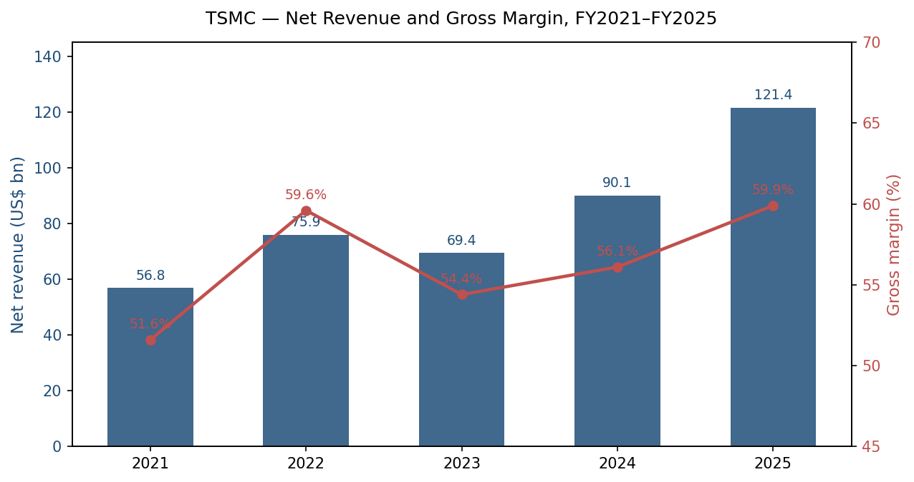
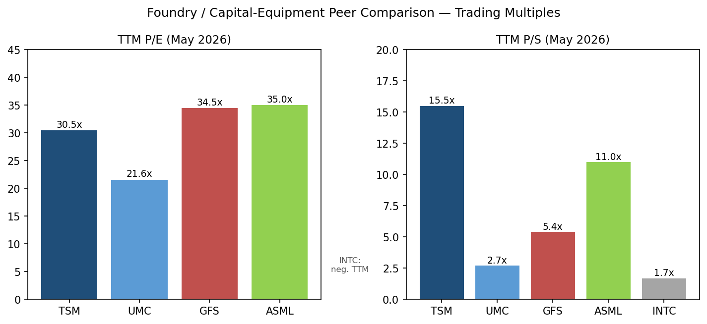
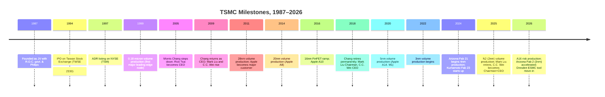
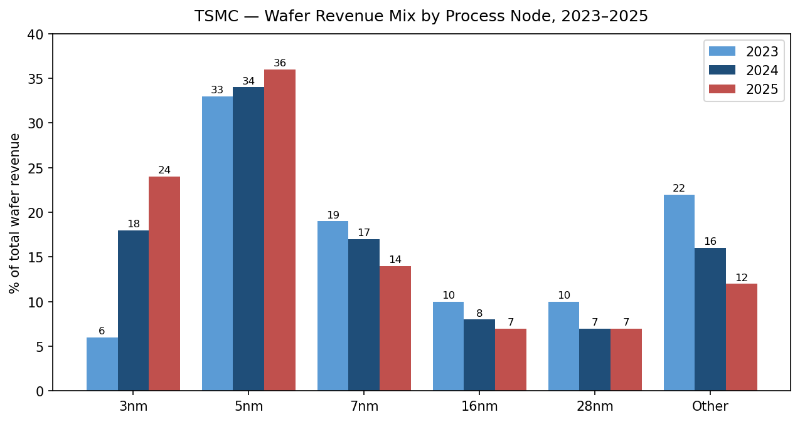
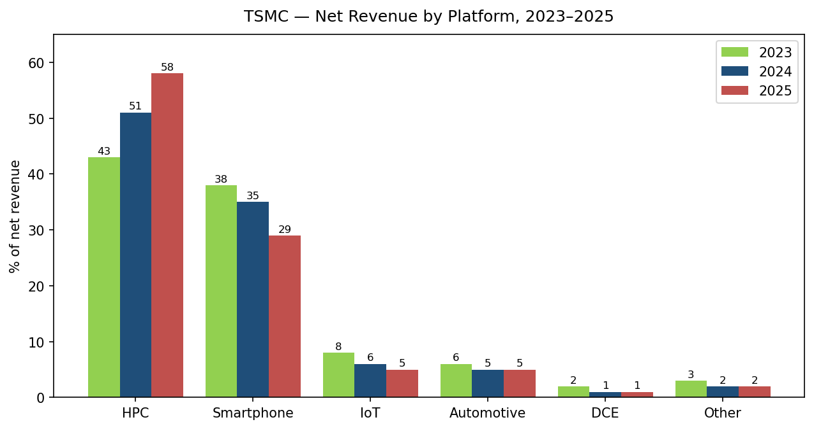
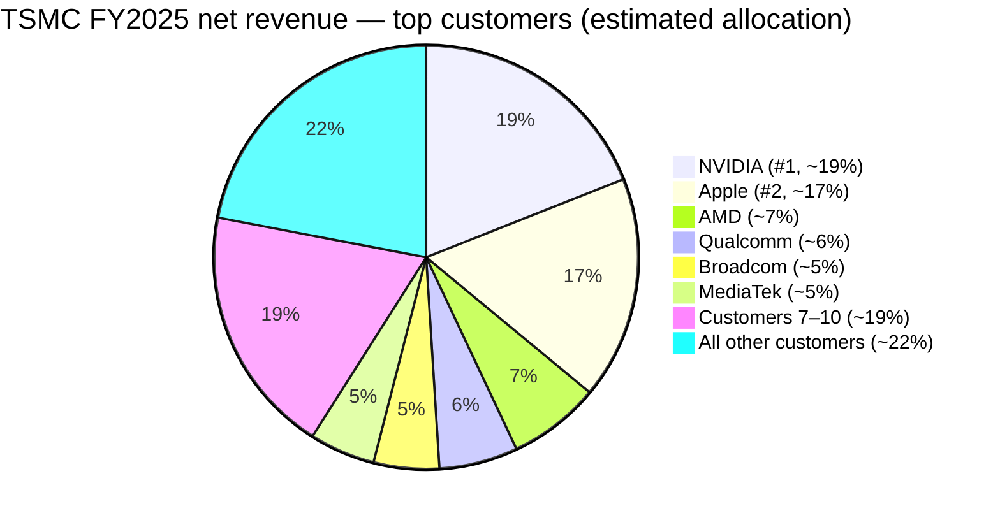
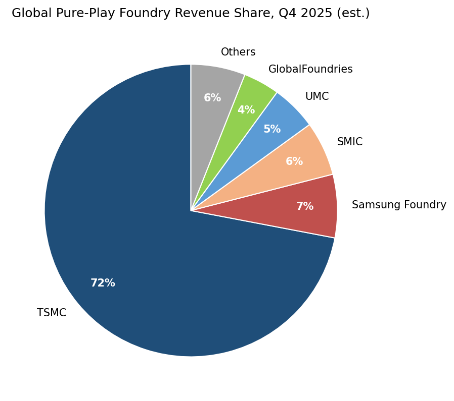
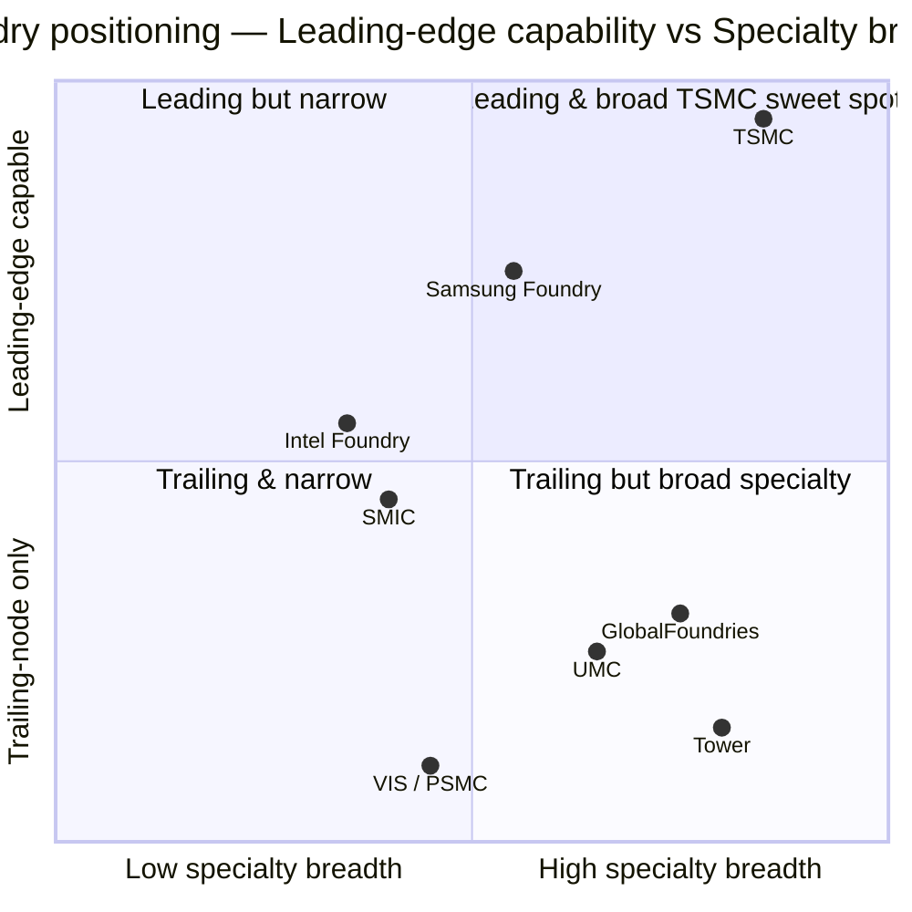

# COMPANY RESEARCH REPORT: Taiwan Semiconductor Manufacturing Company (NYSE: TSM, TWSE: 2330)

**Date:** 2026-05-20
**Analyst:** Internal coverage initiation
**Listing:** NYSE ADS (TSM) / TWSE common (2330)
**Reporting language:** English (TSMC files a 20-F with the U.S. SEC in English; the auto-rule routes US listings to English regardless of issuer domicile)

---

> **Update — FY2026 guidance raised (2026-04-16):** On the Q1 2026 earnings call, management raised full-year 2026 USD revenue guidance to "above 30% year-over-year growth" (from the "mid-20%s to ~30%" range communicated on the Q4 2025 call in January) and lifted full-year capex guidance to a record **US$52–56 billion** (vs. US$40.9 billion spent in 2025). The driver is "continued strong demand for our leading-edge process technologies", led by HPC and AI accelerators; Q1 revenue of **US$35.90 billion** beat the prior US$35.0–35.7 billion guide, and Q2 was guided to **US$39.0–40.2 billion**. Q1 gross margin came in at **66.2%**, above the top of the 64–66% guide.
> Source: [TSMC Q1-2026 earnings press release, 2026-04-16](https://www.sec.gov/Archives/edgar/data/1046179/000104617926000199/a1q26e_withguidancexfinal.htm); [SCMP, 2026-04-16](https://www.scmp.com/tech/big-tech/article/3350346/tsmc-targets-over-30-revenue-surge-2026-ramps-capex-amid-booming-ai-demand); [DCD, 2026-01-16](https://www.datacenterdynamics.com/en/news/tsmc-announces-2026-capex-spend-of-56bn-after-posting-eighth-consecutive-quarter-of-growth/).

---

## TABLE OF CONTENTS
1. Company Overview
2. Company History
3. Management Team
4. Products & Services
5. Customers & Go-to-Market
6. Industry Overview
7. Competitive Landscape
8. Market Opportunity (TAM)
9. Risk Assessment

References

---

## 1. COMPANY OVERVIEW

Taiwan Semiconductor Manufacturing Company Limited ("TSMC", NYSE: TSM, TWSE: 2330) is the world's largest dedicated semiconductor foundry — a contract manufacturer that fabricates chips designed by other companies. Founded in 1987 in Hsinchu, Taiwan by Dr. Morris Chang as a joint venture between the R.O.C. government, Philips, and other private investors, TSMC pioneered the pure-play foundry business model and has held the dominant position in that market for more than three decades ([TSMC 2025 Form 20-F, Item 4 — Information on the Company](https://www.sec.gov/Archives/edgar/data/1046179/000162828026025362/tsm-20251231.htm)).

**What it does.** TSMC manufactures integrated circuits on silicon wafers using customer-supplied designs. The company deploys 305 distinct process technologies and manufactured 12,682 different products for 534 customers in 2025 ([Q1-2026 earnings press release, 2026-04-16](https://www.sec.gov/Archives/edgar/data/1046179/000104617926000199/a1q26e_withguidancexfinal.htm)). Its process technology portfolio spans from 0.25-micron mature nodes to the leading-edge 2-nanometer ("N2") node that entered volume production in 2025, and its 16-angstrom ("A16") node is on track for risk production in 2026 ([2025 20-F, Item 4](https://www.sec.gov/Archives/edgar/data/1046179/000162828026025362/tsm-20251231.htm)). In addition to wafer fabrication (which generated 86% of net revenue in 2025), TSMC offers mask making, design enablement, and a comprehensive 3DFabric® advanced packaging suite — including CoWoS® (Chip-on-Wafer-on-Substrate), SoIC® (System-on-Integrated-Chips) and InFO (Integrated Fan-Out) ([TSMC 3DFabric blog, 2020-08-03](https://www.tsmc.com/english/news-events/blog-article-20200803)).

**How it makes money.** TSMC's principal revenue source is wafer fabrication, billed on a per-wafer basis with prices that reflect node, design complexity, and capacity tightness. Pricing is contractually framed in U.S. dollars but reported in New Taiwan dollars under TIFRS. The remaining ~14% of revenue comes from packaging and testing, mask making, design services, and royalties ([2025 20-F, Item 5](https://www.sec.gov/Archives/edgar/data/1046179/000162828026025362/tsm-20251231.htm)). The business has substantial operating leverage: roughly half of cost of goods sold is fixed (depreciation on fabs), so utilization swings drive material gross-margin volatility — a dynamic visible in the FY2021 surge to 59.6%, the FY2023 dip to 54.4%, and the FY2025 recovery to 59.9% as advanced-node mix expanded and utilization tightened (2025 20-F, Item 5).

**Geographic operations.** TSMC operates one 150mm wafer fab, six 200mm wafer fabs, nine 300mm wafer fabs, and seven advanced backend (packaging) fabs as of February 28, 2026 (2025 20-F, Item 4). Nine of the fabs sit in Hsinchu Science Park, two in Central Taiwan Science Park, seven in Southern Taiwan Science Park, two in the United States (Washington state and Arizona), one in Shanghai (Fab 10), one in Nanjing (Fab 16), and one in Kumamoto, Japan (JASM / Fab 23, mass production since late 2024). A second JASM fab in Kumamoto and a European fab (ESMC / Fab 24) in Dresden, Germany are under construction ([2025 20-F, Item 4](https://www.sec.gov/Archives/edgar/data/1046179/000162828026025362/tsm-20251231.htm); [TrendForce, 2025-11-20](https://www.trendforce.com/news/2025/11/20/news-tsmc-dresden-fab-reportedly-wraps-structural-build-eyes-equipment-move-in-in-2h26/)). Despite the visible geographic build-out, three-quarters of the company's revenue still comes from North-America-headquartered customers; only the design ownership is geographically diverse — the manufacturing is overwhelmingly Taiwan-anchored.

**Size and scale.** FY2025 net revenue was NT$3,809.1 billion (US$121.4 billion), up 31.6% year-over-year; net income attributable to shareholders was NT$1,697.6 billion (US$54.1 billion), up 46.6% (2025 20-F, Item 5). Gross margin expanded to 59.9%, operating margin to 50.8%, and net profit margin to 44.5%. The company shipped approximately 15.0 million 12-inch equivalent wafers in 2025 vs. 12.9 million in 2024. Operating cash flow reached NT$2,275.0 billion (US$72.5 billion), funding NT$1,272.4 billion (US$40.9 billion) of capex and still leaving a meaningful free-cash-flow surplus. Headcount disclosed in the 20-F places employees globally at ~83,000+ as of year-end 2025. The Q1 2026 quarterly run-rate has accelerated further: US$35.9 billion of revenue (+40.6% YoY in USD terms) and 66.2% gross margin, with Q2 guided to US$39.0–40.2 billion ([Q1-2026 earnings release, 2026-04-16](https://www.sec.gov/Archives/edgar/data/1046179/000104617926000199/a1q26e_withguidancexfinal.htm)).

*Source: [TSMC 2025 Form 20-F](https://www.sec.gov/Archives/edgar/data/1046179/000162828026025362/tsm-20251231.htm); FX from 20-F Item 5 (weighted-average NT$/US$).*

**Valuation snapshot.** Based on the most recent market quote of **US$404.35 per ADR on 2026-05-15** (one ADS = 5 common shares), the trailing P/E sits at approximately **30.5×** and the trailing P/S at roughly **15.5×** on US$131.0 billion of TTM revenue and ~US$2.05 trillion market capitalization ([financecharts.com — TSM P/E, May 2026](https://www.financecharts.com/stocks/TSM/value/pe-ratio); [marketcapof.com — TSM, May 2026](https://marketcapof.com/stocks/tsm.us/)). Forward P/E is **~25.8×** on consensus FY2026 EPS ([GuruFocus — Forward P/E, May 2026](https://www.gurufocus.com/term/forward-pe-ratio/TSM)). Over the trailing 36 months, the P/E has ranged from a low near 13× (mid-2023 trough) to a high above 35× (early-2026 peak), and the P/S from ~6× to ~16× ([macrotrends — TSM P/E history](https://www.macrotrends.net/stocks/charts/TSM/taiwan-semiconductor-manufacturing/pe-ratio)).

Peer comparison (TTM, mid-May 2026):

| Company | Ticker | TTM P/E | TTM P/S | Notes |
|---|---|---|---|---|
| TSMC | NYSE:TSM | 30.5× | 15.5× | Foundry leader, AI accelerator beneficiary |
| United Microelectronics | NYSE:UMC | 21.6× | 2.7× | Mature/specialty foundry ([Public.com, Apr 2026](https://public.com/stocks/umc/pe-ratio)) |
| GlobalFoundries | NASDAQ:GFS | 34.5× | 5.4× | Specialty foundry ([MacroTrends — GFS P/E](https://www.macrotrends.net/stocks/charts/GFS/globalfoundries/pe-ratio)) |
| ASML (capex tool) | NASDAQ:ASML | 35.0× | 11.0× | EUV monopoly supplier |
| Intel | NASDAQ:INTC | n/m (negative TTM) | 1.7× | Foundry losses; structurally depressed |

TSMC trades at a meaningful premium to UMC and a slight discount to GFS on P/E despite delivering vastly stronger growth and margin — a sign the market is paying for the **structural AI growth premium and unmatched leading-edge moat**, but not extrapolating it indefinitely. The 30× TTM P/E sits roughly at TSMC's own ~3-year median and ~2× the broad semiconductor sector median (SOX ETF holdings median P/E near 22× per public ETF disclosures). The premium-but-not-extreme stance is driven primarily by **(a)** a sector premium tied to multi-year AI capex from US hyperscalers and NVIDIA; **(b)** a 59.9% FY2025 gross margin that no foundry peer can replicate; and **(c)** absolute scarcity of leading-edge supply, with N2 capacity reportedly sold out through 2028 ([SamMobile, 2026](https://www.sammobile.com/news/samsung-foundry-likely-to-pick-up-big-orders-as-tsmc-gets-sold-out-until-2028/)). At 15.5× P/S — well above UMC and GFS, in line with ASML — the multiple is high but defended by 31.6% FY2025 top-line growth and >30% FY2026 guidance. The valuation is not stretched enough to be a standalone risk, but compression from a multiple north of 30× would be a meaningful drag if AI capex normalises before earnings deliver into it; we flag this in Section 9.

*Sources: [financecharts.com — TSM, May 2026](https://www.financecharts.com/stocks/TSM/value/pe-ratio); [Public.com — UMC, Apr 2026](https://public.com/stocks/umc/pe-ratio); [MacroTrends — GFS](https://www.macrotrends.net/stocks/charts/GFS/globalfoundries/pe-ratio); peer P/S calculated from quoted market caps and trailing revenue.*

---

## 2. COMPANY HISTORY

TSMC was founded in 1987 by Dr. Morris Chang (張忠謀), a Texas Instruments and General Instrument veteran recruited by the R.O.C. government to professionalize Taiwan's semiconductor industry. Chang's foundational insight was that the design and manufacturing of chips could be decoupled into separate businesses — a model that, at the time, no large semiconductor company embraced. Most chipmakers were vertically integrated "IDMs" (integrated device manufacturers) such as Intel, Motorola, NEC, and Hitachi. By offering manufacturing as a service, Chang argued, fabless design houses could emerge and proliferate. That bet underwrote the entire modern fabless ecosystem — from Qualcomm, Broadcom, and NVIDIA to Apple's silicon team, Marvell, MediaTek, and AMD ([TSMC corporate "About Us" page](https://www.tsmc.com/english/aboutTSMC/company_profile); [2025 20-F, Item 4](https://www.sec.gov/Archives/edgar/data/1046179/000162828026025362/tsm-20251231.htm)).

The joint venture initially included the R.O.C. National Development Fund, Philips of the Netherlands (who provided technology licenses and equipment), and other private investors. TSMC's common shares listed on the Taiwan Stock Exchange in September 1994 and its ADSs on the NYSE in October 1997 (2025 20-F, Item 4).

*Sources: [2025 20-F, Item 4](https://www.sec.gov/Archives/edgar/data/1046179/000162828026025362/tsm-20251231.htm); [Tom's Hardware on A16 timing, 2026](https://www.tomshardware.com/tech-industry/tsmcs-1-6nm-node-to-be-production-ready-in-late-2026-roadmap-remains-on-track); [TrendForce on Arizona Fab 2 pull-in, 2025-09-30](https://www.trendforce.com/news/2025/09/30/news-tsmc-reportedly-pulls-arizona-third-fab-to-2027-ahead-by-one-year-eyeing-2nm-and-a16/).*

Three pivots define TSMC's strategic trajectory. **First, the move from technology follower to technology leader.** Through the 2000s TSMC trailed Intel by one to two nodes on the most advanced logic process; by the 16nm FinFET generation (2015–2016) the company had closed the gap, and by 2020's 5nm ramp — released in volume more than a year before Intel could match it — TSMC had decisively overtaken every competitor. Today TSMC believes it is the technology leader among the foundries on advanced semiconductors of 7-nanometer and below by revenue (2025 20-F, Item 4). **Second, the emergence of advanced packaging as a stand-alone moat.** TSMC's 3DFabric® platform (CoWoS, InFO, SoIC) repositioned the company from "the place to make chips" into "the place to integrate systems" — capturing AI accelerator value that goes beyond logic wafers. **Third, the post-2022 geographic diversification under geopolitical pressure**, with TSMC Arizona, JASM Japan, and ESMC Germany now committed to a multi-region footprint despite the obvious cost penalty.

Key recent developments (last 12–18 months):

- **N2 (2nm) volume production launched in 2H 2025** at Hsinchu Fab 20 and (later) Kaohsiung Fab 22 ([2025 20-F, Item 4](https://www.sec.gov/Archives/edgar/data/1046179/000162828026025362/tsm-20251231.htm)).
- **Arizona Fab 21 producing 4nm chips for Apple and NVIDIA**; Apple committed to purchase **100 million chips from Arizona by year-end 2026** ([AppleInsider, 2026-05-15](https://appleinsider.com/articles/26/05/15/apples-us-chip-plan-gains-steam-thanks-to-20b-tsmc-investment); [Arizona Tech Council, 2026](https://www.aztechcouncil.org/apple-chips-tsmc-fab/)).
- **A16 (1.6nm) — "Super Power Rail" backside power delivery node — on track for risk production in 2026** ([Tom's Hardware, 2026](https://www.tomshardware.com/tech-industry/tsmcs-1-6nm-node-to-be-production-ready-in-late-2026-roadmap-remains-on-track)).
- **CoWoS capacity scaling from ~35K wpm late-2024 toward 130K wpm by year-end 2026**, with NVIDIA reportedly booking >60% of total CoWoS supply for 2025–2026 ([CNBC, 2026-04-08](https://www.cnbc.com/2026/04/08/tsmc-nvidia-advanced-packaging-intel.html); [DigiTimes, 2026-04-10](https://www.digitimes.com/news/a20260410VL204/packaging-capacity-tsmc-nvidia-demand.html)).
- **Q1 2026 first profitable quarter for JASM Kumamoto**, ¥4.7 billion net income ([Focus Taiwan, 2026-05-16](https://focustaiwan.tw/business/202605160005)).
- **Section 232 25% tariff on advanced computing chips in effect** since December 2025 (carve-out for U.S.-domestic-use chips); January 2026 U.S.–Taiwan trade & investment agreement caps Taiwan reciprocal tariffs at ≤15% (2025 20-F, Item 3).

---

## 3. MANAGEMENT TEAM

TSMC is in the second year of a generational leadership transition. Founder Morris Chang retired from active management in 2018; his successor Chairman Mark Liu retired in mid-2024, and **Dr. C.C. Wei** consolidated both the CEO and Chairman roles in 2024. The Board today comprises **ten directors, seven of whom are independent** — a level of independence well above Taiwan listing minimums and on par with leading US large caps ([2025 20-F, Item 6](https://www.sec.gov/Archives/edgar/data/1046179/000162828026025362/tsm-20251231.htm)).

### C.C. Wei (魏哲家) — Chairman & Chief Executive Officer

Dr. Che-Chia "C.C." Wei (age 71–75) has been with TSMC for 28 years, the longest tenure of any executive officer aside from a couple of co-CEO peers. He was named **CEO in June 2018** (after a multi-year Co-CEO arrangement with Mark Liu from 2013), elevated to **Vice Chairman in 2024**, and assumed **Chairman in 2024** when Liu retired (2025 20-F, Item 6). Before joining TSMC in 1998, Dr. Wei was **Senior Vice President of Technology at Chartered Semiconductor Manufacturing** in Singapore — at that time the third-largest foundry globally — and earlier **Senior Manager for Logic and SRAM technology development at STMicroelectronics** in Texas. Inside TSMC he ran Operations I (2005–2008), Mainstream Technology (2008–2009), Business Development (2009–2012), became Executive Vice President and Co-COO in 2012, and President / Co-CEO from 2013. His career has been spent almost entirely inside semiconductor manufacturing operations and technology development, in contrast to the financial / general management backgrounds common in CEOs of comparable-scale US companies. He chaired the Taiwan Semiconductor Industry Association from 2017 to 2019. He holds a Ph.D. in electrical engineering from Yale University ([2025 20-F, Item 6](https://www.sec.gov/Archives/edgar/data/1046179/000162828026025362/tsm-20251231.htm)).

Under Wei's tenure as CEO since 2018, TSMC's revenue grew from US$33.5 billion (2018) to US$121.4 billion (2025) — a 3.6× expansion in seven years that no peer in the foundry universe has approached — while gross margin expanded from 48.3% to 59.9%. He has overseen the 7nm, 5nm, 3nm, and now 2nm ramps; the launch of Arizona Fab 21; the JASM joint venture with Sony and Denso; the announcement of the European fab in Dresden; and the strategic deepening of advanced packaging. Importantly, he is operations-trained: the move to consolidate Chairman and CEO under one operator at exactly the moment when geographic diversification, geopolitical sensitivity, customer concentration, and packaging tightness all reach inflection levels reflects the Board's preference for technical / operational continuity. His public profile is muted by US-CEO standards (no Twitter/X, rare media interviews, no shareholder-letter prose), with most of his public communication channelled through formal quarterly earnings calls and the annual "Sports Day" address.

### Wendell Huang — Senior Vice President & Chief Financial Officer

Mr. Wendell Huang has 27 years at TSMC and has been CFO and corporate spokesperson since 2019 (2025 20-F, Item 6). Earlier he ran Investor Relations and worked through multiple finance roles inside the company, which is unusual for a CFO of a company this size — most peers recruit external public-company CFO experience. As public spokesperson on all eight earnings calls of the last two years he has delivered consistent, conservative, and analytically detailed quarterly commentary. The 2025 issuance of NT$86.9 billion of corporate bonds was executed under his oversight, alongside roughly NT$440 billion of net cash used in financing activities (mainly dividend payments and bond repayments) (2025 20-F, Item 5). Huang's track record is one of strong, predictable disclosure discipline rather than capital-markets glamour: TSMC has consistently met or beaten its quarterly guidance through the AI cycle, and capex guidance — while it has been raised twice in the past 12 months — has been clearly telegraphed to investors with platform-by-platform allocation detail (70–80% advanced process, 10% specialty, 10–20% advanced packaging for 2026, [DCD, 2026-01-16](https://www.datacenterdynamics.com/en/news/tsmc-announces-2026-capex-spend-of-56bn-after-posting-eighth-consecutive-quarter-of-growth/)).

### Y.P. Chyn & Y.J. Mii — Co-Chief Operating Officers; Cliff Hou & Kevin Zhang — Deputy Co-COOs

TSMC has split operational leadership across **two Co-COOs (Y.P. Chyn, 39 years tenure; Y.J. Mii, 32 years)** and **two Deputy Co-COOs (Cliff Hou, 29 years; Kevin Zhang, 10 years)**, each with explicit functional remits. This four-way split — unusually deep at the COO layer for a single-business company — reflects both the complexity of running 17 fabs across three continents while simultaneously developing two new process generations (N2 and A16) and the company's strong tradition of internal-promotion succession. **Kevin Zhang**, the most externally-visible of the four, also runs Business Development and Global Sales, and has been the public face of TSMC's customer roadmap (his Hot Chips and ISSCC keynotes function as informal forward guidance on which nodes are tracking and which technologies will be available for which customers). **Y.J. Mii** has spent his career almost entirely in R&D and is the steward of the leading-edge process roadmap. **Y.P. Chyn** is the manufacturing-operations stalwart with nearly four decades on the floor. **Cliff Hou** dual-hats as Chief Information Security Officer — a meaningful signal that cyber posture is being treated as a manufacturing-quality dimension, not just an IT function (2025 20-F, Item 6).

### Governance

- **Board composition.** 10 directors, 7 independent (Sir Peter Bonfield, Michael Splinter, Moshe Gavrielov, L. Rafael Reif, Ursula Burns, Lynn Elsenhans, Chuan Lin). The independent slate includes a former Applied Materials CEO (Splinter), former MIT President (Reif), former Xilinx CEO (Gavrielov), former Xerox CEO and President's Council on Jobs member (Burns), and the former CEO of Sunoco (Elsenhans) — a deliberately international and operator-heavy independent bench (2025 20-F, Item 6).
- **Audit & Risk Committee, Compensation & People Development Committee, and Nominating/Governance/Sustainability Committee** are each composed entirely of independent directors (the latter two are required minimums under R.O.C. law since 2011; TSMC adopted them well before).
- **Largest shareholder: National Development Fund of the R.O.C. (~6.4% of common shares as of 2025 year-end)** holds one director seat — a structural R.O.C.-state minority position dating to 1987.
- **Insider ownership** of directors and executive officers as a group is well below 1% — TSMC is a widely-held public company with most equity in foreign institutional hands via the ADR program (≈25% of common shares are represented by ADRs).
- **Compensation structure** mixes cash salary, an annual cash bonus tied to operating results, and a profit-sharing plan denominated in restricted shares (the proxy explicitly discloses that no traditional stock options have been used since 2007). Performance is keyed to revenue, EPS, gross margin, market share, and ESG KPIs.

**Track record synthesis.** This is one of the strongest operating management benches in the global semiconductor industry — long tenures, internal promotions, technology-trained leaders, and a CEO with a 3.6× revenue expansion record. Gaps are (a) leadership of overseas fabs is still maturing (Arizona Fab 21 has been a multi-year learning curve on yield, cost, and labor), and (b) C.C. Wei's combined Chairman+CEO role places concentrated authority in one individual without an obvious in-house successor of his stature.

---

## 4. PRODUCTS & SERVICES

TSMC's "product" is essentially a manufacturing service: customers send GDSII layout designs and TSMC manufactures wafers, dies, and packaged units. The portfolio is best mapped along two orthogonal dimensions — **process node** and **platform** — plus a third **advanced packaging** family of services. Every distinct process technology in the portfolio is enumerated in the 20-F (2025 20-F, Item 4) and the company's product pages.

### A. Process Node Portfolio (logic CMOS)

```mermaid
graph TD
    A[TSMC Process Technologies]
    A --> B[Leading-edge logic]
    A --> C[Mainstream logic]
    A --> D[Specialty]
    A --> E[Advanced packaging<br/>3DFabric]
    B --> B1[A16 1.6nm risk production 2026]
    B --> B2[N2 / N2P 2nm Nanosheet — VP 2025]
    B --> B3[N3 / N3E / N3P / N3X / N3A / N3C — VP since 2022]
    B --> B4[N4 / N4P / N4C — derivative]
    B --> B5[N5 / N5P — VP since 2020]
    B --> B6[N6 / N7 / N7+ FinFET]
    C --> C1[16nm FinFET / 16FFC]
    C --> C2[22ULP / 22ULL]
    C --> C3[28nm HPC / HPC+ / ULP]
    C --> C4[40 / 55 / 65 / 90nm planar]
    C --> C5[0.13 / 0.18 / 0.25um — mature]
    D --> D1[RF / RF front-end]
    D --> D2[Embedded NVM eFlash]
    D --> D3[Power Management ICs]
    D --> D4[CMOS image sensors]
    D --> D5[MRAM / RRAM]
    D --> D6[MEMS]
    E --> E1[CoWoS — CoW + on Substrate]
    E --> E2[InFO — fan-out wafer-level]
    E --> E3[SoIC — chip-on-wafer 3D]
    E --> E4[CoW / WoW die-stacking]
```

*Source: [2025 20-F, Item 4](https://www.sec.gov/Archives/edgar/data/1046179/000162828026025362/tsm-20251231.htm); [TSMC Technology product pages](https://www.tsmc.com/english/dedicatedFoundry/technology); [TSMC A16 page](https://www.tsmc.com/english/dedicatedFoundry/technology/logic/l_A16).*

**Leading-edge nodes (≤7nm) — the moat.** Advanced technologies (7nm and below) accounted for **74% of total wafer revenue in 2025**, up from 69% in 2024 and 58% in 2023 (2025 20-F, Item 5). The cumulative 16-percentage-point shift in two years is the single most important narrative for TSMC: the mix is converging toward the highest-margin, highest-ASP, highest-moat portion of the portfolio.

- **A16 (1.6nm)** — TSMC's first node with backside power delivery ("Super Power Rail"), promising an 8–10% speed boost or up to 20% power reduction over N2P at iso-design. Risk production in 2H 2026 at Hsinchu and later Kaohsiung; mass production targeted for 2027 ([TSMC A16 product page](https://www.tsmc.com/english/dedicatedFoundry/technology/logic/l_A16); [Wccftech, 2026](https://wccftech.com/tsmc-a16-node-promises-speed-boost-power-cut-over-2nm-backside-power-production-q4-2026/)). **Moat: yes — technology, scale, and IP, with no peer credibly within 12+ months. Closest competitor product: Samsung Foundry SF1.4 (also gate-all-around nanosheet); TSMC ahead on density and reportedly ahead on yield, though Samsung's "early GAA deployment" is its asymmetric bet.**
- **N2 / N2P (2nm) — gate-all-around nanosheet, volume production from 2H 2025.** Yield reported above 90% by [SemiWiki, 2025](https://semiwiki.com/forum/threads/tsmcs-2nm-chips-the-results-are-out.24329/) vs. Samsung's reported ~55–60% on its competing SF2 ([TrendForce, 2025-11-25](https://www.trendforce.com/news/2025/11/25/news-samsung-reportedly-hits-55-60-2nm-yields-eyeing-an-edge-through-early-gaa-deployment/)). N2 capacity is reportedly **sold out through 2028** with Apple, NVIDIA, AMD, MediaTek, Qualcomm, and Broadcom all booked ([SamMobile, 2026](https://www.sammobile.com/news/samsung-foundry-likely-to-pick-up-big-orders-as-tsmc-gets-sold-out-until-2028/)). **Moat: yes — technology, scale, customer ecosystem lock-in. Closest peer: Samsung SF2.**
- **N3 / N3E / N3P / N3X / N3C / N3A** — TSMC's 3nm family is the workhorse leading node in 2026. **24% of wafer revenue in 2025** (up from 6% in 2023 and 18% in 2024). Variants targeted at HPC (N3X — performance), smartphone (N3P — Apple A18/A19), mainstream (N3C — compact), and automotive (N3A — released to customers end-2025). **Moat: yes — TSMC is the only foundry running 3nm in volume; Samsung's 3GAE saw very limited external customer adoption.**
- **N4 / N4P / N4C / N5 / N5P / N6 / N7** — derivative and prior-generation nodes still drive 50% of wafer revenue in 2025 (5nm 36%, 7nm 14%). Many AI accelerators (NVIDIA Hopper H100/H200 generation) and Apple M-series (M2, M3) chips remained on these nodes for cost/yield reasons.

*Source: [2025 20-F, Item 5](https://www.sec.gov/Archives/edgar/data/1046179/000162828026025362/tsm-20251231.htm) (Technology Development table).*

**Mainstream and specialty (16nm–0.25µm).** 28nm, 16nm, 40/45nm, 65nm, 90nm, and older nodes collectively account for ~26% of FY2025 wafer revenue. These nodes power power management ICs, RF, image sensors, MCUs, display drivers, and automotive bulk parts. **Moat: partial — TSMC is one of several credible suppliers; UMC, SMIC, GlobalFoundries, Samsung Foundry, Vanguard International Semiconductor (VIS), PSMC and Tower all compete here. Cost leadership at 28nm and below is TSMC's claim; scale is also material. But pricing power is weaker.**

**Specialty technologies (non-CMOS-logic).** TSMC offers embedded flash, RF, CMOS image sensors, MEMS, BCD power, MRAM (16nm auto-grade-1 in 2025) and RRAM (22ULL auto-grade-1 in 2025). These are most heavily used in IoT, auto, and consumer electronics platforms (2025 20-F, Item 4). **Moat: partial — direct competition from Sony (CIS), STMicroelectronics (MEMS, BCD), and various pure-play specialty fabs.**

### B. Platform-Specific Solutions

Per the 20-F's platform reporting (2025 20-F, Item 4 & Item 5), TSMC's net revenue breaks into:

| Platform | FY2023 | FY2024 | FY2025 |
|---|---|---|---|
| **High Performance Computing** | 43% | 51% | **58%** |
| **Smartphone** | 38% | 35% | **29%** |
| **Internet of Things** | 8% | 6% | **5%** |
| **Automotive** | 6% | 5% | **5%** |
| **Digital Consumer Electronics** | 2% | 1% | **1%** |
| **Other** | 3% | 2% | **2%** |

HPC overtook Smartphone as the #1 platform in 2024 and now dwarfs it. The shift is **structurally driven by AI accelerator demand** — NVIDIA Hopper/Blackwell GPUs, AMD MI300/MI350 accelerators, Google TPU v5/v6, AWS Trainium 2, Meta MTIA, Microsoft Maia, Tesla Dojo, and Apple's M-series (whose silicon is in fact a hybrid HPC/Smartphone allocation). Specific HPC technologies TSMC promotes — N4X, N3X, N2X — represent ultra-high-frequency variants tuned for AI/HPC peak clock (2025 20-F, Item 4).

*Source: [2025 20-F, Item 5](https://www.sec.gov/Archives/edgar/data/1046179/000162828026025362/tsm-20251231.htm).*

### C. Advanced Packaging — 3DFabric®

TSMC's 3DFabric® platform aggregates three core technology families ([TSMC 3DFabric blog, 2020-08-03](https://www.tsmc.com/english/news-events/blog-article-20200803); [TSMC 3DFabric portal](https://3dfabric.tsmc.com/english/dedicatedFoundry/technology/3DFabric.htm)):

1. **CoWoS® (Chip-on-Wafer-on-Substrate)** — silicon interposer-based 2.5D packaging; the dominant choice for AI accelerators (NVIDIA H100/H200/B100/B200, AMD MI300, AWS Trainium). Variants include **CoWoS-S (classic interposer)**, **CoWoS-R (RDL)**, **CoWoS-L (large-interposer, the AI workhorse)**. NVIDIA reportedly has booked >60% of total CoWoS capacity for 2025–2026 ([CNBC, 2026-04-08](https://www.cnbc.com/2026/04/08/tsmc-nvidia-advanced-packaging-intel.html)).
2. **SoIC® (System on Integrated Chips)** — wafer-level chip-on-wafer 3D bonding for compute + HBM/SRAM die stacking. AMD's V-Cache uses an SoIC variant; AMD MI300 stacks compute and I/O die via SoIC + CoWoS.
3. **InFO (Integrated Fan-Out)** — fan-out wafer-level packaging used heavily in mobile (Apple A-series since 2016) and increasingly in AI inference parts.

CoWoS capacity is scaling from approximately **35K wafers/month at end-2024 to a target ~130K wpm by year-end 2026** — roughly a 3.7× expansion in two years — yet remains sold out, with TSMC outsourcing select packaging steps to ASE and Amkor to relieve pressure ([Astute Group, 2026](https://www.astutegroup.com/news/industrial/advanced-packaging-demand-soars-nvidia-secures-60-of-cowos-capacity/); [DigiTimes, 2026-04-10](https://www.digitimes.com/news/a20260410VL204/packaging-capacity-tsmc-nvidia-demand.html)). **Moat: yes — strong technology, scale, switching costs, and ecosystem. Closest peer: Samsung Foundry (I-Cube, X-Cube), Intel Foundry (EMIB / Foveros), and OSATs ASE/Amkor for traditional FCBGA. None match CoWoS-L on volume or AI customer presence in 2026.**

### D. Design Enablement (Open Innovation Platform®, OIP)

TSMC bundles a full design-enablement ecosystem: PDKs, design rules, EDA collaboration with Cadence and Synopsys, foundation IP via Arm/Synopsys/Cadence/eMemory, the **CyberShuttle® multi-project wafer program** (shared mask costs for prototyping), and the **3Dblox standard** (contributed to IEEE) for 3DIC design (2025 20-F, Item 4). The OIP ecosystem effectively makes it dramatically more expensive for any customer to port to another foundry — every IP, every PDK, every reference flow is TSMC-specific. **Moat: yes — switching costs, ecosystem, network effects between TSMC, customers, EDA, and IP vendors.**

### Flagship vs. long-tail; 2025–2026 launches

The **three flagship platforms driving the business today are (1) HPC on N3X/N3P, (2) AI accelerators on N5/N4P + CoWoS-L packaging, (3) Apple application processors on N3P**. Long-tail mature nodes (28nm and older) collectively contribute the residual 26% of wafer revenue at structurally lower margins.

Launches and roadmap items in the last 12 months:
- **N2 volume production from 2H 2025** (Fab 20 Hsinchu, Fab 22 Kaohsiung).
- **N3A automotive node released to customers end-2025**.
- **CoWoS capacity tripling underway**, with new Taichung AP7 + Southern Taiwan AP8 packaging fabs in build-out (2025 20-F lease disclosures).
- **A16 risk production targeted 2H 2026**.

No nodes were sunset in 2025–2026.

---

## 5. CUSTOMERS & GO-TO-MARKET

### Customer concentration — material and rising

TSMC discloses customer concentration explicitly in the 20-F. The **top customer accounted for 19% of net revenue in 2025** (down from 22% in 2024 and 25% in 2023), the **second customer 17% in 2025** (vs. 12% in 2024 and 11% in 2023), and **top 10 customers 78% in 2025** (vs. 76% in 2024 and 70% in 2023) (2025 20-F, Item 3 — Risk Factors). The disclosure does not name top customers, but the public ecosystem is unambiguous: in 2025, **NVIDIA overtook Apple to become TSMC's #1 customer**, generating roughly $23.4 billion (~19% of TSMC revenue) versus Apple's ~$22 billion ([CNBC, 2026-01-26](https://www.cnbc.com/2026/01/26/nvidia-set-to-supplant-apple-as-tsmcs-largest-customer.html); [PCGuide, 2026](https://www.pcguide.com/pro/news-pro/nvidia-overtakes-apple-as-the-number-one-tsmc-client-as-revenue-more-than-doubles-in-one-year/)). For 2026 the consensus expectation is **NVIDIA ~22% of TSMC revenue (~$33 billion) vs. Apple ~18% (~$27 billion)** ([CNBC, 2026-01-26](https://www.cnbc.com/2026/01/26/nvidia-set-to-supplant-apple-as-tsmcs-largest-customer.html)).

*Sources: TSMC top-customer % from [2025 20-F, Item 3](https://www.sec.gov/Archives/edgar/data/1046179/000162828026025362/tsm-20251231.htm); customer identities from [CNBC, 2026-01-26](https://www.cnbc.com/2026/01/26/nvidia-set-to-supplant-apple-as-tsmcs-largest-customer.html), [PCGuide, 2026](https://www.pcguide.com/pro/news-pro/nvidia-overtakes-apple-as-the-number-one-tsmc-client-as-revenue-more-than-doubles-in-one-year/), and [Wccftech, 2026](https://wccftech.com/nvidia-officially-overtakes-apple-as-tsmc-largest-customer/). Customers 3–10 are estimated based on industry reporting and not separately disclosed by TSMC.*

This is a **material concentration risk** — the disclosed top-1 (19%) sits at the upper bound of what most institutional investors would consider acceptable, and **the combined top-2 (~36%) is materially higher than any prior period**. The trend is also adverse: the top-10 concentration rose 8 percentage points in two years. We carry this into Section 9 as a high-severity risk. **Mitigants**: (a) the top customers — NVIDIA, Apple, AMD, Qualcomm, Broadcom — are themselves growing fast, financially strong, and have effectively **no alternative** at TSMC's leading edge; (b) TSMC has materially diversified the system-companies tail (Google, Amazon, Microsoft, Meta, Tesla custom silicon programs) — the 20-F flags "a growing trend among system companies designing their own semiconductors" as a structural concentration driver, but also a diversifier of end-market exposure.

### Customer segments

TSMC categorises customers along three axes:
- **Fabless semiconductor companies** — NVIDIA, Qualcomm, Broadcom, AMD, MediaTek, Marvell, Cirrus Logic, Realtek, NXP, Infineon (partially fabless on leading nodes), STMicroelectronics on advanced nodes, Renesas, MPS, Analog Devices on selective parts. This is historically TSMC's core customer base.
- **System companies** (designing chips for in-house use) — Apple (A/M-series), Google (Tensor, TPU), Amazon (Trainium/Inferentia/Graviton), Microsoft (Maia, Cobalt), Meta (MTIA), Tesla (Dojo, FSD), Nintendo (custom NVIDIA-design chips), Sony (custom Bionz chips at lower nodes). The 20-F explicitly highlights this as the fastest-growing customer category.
- **Integrated device manufacturers (IDMs)** outsourcing leading-edge to TSMC — Intel (currently outsourcing portions of Lunar Lake / Arrow Lake / Panther Lake compute tiles to TSMC N3/N3B), Sony (image sensors on TSMC), Toshiba subsets, NXP, Infineon. The IDM-as-customer dynamic is significant: even Intel — historically TSMC's biggest competitor — is a customer of TSMC.

### Go-to-market

TSMC sells **direct, with no distributors** (2025 20-F, Item 4). The company maintains direct customer-service offices in the United States, Canada, Japan, China, Germany, the Netherlands and South Korea. Sales is essentially a roadmap-and-allocation conversation: customers commit to specific nodes years in advance, sometimes with **prepaid temporary capacity deposits** (the 20-F discloses these as advance receipts subject to refund or A/R offset), and TSMC allocates wafer starts on a quarterly cycle. Pricing is set "for specific periods of time with adjustment for market conditions" — increasingly with explicit annual ASP increases on advanced nodes as utilization tightens.

The sales cycle is multi-year. For leading-edge nodes, customer engagement typically begins **18–36 months before tape-out**, with deep PDK and library co-development. Switching foundries mid-design is technically and economically prohibitive — it triggers a full redesign with new PDKs, IP, and libraries. This is the structural source of TSMC's pricing power.

### Distribution and partnerships

- **OSAT partners**: ASE (TWSE: 3711), Amkor (NASDAQ: AMKR), Powertech (TWSE: 6239) — handle traditional packaging volume and increasingly absorb spillover of TSMC's advanced packaging when CoWoS is over-allocated.
- **EDA / IP partners**: Cadence, Synopsys, Siemens EDA, Arm, eMemory.
- **Equipment partners**: ASML (litho), Applied Materials, LAM, KLA, Tokyo Electron.
- **Government partners**: U.S. CHIPS Act ($6.6 billion direct grants + $5 billion loans for Arizona); Japan METI subsidies for JASM; EU/Germany subsidy package for ESMC Dresden (~€5 billion).

### Named customer case studies

- **Apple** — 100 million A19-class chips committed from Arizona Fab 21 by year-end 2026 ([Arizona Tech Council, 2026](https://www.aztechcouncil.org/apple-chips-tsmc-fab/); [AppleInsider, 2026-05-15](https://appleinsider.com/articles/26/05/15/apples-us-chip-plan-gains-steam-thanks-to-20b-tsmc-investment)).
- **NVIDIA** — primary customer for CoWoS-L; Blackwell B200 / B300, Rubin / Vera Rubin all on TSMC N4P → N3 → N2 nodes ([CNBC, 2026-04-08](https://www.cnbc.com/2026/04/08/tsmc-nvidia-advanced-packaging-intel.html)).
- **AMD** — MI350 / MI400 series on TSMC N3 + SoIC + CoWoS; consumer/server CPUs on N3 / N3P.
- **Intel as customer** — outsourcing portions of recent client/data-center compute tiles to TSMC N3B / N3 (publicly disclosed by Intel in 10-K and earnings disclosures).

---

## 6. INDUSTRY OVERVIEW

### Definition and scope

TSMC operates in the **dedicated semiconductor foundry industry** — a sub-segment of the broader semiconductor industry (SIC 3674 / NAICS 334413). The foundry industry provides contract manufacturing of integrated circuits for fabless design houses, system companies, and IDMs. It is distinct from **IDMs** (integrated device manufacturers that both design and fabricate, like Intel and Samsung Semiconductor's logic-IDM portion), and from **OSATs** (Outsourced Semiconductor Assembly and Test, the packaging-and-testing tier downstream of foundries).

Adjacent industries directly relevant to TSMC: **semiconductor capital equipment** (ASML, Applied Materials, LAM, KLA, Tokyo Electron — ASML's EUV is the binding scarcity for ≤7nm); **silicon wafer suppliers** (Shin-Etsu, SUMCO, Siltronic, GlobalWafers); **photoresist and specialty gas suppliers** (JSR, TOK, Shin-Etsu chemicals, Air Liquide); **EDA software** (Cadence, Synopsys); **foundation IP** (Arm, Synopsys); and **advanced packaging materials and substrates** (Ibiden, Shinko, Unimicron).

### Market size

Global semiconductor industry revenue reached approximately **US$626 billion in 2024** ([WSTS / SIA, 2025](https://www.semiconductors.org/global-semiconductor-sales-revenue-2024/)) and is on track for ~US$700+ billion in 2025. Foundry revenue within this is reported by industry tracker **TrendForce as US$179.5 billion in 2024 and ~US$240 billion in 2025** (rising rapidly with AI mix-shift). TSMC's reported US$121 billion of FY2025 revenue therefore represents **roughly 50% of total foundry industry revenue worldwide** and a much higher share of the foundry industry's profit pool.

**Foundry market share, Q4 2025 (per industry trackers, e.g. PatentPC / TrendForce):**
- **TSMC: ~72%**
- Samsung Foundry: ~7%
- SMIC: ~6%
- UMC: ~5%
- GlobalFoundries: ~4%
- Others (PSMC, VIS, Tower, HHGrace): ~6%

The share gap to #2 is structurally widening: TSMC's revenue grew 31.6% in 2025 while Samsung's foundry segment grew in the single digits, and SMIC (constrained by export controls from accessing EUV) is locked out of leading-edge logic. Within "advanced foundry" (≤7nm), TSMC's effective share is closer to **>90%** ([PatentPC analysis, 2025](https://patentpc.com/blog/tsmc-samsung-and-intel-whos-leading-the-semiconductor-race-latest-market-share-data)).

*Source: [PatentPC industry tracker, 2025](https://patentpc.com/blog/tsmc-samsung-and-intel-whos-leading-the-semiconductor-race-latest-market-share-data); [TrendForce share commentary, 2025](https://www.trendforce.com/news/2025/11/25/news-samsung-reportedly-hits-55-60-2nm-yields-eyeing-an-edge-through-early-gaa-deployment/). Shares are pure-play foundry; Samsung Foundry as the captive-foundry portion of Samsung Semiconductor.*

### Growth rates and drivers

The foundry industry has compounded at roughly **9–11% CAGR over 2014–2024** (TrendForce, McKinsey), but 2024–2026 are growing at a structurally higher rate driven by AI: TSMC alone grew 31.6% in 2025 and is guided above 30% in 2026. The drivers:

1. **AI compute demand**: every hyperscaler is building captive accelerators; NVIDIA is shipping Blackwell at near-supply-constrained volumes; AI training and inference chip volume has gone from a tail use-case to ~50%+ of leading-edge logic demand.
2. **Smartphone replacement and edge-AI on-device**: while smartphone unit growth is flat, the silicon content per phone keeps rising with on-device AI.
3. **Data-center networking** (Broadcom, Marvell, NVIDIA-Mellanox) — high-end switch and DPU silicon at TSMC N3/N4.
4. **Automotive electrification + ADAS** — though only 5% of TSMC revenue today, growing structurally as cars add compute.
5. **Industrial and IoT** — slower, but steady.

The Semiconductor Industry Association expects total industry revenue to roughly double over 2024–2030, and foundry to grow faster than the broader industry given the fabless / system-company shift.

### Industry structure

The foundry industry is structurally **consolidated at the leading edge** (TSMC near-monopoly on ≤5nm logic) and **fragmented at the trailing edge** (28nm and older — competition from many regional players). Five structural forces shape it:

- **EUV and capex barrier**: a single EUV scanner from ASML costs ~$180 million; a high-NA EUV tool costs >$300 million; a leading-edge fab now costs $20–30 billion. Only three companies in the world — TSMC, Samsung, and Intel — have ever sustained credible leading-edge logic production.
- **Customer concentration**: ~5 fabless customers (NVIDIA, Apple, AMD, Qualcomm, Broadcom) drive >50% of leading-edge demand.
- **Supplier concentration**: ASML is a monopolist in EUV; Shin-Etsu and SUMCO dominate high-end wafers; many photoresist precursors are sole-sourced from a handful of Japanese chemical suppliers.
- **Substitutes**: limited at leading edge. At trailing edge, in-house IDM capacity and mature-node fabs in China substitute.
- **Regulation**: U.S. export controls on advanced computing ICs (October 2022, October 2023, January 2025 rules); EU Chips Act; Japan/U.S./Taiwan trade frameworks; CHIPS Act subsidies.

### Regulatory environment

The 2025 20-F identifies a dense regulatory web ([2025 20-F, Item 3](https://www.sec.gov/Archives/edgar/data/1046179/000162828026025362/tsm-20251231.htm)):
- **U.S. October 2022 / October 2023 / January 2025 export controls** restrict shipments using 16nm-or-below process technology to "specified destinations" without license; TSMC Nanjing operates under an annual U.S. export license.
- **April 2025 IEEPA reciprocal tariffs** — applied to most U.S. trading partners but **excluded "Semiconductor Items"**; the U.S. Supreme Court struck down the IEEPA basis in February 2026; replacement tariffs under Section 122 and Section 301 followed.
- **Section 232 tariff (December 2025 proclamation)**: 25% ad valorem on certain advanced computing chips and derivatives, with a carve-out for U.S.-domestic-use; preferential treatment for Taiwan semiconductor producers investing in U.S. capacity.
- **January 2026 U.S.–Taiwan trade & investment agreement**: caps Taiwan reciprocal tariffs at ≤15%.

The aggregate picture: **TSMC operates under more regulation than at any prior point in its history**, and the regulatory environment is itself a moat (limiting Chinese competitors) and a risk (cost penalties on overseas fabs, export-license dependence).

---

## 7. COMPETITIVE LANDSCAPE

### Direct competitors

1. **Samsung Foundry (KRX: 005930)** — TSMC's only credible leading-edge competitor. Samsung's foundry generated US$15–18 billion in 2025 (vs. TSMC's $121 billion), a ratio of roughly 1:7. Samsung's 3nm GAA (3GAE/3GAP) saw very limited external customer wins. The bet now is that **Samsung's earlier shift to GAA at 3nm gives it process-architecture maturity for 2nm** — yields reportedly improved to 55–60% in late 2025 ([TrendForce, 2025-11-25](https://www.trendforce.com/news/2025/11/25/news-samsung-reportedly-hits-55-60-2nm-yields-eyeing-an-edge-through-early-gaa-deployment/)) — and TSMC's N2 capacity sold-out status gives Samsung an opening as the "alternative supplier" ([SamMobile, 2026](https://www.sammobile.com/news/samsung-foundry-likely-to-pick-up-big-orders-as-tsmc-gets-sold-out-until-2028/)). Advantages: vertical integration with Samsung Display, memory and HBM; deep capital pockets. Vulnerabilities: persistent yield gap, no flagship AI accelerator customer, and a captive-IDM identity that worries some fabless customers.

2. **Intel Foundry (NASDAQ: INTC — Foundry segment)** — Pat Gelsinger's "5N4Y" roadmap put Intel on the path to manufacturing parity, but execution has stumbled: Intel 18A (the equivalent of "2nm class") faced multiple yield setbacks in 2024–2025 and Intel's foundry revenue (excluding internal sales) was below US$1 billion in 2025. After Lip-Bu Tan took over as CEO in 2025, Intel signalled an even more focused foundry strategy, with renewed government engagement. Advantages: U.S. domestic manufacturing footprint, leading R&D pedigree, government support, and EUV+ backside-power process generation. Vulnerabilities: deeply negative foundry economics, technology trust deficit, and customer mix that is heavily internal.

3. **United Microelectronics (NYSE: UMC, TWSE: 2303)** — Taiwan-based foundry focused on 22nm and above. Q4 2025 revenue NT$61.8 billion ([UMC Q4 2025 6-K, Jan 2026](https://www.sec.gov/Archives/edgar/data/0001033767/000119312526025557/umc-ex99_1.htm)), gross margin 30.7%. Strong specialty positioning (RF, BCD, embedded NVM) but no leading-edge story. Advantages: deep mature-node customer relationships, attractive specialty mix. Vulnerabilities: zero presence ≤14nm.

4. **GlobalFoundries (NASDAQ: GFS)** — US-headquartered specialty foundry. Exited leading-edge race at 7nm in 2018 to focus on differentiated specialty (FDX, RF SOI, automotive). Q1 2026 revenue ~$1.6B, P/E 34.5×, P/S 5.4× ([MacroTrends — GFS](https://www.macrotrends.net/stocks/charts/GFS/globalfoundries/pe-ratio); [GlobalFoundries Q1-2026 6-K](https://www.sec.gov/Archives/edgar/data/0001709048/000170904826000111/globalfoundries1q2026earni.htm)). Advantages: specialty IP, US/EU/Singapore footprint, automotive grade. Vulnerabilities: limited node range, structurally low growth.

5. **SMIC (HKEX: 0981)** — China's national champion foundry. Limited to ~7nm-class (claimed, debated) without EUV due to export controls. Strong domestic demand and government backing; ~6% of global foundry share. Vulnerabilities: locked out of EUV; no ASML high-NA tools; limited customer access outside China.

### Indirect / adjacent competitors

6. **Samsung Semiconductor's logic IDM portion** — provides chips into Samsung's own systems plus external Galaxy SoCs.
7. **Powerchip / PSMC and Vanguard (VIS)** — Taiwan specialty foundries; TSMC owns 28% of VIS.
8. **Tower Semiconductor (NASDAQ: TSEM)** — Israeli specialty foundry (analog, RF, power management); Intel's failed acquisition target in 2023.
9. **HHGrace and Hua Hong Semiconductor (HKEX: 1347)** — Chinese mature-node specialty foundries.
10. **In-house IDM logic capacity** (Intel non-foundry, Samsung non-foundry, NEC/Renesas/Sony) — competes for the same wafer mix but with restricted customer access.

### Positioning framework

*Author analysis based on company filings and process node disclosures.*

### TSMC's competitive advantages

1. **Process technology lead** — 12–18 months ahead of Samsung, ~24+ months ahead of Intel Foundry on equivalent-class processes, with consistently higher yields ([SemiWiki, 2025](https://semiwiki.com/forum/threads/tsmcs-2nm-chips-the-results-are-out.24329/); [TrendForce, 2025-11-25](https://www.trendforce.com/news/2025/11/25/news-samsung-reportedly-hits-55-60-2nm-yields-eyeing-an-edge-through-early-gaa-deployment/)).
2. **Scale advantage** — 15 million 12-inch wafers in 2025, ~7× the second-largest foundry; allows fixed-cost amortization, supplier leverage, and R&D budget that compounds the lead.
3. **Customer ecosystem and switching costs** — every leading-edge fabless company's IP, libraries, and PDKs are TSMC-specific. Re-targeting a single advanced design to another foundry is a multi-quarter, multi-million-dollar effort.
4. **Advanced packaging leadership** — CoWoS-L is the de facto standard for AI accelerators; Samsung and Intel offer alternatives but with materially less customer adoption.
5. **Capital structure** — net cash position; US$72.5 billion FY2025 operating cash flow funds US$40.9 billion of capex with US$31.6 billion of free cash flow ([2025 20-F, Item 5](https://www.sec.gov/Archives/edgar/data/1046179/000162828026025362/tsm-20251231.htm)). No competitor can self-fund its capex at this scale.
6. **Trust and operational consistency** — 39 years of reliable, predictable delivery; customers regularly stress-test "what if TSMC fails to deliver" and conclude no real alternative exists.

### Competitive vulnerabilities

1. **Customer concentration**: NVIDIA + Apple together are ~36% of revenue.
2. **Geographic concentration**: ~85% of total capacity in Taiwan.
3. **Overseas fab cost penalty**: Arizona Fab 21 wafer cost reportedly 20–30% higher than Taiwan equivalent.
4. **Sensitivity to a single end-market (AI)**: HPC is now 58% of revenue.
5. **Regulatory exposure to US/Taiwan/China trilateral friction**.

---

## 8. MARKET OPPORTUNITY (TAM)

### TAM sizing

**Total semiconductor industry**: ~US$626 billion in 2024 ([SIA, 2025](https://www.semiconductors.org/global-semiconductor-sales-revenue-2024/)); ~US$700+ billion in 2025; **forecast to surpass US$1 trillion by 2030** per multiple industry trackers (SIA, McKinsey, Gartner). Within this, **logic** is ~US$200 billion (and growing fastest), **memory** ~US$150 billion (cyclically recovering), **discrete/analog/sensors** ~US$200 billion.

**Total foundry TAM**: roughly US$240 billion in 2025 (TrendForce); projected to reach US$350–400 billion by 2028 at a ~10–14% CAGR — with the AI-driven leading-edge sub-segment growing materially faster than the average.

**TSMC's SAM (serviceable addressable market)**: TSMC effectively addresses (a) the entire pure-play foundry market; (b) the leading-edge IDM-outsourcing pool (Intel client/data-center compute tiles, Samsung Galaxy AP); and (c) the advanced packaging market for AI accelerators and high-end smartphone. The combined SAM today is ~US$240 billion and growing toward ~US$400 billion by 2028.

**SOM (serviceable obtainable market)**: TSMC already captures ~50% of total foundry revenue and ~90% of leading-edge foundry revenue. The realistic ceiling is in the 50–55% total foundry-share range, with continued share gain in leading edge offset by limited share in regional mature-node demand.

### Growth projections — TSMC management's view

- **2026 management guidance**: revenue >30% YoY growth → ~US$158 billion ([SCMP, 2026-04-16](https://www.scmp.com/tech/big-tech/article/3350346/tsmc-targets-over-30-revenue-surge-2026-ramps-capex-amid-booming-ai-demand)).
- **Multi-year capex commitment**: US$52–56 billion in 2026 (vs. US$40.9 billion in 2025), with 70–80% on advanced process, 10–20% on advanced packaging. This pace implies TSMC's revenue base could approach US$200 billion within two years.
- **Internal AI accelerator TAM commentary** from earlier Liu/Wei calls suggested mid-40% CAGR for AI accelerators through 2028 — broadly consistent with NVIDIA, AMD, and hyperscaler ASIC capex disclosures.

### Penetration strategy

TSMC's penetration plan rests on four legs:
1. **Continued leading-edge dominance** — A16 in 2026, then A14 (1.4nm) in 2028, then A10 (1.0nm) on the public roadmap. Each new node lifts ASPs by 25–40% per wafer.
2. **Advanced packaging capacity multiplication** — CoWoS to ~130K wpm by year-end 2026 (a 3.7× scale-up from late-2024).
3. **Geographic build-out for customer-and-regulatory diversification** — Arizona (2nm by 2027–2028), JASM 2 (3nm by 2028), Dresden (FinFET specialty by 2027).
4. **System-company custom silicon ecosystem** — embed deeply in hyperscaler captive-chip programs (Google TPU, AWS Trainium, Microsoft Maia, Meta MTIA) and EV / robotics silicon (Tesla Dojo + FSD, Xpeng/NIO chips at later nodes).

---

## 9. RISK ASSESSMENT

### Company-Specific Risks

**1. Customer concentration (HIGH).** Top-1 customer = 19% of FY2025 net revenue; top-2 = 17%; top-10 = 78% — and rising in each of the last three years ([2025 20-F, Item 3](https://www.sec.gov/Archives/edgar/data/1046179/000162828026025362/tsm-20251231.htm)). Loss or material reduction of orders from NVIDIA or Apple would materially impair the FY2026 outlook; even a one-quarter NVIDIA pause (say, a Blackwell-to-Rubin transition gap) could move quarterly revenue by 5–10%. Mitigants: NVIDIA and Apple have effectively no alternative at the leading edge; long-term advance-payment contracts in place; significant order-book transparency.

**2. Geographic concentration on Taiwan and Taiwan Strait geopolitical risk (HIGH).** Roughly 85% of capacity, all 2nm and A16 production, and corporate headquarters are in Taiwan. A Taiwan Strait crisis (military blockade, kinetic conflict, or even sustained heightened tension) would disrupt operations, customer deliveries, supply chain, and equity value to a degree that is difficult to fully model. Mitigants: ongoing Arizona / Kumamoto / Dresden capacity expansion; long-tail mature-node alternatives at non-TSMC suppliers; explicit "silicon shield" thesis (Taiwan's chip industry deters conflict); January 2026 U.S.–Taiwan trade & investment agreement strengthens commercial ties.

**3. Overseas fab cost and execution risk (MODERATE).** Arizona Fab 21 has been an expensive multi-year ramp; Kumamoto JASM has just turned profitable for the first time in Q1 2026 ([Focus Taiwan, 2026-05-16](https://focustaiwan.tw/business/202605160005)). Dresden ESMC is still in structural build with equipment move-in starting 2H 2026 ([TrendForce, 2025-11-20](https://www.trendforce.com/news/2025/11/20/news-tsmc-dresden-fab-reportedly-wraps-structural-build-eyes-equipment-move-in-in-2h26/)). Higher overseas wafer costs structurally pressure consolidated gross margin by ~200–300 bps when fully scaled. Mitigant: CHIPS Act, METI, and EU subsidies offset the capex; preferential Section 232 treatment for U.S.-domestic-use chips reduces tariff drag.

**4. Key-person dependency (MODERATE).** C.C. Wei consolidated Chairman + CEO roles in 2024; no obvious in-house successor of comparable stature today. Mitigant: deep Co-COO / Deputy Co-COO bench (Chyn, Mii, Hou, Zhang) and a long tradition of internal promotion.

**5. Technology / yield risk on A16 and beyond (MODERATE).** A16 introduces backside power delivery for the first time at TSMC — a meaningful new structural element. Any yield shortfall would slip the 2027 mass-production target and concede a window to Samsung. Mitigant: TSMC's track record of delivering nodes near their original target; the company has committed risk production in 2H 2026 with multiple customers already engaged.

**6. CoWoS / advanced packaging single-point-of-failure (MODERATE).** AI accelerators depend entirely on CoWoS-L; any sustained CoWoS supply disruption or packaging quality issue would back up the entire AI compute chain. Mitigant: capacity multiplication in progress (to ~130K wpm by year-end 2026); spillover packaging to ASE/Amkor.

### Industry / Market Risks

**7. AI capex digestion (HIGH).** Roughly 58% of TSMC's revenue is now HPC, with the largest portion being AI accelerators. If hyperscaler AI capex normalises sooner than expected — or if AI training-to-inference shift compresses ASPs per accelerator — TSMC's growth would decelerate sharply. Mitigant: hyperscaler 2026 capex guides remain robust; inference demand is rising in parallel; AI compute is closer to a multi-year structural buildout than a single peak cycle.

**8. Cyclicality and inventory correction (MODERATE).** The semiconductor industry historically swings 20–30% peak-to-trough. TSMC's 86% wafer revenue and ~50% fixed cost base mean a deep downcycle could compress gross margin to the low 40s within four quarters. Mitigant: leading-edge utilization (driven by AI) has decoupled from mature-node cyclicality; TSMC's mature-node exposure is now <30%.

**9. Regulatory tightening — U.S. export controls (MODERATE-HIGH).** The January 2025 expanded export-control rules already require licensing for 16nm-or-below shipments to specified destinations. Further tightening — or a deterioration of TSMC Nanjing's annual export license — could disrupt service to important customers ([2025 20-F, Item 3](https://www.sec.gov/Archives/edgar/data/1046179/000162828026025362/tsm-20251231.htm)). Mitigant: TSMC has been demonstrably compliant; license has been renewed annually to date.

**10. Competitive threat from Samsung / Intel Foundry on 2nm and below (MODERATE).** Samsung's reported 55–60% N2 yield and earlier GAA experience could close the technical gap; Intel 18A and 14A still have credible roadmaps even after recent stumbles. Mitigant: TSMC's structural advantages (customer ecosystem, packaging, scale) are deeper than any one node; even with technological parity, customers would migrate slowly.

### Financial Risks

**11. Valuation / multiple compression (MODERATE).** TTM P/E of ~30.5× and TTM P/S of ~15.5× are not extreme by today's AI-cycle standards, but both sit toward the upper half of TSMC's three-year range. A multiple compression of even 5 turns of P/E in a market correction would imply a ~16% drawdown without any change in fundamentals. Mitigant: forward P/E ~25.8× looks defensible against >30% growth; downside is partly cushioned by the highest gross margin among all foundries.

**12. Foreign exchange risk (MODERATE).** Substantially all sales are denominated in U.S. dollars; financials are reported in NT dollars; ~50% of capex is non-USD-denominated. NT dollar appreciation (from NT$32.13 to NT$31.11 vs. USD in 2025) trimmed reported revenue ([2025 20-F, Item 5](https://www.sec.gov/Archives/edgar/data/1046179/000162828026025362/tsm-20251231.htm)). A sustained NT$ appreciation toward 28 would compress reported NT$-revenue growth by several percentage points. Mitigant: TSMC hedges through forwards and cross-currency swaps; pricing actions over multi-year cycles partially offset.

### Macroeconomic Risks

**13. Global recession / consumer-electronics downturn (MODERATE).** Smartphone (29%), automotive (5%), IoT (5%), DCE (1%) are sensitive to consumer cyclical demand. A deep recession would compress these segments while AI-driven HPC continues — net impact moderate but not zero. Mitigant: AI capex is being maintained even in soft macro conditions.

**14. Taiwan natural disaster / fab disruption (LOW-MODERATE).** Earthquakes (the April 2024 7.2-magnitude quake briefly affected fab operations), typhoons, power outages, and water shortages are recurring risks for the Taiwan-heavy footprint. Mitigant: extensive disaster-recovery infrastructure; geographically diversified across Hsinchu / Taichung / Tainan / Kaohsiung; building water-supply resilience; insurance.

**15. Interest-rate sensitivity (LOW).** TSMC carries modest debt (NT$86.9 billion of new bonds issued in 2025; total debt < 1× EBITDA). Rising rates would marginally raise refinancing cost but the company is functionally net-cash. Low risk.

---

## REFERENCES

### TSMC primary filings

- [TSMC 2025 Form 20-F, filed 2026-04-16](https://www.sec.gov/Archives/edgar/data/1046179/000162828026025362/tsm-20251231.htm) — Items 3 (Risk Factors), 4 (Information on the Company), 5 (Operating and Financial Reviews and Prospects), 6 (Directors, Senior Management and Employees). Primary source for nearly all quantitative claims in this report.
- [TSMC Q1-2026 Earnings Press Release, 2026-04-16](https://www.sec.gov/Archives/edgar/data/1046179/000104617926000199/a1q26e_withguidancexfinal.htm) — Q1 2026 financial summary and Q2 guidance.
- [TSMC Q1-2026 Consolidated Financial Statements, filed 2026-05-12](https://www.sec.gov/Archives/edgar/data/1046179/000104617926000274/a2026q1consolidatedreport-.htm) — Deloitte-reviewed Q1 2026 balance sheet, income statement, cash flow.
- [TSMC April 2026 Monthly Revenue Report (6-K, 2026-05-08)](https://www.sec.gov/Archives/edgar/data/0001046179/000104617926000213/tsm-revenue20260508.htm) — Monthly net revenue disclosure.
- [TSMC March 2026 Monthly Revenue Report (6-K, 2026-04-10)](https://www.sec.gov/Archives/edgar/data/1046179/000104617926000136/tsm-revenue20260410.htm) — Monthly net revenue disclosure.
- [TSMC February 2026 Monthly Revenue Report (6-K, 2026-02-10)](https://www.sec.gov/Archives/edgar/data/0001046179/000104617926000015/tsm-revenue20260210.htm)

### Company website and product pages

- [TSMC corporate site — Company Profile](https://www.tsmc.com/english/aboutTSMC/company_profile)
- [TSMC 3DFabric® page](https://3dfabric.tsmc.com/english/dedicatedFoundry/technology/3DFabric.htm)
- [TSMC A16 Technology page](https://www.tsmc.com/english/dedicatedFoundry/technology/logic/l_A16)
- [TSMC SoIC® page](https://3dfabric.tsmc.com/english/dedicatedFoundry/technology/SoIC.htm)
- [TSMC 3DFabric Launch — Press Release, 2020-08-03](https://www.tsmc.com/english/news-events/blog-article-20200803)
- [ESMC Dresden Groundbreaking — TSMC Press Release](https://pr.tsmc.com/english/news/3169)
- [TSMC 3DFabric Alliance — Press Release](https://pr.tsmc.com/english/news/2968)

### Peer filings

- [GlobalFoundries Q1-2026 Earnings 6-K](https://www.sec.gov/Archives/edgar/data/0001709048/000170904826000111/globalfoundries1q2026earni.htm)
- [UMC Q4 2025 Earnings 6-K (Jan 2026)](https://www.sec.gov/Archives/edgar/data/0001033767/000119312526025557/umc-ex99_1.htm)

### Market-data sources

- [financecharts.com — TSM P/E (current and historical), May 2026](https://www.financecharts.com/stocks/TSM/value/pe-ratio)
- [GuruFocus — TSM Forward P/E, May 2026](https://www.gurufocus.com/term/forward-pe-ratio/TSM)
- [MacroTrends — TSM P/E history 2012–2025](https://www.macrotrends.net/stocks/charts/TSM/taiwan-semiconductor-manufacturing/pe-ratio)
- [MacroTrends — GlobalFoundries P/E 2019–2026](https://www.macrotrends.net/stocks/charts/GFS/globalfoundries/pe-ratio)
- [Public.com — UMC P/E, Apr 2026](https://public.com/stocks/umc/pe-ratio)
- [Stockanalysis.com — TSM Revenue 2005–2026](https://stockanalysis.com/stocks/tsm/revenue/)
- [marketcapof.com — TSM Market Cap, May 2026](https://marketcapof.com/stocks/tsm.us/)
- [companiesmarketcap.com — TSMC Market Cap](https://companiesmarketcap.com/tsmc/marketcap/)
- [Morningstar — TSM Quote](https://www.morningstar.com/stocks/xnys/tsm/quote)

### Industry / News sources (last 12 months)

- [Tom's Hardware — TSMC A16 (1.6nm) production-ready late 2026, 2026](https://www.tomshardware.com/tech-industry/tsmcs-1-6nm-node-to-be-production-ready-in-late-2026-roadmap-remains-on-track)
- [Wccftech — TSMC A16 promises 10% speed boost or 20% power cut over 2nm, 2026](https://wccftech.com/tsmc-a16-node-promises-speed-boost-power-cut-over-2nm-backside-power-production-q4-2026/)
- [Tom's Hardware — TSMC Arizona N3 production accelerated, 2026](https://www.tomshardware.com/tech-industry/semiconductors/tsmc-brings-its-most-advanced-chipmaking-node-to-the-us-yet-to-begin-equipment-installation-for-3mn-months-ahead-of-schedule-arizona-fab-slated-for-production-in-2027)
- [TrendForce — Arizona Fab 3 pulled to 2027 eyeing 2nm and A16, 2025-09-30](https://www.trendforce.com/news/2025/09/30/news-tsmc-reportedly-pulls-arizona-third-fab-to-2027-ahead-by-one-year-eyeing-2nm-and-a16/)
- [TrendForce — Dresden fab structural build, 2025-11-20](https://www.trendforce.com/news/2025/11/20/news-tsmc-dresden-fab-reportedly-wraps-structural-build-eyes-equipment-move-in-in-2h26/)
- [TrendForce — Arizona Fab 2 3nm volume production 2H27, Kumamoto 2028, 2026-04-16](https://www.trendforce.com/news/2026/04/16/news-tsmc-n3-tightens-on-ai-demand-arizona-2nd-fab-3nm-volume-production-in-2h27-kumamoto-in-2028/)
- [TrendForce — Samsung 2nm yield 55–60%, 2025-11-25](https://www.trendforce.com/news/2025/11/25/news-samsung-reportedly-hits-55-60-2nm-yields-eyeing-an-edge-through-early-gaa-deployment/)
- [SemiWiki — TSMC 2nm yield results, 2025](https://semiwiki.com/forum/threads/tsmcs-2nm-chips-the-results-are-out.24329/)
- [SamMobile — TSMC sold out through 2028, Samsung as alternative, 2026](https://www.sammobile.com/news/samsung-foundry-likely-to-pick-up-big-orders-as-tsmc-gets-sold-out-until-2028/)
- [BigGo Finance — JASM Kumamoto first profit, 2026-05-16](https://finance.biggo.com/news/BL9bMJ4BLfE1EzqPVSV7)
- [Focus Taiwan — JASM swings to profit Q1 2026, 2026-05-16](https://focustaiwan.tw/business/202605160005)
- [Taipei Times — Taiwan government approves 3nm upgrade for second Japan fab, 2026-04-01](https://www.taipeitimes.com/News/biz/archives/2026/04/01/2003854797)
- [SCMP — TSMC targets >30% revenue surge in 2026, 2026-04-16](https://www.scmp.com/tech/big-tech/article/3350346/tsmc-targets-over-30-revenue-surge-2026-ramps-capex-amid-booming-ai-demand)
- [DCD — TSMC 2026 capex $56bn announcement, 2026-01-16](https://www.datacenterdynamics.com/en/news/tsmc-announces-2026-capex-spend-of-56bn-after-posting-eighth-consecutive-quarter-of-growth/)
- [CNBC — NVIDIA snaps up AI chip packaging capacity as TSMC expands, 2026-04-08](https://www.cnbc.com/2026/04/08/tsmc-nvidia-advanced-packaging-intel.html)
- [CNBC — NVIDIA set to supplant Apple as TSMC's top customer, 2026-01-26](https://www.cnbc.com/2026/01/26/nvidia-set-to-supplant-apple-as-tsmcs-largest-customer.html)
- [PCGuide — NVIDIA overtakes Apple as #1 TSMC client, 2026](https://www.pcguide.com/pro/news-pro/nvidia-overtakes-apple-as-the-number-one-tsmc-client-as-revenue-more-than-doubles-in-one-year/)
- [Wccftech — NVIDIA officially overtakes Apple as TSMC's biggest customer, 2026](https://wccftech.com/nvidia-officially-overtakes-apple-as-tsmc-largest-customer/)
- [DigiTimes — CoWoS 80% CAGR as advanced packaging grows, 2026-04-10](https://www.digitimes.com/news/a20260410VL204/packaging-capacity-tsmc-nvidia-demand.html)
- [DigiTimes — TSMC CoWoS capacity, NVIDIA booking, 2025-12-10](https://www.digitimes.com/news/a20251210PD218/tsmc-cowos-capacity-nvidia-equipment.html)
- [Astute Group — NVIDIA secures 60% of CoWoS capacity, 2026](https://www.astutegroup.com/news/industrial/advanced-packaging-demand-soars-nvidia-secures-60-of-cowos-capacity/)
- [AppleInsider — Apple US chip plan gains steam with $20B TSMC investment, 2026-05-15](https://appleinsider.com/articles/26/05/15/apples-us-chip-plan-gains-steam-thanks-to-20b-tsmc-investment)
- [Arizona Technology Council — Apple 100M chips from TSMC's Arizona fab by year-end, 2026](https://www.aztechcouncil.org/apple-chips-tsmc-fab/)
- [PatentPC — TSMC, Samsung, Intel market share data, 2025](https://patentpc.com/blog/tsmc-samsung-and-intel-whos-leading-the-semiconductor-race-latest-market-share-data)
- [Semiconductor Industry Association — Global semiconductor sales 2024, 2025](https://www.semiconductors.org/global-semiconductor-sales-revenue-2024/)
