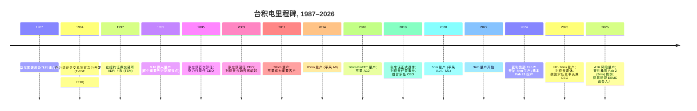
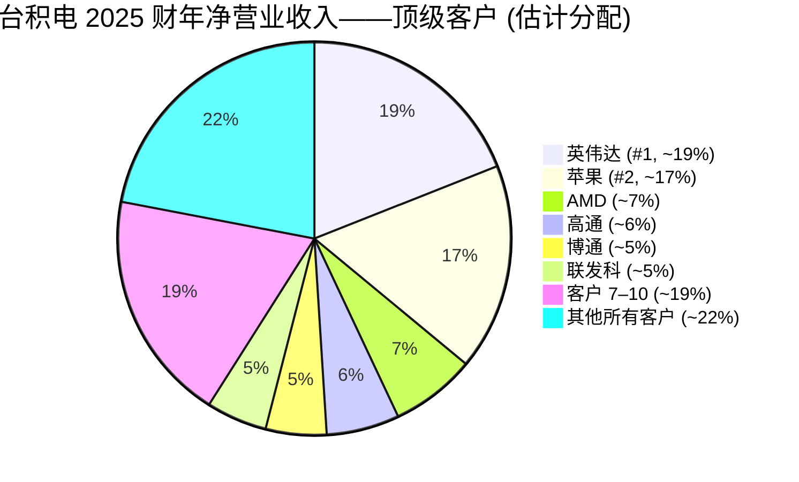

# 台湾积体电路制造股份有限公司 (NYSE:TSM, TWSE:2330) — 公司研究报告

**日期:** 2026-05-20
**分析师:** 内部初次覆盖
**上市地:** 纽约证券交易所 ADS (TSM) / 台湾证券交易所普通股 (2330)
**报告语言: 简体中文 (英文版同时存在于本目录)**
**底层报告语言说明:** 英文 (台积电 (TSMC) 向美国 SEC 提交英文版 20-F 报告; 自动规则将美国上市公司归类为英文披露, 不论发行人注册地)

---

> **更新——2026 财年指引上调 (2026-04-16):** 在 2026 Q1 业绩说明会上, 管理层将 2026 全年美元营业收入指引上调至"同比增长 30% 以上"(此前在 1 月 Q4 2025 业绩说明会上披露的区间为"20% 中段至约 30%"), 并将 2026 全年资本开支指引上调至历史新高 **520–560 亿美元**(对照 2025 年实际支出 409 亿美元)。驱动因素是"先进制程技术 (leading-edge process technologies) 需求持续强劲", 其中 HPC (高性能计算) 与 AI 加速器领跑; Q1 营业收入 **359.0 亿美元** 超出此前 350–357 亿美元的指引区间上限, Q2 指引为 **390–402 亿美元**。Q1 毛利率 (gross margin) 为 **66.2%**, 高于 64–66% 指引区间的上限。
> 来源: [台积电 2026 Q1 业绩公告, 2026-04-16](https://www.sec.gov/Archives/edgar/data/1046179/000104617926000199/a1q26e_withguidancexfinal.htm); [SCMP, 2026-04-16](https://www.scmp.com/tech/big-tech/article/3350346/tsmc-targets-over-30-revenue-surge-2026-ramps-capex-amid-booming-ai-demand); [DCD, 2026-01-16](https://www.datacenterdynamics.com/en/news/tsmc-announces-2026-capex-spend-of-56bn-after-posting-eighth-consecutive-quarter-of-growth/)。

---

## 目录
1. 公司概览
2. 公司历史
3. 管理团队
4. 产品与服务
5. 客户与上市策略
6. 行业概览
7. 竞争格局
8. 市场机会 (TAM)
9. 风险评估

参考资料

---

## 1. 公司概览

台湾积体电路制造股份有限公司 ("台积电"、TSMC, NYSE: TSM, TWSE: 2330) 是全球最大的专业半导体代工厂 (foundry)——即为其他公司设计的芯片提供合同制造服务的代工制造商。公司由张忠谋博士 (Dr. Morris Chang) 于 1987 年在台湾新竹创立, 由中华民国政府、飞利浦 (Philips) 及其他私人投资者合资设立, 台积电开创了纯代工 (pure-play foundry) 商业模式, 并在该市场保持主导地位长达三十余年 ([台积电 2025 年 Form 20-F 报告, 第 4 项——公司信息](https://www.sec.gov/Archives/edgar/data/1046179/000162828026025362/tsm-20251231.htm))。

**业务范围。** 台积电基于客户提供的设计在硅晶圆上制造集成电路 (integrated circuit, IC)。公司部署了 305 种不同的工艺技术, 2025 年为 534 名客户制造了 12,682 种不同产品 ([2026 Q1 业绩公告, 2026-04-16](https://www.sec.gov/Archives/edgar/data/1046179/000104617926000199/a1q26e_withguidancexfinal.htm))。其工艺技术 (process technology) 组合涵盖从 0.25 微米成熟制程节点 (mature node), 直至 2025 年量产的 2 纳米先进制程 (advanced node, "N2"); 同时 16 埃 ("A16") 制程节点正按计划于 2026 年进入风险量产 (risk production) ([2025 20-F, 第 4 项](https://www.sec.gov/Archives/edgar/data/1046179/000162828026025362/tsm-20251231.htm))。除晶圆制造业务 (2025 年贡献净营业收入的 86%) 外, 台积电还提供光罩制造、设计支持以及完善的 3DFabric® 先进封装 (advanced packaging) 套件——包括 CoWoS® (Chip-on-Wafer-on-Substrate, 基板上晶圆载体芯片封装)、SoIC® (System-on-Integrated-Chips, 集成芯片系统) 及 InFO (Integrated Fan-Out, 集成扇出) ([台积电 3DFabric 博客, 2020-08-03](https://www.tsmc.com/english/news-events/blog-article-20200803))。

**盈利方式。** 台积电的主要营业收入来源是晶圆制造, 按片计费, 价格反映节点、设计复杂度及产能紧张程度。合约定价以美元为基准, 但财务报表按 TIFRS (台湾国际财务报告准则) 以新台币列示。其余约 14% 的营业收入来自封装与测试、光罩制造、设计服务及版税收入 ([2025 20-F, 第 5 项](https://www.sec.gov/Archives/edgar/data/1046179/000162828026025362/tsm-20251231.htm))。该业务具有较强的经营杠杆: 销货成本中约一半为固定成本 (晶圆厂折旧), 因此产能利用率波动会带来实质性的毛利率波动——这一动态在 2021 财年毛利率飙升至 59.6%、2023 财年下滑至 54.4%、2025 财年随先进制程占比扩张与产能利用率收紧回升至 59.9% 的过程中清晰可见 (2025 20-F, 第 5 项)。

**地理布局。** 截至 2026 年 2 月 28 日, 台积电运营 1 座 150mm 晶圆厂、6 座 200mm 晶圆厂、9 座 300mm 晶圆厂以及 7 座先进后段 (封装) 厂 (2025 20-F, 第 4 项)。其中 9 座工厂位于新竹科学园区, 2 座位于中部科学园区, 7 座位于南部科学园区, 2 座位于美国 (华盛顿州与亚利桑那州), 1 座位于上海 (Fab 10), 1 座位于南京 (Fab 16), 1 座位于日本熊本 (JASM / Fab 23, 自 2024 年底起量产)。熊本的第二座 JASM 工厂以及德国德累斯顿的欧洲工厂 (ESMC / Fab 24) 正在建设中 ([2025 20-F, 第 4 项](https://www.sec.gov/Archives/edgar/data/1046179/000162828026025362/tsm-20251231.htm); [TrendForce, 2025-11-20](https://www.trendforce.com/news/2025/11/20/news-tsmc-dresden-fab-reportedly-wraps-structural-build-eyes-equipment-move-in-in-2h26/))。尽管地理扩张显著, 公司四分之三的营业收入仍来自总部位于北美的客户; 只有设计所有权地理分散——制造端仍极度依赖台湾。

**规模与体量。** 2025 财年净营业收入为新台币 38,091 亿元 (1,214 亿美元), 同比增长 31.6%; 归属股东净利润为新台币 16,976 亿元 (541 亿美元), 同比增长 46.6% (2025 20-F, 第 5 项)。毛利率扩张至 59.9%, 营业利润率 (operating margin) 至 50.8%, 净利率 (net profit margin) 至 44.5%。公司 2025 年出货量约 1,500 万片 12 英寸等效晶圆, 高于 2024 年的 1,290 万片。经营性现金流达到新台币 22,750 亿元 (725 亿美元), 支撑了新台币 12,724 亿元 (409 亿美元) 的资本开支, 仍留有相当规模的自由现金流盈余。20-F 披露的全球员工数截至 2025 年末约 **83,000+** 人。2026 Q1 季度运行率进一步加速: 营业收入 359 亿美元 (以美元计同比 +40.6%), 毛利率 66.2%, Q2 指引 390–402 亿美元 ([2026 Q1 业绩公告, 2026-04-16](https://www.sec.gov/Archives/edgar/data/1046179/000104617926000199/a1q26e_withguidancexfinal.htm))。


*来源: [台积电 2025 年 Form 20-F](https://www.sec.gov/Archives/edgar/data/1046179/000162828026025362/tsm-20251231.htm); 汇率来自 20-F 第 5 项 (加权平均新台币/美元)。*

**估值快照。** 基于 **2026-05-15 最近市场报价每 ADR 404.35 美元** (一份 ADS 对应 5 股普通股), 按 TTM 营业收入 1,310 亿美元和约 2.05 万亿美元市值计算, 滚动 12 月 (TTM) 市盈率 (P/E) 约为 **30.5 倍**, TTM 市销率 (P/S) 约为 **15.5 倍** ([financecharts.com — TSM 市盈率, 2026 年 5 月](https://www.financecharts.com/stocks/TSM/value/pe-ratio); [marketcapof.com — TSM, 2026 年 5 月](https://marketcapof.com/stocks/tsm.us/))。前瞻市盈率约 **25.8 倍**, 对应市场一致预期的 2026 财年 EPS ([GuruFocus — 前瞻市盈率, 2026 年 5 月](https://www.gurufocus.com/term/forward-pe-ratio/TSM))。过去 36 个月里, P/E 在低点 (2023 年中低谷) 约 13 倍至高点 (2026 年初峰值) 35 倍以上之间波动, P/S 从约 6 倍至约 16 倍 ([macrotrends — TSM 市盈率历史](https://www.macrotrends.net/stocks/charts/TSM/taiwan-semiconductor-manufacturing/pe-ratio))。

同业对比 (TTM 基础, 2026 年 5 月中):

| 公司 | 代码 | TTM P/E | TTM P/S | 备注 |
|---|---|---|---|---|
| 台积电 (TSMC) | NYSE:TSM | 30.5× | 15.5× | 代工龙头、AI 加速器受益方 |
| 联华电子 (UMC) | NYSE:UMC | 21.6× | 2.7× | 成熟/特色代工 ([Public.com, 2026 年 4 月](https://public.com/stocks/umc/pe-ratio)) |
| 格罗方德 (GlobalFoundries) | NASDAQ:GFS | 34.5× | 5.4× | 特色代工 ([MacroTrends — GFS 市盈率](https://www.macrotrends.net/stocks/charts/GFS/globalfoundries/pe-ratio)) |
| 阿斯麦 (ASML, 资本设备) | NASDAQ:ASML | 35.0× | 11.0× | EUV (极紫外光刻) 垄断供应商 |
| 英特尔 (Intel) | NASDAQ:INTC | n/m (TTM 为负) | 1.7× | 代工亏损; 结构性低估 |

台积电的市盈率相对联华电子 (UMC) 享有显著溢价, 相对格罗方德略有折价, 但增长与利润率表现远超同业——这是市场为**结构性 AI 增长溢价与无可匹敌的先进制程护城河**支付溢价的标志, 但并未无限外推。30 倍 TTM 市盈率大致处于台积电自身约 3 年中位数水平, 约为半导体行业宽基指数中位数的 2 倍 (根据公开 ETF 披露, SOX ETF 成分股市盈率中位数约 22 倍)。这种"有溢价但不极端"的姿态主要由以下因素驱动: **(a)** 与美国超大规模云计算厂商及英伟达多年期 AI 资本开支挂钩的板块溢价; **(b)** 2025 财年 59.9% 的毛利率, 没有任何代工同行能复制; **(c)** 先进制程供给的绝对稀缺性, N2 产能据报道已售罄至 2028 年 ([SamMobile, 2026](https://www.sammobile.com/news/samsung-foundry-likely-to-pick-up-big-orders-as-tsmc-gets-sold-out-until-2028/))。15.5 倍的 P/S——远高于 UMC 与 GFS, 与 ASML 相当——倍数虽高, 但由 2025 财年 31.6% 的营业收入增长以及 2026 财年 30%+ 指引所支撑。估值尚未紧张到独立构成风险, 但若 30 倍以上倍数压缩, 在 AI 资本开支正常化早于盈利兑现的情景下将形成实质性拖累; 我们在第 9 章中将此标识为风险。


*来源: [financecharts.com — TSM, 2026 年 5 月](https://www.financecharts.com/stocks/TSM/value/pe-ratio); [Public.com — UMC, 2026 年 4 月](https://public.com/stocks/umc/pe-ratio); [MacroTrends — GFS](https://www.macrotrends.net/stocks/charts/GFS/globalfoundries/pe-ratio); 同业 P/S 由报价市值与 TTM 营业收入计算。*

---

## 2. 公司历史

台积电由张忠谋博士 (Dr. Morris Chang) 于 1987 年创立。张忠谋曾在德州仪器 (Texas Instruments) 和通用仪器 (General Instrument) 工作多年, 由中华民国政府聘请, 旨在将台湾半导体产业职业化。张忠谋的开创性洞察是: 芯片的设计与制造可以解耦为两个独立的业务——这一模式在当时未被任何大型半导体公司采纳。绝大多数芯片厂商都是垂直整合的 IDM (集成器件制造商, integrated device manufacturer), 例如英特尔 (Intel)、摩托罗拉 (Motorola)、NEC 和日立 (Hitachi)。张忠谋认为, 通过将制造作为服务提供, 无晶圆厂 (fabless) 设计公司将得以涌现并蓬勃发展。这一押注托起了整个现代无晶圆厂生态——从高通 (Qualcomm)、博通 (Broadcom)、英伟达 (NVIDIA) 到苹果 (Apple) 的硅芯片团队、迈威尔 (Marvell)、联发科 (MediaTek) 与 AMD ([台积电公司主页 "关于我们"](https://www.tsmc.com/english/aboutTSMC/company_profile); [2025 20-F, 第 4 项](https://www.sec.gov/Archives/edgar/data/1046179/000162828026025362/tsm-20251231.htm))。

合资公司最初的参与方包括中华民国国家发展基金、荷兰飞利浦 (Philips, 提供技术许可与设备), 以及其他私人投资者。台积电普通股于 1994 年 9 月在台湾证券交易所上市, ADS 于 1997 年 10 月在纽约证券交易所上市 (2025 20-F, 第 4 项)。


*来源: [2025 20-F, 第 4 项](https://www.sec.gov/Archives/edgar/data/1046179/000162828026025362/tsm-20251231.htm); [Tom's Hardware 关于 A16 时间表, 2026](https://www.tomshardware.com/tech-industry/tsmcs-1-6nm-node-to-be-production-ready-in-late-2026-roadmap-remains-on-track); [TrendForce 关于亚利桑那 Fab 2 提前, 2025-09-30](https://www.trendforce.com/news/2025/09/30/news-tsmc-reportedly-pulls-arizona-third-fab-to-2027-ahead-by-one-year-eyeing-2nm-and-a16/)。*

三个战略转折定义了台积电的发展轨迹。**首先, 从技术追随者到技术领导者的转变。** 整个 2000 年代, 台积电在最先进的逻辑工艺上比英特尔落后一到两个节点; 至 16nm FinFET 这代 (2015–2016), 公司已缩小差距; 至 2020 年 5nm 量产——比英特尔能匹敌的时间早了一年多——台积电已决定性地超越所有竞争对手。如今台积电相信自己在 7 纳米及以下先进半导体的代工业务中按营业收入计算是技术领导者 (2025 20-F, 第 4 项)。**其次, 先进封装作为独立护城河的崛起。** 台积电 3DFabric® 平台 (CoWoS、InFO、SoIC) 将公司从"芯片制造之地"重新定位为"系统集成之地"——捕获了超越逻辑晶圆的 AI 加速器价值。**第三, 2022 年后地缘政治压力下的地理多元化**, 台积电亚利桑那、JASM 日本与 ESMC 德国如今已承诺多地区布局, 尽管成本代价显而易见。

近期重要发展 (过去 12–18 个月):

- **N2 (2nm) 于 2025 年下半年在新竹 Fab 20 量产** (后期扩展至高雄 Fab 22) ([2025 20-F, 第 4 项](https://www.sec.gov/Archives/edgar/data/1046179/000162828026025362/tsm-20251231.htm))。
- **亚利桑那 Fab 21 为苹果和英伟达生产 4nm 芯片**; 苹果承诺**到 2026 年底从亚利桑那购买 1 亿颗芯片** ([AppleInsider, 2026-05-15](https://appleinsider.com/articles/26/05/15/apples-us-chip-plan-gains-steam-thanks-to-20b-tsmc-investment); [Arizona Tech Council, 2026](https://www.aztechcouncil.org/apple-chips-tsmc-fab/))。
- **A16 (1.6nm)——"超级电力轨" (Super Power Rail) 背面供电节点——按计划于 2026 年进入风险量产** ([Tom's Hardware, 2026](https://www.tomshardware.com/tech-industry/tsmcs-1-6nm-node-to-be-production-ready-in-late-2026-roadmap-remains-on-track))。
- **CoWoS 产能将从 2024 年末约 35K wpm (每月晶圆数) 扩展至 2026 年末目标 130K wpm**, 据报道英伟达预订了 2025–2026 年 CoWoS 总产能的 60% 以上 ([CNBC, 2026-04-08](https://www.cnbc.com/2026/04/08/tsmc-nvidia-advanced-packaging-intel.html); [DigiTimes, 2026-04-10](https://www.digitimes.com/news/a20260410VL204/packaging-capacity-tsmc-nvidia-demand.html))。
- **JASM 熊本 2026 Q1 首次实现盈利**, 净利润 47 亿日元 ([Focus Taiwan, 2026-05-16](https://focustaiwan.tw/business/202605160005))。
- **针对先进计算芯片的 232 条款 25% 关税**自 2025 年 12 月起生效 (美国本土使用的芯片享受豁免); 2026 年 1 月美国–台湾贸易与投资协议将台湾对等关税上限设为 ≤15% (2025 20-F, 第 3 项)。

---

## 3. 管理团队

台积电正处于一次代际领导层过渡的第二年。创始人张忠谋于 2018 年退出活跃管理; 其继任者董事长刘德音 (Mark Liu) 于 2024 年中退休, 而**魏哲家博士 (Dr. C.C. Wei)** 于 2024 年统合了 CEO 与董事长两个职务。当前董事会由**十名董事组成, 其中七名为独立董事**——独立性水平远超台湾上市最低要求, 与美国大型上市公司相当 ([2025 20-F, 第 6 项](https://www.sec.gov/Archives/edgar/data/1046179/000162828026025362/tsm-20251231.htm))。

### 魏哲家 (C.C. Wei) — 董事长兼首席执行官

魏哲家博士 (年龄 71–75 岁) 在台积电任职 28 年, 是除少数共同 CEO 同事外资历最深的高管。他于 **2018 年 6 月被任命为 CEO** (此前自 2013 年起与刘德音共同担任 Co-CEO 多年), **2024 年晋升为副董事长**, 并在刘德音退休后**于 2024 年接任董事长** (2025 20-F, 第 6 项)。1998 年加入台积电前, 魏博士曾任**新加坡特许半导体 (Chartered Semiconductor Manufacturing) 技术高级副总裁**——当时是全球第三大代工厂——更早曾任**意法半导体 (STMicroelectronics) 德州工厂的逻辑与 SRAM 技术开发高级经理**。在台积电内部, 他先后掌管运营一部 (2005–2008)、主流技术 (2008–2009)、业务开发 (2009–2012), 2012 年成为执行副总裁兼联合 COO (Co-COO), 自 2013 年起担任总裁/联席 CEO (Co-CEO)。他的职业生涯几乎完全在半导体制造运营与技术开发领域, 这与同等规模美国公司 CEO 中常见的财务/总管理背景形成鲜明对比。他在 2017 年至 2019 年担任台湾半导体产业协会主席。他拥有耶鲁大学电气工程博士学位 ([2025 20-F, 第 6 项](https://www.sec.gov/Archives/edgar/data/1046179/000162828026025362/tsm-20251231.htm))。

自 2018 年魏哲家担任 CEO 以来, 台积电的营业收入从 335 亿美元 (2018 年) 增至 1,214 亿美元 (2025 年)——七年内 3.6 倍的扩张, 没有任何代工同行能接近——同时毛利率从 48.3% 扩张至 59.9%。他主导了 7nm、5nm、3nm 以及如今的 2nm 量产进程; 亚利桑那 Fab 21 的启动; 与索尼 (Sony) 和电装 (Denso) 的 JASM 合资项目; 在德累斯顿宣布欧洲晶圆厂; 以及先进封装的战略深化。重要的是, 他是运营出身: 在地理多元化、地缘政治敏感性、客户集中度以及封装紧张程度都到达拐点的时刻, 将董事长与 CEO 整合在一名运营人手中, 反映了董事会对技术/运营连续性的偏好。按美国 CEO 标准, 他的公众形象较为低调 (没有 Twitter/X 账户, 鲜少接受媒体采访, 没有股东信), 大部分公开沟通通过正式季度业绩说明会和年度"运动会"致辞传递。

### 黄仁昭 (Wendell Huang) — 资深副总裁兼首席财务官

黄仁昭先生在台积电任职 27 年, 自 2019 年起担任 CFO 和公司发言人 (2025 20-F, 第 6 项)。此前他主管投资者关系, 并历任公司内部多个财务职务——这对于一家如此规模公司的 CFO 而言相当罕见, 因为大多数同行都会从外部招募有上市公司 CFO 经验的人选。作为过去两年所有八次业绩说明会的公开发言人, 他始终如一地提供保守且具分析深度的季度评论。2025 年发行新台币 869 亿元公司债是在他的监督下执行的, 同时融资活动净现金流出约新台币 4,400 亿元 (主要为股息支付与债券到期偿还) (2025 20-F, 第 5 项)。黄仁昭的业绩记录体现的是稳健可预测的披露纪律, 而非资本市场的高调风格: 台积电在 AI 周期中始终达成或超出季度指引, 而资本开支指引——尽管在过去 12 个月内两次上调——已通过平台逐项分配明细 (2026 年 70–80% 先进制程、10% 特色、10–20% 先进封装, [DCD, 2026-01-16](https://www.datacenterdynamics.com/en/news/tsmc-announces-2026-capex-spend-of-56bn-after-posting-eighth-consecutive-quarter-of-growth/)) 清晰地传达给投资者。

### 秦永沛 (Y.P. Chyn) 与米玉杰 (Y.J. Mii) — 联席 COO; 侯永清 (Cliff Hou) 与张晓强 (Kevin Zhang) — 副联席 COO

台积电将运营领导层拆分为**两位联席 COO (秦永沛, 任职 39 年; 米玉杰, 任职 32 年)** 与**两位副联席 COO (侯永清, 任职 29 年; 张晓强, 任职 10 年)**, 各有明确的职能分工。这种 COO 层级的四方分工——对于单一业务公司而言异常深厚——既反映了同时在三大洲运营 17 座晶圆厂、同时开发两代新工艺 (N2 和 A16) 的复杂性, 也反映了公司强大的内部晋升传承传统。**张晓强** 是四人中对外曝光度最高的, 同时主管业务开发与全球销售业务, 一直是台积电客户路线图的对外面孔 (他在 Hot Chips 和 ISSCC 会议的主题演讲实际上是关于哪些节点进展顺利、哪些技术将在哪些客户上可用的非正式前瞻指引)。**米玉杰** 几乎整个职业生涯都在研发岗位, 是先进制程路线图的负责人。**秦永沛** 是制造运营的中坚, 在生产现场已耕耘近四十年。**侯永清** 同时担任首席信息安全官——这是一个重要信号, 表明网络安全姿态已被视为制造质量维度, 而不仅仅是 IT 职能 (2025 20-F, 第 6 项)。

### 公司治理

- **董事会构成。** 10 名董事, 7 名独立 (Sir Peter Bonfield、Michael Splinter、Moshe Gavrielov、L. Rafael Reif、Ursula Burns、Lynn Elsenhans、Chuan Lin)。独立董事阵容包括前应用材料 (Applied Materials) CEO (Splinter)、前 MIT 校长 (Reif)、前赛灵思 (Xilinx) CEO (Gavrielov)、前施乐 (Xerox) CEO 兼总统就业委员会成员 (Burns) 以及前 Sunoco CEO (Elsenhans)——这是一个有意国际化、运营经验丰富的独立董事阵容 (2025 20-F, 第 6 项)。
- **审计与风险委员会、薪酬与人才发展委员会、提名/治理/可持续性委员会**完全由独立董事组成 (后两者自 2011 年起为中华民国法律下的最低要求; 台积电早在此之前已采纳)。
- **最大股东: 中华民国国家发展基金 (截至 2025 年末持有约 6.4% 的普通股)** 拥有一个董事席位——这是 1987 年以来的结构性中华民国政府少数股权位置。
- **董事与高管整体的内部持股**远低于 1%——台积电是一家广泛持有的上市公司, 大部分股权由外资机构通过 ADR 计划持有 (约 25% 的普通股由 ADR 代表)。
- **薪酬结构**包含现金薪资、与经营业绩挂钩的年度现金奖金, 以及以限制性股票计量的利润分享计划 (代理声明中明确披露, 自 2007 年以来未使用传统股票期权)。绩效以营业收入、EPS、毛利率、市场份额以及 ESG (环境、社会与治理) KPI 为基准。

**业绩综合评估。** 这是全球半导体行业中最强的运营管理团队之一——长任期、内部晋升、技术背景的领导者, 以及一位拥有 3.6 倍营业收入扩张记录的 CEO。短板在于: (a) 海外晶圆厂的领导力仍在成熟过程中 (亚利桑那 Fab 21 经历了多年良率、成本与劳动力的学习曲线); (b) 魏哲家身兼董事长与 CEO 的角色, 将集中权威置于一人之上, 而内部尚没有与其声望相当的明显继任者。

---

## 4. 产品与服务

台积电的"产品"本质上是一种制造服务: 客户提供 GDSII 版图设计, 台积电制造晶圆、裸晶 (die) 和封装单元。整个产品组合最佳的描述方式是沿两个正交维度展开——**工艺节点**与**平台**——再加上第三个**先进封装**服务族。每项工艺技术都在 20-F 中逐一列示 (2025 20-F, 第 4 项), 也可见于公司产品页面。

### A. 工艺节点组合 (逻辑 CMOS)

```mermaid
graph TD
    A[台积电工艺技术]
    A --> B[先进制程逻辑]
    A --> C[主流逻辑]
    A --> D[特色制程]
    A --> E[先进封装<br/>3DFabric]
    B --> B1[A16 1.6nm 风险量产 2026]
    B --> B2[N2 / N2P 2nm 纳米片 — 2025 量产]
    B --> B3[N3 / N3E / N3P / N3X / N3A / N3C — 2022 起量产]
    B --> B4[N4 / N4P / N4C — 衍生制程]
    B --> B5[N5 / N5P — 2020 起量产]
    B --> B6[N6 / N7 / N7+ FinFET]
    C --> C1[16nm FinFET / 16FFC]
    C --> C2[22ULP / 22ULL]
    C --> C3[28nm HPC / HPC+ / ULP]
    C --> C4[40 / 55 / 65 / 90nm 平面工艺]
    C --> C5[0.13 / 0.18 / 0.25um — 成熟]
    D --> D1[RF / RF 前端]
    D --> D2[嵌入式 NVM eFlash]
    D --> D3[电源管理 IC]
    D --> D4[CMOS 图像传感器]
    D --> D5[MRAM / RRAM]
    D --> D6[MEMS]
    E --> E1[CoWoS — CoW + 基板]
    E --> E2[InFO — 扇出晶圆级]
    E --> E3[SoIC — 晶圆上芯片 3D]
    E --> E4[CoW / WoW 芯片堆叠]
```


*来源: [2025 20-F, 第 4 项](https://www.sec.gov/Archives/edgar/data/1046179/000162828026025362/tsm-20251231.htm); [台积电技术产品页面](https://www.tsmc.com/english/dedicatedFoundry/technology); [台积电 A16 页面](https://www.tsmc.com/english/dedicatedFoundry/technology/logic/l_A16)。*

**先进制程节点 (≤7nm)——护城河所在。** 先进技术 (7nm 及以下) 在 **2025 年占晶圆总营业收入的 74%**, 较 2024 年的 69% 和 2023 年的 58% 持续上升 (2025 20-F, 第 5 项)。两年内累积 16 个百分点的占比转移是台积电最重要的叙事: 产品组合正向投资组合中利润率最高、ASP (平均售价) 最高、护城河最深的部分集中。

- **A16 (1.6nm)**——台积电首个采用背面供电 ("超级电力轨", Super Power Rail) 的节点, 在同等设计下相对 N2P 提速 8–10%, 或功耗降低最高 20%。2026 年下半年在新竹及随后高雄进入风险量产; 量产目标 2027 年 ([台积电 A16 产品页面](https://www.tsmc.com/english/dedicatedFoundry/technology/logic/l_A16); [Wccftech, 2026](https://wccftech.com/tsmc-a16-node-promises-speed-boost-power-cut-over-2nm-backside-power-production-q4-2026/))。**护城河: 是——技术、规模与 IP 三重壁垒, 同行未有可信赖追赶者在 12 个月以内。最接近的竞争产品: 三星代工 SF1.4 (同样为环绕栅极纳米片); 台积电在密度上领先, 据报道在良率上也领先, 但三星的"早期 GAA 部署"是其不对称押注。**
- **N2 / N2P (2nm)——环绕栅极纳米片, 2025 年下半年量产。** [SemiWiki, 2025](https://semiwiki.com/forum/threads/tsmcs-2nm-chips-the-results-are-out.24329/) 报道良率超过 90%, 而三星竞争性 SF2 报道良率约 55–60% ([TrendForce, 2025-11-25](https://www.trendforce.com/news/2025/11/25/news-samsung-reportedly-hits-55-60-2nm-yields-eyeing-an-edge-through-early-gaa-deployment/))。N2 产能据报道**已售罄至 2028 年**, 苹果、英伟达、AMD、联发科、高通和博通均已订购 ([SamMobile, 2026](https://www.sammobile.com/news/samsung-foundry-likely-to-pick-up-big-orders-as-tsmc-gets-sold-out-until-2028/))。**护城河: 是——技术、规模、客户生态锁定。最接近的同行: 三星 SF2。**
- **N3 / N3E / N3P / N3X / N3C / N3A**——台积电 3nm 系列是 2026 年的主力先进节点。**2025 年占晶圆营业收入 24%** (高于 2023 年的 6% 和 2024 年的 18%)。变体面向 HPC (N3X——性能)、智能手机 (N3P——苹果 A18/A19)、主流 (N3C——紧凑) 与汽车 (N3A——2025 年末发布给客户)。**护城河: 是——台积电是唯一在 3nm 量产的代工厂; 三星 3GAE 仅有非常有限的外部客户采用。**
- **N4 / N4P / N4C / N5 / N5P / N6 / N7**——衍生与上一代节点仍贡献 2025 年晶圆营业收入的 50% (5nm 36%, 7nm 14%)。许多 AI 加速器 (英伟达 Hopper H100/H200 系列) 和苹果 M 系列 (M2、M3) 因成本/良率原因仍停留在这些节点上。


*来源: [2025 20-F, 第 5 项](https://www.sec.gov/Archives/edgar/data/1046179/000162828026025362/tsm-20251231.htm) (技术发展表)。*

**主流与特色制程 (16nm–0.25µm)。** 28nm、16nm、40/45nm、65nm、90nm 及更老的节点合计占 2025 财年晶圆营业收入约 26%。这些节点支撑电源管理 IC、射频、图像传感器、MCU、显示驱动以及汽车批量元件。**护城河: 部分——台积电是多家可信赖供应商之一; 联华电子 (UMC)、中芯国际 (SMIC)、格罗方德 (GlobalFoundries)、三星代工、世界先进 (VIS, Vanguard International Semiconductor)、力积电 (PSMC) 和高塔 (Tower) 都在此领域竞争。台积电在 28nm 及以下的成本领先是其主张; 规模也是重要因素。但定价权较弱。**

**特色技术 (非 CMOS 逻辑)。** 台积电提供嵌入式闪存、射频、CMOS 图像传感器、MEMS、BCD 电源、MRAM (2025 年 16nm 车规一级) 与 RRAM (2025 年 22ULL 车规一级)。这些主要用于物联网、汽车与消费电子平台 (2025 20-F, 第 4 项)。**护城河: 部分——索尼 (CIS)、意法半导体 (MEMS、BCD) 以及各种纯特色代工厂构成直接竞争。**

### B. 平台专用解决方案

根据 20-F 平台报告 (2025 20-F, 第 4 项与第 5 项), 台积电净营业收入分布为:

| 平台 | 2023 财年 | 2024 财年 | 2025 财年 |
|---|---|---|---|
| **高性能计算 (HPC)** | 43% | 51% | **58%** |
| **智能手机** | 38% | 35% | **29%** |
| **物联网 (IoT)** | 8% | 6% | **5%** |
| **汽车** | 6% | 5% | **5%** |
| **数字消费电子 (DCE)** | 2% | 1% | **1%** |
| **其他** | 3% | 2% | **2%** |

HPC 在 2024 年超越智能手机成为第一大平台, 如今已远超之。这一转变**结构性地由 AI 加速器需求驱动**——英伟达 Hopper/Blackwell GPU、AMD MI300/MI350 加速器、谷歌 TPU v5/v6、AWS Trainium 2、Meta MTIA、微软 Maia、特斯拉 Dojo, 以及苹果 M 系列 (其硅芯片实际上是 HPC/智能手机的混合分配)。台积电推广的特定 HPC 技术——N4X、N3X、N2X——代表针对 AI/HPC 峰值时钟调校的超高频变体 (2025 20-F, 第 4 项)。


*来源: [2025 20-F, 第 5 项](https://www.sec.gov/Archives/edgar/data/1046179/000162828026025362/tsm-20251231.htm)。*

### C. 先进封装—— 3DFabric®

台积电 3DFabric® 平台整合了三大核心技术家族 ([台积电 3DFabric 博客, 2020-08-03](https://www.tsmc.com/english/news-events/blog-article-20200803); [台积电 3DFabric 门户](https://3dfabric.tsmc.com/english/dedicatedFoundry/technology/3DFabric.htm)):

1. **CoWoS® (Chip-on-Wafer-on-Substrate, 基板上晶圆载体芯片封装)**——基于硅中介层 (silicon interposer) 的 2.5D 封装; AI 加速器的主流选择 (英伟达 H100/H200/B100/B200、AMD MI300、AWS Trainium)。变体包括 **CoWoS-S (经典中介层)**、**CoWoS-R (RDL 重布线层)**、**CoWoS-L (大中介层, AI 主力)**。英伟达据报道预订了 2025–2026 年 CoWoS 总产能的 60% 以上 ([CNBC, 2026-04-08](https://www.cnbc.com/2026/04/08/tsmc-nvidia-advanced-packaging-intel.html))。
2. **SoIC® (System on Integrated Chips, 集成芯片系统)**——用于计算 + HBM/SRAM 裸晶堆叠的晶圆级芯片对晶圆 3D 键合。AMD V-Cache 使用 SoIC 变体; AMD MI300 通过 SoIC + CoWoS 堆叠计算与 I/O 裸晶。
3. **InFO (Integrated Fan-Out, 集成扇出)**——扇出晶圆级封装, 大量用于移动 (自 2016 年起苹果 A 系列) 与日益增长的 AI 推理元件。

CoWoS 产能正从 **2024 年末约 35K 片/月扩张至 2026 年末目标约 130K wpm**——两年内大约 3.7 倍的扩张——但仍处于售罄状态, 台积电将部分封装步骤外包给日月光 (ASE) 和安靠 (Amkor) 以缓解压力 ([Astute Group, 2026](https://www.astutegroup.com/news/industrial/advanced-packaging-demand-soars-nvidia-secures-60-of-cowos-capacity/); [DigiTimes, 2026-04-10](https://www.digitimes.com/news/a20260410VL204/packaging-capacity-tsmc-nvidia-demand.html))。**护城河: 是——强技术、规模、切换成本与生态。最接近的同行: 三星代工 (I-Cube、X-Cube)、英特尔代工 (EMIB / Foveros), 以及面向传统 FCBGA 的 OSAT 日月光/安靠。2026 年内, 没有任何一家在 CoWoS-L 量产规模或 AI 客户存量上能与台积电匹敌。**

### D. 设计支持 (Open Innovation Platform®, OIP)

台积电打包提供完整的设计支持生态: PDK (工艺设计套件)、设计规则、与 Cadence 和 Synopsys 的 EDA 合作、来自 Arm/Synopsys/Cadence/eMemory 的基础 IP、**CyberShuttle® 多项目晶圆计划** (共享光罩成本用于原型) 以及面向 3DIC 设计的 **3Dblox 标准** (贡献给 IEEE) (2025 20-F, 第 4 项)。OIP 生态实际上让任何客户迁移到其他代工厂的成本都极度高昂——每一项 IP、每一个 PDK、每一个参考流程都是台积电专有。**护城河: 是——切换成本、生态、台积电、客户、EDA 与 IP 厂商之间的网络效应。**

### 旗舰产品 vs. 长尾产品; 2025–2026 发布

**目前驱动业务的三大旗舰平台是 (1) HPC 在 N3X/N3P 上、(2) AI 加速器在 N5/N4P + CoWoS-L 封装上、(3) 苹果应用处理器在 N3P 上**。长尾成熟节点 (28nm 及以下) 合计贡献晶圆营业收入的剩余 26%, 利润率在结构上较低。

过去 12 个月内的发布与路线图项目:
- **N2 自 2025 年下半年量产** (新竹 Fab 20、高雄 Fab 22)。
- **N3A 车规节点于 2025 年末发布给客户**。
- **CoWoS 产能三倍扩张进行中**, 台中 AP7 + 南部台湾 AP8 新封装厂正在建设中 (2025 20-F 租赁披露)。
- **A16 风险量产目标 2026 年下半年**。

2025–2026 年期间没有节点被淘汰。

---

## 5. 客户与上市策略

### 客户集中度——实质性且持续上升

台积电在 20-F 中明确披露客户集中度。**最大客户在 2025 年贡献净营业收入的 19%** (较 2024 年的 22% 和 2023 年的 25% 下降), **第二大客户 2025 年占 17%** (vs. 2024 年的 12%, 2023 年的 11%), **前十大客户 2025 年合计 78%** (vs. 2024 年的 76%, 2023 年的 70%) (2025 20-F, 第 3 项——风险因素)。披露中没有具名顶级客户, 但公开生态系统毫无疑义: 2025 年, **英伟达超越苹果成为台积电第一大客户**, 贡献约 234 亿美元 (~ 台积电营业收入的 19%), 对比苹果的约 220 亿美元 ([CNBC, 2026-01-26](https://www.cnbc.com/2026/01/26/nvidia-set-to-supplant-apple-as-tsmcs-largest-customer.html); [PCGuide, 2026](https://www.pcguide.com/pro/news-pro/nvidia-overtakes-apple-as-the-number-one-tsmc-client-as-revenue-more-than-doubles-in-one-year/))。对 2026 年的市场一致预期是**英伟达约占台积电营业收入 22% (~330 亿美元), 苹果约 18% (~270 亿美元)** ([CNBC, 2026-01-26](https://www.cnbc.com/2026/01/26/nvidia-set-to-supplant-apple-as-tsmcs-largest-customer.html))。


*来源: 台积电顶级客户百分比来自 [2025 20-F, 第 3 项](https://www.sec.gov/Archives/edgar/data/1046179/000162828026025362/tsm-20251231.htm); 客户身份来自 [CNBC, 2026-01-26](https://www.cnbc.com/2026/01/26/nvidia-set-to-supplant-apple-as-tsmcs-largest-customer.html)、[PCGuide, 2026](https://www.pcguide.com/pro/news-pro/nvidia-overtakes-apple-as-the-number-one-tsmc-client-as-revenue-more-than-doubles-in-one-year/) 与 [Wccftech, 2026](https://wccftech.com/nvidia-officially-overtakes-apple-as-tsmc-largest-customer/)。客户 3–10 基于行业报道估计, 不由台积电单独披露。*

这是**实质性的集中度风险**——披露的第一大 (19%) 处于大多数机构投资者认为可接受的上限, 而**前两大客户合计 (~36%) 显著高于此前任何时期**。趋势同样不利: 前十大客户集中度在两年内上升了 8 个百分点。我们将其作为高严重性风险纳入第 9 章。**缓解因素**: (a) 顶级客户——英伟达、苹果、AMD、高通、博通——本身正在快速增长、财务实力雄厚, 且在台积电先进制程上**实际上没有替代选择**; (b) 台积电已显著多样化系统公司尾部 (谷歌、亚马逊、微软、Meta、特斯拉自研芯片项目)——20-F 将"系统公司自行设计半导体的增长趋势"标识为结构性集中度驱动因素, 但同时也是终端市场敞口的多样化因素。

### 客户细分

台积电将客户沿三条轴划分:
- **无晶圆厂 (fabless) 半导体公司**——英伟达、高通、博通、AMD、联发科、迈威尔 (Marvell)、Cirrus Logic、瑞昱 (Realtek)、恩智浦 (NXP)、英飞凌 (Infineon, 在先进节点上部分无晶圆厂化)、意法半导体 (STMicroelectronics) 的先进节点部分、瑞萨 (Renesas)、MPS、亚德诺 (Analog Devices) 选择性部件。这是台积电传统的核心客户基础。
- **系统公司** (为自用而设计芯片)——苹果 (A/M 系列)、谷歌 (Tensor、TPU)、亚马逊 (Trainium/Inferentia/Graviton)、微软 (Maia、Cobalt)、Meta (MTIA)、特斯拉 (Dojo、FSD)、任天堂 (英伟达设计的定制芯片)、索尼 (较低节点的定制 Bionz 芯片)。20-F 明确将其标识为增速最快的客户类别。
- **IDM (集成器件制造商)** 将先进制程外包给台积电——英特尔 (目前将 Lunar Lake / Arrow Lake / Panther Lake 计算 tile 的部分外包给台积电 N3/N3B)、索尼 (图像传感器使用台积电)、东芝 (Toshiba) 子集、恩智浦、英飞凌。IDM 作为客户的动态意义重大: 即使英特尔——历史上台积电最大的竞争对手——也是台积电的客户。

### 上市策略

台积电采用**直销, 无经销商** (2025 20-F, 第 4 项)。公司在美国、加拿大、日本、中国大陆、德国、荷兰和韩国设有直接客户服务办公室。销售本质上是路线图与产能分配的对话: 客户提前数年承诺特定节点, 有时附带**预付临时产能存款** (20-F 将其披露为可退还或与应收账款抵销的预收款), 台积电按季度周期分配晶圆开工。定价"在特定时期内确定, 并随市场条件调整"——在产能利用率紧张时, 越来越多地在先进节点上明确执行年度 ASP 上调。

销售周期为多年期。对于先进制程节点, 客户参与通常在**流片 (tape-out) 前 18–36 个月开始**, 伴随深度的 PDK 与 IP 库共同开发。中途换代工厂在技术与经济上不可行——这将触发完整重新设计, 包含新 PDK、IP 和库。这是台积电定价权的结构性源泉。

### 分销与合作伙伴

- **OSAT 合作伙伴**: 日月光 (ASE, TWSE: 3711)、安靠 (Amkor, NASDAQ: AMKR)、力成 (Powertech, TWSE: 6239)——处理传统封装量, 并日益吸收 CoWoS 产能过度分配时台积电先进封装的溢出。
- **EDA / IP 合作伙伴**: Cadence、Synopsys、Siemens EDA、Arm、eMemory。
- **设备合作伙伴**: 阿斯麦 (ASML, 光刻)、应用材料 (Applied Materials)、泛林 (LAM)、科磊 (KLA)、东京电子 (Tokyo Electron)。
- **政府合作伙伴**: 美国 CHIPS 法案 (亚利桑那 66 亿美元直接补助 + 50 亿美元贷款); 日本 METI 经济产业省对 JASM 的补贴; 欧盟/德国对 ESMC 德累斯顿的补贴包 (~50 亿欧元)。

### 具名客户案例研究

- **苹果**——承诺到 2026 年底从亚利桑那 Fab 21 购买 1 亿颗 A19 级芯片 ([Arizona Tech Council, 2026](https://www.aztechcouncil.org/apple-chips-tsmc-fab/); [AppleInsider, 2026-05-15](https://appleinsider.com/articles/26/05/15/apples-us-chip-plan-gains-steam-thanks-to-20b-tsmc-investment))。
- **英伟达**——CoWoS-L 主要客户; Blackwell B200 / B300、Rubin / Vera Rubin 均采用台积电 N4P → N3 → N2 节点 ([CNBC, 2026-04-08](https://www.cnbc.com/2026/04/08/tsmc-nvidia-advanced-packaging-intel.html))。
- **AMD**——MI350 / MI400 系列采用台积电 N3 + SoIC + CoWoS; 消费/服务器 CPU 采用 N3 / N3P。
- **英特尔作为客户**——将近期客户端/数据中心计算 tile 的部分外包给台积电 N3B / N3 (英特尔已在 10-K 和业绩披露中公开)。

---

## 6. 行业概览

### 定义与范围

台积电运营于**专业半导体代工 (dedicated semiconductor foundry) 行业**——更广义半导体行业 (SIC 3674 / NAICS 334413) 的一个细分子行业。代工行业为无晶圆厂设计公司、系统公司和 IDM 提供集成电路合同制造服务。它与**IDM** (既设计又制造的集成器件制造商, 例如英特尔和三星半导体的逻辑 IDM 部分) 不同, 也与**OSAT** (Outsourced Semiconductor Assembly and Test, 外包半导体封装与测试, 即代工厂下游的封装测试层) 不同。

与台积电直接相关的相邻行业: **半导体资本设备** (阿斯麦、应用材料、泛林、科磊、东京电子——阿斯麦的 EUV 是 ≤7nm 的束缚性稀缺资源); **硅片供应商** (信越 (Shin-Etsu)、SUMCO、Siltronic、环球晶圆 (GlobalWafers)); **光刻胶与特种气体供应商** (JSR、东京应化 (TOK)、信越化学、Air Liquide); **EDA 软件** (Cadence、Synopsys); **基础 IP** (Arm、Synopsys); 以及**先进封装材料与基板** (Ibiden、Shinko、欣兴 (Unimicron))。

### 市场规模

全球半导体行业 2024 年营业收入达到约 **6,260 亿美元** ([WSTS / SIA, 2025](https://www.semiconductors.org/global-semiconductor-sales-revenue-2024/)), 2025 年有望突破 7,000 亿美元。其中代工营业收入据行业追踪机构 **TrendForce 报告 2024 年为 1,795 亿美元, 2025 年约为 2,400 亿美元** (随 AI 占比转移而快速上升)。台积电报告的 2025 财年 1,210 亿美元营业收入因此代表着**全球代工行业总营业收入的约 50%**, 而代工行业利润池中的占比更高。

**代工市场份额, 2025 Q4 (按行业追踪机构, 例如 PatentPC / TrendForce):**
- **台积电: ~72%**
- 三星代工: ~7%
- 中芯国际 (SMIC): ~6%
- 联华电子 (UMC): ~5%
- 格罗方德: ~4%
- 其他 (力积电、世界先进、高塔、华虹半导体): ~6%

与第二名的份额差距在结构上扩大: 2025 年台积电营业收入增长 31.6%, 而三星代工业务仅个位数增长, 中芯国际 (因出口管制无法获得 EUV) 在先进制程逻辑上被排除在外。在"先进代工"(≤7nm) 范围内, 台积电的有效份额更接近 **>90%** ([PatentPC 分析, 2025](https://patentpc.com/blog/tsmc-samsung-and-intel-whos-leading-the-semiconductor-race-latest-market-share-data))。


*来源: [PatentPC 行业追踪机构, 2025](https://patentpc.com/blog/tsmc-samsung-and-intel-whos-leading-the-semiconductor-race-latest-market-share-data); [TrendForce 份额评论, 2025](https://www.trendforce.com/news/2025/11/25/news-samsung-reportedly-hits-55-60-2nm-yields-eyeing-an-edge-through-early-gaa-deployment/)。份额为纯代工; 三星代工为三星半导体内部代工部分。*

### 增长率与驱动因素

代工行业在 2014–2024 年间以约 **9–11% 复合年增长率 (CAGR)** 复合增长 (TrendForce、McKinsey), 但 2024–2026 年正以结构性更高的速率增长, 由 AI 驱动: 台积电单独 2025 年增长 31.6%, 2026 年指引超过 30%。驱动因素:

1. **AI 计算需求**: 每家超大规模云计算厂商都在建设自研加速器; 英伟达正以接近供给约束的体量出货 Blackwell; AI 训练与推理芯片量已从尾部用例上升至先进制程逻辑需求的约 50%+。
2. **智能手机更换与设备端边缘 AI**: 尽管智能手机单位增长持平, 但随着设备端 AI 加入, 每部手机的硅含量持续上升。
3. **数据中心网络** (博通、迈威尔、英伟达-Mellanox)——高端交换机与 DPU 芯片在台积电 N3/N4 上。
4. **汽车电动化 + ADAS (高级驾驶辅助系统)**——虽然今天仅占台积电营业收入 5%, 但随着汽车增加计算单元在结构上增长。
5. **工业与物联网**——较慢, 但稳定。

半导体产业协会 (SIA) 预计行业总营业收入将在 2024–2030 年间大致翻倍, 鉴于无晶圆厂/系统公司转移, 代工增长将快于更广义的行业。

### 行业结构

代工行业在**先进制程上结构性集中** (台积电在 ≤5nm 逻辑上接近垄断), 而**在尾端工艺上较为分散** (28nm 及以下——多家区域玩家竞争)。塑造它的五个结构性力量:

- **EUV 与资本开支壁垒**: 阿斯麦的单台 EUV 扫描仪成本约 1.8 亿美元; 一台高 NA EUV 工具成本超过 3 亿美元; 一座先进制程晶圆厂现在的成本为 200–300 亿美元。世界上只有三家公司——台积电、三星和英特尔——曾经维持过可信赖的先进制程逻辑生产。
- **客户集中度**: 约 5 家无晶圆厂客户 (英伟达、苹果、AMD、高通、博通) 驱动 >50% 的先进制程需求。
- **供应商集中度**: 阿斯麦是 EUV 的垄断者; 信越和 SUMCO 主导高端硅片; 许多光刻胶前驱体由少数日本化学供应商单一来源提供。
- **替代品**: 在先进制程上有限。在尾端工艺上, 内部 IDM 产能与中国成熟节点晶圆厂构成替代。
- **监管**: 美国对先进计算 IC 的出口管制 (2022 年 10 月、2023 年 10 月、2025 年 1 月规则); 欧盟芯片法案; 日本/美国/台湾贸易框架; CHIPS 法案补贴。

### 监管环境

2025 年 20-F 标识出密集的监管网络 ([2025 20-F, 第 3 项](https://www.sec.gov/Archives/edgar/data/1046179/000162828026025362/tsm-20251231.htm)):
- **美国 2022 年 10 月 / 2023 年 10 月 / 2025 年 1 月出口管制**限制使用 16nm 或以下工艺技术对"特定目的地"的出货须有许可; 台积电南京在美国年度出口许可下运营。
- **2025 年 4 月 IEEPA 对等关税**——适用于大多数美国贸易伙伴, 但**排除了"半导体物品"**; 美国最高法院于 2026 年 2 月推翻了 IEEPA 的法律基础; 替代关税在第 122 条与第 301 条下随后出台。
- **第 232 条关税 (2025 年 12 月公告)**: 对某些先进计算芯片及其衍生品征收 25% 从价税, 美国本土使用享有豁免; 对在美国扩产投资的台湾半导体厂商给予优惠待遇。
- **2026 年 1 月美国–台湾贸易与投资协议**: 将台湾对等关税上限设为 ≤15%。

整体图景: **台积电运营于历史上监管最密集的环境中**, 监管环境本身既是护城河 (限制中国竞争对手), 也是风险 (海外晶圆厂的成本代价, 对出口许可的依赖)。

---

## 7. 竞争格局

### 直接竞争对手

1. **三星代工 (KRX: 005930)**——台积电唯一可信赖的先进制程竞争对手。三星代工 2025 年营业收入为 150–180 亿美元 (vs. 台积电的 1,210 亿美元), 比例约为 1:7。三星 3nm GAA (3GAE/3GAP) 仅获得非常有限的外部客户。如今的押注是: **三星更早在 3nm 上转向 GAA 给予其 2nm 工艺架构成熟度**——据报道良率在 2025 年末改善至 55–60% ([TrendForce, 2025-11-25](https://www.trendforce.com/news/2025/11/25/news-samsung-reportedly-hits-55-60-2nm-yields-eyeing-an-edge-through-early-gaa-deployment/))——而台积电 N2 产能售罄状态为三星作为"替代供应商"提供了机会 ([SamMobile, 2026](https://www.sammobile.com/news/samsung-foundry-likely-to-pick-up-big-orders-as-tsmc-gets-sold-out-until-2028/))。优势: 与三星显示器、内存与 HBM 的垂直集成; 深厚的资本实力。脆弱性: 持续的良率差距、没有旗舰 AI 加速器客户, 以及让一些无晶圆厂客户担忧的捕获型 IDM 身份。

2. **英特尔代工 (NASDAQ: INTC——代工部分)**——基辛格 (Pat Gelsinger) 的"5N4Y"路线图曾将英特尔置于制造能力对等的路径上, 但执行已经磕磕碰碰: Intel 18A ("2nm 级别"的等价物) 在 2024–2025 年面临多次良率挫折, 英特尔代工业营业收入 (不包括内部销售) 2025 年低于 10 亿美元。陈立武 (Lip-Bu Tan) 于 2025 年接任 CEO 后, 英特尔示意将采用更聚焦的代工策略, 并重新激活政府对接。优势: 美国本土制造布局、领先 R&D 谱系、政府支持以及 EUV + 背面供电工艺代次。脆弱性: 代工经济持续深度为负、技术信任赤字, 以及高度内部化的客户组合。

3. **联华电子 (NYSE: UMC, TWSE: 2303)**——台湾本土代工厂, 聚焦 22nm 及以上。2025 Q4 营业收入新台币 618 亿元 ([UMC 2025 Q4 6-K, 2026 年 1 月](https://www.sec.gov/Archives/edgar/data/0001033767/000119312526025557/umc-ex99_1.htm)), 毛利率 30.7%。在特色领域 (射频、BCD、嵌入式 NVM) 定位稳固, 但没有先进制程故事。优势: 深厚的成熟节点客户关系、有吸引力的特色组合。脆弱性: ≤14nm 无任何存在。

4. **格罗方德 (NASDAQ: GFS)**——美国总部特色代工厂。2018 年在 7nm 退出先进制程竞赛, 专注差异化特色 (FDX、RF SOI、汽车)。2026 Q1 营业收入约 16 亿美元, P/E 34.5×, P/S 5.4× ([MacroTrends — GFS](https://www.macrotrends.net/stocks/charts/GFS/globalfoundries/pe-ratio); [格罗方德 2026 Q1 6-K](https://www.sec.gov/Archives/edgar/data/0001709048/000170904826000111/globalfoundries1q2026earni.htm))。优势: 特色 IP、美国/欧盟/新加坡布局、车规级。脆弱性: 节点范围有限、结构性低增长。

5. **中芯国际 (HKEX: 0981)**——中国国家代工冠军。由于出口管制限制, 在没有 EUV 的情况下仅限于约 7nm 级别 (有争议)。强大的国内需求与政府支持; 约占全球代工份额 6%。脆弱性: 被排除在 EUV 之外; 没有阿斯麦高 NA 工具; 中国境外客户访问有限。

### 间接 / 相邻竞争对手

6. **三星半导体的逻辑 IDM 部分**——为三星自有系统及外部 Galaxy SoC 提供芯片。
7. **力积电 (PSMC) 与世界先进 (VIS)**——台湾特色代工厂; 台积电持有 VIS 28% 股权。
8. **高塔半导体 (NASDAQ: TSEM)**——以色列特色代工厂 (模拟、射频、电源管理); 2023 年英特尔失败的收购对象。
9. **华虹半导体 (HKEX: 1347) 与华虹集团**——中国成熟节点特色代工厂。
10. **内部 IDM 逻辑产能** (英特尔非代工部分、三星非代工部分、NEC/瑞萨/索尼)——竞争同一晶圆组合, 但客户访问受限。

### 定位框架

```mermaid
quadrantChart
    title 代工定位——先进制程能力 vs 特色广度
    x-axis 低特色广度 --> 高特色广度
    y-axis 仅尾端节点 --> 先进制程能力
    quadrant-1 先进且广 (台积电甜蜜点)
    quadrant-2 先进但窄
    quadrant-3 尾端且窄
    quadrant-4 尾端但特色广
    TSMC: [0.85, 0.95]
    Samsung Foundry: [0.55, 0.75]
    Intel Foundry: [0.35, 0.55]
    GlobalFoundries: [0.75, 0.30]
    UMC: [0.65, 0.25]
    SMIC: [0.40, 0.45]
    Tower: [0.80, 0.15]
    VIS / PSMC: [0.45, 0.10]
```
*分析师基于公司报告与工艺节点披露的分析。*

### 台积电的竞争优势

1. **工艺技术领先**——在同等级工艺上比三星领先 12–18 个月, 比英特尔代工领先约 24+ 个月, 良率始终更高 ([SemiWiki, 2025](https://semiwiki.com/forum/threads/tsmcs-2nm-chips-the-results-are-out.24329/); [TrendForce, 2025-11-25](https://www.trendforce.com/news/2025/11/25/news-samsung-reportedly-hits-55-60-2nm-yields-eyeing-an-edge-through-early-gaa-deployment/))。
2. **规模优势**——2025 年 1,500 万片 12 英寸晶圆, 约为第二大代工厂的 7 倍; 实现固定成本摊销、供应商杠杆以及复合领先的 R&D 预算。
3. **客户生态与切换成本**——每个先进制程无晶圆厂公司的 IP、库和 PDK 都是台积电专有的。将单个先进设计重新定位到另一家代工厂是一个跨季度、需投入数百万美元的工程。
4. **先进封装领先**——CoWoS-L 是 AI 加速器的事实标准; 三星和英特尔提供替代方案, 但客户采用率显著较低。
5. **资本结构**——净现金状况; 2025 财年经营性现金流 725 亿美元资助 409 亿美元资本开支, 仍剩 316 亿美元自由现金流 ([2025 20-F, 第 5 项](https://www.sec.gov/Archives/edgar/data/1046179/000162828026025362/tsm-20251231.htm))。没有任何竞争对手能在此规模下自筹资本开支。
6. **信任与运营一致性**——39 年可靠、可预测的交付; 客户定期对"如果台积电交付失败怎么办"进行压力测试, 并得出没有真实替代方案的结论。

### 竞争脆弱性

1. **客户集中度**: 英伟达 + 苹果合计约占营业收入的 36%。
2. **地理集中度**: 总产能的约 85% 在台湾。
3. **海外晶圆厂成本代价**: 据报道亚利桑那 Fab 21 晶圆成本比台湾等价制程高 20–30%。
4. **对单一终端市场 (AI) 的敏感性**: HPC 现在占营业收入的 58%。
5. **对美国/台湾/中国三方摩擦的监管敞口**。

---

## 8. 市场机会 (TAM)

### TAM 量化

**全球半导体行业**: 2024 年约 6,260 亿美元 ([SIA, 2025](https://www.semiconductors.org/global-semiconductor-sales-revenue-2024/)); 2025 年约 7,000+ 亿美元; 多家行业追踪机构 (SIA、McKinsey、Gartner) 预测**到 2030 年将突破 1 万亿美元**。其中, **逻辑**约 2,000 亿美元 (增长最快), **内存**约 1,500 亿美元 (周期性恢复), **分立/模拟/传感器**约 2,000 亿美元。

**全球代工 TAM**: 2025 年约 2,400 亿美元 (TrendForce); 预测到 2028 年达到 3,500–4,000 亿美元, CAGR 约 10–14%——其中 AI 驱动的先进制程子段增长显著快于平均。

**台积电 SAM (可服务可寻址市场)**: 台积电有效覆盖 (a) 整个纯代工市场; (b) 先进制程 IDM 外包池 (英特尔客户端/数据中心计算 tile, 三星 Galaxy AP); (c) 面向 AI 加速器与高端智能手机的先进封装市场。今日合并 SAM 约 2,400 亿美元, 到 2028 年增长至约 4,000 亿美元。

**SOM (可服务可获取市场)**: 台积电已捕获代工总营业收入的约 50%, 先进制程代工营业收入的约 90%。现实上限为代工总份额的 50–55% 区间, 先进制程持续份额增益将被区域成熟节点需求中的有限份额所抵消。

### 增长预测——台积电管理层观点

- **2026 年管理指引**: 营业收入同比增长 >30% → 约 1,580 亿美元 ([SCMP, 2026-04-16](https://www.scmp.com/tech/big-tech/article/3350346/tsmc-targets-over-30-revenue-surge-2026-ramps-capex-amid-booming-ai-demand))。
- **多年资本开支承诺**: 2026 年 520–560 亿美元 (vs. 2025 年 409 亿美元), 70–80% 用于先进制程, 10–20% 用于先进封装。这一节奏意味着台积电的营业收入基数可能在两年内逼近 2,000 亿美元。
- 来自更早刘德音/魏哲家业绩说明会的**内部 AI 加速器 TAM 评论**表明 2028 年前 AI 加速器 CAGR 在 40% 中段——与英伟达、AMD 与超大规模云计算厂商 ASIC 资本开支披露大致吻合。

### 渗透策略

台积电的渗透计划基于四个支柱:
1. **持续先进制程主导**——2026 年 A16, 然后 2028 年 A14 (1.4nm), 之后公开路线图上的 A10 (1.0nm)。每个新节点将每片晶圆的 ASP 提高 25–40%。
2. **先进封装产能倍增**——CoWoS 到 2026 年末达到约 130K wpm (从 2024 年末的 3.7 倍扩张)。
3. **客户与监管多元化的地理扩张**——亚利桑那 (2027–2028 年 2nm)、JASM 2 (2028 年 3nm)、德累斯顿 (2027 年 FinFET 特色)。
4. **系统公司定制硅生态**——深度嵌入超大规模云计算厂商的自研芯片项目 (谷歌 TPU、AWS Trainium、微软 Maia、Meta MTIA), 以及电动车/机器人芯片 (特斯拉 Dojo + FSD, 后期节点的小鹏/蔚来芯片)。

---

## 9. 风险评估

### 公司特定风险

**1. 客户集中度 (高)。** 第一大客户 = 2025 财年净营业收入的 19%; 第二大 = 17%; 前十大 = 78%——并在过去三年中每年上升 ([2025 20-F, 第 3 项](https://www.sec.gov/Archives/edgar/data/1046179/000162828026025362/tsm-20251231.htm))。英伟达或苹果订单的损失或实质性减少将对 2026 财年展望造成实质性损害; 即使一个季度的英伟达暂停 (例如 Blackwell 到 Rubin 的过渡间隙) 也可能使季度营业收入波动 5–10%。缓解因素: 英伟达和苹果在先进制程上实际上没有替代选择; 长期预付款合同已就位; 显著的订单簿透明度。

**2. 对台湾的地理集中度与台海地缘政治风险 (高)。** 约 85% 的产能、所有 2nm 和 A16 生产以及公司总部均位于台湾。台海危机 (军事封锁、动能冲突, 甚至持续的紧张升级) 将以难以完全建模的程度扰乱运营、客户交付、供应链和股票价值。缓解因素: 正在进行的亚利桑那/熊本/德累斯顿产能扩张; 非台积电供应商的长尾成熟节点替代; 明确的"硅盾"论 (台湾芯片业威慑冲突); 2026 年 1 月美国-台湾贸易与投资协议强化商业关系。

**3. 海外晶圆厂成本与执行风险 (中)。** 亚利桑那 Fab 21 是一个昂贵的多年量产爬坡; 熊本 JASM 于 2026 Q1 首次实现盈利 ([Focus Taiwan, 2026-05-16](https://focustaiwan.tw/business/202605160005))。德累斯顿 ESMC 仍在结构建设中, 设备入厂从 2026 年下半年开始 ([TrendForce, 2025-11-20](https://www.trendforce.com/news/2025/11/20/news-tsmc-dresden-fab-reportedly-wraps-structural-build-eyes-equipment-move-in-in-2h26/))。完全规模化时, 海外较高晶圆成本将对合并毛利率施加约 200–300 个基点的结构性压力。缓解因素: CHIPS 法案、METI 与欧盟补贴抵消资本开支; 对美国本土使用芯片的第 232 条优惠待遇减少关税拖累。

**4. 关键人物依赖 (中)。** 魏哲家于 2024 年合并董事长 + CEO 角色; 今日内部没有声望相当的明显继任者。缓解因素: 深厚的联席 COO / 副联席 COO 团队 (秦永沛、米玉杰、侯永清、张晓强), 以及长久的内部晋升传统。

**5. A16 及以后的技术 / 良率风险 (中)。** A16 首次在台积电引入背面供电——一个有意义的新结构元素。任何良率不足都会使 2027 年量产目标延迟, 并将一个窗口让给三星。缓解因素: 台积电按原始目标交付节点的业绩记录; 公司已承诺 2026 年下半年风险量产, 多家客户已经参与。

**6. CoWoS / 先进封装单点失效 (中)。** AI 加速器完全依赖 CoWoS-L; 任何持续的 CoWoS 供应中断或封装质量问题都将堵塞整个 AI 计算链。缓解因素: 产能倍增进行中 (到 2026 年末约 130K wpm); 封装溢出至日月光/安靠。

### 行业 / 市场风险

**7. AI 资本开支消化 (高)。** 约 58% 的台积电营业收入现为 HPC, 其中最大部分是 AI 加速器。如果超大规模云计算厂商 AI 资本开支早于预期正常化——或者如果 AI 训练到推理的转移压缩每个加速器的 ASP——台积电的增长将急剧减速。缓解因素: 超大规模云计算厂商 2026 年资本开支指引保持稳健; 推理需求并行增长; AI 计算更接近多年结构性建设, 而非单峰周期。

**8. 周期性与库存调整 (中)。** 半导体行业历史上从峰值到谷底波动 20–30%。台积电 86% 的晶圆营业收入和约 50% 的固定成本基础意味着深度下行周期可能在四个季度内将毛利率压缩至 40% 出头。缓解因素: 先进制程产能利用率 (由 AI 驱动) 已与成熟节点周期性脱钩; 台积电的成熟节点敞口现在 <30%。

**9. 监管收紧——美国出口管制 (中-高)。** 2025 年 1 月扩展的出口管制规则已要求对"特定目的地"的 16nm 或以下出货须取得许可。进一步收紧——或台积电南京年度出口许可恶化——可能扰乱对重要客户的服务 ([2025 20-F, 第 3 项](https://www.sec.gov/Archives/edgar/data/1046179/000162828026025362/tsm-20251231.htm))。缓解因素: 台积电一直表现出明显合规; 许可至今每年都得到续签。

**10. 三星 / 英特尔代工在 2nm 及以下的竞争威胁 (中)。** 三星报道的 55–60% N2 良率与较早的 GAA 经验可能缩小技术差距; Intel 18A 和 14A 即使在近期挫折后仍有可信路线图。缓解因素: 台积电的结构性优势 (客户生态、封装、规模) 比任何单一节点都更深; 即使技术对等, 客户也会缓慢迁移。

### 财务风险

**11. 估值 / 倍数压缩 (中)。** TTM P/E 约 30.5 倍和 TTM P/S 约 15.5 倍按今日 AI 周期标准并不极端, 但都位于台积电三年区间的上半部。即使在市场调整中倍数压缩 5 个 P/E 单位, 在没有任何基本面变化的情况下也将意味着约 16% 的回撤。缓解因素: 前瞻 P/E 约 25.8 倍相对 >30% 增长看起来可防御; 下行部分由所有代工厂中最高的毛利率缓冲。

**12. 外汇风险 (中)。** 几乎所有销售以美元计价; 财务报表以新台币列示; 约 50% 资本开支以非美元计价。新台币升值 (2025 年从 NT$32.13 升至 NT$31.11 兑美元) 削减了报告营业收入 ([2025 20-F, 第 5 项](https://www.sec.gov/Archives/edgar/data/1046179/000162828026025362/tsm-20251231.htm))。新台币持续升值至 28 将使报告的新台币营业收入增长压缩几个百分点。缓解因素: 台积电通过远期合约和交叉货币掉期对冲; 多年周期的定价行动部分抵消。

### 宏观经济风险

**13. 全球衰退 / 消费电子下行 (中)。** 智能手机 (29%)、汽车 (5%)、物联网 (5%)、DCE (1%) 对消费周期性需求敏感。深度衰退将压缩这些细分市场, 而 AI 驱动的 HPC 继续——净影响适度但非零。缓解因素: 即使在宏观疲软条件下 AI 资本开支也在维持。

**14. 台湾自然灾害 / 晶圆厂中断 (低-中)。** 地震 (2024 年 4 月 7.2 级地震短暂影响晶圆厂运营)、台风、停电与水短缺是台湾重型布局的反复风险。缓解因素: 广泛的灾难恢复基础设施; 在新竹/台中/台南/高雄地理分散; 建设水供应韧性; 保险。

**15. 利率敏感性 (低)。** 台积电承担适度债务 (2025 年发行新台币 869 亿元新债; 总债务 < 1× EBITDA)。利率上升将边际提高再融资成本, 但公司功能上为净现金。低风险。

---

## 参考资料

### 台积电主要文件

- [台积电 2025 年 Form 20-F, 提交日 2026-04-16](https://www.sec.gov/Archives/edgar/data/1046179/000162828026025362/tsm-20251231.htm)——第 3 项 (风险因素)、第 4 项 (公司信息)、第 5 项 (经营与财务回顾及前景)、第 6 项 (董事、高级管理层与员工)。本报告几乎所有定量主张的主要来源。
- [台积电 2026 Q1 业绩公告, 2026-04-16](https://www.sec.gov/Archives/edgar/data/1046179/000104617926000199/a1q26e_withguidancexfinal.htm)——2026 Q1 财务摘要与 Q2 指引。
- [台积电 2026 Q1 合并财务报表, 提交日 2026-05-12](https://www.sec.gov/Archives/edgar/data/1046179/000104617926000274/a2026q1consolidatedreport-.htm)——德勤审阅的 2026 Q1 资产负债表、损益表、现金流量表。
- [台积电 2026 年 4 月月度营业收入报告 (6-K, 2026-05-08)](https://www.sec.gov/Archives/edgar/data/0001046179/000104617926000213/tsm-revenue20260508.htm)——月度净营业收入披露。
- [台积电 2026 年 3 月月度营业收入报告 (6-K, 2026-04-10)](https://www.sec.gov/Archives/edgar/data/1046179/000104617926000136/tsm-revenue20260410.htm)——月度净营业收入披露。
- [台积电 2026 年 2 月月度营业收入报告 (6-K, 2026-02-10)](https://www.sec.gov/Archives/edgar/data/0001046179/000104617926000015/tsm-revenue20260210.htm)

### 公司网站与产品页面

- [台积电公司站点——公司简介](https://www.tsmc.com/english/aboutTSMC/company_profile)
- [台积电 3DFabric® 页面](https://3dfabric.tsmc.com/english/dedicatedFoundry/technology/3DFabric.htm)
- [台积电 A16 技术页面](https://www.tsmc.com/english/dedicatedFoundry/technology/logic/l_A16)
- [台积电 SoIC® 页面](https://3dfabric.tsmc.com/english/dedicatedFoundry/technology/SoIC.htm)
- [台积电 3DFabric 发布——新闻稿, 2020-08-03](https://www.tsmc.com/english/news-events/blog-article-20200803)
- [ESMC 德累斯顿动土——台积电新闻稿](https://pr.tsmc.com/english/news/3169)
- [台积电 3DFabric Alliance——新闻稿](https://pr.tsmc.com/english/news/2968)

### 同业文件

- [格罗方德 2026 Q1 业绩 6-K](https://www.sec.gov/Archives/edgar/data/0001709048/000170904826000111/globalfoundries1q2026earni.htm)
- [UMC 2025 Q4 业绩 6-K (2026 年 1 月)](https://www.sec.gov/Archives/edgar/data/0001033767/000119312526025557/umc-ex99_1.htm)

### 市场数据来源

- [financecharts.com — TSM P/E (当前与历史), 2026 年 5 月](https://www.financecharts.com/stocks/TSM/value/pe-ratio)
- [GuruFocus — TSM 前瞻 P/E, 2026 年 5 月](https://www.gurufocus.com/term/forward-pe-ratio/TSM)
- [MacroTrends — TSM P/E 历史 2012–2025](https://www.macrotrends.net/stocks/charts/TSM/taiwan-semiconductor-manufacturing/pe-ratio)
- [MacroTrends — 格罗方德 P/E 2019–2026](https://www.macrotrends.net/stocks/charts/GFS/globalfoundries/pe-ratio)
- [Public.com — UMC P/E, 2026 年 4 月](https://public.com/stocks/umc/pe-ratio)
- [Stockanalysis.com — TSM 营业收入 2005–2026](https://stockanalysis.com/stocks/tsm/revenue/)
- [marketcapof.com — TSM 市值, 2026 年 5 月](https://marketcapof.com/stocks/tsm.us/)
- [companiesmarketcap.com — 台积电市值](https://companiesmarketcap.com/tsmc/marketcap/)
- [Morningstar — TSM 报价](https://www.morningstar.com/stocks/xnys/tsm/quote)

### 行业 / 新闻来源 (过去 12 个月)

- [Tom's Hardware — 台积电 A16 (1.6nm) 2026 年底量产就绪, 2026](https://www.tomshardware.com/tech-industry/tsmcs-1-6nm-node-to-be-production-ready-in-late-2026-roadmap-remains-on-track)
- [Wccftech — 台积电 A16 承诺相对 2nm 提速 10% 或省电 20%, 2026](https://wccftech.com/tsmc-a16-node-promises-speed-boost-power-cut-over-2nm-backside-power-production-q4-2026/)
- [Tom's Hardware — 台积电亚利桑那 N3 生产加速, 2026](https://www.tomshardware.com/tech-industry/semiconductors/tsmc-brings-its-most-advanced-chipmaking-node-to-the-us-yet-to-begin-equipment-installation-for-3mn-months-ahead-of-schedule-arizona-fab-slated-for-production-in-2027)
- [TrendForce — 亚利桑那 Fab 3 提前至 2027 锁定 2nm 与 A16, 2025-09-30](https://www.trendforce.com/news/2025/09/30/news-tsmc-reportedly-pulls-arizona-third-fab-to-2027-ahead-by-one-year-eyeing-2nm-and-a16/)
- [TrendForce — 德累斯顿晶圆厂结构建造, 2025-11-20](https://www.trendforce.com/news/2025/11/20/news-tsmc-dresden-fab-reportedly-wraps-structural-build-eyes-equipment-move-in-in-2h26/)
- [TrendForce — 亚利桑那 Fab 2 3nm 2027 下半年量产, 熊本 2028, 2026-04-16](https://www.trendforce.com/news/2026/04/16/news-tsmc-n3-tightens-on-ai-demand-arizona-2nd-fab-3nm-volume-production-in-2h27-kumamoto-in-2028/)
- [TrendForce — 三星 2nm 良率 55–60%, 2025-11-25](https://www.trendforce.com/news/2025/11/25/news-samsung-reportedly-hits-55-60-2nm-yields-eyeing-an-edge-through-early-gaa-deployment/)
- [SemiWiki — 台积电 2nm 良率结果, 2025](https://semiwiki.com/forum/threads/tsmcs-2nm-chips-the-results-are-out.24329/)
- [SamMobile — 台积电售罄至 2028 年, 三星作为替代方案, 2026](https://www.sammobile.com/news/samsung-foundry-likely-to-pick-up-big-orders-as-tsmc-gets-sold-out-until-2028/)
- [BigGo Finance — JASM 熊本首次盈利, 2026-05-16](https://finance.biggo.com/news/BL9bMJ4BLfE1EzqPVSV7)
- [Focus Taiwan — JASM 2026 Q1 转盈, 2026-05-16](https://focustaiwan.tw/business/202605160005)
- [Taipei Times — 台湾政府批准日本第二晶圆厂 3nm 升级, 2026-04-01](https://www.taipeitimes.com/News/biz/archives/2026/04/01/2003854797)
- [SCMP — 台积电目标 2026 年营业收入飙升 >30%, 2026-04-16](https://www.scmp.com/tech/big-tech/article/3350346/tsmc-targets-over-30-revenue-surge-2026-ramps-capex-amid-booming-ai-demand)
- [DCD — 台积电 2026 年资本开支 560 亿美元公告, 2026-01-16](https://www.datacenterdynamics.com/en/news/tsmc-announces-2026-capex-spend-of-56bn-after-posting-eighth-consecutive-quarter-of-growth/)
- [CNBC — 台积电扩产之际英伟达拿下 AI 芯片封装产能, 2026-04-08](https://www.cnbc.com/2026/04/08/tsmc-nvidia-advanced-packaging-intel.html)
- [CNBC — 英伟达将取代苹果成为台积电头号客户, 2026-01-26](https://www.cnbc.com/2026/01/26/nvidia-set-to-supplant-apple-as-tsmcs-largest-customer.html)
- [PCGuide — 英伟达超越苹果成为台积电第一大客户, 2026](https://www.pcguide.com/pro/news-pro/nvidia-overtakes-apple-as-the-number-one-tsmc-client-as-revenue-more-than-doubles-in-one-year/)
- [Wccftech — 英伟达正式超越苹果成为台积电最大客户, 2026](https://wccftech.com/nvidia-officially-overtakes-apple-as-tsmc-largest-customer/)
- [DigiTimes — CoWoS 以 80% CAGR 增长, 先进封装快速发展, 2026-04-10](https://www.digitimes.com/news/a20260410VL204/packaging-capacity-tsmc-nvidia-demand.html)
- [DigiTimes — 台积电 CoWoS 产能、英伟达预订, 2025-12-10](https://www.digitimes.com/news/a20251210PD218/tsmc-cowos-capacity-nvidia-equipment.html)
- [Astute Group — 英伟达拿下 60% CoWoS 产能, 2026](https://www.astutegroup.com/news/industrial/advanced-packaging-demand-soars-nvidia-secures-60-of-cowos-capacity/)
- [AppleInsider — 苹果 200 亿美元台积电投资助力美国芯片计划, 2026-05-15](https://appleinsider.com/articles/26/05/15/apples-us-chip-plan-gains-steam-thanks-to-20b-tsmc-investment)
- [Arizona Technology Council — 苹果到年底从台积电亚利桑那厂获取 1 亿颗芯片, 2026](https://www.aztechcouncil.org/apple-chips-tsmc-fab/)
- [PatentPC — 台积电、三星、英特尔市场份额数据, 2025](https://patentpc.com/blog/tsmc-samsung-and-intel-whos-leading-the-semiconductor-race-latest-market-share-data)
- [半导体产业协会 — 全球半导体销售 2024, 2025](https://www.semiconductors.org/global-semiconductor-sales-revenue-2024/)
