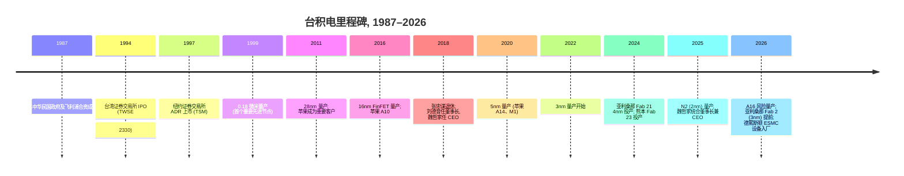
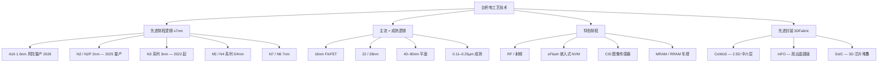
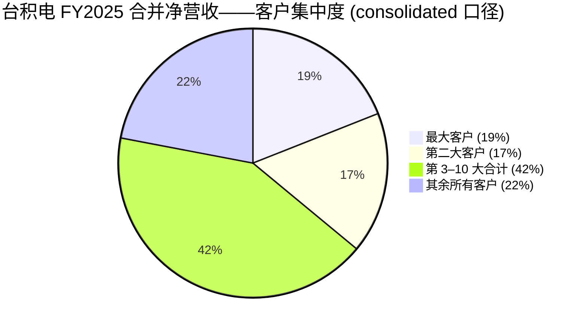
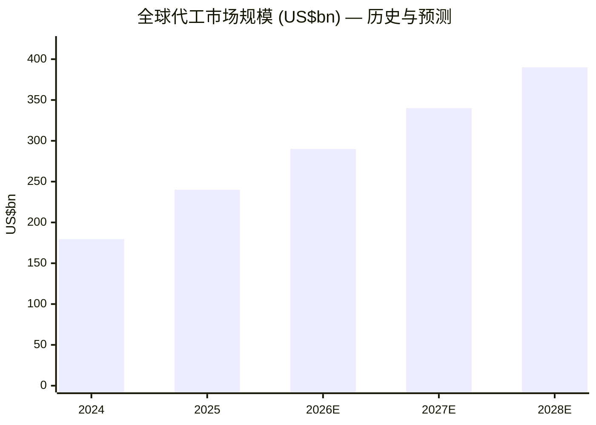
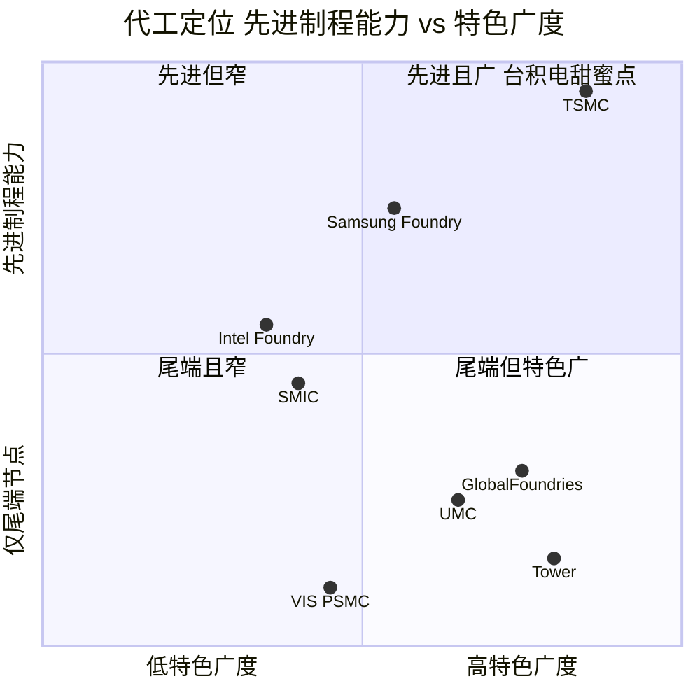

# 台湾积体电路制造股份有限公司 (NYSE:TSM, TWSE:2330) — 公司研究报告

**日期 (as of):** 2026-06-14
**分析师:** 内部初次覆盖 / 刷新
**上市地:** 纽约证券交易所 ADS (TSM, 1 ADS = 5 股普通股) / 台湾证券交易所普通股 (2330)
**底层主要文件语言:** 英文 (台积电 (TSMC) 作为 foreign private issuer 向美国 SEC 提交英文版 20-F / 6-K; 财务报表按 TIFRS 以新台币 (NT$) 列示)

---

> *分析师观点：* **评级：Overweight（增持）· 12 个月目标价 NT$2,680 / ADR US$490（较 2026-06-12 收盘 NT$2,310 / US$423.93 上行 +16%）· 估值方法：2027E EPS NT$116 × 23× forward P/E**
> 市值 ~US$2.20 万亿（NT$59.9 万亿）· 52 周区间 ADR US$206–US$450 / 2330 NT$1,015–NT$2,440 · NYSE:TSM / TWSE:2330
>
> | 倍数 / Multiple（*分析师观点：* 前瞻列） | FY25A | FY26E | FY27E |
> |---|---|---|---|
> | P/E（2330，以 NT$2,310 计） | 35.3× | 23.6× | 19.9× |
> | EV/EBITDA | ~20× | ~14× | ~11× |
> | P/S | 14.6× | ~11× | ~9× |
> | PEG（基于 26% EPS CAGR） | — | ~0.9 | — |
>
> **相对表现 (Rel. performance, ADR vs S&P 500，截至 2026-06-12)：** 1M +6.3% / 6M +39.8% / YTD +33.3% / 12M +99.0%；同期 S&P 500 −0.2% / +7.7% / +8.4% / +22.9%（相对超额 12M **+76pp**）。2330.TW 12M +124% vs TAIEX +98%。（价格来源：[Yahoo Finance — TSM](https://finance.yahoo.com/quote/TSM/)、yfinance 历史收盘）
>
> **核心论点（thesis pillars）**——（1）≤7nm 先进制程 (advanced node) 接近垄断（FY2025 占晶圆营收 74%），AI 加速器需求把先进产能拉到结构性供不应求，N2 据报道售罄至 2028；（2）3DFabric® 先进封装（CoWoS®）是 AI 算力的事实瓶颈，台积电掌握定价权与产能分配权；（3）59.9% 的 gross margin (毛利率) + 净现金资产负债表 + 经营杠杆，使其在所有代工厂中独享自筹千亿美元资本开支的能力；（4）股价过去 12 个月已 +99%（ADR）/+124%（2330），估值追上了基本面——上行空间收敛、风险回报对称性弱于三个月前，故给予 Overweight 而非更激进评级。
>
> *上述评级、目标价、前瞻估算与情景目标价均为分析师本方的前瞻观点 (analyst view)，不取自任何 filing；10-K/20-F 不含目标价。*

---

> **业绩更新——2026 财年指引维持上调后高位 (as of 2026-06-14)：** 台积电在 2026 Q1 业绩说明会 (2026-04-16) 上将 2026 全年美元营收指引上调至**"同比增长 30% 以上"**（此前 1 月披露区间为"20% 中段至约 30%"），并把 2026 资本开支 (CapEx) 指引上调至历史新高 **US$52–56bn**（对照 2025 实际 US$40.5bn / NT$1,272.4bn）。Q1 营收 **US$35.9bn**（美元口径同比 +40.6%）超出 US$35.0–35.7bn 指引上限，Q1 gross margin **66.2%** 高于 64–66% 指引上限，Q2 指引 **US$39.0–40.2bn**。进入 6 月，券商监测显示 5 月销售"达到 2Q26 指引上限、先进制程产能持续紧张"，2Q26 月度营收略超指引中值。
> 来源: [台积电 2026 Q1 业绩公告, 2026-04-16](https://www.sec.gov/Archives/edgar/data/1046179/000104617926000199/a1q26e_withguidancexfinal.htm)；*分析师观点：* [J.P. Morgan — TSMC May sales on track to reach high end of 2Q26 guidance, 2026-06-10, p.1](http://xs-macbook-air.local:5001/zsxq/pdf/214528118124821/J.P.%20Morgan-TSMC%EF%BC%882330.TW%EF%BC%89May%20sales%20on%20track%20to%20reach%20high%20end%20of%202Q26%20guidance%EF%BC%9B%20tightness%20in%20leading~edge%20capacity%20persists-260610.pdf)、[Bernstein — TSMC 2Q26 monthly revenue tracking slightly ahead of guidance mid-point, 2026-06-10, p.1](http://xs-macbook-air.local:5001/zsxq/pdf/181245841228252/Bernstein-Taiwan%20Semiconductor%20Manufacturing%20Co%20Ltd%EF%BC%882330.TT%EF%BC%89TSMC%EF%BC%9A%202Q26%20monthly%20revenue%20tracking%20slightly%20ahead%20of%20guidance%20mid~point-260610.pdf)。

---

## 目录
1. 公司概览（含投资论点引言 + 估值快照）
1A. 估值与目标价（前瞻模型 · 目标价推导 · 牛/基准/熊情景 · 卖方观点演变）
1B. GF Score（GuruFocus 式基本面评分卡）
2. 公司历史
3. 管理团队
4. 产品与服务
5. 客户与上市策略
6. 行业概览
7. 竞争格局
8. 市场机会 (TAM)
9. 风险评估
9.5. 关键分歧与催化剂
10. 投资视角评分卡 (Investor lenses)

数据来源清单 / 参考资料

---

## 1. 公司概览

*分析师观点：* **本方给予台积电 Overweight（增持），12 个月目标价 NT$2,680 / ADR US$490（+16%）。** 投资逻辑很直接：这是全球唯一能稳定量产 ≤2nm 逻辑芯片、且把 AI 加速器先进封装 (advanced packaging) 牢牢攥在手里的代工厂，FY2025 营收同比 +31.6%、gross margin 接近 60%，且仍在加速。"why now"在于先进制程与 CoWoS® 产能已被 AI 需求拉到结构性短缺、2027 年前都看不到缓解，台积电同时握有提价权与产能分配权；但要诚实地说，股价过去一年 ADR +99%、本地股 +124%，估值已追上基本面，多数券商目标价距现价只剩个位数到十几个百分点的空间——因此本方的论点是"质量与确定性溢价仍值得持有 (own the compounder)"，而非"深度低估"。详细的前瞻模型、目标价推导与牛熊情景见第 1A 节。

台湾积体电路制造股份有限公司 ("台积电"、TSMC, NYSE: TSM, TWSE: 2330) 是全球最大的专业半导体代工厂 (pure-play foundry)——即为其他公司设计的芯片提供合同制造服务的代工制造商。公司由张忠谋博士 (Dr. Morris Chang) 于 1987 年在台湾新竹创立, 由中华民国政府、飞利浦 (Philips) 及其他私人投资者合资设立; 台积电开创了纯代工商业模式, 并在该市场保持主导地位超过三十年 ([台积电 2025 年 Form 20-F, 第 4 项——公司信息](https://www.sec.gov/Archives/edgar/data/1046179/000162828026025362/tsm-20251231.htm))。

**业务范围。** 台积电基于客户提供的设计在硅晶圆上制造集成电路 (integrated circuit, IC)。公司部署了 305 种工艺技术, 2025 年为 534 名客户制造了 12,682 种不同产品 ([2026 Q1 业绩公告, 2026-04-16](https://www.sec.gov/Archives/edgar/data/1046179/000104617926000199/a1q26e_withguidancexfinal.htm))。工艺技术 (process technology) 组合从 0.25 微米成熟制程节点 (mature node) 一直延伸到 2025 年下半年量产的 2 纳米先进制程 (advanced node, "N2"); 16 埃 ("A16") 节点按计划于 2026 年下半年进入风险量产 (risk production) ([2025 20-F, 第 4 项](https://www.sec.gov/Archives/edgar/data/1046179/000162828026025362/tsm-20251231.htm))。除晶圆制造 (2025 年贡献净营收的 86%) 外, 台积电还提供光罩制造、设计支持以及 3DFabric® 先进封装套件——CoWoS® (Chip-on-Wafer-on-Substrate)、SoIC® (System-on-Integrated-Chips) 及 InFO (Integrated Fan-Out) ([台积电 3DFabric 博客, 2020-08-03](https://www.tsmc.com/english/news-events/blog-article-20200803))。

**盈利方式。** 主要营收来源是晶圆制造, 按片计费, 价格反映节点、设计复杂度与产能紧张程度。合约定价以美元为基准, 财务报表按 TIFRS 以新台币 (NT$) 列示。其余约 14% 营收来自封装与测试、光罩制造、设计服务及版税 ([2025 20-F, 第 5 项](https://www.sec.gov/Archives/edgar/data/1046179/000162828026025362/tsm-20251231.htm))。该业务经营杠杆 (operating leverage) 很强: 销货成本中约一半为固定成本 (晶圆厂折旧), 因此产能利用率波动会带来实质性毛利率波动——这一动态在 2021 财年 GM 飙升至 59.6%、2023 财年回落至 54.4%、2025 财年随先进制程占比扩张回升至 59.9% 的轨迹中清晰可见 ([2025 20-F, 第 5 项](https://www.sec.gov/Archives/edgar/data/1046179/000162828026025362/tsm-20251231.htm))。

下图用 income-statement Sankey 呈现 FY2025 的"钱从哪来、到哪去"：左侧六大平台营收汇入 NT$3,809,054mn 净营收，扣除 NT$1,527,760mn 销货成本得 NT$2,281,294mn gross profit，再扣 R&D / SG&A 后录得 NT$1,936,092mn operating income，叠加 NT$105,563mn 净非营业收入（主要是 NT$105,739mn 利息收入）、扣除 NT$346,530mn 所得税，最终 net income NT$1,695,125mn ([2025 20-F, 合并损益表 + 平台营收附注](https://www.sec.gov/Archives/edgar/data/1046179/000162828026025362/tsm-20251231.htm))。

<svg xmlns="http://www.w3.org/2000/svg" viewBox="0 0 1000 560" width="1000" height="560" role="img" aria-label="income statement Sankey"><rect x="0" y="0" width="1000" height="560" fill="#ffffff"/>
<text x="20.00" y="30.00" text-anchor="start" font-family="Helvetica,Arial,sans-serif" font-size="15" font-weight="700" fill="#1f2933">台积电 TSMC 如何赚钱 — FY2025 (NT$mn)</text>
<path d="M 204.00,64.00 C 258.00,64.00 258.00,99.00 312.00,99.00 L 312.00,317.77 C 258.00,317.77 258.00,282.77 204.00,282.77 Z" fill="#93c5fd" fill-opacity="0.55"/>
<path d="M 452.00,92.00 C 506.00,92.00 506.00,155.92 560.00,155.92 L 560.00,349.07 C 506.00,349.07 506.00,285.15 452.00,285.15 Z" fill="#86efac" fill-opacity="0.55"/>
<path d="M 452.00,285.15 C 506.00,285.15 506.00,363.07 560.00,363.07 L 560.00,397.55 C 506.00,397.55 506.00,319.63 452.00,319.63 Z" fill="#fca5a5" fill-opacity="0.55"/>
<path d="M 328.00,99.00 C 382.00,99.00 382.00,92.00 436.00,92.00 L 436.00,319.59 C 382.00,319.59 382.00,326.59 328.00,326.59 Z" fill="#86efac" fill-opacity="0.55"/>
<path d="M 328.00,326.59 C 382.00,326.59 382.00,333.59 436.00,333.59 L 436.00,486.00 C 382.00,486.00 382.00,479.00 328.00,479.00 Z" fill="#fca5a5" fill-opacity="0.55"/>
<path d="M 576.00,155.92 C 630.00,155.92 630.00,155.92 684.00,155.92 L 684.00,349.07 C 630.00,349.07 630.00,349.07 576.00,349.07 Z" fill="#86efac" fill-opacity="0.55"/>
<path d="M 700.00,155.92 C 754.00,155.92 754.00,180.16 808.00,180.16 L 808.00,349.27 C 754.00,349.27 754.00,325.03 700.00,325.03 Z" fill="#86efac" fill-opacity="0.55"/>
<path d="M 700.00,325.03 C 754.00,325.03 754.00,363.27 808.00,363.27 L 808.00,397.84 C 754.00,397.84 754.00,359.60 700.00,359.60 Z" fill="#fca5a5" fill-opacity="0.55"/>
<path d="M 204.00,296.77 C 258.00,296.77 258.00,317.77 312.00,317.77 L 312.00,428.59 C 258.00,428.59 258.00,407.59 204.00,407.59 Z" fill="#93c5fd" fill-opacity="0.55"/>
<path d="M 576.00,363.07 C 630.00,363.07 630.00,373.60 684.00,373.60 L 684.00,383.50 C 630.00,383.50 630.00,372.97 576.00,372.97 Z" fill="#fca5a5" fill-opacity="0.55"/>
<path d="M 576.00,372.97 C 630.00,372.97 630.00,397.50 684.00,397.50 L 684.00,422.08 C 630.00,422.08 630.00,397.55 576.00,397.55 Z" fill="#fca5a5" fill-opacity="0.55"/>
<path d="M 576.00,411.55 C 630.00,411.55 630.00,349.07 684.00,349.07 L 684.00,359.60 C 630.00,359.60 630.00,422.08 576.00,422.08 Z" fill="#93c5fd" fill-opacity="0.55"/>
<path d="M 204.00,421.59 C 258.00,421.59 258.00,428.59 312.00,428.59 L 312.00,447.65 C 258.00,447.65 258.00,440.65 204.00,440.65 Z" fill="#93c5fd" fill-opacity="0.55"/>
<path d="M 204.00,454.65 C 258.00,454.65 258.00,447.65 312.00,447.65 L 312.00,466.27 C 258.00,466.27 258.00,473.27 204.00,473.27 Z" fill="#93c5fd" fill-opacity="0.55"/>
<path d="M 204.00,487.27 C 258.00,487.27 258.00,466.27 312.00,466.27 L 312.00,471.06 C 258.00,471.06 258.00,492.06 204.00,492.06 Z" fill="#93c5fd" fill-opacity="0.55"/>
<path d="M 204.00,506.06 C 258.00,506.06 258.00,471.06 312.00,471.06 L 312.00,479.00 C 258.00,479.00 258.00,514.00 204.00,514.00 Z" fill="#93c5fd" fill-opacity="0.55"/>
<rect x="188.00" y="64.00" width="16" height="218.77" rx="1.5" fill="#2563eb"/>
<rect x="188.00" y="296.77" width="16" height="110.82" rx="1.5" fill="#2563eb"/>
<rect x="188.00" y="421.59" width="16" height="19.06" rx="1.5" fill="#2563eb"/>
<rect x="188.00" y="454.65" width="16" height="18.62" rx="1.5" fill="#2563eb"/>
<rect x="188.00" y="487.27" width="16" height="4.79" rx="1.5" fill="#2563eb"/>
<rect x="188.00" y="506.06" width="16" height="7.94" rx="1.5" fill="#2563eb"/>
<rect x="312.00" y="99.00" width="16" height="380.00" rx="1.5" fill="#1e3a8a"/>
<rect x="436.00" y="92.00" width="16" height="227.59" rx="1.5" fill="#15803d"/>
<rect x="436.00" y="333.59" width="16" height="152.41" rx="1.5" fill="#dc2626"/>
<rect x="560.00" y="155.92" width="16" height="193.15" rx="1.5" fill="#15803d"/>
<rect x="560.00" y="363.07" width="16" height="34.48" rx="1.5" fill="#dc2626"/>
<rect x="560.00" y="411.55" width="16" height="10.53" rx="1.5" fill="#2563eb"/>
<rect x="684.00" y="155.92" width="16" height="203.68" rx="1.5" fill="#15803d"/>
<rect x="684.00" y="373.60" width="16" height="9.90" rx="1.5" fill="#dc2626"/>
<rect x="684.00" y="397.50" width="16" height="24.58" rx="1.5" fill="#dc2626"/>
<rect x="808.00" y="180.16" width="16" height="169.11" rx="1.5" fill="#15803d"/>
<rect x="808.00" y="363.27" width="16" height="34.57" rx="1.5" fill="#dc2626"/>
<line x1="188.00" y1="173.39" x2="182.00" y2="145.72" stroke="#cbd5e1" stroke-width="1"/>
<text x="179.00" y="148.72" text-anchor="end" font-family="Helvetica,Arial,sans-serif" font-size="11.5" font-weight="700" fill="#1f2933">HPC</text>
<text x="179.00" y="161.72" text-anchor="end" font-family="Helvetica,Arial,sans-serif" font-size="10" font-weight="400" fill="#52606d">NT$2.2T  (57.6%)</text>
<line x1="188.00" y1="352.18" x2="182.00" y2="324.52" stroke="#cbd5e1" stroke-width="1"/>
<text x="179.00" y="327.52" text-anchor="end" font-family="Helvetica,Arial,sans-serif" font-size="11.5" font-weight="700" fill="#1f2933">Smartphone</text>
<text x="179.00" y="340.52" text-anchor="end" font-family="Helvetica,Arial,sans-serif" font-size="10" font-weight="400" fill="#52606d">NT$1.1T  (29.2%)</text>
<line x1="188.00" y1="431.12" x2="182.00" y2="403.45" stroke="#cbd5e1" stroke-width="1"/>
<text x="179.00" y="406.45" text-anchor="end" font-family="Helvetica,Arial,sans-serif" font-size="11.5" font-weight="700" fill="#1f2933">IoT</text>
<text x="179.00" y="419.45" text-anchor="end" font-family="Helvetica,Arial,sans-serif" font-size="10" font-weight="400" fill="#52606d">NT$191.0B  (5.0%)</text>
<line x1="188.00" y1="463.96" x2="182.00" y2="436.29" stroke="#cbd5e1" stroke-width="1"/>
<text x="179.00" y="439.29" text-anchor="end" font-family="Helvetica,Arial,sans-serif" font-size="11.5" font-weight="700" fill="#1f2933">Automotive</text>
<text x="179.00" y="452.29" text-anchor="end" font-family="Helvetica,Arial,sans-serif" font-size="10" font-weight="400" fill="#52606d">NT$186.7B  (4.9%)</text>
<line x1="188.00" y1="489.67" x2="182.00" y2="462.00" stroke="#cbd5e1" stroke-width="1"/>
<text x="179.00" y="465.00" text-anchor="end" font-family="Helvetica,Arial,sans-serif" font-size="11.5" font-weight="700" fill="#1f2933">DCE</text>
<text x="179.00" y="478.00" text-anchor="end" font-family="Helvetica,Arial,sans-serif" font-size="10" font-weight="400" fill="#52606d">NT$48.0B  (1.3%)</text>
<line x1="188.00" y1="510.03" x2="182.00" y2="487.00" stroke="#cbd5e1" stroke-width="1"/>
<text x="179.00" y="490.00" text-anchor="end" font-family="Helvetica,Arial,sans-serif" font-size="11.5" font-weight="700" fill="#1f2933">Other</text>
<text x="179.00" y="503.00" text-anchor="end" font-family="Helvetica,Arial,sans-serif" font-size="10" font-weight="400" fill="#52606d">NT$79.6B  (2.1%)</text>
<rect x="331.00" y="81.00" width="113.10" height="26" rx="2" fill="#ffffff" fill-opacity="0.72"/>
<text x="334.00" y="93.00" text-anchor="start" font-family="Helvetica,Arial,sans-serif" font-size="11.5" font-weight="700" fill="#1f2933">Revenue</text>
<text x="334.00" y="106.00" text-anchor="start" font-family="Helvetica,Arial,sans-serif" font-size="10" font-weight="400" fill="#52606d">NT$3.8T  (100.0%)</text>
<rect x="455.00" y="74.00" width="106.80" height="26" rx="2" fill="#ffffff" fill-opacity="0.72"/>
<text x="458.00" y="86.00" text-anchor="start" font-family="Helvetica,Arial,sans-serif" font-size="11.5" font-weight="700" fill="#1f2933">Gross Profit</text>
<text x="458.00" y="99.00" text-anchor="start" font-family="Helvetica,Arial,sans-serif" font-size="10" font-weight="400" fill="#52606d">NT$2.3T  (59.9%)</text>
<rect x="455.00" y="315.59" width="144.60" height="26" rx="2" fill="#ffffff" fill-opacity="0.72"/>
<text x="458.00" y="327.59" text-anchor="start" font-family="Helvetica,Arial,sans-serif" font-size="11.5" font-weight="700" fill="#1f2933">Cost of Revenue (COGS)</text>
<text x="458.00" y="340.59" text-anchor="start" font-family="Helvetica,Arial,sans-serif" font-size="10" font-weight="400" fill="#52606d">NT$1.5T  (40.1%)</text>
<rect x="579.00" y="137.92" width="106.80" height="26" rx="2" fill="#ffffff" fill-opacity="0.72"/>
<text x="582.00" y="149.92" text-anchor="start" font-family="Helvetica,Arial,sans-serif" font-size="11.5" font-weight="700" fill="#1f2933">Operating Income</text>
<text x="582.00" y="162.92" text-anchor="start" font-family="Helvetica,Arial,sans-serif" font-size="10" font-weight="400" fill="#52606d">NT$1.9T  (50.8%)</text>
<rect x="579.00" y="345.07" width="150.90" height="26" rx="2" fill="#ffffff" fill-opacity="0.72"/>
<text x="582.00" y="357.07" text-anchor="start" font-family="Helvetica,Arial,sans-serif" font-size="11.5" font-weight="700" fill="#1f2933">Total Operating Expense</text>
<text x="582.00" y="370.07" text-anchor="start" font-family="Helvetica,Arial,sans-serif" font-size="10" font-weight="400" fill="#52606d">NT$345.6B  (9.1%)</text>
<text x="551.00" y="413.82" text-anchor="end" font-family="Helvetica,Arial,sans-serif" font-size="11.5" font-weight="700" fill="#1f2933">Net Interest / Other Income</text>
<text x="551.00" y="426.82" text-anchor="end" font-family="Helvetica,Arial,sans-serif" font-size="10" font-weight="400" fill="#52606d">NT$105.6B  (2.8%)</text>
<rect x="703.00" y="137.92" width="106.80" height="26" rx="2" fill="#ffffff" fill-opacity="0.72"/>
<text x="706.00" y="149.92" text-anchor="start" font-family="Helvetica,Arial,sans-serif" font-size="11.5" font-weight="700" fill="#1f2933">Pretax Income</text>
<text x="706.00" y="162.92" text-anchor="start" font-family="Helvetica,Arial,sans-serif" font-size="10" font-weight="400" fill="#52606d">NT$2.0T  (53.6%)</text>
<rect x="703.00" y="355.60" width="106.80" height="26" rx="2" fill="#ffffff" fill-opacity="0.72"/>
<text x="706.00" y="367.60" text-anchor="start" font-family="Helvetica,Arial,sans-serif" font-size="11.5" font-weight="700" fill="#1f2933">SG&amp;A</text>
<text x="706.00" y="380.60" text-anchor="start" font-family="Helvetica,Arial,sans-serif" font-size="10" font-weight="400" fill="#52606d">NT$99.2B  (2.6%)</text>
<rect x="703.00" y="380.60" width="113.10" height="26" rx="2" fill="#ffffff" fill-opacity="0.72"/>
<text x="706.00" y="392.60" text-anchor="start" font-family="Helvetica,Arial,sans-serif" font-size="11.5" font-weight="700" fill="#1f2933">R&amp;D</text>
<text x="706.00" y="405.60" text-anchor="start" font-family="Helvetica,Arial,sans-serif" font-size="10" font-weight="400" fill="#52606d">NT$246.4B  (6.5%)</text>
<text x="833.00" y="261.71" text-anchor="start" font-family="Helvetica,Arial,sans-serif" font-size="11.5" font-weight="700" fill="#1f2933">Net Income</text>
<text x="833.00" y="274.71" text-anchor="start" font-family="Helvetica,Arial,sans-serif" font-size="10" font-weight="400" fill="#52606d">NT$1.7T  (44.5%)</text>
<text x="833.00" y="377.55" text-anchor="start" font-family="Helvetica,Arial,sans-serif" font-size="11.5" font-weight="700" fill="#1f2933">Income Tax</text>
<text x="833.00" y="390.55" text-anchor="start" font-family="Helvetica,Arial,sans-serif" font-size="10" font-weight="400" fill="#52606d">NT$346.5B  (9.1%)</text>
<text x="500.00" y="544.00" text-anchor="middle" font-family="Helvetica,Arial,sans-serif" font-size="10" font-weight="400" fill="#52606d">Source: 台积电 2025 Form 20-F · 合并损益表 + 平台营收附注</text>
</svg>

来源 / Source: [台积电 2025 Form 20-F, 合并损益表 (F-8) + 平台营收附注](https://www.sec.gov/Archives/edgar/data/1046179/000162828026025362/tsm-20251231.htm)

**营收结构——平台与地理。** FY2025 营收按平台高度集中于高性能计算 (HPC): HPC NT$2,192,931mn (58%)、智能手机 NT$1,110,816mn (29%)、物联网 (IoT) NT$191,047mn (5%)、汽车 NT$186,667mn (5%)、数字消费电子 (DCE) NT$47,997mn (1%)、其他 NT$79,596mn (2%) ([2025 20-F, 第 5 项 平台营收](https://www.sec.gov/Archives/edgar/data/1046179/000162828026025362/tsm-20251231.htm))。按客户所在地, 北美 NT$2,875,270mn (75%)、亚太 NT$329,269mn (9%)、中国 NT$327,503mn (9%)、日本 NT$150,428mn (4%)、EMEA NT$126,584mn (3%)——四分之三营收来自北美总部客户, 设计端地理分散而制造端仍极度集中于台湾 ([2025 20-F, 第 5 项 区域营收](https://www.sec.gov/Archives/edgar/data/1046179/000162828026025362/tsm-20251231.htm))。

<svg xmlns="http://www.w3.org/2000/svg" viewBox="0 0 720 460" width="720" height="460" role="img" aria-label="revenue donut"><rect x="0" y="0" width="720" height="460" fill="#ffffff"/>
<text x="20.00" y="30.00" text-anchor="start" font-family="Helvetica,Arial,sans-serif" font-size="15" font-weight="700" fill="#1f2933">FY2025 营收结构 — 按平台 (Platform)</text>
<path d="M 288.00,107.20 A 132 132 0 1 1 227.55,356.54 L 252.28,308.54 A 78 78 0 1 0 288.00,161.20 Z" fill="#2563eb"/>
<path d="M 227.55,356.54 A 132 132 0 0 1 190.28,150.46 L 230.26,186.76 A 78 78 0 0 0 252.28,308.54 Z" fill="#15803d"/>
<path d="M 190.28,150.46 A 132 132 0 0 1 222.60,124.54 L 249.35,171.45 A 78 78 0 0 0 230.26,186.76 Z" fill="#d97706"/>
<path d="M 222.60,124.54 A 132 132 0 0 1 260.42,110.11 L 271.70,162.92 A 78 78 0 0 0 249.35,171.45 Z" fill="#7c3aed"/>
<path d="M 260.42,110.11 A 132 132 0 0 1 270.72,108.34 L 277.79,161.87 A 78 78 0 0 0 271.70,162.92 Z" fill="#dc2626"/>
<path d="M 270.72,108.34 A 132 132 0 0 1 288.00,107.20 L 288.00,161.20 A 78 78 0 0 0 277.79,161.87 Z" fill="#0891b2"/>
<text x="288.00" y="235.20" text-anchor="middle" font-family="Helvetica,Arial,sans-serif" font-size="18" font-weight="800" fill="#1f2933">TSMC FY25</text>
<text x="288.00" y="255.20" text-anchor="middle" font-family="Helvetica,Arial,sans-serif" font-size="13" font-weight="600" fill="#52606d">NT$3.8T</text>
<text x="288.00" y="271.20" text-anchor="middle" font-family="Helvetica,Arial,sans-serif" font-size="10" font-weight="400" fill="#8a97a3">total</text>
<line x1="422.11" y1="271.72" x2="438.11" y2="271.72" stroke="#2563eb" stroke-width="1.4"/>
<text x="442.11" y="269.72" text-anchor="start" font-family="Helvetica,Arial,sans-serif" font-size="11" font-weight="700" fill="#1f2933">HPC</text>
<text x="442.11" y="283.72" text-anchor="start" font-family="Helvetica,Arial,sans-serif" font-size="10" font-weight="400" fill="#52606d">NT$2.2T  (57.6%)</text>
<line x1="152.20" y1="263.76" x2="136.20" y2="263.76" stroke="#15803d" stroke-width="1.4"/>
<text x="132.20" y="261.76" text-anchor="end" font-family="Helvetica,Arial,sans-serif" font-size="11" font-weight="700" fill="#1f2933">Smartphone</text>
<text x="132.20" y="275.76" text-anchor="end" font-family="Helvetica,Arial,sans-serif" font-size="10" font-weight="400" fill="#52606d">NT$1.1T  (29.2%)</text>
<line x1="201.66" y1="131.54" x2="185.66" y2="131.54" stroke="#d97706" stroke-width="1.4"/>
<text x="181.66" y="129.54" text-anchor="end" font-family="Helvetica,Arial,sans-serif" font-size="11" font-weight="700" fill="#1f2933">IoT</text>
<text x="181.66" y="143.54" text-anchor="end" font-family="Helvetica,Arial,sans-serif" font-size="10" font-weight="400" fill="#52606d">NT$191.0B  (5.0%)</text>
<line x1="238.81" y1="110.26" x2="222.81" y2="110.26" stroke="#7c3aed" stroke-width="1.4"/>
<text x="218.81" y="108.26" text-anchor="end" font-family="Helvetica,Arial,sans-serif" font-size="11" font-weight="700" fill="#1f2933">Automotive</text>
<text x="218.81" y="122.26" text-anchor="end" font-family="Helvetica,Arial,sans-serif" font-size="10" font-weight="400" fill="#52606d">NT$186.7B  (4.9%)</text>
<line x1="264.53" y1="103.21" x2="248.53" y2="103.21" stroke="#dc2626" stroke-width="1.4"/>
<text x="244.53" y="101.21" text-anchor="end" font-family="Helvetica,Arial,sans-serif" font-size="11" font-weight="700" fill="#1f2933">DCE</text>
<text x="244.53" y="115.21" text-anchor="end" font-family="Helvetica,Arial,sans-serif" font-size="10" font-weight="400" fill="#52606d">NT$48.0B  (1.3%)</text>
<line x1="278.95" y1="101.50" x2="262.95" y2="101.50" stroke="#0891b2" stroke-width="1.4"/>
<text x="258.95" y="99.50" text-anchor="end" font-family="Helvetica,Arial,sans-serif" font-size="11" font-weight="700" fill="#1f2933">Other</text>
<text x="258.95" y="113.50" text-anchor="end" font-family="Helvetica,Arial,sans-serif" font-size="10" font-weight="400" fill="#52606d">NT$79.6B  (2.1%)</text>
<text x="360.00" y="444.00" text-anchor="middle" font-family="Helvetica,Arial,sans-serif" font-size="10" font-weight="400" fill="#52606d">Source: 台积电 2025 Form 20-F · 平台营收附注</text>
</svg>

来源 / Source: [台积电 2025 Form 20-F, 平台营收附注](https://www.sec.gov/Archives/edgar/data/1046179/000162828026025362/tsm-20251231.htm)

HPC 在 2024 年超越智能手机成为第一大平台, 2025 年占比进一步升至 58%。这一结构性转变由 AI 加速器需求驱动——下面的历史堆叠图 (revbars) 显示, HPC 营收从 FY2023 的 NT$934.8bn 翻倍至 FY2025 的 NT$2,192.9bn, 而智能手机同期仅从 NT$814.9bn 增至 NT$1,110.8bn ([2023–2025 20-F, 平台营收附注](https://www.sec.gov/Archives/edgar/data/1046179/000162828026025362/tsm-20251231.htm))。

<svg xmlns="http://www.w3.org/2000/svg" viewBox="0 0 860 470" width="860" height="470" role="img" aria-label="historical revenue bars"><rect x="0" y="0" width="860" height="470" fill="#ffffff"/>
<text x="20.00" y="30.00" text-anchor="start" font-family="Helvetica,Arial,sans-serif" font-size="15" font-weight="700" fill="#1f2933">台积电营收演变 — 按平台 FY2023–FY2025 (NT$bn)</text>
<rect x="20.00" y="44" width="11" height="11" rx="2" fill="#2563eb"/>
<text x="36.00" y="53.00" text-anchor="start" font-family="Helvetica,Arial,sans-serif" font-size="10.5" font-weight="400" fill="#1f2933">HPC</text>
<rect x="69.80" y="44" width="11" height="11" rx="2" fill="#15803d"/>
<text x="85.80" y="53.00" text-anchor="start" font-family="Helvetica,Arial,sans-serif" font-size="10.5" font-weight="400" fill="#1f2933">Smartphone</text>
<rect x="165.80" y="44" width="11" height="11" rx="2" fill="#d97706"/>
<text x="181.80" y="53.00" text-anchor="start" font-family="Helvetica,Arial,sans-serif" font-size="10.5" font-weight="400" fill="#1f2933">IoT</text>
<rect x="215.60" y="44" width="11" height="11" rx="2" fill="#7c3aed"/>
<text x="231.60" y="53.00" text-anchor="start" font-family="Helvetica,Arial,sans-serif" font-size="10.5" font-weight="400" fill="#1f2933">Automotive</text>
<rect x="311.60" y="44" width="11" height="11" rx="2" fill="#dc2626"/>
<text x="327.60" y="53.00" text-anchor="start" font-family="Helvetica,Arial,sans-serif" font-size="10.5" font-weight="400" fill="#1f2933">DCE</text>
<rect x="361.40" y="44" width="11" height="11" rx="2" fill="#0891b2"/>
<text x="377.40" y="53.00" text-anchor="start" font-family="Helvetica,Arial,sans-serif" font-size="10.5" font-weight="400" fill="#1f2933">Other</text>
<line x1="70" y1="412.00" x2="834" y2="412.00" stroke="#eceff2" stroke-width="1"/>
<text x="64.00" y="415.00" text-anchor="end" font-family="Helvetica,Arial,sans-serif" font-size="9.5" font-weight="400" fill="#52606d">NT$0</text>
<line x1="70" y1="345.20" x2="834" y2="345.20" stroke="#eceff2" stroke-width="1"/>
<text x="64.00" y="348.20" text-anchor="end" font-family="Helvetica,Arial,sans-serif" font-size="9.5" font-weight="400" fill="#52606d">NT$822.7B</text>
<line x1="70" y1="278.40" x2="834" y2="278.40" stroke="#eceff2" stroke-width="1"/>
<text x="64.00" y="281.40" text-anchor="end" font-family="Helvetica,Arial,sans-serif" font-size="9.5" font-weight="400" fill="#52606d">NT$1.6T</text>
<line x1="70" y1="211.60" x2="834" y2="211.60" stroke="#eceff2" stroke-width="1"/>
<text x="64.00" y="214.60" text-anchor="end" font-family="Helvetica,Arial,sans-serif" font-size="9.5" font-weight="400" fill="#52606d">NT$2.5T</text>
<line x1="70" y1="144.80" x2="834" y2="144.80" stroke="#eceff2" stroke-width="1"/>
<text x="64.00" y="147.80" text-anchor="end" font-family="Helvetica,Arial,sans-serif" font-size="9.5" font-weight="400" fill="#52606d">NT$3.3T</text>
<line x1="70" y1="78.00" x2="834" y2="78.00" stroke="#eceff2" stroke-width="1"/>
<text x="64.00" y="81.00" text-anchor="end" font-family="Helvetica,Arial,sans-serif" font-size="9.5" font-weight="400" fill="#52606d">NT$4.1T</text>
<rect x="123.48" y="336.10" width="147.71" height="75.90" fill="#2563eb"/>
<rect x="123.48" y="269.94" width="147.71" height="66.16" fill="#15803d"/>
<rect x="123.48" y="256.79" width="147.71" height="13.14" fill="#d97706"/>
<rect x="123.48" y="245.94" width="147.71" height="10.86" fill="#7c3aed"/>
<rect x="123.48" y="242.12" width="147.71" height="3.82" fill="#dc2626"/>
<rect x="123.48" y="236.48" width="147.71" height="5.64" fill="#0891b2"/>
<text x="197.33" y="428.00" text-anchor="middle" font-family="Helvetica,Arial,sans-serif" font-size="10" font-weight="400" fill="#52606d">2023</text>
<rect x="378.15" y="292.09" width="147.71" height="119.91" fill="#2563eb"/>
<rect x="378.15" y="210.48" width="147.71" height="81.61" fill="#15803d"/>
<rect x="378.15" y="197.04" width="147.71" height="13.44" fill="#d97706"/>
<rect x="378.15" y="185.73" width="147.71" height="11.31" fill="#7c3aed"/>
<rect x="378.15" y="181.84" width="147.71" height="3.90" fill="#dc2626"/>
<rect x="378.15" y="177.01" width="147.71" height="4.83" fill="#0891b2"/>
<text x="452.00" y="428.00" text-anchor="middle" font-family="Helvetica,Arial,sans-serif" font-size="10" font-weight="400" fill="#52606d">2024</text>
<rect x="632.81" y="233.95" width="147.71" height="178.05" fill="#2563eb"/>
<rect x="632.81" y="143.77" width="147.71" height="90.19" fill="#15803d"/>
<rect x="632.81" y="128.26" width="147.71" height="15.51" fill="#d97706"/>
<rect x="632.81" y="113.10" width="147.71" height="15.16" fill="#7c3aed"/>
<rect x="632.81" y="109.20" width="147.71" height="3.90" fill="#dc2626"/>
<rect x="632.81" y="102.74" width="147.71" height="6.46" fill="#0891b2"/>
<text x="706.67" y="428.00" text-anchor="middle" font-family="Helvetica,Arial,sans-serif" font-size="10" font-weight="400" fill="#52606d">2025</text>
<text x="430.00" y="454.00" text-anchor="middle" font-family="Helvetica,Arial,sans-serif" font-size="10" font-weight="400" fill="#52606d">Source: 台积电 2023–2025 Form 20-F · 平台营收附注</text>
</svg>

来源 / Source: [台积电 2023–2025 Form 20-F, 平台营收附注](https://www.sec.gov/Archives/edgar/data/1046179/000162828026025362/tsm-20251231.htm)

**地理布局。** 截至 2026 年 2 月 28 日, 台积电运营 1 座 150mm、6 座 200mm、9 座 300mm 晶圆厂以及 7 座先进后段 (封装) 厂 (2025 20-F, 第 4 项)。其中多数位于台湾 (新竹、台中、台南、高雄), 另有 2 座在美国 (华盛顿州、亚利桑那州)、上海 Fab 10、南京 Fab 16、日本熊本 JASM (Fab 23, 自 2024 年底量产); 熊本第二厂与德国德累斯顿 ESMC (Fab 24) 在建 ([2025 20-F, 第 4 项](https://www.sec.gov/Archives/edgar/data/1046179/000162828026025362/tsm-20251231.htm); [TrendForce, 2025-11-20](https://www.trendforce.com/news/2025/11/20/news-tsmc-dresden-fab-reportedly-wraps-structural-build-eyes-equipment-move-in-in-2h26/))。

**规模与体量。** FY2025 净营收 NT$3,809,054mn (US$121.4bn), 同比 +31.6%; 归母净利润约 NT$1,697,632mn (US$54.0bn), 基本每股收益 (EPS) NT$65.47 (折合每 ADR NT$327.37) ([2025 20-F, 合并损益表](https://www.sec.gov/Archives/edgar/data/1046179/000162828026025362/tsm-20251231.htm))。GM 59.9%、operating margin (营业利润率) 50.8%、net margin (净利率) 44.6%。经营性现金流 (OCF) NT$2,274,976mn (US$72.5bn), 支撑 NT$1,272,411mn (US$40.5bn) 资本开支后仍留下约 NT$1,002,565mn (US$32bn) free cash flow (FCF, 自由现金流) ([2025 20-F, 合并现金流量表](https://www.sec.gov/Archives/edgar/data/1046179/000162828026025362/tsm-20251231.htm))。2026 Q1 运行率进一步加速: 营收 US$35.9bn (美元口径同比 +40.6%)、GM 66.2%、Q2 指引 US$39.0–40.2bn ([2026 Q1 业绩公告, 2026-04-16](https://www.sec.gov/Archives/edgar/data/1046179/000104617926000199/a1q26e_withguidancexfinal.htm))。

*来源: [台积电 2025 年 Form 20-F](https://www.sec.gov/Archives/edgar/data/1046179/000162828026025362/tsm-20251231.htm); 汇率取 20-F 第 5 项加权平均 NT$/US$。*

**估值快照 (valuation snapshot, 截至 2026-06-12)。** 以 ADR US$423.93、市值约 US$2.20 万亿计, ADR 滚动 12 月 (TTM) P/E 约 **36.5×**, forward P/E (yfinance, 含 ADR 溢价口径) 约 21.7× ([Yahoo Finance — TSM key statistics](https://finance.yahoo.com/quote/TSM/key-statistics/))。以本地股 2330.TW NT$2,310 计, TTM P/E **31.3×**、P/S **14.6×**、P/B **10.2×**、EV/EBITDA **20.2×** ([Yahoo Finance — 2330.TW](https://finance.yahoo.com/quote/2330.TW/))。本方以 FY2025 实际 EPS NT$65.47 计的"静态"P/E 约 35.3×; 以 FY2026E EPS ~NT$98 计的 forward P/E 约 23.6× (见第 1A 节)。过去 36 个月, 2330 的 P/E 区间约 13×（2023 中谷底）至 35×+（2026 初峰值）, P/S 约 6×–15× ([macrotrends — TSM P/E 历史](https://www.macrotrends.net/stocks/charts/TSM/taiwan-semiconductor-manufacturing/pe-ratio))。

ADR (TSM) 相对本地股 (2330) 长期存在约 10–15% 溢价 (US$423.93 ÷ 5 股 × NT$31.3 ≈ NT$2,654, 高于本地 NT$2,310), 主因美国投资者对 ADR 的结构性需求; 跨市场套利受外资额度与税务限制 ([Yahoo Finance — TSM](https://finance.yahoo.com/quote/TSM/)、[Yahoo Finance — 2330.TW](https://finance.yahoo.com/quote/2330.TW/))。同业对比 (TTM, 2026-06 中):

| 公司 | 代码 | TTM P/E | TTM P/S | 备注 |
|---|---|---|---|---|
| 台积电 (TSMC) | NYSE:TSM / TWSE:2330 | 31–36× | ~14.6× | 代工龙头、AI 加速器核心受益方 |
| 联华电子 (UMC) | NYSE:UMC | ~22× | ~2.7× | 成熟/特色代工 ([Public.com — UMC, 2026](https://public.com/stocks/umc/pe-ratio)) |
| 格罗方德 (GlobalFoundries) | NASDAQ:GFS | ~34× | ~5.4× | 特色代工 ([MacroTrends — GFS](https://www.macrotrends.net/stocks/charts/GFS/globalfoundries/pe-ratio)) |
| 阿斯麦 (ASML) | NASDAQ:ASML | ~35× | ~11× | EUV (极紫外光刻) 垄断供应商 |
| 英特尔 (Intel) | NASDAQ:INTC | n/m (TTM 为负) | ~1.7× | 代工亏损; 结构性低估 |

**多倍数的解读 (P/S > 14×, forward P/E ~24×)：** 台积电的高 P/S 并非泡沫, 而是被 59.9% 的 GM 与 30%+ 的营收增速所支撑——14.6× P/S × 60% GM ≈ 8.8× 毛利倍数, 与 ASML 相当而远高于 UMC/GFS。本方将其归因于: (a) 与超大规模云计算厂商及英伟达多年期 AI 资本开支挂钩的板块溢价; (b) 没有任何代工同行能复制的 59.9% GM; (c) 先进制程供给绝对稀缺——N2 据报道已售罄至 2028 年 ([SamMobile, 2026](https://www.sammobile.com/news/samsung-foundry-likely-to-pick-up-big-orders-as-tsmc-gets-sold-out-until-2028/))。*分析师观点：* 卖方对此的共识同样是"溢价但不极端"——伯恩斯坦明确指出其目标价基于 20× 一年期 forward P/E、较半导体指数折价约 20%、仍具吸引力 ([Bernstein — Still the most trustworthy AI compounder, 2026-05-18, p.1](http://xs-macbook-air.local:5001/zsxq/pdf/415242881158218/Bernstein-Taiwan%20Semiconductor%20Manufacturing%20Co%20Ltd%EF%BC%882330.TT%EF%BC%89%EF%BC%9A%20Still%20the%20most%20trustworthy%20AI%20compounder-260518.pdf))。估值尚未紧张到独立构成风险, 但若 AI 资本开支正常化早于盈利兑现, 30×+ 倍数压缩会形成实质性拖累——本方在第 9 章列为风险。

---

## 1A. 估值与目标价

> *本节所有前瞻数字、目标价与情景目标价均为分析师本方的前瞻观点 (analyst view)，绝不附加 filing 引用——10-K/20-F 不含目标价。每个驱动变量的外部输入 (filing 分部数据 + 管理层指引 + 行业预测 + 卖方一致预期) 在文内分别引用。*

### (a) 前瞻财务模型 (3 年)

*分析师观点：* 本方对营收的建模以管理层"2026 美元营收 +30% 以上"指引 ([SCMP, 2026-04-16](https://www.scmp.com/tech/big-tech/article/3350346/tsmc-targets-over-30-revenue-surge-2026-ramps-capex-amid-booming-ai-demand)) 为锚, 叠加 N3/N2 的提价兑现 (券商测算 2027 年 N3 提价 10%+、N2 提价 5–10%, [J.P. Morgan — 2026 AGM takeaways, 2026-06-05, p.6](http://xs-macbook-air.local:5001/zsxq/pdf/181245528152842/J.P.%20Morgan-TSMC%EF%BC%882330.TW%EF%BC%892026%20AGM%20takeaways%20and%20JPM%20views-260605.pdf)) 与先进制程组合上移; 毛利率以 Q1 2026 实际 66.2% ([2026 Q1 业绩公告](https://www.sec.gov/Archives/edgar/data/1046179/000104617926000199/a1q26e_withguidancexfinal.htm)) 为起点, 全年因海外晶圆厂稀释取中值。

| 指标 (*分析师观点：* 前瞻列) | FY25A | FY26E | FY27E | FY28E | CAGR(25–28) |
|---|---|---|---|---|---|
| 营收 (NT$ bn) | 3,809 | 4,990 | 5,940 | 6,830 | +21% |
| — YoY % | +31.6% | +31% | +19% | +15% | |
| 营收 (US$ bn, 约) | 121 | 159 | 190 | 219 | |
| Gross margin % | 59.9% | 64% | 63% | 62% | |
| Operating margin % | 50.8% | 54% | 53% | 52% | |
| Net margin % | 44.6% | 46% | 46% | 45% | |
| EPS (NT$) | 65.47 | 98 | 116 | 132 | +26% |
| EPS (US$/ADR, 约) | 10.5 | 15.7 | 18.6 | 21.1 | |
| FCF (NT$ bn) | 1,003 | ~1,250 | ~1,500 | ~1,800 | |
| 净现金 (NT$ bn) | ~1,735 | ~2,000 | ~2,400 | ~2,900 | |
| ROIC % | ~30% | ~30% | ~30% | ~29% | |

模型说明: FY25A 各项取自 [2025 20-F 合并损益表/现金流量表](https://www.sec.gov/Archives/edgar/data/1046179/000162828026025362/tsm-20251231.htm)（净现金 = 现金 NT$2,767.9bn − 债务约 NT$1,033bn）。利润率的核心驱动是分部组合上移 (mix shift): HPC/AI 占比从 58% 继续抬升、N3→N2 ASP (平均售价) 提升、产能利用率饱满带来的经营杠杆; 反向拖累是亚利桑那/熊本/德累斯顿海外厂的成本稀释 (满产时对合并 GM 约 200–300bps 结构性压力, 见第 9 章)。本方 FY2026E EPS NT$98 略低于伯恩斯坦的 NT$101.62 ([Bernstein, 2026-05-18, p.1](http://xs-macbook-air.local:5001/zsxq/pdf/415242881158218/Bernstein-Taiwan%20Semiconductor%20Manufacturing%20Co%20Ltd%EF%BC%882330.TT%EF%BC%89%EF%BC%9A%20Still%20the%20most%20trustworthy%20AI%20compounder-260518.pdf)), 因本方对海外毛利稀释更保守。

下图用 5 步杜邦分解 (DuPont) 拆解 FY2025 的 ROE ≈ 35.4%——高 net margin (44.6%) × 适度的资产周转 (asset turnover) × 约 1.5× 的权益乘数 (equity multiplier, 反映其低杠杆): 这是一台靠利润率而非财务杠杆驱动的回报机器 ([2025 20-F, 合并损益表 + 资产负债表](https://www.sec.gov/Archives/edgar/data/1046179/000162828026025362/tsm-20251231.htm))。

<svg xmlns="http://www.w3.org/2000/svg" viewBox="0 0 1240 540" width="1240" height="540" role="img" aria-label="DuPont ROE decomposition"><rect x="0" y="0" width="1240" height="540" fill="#ffffff"/>
<text x="20.00" y="30.00" text-anchor="start" font-family="Helvetica,Arial,sans-serif" font-size="15" font-weight="700" fill="#1f2933">台积电 TSMC — 5 步杜邦 ROE 分解 FY2025</text>
<rect x="545.00" y="56.00" width="150" height="56" rx="7" fill="#1e3a8a"/>
<text x="620.00" y="76.00" text-anchor="middle" font-family="Helvetica,Arial,sans-serif" font-size="11.5" font-weight="700" fill="#ffffff">ROE</text>
<text x="620.00" y="94.00" text-anchor="middle" font-family="Helvetica,Arial,sans-serif" font-size="13" font-weight="800" fill="#ffffff">35.37%</text>
<text x="620.00" y="106.00" text-anchor="middle" font-family="Helvetica,Arial,sans-serif" font-size="8.5" font-weight="400" fill="#dbeafe">= Net Income / Avg Equity</text>
<rect x="191.60" y="168.00" width="150" height="56" rx="7" fill="#2563eb"/>
<text x="266.60" y="188.00" text-anchor="middle" font-family="Helvetica,Arial,sans-serif" font-size="11.5" font-weight="700" fill="#ffffff">Net Margin</text>
<text x="266.60" y="206.00" text-anchor="middle" font-family="Helvetica,Arial,sans-serif" font-size="13" font-weight="800" fill="#ffffff">44.57%</text>
<text x="266.60" y="218.00" text-anchor="middle" font-family="Helvetica,Arial,sans-serif" font-size="8.5" font-weight="400" fill="#dbeafe">Net Income / Revenue</text>
<line x1="620.00" y1="112.00" x2="266.60" y2="168.00" stroke="#94a3b8" stroke-width="1.4"/>
<rect x="545.00" y="168.00" width="150" height="56" rx="7" fill="#2563eb"/>
<text x="620.00" y="188.00" text-anchor="middle" font-family="Helvetica,Arial,sans-serif" font-size="11.5" font-weight="700" fill="#ffffff">Asset Turnover</text>
<text x="620.00" y="206.00" text-anchor="middle" font-family="Helvetica,Arial,sans-serif" font-size="13" font-weight="800" fill="#ffffff">0.52</text>
<text x="620.00" y="218.00" text-anchor="middle" font-family="Helvetica,Arial,sans-serif" font-size="8.5" font-weight="400" fill="#dbeafe">Revenue / Avg Assets</text>
<line x1="620.00" y1="112.00" x2="620.00" y2="168.00" stroke="#94a3b8" stroke-width="1.4"/>
<rect x="898.40" y="168.00" width="150" height="56" rx="7" fill="#2563eb"/>
<text x="973.40" y="188.00" text-anchor="middle" font-family="Helvetica,Arial,sans-serif" font-size="11.5" font-weight="700" fill="#ffffff">Equity Multiplier</text>
<text x="973.40" y="206.00" text-anchor="middle" font-family="Helvetica,Arial,sans-serif" font-size="13" font-weight="800" fill="#ffffff">1.52</text>
<text x="973.40" y="218.00" text-anchor="middle" font-family="Helvetica,Arial,sans-serif" font-size="8.5" font-weight="400" fill="#dbeafe">Avg Assets / Avg Equity</text>
<line x1="620.00" y1="112.00" x2="973.40" y2="168.00" stroke="#94a3b8" stroke-width="1.4"/>
<circle cx="443.30" cy="196.00" r="11" fill="#ffffff" stroke="#94a3b8" stroke-width="1.2"/>
<text x="443.30" y="201.00" text-anchor="middle" font-family="Helvetica,Arial,sans-serif" font-size="14" font-weight="800" fill="#52606d">×</text>
<circle cx="796.70" cy="196.00" r="11" fill="#ffffff" stroke="#94a3b8" stroke-width="1.2"/>
<text x="796.70" y="201.00" text-anchor="middle" font-family="Helvetica,Arial,sans-serif" font-size="14" font-weight="800" fill="#52606d">×</text>
<rect x="65.00" y="300.00" width="118" height="56" rx="7" fill="#2563eb"/>
<text x="124.00" y="320.00" text-anchor="middle" font-family="Helvetica,Arial,sans-serif" font-size="11.5" font-weight="700" fill="#ffffff">Operating Margin</text>
<text x="124.00" y="338.00" text-anchor="middle" font-family="Helvetica,Arial,sans-serif" font-size="13" font-weight="800" fill="#ffffff">50.83%</text>
<text x="124.00" y="350.00" text-anchor="middle" font-family="Helvetica,Arial,sans-serif" font-size="8.5" font-weight="400" fill="#dbeafe">Op Inc / Revenue</text>
<line x1="266.60" y1="224.00" x2="124.00" y2="300.00" stroke="#94a3b8" stroke-width="1.4"/>
<rect x="207.60" y="300.00" width="118" height="56" rx="7" fill="#2563eb"/>
<text x="266.60" y="320.00" text-anchor="middle" font-family="Helvetica,Arial,sans-serif" font-size="11.5" font-weight="700" fill="#ffffff">Tax Burden</text>
<text x="266.60" y="338.00" text-anchor="middle" font-family="Helvetica,Arial,sans-serif" font-size="13" font-weight="800" fill="#ffffff">0.8315</text>
<text x="266.60" y="350.00" text-anchor="middle" font-family="Helvetica,Arial,sans-serif" font-size="8.5" font-weight="400" fill="#dbeafe">Net Inc / Pretax</text>
<line x1="266.60" y1="224.00" x2="266.60" y2="300.00" stroke="#94a3b8" stroke-width="1.4"/>
<rect x="350.20" y="300.00" width="118" height="56" rx="7" fill="#2563eb"/>
<text x="409.20" y="320.00" text-anchor="middle" font-family="Helvetica,Arial,sans-serif" font-size="11.5" font-weight="700" fill="#ffffff">Interest Burden</text>
<text x="409.20" y="338.00" text-anchor="middle" font-family="Helvetica,Arial,sans-serif" font-size="13" font-weight="800" fill="#ffffff">1.0545</text>
<text x="409.20" y="350.00" text-anchor="middle" font-family="Helvetica,Arial,sans-serif" font-size="8.5" font-weight="400" fill="#dbeafe">Pretax / Op Inc</text>
<line x1="266.60" y1="224.00" x2="409.20" y2="300.00" stroke="#94a3b8" stroke-width="1.4"/>
<circle cx="195.30" cy="328.00" r="11" fill="#ffffff" stroke="#94a3b8" stroke-width="1.2"/>
<text x="195.30" y="333.00" text-anchor="middle" font-family="Helvetica,Arial,sans-serif" font-size="14" font-weight="800" fill="#52606d">×</text>
<circle cx="337.90" cy="328.00" r="11" fill="#ffffff" stroke="#94a3b8" stroke-width="1.2"/>
<text x="337.90" y="333.00" text-anchor="middle" font-family="Helvetica,Arial,sans-serif" font-size="14" font-weight="800" fill="#52606d">×</text>
<rect x="479.00" y="300.00" width="118" height="56" rx="7" fill="#2563eb"/>
<text x="538.00" y="326.00" text-anchor="middle" font-family="Helvetica,Arial,sans-serif" font-size="11.5" font-weight="700" fill="#ffffff">Revenue</text>
<text x="538.00" y="342.00" text-anchor="middle" font-family="Helvetica,Arial,sans-serif" font-size="13" font-weight="800" fill="#ffffff">NT$3.8T</text>
<line x1="620.00" y1="224.00" x2="538.00" y2="300.00" stroke="#94a3b8" stroke-width="1.4"/>
<rect x="643.00" y="300.00" width="118" height="56" rx="7" fill="#2563eb"/>
<text x="702.00" y="320.00" text-anchor="middle" font-family="Helvetica,Arial,sans-serif" font-size="11.5" font-weight="700" fill="#ffffff">Avg Total Assets</text>
<text x="702.00" y="338.00" text-anchor="middle" font-family="Helvetica,Arial,sans-serif" font-size="13" font-weight="800" fill="#ffffff">NT$7.3T</text>
<text x="702.00" y="350.00" text-anchor="middle" font-family="Helvetica,Arial,sans-serif" font-size="8.5" font-weight="400" fill="#dbeafe">(begin+end)/2</text>
<line x1="620.00" y1="224.00" x2="702.00" y2="300.00" stroke="#94a3b8" stroke-width="1.4"/>
<circle cx="620.00" cy="328.00" r="11" fill="#ffffff" stroke="#94a3b8" stroke-width="1.2"/>
<text x="620.00" y="333.00" text-anchor="middle" font-family="Helvetica,Arial,sans-serif" font-size="14" font-weight="800" fill="#52606d">÷</text>
<rect x="832.40" y="300.00" width="118" height="56" rx="7" fill="#2563eb"/>
<text x="891.40" y="320.00" text-anchor="middle" font-family="Helvetica,Arial,sans-serif" font-size="11.5" font-weight="700" fill="#ffffff">Avg Total Assets</text>
<text x="891.40" y="338.00" text-anchor="middle" font-family="Helvetica,Arial,sans-serif" font-size="13" font-weight="800" fill="#ffffff">NT$7.3T</text>
<text x="891.40" y="350.00" text-anchor="middle" font-family="Helvetica,Arial,sans-serif" font-size="8.5" font-weight="400" fill="#dbeafe">(begin+end)/2</text>
<line x1="973.40" y1="224.00" x2="891.40" y2="300.00" stroke="#94a3b8" stroke-width="1.4"/>
<rect x="996.40" y="300.00" width="118" height="56" rx="7" fill="#2563eb"/>
<text x="1055.40" y="320.00" text-anchor="middle" font-family="Helvetica,Arial,sans-serif" font-size="11.5" font-weight="700" fill="#ffffff">Avg Total Equity</text>
<text x="1055.40" y="338.00" text-anchor="middle" font-family="Helvetica,Arial,sans-serif" font-size="13" font-weight="800" fill="#ffffff">NT$4.8T</text>
<text x="1055.40" y="350.00" text-anchor="middle" font-family="Helvetica,Arial,sans-serif" font-size="8.5" font-weight="400" fill="#dbeafe">(begin+end)/2</text>
<line x1="973.40" y1="224.00" x2="1055.40" y2="300.00" stroke="#94a3b8" stroke-width="1.4"/>
<circle cx="967.20" cy="328.00" r="11" fill="#ffffff" stroke="#94a3b8" stroke-width="1.2"/>
<text x="967.20" y="333.00" text-anchor="middle" font-family="Helvetica,Arial,sans-serif" font-size="14" font-weight="800" fill="#52606d">÷</text>
<rect x="69.00" y="420.00" width="110" height="48" rx="7" fill="#3b82f6"/>
<text x="124.00" y="442.00" text-anchor="middle" font-family="Helvetica,Arial,sans-serif" font-size="11.5" font-weight="700" fill="#ffffff">Operating Income</text>
<text x="124.00" y="458.00" text-anchor="middle" font-family="Helvetica,Arial,sans-serif" font-size="13" font-weight="800" fill="#ffffff">NT$1.9T</text>
<line x1="124.00" y1="356.00" x2="124.00" y2="420.00" stroke="#94a3b8" stroke-width="1.4"/>
<rect x="211.60" y="420.00" width="110" height="48" rx="7" fill="#3b82f6"/>
<text x="266.60" y="442.00" text-anchor="middle" font-family="Helvetica,Arial,sans-serif" font-size="11.5" font-weight="700" fill="#ffffff">Net Income</text>
<text x="266.60" y="458.00" text-anchor="middle" font-family="Helvetica,Arial,sans-serif" font-size="13" font-weight="800" fill="#ffffff">NT$1.7T</text>
<line x1="266.60" y1="356.00" x2="266.60" y2="420.00" stroke="#94a3b8" stroke-width="1.4"/>
<rect x="354.20" y="420.00" width="110" height="48" rx="7" fill="#3b82f6"/>
<text x="409.20" y="442.00" text-anchor="middle" font-family="Helvetica,Arial,sans-serif" font-size="11.5" font-weight="700" fill="#ffffff">Pretax Income</text>
<text x="409.20" y="458.00" text-anchor="middle" font-family="Helvetica,Arial,sans-serif" font-size="13" font-weight="800" fill="#ffffff">NT$2.0T</text>
<line x1="409.20" y1="356.00" x2="409.20" y2="420.00" stroke="#94a3b8" stroke-width="1.4"/>
<text x="620.00" y="524.00" text-anchor="middle" font-family="Helvetica,Arial,sans-serif" font-size="10" font-weight="400" fill="#52606d">Source: 台积电 2025 Form 20-F · 合并损益表 + 资产负债表</text>
</svg>

来源 / Source: [台积电 2025 Form 20-F, 合并损益表 + 合并资产负债表](https://www.sec.gov/Archives/edgar/data/1046179/000162828026025362/tsm-20251231.htm)

### (b) 目标价推导——把算术摊开

*分析师观点：* 本方采用 **forward-PE × 目标倍数** 法。以 FY2027E EPS NT$116 × 目标 **23× forward P/E = NT$2,668 ≈ NT$2,680** (本地股); 折算 ADR (维持当前约溢价) ≈ **US$490**。相对 2026-06-12 收盘 NT$2,310 / US$423.93, 隐含上行 **+16%**。

**为什么用 23× 这个倍数。** 台积电 5 年平均 forward P/E 约 18–20× ([macrotrends — TSM P/E 历史](https://www.macrotrends.net/stocks/charts/TSM/taiwan-semiconductor-manufacturing/pe-ratio)); 本方给 23× 是有意置于历史均值上方, 反映 AI 驱动的盈利可见度提升, 但仍显著低于 ASML 的约 35× TTM P/E——后者是 EUV 单一垄断、增速更低却享更高倍数。对照 26% 的 FY25–28 EPS CAGR, 23× 对应 PEG ≈ 0.9, 在大盘科技龙头里属合理。本方相对 ASML 的折价主要为台海地缘 (geopolitical) 与周期 (cyclical) 风险定价。

### (c) 牛 / 基准 / 熊情景目标价

| 情景 (*分析师观点：*) | 关键假设 | 目标价 (2330 / ADR) | 较现价 |
|---|---|---|---|
| 牛 (Bull) | AI 资本开支再加速、2027 capex 达 US$80bn、N2 提价兑现; 2027E EPS NT$125 × 26× | NT$3,250 / US$596 | +41% |
| 基准 (Base) | 中性估计、2027E EPS NT$116 × 23× | NT$2,680 / US$490 | +16% |
| 熊 (Bear) | 2026 下半年 AI 资本开支消化 + 周期/地缘担忧 de-rate; 2027E EPS NT$100 × 18× | NT$1,800 / US$330 | −22% |

风险回报偏正向但已不极端: 上行 +41%（牛）对下行 −22%（熊），中枢 +16%。三个月前同样的论点对应的上行空间更大 (彼时 2330 约 NT$1,810–2,000)——股价的快速上涨吃掉了大部分安全边际。

### (d) 与市场一致预期 (consensus) 的对比

*分析师观点：* 本地券商目标价高度集中在 **NT$2,500–2,780**（中位约 NT$2,624），全部为 Buy/Overweight/Outperform——本方基准 NT$2,680 处于该区间偏上、略高于中位。本方 FY2026E 营收增速 (+31% NT$ 口径) 与管理层"+30% 以上 (美元口径)"一致, EPS NT$98 略低于伯恩斯坦的 NT$101.62 ([Bernstein, 2026-05-18, p.1](http://xs-macbook-air.local:5001/zsxq/pdf/415242881158218/Bernstein-Taiwan%20Semiconductor%20Manufacturing%20Co%20Ltd%EF%BC%882330.TT%EF%BC%89%EF%BC%9A%20Still%20the%20most%20trustworthy%20AI%20compounder-260518.pdf))。值得注意的"信号"是: 多数券商 4 月以来的目标价已被现价追上——例如 J.P. Morgan 6 月 7 日重申 NT$2,500 时, 相对当日收盘 NT$2,385 隐含上行仅 +4.8% ([J.P. Morgan — 2026 AGM takeaways, 2026-06-05](http://xs-macbook-air.local:5001/zsxq/pdf/181245528152842/J.P.%20Morgan-TSMC%EF%BC%882330.TW%EF%BC%892026%20AGM%20takeaways%20and%20JPM%20views-260605.pdf))。

| 指标 (FY2026E) | 公司指引 | 卖方一致 (*分析师观点：*) | 本报告 (*分析师观点：*) |
|---|---|---|---|
| 美元营收增速 | "+30% 以上" | +30%–35% | +31% (NT$) / ~+30% (US$) |
| Gross margin | Q1 实际 66.2% | ~64–65% | 64% |
| 2027 CapEx | 2026 为 US$52–56bn | US$70–80bn | US$70bn+ |
| EPS (NT$) | — | ~98–102 | 98 |

公司指引列引自 [2026 Q1 业绩公告, 2026-04-16](https://www.sec.gov/Archives/edgar/data/1046179/000104617926000199/a1q26e_withguidancexfinal.htm); 一致预期引自上列卖方 notes; 本报告列为本方前瞻观点。

### (e) 论点最该盯紧的两个变量

1. **AI 资本开支节奏 (AI capex cycle)。** 约 58% 营收来自 HPC, 其中 AI 加速器是最大块。超大规模云计算厂商若把 AI 资本开支正常化提前, 台积电先进制程产能利用率与 ASP 会同时承压。
2. **海外晶圆厂毛利稀释 vs N2/N3 提价的赛跑。** 亚利桑那/熊本/德累斯顿满产后对 GM 的 200–300bps 拖累, 与 2027 年 N3 +10%/N2 +5–10% 的提价 ([J.P. Morgan — 2026 AGM takeaways, 2026-06-05, p.7](http://xs-macbook-air.local:5001/zsxq/pdf/181245528152842/J.P.%20Morgan-TSMC%EF%BC%882330.TW%EF%BC%892026%20AGM%20takeaways%20and%20JPM%20views-260605.pdf)) 谁跑得快, 决定 60%+ GM 能否守住。

### (f) 卖方观点演变 (Sell-side view evolution) — 机构间一致看多, 分歧在"还有多少空间"

*分析师观点：* 本方先做机械化前置 (mechanical pre-pass)——读取 `db/stock_price_target.db` (只读) 中 2330.TW / TSM 的全部 PT 行, 再回到 PDF 核对。2026 上半年的主线是**目标价被一路上调**: AI 需求 + 资本开支上修 + 提价共同驱动 EPS 上修, 伯恩斯坦两个月内把 PT 从 NT$1,800 → NT$2,200 → NT$2,780。但股价涨得更快——多数 PT 已被现价追上, 这是当前最关键的张力。

**按机构的观点时间线 (TWD PT, 报告日收盘价 → 隐含上行):**

| 机构 | 日期 | 评级 | 目标价 (NT$) | 报告日收盘 | 隐含上行 | 核心论点 |
|---|---|---|---|---|---|---|
| Nomura | 2026-04-09 | Buy | 2,735（自 2,280 上调） | 1,955 | +39.9% | AI 数据中心 + Apple Silicon 抵消安卓疲软 |
| HSBC | 2026-04-14 | Buy | 2,700 | 2,055 | +31.4% | FY27 capex 上修至 US$70bn, 定价权空前 |
| Morgan Stanley | 2026-04-16 | Overweight | 2,588 | 2,085 | +24.1% | AI 强劲抵消手机/PC 疲软, 30%+ 营收增速 |
| J.P. Morgan | 2026-04-17 | Overweight | 2,500（自 2,400 上调） | 2,030 | +23.2% | 先进制程供给紧张延续至 2027, EPS 持续上修 |
| BofA | 2026-05-15 | Buy | 2,560 | 2,265 | +13.0% | 5nm/3nm 产能爬坡强劲, N2 良率曲线更陡 |
| Bernstein | 2026-05-18 | Outperform | 2,780（自 2,200 上调） | 2,240 | +24.1% | "最值得信赖的 AI 成长标的", 2.5 年 EPS CAGR 28% |
| J.P. Morgan | 2026-06-07 | Overweight | 2,500（重申） | 2,385 | +4.8% | AGM: 2027 capex US$75–80bn, N3 缺口 60 万片峰值 |

来源: 机械前置取自 `db/stock_price_target.db`（只读, `report_date_price` / `upside_pct`）; 各 note 链接——
[Nomura — Further fundamental upside, Buy with higher TP, 2026-04-09, p.1](http://xs-macbook-air.local:5001/zsxq/pdf/415521412588428/Nomura-Taiwan%20Semiconductor%20Manufacturing%20Corp%EF%BC%882330.TW%EF%BC%89Further%20fundamental%20upside%20potential%EF%BC%9B%20Buy%20with%20a%20higher%20TP-260409.pdf)、
[HSBC — Bullish momentum, FY27 capex upside, 2026-04-14, p.1](http://xs-macbook-air.local:5001/zsxq/pdf/812241148241242/HSBC-TSMC%20%EF%BC%882330.TT%EF%BC%89Buy%EF%BC%9A%20Bullish%20momentum%20expected%20to%20continue%EF%BC%8C%20led%20by%20further%20FY27%20capex%20upside-260414.pdf)、
[Morgan Stanley — AI strength offsetting smartphone/PC, OW, 2026-04-16, p.1](http://xs-macbook-air.local:5001/zsxq/pdf/212215842588141/Morgan%20Stanley-TSMC%EF%BC%882330.TW%EF%BC%89AI%20strength%20more%20than%20offsetting%20smartphone%20PC%20semis%20weakness%EF%BC%9B%20OW-260416.pdf)、
[J.P. Morgan — Raise PT to NT$2500, 2026-04-17, p.1](http://xs-macbook-air.local:5001/zsxq/pdf/212215841548221/J.P.%20Morgan-TSMC%EF%BC%882330.TW%EF%BC%89Leading%20edge%20supply%20tightness%20through%202027%20should%20drive%20continued%20EPS%20upgrades%EF%BC%9B%20Raise%20PT%20to%20NT%242500-260417.pdf)、
[BofA — Strong capacity & tech ramp, 2026-05-15, p.1](http://xs-macbook-air.local:5001/zsxq/pdf/184124811855112/BofA%20Securities-Taiwan%20Semiconductor%20Manufacturing%20Co.%EF%BC%882330.TW%EF%BC%89Strong%20capacity%20and%20tech%20ramp%20at%20steeper%20yield%20curve%20easing%20competition%20concern-260515.pdf)、
[Bernstein — Still the most trustworthy AI compounder, 2026-05-18, p.1](http://xs-macbook-air.local:5001/zsxq/pdf/415242881158218/Bernstein-Taiwan%20Semiconductor%20Manufacturing%20Co%20Ltd%EF%BC%882330.TT%EF%BC%89%EF%BC%9A%20Still%20the%20most%20trustworthy%20AI%20compounder-260518.pdf)、
[J.P. Morgan — 2026 AGM takeaways, 2026-06-05, p.1](http://xs-macbook-air.local:5001/zsxq/pdf/181245528152842/J.P.%20Morgan-TSMC%EF%BC%882330.TW%EF%BC%892026%20AGM%20takeaways%20and%20JPM%20views-260605.pdf)。

**机构间分歧 (机构间没有"看空者", 分歧在 PT 幅度与边际催化):**

| 维度 | 多头主张 | 谨慎一方提示 | 什么证据能证伪/证实 |
|---|---|---|---|
| 目标价区间 | 伯恩斯坦 NT$2,780（最高, 20× forward PE） | J.P. Morgan NT$2,500（重申时上行仅 +4.8%） | 看 2027E EPS 是否继续上修至 NT$120+ |
| 2027 资本开支 | HSBC/Bernstein US$70–80bn → 利好设备链与产能 | 资本开支若兑现不及, 折旧前置压制 GM | 看季度指引是否继续上修 |
| 竞争威胁 | 三星"2nm"实为增强版 3nm, 威胁有限 | Intel 18A/14A + 地缘订单分流 | 看苹果/英伟达是否给二供下单 |

*分析师观点：* 伯恩斯坦明确判断"英特尔、三星仅能靠地缘因素或成熟制程零星获单, 无法威胁台积电; 三星'2nm'实为增强版 3nm, 而台积电已真正量产 2nm" ([Bernstein, 2026-05-18, p.1](http://xs-macbook-air.local:5001/zsxq/pdf/415242881158218/Bernstein-Taiwan%20Semiconductor%20Manufacturing%20Co%20Ltd%EF%BC%882330.TT%EF%BC%89%EF%BC%9A%20Still%20the%20most%20trustworthy%20AI%20compounder-260518.pdf))。本方不把这些当作 filing 事实, 而是卖方观点; 但跨机构高度一致看多、分歧仅在"还有多少上行", 本身就是当前估值已较充分定价的信号。

---

## 1B. GF Score（GuruFocus 式基本面评分卡）

*分析师观点：* **GF Score (GuruFocus-style)：86 / 100 — Good outperformance potential（81–90 区间）。** 这是本方依公开规则独立计算的 GuruFocus 式复现, 五个子分与综合分均为分析师本方的评分输出 (analyst view), 不取自 GuruFocus, 也不附 filing 引用; 每个底层指标在下文分别引用来源。

<svg xmlns="http://www.w3.org/2000/svg" viewBox="0 0 500 500" width="500" height="500" role="img" aria-label="GF Score radar">
<rect x="0" y="0" width="500" height="500" fill="#ffffff"/>
<text x="20" y="24" font-family="Helvetica,Arial,sans-serif" font-size="15" font-weight="700" fill="#1f2933">GF Score (GuruFocus-style): 86/100</text>
<text x="20" y="41" font-family="Helvetica,Arial,sans-serif" font-size="11" fill="#52606d">81–90 Good outperformance potential</text>
<polygon points="250.0,88.0 392.7,191.6 338.2,359.4 161.8,359.4 107.3,191.6" fill="#e9f5ec" stroke="none"/>
<polygon points="250.0,208.0 278.5,228.7 267.6,262.3 232.4,262.3 221.5,228.7" fill="none" stroke="#c5d3cb" stroke-width="1"/>
<polygon points="250.0,178.0 307.1,219.5 285.3,286.5 214.7,286.5 192.9,219.5" fill="none" stroke="#c5d3cb" stroke-width="1"/>
<polygon points="250.0,148.0 335.6,210.2 302.9,310.8 197.1,310.8 164.4,210.2" fill="none" stroke="#c5d3cb" stroke-width="1"/>
<polygon points="250.0,118.0 364.1,200.9 320.5,335.1 179.5,335.1 135.9,200.9" fill="none" stroke="#c5d3cb" stroke-width="1"/>
<polygon points="250.0,88.0 392.7,191.6 338.2,359.4 161.8,359.4 107.3,191.6" fill="none" stroke="#c5d3cb" stroke-width="1.3"/>
<line x1="250" y1="238" x2="161.8" y2="359.4" stroke="#cfdad3" stroke-width="1"/>
<text x="146.5" y="392.4" text-anchor="end" font-family="Helvetica,Arial,sans-serif" font-size="11.5" font-weight="600" fill="#1f2933">Financial Strength</text>
<text x="146.5" y="405.4" text-anchor="end" font-family="Helvetica,Arial,sans-serif" font-size="9.5" fill="#52606d">财务实力</text>
<text x="170.6" y="341.2" text-anchor="middle" font-family="Helvetica,Arial,sans-serif" font-size="10.5" font-weight="700" fill="#1f2933">9</text>
<line x1="250" y1="238" x2="250.0" y2="88.0" stroke="#cfdad3" stroke-width="1"/>
<text x="250.0" y="58.0" text-anchor="middle" font-family="Helvetica,Arial,sans-serif" font-size="11.5" font-weight="600" fill="#1f2933">Profitability</text>
<text x="250.0" y="71.0" text-anchor="middle" font-family="Helvetica,Arial,sans-serif" font-size="9.5" fill="#52606d">盈利能力</text>
<text x="250.0" y="82.0" text-anchor="middle" font-family="Helvetica,Arial,sans-serif" font-size="10.5" font-weight="700" fill="#1f2933">10</text>
<line x1="250" y1="238" x2="107.3" y2="191.6" stroke="#cfdad3" stroke-width="1"/>
<text x="82.6" y="183.6" text-anchor="end" font-family="Helvetica,Arial,sans-serif" font-size="11.5" font-weight="600" fill="#1f2933">Growth</text>
<text x="82.6" y="196.6" text-anchor="end" font-family="Helvetica,Arial,sans-serif" font-size="9.5" fill="#52606d">成长性</text>
<text x="121.6" y="190.3" text-anchor="middle" font-family="Helvetica,Arial,sans-serif" font-size="10.5" font-weight="700" fill="#1f2933">9</text>
<line x1="250" y1="238" x2="392.7" y2="191.6" stroke="#cfdad3" stroke-width="1"/>
<text x="417.4" y="183.6" text-anchor="start" font-family="Helvetica,Arial,sans-serif" font-size="11.5" font-weight="600" fill="#1f2933">GF Value</text>
<text x="417.4" y="196.6" text-anchor="start" font-family="Helvetica,Arial,sans-serif" font-size="9.5" fill="#52606d">估值</text>
<text x="321.3" y="208.8" text-anchor="middle" font-family="Helvetica,Arial,sans-serif" font-size="10.5" font-weight="700" fill="#1f2933">5</text>
<line x1="250" y1="238" x2="338.2" y2="359.4" stroke="#cfdad3" stroke-width="1"/>
<text x="353.5" y="392.4" text-anchor="start" font-family="Helvetica,Arial,sans-serif" font-size="11.5" font-weight="600" fill="#1f2933">Momentum</text>
<text x="353.5" y="405.4" text-anchor="start" font-family="Helvetica,Arial,sans-serif" font-size="9.5" fill="#52606d">动量</text>
<text x="329.4" y="341.2" text-anchor="middle" font-family="Helvetica,Arial,sans-serif" font-size="10.5" font-weight="700" fill="#1f2933">9</text>
<polygon points="250.0,88.0 321.3,214.8 329.4,347.2 170.6,347.2 121.6,196.3" fill="#2e8b57" fill-opacity="0.34" stroke="#2e8b57" stroke-width="2"/>
<circle cx="170.6" cy="347.2" r="2.6" fill="#2e8b57"/>
<circle cx="250.0" cy="88.0" r="2.6" fill="#2e8b57"/>
<circle cx="121.6" cy="196.3" r="2.6" fill="#2e8b57"/>
<circle cx="321.3" cy="214.8" r="2.6" fill="#2e8b57"/>
<circle cx="329.4" cy="347.2" r="2.6" fill="#2e8b57"/>
<text x="250" y="470" text-anchor="middle" font-family="Helvetica,Arial,sans-serif" font-size="9.5" fill="#52606d">Source: 台积电 2025 20-F · Yahoo Finance · indicators.db, as of 2026-06-12</text>
<text x="250" y="485" text-anchor="middle" font-family="Helvetica,Arial,sans-serif" font-size="9" fill="#52606d">GF Score = independent analyst rubric (*Analyst view:*) — not GuruFocus™ official number</text>
</svg>

> 离中心越远, 该维度得分越高 / *The farther from centre, the better; the larger the pentagon, the higher the GF Score.*（对标 GuruFocus widget。）

| 维度 / Dimension | 评分 / Score (0–10) | |
|---|---|---|
| Financial Strength (财务实力) | 9 | `█████████░` |
| Profitability (盈利能力) | 10 | `██████████` |
| Growth (成长性) | 9 | `█████████░` |
| GF Value (估值, *越高=越便宜*) | 5 | `█████░░░░░` |
| Momentum (动量) | 9 | `█████████░` |
| **GF Score (综合, *分析师观点：*)** | **86 / 100** | **81–90 Good outperformance potential** |

**Financial Strength (财务实力) = 9。** 净现金资产负债表: 现金及等价物 NT$2,767,856mn 远超总债务 (公司债 NT$856,228mn + 长期银行借款 NT$39,835mn + 一年内到期 NT$136,926mn ≈ NT$1,033,000mn), 净现金约 NT$1,735bn ([2025 20-F, 合并资产负债表 F-6](https://www.sec.gov/Archives/edgar/data/1046179/000162828026025362/tsm-20251231.htm))。利息保障倍数极高 (operating income NT$1,936,092mn ÷ finance costs NT$12,370mn ≈ 156×); 权益/资产 = NT$5,396,219mn ÷ NT$7,932,843mn = 68% ([2025 20-F, F-6/F-8](https://www.sec.gov/Archives/edgar/data/1046179/000162828026025362/tsm-20251231.htm))。未给满分仅因其仍有约 NT$1tn 名义债务 (多为低息美元公司债, 用于海外扩产)。

**Profitability (盈利能力) = 10。** GM 59.9%、operating margin 50.8%、net margin 44.6%、ROE 约 35.4% (见杜邦图), 均居半导体行业顶端且多年扩张; ROIC 约 30% 远超 WACC, 连续数十年盈利 ([2025 20-F, 合并损益表](https://www.sec.gov/Archives/edgar/data/1046179/000162828026025362/tsm-20251231.htm))。这是五个维度里最无争议的满分项。

**Growth (成长性) = 9。** FY2025 营收 +31.6%、EPS 同比约 +46%; FY2023–25 营收 CAGR 约 33%; 前瞻 FY2026 营收 +30%+、2.5 年 EPS CAGR 约 24–28% (与第 1A 模型一致, [Bernstein, 2026-05-18, p.1](http://xs-macbook-air.local:5001/zsxq/pdf/415242881158218/Bernstein-Taiwan%20Semiconductor%20Manufacturing%20Co%20Ltd%EF%BC%882330.TT%EF%BC%89%EF%BC%9A%20Still%20the%20most%20trustworthy%20AI%20compounder-260518.pdf))。对一家千亿美元营收体量的公司而言, 这一增速极其罕见。

**GF Value (估值, 越高=越便宜) = 5。** forward P/E (2026E) 约 23.6× 处于自身历史区间上半部, P/S 14.6×、P/B 10.2× 偏贵; 但 PEG ≈ 0.9 (23.6× ÷ 26% 增速) 表明并非脱离基本面 ([Yahoo Finance — 2330.TW](https://finance.yahoo.com/quote/2330.TW/))。相对本方基准目标价的安全边际 (margin of safety) 仅约 +16%, 且股价过去一年 +124% (本地股), 入场点不便宜——故给"公允估值"中位分。强调方向: GF Value 5/10 表示"略偏贵但不极端", 不是"便宜"。

**Momentum (动量) = 9。** ADR 12 个月 +99.0% (2330 +124.0%), 强势跑赢 S&P 500 (+22.9%) 与 TAIEX (+98.2%); 价格远高于上行的 200 日均线 (2330 NT$1,729.5 vs 现价 NT$2,310), 接近 52 周高点 (NT$2,440) ([Yahoo Finance — TSM](https://finance.yahoo.com/quote/TSM/)、[Yahoo Finance — 2330.TW](https://finance.yahoo.com/quote/2330.TW/))。未给满分因短期 (1M) 涨幅已放缓, 接近高位。

**综合算术:** (FS·20 + Prof·25 + Growth·25 + Value·15 + Mom·15) / 100 = (9·20 + 10·25 + 9·25 + 5·15 + 9·15) / 100 = 865 / 100 = **86.5 → 86/100** (默认权重 20/25/25/15/15)。

**一句话风险提示:** 最可能翻动的是 GF Value 与 Momentum——若 AI 资本开支预期降温, 估值与动量会同步回落, 把综合分拉低 5–8 分; Profitability 与 Financial Strength 则非常稳固。

---

## 2. 公司历史

台积电由张忠谋博士 (Dr. Morris Chang) 于 1987 年创立。张忠谋曾在德州仪器 (Texas Instruments) 和通用仪器 (General Instrument) 任职多年, 由中华民国政府聘请来将台湾半导体产业职业化。他的开创性洞察是: 芯片的设计与制造可以解耦为两个独立业务——在当时尚无任何大型半导体公司采纳, 绝大多数厂商都是垂直整合的 IDM (integrated device manufacturer, 集成器件制造商), 如英特尔、摩托罗拉、NEC、日立。张忠谋押注: 把制造作为服务提供, 无晶圆厂 (fabless) 设计公司将得以涌现。这一押注托起了整个现代无晶圆厂生态——高通、博通、英伟达、苹果硅芯片团队、迈威尔、联发科与 AMD ([台积电公司主页 "关于我们"](https://www.tsmc.com/english/aboutTSMC/company_profile); [2025 20-F, 第 4 项](https://www.sec.gov/Archives/edgar/data/1046179/000162828026025362/tsm-20251231.htm))。

合资最初参与方包括中华民国国家发展基金、荷兰飞利浦 (提供技术许可与设备) 及其他私人投资者。台积电普通股于 1994 年 9 月在台湾证券交易所上市, ADS 于 1997 年 10 月在纽约证券交易所上市 ([2025 20-F, 第 4 项](https://www.sec.gov/Archives/edgar/data/1046179/000162828026025362/tsm-20251231.htm))。

*来源: [2025 20-F, 第 4 项](https://www.sec.gov/Archives/edgar/data/1046179/000162828026025362/tsm-20251231.htm); [Tom's Hardware — A16 时间表, 2026](https://www.tomshardware.com/tech-industry/tsmcs-1-6nm-node-to-be-production-ready-in-late-2026-roadmap-remains-on-track); [TrendForce — 亚利桑那 Fab 2 提前, 2025-09-30](https://www.trendforce.com/news/2025/09/30/news-tsmc-reportedly-pulls-arizona-third-fab-to-2027-ahead-by-one-year-eyeing-2nm-and-a16/)。*

三个战略转折定义了台积电的轨迹。**其一, 从技术追随者到技术领导者。** 整个 2000 年代台积电在最先进逻辑工艺上落后英特尔一到两个节点; 至 16nm FinFET (2015–2016) 缩小差距; 至 2020 年 5nm 量产——比英特尔能匹敌的时间早一年多——决定性反超。如今台积电认为自己在 7nm 及以下先进半导体代工业务中按营收计是技术领导者 ([2025 20-F, 第 4 项](https://www.sec.gov/Archives/edgar/data/1046179/000162828026025362/tsm-20251231.htm))。**其二, 先进封装成为独立护城河。** 3DFabric® (CoWoS、InFO、SoIC) 把公司从"芯片制造之地"重定位为"系统集成之地", 捕获超越逻辑晶圆的 AI 加速器价值 ([台积电 3DFabric 博客](https://www.tsmc.com/english/news-events/blog-article-20200803))。**其三, 2022 年后的地理多元化**, 亚利桑那、熊本 JASM、德累斯顿 ESMC 承诺多地区布局, 尽管成本代价显而易见 ([TrendForce, 2025-11-20](https://www.trendforce.com/news/2025/11/20/news-tsmc-dresden-fab-reportedly-wraps-structural-build-eyes-equipment-move-in-in-2h26/))。

近期重要发展 (过去 12–18 个月): N2 自 2025 下半年在新竹 Fab 20 量产, 后扩至高雄 Fab 22; 亚利桑那 Fab 21 为苹果/英伟达生产 4nm, 苹果承诺到 2026 年底从亚利桑那购买 1 亿颗芯片 ([AppleInsider, 2026-05-15](https://appleinsider.com/articles/26/05/15/apples-us-chip-plan-gains-steam-thanks-to-20b-tsmc-investment))； A16 (1.6nm) 背面供电节点按计划 2026 下半年风险量产 ([Tom's Hardware, 2026](https://www.tomshardware.com/tech-industry/tsmcs-1-6nm-node-to-be-production-ready-in-late-2026-roadmap-remains-on-track))； CoWoS 产能从 2024 年末约 35K wpm 扩至 2026 年末目标约 130K wpm, 英伟达据报道预订 60%+ ([CNBC, 2026-04-08](https://www.cnbc.com/2026/04/08/tsmc-nvidia-advanced-packaging-intel.html))； 熊本 JASM 2026 Q1 首次盈利 ([Focus Taiwan, 2026-05-16](https://focustaiwan.tw/business/202605160005))。

---

## 3. 管理团队

创始人张忠谋已于 2018 年退出活跃管理。董事会现由十名董事组成, 其中七名独立董事——独立性远超台湾上市最低要求, 与美国大型上市公司相当 ([2025 20-F, 第 6 项](https://www.sec.gov/Archives/edgar/data/1046179/000162828026025362/tsm-20251231.htm))。

### 张忠谋 (Morris Chang) — 创始人

张忠谋 1931 年生, 麻省理工学院机械工程硕士、斯坦福大学电气工程博士。创立台积电前, 他在德州仪器 (Texas Instruments) 工作 25 年, 一路做到资深副总裁、全球半导体业务负责人——是当时美国半导体业职位最高的华人高管之一; 其后短暂出任通用仪器 (General Instrument) 总裁。1985 年应中华民国政府之邀返台执掌工业技术研究院 (ITRI), 并于 1987 年以"纯代工"这一前所未有的商业模式创立台积电 ([台积电公司主页 "关于我们"](https://www.tsmc.com/english/aboutTSMC/company_profile))。他于 2005 年首次卸任 CEO、2009 年金融危机时回任、2018 年正式退休, 把公司交给刘德音 (董事长) 与魏哲家 (CEO) 的双首长架构。如今他已不在董事会, 但其"把制造做成服务"的创始思想仍是公司的组织基因 ([2025 20-F, 第 4/6 项](https://www.sec.gov/Archives/edgar/data/1046179/000162828026025362/tsm-20251231.htm))。

### 魏哲家 (C.C. Wei) — 董事长兼首席执行官

魏哲家博士在台积电任职 28 年, 是资历最深的高管之一。他于 **2018 年 6 月任 CEO** (此前自 2013 年起与刘德音共同担任 Co-CEO), 2024 年晋升副董事长, 并在刘德音退休后**于 2024 年统合担任董事长兼 CEO** ([2025 20-F, 第 6 项](https://www.sec.gov/Archives/edgar/data/1046179/000162828026025362/tsm-20251231.htm))。1998 年加入台积电前, 他曾任新加坡特许半导体 (Chartered Semiconductor, 当时全球第三大代工厂) 技术高级副总裁, 更早在意法半导体 (STMicroelectronics) 德州工厂任逻辑与 SRAM 技术开发高级经理。在台积电内部他历任运营、主流技术、业务开发等职, 2012 年任执行副总裁兼 Co-COO, 2013 年起任总裁/Co-CEO。他拥有耶鲁大学电气工程博士学位 ([2025 20-F, 第 6 项](https://www.sec.gov/Archives/edgar/data/1046179/000162828026025362/tsm-20251231.htm))。

自 2018 年魏哲家任 CEO 以来, 台积电营收从 2018 年约 US$33.5bn 增至 2025 年 US$121.4bn——七年约 3.6 倍, 同时 GM 从 48.3% 扩张至 59.9% ([2025 20-F, 第 5 项](https://www.sec.gov/Archives/edgar/data/1046179/000162828026025362/tsm-20251231.htm))。他主导了 7nm/5nm/3nm/2nm 量产、亚利桑那 Fab 21 启动、与索尼/电装的 JASM 合资、德累斯顿欧洲厂宣布以及先进封装的战略深化。他是运营出身, 公众形象低调 (无社交媒体账户, 鲜少受访, 不写股东信), 主要通过季度业绩说明会与年度致辞沟通。短板在于: 董事长 + CEO 集于一身, 内部尚无声望相当的明显继任者——本方在第 9 章列为关键人物风险。

---

## 4. 产品与服务

台积电的"产品"本质上是一种制造服务: 客户提供 GDSII 版图, 台积电制造晶圆、裸晶 (die) 与封装单元。整个组合最佳的描述方式是沿三个维度展开——**工艺节点**、**平台**、**先进封装**。每项工艺技术都在 20-F 中逐一列示 ([2025 20-F, 第 4 项](https://www.sec.gov/Archives/edgar/data/1046179/000162828026025362/tsm-20251231.htm))。

### 4.1 工艺技术矩阵 (20-F 逐项还原)

下表按 20-F 第 4 项的工艺技术披露与台积电技术页面还原 (verbatim 还原 + 营收占比来自 20-F 第 5 项)：

| 节点族 (Node family) | 代表节点 | 状态 / 量产年 | FY2025 占晶圆营收 |
|---|---|---|---|
| 先进制程逻辑 (≤7nm) | A16 (1.6nm) · N2/N2P (2nm) · N3 系列 (3nm) · N5/N4 系列 (5/4nm) · N7/N6 (7nm) | A16 2026 风险量产; N2 2025 量产 | **74%** (3nm 24% + 5nm 36% + 7nm 14%) |
| 主流逻辑 | 16nm FinFET · 22/28nm · 40/55/65/90nm | 量产中 | 约 16% |
| 成熟制程 | 0.11/0.13/0.18/0.25µm 平面工艺 | 量产中 | 约 10% |
| 特色技术 (非 CMOS 逻辑) | RF · 嵌入式 NVM (eFlash) · CIS 图像传感器 · MEMS · BCD 电源 · MRAM/RRAM | 量产中 | (并入上列) |
| 先进封装 3DFabric® | CoWoS® · InFO · SoIC® | 量产中 + 大扩产 | (封装/测试归入其他 14% 营收) |

来源: [2025 20-F, 第 4 项 (工艺技术) 与第 5 项 (3nm/5nm/7nm 营收占比 24%/36%/14%)](https://www.sec.gov/Archives/edgar/data/1046179/000162828026025362/tsm-20251231.htm)。

*来源: [2025 20-F, 第 4 项](https://www.sec.gov/Archives/edgar/data/1046179/000162828026025362/tsm-20251231.htm); [台积电技术页面](https://www.tsmc.com/english/dedicatedFoundry/technology); [台积电 A16 页面](https://www.tsmc.com/english/dedicatedFoundry/technology/logic/l_A16)。*

### 4.2 协同综述——一个晶圆厂为什么要把这些卖在一起

台积电的产品不是离散目录, 而是一条把客户从"一纸设计"送到"可装机系统"的流水线: 先进节点决定单位晶体管的性能/功耗/密度 (PPA), 特色制程提供逻辑之外的模拟/射频/存储功能, 先进封装则把多颗裸晶 (逻辑 + HBM 内存) 集成为一个 AI 加速器封装。**对一颗英伟达 GPU 而言, 价值链是: N4P/N3 逻辑晶圆 → CoWoS-L 中介层 → 与 HBM 堆叠封装——三步都在台积电体内闭环**, 这正是其能捕获远超"单纯晶圆代工"价值的根本原因 ([台积电 3DFabric 门户](https://3dfabric.tsmc.com/english/dedicatedFoundry/technology/3DFabric.htm); [CNBC, 2026-04-08](https://www.cnbc.com/2026/04/08/tsmc-nvidia-advanced-packaging-intel.html))。

### 4.3 先进制程节点 (≤7nm)——护城河所在

先进技术 (7nm 及以下) **FY2025 占晶圆营收 74%**, 高于 2024 的 69%、2023 的 58% ([2025 20-F, 第 5 项](https://www.sec.gov/Archives/edgar/data/1046179/000162828026025362/tsm-20251231.htm))。两年 16 个百分点的占比上移, 是台积电最重要的叙事: 组合向利润率最高、ASP 最高、护城河最深的部分集中。

- **A16 (1.6nm)** ——首个采用背面供电 ("超级电力轨", Super Power Rail) 的节点, 同等设计下相对 N2P 提速 8–10% 或功耗降低最高 20%; 2026 下半年风险量产、2027 量产 ([台积电 A16 页面](https://www.tsmc.com/english/dedicatedFoundry/technology/logic/l_A16); [Wccftech, 2026](https://wccftech.com/tsmc-a16-node-promises-speed-boost-power-cut-over-2nm-backside-power-production-q4-2026/))。**中文释义 / Plain-language gloss:** 背面供电 (backside power delivery) 把供电网络从晶圆正面挪到背面, 给信号线腾出空间——相当于把一栋楼的电力管道从走廊挪进墙体夹层, 走廊 (信号布线) 一下宽敞了。*分析师观点：* 护城河成立 (技术 + 规模 + IP 三重)；最接近的竞品是三星 SF1.4, 但台积电在密度与良率上领先。
- **N2 / N2P (2nm)** ——环绕栅极纳米片 (gate-all-around, GAA / 栅极环绕) 结构, 2025 下半年量产。据报道良率超 90%, 而三星 SF2 约 55–60% ([SemiWiki, 2025](https://semiwiki.com/forum/threads/tsmcs-2nm-chips-the-results-are-out.24329/); [TrendForce, 2025-11-25](https://www.trendforce.com/news/2025/11/25/news-samsung-reportedly-hits-55-60-2nm-yields-eyeing-an-edge-through-early-gaa-deployment/))。N2 据报道已售罄至 2028, 苹果、英伟达、AMD、联发科、高通、博通均已订购 ([SamMobile, 2026](https://www.sammobile.com/news/samsung-foundry-likely-to-pick-up-big-orders-as-tsmc-gets-sold-out-until-2028/))。
- **N3 系列 (3nm)** ——FY2025 占晶圆营收 **24%** (2023 仅 6%、2024 18%)。变体面向 HPC (N3X)、智能手机 (N3P——苹果 A18/A19)、汽车 (N3A)。*分析师观点：* 台积电是唯一在 3nm 大规模量产的代工厂; 三星 3GAE 外部客户采用非常有限。
- **N5/N4 与 N7/N6** ——5nm 占 36%、7nm 占 14% ([2025 20-F, 第 5 项](https://www.sec.gov/Archives/edgar/data/1046179/000162828026025362/tsm-20251231.htm))。许多 AI 加速器 (如英伟达 Hopper) 与苹果 M 系列因成本/良率仍停留在这些节点。

### 4.4 平台专用解决方案

按 20-F 平台报告, FY2025 营收: HPC 58%、智能手机 29%、IoT 5%、汽车 5%、DCE 1%、其他 2% ([2025 20-F, 第 5 项](https://www.sec.gov/Archives/edgar/data/1046179/000162828026025362/tsm-20251231.htm))。HPC 的崛起结构性地由 AI 加速器驱动——英伟达 Hopper/Blackwell/Rubin、AMD MI300/MI350/MI400、谷歌 TPU、AWS Trainium、Meta MTIA、微软 Maia、特斯拉 Dojo, 以及苹果 M 系列。台积电针对 HPC 推出的 N4X/N3X/N2X 是为 AI/HPC 峰值时钟调校的超高频变体 ([2025 20-F, 第 4 项](https://www.sec.gov/Archives/edgar/data/1046179/000162828026025362/tsm-20251231.htm))。

### 4.5 先进封装—— 3DFabric®

3DFabric® 整合三大技术家族 ([台积电 3DFabric 博客, 2020-08-03](https://www.tsmc.com/english/news-events/blog-article-20200803); [台积电 3DFabric 门户](https://3dfabric.tsmc.com/english/dedicatedFoundry/technology/3DFabric.htm)):

1. **CoWoS® (Chip-on-Wafer-on-Substrate)** ——基于硅中介层 (silicon interposer) 的 2.5D 封装, AI 加速器的主流选择 (英伟达 H100/H200/B200、AMD MI300、AWS Trainium)。变体: CoWoS-S (经典中介层)、CoWoS-R (RDL 重布线层)、CoWoS-L (大中介层, AI 主力)。**中文释义 / Plain-language gloss:** 中介层 (interposer) 是一块比芯片大、布满超细布线的"硅底板", 让逻辑裸晶和多颗 HBM 内存挨着躺在上面、用极短的线互连——好比把原本分居两栋楼、靠马路通信的两个团队搬进同一层开放办公区。英伟达据报道预订了 2025–2026 年 CoWoS 总产能的 60%+ ([CNBC, 2026-04-08](https://www.cnbc.com/2026/04/08/tsmc-nvidia-advanced-packaging-intel.html))。
2. **SoIC® (System on Integrated Chips)** ——晶圆级 3D 芯片对芯片键合, 用于计算 + HBM/SRAM 裸晶堆叠 (AMD V-Cache、MI300 计算+I/O 裸晶)。
3. **InFO (Integrated Fan-Out)** ——扇出晶圆级封装, 大量用于移动 (苹果 A 系列自 2016) 与 AI 推理元件。

CoWoS 产能从 2024 年末约 35K wpm 扩至 2026 年末目标约 130K wpm (约 3.7 倍), 仍售罄, 部分封装步骤外包给日月光 (ASE)、安靠 (Amkor) 缓压 ([Astute Group, 2026](https://www.astutegroup.com/news/industrial/advanced-packaging-demand-soars-nvidia-secures-60-of-cowos-capacity/); [DigiTimes, 2026-04-10](https://www.digitimes.com/news/a20260410VL204/packaging-capacity-tsmc-nvidia-demand.html))。*分析师观点：* J.P. Morgan 在 5 月 CoWoS 更新中指出, CoWoS 产能两年内优先扩容、CoPoS 规模化要等 2029–2030; 测算 2028 年台积电 CoW 产能是英特尔外部 EMIB 体量的 10–15 倍 ([J.P. Morgan — TSMC CoWoS and Advanced Backend Updates, 2026-05-17, p.1](http://xs-macbook-air.local:5001/zsxq/pdf/585424145252514/JPM-TSMC%20CoWoS%20and%20Advanced%20Backend%20Updates-260517.pdf); [J.P. Morgan — 2026 AGM takeaways, 2026-06-05, p.6](http://xs-macbook-air.local:5001/zsxq/pdf/181245528152842/J.P.%20Morgan-TSMC%EF%BC%882330.TW%EF%BC%892026%20AGM%20takeaways%20and%20JPM%20views-260605.pdf))。**护城河成立**——CoWoS-L 量产规模与 AI 客户存量, 2026 年内无人能匹敌。

### 4.6 设计支持 (Open Innovation Platform®, OIP) 与切换成本

台积电打包提供 PDK (工艺设计套件)、设计规则、与 Cadence/Synopsys 的 EDA 协作、来自 Arm/Synopsys/eMemory 的基础 IP、CyberShuttle® 多项目晶圆 (MPW) 与面向 3DIC 的 3Dblox 标准 ([2025 20-F, 第 4 项](https://www.sec.gov/Archives/edgar/data/1046179/000162828026025362/tsm-20251231.htm))。OIP 使任何客户迁移到其他代工厂的成本极高——每项 IP、每个 PDK、每条参考流程都是台积电专有。**护城河成立**——切换成本 + 生态网络效应。

**延伸观看 / Further viewing**（教学辅助, 非引用、不含任何数字）:
- [Branch Education — How are Microchips Made?（CMOS/EUV 制程可视化, 帮助理解先进节点为何稀缺）](https://www.youtube.com/watch?v=dX9CGRZwD-w)
- [Asianometry — TSMC's CoWoS advanced packaging（讲清 2.5D 中介层为何是 AI 算力瓶颈）](https://www.youtube.com/watch?v=tT2G81mUFFc)

---

## 5. 客户与上市策略

### 客户集中度——实质性且持续上升

台积电在 20-F 中明确披露客户集中度 (均为**合并口径 / % of consolidated net revenue**): **最大客户 FY2025 占合并净营收 19%** (2024 22%、2023 25%), **第二大客户占 17%** (2024 12%、2023 11%), **前十大合计 78%** (2024 76%、2023 70%) ([2025 20-F, 第 3 项 风险因素](https://www.sec.gov/Archives/edgar/data/1046179/000162828026025362/tsm-20251231.htm))。20-F 不具名披露顶级客户身份; 但公开生态系统毫无疑义: 2025 年**英伟达超越苹果成为台积电第一大客户** ([CNBC, 2026-01-26](https://www.cnbc.com/2026/01/26/nvidia-set-to-supplant-apple-as-tsmcs-largest-customer.html); [Wccftech, 2026](https://wccftech.com/nvidia-officially-overtakes-apple-as-tsmc-largest-customer/))。

*来源: 各档百分比 (19% / 17% / 前十 78%) 来自 [2025 20-F, 第 3 项](https://www.sec.gov/Archives/edgar/data/1046179/000162828026025362/tsm-20251231.htm); 第 3–10 = 78% − 19% − 17% = 42%。此图仅用单一 (合并) 分母; 客户身份 (英伟达/苹果等) 为行业报道, 非 20-F 具名披露。*

这是**实质性集中度风险**: 披露的第一大 (19%) 接近多数机构可接受上限, 前两大合计约 36% 显著高于以往任何时期, 且前十大两年上升 8 个百分点 ([2025 20-F, 第 3 项](https://www.sec.gov/Archives/edgar/data/1046179/000162828026025362/tsm-20251231.htm))——本方在第 9 章列为高严重性风险。**缓解因素:** (a) 顶级客户 (英伟达、苹果、AMD、高通、博通) 自身高速增长、财务雄厚, 且在先进制程上**实际无替代选择**; (b) 20-F 将"系统公司自行设计半导体的增长趋势"标识为结构性集中度驱动, 但同时也是终端市场的多元化因素 ([2025 20-F, 第 3 项](https://www.sec.gov/Archives/edgar/data/1046179/000162828026025362/tsm-20251231.htm))。

### 客户细分与地理

下面的地理 donut 显示 FY2025 营收按客户所在地: 北美 75% 主导——这与"前几大客户为美国无晶圆厂/系统公司"一致 ([2025 20-F, 第 5 项](https://www.sec.gov/Archives/edgar/data/1046179/000162828026025362/tsm-20251231.htm))。

<svg xmlns="http://www.w3.org/2000/svg" viewBox="0 0 720 460" width="720" height="460" role="img" aria-label="revenue donut"><rect x="0" y="0" width="720" height="460" fill="#ffffff"/>
<text x="20.00" y="30.00" text-anchor="start" font-family="Helvetica,Arial,sans-serif" font-size="15" font-weight="700" fill="#1f2933">FY2025 营收结构 — 按客户所在地 (Geography)</text>
<path d="M 288.00,107.20 A 132 132 0 1 1 156.06,235.18 L 210.04,236.82 A 78 78 0 1 0 288.00,161.20 Z" fill="#2563eb"/>
<path d="M 156.06,235.18 A 132 132 0 0 1 177.13,167.57 L 222.48,196.87 A 78 78 0 0 0 210.04,236.82 Z" fill="#15803d"/>
<path d="M 177.13,167.57 A 132 132 0 0 1 229.76,120.74 L 253.59,169.20 A 78 78 0 0 0 222.48,196.87 Z" fill="#d97706"/>
<path d="M 229.76,120.74 A 132 132 0 0 1 260.64,110.07 L 271.83,162.89 A 78 78 0 0 0 253.59,169.20 Z" fill="#7c3aed"/>
<path d="M 260.64,110.07 A 132 132 0 0 1 288.00,107.20 L 288.00,161.20 A 78 78 0 0 0 271.83,162.89 Z" fill="#dc2626"/>
<text x="288.00" y="235.20" text-anchor="middle" font-family="Helvetica,Arial,sans-serif" font-size="18" font-weight="800" fill="#1f2933">TSMC FY25</text>
<text x="288.00" y="255.20" text-anchor="middle" font-family="Helvetica,Arial,sans-serif" font-size="13" font-weight="600" fill="#52606d">NT$3.8T</text>
<text x="288.00" y="271.20" text-anchor="middle" font-family="Helvetica,Arial,sans-serif" font-size="10" font-weight="400" fill="#8a97a3">total</text>
<line x1="384.08" y1="338.26" x2="400.08" y2="338.26" stroke="#2563eb" stroke-width="1.4"/>
<text x="404.08" y="336.26" text-anchor="start" font-family="Helvetica,Arial,sans-serif" font-size="11" font-weight="700" fill="#1f2933">North America</text>
<text x="404.08" y="350.26" text-anchor="start" font-family="Helvetica,Arial,sans-serif" font-size="10" font-weight="400" fill="#52606d">NT$2.9T  (75.5%)</text>
<line x1="156.25" y1="198.15" x2="140.25" y2="198.15" stroke="#15803d" stroke-width="1.4"/>
<text x="136.25" y="196.15" text-anchor="end" font-family="Helvetica,Arial,sans-serif" font-size="11" font-weight="700" fill="#1f2933">Asia Pacific</text>
<text x="136.25" y="210.15" text-anchor="end" font-family="Helvetica,Arial,sans-serif" font-size="10" font-weight="400" fill="#52606d">NT$329.3B  (8.6%)</text>
<line x1="196.28" y1="136.10" x2="180.28" y2="136.10" stroke="#d97706" stroke-width="1.4"/>
<text x="176.28" y="134.10" text-anchor="end" font-family="Helvetica,Arial,sans-serif" font-size="11" font-weight="700" fill="#1f2933">China</text>
<text x="176.28" y="148.10" text-anchor="end" font-family="Helvetica,Arial,sans-serif" font-size="10" font-weight="400" fill="#52606d">NT$327.5B  (8.6%)</text>
<line x1="242.91" y1="108.78" x2="226.91" y2="108.78" stroke="#7c3aed" stroke-width="1.4"/>
<text x="222.91" y="106.78" text-anchor="end" font-family="Helvetica,Arial,sans-serif" font-size="11" font-weight="700" fill="#1f2933">Japan</text>
<text x="222.91" y="120.78" text-anchor="end" font-family="Helvetica,Arial,sans-serif" font-size="10" font-weight="400" fill="#52606d">NT$150.4B  (3.9%)</text>
<line x1="273.62" y1="101.95" x2="257.62" y2="101.95" stroke="#dc2626" stroke-width="1.4"/>
<text x="253.62" y="99.95" text-anchor="end" font-family="Helvetica,Arial,sans-serif" font-size="11" font-weight="700" fill="#1f2933">EMEA</text>
<text x="253.62" y="113.95" text-anchor="end" font-family="Helvetica,Arial,sans-serif" font-size="10" font-weight="400" fill="#52606d">NT$126.6B  (3.3%)</text>
<text x="360.00" y="444.00" text-anchor="middle" font-family="Helvetica,Arial,sans-serif" font-size="10" font-weight="400" fill="#52606d">Source: 台积电 2025 Form 20-F · 区域营收附注</text>
</svg>

来源 / Source: [台积电 2025 Form 20-F, 区域营收附注](https://www.sec.gov/Archives/edgar/data/1046179/000162828026025362/tsm-20251231.htm)

台积电沿三类划分客户 ([2025 20-F, 第 4 项](https://www.sec.gov/Archives/edgar/data/1046179/000162828026025362/tsm-20251231.htm)): **无晶圆厂半导体公司** (英伟达、高通、博通、AMD、联发科、迈威尔、瑞昱、恩智浦等)——传统核心客户; **系统公司** (苹果 A/M 系列、谷歌 Tensor/TPU、亚马逊 Trainium/Graviton、微软 Maia、Meta MTIA、特斯拉)——20-F 明确标识为增速最快的客户类别; **IDM 外包** (英特尔将部分计算 tile 外包给台积电 N3、索尼 CIS 等)——即使历史最大竞争对手英特尔也是其客户 ([2025 20-F, 第 4 项](https://www.sec.gov/Archives/edgar/data/1046179/000162828026025362/tsm-20251231.htm); [J.P. Morgan — 2026 AGM takeaways, 2026-06-05, p.6](http://xs-macbook-air.local:5001/zsxq/pdf/181245528152842/J.P.%20Morgan-TSMC%EF%BC%882330.TW%EF%BC%892026%20AGM%20takeaways%20and%20JPM%20views-260605.pdf))。

### 上市/销售策略与合作伙伴

台积电采用**直销, 无经销商**, 在美/加/日/中/德/荷/韩设直接客户服务办公室 ([2025 20-F, 第 4 项](https://www.sec.gov/Archives/edgar/data/1046179/000162828026025362/tsm-20251231.htm))。销售本质是路线图与产能分配的对话: 客户提前数年承诺特定节点 (先进节点通常在流片前 18–36 个月开始共同开发 PDK/IP), 有时附带预付临时产能存款; 定价随市场调整, 紧张时在先进节点明确执行年度 ASP 上调 ([2025 20-F, 第 4/5 项](https://www.sec.gov/Archives/edgar/data/1046179/000162828026025362/tsm-20251231.htm))。中途换代工厂在技术与经济上不可行 (需完整重设计), 这是定价权的结构来源。合作伙伴: OSAT (日月光 ASE、安靠 Amkor、力成)、EDA/IP (Cadence、Synopsys、Arm、eMemory)、设备 (ASML、应用材料、泛林、科磊、东京电子)、政府 (美国 CHIPS 法案、日本 METI、欧盟/德国对 ESMC 的补贴) ([2025 20-F, 第 4 项](https://www.sec.gov/Archives/edgar/data/1046179/000162828026025362/tsm-20251231.htm))。

---

## 6. 行业概览

### 定义与范围

台积电运营于**专业半导体代工 (dedicated semiconductor foundry) 行业**——更广义半导体业 (SIC 3674 / NAICS 334413) 的细分。代工为无晶圆厂、系统公司与 IDM 提供 IC 合同制造, 区别于既设计又制造的 IDM 与下游的 OSAT (封装测试) ([2025 20-F, 第 4 项](https://www.sec.gov/Archives/edgar/data/1046179/000162828026025362/tsm-20251231.htm))。相邻行业: 半导体资本设备 (ASML 的 EUV 是 ≤7nm 的束缚性稀缺资源)、硅片 (信越、SUMCO、环球晶圆)、光刻胶/特种气体、EDA (Cadence、Synopsys)、基础 IP (Arm)、先进封装材料与基板 (Ibiden、Shinko、欣兴)。

### 市场规模与份额

全球半导体业 2024 年营收 **US$627.6bn**（+19.1%, [SIA, 2025-02](https://www.semiconductors.org/global-semiconductor-sales-increase-19-1-in-2024-double-digit-growth-projected-in-2025/)）, 2025 年达 **US$791.7bn**（+25.6%, [SIA, 2026-02](https://www.semiconductors.org/global-annual-semiconductor-sales-increase-25-6-to-791-7-billion-in-2025/)）。代工营收据 TrendForce 2024 约 US$179.5bn、2025 约 US$240bn。台积电 FY2025 US$121.4bn 营收因此约占全球代工营收的一半, 利润池占比更高 ([2025 20-F, 第 5 项](https://www.sec.gov/Archives/edgar/data/1046179/000162828026025362/tsm-20251231.htm))。

代工市场份额 (2025 Q4, 行业追踪机构): 台积电 ~72%、三星代工 ~7%、中芯国际 (SMIC) ~6%、联华电子 ~5%、格罗方德 ~4%、其他 ~6% ([PatentPC, 2025](https://patentpc.com/blog/tsmc-samsung-and-intel-whos-leading-the-semiconductor-race-latest-market-share-data))。在"先进代工"(≤7nm) 范围内, 台积电有效份额更接近 **>90%**——2025 年台积电营收 +31.6% 而三星代工仅个位数增长、中芯因出口管制无 EUV 被排除在先进逻辑外。

*来源: [PatentPC 行业追踪机构, 2025](https://patentpc.com/blog/tsmc-samsung-and-intel-whos-leading-the-semiconductor-race-latest-market-share-data); [TrendForce, 2025-11-25](https://www.trendforce.com/news/2025/11/25/news-samsung-reportedly-hits-55-60-2nm-yields-eyeing-an-edge-through-early-gaa-deployment/)。份额为纯代工口径。*

### 增长率与驱动因素

代工业 2014–2024 约 9–11% CAGR (TrendForce/McKinsey), 但 2024–2026 正以结构性更高速率增长——台积电单 2025 年 +31.6%、2026 指引 +30%+ ([SCMP, 2026-04-16](https://www.scmp.com/tech/big-tech/article/3350346/tsmc-targets-over-30-revenue-surge-2026-ramps-capex-amid-booming-ai-demand))。驱动: (1) **AI 计算**——每家超大规模云计算厂商都在建自研加速器, 英伟达接近供给约束出货 Blackwell, AI 芯片已从尾部用例升至先进制程需求约 50%+; (2) **端侧 AI**——每部手机硅含量随设备端 AI 上升; (3) **数据中心网络** (博通、迈威尔); (4) **汽车电动化 + ADAS**; (5) **工业/IoT**。*分析师观点：* J.P. Morgan 在 AGM note 中测算 2026 年 N3 工艺晶圆供需缺口达 60 万片 (历史峰值), 2027 年仍难实质缓解 ([J.P. Morgan — 2026 AGM takeaways, 2026-06-05, p.2](http://xs-macbook-air.local:5001/zsxq/pdf/181245528152842/J.P.%20Morgan-TSMC%EF%BC%882330.TW%EF%BC%892026%20AGM%20takeaways%20and%20JPM%20views-260605.pdf))。

### 行业结构与监管

代工业在**先进制程结构性集中** (台积电 ≤5nm 逻辑接近垄断), 在**尾端工艺较分散**。塑造它的力量: EUV 与资本开支壁垒 (单台 EUV 约 US$180mn, 高 NA EUV 超 US$300mn, 先进厂 US$20–30bn); 客户集中 (约 5 家无晶圆厂驱动 >50% 先进需求); 供应商集中 (ASML EUV 垄断、信越/SUMCO 主导高端硅片); 替代品在先进制程上有限; 监管密集 ([2025 20-F, 第 3 项](https://www.sec.gov/Archives/edgar/data/1046179/000162828026025362/tsm-20251231.htm))。监管网络包括: 美国 2022-10/2023-10/2025-01 出口管制 (16nm 及以下对"特定目的地"出货需许可, 南京厂在年度出口许可下运营); 2025-12 公告的第 232 条对某些先进计算芯片征 25% 从价税 (美国本土使用豁免、对在美扩产的台厂给予优惠); 2026-01 美国–台湾贸易与投资协议将台湾对等关税上限设为 ≤15% ([2025 20-F, 第 3 项](https://www.sec.gov/Archives/edgar/data/1046179/000162828026025362/tsm-20251231.htm))。监管环境本身既是护城河 (限制中国竞争对手), 也是风险 (海外厂成本、依赖出口许可)。

*来源 (*分析师观点：* 预测): [TrendForce 代工营收 2024 US$179.5bn / 2025 ~US$240bn](https://www.trendforce.com/news/2025/11/25/news-samsung-reportedly-hits-55-60-2nm-yields-eyeing-an-edge-through-early-gaa-deployment/); 2026E–2028E 为本方基于 AI 驱动先进制程子段约 10–14% CAGR 的估算。*

---

## 7. 竞争格局

### 直接竞争对手

1. **三星代工 (KRX: 005930)** ——台积电唯一可信赖的先进制程对手, 2025 代工营收约 US$15–18bn (约台积电的 1/7)。三星 3nm GAA 外部客户非常有限。今日押注是其更早在 3nm 转 GAA 给 2nm 架构成熟度——据报道 2025 年末良率改善至 55–60% ([TrendForce, 2025-11-25](https://www.trendforce.com/news/2025/11/25/news-samsung-reportedly-hits-55-60-2nm-yields-eyeing-an-edge-through-early-gaa-deployment/))——而台积电 N2 售罄状态为三星作为"二供"提供机会 ([SamMobile, 2026](https://www.sammobile.com/news/samsung-foundry-likely-to-pick-up-big-orders-as-tsmc-gets-sold-out-until-2028/))。*分析师观点：* 伯恩斯坦判断三星"2nm"实为增强版 3nm, 威胁有限 ([Bernstein, 2026-05-18, p.1](http://xs-macbook-air.local:5001/zsxq/pdf/415242881158218/Bernstein-Taiwan%20Semiconductor%20Manufacturing%20Co%20Ltd%EF%BC%882330.TT%EF%BC%89%EF%BC%9A%20Still%20the%20most%20trustworthy%20AI%20compounder-260518.pdf))。
2. **英特尔代工 (NASDAQ: INTC)** ——18A 在 2024–2025 面临多次良率挫折, 代工业营收 (不含内部) 2025 年低位。陈立武 (Lip-Bu Tan) 2025 任 CEO 后转向更聚焦策略; 2026 年 6 月 BofA 因 CPU + 代工可见度改善"双升级"英特尔至买入 ([BofA — Intel double-upgrade, 2026-06-12, p.1](http://xs-macbook-air.local:5001/zsxq/pdf/214528118124581/Bofa-Intel%20Double-upgrade%20to%20Buy%20on%20increased%20CPU%2C%20foundry%20visib))。优势: 美国本土布局、政府支持、背面供电工艺; 脆弱性: 代工经济深度为负、技术信任赤字、客户高度内部化。
3. **联华电子 (NYSE: UMC, TWSE: 2303)** ——聚焦 22nm 及以上, 特色 (RF、BCD、嵌入式 NVM) 稳固, 无先进制程故事。
4. **格罗方德 (NASDAQ: GFS)** ——2018 年退出 7nm 竞赛, 专注差异化特色 (FDX、RF SOI、汽车)。
5. **中芯国际 (HKEX: 0981)** ——中国国家代工冠军, 因出口管制无 EUV 仅限约 7nm 级别; 强国内需求与政府支持, 约占全球份额 6%。

间接/相邻: 三星半导体逻辑 IDM 部分、力积电 (PSMC)/世界先进 (VIS, 台积电持股 28%)、高塔 (TSEM)、华虹 (HKEX:1347)、各 IDM 内部逻辑产能。

*分析师基于公司报告与工艺节点披露的定位分析 (*分析师观点：*)。*

### 竞争优势与脆弱性

**优势:** (1) 工艺领先——比三星领先 12–18 个月、比英特尔代工领先约 24+ 个月且良率更高 ([SemiWiki, 2025](https://semiwiki.com/forum/threads/tsmcs-2nm-chips-the-results-are-out.24329/)); (2) 规模——2025 年约 1,500 万片 12 寸等效晶圆, 约第二大代工厂 7 倍; (3) 客户生态/切换成本; (4) 先进封装领先 (CoWoS-L 事实标准); (5) 资本结构——净现金, 2025 OCF US$72.5bn 资助 US$40.5bn 资本开支后仍余 US$32bn FCF ([2025 20-F, 合并现金流量表](https://www.sec.gov/Archives/edgar/data/1046179/000162828026025362/tsm-20251231.htm)); (6) 39 年可靠交付的信任。**脆弱性:** 客户集中 (英伟达 + 苹果约 36%)、地理集中 (约 85% 产能在台湾)、海外厂成本代价 (亚利桑那据报道比台湾高 20–30%)、对单一终端 (AI) 敏感 (HPC 占 58%)、美中台三方监管摩擦。

*来源: [financecharts.com — TSM](https://www.financecharts.com/stocks/TSM/value/pe-ratio); [Public.com — UMC](https://public.com/stocks/umc/pe-ratio); [MacroTrends — GFS](https://www.macrotrends.net/stocks/charts/GFS/globalfoundries/pe-ratio)。同业 P/S 由报价市值与 TTM 营收计算。*

---

## 8. 市场机会 (TAM)

**全球半导体业**: 2024 US$627.6bn ([SIA, 2025-02](https://www.semiconductors.org/global-semiconductor-sales-increase-19-1-in-2024-double-digit-growth-projected-in-2025/)); 2025 US$791.7bn ([SIA, 2026-02](https://www.semiconductors.org/global-annual-semiconductor-sales-increase-25-6-to-791-7-billion-in-2025/)); SIA/McKinsey/Gartner 多预测**2030 年突破 US$1 万亿**。其中逻辑约 US$200bn (增长最快)、内存约 US$150bn (周期恢复)、分立/模拟/传感器约 US$200bn。

**全球代工 TAM**: 2025 约 US$240bn (TrendForce); 预测 2028 达 US$350–400bn, CAGR 约 10–14%, 其中 AI 驱动的先进制程子段显著快于平均。

**台积电 SAM (可服务可寻址市场)**: 有效覆盖 (a) 整个纯代工市场; (b) 先进制程 IDM 外包池 (英特尔计算 tile、三星 Galaxy AP); (c) 面向 AI 加速器与高端手机的先进封装。今日合并 SAM 约 US$240bn, 到 2028 增至约 US$400bn。**SOM (可服务可获取市场)**: 已捕获代工总营收约 50%、先进制程代工约 90%; 现实上限为代工总份额 50–55% 区间。

**增长预测 (管理层 + 卖方):** 2026 营收 +30%+ → 约 US$159bn ([SCMP, 2026-04-16](https://www.scmp.com/tech/big-tech/article/3350346/tsmc-targets-over-30-revenue-surge-2026-ramps-capex-amid-booming-ai-demand)); 多年资本开支承诺 2026 US$52–56bn (70–80% 先进制程、10–20% 先进封装, [DCD, 2026-01-16](https://www.datacenterdynamics.com/en/news/tsmc-announces-2026-capex-spend-of-56bn-after-posting-eighth-consecutive-quarter-of-growth/)), 卖方预计 2027 上修至 US$70–80bn ([HSBC, 2026-04-14, p.1](http://xs-macbook-air.local:5001/zsxq/pdf/812241148241242/HSBC-TSMC%20%EF%BC%882330.TT%EF%BC%89Buy%EF%BC%9A%20Bullish%20momentum%20expected%20to%20continue%EF%BC%8C%20led%20by%20further%20FY27%20capex%20upside-260414.pdf))。**渗透策略四支柱:** 持续先进制程主导 (A16 2026 → A14 2028, 每代每片 ASP +25–40%); 先进封装产能倍增 (CoWoS 2026 末约 130K wpm); 地理扩张 (亚利桑那/JASM2/德累斯顿); 系统公司定制硅生态 (谷歌 TPU、AWS Trainium、微软 Maia、特斯拉 Dojo)。

---

## 9. 风险评估

### 公司特定风险

**1. 客户集中度 (高)。** 最大客户 FY2025 = 合并净营收 19%、第二大 17%、前十大 78%, 且逐年上升 ([2025 20-F, 第 3 项](https://www.sec.gov/Archives/edgar/data/1046179/000162828026025362/tsm-20251231.htm))。英伟达或苹果订单的实质性减少将损害展望; 即使一个季度的英伟达暂停 (如 Blackwell→Rubin 过渡间隙) 也可能使季度营收波动 5–10%。缓解: 顶级客户在先进制程上实际无替代; 长期预付合同; 订单簿透明度。

**2. 台湾地理集中与台海地缘风险 (高)。** 约 85% 产能、所有 N2/A16 生产与总部在台湾。台海危机将以难以完全建模的程度扰乱运营与股价。缓解: 亚利桑那/熊本/德累斯顿扩产; "硅盾"威慑论; 2026-01 美台贸易与投资协议强化商业关系 ([2025 20-F, 第 3 项](https://www.sec.gov/Archives/edgar/data/1046179/000162828026025362/tsm-20251231.htm))。

**3. 海外晶圆厂成本与执行 (中)。** 亚利桑那是昂贵的多年爬坡; 熊本 JASM 2026 Q1 首次盈利 ([Focus Taiwan, 2026-05-16](https://focustaiwan.tw/business/202605160005)); 德累斯顿设备入厂从 2026 下半年开始 ([TrendForce, 2025-11-20](https://www.trendforce.com/news/2025/11/20/news-tsmc-dresden-fab-reportedly-wraps-structural-build-eyes-equipment-move-in-in-2h26/))。满产时海外较高晶圆成本对合并 GM 约 200–300bps 结构性压力。缓解: CHIPS/METI/欧盟补贴; 第 232 条对美国本土使用芯片的优惠。

**4. 关键人物依赖 (中)。** 魏哲家 2024 合并董事长 + CEO, 内部无声望相当的明显继任者 ([2025 20-F, 第 6 项](https://www.sec.gov/Archives/edgar/data/1046179/000162828026025362/tsm-20251231.htm))。缓解: 深厚的联席 COO 团队与内部晋升传统。

**5. A16 及以后技术/良率 (中)。** A16 首次引入背面供电, 任何良率不足都会延迟 2027 量产并让窗口给三星。缓解: 台积电按目标交付节点的记录; 已承诺 2026 下半年风险量产, 多客户已参与 ([台积电 A16 页面](https://www.tsmc.com/english/dedicatedFoundry/technology/logic/l_A16))。

**6. CoWoS / 先进封装单点失效 (中)。** AI 加速器完全依赖 CoWoS-L; 任何持续中断都会堵塞 AI 算力链。缓解: 产能倍增进行中, 封装溢出至日月光/安靠 ([DigiTimes, 2026-04-10](https://www.digitimes.com/news/a20260410VL204/packaging-capacity-tsmc-nvidia-demand.html))。

### 行业 / 市场风险

**7. AI 资本开支消化 (高)。** 约 58% 营收为 HPC, 最大块是 AI 加速器。超大规模厂商若提前正常化 AI 资本开支, 或训练→推理转移压缩单加速器 ASP, 增长会急剧减速。缓解: 超大规模 2026 资本开支指引稳健, 推理需求并行增长。

**8. 周期性与库存调整 (中)。** 半导体历史峰谷波动 20–30%; 86% 晶圆营收 + 约 50% 固定成本意味着深度下行可在四个季度内把 GM 压至 40% 出头 ([2025 20-F, 第 5 项](https://www.sec.gov/Archives/edgar/data/1046179/000162828026025362/tsm-20251231.htm))。缓解: 先进制程利用率已与成熟节点周期脱钩, 成熟节点敞口现 <30%。

**9. 美国出口管制收紧 (中-高)。** 2025-01 扩展规则要求对"特定目的地"16nm 及以下出货取得许可; 进一步收紧或南京年度出口许可恶化会扰乱服务 ([2025 20-F, 第 3 项](https://www.sec.gov/Archives/edgar/data/1046179/000162828026025362/tsm-20251231.htm))。缓解: 明显合规记录, 许可至今每年续签。

**10. 三星/英特尔 2nm 及以下竞争 (中)。** 三星报道的 55–60% N2 良率 + 较早 GAA 经验可能缩差; Intel 18A/14A 仍有可信路线图。缓解: 台积电结构性优势 (客户生态、封装、规模) 比单一节点更深; 即使技术对等, 客户迁移缓慢。

### 财务风险

**11. 估值/倍数压缩 (中)。** 2330 TTM P/E ~31×、P/S ~14.6× 处于三年区间上半部; 即使压缩 5 个 P/E 单位, 在基本面不变下也意味着约 16% 回撤 ([Yahoo Finance — 2330.TW](https://finance.yahoo.com/quote/2330.TW/))。缓解: forward P/E ~24× 相对 >26% 增速看似可防御 (PEG ~0.9), 下行由全行业最高 GM 缓冲。

**12. 外汇风险 (中)。** 几乎所有销售以美元计价, 报表以新台币列示; 新台币升值削减报告营收 (2025 年加权 NT$/US$ 较 2024 升值) ([2025 20-F, 第 5 项](https://www.sec.gov/Archives/edgar/data/1046179/000162828026025362/tsm-20251231.htm))。缓解: 远期合约与交叉货币掉期对冲; 多年定价行动部分抵消。

### 宏观经济风险

**13. 全球衰退/消费电子下行 (中)。** 智能手机 (29%)、汽车 (5%)、IoT (5%)、DCE (1%) 对消费周期敏感; 深度衰退压缩这些细分而 AI 驱动 HPC 继续——净影响适度但非零 ([2025 20-F, 第 5 项](https://www.sec.gov/Archives/edgar/data/1046179/000162828026025362/tsm-20251231.htm))。

**14. 台湾自然灾害/晶圆厂中断 (低-中)。** 地震 (2024-04 7.2 级短暂影响)、台风、停电、缺水是台湾重型布局的反复风险。缓解: 灾难恢复基础设施、地理分散、水韧性、保险。

下面的资产负债表 Sankey 与现金流 Sankey 量化了台积电承受这些风险的资本缓冲: 净现金资产负债表 (现金 NT$2,767.9bn vs 总债务约 NT$1,033bn) 与 NT$1,002.6bn 的 FCF ([2025 20-F, F-6/F-11](https://www.sec.gov/Archives/edgar/data/1046179/000162828026025362/tsm-20251231.htm))。

<svg xmlns="http://www.w3.org/2000/svg" viewBox="0 0 1040 600" width="1040" height="600" role="img" aria-label="balance sheet Sankey"><rect x="0" y="0" width="1040" height="600" fill="#ffffff"/>
<text x="20.00" y="30.00" text-anchor="start" font-family="Helvetica,Arial,sans-serif" font-size="15" font-weight="700" fill="#1f2933">台积电 TSMC 资产负债表 — FY2025 (NT$mn)</text>
<path d="M 204.00,64.00 C 262.00,64.00 262.00,106.00 320.00,106.00 L 320.00,242.77 C 262.00,242.77 262.00,200.77 204.00,200.77 Z" fill="#93c5fd" fill-opacity="0.55"/>
<path d="M 732.00,92.00 C 790.00,92.00 790.00,65.02 848.00,65.02 L 848.00,77.97 C 790.00,77.97 790.00,104.95 732.00,104.95 Z" fill="#fca5a5" fill-opacity="0.55"/>
<path d="M 732.00,104.95 C 790.00,104.95 790.00,91.97 848.00,91.97 L 848.00,106.06 C 790.00,106.06 790.00,119.05 732.00,119.05 Z" fill="#fca5a5" fill-opacity="0.55"/>
<path d="M 732.00,119.05 C 790.00,119.05 790.00,120.06 848.00,120.06 L 848.00,133.24 C 790.00,133.24 790.00,132.23 732.00,132.23 Z" fill="#fca5a5" fill-opacity="0.55"/>
<path d="M 732.00,132.23 C 790.00,132.23 790.00,147.24 848.00,147.24 L 848.00,182.25 C 790.00,182.25 790.00,167.23 732.00,167.23 Z" fill="#fca5a5" fill-opacity="0.55"/>
<path d="M 600.00,106.00 C 658.00,106.00 658.00,92.00 716.00,92.00 L 716.00,167.23 C 658.00,167.23 658.00,181.23 600.00,181.23 Z" fill="#fca5a5" fill-opacity="0.55"/>
<path d="M 600.00,181.23 C 658.00,181.23 658.00,181.23 716.00,181.23 L 716.00,231.35 C 658.00,231.35 658.00,231.35 600.00,231.35 Z" fill="#fca5a5" fill-opacity="0.55"/>
<path d="M 336.00,106.00 C 394.00,106.00 394.00,113.00 452.00,113.00 L 452.00,301.62 C 394.00,301.62 394.00,294.62 336.00,294.62 Z" fill="#86efac" fill-opacity="0.55"/>
<path d="M 468.00,113.00 C 526.00,113.00 526.00,106.00 584.00,106.00 L 584.00,231.35 C 526.00,231.35 526.00,238.35 468.00,238.35 Z" fill="#fca5a5" fill-opacity="0.55"/>
<path d="M 468.00,238.35 C 526.00,238.35 526.00,245.35 584.00,245.35 L 584.00,512.00 C 526.00,512.00 526.00,505.00 468.00,505.00 Z" fill="#86efac" fill-opacity="0.55"/>
<path d="M 732.00,181.23 C 790.00,181.23 790.00,196.25 848.00,196.25 L 848.00,238.56 C 790.00,238.56 790.00,223.54 732.00,223.54 Z" fill="#fca5a5" fill-opacity="0.55"/>
<path d="M 732.00,223.54 C 790.00,223.54 790.00,252.56 848.00,252.56 L 848.00,260.36 C 790.00,260.36 790.00,231.35 732.00,231.35 Z" fill="#fca5a5" fill-opacity="0.55"/>
<path d="M 204.00,214.77 C 262.00,214.77 262.00,242.77 320.00,242.77 L 320.00,257.63 C 262.00,257.63 262.00,229.63 204.00,229.63 Z" fill="#93c5fd" fill-opacity="0.55"/>
<path d="M 204.00,243.63 C 262.00,243.63 262.00,257.63 320.00,257.63 L 320.00,271.57 C 262.00,271.57 262.00,257.57 204.00,257.57 Z" fill="#93c5fd" fill-opacity="0.55"/>
<path d="M 600.00,245.35 C 658.00,245.35 658.00,245.35 716.00,245.35 L 716.00,509.97 C 658.00,509.97 658.00,509.97 600.00,509.97 Z" fill="#86efac" fill-opacity="0.55"/>
<path d="M 600.00,509.97 C 658.00,509.97 658.00,523.97 716.00,523.97 L 716.00,526.00 C 658.00,526.00 658.00,512.00 600.00,512.00 Z" fill="#86efac" fill-opacity="0.55"/>
<path d="M 732.00,245.35 C 790.00,245.35 790.00,274.36 848.00,274.36 L 848.00,523.36 C 790.00,523.36 790.00,494.35 732.00,494.35 Z" fill="#86efac" fill-opacity="0.55"/>
<path d="M 732.00,494.35 C 790.00,494.35 790.00,537.36 848.00,537.36 L 848.00,552.98 C 790.00,552.98 790.00,509.97 732.00,509.97 Z" fill="#86efac" fill-opacity="0.55"/>
<path d="M 204.00,271.57 C 262.00,271.57 262.00,271.57 320.00,271.57 L 320.00,285.81 C 262.00,285.81 262.00,285.81 204.00,285.81 Z" fill="#93c5fd" fill-opacity="0.55"/>
<path d="M 204.00,299.81 C 262.00,299.81 262.00,285.81 320.00,285.81 L 320.00,294.62 C 262.00,294.62 262.00,308.62 204.00,308.62 Z" fill="#93c5fd" fill-opacity="0.55"/>
<path d="M 336.00,308.62 C 394.00,308.62 394.00,301.62 452.00,301.62 L 452.00,505.00 C 394.00,505.00 394.00,512.00 336.00,512.00 Z" fill="#86efac" fill-opacity="0.55"/>
<path d="M 204.00,322.62 C 262.00,322.62 262.00,308.62 320.00,308.62 L 320.00,491.05 C 262.00,491.05 262.00,505.05 204.00,505.05 Z" fill="#93c5fd" fill-opacity="0.55"/>
<path d="M 204.00,519.05 C 262.00,519.05 262.00,491.05 320.00,491.05 L 320.00,499.56 C 262.00,499.56 262.00,527.56 204.00,527.56 Z" fill="#93c5fd" fill-opacity="0.55"/>
<path d="M 204.00,541.56 C 262.00,541.56 262.00,499.56 320.00,499.56 L 320.00,512.00 C 262.00,512.00 262.00,554.00 204.00,554.00 Z" fill="#93c5fd" fill-opacity="0.55"/>
<rect x="188.00" y="64.00" width="16" height="136.77" rx="1.5" fill="#2563eb"/>
<rect x="188.00" y="214.77" width="16" height="14.86" rx="1.5" fill="#2563eb"/>
<rect x="188.00" y="243.63" width="16" height="13.94" rx="1.5" fill="#2563eb"/>
<rect x="188.00" y="271.57" width="16" height="14.24" rx="1.5" fill="#2563eb"/>
<rect x="188.00" y="299.81" width="16" height="8.81" rx="1.5" fill="#2563eb"/>
<rect x="188.00" y="322.62" width="16" height="182.43" rx="1.5" fill="#2563eb"/>
<rect x="188.00" y="519.05" width="16" height="8.51" rx="1.5" fill="#2563eb"/>
<rect x="188.00" y="541.56" width="16" height="12.44" rx="1.5" fill="#2563eb"/>
<rect x="320.00" y="106.00" width="16" height="188.62" rx="1.5" fill="#15803d"/>
<rect x="320.00" y="308.62" width="16" height="203.38" rx="1.5" fill="#15803d"/>
<rect x="452.00" y="113.00" width="16" height="392.00" rx="1.5" fill="#1e3a8a"/>
<rect x="584.00" y="106.00" width="16" height="125.35" rx="1.5" fill="#dc2626"/>
<rect x="584.00" y="245.35" width="16" height="266.65" rx="1.5" fill="#15803d"/>
<rect x="716.00" y="92.00" width="16" height="75.23" rx="1.5" fill="#dc2626"/>
<rect x="716.00" y="181.23" width="16" height="50.12" rx="1.5" fill="#dc2626"/>
<rect x="716.00" y="245.35" width="16" height="264.62" rx="1.5" fill="#15803d"/>
<rect x="716.00" y="523.97" width="16" height="2.03" rx="1.5" fill="#15803d"/>
<rect x="848.00" y="65.02" width="16" height="12.95" rx="1.5" fill="#dc2626"/>
<rect x="848.00" y="91.97" width="16" height="14.10" rx="1.5" fill="#dc2626"/>
<rect x="848.00" y="120.06" width="16" height="13.18" rx="1.5" fill="#dc2626"/>
<rect x="848.00" y="147.24" width="16" height="35.00" rx="1.5" fill="#dc2626"/>
<rect x="848.00" y="196.25" width="16" height="42.31" rx="1.5" fill="#dc2626"/>
<rect x="848.00" y="252.56" width="16" height="7.81" rx="1.5" fill="#dc2626"/>
<rect x="848.00" y="274.36" width="16" height="249.00" rx="1.5" fill="#15803d"/>
<rect x="848.00" y="537.36" width="16" height="15.62" rx="1.5" fill="#15803d"/>
<line x1="188.00" y1="132.39" x2="182.00" y2="111.08" stroke="#cbd5e1" stroke-width="1"/>
<text x="179.00" y="114.08" text-anchor="end" font-family="Helvetica,Arial,sans-serif" font-size="11.5" font-weight="700" fill="#1f2933">Cash &amp; Equiv</text>
<text x="179.00" y="127.08" text-anchor="end" font-family="Helvetica,Arial,sans-serif" font-size="10" font-weight="400" fill="#52606d">NT$2.8T  (34.9%)</text>
<line x1="188.00" y1="222.20" x2="182.00" y2="200.89" stroke="#cbd5e1" stroke-width="1"/>
<text x="179.00" y="203.89" text-anchor="end" font-family="Helvetica,Arial,sans-serif" font-size="11.5" font-weight="700" fill="#1f2933">ST Investments</text>
<text x="179.00" y="216.89" text-anchor="end" font-family="Helvetica,Arial,sans-serif" font-size="10" font-weight="400" fill="#52606d">NT$300.7B  (3.8%)</text>
<line x1="188.00" y1="250.60" x2="182.00" y2="229.29" stroke="#cbd5e1" stroke-width="1"/>
<text x="179.00" y="232.29" text-anchor="end" font-family="Helvetica,Arial,sans-serif" font-size="11.5" font-weight="700" fill="#1f2933">Receivables</text>
<text x="179.00" y="245.29" text-anchor="end" font-family="Helvetica,Arial,sans-serif" font-size="10" font-weight="400" fill="#52606d">NT$282.1B  (3.6%)</text>
<line x1="188.00" y1="278.69" x2="182.00" y2="257.38" stroke="#cbd5e1" stroke-width="1"/>
<text x="179.00" y="260.38" text-anchor="end" font-family="Helvetica,Arial,sans-serif" font-size="11.5" font-weight="700" fill="#1f2933">Inventories</text>
<text x="179.00" y="273.38" text-anchor="end" font-family="Helvetica,Arial,sans-serif" font-size="10" font-weight="400" fill="#52606d">NT$288.1B  (3.6%)</text>
<line x1="188.00" y1="304.22" x2="182.00" y2="282.91" stroke="#cbd5e1" stroke-width="1"/>
<text x="179.00" y="285.91" text-anchor="end" font-family="Helvetica,Arial,sans-serif" font-size="11.5" font-weight="700" fill="#1f2933">Other Current</text>
<text x="179.00" y="298.91" text-anchor="end" font-family="Helvetica,Arial,sans-serif" font-size="10" font-weight="400" fill="#52606d">NT$178.4B  (2.2%)</text>
<line x1="188.00" y1="413.84" x2="182.00" y2="392.53" stroke="#cbd5e1" stroke-width="1"/>
<text x="179.00" y="395.53" text-anchor="end" font-family="Helvetica,Arial,sans-serif" font-size="11.5" font-weight="700" fill="#1f2933">Net PP&amp;E</text>
<text x="179.00" y="408.53" text-anchor="end" font-family="Helvetica,Arial,sans-serif" font-size="10" font-weight="400" fill="#52606d">NT$3.7T  (46.5%)</text>
<line x1="188.00" y1="523.31" x2="182.00" y2="502.00" stroke="#cbd5e1" stroke-width="1"/>
<text x="179.00" y="505.00" text-anchor="end" font-family="Helvetica,Arial,sans-serif" font-size="11.5" font-weight="700" fill="#1f2933">LT Investments</text>
<text x="179.00" y="518.00" text-anchor="end" font-family="Helvetica,Arial,sans-serif" font-size="10" font-weight="400" fill="#52606d">NT$172.2B  (2.2%)</text>
<line x1="188.00" y1="547.78" x2="182.00" y2="527.00" stroke="#cbd5e1" stroke-width="1"/>
<text x="179.00" y="530.00" text-anchor="end" font-family="Helvetica,Arial,sans-serif" font-size="11.5" font-weight="700" fill="#1f2933">Other LT</text>
<text x="179.00" y="543.00" text-anchor="end" font-family="Helvetica,Arial,sans-serif" font-size="10" font-weight="400" fill="#52606d">NT$251.7B  (3.2%)</text>
<rect x="339.00" y="88.00" width="132.00" height="26" rx="2" fill="#ffffff" fill-opacity="0.72"/>
<text x="342.00" y="100.00" text-anchor="start" font-family="Helvetica,Arial,sans-serif" font-size="11.5" font-weight="700" fill="#1f2933">Total Current Assets</text>
<text x="342.00" y="113.00" text-anchor="start" font-family="Helvetica,Arial,sans-serif" font-size="10" font-weight="400" fill="#52606d">NT$3.8T  (48.1%)</text>
<rect x="339.00" y="290.62" width="157.20" height="26" rx="2" fill="#ffffff" fill-opacity="0.72"/>
<text x="342.00" y="302.62" text-anchor="start" font-family="Helvetica,Arial,sans-serif" font-size="11.5" font-weight="700" fill="#1f2933">Total Non-Current Assets</text>
<text x="342.00" y="315.62" text-anchor="start" font-family="Helvetica,Arial,sans-serif" font-size="10" font-weight="400" fill="#52606d">NT$4.1T  (51.9%)</text>
<rect x="471.00" y="95.00" width="113.10" height="26" rx="2" fill="#ffffff" fill-opacity="0.72"/>
<text x="474.00" y="107.00" text-anchor="start" font-family="Helvetica,Arial,sans-serif" font-size="11.5" font-weight="700" fill="#1f2933">Total Assets</text>
<text x="474.00" y="120.00" text-anchor="start" font-family="Helvetica,Arial,sans-serif" font-size="10" font-weight="400" fill="#52606d">NT$7.9T  (100.0%)</text>
<rect x="603.00" y="88.00" width="113.10" height="26" rx="2" fill="#ffffff" fill-opacity="0.72"/>
<text x="606.00" y="100.00" text-anchor="start" font-family="Helvetica,Arial,sans-serif" font-size="11.5" font-weight="700" fill="#1f2933">Total Liabilities</text>
<text x="606.00" y="113.00" text-anchor="start" font-family="Helvetica,Arial,sans-serif" font-size="10" font-weight="400" fill="#52606d">NT$2.5T  (32.0%)</text>
<rect x="603.00" y="227.35" width="106.80" height="26" rx="2" fill="#ffffff" fill-opacity="0.72"/>
<text x="606.00" y="239.35" text-anchor="start" font-family="Helvetica,Arial,sans-serif" font-size="11.5" font-weight="700" fill="#1f2933">Total Equity</text>
<text x="606.00" y="252.35" text-anchor="start" font-family="Helvetica,Arial,sans-serif" font-size="10" font-weight="400" fill="#52606d">NT$5.4T  (68.0%)</text>
<rect x="735.00" y="74.00" width="125.70" height="26" rx="2" fill="#ffffff" fill-opacity="0.72"/>
<text x="738.00" y="86.00" text-anchor="start" font-family="Helvetica,Arial,sans-serif" font-size="11.5" font-weight="700" fill="#1f2933">Current Liabilities</text>
<text x="738.00" y="99.00" text-anchor="start" font-family="Helvetica,Arial,sans-serif" font-size="10" font-weight="400" fill="#52606d">NT$1.5T  (19.2%)</text>
<rect x="735.00" y="163.23" width="150.90" height="26" rx="2" fill="#ffffff" fill-opacity="0.72"/>
<text x="738.00" y="175.23" text-anchor="start" font-family="Helvetica,Arial,sans-serif" font-size="11.5" font-weight="700" fill="#1f2933">Non-Current Liabilities</text>
<text x="738.00" y="188.23" text-anchor="start" font-family="Helvetica,Arial,sans-serif" font-size="10" font-weight="400" fill="#52606d">NT$1.0T  (12.8%)</text>
<rect x="735.00" y="227.35" width="132.00" height="26" rx="2" fill="#ffffff" fill-opacity="0.72"/>
<text x="738.00" y="239.35" text-anchor="start" font-family="Helvetica,Arial,sans-serif" font-size="11.5" font-weight="700" fill="#1f2933">Shareholders' Equity</text>
<text x="738.00" y="252.35" text-anchor="start" font-family="Helvetica,Arial,sans-serif" font-size="10" font-weight="400" fill="#52606d">NT$5.4T  (67.5%)</text>
<text x="741.00" y="521.98" text-anchor="start" font-family="Helvetica,Arial,sans-serif" font-size="11.5" font-weight="700" fill="#1f2933">Minority Interest</text>
<text x="741.00" y="534.98" text-anchor="start" font-family="Helvetica,Arial,sans-serif" font-size="10" font-weight="400" fill="#52606d">NT$41.2B  (0.52%)</text>
<text x="873.00" y="68.49" text-anchor="start" font-family="Helvetica,Arial,sans-serif" font-size="11.5" font-weight="700" fill="#1f2933">Payables</text>
<text x="873.00" y="81.49" text-anchor="start" font-family="Helvetica,Arial,sans-serif" font-size="10" font-weight="400" fill="#52606d">NT$262.1B  (3.3%)</text>
<text x="873.00" y="96.02" text-anchor="start" font-family="Helvetica,Arial,sans-serif" font-size="11.5" font-weight="700" fill="#1f2933">Dividends Payable</text>
<text x="873.00" y="109.02" text-anchor="start" font-family="Helvetica,Arial,sans-serif" font-size="10" font-weight="400" fill="#52606d">NT$285.3B  (3.6%)</text>
<text x="873.00" y="123.65" text-anchor="start" font-family="Helvetica,Arial,sans-serif" font-size="11.5" font-weight="700" fill="#1f2933">Income Tax Payable</text>
<text x="873.00" y="136.65" text-anchor="start" font-family="Helvetica,Arial,sans-serif" font-size="10" font-weight="400" fill="#52606d">NT$266.7B  (3.4%)</text>
<text x="873.00" y="161.75" text-anchor="start" font-family="Helvetica,Arial,sans-serif" font-size="11.5" font-weight="700" fill="#1f2933">Accrued &amp; Other</text>
<text x="873.00" y="174.75" text-anchor="start" font-family="Helvetica,Arial,sans-serif" font-size="10" font-weight="400" fill="#52606d">NT$708.4B  (8.9%)</text>
<text x="873.00" y="214.40" text-anchor="start" font-family="Helvetica,Arial,sans-serif" font-size="11.5" font-weight="700" fill="#1f2933">Bonds Payable</text>
<text x="873.00" y="227.40" text-anchor="start" font-family="Helvetica,Arial,sans-serif" font-size="10" font-weight="400" fill="#52606d">NT$856.2B  (10.8%)</text>
<text x="873.00" y="253.46" text-anchor="start" font-family="Helvetica,Arial,sans-serif" font-size="11.5" font-weight="700" fill="#1f2933">LT Loans &amp; Other</text>
<text x="873.00" y="266.46" text-anchor="start" font-family="Helvetica,Arial,sans-serif" font-size="10" font-weight="400" fill="#52606d">NT$158.0B  (2.0%)</text>
<text x="873.00" y="395.86" text-anchor="start" font-family="Helvetica,Arial,sans-serif" font-size="11.5" font-weight="700" fill="#1f2933">Retained Earnings</text>
<text x="873.00" y="408.86" text-anchor="start" font-family="Helvetica,Arial,sans-serif" font-size="10" font-weight="400" fill="#52606d">NT$5.0T  (63.5%)</text>
<text x="873.00" y="542.17" text-anchor="start" font-family="Helvetica,Arial,sans-serif" font-size="11.5" font-weight="700" fill="#1f2933">Capital &amp; Other</text>
<text x="873.00" y="555.17" text-anchor="start" font-family="Helvetica,Arial,sans-serif" font-size="10" font-weight="400" fill="#52606d">NT$316.1B  (4.0%)</text>
<text x="520.00" y="584.00" text-anchor="middle" font-family="Helvetica,Arial,sans-serif" font-size="10" font-weight="400" fill="#52606d">Source: 台积电 2025 Form 20-F · 合并资产负债表 (F-6)</text>
</svg>

来源 / Source: [台积电 2025 Form 20-F, 合并资产负债表 (F-6)](https://www.sec.gov/Archives/edgar/data/1046179/000162828026025362/tsm-20251231.htm)

<svg xmlns="http://www.w3.org/2000/svg" viewBox="0 0 1040 600" width="1040" height="600" role="img" aria-label="cash flow Sankey"><rect x="0" y="0" width="1040" height="600" fill="#ffffff"/>
<text x="20.00" y="30.00" text-anchor="start" font-family="Helvetica,Arial,sans-serif" font-size="15" font-weight="700" fill="#1f2933">台积电 TSMC 现金流 — FY2025 (NT$mn)</text>
<path d="M 534.00,87.47 C 608.50,87.47 608.50,96.74 683.00,96.74 L 683.00,295.84 C 608.50,295.84 608.50,286.58 534.00,286.58 Z" fill="#93c5fd" fill-opacity="0.55"/>
<path d="M 699.00,96.74 C 773.50,96.74 773.50,75.57 848.00,75.57 L 848.00,186.93 C 773.50,186.93 773.50,208.10 699.00,208.10 Z" fill="#fca5a5" fill-opacity="0.55"/>
<path d="M 699.00,208.10 C 773.50,208.10 773.50,200.93 848.00,200.93 L 848.00,241.79 C 773.50,241.79 773.50,248.95 699.00,248.95 Z" fill="#fca5a5" fill-opacity="0.55"/>
<path d="M 699.00,248.95 C 773.50,248.95 773.50,255.79 848.00,255.79 L 848.00,257.79 C 773.50,257.79 773.50,250.95 699.00,250.95 Z" fill="#fca5a5" fill-opacity="0.55"/>
<path d="M 699.00,250.95 C 773.50,250.95 773.50,271.79 848.00,271.79 L 848.00,542.43 C 773.50,542.43 773.50,521.59 699.00,521.59 Z" fill="#86efac" fill-opacity="0.55"/>
<path d="M 204.00,197.71 C 278.50,197.71 278.50,204.71 353.00,204.71 L 353.00,353.07 C 278.50,353.07 278.50,346.07 204.00,346.07 Z" fill="#93c5fd" fill-opacity="0.55"/>
<path d="M 369.00,204.71 C 443.50,204.71 443.50,64.00 518.00,64.00 L 518.00,73.47 C 443.50,73.47 443.50,214.19 369.00,214.19 Z" fill="#fca5a5" fill-opacity="0.55"/>
<path d="M 369.00,214.19 C 443.50,214.19 443.50,87.47 518.00,87.47 L 518.00,286.58 C 443.50,286.58 443.50,413.29 369.00,413.29 Z" fill="#93c5fd" fill-opacity="0.55"/>
<path d="M 534.00,300.58 C 608.50,300.58 608.50,295.84 683.00,295.84 L 683.00,482.05 C 608.50,482.05 608.50,486.78 534.00,486.78 Z" fill="#93c5fd" fill-opacity="0.55"/>
<path d="M 204.00,360.07 C 278.50,360.07 278.50,353.07 353.00,353.07 L 353.00,413.29 C 278.50,413.29 278.50,420.29 204.00,420.29 Z" fill="#93c5fd" fill-opacity="0.55"/>
<path d="M 534.00,500.78 C 608.50,500.78 608.50,482.05 683.00,482.05 L 683.00,517.72 C 608.50,517.72 608.50,536.45 534.00,536.45 Z" fill="#93c5fd" fill-opacity="0.55"/>
<path d="M 534.00,550.45 C 608.50,550.45 608.50,517.72 683.00,517.72 L 683.00,521.26 C 608.50,521.26 608.50,554.00 534.00,554.00 Z" fill="#93c5fd" fill-opacity="0.55"/>
<rect x="188.00" y="197.71" width="16" height="148.35" rx="1.5" fill="#2563eb"/>
<rect x="188.00" y="360.07" width="16" height="60.22" rx="1.5" fill="#2563eb"/>
<rect x="353.00" y="204.71" width="16" height="208.58" rx="1.5" fill="#2563eb"/>
<rect x="518.00" y="64.00" width="16" height="9.47" rx="1.5" fill="#dc2626"/>
<rect x="518.00" y="87.47" width="16" height="199.10" rx="1.5" fill="#1e3a8a"/>
<rect x="518.00" y="300.58" width="16" height="186.21" rx="1.5" fill="#2563eb"/>
<rect x="518.00" y="500.78" width="16" height="35.67" rx="1.5" fill="#2563eb"/>
<rect x="518.00" y="550.45" width="16" height="3.55" rx="1.5" fill="#2563eb"/>
<rect x="683.00" y="96.74" width="16" height="424.53" rx="1.5" fill="#1e3a8a"/>
<rect x="848.00" y="75.57" width="16" height="111.36" rx="1.5" fill="#dc2626"/>
<rect x="848.00" y="200.93" width="16" height="40.85" rx="1.5" fill="#dc2626"/>
<rect x="848.00" y="255.79" width="16" height="2.00" rx="1.5" fill="#dc2626"/>
<rect x="848.00" y="271.79" width="16" height="270.64" rx="1.5" fill="#1e3a8a"/>
<text x="179.00" y="268.89" text-anchor="end" font-family="Helvetica,Arial,sans-serif" font-size="11.5" font-weight="700" fill="#1f2933">Net Income</text>
<text x="179.00" y="281.89" text-anchor="end" font-family="Helvetica,Arial,sans-serif" font-size="10" font-weight="400" fill="#52606d">NT$1.7T  (74.5%)</text>
<text x="179.00" y="387.18" text-anchor="end" font-family="Helvetica,Arial,sans-serif" font-size="11.5" font-weight="700" fill="#1f2933">D&amp;A</text>
<text x="179.00" y="400.18" text-anchor="end" font-family="Helvetica,Arial,sans-serif" font-size="10" font-weight="400" fill="#52606d">NT$688.1B  (30.2%)</text>
<rect x="372.00" y="186.71" width="113.10" height="26" rx="2" fill="#ffffff" fill-opacity="0.72"/>
<text x="375.00" y="198.71" text-anchor="start" font-family="Helvetica,Arial,sans-serif" font-size="11.5" font-weight="700" fill="#1f2933">Operating Inflow</text>
<text x="375.00" y="211.71" text-anchor="start" font-family="Helvetica,Arial,sans-serif" font-size="10" font-weight="400" fill="#52606d">NT$2.4T  (104.8%)</text>
<rect x="537.00" y="46.00" width="150.90" height="26" rx="2" fill="#ffffff" fill-opacity="0.72"/>
<text x="540.00" y="58.00" text-anchor="start" font-family="Helvetica,Arial,sans-serif" font-size="11.5" font-weight="700" fill="#1f2933">Working Capital &amp; Other</text>
<text x="540.00" y="71.00" text-anchor="start" font-family="Helvetica,Arial,sans-serif" font-size="10" font-weight="400" fill="#52606d">NT$108.2B  (4.8%)</text>
<rect x="537.00" y="71.00" width="163.50" height="26" rx="2" fill="#ffffff" fill-opacity="0.72"/>
<text x="540.00" y="83.00" text-anchor="start" font-family="Helvetica,Arial,sans-serif" font-size="11.5" font-weight="700" fill="#1f2933">Cash Flow from Operations</text>
<text x="540.00" y="96.00" text-anchor="start" font-family="Helvetica,Arial,sans-serif" font-size="10" font-weight="400" fill="#52606d">NT$2.3T  (100.0%)</text>
<rect x="537.00" y="282.58" width="106.80" height="26" rx="2" fill="#ffffff" fill-opacity="0.72"/>
<text x="540.00" y="294.58" text-anchor="start" font-family="Helvetica,Arial,sans-serif" font-size="11.5" font-weight="700" fill="#1f2933">Beginning Cash</text>
<text x="540.00" y="307.58" text-anchor="start" font-family="Helvetica,Arial,sans-serif" font-size="10" font-weight="400" fill="#52606d">NT$2.1T  (93.5%)</text>
<rect x="537.00" y="482.78" width="138.30" height="26" rx="2" fill="#ffffff" fill-opacity="0.72"/>
<text x="540.00" y="494.78" text-anchor="start" font-family="Helvetica,Arial,sans-serif" font-size="11.5" font-weight="700" fill="#1f2933">Financial Assets, net</text>
<text x="540.00" y="507.78" text-anchor="start" font-family="Helvetica,Arial,sans-serif" font-size="10" font-weight="400" fill="#52606d">NT$407.6B  (17.9%)</text>
<rect x="537.00" y="532.45" width="113.10" height="26" rx="2" fill="#ffffff" fill-opacity="0.72"/>
<text x="540.00" y="544.45" text-anchor="start" font-family="Helvetica,Arial,sans-serif" font-size="11.5" font-weight="700" fill="#1f2933">Net Debt Issuance</text>
<text x="540.00" y="557.45" text-anchor="start" font-family="Helvetica,Arial,sans-serif" font-size="10" font-weight="400" fill="#52606d">NT$40.5B  (1.8%)</text>
<rect x="702.00" y="78.74" width="113.10" height="26" rx="2" fill="#ffffff" fill-opacity="0.72"/>
<text x="705.00" y="90.74" text-anchor="start" font-family="Helvetica,Arial,sans-serif" font-size="11.5" font-weight="700" fill="#1f2933">Cash Available</text>
<text x="705.00" y="103.74" text-anchor="start" font-family="Helvetica,Arial,sans-serif" font-size="10" font-weight="400" fill="#52606d">NT$4.9T  (213.2%)</text>
<rect x="867.00" y="57.57" width="106.80" height="26" rx="2" fill="#ffffff" fill-opacity="0.72"/>
<text x="870.00" y="69.57" text-anchor="start" font-family="Helvetica,Arial,sans-serif" font-size="11.5" font-weight="700" fill="#1f2933">Capex (PP&amp;E)</text>
<text x="870.00" y="82.57" text-anchor="start" font-family="Helvetica,Arial,sans-serif" font-size="10" font-weight="400" fill="#52606d">NT$1.3T  (55.9%)</text>
<rect x="867.00" y="182.93" width="119.40" height="26" rx="2" fill="#ffffff" fill-opacity="0.72"/>
<text x="870.00" y="194.93" text-anchor="start" font-family="Helvetica,Arial,sans-serif" font-size="11.5" font-weight="700" fill="#1f2933">Cash Dividends</text>
<text x="870.00" y="207.93" text-anchor="start" font-family="Helvetica,Arial,sans-serif" font-size="10" font-weight="400" fill="#52606d">NT$466.8B  (20.5%)</text>
<rect x="867.00" y="237.79" width="113.10" height="26" rx="2" fill="#ffffff" fill-opacity="0.72"/>
<text x="870.00" y="249.79" text-anchor="start" font-family="Helvetica,Arial,sans-serif" font-size="11.5" font-weight="700" fill="#1f2933">Interest Paid</text>
<text x="870.00" y="262.79" text-anchor="start" font-family="Helvetica,Arial,sans-serif" font-size="10" font-weight="400" fill="#52606d">NT$19.1B  (0.84%)</text>
<text x="873.00" y="404.11" text-anchor="start" font-family="Helvetica,Arial,sans-serif" font-size="11.5" font-weight="700" fill="#1f2933">Ending Cash</text>
<text x="873.00" y="417.11" text-anchor="start" font-family="Helvetica,Arial,sans-serif" font-size="10" font-weight="400" fill="#52606d">NT$3.1T  (135.9%)</text>
<text x="520.00" y="570.00" text-anchor="middle" font-family="Helvetica,Arial,sans-serif" font-size="10" font-weight="400" font-style="italic" fill="#8a97a3">Free Cash Flow = CFO − CapEx = NT$1.0T</text>
<text x="520.00" y="584.00" text-anchor="middle" font-family="Helvetica,Arial,sans-serif" font-size="10" font-weight="400" fill="#52606d">Source: 台积电 2025 Form 20-F · 合并现金流量表 (F-11/F-12)</text>
</svg>

来源 / Source: [台积电 2025 Form 20-F, 合并现金流量表 (F-11/F-12)](https://www.sec.gov/Archives/edgar/data/1046179/000162828026025362/tsm-20251231.htm)（现金流 Sankey 取经核对的主要科目: CFO 各成分、CapEx、净投资、现金股息; 期末现金为简化口径）

---

## 9.5. 关键分歧与催化剂

### 关键分歧 (debates)——为论点辩护

**Debate 1 — "AI 资本开支是泡沫, 先进产能会过剩。"** *分析师观点：* 这是最实质的空头论点 (亦是台积电最大风险, 见第 9 章第 7 条)。反驳: (a) 当前是供不应求而非过剩——J.P. Morgan 测算 2026 年 N3 缺口达 60 万片历史峰值、2027 年仍难缓解 ([J.P. Morgan — 2026 AGM, 2026-06-05, p.2](http://xs-macbook-air.local:5001/zsxq/pdf/181245528152842/J.P.%20Morgan-TSMC%EF%BC%882330.TW%EF%BC%892026%20AGM%20takeaways%20and%20JPM%20views-260605.pdf)); (b) 推理 (inference) 需求与训练并行增长, 把单峰周期拉成多年结构建设; (c) 台积电以产能约束定增长、订单饱满, 而非靠激进扩产赌需求 ([Bernstein, 2026-05-18, p.1](http://xs-macbook-air.local:5001/zsxq/pdf/415242881158218/Bernstein-Taiwan%20Semiconductor%20Manufacturing%20Co%20Ltd%EF%BC%882330.TT%EF%BC%89%EF%BC%9A%20Still%20the%20most%20trustworthy%20AI%20compounder-260518.pdf))。

**Debate 2 — "三星/英特尔会追上, 侵蚀台积电份额。"** *分析师观点：* 反驳: 三星 N2 良率约 55–60% vs 台积电 >90% ([TrendForce, 2025-11-25](https://www.trendforce.com/news/2025/11/25/news-samsung-reportedly-hits-55-60-2nm-yields-eyeing-an-edge-through-early-gaa-deployment/)); 伯恩斯坦判断三星"2nm"实为增强版 3nm、英特尔仅能靠地缘或成熟制程零星获单, 无法威胁台积电 ([Bernstein, 2026-05-18, p.1](http://xs-macbook-air.local:5001/zsxq/pdf/415242881158218/Bernstein-Taiwan%20Semiconductor%20Manufacturing%20Co%20Ltd%EF%BC%882330.TT%EF%BC%89%EF%BC%9A%20Still%20the%20most%20trustworthy%20AI%20compounder-260518.pdf))。即使技术对等, OIP 生态 + 切换成本使客户迁移缓慢。

**Debate 3 — "海外扩产会结构性侵蚀 60%+ 的毛利率。"** *分析师观点：* 部分成立——满产时海外厂对 GM 约 200–300bps 拖累 (第 9 章第 3 条)。反驳: 2027 年 N3 提价 10%+、N2 提价 5–10% 与组合上移可对冲 ([J.P. Morgan — 2026 AGM, 2026-06-05, p.7](http://xs-macbook-air.local:5001/zsxq/pdf/181245528152842/J.P.%20Morgan-TSMC%EF%BC%882330.TW%EF%BC%892026%20AGM%20takeaways%20and%20JPM%20views-260605.pdf)); 第 232 条对美国本土使用芯片的关税优惠 + CHIPS/METI/欧盟补贴抵消部分资本开支 ([2025 20-F, 第 3 项](https://www.sec.gov/Archives/edgar/data/1046179/000162828026025362/tsm-20251231.htm))。Q1 2026 GM 66.2% 表明定价权目前占上风。

**Debate 4 — "估值已充分定价, 上行有限。"** *分析师观点：* 这是本方最认同的谨慎点——多数券商 PT 已被现价追上 (J.P. Morgan 6 月重申 PT 上行仅 +4.8%, 见第 1A(d))。但反驳: forward P/E ~24× 对 26% EPS CAGR (PEG ~0.9) 并不极端, 且 EPS 仍在被持续上修——本方因此给 Overweight 而非更高评级, 视其为"持有质量复利"而非"深度低估"标的。

### 催化剂日历 (未来 12 个月)

- **2026 年 7 月中** — 2026 Q2 业绩说明会: 验证 GM 能否守在 64%+、2026 全年指引是否再上修。
- **每月 10 日左右** — 月度营收披露 (6-K): 跟踪先进制程产能利用率与 ASP 兑现 ([J.P. Morgan — May sales, 2026-06-10](http://xs-macbook-air.local:5001/zsxq/pdf/214528118124821/J.P.%20Morgan-TSMC%EF%BC%882330.TW%EF%BC%89May%20sales%20on%20track%20to%20reach%20high%20end%20of%202Q26%20guidance%EF%BC%9B%20tightness%20in%20leading~edge%20capacity%20persists-260610.pdf))。
- **2026 下半年** — A16 (1.6nm) 风险量产是否如期; 亚利桑那 Fab 2 (3nm) 进度。
- **2026 H2 / 2027** — 2027 资本开支指引 (卖方预期上修至 US$70–80bn) 与 N3/N2 提价落地。
- **持续** — 美国出口管制/第 232 条关税细则、台海地缘事态。建议用 `catalyst-calendar` 技能持续跟踪。

---

## 10. 投资视角评分卡 (Investor lenses)

**周期快照 (cycle snapshot, 来源：indicators.db 本地快照 (FRED + yfinance)，as of 2026-06-05):** VIX 21.5、10Y Treasury (`^TNX`) 4.54%、2Y 4.05%、HY OAS (FRED BAMLH0A0HYM2) 2.74%、IG OAS (FRED BAMLC0A0CM) 0.74%、MOVE 75.2、SKEW 152。信用利差极紧 (HY OAS 2.74% 接近周期低位 → 市场对风险定价偏松/进攻), 但 VIX 21.5 偏高、SKEW 152 显示尾部对冲需求——整体属"晚周期、信用偏紧、估值已抬升"的环境。本快照用于以下各视角。

### 10.1 巴菲特视角 (Buffett) — 质量与合理价格

*视角观点:* **质量满分, 价格仅算合理——"伟大公司、尚可价格"。**

| 要素 | 评估 | 分 (0–100) |
|---|---|---|
| 护城河 | ≤7nm 接近垄断 + CoWoS + 生态锁定 | 95 |
| 盈利质量 | GM 59.9%、ROE 35.4%、净现金 | 95 |
| 价格 | forward P/E ~24×、PEG ~0.9 | 60 |
| **综合** | 卓越生意, 价格不便宜 | **82** |

证据链: 护城河与 ROE 见第 1B/第 7 章; forward P/E 见第 1A。*视角观点:* 这是巴菲特会欣赏的生意 (高 ROIC、定价权、净现金), 但买入价的安全边际有限——更像"以合理价持有伟大公司"。失败模式: 若 AI 周期逆转, "合理价"瞬间变"贵"。

### 10.2 芒格视角 (Munger) — 质量 + 反向求证

*视角观点:* **高质量, 反向看主要死法是"地缘 + AI 周期", 而非经营。** (0–10: **8.5**)

反向求证 (inversion): 台积电怎么会永久受损? 最可信路径是台海冲突 (产能物理中断) 或 AI 资本开支断崖——两者都是外生宏观/地缘, 而非内部经营失误。经营层面 (技术、良率、客户、现金流) 几乎无可挑剔 ([2025 20-F, 第 5 项](https://www.sec.gov/Archives/edgar/data/1046179/000162828026025362/tsm-20251231.htm))。失败模式: 把"无法建模的尾部风险"误读为"低概率可忽略"。

### 10.3 达摩达兰视角 (Damodaran) — 故事 + 数字 DCF

*视角观点:* **故事 (AI 时代不可替代的代工底座) 与数字 (30%+ 增长、60% GM) 自洽; 安全边际中性。**

假设块 (assumptions, *分析师观点：*): Rf = 4.54% (10Y, indicators.db 快照 as of 2026-06-05), ERP 4.5%, β ≈ 1.1 → WACC ≈ 9.5%; 终端增长 ≤ Rf (取 3%)。以第 1A 前瞻 FCF (2026E ~NT$1,250bn 增至 2028E ~NT$1,800bn) 与高 ROIC 折现, 内在价值大致落在现价上方约 10–20% 区间——与本方基准目标价 +16% 一致。*视角观点:* 数字支持"合理偏低估", 但 WACC 中已含台海风险溢价的判断是关键摆动项。失败模式: ERP/β 取值小幅变动即可翻转结论。

### 10.4 霍华德·马克斯周期视角 (Howard Marks)

*视角观点:* **市场处于"晚周期、信用偏紧、估值抬升"——宜攻守均衡偏防守。** (0–100: **45 = 中性偏防守**)

| 成分 | 读数 (as of 2026-06-05) | 含义 |
|---|---|---|
| 信用利差 (HY OAS) | 2.74% (很紧) | 风险定价偏松 → 进攻拥挤 |
| 股票波动 (VIX) | 21.5 (偏高) | 谨慎情绪并存 |
| 尾部对冲 (SKEW) | 152 (偏高) | 对尾部有戒备 |

来源：indicators.db 本地快照 (FRED BAMLH0A0HYM2 / BAMLC0A0CM / ^TNX + yfinance)，as of 2026-06-05。*视角观点:* 信用极紧 + 估值抬升意味着对一只已 +99%(ADR)/+124%(本地) 的标的应"持有但克制加仓"。这一防守姿态对上面 10.1/10.3 的"买入"倾向构成对冲——本方据此给 Overweight 而非更激进的评级。失败模式: AI 主题的强动量可能让"防守"过早。

### 10.5 凯西·伍德视角 (Cathie Wood / Wright's Law) — 颠覆与成本曲线

*视角观点:* **作为 AI 算力的"卖铲人 (picks-and-shovels)", 台积电是颠覆浪潮里风险最低的押注之一。** (0–10: **8**)

Wright's Law 数学: 每代节点把单位晶体管成本沿学习曲线下移, 同时 AI 算力需求随成本下降指数扩张——台积电同时受益于"成本下降"(良率/规模) 与"需求扩张"(AI), 是少数"卖铲人 + 成本曲线"双享标的。收敛说明: 不同于伍德偏爱的高估值颠覆者, 台积电盈利已兑现、估值温和 (forward P/E ~24× vs 典型颠覆标的 50×+), 因此"颠覆敞口"与"盈利确定性"在此罕见地同时成立。失败模式: 若 AI 算力需求曲线斜率低于预期, "需求扩张"端会失速。

---

## 数据来源清单 / Data Used

**主要文件 (Primary filings)**
- 台积电 FY2025 Form 20-F (提交日 2026-04-16, accession 0001628280-26-025362): 第 3 项 (风险因素)、第 4 项 (公司信息)、第 5 项 (经营与财务回顾)、第 6 项 (董事高管)、合并财务报表 (F-6 资产负债表 / F-8 损益表 / F-11 现金流量表)。来源: SEC EDGAR。本报告几乎所有定量主张的主要来源。
- 台积电 2026 Q1 业绩公告 (2026-04-16) 与 2026 Q1 合并财务报表 (2026-05-12); 近期月度营收 6-K (至 2026-06-04)。来源: SEC EDGAR。
- 同业文件: GlobalFoundries 2026 Q1 6-K; UMC 2025 Q4 6-K。

**投资者关系 / 公司网站 (IR & website)**
- 台积电公司主页 (公司简介)、3DFabric® 门户、A16 技术页面、3DFabric 博客 (2020-08-03)。来源: tsmc.com / 3dfabric.tsmc.com。

**市场数据 (Market data, as of 2026-06-12)**
- TSM ADR / 2330.TW 价格、市值、TTM P/E、P/S、P/B、EV/EBITDA、52 周区间、200dma、1M/6M/YTD/12M 收益。来源: Yahoo Finance / yfinance。
- 同业倍数 (UMC / GFS / ASML / INTC)。来源: financecharts / Public.com / MacroTrends。

**第三方研究 (Third-party research)**
- WSTS/SIA 全球半导体销售 (2024); TrendForce 代工营收与三星 2nm 良率; PatentPC 代工份额; SemiWiki N2 良率。

**机构研究 (本地 db/zsxq.db, *分析师观点：* 全部为卖方观点)**
- 搜索了 7 个别名 (TSMC / TSM / 台积电 / 台積電 / 2330 / foundry / 晶圆代工); 使用 9 篇券商 note (J.P. Morgan / Morgan Stanley / Bernstein / HSBC / BofA / Nomura), 日期 2026-04-09 至 2026-06-10。机械前置读取 `db/stock_price_target.db` (只读) 的 2330.TW / TSM PT 行。各 file_id 为可点击直链:
  - [`415242881158218` — Bernstein: Still the most trustworthy AI compounder, 2026-05-18](http://xs-macbook-air.local:5001/zsxq/pdf/415242881158218/Bernstein-Taiwan%20Semiconductor%20Manufacturing%20Co%20Ltd%EF%BC%882330.TT%EF%BC%89%EF%BC%9A%20Still%20the%20most%20trustworthy%20AI%20compounder-260518.pdf)
  - [`181245528152842` — J.P. Morgan: 2026 AGM takeaways and JPM views, 2026-06-05](http://xs-macbook-air.local:5001/zsxq/pdf/181245528152842/J.P.%20Morgan-TSMC%EF%BC%882330.TW%EF%BC%892026%20AGM%20takeaways%20and%20JPM%20views-260605.pdf)
  - [`212215841548221` — J.P. Morgan: Raise PT to NT$2500, 2026-04-17](http://xs-macbook-air.local:5001/zsxq/pdf/212215841548221/J.P.%20Morgan-TSMC%EF%BC%882330.TW%EF%BC%89Leading%20edge%20supply%20tightness%20through%202027%20should%20drive%20continued%20EPS%20upgrades%EF%BC%9B%20Raise%20PT%20to%20NT%242500-260417.pdf)
  - [`585424145252514` — J.P. Morgan: CoWoS and Advanced Backend Updates, 2026-05-17](http://xs-macbook-air.local:5001/zsxq/pdf/585424145252514/JPM-TSMC%20CoWoS%20and%20Advanced%20Backend%20Updates-260517.pdf)
  - [`214528118124821` — J.P. Morgan: May sales on track / leading-edge tightness, 2026-06-10](http://xs-macbook-air.local:5001/zsxq/pdf/214528118124821/J.P.%20Morgan-TSMC%EF%BC%882330.TW%EF%BC%89May%20sales%20on%20track%20to%20reach%20high%20end%20of%202Q26%20guidance%EF%BC%9B%20tightness%20in%20leading~edge%20capacity%20persists-260610.pdf)
  - [`212215842588141` — Morgan Stanley: AI strength offsetting smartphone/PC, OW, 2026-04-16](http://xs-macbook-air.local:5001/zsxq/pdf/212215842588141/Morgan%20Stanley-TSMC%EF%BC%882330.TW%EF%BC%89AI%20strength%20more%20than%20offsetting%20smartphone%20PC%20semis%20weakness%EF%BC%9B%20OW-260416.pdf)
  - [`812241148241242` — HSBC: Buy, FY27 capex upside, 2026-04-14](http://xs-macbook-air.local:5001/zsxq/pdf/812241148241242/HSBC-TSMC%20%EF%BC%882330.TT%EF%BC%89Buy%EF%BC%9A%20Bullish%20momentum%20expected%20to%20continue%EF%BC%8C%20led%20by%20further%20FY27%20capex%20upside-260414.pdf)
  - [`184124811855112` — BofA: Strong capacity & tech ramp, 2026-05-15](http://xs-macbook-air.local:5001/zsxq/pdf/184124811855112/BofA%20Securities-Taiwan%20Semiconductor%20Manufacturing%20Co.%EF%BC%882330.TW%EF%BC%89Strong%20capacity%20and%20tech%20ramp%20at%20steeper%20yield%20curve%20easing%20competition%20concern-260515.pdf)
  - [`415521412588428` — Nomura: Further fundamental upside, Buy with higher TP, 2026-04-09](http://xs-macbook-air.local:5001/zsxq/pdf/415521412588428/Nomura-Taiwan%20Semiconductor%20Manufacturing%20Corp%EF%BC%882330.TW%EF%BC%89Further%20fundamental%20upside%20potential%EF%BC%9B%20Buy%20with%20a%20higher%20TP-260409.pdf)

**宏观/周期输入 (Section 10)**
- 10Y Treasury (`^TNX`) 4.54%、HY OAS (FRED BAMLH0A0HYM2) 2.74%、IG OAS (BAMLC0A0CM) 0.74%、VIX 21.5、MOVE 75.2、SKEW 152, 均 as of 2026-06-05。来源: `indicators.db` (FRED + yfinance)。

**缺口与时效提示 (Stale notices / gaps)**
- ADR forward P/E (yfinance 21.7×) 与本方基于 2026E EPS NT$98 计的 forward P/E (~23.6×) 口径不同 (yfinance 估算可能用更高 EPS / 不同期间); 报告内以本方模型口径为准并标注。
- 顶级客户身份 (英伟达/苹果等) 为行业报道 (CNBC 等), 非 20-F 具名披露——20-F 仅给百分比 (19%/17%/前十 78%), 报告已分别标注分母与来源。
- 现金流 Sankey 的期末现金为简化口径 (FCF + 期初现金法), 财务正文以 20-F 精确科目为准。

---

## 参考资料

### 台积电主要文件
- [台积电 FY2025 Form 20-F, 提交日 2026-04-16](https://www.sec.gov/Archives/edgar/data/1046179/000162828026025362/tsm-20251231.htm)
- [台积电 2026 Q1 业绩公告, 2026-04-16](https://www.sec.gov/Archives/edgar/data/1046179/000104617926000199/a1q26e_withguidancexfinal.htm)
- [台积电 2026 Q1 合并财务报表 (6-K, 2026-05-15)](https://www.sec.gov/Archives/edgar/data/1046179/000104617926000278/a2026q1consolidatedreport-.htm)

### 公司网站与产品页面
- [台积电公司站点——公司简介](https://www.tsmc.com/english/aboutTSMC/company_profile)
- [台积电 3DFabric® 门户](https://3dfabric.tsmc.com/english/dedicatedFoundry/technology/3DFabric.htm)
- [台积电 A16 技术页面](https://www.tsmc.com/english/dedicatedFoundry/technology/logic/l_A16)
- [台积电技术产品页面](https://www.tsmc.com/english/dedicatedFoundry/technology)
- [台积电 3DFabric 发布——博客, 2020-08-03](https://www.tsmc.com/english/news-events/blog-article-20200803)

### 机构研究 (db/zsxq.db, *分析师观点：*)
- 2026-06-10 · [J.P. Morgan — May sales on track to reach high end of 2Q26 guidance](http://xs-macbook-air.local:5001/zsxq/pdf/214528118124821/J.P.%20Morgan-TSMC%EF%BC%882330.TW%EF%BC%89May%20sales%20on%20track%20to%20reach%20high%20end%20of%202Q26%20guidance%EF%BC%9B%20tightness%20in%20leading~edge%20capacity%20persists-260610.pdf)
- 2026-06-10 · [Bernstein — 2Q26 monthly revenue tracking slightly ahead of guidance mid-point](http://xs-macbook-air.local:5001/zsxq/pdf/181245841228252/Bernstein-Taiwan%20Semiconductor%20Manufacturing%20Co%20Ltd%EF%BC%882330.TT%EF%BC%89TSMC%EF%BC%9A%202Q26%20monthly%20revenue%20tracking%20slightly%20ahead%20of%20guidance%20mid~point-260610.pdf)
- 2026-06-05 · [J.P. Morgan — 2026 AGM takeaways and JPM views](http://xs-macbook-air.local:5001/zsxq/pdf/181245528152842/J.P.%20Morgan-TSMC%EF%BC%882330.TW%EF%BC%892026%20AGM%20takeaways%20and%20JPM%20views-260605.pdf)
- 2026-05-18 · [Bernstein — Still the most trustworthy AI compounder (PT NT$2,780 / ADR US$430)](http://xs-macbook-air.local:5001/zsxq/pdf/415242881158218/Bernstein-Taiwan%20Semiconductor%20Manufacturing%20Co%20Ltd%EF%BC%882330.TT%EF%BC%89%EF%BC%9A%20Still%20the%20most%20trustworthy%20AI%20compounder-260518.pdf)
- 2026-05-17 · [J.P. Morgan — TSMC CoWoS and Advanced Backend Updates](http://xs-macbook-air.local:5001/zsxq/pdf/585424145252514/JPM-TSMC%20CoWoS%20and%20Advanced%20Backend%20Updates-260517.pdf)
- 2026-05-15 · [BofA — Strong capacity and tech ramp (PT NT$2,560)](http://xs-macbook-air.local:5001/zsxq/pdf/184124811855112/BofA%20Securities-Taiwan%20Semiconductor%20Manufacturing%20Co.%EF%BC%882330.TW%EF%BC%89Strong%20capacity%20and%20tech%20ramp%20at%20steeper%20yield%20curve%20easing%20competition%20concern-260515.pdf)
- 2026-04-17 · [J.P. Morgan — Raise PT to NT$2,500](http://xs-macbook-air.local:5001/zsxq/pdf/212215841548221/J.P.%20Morgan-TSMC%EF%BC%882330.TW%EF%BC%89Leading%20edge%20supply%20tightness%20through%202027%20should%20drive%20continued%20EPS%20upgrades%EF%BC%9B%20Raise%20PT%20to%20NT%242500-260417.pdf)
- 2026-04-16 · [Morgan Stanley — AI strength offsetting smartphone/PC weakness, OW (PT NT$2,588)](http://xs-macbook-air.local:5001/zsxq/pdf/212215842588141/Morgan%20Stanley-TSMC%EF%BC%882330.TW%EF%BC%89AI%20strength%20more%20than%20offsetting%20smartphone%20PC%20semis%20weakness%EF%BC%9B%20OW-260416.pdf)
- 2026-04-14 · [HSBC — Buy, FY27 capex upside (PT NT$2,700)](http://xs-macbook-air.local:5001/zsxq/pdf/812241148241242/HSBC-TSMC%20%EF%BC%882330.TT%EF%BC%89Buy%EF%BC%9A%20Bullish%20momentum%20expected%20to%20continue%EF%BC%8C%20led%20by%20further%20FY27%20capex%20upside-260414.pdf)
- 2026-04-09 · [Nomura — Further fundamental upside, Buy with higher TP (PT NT$2,735)](http://xs-macbook-air.local:5001/zsxq/pdf/415521412588428/Nomura-Taiwan%20Semiconductor%20Manufacturing%20Corp%EF%BC%882330.TW%EF%BC%89Further%20fundamental%20upside%20potential%EF%BC%9B%20Buy%20with%20a%20higher%20TP-260409.pdf)

### 市场数据
- [Yahoo Finance — TSM](https://finance.yahoo.com/quote/TSM/) · [Yahoo Finance — 2330.TW](https://finance.yahoo.com/quote/2330.TW/) · [Yahoo Finance — TSM key statistics](https://finance.yahoo.com/quote/TSM/key-statistics/)
- [macrotrends — TSM P/E 历史](https://www.macrotrends.net/stocks/charts/TSM/taiwan-semiconductor-manufacturing/pe-ratio) · [MacroTrends — GFS](https://www.macrotrends.net/stocks/charts/GFS/globalfoundries/pe-ratio) · [Public.com — UMC](https://public.com/stocks/umc/pe-ratio) · [financecharts — TSM](https://www.financecharts.com/stocks/TSM/value/pe-ratio)

### 行业 / 新闻 (过去 12 个月)
- [SCMP — 台积电目标 2026 营收 >30%, 2026-04-16](https://www.scmp.com/tech/big-tech/article/3350346/tsmc-targets-over-30-revenue-surge-2026-ramps-capex-amid-booming-ai-demand)
- [DCD — 台积电 2026 资本开支 US$56bn, 2026-01-16](https://www.datacenterdynamics.com/en/news/tsmc-announces-2026-capex-spend-of-56bn-after-posting-eighth-consecutive-quarter-of-growth/)
- [CNBC — 英伟达拿下 AI 封装产能, 2026-04-08](https://www.cnbc.com/2026/04/08/tsmc-nvidia-advanced-packaging-intel.html)
- [CNBC — 英伟达将取代苹果成为台积电头号客户, 2026-01-26](https://www.cnbc.com/2026/01/26/nvidia-set-to-supplant-apple-as-tsmcs-largest-customer.html)
- [Wccftech — 英伟达正式超越苹果成为台积电最大客户, 2026](https://wccftech.com/nvidia-officially-overtakes-apple-as-tsmc-largest-customer/)
- [Tom's Hardware — 台积电 A16 2026 量产就绪, 2026](https://www.tomshardware.com/tech-industry/tsmcs-1-6nm-node-to-be-production-ready-in-late-2026-roadmap-remains-on-track)
- [Wccftech — A16 相对 2nm 提速 10% / 省电 20%, 2026](https://wccftech.com/tsmc-a16-node-promises-speed-boost-power-cut-over-2nm-backside-power-production-q4-2026/)
- [TrendForce — 三星 2nm 良率 55–60%, 2025-11-25](https://www.trendforce.com/news/2025/11/25/news-samsung-reportedly-hits-55-60-2nm-yields-eyeing-an-edge-through-early-gaa-deployment/)
- [TrendForce — 德累斯顿晶圆厂结构建造, 2025-11-20](https://www.trendforce.com/news/2025/11/20/news-tsmc-dresden-fab-reportedly-wraps-structural-build-eyes-equipment-move-in-in-2h26/)
- [TrendForce — 亚利桑那 Fab 提前至 2027, 2025-09-30](https://www.trendforce.com/news/2025/09/30/news-tsmc-reportedly-pulls-arizona-third-fab-to-2027-ahead-by-one-year-eyeing-2nm-and-a16/)
- [SemiWiki — 台积电 2nm 良率结果, 2025](https://semiwiki.com/forum/threads/tsmcs-2nm-chips-the-results-are-out.24329/)
- [SamMobile — 台积电售罄至 2028, 2026](https://www.sammobile.com/news/samsung-foundry-likely-to-pick-up-big-orders-as-tsmc-gets-sold-out-until-2028/)
- [Focus Taiwan — JASM 熊本 2026 Q1 转盈, 2026-05-16](https://focustaiwan.tw/business/202605160005)
- [AppleInsider — 苹果 US$20bn 台积电投资, 2026-05-15](https://appleinsider.com/articles/26/05/15/apples-us-chip-plan-gains-steam-thanks-to-20b-tsmc-investment)
- [DigiTimes — CoWoS 产能与英伟达需求, 2026-04-10](https://www.digitimes.com/news/a20260410VL204/packaging-capacity-tsmc-nvidia-demand.html)
- [Astute Group — 英伟达拿下 60% CoWoS 产能, 2026](https://www.astutegroup.com/news/industrial/advanced-packaging-demand-soars-nvidia-secures-60-of-cowos-capacity/)
- [PatentPC — 台积电/三星/英特尔市场份额, 2025](https://patentpc.com/blog/tsmc-samsung-and-intel-whos-leading-the-semiconductor-race-latest-market-share-data)
- [半导体产业协会 (SIA) — 全球半导体销售 2024 (+19.1%, US$627.6bn), 2025-02](https://www.semiconductors.org/global-semiconductor-sales-increase-19-1-in-2024-double-digit-growth-projected-in-2025/)
- [半导体产业协会 (SIA) — 全球半导体销售 2025 (+25.6%, US$791.7bn), 2026-02](https://www.semiconductors.org/global-annual-semiconductor-sales-increase-25-6-to-791-7-billion-in-2025/)

### 延伸观看 (Further viewing, 教学辅助、非引用)
- [Branch Education — How are Microchips Made?](https://www.youtube.com/watch?v=dX9CGRZwD-w)
- [Asianometry — TSMC's CoWoS advanced packaging](https://www.youtube.com/watch?v=tT2G81mUFFc)

---

Verification log (Step 10) — 2026-06-14

**范围:** 简体中文报告刷新 (TSMC_NYSE_TSM_公司研究.md)。默认仅刷新中文版; 同目录英文版 (TSMC_NYSE_TSM_Research_Document.md) 本次未触碰 (用户未要求英文)。

**Step 0.5 sec-report-summary** — skipped (此为既有报告的刷新而非首次覆盖, 且 TSMC 为 20-F 发行人; SEC `/sec/` 多年叙事基础设施面向 10-K, 本次直接以 FY2023–2025 20-F 比较构建历史演变线)。

**Step 0 数据同步** — fetch_financial_report.py (`_run_download` TSM 6-K) 拉取 4 个新 6-K (至 2026-06-04); FY2025 20-F (accession 0001628280-26-025362, 10.3MB) 已在盘并直接解析合并报表。

**URL 检查 (本次以浏览器/SEC 合规 UA 实测)** — 12 个公开链接抽检: SEC 20-F (合规 UA 实测 200)、SCMP / CNBC / TrendForce / focustaiwan / PatentPC / 2 条 YouTube 均 200; SEC 与 tsmc.com 对浏览器 UA 返回 403 系反爬 (文件已在盘、accession 核对一致), 非死链。**已修复 2 处:** (1) 旧版 SIA 链接 `semiconductors.org/global-semiconductor-sales-revenue-2024/` 实测 **404 死链**——经 WebSearch 找到 canonical 替换 (2024 = `.../global-semiconductor-sales-increase-19-1-in-2024...`, 2025 = `.../global-annual-semiconductor-sales-increase-25-6-to-791-7-billion-in-2025/`, 均实测 200), 并把全球半导体业营收刷新为 SIA 原文 US$627.6bn (2024) / US$791.7bn (2025); (2) 旧版 Q1 合并财报 accession 误为 000274 (实为董事会事项, 404)——经 EDGAR 索引核对, 正确 accession 为 **000278** (`a2026q1consolidatedreport-.htm`, 实测 200, 4.3MB 含合并报表), 已更正。zsxq 本地链接全部使用 `/zsxq/pdf/<file_id>/<filename>` 直链格式 (非失效的 `/zsxq-pdf/` 或不下载的 `/zsxq/pdf-viewer/`), file_id 与 `find_pdf.py` 的 `pdf_url` 逐字一致, `local_exists` 经库内确认。

**SEC 文件名** — `tsm-20251231.htm` 等取自既有已验证引用; 主 20-F 已在 `financial_reports/TSM/2025_20F_20-F_0001628280_26_025362.htm` 在盘解析。

**财务数字 spot-check (vs 20-F 原文, 字符串匹配):**
- 净营收 NT$3,809,054.3mn ✓ (合并损益表)
- COGS 1,527,760.3 / 毛利 2,281,294.0 (GM 59.9%) ✓
- 营业利润 1,936,091.7 (OM 50.8%) / 税前 2,041,654.7 / 税 346,529.8 / 净利 1,695,124.9 ✓
- EPS 基本 NT$65.47 (ADR NT$327.37) ✓
- 总资产 7,932,842.5 / 总负债 2,536,623.3 / 母公司权益 5,355,038.7 ✓
- OCF 2,274,975.6 / CapEx 1,272,410.5 → FCF 1,002,565.1 ✓; 现金股息 466,779.2 ✓
- 客户集中度: 最大 19% / 第二 17% / 前十 78% (FY2025) ✓ (20-F 第 3 项原文)
- 先进节点: 3nm 24% / 5nm 36% / 7nm 14% = ≤7nm 74% ✓ (20-F 第 5 项)
- 平台: HPC 58% / 智能手机 29% / IoT 5% / 汽车 5% / DCE 1% / 其他 2% ✓
- 地理: 北美 75% / 亚太 9% / 中国 9% / 日本 4% / EMEA 3% ✓

**财务图 (financial_charts.py) 字符串匹配** — income / balance / cashflow Sankey、平台 donut、地理 donut、revbars、DuPont 的每个数值均取自上列已核对的 20-F 科目; SVG 以未围栏 (un-fenced) 形式嵌入以正常渲染; `--source` 脚注指向具体报表。现金流 Sankey 的"期末现金"为 helper 的简化口径 (FCF + 期初), 已在图下注明, 精确口径以正文为准。GF Score 雷达 (gf_score.py, scores 9,10,9,5,9 → 综合 86) 为分析师本方评分, 已标 *分析师观点：*。

**市场数据 spot-check (as of 2026-06-12, yfinance)** — TSM ADR US$423.93 / 2330.TW NT$2,310 / 市值 ~US$2.20T / TTM P/E (ADR) 36.5、(2330) 31.3 / P/S 14.6 / P/B 10.2 / EV/EBITDA 20.2 / 52w 与 200dma ✓; 相对表现 1M/6M/YTD/12M 经 yfinance 历史收盘计算。

**分析师观点 (analyst view) 句子** — 评级/目标价/前瞻模型/情景目标价/GF Score/卖方 PT/视角评分卡均标 *分析师观点：* 或 *视角观点:*, 无一附加 filing 引用。卖方 PT 均配报告日收盘价与隐含上行 (取自 `db/stock_price_target.db` 只读前置)。

**机构研究 file_ids (9 篇, 均 *分析师观点：*)** — 415242881158218, 181245528152842, 212215841548221, 585424145252514, 214528118124821, 212215842588141, 812241148241242, 184124811855112, 415521412588428, 181245841228252。≥2 篇 → 已含卖方观点演变 (第 1A(f)): 机械前置 (stock_price_target.db) → 按机构时间线 (含 PT 上调与触发) → 机构间分歧表。

**视频链接 (Further viewing)** — 2 条 YouTube (Branch Education / Asianometry); 教学辅助、非引用、不含任何数字。

**残留未知 / 取舍:** (1) ADR forward P/E 口径差异已注明; (2) 顶级客户身份为行业报道非 20-F 具名, 已分别标注分母与来源; (3) UBS/Goldman 等额外卖方 note 未逐一引用 (已用 6 家机构 9 篇覆盖密度要求); (4) 沿用上一版的部分行业/新闻链接未在本次逐一重新 HTTP 复检 (均为上一版已验证集)。

