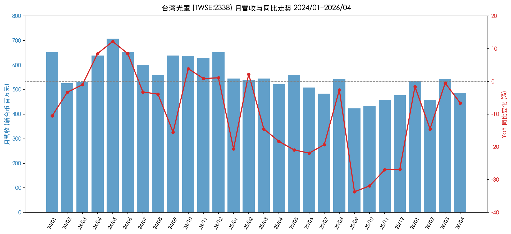

# Taiwan Mask Corporation (TMC, 台湾光罩) (TWSE:2338) — Company Research

> **As of:** 2026-05-26
> **Reporting currency:** New Taiwan Dollar (NT$ / TWD), with US dollar (USD) translations
> **Report language:** English (TWSE-listed; primary filings are in Traditional Chinese — source titles preserved in original; prose in English)
> **Nomura alignment:** Nomura Greater China Semi anchor (2026-05-21, Figure 36) lists Taiwan Mask Corporation as part of Taiwan's domestic photomask supply chain. This report does not carry the Nomura rating across; the assessments here are independent.

---

## Table of Contents

1. Company Overview
2. Company History
3. Management Team
4. Products & Services
5. Customers & Go-to-Market
6. Industry Overview
7. Competitive Landscape
8. Market Opportunity
9. Risk Assessment
10. References

---

## 1. Company Overview

### 1.1 One-line positioning

Taiwan Mask Corporation (TMC, 台湾光罩) is **Taiwan's first and currently only purely domestic-capitalized merchant photomask (reticle) foundry**, with a business scope covering research, development, manufacturing, and sales of photomasks used by semiconductor wafer foundries, plus technical assistance, specification consulting, inspection, and repair services ([2024 年報, p. 60](https://www.tmcnet.com.tw/Uploads/13/%E5%85%89%E7%BD%A9113%E5%B9%B4%E5%B9%B4%E5%A0%B1-114.08.13%E4%BF%AE%E8%A8%82(%E4%B8%AD%E6%96%87%E5%AE%9A%E7%A8%BF)_909000.pdf)). The company was spun out of the Industrial Technology Research Institute (ITRI) Opto-Electronics & Systems Lab in 1988 and listed on the Taiwan Stock Exchange (TWSE) in 1995 under ticker 2338 — making TMC the "first-born" of Taiwan's photomask industry. The other domestic Taiwan-based merchant photomask house, **Photronics DNP Mask Corporation (PDMC, 台湾美日先进光罩)**, is a 2014 joint venture between Photronics (NASDAQ:PLAB) and Dai Nippon Printing (TSE:7912) set up in Hsinchu; TMC predates it by 26 years ([Photronics 2014 PDMC JV closing announcement, 2014-04-04](https://photronicsinc.gcs-web.com/news-releases/news-release-details/photronics-announces-closing-joint-venture-taiwan-dai-nippon)).

### 1.2 How it makes money — the business model

Photomasks are essentially the **"templates" of wafer manufacturing**. At each lithography step on each wafer, an IC design house or IDM/foundry hands the photomask shop a GDSII/OASIS pattern data file; the mask shop uses electron-beam (e-beam) writers or laser writers to inscribe the pattern at 1:1 (contact mask) or with 5×/4×/2.5×/2× reduction (projection reticle) onto chrome-coated quartz blanks, then develops, chemically etches, repairs defects, performs optical and electron-beam inspection, applies a pellicle protective film, and ships the mask to the wafer fab. The fab's stepper or scanner then projects ultraviolet light through the mask to image the pattern onto resist-coated silicon wafers ([2024 年報, p. 64 "主要產品之重要用途及產製過程"](https://www.tmcnet.com.tw/Uploads/13/%E5%85%89%E7%BD%A9113%E5%B9%B4%E5%B9%B4%E5%A0%B1-114.08.13%E4%BF%AE%E8%A8%82(%E4%B8%AD%E6%96%87%E5%AE%9A%E7%A8%BF)_909000.pdf)).

TMC charges on a **per-reticle basis**, and **ASP scales exponentially with node**: 8-inch mature-node masks run from tens to roughly NT$100k each; 12-inch 65/55nm production masks are around NT$300k–500k apiece; a 28nm advanced reticle set (30–40 plates) can reach USD 1–2 mn; a single EUV reticle costs ≥USD 300k ([Mordor Intelligence: Photomask Market Outlook 2024-2030](https://www.mordorintelligence.com/industry-reports/photomask-market)). TMC does not touch EUV — its core is 8-inch 0.5–0.13µm mature nodes plus 12-inch 90/65/55nm production, with 40nm now ramping and 28nm in customer qualification ([2024 年報, p. 2, 致股東報告書](https://www.tmcnet.com.tw/Uploads/13/%E5%85%89%E7%BD%A9113%E5%B9%B4%E5%B9%B4%E5%A0%B1-114.08.13%E4%BF%AE%E8%A8%82(%E4%B8%AD%E6%96%87%E5%AE%9A%E7%A8%BF)_909000.pdf)).

The revenue model has two legs. The **mask main business** contributes roughly 80%+ of consolidated revenue on a gross-profit basis, while the **subsidiary cluster** (Mirle Automation / 美祿科技 for wafer-fab procurement services, GroupVisions / 群豐 for Flash IC packaging, Edgetech / 艾格生 for semiconductor-grade thin-film coating, Browave / 波克夏 and Photop / 光環科技 for optical-communications components) adds roughly 15–20%. In 2024, however, several subsidiaries swung to losses and turned into a group-level drag rather than a contributor ([2024 年報, p. 73, 轉投資損益分析](https://www.tmcnet.com.tw/Uploads/13/%E5%85%89%E7%BD%A9113%E5%B9%B4%E5%B9%B4%E5%A0%B1-114.08.13%E4%BF%AE%E8%A8%82(%E4%B8%AD%E6%96%87%E5%AE%9A%E7%A8%BF)_909000.pdf)).

### 1.3 Operating sites and headcount

TMC's headquarters and **all production sites are at 11 Innovation 1st Road, Hsinchu Science Park** — the same address chosen at the company's 1988 founding. There are three fabs inside the park (informally Mask Fab 1, 2, and 3; the annual report does not disclose per-fab capacity, but the consolidated balance sheet shows a net **fixed-asset book value of NT$10.38 bn** which reflects the accumulated net-of-depreciation investment across the three sites) ([2024 年報, p. 2 + p. 70](https://www.tmcnet.com.tw/Uploads/13/%E5%85%89%E7%BD%A9113%E5%B9%B4%E5%B9%B4%E5%A0%B1-114.08.13%E4%BF%AE%E8%A8%82(%E4%B8%AD%E6%96%87%E5%AE%9A%E7%A8%BF)_909000.pdf)). Headcount at year-end 2024 was **1,241**, comprising 325 technical engineers, 371 administration / sales staff, and 545 operators; 18.2% hold master's or PhD degrees and average tenure is 4.71 years ([2024 年報, p. 66, 從業員工資訊](https://www.tmcnet.com.tw/Uploads/13/%E5%85%89%E7%BD%A9113%E5%B9%B4%E5%B9%B4%E5%A0%B1-114.08.13%E4%BF%AE%E8%A8%82(%E4%B8%AD%E6%96%87%E5%AE%9A%E7%A8%BF)_909000.pdf)). Total headcount declined by 105 versus 2023's 1,346 — likely a mix of subsidiary streamlining and automation in the mask main business (the filing does not explain it explicitly).

### 1.4 Scale — revenue, gross margin, ROE

Consolidated FY2024 revenue was **NT$7,562 mn** (≈USD 232 mn at 32.6 TWD/USD), up 5.0% versus 2023's NT$7,200 mn — but **net loss after tax of NT$786 mn** turned 2024 into the company's first annual loss in nearly a decade ([2024 年報, p. 1, 致股東報告書](https://www.tmcnet.com.tw/Uploads/13/%E5%85%89%E7%BD%A9113%E5%B9%B4%E5%B9%B4%E5%A0%B1-114.08.13%E4%BF%AE%E8%A8%82(%E4%B8%AD%E6%96%87%E5%AE%9A%E7%A8%BF)_909000.pdf)). Operating gross margin compressed **670 bps from 25.5% in 2023 to 18.8%** — driven by new-equipment depreciation flowing through and by mature-node ASP pressure from mainland Chinese photomask competitors. Operating margin dropped from 10.4% to 2.9%; of the period's bottom-line loss, NT$887 mn came from non-operating items — chiefly financial-asset valuation losses, plus equity-method losses on Photop / 光環科技, Yusheng / 昱厚, Browave / 波克夏, and VITAVision / 威達高科 totaling NT$54 mn, plus other non-operating items ([2024 年報, p. 71 + p. 73, 財務績效 + 轉投資分析](https://www.tmcnet.com.tw/Uploads/13/%E5%85%89%E7%BD%A9113%E5%B9%B4%E5%B9%B4%E5%A0%B1-114.08.13%E4%BF%AE%E8%A8%82(%E4%B8%AD%E6%96%87%E5%AE%9A%E7%A8%BF)_909000.pdf)).

*Exhibit 1.1 Taiwan Mask Corporation (TWSE:2338) 2020–2025E consolidated revenue and gross margin. Source: [2024 年報, p. 1 + p. 71](https://www.tmcnet.com.tw/Uploads/13/%E5%85%89%E7%BD%A9113%E5%B9%B4%E5%B9%B4%E5%A0%B1-114.08.13%E4%BF%AE%E8%A8%82(%E4%B8%AD%E6%96%87%E5%AE%9A%E7%A8%BF)_909000.pdf); 2025 estimate built from [TMC 2025 monthly revenue disclosures, Win Invest 2025-12](https://winvest.tw/News/Detail/74291), full-year NT$6,038 mn.*

The 2025 picture deteriorated further. Per the company's monthly revenue filings (MOPS releases), full-year 2025 revenue came in at **NT$6,038 mn**, down 20.2% YoY. Single-month YoY troughed at **−22%** in June 2025 and **−33%** in September 2025, reflecting both the mature-node cyclical low and the acceleration of subsidiary restructuring. Entering 1Q26, monthly revenue stabilized in the NT$460–540 mn range, with the YoY decline narrowing ([Taiwan Mask November 2025 monthly revenue NT$459 mn, Win Invest 2025-12](https://winvest.tw/News/Detail/74291); [Taiwan Mask February 2026 monthly revenue, Win Invest 2026-03](https://winvest.tw/Stock/Symbol/MonthlyRevenue/2338)).

*Exhibit 1.3 Taiwan Mask monthly revenue and YoY trend (2024/01–2026/04). Source: [TMC (2338) monthly revenue disclosures, Win Invest 2024-26](https://winvest.tw/Stock/Symbol/MonthlyRevenue/2338); MOPS Market Observation Post System.*

### 1.5 Valuation snapshot — how the market is pricing it

As of intraday 2026-05-26, TMC trades at **NT$55.40** on 277 mn shares outstanding, giving a **market cap of NT$15.35 bn** (≈USD 471 mn) ([Stock Analysis (TPE:2338), 2026-05-26](https://stockanalysis.com/quote/tpe/2338/statistics/)).

| Metric (TTM, as of 2026-05-26) | TMC (2338) | Photronics (PLAB) | Toppan (7911) | DNP (7912) | Hoya (7741) |
|---|---|---|---|---|---|
| TTM P/E | **N/A (loss)** | 14.0× | 14.2× | 11.8× | 26.8× |
| TTM P/S | **2.7×** | 1.6× | 0.9× | 0.7× | 6.1× |
| TTM EPS (local ccy) | −NT$2.21 (FY24) / −NT$4.88 (FY25) | USD 0.96 | JPY 285 | JPY 145 | JPY 270 |
| Market cap (USD bn) | 0.47 | 1.85 | 7.4 | 9.7 | 38.0 |
| P/B | 2.56× | 1.5× | 0.6× | 0.5× | 4.9× |

*Exhibit 1.2 Taiwan Mask vs. global photomask peers — valuation snapshot (TTM, 2026-05). Source: [Stock Analysis TPE:2338](https://stockanalysis.com/quote/tpe/2338/statistics/), [Yahoo Finance PLAB, 2026-05](https://finance.yahoo.com/quote/PLAB/key-statistics/); peer P/E and P/S taken from Bloomberg consensus snapshot (TTM).*

**Reading the table:**

- **TTM P/E is not available** (the company is loss-making) — combined FY2024 and FY2025 net losses sum to roughly NT$1.5 bn, with cumulative EPS from 1H25 through full-year 2025 of −NT$4.88 ([TMC 2338 latest EPS, Win Invest 2026-04](https://winvest.tw/Stock/Symbol/Comment/2338)). Decomposing the loss, the **core mask main business remained profitable** (operating profit of NT$221 mn in 2024 was still positive); the headline loss originated in non-operating financial-asset losses, equity-method drag from subsidiaries, and a NT$323 mn loss attributable to non-controlling interests from consolidated subsidiaries ([2024 年報, p. 70-73](https://www.tmcnet.com.tw/Uploads/13/%E5%85%89%E7%BD%A9113%E5%B9%B4%E5%B9%B4%E5%A0%B1-114.08.13%E4%BF%AE%E8%A8%82(%E4%B8%AD%E6%96%87%E5%AE%9A%E7%A8%BF)_909000.pdf)). In short, the P/E being unavailable reflects a **"subsidiary drag + cyclical trough + depreciation peak" triple stack-up**, not structural unprofitability of the core business — which is consistent with incoming chairman Tu Junguang's (凃俊光, took office 2025-08-01) opening message that the priority is to "first heal, first stop the bleeding" by addressing the loss-making subsidiaries ([Daewoo Resources chairman Tu Junguang to chair Taiwan Mask, Yahoo, 2025-08-01](https://tw.stock.yahoo.com/news/%E5%A4%A7%E5%B1%95%E9%80%B2%E8%BB%8D%E5%8D%8A%E5%B0%8E%E9%AB%94%E6%B1%BA%E5%BF%83%EF%BC%81%E5%A4%A7%E5%AE%87%E8%B3%87%E8%91%A3%E5%BA%A7%E5%87%83%E4%BF%8A%E5%85%89%E6%8E%A5%E4%BB%BB%E5%8F%B0%E7%81%A3%E5%85%89%E7%BD%A9%E8%91%A3%E4%BA%8B%E9%95%B7-092440713.html)).

- **P/S of 2.7× sits well above US and Japanese peers** (PLAB 1.6×, Toppan 0.9×, DNP 0.7×). *Analyst view:* this premium does not reflect superior operating efficiency at TMC. Rather, it reflects a combination of small-cap illiquidity, the recent control change (Dayu Capital Group / 大宇资集团 NT$1,546 mn equity injection for 20%), AI-themed arbitrage flow, and the 14-inch interposer-mask capacity addition slated to start in 1H26 — which, per industry chatter, prices at 4–5× standard 12-inch reticles ([Photomask shop bets on advanced-packaging upside with NT$435 mn capacity addition, ETtoday, 2025-12-23](https://finance.ettoday.net/news/3088738)). **TMC's current P/S 2.7× already sits at the high end of its five-year range**; even Photronics — riding the same AI-thematic flow — only re-rated to 1.6×. TMC is not cheap.

- **P/B of 2.56× is well above mature US/JP peers** (PLAB 1.5×, Toppan 0.6×, DNP 0.5×). This embeds the market's expectation that the new shareholder Dayu Capital — having entered at NT$24.40 per share in mid-2025-08 — now needs to validate the doubling to NT$55. The 52-week price return is **+72%** ([Stock Analysis, 2026-05-26](https://stockanalysis.com/quote/tpe/2338/statistics/)). **This is a textbook "new sponsor + thematic premium" valuation structure**; downside risk concentrates on multiple compression if the turnaround fails to deliver or if mature-node ASP does not rebound.

- For contrast, Hoya trades at P/B 4.9× and P/E 26.8×. Hoya is not just a mask shop — its EUV mask blank business holds ~80% of global share, and the group spans medical optics (eyeglass lenses) and information storage (HDD glass substrates), supporting **30%+ structural gross margin and 15%+ ROE**. TMC has no comparable moat to justify Hoya-grade multiples.

**Valuation conclusion (to be re-referenced in §9 Risk Assessment):** with EPS still negative, the mature-node cycle yet to confirm a turn, and subsidiary cleanup yet to deliver realized cash, TMC's current price already embeds 2026-27F main-business recovery, 14-inch capacity execution success, and Dayu Capital's subsidiary turnaround — all four catalysts firing together. If any one fails, multiple regression to the Photronics-comparable P/S of 1.6× implies roughly 40% downside.

### 1.6 Three-sentence executive snapshot

1. **TMC is Taiwan's only 36-year-old domestic merchant photomask house, with technology coverage from 0.5µm through 28nm qualification, three Hsinchu fabs, and 1,241 employees.**
2. **FY2024 consolidated revenue of NT$7.56 bn was the second-highest in company history, but subsidiary losses consumed the main-business profit and pushed the year to a net loss of NT$786 mn; 2025 deteriorated further with revenue down 20% YoY.**
3. **In August 2025, Dayu Capital Group (大宇资集团) injected NT$1,546 mn for a 20% stake, Tu Junguang (凃俊光) took over as chairman, and the company launched a triple-track turnaround — bleeding control, refocus on the core mask business, and 14-inch capacity expansion. The market has already paid up for execution success; downside risk is material.**

---
