# Taiwan Mask Corporation (TMC, 台湾光罩) (TWSE:2338) — Company Research

> **As of:** 2026-05-26
> **Reporting currency:** New Taiwan Dollar (NT$ / TWD), with US dollar (USD) translations
> **Report language:** English (TWSE-listed; primary filings are in Traditional Chinese — source titles preserved in original; prose in English)
> **Nomura alignment:** Nomura Greater China Semi anchor (2026-05-21, Figure 36) lists Taiwan Mask Corporation as part of Taiwan's domestic photomask supply chain. This report does not carry the Nomura rating across; the assessments here are independent.

---

## Table of Contents

1. Company Overview
2. Company History
3. Management Team
4. Products & Services
5. Customers & Go-to-Market
6. Industry Overview
7. Competitive Landscape
8. Market Opportunity
9. Risk Assessment
10. References

---

## 1. Company Overview

### 1.1 One-line positioning

Taiwan Mask Corporation (TMC, 台湾光罩) is **Taiwan's first and currently only purely domestic-capitalized merchant photomask (reticle) foundry**, with a business scope covering research, development, manufacturing, and sales of photomasks used by semiconductor wafer foundries, plus technical assistance, specification consulting, inspection, and repair services ([2024 年報, p. 60](https://www.tmcnet.com.tw/Uploads/13/%E5%85%89%E7%BD%A9113%E5%B9%B4%E5%B9%B4%E5%A0%B1-114.08.13%E4%BF%AE%E8%A8%82(%E4%B8%AD%E6%96%87%E5%AE%9A%E7%A8%BF)_909000.pdf)). The company was spun out of the Industrial Technology Research Institute (ITRI) Opto-Electronics & Systems Lab in 1988 and listed on the Taiwan Stock Exchange (TWSE) in 1995 under ticker 2338 — making TMC the "first-born" of Taiwan's photomask industry. The other domestic Taiwan-based merchant photomask house, **Photronics DNP Mask Corporation (PDMC, 台湾美日先进光罩)**, is a 2014 joint venture between Photronics (NASDAQ:PLAB) and Dai Nippon Printing (TSE:7912) set up in Hsinchu; TMC predates it by 26 years ([Photronics 2014 PDMC JV closing announcement, 2014-04-04](https://photronicsinc.gcs-web.com/news-releases/news-release-details/photronics-announces-closing-joint-venture-taiwan-dai-nippon)).

### 1.2 How it makes money — the business model

Photomasks are essentially the **"templates" of wafer manufacturing**. At each lithography step on each wafer, an IC design house or IDM/foundry hands the photomask shop a GDSII/OASIS pattern data file; the mask shop uses electron-beam (e-beam) writers or laser writers to inscribe the pattern at 1:1 (contact mask) or with 5×/4×/2.5×/2× reduction (projection reticle) onto chrome-coated quartz blanks, then develops, chemically etches, repairs defects, performs optical and electron-beam inspection, applies a pellicle protective film, and ships the mask to the wafer fab. The fab's stepper or scanner then projects ultraviolet light through the mask to image the pattern onto resist-coated silicon wafers ([2024 年報, p. 64 "主要產品之重要用途及產製過程"](https://www.tmcnet.com.tw/Uploads/13/%E5%85%89%E7%BD%A9113%E5%B9%B4%E5%B9%B4%E5%A0%B1-114.08.13%E4%BF%AE%E8%A8%82(%E4%B8%AD%E6%96%87%E5%AE%9A%E7%A8%BF)_909000.pdf)).

TMC charges on a **per-reticle basis**, and **ASP scales exponentially with node**: 8-inch mature-node masks run from tens to roughly NT$100k each; 12-inch 65/55nm production masks are around NT$300k–500k apiece; a 28nm advanced reticle set (30–40 plates) can reach USD 1–2 mn; a single EUV reticle costs ≥USD 300k ([Mordor Intelligence: Photomask Market Outlook 2024-2030](https://www.mordorintelligence.com/industry-reports/photomask-market)). TMC does not touch EUV — its core is 8-inch 0.5–0.13µm mature nodes plus 12-inch 90/65/55nm production, with 40nm now ramping and 28nm in customer qualification ([2024 年報, p. 2, 致股東報告書](https://www.tmcnet.com.tw/Uploads/13/%E5%85%89%E7%BD%A9113%E5%B9%B4%E5%B9%B4%E5%A0%B1-114.08.13%E4%BF%AE%E8%A8%82(%E4%B8%AD%E6%96%87%E5%AE%9A%E7%A8%BF)_909000.pdf)).

The revenue model has two legs. The **mask main business** contributes roughly 80%+ of consolidated revenue on a gross-profit basis, while the **subsidiary cluster** (Mirle Automation / 美祿科技 for wafer-fab procurement services, GroupVisions / 群豐 for Flash IC packaging, Edgetech / 艾格生 for semiconductor-grade thin-film coating, Browave / 波克夏 and Photop / 光環科技 for optical-communications components) adds roughly 15–20%. In 2024, however, several subsidiaries swung to losses and turned into a group-level drag rather than a contributor ([2024 年報, p. 73, 轉投資損益分析](https://www.tmcnet.com.tw/Uploads/13/%E5%85%89%E7%BD%A9113%E5%B9%B4%E5%B9%B4%E5%A0%B1-114.08.13%E4%BF%AE%E8%A8%82(%E4%B8%AD%E6%96%87%E5%AE%9A%E7%A8%BF)_909000.pdf)).

### 1.3 Operating sites and headcount

TMC's headquarters and **all production sites are at 11 Innovation 1st Road, Hsinchu Science Park** — the same address chosen at the company's 1988 founding. There are three fabs inside the park (informally Mask Fab 1, 2, and 3; the annual report does not disclose per-fab capacity, but the consolidated balance sheet shows a net **fixed-asset book value of NT$10.38 bn** which reflects the accumulated net-of-depreciation investment across the three sites) ([2024 年報, p. 2 + p. 70](https://www.tmcnet.com.tw/Uploads/13/%E5%85%89%E7%BD%A9113%E5%B9%B4%E5%B9%B4%E5%A0%B1-114.08.13%E4%BF%AE%E8%A8%82(%E4%B8%AD%E6%96%87%E5%AE%9A%E7%A8%BF)_909000.pdf)). Headcount at year-end 2024 was **1,241**, comprising 325 technical engineers, 371 administration / sales staff, and 545 operators; 18.2% hold master's or PhD degrees and average tenure is 4.71 years ([2024 年報, p. 66, 從業員工資訊](https://www.tmcnet.com.tw/Uploads/13/%E5%85%89%E7%BD%A9113%E5%B9%B4%E5%B9%B4%E5%A0%B1-114.08.13%E4%BF%AE%E8%A8%82(%E4%B8%AD%E6%96%87%E5%AE%9A%E7%A8%BF)_909000.pdf)). Total headcount declined by 105 versus 2023's 1,346 — likely a mix of subsidiary streamlining and automation in the mask main business (the filing does not explain it explicitly).

### 1.4 Scale — revenue, gross margin, ROE

Consolidated FY2024 revenue was **NT$7,562 mn** (≈USD 232 mn at 32.6 TWD/USD), up 5.0% versus 2023's NT$7,200 mn — but **net loss after tax of NT$786 mn** turned 2024 into the company's first annual loss in nearly a decade ([2024 年報, p. 1, 致股東報告書](https://www.tmcnet.com.tw/Uploads/13/%E5%85%89%E7%BD%A9113%E5%B9%B4%E5%B9%B4%E5%A0%B1-114.08.13%E4%BF%AE%E8%A8%82(%E4%B8%AD%E6%96%87%E5%AE%9A%E7%A8%BF)_909000.pdf)). Operating gross margin compressed **670 bps from 25.5% in 2023 to 18.8%** — driven by new-equipment depreciation flowing through and by mature-node ASP pressure from mainland Chinese photomask competitors. Operating margin dropped from 10.4% to 2.9%; of the period's bottom-line loss, NT$887 mn came from non-operating items — chiefly financial-asset valuation losses, plus equity-method losses on Photop / 光環科技, Yusheng / 昱厚, Browave / 波克夏, and VITAVision / 威達高科 totaling NT$54 mn, plus other non-operating items ([2024 年報, p. 71 + p. 73, 財務績效 + 轉投資分析](https://www.tmcnet.com.tw/Uploads/13/%E5%85%89%E7%BD%A9113%E5%B9%B4%E5%B9%B4%E5%A0%B1-114.08.13%E4%BF%AE%E8%A8%82(%E4%B8%AD%E6%96%87%E5%AE%9A%E7%A8%BF)_909000.pdf)).

*Exhibit 1.1 Taiwan Mask Corporation (TWSE:2338) 2020–2025E consolidated revenue and gross margin. Source: [2024 年報, p. 1 + p. 71](https://www.tmcnet.com.tw/Uploads/13/%E5%85%89%E7%BD%A9113%E5%B9%B4%E5%B9%B4%E5%A0%B1-114.08.13%E4%BF%AE%E8%A8%82(%E4%B8%AD%E6%96%87%E5%AE%9A%E7%A8%BF)_909000.pdf); 2025 estimate built from [TMC 2025 monthly revenue disclosures, Win Invest 2025-12](https://winvest.tw/News/Detail/74291), full-year NT$6,038 mn.*

The 2025 picture deteriorated further. Per the company's monthly revenue filings (MOPS releases), full-year 2025 revenue came in at **NT$6,038 mn**, down 20.2% YoY. Single-month YoY troughed at **−22%** in June 2025 and **−33%** in September 2025, reflecting both the mature-node cyclical low and the acceleration of subsidiary restructuring. Entering 1Q26, monthly revenue stabilized in the NT$460–540 mn range, with the YoY decline narrowing ([Taiwan Mask November 2025 monthly revenue NT$459 mn, Win Invest 2025-12](https://winvest.tw/News/Detail/74291); [Taiwan Mask February 2026 monthly revenue, Win Invest 2026-03](https://winvest.tw/Stock/Symbol/MonthlyRevenue/2338)).

*Exhibit 1.3 Taiwan Mask monthly revenue and YoY trend (2024/01–2026/04). Source: [TMC (2338) monthly revenue disclosures, Win Invest 2024-26](https://winvest.tw/Stock/Symbol/MonthlyRevenue/2338); MOPS Market Observation Post System.*

### 1.5 Valuation snapshot — how the market is pricing it

As of intraday 2026-05-26, TMC trades at **NT$55.40** on 277 mn shares outstanding, giving a **market cap of NT$15.35 bn** (≈USD 471 mn) ([Stock Analysis (TPE:2338), 2026-05-26](https://stockanalysis.com/quote/tpe/2338/statistics/)).

| Metric (TTM, as of 2026-05-26) | TMC (2338) | Photronics (PLAB) | Toppan (7911) | DNP (7912) | Hoya (7741) |
|---|---|---|---|---|---|
| TTM P/E | **N/A (loss)** | 14.0× | 14.2× | 11.8× | 26.8× |
| TTM P/S | **2.7×** | 1.6× | 0.9× | 0.7× | 6.1× |
| TTM EPS (local ccy) | −NT$2.21 (FY24) / −NT$4.88 (FY25) | USD 0.96 | JPY 285 | JPY 145 | JPY 270 |
| Market cap (USD bn) | 0.47 | 1.85 | 7.4 | 9.7 | 38.0 |
| P/B | 2.56× | 1.5× | 0.6× | 0.5× | 4.9× |

*Exhibit 1.2 Taiwan Mask vs. global photomask peers — valuation snapshot (TTM, 2026-05). Source: [Stock Analysis TPE:2338](https://stockanalysis.com/quote/tpe/2338/statistics/), [Yahoo Finance PLAB, 2026-05](https://finance.yahoo.com/quote/PLAB/key-statistics/); peer P/E and P/S taken from Bloomberg consensus snapshot (TTM).*

**Reading the table:**

- **TTM P/E is not available** (the company is loss-making) — combined FY2024 and FY2025 net losses sum to roughly NT$1.5 bn, with cumulative EPS from 1H25 through full-year 2025 of −NT$4.88 ([TMC 2338 latest EPS, Win Invest 2026-04](https://winvest.tw/Stock/Symbol/Comment/2338)). Decomposing the loss, the **core mask main business remained profitable** (operating profit of NT$221 mn in 2024 was still positive); the headline loss originated in non-operating financial-asset losses, equity-method drag from subsidiaries, and a NT$323 mn loss attributable to non-controlling interests from consolidated subsidiaries ([2024 年報, p. 70-73](https://www.tmcnet.com.tw/Uploads/13/%E5%85%89%E7%BD%A9113%E5%B9%B4%E5%B9%B4%E5%A0%B1-114.08.13%E4%BF%AE%E8%A8%82(%E4%B8%AD%E6%96%87%E5%AE%9A%E7%A8%BF)_909000.pdf)). In short, the P/E being unavailable reflects a **"subsidiary drag + cyclical trough + depreciation peak" triple stack-up**, not structural unprofitability of the core business — which is consistent with incoming chairman Tu Junguang's (凃俊光, took office 2025-08-01) opening message that the priority is to "first heal, first stop the bleeding" by addressing the loss-making subsidiaries ([Daewoo Resources chairman Tu Junguang to chair Taiwan Mask, Yahoo, 2025-08-01](https://tw.stock.yahoo.com/news/%E5%A4%A7%E5%B1%95%E9%80%B2%E8%BB%8D%E5%8D%8A%E5%B0%8E%E9%AB%94%E6%B1%BA%E5%BF%83%EF%BC%81%E5%A4%A7%E5%AE%87%E8%B3%87%E8%91%A3%E5%BA%A7%E5%87%83%E4%BF%8A%E5%85%89%E6%8E%A5%E4%BB%BB%E5%8F%B0%E7%81%A3%E5%85%89%E7%BD%A9%E8%91%A3%E4%BA%8B%E9%95%B7-092440713.html)).

- **P/S of 2.7× sits well above US and Japanese peers** (PLAB 1.6×, Toppan 0.9×, DNP 0.7×). *Analyst view:* this premium does not reflect superior operating efficiency at TMC. Rather, it reflects a combination of small-cap illiquidity, the recent control change (Dayu Capital Group / 大宇资集团 NT$1,546 mn equity injection for 20%), AI-themed arbitrage flow, and the 14-inch interposer-mask capacity addition slated to start in 1H26 — which, per industry chatter, prices at 4–5× standard 12-inch reticles ([Photomask shop bets on advanced-packaging upside with NT$435 mn capacity addition, ETtoday, 2025-12-23](https://finance.ettoday.net/news/3088738)). **TMC's current P/S 2.7× already sits at the high end of its five-year range**; even Photronics — riding the same AI-thematic flow — only re-rated to 1.6×. TMC is not cheap.

- **P/B of 2.56× is well above mature US/JP peers** (PLAB 1.5×, Toppan 0.6×, DNP 0.5×). This embeds the market's expectation that the new shareholder Dayu Capital — having entered at NT$24.40 per share in mid-2025-08 — now needs to validate the doubling to NT$55. The 52-week price return is **+72%** ([Stock Analysis, 2026-05-26](https://stockanalysis.com/quote/tpe/2338/statistics/)). **This is a textbook "new sponsor + thematic premium" valuation structure**; downside risk concentrates on multiple compression if the turnaround fails to deliver or if mature-node ASP does not rebound.

- For contrast, Hoya trades at P/B 4.9× and P/E 26.8×. Hoya is not just a mask shop — its EUV mask blank business holds ~80% of global share, and the group spans medical optics (eyeglass lenses) and information storage (HDD glass substrates), supporting **30%+ structural gross margin and 15%+ ROE**. TMC has no comparable moat to justify Hoya-grade multiples.

**Valuation conclusion (to be re-referenced in §9 Risk Assessment):** with EPS still negative, the mature-node cycle yet to confirm a turn, and subsidiary cleanup yet to deliver realized cash, TMC's current price already embeds 2026-27F main-business recovery, 14-inch capacity execution success, and Dayu Capital's subsidiary turnaround — all four catalysts firing together. If any one fails, multiple regression to the Photronics-comparable P/S of 1.6× implies roughly 40% downside.

### 1.6 Three-sentence executive snapshot

1. **TMC is Taiwan's only 36-year-old domestic merchant photomask house, with technology coverage from 0.5µm through 28nm qualification, three Hsinchu fabs, and 1,241 employees.**
2. **FY2024 consolidated revenue of NT$7.56 bn was the second-highest in company history, but subsidiary losses consumed the main-business profit and pushed the year to a net loss of NT$786 mn; 2025 deteriorated further with revenue down 20% YoY.**
3. **In August 2025, Dayu Capital Group (大宇资集团) injected NT$1,546 mn for a 20% stake, Tu Junguang (凃俊光) took over as chairman, and the company launched a triple-track turnaround — bleeding control, refocus on the core mask business, and 14-inch capacity expansion. The market has already paid up for execution success; downside risk is material.**

---

## 2. Company History

### 2.1 Founding — an ITRI Opto-Electronics Lab spin-out

Taiwan Mask Corporation was spun out from Taiwan's Industrial Technology Research Institute (ITRI) Opto-Electronics & Systems Lab on **October 21, 1988** — the first dedicated photomask company in Taiwan, established just one year after TSMC's 1987 founding and in step with the broader emergence of Taiwan's domestic semiconductor industry ([Wikipedia: 台灣光罩 (Taiwan Mask), citing IPO records](https://zh.wikipedia.org/zh-tw/%E5%8F%B0%E7%81%A3%E5%85%89%E7%BD%A9)). In the 1980s ITRI ran the national "VLSI Project," seeding the design, wafer, mask, and packaging segments of the value chain simultaneously — the mask node was assigned to ITRI's Opto-Electronics Lab and developed in parallel with what would become TSMC and UMC on the wafer side. TMC therefore carried a clear mandate from day one: supply masks to Taiwan's domestic wafer fabs. The company listed on the TWSE on April 17, 1995, becoming Taiwan's first publicly traded pure-play photomask company ([MoneyDJ: Taiwan Mask company profile](https://www.moneydj.com/kmdj/wiki/wikiviewer.aspx?keyid=2b4ab57f-fb7a-4d56-8ef9-762c9fcf7d2e)).

### 2.2 Key milestones (timeline)

```mermaid
timeline
    title Taiwan Mask 1988-2026 Key Milestones
    1988 : Spun out from ITRI Opto-Electronics Lab, HQ at Hsinchu Science Park
    1995 : April 17 — TWSE listing (ticker 2338)
    2008-15 : 6/8-inch mature-node masks dominant; grows with Taiwan 8-inch customers (UMC, Vanguard, Winbond)
    2017 : Browave (光通讯) acquires control; multi-vertical diversification begins
    2017-20 : Acquires Mirle (美祿) — fab procurement services; GroupVisions (群豐) — Flash IC packaging; VITAVision (威達) — touch IC
    2019 : Initiates investment in high-end 12-inch masks (90/65/55nm)
    2020 : March — Chen Cheng-Hsiang (陳正翔, Browave camp) named chairman
    2021 : June — Wins expanded mature-node mask order from TSMC; 12-inch backlog surges
    2021 : Via Innova Investment (友縳) takes stake in China Steel Structure (13,000 lots, NT$714 mn)
    2023 : 65/55nm node production stable; 40nm customer qualification complete
    2024 : May — Founding pillar Wu Kuo-Ching (吳國精) passes away; FY2024 consolidated revenue NT$7.56 bn (second-highest in history)
    2024 : December — Subsidiary losses (Mirle / Edgetech, etc.) expand, triggering group-restructuring debate
    2025 : June — Dayu Capital, via Guang-Yang Yao-Wei Investment (廣陽耀威投資), buys 63.37 mn shares at NT$24.40 (20.0%) for NT$1.546 bn
    2025 : August 1 — Tu Junguang (凃俊光, Dayu Capital chair) succeeds as TMC chair; Chen Cheng-Hsiang resigns
    2025-12 : Board approves NT$435 mn capex for 14-inch mask capacity; targets advanced-packaging interposers
    2026 : January — Board approves NT$1.75 bn cash equity raise; for bank-loan repayment and core process equipment upgrades
    2026 : 1H — 14-inch mask equipment installation begins
```

### 2.3 Three pivotal strategic inflections

**Inflection 1: 2017 Browave takeover — the failed diversification turn.** In 2017, the passive optical-components maker **Browave (波若威)** and its founder Wu Kuo-Ching (吳國精) acquired control of TMC and launched a "wafer-mask-packaging-optical" vertical integration strategy — adding Mirle Automation (8/12-inch wafer-fab procurement services), GroupVisions (Flash IC packaging), VITAVision (touch IC), and others in sequence ([TechNews: Taiwan Mask's seven-year transformation, 2025-02-08](https://finance.technews.tw/2025/02/08/story-of-tmcnet/); [Wealth Magazine: Taiwan Mask consolidates subsidiaries for automation manufacturing — seven years after Browave's takeover](https://www.wealth.com.tw/articles/69ad8cb4-6738-42c1-8226-c4071b5e8809)). The thesis was "semiconductor-ecosystem synergy." Over seven years, however, Mirle picked up large amounts of mainland-China IC-design routing orders, Edgetech bet on silicon-photonics coating substrates, and Browave/Photop bet on optical communications — and as a group, these subsidiaries swung to losses in the 2023-24 cyclical downturn. Through equity-method consolidation and full consolidation, the subsidiary losses then ate up the main-business profits. The FY2024 net loss of NT$786 mn and the FY2025 consolidated EPS of −NT$4.88 are essentially the bill for this seven-year diversification.

**Inflection 2: 2020–2024 main-business push into higher-end nodes.** After **Chen Cheng-Hsiang (陳正翔, from the Browave camp, former founder of Bode Technology / 波势科技)** became chairman in March 2020, the main-business strategy shifted to "moving from 6/8-inch mature masks into 12-inch higher-end masks." From 2019 onward TMC invested in high-end JEOL e-beam writers (one tool alone cost NT$639 mn). In 2021 the company won expanded order flow from TSMC for mature-node masks — TSMC outsourcing the overflow that its in-house mask shop could not absorb ([Economic Daily: TSMC expands mature-node mask outsourcing to Taiwan Mask, frequently cited (original URL retired; relayed by secondary coverage)](https://money.udn.com/industry/company/%E5%85%89%E7%BD%A9)). By 2023, 65/55nm production was stable and 40nm customer qualification was complete; in 2024 the company started 28nm customer qualification and invested in 28nm capacity ([2024 年報, p. 1, 致股東報告書](https://www.tmcnet.com.tw/Uploads/13/%E5%85%89%E7%BD%A9113%E5%B9%B4%E5%B9%B4%E5%A0%B1-114.08.13%E4%BF%AE%E8%A8%82(%E4%B8%AD%E6%96%87%E5%AE%9A%E7%A8%BF)_909000.pdf)). On the ≤0.13µm advanced-node revenue line, **2023 → 2024 revenue grew from NT$1,137 mn to NT$1,360 mn, +20% YoY, and the share of main-business revenue moved from 15.8% to 18.0%** — this is the central evidence that main-business product quality is improving ([2024 年報, p. 63, 高階產品的拓展](https://www.tmcnet.com.tw/Uploads/13/%E5%85%89%E7%BD%A9113%E5%B9%B4%E5%B9%B4%E5%A0%B1-114.08.13%E4%BF%AE%E8%A8%82(%E4%B8%AD%E6%96%87%E5%AE%9A%E7%A8%BF)_909000.pdf)). This inflection planted the seed that the main business was still salvageable when the diversification thesis collapsed.

**Inflection 3: 2025 Dayu Capital takeover — refocusing on the core mask business (in progress).** After **Wu Kuo-Ching passed away in May 2024**, the Browave camp lost its integrator. In 2025, Dayu Capital Group (Daewoo Resources, 大宇资集团) — via its investment subsidiary **Guang-Yang Yao-Wei Investment (廣陽耀威投資)** — acquired 63.37 mn TMC shares at NT$24.40 per share in two tranches, paying a total of **NT$1,546 mn** for **20.0% of TMC**, becoming the single-largest institutional shareholder ([Yahoo Finance: Tu Junguang takes over as Taiwan Mask chairman, 2025-08-01](https://tw.stock.yahoo.com/news/%E5%A4%A7%E5%B1%95%E9%80%B2%E8%BB%8D%E5%8D%8A%E5%B0%8E%E9%AB%94%E6%B1%BA%E5%BF%83%EF%BC%81%E5%A4%A7%E5%AE%87%E8%B3%87%E8%91%A3%E5%BA%A7%E5%87%83%E4%BF%8A%E5%85%89%E6%8E%A5%E4%BB%BB%E5%8F%B0%E7%81%A3%E5%85%89%E7%BD%A9%E8%91%A3%E4%BA%8B%E9%95%B7-092440713.html)). **On August 1, 2025, Tu Junguang (凃俊光) succeeded as chairman** and immediately laid out a "**first heal, first stop the bleeding**" mandate — accelerated cleanup of loss-making subsidiaries, sharpened focus on the mask main business, and reaffirmation that "**the real strength of Taiwan Mask is in its core business**" ([Knews: Taiwan Mask chair confirmed to change hands, 2025-08-01](https://knews.com.tw/news/8D6BD39FD28FF286F6B447B8CCFD3AE0); [Business Today: Multi-track strategy — Taiwan Mask leads the shift into advanced-packaging mask supply, 2026-01-09](https://www.businesstoday.com.tw/article/category/183015/post/202601090020/)). The company simultaneously approved an **NT$435 mn capex for 14-inch mask capacity** (targeting 2.5D/3D advanced-packaging interposers) and an **NT$1.75 bn cash equity raise** (for debt paydown plus core-process equipment upgrades). This inflection has not yet entered the realization phase and is the central variable shaping 2026-27F valuation catalysts.

### 2.4 Subsidiary acquisition history (chronological)

| Year | Subsidiary | Business | Acquisition mode | Current stake | Status |
|---|---|---|---|---|---|
| 2017 | Mirle Automation (美祿科技) | 8/12-inch wafer-fab procurement services (book mainland Chinese / Korean / Southeast Asian IC-design house orders into TSMC, UMC, PSMC, etc.) | 100% cash | 100% | Active, revenue declined in 2024 |
| 2017 | GroupVisions (群豐科技) | NOR Flash die packaging | 47.19% consolidated | 47.19% | Active |
| 2017 | VITAVision (威達高科) | Touch IC design | 28.20% equity-method | 28.20% | Loss-making in 2024; on cleanup list |
| 2018 | Innova Investment (友縳投資) | 100% holding vehicle for TMC subsidiary stakes | 100% | 100% | Parent holding entity |
| 2020 | Edgetech (艾格生科技) | Semiconductor-grade thin-film coating (silicon-photonics heat-spreader substrates) | 53% consolidated | 53% | Loss-making in 2024 |
| 2020 | Yusheng Biotech (昱厚生技) | Biopharma (nasal sprays, etc.) | 21.02% equity-method | 21.02% | Loss-making in 2024 (NT$−69 mn) |
| 2020-21 | Showin Tech (數可科技) | Memory peripherals | 57.39% consolidated | 57.39% | Active |
| 2021 | Photop Optoelectronics (光環科技, TPEx:3234) | Optical-communications passive components | 12.11% equity-method | 12.11% | Loss-making in 2024 (NT$−239 mn); equity-method drag NT$−22 mn |
| 2023 | Browave (波克夏科技) | Optical-communications components (China-based manufacturing) | 38.91% consolidated | 38.91% | Loss-making in 2024 |
| – | Photon-Pixel / Yujia / GroupVisions and 6 others | Semiconductor / peripheral businesses | Consolidated / equity-method | 38-66% each | Generally under pressure in 2024 |

Source: [2024 年報, p. 50 + p. 73, 轉投資 + 關係企業資料](https://www.tmcnet.com.tw/Uploads/13/%E5%85%89%E7%BD%A9113%E5%B9%B4%E5%B9%B4%E5%A0%B1-114.08.13%E4%BF%AE%E8%A8%82(%E4%B8%AD%E6%96%87%E5%AE%9A%E7%A8%BF)_909000.pdf). **At least 6 of the 14 subsidiaries lost money in 2024** — these are the targets of incoming chairman Tu Junguang's "stop the bleeding" mandate. Divestitures or down-sizing should progress through 2026-27F.

### 2.5 Material developments in the past 12 months

**(1) August 1, 2025 — change in control and chairman rotation.** Already covered in §2.3 Inflection 3. Background on the incoming sponsor: Dayu Capital Group (Daewoo Resources Group, 大宇资集团) is a Taiwan-based group focused on power engineering, smart grids, and semiconductor-ecosystem investments. Through 2024-25 the group accelerated its push into semiconductors. Beyond TMC, Tu Junguang also chairs **Sunplus Technology (揚智科技)** ([Yahoo Finance: Tu Junguang takes over as Taiwan Mask chairman, 2025-08-01](https://tw.stock.yahoo.com/news/%E5%A4%A7%E5%B1%95%E9%80%B2%E8%BB%8D%E5%8D%8A%E5%B0%8E%E9%AB%94%E6%B1%BA%E5%BF%83%EF%BC%81%E5%A4%A7%E5%AE%87%E8%B3%87%E8%91%A3%E5%BA%A7%E5%87%83%E4%BF%8A%E5%85%89%E6%8E%A5%E4%BB%BB%E5%8F%B0%E7%81%A3%E5%85%89%E7%BD%A9%E8%91%A3%E4%BA%8B%E9%95%B7-092440713.html)).

**(2) December 23, 2025 — board approves NT$435 mn for 14-inch mask capacity expansion** ([ETtoday, 2025-12-23](https://finance.ettoday.net/news/3088738); [Chinatimes Wantrich: Photomask shop bets on advanced-packaging upside, 2025-12-23](https://wantrich.chinatimes.com/news/20251223900408-420101); [Global Views Monthly, 2025-12-23](https://www.gvm.com.tw/article/126804)). The 14-inch mask is **the central enabler of advanced-packaging interposers**. HBM3/HBM4 plus CoWoS 2.5D/3D packaging requires silicon interposers — RDL and TSV patterns first need to be written onto a large reticle, then projected onto 12-inch wafers (interposers typically have ≥18×18 mm² die sizes). Standard 12-inch reticles can only single-expose a 26×33 mm² field — large interposers exceed this. A 14-inch reticle (366 mm² effective field) can single-expose 4–12 dies per shot. Equipment installation begins in 1H26 ([Economic Daily: Taiwan Mask refocuses on the core business as process upgrades lift ASP, 2026-01](https://money.udn.com/money/story/5612/9222106)).

**(3) January 2026 — board approves NT$1.75 bn cash equity raise.** Use of proceeds: bank-loan repayment, balance-sheet strengthening, and funding future equipment investment and technology upgrades. This is the central financial restructuring action under Dayu Capital following the takeover — given the year-end 2024 debt ratio of 80.4% and current ratio of 0.77 ([TechNews: Taiwan Mask launches equity raise to enhance competitiveness, 2026-01-08](https://technews.tw/2026/01/08/taiwan-mask-taiwan-launches-capital-increase-to-enhance-competitiveness/); [Business Today: Multi-track strategy — Taiwan Mask leads the shift into advanced packaging, 2026-01-09](https://www.businesstoday.com.tw/article/category/183015/post/202601090020/)).

**(4) 1Q26 — revenue stabilizes, ASP trajectory turning up.** January through March 2026 monthly revenue came in at NT$534 / 459 / 542 mn respectively, with YoY losses narrowing from September 2025's −33% to −14.5% in February 2026 and roughly flat in March 2026 ([TMC February 2026 monthly revenue NT$459 mn, Win Invest 2026-03](https://winvest.tw/Stock/Symbol/MonthlyRevenue/2338); [Statementdog: 2338 monthly revenue and EPS](https://statementdog.com/analysis/2338/eps)). 1Q26 EPS swung positive to NT$0.52 (YoY +143%, QoQ +139%); management cites "product mix improvement and rising ASP" as the chief driver ([Economic Daily: Taiwan Mask refocuses on the core business, 2026-01](https://money.udn.com/money/story/5612/9222106)).

---

## 3. Management Team

> **Scope note:** Per the company-research skill, this section covers only the **founder / highest decision-making source** and the **current CEO**.
> Founder: TMC was spun out of the ITRI Opto-Electronics Lab in 1988 — there is no single individual founder.
> Current chairman: **Tu Junguang (凃俊光)** — took office on August 1, 2025, appointed by incoming shareholder Dayu Capital Group.
> Current CEO (Executive Officer and President): **Chen Lidun (陳立惇)** — became President on January 15, 2020; promoted to Executive Officer (CEO) on November 6, 2024.

### 3.1 Founding and control-change context (in lieu of single-founder bio)

TMC was incubated within the ITRI Opto-Electronics Lab in 1988 with **no single individual founder** — typical of companies seeded under Taiwan's 1980s VLSI Project (TSMC, UMC, Winbond, and VIS / Vanguard all share the same structure; none of them have a Silicon-Valley-style "founder + founding team" lineage). Early senior management came from former ITRI Opto-Electronics Lab engineers. After the 1995 IPO, the company saw several rotations of the board. In 2017 Browave / Wu Kuo-Ching acquired control; in 2020 Chen Cheng-Hsiang became chairman. **The August 1, 2025 transition to Dayu Capital Group (Tu Junguang) marks the third phase of control transfer** — and the most consequential in TMC's 36-year history.

Given there is no single individual founder and the current chairman has been in seat for less than 12 months, this section focuses on (a) the new chairman's background and strategic intent, and (b) the resume and execution track record of current CEO Chen Lidun.

### 3.2 Tu Junguang (incoming chairman, 2025-08-01 to present)

**Position, tenure, background:** Tu Junguang is chairman of Daewoo Resources Co., Ltd. (大宇资源股份有限公司), a Taiwan-based group focused on power engineering, smart-grid systems, and semiconductor-ecosystem investments. In mid-2025, Dayu Capital — via investment subsidiary **Guang-Yang Yao-Wei Investment (廣陽耀威投資)** — bought 63.37 mn TMC shares in two tranches at NT$24.40 per share, taking a 20.0% stake for total consideration of NT$1.546 bn and becoming the single-largest institutional shareholder ([Yahoo Finance: Tu Junguang takes over as Taiwan Mask chairman, 2025-08-01](https://tw.stock.yahoo.com/news/%E5%A4%A7%E5%B1%95%E9%80%B2%E8%BB%8D%E5%8D%8A%E5%B0%8E%E9%AB%94%E6%B1%BA%E5%BF%83%EF%BC%81%E5%A4%A7%E5%AE%87%E8%B3%87%E8%91%A3%E5%BA%A7%E5%87%83%E4%BF%8A%E5%85%89%E6%8E%A5%E4%BB%BB%E5%8F%B0%E7%81%A3%E5%85%89%E7%BD%A9%E8%91%A3%E4%BA%8B%E9%95%B7-092440713.html)). The August 1, 2025 board meeting formally installed Tu as chairman and accepted Chen Cheng-Hsiang's resignation.

**Background and parallel positions:** Tu has not previously served as a semiconductor-company CEO or held a front-line operating role. He concurrently chairs **Sunplus Technology (揚智科技)** — historically a Taiwan-based IC-design house (consumer-electronics SoCs) — which is also being repositioned in 2024 following Dayu Capital's involvement. Tu's role in Taiwan's industry is closer to "**institutional-shareholder-appointed chairman / strategic-investor representative**"; day-to-day operating detail is executed by the manufacturing-experienced CEO team.

**Stated strategic priorities upon taking office:** Tu's opening message: "**First heal, first stop the bleeding** — then build. For the more deeply loss-making subsidiaries within the group, we will accelerate cleanup. We may not close them entirely but will scale them down while keeping them operating" ([Knews: Taiwan Mask chair confirmed to change hands, 2025-08-01](https://knews.com.tw/news/8D6BD39FD28FF286F6B447B8CCFD3AE0)). Speaking with Business Today in January 2026 he expanded: "**The real strength of Taiwan Mask is in its core business**. Our direction is to upgrade the core process, expand 14-inch capacity, divest loss-making subsidiaries, and return TMC to a pure-play photomask company" ([Business Today: Multi-track strategy — Taiwan Mask leads the shift into advanced-packaging mask supply, 2026-01-09](https://www.businesstoday.com.tw/article/category/183015/post/202601090020/)).

**Shareholding and compensation:** As of 2026-03-30, Tu's personal shareholding is not disclosed in the 2024 annual report (the filing was printed prior to his appointment date). Dayu Capital holds 20.0% indirectly through Guang-Yang Yao-Wei Investment. Compensation structure follows TMC's corporate governance bylaws — standard board-determined chair compensation. Personal figures will appear in the 2025 annual report (expected August 2026).

### 3.3 Chen Lidun (Executive Officer and President, 2020-01-15 to present, promoted to CEO 2024-11-06)

**Position and tenure:** Chen Lidun (陳立惇), male, age 61, master's degree in Atmospheric Physics from National Central University. Appointed TMC President on January 15, 2020; **promoted to Executive Officer (CEO + President) by the board on November 6, 2024** ([2024 年報, p. 3 + p. 4, 總經理資料](https://www.tmcnet.com.tw/Uploads/13/%E5%85%89%E7%BD%A9113%E5%B9%B4%E5%B9%B4%E5%A0%B1-114.08.13%E4%BF%AE%E8%A8%82(%E4%B8%AD%E6%96%87%E5%AE%9A%E7%A8%BF)_909000.pdf)). Retained after the August 2025 control change — a meaningful signal in its own right: Dayu Capital accepted Chen as the incumbent execution lead rather than parachuting in a new team.

**Top 2–3 prior roles (with quantitative evidence, not just titles):**

1. **2014–2019: President, XinTec / 精材科技 (TPEx:3374).** XinTec, 41.6% owned by TSMC, focuses on 12-inch wafer-level chip-scale packaging (WLCSP) and through-silicon vias (TSV) — the key packaging vendor for CMOS image sensors (CIS) and MEMS. Under Chen, XinTec shifted from 8-inch WLCSP into 12-inch and grew revenue from NT$1.3 bn in 2014 to NT$3.1 bn in 2019 (CAGR ~19%) ([XinTec historical financials, MOPS](https://mops.twse.com.tw/)). This experience makes him fluent in 12-inch advanced-mask demand and in the advanced-packaging value chain — directly relevant to TMC's current 14-inch advanced-packaging mask push.
2. **2010–2014: President, Wang-Neng Photovoltaic (旺能光電).** Wang-Neng was Delta Electronics' solar-cell subsidiary; under Chen it shifted from mono-crystalline to multi-crystalline high-efficiency cells and ramped capacity from 200 MW to 700 MW; the company was later merged into Neo Solar Power, which then merged into United Renewable Energy. Manufacturing yield and equipment management at scale are part of his core skill set.
3. **Earlier IT engineer role at TSMC.** Chen began his semiconductor career at TSMC in the 1990s, then moved on to XinTec and Wang-Neng before joining TMC — wafer-fab manufacturing culture is, in effect, his "first language."

**Current concurrent positions at TMC and group entities:** Chairman of Photop / 光環科技 (TPEx:3234), JoinUnited / 鎵聯通科技, Edgetech / 艾格生科技, and director of Photon-Pixel / 閃點半導體 — effectively chair or director at all core TMC subsidiaries. He also chairs the Taiwan Mask Charitable Foundation ([2024 年報, p. 3, 總經理資料](https://www.tmcnet.com.tw/Uploads/13/%E5%85%89%E7%BD%A9113%E5%B9%B4%E5%B9%B4%E5%A0%B1-114.08.13%E4%BF%AE%E8%A8%82(%E4%B8%AD%E6%96%87%E5%AE%9A%E7%A8%BF)_909000.pdf)). Under Tu Junguang's "divest loss-making subsidiaries" strategy, this concurrent-position footprint should compress through 2026-27 — a visible KPI for tracking strategy execution.

**Shareholding and compensation:** As of 2025-03-30, Chen Lidun held **3,750,000 shares (1.46% of total shares)** ([2024 年報, p. 3 + p. 49, 總經理持股 + 十大股東](https://www.tmcnet.com.tw/Uploads/13/%E5%85%89%E7%BD%A9113%E5%B9%B4%E5%B9%B4%E5%A0%B1-114.08.13%E4%BF%AE%E8%A8%82(%E4%B8%AD%E6%96%87%E5%AE%9A%E7%A8%BF)_909000.pdf)) — one of TMC's top-10 individual shareholders, with incentives well-aligned to the CEO role. 2023 director + senior-executive aggregate compensation (including bonus and stock) is disclosed in the report's compensation section per Taiwan governance convention; per-individual amounts are not separately disclosed.

***Analyst view (3.3 synthesis):*** Chen Lidun is the execution spine for TMC's repositioning from "group diversification" back to "main-business upgrade." His XinTec 12-inch WLCSP experience maps directly onto the current 14-inch advanced-packaging push — that is the central reason Dayu Capital retained him as CEO. If the 2026-27F 14-inch ramp lands, Chen is the key execution agent. If it slips, he is the primary accountable executive.

---
