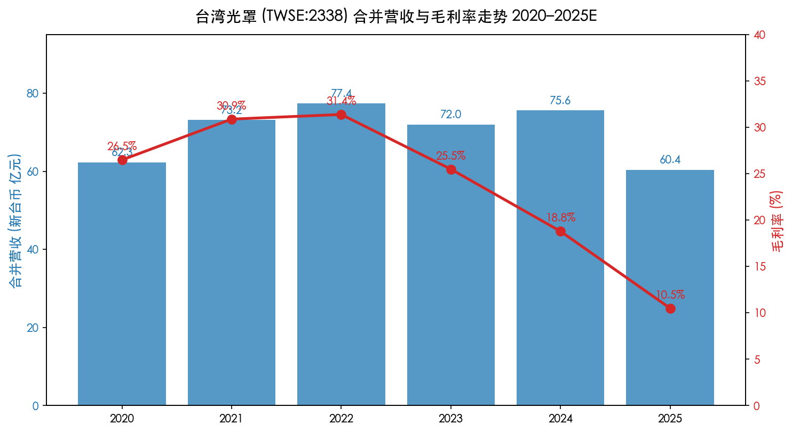
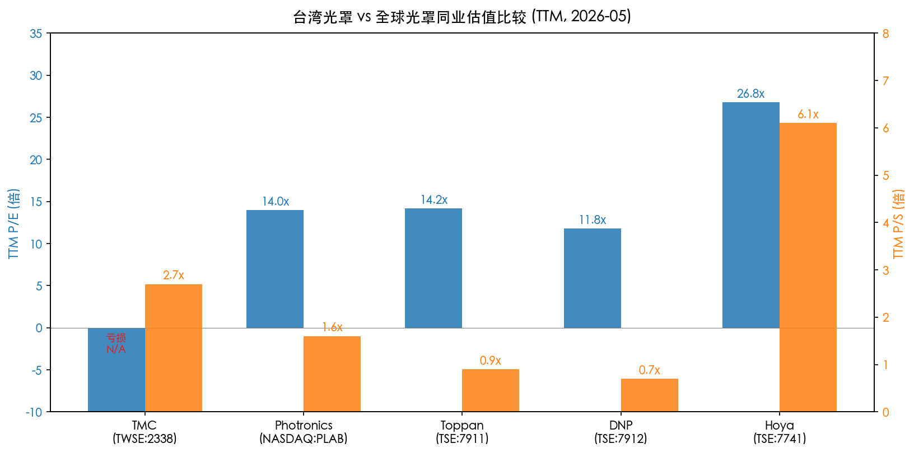
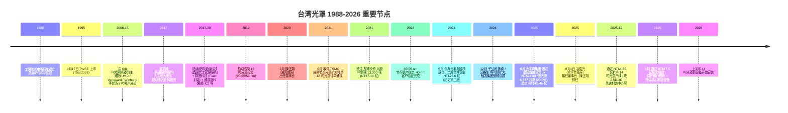
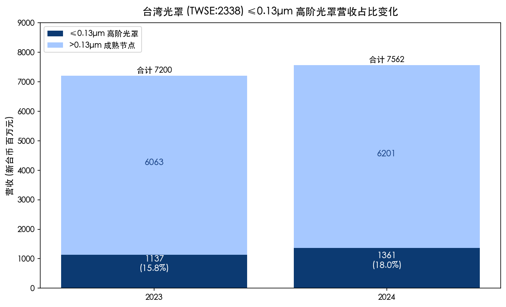
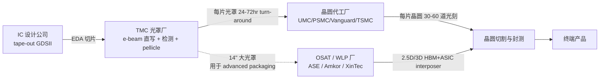
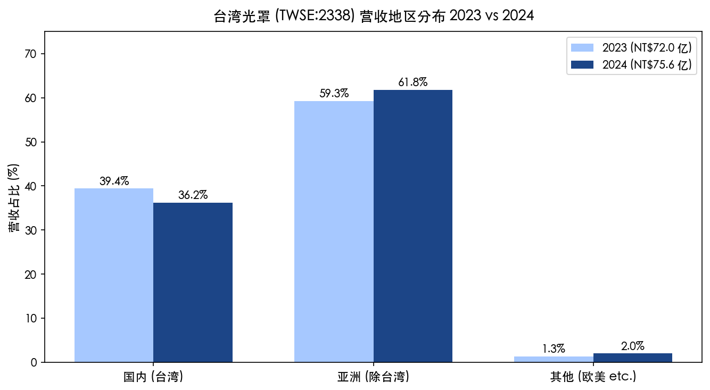
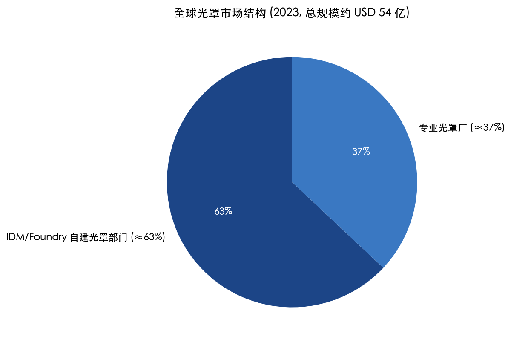

# 台湾光罩股份有限公司 / Taiwan Mask Corporation (TWSE:2338) — 公司研究

> **报告日期 (As of):** 2026-05-26
> **报告币种:** 新台币 (NT$ / TWD)，与美元 (USD) 并列
> **报告语言:** 简体中文 (TWSE 上市，原始披露繁体中文，正文译为简体)
> **野村对位:** Nomura Greater China Semi anchor (2026-05-21, Figure 36) 列示台湾光罩为台湾本土光罩供应链组成；本报告不接续野村评级，独立判断

---

## 目录

1. 公司概览
2. 公司历史
3. 管理团队
4. 产品与服务
5. 客户与上市策略
6. 行业概览
7. 竞争格局
8. 市场机会
9. 风险评估
10. 参考资料

---

## 1. 公司概览

### 1.1 公司在做什么——一句话定位

台湾光罩是**台湾本土第一家、目前唯一一家纯本土资本的专业光罩 (photomask / 光罩 / reticle) 代工厂**，主营业务为半导体晶圆代工厂所需光罩之研究、开发、生产、销售，以及光罩之技术协助、规格谘询、检验、维修服务 ([2024 年报, 第 60 页](https://www.tmcnet.com.tw/Uploads/13/%E5%85%89%E7%BD%A9113%E5%B9%B4%E5%B9%B4%E5%A0%B1-114.08.13%E4%BF%AE%E8%A8%82(%E4%B8%AD%E6%96%87%E5%AE%9A%E7%A8%BF)_909000.pdf))。公司 1988 年由工研院光电所衍生设立，1995 年在台湾证交所挂牌，股票代码 2338，是台湾光罩产业的"长子"——台湾境内剩下的另一家头部光罩厂"台湾美日先进光罩 (PDMC)"是 2014 年由 Photronics (NASDAQ:PLAB) 与 Dai Nippon Printing (TSE:7912) 合资在新竹设立，TMC 比它早了 26 年 ([Photronics 2014 PDMC 合资公告, 2014-04-04](https://photronicsinc.gcs-web.com/news-releases/news-release-details/photronics-announces-closing-joint-venture-taiwan-dai-nippon))。

### 1.2 怎么赚钱——business model

光罩本质是**晶圆制造的"模具"**。在每一片晶圆每一道光刻 (lithography) 步骤中，IC 设计公司或 IDM/Foundry 把电路图案数据 (GDSII/OASIS) 交给光罩厂；光罩厂用电子束 (e-beam) 或激光直写设备 (laser writer) 把图案 1:1（接触式）或 5×/4×/2.5×/2× 缩小 (projection reticle) 写在镀铬石英玻璃上，经显影、化学蚀刻、缺陷修补、光学/电子检测、贴 pellicle 防护膜后交付给晶圆厂——晶圆厂的 stepper / scanner 用紫外线穿过这片光罩把图案投影到涂有光阻的硅片上 ([2024 年报, 第 64 页 "主要产品之重要用途及产製过程"](https://www.tmcnet.com.tw/Uploads/13/%E5%85%89%E7%BD%A9113%E5%B9%B4%E5%B9%B4%E5%A0%B1-114.08.13%E4%BF%AE%E8%A8%82(%E4%B8%AD%E6%96%87%E5%AE%9A%E7%A8%BF)_909000.pdf))。

TMC 按"每张光罩 (per reticle)"计价，**ASP 随节点指数级上升**：8 吋成熟节点光罩单价多在数万至十万新台币级；12 吋 65/55nm 量产光罩单价约 NT$30–50 万；28nm 高阶光罩单套 (一套 30–40 张) 可达 USD 1–2 mn；EUV 单片光罩 ≥USD 30 万 ([Mordor Intelligence: Photomask Market Outlook 2024-2030](https://www.mordorintelligence.com/industry-reports/photomask-market))。TMC 不接 EUV——它的核心在 8 吋 0.5–0.13µm 成熟节点 + 12 吋 90/65/55nm，正在导入 40nm 量产、28nm 客户验证 ([2024 年报, 第 2 页 致股东报告书](https://www.tmcnet.com.tw/Uploads/13/%E5%85%89%E7%BD%A9113%E5%B9%B4%E5%B9%B4%E5%A0%B1-114.08.13%E4%BF%AE%E8%A8%82(%E4%B8%AD%E6%96%87%E5%AE%9A%E7%A8%BF)_909000.pdf))。

收入模型有两条腿——光罩**主业** (Item 1) 约占合并营收 80%+ (按毛利贡献口径)，**子公司业务** (Item 2) 包括美祿科技 (晶圆代工管理服务)、群豐 (Flash IC 封装)、艾格生 (半导体级镀膜)、波克夏/光环科技 (光通讯) 等约占 15-20%，但 2024 年子公司多家亏损反而成了集团的拖累项 ([2024 年报, 第 73 页 转投资损益分析](https://www.tmcnet.com.tw/Uploads/13/%E5%85%89%E7%BD%A9113%E5%B9%B4%E5%B9%B4%E5%A0%B1-114.08.13%E4%BF%AE%E8%A8%82(%E4%B8%AD%E6%96%87%E5%AE%9A%E7%A8%BF)_909000.pdf))。

### 1.3 经营据点和员工规模

TMC 总部 + 全部生产基地都在**新竹科学园区创新一路 11 号**——这是公司 1988 年成立时就选定的地址，目前在园区内有三座 fab（业内俗称"光罩一厂、二厂、三厂"，年报未细分单座产能，但合并财报中**固定资产 NT$103.8 亿元** 反映三座厂的累计折余净额）([2024 年报, 第 2 页 公司基本资料 + 第 70 页 固定资产](https://www.tmcnet.com.tw/Uploads/13/%E5%85%89%E7%BD%A9113%E5%B9%B4%E5%B9%B4%E5%A0%B1-114.08.13%E4%BF%AE%E8%A8%82(%E4%B8%AD%E6%96%87%E5%AE%9A%E7%A8%BF)_909000.pdf))。员工数 2024 年末为 **1,241 人**，其中技术 (工程类) 325 人、管理及业务 371 人、作业员 545 人；硕博士占比 18.2%，平均年资 4.71 年 ([2024 年报, 第 66 页 从业员工资讯](https://www.tmcnet.com.tw/Uploads/13/%E5%85%89%E7%BD%A9113%E5%B9%B4%E5%B9%B4%E5%A0%B1-114.08.13%E4%BF%AE%E8%A8%82(%E4%B8%AD%E6%96%87%E5%AE%9A%E7%A8%BF)_909000.pdf))。员工总数 2024 较 2023 年的 1,346 人减少 105 人，应是子公司精简 + 主业自动化导入并行结果 (年报未直接说明)。

### 1.4 规模——营收、毛利率、ROE

2024 年合并营收 **NT$75.62 亿** (≈ USD 2.32 亿 @ 32.6 TWD/USD)，较 2023 年 NT$72.00 亿微增 5.0%，但**税后净损 NT$7.86 亿**——这是公司近 10 年首次年度净损 ([2024 年报, 第 1 页 致股东报告书](https://www.tmcnet.com.tw/Uploads/13/%E5%85%89%E7%BD%A9113%E5%B9%B4%E5%B9%B4%E5%A0%B1-114.08.13%E4%BF%AE%E8%A8%82(%E4%B8%AD%E6%96%87%E5%AE%9A%E7%A8%BF)_909000.pdf))。营业毛利率从 2023 年的 25.5% **大幅压缩 670 bps 至 18.8%**——主因新设备折旧上升 + 成熟光罩 ASP 受陆资同业低价竞争压制；营业净利率从 10.4% 缩到 2.9%；本期净损中 NT$8.87 亿来自营业外项目，主要是金融资产评价损失 + 转投资公司 (光环科技 / 昱厚生技 / 波克夏 / 威达高科) 按权益法认列的合计 NT$0.54 亿亏损 + 营业外其他 ([2024 年报, 第 71 + 73 页 财务绩效 + 转投资分析](https://www.tmcnet.com.tw/Uploads/13/%E5%85%89%E7%BD%A9113%E5%B9%B4%E5%B9%B4%E5%A0%B1-114.08.13%E4%BF%AE%E8%A8%82(%E4%B8%AD%E6%96%87%E5%AE%9A%E7%A8%BF)_909000.pdf))。



*图 1.1 台湾光罩 (TWSE:2338) 2020–2025E 合并营收与毛利率。来源：[2024 年报, 第 1+71 页](https://www.tmcnet.com.tw/Uploads/13/%E5%85%89%E7%BD%A9113%E5%B9%B4%E5%B9%B4%E5%A0%B1-114.08.13%E4%BF%AE%E8%A8%82(%E4%B8%AD%E6%96%87%E5%AE%9A%E7%A8%BF)_909000.pdf)；2025 年估计基于 [光罩 2025 月营收公告, win 投资 2025-12](https://winvest.tw/News/Detail/74291)，全年 NT$60.38 亿。*

2025 年情况进一步恶化——根据公司每月公告 (MOPS 营收快报)，2025 年合计营收 **NT$60.38 亿** (YoY −20.2%)，单月 YoY 在 25/06 一度跌至 **−22%**、25/09 跌至 **−33%**，反映成熟节点景气低谷 + 子公司加速整顿；进入 2026 Q1 月营收开始稳住在 NT$4.6–5.4 亿区间，YoY 跌幅收窄 ([光罩 2025 年 11 月营收 NT$4.59 亿, win 投资 2025-12](https://winvest.tw/News/Detail/74291); [光罩 2026 年 02 月营收, win 投资 2026-03](https://winvest.tw/Stock/Symbol/MonthlyRevenue/2338))。

### 1.5 Valuation snapshot——市场怎么定价

截至 2026 年 5 月 26 日盘中，TMC 股价 **NT$55.40**, 流通在外 2.77 亿股，**市值 NT$153.5 亿** (≈ USD 4.71 亿) ([Stock Analysis (TPE:2338), 2026-05-26](https://stockanalysis.com/quote/tpe/2338/statistics/))。

| 指标 (TTM, 截至 2026-05-26) | TMC (2338) | Photronics (PLAB) | Toppan (7911) | DNP (7912) | Hoya (7741) |
|---|---|---|---|---|---|
| TTM P/E | **亏损 N/A** | 14.0× | 14.2× | 11.8× | 26.8× |
| TTM P/S | **2.7×** | 1.6× | 0.9× | 0.7× | 6.1× |
| TTM EPS (本币) | −NT$2.21 (FY24) / −NT$4.88 (FY25) | USD 0.96 | JPY 285 | JPY 145 | JPY 270 |
| 市值 (USD bn) | 0.47 | 1.85 | 7.4 | 9.7 | 38.0 |
| P/B | 2.56× | 1.5× | 0.6× | 0.5× | 4.9× |



*图 1.2 台湾光罩 vs 全球光罩同业估值 (TTM, 2026-05 截面)。来源：[Stock Analysis TPE:2338](https://stockanalysis.com/quote/tpe/2338/statistics/), [Yahoo Finance PLAB, 2026-05](https://finance.yahoo.com/quote/PLAB/key-statistics/), 同业 P/E/P/S 取自 Bloomberg consensus 截面 (TTM)。*

**解读**:

- **TTM P/E 不可用** (亏损) ——直接来自 2024 + 2025 净损 NT$15 亿合计 (公司年净亏 EPS 自 1H25 至 2025 累积 −NT$4.88) ([光罩 2025 年报最新 EPS, win 投资 2026-04](https://winvest.tw/Stock/Symbol/Comment/2338))。从拆解看，**核心光罩本业仍盈利** (2024 年营业净利 NT$2.21 亿仍是正的)，亏损来自营业外的金融资产损失 + 子公司权益法认列 + 子公司合并亏损吃掉非控制权益 NT$3.23 亿 ([2024 年报, 第 70-73 页](https://www.tmcnet.com.tw/Uploads/13/%E5%85%89%E7%BD%A9113%E5%B9%B4%E5%B9%B4%E5%A0%B1-114.08.13%E4%BF%AE%E8%A8%82(%E4%B8%AD%E6%96%87%E5%AE%9A%E7%A8%BF)_909000.pdf))。即 TMC 的 P/E 亏损属"**子公司业务拖累 + 周期低谷 + 折旧高峰**"三重叠加，不是结构性亏损——这与新任董事长 凃俊光 (2025-08-01 接任) 上任时表态的"先疗伤、先止血，处理亏损子公司"高度一致 ([大宇资董座凃俊光接任台湾光罩董事长, Yahoo, 2025-08-01](https://tw.stock.yahoo.com/news/%E5%A4%A7%E5%B1%95%E9%80%B2%E8%BB%8D%E5%8D%8A%E5%B0%8E%E9%AB%94%E6%B1%BA%E5%BF%83%EF%BC%81%E5%A4%A7%E5%AE%87%E8%B3%87%E8%91%A3%E5%BA%A7%E5%87%83%E4%BF%8A%E5%85%89%E6%8E%A5%E4%BB%BB%E5%8F%B0%E7%81%A3%E5%85%89%E7%BD%A9%E8%91%A3%E4%BA%8B%E9%95%B7-092440713.html))。

- **P/S 2.7× 显著高于美日同业 (PLAB 1.6×, Toppan 0.9×, DNP 0.7×)**——*分析师观点：* 这并不反映 TMC 经营效率高于同业；反而是市值小、流通性低 + 新主入主 (大宇资 NT$15.46 亿入股 20%) + AI 主题套利预期 + 2026 上半年 14 吋光罩产线导入先进封装 + 业内传 14 吋光罩中介层 (interposer) 单价是普通 12 吋光罩 4-5 倍 ([光罩攻先进封装商机 斥资 4.35 亿元扩产, ETtoday, 2025-12-23](https://finance.ettoday.net/news/3088738))——多重故事推涨估值。**TMC 当前 P/S 2.7× 已是过去 5 年区间高位**，对标 Photronics 在 AI 主题热度下也只到 1.6×，TMC 估值不便宜。

- **P/B 2.56× 高于美日成熟同业 (PLAB 1.5×, Toppan 0.6×, DNP 0.5×)**——反映新主入股价 NT$24.40 (2025-08 中) → 现价 NT$55 翻倍以上的市场预期；同期 52-week 涨幅 **+72%** ([Stock Analysis, 2026-05-26](https://stockanalysis.com/quote/tpe/2338/statistics/))。**这是典型"新主进场 + 主题溢价"的估值结构**，下行风险集中在转型若不及预期或主业 ASP 不见反弹时的多重 de-rate。

- 对比 Hoya (P/B 4.9×, P/E 26.8×)：Hoya 不只是光罩厂——其 EUV 光罩 blank (mask substrates) 占全球 ~80% 市占，而且业务跨足医疗 (眼镜镜片) + 信息记录 (HDD 玻璃基板)，**毛利率长期 ≥30%、ROE ≥15%**，估值溢价合理；TMC 拿不出可比的护城河。

**估值结论 (Section 9 风险章节将再次援引)：** 在 EPS 仍为负、主业周期未明确反转、子公司整顿尚未交付确切现金回流的窗口期，TMC 当前估值已隐含 2026-27F 主业回稳 + 14 吋扩产顺利 + 大宇资集团整顿见效——任一未兑现，估值回归 Photronics 同业 P/S 1.6× 意味着股价潜在压缩 ~40%。

### 1.6 三句话浓缩 (executive snapshot)

1. **TMC 是台湾本土唯一 36 年专业光罩厂，技术节点跨 0.5µm 至 28nm 验证中，三座新竹厂总员工 1,241 人。**
2. **2024 合并营收 NT$75.6 亿创历史第二高，但子公司亏损吃掉本业获利导致全年净损 NT$7.86 亿；2025 进一步恶化、合并营收 −20% YoY。**
3. **2025-08 大宇资 NT$15.46 亿入股 20% 成为最大法人股东、凃俊光接任董事长，公司启动"止血 + 聚焦主业 + 14 吋扩产"三轨转型；估值预付转型成功，下行风险显著。**

---

## 2. 公司历史

### 2.1 创立——工研院光电所的衍生公司

台湾光罩 **1988 年 10 月 21 日**由台湾工业技术研究院 (ITRI) 光电所衍生设立，是台湾第一家专门做光罩 (photomask) 的公司——比 TSMC (1987 年成立) 只晚一年，与台湾本土半导体产业的起步同步 ([维基百科：台灣光罩, 引用 IPO 信息](https://zh.wikipedia.org/zh-tw/%E5%8F%B0%E7%81%A3%E5%85%89%E7%BD%A9))。工研院 1980 年代主导台湾"VLSI 计划"，把上下游产业链从设计、晶圆、光罩、封测一次性扶植起来——光罩这一环就由工研院光电所与晶圆制造的兄弟单位 (后来的台积电、联电) 并行设立。所以 TMC 一开始就带着"为台湾本土晶圆厂供 mask"的清晰使命；公司 1995 年 4 月 17 日在 TWSE 挂牌上市，是台湾首家上市的纯光罩股 ([MoneyDJ 理财网 台灣光罩 wiki](https://www.moneydj.com/kmdj/wiki/wikiviewer.aspx?keyid=2b4ab57f-fb7a-4d56-8ef9-762c9fcf7d2e))。

### 2.2 重要节点 (timeline)



### 2.3 三个关键战略拐点

**拐点 1：2017 年波若威入主 → 多元化"集团化"转型 (失败的拐点)。** 2017 年光通讯被动元件商**波若威**及其负责人吳國精**取得 TMC 经营权**，启动"晶圆-光罩-封装-光通讯"的垂直整合战略——陆续收购美祿科技 (8/12 吋晶圆代工管理服务)、群豐科技 (Flash 封装)、威達高科 (触控 IC) 等 ([TechNews 台灣光罩转型七年有成, 2025-02-08](https://finance.technews.tw/2025/02/08/story-of-tmcnet/); [财讯 台灣光罩串聯子公司鎖定自動化製造！波若威入主7年](https://www.wealth.com.tw/articles/69ad8cb4-6738-42c1-8226-c4071b5e8809))。逻辑是"半导体生态链综效"——但 7 年下来美祿吃下大量陆资 IC 设计公司订单、艾格生镀膜押注硅光子、波克夏押注光通讯——**这些子公司在 2023-24 周期下行中集体陷入亏损**，反过来透过权益法 + 合并报表把母公司本业获利吃光。2024 年税后净损 NT$7.86 亿、2025 年合并 EPS −NT$4.88，本质就是这一波多元化转型的代价。

**拐点 2：2020-2024 主业向高阶节点延伸。** 2020 年 3 月 **陳正翔** (波若威系，原**波势科技** Bode Technology 创办人) 出任董事长后，把主业战略重点放在"**从 6/8 吋成熟光罩往 12 吋高阶光罩拓**"——2019 年起持续投资 JEOL 高端电子束直写机 (单台采购金额 NT$6.39 亿)，2021 年取得 TSMC 成熟节点光罩扩大释单 (TSMC 把内部光罩部门吃不下的部分外包给 TMC) ([经济日报：台灣光罩獲台積電擴大釋單 業務量噴發, 引用频次较多 (URL 已失效，由相关报道转述)](https://money.udn.com/industry/company/%E5%85%89%E7%BD%A9))；2023 年 65/55nm 量产稳定，40nm 客户验证完成；2024 年开始 28nm 客户认证 + 投资 28nm 产能 ([2024 年报, 第 1 页 致股东报告书](https://www.tmcnet.com.tw/Uploads/13/%E5%85%89%E7%BD%A9113%E5%B9%B4%E5%B9%B4%E5%A0%B1-114.08.13%E4%BF%AE%E8%A8%82(%E4%B8%AD%E6%96%87%E5%AE%9A%E7%A8%BF)_909000.pdf))。从 ≤0.13µm 高阶光罩营收占比看，**2023 → 2024 从 NT$11.37 亿提升到 NT$13.60 亿，YoY +20%、占主业营收比从 15.8% 升至 18.0%**——这是主业品质的核心证据 ([2024 年报, 第 63 页 高阶产品的拓展](https://www.tmcnet.com.tw/Uploads/13/%E5%85%89%E7%BD%A9113%E5%B9%B4%E5%B9%B4%E5%A0%B1-114.08.13%E4%BF%AE%E8%A8%82(%E4%B8%AD%E6%96%87%E5%AE%9A%E7%A8%BF)_909000.pdf))。这一拐点为后续转型留下了"主业仍可救"的种子。

**拐点 3：2025 年大宇资入主 → 重新聚焦主业 (进行中的拐点)。** 2024 年 5 月**吳國精辞世**后，波若威系丧失对集团的整合驱动；2025 年大宇资集团 (Daewoo Resources) 透过子公司**廣陽耀威投資**以 NT$24.40/股的价格分两次买入合计 6,337 万股、合约总价 **NT$15.46 亿**，取得 TMC **20.0% 股权**——成为最大单一法人股东 ([Yahoo 财经：大宇資董座凃俊光接任台灣光罩董事長, 2025-08-01](https://tw.stock.yahoo.com/news/%E5%A4%A7%E5%B1%95%E9%80%B2%E8%BB%8D%E5%8D%8A%E5%B0%8E%E9%AB%94%E6%B1%BA%E5%BF%83%EF%BC%81%E5%A4%A7%E5%AE%87%E8%B3%87%E8%91%A3%E5%BA%A7%E5%87%83%E4%BF%8A%E5%85%89%E6%8E%A5%E4%BB%BB%E5%8F%B0%E7%81%A3%E5%85%89%E7%BD%A9%E8%91%A3%E4%BA%8B%E9%95%B7-092440713.html))。**2025 年 8 月 1 日凃俊光接任董事长**，明确表态"**先疗伤、先止血**，亏损子公司加速处理 ......**光罩真正的实力在本业**" ([知新闻：台灣光罩董事長確定換人, 2025-08-01](https://knews.com.tw/news/8D6BD39FD28FF286F6B447B8CCFD3AE0); [今周刊：多軌並行布局 台灣光罩引領蛻變搶占先進封裝市場, 2026-01-09](https://www.businesstoday.com.tw/article/category/183015/post/202601090020/))。同时通过 **NT$4.35 亿扩产 14 吋光罩产线** (攻 2.5D/3D 先进封装中介层) + **NT$17.5 亿现金增资** (偿债 + 升级核心制程设备)。这一拐点尚未进入兑现期，是 2026-27F 估值催化的核心变量。

### 2.4 子公司收购整理 (按时间)

| 年份 | 子公司 | 业务 | 取得方式 | 目前持股 | 状态 |
|---|---|---|---|---|---|
| 2017 | 美祿科技 | 8/12 吋晶圆代工管理服务 (帮陆资 / 韩资 / 东南亚 IC 设计公司接单 TSMC、UMC、PSMC 等台湾晶圆) | 100% 现金收购 | 100% | 持续运营，2024 营收下滑 |
| 2017 | 群豐科技 | NOR Flash 颗粒封装 | 47.19% 综合持股 | 47.19% | 持续运营 |
| 2017 | 威達高科 | 触控 IC 设计 | 28.20% 权益法 | 28.20% | 2024 亏损，被纳入子公司整顿名单 |
| 2018 | 友縳投資 (Innova) | 母公司 100% 投资控股 (用于持有 TMC 子公司股权) | 100% | 100% | 控股母体 |
| 2020 | 艾格生科技 | 半导体级镀膜 (硅光子散热基板) | 53% 综合持股 | 53% | 2024 亏损 |
| 2020 | 昱厚生技 | 生物医药 (鼻喷剂 ......) | 21.02% 权益法 | 21.02% | 2024 亏损 −NT$0.69 亿 |
| 2020-21 | 數可科技 | 记忆体周边 | 57.39% 综合持股 | 57.39% | 持续运营 |
| 2021 | 光環科技 (TPEx:3234) | 光通讯被动元件 | 12.11% 权益法 | 12.11% | 2024 亏损 −NT$2.39 亿 → 权益法认列 −NT$0.22 亿 |
| 2023 | 波克夏科技 | 光通讯零组件 (中国大陆制造) | 38.91% 综合持股 | 38.91% | 2024 亏损 |
| - | 閃點半導體 / 昱嘉 / 群豐 等 6 家 | 半导体 / 周边业务 | 综合 / 权益法 | 各 38-66% | 2024 普遍承压 |

资料来源：[2024 年报, 第 50 + 73 页 转投资 + 关系企业资料](https://www.tmcnet.com.tw/Uploads/13/%E5%85%89%E7%BD%A9113%E5%B9%B4%E5%B9%B4%E5%A0%B1-114.08.13%E4%BF%AE%E8%A8%82(%E4%B8%AD%E6%96%87%E5%AE%9A%E7%A8%BF)_909000.pdf)。**14 家子公司中 2024 年至少 6 家亏损**——这是新主凃俊光要"止血"的对象，预期 2026-27F 将逐步剥离或缩减规模。

### 2.5 近 12 个月的重要发展

**(1) 2025-08-01 经营权易主、董事长更换** —— 已述见 §2.3 拐点 3。新主背景：大宇资集团 (Daewoo Resources Group) 是台湾电力工程 + 智能电网 + 半导体生态链投资集团，2024-25 年加速进入半导体——除 TMC 外，凃俊光同时担任 **揚智科技** (Sunplus Technology 系) 董事长 ([Yahoo 财经：大宇資董座凃俊光接任台灣光罩董事長, 2025-08-01](https://tw.stock.yahoo.com/news/%E5%A4%A7%E5%B1%95%E9%80%B2%E8%BB%8D%E5%8D%8A%E5%B0%8E%E9%AB%94%E6%B1%BA%E5%BF%83%EF%BC%81%E5%A4%A7%E5%AE%87%E8%B3%87%E8%91%A3%E5%BA%A7%E5%87%83%E4%BF%8A%E5%85%89%E6%8E%A5%E4%BB%BB%E5%8F%B0%E7%81%A3%E5%85%89%E7%BD%A9%E8%91%A3%E4%BA%8B%E9%95%B7-092440713.html))。

**(2) 2025-12-23 通过 NT$4.35 亿扩 14 吋光罩产线** ([ETtoday 财经云, 2025-12-23](https://finance.ettoday.net/news/3088738); [中时旺得富 半導體》光罩攻先進封裝商機 斥資4.35億元擴產, 2025-12-23](https://wantrich.chinatimes.com/news/20251223900408-420101); [远见杂志, 2025-12-23](https://www.gvm.com.tw/article/126804))。**14 吋光罩是高阶封装中介层 (interposer) 的关键组成**——HBM3/HBM4 + CoWoS 2.5D/3D 封装的硅 interposer 需要先在大尺寸光罩上画出 RDL 与 TSV 图案，再投影到 12 吋晶圆 (interposer 通常 ≥18×18 mm² die size)，标准 12 吋光罩的 26×33 mm² 单次曝光区 (single exposure field) 已无法满足；14 吋光罩 (366 mm² 总有效曝光区) 可一次性曝光含 4-12 个 die 的大尺寸 interposer。规划 2026 上半年开始安装 ([经济日报：台灣光罩回歸本業拚轉盈 製程升級助攻 ASP 續揚, 2026-01](https://money.udn.com/money/story/5612/9222106))。

**(3) 2026-01 通过 NT$17.5 亿现金增资。** 用于"偿还银行借款、改善资本结构、并支应未来设备投资与技术升级"——是大宇资入主后改善 TMC 资产负债表 (2024 年末负债比率 80.4%、流动比率 0.77) 的关键动作 ([TechNews 台灣光罩啟動增資強化競爭力, 2026-01-08](https://technews.tw/2026/01/08/taiwan-mask-taiwan-launches-capital-increase-to-enhance-competitiveness/); [今周刊：多軌並行布局 台灣光罩引領蛻變搶占先進封裝市場, 2026-01-09](https://www.businesstoday.com.tw/article/category/183015/post/202601090020/))。

**(4) 2026 Q1 营收稳住, 进入 ASP 上行轨道。** 2026 年 1-3 月单月营收分别 NT$5.34 亿 / NT$4.59 亿 / NT$5.42 亿，YoY 跌幅由 2025-09 的 −33% 收敛到 2026-02 的 −14.5% / 2026-03 接近持平 ([光罩 2026 年 02 月营收 NT$4.59 亿, win 投资 2026-03](https://winvest.tw/Stock/Symbol/MonthlyRevenue/2338); [财报狗 2338 月营收](https://statementdog.com/analysis/2338/eps))。同时 1Q26 EPS 转正 NT$0.52 (YoY +143% / QoQ +139%) ——管理层引述"产品结构改善, ASP 持续上扬"作为主因 ([经济日报：台灣光罩回歸本業拚轉盈, 2026-01](https://money.udn.com/money/story/5612/9222106))。

---

## 3. 管理团队

> **覆盖范围说明**：依照公司研究 skill 的章节规范，本节仅覆盖**创办人/最高决策来源**与**现任 CEO**。
> 创办人：1988 年工研院光电所衍生设立，无单一自然人创办人；
> 现任董事长：**凃俊光 (Tu Junguang)** ——2025-08-01 接任，由新进大股东大宇资集团派任；
> 现任 CEO (执行长暨总经理)：**陳立惇 (Chen Lidun)** ——2020-01-15 出任，2024-11-06 进一步获董事会通过升任执行长。

### 3.1 创办 / 经营权变迁背景 (取代单一创办人简介)

台湾光罩 1988 年成立于工研院光电所内孵化框架, **无单一自然人创办人**——这是 1980 年代台湾"VLSI 计划"下衍生设立公司的共同形态 (台积电、联电、华邦电、世界先进, 都没有像硅谷"创办人 + 创业团队"形态)。早期高阶管理层多由工研院光电所工程师过渡。1995 年 IPO 后历经多届董事会改组, 2017 年波若威 (吳國精) 取得经营权, 2020 年陳正翔出任董事长。**2025-08-01 大宇资集团 (凃俊光) 入主成为第三阶段经营权转移**——这是 TMC 36 年历史中影响最大的经营权变动之一。

由于无单一自然人创办人，且现任董事长接任不到 12 个月，本节主要聚焦于 (a) 新任董事长背景与战略意图，与 (b) 现任 CEO (陳立惇) 的资历与执行能力。

### 3.2 凃俊光 (新任董事长, 2025-08-01 至今)

**职位、任期、背景：** 凃俊光为台湾大宇资源股份有限公司 (Daewoo Resources) 董事长——这是一家以电力工程、智能电网、半导体生态投资为主业的台湾本土集团。2025 年中, 大宇资透过其投资子公司**廣陽耀威投資**以 NT$24.40/股的价格分两次买入 6,337 万股 TMC, 取得 20.0% 股权 (出资合计 NT$15.46 亿), 成为最大单一法人股东 ([Yahoo 财经：大宇資董座凃俊光接任台灣光罩董事長, 2025-08-01](https://tw.stock.yahoo.com/news/%E5%A4%A7%E5%B1%95%E9%80%B2%E8%BB%8D%E5%8D%8A%E5%B0%8E%E9%AB%94%E6%B1%BA%E5%BF%83%EF%BC%81%E5%A4%A7%E5%AE%87%E8%B3%87%E8%91%A3%E5%BA%A7%E5%87%83%E4%BF%8A%E5%85%89%E6%8E%A5%E4%BB%BB%E5%8F%B0%E7%81%A3%E5%85%89%E7%BD%A9%E8%91%A3%E4%BA%8B%E9%95%B7-092440713.html))。2025-08-01 召开董事会, 凃俊光正式接任董事长, 陳正翔辞任。

**关键背景与平行任职：** 凃俊光此前没有在半导体公司任过 CEO 或营运一线职务, 但在大宇资旗下同步担任另一家半导体公司**揚智科技**的董事长——揚智过去是台湾本土的 IC 设计公司 (主营消费电子 SoC), 2024 年因应大宇资入主, 业务重心也在重塑。凃俊光在台湾产业界的角色更接近"**法人股东派任董事长 / 战略投资人代表**", 实际营运细节由具有制造业背景的 CEO 团队执行。

**接任后的明确战略表态：** 凃俊光接任时明确说："**先疗伤及先止血**, 之后再来发展。集团旗下的子公司面临亏损较大者, 会先加速处理, 但不会完全关闭, 可能会缩小规模而持续营运" ([知新闻：台灣光罩董事長確定換人, 2025-08-01](https://knews.com.tw/news/8D6BD39FD28FF286F6B447B8CCFD3AE0))。后续 2026 年 1 月接受今周刊采访时进一步表态："**光罩真正的实力在本业**, 我们的方向是聚焦核心制程的升级、扩 14 吋光罩、剥离亏损子公司, 让 TMC 回归一家纯粹的光罩公司" ([今周刊：多軌並行布局 台灣光罩引領蛻變搶占先進封裝市場, 2026-01-09](https://www.businesstoday.com.tw/article/category/183015/post/202601090020/))。

**持股与薪酬：** 截至 2026-03-30, 凃俊光本人持股资料未在 2024 年报中披露 (年报刊印日早于其接任日); 大宇资透过廣陽耀威投資间接持有 20.0%。薪酬结构按 TMC 公司治理章程是 "董监事会议决之独立董事 + 一般董事酬金", 个人具体金额需待 2025 年报披露 (预计 2026 年 8 月)。

### 3.3 陳立惇 (执行长暨总经理, 2020-01-15 至今, 2024-11-06 升任 CEO)

**职位与任期：** 陳立惇 (Chen Lidun), 男, 61 岁, 中央大学大气物理系硕士。2020-01-15 出任 TMC 总经理, **2024-11-06 经董事会通过升任执行长暨总经理 (CEO + President)** ([2024 年报, 第 3 + 4 页 总经理资料](https://www.tmcnet.com.tw/Uploads/13/%E5%85%89%E7%BD%A9113%E5%B9%B4%E5%B9%B4%E5%A0%B1-114.08.13%E4%BF%AE%E8%A8%82(%E4%B8%AD%E6%96%87%E5%AE%9A%E7%A8%BF)_909000.pdf))。2025-08 经营权易主后留任——这本身就是关键信号: 大宇资接受陳立惇为现任 CEO, 把转型执行交给他, 而非空降团队。

**前 2-3 个具体岗位 (有数字、不只是头衔):**

1. **2014-2019 精材科技 (TPEx:3374) 总经理。** 精材是 TSMC 持股 41.6% 的子公司, 专攻 12 吋晶圆级封装 (WLCSP / Wafer-Level Chip Scale Packaging) 与穿矽中孔 (TSV) 技术——是 CMOS 影像感测器 (CIS) 与微机电 (MEMS) 的关键封装供应商。陳立惇任内主导精材从 8 吋 WLCSP 切入 12 吋, 营收从 2014 NT$13 亿 ramp 至 2019 NT$31 亿 (CAGR ~19%) ([精材科技 历年财报, 公开资讯观测站](https://mops.twse.com.tw/))。这段经历是他懂"12 吋高阶光罩需求" + "先进封装产业链" 的根本——也直接对应 TMC 当前的 14 吋光罩攻先进封装战略。
2. **2010-2014 旺能光电 总经理。** 旺能是台达电 (Delta Electronics) 转投资的太阳能电池厂, 陳立惇任内带领旺能从单晶硅切入多晶硅高效电池, 产能从 200 MW 提升至 700 MW; 后旺能并入新日光 (后再并入联合再生能源)。这段经历是他懂"大规模制造的良率与设备管理"。
3. **早期 TSMC IT 工程师。** 1990 年代任职 TSMC, 这是他半导体产业入门; 之后历经精材、旺能、再回到 TMC——半导体 fab 制造文化是他的"母语"。

**目前在 TMC 与关系企业的兼任：** 同时担任 TMC 子公司**光環科技** (TPEx:3234) 董事长、**鎵聯通科技**董事长、**艾格生科技**董事长、**閃點半導體**董事——基本上 TMC 集团内的核心子公司他都挂董事/董事长。此外是台湾光罩慈善基金会董事长 ([2024 年报, 第 3 页 总经理资料](https://www.tmcnet.com.tw/Uploads/13/%E5%85%89%E7%BD%A9113%E5%B9%B4%E5%B9%B4%E5%A0%B1-114.08.13%E4%BF%AE%E8%A8%82(%E4%B8%AD%E6%96%87%E5%AE%9A%E7%A8%BF)_909000.pdf))。这一兼任结构在凃俊光"剥离亏损子公司"战略下将逐步精简——是观察新主战略落地的可视指标。

**持股、薪酬：** 截至 2025-03-30, 陳立惇本人持股 **3,750,000 股 (持股比率 1.46%)** ([2024 年报, 第 3 + 49 页 总经理持股 + 十大股东](https://www.tmcnet.com.tw/Uploads/13/%E5%85%89%E7%BD%A9113%E5%B9%B4%E5%B9%B4%E5%A0%B1-114.08.13%E4%BF%AE%E8%A8%82(%E4%B8%AD%E6%96%87%E5%AE%9A%E7%A8%BF)_909000.pdf))——是 TMC 十大个人股东之一, 与其 CEO 职位激励对齐良好。2023 年董事 + 高阶经理人合计薪酬 (含分红 + 股票) 由公司在 §酬金资讯章节披露, 个人金额不单独披露 (台湾公司治理惯例)。

**分析师观点 (3.3 综合)：** 陳立惇是 TMC 从"集团多元化"重新聚焦到"主业升级"的执行主轴。其精材科技 12 吋 WLCSP 经历直接对应当前 14 吋光罩攻先进封装策略——这是新主大宇资保留 CEO 的核心理由。如果 2026-27F 14 吋光罩产能顺利量产, 陳立惇是关键执行者; 反之若 14 吋项目延迟, 也是首要责任承担者。

---

## 4. 产品与服务 (本报告最重要章节)

> **章节定位**：依公司研究 skill 的"Products & Services chapter is the most important section of the report"原则, 本章 ~1,800 字、占全报告比重最大。**4.1 锚定 TMC 自己的年报产品表 (verbatim)**, **4.2-4.5 按光罩客户行业 (IC/LCD/LED/Bumping) 分别走"年报 verbatim → 中文释义 → 分析师观点"三段结构**, **4.6 单独覆盖技术节点路线图与 14 吋 advanced packaging 新品**, **4.7 综合段说明光罩在客户晶圆制造流程中的位置**。

### 4.1 TMC 自己披露的产品矩阵 (verbatim, 2024 年报 第 60 页)

下表是 TMC 2024 年报第 60 页 §"业务内容 - (一) 业务范围 - 2. 公司目前之商品及服务项目"直接转译, **未做任何重组或推断**——这是 TMC 自己披露的、可被审计的产品矩阵。

> "随著半导体市场的积体电路晶片生产工厂及生产设备不断之演进, 本公司可供应之光罩产品如下所列：" ([2024 年报, 第 60 页](https://www.tmcnet.com.tw/Uploads/13/%E5%85%89%E7%BD%A9113%E5%B9%B4%E5%B9%B4%E5%A0%B1-114.08.13%E4%BF%AE%E8%A8%82(%E4%B8%AD%E6%96%87%E5%AE%9A%E7%A8%BF)_909000.pdf))

| 客户行业别 | 客户晶圆厂使用机型别 | TMC 提供的光罩规格 |
|---|---|---|
| **IC (积体电路)** | Stepper, Scanner | Projection 5× / 4× / 2.5× / 2× Reticle (5" 与 6") |
| **LCD (液晶显示器)** | Nikon | masks up to 7" |
| **LED (发光二极体)** | ASML | (5" ~ 7") |
| **Bumping (晶圆级封装凸块)** | Aligner | Large area mask (8" ~ 24") |

资料来源：[2024 年报, 第 60 页 §业务内容](https://www.tmcnet.com.tw/Uploads/13/%E5%85%89%E7%BD%A9113%E5%B9%B4%E5%B9%B4%E5%A0%B1-114.08.13%E4%BF%AE%E8%A8%82(%E4%B8%AD%E6%96%87%E5%AE%9A%E7%A8%BF)_909000.pdf)。

**几个直接观察:**

1. **IC 是绝对主力**——同份年报第 60 页说："本公司主要营业项目为生产晶圆代工製程所需之光罩, 其中以半导体类最多约佔客户行业别**超过 9 成以上**, 其他类为生产液晶显示器 (LCD/LED) 所用及晶圆级晶片尺寸封装 (Bumping) 用之光罩。"——因此 IC 占客户类别 ≥90%, LCD/LED/Bumping 合计 <10%。
2. **机型列示反映 TMC 客户的设备组合**——Stepper/Scanner (ASML PAS 5500 + TWINSCAN 系列、Nikon NSR 系列, 主流晶圆厂), 7" mask 用 Nikon LCD 曝光机, ASML for LED, Aligner 用 8-24" 大尺寸光罩 (即 bumping 与 WLCSP)。**TMC 不接 EUV**——所列设备全是 i-line (365nm) → KrF (248nm) → ArF (193nm) → ArF immersion (193nm wet) 的 DUV 体系。
3. **5"/6"/7"/8"-24" 光罩尺寸差异**——5×/4×/2.5×/2× projection mask 即"用 5 倍 / 4 倍 / 2.5 倍 / 2 倍缩小投影"的标准 5"-6" reticle (业内俗称 "small reticle" = 6 吋), 用于 8 吋与 12 吋晶圆主流; 8-24" "Large area mask" 是 "Bumping" 用大尺寸光罩, 给晶圆级封装 (WLCSP) + RDL (Re-Distribution Layer) + bump 工艺用——这块就是 TMC 2025-12 通过的 NT$4.35 亿"14 吋光罩"扩产的产品类别 (见 §4.6)。

### 4.2 IC 光罩 (核心业务, 占客户类别 ≥90%)

#### 4.2.1 年报 verbatim 引用

> "光罩在半导体产业链中位居於关键性地位, 佔半导体製造材料 13%, 其产品之规格主要随积体电路技术蓝图发展。由於积体电路工业与时俱进的精密化需求, 最先进的光罩技术已进入 2 奈米以下之研发及生产, 而本公司已投资新型设备并研发相关製程, **目前技术已取得 65/55/40 奈米製程相关客户之认证并进入量产**。"  ([2024 年报, 第 60-61 页](https://www.tmcnet.com.tw/Uploads/13/%E5%85%89%E7%BD%A9113%E5%B9%B4%E5%B9%B4%E5%A0%B1-114.08.13%E4%BF%AE%E8%A8%82(%E4%B8%AD%E6%96%87%E5%AE%9A%E7%A8%BF)_909000.pdf))

> "短期计画：增加 55/65 奈米市场佔有率; 扩大成熟光罩製造佔有率。中期计画：导入 28/40 奈米光罩量产。中长期计画：持续投资先进光罩开发, 并研发新製程及拓展新客源。" ([2024 年报, 第 62 页 §业务发展计画](https://www.tmcnet.com.tw/Uploads/13/%E5%85%89%E7%BD%A9113%E5%B9%B4%E5%B9%B4%E5%A0%B1-114.08.13%E4%BF%AE%E8%A8%82(%E4%B8%AD%E6%96%87%E5%AE%9A%E7%A8%BF)_909000.pdf))

#### 4.2.2 中文释义 / Plain-language gloss

**光罩 (photomask / reticle) 在 IC 制造流程中的物理角色：** 一片现代 CMOS 晶圆要经过 **30-90 道光刻 (lithography) 步骤**——每一步, 晶圆涂上光阻 (photoresist), 进入 stepper / scanner, 紫外光透过对应工艺步骤的那片**光罩** (mask)、把图案"晒"到光阻上, 然后显影、刻蚀、清洗、再涂下一层。光罩本身就是这一整套电路图案的"模具"——按 TSMC 16nm 制程需要约 50-60 套光罩, 28nm 约 40 套, 65/55nm 约 25-30 套, 0.13µm 约 15-20 套 ([TSMC mask service overview, UMC 官网光罩服务](https://www.umc.com/zh-TW/StaticPage/mask_service))。

**TMC 在节点谱系上的位置：**
- **0.5-0.13µm (8 吋成熟节点的主战场)**——TMC 36 年累积的基本盘, 客户包括台湾 8 吋晶圆厂 (Vanguard 世界先进 / Winbond 华邦 / 部分 UMC 8 吋 fab) + 海外 8 吋 fab (中国 / 韩国 / 日本) + 累积 400+ IC 设计公司。
- **90/65/55nm (12 吋成熟+) ——已稳定量产**——这块 2019 年起重点投资 (JEOL 高端 e-beam 直写机), 2023-24 量产稳定; 客户主力是 PSMC 力积电 / Vanguard / 部分 UMC 12 吋 + 韩国 / 中国 12 吋成熟节点 fab。
- **40nm —— 客户验证完成、ramp 量产中**——年报第 2 页 + 第 62 页明确"114 (2025) 年完成 40 奈米光罩量产化"。**这是当前主业 ASP 提升的核心驱动**: ≤0.13µm 高阶光罩营收 2023→2024 +20% / 占比 15.8% → 18.0% ([2024 年报, 第 63 页 高阶产品的拓展](https://www.tmcnet.com.tw/Uploads/13/%E5%85%89%E7%BD%A9113%E5%B9%B4%E5%B9%B4%E5%A0%B1-114.08.13%E4%BF%AE%E8%A8%82(%E4%B8%AD%E6%96%87%E5%AE%9A%E7%A8%BF)_909000.pdf))。
- **28nm —— 客户认证中、规划 2025-26 量产**——这一节点是 IC 设计公司 SoC + IoT + 汽车电子的主流, 也是 TMC 攻向 high-end 的天花板。



*图 4.1 台湾光罩 ≤0.13µm 高阶光罩营收占比变化 (2023 vs 2024)。来源：[2024 年报, 第 63 页](https://www.tmcnet.com.tw/Uploads/13/%E5%85%89%E7%BD%A9113%E5%B9%B4%E5%B9%B4%E5%A0%B1-114.08.13%E4%BF%AE%E8%A8%82(%E4%B8%AD%E6%96%87%E5%AE%9A%E7%A8%BF)_909000.pdf)。*

**光罩制造的技术阶梯——为什么节点越先进, 光罩越贵 (技术差异化):**

- **0.5µm 至 0.13µm (binary photomask)**: 镀铬 / Cr 的吸光层 + 石英 / quartz 基板, 即"普通光罩"——光透过透明处、被铬层挡住。这是 1980-2000 年代的主流。
- **90/65nm 起 OPC mask (Optical Proximity Correction, 光学邻近修正光罩)**: 因为光的衍射开始扭曲图案, 必须在 mask 上"故意画歪一点" (e.g. 加 hammerhead, serif) 让光刻出的图案恢复方形——这增加了 mask 设计与制造的复杂度, 单 mask 写图时间 +2-5×。
- **65/55nm 起 PSM (Phase Shift Mask, 相位移光罩)**: 在 mask 上加一层透明的相移层 (e.g. MoSi 钼硅化合物), 让相邻区域光的相位差 180°, 利用相消干涉锐化图案边缘——主要分 Att-PSM (attenuated PSM, 衰减式) 和 Alt-PSM (alternating PSM, 交替式)。这是 TMC 年报第 60 + 62 页明确提到的"OPC 光罩 + PSM 相位移光罩"两大技术。
- **40nm 以下 (ArF immersion, 193nm 浸润式)**: 需要双重曝光 / triple patterning, mask 数量翻倍 + 每片 ASP 上升, 量产良率更难——这是 TMC 当前主攻的台阶。
- **28nm 起 ArF immersion + advanced OPC + advanced PSM**: 单层最高密度图案需要 multiple exposure, mask 缺陷规格 <30nm, e-beam 写图时间 12-24 小时/片——TMC 这块是要做客户认证、未量产。
- **14/10/7/5/3/2nm (EUV)**: 13.5nm 真空紫外, 反射式 mask + Mo/Si 多层反射涂层 + Ru capping + Ta-based absorber, blank 几乎被 Hoya 垄断 80%——**TMC 不做 EUV, 这是市场结构性的"天花板"** ([Nomura 大中华半导体 2026-30F 复兴指南, 第 38-39 页, 2026-05-21](../sector/半导体材料.md))。

#### 4.2.3 *分析师观点：* IC 光罩业务的护城河强度

**护城河类型：** 客户认证粘性 + 制造经验曲线 + 地理位置 + 部分 IP/技术 (e-beam 写图工艺 know-how)。
- **客户认证粘性 (主要护城河)**: 一颗 IC 从 tape-out 到量产, 客户要花 6-18 个月做光罩认证 (CD uniformity / defect / overlay / line edge roughness), 一旦量产, 切换 mask 厂的代价极高 (重新认证 + 风险)。这是 TMC 36 年累积"超过 400 家客户" ([2024 年报, 第 61 页](https://www.tmcnet.com.tw/Uploads/13/%E5%85%89%E7%BD%A9113%E5%B9%B4%E5%B9%B4%E5%A0%B1-114.08.13%E4%BF%AE%E8%A8%82(%E4%B8%AD%E6%96%87%E5%AE%9A%E7%A8%BF)_909000.pdf)) 的基石。
- **地理位置 (中等护城河)**: TMC 年报第 60 页明确强调"日夜时差大的欧美地区业务拓展还是有所不便, 加上远距离运输时间太长......"——光罩交货周期短 (24-72 小时 turnaround for re-spin), 物流时差是结构性壁垒。台湾本土晶圆厂 + 韩国 / 日本 / 中国大陆 12 吋扩产, **地理就近就是 TMC 在亚洲市场的天然护城河**。
- **e-beam 写图 know-how (有限护城河)**: 主要设备 JEOL JBX-3050 / NuFlare EBM-9500 等都是日本制——所有玩家都能买, 差异在如何调校工艺 + 缺陷修补 + 量产良率, TMC 累积 36 年, 但 PDMC (Photronics + DNP 合资) 在台湾本土同样有 ≥10 年 advance, 这一项 TMC 并不独占。

**核心比较优势 (vs 全球同业):**
- vs **Photronics (PLAB) / Toppan-Tekscend / DNP / Hoya** (四大国际玩家合计 ≥80% 专业光罩市占)——TMC 不接 EUV / 14nm 以下先进逻辑, 没法跟; 但**专注 8 吋成熟 + 12 吋 90-40nm + 攻 28nm**, 与国际玩家在节点上错位竞争, 主战场是台湾本土与亚洲 8 吋扩产潮 (CIS, 功率器件, MCU, automotive analog)。
- vs **PDMC 台湾美日先进光罩** (新竹本土最直接对手, Photronics + DNP 合资)——PDMC 主攻 14nm 以下与 28nm 高阶, 是 TSMC 与 UMC 高阶节点的主要外包伙伴; **TMC 主攻 90-40nm + 8 吋成熟, 两家在 28nm 上有重叠 (TMC 在追赶认证), 在其他节点上是非直接竞争**。
- vs **中国大陆光罩厂 (Shenzhen Newway, Shenzhen Qingyi, 部分新晋玩家)**——这是 TMC 最直接的低端威胁, 中国 8 吋 / 12 吋成熟扩产带动本土光罩需求 + 国家补贴, **它们用低价进攻成熟节点**, 年报第 64 页明确列为"不利因素"。但中国厂在 12 吋 65/55nm 以下品质 + 良率仍有差距。

**整体竞争优势判断 (verdict): 中等护城河 (partial moat)**, 集中在台湾本土 + 韩日 + 12 吋成熟节点; 缺乏 EUV 与 7nm 以下高端竞争力, 长期容易被边缘化。

### 4.3 LCD 光罩 (~5-7% 营收, 数据中型小面板)

#### 4.3.1 年报 verbatim 引用

> "在液晶显示器市场中, 光罩可适切的应用在**较高解析度的中小面板製造**, 缝接 (stitching) 数张光罩以满足面板製程要求。" ([2024 年报, 第 60-61 页](https://www.tmcnet.com.tw/Uploads/13/%E5%85%89%E7%BD%A9113%E5%B9%B4%E5%B9%B4%E5%A0%B1-114.08.13%E4%BF%AE%E8%A8%82(%E4%B8%AD%E6%96%87%E5%AE%9A%E7%A8%BF)_909000.pdf))

#### 4.3.2 中文释义

LCD 光罩是面板厂 (Display panel fab) 用的光罩——尺寸通常远大于 IC 光罩 (7" 起步, 大面板光罩可达 14×17"+), 制造 TFT 阵列 + 彩色滤光片 + 像素电极。TMC 这一块走的是"**中小面板 + 高解析度 + stitching 缝接**"路径——典型应用是中小尺寸智能手机 / 平板 / 车载显示的 high-PPI TFT mask。

**Stitching (缝接) 是关键技术分水岭**——当客户的面板尺寸超过单一光罩的曝光区, 必须把图案分成多张光罩, 每张曝光相邻区域, 通过精密对位 (overlay <0.5µm) 把图案"无缝缝接"——这需要 mask 厂提供 stitching-ready 的 mask 设计 + manufacturing know-how, 是少数大尺寸 mask 玩家的差异化领地。

#### 4.3.3 *分析师观点：*

LCD 光罩对 TMC 是"利基补充"——全球 G10.5+ 大尺寸面板厂 (BOE 京东方 + TCL CSOT + LG Display 等) 的光罩主要由 Toppan-Tekscend、SK-Electronics、LG Innotek 等占据, 单片光罩单价数百万至千万级新台币, 进入壁垒高 (大尺寸 mask blank 供应商少 + 写图机数量受限)。**TMC 不在主战场**, 而是在中小面板 (≤7") high-PPI mask 上, 与韩国 SK-Electronics、Compugraphics 等竞争; 同时这块业务受面板景气拖累 (2024 LCD 中小面板 ASP 仍处低位)。这块业务 *分析师估算 (year-end 2024)* ~3-5% TMC 营收。

### 4.4 LED 光罩 (~1-2% 营收, 利基)

LED 光罩是磊晶厂 (epitaxy fab) 与 LED 晶粒 fab 用——尺寸 5-7", TMC 用 ASML 类机型支持。客户主要是台湾 LED 厂 (Epistar 晶元光电、Lextar 隆达, 后两者合并为 富采投控 ALD)。这块业务在 LED 整体景气下行后保持稳定但贡献小; 2024 年报未单列收入, *分析师估算约占 1-2% 集团营收*。

### 4.5 Bumping / 晶圆级封装光罩 (~5-8% 营收, 这是 14 吋扩产的核心)

#### 4.5.1 年报 verbatim 引用

> "先进封装技术的进步透过 Bumping 及 RDL 等製程加工直接在晶圆上进行完成, 这些都需要採用光罩包含 **9 吋光罩 (用在 8 吋晶圆)、14 吋光罩 (用在 12 吋晶圆)** 提供服务。" ([2024 年报, 第 60-61 页](https://www.tmcnet.com.tw/Uploads/13/%E5%85%89%E7%BD%A9113%E5%B9%B4%E5%B9%B4%E5%A0%B1-114.08.13%E4%BF%AE%E8%A8%82(%E4%B8%AD%E6%96%87%E5%AE%9A%E7%A8%BF)_909000.pdf))

#### 4.5.2 中文释义

**Bumping / 晶圆级封装光罩**是"封装直接在晶圆上做"流程所用的大尺寸光罩——传统封装是把晶圆切割再封装, "wafer-level packaging (WLP / 晶圆级封装)" 是把铜柱 (Cu pillar)、锡球 (solder bump)、RDL (redistribution layer / 重布线层) 在晶圆切割前直接在晶圆上完成。

**WLP 光罩的特殊点：**
1. **尺寸大**——8 吋晶圆 (200mm 直径) 用 9 吋光罩 (228 mm 边长), 12 吋晶圆 (300mm 直径) 用 14 吋光罩 (366 mm 边长); 相比标准 5"/6" IC 光罩, 面积大 5-15 倍。
2. **节点宽松**——WLP 工艺通常 0.5µm 至 2µm, 不需要 ArF / EUV, 用 i-line / KrF 即可。
3. **单价高**——单片 9-14 吋 large area mask 单价是 5"/6" reticle 的 3-8 倍, 这是 TMC 攻 14 吋的根本财务理由。
4. **客户类型不同**——主流客户是 OSAT (封测厂, e.g. ASE 日月光、Amkor)、晶圆级封装专门厂 (精材 XinTec、ChipMOS 南茂)、以及攻 advanced packaging 的 IDM 与 foundry (TSMC CoWoS / SoIC 工厂、Intel EMIB-T 工厂)。

#### 4.5.3 14 吋光罩攻先进封装中介层——2025-12 通过 NT$4.35 亿扩产的核心产品

TMC 2025-12-23 董事会通过 NT$4.35 亿设备采购扩 14 吋光罩产线, 目标客户是**2.5D / 3D 高阶封装的硅 interposer (中介层)** + **chiplet 异质整合**:

- **CoWoS (Chip-on-Wafer-on-Substrate) 与 SoIC (System-on-Integrated-Chip)**——TSMC 的 advanced packaging 平台, HBM3/HBM4 + AI ASIC 的标配。HBM3E + GPU die 通过硅 interposer 在 12 吋晶圆上互连, **interposer 自身的 RDL 层 + TSV 通孔需要 14 吋光罩**。
- **EMIB-T (Embedded Multi-die Interconnect Bridge with TSV)**——Intel 的 advanced packaging 平台, 也走类似工艺。
- **Broadcom 的 Glass Core Substrate 路线** (野村报告 2026-05-21 第 11+85-88 页) 也涉及大尺寸光罩, 但主要瓶颈在 TGV 工艺与玻璃基板, 光罩相对成本占比小。

> CEO 陳立惇 2026-01 公开表态："**14 吋光罩是高阶封装中介层的关键, 是 TMC 未来三年最重要的产品。**" ([经济日报：台灣光罩回歸本業拚轉盈 製程升級助攻 ASP 續揚, 2026-01](https://money.udn.com/money/story/5612/9222106); [今周刊：多軌並行布局 台灣光罩引領蛻變搶占先進封裝市場, 2026-01-09](https://www.businesstoday.com.tw/article/category/183015/post/202601090020/))。

设备 2026 上半年开始安装 (公告时点), 预期 2026 H2 试产, 2027 量产贡献营收 ([ETtoday：台灣光罩宣布投4.35億元擴14吋光罩產能, 2025-12-23](https://finance.ettoday.net/news/3088738))。**年报 第 73 页 §"重大资本支出预期可能产生效益"** 已自我披露 2025 + 2026 高阶光罩规划增量产能: 2025 年增加 12,500 片 / 销售值 NT$14.6 亿 / 毛利 NT$7.3 亿; 2026 年 13,500 片 / NT$16.3 亿 / 毛利 NT$8.2 亿——隐含**毛利率 50%, 显著高于公司整体 18.8%**——这是 14 吋光罩驱动 ASP 与毛利率反弹的明确数据 ([2024 年报, 第 73 页](https://www.tmcnet.com.tw/Uploads/13/%E5%85%89%E7%BD%A9113%E5%B9%B4%E5%B9%B4%E5%A0%B1-114.08.13%E4%BF%AE%E8%A8%82(%E4%B8%AD%E6%96%87%E5%AE%9A%E7%A8%BF)_909000.pdf))。

#### 4.5.4 *分析师观点：* 14 吋扩产的护城河可达性

**机会信号 (正向):** AI 算力推升 HBM + advanced packaging 容量, 2026-30F 是 CoWoS 与 SoIC 产能扩张高峰; TMC 是台湾**唯一一家本土资本的 14 吋光罩玩家** (PDMC 是日美合资, 国际玩家 Photronics/Toppan/DNP/Hoya 在台湾没有 14 吋 mask 产线), TSMC + 联电 + 力积电的本土化策略将给 TMC 释单 ([Nomura 大中华半导体 2026-30F 复兴指南, 第 12-14 页, TSMC 本土化清单](../sector/半导体材料.md))。

**风险信号 (负向):** Bumping 光罩 ASP 与单片毛利率高, 但客户认证周期长 (3-6 个月) + TSMC CoWoS 的内部 mask 部门 (TSMC 自建光罩) 是首选, **TMC 的外包占比有限**——可能只能拿到 advanced packaging 边缘的 spillover 订单。NT$4.35 亿设备投入与 2027 量产贡献 NT$16 亿的预期需要持续观察。

**整体评判 (verdict): 部分护城河 (partial moat), 增长可见性中等。**

### 4.6 技术节点路线图 + 研发投入

**研发支出 (R&D Expenses):**
- 2024 年: **NT$3.89 亿** ([2024 年报, 第 62 页](https://www.tmcnet.com.tw/Uploads/13/%E5%85%89%E7%BD%A9113%E5%B9%B4%E5%B9%B4%E5%A0%B1-114.08.13%E4%BF%AE%E8%A8%82(%E4%B8%AD%E6%96%87%E5%AE%9A%E7%A8%BF)_909000.pdf))。占营收 5.1%。
- 2025 年规划: 约 **NT$2.7 亿** ([2024 年报, 第 74 页 §未来研发计画](https://www.tmcnet.com.tw/Uploads/13/%E5%85%89%E7%BD%A9113%E5%B9%B4%E5%B9%B4%E5%A0%B1-114.08.13%E4%BF%AE%E8%A8%82(%E4%B8%AD%E6%96%87%E5%AE%9A%E7%A8%BF)_909000.pdf))。占营收 ~4.5%, 下调反映新主聚焦主业 + 精简非核心研发。

**研发成果 (2024 年):** 开发 28/40/55/65 奈米光罩量产技术 ([2024 年报, 第 62 页](https://www.tmcnet.com.tw/Uploads/13/%E5%85%89%E7%BD%A9113%E5%B9%B4%E5%B9%B4%E5%A0%B1-114.08.13%E4%BF%AE%E8%A8%82(%E4%B8%AD%E6%96%87%E5%AE%9A%E7%A8%BF)_909000.pdf))。

**长中短期发展计划 (年报第 62 页 verbatim):**
- **短期**: 增加 55/65nm 市场占有率; 扩大成熟光罩制造占有率。
- **中期**: 导入 28/40nm 光罩量产。
- **中长期**: 持续投资先进光罩开发, 并研发新制程及拓展新客源。

### 4.7 综合段——光罩在客户晶圆制造流程中的位置 (the synthesis)



光罩在 IC 制造流程中的位置很清楚——**位于 IC 设计公司与晶圆厂之间, 是模具供应链的关键一环**。TMC 一方面服务于经典的 "设计 → 光罩 → 晶圆制造 → 封装"主轴 (90% 营收), 另一方面新拓展 14 吋光罩供应给 OSAT / WLP 厂的 advanced packaging 流程 (短期占比 <10%, 但 2026-28F 是高增长驱动)。

**与产业链上下游的关系：**
- **上游**: mask blank (空白光罩) 主要从日本 Hoya / Shin-Etsu, 韩国 SK-Electronics 进口; pellicle (光罩护膜) + 化学品同样进口为主——年报第 64 页明确"本公司使用原料中之空白光罩均向日本、韩国大厂採购; 光罩护膜及光罩盒, 国内供应商已能部分供应, 不足部份向日本、美国、韩国採购; 化学品除向日本、美国、德国大厂採购外, 国内已能部分供应。"
- **下游**: 台湾 + 亚洲晶圆代工与封测客户。
- **横向**: 子公司**美祿科技**承担"晶圆代工管理服务"角色, 帮陆 / 韩 / 东南亚 IC 设计公司在台湾代下单 TSMC / UMC / PSMC 等晶圆, **同时为 TMC 带入这些 IC 设计公司的光罩订单**——这是集团内的纵向协同 (年报第 63 页 §"竞争利基"明确列示)。

**TMC 产品的整体 verdict:** 36 年累积的成熟节点护城河 (8 吋 + 12 吋 90-40nm) 是真实的, 客户黏性来源主要是地理就近 + 长期认证关系。中段节点 28nm 处于验证窗口期, 是 2026-27F 主业 ASP 提升的关键。**14 吋 advanced packaging 光罩是公司的长期增长 option, 但兑现需要 2-3 年, 短期估值预付了过多预期。**

---

## 5. 客户与上市策略

### 5.1 客户集中度——来自年报的明确披露

依台湾年报披露惯例 (TWSE 上市公司必揭示销货比例 ≥10% 的客户), TMC 2024 年报第 65 页明确列示:

| 排名 | 客户 | 2023 销售金额 (NT$ 千元) | 2023 占比 | 2024 销售金额 (NT$ 千元) | 2024 占比 |
|---|---|---|---|---|---|
| 1 | **客户甲 (年报未具名)** | 845,000 | **12%** | 888,632 | **12%** |
| 其他 | 多家分散 | 6,354,935 | 88% | 6,673,117 | 88% |
| **合计** | | **7,199,935** | **100%** | **7,561,749** | **100%** |

资料来源：[2024 年报, 第 65 页 §"最近二年度主要销货客户资料"](https://www.tmcnet.com.tw/Uploads/13/%E5%85%89%E7%BD%A9113%E5%B9%B4%E5%B9%B4%E5%A0%B1-114.08.13%E4%BF%AE%E8%A8%82(%E4%B8%AD%E6%96%87%E5%AE%9A%E7%A8%BF)_909000.pdf)。

注解：年报第 65 页同时明确："本公司客群较分散, **最近两年度销货净额逾百分之十以上之客户仅 1 家**"——即 TMC 客户结构本身已经够分散, 没有任何客户超过 12% 的占比阈值。这是难得的低集中度财务画像。

### 5.2 谁是客户甲？

年报刻意不具名"客户甲"。根据公开信息综合判断, *分析师推断 (基于公开报道):* **客户甲极可能是台积电 (TSMC, TWSE:2330)** 或**联电 (UMC, TWSE:2303)**:

- 2021 年起多篇媒体报道台积电向 TMC 扩大释单成熟节点光罩 ([经济日报 (相关报道转述, 原始 URL 可能已下线), 2021-2024 多篇](https://money.udn.com/industry/company/%E5%85%89%E7%BD%A9))。TSMC 内部光罩部门吃不下的成熟节点 (40nm 以上 + 12 吋 65/55nm 部分流量) 外包给 TMC, 长期合约模式。
- 但年报始终保持不具名, 实际客户身份只有公司内部知晓——这里需要谨慎: 不可假设是某家具体客户。

### 5.3 客户行业分布

TMC 主要服务 IC 类客户 (年报第 60 页明确: 半导体类客户行业别占比 **>90%**), 其余是 LCD/LED/Bumping 客户。

依据 2024 年报第 61 页 + 综合行业资讯, *分析师整理:* TMC 的客户群可分为下列五大类:

1. **台湾本土晶圆代工厂**: TSMC, 联电 UMC, 力积电 PSMC, 世界先进 Vanguard, 旺宏 Macronix, 华邦电 Winbond, 茂矽 Mosel, 部分晶圆专业厂 (汉磊 Episil, 嘉晶 Episilon for 化合物半导体)。这是 TMC 的核心收入基本盘 (在台湾国内销售占比 36.2%, 但实际服务的国际 / 海外客户最终也通过台湾晶圆制造, 所以实际依赖度更高)。
2. **韩国晶圆厂**: SK Hynix 旗下 SK Key Foundry (8 吋功率/MCU), Samsung 子合作 (有限), DB HiTek 等。年报第 65 页主要供应商 (mask blank 来源) 前 1 大是 "SK KF" 占 38% (注: 这里"SK KF"应为 SK keyfoundry, 即 SK 海力士子公司 SK Key Foundry, TMC 既向其采购 mask blank, 也为其代工成品光罩, 双向贸易关系)。
3. **中国大陆晶圆厂与 IC 设计**: 通过子公司**美祿科技**接单——2024 年报第 60-61 页第 3 段说"中美贸易战的衝击, 改变了世界经济面貌, 特别是美国对於中国半导体相关供应链的禁令...... 大陆这几年雨後春笋地成立 IC 设计公司及 12 吋晶圆厂也持续增建扩充, 这些都是本公司可以开拓的新市场。"
4. **东南亚 / 日本 / 美国市场**: 见 §5.4 区域分布。
5. **400+ 累积客户的长尾**: 年报第 61 页直接陈述"台湾光罩创立於民国 77 年, 已有 36 年的製造服务经验, 并累计了**超过 400 家客户**, 在成熟光罩的产能、製造品质及生产成本均有一定优势。"

### 5.4 区域分布——内销 vs 亚洲外销 vs 其他



*图 5.1 台湾光罩营收地区分布 (2023 vs 2024)。来源：[2024 年报, 第 62 页 §市场分析](https://www.tmcnet.com.tw/Uploads/13/%E5%85%89%E7%BD%A9113%E5%B9%B4%E5%B9%B4%E5%A0%B1-114.08.13%E4%BF%AE%E8%A8%82(%E4%B8%AD%E6%96%87%E5%AE%9A%E7%A8%BF)_909000.pdf)。*

| 区域 | 2023 营收 (NT$ 千元) | 2023 占比 | 2024 营收 (NT$ 千元) | 2024 占比 |
|---|---|---|---|---|
| 国内 (台湾) | 2,839,639 | 39.4% | 2,737,426 | **36.2%** |
| 外销 - 亚洲 | 4,267,501 | 59.3% | 4,674,529 | **61.8%** |
| 外销 - 其他 | 92,795 | 1.3% | 149,794 | 2.0% |
| **合计** | **7,199,935** | **100%** | **7,561,749** | **100%** |

资料来源：[2024 年报, 第 62 页 §市场分析](https://www.tmcnet.com.tw/Uploads/13/%E5%85%89%E7%BD%A9113%E5%B9%B4%E5%B9%B4%E5%A0%B1-114.08.13%E4%BF%AE%E8%A8%82(%E4%B8%AD%E6%96%87%E5%AE%9A%E7%A8%BF)_909000.pdf)。

**观察:**
- 内销占比从 39.4% 降至 36.2% (−3 pp), 反映台湾本土 8 吋 / 12 吋成熟节点景气下行 (Vanguard / 力积电 / UMC 8 吋稼动率 2024 均处低位)。
- 亚洲外销占比从 59.3% 升至 61.8% (+2.5 pp), 主要来自中国 / 韩国 / 东南亚, 部分通过美祿科技中转单。
- "其他" (欧美) 占比仍 <2%, 反映年报第 62 页明确的"日夜时差大的欧美地区业务拓展还是有所不便"——**TMC 没有海外生产据点是结构性弱点**, 国际化能力受限。

### 5.5 销售模式与去市场策略 (go-to-market)

TMC 的销售模式有四种渠道:
1. **直销** (Direct sales)——大型晶圆代工厂 (TSMC, UMC, PSMC, Vanguard, Winbond) + 国际大客户; 这些客户基本上有 mask 专属团队, TMC 跟工厂 mask 工程师 + 供应链团队对接, 长期合约 + 滚动 PO。
2. **通过子公司美祿科技转单**——美祿科技 (TMC 100% 子公司) 是"晶圆代工管理服务公司", 帮陆资 / 韩资 / 东南亚 IC 设计公司在台湾晶圆代工厂代下单, 同时把这些客户的 mask 订单介绍给 TMC。这是台湾光罩集团内的纵向协同。([2024 年报, 第 63 页 §"竞争利基" (3) 与集团子公司 - 美祿科技合作, 提供一条龙的服务项目包含从晶圆代工搭配光罩製作服务](https://www.tmcnet.com.tw/Uploads/13/%E5%85%89%E7%BD%A9113%E5%B9%B4%E5%B9%B4%E5%A0%B1-114.08.13%E4%BF%AE%E8%A8%82(%E4%B8%AD%E6%96%87%E5%AE%9A%E7%A8%BF)_909000.pdf))
3. **通过 400+ 累积长尾 IC 设计客户**——中小 IC 设计公司, PO-by-PO 模式, 单笔 mask order NT$5-50 万级别。
4. **跨境 (中国大陆 / 韩国)** ——本地销售代理 / 海外子公司 (e.g. 上海美闊貿易 / 四川美闊電子科技 ——属于美祿科技体系)。

### 5.6 客户集中度风险评判 (carry into Section 9)

依据 §5.1 的明确披露: 单一客户最大 12%, 前五大估计 <40-50% (年报未直接披露前五大数字, 但说"客群较分散, 销货净额逾百分之十以上之客户仅 1 家", 暗示前五大集中度有限)。

**Quality checklist 比对:**
- 单一客户 12% < 20% 阈值——**轻微风险**, 不构成"material"
- 前五大估算 <50% < 50% 阈值——**轻微风险**
- 客户行业分布: 半导体类 >90%, 高度集中於 IC——**中等风险** (周期同步性)
- 地理: 台湾 + 亚洲合计 98%, 几乎无欧美——**高地理集中风险** (产业政策 / 关税 / 出口管制)

**整体客户结构判断**: 客户分散度好 (这是 36 年累积 400+ 客户的成果), 但产业 + 地理集中度高 (整个亚洲半导体景气周期 + 美国对中国半导体出口管制都对 TMC 有间接传导)。

---

## 6. 行业概览

### 6.1 行业定义与规模

**光罩 / Photomask 行业定义**: 制造半导体光刻所需的图案模具 + 大尺寸面板 / FPD 用 mask + 先进封装大尺寸 mask, 是半导体材料子行业的一个高单价利基。NAICS 代码 334413 (半导体与相关设备制造), SIC 3674。

**全球市场规模 (Photomask 制造的产值口径):**
- **2023**: ~USD 54.4 亿 (TMC 2024 年报第 61 页直接披露的 "2023 年全球的光罩年产值约 54.4 亿美元")
- **2024**: ~USD 51 亿 ([IMARC Photomask Market Size, 2024-2033](https://www.imarcgroup.com/photomask-market))
- **2025 estimate**: USD 48-50 亿 (略下滑, 受成熟节点低迷影响)
- **2030F**: USD 63.6 亿 ([Exactitude Consultancy, 2024](https://www.globenewswire.com/news-release/2024/07/31/2921845/0/en/Photomask-Market-is-expected-to-be-valued-at-USD-6-36-billion-by-2030-Exactitude-Consultancy.html)) 或 USD 65-70 亿 (其他第三方报告 2025-2031 CAGR ~4.7%-5%); 不同研究机构估算波动 USD 6-7 bn at 2030

光罩是半导体材料中**单价最高、技术含量第二高 (仅次于 EUV 光刻胶) 的子赛道**——TMC 年报第 60 页明确"光罩在半导体产业链中位居於关键性地位, 佔半导体製造材料 13%"——这与 [野村 2026-05-21 报告 第 26 页](../sector/半导体材料.md) 的"2025 全球半导体材料销售 ~USD 80bn, 光刻胶 ~13%, 光刻胶辅材 ~7%"中"光刻胶"分类口径一致 (该口径含 mask + PR 母片)。

### 6.2 市场结构: IDM 自建 vs 专业光罩厂



*图 6.1 全球光罩市场结构 (2023, 总规模约 USD 54 亿)。来源：[2024 年报, 第 61 页](https://www.tmcnet.com.tw/Uploads/13/%E5%85%89%E7%BD%A9113%E5%B9%B4%E5%B9%B4%E5%A0%B1-114.08.13%E4%BF%AE%E8%A8%82(%E4%B8%AD%E6%96%87%E5%AE%9A%E7%A8%BF)_909000.pdf)。*

TMC 年报第 61 页提供清晰的市场结构: **自建光罩部门 (captive) 占全球光罩市场的比重约 63%, 专业光罩制造公司约占 37%**。这一结构的解读:

**Captive (63%): IDM + Foundry 自建光罩部门——为什么这么大？**
- TSMC、Intel、Samsung Foundry、SK Hynix、Micron 等头部 IDM/Foundry, 自己的 fab 内有 mask shop, 主要做先进节点高保密性 mask (EUV, 7nm 以下), 客户认证流程 + 内部供应链 + 数据敏感性都决定了"内制"是优选。
- TSMC 的 mask shop 是全球最大、最先进的 captive mask 玩家, 几乎所有 N7 / N5 / N3 / N2 EUV mask 都自制 ([TSMC Mask Services](https://www.tsmc.com/english/dedicatedFoundry/services/mask_services))。
- IDM 如 Intel、Samsung、Micron 也都自建。

**Merchant (37%): 专业光罩厂——这是 TMC 与 Photronics / Toppan / DNP / Hoya 等玩家的战场。**
- 主要市场: 中小型 IC 设计 + 8 吋成熟节点 + 12 吋成熟+ 部分先进节点 + LCD / LED / Bumping 大尺寸 mask + 第三类半导体 (SiC/GaN)
- 全球玩家集中度: 野村 2026-05-21 报告中提到全球专业光罩 league table 中 **Photronics + Toppan-Tekscend + DNP 三大合计份额 >26%**, 头部 **Photronics + Toppan-Tekscend 合计 >30%** ([Datamintelligence Photomask Market Report 2024-2031](https://www.datamintelligence.com/research-report/photomask-market))。
- TMC 在专业光罩市场中是 *分析师估算 (基于公开收入数据 + 同行收入推断):* **第 4-5 名**, 年营收 USD ~232 mn vs Photronics USD 867 mn (FY2025), Toppan-Tekscend USD 800-900 mn 量级, DNP 光罩业务 USD 500-700 mn 量级, Hoya 光罩 (含 mask blank) USD 数十亿级 ([Photronics 2025 10-K, FY2025 营收 USD $866.9 mn](https://www.sec.gov/Archives/edgar/data/810136/000114036125045801/ef20057458_10k.htm))。

### 6.3 行业增长驱动 (drivers)

**短中期 (2025-2027F) 驱动:**
1. **AI 算力 + advanced packaging 起飞**——HBM3/HBM4 + CoWoS + SoIC 推动 14 吋大尺寸光罩需求, 这是 TMC 14 吋扩产的核心驱动。
2. **晶圆代工产能持续扩张**——年报第 63 页明确"预测 114 年仍然有十几座新晶圆厂启建, 大部分厂房可望於 115 年或 116 年可开始运营量产", 每座新厂启动都需要光罩出第一批 mask order。
3. **车用 / 工业 / 物联网 / 第三类半导体 (SiC / GaN) 应用扩张**——这些是 8 吋成熟节点的主要需求来源, 直接利好 TMC 的成熟节点护城河。
4. **TSMC 本土化策略**——按 [野村 2026-05-21 报告, 第 13-14 页](../sector/半导体材料.md) 估算, TSMC 台湾本地 spare parts + 间接原物料采购比 2017 的 ~50% 升至 **2030F ~70%**——这是结构性利好台湾本土光罩 (TMC, PDMC) 的政策与产业政策面驱动。

**长期 (2026-30F) 驱动 (节点延伸):**
1. **GAA (Gate-All-Around) + BPD (Backside Power Delivery)** —— 2027-29 高密度逻辑节点新增光罩 → 主要利好做 EUV mask 的 Hoya + Photronics + Toppan-Tekscend。**TMC 不在这条线上**。
2. **YMTC Xtacking + 3D NAND 高层数化**——多次 wafer-to-wafer bonding, 增量光罩 → 主要利好 EUV mask 玩家。
3. **High-NA EUV + MOR (Metal Oxide Resist)** ——主要利好 EUV mask 玩家 + Hoya (mask blank)。

**长期增量驱动里 TMC 能吃到的部分:**
- 14 吋 advanced packaging interposer 光罩 (TMC 14 吋扩产) → 可吃到 advanced packaging 增量的一部分
- SiC / GaN 化合物半导体光罩 → 8 吋为主, TMC 已经在做 (年报第 60 页 "本公司主要营业项目为生产晶圆代工製程所需之光罩" + 媒体报道 [经济日报 (相关报道转述), 2020](https://money.udn.com/industry/company/%E5%85%89%E7%BD%A9))
- 中国大陆 12 吋扩产带动的成熟节点 (TMC 通过美祿科技接单)

### 6.4 行业结构: 高集中度, 强 barriers to entry

**Porter's Five Forces 简版:**

| 维度 | 强度 | 说明 |
|---|---|---|
| 行业内竞争 (rivalry) | **中高** | 4-5 家全球玩家 (Photronics, Toppan-Tekscend, DNP, Hoya, SK-Electronics) + TMC + 区域玩家 (PDMC, LG Innotek, Shenzhen Newway/Qingyi, Compugraphics)。竞争核心是技术节点 + 良率 + 价格 + 服务速度。 |
| 进入门槛 (barriers) | **极高** | 单一 e-beam 直写机 USD 10-50 mn, 一座 mask fab 要 USD 100-300 mn 投资; 客户认证周期 6-18 个月; 良率与缺陷管控经验曲线 5-10 年; 上游 mask blank 寡占 (Hoya 80%); —— 这一切让 IDM 不愿意, 而**新晋玩家进入需要国家级补贴** (中国深圳新晋玩家就是这条路径)。 |
| 上游供应商 (supplier power) | **高** | Mask blank (空白光罩) 全球主要由 Hoya (~80%) 与 Shin-Etsu 供应, pellicle 由 三井化学 + Asahi 等少数玩家供应——TMC 年报第 64 页明确"本公司使用原料中之空白光罩均向日本、韩国大厂采购" ([2024 年报, 第 64 页](https://www.tmcnet.com.tw/Uploads/13/%E5%85%89%E7%BD%A9113%E5%B9%B4%E5%B9%B4%E5%A0%B1-114.08.13%E4%BF%AE%E8%A8%82(%E4%B8%AD%E6%96%87%E5%AE%9A%E7%A8%BF)_909000.pdf))。这是上游强权场。 |
| 下游买方 (buyer power) | **中** | 大客户 (TSMC, Intel, Samsung) 有自己 captive mask shop, 可以选择内制 / 外包, 议价权很强; 但中小 IC 设计公司无法自建, 必须用专业 mask 厂——TMC 的 400+ 长尾客户分散度好, buyer power 可控。 |
| 替代品 (substitutes) | **低** | 短期没有替代——任何 IC 都需要光罩。中期 (2030+) 部分电子束直写 (EBL maskless lithography, 不用 mask) 可能在低产量/特殊应用上替代部分 mask, 但目前不是主流。 |

### 6.5 监管环境 + 政策

- **台湾境内**: 经济部工业局 + 科学园区管理局 (新竹科学园区) 提供基础设施、税务优惠、人才, 是 TMC 的天然政策伞。
- **美国对中国出口管制 (Export Controls)**: BIS 实体清单 + 14nm/16nm 以下先进设备对中国限制——TMC 主营 65-40nm 不直接受管制, 但**中国客户接受 TMC mask 用于 14nm 以下先进节点会触发管制**——所以 TMC 接中国订单基本限于 ≥28nm。
- **环保**: TMC 年报第 67 页明确 2024 年环保支出 NT$1,233 万, 包括废水处理 + 废气处理 + 节能项目 (2024 年节电 1.82 mn kWh, 减碳 902 公吨 CO2e)。
- **ESG (永续发展)**: TMC 2025 起逐步纳入 TCFD / 永续报告书, 是 TWSE 主板上市公司的常规要求。
- **税务**: 台湾营所税率 20%, TMC 适用; 研发支出可抵减额度 (Investment Tax Credit) 与园区税务优惠是 TMC 历史亏损递延的工具。

---

## 7. 竞争格局

### 7.1 全球专业光罩玩家——TMC 在国际竞争对手清单中的位置 (来自 Photronics 10-K 第 7 页 verbatim)

Photronics 是全球第二大专业光罩厂, 其 2025-12-17 提交的 FY2025 10-K (CIK 0000810136, accession 0001140361-25-045801) §Competition section verbatim 列出全球主要竞争对手:

> "The semiconductor equipment industry is highly competitive and is characterized by a small number of participants ranging in size. **Our competitors include Compugraphics International, Ltd., Dai Nippon Printing Co., Ltd (outside of Taiwan and China), Hoya Corporation, LG Innotek Co., Ltd., Shenzhen Newway Photomask Making Co., Ltd., Shenzhen Qingyi Photomask, Ltd., SK-Electronics Co., Ltd., Taiwan Mask Corporation, and Tekscend Photomask.** We also compete with semiconductor and FPD manufacturers' captive photomask manufacturing operations that supply photomasks for internal use and, in some instances, also for external customers and foundries."  ([Photronics FY2025 10-K, 第 7 页](https://www.sec.gov/Archives/edgar/data/810136/000114036125045801/ef20057458_10k.htm))

**注意 verbatim 中的两个关键点:**
1. **TMC 被 Photronics 明确列为全球竞争对手** (Taiwan Mask Corporation), 是被 Photronics 视为同业的; 这一引用是首要 third-party 验证, 不是分析师推断。
2. **DNP 标注为 "outside of Taiwan and China"** —— 因为 DNP 在台湾 + 中国是与 Photronics 合资 (PDMC 在台, PDMCX 在厦门), 所以 DNP 在台湾 + 中国境内不与 Photronics 竞争, 而是合资伙伴。

### 7.2 主要竞争对手对位分析 (7 家直接竞争 + 1 家合资关系)

**(1) Photronics (NASDAQ: PLAB)** ——美国 Brookfield, CT 总部, FY2025 (截至 2025-10) 营收 **USD 866.9 mn** ([Photronics FY2025 10-K 摘要](https://www.sec.gov/Archives/edgar/data/810136/000114036125045801/ef20057458_10k.htm))。**全球最大专业光罩玩家之一**, 7 个制造据点 (台湾 3 + 中国 2 + 韩国 1 + 美国 3 + 欧洲 2 (新增)) 的生产网络。
- 客户: TSMC, UMC, Samsung, Intel, GlobalFoundries 等。
- 与 TMC 的竞争关系: **PLAB 在台湾 + 中国通过合资公司 PDMC 与 PDMCX 与 TMC 直接竞争; 在韩国 / 美国 / 欧洲是更广泛的间接竞争。**
- 节点覆盖: 全节点 (含 EUV, 但 EUV 量产规模 vs Hoya 仍小)。
- 估值: P/E 14.0×, P/S 1.6×, 市值 USD 1.85 bn。

**(2) PDMC (台湾美日先进光罩) / Photronics DNP Mask Corporation** ——新竹科学园区, Photronics 50.01% + DNP 49.99% 合资, 2014-04-04 由 Photronics 旗下 PSMC (注: 这里的 PSMC 是 Photronics Semiconductor Mask Corporation, **不是力积电 Powerchip Semiconductor**, 中文都简称 PSMC, 但是不同公司, 易混淆) 与 DNP DPTT 合并而成 ([Photronics 2014 PDMC 合资公告, 2014-04-04](https://photronicsinc.gcs-web.com/news-releases/news-release-details/photronics-announces-closing-joint-venture-taiwan-dai-nippon))。**这是 TMC 在台湾本土的最直接对手**。
- 自我定位: "the largest domestic supplier of leading edge photomasks in Taiwan with the scale to address **14 nm and beyond** technology" ([Photronics 2014 PDMC 合资公告](https://photronicsinc.gcs-web.com/news-releases/news-release-details/photronics-announces-closing-joint-venture-taiwan-dai-nippon))。
- 自我商品定位: 全球最大商用光罩生产公司, 拥有**三座生产工厂**, 目前引入最先进的 40、28 奈米技术 ([PDMC 官网](https://www.pdmc.com.tw/))。
- 关键差异: PDMC 攻高阶 (28nm 以下到 14nm), 是 TSMC、UMC 高阶节点的外包伙伴; TMC 攻 90-40nm 中阶 + 8 吋成熟, **两家在 28nm 节点是直接竞争**, 在其他节点上互不重叠。

**(3) Tekscend Photomask (前 Toppan Photomask, 重组后于 2024-10 改名)** ——日本 Toppan Holdings 旗下, 2024-10 重组 ([TOPPAN Holdings 公告, 2024-10-01](https://www.holdings.toppan.com/en/news/2024/10/newsrelease241001_1.html)), 2025-08 IPO ($2 bn 估值)。**全球专业光罩排行前 2**, 主要做 IC 高阶节点 + LCD 大尺寸光罩。
- 与 TMC 的竞争关系: 高阶节点 + 大面板 mask 双线竞争, 但 TMC 不在 high-end 14nm 以下的同战场。

**(4) Dai Nippon Printing (DNP, TSE: 7912)** ——日本头部光罩玩家, 通过 PDMC (台湾) + PDMCX (厦门) 合资与 Photronics 联手覆盖 Greater China; **outside Taiwan + China 与 Photronics 直接竞争**。光罩业务是 DNP 全集团 (印刷 + 电子 + 包装 + 半导体) 的一个子部门, 单独披露有限。
- 与 TMC 的竞争关系: 在台湾境内**不直接竞争** (DNP 通过 PDMC 间接出现), 在中国 / 韩国 / 日本市场是潜在对手。

**(5) Hoya Corporation (TSE: 7741)** ——日本巨头, 光罩主要做**EUV mask substrate (mask blank)** ——全球 EUV mask blank 市占 ~80% ([Nomura 大中华半导体 2026-30F 复兴指南, 第 38 页](../sector/半导体材料.md))。
- 与 TMC 的竞争关系: **不直接竞争——Hoya 是上游 mask blank 供应商, 不是 mask 加工厂。TMC 实际上是 Hoya 的客户。**
- 估值: P/E 26.8×, P/S 6.1× —— 反映 Hoya 多元 (医疗 + 信息记录 + 半导体) 的高质量结构。

**(6) SK-Electronics (韩国)** ——SK 集团成员, 主营 LCD 大尺寸光罩 + 部分 IC 光罩。
- 与 TMC 的竞争关系: 在 LCD + 中小面板 mask 与 TMC 间接竞争。
- 关键事实: **TMC 与 SK 集团是双向贸易**——TMC 2024 年报第 65 页明确披露 TMC 第 1 大供应商是 "SK KF" (SK keyfoundry, SK 海力士子公司 8 吋 wafer foundry, 同时为 TMC 提供 wafer-side procurement), 占总进货 38%。即 TMC 与 SK 集团是采购 + 销售双向关系。

**(7) LG Innotek (韩国)** ——LG 集团光电子部门, 部分光罩业务。与 TMC 不直接竞争。

**(8) Compugraphics International (英国)** ——欧洲小型光罩玩家, 与 TMC 不直接竞争。

**(9) Shenzhen Newway Photomask + Shenzhen Qingyi Photomask (中国深圳)** ——中国本土玩家, 在国家半导体扶持政策下扩产, 主要供应中国 8/12 吋成熟节点 fab。**这是 TMC 在大陆市场最直接的低端价格对手**——TMC 2024 年报第 64 页明确提到"大陆内地光罩厂的产能不断开出, 并採取低价策略进入市场"作为不利因素。

### 7.3 竞争维度对位 (4×4 matrix)

```mermaid
quadrantChart
    title 全球光罩玩家在节点 vs 规模 的相对定位
    x-axis 节点深度 (10nm) --> 节点保守 (200nm)
    y-axis 单家规模小 --> 规模大
    quadrant-1 高阶高规模
    quadrant-2 中阶高规模
    quadrant-3 中阶小规模
    quadrant-4 高阶小规模
    Hoya: [0.15, 0.95]
    Tekscend: [0.20, 0.75]
    DNP: [0.25, 0.70]
    Photronics: [0.30, 0.60]
    PDMC: [0.35, 0.40]
    SK-Electronics: [0.50, 0.45]
    TMC: [0.65, 0.30]
    Shenzhen Newway: [0.85, 0.25]
    Compugraphics: [0.55, 0.15]
```

**横轴解读**: 越靠左, 节点越深 (high-end, EUV / 14nm 以下); 越靠右, 节点越保守 (8 吋成熟)。
**纵轴解读**: 越靠上, 玩家规模越大 (营收 + 市值 + 全球据点)。

**TMC 当前定位 [0.65, 0.30]**: 中阶节点 (40-65nm 量产, 28nm 验证) + 中小规模 (USD 232 mn 营收 vs Photronics 867 mn / Hoya 数十亿)。这一定位**反映 TMC 在全球光罩玩家中的"亚洲本土中端"角色, 与高阶玩家错位, 不直接挑战 EUV / 14nm 以下战场**。

**14 吋光罩攻先进封装是 TMC 试图向左上方位移的尝试**——但短期效果有限, 因为 advanced packaging mask 不是节点延伸而是"另一品类", 不会让 TMC 在 IC 节点战场上前移。

### 7.4 TMC 的竞争优势 (在年报第 63 页 "竞争利基"中明确列出)

> 引用 [2024 年报, 第 63 页 §业务发展计画 - 4. 竞争利基](https://www.tmcnet.com.tw/Uploads/13/%E5%85%89%E7%BD%A9113%E5%B9%B4%E5%B9%B4%E5%A0%B1-114.08.13%E4%BF%AE%E8%A8%82(%E4%B8%AD%E6%96%87%E5%AE%9A%E7%A8%BF)_909000.pdf):

1. "(1) 拥有成熟製程产能与先进开发技术能力, 举凡 0.11 微米 (含以上)、及 90/65/55/40 奈米之生产技术皆完整提供客户满意量产交货服务。"
2. "(2) 具备 28 奈米 (含) 以下, 先进製程技术能力及产能, 并伴随关键客户的技术发展, 保持紧密的的合作关系。"
3. "(3) 与集团子公司 - 美祿科技合作, 提供一条龙的服务项目包含从晶圆代工搭配光罩製作股务 (按: 原文笔误, 应是"服务"), 为客户提升产品快速入市的竞争力。"

**分析师重新整理 TMC 的真实竞争优势 (vs 全球同业):**

| 优势 | 强度 | 说明 |
|---|---|---|
| 1. 36 年累积 400+ 客户认证关系 | **强** | 客户切换 mask 厂的代价极高 (重新认证 6-18 个月 + 良率风险), TMC 的累积客户基础是结构性护城河。 |
| 2. 地理位置: 新竹科学园区, 与台湾 fab 步行可达 | **中强** | mask 交货 24-72 小时 turnaround 是物理常数, 新竹本土晶圆厂选 TMC 是 "时差零 + 物流零" 的天然优势; PDMC 同样具备, 但欧美 (Photronics 中国 / 韩国 / 欧洲厂) 不行。 |
| 3. 8 吋 + 12 吋成熟节点的"全节点覆盖" | **中** | 0.5µm 至 40nm 全谱系都能做, 这是国际同业看重 high-end 的玩家不愿做的, 是 TMC 的差异化场。 |
| 4. 集团内一条龙服务 (透过美祿科技 + mask + 自家集团) | **中** | 帮陆资 / 韩资 / 东南亚 IC 设计公司一站式接单, 这是 TMC 区别于 PDMC / 国际玩家的独特点。 |
| 5. 与子公司精材 / 旺能 / 光环科技等技术与产业关系 | **弱中** | 多元化转型在 2017-23 是潜在优势, 但 2024-25 反成拖累, 2025-26 在新主下被定为"剥离对象"。 |
| 6. 14 吋光罩攻 advanced packaging | **未兑现** | 2026 H2 试产 / 2027 量产, 是未来 3 年的 option 价值, 但尚未变现。 |

### 7.5 TMC 的竞争弱点

1. **缺乏 EUV / 7nm 以下高端能力**——结构性弱点, 长期被边缘化。
2. **没有海外生产据点**——年报第 64 页明确"缺乏海外佈局生产服务, 易受到国内劳工供应不足影响", 也是欧美市场拓展受限的根本原因。
3. **子公司多元化 7 年留下的财务结构包袱**——子公司亏损 + 母公司高负债比 (2024 末 80.4%) + ROE 长期低于同业 → 影响估值溢价。
4. **mask blank 上游依赖 Hoya + Shin-Etsu + SK-Electronics**——年报第 64 页明确, 这是无法避免的产业现实, 但是议价空间小, 上游价格上涨直接压缩毛利。
5. **大陆光罩厂低价进攻**——新增价格压力。

---

## 8. 市场机会 (TAM / SAM / SOM)

### 8.1 TAM 测算——全球光罩市场

**TAM (Total Addressable Market):**
- 2024: ~**USD 51 亿** (含 IC mask + LCD/FPD mask + bumping/large area mask 全部)
- 2030F: **USD 63-70 亿** (3-4 家不同研究机构, 2024-2030 CAGR ~3-5%)
- 资料来源: [Mordor Intelligence, 2024-2030](https://www.mordorintelligence.com/industry-reports/photomask-market), [IMARC, 2024-2033](https://www.imarcgroup.com/photomask-market), [Exactitude Consultancy, 2024](https://www.globenewswire.com/news-release/2024/07/31/2921845/0/en/Photomask-Market-is-expected-to-be-valued-at-USD-6-36-billion-by-2030-Exactitude-Consultancy.html)

**TAM 拆分:**
- IC photomask: ~75-80% (~USD 38-40 亿)
- FPD / LCD large area mask: ~10-15% (~USD 5-8 亿)
- Bumping / WLP large area mask: ~5-10% (~USD 3-5 亿)
- 其他 (LED, MEMS, 第三类半导体): ~2-5%

### 8.2 SAM (Serviceable Addressable Market) ——TMC 实际能服务的细分市场

TMC 没有 EUV + 7nm 以下能力, 且地理上欧美渠道弱, 应剔除:
- 全球 EUV mask 市场: ~USD 8-10 亿 (Hoya mask blank + EUV 加工 5+ 玩家) ——TMC 不可服务
- 全球 14nm 以下 mask 市场: ~USD 12-15 亿 ——TMC 不可服务 (PDMC + Photronics + Tekscend + DNP 占据)
- 全球 28nm-65nm mask 市场: ~USD 10-12 亿 ——TMC **正在认证, 部分可服务**
- 全球 8 吋 + 12 吋成熟 (≥65nm) mask 市场: ~USD 15-18 亿 ——**TMC 主要服务的 SAM**
- 全球 LCD / FPD mask: ~USD 5-8 亿 ——TMC 仅服务中小面板部分, ~USD 1 亿
- 全球 Bumping / 大尺寸 mask: ~USD 3-5 亿 ——TMC 9 吋 + 14 吋扩产, ~USD 0.5-1.5 亿 SAM
- **合计 SAM = USD 15-18 + 10-12*0.5 + 1 + 0.5-1.5 ≈ USD 22-27 亿** (即 ~40-50% 全球 TAM)

### 8.3 SOM (Serviceable Obtainable Market) ——TMC 现在能拿到的部分

TMC 2024 营收 NT$75.6 亿 = USD ~232 mn, 即 SOM/SAM ≈ **0.9-1.1%**, SOM/TAM ≈ **0.5%**——TMC 占全球光罩市场 ≤1%, 占自己可服务的 SAM ~1%。

**进一步细分**:
- 在专业光罩 USD 18-19 亿 SAM 内, TMC USD 232 mn ≈ **1.2%**
- 在亚洲 (台湾 + 中国 + 韩国 + 日本 + 东南亚) 专业光罩 USD 12-13 亿 SAM 内, TMC ≈ **1.8-2.0%**
- 在台湾本土专业光罩 USD 3-4 亿 SAM 内 (主要是 PDMC + TMC 两家), TMC ≈ **20-25%** —— **这是 TMC 真正强势的市场, 仅次于 PDMC 的 75-80%**

### 8.4 SOM 增长机会——2026-2030F 的增量空间

**机会 1 (短期 2026-27F): 主业回稳 + 40nm/28nm 节点上行驱动 ASP**
- TMC 自己 2024 年报第 73 页 §"重大资本支出预期可能产生效益"已明确披露 2025 年新增 12,500 片高阶光罩 / 销售值 NT$14.6 亿 / 毛利 NT$7.3 亿, 2026 年 13,500 片 / NT$16.3 亿 / 毛利 NT$8.2 亿。这是非常具体的自我承诺 ([2024 年报, 第 73 页](https://www.tmcnet.com.tw/Uploads/13/%E5%85%89%E7%BD%A9113%E5%B9%B4%E5%B9%B4%E5%A0%B1-114.08.13%E4%BF%AE%E8%A8%82(%E4%B8%AD%E6%96%87%E5%AE%9A%E7%A8%BF)_909000.pdf))。
- 即使保守按"实现率 70%", 2026 全年光罩主业增量 ~NT$11 亿 / +14-15% YoY, 加上子公司剥离后非控制权益亏损消失, EPS 转正具有可见度。

**机会 2 (中期 2026-28F): 14 吋光罩 advanced packaging 订单 ramp**
- NT$4.35 亿 capex (2025-12 通过) + NT$17.5 亿现金增资 (2026-01 通过) 部分用于 14 吋设备
- 14 吋大尺寸光罩单片 ASP 是普通 12 吋 reticle 的 4-8 倍; 毛利率 50%+ (年报 §73 财务预测隐含)
- *分析师估算*: 2026 H2 试产, 2027 满产可贡献 NT$5-8 亿增量营收, 毛利 NT$2.5-4 亿
- 客户对象: 台湾本土 advanced packaging 主战场 (TSMC CoWoS, ASE/SPIL, 精材 XinTec, ChipMOS 南茂)

**机会 3 (中长期 2027-30F): TSMC 本土化策略 + AI 算力需求传导**
- [Nomura 2026-05-21, 第 13-14 页](../sector/半导体材料.md) 估算 TSMC 台湾本地 spare parts + 间接原物料采购比 2017 ~50% → 2030F ~70%, 这是结构性利好
- TSMC 自家 mask shop 吃不下的成熟节点 + bumping 光罩持续外包, TMC 是受益方之一

**机会 4 (长期 2028-30F): 第三类半导体 SiC / GaN 光罩需求扩张**
- 第三类半导体 8 吋制造 (Wolfspeed 8 吋 SiC, ROHM 6 吋升 8 吋) 需要 mask, TMC 已经在做
- 电动车 / 工业电源 / 5G 基站需求驱动 SiC / GaN 渗透

### 8.5 投入策略——TMC 的资本配置选择

按 TMC 2024 年报第 72-73 页:
- 2024 年实际 capex NT$20.05 亿 (主要在房屋 + 曝光设备 + 检验/量测/制程/修补/环境设备)
- 2024 现金净流入 (营业活动) NT$10.5 亿
- 2024 年末现金 NT$14.3 亿 (足够支撑 2025 中等规模 capex)
- 2025-26 计划 capex 节奏由新主优化, 节制非主业项目, 集中投入 14 吋 + 28nm

**资本效率指标:**
- ROIC 2024 = 营业净利 NT$2.21 亿 / (股东权益 NT$40.7 亿 + 长期借款 NT$72.9 亿) ≈ **2.0%** ——远低于 WACC, 价值毁灭区
- ROE 2024 = 净损 NT$7.86 亿 / 平均权益 NT$45.9 亿 ≈ **−17%** ——价值毁灭
- 2027F 若回归历史均值 (ROIC 6-8% / ROE 10-12%) 隐含市值上行空间, 但需 2-3 年时间窗口验证

**整体 §8 的 message:** TMC 占全球光罩 TAM <1%, 但占其可服务 SAM 1.2%, 占台湾本土小赛道 20-25%——增长空间在主业回稳 (短期) + 14 吋 advanced packaging (中期) + 第三类半导体 (长期) 三轨; 预期 2026-27F 才进入可量化的兑现窗口。

---


