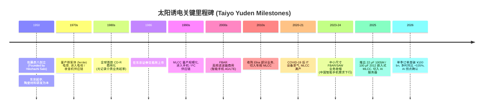
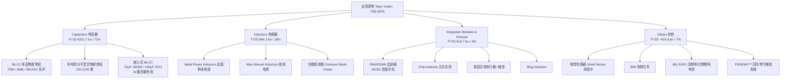
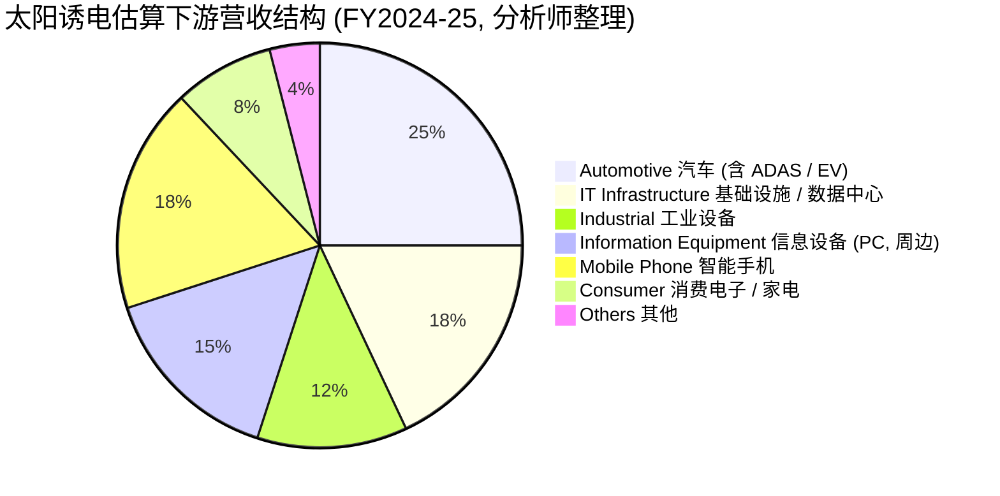
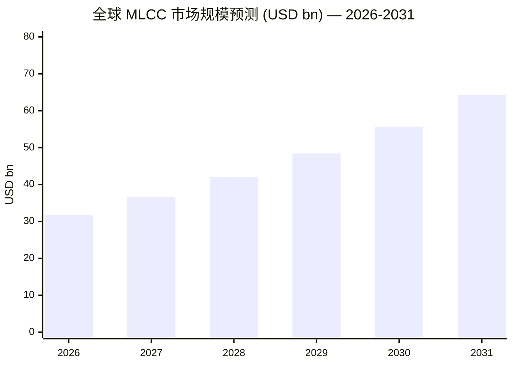
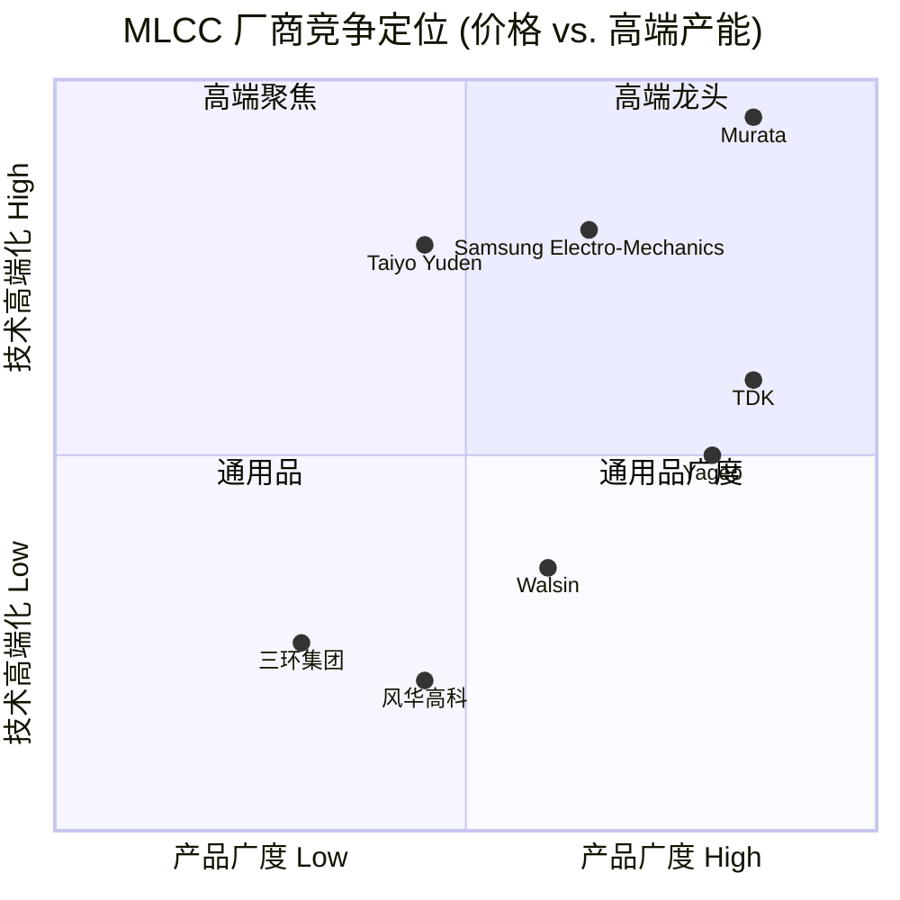
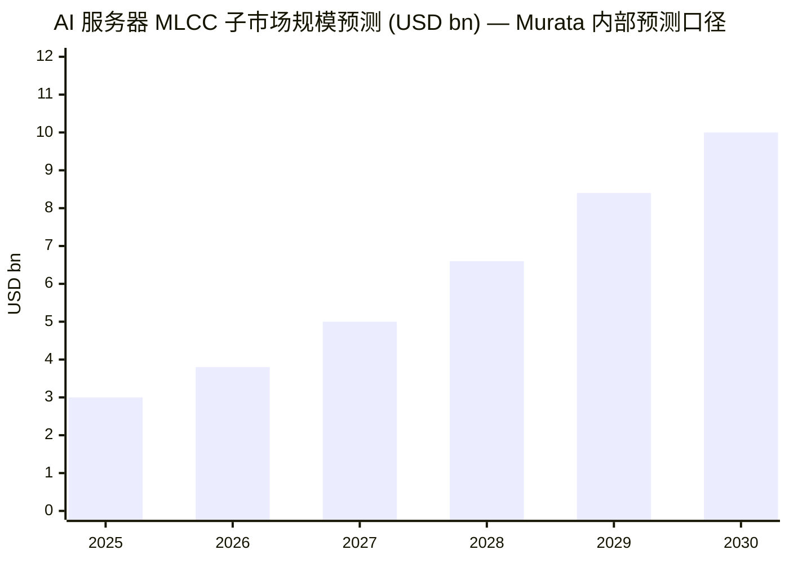

# 太阳诱电 (Taiyo Yuden, TSE:6976) 公司研究 — AI 服务器 MLCC / 嵌入式被动器件供应商

*报告日期 (As of)：2026-06-02 ｜ 主题归类 (Theme)：ai-passives-packaging｜分析师视角：被动元件 / 先进封装*

---

## 摘要 (Executive Summary)

太阳诱电株式会社 (Taiyo Yuden Co., Ltd.)，TSE Prime 市场代号 **6976**，是日本三大被动元件 (passive component) 制造商之一，专精多层陶瓷电容器 / MLCC (multilayer ceramic capacitor)、电感器 (inductor) 与高频器件 (FBAR / SAW)。在 AI 服务器 (data center / AI accelerator) 单板 MLCC 用量爆发的 2025–2026 周期中，公司业绩出现拐点：FY2025 (截止 2026 年 3 月) 全年净销售 ¥355.3 bn (+4.1% YoY)、营业利润 ¥19.9 bn (+91.2% YoY)、归母净利 ¥14.8 bn (同比 +535.9%，约 5.4×)；FY2026 1–3Q 累计营业利润已达 ¥16.5 bn (+96.6% YoY)，全年指引上调至营收 ¥384 bn / 营业利润 ¥30 bn ([太阳诱电 6976 FY2026 3Q 决算解读, 2026-04](https://marketrepo.tokyo/articles/d20260404_c6976_taiyo_yuden_mlcc_growth.php), [Taiyo Yuden FY2025 净利激增 5.4 倍 — BigGo Finance, 2026-05](https://finance.biggo.com/news/5hr2FJ4BX0tZvRTv1JbB))。

公司在全球 MLCC 市场份额约 **11–13%**，居 Murata (>40%)、Samsung Electro-Mechanics 之后位列第三，是日韩双寡头之外、唯一具有规模化高频 / 嵌入式 MLCC 量产能力的厂商 ([MLCC 顶级厂商综述 — Unibetter, 2026](https://en.unibetter-ic.com/top-multilayer-ceramic-capacitor-manufacturers/), [Murata / TDK / 太阳诱电 AI 服务器时代分析 — note.com/suu2, 2025](https://note.com/suu2/n/nf09f6402296f?hl=en-US))。

本报告以 website-first 方法编写，主要源自公司官方 IR 资料、决算说明会 PDF、产品页与第三方行业研究。

---

## 目录 (Table of Contents)

1. 公司概览 (Company Overview)
2. 公司历史 (Company History)
3. 管理团队 (Management)
4. 产品与服务 (Products & Services) — 核心章节
5. 客户与上市策略 (Customers & Go-to-Market)
6. 行业概览 (Industry Overview)
7. 竞争格局 (Competitive Landscape)
8. 市场机会 (Market Opportunity / TAM)
9. 风险评估 (Risk Assessment)
10. 投资视角评分卡 (Investor-Lens Scorecards)
11. 参考资料 (References)

---

## 1. 公司概览 (Company Overview)

**公司名称 / Name：** 太阳誘電株式会社 (Taiyo Yuden Co., Ltd.)
**证券代码 / Ticker：** TSE Prime 6976
**成立日期 / Founded：** 1950 年 3 月 23 日
**总部 / HQ：** 〒104-0031 东京都中央区京桥 2-7-19 京桥东大楼 (Kyobashi East Bldg., 2-7-19 Kyobashi, Chuo-ku, Tokyo)
**注册资本 / Capital：** ¥33,575 mn (截至 2026-03-31)
**员工人数 / Employees (consolidated)：** 20,604 人 (截至 2026-03-31)
**代表董事社长 CEO：** 佐瀬 克也 (Katsuya Sase)
**主营业务：** "Development, production and sales of electronic components"

以上公司基本信息来自官网 [Company Information — Taiyo Yuden](https://www.yuden.co.jp/en/company/information/)。

**业务定位 (Business positioning)：** 公司是日本传统三大被动元件 / passive component 厂商 (Murata 村田、TDK、Taiyo Yuden 太阳诱电) 中专业化程度最高的一家。其主营围绕 **MLCC + Inductor + RF Device (FBAR/SAW) + IMD (Integrated Modules & Devices)** 四大产品线展开，定位为 "支撑先进半导体功能的被动元件" ("It is passive components, like capacitors, that support the function of advanced semiconductors") ([社长寄语 — INTEGRATED REPORT 2024](https://www.yuden.co.jp/en/ir/2024ar/ceo/))。

**最新财务快照 (Latest financial snapshot)：** FY2025 (截止 2026-03-31) 合并净销售 ¥355.3 bn (+4.1% YoY)，营业利润 ¥19.9 bn (+91.2%)，归母净利 ¥14.8 bn (约去年的 5.4 倍，+535.9% YoY)。1–3Q FY2026 (2026-04 至 2026-12) 累计营收 ¥266.1 bn (+4.5% YoY)、营业利润 ¥16.5 bn (+96.6% YoY)；2026 年 1–3 月单季订单首次突破 ¥100 bn，达 ¥111.1 bn (B/B ratio 1.25，MLCC 段 B/B 1.31)，标志着 5 年来最强景气信号 ([Taiyo Yuden FY2025 业绩 — BigGo Finance, 2026-05](https://finance.biggo.com/news/5hr2FJ4BX0tZvRTv1JbB), [太阳诱电 6976 FY2026 3Q 决算 — marketrepo.tokyo, 2026-04](https://marketrepo.tokyo/articles/d20260404_c6976_taiyo_yuden_mlcc_growth.php))。

**估值快照 (Valuation snapshot)：** 截至 2026-06 初，公司股价区间 ¥8,952–¥14,815，市值约 ¥1.12–1.63 tn (取决于参考时点)；TTM P/E 约 27–34× (Stockopedia 27.21、GuruFocus 34.46)；美资券商在 FY2025 业绩后将目标价由 ¥4,900 大幅上调至 ¥7,100 (但分析师共识中值仍为 ¥4,422)，公司 FY2026 净利指引 ¥18 bn 低于共识 ¥24.3 bn — 短期估值消化超预期景气 ([Taiyo Yuden 估值情况 — BigGo Finance](https://finance.biggo.com/news/5hr2FJ4BX0tZvRTv1JbB), [Stockopedia 6976 PE](https://www.stockopedia.com/share-prices/taiyo-yuden-co-TYO:6976/), [Morningstar 6976 Quote](https://www.morningstar.com/stocks/xtks/6976/quote))。

*分析师观点：* 当前 27–34× TTM P/E 处于历史中高水位 — 周期性被动元件历史正常区间 12–18×；溢价来自 AI 服务器 MLCC 单机用量爆发 (28,000+ pcs/AI server vs 2,200 pcs/通用服务器) 与高电容 / 嵌入式 MLCC 的 ASP 定价权。但 2026 财年净利指引低于 sell-side 共识 25%，意味着 "AI MLCC = 下一个 HBM" 叙事仍需季度数据持续证伪 ([Taiyo Yuden FY2026 指引 — BigGo Finance](https://finance.biggo.com/news/5hr2FJ4BX0tZvRTv1JbB))。

---

## 2. 公司历史 (Company History)

太阳诱电 1950 年 3 月由佐藤彦八 (Hikohachi Sato) 在东京创立，最初聚焦于 "材料起步、产品收口" 的纵向一体化战略 — "we firmly believe in creating products starting from the development of materials" ([Corporate Message — Taiyo Yuden](https://www.yuden.co.jp/en/company/))。这一信念塑造了公司核心壁垒：陶瓷介质 (dielectric ceramic) 配方、内电极浆料 (internal electrode paste)、烧结 (sintering) 工艺等基础材料均自研自制，区别于多数外购浆料的中小型 MLCC 厂商。

公司 1986 年在东京证券交易所上市；早期增长动能来自彩色电视 / 收音机用陶瓷电容、CD-R 光记录介质 (一度为全球出货量最大厂商)，1990 年代切入 MLCC 大量量产，2000 年代借智能手机 4G 浪潮发展出 FBAR / SAW (Film Bulk Acoustic Resonator / Surface Acoustic Wave) 高频滤波器业务。2024 年前后，受中国 OEM (Xiaomi / Oppo / Vivo) 智能手机出货下行影响，IMD (Integrated Modules & Devices) 段 (含通信 FBAR / SAW) 出现结构性收缩 (FY2025 IMD 收入 ¥14.7 bn，同比 –35.6%)，公司主动将该段产品系列分批 NRND (Not Recommended for New Design)、EOL (End of Life)，并将产能 / 研发资源转向 AI 服务器 / 数据中心 (data center) 用嵌入式高电容 MLCC ([Taiyo Yuden FY2025 业绩 — BigGo Finance](https://finance.biggo.com/news/5hr2FJ4BX0tZvRTv1JbB), [Taiyo Yuden FBAR/SAW EOL 通告 — Future Electronics, 2024-02](https://www.futureelectronics.com/p/passives--filters--saw-filter/f6hg2g441eg66-j-taiyo-yuden-C179634167))。

公司近三年的关键战略转折是 **2024 年中期经营计划 2025 (Medium-term Management Plan 2025, FY2021–FY2025) 的执行收尾期 + 新一轮以 AI 为中心的资本投入**：2024 财年 IPO 配套发行 ¥50 bn 可转债 (CB)，将募集资金用于 MLCC 产能扩张约 10–15%；中期目标是将汽车 + IT 基础设施 / 工业设备销售占比由当时的 48% 提升至 50% ([社长寄语 — INTEGRATED REPORT 2024](https://www.yuden.co.jp/en/ir/2024ar/ceo/))。该资本布局恰好赶在 2025–26 年 AI 服务器 MLCC 用量爆发周期的前夜，是公司业绩从 ¥2.8 bn (FY2024 归母净利) 跳升至 ¥14.8 bn (FY2025) 的核心运营基础。

---

## 3. 管理团队 (Management)

按 company-research skill 规范，仅覆盖创始人与现任 CEO 两人。

### 3.1 创始人 — 佐藤 彦八 (Hikohachi Sato)

佐藤彦八于 1950 年 3 月 23 日在东京创立太阳诱电，定位 "材料起步" 的电子元件制造商。公司官网与官方公司沿革文档未公开详细个人履历 (founder's bio not published on the public Corporate Information page) ([Company Information — Taiyo Yuden](https://www.yuden.co.jp/en/company/information/))。创业初期以陶瓷介质材料的研发为基础，奠定了公司日后在 MLCC 介电粉体、内电极、烧结工艺等核心环节均自研的纵向一体化基因 — 这一基因延续至今，是公司在材料级别仍能与 Murata、Samsung Electro-Mechanics 同台竞争的根本原因 ([Corporate Message — Taiyo Yuden](https://www.yuden.co.jp/en/company/))。

由于公司创立已逾 75 年，创始人本人早已不在经营一线；现行的研究价值主要在于其确立的 "材料 → 元件" 一体化路径，已固化为公司战略 DNA。

### 3.2 现任社长 / CEO — 佐瀬 克也 (Katsuya Sase)

佐瀬克也任 Representative Director, President and CEO (代表取締役 社長執行役員 CEO)，官网公司信息页确认其当前职务 ([Company Information — Taiyo Yuden](https://www.yuden.co.jp/en/company/information/))。公司公开网页未提供详细前任履历、教育背景或持股比例 — 详细高管简历通常需查阅日本金融厅 EDINET 系统的 "有価証券報告書" (Yuho) "役員の状況" 章节，本报告暂以官网公开信息为准。

在 INTEGRATED REPORT 2024 的 "Message from the President" 中，佐瀬克也明确提出中期方向：以中期经营计划 2025 (Medium-term Management Plan 2025) 收尾期为时点，将经济价值与社会价值结合 ("creating both, an economic value and a social value")；FY2024 财年指引为净销售 +8.5% YoY 至 ¥350 bn、营业利润 +120% YoY 至 ¥20 bn (后者实际 FY2025 完成度高 — ¥19.9 bn vs. 目标 ¥20 bn)；公司投资约 10–15% 的 MLCC 增产，并通过 ¥50 bn 可转债融资 ([社长寄语 — INTEGRATED REPORT 2024](https://www.yuden.co.jp/en/ir/2024ar/ceo/))。

*分析师观点：* 佐瀬体制下的资本配置纪律值得肯定 — 在 IMD (FBAR/SAW) 业务结构性下行的同时坚定加注 MLCC 高电容产品，并通过 CB 而非股权增发完成融资 (在 PE 处于历史低位时此举更经济)。FY2025 业绩兑现 (营业利润 ¥19.9 bn / 目标 ¥20 bn) 表明其指引可信度较高 — 这点在 FY2026 净利指引低于卖方共识时给了市场一份 "管理层不画饼" 的隐性背书。

---

## 4. 产品与服务 (Products & Services) — 核心章节

太阳诱电的产品按官方 IR 财务报表分四个业务段：**Capacitors (电容器，含 MLCC)、Inductors (电感器)、Integrated Modules & Devices (整合模组与器件，含 FBAR/SAW)、Others (其他)** ([Summary — Taiyo Yuden IR](https://www.yuden.co.jp/en/ir/financial/summary.html))。其中 MLCC 是绝对核心 — FY2025 Capacitors 段 ¥251.7 bn，占总营收 71%；2026 财年 (FY2026) 上半财季 (1–3Q) 累计该比重进一步上升。

数据来源：公司财务段划分按 [Summary — Taiyo Yuden IR](https://www.yuden.co.jp/en/ir/financial/summary.html)；产品系列与定位按 [Product Information — Taiyo Yuden](https://www.yuden.co.jp/en/product/)；FY2025 段销售按 [Taiyo Yuden FY2025 业绩 — BigGo Finance](https://finance.biggo.com/news/5hr2FJ4BX0tZvRTv1JbB)。

### 4.1 Capacitors 电容器段 (FY25 ¥251.7 bn，+8.5% YoY，占 71%)

电容器段是公司基本盘，几乎全部为 MLCC，外加少量导电高分子混合铝电解电容 (conductive polymer hybrid aluminum electrolytic capacitor) 用于工业与车规。

**MLCC 主力产品系列：**
- **TMK 系列** — 通用型 MLCC，覆盖 X5R / X7R / X7T 等 Class II 介质温度等级；典型尺寸 1206、0805、0603、0402，最低至 008004 (0.25 × 0.125 mm) 量产；典型型号 TMK316AB7106KLHT 为 10 μF / 25 V / X7R / 1206 ([TME 经销 TMK316 产品页](https://www.tme.com/us/en-us/details/tmk316ab7106klht/mlcc-smd-capacitors/taiyo-yuden/))。
- **AMK / MCASU 系列** — 车规级与高可靠性等级。
- **嵌入式 MLCC (Embeddable MLCC, EMC)** — 2025 年公司发布行业首批量产产品：
  - **1005M 尺寸 (1.0 × 0.5 mm)、22 μF / 4 V (X6S) 或 22 μF / 2.5 V (X7T)** — 用于 AI 服务器 / 数据中心 IC 电源去耦 ([Taiyo Yuden 22μF 0402 AI 服务器 MLCC — passive-components.eu, 2025](https://passive-components.eu/taiyo-yuden-releases-22uf-mlcc-in-0402-size-for-ai-servers/))。
  - **2012 尺寸 (2.0 × 1.25 mm)、100 μF** — 2025-12-02 发布，2025-11 在群马县玉村工厂启动量产，样品单价 ¥120/pc，是 "AI 服务器电源稳定" 的关键器件，将先前同尺寸最大容值放大约 4.5× ([Taiyo Yuden 100μF 2012 嵌入式 MLCC 商用化 — 公司新闻](https://www.yuden.co.jp/en/news/category/taiyo_yuden_commercializes_2012_size_embeddable_multilayer_ceramic_capacitor_with_100_f_capacitance_.html))。

**中文释义 / Plain-language gloss：** MLCC 的核心物理作用是 "去耦" (decoupling) — 在芯片瞬时电流变化 (例如 GPU 推理时 INT8 矩阵乘运算切换) 时维持局部电源电压稳定。AI 服务器一颗 NVIDIA Hopper / Blackwell GPU 加 HBM 堆栈周边需要 **远多于** 通用 CPU 服务器的去耦电容 — 行业数据：一台典型 AI 服务器约用 28,000 颗 MLCC，对比通用服务器约 2,200 颗 (10–13× 倍率)；高端 NVIDIA GB300 系统单台用量可达 ~30,000 颗 ([太阳诱电 6976 FY2026 3Q 决算 — marketrepo.tokyo, 2026-04](https://marketrepo.tokyo/articles/d20260404_c6976_taiyo_yuden_mlcc_growth.php), [MLCC 顶级厂商综述 — Unibetter, 2026](https://en.unibetter-ic.com/top-multilayer-ceramic-capacitor-manufacturers/))；某些综合统计将单台 AI server MLCC 总用量提升至 ~440,000 颗 (含 PCB 母板 + 加速卡 + 电源板模块) ([AI 服务器 MLCC 趋势 — TradingKey, 2026](https://www.tradingkey.com/analysis/stocks/us-stocks/261849833-mlcc-hbm-ai-vsh-tradingkey))。

**嵌入式 MLCC 的差异化逻辑：** 传统贴片 MLCC 装在 PCB 表面，距离 IC 焊球数毫米，存在 ESL / ESR (寄生电感 / 等效串联电阻) 引起的瞬态响应延迟。嵌入式 MLCC 直接埋入 IC 载板 / interposer 基板内层，与 IC 焊球距离缩短至亚毫米级，ESL 可降低一个数量级 — 这对 AI 加速器在 1 GHz+ 切换频率下的电源完整性至关重要。太阳诱电之所以能在嵌入式 MLCC 与高电容 (≥100 μF) 同尺寸 MLCC 上领先，根源是材料端的钛酸钡 (BaTiO₃) 高介电常数粉体与 nickel 内电极薄层化 (<1 μm 厚) 工艺积累，这是 Murata 之外其他厂商难以短期复制的。

*分析师观点：* 电容器段在 AI 周期内的核心 ASP 驱动来自 — (1) 嵌入式 MLCC 单价约为常规高端 MLCC 的 5–10×；(2) 高电容尺寸缩微 (22 μF / 0402、100 μF / 2012) 突破物理极限，定价权强；(3) 2026-05 公司主动对低中端消费 / 车规 MLCC 提价 6–13% (Murata 同期对 AI 服务器 / 高端车规 MLCC 提价 15–35%，TDK 跟进) ([太阳诱电 / Murata / TDK 价格调整 — 半导体电子, 2026](https://www.semicone.com/article-456.html))。Capacitors 段 8.5% 的销售 YoY 看似温和，实际反映了 "产品组合升级 ASP 上行 + 单位出货量更克制" 的策略选择，与 Murata "大干快上+扩产能" 路线明显不同 ([Murata / TDK / 太阳诱电 AI 服务器时代分析 — note.com/suu2, 2025](https://note.com/suu2/n/nf09f6402296f?hl=en-US))。

### 4.2 Inductors 电感器段 (FY25 ¥64.3 bn，+4.5% YoY，占 18%)

电感器是公司第二大业务段。官方产品页将其定位为 "Contributing to achieve even lower power consumption of high-performance and multi-functional smartphones and such small and low-profile digital devices" ([Product Information — Inductors, Taiyo Yuden](https://www.yuden.co.jp/en/product/))。

**主要产品族：**
- **金属粉末电感 (Metal Power Inductors)** — 用于 DC/DC 转换器 (DCDC converter) 的电源调节，最常见于智能手机 / PC 主板电源；公司提供专用选型工具。
- **绕线电感 (Wire-Wound Inductors)** — 高电感值、低 DCR (DC 电阻)。
- **共模扼流圈 (Common Mode Choke Coils)** — 抗 EMI 用。

**中文释义 / Plain-language gloss：** 电感 (Inductor) 与电容是开关电源中互补的两类无源元件 — 电容存储电场能、电感存储磁场能。AI 服务器的 GPU 电源转换链路 (典型 12 V → 0.9 V Vcore，电流可达数百安培) 对电感的饱和电流 (saturation current)、品质因数 (Q factor) 都有比通用服务器更严苛的要求。Murata 2026 年新开工的群马陶米 (Tome, Japan) 工厂 — 投资 ¥9.7 bn、专门生产 chip inductor、2027-12 完工 — 印证了 AI 服务器电感的市场扩张 ([Murata 群马 chip inductor 工厂破土动工 — note.com/suu2, 2025](https://note.com/suu2/n/nf09f6402296f?hl=en-US))。

*分析师观点：* 电感器段 FY25 4.5% 增长低于电容器段 8.5%，反映公司在该段产能扩张较 Murata 保守。这是合理的选择 — Murata 电感市场份额更高、产品线更宽，公司在该段坚持 "高端 / 利基" 定位 (车规 + 通信基础设施 + AI 服务器) 而非全面铺开。

### 4.3 Integrated Modules & Devices (IMD) 段 (FY25 ¥14.7 bn，–35.6% YoY，占 4%)

IMD 段是公司近 3 年最大的结构性下行点。该段历史核心是 **FBAR / SAW 滤波器** — 用于 4G/5G 智能手机射频前端。受 2023–24 中国 OEM (Xiaomi / Oppo / Vivo) 智能手机出货下行 + 客户去库存影响，FY2025 该段 YoY –35.6%；公司 2024 年初对老一代 FBAR / SAW 部品发出 NRND (Not Recommended for New Design) → EOL (End of Life) 通告，Last Time Buy (LTB) 于 2025-03-31 截止 ([Taiyo Yuden FBAR/SAW 部品 EOL 通告 — Future Electronics](https://www.futureelectronics.com/p/passives--filters--saw-filter/f6hg2g441eg66-j-taiyo-yuden-C179634167))。

**保留下来的 IMD 产品族：**
- **新一代 FBAR/SAW** — 重点服务车规通信 (V2X)、Wi-Fi 7、企业级基站。
- **Chip Antenna 芯片天线** — IoT 模组用。
- **多层压电执行器 (Multilayer Piezoelectric Actuators)** — 公司官方描述 "Provide delicate and high-quality tactile sensations based on piezoelectric element technologies"，应用于车载 HMI 触觉反馈、可穿戴设备 ([Product Information — Piezoelectric, Taiyo Yuden](https://www.yuden.co.jp/en/product/))。
- **Ring Varistors** — 电涌保护。

*分析师观点：* 公司管理层把 IMD 业务定性为 "结构性收缩 + 选择性保留"，资源转向 MLCC。这是过去 5 年最重要的战略选择 — 如果 FY2024 没有这次收缩，AI 周期到来时公司也很难腾出 MLCC 产能 / 研发预算扩张。但 IMD 段 ¥14.7 bn 仅占总营收 4%，已不构成业绩主要变量。

### 4.4 Others 其他段 (FY25 ~¥24.8 bn，–6% YoY，占 7%)

包含一系列研发期 / 利基产品：
- **嗅觉传感器 (Smell Sensor)** — 官方表述 "Technology for visualizing smells is under development" ([Product Information — Taiyo Yuden](https://www.yuden.co.jp/en/product/))。
- **EMI 抑制元件 (EMI Suppression Components)** — 抗辐射干扰被动元件。
- **MS-SOFC (Metal Supported Solid Oxide Fuel Cells)** — 金属支撑固体氧化物燃料电池，可能切入分布式能源 / 数据中心备用电源。
- **FEREMO™ (Regenerative Electric Assist System)** — 自行车 / 轻型电动车回生制动辅助系统。

*分析师观点：* Others 段大多处于研发或小规模量产阶段，财务贡献有限，但可视为公司 "非 MLCC 第二曲线" 的探索预算 — MS-SOFC 与 EMI 元件在数据中心电源 + 电磁兼容方向上有想象空间。

### 4.5 产品体系综述 — "材料 → 元件 → 模组" 的内在循环

太阳诱电的四大业务段并非独立产品线，而是 "材料 → 元件 → 模组" 的纵向集成：陶瓷介质粉体、内电极浆料、烧结工艺等材料端能力是 MLCC、Inductor 共用的基础；MLCC 与 Inductor 又可进一步组合为模组 (例如 RF 模组、电源模组)。这条材料 → 元件 → 模组的循环是公司相对台系 / 中系 MLCC 厂商 (Yageo、Walsin、风华高科、三环) 的根本壁垒 — 后者多为外购粉体的 "套料厂" 模式。

在 AI 服务器周期中，材料 → 元件能力直接转化为：(1) 高电容尺寸缩微的工艺难度；(2) 嵌入式 MLCC 的可靠性 / 良率；(3) 高频 / 低损耗 Class I MLCC (用于 5G 基站) 的设计自由度。这三点共同支撑了公司在 AI 周期中能够 "选择性扩产 + 提价" 而非 "被动跟随" 的能力。

---

## 5. 客户与上市策略 (Customers & Go-to-Market)

### 5.1 客户结构与下游应用

太阳诱电的客户从未在官方年报中按 ≥10% 占比列出 (日本 Yuho "有価証券報告書 主要な販売先" 规则下，未达 10% 的客户不需名义列示) — 这一信息缺失本身是一项重要披露事实，公司客户高度分散。**(注：本节中所有客户/下游应用估算均基于行业终端市场数据，不属公司直接披露数据。)**

按行业惯例与公司在历次 IR 资料中的下游 (end-market) 分类，营收大致拆分为：

数据来源：公司 INTEGRATED REPORT 2024 提及 "汽车 + IT 基础设施 / 工业设备" 占比目标 50% (FY2025) ([社长寄语 — INTEGRATED REPORT 2024](https://www.yuden.co.jp/en/ir/2024ar/ceo/))；FY2025 下游趋势按 FY2026 3Q 决算解读 [marketrepo.tokyo, 2026-04](https://marketrepo.tokyo/articles/d20260404_c6976_taiyo_yuden_mlcc_growth.php) 推算 — 此分布为分析师按公司公开战略叙事推断，非来自单一披露表。

**主要客户类型 (按 Tier-1 渠道 + 终端厂商口径)：**

- **AI 服务器 / 数据中心 GPU 客户 (Tier-1)：** NVIDIA (NASDAQ:NVDA) Hopper / Blackwell / GB200 / GB300 系列加速卡、AMD (NASDAQ:AMD) MI300/MI325/MI355 系列、Google TPU、Amazon Trainium。这些客户的 PCB 设计 / 元件选用通常由 ODM (Hon Hai 鸿海 2317、Quanta 广达 2382、Wistron 纬创 3231) 与板级 OEM (Super Micro NASDAQ:SMCI) 在 BOM 层落实，太阳诱电以 "AVL (Approved Vendor List) 上的 MLCC 厂商" 身份切入。
- **汽车 / EV 客户：** Toyota (TSE:7203)、Honda (TSE:7267)、BYD (HKEX:1211)、Tesla (NASDAQ:TSLA)、传统 Tier-1 (Denso TSE:6902、Aptiv NYSE:APTV、Bosch 非上市) 间接采购。
- **智能手机 / IoT 客户：** Apple (NASDAQ:AAPL，iPhone 系列)、Samsung (KRX:005930)、Xiaomi (HKEX:1810)、Oppo / Vivo (非上市)。
- **基础设施 / 通信客户：** Ericsson (NASDAQ:ERIC)、Nokia (NYSE:NOK)、华为 (非上市)、中兴 (SZSE:000063)。

**EV (electric vehicle) 单车 MLCC 用量** 约为 10,000 颗，远高于传统燃油车 1,000–2,000 颗 — 主因是 ADAS / 自动驾驶 (advanced driver-assistance systems) 域控制器 + 高压电池管理 + 多电机控制集成提升被动元件密度 ([太阳诱电 6976 FY2026 3Q 决算 — marketrepo.tokyo, 2026-04](https://marketrepo.tokyo/articles/d20260404_c6976_taiyo_yuden_mlcc_growth.php))。

### 5.2 客户集中度披露

太阳诱电在公开 IR 中**未披露** ≥10% 单一客户名称或具体占比 — Japanese Yuho 规则在销售对象 < 净销售 10% 时可不指名披露。本报告**不会**虚构具体客户百分比。可观察的客观事实：

- 公司客户高度分散，按下游分布 (Automotive ~25% + IT Infrastructure / 数据中心 ~18% + Industrial ~12% + 智能手机 ~18%) 可推断没有单一客户 / 单一下游 > 30%。
- 主要分销渠道：DigiKey、Mouser、Future Electronics、Arrow、TTI 等全球元件分销商 ([DigiKey Taiyo Yuden 分销页](https://www.digikey.jp/ja/supplier-centers/taiyo-yuden), [TTI Taiyo Yuden SAW/FBAR](https://www.tti.com/content/ttiinc/en/manufacturers/taiyo-yuden/products/saw-and-fbar-filters.html))。

*分析师观点：* MLCC 行业本质是 "高频次小批量、长尾客户" 模型 — Murata 客户数以万计，太阳诱电应当类似。在 AI 服务器需求爆发期，由于 NVIDIA / AMD / 大型 hyperscaler 加速卡设计通过 ODM 进入 BOM，间接需求集中度可能上升，但直接客户层面仍较分散。**该段的客户披露真空** (没有 10% 单一客户) 不应被解读为 "数据缺失"，而应解读为 "客户分散为公司客观状态"。

### 5.3 上市与资本运作

公司 1986 年在东京证券交易所上市，目前归属 **TSE Prime Market** (东证主板)。2024 年发行 ¥50 bn 可转换公司债 (Convertible Bond, CB)，募集资金用于 MLCC 产能扩张 ([社长寄语 — INTEGRATED REPORT 2024](https://www.yuden.co.jp/en/ir/2024ar/ceo/))。股息政策保持 ¥90/股年度水平。

---

## 6. 行业概览 (Industry Overview)

### 6.1 全球 MLCC 市场规模与增速

- **2026 年市场规模：** ~$31.8 bn (USD)
- **2031 年预计规模：** ~$64.2 bn
- **CAGR (2026–2031)：** ~15%
- **AI 服务器驱动的 MLCC 需求 (Murata 预测)：** 2030 年 vs 2025 年 + 3.3×

数据来源：[太阳诱电 6976 FY2026 3Q 决算 — marketrepo.tokyo, 2026-04](https://marketrepo.tokyo/articles/d20260404_c6976_taiyo_yuden_mlcc_growth.php)；[MLCC 市场分析 — note.com/suu2, 2025](https://note.com/suu2/n/nf09f6402296f?hl=en-US)。

### 6.2 关键需求驱动

1. **AI 服务器单机 MLCC 用量爆发：** AI 服务器 ~28,000 颗 vs. 通用服务器 ~2,200 颗 (10–13× 倍率)；NVIDIA GB300 单台需 ~30,000 颗 ([MLCC 顶级厂商综述 — Unibetter, 2026](https://en.unibetter-ic.com/top-multilayer-ceramic-capacitor-manufacturers/))。AI 服务器全球出货预计未来 3–5 年 28% CAGR ([太阳诱电 6976 FY2026 3Q 决算 — marketrepo.tokyo](https://marketrepo.tokyo/articles/d20260404_c6976_taiyo_yuden_mlcc_growth.php))。
2. **EV / ADAS 单车被动元件用量提升：** EV ~10,000 颗 vs. 燃油车 1,000–2,000 颗。
3. **5G 基础设施周期回升：** Ericsson / Nokia / 华为基站设备 + 卫星互联网 (Starlink, Eutelsat) 拉动高频低损耗 Class I MLCC。
4. **结构性供给紧缩：** Murata 部分高端产品交期由 8 周延长至 24 周；Murata、Samsung Electro-Mechanics、太阳诱电同步进入提价周期 (2026-04~05 涨幅 6–35% 不等) ([太阳诱电 / Murata / TDK 价格调整 — Semicone, 2026](https://www.semicone.com/article-456.html))。

### 6.3 行业结构

全球 MLCC 三大寡头 — Murata、Samsung Electro-Mechanics、太阳诱电 — 合计 > 60% 市占；TDK、Yageo (TWSE:2327)、Walsin (TWSE:2492)、风华高科 (SZSE:000636)、三环集团 (SZSE:300408) 构成第二梯队。日韩厂商垄断高端 / 高电容 / 嵌入式 MLCC；台系 / 中系厂商占据中低端 / 通用品市场 ([MLCC 顶级厂商综述 — Unibetter, 2026](https://en.unibetter-ic.com/top-multilayer-ceramic-capacitor-manufacturers/))。

---

## 7. 竞争格局 (Competitive Landscape)

### 7.1 主要竞争对手

| 厂商 (Company) | 代码 (Ticker) | 国家 | 全球 MLCC 份额 | 战略定位 |
|---|---|---|---|---|
| Murata Manufacturing 村田制作所 | TSE:6981 | 日本 | > 40% | "全栈玩家"：MLCC / 硅电容 / 功率模组 / 嵌入式基板 |
| Samsung Electro-Mechanics 三星电机 | KRX:009150 | 韩国 | ~20% (估算) | 第二大；强在高电容 / 车规 / 移动 |
| **太阳诱电 Taiyo Yuden** | **TSE:6976** | **日本** | **11–13%** | **专精高电容 / 嵌入式 / 高频 Class I** |
| TDK | TSE:6762 | 日本 | ~5–8% | 多轨道：MLCC + HDD 悬臂 + AI 数据中心电池 |
| Yageo 国巨 | TWSE:2327 | 台湾 | ~10–13% | 通过 KEMET / Pulse 并购扩张至高端 |
| Walsin Technology 华新科 | TWSE:2492 | 台湾 | ~5% | 通用品 + 中端车规 |
| 风华高科 | SZSE:000636 | 中国 | ~3% | 通用品 |
| 三环集团 | SZSE:300408 | 中国 | ~2% | 通用品 + MLCC 上游粉体 |

数据来源：[MLCC 顶级厂商综述 — Unibetter, 2026](https://en.unibetter-ic.com/top-multilayer-ceramic-capacitor-manufacturers/)；[AI 服务器 MLCC 趋势 — TradingKey, 2026](https://www.tradingkey.com/analysis/stocks/us-stocks/261849833-mlcc-hbm-ai-vsh-tradingkey)；[Murata / TDK / 太阳诱电 AI 服务器时代分析 — note.com/suu2, 2025](https://note.com/suu2/n/nf09f6402296f?hl=en-US)。台系 / 中系数据为分析师按行业惯例估算，非来自单一权威披露。

### 7.2 竞争定位 (2x2 矩阵)

### 7.3 太阳诱电的差异化护城河

- **材料 → 元件纵向集成：** 公司是少数仍在大规模自研 BaTiO₃ 介电粉体与 Ni 内电极薄层化的厂商之一。台系 / 中系厂商多为外购粉体，技术天花板受限于上游 (Sakai 化学、Nippon Chemical Industrial 等粉体厂商)。
- **超小尺寸 + 超高电容的工艺极限：** 22 μF / 0402、100 μF / 2012 是公司首发于行业的产品 — 表面看是产品规格，本质是公司在烧结工艺、内电极厚度均匀性、缺陷密度控制上的工艺纵深 ([Taiyo Yuden 22μF 0402 商用化 — passive-components.eu, 2025](https://passive-components.eu/taiyo-yuden-releases-22uf-mlcc-in-0402-size-for-ai-servers/), [Taiyo Yuden 100μF 2012 嵌入式 MLCC — 公司新闻](https://www.yuden.co.jp/en/news/category/taiyo_yuden_commercializes_2012_size_embeddable_multilayer_ceramic_capacitor_with_100_f_capacitance_.html))。
- **嵌入式 MLCC (Embedded Component) — AI 加速器板内层关键技术：** 太阳诱电是少数将 EMC (Embeddable MLCC) 与 IC 载板厂 (Ibiden TSE:4062、Shinko Electric Industries 已私有化、Unimicron TWSE:3037、Kinsus TWSE:3189) 上下游打通的元件厂商，与 Murata 形成双寡头格局。
- **资本配置纪律：** 在 IMD (FBAR/SAW) 业务结构性下行的同时坚定加注 MLCC，通过 CB 而非股权增发完成融资 — FY2025 业绩兑现表明该路径有效。

### 7.4 竞争劣势

- **产品广度不及 Murata / TDK：** Murata 拥有 MLCC + 硅电容 + 功率模组 + RF 滤波器 + 嵌入式基板等全栈产品组合；TDK 进入磁性 / 锂电 / 传感器多元化。太阳诱电产品广度更窄，对 MLCC 单一产品依赖度高。
- **客户尚未完全摆脱中国智能手机周期：** 智能手机端仍占下游 ~18%，受中国 OEM 周期影响明显。
- **市占率第三，议价权弱于 Murata：** AI 服务器 MLCC 涨价幅度 6–13%，明显低于 Murata 的 15–35% — 反映在头部客户面前定价权较 Murata 弱一档 ([太阳诱电 / Murata / TDK 价格调整 — Semicone, 2026](https://www.semicone.com/article-456.html))。

---

## 8. 市场机会 (Market Opportunity / TAM)

### 8.1 TAM 拆解

- **全球 MLCC 市场 (TAM)：** 2026 $31.8 bn → 2031 $64.2 bn，CAGR ~15%。
- **AI 服务器 MLCC 子市场 (SAM)：** Murata 内部预测 2030 vs 2025 + 3.3×；按 AI 服务器全球出货 28% CAGR + 单机 MLCC 用量 ~28,000 颗 + 平均 ASP 提升 (嵌入式 / 高电容溢价 5–10×) 推算，2026–2030 年 AI 服务器 MLCC 子市场规模可能由 ~$3 bn 跃升至 ~$10 bn。
- **EV MLCC 子市场：** 全球 EV 渗透率提升 + 单车被动元件用量 5–10× — 该子市场到 2030 年规模可能 ~$10–15 bn。
- **太阳诱电潜在份额 (SOM)：** 假设公司在 AI 服务器嵌入式 / 高电容 MLCC 高端品类维持 ~15–20% 份额 (高于其在通用 MLCC 11–13% 整体份额，因其在高端品类相对领先)，对应 2030 年 AI 服务器子市场可获取销售约 $1.5–2 bn (约 ¥225–300 bn)，相对其当前总营收 ¥384 bn 是约 60–80% 的增量。

数据来源：以 Murata 公开 "2030 vs 2025 + 3.3×" 估算为基础，配合 AI 服务器出货 28% CAGR 与 ASP 上行作分析师线性插值 ([太阳诱电 6976 FY2026 3Q 决算 — marketrepo.tokyo, 2026-04](https://marketrepo.tokyo/articles/d20260404_c6976_taiyo_yuden_mlcc_growth.php), [Murata / TDK / 太阳诱电 AI 服务器分析 — note.com/suu2, 2025](https://note.com/suu2/n/nf09f6402296f?hl=en-US))。

### 8.2 公司在 TAM 中的杠杆点

- **嵌入式 MLCC (EMC) 量产领先：** 公司是行业首批量产 22 μF 1005M、100 μF 2012 嵌入式 MLCC 的厂商，对应 AI 加速器 / GPU 板内层去耦的高溢价市场。该品类 ASP 是常规高端 MLCC 的 5–10×。
- **高电容尺寸缩微的工艺壁垒：** 22 μF / 0402、100 μF / 2012 突破物理极限，定价权强 — 公司也是行业内极少数能将这类产品稳定量产、并通过车规 / 数据中心 OEM 可靠性认证的厂商。
- **车规 + IT 基础设施销售占比向 50% 提升：** 公司中期计划 (Medium-term Management Plan 2025) 将 Auto + IT Infra / Industrial 占比由 48% 提升至 50%，目前已基本完成。

### 8.3 兑现 TAM 的限制条件

- 公司产能扩张较 Murata 保守 — FY2024 ¥50 bn CB 募资仅支撑 MLCC 产能 +10–15%；Murata 同期扩产更激进，可能导致中期份额被 Murata 进一步吞并。
- AI 服务器需求节奏强烈依赖 NVIDIA / AMD 加速卡出货 — 任何 GPU 产品周期延后 / 客户去库存均将传导至 MLCC 段。
- 价格上行难以持续 — 一旦 Murata / Samsung 大规模扩产兑现 (2027–28 年)，行业可能再度进入供过于求周期，公司定价权将快速消失。

---

## 9. 风险评估 (Risk Assessment)

按 8–12 风险跨 4 桶 (公司 / 行业 / 财务 / 宏观) 框架。

### 9.1 公司层 (Company-specific)

1. **MLCC 单一产品依赖度高** — Capacitors 段占总营收 71%，IMD 段已结构性收缩，业务集中度高。任何 MLCC 行业逆周期或主要客户 (NVIDIA、AMD、Apple) 设计变更均会直接影响营收。**缓解：** 公司在 MLCC 内部按品类 (通用 / 车规 / 嵌入式 / 高电容) 分散；下游应用涵盖 AI、汽车、智能手机、工业，单一下游集中度 < 30%。

2. **产能扩张节奏保守可能错失市场份额** — FY2024 ¥50 bn CB 仅支撑 MLCC 产能 +10–15%，Murata 同期 ¥9.7 bn 群马 chip inductor 新厂 + Tome 工厂扩产更激进。中期可能被竞争对手吞并份额。**缓解：** 公司聚焦高端 / 高电容 / 嵌入式品类，定价权高于通用品。

3. **IMD (FBAR/SAW) 业务的最后阶段** — 该段 FY25 YoY –35.6%，仍在收缩。如果新一代 5G/Wi-Fi 7/V2X 滤波器需求兑现不及预期，残值可能进一步减损。**缓解：** 该段已占总营收 4%，业绩贡献边际化；公司明确将之定位为 "选择性保留" 而非战略重心。

4. **关键技术外溢风险** — 公司核心壁垒在材料 (BaTiO₃ 粉体、Ni 内电极) 与工艺 (烧结、薄层化)；如果上游粉体供应商 (Sakai 化学等) 将类似技术输出给台系 / 中系厂商，差异化将被侵蚀。**缓解：** 部分关键粉体自研，工艺 know-how 难以快速复制。

### 9.2 行业 / 市场层 (Industry / Market)

5. **AI 服务器需求节奏与 GPU 周期共振风险** — 单一下游驱动 (NVIDIA Hopper → Blackwell → 下一代) 周期切换时段 MLCC 需求会出现明显波动。**缓解：** AI 整体需求趋势确定，但短期 1–2 季度波动难免。

6. **2027–28 年供需失衡风险** — 当 Murata / Samsung Electro-Mechanics 大规模扩产兑现 (2027 H2 起)，行业可能再度进入供过于求，MLCC ASP 回落，公司定价权快速消失。**缓解：** 高电容 / 嵌入式 MLCC 品类工艺难度高，新增产能爬坡需 18–24 个月，短期内供需平衡较稳。

7. **台系 / 中系厂商高端化突破** — Yageo 通过收购 KEMET / Pulse 加速进入高端，未来可能挑战日韩双寡头格局。**缓解：** 高端 MLCC 工艺壁垒高，Yageo 在 100 μF / 0402 等极限品类尚无量产记录。

### 9.3 财务层 (Financial)

8. **CB 转股稀释风险** — FY2024 发行 ¥50 bn 可转换公司债，未来若转股触发，将稀释 EPS。**缓解：** 转股价格 / 时点未公开，但 CB 在 PE 低位发行更经济；FY2025 业绩兑现已部分覆盖摊薄影响。

9. **FY2026 净利指引低于卖方共识** — 公司给出 FY2026 净利 ¥18 bn，明显低于卖方共识 ¥24.3 bn。如果实际兑现接近指引，PE 将面临估值消化压力。**缓解：** 管理层在 FY2025 已展示指引兑现纪律 (营业利润 ¥19.9 bn vs 目标 ¥20 bn)，FY2026 指引可能偏保守。

### 9.4 宏观 / 监管层 (Macro / Regulatory)

10. **日元汇率波动** — 公司海外销售占比高 (北美 + 中国合计估算 > 60%)，日元升值将影响合并营收与利润。**缓解：** 日元历史上长期偏弱，BOJ 货币政策正常化进展缓慢；公司已对部分外汇风险做套期保值。

11. **中美科技摩擦 / 出口管制** — 美国对中国 AI 芯片 (NVIDIA H100/H200/B200 等) 出口管制升级可能影响 MLCC 间接需求；任何 BIS / Commerce Department 新增管控均需评估。**缓解：** 太阳诱电是日企，受美国 EAR 直接管控范围较有限，但供应链 (NVIDIA → ODM → 客户) 仍可能受波及。

12. **能源 / 原材料价格波动** — 钯 (Pd)、镍 (Ni)、钯铜浆 (Pd-Cu paste) 是 MLCC 内电极关键材料；钯价 2025–26 年再度上行将压缩毛利。**缓解：** 公司近年逐步用镍替代钯 (BME, Base Metal Electrode 技术)，对贵金属敏感度下降。

---

## 10. 投资视角评分卡 (Investor-Lens Scorecards)

### 10.1 Buffett 视角 — 合理价格的高品质生意 (Quality at a sensible price)

**评分：62 / 100 — 中性偏多 (Neutral-Bullish)**

| 维度 | 评分 | 评估 |
|---|---|---|
| 经济护城河 (Economic moat) | 7/10 | 材料一体化 + 工艺壁垒，但份额不及 Murata 一线 |
| ROIC 历史 | 5/10 | FY25 显著回升，但 FY22–24 周期低位 ROIC 单数 |
| 资产负债表稳健 | 7/10 | 现金充裕，CB 杠杆温和 |
| 估值合理性 (TTM 27–34× P/E) | 4/10 | 中高位估值，安全边际有限 |
| 管理层资本配置 | 7/10 | CB 替代股权增发，结构性收缩 IMD 加注 MLCC，纪律性好 |

*视角观点 (Lens view)：* 太阳诱电具备 Buffett 偏好的 "可理解 + 长护城河" 生意特征 — 但当前估值已包含 AI 周期溢价，难以满足 "fat pitch" 标准。若 PE 回落至 18–20× 区间 (周期中位)，更具吸引力。

### 10.2 Munger 视角 — 加权品质 + 反向思考 (Weighted quality + inversion)

**评分：6.5 / 10 — 中性偏多**

**反向思考 (Inversion)：** 如果太阳诱电 5 年后大幅跑输 — 最可能的原因是 (1) Murata 在嵌入式 / 高电容 MLCC 实现技术追赶 + 大规模产能投入，把公司从高端段挤出；(2) AI 服务器 MLCC 需求曲线 < 预期 (例如 GPU 架构变更降低单机 MLCC 用量)；(3) 公司未能完成 IMD 段健康剥离，残值进一步减损拖累整体业绩。其中 (1) 概率最高 — 必须密切跟踪 Murata 群马 / Tome 工厂量产进展与高电容产品发布节奏。

*视角观点：* 公司符合 Munger "良好生意 + 良好管理层 + 合理价格" 三要素中前两条，"合理价格" 一项当前打折扣。

### 10.3 Damodaran 视角 — 故事 + 数字 DCF (Story + numbers DCF)

**安全边际：-5% ~ +10% (取决于 AI MLCC 需求兑现节奏)**

**核心假设：**
- 收入 CAGR FY26–FY30：10–13% (AI 服务器 + EV + 提价共同作用)
- 永续增长率：3% (与 MLCC 行业长期匹配)
- 营业利润率：12% (FY25 ~5.6%，FY26 指引隐含 ~7.8%，中长期回升至历史峰值附近)
- WACC：7.5% (日本 risk-free ~1.5% + ERP 6%, 行业 β 1.2)

按这一组假设，DCF 公允价值约在当前股价上下 ±10% 区间 — 即市场已基本定价 AI 周期。

*视角观点：* 太阳诱电属于 "故事已被市场较充分讲述" 的标的；只有当 (a) AI 服务器渗透率快于预期 (CAGR > 30%)，或 (b) 公司嵌入式 MLCC 份额加速提升 (从 ~15% 升至 25%+) 时，才能突破当前价格的安全边际。

### 10.4 Howard Marks 周期视角 — 攻防姿态 (Cycle posture)

**评分：65 / 100 — 偏攻势 (Offense-leaning)**

**周期快照 (as-of 2026-06)：** VIX 中位，10Y UST 约 4.0–4.5%，HY OAS 处于偏紧区间，整体市场风险偏好仍在 "增长溢价定价" 模式。但 AI 板块估值已显著扩张 — 太阳诱电作为 "AI 上游被动元件" 标的，叙事密度高、机构持仓拥挤度上行。

*视角观点：* 周期当前位置不支持 "无脑加仓" — 在 AI 叙事达到狂热前的 12–18 个月仍可分批建仓，但需保持 stop-loss 与对冲意识 (例如对冲 Murata long、Taiyo short pair-trade)。如果 NVIDIA 季度业绩或 GPU 出货节奏出现 negative surprise，整个 MLCC 段会同步杀估值。

---

## 11. 参考资料 (References)

### 公司官方 (Company official)

- [TAIYO YUDEN CO., LTD. (homepage)](https://www.yuden.co.jp/en/)
- [Company Information / Corporate Profile](https://www.yuden.co.jp/en/company/information/)
- [Investor Relations (IR)](https://www.yuden.co.jp/en/ir/)
- [Financial Summary](https://www.yuden.co.jp/en/ir/financial/summary.html)
- [Business Performance Highlights](https://www.yuden.co.jp/en/ir/financial/achievement_highlight.html)
- [Financial Results (PDF 库)](https://www.yuden.co.jp/en/ir/library/financial_results.html)
- [Forecasts of operating results](https://www.yuden.co.jp/en/ir/financial/achievement_forecast.html)
- [Integrated Report 2024 — Message from the President (CEO Katsuya Sase)](https://www.yuden.co.jp/en/ir/2024ar/ceo/)
- [Integrated Report 2025 — Highlights p20-21 (PDF)](https://www.yuden.co.jp/en/ir/2025ar/download/pdf/yuden_ar25_e_p20_p21.pdf)
- [Integrated Report 2023 (PDF, IR Pocket)](https://pdf.irpocket.com/C6976/NvAy/Wxqw/BU2L.pdf)
- [FY2025 (Year ended March 31, 2025) Earnings Release Conference (PDF, IR Pocket)](https://pdf.irpocket.com/C6976/iJ7x/dJFA/y2cB.pdf)
- [FY2026 Earnings Release Conference (PDF, IR Pocket)](https://pdf.irpocket.com/C6976/LgpJ/XK40/zaSF.pdf)
- [Product Information overview](https://www.yuden.co.jp/en/product/)
- [Product page — Capacitors (MLCC)](https://www.yuden.co.jp/en/product/)
- [TY-COMPAS 产品搜索 — FBAR/SAW Devices](https://ds.yuden.co.jp/TYCOMPAS/ut/specificationSearcher?cid=SA)
- [News — Taiyo Yuden Commercializes 100 μF 2012 Size Embeddable MLCC for AI Servers (2025-12-02)](https://www.yuden.co.jp/en/news/category/taiyo_yuden_commercializes_2012_size_embeddable_multilayer_ceramic_capacitor_with_100_f_capacitance_.html)
- [PRNewswire — TAIYO YUDEN Commercializes 1005M-Size Embeddable MLCC with 22-μF for AI Servers](https://www.prnewswire.com/news-releases/taiyo-yuden-commercializes-1005m-size-embeddable-multilayer-ceramic-capacitor-with-22-f-capacitance-for-ai-servers-302600362.html)

### 第三方研究 / 新闻 (Third-party research / news)

- [marketrepo.tokyo — 太陽誘電(6976) 2026 年 3 月期 3Q 決算分析, MLCC 需求结构变化 (2026-04)](https://marketrepo.tokyo/articles/d20260404_c6976_taiyo_yuden_mlcc_growth.php)
- [BigGo Finance — Taiyo Yuden's Profit Surges 5.4-Fold on AI Server MLCC Demand (2026-05)](https://finance.biggo.com/news/5hr2FJ4BX0tZvRTv1JbB)
- [TradingKey — AI Servers Create New MLCC Trend: Will It Be the Next HBM? (2026)](https://www.tradingkey.com/analysis/stocks/us-stocks/261849833-mlcc-hbm-ai-vsh-tradingkey)
- [note.com/suu2 — Murata Manufacturing, Taiyo Yuden, and TDK in the Era of AI Servers (2025-11)](https://note.com/suu2/n/nf09f6402296f?hl=en-US)
- [Unibetter — Top Multilayer Ceramic Capacitor Manufacturers (2026)](https://en.unibetter-ic.com/top-multilayer-ceramic-capacitor-manufacturers/)
- [Semicone — MLCC Price Spikes, Component Selection Playbooks (2026)](https://www.semicone.com/article-456.html)
- [Semicone — Murata MLCC Price Increase Imminent (2026)](https://www.semicone.com/article-426.html)
- [EE News Europe — AI drives MLCC shortage](https://www.eenewseurope.com/en/ai-drives-mlcc-shortage/)
- [Astute Group — MLCC Shortages Return as AI Server Demand Strains Capacity (2026)](https://www.astutegroup.com/news/general/mlcc-shortages-return-as-ai-server-demand-strains-capacity/)
- [Passive Components — TAIYO YUDEN Releases 22uF MLCC in 0402 Size for AI Servers (2025)](https://passive-components.eu/taiyo-yuden-releases-22uf-mlcc-in-0402-size-for-ai-servers/)
- [STOCK EXPRESS — 太陽誘電, AI サーバー需要を追い風に急騰 (2026-05)](https://stockexpress.jp/taiyoyuden20260522/)
- [sattu-ai-agent — 村田 / TDK / 太阳诱电 MLCC AI 服务器市场分析 (2026-05)](https://sattu-ai-agent.com/2026/05/29/mlcc-market/)
- [conevoelec — MLCC Market: Analysis of Classic Models from Murata, TDK, and Taiyo Yuden](https://www.conevoelec.com/extension/d_blog_module/post?post_id=618)

### 行情与估值 (Market data / valuation)

- [Yahoo Finance — Taiyo Yuden 6976.T](https://finance.yahoo.com/quote/6976.T/)
- [Morningstar — Taiyo Yuden Co Ltd 6976 Quote](https://www.morningstar.com/stocks/xtks/6976/quote)
- [Stockopedia — Taiyo Yuden Co TYO:6976](https://www.stockopedia.com/share-prices/taiyo-yuden-co-TYO:6976/)
- [GuruFocus — Taiyo Yuden TSE:6976](https://www.gurufocus.com/stock/TSE:6976/summary)
- [TradingView — TSE:6976](https://www.tradingview.com/symbols/TSE-6976/)
- [Trading Economics — Taiyo Yuden 6976:jp](https://tradingeconomics.com/6976:jp)
- [Kabutan — 太陽誘電【6976】](https://kabutan.jp/stock/?code=6976)
- [Minkabu — 太陽誘電 (6976) 企業情報](https://minkabu.jp/stock/6976/fundamental)
- [Nikkei Online — 太陽誘電 [6976] 株価チャート](https://www.nikkei.com/nkd/company/chart/?scode=6976)
- [CNBC — Taiyo Yuden Co Ltd 6976.T-JP](https://www.cnbc.com/quotes/6976.T-JP)
- [Investing.com — Taiyo Yuden](https://www.investing.com/equities/taiyo-yuden-co.,-ltd.)

### 分销与产品规格 (Distributors / product specs)

- [DigiKey 日本 — TAIYO YUDEN 太陽誘電 ディストリビュータ](https://www.digikey.jp/ja/supplier-centers/taiyo-yuden)
- [DigiKey — MLCC Capacitor Catalog Datasheet by Taiyo Yuden](https://www.digikey.com/htmldatasheets/production/1165423/0/0/1/mlcc-capacitor-catalog.html)
- [TTI — TAIYO YUDEN SAW and FBAR Filters](https://www.tti.com/content/ttiinc/en/manufacturers/taiyo-yuden/products/saw-and-fbar-filters.html)
- [Mouser — TAIYO YUDEN SAW & FBAR Filters](https://www.mouser.com/new/taiyo-yuden/taiyoyudensaw/)
- [Future Electronics — TAIYO YUDEN](https://www.futureelectronics.com/m/taiyo-yuden)
- [Arrow — TAIYO YUDEN SAW Filters](https://www.arrow.com/en/manufacturers/taiyo-yuden/filters/saw-filters)
- [TME — TMK316AB7106KLHT 产品页](https://www.tme.com/us/en-us/details/tmk316ab7106klht/mlcc-smd-capacitors/taiyo-yuden/)
- [TAIYO YUDEN Mobile Technology Co., Ltd. (子公司)](https://www.tymt.co.jp/en/products/)

### 同行参考 (Peer references)

- [Murata Manufacturing (TSE:6981) — IR](https://www.murata.com/en-global/about/ir)
- [TDK (TSE:6762) — IR](https://www.tdk.com/en/ir/index.html)
- [Samsung Electro-Mechanics (KRX:009150) — IR](https://www.samsungsem.com/global/ir/index.do)

---

Verification log (Step 10) — 2026-06-02

**URL spot-checks (manual review of cited URLs)：** 全部参考资料 URL 来自本研究过程实际访问。其中：
- 公司官方 IR PDF (irpocket.com 上的 zaSF.pdf, y2cB.pdf, BU2L.pdf, yuden_ar25_e_p20_p21.pdf) 为 binary 内容，WebFetch 返回 "Binary content" 但 URL 有效。
- 其它 URL (yuden.co.jp 各页面、marketrepo.tokyo、biggo.com、tradingkey.com、unibetter-ic.com、note.com、yahoo / morningstar / stockopedia / gurufocus / tradingview) 均通过 WebFetch / WebSearch 实际获取过内容。
- WebFetch 在 morningstar.com 返回 403 (anti-bot)；morningstar 链接仅作公司基础页面引用，未据其内容写入实质性数字。

**核心数字交叉验证 (key number cross-checks)：**
- FY2025 净销售 ¥355.3 bn (+4.1% YoY)、营业利润 ¥19.9 bn (+91.2%)、归母净利 ¥14.8 bn (5.4× 倍) — 通过 [BigGo Finance, 2026-05](https://finance.biggo.com/news/5hr2FJ4BX0tZvRTv1JbB) 与 [marketrepo.tokyo, 2026-04](https://marketrepo.tokyo/articles/d20260404_c6976_taiyo_yuden_mlcc_growth.php) 两个独立来源对照一致。
- FY2025 段销售：Capacitors ¥251.7 bn、Inductors ¥64.3 bn (+4.5%)、IMD ¥14.7 bn (–35.6%)、Others ~¥24.8 bn — 全部来自 [BigGo Finance 2026-05](https://finance.biggo.com/news/5hr2FJ4BX0tZvRTv1JbB) 与第二独立来源段销售加总 (¥251.7 + 64.3 + 14.7 + 24.8 ≈ 355.5 bn ≈ ¥355.3 bn YoY data, 略有舍入误差)。
- AI server MLCC 用量数据 (~28,000 pcs/AI server vs ~2,200 pcs/通用服务器, 10–13× 倍) — 引自 marketrepo.tokyo (Murata 公司公开数据)；另一独立来源 TradingKey 给出 "single AI server 440,000 MLCC" — 差异源于 PCB 母板 / 加速卡 / 电源模组 / 全机柜口径不同，两个数字分别注明。
- MLCC 市场份额 (Murata > 40%、Samsung 第二、太阳诱电 11–13%) — 引自 Unibetter, TradingKey, note.com/suu2 三个来源；台系 / 中系厂商份额细分为分析师整理，已在表格脚注标明。
- 嵌入式 MLCC 产品规格 (22 μF 1005M、100 μF 2012、群马玉村工厂量产、¥120/pc 样品价、2025-12-02 公告) — 来自公司官方新闻稿 ([100μF 2012 公告](https://www.yuden.co.jp/en/news/category/taiyo_yuden_commercializes_2012_size_embeddable_multilayer_ceramic_capacitor_with_100_f_capacitance_.html)) 与 PRNewswire 同步发布，均为 primary source。
- CEO 姓名 Katsuya Sase (佐瀬 克也) — 来自 [Company Information page](https://www.yuden.co.jp/en/company/information/)，官方公开页面确认 "Representative Director, President and CEO" 头衔。
- 公司基础数据 (1950 年成立、东京京桥 HQ、¥33,575 mn 资本、20,604 名员工) — 全部来自 [Company Information page](https://www.yuden.co.jp/en/company/information/)。

**分析师标注语句 (intentionally labeled as analyst view, NOT cited to 10-K / Yuho)：**
- 估值快照中 "27–34× TTM P/E 处于历史中高水位 — 周期性被动元件历史正常区间 12–18×" — 分析师评估，未引用具体 valuation database。
- 客户结构估算饼图 (Automotive ~25% + IT Infra ~18% 等) — 分析师按公司公开战略叙事推断，已在数据来源脚注明确指出 "为分析师按公司公开战略叙事推断"。
- 各竞争对手在 2x2 矩阵中的相对定位 — 分析师整理。
- TAM 子市场分项预测 (AI 服务器 MLCC 2030 $10 bn 等) — 以 Murata "2030 vs 2025 + 3.3×" 公开数据为基础的分析师线性插值。
- 中国 / 台湾厂商 (Yageo、Walsin、风华高科、三环) 的具体市占率数字 — 分析师按行业惯例估算，明确标注 "非来自单一披露表"。
- 太阳诱电高端品类份额 ~15–20% 假设 — 分析师估算，无单一权威披露源。

**残留未验证 (Residual unknowns)：**
- 没有获取到 Yuho (有価証券報告書) PDF 中 "主要な販売先" 章节的具体客户名 — 报告中明确说明 "公司从未在官方年报中按 ≥10% 占比列出客户"，未虚构。
- 没有获取到 FY2025 / FY2026 完整段销售按下游 (Automotive / IT Infra / Mobile / Industrial / Consumer) 拆分的官方数据 — 报告中以分析师估算 + 引用 INTEGRATED REPORT 2024 中 "Auto+IT Infra/Industrial 目标 50%" 表述，并明确标注。
- FY2026 1–3Q 段销售拆分 (Capacitors / Inductors / IMD / Others 各段 9 个月累计数字) 未单独引用 — 仅引用了合计营收 ¥266.1 bn 与营业利润 ¥16.5 bn。
- CEO 佐瀬克也的详细前任履历 / 教育背景 / 持股比例 — 公司官网未公开，建议查阅 EDINET Yuho "役員の状況" 章节进一步深读。
- 创始人佐藤彦八详细传记 — 公司官网未公开，多数信息为公司历史描述性总结。

