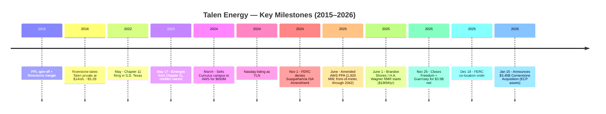
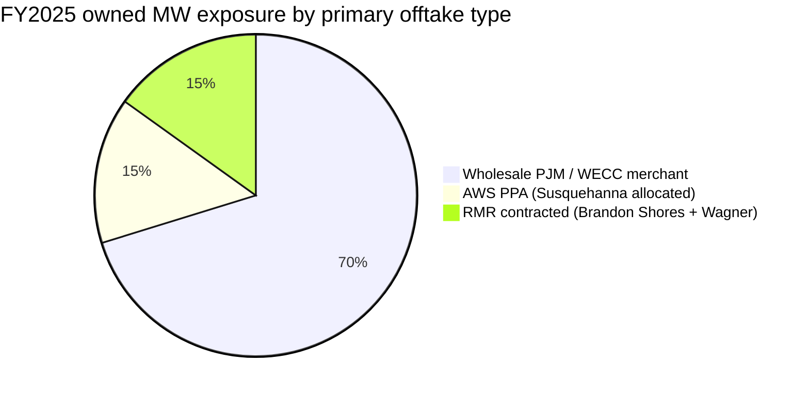
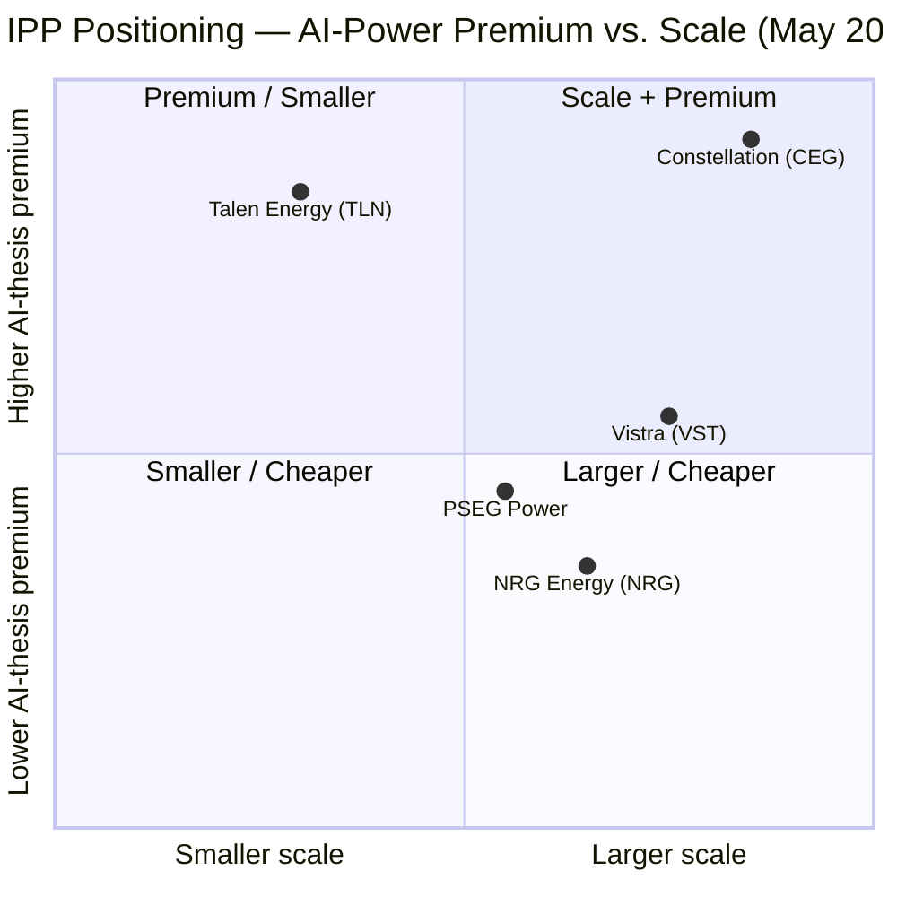

# COMPANY RESEARCH REPORT: Talen Energy Corporation (NASDAQ: TLN)

**Date:** 2026-05-20
**Author:** Company Research Skill
**Coverage status:** Initiation
**Report language:** English

> **Update — FY2026 guidance reaffirmed (2026-05-05):** With Q1-2026 results,
> management reaffirmed full-year 2026 Adjusted EBITDA of **$1,750–2,050 M**
> and Adjusted Free Cash Flow of **$980–1,180 M** (excluding the pending
> Cornerstone Acquisition). Q1-2026 Adjusted EBITDA came in at **$473 M** and
> Adjusted Free Cash Flow at **$350 M**, both up sharply (+$273 M and +$263 M
> YoY) on higher PJM capacity prices ($269.92/MW-day clearing for the
> 2025/2026 delivery year, escalating to the $329.17/MW-day cap for
> 2026/2027) and a full quarter of the front-of-meter AWS PPA ramp. The
> first quarter EBITDA print alone represents ~25% of the FY2026 mid-point.
> Source: [TLN Q1-2026 earnings press release, 2026-05-05](https://www.sec.gov/Archives/edgar/data/0001622536/000162253626000035/a20260505q12026earningsrel.htm); [GlobeNewswire summary, 2026-05-05](https://www.globenewswire.com/news-release/2026/05/05/3288253/0/en/Talen-Energy-Reports-First-Quarter-2026-Results-Reaffirms-2026-Guidance.html).

---

## TABLE OF CONTENTS
1. Company Overview
2. Company History
3. Management Team
4. Products & Services
5. Customers & Go-to-Market
6. Industry Overview
7. Competitive Landscape
8. Market Opportunity (TAM)
9. Risk Assessment
10. References

---

## 1. Company Overview

Talen Energy Corporation (NASDAQ: **TLN**) is a Houston-headquartered independent power producer (IPP) that owns and operates approximately **13.1 GW of net summer-rated generating capacity** across the PJM Interconnection (Mid-Atlantic, Mid-West) and the Western Electricity Coordinating Council (Montana), with a portfolio anchored by its 90% interest in the 2.5-GW **Susquehanna Steam Electric Station (SESS)** nuclear plant in Salem Township, Pennsylvania ([TLN 10-K FY2025, Item 1 Business](https://www.sec.gov/Archives/edgar/data/0001622536/000162253626000017/tln-20251231.htm)). The company sells electricity, capacity, and ancillary services into US wholesale power markets and, beginning in mid-2025, supplies long-term, fixed-price, front-of-the-meter nuclear power directly to Amazon Web Services (AWS) under an amended 1,920-MW power purchase agreement (PPA) running through 2042 ([TLN 10-K FY2025, Item 1 — AWS PPA](https://www.sec.gov/Archives/edgar/data/0001622536/000162253626000017/tln-20251231.htm)).

**What the company does.** Talen converts nuclear, natural-gas, fuel-oil, and coal feedstock into wholesale electrons, then monetises them through (i) energy and ancillary-services sales into the PJM real-time and day-ahead markets, (ii) capacity revenues won at PJM Base Residual Auctions (BRAs), (iii) long-term contracted revenues from the AWS PPA and from FERC-approved Reliability-Must-Run (RMR) agreements on its Brandon Shores and H.A. Wagner coal/oil units in Maryland, and (iv) the federal Nuclear Production Tax Credit (PTC) under the Inflation Reduction Act of 2022 ([TLN 10-K FY2025, "Our Key Markets and Revenue Streams"](https://www.sec.gov/Archives/edgar/data/0001622536/000162253626000017/tln-20251231.htm)).

**Scale and footprint.** As of year-end 2025 the owned fleet comprised: 2,245 net MW of nuclear at Susquehanna; 3,427 MW of high-efficiency H-class combined-cycle baseload gas (Guernsey 1,771 MW, Moxie Freedom 1,049 MW, Lower Mt. Bethel 607 MW); 4,634 MW of dispatchable gas/oil peaker and intermediate units (Martins Creek, Montour, Brunner Island); 1,975 MW of coal/oil under RMR (Brandon Shores 1,273 MW, H.A. Wagner 702 MW); and approximately 827 MW of minority coal interests in Conemaugh, Keystone (PJM) and Colstrip Unit 3 (WECC, Montana) ([TLN 10-K FY2025, Item 2 Properties](https://www.sec.gov/Archives/edgar/data/0001622536/000162253626000017/tln-20251231.htm)). Headcount is approximately 1,880 employees ([Talen Energy / LeadIQ profile, 2026](https://leadiq.com/c/talen-energy/5a1d8a6c240000240063ce6b)).

*Source: [TLN 10-K FY2025, Item 2 Properties (generation fleet as of 2025-12-31)](https://www.sec.gov/Archives/edgar/data/0001622536/000162253626000017/tln-20251231.htm).*

**How they make money.** FY2025 operating revenues of **$2,581 M** decomposed into Energy & other revenues $2,141 M (+14% YoY), Capacity revenues $485 M (+153% YoY on higher PJM clearing prices), and a $(45) M unrealised hedging loss, against Energy expenses of $1,066 M ([TLN 10-K FY2025, MD&A](https://www.sec.gov/Archives/edgar/data/0001622536/000162253626000017/tln-20251231.htm)). PJM Segment Adjusted EBITDA reached **$1,074 M** (FY2025) versus $775 M (FY2024) and $1,065 M for combined FY2023, while consolidated Adjusted EBITDA was **$1,035 M** versus $770 M in FY2024 ([TLN 10-K FY2025, MD&A, segment table](https://www.sec.gov/Archives/edgar/data/0001622536/000162253626000017/tln-20251231.htm)). Susquehanna produced approximately 17 TWh of zero-carbon power in 2025 at an all-in cost of roughly **$27/MWh**, against PJM West Hub realised prices that have run well into the $40s–$60s/MWh range and capacity prices that cleared at $269.92/MW-day for the 2025/2026 delivery year ([PJM 2025/2026 BRA report, 2024-07](https://www.pjm.com/-/media/DotCom/markets-ops/rpm/rpm-auction-info/2025-2026/2025-2026-base-residual-auction-report.pdf)).

*Source: [TLN 10-K FY2025, MD&A: Successor 2024–2025 and combined Predecessor+Successor 2023 columns](https://www.sec.gov/Archives/edgar/data/0001622536/000162253626000017/tln-20251231.htm).*

**Geographic presence.** Generation is concentrated in three PJM zones (MAAC for the Susquehanna-anchored Pennsylvania fleet; BGE for Brandon Shores and H.A. Wagner; AEP for the Guernsey gas plant in Ohio), plus a 30% economic interest in the WECC-area Colstrip Unit 3 in Montana ([TLN 10-K FY2025, Item 1 Wholesale Markets](https://www.sec.gov/Archives/edgar/data/0001622536/000162253626000017/tln-20251231.htm)). Headquarters are in Houston, Texas at 2929 Allen Pkwy, with a second operational office at 600 Hamilton Street, Allentown, Pennsylvania, the legacy PPL/Talen footprint ([LeadIQ profile, 2026](https://leadiq.com/c/talen-energy/5a1d8a6c240000240063ce6b)).

**Valuation snapshot (as of mid-May 2026):**

| Metric | TLN | VST | CEG | NRG | Sector context |
|---|---|---|---|---|---|
| Share price | ~$348 | — | — | $167.73 (Apr-17-26) | — |
| Market cap | **~$15.6 B** | $50.1 B | $103.3 B | $35.6 B | — |
| TTM P/E | n/m (loss) | 24.1× | — | 37.8× | S&P 500 ~24× |
| Forward P/E | **15.5×** | 15.5× | 26.0× | 18.2× | — |
| Forward EV/EBITDA | **~13.5×** | 10.6× | ~13× | 9.5× | Reg-utility ~10–12× |

Sources: [CNBC TLN quote](https://www.cnbc.com/quotes/TLN); [Lambda Finance, IPP comparison, 2026-04](https://www.lambdafin.com/articles/vistra-vs-constellation-vs-talen); [TIKR — CEG vs VST, 2026](https://www.tikr.com/blog/constellation-energy-vs-vistra-which-nuclear-powered-utility-has-more-upside); [Public.com, NRG market cap](https://public.com/stocks/nrg/market-cap).

*Source: [Lambda Finance — Vistra vs Constellation vs Talen, 2026](https://www.lambdafin.com/articles/vistra-vs-constellation-vs-talen); [Yahoo Finance, VST](https://finance.yahoo.com/quote/VST/); [NRG Q1-2026 8-K](https://www.sec.gov/Archives/edgar/data/0001013871/000101387126000010/nrgq12026ex991.htm). EV/EBITDA figures are NTM consensus aggregates as of May 2026 and are reproduced from peer-comparison desk-research; verify against current data sources before any trading use.*

**Interpreting the multiples.** TLN's TTM P/E is not meaningful: FY2025 GAAP net income was **$(219) M**, primarily because the IPO-related liability-classified equity awards triggered a **$(526) M non-cash stock-based compensation expense** under SBC accounting tied to the share-price re-rating in 2025 ([TLN 10-K FY2025, MD&A G&A line; Note 13 Stock-Based Compensation](https://www.sec.gov/Archives/edgar/data/0001622536/000162253626000017/tln-20251231.htm)). Strip out SBC, derivative mark-to-market, and acquisition expenses and the company is solidly EBITDA- and FCF-positive (Adj. EBITDA $1,035 M; FY2026 Adj. FCF guide mid-point $1.08 B). The forward P/E of ~15× sits between the cheaper VST/NRG cohort and pure-play CEG at ~26×, while forward EV/EBITDA of ~13.5× already prices in a clear AI-tailwind premium versus regulated-utility comps in the 10–12× range. The premium is being underwritten by the AWS PPA narrative (long-dated, fixed-price nuclear cash flow at a likely premium to merchant), by PJM capacity prices clearing at the FERC-approved $329.17/MW-day cap for 2026/2027, and by the Freedom/Guernsey and pending Cornerstone Acquisitions roughly doubling the addressable gas baseload fleet — but it also embeds material execution and FERC-policy risk discussed in Section 9.

---

## 2. Company History

Talen's modern history runs across three distinct chapters: a 2015 PPL spin-off and merger; a 2016–2023 private-equity ownership cycle that ended in Chapter 11; and a 2023 emergence as a creditor-owned IPP, followed by a 2024 Nasdaq listing and rapid 2024–2026 AI-driven re-positioning.

**Founding (2015).** Talen Energy was formed on June 1, 2015 when **PPL Corporation** spun out its competitive generation business (PPL Energy Supply) and merged it with three Pennsylvania-area generation assets contributed by funds affiliated with **Riverstone Holdings**, a private-equity firm. PPL shareholders received 65% of the new company and Riverstone took 35%. Talen Energy Corporation immediately listed on NYSE under the same ticker ([Talen Energy — Wikipedia, history section](https://en.wikipedia.org/wiki/Talen_Energy)).

**Privatisation (2016).** Less than 18 months after the spin-off, Riverstone acquired the remaining 65% of Talen at $14.00/share in a transaction valued at approximately $5.2 billion, taking the company private in December 2016 ([Talen Energy — Wikipedia](https://en.wikipedia.org/wiki/Talen_Energy)).

**Chapter 11 (2022–2023).** On **May 9, 2022**, Talen Energy Supply LLC and most of its subsidiaries (excluding the Cumulus crypto/data business and certain other affiliates) filed for Chapter 11 in the US Bankruptcy Court for the Southern District of Texas, citing collateral calls on hedging positions amid a spike in natural-gas prices ([Talen Chapter 11 filing — Financier Worldwide](https://www.financierworldwide.com/talen-energy-files-for-chapter-11); [Kroll restructuring docket](https://cases.ra.kroll.com/talenenergy/)). The plan, confirmed in late 2022, reduced approximately **$2.2 billion of debt** and converted Talen Energy Supply's unsecured creditors — primarily institutional credit funds — into new common equity. The company emerged on **May 17, 2023**, which is the bright-line date separating "Predecessor" and "Successor" financial reporting in its filings ([Davis Polk — Talen emergence advisory, 2023-05](https://www.davispolk.com/experience/talen-energy-supply-emerges-chapter-11); [TLN 10-K FY2025, Note 1 and Note 20](https://www.sec.gov/Archives/edgar/data/0001622536/000162253626000017/tln-20251231.htm)).

**AWS deal and listing (2024).** In March 2024, Talen sold its 90%-owned **Cumulus Data** campus, a 960-MW data-center site adjacent to Susquehanna, to AWS for $650 M with an initial "behind-the-meter" PPA, marking the first hyperscaler purchase of a co-located, nuclear-fed data-center campus in the US ([Enki AI — Amazon nuclear 2024 Talen Energy](https://enkiai.com/nuclear/amazon-talen-energy-data-center/)). Following the sale, Talen Energy Corporation (the new top-co) listed shares for trading on the Nasdaq Global Select Market in 2024, ticker TLN ([TLN 10-K FY2025, Item 5](https://www.sec.gov/Archives/edgar/data/0001622536/000162253626000017/tln-20251231.htm)).

**FERC ISA setback (Nov 2024).** On November 1, 2024, FERC denied PJM's amended Interconnection Service Agreement (ISA) for Susquehanna, which would have allowed up to 480 MW of behind-the-meter delivery to the AWS Cumulus campus without paying full transmission charges. Talen filed for rehearing; FERC ultimately deferred the matter ([TLN 10-K FY2025, Item 3 Legal Proceedings — Susquehanna ISA Amendment](https://www.sec.gov/Archives/edgar/data/0001622536/000162253626000017/tln-20251231.htm)).

**Amended AWS PPA + RMR + Freedom/Guernsey (2025).** Three transformative events landed in 2025: (i) on June 11, 2025 Talen and AWS signed an amended, expanded PPA repositioning the relationship as a **front-of-the-meter** arrangement of up to **1,920 MW** through 2042, deferring the FERC dispute by routing power through PJM rather than direct-connect ([Power Magazine — Talen-Amazon $18B nuclear PPA](https://www.powermag.com/talen-amazon-launch-18b-nuclear-ppa-a-grid-connected-ipp-model-for-the-data-center-era/)); (ii) effective June 1, 2025 Brandon Shores ($145 M/yr) and H.A. Wagner ($35 M/yr) began operating under FERC-approved RMR agreements through May 31, 2029 ([TLN 10-K FY2025, "Brandon Shores and H.A. Wagner RMR Arrangements"](https://www.sec.gov/Archives/edgar/data/0001622536/000162253626000017/tln-20251231.htm)); and (iii) on November 25, 2025 Talen closed the **$3.8 B (gross, $3.5 B net of tax shield) acquisition** of Moxie Freedom (PA, 1,049 MW) and Guernsey (OH, 1,836 MW) H-class combined-cycle plants from Caithness and BlackRock ([TLN 8-K, 2025-11-25 — closing of Freedom & Guernsey](https://www.sec.gov/Archives/edgar/data/0001622536/000162253625000037/ex99120251125pressreleasec.htm); [American Public Power Association coverage, 2025-07](https://www.publicpower.org/periodical/article/talen-energy-unveils-agreements-buy-power-plants-pennsylvania-ohio)).

**Cornerstone agreement (Jan 2026).** On January 15, 2026 Talen announced the **"Cornerstone Acquisition"** of three Energy Capital Partners (ECP) assets — Lawrenceburg (IN, 1,120 MW), Waterford (OH, 875 MW), Darby (OH, 456 MW) — for approximately **$3.45 B** ($2.55 B cash + 2.4 M shares valued at $900 M), with closing expected early in H2 2026 subject to FERC and Indiana Utility Regulatory Commission approvals; the Hart-Scott-Rodino waiting period expired in March 2026 ([TLN 8-K — Cornerstone announcement, 2026-01-15](https://www.sec.gov/Archives/edgar/data/0001622536/000162253626000004/a20260115pressreleasetalen.htm)).

**FERC co-location resolution (Dec 2025–Jan 2026).** On December 18, 2025 FERC issued an order outlining permissible co-location configurations and directing PJM to file tariff revisions implementing them; PJM filed those revisions on February 23, 2026. With the AWS arrangement re-routed front-of-meter and 148 MW of capacity interconnection rights restored to Susquehanna in December 2025, Talen voluntarily dismissed the ISA Amendment appeal in January 2026 — the original case is now closed ([TLN 10-K FY2025, Item 3 — FERC Co-Location Proceedings](https://www.sec.gov/Archives/edgar/data/0001622536/000162253626000017/tln-20251231.htm)).

Two strategic pivots stand out. **First**, the post-emergence team led by CEO Mac McFarland reframed the company from "diversified merchant generator with crypto exposure" into a focused "**AI-power infrastructure**" platform anchored by the only US nuclear plant with a signed hyperscaler PPA. **Second**, the Freedom/Guernsey and Cornerstone acquisitions are a deliberate pivot from carbon-heavy coal toward modern H-class CCGT, with coal capacity legally required to cease at Brunner Island by Dec 31, 2028 and Keystone/Conemaugh by Dec 31, 2034 under existing settlements ([TLN 10-K FY2025, Item 2 footnotes](https://www.sec.gov/Archives/edgar/data/0001622536/000162253626000017/tln-20251231.htm)).

---

## 3. Management Team

**Mark "Mac" McFarland — Chief Executive Officer & Director (age 56; CEO since May 2023; ~305 words).** McFarland was installed as CEO on the company's emergence date and concurrently joined the board. He spent the immediately prior 2.5 years (Oct 2020 to May 2023) as President, CEO and a director of **California Resources Corporation (NYSE: CRC)**, the largest oil-and-gas producer in California, where he led the company out of its own 2020 Chapter 11 and refocused it on carbon-management (he remains a CRC board member and chairs subsidiary Carbon TerraVault). Before CRC, McFarland was Executive Chairman and previously President/CEO of **GenOn Energy** (April 2017 to December 2018), another bankrupt IPP that he restructured. From 2013 to 2016 he ran **Luminant Holding** — the generation arm of Energy Future Holdings (TXU) — as CEO, and from 2008 to 2013 served as both Luminant's Chief Commercial Officer and EVP Corporate Development & Strategy at parent EFH, again navigating a multi-year Chapter 11 process. He started his career at **Exelon Corporation** (1999–2008), eventually as SVP Corporate Development. McFarland holds a B.S. in Civil Engineering (Environmental concentration) from Virginia Tech, an MBA from the University of Delaware, a Pennsylvania PE license (1995), and has completed the **MIT Reactor Technology Course for Utility Executives**. He sits on the board of the **Nuclear Energy Institute**, and previously on the boards of TerraForm Power, Bruin E&P, and Chaparral Energy. Investors should read his career as the most experienced restructuring-and-emergence operator in the IPP universe — five different Chapter 11s either led or co-led — paired with deep nuclear-policy credentials. In 2025 his all-in target compensation was approximately **$6.3 M** (cash + equity), with the bulk of equity tied to PSU/RSU vesting through 2027 ([TLN DEF 14A 2026, Proposal 1 — director bios; Executive Compensation Tables](https://www.sec.gov/Archives/edgar/data/0001622536/000162253626000023/0001622536-26-000023-index.htm)).

**Terry L. Nutt — President; former CFO (age 49; ~170 words).** Nutt was promoted from CFO to President effective December 12, 2025 and continues to serve as principal financial officer through the FY2025 10-K filing. He joined Talen as CFO in July 2023, two months after the emergence. Before Talen he was CFO of **Just Energy** (a North-American retail energy provider that itself completed a 2022 Chapter 11), and before that CFO and Managing Director of **EDF Trading North America** (2018–2023), the US trading arm of French utility EDF. Earlier he spent more than a decade at **Vistra/Energy Future Holdings** in senior finance roles, including SVP Controller and SVP Risk Management — overlapping with McFarland at Luminant. He holds an MS in Accounting and a BBA from Texas A&M and has also completed the MIT Reactor Technology Course for Utility Executives. In 2025, Nutt led the financing of the Freedom and Guernsey acquisitions (raising $2.7 B of senior unsecured notes plus a $1.2 B TLB) and the company's entry into the S&P MidCap 400 ([TLN DEF 14A 2026 — Executive Officer bios](https://www.sec.gov/Archives/edgar/data/0001622536/000162253626000023/0001622536-26-000023-index.htm)).

**Cole Muller — Chief Financial Officer (age 45; CFO since Dec 2025; ~120 words).** Muller succeeded Nutt as CFO in the December 2025 management realignment. He joined Talen in 2018, has led the company's Cumulus Growth business (2021–2023), and most recently served as EVP, Strategic Ventures (June 2023 to December 2025), where he ran the strategic-partnership work that ultimately produced the AWS PPA, the Cumulus sale, and the Freedom/Guernsey transactions. Before Talen he was an Associate Partner at **McKinsey & Co.**, advising power-and-utilities clients including Talen pre-spin. Investors should note that elevating an internal "deal architect" into the CFO seat — rather than hiring an external public-company CFO — signals that capital-allocation and M&A throughput remain the dominant priorities ([TLN DEF 14A 2026 — Executive Officer bios](https://www.sec.gov/Archives/edgar/data/0001622536/000162253626000023/0001622536-26-000023-index.htm)).

**Brad L. Berryman — Chief Operating Officer; former Chief Nuclear Officer (age 57; COO since Dec 2025; ~95 words).** Berryman was elevated to COO in the December 2025 realignment after leading Susquehanna as Chief Nuclear Officer and SVP. Under his tenure SESS has consistently ranked among the highest-performing US nuclear sites by INPO/WANO industry standards. He oversaw the December 2025 internal succession to Edward Casulli (a 30-year nuclear veteran, ex-PSEG Hope Creek and US Naval Nuclear Propulsion) as the new SVP & Chief Nuclear Officer. Berryman's continuity as COO is what allows McFarland and Muller to spend their cycles on AI-power commercial deals rather than plant operations ([TLN DEF 14A 2026 — Executive Officer bios](https://www.sec.gov/Archives/edgar/data/0001622536/000162253626000023/0001622536-26-000023-index.htm)).

**Governance footer (~135 words).** The Talen board comprises eight directors, of whom seven are independent (Joseph Nigro as chair has prior executive ties to Exelon/Constellation; Gizman Abbas, Anthony Horton, Karen Hyde, Christine Benson Schwartzstein, Ross Shuster, and one other independent; McFarland is the only executive director) ([TLN DEF 14A 2026, Proposal 1](https://www.sec.gov/Archives/edgar/data/0001622536/000162253626000023/0001622536-26-000023-index.htm)). Several directors were placed by post-emergence creditor groups in May 2023 and have continuing institutional-investor relationships. The Audit Committee is chaired by Karen Hyde (former SVP Chief Risk Officer at Xcel Energy with 30 years of nuclear regulatory experience). 2025 NEO compensation skewed roughly 80%+ to equity (RSUs/PSUs vesting on TSR and Adjusted EBITDA targets); McFarland's TDC was ~$6.3 M, Nutt $6.8 M (boosted by deal-financing PSU grants), Berryman $5.4 M, Wander $5.4 M, Wright $5.4 M ([TLN DEF 14A 2026 — Summary Compensation Table](https://www.sec.gov/Archives/edgar/data/0001622536/000162253626000023/0001622536-26-000023-index.htm)). Insider beneficial ownership is small in absolute share count (post-emergence holdings vested over 2023–2026), and the equity base is dominated by institutional investors who received shares as plan creditors.

**Track record synthesis (~70 words).** This is one of the deepest restructuring/IPP bench teams in the US. McFarland has personally led at least three prior Chapter 11 emergences (EFH/Luminant, GenOn, CRC). Nutt brings parallel Vistra/EFH and EDF Trading experience. Muller spent five years inside Talen running the deal pipeline that landed AWS. Berryman maintains operational excellence at SESS. The gap is durability: McFarland's prior tenures have averaged 3–5 years, and an unanticipated departure would be material.

---

## 4. Products & Services

Talen is not a product company; it is a generation-asset operator selling a small number of commodity-like outputs (energy, capacity, ancillary services, RECs, nuclear PTC, and one named bespoke nuclear PPA). The product taxonomy below mirrors the disclosure architecture in Item 1 of the FY2025 10-K and the asset list on the company website ([Talen Energy — Our Plants](https://www.talenenergy.com/our-plants/) and [TLN 10-K FY2025, Item 1 & Item 2](https://www.sec.gov/Archives/edgar/data/0001622536/000162253626000017/tln-20251231.htm)).

```mermaid
graph TD
    A[Talen Energy Corporation]
    A --> B[Baseload — 5,672 MW]
    A --> C[Intermediate / Peaker — 4,634 MW]
    A --> D[RMR Reliability — 1,975 MW]
    A --> E[Minority Coal — 827 MW]
    B --> B1[Susquehanna nuclear<br/>2,245 MW net 90%]
    B --> B2[Guernsey CCGT 1,771 MW]
    B --> B3[Moxie Freedom CCGT 1,049 MW]
    B --> B4[Lower Mt. Bethel CCGT 607 MW]
    C --> C1[Martins Creek 1,710 MW]
    C --> C2[Montour 1,505 MW]
    C --> C3[Brunner Island 1,419 MW]
    D --> D1[Brandon Shores coal 1,273 MW]
    D --> D2[H.A. Wagner oil 702 MW]
    E --> E1[Conemaugh 22.2% / 392 MW]
    E --> E2[Keystone 12.3% / 213 MW]
    E --> E3[Colstrip U3 30% / 222 MW]
    A --> F[Contracted offerings]
    F --> F1[AWS PPA up to 1,920 MW<br/>front-of-meter through 2042]
    F --> F2[Nuclear PTC under IRA]
    F --> F3[PJM Capacity Performance]
    F --> F4[Carbon-free RECs]
```

**Baseload — 5,672 owned MW; the cash-flow engine.** **Susquehanna (SESS)** is a two-unit, BWR-4 nuclear plant in Salem Township, Pennsylvania (Talen 90% / Allegheny Electric Co-op 10%) with current NRC operating licenses running to 2042 (Unit 2) and 2044 (Unit 1) ([TLN 10-K FY2025, Item 1 — Nuclear](https://www.sec.gov/Archives/edgar/data/0001622536/000162253626000017/tln-20251231.htm)). The plant produced ~17 TWh of zero-carbon electricity in 2025 at an all-in cost of approximately $27/MWh, and is the **only US commercial nuclear plant with a signed direct-to-hyperscaler PPA** (see Section 5). Moat: extremely high — irreproducible asset (no new US nuclear has reached COD in 14 years, save for Vogtle 3/4), high regulatory and economic barriers to a second nuclear-AWS competitor, and a dedicated 21+ year fuel supply chain (fully contracted through the 2028 fuel load, >50% through 2029, >20% through 2030). Closest direct competing product: **Constellation Energy's Crane Clean Energy Center** PPA with Microsoft (re-starting the former Three Mile Island Unit 1 with a 20-year 835-MW contract). TLN's Susquehanna is operating today; CEG's Crane will not deliver before late-2027/2028 at earliest. **Verdict: yes — strongest moat in the portfolio.**

**Guernsey (Ohio, 1,771 MW) and Moxie Freedom (Pennsylvania, 1,049 MW)** are 2017–2018-vintage **H-class combined-cycle gas turbines (CCGT)** — two of the most efficient CCGT plants in PJM, with heat rates well below the 7,500-Btu/kWh PJM marginal fleet average ([American Public Power Association coverage, 2025-07](https://www.publicpower.org/periodical/article/talen-energy-unveils-agreements-buy-power-plants-pennsylvania-ohio)). Both sit in low-cost Marcellus/Utica gas-supply basins and inside PJM zones with rising data-center load. Moat: high — heat-rate advantage; finite siting/permitting headroom for new CCGT; PJM capacity cap-and-floor. Closest competing product: VST's Texas CCGT fleet (gas-rich, but ERCOT not PJM) and Constellation's PJM gas assets (older, less efficient). **Verdict: yes — moat by asset vintage and location.**

**Lower Mt. Bethel (Pennsylvania, 607 MW)** is a 2004-vintage F-class CCGT; smaller, older, but a useful baseload backup. **Moat: partial — solid PJM cap-energy contributor but not a flagship.**

**Intermediate and peaker fleet — 4,634 MW; the dispatch flexibility layer.** **Martins Creek** (PA, 1,710 MW dual-fuel gas/oil peaker), **Montour** (PA, 1,505 MW gas-converted peaker post-coal conversion), and **Brunner Island** (PA, 1,419 MW dual-fuel gas/coal intermediate; required to cease coal-firing by Dec 31, 2028) provide variable-margin upside in scarcity-priced PJM hours and ancillary-services revenue. Moat: partial — assets are dispatched on spread economics, and the coal-to-gas conversions at Montour and Brunner have already been done. Closest competing products: VST/NRG/PSEG/Calpine PJM peaker fleets, none of which have a single-source advantage. **Verdict: partial.**

**RMR-contracted coal/oil — 1,975 MW; a fixed-fee bridge through 2029.** **Brandon Shores** (MD, 1,273 MW coal) and **H.A. Wagner** (MD, 702 MW oil) were scheduled for 2025 retirement, but in 2024–25 PJM filed RMR agreements at FERC requiring continued operation through **May 31, 2029** (or until BGE area transmission upgrades come online). Fixed-cost payments started June 1, 2025 at **$145 M/yr for Brandon Shores ($312/MW-day)** and **$35 M/yr for H.A. Wagner ($137/MW-day)** with separate cost reimbursement and small performance hold-backs ([TLN 10-K FY2025, "Brandon Shores and H.A. Wagner RMR Arrangements"](https://www.sec.gov/Archives/edgar/data/0001622536/000162253626000017/tln-20251231.htm)). Moat: regulatory — RMR economics are unique to assets whose retirement materially threatens grid reliability. **Verdict: yes (time-boxed).**

**Contracted offerings.** The crown jewel is the **AWS PPA**: under the June 2025 amendment, Talen will deliver up to **1,920 MW** of carbon-free nuclear power from Susquehanna to AWS as a **front-of-the-meter, fixed-price, long-term contract running through 2042** (with extension options). The ramp is contractual but back-loaded: 840–1,200 MW by 2029, 1,680–1,920 MW by 2032 ([Carbon Credits coverage, 2025](https://carboncredits.com/amazon-to-power-ai-data-center-expansion-with-1920-mw-nuclear-ppa-from-talen-energy/); [Power Magazine — $18B 17-year PPA characterisation](https://www.powermag.com/talen-amazon-launch-18b-nuclear-ppa-a-grid-connected-ipp-model-for-the-data-center-era/)). Talen has **not disclosed the per-MWh price** in its filings; secondary sources have characterised the deal as ~$18 B contract-life value but this is a third-party derived figure, not a company-disclosed number. The company describes the price as "anticipated premium" relative to merchant ([TLN 10-K FY2025 — AWS PPA](https://www.sec.gov/Archives/edgar/data/0001622536/000162253626000017/tln-20251231.htm)). **Verdict: yes — best-in-class commercial moat.**

**Nuclear PTC.** Susquehanna is eligible for the Section 45U Nuclear PTC under the IRA, which provides a per-MWh tax credit that increases as realised power prices fall below a defined floor — effectively a price collar on the merchant exposure that remains outside the AWS commitment ([TLN 10-K FY2025, Notes 3 & 4](https://www.sec.gov/Archives/edgar/data/0001622536/000162253626000017/tln-20251231.htm)). **Verdict: yes — regulatory moat created by federal policy.**

**Flagship vs. long-tail.** Three flagships drive the business: (1) Susquehanna + AWS PPA, (2) the Freedom/Guernsey CCGT pair, (3) the Brandon Shores/Wagner RMR contracts. The Cornerstone Acquisition (Lawrenceburg, Waterford, Darby; pending close H2-2026) is a fourth in waiting. The minority coal interests (Conemaugh, Keystone, Colstrip Unit 3) are explicitly being "explored… in the context of changing market conditions" — management language for likely divestment ([TLN 10-K FY2025, Item 1 — Reliability Assets](https://www.sec.gov/Archives/edgar/data/0001622536/000162253626000017/tln-20251231.htm)).

**Recent launches and sunsets (last 12 months).** Closed: Freedom + Guernsey acquisitions (Nov 25 2025). Re-positioned: AWS arrangement moved from behind-the-meter (June 2024 original) to front-of-the-meter (June 2025 amended). Initiated: Brandon Shores and H.A. Wagner RMR (June 1 2025). Announced/pending: Cornerstone Acquisition (Jan 15 2026, target H2 2026 close). Wound down: Cumulus crypto-mining business sold/restructured (the company exited the bitcoin-mining sleeve as part of the 2024 AWS data-campus sale; remaining Cumulus assets reside in EVP Strategic Ventures activity).

---

## 5. Customers & Go-to-Market

Talen's customer mix is bimodal: a vast number of anonymised wholesale-market counterparties pre-2024, dominated increasingly by a single named hyperscaler customer post-2025.

**Wholesale-market counterparties (pre-AWS baseline).** Until mid-2025 effectively all revenues were sold into PJM and WECC wholesale markets as either capacity (cleared at BRAs) or energy/ancillary services (cleared in day-ahead/real-time auctions). In PJM, "the customer" is **PJM Interconnection, LLC** as the RTO clearing counterparty, ultimately funding the payments through Load-Serving Entities (LSEs), but no individual LSE represents customer concentration as it would for a typical industrial firm ([TLN 10-K FY2025, Item 1 — Wholesale Markets](https://www.sec.gov/Archives/edgar/data/0001622536/000162253626000017/tln-20251231.htm)).

**AWS (Amazon Web Services).** Following the June 2025 amended PPA, Talen has effectively pre-sold up to 1,920 MW of Susquehanna output through 2042 to a single counterparty — Amazon — making AWS the largest disclosed customer by a wide margin once delivery ramps. At the 1,920-MW full quantity (target no later than 2032) AWS will offtake approximately three-quarters of Susquehanna's output and approximately 14–15% of Talen's pro-forma owned MW. The PPA is structured as **front-of-the-meter, fixed-price, with minimum take-or-pay commitments and escalation over time**, plus options to extend duration. Talen acts as the licensed Pennsylvania retail electricity provider to AWS ([Power Magazine, 2025](https://www.powermag.com/talen-amazon-launch-18b-nuclear-ppa-a-grid-connected-ipp-model-for-the-data-center-era/); [TLN 10-K FY2025 — AWS PPA section](https://www.sec.gov/Archives/edgar/data/0001622536/000162253626000017/tln-20251231.htm)).

*Source: derived from [TLN 10-K FY2025 Item 2 fleet table](https://www.sec.gov/Archives/edgar/data/0001622536/000162253626000017/tln-20251231.htm). MW counts use owned capacity at full PPA ramp; AWS slice is from the 2,245-MW net Susquehanna position.*

**Customer-concentration disclosure.** The FY2025 10-K does not present an ASC 280-10-50-42 "named 10% customer" footnote in segment notes, because pre-2025 the company had no individual >10% customer (PJM clearing dilutes the disclosure). Once the AWS PPA ramps materially (likely 2028+), Talen will plausibly cross the 10% revenue threshold and AWS will become a named disclosable customer. **Today, AWS is the disclosable strategic customer in qualitative terms even if not yet a 10%-of-revenue customer.** This concentration is a key risk (see Section 9).

**Other contracted counterparties.**
- **PJM Interconnection LLC** as RMR counterparty for Brandon Shores and H.A. Wagner, paying $180 M/yr fixed plus variable reimbursement through May 31, 2029 ([TLN 10-K FY2025 — RMR arrangements](https://www.sec.gov/Archives/edgar/data/0001622536/000162253626000017/tln-20251231.htm)).
- **US Treasury / IRS** via the Nuclear PTC mechanism — effectively a federal counterparty whose payments rise as merchant power prices fall.
- **Allegheny Electric Cooperative** as 10% co-owner of Susquehanna (purchases ~10% of output) and **NorthWestern Energy** as the balancing authority for Colstrip Unit 3 in Montana.

**Distribution channels.** All output is sold either through (i) RTO/ISO clearing markets (PJM, WECC bilateral), (ii) bilateral OTC contracts and futures hedges with utilities, traders, and end-users, or (iii) the AWS PPA. There is no retail distribution, no direct-to-consumer presence, and no sales force in the SaaS sense — commercial activity is run by Chris E. Morice (Chief Commercial Officer) and Darren J. Olagues (Chief Development Officer), with M&A run by Cole Muller (CFO) and Dale E. Lebsack (Chief Asset Development Officer) ([TLN DEF 14A 2026 — Executive Officers](https://www.sec.gov/Archives/edgar/data/0001622536/000162253626000023/0001622536-26-000023-index.htm)).

**Sales cycle.** PJM auctions and bilateral hedges have multi-year forward windows (PJM BRAs clear 3 years ahead under the standard timetable, though FERC and PJM have repeatedly amended this). Bespoke hyperscaler PPAs like AWS take 12–24 months from MoU to FERC-approved contract: the original AWS behind-the-meter PPA was disclosed in March 2024 and the amended front-of-meter version landed in June 2025, with full transition expected by spring 2027 ([TLN 10-K FY2025 — AWS PPA](https://www.sec.gov/Archives/edgar/data/0001622536/000162253626000017/tln-20251231.htm)).

**Key partnerships.** AWS (commercial customer + co-located data-center developer through 2024 sale of Cumulus campus). **PPL Corporation** (former parent, transmission interconnection counterparty at Susquehanna; the Susquehanna ISA Amendment was filed by PPL Electric Utilities). **Caithness Energy** and **BlackRock Real Assets** (former owners of Freedom and Guernsey, respectively). **Energy Capital Partners** (counter-party to Cornerstone Acquisition; will receive ~2.4 M TLN shares at closing). **Allegheny Electric Cooperative** (Susquehanna 10% partner). **Constellation Energy** has been a litigation counterparty in the FERC co-location proceedings, not a customer.

**Customer case study (named win).** The signature win is the AWS PPA — the first long-dated direct nuclear PPA between a US IPP and a hyperscaler. Constellation's Microsoft Crane PPA was announced after the Talen-AWS deal and is the only directly comparable transaction, and it is not in delivery. Talen's deal is the template the rest of the IPP universe is now trying to replicate.

---

## 6. Industry Overview

**Industry definition.** Talen operates within the US **competitive (merchant) wholesale electric power generation** industry — NAICS 221112 (Fossil Fuel Electric Power Generation), 221113 (Nuclear Electric Power Generation), and 221116 (Geothermal/Other), and within RTOs/ISOs PJM Interconnection and the Western Electricity Coordinating Council. Adjacent industries include utility-scale renewables (NAICS 221114–221117), retail electricity providers, energy trading, and data-center power-delivery infrastructure (an emerging sub-segment).

**Market size and structure.** PJM dispatches approximately **182,000 MW of generation across 13 states + DC to 67 million customers** with about 1,110 market members ([TLN 10-K FY2025, Item 1 — PJM](https://www.sec.gov/Archives/edgar/data/0001622536/000162253626000017/tln-20251231.htm)). Energy market revenue in PJM exceeded $40 billion in 2024 and capacity revenue stepped up sharply in 2025 with the 2025/2026 BRA clearing at **$269.92/MW-day for the RTO** ($444.26 in Dominion zone, $466.35 in BGE) versus $28.92/MW-day in the prior auction — a roughly 9× increase that drove an estimated $14.7 B incremental capacity expense to PJM load ([PJM 2025/2026 BRA report, 2024-07](https://www.pjm.com/-/media/DotCom/markets-ops/rpm/rpm-auction-info/2025-2026/2025-2026-base-residual-auction-report.pdf); [Utility Dive — PJM capacity prices hit record high](https://www.utilitydive.com/news/pjm-interconnection-capacity-auction-data-center/808264/)). The 2026/2027 BRA cleared at the FERC-approved cap of **$329.17/MW-day** for the entire footprint ([PJM 2026/2027 BRA report, 2025-07](https://www.pjm.com/-/media/DotCom/markets-ops/rpm/rpm-auction-info/2026-2027/2026-2027-bra-report.pdf)); FERC has approved a 1.3% cap escalation for the next cycle.

**Growth rates and drivers.** PJM's January 2026 long-term load forecast points to summer 2036 RTO-wide load approximately **5% higher than the 2025 expectation** and to a cumulative **+66 GW summer peak load by 2036 (3.6% CAGR over 10 years)** — an extraordinary inflection from the flat-to-declining historical load growth of the 2010s ([TLN 10-K FY2025, Item 1 — Demand Growth from Multiple Sources](https://www.sec.gov/Archives/edgar/data/0001622536/000162253626000017/tln-20251231.htm)). Drivers (management's own framing): (1) **AI-driven data-center demand** — hyperscalers and colocation operators are siting GW-scale campuses in Northern Virginia, Pennsylvania, and Ohio; (2) **manufacturing reshoring** post-COVID; (3) **economy-wide electrification** of transport and heating. Concurrent supply-side pressures: (a) ongoing PJM **coal retirements** through the end of the decade (and a regulatory cliff for Talen's own coal — Brunner Island by 2028, Keystone/Conemaugh by 2034), (b) the new-build PJM queue is **predominantly intermittent** (solar, wind, storage), so it adds energy but limited firm capacity, and (c) interconnection-queue reform delays have pushed PJM 2025/2026 and 2026/2027 BRA auctions out of their normal cadence.

**Key trends.** Five trends define the next 5–10 years for this industry: **(i) AI-data-center load surge** — IEA, EPRI, BloombergNEF, and Goldman Sachs estimates for US data-center electricity demand in 2030 cluster in the 7–12% of total US electricity range, up from ~4% in 2024. **(ii) Behind-/front-of-meter co-location regulation**, where the FERC's December 18, 2025 order and PJM's February 23, 2026 tariff filing are setting precedent for how generators and hyperscalers can transact ([TLN 10-K FY2025, Item 3 — FERC Co-Location Proceedings](https://www.sec.gov/Archives/edgar/data/0001622536/000162253626000017/tln-20251231.htm)). **(iii) Direct hyperscaler PPAs** — AWS-Talen, Microsoft-Constellation (Crane), Google-Kairos (SMR offtake), and Meta-multiple — re-define the customer for large baseload generation. **(iv) Nuclear renaissance** — Vogtle 3/4 came online in 2023–24, Diablo Canyon's life was extended in California, Three Mile Island Unit 1 (Crane) is being restarted, NRC SMR licensing is accelerating. **(v) PJM market-design overhaul** — capacity Performance reforms, ISA tariff revisions, and the ongoing Section 206 co-location proceeding will continue to shape the merchant economics through at least 2027.

**Regulatory environment.** Talen is regulated by FERC (wholesale market participation, RMR, interconnection, PPA approvals), the NRC (Susquehanna operating licenses through 2042/2044), the EPA (cross-state air pollution, Mercury and Air Toxics Standards, GHG, regional haze, effluent limits), Pennsylvania DEP, Maryland Department of the Environment, Ohio EPA, and Montana DEQ. Tariff and credit-rating obligations also constrain financing flexibility. The most consequential live regulatory threads in 2026 are (i) the **PJM co-location tariff** that FERC ordered on December 18 2025 and PJM filed on February 23 2026, (ii) any potential reopening of the **Section 45U Nuclear PTC** under a future Congress, and (iii) **environmental remediation** at legacy coal sites (asset-retirement obligations totalled $494 M on the FY2025 balance sheet).

**Industry dynamics.** PJM as an RTO is structurally **medium-concentrated** — large IPPs (Vistra, Constellation, NRG, Calpine, Talen, LS Power), integrated utilities (Exelon, PPL, FirstEnergy, Duke), and non-utility generators each compete on capacity, energy, and ancillary auctions. Barriers to entry are high (siting, NRC, FERC, environmental permitting, $1.5–2.5 B per GW for new CCGT and far higher for nuclear or SMR). Buyer power is moderate (PJM rules the day-to-day, but hyperscaler buyers can negotiate bespoke long-term deals). Supplier power is moderate (uranium fuel cycle is concentrated but Talen's fuel is forward-contracted; Marcellus/Utica gas supply is abundant). Substitutes (large-scale solar+storage) cannot match nuclear baseload reliability profiles, which is the entire premise of the AI-data-center thesis.

---

## 7. Competitive Landscape

The "merchant IPP exposed to AI power" cohort is small and well-defined. The five competitors most worth tracking are **Constellation Energy (NASDAQ: CEG)**, **Vistra Corp (NYSE: VST)**, **NRG Energy (NYSE: NRG)**, **PSEG Power (a subsidiary of NYSE: PEG)**, and increasingly **Calpine** (now under integrated VST ownership). Adjacent emerging competition comes from SMR developers (NuScale, X-energy, TerraPower, Kairos) and from utility-led co-location structures.

**Constellation Energy (CEG, market cap ~$103 B).** The largest US nuclear pure-play with ~22 GW of nuclear capacity and ~14 GW of fossil/renewable. Signed the Microsoft Crane (Three Mile Island Unit 1 restart) PPA in 2024, pending plant restart by late 2027. Trades at the richest forward EV/EBITDA in the group (~13×) and forward P/E (~26×), reflecting the cleanest nuclear-pure-play narrative ([TIKR — CEG vs VST analysis, 2026](https://www.tikr.com/blog/constellation-energy-vs-vistra-which-nuclear-powered-utility-has-more-upside)). Direct competitor for the next hyperscaler PPA but cannot meaningfully deliver before 2028.

**Vistra Corp (VST, market cap ~$50 B).** Roughly 41 GW gross post-Energizer (Calpine) integration in 2024. Texas-heavy fossil fleet, four-unit Comanche Peak nuclear in Texas, and a sizable PJM/MISO gas presence post-Calpine. Signed a colocation MoU with Microsoft for the Mt. Comfort Indiana data-center campus and a Vistra Vision settlement with private partners. Forward EV/EBITDA ~10.6× and forward P/E ~15.5× — the cheapest of the cohort — reflecting greater merchant exposure and integration risk ([Yahoo Finance, VST, May 2026](https://finance.yahoo.com/quote/VST/)). Roughly 3× larger by EBITDA than Talen.

**NRG Energy (NRG, market cap ~$36 B).** Combined retail (~6 M customers) and merchant generation (~26 GW pro-forma after January 2026 LS Power acquisition). Texas/PJM/MISO/SPP-spread; FY2025 Adjusted EBITDA $4.1 B and 2026 FCFbG guide $2.8–3.3 B ([NRG Q1-2026 8-K](https://www.sec.gov/Archives/edgar/data/0001013871/000101387126000010/nrgq12026ex991.htm)). NRG's retail moat is unmatched in the cohort, but it lacks the nuclear pure-play story.

**PSEG Power (subsidiary of PEG).** Operates Salem and Hope Creek nuclear units (~3.7 GW) and PJM fossil, but is a captive of NJ-integrated parent rather than a stand-alone merchant.

**Calpine (now within VST).** The historical largest US gas-fired IPP with ~26 GW; absorbed into VST in 2024; reduced the number of standalone competitors by one but raised VST's scale advantage.

**Sub-scale and emerging.** **SMR developers** (NuScale, X-energy, Kairos, TerraPower, Holtec, etc.) cannot deliver MW into PJM before ~2030 at earliest. **Public Service of New Mexico** and **Duke Energy** are exploring hyperscaler co-location structures from regulated platforms (a different regulatory and economic model).

**Positioning framework.** Three dimensions distinguish TLN:

| Dimension | TLN | CEG | VST | NRG |
|---|---|---|---|---|
| Scale (owned MW) | 13 GW (pro-forma ~17 GW post-Cornerstone) | 36+ GW | 41 GW | 26 GW |
| Nuclear pure-play % | 17% of MW, ~50% of EBITDA | ~60% MW, ~75% EBITDA | ~10% MW | 0% |
| Hyperscaler PPA in delivery | **Yes — AWS, since Q2-25** | No (Crane 2027/28) | MoU only | No |
| Forward EV/EBITDA | ~13.5× | ~13× | ~10.6× | ~9.5× |
| Coal exposure as % MW | ~16% (declining) | ~5% | ~10% | ~5% |

**TLN's competitive advantages.** (a) **First-mover hyperscaler PPA in actual delivery** — no other competitor has a comparable deal already in commercial operation. (b) **Single-site nuclear footprint** allows greater operational leverage on Susquehanna optimisation than diversified peers. (c) **Strong PJM data-center geographic fit** — Pennsylvania and Ohio are the two highest growth data-center subregions. (d) **Restructuring-trained management** with relationships to private credit/PE that funded the post-emergence growth pivot.

**TLN's vulnerabilities.** (a) **Scale** — at ~$15.6 B market cap and ~$1 B Adj. EBITDA, Talen is the smallest of the cohort and most sensitive to single-asset events. (b) **Single-site nuclear concentration** — an unplanned Susquehanna outage hits both energy and capacity revenues. (c) **Higher leverage** — long-term debt rose from $2,987 M (YE2024) to $6,782 M (YE2025) post-Freedom/Guernsey, and another $4 B of financing was raised for Cornerstone ([TLN 10-K FY2025, balance sheet](https://www.sec.gov/Archives/edgar/data/0001622536/000162253626000017/tln-20251231.htm)). (d) **FERC dependency** — the entire AWS-PPA economics depend on continued FERC approval of front-of-meter delivery and on Section 45U Nuclear PTC continuity.

**Market share.** In PJM's ~182,000-MW dispatched footprint, Talen owns approximately **7.2% of installed capacity** (13.1 GW / 182 GW), rising to roughly 9% pro-forma Cornerstone. CEG (~36 GW) holds roughly 20%; VST (post-Calpine in PJM) holds approximately 10%. By nuclear-specific PJM output, Talen represents roughly 9% of the PJM nuclear fleet (one of ~33,000 nuclear-MW in PJM).

---

## 8. Market Opportunity (TAM)

**TAM definition.** Talen's TAM is best framed as **total revenue attributable to dispatchable, low-/zero-carbon generation in PJM and adjacent markets through 2042**, with a separable SAM for hyperscaler-direct nuclear PPAs.

**PJM TAM sizing.** PJM cleared approximately **134,311–134,479 MW of capacity** at the 2026/2027 BRA at a clearing price of $329.17/MW-day ([PJM Inside Lines, 2025-07](https://insidelines.pjm.com/pjm-auction-procures-134311-mw-of-generation-resources-supply-responds-to-price-signal/)). Annualised, that's a capacity-revenue TAM of roughly **$329.17 × 365 × 134,400 ≈ $16.1 B/year** for the PJM capacity construct alone — and that figure is **set to rise materially** with the 1.3% cap escalation to $333.44/MW-day, plus continued load growth that PJM expects to push summer peak demand to ~166 GW by 2036 from 100 GW today ([TLN 10-K FY2025, Item 1 — Demand Growth](https://www.sec.gov/Archives/edgar/data/0001622536/000162253626000017/tln-20251231.htm)). PJM energy and ancillary services markets clear additional revenue conservatively estimated at $40–60 B/year depending on weather and gas pricing. Combining capacity, energy, and ancillaries, **the PJM TAM is plausibly $55–80 B/year** by 2027 and growing.

**Nuclear-specific SAM in PJM.** Approximately **33,000 MW of PJM nuclear** at a roughly 90% capacity factor produces ~260 TWh/year. Even at modest premium-to-merchant pricing for clean-firm power ($50–80/MWh weighted average), the nuclear-specific SAM in PJM is on the order of **$13–21 B/year of energy revenue**, plus capacity ($329/MWd × 33 GW × 365 = ~$4.0 B/yr). Talen's share is ~9% by capacity.

**Hyperscaler direct-PPA SOM.** The realistic SOM for hyperscaler nuclear PPAs over the next decade is far narrower. **Only ~5–10 US nuclear sites realistically support a Susquehanna-style hyperscaler PPA today** (Susquehanna, Crane/TMI, Limerick, Peach Bottom, Salem/Hope Creek, Beaver Valley, North Anna/Surry, Diablo Canyon — and even these vary widely on grid topology and PUC/state interconnection complexity). If hyperscaler nuclear-direct PPAs grow from one (Susquehanna-AWS) to four–six over the next decade, totalling ~6–9 GW of contracted nuclear capacity at $60–90/MWh, the **direct-PPA SOM is roughly $4–7 B/year of incremental contracted revenue** above merchant base. Talen has captured the first of these, with a contractual ramp to ~1.92 GW by 2032. At the contract's full quantity, this single PPA represents roughly **$1.0–1.5 B/year of high-margin contracted revenue** (illustrative, since Talen has not disclosed the per-MWh rate — see Section 5 disclaimer).

*Source: derived from [TLN 10-K FY2025 — AWS PPA delivery schedule disclosure (full volume by no later than 2032, 1,920 MW cap)](https://www.sec.gov/Archives/edgar/data/0001622536/000162253626000017/tln-20251231.htm) and [Carbon Credits coverage, 2025](https://carboncredits.com/amazon-to-power-ai-data-center-expansion-with-1920-mw-nuclear-ppa-from-talen-energy/). The band illustrates the public range of 840–1,200 MW by 2029 and 1,680–1,920 MW by 2032; intermediate years are interpolated and not directly disclosed by the company.*

**Penetration strategy.** Three vectors define Talen's path to capturing more of the TAM/SAM: (i) **expand AWS contract scope** (extending tenure beyond 2042 or moving more Susquehanna MW into the contract), already a contractual option; (ii) **convert the new Freedom/Guernsey/Cornerstone CCGT fleet to contracted offtake** ("Talen flywheel" strategy — repeat the AWS template at gas plants in Ohio, Indiana, and Pennsylvania); and (iii) **monetise minority coal interests** (Conemaugh, Keystone, Colstrip) via divestment, freeing capital for further M&A.

The flywheel framing in TLN management's 10-K — "Combine the above strengths to execute on our 'Talen flywheel' strategy" — explicitly positions Susquehanna as the moat, the CCGT fleet as the next product to contract, and capital allocation (M&A and balance-sheet management) as the third lever ([TLN 10-K FY2025, Item 1 — Our Strategies](https://www.sec.gov/Archives/edgar/data/0001622536/000162253626000017/tln-20251231.htm)).

---

## 9. Risk Assessment

### Company-Specific Risks

**1) Single-site nuclear concentration (Susquehanna).** ~50% of Adjusted EBITDA is generated from a single two-unit nuclear site. Any unplanned multi-month outage — refuelling-cycle delays, unscheduled equipment failures, NRC enforcement events, or a security incident — would simultaneously hit energy, capacity, AWS PPA performance, and Nuclear PTC eligibility. Susquehanna has historically operated at top-quartile fleet availability ([TLN 10-K FY2025, Item 1 — Susquehanna performance](https://www.sec.gov/Archives/edgar/data/0001622536/000162253626000017/tln-20251231.htm)), and the AWS PPA has minimum take-or-pay protections, but in an extended outage Talen would need to **purchase replacement power on the merchant market**, potentially at loss. Severity: **high**. Mitigation: nuclear-industry-leading operating practices, NRC oversight, and a deep $1.9 B nuclear decommissioning trust.

**2) AWS customer concentration.** When the PPA fully ramps (~2032), AWS will likely represent **>20% of consolidated revenue** and >40% of Susquehanna's gross margin — a material single-customer dependency. Amazon could in principle attempt to renegotiate, dispute, or restructure the contract; or, on a positive scenario, demand price concessions in any renewal. Severity: **material** today, **high** by 2032. Mitigation: long contract tenor (through 2042), fixed-price minimum take, extension options, and the strategic value of Susquehanna as the only delivering hyperscaler-PPA nuclear site.

**3) FERC / PJM co-location policy risk.** Although Talen and AWS restructured the PPA into a front-of-the-meter arrangement that survived the November 2024 ISA denial, the **December 18, 2025 FERC order on co-location** introduces new tariff language (PJM filed February 23, 2026) that may impose new transmission, charges, or load-forecast treatments on co-located arrangements ([TLN 10-K FY2025, Item 3 — FERC Co-Location Proceedings](https://www.sec.gov/Archives/edgar/data/0001622536/000162253626000017/tln-20251231.htm)). Adverse interpretations could compress AWS-PPA economics, slow other hyperscaler deals at Talen's gas plants, or trigger pricing renegotiations. Severity: **material**. Mitigation: contract structure (already moved to front-of-meter), front-and-center participation in PJM/FERC stakeholder processes, alignment with broader IPP industry, and 148-MW CIR restoration to Susquehanna already approved.

**4) Integration risk on M&A (Freedom, Guernsey, Cornerstone).** Three major acquisitions are either freshly closed (Freedom/Guernsey, Nov 2025) or pending (Cornerstone, H2 2026), adding ~5 GW of gas-fired capacity, ~$7 B of incremental purchase price (gross), and three new operating sites in Ohio and Indiana. Integration risk includes operational learning curves, retention of legacy workforce, fuel-supply contract assumption, and the modelling of capacity-auction revenues at full plant detail. Severity: **moderate**. Mitigation: McFarland/Nutt/Muller have prior multi-asset integration experience; assets are similar-vintage CCGT; HSR clearance already obtained for Cornerstone.

**5) Key-person dependency.** McFarland and Nutt's combined institutional knowledge — and McFarland's relationships with the post-emergence creditor-owners — are unusually consequential. McFarland's prior tenures averaged 3–5 years; he is now ~3 years into Talen. Severity: **moderate**. Mitigation: deep internal bench (Berryman, Muller, Lebsack, Morice), Nutt promotion to President provides a continuity option, board has change-of-control compensation guardrails.

**6) Coal-asset retirement and ARO build-up.** Brunner Island coal-firing must cease by Dec 31, 2028 and Keystone/Conemaugh by Dec 31, 2034 under existing settlements ([TLN 10-K FY2025, Item 2 footnotes](https://www.sec.gov/Archives/edgar/data/0001622536/000162253626000017/tln-20251231.htm)). Asset retirement obligations and environmental accruals totalled **$494 M** as of YE2025. RMR support for Brandon Shores/Wagner ends May 31, 2029. Severity: **moderate**, telegraphed. Mitigation: gas-conversion successes at Brunner Island and Montour reduce stranded-asset exposure; minority coal stakes are explicitly under review for divestment.

### Industry / Market Risks

**7) Competitive intensity for hyperscaler PPAs.** The CEG-Microsoft Crane deal, Vistra-Microsoft Mt. Comfort MoU, Google-Kairos, and Meta-multiple structures will all compete for the same finite pool of hyperscaler clean-power demand. New SMR offtake, utility-led co-location frameworks, and behind-the-meter solar+storage are all substitutes. Talen captured the first deal; the next 5–8 PPAs in this cohort will set pricing reference points. Severity: **material**. Mitigation: first-mover, in-delivery; "Talen flywheel" to extend the AWS template to gas plants.

**8) Regulatory and tax-policy reversal.** The Section 45U Nuclear PTC could be reduced or repealed under a future Congress (it survived through the 2025 OBBB-era discussions but not all components are durable). EPA emissions rules at Brunner Island/Brandon Shores or new GHG regulations could accelerate retirement or trigger capex. Severity: **material**. Mitigation: bipartisan support for nuclear is structurally stronger than for fossil; multiple federal pathways protect Susquehanna.

**9) Capacity-market design risk.** The PJM market structure — capacity-cap, must-offer rules, behind-the-meter and co-location treatment — remains in flux. The cap is set at $329.17/MW-day for 2026/2027 and $333.44/MW-day next; any major change in design (CIFP-style reforms, expanded must-offer carve-outs, performance penalty modifications) could reduce realised capacity revenue. Severity: **moderate**.

**10) Disruptive substitutes (SMR, geothermal, long-duration storage).** A successful commercial-scale SMR by 2030 — or breakthroughs in long-duration storage — could erode the scarcity premium on operating nuclear. Severity: **moderate, long-dated**. Mitigation: Susquehanna has a 17–19 year operating runway under current licenses, with extensions plausible to ~2060+.

### Financial Risks

**11) Leverage step-up risk.** Long-term debt jumped from $2,987 M (YE2024) to $6,782 M (YE2025) on Freedom/Guernsey financing, and another **$4 B was raised in 2026 for Cornerstone** (including $1.2 B to redeem 8.625% notes). Net leverage approached ~6× Adj. EBITDA at YE2025 (pre-Cornerstone) and will rise further at the Cornerstone close before deleveraging into 2027–28 ([TLN 10-K FY2025 — Note 10 Long-Term Debt](https://www.sec.gov/Archives/edgar/data/0001622536/000162253626000017/tln-20251231.htm); [TLN 8-K — $4B financing for Cornerstone, 2026](https://www.sec.gov/Archives/edgar/data/0001622536/000162253626000010/index.json)). Sensitivity to rate moves and credit-spread widening is meaningful. Severity: **material**. Mitigation: $1.59 B total available liquidity at YE2025; investment-grade-adjacent credit ratings; AWS PPA visibility supports refinancing capacity.

**12) Valuation / multiple-compression risk.** Forward EV/EBITDA of ~13.5× already prices in clear AI-power premium versus regulated-utility comps (10–12×); the multiple is roughly **2× the 3-year average for traditional merchant IPPs** before the AI re-rating in 2023. Triggers for a de-rate include: hyperscaler capex slowdown, FERC policy reversal, an AWS contract dispute, a major Susquehanna event, a Nuclear PTC repeal, or simply a sector rotation as data-center build-outs normalise. Severity: **material**. Mitigation: long-dated AWS contract economics, in-delivery (not promise), and PJM capacity cap escalation provide some downside support.

### Macroeconomic Risks

**13) Interest-rate sensitivity.** With ~$6.8 B of long-term debt at YE2025 and a further ~$4 B placed in 2026, refinancing windows over the next 5 years coincide with potential rate moves. The 8.625% notes redemption in 2026 was opportunistic but underscores how rates dictate capital structure. Severity: **moderate**. Mitigation: laddered maturities, interest-rate hedges where disclosed.

**14) Economic / cyclical sensitivity.** Wholesale power demand tracks GDP and industrial production with cyclicality, but the AI-data-center driver is a structural rather than cyclical demand source. A recessionary scenario could slow hyperscaler capex, but back-orders from Amazon, Microsoft, Meta, and Google point to multi-year visibility. Severity: **low to moderate**.

**15) Geopolitical / fuel-supply risk.** Talen has no Russian-affiliated uranium fuel exposure ([TLN 10-K FY2025 — Nuclear Fuel](https://www.sec.gov/Archives/edgar/data/0001622536/000162253626000017/tln-20251231.htm)), but uranium and conversion services are globally concentrated, and supply-chain disruption (e.g., a HALEU constraint, a Western HEX/conversion outage) could affect future fuel-load economics. Severity: **moderate, low-probability**.

---

## 10. References

### SEC Filings (primary, US EDGAR)
- [Talen Energy Corporation — Form 10-K for FY2025 (filed Feb 2026)](https://www.sec.gov/Archives/edgar/data/0001622536/000162253626000017/tln-20251231.htm)
- [Talen Energy Corporation — Form DEF 14A 2026 proxy](https://www.sec.gov/Archives/edgar/data/0001622536/000162253626000023/0001622536-26-000023-index.htm)
- [Talen Energy — Form 10-K for FY2024](https://www.sec.gov/Archives/edgar/data/0001628280/000162828025008786/0001628280-25-008786-index.htm)
- [Talen Energy — Form 10-Q for Q3-2025](https://www.sec.gov/Archives/edgar/data/0001622536/000162253625000032/0001622536-25-000032-index.htm)
- [Talen Energy — Form 8-K (Q1-2026 earnings release), 2026-05-05](https://www.sec.gov/Archives/edgar/data/0001622536/000162253626000035/a20260505q12026earningsrel.htm)
- [Talen Energy — Form 8-K (Q4-2025 + FY2025 earnings release), 2026-02-26](https://www.sec.gov/Archives/edgar/data/0001622536/000162253626000014/a20260226q42025earningsrel.htm)
- [Talen Energy — Form 8-K Cornerstone Acquisition announcement, 2026-01-15](https://www.sec.gov/Archives/edgar/data/0001622536/000162253626000004/a20260115pressreleasetalen.htm)
- [Talen Energy — Form 8-K Closing of Freedom & Guernsey, 2025-11-25](https://www.sec.gov/Archives/edgar/data/0001622536/000162253625000037/ex99120251125pressreleasec.htm)
- [Talen Energy — Form 8-K Freedom/Guernsey signing, 2025-07-17](https://www.sec.gov/Archives/edgar/data/0001622536/000162828025035201/a20250717pressreleasetalen.htm)
- [Talen Energy — Form 8-K Q3-2025 pro-forma financials for Freedom & Guernsey, 2026-02-09](https://www.sec.gov/Archives/edgar/data/0001622536/000162253626000007/ex995q32025proformafinanci.htm)
- [Talen Energy — Form 8-K Strategic Realignment of Executive Management, 2025-12-15](https://ir.talenenergy.com/news-releases/news-release-details/talen-energy-announces-strategic-realignment-executive)
- [Talen Energy — Form S-1 (2024 listing registration)](https://www.sec.gov/cgi-bin/browse-edgar?action=getcompany&CIK=0001628280&type=S-1)

### Market data and peer valuation
- [CNBC — TLN quote and statistics](https://www.cnbc.com/quotes/TLN)
- [Yahoo Finance — Talen Energy (TLN) statistics](https://finance.yahoo.com/quote/TLN/)
- [Yahoo Finance — Vistra Corp (VST) statistics](https://finance.yahoo.com/quote/VST/)
- [Lambda Finance — Vistra vs Constellation vs Talen, 2026](https://www.lambdafin.com/articles/vistra-vs-constellation-vs-talen)
- [TIKR — Constellation Energy vs. Vistra, 2026](https://www.tikr.com/blog/constellation-energy-vs-vistra-which-nuclear-powered-utility-has-more-upside)
- [Public.com — NRG Energy market cap](https://public.com/stocks/nrg/market-cap)
- [Macrotrends — TLN P/E ratio history](https://www.macrotrends.net/stocks/charts/TLN/talen-energy/pe-ratio)

### Industry / regulatory
- [PJM Interconnection — 2025/2026 Base Residual Auction Report, July 2024](https://www.pjm.com/-/media/DotCom/markets-ops/rpm/rpm-auction-info/2025-2026/2025-2026-base-residual-auction-report.pdf)
- [PJM Interconnection — 2026/2027 Base Residual Auction Report, July 2025](https://www.pjm.com/-/media/DotCom/markets-ops/rpm/rpm-auction-info/2026-2027/2026-2027-bra-report.pdf)
- [PJM Inside Lines — 134,311-MW auction announcement, 2025-07-22](https://insidelines.pjm.com/pjm-auction-procures-134311-mw-of-generation-resources-supply-responds-to-price-signal/)
- [Utility Dive — PJM capacity prices hit record high, 2024-07-31](https://www.utilitydive.com/news/pjm-interconnection-capacity-auction-data-center/808264/)
- [Pennsylvania Capital-Star — PJM agrees to extension of wholesale price cap](https://penncapital-star.com/economy/grid-operator-pjm-agrees-to-extension-of-wholesale-electricity-price-cap/)

### News and trade press
- [Power Magazine — Talen, Amazon Launch $18B Nuclear PPA, 2025](https://www.powermag.com/talen-amazon-launch-18b-nuclear-ppa-a-grid-connected-ipp-model-for-the-data-center-era/)
- [Utility Dive — Talen to sell Amazon 1.9 GW from Susquehanna, 2025-06](https://www.utilitydive.com/news/talen-amazon-aws-susquehanna-nuclear-data-centert/750440/)
- [Carbon Credits — Amazon 1,920 MW nuclear PPA, 2025](https://carboncredits.com/amazon-to-power-ai-data-center-expansion-with-1920-mw-nuclear-ppa-from-talen-energy/)
- [American Public Power Association — Talen unveils PA/Ohio plant acquisitions, 2025-07](https://www.publicpower.org/periodical/article/talen-energy-unveils-agreements-buy-power-plants-pennsylvania-ohio)
- [GlobeNewswire — Talen Q1-2026 results press release, 2026-05-05](https://www.globenewswire.com/news-release/2026/05/05/3288253/0/en/Talen-Energy-Reports-First-Quarter-2026-Results-Reaffirms-2026-Guidance.html)
- [The Manila Times — Talen Q1-2026 results coverage, 2026-05-06](https://www.manilatimes.net/2026/05/06/tmt-newswire/globenewswire/talen-energy-reports-first-quarter-2026-results-reaffirms-2026-guidance/2336560)
- [Stocktitan — TLN Q1-2026 EBITDA $473M coverage](https://www.stocktitan.net/news/TLN/talen-energy-reports-first-quarter-2026-results-reaffirms-2026-ifiux9jegmsw.html)
- [Enki AI — Amazon nuclear 2024 Talen Energy](https://enkiai.com/nuclear/amazon-talen-energy-data-center/)
- [Times Leader — Talen announces purchase of Moxie Freedom](https://www.timesleader.com/news/1711092/talen-energy-announces-purchase-of-moxie-freedom-energy-center-in-salem-twp)

### Restructuring and historical
- [Davis Polk — Talen Energy Supply emerges from chapter 11, 2023](https://www.davispolk.com/experience/talen-energy-supply-emerges-chapter-11)
- [Kroll Restructuring Administration — Talen Energy case docket](https://cases.ra.kroll.com/talenenergy/)
- [Financier Worldwide — Talen Energy files for Chapter 11, 2022](https://www.financierworldwide.com/talen-energy-files-for-chapter-11)
- [Pari Passu — Talen Restructuring: Powering Through Bankruptcy](https://restructuringnewsletter.com/p/talen-restructuring-powering-through-bankruptcy)
- [EnergyNow — Texas Power Generator Talen Energy Files for Bankruptcy, 2022-05](https://energynow.com/2022/05/texas-power-generator-talen-energy-files-for-bankruptcy/)
- [Wikipedia — Talen Energy (history)](https://en.wikipedia.org/wiki/Talen_Energy)

### Company website and IR
- [Talen Energy — corporate homepage](https://www.talenenergy.com/)
- [Talen Energy — Leadership team](https://www.talenenergy.com/about-talen/leadership/)
- [Talen Energy — Our Plants](https://www.talenenergy.com/our-plants/)
- [Talen Energy — Investor Relations](https://ir.talenenergy.com/)
- [Talen Energy — Stock Quote](https://ir.talenenergy.com/stock-information/stock-quote-chart)
- [LeadIQ — Talen Energy company profile](https://leadiq.com/c/talen-energy/5a1d8a6c240000240063ce6b)

---

*This report was prepared from publicly available SEC filings, the company website, regulatory dockets, peer disclosures, and trade-press coverage as of 2026-05-20. Stated valuation multiples are based on market data current as of mid-May 2026 and should be re-verified before any trading or investment decision. Talen Energy has not publicly disclosed the per-MWh price of its AWS PPA; aggregate dollar values reported in trade press are third-party derivations, not company-confirmed figures.*
