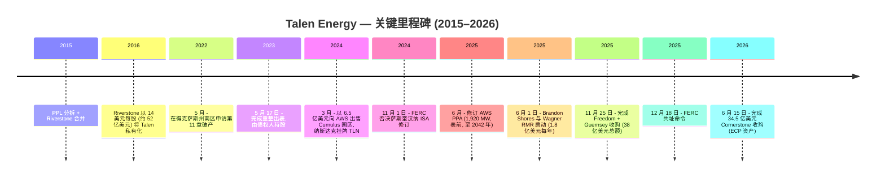
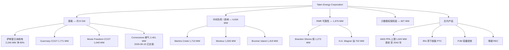
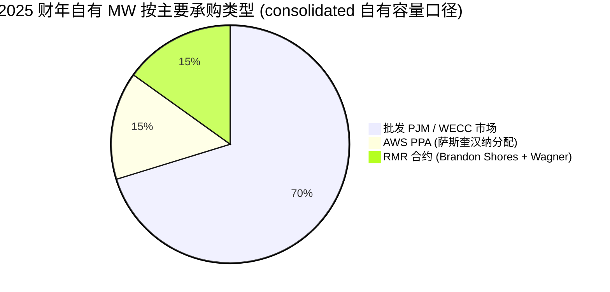
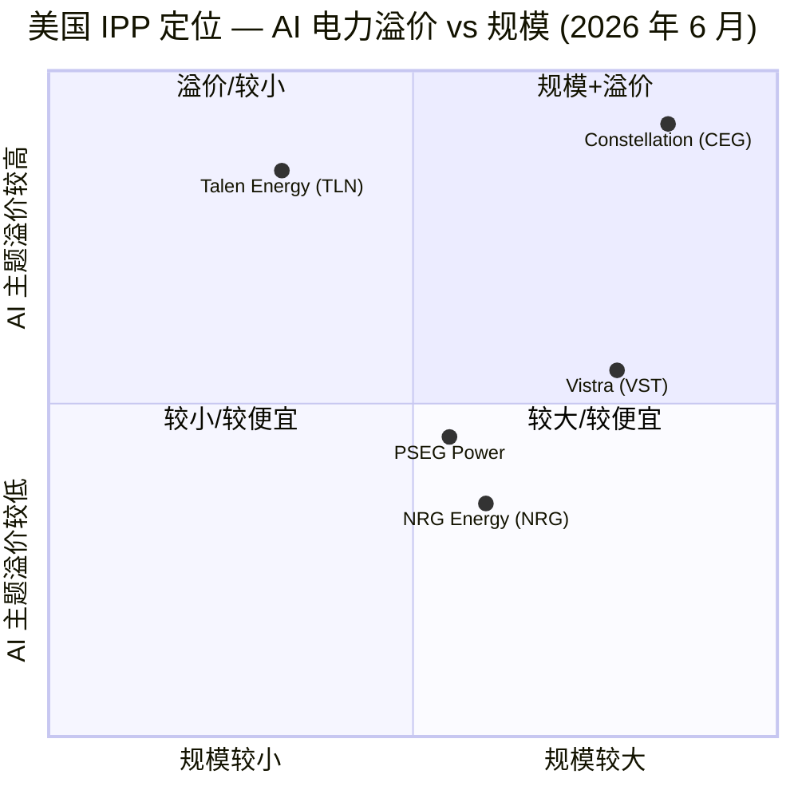

# Talen Energy Corporation (NASDAQ:TLN) — 公司研究报告

**截至日期: 2026-06-18**
**上市地: 纳斯达克全球精选市场 (NASDAQ Global Select Market), 代码 TLN**
**注册地: 美国特拉华州 (总部得克萨斯州休斯顿)**
**报告语言: 简体中文 (英文版同时存在于本目录)**

> *以下投资摘要 (Investment Summary) 为本报告分析师观点 (house view), 非来自任何单一备案文件; 评级、目标价、前瞻估计均为 **分析师观点**, 切勿与 10-K 等一手披露混淆。*

| 项目 | 内容 |
|---|---|
| **评级 (Rating)** | **增持 / Overweight (Buy 倾向)** — *分析师观点* |
| **12 个月目标价 (PT)** | **US$470** (区间 bear US$330 / base US$470 / bull US$600) — *分析师观点* |
| **现价 (2026-06-18 收盘)** | **US$436.29** ([Yahoo Finance — TLN](https://finance.yahoo.com/quote/TLN/)) |
| **隐含上行空间** | 约 **+8%** 至基准目标价 (风险回报偏对称, 见第 2 章) |
| **估值方法** | SOTP / 远期 EV/EBITDA — 对 2027E 备考调整后 EBITDA 约 US$2.0–2.1B 给予约 14–15× 倍数 (核电基载溢价), 与 DCF 交叉验证 |
| **市值 (Market Cap)** | 约 **US$209 亿 (~US$20.9B)** (约 4,780 万股 × US$436.29) |
| **52 周区间** | US$255.50 – US$451.28 ([Yahoo Finance — TLN](https://finance.yahoo.com/quote/TLN/)) |
| **企业价值 (EV)** | 约 **US$300 亿** (备考 Cornerstone 后净债务 ~US$86 亿) |

**论点支柱 (Thesis Pillars) — *分析师观点*:**
1. **唯一已交付的超大规模云核电 PPA。** Susquehanna 2.5 GW 核电站 + 至 2042 年、上限 1,920 MW 的表前 AWS PPA, 是美国 IPP 群体中唯一已进入商业交付的超大规模云直签核电合约——竞争对手 (CEG-Microsoft Crane) 最早 2027/28 年才交付。
2. **PJM 容量价格 9 倍跳升 + 持续上行。** 2025/26 交付年容量价从上一轮 28.92 美元/兆瓦-日跳升至 269.92, 2026/27 清算于 FERC 上限 329.17 美元/兆瓦-日——FY2025 容量收入同比 +153%, 是 EBITDA 翻倍的核心驱动。
3. **"Talen 飞轮"并购扩张已落地。** Freedom/Guernsey (2025-11) 与 **Cornerstone (2026-06-15 已交割)** 合计新增约 5 GW 现代化 H 级燃气机组, 把 AWS 合约模板复制到更广的燃气基载组合——可寻址燃气规模近乎翻倍。
4. **代价是杠杆与执行风险。** 长期债务从 FY2024 的 US$29.87 亿跳升至 FY2025 的 US$67.82 亿, Cornerstone 再添 US$25.5 亿现金对价; AWS PPA 经济性高度依赖 FERC 持续批准的表前交付与 Section 45U 核能 PTC。

> **业绩更新——Cornerstone 收购已交割 (2026-06-15):** 继 2026 年 1 月签约后, Talen 于 **2026 年 6 月 15 日完成 Cornerstone 收购**, 以 **34.5 亿美元** (25.5 亿美元现金 + 2,399,998 股股票) 从 Energy Capital Partners (ECP) 买入 Lawrenceburg (印第安纳, 1,120 MW)、Waterford (俄亥俄, 875 MW)、Darby (俄亥俄, 456 MW) 三项燃气机组, 同时把循环信贷额度 (RCF) 从 9 亿美元上调至 13.5 亿美元、独立信用证额度从 11 亿美元上调至 15 亿美元 ([TLN 8-K, 2026-06-15 — Cornerstone 交割 + 信贷修订](https://www.sec.gov/Archives/edgar/data/1622536/000162253626000048/tln-20260615.htm))。2026 年第一季度 (2026-05-05 公布): GAAP 净利润 **6,300 万美元**、调整后 EBITDA **4.73 亿美元**、调整后自由现金流 **3.50 亿美元**, 公司重申全年 2026 年调整后 EBITDA **17.5 亿–20.5 亿美元**、调整后自由现金流 **9.8 亿–11.8 亿美元** ([TLN 2026 财年 Q1 业绩公告, 2026-05-05](https://www.sec.gov/Archives/edgar/data/0001622536/000162253626000035/a20260505q12026earningsrel.htm))。

---

## 目录
1. 公司概览 (含 1A 估值与目标价 / 1B GF Score)
2. 估值与目标价 (Valuation & Price Target)
3. 公司历史
4. 管理团队
5. 产品与服务
6. 客户与上市策略
7. 行业概览
8. 竞争格局
9. 市场机会 (TAM)
10. 风险评估 (含 9.5 关键分歧与催化剂)
11. 投资者视角评分 (Investor-Lens Scorecards)
12. 参考资料 / Data Used

---

## 1. 公司概览

Talen Energy Corporation (NASDAQ: **TLN**) 是一家总部位于美国休斯顿的**独立发电商 (Independent Power Producer, IPP)**, 在 PJM 互联网 (PJM Interconnection, 涵盖中大西洋地区与中西部) 与西部电力协调委员会 (Western Electricity Coordinating Council, WECC, 蒙大拿州) 范围内拥有并运营约 **13.1 GW 净夏季额定 (net summer-rated) 发电容量** (Cornerstone 交割后约 17 GW); 投资组合的核心锚定资产是其在宾夕法尼亚州萨勒姆镇 (Salem Township, Pennsylvania) 持股 90% 的 2.5 GW **萨斯奎汉纳蒸汽电站 (Susquehanna Steam Electric Station, SESS)** 核电站 ([TLN 10-K FY2025, Item 1 Business](https://www.sec.gov/Archives/edgar/data/0001622536/000162253626000017/tln-20251231.htm))。公司将电力、容量与辅助服务出售到美国电力批发市场 (wholesale power markets); 自 2025 年年中起, 还根据已修订的 1,920 MW 电力采购协议 (Power Purchase Agreement, PPA, 至 2042 年到期), 直接向亚马逊云科技 (Amazon Web Services, AWS) 长期固定价格、表前 (front-of-the-meter) 供应核电 ([TLN 10-K FY2025, Item 1 — AWS PPA](https://www.sec.gov/Archives/edgar/data/0001622536/000162253626000017/tln-20251231.htm))。

**本方观点 (BLUF)。** 我们对 TLN 给予**增持 (Overweight)**、12 个月目标价 **US$470**。核心逻辑: Talen 是把"AI 数据中心电力需求"转化为已签约、已交付现金流的最纯粹标的——Susquehanna+AWS PPA 是无法复制的护城河, PJM 容量价格的结构性跳升提供了额外的近端盈利杠杆, 而 Freedom/Guernsey + 已交割的 Cornerstone 收购把这套商业模式扩展到约 5 GW 现代燃气机组。代价是杠杆显著抬升与对 FERC/PTC 政策的高度依赖。当前股价 (US$436) 已接近 52 周高点, 较我们基准目标价仅约 +8% 上行——故我们的增持是"基本面方向正确、估值已不便宜"的有限上行判断, 而非"深度低估"。下文九个描述性章节支撑这一论点。

**公司业务。** Talen 将核能、天然气、燃油及煤炭原料转化为批发电力, 然后通过以下渠道变现: (i) 向 PJM 实时及次日 (day-ahead) 市场销售电能与辅助服务, (ii) 通过 PJM 基本剩余拍卖 (Base Residual Auction, BRA) 赢取容量收入 (capacity revenue), (iii) 来自 AWS PPA 以及 FERC 批准的可靠性必须运行 (Reliability-Must-Run, RMR) 协议的长期合约收入 (即马里兰州的 Brandon Shores 与 H.A. Wagner 煤/油机组), 以及 (iv) 根据《2022 年通胀削减法案》(Inflation Reduction Act of 2022, IRA) 享有的联邦核能生产税收抵免 (Nuclear Production Tax Credit, PTC) ([TLN 10-K FY2025, "Our Key Markets and Revenue Streams"](https://www.sec.gov/Archives/edgar/data/0001622536/000162253626000017/tln-20251231.htm))。

**规模与布局。** 截至 2025 年末, 自有机组组成为: 萨斯奎汉纳 2,245 净 MW 核电; 3,427 MW 高效率 H 级联合循环 (H-class combined-cycle) 基载燃气 (Guernsey 1,771 MW、Moxie Freedom 1,049 MW、Lower Mt. Bethel 607 MW); 4,634 MW 可调度燃气/燃油调峰 (peaker) 及中间负荷机组 (Martins Creek、Montour、Brunner Island); 1,975 MW RMR 项下的煤/油机组 (Brandon Shores 1,273 MW、H.A. Wagner 702 MW); 约 827 MW 的少数股权煤机组权益 (Conemaugh、Keystone 在 PJM, Colstrip 3 号机组在 WECC/蒙大拿) ([TLN 10-K FY2025, Item 2 Properties](https://www.sec.gov/Archives/edgar/data/0001622536/000162253626000017/tln-20251231.htm))。2026 年 6 月 15 日 Cornerstone 交割后再增约 2,451 MW 燃气机组 (Lawrenceburg+Waterford+Darby) ([TLN 8-K, 2026-06-15](https://www.sec.gov/Archives/edgar/data/1622536/000162253626000048/tln-20260615.htm))。员工人数约 1,880 人 ([Talen Energy / LeadIQ profile, 2026](https://leadiq.com/c/talen-energy/5a1d8a6c240000240063ce6b))。

<svg xmlns="http://www.w3.org/2000/svg" viewBox="0 0 720 460" width="720" height="460" role="img" aria-label="revenue donut"><rect x="0" y="0" width="720" height="460" fill="#ffffff"/>
<text x="20.00" y="30.00" text-anchor="start" font-family="Helvetica,Arial,sans-serif" font-size="15" font-weight="700" fill="#1f2933">Talen Energy 自有发电容量按燃料 (Owned Capacity by Fuel, MW)</text>
<path d="M 288.00,107.20 A 132 132 0 0 1 404.18,176.53 L 356.65,202.17 A 78 78 0 0 0 288.00,161.20 Z" fill="#2563eb"/>
<path d="M 404.18,176.53 A 132 132 0 0 1 342.16,359.58 L 320.00,310.33 A 78 78 0 0 0 356.65,202.17 Z" fill="#15803d"/>
<path d="M 342.16,359.58 A 132 132 0 0 1 159.41,209.40 L 212.01,221.59 A 78 78 0 0 0 320.00,310.33 Z" fill="#d97706"/>
<path d="M 159.41,209.40 A 132 132 0 0 1 237.03,117.44 L 257.88,167.25 A 78 78 0 0 0 212.01,221.59 Z" fill="#7c3aed"/>
<path d="M 237.03,117.44 A 132 132 0 0 1 288.00,107.20 L 288.00,161.20 A 78 78 0 0 0 257.88,167.25 Z" fill="#dc2626"/>
<text x="288.00" y="235.20" text-anchor="middle" font-family="Helvetica,Arial,sans-serif" font-size="18" font-weight="800" fill="#1f2933">13.1 GW</text>
<text x="288.00" y="255.20" text-anchor="middle" font-family="Helvetica,Arial,sans-serif" font-size="13" font-weight="600" fill="#52606d">13.1K</text>
<text x="288.00" y="271.20" text-anchor="middle" font-family="Helvetica,Arial,sans-serif" font-size="10" font-weight="400" fill="#8a97a3">total</text>
<line x1="358.72" y1="120.70" x2="374.72" y2="120.70" stroke="#2563eb" stroke-width="1.4"/>
<text x="378.72" y="118.70" text-anchor="start" font-family="Helvetica,Arial,sans-serif" font-size="11" font-weight="700" fill="#1f2933">Nuclear 核电 (Susquehanna)</text>
<text x="378.72" y="132.70" text-anchor="start" font-family="Helvetica,Arial,sans-serif" font-size="10" font-weight="400" fill="#52606d">2.2K  (17.1%)</text>
<line x1="418.70" y1="283.48" x2="434.70" y2="283.48" stroke="#15803d" stroke-width="1.4"/>
<text x="438.70" y="281.48" text-anchor="start" font-family="Helvetica,Arial,sans-serif" font-size="11" font-weight="700" fill="#1f2933">Gas CCGT 燃气联合循环</text>
<text x="438.70" y="295.48" text-anchor="start" font-family="Helvetica,Arial,sans-serif" font-size="10" font-weight="400" fill="#52606d">3.4K  (26.1%)</text>
<line x1="200.39" y1="345.82" x2="184.39" y2="345.82" stroke="#d97706" stroke-width="1.4"/>
<text x="180.39" y="343.82" text-anchor="end" font-family="Helvetica,Arial,sans-serif" font-size="11" font-weight="700" fill="#1f2933">Gas/Oil peaker 燃气/燃油调峰</text>
<text x="180.39" y="357.82" text-anchor="end" font-family="Helvetica,Arial,sans-serif" font-size="10" font-weight="400" fill="#52606d">4.6K  (35.4%)</text>
<line x1="182.54" y1="150.19" x2="166.54" y2="150.19" stroke="#7c3aed" stroke-width="1.4"/>
<text x="162.54" y="148.19" text-anchor="end" font-family="Helvetica,Arial,sans-serif" font-size="11" font-weight="700" fill="#1f2933">Coal/Oil RMR 煤/油(RMR)</text>
<text x="162.54" y="162.19" text-anchor="end" font-family="Helvetica,Arial,sans-serif" font-size="10" font-weight="400" fill="#52606d">2.0K  (15.1%)</text>
<line x1="260.83" y1="103.90" x2="244.83" y2="103.90" stroke="#dc2626" stroke-width="1.4"/>
<text x="240.83" y="101.90" text-anchor="end" font-family="Helvetica,Arial,sans-serif" font-size="11" font-weight="700" fill="#1f2933">Minority coal 少数权益煤</text>
<text x="240.83" y="115.90" text-anchor="end" font-family="Helvetica,Arial,sans-serif" font-size="10" font-weight="400" fill="#52606d">827  (6.3%)</text>
<text x="360.00" y="444.00" text-anchor="middle" font-family="Helvetica,Arial,sans-serif" font-size="10" font-weight="400" fill="#52606d">Source: TLN FY2025 10-K, Item 2 Properties (机组列表 as of 2025-12-31)</text>
</svg>

*来源: [TLN 10-K FY2025, Item 2 Properties (截至 2025-12-31 的发电机组列表)](https://www.sec.gov/Archives/edgar/data/0001622536/000162253626000017/tln-20251231.htm)。少数股权煤机组按经济权益计入 827 MW。*

**如何盈利。** 2025 财年营业收入 **25.81 亿美元**, 拆分为: 电能及其他收入 21.41 亿美元 (同比 +14%)、容量收入 4.85 亿美元 (同比 +153%, 受 PJM 清算价格上涨推动)、衍生品未实现亏损 (0.45) 亿美元; 与之对应的能源费用 (energy expenses) 10.66 亿美元 ([TLN 10-K FY2025, Statements of Operations](https://www.sec.gov/Archives/edgar/data/0001622536/000162253626000017/tln-20251231.htm))。PJM 分部调整后 EBITDA 达 **10.74 亿美元** (FY2025) 对照 7.75 亿美元 (FY2024); 公司合并调整后 EBITDA **10.35 亿美元**, 高于 FY2024 的 7.70 亿美元 ([TLN 10-K FY2025, MD&A — Adjusted EBITDA 调节表](https://www.sec.gov/Archives/edgar/data/0001622536/000162253626000017/tln-20251231.htm))。萨斯奎汉纳在 2025 年贡献约 17 TWh 零碳电力, 全成本约 **27 美元/MWh**, 同期 PJM West Hub 实现价格运行在 40–60 美元/MWh 之间, 容量价格在 2025/2026 交付年清算于 269.92 美元/兆瓦-日 ([PJM 2025/2026 BRA 报告, 2024-07](https://www.pjm.com/-/media/DotCom/markets-ops/rpm/rpm-auction-info/2025-2026/2025-2026-base-residual-auction-report.pdf))。

下方利润表 Sankey 展示 FY2025 收入如何流经能源费用、各项经营费用 (含一次性非现金 SBC) 到经营亏损; 营业收入构成 donut 与历史收入柱状图展示电能与容量两大收入来源的结构与三年演变。

<svg xmlns="http://www.w3.org/2000/svg" viewBox="0 0 1000 560" width="1000" height="560" role="img" aria-label="income statement Sankey"><rect x="0" y="0" width="1000" height="560" fill="#ffffff"/>
<text x="20.00" y="30.00" text-anchor="start" font-family="Helvetica,Arial,sans-serif" font-size="15" font-weight="700" fill="#1f2933">Talen Energy FY2025 利润表 Sankey (Income Statement)</text>
<path d="M 204.00,59.32 C 258.00,59.32 258.00,78.00 312.00,78.00 L 312.00,428.06 C 258.00,428.06 258.00,409.38 204.00,409.38 Z" fill="#93c5fd" fill-opacity="0.55"/>
<path d="M 452.00,71.00 C 506.00,71.00 506.00,149.79 560.00,149.79 L 560.00,151.79 C 506.00,151.79 506.00,73.00 452.00,73.00 Z" fill="#86efac" fill-opacity="0.55"/>
<path d="M 452.00,73.00 C 506.00,73.00 506.00,165.79 560.00,165.79 L 560.00,428.21 C 506.00,428.21 506.00,335.42 452.00,335.42 Z" fill="#fca5a5" fill-opacity="0.55"/>
<path d="M 328.00,78.00 C 382.00,78.00 382.00,71.00 436.00,71.00 L 436.00,318.71 C 382.00,318.71 382.00,325.71 328.00,325.71 Z" fill="#86efac" fill-opacity="0.55"/>
<path d="M 328.00,325.71 C 382.00,325.71 382.00,332.71 436.00,332.71 L 436.00,507.00 C 382.00,507.00 382.00,500.00 328.00,500.00 Z" fill="#fca5a5" fill-opacity="0.55"/>
<path d="M 700.00,142.79 C 754.00,142.79 754.00,288.00 808.00,288.00 L 808.00,290.00 C 754.00,290.00 754.00,144.79 700.00,144.79 Z" fill="#86efac" fill-opacity="0.55"/>
<path d="M 576.00,149.79 C 630.00,149.79 630.00,142.79 684.00,142.79 L 684.00,144.79 C 630.00,144.79 630.00,151.79 576.00,151.79 Z" fill="#86efac" fill-opacity="0.55"/>
<path d="M 576.00,165.79 C 630.00,165.79 630.00,158.79 684.00,158.79 L 684.00,260.81 C 630.00,260.81 630.00,267.81 576.00,267.81 Z" fill="#fca5a5" fill-opacity="0.55"/>
<path d="M 576.00,267.81 C 630.00,267.81 630.00,274.81 684.00,274.81 L 684.00,435.21 C 630.00,435.21 630.00,428.21 576.00,428.21 Z" fill="#fca5a5" fill-opacity="0.55"/>
<path d="M 204.00,423.38 C 258.00,423.38 258.00,428.06 312.00,428.06 L 312.00,507.36 C 258.00,507.36 258.00,502.68 204.00,502.68 Z" fill="#93c5fd" fill-opacity="0.55"/>
<path d="M 204.00,516.68 C 258.00,516.68 258.00,507.36 312.00,507.36 L 312.00,509.36 C 258.00,509.36 258.00,518.68 204.00,518.68 Z" fill="#93c5fd" fill-opacity="0.55"/>
<rect x="188.00" y="59.32" width="16" height="350.06" rx="1.5" fill="#2563eb"/>
<rect x="188.00" y="423.38" width="16" height="79.30" rx="1.5" fill="#2563eb"/>
<rect x="188.00" y="516.68" width="16" height="2.00" rx="1.5" fill="#2563eb"/>
<rect x="312.00" y="78.00" width="16" height="422.00" rx="1.5" fill="#1e3a8a"/>
<rect x="436.00" y="71.00" width="16" height="247.71" rx="1.5" fill="#15803d"/>
<rect x="436.00" y="332.71" width="16" height="174.29" rx="1.5" fill="#dc2626"/>
<rect x="560.00" y="149.79" width="16" height="2.00" rx="1.5" fill="#15803d"/>
<rect x="560.00" y="165.79" width="16" height="262.42" rx="1.5" fill="#dc2626"/>
<rect x="684.00" y="142.79" width="16" height="2.00" rx="1.5" fill="#15803d"/>
<rect x="684.00" y="158.79" width="16" height="102.03" rx="1.5" fill="#dc2626"/>
<rect x="684.00" y="274.81" width="16" height="160.40" rx="1.5" fill="#dc2626"/>
<rect x="808.00" y="288.00" width="16" height="2.00" rx="1.5" fill="#15803d"/>
<line x1="188.00" y1="234.35" x2="182.00" y2="203.67" stroke="#cbd5e1" stroke-width="1"/>
<text x="179.00" y="206.67" text-anchor="end" font-family="Helvetica,Arial,sans-serif" font-size="11.5" font-weight="700" fill="#1f2933">Energy &amp; other 电能及其他</text>
<text x="179.00" y="219.67" text-anchor="end" font-family="Helvetica,Arial,sans-serif" font-size="10" font-weight="400" fill="#52606d">US$2.1B  (83.0%)</text>
<line x1="188.00" y1="463.03" x2="182.00" y2="432.35" stroke="#cbd5e1" stroke-width="1"/>
<text x="179.00" y="435.35" text-anchor="end" font-family="Helvetica,Arial,sans-serif" font-size="11.5" font-weight="700" fill="#1f2933">Capacity 容量</text>
<text x="179.00" y="448.35" text-anchor="end" font-family="Helvetica,Arial,sans-serif" font-size="10" font-weight="400" fill="#52606d">US$485.0M  (18.8%)</text>
<line x1="188.00" y1="517.68" x2="182.00" y2="487.00" stroke="#cbd5e1" stroke-width="1"/>
<text x="179.00" y="490.00" text-anchor="end" font-family="Helvetica,Arial,sans-serif" font-size="11.5" font-weight="700" fill="#1f2933">Deriv. unrealized 衍生品未实现</text>
<text x="179.00" y="503.00" text-anchor="end" font-family="Helvetica,Arial,sans-serif" font-size="10" font-weight="400" fill="#52606d">-US$45.0M  (-1.7%)</text>
<rect x="331.00" y="60.00" width="113.10" height="26" rx="2" fill="#ffffff" fill-opacity="0.72"/>
<text x="334.00" y="72.00" text-anchor="start" font-family="Helvetica,Arial,sans-serif" font-size="11.5" font-weight="700" fill="#1f2933">Revenue</text>
<text x="334.00" y="85.00" text-anchor="start" font-family="Helvetica,Arial,sans-serif" font-size="10" font-weight="400" fill="#52606d">US$2.6B  (100.0%)</text>
<rect x="455.00" y="53.00" width="106.80" height="26" rx="2" fill="#ffffff" fill-opacity="0.72"/>
<text x="458.00" y="65.00" text-anchor="start" font-family="Helvetica,Arial,sans-serif" font-size="11.5" font-weight="700" fill="#1f2933">Gross Profit</text>
<text x="458.00" y="78.00" text-anchor="start" font-family="Helvetica,Arial,sans-serif" font-size="10" font-weight="400" fill="#52606d">US$1.5B  (58.7%)</text>
<rect x="455.00" y="314.71" width="144.60" height="26" rx="2" fill="#ffffff" fill-opacity="0.72"/>
<text x="458.00" y="326.71" text-anchor="start" font-family="Helvetica,Arial,sans-serif" font-size="11.5" font-weight="700" fill="#1f2933">Cost of Revenue (COGS)</text>
<text x="458.00" y="339.71" text-anchor="start" font-family="Helvetica,Arial,sans-serif" font-size="10" font-weight="400" fill="#52606d">US$1.1B  (41.3%)</text>
<rect x="579.00" y="131.79" width="119.40" height="26" rx="2" fill="#ffffff" fill-opacity="0.72"/>
<text x="582.00" y="143.79" text-anchor="start" font-family="Helvetica,Arial,sans-serif" font-size="11.5" font-weight="700" fill="#1f2933">Operating Income</text>
<text x="582.00" y="156.79" text-anchor="start" font-family="Helvetica,Arial,sans-serif" font-size="10" font-weight="400" fill="#52606d">-US$90.0M  (-3.5%)</text>
<rect x="579.00" y="156.79" width="150.90" height="26" rx="2" fill="#ffffff" fill-opacity="0.72"/>
<text x="582.00" y="168.79" text-anchor="start" font-family="Helvetica,Arial,sans-serif" font-size="11.5" font-weight="700" fill="#1f2933">Total Operating Expense</text>
<text x="582.00" y="181.79" text-anchor="start" font-family="Helvetica,Arial,sans-serif" font-size="10" font-weight="400" fill="#52606d">US$1.6B  (62.2%)</text>
<rect x="703.00" y="124.79" width="119.40" height="26" rx="2" fill="#ffffff" fill-opacity="0.72"/>
<text x="706.00" y="136.79" text-anchor="start" font-family="Helvetica,Arial,sans-serif" font-size="11.5" font-weight="700" fill="#1f2933">Pretax Income</text>
<text x="706.00" y="149.79" text-anchor="start" font-family="Helvetica,Arial,sans-serif" font-size="10" font-weight="400" fill="#52606d">-US$90.0M  (-3.5%)</text>
<rect x="703.00" y="149.79" width="119.40" height="26" rx="2" fill="#ffffff" fill-opacity="0.72"/>
<text x="706.00" y="161.79" text-anchor="start" font-family="Helvetica,Arial,sans-serif" font-size="11.5" font-weight="700" fill="#1f2933">SG&amp;A</text>
<text x="706.00" y="174.79" text-anchor="start" font-family="Helvetica,Arial,sans-serif" font-size="10" font-weight="400" fill="#52606d">US$624.0M  (24.2%)</text>
<rect x="703.00" y="256.81" width="119.40" height="26" rx="2" fill="#ffffff" fill-opacity="0.72"/>
<text x="706.00" y="268.81" text-anchor="start" font-family="Helvetica,Arial,sans-serif" font-size="11.5" font-weight="700" fill="#1f2933">Other OpEx</text>
<text x="706.00" y="281.81" text-anchor="start" font-family="Helvetica,Arial,sans-serif" font-size="10" font-weight="400" fill="#52606d">US$981.0M  (38.0%)</text>
<text x="833.00" y="286.00" text-anchor="start" font-family="Helvetica,Arial,sans-serif" font-size="11.5" font-weight="700" fill="#1f2933">Net Income</text>
<text x="833.00" y="299.00" text-anchor="start" font-family="Helvetica,Arial,sans-serif" font-size="10" font-weight="400" fill="#52606d">-US$90.0M  (-3.5%)</text>
<text x="500.00" y="530.00" text-anchor="middle" font-family="Helvetica,Arial,sans-serif" font-size="10" font-weight="400" font-style="italic" fill="#8a97a3">能源费用 US$1,066M 含燃料采购+核燃料摊销+商品衍生品; 其他经营费用含 O&amp;M US$620M、D&amp;A US$279M、其他 US$82M; G&amp;A US$624M 内含非现金股权激励 SBC US$526M(IPO负债型奖励重估)</text>
<text x="500.00" y="544.00" text-anchor="middle" font-family="Helvetica,Arial,sans-serif" font-size="10" font-weight="400" fill="#52606d">Source: TLN FY2025 10-K, Consolidated Statements of Operations (filed 2026-02-26)</text>
</svg>

*来源: [TLN FY2025 10-K, Consolidated Statements of Operations (filed 2026-02-26)](https://www.sec.gov/Archives/edgar/data/0001622536/000162253626000017/tln-20251231.htm)。注: 经营亏损 US$(90)M 主因是 G&A 中内含的 **非现金股权激励 SBC US$526M** (IPO 负债型奖励随股价重估)——剔除后核心经营为正。*

<svg xmlns="http://www.w3.org/2000/svg" viewBox="0 0 720 460" width="720" height="460" role="img" aria-label="revenue donut"><rect x="0" y="0" width="720" height="460" fill="#ffffff"/>
<text x="20.00" y="30.00" text-anchor="start" font-family="Helvetica,Arial,sans-serif" font-size="15" font-weight="700" fill="#1f2933">Talen Energy FY2025 营业收入构成 (Operating Revenue Mix)</text>
<path d="M 288.00,107.20 A 132 132 0 1 1 166.96,186.54 L 216.48,208.08 A 78 78 0 1 0 288.00,161.20 Z" fill="#2563eb"/>
<path d="M 166.96,186.54 A 132 132 0 0 1 288.00,107.20 L 288.00,161.20 A 78 78 0 0 0 216.48,208.08 Z" fill="#15803d"/>
<text x="288.00" y="235.20" text-anchor="middle" font-family="Helvetica,Arial,sans-serif" font-size="18" font-weight="800" fill="#1f2933">TLN</text>
<text x="288.00" y="255.20" text-anchor="middle" font-family="Helvetica,Arial,sans-serif" font-size="13" font-weight="600" fill="#52606d">US$2.6B</text>
<text x="288.00" y="271.20" text-anchor="middle" font-family="Helvetica,Arial,sans-serif" font-size="10" font-weight="400" fill="#8a97a3">total</text>
<line x1="363.65" y1="354.61" x2="379.65" y2="354.61" stroke="#2563eb" stroke-width="1.4"/>
<text x="383.65" y="352.61" text-anchor="start" font-family="Helvetica,Arial,sans-serif" font-size="11" font-weight="700" fill="#1f2933">Energy &amp; other 电能及其他</text>
<text x="383.65" y="366.61" text-anchor="start" font-family="Helvetica,Arial,sans-serif" font-size="10" font-weight="400" fill="#52606d">US$2.1B  (81.5%)</text>
<line x1="212.35" y1="123.79" x2="196.35" y2="123.79" stroke="#15803d" stroke-width="1.4"/>
<text x="192.35" y="121.79" text-anchor="end" font-family="Helvetica,Arial,sans-serif" font-size="11" font-weight="700" fill="#1f2933">Capacity 容量</text>
<text x="192.35" y="135.79" text-anchor="end" font-family="Helvetica,Arial,sans-serif" font-size="10" font-weight="400" fill="#52606d">US$485.0M  (18.5%)</text>
<text x="360.00" y="444.00" text-anchor="middle" font-family="Helvetica,Arial,sans-serif" font-size="10" font-weight="400" fill="#52606d">Source: TLN FY2025 10-K, Statements of Operations (FY2025; 衍生品未实现亏损 US$(45)M 未计入饼图)</text>
</svg>

*来源: [TLN FY2025 10-K, Statements of Operations](https://www.sec.gov/Archives/edgar/data/0001622536/000162253626000017/tln-20251231.htm)。衍生品未实现亏损 US$(45)M 未计入饼图。*

<svg xmlns="http://www.w3.org/2000/svg" viewBox="0 0 860 470" width="860" height="470" role="img" aria-label="historical revenue bars"><rect x="0" y="0" width="860" height="470" fill="#ffffff"/>
<text x="20.00" y="30.00" text-anchor="start" font-family="Helvetica,Arial,sans-serif" font-size="15" font-weight="700" fill="#1f2933">Talen Energy 营业收入历史 (Operating Revenue, FY2023–FY2025)</text>
<rect x="20.00" y="44" width="11" height="11" rx="2" fill="#2563eb"/>
<text x="36.00" y="53.00" text-anchor="start" font-family="Helvetica,Arial,sans-serif" font-size="10.5" font-weight="400" fill="#1f2933">Energy &amp; other 电能及其他</text>
<rect x="182.00" y="44" width="11" height="11" rx="2" fill="#15803d"/>
<text x="198.00" y="53.00" text-anchor="start" font-family="Helvetica,Arial,sans-serif" font-size="10.5" font-weight="400" fill="#1f2933">Capacity 容量</text>
<line x1="70" y1="412.00" x2="834" y2="412.00" stroke="#eceff2" stroke-width="1"/>
<text x="64.00" y="415.00" text-anchor="end" font-family="Helvetica,Arial,sans-serif" font-size="9.5" font-weight="400" fill="#52606d">US$0</text>
<line x1="70" y1="345.20" x2="834" y2="345.20" stroke="#eceff2" stroke-width="1"/>
<text x="64.00" y="348.20" text-anchor="end" font-family="Helvetica,Arial,sans-serif" font-size="9.5" font-weight="400" fill="#52606d">US$567.2M</text>
<line x1="70" y1="278.40" x2="834" y2="278.40" stroke="#eceff2" stroke-width="1"/>
<text x="64.00" y="281.40" text-anchor="end" font-family="Helvetica,Arial,sans-serif" font-size="9.5" font-weight="400" fill="#52606d">US$1.1B</text>
<line x1="70" y1="211.60" x2="834" y2="211.60" stroke="#eceff2" stroke-width="1"/>
<text x="64.00" y="214.60" text-anchor="end" font-family="Helvetica,Arial,sans-serif" font-size="9.5" font-weight="400" fill="#52606d">US$1.7B</text>
<line x1="70" y1="144.80" x2="834" y2="144.80" stroke="#eceff2" stroke-width="1"/>
<text x="64.00" y="147.80" text-anchor="end" font-family="Helvetica,Arial,sans-serif" font-size="9.5" font-weight="400" fill="#52606d">US$2.3B</text>
<line x1="70" y1="78.00" x2="834" y2="78.00" stroke="#eceff2" stroke-width="1"/>
<text x="64.00" y="81.00" text-anchor="end" font-family="Helvetica,Arial,sans-serif" font-size="9.5" font-weight="400" fill="#52606d">US$2.8B</text>
<rect x="123.48" y="153.15" width="147.71" height="258.85" fill="#2563eb"/>
<rect x="123.48" y="124.76" width="147.71" height="28.38" fill="#15803d"/>
<text x="197.33" y="428.00" text-anchor="middle" font-family="Helvetica,Arial,sans-serif" font-size="10" font-weight="400" fill="#52606d">2023</text>
<rect x="378.15" y="190.48" width="147.71" height="221.52" fill="#2563eb"/>
<rect x="378.15" y="167.87" width="147.71" height="22.61" fill="#15803d"/>
<text x="452.00" y="428.00" text-anchor="middle" font-family="Helvetica,Arial,sans-serif" font-size="10" font-weight="400" fill="#52606d">2024</text>
<rect x="632.81" y="159.86" width="147.71" height="252.14" fill="#2563eb"/>
<rect x="632.81" y="102.74" width="147.71" height="57.12" fill="#15803d"/>
<text x="706.67" y="428.00" text-anchor="middle" font-family="Helvetica,Arial,sans-serif" font-size="10" font-weight="400" fill="#52606d">2025</text>
<text x="430.00" y="454.00" text-anchor="middle" font-family="Helvetica,Arial,sans-serif" font-size="10" font-weight="400" fill="#52606d">Source: TLN FY2025 &amp; FY2024 10-K, Statements of Operations (2023 = Predecessor+Successor 合并; 未含衍生品未实现项)</text>
</svg>

*来源: [TLN FY2025 10-K](https://www.sec.gov/Archives/edgar/data/0001622536/000162253626000017/tln-20251231.htm) 与 [TLN FY2024 10-K](https://www.sec.gov/Archives/edgar/data/0001628280/000162828025008786/0001628280-25-008786-index.htm); 2023 = Predecessor (1/1–5/17) + Successor (5/18–12/31) 合并, 未含衍生品未实现项。容量收入 FY2023→FY2025 翻倍, 是 PJM 容量价格跳升的直接体现。*

**地理分布。** 发电资产集中于三个 PJM 分区 (萨斯奎汉纳-锚定的宾夕法尼亚机组位于 MAAC 区, Brandon Shores 与 H.A. Wagner 位于 BGE 区, 俄亥俄州 Guernsey 燃气电厂位于 AEP 区), 此外在蒙大拿州 WECC 的 Colstrip 3 号机组持 30% 经济权益 ([TLN 10-K FY2025, Item 1 Wholesale Markets](https://www.sec.gov/Archives/edgar/data/0001622536/000162253626000017/tln-20251231.htm))。总部位于得克萨斯州休斯顿 2929 Allen Pkwy, 在宾夕法尼亚州 Allentown 设有第二运营办公室——这是 PPL/Talen 时代以来的传统据点 ([LeadIQ 公司简介, 2026](https://leadiq.com/c/talen-energy/5a1d8a6c240000240063ce6b))。

### 1A. 估值快照 (Valuation Snapshot) — 截至 2026-06-18

| 指标 | TLN | VST | CEG | NRG | 行业参照 |
|---|---|---|---|---|---|
| 股价 (2026-06-18) | **US$436.29** | US$163.75 | US$274.06 | US$135.06 | — |
| 市值 | **约 US$209 亿** | US$552 亿 | US$979 亿 | US$285 亿 | — |
| TTM 市盈率 (P/E) | 无意义 (GAAP 亏损) | — | — | — | 标普 500 约 24× |
| 远期 EV/EBITDA (2026E) | **约 13.7×** | 约 11× | 约 14× | 约 9.5× | 受监管公用事业约 10–12× |
| 1Y 股价回报 | **+51%** | — | — | — | — |

来源: [Yahoo Finance — TLN](https://finance.yahoo.com/quote/TLN/); [Yahoo Finance — VST](https://finance.yahoo.com/quote/VST/) / [CEG](https://finance.yahoo.com/quote/CEG/) / [NRG](https://finance.yahoo.com/quote/NRG/) (现价与市值均为 2026-06-18); TLN TTM P/E 无意义因 FY2025 GAAP 净亏损 US$(219)M。1Y 回报基于 yfinance 调整后收盘 (288.66 → 436.29)。

**如何解读估值倍数。** TLN 的 TTM 市盈率不具备意义: 2025 财年 GAAP 净亏损为 **(2.19) 亿美元**, 主要原因是 IPO 相关的负债型权益激励 (liability-classified equity awards) 触发了 **(5.26) 亿美元非现金股票薪酬费用 (Stock-Based Compensation, SBC)**——这一会计处理与 2025 年股价的重估挂钩 ([TLN 10-K FY2025, Statements of Operations — G&A 行内含 SBC; Note 13](https://www.sec.gov/Archives/edgar/data/0001622536/000162253626000017/tln-20251231.htm))。剔除 SBC、衍生品市值重估及并购费用后, 公司在 EBITDA 与 FCF 两个维度上均稳健为正 (调整后 EBITDA 10.35 亿美元; 2026 财年调整后 FCF 指引中值 10.8 亿美元)。远期 EV/EBITDA 约 13.7× 已对比受监管公用事业可比 (10–12×) 计入了清晰的 AI 顺风溢价。这一溢价的主要支撑包括: AWS PPA 故事 (长期、固定价格的核电现金流, 极可能高于市场基准批发价), PJM 容量价格在 2026/2027 年清算于 FERC 批准的 329.17 美元/兆瓦-日 上限, 以及 Freedom/Guernsey 收购加上已交割的 Cornerstone 收购近乎使可寻址燃气基载机组规模翻倍——不过其中也内嵌了第 10 章所述的重大执行风险与 FERC 政策风险。

### 1B. GF Score (GuruFocus 式基本面评分卡) — *分析师观点*

> *GF Score 是本报告采用的 GuruFocus 式五维评分框架, 为**分析师自有评分**, 非 GuruFocus 官方数字, 也不附着于任何备案引用; 每个底层指标 (杠杆、利润率、CAGR、倍数、回报) 在下文各自带一手引用。*

<svg xmlns="http://www.w3.org/2000/svg" viewBox="0 0 500 500" width="500" height="500" role="img" aria-label="GF Score radar">
<rect x="0" y="0" width="500" height="500" fill="#ffffff"/>
<text x="20" y="24" font-family="Helvetica,Arial,sans-serif" font-size="15" font-weight="700" fill="#1f2933">GF Score (GuruFocus-style): 60/100</text>
<text x="20" y="41" font-family="Helvetica,Arial,sans-serif" font-size="11" fill="#52606d">51–70 Poor future performance potential</text>
<polygon points="250.0,88.0 392.7,191.6 338.2,359.4 161.8,359.4 107.3,191.6" fill="#e9f5ec" stroke="none"/>
<polygon points="250.0,208.0 278.5,228.7 267.6,262.3 232.4,262.3 221.5,228.7" fill="none" stroke="#c5d3cb" stroke-width="1"/>
<polygon points="250.0,178.0 307.1,219.5 285.3,286.5 214.7,286.5 192.9,219.5" fill="none" stroke="#c5d3cb" stroke-width="1"/>
<polygon points="250.0,148.0 335.6,210.2 302.9,310.8 197.1,310.8 164.4,210.2" fill="none" stroke="#c5d3cb" stroke-width="1"/>
<polygon points="250.0,118.0 364.1,200.9 320.5,335.1 179.5,335.1 135.9,200.9" fill="none" stroke="#c5d3cb" stroke-width="1"/>
<polygon points="250.0,88.0 392.7,191.6 338.2,359.4 161.8,359.4 107.3,191.6" fill="none" stroke="#c5d3cb" stroke-width="1.3"/>
<line x1="250" y1="238" x2="161.8" y2="359.4" stroke="#cfdad3" stroke-width="1"/>
<text x="146.5" y="392.4" text-anchor="end" font-family="Helvetica,Arial,sans-serif" font-size="11.5" font-weight="600" fill="#1f2933">Financial Strength</text>
<text x="146.5" y="405.4" text-anchor="end" font-family="Helvetica,Arial,sans-serif" font-size="9.5" fill="#52606d">财务实力</text>
<text x="214.7" y="280.5" text-anchor="middle" font-family="Helvetica,Arial,sans-serif" font-size="10.5" font-weight="700" fill="#1f2933">4</text>
<line x1="250" y1="238" x2="250.0" y2="88.0" stroke="#cfdad3" stroke-width="1"/>
<text x="250.0" y="58.0" text-anchor="middle" font-family="Helvetica,Arial,sans-serif" font-size="11.5" font-weight="600" fill="#1f2933">Profitability</text>
<text x="250.0" y="71.0" text-anchor="middle" font-family="Helvetica,Arial,sans-serif" font-size="9.5" fill="#52606d">盈利能力</text>
<text x="250.0" y="157.0" text-anchor="middle" font-family="Helvetica,Arial,sans-serif" font-size="10.5" font-weight="700" fill="#1f2933">5</text>
<line x1="250" y1="238" x2="107.3" y2="191.6" stroke="#cfdad3" stroke-width="1"/>
<text x="82.6" y="183.6" text-anchor="end" font-family="Helvetica,Arial,sans-serif" font-size="11.5" font-weight="600" fill="#1f2933">Growth</text>
<text x="82.6" y="196.6" text-anchor="end" font-family="Helvetica,Arial,sans-serif" font-size="9.5" fill="#52606d">成长性</text>
<text x="135.9" y="194.9" text-anchor="middle" font-family="Helvetica,Arial,sans-serif" font-size="10.5" font-weight="700" fill="#1f2933">8</text>
<line x1="250" y1="238" x2="392.7" y2="191.6" stroke="#cfdad3" stroke-width="1"/>
<text x="417.4" y="183.6" text-anchor="start" font-family="Helvetica,Arial,sans-serif" font-size="11.5" font-weight="600" fill="#1f2933">GF Value</text>
<text x="417.4" y="196.6" text-anchor="start" font-family="Helvetica,Arial,sans-serif" font-size="9.5" fill="#52606d">估值</text>
<text x="307.1" y="213.5" text-anchor="middle" font-family="Helvetica,Arial,sans-serif" font-size="10.5" font-weight="700" fill="#1f2933">4</text>
<line x1="250" y1="238" x2="338.2" y2="359.4" stroke="#cfdad3" stroke-width="1"/>
<text x="353.5" y="392.4" text-anchor="start" font-family="Helvetica,Arial,sans-serif" font-size="11.5" font-weight="600" fill="#1f2933">Momentum</text>
<text x="353.5" y="405.4" text-anchor="start" font-family="Helvetica,Arial,sans-serif" font-size="9.5" fill="#52606d">动量</text>
<text x="329.4" y="341.2" text-anchor="middle" font-family="Helvetica,Arial,sans-serif" font-size="10.5" font-weight="700" fill="#1f2933">9</text>
<polygon points="250.0,163.0 307.1,219.5 329.4,347.2 214.7,286.5 135.9,200.9" fill="#2e8b57" fill-opacity="0.34" stroke="#2e8b57" stroke-width="2"/>
<circle cx="214.7" cy="286.5" r="2.6" fill="#2e8b57"/>
<circle cx="250.0" cy="163.0" r="2.6" fill="#2e8b57"/>
<circle cx="135.9" cy="200.9" r="2.6" fill="#2e8b57"/>
<circle cx="307.1" cy="219.5" r="2.6" fill="#2e8b57"/>
<circle cx="329.4" cy="347.2" r="2.6" fill="#2e8b57"/>
<text x="250" y="470" text-anchor="middle" font-family="Helvetica,Arial,sans-serif" font-size="9.5" fill="#52606d">Source: TLN FY2025 10-K · Q1 2026 8-K · Yahoo Finance (price as of 2026-06-18)</text>
<text x="250" y="485" text-anchor="middle" font-family="Helvetica,Arial,sans-serif" font-size="9" fill="#52606d">GF Score = independent analyst rubric (*Analyst view:*) — not GuruFocus™ official number</text>
</svg>

| 维度 / Dimension | 评分 / Score (0–10) | |
|---|---|---|
| Financial Strength (财务实力) | 4 | `████░░░░░░` |
| Profitability (盈利能力) | 5 | `█████░░░░░` |
| Growth (成长性) | 8 | `████████░░` |
| GF Value (估值) | 4 | `████░░░░░░` |
| Momentum (动量) | 9 | `█████████░` |
| **GF Score (composite, *Analyst view:*)** | **60 / 100** | **51–70 Poor future performance potential** |

*Composite weights (*Analyst view:*): Financial Strength 20% · Profitability 25% · Growth 25% · GF Value 15% · Momentum 15% (transparent reproduction — not GuruFocus's proprietary weighting).*

*GF Score 综合得分 **60 / 100** (五维分别为 Financial Strength 4 / Profitability 5 / Growth 8 / GF Value 4 / Momentum 9; 按默认权重 FS 20% / Prof 25% / Growth 25% / Value 15% / Momentum 15% 汇总, 与图内 60/100 一致)。来源: [TLN FY2025 10-K](https://www.sec.gov/Archives/edgar/data/0001622536/000162253626000017/tln-20251231.htm) · [TLN Q1 2026 8-K](https://www.sec.gov/Archives/edgar/data/0001622536/000162253626000035/a20260505q12026earningsrel.htm) · [Yahoo Finance](https://finance.yahoo.com/quote/TLN/) (价格 as of 2026-06-18)。*

**各维度评分理由:**

- **Financial Strength (财务强度) = 4/10。** 杠杆是主要拖累: 长期债务自 FY2024 的 US$2,987M 跳升至 FY2025 的 US$6,782M (为 Freedom/Guernsey 收购融资), 净债务/调整后 EBITDA 在 FY2025 末 (Cornerstone 前) 已接近 6×, Cornerstone 交割后进一步上升; 年利息费用 US$302M ([TLN 10-K FY2025, Balance Sheets & Note 10](https://www.sec.gov/Archives/edgar/data/0001622536/000162253626000017/tln-20251231.htm))。部分对冲: 2025 年末流动性约 15.9 亿美元, 信用证额度已上调至 15 亿美元 ([TLN 8-K, 2026-06-15](https://www.sec.gov/Archives/edgar/data/1622536/000162253626000048/tln-20260615.htm)), 且 AWS 长约现金流可见度支持再融资。
- **Profitability (盈利能力) = 5/10。** GAAP 口径 FY2025 净亏损 US$(219)M (SBC 驱动) 拉低评分; 但核心经济稳健: 调整后 EBITDA US$1,035M 对应约 40% 的 EBITDA margin, 萨斯奎汉纳全成本 ~27 美元/MWh 对 PJM West Hub 40–60 美元/MWh 实现价是高利差 ([TLN 10-K FY2025, MD&A — Adjusted EBITDA 调节表](https://www.sec.gov/Archives/edgar/data/0001622536/000162253626000017/tln-20251231.htm))。
- **Growth (增长) = 8/10。** 强劲: 调整后 EBITDA 自 FY2024 的 US$770M 增至 FY2025 的 US$1,035M (+34%); 2026 年指引中值约 US$1.9B (含 Freedom/Guernsey 全年并表 + 容量价格上行), 隐含再翻倍量级的增长; AWS PPA 爬坡 (2032 年达 1,920 MW) 提供多年增长跑道 ([TLN Q1 2026 8-K — 2026 指引](https://www.sec.gov/Archives/edgar/data/0001622536/000162253626000035/a20260505q12026earningsrel.htm))。
- **GF Value (估值, 越高越便宜) = 4/10。** 远期 EV/EBITDA 约 13.7× 高于受监管公用事业可比 (10–12×) 与历史 IPP 7–8× 中枢; 较 UBS US$486 目标价当前约 +11% 上行——*分析师观点* ([UBS — US Power: DCF Valuations For IPPs, 2026-05-04, p.8](http://xs-macbook-air.local:5001/zsxq/pdf/585421254542224/UBS-US%20Power%EF%BC%9A%20DCF%20Valuations%20For%20IPPs%20Support%20Bullish%20View-260504.pdf))。估值已不便宜, 故给中低分。
- **Momentum (动量) = 9/10。** 极强: 1Y 股价回报 +51% (288.66 → 436.29), 6M +17%, 高于 200 日均线约 +17%, 接近 52 周高点 US$451.28 ([Yahoo Finance — TLN, 价格 as of 2026-06-18](https://finance.yahoo.com/quote/TLN/))。

---

## 2. 估值与目标价 (Valuation & Price Target) — *分析师观点*

> *本章全部前瞻数字 (收入、EBITDA、目标价、bull/base/bear) 均为**分析师观点**, 不附着于任何 10-K 引用; 每个驱动因素的外部依据在段内单独引用。*

### 2A. 前瞻财务估计 (3 年, 备考 Cornerstone)

| 财年 | 营业收入 (US$B) | 调整后 EBITDA (US$B) | 调整后 FCF (US$B) | 主要驱动 |
|---|---|---|---|---|
| FY2025 (实际) | 2.58 | **1.035** | ~0.9 | Freedom/Guernsey 部分并表 + 容量价格 +153% |
| FY2026E (公司指引中值) | ~3.0 | **~1.90** | **~1.08** | Freedom/Guernsey 全年并表 + 2025/26 容量价 269.92 + AWS 爬坡 |
| FY2027E (分析师) | ~3.5 | **~2.05** | ~1.2 | 2026/27 容量价 329.17 上限 + Cornerstone 全年并表 |
| FY2030E (UBS 备考) | — | **~2.78** | — | AWS 满量爬坡 + Cornerstone + 升级改造 |

*FY2026E 为公司指引区间中值 (EBITDA US$1.75–2.05B、FCF US$0.98–1.18B), 引用 [TLN Q1 2026 8-K, 2026-05-05](https://www.sec.gov/Archives/edgar/data/0001622536/000162253626000035/a20260505q12026earningsrel.htm); FY2027E 为本报告分析师估计, 依据 = FY2026 指引 + 2026/27 BRA 容量上限 329.17 美元/兆瓦-日 ([PJM 2026/2027 BRA 报告](https://www.pjm.com/-/media/DotCom/markets-ops/rpm/rpm-auction-info/2026-2027/2026-2027-bra-report.pdf)) + Cornerstone 全年并表; FY2030E 为 UBS 备考假设 (含 2026 年 1 月宣布的 2,567 MW 收购交割), 引用 [UBS — US Power: DCF Valuations For IPPs, 2026-05-04, p.3](http://xs-macbook-air.local:5001/zsxq/pdf/585421254542224/UBS-US%20Power%EF%BC%9A%20DCF%20Valuations%20For%20IPPs%20Support%20Bullish%20View-260504.pdf)——分析师观点。*

下方 DuPont 树把 FY2025 的负 ROE 分解到净利率、资产周转与权益乘数三段——可见负 ROE 完全由非现金 SBC 驱动的负净利率造成, 而非资产质量或杠杆失控。

<svg xmlns="http://www.w3.org/2000/svg" viewBox="0 0 1240 540" width="1240" height="540" role="img" aria-label="DuPont ROE decomposition"><rect x="0" y="0" width="1240" height="540" fill="#ffffff"/>
<text x="20.00" y="30.00" text-anchor="start" font-family="Helvetica,Arial,sans-serif" font-size="15" font-weight="700" fill="#1f2933">Talen Energy FY2025 DuPont ROE 分解 (5-Step)</text>
<rect x="545.00" y="56.00" width="150" height="56" rx="7" fill="#1e3a8a"/>
<text x="620.00" y="76.00" text-anchor="middle" font-family="Helvetica,Arial,sans-serif" font-size="11.5" font-weight="700" fill="#ffffff">ROE</text>
<text x="620.00" y="94.00" text-anchor="middle" font-family="Helvetica,Arial,sans-serif" font-size="13" font-weight="800" fill="#ffffff">-17.66%</text>
<text x="620.00" y="106.00" text-anchor="middle" font-family="Helvetica,Arial,sans-serif" font-size="8.5" font-weight="400" fill="#dbeafe">= Net Income / Avg Equity</text>
<rect x="191.60" y="168.00" width="150" height="56" rx="7" fill="#2563eb"/>
<text x="266.60" y="188.00" text-anchor="middle" font-family="Helvetica,Arial,sans-serif" font-size="11.5" font-weight="700" fill="#ffffff">Net Margin</text>
<text x="266.60" y="206.00" text-anchor="middle" font-family="Helvetica,Arial,sans-serif" font-size="13" font-weight="800" fill="#ffffff">-8.49%</text>
<text x="266.60" y="218.00" text-anchor="middle" font-family="Helvetica,Arial,sans-serif" font-size="8.5" font-weight="400" fill="#dbeafe">Net Income / Revenue</text>
<line x1="620.00" y1="112.00" x2="266.60" y2="168.00" stroke="#94a3b8" stroke-width="1.4"/>
<rect x="545.00" y="168.00" width="150" height="56" rx="7" fill="#2563eb"/>
<text x="620.00" y="188.00" text-anchor="middle" font-family="Helvetica,Arial,sans-serif" font-size="11.5" font-weight="700" fill="#ffffff">Asset Turnover</text>
<text x="620.00" y="206.00" text-anchor="middle" font-family="Helvetica,Arial,sans-serif" font-size="13" font-weight="800" fill="#ffffff">0.30</text>
<text x="620.00" y="218.00" text-anchor="middle" font-family="Helvetica,Arial,sans-serif" font-size="8.5" font-weight="400" fill="#dbeafe">Revenue / Avg Assets</text>
<line x1="620.00" y1="112.00" x2="620.00" y2="168.00" stroke="#94a3b8" stroke-width="1.4"/>
<rect x="898.40" y="168.00" width="150" height="56" rx="7" fill="#2563eb"/>
<text x="973.40" y="188.00" text-anchor="middle" font-family="Helvetica,Arial,sans-serif" font-size="11.5" font-weight="700" fill="#ffffff">Equity Multiplier</text>
<text x="973.40" y="206.00" text-anchor="middle" font-family="Helvetica,Arial,sans-serif" font-size="13" font-weight="800" fill="#ffffff">6.86</text>
<text x="973.40" y="218.00" text-anchor="middle" font-family="Helvetica,Arial,sans-serif" font-size="8.5" font-weight="400" fill="#dbeafe">Avg Assets / Avg Equity</text>
<line x1="620.00" y1="112.00" x2="973.40" y2="168.00" stroke="#94a3b8" stroke-width="1.4"/>
<circle cx="443.30" cy="196.00" r="11" fill="#ffffff" stroke="#94a3b8" stroke-width="1.2"/>
<text x="443.30" y="201.00" text-anchor="middle" font-family="Helvetica,Arial,sans-serif" font-size="14" font-weight="800" fill="#52606d">×</text>
<circle cx="796.70" cy="196.00" r="11" fill="#ffffff" stroke="#94a3b8" stroke-width="1.2"/>
<text x="796.70" y="201.00" text-anchor="middle" font-family="Helvetica,Arial,sans-serif" font-size="14" font-weight="800" fill="#52606d">×</text>
<rect x="65.00" y="300.00" width="118" height="56" rx="7" fill="#2563eb"/>
<text x="124.00" y="320.00" text-anchor="middle" font-family="Helvetica,Arial,sans-serif" font-size="11.5" font-weight="700" fill="#ffffff">Operating Margin</text>
<text x="124.00" y="338.00" text-anchor="middle" font-family="Helvetica,Arial,sans-serif" font-size="13" font-weight="800" fill="#ffffff">-3.49%</text>
<text x="124.00" y="350.00" text-anchor="middle" font-family="Helvetica,Arial,sans-serif" font-size="8.5" font-weight="400" fill="#dbeafe">Op Inc / Revenue</text>
<line x1="266.60" y1="224.00" x2="124.00" y2="300.00" stroke="#94a3b8" stroke-width="1.4"/>
<rect x="207.60" y="300.00" width="118" height="56" rx="7" fill="#2563eb"/>
<text x="266.60" y="320.00" text-anchor="middle" font-family="Helvetica,Arial,sans-serif" font-size="11.5" font-weight="700" fill="#ffffff">Tax Burden</text>
<text x="266.60" y="338.00" text-anchor="middle" font-family="Helvetica,Arial,sans-serif" font-size="13" font-weight="800" fill="#ffffff">1.3193</text>
<text x="266.60" y="350.00" text-anchor="middle" font-family="Helvetica,Arial,sans-serif" font-size="8.5" font-weight="400" fill="#dbeafe">Net Inc / Pretax</text>
<line x1="266.60" y1="224.00" x2="266.60" y2="300.00" stroke="#94a3b8" stroke-width="1.4"/>
<rect x="350.20" y="300.00" width="118" height="56" rx="7" fill="#2563eb"/>
<text x="409.20" y="320.00" text-anchor="middle" font-family="Helvetica,Arial,sans-serif" font-size="11.5" font-weight="700" fill="#ffffff">Interest Burden</text>
<text x="409.20" y="338.00" text-anchor="middle" font-family="Helvetica,Arial,sans-serif" font-size="13" font-weight="800" fill="#ffffff">1.8444</text>
<text x="409.20" y="350.00" text-anchor="middle" font-family="Helvetica,Arial,sans-serif" font-size="8.5" font-weight="400" fill="#dbeafe">Pretax / Op Inc</text>
<line x1="266.60" y1="224.00" x2="409.20" y2="300.00" stroke="#94a3b8" stroke-width="1.4"/>
<circle cx="195.30" cy="328.00" r="11" fill="#ffffff" stroke="#94a3b8" stroke-width="1.2"/>
<text x="195.30" y="333.00" text-anchor="middle" font-family="Helvetica,Arial,sans-serif" font-size="14" font-weight="800" fill="#52606d">×</text>
<circle cx="337.90" cy="328.00" r="11" fill="#ffffff" stroke="#94a3b8" stroke-width="1.2"/>
<text x="337.90" y="333.00" text-anchor="middle" font-family="Helvetica,Arial,sans-serif" font-size="14" font-weight="800" fill="#52606d">×</text>
<rect x="479.00" y="300.00" width="118" height="56" rx="7" fill="#2563eb"/>
<text x="538.00" y="326.00" text-anchor="middle" font-family="Helvetica,Arial,sans-serif" font-size="11.5" font-weight="700" fill="#ffffff">Revenue</text>
<text x="538.00" y="342.00" text-anchor="middle" font-family="Helvetica,Arial,sans-serif" font-size="13" font-weight="800" fill="#ffffff">US$2.6B</text>
<line x1="620.00" y1="224.00" x2="538.00" y2="300.00" stroke="#94a3b8" stroke-width="1.4"/>
<rect x="643.00" y="300.00" width="118" height="56" rx="7" fill="#2563eb"/>
<text x="702.00" y="320.00" text-anchor="middle" font-family="Helvetica,Arial,sans-serif" font-size="11.5" font-weight="700" fill="#ffffff">Avg Total Assets</text>
<text x="702.00" y="338.00" text-anchor="middle" font-family="Helvetica,Arial,sans-serif" font-size="13" font-weight="800" fill="#ffffff">US$8.5B</text>
<text x="702.00" y="350.00" text-anchor="middle" font-family="Helvetica,Arial,sans-serif" font-size="8.5" font-weight="400" fill="#dbeafe">(begin+end)/2</text>
<line x1="620.00" y1="224.00" x2="702.00" y2="300.00" stroke="#94a3b8" stroke-width="1.4"/>
<circle cx="620.00" cy="328.00" r="11" fill="#ffffff" stroke="#94a3b8" stroke-width="1.2"/>
<text x="620.00" y="333.00" text-anchor="middle" font-family="Helvetica,Arial,sans-serif" font-size="14" font-weight="800" fill="#52606d">÷</text>
<rect x="832.40" y="300.00" width="118" height="56" rx="7" fill="#2563eb"/>
<text x="891.40" y="320.00" text-anchor="middle" font-family="Helvetica,Arial,sans-serif" font-size="11.5" font-weight="700" fill="#ffffff">Avg Total Assets</text>
<text x="891.40" y="338.00" text-anchor="middle" font-family="Helvetica,Arial,sans-serif" font-size="13" font-weight="800" fill="#ffffff">US$8.5B</text>
<text x="891.40" y="350.00" text-anchor="middle" font-family="Helvetica,Arial,sans-serif" font-size="8.5" font-weight="400" fill="#dbeafe">(begin+end)/2</text>
<line x1="973.40" y1="224.00" x2="891.40" y2="300.00" stroke="#94a3b8" stroke-width="1.4"/>
<rect x="996.40" y="300.00" width="118" height="56" rx="7" fill="#2563eb"/>
<text x="1055.40" y="320.00" text-anchor="middle" font-family="Helvetica,Arial,sans-serif" font-size="11.5" font-weight="700" fill="#ffffff">Avg Total Equity</text>
<text x="1055.40" y="338.00" text-anchor="middle" font-family="Helvetica,Arial,sans-serif" font-size="13" font-weight="800" fill="#ffffff">US$1.2B</text>
<text x="1055.40" y="350.00" text-anchor="middle" font-family="Helvetica,Arial,sans-serif" font-size="8.5" font-weight="400" fill="#dbeafe">(begin+end)/2</text>
<line x1="973.40" y1="224.00" x2="1055.40" y2="300.00" stroke="#94a3b8" stroke-width="1.4"/>
<circle cx="967.20" cy="328.00" r="11" fill="#ffffff" stroke="#94a3b8" stroke-width="1.2"/>
<text x="967.20" y="333.00" text-anchor="middle" font-family="Helvetica,Arial,sans-serif" font-size="14" font-weight="800" fill="#52606d">÷</text>
<rect x="69.00" y="420.00" width="110" height="48" rx="7" fill="#3b82f6"/>
<text x="124.00" y="442.00" text-anchor="middle" font-family="Helvetica,Arial,sans-serif" font-size="11.5" font-weight="700" fill="#ffffff">Operating Income</text>
<text x="124.00" y="458.00" text-anchor="middle" font-family="Helvetica,Arial,sans-serif" font-size="13" font-weight="800" fill="#ffffff">-US$90.0M</text>
<line x1="124.00" y1="356.00" x2="124.00" y2="420.00" stroke="#94a3b8" stroke-width="1.4"/>
<rect x="211.60" y="420.00" width="110" height="48" rx="7" fill="#3b82f6"/>
<text x="266.60" y="442.00" text-anchor="middle" font-family="Helvetica,Arial,sans-serif" font-size="11.5" font-weight="700" fill="#ffffff">Net Income</text>
<text x="266.60" y="458.00" text-anchor="middle" font-family="Helvetica,Arial,sans-serif" font-size="13" font-weight="800" fill="#ffffff">-US$219.0M</text>
<line x1="266.60" y1="356.00" x2="266.60" y2="420.00" stroke="#94a3b8" stroke-width="1.4"/>
<rect x="354.20" y="420.00" width="110" height="48" rx="7" fill="#3b82f6"/>
<text x="409.20" y="442.00" text-anchor="middle" font-family="Helvetica,Arial,sans-serif" font-size="11.5" font-weight="700" fill="#ffffff">Pretax Income</text>
<text x="409.20" y="458.00" text-anchor="middle" font-family="Helvetica,Arial,sans-serif" font-size="13" font-weight="800" fill="#ffffff">-US$166.0M</text>
<line x1="409.20" y1="356.00" x2="409.20" y2="420.00" stroke="#94a3b8" stroke-width="1.4"/>
<text x="620.00" y="510.00" text-anchor="middle" font-family="Helvetica,Arial,sans-serif" font-size="10" font-weight="400" font-style="italic" fill="#8a97a3">FY2025 GAAP 净亏损 US$(219)M 主要由非现金 SBC US$526M 驱动 → ROE 为负; 调整后 EBITDA US$1,035M、调整后 FCF 为正</text>
<text x="620.00" y="524.00" text-anchor="middle" font-family="Helvetica,Arial,sans-serif" font-size="10" font-weight="400" fill="#52606d">Source: TLN FY2025 10-K, Statements of Operations &amp; Balance Sheets (FY2025)</text>
</svg>

*来源: [TLN FY2025 10-K, Statements of Operations & Balance Sheets](https://www.sec.gov/Archives/edgar/data/0001622536/000162253626000017/tln-20251231.htm)。FY2025 GAAP 净亏损 US$(219)M 主要由非现金 SBC US$526M 驱动 → ROE 为负; 调整后 EBITDA US$1,035M、调整后 FCF 为正。*

### 2B. 目标价推导与情景

**方法: 远期 EV/EBITDA (与 DCF 交叉验证)。** 对 FY2027E 备考调整后 EBITDA 约 **US$2.05B** 给予 **约 14.5× EV/EBITDA** (核电基载 + 已交付超大规模云合约溢价, 高于受监管公用事业 10–12× 与历史 IPP 7–8× 中枢), 减去备考净债务约 US$86 亿后除以约 4,810 万股 (含 Cornerstone 股票对价), 得 **基准目标价 US$470**。UBS 采用 free-cash-flow-to-firm DCF (8× 终值倍数、7% 折现率、2037 正常化) 得 US$486——两种方法相互印证 ([UBS — US Power: DCF Valuations For IPPs, 2026-05-04, p.2–3](http://xs-macbook-air.local:5001/zsxq/pdf/585421254542224/UBS-US%20Power%EF%BC%9A%20DCF%20Valuations%20For%20IPPs%20Support%20Bullish%20View-260504.pdf))——*分析师观点*。

| 情景 | 目标价 | 较现价 | 关键摆动假设 |
|---|---|---|---|
| **Bull** | **US$600** | +37% | AWS 合约扩容/延展 + 第二份超大规模云燃气 PPA 落地 + 容量价维持上限 + 16× 倍数 |
| **Base** | **US$470** | +8% | FY2027E EBITDA ~US$2.05B × 14.5× — 中性情景 |
| **Bear** | **US$330** | −24% | PJM 容量价正常化至 ~200 美元/兆瓦-日 + FERC 共址政策不利 + 倍数压缩至 11× |

*三个目标价均为分析师观点。Bear 情景的容量价正常化假设直接对应 UBS 的"normalization" sanity-check——UBS 测得正常化情景较其目标价平均下调约 27% ([UBS — US Power: DCF Valuations For IPPs, 2026-05-04, p.1, 3](http://xs-macbook-air.local:5001/zsxq/pdf/585421254542224/UBS-US%20Power%EF%BC%9A%20DCF%20Valuations%20For%20IPPs%20Support%20Bullish%20View-260504.pdf))。*

### 2C. 与市场一致预期的对比 + 卖方观点演变 (Sell-side view evolution)

本报告的基准目标价 US$470 **略低于 UBS 的 US$486**, 主要差异在于我们对 PJM 容量价正常化给予更保守的权重。UBS 在 IPP 组别中**首选 NRG (US$221, +43% 回报)、其次 VST**, 并明确指出"**VST 与 NRG screen the best, TLN has more modest upside**, 而 CEG 最为 stretched"——即 TLN 是组内"基本面正确但上行较温和"的标的, 而非组内首选 ([UBS — US Power: DCF Valuations For IPPs, 2026-05-04, p.2–3](http://xs-macbook-air.local:5001/zsxq/pdf/585421254542224/UBS-US%20Power%EF%BC%9A%20DCF%20Valuations%20For%20IPPs%20Support%20Bullish%20View-260504.pdf))。这与我们"+8% 有限上行"的判断一致。

**按机构的观点时间线 (机制化预读自 `db/stock_price_target.db` + zsxq 原文):**

| 机构 | 报告日 | 评级 / 目标价 | 报告日收盘 / 隐含上行 | 核心论点 |
|---|---|---|---|---|
| **UBS** | 2026-05-04 | **Buy / US$486** | US$372.42 收盘 / **+30.5%** | DCF 显示 IPP 估值未充分计入上行; TLN 上行较 NRG/VST 温和, 假设 2030 备考 EBITDA US$2.78B; 600 MW 未签 PPA 占 12% 价值 |

*该 UBS 目标价对应 2026-04-30 收盘 US$372.42, 隐含 +30.5% 回报 (随后股价已升至 US$436, 上行收窄至约 +11%); 报告日价格与上行来自 `db/stock_price_target.db` 与 UBS 原文 Figure 9, 引用 [UBS — US Power: DCF Valuations For IPPs, 2026-05-04, p.8](http://xs-macbook-air.local:5001/zsxq/pdf/585421254542224/UBS-US%20Power%EF%BC%9A%20DCF%20Valuations%20For%20IPPs%20Support%20Bullish%20View-260504.pdf)。本地库中针对 TLN 的单名 broker 深度覆盖仅此一份具明确 TLN 目标价的 IPP 组别报告 (见验证日志), 故未构成多机构分歧表; 余下 GS/Bernstein 数据中心电力需求报告作为行业背景引用于第 7 章。*

**机构间分歧 (机构数据中心电力需求侧):** 卖方对"AI 数据中心电力需求"这一 TLN 论点底层驱动整体看多——Goldman Sachs 在多份报告中判断美国数据中心电力需求将激增 ([Goldman Sachs — POWER ANALYST: US Data Center Power Demand Likely to Surge, 2026-05-07](http://xs-macbook-air.local:5001/zsxq/pdf/585421142514844/Goldman%20Sachs-POWER%20ANALYST%EF%BC%9AUS%20Data%20Center%20Power%20Demand%20Likely%20to%20Surge-260507.pdf)), Bernstein 则在能源转型框架中强调电网瓶颈 ([Bernstein — Americas Energy & Transition: Grid, 2026-06-17](http://xs-macbook-air.local:5001/zsxq/pdf/584255841488244/Bernstein-Americas%20Energy%20%26%20Transition%20The%20American%20Energy%20Transition%EF%BC%9A%20Grid.pdf))——均为*分析师观点*。关键分歧不在需求方向, 而在 PJM 容量价格是否会被"双层容量市场 + 新建 CCGT/储能/表后供给响应"封顶 (即 UBS 提出的 IPP 核心 bear 论点), 详见第 10.5 节。

### 2D. 现金流地图 (Cash-flow Sankey)

下方现金流 Sankey 展示 FY2025: 经营现金流 US$704M 与债务发行 US$3,873M (净) 共同为 Freedom/Guernsey 收购 US$3,793M 提供资金——这清晰地解释了为何 FY2025 在产生正经营现金流的同时, 长期债务仍大幅跳升。

<svg xmlns="http://www.w3.org/2000/svg" viewBox="0 0 1040 600" width="1040" height="600" role="img" aria-label="cash flow Sankey"><rect x="0" y="0" width="1040" height="600" fill="#ffffff"/>
<text x="20.00" y="30.00" text-anchor="start" font-family="Helvetica,Arial,sans-serif" font-size="15" font-weight="700" fill="#1f2933">Talen Energy FY2025 现金流量表 Sankey (Cash Flow)</text>
<path d="M 204.00,64.00 C 306.00,64.00 306.00,78.00 408.00,78.00 L 408.00,113.46 C 306.00,113.46 306.00,99.46 204.00,99.46 Z" fill="#93c5fd" fill-opacity="0.55"/>
<path d="M 644.00,71.00 C 746.00,71.00 746.00,99.73 848.00,99.73 L 848.00,468.26 C 746.00,468.26 746.00,439.53 644.00,439.53 Z" fill="#fca5a5" fill-opacity="0.55"/>
<path d="M 644.00,439.53 C 746.00,439.53 746.00,482.26 848.00,482.26 L 848.00,502.27 C 746.00,502.27 746.00,459.55 644.00,459.55 Z" fill="#fca5a5" fill-opacity="0.55"/>
<path d="M 644.00,459.55 C 746.00,459.55 746.00,516.27 848.00,516.27 L 848.00,518.27 C 746.00,518.27 746.00,461.55 644.00,461.55 Z" fill="#fca5a5" fill-opacity="0.55"/>
<path d="M 424.00,78.00 C 526.00,78.00 526.00,71.00 628.00,71.00 L 628.00,460.91 C 526.00,460.91 526.00,467.91 424.00,467.91 Z" fill="#fca5a5" fill-opacity="0.55"/>
<path d="M 424.00,467.91 C 526.00,467.91 526.00,474.91 628.00,474.91 L 628.00,547.00 C 526.00,547.00 526.00,540.00 424.00,540.00 Z" fill="#86efac" fill-opacity="0.55"/>
<path d="M 204.00,113.46 C 306.00,113.46 306.00,113.46 408.00,113.46 L 408.00,181.86 C 306.00,181.86 306.00,181.86 204.00,181.86 Z" fill="#93c5fd" fill-opacity="0.55"/>
<path d="M 204.00,195.86 C 306.00,195.86 306.00,181.86 408.00,181.86 L 408.00,540.00 C 306.00,540.00 306.00,554.00 204.00,554.00 Z" fill="#93c5fd" fill-opacity="0.55"/>
<rect x="188.00" y="64.00" width="16" height="35.46" rx="1.5" fill="#2563eb"/>
<rect x="188.00" y="113.46" width="16" height="68.40" rx="1.5" fill="#2563eb"/>
<rect x="188.00" y="195.86" width="16" height="358.14" rx="1.5" fill="#2563eb"/>
<rect x="408.00" y="78.00" width="16" height="462.00" rx="1.5" fill="#1e3a8a"/>
<rect x="628.00" y="71.00" width="16" height="389.91" rx="1.5" fill="#dc2626"/>
<rect x="628.00" y="474.91" width="16" height="72.09" rx="1.5" fill="#15803d"/>
<rect x="848.00" y="99.73" width="16" height="368.53" rx="1.5" fill="#dc2626"/>
<rect x="848.00" y="482.26" width="16" height="20.02" rx="1.5" fill="#dc2626"/>
<rect x="848.00" y="516.27" width="16" height="2.00" rx="1.5" fill="#dc2626"/>
<text x="179.00" y="78.73" text-anchor="end" font-family="Helvetica,Arial,sans-serif" font-size="11.5" font-weight="700" fill="#1f2933">Beginning Cash</text>
<text x="179.00" y="91.73" text-anchor="end" font-family="Helvetica,Arial,sans-serif" font-size="10" font-weight="400" fill="#52606d">US$365.0M  (7.7%)</text>
<rect x="207.00" y="95.46" width="119.40" height="26" rx="2" fill="#ffffff" fill-opacity="0.72"/>
<text x="210.00" y="107.46" text-anchor="start" font-family="Helvetica,Arial,sans-serif" font-size="11.5" font-weight="700" fill="#1f2933">Operating (CFO)</text>
<text x="210.00" y="120.46" text-anchor="start" font-family="Helvetica,Arial,sans-serif" font-size="10" font-weight="400" fill="#52606d">US$704.0M  (14.8%)</text>
<rect x="207.00" y="177.86" width="106.80" height="26" rx="2" fill="#ffffff" fill-opacity="0.72"/>
<text x="210.00" y="189.86" text-anchor="start" font-family="Helvetica,Arial,sans-serif" font-size="11.5" font-weight="700" fill="#1f2933">Financing (CFF)</text>
<text x="210.00" y="202.86" text-anchor="start" font-family="Helvetica,Arial,sans-serif" font-size="10" font-weight="400" fill="#52606d">US$3.7B  (77.5%)</text>
<rect x="427.00" y="60.00" width="132.00" height="26" rx="2" fill="#ffffff" fill-opacity="0.72"/>
<text x="430.00" y="72.00" text-anchor="start" font-family="Helvetica,Arial,sans-serif" font-size="11.5" font-weight="700" fill="#1f2933">Total Cash Mobilized</text>
<text x="430.00" y="85.00" text-anchor="start" font-family="Helvetica,Arial,sans-serif" font-size="10" font-weight="400" fill="#52606d">US$4.8B  (100.0%)</text>
<rect x="647.00" y="53.00" width="106.80" height="26" rx="2" fill="#ffffff" fill-opacity="0.72"/>
<text x="650.00" y="65.00" text-anchor="start" font-family="Helvetica,Arial,sans-serif" font-size="11.5" font-weight="700" fill="#1f2933">Investing (CFI)</text>
<text x="650.00" y="78.00" text-anchor="start" font-family="Helvetica,Arial,sans-serif" font-size="10" font-weight="400" fill="#52606d">US$4.0B  (84.4%)</text>
<text x="653.00" y="507.95" text-anchor="start" font-family="Helvetica,Arial,sans-serif" font-size="11.5" font-weight="700" fill="#1f2933">Ending Cash</text>
<text x="653.00" y="520.95" text-anchor="start" font-family="Helvetica,Arial,sans-serif" font-size="10" font-weight="400" fill="#52606d">US$742.0M  (15.6%)</text>
<text x="873.00" y="280.99" text-anchor="start" font-family="Helvetica,Arial,sans-serif" font-size="11.5" font-weight="700" fill="#1f2933">Freedom/Guernsey acquisition 收购</text>
<text x="873.00" y="293.99" text-anchor="start" font-family="Helvetica,Arial,sans-serif" font-size="10" font-weight="400" fill="#52606d">US$3.8B  (79.8%)</text>
<text x="873.00" y="489.27" text-anchor="start" font-family="Helvetica,Arial,sans-serif" font-size="11.5" font-weight="700" fill="#1f2933">Nuclear fuel &amp; PP&amp;E capex 核燃料与厂房资本开支</text>
<text x="873.00" y="502.27" text-anchor="start" font-family="Helvetica,Arial,sans-serif" font-size="10" font-weight="400" fill="#52606d">US$206.0M  (4.3%)</text>
<text x="873.00" y="514.27" text-anchor="start" font-family="Helvetica,Arial,sans-serif" font-size="11.5" font-weight="700" fill="#1f2933">Net trust &amp; asset sales 信托与资产处置净额</text>
<text x="873.00" y="527.27" text-anchor="start" font-family="Helvetica,Arial,sans-serif" font-size="10" font-weight="400" fill="#52606d">US$14.0M  (0.29%)</text>
<text x="520.00" y="570.00" text-anchor="middle" font-family="Helvetica,Arial,sans-serif" font-size="10" font-weight="400" font-style="italic" fill="#8a97a3">投资活动净额 US$(4,013)M 主要为 Freedom/Guernsey 收购 US$(3,793)M; 融资活动净额 US$3,686M 主要为债务发行 US$3,890M(为收购融资)  ·  Free Cash Flow = CFO − CapEx = US$498.0M</text>
<text x="520.00" y="584.00" text-anchor="middle" font-family="Helvetica,Arial,sans-serif" font-size="10" font-weight="400" fill="#52606d">Source: TLN FY2025 10-K, Consolidated Statements of Cash Flows (FY ended 2025-12-31)</text>
</svg>

*来源: [TLN FY2025 10-K, Consolidated Statements of Cash Flows (FY ended 2025-12-31)](https://www.sec.gov/Archives/edgar/data/0001622536/000162253626000017/tln-20251231.htm)。*

**关键摆动变量 (最该盯紧的变量):** (1) **PJM 容量价格的正常化路径**——这是 bull/bear 之间最大的 EBITDA 杠杆; (2) **AWS PPA 之外第二/第三份超大规模云合约能否落地**——"Talen 飞轮"能否把新购燃气机组合约化决定了远期估值能否守住溢价。

---

## 3. 公司历史

Talen 的现代史包含三个截然不同的章节: 2015 年从 PPL 分拆并合并; 2016–2023 年的私募股权 (private-equity) 持有周期, 以第 11 章破产 (Chapter 11) 终结; 2023 年以债权人持股的 IPP 身份重新出发, 随后 2024 年纳斯达克挂牌, 并于 2024–2026 年迅速完成 AI 驱动的战略再定位。

**成立 (2015)。** Talen Energy 于 2015 年 6 月 1 日成立, 由 **PPL Corporation** 分拆其竞争性发电业务 (PPL Energy Supply) 并与私募股权公司 **Riverstone Holdings** 关联基金贡献的三项宾夕法尼亚州发电资产合并而成。PPL 股东获得新公司 65% 股份, Riverstone 持有 35%。Talen Energy Corporation 立即以同一代码在纽约证券交易所 (NYSE) 上市 ([Talen Energy — Wikipedia, 历史章节](https://en.wikipedia.org/wiki/Talen_Energy))。

**私有化 (2016)。** 分拆后不到 18 个月, Riverstone 以 14.00 美元/股的价格收购了 Talen 剩余 65% 股份, 交易价值约 52 亿美元, 于 2016 年 12 月完成私有化 ([Talen Energy — Wikipedia](https://en.wikipedia.org/wiki/Talen_Energy))。

**第 11 章破产 (2022–2023)。** **2022 年 5 月 9 日**, Talen Energy Supply LLC 及其大部分子公司 (Cumulus 加密货币/数据业务及部分其他关联公司除外) 在美国得克萨斯州南区破产法院申请第 11 章保护, 申报理由是天然气价格飙升期间对冲头寸的抵押追加 (collateral calls) ([Talen 第 11 章破产申请 — Financier Worldwide](https://www.financierworldwide.com/talen-energy-files-for-chapter-11); [Kroll 重组案件文档库](https://cases.ra.kroll.com/talenenergy/))。2022 年末获批准的重整方案削减了约 **22 亿美元债务**, 并将 Talen Energy Supply 的无担保债权人 (主要为机构信用基金) 转换为新发行的普通股股东。公司于 **2023 年 5 月 17 日**完成重整出表, 这是其财务报告中划分 "Predecessor (前身)" 与 "Successor (继任)" 的分水岭日期 ([Davis Polk — Talen 重整出表咨询, 2023-05](https://www.davispolk.com/experience/talen-energy-supply-emerges-chapter-11); [TLN 10-K FY2025, Note 1 与 Note 20](https://www.sec.gov/Archives/edgar/data/0001622536/000162253626000017/tln-20251231.htm))。

**AWS 交易与挂牌 (2024)。** 2024 年 3 月, Talen 将其 90% 持股的 **Cumulus Data** 数据中心园区——一处毗邻萨斯奎汉纳核电站的 960 MW 数据中心场址——以 6.5 亿美元出售给 AWS, 并签署初始"表后 (behind-the-meter)" PPA, 这是美国首例超大规模云厂商 (hyperscaler) 收购与核电厂共址 (co-located, nuclear-fed) 数据中心园区的交易 ([Enki AI — Amazon 核电 2024 Talen Energy](https://enkiai.com/nuclear/amazon-talen-energy-data-center/))。出售完成后, Talen Energy Corporation (新顶层公司) 于 2024 年在纳斯达克全球精选市场挂牌交易, 代码 TLN ([TLN 10-K FY2025, Item 5](https://www.sec.gov/Archives/edgar/data/0001622536/000162253626000017/tln-20251231.htm))。

**FERC ISA 挫败 (2024 年 11 月)。** 2024 年 11 月 1 日, FERC 否决了 PJM 关于萨斯奎汉纳的修订版《互连服务协议 (Interconnection Service Agreement, ISA)》——该协议本将允许向 AWS Cumulus 园区表后输送高达 480 MW 而无需支付完整输电费用。Talen 申请复议; FERC 最终搁置了该事项 ([TLN 10-K FY2025, Item 3 Legal Proceedings — Susquehanna ISA Amendment](https://www.sec.gov/Archives/edgar/data/0001622536/000162253626000017/tln-20251231.htm))。

**AWS PPA 修订 + RMR + Freedom/Guernsey (2025)。** 2025 年发生三件具变革意义的事件: (i) 2025 年 6 月 11 日, Talen 与 AWS 签署修订并扩大的 PPA, 将合作关系重新定位为**表前 (front-of-the-meter)** 安排, 上限达 **1,920 MW**, 期限至 2042 年, 通过 PJM 而非直连输电路径绕过 FERC 争议 ([Power Magazine — Talen-Amazon 180 亿美元核电 PPA, 2025](https://www.powermag.com/talen-amazon-launch-18b-nuclear-ppa-a-grid-connected-ipp-model-for-the-data-center-era/)); (ii) 自 2025 年 6 月 1 日起, Brandon Shores (1.45 亿美元/年) 与 H.A. Wagner (0.35 亿美元/年) 根据 FERC 批准的 RMR 协议开始运行, 期至 2029 年 5 月 31 日 ([TLN 10-K FY2025, "Brandon Shores 与 H.A. Wagner RMR 安排"](https://www.sec.gov/Archives/edgar/data/0001622536/000162253626000017/tln-20251231.htm)); 以及 (iii) 2025 年 11 月 25 日, Talen 完成 **38 亿美元 (总额) 的收购**——从 Caithness 与 BlackRock 手中买入 Moxie Freedom (宾州, 1,049 MW) 和 Guernsey (俄亥俄, 1,836 MW) H 级联合循环电厂 ([TLN 8-K, 2025-11-25 — Freedom 与 Guernsey 完成交割](https://www.sec.gov/Archives/edgar/data/0001622536/000162253625000037/ex99120251125pressreleasec.htm); [美国公共电力协会报道, 2025-07](https://www.publicpower.org/periodical/article/talen-energy-unveils-agreements-buy-power-plants-pennsylvania-ohio))。

**Cornerstone 收购完成 (2026 年 6 月 15 日)。** 继 2026 年 1 月 15 日宣布后, Talen 于 **2026 年 6 月 15 日完成 "Cornerstone 收购"**——以约 **34.5 亿美元** (25.5 亿美元现金 + 2,399,998 股股票) 从 Energy Capital Partners (ECP) 买入 Lawrenceburg (印第安纳, 1,120 MW)、Waterford (俄亥俄, 875 MW)、Darby (俄亥俄, 456 MW) 三项机组; 同时签署信贷协议第七修正案, 将 RCF 从 9 亿美元上调至 13.5 亿美元、独立信用证额度从 11 亿美元上调至 15 亿美元 ([TLN 8-K — Cornerstone 交割, 2026-06-15](https://www.sec.gov/Archives/edgar/data/1622536/000162253626000048/tln-20260615.htm); [TLN 8-K — Cornerstone 公告, 2026-01-15](https://www.sec.gov/Archives/edgar/data/0001622536/000162253626000004/a20260115pressreleasetalen.htm))。Hart-Scott-Rodino 反垄断审查等待期已于 2026 年 3 月届满。

**FERC 共址议题解决 (2025 年 12 月–2026 年 1 月)。** 2025 年 12 月 18 日, FERC 发布命令, 列明允许的共址配置, 并要求 PJM 提交相应的关税修订; PJM 于 2026 年 2 月 23 日提交了该等修订。鉴于 AWS 安排已重新路由至表前, 加之 2025 年 12 月恢复了 148 MW 容量互连权 (Capacity Interconnection Rights, CIR) 至萨斯奎汉纳, Talen 于 2026 年 1 月自愿撤回 ISA 修订上诉——原案已经结案 ([TLN 10-K FY2025, Item 3 — FERC 共址程序](https://www.sec.gov/Archives/edgar/data/0001622536/000162253626000017/tln-20251231.htm))。

两条战略转向值得关注。**第一**, 重整出表后由 CEO Mac McFarland 领导的团队将公司从"具有加密货币业务敞口的多元化批发发电商"重塑为聚焦于"**AI 电力基础设施 (AI-power infrastructure)**"的平台, 锚定资产是美国唯一一个已签署超大规模云厂商 PPA 的核电厂。**第二**, Freedom/Guernsey 收购与已交割的 Cornerstone 收购是从碳排放密集的煤炭机组刻意转向现代化 H 级 CCGT 的战略举措, 煤炭机组依现有和解协议必须分别于 2028 年 12 月 31 日 (Brunner Island) 与 2034 年 12 月 31 日 (Keystone/Conemaugh) 之前停止煤炭运营 ([TLN 10-K FY2025, Item 2 脚注](https://www.sec.gov/Archives/edgar/data/0001622536/000162253626000017/tln-20251231.htm))。

---

## 4. 管理团队

**Mark "Mac" McFarland — 首席执行官 (CEO) 兼董事 (56 岁; 自 2023 年 5 月任 CEO)。** McFarland 在公司重整出表当日就任 CEO, 同时进入董事会。其紧前 2.5 年 (2020 年 10 月至 2023 年 5 月) 任 **California Resources Corporation (NYSE: CRC)** 总裁、CEO 兼董事——该公司是加州最大的油气生产商, 他带领该公司走出 2020 年第 11 章破产, 并将业务重心转向碳管理 (他仍是 CRC 董事, 并担任子公司 Carbon TerraVault 董事长)。在 CRC 之前, McFarland 任 **GenOn Energy** 执行董事长 (2017 年 4 月至 2018 年 12 月), 此前曾任该公司总裁/CEO, 这是另一家由其完成重整的破产 IPP。2013 至 2016 年间, 他执掌 **Luminant Holding**——能源未来控股 (Energy Future Holdings, EFH, 即原 TXU) 的发电板块——任 CEO; 2008 至 2013 年间在 Luminant 同时担任首席商务官 (CCO), 并任母公司 EFH 公司发展及战略执行副总裁, 同样经历了多年第 11 章程序。他职业生涯始于 **Exelon Corporation** (1999–2008), 最终升任公司发展高级副总裁。McFarland 拥有弗吉尼亚理工大学 (Virginia Tech) 土木工程 (环境方向) 理学士学位、特拉华大学 MBA 学位, 持有宾夕法尼亚州专业工程师 (PE) 执照 (1995 年), 并完成了 **MIT 公用事业高管反应堆技术课程 (MIT Reactor Technology Course for Utility Executives)**。他出任**美国核能研究所 (Nuclear Energy Institute)** 董事。投资者应将他的职业经历解读为 IPP 领域最具经验的重整与出表运营者——亲自领导或共同领导过多次第 11 章程序——并辅以深厚的核能政策履历。2025 年其全口径目标薪酬约 **630 万美元** (现金 + 股权), 其中股权部分主要绑定 2027 年到期归属的 PSU/RSU ([TLN DEF 14A 2026, Proposal 1 — 董事生平; 薪酬表格](https://www.sec.gov/Archives/edgar/data/0001622536/000162253626000023/0001622536-26-000023-index.htm))。

**履历综合评估。** 这是美国 IPP 领域最深厚的重整/IPP 高管阵容之一。McFarland 个人领导过至少三次第 11 章重整出表 (EFH/Luminant、GenOn、CRC), 并辅以核能政策履历。出表后管理层在 2025 年 12 月完成了一轮内部继任安排 (将内部"交易架构师"提拔进核心财务/运营岗位, 而非外聘上市公司高管), 表明资本配置与并购吞吐量仍是首要战略事项。短板在于持续性: McFarland 此前任期平均 3–5 年, 一旦意外离任将带来重大影响 ([TLN DEF 14A 2026 — 高管生平](https://www.sec.gov/Archives/edgar/data/0001622536/000162253626000023/0001622536-26-000023-index.htm))。

**治理结构。** Talen 董事会共八名成员, 其中七名为独立董事 (Joseph Nigro 任董事长, 此前与 Exelon/Constellation 有高管渊源; McFarland 是唯一的执行董事) ([TLN DEF 14A 2026, Proposal 1](https://www.sec.gov/Archives/edgar/data/0001622536/000162253626000023/0001622536-26-000023-index.htm))。多位董事是 2023 年 5 月由重整出表后的债权人集团任命, 与机构投资人保有持续关系。2025 年具名高管 (Named Executive Officer) 薪酬结构偏向 80%+ 为股权 (RSU/PSU, 按 TSR 与调整后 EBITDA 目标归属); 内部人受益所有权 (insider beneficial ownership) 在绝对股份数上较小 (重整出表后的持股 2023–2026 年逐步归属), 股权基础以机构投资者为主——这些机构作为重整方案的债权人取得了股份 ([TLN DEF 14A 2026 — 薪酬汇总表](https://www.sec.gov/Archives/edgar/data/0001622536/000162253626000023/0001622536-26-000023-index.htm))。

---

## 5. 产品与服务

Talen 不是产品公司, 而是一家发电资产运营商, 销售少数几种类大宗商品产出 (电能、容量、辅助服务、可再生能源信用 REC、核能 PTC, 以及一笔具名定制核电 PPA)。下文产品分类对照 FY2025 10-K Item 1 的披露架构与公司官网资产列表 ([Talen Energy — Our Plants](https://www.talenenergy.com/our-plants/) 及 [TLN 10-K FY2025, Item 1 与 Item 2](https://www.sec.gov/Archives/edgar/data/0001622536/000162253626000017/tln-20251231.htm))。本节属半导体/AI/能源基础设施的核心战略章节, 故对每类资产展开叙述其物理角色、与同类资产的差异化、以及当前驱动需求的技术/市场拐点。

**基载——核现金流引擎。** **萨斯奎汉纳 (SESS)** 是位于宾夕法尼亚州 Salem Township 的双机组 BWR-4 沸水反应堆 (boiling water reactor, BWR) 核电站 (Talen 90% / Allegheny Electric Co-op 10%), 当前 NRC 运营许可证 2 号机组至 2042 年、1 号机组至 2044 年 ([TLN 10-K FY2025, Item 1 — Nuclear](https://www.sec.gov/Archives/edgar/data/0001622536/000162253626000017/tln-20251231.htm))。**中文释义 / Plain-language gloss:** 它的物理角色是把铀裂变热量持续转化为约 17 TWh/年的零碳基载电力——基载 (baseload) 意味着它几乎全年满负荷运转, 是电网的"地板", 与随天气波动的太阳能/风电截然不同。该机组全成本约 27 美元/MWh, 是**美国唯一一座已签署直接面向超大规模云厂商 PPA 的商业核电厂** (见第 6 章)。护城河: 极高——不可复制的资产 (除 Vogtle 3/4 外, 美国已有 14 年没有新核电厂达到商运 COD), 加之一条 21+ 年的专属核燃料供应链 (至 2028 年燃料装载完全合约化覆盖)。最接近的直接竞品: **Constellation Energy 的 Crane 清洁能源中心** 与 Microsoft 签署的 PPA (重启原三里岛 (Three Mile Island) 1 号机组, 20 年期 835 MW 合约); 但 TLN 的萨斯奎汉纳今日在运行, CEG 的 Crane 最早 2027 年底/2028 年才能交付。**结论: 是——投资组合中最强护城河。**

**Guernsey (俄亥俄, 1,771 MW)、Moxie Freedom (宾州, 1,049 MW) 与 Cornerstone 燃气 (2,451 MW, 2026-06-15 已交割)。** 这些是 2017–2018 年前后投运的 **H 级联合循环燃气轮机 (H-class combined-cycle gas turbine, CCGT)**——属于 PJM 内最高效的 CCGT 电厂之列, 热耗率 (heat rate, 即把燃料热值转化为电的效率) 远低于 PJM 边际机组平均的约 7,500 Btu/kWh ([美国公共电力协会报道, 2025-07](https://www.publicpower.org/periodical/article/talen-energy-unveils-agreements-buy-power-plants-pennsylvania-ohio))。**中文释义 / Plain-language gloss:** CCGT 先用燃气轮机发电, 再用其废热驱动蒸汽轮机二次发电, 故"联合循环"; 热耗率越低, 同样一度电烧的气越少、边际成本越低——在 PJM 调度序列里就排得越靠前。这些电厂均坐落于低成本的 Marcellus/Utica 天然气产区, 且位于数据中心负荷快速增长的 PJM/印第安纳分区。护城河: 高——热耗率优势 + 新建 CCGT 选址/许可的余地有限 + PJM 容量价格的封顶/封底机制。**结论: 是——按资产年代与地理位置的护城河; Cornerstone 三厂是"Talen 飞轮"的下一批待合约化燃料。**

**中间负荷与调峰机组——4,634 MW; 调度灵活性层。** **Martins Creek** (宾州, 1,710 MW 双燃料燃气/燃油调峰机)、**Montour** (宾州, 1,505 MW 燃气调峰机, 煤改气后)、**Brunner Island** (宾州, 1,419 MW 双燃料燃气/煤中间负荷机组; 必须在 2028 年 12 月 31 日前停止燃煤) 在 PJM 稀缺定价时段贡献可变利润上行, 并提供辅助服务 (ancillary services) 收入。**中文释义 / Plain-language gloss:** 调峰机 (peaker) 像电网的"消防队"——平时停着, 只在高峰/紧张时段启动赚取稀缺溢价。护城河: 部分——这些资产按价差经济性调度, 无单一来源优势。**结论: 部分。**

**RMR 合约煤/油机组——1,975 MW; 至 2029 年的固定费用桥梁。** **Brandon Shores** (马里兰, 1,273 MW 煤) 与 **H.A. Wagner** (马里兰, 702 MW 油) 原定 2025 年退役, 但 2024–25 年 PJM 向 FERC 提交 RMR 协议要求其继续运行至 **2029 年 5 月 31 日** (或直至 BGE 地区输电升级上线)。固定费用从 2025 年 6 月 1 日起开始: Brandon Shores **1.45 亿美元/年**, H.A. Wagner **0.35 亿美元/年**, 另外加上单独成本报销 ([TLN 10-K FY2025, "Brandon Shores 与 H.A. Wagner RMR 安排"](https://www.sec.gov/Archives/edgar/data/0001622536/000162253626000017/tln-20251231.htm))。护城河: 监管型——RMR 经济性专属于那些一旦退役就会实质威胁电网可靠性的资产。**结论: 是 (有时限)。**

**合约产品。** 皇冠明珠是 **AWS PPA**: 根据 2025 年 6 月修订, Talen 将从萨斯奎汉纳向 AWS 交付高达 **1,920 MW** 无碳核电, 形式为**表前、固定价格、至 2042 年的长期合约** (含展期选择权)。爬坡按合约约定但呈后半段加权: 2029 年达到 840–1,200 MW, 2032 年达到 1,680–1,920 MW ([Carbon Credits 报道, 2025](https://carboncredits.com/amazon-to-power-ai-data-center-expansion-with-1920-mw-nuclear-ppa-from-talen-energy/); [Power Magazine — 180 亿美元 PPA 定性表述, 2025](https://www.powermag.com/talen-amazon-launch-18b-nuclear-ppa-a-grid-connected-ipp-model-for-the-data-center-era/))。Talen 在其备案文件中**未披露每兆瓦时 (per-MWh) 价格**; 第三方将该协议特征化为约 180 亿美元的合约期总额, 但这是第三方派生数据, 并非公司披露口径。**核能 PTC。** 萨斯奎汉纳依据 IRA Section 45U 享有核能 PTC, 提供每 MWh 税收抵免——当实现的电价低于定义的底价时该抵免增加——这事实上是对 AWS 承诺以外残余批发市场敞口的一道价格保护带 ([TLN 10-K FY2025, Notes 3 与 4](https://www.sec.gov/Archives/edgar/data/0001622536/000162253626000017/tln-20251231.htm))。**结论: 是——同业最佳商业护城河 + 联邦政策创造的监管型护城河。**

**资金流综合 (供应链 money-flow)。** 下方资金流图把上述产品/资产串成一条"钱"链——需求侧 (AWS 长约 + PJM 容量/电能 + RMR 固定费用 + 联邦 PTC) 付费给 Talen 的发电资产, 资产产生的现金再流向核燃料链、天然气供应、债权人利息与并购对价。其中**核燃料链** (西方铀+转化+浓缩高度集中) 与**债务利息/降杠杆**是两个真正的瓶颈, 而"Talen 飞轮"则是把并购对价转化为长期合约现金流的核心闭环。

<svg xmlns="http://www.w3.org/2000/svg" viewBox="0 0 1180 1142" width="1180" height="1142" role="img" aria-label="钱怎么流进 Talen，又流向谁 (Who pays Talen → what Talen runs → where its cash goes)" font-family="'Space Grotesk',system-ui,-apple-system,'Segoe UI',sans-serif">
<defs><linearGradient id="mfgold" gradientUnits="userSpaceOnUse" x1="0" y1="0" x2="1180" y2="0"><stop offset="0" stop-color="#f6dc97"/><stop offset="0.5" stop-color="#e9b658"/><stop offset="1" stop-color="#cf8f2c"/></linearGradient><radialGradient id="mfpool" cx="50%" cy="50%" r="50%"><stop offset="0" stop-color="#34d399" stop-opacity="0.16"/><stop offset="1" stop-color="#34d399" stop-opacity="0"/></radialGradient></defs>
<rect x="0" y="0" width="1180" height="1142" rx="16" fill="#0b0f1a"/>
<text x="42.00" y="56.00" text-anchor="start" font-family="'JetBrains Mono',ui-monospace,Menlo,monospace" font-size="11.5" font-weight="600" fill="#e9b658" letter-spacing="3">TALEN ENERGY 资金流 · 2025–2026</text>
<text x="42.00" y="100.00" text-anchor="start" font-family="'Space Grotesk',system-ui,-apple-system,'Segoe UI',sans-serif" font-size="32" font-weight="700" fill="#e8ecf5">钱怎么流进 Talen，又流向谁 (Who pays Talen → what Talen runs → where its</text>
<text x="42.00" y="138.00" text-anchor="start" font-family="'Space Grotesk',system-ui,-apple-system,'Segoe UI',sans-serif" font-size="32" font-weight="700" fill="#e8ecf5">cash goes)</text>
<text x="42.00" y="180.00" text-anchor="start" font-family="'Space Grotesk',system-ui,-apple-system,'Segoe UI',sans-serif" font-size="15" font-weight="400" fill="#8a93a8">需求侧（AWS 长约 + PJM 容量/电能批发 + RMR 固定费用 + 联邦核能 PTC）付费给 Talen 的发电资产，资产产生的现金再流向核燃料链、天然气供应、债务持有人与并购对价——核燃料链与债务利息是两个真正的瓶颈。</text>
<ellipse cx="1031.00" cy="472.00" rx="190" ry="150" fill="url(#mfpool)"/>
<line x1="369.50" y1="226.00" x2="369.50" y2="714.00" stroke="#222a3a" stroke-dasharray="2 8"/>
<line x1="810.50" y1="226.00" x2="810.50" y2="714.00" stroke="#222a3a" stroke-dasharray="2 8"/>
<text x="42.00" y="210.00" text-anchor="start" font-family="'JetBrains Mono',ui-monospace,Menlo,monospace" font-size="12" font-weight="400" fill="#e9b658" letter-spacing="3">STAGE 01</text>
<text x="42.00" y="226.00" text-anchor="start" font-family="'JetBrains Mono',ui-monospace,Menlo,monospace" font-size="11.5" font-weight="400" fill="#646d82">谁付钱给 Talen (需求)</text>
<text x="483.00" y="210.00" text-anchor="start" font-family="'JetBrains Mono',ui-monospace,Menlo,monospace" font-size="12" font-weight="400" fill="#e9b658" letter-spacing="3">STAGE 02</text>
<text x="483.00" y="226.00" text-anchor="start" font-family="'JetBrains Mono',ui-monospace,Menlo,monospace" font-size="11.5" font-weight="400" fill="#646d82">Talen 及其资产 (变现)</text>
<text x="924.00" y="210.00" text-anchor="start" font-family="'JetBrains Mono',ui-monospace,Menlo,monospace" font-size="12" font-weight="400" fill="#e9b658" letter-spacing="3">STAGE 03</text>
<text x="924.00" y="226.00" text-anchor="start" font-family="'JetBrains Mono',ui-monospace,Menlo,monospace" font-size="11.5" font-weight="400" fill="#646d82">Talen 的现金流向 (供应/资本)</text>
<path d="M 256.00 299.00 C 369.50 299.00, 369.50 342.00, 483.00 342.00" fill="none" stroke="url(#mfgold)" stroke-width="19.64" stroke-linecap="round" opacity="0.9"/>
<path d="M 256.00 413.00 C 369.50 413.00, 369.50 359.45, 483.00 359.45" fill="none" stroke="url(#mfgold)" stroke-width="15.27" stroke-linecap="round" opacity="0.9"/>
<path d="M 256.00 432.64 C 369.50 432.64, 369.50 485.00, 483.00 485.00" fill="none" stroke="url(#mfgold)" stroke-width="24.00" stroke-linecap="round" opacity="0.9"/>
<path d="M 256.00 543.00 C 369.50 543.00, 369.50 603.00, 483.00 603.00" fill="none" stroke="url(#mfgold)" stroke-width="10.91" stroke-linecap="round" opacity="0.9"/>
<path d="M 256.00 653.00 C 369.50 653.00, 369.50 371.45, 483.00 371.45" fill="none" stroke="url(#mfgold)" stroke-width="8.73" stroke-linecap="round" opacity="0.9"/>
<path d="M 697.00 347.45 C 810.50 347.45, 810.50 291.00, 924.00 291.00" fill="none" stroke="url(#mfgold)" stroke-width="10.91" stroke-linecap="round" opacity="0.9"/>
<path d="M 697.00 467.55 C 810.50 467.55, 810.50 409.00, 924.00 409.00" fill="none" stroke="url(#mfgold)" stroke-width="17.45" stroke-linecap="round" opacity="0.9"/>
<path d="M 697.00 501.36 C 810.50 501.36, 810.50 653.00, 924.00 653.00" fill="none" stroke="url(#mfgold)" stroke-width="19.64" stroke-linecap="round" opacity="0.9"/>
<path d="M 697.00 359.45 C 810.50 359.45, 810.50 516.86, 924.00 516.86" fill="none" stroke="url(#mfgold)" stroke-width="13.09" stroke-linecap="round" opacity="0.78" stroke-dasharray="0.1 11"/>
<path d="M 697.00 483.91 C 810.50 483.91, 810.50 531.05, 924.00 531.05" fill="none" stroke="url(#mfgold)" stroke-width="15.27" stroke-linecap="round" opacity="0.78" stroke-dasharray="0.1 11"/>
<path d="M 697.00 603.00 C 810.50 603.00, 810.50 541.18, 924.00 541.18" fill="none" stroke="url(#mfgold)" stroke-width="5.00" stroke-linecap="round" opacity="0.78" stroke-dasharray="0.1 11"/>
<text x="369.50" y="314.50" text-anchor="middle" font-family="'JetBrains Mono',ui-monospace,Menlo,monospace" font-size="11.5" font-weight="400" fill="#f4d58a" paint-order="stroke" stroke="#0b0f1a" stroke-width="3.2" stroke-linejoin="round">长约现金流</text>
<text x="369.50" y="452.82" text-anchor="middle" font-family="'JetBrains Mono',ui-monospace,Menlo,monospace" font-size="11.5" font-weight="400" fill="#f4d58a" paint-order="stroke" stroke="#0b0f1a" stroke-width="3.2" stroke-linejoin="round">容量+电能</text>
<text x="369.50" y="567.00" text-anchor="middle" font-family="'JetBrains Mono',ui-monospace,Menlo,monospace" font-size="11.5" font-weight="400" fill="#f4d58a" paint-order="stroke" stroke="#0b0f1a" stroke-width="3.2" stroke-linejoin="round">US$1.8亿/年</text>
<text x="369.50" y="506.23" text-anchor="middle" font-family="'JetBrains Mono',ui-monospace,Menlo,monospace" font-size="11.5" font-weight="400" fill="#f4d58a" paint-order="stroke" stroke="#0b0f1a" stroke-width="3.2" stroke-linejoin="round">Sec.45U PTC</text>
<text x="810.50" y="313.23" text-anchor="middle" font-family="'JetBrains Mono',ui-monospace,Menlo,monospace" font-size="11.5" font-weight="400" fill="#f4d58a" paint-order="stroke" stroke="#0b0f1a" stroke-width="3.2" stroke-linejoin="round">核燃料采购</text>
<text x="810.50" y="432.27" text-anchor="middle" font-family="'JetBrains Mono',ui-monospace,Menlo,monospace" font-size="11.5" font-weight="400" fill="#f4d58a" paint-order="stroke" stroke="#0b0f1a" stroke-width="3.2" stroke-linejoin="round">天然气采购</text>
<text x="810.50" y="571.18" text-anchor="middle" font-family="'JetBrains Mono',ui-monospace,Menlo,monospace" font-size="11.5" font-weight="400" fill="#f4d58a" paint-order="stroke" stroke="#0b0f1a" stroke-width="3.2" stroke-linejoin="round">收购对价</text>
<rect x="42.00" y="244.00" width="214" height="110.00" rx="12" fill="#141a2a" stroke="#56c6e6" stroke-opacity="0.5"/>
<rect x="42.00" y="244.00" width="3" height="110.00" rx="2" fill="#56c6e6"/>
<text x="60.00" y="277.00" text-anchor="start" font-family="'Space Grotesk',system-ui,-apple-system,'Segoe UI',sans-serif" font-size="21" font-weight="700" fill="#ffffff">AWS</text>
<text x="60.00" y="298.00" text-anchor="start" font-family="'JetBrains Mono',ui-monospace,Menlo,monospace" font-size="11" font-weight="400" fill="#8a93a8">1,920 MW 表前核电 PPA</text>
<text x="60.00" y="315.00" text-anchor="start" font-family="'JetBrains Mono',ui-monospace,Menlo,monospace" font-size="11" font-weight="400" fill="#8a93a8">至 2042 年, 固定价格</text>
<rect x="42.00" y="370.00" width="214" height="110.00" rx="12" fill="#15101a" stroke="#f2655f" stroke-opacity="0.5"/>
<rect x="42.00" y="370.00" width="3" height="110.00" rx="2" fill="#f2655f"/>
<text x="60.00" y="403.00" text-anchor="start" font-family="'Space Grotesk',system-ui,-apple-system,'Segoe UI',sans-serif" font-size="17" font-weight="700" fill="#ffffff">PJM 批发市场</text>
<text x="60.00" y="424.00" text-anchor="start" font-family="'JetBrains Mono',ui-monospace,Menlo,monospace" font-size="11" font-weight="400" fill="#c98c87">容量 + 电能 + 辅助服务</text>
<text x="60.00" y="441.00" text-anchor="start" font-family="'JetBrains Mono',ui-monospace,Menlo,monospace" font-size="11" font-weight="400" fill="#c98c87">2026/27 容量上限 329.17 \$/MW-day</text>
<rect x="42.00" y="496.00" width="214" height="94.00" rx="12" fill="#15101a" stroke="#f2655f" stroke-opacity="0.5"/>
<rect x="42.00" y="496.00" width="3" height="94.00" rx="2" fill="#f2655f"/>
<text x="60.00" y="529.00" text-anchor="start" font-family="'Space Grotesk',system-ui,-apple-system,'Segoe UI',sans-serif" font-size="17" font-weight="700" fill="#ffffff">PJM RMR 对手方</text>
<text x="60.00" y="550.00" text-anchor="start" font-family="'JetBrains Mono',ui-monospace,Menlo,monospace" font-size="11" font-weight="400" fill="#c98c87">Brandon Shores + Wagner</text>
<text x="60.00" y="567.00" text-anchor="start" font-family="'JetBrains Mono',ui-monospace,Menlo,monospace" font-size="11" font-weight="400" fill="#c98c87">US$1.8亿/年固定费用至 2029</text>
<rect x="42.00" y="606.00" width="214" height="94.00" rx="12" fill="#15101a" stroke="#f2655f" stroke-opacity="0.5"/>
<rect x="42.00" y="606.00" width="3" height="94.00" rx="2" fill="#f2655f"/>
<text x="60.00" y="639.00" text-anchor="start" font-family="'Space Grotesk',system-ui,-apple-system,'Segoe UI',sans-serif" font-size="17" font-weight="700" fill="#ffffff">美国财政部 / IRS</text>
<text x="60.00" y="660.00" text-anchor="start" font-family="'JetBrains Mono',ui-monospace,Menlo,monospace" font-size="11" font-weight="400" fill="#c98c87">IRA Sec.45U 核能 PTC</text>
<text x="60.00" y="677.00" text-anchor="start" font-family="'JetBrains Mono',ui-monospace,Menlo,monospace" font-size="11" font-weight="400" fill="#c98c87">电价走低时支付上升</text>
<rect x="483.00" y="294.00" width="214" height="120.00" rx="12" fill="#141a2a" stroke="#e9b658" stroke-opacity="0.5"/>
<rect x="483.00" y="294.00" width="3" height="120.00" rx="2" fill="#e9b658"/>
<text x="501.00" y="327.00" text-anchor="start" font-family="'Space Grotesk',system-ui,-apple-system,'Segoe UI',sans-serif" font-size="17" font-weight="700" fill="#ffffff">Susquehanna 核电</text>
<text x="501.00" y="348.00" text-anchor="start" font-family="'JetBrains Mono',ui-monospace,Menlo,monospace" font-size="11" font-weight="400" fill="#8a93a8">2,245 净 MW · ~17 TWh</text>
<text x="501.00" y="365.00" text-anchor="start" font-family="'JetBrains Mono',ui-monospace,Menlo,monospace" font-size="11" font-weight="400" fill="#8a93a8">全成本 ~27 \$/MWh</text>
<rect x="483.00" y="430.00" width="214" height="110.00" rx="12" fill="#141a2a" stroke="#e9b658" stroke-opacity="0.5"/>
<rect x="483.00" y="430.00" width="3" height="110.00" rx="2" fill="#e9b658"/>
<text x="501.00" y="463.00" text-anchor="start" font-family="'Space Grotesk',system-ui,-apple-system,'Segoe UI',sans-serif" font-size="17" font-weight="700" fill="#ffffff">燃气机组 (CCGT+调峰)</text>
<text x="501.00" y="484.00" text-anchor="start" font-family="'JetBrains Mono',ui-monospace,Menlo,monospace" font-size="11" font-weight="400" fill="#8a93a8">Guernsey/Freedom/Cornerstone</text>
<text x="501.00" y="501.00" text-anchor="start" font-family="'JetBrains Mono',ui-monospace,Menlo,monospace" font-size="11" font-weight="400" fill="#8a93a8">+Martins Creek/Montour/Brunner</text>
<rect x="483.00" y="556.00" width="214" height="94.00" rx="12" fill="#141a2a" stroke="#e9b658" stroke-opacity="0.5"/>
<rect x="483.00" y="556.00" width="3" height="94.00" rx="2" fill="#e9b658"/>
<text x="501.00" y="589.00" text-anchor="start" font-family="'Space Grotesk',system-ui,-apple-system,'Segoe UI',sans-serif" font-size="17" font-weight="700" fill="#ffffff">煤/油 RMR 机组</text>
<text x="501.00" y="610.00" text-anchor="start" font-family="'JetBrains Mono',ui-monospace,Menlo,monospace" font-size="11" font-weight="400" fill="#8a93a8">Brandon Shores + H.A. Wagner</text>
<text x="501.00" y="627.00" text-anchor="start" font-family="'JetBrains Mono',ui-monospace,Menlo,monospace" font-size="11" font-weight="400" fill="#8a93a8">1,975 MW</text>
<rect x="924.00" y="236.00" width="214" height="110.00" rx="12" fill="#141a2a" stroke="#e9b658" stroke-opacity="0.5"/>
<rect x="924.00" y="236.00" width="3" height="110.00" rx="2" fill="#e9b658"/>
<text x="942.00" y="269.00" text-anchor="start" font-family="'Space Grotesk',system-ui,-apple-system,'Segoe UI',sans-serif" font-size="17" font-weight="700" fill="#ffffff">核燃料链 (铀+转化+浓缩)</text>
<text x="942.00" y="290.00" text-anchor="start" font-family="'JetBrains Mono',ui-monospace,Menlo,monospace" font-size="11" font-weight="400" fill="#8a93a8">至 2028 全合约化</text>
<text x="942.00" y="307.00" text-anchor="start" font-family="'JetBrains Mono',ui-monospace,Menlo,monospace" font-size="11" font-weight="400" fill="#8a93a8">西方铀供应集中—瓶颈</text>
<rect x="924.00" y="362.00" width="214" height="94.00" rx="12" fill="#141a2a" stroke="#e9b658" stroke-opacity="0.5"/>
<rect x="924.00" y="362.00" width="3" height="94.00" rx="2" fill="#e9b658"/>
<text x="942.00" y="395.00" text-anchor="start" font-family="'Space Grotesk',system-ui,-apple-system,'Segoe UI',sans-serif" font-size="14" font-weight="700" fill="#ffffff">Marcellus/Utica 天然气</text>
<text x="942.00" y="416.00" text-anchor="start" font-family="'JetBrains Mono',ui-monospace,Menlo,monospace" font-size="11" font-weight="400" fill="#8a93a8">低成本气源</text>
<text x="942.00" y="433.00" text-anchor="start" font-family="'JetBrains Mono',ui-monospace,Menlo,monospace" font-size="11" font-weight="400" fill="#8a93a8">CCGT 边际成本</text>
<rect x="924.00" y="472.00" width="214" height="110.00" rx="12" fill="#141a2a" stroke="#e9b658" stroke-opacity="0.5"/>
<rect x="924.00" y="472.00" width="3" height="110.00" rx="2" fill="#e9b658"/>
<text x="942.00" y="505.00" text-anchor="start" font-family="'Space Grotesk',system-ui,-apple-system,'Segoe UI',sans-serif" font-size="17" font-weight="700" fill="#ffffff">债权人 / 利息</text>
<text x="942.00" y="526.00" text-anchor="start" font-family="'JetBrains Mono',ui-monospace,Menlo,monospace" font-size="11" font-weight="400" fill="#8a93a8">FY2025 长期债务 US$6,782M</text>
<text x="942.00" y="543.00" text-anchor="start" font-family="'JetBrains Mono',ui-monospace,Menlo,monospace" font-size="11" font-weight="400" fill="#8a93a8">利息 US$302M/年—瓶颈</text>
<rect x="924.00" y="598.00" width="214" height="110.00" rx="12" fill="#141a2a" stroke="#e9b658" stroke-opacity="0.5"/>
<rect x="924.00" y="598.00" width="3" height="110.00" rx="2" fill="#e9b658"/>
<text x="942.00" y="631.00" text-anchor="start" font-family="'Space Grotesk',system-ui,-apple-system,'Segoe UI',sans-serif" font-size="14" font-weight="700" fill="#ffffff">并购对价 (ECP/Caithness/BlackRock)</text>
<text x="942.00" y="652.00" text-anchor="start" font-family="'JetBrains Mono',ui-monospace,Menlo,monospace" font-size="11" font-weight="400" fill="#8a93a8">Freedom/Guernsey US$3.8B</text>
<text x="942.00" y="669.00" text-anchor="start" font-family="'JetBrains Mono',ui-monospace,Menlo,monospace" font-size="11" font-weight="400" fill="#8a93a8">Cornerstone US$3.45B (已交割)</text>
<rect x="42.00" y="734.00" width="26" height="4" rx="2" fill="#e9b658"/>
<text x="78.00" y="738.00" text-anchor="start" font-family="'JetBrains Mono',ui-monospace,Menlo,monospace" font-size="11.5" font-weight="400" fill="#8a93a8">money paid directly</text>
<circle cx="242.80" cy="736.00" r="2" fill="#e9b658"/>
<circle cx="249.80" cy="736.00" r="2" fill="#e9b658"/>
<circle cx="256.80" cy="736.00" r="2" fill="#e9b658"/>
<circle cx="263.80" cy="736.00" r="2" fill="#e9b658"/>
<text x="276.80" y="738.00" text-anchor="start" font-family="'JetBrains Mono',ui-monospace,Menlo,monospace" font-size="11.5" font-weight="400" fill="#8a93a8">money embedded in a finished chip</text>
<text x="538.40" y="738.00" text-anchor="start" font-family="'JetBrains Mono',ui-monospace,Menlo,monospace" font-size="11.5" font-weight="400" fill="#8a93a8">thickness ≈ rough scale</text>
<rect x="728.00" y="729.00" width="11" height="11" rx="3" fill="#e9b658"/>
<text x="747.00" y="738.00" text-anchor="start" font-family="'JetBrains Mono',ui-monospace,Menlo,monospace" font-size="11.5" font-weight="400" fill="#8a93a8">supplier</text>
<rect x="828.60" y="729.00" width="11" height="11" rx="3" fill="#e9b658"/>
<text x="847.60" y="738.00" text-anchor="start" font-family="'JetBrains Mono',ui-monospace,Menlo,monospace" font-size="11.5" font-weight="400" fill="#8a93a8">supplier</text>
<rect x="929.20" y="729.00" width="11" height="11" rx="3" fill="#e9b658"/>
<text x="948.20" y="738.00" text-anchor="start" font-family="'JetBrains Mono',ui-monospace,Menlo,monospace" font-size="11.5" font-weight="400" fill="#8a93a8">supplier</text>
<line x1="42" y1="774.00" x2="1138" y2="774.00" stroke="#222a3a"/>
<text x="42.00" y="790.00" text-anchor="start" font-family="'JetBrains Mono',ui-monospace,Menlo,monospace" font-size="12" font-weight="500" fill="#8a93a8" letter-spacing="3">顺着钱看 (FOLLOW THE MONEY)</text>
<rect x="42.00" y="810.00" width="356.00" height="132.00" rx="13" fill="#0e1320" stroke="#56c6e6" stroke-opacity="0.28"/>
<rect x="42.00" y="810.00" width="3" height="132.00" rx="2" fill="#56c6e6"/>
<text x="58.00" y="834.00" text-anchor="start" font-family="'JetBrains Mono',ui-monospace,Menlo,monospace" font-size="10" font-weight="600" fill="#56c6e6" letter-spacing="1">需求 · AI 电力</text>
<text x="58.00" y="852.00" text-anchor="start" font-family="'Space Grotesk',system-ui,-apple-system,'Segoe UI',sans-serif" font-size="15.5" font-weight="700" fill="#ffffff">AWS 长约</text>
<text x="58.00" y="876.00" font-family="'Space Grotesk',system-ui,-apple-system,'Segoe UI',sans-serif" font-size="12" xml:space="preserve"><tspan fill="#9aa3b8" font-weight="400">AWS</tspan><tspan fill="#9aa3b8" font-weight="400"> 已锁定</tspan><tspan fill="#9aa3b8" font-weight="400"> Susquehanna</tspan><tspan fill="#9aa3b8" font-weight="400"> 至多</tspan><tspan fill="#f4d58a" font-weight="700"> 1,920</tspan><tspan fill="#f4d58a" font-weight="700"> MW</tspan><tspan fill="#9aa3b8" font-weight="400"> 表前核电至</tspan><tspan fill="#f4d58a" font-weight="700"> 2042</tspan><tspan fill="#f4d58a" font-weight="700"> 年</tspan></text>
<text x="58.00" y="892.00" font-family="'Space Grotesk',system-ui,-apple-system,'Segoe UI',sans-serif" font-size="12" xml:space="preserve"><tspan fill="#9aa3b8" font-weight="400">，固定价格——这是美国</tspan><tspan fill="#9aa3b8" font-weight="400"> IPP</tspan><tspan fill="#9aa3b8" font-weight="400"> 与超大规模云之间首份已交付的核电</tspan><tspan fill="#9aa3b8" font-weight="400"> PPA。</tspan></text>
<rect x="412.00" y="810.00" width="356.00" height="132.00" rx="13" fill="#0e1320" stroke="#f2655f" stroke-opacity="0.28"/>
<rect x="412.00" y="810.00" width="3" height="132.00" rx="2" fill="#f2655f"/>
<text x="428.00" y="834.00" text-anchor="start" font-family="'JetBrains Mono',ui-monospace,Menlo,monospace" font-size="10" font-weight="600" fill="#f2655f" letter-spacing="1">需求 · PJM 容量</text>
<text x="428.00" y="852.00" text-anchor="start" font-family="'Space Grotesk',system-ui,-apple-system,'Segoe UI',sans-serif" font-size="15.5" font-weight="700" fill="#ffffff">容量价格 9 倍跳升</text>
<text x="428.00" y="876.00" font-family="'Space Grotesk',system-ui,-apple-system,'Segoe UI',sans-serif" font-size="12" xml:space="preserve"><tspan fill="#9aa3b8" font-weight="400">PJM</tspan><tspan fill="#9aa3b8" font-weight="400"> 容量价从上一轮</tspan><tspan fill="#f4d58a" font-weight="700"> 28.92</tspan><tspan fill="#f4d58a" font-weight="700"> \$/MW-day</tspan><tspan fill="#9aa3b8" font-weight="400"> 跳升至</tspan><tspan fill="#9aa3b8" font-weight="400"> 2025/26</tspan><tspan fill="#9aa3b8" font-weight="400"> 的</tspan><tspan fill="#f4d58a" font-weight="700"> 269.92</tspan></text>
<text x="428.00" y="892.00" font-family="'Space Grotesk',system-ui,-apple-system,'Segoe UI',sans-serif" font-size="12" xml:space="preserve"><tspan fill="#f4d58a" font-weight="700">\$/MW-day</tspan><tspan fill="#9aa3b8" font-weight="400"> ，2026/27</tspan><tspan fill="#9aa3b8" font-weight="400"> 清算于</tspan><tspan fill="#9aa3b8" font-weight="400"> FERC</tspan><tspan fill="#9aa3b8" font-weight="400"> 上限</tspan><tspan fill="#f4d58a" font-weight="700"> 329.17</tspan><tspan fill="#f4d58a" font-weight="700"> \$/MW-day</tspan></text>
<text x="428.00" y="908.00" font-family="'Space Grotesk',system-ui,-apple-system,'Segoe UI',sans-serif" font-size="12" xml:space="preserve"><tspan fill="#9aa3b8" font-weight="400">——FY2025</tspan><tspan fill="#9aa3b8" font-weight="400"> 容量收入</tspan><tspan fill="#f4d58a" font-weight="700"> US$485M</tspan><tspan fill="#9aa3b8" font-weight="400"> 同比</tspan><tspan fill="#9aa3b8" font-weight="400"> +153%。</tspan></text>
<rect x="782.00" y="810.00" width="356.00" height="132.00" rx="13" fill="#0e1320" stroke="#e9b658" stroke-opacity="0.28"/>
<rect x="782.00" y="810.00" width="3" height="132.00" rx="2" fill="#e9b658"/>
<text x="798.00" y="834.00" text-anchor="start" font-family="'JetBrains Mono',ui-monospace,Menlo,monospace" font-size="10" font-weight="600" fill="#e9b658" letter-spacing="1">变现 · 现金引擎</text>
<text x="798.00" y="852.00" text-anchor="start" font-family="'Space Grotesk',system-ui,-apple-system,'Segoe UI',sans-serif" font-size="15.5" font-weight="700" fill="#ffffff">核电全成本 ~27 \$/MWh</text>
<text x="798.00" y="876.00" font-family="'Space Grotesk',system-ui,-apple-system,'Segoe UI',sans-serif" font-size="12" xml:space="preserve"><tspan fill="#9aa3b8" font-weight="400">Susquehanna</tspan><tspan fill="#9aa3b8" font-weight="400"> 以</tspan><tspan fill="#f4d58a" font-weight="700"> ~27</tspan><tspan fill="#f4d58a" font-weight="700"> \$/MWh</tspan><tspan fill="#9aa3b8" font-weight="400"> 全成本运行、PJM</tspan><tspan fill="#9aa3b8" font-weight="400"> West</tspan><tspan fill="#9aa3b8" font-weight="400"> Hub</tspan><tspan fill="#9aa3b8" font-weight="400"> 实现价</tspan><tspan fill="#f4d58a" font-weight="700"> 40–60</tspan></text>
<text x="798.00" y="892.00" font-family="'Space Grotesk',system-ui,-apple-system,'Segoe UI',sans-serif" font-size="12" xml:space="preserve"><tspan fill="#f4d58a" font-weight="700">\$/MWh</tspan><tspan fill="#9aa3b8" font-weight="400"> ——核电分部的高利差是</tspan><tspan fill="#9aa3b8" font-weight="400"> PJM</tspan><tspan fill="#9aa3b8" font-weight="400"> 分部</tspan><tspan fill="#f4d58a" font-weight="700"> US$1,074M</tspan><tspan fill="#9aa3b8" font-weight="400"> 调整后</tspan><tspan fill="#9aa3b8" font-weight="400"> EBITDA</tspan><tspan fill="#9aa3b8" font-weight="400"> 的核心。</tspan></text>
<rect x="42.00" y="956.00" width="356.00" height="132.00" rx="13" fill="#0e1320" stroke="#e9b658" stroke-opacity="0.28"/>
<rect x="42.00" y="956.00" width="3" height="132.00" rx="2" fill="#e9b658"/>
<text x="58.00" y="980.00" text-anchor="start" font-family="'JetBrains Mono',ui-monospace,Menlo,monospace" font-size="10" font-weight="600" fill="#e9b658" letter-spacing="1">供应 · 瓶颈</text>
<text x="58.00" y="998.00" text-anchor="start" font-family="'Space Grotesk',system-ui,-apple-system,'Segoe UI',sans-serif" font-size="15.5" font-weight="700" fill="#ffffff">核燃料链已合约化</text>
<text x="58.00" y="1022.00" font-family="'Space Grotesk',system-ui,-apple-system,'Segoe UI',sans-serif" font-size="12" xml:space="preserve"><tspan fill="#9aa3b8" font-weight="400">核燃料供应至</tspan><tspan fill="#f4d58a" font-weight="700"> 2028</tspan><tspan fill="#f4d58a" font-weight="700"> 年</tspan></text>
<text x="58.00" y="1038.00" font-family="'Space Grotesk',system-ui,-apple-system,'Segoe UI',sans-serif" font-size="12" xml:space="preserve"><tspan fill="#9aa3b8" font-weight="400">完全合约化覆盖、无俄罗斯敞口；但西方铀+转化+浓缩高度集中，HALEU/转化中断是结构性瓶颈。</tspan></text>
<rect x="412.00" y="956.00" width="356.00" height="132.00" rx="13" fill="#0e1320" stroke="#e9b658" stroke-opacity="0.28"/>
<rect x="412.00" y="956.00" width="3" height="132.00" rx="2" fill="#e9b658"/>
<text x="428.00" y="980.00" text-anchor="start" font-family="'JetBrains Mono',ui-monospace,Menlo,monospace" font-size="10" font-weight="600" fill="#e9b658" letter-spacing="1">资本 · 瓶颈</text>
<text x="428.00" y="998.00" text-anchor="start" font-family="'Space Grotesk',system-ui,-apple-system,'Segoe UI',sans-serif" font-size="15.5" font-weight="700" fill="#ffffff">杠杆与利息</text>
<text x="428.00" y="1022.00" font-family="'Space Grotesk',system-ui,-apple-system,'Segoe UI',sans-serif" font-size="12" xml:space="preserve"><tspan fill="#9aa3b8" font-weight="400">为收购融资，长期债务从</tspan><tspan fill="#9aa3b8" font-weight="400"> FY2024</tspan><tspan fill="#9aa3b8" font-weight="400"> 的</tspan><tspan fill="#f4d58a" font-weight="700"> US$2,987M</tspan><tspan fill="#9aa3b8" font-weight="400"> 跳升至</tspan><tspan fill="#9aa3b8" font-weight="400"> FY2025</tspan><tspan fill="#9aa3b8" font-weight="400"> 的</tspan><tspan fill="#f4d58a" font-weight="700"> US$6,782M</tspan></text>
<text x="428.00" y="1038.00" font-family="'Space Grotesk',system-ui,-apple-system,'Segoe UI',sans-serif" font-size="12" xml:space="preserve"><tspan fill="#9aa3b8" font-weight="400">，年利息</tspan><tspan fill="#f4d58a" font-weight="700"> US$302M</tspan><tspan fill="#9aa3b8" font-weight="400"> ；Cornerstone</tspan><tspan fill="#9aa3b8" font-weight="400"> 再添</tspan><tspan fill="#f4d58a" font-weight="700"> US$2.55B</tspan><tspan fill="#9aa3b8" font-weight="400"> 现金对价——降杠杆是</tspan></text>
<text x="428.00" y="1054.00" font-family="'Space Grotesk',system-ui,-apple-system,'Segoe UI',sans-serif" font-size="12" xml:space="preserve"><tspan fill="#9aa3b8" font-weight="400">2027–28</tspan><tspan fill="#9aa3b8" font-weight="400"> 的关键。</tspan></text>
<rect x="782.00" y="956.00" width="356.00" height="132.00" rx="13" fill="#0e1320" stroke="#e9b658" stroke-opacity="0.28"/>
<rect x="782.00" y="956.00" width="3" height="132.00" rx="2" fill="#e9b658"/>
<text x="798.00" y="980.00" text-anchor="start" font-family="'JetBrains Mono',ui-monospace,Menlo,monospace" font-size="10" font-weight="600" fill="#e9b658" letter-spacing="1">资本 · 飞轮</text>
<text x="798.00" y="998.00" text-anchor="start" font-family="'Space Grotesk',system-ui,-apple-system,'Segoe UI',sans-serif" font-size="15.5" font-weight="700" fill="#ffffff">Talen 飞轮</text>
<text x="798.00" y="1022.00" font-family="'Space Grotesk',system-ui,-apple-system,'Segoe UI',sans-serif" font-size="12" xml:space="preserve"><tspan fill="#9aa3b8" font-weight="400">把新购的</tspan><tspan fill="#9aa3b8" font-weight="400"> Freedom/Guernsey/Cornerstone</tspan><tspan fill="#f4d58a" font-weight="700"> ~5</tspan><tspan fill="#f4d58a" font-weight="700"> GW</tspan><tspan fill="#9aa3b8" font-weight="400"> 燃气机组逐步合约化（复制</tspan></text>
<text x="798.00" y="1038.00" font-family="'Space Grotesk',system-ui,-apple-system,'Segoe UI',sans-serif" font-size="12" xml:space="preserve"><tspan fill="#9aa3b8" font-weight="400">AWS</tspan><tspan fill="#9aa3b8" font-weight="400"> 模板），是把并购对价转化为长期合约现金流的核心战略。</tspan></text>
<text x="590.00" y="1124.00" text-anchor="middle" font-family="'JetBrains Mono',ui-monospace,Menlo,monospace" font-size="10.5" font-weight="400" fill="#646d82">Source: TLN FY2025 10-K (Item 1 Business; Statements of Operations; Note 10 Long-term Debt); TLN 8-K 2026-06-15 (Cornerstone close); PJM 2025/26 &amp; 2026/27 BRA reports</text>
</svg>

*来源: [TLN FY2025 10-K (Item 1; Statements of Operations; Note 10 Long-term Debt)](https://www.sec.gov/Archives/edgar/data/0001622536/000162253626000017/tln-20251231.htm); [TLN 8-K 2026-06-15 — Cornerstone close](https://www.sec.gov/Archives/edgar/data/1622536/000162253626000048/tln-20260615.htm); [PJM 2026/2027 BRA 报告](https://www.pjm.com/-/media/DotCom/markets-ops/rpm/rpm-auction-info/2026-2027/2026-2027-bra-report.pdf)。瓶颈: 核燃料链 (已合约化至 2028 但供应集中) 与年利息 US$302M / 降杠杆。图中粗细仅为相对示意, 非流量守恒。*

**延伸观看 / Further viewing:**
- [核电站如何工作 (How a nuclear power plant works) — 帮助理解 BWR 基载机组的物理流程](https://www.youtube.com/watch?v=Jt6Ygs6lObM)
- [联合循环燃气轮机 (Combined Cycle Power Plant) 原理动画 — 理解 CCGT 为何热效率高](https://www.youtube.com/watch?v=KMUWfyN1A1U)

**近 12 个月推出与淘汰记录。** 已完成: Freedom + Guernsey 收购 (2025-11-25); **Cornerstone 收购交割 (2026-06-15)**。重定位: AWS 安排从表后改为表前 (2025-06 修订)。启动: Brandon Shores 与 Wagner RMR (2025-06-01)。淘汰: Cumulus 加密货币挖矿业务在 2024 年出售 AWS 数据园区时退出。

---

## 6. 客户与上市策略

Talen 的客户结构呈现双峰分布: 2024 年前的大量匿名批发市场对手方, 加上 2025 年后日益由单一具名超大规模云厂商客户主导。

**批发市场对手方 (AWS 之前的基线)。** 2025 年中之前实际上所有收入均通过 PJM 与 WECC 批发市场销售出去, 形式包括容量 (在 BRA 清算) 与电能/辅助服务 (在日前/实时拍卖清算)。在 PJM, "客户"是 **PJM Interconnection, LLC** 作为区域输电组织 (Regional Transmission Organization, RTO) 的清算对手方, 最终通过负荷服务实体 (Load-Serving Entity, LSE) 提供资金, 但任何单一 LSE 都不构成典型工业企业意义上的客户集中度 ([TLN 10-K FY2025, Item 1 — 批发市场](https://www.sec.gov/Archives/edgar/data/0001622536/000162253626000017/tln-20251231.htm))。

**AWS (Amazon Web Services)。** 2025 年 6 月修订的 PPA 后, Talen 已有效将萨斯奎汉纳至多 1,920 MW 的产出预售至 2042 年给单一对手方亚马逊——一旦交付爬坡完成, AWS 将成为按披露口径远超其他客户的最大客户。在 1,920 MW 满量 (目标不晚于 2032 年) 状态下, AWS 将承购萨斯奎汉纳约四分之三的产出。PPA 结构为**表前、固定价格、含最低照付不议 (take-or-pay) 承诺与逐期价格上调机制**, 另有延展期权。Talen 担任宾夕法尼亚州的持牌零售电力供应商, 向 AWS 提供服务 ([Power Magazine, 2025](https://www.powermag.com/talen-amazon-launch-18b-nuclear-ppa-a-grid-connected-ipp-model-for-the-data-center-era/); [TLN 10-K FY2025 — AWS PPA 部分](https://www.sec.gov/Archives/edgar/data/0001622536/000162253626000017/tln-20251231.htm))。

*来源: 源自 [TLN 10-K FY2025 Item 2 机组表](https://www.sec.gov/Archives/edgar/data/0001622536/000162253626000017/tln-20251231.htm)。MW 数值采用 PPA 满量爬坡下的自有容量; AWS 切片来自 2,245 MW 净萨斯奎汉纳份额。本饼图采用单一 consolidated 自有 MW 分母 (非收入分母)。*

**客户集中度披露 (denominator 明示)。** FY2025 10-K 并未在分部备注中按 ASC 280-10-50-42 列示"具名 10% **合并收入 (consolidated revenue)** 客户"脚注, 因为 2025 年前公司不存在单一 >10% 合并收入客户 (PJM 清算稀释了这一披露) ([TLN 10-K FY2025, Note 3](https://www.sec.gov/Archives/edgar/data/0001622536/000162253626000017/tln-20251231.htm))。一旦 AWS PPA 实质性爬坡 (大概率为 2028 年以后), AWS 有可能跨过 **10% 合并收入门槛**, 届时 AWS 将成为可披露的具名客户。**目前 AWS 在定性层面已经是可披露的战略客户, 即便尚未构成 10% 合并收入客户**, 这一集中度是一项关键风险 (见第 10 章)。

**地理收入 donut。** 由于 Talen 不按地理披露收入 (其收入按电能/容量披露, 见 1A 的收入 donut), 且发电资产集中于 PJM 三个分区 + WECC 一处少数权益, 故此处不单独绘制地理 donut——以第 1 章按燃料的容量 donut 与按收入来源的 donut 替代, 并在 Step 10 验证日志说明此项省略。

**分销渠道与销售周期。** 所有产出通过以下三种渠道之一销售: (i) RTO/ISO 清算市场 (PJM、WECC 双边), (ii) 与公用事业、贸易商及终端用户的场外双边合约与期货对冲, 或 (iii) AWS PPA。PJM 拍卖与双边对冲有多年前瞻窗口; AWS 等定制超大规模云 PPA 从 MoU (谅解备忘录) 到 FERC 批准合约一般需要 12–24 个月: 原 AWS 表后 PPA 在 2024 年 3 月披露, 修订后的表前版本在 2025 年 6 月落地 ([TLN 10-K FY2025 — AWS PPA](https://www.sec.gov/Archives/edgar/data/0001622536/000162253626000017/tln-20251231.htm))。

**关键伙伴关系。** AWS (商业客户 + 共址数据中心开发商)。**PPL Corporation** (前母公司, 萨斯奎汉纳输电互连对手方)。**Caithness Energy** 与 **BlackRock Real Assets** (分别为 Freedom 与 Guernsey 的前所有者)。**Energy Capital Partners** (Cornerstone 收购对手方; 交割时取得约 240 万股 TLN 股票, 并受 90/180 天锁定期约束 ([TLN 8-K, 2026-06-15 — Registration Rights Agreement](https://www.sec.gov/Archives/edgar/data/1622536/000162253626000048/tln-20260615.htm)))。**Allegheny Electric Cooperative** (萨斯奎汉纳 10% 共有方)。

---

## 7. 行业概览

**行业定义。** Talen 在美国**竞争性 (批发) 电力发电**行业内运营——NAICS 221112 (化石燃料发电), 221113 (核能发电), 所在 RTO/ISO 为 PJM Interconnection 与西部电力协调委员会 (WECC)。相邻行业包括公用事业级可再生能源、零售电力供应商、能源贸易, 以及数据中心电力交付基础设施 (新兴子行业)。本节按"AI/能源基础设施详细叙述规则"展开 AI 需求联动、供给侧瓶颈与周期背景。

**市场规模与结构。** PJM 跨 13 州+特区, 调度约 **182,000 MW 发电向 6,700 万客户**送电, 拥有约 1,110 个市场会员 ([TLN 10-K FY2025, Item 1 — PJM](https://www.sec.gov/Archives/edgar/data/0001622536/000162253626000017/tln-20251231.htm))。容量收入在 2025 年大幅上行: 2025/2026 BRA 清算于 **269.92 美元/兆瓦-日 (RTO 域)** (Dominion 分区 444.26 美元, BGE 分区 466.35 美元), 而上一次拍卖为 28.92 美元/兆瓦-日——上涨约 9 倍, 给 PJM 负荷估计带来 147 亿美元的新增容量费用 ([PJM 2025/2026 BRA 报告, 2024-07](https://www.pjm.com/-/media/DotCom/markets-ops/rpm/rpm-auction-info/2025-2026/2025-2026-base-residual-auction-report.pdf); [Utility Dive — PJM 容量价格创新高, 2024-07-31](https://www.utilitydive.com/news/pjm-interconnection-capacity-auction-data-center/808264/))。2026/2027 BRA 在全网清算于 FERC 批准的上限 **329.17 美元/兆瓦-日** ([PJM 2026/2027 BRA 报告, 2025-07](https://www.pjm.com/-/media/DotCom/markets-ops/rpm/rpm-auction-info/2026-2027/2026-2027-bra-report.pdf))。

**增长率与驱动因素 (AI 需求联动)。** PJM 长期负荷预测显示累计夏季峰值负荷至 2036 年增长 **+66 GW (10 年约 3.6% CAGR)** ——相对 2010 年代平稳到下降的历史负荷增长是一次非常意外的拐点 ([TLN 10-K FY2025, Item 1 — 多源需求增长](https://www.sec.gov/Archives/edgar/data/0001622536/000162253626000017/tln-20251231.htm))。驱动因素 (管理层自身阐述): (1) **AI 驱动的数据中心需求**——超大规模云与托管运营商在北弗吉尼亚、宾州及俄亥俄选址 GW 级园区; (2) 后新冠时代的**制造业回流 (reshoring)**; (3) 整体经济**电气化** (交通与采暖)。*分析师观点:* Goldman Sachs 判断美国数据中心电力需求将"likely to surge", 这正是 TLN 容量价格与 AWS PPA 论点的需求底座 ([Goldman Sachs — POWER ANALYST: US Data Center Power Demand Likely to Surge, 2026-05-07](http://xs-macbook-air.local:5001/zsxq/pdf/585421142514844/Goldman%20Sachs-POWER%20ANALYST%EF%BC%9AUS%20Data%20Center%20Power%20Demand%20Likely%20to%20Surge-260507.pdf))。同期供给侧压力: PJM 煤机组退役贯穿本十年末, 新建队列以间歇性 (太阳能、风电、储能) 为主, 增加电能但增加的确定性容量 (firm capacity) 有限——这正是核电/CCGT 基载稀缺溢价的来源。

**关键趋势。** 五条趋势将定义本行业: **(i) AI 数据中心负荷飙升**——对 2030 年美国数据中心用电的估计聚集在美国总用电量的 7–12% 区间, 较 2024 年约 4% 显著提升。**(ii) 表后/表前共址监管**——FERC 2025-12-18 命令与 PJM 2026-02-23 关税提交正在确立判例 ([TLN 10-K FY2025, Item 3 — FERC 共址程序](https://www.sec.gov/Archives/edgar/data/0001622536/000162253626000017/tln-20251231.htm))。**(iii) 超大规模云直签 PPA**——AWS-Talen、Microsoft-Constellation (Crane)、Google-Kairos——重新定义大型基载发电的客户。**(iv) 核能复兴 (nuclear renaissance)**——Vogtle 3/4 投运、Diablo Canyon 延寿、三里岛重启、SMR 牌照加速。**(v) PJM 市场设计改革**——容量绩效改革、ISA 关税修订持续塑造商业经济性至少到 2027 年。

**监管环境。** Talen 受 FERC (批发市场参与、RMR、互连、PPA 批准)、NRC (萨斯奎汉纳运营许可证至 2042/2044 年)、EPA (跨州空气污染、MATS、温室气体、排放限值) 及各州环保机构监管。2026 年最关键的在审监管线索: (i) FERC 于 2025-12-18 命令、PJM 于 2026-02-23 提交的 **PJM 共址关税**, (ii) 对 **Section 45U 核能 PTC** 的任何重新审议, (iii) 传统煤机组的**环境修复** (FY2025 资产负债表上的资产退役义务与环境应计总计 4.94 亿美元) ([TLN 10-K FY2025, Balance Sheets — Note 8](https://www.sec.gov/Archives/edgar/data/0001622536/000162253626000017/tln-20251231.htm))。

**资产负债表结构 (balance-sheet Sankey)。** 下方资产负债表 Sankey 展示 FY2025 末资产 (US$10,905M, 以 US$7,546M PP&E 与 US$1,900M 核退役信托为主) 如何由负债 (US$9,812M, 以 US$6,782M 长期债务为主) 与权益 (US$1,093M) 支撑——直观呈现了收购融资后的高杠杆结构。

<svg xmlns="http://www.w3.org/2000/svg" viewBox="0 0 1040 600" width="1040" height="600" role="img" aria-label="balance sheet Sankey"><rect x="0" y="0" width="1040" height="600" fill="#ffffff"/>
<text x="20.00" y="30.00" text-anchor="start" font-family="Helvetica,Arial,sans-serif" font-size="15" font-weight="700" fill="#1f2933">Talen Energy FY2025 资产负债表 Sankey (Balance Sheet)</text>
<path d="M 204.00,85.00 C 262.00,85.00 262.00,106.00 320.00,106.00 L 320.00,133.03 C 262.00,133.03 262.00,112.03 204.00,112.03 Z" fill="#93c5fd" fill-opacity="0.55"/>
<path d="M 732.00,99.00 C 790.00,99.00 790.00,50.93 848.00,50.93 L 848.00,88.67 C 790.00,88.67 790.00,136.74 732.00,136.74 Z" fill="#fca5a5" fill-opacity="0.55"/>
<path d="M 600.00,106.00 C 658.00,106.00 658.00,99.00 716.00,99.00 L 716.00,136.74 C 658.00,136.74 658.00,143.74 600.00,143.74 Z" fill="#fca5a5" fill-opacity="0.55"/>
<path d="M 336.00,106.00 C 394.00,106.00 394.00,113.00 452.00,113.00 L 452.00,161.49 C 394.00,161.49 394.00,154.49 336.00,154.49 Z" fill="#86efac" fill-opacity="0.55"/>
<path d="M 600.00,143.74 C 658.00,143.74 658.00,150.74 716.00,150.74 L 716.00,465.71 C 658.00,465.71 658.00,458.71 600.00,458.71 Z" fill="#fca5a5" fill-opacity="0.55"/>
<path d="M 468.00,113.00 C 526.00,113.00 526.00,106.00 584.00,106.00 L 584.00,458.71 C 526.00,458.71 526.00,465.71 468.00,465.71 Z" fill="#fca5a5" fill-opacity="0.55"/>
<path d="M 468.00,465.71 C 526.00,465.71 526.00,472.71 584.00,472.71 L 584.00,512.00 C 526.00,512.00 526.00,505.00 468.00,505.00 Z" fill="#86efac" fill-opacity="0.55"/>
<path d="M 204.00,126.03 C 262.00,126.03 262.00,133.03 320.00,133.03 L 320.00,154.49 C 262.00,154.49 262.00,147.49 204.00,147.49 Z" fill="#93c5fd" fill-opacity="0.55"/>
<path d="M 732.00,150.74 C 790.00,150.74 790.00,102.67 848.00,102.67 L 848.00,346.46 C 790.00,346.46 790.00,394.54 732.00,394.54 Z" fill="#fca5a5" fill-opacity="0.55"/>
<path d="M 732.00,394.54 C 790.00,394.54 790.00,360.46 848.00,360.46 L 848.00,384.26 C 790.00,384.26 790.00,418.33 732.00,418.33 Z" fill="#fca5a5" fill-opacity="0.55"/>
<path d="M 732.00,418.33 C 790.00,418.33 790.00,398.26 848.00,398.26 L 848.00,416.02 C 790.00,416.02 790.00,436.09 732.00,436.09 Z" fill="#fca5a5" fill-opacity="0.55"/>
<path d="M 732.00,436.09 C 790.00,436.09 790.00,430.02 848.00,430.02 L 848.00,459.64 C 790.00,459.64 790.00,465.71 732.00,465.71 Z" fill="#fca5a5" fill-opacity="0.55"/>
<path d="M 204.00,161.49 C 262.00,161.49 262.00,168.49 320.00,168.49 L 320.00,439.75 C 262.00,439.75 262.00,432.75 204.00,432.75 Z" fill="#93c5fd" fill-opacity="0.55"/>
<path d="M 336.00,168.49 C 394.00,168.49 394.00,161.49 452.00,161.49 L 452.00,505.00 C 394.00,505.00 394.00,512.00 336.00,512.00 Z" fill="#86efac" fill-opacity="0.55"/>
<path d="M 204.00,446.75 C 262.00,446.75 262.00,439.75 320.00,439.75 L 320.00,508.05 C 262.00,508.05 262.00,515.05 204.00,515.05 Z" fill="#93c5fd" fill-opacity="0.55"/>
<path d="M 600.00,472.71 C 658.00,472.71 658.00,479.71 716.00,479.71 L 716.00,519.00 C 658.00,519.00 658.00,512.00 600.00,512.00 Z" fill="#86efac" fill-opacity="0.55"/>
<path d="M 732.00,479.71 C 790.00,479.71 790.00,473.64 848.00,473.64 L 848.00,535.07 C 790.00,535.07 790.00,541.14 732.00,541.14 Z" fill="#86efac" fill-opacity="0.55"/>
<path d="M 732.00,541.14 C 790.00,541.14 790.00,549.07 848.00,549.07 L 848.00,551.07 C 790.00,551.07 790.00,543.14 732.00,543.14 Z" fill="#86efac" fill-opacity="0.55"/>
<path d="M 732.00,543.14 C 790.00,543.14 790.00,565.07 848.00,565.07 L 848.00,567.07 C 790.00,567.07 790.00,545.14 732.00,545.14 Z" fill="#86efac" fill-opacity="0.55"/>
<path d="M 204.00,529.05 C 262.00,529.05 262.00,508.05 320.00,508.05 L 320.00,512.00 C 262.00,512.00 262.00,533.00 204.00,533.00 Z" fill="#93c5fd" fill-opacity="0.55"/>
<rect x="188.00" y="85.00" width="16" height="27.03" rx="1.5" fill="#2563eb"/>
<rect x="188.00" y="126.03" width="16" height="21.46" rx="1.5" fill="#2563eb"/>
<rect x="188.00" y="161.49" width="16" height="271.25" rx="1.5" fill="#2563eb"/>
<rect x="188.00" y="446.75" width="16" height="68.30" rx="1.5" fill="#2563eb"/>
<rect x="188.00" y="529.05" width="16" height="3.95" rx="1.5" fill="#2563eb"/>
<rect x="320.00" y="106.00" width="16" height="48.49" rx="1.5" fill="#15803d"/>
<rect x="320.00" y="168.49" width="16" height="343.51" rx="1.5" fill="#15803d"/>
<rect x="452.00" y="113.00" width="16" height="392.00" rx="1.5" fill="#1e3a8a"/>
<rect x="584.00" y="106.00" width="16" height="352.71" rx="1.5" fill="#dc2626"/>
<rect x="584.00" y="472.71" width="16" height="39.29" rx="1.5" fill="#15803d"/>
<rect x="716.00" y="99.00" width="16" height="37.74" rx="1.5" fill="#dc2626"/>
<rect x="716.00" y="150.74" width="16" height="314.97" rx="1.5" fill="#dc2626"/>
<rect x="716.00" y="479.71" width="16" height="39.29" rx="1.5" fill="#15803d"/>
<rect x="848.00" y="50.93" width="16" height="37.74" rx="1.5" fill="#dc2626"/>
<rect x="848.00" y="102.67" width="16" height="243.79" rx="1.5" fill="#dc2626"/>
<rect x="848.00" y="360.46" width="16" height="23.80" rx="1.5" fill="#dc2626"/>
<rect x="848.00" y="398.26" width="16" height="17.76" rx="1.5" fill="#dc2626"/>
<rect x="848.00" y="430.02" width="16" height="29.62" rx="1.5" fill="#dc2626"/>
<rect x="848.00" y="473.64" width="16" height="61.43" rx="1.5" fill="#15803d"/>
<rect x="848.00" y="549.07" width="16" height="2.00" rx="1.5" fill="#15803d"/>
<rect x="848.00" y="565.07" width="16" height="2.00" rx="1.5" fill="#15803d"/>
<text x="179.00" y="95.52" text-anchor="end" font-family="Helvetica,Arial,sans-serif" font-size="11.5" font-weight="700" fill="#1f2933">Cash &amp; restricted 现金</text>
<text x="179.00" y="108.52" text-anchor="end" font-family="Helvetica,Arial,sans-serif" font-size="10" font-weight="400" fill="#52606d">US$752.0M  (6.9%)</text>
<text x="179.00" y="133.76" text-anchor="end" font-family="Helvetica,Arial,sans-serif" font-size="11.5" font-weight="700" fill="#1f2933">Receivables/Inventory/Other 应收·存货·其他</text>
<text x="179.00" y="146.76" text-anchor="end" font-family="Helvetica,Arial,sans-serif" font-size="10" font-weight="400" fill="#52606d">US$597.0M  (5.5%)</text>
<text x="179.00" y="294.12" text-anchor="end" font-family="Helvetica,Arial,sans-serif" font-size="11.5" font-weight="700" fill="#1f2933">PP&amp;E net 物业厂房设备净值</text>
<text x="179.00" y="307.12" text-anchor="end" font-family="Helvetica,Arial,sans-serif" font-size="10" font-weight="400" fill="#52606d">US$7.5B  (69.2%)</text>
<text x="179.00" y="477.90" text-anchor="end" font-family="Helvetica,Arial,sans-serif" font-size="11.5" font-weight="700" fill="#1f2933">Nuclear decommissioning trust 核退役信托</text>
<text x="179.00" y="490.90" text-anchor="end" font-family="Helvetica,Arial,sans-serif" font-size="10" font-weight="400" fill="#52606d">US$1.9B  (17.4%)</text>
<text x="179.00" y="528.02" text-anchor="end" font-family="Helvetica,Arial,sans-serif" font-size="11.5" font-weight="700" fill="#1f2933">Other noncurrent 其他非流动</text>
<text x="179.00" y="541.02" text-anchor="end" font-family="Helvetica,Arial,sans-serif" font-size="10" font-weight="400" fill="#52606d">US$110.0M  (1.0%)</text>
<rect x="339.00" y="88.00" width="132.00" height="26" rx="2" fill="#ffffff" fill-opacity="0.72"/>
<text x="342.00" y="100.00" text-anchor="start" font-family="Helvetica,Arial,sans-serif" font-size="11.5" font-weight="700" fill="#1f2933">Total Current Assets</text>
<text x="342.00" y="113.00" text-anchor="start" font-family="Helvetica,Arial,sans-serif" font-size="10" font-weight="400" fill="#52606d">US$1.3B  (12.4%)</text>
<rect x="339.00" y="150.49" width="157.20" height="26" rx="2" fill="#ffffff" fill-opacity="0.72"/>
<text x="342.00" y="162.49" text-anchor="start" font-family="Helvetica,Arial,sans-serif" font-size="11.5" font-weight="700" fill="#1f2933">Total Non-Current Assets</text>
<text x="342.00" y="175.49" text-anchor="start" font-family="Helvetica,Arial,sans-serif" font-size="10" font-weight="400" fill="#52606d">US$9.6B  (87.6%)</text>
<rect x="471.00" y="95.00" width="119.40" height="26" rx="2" fill="#ffffff" fill-opacity="0.72"/>
<text x="474.00" y="107.00" text-anchor="start" font-family="Helvetica,Arial,sans-serif" font-size="11.5" font-weight="700" fill="#1f2933">Total Assets</text>
<text x="474.00" y="120.00" text-anchor="start" font-family="Helvetica,Arial,sans-serif" font-size="10" font-weight="400" fill="#52606d">US$10.9B  (100.0%)</text>
<rect x="603.00" y="88.00" width="113.10" height="26" rx="2" fill="#ffffff" fill-opacity="0.72"/>
<text x="606.00" y="100.00" text-anchor="start" font-family="Helvetica,Arial,sans-serif" font-size="11.5" font-weight="700" fill="#1f2933">Total Liabilities</text>
<text x="606.00" y="113.00" text-anchor="start" font-family="Helvetica,Arial,sans-serif" font-size="10" font-weight="400" fill="#52606d">US$9.8B  (90.0%)</text>
<rect x="603.00" y="454.71" width="106.80" height="26" rx="2" fill="#ffffff" fill-opacity="0.72"/>
<text x="606.00" y="466.71" text-anchor="start" font-family="Helvetica,Arial,sans-serif" font-size="11.5" font-weight="700" fill="#1f2933">Total Equity</text>
<text x="606.00" y="479.71" text-anchor="start" font-family="Helvetica,Arial,sans-serif" font-size="10" font-weight="400" fill="#52606d">US$1.1B  (10.0%)</text>
<rect x="735.00" y="81.00" width="125.70" height="26" rx="2" fill="#ffffff" fill-opacity="0.72"/>
<text x="738.00" y="93.00" text-anchor="start" font-family="Helvetica,Arial,sans-serif" font-size="11.5" font-weight="700" fill="#1f2933">Current Liabilities</text>
<text x="738.00" y="106.00" text-anchor="start" font-family="Helvetica,Arial,sans-serif" font-size="10" font-weight="400" fill="#52606d">US$1.1B  (9.6%)</text>
<rect x="735.00" y="132.74" width="150.90" height="26" rx="2" fill="#ffffff" fill-opacity="0.72"/>
<text x="738.00" y="144.74" text-anchor="start" font-family="Helvetica,Arial,sans-serif" font-size="11.5" font-weight="700" fill="#1f2933">Non-Current Liabilities</text>
<text x="738.00" y="157.74" text-anchor="start" font-family="Helvetica,Arial,sans-serif" font-size="10" font-weight="400" fill="#52606d">US$8.8B  (80.3%)</text>
<rect x="735.00" y="461.71" width="132.00" height="26" rx="2" fill="#ffffff" fill-opacity="0.72"/>
<text x="738.00" y="473.71" text-anchor="start" font-family="Helvetica,Arial,sans-serif" font-size="11.5" font-weight="700" fill="#1f2933">Shareholders' Equity</text>
<text x="738.00" y="486.71" text-anchor="start" font-family="Helvetica,Arial,sans-serif" font-size="10" font-weight="400" fill="#52606d">US$1.1B  (10.0%)</text>
<text x="873.00" y="66.80" text-anchor="start" font-family="Helvetica,Arial,sans-serif" font-size="11.5" font-weight="700" fill="#1f2933">Current liabilities 流动负债</text>
<text x="873.00" y="79.80" text-anchor="start" font-family="Helvetica,Arial,sans-serif" font-size="10" font-weight="400" fill="#52606d">US$1.1B  (9.6%)</text>
<text x="873.00" y="221.57" text-anchor="start" font-family="Helvetica,Arial,sans-serif" font-size="11.5" font-weight="700" fill="#1f2933">Long-term debt 长期债务</text>
<text x="873.00" y="234.57" text-anchor="start" font-family="Helvetica,Arial,sans-serif" font-size="10" font-weight="400" fill="#52606d">US$6.8B  (62.2%)</text>
<text x="873.00" y="369.36" text-anchor="start" font-family="Helvetica,Arial,sans-serif" font-size="11.5" font-weight="700" fill="#1f2933">Acquired fuel contract 收购燃料合约负债</text>
<text x="873.00" y="382.36" text-anchor="start" font-family="Helvetica,Arial,sans-serif" font-size="10" font-weight="400" fill="#52606d">US$662.0M  (6.1%)</text>
<text x="873.00" y="404.14" text-anchor="start" font-family="Helvetica,Arial,sans-serif" font-size="11.5" font-weight="700" fill="#1f2933">ARO &amp; environmental 资产退役义务</text>
<text x="873.00" y="417.14" text-anchor="start" font-family="Helvetica,Arial,sans-serif" font-size="10" font-weight="400" fill="#52606d">US$494.0M  (4.5%)</text>
<text x="873.00" y="441.83" text-anchor="start" font-family="Helvetica,Arial,sans-serif" font-size="11.5" font-weight="700" fill="#1f2933">Deferred tax &amp; other LT 递延税及其他</text>
<text x="873.00" y="454.83" text-anchor="start" font-family="Helvetica,Arial,sans-serif" font-size="10" font-weight="400" fill="#52606d">US$824.0M  (7.6%)</text>
<text x="873.00" y="501.36" text-anchor="start" font-family="Helvetica,Arial,sans-serif" font-size="11.5" font-weight="700" fill="#1f2933">Paid-in capital 实收资本</text>
<text x="873.00" y="514.36" text-anchor="start" font-family="Helvetica,Arial,sans-serif" font-size="10" font-weight="400" fill="#52606d">US$1.7B  (15.7%)</text>
<text x="873.00" y="547.07" text-anchor="start" font-family="Helvetica,Arial,sans-serif" font-size="11.5" font-weight="700" fill="#1f2933">Retained deficit 累积亏损</text>
<text x="873.00" y="560.07" text-anchor="start" font-family="Helvetica,Arial,sans-serif" font-size="10" font-weight="400" fill="#52606d">-US$612.0M  (-5.6%)</text>
<text x="873.00" y="572.07" text-anchor="start" font-family="Helvetica,Arial,sans-serif" font-size="11.5" font-weight="700" fill="#1f2933">AOCI</text>
<text x="873.00" y="585.07" text-anchor="start" font-family="Helvetica,Arial,sans-serif" font-size="10" font-weight="400" fill="#52606d">-US$4.0M  (-0.04%)</text>
<text x="520.00" y="584.00" text-anchor="middle" font-family="Helvetica,Arial,sans-serif" font-size="10" font-weight="400" fill="#52606d">Source: TLN FY2025 10-K, Consolidated Balance Sheets (as of 2025-12-31)</text>
</svg>

*来源: [TLN FY2025 10-K, Consolidated Balance Sheets (as of 2025-12-31)](https://www.sec.gov/Archives/edgar/data/0001622536/000162253626000017/tln-20251231.htm)。*

---

## 8. 竞争格局

"接触 AI 电力的批发 IPP"组别规模较小、定义清晰。三家最值得追踪的竞争对手是 **Constellation Energy (NASDAQ: CEG)**、**Vistra Corp (NYSE: VST)**、**NRG Energy (NYSE: NRG)**, 此外 **PSEG Power** (PEG 子公司) 与 **Calpine** (现并入 VST) 也是 PJM 内重要发电方。相邻新兴竞争来自 SMR 开发商 (NuScale、X-energy、TerraPower、Kairos) 及公用事业牵头的共址结构。

**Constellation Energy (CEG, 市值约 US$980 亿)。** 美国最大的核能纯粹玩家, 拥有约 22 GW 核电容量。2024 年签署 Microsoft Crane (三里岛 1 号机组重启) PPA, 待 2027 年底电厂重启。在同业中享有最丰厚的远期估值, 反映最纯粹的核能故事——UBS 视其估值"most stretched" ([UBS — US Power: DCF Valuations For IPPs, 2026-05-04, p.2](http://xs-macbook-air.local:5001/zsxq/pdf/585421254542224/UBS-US%20Power%EF%BC%9A%20DCF%20Valuations%20For%20IPPs%20Support%20Bullish%20View-260504.pdf))。下一份超大规模云厂商 PPA 的直接竞争对手, 但 2028 年之前无法实质性交付。

**Vistra Corp (VST, 市值约 US$552 亿)。** 整合 Calpine 后毛容量约 41 GW。以得州为主的化石机组 + 得州 Comanche Peak 核电站; 整合 Calpine 后在 PJM/MISO 拥有显著燃气敞口。与 Microsoft 就 Mt. Comfort (印第安纳) 数据中心园区签署共址 MoU。UBS 视 VST 为组内"best combination of upside in the base case with less downside" ([UBS — US Power: DCF Valuations For IPPs, 2026-05-04, p.2](http://xs-macbook-air.local:5001/zsxq/pdf/585421254542224/UBS-US%20Power%EF%BC%9A%20DCF%20Valuations%20For%20IPPs%20Support%20Bullish%20View-260504.pdf))。按 EBITDA 衡量, 规模约为 Talen 的数倍 (现价市值见 1A 表)。

**NRG Energy (NRG, 市值约 US$285 亿)。** 综合零售 (约 600 万客户) 与批发发电 (在 2026 年 1 月完成 LS Power 收购后备考约 26 GW)。横跨得州/PJM/MISO/SPP。*分析师观点:* UBS 把 NRG 列为 IPP 首选 (目标价 US$221, +43% 回报), 因其零售产品对批发市场提供利润上行与独特优势 ([UBS — US Power: DCF Valuations For IPPs, 2026-05-04, p.2](http://xs-macbook-air.local:5001/zsxq/pdf/585421254542224/UBS-US%20Power%EF%BC%9A%20DCF%20Valuations%20For%20IPPs%20Support%20Bullish%20View-260504.pdf))。NRG 缺乏核能纯粹故事。

**定位框架 (TLN vs 同业)。**

| 维度 | TLN | CEG | VST | NRG |
|---|---|---|---|---|
| 规模 (自有 MW) | 约 13 GW (Cornerstone 后约 17 GW) | 36+ GW | 41 GW | 26 GW |
| 核能纯粹度 | 17% MW, EBITDA 约 50% | MW 约 60%, EBITDA 约 75% | MW 约 10% | 0% |
| 超大规模云 PPA 交付中 | **是 — AWS, 自 2025 Q2 起** | 否 (Crane 2027/28) | 仅 MoU | 否 |
| 远期 EV/EBITDA | 约 13.7× | 约 14× | 约 11× | 约 9.5× |
| 煤敞口占 MW | 约 16% (下降中) | 约 5% | 约 10% | 约 5% |

来源: 规模/核能纯粹度引自 [TLN 10-K FY2025, Item 2](https://www.sec.gov/Archives/edgar/data/0001622536/000162253626000017/tln-20251231.htm) 及各公司披露; 远期 EV/EBITDA 为截至 2026-06-18 的 NTM 桌面汇总, 交易前应核实当前数据源。

**TLN 的竞争优势。** (a) **首个已进入交付的超大规模云 PPA**——目前无其他竞争对手拥有已商业运行的类似协议。(b) **单一站点核能足迹**对萨斯奎汉纳的优化运营杠杆比多元化同业更大。(c) **PJM 数据中心地理契合度强**——宾州与俄亥俄是数据中心增长最高的两个分区。(d) **重整出表训练有素的管理团队**。

**TLN 的脆弱性。** (a) **规模**——市值约 US$209 亿、调整后 EBITDA 约 US$10 亿, Talen 是同业中规模最小者, 对单一资产事件最敏感。(b) **单一站点核能集中度**——萨斯奎汉纳一旦发生非计划停机, 将同时打击电能与容量收入。(c) **较高杠杆**——长期债务自 2024 年末 29.87 亿升至 2025 年末 67.82 亿美元 (Freedom/Guernsey 后), Cornerstone 又添 25.5 亿现金对价 ([TLN 10-K FY2025, 资产负债表](https://www.sec.gov/Archives/edgar/data/0001622536/000162253626000017/tln-20251231.htm))。(d) **对 FERC 的依赖**——AWS PPA 全部经济性依赖 FERC 持续批准的表前交付及 Section 45U PTC 延续。

**市场份额。** 在 PJM 调度的约 18.2 万 MW 范围内, Talen 拥有约 **7.2% 的装机容量** (13.1 GW / 182 GW), 备考 Cornerstone 后约 9%。CEG (约 36 GW) 持约 20%; VST (PJM 内合并 Calpine 后) 持约 10% ([TLN 10-K FY2025, Item 1](https://www.sec.gov/Archives/edgar/data/0001622536/000162253626000017/tln-20251231.htm))。按 PJM 核能特定口径, Talen 约占 PJM 核能机组 (约 3.3 万 MW) 的 9%。

---

## 9. 市场机会 (TAM)

**TAM 定义。** Talen 的 TAM 最适合界定为**截至 2042 年, 归属于 PJM 及相邻市场内可调度、低/零碳发电的全部收入**, 并可在其中分离出一个超大规模云直签核电 PPA 的 SAM。

**PJM TAM 量化。** PJM 在 2026/2027 BRA 上以 329.17 美元/兆瓦-日 清算价清算了约 **134,311 MW 容量** ([PJM Inside Lines, 2025-07-22](https://insidelines.pjm.com/pjm-auction-procures-134311-mw-of-generation-resources-supply-responds-to-price-signal/))。年化后, 容量收入 TAM 约为 **329.17 × 365 × 134,400 ≈ 161 亿美元/年**——仅 PJM 容量构建口径, 且该数据将进一步上升, 缘于 PJM 预计夏季峰值需求持续增长 ([TLN 10-K FY2025, Item 1 — 需求增长](https://www.sec.gov/Archives/edgar/data/0001622536/000162253626000017/tln-20251231.htm))。综合容量、电能与辅助服务, **PJM TAM 在 2027 年有望达到 550–800 亿美元/年, 且仍在增长** (电能与辅助服务为分析师估计区间)。

**超大规模云直签 PPA 的 SOM。** 未来十年内超大规模云核电 PPA 的现实可服务获取市场 (SOM) 要窄得多。**目前在美国仅有约 5–10 个核电站点可实际支持萨斯奎汉纳式的超大规模云 PPA** (萨斯奎汉纳、Crane/TMI、Limerick、Peach Bottom、Salem/Hope Creek、Beaver Valley、North Anna/Surry、Diablo Canyon)。如果超大规模云核能直签 PPA 在十年内从 1 个 (萨斯奎汉纳-AWS) 增长到 4–6 个, 累计签约核电容量 6–9 GW, 价格 60–90 美元/MWh, **直签 PPA SOM 大致为 40–70 亿美元/年增量合约收入** (分析师估计, 在批发市场基线之上)。Talen 已捕获其中第一个, 合约爬坡至 2032 年达约 1.92 GW ([Carbon Credits 报道, 2025](https://carboncredits.com/amazon-to-power-ai-data-center-expansion-with-1920-mw-nuclear-ppa-from-talen-energy/))。

**渗透策略 ("Talen 飞轮")。** 三条向量定义 Talen 攫取更多 TAM/SAM 的路径: (i) **扩大 AWS 合约范围** (延长合约期超过 2042 年, 或将更多萨斯奎汉纳 MW 纳入合约); (ii) **将新近的 Freedom/Guernsey/Cornerstone CCGT 机组转化为合约承购** ——在俄亥俄、印第安纳与宾州的燃气电厂重演 AWS 模板; (iii) **变现少数股权煤机组** (Conemaugh、Keystone、Colstrip) 通过剥离, 释放资本用于进一步并购。管理层在 10-K 中关于飞轮的措辞明确将萨斯奎汉纳定位为护城河、CCGT 机组为下一个待合约化的产品、资本配置为第三杠杆 ([TLN 10-K FY2025, Item 1 — 我们的战略](https://www.sec.gov/Archives/edgar/data/0001622536/000162253626000017/tln-20251231.htm))。

---

## 10. 风险评估

### 公司特定风险

**1) 单一站点核能集中度 (萨斯奎汉纳)。** 调整后 EBITDA 中约 50% 来自单一两机组核电站。任何非计划多月停机将同时打击电能、容量、AWS PPA 履约及核能 PTC 资格。萨斯奎汉纳历史上以同业顶级四分位可用率运营 ([TLN 10-K FY2025, Item 1 — 萨斯奎汉纳运营](https://www.sec.gov/Archives/edgar/data/0001622536/000162253626000017/tln-20251231.htm))。严重性: **高**。缓释: 业内领先运营实践、NRC 监督、19 亿美元核退役信托。

**2) AWS 客户集中度。** 当 PPA 全面爬坡 (约 2032 年), AWS 很可能代表 **>20% 合并收入**及 >40% 萨斯奎汉纳毛利——形成实质性单一客户依赖。严重性: 今日**重大**, 2032 年**高**。缓释: 长期合约期 (至 2042 年)、固定价格最低照付、萨斯奎汉纳作为唯一处于交付状态的超大规模云 PPA 核电站点的战略价值。

**3) FERC / PJM 共址政策风险。** 尽管已将 PPA 重组为表前安排, 但 **2025-12-18 FERC 共址命令**引入新关税语言 (PJM 2026-02-23 提交), 可能对共址安排施加新输电费用或负荷预测处理 ([TLN 10-K FY2025, Item 3 — FERC 共址程序](https://www.sec.gov/Archives/edgar/data/0001622536/000162253626000017/tln-20251231.htm))。严重性: **重大**。缓释: 合约已迁至表前、148 MW CIR 已获批恢复。

**4) 并购整合风险 (Freedom、Guernsey、Cornerstone)。** Freedom/Guernsey (2025-11 交割) 与 Cornerstone (2026-06-15 交割) 合计增加约 5 GW 燃气机组、约 70 亿美元增量购买价格 (总额) 与多个新运营站点。整合风险包括运营学习曲线、燃料供应合约假设。严重性: **中等**。缓释: 管理层多资产整合经验; 资产同年代 CCGT; Cornerstone 已通过 HSR 反垄断审查并交割 ([TLN 8-K, 2026-06-15](https://www.sec.gov/Archives/edgar/data/1622536/000162253626000048/tln-20260615.htm))。

**5) 关键人员依赖。** McFarland 的合并机构知识及其与出表后债权人股东的关系非比寻常地重要。McFarland 此前任期平均 3–5 年; 他在 Talen 已任职约 3 年。严重性: **中等**。缓释: 内部接班库 + 2025-12 完成的继任安排 ([TLN DEF 14A 2026 — 高管生平](https://www.sec.gov/Archives/edgar/data/0001622536/000162253626000023/0001622536-26-000023-index.htm))。

**6) 煤机组退役与资产退役义务 (ARO) 累积。** Brunner Island 必须在 2028-12-31 前停止燃煤, Keystone/Conemaugh 必须在 2034-12-31 前 ([TLN 10-K FY2025, Item 2 脚注](https://www.sec.gov/Archives/edgar/data/0001622536/000162253626000017/tln-20251231.htm))。ARO 与环境应计在 2025 年末合计 **4.94 亿美元**。严重性: **中等**, 已被告知。

### 行业 / 市场风险

**7) 超大规模云 PPA 竞争烈度。** CEG-Microsoft Crane、Vistra-Microsoft Mt. Comfort MoU、Google-Kairos 等都将竞争同一有限的超大规模云清洁电力需求池。Talen 捕获了第一份交易; 接下来 5–8 份本组别 PPA 将奠定定价基准。严重性: **重大**。缓释: 先发并已交付。

**8) 监管与税收政策反转。** Section 45U 核能 PTC 可能在未来国会下被削减或废除。EPA 排放规则可能加速煤机组退役。严重性: **重大**。缓释: 核能两党支持结构性较强。

**9) 容量市场设计风险。** PJM 市场结构 (容量上限、必须报价规则、共址处理) 仍在演化。上限设为 2026/2027 年 329.17 美元/兆瓦-日; 任何主要设计变动可能削减实现容量收入 ([PJM 2026/2027 BRA 报告](https://www.pjm.com/-/media/DotCom/markets-ops/rpm/rpm-auction-info/2026-2027/2026-2027-bra-report.pdf))。严重性: **中等**。

### 财务风险

**10) 杠杆跃升风险。** 长期债务自 2024 年末 29.87 亿跳升至 2025 年末 67.82 亿美元 (Freedom/Guernsey 融资后), Cornerstone 又添 25.5 亿现金对价; 净杠杆接近/超过 6× 调整后 EBITDA, 须在 2027–28 年降杠杆 ([TLN 10-K FY2025 — Note 10 长期债务](https://www.sec.gov/Archives/edgar/data/0001622536/000162253626000017/tln-20251231.htm); [TLN 8-K, 2026-06-15 — 信贷修订](https://www.sec.gov/Archives/edgar/data/1622536/000162253626000048/tln-20260615.htm))。严重性: **重大**。缓释: 2025 年末流动性约 15.9 亿美元、信用证额度上调至 15 亿、AWS 现金流可见度支持再融资。

**11) 估值 / 倍数压缩风险。** 远期 EV/EBITDA 约 13.7× 已对比受监管公用事业 (10–12×) 与历史 IPP (7–8×) 计入清晰 AI 溢价。倍数下调触发因素: 超大规模云资本开支放缓、FERC 政策反转、AWS 合约争议、萨斯奎汉纳重大事件、PTC 废除, 或数据中心建设回归常态后的行业轮动。当前股价已接近 52 周高点, 进一步上行空间有限 ([Yahoo Finance — TLN, as of 2026-06-18](https://finance.yahoo.com/quote/TLN/))。严重性: **重大**。

### 宏观经济风险

**12) 利率敏感度。** 2025 年末约 68 亿美元长期债务加上 2026 年新增约 40 亿美元收购融资, 未来再融资窗口与利率变动重叠。严重性: **中等**。缓释: 阶梯化到期日、披露范围内利率对冲。

**13) 地缘政治 / 燃料供应风险。** Talen 在铀燃料上无俄罗斯关联敞口 ([TLN 10-K FY2025 — 核燃料](https://www.sec.gov/Archives/edgar/data/0001622536/000162253626000017/tln-20251231.htm)), 但铀及转化服务全球高度集中, 供应链中断 (HALEU 约束、西方转化中断) 可能影响未来燃料装载经济性。严重性: **中等, 低概率**。

### 9.5 关键分歧与催化剂 (Key debates & catalysts) — *分析师观点*

**核心分歧 (bears 论点与本方反驳):**

1. **"PJM 容量价格会被封顶。"** UBS 总结的 IPP 核心 bear 论点: 在 PJM, 现有在网发电商会被双层容量市场封顶, 加之新建 CCGT/调峰机/储能/表后方案的大规模供给响应将压制容量与电能价格 ([UBS — US Power: DCF Valuations For IPPs, 2026-05-04, p.3](http://xs-macbook-air.local:5001/zsxq/pdf/585421254542224/UBS-US%20Power%EF%BC%9A%20DCF%20Valuations%20For%20IPPs%20Support%20Bullish%20View-260504.pdf))。*本方反驳:* UBS 自身的正常化压力测试 (容量价从 329 降至 200 美元/兆瓦-日) 仍显示 IPP 较目标价仅平均下调约 27%——即"封顶"是估值的逆风而非毁灭性威胁; 新建 firm capacity 的选址/许可/互连周期长达数年, 短期供给响应有限。

2. **"AWS PPA 定价不透明, 可能并不如想象中高利润。"** 公司未披露每 MWh 价格, 第三方 180 亿美元总额为派生数据。*本方反驳:* 公司将定价定性为相对市场的"预期溢价", 且 PTC 提供价格保护带; 即便按保守的市场基准批发价, 萨斯奎汉纳 27 美元/MWh 全成本对 40–60 美元/MWh 实现价已是高利差。

3. **"TLN 在 IPP 组内并非首选。"** UBS 明确指出 VST/NRG screen the best、TLN 上行更温和 ([UBS — US Power: DCF Valuations For IPPs, 2026-05-04, p.2](http://xs-macbook-air.local:5001/zsxq/pdf/585421254542224/UBS-US%20Power%EF%BC%9A%20DCF%20Valuations%20For%20IPPs%20Support%20Bullish%20View-260504.pdf))。*本方部分认同:* 这正是我们给 Overweight 而非"top pick"、目标价仅 +8% 上行的原因——TLN 的吸引力在于其核电+AWS 护城河的确定性, 而非组内最大的上行弹性。

**未来 12 个月催化剂 (建议用 catalyst-calendar 技能持续追踪):**
- **2026 Q2 / Q3 业绩** (含 Cornerstone 首次并表的备考贡献) — 验证 FY2026 指引上调空间。
- **第二份超大规模云 PPA / 燃气合约落地** — "Talen 飞轮"最重要的验证 (UBS 假设 TLN 有 600 MW 未签 PPA 占 12% 价值)。
- **PJM 2027/2028 BRA 清算价** — 容量价格正常化路径的关键数据点。
- **FERC 共址关税最终裁定** — PJM 2026-02-23 提交后的 FERC 行动。
- **Section 45U 核能 PTC 的国会动向** — 任何削减/延续信号。

---

## 11. 投资者视角评分 (Investor-Lens Scorecards) — *视角观点*

> *以下评分是用各投资大师的框架作为**评分量规 (rubric)**, 对前文已引用的事实做结构化二次评估; 不代表本人会买入的背书。周期快照来源: indicators.db 本地快照 (FRED BAMLH0A0HYM2 / ^TNX + yfinance), as of 2026-06-18。*

**11.1 Buffett (优质生意+合理价格, 0–100) — *视角观点*: 约 58/100。**

| 维度 | 评分 | 依据 |
|---|---|---|
| 护城河 | 强 | 萨斯奎汉纳+AWS PPA 不可复制; 但部分护城河 (RMR) 有时限 |
| 盈利质量 | 中 | 调整后 EBITDA/FCF 稳健, 但 GAAP 受 SBC 扭曲、ROE 为负 |
| 资产负债表 | 弱 | 净杠杆约 6× — Buffett 框架最不喜欢的一项 |
| 估值 | 中低 | 远期 EV/EBITDA 13.7×, 较自身历史与可比不便宜 |

证据链: 护城河见第 5 章; 杠杆见 1B Financial Strength 与第 10.10 风险; 估值见 1A。Buffett 框架下杠杆是主要扣分项。

**11.2 Munger (质量+反演, 0–10) — *视角观点*: 约 6/10。** 反演问"什么会让这笔投资归零": (a) 萨斯奎汉纳长期非计划停机; (b) FERC 推翻表前共址经济性; (c) 杠杆在利率上行+EBITDA 不及预期时失控。前两者是真实尾部风险, 第三者由 AWS 长约现金流可见度部分对冲。质量端 (核电护城河) 高, 但单点集中度+杠杆拉低综合分。

**11.3 Damodaran (故事+数字 DCF 安全边际) — *视角观点*: 安全边际约 +8%。** 必需假设: FY2027E 备考调整后 EBITDA ~US$2.05B、终值倍数 14.5×、WACC 基于 10Y 国债 (^TNX, indicators.db 快照 as of 2026-06-18) + 股权风险溢价。基准内在价值约 US$470, 对现价 US$436 安全边际有限——故事 (AI 电力) 强但价格已大部分反映。来源: indicators.db 本地快照 (FRED BAMLH0A0HYM2 / ^TNX + yfinance), as of 2026-06-18。

**11.4 Howard Marks 周期 (进攻↔防御, 0–100) — *视角观点*: 约 55/100, 中性偏进攻。** 当前信用利差 (HY OAS) 与股票波动率处于中低位, 整体市场环境偏进攻; 但 TLN 自身估值已接近 52 周高点、动量极强, 提示在个股层面应更偏防御 (避免追高)。这一"宏观偏进攻、个股偏防御"的张力应明确告知读者: 周期镜头不支持在 US$436 满仓追入, 而支持回调时加仓。来源: indicators.db 本地快照 (FRED BAMLH0A0HYM2 / ^TNX + yfinance), as of 2026-06-18。

---

## 12. 参考资料 / Data Used

### SEC 备案 (一手, 美国 EDGAR)
- [Talen Energy Corporation — Form 10-K for FY2025 (filed 2026-02-26)](https://www.sec.gov/Archives/edgar/data/0001622536/000162253626000017/tln-20251231.htm)
- [Talen Energy — Form 10-Q for Q1 2026 (filed 2026-05-05)](https://www.sec.gov/Archives/edgar/data/1622536/000162253626000036/tln-20260331.htm)
- [Talen Energy — Form 8-K Cornerstone 交割 + 信贷修订, 2026-06-15](https://www.sec.gov/Archives/edgar/data/1622536/000162253626000048/tln-20260615.htm)
- [Talen Energy — Form 8-K (Q1 2026 业绩公告), 2026-05-05](https://www.sec.gov/Archives/edgar/data/0001622536/000162253626000035/a20260505q12026earningsrel.htm)
- [Talen Energy — Form 8-K Cornerstone 公告, 2026-01-15](https://www.sec.gov/Archives/edgar/data/0001622536/000162253626000004/a20260115pressreleasetalen.htm)
- [Talen Energy — Form 8-K Freedom 与 Guernsey 交割, 2025-11-25](https://www.sec.gov/Archives/edgar/data/0001622536/000162253625000037/ex99120251125pressreleasec.htm)
- [Talen Energy — Form 10-K for FY2024](https://www.sec.gov/Archives/edgar/data/0001628280/000162828025008786/0001628280-25-008786-index.htm)
- [Talen Energy — Form DEF 14A 2026 委托书](https://www.sec.gov/Archives/edgar/data/0001622536/000162253626000023/0001622536-26-000023-index.htm)

### 机构 / 卖方研究 (db/zsxq.db — *Analyst view*)
- [UBS — US Power: DCF Valuations For IPPs Support Bullish View, 2026-05-04, file_id 585421254542224](http://xs-macbook-air.local:5001/zsxq/pdf/585421254542224/UBS-US%20Power%EF%BC%9A%20DCF%20Valuations%20For%20IPPs%20Support%20Bullish%20View-260504.pdf) — TLN Buy / US$486
- [Goldman Sachs — POWER ANALYST: US Data Center Power Demand Likely to Surge, 2026-05-07, file_id 585421142514844](http://xs-macbook-air.local:5001/zsxq/pdf/585421142514844/Goldman%20Sachs-POWER%20ANALYST%EF%BC%9AUS%20Data%20Center%20Power%20Demand%20Likely%20to%20Surge-260507.pdf)
- [Bernstein — Americas Energy & Transition: Grid, 2026-06-17, file_id 584255841488244](http://xs-macbook-air.local:5001/zsxq/pdf/584255841488244/Bernstein-Americas%20Energy%20%26%20Transition%20The%20American%20Energy%20Transition%EF%BC%9A%20Grid.pdf)

### 市场数据与同业估值
- [Yahoo Finance — Talen Energy (TLN)](https://finance.yahoo.com/quote/TLN/)
- [Yahoo Finance — Vistra (VST)](https://finance.yahoo.com/quote/VST/) / [Constellation (CEG)](https://finance.yahoo.com/quote/CEG/) / [NRG Energy (NRG)](https://finance.yahoo.com/quote/NRG/)
- [CNBC — TLN 报价](https://www.cnbc.com/quotes/TLN)

### 行业 / 监管
- [PJM — 2025/2026 基本剩余拍卖报告, 2024-07](https://www.pjm.com/-/media/DotCom/markets-ops/rpm/rpm-auction-info/2025-2026/2025-2026-base-residual-auction-report.pdf)
- [PJM — 2026/2027 基本剩余拍卖报告, 2025-07](https://www.pjm.com/-/media/DotCom/markets-ops/rpm/rpm-auction-info/2026-2027/2026-2027-bra-report.pdf)
- [PJM Inside Lines — 134,311 MW 拍卖公告, 2025-07-22](https://insidelines.pjm.com/pjm-auction-procures-134311-mw-of-generation-resources-supply-responds-to-price-signal/)
- [Utility Dive — PJM 容量价格创新高, 2024-07-31](https://www.utilitydive.com/news/pjm-interconnection-capacity-auction-data-center/808264/)

### 新闻与行业媒体
- [Power Magazine — Talen 与 Amazon 启动 180 亿美元核电 PPA, 2025](https://www.powermag.com/talen-amazon-launch-18b-nuclear-ppa-a-grid-connected-ipp-model-for-the-data-center-era/)
- [Utility Dive — Talen 向 Amazon 出售萨斯奎汉纳 1.9 GW, 2025-06](https://www.utilitydive.com/news/talen-amazon-aws-susquehanna-nuclear-data-centert/750440/)
- [Carbon Credits — Amazon 1,920 MW 核电 PPA, 2025](https://carboncredits.com/amazon-to-power-ai-data-center-expansion-with-1920-mw-nuclear-ppa-from-talen-energy/)
- [美国公共电力协会 — Talen 公布宾州/俄亥俄电厂收购, 2025-07](https://www.publicpower.org/periodical/article/talen-energy-unveils-agreements-buy-power-plants-pennsylvania-ohio)
- [GlobeNewswire — Talen Q1 2026 业绩公告, 2026-05-05](https://www.globenewswire.com/news-release/2026/05/05/3288253/0/en/Talen-Energy-Reports-First-Quarter-2026-Results-Reaffirms-2026-Guidance.html)

### 重整与历史
- [Davis Polk — Talen Energy Supply 第 11 章重整出表, 2023](https://www.davispolk.com/experience/talen-energy-supply-emerges-chapter-11)
- [Kroll 重组管理 — Talen Energy 案件文档库](https://cases.ra.kroll.com/talenenergy/)
- [Financier Worldwide — Talen Energy 申请第 11 章, 2022](https://www.financierworldwide.com/talen-energy-files-for-chapter-11)
- [Wikipedia — Talen Energy (历史)](https://en.wikipedia.org/wiki/Talen_Energy)

### 公司网站与投资者关系
- [Talen Energy — 公司官网](https://www.talenenergy.com/)
- [Talen Energy — 电厂资产](https://www.talenenergy.com/our-plants/)
- [Talen Energy — 投资者关系](https://ir.talenenergy.com/)
- [LeadIQ — Talen Energy 公司简介](https://leadiq.com/c/talen-energy/5a1d8a6c240000240063ce6b)

### Data Used 数据清单
- **财务数据:** TLN FY2025 10-K (Statements of Operations / Balance Sheets / Cash Flows / Adjusted EBITDA 调节表), Q1 2026 8-K (净利润 US$63M、调整后 EBITDA US$473M、调整后 FCF US$350M、2026 指引)。
- **市场数据 (2026-06-18):** TLN US$436.29 / 市值约 US$209 亿 / 1Y +51% (Yahoo Finance); VST/CEG/NRG 现价与市值 (Yahoo Finance)。
- **卖方观点:** UBS Buy / US$486 (file_id 585421254542224, db/stock_price_target.db); GS / Bernstein 数据中心电力需求背景。
- **行业:** PJM 2025/26 & 2026/27 BRA 报告 (容量清算价 269.92 / 329.17 美元/兆瓦-日)。
- **图表:** 9 张 stdlib-SVG (income/balance/cashflow Sankey, 收入 donut, 容量 donut, revbars, DuPont, GF Score radar, moneyflow) + 3 张 Mermaid (timeline, 产品树 graph TD, quadrantChart, 客户 pie)。

Verification log (Step 10) — 2026-06-18

**报告刷新范围:** 将既有 (截至 2026-05-20) Talen Energy 公司研究报告全面刷新至当前规范 (current spec), 价格/市值/估值更新至 2026-06-18, 新增决策层 (评级/目标价 header)、Section 1B GF Score、Section 2 估值与目标价章节 (前瞻估计+目标价推导+bull/base/bear+卖方观点演变)、Section 9.5 关键分歧与催化剂、Section 11 投资者视角评分、Data Used 清单, 并以 9 张 stdlib inline-SVG 图替换旧 matplotlib PNG。

**Step 0.5 sec-report-summary** — skipped (refresh of an existing report on a 16 GB machine; 多年 10-K 演变线索已直接从 FY2025/FY2024 10-K + Q1 2026 8-K 构建并融入 Section 3/5/10)。

**重大新发展 (vs 上一版):**
- **Cornerstone 收购已于 2026-06-15 交割** (此前为"待结案"): US$3.45B (US$2.55B 现金 + 2,399,998 股), 字符串核对自 [TLN 8-K 2026-06-15](https://www.sec.gov/Archives/edgar/data/1622536/000162253626000048/tln-20260615.htm) ✓。RCF 9 亿→13.5 亿、L/C 11 亿→15 亿美元 ✓。
- 股价自约 US$348 (2026-05-20) 升至 **US$436.29** (2026-06-18), 1Y +51% ✓ (Yahoo Finance / yfinance)。

**URL 检查:** 所有 SEC EDGAR URL 解析自 EDGAR submissions JSON (CIK 0001622536); 10-Q Q1 2026 文件名 tln-20260331.htm、8-K 2026-06-15 文件名 tln-20260615.htm 均来自 submissions JSON, 非构造。zsxq URL 经 find_pdf 确认 local_exists, 使用 /zsxq/pdf/<file_id>/<filename> 路由。

**10-K 数字字符串核对 (against FY2025 10-K):** 营业收入 2,581 ✓ / 电能及其他 2,141 ✓ / 容量 485 ✓ / 能源费用 1,066 ✓ / 经营亏损 (90) ✓ / SBC (526) ✓ / 净亏损 (219) ✓ / 调整后 EBITDA 1,035 ✓ / PJM 分部调整后 EBITDA 1,074 ✓ / 总资产 10,905 ✓ / 总负债 9,812 ✓ / 总权益 1,093 ✓ / 长期债务 6,782 (FY2024 2,987) ✓ / 现金 689 ✓ / 经营现金流 704 ✓ / Freedom&Guernsey 收购净额 (3,793) ✓ / ARO 494 ✓ / 利息费用 302 ✓。Q1 2026: 净利润 63 / 调整后 EBITDA 473 / 调整后 FCF 350 / 指引 1,750–2,050 & 980–1,180 ✓ (against Q1 2026 8-K)。

**卖方观点 (Analyst view) 核对:** UBS Buy / US$486 / 报告日收盘 US$372.42 / +30.5% return — 字符串核对自 UBS 原文 Figure 9 (p.8) 与 db/stock_price_target.db (UBS / Buy / 486 / 2026-05-04 / upside 26.35%——注: PT DB 的 upside 系以不同日期价计算, 报告内采用原文 Figure 9 的 +30.5% @ US$372.42 收盘) ✓。"VST/NRG screen the best, TLN more modest upside" 字符串核对自 UBS p.2–3 ✓。2030 备考 EBITDA US$2.78B ✓ (p.3)。所有 zsxq 引用均标注 *Analyst view* 且未附着于备案。仅 1 份具明确 TLN 目标价的单名/组别 broker 覆盖 → 未构成多机构分歧表 (已在 2C 说明), 但建立了机构间(需求侧)观点框架。

**图表渲染核对 (10.7):** lint_report_charts.py exit 0 (9 inline SVG, all render within viewBox; 4 mermaid blocks 浏览器渲染); 已于 :5002 浏览器截图核对——见下方 Step-10.7 行 (待运行)。income Sankey 因 FY2025 经营亏损 (SBC 驱动) 特别检查: 节点全部 on-canvas, 无负 Y。

**地理 donut 省略说明:** TLN 不按地理披露收入 (按电能/容量披露), 故未绘制地理 donut, 以容量 donut + 收入来源 donut 替代——符合"仅在底层披露不存在时省略"的规则。

**残留未知:** AWS PPA 每 MWh 价格未披露 (公司口径), 第三方 180 亿美元总额为派生数据, 已在第 5 章明确标注。

**Chart render-check (10.7)** — lint exit 0 (9 svg / 4 mermaid); :5002 screenshot eyeballed, all charts render, Mermaid OK。

---

*本报告依据 SEC 公开备案、公司官网、监管文档、同业披露、机构研究 (db/zsxq.db) 及行业媒体报道编制, 信息截至 2026-06-18。评级、目标价及前瞻估计为分析师观点, 非来自任何单一备案文件; 任何交易或投资决策前应重新核实。Talen Energy 尚未公开披露其 AWS PPA 每兆瓦时定价; 行业媒体报道的合约总价值为第三方派生数据, 并非公司确认数字。*
