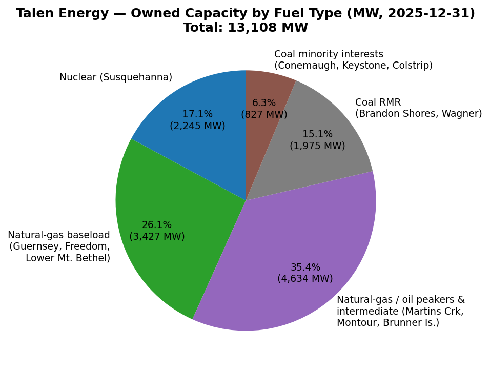
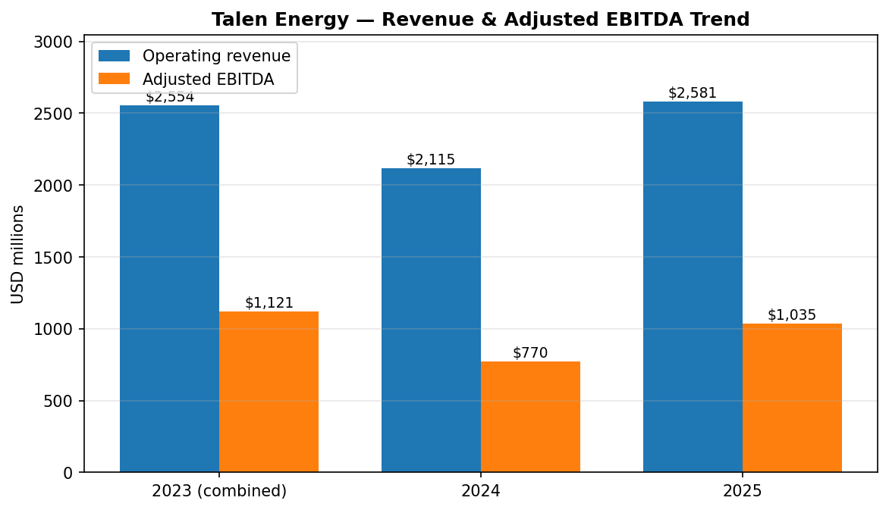
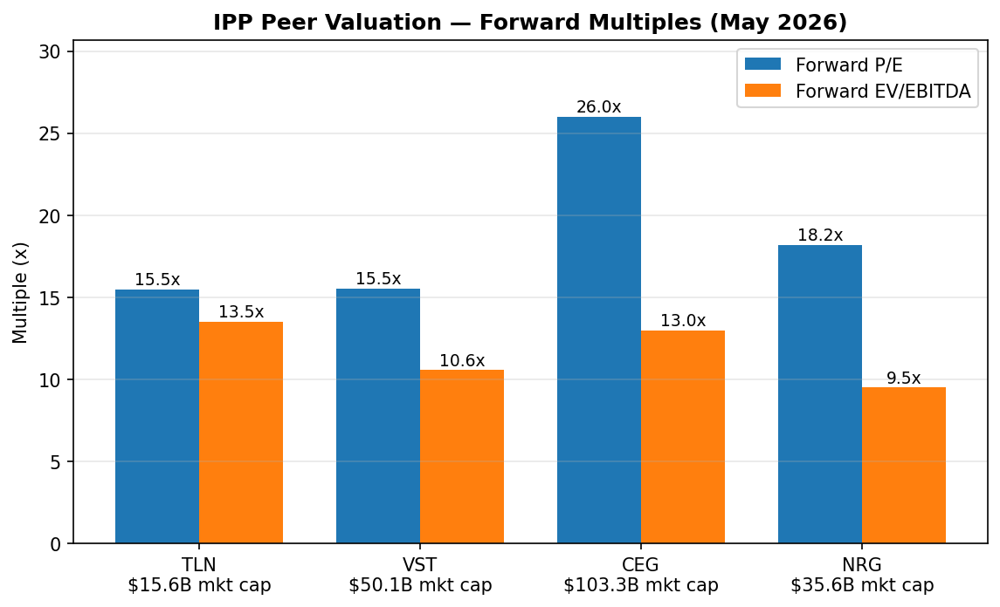
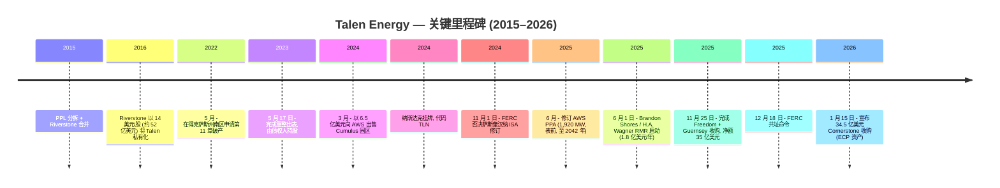
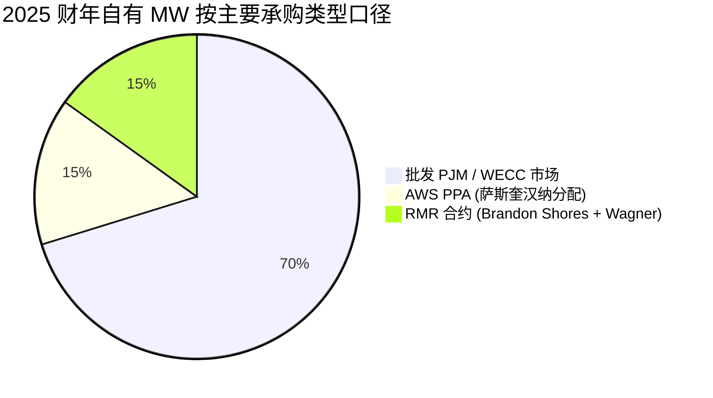
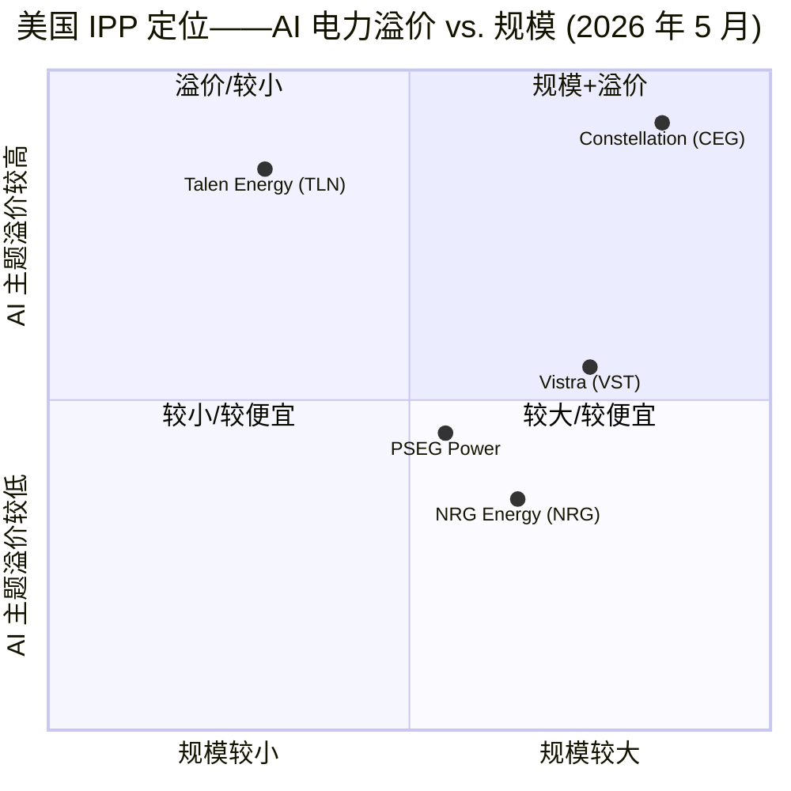
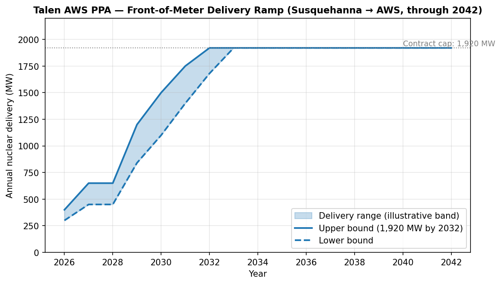

# Talen Energy Corporation (NASDAQ:TLN) — 公司研究报告

**截至日期: 2026-05-20**
**上市地: 纳斯达克全球精选市场 (NASDAQ Global Select Market), 代码 TLN**
**注册地: 美国得克萨斯州休斯顿**
**报告语言: 简体中文 (英文版同时存在于本目录)**

> **业绩更新——2026 财年指引重申 (2026-05-05):** 随 2026 年第一季度业绩公布, 管理层重申全年 2026 年调整后 EBITDA **17.5 亿–20.5 亿美元**、调整后自由现金流 **9.8 亿–11.8 亿美元** (均未计入待定的 Cornerstone 收购)。2026 年第一季度调整后 EBITDA 录得 **4.73 亿美元**, 调整后自由现金流 **3.50 亿美元**, 两者均大幅同比上升 (分别 +2.73 亿与 +2.63 亿美元), 主要受益于更高的 PJM 容量价格 (2025/2026 交付年清算价 269.92 美元/兆瓦-日 (MW-day), 上行至 2026/2027 年 329.17 美元/兆瓦-日 的 FERC 批准上限), 以及表前 (front-of-meter) AWS PPA 全季度爬坡。仅第一季度的 EBITDA 数额就约占全年指引中值的 25%。来源: [TLN 2026 财年 Q1 业绩公告, 2026-05-05](https://www.sec.gov/Archives/edgar/data/0001622536/000162253626000035/a20260505q12026earningsrel.htm); [GlobeNewswire 摘要, 2026-05-05](https://www.globenewswire.com/news-release/2026/05/05/3288253/0/en/Talen-Energy-Reports-First-Quarter-2026-Results-Reaffirms-2026-Guidance.html)。

---

## 目录
1. 公司概览
2. 公司历史
3. 管理团队
4. 产品与服务
5. 客户与上市策略
6. 行业概览
7. 竞争格局
8. 市场机会 (TAM)
9. 风险评估
10. 参考资料

---

## 1. 公司概览

Talen Energy Corporation (NASDAQ: **TLN**) 是一家总部位于美国休斯顿的**独立发电商 (Independent Power Producer, IPP)**, 在 PJM 互联网 (PJM Interconnection, 涵盖中大西洋地区与中西部) 与西部电力协调委员会 (Western Electricity Coordinating Council, WECC, 蒙大拿州) 范围内拥有并运营约 **13.1 GW 净夏季额定 (net summer-rated) 发电容量**; 投资组合的核心锚定资产是其在宾夕法尼亚州萨勒姆镇 (Salem Township, Pennsylvania) 持股 90% 的 2.5 GW **萨斯奎汉纳蒸汽电站 (Susquehanna Steam Electric Station, SESS)** 核电站 ([TLN 10-K FY2025, Item 1 Business](https://www.sec.gov/Archives/edgar/data/0001622536/000162253626000017/tln-20251231.htm))。公司将电力、容量与辅助服务出售到美国电力批发市场 (wholesale power markets); 自 2025 年年中起, 还根据已修订的 1,920 MW 电力采购协议 (Power Purchase Agreement, PPA, 至 2042 年到期), 直接向亚马逊云科技 (Amazon Web Services, AWS) 长期固定价格、表前 (front-of-the-meter) 供应核电 ([TLN 10-K FY2025, Item 1 — AWS PPA](https://www.sec.gov/Archives/edgar/data/0001622536/000162253626000017/tln-20251231.htm))。

**公司业务。** Talen 将核能、天然气、燃油及煤炭原料转化为批发电力, 然后通过以下渠道变现: (i) 向 PJM 实时及次日 (day-ahead) 市场销售电能与辅助服务, (ii) 通过 PJM 基本剩余拍卖 (Base Residual Auction, BRA) 赢取容量收入 (capacity revenue), (iii) 来自 AWS PPA 以及 FERC 批准的可靠性必须运行 (Reliability-Must-Run, RMR) 协议的长期合约收入 (即马里兰州的 Brandon Shores 与 H.A. Wagner 煤/油机组), 以及 (iv) 根据《2022 年通胀削减法案》(Inflation Reduction Act of 2022, IRA) 享有的联邦核能生产税收抵免 (Nuclear Production Tax Credit, PTC) ([TLN 10-K FY2025, "Our Key Markets and Revenue Streams"](https://www.sec.gov/Archives/edgar/data/0001622536/000162253626000017/tln-20251231.htm))。

**规模与布局。** 截至 2025 年末, 自有机组组成为: 萨斯奎汉纳 2,245 净 MW 核电; 3,427 MW 高效率 H 级联合循环 (H-class combined-cycle) 基载燃气 (Guernsey 1,771 MW、Moxie Freedom 1,049 MW、Lower Mt. Bethel 607 MW); 4,634 MW 可调度燃气/燃油调峰 (peaker) 及中间负荷机组 (Martins Creek、Montour、Brunner Island); 1,975 MW RMR 项下的煤/油机组 (Brandon Shores 1,273 MW、H.A. Wagner 702 MW); 约 827 MW 的少数股权煤机组权益 (Conemaugh、Keystone 在 PJM, Colstrip 3 号机组在 WECC/蒙大拿) ([TLN 10-K FY2025, Item 2 Properties](https://www.sec.gov/Archives/edgar/data/0001622536/000162253626000017/tln-20251231.htm))。员工人数约 1,880 人 ([Talen Energy / LeadIQ profile, 2026](https://leadiq.com/c/talen-energy/5a1d8a6c240000240063ce6b))。

*来源: [TLN 10-K FY2025, Item 2 Properties (截至 2025-12-31 的发电机组列表)](https://www.sec.gov/Archives/edgar/data/0001622536/000162253626000017/tln-20251231.htm)。*

**如何盈利。** 2025 财年营业收入 **25.81 亿美元**, 拆分为: 电能及其他收入 21.41 亿美元 (同比 +14%)、容量收入 4.85 亿美元 (同比 +153%, 受 PJM 清算价格上涨推动)、对冲未实现亏损 (0.45) 亿美元; 与之对应的电能成本 10.66 亿美元 ([TLN 10-K FY2025, MD&A](https://www.sec.gov/Archives/edgar/data/0001622536/000162253626000017/tln-20251231.htm))。PJM 分部调整后 EBITDA 达 **10.74 亿美元** (FY2025) 对照 7.75 亿美元 (FY2024) 与合并 FY2023 的 10.65 亿美元; 公司合并调整后 EBITDA **10.35 亿美元**, 高于 FY2024 的 7.70 亿美元 ([TLN 10-K FY2025, MD&A, 分部表](https://www.sec.gov/Archives/edgar/data/0001622536/000162253626000017/tln-20251231.htm))。萨斯奎汉纳在 2025 年贡献约 17 TWh 零碳电力, 全成本约 **27 美元/MWh**, 同期 PJM West Hub 实现价格运行在 40–60 美元/MWh 之间, 容量价格在 2025/2026 交付年清算于 269.92 美元/兆瓦-日 ([PJM 2025/2026 BRA 报告, 2024-07](https://www.pjm.com/-/media/DotCom/markets-ops/rpm/rpm-auction-info/2025-2026/2025-2026-base-residual-auction-report.pdf))。

*来源: [TLN 10-K FY2025, MD&A: Successor 2024–2025 与合并 Predecessor+Successor 2023 各期数据](https://www.sec.gov/Archives/edgar/data/0001622536/000162253626000017/tln-20251231.htm)。*

**地理分布。** 发电资产集中于三个 PJM 分区 (萨斯奎汉纳-锚定的宾夕法尼亚机组位于 MAAC 区, Brandon Shores 与 H.A. Wagner 位于 BGE 区, 俄亥俄州 Guernsey 燃气电厂位于 AEP 区), 此外在蒙大拿州 WECC 的 Colstrip 3 号机组持 30% 经济权益 ([TLN 10-K FY2025, Item 1 Wholesale Markets](https://www.sec.gov/Archives/edgar/data/0001622536/000162253626000017/tln-20251231.htm))。总部位于得克萨斯州休斯顿 2929 Allen Pkwy, 在宾夕法尼亚州 Allentown 600 Hamilton Street 设有第二运营办公室——这是 PPL/Talen 时代以来的传统据点 ([LeadIQ 公司简介, 2026](https://leadiq.com/c/talen-energy/5a1d8a6c240000240063ce6b))。

**估值快照 (截至 2026 年 5 月中旬):**

| 指标 | TLN | VST | CEG | NRG | 行业参照 |
|---|---|---|---|---|---|
| 股价 | 约 348 美元 | — | — | 167.73 美元 (2026-04-17) | — |
| 市值 | **约 156 亿美元** | 501 亿美元 | 1,033 亿美元 | 356 亿美元 | — |
| TTM 市盈率 (P/E) | 无意义 (亏损) | 24.1× | — | 37.8× | 标普 500 约 24× |
| 远期市盈率 (Forward P/E) | **15.5×** | 15.5× | 26.0× | 18.2× | — |
| 远期 EV/EBITDA | **约 13.5×** | 10.6× | 约 13× | 9.5× | 受监管公用事业约 10–12× |

来源: [CNBC TLN 报价](https://www.cnbc.com/quotes/TLN); [Lambda Finance, IPP 比较, 2026-04](https://www.lambdafin.com/articles/vistra-vs-constellation-vs-talen); [TIKR — CEG vs VST, 2026](https://www.tikr.com/blog/constellation-energy-vs-vistra-which-nuclear-powered-utility-has-more-upside); [Public.com, NRG 市值](https://public.com/stocks/nrg/market-cap)。

*来源: [Lambda Finance — Vistra vs Constellation vs Talen, 2026](https://www.lambdafin.com/articles/vistra-vs-constellation-vs-talen); [Yahoo Finance, VST](https://finance.yahoo.com/quote/VST/); [NRG Q1-2026 8-K](https://www.sec.gov/Archives/edgar/data/0001013871/000101387126000010/nrgq12026ex991.htm)。EV/EBITDA 数据为截至 2026 年 5 月的 NTM 共识汇总, 取自同业比较桌面研究; 任何交易使用前应对照当前数据来源进行核实。*

**如何解读估值倍数。** TLN 的 TTM 市盈率不具备意义: 2025 财年 GAAP 净利润为 **(2.19) 亿美元**, 主要原因是 IPO 相关的负债型权益激励 (liability-classified equity awards) 触发了 **(5.26) 亿美元非现金股票薪酬费用 (Stock-Based Compensation, SBC)**——这一会计处理与 2025 年股价的重估挂钩 ([TLN 10-K FY2025, MD&A G&A 行; Note 13 Stock-Based Compensation](https://www.sec.gov/Archives/edgar/data/0001622536/000162253626000017/tln-20251231.htm))。剔除 SBC、衍生品市值重估及并购费用后, 公司在 EBITDA 与 FCF 两个维度上均稳健为正 (调整后 EBITDA 10.35 亿美元; 2026 财年调整后 FCF 指引中值 10.8 亿美元)。远期 P/E 约 15× 介于较便宜的 VST/NRG 组与纯粹核电纯玩家 CEG 约 26× 之间, 而远期 EV/EBITDA 约 13.5× 已对比受监管公用事业可比公司 (10–12×) 计入了清晰的 AI 顺风溢价。这一溢价的主要支撑包括: AWS PPA 故事 (长期、固定价格的核电现金流, 极可能高于市场基准批发价), PJM 容量价格在 2026/2027 年清算于 FERC 批准的 329.17 美元/兆瓦-日 上限, 以及 Freedom/Guernsey 收购加上待结案的 Cornerstone 收购近乎使可寻址燃气基载机组规模翻倍——不过其中也内嵌了第 9 章所述的重大执行风险与 FERC 政策风险。

---

## 2. 公司历史

Talen 的现代史包含三个截然不同的章节: 2015 年从 PPL 分拆并合并; 2016–2023 年的私募股权 (private-equity) 持有周期, 以第 11 章破产 (Chapter 11) 终结; 2023 年以债权人持股的 IPP 身份重新出发, 随后 2024 年纳斯达克挂牌, 并于 2024–2026 年迅速完成 AI 驱动的战略再定位。

**成立 (2015)。** Talen Energy 于 2015 年 6 月 1 日成立, 由 **PPL Corporation** 分拆其竞争性发电业务 (PPL Energy Supply) 并与私募股权公司 **Riverstone Holdings** 关联基金贡献的三项宾夕法尼亚州发电资产合并而成。PPL 股东获得新公司 65% 股份, Riverstone 持有 35%。Talen Energy Corporation 立即以同一代码在纽约证券交易所 (NYSE) 上市 ([Talen Energy — Wikipedia, 历史章节](https://en.wikipedia.org/wiki/Talen_Energy))。

**私有化 (2016)。** 分拆后不到 18 个月, Riverstone 以 14.00 美元/股的价格收购了 Talen 剩余 65% 股份, 交易价值约 52 亿美元, 于 2016 年 12 月完成私有化 ([Talen Energy — Wikipedia](https://en.wikipedia.org/wiki/Talen_Energy))。

**第 11 章破产 (2022–2023)。** **2022 年 5 月 9 日**, Talen Energy Supply LLC 及其大部分子公司 (Cumulus 加密货币/数据业务及部分其他关联公司除外) 在美国得克萨斯州南区破产法院申请第 11 章保护, 申报理由是天然气价格飙升期间对冲头寸的抵押追加 (collateral calls) ([Talen 第 11 章破产申请 — Financier Worldwide](https://www.financierworldwide.com/talen-energy-files-for-chapter-11); [Kroll 重组案件文档库](https://cases.ra.kroll.com/talenenergy/))。2022 年末获批准的重整方案削减了约 **22 亿美元债务**, 并将 Talen Energy Supply 的无担保债权人 (主要为机构信用基金) 转换为新发行的普通股股东。公司于 **2023 年 5 月 17 日**完成重整出表, 这是其财务报告中划分 "Predecessor (前身)" 与 "Successor (继任)" 的分水岭日期 ([Davis Polk — Talen 重整出表咨询, 2023-05](https://www.davispolk.com/experience/talen-energy-supply-emerges-chapter-11); [TLN 10-K FY2025, Note 1 与 Note 20](https://www.sec.gov/Archives/edgar/data/0001622536/000162253626000017/tln-20251231.htm))。

**AWS 交易与挂牌 (2024)。** 2024 年 3 月, Talen 将其 90% 持股的 **Cumulus Data** 数据中心园区——一处毗邻萨斯奎汉纳核电站的 960 MW 数据中心场址——以 6.5 亿美元出售给 AWS, 并签署初始"表后 (behind-the-meter)" PPA, 这是美国首例超大规模云厂商 (hyperscaler) 收购与核电厂共址 (co-located, nuclear-fed) 数据中心园区的交易 ([Enki AI — Amazon 核电 2024 Talen Energy](https://enkiai.com/nuclear/amazon-talen-energy-data-center/))。出售完成后, Talen Energy Corporation (新顶层公司) 于 2024 年在纳斯达克全球精选市场挂牌交易, 代码 TLN ([TLN 10-K FY2025, Item 5](https://www.sec.gov/Archives/edgar/data/0001622536/000162253626000017/tln-20251231.htm))。

**FERC ISA 挫败 (2024 年 11 月)。** 2024 年 11 月 1 日, FERC 否决了 PJM 关于萨斯奎汉纳的修订版《互连服务协议 (Interconnection Service Agreement, ISA)》——该协议本将允许向 AWS Cumulus 园区表后输送高达 480 MW 而无需支付完整输电费用。Talen 申请复议; FERC 最终搁置了该事项 ([TLN 10-K FY2025, Item 3 Legal Proceedings — Susquehanna ISA Amendment](https://www.sec.gov/Archives/edgar/data/0001622536/000162253626000017/tln-20251231.htm))。

**AWS PPA 修订 + RMR + Freedom/Guernsey (2025)。** 2025 年发生三件具变革意义的事件: (i) 2025 年 6 月 11 日, Talen 与 AWS 签署修订并扩大的 PPA, 将合作关系重新定位为**表前 (front-of-the-meter)** 安排, 上限达 **1,920 MW**, 期限至 2042 年, 通过 PJM 而非直连输电路径绕过 FERC 争议 ([Power Magazine — Talen-Amazon 180 亿美元核电 PPA](https://www.powermag.com/talen-amazon-launch-18b-nuclear-ppa-a-grid-connected-ipp-model-for-the-data-center-era/)); (ii) 自 2025 年 6 月 1 日起, Brandon Shores (1.45 亿美元/年) 与 H.A. Wagner (0.35 亿美元/年) 根据 FERC 批准的 RMR 协议开始运行, 期至 2029 年 5 月 31 日 ([TLN 10-K FY2025, "Brandon Shores 与 H.A. Wagner RMR 安排"](https://www.sec.gov/Archives/edgar/data/0001622536/000162253626000017/tln-20251231.htm)); 以及 (iii) 2025 年 11 月 25 日, Talen 完成 **38 亿美元 (总额, 税盾后净额 35 亿美元) 的收购**——从 Caithness 与 BlackRock 手中买入 Moxie Freedom (宾州, 1,049 MW) 和 Guernsey (俄亥俄, 1,836 MW) H 级联合循环电厂 ([TLN 8-K, 2025-11-25 — Freedom 与 Guernsey 完成交割](https://www.sec.gov/Archives/edgar/data/0001622536/000162253625000037/ex99120251125pressreleasec.htm); [美国公共电力协会 (American Public Power Association) 报道, 2025-07](https://www.publicpower.org/periodical/article/talen-energy-unveils-agreements-buy-power-plants-pennsylvania-ohio))。

**Cornerstone 协议 (2026 年 1 月)。** 2026 年 1 月 15 日, Talen 宣布以约 **34.5 亿美元** (25.5 亿美元现金 + 240 万股价值 9 亿美元的股票) 完成 **"Cornerstone 收购"**——收购 Energy Capital Partners (ECP) 的三项资产: Lawrenceburg (印第安纳, 1,120 MW)、Waterford (俄亥俄, 875 MW)、Darby (俄亥俄, 456 MW), 预计于 2026 年下半年完成交割, 须获 FERC 与印第安纳州公用事业监管委员会 (Indiana Utility Regulatory Commission) 批准; Hart-Scott-Rodino 反垄断审查等待期已于 2026 年 3 月届满 ([TLN 8-K — Cornerstone 公告, 2026-01-15](https://www.sec.gov/Archives/edgar/data/0001622536/000162253626000004/a20260115pressreleasetalen.htm))。

**FERC 共址议题解决 (2025 年 12 月–2026 年 1 月)。** 2025 年 12 月 18 日, FERC 发布命令, 列明允许的共址配置, 并要求 PJM 提交相应的关税修订; PJM 于 2026 年 2 月 23 日提交了该等修订。鉴于 AWS 安排已重新路由至表前, 加之 2025 年 12 月恢复了 148 MW 容量互连权 (Capacity Interconnection Rights, CIR) 至萨斯奎汉纳, Talen 于 2026 年 1 月自愿撤回 ISA 修订上诉——原案已经结案 ([TLN 10-K FY2025, Item 3 — FERC 共址程序](https://www.sec.gov/Archives/edgar/data/0001622536/000162253626000017/tln-20251231.htm))。

两条战略转向值得关注。**第一**, 重整出表后由 CEO Mac McFarland 领导的团队将公司从"具有加密货币业务敞口的多元化批发发电商"重塑为聚焦于"**AI 电力基础设施 (AI-power infrastructure)**"的平台, 锚定资产是美国唯一一个已签署超大规模云厂商 PPA 的核电厂。**第二**, Freedom/Guernsey 收购与 Cornerstone 收购是从碳排放密集的煤炭机组刻意转向现代化 H 级 CCGT 的战略举措, 煤炭机组依现有和解协议必须分别于 2028 年 12 月 31 日 (Brunner Island) 与 2034 年 12 月 31 日 (Keystone/Conemaugh) 之前停止煤炭运营 ([TLN 10-K FY2025, Item 2 脚注](https://www.sec.gov/Archives/edgar/data/0001622536/000162253626000017/tln-20251231.htm))。

---

## 3. 管理团队

**Mark "Mac" McFarland — 首席执行官 (CEO) 兼董事 (56 岁; 自 2023 年 5 月任 CEO; 约 305 字)。** McFarland 在公司重整出表当日就任 CEO, 同时进入董事会。其紧前 2.5 年 (2020 年 10 月至 2023 年 5 月) 任 **California Resources Corporation (NYSE: CRC)** 总裁、CEO 兼董事——该公司是加州最大的油气生产商, 他带领该公司走出 2020 年第 11 章破产, 并将业务重心转向碳管理 (他仍是 CRC 董事, 并担任子公司 Carbon TerraVault 董事长)。在 CRC 之前, McFarland 任 **GenOn Energy** 执行董事长 (2017 年 4 月至 2018 年 12 月), 此前曾任该公司总裁/CEO, 这是另一家由其完成重整的破产 IPP。2013 至 2016 年间, 他执掌 **Luminant Holding**——能源未来控股 (Energy Future Holdings, EFH, 即原 TXU) 的发电板块——任 CEO; 2008 至 2013 年间在 Luminant 同时担任首席商务官 (CCO), 并任母公司 EFH 公司发展及战略执行副总裁, 同样经历了多年第 11 章程序。他职业生涯始于 **Exelon Corporation** (1999–2008), 最终升任公司发展高级副总裁。McFarland 拥有弗吉尼亚理工大学 (Virginia Tech) 土木工程 (环境方向) 理学士学位、特拉华大学 MBA 学位, 持有宾夕法尼亚州专业工程师 (PE) 执照 (1995 年), 并完成了 **MIT 公用事业高管反应堆技术课程 (MIT Reactor Technology Course for Utility Executives)**。他出任**美国核能研究所 (Nuclear Energy Institute)** 董事, 此前曾任 TerraForm Power、Bruin E&P 及 Chaparral Energy 的董事。投资者应将他的职业经历解读为 IPP 领域最具经验的重整与出表运营者——亲自领导或共同领导过五次第 11 章程序——并辅以深厚的核能政策履历。2025 年其全口径目标薪酬约 **630 万美元** (现金 + 股权), 其中股权部分主要绑定 2027 年到期归属的 PSU/RSU ([TLN DEF 14A 2026, Proposal 1 — 董事生平; 薪酬表格](https://www.sec.gov/Archives/edgar/data/0001622536/000162253626000023/0001622536-26-000023-index.htm))。

**Terry L. Nutt — 总裁; 前 CFO (49 岁; 约 170 字)。** Nutt 于 2025 年 12 月 12 日自 CFO 晋升为总裁, 继续在 FY2025 10-K 备案过程中担任主要财务官。他于 2023 年 7 月加入 Talen 任 CFO, 恰在重整出表两个月后。加入 Talen 之前任 **Just Energy** (一家北美零售能源公司, 本身于 2022 年完成第 11 章程序) 的 CFO; 更早任 **EDF Trading North America** (2018–2023) 的 CFO 兼董事总经理——法国电力 (EDF) 的美国交易子公司。再早, 他在 **Vistra/能源未来控股** 担任高级财务职位逾十年, 包括 SVP 财务总监 (Controller) 与 SVP 风险管理——在 Luminant 与 McFarland 有共事经历。他拥有德州农工大学 (Texas A&M) 会计硕士与工商管理学士学位, 同样完成了 MIT 反应堆技术课程。2025 年, Nutt 主导了 Freedom 与 Guernsey 收购融资 (筹集 27 亿美元高级无担保票据加 12 亿美元 TLB), 以及公司进入标普中型股 400 (S&P MidCap 400) 指数 ([TLN DEF 14A 2026 — 高管生平](https://www.sec.gov/Archives/edgar/data/0001622536/000162253626000023/0001622536-26-000023-index.htm))。

**Cole Muller — 首席财务官 (CFO) (45 岁; 自 2025 年 12 月任 CFO; 约 120 字)。** Muller 在 2025 年 12 月管理层调整中接替 Nutt 出任 CFO。他于 2018 年加入 Talen, 曾负责公司的 Cumulus 增长业务 (2021–2023), 最近 (2023 年 6 月至 2025 年 12 月) 任战略风险投资执行副总裁 (EVP, Strategic Ventures), 主管最终促成 AWS PPA、Cumulus 出售以及 Freedom/Guernsey 交易的战略合作事项。加入 Talen 之前, 他任 **麦肯锡 (McKinsey & Co.)** 副合伙人, 服务电力与公用事业客户, 包括分拆前的 Talen。投资者应注意, 把内部"交易架构师"提升至 CFO 之位——而非外聘公开市场上市公司 CFO——表明资本配置与并购吞吐量仍是首要战略事项 ([TLN DEF 14A 2026 — 高管生平](https://www.sec.gov/Archives/edgar/data/0001622536/000162253626000023/0001622536-26-000023-index.htm))。

**Brad L. Berryman — 首席运营官 (COO); 前首席核能官 (57 岁; 自 2025 年 12 月任 COO; 约 95 字)。** Berryman 在 2025 年 12 月调整中晋升为 COO, 此前作为首席核能官 (Chief Nuclear Officer) 兼 SVP 领导萨斯奎汉纳。在其任内, SESS 按照 INPO/WANO 行业标准持续位列美国核电站最高绩效之列。他主导了 2025 年 12 月的内部继任安排, 由 Edward Casulli (一名 30 年核电老兵, 曾任 PSEG Hope Creek 与美国海军核动力专业经验) 接任新的 SVP 兼首席核能官。Berryman 在 COO 岗位上的延续, 是让 McFarland 与 Muller 能把工作精力放在 AI 电力商业交易而非电厂运营上的关键 ([TLN DEF 14A 2026 — 高管生平](https://www.sec.gov/Archives/edgar/data/0001622536/000162253626000023/0001622536-26-000023-index.htm))。

**治理结构 (约 135 字)。** Talen 董事会共八名成员, 其中七名为独立董事 (Joseph Nigro 任董事长, 此前与 Exelon/Constellation 有高管渊源; Gizman Abbas、Anthony Horton、Karen Hyde、Christine Benson Schwartzstein、Ross Shuster, 另有一名独立董事; McFarland 是唯一的执行董事) ([TLN DEF 14A 2026, Proposal 1](https://www.sec.gov/Archives/edgar/data/0001622536/000162253626000023/0001622536-26-000023-index.htm))。多位董事是 2023 年 5 月由重整出表后的债权人集团任命, 与机构投资人保有持续关系。审计委员会主席 Karen Hyde 是 Xcel Energy 前 SVP 兼首席风险官, 拥有 30 年核监管经验。2025 年 NEO (Named Executive Officer) 薪酬结构偏向 80%+ 为股权 (RSU/PSU, 按 TSR 与调整后 EBITDA 目标归属); McFarland 的总目标薪酬 (TDC) 约 630 万美元, Nutt 680 万美元 (因交易融资 PSU 授予而提升), Berryman 540 万美元, Wander 540 万美元, Wright 540 万美元 ([TLN DEF 14A 2026 — 薪酬汇总表](https://www.sec.gov/Archives/edgar/data/0001622536/000162253626000023/0001622536-26-000023-index.htm))。内部人受益所有权 (insider beneficial ownership) 在绝对股份数上较小 (重整出表后的持股 2023–2026 年逐步归属), 股权基础以机构投资者为主——这些机构作为重整方案的债权人取得了股份。

**履历综合评估 (约 70 字)。** 这是美国 IPP 领域最深厚的重整/IPP 高管阵容之一。McFarland 个人领导过至少三次第 11 章重整出表 (EFH/Luminant、GenOn、CRC)。Nutt 带来同等强度的 Vistra/EFH 与 EDF Trading 经验。Muller 在 Talen 内部主管交易管线五年, 促成 AWS 交易。Berryman 在 SESS 维持卓越运营。短板在于持续性: McFarland 此前任期平均 3–5 年, 一旦意外离任将带来重大影响。

---

## 4. 产品与服务

Talen 不是产品公司, 而是一家发电资产运营商, 销售少数几种类大宗商品产出 (电能、容量、辅助服务、可再生能源信用 REC、核能 PTC, 以及一笔具名定制核电 PPA)。下文产品分类对照 FY2025 10-K Item 1 的披露架构与公司官网资产列表 ([Talen Energy — Our Plants](https://www.talenenergy.com/our-plants/) 及 [TLN 10-K FY2025, Item 1 与 Item 2](https://www.sec.gov/Archives/edgar/data/0001622536/000162253626000017/tln-20251231.htm))。

```mermaid
graph TD
    A[Talen Energy Corporation]
    A --> B[基载 — 5,672 MW]
    A --> C[中间负荷 / 调峰 — 4,634 MW]
    A --> D[RMR 可靠性 — 1,975 MW]
    A --> E[少数股权煤机组 — 827 MW]
    B --> B1[萨斯奎汉纳核电<br/>2,245 MW 净 90%]
    B --> B2[Guernsey CCGT 1,771 MW]
    B --> B3[Moxie Freedom CCGT 1,049 MW]
    B --> B4[Lower Mt. Bethel CCGT 607 MW]
    C --> C1[Martins Creek 1,710 MW]
    C --> C2[Montour 1,505 MW]
    C --> C3[Brunner Island 1,419 MW]
    D --> D1[Brandon Shores 煤 1,273 MW]
    D --> D2[H.A. Wagner 油 702 MW]
    E --> E1[Conemaugh 22.2% / 392 MW]
    E --> E2[Keystone 12.3% / 213 MW]
    E --> E3[Colstrip U3 30% / 222 MW]
    A --> F[合约产品]
    F --> F1[AWS PPA 上限 1,920 MW<br/>表前 至 2042 年]
    F --> F2[IRA 项下核能 PTC]
    F --> F3[PJM 容量绩效]
    F --> F4[零碳 REC]
```

**基载——5,672 自有 MW; 现金流引擎。** **萨斯奎汉纳 (SESS)** 是位于宾夕法尼亚州 Salem Township 的双机组 BWR-4 沸水反应堆核电站 (Talen 90% / Allegheny Electric Co-op 10%), 当前 NRC 运营许可证 2 号机组至 2042 年、1 号机组至 2044 年 ([TLN 10-K FY2025, Item 1 — Nuclear](https://www.sec.gov/Archives/edgar/data/0001622536/000162253626000017/tln-20251231.htm))。该机组在 2025 年贡献约 17 TWh 零碳电力, 全成本约 27 美元/MWh, 是**美国唯一一座已签署直接面向超大规模云厂商 PPA 的商业核电厂** (见第 5 章)。护城河: 极高——不可复制的资产 (除 Vogtle 3/4 外, 美国已有 14 年没有新核电厂达到商运 COD), 第二家与 AWS 类似的核电竞争对手存在极高的监管与经济进入壁垒, 加之一条 21+ 年的专属核燃料供应链 (至 2028 年燃料装载完全合约化覆盖, 至 2029 年覆盖率 >50%, 至 2030 年覆盖率 >20%)。最接近的直接竞品: **Constellation Energy 的 Crane 清洁能源中心** 与 Microsoft 签署的 PPA (重启原三里岛 (Three Mile Island) 1 号机组, 20 年期 835 MW 合约)。TLN 的萨斯奎汉纳今日在运行; CEG 的 Crane 最早 2027 年底/2028 年才能交付。**结论: 是——投资组合中最强护城河。**

**Guernsey (俄亥俄, 1,771 MW) 与 Moxie Freedom (宾州, 1,049 MW)** 是 2017–2018 年投运的 **H 级联合循环燃气轮机 (H-class CCGT)**——属于 PJM 内最高效的 CCGT 电厂之列, 热耗率 (heat rate) 远低于 PJM 边际机组平均的 7,500 Btu/kWh ([美国公共电力协会报道, 2025-07](https://www.publicpower.org/periodical/article/talen-energy-unveils-agreements-buy-power-plants-pennsylvania-ohio))。两厂均坐落于低成本的 Marcellus/Utica 天然气产区, 且位于数据中心负荷快速增长的 PJM 分区。护城河: 高——热耗率优势; 新建 CCGT 选址/许可的余地有限; PJM 容量价格的封顶与封底机制。最接近的竞品: VST 的得州 CCGT 机组 (气源充足, 但在 ERCOT 而非 PJM), Constellation 的 PJM 燃气资产 (较老旧、效率较低)。**结论: 是——按资产年代与地理位置的护城河。**

**Lower Mt. Bethel (宾州, 607 MW)** 是 2004 年投运的 F 级 CCGT; 规模较小、较老旧, 但作为基载备份仍有用。**结论: 部分——是稳健的 PJM 容量-电能贡献者, 但非旗舰资产。**

**中间负荷与调峰机组——4,634 MW; 调度灵活性层。** **Martins Creek** (宾州, 1,710 MW 双燃料燃气/燃油调峰机)、**Montour** (宾州, 1,505 MW 燃气调峰机, 煤改气后)、**Brunner Island** (宾州, 1,419 MW 双燃料燃气/煤中间负荷机组; 必须在 2028 年 12 月 31 日前停止燃煤) 在 PJM 稀缺定价时段贡献可变利润上行, 并提供辅助服务收入。护城河: 部分——这些资产按价差经济性调度, Montour 与 Brunner 的煤改气已完成。最接近的竞品: VST/NRG/PSEG/Calpine 的 PJM 调峰机组, 它们均无单一来源优势。**结论: 部分。**

**RMR 合约煤/油机组——1,975 MW; 至 2029 年的固定费用桥梁。** **Brandon Shores** (马里兰, 1,273 MW 煤) 与 **H.A. Wagner** (马里兰, 702 MW 油) 原定 2025 年退役, 但 2024–25 年 PJM 向 FERC 提交 RMR 协议要求其继续运行至 **2029 年 5 月 31 日** (或直至 BGE 地区输电升级上线)。固定费用从 2025 年 6 月 1 日起开始: Brandon Shores **1.45 亿美元/年 (312 美元/兆瓦-日)**, H.A. Wagner **0.35 亿美元/年 (137 美元/兆瓦-日)**, 另外加上单独成本报销和小额绩效保留 ([TLN 10-K FY2025, "Brandon Shores 与 H.A. Wagner RMR 安排"](https://www.sec.gov/Archives/edgar/data/0001622536/000162253626000017/tln-20251231.htm))。护城河: 监管型——RMR 经济性专属于那些一旦退役就会实质威胁电网可靠性的资产。**结论: 是 (有时限)。**

**合约产品。** 皇冠明珠是 **AWS PPA**: 根据 2025 年 6 月修订, Talen 将从萨斯奎汉纳向 AWS 交付高达 **1,920 MW** 无碳核电, 形式为**表前、固定价格、至 2042 年的长期合约** (含展期选择权)。爬坡按合约约定但呈后半段加权: 2029 年达到 840–1,200 MW, 2032 年达到 1,680–1,920 MW ([Carbon Credits 报道, 2025](https://carboncredits.com/amazon-to-power-ai-data-center-expansion-with-1920-mw-nuclear-ppa-from-talen-energy/); [Power Magazine — 180 亿美元 17 年期 PPA 定性表述](https://www.powermag.com/talen-amazon-launch-18b-nuclear-ppa-a-grid-connected-ipp-model-for-the-data-center-era/))。Talen 在其备案文件中**未披露每兆瓦时 (per-MWh) 价格**; 第三方将该协议特征化为约 180 亿美元的合约期总额, 但这是第三方派生数据, 并非公司披露口径。公司将定价定性为相对市场的"预期溢价" ([TLN 10-K FY2025 — AWS PPA](https://www.sec.gov/Archives/edgar/data/0001622536/000162253626000017/tln-20251231.htm))。**结论: 是——同业最佳商业护城河。**

**核能 PTC。** 萨斯奎汉纳依据 IRA Section 45U 享有核能 PTC, 提供每 MWh 税收抵免——当实现的电价低于定义的底价时该抵免增加——这事实上是对 AWS 承诺以外残余批发市场敞口的一道价格保护带 ([TLN 10-K FY2025, Notes 3 与 4](https://www.sec.gov/Archives/edgar/data/0001622536/000162253626000017/tln-20251231.htm))。**结论: 是——由联邦政策创造的监管型护城河。**

**旗舰资产 vs. 长尾资产。** 三大旗舰驱动业务: (1) 萨斯奎汉纳 + AWS PPA, (2) Freedom/Guernsey CCGT 对儿, (3) Brandon Shores/Wagner RMR 合约。Cornerstone 收购 (Lawrenceburg、Waterford、Darby; 预计 2026 年下半年完成交割) 是第四个潜在旗舰。少数股权煤机组权益 (Conemaugh、Keystone、Colstrip 3 号机组) 被明确表述为"……在不断变化的市场条件下加以探索"——这是管理层关于可能剥离的措辞 ([TLN 10-K FY2025, Item 1 — 可靠性资产](https://www.sec.gov/Archives/edgar/data/0001622536/000162253626000017/tln-20251231.htm))。

**近 12 个月推出与淘汰记录。** 已完成: Freedom + Guernsey 收购 (2025 年 11 月 25 日)。重定位: AWS 安排从表后 (2024 年 6 月初版) 改为表前 (2025 年 6 月修订版)。启动: Brandon Shores 与 H.A. Wagner RMR (2025 年 6 月 1 日)。已宣布/待结案: Cornerstone 收购 (2026 年 1 月 15 日宣布, 目标 2026 年下半年交割)。淘汰: Cumulus 加密货币挖矿业务出售/重组 (公司在 2024 年出售 AWS 数据园区时退出比特币挖矿业务; 剩余 Cumulus 资产归入 EVP 战略风险投资板块)。

---

## 5. 客户与上市策略

Talen 的客户结构呈现双峰分布: 2024 年前的大量匿名批发市场对手方, 加上 2025 年后日益由单一具名超大规模云厂商客户主导。

**批发市场对手方 (AWS 之前的基线)。** 2025 年中之前实际上所有收入均通过 PJM 与 WECC 批发市场销售出去, 形式包括容量 (在 BRA 清算) 与电能/辅助服务 (在日前/实时拍卖清算)。在 PJM, "客户"是 **PJM Interconnection, LLC** 作为区域输电组织 (RTO) 的清算对手方, 最终通过负荷服务实体 (Load-Serving Entity, LSE) 提供资金, 但任何单一 LSE 都不构成典型工业企业意义上的客户集中度 ([TLN 10-K FY2025, Item 1 — 批发市场](https://www.sec.gov/Archives/edgar/data/0001622536/000162253626000017/tln-20251231.htm))。

**AWS (Amazon Web Services)。** 2025 年 6 月修订的 PPA 后, Talen 已有效将萨斯奎汉纳至多 1,920 MW 的产出预售至 2042 年给单一对手方亚马逊——一旦交付爬坡完成, AWS 将成为按披露口径远超其他客户的最大客户。在 1,920 MW 满量 (目标不晚于 2032 年) 状态下, AWS 将承购萨斯奎汉纳约四分之三的产出, 并占 Talen 备考 (pro-forma) 自有 MW 的约 14–15%。PPA 结构为**表前、固定价格、含最低照付不议 (take-or-pay) 承诺与逐期价格上调机制**, 另有延展期权。Talen 担任宾夕法尼亚州的持牌零售电力供应商, 向 AWS 提供服务 ([Power Magazine, 2025](https://www.powermag.com/talen-amazon-launch-18b-nuclear-ppa-a-grid-connected-ipp-model-for-the-data-center-era/); [TLN 10-K FY2025 — AWS PPA 部分](https://www.sec.gov/Archives/edgar/data/0001622536/000162253626000017/tln-20251231.htm))。

*来源: 源自 [TLN 10-K FY2025 Item 2 机组表](https://www.sec.gov/Archives/edgar/data/0001622536/000162253626000017/tln-20251231.htm)。MW 数值采用 PPA 满量爬坡下的自有容量; AWS 切片来自 2,245 MW 净萨斯奎汉纳份额。*

**客户集中度披露。** FY2025 10-K 并未在分部备注中按 ASC 280-10-50-42 列示"具名 10% 客户"脚注, 因为 2025 年前公司不存在单一 >10% 客户 (PJM 清算稀释了这一披露)。一旦 AWS PPA 实质性爬坡 (大概率为 2028 年以后), Talen 有可能跨过 10% 收入门槛, 届时 AWS 将成为可披露的具名客户。**目前 AWS 在定性层面已经是可披露的战略客户, 即便尚未构成 10% 收入客户**, 这一集中度是一项关键风险 (见第 9 章)。

**其他合约对手方。**
- **PJM Interconnection LLC** 作为 Brandon Shores 与 H.A. Wagner 的 RMR 对手方, 至 2029 年 5 月 31 日支付 1.8 亿美元/年固定费用加可变报销 ([TLN 10-K FY2025 — RMR 安排](https://www.sec.gov/Archives/edgar/data/0001622536/000162253626000017/tln-20251231.htm))。
- **美国财政部 / 美国国税局 (IRS)** 通过核能 PTC 机制——事实上是一个联邦对手方, 当批发电价下降时其支付额上升。
- **Allegheny Electric Cooperative** 作为萨斯奎汉纳 10% 共有方 (承购约 10% 产出), **NorthWestern Energy** 作为蒙大拿州 Colstrip 3 号机组的平衡当局 (balancing authority)。

**分销渠道。** 所有产出通过以下三种渠道之一销售: (i) RTO/ISO 清算市场 (PJM、WECC 双边), (ii) 与公用事业、贸易商及终端用户的场外双边合约与期货对冲, 或 (iii) AWS PPA。不存在零售分销, 不存在直接面向消费者业务, 也不存在 SaaS 意义上的销售队伍——商业活动由首席商务官 Chris E. Morice 与首席开发官 Darren J. Olagues 管理, 并购事项由 CFO Cole Muller 与首席资产开发官 Dale E. Lebsack 主持 ([TLN DEF 14A 2026 — 高管](https://www.sec.gov/Archives/edgar/data/0001622536/000162253626000023/0001622536-26-000023-index.htm))。

**销售周期。** PJM 拍卖与双边对冲有多年前瞻窗口 (按标准时间表 PJM BRA 提前三年清算, 尽管 FERC 与 PJM 数次修订此安排)。AWS 等定制超大规模云 PPA 从 MoU (谅解备忘录) 到 FERC 批准合约一般需要 12–24 个月: 原 AWS 表后 PPA 在 2024 年 3 月披露, 修订后的表前版本在 2025 年 6 月落地, 全面过渡预计在 2027 年春季 ([TLN 10-K FY2025 — AWS PPA](https://www.sec.gov/Archives/edgar/data/0001622536/000162253626000017/tln-20251231.htm))。

**关键伙伴关系。** AWS (商业客户 + 共址数据中心开发商, 经 2024 年 Cumulus 园区出售合作)。**PPL Corporation** (前母公司, 萨斯奎汉纳输电互连对手方; 萨斯奎汉纳 ISA 修订正是由 PPL Electric Utilities 提交)。**Caithness Energy** 与 **BlackRock Real Assets** (分别为 Freedom 与 Guernsey 的前所有者)。**Energy Capital Partners** (Cornerstone 收购对手方; 交割时将取得约 240 万股 TLN 股票)。**Allegheny Electric Cooperative** (萨斯奎汉纳 10% 共有方)。**Constellation Energy** 在 FERC 共址程序中是诉讼对手方, 而非客户。

**客户案例 (具名胜出)。** 标志性胜出是 AWS PPA——美国 IPP 与超大规模云厂商之间首份长期直接核电 PPA。Constellation 与 Microsoft 的 Crane PPA 是在 Talen-AWS 协议之后公布的, 是唯一可直接比拟的交易, 但尚未进入交付阶段。Talen 的协议是其余 IPP 群体正试图复制的模板。

---

## 6. 行业概览

**行业定义。** Talen 在美国**竞争性 (批发) 电力发电**行业内运营——NAICS 221112 (化石燃料发电), 221113 (核能发电) 和 221116 (地热/其他), 所在 RTO/ISO 为 PJM Interconnection 与西部电力协调委员会 (WECC)。相邻行业包括公用事业级可再生能源 (NAICS 221114–221117)、零售电力供应商、能源贸易, 以及数据中心电力交付基础设施 (新兴子行业)。

**市场规模与结构。** PJM 跨 13 州+特区, 调度约 **182,000 MW 发电向 6,700 万客户**送电, 拥有约 1,110 个市场会员 ([TLN 10-K FY2025, Item 1 — PJM](https://www.sec.gov/Archives/edgar/data/0001622536/000162253626000017/tln-20251231.htm))。PJM 电能市场收入在 2024 年超过 400 亿美元, 容量收入在 2025 年大幅上行, 2025/2026 BRA 清算于 **269.92 美元/兆瓦-日 (RTO 域)** (Dominion 分区 444.26 美元, BGE 分区 466.35 美元), 而上一次拍卖为 28.92 美元/兆瓦-日——上涨约 9 倍, 给 PJM 负荷估计带来 147 亿美元的新增容量费用 ([PJM 2025/2026 BRA 报告, 2024-07](https://www.pjm.com/-/media/DotCom/markets-ops/rpm/rpm-auction-info/2025-2026/2025-2026-base-residual-auction-report.pdf); [Utility Dive — PJM 容量价格创新高](https://www.utilitydive.com/news/pjm-interconnection-capacity-auction-data-center/808264/))。2026/2027 BRA 在全网清算于 FERC 批准的上限 **329.17 美元/兆瓦-日** ([PJM 2026/2027 BRA 报告, 2025-07](https://www.pjm.com/-/media/DotCom/markets-ops/rpm/rpm-auction-info/2026-2027/2026-2027-bra-report.pdf)); FERC 已批准下一周期上限 1.3% 上调。

**增长率与驱动因素。** PJM 2026 年 1 月长期负荷预测显示 2036 年夏季 RTO 范围负荷较 2025 年预期高出约 **5%**, 累计夏季峰值负荷至 2036 年增长 **+66 GW (10 年 3.6% CAGR)** ——相对 2010 年代平稳到下降的历史负荷增长是一次非常意外的拐点 ([TLN 10-K FY2025, Item 1 — 多源需求增长](https://www.sec.gov/Archives/edgar/data/0001622536/000162253626000017/tln-20251231.htm))。驱动因素 (管理层自身阐述): (1) **AI 驱动的数据中心需求**——超大规模云与托管运营商在北弗吉尼亚、宾州及俄亥俄选址 GW 级园区; (2) 后新冠时代的**制造业回流 (reshoring)**; (3) 整体经济**电气化** (交通与采暖)。同期供给侧压力: (a) PJM **煤机组退役**贯穿本十年末 (并伴随 Talen 自身煤机组的监管悬崖——Brunner Island 2028 年, Keystone/Conemaugh 2034 年); (b) PJM 新建队列**以间歇性 (intermittent)** 为主 (太阳能、风电、储能), 因此增加电能但增加的**确定性容量 (firm capacity)** 有限; (c) 互连队列改革延迟将 PJM 2025/2026 与 2026/2027 BRA 拍卖推迟出常规节奏。

**关键趋势。** 接下来 5–10 年, 五条趋势将定义本行业: **(i) AI 数据中心负荷飙升**——IEA、EPRI、BloombergNEF 及高盛对 2030 年美国数据中心用电的估计聚集在美国总用电量的 7–12% 区间, 较 2024 年约 4% 显著提升。**(ii) 表后/表前共址监管**——FERC 2025 年 12 月 18 日命令与 PJM 2026 年 2 月 23 日关税提交正在确立发电商与超大规模云厂商交易方式的判例 ([TLN 10-K FY2025, Item 3 — FERC 共址程序](https://www.sec.gov/Archives/edgar/data/0001622536/000162253626000017/tln-20251231.htm))。**(iii) 超大规模云直签 PPA**——AWS-Talen、Microsoft-Constellation (Crane)、Google-Kairos (SMR 承购)、Meta-多方——重新定义了大型基载发电的客户。**(iv) 核能复兴 (nuclear renaissance)**——Vogtle 3/4 于 2023–24 投运, 加州 Diablo Canyon 寿命延长, 三里岛 1 号机组 (Crane) 重启, NRC 小型模块化反应堆 (SMR) 牌照加速。**(v) PJM 市场设计改革**——容量绩效改革、ISA 关税修订及持续的 Section 206 共址程序将持续塑造商业经济性至少到 2027 年。

**监管环境。** Talen 受 FERC (批发市场参与、RMR、互连、PPA 批准)、NRC (萨斯奎汉纳运营许可证至 2042/2044 年)、EPA (跨州空气污染、汞和有毒空气物质标准 (MATS)、温室气体、地区雾霾、排放物限值)、宾夕法尼亚州环保局 (DEP)、马里兰州环境厅 (MDE)、俄亥俄州 EPA 及蒙大拿州 DEQ 监管。关税与信用评级义务同样限制融资灵活性。2026 年最关键的在审监管线索: (i) FERC 于 2025 年 12 月 18 日命令、PJM 于 2026 年 2 月 23 日提交的 **PJM 共址关税**, (ii) 任何在未来国会下对 **Section 45U 核能 PTC** 的重新审议, (iii) 传统煤机组的**环境修复** (FY2025 资产负债表上的资产退役义务总计 4.94 亿美元)。

**行业动态。** PJM 作为 RTO 整体属于**中度集中**——大型 IPP (Vistra、Constellation、NRG、Calpine、Talen、LS Power)、综合公用事业 (Exelon、PPL、FirstEnergy、Duke) 与非公用事业发电商各自在容量、电能与辅助服务拍卖上竞争。进入壁垒高 (选址、NRC、FERC、环境许可, 新建 CCGT 每 GW 资本投入 15–25 亿美元, 核能或 SMR 远高于此)。买方议价能力中等 (PJM 决定日常交易, 但超大规模云买方可就定制长期合约进行谈判)。供应商议价能力中等 (铀燃料周期集中, 但 Talen 的燃料已远期合约化; Marcellus/Utica 气源充足)。替代品 (大型太阳能 + 储能) 无法匹配核能基载的可靠性, 这正是 AI 数据中心论点的核心前提。

---

## 7. 竞争格局

"接触 AI 电力的批发 IPP"组别规模较小、定义清晰。五家最值得追踪的竞争对手是 **Constellation Energy (NASDAQ: CEG)**、**Vistra Corp (NYSE: VST)**、**NRG Energy (NYSE: NRG)**、**PSEG Power (NYSE:PEG 的子公司)**, 以及越来越重要的 **Calpine** (现为综合性 VST 持有)。相邻新兴竞争来自 SMR 开发商 (NuScale、X-energy、TerraPower、Kairos) 及公用事业牵头的共址结构。

**Constellation Energy (CEG, 市值约 1,030 亿美元)。** 美国最大的核能纯粹玩家, 拥有约 22 GW 核电容量与约 14 GW 化石/可再生容量。2024 年签署 Microsoft Crane (三里岛 1 号机组重启) PPA, 待 2027 年底电厂重启。在同业中享有最丰厚的远期 EV/EBITDA (约 13×) 与远期市盈率 (约 26×), 反映出最纯粹的核能故事 ([TIKR — CEG vs VST 分析, 2026](https://www.tikr.com/blog/constellation-energy-vs-vistra-which-nuclear-powered-utility-has-more-upside))。下一份超大规模云厂商 PPA 的直接竞争对手, 但 2028 年之前无法实质性交付。

**Vistra Corp (VST, 市值约 500 亿美元)。** 2024 年完成 Energizer (Calpine) 整合后毛容量约 41 GW。以得州为主的化石机组, 得州的 Comanche Peak 四机组核电站, 整合 Calpine 后在 PJM/MISO 拥有显著燃气敞口。与 Microsoft 就 Mt. Comfort (印第安纳) 数据中心园区签署共址 MoU, 并与私营合作伙伴达成 Vistra Vision 和解。远期 EV/EBITDA 约 10.6×、远期市盈率约 15.5×——同业中最便宜——反映出更高的批发市场敞口和整合风险 ([Yahoo Finance, VST, 2026 年 5 月](https://finance.yahoo.com/quote/VST/))。按 EBITDA 衡量, 规模约为 Talen 的 3 倍。

**NRG Energy (NRG, 市值约 360 亿美元)。** 综合零售 (约 600 万客户) 与批发发电 (在 2026 年 1 月完成 LS Power 收购后备考约 26 GW)。横跨得州/PJM/MISO/SPP; FY2025 调整后 EBITDA 41 亿美元, 2026 年自由现金流加增长 (FCFbG) 指引 28–33 亿美元 ([NRG Q1-2026 8-K](https://www.sec.gov/Archives/edgar/data/0001013871/000101387126000010/nrgq12026ex991.htm))。NRG 的零售护城河在同业中无人可及, 但缺乏核能纯粹故事。

**PSEG Power (PEG 的子公司)。** 运营 Salem 与 Hope Creek 核电机组 (约 3.7 GW) 与 PJM 化石机组, 但作为新泽西综合性母公司的子公司, 而非独立批发玩家。

**Calpine (现已并入 VST)。** 历史上美国最大的燃气 IPP, 容量约 26 GW; 于 2024 年并入 VST, 使独立竞争对手数量减少一家, 但提升了 VST 的规模优势。

**亚规模与新兴。** **SMR 开发商** (NuScale、X-energy、Kairos、TerraPower、Holtec 等) 在 ~2030 年前几乎不可能向 PJM 提供 MW 交付。**Public Service of New Mexico** 与 **Duke Energy** 正从受监管平台探索超大规模云共址结构 (是一种不同的监管与经济模型)。

**定位框架。** 三个维度将 TLN 与同业区分开:

| 维度 | TLN | CEG | VST | NRG |
|---|---|---|---|---|
| 规模 (自有 MW) | 13 GW (备考 Cornerstone 后约 17 GW) | 36+ GW | 41 GW | 26 GW |
| 核能纯粹度 % | 17% MW, EBITDA 约 50% | MW 约 60%, EBITDA 约 75% | MW 约 10% | 0% |
| 超大规模云 PPA 交付中 | **是——AWS, 自 2025 年 Q2 起** | 否 (Crane 2027/28) | 仅 MoU | 否 |
| 远期 EV/EBITDA | 约 13.5× | 约 13× | 约 10.6× | 约 9.5× |
| 煤敞口占 MW % | 约 16% (下降中) | 约 5% | 约 10% | 约 5% |

**TLN 的竞争优势。** (a) **首个已进入交付的超大规模云 PPA**——目前无其他竞争对手拥有已商业运行的类似协议。(b) **单一站点核能足迹**对萨斯奎汉纳的优化运营杠杆比多元化同业更大。(c) **PJM 数据中心地理契合度强**——宾州与俄亥俄是数据中心增长最高的两个分区。(d) **重整出表训练有素的管理团队**, 与提供出表后增长转型资金的私募信贷/PE 保持关系。

**TLN 的脆弱性。** (a) **规模**——市值约 156 亿美元, 调整后 EBITDA 约 10 亿美元, Talen 是同业中规模最小者, 对单一资产事件最敏感。(b) **单一站点核能集中度**——萨斯奎汉纳一旦发生非计划停机, 将同时打击电能与容量收入。(c) **较高杠杆**——长期债务自 2024 年末的 29.87 亿美元升至 2025 年末的 67.82 亿美元 (Freedom/Guernsey 后), Cornerstone 又募资 40 亿美元 ([TLN 10-K FY2025, 资产负债表](https://www.sec.gov/Archives/edgar/data/0001622536/000162253626000017/tln-20251231.htm))。(d) **对 FERC 的依赖**——AWS PPA 的全部经济性依赖于 FERC 持续批准的表前交付, 以及 Section 45U 核能 PTC 的延续。

**市场份额。** 在 PJM 调度的约 18.2 万 MW 范围内, Talen 拥有约 **7.2% 的装机容量** (13.1 GW / 182 GW), 备考 Cornerstone 后将升至约 9%。CEG (约 36 GW) 持约 20%; VST (在 PJM 内合并 Calpine 后) 持约 10%。按 PJM 核能特定口径, Talen 约占 PJM 核能机组 (约 3.3 万 MW) 的 9%。

---

## 8. 市场机会 (TAM)

**TAM 定义。** Talen 的 TAM 最适合界定为**截至 2042 年, 归属于 PJM 及相邻市场内可调度、低/零碳发电的全部收入**, 并可在其中分离出一个超大规模云直签核电 PPA 的 SAM。

**PJM TAM 量化。** PJM 在 2026/2027 BRA 上以 329.17 美元/兆瓦-日 清算价清算了约 **134,311–134,479 MW 容量** ([PJM Inside Lines, 2025-07](https://insidelines.pjm.com/pjm-auction-procures-134311-mw-of-generation-resources-supply-responds-to-price-signal/))。年化后, 容量收入 TAM 约为 **329.17 × 365 × 134,400 ≈ 161 亿美元/年**——仅 PJM 容量构建口径, 且该数据**将进一步实质性上升**, 缘于上限上调至 333.44 美元/兆瓦-日 (1.3% 增长), 加之 PJM 预计 2036 年夏季峰值需求将自当前约 100 GW 升至约 166 GW, 持续负荷增长 ([TLN 10-K FY2025, Item 1 — 需求增长](https://www.sec.gov/Archives/edgar/data/0001622536/000162253626000017/tln-20251231.htm))。PJM 电能与辅助服务市场清算额外的收入, 保守估计 400–600 亿美元/年, 视天气与天然气定价而定。综合容量、电能与辅助服务, **PJM TAM 在 2027 年有望达到 550–800 亿美元/年, 且仍在增长。**

**PJM 核能特定 SAM。** 约 **33,000 MW 的 PJM 核电**以约 90% 的容量利用率运行, 每年生产约 260 TWh。即使在清洁确定性电力的适度溢价定价 (加权平均 50–80 美元/MWh) 下, PJM 核能特定 SAM 在电能收入维度上约为 **130–210 亿美元/年**, 再加上容量 (329 美元/MWd × 33 GW × 365 ≈ 40 亿美元/年)。Talen 按容量计份额约为 9%。

**超大规模云直签 PPA 的 SOM。** 未来十年内超大规模云核电 PPA 的现实可服务获取市场 (SOM) 要窄得多。**目前在美国仅有约 5–10 个核电站点可实际支持萨斯奎汉纳式的超大规模云 PPA** (萨斯奎汉纳、Crane/TMI、Limerick、Peach Bottom、Salem/Hope Creek、Beaver Valley、North Anna/Surry、Diablo Canyon——即使这些, 在电网拓扑、PUC/州级互连复杂度上差异巨大)。如果超大规模云核能直签 PPA 在十年内从 1 个 (萨斯奎汉纳-AWS) 增长到 4–6 个, 累计签约核电容量 6–9 GW, 价格 60–90 美元/MWh, **直签 PPA SOM 大致为 40–70 亿美元/年增量合约收入** (在批发市场基线之上)。Talen 已捕获其中第一个, 合约爬坡至 2032 年达约 1.92 GW。在该合约满量状态下, 单笔 PPA 代表约 **10–15 亿美元/年高利润合约收入** (示意性, 因 Talen 未披露每 MWh 价格——见第 5 章免责声明)。

*来源: 源自 [TLN 10-K FY2025 — AWS PPA 交付时间表披露 (不晚于 2032 年达到 1,920 MW 满量上限)](https://www.sec.gov/Archives/edgar/data/0001622536/000162253626000017/tln-20251231.htm) 与 [Carbon Credits 报道, 2025](https://carboncredits.com/amazon-to-power-ai-data-center-expansion-with-1920-mw-nuclear-ppa-from-talen-energy/)。带状区间显示 2029 年 840–1,200 MW 与 2032 年 1,680–1,920 MW 的公开区间; 中间年度为插值, 并非公司直接披露。*

**渗透策略。** 三条向量定义 Talen 攫取更多 TAM/SAM 的路径: (i) **扩大 AWS 合约范围** (延长合约期超过 2042 年, 或将更多萨斯奎汉纳 MW 纳入合约), 这已是合约选择权; (ii) **将新近的 Freedom/Guernsey/Cornerstone CCGT 机组转化为合约承购** ("Talen 飞轮 (Talen flywheel)" 战略——在俄亥俄、印第安纳与宾州的燃气电厂重演 AWS 模板); (iii) **变现少数股权煤机组** (Conemaugh、Keystone、Colstrip) 通过剥离, 释放资本用于进一步并购。

TLN 管理层在 10-K 中关于飞轮的措辞——"结合上述强项, 执行我们的 'Talen 飞轮' 战略"——明确将萨斯奎汉纳定位为护城河、CCGT 机组为下一个待合约化的产品、资本配置 (并购与资产负债表管理) 为第三杠杆 ([TLN 10-K FY2025, Item 1 — 我们的战略](https://www.sec.gov/Archives/edgar/data/0001622536/000162253626000017/tln-20251231.htm))。

---

## 9. 风险评估

### 公司特定风险

**1) 单一站点核能集中度 (萨斯奎汉纳)。** 调整后 EBITDA 中约 50% 来自单一两机组核电站。任何非计划多月停机——燃料周期延误、未计划设备故障、NRC 强制执法事件、安全事件——将同时打击电能、容量、AWS PPA 履约及核能 PTC 资格。萨斯奎汉纳历史上以同业顶级四分位可用率运营 ([TLN 10-K FY2025, Item 1 — 萨斯奎汉纳运营](https://www.sec.gov/Archives/edgar/data/0001622536/000162253626000017/tln-20251231.htm)), 且 AWS PPA 设有照付不议最低保护, 但在长期停机情景下, Talen 需要**在批发市场买入替代电力**, 可能承受亏损。严重性: **高**。缓释: 业内领先的核电运营实践, NRC 监督, 以及 19 亿美元规模的核电退役信托。

**2) AWS 客户集中度。** 当 PPA 全面爬坡 (约 2032 年), AWS 很可能代表**>20% 合并收入**以及 >40% 萨斯奎汉纳毛利——形成实质性单一客户依赖。亚马逊原则上可尝试重新谈判、争议或重组合约; 或在乐观情境下要求续约时的价格让步。严重性: 今日**重大**, 2032 年**高**。缓释: 长期合约期 (至 2042 年)、固定价格最低照付、展期选择权, 以及萨斯奎汉纳作为唯一处于交付状态的超大规模云 PPA 核电站点的战略价值。

**3) FERC / PJM 共址政策风险。** 尽管 Talen 与 AWS 已将 PPA 重组为表前安排, 度过了 2024 年 11 月的 ISA 否决, 但 **2025 年 12 月 18 日 FERC 共址命令**引入了新关税语言 (PJM 于 2026 年 2 月 23 日提交), 可能对共址安排施加新的输电费用或负荷预测处理 ([TLN 10-K FY2025, Item 3 — FERC 共址程序](https://www.sec.gov/Archives/edgar/data/0001622536/000162253626000017/tln-20251231.htm))。不利解读可能压缩 AWS PPA 经济性、减缓 Talen 燃气电厂处的其他超大规模云交易, 或触发定价重谈。严重性: **重大**。缓释: 合约结构 (已迁至表前)、积极参与 PJM/FERC 利益相关方流程、与更广 IPP 行业协同, 以及 148 MW CIR 已获批恢复至萨斯奎汉纳。

**4) 并购整合风险 (Freedom、Guernsey、Cornerstone)。** 三笔大型收购要么刚交割 (Freedom/Guernsey, 2025 年 11 月), 要么待交割 (Cornerstone, 2026 年下半年), 增加约 5 GW 燃气机组、约 70 亿美元增量购买价格 (总额), 以及俄亥俄与印第安纳三个新运营站点。整合风险包括运营学习曲线、传统员工保留、燃料供应合约假设, 以及对完整机组层面容量拍卖收入建模。严重性: **中等**。缓释: McFarland/Nutt/Muller 拥有多资产整合经验; 资产同年代 CCGT; Cornerstone 已通过 HSR 反垄断审查。

**5) 关键人员依赖。** McFarland 与 Nutt 的合并机构知识——以及 McFarland 与出表后债权人股东的关系——非比寻常地重要。McFarland 此前任期平均 3–5 年; 他在 Talen 已任职约 3 年。严重性: **中等**。缓释: 深厚的内部接班库 (Berryman、Muller、Lebsack、Morice)、Nutt 晋升总裁为延续提供了选择权, 董事会已设有控制权变更薪酬保护条款。

**6) 煤机组退役与资产退役义务 (ARO) 累积。** Brunner Island 必须在 2028 年 12 月 31 日前停止燃煤, Keystone/Conemaugh 必须在 2034 年 12 月 31 日前停止燃煤 (按现有和解) ([TLN 10-K FY2025, Item 2 脚注](https://www.sec.gov/Archives/edgar/data/0001622536/000162253626000017/tln-20251231.htm))。资产退役义务与环境应计在 2025 年末合计 **4.94 亿美元**。Brandon Shores/Wagner 的 RMR 支持在 2029 年 5 月 31 日结束。严重性: **中等**, 已被告知。缓释: Brunner Island 与 Montour 的煤改气成功降低搁浅资产敞口; 少数股权煤机组权益明确处于剥离审视中。

### 行业 / 市场风险

**7) 超大规模云 PPA 的竞争烈度。** CEG-Microsoft Crane 交易、Vistra-Microsoft Mt. Comfort MoU、Google-Kairos 及 Meta-多方结构都将竞争同一有限的超大规模云清洁电力需求池。新建 SMR 承购、公用事业牵头的共址框架、表后太阳能+储能均为替代品。Talen 捕获了第一份交易; 接下来 5–8 份本组别 PPA 将奠定定价基准。严重性: **重大**。缓释: 先发并已交付; "Talen 飞轮"在燃气电厂上推广 AWS 模板。

**8) 监管与税收政策反转。** Section 45U 核能 PTC 可能在未来国会下被削减或废除 (它在 2025 年 OBBB 时代的讨论中幸存, 但并非所有部分都具备长期性)。Brunner Island/Brandon Shores 的 EPA 排放规则或新 GHG 法规可能加速退役或触发资本开支。严重性: **重大**。缓释: 核能的两党支持结构性强于化石; 多条联邦路径保护萨斯奎汉纳。

**9) 容量市场设计风险。** PJM 市场结构——容量上限、必须报价规则、表后与共址处理——仍在不断演化。上限设为 2026/2027 年 329.17 美元/兆瓦-日, 下一周期 333.44 美元/兆瓦-日; 任何主要设计变动 (CIFP 类改革、扩大必须报价豁免、绩效罚款调整) 可能削减实现的容量收入。严重性: **中等**。

**10) 颠覆性替代品 (SMR、地热、长时储能)。** 2030 年前商业化的成功 SMR——或长时储能的突破——可能侵蚀运营中核能的稀缺溢价。严重性: **中等, 长期**。缓释: 萨斯奎汉纳在当前许可证下有 17–19 年运营跑道, 延期至 2060 年及之后是合理可能的。

### 财务风险

**11) 杠杆跃升风险。** 长期债务自 2024 年末的 29.87 亿美元跳升至 2025 年末的 67.82 亿美元 (Freedom/Guernsey 融资后), Cornerstone 又于 2026 年募资 **40 亿美元** (含 12 亿美元用于赎回 8.625% 票据)。净杠杆在 2025 年末 (Cornerstone 前) 接近 6× 调整后 EBITDA, Cornerstone 交割时将进一步上升, 然后在 2027–28 年降杠杆 ([TLN 10-K FY2025 — Note 10 长期债务](https://www.sec.gov/Archives/edgar/data/0001622536/000162253626000017/tln-20251231.htm); [TLN 8-K — Cornerstone 40 亿美元融资, 2026](https://www.sec.gov/Archives/edgar/data/0001622536/000162253626000010/index.json))。对利率变动与信用利差扩大的敏感度显著。严重性: **重大**。缓释: 2025 年末总可用流动性 15.9 亿美元; 接近投资级的信用评级; AWS PPA 可见度支持再融资能力。

**12) 估值 / 倍数压缩风险。** 远期 EV/EBITDA 约 13.5× 已对比受监管公用事业可比 (10–12×) 计入了清晰的 AI 电力溢价; 该倍数大致为**传统批发 IPP 在 2023 年 AI 重估前 3 年均值的 2 倍**。倍数下调触发因素: 超大规模云资本开支放缓、FERC 政策反转、AWS 合约争议、萨斯奎汉纳重大事件、核能 PTC 废除, 或简单是数据中心建设回归常态后的行业轮动。严重性: **重大**。缓释: 长期 AWS 合约经济性、已在交付 (而非许诺), 加上 PJM 容量上限上调提供部分下行支撑。

### 宏观经济风险

**13) 利率敏感度。** 2025 年末约 68 亿美元长期债务, 加上 2026 年再放置约 40 亿美元, 未来五年的再融资窗口与潜在利率变动重叠。2026 年赎回 8.625% 票据是机会主义操作, 但凸显出利率如何左右资本结构。严重性: **中等**。缓释: 阶梯化到期日、披露范围内的利率对冲。

**14) 经济 / 周期敏感度。** 批发电力需求随 GDP 与工业生产呈周期波动, 但 AI 数据中心驱动属于结构性而非周期性需求源。衰退情景可能放缓超大规模云资本开支, 但来自亚马逊、Microsoft、Meta、谷歌的订单积压指向多年可见度。严重性: **低至中等**。

**15) 地缘政治 / 燃料供应风险。** Talen 在铀燃料上无俄罗斯关联敞口 ([TLN 10-K FY2025 — 核燃料](https://www.sec.gov/Archives/edgar/data/0001622536/000162253626000017/tln-20251231.htm)), 但铀及转化服务全球高度集中, 供应链中断 (如 HALEU 约束、西方 HEX/转化中断) 可能影响未来燃料装载经济性。严重性: **中等, 低概率**。

---

## 10. 参考资料

### SEC 备案 (一手, 美国 EDGAR)
- [Talen Energy Corporation — Form 10-K for FY2025 (2026 年 2 月备案)](https://www.sec.gov/Archives/edgar/data/0001622536/000162253626000017/tln-20251231.htm)
- [Talen Energy Corporation — Form DEF 14A 2026 委托书](https://www.sec.gov/Archives/edgar/data/0001622536/000162253626000023/0001622536-26-000023-index.htm)
- [Talen Energy — Form 10-K for FY2024](https://www.sec.gov/Archives/edgar/data/0001628280/000162828025008786/0001628280-25-008786-index.htm)
- [Talen Energy — Form 10-Q for Q3-2025](https://www.sec.gov/Archives/edgar/data/0001622536/000162253625000032/0001622536-25-000032-index.htm)
- [Talen Energy — Form 8-K (2026 年第一季度业绩公告), 2026-05-05](https://www.sec.gov/Archives/edgar/data/0001622536/000162253626000035/a20260505q12026earningsrel.htm)
- [Talen Energy — Form 8-K (2025 年第四季度 + 全年业绩公告), 2026-02-26](https://www.sec.gov/Archives/edgar/data/0001622536/000162253626000014/a20260226q42025earningsrel.htm)
- [Talen Energy — Form 8-K Cornerstone 收购公告, 2026-01-15](https://www.sec.gov/Archives/edgar/data/0001622536/000162253626000004/a20260115pressreleasetalen.htm)
- [Talen Energy — Form 8-K Freedom 与 Guernsey 交割, 2025-11-25](https://www.sec.gov/Archives/edgar/data/0001622536/000162253625000037/ex99120251125pressreleasec.htm)
- [Talen Energy — Form 8-K Freedom/Guernsey 签约, 2025-07-17](https://www.sec.gov/Archives/edgar/data/0001622536/000162828025035201/a20250717pressreleasetalen.htm)
- [Talen Energy — Form 8-K Freedom 与 Guernsey 备考财务, 2026-02-09](https://www.sec.gov/Archives/edgar/data/0001622536/000162253626000007/ex995q32025proformafinanci.htm)
- [Talen Energy — Form 8-K 高管战略调整, 2025-12-15](https://ir.talenenergy.com/news-releases/news-release-details/talen-energy-announces-strategic-realignment-executive)
- [Talen Energy — Form S-1 (2024 年上市注册)](https://www.sec.gov/cgi-bin/browse-edgar?action=getcompany&CIK=0001628280&type=S-1)

### 市场数据与同业估值
- [CNBC — TLN 报价与统计](https://www.cnbc.com/quotes/TLN)
- [Yahoo Finance — Talen Energy (TLN) 统计](https://finance.yahoo.com/quote/TLN/)
- [Yahoo Finance — Vistra Corp (VST) 统计](https://finance.yahoo.com/quote/VST/)
- [Lambda Finance — Vistra vs Constellation vs Talen, 2026](https://www.lambdafin.com/articles/vistra-vs-constellation-vs-talen)
- [TIKR — Constellation Energy vs. Vistra, 2026](https://www.tikr.com/blog/constellation-energy-vs-vistra-which-nuclear-powered-utility-has-more-upside)
- [Public.com — NRG Energy 市值](https://public.com/stocks/nrg/market-cap)
- [Macrotrends — TLN 市盈率历史](https://www.macrotrends.net/stocks/charts/TLN/talen-energy/pe-ratio)

### 行业 / 监管
- [PJM Interconnection — 2025/2026 基本剩余拍卖报告, 2024 年 7 月](https://www.pjm.com/-/media/DotCom/markets-ops/rpm/rpm-auction-info/2025-2026/2025-2026-base-residual-auction-report.pdf)
- [PJM Interconnection — 2026/2027 基本剩余拍卖报告, 2025 年 7 月](https://www.pjm.com/-/media/DotCom/markets-ops/rpm/rpm-auction-info/2026-2027/2026-2027-bra-report.pdf)
- [PJM Inside Lines — 134,311 MW 拍卖公告, 2025-07-22](https://insidelines.pjm.com/pjm-auction-procures-134311-mw-of-generation-resources-supply-responds-to-price-signal/)
- [Utility Dive — PJM 容量价格创新高, 2024-07-31](https://www.utilitydive.com/news/pjm-interconnection-capacity-auction-data-center/808264/)
- [Pennsylvania Capital-Star — PJM 同意延长批发价格上限](https://penncapital-star.com/economy/grid-operator-pjm-agrees-to-extension-of-wholesale-electricity-price-cap/)

### 新闻与行业媒体
- [Power Magazine — Talen 与 Amazon 启动 180 亿美元核电 PPA, 2025](https://www.powermag.com/talen-amazon-launch-18b-nuclear-ppa-a-grid-connected-ipp-model-for-the-data-center-era/)
- [Utility Dive — Talen 向 Amazon 出售萨斯奎汉纳 1.9 GW, 2025-06](https://www.utilitydive.com/news/talen-amazon-aws-susquehanna-nuclear-data-centert/750440/)
- [Carbon Credits — Amazon 1,920 MW 核电 PPA, 2025](https://carboncredits.com/amazon-to-power-ai-data-center-expansion-with-1920-mw-nuclear-ppa-from-talen-energy/)
- [美国公共电力协会 — Talen 公布宾州/俄亥俄电厂收购, 2025-07](https://www.publicpower.org/periodical/article/talen-energy-unveils-agreements-buy-power-plants-pennsylvania-ohio)
- [GlobeNewswire — Talen 2026 年第一季度业绩公告, 2026-05-05](https://www.globenewswire.com/news-release/2026/05/05/3288253/0/en/Talen-Energy-Reports-First-Quarter-2026-Results-Reaffirms-2026-Guidance.html)
- [The Manila Times — Talen 2026 年第一季度业绩报道, 2026-05-06](https://www.manilatimes.net/2026/05/06/tmt-newswire/globenewswire/talen-energy-reports-first-quarter-2026-results-reaffirms-2026-guidance/2336560)
- [Stocktitan — TLN 2026 年第一季度 EBITDA 4.73 亿美元报道](https://www.stocktitan.net/news/TLN/talen-energy-reports-first-quarter-2026-results-reaffirms-2026-ifiux9jegmsw.html)
- [Enki AI — Amazon 核电 2024 Talen Energy](https://enkiai.com/nuclear/amazon-talen-energy-data-center/)
- [Times Leader — Talen 公布收购 Moxie Freedom](https://www.timesleader.com/news/1711092/talen-energy-announces-purchase-of-moxie-freedom-energy-center-in-salem-twp)

### 重整与历史
- [Davis Polk — Talen Energy Supply 第 11 章重整出表, 2023](https://www.davispolk.com/experience/talen-energy-supply-emerges-chapter-11)
- [Kroll 重组管理 — Talen Energy 案件文档库](https://cases.ra.kroll.com/talenenergy/)
- [Financier Worldwide — Talen Energy 申请第 11 章, 2022](https://www.financierworldwide.com/talen-energy-files-for-chapter-11)
- [Pari Passu — Talen 重整: 穿越破产程序](https://restructuringnewsletter.com/p/talen-restructuring-powering-through-bankruptcy)
- [EnergyNow — 得州发电商 Talen Energy 申请破产, 2022-05](https://energynow.com/2022/05/texas-power-generator-talen-energy-files-for-bankruptcy/)
- [Wikipedia — Talen Energy (历史)](https://en.wikipedia.org/wiki/Talen_Energy)

### 公司网站与投资者关系
- [Talen Energy — 公司官网](https://www.talenenergy.com/)
- [Talen Energy — 领导团队](https://www.talenenergy.com/about-talen/leadership/)
- [Talen Energy — 电厂资产](https://www.talenenergy.com/our-plants/)
- [Talen Energy — 投资者关系](https://ir.talenenergy.com/)
- [Talen Energy — 股价](https://ir.talenenergy.com/stock-information/stock-quote-chart)
- [LeadIQ — Talen Energy 公司简介](https://leadiq.com/c/talen-energy/5a1d8a6c240000240063ce6b)

---

*本报告依据 SEC 公开备案、公司官网、监管文档、同业披露及行业媒体报道编制, 信息截至 2026-05-20。所述估值倍数基于 2026 年 5 月中旬市场数据, 任何交易或投资决策前应重新核实。Talen Energy 尚未公开披露其 AWS PPA 每兆瓦时定价; 行业媒体报道的合约总价值为第三方派生数据, 并非公司确认数字。*
