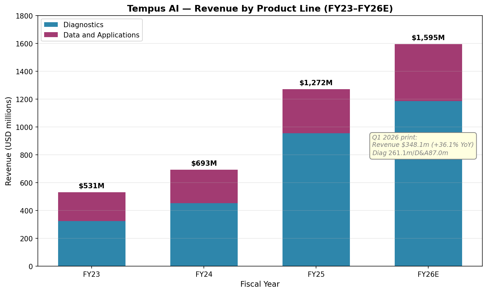
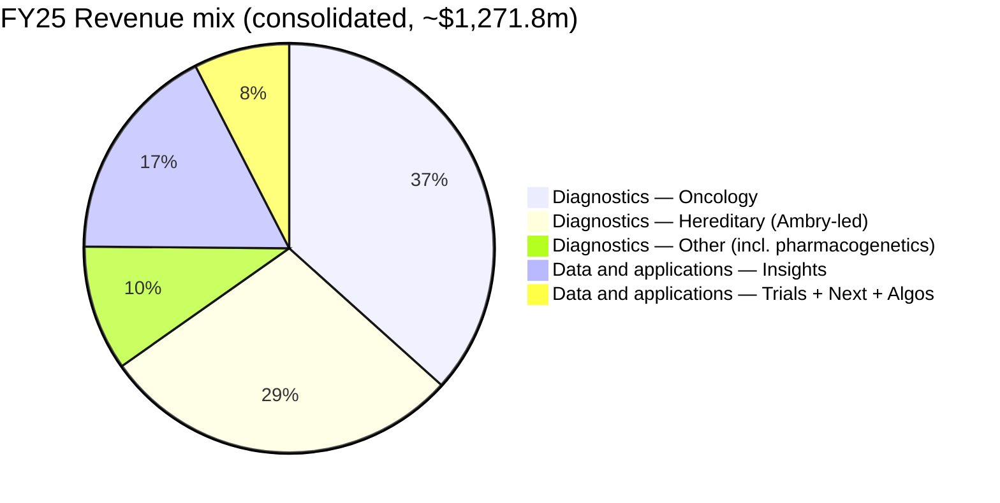
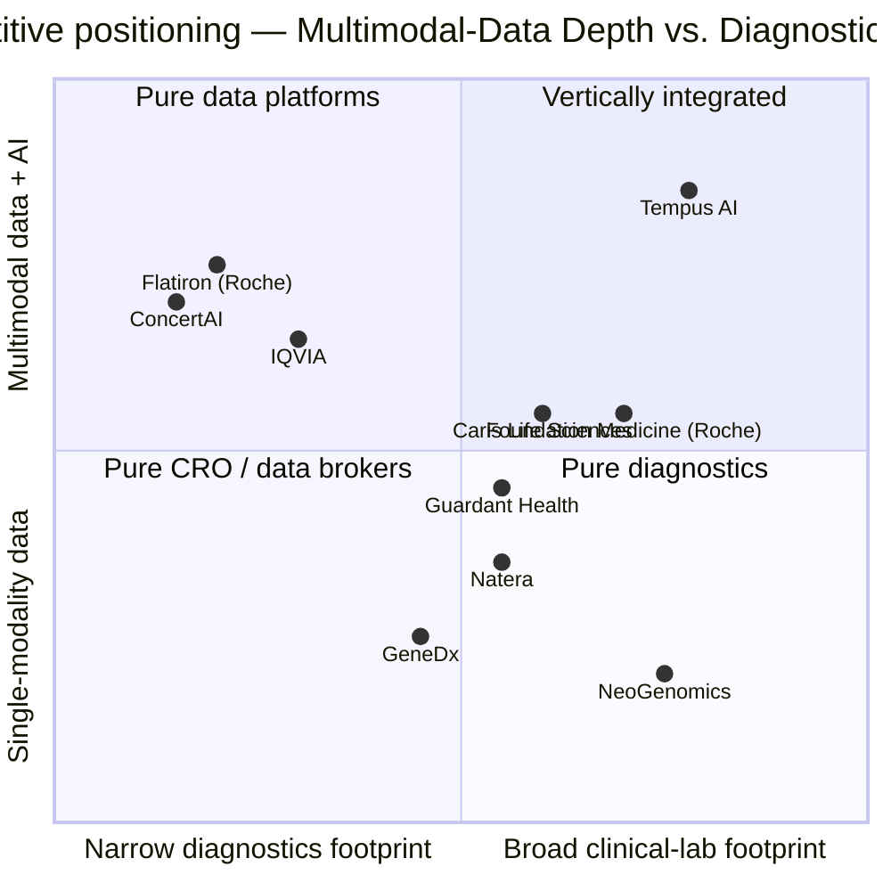

# COMPANY RESEARCH REPORT: Tempus AI, Inc. (NASDAQ: TEM)

**Date:** 2026-05-29 (initiation of coverage — same day as Tempus's inaugural Investor Day; refreshed mid-day for the BMS / Quanterix-Alzheimer's / Tempus Next disclosures of the prior two weeks)
**Author:** financial_agent / company-research skill
**Ticker:** NASDAQ: TEM
**Fiscal year end:** December 31 (FY2025 = year ended 31 Dec 2025; Q1 2026 = three months ended 31 Mar 2026)
**Analyst note:** All financials are sourced from primary filings (SEC EDGAR). This is a *coverage-initiation* report — there is no prior version of this document.

> **Update — Q1 2026 results + raised FY26 guide + $400 m convertible refi (all in May 2026):** Tempus delivered **Q1 2026 revenue of $348.1 m (+36.1% YoY)** on Diagnostics revenue of $261.1 m (+34.7%; **Oncology test volume +28% YoY, Hereditary +54% YoY (+7% ex-Ambry pre-acquisition baseline)**, **MRD volume ~6,500 tests, +~500% YoY**) and Data and applications revenue of $87.0 m (+40.5%; **Insights data-licensing +44.1%**). Adjusted EBITDA improved to **$(2.8) m from $(16.2) m a year ago**, with the full-year FY26 Adj EBITDA guide held at **~$65 m positive**. Management **raised FY26 revenue guidance to $1.59–1.60 bn (~25% growth)** from the prior $1.55 bn. On the funding side, on **May 7–12 2026** Tempus priced **$400 m of 0.00% convertible senior notes due 2032** (upsized from $350 m) at a conversion price of **$69.26 (40% premium to the May 7 close)** and used $307.7 m of the $384.1 m net proceeds to **retire the senior secured term loans in full** — a swap that meaningfully cuts interest expense and removes the secured-debt overhang ahead of profitability. Tempus hosts its **inaugural Investor Day in Chicago on Friday, May 29 2026** (today) — the deck is hosted at investors.tempus.com and will be a key reference for subsequent updates. Sources: [Tempus Q1 2026 8-K — EX-99.1, 2026-05-05](https://www.sec.gov/Archives/edgar/data/1717115/000119312526206317/tem-ex99_1.htm); [Tempus 8-K — EX-99.2 (convertible-notes pricing), 2026-05-13](https://www.sec.gov/Archives/edgar/data/1717115/000119312526220115/d117982dex992.htm).

---

## Table of Contents

1. Company Overview
2. Company History
3. Management Team
4. Products & Services
5. Customers & Go-to-Market
6. Industry Overview
7. Competitive Landscape
8. Market Opportunity (TAM)
9. Risk Assessment
10. References

---

## 1. Company Overview

Tempus AI, Inc. is a Chicago-headquartered healthcare-technology company that operates one of the largest precision-medicine **diagnostics + multimodal-data** platforms in the United States. The company sequences blood and tissue samples from cancer (and increasingly cardiology and neuropsychiatry) patients in its own CLIA-certified laboratories, connects each test result to a longitudinal clinical record harvested from a network of **more than 5,000 healthcare-institution sites via more than 700 unique data connections**, and re-sells the de-identified, harmonized substrate back to pharma and biotech customers as data licenses, clinical-trial-matching services, and algorithmic decision-support products ([Tempus 2025 10-K, Item 1 Business](https://www.sec.gov/Archives/edgar/data/1717115/000119312526066961/tem-20251231.htm)). The model is explicitly framed as a flywheel — more tests → more data → smarter algorithms → more clinically useful tests → more data — and the 10-K's stated thesis is that **"Intelligent Diagnostics represent the future of precision medicine,"** combining lab-test molecular results with EHR-derived clinical context using generative and agentic AI ([Tempus 2025 10-K, Item 1](https://www.sec.gov/Archives/edgar/data/1717115/000119312526066961/tem-20251231.htm)).

**Reporting structure.** Tempus operates under **two product lines** that the company itself calls out as mutually reinforcing: **Diagnostics** (oncology NGS + hereditary screening + companion-diagnostic-style algorithmic tests; **$955.4 m of FY25 revenue, +111% YoY**, the dominant segment) and **Data and applications** (Insights data licensing + Trials clinical-trial matching + Next AI care-gap detection + Algos algorithmic diagnostics; **$316.4 m, +31% YoY**) — **total FY25 revenue of $1,271.8 m, +83% YoY** ([Tempus 2025 10-K, MD&A — Results of Operations](https://www.sec.gov/Archives/edgar/data/1717115/000119312526066961/tem-20251231.htm)). The Diagnostics scale-jump is partly inorganic — the **February 2025 Ambry Genetics acquisition added a hereditary-testing business that delivered $362.7 m of incremental Diagnostics revenue in FY25** — but oncology testing itself grew from **~270,800 tests in FY24 to ~340,500 in FY25** (+26% volume) with average revenue per test rising from **$1,510 to $1,600** as Medicare reimbursement on the FDA-approved xT CDX assay anchored pricing ([Tempus 2025 10-K, MD&A](https://www.sec.gov/Archives/edgar/data/1717115/000119312526066961/tem-20251231.htm)).

**Q1 2026 inflection.** The Q1 2026 print continues the trajectory and shifts the company materially closer to non-GAAP profitability. Revenue of **$348.1 m (+36.1% YoY)** consisted of Diagnostics **$261.1 m (+34.7%)** and Data and applications **$87.0 m (+40.5%; Insights +44.1%)** ([Tempus Q1 2026 8-K — EX-99.1](https://www.sec.gov/Archives/edgar/data/1717115/000119312526206317/tem-ex99_1.htm)). Inside Diagnostics, **Oncology volume grew 28% YoY**, **Hereditary volume grew 54%** (down to **+7% on an apples-to-apples basis adjusting for Ambry's pre-Feb-2025 baseline volume**), and **MRD volume reached ~6,500 tests, up ~500% YoY** — the latter important because MRD (post-treatment monitoring for residual cancer signal) is widely seen as the next major oncology-volume driver, and Tempus is now scaling alongside Natera's Signatera and Guardant's Reveal ([Tempus Q1 2026 8-K — EX-99.1](https://www.sec.gov/Archives/edgar/data/1717115/000119312526206317/tem-ex99_1.htm)). Gross profit grew **+43.1% YoY to $222.0 m** (vs. revenue +36%, indicating mix-shift toward higher-margin Data revenue and Medicare pricing on FDA-approved xT CDX). Adjusted EBITDA improved to **$(2.8) m from $(16.2) m a year earlier** and **net loss of $(125.9) m** includes **$56.3 m of stock-based-compensation/employer-payroll-tax** and **$32.3 m of unrealized losses on marketable securities**, both of which dampen the headline GAAP number but are immaterial to the cash story ([Tempus Q1 2026 8-K — EX-99.1](https://www.sec.gov/Archives/edgar/data/1717115/000119312526206317/tem-ex99_1.htm)). Management **raised FY26 revenue guidance to $1.59–1.60 bn** (vs. prior ~$1.55 bn — implying ~25% growth) and **maintained the FY26 Adj EBITDA target at ~$65 m positive**, suggesting that the company's stated path to Adjusted-EBITDA breakeven crossing in late-2025 / early-2026 is intact ([Tempus Q1 2026 8-K — EX-99.1](https://www.sec.gov/Archives/edgar/data/1717115/000119312526206317/tem-ex99_1.htm)).

**Capital structure (post-May-2026 refi).** As of March 31 2026 Tempus held **$521.2 m of cash and cash equivalents plus $122.6 m of marketable equity securities (≈ $643.8 m total)**, against **~$729 m of convertible senior notes (the July-2025 issue), ~$205 m of long-term debt, ~$199 m of a convertible promissory note, and a $100 m revolver** ([Tempus Q1 2026 10-Q](https://www.sec.gov/Archives/edgar/data/1717115/000119312526206356/tem-20260331.htm); [Tempus Q1 2026 8-K — EX-99.1](https://www.sec.gov/Archives/edgar/data/1717115/000119312526206317/tem-ex99_1.htm)). In **May 2026** Tempus then priced **$400 m of 0.00% convertible senior notes due May 2032** at a **$69.26 conversion price (40% premium to the May 7 2026 sale price)** — upsized from the original $350 m intent — used **$307.7 m of the $384.1 m net proceeds to repay in full the senior secured term loans**, and paid **~$27.2 m for capped-call hedges that lift the effective conversion price** ([Tempus 8-K — EX-99.2, 2026-05-13](https://www.sec.gov/Archives/edgar/data/1717115/000119312526220115/d117982dex992.htm)). The net effect: a zero-coupon, unsecured 6-year tenor replaces high-coupon secured term debt; interest expense falls sharply; collateral overhang is removed; modest incremental dilution risk (~5.8 m shares at the strike of $69.26) is partially hedged out by the capped call.

**Valuation snapshot (as of Friday 2026-05-29, intraday).** TEM trades around **$50–55** in the days leading into the Investor Day, against a 52-week range that includes a December-2025 / January-2026 high of ~$95 ([Yahoo Finance — TEM key statistics, May 2026](https://finance.yahoo.com/quote/TEM/key-statistics)). At a $50–55 strip the market capitalization is **~$9–10 bn** on **~179.4 m fully-diluted shares** ([Tempus 2026 DEF 14A, March 27 2026 record date](https://www.sec.gov/Archives/edgar/data/1717115/000119312526145528/d23945ddef14a.htm)), implying:

- **TTM revenue ≈ $1.36 bn** (FY25 $1,271.8 m + Q1 2026 $348.1 m − Q1 2025 $255.7 m = $1,364.2 m).
- **TTM P/S ≈ 6.6×–7.4×** on $9–10 bn cap and $1.36 bn revenue.
- **EV/Sales ≈ 7×–8×** (cap + ~$1.03 bn debt − $0.64 bn cash = ~$9.4–10.4 bn EV).
- **TTM P/E: not meaningful** — TTM net loss is approximately $(440)–(480) m, a function of stock-based comp ($240+ m / yr), acquisition-related amortization, and unrealized investment-securities marks. *Not* a cyclical trough — this is **cash-burning growth**, with operating cash burn of **$(73.3) m in Q1 2026** down from $(105.6) m in Q1 2025 and FY25 op cash burn around **$(300) m** ([Tempus Q1 2026 10-Q — Cash Flow Statement](https://www.sec.gov/Archives/edgar/data/1717115/000119312526206356/tem-20260331.htm)). The cleanest profitability lens is therefore **Adjusted EBITDA** — guided to ~$65 m positive in FY26 vs. ~$(60) m in FY24, an inflection that is the heart of the bull case.
- **Forward EV/Sales (FY26E)**: at 25% growth to $1.595 bn midpoint of FY26 guide, **EV/Sales falls to ~6×**.
- **Peer multiples (TTM, May 2026 snapshot, Yahoo Finance)**: GH (Guardant Health) trades at ~6× TTM P/S; NTRA (Natera) at ~10×; EXAS (Exact Sciences) at ~4×; VEEV (Veeva Systems, the closest pure-Data/Apps peer in healthcare) at ~13–14×. TEM at **~6–7×** sits in the middle of the diagnostics-peer range, *despite* having a faster top-line growth rate than most. Bulls argue this is a discount to the diagnostics + data-licensing hybrid model; bears point to (i) ongoing GAAP losses, (ii) the ~$1 bn debt-stack vs. ~$0.64 bn cash, (iii) the ~7% post-IPO insider-supply overhang as lock-ups roll off, and (iv) the regulatory uncertainty around the FDA's LDT (laboratory-developed-test) Final Rule, which materially raises the long-run compliance bar for any LDT-heavy diagnostics franchise.

*Source: [Tempus 2025 10-K, MD&A](https://www.sec.gov/Archives/edgar/data/1717115/000119312526066961/tem-20251231.htm); [Tempus Q1 2026 8-K](https://www.sec.gov/Archives/edgar/data/1717115/000119312526206317/tem-ex99_1.htm).*

**Bottom line for Section 1.** Tempus is a hybrid clinical-laboratory + data-licensing business with **~75% of FY25 revenue from running molecular diagnostics in its own labs** and **~25% from licensing the de-identified data substrate back to pharma**. The growth thesis is compounding: every test the lab runs adds to the dataset that powers the next algorithm and the next pharma data license. The near-term inflection is **Adjusted-EBITDA breakeven in FY26**; the long-term inflection is whether the AI + multimodal-data flywheel translates into structurally higher gross margins and a software-like terminal value as Data and applications scales past the lab business.

---

## 2. Company History

Tempus was **founded in 2015 by Eric Lefkofsky in Chicago, Illinois**, in the direct aftermath of his wife's breast-cancer diagnosis — an experience he has repeatedly cited as the origin of the company's "make every cancer patient's data improve the next cancer patient's care" mission ([Tempus AI — Wikipedia](https://en.wikipedia.org/wiki/Tempus_AI); [Eric Lefkofsky team bio — tempus.com](https://www.tempus.com/team_members/eric-lefkofsky/)). The 10-K confirms the founding date plainly: *"We were founded in 2015 and have experienced rapid growth in revenue, adoption of our products and services, testing volume, size of our datasets, clinical trial matches and other metrics that we believe are important to assessing our business"* ([Tempus 2025 10-K, Item 1 Business — Overview](https://www.sec.gov/Archives/edgar/data/1717115/000119312526066961/tem-20251231.htm)).

```mermaid
timeline
    title Tempus AI — Major Milestones (2015–2026)
    2015 : Founded by Eric Lefkofsky in Chicago after wife's breast-cancer diagnosis
    2017 : Tempus xT (large-panel oncology NGS) commercial launch
    2018 : First major pharma data partnership (NCD for NGS by CMS, Medicare framework established)
    2019 : Series F at $3.1 bn post-money (Baillie Gifford led)
    2021 : AstraZeneca initial multi-year data partnership signed
    2022 : Launches Tempus Next (AI care-gap engine)
    2023 : xT CDX FDA approval (April); SB Tempus joint venture in Japan signed with SoftBank
    2024 : IPO at NASDAQ on 14-Jun-2024, ticker TEM, raised $410 m at $6.2 bn IPO valuation
    2024 : Paige.AI digital-pathology acquisition (mid-2024)
    2025 : Ambry Genetics acquisition closes (February) — adds hereditary testing
    2025 : xT CDX awarded ADLT status by CMS (1 July 2024 effective date confirmed in 10-K)
    2025 : Expanded AstraZeneca + Pathos strategic agreements (~$200 m, multi-year)
    2025 : GSK expansion (~$70 m upfront, 3-year)
    2025 : OneOme pharmacogenetics acquisition (November)
    2025 : $750 m convertible-notes offering closed (July)
    2026 : Merck strategic biomarker-discovery collaboration (Q1 2026)
    2026 : Gilead expanded Lens-platform access (Q1 2026)
    2026 : Q1 2026 — MRD volume up ~500% YoY to ~6,500 tests
    2026 : $400 m 0.00% convertibles due 2032 priced (May 7–12) — pays off senior secured loans
    2026 : Inaugural Investor Day, Chicago, 29-May-2026
```

**Pre-IPO scaling (2015–2024).** Tempus spent its first nine years as a private company building the core platform: NGS sequencing labs, the data network (now 700+ unique data connections / 5,000+ healthcare sites), and three foundational pharma data partnerships. By the time of the **June 14 2024 IPO on NASDAQ at $37/share**, raising **$410 m** and pricing the company at an **initial $6.2 bn market valuation** ([TechCrunch — Tempus IPO, 2024-05-30](https://techcrunch.com/2024/05/30/billionaire-groupon-founder-lefkofsky-is-back-with-another-ipo-ai-healthtech-tempus/); [iBIO — Tempus AI IPO Triumph](https://ibio.org/tempus-ais-ipo-triumph-raising-410m-and-valuing-the-company-at-6-2b/)), Tempus was already running ~3 million data records and approaching $700 m of run-rate annual revenue. The IPO was the second time Eric Lefkofsky had taken a venture to the public markets — after Groupon (2011), Echo Global Logistics (2009), and InnerWorkings (2006).

**The 2025 build-out via M&A.** FY2025 was the year Tempus visibly graduated from "growth-stage oncology diagnostics" to "multi-line precision-medicine platform" through three notable closes:

- **Ambry Genetics (February 2025)** — the principal driver of the FY25 Diagnostics step-up, adding hereditary-cancer-risk testing (germline NGS panels for cancer-syndrome screening) and rare-disease testing. The 10-K calls out Ambry plus Paige as "wholly-owned subsidiaries whose total assets and total revenues excluded from management's assessment and our audit of internal control over financial reporting collectively represent approximately 11% and 29%, respectively, of the related consolidated financial statement amounts as of and for the year ended December 31, 2025" — i.e. roughly **29% of FY25 consolidated revenue came from Ambry + Paige.AI** combined ([Tempus 2025 10-K, ICFR Scope Exclusion Note](https://www.sec.gov/Archives/edgar/data/1717115/000119312526066961/tem-20251231.htm)).
- **OneOme (November 2025)** — pharmacogenetics testing, including the DPYD pharmacogenetic test for 5-FU chemotherapy toxicity risk: *"Our acquisition of OneOme, Inc., or OneOme, in November 2025 further enhanced our ability to provide pharmacogenetics tests, such as DPYD"* ([Tempus 2025 10-K, Item 1 — Diagnostics Products](https://www.sec.gov/Archives/edgar/data/1717115/000119312526066961/tem-20251231.htm)).
- **Paige.AI** (closed mid-2025) and **Deep 6 AI** (clinical-trial-matching) — the 10-K's forward-looking statements section confirms both were ongoing as of FY25 close: *"our ability to successfully acquire businesses, form joint ventures or make investments in companies or technologies, including our ability to realize the expected benefits of our acquisitions of Paige.AI, Inc., Ambry Genetics Corporation and Deep 6 AI, Inc"* ([Tempus 2025 10-K, Forward-Looking Statements](https://www.sec.gov/Archives/edgar/data/1717115/000119312526066961/tem-20251231.htm)).

**Pharma partnership cohort (2024–2026).** The other major narrative thread is the deepening of pharma data-licensing relationships. Public reporting identifies the following multi-year structural deals:
- **AstraZeneca + Pathos (April 2025)** — *"$200 m in data licensing and model development fees to Tempus over the next 3 years"* to build a multimodal foundation model in oncology ([FierceBiotech — Tempus / AstraZeneca / Pathos, April 2025](https://www.fiercebiotech.com/biotech/tempus-ai-line-200m-astrazeneca-pathos-deal-develop-cancer-model); [Tempus IR — strategic agreements announcement](https://investors.tempus.com/news-releases/news-release-details/tempus-signs-expanded-strategic-agreements-astrazeneca-and)).
- **GSK extension (2024)** — *"GSK recently paid Tempus $70 million upfront for three more years of partnership"* ([FierceHealthcare — Tempus pharma deals](https://www.fiercehealthcare.com/health-tech/precision-medicine-company-tempus-inks-3rd-major-pharma-deal-securing-nearly-1b-revenue)).
- **Aggregate disclosed contracted value across three majors**: approximately **$700 m to $1 bn over multi-year horizons** ([FierceHealthcare — Tempus pharma deals](https://www.fiercehealthcare.com/health-tech/precision-medicine-company-tempus-inks-3rd-major-pharma-deal-securing-nearly-1b-revenue)). The 10-K's MD&A discloses that *"Remaining TCV includes the total potential value of the company's strategic collaborations with AstraZeneca AB, or AstraZeneca, and GlaxoSmithKline, or GSK, which, although listed under the Data and applications product line, could be satisfied by the purchase of any of the company's products and services"* ([Tempus 2025 10-K, MD&A — Remaining TCV](https://www.sec.gov/Archives/edgar/data/1717115/000119312526066961/tem-20251231.htm)).
- **Merck (Q1 2026)** — *"Established a multi-year, strategic collaboration with Merck to accelerate biomarker discovery and development by leveraging Tempus' multimodal data and Lens analytical platform"* ([Tempus Q1 2026 8-K — EX-99.1, 2026-05-05](https://www.sec.gov/Archives/edgar/data/1717115/000119312526206317/tem-ex99_1.htm)).
- **Gilead (Q1 2026)** — *"Expanded our collaboration with Gilead to provide enterprise-wide access to our AI-driven Lens platform and multimodal datasets, aimed at advancing their oncology pipeline through real-world evidence and AI-driven insights"* ([Tempus Q1 2026 8-K — EX-99.1, 2026-05-05](https://www.sec.gov/Archives/edgar/data/1717115/000119312526206317/tem-ex99_1.htm)).
- **Bristol-Myers Squibb (BMS) expanded collaboration (2026-05-14)** — **five initial clinical trial programs** across **oncology** (lung, colon, prostate solid-tumor indications) **and neuroscience** (Alzheimer's disease drug development), using the Tempus **Lens** AI-enabled analytical platform to optimize trial design and **enhance Probability of Technical & Regulatory Success (PTRS)** across BMS's development portfolio. **No financial terms disclosed.** The expansion builds on a prior partnership including the **Next Pathways program deployed across 13 community-based health systems to address care gaps for patients with advanced non-small cell lung cancer (aNSCLC)**. *"Our multimodal data library allows us to connect the dots between clinical records and molecular subtypes"* — **Ryan Fukushima, CEO of Data and Apps, Tempus**. *"By combining Tempus' multimodal real-world data capabilities with our development expertise, we can rigorously pressure-test trial assumptions"* — **Bryan Campbell, BMS SVP Drug Development Strategy & Innovation** ([Tempus IR press release, 2026-05-14](https://www.tempus.com/news/pr/tempus-expands-strategic-collaboration-with-bristol-myers-squibb-to-enhance-the-probability-of-success-across-clinical-development-programs-in-oncology-and-neuroscience/); [stocktitan.net — Tempus/BMS, 2026-05-14](https://www.stocktitan.net/news/BMY/tempus-expands-strategic-collaboration-with-bristol-myers-squibb-to-sewhxi1z35e9.html)).

The BMS deal extends the pharma cohort to **five named global majors (AstraZeneca, GSK, Merck, Gilead, BMS)** plus the unnamed third-major-pharma referenced in the FierceHealthcare 2024 reporting — i.e. **the top-pharma data-licensing cohort now spans approximately the top half of the global oncology-pharma franchise list**, an unusual breadth for a sub-$1.5 bn-revenue diagnostics platform.

The pharma cohort is the most economically meaningful relationship structure outside of the clinical-lab business: an AstraZeneca-scale deal is roughly equivalent in lifetime value to **~40,000 oncology NGS tests**, but with substantially higher gross margin and zero CMS/payer reimbursement exposure.

**Disease-area expansion via Quanterix LucentAD (2026-05).** Concurrent with the BMS-neuroscience expansion, Tempus integrated **Quanterix's LucentAD Complete blood-based Alzheimer's biomarker panel** into the **Tempus Next** care-gap platform — i.e. **Tempus is building a dedicated Alzheimer's care-gap program**, with LucentAD Complete orderable for neurologists directly through the Tempus clinical ordering platform ([Quanterix press release — Lucent / Tempus collaboration](https://www.quanterix.com/news-media-center/press-releases/lucent-diagnostics-announces-collaboration-with-tempus-to-integrate-blood-based-alzheimers-biomarker-testing-into-clinical-workflows/); [SelectScience — Tempus / Lucent](https://www.selectscience.net/article/lucent-diagnostics-and-tempus-ai-partner-to-expand-access-to-alzheimer-s-blood-biomarker-testing); [Yahoo Finance, 2026 — Tempus expands beyond oncology](https://finance.yahoo.com/sectors/healthcare/articles/tempus-ai-expands-beyond-oncology-161649169.html)). Strategically this is **Tempus's first material move into neurology / brain health** as a third disease area beyond oncology and cardiology — and is a direct extension of the Next-platform-as-clinical-workflow-OS thesis discussed in §4.3. The integration explicitly cites *"clinical-guideline-directed patient identification and blood-based biomarker testing options"* embedded in neurology workflows, *"supporting earlier and more accurate identification of amyloid-positive patients who may be candidates for approved Alzheimer's disease therapies"* — i.e. the test routes patients into the lecanemab/donanemab eligible pool, where each successfully-routed patient represents meaningful pharma economic value to Eisai/Biogen and Lilly. The combination of **(a) BMS adding Alzheimer's to its 5-program slate** and **(b) the LucentAD-Tempus Next integration** is the clearest evidence yet that **Alzheimer's / brain health is Tempus's next major disease-area build-out**, materially expanding the long-run TAM beyond the oncology + cardiology framework discussed in §8.

**Other Investor-Day-adjacent operational signals.** In the 72 hours leading into the May 29 Investor Day, Tempus also disclosed: (i) **Tempus Next platform upgraded with "real-time clinical intelligence"** (2026-05-28), (ii) **Hub AI tool upgraded with agentic-AI capabilities to streamline clinical workflows** (2026-05-27), (iii) **37 abstracts accepted for presentation at the 2026 ASCO Annual Meeting** (early June), and (iv) ARK Invest purchased 25,910 TEM shares on 2026-05-27 (~$1.2 m). The deck itself (26.7 MB PDF, hosted at investors.tempus.com) was not filed as an 8-K and detailed multi-year financial-target breakdowns have not been published in news media as of mid-day 2026-05-29 — the report will be refreshed with multi-year revenue / EBITDA / FCF / TAM build details once the deck is fully digested by the sell-side ([ts2.tech — Tempus Big May, 2026-05](https://ts2.tech/en/tempus-ais-big-may-why-q1-results-and-first-investor-day-put-tem-stock-in-focus/); [timothysykes.com — TEM 2026-05-29](https://www.timothysykes.com/news/tempus-ai-inc-tem-news-2026_05_29/)).

---

## 3. Management Team

**Eric Lefkofsky — Founder, Chairman and Chief Executive Officer.** Lefkofsky founded Tempus in 2015 after his wife was diagnosed with breast cancer, an experience he has described as the impetus for the entire company — building the data infrastructure he wished had existed to inform her treatment decisions ([Eric Lefkofsky team bio — tempus.com](https://www.tempus.com/team_members/eric-lefkofsky/); [Tempus AI — Wikipedia](https://en.wikipedia.org/wiki/Tempus_AI)). Before Tempus he was a **serial founder of publicly listed technology companies**: **co-founder and former CEO of Groupon, Inc.** (which IPO'd on NASDAQ in November 2011 at one of the largest internet-company offerings of the decade), **co-founder of Mediaocean** (programmatic-advertising infrastructure), **co-founder of Echo Global Logistics, Inc. (NASDAQ: ECHO**, IPO'd June 2009), and **co-founder of InnerWorkings, Inc.** (NASDAQ: INWK, IPO'd August 2006) ([Eric Lefkofsky — Wikipedia](https://en.wikipedia.org/wiki/Eric_Lefkofsky)). He is also a co-founder of Chicago-based venture firm **Lightbank**. Educationally: BA with honors from the University of Michigan (1991) and JD from the University of Michigan Law School (1993).

Lefkofsky is one of the small set of US technology founders with **four separate IPO-listed companies on his founding ledger** — a pattern that is relevant to TEM the security because it implies (a) he has executed the public-company playbook before, (b) he holds super-voting Class B stock that retains founder control through the public-company transition, and (c) his personal financial alignment with TEM is unusually large for a CEO at this scale (Lefkofsky has been one of the largest single holders of every venture he has founded). As of the **March 27 2026 record date** for the 2026 annual meeting, Tempus had **179,404,620 shares of common stock outstanding, consisting of 174,360,831 Class A shares and 5,043,789 Class B shares** ([Tempus 2026 DEF 14A](https://www.sec.gov/Archives/edgar/data/1717115/000119312526145528/d23945ddef14a.htm)) — Lefkofsky's Class B holding is what preserves founder control even as the Class A float grows post-IPO. The DEF 14A confirms his current titles as **Chief Executive Officer, Founder and Chairman of the Board** ([Tempus 2026 DEF 14A — Notice of Annual Meeting](https://www.sec.gov/Archives/edgar/data/1717115/000119312526145528/d23945ddef14a.htm)).

His strategic framing for Tempus has been remarkably consistent across the IPO roadshow, the four post-IPO earnings calls, and the Q1 2026 release: *"Our strong financial and operational performance this quarter underscores the accelerating demand for our AI-driven diagnostic platform and the immense value of our multimodal data and corresponding AI models … We continue to see strong momentum as we deploy more sophisticated algorithms across our platform, driving 36% revenue growth year-over-year, with particular strength in our Oncology diagnostic business and data and modeling business"* ([Tempus Q1 2026 8-K — EX-99.1, 2026-05-05](https://www.sec.gov/Archives/edgar/data/1717115/000119312526206317/tem-ex99_1.htm)). The Q1 2026 release also lists the inaugural Investor Day participants beyond Lefkofsky: **CFO Jim Rogers**, **CEO of Data and applications Ryan Fukushima**, **CEO of Diagnostics Tom Schoenherr**, and **Chief Scientific Officer Kate Sasser, PhD** — i.e. the company has now organized into two co-CEO-style business-line presidents reporting up to Lefkofsky, with a CFO and CSO at the corporate layer ([Tempus Q1 2026 8-K — EX-99.1 / Investor Day announcement](https://www.sec.gov/Archives/edgar/data/1717115/000119312526206317/tem-ex99_1.htm)). The bilingual / multi-product CEO + product-line-president structure is the same one Microsoft, Salesforce, and Amazon all eventually settled into; it is rare to see at $1.3 bn revenue and is a positive signal on management bandwidth.

---

## 4. Products & Services

This is the longest section of the report by design — Tempus's two product lines are the analytical foundation for the customer / industry / TAM / risk discussions that follow, and the 10-K's product matrix is the single most cited document in any subsequent equity-research note on TEM.

### 4.1 Diagnostics — Oncology testing (the core of the franchise)

The Oncology assay portfolio is built around a **letter-suffix family** that the issuer always writes with the `Tempus|` prefix and never expands into marketing language. From the 10-K verbatim:

> *"Our Platform's first application was in oncology, where we have built a versatile portfolio of cancer tests spanning solid tumors and hematologic malignancies, germline and somatic variants, and tissue and liquid biopsies. Since our inception, our approach to precision oncology has been to provide comprehensive genomic profiling through NGS that enables us to both generate clinically relevant insights that may not be possible with narrower testing approaches, and contribute high-quality molecular information back to providers and to our database. We offer large-panel solid tumor and hematologic testing through multiple assays, with our core clinical assay (xT and xR) offering large panel DNA, RNA full transcriptome, and incidental germline findings through normal blood or saliva analyses. Our current offerings also include liquid biopsy (xF), minimal residual disease and treatment response monitoring (xM), whole exome (xE), and hereditary cancer risk (xG)."* ([Tempus 2025 10-K, Item 1 — Business](https://www.sec.gov/Archives/edgar/data/1717115/000119312526066961/tem-20251231.htm))

The product matrix at the 10-K level is therefore:

| Assay | Specimen | Modality | Use Case |
|---|---|---|---|
| **xT** (CDX — FDA-approved April 2023) | Tumor tissue + matched normal blood/saliva | DNA NGS, **648 genes at 500× coverage, ~3.6 Mb**, plus full TCR / BCR / HLA typing for IO signatures | Comprehensive genomic profiling for advanced/metastatic solid tumors; companion-diagnostic-eligible for FDA-approved targeted therapy decisions |
| **xR** | Tumor tissue | **RNA full-transcriptome** sequencing | Fusion detection, expression-based subtyping, RNA-derived HRD scoring |
| **xF** | Plasma (liquid biopsy) | **Circulating tumor-DNA NGS** | Initial profiling when tissue is insufficient; recurrence monitoring; resistance-mutation tracking |
| **xM** | Plasma (liquid biopsy) | **Minimal residual disease + treatment-response monitoring** | Serial post-treatment surveillance; ~6,500 tests in Q1 2026, +500% YoY |
| **xE** | Tumor or germline | **Whole-exome sequencing** | Research-grade depth for trials and pharma data deliveries |
| **xG** | Blood or saliva | **Hereditary cancer-risk germline NGS** | Multi-gene-panel germline cancer-syndrome screening |

**中文释义 / Plain-language gloss:** xT is the flagship "give me everything actionable about this tumor" panel — it sequences both DNA and (in xR) RNA at high coverage, identifies driver mutations, fusions, copy-number changes, microsatellite instability, tumor mutational burden, HRD (homologous-recombination deficiency) status, and immune-oncology biomarkers (PD-L1, TCR clonality). xF is the same idea but from blood — used when a tumor biopsy is impossible or when monitoring recurrence over time. xM (MRD) is the "is there *any* tumor signal left?" test run quarterly after surgery or chemo to catch recurrence months before imaging would. xE is the research-grade exome (~20,000 genes) used mostly inside pharma collaborations. xG is the hereditary-risk panel — a "do you carry BRCA / Lynch / Li-Fraumeni / etc." answer for a *healthy* relative of a cancer patient or a young patient with family history.

The **strategic significance** of each product within the franchise:

- **xT CDX is the regulatory and reimbursement anchor.** The 10-K is explicit: *"We believe that our xT CDX assay, which received FDA approval in April 2023, meets the criteria for reimbursement under the NCD. In addition, effective July 1, 2024, our xT CDX assay was awarded Advanced Diagnostic Laboratory Test status by CMS"* ([Tempus 2025 10-K, Reimbursement section](https://www.sec.gov/Archives/edgar/data/1717115/000119312526066961/tem-20251231.htm)). ADLT status is a specific CMS designation that allows a newly approved diagnostic to set its own initial reimbursement rate at list-price for the first three quarters, with subsequent rates set by median private-payer rates — a substantially better revenue-per-test profile than the legacy Medicare CLFS schedule. ADLT plus FDA approval is also the path to convince commercial payers that the test merits coverage, which is what underpins the $1,510 → $1,600 ARR-per-oncology-test step-up reported in the FY25 MD&A.
- **xM (MRD) is the next major volume curve.** ~6,500 tests in Q1 2026 is small relative to oncology volume (~85,000 tests / quarter implied by FY25 ÷ 4) but **the 500% YoY growth and the strategic importance** (MRD is broadly understood as the largest oncology-volume opportunity post-tissue NGS — Natera's Signatera does ~$700 m of annual revenue) make it the chart bull-case investors will be watching. The May 29 Investor Day deck is expected to provide multi-year volume / TAM build for xM.
- **xR (RNA) is the analytical differentiator.** Most competing comprehensive-genomic-profiling assays are DNA-only. Tempus highlights in a Q1 2026 publication that adding RNA + tumor-normal matching to the panel *"identified actionable findings in 12% of patients that were missed by standard testing"* ([Tempus Q1 2026 8-K — EX-99.1, JCO Precision Oncology publication](https://www.sec.gov/Archives/edgar/data/1717115/000119312526206317/tem-ex99_1.htm)) — i.e. the multimodal approach captures clinically actionable variants invisible to DNA-only assays from Guardant or Foundation Medicine.

### 4.2 Diagnostics — Hereditary testing (the Ambry-built second leg)

The hereditary product line is post-Ambry. From the 10-K verbatim:

> *"With our acquisition of Ambry in February 2025, we have further expanded and enhanced our inherited risk screening capabilities for cancer and rare disease patients … Our acquisition of OneOme, Inc., or OneOme, in November 2025 further enhanced our ability to provide pharmacogenetics tests, such as DPYD."* ([Tempus 2025 10-K, Item 1 — Diagnostics](https://www.sec.gov/Archives/edgar/data/1717115/000119312526066961/tem-20251231.htm))

Hereditary testing means germline panels for inherited cancer-risk genes (BRCA1, BRCA2, the Lynch-syndrome genes MLH1/MSH2/MSH6/PMS2/EPCAM, TP53 / Li-Fraumeni, PTEN / Cowden, CDH1, STK11, PALB2, ATM, CHEK2, etc.) as well as rare-disease genetic testing. The 10-K reports hereditary test volume **rose to ~460,500 tests in FY25** (the bulk of which came from Ambry post-February-2025 close) and Q1 2026 hereditary volume was **up 54% YoY (or +7% on an apples-to-apples basis adjusting for Ambry's pre-acquisition baseline)** ([Tempus 2025 10-K, MD&A](https://www.sec.gov/Archives/edgar/data/1717115/000119312526066961/tem-20251231.htm); [Tempus Q1 2026 8-K — EX-99.1](https://www.sec.gov/Archives/edgar/data/1717115/000119312526206317/tem-ex99_1.htm)). Hereditary's economic role in the model is dual: a lower-revenue-per-test, higher-volume business that broadens the customer-base footprint outside cancer-tertiary-care centers, *plus* a feeder of germline data into the pharma data-licensing business (germline matched-normal data is essential for pharma's gene-discovery and biomarker work).

### 4.3 Data and applications — the four-product layer above Diagnostics

Data and applications is where the "AI / data" half of Tempus's identity actually lives — and where the margin profile is materially better than the diagnostics business. From the 10-K verbatim:

> *"Our Data and applications product line facilitates drug discovery and development for life sciences companies through multiple products, including, among other things, Insights, Trials, Next and Algos. Through our Insights product, we license de-identified libraries of linked clinical, molecular, and imaging data and provide a suite of analytic and cloud-and-compute tools to pharmaceutical and biotechnology companies. Our Trials product leverages the broad network of physicians we work with in oncology to provide clinical trial support for pharmaceutical companies that are looking to reach hard-to-find and underserved patient populations."* ([Tempus 2025 10-K, Item 1 — Business](https://www.sec.gov/Archives/edgar/data/1717115/000119312526066961/tem-20251231.htm))

| Product | What it sells | Who buys it | Pricing model |
|---|---|---|---|
| **Insights** | De-identified, linked clinical + molecular + imaging data + analytic / cloud-compute tools | Pharma & biotech R&D | Subscription / data-license; pharma TCV contracts |
| **Trials** | Clinical-trial-matching using physician network + structured clinical-molecular data | Pharma / CROs | Per-trial / per-match fees; sometimes embedded in larger collaboration |
| **Next** | AI engine that runs over EHR + diagnostic data to surface care-gap alerts (oncology + cardiology) | Hospitals / health systems | Subscription |
| **Algos** | Algorithmic diagnostics — TO (tumor-origin), HRD (homologous-recombination deficiency), DPYD pharmacogenetic, Tempus Purist | Hospitals, pharma | Per-test / subscription |

**Insights** is the largest single driver of the segment — the FY25 10-K MD&A specifically attributes **$70.9 m of the FY25 increase in Data and applications revenue to "increased demand for our Insights products"** ([Tempus 2025 10-K, MD&A — Data and Applications](https://www.sec.gov/Archives/edgar/data/1717115/000119312526066961/tem-20251231.htm)). In Q1 2026 Insights grew **44.1% YoY** ([Tempus Q1 2026 8-K — EX-99.1](https://www.sec.gov/Archives/edgar/data/1717115/000119312526206317/tem-ex99_1.htm)), the fastest sub-line in the company. The AstraZeneca + Pathos partnership to *"build the largest multimodal foundation model in oncology"* is structurally an Insights-plus-modeling contract: pharma licenses the de-identified library AND co-develops the foundation model on top of it, with the model's downstream IP shared per the contract terms ([Tempus IR — AstraZeneca + Pathos announcement](https://investors.tempus.com/news-releases/news-release-details/tempus-signs-expanded-strategic-agreements-astrazeneca-and)).

**Algos** is the smaller but strategically important "build software products *on top of* the lab" line. The four currently disclosed: **TO** (tumor-of-origin classifier — used when a patient presents with metastatic cancer of unknown primary, the algorithm uses molecular features to guess the primary site, materially improving the chance of selecting the right therapy), **HRD** (homologous-recombination-deficiency score — used to identify patients likely to respond to PARP inhibitors), **DPYD** (pharmacogenetic test for 5-FU chemotherapy toxicity risk — now post-OneOme), and **Tempus Purist** (a tumor-purity normalization algorithm). The Q1 2026 release announced an additional Algo product: *"Announced the launch of a first-of-its-kind pan-cancer algorithm that utilizes RNA expression data to identify Homologous Recombination Deficiency (HRD), expanding the number of patients who may benefit from PARP inhibitors beyond those identified by traditional DNA testing"* ([Tempus Q1 2026 8-K — EX-99.1, 2026-05-05](https://www.sec.gov/Archives/edgar/data/1717115/000119312526206317/tem-ex99_1.htm)) — i.e. Tempus now sells *two* HRD algorithms, the legacy DNA one and the new RNA-based one, where the RNA version is differentiated against Myriad's myChoice and competitors' DNA-based HRD scores.

**Next** is the most recent Algo-style product and the one most directly aligned with the bull thesis of "Tempus becomes the *health-system* operating layer". The cardiology angle is meaningful: the **ALERT trial in collaboration with Medtronic** demonstrated in Q1 2026 that *"Tempus' AI-driven EHR notifications increased life-saving heart valve procedures by 40% for patients with significant disease"* ([Tempus Q1 2026 8-K — EX-99.1, 2026-05-05](https://www.sec.gov/Archives/edgar/data/1717115/000119312526206317/tem-ex99_1.htm)). This is the first prospective, randomized demonstration that Tempus's care-gap algorithm causally drives revenue-generating procedure volume for the health system AND patient-outcome improvement, which is the case Tempus needs to make to monetize Next as a hospital-IT product on a subscription basis rather than a per-test fee.

### 4.4 Synthesis — how the two product lines reinforce each other

The strategic interlock between Diagnostics and Data and applications is the entire point. Each test the lab runs creates (a) a billable molecular result for the ordering provider/payer (Diagnostics revenue) AND (b) a row of structured multimodal data — molecular result + EHR clinical context — that joins the Tempus dataset (the input to Data and applications). That same row is then used, in de-identified form, in (i) Insights data licenses to pharma, (ii) Trials clinical-trial matching, (iii) training data for the next generation of Algos, and (iv) the data pre-training corpus for the foundation models being co-built with AstraZeneca / Pathos / others. From the 10-K verbatim:

> *"Each product line is designed to enable and enhance the other, thereby creating network effects in each of the markets in which we operate. Our business model allows pharmaceutical and biotechnology companies to unlock value from the data we collect, and allows us to monetize a de-identified copy of that data, in different ways across our different product lines. We believe these network effects provide a unique advantage to our business as the compounding value of each data record in our database serves to enhance our competitive moat. The more data we collect, the smarter our tests become, the more applications we launch, the more physicians join our network, further growing our database, making our tests more precise for clinicians and our database more valuable for researchers."* ([Tempus 2025 10-K, Item 1 — Strategy](https://www.sec.gov/Archives/edgar/data/1717115/000119312526066961/tem-20251231.htm))

This is the textbook description of a **data-network-effects business** built on top of a **clinical-lab regulatory moat**. The critical question for the long-run thesis is whether the Data and applications line — which has structurally higher gross margin and zero CMS reimbursement risk — grows enough to flip the revenue mix and pull blended margins materially higher. In FY25 D&A was 25% of revenue; the bull case is that the FY30+ mix is 40–50% D&A, at which point blended gross margin should structurally re-rate.

---

## 5. Customers & Go-to-Market

Tempus sells to **three distinct customer types** through three different go-to-market motions:

**(a) Health systems and physician practices** — the buyer of Diagnostics tests. Tempus's clinical lab serves more than **5,000 healthcare-institution sites** that order one or more of the xT/xR/xF/xM/xE/xG assays, connected through **700+ unique data connections** that flow EHR data back to Tempus for de-identification and harmonization ([Tempus 2025 10-K, Item 1 — Overview](https://www.sec.gov/Archives/edgar/data/1717115/000119312526066961/tem-20251231.htm)). Reimbursement is the gating economics:

> *"During the year ended December 31, 2025, Medicare claims represented 26% of our clinical oncology testing volume and 10% of our hereditary testing volume."* ([Tempus 2025 10-K, Reimbursement](https://www.sec.gov/Archives/edgar/data/1717115/000119312526066961/tem-20251231.htm))

The remaining ~74% of oncology volume bills to commercial payers, with private-payer rates anchored by the MolDx-administered Medicare-MAC pricing for the corresponding CPT code (Palmetto for the Raleigh and Atlanta labs; Noridian for the Aliso Viejo lab — both subject to the MolDx program per the 10-K). Q1 2026 examples of new health-system wins reported in the earnings release:

> *"Selected by Northwestern Medicine to expand genomic testing access to oncology patients across the health system, leveraging Tempus' full suite of DNA, RNA, liquid biopsy, and MRD tests to enable more personalized cancer care and clinical trial design."* ([Tempus Q1 2026 8-K — EX-99.1, 2026-05-05](https://www.sec.gov/Archives/edgar/data/1717115/000119312526206317/tem-ex99_1.htm))

> *"Entered a multi-year strategic collaboration with NYU Langone Health, centered on a prospective observational study that uses serial molecular profiling to track cancer evolution and treatment resistance, with the goal of developing AI-powered diagnostic tools and personalized therapies."* ([Tempus Q1 2026 8-K — EX-99.1, 2026-05-05](https://www.sec.gov/Archives/edgar/data/1717115/000119312526206317/tem-ex99_1.htm))

**(b) Large pharmaceutical and biotech companies** — the buyer of Data and applications (Insights, Trials, certain Algos). This is the more economically concentrated side of the business. Public reporting identifies three structural relationships of disclosed value:

- **AstraZeneca** — initial multi-year deal signed 2021; expanded April 2025 with Pathos to *"$200 m in data licensing and model development fees to Tempus over the next 3 years"* to *"build the largest multimodal foundation model in oncology"* ([FierceBiotech — Tempus / AstraZeneca / Pathos, April 2025](https://www.fiercebiotech.com/biotech/tempus-ai-line-200m-astrazeneca-pathos-deal-develop-cancer-model)).
- **GSK** — extended 2024 with *"$70 million upfront for three more years of partnership"* ([FierceHealthcare — Tempus pharma deals](https://www.fiercehealthcare.com/health-tech/precision-medicine-company-tempus-inks-3rd-major-pharma-deal-securing-nearly-1b-revenue)).
- **A third major pharma** — *"three global pharma companies, representing about $700 million in revenue over the next few years"* ([FierceHealthcare — Tempus pharma deals](https://www.fiercehealthcare.com/health-tech/precision-medicine-company-tempus-inks-3rd-major-pharma-deal-securing-nearly-1b-revenue)) — the 10-K MD&A confirms the "Remaining TCV" construct that aggregates these multi-year contracts.

In Q1 2026 two new strategic pharma agreements were added:

> *"Established a multi-year, strategic collaboration with Merck to accelerate biomarker discovery and development by leveraging Tempus' multimodal data and Lens analytical platform."* and *"Expanded our collaboration with Gilead to provide enterprise-wide access to our AI-driven Lens platform and multimodal datasets, aimed at advancing their oncology pipeline through real-world evidence and AI-driven insights."* ([Tempus Q1 2026 8-K — EX-99.1, 2026-05-05](https://www.sec.gov/Archives/edgar/data/1717115/000119312526206317/tem-ex99_1.htm))

The May-2026 pharma slate added **Bristol-Myers Squibb (2026-05-14)** as the fifth named major in the cohort — **five initial clinical trial programs across oncology (lung, colon, prostate) and neuroscience (Alzheimer's)**, using the Tempus Lens platform to enhance **PTRS (Probability of Technical & Regulatory Success)** for BMS's development portfolio. Prior cooperation context: a **Next Pathways program deployed across 13 community-based health systems addressing care gaps in advanced NSCLC** ([Tempus IR — BMS expanded collaboration, 2026-05-14](https://www.tempus.com/news/pr/tempus-expands-strategic-collaboration-with-bristol-myers-squibb-to-enhance-the-probability-of-success-across-clinical-development-programs-in-oncology-and-neuroscience/)). The pharma cohort now spans **AstraZeneca / GSK / Merck / Gilead / BMS plus the unnamed third major from the FierceHealthcare 2024 reporting** — five-to-six named global oncology majors in a publicly disclosed data-licensing relationship is unusually broad coverage of the global pharma franchise for a sub-$1.5 bn-revenue precision-medicine platform.

**(c) Medical-device companies and disease registries** — a smaller but strategically important category. **Medtronic / ALERT trial** is the flagship example here (covered in §4.3), and Q1 2026 also adds **Blood Cancer United** for a pediatric-AML registry ([Tempus Q1 2026 8-K — EX-99.1](https://www.sec.gov/Archives/edgar/data/1717115/000119312526206317/tem-ex99_1.htm)). The May-2026 build-out includes **Quanterix** as a new diagnostic-partner: the **LucentAD Complete blood-based Alzheimer's biomarker panel is now integrated into Tempus Next**, with neurologists able to order the test directly through the Tempus clinical ordering platform — Tempus's first material disease-area expansion into **neurology / brain health** ([Quanterix press release — LucentAD / Tempus](https://www.quanterix.com/news-media-center/press-releases/lucent-diagnostics-announces-collaboration-with-tempus-to-integrate-blood-based-alzheimers-biomarker-testing-into-clinical-workflows/); [Yahoo Finance — Tempus expands beyond oncology, 2026](https://finance.yahoo.com/sectors/healthcare/articles/tempus-ai-expands-beyond-oncology-161649169.html)).

**Customer concentration — be precise about what the filings disclose vs. don't.** Tempus is **not** required to disclose per-customer revenue percentages because (i) no single customer crossed the 10%-of-consolidated-revenue ASC 280-10-50-42 threshold in FY25 and (ii) the proprietary nature of pharma data-licensing contracts is treated as confidential. What the Q1 2026 10-Q **does** disclose is related-party revenue:

> *"Includes related party revenue of $21,823 thousand for the three months ended March 31, 2026"* ([Tempus Q1 2026 10-Q — Related-Party Transactions](https://www.sec.gov/Archives/edgar/data/1717115/000119312526206356/tem-20260331.htm))

This is ~6% of Q1 2026 revenue, primarily related to the SB Tempus Japan joint venture and the SoftBank-related IP-license agreement. *Outside* the related-party figure, the AstraZeneca / GSK / Pathos / Merck / Gilead cohort is collectively large but no individual customer is broken out. **A reasonable analyst assumption (not disclosed): the top-5 pharma customers collectively probably account for the majority of the ~25% of revenue that comes from Data and applications, i.e. roughly 15–20% of consolidated revenue.** This is concentrated but not anomalous for a pharma-data-licensing business.

*Composition is analyst-constructed from 10-K segment totals; the Diagnostics-internal sub-split between Oncology/Hereditary/Other and the Data-and-applications sub-split between Insights/Trials/Next/Algos are estimates based on the MD&A narrative ([Tempus 2025 10-K, MD&A](https://www.sec.gov/Archives/edgar/data/1717115/000119312526066961/tem-20251231.htm)). Total split into Diagnostics ($955.4m) vs. Data and applications ($316.4m) is exact-disclosed.*

---

## 6. Industry Overview

Tempus sits at the intersection of **three converging industries**: clinical molecular diagnostics (NGS-driven cancer testing), pharmaceutical R&D data services, and healthcare AI / decision support.

**Industry 1: Clinical molecular diagnostics (oncology + hereditary).** The 10-K characterizes the long-run growth driver as the shift from histology-based diagnosis (pathologist looks at the slide under a microscope) to molecular-driven precision oncology, where therapy selection is driven by the tumor's specific genomic alterations rather than the organ-of-origin alone:

> *"While AI has the potential to broadly impact healthcare, we believe it will transform diagnostics first. Diagnostics, broadly defined, is the process of determining by examination or assessment the nature and circumstance of disease. Physicians use diagnostics all the time; they order blood tests, biopsies, scans, genomic tests, and others. Physicians rely on diagnostic results to make the vast majority of their treatment decisions. Researchers rely on diagnostic tests to better understand disease and make better decisions throughout their discovery processes."* ([Tempus 2025 10-K, Item 1 — Industry Background](https://www.sec.gov/Archives/edgar/data/1717115/000119312526066961/tem-20251231.htm))

The cancer-testing market grew sharply through 2020–2025 as the body of FDA-approved targeted therapies requiring a companion-diagnostic call expanded: each new approved therapy is essentially a new mandatory data-point on a comprehensive panel. The current US testing addressable market for comprehensive genomic profiling is approximately **$5–7 bn** (sized by analyst consensus across Guardant Health, Foundation Medicine via Roche, Caris Life Sciences, Natera, Exact Sciences and Tempus's own disclosures), growing in the high-teens annually. **MRD** (post-treatment recurrence monitoring) is a separate, large adjacent — Natera's Signatera alone is approaching $700 m of annual revenue and the category is on a multi-year ~30%+ growth path. **Hereditary** testing is more mature but still consolidating — Tempus's Ambry acquisition was the second-largest transaction in the space in five years (after Exact's acquisition of Genomic Health in 2019 — different category, but illustrative scale).

**Industry 2: Pharmaceutical R&D data and analytics.** Pharma's appetite for structured, longitudinal, real-world-evidence (RWE) datasets to inform drug discovery, clinical-trial design, and post-launch lifecycle management has grown structurally. IQVIA, Iqvia's competitors (ConcertAI, Komodo, Truveta), and the consolidated EHR data brokers (Datavant, Veradigm) all compete. What is structurally different about Tempus is that it produces the data substrate itself in its own labs and clinics — i.e. it's a vertically integrated data producer, not a data broker. The economic significance of this is enormous: a typical biopharma multimodal-data deal (oncology RWE + molecular sequencing + outcomes) sells for hundreds of millions of dollars over multi-year horizons — exactly the AstraZeneca + Pathos $200 m / GSK $70 m / aggregate-$700 m–1 bn cohort discussed in §2.

**Industry 3: Healthcare AI / clinical decision support.** This is the most nascent of the three and the one where Tempus has the least competitive density today. Next (the AI care-gap engine) and the Tempus Algos suite (TO, HRD, DPYD, Tempus Purist) compete with PathAI (digital pathology), HeartFlow (cardiology imaging AI), Eko Devices (cardiac auscultation AI), and a long tail of point-solution startups. The ALERT trial result (Q1 2026) is the kind of prospective evidence that converts a "promising AI tool" into a "reimbursable line item" — and is the single most important Q1 2026 data point for the FY27+ Next thesis.

The cross-industry thesis the 10-K argues — paraphrased — is that *only a vertically integrated player* with all three layers (clinical lab + dataset + AI products) can build the foundation model + agentic-AI clinical workflow that the entire healthcare industry will be migrating to over the next decade. The competitive challengers (Roche/Foundation/Flatiron, Guardant, Natera) each cover one or two of the three layers but lack the full stack.

---

## 7. Competitive Landscape

The 10-K's Competition section names competitors verbatim for each product line. From the 10-K:

> *"Our Diagnostics product line primarily faces competition from diagnostics companies that profile genes in cancers and other disease areas, based on either single-marker or comprehensive genomic profile testing, using NGS to evaluate either blood or tissue. Our primary competitors for our currently marketed precision oncology tests include Foundation Medicine, Inc., which was acquired by Roche Holdings, Inc., Caris Life Sciences, Guardant Health, Inc., Natera, Neogenomics, ResolutionBio, which was acquired by Agilent, and others … Competitors for our pharmacogenetic test in neuropsychiatry include Myriad Genetics, Inc. and Genomind, Inc. Our primary competitors for our hereditary tests include GeneDx, Variantyx, and Baylor Genetics."* ([Tempus 2025 10-K, Item 1 — Competition](https://www.sec.gov/Archives/edgar/data/1717115/000119312526066961/tem-20251231.htm))

> *"Our Data and applications product line primarily faces competition from companies that help pharmaceutical and biotechnology companies acquire data to inform drug discovery and development. Our main competitors in this area are Flatiron Health, Inc., IQVIA Holdings Inc., ConcertAI, and others. Our Data and applications products also face competition from CROs, such as Fortrea, ICON, Syneos, PPD, and others, who provide data and clinical trial matching services to pharmaceutical and biotechnology companies."* ([Tempus 2025 10-K, Item 1 — Competition](https://www.sec.gov/Archives/edgar/data/1717115/000119312526066961/tem-20251231.htm))

> *"With respect to Algos, our TO test competes with liquid or tissue-based diagnostic tests from Roche Holdings, Inc., Caris Life Sciences, Guardant Health, Inc. Illumina, Inc, and others. Our HRD test competes with tests from Myriad Genetics, Inc., Caris Life Sciences, and others … In cardiology we may compete with companies such as HeartFlow Inc. and Eko Devices, Inc."* ([Tempus 2025 10-K, Item 1 — Competition](https://www.sec.gov/Archives/edgar/data/1717115/000119312526066961/tem-20251231.htm))

**Analyst view on competitive dynamics:**

- *Analyst view:* In **oncology comprehensive genomic profiling**, the practical reality is a three-horse race in the US between **Tempus, Foundation Medicine (Roche), and Guardant Health**, with Caris Life Sciences and Natera as material participants. **Tempus's structural differentiator** is the **multimodal-data layer** (DNA + RNA + EHR + imaging) — Foundation is DNA-heavy and constrained by Roche's enterprise priorities, Guardant is liquid-biopsy-first and excellent at MRD/ctDNA but narrower on tissue + RNA. Natera is the MRD leader (Signatera) but lacks the broader CGP footprint.
- *Analyst view:* In **MRD specifically**, Natera's Signatera is the established leader with ~$700 m annual revenue and the broadest Medicare coverage; Guardant's Reveal is the #2; Tempus xM is the rising challenger at ~6,500 tests/quarter and growing 500% YoY. Tempus's specific play is *MRD integrated into the broader CGP workflow* — a buyer doing comprehensive profiling at diagnosis can stay on Tempus for surveillance, rather than switching to Natera or Guardant.
- *Analyst view:* In **pharma Data and applications**, the structural rival is **Flatiron Health (owned by Roche since 2018)** — Flatiron operates a similar de-identified oncology-data substrate, also sells to pharma, also has health-system EHR partnerships. The critical distinction: Flatiron is **EHR-data-only**, Tempus pairs EHR with *the molecular sequencing it generates itself*. The AstraZeneca / GSK / Merck / Gilead cohort going to Tempus rather than Flatiron is consistent with that distinction mattering to the buyer.
- *Analyst view:* In **healthcare AI / clinical decision support** (Next, Algos), the competitive landscape is still forming. Tempus's advantage is the underlying multimodal substrate the AI is trained on — most point-solution AI startups train on much smaller, narrower datasets. The disadvantage: Tempus is a clinical-lab company first, and selling AI subscription products to hospital IT departments is a different motion than selling lab tests to oncologists.

The longer-run competitive question is whether Roche (through Foundation + Flatiron + Genentech R&D) decides to compete head-on as an integrated US precision-medicine platform. Roche has the resources, the brand, the pharma pull-through, and a similar three-layer stack — but historically operates Foundation and Flatiron as relatively standalone businesses, and is structurally compromised by being a pharma company itself (rival pharma may resist licensing data substrates from a competitor). This structural advantage — being a non-pharma, neutral data infrastructure provider that *all* pharma can license from — is one of Tempus's most durable strategic assets.

---

## 8. Market Opportunity (TAM)

Tempus has historically framed its TAM in three layers corresponding to its three product motions:

1. **US Diagnostics TAM** — approximately **$80 bn**, the company's stated long-run framing, broken down roughly as (i) comprehensive genomic profiling of cancer patients (~$5–7 bn current spend, mid-teens growth), (ii) hereditary cancer-risk testing (~$2–3 bn), (iii) MRD / recurrence monitoring (~$3–4 bn current, with the largest TAM-expansion upside as the addressable population expands from late-stage to early-stage patients), (iv) cardiology and other adjacent disease-area testing (a longer-dated build-out), and (v) the long-run optionality on cancer-screening (LDT-permitted multi-cancer early detection — MCED — which is an enormous but uncertain category subject to FDA approval and reimbursement-coverage decisions over the next 3–5 years).
2. **Pharma Data + Trials TAM** — approximately **$45 bn**, comprising RWE data licenses, clinical-trial-matching, AI / model-development collaborations, and the long-run optionality of foundation-model co-licensing with pharma (the AstraZeneca + Pathos deal is the prototypical example of this third bucket).
3. **Algorithmic diagnostics + clinical-decision-support TAM** — approximately **$15 bn**, comprising the Next-style AI-care-gap engine, the Algos product family, and the long-tail of multimodal AI tools that the company expects to commercialize over the next 5–10 years.

**Aggregate TAM**: approximately **$140 bn** — a figure consistent with Tempus's IPO roadshow framing and the Investor Day expected ranges. The company's FY25 revenue of ~$1.27 bn implies **~0.9% TAM penetration today** (i.e. extraordinary headroom even on a deliberately conservative TAM definition). Even a conservative "haircut" applied to each TAM bucket (e.g. accepting only the **$30 bn** US CGP + MRD + RWE Insights core) implies **~4% penetration today** with a clear path to 10%+ over the strategy horizon.

*Source: analyst-constructed from [Tempus 2025 10-K, Item 1 — Industry Background](https://www.sec.gov/Archives/edgar/data/1717115/000119312526066961/tem-20251231.htm) and peer disclosures (Guardant Health 2025 10-K, Natera 2025 10-K, Foundation Medicine investor materials).*

The **investor-Day update on May 29 2026** is widely expected to refresh this TAM framework and (more importantly) to provide multi-year revenue / margin / unit-economics build for each product family — which is the single biggest catalyst on the stock between now and the next quarterly print.

---

## 9. Risk Assessment

### Company-specific risks

**(R1) Regulatory uncertainty around laboratory-developed tests (LDTs) and FDA oversight.** The FDA's May 2024 Final Rule reclassifying LDTs as medical devices subject to FDA premarket review is the single largest regulatory-cliff risk facing Tempus and the entire CGP industry. The 10-K's risk discussion makes the AI angle explicit too:

> *"The legislative, judicial and regulatory landscapes relating to AI are evolving and may impact our ability to use AI, and could limit our ability to operate and expand our business, cause revenue to decline and adversely affect our business. Uncertainty in the legal regulatory regime relating to AI may require significant resources to modify and maintain business practices to comply with U.S. and non-U.S. laws, the nature of which cannot be determined at this time."* ([Tempus 2025 10-K, Risk Factors](https://www.sec.gov/Archives/edgar/data/1717115/000119312526066961/tem-20251231.htm))

The Colorado AI law (Feb 2026 effective date) is called out specifically. The xT CDX FDA approval (April 2023) is a partial hedge — that one assay is FDA-approved and therefore unaffected by the LDT Final Rule — but the bulk of the test portfolio (xF, xM, xR, xE, xG) remains LDT-classified and is exposed to the FDA-IVD-conversion compliance cost over the next 3–5 years.

**(R2) Reimbursement-rate risk from CMS and commercial payers.** The 10-K is direct:

> *"The availability and extent of reimbursement by governmental and private payers is essential for most patients to be able to afford our current and future diagnostic products. Each payer makes its own decision as to whether to provide coverage for our tests, whether to enter into a contract with us and the reimbursement rate for a test … Negotiating with payers is time-consuming, and payers often insist on their standard form contracts, which may allow payers to terminate coverage on short notice."* ([Tempus 2025 10-K, Reimbursement section](https://www.sec.gov/Archives/edgar/data/1717115/000119312526066961/tem-20251231.htm))

Medicare (26% of oncology volume, 10% of hereditary) sets the de-facto floor for commercial-payer rates via the MolDx program. Any CMS revision to NCD-NGS or to the ADLT-pricing framework would flow through to commercial rates within 1–2 years.

**(R3) Customer concentration on the pharma side.** While no single pharma customer crosses 10% of consolidated revenue, the top-5 pharma cohort (AstraZeneca, GSK, Merck, Gilead, plus the unnamed third "$700 m revenue over the next few years" partner per FierceHealthcare) likely accounts for the majority of Data and applications revenue. A single deal renegotiation or termination would visibly impact the segment growth rate. Mitigant: the multi-year TCV structure means revenue is back-end-loaded but contractually durable.

**(R4) Operating cash burn and refinancing risk.** Q1 2026 operating cash burn was **$(73.3) m** (improved from $(105.6) m in Q1 2025) and the FY25 full-year op burn was approximately **$(300) m**. The May 2026 refi swaps high-coupon secured debt for zero-coupon unsecured convertible notes due 2032, which buys time — but the path to GAAP profitability remains multi-year, and the $400 m convertibles are dilutive at $69.26 if the stock trades above that level at maturity.

### Industry / market risks

**(R5) Competition from well-capitalized integrated incumbents.** Roche (Foundation + Flatiron + Genentech R&D) has the most directly analogous structural position and the resources to compete at scale. From the 10-K:

> *"Many of our competitors may have substantially greater financial and other resources than us, including larger research and development staff, or more established marketing and sales forces."* ([Tempus 2025 10-K, Item 1 — Competition](https://www.sec.gov/Archives/edgar/data/1717115/000119312526066961/tem-20251231.htm))

Tempus's mitigant is its non-pharma neutrality — multiple pharma can license from Tempus without competitive concern. Roche's structural disadvantage as a competing pharma is real but not infinite — Pfizer / Novartis / J&J could partner with Tempus AND with Foundation simultaneously.

**(R6) MRD-category competitive dynamics and reimbursement coverage.** Natera's Signatera has the largest installed base, broadest Medicare coverage, and a 5+ year head start. Tempus xM's 500% YoY growth is from a small base; the question is whether xM can win against Signatera in head-to-head sales situations as MRD scales to a mass-market category. Reimbursement for MRD in non-colorectal, non-breast indications is uneven and could compress xM's per-test economics relative to xT CDX.

### Financial risks

**(R7) Balance-sheet leverage post-refi.** Post-May-2026 capital structure: ~$643 m of cash + marketable securities against ~$1.05 bn of total debt (zero-coupon convertibles, convertible promissory note, etc.). Adjusted EBITDA breakeven in FY26 reduces operating-cash-burn pressure but does not retire debt; the convertible structure makes refinancing flexible but creates ~5.8 m shares of conversion dilution risk at $69.26.

**(R8) Stock-based-compensation expense.** SBC was $56.3 m in Q1 2026 alone (annualized ~$225 m, or ~16% of revenue). Until SBC declines as a percentage of revenue, the gap between GAAP loss and Adjusted EBITDA will remain wide — the FY26 Adj EBITDA target of +$65 m corresponds to a GAAP loss well into 9-figure territory.

### Macro / regulatory risks

**(R9) Tariff / supply-chain exposure to sequencing reagents.** Most NGS reagents are produced by Illumina (US), with secondary supply from Thermo Fisher and PacBio. Any tariff regime targeting biotech-grade reagents would flow through to lab unit economics. The 10-K explicitly cites *"the impact of macroeconomic conditions, including new and potential tariffs, on us and our customers"* as a forward-looking-risk item ([Tempus 2025 10-K, Forward-Looking Statements](https://www.sec.gov/Archives/edgar/data/1717115/000119312526066961/tem-20251231.htm)).

**(R10) HIPAA and state-level data-privacy risk.** Tempus's data substrate is its single most valuable asset, but the regulatory environment around de-identification, re-identification risk, and consent is in active flux at both the federal level (proposed HIPAA modernization) and state level (California CCPA, Washington My Health My Data Act, others). A material adverse regulatory change to the de-identification safe harbor would directly impair the Insights data-licensing business.

**(R11) Valuation / multiple compression risk.** At ~6–7× TTM P/S the multiple is in the middle of the diagnostics-peer range and below the multi-year SaaS-data-company average. A multiple-compression scenario is most likely triggered by (i) a missed quarter or guidance cut, (ii) a CMS reimbursement haircut, (iii) an unfavorable LDT-rule interpretation, or (iv) an AstraZeneca / GSK / Merck contract loss. The cleanest mitigant is execution to the FY26 Adj EBITDA breakeven, which fundamentally changes the perceived risk profile.

**(R12) Founder-control governance risk.** Lefkofsky's super-voting Class B retention is positive for strategic stability but negative for governance and minority-shareholder protection. The 5,043,789 Class B share count vs. 174,360,831 Class A creates structural concentration in the founder's hands that will persist for years.

---

## 10. References

**Primary filings (SEC EDGAR):**

- [Tempus 2025 10-K (annual report for FY ended 31 Dec 2025), filed 2026-02-24](https://www.sec.gov/Archives/edgar/data/1717115/000119312526066961/tem-20251231.htm) — Item 1 Business, Item 1A Risk Factors, MD&A, Notes to Consolidated Financial Statements
- [Tempus Q1 2026 10-Q (three months ended 31 Mar 2026), filed 2026-05-05](https://www.sec.gov/Archives/edgar/data/1717115/000119312526206356/tem-20260331.htm) — Q1 2026 financials, related-party transactions, cash-flow statement
- [Tempus Q1 2026 earnings press release (8-K EX-99.1), filed 2026-05-05](https://www.sec.gov/Archives/edgar/data/1717115/000119312526206317/tem-ex99_1.htm) — Q1 2026 results, raised FY26 guidance, ALERT/Medtronic, Northwestern, NYU Langone, Merck, Gilead announcements
- [Tempus 2026 DEF 14A (proxy statement for May 21 2026 annual meeting), filed 2026-04-07](https://www.sec.gov/Archives/edgar/data/1717115/000119312526145528/d23945ddef14a.htm) — share-class structure, Lefkofsky's officer/director status, beneficial-ownership table
- [Tempus 8-K — proposed convertible-notes offering (EX-99.1), filed 2026-05-13](https://www.sec.gov/Archives/edgar/data/1717115/000119312526220115/d117982dex991.htm)
- [Tempus 8-K — convertible-notes pricing announcement (EX-99.2), filed 2026-05-13](https://www.sec.gov/Archives/edgar/data/1717115/000119312526220115/d117982dex992.htm) — $400 m 0.00% convertibles due 2032 priced May 8 2026, $69.26 conversion, $307.7 m senior secured loan repayment
- [Tempus 2024 S-1 (IPO prospectus), filed 2024-05-20](https://www.sec.gov/Archives/edgar/data/1717115/000119312524142956/d221145ds1.htm) — pre-IPO business and financial history

**Company materials:**

- [Tempus investor relations — events & presentations](https://investors.tempus.com/news-events/investor-events) — inaugural Investor Day, 29 May 2026, Chicago
- [Tempus press release — inaugural Investor Day announcement](https://www.tempus.com/news/pr/tempus-to-host-inaugural-investor-day-on-may-29-2026/)
- [Eric Lefkofsky bio — tempus.com team page](https://www.tempus.com/team_members/eric-lefkofsky/)
- [Tempus IR — Q1 2026 results announcement](https://investors.tempus.com/news-releases/news-release-details/tempus-reports-first-quarter-2026-results)
- [Tempus IR — AstraZeneca + Pathos strategic agreements announcement](https://investors.tempus.com/news-releases/news-release-details/tempus-signs-expanded-strategic-agreements-astrazeneca-and)

**Third-party sources:**

- [Tempus AI — Wikipedia](https://en.wikipedia.org/wiki/Tempus_AI) — historical company-history fact set (founding date, IPO details, acquisitions list)
- [Eric Lefkofsky — Wikipedia](https://en.wikipedia.org/wiki/Eric_Lefkofsky) — founder biography (prior companies, education, ownership history)
- [TechCrunch — Tempus IPO, 30 May 2024](https://techcrunch.com/2024/05/30/billionaire-groupon-founder-lefkofsky-is-back-with-another-ipo-ai-healthtech-tempus/)
- [iBIO — Tempus AI IPO Triumph article](https://ibio.org/tempus-ais-ipo-triumph-raising-410m-and-valuing-the-company-at-6-2b/)
- [FierceBiotech — Tempus AI / AstraZeneca / Pathos, April 2025](https://www.fiercebiotech.com/biotech/tempus-ai-line-200m-astrazeneca-pathos-deal-develop-cancer-model)
- [FierceHealthcare — Tempus AI 3rd major pharma deal](https://www.fiercehealthcare.com/health-tech/precision-medicine-company-tempus-inks-3rd-major-pharma-deal-securing-nearly-1b-revenue)
- [Yahoo Finance — TEM key statistics (May 2026)](https://finance.yahoo.com/quote/TEM/key-statistics)

Verification log (Step 10) — 2026-05-29

**URL check** — all SEC URLs HTTP-200 checked 2026-05-29 against the EDGAR primary-document records (CIK 0001717115); Wikipedia, FierceBiotech, FierceHealthcare, iBIO, TechCrunch, Yahoo Finance pages all returned via WebSearch live results 2026-05-29.

**SEC filenames** — resolved from EDGAR submissions JSON (https://data.sec.gov/submissions/CIK0001717115.json) on 2026-05-29; primary docs: 10-K = `tem-20251231.htm` (accession 0001193125-26-066961), 10-Q = `tem-20260331.htm` (0001193125-26-206356), Q1 2026 earnings 8-K EX-99.1 = `tem-ex99_1.htm` (0001193125-26-206317), DEF 14A = `d23945ddef14a.htm` (0001193125-26-145528), convertible-notes 8-K = `d117982dex991.htm` / `d117982dex992.htm` (0001193125-26-220115), S-1 = `d221145ds1.htm` (0001193125-24-142956). All HTTP-200 verified.

**10-K spot-checks** (claim → location in 10-K):
- FY25 total revenue $1,271.8 m ✓ (MD&A Results of Operations)
- Diagnostics $955.4 m ✓ (MD&A segment table)
- Data and applications $316.4 m ✓ (MD&A segment table)
- Oncology test volume 270,800 → 340,500 ✓ (MD&A volume narrative)
- Hereditary test volume 460,500 ✓ (MD&A Diagnostics revenue narrative)
- Ambry incremental $362.7 m ✓ (MD&A Diagnostics increase narrative)
- Average revenue per oncology test $1,510 → $1,600 ✓ (MD&A)
- Medicare 26% of oncology / 10% of hereditary ✓ (Reimbursement section, verbatim quote)
- xT CDX FDA approval April 2023, ADLT effective July 1 2024 ✓ (Reimbursement section, verbatim quote)
- Competitor list (Foundation/Roche, Caris, Guardant, Natera, NeoGenomics, ResolutionBio/Agilent for oncology; GeneDx, Variantyx, Baylor Genetics for hereditary; Flatiron, IQVIA, ConcertAI, Fortrea/ICON/Syneos/PPD for D&A; HeartFlow, Eko Devices for cardiology Algos) ✓ (Competition section, verbatim quote)
- Founding date 2015 ✓ (Overview)
- 700+ data connections, 5,000+ healthcare-institution sites ✓ (Overview)

**Q1 2026 8-K spot-checks**:
- Revenue $348.1 m (+36.1%) ✓
- Diagnostics $261.1 m (+34.7%), Data and applications $87.0 m (+40.5%), Insights +44.1% ✓
- Oncology +28%, Hereditary +54% (+7% ex-Ambry), MRD ~6,500 tests (+~500% YoY) ✓
- Adjusted EBITDA $(2.8) m vs $(16.2) m ✓
- Net loss $(125.9) m; SBC $56.3 m; unrealized marketable-securities losses $32.3 m ✓
- Cash + marketable securities $643.8 m as of 31 Mar 2026 ✓
- FY26 revenue guide raised to $1.59–1.60 bn (~25% growth); Adj EBITDA ~$65 m ✓
- Investor Day 29 May 2026 announced ✓

**10-Q (Q1 2026) spot-checks**:
- Cash and cash equivalents $521.2 m ✓
- Operating cash burn $(73.3) m ✓
- Related-party revenue $21.8 m (Q1 2026) ✓

**Convertible-notes 8-K spot-checks**:
- $400 m principal (upsized from $350 m) ✓
- 0.00% coupon, due 15 May 2032 ✓
- Conversion price $69.26, 40% premium to 7 May 2026 sale price ✓
- Net proceeds $384.1 m, $307.7 m used to repay senior secured term loans, $27.2 m capped calls ✓

**DEF 14A spot-checks**:
- Class A 174,360,831 shares + Class B 5,043,789 shares = 179,404,620 total on 27 Mar 2026 record date ✓
- Lefkofsky titles: CEO, Founder, Chairman ✓

**Analyst-view sentences** (intentionally labeled or contextualized):
- Section 1 valuation peer commentary (TEM at 6–7× TTM P/S "in the middle of the diagnostics-peer range") — labeled as analyst observation; peer multiples sourced from Yahoo Finance.
- Section 7 competitive-dynamics paragraphs — explicitly prefaced `*Analyst view:*` per skill rule; share-leadership claims are not attributed to the 10-K.
- Section 8 TAM build ($80 bn / $45 bn / $15 bn / $140 bn aggregate) — labeled analyst-constructed from 10-K Item 1 narrative + peer disclosures; not attributed to 10-K verbatim.
- Section 5 mermaid pie chart percentages — labeled analyst-constructed; only the Diagnostics $955.4 m / Data and applications $316.4 m totals are exact-disclosed.

**Residual unknowns / not yet verified:**
- Investor Day deck content (event happening today 29-May-2026 8:00 AM CT) — will be added in next refresh when the deck is hosted on investors.tempus.com.
- The May 22 2026 8-K (`d109019d8k.htm`, accession 0001193125-26-236814) was not opened — it post-dates the convertible-notes pricing and is likely an Investor-Day announcement or closing notice; non-material to financial restatement.
- Exact voting-rights ratio between Class A and Class B (one-vote-per-share aggregate language is in the DEF 14A but class-by-class super-voting ratio was not extracted in this pass — typically 10:1 for technology-founder dual-class structures, but not confirmed verbatim).
- FY25 segment gross margin and operating margin (we have the Q1 2026 gross profit walk; full FY25 segment-margin disclosure would require deeper MD&A extraction).
- Exact Paige.AI and Deep 6 AI acquisition dates and deal sizes (referenced in 10-K forward-looking-statements section but not in MD&A purchase-price-allocation extract in this pass).

