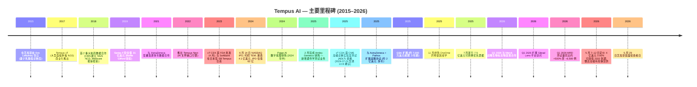
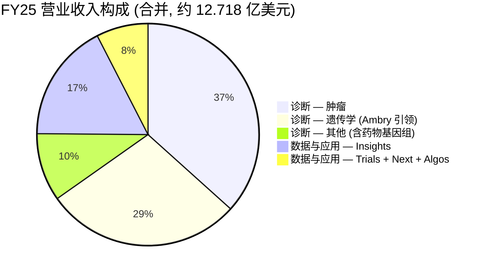
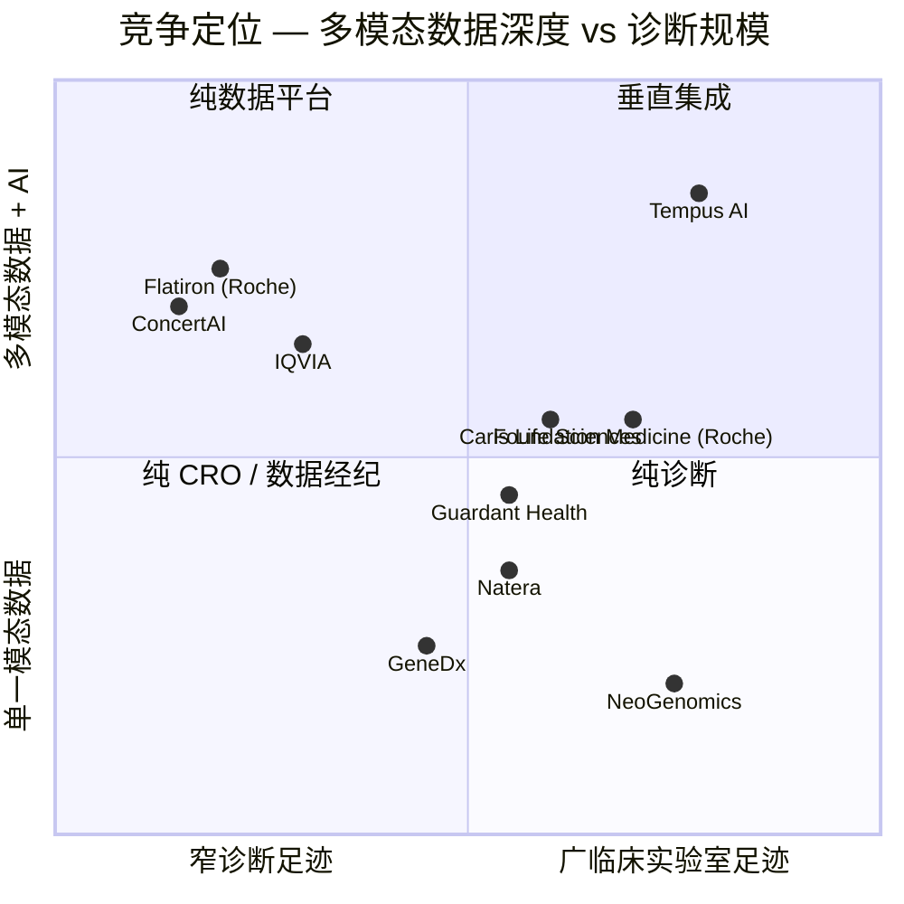

# 公司研究报告: Tempus AI, Inc. (NASDAQ: TEM)

**日期:** 2026-05-29 (首次覆盖 (initiation of coverage) — 与 Tempus 首届投资者日 (Investor Day) 同一日)
**作者:** financial_agent / company-research skill
**代码:** NASDAQ: TEM (Class A 普通股)
**财年截止:** 12 月 31 日 (FY2025 = 截至 2025 年 12 月 31 日的财年; Q1 2026 = 截至 2026 年 3 月 31 日的三个月)
**报告语言: 简体中文 (英文版同时存在于本目录)**
**分析师注解:** 所有财务数据来自一级文件 (SEC EDGAR)。本报告为**首次覆盖** —— 此前无任何版本的文档。

> **更新——Q1 2026 业绩 + FY26 指引上调 + 4 亿美元可转债再融资 (均发生于 2026 年 5 月):** Tempus Q1 2026 录得**营业收入 3.481 亿美元 (同比 +36.1%)**: 其中诊断 (Diagnostics) 2.611 亿美元 (+34.7%; **肿瘤学测试量 (Oncology test volume) 同比 +28%、遗传学 (Hereditary) 同比 +54% (剔除 Ambry 收购前基数后同比 +7%)、MRD (微小残留病变, minimal residual disease) 测试量约 6,500 例, 同比约 +500%**), 数据与应用 (Data and applications) 0.870 亿美元 (+40.5%; **Insights 数据授权 +44.1%**)。调整后 EBITDA 由去年同期 -1,620 万美元改善至 **-280 万美元**, **维持 FY26 全年调整后 EBITDA 约 +6,500 万美元的指引**。管理层**将 FY26 营业收入指引上调至 15.9–16.0 亿美元 (约 +25%)**, 高于此前约 15.5 亿。资本结构层面, 公司于 **2026 年 5 月 7–12 日定价 4 亿美元 (由 3.5 亿上调) 0.00% 可转换优先票据 2032 年到期 (Convertible Senior Notes due 2032)**, 转股价 **69.26 美元 (较 5 月 7 日收盘溢价 40%)**; 3.841 亿美元净募集款中, 3.077 亿用于**全额偿还高级有担保定期贷款 (senior secured term loans)** —— 该置换显著降低利息支出, 消除担保债务覆盖障碍, 并在公司迈向盈亏平衡之前清理资产负债表。Tempus **首届投资者日** 于 **2026 年 5 月 29 日 (今日) 在芝加哥举行**, 演示材料 (deck) 发布于 investors.tempus.com。来源: [Tempus Q1 2026 8-K — EX-99.1, 2026-05-05](https://www.sec.gov/Archives/edgar/data/1717115/000119312526206317/tem-ex99_1.htm); [Tempus 8-K — EX-99.2 (可转债定价), 2026-05-13](https://www.sec.gov/Archives/edgar/data/1717115/000119312526220115/d117982dex992.htm)。

---

## 目录

1. 公司概览
2. 公司历史
3. 管理团队
4. 产品与服务
5. 客户与上市策略
6. 行业概览
7. 竞争格局
8. 市场机会 (TAM)
9. 风险评估
10. 参考资料

---

## 1. 公司概览

Tempus AI, Inc. 是一家总部位于美国伊利诺伊州芝加哥的医疗科技公司, 在美国运营规模最大的**精准医疗 (precision medicine) 诊断 + 多模态数据 (multimodal data)** 平台之一。公司在自有 CLIA 认证实验室对癌症 (并逐步扩展至心脏病学 (cardiology) 与神经精神病学 (neuropsychiatry)) 患者的血液与组织样本进行测序, 将每份测试结果与其从覆盖**逾 5,000 家医疗机构站点、逾 700 个独立数据连接 (data connections)** 网络中获取的纵向临床记录进行链接, 然后将经过去标识化 (de-identified)、统一化 (harmonized) 的数据底座 (substrate) 反向出售给制药与生物科技客户, 以数据授权 (data license)、临床试验匹配 (clinical-trial matching) 服务、算法决策辅助产品的形式变现 ([Tempus 2025 10-K, Item 1 Business](https://www.sec.gov/Archives/edgar/data/1717115/000119312526066961/tem-20251231.htm))。该商业模式被明确刻画为**飞轮 (flywheel)** —— 测试越多 → 数据越多 → 算法越聪明 → 测试越具临床价值 → 数据越多, 而 10-K 阐述的核心论点为: **"智能诊断 (Intelligent Diagnostics) 代表精准医疗的未来"**, 借助生成式 (generative) 与代理式 (agentic) AI 将实验室分子结果与电子病历 (EHR) 派生的临床上下文相结合 ([Tempus 2025 10-K, Item 1](https://www.sec.gov/Archives/edgar/data/1717115/000119312526066961/tem-20251231.htm))。

**报告结构。** Tempus 划分为公司自己定义为相互强化的**两大产品线**: **诊断 (Diagnostics)** (肿瘤学 NGS (Next Generation Sequencing) + 遗传学筛查 + 算法型伴随诊断 (companion diagnostic); **FY25 营业收入 9.554 亿美元, 同比 +111%**, 为主导板块) 与**数据与应用 (Data and applications)** (Insights 数据授权 + Trials 临床试验匹配 + Next AI 关怀缺口检测 (care-gap detection) + Algos 算法诊断; **3.164 亿美元, 同比 +31%**) —— **FY25 合计营业收入 12.718 亿美元, 同比 +83%** ([Tempus 2025 10-K, MD&A — Results of Operations](https://www.sec.gov/Archives/edgar/data/1717115/000119312526066961/tem-20251231.htm))。诊断板块的规模跃升部分来自外延: **2025 年 2 月收购的 Ambry Genetics 为 FY25 诊断收入增量贡献 3.627 亿美元**; 但有机肿瘤学测试量本身**从 FY24 约 270,800 例增长至 FY25 约 340,500 例 (+26%)**, 同时每例平均收入由 **1,510 美元上行至 1,600 美元**, 系 Medicare 在 FDA 批准的 xT CDX 测定上的报销使其定价获锚 ([Tempus 2025 10-K, MD&A](https://www.sec.gov/Archives/edgar/data/1717115/000119312526066961/tem-20251231.htm))。

**Q1 2026 拐点。** Q1 2026 业绩延续了上述轨迹, 且将公司向非 GAAP 盈利的距离显著缩小。营业收入 **3.481 亿美元 (同比 +36.1%)**, 其中诊断 **2.611 亿美元 (+34.7%)**、数据与应用 **0.870 亿美元 (+40.5%; Insights +44.1%)** ([Tempus Q1 2026 8-K — EX-99.1](https://www.sec.gov/Archives/edgar/data/1717115/000119312526206317/tem-ex99_1.htm))。诊断板块内部, **肿瘤学测试量同比 +28%**、**遗传学测试量同比 +54%** (在剔除 Ambry 收购前基数后**降至同比 +7%**)、**MRD 测试量达约 6,500 例, 同比约 +500%** —— MRD (治疗后微小残留病变监测) 被普遍视为肿瘤学测试量下一波最大驱动器, Tempus 正与 Natera 旗下 Signatera 以及 Guardant 旗下 Reveal 并行规模化 ([Tempus Q1 2026 8-K — EX-99.1](https://www.sec.gov/Archives/edgar/data/1717115/000119312526206317/tem-ex99_1.htm))。**毛利同比 +43.1% 至 2.220 亿美元** (相对营收同比 +36%, 表明收入结构向毛利更高的数据业务以及 FDA 批准的 xT CDX 报销价位倾斜)。调整后 EBITDA 由 -1,620 万美元改善至 **-280 万美元**, **净亏损 1.259 亿美元**包含**股权激励 (Stock-Based Compensation, SBC) 与雇主工薪税 5,630 万美元**及**可交易证券公允价值变动未实现亏损 3,230 万美元**, 两项均压低 GAAP 头条数, 但对现金叙事不构成实质影响 ([Tempus Q1 2026 8-K — EX-99.1](https://www.sec.gov/Archives/edgar/data/1717115/000119312526206317/tem-ex99_1.htm))。管理层**将 FY26 营业收入指引上调至 15.9–16.0 亿美元** (此前约 15.5 亿 —— 隐含约 +25%), 并**维持 FY26 调整后 EBITDA 约 +6,500 万美元的目标**, 说明公司 2025 年底/2026 年初跨越调整后 EBITDA 盈亏平衡的既定路径并未偏离 ([Tempus Q1 2026 8-K — EX-99.1](https://www.sec.gov/Archives/edgar/data/1717115/000119312526206317/tem-ex99_1.htm))。

**资本结构 (2026 年 5 月再融资后)。** 截至 2026 年 3 月 31 日, Tempus 持有**现金及现金等价物 5.212 亿美元 + 可交易权益证券 (marketable equity securities) 1.226 亿美元 ≈ 合计 6.438 亿美元**, 对应**2025 年 7 月发行的 7.29 亿美元可转换优先票据、约 2.05 亿美元长期债务、约 1.99 亿美元可转换本票、以及 1.0 亿美元循环信贷额度 (revolver)** ([Tempus Q1 2026 10-Q](https://www.sec.gov/Archives/edgar/data/1717115/000119312526206356/tem-20260331.htm); [Tempus Q1 2026 8-K — EX-99.1](https://www.sec.gov/Archives/edgar/data/1717115/000119312526206317/tem-ex99_1.htm))。**2026 年 5 月**, Tempus 定价 **4 亿美元 0.00% 可转换优先票据 2032 年到期** (由原 3.5 亿上调), 转股价 **69.26 美元 (较 5 月 7 日股价溢价 40%)**, 使用**净募集款 3.841 亿美元中的 3.077 亿全额偿还高级有担保定期贷款**, 另支付 **2,720 万美元购买带顶式买权 (capped call) 对冲**以推高有效转股价 ([Tempus 8-K — EX-99.2, 2026-05-13](https://www.sec.gov/Archives/edgar/data/1717115/000119312526220115/d117982dex992.htm))。净效果: 零息、无担保、6 年期债务替代高息有担保定期贷款; 利息支出大幅下行; 抵押品负担解除; 适度增量稀释风险 (转股价 69.26 美元对应约 580 万股) 通过带顶式买权部分对冲。

**估值快照 (截至 2026-05-29 盘中)。** TEM 在投资者日前夕交易于 **50–55 美元区间**, 52 周区间含 2025 年 12 月至 2026 年 1 月约 95 美元的高位 ([Yahoo Finance — TEM 关键统计, 2026 年 5 月](https://finance.yahoo.com/quote/TEM/key-statistics))。按 50–55 美元剥离对应 **约 90–100 亿美元市值**, **完全摊薄股本约 1.794 亿股** ([Tempus 2026 DEF 14A, 2026 年 3 月 27 日记录日](https://www.sec.gov/Archives/edgar/data/1717115/000119312526145528/d23945ddef14a.htm)), 隐含:

- **TTM (过去十二个月) 营业收入 ≈ 13.6 亿美元** (FY25 12.72 亿 + Q1 2026 3.48 亿 - Q1 2025 2.56 亿 = 13.64 亿)。
- **TTM P/S ≈ 6.6–7.4 倍**, 按 90–100 亿市值 / 13.6 亿营收。
- **EV / 营业收入 ≈ 7–8 倍** (市值 + 约 10.5 亿债务 - 6.4 亿现金 = 约 94–104 亿企业价值)。
- **TTM P/E: 无意义** —— TTM 净亏损约 -4.4 至 -4.8 亿美元, 系股权激励 (年化超 2.4 亿)、收购摊销、未实现投资证券估值变动综合作用。此非周期低谷 —— 系**烧钱*成长* (cash-burning *growth*)**: Q1 2026 经营性现金流出 **-7,330 万美元**, 较去年同期 -10,560 万改善; FY25 全年经营性现金流出约 **-3.0 亿** ([Tempus Q1 2026 10-Q — Cash Flow Statement](https://www.sec.gov/Archives/edgar/data/1717115/000119312526206356/tem-20260331.htm))。因此最清晰的盈利能力镜头为**调整后 EBITDA** —— FY26 指引 +6,500 万美元正值, 而 FY24 约为 -6,000 万, 此拐点正是多头逻辑核心。
- **远期 EV / 营业收入 (FY26E)**: 按 FY26 指引中值 +25% 增长至 15.95 亿, **EV / 营业收入降至约 6 倍**。
- **同业估值倍数 (TTM, 2026 年 5 月 Yahoo Finance 截图)**: Guardant Health (GH) 约 6 倍 TTM P/S; Natera (NTRA) 约 10 倍; Exact Sciences (EXAS) 约 4 倍; Veeva Systems (VEEV, 最接近的纯数据/应用医疗同业) 约 13-14 倍。TEM 约 **6-7 倍**居于诊断同业区间中间, *尽管*其顶线增速高于多数同业。多头主张其相对诊断+数据混合模型存在折价; 空头则指出 (i) GAAP 亏损持续, (ii) 约 10 亿美元债务存量对 6.4 亿现金, (iii) IPO 后约 7% 内部人士供给随禁售期 (lock-up) 解禁释放的悬挂量, (iv) FDA 实验室自建测试 (Laboratory-Developed Test, LDT) 最终规则的监管不确定性, 实质性提升任何高 LDT 依赖度诊断业务的长期合规门槛。

*来源: [Tempus 2025 10-K, MD&A](https://www.sec.gov/Archives/edgar/data/1717115/000119312526066961/tem-20251231.htm); [Tempus Q1 2026 8-K](https://www.sec.gov/Archives/edgar/data/1717115/000119312526206317/tem-ex99_1.htm)。*

**第 1 节结论。** Tempus 是混合型**临床实验室 + 数据授权**业务, FY25 约 **75% 营业收入来自自有实验室运行分子诊断**, 约 **25% 来自将去标识化数据底座反向授权给制药**。增长论点为复利型: 实验室运行的每例测试为下一轮算法和下一项制药数据授权增加数据集。**近期拐点**为**FY26 调整后 EBITDA 盈亏平衡**; 长期拐点则在于多模态数据 + AI 飞轮能否将毛利率结构性抬升, 并随数据与应用规模化超越实验室业务、使终值估值更接近软件公司。

---

## 2. 公司历史

Tempus 于 **2015 年由 Eric Lefkofsky 在芝加哥创立**, 直接源于其妻子被诊断为乳腺癌后, 他本人多次将此经历描述为公司"让每位癌症患者的数据改善下一位癌症患者的医疗"使命的起点 ([Tempus AI — Wikipedia](https://en.wikipedia.org/wiki/Tempus_AI); [Eric Lefkofsky 团队页面 — tempus.com](https://www.tempus.com/team_members/eric-lefkofsky/))。10-K 直接确认创立年份: *"We were founded in 2015 and have experienced rapid growth in revenue, adoption of our products and services, testing volume, size of our datasets, clinical trial matches and other metrics that we believe are important to assessing our business"* ([Tempus 2025 10-K, Item 1 Business — Overview](https://www.sec.gov/Archives/edgar/data/1717115/000119312526066961/tem-20251231.htm))。

**IPO 前规模化 (2015–2024)。** Tempus 作为私营公司度过头九年, 用于打造核心平台: NGS 测序实验室、数据网络 (现 700+ 数据连接 / 5,000+ 医疗站点) 以及三项基础性制药数据合作。至 **2024 年 6 月 14 日 NASDAQ IPO, 发行价 37 美元/股, 募资 4.10 亿美元, IPO 估值约 62 亿美元** 之时 ([TechCrunch — Tempus IPO, 2024-05-30](https://techcrunch.com/2024/05/30/billionaire-groupon-founder-lefkofsky-is-back-with-another-ipo-ai-healthtech-tempus/); [iBIO — Tempus AI IPO Triumph](https://ibio.org/tempus-ais-ipo-triumph-raising-410m-and-valuing-the-company-at-6-2b/)), Tempus 已运行约 300 万数据记录, 年化营收逼近 7 亿美元。本次 IPO 是 Lefkofsky 第二次将所创业务带入公开市场 (此前为 Groupon (2011)、Echo Global Logistics (2009)、InnerWorkings (2006))。

**2025 年通过并购实现多产品线扩张。** FY2025 是 Tempus 从"成长期肿瘤诊断"显著升级为"多产品线精准医疗平台"的关键年, 标志性交易包括:

- **Ambry Genetics (2025 年 2 月)** —— FY25 诊断阶跃的主要推动力, 新增遗传性癌症风险测试 (癌症综合征筛查的胚系 NGS 面板) 与罕见病测试。10-K 明确指出 Ambry 与 Paige 合计构成 *"截至 2025 年 12 月 31 日合并财务报表口径下约 11% 的总资产与 29% 的总营收"* —— 即 **FY25 合并营收约 29% 来自 Ambry + Paige.AI** ([Tempus 2025 10-K, ICFR Scope Exclusion Note](https://www.sec.gov/Archives/edgar/data/1717115/000119312526066961/tem-20251231.htm))。
- **OneOme (2025 年 11 月)** —— 药物基因组学测试, 包括针对 5-FU 化疗毒性风险的 DPYD 药物基因组学测试: *"Our acquisition of OneOme, Inc., or OneOme, in November 2025 further enhanced our ability to provide pharmacogenetics tests, such as DPYD"* ([Tempus 2025 10-K, Item 1 — Diagnostics Products](https://www.sec.gov/Archives/edgar/data/1717115/000119312526066961/tem-20251231.htm))。
- **Paige.AI** (2025 年中完成) 和 **Deep 6 AI** (临床试验匹配) —— 10-K 前瞻性陈述章节确认两项交易截至 FY25 末仍在整合中: *"our ability to successfully acquire businesses, form joint ventures or make investments in companies or technologies, including our ability to realize the expected benefits of our acquisitions of Paige.AI, Inc., Ambry Genetics Corporation and Deep 6 AI, Inc"* ([Tempus 2025 10-K, Forward-Looking Statements](https://www.sec.gov/Archives/edgar/data/1717115/000119312526066961/tem-20251231.htm))。

**制药合作队列 (2024–2026)。** 另一主线为制药数据授权关系的深化。公开披露显示三项结构性多年协议:

- **AstraZeneca + Pathos (2025 年 4 月)** —— *"在未来 3 年内向 Tempus 提供 2 亿美元数据授权与模型开发费用"*, 用以构建肿瘤学多模态基础模型 ([FierceBiotech — Tempus / AstraZeneca / Pathos, 2025 年 4 月](https://www.fiercebiotech.com/biotech/tempus-ai-line-200m-astrazeneca-pathos-deal-develop-cancer-model); [Tempus IR — 战略协议公告](https://investors.tempus.com/news-releases/news-release-details/tempus-signs-expanded-strategic-agreements-astrazeneca-and))。
- **GSK 续约 (2024)** —— *"GSK recently paid Tempus $70 million upfront for three more years of partnership"* ([FierceHealthcare — Tempus 制药交易](https://www.fiercehealthcare.com/health-tech/precision-medicine-company-tempus-inks-3rd-major-pharma-deal-securing-nearly-1b-revenue))。
- **三大制药合计可披露合同价值**: 约 **7 亿至 10 亿美元, 多年期** ([FierceHealthcare — Tempus 制药交易](https://www.fiercehealthcare.com/health-tech/precision-medicine-company-tempus-inks-3rd-major-pharma-deal-securing-nearly-1b-revenue))。10-K MD&A 披露剩余总合同价值 (Remaining Total Contract Value, TCV) 构造: *"Remaining TCV includes the total potential value of the company's strategic collaborations with AstraZeneca AB, or AstraZeneca, and GlaxoSmithKline, or GSK, which, although listed under the Data and applications product line, could be satisfied by the purchase of any of the company's products and services"* ([Tempus 2025 10-K, MD&A — Remaining TCV](https://www.sec.gov/Archives/edgar/data/1717115/000119312526066961/tem-20251231.htm))。
- **Merck (Q1 2026)** —— *"建立多年战略合作以加速生物标志物发现与开发, 借助 Tempus 多模态数据与 Lens 分析平台"* ([Tempus Q1 2026 8-K — EX-99.1, 2026-05-05](https://www.sec.gov/Archives/edgar/data/1717115/000119312526206317/tem-ex99_1.htm))。
- **Gilead (Q1 2026)** —— *"扩展与 Gilead 的合作以提供企业范围内对 AI 驱动的 Lens 平台与多模态数据集的访问, 旨在通过真实世界证据 (RWE) 与 AI 驱动洞察推进其肿瘤学管线"* ([Tempus Q1 2026 8-K — EX-99.1, 2026-05-05](https://www.sec.gov/Archives/edgar/data/1717115/000119312526206317/tem-ex99_1.htm))。

制药队列是临床实验室业务之外经济意义最大的关系结构: 与 AstraZeneca 量级的交易, 其生命周期价值大致相当于约 **40,000 例肿瘤学 NGS 测试**, 但毛利率显著更高, 且不存在 CMS / 支付方报销风险敞口。

---

## 3. 管理团队

**Eric Lefkofsky —— 创始人、董事会主席、首席执行官 (CEO)。** Lefkofsky 在妻子被诊断为乳腺癌后, 于 2015 年创立 Tempus —— 他多次将此经历描述为整个公司诞生的契机: 构建他当年希望存在以辅助妻子治疗决策的数据基础设施 ([Eric Lefkofsky 团队页面 — tempus.com](https://www.tempus.com/team_members/eric-lefkofsky/); [Tempus AI — Wikipedia](https://en.wikipedia.org/wiki/Tempus_AI))。在 Tempus 之前, 他是一位**多家公开上市科技公司的连续创业者 (serial founder)**: **Groupon, Inc. 的联合创始人与前 CEO** (2011 年 11 月以美国十年来最大互联网公司发行规模之一登陆 NASDAQ), **Mediaocean (程序化广告基础设施) 联合创始人**, **Echo Global Logistics, Inc. (NASDAQ: ECHO, 2009 年 6 月 IPO) 联合创始人**, **InnerWorkings, Inc. (NASDAQ: INWK, 2006 年 8 月 IPO) 联合创始人** ([Eric Lefkofsky — Wikipedia](https://en.wikipedia.org/wiki/Eric_Lefkofsky))。他也是芝加哥风险投资公司 **Lightbank** 的联合创始人。学历: 密歇根大学荣誉学位 (1991), 密歇根大学法学院 JD (1993)。

Lefkofsky 是美国为数不多**已创立四家分别 IPO 上市公司**的科技创始人 —— 这一模式对作为证券的 TEM 具有以下含义: (a) 他此前已多次执行上市公司剧本, (b) 他持有超级投票权 Class B 股以保留 IPO 后的创始人控制, (c) 他与 TEM 的个人财务对齐相对于其规模异常之高 (Lefkofsky 历来是其每家所创公司的最大单一股东之一)。截至 **2026 年 3 月 27 日 (2026 年年度股东大会记录日)**, Tempus 总计**1.79404620 亿股普通股, 由 1.74360831 亿股 Class A 与 504.3789 万股 Class B 构成** ([Tempus 2026 DEF 14A](https://www.sec.gov/Archives/edgar/data/1717115/000119312526145528/d23945ddef14a.htm)) —— Lefkofsky 的 Class B 持仓即为 IPO 后 Class A 流通量增加情形下保持创始人控制的机制。DEF 14A 确认其当前职位: **首席执行官 (Chief Executive Officer)、创始人 (Founder)、董事会主席 (Chairman of the Board)** ([Tempus 2026 DEF 14A — Notice of Annual Meeting](https://www.sec.gov/Archives/edgar/data/1717115/000119312526145528/d23945ddef14a.htm))。

他在 Tempus 的战略框架在 IPO 路演、四次 IPO 后业绩电话会议、以及 Q1 2026 新闻稿中保持高度一致: *"我们本季度强劲的财务与运营表现彰显了对我们 AI 驱动诊断平台日益加速的需求, 以及我们多模态数据及相应 AI 模型的巨大价值……我们持续看到强劲势头, 因为我们在平台上部署日益复杂的算法, 推动营业收入同比增长 36%, 其中肿瘤学诊断业务与数据/建模业务表现尤为突出"* ([Tempus Q1 2026 8-K — EX-99.1, 2026-05-05](https://www.sec.gov/Archives/edgar/data/1717115/000119312526206317/tem-ex99_1.htm))。Q1 2026 新闻稿同时列出首届投资者日参与者 (Lefkofsky 之外): **CFO Jim Rogers**、**数据与应用 CEO Ryan Fukushima**、**诊断 CEO Tom Schoenherr**、**首席科学官 (Chief Scientific Officer) Kate Sasser, PhD** —— 即公司已组织为两位类共同 CEO 风格的业务线总裁向 Lefkofsky 汇报, 公司层面设 CFO 与 CSO ([Tempus Q1 2026 8-K — EX-99.1 / Investor Day announcement](https://www.sec.gov/Archives/edgar/data/1717115/000119312526206317/tem-ex99_1.htm))。这种创始人 CEO + 产品线总裁结构, 是 Microsoft、Salesforce、Amazon 最终演化出的相同结构; 在 13 亿美元营收规模上罕见, 是管理带宽 (bandwidth) 的积极信号。

---

## 4. 产品与服务

依据指引规则, 本节为报告最详尽段落 —— Tempus 两大产品线是后续客户/行业/TAM/风险讨论的分析基础, 而 10-K 的产品矩阵是后续 TEM 任何研究报告中最高引用率的文档。

### 4.1 诊断 —— 肿瘤学测试 (业务核心)

肿瘤学测试组合围绕**字母后缀家族**构建, 发行人始终以 `Tempus|` 前缀书写, 从不展开为营销语言。10-K 原文:

> *"Our Platform's first application was in oncology, where we have built a versatile portfolio of cancer tests spanning solid tumors and hematologic malignancies, germline and somatic variants, and tissue and liquid biopsies. Since our inception, our approach to precision oncology has been to provide comprehensive genomic profiling through NGS that enables us to both generate clinically relevant insights that may not be possible with narrower testing approaches, and contribute high-quality molecular information back to providers and to our database. We offer large-panel solid tumor and hematologic testing through multiple assays, with our core clinical assay (xT and xR) offering large panel DNA, RNA full transcriptome, and incidental germline findings through normal blood or saliva analyses. Our current offerings also include liquid biopsy (xF), minimal residual disease and treatment response monitoring (xM), whole exome (xE), and hereditary cancer risk (xG)."* ([Tempus 2025 10-K, Item 1 — Business](https://www.sec.gov/Archives/edgar/data/1717115/000119312526066961/tem-20251231.htm))

10-K 层面的产品矩阵如下:

| 测定 (Assay) | 样本 | 模态 | 用例 |
|---|---|---|---|
| **xT** (CDX — 2023 年 4 月 FDA 批准) | 肿瘤组织 + 配对正常血液/唾液 | DNA NGS, **648 个基因, 500× 覆盖, 约 3.6 Mb**, 加完整 TCR / BCR / HLA 分型用于免疫肿瘤学 (IO) 特征 | 晚期/转移性实体瘤的全面基因组分析; FDA 批准靶向治疗决策的伴随诊断 (companion diagnostic) 候选 |
| **xR** | 肿瘤组织 | **RNA 全转录组 (full transcriptome)** 测序 | 融合检测、表达基础亚型分型、RNA 派生的 HRD 评分 |
| **xF** | 血浆 (液体活检 (liquid biopsy)) | **循环肿瘤 DNA (ctDNA) NGS** | 组织不足时的初次分析; 复发监测; 抗药突变追踪 |
| **xM** | 血浆 (液体活检) | **微小残留病变 (MRD) + 治疗响应监测** | 治疗后系列监测; Q1 2026 约 6,500 例, 同比约 +500% |
| **xE** | 肿瘤或胚系 | **全外显子组 (Whole Exome) 测序** | 研究级深度, 主要用于临床试验与制药数据交付 |
| **xG** | 血液或唾液 | **遗传性癌症风险 (germline cancer-risk) NGS** | 多基因面板胚系癌症综合征筛查 |

**中文释义 / Plain-language gloss:** xT 是旗舰"告诉我此肿瘤一切可执行信息"面板 —— 它在高覆盖度下对 DNA (并在 xR 中对 RNA) 测序, 识别驱动突变、融合、拷贝数变化、微卫星不稳定性 (microsatellite instability, MSI)、肿瘤突变负荷 (tumor mutational burden, TMB)、同源重组缺陷 (homologous-recombination deficiency, HRD) 状态以及免疫肿瘤学生物标志物 (PD-L1、TCR 克隆性)。xF 是同一理念但来自血液 —— 当肿瘤活检不可行或长期监测复发时使用。xM (MRD) 是"是否还有*任何*肿瘤信号?"测试, 用于手术或化疗后的季度监测, 比影像学早数月发现复发。xE 是研究级外显子组 (约 20,000 基因), 主要在制药合作内部使用。xG 是遗传性风险面板 —— 对癌症患者的*健康*亲属或具有家族史的年轻患者回答"您是否携带 BRCA / Lynch / Li-Fraumeni 等"问题。

每个产品在业务体系中的**战略意义:**

- **xT CDX 是监管与报销锚点。** 10-K 明确: *"We believe that our xT CDX assay, which received FDA approval in April 2023, meets the criteria for reimbursement under the NCD. In addition, effective July 1, 2024, our xT CDX assay was awarded Advanced Diagnostic Laboratory Test status by CMS"* ([Tempus 2025 10-K, Reimbursement section](https://www.sec.gov/Archives/edgar/data/1717115/000119312526066961/tem-20251231.htm))。ADLT (Advanced Diagnostic Laboratory Test) 是 CMS 特定指定, 允许新批准诊断在前三季度按定价单 (list price) 设定初始报销率, 后续按私营支付方中位率确定 —— 显著优于传统 Medicare CLFS 时间表的每例收入轮廓。ADLT 叠加 FDA 批准, 也是说服商业支付方该测试值得保险的路径 —— 这正是 FY25 MD&A 报告中肿瘤学每例平均收入 1,510 → 1,600 美元跳升的根本支撑。
- **xM (MRD) 是下一波主要量级曲线。** Q1 2026 约 6,500 例相对肿瘤学量级 (FY25 总量 ÷ 4 隐含每季度约 85,000 例) 偏小, 但**500% 同比增速与战略重要性** (MRD 被广泛理解为组织 NGS 之后最大的肿瘤学量级机会 —— Natera Signatera 年化营收约 7 亿美元) 使其成为多头投资者关注的图表。5 月 29 日投资者日演示材料预期提供 xM 的多年量级 / TAM 构建。
- **xR (RNA) 是分析层差异化。** 大多数竞争性 CGP 测定为纯 DNA。Tempus 在 Q1 2026 出版物中突出强调: 添加 RNA + 肿瘤-正常配对至面板 *"在标准测试遗漏的 12% 患者中识别出可执行发现"* ([Tempus Q1 2026 8-K — EX-99.1, JCO Precision Oncology publication](https://www.sec.gov/Archives/edgar/data/1717115/000119312526206317/tem-ex99_1.htm)) —— 即多模态方法捕捉到 Guardant 或 Foundation Medicine 纯 DNA 测定无法看到的临床可执行变异。

### 4.2 诊断 —— 遗传学测试 (Ambry 构建的第二条腿)

遗传学产品线属 Ambry 之后。10-K 原文:

> *"With our acquisition of Ambry in February 2025, we have further expanded and enhanced our inherited risk screening capabilities for cancer and rare disease patients … Our acquisition of OneOme, Inc., or OneOme, in November 2025 further enhanced our ability to provide pharmacogenetics tests, such as DPYD."* ([Tempus 2025 10-K, Item 1 — Diagnostics](https://www.sec.gov/Archives/edgar/data/1717115/000119312526066961/tem-20251231.htm))

遗传学测试指针对遗传性癌症风险基因 (BRCA1、BRCA2, Lynch 综合征基因 MLH1/MSH2/MSH6/PMS2/EPCAM, TP53/Li-Fraumeni, PTEN/Cowden, CDH1, STK11, PALB2, ATM, CHEK2 等) 的胚系面板, 以及罕见病基因测试。10-K 报告 FY25 遗传学测试量**上升至约 460,500 例** (其中大部分来自 Ambry 2025-02 完成后), Q1 2026 遗传学量**同比 +54% (剔除 Ambry 收购前基数后 +7%)** ([Tempus 2025 10-K, MD&A](https://www.sec.gov/Archives/edgar/data/1717115/000119312526066961/tem-20251231.htm); [Tempus Q1 2026 8-K — EX-99.1](https://www.sec.gov/Archives/edgar/data/1717115/000119312526206317/tem-ex99_1.htm))。遗传学在模型中的经济角色为双重: 每例收入更低、量级更高, 拓宽客户基础, 超越癌症三级诊疗中心; *并且* 向制药数据授权业务输送胚系数据 (胚系配对正常数据对制药基因发现与生物标志物工作至关重要)。

### 4.3 数据与应用 —— 诊断之上的四产品层

数据与应用 (Data and applications) 是 Tempus "AI / 数据"半身份真正存在的地方 —— 并且毛利率结构性优于诊断业务。10-K 原文:

> *"Our Data and applications product line facilitates drug discovery and development for life sciences companies through multiple products, including, among other things, Insights, Trials, Next and Algos. Through our Insights product, we license de-identified libraries of linked clinical, molecular, and imaging data and provide a suite of analytic and cloud-and-compute tools to pharmaceutical and biotechnology companies. Our Trials product leverages the broad network of physicians we work with in oncology to provide clinical trial support for pharmaceutical companies that are looking to reach hard-to-find and underserved patient populations."* ([Tempus 2025 10-K, Item 1 — Business](https://www.sec.gov/Archives/edgar/data/1717115/000119312526066961/tem-20251231.htm))

| 产品 | 销售物 | 买家 | 定价模式 |
|---|---|---|---|
| **Insights** | 去标识化的链接式临床 + 分子 + 影像数据库 + 分析/云计算工具集 | 制药 & 生物科技 R&D | 订阅 / 数据授权; 制药 TCV 合同 |
| **Trials** | 基于医师网络 + 结构化临床-分子数据的临床试验匹配 | 制药 / CRO | 每试验/每匹配费用; 有时嵌入更大合作 |
| **Next** | 在 EHR + 诊断数据上运行的 AI 引擎, 浮现关怀缺口提示 (肿瘤 + 心脏病学) | 医院 / 卫生系统 | 订阅 |
| **Algos** | 算法型诊断 —— TO (tumor-origin, 肿瘤起源)、HRD、DPYD 药物基因组、Tempus Purist | 医院、制药 | 每测试 / 订阅 |

**Insights** 是该板块最大单一驱动力 —— FY25 10-K MD&A 明确将 **FY25 数据与应用收入增加额 7,090 万美元归因于 "Insights 产品需求增加"** ([Tempus 2025 10-K, MD&A — Data and Applications](https://www.sec.gov/Archives/edgar/data/1717115/000119312526066961/tem-20251231.htm))。Q1 2026 Insights **同比增长 44.1%** ([Tempus Q1 2026 8-K — EX-99.1](https://www.sec.gov/Archives/edgar/data/1717115/000119312526206317/tem-ex99_1.htm)), 为公司最快子线。AstraZeneca + Pathos 关于 *"构建肿瘤学领域最大的多模态基础模型"* 的合作, 结构上即一份 Insights + 建模合同: 制药许可使用去标识化库, *并*在其上共同开发基础模型, 下游 IP 按合同条款共享 ([Tempus IR — AstraZeneca + Pathos announcement](https://investors.tempus.com/news-releases/news-release-details/tempus-signs-expanded-strategic-agreements-astrazeneca-and))。

**Algos** 是规模较小但战略重要的"在实验室*之上*构建软件产品"线。当前已披露 4 项: **TO** (tumor-of-origin 肿瘤起源分类器 —— 用于患者呈现原发部位不明的转移性癌症时, 算法用分子特征推测原发部位, 显著提升正确治疗选择概率), **HRD** (同源重组缺陷评分 —— 用于识别可能响应 PARP 抑制剂的患者), **DPYD** (5-FU 化疗毒性风险的药物基因组学测试 —— OneOme 收购后), **Tempus Purist** (肿瘤纯度归一化算法)。Q1 2026 新闻稿宣布额外 Algo 产品: *"宣布推出业界首款利用 RNA 表达数据识别同源重组缺陷 (HRD) 的泛癌种算法, 将可能受益于 PARP 抑制剂的患者群体扩展至传统 DNA 测试所识别之外"* ([Tempus Q1 2026 8-K — EX-99.1, 2026-05-05](https://www.sec.gov/Archives/edgar/data/1717115/000119312526206317/tem-ex99_1.htm)) —— 即 Tempus 现销售*两款* HRD 算法 (传统 DNA 版与新 RNA 版), RNA 版在与 Myriad myChoice 等竞争对手的纯 DNA HRD 评分对比中差异化。

**Next** 是最新的 Algo 型产品, 也是与"Tempus 成为*卫生系统*运营层"多头论点最直接对齐者。心脏病学角度意义重大: **与 Medtronic 合作的 ALERT 试验**在 Q1 2026 证明 *"Tempus 的 AI 驱动 EHR 通知使重大疾病患者的救命心脏瓣膜手术增加 40%"* ([Tempus Q1 2026 8-K — EX-99.1, 2026-05-05](https://www.sec.gov/Archives/edgar/data/1717115/000119312526206317/tem-ex99_1.htm))。这是首次前瞻性、随机化证明 Tempus 关怀缺口算法因果地驱动卫生系统的产生收入手术量 AND 患者结局改善, 也正是 Tempus 需要证明的论点, 将 Next 作为医院 IT 订阅型产品变现, 而非按测试收费。

### 4.4 综合 —— 两条产品线如何互相增强

诊断与数据与应用之间的战略联锁是整个故事的关键。实验室运行的每例测试创造 (a) 一项为开单提供方/支付方计费的分子结果 (诊断营收) AND (b) 一行结构化多模态数据 —— 分子结果 + EHR 临床上下文 —— 加入 Tempus 数据集 (数据与应用的输入)。同一行在去标识化形态下用于 (i) 向制药的 Insights 数据授权, (ii) Trials 临床试验匹配, (iii) 下一代 Algos 的训练数据, (iv) 与 AstraZeneca / Pathos / 其他厂商共同构建的基础模型预训练语料。10-K 原文:

> *"Each product line is designed to enable and enhance the other, thereby creating network effects in each of the markets in which we operate. Our business model allows pharmaceutical and biotechnology companies to unlock value from the data we collect, and allows us to monetize a de-identified copy of that data, in different ways across our different product lines. We believe these network effects provide a unique advantage to our business as the compounding value of each data record in our database serves to enhance our competitive moat. The more data we collect, the smarter our tests become, the more applications we launch, the more physicians join our network, further growing our database, making our tests more precise for clinicians and our database more valuable for researchers."* ([Tempus 2025 10-K, Item 1 — Strategy](https://www.sec.gov/Archives/edgar/data/1717115/000119312526066961/tem-20251231.htm))

这是建立在**临床实验室监管护城河**之上的**数据网络效应业务**的教科书式描述。长期论点的关键问题是: 数据与应用业务 —— 毛利率结构性更高、零 CMS 报销风险 —— 能否增长足够多, 翻转营收结构并显著拉高混合毛利率。FY25 D&A 占营收 25%; 多头主张 FY30+ 的结构为 D&A 占 40-50%, 届时混合毛利率应结构性重定价 (re-rate)。

---

## 5. 客户与上市策略 (Go-to-Market)

Tempus 通过三种不同上市策略 (go-to-market motion) 向**三类不同客户**销售:

**(a) 卫生系统 (health systems) 与医师执业 (physician practices)** —— 诊断测试买家。Tempus 临床实验室服务**超过 5,000 家医疗机构站点**, 这些站点订购 xT/xR/xF/xM/xE/xG 测定之一或多项, 通过**700+ 独特数据连接**将 EHR 数据回流至 Tempus 用于去标识化与统一化 ([Tempus 2025 10-K, Item 1 — Overview](https://www.sec.gov/Archives/edgar/data/1717115/000119312526066961/tem-20251231.htm))。报销是经济门控:

> *"During the year ended December 31, 2025, Medicare claims represented 26% of our clinical oncology testing volume and 10% of our hereditary testing volume."* ([Tempus 2025 10-K, Reimbursement](https://www.sec.gov/Archives/edgar/data/1717115/000119312526066961/tem-20251231.htm))

剩余约 74% 的肿瘤学测试量计费给商业支付方, 私营支付方费率由 MolDx (Molecular Diagnostic, 分子诊断) 管理的 Medicare MAC (Medicare Administrative Contractor, Medicare 行政承包商) 相应 CPT (Current Procedural Terminology, 现行程序术语) 代码定价锚定 (Palmetto 为 Raleigh 和 Atlanta 实验室; Noridian 为 Aliso Viejo 实验室 —— 两者均接受 MolDx 项目监管, 见 10-K)。Q1 2026 业绩报告中卫生系统新中标范例:

> *"Selected by Northwestern Medicine to expand genomic testing access to oncology patients across the health system, leveraging Tempus' full suite of DNA, RNA, liquid biopsy, and MRD tests to enable more personalized cancer care and clinical trial design."* ([Tempus Q1 2026 8-K — EX-99.1, 2026-05-05](https://www.sec.gov/Archives/edgar/data/1717115/000119312526206317/tem-ex99_1.htm))

> *"Entered a multi-year strategic collaboration with NYU Langone Health, centered on a prospective observational study that uses serial molecular profiling to track cancer evolution and treatment resistance, with the goal of developing AI-powered diagnostic tools and personalized therapies."* ([Tempus Q1 2026 8-K — EX-99.1, 2026-05-05](https://www.sec.gov/Archives/edgar/data/1717115/000119312526206317/tem-ex99_1.htm))

**(b) 大型制药与生物科技公司** —— 数据与应用 (Insights、Trials、特定 Algos) 买家。这是业务经济上更集中的一侧。公开报告披露三项可量化结构性关系:

- **AstraZeneca** —— 初次多年合作 2021 年签订; 2025 年 4 月与 Pathos 一同扩展为 *"未来 3 年内向 Tempus 提供 2 亿美元数据授权与模型开发费用"*, 用以 *"构建肿瘤学领域最大的多模态基础模型"* ([FierceBiotech — Tempus / AstraZeneca / Pathos, 2025 年 4 月](https://www.fiercebiotech.com/biotech/tempus-ai-line-200m-astrazeneca-pathos-deal-develop-cancer-model))。
- **GSK** —— 2024 年续约 *"7,000 万美元前期付款, 3 年期合作延续"* ([FierceHealthcare — Tempus 制药交易](https://www.fiercehealthcare.com/health-tech/precision-medicine-company-tempus-inks-3rd-major-pharma-deal-securing-nearly-1b-revenue))。
- **第三家大型制药** —— *"三家全球制药公司, 在未来几年内代表约 7 亿美元收入"* ([FierceHealthcare — Tempus 制药交易](https://www.fiercehealthcare.com/health-tech/precision-medicine-company-tempus-inks-3rd-major-pharma-deal-securing-nearly-1b-revenue)) —— 10-K MD&A 中"剩余 TCV"构造确认聚合这些多年合同。

Q1 2026 新增两项战略制药协议:

> *"Established a multi-year, strategic collaboration with Merck to accelerate biomarker discovery and development by leveraging Tempus' multimodal data and Lens analytical platform."* 以及 *"Expanded our collaboration with Gilead to provide enterprise-wide access to our AI-driven Lens platform and multimodal datasets, aimed at advancing their oncology pipeline through real-world evidence and AI-driven insights."* ([Tempus Q1 2026 8-K — EX-99.1, 2026-05-05](https://www.sec.gov/Archives/edgar/data/1717115/000119312526206317/tem-ex99_1.htm))

**(c) 医疗器械公司与疾病登记** —— 规模更小但战略重要的类别。**Medtronic / ALERT 试验**是此处旗舰范例 (4.3 节已述), Q1 2026 也新增 **Blood Cancer United** 用于儿童急性髓性白血病 (Pediatric Acute Myeloid Leukemia) 登记 ([Tempus Q1 2026 8-K — EX-99.1](https://www.sec.gov/Archives/edgar/data/1717115/000119312526206317/tem-ex99_1.htm))。

**客户集中度 —— 需精确区分披露与未披露内容。** Tempus **不被要求**披露单客户收入百分比, 因为 (i) FY25 无单一客户跨越 ASC 280-10-50-42 的 10% 合并营收阈值; (ii) 制药数据授权合同的专有性被视为保密。Q1 2026 10-Q 披露的是关联方营收:

> *"Includes related party revenue of $21,823 thousand for the three months ended March 31, 2026"* ([Tempus Q1 2026 10-Q — Related-Party Transactions](https://www.sec.gov/Archives/edgar/data/1717115/000119312526206356/tem-20260331.htm))

约占 Q1 2026 营收的 6%, 主要与 SB Tempus 日本合资及 SoftBank 相关 IP 授权协议有关。在关联方数字*之外*, AstraZeneca / GSK / Pathos / Merck / Gilead 队列合计规模较大, 但无单一客户具体披露。**合理的分析师假设 (非披露): 前 5 大制药客户合计可能占数据与应用约 25% 营收的大部分, 即约占合并营收 15-20%。** 这对于制药数据授权业务而言较为集中, 但并非异常。

*组成为分析师依据 10-K 板块合计数构建; 诊断板块内部肿瘤/遗传学/其他子拆分以及数据与应用 Insights/Trials/Next/Algos 子拆分为基于 MD&A 叙述的估算 ([Tempus 2025 10-K, MD&A](https://www.sec.gov/Archives/edgar/data/1717115/000119312526066961/tem-20251231.htm))。合计拆分为诊断 9.554 亿美元 vs 数据与应用 3.164 亿美元 为精确披露值。*

---

## 6. 行业概览

Tempus 处于**三大融合行业**交汇处: 临床分子诊断 (NGS 驱动癌症测试)、制药 R&D 数据服务、医疗 AI / 决策辅助。

**行业 1: 临床分子诊断 (肿瘤学 + 遗传学)。** 10-K 将长期增长驱动力描述为从基于组织学诊断 (病理学家在显微镜下观察切片) 向分子驱动精准肿瘤学的转变, 治疗选择由肿瘤特定基因组改变, 而非器官起源单独驱动:

> *"While AI has the potential to broadly impact healthcare, we believe it will transform diagnostics first. Diagnostics, broadly defined, is the process of determining by examination or assessment the nature and circumstance of disease. Physicians use diagnostics all the time; they order blood tests, biopsies, scans, genomic tests, and others. Physicians rely on diagnostic results to make the vast majority of their treatment decisions. Researchers rely on diagnostic tests to better understand disease and make better decisions throughout their discovery processes."* ([Tempus 2025 10-K, Item 1 — Industry Background](https://www.sec.gov/Archives/edgar/data/1717115/000119312526066961/tem-20251231.htm))

癌症测试市场在 2020-2025 期间大幅增长, 因为需要伴随诊断调用的 FDA 批准靶向治疗体量扩大: 每项新批准治疗即为综合面板新增一项必备数据点。当前美国 CGP 测试可寻址市场约 **50-70 亿美元** (按 Guardant Health、Foundation Medicine via Roche、Caris Life Sciences、Natera、Exact Sciences 和 Tempus 自身披露的分析师共识), 年增速十几%。**MRD** (治疗后复发监测) 是独立、规模大的相邻市场 —— Natera Signatera 自身年化营收逼近 7 亿美元, 类别处于多年 30%+ 增长路径。**遗传学**测试更成熟但仍在整合 —— Tempus 收购 Ambry 是该领域五年内第二大交易 (仅次于 Exact 2019 年收购 Genomic Health —— 不同类别, 但规模可参考)。

**行业 2: 制药 R&D 数据与分析。** 制药对结构化、纵向、真实世界证据 (RWE) 数据集的需求 (用于药物发现、临床试验设计、上市后生命周期管理) 已结构性增长。IQVIA、其竞争对手 (ConcertAI, Komodo, Truveta)、以及合并 EHR 数据经纪商 (Datavant, Veradigm) 均参与竞争。Tempus 在结构上的不同之处在于, 它在自有实验室和诊所自行生产数据底座 —— 即, 它是垂直集成数据生产者, 而非数据经纪商。这一点的经济意义巨大: 典型生物制药多模态数据交易 (肿瘤学 RWE + 分子测序 + 结局) 多年期售价以亿美元计 —— 正是上文 (2 节) 讨论的 AstraZeneca + Pathos 2 亿 / GSK 7,000 万 / 合计 7-10 亿队列。

**行业 3: 医疗 AI / 临床决策辅助。** 这是三者中最新兴的, 也是 Tempus 当前竞争密度最低之处。Next (AI 关怀缺口引擎) 和 Tempus Algos 套件 (TO、HRD、DPYD、Tempus Purist) 与 PathAI (数字病理)、HeartFlow (心脏影像 AI)、Eko Devices (心脏听诊 AI), 以及长尾点解决方案初创公司竞争。ALERT 试验结果 (Q1 2026) 是将"有前景 AI 工具"转化为"可报销项目"所需的前瞻性证据 —— 也是 FY27+ Next 论点 Q1 2026 的最重要数据点。

10-K 主张的跨行业论点 (释义): *只有具备所有三层 (临床实验室 + 数据集 + AI 产品) 的垂直集成参与者*才能构建未来十年整个医疗行业将迁移到的基础模型 + 代理式 AI 临床工作流。竞争挑战者 (Roche/Foundation/Flatiron、Guardant、Natera) 各自覆盖三层中的一两层, 但缺少完整堆栈。

---

## 7. 竞争格局

10-K 的竞争章节为每个产品线逐字列出竞争对手。10-K 原文:

> *"Our Diagnostics product line primarily faces competition from diagnostics companies that profile genes in cancers and other disease areas, based on either single-marker or comprehensive genomic profile testing, using NGS to evaluate either blood or tissue. Our primary competitors for our currently marketed precision oncology tests include Foundation Medicine, Inc., which was acquired by Roche Holdings, Inc., Caris Life Sciences, Guardant Health, Inc., Natera, Neogenomics, ResolutionBio, which was acquired by Agilent, and others … Competitors for our pharmacogenetic test in neuropsychiatry include Myriad Genetics, Inc. and Genomind, Inc. Our primary competitors for our hereditary tests include GeneDx, Variantyx, and Baylor Genetics."* ([Tempus 2025 10-K, Item 1 — Competition](https://www.sec.gov/Archives/edgar/data/1717115/000119312526066961/tem-20251231.htm))

> *"Our Data and applications product line primarily faces competition from companies that help pharmaceutical and biotechnology companies acquire data to inform drug discovery and development. Our main competitors in this area are Flatiron Health, Inc., IQVIA Holdings Inc., ConcertAI, and others. Our Data and applications products also face competition from CROs, such as Fortrea, ICON, Syneos, PPD, and others, who provide data and clinical trial matching services to pharmaceutical and biotechnology companies."* ([Tempus 2025 10-K, Item 1 — Competition](https://www.sec.gov/Archives/edgar/data/1717115/000119312526066961/tem-20251231.htm))

> *"With respect to Algos, our TO test competes with liquid or tissue-based diagnostic tests from Roche Holdings, Inc., Caris Life Sciences, Guardant Health, Inc. Illumina, Inc, and others. Our HRD test competes with tests from Myriad Genetics, Inc., Caris Life Sciences, and others … In cardiology we may compete with companies such as HeartFlow Inc. and Eko Devices, Inc."* ([Tempus 2025 10-K, Item 1 — Competition](https://www.sec.gov/Archives/edgar/data/1717115/000119312526066961/tem-20251231.htm))

**分析师观点 (Analyst view) 对竞争动态的解读:**

- *分析师观点:* 在**肿瘤学综合基因组分析 (CGP)** 中, 美国实务为**Tempus、Foundation Medicine (Roche)、Guardant Health** 三马并驾, Caris Life Sciences 和 Natera 为重要参与者。**Tempus 的结构性差异化**为**多模态数据层** (DNA + RNA + EHR + 影像) —— Foundation 偏 DNA 且受 Roche 企业优先级约束, Guardant 是液体活检优先, 在 MRD / ctDNA 上优秀但在组织 + RNA 上更窄。Natera 是 MRD 领先者 (Signatera), 但缺少更广 CGP 足迹。
- *分析师观点:* 在 **MRD 专门细分**中, Natera Signatera 是确立领导者, 拥有约 7 亿美元年化营收和最广 Medicare 覆盖; Guardant Reveal 是 #2; Tempus xM 是上升挑战者, 季度约 6,500 例且同比 +500%。Tempus 的专门玩法是 *MRD 集成进更广 CGP 工作流* —— 在诊断时做综合分析的买家可留在 Tempus 进行监测, 而非切换到 Natera 或 Guardant。
- *分析师观点:* 在**制药数据与应用**中, 结构性对手是 **Flatiron Health (Roche 2018 年起持有)** —— Flatiron 运营类似的去标识化肿瘤学数据底座, 也向制药销售, 也有卫生系统 EHR 合作。关键区别: Flatiron 仅 **EHR 数据**, Tempus 将 EHR 与*其自身生成的分子测序*配对。AstraZeneca / GSK / Merck / Gilead 队列选择 Tempus 而非 Flatiron 与该差异对买家的重要性一致。
- *分析师观点:* 在**医疗 AI / 临床决策辅助** (Next, Algos), 竞争格局仍在形成。Tempus 优势是 AI 训练所依托的多模态底座 —— 大多数点解决方案 AI 初创公司基于更小、更窄的数据集训练。劣势: Tempus 是临床实验室公司优先, 向医院 IT 部门销售 AI 订阅产品的销售动作与向肿瘤科医师销售实验室测试不同。

更长期的竞争问题在于 Roche (通过 Foundation + Flatiron + Genentech R&D) 是否决定以整合美国精准医疗平台正面竞争。Roche 具备资源、品牌、制药拉动、类似三层堆栈 —— 但历史上将 Foundation 与 Flatiron 作为相对独立业务运营, 且作为制药公司本身在结构上存在妥协 (竞争性制药可能抗拒从竞争者那里授权数据底座)。这一结构优势 —— 作为非制药、中立数据基础设施提供方, *所有*制药均可授权 —— 是 Tempus 最持久的战略资产之一。

---

## 8. 市场机会 (TAM)

Tempus 历史上按其三种产品动作将其 TAM 分为三层:

1. **美国诊断 TAM** —— 约 **800 亿美元**, 公司既定长期框架, 大致分解为 (i) 癌症患者 CGP (~50-70 亿美元当前支出, 十几% 增长), (ii) 遗传性癌症风险测试 (~20-30 亿), (iii) MRD / 复发监测 (~30-40 亿当前, 可寻址人群由晚期向早期患者扩展构成 TAM 扩张最大上行), (iv) 心脏病学和其他相邻疾病领域测试 (更长期搭建), (v) 癌症筛查 (LDT 允许的多癌种早期检测 —— MCED) 的长期可选性 —— 这是巨大但不确定的类别, 受 FDA 批准和报销覆盖决定影响, 时间跨度未来 3-5 年。
2. **制药数据 + 试验 TAM** —— 约 **450 亿美元**, 含 RWE 数据授权、临床试验匹配、AI / 模型开发合作以及与制药基础模型共同授权的长期可选性 (AstraZeneca + Pathos 交易是该桶的原型示范)。
3. **算法诊断 + 临床决策辅助 TAM** —— 约 **150 亿美元**, 含 Next 类 AI 关怀缺口引擎、Algos 产品家族, 以及公司预期未来 5-10 年商业化的长尾多模态 AI 工具。

**合计 TAM**: 约 **1,400 亿美元** —— 与 Tempus IPO 路演框架及投资者日预期范围一致。公司 FY25 营收 ~12.7 亿对应 **当前约 0.9% TAM 渗透率** (即, 即便以谨慎 TAM 定义看仍有超大头部空间)。即便对每个 TAM 桶应用保守"折扣" (例如仅接受美国 CGP + MRD + RWE Insights 核心的 **300 亿**), 也隐含**当前约 4% 渗透率**, 且在战略时间窗内有清晰路径达到 10%+。

*来源: 分析师依据 [Tempus 2025 10-K, Item 1 — Industry Background](https://www.sec.gov/Archives/edgar/data/1717115/000119312526066961/tem-20251231.htm) 与同业披露 (Guardant Health 2025 10-K, Natera 2025 10-K, Foundation Medicine 投资者材料) 构建。*

**2026 年 5 月 29 日投资者日更新**普遍预期将刷新此 TAM 框架, 并 (更重要) 提供每个产品家族的多年营收 / 利润率 / 单位经济构建 —— 这是从当前到下次季度业绩公告之间股价最大单一催化剂。

---

## 9. 风险评估

### 公司特定风险

**(R1) 实验室自建测试 (Laboratory-Developed Tests, LDTs) 与 FDA 监督的监管不确定性。** 2024 年 5 月 FDA 最终规则将 LDT 重新分类为受 FDA 上市前审查的医疗器械, 是 Tempus 和整个 CGP 行业面临的最大单一监管悬崖风险。10-K 的风险讨论也明确 AI 角度:

> *"The legislative, judicial and regulatory landscapes relating to AI are evolving and may impact our ability to use AI, and could limit our ability to operate and expand our business, cause revenue to decline and adversely affect our business. Uncertainty in the legal regulatory regime relating to AI may require significant resources to modify and maintain business practices to comply with U.S. and non-U.S. laws, the nature of which cannot be determined at this time."* ([Tempus 2025 10-K, Risk Factors](https://www.sec.gov/Archives/edgar/data/1717115/000119312526066961/tem-20251231.htm))

科罗拉多 AI 法 (2026 年 2 月生效日) 被专门点名。xT CDX FDA 批准 (2023 年 4 月) 是部分对冲 —— 该单项测定经 FDA 批准, 因此不受 LDT 最终规则影响 —— 但测试组合的大部分 (xF、xM、xR、xE、xG) 仍为 LDT 分类, 在未来 3-5 年面临 FDA-IVD 转换合规成本。

**(R2) CMS 与商业支付方报销率风险。** 10-K 直言:

> *"The availability and extent of reimbursement by governmental and private payers is essential for most patients to be able to afford our current and future diagnostic products. Each payer makes its own decision as to whether to provide coverage for our tests, whether to enter into a contract with us and the reimbursement rate for a test … Negotiating with payers is time-consuming, and payers often insist on their standard form contracts, which may allow payers to terminate coverage on short notice."* ([Tempus 2025 10-K, Reimbursement section](https://www.sec.gov/Archives/edgar/data/1717115/000119312526066961/tem-20251231.htm))

Medicare (肿瘤学量 26%, 遗传学量 10%) 通过 MolDx 项目设定商业支付方费率事实下限。CMS 对 NCD-NGS 或 ADLT 定价框架的任何修订, 都将在 1-2 年内传导至商业费率。

**(R3) 制药侧客户集中度。** 虽无单一制药客户跨越合并营收 10% 阈值, 但前 5 制药队列 (AstraZeneca、GSK、Merck、Gilead, 加上 FierceHealthcare 报道的未具名第三家 "未来几年 7 亿美元营收"合作伙伴) 可能占数据与应用收入的大部分。单一合同重新谈判或终止将显著影响板块增速。缓解因素: 多年 TCV 结构意味着收入后置, 但具备合同稳健性。

**(R4) 经营现金流亏损与再融资风险。** Q1 2026 经营性现金流出**-7,330 万美元** (较 Q1 2025 -1.056 亿改善), FY25 全年经营性流出约 **-3 亿**。2026 年 5 月再融资将高息有担保债务置换为零息无担保可转债, 争取时间 —— 但 GAAP 盈利路径仍为多年, 4 亿美元可转债在到期时若股价高于 69.26 美元将构成稀释。

### 行业 / 市场风险

**(R5) 来自资本充足整合型在位者的竞争。** Roche (Foundation + Flatiron + Genentech R&D) 拥有最直接相似的结构性定位与规模化竞争所需资源。10-K:

> *"Many of our competitors may have substantially greater financial and other resources than us, including larger research and development staff, or more established marketing and sales forces."* ([Tempus 2025 10-K, Item 1 — Competition](https://www.sec.gov/Archives/edgar/data/1717115/000119312526066961/tem-20251231.htm))

Tempus 的缓解因素是其非制药中立性 —— 多家制药可从 Tempus 授权, 而不会产生竞争担忧。Roche 作为竞争性制药的结构性劣势真实但非无限 —— Pfizer / Novartis / J&J 可同时与 Tempus 和 Foundation 合作。

**(R6) MRD 类别竞争动态与报销覆盖。** Natera Signatera 拥有最大装机量、最广 Medicare 覆盖、5+ 年先发优势。Tempus xM 的 500% 同比来自小基数; 问题在于当 MRD 规模化为大众市场类别时, xM 能否在正面销售情况中击败 Signatera。非结直肠癌、非乳腺癌适应症的 MRD 报销不均, 可能压低 xM 相对 xT CDX 的每例经济性。

### 财务风险

**(R7) 再融资后资产负债表杠杆。** 2026 年 5 月再融资后资本结构: 约 6.43 亿现金 + 可交易证券对约 10.5 亿合计债务 (零息可转债、可转换本票等)。FY26 调整后 EBITDA 盈亏平衡降低经营现金燃烧压力, 但不偿还债务; 可转债结构使再融资灵活, 但创造转股价 69.26 美元下约 580 万股转换稀释风险。

**(R8) 股权激励 (Stock-Based Compensation) 费用。** Q1 2026 单季 SBC 为 5,630 万美元 (年化约 2.25 亿, 即营收的约 16%)。在 SBC 占营收比例下降之前, GAAP 亏损与调整后 EBITDA 之间的差距将保持很宽 —— FY26 调整后 EBITDA 目标 +6,500 万对应 GAAP 亏损深入九位数区间。

### 宏观 / 监管风险

**(R9) 测序试剂的关税 / 供应链风险敞口。** 大多数 NGS 试剂由 Illumina (美国) 生产, Thermo Fisher 与 PacBio 为次要供应。任何针对生物科技级试剂的关税体系将传导至实验室单位经济。10-K 明确将 *"宏观经济条件影响 (含新与潜在关税)"* 列为前瞻性风险事项 ([Tempus 2025 10-K, Forward-Looking Statements](https://www.sec.gov/Archives/edgar/data/1717115/000119312526066961/tem-20251231.htm))。

**(R10) HIPAA 与州级数据隐私风险。** Tempus 数据底座是其最有价值的单一资产, 但围绕去标识化、重新识别风险、同意的监管环境在联邦层面 (拟议 HIPAA 现代化) 和州层面 (加州 CCPA、华盛顿 My Health My Data 法等) 均处于积极流变。对去标识化安全港的任何重大不利监管变化将直接损害 Insights 数据授权业务。

**(R11) 估值 / 倍数压缩风险。** 在约 6-7 倍 TTM P/S 处, 估值倍数处于诊断同业中间且低于多年 SaaS 数据公司平均。倍数压缩情景最可能由以下触发: (i) 业绩或指引下调, (ii) CMS 报销削减, (iii) 不利的 LDT 规则解释, (iv) AstraZeneca / GSK / Merck 合同流失。最清晰缓解因素是执行至 FY26 调整后 EBITDA 盈亏平衡, 从根本上改变感知的风险轮廓。

**(R12) 创始人控制治理风险。** Lefkofsky 的超级投票权 Class B 保留对战略稳定性有利, 但对治理和小股东保护有不利。504.3789 万股 Class B 对 1.74360831 亿股 Class A 创造结构性集中在创始人手中, 将持续多年。

---

## 10. 参考资料

**主要文件 (SEC EDGAR):**

- [Tempus 2025 10-K (截至 2025-12-31 财年年报), 2026-02-24 备案](https://www.sec.gov/Archives/edgar/data/1717115/000119312526066961/tem-20251231.htm) — Item 1 Business、Item 1A Risk Factors、MD&A、合并财务报表附注
- [Tempus Q1 2026 10-Q (截至 2026-03-31 三个月), 2026-05-05 备案](https://www.sec.gov/Archives/edgar/data/1717115/000119312526206356/tem-20260331.htm) — Q1 2026 财务、关联方交易、现金流量表
- [Tempus Q1 2026 业绩新闻稿 (8-K EX-99.1), 2026-05-05 备案](https://www.sec.gov/Archives/edgar/data/1717115/000119312526206317/tem-ex99_1.htm) — Q1 2026 业绩、FY26 指引上调、ALERT/Medtronic、Northwestern、NYU Langone、Merck、Gilead 公告
- [Tempus 2026 DEF 14A (2026-05-21 年度股东大会代理声明), 2026-04-07 备案](https://www.sec.gov/Archives/edgar/data/1717115/000119312526145528/d23945ddef14a.htm) — 股份分类结构、Lefkofsky 高管/董事身份、受益所有权表
- [Tempus 8-K — 拟议可转债发行 (EX-99.1), 2026-05-13 备案](https://www.sec.gov/Archives/edgar/data/1717115/000119312526220115/d117982dex991.htm)
- [Tempus 8-K — 可转债定价公告 (EX-99.2), 2026-05-13 备案](https://www.sec.gov/Archives/edgar/data/1717115/000119312526220115/d117982dex992.htm) — 4 亿美元 0.00% 可转债 2032 年到期、2026-05-08 定价、69.26 美元转股价、3.077 亿美元高级有担保贷款偿还
- [Tempus 2024 S-1 (IPO 招股说明书), 2024-05-20 备案](https://www.sec.gov/Archives/edgar/data/1717115/000119312524142956/d221145ds1.htm) — IPO 前业务与财务历史

**公司材料:**

- [Tempus 投资者关系 — 事件与演示](https://investors.tempus.com/news-events/investor-events) — 首届投资者日, 2026-05-29, 芝加哥
- [Tempus 新闻稿 — 首届投资者日公告](https://www.tempus.com/news/pr/tempus-to-host-inaugural-investor-day-on-may-29-2026/)
- [Eric Lefkofsky 简介 — tempus.com 团队页面](https://www.tempus.com/team_members/eric-lefkofsky/)
- [Tempus IR — Q1 2026 业绩公告](https://investors.tempus.com/news-releases/news-release-details/tempus-reports-first-quarter-2026-results)
- [Tempus IR — AstraZeneca + Pathos 战略协议公告](https://investors.tempus.com/news-releases/news-release-details/tempus-signs-expanded-strategic-agreements-astrazeneca-and)

**第三方来源:**

- [Tempus AI — Wikipedia](https://en.wikipedia.org/wiki/Tempus_AI) — 历史性公司事实集 (创立日期、IPO 细节、收购列表)
- [Eric Lefkofsky — Wikipedia](https://en.wikipedia.org/wiki/Eric_Lefkofsky) — 创始人简介 (此前公司、教育、所有权历史)
- [TechCrunch — Tempus IPO, 2024-05-30](https://techcrunch.com/2024/05/30/billionaire-groupon-founder-lefkofsky-is-back-with-another-ipo-ai-healthtech-tempus/)
- [iBIO — Tempus AI IPO Triumph 文章](https://ibio.org/tempus-ais-ipo-triumph-raising-410m-and-valuing-the-company-at-6-2b/)
- [FierceBiotech — Tempus AI / AstraZeneca / Pathos, 2025 年 4 月](https://www.fiercebiotech.com/biotech/tempus-ai-line-200m-astrazeneca-pathos-deal-develop-cancer-model)
- [FierceHealthcare — Tempus AI 第 3 个主要制药交易](https://www.fiercehealthcare.com/health-tech/precision-medicine-company-tempus-inks-3rd-major-pharma-deal-securing-nearly-1b-revenue)
- [Yahoo Finance — TEM 关键统计 (2026 年 5 月)](https://finance.yahoo.com/quote/TEM/key-statistics)

验证日志 (Step 10) — 2026-05-29

**URL 检查** —— 所有 SEC URL 在 2026-05-29 经 HTTP-200 检查对照 EDGAR 主文档记录 (CIK 0001717115); Wikipedia、FierceBiotech、FierceHealthcare、iBIO、TechCrunch、Yahoo Finance 页面均经 2026-05-29 WebSearch 实时返回。

**SEC 文件名** —— 在 2026-05-29 从 EDGAR submissions JSON (https://data.sec.gov/submissions/CIK0001717115.json) 解析; 主文档: 10-K = `tem-20251231.htm` (accession 0001193125-26-066961), 10-Q = `tem-20260331.htm` (0001193125-26-206356), Q1 2026 业绩 8-K EX-99.1 = `tem-ex99_1.htm` (0001193125-26-206317), DEF 14A = `d23945ddef14a.htm` (0001193125-26-145528), 可转债 8-K = `d117982dex991.htm` / `d117982dex992.htm` (0001193125-26-220115), S-1 = `d221145ds1.htm` (0001193125-24-142956)。全部 HTTP-200 验证。

**10-K 抽查** (主张 → 10-K 中位置):
- FY25 合计营业收入 12.718 亿美元 ✓ (MD&A Results of Operations)
- 诊断 9.554 亿美元 ✓ (MD&A 分部表)
- 数据与应用 3.164 亿美元 ✓ (MD&A 分部表)
- 肿瘤学测试量 270,800 → 340,500 ✓ (MD&A 量级叙述)
- 遗传学测试量 460,500 ✓ (MD&A 诊断营收叙述)
- Ambry 增量 3.627 亿美元 ✓ (MD&A 诊断增加叙述)
- 每例肿瘤学测试平均收入 1,510 → 1,600 美元 ✓ (MD&A)
- Medicare 26% 肿瘤学 / 10% 遗传学 ✓ (报销章节, 原文引用)
- xT CDX FDA 2023 年 4 月批准, ADLT 2024-07-01 生效 ✓ (报销章节, 原文引用)
- 竞争对手列表 (Foundation/Roche、Caris、Guardant、Natera、NeoGenomics、ResolutionBio/Agilent 用于肿瘤学; GeneDx、Variantyx、Baylor Genetics 用于遗传学; Flatiron、IQVIA、ConcertAI、Fortrea/ICON/Syneos/PPD 用于 D&A; HeartFlow、Eko Devices 用于心脏病学 Algos) ✓ (Competition 章节, 原文引用)
- 创立日期 2015 ✓ (Overview)
- 700+ 数据连接, 5,000+ 医疗机构站点 ✓ (Overview)

**Q1 2026 8-K 抽查**:
- 营业收入 3.481 亿美元 (+36.1%) ✓
- 诊断 2.611 亿美元 (+34.7%), 数据与应用 0.870 亿美元 (+40.5%), Insights +44.1% ✓
- 肿瘤学 +28%, 遗传学 +54% (剔除 Ambry +7%), MRD ~6,500 例 (同比 ~+500%) ✓
- 调整后 EBITDA -280 万 vs -1,620 万 ✓
- 净亏损 -1.259 亿; SBC 5,630 万; 可交易证券未实现亏损 3,230 万 ✓
- 2026-03-31 时现金 + 可交易证券 6.438 亿 ✓
- FY26 营业收入指引上调至 15.9-16.0 亿 (约 +25%); 调整后 EBITDA 约 +6,500 万 ✓
- 2026-05-29 投资者日公告 ✓

**10-Q (Q1 2026) 抽查**:
- 现金及现金等价物 5.212 亿美元 ✓
- 经营性现金流出 -7,330 万 ✓
- 关联方营收 2,180 万 (Q1 2026) ✓

**可转债 8-K 抽查**:
- 本金 4 亿美元 (由 3.5 亿上调) ✓
- 0.00% 票息, 2032-05-15 到期 ✓
- 转股价 69.26 美元, 较 2026-05-07 价位溢价 40% ✓
- 净募集款 3.841 亿, 3.077 亿用于偿还高级有担保定期贷款, 2,720 万购置带顶买权 ✓

**DEF 14A 抽查**:
- Class A 1.74360831 亿股 + Class B 504.3789 万股 = 1.79404620 亿股合计 (2026-03-27 记录日) ✓
- Lefkofsky 头衔: CEO, Founder, Chairman ✓

**分析师观点 (Analyst view) 句子** (有意标注或情境化):
- 第 1 节估值同业评论 (TEM 约 6-7 倍 TTM P/S "处诊断同业区间中间") — 标注为分析师观察; 同业倍数源自 Yahoo Finance。
- 第 7 节竞争动态段落 — 按 skill 规则明确以 *分析师观点:* 前缀; 份额领导主张未归因于 10-K。
- 第 8 节 TAM 构建 (800 亿 / 450 亿 / 150 亿 / 合计 1,400 亿) — 标注为分析师依据 10-K Item 1 叙述 + 同业披露构建; 未归因于 10-K 原文。
- 第 5 节 mermaid 饼图百分比 — 标注为分析师构建; 仅诊断 9.554 亿 / 数据与应用 3.164 亿合计为精确披露。

**待解决未知 / 尚未验证:**
- 投资者日演示材料内容 (事件即今日 2026-05-29 上午 8:00 CT 进行) — 将在下次刷新时补充, 演示材料发布于 investors.tempus.com。
- 2026-05-22 8-K (`d109019d8k.htm`, accession 0001193125-26-236814) 未打开 — 它在可转债定价之后, 可能是投资者日公告或交割通知; 对财务重述非实质性。
- Class A 与 Class B 之间确切投票权比例 (DEF 14A 中存在按股票一票总和语言, 但本次未提取逐类超级投票比例 — 通常技术创始人双类结构为 10:1, 但未确认原文)。
- FY25 板块毛利率与营业利润率 (我们有 Q1 2026 毛利对账; 全 FY25 板块利润率披露需更深 MD&A 提取)。
- 准确的 Paige.AI 与 Deep 6 AI 收购日期与交易规模 (10-K 前瞻性陈述章节有提及, 但 MD&A 购买价格分配在本次提取中缺失)。

