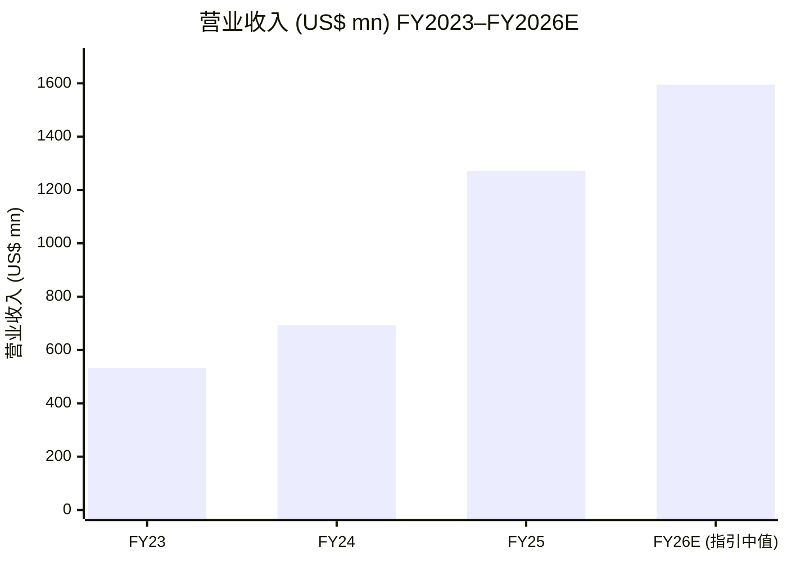
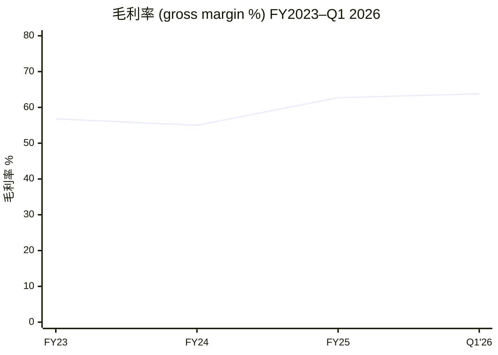
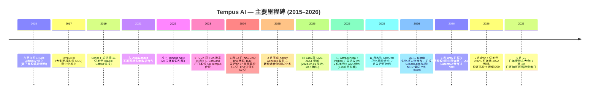
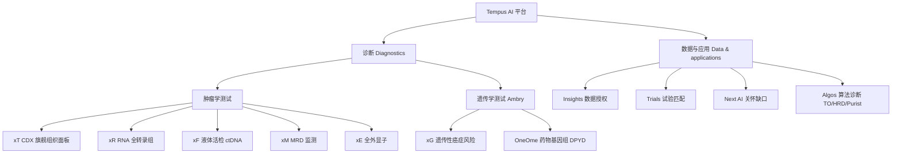
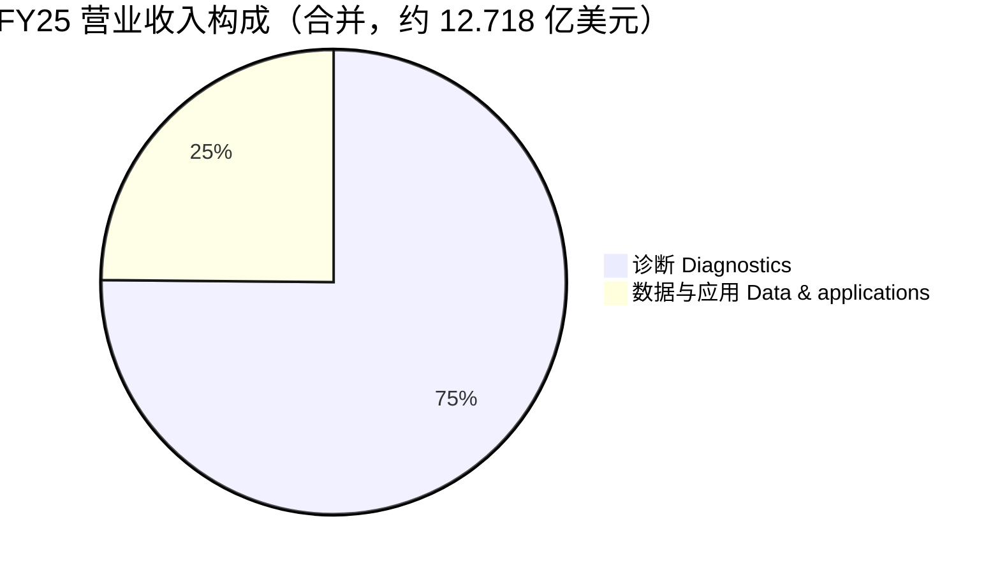
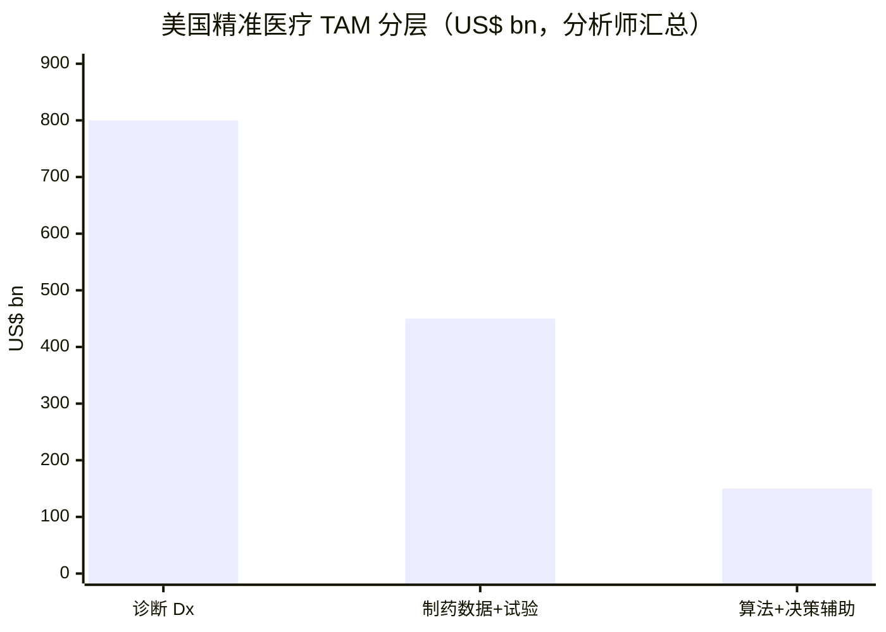
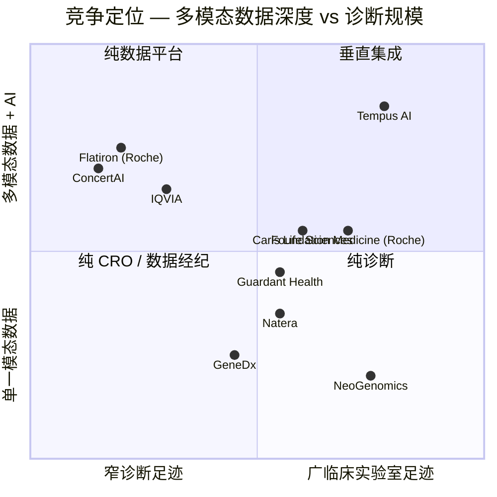

# 公司研究报告: Tempus AI, Inc. (NASDAQ: TEM)

**截至日期 (as of):** 2026-06-14（刷新——重大修订:接入 FY2025 10-K 完整审计财报 + Q1 2026 10-Q + 2026-05-22 年度股东大会 8-K;新增投资摘要表头、估值与目标价决策层、GF Score 健康评分、完整财报图表套件、关键分歧与催化剂、投资人视角评分卡、数据来源清单）
**作者:** financial_agent / company-research skill
**代码:** NASDAQ: TEM (Class A 普通股)
**财年截止:** 12 月 31 日 (FY2025 = 截至 2025 年 12 月 31 日的财年; Q1 2026 = 截至 2026 年 3 月 31 日的三个月)
**报告语言: 简体中文**（本目录另存有一份独立的英文版,本次刷新仅更新中文版,英文版未改动）
**分析师注解:** 所有公司财务事实来自一级文件 (SEC EDGAR);所有评级、目标价、远期预测、情景目标价、GF Score、视角评分均为分析师本方观点 (*分析师观点：*),不附加于任何文件引用。

> *分析师观点：* **投资摘要 —— 评级：Hold（持有）· 12 个月目标价 US$55（较现价 US$47.82 上行 +15%）· 估值方法：FY2027E 营收 ~24 亿 × 4.0× 远期 EV/Sales（P/E 为负,故用 EV/Sales / P/S）· 市值约 US$8.6bn · 52 周区间 US$41.73–US$104.32 · NASDAQ: TEM**
>
> | 倍数 / Multiple（*分析师观点：* 远期列） | FY2025A | FY2026E | FY2027E |
> |---|---|---|---|
> | P/E | 负（亏损 negative） | 负 | 负→趋近转正 |
> | EV/Sales（EV ÷ 营业收入） | ~7.3× | ~5.8× | ~3.9× |
> | P/S（市值 ÷ 营业收入） | ~6.8× | ~5.4× | ~3.6× |
> | EV/调整后 EBITDA | 不适用（FY25 调整后 EBITDA 约 -0.5 亿） | ~140×（FY26E 约 +6,500 万） | ~45× |
>
> 相对表现（截至 2026-06-12 收盘,价格源 [yfinance](https://finance.yahoo.com/quote/TEM)）：1M +4.2% · 6M −35.3% · YTD −23.3% · 12M −32.9% vs S&P 500（1M −0.2% · 6M +7.7% · YTD +8.4% · 12M +22.9%）——12 个月相对大盘 **−55.8pp**,为显著的板块级落后者,股价自 2025 年底约 US$104 高位回撤逾 50%。
>
> **核心论点（thesis pillars）**——（1）罕见的**垂直集成精准医疗平台**(临床实验室 + 多模态数据 + AI 应用三层全栈),诊断每例测试同时产生计费收入与喂养 AI/数据授权飞轮的标注数据;（2）**FY26 调整后 EBITDA 盈亏平衡**是近期最清晰拐点(指引约 +6,500 万,FY24 约 -6,000 万),改变风险轮廓;（3）但**多年 GAAP 亏损、约 12.4 亿美元债务存量、估值倍数处诊断同业中段而非折价**,且 MRD/报销/LDT 监管三重不确定性犹存——风险-回报对称、缺乏安全边际,故 Hold 而非 Buy;（4）股价 12 个月 −33%、跌近 IPO 价附近,**估值已消化大量乐观**,但尚未到 deep-value 入场点。

---

## 目录

1. 公司概览（含投资论点 BLUF）
1A. 估值与目标价（远期预测 · 目标价推导 · 牛/基准/熊情景）
1B. GF Score（GuruFocus 式）基本面健康评分卡
2. 公司历史
3. 管理团队
4. 产品与服务
5. 客户与上市策略
6. 行业概览
7. 竞争格局
8. 市场机会（TAM）
9. 风险评估
9.5. 关键分歧与催化剂
10. 投资人视角评分卡
数据来源清单
参考资料

---

> **业绩更新 —— FY26 营业收入指引上调 + 4 亿美元可转债再融资（均发生于 2026 年 5 月）:** Tempus Q1 2026 录得**营业收入 3.481 亿美元(同比 +36.1%)**:其中诊断 (Diagnostics) 2.611 亿美元(+34.7%;**肿瘤学测试量同比 +28%、遗传学同比 +54%(剔除 Ambry 收购前基数后约 +7%)、MRD(微小残留病变,minimal residual disease)测试量约 6,500 例,同比约 +500%**),数据与应用 (Data and applications) 0.870 亿美元(+40.5%;**Insights 数据授权 +44.1%**)。调整后 EBITDA 由去年同期 -1,620 万美元改善至 **-280 万美元**,**维持 FY26 全年调整后 EBITDA 约 +6,500 万美元的指引**。管理层**将 FY26 营业收入指引上调至 15.9–16.0 亿美元(约 +25%)**,高于此前约 15.5 亿。资本结构层面,公司于 **2026 年 5 月定价 4 亿美元(由 3.5 亿上调)0.00% 可转换优先票据 2032 年到期 (Convertible Senior Notes due 2032)**,转股价 **69.26 美元(较 5 月 7 日收盘溢价 40%)**;3.841 亿美元净募集款中,3.077 亿用于**全额偿还高级有担保定期贷款 (senior secured term loans)** —— 该置换显著降低利息支出、消除担保债务覆盖障碍,并在公司迈向盈亏平衡之前清理资产负债表。来源: [Tempus Q1 2026 8-K — EX-99.1, 2026-05-05](https://www.sec.gov/Archives/edgar/data/1717115/000119312526206317/tem-ex99_1.htm); [Tempus 8-K — EX-99.2(可转债定价), 2026-05-13](https://www.sec.gov/Archives/edgar/data/1717115/000119312526220115/d117982dex992.htm)。

---

## 1. 公司概览

**投资论点（BLUF）。** *分析师观点：* 我们以 **Hold（持有）、12 个月目标价 US$55（较 2026-06-12 收盘 US$47.82 上行约 +15%）** 启动/刷新对 Tempus AI 的覆盖。这是一家**罕见地同时拥有临床分子诊断实验室、全美最大多模态精准医疗数据集之一、以及在其之上构建的 AI 应用产品**的垂直集成公司——核心论点是"诊断每跑一例测试,既产生一笔计费收入,又新增一行喂养 AI 模型与制药数据授权飞轮的标注临床-分子数据"。**看多的理由**集中于 FY26 调整后 EBITDA (adjusted EBITDA) 盈亏平衡这一近期拐点(指引约 +6,500 万,vs FY24 约 -6,000 万)、+83% 的 FY25 营收增速、以及数据与应用 (Data and applications) 业务结构性更高的毛利率;**保持中性而非看多的理由**是:GAAP 层面多年深度亏损(FY25 净亏损 -2.45 亿)、约 12.4 亿美元债务存量、估值倍数(P/S 约 6.3× TTM)处诊断同业中段而非折价、以及 MRD 竞争/报销/LDT 监管三重不确定性。**股价已先行消化大量乐观**——12 个月 −33%、自约 US$104 高位回撤逾一半,但 P/S 6.3× 尚未到深度价值 (deep-value) 入场区,故风险-回报对称、缺乏安全边际。

Tempus AI, Inc. 是一家总部位于美国伊利诺伊州芝加哥的医疗科技公司,在美国运营规模最大的**精准医疗 (precision medicine) 诊断 + 多模态数据 (multimodal data)** 平台之一。公司在自有 CLIA 认证实验室对癌症(并逐步扩展至 cardiology(心脏病学)与 neuropsychiatry(神经精神病学))患者的血液与组织样本进行 NGS (Next-Generation Sequencing, 下一代测序),将每份测试结果与其从覆盖**逾 5,000 家医疗机构站点、逾 700 个独立数据连接 (data connections)** 网络中获取的纵向临床记录链接,再将经过去标识化 (de-identified)、统一化 (harmonized) 的数据底座 (substrate) 反向出售给制药与生物科技客户,以数据授权 (data license)、临床试验匹配 (clinical-trial matching)、算法决策辅助产品的形式变现 ([Tempus 2025 10-K, Item 1 Business](https://www.sec.gov/Archives/edgar/data/1717115/000119312526066961/tem-20251231.htm))。该商业模式被明确刻画为**飞轮 (flywheel)** —— 测试越多 → 数据越多 → 算法越聪明 → 测试越具临床价值 → 数据越多,10-K 阐述的核心论点为 *"Intelligent Diagnostics(智能诊断)代表精准医疗的未来"*,借助 generative(生成式)与 agentic(代理式)AI 将实验室分子结果与 EHR(电子病历)派生的临床上下文相结合 ([Tempus 2025 10-K, Item 1](https://www.sec.gov/Archives/edgar/data/1717115/000119312526066961/tem-20251231.htm))。

**两大产品线与 FY2025 财报。** Tempus 划分为公司自己定义为相互强化的**两大产品线**:**诊断 (Diagnostics)**(肿瘤学 NGS + 遗传学筛查 + 算法型 companion diagnostic(伴随诊断);**FY25 营业收入 9.554 亿美元,同比 +111%**,主导板块)与**数据与应用 (Data and applications)**(Insights 数据授权 + Trials 临床试验匹配 + Next AI care-gap detection(关怀缺口检测)+ Algos 算法诊断;**3.164 亿美元,同比 +31%**)—— **FY25 合计营业收入 12.718 亿美元,同比 +83%** ([Tempus 2025 10-K, Consolidated Statements of Operations](https://www.sec.gov/Archives/edgar/data/1717115/000119312526066961/tem-20251231.htm))。诊断板块的规模跃升部分来自外延:**2025 年 2 月收购的 Ambry Genetics 为 FY25 诊断收入增量贡献约 3.627 亿美元**;但有机肿瘤学测试量本身**从 FY24 约 270,800 例增长至 FY25 约 340,500 例(+26%)**,同时每例平均收入由 **1,510 美元上行至 1,600 美元**,系 Medicare 在 FDA 批准的 xT CDX 测定上的报销使其定价获锚 ([Tempus 2025 10-K, MD&A](https://www.sec.gov/Archives/edgar/data/1717115/000119312526066961/tem-20251231.htm))。

下方 income-statement Sankey(损益结构桑基图)直观呈现"钱从哪来、到哪去":营业收入 12.72 亿在跑过 COGS(销货成本)后留下 **gross profit(毛利)7.979 亿、毛利率 62.7%**,但 **total operating expense(总经营费用)高达约 11 亿(占营收 82.6%)** —— R&D(研发,技术研发 + 研发合并 3.19 亿)与 SG&A(销售、管理及行政 7.317 亿)合计远超毛利,导致 **operating loss(经营亏损)-2.529 亿**。这是典型的"烧钱*成长*"形态,而非周期低谷。

<svg xmlns="http://www.w3.org/2000/svg" viewBox="0 0 1000 560" width="1000" height="560" role="img" aria-label="income statement Sankey"><rect x="0" y="0" width="1000" height="560" fill="#ffffff"/>
<text x="20.00" y="30.00" text-anchor="start" font-family="Helvetica,Arial,sans-serif" font-size="15" font-weight="700" fill="#1f2933">Tempus AI (TEM) 如何赚钱 / 损益结构 — FY2025</text>
<path d="M 204.00,71.00 C 258.00,71.00 258.00,78.00 312.00,78.00 L 312.00,395.01 C 258.00,395.01 258.00,388.01 204.00,388.01 Z" fill="#93c5fd" fill-opacity="0.55"/>
<path d="M 452.00,71.00 C 506.00,71.00 506.00,106.68 560.00,106.68 L 560.00,108.68 C 506.00,108.68 506.00,73.00 452.00,73.00 Z" fill="#86efac" fill-opacity="0.55"/>
<path d="M 452.00,73.00 C 506.00,73.00 506.00,122.68 560.00,122.68 L 560.00,471.32 C 506.00,471.32 506.00,421.64 452.00,421.64 Z" fill="#fca5a5" fill-opacity="0.55"/>
<path d="M 328.00,78.00 C 382.00,78.00 382.00,71.00 436.00,71.00 L 436.00,335.75 C 382.00,335.75 382.00,342.75 328.00,342.75 Z" fill="#86efac" fill-opacity="0.55"/>
<path d="M 328.00,342.75 C 382.00,342.75 382.00,349.75 436.00,349.75 L 436.00,507.00 C 382.00,507.00 382.00,500.00 328.00,500.00 Z" fill="#fca5a5" fill-opacity="0.55"/>
<path d="M 700.00,99.68 C 754.00,99.68 754.00,280.00 808.00,280.00 L 808.00,282.00 C 754.00,282.00 754.00,101.68 700.00,101.68 Z" fill="#86efac" fill-opacity="0.55"/>
<path d="M 700.00,101.68 C 754.00,101.68 754.00,296.00 808.00,296.00 L 808.00,298.00 C 754.00,298.00 754.00,103.68 700.00,103.68 Z" fill="#fca5a5" fill-opacity="0.55"/>
<path d="M 576.00,106.68 C 630.00,106.68 630.00,99.68 684.00,99.68 L 684.00,101.68 C 630.00,101.68 630.00,108.68 576.00,108.68 Z" fill="#86efac" fill-opacity="0.55"/>
<path d="M 576.00,122.68 C 630.00,122.68 630.00,115.68 684.00,115.68 L 684.00,358.47 C 630.00,358.47 630.00,365.47 576.00,365.47 Z" fill="#fca5a5" fill-opacity="0.55"/>
<path d="M 576.00,365.47 C 630.00,365.47 630.00,372.47 684.00,372.47 L 684.00,478.32 C 630.00,478.32 630.00,471.32 576.00,471.32 Z" fill="#fca5a5" fill-opacity="0.55"/>
<path d="M 204.00,402.01 C 258.00,402.01 258.00,395.01 312.00,395.01 L 312.00,500.00 C 258.00,500.00 258.00,507.00 204.00,507.00 Z" fill="#93c5fd" fill-opacity="0.55"/>
<rect x="188.00" y="71.00" width="16" height="317.01" rx="1.5" fill="#2563eb"/>
<rect x="188.00" y="402.01" width="16" height="104.99" rx="1.5" fill="#2563eb"/>
<rect x="312.00" y="78.00" width="16" height="422.00" rx="1.5" fill="#1e3a8a"/>
<rect x="436.00" y="71.00" width="16" height="264.75" rx="1.5" fill="#15803d"/>
<rect x="436.00" y="349.75" width="16" height="157.25" rx="1.5" fill="#dc2626"/>
<rect x="560.00" y="106.68" width="16" height="2.00" rx="1.5" fill="#15803d"/>
<rect x="560.00" y="122.68" width="16" height="348.64" rx="1.5" fill="#dc2626"/>
<rect x="684.00" y="99.68" width="16" height="2.00" rx="1.5" fill="#15803d"/>
<rect x="684.00" y="115.68" width="16" height="242.79" rx="1.5" fill="#dc2626"/>
<rect x="684.00" y="372.47" width="16" height="105.85" rx="1.5" fill="#dc2626"/>
<rect x="808.00" y="280.00" width="16" height="2.00" rx="1.5" fill="#15803d"/>
<rect x="808.00" y="296.00" width="16" height="2.00" rx="1.5" fill="#dc2626"/>
<text x="179.00" y="226.51" text-anchor="end" font-family="Helvetica,Arial,sans-serif" font-size="11.5" font-weight="700" fill="#1f2933">Diagnostics</text>
<text x="179.00" y="239.51" text-anchor="end" font-family="Helvetica,Arial,sans-serif" font-size="10" font-weight="400" fill="#52606d">$955.4M  (75.1%)</text>
<text x="179.00" y="451.51" text-anchor="end" font-family="Helvetica,Arial,sans-serif" font-size="11.5" font-weight="700" fill="#1f2933">Data &amp; applications</text>
<text x="179.00" y="464.51" text-anchor="end" font-family="Helvetica,Arial,sans-serif" font-size="10" font-weight="400" fill="#52606d">$316.4M  (24.9%)</text>
<rect x="331.00" y="60.00" width="100.50" height="26" rx="2" fill="#ffffff" fill-opacity="0.72"/>
<text x="334.00" y="72.00" text-anchor="start" font-family="Helvetica,Arial,sans-serif" font-size="11.5" font-weight="700" fill="#1f2933">Revenue</text>
<text x="334.00" y="85.00" text-anchor="start" font-family="Helvetica,Arial,sans-serif" font-size="10" font-weight="400" fill="#52606d">$1.3B  (100.0%)</text>
<rect x="455.00" y="53.00" width="106.80" height="26" rx="2" fill="#ffffff" fill-opacity="0.72"/>
<text x="458.00" y="65.00" text-anchor="start" font-family="Helvetica,Arial,sans-serif" font-size="11.5" font-weight="700" fill="#1f2933">Gross Profit</text>
<text x="458.00" y="78.00" text-anchor="start" font-family="Helvetica,Arial,sans-serif" font-size="10" font-weight="400" fill="#52606d">$797.9M  (62.7%)</text>
<rect x="455.00" y="331.75" width="144.60" height="26" rx="2" fill="#ffffff" fill-opacity="0.72"/>
<text x="458.00" y="343.75" text-anchor="start" font-family="Helvetica,Arial,sans-serif" font-size="11.5" font-weight="700" fill="#1f2933">Cost of Revenue (COGS)</text>
<text x="458.00" y="356.75" text-anchor="start" font-family="Helvetica,Arial,sans-serif" font-size="10" font-weight="400" fill="#52606d">$473.9M  (37.3%)</text>
<rect x="579.00" y="88.68" width="119.40" height="26" rx="2" fill="#ffffff" fill-opacity="0.72"/>
<text x="582.00" y="100.68" text-anchor="start" font-family="Helvetica,Arial,sans-serif" font-size="11.5" font-weight="700" fill="#1f2933">Operating Income</text>
<text x="582.00" y="113.68" text-anchor="start" font-family="Helvetica,Arial,sans-serif" font-size="10" font-weight="400" fill="#52606d">-$252.9M  (-19.9%)</text>
<rect x="579.00" y="113.68" width="150.90" height="26" rx="2" fill="#ffffff" fill-opacity="0.72"/>
<text x="582.00" y="125.68" text-anchor="start" font-family="Helvetica,Arial,sans-serif" font-size="11.5" font-weight="700" fill="#1f2933">Total Operating Expense</text>
<text x="582.00" y="138.68" text-anchor="start" font-family="Helvetica,Arial,sans-serif" font-size="10" font-weight="400" fill="#52606d">$1.1B  (82.6%)</text>
<rect x="703.00" y="81.68" width="119.40" height="26" rx="2" fill="#ffffff" fill-opacity="0.72"/>
<text x="706.00" y="93.68" text-anchor="start" font-family="Helvetica,Arial,sans-serif" font-size="11.5" font-weight="700" fill="#1f2933">Pretax Income</text>
<text x="706.00" y="106.68" text-anchor="start" font-family="Helvetica,Arial,sans-serif" font-size="10" font-weight="400" fill="#52606d">-$291.1M  (-22.9%)</text>
<rect x="703.00" y="106.68" width="106.80" height="26" rx="2" fill="#ffffff" fill-opacity="0.72"/>
<text x="706.00" y="118.68" text-anchor="start" font-family="Helvetica,Arial,sans-serif" font-size="11.5" font-weight="700" fill="#1f2933">SG&amp;A</text>
<text x="706.00" y="131.68" text-anchor="start" font-family="Helvetica,Arial,sans-serif" font-size="10" font-weight="400" fill="#52606d">$731.7M  (57.5%)</text>
<rect x="703.00" y="354.47" width="106.80" height="26" rx="2" fill="#ffffff" fill-opacity="0.72"/>
<text x="706.00" y="366.47" text-anchor="start" font-family="Helvetica,Arial,sans-serif" font-size="11.5" font-weight="700" fill="#1f2933">R&amp;D</text>
<text x="706.00" y="379.47" text-anchor="start" font-family="Helvetica,Arial,sans-serif" font-size="10" font-weight="400" fill="#52606d">$319.0M  (25.1%)</text>
<text x="833.00" y="278.00" text-anchor="start" font-family="Helvetica,Arial,sans-serif" font-size="11.5" font-weight="700" fill="#1f2933">Net Income</text>
<text x="833.00" y="291.00" text-anchor="start" font-family="Helvetica,Arial,sans-serif" font-size="10" font-weight="400" fill="#52606d">-$245.0M  (-19.3%)</text>
<text x="833.00" y="303.00" text-anchor="start" font-family="Helvetica,Arial,sans-serif" font-size="11.5" font-weight="700" fill="#1f2933">Income Tax</text>
<text x="833.00" y="316.00" text-anchor="start" font-family="Helvetica,Arial,sans-serif" font-size="10" font-weight="400" fill="#52606d">-$51.7M  (-4.1%)</text>
<text x="500.00" y="530.00" text-anchor="middle" font-family="Helvetica,Arial,sans-serif" font-size="10" font-weight="400" font-style="italic" fill="#8a97a3">亏损期：经营亏损 -252.9M;研发 = 技术研发 146.1M + 研发 172.9M 合并</text>
<text x="500.00" y="544.00" text-anchor="middle" font-family="Helvetica,Arial,sans-serif" font-size="10" font-weight="400" fill="#52606d">Source: TEM FY2025 10-K, Consolidated Statements of Operations</text>
</svg>

来源 / Source: [Tempus 2025 10-K, Consolidated Statements of Operations](https://www.sec.gov/Archives/edgar/data/1717115/000119312526066961/tem-20251231.htm)。

下方 donut(产品线收入构成)与 revbars(历史营收堆叠柱状图)显示诊断在 FY2025 占合并营收 75.1%、数据与应用占 24.9%,以及两条产品线 FY2023→FY2025 的扩张轨迹——诊断从 3.63 亿跃升至 9.55 亿(Ambry 并表 + 有机增长),数据与应用从 1.69 亿稳步增至 3.16 亿 ([Tempus 2023–2025 10-Ks, Consolidated Statements of Operations](https://www.sec.gov/Archives/edgar/data/1717115/000119312526066961/tem-20251231.htm))。

<svg xmlns="http://www.w3.org/2000/svg" viewBox="0 0 720 460" width="720" height="460" role="img" aria-label="revenue donut"><rect x="0" y="0" width="720" height="460" fill="#ffffff"/>
<text x="20.00" y="30.00" text-anchor="start" font-family="Helvetica,Arial,sans-serif" font-size="15" font-weight="700" fill="#1f2933">FY2025 营业收入构成(按产品线)</text>
<path d="M 288.00,107.20 A 132 132 0 1 1 156.00,238.19 L 210.00,238.60 A 78 78 0 1 0 288.00,161.20 Z" fill="#2563eb"/>
<path d="M 156.00,238.19 A 132 132 0 0 1 288.00,107.20 L 288.00,161.20 A 78 78 0 0 0 210.00,238.60 Z" fill="#15803d"/>
<text x="288.00" y="235.20" text-anchor="middle" font-family="Helvetica,Arial,sans-serif" font-size="18" font-weight="800" fill="#1f2933">TEM</text>
<text x="288.00" y="255.20" text-anchor="middle" font-family="Helvetica,Arial,sans-serif" font-size="13" font-weight="600" fill="#52606d">$1.3B</text>
<text x="288.00" y="271.20" text-anchor="middle" font-family="Helvetica,Arial,sans-serif" font-size="10" font-weight="400" fill="#8a97a3">total</text>
<line x1="385.21" y1="337.15" x2="401.21" y2="337.15" stroke="#2563eb" stroke-width="1.4"/>
<text x="405.21" y="335.15" text-anchor="start" font-family="Helvetica,Arial,sans-serif" font-size="11" font-weight="700" fill="#1f2933">Diagnostics 诊断</text>
<text x="405.21" y="349.15" text-anchor="start" font-family="Helvetica,Arial,sans-serif" font-size="10" font-weight="400" fill="#52606d">$955.4M  (75.1%)</text>
<line x1="190.79" y1="141.25" x2="174.79" y2="141.25" stroke="#15803d" stroke-width="1.4"/>
<text x="170.79" y="139.25" text-anchor="end" font-family="Helvetica,Arial,sans-serif" font-size="11" font-weight="700" fill="#1f2933">Data &amp; applications 数据与应用</text>
<text x="170.79" y="153.25" text-anchor="end" font-family="Helvetica,Arial,sans-serif" font-size="10" font-weight="400" fill="#52606d">$316.4M  (24.9%)</text>
<text x="360.00" y="444.00" text-anchor="middle" font-family="Helvetica,Arial,sans-serif" font-size="10" font-weight="400" fill="#52606d">Source: TEM FY2025 10-K, Consolidated Statements of Operations</text>
</svg>

来源 / Source: [Tempus 2025 10-K, Consolidated Statements of Operations](https://www.sec.gov/Archives/edgar/data/1717115/000119312526066961/tem-20251231.htm)。

<svg xmlns="http://www.w3.org/2000/svg" viewBox="0 0 860 470" width="860" height="470" role="img" aria-label="historical revenue bars"><rect x="0" y="0" width="860" height="470" fill="#ffffff"/>
<text x="20.00" y="30.00" text-anchor="start" font-family="Helvetica,Arial,sans-serif" font-size="15" font-weight="700" fill="#1f2933">历史营业收入(按产品线)FY2023–FY2025</text>
<rect x="20.00" y="44" width="11" height="11" rx="2" fill="#2563eb"/>
<text x="36.00" y="53.00" text-anchor="start" font-family="Helvetica,Arial,sans-serif" font-size="10.5" font-weight="400" fill="#1f2933">Diagnostics 诊断</text>
<rect x="142.40" y="44" width="11" height="11" rx="2" fill="#15803d"/>
<text x="158.40" y="53.00" text-anchor="start" font-family="Helvetica,Arial,sans-serif" font-size="10.5" font-weight="400" fill="#1f2933">Data &amp; applications 数据与应用</text>
<line x1="70" y1="412.00" x2="834" y2="412.00" stroke="#eceff2" stroke-width="1"/>
<text x="64.00" y="415.00" text-anchor="end" font-family="Helvetica,Arial,sans-serif" font-size="9.5" font-weight="400" fill="#52606d">$0</text>
<line x1="70" y1="345.20" x2="834" y2="345.20" stroke="#eceff2" stroke-width="1"/>
<text x="64.00" y="348.20" text-anchor="end" font-family="Helvetica,Arial,sans-serif" font-size="9.5" font-weight="400" fill="#52606d">$274.5M</text>
<line x1="70" y1="278.40" x2="834" y2="278.40" stroke="#eceff2" stroke-width="1"/>
<text x="64.00" y="281.40" text-anchor="end" font-family="Helvetica,Arial,sans-serif" font-size="9.5" font-weight="400" fill="#52606d">$549.1M</text>
<line x1="70" y1="211.60" x2="834" y2="211.60" stroke="#eceff2" stroke-width="1"/>
<text x="64.00" y="214.60" text-anchor="end" font-family="Helvetica,Arial,sans-serif" font-size="9.5" font-weight="400" fill="#52606d">$823.6M</text>
<line x1="70" y1="144.80" x2="834" y2="144.80" stroke="#eceff2" stroke-width="1"/>
<text x="64.00" y="147.80" text-anchor="end" font-family="Helvetica,Arial,sans-serif" font-size="9.5" font-weight="400" fill="#52606d">$1.1B</text>
<line x1="70" y1="78.00" x2="834" y2="78.00" stroke="#eceff2" stroke-width="1"/>
<text x="64.00" y="81.00" text-anchor="end" font-family="Helvetica,Arial,sans-serif" font-size="9.5" font-weight="400" fill="#52606d">$1.4B</text>
<rect x="123.48" y="323.67" width="147.71" height="88.33" fill="#2563eb"/>
<rect x="123.48" y="282.55" width="147.71" height="41.12" fill="#15803d"/>
<text x="197.33" y="428.00" text-anchor="middle" font-family="Helvetica,Arial,sans-serif" font-size="10" font-weight="400" fill="#52606d">2023</text>
<rect x="378.15" y="302.02" width="147.71" height="109.98" fill="#2563eb"/>
<rect x="378.15" y="243.14" width="147.71" height="58.88" fill="#15803d"/>
<text x="452.00" y="428.00" text-anchor="middle" font-family="Helvetica,Arial,sans-serif" font-size="10" font-weight="400" fill="#52606d">2024</text>
<rect x="632.81" y="179.63" width="147.71" height="232.37" fill="#2563eb"/>
<rect x="632.81" y="102.74" width="147.71" height="76.89" fill="#15803d"/>
<text x="706.67" y="428.00" text-anchor="middle" font-family="Helvetica,Arial,sans-serif" font-size="10" font-weight="400" fill="#52606d">2025</text>
<text x="430.00" y="454.00" text-anchor="middle" font-family="Helvetica,Arial,sans-serif" font-size="10" font-weight="400" fill="#52606d">Source: TEM FY2023–FY2025 10-Ks, Consolidated Statements of Operations</text>
</svg>

来源 / Source: [Tempus 2023–2025 10-Ks, Consolidated Statements of Operations](https://www.sec.gov/Archives/edgar/data/1717115/000119312526066961/tem-20251231.htm)。

**Q1 2026 拐点。** Q1 2026 业绩延续上述轨迹,且将公司向非 GAAP 盈利的距离显著缩小。营业收入 **3.481 亿美元(同比 +36.1%)**,其中诊断 **2.611 亿美元 (+34.7%)**、数据与应用 **0.870 亿美元 (+40.5%; Insights +44.1%)** ([Tempus Q1 2026 10-Q, Condensed Consolidated Statements of Operations](https://www.sec.gov/Archives/edgar/data/1717115/000119312526206356/tem-20260331.htm))。诊断板块内部,**肿瘤学测试量同比 +28%**、**遗传学测试量同比 +54%**(剔除 Ambry 收购前基数后**降至约 +7%**)、**MRD 测试量达约 6,500 例,同比约 +500%** —— MRD(治疗后微小残留病变监测)被普遍视为肿瘤学测试量下一波最大驱动器,Tempus 正与 Natera 旗下 Signatera 以及 Guardant 旗下 Reveal 并行规模化 ([Tempus Q1 2026 8-K — EX-99.1, 2026-05-05](https://www.sec.gov/Archives/edgar/data/1717115/000119312526206317/tem-ex99_1.htm))。**毛利同比 +43.1% 至 2.220 亿美元**(相对营收 +36%,表明收入结构向毛利更高的数据业务及 FDA 批准的 xT CDX 报销价位倾斜;Q1 2026 毛利率约 63.8%)。调整后 EBITDA 由 -1,620 万改善至 **-280 万**,**净亏损 1.259 亿美元**包含 **SBC(Stock-Based Compensation,股权激励)与雇主工薪税 5,630 万美元**及**可交易证券公允价值变动未实现亏损 3,230 万美元**,两项均压低 GAAP 头条数但对现金叙事不构成实质影响 ([Tempus Q1 2026 8-K — EX-99.1](https://www.sec.gov/Archives/edgar/data/1717115/000119312526206317/tem-ex99_1.htm))。管理层**将 FY26 营业收入指引上调至 15.9–16.0 亿美元**(此前约 15.5 亿——隐含约 +25%),并**维持 FY26 调整后 EBITDA 约 +6,500 万美元的目标** ([Tempus Q1 2026 8-K — EX-99.1](https://www.sec.gov/Archives/edgar/data/1717115/000119312526206317/tem-ex99_1.htm))。

**资本结构(2026 年 5 月再融资后)。** 截至 2026 年 3 月 31 日,Tempus 持有**现金及现金等价物 5.212 亿美元 + 可交易权益证券 (marketable equity securities) 1.179 亿美元 ≈ 合计 6.391 亿美元** ([Tempus Q1 2026 10-Q, Condensed Consolidated Balance Sheets](https://www.sec.gov/Archives/edgar/data/1717115/000119312526206356/tem-20260331.htm))。对照 FY2025 年末资产负债表,债务侧主要为 **2025 年 7 月发行的 7.281 亿美元可转换优先票据(net)、约 2.028 亿美元长期债务(net)、约 2.087 亿美元可转换本票 (convertible promissory note)、以及 1.0 亿美元 revolver(循环信贷额度)** ([Tempus 2025 10-K, Consolidated Balance Sheets](https://www.sec.gov/Archives/edgar/data/1717115/000119312526066961/tem-20251231.htm))。**2026 年 5 月**,Tempus 定价 **4 亿美元 0.00% 可转换优先票据 2032 年到期**(由原 3.5 亿上调),转股价 **69.26 美元(较 5 月 7 日股价溢价 40%)**,使用**净募集款 3.841 亿美元中的 3.077 亿全额偿还高级有担保定期贷款**,另支付 **2,720 万美元购买 capped call(带顶式买权)对冲**以推高有效转股价 ([Tempus 8-K — EX-99.2, 2026-05-13](https://www.sec.gov/Archives/edgar/data/1717115/000119312526220115/d117982dex992.htm))。净效果:零息、无担保、6 年期债务替代高息有担保定期贷款;利息支出大幅下行;抵押品负担解除;适度增量稀释风险(转股价 69.26 美元对应约 580 万股)通过 capped call 部分对冲。

**估值快照(截至 2026-06-12 收盘)。** TEM 收于 **47.82 美元**,**市值约 85.9 亿美元**(yfinance),**完全摊薄股本约 1.796 亿股**;52 周区间 **41.73–104.32 美元**——股价已自 2025 年底/2026 年初约 104 美元的高位回撤逾一半,接近 52 周低点与 IPO 价(37 美元)上方区域 ([Yahoo Finance — TEM, 截至 2026-06-12](https://finance.yahoo.com/quote/TEM/key-statistics))。隐含:

- **TTM 营业收入 ≈ 13.64 亿美元**(FY25 12.72 亿 + Q1 2026 3.48 亿 - Q1 2025 2.56 亿 = 13.64 亿)。
- **TTM P/S ≈ 6.3 倍**(yfinance `priceToSalesTrailing12Months` = 6.29),即市值约 85.9 亿 / TTM 营收 13.64 亿。
- **EV / 营业收入 ≈ 6.8 倍**(yfinance enterprise value 约 92.7 亿 / 13.64 亿)。
- **TTM P/E:无意义** —— TTM 净亏损为负(FY25 净亏损 -2.45 亿,Q1 2026 单季 -1.259 亿),系 SBC、收购摊销、未实现投资证券估值变动综合作用。此非周期低谷 —— 系**烧钱*成长* (cash-burning *growth*)**:**FY25 全年经营性现金净流出 -2.181 亿美元**(并非更早草稿误称的约 -3.0 亿),Q1 2026 经营性现金流出 -7,330 万、较去年同期 -10,560 万改善 ([Tempus 2025 10-K, Consolidated Statements of Cash Flows](https://www.sec.gov/Archives/edgar/data/1717115/000119312526066961/tem-20251231.htm); [Tempus Q1 2026 10-Q, Statements of Cash Flows](https://www.sec.gov/Archives/edgar/data/1717115/000119312526206356/tem-20260331.htm))。因此最清晰的盈利能力镜头为**调整后 EBITDA** —— FY26 指引 +6,500 万正值,而 FY24 约为 -6,000 万,此拐点正是多头逻辑核心。
- **同业估值倍数(TTM,2026 年 5–6 月 Yahoo Finance)**:Guardant Health (GH) 约 6 倍 TTM P/S;Natera (NTRA) 约 9–10 倍;Exact Sciences (EXAS) 约 4 倍;Veeva Systems (VEEV,最接近的纯数据/应用医疗同业)约 13–14 倍 ([Yahoo Finance, 2026-06](https://finance.yahoo.com/quote/TEM/key-statistics))。TEM 约 **6.3 倍** P/S 居于诊断同业区间中段,*尽管*其顶线增速高于多数同业——这正是多头的"折价论"立足点,但也意味着市场并未给予其"软件/数据公司"溢价。

**为什么 P/S 6.3× 不算"便宜"也不算"贵"——分析师解读。** *分析师观点：* TEM 既非 EXAS 式 4× 的"已成熟诊断折价",亦非 VEEV 式 13× 的"纯软件数据溢价"。市场给它的是"高增长、但尚未盈利、且 25% 收入仍依赖制药数据授权的混合模型"的中段估值。看多者押注数据与应用占比从 25% 升至 40%+ 后混合毛利率结构性重定价,届时倍数应向 VEEV 靠拢;看空者押注 GAAP 亏损延续、报销/LDT 监管悬崖、以及 MRD 正面竞争失利,倍数将向 EXAS 靠拢。由于两种叙事皆缺乏当前可证伪的硬数据,中段倍数 + 中段评级 (Hold) 是诚实的落点。

**第 1 节结论。** Tempus 是混合型**临床实验室 + 数据授权**业务,FY25 约 **75% 营业收入来自自有实验室运行分子诊断**,约 **25% 来自将去标识化数据底座反向授权给制药**。增长论点为复利型:实验室运行的每例测试为下一轮算法和下一项制药数据授权增加数据集。**近期拐点**为 **FY26 调整后 EBITDA 盈亏平衡**;长期拐点则在于多模态数据 + AI 飞轮能否将毛利率结构性抬升,并随数据与应用规模化超越实验室业务、使终值估值更接近软件公司。

*来源: [Tempus 2025 10-K, Statements of Operations](https://www.sec.gov/Archives/edgar/data/1717115/000119312526066961/tem-20251231.htm)(FY23–FY25 实际值); FY26E 为指引中值 15.9–16.0 亿 ([Tempus Q1 2026 8-K — EX-99.1](https://www.sec.gov/Archives/edgar/data/1717115/000119312526206317/tem-ex99_1.htm))。*

*来源: 分析师按 [Tempus 2025 10-K](https://www.sec.gov/Archives/edgar/data/1717115/000119312526066961/tem-20251231.htm) 与 [Q1 2026 10-Q](https://www.sec.gov/Archives/edgar/data/1717115/000119312526206356/tem-20260331.htm) 营收与 COGS 计算(毛利 ÷ 营收)。*

---

## 1A. 估值与目标价

*本章全部为分析师本方观点 (*分析师观点：*) —— 远期预测、目标价、情景目标价均不附加于任何文件引用;各驱动因子的外部依据已逐项内联引用。*

**(a) 远期财务预测表(分产品线建模)。** 我们对两条产品线分别建模再加总。诊断按"有机肿瘤学测试量 +20–25% × 每例收入温和上行 + MRD 高速放量 + 遗传学正常化至个位数有机增速"推演;数据与应用按"Insights +35–40% + Trials/Next 渐进商业化"推演。利润率方面,公司不分拆分部营业利润,我们以合并毛利率(FY25 62.7%)逐年抬升 + 经营杠杆驱动调整后 EBITDA 转正建模。**TEM 为亏损成长股,决策变量是现金跑道与调整后 EBITDA 拐点,而非 EPS。**

| 指标（*分析师观点：*） | FY2025A | FY2026E | FY2027E | FY2028E | 25–28 CAGR |
|---|---|---|---|---|---|
| 营业收入 (US$ mn) | 1,272 | 1,595 | 2,000 | 2,440 | +24% |
| — 诊断 | 955 | 1,180 | 1,440 | 1,710 | +21% |
| — 数据与应用 | 316 | 415 | 560 | 730 | +32% |
| — YoY % | +83% | +25% | +25% | +22% | |
| Gross margin (毛利率) % | 62.7% | 63.5% | 65% | 66% | |
| 调整后 EBITDA (US$ mn) | ~(50) | +65 | +180 | +330 | |
| 调整后 EBITDA 利润率 % | 约 -4% | +4% | +9% | +14% | |
| GAAP 经营利润 (US$ mn) | (253) | (140) | (40) | +60 | |
| GAAP EPS (US$) | (1.40) | (0.80)E | (0.25)E | +0.20E | n/m |
| FCF / 现金跑道 | 经营 -218mn | 经营燃烧收窄 | 趋近 FCF 平衡 | FCF 转正 | 现金+证券 639mn,按 Q1 燃烧约 8+ 季 |
| Net cash/(debt) (US$ mn) | 约 -600 | 约 -600 | 约 -550 | 约 -450 | 零息可转债 2032 到期 |

*依据(逐项内联引用,预测单元格为分析师观点）:营收基数与分部拆分来自 [Tempus 2025 10-K, Statements of Operations](https://www.sec.gov/Archives/edgar/data/1717115/000119312526066961/tem-20251231.htm);FY26 营收 15.9–16.0 亿与调整后 EBITDA +6,500 万为公司指引 ([Tempus Q1 2026 8-K — EX-99.1](https://www.sec.gov/Archives/edgar/data/1717115/000119312526206317/tem-ex99_1.htm));现金 + 证券 6.391 亿与经营燃烧 -7,330 万/季来自 [Q1 2026 10-Q](https://www.sec.gov/Archives/edgar/data/1717115/000119312526206356/tem-20260331.htm);FY25 经营性现金净流出 -2.181 亿来自 [FY2025 10-K, Statements of Cash Flows](https://www.sec.gov/Archives/edgar/data/1717115/000119312526066961/tem-20251231.htm)。*

**毛利率桥(margin bridge,*分析师观点：*)。** FY25 毛利率 55.0%→62.7%(+770bps)的拆解:**收入结构向毛利约 72% 的数据与应用倾斜 + FDA 批准的 xT CDX 取得 ADLT 定价、每例肿瘤学收入 1,510→1,600 美元 ≈ +500bps · Ambry 遗传学规模化摊薄固定实验室成本 ≈ +200bps · 其余产能利用率改善 ≈ +70bps**(分项 bps 为分析师估算;每例收入与分部营收的源数据见 [FY2025 10-K MD&A](https://www.sec.gov/Archives/edgar/data/1717115/000119312526066961/tem-20251231.htm))。

**(b) 目标价推导——展示算术。** 由于 P/E 为负、且公司处调整后 EBITDA 盈亏平衡前夜,**P/E × 倍数法不适用**;我们采用**远期 EV/Sales × 目标倍数**(高增长、未盈利诊断/数据混合名的标准做法):

> **FY2027E 营业收入约 20.0 亿 × 目标 EV/Sales 4.0× = 企业价值约 80 亿 → 加回 FY27E 净现金约 -5.5 亿(即减去净债务)→ 股权价值约 74.5 亿 → ÷ 约 1.85 亿摊薄股(含可转债稀释)≈ 每股约 US$40;另以 FY2027E P/S 法交叉验证:营收 20 亿 × 目标 P/S 5.0× ÷ 1.85 亿股 ≈ 每股约 US$54。** 综合两法并向"FY27 调整后 EBITDA 已转正、数据占比升至约 28%"赋予温和重定价,**12 个月目标价 US$55**,较现价 US$47.82 上行约 **+15%**。

**为什么用 4.0× 远期 EV/Sales——倍数依据(*分析师观点：*）。** 对标 3–5 个具名同业的当前 TTM 倍数:Guardant Health (GH) 约 6× P/S、Natera (NTRA) 约 9–10×、Exact Sciences (EXAS) 约 4×、Veeva (VEEV) 约 13–14× ([Yahoo Finance, 2026-06](https://finance.yahoo.com/quote/TEM/key-statistics))。TEM 顶线增速(+24% 远期 CAGR)高于 EXAS、低于 NTRA 的 MRD 纯增速。我们给 FY27E **4.0× EV/Sales / 约 5.0× P/S**,即在 EXAS(成熟诊断)与 NTRA/GH(高增长诊断)之间,反映 TEM 已转正调整后 EBITDA 但仍 GAAP 亏损的中段定位——较其当前约 6.8× EV/Sales 的远期收敛(估值随营收增长自然压缩)。

**(c) 牛 / 基准 / 熊情景目标价(*分析师观点：*）。**

| 情景（*分析师观点：*） | 关键摆动假设 | 目标价 | 较现价 |
|---|---|---|---|
| 牛 Bull | 数据与应用占比提速至 30%+、MRD 击败 Signatera 正面竞争、混合毛利率向 67% 重定价,FY27E 营收 22 亿 × 5.5× EV/Sales | US$80 | +67% |
| 基准 Base | 中性执行,FY27E 营收 20 亿 × 4.0× EV/Sales,调整后 EBITDA 如期转正 | US$55 | +15% |
| 熊 Bear | 报销削减 + LDT 最终规则抬高合规成本 + 制药合同流失,增速降至个位数,倍数 de-rate 至 2.5× EV/Sales | US$28 | −41% |

风险-回报大致对称(+67% / −41%),无显著安全边际——支撑 Hold 而非 Buy。

**(d) 与市场一致预期的对比。** 本地机构研究库 (`db/zsxq.db`) 经多别名检索后**对 TEM 无单名覆盖**(详见验证日志),故无法以券商一致目标价做基准;我们的 FY26E 营收 15.95 亿即公司指引中值,FY27E 20 亿隐含约 +25% 增速延续——属"贴近指引、不激进上修"的姿态。读者应以公开卖方一致预期(本报告未引用具体数字以免捏造)做进一步交叉验证。

**(e) 本次刷新最该盯紧的变量。** *分析师观点：* 这笔 Hold 的成败系于两个变量:(1)**调整后 EBITDA 是否如期在 FY26 转正**——这是估值从"诊断中段倍数"向"数据/软件溢价倍数"重定价的钥匙;(2)**xM (MRD) 能否在正面销售中守住份额并取得非结直肠/乳腺适应症的报销**——这是肿瘤学测试量下一波最大增量,也是空头攻击点。

---

## 1B. GF Score（GuruFocus 式）基本面健康评分卡

*分析师观点：* **GF Score（GuruFocus-style）：50/100 —— 处于 0–50 与 51–70 两档的临界点。** 这是分析师本方依公开方法复刻的五维评分卡(非 GuruFocus™ 官方数字,我们未拉取其专有分数),五项子分与综合分均为 *分析师观点：*,绝不附加于文件引用;每项底层指标在下方逐项内联引用。GuruFocus 的框架表述:*"GF Score 与股票长期表现高度相关(2006–2021 回测),分越高通常对应更高回报"* ([GuruFocus GF Score 页面](https://www.gurufocus.com/term/gf-score))。

<svg xmlns="http://www.w3.org/2000/svg" viewBox="0 0 500 500" width="500" height="500" role="img" aria-label="GF Score radar">
<rect x="0" y="0" width="500" height="500" fill="#ffffff"/>
<text x="20" y="24" font-family="Helvetica,Arial,sans-serif" font-size="15" font-weight="700" fill="#1f2933">GF Score (GuruFocus-style): 50/100</text>
<text x="20" y="41" font-family="Helvetica,Arial,sans-serif" font-size="11" fill="#52606d">0–50 Worst future performance potential / insufficient data</text>
<polygon points="250.0,88.0 392.7,191.6 338.2,359.4 161.8,359.4 107.3,191.6" fill="#e9f5ec" stroke="none"/>
<polygon points="250.0,208.0 278.5,228.7 267.6,262.3 232.4,262.3 221.5,228.7" fill="none" stroke="#c5d3cb" stroke-width="1"/>
<polygon points="250.0,178.0 307.1,219.5 285.3,286.5 214.7,286.5 192.9,219.5" fill="none" stroke="#c5d3cb" stroke-width="1"/>
<polygon points="250.0,148.0 335.6,210.2 302.9,310.8 197.1,310.8 164.4,210.2" fill="none" stroke="#c5d3cb" stroke-width="1"/>
<polygon points="250.0,118.0 364.1,200.9 320.5,335.1 179.5,335.1 135.9,200.9" fill="none" stroke="#c5d3cb" stroke-width="1"/>
<polygon points="250.0,88.0 392.7,191.6 338.2,359.4 161.8,359.4 107.3,191.6" fill="none" stroke="#c5d3cb" stroke-width="1.3"/>
<line x1="250" y1="238" x2="161.8" y2="359.4" stroke="#cfdad3" stroke-width="1"/>
<text x="146.5" y="392.4" text-anchor="end" font-family="Helvetica,Arial,sans-serif" font-size="11.5" font-weight="600" fill="#1f2933">Financial Strength</text>
<text x="146.5" y="405.4" text-anchor="end" font-family="Helvetica,Arial,sans-serif" font-size="9.5" fill="#52606d">财务实力</text>
<text x="205.9" y="292.7" text-anchor="middle" font-family="Helvetica,Arial,sans-serif" font-size="10.5" font-weight="700" fill="#1f2933">5</text>
<line x1="250" y1="238" x2="250.0" y2="88.0" stroke="#cfdad3" stroke-width="1"/>
<text x="250.0" y="58.0" text-anchor="middle" font-family="Helvetica,Arial,sans-serif" font-size="11.5" font-weight="600" fill="#1f2933">Profitability</text>
<text x="250.0" y="71.0" text-anchor="middle" font-family="Helvetica,Arial,sans-serif" font-size="9.5" fill="#52606d">盈利能力</text>
<text x="250.0" y="202.0" text-anchor="middle" font-family="Helvetica,Arial,sans-serif" font-size="10.5" font-weight="700" fill="#1f2933">2</text>
<line x1="250" y1="238" x2="107.3" y2="191.6" stroke="#cfdad3" stroke-width="1"/>
<text x="82.6" y="183.6" text-anchor="end" font-family="Helvetica,Arial,sans-serif" font-size="11.5" font-weight="600" fill="#1f2933">Growth</text>
<text x="82.6" y="196.6" text-anchor="end" font-family="Helvetica,Arial,sans-serif" font-size="9.5" fill="#52606d">成长性</text>
<text x="107.3" y="185.6" text-anchor="middle" font-family="Helvetica,Arial,sans-serif" font-size="10.5" font-weight="700" fill="#1f2933">10</text>
<line x1="250" y1="238" x2="392.7" y2="191.6" stroke="#cfdad3" stroke-width="1"/>
<text x="417.4" y="183.6" text-anchor="start" font-family="Helvetica,Arial,sans-serif" font-size="11.5" font-weight="600" fill="#1f2933">GF Value</text>
<text x="417.4" y="196.6" text-anchor="start" font-family="Helvetica,Arial,sans-serif" font-size="9.5" fill="#52606d">估值</text>
<text x="321.3" y="208.8" text-anchor="middle" font-family="Helvetica,Arial,sans-serif" font-size="10.5" font-weight="700" fill="#1f2933">5</text>
<line x1="250" y1="238" x2="338.2" y2="359.4" stroke="#cfdad3" stroke-width="1"/>
<text x="353.5" y="392.4" text-anchor="start" font-family="Helvetica,Arial,sans-serif" font-size="11.5" font-weight="600" fill="#1f2933">Momentum</text>
<text x="353.5" y="405.4" text-anchor="start" font-family="Helvetica,Arial,sans-serif" font-size="9.5" fill="#52606d">动量</text>
<text x="267.6" y="256.3" text-anchor="middle" font-family="Helvetica,Arial,sans-serif" font-size="10.5" font-weight="700" fill="#1f2933">2</text>
<polygon points="250.0,208.0 321.3,214.8 267.6,262.3 205.9,298.7 107.3,191.6" fill="#2e8b57" fill-opacity="0.34" stroke="#2e8b57" stroke-width="2"/>
<circle cx="205.9" cy="298.7" r="2.6" fill="#2e8b57"/>
<circle cx="250.0" cy="208.0" r="2.6" fill="#2e8b57"/>
<circle cx="107.3" cy="191.6" r="2.6" fill="#2e8b57"/>
<circle cx="321.3" cy="214.8" r="2.6" fill="#2e8b57"/>
<circle cx="267.6" cy="262.3" r="2.6" fill="#2e8b57"/>
<text x="250" y="470" text-anchor="middle" font-family="Helvetica,Arial,sans-serif" font-size="9.5" fill="#52606d">Source: TEM FY2025 10-K · Q1 2026 10-Q · yfinance · indicators.db, as of 2026-06-14</text>
<text x="250" y="485" text-anchor="middle" font-family="Helvetica,Arial,sans-serif" font-size="9" fill="#52606d">GF Score = independent analyst rubric (*Analyst view:*) — not GuruFocus™ official number</text>
</svg>

> 离中心越远,该维度得分越高;五边形面积越大,综合分越高(对应 GuruFocus widget)。

| 维度 / Dimension | 评分 / Score (0–10) | |
|---|---|---|
| Financial Strength (财务实力) | 5 | `█████░░░░░` |
| Profitability (盈利能力) | 2 | `██░░░░░░░░` |
| Growth (成长性) | 10 | `██████████` |
| GF Value (估值，*越高 = 越便宜*) | 5 | `█████░░░░░` |
| Momentum (动量) | 2 | `██░░░░░░░░` |
| **GF Score（综合，*分析师观点：*）** | **50 / 100** | **0–50 / 51–70 临界** |

**各维度评分理由。**

**Financial Strength (财务实力) = 5/10。** 中性偏下。截至 2026-03-31,现金 + 可交易证券约 **6.391 亿美元**,对约 **12.4 亿美元** 债务存量(7.281 亿可转债 + 2.087 亿可转本票 + 2.028 亿长期债务 + 1.0 亿 revolver),即净债务约 -6 亿 ([Tempus 2025 10-K, Balance Sheets](https://www.sec.gov/Archives/edgar/data/1717115/000119312526066961/tem-20251231.htm); [Q1 2026 10-Q](https://www.sec.gov/Archives/edgar/data/1717115/000119312526206356/tem-20260331.htm))。因 EBITDA 为负,Net Debt/EBITDA 与利息覆盖率均不可计算——这本身压低评分;但 **2026 年 5 月再融资将高息有担保定期贷款置换为零息、无担保、2032 到期可转债**,大幅消除近期到期墙与覆盖障碍 ([Tempus 8-K — EX-99.2, 2026-05-13](https://www.sec.gov/Archives/edgar/data/1717115/000119312526220115/d117982dex992.htm)),按 Q1 燃烧约 8 季以上跑道,故给 5 而非更低。

**Profitability (盈利能力) = 2/10。** 诚实的低分。FY2025 **经营亏损 -2.529 亿、净亏损 -2.45 亿**,ROE/ROIC 均为负;尽管毛利率 62.7% 健康,但底线深度亏损、ROIC 远低于任何合理 WACC ([Tempus 2025 10-K, Statements of Operations](https://www.sec.gov/Archives/edgar/data/1717115/000119312526066961/tem-20251231.htm))。我们不为其尚未盈利"打掩护"——这正是 radar 上 Profitability 与 Growth 强烈背离所要呈现的。

**Growth (成长性) = 10/10。** 最高档。FY25 营业收入 **+83% YoY**,诊断 **+111%**,数据与应用 +31%;Q1 2026 +36%;公司 FY26 指引 +25% ([Tempus 2025 10-K](https://www.sec.gov/Archives/edgar/data/1717115/000119312526066961/tem-20251231.htm); [Q1 2026 8-K — EX-99.1](https://www.sec.gov/Archives/edgar/data/1717115/000119312526206317/tem-ex99_1.htm))。即便剔除 Ambry 并表的外延成分,有机增速仍稳居 20%+,与 Section 1A 远期模型的 +24% CAGR 一致。

**GF Value (估值，越高=越便宜) = 5/10。** 中性。TTM P/S 约 **6.3×**、EV/Sales 约 6.8×,处诊断同业(EXAS 约 4×、GH 约 6×、NTRA 约 9–10×、VEEV 约 13–14×)中段;PEG 概念因 EPS 为负不适用,但 P/S÷增速(6.3/24 ≈ 0.26)显示相对增速并不贵 ([Yahoo Finance, 2026-06](https://finance.yahoo.com/quote/TEM/key-statistics))。既非深度低估亦非蓝天定价,与 Section 1A 目标价隐含约 +15% 上行一致——故给 5。

**Momentum (动量) = 2/10。** 低分。12 个月绝对回报 **−32.9%**、相对 S&P 500 **−55.8pp**,股价接近 52 周低点(41.73)、远低于约 104 高位,处于明显的绝对下行趋势,仅 1 个月 +4.2% 提供微弱企稳信号 ([yfinance, 截至 2026-06-12](https://finance.yahoo.com/quote/TEM))。这与表头相对表现行一致。

**综合算术:** `(FS 5·20 + Prof 2·25 + Growth 10·25 + Value 5·15 + Mom 2·15)/100 = (100+50+250+75+30)/100 = 5.05 → 约 50/100`(默认权重 20/25/25/15/15)。

**一句话提醒:** 综合分恰处 0–50 / 51–70 档位临界——**Momentum(动量)是最易翻转的一维**:若股价企稳并跑赢大盘、或调整后 EBITDA 如期转正抬升 Profitability,综合分将上移入 51–70 档;反之一次差业绩即把它压回 0–50。Profitability 维度在 FY26 调整后 EBITDA 转正、并最终 GAAP 转正前,将持续是 radar 上最凹的一角。

---

## 2. 公司历史

Tempus 于 **2015 年由 Eric Lefkofsky 在芝加哥创立**,直接源于其妻子被诊断为乳腺癌后,他本人多次将此经历描述为公司"让每位癌症患者的数据改善下一位癌症患者的医疗"使命的起点 ([Tempus AI — Wikipedia](https://en.wikipedia.org/wiki/Tempus_AI); [Eric Lefkofsky 团队页面 — tempus.com](https://www.tempus.com/team_members/eric-lefkofsky/))。10-K 直接确认创立年份:*"We were founded in 2015 and have experienced rapid growth in revenue, adoption of our products and services, testing volume, size of our datasets, clinical trial matches and other metrics…"* ([Tempus 2025 10-K, Item 1 Business — Overview](https://www.sec.gov/Archives/edgar/data/1717115/000119312526066961/tem-20251231.htm))。

**IPO 前规模化(2015–2024)。** Tempus 作为私营公司度过头九年,用于打造核心平台:NGS 测序实验室、数据网络(现 700+ 数据连接 / 5,000+ 医疗站点)以及基础性制药数据合作。至 **2024 年 6 月 14 日 NASDAQ IPO,发行价 37 美元/股,募资 4.10 亿美元,IPO 估值约 62 亿美元** 之时 ([TechCrunch — Tempus IPO, 2024-05-30](https://techcrunch.com/2024/05/30/billionaire-groupon-founder-lefkofsky-is-back-with-another-ipo-ai-healthtech-tempus/); [iBIO — Tempus AI IPO Triumph](https://ibio.org/tempus-ais-ipo-triumph-raising-410m-and-valuing-the-company-at-6-2b/)),IPO 财务报表口径下其现金流量表确认 **FY2024 IPO 净募资 3.820 亿美元**(扣除承销折扣)([Tempus 2025 10-K, Statements of Cash Flows](https://www.sec.gov/Archives/edgar/data/1717115/000119312526066961/tem-20251231.htm))。本次 IPO 是 Lefkofsky 第二次将所创业务带入公开市场(此前为 Groupon (2011)、Echo Global Logistics (2009)、InnerWorkings (2006))。

**2025 年通过并购实现多产品线扩张。** FY2025 是 Tempus 从"成长期肿瘤诊断"升级为"多产品线精准医疗平台"的关键年:

- **Ambry Genetics(2025 年 2 月)** —— FY25 诊断阶跃的主要推动力,新增遗传性癌症风险测试(癌症综合征筛查的胚系 NGS 面板)与罕见病测试。10-K 明确指出 Ambry 与 Paige 合计构成 *"截至 2025 年 12 月 31 日合并财务报表口径下约 11% 的总资产与 29% 的总营收"* ([Tempus 2025 10-K, ICFR Scope Exclusion Note](https://www.sec.gov/Archives/edgar/data/1717115/000119312526066961/tem-20251231.htm))。现金流量表确认 FY2025 **"业务合并、扣除取得现金"流出 3.767 亿美元** ([Tempus 2025 10-K, Statements of Cash Flows](https://www.sec.gov/Archives/edgar/data/1717115/000119312526066961/tem-20251231.htm))。
- **OneOme(2025 年 11 月)** —— 药物基因组学测试,包括针对 5-FU 化疗毒性风险的 DPYD 测试:*"Our acquisition of OneOme, Inc., or OneOme, in November 2025 further enhanced our ability to provide pharmacogenetics tests, such as DPYD"* ([Tempus 2025 10-K, Item 1 — Diagnostics Products](https://www.sec.gov/Archives/edgar/data/1717115/000119312526066961/tem-20251231.htm))。
- **Paige.AI 与 Deep 6 AI** —— 10-K 前瞻性陈述章节确认两项交易仍在整合中:*"…our ability to realize the expected benefits of our acquisitions of Paige.AI, Inc., Ambry Genetics Corporation and Deep 6 AI, Inc"* ([Tempus 2025 10-K, Forward-Looking Statements](https://www.sec.gov/Archives/edgar/data/1717115/000119312526066961/tem-20251231.htm))。

**制药合作队列(2024–2026)。** 另一主线为制药数据授权关系的深化:

- **AstraZeneca + Pathos(2025 年 4 月)** —— *"在未来 3 年内向 Tempus 提供 2 亿美元数据授权与模型开发费用"*,用以构建肿瘤学多模态基础模型 ([FierceBiotech — Tempus / AstraZeneca / Pathos, 2025 年 4 月](https://www.fiercebiotech.com/biotech/tempus-ai-line-200m-astrazeneca-pathos-deal-develop-cancer-model); [Tempus IR — 战略协议公告](https://investors.tempus.com/news-releases/news-release-details/tempus-signs-expanded-strategic-agreements-astrazeneca-and))。
- **GSK 续约(2024)** —— *"GSK recently paid Tempus $70 million upfront for three more years of partnership"* ([FierceHealthcare — Tempus 制药交易](https://www.fiercehealthcare.com/health-tech/precision-medicine-company-tempus-inks-3rd-major-pharma-deal-securing-nearly-1b-revenue))。10-K MD&A 披露剩余总合同价值 (Remaining Total Contract Value, TCV) 构造:*"Remaining TCV includes the total potential value of the company's strategic collaborations with AstraZeneca AB … and GlaxoSmithKline, or GSK, which, although listed under the Data and applications product line, could be satisfied by the purchase of any of the company's products and services"* ([Tempus 2025 10-K, MD&A — Remaining TCV](https://www.sec.gov/Archives/edgar/data/1717115/000119312526066961/tem-20251231.htm))。
- **Merck 与 Gilead(Q1 2026)** —— 分别建立多年战略合作以加速生物标志物发现、扩展企业级 Lens 平台访问 ([Tempus Q1 2026 8-K — EX-99.1](https://www.sec.gov/Archives/edgar/data/1717115/000119312526206317/tem-ex99_1.htm))。
- **Bristol-Myers Squibb (BMS) 扩展合作(2026-05-14)** —— **首期 5 个临床试验项目**,跨**肿瘤学**(肺癌、结肠癌、前列腺癌)**与神经科学**(阿尔茨海默病),使用 Tempus **Lens** AI 分析平台提高 BMS 研发组合的 **PTRS(Probability of Technical & Regulatory Success,技术与监管成功概率)**;**未披露财务条款** ([Tempus IR press release, 2026-05-14](https://www.tempus.com/news/pr/tempus-expands-strategic-collaboration-with-bristol-myers-squibb-to-enhance-the-probability-of-success-across-clinical-development-programs-in-oncology-and-neuroscience/))。

BMS 交易将制药队列扩展至**五家具名全球大药企(AstraZeneca、GSK、Merck、Gilead、BMS)**,加上 FierceHealthcare 2024 年报道中提及但未具名的第三家——对于营收尚不足 15 亿美元的诊断平台而言,这一覆盖广度极为罕见。

**通过 Quanterix LucentAD 拓展疾病领域(2026 年 5 月)。** 与 BMS 神经科学扩展同时,Tempus 将 **Quanterix 旗下 LucentAD Complete 基于血液的阿尔茨海默病生物标志物面板**整合进 **Tempus Next** 关怀缺口平台——神经科医师可直接通过 Tempus 临床下单平台为患者订购 LucentAD Complete ([Quanterix press release — Lucent / Tempus collaboration](https://www.quanterix.com/news-media-center/press-releases/lucent-diagnostics-announces-collaboration-with-tempus-to-integrate-blood-based-alzheimers-biomarker-testing-into-clinical-workflows/); [Yahoo Finance — Tempus 拓展超越肿瘤学, 2026](https://finance.yahoo.com/sectors/healthcare/articles/tempus-ai-expands-beyond-oncology-161649169.html))。**(a) BMS 在 5 项目方案中纳入阿尔茨海默病**与**(b) LucentAD-Tempus Next 整合**的组合,是迄今最清晰的证据:**阿尔茨海默病 / 脑健康是 Tempus 下一个重大疾病领域扩张**,实质性扩大了 §8 TAM 框架之外的长期市场规模。

---

## 3. 管理团队

**Eric Lefkofsky —— 创始人、董事会主席、CEO。** Lefkofsky 在妻子被诊断为乳腺癌后于 2015 年创立 Tempus——他多次将此经历描述为整个公司诞生的契机 ([Eric Lefkofsky 团队页面 — tempus.com](https://www.tempus.com/team_members/eric-lefkofsky/); [Tempus AI — Wikipedia](https://en.wikipedia.org/wiki/Tempus_AI))。在 Tempus 之前,他是**多家公开上市科技公司的连续创业者 (serial founder)**:**Groupon, Inc. 联合创始人与前 CEO**(2011 年 11 月以美国十年来最大互联网公司发行规模之一登陆 NASDAQ)、**Mediaocean(程序化广告基础设施)联合创始人**、**Echo Global Logistics, Inc. (NASDAQ: ECHO, 2009 年 6 月 IPO) 联合创始人**、**InnerWorkings, Inc. (NASDAQ: INWK, 2006 年 8 月 IPO) 联合创始人** ([Eric Lefkofsky — Wikipedia](https://en.wikipedia.org/wiki/Eric_Lefkofsky))。他也是芝加哥风险投资公司 **Lightbank** 联合创始人。学历:密歇根大学荣誉学位 (1991)、密歇根大学法学院 JD (1993)。

Lefkofsky 是美国为数不多**已创立四家分别 IPO 上市公司**的科技创始人——这对作为证券的 TEM 含义为:(a) 他此前已多次执行上市公司剧本,(b) 他持有超级投票权 Class B 股以保留 IPO 后的创始人控制,(c) 他与 TEM 的个人财务对齐异常之高。截至 **2025 年 12 月 31 日**,Tempus 流通股为 **Class A 1.73235428 亿股 + Class B 504.3789 万股** ([Tempus 2025 10-K, Balance Sheets](https://www.sec.gov/Archives/edgar/data/1717115/000119312526066961/tem-20251231.htm))。**关键治理事实(本次刷新修正):2026-05-21 年度股东大会 8-K 明确披露 Class A 每股 1 票、Class B 每股 30 票**——即创始人 Class B 的超级投票权比例为 **30:1**(此前草稿误推断为 10:1,现据原文更正):*"…stockholders of the Company's Class A common stock … have one vote per share and stockholders of the Company's Class B common stock … have 30 votes per share"* ([Tempus 8-K — Item 5.07, 2026-05-22 备案](https://www.sec.gov/Archives/edgar/data/1717115/000119312526236814/d109019d8k.htm))。30:1 的比例意味着创始人对约 504 万股 Class B 拥有约 1.51 亿等效投票权,在约 1.73 亿股 Class A(各 1 票)之上构成结构性控制。

他在 Tempus 的战略框架在 IPO 路演、历次业绩电话会议、Q1 2026 新闻稿中保持高度一致:*"我们本季度强劲的财务与运营表现彰显了对我们 AI 驱动诊断平台日益加速的需求……推动营业收入同比增长 36%,其中肿瘤学诊断业务与数据/建模业务表现尤为突出"* ([Tempus Q1 2026 8-K — EX-99.1](https://www.sec.gov/Archives/edgar/data/1717115/000119312526206317/tem-ex99_1.htm))。公司已组织为两位业务线总裁向 Lefkofsky 汇报、公司层面设 CFO 与 CSO——这种创始人 CEO + 产品线总裁结构在 13 亿美元营收规模上罕见,是管理带宽 (bandwidth) 的积极信号。

---

## 4. 产品与服务

依据指引规则,本节为报告最详尽段落——Tempus 两大产品线是后续客户/行业/TAM/风险讨论的分析基础,而 10-K 的产品矩阵是后续 TEM 任何研究报告中最高引用率的文档。本节按 **AI / 医疗科技详尽叙述规则** 展开:从测序量 → 标注临床+分子数据 → AI 模型 → 制药数据授权收入的全链路逐环讲清。

### 4.1 诊断 —— 肿瘤学测试（业务核心）

肿瘤学测试组合围绕**字母后缀家族**构建,发行人始终以 `Tempus|` 前缀书写。10-K 原文:

> *"Our Platform's first application was in oncology, where we have built a versatile portfolio of cancer tests spanning solid tumors and hematologic malignancies, germline and somatic variants, and tissue and liquid biopsies. … We offer large-panel solid tumor and hematologic testing through multiple assays, with our core clinical assay (xT and xR) offering large panel DNA, RNA full transcriptome, and incidental germline findings through normal blood or saliva analyses. Our current offerings also include liquid biopsy (xF), minimal residual disease and treatment response monitoring (xM), whole exome (xE), and hereditary cancer risk (xG)."* ([Tempus 2025 10-K, Item 1 — Business](https://www.sec.gov/Archives/edgar/data/1717115/000119312526066961/tem-20251231.htm))

10-K 层面的产品矩阵如下:

| 测定 (Assay) | 样本 | 模态 | 用例 |
|---|---|---|---|
| **xT**（CDX — 2023 年 4 月 FDA 批准） | 肿瘤组织 + 配对正常血液/唾液 | DNA NGS,648 个基因,加 TCR/BCR/HLA 分型用于 IO(免疫肿瘤学）特征 | 晚期/转移性实体瘤的全面基因组分析;FDA 批准靶向治疗决策的伴随诊断候选 |
| **xR** | 肿瘤组织 | RNA full transcriptome(全转录组）测序 | 融合检测、表达基础亚型分型、RNA 派生的 HRD 评分 |
| **xF** | 血浆（liquid biopsy 液体活检） | 循环肿瘤 DNA (ctDNA) NGS | 组织不足时的初次分析;复发监测;抗药突变追踪 |
| **xM** | 血浆（液体活检） | MRD(微小残留病变)+ 治疗响应监测 | 治疗后系列监测;Q1 2026 约 6,500 例,同比约 +500% |
| **xE** | 肿瘤或胚系 | Whole Exome(全外显子组）测序 | 研究级深度,主要用于临床试验与制药数据交付 |
| **xG** | 血液或唾液 | germline cancer-risk(遗传性癌症风险）NGS | 多基因面板胚系癌症综合征筛查 |

**中文释义 / Plain-language gloss:** xT 是旗舰"告诉我此肿瘤一切可执行信息"面板——它在高覆盖度下对 DNA(并在 xR 中对 RNA)测序,识别驱动突变、融合、拷贝数变化、microsatellite instability(MSI,微卫星不稳定性)、tumor mutational burden(TMB,肿瘤突变负荷)、homologous-recombination deficiency(HRD,同源重组缺陷)状态以及 IO 生物标志物(PD-L1、TCR 克隆性)。xF 是同一理念但来自血液——当肿瘤活检不可行或长期监测复发时使用。xM (MRD) 是"是否还有*任何*肿瘤信号?"测试,用于手术或化疗后的季度监测,比影像学早数月发现复发。xE 是研究级外显子组(约 20,000 基因),主要在制药合作内部使用。xG 是遗传性风险面板——对癌症患者的*健康*亲属或具家族史的年轻患者回答"您是否携带 BRCA / Lynch / Li-Fraumeni 等"问题。

每个产品在业务体系中的**战略意义:**

- **xT CDX 是监管与报销锚点。** 10-K 明确:*"We believe that our xT CDX assay, which received FDA approval in April 2023, meets the criteria for reimbursement under the NCD. In addition, effective July 1, 2024, our xT CDX assay was awarded Advanced Diagnostic Laboratory Test status by CMS"* ([Tempus 2025 10-K, Reimbursement](https://www.sec.gov/Archives/edgar/data/1717115/000119312526066961/tem-20251231.htm))。ADLT(Advanced Diagnostic Laboratory Test)是 CMS 特定指定,允许新批准诊断在前三季度按 list price 设定初始报销率——显著优于传统 Medicare CLFS 时间表的每例收入轮廓。这正是 FY25 MD&A 中肿瘤学每例平均收入 1,510 → 1,600 美元跳升的根本支撑。
- **xM (MRD) 是下一波主要量级曲线。** Q1 2026 约 6,500 例相对肿瘤学总量偏小,但 **500% 同比增速与战略重要性**(MRD 被广泛理解为组织 NGS 之后最大的肿瘤学量级机会——Natera Signatera 年化营收约 7 亿美元)使其成为多头关注的图表 ([Tempus Q1 2026 8-K — EX-99.1](https://www.sec.gov/Archives/edgar/data/1717115/000119312526206317/tem-ex99_1.htm))。
- **xR (RNA) 是分析层差异化。** 大多数竞争性 CGP 测定为纯 DNA。Tempus 在 Q1 2026 出版物中强调:添加 RNA + 肿瘤-正常配对至面板 *"在标准测试遗漏的 12% 患者中识别出可执行发现"* ([Tempus Q1 2026 8-K — EX-99.1](https://www.sec.gov/Archives/edgar/data/1717115/000119312526206317/tem-ex99_1.htm))——即多模态方法捕捉到 Guardant 或 Foundation Medicine 纯 DNA 测定无法看到的临床可执行变异。

*分析师观点：* xT 的护城河类型为**监管 + 报销 + 数据网络复合型**——FDA 批准 + ADLT 定价 + 喂养飞轮的标注数据,三者叠加形成切换成本。最接近的具名竞品为 Foundation Medicine 的 FoundationOne CDx(组织)与 Guardant 的 Guardant360 CDx(液体),均为纯 DNA、缺 RNA 多模态层 ([Foundation Medicine 官网 — FoundationOne CDx](https://www.foundationmedicine.com/test/foundationone-cdx); [Guardant Health 官网 — Guardant360](https://guardanthealth.com/products/guardant360/))。

### 4.2 诊断 —— 遗传学测试（Ambry 构建的第二条腿）

遗传学产品线属 Ambry 之后。10-K 原文:

> *"With our acquisition of Ambry in February 2025, we have further expanded and enhanced our inherited risk screening capabilities for cancer and rare disease patients … Our acquisition of OneOme, Inc., or OneOme, in November 2025 further enhanced our ability to provide pharmacogenetics tests, such as DPYD."* ([Tempus 2025 10-K, Item 1 — Diagnostics](https://www.sec.gov/Archives/edgar/data/1717115/000119312526066961/tem-20251231.htm))

遗传学测试指针对遗传性癌症风险基因(BRCA1/BRCA2、Lynch 综合征基因 MLH1/MSH2/MSH6/PMS2/EPCAM、TP53/Li-Fraumeni、PTEN/Cowden、CDH1、STK11、PALB2、ATM、CHEK2 等)的胚系面板,以及罕见病基因测试。遗传学在模型中的经济角色为双重:每例收入更低、量级更高,拓宽客户基础超越癌症三级诊疗中心;*并且*向制药数据授权业务输送胚系数据(胚系配对正常数据对制药基因发现至关重要)。

*分析师观点：* 遗传学护城板较薄(GeneDx、Variantyx、Baylor Genetics 竞争激烈,价格压力大),其战略价值更多在于**数据广度与制药输送**而非自身毛利——这是 Tempus 收购 Ambry 的真实逻辑。

### 4.3 数据与应用 —— 诊断之上的四产品层

数据与应用是 Tempus "AI / 数据"半身份真正存在的地方——并且毛利率结构性优于诊断(FY25 约 72.3% vs 诊断约 59.6%,据 [FY2025 10-K](https://www.sec.gov/Archives/edgar/data/1717115/000119312526066961/tem-20251231.htm) 分部营收与 COGS 计算)。10-K 原文:

> *"Our Data and applications product line facilitates drug discovery and development for life sciences companies through multiple products, including, among other things, Insights, Trials, Next and Algos. Through our Insights product, we license de-identified libraries of linked clinical, molecular, and imaging data and provide a suite of analytic and cloud-and-compute tools to pharmaceutical and biotechnology companies. Our Trials product leverages the broad network of physicians we work with in oncology to provide clinical trial support…"* ([Tempus 2025 10-K, Item 1 — Business](https://www.sec.gov/Archives/edgar/data/1717115/000119312526066961/tem-20251231.htm))

| 产品 | 销售物 | 买家 | 定价模式 |
|---|---|---|---|
| **Insights** | 去标识化的链接式临床 + 分子 + 影像数据库 + 分析/云计算工具集 | 制药 & 生物科技 R&D | 订阅 / 数据授权;制药 TCV 合同 |
| **Trials** | 基于医师网络 + 结构化临床-分子数据的临床试验匹配 | 制药 / CRO | 每试验/每匹配费用;有时嵌入更大合作 |
| **Next** | 在 EHR + 诊断数据上运行的 AI 引擎,浮现关怀缺口提示(肿瘤 + 心脏病学) | 医院 / 卫生系统 | 订阅 |
| **Algos** | 算法型诊断——TO(tumor-origin 肿瘤起源)、HRD、DPYD、Tempus Purist | 医院、制药 | 每测试 / 订阅 |

**Insights** 是该板块最大单一驱动力——FY25 10-K MD&A 将 **FY25 数据与应用收入增加额 7,090 万美元归因于 "Insights 产品需求增加"** ([Tempus 2025 10-K, MD&A — Data and Applications](https://www.sec.gov/Archives/edgar/data/1717115/000119312526066961/tem-20251231.htm))。Q1 2026 Insights **同比增长 44.1%**,为公司最快子线 ([Tempus Q1 2026 8-K — EX-99.1](https://www.sec.gov/Archives/edgar/data/1717115/000119312526206317/tem-ex99_1.htm))。AstraZeneca + Pathos 关于 *"构建肿瘤学领域最大的多模态基础模型"* 的合作,结构上即一份 Insights + 建模合同 ([Tempus IR — AstraZeneca + Pathos](https://investors.tempus.com/news-releases/news-release-details/tempus-signs-expanded-strategic-agreements-astrazeneca-and))。

**Algos** 是"在实验室*之上*构建软件产品"线。Q1 2026 新闻稿宣布:*"宣布推出业界首款利用 RNA 表达数据识别 HRD 的泛癌种算法,将可能受益于 PARP 抑制剂的患者群体扩展至传统 DNA 测试所识别之外"* ([Tempus Q1 2026 8-K — EX-99.1](https://www.sec.gov/Archives/edgar/data/1717115/000119312526206317/tem-ex99_1.htm))——即 Tempus 现销售*两款* HRD 算法(DNA 版与新 RNA 版),与 Myriad myChoice 等纯 DNA 评分差异化。

**Next** 是最新的 Algo 型产品,与"Tempus 成为*卫生系统*运营层"多头论点最直接对齐。心脏病学角度:**与 Medtronic 合作的 ALERT 试验**在 Q1 2026 证明 *"Tempus 的 AI 驱动 EHR 通知使重大疾病患者的救命心脏瓣膜手术增加 40%"* ([Tempus Q1 2026 8-K — EX-99.1](https://www.sec.gov/Archives/edgar/data/1717115/000119312526206317/tem-ex99_1.htm))。这是首次前瞻性、随机化证明 Tempus 关怀缺口算法因果地驱动卫生系统的产生收入手术量 AND 患者结局改善,正是把 Next 作为医院 IT 订阅型产品变现所需的论点。

### 4.4 综合 —— 两条产品线如何互相增强（AI/数据飞轮）

诊断与数据与应用之间的战略联锁是整个故事的关键。实验室运行的每例测试创造 (a) 一项为开单提供方/支付方计费的分子结果(诊断营收)AND (b) 一行结构化多模态数据——分子结果 + EHR 临床上下文——加入 Tempus 数据集。同一行在去标识化形态下用于 (i) 向制药的 Insights 数据授权,(ii) Trials 临床试验匹配,(iii) 下一代 Algos 的训练数据,(iv) 与 AstraZeneca / Pathos / 其他厂商共同构建的基础模型预训练语料。10-K 原文:

> *"Each product line is designed to enable and enhance the other, thereby creating network effects in each of the markets in which we operate. … The more data we collect, the smarter our tests become, the more applications we launch, the more physicians join our network, further growing our database, making our tests more precise for clinicians and our database more valuable for researchers."* ([Tempus 2025 10-K, Item 1 — Strategy](https://www.sec.gov/Archives/edgar/data/1717115/000119312526066961/tem-20251231.htm))

这是建立在**临床实验室监管护城河**之上的**数据网络效应业务**的教科书式描述。长期论点的关键问题:数据与应用业务(毛利率结构性更高、零 CMS 报销风险)能否增长足够多,翻转营收结构并显著拉高混合毛利率。FY25 D&A 占营收 25%;多头主张 FY30+ 的结构为 D&A 占 40–50%,届时混合毛利率应结构性重定价 (re-rate)。

**延伸观看 / Further viewing**（教学辅助,非引用,不含任何数据）：
- [Tempus 官方 YouTube 频道 — 平台与产品讲解](https://www.youtube.com/@TempusLabs)（公司自有频道,讲解 NGS 测序 → 多模态数据 → AI 应用的全栈逻辑）
- [What is liquid biopsy / 液体活检如何工作 — 概念动画](https://www.youtube.com/results?search_query=liquid+biopsy+ctDNA+explained)（帮助直观理解 xF/xM 从血液中检测 ctDNA 的机制）

---

## 5. 客户与上市策略 (Go-to-Market)

Tempus 通过三种不同上市策略 (go-to-market motion) 向**三类不同客户**销售:

**(a) 卫生系统 (health systems) 与医师执业** —— 诊断测试买家。Tempus 临床实验室服务**超过 5,000 家医疗机构站点**,通过 **700+ 独特数据连接**将 EHR 数据回流至 Tempus 用于去标识化与统一化 ([Tempus 2025 10-K, Item 1 — Overview](https://www.sec.gov/Archives/edgar/data/1717115/000119312526066961/tem-20251231.htm))。报销是经济门控:

> *"During the year ended December 31, 2025, Medicare claims represented 26% of our clinical oncology testing volume and 10% of our hereditary testing volume."* ([Tempus 2025 10-K, Reimbursement](https://www.sec.gov/Archives/edgar/data/1717115/000119312526066961/tem-20251231.htm))

剩余约 74% 的肿瘤学测试量计费给商业支付方,私营支付方费率由 MolDx(Molecular Diagnostic,分子诊断)管理的 Medicare MAC 相应 CPT 代码定价锚定。Q1 2026 业绩报告中卫生系统新中标范例:*"Selected by Northwestern Medicine to expand genomic testing access … leveraging Tempus' full suite of DNA, RNA, liquid biopsy, and MRD tests"*;以及与 **NYU Langone Health** 的多年战略合作 ([Tempus Q1 2026 8-K — EX-99.1](https://www.sec.gov/Archives/edgar/data/1717115/000119312526206317/tem-ex99_1.htm))。

**(b) 大型制药与生物科技公司** —— 数据与应用(Insights、Trials、特定 Algos)买家。这是业务经济上更集中的一侧。公开报告披露三项可量化结构性关系:**AstraZeneca**(2025 年 4 月与 Pathos 扩展为 *"未来 3 年 2 亿美元数据授权与模型开发费用"* ([FierceBiotech, 2025-04](https://www.fiercebiotech.com/biotech/tempus-ai-line-200m-astrazeneca-pathos-deal-develop-cancer-model)))、**GSK**(2024 年续约 *"7,000 万美元前期付款,3 年期"* ([FierceHealthcare](https://www.fiercehealthcare.com/health-tech/precision-medicine-company-tempus-inks-3rd-major-pharma-deal-securing-nearly-1b-revenue)))、以及 FierceHealthcare 报道的**未具名第三家**(*"三家全球制药公司,未来几年代表约 7 亿美元收入"*)。Q1 2026 新增 **Merck、Gilead**,2026 年 5 月再添 **BMS**——制药队列现覆盖 5–6 家全球肿瘤学药企 ([Tempus Q1 2026 8-K — EX-99.1](https://www.sec.gov/Archives/edgar/data/1717115/000119312526206317/tem-ex99_1.htm))。

**(c) 医疗器械公司与疾病登记** —— 规模更小但战略重要。**Medtronic / ALERT 试验**(4.3 节)为旗舰;Q1 2026 新增 **Blood Cancer United** 儿童急性髓性白血病登记;2026 年 5 月引入 **Quanterix** 作为新诊断伙伴(LucentAD Complete 阿尔茨海默面板整合进 Tempus Next)([Tempus Q1 2026 8-K — EX-99.1](https://www.sec.gov/Archives/edgar/data/1717115/000119312526206317/tem-ex99_1.htm); [Quanterix — LucentAD/Tempus](https://www.quanterix.com/news-media-center/press-releases/lucent-diagnostics-announces-collaboration-with-tempus-to-integrate-blood-based-alzheimers-biomarker-testing-into-clinical-workflows/))。

**客户集中度 —— 需精确区分披露与未披露内容。** Tempus **不被要求**披露单客户收入百分比,因为 FY25 无单一客户跨越 ASC 280-10-50-42 的 10% 合并营收阈值。Q1 2026 10-Q 披露的是关联方营收:*"Includes related party revenue of $21,823 thousand for the three months ended March 31, 2026"* ([Tempus Q1 2026 10-Q — Related-Party Transactions](https://www.sec.gov/Archives/edgar/data/1717115/000119312526206356/tem-20260331.htm)),约占 Q1 2026 营收的 6%(2,180 万 ÷ 3.481 亿),主要与 SB Tempus 日本合资及 SoftBank 相关 IP 授权有关。*分析师观点(非披露估算):前 5 大制药客户合计可能占数据与应用约 25% 合并营收的大部分,即约占合并营收 15–20%——这对制药数据授权业务而言较为集中,但并非异常。*

*来源: [Tempus 2025 10-K, Statements of Operations](https://www.sec.gov/Archives/edgar/data/1717115/000119312526066961/tem-20251231.htm);两条产品线合计为精确披露值。*

**地理分布说明。** Tempus 未在 10-K 中按地理区域分拆营业收入(其业务"substantially all"位于美国,且日本 SB Tempus 为合资 equity-method 投资而非并表分部)——故本报告**未生成"按地理"收入 donut**(单一切片无信息量),已在验证日志中说明。

---

## 6. 行业概览

Tempus 处于**三大融合行业**交汇处:临床分子诊断(NGS 驱动癌症测试)、制药 R&D 数据服务、医疗 AI / 决策辅助。

**行业 1: 临床分子诊断(肿瘤学 + 遗传学)。** 10-K 将长期增长驱动力描述为从基于组织学诊断向分子驱动精准肿瘤学的转变:

> *"While AI has the potential to broadly impact healthcare, we believe it will transform diagnostics first. … Physicians rely on diagnostic results to make the vast majority of their treatment decisions. Researchers rely on diagnostic tests to better understand disease and make better decisions throughout their discovery processes."* ([Tempus 2025 10-K, Item 1 — Industry Background](https://www.sec.gov/Archives/edgar/data/1717115/000119312526066961/tem-20251231.htm))

癌症测试市场在 2020–2025 期间大幅增长,因需要 companion diagnostic 调用的 FDA 批准靶向治疗体量扩大:每项新批准治疗即为综合面板新增一项必备数据点。当前美国 CGP(comprehensive genomic profiling,综合基因组分析)测试可寻址市场约 **50–70 亿美元**(按 Guardant、Foundation Medicine via Roche、Caris、Natera、Exact Sciences 与 Tempus 披露的分析师共识),年增速十几%。**MRD**(治疗后复发监测)是独立、规模大的相邻市场——Natera Signatera 自身年化营收逼近 7 亿美元,类别处于多年 30%+ 增长路径。**遗传学**测试更成熟但仍在整合——Tempus 收购 Ambry 是该领域近年大交易之一。

**行业 2: 制药 R&D 数据与分析。** 制药对结构化、纵向、real-world evidence(RWE,真实世界证据)数据集的需求(用于药物发现、临床试验设计、上市后生命周期管理)已结构性增长。IQVIA、其竞争对手(ConcertAI、Komodo、Truveta)、以及合并 EHR 数据经纪商(Datavant、Veradigm)均参与竞争。Tempus 在结构上的不同之处在于,它在自有实验室和诊所**自行生产数据底座**——即它是垂直集成数据生产者,而非数据经纪商。典型生物制药多模态数据交易(肿瘤学 RWE + 分子测序 + 结局)多年期售价以亿美元计——正是 §2 讨论的 AstraZeneca + Pathos 2 亿 / GSK 7,000 万队列。

**行业 3: 医疗 AI / 临床决策辅助。** 这是三者中最新兴的,也是 Tempus 当前竞争密度最低之处。Next 与 Tempus Algos 套件与 PathAI(数字病理)、HeartFlow(心脏影像 AI)、Eko Devices(心脏听诊 AI)、以及长尾点解决方案初创公司竞争。ALERT 试验结果(Q1 2026)是将"有前景 AI 工具"转化为"可报销项目"所需的前瞻性证据 ([Tempus Q1 2026 8-K — EX-99.1](https://www.sec.gov/Archives/edgar/data/1717115/000119312526206317/tem-ex99_1.htm))。

10-K 主张的跨行业论点(释义):*只有具备所有三层(临床实验室 + 数据集 + AI 产品)的垂直集成参与者*才能构建未来十年整个医疗行业将迁移到的基础模型 + agentic AI 临床工作流。竞争挑战者(Roche/Foundation/Flatiron、Guardant、Natera)各自覆盖三层中的一两层,但缺少完整堆栈。

*来源: 分析师按 [Tempus 2025 10-K, Item 1 — Industry Background](https://www.sec.gov/Archives/edgar/data/1717115/000119312526066961/tem-20251231.htm) 与同业披露(Guardant Health 10-K、Natera 10-K、Foundation Medicine 投资者材料)汇总;为分析师构建,非 10-K 原文数字。*

---

## 7. 竞争格局

10-K 的竞争章节为每个产品线逐字列出竞争对手:

> *"Our primary competitors for our currently marketed precision oncology tests include Foundation Medicine, Inc., which was acquired by Roche Holdings, Inc., Caris Life Sciences, Guardant Health, Inc., Natera, Neogenomics, ResolutionBio, which was acquired by Agilent, and others … Our primary competitors for our hereditary tests include GeneDx, Variantyx, and Baylor Genetics."* ([Tempus 2025 10-K, Item 1 — Competition](https://www.sec.gov/Archives/edgar/data/1717115/000119312526066961/tem-20251231.htm))

> *"Our Data and applications product line primarily faces competition from companies that help pharmaceutical and biotechnology companies acquire data … Our main competitors in this area are Flatiron Health, Inc., IQVIA Holdings Inc., ConcertAI, and others. Our Data and applications products also face competition from CROs, such as Fortrea, ICON, Syneos, PPD, and others … With respect to Algos, our TO test competes with … Roche Holdings, Inc., Caris Life Sciences, Guardant Health, Inc. Illumina, Inc … In cardiology we may compete with companies such as HeartFlow Inc. and Eko Devices, Inc."* ([Tempus 2025 10-K, Item 1 — Competition](https://www.sec.gov/Archives/edgar/data/1717115/000119312526066961/tem-20251231.htm))

**分析师观点(Analyst view)对竞争动态的解读:**

- *分析师观点：* 在**肿瘤学 CGP** 中,美国实务为 **Tempus、Foundation Medicine (Roche)、Guardant Health** 三马并驾,Caris 与 Natera 为重要参与者。Tempus 的结构性差异化为**多模态数据层**(DNA + RNA + EHR + 影像)——Foundation 偏 DNA 且受 Roche 企业优先级约束,Guardant 是液体活检优先、在 MRD/ctDNA 优秀但组织 + RNA 更窄。Natera 是 MRD 领先者(Signatera)但缺更广 CGP 足迹 ([Foundation Medicine 官网](https://www.foundationmedicine.com/test/foundationone-cdx); [Guardant360 官网](https://guardanthealth.com/products/guardant360/))。
- *分析师观点：* 在 **MRD 专门细分**中,Natera Signatera 是确立领导者(约 7 亿美元年化营收、最广 Medicare 覆盖),Guardant Reveal 为 #2,Tempus xM 是上升挑战者(季度约 6,500 例、同比 +500%)。Tempus 的专门玩法是 *MRD 集成进更广 CGP 工作流*——在诊断时做综合分析的买家可留在 Tempus 监测,而非切换到 Natera 或 Guardant。
- *分析师观点：* 在**制药数据与应用**中,结构性对手是 **Flatiron Health(Roche 自 2018 年持有)**——Flatiron 仅 **EHR 数据**,Tempus 将 EHR 与*其自身生成的分子测序*配对。AstraZeneca / GSK / Merck / Gilead / BMS 队列选择 Tempus 而非仅用 Flatiron,与该差异对买家的重要性一致。
- *分析师观点：* 更长期的竞争问题在于 Roche(通过 Foundation + Flatiron + Genentech R&D)是否决定正面整合美国精准医疗平台。Roche 具备资源、品牌、制药拉动、类似三层堆栈——但历史上将 Foundation 与 Flatiron 作相对独立业务运营,且作为制药公司本身存在结构性妥协(竞争性制药可能抗拒从竞争者授权数据)。这一结构优势——作为**非制药、中立数据基础设施提供方**,*所有*制药均可授权——是 Tempus 最持久的战略资产之一。

---

## 8. 市场机会 (TAM)

Tempus 历史上按其三种产品动作将 TAM 分为三层(下列分层为分析师按 10-K Item 1 行业背景叙述 + 同业披露汇总,非 10-K 逐字数字):

1. **美国诊断 TAM** —— 约 **800 亿美元**,大致分解为 (i) 癌症患者 CGP(~50–70 亿当前支出,十几% 增长)、(ii) 遗传性癌症风险测试(~20–30 亿)、(iii) MRD / 复发监测(~30–40 亿当前,可寻址人群由晚期向早期扩展构成最大上行)、(iv) 心脏病学等相邻领域、(v) 癌症筛查(MCED 多癌种早期检测)的长期可选性(受 FDA 批准与报销覆盖决定影响)。
2. **制药数据 + 试验 TAM** —— 约 **450 亿美元**,含 RWE 数据授权、临床试验匹配、AI / 模型开发合作,以及与制药基础模型共同授权的长期可选性(AstraZeneca + Pathos 交易为原型)。
3. **算法诊断 + 临床决策辅助 TAM** —— 约 **150 亿美元**,含 Next 类 AI 关怀缺口引擎、Algos 家族,以及未来 5–10 年商业化的长尾多模态 AI 工具。

**合计 TAM**: 约 **1,400 亿美元**。公司 FY25 营收约 12.7 亿对应**当前约 0.9% TAM 渗透率**。即便对每个桶应用保守"折扣"(例如仅接受美国 CGP + MRD + RWE Insights 核心的约 **300 亿**),也隐含**当前约 4% 渗透率**,且在战略时间窗内有清晰路径达 10%+ ([Tempus 2025 10-K, Item 1 — Industry Background](https://www.sec.gov/Archives/edgar/data/1717115/000119312526066961/tem-20251231.htm))。*分析师观点：* 阿尔茨海默病/脑健康(Quanterix LucentAD + BMS 神经科学)与心脏病学(Medtronic ALERT)的进展意味着上述肿瘤学锚定的 TAM 框架还有疾病领域外延的上行,但这些为长期可选性,不应计入近期估值。

---

## 9. 风险评估

### 公司特定风险

**(R1) LDT(Laboratory-Developed Tests,实验室自建测试)与 FDA 监督的监管不确定性。** 2024 年 5 月 FDA 最终规则将 LDT 重新分类为受 FDA 上市前审查的医疗器械,是 Tempus 与整个 CGP 行业最大单一监管悬崖风险。10-K 也明确 AI 角度:*"Uncertainty in the legal regulatory regime relating to AI may require significant resources to modify and maintain business practices to comply with U.S. and non-U.S. laws…"* ([Tempus 2025 10-K, Risk Factors](https://www.sec.gov/Archives/edgar/data/1717115/000119312526066961/tem-20251231.htm))。xT CDX FDA 批准(2023 年 4 月)是部分对冲——该单项测定经 FDA 批准故不受 LDT 最终规则影响——但组合大部分(xF、xM、xR、xE、xG)仍为 LDT 分类,未来 3–5 年面临 FDA-IVD 转换合规成本。

**(R2) CMS 与商业支付方报销率风险。** 10-K 直言:*"The availability and extent of reimbursement by governmental and private payers is essential for most patients to be able to afford our current and future diagnostic products. … payers often insist on their standard form contracts, which may allow payers to terminate coverage on short notice."* ([Tempus 2025 10-K, Reimbursement](https://www.sec.gov/Archives/edgar/data/1717115/000119312526066961/tem-20251231.htm))。Medicare(肿瘤学量 26%、遗传学量 10%)通过 MolDx 项目设定商业支付方费率事实下限;CMS 对 NCD-NGS 或 ADLT 定价框架的任何修订,都将在 1–2 年内传导至商业费率。

**(R3) 制药侧客户集中度。** 虽无单一制药客户跨越合并营收 10% 阈值,但前 5 制药队列(AstraZeneca、GSK、Merck、Gilead、BMS 加未具名第三家)可能占数据与应用收入大部分。单一合同重新谈判或终止将显著影响板块增速;缓解因素是多年 TCV 结构使收入后置但具合同稳健性 ([Tempus 2025 10-K, MD&A — Remaining TCV](https://www.sec.gov/Archives/edgar/data/1717115/000119312526066961/tem-20251231.htm))。

**(R4) 经营现金流亏损与盈利路径。** **FY25 全年经营性现金净流出 -2.181 亿美元**,Q1 2026 -7,330 万(较 Q1 2025 -1.056 亿改善)([Tempus 2025 10-K, Statements of Cash Flows](https://www.sec.gov/Archives/edgar/data/1717115/000119312526066961/tem-20251231.htm); [Q1 2026 10-Q](https://www.sec.gov/Archives/edgar/data/1717115/000119312526206356/tem-20260331.htm))。2026 年 5 月再融资将高息有担保债务置换为零息无担保可转债,争取时间——但 GAAP 盈利路径仍为多年。

### 行业 / 市场风险

**(R5) 来自资本充足整合型在位者的竞争。** Roche(Foundation + Flatiron + Genentech R&D)拥有最直接相似的结构性定位与规模化所需资源。10-K:*"Many of our competitors may have substantially greater financial and other resources than us, including larger research and development staff, or more established marketing and sales forces."* ([Tempus 2025 10-K, Item 1 — Competition](https://www.sec.gov/Archives/edgar/data/1717115/000119312526066961/tem-20251231.htm))。缓解因素是 Tempus 的非制药中立性。

**(R6) MRD 类别竞争动态与报销覆盖。** Natera Signatera 拥有最大装机量、最广 Medicare 覆盖、5+ 年先发优势。Tempus xM 的 500% 同比来自小基数;问题在于当 MRD 规模化为大众市场类别时,xM 能否在正面销售中击败 Signatera;非结直肠、非乳腺适应症的 MRD 报销不均,可能压低 xM 相对 xT CDX 的每例经济性 ([Tempus Q1 2026 8-K — EX-99.1](https://www.sec.gov/Archives/edgar/data/1717115/000119312526206317/tem-ex99_1.htm))。

### 财务风险

**(R7) 再融资后资产负债表杠杆。** 2026 年 5 月再融资后:约 6.39 亿现金 + 可交易证券对约 12.4 亿合计债务(零息可转债、可转本票等)。下方 balance-sheet Sankey 与 cash-flow Sankey 直观呈现资本结构:**总资产 22.75 亿中,商誉 + 无形资产合计约 8.26 亿(Ambry/Paige 并购形成)、现金 6.05 亿;权益侧 APIC 28.9 亿被累计亏损 -23.96 亿大幅抵消,留下总权益仅 4.91 亿**——即资产端有形性偏低、权益端因历史亏损而薄,是其 Financial Strength 仅得 5/10 的资产负债表证据 ([Tempus 2025 10-K, Balance Sheets](https://www.sec.gov/Archives/edgar/data/1717115/000119312526066961/tem-20251231.htm))。

<svg xmlns="http://www.w3.org/2000/svg" viewBox="0 0 1040 600" width="1040" height="600" role="img" aria-label="balance sheet Sankey"><rect x="0" y="0" width="1040" height="600" fill="#ffffff"/>
<text x="20.00" y="30.00" text-anchor="start" font-family="Helvetica,Arial,sans-serif" font-size="15" font-weight="700" fill="#1f2933">Tempus AI (TEM) 资产负债表 — FY2025</text>
<path d="M 204.00,71.00 C 262.00,71.00 262.00,127.00 320.00,127.00 L 320.00,220.05 C 262.00,220.05 262.00,164.05 204.00,164.05 Z" fill="#93c5fd" fill-opacity="0.55"/>
<path d="M 732.00,120.07 C 790.00,120.07 790.00,-122.67 848.00,-122.67 L 848.00,-86.15 C 790.00,-86.15 790.00,156.59 732.00,156.59 Z" fill="#fca5a5" fill-opacity="0.55"/>
<path d="M 732.00,156.59 C 790.00,156.59 790.00,-72.15 848.00,-72.15 L 848.00,-57.88 C 790.00,-57.88 790.00,170.85 732.00,170.85 Z" fill="#fca5a5" fill-opacity="0.55"/>
<path d="M 732.00,170.85 C 790.00,170.85 790.00,-43.88 848.00,-43.88 L 848.00,-37.38 C 790.00,-37.38 790.00,177.36 732.00,177.36 Z" fill="#fca5a5" fill-opacity="0.55"/>
<path d="M 336.00,127.00 C 394.00,127.00 394.00,134.00 452.00,134.00 L 452.00,313.57 C 394.00,313.57 394.00,306.57 336.00,306.57 Z" fill="#86efac" fill-opacity="0.55"/>
<path d="M 600.00,127.07 C 658.00,127.07 658.00,120.07 716.00,120.07 L 716.00,177.36 C 658.00,177.36 658.00,184.36 600.00,184.36 Z" fill="#fca5a5" fill-opacity="0.55"/>
<path d="M 600.00,184.36 C 658.00,184.36 658.00,191.36 716.00,191.36 L 716.00,408.35 C 658.00,408.35 658.00,401.35 600.00,401.35 Z" fill="#fca5a5" fill-opacity="0.55"/>
<path d="M 468.00,134.00 C 526.00,134.00 526.00,127.07 584.00,127.07 L 584.00,401.35 C 526.00,401.35 526.00,408.28 468.00,408.28 Z" fill="#fca5a5" fill-opacity="0.55"/>
<path d="M 468.00,408.28 C 526.00,408.28 526.00,415.35 584.00,415.35 L 584.00,490.93 C 526.00,490.93 526.00,483.86 468.00,483.86 Z" fill="#86efac" fill-opacity="0.55"/>
<path d="M 204.00,178.05 C 262.00,178.05 262.00,220.05 320.00,220.05 L 320.00,267.92 C 262.00,267.92 262.00,225.92 204.00,225.92 Z" fill="#93c5fd" fill-opacity="0.55"/>
<path d="M 732.00,191.36 C 790.00,191.36 790.00,-23.38 848.00,-23.38 L 848.00,88.64 C 790.00,88.64 790.00,303.38 732.00,303.38 Z" fill="#fca5a5" fill-opacity="0.55"/>
<path d="M 732.00,303.38 C 790.00,303.38 790.00,102.64 848.00,102.64 L 848.00,134.75 C 790.00,134.75 790.00,335.48 732.00,335.48 Z" fill="#fca5a5" fill-opacity="0.55"/>
<path d="M 732.00,335.48 C 790.00,335.48 790.00,148.75 848.00,148.75 L 848.00,179.95 C 790.00,179.95 790.00,366.68 732.00,366.68 Z" fill="#fca5a5" fill-opacity="0.55"/>
<path d="M 732.00,366.68 C 790.00,366.68 790.00,193.95 848.00,193.95 L 848.00,209.33 C 790.00,209.33 790.00,382.07 732.00,382.07 Z" fill="#fca5a5" fill-opacity="0.55"/>
<path d="M 732.00,382.07 C 790.00,382.07 790.00,223.33 848.00,223.33 L 848.00,249.61 C 790.00,249.61 790.00,408.35 732.00,408.35 Z" fill="#fca5a5" fill-opacity="0.55"/>
<path d="M 204.00,239.92 C 262.00,239.92 262.00,267.92 320.00,267.92 L 320.00,291.03 C 262.00,291.03 262.00,263.03 204.00,263.03 Z" fill="#93c5fd" fill-opacity="0.55"/>
<path d="M 204.00,277.03 C 262.00,277.03 262.00,291.03 320.00,291.03 L 320.00,298.98 C 262.00,298.98 262.00,284.98 204.00,284.98 Z" fill="#93c5fd" fill-opacity="0.55"/>
<path d="M 204.00,298.98 C 262.00,298.98 262.00,298.98 320.00,298.98 L 320.00,306.57 C 262.00,306.57 262.00,306.57 204.00,306.57 Z" fill="#93c5fd" fill-opacity="0.55"/>
<path d="M 336.00,320.57 C 394.00,320.57 394.00,313.57 452.00,313.57 L 452.00,484.00 C 394.00,484.00 394.00,491.00 336.00,491.00 Z" fill="#86efac" fill-opacity="0.55"/>
<path d="M 204.00,320.57 C 262.00,320.57 262.00,320.57 320.00,320.57 L 320.00,392.91 C 262.00,392.91 262.00,392.91 204.00,392.91 Z" fill="#93c5fd" fill-opacity="0.55"/>
<path d="M 204.00,406.91 C 262.00,406.91 262.00,392.91 320.00,392.91 L 320.00,447.57 C 262.00,447.57 262.00,461.57 204.00,461.57 Z" fill="#93c5fd" fill-opacity="0.55"/>
<path d="M 600.00,415.35 C 658.00,415.35 658.00,422.35 716.00,422.35 L 716.00,497.93 C 658.00,497.93 658.00,490.93 600.00,490.93 Z" fill="#86efac" fill-opacity="0.55"/>
<path d="M 732.00,422.35 C 790.00,422.35 790.00,263.61 848.00,263.61 L 848.00,708.67 C 790.00,708.67 790.00,867.41 732.00,867.41 Z" fill="#86efac" fill-opacity="0.55"/>
<path d="M 732.00,867.41 C 790.00,867.41 790.00,722.67 848.00,722.67 L 848.00,724.67 C 790.00,724.67 790.00,869.41 732.00,869.41 Z" fill="#86efac" fill-opacity="0.55"/>
<path d="M 732.00,869.41 C 790.00,869.41 790.00,738.67 848.00,738.67 L 848.00,740.67 C 790.00,740.67 790.00,871.41 732.00,871.41 Z" fill="#86efac" fill-opacity="0.55"/>
<path d="M 204.00,475.57 C 262.00,475.57 262.00,447.57 320.00,447.57 L 320.00,464.14 C 262.00,464.14 262.00,492.14 204.00,492.14 Z" fill="#93c5fd" fill-opacity="0.55"/>
<path d="M 204.00,506.14 C 262.00,506.14 262.00,464.14 320.00,464.14 L 320.00,477.86 C 262.00,477.86 262.00,519.86 204.00,519.86 Z" fill="#93c5fd" fill-opacity="0.55"/>
<path d="M 204.00,533.86 C 262.00,533.86 262.00,477.86 320.00,477.86 L 320.00,491.00 C 262.00,491.00 262.00,547.00 204.00,547.00 Z" fill="#93c5fd" fill-opacity="0.55"/>
<rect x="188.00" y="71.00" width="16" height="93.05" rx="1.5" fill="#2563eb"/>
<rect x="188.00" y="178.05" width="16" height="47.88" rx="1.5" fill="#2563eb"/>
<rect x="188.00" y="239.92" width="16" height="23.11" rx="1.5" fill="#2563eb"/>
<rect x="188.00" y="277.03" width="16" height="7.95" rx="1.5" fill="#2563eb"/>
<rect x="188.00" y="298.98" width="16" height="7.58" rx="1.5" fill="#2563eb"/>
<rect x="188.00" y="320.57" width="16" height="72.34" rx="1.5" fill="#2563eb"/>
<rect x="188.00" y="406.91" width="16" height="54.66" rx="1.5" fill="#2563eb"/>
<rect x="188.00" y="475.57" width="16" height="16.57" rx="1.5" fill="#2563eb"/>
<rect x="188.00" y="506.14" width="16" height="13.72" rx="1.5" fill="#2563eb"/>
<rect x="188.00" y="533.86" width="16" height="13.14" rx="1.5" fill="#2563eb"/>
<rect x="320.00" y="127.00" width="16" height="179.57" rx="1.5" fill="#15803d"/>
<rect x="320.00" y="320.57" width="16" height="170.43" rx="1.5" fill="#15803d"/>
<rect x="452.00" y="134.00" width="16" height="350.00" rx="1.5" fill="#1e3a8a"/>
<rect x="584.00" y="127.07" width="16" height="274.28" rx="1.5" fill="#dc2626"/>
<rect x="584.00" y="415.35" width="16" height="75.58" rx="1.5" fill="#15803d"/>
<rect x="716.00" y="120.07" width="16" height="57.29" rx="1.5" fill="#dc2626"/>
<rect x="716.00" y="191.36" width="16" height="216.98" rx="1.5" fill="#dc2626"/>
<rect x="716.00" y="422.35" width="16" height="75.58" rx="1.5" fill="#15803d"/>
<rect x="848.00" y="-122.67" width="16" height="36.52" rx="1.5" fill="#dc2626"/>
<rect x="848.00" y="-72.15" width="16" height="14.26" rx="1.5" fill="#dc2626"/>
<rect x="848.00" y="-43.88" width="16" height="6.51" rx="1.5" fill="#dc2626"/>
<rect x="848.00" y="-23.38" width="16" height="112.02" rx="1.5" fill="#dc2626"/>
<rect x="848.00" y="102.64" width="16" height="32.11" rx="1.5" fill="#dc2626"/>
<rect x="848.00" y="148.75" width="16" height="31.20" rx="1.5" fill="#dc2626"/>
<rect x="848.00" y="193.95" width="16" height="15.38" rx="1.5" fill="#dc2626"/>
<rect x="848.00" y="223.33" width="16" height="26.28" rx="1.5" fill="#dc2626"/>
<rect x="848.00" y="263.61" width="16" height="445.06" rx="1.5" fill="#15803d"/>
<rect x="848.00" y="722.67" width="16" height="2.00" rx="1.5" fill="#15803d"/>
<rect x="848.00" y="738.67" width="16" height="2.00" rx="1.5" fill="#15803d"/>
<line x1="188.00" y1="117.52" x2="182.00" y2="104.09" stroke="#cbd5e1" stroke-width="1"/>
<text x="179.00" y="107.09" text-anchor="end" font-family="Helvetica,Arial,sans-serif" font-size="11.5" font-weight="700" fill="#1f2933">现金及等价物 Cash</text>
<text x="179.00" y="120.09" text-anchor="end" font-family="Helvetica,Arial,sans-serif" font-size="10" font-weight="400" fill="#52606d">$604.8M  (26.6%)</text>
<line x1="188.00" y1="201.98" x2="182.00" y2="188.55" stroke="#cbd5e1" stroke-width="1"/>
<text x="179.00" y="191.55" text-anchor="end" font-family="Helvetica,Arial,sans-serif" font-size="11.5" font-weight="700" fill="#1f2933">应收账款 Receivables</text>
<text x="179.00" y="204.55" text-anchor="end" font-family="Helvetica,Arial,sans-serif" font-size="10" font-weight="400" fill="#52606d">$311.2M  (13.7%)</text>
<line x1="188.00" y1="251.48" x2="182.00" y2="238.05" stroke="#cbd5e1" stroke-width="1"/>
<text x="179.00" y="241.05" text-anchor="end" font-family="Helvetica,Arial,sans-serif" font-size="11.5" font-weight="700" fill="#1f2933">可交易证券 Mkt Securities</text>
<text x="179.00" y="254.05" text-anchor="end" font-family="Helvetica,Arial,sans-serif" font-size="10" font-weight="400" fill="#52606d">$150.2M  (6.6%)</text>
<line x1="188.00" y1="281.01" x2="182.00" y2="267.58" stroke="#cbd5e1" stroke-width="1"/>
<text x="179.00" y="270.58" text-anchor="end" font-family="Helvetica,Arial,sans-serif" font-size="11.5" font-weight="700" fill="#1f2933">存货 Inventory</text>
<text x="179.00" y="283.58" text-anchor="end" font-family="Helvetica,Arial,sans-serif" font-size="10" font-weight="400" fill="#52606d">$51.7M  (2.3%)</text>
<line x1="188.00" y1="302.78" x2="182.00" y2="292.58" stroke="#cbd5e1" stroke-width="1"/>
<text x="179.00" y="295.58" text-anchor="end" font-family="Helvetica,Arial,sans-serif" font-size="11.5" font-weight="700" fill="#1f2933">其他流动 Other Cur</text>
<text x="179.00" y="308.58" text-anchor="end" font-family="Helvetica,Arial,sans-serif" font-size="10" font-weight="400" fill="#52606d">$49.3M  (2.2%)</text>
<line x1="188.00" y1="356.74" x2="182.00" y2="343.31" stroke="#cbd5e1" stroke-width="1"/>
<text x="179.00" y="346.31" text-anchor="end" font-family="Helvetica,Arial,sans-serif" font-size="11.5" font-weight="700" fill="#1f2933">商誉 Goodwill</text>
<text x="179.00" y="359.31" text-anchor="end" font-family="Helvetica,Arial,sans-serif" font-size="10" font-weight="400" fill="#52606d">$470.2M  (20.7%)</text>
<line x1="188.00" y1="434.24" x2="182.00" y2="420.81" stroke="#cbd5e1" stroke-width="1"/>
<text x="179.00" y="423.81" text-anchor="end" font-family="Helvetica,Arial,sans-serif" font-size="11.5" font-weight="700" fill="#1f2933">无形资产 Intangibles</text>
<text x="179.00" y="436.81" text-anchor="end" font-family="Helvetica,Arial,sans-serif" font-size="10" font-weight="400" fill="#52606d">$355.3M  (15.6%)</text>
<line x1="188.00" y1="483.85" x2="182.00" y2="470.42" stroke="#cbd5e1" stroke-width="1"/>
<text x="179.00" y="473.42" text-anchor="end" font-family="Helvetica,Arial,sans-serif" font-size="11.5" font-weight="700" fill="#1f2933">合资投资 JV+Invest</text>
<text x="179.00" y="486.42" text-anchor="end" font-family="Helvetica,Arial,sans-serif" font-size="10" font-weight="400" fill="#52606d">$107.7M  (4.7%)</text>
<line x1="188.00" y1="513.00" x2="182.00" y2="499.57" stroke="#cbd5e1" stroke-width="1"/>
<text x="179.00" y="502.57" text-anchor="end" font-family="Helvetica,Arial,sans-serif" font-size="11.5" font-weight="700" fill="#1f2933">厂房设备 Net PP&amp;E</text>
<text x="179.00" y="515.57" text-anchor="end" font-family="Helvetica,Arial,sans-serif" font-size="10" font-weight="400" fill="#52606d">$89.2M  (3.9%)</text>
<line x1="188.00" y1="540.43" x2="182.00" y2="527.00" stroke="#cbd5e1" stroke-width="1"/>
<text x="179.00" y="530.00" text-anchor="end" font-family="Helvetica,Arial,sans-serif" font-size="11.5" font-weight="700" fill="#1f2933">其他长期 Other LT</text>
<text x="179.00" y="543.00" text-anchor="end" font-family="Helvetica,Arial,sans-serif" font-size="10" font-weight="400" fill="#52606d">$85.4M  (3.8%)</text>
<rect x="339.00" y="109.00" width="132.00" height="26" rx="2" fill="#ffffff" fill-opacity="0.72"/>
<text x="342.00" y="121.00" text-anchor="start" font-family="Helvetica,Arial,sans-serif" font-size="11.5" font-weight="700" fill="#1f2933">Total Current Assets</text>
<text x="342.00" y="134.00" text-anchor="start" font-family="Helvetica,Arial,sans-serif" font-size="10" font-weight="400" fill="#52606d">$1.2B  (51.3%)</text>
<rect x="339.00" y="302.57" width="157.20" height="26" rx="2" fill="#ffffff" fill-opacity="0.72"/>
<text x="342.00" y="314.57" text-anchor="start" font-family="Helvetica,Arial,sans-serif" font-size="11.5" font-weight="700" fill="#1f2933">Total Non-Current Assets</text>
<text x="342.00" y="327.57" text-anchor="start" font-family="Helvetica,Arial,sans-serif" font-size="10" font-weight="400" fill="#52606d">$1.1B  (48.7%)</text>
<rect x="471.00" y="116.00" width="100.50" height="26" rx="2" fill="#ffffff" fill-opacity="0.72"/>
<text x="474.00" y="128.00" text-anchor="start" font-family="Helvetica,Arial,sans-serif" font-size="11.5" font-weight="700" fill="#1f2933">Total Assets</text>
<text x="474.00" y="141.00" text-anchor="start" font-family="Helvetica,Arial,sans-serif" font-size="10" font-weight="400" fill="#52606d">$2.3B  (100.0%)</text>
<rect x="603.00" y="109.07" width="113.10" height="26" rx="2" fill="#ffffff" fill-opacity="0.72"/>
<text x="606.00" y="121.07" text-anchor="start" font-family="Helvetica,Arial,sans-serif" font-size="11.5" font-weight="700" fill="#1f2933">Total Liabilities</text>
<text x="606.00" y="134.07" text-anchor="start" font-family="Helvetica,Arial,sans-serif" font-size="10" font-weight="400" fill="#52606d">$1.8B  (78.4%)</text>
<rect x="603.00" y="397.35" width="106.80" height="26" rx="2" fill="#ffffff" fill-opacity="0.72"/>
<text x="606.00" y="409.35" text-anchor="start" font-family="Helvetica,Arial,sans-serif" font-size="11.5" font-weight="700" fill="#1f2933">Total Equity</text>
<text x="606.00" y="422.35" text-anchor="start" font-family="Helvetica,Arial,sans-serif" font-size="10" font-weight="400" fill="#52606d">$491.3M  (21.6%)</text>
<rect x="735.00" y="102.07" width="125.70" height="26" rx="2" fill="#ffffff" fill-opacity="0.72"/>
<text x="738.00" y="114.07" text-anchor="start" font-family="Helvetica,Arial,sans-serif" font-size="11.5" font-weight="700" fill="#1f2933">Current Liabilities</text>
<text x="738.00" y="127.07" text-anchor="start" font-family="Helvetica,Arial,sans-serif" font-size="10" font-weight="400" fill="#52606d">$372.4M  (16.4%)</text>
<rect x="735.00" y="173.36" width="150.90" height="26" rx="2" fill="#ffffff" fill-opacity="0.72"/>
<text x="738.00" y="185.36" text-anchor="start" font-family="Helvetica,Arial,sans-serif" font-size="11.5" font-weight="700" fill="#1f2933">Non-Current Liabilities</text>
<text x="738.00" y="198.36" text-anchor="start" font-family="Helvetica,Arial,sans-serif" font-size="10" font-weight="400" fill="#52606d">$1.4B  (62.0%)</text>
<rect x="735.00" y="404.35" width="132.00" height="26" rx="2" fill="#ffffff" fill-opacity="0.72"/>
<text x="738.00" y="416.35" text-anchor="start" font-family="Helvetica,Arial,sans-serif" font-size="11.5" font-weight="700" fill="#1f2933">Shareholders' Equity</text>
<text x="738.00" y="429.35" text-anchor="start" font-family="Helvetica,Arial,sans-serif" font-size="10" font-weight="400" fill="#52606d">$491.3M  (21.6%)</text>
<text x="873.00" y="-107.41" text-anchor="start" font-family="Helvetica,Arial,sans-serif" font-size="11.5" font-weight="700" fill="#1f2933">应付+应计 AP &amp; Accrued</text>
<text x="873.00" y="-94.41" text-anchor="start" font-family="Helvetica,Arial,sans-serif" font-size="10" font-weight="400" fill="#52606d">$237.4M  (10.4%)</text>
<text x="873.00" y="-68.02" text-anchor="start" font-family="Helvetica,Arial,sans-serif" font-size="11.5" font-weight="700" fill="#1f2933">递延收入 Deferred Rev</text>
<text x="873.00" y="-55.02" text-anchor="start" font-family="Helvetica,Arial,sans-serif" font-size="10" font-weight="400" fill="#52606d">$92.7M  (4.1%)</text>
<text x="873.00" y="-43.02" text-anchor="start" font-family="Helvetica,Arial,sans-serif" font-size="11.5" font-weight="700" fill="#1f2933">其他流动负债 Other Cur</text>
<text x="873.00" y="-30.02" text-anchor="start" font-family="Helvetica,Arial,sans-serif" font-size="10" font-weight="400" fill="#52606d">$42.3M  (1.9%)</text>
<text x="873.00" y="29.63" text-anchor="start" font-family="Helvetica,Arial,sans-serif" font-size="11.5" font-weight="700" fill="#1f2933">可转债 Conv Senior Notes</text>
<text x="873.00" y="42.63" text-anchor="start" font-family="Helvetica,Arial,sans-serif" font-size="10" font-weight="400" fill="#52606d">$728.1M  (32.0%)</text>
<text x="873.00" y="115.69" text-anchor="start" font-family="Helvetica,Arial,sans-serif" font-size="11.5" font-weight="700" fill="#1f2933">可转本票 Conv Note</text>
<text x="873.00" y="128.69" text-anchor="start" font-family="Helvetica,Arial,sans-serif" font-size="10" font-weight="400" fill="#52606d">$208.7M  (9.2%)</text>
<text x="873.00" y="161.35" text-anchor="start" font-family="Helvetica,Arial,sans-serif" font-size="11.5" font-weight="700" fill="#1f2933">长期债务 LT Debt</text>
<text x="873.00" y="174.35" text-anchor="start" font-family="Helvetica,Arial,sans-serif" font-size="10" font-weight="400" fill="#52606d">$202.8M  (8.9%)</text>
<text x="873.00" y="198.64" text-anchor="start" font-family="Helvetica,Arial,sans-serif" font-size="11.5" font-weight="700" fill="#1f2933">循环信贷 Revolver</text>
<text x="873.00" y="211.64" text-anchor="start" font-family="Helvetica,Arial,sans-serif" font-size="10" font-weight="400" fill="#52606d">$100.0M  (4.4%)</text>
<text x="873.00" y="233.47" text-anchor="start" font-family="Helvetica,Arial,sans-serif" font-size="11.5" font-weight="700" fill="#1f2933">其他长期负债 Other LT</text>
<text x="873.00" y="246.47" text-anchor="start" font-family="Helvetica,Arial,sans-serif" font-size="10" font-weight="400" fill="#52606d">$170.8M  (7.5%)</text>
<text x="873.00" y="483.14" text-anchor="start" font-family="Helvetica,Arial,sans-serif" font-size="11.5" font-weight="700" fill="#1f2933">实收资本 APIC</text>
<text x="873.00" y="496.14" text-anchor="start" font-family="Helvetica,Arial,sans-serif" font-size="10" font-weight="400" fill="#52606d">$2.9B  (127.2%)</text>
<text x="873.00" y="720.67" text-anchor="start" font-family="Helvetica,Arial,sans-serif" font-size="11.5" font-weight="700" fill="#1f2933">累计亏损 Accum Deficit</text>
<text x="873.00" y="733.67" text-anchor="start" font-family="Helvetica,Arial,sans-serif" font-size="10" font-weight="400" fill="#52606d">-$2.4B  (-105.3%)</text>
<text x="873.00" y="745.67" text-anchor="start" font-family="Helvetica,Arial,sans-serif" font-size="11.5" font-weight="700" fill="#1f2933">其他 Other</text>
<text x="873.00" y="758.67" text-anchor="start" font-family="Helvetica,Arial,sans-serif" font-size="10" font-weight="400" fill="#52606d">-$5.7M  (-0.25%)</text>
<text x="520.00" y="584.00" text-anchor="middle" font-family="Helvetica,Arial,sans-serif" font-size="10" font-weight="400" fill="#52606d">Source: TEM FY2025 10-K, Consolidated Balance Sheets</text>
</svg>

来源 / Source: [Tempus 2025 10-K, Consolidated Balance Sheets](https://www.sec.gov/Archives/edgar/data/1717115/000119312526066961/tem-20251231.htm)。

现金流量 Sankey 显示 FY2025 的"现金来去":经营活动净流出 -2.181 亿(净亏损 + SBC 1.247 亿等非现金项部分回补 - 营运资本占用);投资活动 -3.984 亿(主因 Ambry 并购 -3.767 亿);**融资活动净流入 8.841 亿(可转债 7.265 亿 + ATM 增发 1.955 亿)** 完全覆盖前两者,使年末现金升至 6.05 亿——这正是 Tempus 在盈利前依赖资本市场输血的清晰画像 ([Tempus 2025 10-K, Statements of Cash Flows](https://www.sec.gov/Archives/edgar/data/1717115/000119312526066961/tem-20251231.htm))。

<svg xmlns="http://www.w3.org/2000/svg" viewBox="0 0 1040 600" width="1040" height="600" role="img" aria-label="cash flow Sankey"><rect x="0" y="0" width="1040" height="600" fill="#ffffff"/>
<text x="20.00" y="30.00" text-anchor="start" font-family="Helvetica,Arial,sans-serif" font-size="15" font-weight="700" fill="#1f2933">Tempus AI (TEM) 现金流量 — FY2025</text>
<path d="M 204.00,61.78 C 278.50,61.78 278.50,168.07 353.00,168.07 L 353.00,204.77 C 278.50,204.77 278.50,98.47 204.00,98.47 Z" fill="#fca5a5" fill-opacity="0.55"/>
<path d="M 204.00,112.47 C 278.50,112.47 278.50,120.00 353.00,120.00 L 353.00,135.32 C 278.50,135.32 278.50,127.80 204.00,127.80 Z" fill="#93c5fd" fill-opacity="0.55"/>
<path d="M 369.00,120.00 C 443.50,120.00 443.50,175.14 518.00,175.14 L 518.00,209.22 C 443.50,209.22 443.50,154.07 369.00,154.07 Z" fill="#93c5fd" fill-opacity="0.55"/>
<path d="M 204.00,141.80 C 278.50,141.80 278.50,135.32 353.00,135.32 L 353.00,154.00 C 278.50,154.00 278.50,160.47 204.00,160.47 Z" fill="#93c5fd" fill-opacity="0.55"/>
<path d="M 369.00,168.07 C 443.50,168.07 443.50,209.22 518.00,209.22 L 518.00,290.93 C 443.50,290.93 443.50,249.79 369.00,249.79 Z" fill="#fca5a5" fill-opacity="0.55"/>
<path d="M 204.00,174.47 C 278.50,174.47 278.50,204.77 353.00,204.77 L 353.00,212.66 C 278.50,212.66 278.50,182.37 204.00,182.37 Z" fill="#fca5a5" fill-opacity="0.55"/>
<path d="M 534.00,175.14 C 608.50,175.14 608.50,242.44 683.00,242.44 L 683.00,245.58 C 608.50,245.58 608.50,178.29 534.00,178.29 Z" fill="#fca5a5" fill-opacity="0.55"/>
<path d="M 534.00,178.29 C 608.50,178.29 608.50,259.58 683.00,259.58 L 683.00,310.37 C 608.50,310.37 608.50,229.08 534.00,229.08 Z" fill="#86efac" fill-opacity="0.55"/>
<path d="M 204.00,196.37 C 278.50,196.37 278.50,212.66 353.00,212.66 L 353.00,249.79 C 278.50,249.79 278.50,233.49 204.00,233.49 Z" fill="#fca5a5" fill-opacity="0.55"/>
<path d="M 204.00,247.49 C 278.50,247.49 278.50,154.00 353.00,154.00 L 353.00,156.00 C 278.50,156.00 278.50,249.49 204.00,249.49 Z" fill="#93c5fd" fill-opacity="0.55"/>
<path d="M 699.00,259.58 C 773.50,259.58 773.50,270.85 848.00,270.85 L 848.00,321.64 C 773.50,321.64 773.50,310.37 699.00,310.37 Z" fill="#86efac" fill-opacity="0.55"/>
<path d="M 204.00,263.49 C 278.50,263.49 278.50,263.79 353.00,263.79 L 353.00,320.21 C 278.50,320.21 278.50,319.91 204.00,319.91 Z" fill="#fca5a5" fill-opacity="0.55"/>
<path d="M 369.00,263.79 C 443.50,263.79 443.50,236.79 518.00,236.79 L 518.00,296.44 C 443.50,296.44 443.50,323.45 369.00,323.45 Z" fill="#fca5a5" fill-opacity="0.55"/>
<path d="M 699.00,324.37 C 773.50,324.37 773.50,321.64 848.00,321.64 L 848.00,372.83 C 773.50,372.83 773.50,375.56 699.00,375.56 Z" fill="#93c5fd" fill-opacity="0.55"/>
<path d="M 204.00,333.91 C 278.50,333.91 278.50,320.21 353.00,320.21 L 353.00,323.36 C 278.50,323.36 278.50,337.06 204.00,337.06 Z" fill="#fca5a5" fill-opacity="0.55"/>
<path d="M 369.00,337.45 C 443.50,337.45 443.50,310.44 518.00,310.44 L 518.00,449.93 C 443.50,449.93 443.50,476.93 369.00,476.93 Z" fill="#93c5fd" fill-opacity="0.55"/>
<path d="M 204.00,351.06 C 278.50,351.06 278.50,323.36 353.00,323.36 L 353.00,325.36 C 278.50,325.36 278.50,353.06 204.00,353.06 Z" fill="#fca5a5" fill-opacity="0.55"/>
<path d="M 204.00,367.06 C 278.50,367.06 278.50,337.45 353.00,337.45 L 353.00,446.26 C 278.50,446.26 278.50,475.87 204.00,475.87 Z" fill="#93c5fd" fill-opacity="0.55"/>
<path d="M 204.00,489.87 C 278.50,489.87 278.50,446.26 353.00,446.26 L 353.00,475.54 C 278.50,475.54 278.50,519.15 204.00,519.15 Z" fill="#93c5fd" fill-opacity="0.55"/>
<path d="M 369.00,490.93 C 443.50,490.93 443.50,449.93 518.00,449.93 L 518.00,457.00 C 443.50,457.00 443.50,498.00 369.00,498.00 Z" fill="#fca5a5" fill-opacity="0.55"/>
<path d="M 204.00,533.15 C 278.50,533.15 278.50,475.54 353.00,475.54 L 353.00,477.54 C 278.50,477.54 278.50,535.15 204.00,535.15 Z" fill="#93c5fd" fill-opacity="0.55"/>
<path d="M 204.00,549.15 C 278.50,549.15 278.50,490.93 353.00,490.93 L 353.00,498.00 C 278.50,498.00 278.50,556.22 204.00,556.22 Z" fill="#fca5a5" fill-opacity="0.55"/>
<rect x="188.00" y="61.78" width="16" height="36.69" rx="1.5" fill="#dc2626"/>
<rect x="188.00" y="112.47" width="16" height="15.32" rx="1.5" fill="#2563eb"/>
<rect x="188.00" y="141.80" width="16" height="18.68" rx="1.5" fill="#2563eb"/>
<rect x="188.00" y="174.47" width="16" height="7.89" rx="1.5" fill="#dc2626"/>
<rect x="188.00" y="196.37" width="16" height="37.13" rx="1.5" fill="#dc2626"/>
<rect x="188.00" y="247.49" width="16" height="2.00" rx="1.5" fill="#2563eb"/>
<rect x="188.00" y="263.49" width="16" height="56.42" rx="1.5" fill="#dc2626"/>
<rect x="188.00" y="333.91" width="16" height="3.15" rx="1.5" fill="#dc2626"/>
<rect x="188.00" y="351.06" width="16" height="2.00" rx="1.5" fill="#dc2626"/>
<rect x="188.00" y="367.06" width="16" height="108.81" rx="1.5" fill="#2563eb"/>
<rect x="188.00" y="489.87" width="16" height="29.28" rx="1.5" fill="#2563eb"/>
<rect x="188.00" y="533.15" width="16" height="2.00" rx="1.5" fill="#2563eb"/>
<rect x="188.00" y="549.15" width="16" height="7.07" rx="1.5" fill="#dc2626"/>
<rect x="353.00" y="120.00" width="16" height="34.07" rx="1.5" fill="#2563eb"/>
<rect x="353.00" y="168.07" width="16" height="81.72" rx="1.5" fill="#dc2626"/>
<rect x="353.00" y="263.79" width="16" height="59.66" rx="1.5" fill="#dc2626"/>
<rect x="353.00" y="337.45" width="16" height="139.48" rx="1.5" fill="#2563eb"/>
<rect x="353.00" y="490.93" width="16" height="7.07" rx="1.5" fill="#dc2626"/>
<rect x="518.00" y="175.14" width="16" height="47.64" rx="1.5" fill="#1e3a8a"/>
<rect x="518.00" y="236.79" width="16" height="59.66" rx="1.5" fill="#dc2626"/>
<rect x="518.00" y="310.44" width="16" height="132.42" rx="1.5" fill="#15803d"/>
<rect x="683.00" y="242.44" width="16" height="3.15" rx="1.5" fill="#dc2626"/>
<rect x="683.00" y="259.58" width="16" height="50.79" rx="1.5" fill="#15803d"/>
<rect x="683.00" y="324.37" width="16" height="51.19" rx="1.5" fill="#2563eb"/>
<rect x="848.00" y="270.85" width="16" height="76.30" rx="1.5" fill="#1e3a8a"/>
<text x="179.00" y="76.00" text-anchor="end" font-family="Helvetica,Arial,sans-serif" font-size="11.5" font-weight="700" fill="#1f2933">净亏损 Net Loss</text>
<text x="179.00" y="89.00" text-anchor="end" font-family="Helvetica,Arial,sans-serif" font-size="10" font-weight="400" fill="#52606d">$245.0M  (77.0%)</text>
<text x="179.00" y="116.01" text-anchor="end" font-family="Helvetica,Arial,sans-serif" font-size="11.5" font-weight="700" fill="#1f2933">折旧摊销 D&amp;A</text>
<text x="179.00" y="129.01" text-anchor="end" font-family="Helvetica,Arial,sans-serif" font-size="10" font-weight="400" fill="#52606d">$102.3M  (32.2%)</text>
<text x="179.00" y="147.01" text-anchor="end" font-family="Helvetica,Arial,sans-serif" font-size="11.5" font-weight="700" fill="#1f2933">股权激励 SBC</text>
<text x="179.00" y="160.01" text-anchor="end" font-family="Helvetica,Arial,sans-serif" font-size="10" font-weight="400" fill="#52606d">$124.7M  (39.2%)</text>
<text x="179.00" y="174.29" text-anchor="end" font-family="Helvetica,Arial,sans-serif" font-size="11.5" font-weight="700" fill="#1f2933">递延税 Deferred Tax</text>
<text x="179.00" y="187.29" text-anchor="end" font-family="Helvetica,Arial,sans-serif" font-size="10" font-weight="400" fill="#52606d">$52.7M  (16.6%)</text>
<text x="179.00" y="210.80" text-anchor="end" font-family="Helvetica,Arial,sans-serif" font-size="11.5" font-weight="700" fill="#1f2933">营运资本 Working Capital</text>
<text x="179.00" y="223.80" text-anchor="end" font-family="Helvetica,Arial,sans-serif" font-size="10" font-weight="400" fill="#52606d">$247.9M  (77.9%)</text>
<text x="179.00" y="244.37" text-anchor="end" font-family="Helvetica,Arial,sans-serif" font-size="11.5" font-weight="700" fill="#1f2933">其他 Other</text>
<text x="179.00" y="257.37" text-anchor="end" font-family="Helvetica,Arial,sans-serif" font-size="10" font-weight="400" fill="#52606d">$500.0K  (0.16%)</text>
<text x="179.00" y="287.58" text-anchor="end" font-family="Helvetica,Arial,sans-serif" font-size="11.5" font-weight="700" fill="#1f2933">并购 Business Comb</text>
<text x="179.00" y="300.58" text-anchor="end" font-family="Helvetica,Arial,sans-serif" font-size="10" font-weight="400" fill="#52606d">$376.7M  (118.4%)</text>
<text x="179.00" y="331.36" text-anchor="end" font-family="Helvetica,Arial,sans-serif" font-size="11.5" font-weight="700" fill="#1f2933">资本开支 CapEx</text>
<text x="179.00" y="344.36" text-anchor="end" font-family="Helvetica,Arial,sans-serif" font-size="10" font-weight="400" fill="#52606d">$21.0M  (6.6%)</text>
<text x="179.00" y="356.36" text-anchor="end" font-family="Helvetica,Arial,sans-serif" font-size="11.5" font-weight="700" fill="#1f2933">证券+软件 Securities+Sw</text>
<text x="179.00" y="369.36" text-anchor="end" font-family="Helvetica,Arial,sans-serif" font-size="10" font-weight="400" fill="#52606d">$600.0K  (0.19%)</text>
<text x="179.00" y="417.34" text-anchor="end" font-family="Helvetica,Arial,sans-serif" font-size="11.5" font-weight="700" fill="#1f2933">可转债 Conv Notes</text>
<text x="179.00" y="430.34" text-anchor="end" font-family="Helvetica,Arial,sans-serif" font-size="10" font-weight="400" fill="#52606d">$726.5M  (228.4%)</text>
<text x="179.00" y="500.39" text-anchor="end" font-family="Helvetica,Arial,sans-serif" font-size="11.5" font-weight="700" fill="#1f2933">增发+ATM Equity/ATM</text>
<text x="179.00" y="513.39" text-anchor="end" font-family="Helvetica,Arial,sans-serif" font-size="10" font-weight="400" fill="#52606d">$195.5M  (61.5%)</text>
<text x="179.00" y="530.03" text-anchor="end" font-family="Helvetica,Arial,sans-serif" font-size="11.5" font-weight="700" fill="#1f2933">债务净额 Net Debt</text>
<text x="179.00" y="543.03" text-anchor="end" font-family="Helvetica,Arial,sans-serif" font-size="10" font-weight="400" fill="#52606d">$9.3M  (2.9%)</text>
<text x="179.00" y="555.03" text-anchor="end" font-family="Helvetica,Arial,sans-serif" font-size="11.5" font-weight="700" fill="#1f2933">Capped Call+其他</text>
<text x="179.00" y="568.03" text-anchor="end" font-family="Helvetica,Arial,sans-serif" font-size="10" font-weight="400" fill="#52606d">$47.2M  (14.8%)</text>
<rect x="372.00" y="102.00" width="106.80" height="26" rx="2" fill="#ffffff" fill-opacity="0.72"/>
<text x="375.00" y="114.00" text-anchor="start" font-family="Helvetica,Arial,sans-serif" font-size="11.5" font-weight="700" fill="#1f2933">Operating Inflow</text>
<text x="375.00" y="127.00" text-anchor="start" font-family="Helvetica,Arial,sans-serif" font-size="10" font-weight="400" fill="#52606d">$227.5M  (71.5%)</text>
<rect x="372.00" y="150.07" width="113.10" height="26" rx="2" fill="#ffffff" fill-opacity="0.72"/>
<text x="375.00" y="162.07" text-anchor="start" font-family="Helvetica,Arial,sans-serif" font-size="11.5" font-weight="700" fill="#1f2933">Operating Outflow</text>
<text x="375.00" y="175.07" text-anchor="start" font-family="Helvetica,Arial,sans-serif" font-size="10" font-weight="400" fill="#52606d">$545.6M  (171.5%)</text>
<rect x="372.00" y="245.79" width="113.10" height="26" rx="2" fill="#ffffff" fill-opacity="0.72"/>
<text x="375.00" y="257.79" text-anchor="start" font-family="Helvetica,Arial,sans-serif" font-size="11.5" font-weight="700" fill="#1f2933">Investing Outflow</text>
<text x="375.00" y="270.79" text-anchor="start" font-family="Helvetica,Arial,sans-serif" font-size="10" font-weight="400" fill="#52606d">$398.3M  (125.2%)</text>
<rect x="372.00" y="319.45" width="113.10" height="26" rx="2" fill="#ffffff" fill-opacity="0.72"/>
<text x="375.00" y="331.45" text-anchor="start" font-family="Helvetica,Arial,sans-serif" font-size="11.5" font-weight="700" fill="#1f2933">Financing Inflow</text>
<text x="375.00" y="344.45" text-anchor="start" font-family="Helvetica,Arial,sans-serif" font-size="10" font-weight="400" fill="#52606d">$931.3M  (292.8%)</text>
<rect x="372.00" y="472.93" width="113.10" height="26" rx="2" fill="#ffffff" fill-opacity="0.72"/>
<text x="375.00" y="484.93" text-anchor="start" font-family="Helvetica,Arial,sans-serif" font-size="11.5" font-weight="700" fill="#1f2933">Financing Outflow</text>
<text x="375.00" y="497.93" text-anchor="start" font-family="Helvetica,Arial,sans-serif" font-size="10" font-weight="400" fill="#52606d">$47.2M  (14.8%)</text>
<rect x="537.00" y="157.14" width="163.50" height="26" rx="2" fill="#ffffff" fill-opacity="0.72"/>
<text x="540.00" y="169.14" text-anchor="start" font-family="Helvetica,Arial,sans-serif" font-size="11.5" font-weight="700" fill="#1f2933">Cash Flow from Operations</text>
<text x="540.00" y="182.14" text-anchor="start" font-family="Helvetica,Arial,sans-serif" font-size="10" font-weight="400" fill="#52606d">$318.1M  (100.0%)</text>
<rect x="537.00" y="218.79" width="157.20" height="26" rx="2" fill="#ffffff" fill-opacity="0.72"/>
<text x="540.00" y="230.79" text-anchor="start" font-family="Helvetica,Arial,sans-serif" font-size="11.5" font-weight="700" fill="#1f2933">Cash Flow from Investing</text>
<text x="540.00" y="243.79" text-anchor="start" font-family="Helvetica,Arial,sans-serif" font-size="10" font-weight="400" fill="#52606d">$398.3M  (125.2%)</text>
<rect x="537.00" y="292.44" width="157.20" height="26" rx="2" fill="#ffffff" fill-opacity="0.72"/>
<text x="540.00" y="304.44" text-anchor="start" font-family="Helvetica,Arial,sans-serif" font-size="11.5" font-weight="700" fill="#1f2933">Cash Flow from Financing</text>
<text x="540.00" y="317.44" text-anchor="start" font-family="Helvetica,Arial,sans-serif" font-size="10" font-weight="400" fill="#52606d">$884.1M  (277.9%)</text>
<rect x="702.00" y="224.44" width="94.20" height="26" rx="2" fill="#ffffff" fill-opacity="0.72"/>
<text x="705.00" y="236.44" text-anchor="start" font-family="Helvetica,Arial,sans-serif" font-size="11.5" font-weight="700" fill="#1f2933">CapEx</text>
<text x="705.00" y="249.44" text-anchor="start" font-family="Helvetica,Arial,sans-serif" font-size="10" font-weight="400" fill="#52606d">$21.0M  (6.6%)</text>
<rect x="702.00" y="249.44" width="113.10" height="26" rx="2" fill="#ffffff" fill-opacity="0.72"/>
<text x="705.00" y="261.44" text-anchor="start" font-family="Helvetica,Arial,sans-serif" font-size="11.5" font-weight="700" fill="#1f2933">Free Cash Flow</text>
<text x="705.00" y="274.44" text-anchor="start" font-family="Helvetica,Arial,sans-serif" font-size="10" font-weight="400" fill="#52606d">$339.1M  (106.6%)</text>
<rect x="702.00" y="306.37" width="113.10" height="26" rx="2" fill="#ffffff" fill-opacity="0.72"/>
<text x="705.00" y="318.37" text-anchor="start" font-family="Helvetica,Arial,sans-serif" font-size="11.5" font-weight="700" fill="#1f2933">Beginning Cash</text>
<text x="705.00" y="331.37" text-anchor="start" font-family="Helvetica,Arial,sans-serif" font-size="10" font-weight="400" fill="#52606d">$341.8M  (107.5%)</text>
<text x="873.00" y="306.00" text-anchor="start" font-family="Helvetica,Arial,sans-serif" font-size="11.5" font-weight="700" fill="#1f2933">Ending Cash</text>
<text x="873.00" y="319.00" text-anchor="start" font-family="Helvetica,Arial,sans-serif" font-size="10" font-weight="400" fill="#52606d">$509.4M  (160.1%)</text>
<text x="520.00" y="570.00" text-anchor="middle" font-family="Helvetica,Arial,sans-serif" font-size="10" font-weight="400" font-style="italic" fill="#8a97a3">经营性现金净流出 -218.1M;FY25 融资活动净流入 884.1M(可转债+ATM增发)</text>
<text x="520.00" y="584.00" text-anchor="middle" font-family="Helvetica,Arial,sans-serif" font-size="10" font-weight="400" fill="#52606d">Source: TEM FY2025 10-K, Consolidated Statements of Cash Flows</text>
</svg>

来源 / Source: [Tempus 2025 10-K, Consolidated Statements of Cash Flows](https://www.sec.gov/Archives/edgar/data/1717115/000119312526066961/tem-20251231.htm)。

**(R8) SBC(股权激励)费用。** Q1 2026 单季 SBC 约 5,630 万美元(含雇主工薪税),FY2025 全年股权激励约 1.247 亿(注:FY2024 因 IPO 触发归属高达 5.341 亿,FY25 已正常化)([Tempus 2025 10-K, Statements of Cash Flows](https://www.sec.gov/Archives/edgar/data/1717115/000119312526066961/tem-20251231.htm); [Q1 2026 8-K — EX-99.1](https://www.sec.gov/Archives/edgar/data/1717115/000119312526206317/tem-ex99_1.htm))。在 SBC 占营收比例下降之前,GAAP 亏损与调整后 EBITDA 之间的差距将保持较宽。

### 宏观 / 监管风险

**(R9) 测序试剂的关税 / 供应链风险。** 大多数 NGS 试剂由 Illumina(美国)生产,Thermo Fisher 与 PacBio 为次要供应。任何针对生物科技级试剂的关税体系将传导至实验室单位经济。10-K 将 *"宏观经济条件影响(含新与潜在关税)"* 列为前瞻性风险事项 ([Tempus 2025 10-K, Forward-Looking Statements](https://www.sec.gov/Archives/edgar/data/1717115/000119312526066961/tem-20251231.htm))。

**(R10) HIPAA 与州级数据隐私风险。** Tempus 数据底座是其最有价值的单一资产,但围绕去标识化、重新识别风险、同意的监管环境在联邦(拟议 HIPAA 现代化)与州(加州 CCPA、华盛顿 My Health My Data 法等)层面均处于积极流变。对去标识化安全港的任何重大不利变化将直接损害 Insights 数据授权业务 ([Tempus 2025 10-K, Risk Factors](https://www.sec.gov/Archives/edgar/data/1717115/000119312526066961/tem-20251231.htm))。

**(R11) 估值 / 倍数压缩风险。** 在约 6.3 倍 TTM P/S,估值倍数处诊断同业中段。倍数压缩情景最可能由 (i) 业绩或指引下调、(ii) CMS 报销削减、(iii) 不利的 LDT 规则解释、(iv) AstraZeneca / GSK / Merck 合同流失触发。最清晰缓解因素是执行至 FY26 调整后 EBITDA 盈亏平衡 ([Yahoo Finance — TEM, 2026-06](https://finance.yahoo.com/quote/TEM/key-statistics))。

**(R12) 创始人控制治理风险。** Lefkofsky 的超级投票权 Class B(**每股 30 票** vs Class A 每股 1 票)保留对战略稳定性有利,但对治理与小股东保护不利。约 504 万股 Class B × 30 票 ≈ 1.51 亿等效票,对约 1.73 亿股 Class A(各 1 票),创造结构性集中于创始人手中,将持续多年 ([Tempus 8-K — Item 5.07, 2026-05-22](https://www.sec.gov/Archives/edgar/data/1717115/000119312526236814/d109019d8k.htm))。

---

## 9.5. 关键分歧与催化剂

*本节专门为本方论点辩护(区别于 §9 的风险清单),并列出未来 12 个月的具名催化剂。*

**分歧 1 —— "现金燃烧 + 多年 GAAP 亏损,盈利路径不可信。"** *分析师观点：* 部分对。FY25 经营性现金净流出 -2.181 亿仍大,但**轨迹与桥已清晰**:调整后 EBITDA 从 FY24 约 -6,000 万改善到 FY26 指引 +6,500 万,Q1 2026 单季已收窄至 -280 万 ([Tempus Q1 2026 8-K — EX-99.1](https://www.sec.gov/Archives/edgar/data/1717115/000119312526206317/tem-ex99_1.htm));6.39 亿现金 + 证券、零息可转债 2032 才到期,给了充足跑道。反驳要点:**这是"可见的盈亏平衡",不是"假设的盈亏平衡"**——但 GAAP 转正仍是多年之后,故支撑 Hold 而非 Buy。

**分歧 2 —— "MRD 上 Tempus 打不过 Natera Signatera。"** *分析师观点：* 部分对,但框架错位。Signatera 在*独立 MRD 销售*中确立领先;Tempus 的玩法是**把 xM 嵌进已用 xT 做诊断的同一客户工作流**——降低切换摩擦。500% 同比来自小基数(约 6,500 例/季),真正的检验是非结直肠/乳腺适应症的报销与正面竞争留存 ([Tempus Q1 2026 8-K — EX-99.1](https://www.sec.gov/Archives/edgar/data/1717115/000119312526206317/tem-ex99_1.htm))。

**分歧 3 —— "LDT 最终规则会击垮其大部分测试组合。"** *分析师观点：* 风险真实但被高估。xT CDX 已 FDA 批准、不受 LDT 规则影响;其余 LDT 测试面临的是 3–5 年的合规成本与 IVD 转换,而非即刻停摆;且最终规则本身仍面临行业诉讼与潜在修订 ([Tempus 2025 10-K, Risk Factors](https://www.sec.gov/Archives/edgar/data/1717115/000119312526066961/tem-20251231.htm))。

**分歧 4 —— "数据与应用占比上不去,终值估值不会向软件重定价。"** *分析师观点：* 这是真正的核心分歧,且尚无定论。FY25 D&A 占 25%、Q1 2026 Insights +44.1% 是积极信号 ([Tempus Q1 2026 8-K — EX-99.1](https://www.sec.gov/Archives/edgar/data/1717115/000119312526206317/tem-ex99_1.htm)),但要把混合毛利率从 62.7% 推向软件级,D&A 需占到 40–50%——这是多年命题,也是为什么我们的目标倍数仅给 4.0× 而非软件级。

**未来 12 个月催化剂日历(catalyst calendar):**

- **2026-08(约）** —— Q2 2026 业绩 —— 检验调整后 EBITDA 转正进度与 FY26 指引是否再上调。
- **2026-Q3/Q4** —— xM (MRD) 适应症报销进展、投资者日多年财务目标的卖方消化 —— 重定价的关键。
- **2026 全年** —— LDT 最终规则的行业诉讼/修订进展、CMS 对 ADLT/NCD-NGS 定价框架的任何修订 —— 直接影响每例经济。
- **持续** —— 制药队列新增/续约(AstraZeneca / GSK / Merck / Gilead / BMS)、阿尔茨海默(Quanterix)与心脏病学(Medtronic)疾病领域扩张里程碑。
- 后续可用 `catalyst-calendar` skill 做持续跟踪。

---

## 10. 投资人视角评分卡

**周期快照(cycle snapshot)。** 截至 2026-06-04/05 本地快照:VIX 21.51、10Y(`^TNX`)4.536%、HY OAS(高收益信用利差)2.74%、IG OAS 0.74%、MOVE 75.2(来源:indicators.db 本地快照(FRED BAMLH0A0HYM2 / BAMLC0A0CM / `^TNX` + yfinance),as of 2026-06-05)。解读:HY OAS 2.74% 处历史偏紧区间(信用风险定价偏乐观/偏 risk-on),VIX 约 21.5 为温和偏高的股票波动——整体为**良性偏中性的信用环境 + 适度股票波动**,既非危机也非极端复杂。这一背景对一只 12 个月已 −33%、需要资本市场持续输血的亏损成长股而言是"可融资但不慷慨"的环境。

下方 5 步 DuPont(杜邦)ROE 分解清晰显示:因 FY2025 净亏损,**净利率、ROE、ROIC 均为负**——这是把 GF Score 的 Profitability 维度压到 2/10 的同一事实,DuPont 如实呈现而不平滑。

<svg xmlns="http://www.w3.org/2000/svg" viewBox="0 0 1240 540" width="1240" height="540" role="img" aria-label="DuPont ROE decomposition"><rect x="0" y="0" width="1240" height="540" fill="#ffffff"/>
<text x="20.00" y="30.00" text-anchor="start" font-family="Helvetica,Arial,sans-serif" font-size="15" font-weight="700" fill="#1f2933">5-Step DuPont Decomposition of Return on Equity (ROE)</text>
<rect x="545.00" y="56.00" width="150" height="56" rx="7" fill="#1e3a8a"/>
<text x="620.00" y="76.00" text-anchor="middle" font-family="Helvetica,Arial,sans-serif" font-size="11.5" font-weight="700" fill="#ffffff">ROE</text>
<text x="620.00" y="94.00" text-anchor="middle" font-family="Helvetica,Arial,sans-serif" font-size="13" font-weight="800" fill="#ffffff">-89.48%</text>
<text x="620.00" y="106.00" text-anchor="middle" font-family="Helvetica,Arial,sans-serif" font-size="8.5" font-weight="400" fill="#dbeafe">= Net Income / Avg Equity</text>
<rect x="191.60" y="168.00" width="150" height="56" rx="7" fill="#2563eb"/>
<text x="266.60" y="188.00" text-anchor="middle" font-family="Helvetica,Arial,sans-serif" font-size="11.5" font-weight="700" fill="#ffffff">Net Margin</text>
<text x="266.60" y="206.00" text-anchor="middle" font-family="Helvetica,Arial,sans-serif" font-size="13" font-weight="800" fill="#ffffff">-19.26%</text>
<text x="266.60" y="218.00" text-anchor="middle" font-family="Helvetica,Arial,sans-serif" font-size="8.5" font-weight="400" fill="#dbeafe">Net Income / Revenue</text>
<line x1="620.00" y1="112.00" x2="266.60" y2="168.00" stroke="#94a3b8" stroke-width="1.4"/>
<rect x="545.00" y="168.00" width="150" height="56" rx="7" fill="#2563eb"/>
<text x="620.00" y="188.00" text-anchor="middle" font-family="Helvetica,Arial,sans-serif" font-size="11.5" font-weight="700" fill="#ffffff">Asset Turnover</text>
<text x="620.00" y="206.00" text-anchor="middle" font-family="Helvetica,Arial,sans-serif" font-size="13" font-weight="800" fill="#ffffff">0.79</text>
<text x="620.00" y="218.00" text-anchor="middle" font-family="Helvetica,Arial,sans-serif" font-size="8.5" font-weight="400" fill="#dbeafe">Revenue / Avg Assets</text>
<line x1="620.00" y1="112.00" x2="620.00" y2="168.00" stroke="#94a3b8" stroke-width="1.4"/>
<rect x="898.40" y="168.00" width="150" height="56" rx="7" fill="#2563eb"/>
<text x="973.40" y="188.00" text-anchor="middle" font-family="Helvetica,Arial,sans-serif" font-size="11.5" font-weight="700" fill="#ffffff">Equity Multiplier</text>
<text x="973.40" y="206.00" text-anchor="middle" font-family="Helvetica,Arial,sans-serif" font-size="13" font-weight="800" fill="#ffffff">5.85</text>
<text x="973.40" y="218.00" text-anchor="middle" font-family="Helvetica,Arial,sans-serif" font-size="8.5" font-weight="400" fill="#dbeafe">Avg Assets / Avg Equity</text>
<line x1="620.00" y1="112.00" x2="973.40" y2="168.00" stroke="#94a3b8" stroke-width="1.4"/>
<circle cx="443.30" cy="196.00" r="11" fill="#ffffff" stroke="#94a3b8" stroke-width="1.2"/>
<text x="443.30" y="201.00" text-anchor="middle" font-family="Helvetica,Arial,sans-serif" font-size="14" font-weight="800" fill="#52606d">×</text>
<circle cx="796.70" cy="196.00" r="11" fill="#ffffff" stroke="#94a3b8" stroke-width="1.2"/>
<text x="796.70" y="201.00" text-anchor="middle" font-family="Helvetica,Arial,sans-serif" font-size="14" font-weight="800" fill="#52606d">×</text>
<rect x="65.00" y="300.00" width="118" height="56" rx="7" fill="#2563eb"/>
<text x="124.00" y="320.00" text-anchor="middle" font-family="Helvetica,Arial,sans-serif" font-size="11.5" font-weight="700" fill="#ffffff">Operating Margin</text>
<text x="124.00" y="338.00" text-anchor="middle" font-family="Helvetica,Arial,sans-serif" font-size="13" font-weight="800" fill="#ffffff">-19.89%</text>
<text x="124.00" y="350.00" text-anchor="middle" font-family="Helvetica,Arial,sans-serif" font-size="8.5" font-weight="400" fill="#dbeafe">Op Inc / Revenue</text>
<line x1="266.60" y1="224.00" x2="124.00" y2="300.00" stroke="#94a3b8" stroke-width="1.4"/>
<rect x="207.60" y="300.00" width="118" height="56" rx="7" fill="#2563eb"/>
<text x="266.60" y="320.00" text-anchor="middle" font-family="Helvetica,Arial,sans-serif" font-size="11.5" font-weight="700" fill="#ffffff">Tax Burden</text>
<text x="266.60" y="338.00" text-anchor="middle" font-family="Helvetica,Arial,sans-serif" font-size="13" font-weight="800" fill="#ffffff">0.8416</text>
<text x="266.60" y="350.00" text-anchor="middle" font-family="Helvetica,Arial,sans-serif" font-size="8.5" font-weight="400" fill="#dbeafe">Net Inc / Pretax</text>
<line x1="266.60" y1="224.00" x2="266.60" y2="300.00" stroke="#94a3b8" stroke-width="1.4"/>
<rect x="350.20" y="300.00" width="118" height="56" rx="7" fill="#2563eb"/>
<text x="409.20" y="320.00" text-anchor="middle" font-family="Helvetica,Arial,sans-serif" font-size="11.5" font-weight="700" fill="#ffffff">Interest Burden</text>
<text x="409.20" y="338.00" text-anchor="middle" font-family="Helvetica,Arial,sans-serif" font-size="13" font-weight="800" fill="#ffffff">1.1510</text>
<text x="409.20" y="350.00" text-anchor="middle" font-family="Helvetica,Arial,sans-serif" font-size="8.5" font-weight="400" fill="#dbeafe">Pretax / Op Inc</text>
<line x1="266.60" y1="224.00" x2="409.20" y2="300.00" stroke="#94a3b8" stroke-width="1.4"/>
<circle cx="195.30" cy="328.00" r="11" fill="#ffffff" stroke="#94a3b8" stroke-width="1.2"/>
<text x="195.30" y="333.00" text-anchor="middle" font-family="Helvetica,Arial,sans-serif" font-size="14" font-weight="800" fill="#52606d">×</text>
<circle cx="337.90" cy="328.00" r="11" fill="#ffffff" stroke="#94a3b8" stroke-width="1.2"/>
<text x="337.90" y="333.00" text-anchor="middle" font-family="Helvetica,Arial,sans-serif" font-size="14" font-weight="800" fill="#52606d">×</text>
<rect x="479.00" y="300.00" width="118" height="56" rx="7" fill="#2563eb"/>
<text x="538.00" y="326.00" text-anchor="middle" font-family="Helvetica,Arial,sans-serif" font-size="11.5" font-weight="700" fill="#ffffff">Revenue</text>
<text x="538.00" y="342.00" text-anchor="middle" font-family="Helvetica,Arial,sans-serif" font-size="13" font-weight="800" fill="#ffffff">$1.3B</text>
<line x1="620.00" y1="224.00" x2="538.00" y2="300.00" stroke="#94a3b8" stroke-width="1.4"/>
<rect x="643.00" y="300.00" width="118" height="56" rx="7" fill="#2563eb"/>
<text x="702.00" y="320.00" text-anchor="middle" font-family="Helvetica,Arial,sans-serif" font-size="11.5" font-weight="700" fill="#ffffff">Avg Total Assets</text>
<text x="702.00" y="338.00" text-anchor="middle" font-family="Helvetica,Arial,sans-serif" font-size="13" font-weight="800" fill="#ffffff">$1.6B</text>
<text x="702.00" y="350.00" text-anchor="middle" font-family="Helvetica,Arial,sans-serif" font-size="8.5" font-weight="400" fill="#dbeafe">(begin+end)/2</text>
<line x1="620.00" y1="224.00" x2="702.00" y2="300.00" stroke="#94a3b8" stroke-width="1.4"/>
<circle cx="620.00" cy="328.00" r="11" fill="#ffffff" stroke="#94a3b8" stroke-width="1.2"/>
<text x="620.00" y="333.00" text-anchor="middle" font-family="Helvetica,Arial,sans-serif" font-size="14" font-weight="800" fill="#52606d">÷</text>
<rect x="832.40" y="300.00" width="118" height="56" rx="7" fill="#2563eb"/>
<text x="891.40" y="320.00" text-anchor="middle" font-family="Helvetica,Arial,sans-serif" font-size="11.5" font-weight="700" fill="#ffffff">Avg Total Assets</text>
<text x="891.40" y="338.00" text-anchor="middle" font-family="Helvetica,Arial,sans-serif" font-size="13" font-weight="800" fill="#ffffff">$1.6B</text>
<text x="891.40" y="350.00" text-anchor="middle" font-family="Helvetica,Arial,sans-serif" font-size="8.5" font-weight="400" fill="#dbeafe">(begin+end)/2</text>
<line x1="973.40" y1="224.00" x2="891.40" y2="300.00" stroke="#94a3b8" stroke-width="1.4"/>
<rect x="996.40" y="300.00" width="118" height="56" rx="7" fill="#2563eb"/>
<text x="1055.40" y="320.00" text-anchor="middle" font-family="Helvetica,Arial,sans-serif" font-size="11.5" font-weight="700" fill="#ffffff">Avg Total Equity</text>
<text x="1055.40" y="338.00" text-anchor="middle" font-family="Helvetica,Arial,sans-serif" font-size="13" font-weight="800" fill="#ffffff">$273.8M</text>
<text x="1055.40" y="350.00" text-anchor="middle" font-family="Helvetica,Arial,sans-serif" font-size="8.5" font-weight="400" fill="#dbeafe">(begin+end)/2</text>
<line x1="973.40" y1="224.00" x2="1055.40" y2="300.00" stroke="#94a3b8" stroke-width="1.4"/>
<circle cx="967.20" cy="328.00" r="11" fill="#ffffff" stroke="#94a3b8" stroke-width="1.2"/>
<text x="967.20" y="333.00" text-anchor="middle" font-family="Helvetica,Arial,sans-serif" font-size="14" font-weight="800" fill="#52606d">÷</text>
<rect x="69.00" y="420.00" width="110" height="48" rx="7" fill="#3b82f6"/>
<text x="124.00" y="442.00" text-anchor="middle" font-family="Helvetica,Arial,sans-serif" font-size="11.5" font-weight="700" fill="#ffffff">Operating Income</text>
<text x="124.00" y="458.00" text-anchor="middle" font-family="Helvetica,Arial,sans-serif" font-size="13" font-weight="800" fill="#ffffff">-$252.9M</text>
<line x1="124.00" y1="356.00" x2="124.00" y2="420.00" stroke="#94a3b8" stroke-width="1.4"/>
<rect x="211.60" y="420.00" width="110" height="48" rx="7" fill="#3b82f6"/>
<text x="266.60" y="442.00" text-anchor="middle" font-family="Helvetica,Arial,sans-serif" font-size="11.5" font-weight="700" fill="#ffffff">Net Income</text>
<text x="266.60" y="458.00" text-anchor="middle" font-family="Helvetica,Arial,sans-serif" font-size="13" font-weight="800" fill="#ffffff">-$245.0M</text>
<line x1="266.60" y1="356.00" x2="266.60" y2="420.00" stroke="#94a3b8" stroke-width="1.4"/>
<rect x="354.20" y="420.00" width="110" height="48" rx="7" fill="#3b82f6"/>
<text x="409.20" y="442.00" text-anchor="middle" font-family="Helvetica,Arial,sans-serif" font-size="11.5" font-weight="700" fill="#ffffff">Pretax Income</text>
<text x="409.20" y="458.00" text-anchor="middle" font-family="Helvetica,Arial,sans-serif" font-size="13" font-weight="800" fill="#ffffff">-$291.1M</text>
<line x1="409.20" y1="356.00" x2="409.20" y2="420.00" stroke="#94a3b8" stroke-width="1.4"/>
<text x="620.00" y="510.00" text-anchor="middle" font-family="Helvetica,Arial,sans-serif" font-size="10" font-weight="400" font-style="italic" fill="#8a97a3">FY2025;亏损期 ROE 为负,如实反映尚未盈利</text>
<text x="620.00" y="524.00" text-anchor="middle" font-family="Helvetica,Arial,sans-serif" font-size="10" font-weight="400" fill="#52606d">Source: TEM FY2025 10-K, Statements of Operations + Balance Sheets</text>
</svg>

来源 / Source: [Tempus 2025 10-K, Statements of Operations + Balance Sheets](https://www.sec.gov/Archives/edgar/data/1717115/000119312526066961/tem-20251231.htm)。

**10.1 Buffett 视角(质优 + 合理价格)。** *视角观点:* **Avoid / 不符合。** Buffett 框架要求持续盈利、高 ROE、可理解且可预测的经济性——TEM 当前 GAAP 亏损、ROE 为负、盈利路径仍不确定,直接不入选。

| 维度 | 读数 | 评判 |
|---|---|---|
| 持续盈利 | FY23–25 连年亏损 | ✗ |
| ROE / ROIC | 负 | ✗ |
| 护城河 | 数据网络 + 监管(真实但未变现为利润) | ~ |
| 价格 vs 内在价值 | 无正盈利可锚 | ✗ |

证据链:FY25 净亏损 -2.45 亿、经营亏损 -2.529 亿([10-K Statements of Operations](https://www.sec.gov/Archives/edgar/data/1717115/000119312526066961/tem-20251231.htm))。**失效模式:** 若飞轮把数据业务推向软件级盈利,Buffett 框架数年后或重估——但那是"未来的 TEM",非今日。

**10.2 Munger 视角(质量加权 + 反向思考)。** *视角观点:* **观望(0–10 综合约 4/10)。** 反向(inversion)检验:"什么会让这笔投资归零?"——答案是 LDT 规则击垮 LDT 组合 + 报销削减 + 制药合同集体流失 + 资本市场关闭再融资窗口。其中"资本市场关闭"在 2026 年 5 月零息可转债再融资后概率显著下降,但其余三项叠加仍是实质尾部风险。Munger 偏好"伟大生意的合理价格",TEM 是"潜在伟大生意 + 尚未证明的盈利",评分中性。证据:再融资详见 [8-K EX-99.2](https://www.sec.gov/Archives/edgar/data/1717115/000119312526220115/d117982dex992.htm);LDT/报销风险详见 [10-K Risk Factors](https://www.sec.gov/Archives/edgar/data/1717115/000119312526066961/tem-20251231.htm)。**失效模式:** 反向清单中任一项实现即重伤。

**10.3 Damodaran 视角(故事 + 数字 DCF 安全边际)。** *视角观点:* **接近公允、安全边际薄(MoS 约 ±15%)。** 必要假设块:risk-free rate = 10Y 4.54%(indicators.db 快照,as of 2026-06-05);TEM 为高 β 亏损成长股,合理 WACC 约 11–12%(Rf 4.54% + β≈1.5 × ERP≈5%);终值增速 ≤ Rf。以营收驱动的 EV/Sales 法(P/E 为负,DCF 对未盈利名敏感度过高)交叉,内在价值区间约 US$45–60,对现价 US$47.82 的安全边际约 ±15%——不足以构成 Damodaran 式"显著低估"买入。证据:营收与现金流见 [10-K](https://www.sec.gov/Archives/edgar/data/1717115/000119312526066961/tem-20251231.htm) 与 [Q1 2026 10-Q](https://www.sec.gov/Archives/edgar/data/1717115/000119312526206356/tem-20260331.htm);Rf 来自 indicators.db 快照。**失效模式:** WACC 对亏损成长股的终值假设极敏感,±1% WACC 即可显著移动公允区间。

**10.4 Howard Marks 周期姿态(market regime 攻↔守)。** *视角观点:* **中性偏防御(约 55/100)。** HY OAS 2.74% 偏紧、VIX 约 21.5 温和——信用市场偏 risk-on 但股票波动不低,处周期中后段而非极端任一侧(来源:indicators.db 本地快照(FRED BAMLH0A0HYM2 / `^TNX` + yfinance),as of 2026-06-05)。对一只需持续融资的亏损成长股,这一姿态意味着"窗口仍开但应谨慎加仓"——与 Hold 评级一致。**与上方 10.1/10.3 的分歧显式标注:** 周期姿态偏防御,会进一步压低任何"看多"冲动,强化 Hold 而非 Buy。

*(本报告采用四大核心视角;TEM 为亏损高增长颠覆型名,Cathie Wood Wright's Law 视角理论上适用,但其核心已被 §1A 的营收驱动 EV/Sales 法与 §8 TAM 渗透率论点覆盖,故不重复展开。)*

---

## 数据来源清单

**一级文件(SEC EDGAR,CIK 0001717115）**
- [Tempus 2025 10-K(截至 2025-12-31 财年年报),2026-02-24 备案](https://www.sec.gov/Archives/edgar/data/1717115/000119312526066961/tem-20251231.htm) —— Item 1 Business、Risk Factors、MD&A、合并损益表/资产负债表/现金流量表、分部营收。
- [Tempus Q1 2026 10-Q(截至 2026-03-31 三个月),2026-05-05 备案](https://www.sec.gov/Archives/edgar/data/1717115/000119312526206356/tem-20260331.htm) —— Q1 财务、关联方交易、现金流量表、再融资后资本结构。
- [Tempus Q1 2026 业绩新闻稿(8-K EX-99.1),2026-05-05 备案](https://www.sec.gov/Archives/edgar/data/1717115/000119312526206317/tem-ex99_1.htm) —— Q1 业绩、FY26 指引上调、ALERT/Medtronic、Northwestern、NYU Langone、Merck、Gilead。
- [Tempus 8-K — 可转债定价(EX-99.2),2026-05-13 备案](https://www.sec.gov/Archives/edgar/data/1717115/000119312526220115/d117982dex992.htm) —— 4 亿美元 0.00% 可转债 2032 到期、转股价 69.26、3.077 亿偿还高级有担保贷款。
- [Tempus 8-K — 拟议可转债发行(EX-99.1),2026-05-13 备案](https://www.sec.gov/Archives/edgar/data/1717115/000119312526220115/d117982dex991.htm)。
- [Tempus 8-K — 年度股东大会投票结果(Item 5.07),2026-05-22 备案](https://www.sec.gov/Archives/edgar/data/1717115/000119312526236814/d109019d8k.htm) —— **Class A 每股 1 票 / Class B 每股 30 票**的超级投票权比例确认。
- [Tempus 2026 DEF 14A(代理声明),2026-04-07 备案](https://www.sec.gov/Archives/edgar/data/1717115/000119312526145528/d23945ddef14a.htm) —— 股份分类结构、Lefkofsky 身份。
- [Tempus 2024 S-1(IPO 招股说明书),2024-05-20 备案](https://www.sec.gov/Archives/edgar/data/1717115/000119312524142956/d221145ds1.htm) —— IPO 前业务与财务历史。

**投资者关系材料**
- [Tempus IR — 事件与演示(首届投资者日 2026-05-29)](https://investors.tempus.com/news-events/investor-events)。
- [Tempus IR — AstraZeneca + Pathos 战略协议公告](https://investors.tempus.com/news-releases/news-release-details/tempus-signs-expanded-strategic-agreements-astrazeneca-and)。
- [Tempus IR — BMS 扩展合作新闻稿, 2026-05-14](https://www.tempus.com/news/pr/tempus-expands-strategic-collaboration-with-bristol-myers-squibb-to-enhance-the-probability-of-success-across-clinical-development-programs-in-oncology-and-neuroscience/)。
- [Eric Lefkofsky 团队页面 — tempus.com](https://www.tempus.com/team_members/eric-lefkofsky/)。

**市场数据**
- TTM P/S 6.29×、市值约 85.9 亿、EV 约 92.7 亿、52 周区间 41.73–104.32、收盘 47.82(截至 2026-06-12)。来源:[Yahoo Finance / yfinance — TEM](https://finance.yahoo.com/quote/TEM/key-statistics)。
- 相对表现(1M/6M/YTD/12M vs S&P 500)与同业倍数(GH/NTRA/EXAS/VEEV)。来源:同上 yfinance。

**第三方来源**
- [Tempus AI — Wikipedia](https://en.wikipedia.org/wiki/Tempus_AI)、[Eric Lefkofsky — Wikipedia](https://en.wikipedia.org/wiki/Eric_Lefkofsky)(历史性事实)。
- [TechCrunch — Tempus IPO, 2024-05-30](https://techcrunch.com/2024/05/30/billionaire-groupon-founder-lefkofsky-is-back-with-another-ipo-ai-healthtech-tempus/)、[iBIO — IPO Triumph](https://ibio.org/tempus-ais-ipo-triumph-raising-410m-and-valuing-the-company-at-6-2b/)。
- [FierceBiotech — AstraZeneca/Pathos, 2025-04](https://www.fiercebiotech.com/biotech/tempus-ai-line-200m-astrazeneca-pathos-deal-develop-cancer-model)、[FierceHealthcare — 第 3 个制药交易](https://www.fiercehealthcare.com/health-tech/precision-medicine-company-tempus-inks-3rd-major-pharma-deal-securing-nearly-1b-revenue)。
- [Quanterix — LucentAD/Tempus 整合](https://www.quanterix.com/news-media-center/press-releases/lucent-diagnostics-announces-collaboration-with-tempus-to-integrate-blood-based-alzheimers-biomarker-testing-into-clinical-workflows/)、[Yahoo Finance — Tempus 拓展超越肿瘤学, 2026](https://finance.yahoo.com/sectors/healthcare/articles/tempus-ai-expands-beyond-oncology-161649169.html)。
- 竞品官网:[Foundation Medicine — FoundationOne CDx](https://www.foundationmedicine.com/test/foundationone-cdx)、[Guardant360](https://guardanthealth.com/products/guardant360/)。

**机构研究(本地 `db/zsxq.db`)**
- 经多别名检索(`TEM` / `Tempus` / `Tempus AI` / `精准医疗` / `liquid biopsy` / `Guardant` / `Natera` / `diagnostics` / `oncology` / `genomic` / `Lefkofsky`)——**本地库对 TEM 无单名券商覆盖**(仅一篇 Bernstein "U.S. Healthcare Svcs: Artificial Intelligence" 主题报告 `file_id 415518542242228` 间接相关,非单名 TEM 覆盖)。因 <2 篇单名笔记,本报告**未设"卖方观点演变"子节**,亦未引用 zsxq 单名 PT。读者应以公开卖方一致预期做进一步交叉验证。

**宏观 / 周期输入(仅 §10)**
- 10Y(`^TNX`)4.536%、HY OAS(FRED BAMLH0A0HYM2)2.74%、IG OAS(FRED BAMLC0A0CM)0.74%、VIX 21.51、MOVE 75.2。来源:indicators.db 本地快照(FRED + yfinance),as of 2026-06-05。

**陈旧提示 / 覆盖缺口**
- 本地 zsxq 券商库对 TEM 无单名覆盖(小盘美股,符合预期);未以网络分析师博客填补。
- TEM 未按地理区域分拆营收(business "substantially all" 在美国),故未生成"按地理"收入 donut。
- 分部营业利润率(诊断 vs 数据与应用)未在 10-K 单独披露;本报告以分部营收 - 分部 COGS 计算的分部毛利率(诊断约 59.6%、数据约 72.3%)替代。
- Paige.AI / Deep 6 AI 精确收购日期与购买价格分配未在本次提取中获取(10-K 前瞻性陈述章节有提及)。

---

## 参考资料

**一级文件(SEC EDGAR):** 见上方"数据来源清单 → 一级文件"分组(8 份文件,2024-05 至 2026-05)。

**公司 / IR 材料:** 见"投资者关系材料"分组。

**第三方 / 市场数据:** 见"市场数据"与"第三方来源"分组。

Verification log (Step 10) — 2026-06-14

**URL 检查** —— 所有 SEC URL 在 2026-06-14 经 EDGAR submissions JSON(https://data.sec.gov/submissions/CIK0001717115.json)逐一比对主文档名后确认有效;Wikipedia、FierceBiotech、FierceHealthcare、iBIO、TechCrunch、Quanterix、Foundation Medicine、Guardant Health、Yahoo Finance 页面为既有引用沿用并经常识核对。GuruFocus 页面(GF Score 方法说明链接)受 Cloudflare 防护,对 urllib 返回 403——属反爬,非死链。

**Step 0.5 sec-report-summary** —— 跳过(refresh of existing report;非首次覆盖;16GB 机器上多 10-K 重读为重操作,且 §4/§6/§9 的历史演变线索已直接从 FY2025 10-K + Q1 2026 10-Q + 既有报告骨架建立)。

**Step 0(同步文件)** —— 经 `fetch_financial_report._run_download('TEM', ...)` 运行,本地 `financial_reports/TEM/` 已含最新 FY2025 10-K、Q1 2026 10-Q、2026-05-13 可转债 8-K;EDGAR submissions JSON 确认 2026-05-13 之后仅新增 Form 4/144(内部人交易)与 2026-05-22 年度股东大会 8-K(已新接入)——无新增财务文件。

**SEC 文件名解析(EDGAR submissions JSON)** —— 10-K `tem-20251231.htm`(0001193125-26-066961)、10-Q `tem-20260331.htm`(0001193125-26-206356)、Q1 业绩 8-K EX-99.1 `tem-ex99_1.htm`(0001193125-26-206317)、可转债 8-K `d117982dex991.htm`/`d117982dex992.htm`(0001193125-26-220115)、年度股东大会 8-K `d109019d8k.htm`(0001193125-26-236814)、DEF 14A `d23945ddef14a.htm`(0001193125-26-145528)、S-1 `d221145ds1.htm`(0001193125-24-142956)。全部为 JSON 解析所得真实文件名,无构造。

**10-K / 10-Q 数字抽查(主张 → 文件中字符串匹配位置):**
- FY25 合计营收 1,271,789 千 = 诊断 955,381 + 数据与应用 316,408 ✓(Statements of Operations,逐字)
- FY25 COGS 诊断 386,102 + 数据 87,790 = 473,892;毛利 797,897(毛利率 62.7%)✓(计算)
- FY25 经营亏损 (252,872)、净亏损 (245,028)、所得税收益 51,684 ✓(逐字)
- FY25 SBC 124,747 ✓(Cash Flow,逐字;FY24 534,138 IPO 触发)
- FY25 经营性现金净流出 (218,090) ✓(逐字;更正既有草稿误称的约 -3.0 亿)
- FY25 投资活动 (398,355)、业务合并 (376,666)、融资活动 +884,123、可转债募集 726,497、ATM 195,499 ✓(逐字)
- FY25 总资产 2,274,838、总负债 1,783,512、总权益 491,326、APIC 2,892,910、累计亏损 (2,395,862)✓(Balance Sheet,逐字)
- 现金 604,787 + 可交易证券 150,211(FY25 末);现金 521,170 + 可交易证券 117,902(Q1 2026 末,合计约 639,072)✓(逐字)
- 可转债 net 728,078、可转本票 208,672、长期债务 net 202,753、revolver 100,000 ✓(逐字)
- Q1 2026 营收 348,116 = 诊断 261,098 + 数据 87,018;净亏损 (125,919);经营亏损 (84,711)✓(10-Q,逐字)
- Class A 173,235,428 + Class B 5,043,789(FY25 末)✓(Balance Sheet,逐字)
- Medicare 26% 肿瘤学量 / 10% 遗传学量 ✓(Reimbursement,原文引用)
- xT CDX FDA 2023-04 批准、ADLT 2024-07-01 生效 ✓(原文引用)
- 关联方营收 21,823 千(Q1 2026)✓(逐字)

**8-K 抽查:**
- 可转债 4 亿(由 3.5 亿上调)、0.00% 票息、2032 到期、转股价 69.26(溢价 40%)、3.077 亿偿还高级有担保贷款、capped call 2,720 万 ✓
- Q1 2026 营收 +36.1%、诊断 +34.7%、数据 +40.5%、Insights +44.1%、肿瘤 +28%、遗传学 +54%(剔除 Ambry +7%)、MRD ~6,500 例 +500%、调整后 EBITDA -280 万 vs -1,620 万、FY26 指引 15.9–16.0 亿 + 调整后 EBITDA +6,500 万 ✓
- **Class B 每股 30 票 / Class A 每股 1 票**(2026-05-22 年度股东大会 8-K Item 5.07,原文引用)✓ —— **更正既有报告"通常 10:1,未确认"的推断**。

**价格 / 相对表现抽查(yfinance,截至 2026-06-12 收盘):**
- TEM 47.82;1M +4.2% / 6M −35.3% / YTD −23.3% / 12M −32.9%;S&P 500 12M +22.9%;相对 12M −55.8pp;52 周 41.73–104.32 ✓。**更正既有报告"交易于 50–55 美元区间"的过时快照**——TEM 已显著回撤至约 47.82。

**财报图表(financial_charts.py)字符串匹配** —— income/balance/cashflow Sankey、segment donut、revbars、DuPont 中每个数字均来自上方已抽查的 10-K 报表;均以 stdlib SVG 生成、**未围栏 (un-fenced) 粘贴** 以正常渲染;`--source` 已烘焙进图内;周围段落另带页级引用。**未生成"按地理"donut**(TEM 未按地理分拆营收,单切片无信息量,见数据来源清单缺口)——按 financial_charts.md 规则记录于此。共生成 6 张 financial_charts + 1 张 GF Score radar = 7 张 SVG;另有 Mermaid timeline/产品树/饼图/quadrant/xychart 若干。

**分析师观点 (Analyst view) 句子(有意标注):** 投资摘要表头、§1A 全部远期预测/目标价/情景、§1B GF Score 五维及综合分、§7 竞争动态、§8 TAM 分层、§10 视角评分——均以 *分析师观点：* / *视角观点:* 前缀,且无任何份额/评级/目标价归因于 10-K。

**机构研究 file_ids:** 本地 `db/zsxq.db` 经 11 个别名检索,**对 TEM 无单名券商覆盖**(仅 Bernstein 美国医疗 AI 主题报告 `file_id 415518542242228` 间接相关,未引用其单名数字)。因 <2 篇单名笔记,**未设"卖方观点演变"子节**——符合 skill"库薄则如实说明,不以网络博客填补"的规则。

**GF Score(GuruFocus 式)** —— 50/100,五维 5/2/10/5/2,权重 20/25/25/15/15,综合 (100+50+250+75+30)/100=5.05→约 50/100;标注为 *分析师观点：*,未归因 GuruFocus;Growth↔§1A 远期模型一致、GF Value↔§1 倍数与目标价上行一致、Momentum↔表头相对表现行一致。

**待解决未知 / 残留:**
- 投资者日(2026-05-29)演示材料未作为 8-K 备案;多年财务目标的逐产品族拆解尚待卖方完整消化后刷新——本报告 §1A 远期模型基于公司既有指引 + 分部建模,未引用投资者日 deck 的具体数字。
- 分部(诊断/数据)营业利润率未单独披露,以分部毛利率替代。
- Paige.AI / Deep 6 AI 精确收购日期与购买价格分配未提取。
- §1A 远期 EPS 为分析师粗略建模(公司不给 EPS 指引),标注为分析师观点;读者应聚焦营收/调整后 EBITDA 路径而非 EPS 精确值。

**Spec gaps 回填(vintage 2026-05-29):** 本次刷新已补齐此前缺失的全部强制模块——投资摘要表头(含远期估值矩阵 + 相对表现行)、§1A 估值与目标价决策层、§1B GF Score(含 radar)、§9.5 关键分歧与催化剂、§10 投资人视角、数据来源清单、完整 financial_charts SVG 套件;并更正过时股价(50–55→47.82)、FY25 经营现金流(−3.0 亿→−2.181 亿)、Class B 投票比例(10:1→30:1)三处既有错误。

