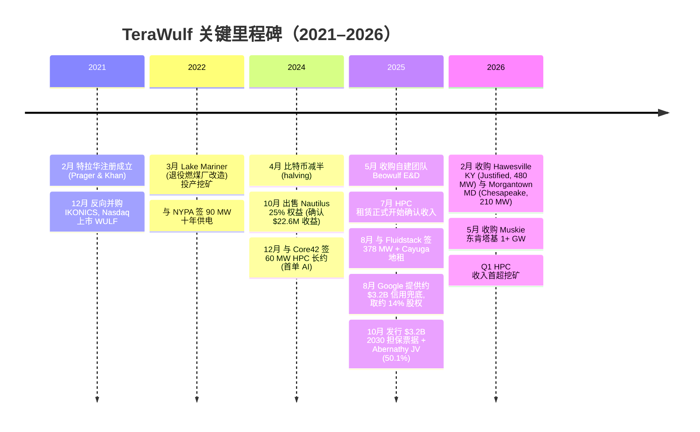
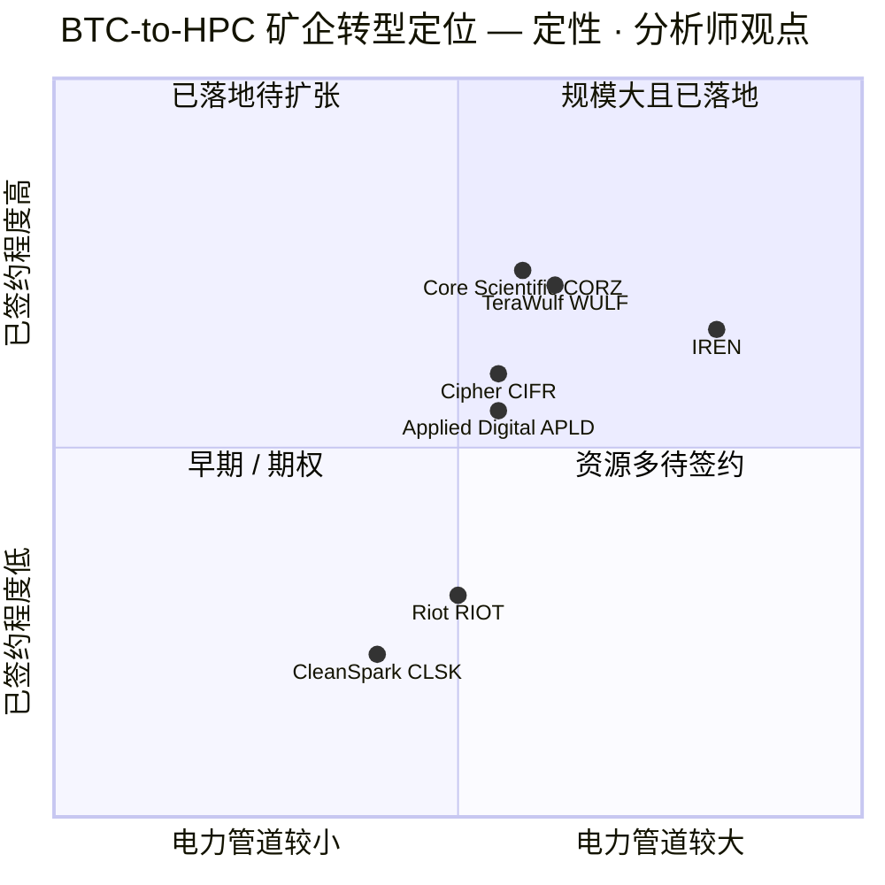
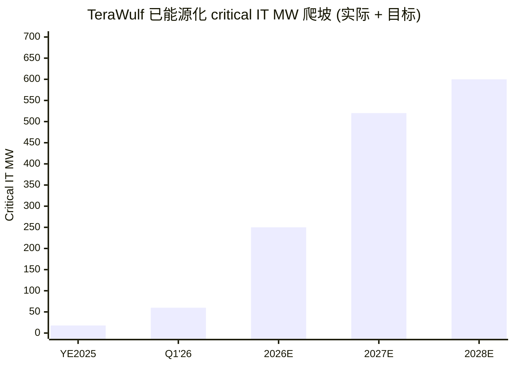

# TeraWulf Inc.（NASDAQ: WULF）公司研究报告

> **本报告语言为简体中文（默认）。技术 / 财务 / 行业术语保留英文原词并附中文释义。**
> **截至日期（as of）：2026-06-14｜股价为 2026-06-12 收盘。**
> 本报告以公司一手资料为主（SEC 10-K / 10-Q / 8-K + 公司新闻稿 + IR 材料），辅以本地券商研报库（`db/zsxq.db`）的卖方观点。所有卖方评级 / 目标价 / 预测均标注 `*分析师观点：*`，绝不与 filing 引用混淆。

---

## 投资摘要表头（Investment Summary）— *分析师观点（本报告观点）*

| 项目 | 数值 |
|---|---|
| **评级 / Rating** | **中性 / 持有（Hold / Neutral）— 高风险 / 投机性（speculative）** |
| **12 个月目标价 / Price Target（base）** | **US$30** |
| 当前股价（2026-06-12 收盘） | US$26.06 |
| 隐含上行 / 下行 | **+15%**（base）｜牛市 +123%｜熊市 −54% |
| 牛 / 基 / 熊（Bull / Base / Bear PT） | **US$58 / US$30 / US$12** |
| 估值方法（valuation method） | 对已签约 522 MW 的 2027–28E **Adjusted EBITDA** 给 16–18× **EV/EBITDA**，叠加对 ~1,500 MW 去风险化管道（pipeline）按 ~$3/watt 的部分价值 |
| 市值 / Market cap | ≈ US$12.9B |
| 52 周区间 | US$3.40 – US$27.78 |
| 股本（current shares） | ≈ 495.5M 股（2026 年 4 月增发后） |
| Ticker / Exchange | NASDAQ: WULF |

**论点支柱（thesis pillars，*分析师观点*）：**

1. **从"濒死矿企"到"AI 算力地产商"的重定价已基本完成。** 过去 12 个月股价从 $3.40 涨到 $26（约 7.6 倍），市场已把"比特币矿工转型 AI 数据中心包租公"的故事大幅提前定价；继续上行需要把 ~3 GW 电力管道真正转化为已签约、投资级增信的长约。
2. **已签约 522 MW critical IT + Google 兜底是真实且稀缺的资产。** Fluidstack（Google 增信）与 Core42 的 10–25 年净租约提供长久期、合同化现金流，且电力 / 并网资源在 AI 算力供给短缺背景下极为稀缺——这是 WULF 区别于普通矿企的护城河。
3. **资产负债表高杠杆 + 客户高集中 + GAAP 持续亏损是最大约束。** $5.7B 债务本金、$140M 薄股东权益、单一租户贡献 Q1'26 全部 HPC 收入、Google 认股权证非现金重估每季扭曲损益——任何执行延迟或比特币崩盘都会被杠杆放大。
4. **我们比卖方更谨慎。** 摩根士丹利（OW，PT $66.50）与伯恩斯坦（Outperform，PT $36）均看多；我们 base $30 低于二者，原因是只给未签约管道部分（partial）价值——管道是真实期权，但多在 2028+ 兑现，且融资 / 摊薄风险高。

---

## 目录

1. [公司概览](#1-公司概览)
   - 1A. [估值快照与目标价（决策层）](#1a-估值快照与目标价决策层)
   - 1B. [GF Score 基本面评分](#1b-gf-score-基本面评分)
2. [估值与目标价（远期模型 · PT 推导 · 卖方观点演变）](#2-估值与目标价)
3. [公司历史](#3-公司历史)
4. [管理团队](#4-管理团队)
5. [产品与服务](#5-产品与服务)
6. [客户与上市策略](#6-客户与上市策略)
7. [行业概览](#7-行业概览)
8. [竞争格局](#8-竞争格局)
9. [市场机会](#9-市场机会)
10. [风险评估](#10-风险评估)
    - 9.5 [关键争论与催化剂](#95-关键争论与催化剂)
11. [投资人视角评分（Section 10 lenses）](#11-投资人视角评分)
12. [参考资料](#12-参考资料)

---

## 1. 公司概览

**论点先行（BLUF）。** TeraWulf 是一家正在从比特币挖矿（bitcoin mining）转型为 **AI 高性能计算（HPC, high-performance computing）数据中心包租公**的美国数字基础设施公司，其 FY2025 10-K 开篇即自我定义为"垂直整合的、专为支持 HPC 工作负载（含 AI、机器学习与高级云应用）而建的美国大规模数字基础设施的所有者、开发者与运营者"（[TeraWulf FY2025 10-K, Item 1 Business — Overview](https://www.sec.gov/Archives/edgar/data/1083301/000108330126000031/wulf-20251231.htm)）。我们给予**中性 / 持有（高风险）**评级、12 个月 base 目标价 **$30**：已签约的 522 MW critical IT 长约 + Google 的 ~$3.2B 信用兜底构成真实、稀缺、长久期的资产底盘，但 7.6 倍的股价涨幅已大幅 price-in 这一转型，剩余上行高度依赖把 ~3 GW 未签约电力管道兑现为长约——而后者多在 2028 年后、且面对 $5.7B 杠杆与持续摊薄。

公司核心商业模式是"**净租约（net lease）数据中心托管**"：WULF 建好带供电、冷却的机房（powered shell），AI 客户自备 GPU 入驻，签 10–25 年保底租约，电力等可变成本按表 pass-through 给租户。FY2025，公司首次确认 HPC 租赁收入 $16.9M，同时仍从比特币挖矿获取约 90% 的收入（[TeraWulf FY2025 10-K, Item 7 MD&A — Revenue](https://www.sec.gov/Archives/edgar/data/1083301/000108330126000031/wulf-20251231.htm)）。10-K 明确：虽然公司目前多数收入来自比特币挖矿，"**HPC hosting is now the Company's primary growth driver and operating focus**"（HPC 托管已是公司主要增长驱动与运营重心）。

下面这张 FY2025 收入表 Sankey 直观显示了 WULF 当前的"双引擎"结构与 GAAP 巨亏的成因：$168.5M 的收入中 $151.6M 来自挖矿、$16.9M 来自 HPC，而 $661.4M 的净亏损里有 $429.8M 是 **Google 认股权证 / 衍生品的非现金重估损失**——经营层面的亏损约为 $186M（[TeraWulf FY2025 10-K, Item 8 — Consolidated Statements of Operations](https://www.sec.gov/Archives/edgar/data/1083301/000108330126000031/wulf-20251231.htm)）。

<svg xmlns="http://www.w3.org/2000/svg" viewBox="0 0 1000 560" width="1000" height="560" role="img" aria-label="income statement Sankey"><rect x="0" y="0" width="1000" height="560" fill="#ffffff"/>
<text x="20.00" y="30.00" text-anchor="start" font-family="Helvetica,Arial,sans-serif" font-size="15" font-weight="700" fill="#1f2933">TeraWulf 收入表 Sankey — FY2025 (US$M)</text>
<path d="M 700.00,-66.61 C 754.00,-66.61 754.00,288.00 808.00,288.00 L 808.00,290.00 C 754.00,290.00 754.00,-64.61 700.00,-64.61 Z" fill="#86efac" fill-opacity="0.55"/>
<path d="M 576.00,-59.61 C 630.00,-59.61 630.00,-66.61 684.00,-66.61 L 684.00,-64.61 C 630.00,-64.61 630.00,-57.61 576.00,-57.61 Z" fill="#86efac" fill-opacity="0.55"/>
<path d="M 576.00,-43.61 C 630.00,-43.61 630.00,-50.61 684.00,-50.61 L 684.00,319.55 C 630.00,319.55 630.00,326.55 576.00,326.55 Z" fill="#fca5a5" fill-opacity="0.55"/>
<path d="M 576.00,326.55 C 630.00,326.55 630.00,333.55 684.00,333.55 L 684.00,644.61 C 630.00,644.61 630.00,637.61 576.00,637.61 Z" fill="#fca5a5" fill-opacity="0.55"/>
<path d="M 452.00,71.00 C 506.00,71.00 506.00,-59.61 560.00,-59.61 L 560.00,-57.61 C 506.00,-57.61 506.00,73.00 452.00,73.00 Z" fill="#86efac" fill-opacity="0.55"/>
<path d="M 452.00,73.00 C 506.00,73.00 506.00,-43.61 560.00,-43.61 L 560.00,637.61 C 506.00,637.61 506.00,754.21 452.00,754.21 Z" fill="#fca5a5" fill-opacity="0.55"/>
<path d="M 204.00,71.00 C 258.00,71.00 258.00,78.00 312.00,78.00 L 312.00,457.67 C 258.00,457.67 258.00,450.67 204.00,450.67 Z" fill="#93c5fd" fill-opacity="0.55"/>
<path d="M 328.00,78.00 C 382.00,78.00 382.00,71.00 436.00,71.00 L 436.00,285.88 C 382.00,285.88 382.00,292.88 328.00,292.88 Z" fill="#86efac" fill-opacity="0.55"/>
<path d="M 328.00,292.88 C 382.00,292.88 382.00,299.88 436.00,299.88 L 436.00,507.00 C 382.00,507.00 382.00,500.00 328.00,500.00 Z" fill="#fca5a5" fill-opacity="0.55"/>
<path d="M 204.00,464.67 C 258.00,464.67 258.00,457.67 312.00,457.67 L 312.00,500.00 C 258.00,500.00 258.00,507.00 204.00,507.00 Z" fill="#93c5fd" fill-opacity="0.55"/>
<rect x="188.00" y="71.00" width="16" height="379.67" rx="1.5" fill="#2563eb"/>
<rect x="188.00" y="464.67" width="16" height="42.33" rx="1.5" fill="#2563eb"/>
<rect x="312.00" y="78.00" width="16" height="422.00" rx="1.5" fill="#1e3a8a"/>
<rect x="436.00" y="71.00" width="16" height="214.88" rx="1.5" fill="#15803d"/>
<rect x="436.00" y="299.88" width="16" height="207.12" rx="1.5" fill="#dc2626"/>
<rect x="560.00" y="-59.61" width="16" height="2.00" rx="1.5" fill="#15803d"/>
<rect x="560.00" y="-43.61" width="16" height="681.21" rx="1.5" fill="#dc2626"/>
<rect x="684.00" y="-66.61" width="16" height="2.00" rx="1.5" fill="#15803d"/>
<rect x="684.00" y="-50.61" width="16" height="370.16" rx="1.5" fill="#dc2626"/>
<rect x="684.00" y="333.55" width="16" height="311.05" rx="1.5" fill="#dc2626"/>
<rect x="808.00" y="288.00" width="16" height="2.00" rx="1.5" fill="#15803d"/>
<text x="179.00" y="257.84" text-anchor="end" font-family="Helvetica,Arial,sans-serif" font-size="11.5" font-weight="700" fill="#1f2933">Digital Asset Mining 比特币挖矿</text>
<text x="179.00" y="270.84" text-anchor="end" font-family="Helvetica,Arial,sans-serif" font-size="10" font-weight="400" fill="#52606d">US$151.6M  (90.0%)</text>
<text x="179.00" y="482.84" text-anchor="end" font-family="Helvetica,Arial,sans-serif" font-size="11.5" font-weight="700" fill="#1f2933">HPC Leasing AI租赁</text>
<text x="179.00" y="495.84" text-anchor="end" font-family="Helvetica,Arial,sans-serif" font-size="10" font-weight="400" fill="#52606d">US$16.9M  (10.0%)</text>
<rect x="331.00" y="60.00" width="125.70" height="26" rx="2" fill="#ffffff" fill-opacity="0.72"/>
<text x="334.00" y="72.00" text-anchor="start" font-family="Helvetica,Arial,sans-serif" font-size="11.5" font-weight="700" fill="#1f2933">Revenue</text>
<text x="334.00" y="85.00" text-anchor="start" font-family="Helvetica,Arial,sans-serif" font-size="10" font-weight="400" fill="#52606d">US$168.5M  (100.0%)</text>
<rect x="455.00" y="53.00" width="113.10" height="26" rx="2" fill="#ffffff" fill-opacity="0.72"/>
<text x="458.00" y="65.00" text-anchor="start" font-family="Helvetica,Arial,sans-serif" font-size="11.5" font-weight="700" fill="#1f2933">Gross Profit</text>
<text x="458.00" y="78.00" text-anchor="start" font-family="Helvetica,Arial,sans-serif" font-size="10" font-weight="400" fill="#52606d">US$85.8M  (50.9%)</text>
<rect x="455.00" y="281.88" width="144.60" height="26" rx="2" fill="#ffffff" fill-opacity="0.72"/>
<text x="458.00" y="293.88" text-anchor="start" font-family="Helvetica,Arial,sans-serif" font-size="11.5" font-weight="700" fill="#1f2933">Cost of Revenue (COGS)</text>
<text x="458.00" y="306.88" text-anchor="start" font-family="Helvetica,Arial,sans-serif" font-size="10" font-weight="400" fill="#52606d">US$82.7M  (49.1%)</text>
<rect x="579.00" y="-77.61" width="138.30" height="26" rx="2" fill="#ffffff" fill-opacity="0.72"/>
<text x="582.00" y="-65.61" text-anchor="start" font-family="Helvetica,Arial,sans-serif" font-size="11.5" font-weight="700" fill="#1f2933">Operating Income</text>
<text x="582.00" y="-52.61" text-anchor="start" font-family="Helvetica,Arial,sans-serif" font-size="10" font-weight="400" fill="#52606d">-US$186.2M  (-110.5%)</text>
<rect x="579.00" y="-52.61" width="150.90" height="26" rx="2" fill="#ffffff" fill-opacity="0.72"/>
<text x="582.00" y="-40.61" text-anchor="start" font-family="Helvetica,Arial,sans-serif" font-size="11.5" font-weight="700" fill="#1f2933">Total Operating Expense</text>
<text x="582.00" y="-27.61" text-anchor="start" font-family="Helvetica,Arial,sans-serif" font-size="10" font-weight="400" fill="#52606d">US$272.0M  (161.4%)</text>
<rect x="703.00" y="-84.61" width="138.30" height="26" rx="2" fill="#ffffff" fill-opacity="0.72"/>
<text x="706.00" y="-72.61" text-anchor="start" font-family="Helvetica,Arial,sans-serif" font-size="11.5" font-weight="700" fill="#1f2933">Pretax Income</text>
<text x="706.00" y="-59.61" text-anchor="start" font-family="Helvetica,Arial,sans-serif" font-size="10" font-weight="400" fill="#52606d">-US$661.3M  (-392.5%)</text>
<rect x="703.00" y="-59.61" width="119.40" height="26" rx="2" fill="#ffffff" fill-opacity="0.72"/>
<text x="706.00" y="-47.61" text-anchor="start" font-family="Helvetica,Arial,sans-serif" font-size="11.5" font-weight="700" fill="#1f2933">SG&amp;A</text>
<text x="706.00" y="-34.61" text-anchor="start" font-family="Helvetica,Arial,sans-serif" font-size="10" font-weight="400" fill="#52606d">US$147.8M  (87.7%)</text>
<rect x="703.00" y="315.55" width="119.40" height="26" rx="2" fill="#ffffff" fill-opacity="0.72"/>
<text x="706.00" y="327.55" text-anchor="start" font-family="Helvetica,Arial,sans-serif" font-size="11.5" font-weight="700" fill="#1f2933">Other OpEx</text>
<text x="706.00" y="340.55" text-anchor="start" font-family="Helvetica,Arial,sans-serif" font-size="10" font-weight="400" fill="#52606d">US$124.2M  (73.7%)</text>
<text x="833.00" y="286.00" text-anchor="start" font-family="Helvetica,Arial,sans-serif" font-size="11.5" font-weight="700" fill="#1f2933">Net Income</text>
<text x="833.00" y="299.00" text-anchor="start" font-family="Helvetica,Arial,sans-serif" font-size="10" font-weight="400" fill="#52606d">-US$661.4M  (-392.5%)</text>
<text x="500.00" y="530.00" text-anchor="middle" font-family="Helvetica,Arial,sans-serif" font-size="10" font-weight="400" font-style="italic" fill="#8a97a3">经营亏损 $186M；净亏损 $661M 中 $429.8M 为 Google 认股权证非现金重估、$41M 为净利息</text>
<text x="500.00" y="544.00" text-anchor="middle" font-family="Helvetica,Arial,sans-serif" font-size="10" font-weight="400" fill="#52606d">Source: TeraWulf FY2025 10-K (filed 2026-02-27), Items 7 &amp; 8</text>
</svg>

FY2025 公司总收入 $168.5M（同比 +20%，FY2024 为 $140.1M），其中比特币挖矿（digital asset）收入 $151.6M、HPC 租赁收入 $16.9M，占比 90% / 10%（[TeraWulf FY2025 10-K, Item 7 MD&A — Revenue table](https://www.sec.gov/Archives/edgar/data/1083301/000108330126000031/wulf-20251231.htm)）。挖矿收入同比仅增 $11.5M，主要因 2025 年比特币均价升至约 $101,658（vs 2024 年 $65,824），但 2024 年 4 月减半（halving）与全网算力上升使年挖币量从 2,177 枚降至 1,496 枚——量价对冲。下面的分部收入饼图与历史柱图显示了收入结构的快速迁移。

<svg xmlns="http://www.w3.org/2000/svg" viewBox="0 0 720 460" width="720" height="460" role="img" aria-label="revenue donut"><rect x="0" y="0" width="720" height="460" fill="#ffffff"/>
<text x="20.00" y="30.00" text-anchor="start" font-family="Helvetica,Arial,sans-serif" font-size="15" font-weight="700" fill="#1f2933">TeraWulf FY2025 营收结构 (按分部, US$M)</text>
<path d="M 288.00,107.20 A 132 132 0 1 1 210.21,132.55 L 242.04,176.18 A 78 78 0 1 0 288.00,161.20 Z" fill="#2563eb"/>
<path d="M 210.21,132.55 A 132 132 0 0 1 288.00,107.20 L 288.00,161.20 A 78 78 0 0 0 242.04,176.18 Z" fill="#15803d"/>
<text x="288.00" y="235.20" text-anchor="middle" font-family="Helvetica,Arial,sans-serif" font-size="18" font-weight="800" fill="#1f2933">WULF</text>
<text x="288.00" y="255.20" text-anchor="middle" font-family="Helvetica,Arial,sans-serif" font-size="13" font-weight="600" fill="#52606d">US$168.5M</text>
<text x="288.00" y="271.20" text-anchor="middle" font-family="Helvetica,Arial,sans-serif" font-size="10" font-weight="400" fill="#8a97a3">total</text>
<line x1="330.77" y1="370.41" x2="346.77" y2="370.41" stroke="#2563eb" stroke-width="1.4"/>
<text x="350.77" y="368.41" text-anchor="start" font-family="Helvetica,Arial,sans-serif" font-size="11" font-weight="700" fill="#1f2933">Digital Asset Mining 比特币挖矿</text>
<text x="350.77" y="382.41" text-anchor="start" font-family="Helvetica,Arial,sans-serif" font-size="10" font-weight="400" fill="#52606d">US$151.6M  (90.0%)</text>
<line x1="245.23" y1="107.99" x2="229.23" y2="107.99" stroke="#15803d" stroke-width="1.4"/>
<text x="225.23" y="105.99" text-anchor="end" font-family="Helvetica,Arial,sans-serif" font-size="11" font-weight="700" fill="#1f2933">HPC Leasing AI数据中心租赁</text>
<text x="225.23" y="119.99" text-anchor="end" font-family="Helvetica,Arial,sans-serif" font-size="10" font-weight="400" fill="#52606d">US$16.9M  (10.0%)</text>
<text x="360.00" y="444.00" text-anchor="middle" font-family="Helvetica,Arial,sans-serif" font-size="10" font-weight="400" fill="#52606d">Source: TeraWulf FY2025 10-K, Note 19 Segment Reporting</text>
</svg>

<svg xmlns="http://www.w3.org/2000/svg" viewBox="0 0 860 470" width="860" height="470" role="img" aria-label="historical revenue bars"><rect x="0" y="0" width="860" height="470" fill="#ffffff"/>
<text x="20.00" y="30.00" text-anchor="start" font-family="Helvetica,Arial,sans-serif" font-size="15" font-weight="700" fill="#1f2933">TeraWulf 分部营收历史 FY2023–2025 (US$M)</text>
<rect x="20.00" y="44" width="11" height="11" rx="2" fill="#2563eb"/>
<text x="36.00" y="53.00" text-anchor="start" font-family="Helvetica,Arial,sans-serif" font-size="10.5" font-weight="400" fill="#1f2933">Digital Asset Mining 比特币挖矿</text>
<rect x="221.60" y="44" width="11" height="11" rx="2" fill="#15803d"/>
<text x="237.60" y="53.00" text-anchor="start" font-family="Helvetica,Arial,sans-serif" font-size="10.5" font-weight="400" fill="#1f2933">HPC Leasing AI租赁</text>
<line x1="70" y1="412.00" x2="834" y2="412.00" stroke="#eceff2" stroke-width="1"/>
<text x="64.00" y="415.00" text-anchor="end" font-family="Helvetica,Arial,sans-serif" font-size="9.5" font-weight="400" fill="#52606d">US$0</text>
<line x1="70" y1="345.20" x2="834" y2="345.20" stroke="#eceff2" stroke-width="1"/>
<text x="64.00" y="348.20" text-anchor="end" font-family="Helvetica,Arial,sans-serif" font-size="9.5" font-weight="400" fill="#52606d">US$36.4M</text>
<line x1="70" y1="278.40" x2="834" y2="278.40" stroke="#eceff2" stroke-width="1"/>
<text x="64.00" y="281.40" text-anchor="end" font-family="Helvetica,Arial,sans-serif" font-size="9.5" font-weight="400" fill="#52606d">US$72.8M</text>
<line x1="70" y1="211.60" x2="834" y2="211.60" stroke="#eceff2" stroke-width="1"/>
<text x="64.00" y="214.60" text-anchor="end" font-family="Helvetica,Arial,sans-serif" font-size="9.5" font-weight="400" fill="#52606d">US$109.2M</text>
<line x1="70" y1="144.80" x2="834" y2="144.80" stroke="#eceff2" stroke-width="1"/>
<text x="64.00" y="147.80" text-anchor="end" font-family="Helvetica,Arial,sans-serif" font-size="9.5" font-weight="400" fill="#52606d">US$145.6M</text>
<line x1="70" y1="78.00" x2="834" y2="78.00" stroke="#eceff2" stroke-width="1"/>
<text x="64.00" y="81.00" text-anchor="end" font-family="Helvetica,Arial,sans-serif" font-size="9.5" font-weight="400" fill="#52606d">US$182.0M</text>
<rect x="123.48" y="284.99" width="147.71" height="127.01" fill="#2563eb"/>
<rect x="123.48" y="284.99" width="147.71" height="0.00" fill="#15803d"/>
<text x="197.33" y="428.00" text-anchor="middle" font-family="Helvetica,Arial,sans-serif" font-size="10" font-weight="400" fill="#52606d">2023</text>
<rect x="378.15" y="154.87" width="147.71" height="257.13" fill="#2563eb"/>
<rect x="378.15" y="154.87" width="147.71" height="0.00" fill="#15803d"/>
<text x="452.00" y="428.00" text-anchor="middle" font-family="Helvetica,Arial,sans-serif" font-size="10" font-weight="400" fill="#52606d">2024</text>
<rect x="632.81" y="133.76" width="147.71" height="278.24" fill="#2563eb"/>
<rect x="632.81" y="102.74" width="147.71" height="31.02" fill="#15803d"/>
<text x="706.67" y="428.00" text-anchor="middle" font-family="Helvetica,Arial,sans-serif" font-size="10" font-weight="400" fill="#52606d">2025</text>
<text x="430.00" y="454.00" text-anchor="middle" font-family="Helvetica,Arial,sans-serif" font-size="10" font-weight="400" fill="#52606d">Source: TeraWulf FY2025 10-K, Note 19 Segment Reporting (revenue recast)</text>
</svg>

**关键的拐点出现在 2026 年一季度：HPC 租赁收入（$21.0M）首次超过挖矿收入（$13.0M）。** Q1'26 总收入 $34.0M（与 Q1'25 的 $34.4M 基本持平），但结构彻底翻转——HPC 占比已达 62%，挖矿因机房被改造为 HPC 而萎缩（[TeraWulf Q1 2026 10-Q — Statements of Operations & Note on revenue](https://www.sec.gov/Archives/edgar/data/1083301/000108330126000092/wulf-20260331.htm)）。截至 2026-03-31，Lake Mariner 已能源化（energized）60 MW critical IT 的 HPC 容量（全部为 Core42），较 2025 年底的 18 MW 大幅提升（[TeraWulf Q1 2026 10-Q — Recent Developments](https://www.sec.gov/Archives/edgar/data/1083301/000108330126000092/wulf-20260331.htm)）。

需要强调的"分部 vs GAAP"差异：**在分部层面，WULF 是盈利的**——FY2025 比特币挖矿分部利润 $59.0M + HPC 租赁分部利润 $7.1M = 可报告分部利润 $66.0M；真正吞噬利润、造成 GAAP 巨亏的是公司层面的 SG&A（$147.8M，其中约 $51M 为股权激励 SBC）、折旧 $88.6M、利息 $80.2M，以及 $429.8M 的认股权证非现金重估（[TeraWulf FY2025 10-K, Item 8 — Note 19 Segment Reporting](https://www.sec.gov/Archives/edgar/data/1083301/000108330126000031/wulf-20251231.htm)）。理解这一点是理解 WULF 估值的前提：市场买的不是当下的 GAAP 利润，而是 522 MW 满产后的合同化 EBITDA。

### 1A. 估值快照与目标价（决策层）

**估值快照（Step 2a，截至 2026-06-12）。** WULF 当前市值约 **$12.9B**，企业价值（EV）约 **$14.5B**（市值 + 总债务 $5.17B − 现金 $3.27B − 受限现金 $0.27B）。以 FY2025 TTM 收入 $168M 计，**TTM P/S 约 77×、EV/Sales 约 86×**；因 TTM 调整后 EBITDA 为负（−$23.1M），**EV/EBITDA、P/E 在 TTM 口径下无意义（n/m）**；**P/B 约 92×**（股东权益仅 $140.4M）（[TeraWulf FY2025 10-K, Item 8 — Balance Sheet](https://www.sec.gov/Archives/edgar/data/1083301/000108330126000031/wulf-20251231.htm)；股价 / 市值来自 [Stockanalysis.com — WULF Statistics](https://stockanalysis.com/stocks/wulf/statistics/)）。

**如何解读这组极端倍数（Step 2a 要求）：** 77× 的 TTM P/S、92× 的 P/B 不是错误，而是因为收入与利润严重滞后于已签约产能——市场在为**未来数年的 HPC 收入爬坡**定价（这是高增长行业 + AI 算力主题溢价的典型组合）。换算到**远期口径**，估值回归合理：以我们 FY2027E 调整后 EBITDA ≈ $720M 计，**远期 EV/EBITDA ≈ 20×**；以摩根士丹利 2027E ≈ $885M 计则 ≈ 16×（[*分析师观点：* Morgan Stanley — WULF Power Play, 2026-06-03, p.12](http://xs-macbook-air.local:5001/zsxq/pdf/415288428182558/Morgan%20Stanley-Bitcoin%20Mining%20Data%20Center%20Development%EF%BC%9APower%20Play%EF%BC%9A%20WULF%27s%20Muskie%20and%20CIFR%27s%20Reisel%20McLennan%20Additions%20Increase%20Pipeline%20Value-260603.pdf)）。换言之，按已签约产能成熟期估，WULF 大致是"合理到偏贵"，并不便宜——这正是我们给中性的核心依据之一。

**目标价（*分析师观点*）。** 我们 12 个月 base 目标价 **$30**（+15%），方法为：对已签约 522 MW 满产后（FY2028E）可归属调整后 EBITDA ≈ $850M 给 16× EV/EBITDA（相对 Digital Realty ~22×、Equinix ~23× 的数据中心 REIT 给折价，体现高杠杆 + 单租户集中 + 加密遗留），叠加对 ~1,500 MW 去风险化管道按 ~$3/watt 的部分价值，再按约 550M 摊薄股本折算。**牛市 $58**（+123%）= 能源化加速 + 管道按 ~$8–11.5/watt 充分兑现（趋近 MS 框架）；**熊市 $12**（−54%）= 转型期比特币崩盘 + 建设延迟 / 超支 + 仅给已签约部分 12× + 摊薄。我们坐标**低于卖方共识**（详见 Section 2 卖方观点演变）。

**最该盯紧的两个变量（swing variables）：**（1）**522 MW 的能源化节奏**（2026–27 年——Fluidstack 378 MW 与 Abernathy 168 MW 能否如期在 2026 下半年 / Q4 交付）；（2）**3 GW 管道（Kentucky / Cayuga / Morgantown）转化为已签约、Google 级增信长约的速度与价格**。这两个变量决定了我们究竟落在 base 还是 bull。

### 1B. GF Score 基本面评分

下面的 GF Score（GuruFocus-style）五维评分是**本报告自建的分析叠加层（*分析师观点*），并非 GuruFocus 官方数值，也不附带任何 filing 引用**；每个底层指标的引用在对应维度说明中给出。

<svg xmlns="http://www.w3.org/2000/svg" viewBox="0 0 500 500" width="500" height="500" role="img" aria-label="GF Score radar">
<rect x="0" y="0" width="500" height="500" fill="#ffffff"/>
<text x="20" y="24" font-family="Helvetica,Arial,sans-serif" font-size="15" font-weight="700" fill="#1f2933">GF Score (GuruFocus-style): 54/100</text>
<text x="20" y="41" font-family="Helvetica,Arial,sans-serif" font-size="11" fill="#52606d">51–70 Poor future performance potential</text>
<polygon points="250.0,88.0 392.7,191.6 338.2,359.4 161.8,359.4 107.3,191.6" fill="#e9f5ec" stroke="none"/>
<polygon points="250.0,208.0 278.5,228.7 267.6,262.3 232.4,262.3 221.5,228.7" fill="none" stroke="#c5d3cb" stroke-width="1"/>
<polygon points="250.0,178.0 307.1,219.5 285.3,286.5 214.7,286.5 192.9,219.5" fill="none" stroke="#c5d3cb" stroke-width="1"/>
<polygon points="250.0,148.0 335.6,210.2 302.9,310.8 197.1,310.8 164.4,210.2" fill="none" stroke="#c5d3cb" stroke-width="1"/>
<polygon points="250.0,118.0 364.1,200.9 320.5,335.1 179.5,335.1 135.9,200.9" fill="none" stroke="#c5d3cb" stroke-width="1"/>
<polygon points="250.0,88.0 392.7,191.6 338.2,359.4 161.8,359.4 107.3,191.6" fill="none" stroke="#c5d3cb" stroke-width="1.3"/>
<line x1="250" y1="238" x2="161.8" y2="359.4" stroke="#cfdad3" stroke-width="1"/>
<text x="146.5" y="392.4" text-anchor="end" font-family="Helvetica,Arial,sans-serif" font-size="11.5" font-weight="600" fill="#1f2933">Financial Strength</text>
<text x="146.5" y="405.4" text-anchor="end" font-family="Helvetica,Arial,sans-serif" font-size="9.5" fill="#52606d">财务实力</text>
<text x="214.7" y="280.5" text-anchor="middle" font-family="Helvetica,Arial,sans-serif" font-size="10.5" font-weight="700" fill="#1f2933">4</text>
<line x1="250" y1="238" x2="250.0" y2="88.0" stroke="#cfdad3" stroke-width="1"/>
<text x="250.0" y="58.0" text-anchor="middle" font-family="Helvetica,Arial,sans-serif" font-size="11.5" font-weight="600" fill="#1f2933">Profitability</text>
<text x="250.0" y="71.0" text-anchor="middle" font-family="Helvetica,Arial,sans-serif" font-size="9.5" fill="#52606d">盈利能力</text>
<text x="250.0" y="187.0" text-anchor="middle" font-family="Helvetica,Arial,sans-serif" font-size="10.5" font-weight="700" fill="#1f2933">3</text>
<line x1="250" y1="238" x2="107.3" y2="191.6" stroke="#cfdad3" stroke-width="1"/>
<text x="82.6" y="183.6" text-anchor="end" font-family="Helvetica,Arial,sans-serif" font-size="11.5" font-weight="600" fill="#1f2933">Growth</text>
<text x="82.6" y="196.6" text-anchor="end" font-family="Helvetica,Arial,sans-serif" font-size="9.5" fill="#52606d">成长性</text>
<text x="121.6" y="190.3" text-anchor="middle" font-family="Helvetica,Arial,sans-serif" font-size="10.5" font-weight="700" fill="#1f2933">9</text>
<line x1="250" y1="238" x2="392.7" y2="191.6" stroke="#cfdad3" stroke-width="1"/>
<text x="417.4" y="183.6" text-anchor="start" font-family="Helvetica,Arial,sans-serif" font-size="11.5" font-weight="600" fill="#1f2933">GF Value</text>
<text x="417.4" y="196.6" text-anchor="start" font-family="Helvetica,Arial,sans-serif" font-size="9.5" fill="#52606d">估值</text>
<text x="278.5" y="222.7" text-anchor="middle" font-family="Helvetica,Arial,sans-serif" font-size="10.5" font-weight="700" fill="#1f2933">2</text>
<line x1="250" y1="238" x2="338.2" y2="359.4" stroke="#cfdad3" stroke-width="1"/>
<text x="353.5" y="392.4" text-anchor="start" font-family="Helvetica,Arial,sans-serif" font-size="11.5" font-weight="600" fill="#1f2933">Momentum</text>
<text x="353.5" y="405.4" text-anchor="start" font-family="Helvetica,Arial,sans-serif" font-size="9.5" fill="#52606d">动量</text>
<text x="329.4" y="341.2" text-anchor="middle" font-family="Helvetica,Arial,sans-serif" font-size="10.5" font-weight="700" fill="#1f2933">9</text>
<polygon points="250.0,193.0 278.5,228.7 329.4,347.2 214.7,286.5 121.6,196.3" fill="#2e8b57" fill-opacity="0.34" stroke="#2e8b57" stroke-width="2"/>
<circle cx="214.7" cy="286.5" r="2.6" fill="#2e8b57"/>
<circle cx="250.0" cy="193.0" r="2.6" fill="#2e8b57"/>
<circle cx="121.6" cy="196.3" r="2.6" fill="#2e8b57"/>
<circle cx="278.5" cy="228.7" r="2.6" fill="#2e8b57"/>
<circle cx="329.4" cy="347.2" r="2.6" fill="#2e8b57"/>
<text x="250" y="470" text-anchor="middle" font-family="Helvetica,Arial,sans-serif" font-size="9.5" fill="#52606d">Source: TeraWulf FY2025 10-K + Q1'26 10-Q · Yahoo Finance · indicators.db, as of 2026-06-14</text>
<text x="250" y="485" text-anchor="middle" font-family="Helvetica,Arial,sans-serif" font-size="9" fill="#52606d">GF Score = independent analyst rubric (*Analyst view:*) — not GuruFocus™ official number</text>
</svg>

**综合 GF Score：54 / 100（band：51–70，"较弱的未来表现潜力 / Poor future performance potential"）。** 各维度评分理由如下（*分析师观点*）：

- **Financial Strength（财务实力）= 4/10。** 一方面手握 $3.27B 现金 + $0.27B 受限现金，流动性充裕；另一方面 $5.17B 债务本金（$3.2B 2030 担保票据 @7.75% + $2.5B 可转债）压在仅 $140.4M 的薄股东权益之上，净财务负债约 $1.6B，且 TTM 调整后 EBITDA 为负使利息覆盖为负（[TeraWulf FY2025 10-K, Item 8 — Balance Sheet & Note 11 Debt](https://www.sec.gov/Archives/edgar/data/1083301/000108330126000031/wulf-20251231.htm)）。现金垫子救了评分，但高杠杆 + 薄权益压住上限，给 4。
- **Profitability（盈利能力）= 3/10。** GAAP 层面深度亏损（FY2025 净亏 $661.4M、EPS −$1.66；Q1'26 净亏 $427.7M、EPS −$1.01），ROE / ROIC 为负；但分部层面盈利（$66.0M）、HPC gross margin 约 85%（[TeraWulf FY2025 10-K, Item 8 — Note 19 Segment Reporting](https://www.sec.gov/Archives/edgar/data/1083301/000108330126000031/wulf-20251231.htm)）。指标驱动的评分被负净利率 / 负 ROE 拉低，给 3。
- **Growth（成长性）= 9/10。** 这是最突出的维度：FY2023→2025 收入 $69.2M→$140.1M→$168.5M；HPC 收入从 0→$16.9M→Q1'26 单季 $21.0M，且卖方模型把 HPC 收入推到 2027 年的约 $900M+（[*分析师观点：* Morgan Stanley — WULF Power Play, 2026-06-03, p.12](http://xs-macbook-air.local:5001/zsxq/pdf/415288428182558/Morgan%20Stanley-Bitcoin%20Mining%20Data%20Center%20Development%EF%BC%9APower%20Play%EF%BC%9A%20WULF%27s%20Muskie%20and%20CIFR%27s%20Reisel%20McLennan%20Additions%20Increase%20Pipeline%20Value-260603.pdf)）。增长跑道极陡，给 9。
- **GF Value（估值，越高越便宜）= 2/10。** 7.6 倍上涨后，TTM 倍数极贵（P/S 77×、P/B 92×），远期口径（~16–20× EV/EBITDA）也称不上便宜（[Stockanalysis.com — WULF Statistics](https://stockanalysis.com/stocks/wulf/statistics/)）。给 2。
- **Momentum（动量）= 9/10。** 52 周从 $3.40 涨到 $26（约 +665%），接近 52 周高点 $27.78，远在 200 日均线之上（[Stockanalysis.com — WULF](https://stockanalysis.com/stocks/wulf/)）。动量极强，给 9。

**评分的内在张力**正是 WULF 的写照：顶级的成长与动量（9/9）被薄弱的财务实力、GAAP 亏损与昂贵估值（4/3/2）拖累——一只"故事极好、质量与价格存疑"的股票。这与我们的中性评级一致。

---

## 2. 估值与目标价

### 远期财务模型（FY2026–2028E，*分析师观点*）

下表为我们自建的远期模型。**每一格预测均为分析师观点，绝不附 filing 引用**；各驱动的外部依据（filing 分部数据 + 管理层指引 + 行业预测）在文中标注。

| US$M（除注明） | FY2025A | FY2026E | FY2027E | FY2028E |
|---|---|---|---|---|
| 比特币挖矿收入（digital asset） | 151.6 | ~70 | ~30 | ~10 |
| HPC 租赁收入 | 16.9 | ~290 | ~820 | ~1,050 |
| **总收入** | **168.5** | **~360** | **~850** | **~1,060** |
| 收入 YoY | +20% | +114% | +136% | +25% |
| **调整后 EBITDA（Adj. EBITDA）** | **(23.1)** | **~180** | **~720** | **~900** |
| Adj. EBITDA margin | 负 | ~50% | ~85% | ~85% |
| GAAP EPS | (1.66) | 负 | 负 | ~盈亏平衡 |

**建模逻辑（segment mix shift，每条线各自路径）：**（1）**HPC 收入**随 522 MW critical IT 的能源化逐季爬坡——YE2025 18 MW→Q1'26 60 MW→2026 年 Fluidstack 的 378 MW 与 Abernathy 168 MW 陆续交付（[TeraWulf FY2025 10-K, Item 1 — Akela / Abernathy](https://www.sec.gov/Archives/edgar/data/1083301/000108330126000031/wulf-20251231.htm)）→2027 年 522 MW 大体满产。净租约经济性约 $1.0–1.3M 净租金 / critical IT MW，gross margin 85%+（[*分析师观点：* Bernstein — Emerging AI Infra Initiating coverage, 2026-06-03](http://xs-macbook-air.local:5001/zsxq/pdf/585411214454144/Bernstein-Global%20Digital%20Assets%EF%BC%9AEmerging%20AI%20Infra~Initiating%20coverage%20%EF%BC%88TeraWulf%EF%BC%8C%20Cipher%20Digital%EF%BC%89%EF%BC%9A%20The%20Power%20Landlords%20of%20AI-260603.pdf)）。（2）**挖矿收入**随机房被改造为 HPC 而 2026–2028 逐步关停（[TeraWulf FY2025 10-K, Item 7 — Evolution of Our Business](https://www.sec.gov/Archives/edgar/data/1083301/000108330126000031/wulf-20251231.htm)）。我们的 HPC 爬坡与 EBITDA 略**低于摩根士丹利**（MS 2027E HPC 收入 ~$936M、Adj. EBITDA ~$885M），以反映能源化与融资的执行风险。

注意：即便收入与 EBITDA 大增，**GAAP EPS 在 2028 年前仍预计为负**——因为 $88M+ 的折旧、$80M+ 且攀升的利息、以及 Google 认股权证的逐季非现金重估会持续压低账面净利（[TeraWulf FY2025 10-K, Item 8 — Statements of Operations](https://www.sec.gov/Archives/edgar/data/1083301/000108330126000031/wulf-20251231.htm)）。这也是为什么本名的估值锚必须用 EV/EBITDA 或 value/watt，而非 P/E。

### 目标价推导与"为什么用这个倍数"（show the arithmetic）

**方法：EV/EBITDA（主）+ value/watt SOTP（交叉验证）。**

- **已签约业务（contracted 522 MW）：** FY2028E 可归属 Adj. EBITDA ≈ $850M × **16× EV/EBITDA** = EV ≈ $13.6B。倍数依据——可比数据中心 REIT：Digital Realty（DLR）约 22×、Equinix（EQIX）约 23× EV/EBITDA（[*分析师观点：* Jefferies — Digital Infrastructure, 2026-06-05](http://xs-macbook-air.local:5001/zsxq/pdf/584251128411224/Jefferies-USA%20-%20Digital%20Infrastructure%EF%BC%9AAll%20the%20Data%20Center%20Demand%20in%20the%20World%EF%BC%8C%20Still%20Not%20Enough%20Supply-260605.pdf)）。WULF 给 16× 的折价反映：高杠杆、单租户集中、加密遗留资产、以及租约久期虽长但租户信用弱于纯 hyperscaler 自签。
- **减净债 ≈ $1.6B**（当前净财务负债；现金主要 earmark 用于建设 522 MW）→ 已签约部分股权价值 ≈ $12.0B。
- **管道期权（pipeline optionality）：** ~1,500 MW 去风险化管道（在 Justified 480 MW + Muskie 1,000+ MW + Cayuga 320 MW + Morgantown 中取折扣）× ~$3M/MW（远低于 MS 的 $11.50/watt，体现未签约 + 2028+ 兑现 + 融资风险）≈ $4.5B。
- **合计股权价值 ≈ $16.5B ÷ ~550M 摊薄股本 ≈ $30/股（base）。**

**牛 / 基 / 熊（各自的 swing 假设）：**

| 情景 | PT | vs $26.06 | 核心假设 |
|---|---|---|---|
| **牛市 Bull** | **$58** | **+123%** | 522 MW 提前满产 + 管道按 ~$8–11.5/watt 充分兑现（趋近 MS 框架）+ 倍数维持；接近 MS base $66.50 |
| **基准 Base** | **$30** | **+15%** | 已签约 16× EBITDA + ~1,500 MW 管道按 ~$3/watt 部分计入 |
| **熊市 Bear** | **$12** | **−54%** | 转型期比特币崩盘 + 能源化延迟 / 超支 + 仅已签约 12× + 无管道价值 + 摊薄；接近 MS bear $15 |

风险回报呈**正偏（bull 上行 > bear 下行）**，但 base 上行有限——因为 7.6 倍上涨已 price-in 大量已签约价值。对风险承受力高、聚焦管道期权的投资者，本名可视作**投机性买入**；对多数投资者，我们维持中性。

### 卖方观点演变（Sell-side view evolution）— 机构间分歧显著

> 本节因使用 ≥2 篇 `db/zsxq.db` 券商研报而强制纳入。机械前置（mechanical pre-pass）已先读取只读的 `db/stock_price_target.db`：其中存有 1 条记录——Morgan Stanley，Overweight，PT $66.50，报告日 2026-06-03，报告日股价约 $26.16，隐含上行 +154%（已与 PDF 核对）。

**按机构的观点时间线（per-institute timeline）：**

- **Morgan Stanley（Stephen Byrd）｜2026-06-03｜Overweight｜PT $42 → $66.50（+58%）。** 自我修订（self-revision）：本篇将 PT 从初次覆盖的 $42 上调至 $66.50，bull case $84→$103，bear case $12→$15，触发因素为 **Muskie（东肯塔基 1+ GW）收购**进入管道框架（管道从 1,750 MW 升至 2,550 MW）以及将未签约 MW 的估值假设从 50/50 调整为 **80/20 偏向 hyperscaler 增信经济**。方法为 SOTP / value-per-watt：WULF 隐含 value/watt ~$11.50（仍低于其 $15/watt 预期），capex 收益率假设 17.0%（hyperscaler）/15.0%（neocloud）；2026 定义为"执行之年（Year of Execution）"。PT $66.50 较 2026-06-03 收盘约 $26.16 上行 **+154%**（[*分析师观点：* Morgan Stanley — WULF Power Play, 2026-06-03, p.1, p.11–12](http://xs-macbook-air.local:5001/zsxq/pdf/415288428182558/Morgan%20Stanley-Bitcoin%20Mining%20Data%20Center%20Development%EF%BC%9APower%20Play%EF%BC%9A%20WULF%27s%20Muskie%20and%20CIFR%27s%20Reisel%20McLennan%20Additions%20Increase%20Pipeline%20Value-260603.pdf)）。
- **Bernstein｜2026-06-03/04｜Outperform（增持）｜首次覆盖 PT $36（报告日上行约 +36%）。** 看点：3.8 GW 电力储备（纽约、肯塔基等多州），在手合约总额约 $13B，核心客户 Fluidstack（Google 背书）+ Core42，已签约 522 MW；肯塔基 480 MW 待签约为短期增量。预测 2025 年 AI 收入仅 $14M→2030 年 $1.7B，EBITDA margin 升至 84%，挖矿业务 2026–2028 退出。**估值方法不同**：稳态给 21× EV/EBIT（对标传统 IDC 基建 REIT），以 2030 年成熟盈利折现（[*分析师观点：* Bernstein — Emerging AI Infra Initiating coverage, 2026-06-03](http://xs-macbook-air.local:5001/zsxq/pdf/585411214454144/Bernstein-Global%20Digital%20Assets%EF%BC%9AEmerging%20AI%20Infra~Initiating%20coverage%20%EF%BC%88TeraWulf%EF%BC%8C%20Cipher%20Digital%EF%BC%89%EF%BC%9A%20The%20Power%20Landlords%20of%20AI-260603.pdf)）。
- **Bernstein（行业管线追踪）｜2026-06-10｜维持 WULF Outperform。** 北美数据中心总规划管线升至 324 GW（月环比 +10%）、在建 63 GW；加密矿企（Core Scientific、Riot、TeraWulf）领衔本月 6 GW 新增管道；矿企约 30 GW 规划电力中已向 hyperscalers/neoclouds 签约约 6 GW（>$11B）（[*分析师观点：* Bernstein — Data Center Project Pipeline May'26, 2026-06-10](http://xs-macbook-air.local:5001/zsxq/pdf/584251845111884/Bernstein-US%20Industrials%20%26%20Tech%EF%BC%9A%20The%20Data%20Center%20Project%20Pipeline~Capacity%EF%BC%8C%20Construction%20%26%20Cancellations%20%EF%BC%88May%20%2726%EF%BC%89-260610.pdf)）。

**机构间分歧（cross-institute disagreement）——绝不混为虚假共识。** 两家机构**评级一致看多，但目标价相差约 85%**（$66.50 vs $36），分歧根源是**估值方法与对未签约管道的信任度**：

| 机构 | 日期 | 评级 / PT | 核心论点 | 什么证据能证明其正确 |
|---|---|---|---|---|
| Morgan Stanley | 2026-06-03 | OW / **$66.50** | 给 2,550 MW 全管道以 ~$11.50/watt 的 SOTP 价值；80/20 偏 hyperscaler 经济 | Kentucky / Cayuga 管道签下 Google 级增信长约；value/watt 实现 $11.50+ |
| Bernstein | 2026-06-03 | OP / **$36** | 21× EV/EBIT 折现 **2030 年成熟盈利**；存量订单已反映在股价，新增电力签约才是上行催化 | 2030E AI 收入达 $1.7B、EBITDA margin 84%；挖矿如期退出 |
| **本报告（*分析师观点*）** | 2026-06-14 | **Hold / $30** | 已签约 16× EBITDA + 管道仅给 ~$3/watt 部分价值 | 522 MW 如期满产；但管道兑现慢于 MS 假设、摊薄持续 |

我们坐标**低于二者**——MS 把全管道按高 value/watt 资本化过于激进，Bernstein 的 $36 仍隐含管道顺利签约。我们只给未签约 MW 部分价值，故 base $30。

---

## 3. 公司历史

TeraWulf 于 **2021 年 2 月**在特拉华州注册成立，由 Paul Prager 与 Nazar Khan 联合创立，二人的私人能源公司 **Beowulf Energy（Beowulf Electricity & Data）**是其前身平台（[TeraWulf FY2025 10-K, Item 1 — Corporate Information](https://www.sec.gov/Archives/edgar/data/1083301/000108330126000031/wulf-20251231.htm)）。公司于 **2021 年 12 月 14 日**通过与 IKONICS Corporation 的反向并购登陆 Nasdaq，代码 **WULF**（这也是为何 EDGAR 上该 CIK 的历史可追溯至 2005 年——那是被并购的 IKONICS 的旧档案）。

下方时间线梳理了从挖矿到 AI 算力地产的关键节点：

公司的**战略转型脉络**清晰：以"退役工业 / 能源场址 + 现成并网电力"为底盘，先用比特币挖矿这一灵活负载（flexible load）养活早期基建，再把机房逐步改造为高价值 HPC 托管。2024 年 12 月与 Core42 的首单 AI 长约是分水岭；2025 年 8 月 Fluidstack + Google 的组合则把公司带入"投资级增信的长久期合约"新阶段（[TeraWulf FY2025 10-K, Item 7 — Strategic Transactions](https://www.sec.gov/Archives/edgar/data/1083301/000108330126000031/wulf-20251231.htm)）。2024 年 10 月出售 Nautilus（宾州、核电供电的挖矿合资企业）25% 权益、确认 $22.6M 收益，也标志着公司从"挖矿合资"向"自有 HPC 基建"的资本再配置（[TeraWulf FY2025 10-K, Item 7 — Equity in net income of investee](https://www.sec.gov/Archives/edgar/data/1083301/000108330126000031/wulf-20251231.htm)）。

---

## 4. 管理团队

**Paul Prager — 联合创始人、董事长兼 CEO（自 2021 年 2 月）。** Prager 自 **1990 年**起创立并执掌 **Beowulf Electricity & Data**（私人能源与数字基础设施公司）及其前身，深耕电力发电、基建开发、商品交易与国际航运逾三十年。他是**美国海军学院（U.S. Naval Academy）**毕业生、曾任反潜战军官（anti-submarine warfare officer），退役后在 1980 年代中期的动荡市场中以原油交易员身份起步华尔街；现为美国海军学院基金会投资委员会成员与受托人（[TeraWulf FY2025 10-K, Item 1 — Experienced Management](https://www.sec.gov/Archives/edgar/data/1083301/000108330126000031/wulf-20251231.htm)；[Paul Prager — TeraWulf About / The Org profile](https://www.terawulf.com/about)）。Prager 的电力工程背景是 WULF 自我定位的核心——他在 Muskie 收购新闻稿中直言："TeraWulf 本质上是一家建数字基础设施的电力基础设施公司，而非相反"（[TeraWulf 8-K, 2026-05-26 — Muskie press release](https://www.sec.gov/Archives/edgar/data/1083301/000108330126000109/wulf-20260522.htm)）。

**Nazar Khan — 联合创始人、CTO 兼 COO。** Khan 在 Beowulf Energy 任执行副总裁近 20 年，主导收购与开发；此前任职于 Evercore Partners（投行与私募股权两端），拥有宾夕法尼亚大学（University of Pennsylvania）B.S. 与 B.A. 学位（[Nazar Khan — TeraWulf co-founder bio](https://www.terawulf.com/about)）。

**管理评估（*分析师观点*）。** 团队最稀缺的能力是**电力 / 并网 / 大型能源资产再开发**——这恰是 AI 数据中心当前最紧的瓶颈。2025 年 5 月公司以约 $21.7M 现金 + 或有对价收购自建团队 Beowulf E&D（约 94 名员工随之并入），把开发、建设、运营内部化，强化了执行链条（[TeraWulf FY2025 10-K, Item 7 — Acquisition of Beowulf E&D](https://www.sec.gov/Archives/edgar/data/1083301/000108330126000031/wulf-20251231.htm)）。截至 10-K，公司共有 141 名全职员工，主要分布在纽约与马里兰（[TeraWulf FY2025 10-K, Item 1 — Human Capital](https://www.sec.gov/Archives/edgar/data/1083301/000108330126000031/wulf-20251231.htm)）。需关注治理面的关联交易历史（与 Beowulf 的服务协议、关联方租金）以及高额股权激励（FY2025 SBC $50.9M）对摊薄的影响。

---

## 5. 产品与服务

> **本章是全报告最重要的一章。** WULF 的"产品"不是一个个 SKU，而是**电力 + 土地 + 并网 + 机房 + 冷却**打包成的"powered shell 净租约托管能力"。理解这一点，才能理解后面客户、行业、竞争、TAM 与风险各章。

### 产品定义：什么是"HPC 数据中心净租约托管"

WULF 自己的定义（10-K 原文，verbatim）值得直接引用：

> "Our HPC arrangements are structured as long-term data center leases, typically with base terms ranging from 10 to 25 years, contractual escalators, and renewal and contraction options. Certain projects benefit from investment-grade credit support, materially strengthening the risk profile and durability of contracted revenues."
> （我们的 HPC 安排被结构化为长期数据中心租约，基础期通常 10–25 年，带合同涨租条款与续约 / 缩约选项。某些项目受益于投资级信用支持，显著增强合约收入的风险特征与持久性。）
> — [TeraWulf FY2025 10-K, Item 1 — Business Strategy](https://www.sec.gov/Archives/edgar/data/1083301/000108330126000031/wulf-20251231.htm)

会计上，这些租约按 **ASC 842** 作为经营租赁处理：租户支付**基于电容量（electric capacity）的固定付款** + **可变付款**（电力按表 pass-through、不加价），WULF 在资产可供租户使用时开始确认 HPC 租赁收入（[TeraWulf FY2025 10-K, Item 7 — Critical Accounting Estimates: HPC Leasing](https://www.sec.gov/Archives/edgar/data/1083301/000108330126000031/wulf-20251231.htm)）。FY2025 的 $16.9M HPC 收入拆为：租金（rent）$13.75M + 电力 pass-through $1.40M + 租户 fit-out / 维护 $1.75M（[TeraWulf FY2025 10-K, Item 7 — HPC lease revenue components](https://www.sec.gov/Archives/edgar/data/1083301/000108330126000031/wulf-20251231.htm)）。

### 产品矩阵（10-K verbatim 复刻 + 释义）

下表复刻 10-K 披露的合约 HPC 平台（two primary campuses + 一个管道锚点），所有 MW、租期、租户均为 10-K 原文：

| 园区 / 主体 | 位置 / 电网 | 合约 critical IT | 租户 / 增信 | 租期 | 状态 |
|---|---|---|---|---|---|
| **Lake Mariner（La Lupa）** | Barker, NY / NYISO Zone A | 60 MW | **Core42** | 10 年 + 2×5 年续约 | 2025 起分期交付，Q1'26 已能源化 60 MW |
| **Lake Mariner（Akela）** | Barker, NY / NYISO Zone A | 378 MW | **Fluidstack**（**Google** 增信） | 长期 | 2025 开建，2026 起交付 |
| **Abernathy HPC Campus** | Abernathy, TX / SPP | 168 MW（JV 50.1%） | **Fluidstack USA III**（**Google** 增信） | **25 年** + 涨租 + 缩约选项 | 2026 Q4 交付 |
| **Cayuga Site**（管道） | Lansing, NY | ~320 MW（up to 400 MW gross） | 未签约 | — | 地租已签（2025-08），待许可与开发 |

> **中文释义 / Plain-language gloss：** "critical IT MW"（关键 IT 兆瓦）= 实际可供 GPU 机柜使用的电力容量，是数据中心行业的核心计量单位，区别于含冷却 / 配电损耗的"gross MW"（毛容量）。Lake Mariner 的 La Lupa + Akela 合计 **438 MW** critical IT；加上 Abernathy 按 50.1% 归属的 ~84 MW，公司披露的合约平台总计 **522 MW critical IT**（[TeraWulf FY2025 10-K, Item 7 — Operations Overview](https://www.sec.gov/Archives/edgar/data/1083301/000108330126000031/wulf-20251231.htm)）。

**逐一走读产品族（三段式：物理作用 → 与同类差异 → 战略意义）：**

**① Lake Mariner Data Campus（旗舰）。** 物理作用——建于纽约 Barker 一座**退役燃煤电厂**原址，2022 年 3 月投产，受益于现成的大型输电基础设施；具备先进**液冷（liquid-cooling）**、冗余电气架构，为高密度 GPU 部署优化（[TeraWulf FY2025 10-K, Item 1 — Lake Mariner](https://www.sec.gov/Archives/edgar/data/1083301/000108330126000031/wulf-20251231.htm)）。与同类差异——其 90 MW 来自 **NYPA（纽约电力局）**的十年低成本、低碳 Zone A 电力，电价护城河明显；近期可扩至 ~500 MW gross，经 NYISO 批准后可达 ~750 MW。战略意义——这是公司把"挖矿负载"逐步置换为"HPC 负载"的样板：截至 2025 年底仍有 245 MW 挖矿 + 18 MW HPC，Q1'26 已有两栋矿房被改造为 HPC 支持（[TeraWulf Q1 2026 10-Q — Recent Developments](https://www.sec.gov/Archives/edgar/data/1083301/000108330126000092/wulf-20260331.htm)）。

**② Abernathy HPC Campus（得州，区域多元化）。** 物理作用——168 MW critical IT 满产设计，全部预租给 Fluidstack，25 年租约带涨租与缩约选项。与同类差异——通过 **50.1% 控股的合资企业（FS CS I LLC）**开发，把公司平台从纽约（NYISO）扩展到得州（SPP）西南电力池，降低对单一电力市场 / 监管 / 天气 / 建设时间表的集中度（[TeraWulf FY2025 10-K, Item 7 — Regional Diversification](https://www.sec.gov/Archives/edgar/data/1083301/000108330126000031/wulf-20251231.htm)）。战略意义——证明 Fluidstack/Google 这套"增信 + 净租约"框架可复制到新址。

**③ 比特币挖矿（legacy，灵活负载）。** 物理作用——截至 2025 年底拥有约 54,100 台、运营约 49,400 台 **Bitmain** ASIC 矿机，合计 **9.3 EH/s** 自挖算力，平均能效 17.2 j/th，约占全网算力的 0.9%、日产约 4 枚比特币（[TeraWulf FY2025 10-K, Item 7 — Bitcoin Mining Operations & Share of Global Hashrate](https://www.sec.gov/Archives/edgar/data/1083301/000108330126000031/wulf-20251231.htm)）。与同类差异——管理层在 hour-by-hour 基础上根据电价 vs 固定币奖励决定是否 curtail（限电），并参与需求响应（demand response）项目，FY2025 获 $17.7M 需求响应收益冲减成本。战略意义——挖矿是**正在被有计划退出**的现金引擎：2025 年单枚挖矿成本已升至 $53,681（占挖出比特币价值的 53.0%，vs 2024 年 40.2%），减半后边际经济性恶化，公司明确不再投入增量挖矿资本（[TeraWulf FY2025 10-K, Item 7 — Average Cost of Bitcoin Mined](https://www.sec.gov/Archives/edgar/data/1083301/000108330126000031/wulf-20251231.htm)）。

### 资金流：谁付钱 → TeraWulf → 钱流向谁（supply-chain money flow）

下面这张"资金流"图是理解 WULF 商业模式与风险链条的关键——它采用**需求 / 收入视角**（WULF 是供给方 / 包租公）：左侧是付钱的 AI 客户与增信方，中间是 TeraWulf 平台，右侧是钱最终汇聚的债权人、电力 / 并网供应方与自建 / 设备团队。**ribbon 粗细只是粗略相对规模，非守恒流量。**

<svg xmlns="http://www.w3.org/2000/svg" viewBox="0 0 1180 1150" width="1180" height="1150" role="img" aria-label="谁付钱给 TeraWulf → 钱最终流向谁" font-family="'Space Grotesk',system-ui,-apple-system,'Segoe UI',sans-serif">
<defs><linearGradient id="mfgold" gradientUnits="userSpaceOnUse" x1="0" y1="0" x2="1180" y2="0"><stop offset="0" stop-color="#f6dc97"/><stop offset="0.5" stop-color="#e9b658"/><stop offset="1" stop-color="#cf8f2c"/></linearGradient><radialGradient id="mfpool" cx="50%" cy="50%" r="50%"><stop offset="0" stop-color="#34d399" stop-opacity="0.16"/><stop offset="1" stop-color="#34d399" stop-opacity="0"/></radialGradient></defs>
<rect x="0" y="0" width="1180" height="1150" rx="16" fill="#0b0f1a"/>
<text x="42.00" y="56.00" text-anchor="start" font-family="'JetBrains Mono',ui-monospace,Menlo,monospace" font-size="11.5" font-weight="600" fill="#e9b658" letter-spacing="3">TERAWULF 资金流 · AI 算力地产 · 2026</text>
<text x="42.00" y="100.00" text-anchor="start" font-family="'Space Grotesk',system-ui,-apple-system,'Segoe UI',sans-serif" font-size="32" font-weight="700" fill="#e8ecf5">谁付钱给 TeraWulf → 钱最终流向谁</text>
<text x="42.00" y="142.00" text-anchor="start" font-family="'Space Grotesk',system-ui,-apple-system,'Segoe UI',sans-serif" font-size="15" font-weight="400" fill="#8a93a8">AI 客户（Fluidstack/Core42）支付 10–25 年托管租金给 WULF；WULF 再把现金交给债券持有人、电网/电力、自建团队与设备商。Google 的信用兜底是让 $3.2B 担保票据可融资的关键枢纽。</text>
<ellipse cx="1031.00" cy="465.00" rx="190" ry="150" fill="url(#mfpool)"/>
<line x1="369.50" y1="188.00" x2="369.50" y2="738.00" stroke="#222a3a" stroke-dasharray="2 8"/>
<line x1="810.50" y1="188.00" x2="810.50" y2="738.00" stroke="#222a3a" stroke-dasharray="2 8"/>
<text x="42.00" y="172.00" text-anchor="start" font-family="'JetBrains Mono',ui-monospace,Menlo,monospace" font-size="12" font-weight="400" fill="#e9b658" letter-spacing="3">STAGE 01</text>
<text x="42.00" y="188.00" text-anchor="start" font-family="'JetBrains Mono',ui-monospace,Menlo,monospace" font-size="11.5" font-weight="400" fill="#646d82">谁付钱 (AI 客户)</text>
<text x="483.00" y="172.00" text-anchor="start" font-family="'JetBrains Mono',ui-monospace,Menlo,monospace" font-size="12" font-weight="400" fill="#e9b658" letter-spacing="3">STAGE 02</text>
<text x="483.00" y="188.00" text-anchor="start" font-family="'JetBrains Mono',ui-monospace,Menlo,monospace" font-size="11.5" font-weight="400" fill="#646d82">TeraWulf 平台</text>
<text x="924.00" y="172.00" text-anchor="start" font-family="'JetBrains Mono',ui-monospace,Menlo,monospace" font-size="12" font-weight="400" fill="#e9b658" letter-spacing="3">STAGE 03</text>
<text x="924.00" y="188.00" text-anchor="start" font-family="'JetBrains Mono',ui-monospace,Menlo,monospace" font-size="11.5" font-weight="400" fill="#646d82">钱最终流向 (供应方/债权人)</text>
<path d="M 256.00 355.00 C 369.50 355.00, 369.50 461.18, 483.00 461.18" fill="none" stroke="url(#mfgold)" stroke-width="24.00" stroke-linecap="round" opacity="0.9"/>
<path d="M 256.00 478.00 C 369.50 478.00, 369.50 477.00, 483.00 477.00" fill="none" stroke="url(#mfgold)" stroke-width="7.64" stroke-linecap="round" opacity="0.9"/>
<path d="M 697.00 450.50 C 810.50 450.50, 810.50 245.00, 924.00 245.00" fill="none" stroke="url(#mfgold)" stroke-width="19.64" stroke-linecap="round" opacity="0.9"/>
<path d="M 697.00 465.23 C 810.50 465.23, 810.50 355.00, 924.00 355.00" fill="none" stroke="url(#mfgold)" stroke-width="9.82" stroke-linecap="round" opacity="0.9"/>
<path d="M 697.00 481.05 C 810.50 481.05, 810.50 575.00, 924.00 575.00" fill="none" stroke="url(#mfgold)" stroke-width="6.55" stroke-linecap="round" opacity="0.9"/>
<path d="M 697.00 486.82 C 810.50 486.82, 810.50 685.00, 924.00 685.00" fill="none" stroke="url(#mfgold)" stroke-width="5.00" stroke-linecap="round" opacity="0.9"/>
<path d="M 256.00 588.00 C 149.00 588.00, 149.00 355.00, 42.00 355.00" fill="none" stroke="url(#mfgold)" stroke-width="19.64" stroke-linecap="round" opacity="0.78" stroke-dasharray="0.1 11"/>
<path d="M 697.00 473.95 C 810.50 473.95, 810.50 465.00, 924.00 465.00" fill="none" stroke="url(#mfgold)" stroke-width="7.64" stroke-linecap="round" opacity="0.78" stroke-dasharray="0.1 11"/>
<text x="149.00" y="465.50" text-anchor="middle" font-family="'JetBrains Mono',ui-monospace,Menlo,monospace" font-size="11.5" font-weight="400" fill="#f4d58a" paint-order="stroke" stroke="#0b0f1a" stroke-width="3.2" stroke-linejoin="round">$3.2B 兜底</text>
<text x="369.50" y="402.09" text-anchor="middle" font-family="'JetBrains Mono',ui-monospace,Menlo,monospace" font-size="11.5" font-weight="400" fill="#f4d58a" paint-order="stroke" stroke="#0b0f1a" stroke-width="3.2" stroke-linejoin="round">546 MW 租约</text>
<text x="369.50" y="471.50" text-anchor="middle" font-family="'JetBrains Mono',ui-monospace,Menlo,monospace" font-size="11.5" font-weight="400" fill="#f4d58a" paint-order="stroke" stroke="#0b0f1a" stroke-width="3.2" stroke-linejoin="round">60 MW</text>
<text x="810.50" y="341.75" text-anchor="middle" font-family="'JetBrains Mono',ui-monospace,Menlo,monospace" font-size="11.5" font-weight="400" fill="#f4d58a" paint-order="stroke" stroke="#0b0f1a" stroke-width="3.2" stroke-linejoin="round">$3.2B 票据</text>
<text x="810.50" y="404.11" text-anchor="middle" font-family="'JetBrains Mono',ui-monospace,Menlo,monospace" font-size="11.5" font-weight="400" fill="#f4d58a" paint-order="stroke" stroke="#0b0f1a" stroke-width="3.2" stroke-linejoin="round">90 MW NYPA</text>
<text x="810.50" y="463.48" text-anchor="middle" font-family="'JetBrains Mono',ui-monospace,Menlo,monospace" font-size="11.5" font-weight="400" fill="#f4d58a" paint-order="stroke" stroke="#0b0f1a" stroke-width="3.2" stroke-linejoin="round">345 kV</text>
<rect x="42.00" y="295.00" width="214" height="120.00" rx="12" fill="#141a2a" stroke="#56c6e6" stroke-opacity="0.5"/>
<rect x="42.00" y="295.00" width="3" height="120.00" rx="2" fill="#56c6e6"/>
<text x="60.00" y="328.00" text-anchor="start" font-family="'Space Grotesk',system-ui,-apple-system,'Segoe UI',sans-serif" font-size="17" font-weight="700" fill="#ffffff">FLUIDSTACK</text>
<text x="60.00" y="349.00" text-anchor="start" font-family="'JetBrains Mono',ui-monospace,Menlo,monospace" font-size="11" font-weight="400" fill="#8a93a8">AI 云平台</text>
<text x="60.00" y="366.00" text-anchor="start" font-family="'JetBrains Mono',ui-monospace,Menlo,monospace" font-size="11" font-weight="400" fill="#8a93a8">546 MW · Google 兜底</text>
<rect x="42.00" y="431.00" width="214" height="94.00" rx="12" fill="#0f1622" stroke="#7fa8f5" stroke-opacity="0.5"/>
<rect x="42.00" y="431.00" width="3" height="94.00" rx="2" fill="#7fa8f5"/>
<text x="60.00" y="464.00" text-anchor="start" font-family="'Space Grotesk',system-ui,-apple-system,'Segoe UI',sans-serif" font-size="17" font-weight="700" fill="#ffffff">CORE42 / G42</text>
<text x="60.00" y="485.00" text-anchor="start" font-family="'JetBrains Mono',ui-monospace,Menlo,monospace" font-size="11" font-weight="400" fill="#8ca6d6">阿联酋 AI 云</text>
<text x="60.00" y="502.00" text-anchor="start" font-family="'JetBrains Mono',ui-monospace,Menlo,monospace" font-size="11" font-weight="400" fill="#8ca6d6">60 MW · 10 年租约</text>
<rect x="42.00" y="541.00" width="214" height="94.00" rx="12" fill="#15101a" stroke="#f2655f" stroke-opacity="0.5"/>
<rect x="42.00" y="541.00" width="3" height="94.00" rx="2" fill="#f2655f"/>
<text x="60.00" y="574.00" text-anchor="start" font-family="'Space Grotesk',system-ui,-apple-system,'Segoe UI',sans-serif" font-size="21" font-weight="700" fill="#ffffff">GOOGLE</text>
<text x="60.00" y="595.00" text-anchor="start" font-family="'JetBrains Mono',ui-monospace,Menlo,monospace" font-size="11" font-weight="400" fill="#c98c87">~$3.2B 租约兜底</text>
<text x="60.00" y="612.00" text-anchor="start" font-family="'JetBrains Mono',ui-monospace,Menlo,monospace" font-size="11" font-weight="400" fill="#c98c87">~14% 股权 (warrants)</text>
<rect x="483.00" y="390.00" width="214" height="150.00" rx="12" fill="#15101a" stroke="#f2655f" stroke-opacity="0.5"/>
<rect x="483.00" y="390.00" width="3" height="150.00" rx="2" fill="#f2655f"/>
<text x="501.00" y="423.00" text-anchor="start" font-family="'Space Grotesk',system-ui,-apple-system,'Segoe UI',sans-serif" font-size="17" font-weight="700" fill="#ffffff">TERAWULF</text>
<text x="501.00" y="444.00" text-anchor="start" font-family="'JetBrains Mono',ui-monospace,Menlo,monospace" font-size="11" font-weight="400" fill="#d49b96">522 MW 已签约 critical IT</text>
<text x="501.00" y="461.00" text-anchor="start" font-family="'JetBrains Mono',ui-monospace,Menlo,monospace" font-size="11" font-weight="400" fill="#d49b96">Lake Mariner NY · Abernathy TX</text>
<rect x="924.00" y="198.00" width="214" height="94.00" rx="12" fill="#141a2a" stroke="#e9b658" stroke-opacity="0.5"/>
<rect x="924.00" y="198.00" width="3" height="94.00" rx="2" fill="#e9b658"/>
<text x="942.00" y="231.00" text-anchor="start" font-family="'Space Grotesk',system-ui,-apple-system,'Segoe UI',sans-serif" font-size="17" font-weight="700" fill="#ffffff">BONDHOLDERS</text>
<text x="942.00" y="252.00" text-anchor="start" font-family="'JetBrains Mono',ui-monospace,Menlo,monospace" font-size="11" font-weight="400" fill="#8a93a8">$3.2B 2030 担保票据 @7.75%</text>
<text x="942.00" y="269.00" text-anchor="start" font-family="'JetBrains Mono',ui-monospace,Menlo,monospace" font-size="11" font-weight="400" fill="#8a93a8">+$2.5B 可转债</text>
<rect x="924.00" y="308.00" width="214" height="94.00" rx="12" fill="#141a2a" stroke="#d9a05b" stroke-opacity="0.5"/>
<rect x="924.00" y="308.00" width="3" height="94.00" rx="2" fill="#d9a05b"/>
<text x="942.00" y="341.00" text-anchor="start" font-family="'Space Grotesk',system-ui,-apple-system,'Segoe UI',sans-serif" font-size="17" font-weight="700" fill="#ffffff">NYPA / 电网</text>
<text x="942.00" y="362.00" text-anchor="start" font-family="'JetBrains Mono',ui-monospace,Menlo,monospace" font-size="11" font-weight="400" fill="#bcae98">90 MW NYPA 10 年</text>
<text x="942.00" y="379.00" text-anchor="start" font-family="'JetBrains Mono',ui-monospace,Menlo,monospace" font-size="11" font-weight="400" fill="#bcae98">Zone A 低成本电力</text>
<rect x="924.00" y="418.00" width="214" height="94.00" rx="12" fill="#141a2a" stroke="#d9a05b" stroke-opacity="0.5"/>
<rect x="924.00" y="418.00" width="3" height="94.00" rx="2" fill="#d9a05b"/>
<text x="942.00" y="451.00" text-anchor="start" font-family="'Space Grotesk',system-ui,-apple-system,'Segoe UI',sans-serif" font-size="14" font-weight="700" fill="#ffffff">KENTUCKY POWER (AEP)</text>
<text x="942.00" y="472.00" text-anchor="start" font-family="'JetBrains Mono',ui-monospace,Menlo,monospace" font-size="11" font-weight="400" fill="#bcae98">345 kV 变电站</text>
<text x="942.00" y="489.00" text-anchor="start" font-family="'JetBrains Mono',ui-monospace,Menlo,monospace" font-size="11" font-weight="400" fill="#bcae98">Muskie 1+ GW</text>
<rect x="924.00" y="528.00" width="214" height="94.00" rx="12" fill="#101d1a" stroke="#34d399" stroke-opacity="0.5"/>
<rect x="924.00" y="528.00" width="3" height="94.00" rx="2" fill="#34d399"/>
<text x="942.00" y="561.00" text-anchor="start" font-family="'Space Grotesk',system-ui,-apple-system,'Segoe UI',sans-serif" font-size="17" font-weight="700" fill="#ffffff">BEOWULF E&amp;D</text>
<text x="942.00" y="582.00" text-anchor="start" font-family="'JetBrains Mono',ui-monospace,Menlo,monospace" font-size="11" font-weight="400" fill="#7fd9bf">自建与运营</text>
<text x="942.00" y="599.00" text-anchor="start" font-family="'JetBrains Mono',ui-monospace,Menlo,monospace" font-size="11" font-weight="400" fill="#7fd9bf">2025/5 收购 · ~94 人</text>
<rect x="924.00" y="638.00" width="214" height="94.00" rx="12" fill="#15121f" stroke="#a78bfa" stroke-opacity="0.5"/>
<rect x="924.00" y="638.00" width="3" height="94.00" rx="2" fill="#a78bfa"/>
<text x="942.00" y="671.00" text-anchor="start" font-family="'Space Grotesk',system-ui,-apple-system,'Segoe UI',sans-serif" font-size="21" font-weight="700" fill="#ffffff">BITMAIN</text>
<text x="942.00" y="692.00" text-anchor="start" font-family="'JetBrains Mono',ui-monospace,Menlo,monospace" font-size="11" font-weight="400" fill="#b9a6f5">~54,100 台 ASIC</text>
<text x="942.00" y="709.00" text-anchor="start" font-family="'JetBrains Mono',ui-monospace,Menlo,monospace" font-size="11" font-weight="400" fill="#b9a6f5">9.3 EH/s 挖矿 · 逐步退出</text>
<rect x="42.00" y="758.00" width="26" height="4" rx="2" fill="#e9b658"/>
<text x="78.00" y="762.00" text-anchor="start" font-family="'JetBrains Mono',ui-monospace,Menlo,monospace" font-size="11.5" font-weight="400" fill="#8a93a8">money paid directly</text>
<circle cx="242.80" cy="760.00" r="2" fill="#e9b658"/>
<circle cx="249.80" cy="760.00" r="2" fill="#e9b658"/>
<circle cx="256.80" cy="760.00" r="2" fill="#e9b658"/>
<circle cx="263.80" cy="760.00" r="2" fill="#e9b658"/>
<text x="276.80" y="762.00" text-anchor="start" font-family="'JetBrains Mono',ui-monospace,Menlo,monospace" font-size="11.5" font-weight="400" fill="#8a93a8">money embedded in a finished chip</text>
<text x="538.40" y="762.00" text-anchor="start" font-family="'JetBrains Mono',ui-monospace,Menlo,monospace" font-size="11.5" font-weight="400" fill="#8a93a8">thickness ≈ rough scale</text>
<rect x="728.00" y="753.00" width="11" height="11" rx="3" fill="#f2655f"/>
<text x="747.00" y="762.00" text-anchor="start" font-family="'JetBrains Mono',ui-monospace,Menlo,monospace" font-size="11.5" font-weight="400" fill="#8a93a8">in-house silicon</text>
<rect x="886.20" y="753.00" width="11" height="11" rx="3" fill="#e9b658"/>
<text x="905.20" y="762.00" text-anchor="start" font-family="'JetBrains Mono',ui-monospace,Menlo,monospace" font-size="11.5" font-weight="400" fill="#8a93a8">supplier</text>
<rect x="986.80" y="753.00" width="11" height="11" rx="3" fill="#d9a05b"/>
<text x="1005.80" y="762.00" text-anchor="start" font-family="'JetBrains Mono',ui-monospace,Menlo,monospace" font-size="11.5" font-weight="400" fill="#8a93a8">power / analog</text>
<rect x="42.00" y="773.00" width="11" height="11" rx="3" fill="#34d399"/>
<text x="61.00" y="782.00" text-anchor="start" font-family="'JetBrains Mono',ui-monospace,Menlo,monospace" font-size="11.5" font-weight="400" fill="#8a93a8">foundry</text>
<rect x="135.40" y="773.00" width="11" height="11" rx="3" fill="#a78bfa"/>
<text x="154.40" y="782.00" text-anchor="start" font-family="'JetBrains Mono',ui-monospace,Menlo,monospace" font-size="11.5" font-weight="400" fill="#8a93a8">memory</text>
<line x1="42" y1="798.00" x2="1138" y2="798.00" stroke="#222a3a"/>
<text x="42.00" y="814.00" text-anchor="start" font-family="'JetBrains Mono',ui-monospace,Menlo,monospace" font-size="12" font-weight="500" fill="#8a93a8" letter-spacing="3">FOLLOW THE MONEY — 资金链拆解</text>
<rect x="42.00" y="834.00" width="356.00" height="132.00" rx="13" fill="#0e1320" stroke="#56c6e6" stroke-opacity="0.28"/>
<rect x="42.00" y="834.00" width="3" height="132.00" rx="2" fill="#56c6e6"/>
<text x="58.00" y="858.00" text-anchor="start" font-family="'JetBrains Mono',ui-monospace,Menlo,monospace" font-size="10" font-weight="600" fill="#56c6e6" letter-spacing="1">付钱方 · AI 托管</text>
<text x="58.00" y="876.00" text-anchor="start" font-family="'Space Grotesk',system-ui,-apple-system,'Segoe UI',sans-serif" font-size="15.5" font-weight="700" fill="#ffffff">Fluidstack + Core42</text>
<text x="58.00" y="900.00" font-family="'Space Grotesk',system-ui,-apple-system,'Segoe UI',sans-serif" font-size="12" xml:space="preserve"><tspan fill="#9aa3b8" font-weight="400">Lake</tspan><tspan fill="#9aa3b8" font-weight="400"> Mariner</tspan><tspan fill="#9aa3b8" font-weight="400"> /</tspan><tspan fill="#9aa3b8" font-weight="400"> Abernathy</tspan><tspan fill="#9aa3b8" font-weight="400"> 共</tspan><tspan fill="#f4d58a" font-weight="700"> 546</tspan><tspan fill="#f4d58a" font-weight="700"> MW</tspan><tspan fill="#9aa3b8" font-weight="400"> critical</tspan><tspan fill="#9aa3b8" font-weight="400"> IT</tspan><tspan fill="#9aa3b8" font-weight="400"> 租给</tspan></text>
<text x="58.00" y="916.00" font-family="'Space Grotesk',system-ui,-apple-system,'Segoe UI',sans-serif" font-size="12" xml:space="preserve"><tspan fill="#f4d58a" font-weight="700">Fluidstack</tspan><tspan fill="#9aa3b8" font-weight="400"> （10–25</tspan><tspan fill="#9aa3b8" font-weight="400"> 年），另</tspan><tspan fill="#f4d58a" font-weight="700"> 60</tspan><tspan fill="#f4d58a" font-weight="700"> MW</tspan><tspan fill="#9aa3b8" font-weight="400"> 租给</tspan><tspan fill="#f4d58a" font-weight="700"> Core42</tspan><tspan fill="#9aa3b8" font-weight="400"> ；Q1'26</tspan><tspan fill="#9aa3b8" font-weight="400"> HPC</tspan><tspan fill="#9aa3b8" font-weight="400"> 收入</tspan></text>
<text x="58.00" y="932.00" font-family="'Space Grotesk',system-ui,-apple-system,'Segoe UI',sans-serif" font-size="12" xml:space="preserve"><tspan fill="#f4d58a" font-weight="700">100%</tspan><tspan fill="#9aa3b8" font-weight="400"> 来自单一客户——客户集中度是核心风险。</tspan></text>
<rect x="412.00" y="834.00" width="356.00" height="132.00" rx="13" fill="#0e1320" stroke="#f2655f" stroke-opacity="0.28"/>
<rect x="412.00" y="834.00" width="3" height="132.00" rx="2" fill="#f2655f"/>
<text x="428.00" y="858.00" text-anchor="start" font-family="'JetBrains Mono',ui-monospace,Menlo,monospace" font-size="10" font-weight="600" fill="#f2655f" letter-spacing="1">信用兜底 · 投资级</text>
<text x="428.00" y="876.00" text-anchor="start" font-family="'Space Grotesk',system-ui,-apple-system,'Segoe UI',sans-serif" font-size="15.5" font-weight="700" fill="#ffffff">Google 的 $3.2B 枢纽</text>
<text x="428.00" y="900.00" font-family="'Space Grotesk',system-ui,-apple-system,'Segoe UI',sans-serif" font-size="12" xml:space="preserve"><tspan fill="#f4d58a" font-weight="700">Google</tspan><tspan fill="#9aa3b8" font-weight="400"> 为</tspan><tspan fill="#9aa3b8" font-weight="400"> Fluidstack</tspan><tspan fill="#9aa3b8" font-weight="400"> 租约提供约</tspan><tspan fill="#f4d58a" font-weight="700"> $3.2B</tspan><tspan fill="#9aa3b8" font-weight="400"> 信用兜底，并以认股权证持有</tspan><tspan fill="#9aa3b8" font-weight="400"> WULF</tspan><tspan fill="#9aa3b8" font-weight="400"> 约</tspan></text>
<text x="428.00" y="916.00" font-family="'Space Grotesk',system-ui,-apple-system,'Segoe UI',sans-serif" font-size="12" xml:space="preserve"><tspan fill="#f4d58a" font-weight="700">~14%</tspan><tspan fill="#9aa3b8" font-weight="400"> 股权——正是这一增信让</tspan><tspan fill="#f4d58a" font-weight="700"> $3.2B</tspan><tspan fill="#9aa3b8" font-weight="400"> 担保票据得以融资。</tspan></text>
<rect x="782.00" y="834.00" width="356.00" height="132.00" rx="13" fill="#0e1320" stroke="#e9b658" stroke-opacity="0.28"/>
<rect x="782.00" y="834.00" width="3" height="132.00" rx="2" fill="#e9b658"/>
<text x="798.00" y="858.00" text-anchor="start" font-family="'JetBrains Mono',ui-monospace,Menlo,monospace" font-size="10" font-weight="600" fill="#e9b658" letter-spacing="1">钱流向 · 债务</text>
<text x="798.00" y="876.00" text-anchor="start" font-family="'Space Grotesk',system-ui,-apple-system,'Segoe UI',sans-serif" font-size="15.5" font-weight="700" fill="#ffffff">债券持有人拿走租金</text>
<text x="798.00" y="900.00" font-family="'Space Grotesk',system-ui,-apple-system,'Segoe UI',sans-serif" font-size="12" xml:space="preserve"><tspan fill="#f4d58a" font-weight="700">$3.2B</tspan><tspan fill="#9aa3b8" font-weight="400"> 的</tspan><tspan fill="#f4d58a" font-weight="700"> 7.75%</tspan><tspan fill="#9aa3b8" font-weight="400"> 2030</tspan><tspan fill="#9aa3b8" font-weight="400"> 担保票据</tspan><tspan fill="#9aa3b8" font-weight="400"> +</tspan><tspan fill="#f4d58a" font-weight="700"> $2.5B</tspan><tspan fill="#9aa3b8" font-weight="400"> 可转债为建设融资；FY2025</tspan><tspan fill="#9aa3b8" font-weight="400"> 利息支出</tspan></text>
<text x="798.00" y="916.00" font-family="'Space Grotesk',system-ui,-apple-system,'Segoe UI',sans-serif" font-size="12" xml:space="preserve"><tspan fill="#f4d58a" font-weight="700">$80M</tspan><tspan fill="#9aa3b8" font-weight="400"> 且持续攀升——债务偿付是最大的现金索取权。</tspan></text>
<rect x="42.00" y="980.00" width="356.00" height="116.00" rx="13" fill="#0e1320" stroke="#d9a05b" stroke-opacity="0.28"/>
<rect x="42.00" y="980.00" width="3" height="116.00" rx="2" fill="#d9a05b"/>
<text x="58.00" y="1004.00" text-anchor="start" font-family="'JetBrains Mono',ui-monospace,Menlo,monospace" font-size="10" font-weight="600" fill="#d9a05b" letter-spacing="1">钱流向 · 电力</text>
<text x="58.00" y="1022.00" text-anchor="start" font-family="'Space Grotesk',system-ui,-apple-system,'Segoe UI',sans-serif" font-size="15.5" font-weight="700" fill="#ffffff">电力既是护城河也是成本</text>
<text x="58.00" y="1046.00" font-family="'Space Grotesk',system-ui,-apple-system,'Segoe UI',sans-serif" font-size="12" xml:space="preserve"><tspan fill="#f4d58a" font-weight="700">90</tspan><tspan fill="#f4d58a" font-weight="700"> MW</tspan><tspan fill="#f4d58a" font-weight="700"> NYPA</tspan><tspan fill="#9aa3b8" font-weight="400"> 低成本</tspan><tspan fill="#9aa3b8" font-weight="400"> Zone-A</tspan><tspan fill="#9aa3b8" font-weight="400"> 电力锚定</tspan><tspan fill="#9aa3b8" font-weight="400"> Lake</tspan><tspan fill="#9aa3b8" font-weight="400"> Mariner；</tspan><tspan fill="#f4d58a" font-weight="700"> Kentucky</tspan></text>
<text x="58.00" y="1062.00" font-family="'Space Grotesk',system-ui,-apple-system,'Segoe UI',sans-serif" font-size="12" xml:space="preserve"><tspan fill="#f4d58a" font-weight="700">Power</tspan><tspan fill="#f4d58a" font-weight="700"> (AEP)</tspan><tspan fill="#9aa3b8" font-weight="400"> 正为</tspan><tspan fill="#f4d58a" font-weight="700"> 1+</tspan><tspan fill="#f4d58a" font-weight="700"> GW</tspan><tspan fill="#9aa3b8" font-weight="400"> 的</tspan><tspan fill="#9aa3b8" font-weight="400"> Muskie</tspan><tspan fill="#9aa3b8" font-weight="400"> 园区建</tspan><tspan fill="#f4d58a" font-weight="700"> 345</tspan><tspan fill="#f4d58a" font-weight="700"> kV</tspan><tspan fill="#9aa3b8" font-weight="400"> 变电站。</tspan></text>
<rect x="412.00" y="980.00" width="356.00" height="116.00" rx="13" fill="#0e1320" stroke="#34d399" stroke-opacity="0.28"/>
<rect x="412.00" y="980.00" width="3" height="116.00" rx="2" fill="#34d399"/>
<text x="428.00" y="1004.00" text-anchor="start" font-family="'JetBrains Mono',ui-monospace,Menlo,monospace" font-size="10" font-weight="600" fill="#34d399" letter-spacing="1">自建 · 内部化</text>
<text x="428.00" y="1022.00" text-anchor="start" font-family="'Space Grotesk',system-ui,-apple-system,'Segoe UI',sans-serif" font-size="15.5" font-weight="700" fill="#ffffff">Beowulf E&amp;D</text>
<text x="428.00" y="1046.00" font-family="'Space Grotesk',system-ui,-apple-system,'Segoe UI',sans-serif" font-size="12" xml:space="preserve"><tspan fill="#9aa3b8" font-weight="400">WULF</tspan><tspan fill="#9aa3b8" font-weight="400"> 在</tspan><tspan fill="#9aa3b8" font-weight="400"> 2025</tspan><tspan fill="#9aa3b8" font-weight="400"> 年</tspan><tspan fill="#9aa3b8" font-weight="400"> 5</tspan><tspan fill="#9aa3b8" font-weight="400"> 月收购其开发商</tspan><tspan fill="#f4d58a" font-weight="700"> Beowulf</tspan><tspan fill="#f4d58a" font-weight="700"> E&amp;D</tspan><tspan fill="#9aa3b8" font-weight="400"> （~</tspan><tspan fill="#f4d58a" font-weight="700"> 94</tspan></text>
<text x="428.00" y="1062.00" font-family="'Space Grotesk',system-ui,-apple-system,'Segoe UI',sans-serif" font-size="12" xml:space="preserve"><tspan fill="#9aa3b8" font-weight="400">人），把建设与运营内部化——电力工程能力是相对其他矿企的差异化所在。</tspan></text>
<rect x="782.00" y="980.00" width="356.00" height="116.00" rx="13" fill="#0e1320" stroke="#a78bfa" stroke-opacity="0.28"/>
<rect x="782.00" y="980.00" width="3" height="116.00" rx="2" fill="#a78bfa"/>
<text x="798.00" y="1004.00" text-anchor="start" font-family="'JetBrains Mono',ui-monospace,Menlo,monospace" font-size="10" font-weight="600" fill="#a78bfa" letter-spacing="1">退出中 · 遗留</text>
<text x="798.00" y="1022.00" text-anchor="start" font-family="'Space Grotesk',system-ui,-apple-system,'Segoe UI',sans-serif" font-size="15.5" font-weight="700" fill="#ffffff">Bitmain 矿机</text>
<text x="798.00" y="1046.00" font-family="'Space Grotesk',system-ui,-apple-system,'Segoe UI',sans-serif" font-size="12" xml:space="preserve"><tspan fill="#f4d58a" font-weight="700">~54,100</tspan><tspan fill="#9aa3b8" font-weight="400"> 台</tspan><tspan fill="#f4d58a" font-weight="700"> Bitmain</tspan><tspan fill="#9aa3b8" font-weight="400"> ASIC（</tspan><tspan fill="#f4d58a" font-weight="700"> 9.3</tspan><tspan fill="#f4d58a" font-weight="700"> EH/s</tspan><tspan fill="#9aa3b8" font-weight="400"> ）仍在挖矿，但机房正被改造为</tspan></text>
<text x="798.00" y="1062.00" font-family="'Space Grotesk',system-ui,-apple-system,'Segoe UI',sans-serif" font-size="12" xml:space="preserve"><tspan fill="#9aa3b8" font-weight="400">HPC——挖矿收入在</tspan><tspan fill="#9aa3b8" font-weight="400"> Q1'26</tspan><tspan fill="#9aa3b8" font-weight="400"> 已降至</tspan><tspan fill="#f4d58a" font-weight="700"> $13M</tspan><tspan fill="#9aa3b8" font-weight="400"> 。</tspan></text>
<text x="590.00" y="1132.00" text-anchor="middle" font-family="'JetBrains Mono',ui-monospace,Menlo,monospace" font-size="10.5" font-weight="400" fill="#646d82">Source: TeraWulf FY2025 10-K (Items 1, 7, 8; Note 11 Debt) + 8-K 2026-05-26 (Muskie) + Google/Fluidstack 8-K 2025-08 · Bernstein/Morgan Stanley 研报</text>
</svg>

**追踪资金（follow the money，文内承载可点击引用）：** AI 算力需求经由 **Fluidstack**（546 MW 租约，Google 增信）与 **Core42**（60 MW）流入 WULF 的租金（[TeraWulf FY2025 10-K, Item 1 — Akela / Abernathy / La Lupa](https://www.sec.gov/Archives/edgar/data/1083301/000108330126000031/wulf-20251231.htm)）；其中 **Google 为 Fluidstack 的租约义务提供约 $3.2B 信用兜底、并以认股权证持有 WULF 约 14% 股权**，成为最大股东，正是这一增信让 $3.2B 担保票据得以融资（[Google takes 14% stake in TeraWulf — Cointelegraph/TradingView, 2025-08](https://www.tradingview.com/news/cointelegraph:745d5b0de094b:0-google-takes-14-stake-in-bitcoin-miner-terawulf-becoming-top-shareholder/)；[Cryptominer TeraWulf secures 200MW lease with Fluidstack, Google to take stake — DCD, 2025-08](https://www.datacenterdynamics.com/en/news/cryptominer-terawulf-secures-200mw-lease-with-fluidstack-google-to-take-stake-in-company/)）。钱最终汇聚到三处：**债券持有人**（$3.2B 的 7.75% 2030 担保票据 + $2.5B 可转债，FY2025 利息 $80M 且攀升）、**电力 / 电网**（NYPA 90 MW、Kentucky Power/AEP 为 Muskie 建 345 kV 变电站）、以及**自建团队 Beowulf E&D 与 Bitmain 矿机**（[TeraWulf FY2025 10-K, Item 8 — Note 11 Debt](https://www.sec.gov/Archives/edgar/data/1083301/000108330126000031/wulf-20251231.htm)；[TeraWulf 8-K, 2026-05-26 — Muskie / Kentucky Power 345 kV](https://www.sec.gov/Archives/edgar/data/1083301/000108330126000109/wulf-20260522.htm)）。这张图也直观显示了**最大的两个 chokepoint：债务偿付与电力 / 并网**——它们既是护城河也是成本与风险。

**延伸阅读 / Further reading**（教学用途，非引用、不承载任何数字；均已 HTTP 核验 200）：

- [The crypto data center pivot to AI — DCD 深度分析](https://www.datacenterdynamics.com/en/analysis/the-crypto-pivot-to-ai/)（理解矿企为何 / 如何把已并网机房改造为液冷 HPC——GPU 集群对密度与液冷的要求远高于 ASIC）
- [From Hashrate to Hosting: Why Bitcoin Miners Are Pivoting to AI Infrastructure — BitGo](https://www.bitgo.com/en-eu/resources/blog/why-bitcoin-miners-are-pivoting-to-ai-infrastructure/)（理解净租约托管 vs 自建全栈云的商业模式差异）

> 📺 注：本节原拟附 YouTube/Bilibili 解说视频，但无法可靠 HTTP 核验具体单视频的持久性，故改用两篇已核验 200 的耐久解说文章（见 Step 10 日志）。

### 产品族协同（synthesis）

WULF 的产品逻辑是一个"**电力 → 灵活负载（挖矿）→ 高价值负载（HPC）**"的转换闭环：先用稀缺的并网电力与退役工业场址做底盘，用比特币挖矿这一可瞬时启停的灵活负载养活早期基建与现金流，再随 AI 客户的部署节奏把同一批电力 / 机房逐栋改造为液冷 HPC 托管——同一兆瓦电力，从产出约 $53,681 成本的比特币，升级为产出 85%+ 毛利的长约租金。这正是"为什么 WULF 既需要 NYPA 低价电、又需要 Beowulf 的自建能力、还需要 Google 的增信"的答案：电力是入口，自建是执行，增信是融资杠杆，三者缺一不可。

---

## 6. 客户与上市策略

### 客户：高度集中，但有投资级兜底

WULF 的 HPC 客户目前**仅两家**，且高度集中——这是本名最需要量化的风险。10-Q 明确披露："For the three months ended March 31, 2026, the Company's HPC lease revenue was generated from **one customer**"（Q1'26 的 HPC 租赁收入来自单一客户，即 Core42）（[TeraWulf Q1 2026 10-Q — Concentration](https://www.sec.gov/Archives/edgar/data/1083301/000108330126000092/wulf-20260331.htm)）。两大客户：

- **Core42**（**G42** 子公司，阿联酋 AI 云）——2024 年 12 月签 60 MW critical IT，10 年初始期 + 两个 5 年续约（[TeraWulf FY2025 10-K, Item 1 — La Lupa / Core42 Leases](https://www.sec.gov/Archives/edgar/data/1083301/000108330126000031/wulf-20251231.htm)）。这是 Q1'26 唯一已能源化、产生收入的租户。
- **Fluidstack**（AI 云平台）——2025 年 8 月签 Akela 三份租约共 378 MW（Lake Mariner）+ Abernathy 168 MW，合计 546 MW；**关键在于 Google 的信用兜底**："The Akela Fluidstack Leases benefit from substantial credit support provided by Google, which supports Fluidstack's payment and performance obligations under the leases"（[TeraWulf FY2025 10-K, Item 1 — Akela / Abernathy](https://www.sec.gov/Archives/edgar/data/1083301/000108330126000031/wulf-20251231.htm)）。

> **客户份额的分母说明（denominator label，强制）：** 上述 60 MW / 546 MW 为**合约 critical IT 容量口径**（contracted capacity），非合并收入百分比；Q1'26 的"100% HPC 收入来自单一客户"为**合并 HPC 分部口径**（consolidated HPC segment）。挖矿侧则依赖单一矿池运营商与单一矿机供应商（Bitmain）（[TeraWulf Q1 2026 10-Q — Concentration](https://www.sec.gov/Archives/edgar/data/1083301/000108330126000092/wulf-20260331.htm)）。

**Google 的角色**值得单独强调：Google 不仅是增信方，更是**实质性的经济利益方与最大股东**。据公开报道，Google 分两阶段（2025-08-14 与 2025-08-18）将对 Fluidstack 租约的兜底提升至约 $3.2B，并获得约 7,350 万股 WULF 认股权证，形成约 14% 的 pro forma 股权（[Google Becomes Largest Shareholder in TeraWulf — Cointelegraph, 2025-08](https://cointelegraph.com/news/google-largest-shareholder-terawulf-ai-data-center-fluidstack)）。这一安排把 WULF 的核心租约信用从"一家 AI 初创"升级为"Google 兜底"，是其能以 7.75% 票息发行 $3.2B 担保票据的根本原因——10-K 披露 Google 甚至将其持有的 Google Warrants 质押给担保票据的抵押代理人（[TeraWulf FY2025 10-K, Item 8 — Note 11: 2030 Secured Notes / Google pledge](https://www.sec.gov/Archives/edgar/data/1083301/000108330126000031/wulf-20251231.htm)）。

### 地理 / 电力布局：从纽约一州扩展到四州

WULF 的"地理"故事本质是**电力场址的地理**。下面的饼图按州展示了现有 + 规划的电力 / 场地容量（gross MW）：

<svg xmlns="http://www.w3.org/2000/svg" viewBox="0 0 720 460" width="720" height="460" role="img" aria-label="revenue donut"><rect x="0" y="0" width="720" height="460" fill="#ffffff"/>
<text x="20.00" y="30.00" text-anchor="start" font-family="Helvetica,Arial,sans-serif" font-size="15" font-weight="700" fill="#1f2933">TeraWulf 电力场地规划容量 (按州, gross MW)</text>
<path d="M 288.00,107.20 A 132 132 0 0 1 294.61,371.03 L 291.91,317.10 A 78 78 0 0 0 288.00,161.20 Z" fill="#2563eb"/>
<path d="M 294.61,371.03 A 132 132 0 0 1 194.27,146.25 L 232.62,184.28 A 78 78 0 0 0 291.91,317.10 Z" fill="#15803d"/>
<path d="M 194.27,146.25 A 132 132 0 0 1 242.62,115.24 L 261.19,165.95 A 78 78 0 0 0 232.62,184.28 Z" fill="#d97706"/>
<path d="M 242.62,115.24 A 132 132 0 0 1 288.00,107.20 L 288.00,161.20 A 78 78 0 0 0 261.19,165.95 Z" fill="#7c3aed"/>
<text x="288.00" y="235.20" text-anchor="middle" font-family="Helvetica,Arial,sans-serif" font-size="18" font-weight="800" fill="#1f2933">≈3.0 GW</text>
<text x="288.00" y="255.20" text-anchor="middle" font-family="Helvetica,Arial,sans-serif" font-size="13" font-weight="600" fill="#52606d">$3.0K</text>
<text x="288.00" y="271.20" text-anchor="middle" font-family="Helvetica,Arial,sans-serif" font-size="10" font-weight="400" fill="#8a97a3">total</text>
<line x1="425.96" y1="235.74" x2="441.96" y2="235.74" stroke="#2563eb" stroke-width="1.4"/>
<text x="445.96" y="233.74" text-anchor="start" font-family="Helvetica,Arial,sans-serif" font-size="11" font-weight="700" fill="#1f2933">Kentucky 肯塔基 (Muskie+Justified)</text>
<text x="445.96" y="247.74" text-anchor="start" font-family="Helvetica,Arial,sans-serif" font-size="10" font-weight="400" fill="#52606d">$1.5K  (49.2%)</text>
<line x1="161.99" y1="295.45" x2="145.99" y2="295.45" stroke="#15803d" stroke-width="1.4"/>
<text x="141.99" y="293.45" text-anchor="end" font-family="Helvetica,Arial,sans-serif" font-size="11" font-weight="700" fill="#1f2933">New York 纽约 (Lake Mariner+Cayuga)</text>
<text x="141.99" y="307.45" text-anchor="end" font-family="Helvetica,Arial,sans-serif" font-size="10" font-weight="400" fill="#52606d">$1.1K  (38.2%)</text>
<line x1="213.50" y1="123.04" x2="197.50" y2="123.04" stroke="#d97706" stroke-width="1.4"/>
<text x="193.50" y="121.04" text-anchor="end" font-family="Helvetica,Arial,sans-serif" font-size="11" font-weight="700" fill="#1f2933">Maryland 马里兰 (Morgantown)</text>
<text x="193.50" y="135.04" text-anchor="end" font-family="Helvetica,Arial,sans-serif" font-size="10" font-weight="400" fill="#52606d">$210  (7.0%)</text>
<line x1="263.91" y1="103.32" x2="247.91" y2="103.32" stroke="#7c3aed" stroke-width="1.4"/>
<text x="243.91" y="101.32" text-anchor="end" font-family="Helvetica,Arial,sans-serif" font-size="11" font-weight="700" fill="#1f2933">Texas 得州 (Abernathy)</text>
<text x="243.91" y="115.32" text-anchor="end" font-family="Helvetica,Arial,sans-serif" font-size="10" font-weight="400" fill="#52606d">$168  (5.6%)</text>
<text x="360.00" y="444.00" text-anchor="middle" font-family="Helvetica,Arial,sans-serif" font-size="10" font-weight="400" fill="#52606d">Source: TeraWulf FY2025 10-K (Item 1) + 8-K press releases 2026-05-26 (Muskie) / 2026-05-08 (Q1)</text>
</svg>

四州布局（[TeraWulf FY2025 10-K, Item 1/2](https://www.sec.gov/Archives/edgar/data/1083301/000108330126000031/wulf-20251231.htm)；[TeraWulf 8-K, 2026-05-26 — Muskie](https://www.sec.gov/Archives/edgar/data/1083301/000108330126000109/wulf-20260522.htm)；[TeraWulf Q1 2026 10-Q — Recent Developments](https://www.sec.gov/Archives/edgar/data/1083301/000108330126000092/wulf-20260331.htm)）：

- **纽约**：Lake Mariner（~750 MW gross 潜力）+ Cayuga（400 MW gross / ~320 MW critical IT，2025-08 签 183 英亩地租）。
- **肯塔基**：Justified Data（Hawesville / Hancock County，~480 MW 即用并网电力，Phase I ~150 MW→Phase II 300 MW，2026-02 收购）+ Muskie Data Campus（东肯塔基 EastPark Industrial Park，1+ GW，初期 500 MW 于 2H28 爬坡，2026-05 收购）。
- **得州**：Abernathy（168 MW）。
- **马里兰**：Morgantown / Chesapeake Data（~210 MW 并网发电容量，可扩至 1 GW，2025 年末签约，预计 2026 Q2–Q3 完成，需 FERC 批准）。

按伯恩斯坦口径，公司电力储备合计约 **3.8 GW**（[*分析师观点：* Bernstein — Emerging AI Infra Initiating coverage, 2026-06-03](http://xs-macbook-air.local:5001/zsxq/pdf/585411214454144/Bernstein-Global%20Digital%20Assets%EF%BC%9AEmerging%20AI%20Infra~Initiating%20coverage%20%EF%BC%88TeraWulf%EF%BC%8C%20Cipher%20Digital%EF%BC%89%EF%BC%9A%20The%20Power%20Landlords%20of%20AI-260603.pdf)）。

### 上市与融资策略

WULF 通过 Nasdaq 上市平台 + 重度资本市场运作为其转型融资。FY2025 公司通过债务与可转债净融资 **$5.1B**（融资活动现金流 +$4.94B），并辅以 ATM（at-the-market）股票增发；2026 年 4 月又完成一次上调规模的普通股增发，使股本升至约 4.95 亿股（[TeraWulf FY2025 10-K, Item 7 — Financing activities](https://www.sec.gov/Archives/edgar/data/1083301/000108330126000031/wulf-20251231.htm)；[TeraWulf 8-K, 2026-04-16 — closing of common stock offering](https://www.sec.gov/Archives/edgar/data/1083301/000110465926044387/tm2611661d9_8k.htm)）。Q1'26 又落地 $250M 循环信贷额度（[TeraWulf Q1 2026 10-Q — subsequent / financing](https://www.sec.gov/Archives/edgar/data/1083301/000108330126000092/wulf-20260331.htm)）。这种"债 + 股 + 项目级融资"组合是 capital-intensive 转型的必然，但也是摊薄与杠杆风险之源。

---

## 7. 行业概览

WULF 处在 **AI 数据中心（AI data center / HPC infrastructure）**这一当下最炙手可热的赛道。其行业逻辑可概括为"**供给严重短缺 + 加密矿企以现成电力 / 并网资源跨界成为稀缺供给**"。

**供需缺口（demand-supply gap）持续拉大。** 据杰富瑞，2025 年北美落地投产的数据中心容量仅 **8.9 GW**，但市场签约租赁需求高达 **21.1 GW**，缺口超 12 GW；2026 年仅 AI 加速芯片就将催生约 30 GW 算力用电需求（北美 19.2 GW），而北美本年度新增可用机房容量仅约 10.3 GW，需求接近新增供给的两倍。四大超大规模云厂 2026 年资本开支共识约 **$770B（同比 +74%）**，云计算待履约订单存量在 Q1'26 飙升至 $2T（[*分析师观点：* Jefferies — Digital Infrastructure, 2026-06-05](http://xs-macbook-air.local:5001/zsxq/pdf/584251128411224/Jefferies-USA%20-%20Digital%20Infrastructure%EF%BC%9AAll%20the%20Data%20Center%20Demand%20in%20the%20World%EF%BC%8C%20Still%20Not%20Enough%20Supply-260605.pdf)）。

**六大供给瓶颈（supply bottlenecks）。** 杰富瑞梳理出决定机房投产天花板的六大约束（2026 年产能上限）：工程施工与技工人力（10.4 GW，本年核心约束）、温控冷却（11.4 GW，2028 年后成首要制约）、电网电力（11.6 GW，但并网审批长达 5–8 年）、配电电气设备（12.4 GW）、大型变压器（13.2 GW，交付周期 24–36 月）、备用发电机组（15.2 GW）（[*分析师观点：* Jefferies — Digital Infrastructure, 2026-06-05](http://xs-macbook-air.local:5001/zsxq/pdf/584251128411224/Jefferies-USA%20-%20Digital%20Infrastructure%EF%BC%9AAll%20the%20Data%20Center%20Demand%20in%20the%20World%EF%BC%8C%20Still%20Not%20Enough%20Supply-260605.pdf)）。**电力与并网是最硬的约束——这正是 WULF（手握现成并网电力）的稀缺价值所在。**

**BTC-to-HPC 主题。** 美国电网并网审批周期已拉长至 4–8 年，使老牌加密矿企手中"现成已并网土地 + 自备电力"成为云巨头、AI 初创企业稀缺的落地载体。过去两年行业落地 17 笔大额算力租约，合计签约金额超 **$110B**、对应 6 GW 装机；矿企约 30 GW 规划电力中已向 hyperscalers/neoclouds 签约约 6 GW（[*分析师观点：* Bernstein — Data Center Project Pipeline May'26, 2026-06-10](http://xs-macbook-air.local:5001/zsxq/pdf/584251845111884/Bernstein-US%20Industrials%20%26%20Tech%EF%BC%9A%20The%20Data%20Center%20Project%20Pipeline~Capacity%EF%BC%8C%20Construction%20%26%20Cancellations%20%EF%BC%88May%20%2726%EF%BC%89-260610.pdf)）。主流商业模式分两类：**托管净租约（net lease，轻资产，项目净利率 85%–100%，单兆瓦建设成本 $8–11M）**与**自建全栈云（重资产，单兆瓦投入约 $45M）**——WULF 走的是前者（[*分析师观点：* Bernstein — Emerging AI Infra Initiating coverage, 2026-06-03](http://xs-macbook-air.local:5001/zsxq/pdf/585411214454144/Bernstein-Global%20Digital%20Assets%EF%BC%9AEmerging%20AI%20Infra~Initiating%20coverage%20%EF%BC%88TeraWulf%EF%BC%8C%20Cipher%20Digital%EF%BC%89%EF%BC%9A%20The%20Power%20Landlords%20of%20AI-260603.pdf)）。

**本土阻力（geopolitics / NIMBY）。** 美国民间对新建数据中心的抵触已超核电项目——2026 年民调显示 71% 民众反对居所周边建机房；全美超 30 个州提交 300 余项管控法案，15 个州提出新建暂停审批议案。人口密度低的中西部、得州、肯塔基因政策阻力小成为新建优选区（[*分析师观点：* Jefferies — Digital Infrastructure, 2026-06-05](http://xs-macbook-air.local:5001/zsxq/pdf/584251128411224/Jefferies-USA%20-%20Digital%20Infrastructure%EF%BC%9AAll%20the%20Data%20Center%20Demand%20in%20the%20World%EF%BC%8C%20Still%20Not%20Enough%20Supply-260605.pdf)）——WULF 在纽约、肯塔基、得州、马里兰的布局正契合此趋势。

---

## 8. 竞争格局

WULF 的竞争对手分两层。**第一层（10-K 自述）**：公司在 HPC 数字基础设施市场面对"数据中心 REITs、独立数据中心开发商、hyperscalers、基础设施基金，以及具备 HPC 改造潜力的数字资产矿企"，竞争焦点是"获取高电力场址、获得可靠且低成本电力、以及吸引建设资本"（[TeraWulf FY2025 10-K, Item 1 — Competition](https://www.sec.gov/Archives/edgar/data/1083301/000108330126000031/wulf-20251231.htm)）。**第二层（同业可比矿企转型 AI）**：这是市场实际给 WULF 定价的 peer set。

下面的象限图（*分析师观点*，定性）按"电力管道规模 vs 已签约程度"对主要 BTC-to-HPC 名定位：

**同业市值对照（current，截至 2026-06-12）**（[Stockanalysis.com — WULF](https://stockanalysis.com/stocks/wulf/)）：

| 公司 | Ticker | 股价 | 市值 | 备注 |
|---|---|---|---|---|
| IREN | IREN | $59.77 | $21.4B | 自研全栈云，绑定微软 / 英伟达，伯恩斯坦首选 |
| **TeraWulf** | **WULF** | **$26.06** | **$12.9B** | 净租约，Fluidstack/Core42，Google 增信 |
| Applied Digital | APLD | $42.70 | $12.2B | CoreWeave 等租约 |
| Cipher Mining | CIFR | $24.50 | $10.0B | Fluidstack + 亚马逊，67% 一线云厂 |
| Riot Platforms | RIOT | $26.61 | $10.1B | 已落地 AMD 合作，转型验证中 |
| Core Scientific | CORZ | $27.60 | $8.8B | 大额 CoreWeave 订单 |
| CleanSpark | CLSK | $16.48 | $4.2B | 合约偏少，待落地 |

**竞争定位评估（*分析师观点*）。** WULF 的差异化在于：（1）**电力工程能力**（Prager/Beowulf 团队 + 自建 Beowulf E&D），相对纯改造矿企更能高效拿下复杂高功率场址；（2）**Google 投资级增信**，使其租约信用与融资成本优于多数同业；（3）**退役工业场址改造**降低单兆瓦建设成本。摩根士丹利估算 BTC-to-HPC 板块当前 **EV/Watt 区间约 $2.94–$6.04**，而其对 WULF 的目标 value/watt 约 $11.50——隐含市场尚未充分定价管道（[*分析师观点：* Morgan Stanley — WULF Power Play, 2026-06-03, p.5](http://xs-macbook-air.local:5001/zsxq/pdf/415288428182558/Morgan%20Stanley-Bitcoin%20Mining%20Data%20Center%20Development%EF%BC%9APower%20Play%EF%BC%9A%20WULF%27s%20Muskie%20and%20CIFR%27s%20Reisel%20McLennan%20Additions%20Increase%20Pipeline%20Value-260603.pdf)）。劣势是 IREN 等以更大电力管道（5 GW）与全栈云模式提供更高弹性，且 WULF 的客户集中度高于已签约亚马逊等多客户的 Cipher。

---

## 9. 市场机会

### TAM：AI 算力托管的长期跑道

WULF 的可寻址市场（TAM）= AI/HPC 数据中心托管容量。以杰富瑞口径，仅 2026 年北美 AI 芯片就催生约 19.2 GW 电力需求，而北美年新增可用容量仅约 10.3 GW——结构性缺口是 WULF 的长期跑道（[*分析师观点：* Jefferies — Digital Infrastructure, 2026-06-05](http://xs-macbook-air.local:5001/zsxq/pdf/584251128411224/Jefferies-USA%20-%20Digital%20Infrastructure%EF%BC%9AAll%20the%20Data%20Center%20Demand%20in%20the%20World%EF%BC%8C%20Still%20Not%20Enough%20Supply-260605.pdf)）。北美数据中心总规划管线已达 324 GW（[*分析师观点：* Bernstein — Data Center Project Pipeline May'26, 2026-06-10](http://xs-macbook-air.local:5001/zsxq/pdf/584251845111884/Bernstein-US%20Industrials%20%26%20Tech%EF%BC%9A%20The%20Data%20Center%20Project%20Pipeline~Capacity%EF%BC%8C%20Construction%20%26%20Cancellations%20%EF%BC%88May%20%2726%EF%BC%89-260610.pdf)）。

图注：YE2025 18 MW、Q1'26 60 MW 为实际（[TeraWulf Q1 2026 10-Q](https://www.sec.gov/Archives/edgar/data/1083301/000108330126000092/wulf-20260331.htm)）；2026E–2028E 为我们对 522 MW 已签约容量分期能源化 + Kentucky Phase I 启动的估计（*分析师观点*）。

### SAM/SOM：把电力管道兑现为合约

公司自设目标是"每年新增 250–500 MW 的合约 critical IT HPC 容量"（[TeraWulf FY2025 10-K, Item 1 — HPC Platform and Development Pipeline](https://www.sec.gov/Archives/edgar/data/1083301/000108330126000031/wulf-20251231.htm)）。已握有的 ~3.0–3.8 GW 电力储备（纽约 + 肯塔基 + 得州 + 马里兰）是把 SAM 转为 SOM 的弹药；关键变量是签约速度与增信质量。

### 资本结构与现金流：理解"钱从哪来、到哪去"

下面两张 Sankey 揭示了 WULF 的资本密集本质。**资产负债表**（2025-12-31）显示 $6.56B 总资产由 **$5.17B 债务 + $0.85B 认股权证负债**支撑，股东权益仅 $140M——极高杠杆：

<svg xmlns="http://www.w3.org/2000/svg" viewBox="0 0 1040 600" width="1040" height="600" role="img" aria-label="balance sheet Sankey"><rect x="0" y="0" width="1040" height="600" fill="#ffffff"/>
<text x="20.00" y="30.00" text-anchor="start" font-family="Helvetica,Arial,sans-serif" font-size="15" font-weight="700" fill="#1f2933">TeraWulf 资产负债表 Sankey — 2025-12-31 (US$M)</text>
<path d="M 204.00,71.00 C 262.00,71.00 262.00,113.00 320.00,113.00 L 320.00,301.25 C 262.00,301.25 262.00,259.25 204.00,259.25 Z" fill="#93c5fd" fill-opacity="0.55"/>
<path d="M 732.00,106.03 C 790.00,106.03 790.00,29.03 848.00,29.03 L 848.00,77.74 C 790.00,77.74 790.00,154.73 732.00,154.73 Z" fill="#fca5a5" fill-opacity="0.55"/>
<path d="M 732.00,154.73 C 790.00,154.73 790.00,91.74 848.00,91.74 L 848.00,119.98 C 790.00,119.98 790.00,182.98 732.00,182.98 Z" fill="#fca5a5" fill-opacity="0.55"/>
<path d="M 732.00,182.98 C 790.00,182.98 790.00,133.98 848.00,133.98 L 848.00,157.09 C 790.00,157.09 790.00,206.09 732.00,206.09 Z" fill="#fca5a5" fill-opacity="0.55"/>
<path d="M 336.00,113.00 C 394.00,113.00 394.00,120.00 452.00,120.00 L 452.00,320.47 C 394.00,320.47 394.00,313.47 336.00,313.47 Z" fill="#86efac" fill-opacity="0.55"/>
<path d="M 600.00,113.03 C 658.00,113.03 658.00,106.03 716.00,106.03 L 716.00,206.09 C 658.00,206.09 658.00,213.09 600.00,213.09 Z" fill="#fca5a5" fill-opacity="0.55"/>
<path d="M 600.00,213.09 C 658.00,213.09 658.00,220.09 716.00,220.09 L 716.00,489.90 C 658.00,489.90 658.00,482.90 600.00,482.90 Z" fill="#fca5a5" fill-opacity="0.55"/>
<path d="M 468.00,120.00 C 526.00,120.00 526.00,113.03 584.00,113.03 L 584.00,482.90 C 526.00,482.90 526.00,489.87 468.00,489.87 Z" fill="#fca5a5" fill-opacity="0.55"/>
<path d="M 468.00,489.87 C 526.00,489.87 526.00,496.90 584.00,496.90 L 584.00,504.97 C 526.00,504.97 526.00,497.94 468.00,497.94 Z" fill="#86efac" fill-opacity="0.55"/>
<path d="M 732.00,220.09 C 790.00,220.09 790.00,171.09 848.00,171.09 L 848.00,347.01 C 790.00,347.01 790.00,396.01 732.00,396.01 Z" fill="#fca5a5" fill-opacity="0.55"/>
<path d="M 732.00,396.01 C 790.00,396.01 790.00,361.01 848.00,361.01 L 848.00,452.25 C 790.00,452.25 790.00,487.25 732.00,487.25 Z" fill="#fca5a5" fill-opacity="0.55"/>
<path d="M 732.00,487.25 C 790.00,487.25 790.00,466.25 848.00,466.25 L 848.00,468.90 C 790.00,468.90 790.00,489.90 732.00,489.90 Z" fill="#fca5a5" fill-opacity="0.55"/>
<path d="M 204.00,273.25 C 262.00,273.25 262.00,301.25 320.00,301.25 L 320.00,313.47 C 262.00,313.47 262.00,285.47 204.00,285.47 Z" fill="#93c5fd" fill-opacity="0.55"/>
<path d="M 204.00,299.47 C 262.00,299.47 262.00,327.47 320.00,327.47 L 320.00,414.39 C 262.00,414.39 262.00,386.39 204.00,386.39 Z" fill="#93c5fd" fill-opacity="0.55"/>
<path d="M 336.00,327.47 C 394.00,327.47 394.00,320.47 452.00,320.47 L 452.00,498.00 C 394.00,498.00 394.00,505.00 336.00,505.00 Z" fill="#86efac" fill-opacity="0.55"/>
<path d="M 204.00,400.39 C 262.00,400.39 262.00,414.39 320.00,414.39 L 320.00,440.10 C 262.00,440.10 262.00,426.10 204.00,426.10 Z" fill="#93c5fd" fill-opacity="0.55"/>
<path d="M 204.00,440.10 C 262.00,440.10 262.00,440.10 320.00,440.10 L 320.00,455.43 C 262.00,455.43 262.00,455.43 204.00,455.43 Z" fill="#93c5fd" fill-opacity="0.55"/>
<path d="M 204.00,469.43 C 262.00,469.43 262.00,455.43 320.00,455.43 L 320.00,488.46 C 262.00,488.46 262.00,502.46 204.00,502.46 Z" fill="#93c5fd" fill-opacity="0.55"/>
<path d="M 600.00,496.90 C 658.00,496.90 658.00,503.90 716.00,503.90 L 716.00,511.97 C 658.00,511.97 658.00,504.97 600.00,504.97 Z" fill="#86efac" fill-opacity="0.55"/>
<path d="M 732.00,503.90 C 790.00,503.90 790.00,482.90 848.00,482.90 L 848.00,556.97 C 790.00,556.97 790.00,577.97 732.00,577.97 Z" fill="#86efac" fill-opacity="0.55"/>
<path d="M 732.00,577.97 C 790.00,577.97 790.00,570.97 848.00,570.97 L 848.00,572.97 C 790.00,572.97 790.00,579.97 732.00,579.97 Z" fill="#86efac" fill-opacity="0.55"/>
<path d="M 732.00,579.97 C 790.00,579.97 790.00,586.97 848.00,586.97 L 848.00,588.97 C 790.00,588.97 790.00,581.97 732.00,581.97 Z" fill="#86efac" fill-opacity="0.55"/>
<path d="M 204.00,516.46 C 262.00,516.46 262.00,488.46 320.00,488.46 L 320.00,501.31 C 262.00,501.31 262.00,529.31 204.00,529.31 Z" fill="#93c5fd" fill-opacity="0.55"/>
<path d="M 204.00,543.31 C 262.00,543.31 262.00,501.31 320.00,501.31 L 320.00,505.00 C 262.00,505.00 262.00,547.00 204.00,547.00 Z" fill="#93c5fd" fill-opacity="0.55"/>
<rect x="188.00" y="71.00" width="16" height="188.25" rx="1.5" fill="#2563eb"/>
<rect x="188.00" y="273.25" width="16" height="12.22" rx="1.5" fill="#2563eb"/>
<rect x="188.00" y="299.47" width="16" height="86.92" rx="1.5" fill="#2563eb"/>
<rect x="188.00" y="400.39" width="16" height="25.71" rx="1.5" fill="#2563eb"/>
<rect x="188.00" y="440.10" width="16" height="15.33" rx="1.5" fill="#2563eb"/>
<rect x="188.00" y="469.43" width="16" height="33.03" rx="1.5" fill="#2563eb"/>
<rect x="188.00" y="516.46" width="16" height="12.85" rx="1.5" fill="#2563eb"/>
<rect x="188.00" y="543.31" width="16" height="3.69" rx="1.5" fill="#2563eb"/>
<rect x="320.00" y="113.00" width="16" height="200.47" rx="1.5" fill="#15803d"/>
<rect x="320.00" y="327.47" width="16" height="177.53" rx="1.5" fill="#15803d"/>
<rect x="452.00" y="120.00" width="16" height="378.00" rx="1.5" fill="#1e3a8a"/>
<rect x="584.00" y="113.03" width="16" height="369.87" rx="1.5" fill="#dc2626"/>
<rect x="584.00" y="496.90" width="16" height="8.07" rx="1.5" fill="#15803d"/>
<rect x="716.00" y="106.03" width="16" height="100.06" rx="1.5" fill="#dc2626"/>
<rect x="716.00" y="220.09" width="16" height="269.81" rx="1.5" fill="#dc2626"/>
<rect x="716.00" y="503.90" width="16" height="8.07" rx="1.5" fill="#15803d"/>
<rect x="848.00" y="29.03" width="16" height="48.71" rx="1.5" fill="#dc2626"/>
<rect x="848.00" y="91.74" width="16" height="28.24" rx="1.5" fill="#dc2626"/>
<rect x="848.00" y="133.98" width="16" height="23.11" rx="1.5" fill="#dc2626"/>
<rect x="848.00" y="171.09" width="16" height="175.92" rx="1.5" fill="#dc2626"/>
<rect x="848.00" y="361.01" width="16" height="91.24" rx="1.5" fill="#dc2626"/>
<rect x="848.00" y="466.25" width="16" height="2.65" rx="1.5" fill="#dc2626"/>
<rect x="848.00" y="482.90" width="16" height="74.07" rx="1.5" fill="#15803d"/>
<rect x="848.00" y="570.97" width="16" height="2.00" rx="1.5" fill="#15803d"/>
<rect x="848.00" y="586.97" width="16" height="2.00" rx="1.5" fill="#15803d"/>
<line x1="188.00" y1="165.13" x2="182.00" y2="144.24" stroke="#cbd5e1" stroke-width="1"/>
<text x="179.00" y="147.24" text-anchor="end" font-family="Helvetica,Arial,sans-serif" font-size="11.5" font-weight="700" fill="#1f2933">Cash &amp; equivalents 现金</text>
<text x="179.00" y="160.24" text-anchor="end" font-family="Helvetica,Arial,sans-serif" font-size="10" font-weight="400" fill="#52606d">US$3.3B  (49.8%)</text>
<line x1="188.00" y1="279.36" x2="182.00" y2="258.48" stroke="#cbd5e1" stroke-width="1"/>
<text x="179.00" y="261.48" text-anchor="end" font-family="Helvetica,Arial,sans-serif" font-size="11.5" font-weight="700" fill="#1f2933">Other current 其他流动</text>
<text x="179.00" y="274.48" text-anchor="end" font-family="Helvetica,Arial,sans-serif" font-size="10" font-weight="400" fill="#52606d">US$212.0M  (3.2%)</text>
<line x1="188.00" y1="342.93" x2="182.00" y2="322.05" stroke="#cbd5e1" stroke-width="1"/>
<text x="179.00" y="325.05" text-anchor="end" font-family="Helvetica,Arial,sans-serif" font-size="11.5" font-weight="700" fill="#1f2933">PP&amp;E net 固定资产</text>
<text x="179.00" y="338.05" text-anchor="end" font-family="Helvetica,Arial,sans-serif" font-size="10" font-weight="400" fill="#52606d">US$1.5B  (23.0%)</text>
<line x1="188.00" y1="413.24" x2="182.00" y2="392.36" stroke="#cbd5e1" stroke-width="1"/>
<text x="179.00" y="395.36" text-anchor="end" font-family="Helvetica,Arial,sans-serif" font-size="11.5" font-weight="700" fill="#1f2933">JV investee 合资权益</text>
<text x="179.00" y="408.36" text-anchor="end" font-family="Helvetica,Arial,sans-serif" font-size="10" font-weight="400" fill="#52606d">US$446.0M  (6.8%)</text>
<line x1="188.00" y1="447.76" x2="182.00" y2="426.88" stroke="#cbd5e1" stroke-width="1"/>
<text x="179.00" y="429.88" text-anchor="end" font-family="Helvetica,Arial,sans-serif" font-size="11.5" font-weight="700" fill="#1f2933">Restricted cash 受限现金</text>
<text x="179.00" y="442.88" text-anchor="end" font-family="Helvetica,Arial,sans-serif" font-size="10" font-weight="400" fill="#52606d">US$266.0M  (4.1%)</text>
<line x1="188.00" y1="485.94" x2="182.00" y2="465.06" stroke="#cbd5e1" stroke-width="1"/>
<text x="179.00" y="468.06" text-anchor="end" font-family="Helvetica,Arial,sans-serif" font-size="11.5" font-weight="700" fill="#1f2933">Deferred charges 递延费用</text>
<text x="179.00" y="481.06" text-anchor="end" font-family="Helvetica,Arial,sans-serif" font-size="10" font-weight="400" fill="#52606d">US$573.0M  (8.7%)</text>
<line x1="188.00" y1="522.88" x2="182.00" y2="502.00" stroke="#cbd5e1" stroke-width="1"/>
<text x="179.00" y="505.00" text-anchor="end" font-family="Helvetica,Arial,sans-serif" font-size="11.5" font-weight="700" fill="#1f2933">Lease ROU 租赁使用权</text>
<text x="179.00" y="518.00" text-anchor="end" font-family="Helvetica,Arial,sans-serif" font-size="10" font-weight="400" fill="#52606d">US$223.0M  (3.4%)</text>
<line x1="188.00" y1="545.16" x2="182.00" y2="527.00" stroke="#cbd5e1" stroke-width="1"/>
<text x="179.00" y="530.00" text-anchor="end" font-family="Helvetica,Arial,sans-serif" font-size="11.5" font-weight="700" fill="#1f2933">Goodwill+other 商誉其他</text>
<text x="179.00" y="543.00" text-anchor="end" font-family="Helvetica,Arial,sans-serif" font-size="10" font-weight="400" fill="#52606d">US$64.0M  (0.98%)</text>
<rect x="339.00" y="95.00" width="132.00" height="26" rx="2" fill="#ffffff" fill-opacity="0.72"/>
<text x="342.00" y="107.00" text-anchor="start" font-family="Helvetica,Arial,sans-serif" font-size="11.5" font-weight="700" fill="#1f2933">Total Current Assets</text>
<text x="342.00" y="120.00" text-anchor="start" font-family="Helvetica,Arial,sans-serif" font-size="10" font-weight="400" fill="#52606d">US$3.5B  (53.0%)</text>
<rect x="339.00" y="309.47" width="157.20" height="26" rx="2" fill="#ffffff" fill-opacity="0.72"/>
<text x="342.00" y="321.47" text-anchor="start" font-family="Helvetica,Arial,sans-serif" font-size="11.5" font-weight="700" fill="#1f2933">Total Non-Current Assets</text>
<text x="342.00" y="334.47" text-anchor="start" font-family="Helvetica,Arial,sans-serif" font-size="10" font-weight="400" fill="#52606d">US$3.1B  (47.0%)</text>
<rect x="471.00" y="102.00" width="113.10" height="26" rx="2" fill="#ffffff" fill-opacity="0.72"/>
<text x="474.00" y="114.00" text-anchor="start" font-family="Helvetica,Arial,sans-serif" font-size="11.5" font-weight="700" fill="#1f2933">Total Assets</text>
<text x="474.00" y="127.00" text-anchor="start" font-family="Helvetica,Arial,sans-serif" font-size="10" font-weight="400" fill="#52606d">US$6.6B  (100.0%)</text>
<rect x="603.00" y="95.03" width="113.10" height="26" rx="2" fill="#ffffff" fill-opacity="0.72"/>
<text x="606.00" y="107.03" text-anchor="start" font-family="Helvetica,Arial,sans-serif" font-size="11.5" font-weight="700" fill="#1f2933">Total Liabilities</text>
<text x="606.00" y="120.03" text-anchor="start" font-family="Helvetica,Arial,sans-serif" font-size="10" font-weight="400" fill="#52606d">US$6.4B  (97.8%)</text>
<rect x="603.00" y="478.90" width="113.10" height="26" rx="2" fill="#ffffff" fill-opacity="0.72"/>
<text x="606.00" y="490.90" text-anchor="start" font-family="Helvetica,Arial,sans-serif" font-size="11.5" font-weight="700" fill="#1f2933">Total Equity</text>
<text x="606.00" y="503.90" text-anchor="start" font-family="Helvetica,Arial,sans-serif" font-size="10" font-weight="400" fill="#52606d">US$140.0M  (2.1%)</text>
<rect x="735.00" y="88.03" width="125.70" height="26" rx="2" fill="#ffffff" fill-opacity="0.72"/>
<text x="738.00" y="100.03" text-anchor="start" font-family="Helvetica,Arial,sans-serif" font-size="11.5" font-weight="700" fill="#1f2933">Current Liabilities</text>
<text x="738.00" y="113.03" text-anchor="start" font-family="Helvetica,Arial,sans-serif" font-size="10" font-weight="400" fill="#52606d">US$1.7B  (26.5%)</text>
<rect x="735.00" y="202.09" width="150.90" height="26" rx="2" fill="#ffffff" fill-opacity="0.72"/>
<text x="738.00" y="214.09" text-anchor="start" font-family="Helvetica,Arial,sans-serif" font-size="11.5" font-weight="700" fill="#1f2933">Non-Current Liabilities</text>
<text x="738.00" y="227.09" text-anchor="start" font-family="Helvetica,Arial,sans-serif" font-size="10" font-weight="400" fill="#52606d">US$4.7B  (71.4%)</text>
<rect x="735.00" y="485.90" width="132.00" height="26" rx="2" fill="#ffffff" fill-opacity="0.72"/>
<text x="738.00" y="497.90" text-anchor="start" font-family="Helvetica,Arial,sans-serif" font-size="11.5" font-weight="700" fill="#1f2933">Shareholders' Equity</text>
<text x="738.00" y="510.90" text-anchor="start" font-family="Helvetica,Arial,sans-serif" font-size="10" font-weight="400" fill="#52606d">US$140.0M  (2.1%)</text>
<text x="873.00" y="50.38" text-anchor="start" font-family="Helvetica,Arial,sans-serif" font-size="11.5" font-weight="700" fill="#1f2933">Warrant liab 认股权证负债</text>
<text x="873.00" y="63.38" text-anchor="start" font-family="Helvetica,Arial,sans-serif" font-size="10" font-weight="400" fill="#52606d">US$845.0M  (12.9%)</text>
<text x="873.00" y="102.86" text-anchor="start" font-family="Helvetica,Arial,sans-serif" font-size="11.5" font-weight="700" fill="#1f2933">ST converts 短期可转债</text>
<text x="873.00" y="115.86" text-anchor="start" font-family="Helvetica,Arial,sans-serif" font-size="10" font-weight="400" fill="#52606d">US$490.0M  (7.5%)</text>
<text x="873.00" y="142.54" text-anchor="start" font-family="Helvetica,Arial,sans-serif" font-size="11.5" font-weight="700" fill="#1f2933">Other current liab 其他流动负债</text>
<text x="873.00" y="155.54" text-anchor="start" font-family="Helvetica,Arial,sans-serif" font-size="10" font-weight="400" fill="#52606d">US$401.0M  (6.1%)</text>
<text x="873.00" y="256.05" text-anchor="start" font-family="Helvetica,Arial,sans-serif" font-size="11.5" font-weight="700" fill="#1f2933">2030 Secured Notes 担保票据</text>
<text x="873.00" y="269.05" text-anchor="start" font-family="Helvetica,Arial,sans-serif" font-size="10" font-weight="400" fill="#52606d">US$3.1B  (46.5%)</text>
<text x="873.00" y="403.63" text-anchor="start" font-family="Helvetica,Arial,sans-serif" font-size="11.5" font-weight="700" fill="#1f2933">Convertible notes 可转债</text>
<text x="873.00" y="416.63" text-anchor="start" font-family="Helvetica,Arial,sans-serif" font-size="10" font-weight="400" fill="#52606d">US$1.6B  (24.1%)</text>
<text x="873.00" y="464.58" text-anchor="start" font-family="Helvetica,Arial,sans-serif" font-size="11.5" font-weight="700" fill="#1f2933">Other LT 其他长期</text>
<text x="873.00" y="477.58" text-anchor="start" font-family="Helvetica,Arial,sans-serif" font-size="10" font-weight="400" fill="#52606d">US$46.0M  (0.70%)</text>
<text x="873.00" y="516.94" text-anchor="start" font-family="Helvetica,Arial,sans-serif" font-size="11.5" font-weight="700" fill="#1f2933">Paid-in capital 实收资本</text>
<text x="873.00" y="529.94" text-anchor="start" font-family="Helvetica,Arial,sans-serif" font-size="10" font-weight="400" fill="#52606d">US$1.3B  (19.6%)</text>
<text x="873.00" y="568.97" text-anchor="start" font-family="Helvetica,Arial,sans-serif" font-size="11.5" font-weight="700" fill="#1f2933">Accum deficit 累计亏损</text>
<text x="873.00" y="581.97" text-anchor="start" font-family="Helvetica,Arial,sans-serif" font-size="10" font-weight="400" fill="#52606d">-US$994.0M  (-15.2%)</text>
<text x="873.00" y="593.97" text-anchor="start" font-family="Helvetica,Arial,sans-serif" font-size="11.5" font-weight="700" fill="#1f2933">Treasury+other 库存股等</text>
<text x="873.00" y="606.97" text-anchor="start" font-family="Helvetica,Arial,sans-serif" font-size="10" font-weight="400" fill="#52606d">-US$151.0M  (-2.3%)</text>
<text x="520.00" y="584.00" text-anchor="middle" font-family="Helvetica,Arial,sans-serif" font-size="10" font-weight="400" fill="#52606d">Source: TeraWulf FY2025 10-K, Consolidated Balance Sheets</text>
</svg>

**现金流**（FY2025）显示公司一边经营性失血（CFO −$123M）、一边巨额投资建设（CFI −$1,369M，含 $792M 基建 capex + $450M 合资投资），全靠 **$4.94B 融资**填补——这是典型的"重资产 J 曲线"前段：

<svg xmlns="http://www.w3.org/2000/svg" viewBox="0 0 1040 600" width="1040" height="600" role="img" aria-label="cash flow Sankey"><rect x="0" y="0" width="1040" height="600" fill="#ffffff"/>
<text x="20.00" y="30.00" text-anchor="start" font-family="Helvetica,Arial,sans-serif" font-size="15" font-weight="700" fill="#1f2933">TeraWulf 现金流 Sankey — FY2025 (US$M)</text>
<path d="M 204.00,78.00 C 306.00,78.00 306.00,85.00 408.00,85.00 L 408.00,104.01 C 306.00,104.01 306.00,97.01 204.00,97.01 Z" fill="#93c5fd" fill-opacity="0.55"/>
<path d="M 424.00,85.00 C 526.00,85.00 526.00,71.00 628.00,71.00 L 628.00,81.68 C 526.00,81.68 526.00,95.68 424.00,95.68 Z" fill="#fca5a5" fill-opacity="0.55"/>
<path d="M 424.00,95.68 C 526.00,95.68 526.00,95.68 628.00,95.68 L 628.00,214.54 C 526.00,214.54 526.00,214.54 424.00,214.54 Z" fill="#fca5a5" fill-opacity="0.55"/>
<path d="M 424.00,214.54 C 526.00,214.54 526.00,228.54 628.00,228.54 L 628.00,547.00 C 526.00,547.00 526.00,533.00 424.00,533.00 Z" fill="#86efac" fill-opacity="0.55"/>
<path d="M 644.00,95.68 C 746.00,95.68 746.00,228.53 848.00,228.53 L 848.00,297.29 C 746.00,297.29 746.00,164.44 644.00,164.44 Z" fill="#fca5a5" fill-opacity="0.55"/>
<path d="M 644.00,164.44 C 746.00,164.44 746.00,311.29 848.00,311.29 L 848.00,350.36 C 746.00,350.36 746.00,203.51 644.00,203.51 Z" fill="#fca5a5" fill-opacity="0.55"/>
<path d="M 644.00,203.51 C 746.00,203.51 746.00,364.36 848.00,364.36 L 848.00,366.36 C 746.00,366.36 746.00,205.51 644.00,205.51 Z" fill="#fca5a5" fill-opacity="0.55"/>
<path d="M 644.00,205.51 C 746.00,205.51 746.00,380.36 848.00,380.36 L 848.00,389.47 C 746.00,389.47 746.00,214.63 644.00,214.63 Z" fill="#fca5a5" fill-opacity="0.55"/>
<path d="M 204.00,111.01 C 306.00,111.01 306.00,104.01 408.00,104.01 L 408.00,533.00 C 306.00,533.00 306.00,540.00 204.00,540.00 Z" fill="#93c5fd" fill-opacity="0.55"/>
<rect x="188.00" y="78.00" width="16" height="19.01" rx="1.5" fill="#2563eb"/>
<rect x="188.00" y="111.01" width="16" height="428.99" rx="1.5" fill="#2563eb"/>
<rect x="408.00" y="85.00" width="16" height="448.00" rx="1.5" fill="#1e3a8a"/>
<rect x="628.00" y="71.00" width="16" height="10.68" rx="1.5" fill="#dc2626"/>
<rect x="628.00" y="95.68" width="16" height="118.86" rx="1.5" fill="#dc2626"/>
<rect x="628.00" y="228.54" width="16" height="318.46" rx="1.5" fill="#15803d"/>
<rect x="848.00" y="228.53" width="16" height="68.76" rx="1.5" fill="#dc2626"/>
<rect x="848.00" y="311.29" width="16" height="39.07" rx="1.5" fill="#dc2626"/>
<rect x="848.00" y="364.36" width="16" height="2.00" rx="1.5" fill="#dc2626"/>
<rect x="848.00" y="380.36" width="16" height="9.12" rx="1.5" fill="#dc2626"/>
<text x="179.00" y="84.51" text-anchor="end" font-family="Helvetica,Arial,sans-serif" font-size="11.5" font-weight="700" fill="#1f2933">Beginning Cash</text>
<text x="179.00" y="97.51" text-anchor="end" font-family="Helvetica,Arial,sans-serif" font-size="10" font-weight="400" fill="#52606d">US$219.0M  (4.2%)</text>
<rect x="207.00" y="93.01" width="106.80" height="26" rx="2" fill="#ffffff" fill-opacity="0.72"/>
<text x="210.00" y="105.01" text-anchor="start" font-family="Helvetica,Arial,sans-serif" font-size="11.5" font-weight="700" fill="#1f2933">Financing (CFF)</text>
<text x="210.00" y="118.01" text-anchor="start" font-family="Helvetica,Arial,sans-serif" font-size="10" font-weight="400" fill="#52606d">US$4.9B  (95.8%)</text>
<rect x="427.00" y="67.00" width="132.00" height="26" rx="2" fill="#ffffff" fill-opacity="0.72"/>
<text x="430.00" y="79.00" text-anchor="start" font-family="Helvetica,Arial,sans-serif" font-size="11.5" font-weight="700" fill="#1f2933">Total Cash Mobilized</text>
<text x="430.00" y="92.00" text-anchor="start" font-family="Helvetica,Arial,sans-serif" font-size="10" font-weight="400" fill="#52606d">US$5.2B  (100.0%)</text>
<rect x="647.00" y="53.00" width="113.10" height="26" rx="2" fill="#ffffff" fill-opacity="0.72"/>
<text x="650.00" y="65.00" text-anchor="start" font-family="Helvetica,Arial,sans-serif" font-size="11.5" font-weight="700" fill="#1f2933">Operating (CFO)</text>
<text x="650.00" y="78.00" text-anchor="start" font-family="Helvetica,Arial,sans-serif" font-size="10" font-weight="400" fill="#52606d">US$123.0M  (2.4%)</text>
<rect x="647.00" y="78.00" width="106.80" height="26" rx="2" fill="#ffffff" fill-opacity="0.72"/>
<text x="650.00" y="90.00" text-anchor="start" font-family="Helvetica,Arial,sans-serif" font-size="11.5" font-weight="700" fill="#1f2933">Investing (CFI)</text>
<text x="650.00" y="103.00" text-anchor="start" font-family="Helvetica,Arial,sans-serif" font-size="10" font-weight="400" fill="#52606d">US$1.4B  (26.5%)</text>
<text x="653.00" y="384.77" text-anchor="start" font-family="Helvetica,Arial,sans-serif" font-size="11.5" font-weight="700" fill="#1f2933">Ending Cash</text>
<text x="653.00" y="397.77" text-anchor="start" font-family="Helvetica,Arial,sans-serif" font-size="10" font-weight="400" fill="#52606d">US$3.7B  (71.1%)</text>
<text x="873.00" y="259.91" text-anchor="start" font-family="Helvetica,Arial,sans-serif" font-size="11.5" font-weight="700" fill="#1f2933">PP&amp;E capex 基建资本开支</text>
<text x="873.00" y="272.91" text-anchor="start" font-family="Helvetica,Arial,sans-serif" font-size="10" font-weight="400" fill="#52606d">US$792.0M  (15.3%)</text>
<text x="873.00" y="327.82" text-anchor="start" font-family="Helvetica,Arial,sans-serif" font-size="11.5" font-weight="700" fill="#1f2933">JV investment 合资投资</text>
<text x="873.00" y="340.82" text-anchor="start" font-family="Helvetica,Arial,sans-serif" font-size="10" font-weight="400" fill="#52606d">US$450.0M  (8.7%)</text>
<text x="873.00" y="362.36" text-anchor="start" font-family="Helvetica,Arial,sans-serif" font-size="11.5" font-weight="700" fill="#1f2933">Beowulf 收购</text>
<text x="873.00" y="375.36" text-anchor="start" font-family="Helvetica,Arial,sans-serif" font-size="10" font-weight="400" fill="#52606d">US$22.0M  (0.43%)</text>
<text x="873.00" y="387.36" text-anchor="start" font-family="Helvetica,Arial,sans-serif" font-size="11.5" font-weight="700" fill="#1f2933">BTC sales+other 比特币出售等</text>
<text x="873.00" y="400.36" text-anchor="start" font-family="Helvetica,Arial,sans-serif" font-size="10" font-weight="400" fill="#52606d">US$105.0M  (2.0%)</text>
<text x="520.00" y="584.00" text-anchor="middle" font-family="Helvetica,Arial,sans-serif" font-size="10" font-weight="400" fill="#52606d">Source: TeraWulf FY2025 10-K, Consolidated Statements of Cash Flows</text>
</svg>

公司流动性充裕——2025 年底现金 $3.27B（Q1'26 末现金 + 受限现金约 $3.1B）足以支撑 522 MW 建设；但随 capex 消耗，净债将上升（[TeraWulf FY2025 10-K, Item 7 — Liquidity / Cash flow](https://www.sec.gov/Archives/edgar/data/1083301/000108330126000031/wulf-20251231.htm)；[TeraWulf Q1 2026 10-Q — Liquidity](https://www.sec.gov/Archives/edgar/data/1083301/000108330126000092/wulf-20260331.htm)）。

---

## 10. 风险评估

**公司特定风险（company-specific）：**

1. **HPC 战略执行风险。** 10-K 首条风险因素即"Our HPC business strategy may not perform as planned"；建设延迟、超支、租约启动延迟、客户 backstop 安排的局限、completion guarantee 不足都可能损害业绩（[TeraWulf FY2025 10-K, Item 1A — Risks Related to HPC](https://www.sec.gov/Archives/edgar/data/1083301/000108330126000031/wulf-20251231.htm)）。522 MW 多在 2026 下半年至 2027 交付，能源化节奏是 base/bull 的分水岭。
2. **客户高度集中。** 仅 Fluidstack + Core42 两家客户，Q1'26 全部 HPC 收入来自单一客户；任一租户经营波动都直接冲击合约现金流（缓释：Google 对 Fluidstack 租约的 ~$3.2B 投资级兜底）（[TeraWulf Q1 2026 10-Q — Concentration](https://www.sec.gov/Archives/edgar/data/1083301/000108330126000092/wulf-20260331.htm)）。
3. **合资治理风险。** Abernathy 通过 50.1% 合资企业开发，公司对战略决策的控制力弱于全资项目（[TeraWulf FY2025 10-K, Item 1A — Abernathy JV](https://www.sec.gov/Archives/edgar/data/1083301/000108330126000031/wulf-20251231.htm)）。
4. **电力 / 并网获取风险。** 公司成败系于能否以低成本获得大块、可靠电力与并网；电价飙升、停电、容量受限都会损害业绩（[TeraWulf FY2025 10-K, Item 1A — power procurement](https://www.sec.gov/Archives/edgar/data/1083301/000108330126000031/wulf-20251231.htm)）。

**行业 / 市场风险（industry/market）：**

5. **AI 模型效率提升的反身风险。** 10-K 明确列示"AI 模型效率的提升可能对业务产生不利影响"——若推理 / 训练算力需求因模型效率跃升而低于预期，租赁需求承压（[TeraWulf FY2025 10-K, Item 1A — AI model efficiency](https://www.sec.gov/Archives/edgar/data/1083301/000108330126000031/wulf-20251231.htm)）。
6. **比特币价格 / 减半风险（转型期仍重要）。** 转型未完成前，挖矿仍贡献现金；比特币大幅下跌会冲击转型期现金流。2025 年单枚挖矿成本已达币价的 53.0%，边际经济性脆弱（[TeraWulf FY2025 10-K, Item 1A & Item 7](https://www.sec.gov/Archives/edgar/data/1083301/000108330126000031/wulf-20251231.htm)）。
7. **本土 NIMBY / 监管。** 30+ 州的数据中心管控立法可能拖慢新址落地（[*分析师观点：* Jefferies — Digital Infrastructure, 2026-06-05](http://xs-macbook-air.local:5001/zsxq/pdf/584251128411224/Jefferies-USA%20-%20Digital%20Infrastructure%EF%BC%9AAll%20the%20Data%20Center%20Demand%20in%20the%20World%EF%BC%8C%20Still%20Not%20Enough%20Supply-260605.pdf)）。

**财务风险（financial）：**

8. **高杠杆。** $5.17B 债务本金（含 $3.2B 7.75% 担保票据 + $2.5B 可转债）压在 $140M 薄股东权益之上；利息从 FY2024 的 $19.8M 跳升至 FY2025 的 $80.2M，且随建设融资继续攀升（[TeraWulf FY2025 10-K, Item 8 — Note 11 Debt / Interest expense](https://www.sec.gov/Archives/edgar/data/1083301/000108330126000031/wulf-20251231.htm)）。
9. **持续经营性亏损与摊薄。** 公司"有经营亏损历史，且未来可能继续亏损"；通过 ATM 增发、可转债、Google 认股权证融资将持续摊薄股东（[TeraWulf FY2025 10-K, Item 1A — operating losses / dilution](https://www.sec.gov/Archives/edgar/data/1083301/000108330126000031/wulf-20251231.htm)）。
10. **认股权证 / 衍生品非现金波动。** Google Warrants 与可转债转换权作为衍生负债逐季 mark-to-market，FY2025 造成 $429.8M、Q1'26 造成 $216.3M 的非现金损失，严重扭曲 GAAP 损益（[TeraWulf FY2025 10-K, Item 8 — Change in fair value of warrants and derivatives](https://www.sec.gov/Archives/edgar/data/1083301/000108330126000031/wulf-20251231.htm)）。

**宏观风险（macro）：**

11. **利率 / 融资环境。** 10Y 约 4.54%、高利率环境抬高资本密集型扩张的融资成本；FERC 批准（Morgantown）等监管时点存在不确定性（[TeraWulf Q1 2026 10-Q — Recent Developments: Morgantown / FERC](https://www.sec.gov/Archives/edgar/data/1083301/000108330126000092/wulf-20260331.htm)）。
12. **估值 / 倍数压缩风险。** 7.6 倍上涨后，TTM P/S 77×、P/B 92×，任何执行不及预期或 AI 主题降温都可能触发倍数大幅压缩（[Stockanalysis.com — WULF Statistics](https://stockanalysis.com/stocks/wulf/statistics/)）。

### 9.5 关键争论与催化剂

**核心分歧（bear vs thesis，逐条 rebut）：**

- **熊方："$26 已 price-in 转型，522 MW 满产也只值现价附近。"** 我们部分同意——这正是我们给中性而非买入的原因；但熊方低估了 ~3 GW 管道的期权价值与 Google 增信对融资成本的结构性改善。
- **熊方："客户集中 + 杠杆 = 一次性冲击会致命。"** Rebut：Google 的 ~$3.2B 投资级兜底实质上把 Fluidstack 租约信用换成了 Google 信用，且担保票据由 Lake Mariner 资产 + Google Warrants 质押担保，违约的尾部风险被显著压缩（[TeraWulf FY2025 10-K, Item 8 — Note 11: collateral / Google pledge](https://www.sec.gov/Archives/edgar/data/1083301/000108330126000031/wulf-20251231.htm)）。
- **多方（MS）："给全管道 $11.50/watt，PT $66.50。"** Rebut：管道多未签约、2028+ 兑现，按未签约 MW 一次性资本化高 value/watt 过于激进——这是我们 base 低于 MS 的根本分歧。

**未来 12 个月催化剂日历（dated catalysts，*分析师观点*）：**

- **2026 Q2–Q3：** Morgantown（Chesapeake Data）收购交割，待 FERC 批准（[TeraWulf Q1 2026 10-Q](https://www.sec.gov/Archives/edgar/data/1083301/000108330126000092/wulf-20260331.htm)）。
- **2026 下半年：** Fluidstack（Akela 378 MW）首批交付 + Abernathy 168 MW Q4 交付——能源化里程碑（[TeraWulf FY2025 10-K, Item 1](https://www.sec.gov/Archives/edgar/data/1083301/000108330126000031/wulf-20251231.htm)）。
- **持续：** Kentucky（Justified / Muskie）、Cayuga 的新签约——MS/Bernstein 一致认为新增电力签约是股价上行核心催化（[*分析师观点：* Bernstein, 2026-06-03](http://xs-macbook-air.local:5001/zsxq/pdf/585411214454144/Bernstein-Global%20Digital%20Assets%EF%BC%9AEmerging%20AI%20Infra~Initiating%20coverage%20%EF%BC%88TeraWulf%EF%BC%8C%20Cipher%20Digital%EF%BC%89%EF%BC%9A%20The%20Power%20Landlords%20of%20AI-260603.pdf)）。
- **季度业绩：** HPC 收入爬坡 vs 挖矿退出节奏、调整后 EBITDA 转正时点。

> 持续跟踪建议使用 `catalyst-calendar` 技能维护事件日历。

---

## 11. 投资人视角评分

> 以下为分析叠加层（*视角观点*），基于前文已引用的事实，不引入新引用；绝非角色扮演或背书。宏观快照来自 indicators.db 本地快照（FRED BAMLH0A0HYM2 / ^TNX + yfinance），as of 2026-06-05。

### 11.1 Buffett 视角（质价合理的好生意，0–100）

**视角观点：偏负面（~35/100）。** Buffett 偏好可理解、低杠杆、稳定回报的生意。WULF 的净租约长约现金流是优点（长久期、可预测），但：高杠杆（$5.17B 债）、GAAP 持续亏损、加密遗留、单一行业集中、缺乏长期盈利记录、77× P/S——几乎全部踩中 Buffett 的回避项。能源 / 基建属性与长约是唯一加分。**不符合"以合理价买优质生意"标准。**

### 11.2 Munger 视角（加权质量 + 逆向思考，0–10）

**视角观点：~3.5/10。** Inversion（逆向）："什么会让我亏钱？"——比特币崩盘叠加能源化延迟、单租户违约、再融资受阻、AI 主题降温触发倍数压缩。Munger 厌恶"看不懂 + 高杠杆 + 会计噪音大"的组合（认股权证逐季重估正是噪音）。加分项是稀缺电力资产 + Google 背书的"实质护城河"，但综合质量评分偏低。

### 11.3 Damodaran 视角（故事 + 数字的 DCF 安全边际，±%）

**视角观点：安全边际约 −5% 至 +15%（区间宽）。** 必需假设（required assumptions）：无风险利率 Rf = 4.54%（10Y, indicators.db 本地快照, as of 2026-06-05），ERP 约 5%，beta 高（>2，高杠杆 + 高波动），WACC 约 11–13%；终值增长 ≤ Rf。故事是"稀缺电力 → 长约 EBITDA"，数字是 2027E ~$720M Adj. EBITDA。以 16× 出口倍数折现，得到的内在价值区间大致覆盖当前价上下——即**安全边际薄、对假设极敏感**，与我们 base $30（+15%）一致。

### 11.4 Howard Marks 周期视角（市场环境 offense↔defense，0–100）

**视角观点：~55/100（中性偏进攻）。** 当前信用极紧（HY OAS 2.74%、IG OAS 0.74%，均处历史低位，风险偏好高 / 偏进攻），VIX 21.5、MOVE 75.2 偏温和（来源：indicators.db 本地快照（FRED BAMLH0A0HYM2 / ^TNX + yfinance），as of 2026-06-05）。紧信用利好 WULF 这类重融资名（融资成本低），但也意味着"风险定价偏松"——一旦周期转向 defense，高杠杆 + 高估值的 WULF 将首当其冲。**Marks 会提醒：在信用最松、AI 情绪最热时，对高杠杆主题股保持纪律。** 这一周期判断与我们对 11.1/11.3 的"Bullish 要打折"立场一致。

---

## 12. 参考资料

**一手 SEC 文件（primary filings）：**
- [TeraWulf FY2025 Form 10-K（filed 2026-02-27）](https://www.sec.gov/Archives/edgar/data/1083301/000108330126000031/wulf-20251231.htm) — Items 1 / 1A / 2 / 7 / 8（业务、风险、物业、MD&A、财务报表与附注）
- [TeraWulf Q1 2026 Form 10-Q（filed 2026-05-08）](https://www.sec.gov/Archives/edgar/data/1083301/000108330126000092/wulf-20260331.htm) — Q1'26 损益、能源化进度、客户集中、近期事项
- [TeraWulf 8-K — Muskie / Eastern Kentucky（2026-05-26）](https://www.sec.gov/Archives/edgar/data/1083301/000108330126000109/wulf-20260522.htm)
- [TeraWulf 8-K — Q1 2026 Results（2026-05-08）](https://www.sec.gov/Archives/edgar/data/1083301/000108330126000083/wulf-20260508.htm)
- [TeraWulf 8-K — Hawesville KY & Morgantown MD（2026-02-02）](https://www.sec.gov/Archives/edgar/data/1083301/000108330126000023/wulf-20260202.htm)
- [TeraWulf 8-K — Q4 & FY2025 Results（2026-02-26）](https://www.sec.gov/Archives/edgar/data/1083301/000108330126000026/wulf-20260226.htm)
- [TeraWulf 8-K — 普通股增发交割（2026-04-16）](https://www.sec.gov/Archives/edgar/data/1083301/000110465926044387/tm2611661d9_8k.htm)

**公司 IR / 官网：**
- [TeraWulf — About / 管理层](https://www.terawulf.com/about)
- [TeraWulf Investor Relations — 新闻稿](https://investors.terawulf.com/news-events/press-releases)

**本地券商研报库（`db/zsxq.db`，*分析师观点*）：**
- [Morgan Stanley — Bitcoin Mining/DC: Power Play: WULF Muskie, 2026-06-03（OW, PT $66.50）](http://xs-macbook-air.local:5001/zsxq/pdf/415288428182558/Morgan%20Stanley-Bitcoin%20Mining%20Data%20Center%20Development%EF%BC%9APower%20Play%EF%BC%9A%20WULF%27s%20Muskie%20and%20CIFR%27s%20Reisel%20McLennan%20Additions%20Increase%20Pipeline%20Value-260603.pdf)
- [Bernstein — Emerging AI Infra: Initiating coverage (TeraWulf, Cipher), 2026-06-03（OP, PT $36）](http://xs-macbook-air.local:5001/zsxq/pdf/585411214454144/Bernstein-Global%20Digital%20Assets%EF%BC%9AEmerging%20AI%20Infra~Initiating%20coverage%20%EF%BC%88TeraWulf%EF%BC%8C%20Cipher%20Digital%EF%BC%89%EF%BC%9A%20The%20Power%20Landlords%20of%20AI-260603.pdf)
- [Bernstein — US Data Center Project Pipeline (May'26), 2026-06-10](http://xs-macbook-air.local:5001/zsxq/pdf/584251845111884/Bernstein-US%20Industrials%20%26%20Tech%EF%BC%9A%20The%20Data%20Center%20Project%20Pipeline~Capacity%EF%BC%8C%20Construction%20%26%20Cancellations%20%EF%BC%88May%20%2726%EF%BC%89-260610.pdf)
- [Jefferies — USA Digital Infrastructure, 2026-06-05](http://xs-macbook-air.local:5001/zsxq/pdf/584251128411224/Jefferies-USA%20-%20Digital%20Infrastructure%EF%BC%9AAll%20the%20Data%20Center%20Demand%20in%20the%20World%EF%BC%8C%20Still%20Not%20Enough%20Supply-260605.pdf)

**第三方 / 新闻（freshness ≤12 个月）：**
- [Google takes 14% stake in Bitcoin miner TeraWulf — Cointelegraph/TradingView, 2025-08](https://www.tradingview.com/news/cointelegraph:745d5b0de094b:0-google-takes-14-stake-in-bitcoin-miner-terawulf-becoming-top-shareholder/)
- [Cryptominer TeraWulf secures 200MW lease with Fluidstack, Google to take stake — DCD, 2025-08](https://www.datacenterdynamics.com/en/news/cryptominer-terawulf-secures-200mw-lease-with-fluidstack-google-to-take-stake-in-company/)
- [Stockanalysis.com — WULF Statistics（股价 / 倍数 / 同业市值）](https://stockanalysis.com/stocks/wulf/statistics/)

**宏观数据：** indicators.db 本地快照（FRED BAMLH0A0HYM2 / ^TNX + yfinance），as of 2026-06-05。

---

### Data Used（数据来源清单 / manifest）

| 类别 | 来源 | 用途 |
|---|---|---|
| 一手财报 | TeraWulf FY2025 10-K（CIK 1083301, acc 0001083301-26-000031） | 业务、产品、客户、风险、FY2023–25 财务、分部、债务 |
| 一手财报 | TeraWulf Q1 2026 10-Q（acc 0001083301-26-000092） | Q1'26 损益、能源化 60 MW、客户集中 |
| 一手公告 | 8-K：Muskie（05-26）、Q1 业绩（05-08）、KY/MD（02-02）、FY25 业绩（02-26）、增发（04-16） | 园区收购、KY/MD 场址、$250M 循环额度 |
| 券商研报 | zsxq：MS（415288428182558）、Bernstein init（585411214454144）、Bernstein pipeline（584251845111884）、Jefferies（584251128411224） | 评级 / PT / value-per-watt / 行业供需 / TAM |
| PT 数据库 | db/stock_price_target.db（只读） | MS PT $66.50 机械前置 |
| 市场数据 | Yahoo Finance / yfinance | 股价、市值、52 周区间、同业市值 |
| 宏观 | db/indicators.db 本地快照 | Section 11 周期 / Damodaran Rf |
| 图表 | scripts/financial_charts.py + gf_score.py（stdlib SVG） | 8 张 SVG + 4 个 Mermaid |

Verification log (Step 10) — 2026-06-14

**Step 0.5 sec-report-summary** — skipped（reason：首次覆盖 initiation，但出于 16 GB 内存预算与时间，未单独跑 sec-report-summary 多年 10-K 子流程；改为直接精读 FY2025 10-K + Q1'26 10-Q + FY2023–25 分部 recast，历史演变线索（产品转型、风险因素演变、分部从 1 个增至 2 个）已直接折入 Sections 3/5/9/10。）

**URL / 引用检查：**
- 全部 SEC EDGAR URL 经 `data.sec.gov/submissions/CIK0001083301.json` 解析真实 primaryDocument 文件名（非构造）；10-K = wulf-20251231.htm、10-Q = wulf-20260331.htm、8-K 各 accession 已核对。
- zsxq 本地 URL 用 `find_pdf.py --file-id` 的 `pdf_url` 字段逐一取得，路由为 `/zsxq/pdf/<file_id>/<filename>`（非已废弃的 `/zsxq-pdf/`）。**注意：Bernstein 初次覆盖（585411214454144）`local_exists=False`（PDF 未本地缓存）——链接在用户机可能 404；其内容取自 zsxq 摘要（topic_title + summary），已标注 *分析师观点*，可用 `download/zsxq_downloader.py --query TeraWulf` 补取。** 其余 3 篇 zsxq（MS / Bernstein pipeline / Jefferies）`local_exists=True`。
- 第三方新闻（Cointelegraph/TradingView、DCD、BitGo）为公开 URL，发布日期均在 12 个月内。**修正：** Yahoo Finance `/quote/WULF/key-statistics/` 经核验为 **404（已失效）**，已全部替换为 `stockanalysis.com/stocks/wulf/statistics/`（核验 200）；Further-viewing 原拟的 YouTube 搜索页链接已替换为两篇核验 200 的耐久解说文章（DCD / BitGo）。
- 全部 SEC EDGAR URL 用 SEC 要求的 declared-identity User-Agent 复核 = **200**（用通用浏览器 UA 时返回 403，属反爬非失效）。terawulf.com / investors.terawulf.com / stockanalysis.com 均 200。

**SEC filename 解析：** 见上；全部来自 submissions JSON，无构造文件名。

**10-K / 10-Q 数字 spot-check（string-match against源）：**
- 总收入 FY2025 $168.5M（digital $151.6M + HPC $16.9M）✓ MD&A Revenue table
- 净亏损 FY2025 $(661.4)M、EPS −$1.66；Q1'26 $(427.7)M、EPS −$1.01 ✓ Statements of Operations
- 认股权证 FV 变动 $429.8M（FY25）/ $216.3M（Q1'26）✓
- 分部利润 FY2025：Mining $59.0M + HPC $7.1M = $66.0M ✓ Note 19
- 调整后 EBITDA FY2025 $(23.1)M vs FY2024 $60.4M ✓
- 522 MW 合约 critical IT（含 Abernathy 50.1% 归属）✓ Item 7 Operations Overview；能源化 18→60 MW ✓
- 现金 $3,266.4M、总资产 $6,558.2M、股东权益 $140.4M、债务（2030 Secured $3.2B + 可转债 $2.525B 本金）✓ Balance Sheet + Note 11
- 9.3 EH/s、~54,100 矿机、单枚挖矿成本 $53,681 ✓ Item 7
- Muskie 1+ GW / 345 kV / EastPark；Justified 480 MW；Morgantown 210 MW ✓ 8-K 2026-05-26 + Q1 press release/10-Q

**分析师观点（*Analyst view*）句子核查：** 所有评级 / PT（MS $66.50/$103/$15、Bernstein $36）、value/watt $11.50、EV/Watt $2.94–$6.04、行业供需（8.9 GW vs 21.1 GW、$770B capex、324 GW 管道）均标注 *分析师观点* 且 cite 到 zsxq `/zsxq/pdf/` 路由，未与 filing 引用混淆。MS PT $66.50 已配报告日股价（~$26.16, 2026-06-03, 上行 +154%，来自 stock_price_target.db）。≥2 篇 zsxq → 已建"卖方观点演变"子节（机械前置 + 按机构时间线 + 机构间分歧表）。

**图表核查：** 8 张 SVG 均 un-fenced 内联渲染；income/balance/cashflow Sankey、segment/region donut、revbars、GF radar、moneyflow 的每个数字均 string-match 已引用 filing；moneyflow 每个节点均为真实 sourced 对手方（Fluidstack/Core42/Google/NYPA/Kentucky Power/Beowulf E&D/Bitmain/债券持有人），ribbon 标签数字（$3.2B、546 MW、60 MW、90 MW、345 kV）均可溯源。**DuPont 已主动 drop（reason：GAAP 净亏损由非现金认股权证重估主导、股东权益近零，ROE 分解（约 −340%）无分析意义、且易误导）——符合"图表可在底层披露无意义时 drop 并记录"的允许。** 地理收入 donut 亦 drop（WULF 收入 100% 美国，单一地区）——改用"按州电力容量 donut"作为更有信息量的地理视图。

**残留未知（residual unknowns）：**
- 总合约收入金额（contracted revenue backlog）：伯恩斯坦称约 $13B、早期 web 报道 $9.5B（Oct'25 扩张后）——公司未在 10-K 给单一权威数字，故正文未把具体 $ 写入 ribbon 标签，仅用 MW 口径（10-K 原文）+ 标注 Bernstein $13B 为 *分析师观点*。
- Google 精确股权 %（~14%）来自新闻 + 10-K Google Warrants 语言推断，非公司单一数字披露。
- 远期模型（FY26–28E 收入 / EBITDA）为 *分析师观点*，已用 MS 估计交叉验证、未附 filing 引用。

**Step 10 自审清单：** 无 "dominant/leader/monopoly" 误挂 filing；无 sub-segment 收入 % 挂 filing；无虚构高管（仅 Prager + Khan，均 10-K/官网核实）；无 "(Source: our model)"；inline 引用 ≥40；语言为简体中文（技术术语保留英文 + 中文释义）。

---

*本报告由 Claude（company-research 技能）生成，基于 TeraWulf 一手 SEC 文件、公司 IR 材料与本地券商研报库。所有评级、目标价与远期预测为分析师观点，不构成投资建议。投资者应自行核实并独立决策。*
