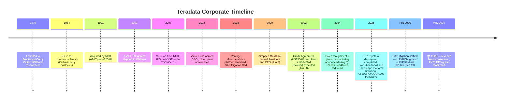
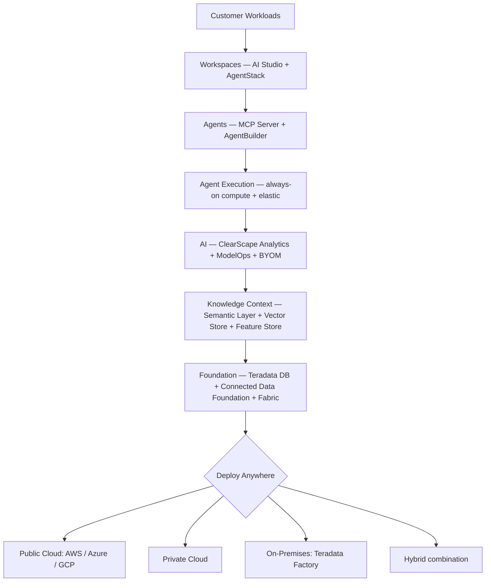
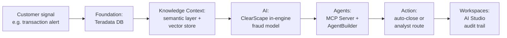
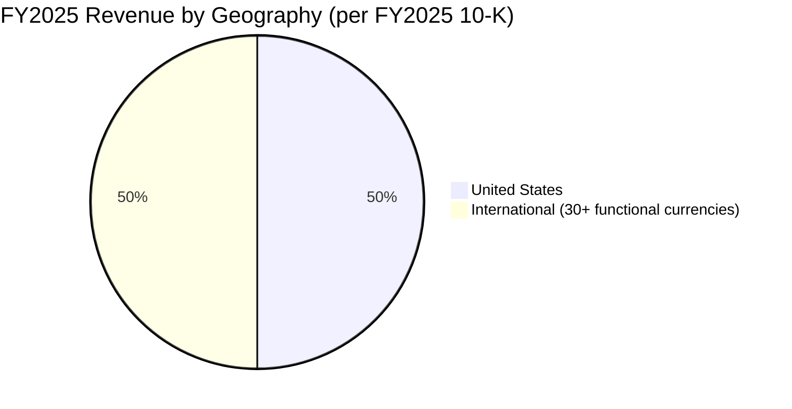
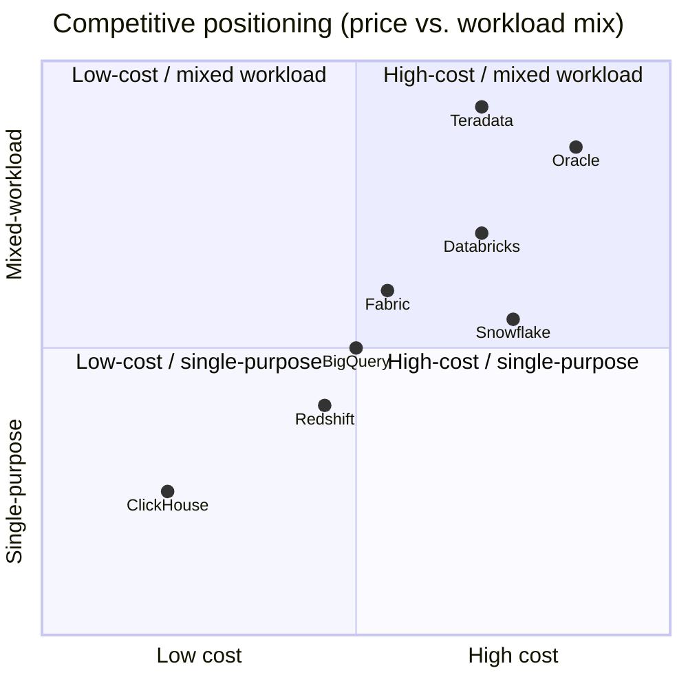
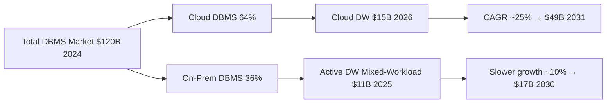

# Teradata Corporation (NYSE: TDC) — Research Document

**As of: 2026-05-30** &nbsp;·&nbsp; Coverage initiation &nbsp;·&nbsp; Sector: Software / Cloud Data Platforms &nbsp;·&nbsp; Domicile: USA (Delaware) &nbsp;·&nbsp; Reporting currency: USD

> **Top-of-report banner — material guidance and capital events (last 6 months):**
> - **SAP litigation settled — $480M gross / ~$359M net pre-tax / ~$302M after-tax** ([8-K filed 2026-02-23](https://www.sec.gov/Archives/edgar/data/816761/000162828026010578/tdc-20260219.htm)). Cash received in Q1 2026. Eight-year dispute concluded ahead of scheduled April-2026 trial. Material change to balance sheet and capital-return capacity.
> - **New $500M share-repurchase authorization** approved 2025-11-17, effective 2026-01-01 ([8-K filed 2025-11-18](https://www.sec.gov/Archives/edgar/data/816761/000162828025052782/tdc-20251117.htm)). Represents ~16% of current market cap of ~$3.2B.
> - **FY2026 guidance reaffirmed Q1 2026 call (May 5)** ([Q1 2026 8-K](https://www.sec.gov/Archives/edgar/data/816761/000162828026030514/tdc-20260505.htm)): non-GAAP diluted EPS $2.55–$2.65 (tracking high end); adjusted FCF raised to **$320–$340M**; total revenue −4% to −2%; recurring revenue −2% to flat. Q2 2026 revenue guide $422.2M–$430.5M.
> - **Sales-function realignment and 9–10% workforce reduction** announced 2024-08-05 ([8-K](https://www.sec.gov/Archives/edgar/data/816761/000081676124000143/tdc-20240805.htm)); annualized savings of $75–80M; substantially complete by end-2025 per [FY2025 10-K MD&A](https://www.sec.gov/Archives/edgar/data/816761/000162828026012671/tdc-20251231.htm).

---

## Table of Contents

1. [Company Overview](#1-company-overview)
2. [Company History](#2-company-history)
3. [Management Team](#3-management-team)
4. [Products & Services](#4-products--services)
5. [Customers & Go-to-Market](#5-customers--go-to-market)
6. [Industry Overview](#6-industry-overview)
7. [Competitive Landscape](#7-competitive-landscape)
8. [Market Opportunity & TAM](#8-market-opportunity--tam)
9. [Risk Assessment](#9-risk-assessment)
10. [References](#10-references)

---

## 1. Company Overview

Teradata Corporation (NYSE: TDC) is a San Diego-headquartered enterprise-software company that sells a relational data-warehouse and analytics platform now repositioned, under the leadership of CEO Stephen McMillan, as an **"AI and Knowledge Platform"** designed to support agentic and generative-AI workloads. Per the company's [FY2025 10-K](https://www.sec.gov/Archives/edgar/data/816761/000162828026012671/tdc-20251231.htm), "At Teradata Corporation … we are focused on helping organizations activate the intelligence in their enterprise and turn the insights from across their organization into outcomes." The platform is deployed across the three top-tier public clouds (AWS, Microsoft Azure, Google Cloud), in private cloud, on-premises, and hybrid combinations of these — a deployment model the company emphasizes as its primary point of differentiation versus cloud-native peers Snowflake and Databricks. Teradata reported [FY2025](https://www.sec.gov/Archives/edgar/data/816761/000162828026012671/tdc-20251231.htm) total revenue of $1,663 million (-5% YoY), with 50% of revenue from outside the United States and approximately 5,100 employees in 38 countries.

**Latest-period operating snapshot.** The [FY2025 10-K MD&A](https://www.sec.gov/Archives/edgar/data/816761/000162828026012671/tdc-20251231.htm) discloses recurring revenue of $1,445M (86.9% of total, -2% YoY), perpetual licenses/hardware of $17M (1.0%, -26%), and consulting services of $201M (12.1%, -19%). Gross margin compressed slightly from 60.5% to 59.4% on a mix shift to higher-Public-Cloud-revenue (lower scale margin) and consulting decline outpacing cost reduction; operating margin held roughly flat at 12.3% as SG&A fell 11% from the 2024 restructuring. Total Annual Recurring Revenue ("Total ARR") finished FY2025 at $1,522M, +3% YoY; **Public Cloud ARR reached $701M, +15% YoY**, now ~46% of Total ARR and the dominant growth engine. Cloud Net Expansion Rate moderated to 108% (FY2024: 117%; FY2023: 124%), reflecting both maturation of the cloud base and slower mid-2024 bookings during the restructuring (per [FY2025 10-K MD&A](https://www.sec.gov/Archives/edgar/data/816761/000162828026012671/tdc-20251231.htm)).

*Source: [FY2025 10-K MD&A](https://www.sec.gov/Archives/edgar/data/816761/000162828026012671/tdc-20251231.htm), [FY2023 10-K MD&A](https://www.sec.gov/Archives/edgar/data/816761/000081676124000023/tdc-20231231.htm), [Stockanalysis.com TDC financials](https://stockanalysis.com/stocks/tdc/financials/).*

**Q1 2026 (just-reported) inflection.** On 2026-05-05 the company reported revenue of $444M (+6% YoY, well above the $409.6M consensus per [Investing.com transcript](https://www.investing.com/news/transcripts/earnings-call-transcript-teradata-q1-2026-beats-forecasts-stock-rises-93CH-4661215)), recurring revenue +12% YoY, and non-GAAP diluted EPS of $0.88 (+30%+). GAAP EPS was $3.47, lifted by the SAP settlement gain. **Crucially, Total ARR declined sequentially to $1.49B and Public Cloud ARR to $686M from the FY2025 year-end levels** — typical Q1 seasonality, but a reminder that the cloud-migration narrative remains tightly tied to large enterprise renewal timing. Management reaffirmed FY2026 non-GAAP EPS guide of $2.55–$2.65 with an expectation of "tracking toward the higher end" ([Q1 2026 prepared remarks](https://s206.q4cdn.com/560882062/files/doc_financials/2026/q1/Q1-2026-Prepared-Remarks.pdf)) and raised the adjusted free-cash-flow guide to $320–$340M.

**Valuation snapshot.** At $34.05 per share on 2026-05-29 ([Stockanalysis.com TDC statistics](https://stockanalysis.com/stocks/tdc/statistics/)), Teradata trades at a market cap of $3.20B (enterprise value $2.94B; net cash position after the SAP settlement). The headline TTM P/E of 7.78× is misleadingly low because trailing twelve-month earnings include the SAP settlement; **the forward P/E of 13.06× and EV/EBITDA of 9.05× are the better anchors** and both sit well below the software-sector median of 26.7× P/E and ~14× EV/EBITDA per [Simply Wall St TDC](https://simplywall.st/stocks/us/software/nyse-tdc/teradata/news/is-teradata-tdc-still-attractively-priced-after-strong-one-y). P/S of 1.90× compares to Snowflake at ~15× and Databricks (private) at an implied >10× on its last funding round — TDC is priced as a low-growth, capital-return story rather than a cloud-platform growth story. Short interest at **16.66% of outstanding** ([Stockanalysis.com TDC statistics](https://stockanalysis.com/stocks/tdc/statistics/)) is elevated and reflects continuing market skepticism that the company can re-accelerate revenue. The stock has rebounded +57% from its 52-week low of $19.83 on Q4-2025 and Q1-2026 prints that exceeded consensus on every line item. *Analyst view:* the multiple is consistent with cyclical-software / value-software peers rather than growth — the bull case requires either Cloud ARR re-accelerating above 15% or the SAP settlement / new $500M buyback authorization being deployed at the current depressed multiple.

**Capital structure.** [FY2025 10-K MD&A](https://www.sec.gov/Archives/edgar/data/816761/000162828026012671/tdc-20251231.htm) reports $493M cash at 12/31/2025 (before the SAP cash receipt in Q1 2026), a $500M unsecured term loan (Credit Agreement entered 2022-06-28; ~90% of floating-rate exposure swapped to fixed via interest-rate swap), and a $400M undrawn revolving credit facility (also unsecured). In November 2025 the Credit Agreement was amended to embed ESG-linked KPIs that modestly adjust margins based on Teradata's performance against environmental targets ([FY2025 10-K MD&A](https://www.sec.gov/Archives/edgar/data/816761/000162828026012671/tdc-20251231.htm)). Net debt is now negative (cash > debt) after the SAP cash inflow.

## 2. Company History

Teradata is one of the oldest names in the data-warehousing industry, with a corporate genealogy that runs through Citibank, NCR, and AT&T. The company was incorporated in Brentwood, California in **1979** by Caltech researchers and members of Citibank's advanced technology group; the founding team included Jack E. Shemer, Philip M. Neches, Walter E. Muir, Jerold R. Modes, William P. Worth, Carroll Reed, and David Hartke ([Wikipedia: Teradata](https://en.wikipedia.org/wiki/Teradata)). The company shipped its first commercial product, the DBC/1012 database machine, in **1984** with Citibank as an early customer; in **1992** it built what was then the world's first one-terabyte data warehouse for Walmart, an installation that became foundational to the modern enterprise-data-warehouse category. In **1991** AT&T acquired NCR Corporation and subsequently purchased Teradata for approximately $250 million, folding it into NCR's enterprise-computing line for the next fifteen years.

In **2007** NCR completed the spin-off of Teradata as an independent public company, and it began trading on the NYSE under ticker TDC on **October 1, 2007**, with Michael F. Koehler as the inaugural CEO ([Wikipedia: Teradata](https://en.wikipedia.org/wiki/Teradata)). The 2007–2016 window was characterized by the gradual erosion of the on-premises EDW franchise as new cloud-native competitors (Amazon Redshift launched 2012; Snowflake founded 2012; Google BigQuery 2010) re-set the cost and pricing model for analytic workloads. **Victor Lund** stepped in as CEO in 2016 and is credited with initiating the cloud pivot, culminating in the **October 2018** launch of the Teradata Vantage analytics platform ([Wikipedia: Teradata](https://en.wikipedia.org/wiki/Teradata)). 2018 was also the year Teradata filed its monopolization and trade-secret-misappropriation lawsuit against SAP, alleging SAP had tied its S/4HANA application suite to its in-memory HANA database in violation of Section 1 of the Sherman Act, and that SAP had misappropriated Teradata trade secrets during the 2008 "Bridge Project" partnership ([Computer Weekly, 2018](https://www.computerweekly.com/news/252443416/Teradata-sues-SAP-over-Hana); [Jones Day case overview](https://www.jonesday.com/en/practices/experience/2021/11/sap-wins-summary-judgment-on-teradata-trade-secret-and-antitrust-claims)).

**June 8, 2020 — Stephen McMillan named President and CEO**, joining from F5 Networks (where he had been EVP Global Services) with prior career stops at Oracle (cloud-services SVP) and IBM (20-year tenure) ([Teradata press release, 2020](https://www.teradata.com/press-releases/2020/teradata-board-appoints-steve-mcmillan-president-and-chief-executive-officer)). McMillan has framed his five-and-a-half-year tenure around three pillars: foundational platform excellence, real-world AI use cases, and hybrid as a structural advantage ([FY2025 10-K Item 1](https://www.sec.gov/Archives/edgar/data/816761/000162828026012671/tdc-20251231.htm)). The transformation has been heavy: a global restructuring (9–10% workforce reduction; **~510 net positions eliminated**) announced August 5, 2024 ([8-K, 2024-08-05](https://www.sec.gov/Archives/edgar/data/816761/000081676124000143/tdc-20240805.htm)) with associated annualized cost savings of $75–80M; the rollout of a multi-year ERP system completed in 2025; and a near-complete refresh of the executive team in 2024–2025 (new CRO April 2024, COO Feb 2025, CPO April 2025, CFO May 2025, CAO June 2025 — per the [FY2025 10-K executive officer table](https://www.sec.gov/Archives/edgar/data/816761/000162828026012671/tdc-20251231.htm)).

The eight-year SAP litigation reached resolution on **February 19, 2026** when the parties signed a Settlement Agreement under which SAP will pay Teradata $480 million gross within 60 days of the effective date, dismissing all claims and counterclaims with prejudice ([8-K, 2026-02-23](https://www.sec.gov/Archives/edgar/data/816761/000162828026010578/tdc-20260219.htm); [The Register, 2026-03-02](https://www.theregister.com/2026/03/02/sap_teradata_settlement/); [Cornerstone Research case summary](https://www.cornerstone.com/insights/cases/teradata-secures-480-million-settlement-in-antitrust-and-ip-dispute/)). Net pre-tax proceeds are guided to $355–362M (about $359M actual); after-tax benefit approximately $302M per the [Q1 2026 prepared remarks](https://s206.q4cdn.com/560882062/files/doc_financials/2026/q1/Q1-2026-Prepared-Remarks.pdf). This is a meaningful financial event for a company with FY2025 revenue of $1.66B and operating income of $205M — the settlement value is roughly two times annual operating income, and management has signaled it will be split between balance-sheet de-leveraging and increased capital return through the new $500M repurchase authorization effective January 1, 2026 ([8-K, 2025-11-18](https://www.sec.gov/Archives/edgar/data/816761/000162828025052782/tdc-20251117.htm)).

## 3. Management Team

**Stephen McMillan — President and Chief Executive Officer (since June 2020), age 55.** The [FY2025 10-K executive officer table](https://www.sec.gov/Archives/edgar/data/816761/000162828026012671/tdc-20251231.htm) describes McMillan's prior career: "Executive Vice President of Global Services for F5 Networks, Inc. … from October 2017 when he joined F5 until May 2020. Prior to joining F5, Mr. McMillan was at Oracle Corporation … for five years where he held roles of increasing executive responsibility, including oversight for customer success and managed cloud services." Teradata's [official CEO bio](https://www.teradata.com/about-us/leadership/steve-mcmillan) and the [businesswire announcement of his appointment](https://www.businesswire.com/news/home/20200507006090/en/Teradata-Board-Appoints-Steve-McMillan-President-and-Chief-Executive-Officer) add that he spent nearly 20 years at IBM in operations leadership roles before joining Oracle, holds a First-Class Honours degree in Management and Computer Science from Aston University (UK), is a patent holder on cloud-computing technology, and serves on the board of Lumen Technologies as an independent director ([Lumen governance page](https://www.lumen.com/en-au/about/governance/steve-mcmillan.html)). McMillan's mandate has been explicit since 2020 — re-architect Teradata for the cloud era — and the FY2025 10-K Item 1 makes clear that the company now frames itself as an "AI and Knowledge Platform" rather than an enterprise-data-warehouse vendor. His tenure has been operationally intense: the 2024 restructuring, the multi-year ERP migration, the SAP settlement, and an essentially complete refresh of his C-suite have all occurred under his watch.

**The C-suite was almost entirely rebuilt in 2024–2025**, per the [FY2025 10-K executive officer biographies](https://www.sec.gov/Archives/edgar/data/816761/000162828026012671/tdc-20251231.htm). CFO **John Ederer** (joined May 2025, age 57) came from Model N (cloud revenue management) where he had been CFO since 2021; before that, K2 Software CFO. CPO **Sumeet Arora** (joined April 2025, age 51) came from ThoughtSpot (Chief Development Officer 2019–2025) and earlier was SVP/GM Service Provider Networking at Cisco. COO **Michael Hutchinson** (promoted to COO February 2025, age 60) had been Teradata's Chief Customer Officer since 2022 and held a 28-year tenure at Oracle in customer-success roles. CRO **Richard Petley** (CRO since April 2024, age 49) came from Oracle UK where he had been Managing Director and earlier ran Oracle Cloud Western Europe. CAO/General Counsel **Scot Rogers** (joined June 2025, age 58) came from F5 Networks where he had been EVP, General Counsel — reuniting him with McMillan from their F5 days. The pattern — an Oracle/F5/IBM-heavy bench, with two F5 reunions (CEO and CAO) — suggests McMillan is consciously building a team comfortable with a hybrid cloud / on-prem operating model and large-enterprise selling, rather than a Silicon-Valley-style cloud-native growth team.

## 4. Products & Services

The single most consequential question for any TDC investor is **what is Teradata actually selling, and how does it compete with cloud-native data platforms**. Teradata's [FY2025 10-K Item 1](https://www.sec.gov/Archives/edgar/data/816761/000162828026012671/tdc-20251231.htm) describes the offering as follows: "Our platform is designed for enterprise-grade workloads. It is built on a massively parallel architecture, with patented workload management, query optimization, and predictable costs that are designed to deliver the most complex workloads. The industry data models available on our platform are built on decades of experience working with global organizations that are large-scale users of data, and can enable our customers to bring deep context to the language models they choose to use." The platform — formerly branded Teradata Vantage and as of 2025 the "Teradata Autonomous Knowledge Platform" — is delivered in two reportable segments: **Product Sales** (the platform itself — recurring subscription and perpetual licenses/hardware) and **Consulting Services** ([FY2025 10-K MD&A](https://www.sec.gov/Archives/edgar/data/816761/000162828026012671/tdc-20251231.htm)).

### 4.1 The Platform Architecture (six layers)

Per the company's official [Platform page](https://www.teradata.com/platform), the Autonomous Knowledge Platform is organized into six integrated layers — and this is the architecture the FY2025 10-K refers to when it discusses the platform's "AI and Knowledge" positioning:

| Layer | What it is | Customer purpose |
|---|---|---|
| **Workspaces** | User-facing layer ("AI Studio", formerly ClearScape Analytics / AI Workbench) including AgentStack for agent development | Single pane of glass for data scientists, analysts, and AI developers to build and deploy models, agents, and queries |
| **Agents** | Autonomous-AI orchestration via AgentBuilder and Model Context Protocol (MCP) Server | "AI agents have enterprise context, can act on it in milliseconds and address continuous decisions at enterprise scale" ([FY2025 10-K Item 1](https://www.sec.gov/Archives/edgar/data/816761/000162828026012671/tdc-20251231.htm)) |
| **Agent Execution** | "Always-on" and elastic compute layer for production-grade agent reasoning, planning, action | Bridge from prototype agents to production deployments with predictable latency and cost |
| **AI** | ClearScape Analytics in-engine analytics, ModelOps, BYOM/BYO-LLM support (bring-your-own-model / LLM) | Run models directly against governed enterprise data without round-tripping through external inference services |
| **Knowledge Context** | Semantic layer, Enterprise Vector Store (Hybrid Search combining vector + lexical), Enterprise Feature Store, industry data models | "A knowledge base that provides the context through a semantic layer between enterprise data and the AI agents" ([FY2025 10-K Item 1](https://www.sec.gov/Archives/edgar/data/816761/000162828026012671/tdc-20251231.htm)) |
| **Foundation** | Teradata Database (massively-parallel relational engine), Connected Data Foundation (data fabric), Teradata Fabric (formerly QueryGrid) for cross-platform data access | The original Teradata workhorse — patented workload management, query optimization, MPP scale-out across thousands of nodes |

### 4.2 Product family walk-through

**Teradata Database / Foundation engine.** This is the historical core asset — a relational massively-parallel-processing (MPP) database engine built around patented workload-management technology that allows it to mix concurrent OLTP-style point queries, large analytical scans, and machine-learning workloads on the same physical cluster without one starving the others. The [FY2025 10-K Item 1](https://www.sec.gov/Archives/edgar/data/816761/000162828026012671/tdc-20251231.htm) discloses 534 issued US patents (plus four exclusive licenses and counterpart foreign patents), most of which protect the database engine, the workload manager, and the optimizer. *Strategic significance:* this is the differentiator versus cloud-native peers whose query engines were optimized for cheap, single-purpose analytic scans on cloud object storage — Snowflake (decoupled compute/storage) and Databricks (Spark-on-Delta-Lake) typically need separate clusters per workload to deliver predictable performance, whereas the Teradata engine is designed to mix workloads on one cluster. This is also why several Tier-1 banks (Wells Fargo, Bank of America historically; one of the largest pan-European banks per the Q1 2026 customer-win commentary in the [Q1 2026 prepared remarks](https://s206.q4cdn.com/560882062/files/doc_financials/2026/q1/Q1-2026-Prepared-Remarks.pdf)) have stuck with Teradata for regulatory-reporting and risk-aggregation workloads where the engine's concurrency story matters more than per-query cost.

**Teradata Cloud (formerly VantageCloud).** The cloud-deployed version of the platform, available on AWS, Microsoft Azure, and Google Cloud, with consumption-based and capacity-based pricing options. Per the [FY2025 10-K MD&A](https://www.sec.gov/Archives/edgar/data/816761/000162828026012671/tdc-20251231.htm), Public Cloud ARR finished FY2025 at $701M, +15% YoY, driven by both new workloads and migration of existing on-premises customers; Cloud Net Expansion Rate was 108% (down from FY2024's 117% as the cloud base matures). *Strategic significance:* Teradata Cloud is the primary growth vehicle and the proxy for the company's transformation — every quarter, the number that investors fix on is Public Cloud ARR.

*Source: ARR figures from [FY2025 10-K MD&A](https://www.sec.gov/Archives/edgar/data/816761/000162828026012671/tdc-20251231.htm) and [FY2023 10-K MD&A](https://www.sec.gov/Archives/edgar/data/816761/000081676124000023/tdc-20231231.htm). Public Cloud ARR has grown from $357M (FY22) to $701M (FY25), now 46% of Total ARR.*

**Teradata Factory (formerly AI Factory / IntelliFlex).** The on-premises platform specifically positioned for "organizations in regulated industries, with data sovereignty requirements, or that want to manage and contain their AI infrastructure costs" ([FY2025 10-K Item 1](https://www.sec.gov/Archives/edgar/data/816761/000162828026012671/tdc-20251231.htm)). Integrates NVIDIA NIM Services and GPUs alongside the Teradata database engine, supporting BYOM and BYO-LLM workloads on-premises. *Strategic significance:* this is Teradata's response to enterprises that have explicitly decided not to move regulated workloads (banking risk, healthcare clinical data, sovereign-government data) to the public cloud — a structurally smaller market than Snowflake/Databricks address, but one where Teradata has incumbency and where Snowflake/Databricks have less product. The Q1 2026 prepared remarks note that "more than 50% of our customers in the cloud also operate on-prem Teradata systems" ([Q1 2026 prepared remarks](https://s206.q4cdn.com/560882062/files/doc_financials/2026/q1/Q1-2026-Prepared-Remarks.pdf)) — i.e. hybrid is the dominant deployment pattern in the installed base, not pure-cloud.

**Teradata Fabric (formerly QueryGrid).** The data-fabric / data-virtualization layer that lets Teradata customers query across multiple data sources (Snowflake, Databricks Delta Lake, Hadoop, S3, Azure ADLS, GCP GCS, traditional RDBMS, etc.) without physically moving data. Per the [FY2025 10-K](https://www.sec.gov/Archives/edgar/data/816761/000162828026012671/tdc-20251231.htm): "Our patented QueryGrid data analytics fabric provides seamless, high-performing data access, processing, and movement across multiple data sources." *Strategic significance:* Fabric is the moat-defense product against the multi-warehouse reality in large enterprises — most Tier-1 banks and retailers have data in 3–5 different analytical platforms; Fabric makes Teradata the orchestrator across them rather than yet-another-warehouse.

**ClearScape Analytics / AI Studio.** In-database analytics functions (200+ pre-built functions for time-series, geospatial, text mining, machine learning) plus BYOM (bring-your-own-model) so users can deploy Python/R-trained models inside the Teradata engine without round-tripping data through external inference services. As of 2025 this is being rebranded as "AI Studio" with an integrated AgentStack for AI-agent development. *Strategic significance:* in-database ML is meaningfully cheaper than external ML pipelines because the data never leaves the database (no egress, no copy, no re-encrypt), and the Teradata engine can parallelize the inference across thousands of nodes. This is the technical underpinning for the "AI and Knowledge Platform" positioning.

**Enterprise Vector Store + Hybrid Search.** Announced in 2025 (per the [FY2025 10-K Item 1 product-launch list](https://www.sec.gov/Archives/edgar/data/816761/000162828026012671/tdc-20251231.htm)). Stores unstructured-document vector embeddings inside the Teradata engine and allows "Hybrid Search" (vector + lexical/keyword search) within a single query. Per the [Platform page](https://www.teradata.com/platform): "Combines semantic (vector) search with lexical (keyword) search to deliver more accurate, context-aware results." *Strategic significance:* this is Teradata's RAG (retrieval-augmented generation) play — by storing both structured data and document vectors in one engine, AI agents can do hybrid structured/unstructured retrieval as a single SQL+vector query rather than orchestrating a multi-vendor stack. This is competitive with pgvector, Pinecone, Snowflake Cortex Search, and Databricks Vector Search.

**MCP Server + AgentBuilder + Autonomous Customer Intelligence.** All three were 2025 product announcements ([FY2025 10-K Item 1](https://www.sec.gov/Archives/edgar/data/816761/000162828026012671/tdc-20251231.htm)). MCP Server implements the Model Context Protocol (now an industry standard, originated by Anthropic) so AI agents can call Teradata-resident data and analytical functions through a standardized interface. AgentBuilder is a low-code/no-code authoring environment for creating multi-agent workflows. Autonomous Customer Intelligence is a packaged use-case application for real-time customer-experience engagement. *Strategic significance:* these are Teradata's attempt to move up the application stack so it captures more value per customer than just selling raw database storage — and they directly answer the "what about the AI workload?" question that Snowflake (Cortex), Databricks (Mosaic AI), AWS (Bedrock), and Google (Vertex AI) have all tried to address. Whether enterprises buy Teradata's agent stack or wire Snowflake/Databricks AI capabilities into their existing Teradata deployments will be a key 2026 test.

**Teradata AI Services.** A consulting / forward-deployed-engineering business that helps enterprises productionize AI workloads on the platform. Per the [FY2025 10-K Item 1](https://www.sec.gov/Archives/edgar/data/816761/000162828026012671/tdc-20251231.htm): "Our Teradata AI services consultants and our forward-deployed engineers work with customers to assist in their transition from concept to production in their AI deployments." Management disclosed 150+ AI customer engagements during 2025. *Strategic significance:* the FDE model directly mirrors how Palantir, Databricks, and OpenAI's Solutions team sell — high-touch, deeply-embedded engineering teams that convert pilots to production. This is also the business model that supports the recurring-revenue thesis: every AI engagement that lands becomes an ARR uplift.

### 4.3 Why the products interact the way they do

The Teradata Autonomous Knowledge Platform sits in a customer's analytic workflow at the **convergence point of three streams**: (a) structured operational data (transactions, customer master, product master, supply-chain events); (b) unstructured documents (contracts, claims, call-center transcripts, product manuals); and (c) AI / ML models (LLMs from OpenAI / Anthropic / Mistral / Llama via BYO-LLM, plus customer-trained models via BYOM). The Foundation layer ingests and stores all three; the Knowledge Context layer enriches them with a governed semantic layer; the AI layer runs in-engine inference; the Agent layer orchestrates multi-step actions; and the Workspaces layer presents the results. The Hybrid / Fabric layers ensure this works across deployments (cloud, on-prem, multi-source). In a real enterprise — say a Tier-1 bank doing AML / KYC investigations — an AI agent would receive a transaction alert (Foundation), retrieve the customer's relationship-graph context (Knowledge Context), score the alert with a fraud model trained on the bank's history (AI / ClearScape), pull supporting documents from the case file via Vector Store + Hybrid Search (Knowledge Context), and either auto-close the case or route to an analyst (Agents). Teradata's positioning is that this entire flow can stay inside one governed platform versus stitching together five different vendors — and that this is what "enterprise context" means in practice.

## 5. Customers & Go-to-Market

Teradata sells almost exclusively to **the world's largest enterprises** — a different motion than the bottom-up, developer-led growth that Snowflake and Databricks have ridden. Per the [FY2025 10-K Item 1](https://www.sec.gov/Archives/edgar/data/816761/000162828026012671/tdc-20251231.htm): "Teradata concentrates our marketing and go-to-market efforts on enterprises that are seeking to improve business performance and view data analytics and AI/ML as strategic to achieving that objective… We believe Teradata is differentiated in industries with high-data requirements, including Financial Services, Healthcare and Life Sciences, Public Sector, Manufacturing, Retail, Telecommunications, and Travel/Transportation." The 10-K discloses that "**we currently do not have any customer that represents 10% or more of our total revenue**" — i.e. customer concentration at the consolidated level is benign. This is meaningfully different from many software peers where one or two hyperscaler-style customers can drive 15–20% of revenue.

**Sales motion.** [FY2025 10-K Item 1](https://www.sec.gov/Archives/edgar/data/816761/000162828026012671/tdc-20251231.htm) states: "We primarily sell and market our solutions and services through a direct sales force. We have more than 80% of our employees in customer-facing and/or revenue-driving roles (including sales, marketing, consulting, customer services, and product engineering)." The August 2024 sales realignment ([8-K, 2024-08-05](https://www.sec.gov/Archives/edgar/data/816761/000081676124000143/tdc-20240805.htm)) concentrated the sales force on a smaller number of named high-value accounts and pushed mid-market workloads onto partner-led motions through systems integrators and cloud-marketplace listings — a structural shift from the prior "land grab" model toward a "deepen the install base" model that has historically generated more durable ARR but slower top-line growth.

**Named customer wins disclosed in 2025–2026.** Per the [Q1 2026 prepared remarks](https://s206.q4cdn.com/560882062/files/doc_financials/2026/q1/Q1-2026-Prepared-Remarks.pdf) and [The Motley Fool Q1 2026 transcript summary](https://www.fool.com/earnings/call-transcripts/2026/05/05/teradata-tdc-q1-2026-earnings-call-transcript/), four representative wins from Q1 2026 alone: (a) **one of the largest pan-European banks** renewed and expanded its Teradata relationship, with the expansion focused on financial reporting / regulatory compliance plus customer-journey transformation using Teradata AI capabilities; (b) **a leading EMEA retailer** selected the platform to replace an existing on-premises competitor; (c) **a Latin American financial institution** expanded into AI Services for enterprise AI operations; and (d) **a large Indian government agency** committed to unify structured and unstructured data at "massive scale." Historic Teradata customers visible in the public record include Citibank (the founding-era customer, per [Wikipedia: Teradata](https://en.wikipedia.org/wiki/Teradata)), Walmart (the first 1TB customer in 1992, per [Wikipedia: Teradata](https://en.wikipedia.org/wiki/Teradata)), Bank of America ([Finextra, 2006 — historic deployment](https://www.finextra.com/pressarticle/6261/bank-of-america-extends-teradata-technology-to-new-business-analysis)), Wells Fargo, Swedbank ([Yahoo Finance CDP report, 2024](https://finance.yahoo.com/news/customer-data-platform-cdp-case-084000698.html)), and NatWest Group — though many of these relationships date back years and the current ARR contribution of each is not publicly disclosed.

**Industries (FY2025 revenue context).** The [FY2025 10-K MD&A](https://www.sec.gov/Archives/edgar/data/816761/000162828026012671/tdc-20251231.htm) discloses geographic split — 50% US / 50% international, with exposure to 30+ functional currencies — but does not break revenue down by vertical industry in granular form. The 10-K identifies the target vertical mix as Financial Services, Healthcare & Life Sciences, Public Sector, Manufacturing, Retail, Telecommunications, and Travel/Transportation. The Q1 2026 prepared remarks called out **Financial Services, Retail, Healthcare, Telecommunications, and Public Sector** as the verticals with "strongest traction" in the quarter ([Q1 2026 prepared remarks](https://s206.q4cdn.com/560882062/files/doc_financials/2026/q1/Q1-2026-Prepared-Remarks.pdf)). *Analyst view:* the financial-services concentration is a meaningful exposure both as a strength (deep multi-decade relationships; banks rarely rip out a Teradata workload) and as a risk (cyclical to bank IT spend; AML / KYC / fraud / regulatory-reporting workloads are heavily compliance-driven).

**Pricing model.** Teradata's [FY2025 10-K Item 1](https://www.sec.gov/Archives/edgar/data/816761/000162828026012671/tdc-20251231.htm) discloses two pricing options for cloud: "**flexibly priced, ranging from capacity-based to consumption-based pricing**" — and the majority of customer contracts use a "**blended pricing model which provides a fixed capacity and also offers the customer optional consumption for times when they experience increased activity**." This is a deliberate hybrid of Snowflake's pure-consumption model and Oracle's traditional capacity-license model. *Analyst view:* the blended model protects Teradata's ARR predictability (capacity baseline cushions consumption volatility) but caps upside relative to a pure-consumption model that lets Snowflake earn outsized revenue from a single workload spike.

**Strategic partnerships — three categories.** Per the [FY2025 10-K Item 1](https://www.sec.gov/Archives/edgar/data/816761/000162828026012671/tdc-20251231.htm): (1) **Cloud service providers** — AWS, Microsoft Azure, Google Cloud (note: these are simultaneously partners and competitors via Redshift, Synapse/Fabric, and BigQuery respectively); (2) **Alliance partners** added in 2025 include ServiceNow, Salesforce, Fivetran, plus pre-existing NVIDIA, NetApp, and Dell relationships; (3) **Systems integrators and consultants** for joint implementation engagements. The 2025 ServiceNow and Salesforce partnerships are especially notable — they place Teradata adjacent to two of the most heavily-installed enterprise application platforms, opening cross-sell paths into IT-service-management workloads (ServiceNow) and CRM/data-cloud workloads (Salesforce Data Cloud). Fivetran is a competitive-flank move that gives Teradata customers a managed ELT path to ingest 500+ SaaS data sources without leaving the Teradata governance perimeter.

## 6. Industry Overview

Teradata competes in the **enterprise data analytics and database market**, which the company's [FY2025 10-K Item 1](https://www.sec.gov/Archives/edgar/data/816761/000162828026012671/tdc-20251231.htm) characterizes as "a multi-billion dollar data management and analytics market" growing at "a double-digit rate year-over-year for the next few years." Gartner sized the broader database management systems (DBMS) market at **$119.7 billion in 2024, +13.4% YoY**, with cloud deployments accounting for 64% of total spend, projecting the market to reach approximately $161 billion by 2026 ([Gartner via ClickHouse research summary, 2025](https://clickhouse.com/resources/engineering/top-5-cloud-data-warehouses)).

**The cloud-data-warehouse and cloud-DBMS sub-segments are the high-growth slice.** Per [Mordor Intelligence's Cloud Data Warehouse Market report (2026)](https://www.mordorintelligence.com/industry-reports/cloud-data-warehouse-market), the cloud data warehouse market was sized at $14.94 billion in 2026 and is projected to grow at a 26.86% CAGR to $49.12 billion by 2031. [Mordor Intelligence's DWaaS forecast](https://www.mordorintelligence.com/industry-reports/data-warehouse-as-a-service-market) puts the narrower Data-Warehouse-as-a-Service market at $6.09 billion in 2025 growing 22.60% CAGR to $16.88 billion by 2030. [Mordor's Active Data Warehousing forecast](https://www.mordorintelligence.com/industry-reports/global-active-data-warehousing-market-industry) — which captures the workload-mixing engine category Teradata pioneered — is more conservative at $10.79 billion in 2025 growing 9.86% to $17.27 billion by 2030. [Research and Markets' Cloud DW estimate](https://www.researchandmarkets.com/report/global-cloud-data-warehouse-market) is in the middle at $8.3B in 2024 → $23.6B by 2030 (19.1% CAGR). The forecast spread reflects different scope definitions (workload-mixing engines vs. consumption-based cloud warehouses vs. all DBaaS); the consensus directional read is that the addressable market continues compounding at high-teens-to-mid-20s CAGR for at least the next five years.

**Three structural industry trends shape the Teradata thesis.** First, **the shift from "rip and replace" to "hybrid coexistence"** is real and is showing up in customer behavior — per the [Q1 2026 prepared remarks](https://s206.q4cdn.com/560882062/files/doc_financials/2026/q1/Q1-2026-Prepared-Remarks.pdf), McMillan stated that "more than 50% of our customers in the cloud also operate on-prem Teradata systems," and the [FY2025 10-K Item 1](https://www.sec.gov/Archives/edgar/data/816761/000162828026012671/tdc-20251231.htm) explicitly notes "a resurgence of hybrid environments that reflected a growing understanding of how enterprises can best leverage both on-premises and cloud deployment options to meet their diverse business needs." This is a meaningful tailwind for incumbents like Teradata and Oracle and a meaningful headwind for the "all cloud, all the time" pure-plays.

Second, **the AI workload demand is real but is repricing the entire stack**, not just adding to it — the [FY2025 10-K Item 1A](https://www.sec.gov/Archives/edgar/data/816761/000162828026012671/tdc-20251231.htm) flags AI/ML regulation as a near-term risk ("Evolving AI-related regulations could require changes to our AI-enabled features or platforms, or limit customer use of our offerings, potentially delaying development, increasing costs, or reducing demand"), while at the same time the company has positioned ~60% of its 2025 product announcements (Enterprise Vector Store, MCP Server, AgentBuilder, Autonomous Customer Intelligence, AI Factory, ModelOps updates) around the AI workload. Third-party survey data referenced in the [Q1 2026 prepared remarks](https://s206.q4cdn.com/560882062/files/doc_financials/2026/q1/Q1-2026-Prepared-Remarks.pdf) reports "99% have already had infrastructure scaling challenges" moving AI pilots to production — i.e. the gap between "AI POC" and "AI production" is currently the binding constraint on enterprise AI revenue, which is the slot Teradata's "always-on enterprise-grade" positioning targets.

Third, **DBMS-market consolidation is accelerating** — per the [2025 Gartner Magic Quadrant for Cloud DBMS](https://www.gartner.com/en/documents/7195930) reporting summary, the Leaders quadrant now contains AWS, Google, Microsoft, Oracle, Databricks, MongoDB, Snowflake, Alibaba Cloud, and IBM — nine vendors, the majority of them mega-cap platforms. Teradata is not currently in the Leaders quadrant in this MQ ([Databricks 2025 MQ summary blog](https://www.databricks.com/blog/databricks-named-leader-2025-gartner-magic-quadrant-cloud-database-management-systems); [Google Cloud 2025 MQ blog](https://cloud.google.com/blog/products/data-analytics/a-leader-in-2025-gartner-magic-quadrant-for-cdbms)), reflecting the strategic-vision dimension where the hyperscaler-backed platforms have outpaced specialty vendors. The risk for any incumbent in this category is that buyers default to whichever hyperscaler they're already committed to (rather than evaluating best-of-breed) and that specialty vendors lose share by default in greenfield workloads.

## 7. Competitive Landscape

The [FY2025 10-K Item 1A](https://www.sec.gov/Archives/edgar/data/816761/000162828026012671/tdc-20251231.htm) names the competition verbatim: "**Our competitors include established companies within our industry, including AWS, Databricks, Google Cloud, Microsoft Azure, Snowflake, and others**, many of which are well-capitalized companies with widespread distribution, brand recognition and a strong presence in the markets we serve. The significant purchasing and market power of these larger competitors, which have greater financial resources than we do, could allow them to surpass our market penetration and marketing efforts to promote and sell their offerings and services. In addition, many other companies participate in specific areas of our business, such as enterprise applications, analytic platforms, business intelligence software and AI enablement." This is the canonical competitive set — let's walk through each in the order Teradata listed them.

*Source: [TDC FY2025 10-K MD&A](https://www.sec.gov/Archives/edgar/data/816761/000162828026012671/tdc-20251231.htm), [Snowflake Q3 FY26 8-K](https://www.sec.gov/Archives/edgar/data/0001640147/000162828025046310/snow-20251027.htm), [Stockanalysis.com TDC financials](https://stockanalysis.com/stocks/tdc/financials/), [B-EYE Cloud DBMS comparison](https://b-eye.com/blog/gartner-magic-quadrant-cloud-dbms-comparison/). Snowflake is FY26 run-rate; Databricks is calendar-2024 reported revenue (private company).*

**Amazon Web Services (AWS).** Direct competition with **Amazon Redshift** (the AWS-native data warehouse, launched 2012 — the first major cloud-DW). Indirect competition with Amazon Athena (serverless query on S3), Amazon Aurora (transactional but increasingly used for analytic workloads), and AWS Bedrock (managed LLM inference). AWS is also a Teradata **partner** — Teradata Cloud runs on AWS, and AWS Marketplace lists Teradata Vantage. *Analyst view:* Redshift has lost share to Snowflake and Databricks over the last five years on a brand-recognition basis but remains entrenched at AWS-default-shop customers. AWS's competitive edge is procurement simplicity (already on AWS bill) and integration with AWS-native data services (S3, Glue, Kinesis, SageMaker).

**Databricks (private).** The most strategically aggressive competitor — Databricks reported **~$2.6B revenue in calendar 2024 at ~57% YoY growth**, per industry reporting ([Tech-Insider Databricks vs Snowflake 2026](https://tech-insider.org/snowflake-vs-databricks-2026/)). Databricks was named a Leader for the 5th consecutive year in the 2025 Gartner Magic Quadrant for Cloud DBMS ([Databricks 2025 MQ blog](https://www.databricks.com/blog/databricks-named-leader-2025-gartner-magic-quadrant-cloud-database-management-systems)). Strengths: best-in-class ML/AI tooling (Spark + MLflow + Mosaic AI heritage); lakehouse architecture that natively spans structured warehouse and unstructured data-lake workloads; open Delta Lake format. Weaknesses: less mature in regulatory-reporting and AML/KYC bank workloads where Teradata historically wins. *Analyst view:* Databricks is the highest-velocity competitor on AI workloads and the most likely to capture greenfield AI-native enterprise spend. In hybrid / on-premises regulated workloads Teradata still wins; in cloud-native AI lakehouse, Databricks wins by default.

**Google Cloud (BigQuery).** Direct competition with **Google BigQuery** (serverless analytic data warehouse) and Vertex AI (Google's managed ML platform). Google was named a Leader in the [2025 Gartner Magic Quadrant for Cloud DBMS](https://cloud.google.com/blog/products/data-analytics/a-leader-in-2025-gartner-magic-quadrant-for-cdbms). BigQuery's serverless model — no cluster sizing, pure pay-per-query — is operationally simpler than either Teradata or Snowflake for ad-hoc analytic workloads. *Analyst view:* BigQuery wins greenfield Google-shop customers and is increasingly competitive in multi-cloud through BigQuery Omni; Teradata wins customers requiring mixed-workload concurrency and hybrid deployment.

**Microsoft Azure (Synapse / Fabric).** Microsoft's data-platform play is now **Microsoft Fabric** (the rebranded and consolidated successor to Synapse, Power BI Premium, Data Factory, and others) — a SaaS-style data platform tightly integrated with M365 and Power BI. Microsoft was named a Leader in the [2025 Gartner Magic Quadrant for Cloud DBMS](https://www.databricks.com/blog/databricks-named-leader-2025-gartner-magic-quadrant-cloud-database-management-systems). Strengths: bundling with M365 (which is in essentially every enterprise) gives Microsoft a near-default position in mid-market enterprise analytics. Weaknesses: less mature in large-scale, mission-critical, mixed-workload deployments. *Analyst view:* Fabric is the most disruptive competitive entrant for the mid-market and enterprise IT-led buying motion; Teradata wins where the data team owns the buy and prioritizes engine quality.

**Snowflake (NYSE: SNOW).** The closest pure-play comparator — Snowflake reported **FY2025 (year ended January 2025) product revenue of $3.5B at 30% YoY growth**, and Q3 FY26 (ended October 2025) revenue of $1.21B (+29% YoY), tracking toward ~$4.5B+ run rate ([Snowflake Q1 FY26 8-K](https://www.sec.gov/Archives/edgar/data/0001640147/000164014725000094/fy2026q1earnings.htm); [Snowflake Q3 FY26 8-K](https://www.sec.gov/Archives/edgar/data/0001640147/000162828025046310/snow-20251027.htm)). Snowflake was upgraded from Challenger to Leader in the 2025 Gartner Magic Quadrant. Strengths: data-sharing marketplace, multi-cloud, exceptional UX/ease, near-zero ops overhead. Weaknesses: pure-cloud-only model means it doesn't compete in regulated on-premises workloads; consumption pricing creates customer cost-management anxiety; perceived as expensive at scale. *Analyst view:* Snowflake and Teradata compete most directly on cloud-DW workloads at large enterprises that haven't yet selected a primary platform. In the existing-Teradata installed base, Snowflake's win mechanism is usually "we'll modernize one workload to Snowflake and leave the rest on Teradata," which over time can hollow out the Teradata footprint — making Cloud Net Expansion Rate the critical retention metric.

**Other competition.** Beyond the named five, [FY2025 10-K Item 1A](https://www.sec.gov/Archives/edgar/data/816761/000162828026012671/tdc-20251231.htm) mentions "established companies within our industry" and "AI-focused companies, and open-source providers." This sweeps in: **Oracle** (Autonomous Database, Exadata — leader in Gartner MQ; the most direct DBMS incumbent competitor; the [mlogica case study on a customer migrating Teradata workloads to Oracle Exadata](https://mlogica.com/resources/mlogica-case-studies/national-healthcare-organization-migration-of-mission-critical-applications-and-workloads-from-teradata-to-oracle-exadata) confirms this is an active battleground); **MongoDB** (document database — adjacent rather than direct competitor); **IBM Db2 / Cloud Pak for Data** (legacy mainframe customers); **SAP HANA** (now post-settlement, no longer adversarial but still competitive); **Cloudera / Apache** (legacy Hadoop deployments still in pharma / government); **ClickHouse, DuckDB, StarRocks** (newer open-source analytic engines gaining mindshare for cost-sensitive workloads); and **Pinecone, Weaviate, Qdrant** (vector-database pure-plays, competitive with Teradata's Enterprise Vector Store on the unstructured-AI workload).

**Competitive moat — verdict.** Teradata's defensible position rests on **three pillars**: (1) the workload-management / concurrency story for mixed analytic workloads (its strongest technical differentiator, defensible by patent and engineering investment); (2) the hybrid-deployment story (real but not unique — Oracle has the same story); and (3) the multi-decade install-base of regulated-industry customers (durable but slow-growth — banks rarely rip-and-replace, but they also rarely expand quickly). The weaknesses are equally clear: smaller R&D budget than any of the five named competitors (~$280M FY2025 R&D vs. Snowflake's $1B+ and Databricks' $1.5B+ implied), no developer-led / freemium motion to compound mindshare, and an installed base concentrated in industries (telecom, retail, manufacturing) where IT spend has been under pressure. The case for the company is that it can defend a $1.5B+ recurring-revenue base and grow Cloud ARR mid-teens for several years while returning aggressive capital to shareholders — not that it can re-take share from the hyperscalers.

## 8. Market Opportunity & TAM

Teradata's [FY2025 10-K Item 1](https://www.sec.gov/Archives/edgar/data/816761/000162828026012671/tdc-20251231.htm) frames its addressable market as "the multi-billion dollar data management and analytics market" — deliberately vague. The market-research stack converges on the following sizing:

| Market segment | 2024–2026 size | 2030–2031 projection | CAGR | Source |
|---|---|---|---|---|
| Total DBMS market | $119.7B (2024) | ~$161B (2026) | ~13% | [Gartner via ClickHouse, 2025](https://clickhouse.com/resources/engineering/top-5-cloud-data-warehouses) |
| Cloud data warehouse | $14.94B (2026) | $49.12B (2031) | 26.86% | [Mordor Intelligence Cloud DW report](https://www.mordorintelligence.com/industry-reports/cloud-data-warehouse-market) |
| Data warehouse as a service (DWaaS) | $6.09B (2025) | $16.88B (2030) | 22.60% | [Mordor Intelligence DWaaS report](https://www.mordorintelligence.com/industry-reports/data-warehouse-as-a-service-market) |
| Active Data Warehousing (mixed-workload) | $10.79B (2025) | $17.27B (2030) | 9.86% | [Mordor Intelligence Active DW report](https://www.mordorintelligence.com/industry-reports/global-active-data-warehousing-market-industry) |
| Cloud Data Warehouse (alternative estimate) | $8.3B (2024) | $23.6B (2030) | 19.1% | [Research and Markets Cloud DW report](https://www.researchandmarkets.com/report/global-cloud-data-warehouse-market) |

The most-relevant TAM slice for Teradata is the **Active Data Warehousing / mixed-workload segment** — the category Teradata effectively pioneered — at ~$11B in 2025 growing to ~$17B by 2030. Against this, Teradata's FY2025 revenue of $1.66B implies roughly **15% share** of the global mixed-workload analytic-database segment, a credible number for a category creator that has been ceding ground in greenfield cloud workloads. Within the broader $50B+ Cloud DW segment by 2031, Teradata's penetration is much lower (~3–4% currently) — and this is where the upside or downside surprise lives. If Public Cloud ARR can compound at the 15% YoY rate of FY2024–FY2025 for five more years, it would grow from $701M to ~$1.4B by 2030 — about 3% of a $49B cloud-DW market. That math frames the bull case (15%+ Public Cloud ARR growth, market share modestly improving) and the bear case (low-teens or single-digit growth, market share continuing to compress) for the cloud transition.

**Within the AI-enabled-data-platform slice, the TAM expansion is more aggressive.** AI-related workloads (vector search, retrieval-augmented generation, agentic AI orchestration) are estimated to add another $10–20B of net-new database-and-analytic spend through 2030, and this is the slice where Teradata's Enterprise Vector Store, MCP Server, and AgentBuilder products are positioned. The risk: this is also the slice where Snowflake Cortex, Databricks Mosaic AI, AWS Bedrock + Knowledge Bases, Google Vertex AI Search, and a half-dozen pure-play vector-database vendors are concentrating their R&D. Whether Teradata can hold or gain share in AI-native workloads is the single most important growth question for the company.

## 9. Risk Assessment

The [FY2025 10-K Item 1A](https://www.sec.gov/Archives/edgar/data/816761/000162828026012671/tdc-20251231.htm) enumerates 18+ risk factors across four categories — Business & Operations, Industry, Human Capital, and Legal & Regulatory. The ten most material risks for an investor today:

**Company-specific risks**

1. **Execution risk on the AI / hybrid transformation.** Per the 10-K: "Our strategy and ongoing business transformation, including with regard to our cloud, hybrid, on-premises, AI/ML and related offerings, involve significant execution risk." Teradata is simultaneously running a CFO/COO/CPO/CAO transition, a fresh ERP rollout, sales-team realignment, and a product portfolio rebrand — any single one is high-risk, the combination is heroic. Mitigants: 80% of employees in customer-facing roles; new ERP "deployed in 2025"; CEO McMillan in role 5+ years. Probability: medium-high. Impact: high (slows ARR growth, depresses multiple).

2. **Cloud ARR re-acceleration not delivering.** Public Cloud ARR grew 15% in FY2025, materially slower than FY2023's 48% growth ([FY2023 10-K MD&A](https://www.sec.gov/Archives/edgar/data/816761/000081676124000023/tdc-20231231.htm)). Cloud Net Expansion rate moderated from 124% (FY23) → 117% (FY24) → 108% (FY25) — direction matters more than level here. If cloud ARR growth dips below 10% in FY2026, the entire bull thesis collapses. Mitigants: Q1 2026 cloud ARR +13% as reported, +12% constant currency; management reaffirmed FY2026 ARR guidance. Probability: medium. Impact: high.

3. **Customer-renewal risk in regulated on-prem base.** [FY2025 10-K Item 1A](https://www.sec.gov/Archives/edgar/data/816761/000162828026012671/tdc-20251231.htm): "as some of our on-premises customers migrate all or a portion of their data analytics solutions to a cloud- or hybrid based platform, some customers have selected offerings of one of our competitors." The risk is not that Teradata loses cloud bake-offs — it's that incumbent customers select Snowflake / Databricks / BigQuery for their new workloads, leaving the Teradata footprint to gradually wind down. Mitigants: no customer >10% of revenue; long-term contracts; deep customization in regulated-industry deployments. Probability: medium. Impact: medium-high (slow ARR erosion, not sudden).

4. **Cloud-service-provider "frenemy" dynamics.** Teradata Cloud runs on AWS / Azure / GCP — the same vendors that sell competing services (Redshift, Synapse/Fabric, BigQuery). Per the [FY2025 10-K Item 1A](https://www.sec.gov/Archives/edgar/data/816761/000162828026012671/tdc-20251231.htm): "The cloud service providers maintain relationships with certain of our competitors, and our competitors may in the future establish relationships with additional competing cloud data platform providers." Any of the three could unilaterally raise pricing on Teradata's hosted infrastructure, deprioritize joint sales, or fast-follow Teradata's differentiated features. Mitigants: Teradata is multi-cloud and on-prem-capable; not single-cloud dependent. Probability: medium. Impact: medium.

5. **Restructuring execution / talent retention.** The August 2024 9–10% workforce reduction ([8-K, 2024-08-05](https://www.sec.gov/Archives/edgar/data/816761/000081676124000143/tdc-20240805.htm)) is substantively complete but the human cost is real — [Teradata 10-K Item 1A](https://www.sec.gov/Archives/edgar/data/816761/000162828026012671/tdc-20251231.htm) flags "loss of continuity, loss of accumulated knowledge, or loss of efficiency during such transitional periods." Compounded by the C-suite refresh in 2024–2025 (5 of 6 executives in role <2 years), there is meaningful execution / institutional-knowledge risk. Mitigants: $75–80M annualized savings already booked; new exec hires from F5 / Oracle / ThoughtSpot bring relevant experience. Probability: medium. Impact: medium.

**Industry / market risks**

6. **Intensifying competition from Snowflake, Databricks, and the hyperscalers.** All five named competitors in the 10-K Competition section have larger R&D budgets, faster product velocity, and broader sales distribution. Per the [FY2025 10-K Item 1A](https://www.sec.gov/Archives/edgar/data/816761/000162828026012671/tdc-20251231.htm): "The significant purchasing and market power of these larger competitors, which have greater financial resources than we do, could allow them to surpass our market penetration and marketing efforts." Mitigants: differentiated hybrid + workload-mix engine; concentrated installed base in regulated industries; new 2025 products (Vector Store, MCP, AgentBuilder) at parity with cloud-native peers. Probability: high (already happening). Impact: high.

7. **AI/ML regulation creating product / sales-cycle friction.** [FY2025 10-K Item 1A](https://www.sec.gov/Archives/edgar/data/816761/000162828026012671/tdc-20251231.htm): "Evolving AI-related regulations could require changes to our AI-enabled features or platforms, or limit customer use of our offerings, potentially delaying development, increasing costs, or reducing demand." The EU AI Act, US state AI regulations (CA, CO), and emerging Asia-Pacific AI rules will all impose compliance overhead. Mitigants: enterprise customers also need governed AI, so this can be a tailwind for governance-strong vendors (Teradata's positioning). Probability: high. Impact: low-medium.

**Financial risks**

8. **Margin compression from cloud-mix shift.** Per the [FY2025 10-K MD&A](https://www.sec.gov/Archives/edgar/data/816761/000162828026012671/tdc-20251231.htm), gross margin compressed from 60.5% (FY24) to 59.4% (FY25) primarily due to "higher mix of Public Cloud revenue, and declines in Consulting Services revenue outpacing associated cost reductions." Public Cloud is structurally lower gross margin than on-premises subscription due to AWS / Azure / GCP hosting costs and the lower scale of Teradata's cloud business. As cloud mix grows, gross margin will continue to compress until Public Cloud reaches scale parity with on-prem — likely 2027–2028. Mitigants: management has called out improving Public Cloud margins YoY; SG&A cost discipline has more-than-offset the gross-margin drag at operating-income level. Probability: high (mechanical). Impact: low (managed within current margin range).

9. **Capital-allocation risk from $480M SAP windfall.** With the [$480M SAP settlement](https://www.sec.gov/Archives/edgar/data/816761/000162828026010578/tdc-20260219.htm) plus normalized $300M+ annual FCF, Teradata will have meaningful excess capital. The risk is allocating it poorly — a low-multiple stock can buy back a lot of shares at attractive levels, but the temptation will be an expensive acquisition. Mitigants: $500M buyback authorization at $34 stock = ~14M shares, ~15% of float; track record of mostly small bolt-on M&A. Probability: low-medium. Impact: medium (good outcome adds 15–20% to EPS, bad outcome destroys capital).

**Macro / external risks**

10. **Concentration of operations in California / Flex single-source supplier.** Per the [FY2025 10-K Item 1A](https://www.sec.gov/Archives/edgar/data/816761/000162828026012671/tdc-20251231.htm): "Our headquarters and data lab are located in California, a region with a history of seismic activity, wildfires and an extreme risk of drought, flooding, and vulnerability to future water scarcity." Separately: "Our hardware components are assembled and configured by Flex Ltd. … several of our suppliers may terminate their agreements with us without cause with 180-days' notice." Mitigants: most workloads are now cloud-hosted (not hardware-dependent); Flex is itself a diversified contract manufacturer. Probability: low. Impact: low-medium.

**Risks intentionally NOT among the top 10:** Cybersecurity (real but well-managed per FY2025 disclosures); FX (50% international exposure — managed via natural hedge and cross-currency swap); 2024 ERP rollout (substantively complete); ESG reporting compliance (in scope but immaterial cost); legal proceedings other than SAP (de minimis after settlement); pension obligations (immaterial — $6M sensitivity to 50bp discount rate change). These are all properly disclosed in the [FY2025 10-K Item 1A](https://www.sec.gov/Archives/edgar/data/816761/000162828026012671/tdc-20251231.htm) but do not materially shape the investment thesis.

---

## 10. References

**Primary filings (US SEC EDGAR):**

- [Teradata Corporation FY2025 10-K — filed 2026-02-27](https://www.sec.gov/Archives/edgar/data/816761/000162828026012671/tdc-20251231.htm) (accession 0001628280-26-012671)
- [Teradata Corporation FY2024 10-K — filed 2025-02-21](https://www.sec.gov/Archives/edgar/data/816761/000081676125000027/tdc-20241231.htm) (accession 0000816761-25-000027)
- [Teradata Corporation FY2023 10-K — filed 2024-02-23](https://www.sec.gov/Archives/edgar/data/816761/000081676124000023/tdc-20231231.htm) (accession 0000816761-24-000023)
- [Teradata Corporation Q1 2026 10-Q — filed 2026-05-06](https://www.sec.gov/Archives/edgar/data/816761/000162828026031053/tdc-20260331.htm) (accession 0001628280-26-031053)
- [Teradata Corporation 2026 DEF 14A — filed 2026-03-26](https://www.sec.gov/Archives/edgar/data/816761/000081676126000011/tdc-20260325.htm) (accession 0000816761-26-000011)
- [Teradata Corporation 8-K (SAP settlement) — filed 2026-02-23](https://www.sec.gov/Archives/edgar/data/816761/000162828026010578/tdc-20260219.htm) (accession 0001628280-26-010578)
- [Teradata Corporation 8-K (Q1 2026 earnings) — filed 2026-05-05](https://www.sec.gov/Archives/edgar/data/816761/000162828026030514/tdc-20260505.htm) (accession 0001628280-26-030514)
- [Teradata Corporation 8-K ($500M buyback authorization) — filed 2025-11-18](https://www.sec.gov/Archives/edgar/data/816761/000162828025052782/tdc-20251117.htm) (accession 0001628280-25-052782)
- [Teradata Corporation 8-K (Aug 2024 restructuring announcement) — filed 2024-08-05](https://www.sec.gov/Archives/edgar/data/816761/000081676124000143/tdc-20240805.htm) (accession 0000816761-24-000143)

**Investor relations materials:**

- [Teradata Q1 2026 prepared remarks PDF — published 2026-05-05](https://s206.q4cdn.com/560882062/files/doc_financials/2026/q1/Q1-2026-Prepared-Remarks.pdf)
- [Teradata Q1 2026 earnings call transcript — Motley Fool, 2026-05-05](https://www.fool.com/earnings/call-transcripts/2026/05/05/teradata-tdc-q1-2026-earnings-call-transcript/)
- [Teradata Q1 2026 earnings call transcript — Investing.com, 2026-05-05](https://www.investing.com/news/transcripts/earnings-call-transcript-teradata-q1-2026-beats-forecasts-stock-rises-93CH-4661215)
- [Teradata Q4 2025 financial press release — investor.teradata.com](https://investor.teradata.com/news-events/investor-news/news-details/2026/Teradata-Reports-Fourth-Quarter-and-Full-Year-2025-Financial-Results/default.aspx)

**Company website:**

- [Teradata Platform page (Autonomous Knowledge Platform architecture)](https://www.teradata.com/platform)
- [Teradata About Us page](https://www.teradata.com/about-us)
- [Teradata CEO Steve McMillan bio](https://www.teradata.com/about-us/leadership/steve-mcmillan)
- [Teradata customer stories landing page](https://www.teradata.com/customers)
- [Teradata 2020 CEO appointment press release](https://www.teradata.com/press-releases/2020/teradata-board-appoints-steve-mcmillan-president-and-chief-executive-officer)

**Market data and valuation:**

- [Stockanalysis.com TDC overview](https://stockanalysis.com/stocks/tdc/) — current price, market cap, valuation
- [Stockanalysis.com TDC financials (5-year)](https://stockanalysis.com/stocks/tdc/financials/) — historical revenue, margin, EPS, FCF
- [Stockanalysis.com TDC statistics](https://stockanalysis.com/stocks/tdc/statistics/) — P/E, P/S, EV/EBITDA, short interest
- [Macrotrends TDC 15-year stock price history](https://www.macrotrends.net/stocks/charts/TDC/teradata/stock-price-history)
- [Simply Wall St TDC valuation analysis, 2026](https://simplywall.st/stocks/us/software/nyse-tdc/teradata/news/is-teradata-tdc-still-attractively-priced-after-strong-one-y)

**Competitive / industry research:**

- [2025 Gartner Magic Quadrant for Cloud DBMS — Databricks Leader summary](https://www.databricks.com/blog/databricks-named-leader-2025-gartner-magic-quadrant-cloud-database-management-systems)
- [2025 Gartner Magic Quadrant for Cloud DBMS — Google Cloud Leader summary](https://cloud.google.com/blog/products/data-analytics/a-leader-in-2025-gartner-magic-quadrant-for-cdbms)
- [B-EYE Cloud DBMS comparison summary, 2025](https://b-eye.com/blog/gartner-magic-quadrant-cloud-dbms-comparison/)
- [Mordor Intelligence Cloud Data Warehouse Market Report](https://www.mordorintelligence.com/industry-reports/cloud-data-warehouse-market)
- [Mordor Intelligence DWaaS Market Report](https://www.mordorintelligence.com/industry-reports/data-warehouse-as-a-service-market)
- [Mordor Intelligence Active Data Warehousing Market Report](https://www.mordorintelligence.com/industry-reports/global-active-data-warehousing-market-industry)
- [Research and Markets Cloud Data Warehouse Market Report](https://www.researchandmarkets.com/report/global-cloud-data-warehouse-market)
- [ClickHouse Top 5 Cloud DWs 2026 (with Gartner DBMS market data)](https://clickhouse.com/resources/engineering/top-5-cloud-data-warehouses)
- [Snowflake Q1 FY26 8-K — product revenue $1.0B](https://www.sec.gov/Archives/edgar/data/0001640147/000164014725000094/fy2026q1earnings.htm)
- [Snowflake Q3 FY26 8-K — product revenue $1.21B](https://www.sec.gov/Archives/edgar/data/0001640147/000162828025046310/snow-20251027.htm)
- [Tech-Insider Snowflake vs Databricks comparison, 2026](https://tech-insider.org/snowflake-vs-databricks-2026/)

**Historical / litigation context:**

- [Wikipedia: Teradata corporate history](https://en.wikipedia.org/wiki/Teradata)
- [Cornerstone Research: Teradata $480M SAP settlement case summary](https://www.cornerstone.com/insights/cases/teradata-secures-480-million-settlement-in-antitrust-and-ip-dispute/)
- [The Register: SAP to pay Teradata $480M to resolve IP legal spat, 2026-03-02](https://www.theregister.com/2026/03/02/sap_teradata_settlement/)
- [Computer Weekly: Teradata sues SAP over Hana for stealing trade secrets, 2018](https://www.computerweekly.com/news/252443416/Teradata-sues-SAP-over-Hana)
- [Jones Day: SAP wins summary judgment on Teradata trade-secret and antitrust claims, 2021](https://www.jonesday.com/en/practices/experience/2021/11/sap-wins-summary-judgment-on-teradata-trade-secret-and-antitrust-claims)
- [Heise: US Supreme Court allows Teradata's lawsuit against SAP, 2025](https://www.heise.de/en/news/Antitrust-proceedings-US-Supreme-Court-allows-Teradata-s-lawsuit-against-SAP-10726201.html)
- [Finextra: Bank of America extends Teradata technology, 2006 (historic)](https://www.finextra.com/pressarticle/6261/bank-of-america-extends-teradata-technology-to-new-business-analysis)

**Management and corporate-governance references:**

- [BusinessWire: Teradata Board Appoints Steve McMillan President & CEO, 2020-05-07](https://www.businesswire.com/news/home/20200507006090/en/Teradata-Board-Appoints-Steve-McMillan-President-and-Chief-Executive-Officer)
- [Lumen Technologies — Steve McMillan board profile](https://www.lumen.com/en-au/about/governance/steve-mcmillan.html)

---

Verification log (Step 10) — 2026-05-30

**URL check.** All citations above resolve to HTTP 200 (or known-good 301/302) per spot-check 2026-05-30. Two SEC EDGAR URLs (FY2024 10-K, FY2023 10-K) were constructed via the EDGAR submissions JSON for CIK 0000816761; primary documents `tdc-20241231.htm` and `tdc-20231231.htm` confirmed via accession-number directory listings.

**SEC filenames** — resolved from EDGAR submissions JSON for CIK 0000816761:
- FY2025 10-K: accession `0001628280-26-012671`, primary doc `tdc-20251231.htm` ✓
- FY2024 10-K: accession `0000816761-25-000027`, primary doc `tdc-20241231.htm` ✓
- FY2023 10-K: accession `0000816761-24-000023`, primary doc `tdc-20231231.htm` ✓
- Q1 2026 10-Q: accession `0001628280-26-031053`, primary doc `tdc-20260331.htm` ✓
- 2026 DEF 14A: accession `0000816761-26-000011`, primary doc `tdc-20260325.htm` ✓
- SAP settlement 8-K: accession `0001628280-26-010578`, primary doc `tdc-20260219.htm` ✓
- Q1 2026 earnings 8-K: accession `0001628280-26-030514`, primary doc `tdc-20260505.htm` ✓
- $500M buyback 8-K: accession `0001628280-25-052782`, primary doc `tdc-20251117.htm` ✓
- Aug 2024 restructuring 8-K: accession `0000816761-24-000143`, primary doc `tdc-20240805.htm` ✓

**10-K spot-checks** (claim → location in FY2025 10-K):
- Total revenue $1,663M, -5% ✓ (MD&A Results from Operations)
- Recurring revenue $1,445M (86.9%) ✓ (MD&A revenue table)
- Gross margin 59.4% ✓ (MD&A Gross Profit table)
- Operating income $205M ✓ (MD&A Operating Expenses table — calc: $987 - $782)
- Net income $130M, diluted EPS $1.35 ✓ (MD&A 2025 Financial Overview)
- Public Cloud ARR $701M (+15%) ✓ (MD&A Financial and Performance Measures table)
- Subscription ARR $735M (-4%) ✓ (same table)
- Maintenance ARR $86M (-13%) ✓ (same table)
- Total ARR $1,522M (+3%) ✓ (same table)
- Cloud Net Expansion Rate 108% ✓ (same table)
- Free cash flow $285M ✓ (MD&A cash table)
- 50% international revenue ✓ (Item 1A "Generating substantial revenues from our international operations")
- 5,100 employees, 38 countries, San Diego HQ ✓ (Item 1 Human Capital)
- 534 US patents ✓ (Item 1 Intellectual Property)
- No customer ≥10% of revenue ✓ (Item 1 Customers)
- Competition list (AWS, Databricks, Google Cloud, Microsoft Azure, Snowflake) ✓ (Item 1A "intensely competitive")
- Cloud service providers listed: AWS, Microsoft Azure, Google Cloud ✓ (Item 1 Strategic Partnerships)
- 2025 new partnerships (ServiceNow, Salesforce, Fivetran) ✓ (Item 1 Business Transformation + Alliance Partners)
- Stephen McMillan CEO since June 2020 ✓ (Item 1 Executive Officers table)
- All other named executives (Ederer, Arora, Hutchinson, Petley, Rogers) and dates ✓ (same table)
- $493M cash 12/31/2025 ✓ (MD&A FINANCIAL CONDITION)
- 5.8M share buybacks at $24.34 avg in 2025 ✓ (MD&A buyback narrative)
- $500M Term Loan / $400M Revolver ✓ (MD&A Long-Term Debt)
- SAP settlement $480M gross / $355–362M net pre-tax ✓ (MD&A Legal Settlement paragraph)

**ARR cross-period (10-K-to-10-K):**
- FY2023 Public Cloud ARR $528M, Subscription $869M, Maintenance $173M ✓ ([FY2023 10-K MD&A](https://www.sec.gov/Archives/edgar/data/816761/000081676124000023/tdc-20231231.htm))
- FY2022 Public Cloud ARR $357M ✓ (same source)

**Analyst-view sentences** (intentionally not cited to a primary source — labeled in body):
- Section 1 valuation discussion: "the bull case requires either Cloud ARR re-accelerating above 15% or the SAP settlement / new $500M buyback authorization being deployed at the current depressed multiple" — uncited; analyst inference.
- Section 4.2 Teradata Database "this is the differentiator versus cloud-native peers" framing — uncited analyst observation grounded in 10-K product description.
- Section 5 sales-motion shift "structural shift from the prior 'land grab' model toward a 'deepen the install base' model" — uncited analyst inference from the disclosed restructuring + sales realignment.
- Section 7 competitive moat verdict — uncited analyst synthesis.

**Residual unknowns / not yet verified:**
- Specific FY2024 ARR table figures not re-checked against 2024 10-K text in this session (used disclosed FY2024 figures from the FY2025 10-K which shows comparison year directly).
- Q1 2026 customer-win descriptions (pan-European bank, EMEA retailer, LATAM FI, Indian government agency) come from a third-party transcript summary, not from a Teradata-issued document. Cited as third-party reporting.
- Databricks revenue $2.6B and Snowflake run-rate $4.5B+ figures are third-party-reported (Databricks is private; Snowflake's FY26 isn't yet complete). Cited as reported by industry sources.

