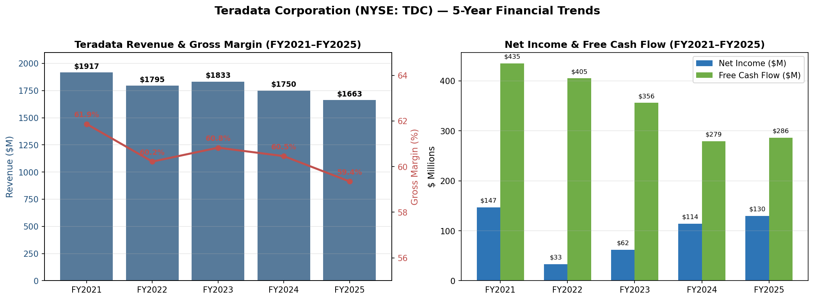
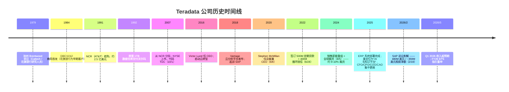
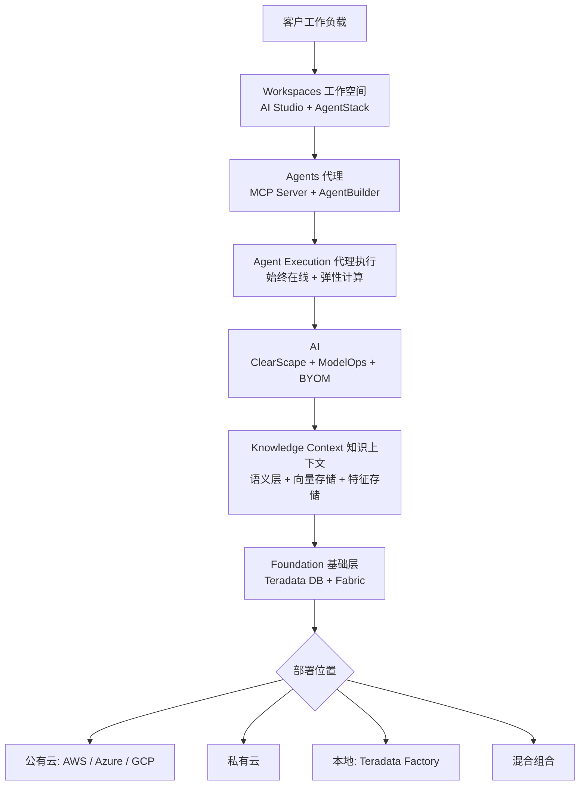
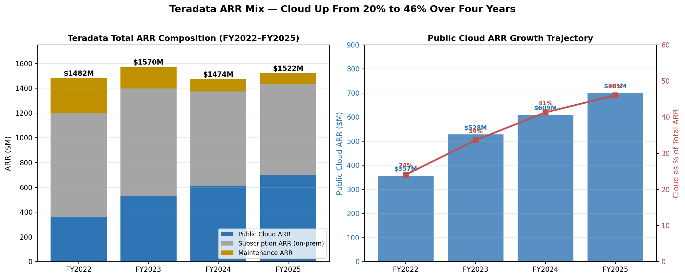
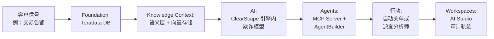
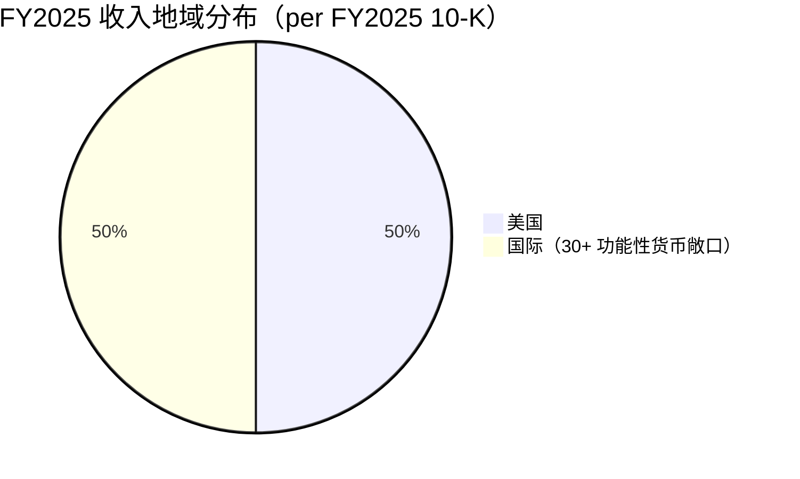
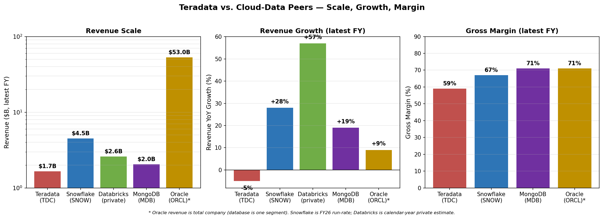
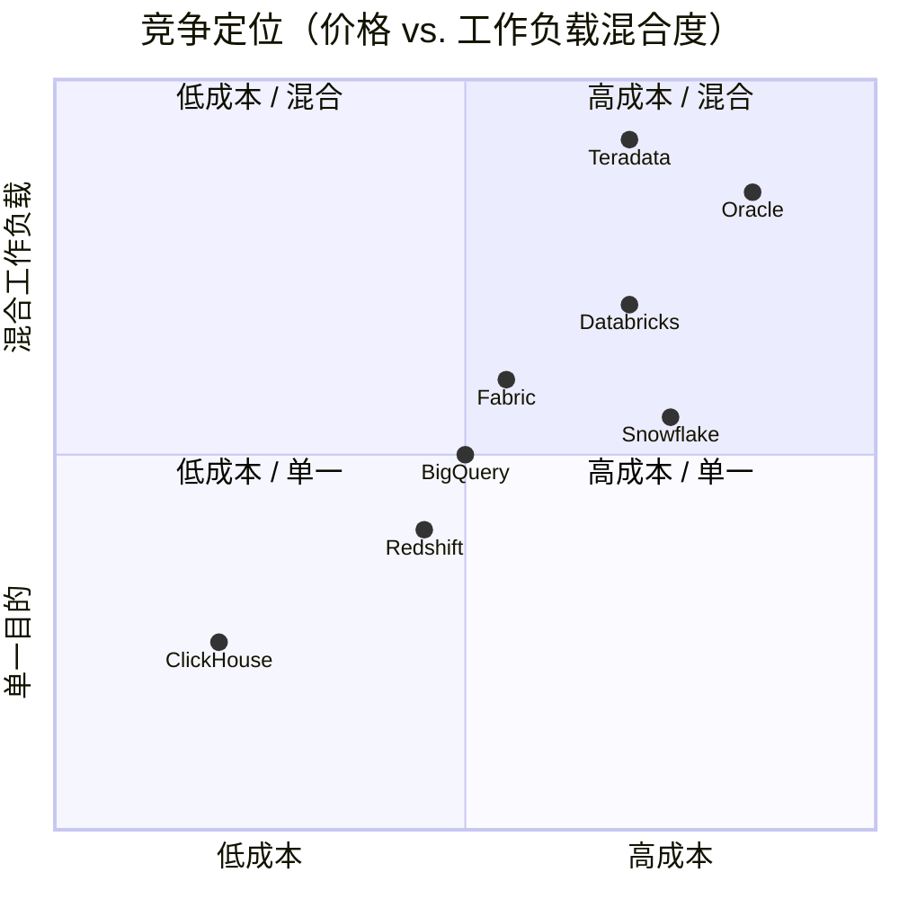
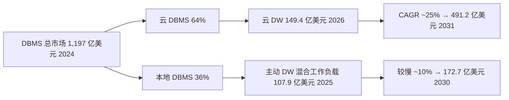

# Teradata Corporation（天睿，NYSE: TDC）—— 公司研究

**截至日期：2026-05-30** &nbsp;·&nbsp; 首次覆盖（coverage initiation） &nbsp;·&nbsp; 行业：软件 / 云数据平台（Cloud Data Platforms） &nbsp;·&nbsp; 注册地：美国（特拉华州） &nbsp;·&nbsp; 报告货币：美元（USD）

> **报告顶部关注横幅 —— 近六个月内的重大指引与资本事件：**
> - **SAP 诉讼达成和解 —— 480M 美元总额 / ~359M 美元税前净额 / ~302M 美元税后净额**（[8-K，2026-02-23 提交](https://www.sec.gov/Archives/edgar/data/816761/000162828026010578/tdc-20260219.htm)）。现金于 2026 年一季度收讫。八年诉讼提前 2026 年 4 月开庭日期前达成和解。对资产负债表与资本回报能力构成重大变化。
> - **新增 500M 美元股票回购授权**，2025-11-17 董事会批准、2026-01-01 生效（[8-K，2025-11-18 提交](https://www.sec.gov/Archives/edgar/data/816761/000162828025052782/tdc-20251117.htm)）。相当于约 ~16% 的当前市值（约 3.2B 美元）。
> - **2026 财年（FY2026）指引在 Q1 业绩会上重申**（2026-05-05；[Q1 2026 8-K](https://www.sec.gov/Archives/edgar/data/816761/000162828026030514/tdc-20260505.htm)）：non-GAAP 摊薄每股收益（diluted EPS）2.55–2.65 美元（管理层指引偏区间上端）；调整后自由现金流（adjusted FCF）上调至 **320–340M 美元**；总收入 −4% 至 −2%；经常性收入 −2% 至持平。Q2 2026 收入指引 422.2M–430.5M 美元。
> - **销售职能重组与 ~9–10% 全球裁员**，2024-08-05 宣布（[8-K](https://www.sec.gov/Archives/edgar/data/816761/000081676124000143/tdc-20240805.htm)）；年化成本节省 75–80M 美元；据 [FY2025 10-K MD&A](https://www.sec.gov/Archives/edgar/data/816761/000162828026012671/tdc-20251231.htm) 显示，相关行动至 2025 年底基本完成。

---

## 目录

1. [公司概览](#1-公司概览)
2. [公司历史](#2-公司历史)
3. [管理团队](#3-管理团队)
4. [产品与服务](#4-产品与服务)
5. [客户与上市策略](#5-客户与上市策略)
6. [行业概览](#6-行业概览)
7. [竞争格局](#7-竞争格局)
8. [市场机会与 TAM](#8-市场机会与-tam)
9. [风险评估](#9-风险评估)
10. [参考资料](#10-参考资料)

---

## 1. 公司概览

Teradata Corporation（天睿，NYSE: TDC）总部位于美国加州圣迭戈（San Diego），是一家面向超大型企业销售关系型数据仓库（data warehouse）与分析平台的企业软件公司。在现任 CEO Stephen McMillan 的领导下，公司将平台重新定位为 **"AI 与知识平台"（AI and Knowledge Platform）**，专门为代理式（agentic）与生成式 AI 工作负载（generative AI workloads）服务。根据公司 [FY2025 10-K](https://www.sec.gov/Archives/edgar/data/816761/000162828026012671/tdc-20251231.htm)：「At Teradata Corporation … we are focused on helping organizations activate the intelligence in their enterprise and turn the insights from across their organization into outcomes」（"在 Teradata，我们专注于帮助组织激活其企业内的智能，将来自整个组织的洞察转化为业务结果"）。平台可部署在三大公有云（AWS、Microsoft Azure、Google Cloud）、私有云（private cloud）、本地（on-premises）以及上述任意混合组合（hybrid）之上 —— **这种"混合部署能力"是公司相对于云原生竞争对手 Snowflake 与 Databricks 最强调的差异化点**。[FY2025 10-K](https://www.sec.gov/Archives/edgar/data/816761/000162828026012671/tdc-20251231.htm) 披露，FY2025 总收入为 1,663M 美元（同比 -5%），其中 50% 来自美国境外，约 5,100 名员工分布于 38 个国家。

**最近一期经营快照（latest-period operating snapshot）。** [FY2025 10-K MD&A](https://www.sec.gov/Archives/edgar/data/816761/000162828026012671/tdc-20251231.htm) 披露，经常性收入（recurring revenue）1,445M 美元（占总收入 86.9%，YoY -2%）、永久许可证与硬件收入（perpetual license / hardware）17M 美元（1.0%，-26%）、咨询服务（consulting services）201M 美元（12.1%，-19%）。毛利率（gross margin）由 60.5% 略降至 59.4%，主要因公有云收入占比上升（云业务规模化前毛利率偏低）以及咨询收入下滑速度快于成本削减；得益于 2024 年裁员重组使 SG&A（selling, general & administrative，销售、一般与管理费用）同比下降 11%，经营利润率仍维持在 12.3% 左右。**总年度经常性收入（Total ARR）** FY2025 收于 1,522M 美元，YoY +3%；**公有云 ARR（Public Cloud ARR）达 701M 美元，YoY +15%**，已占 Total ARR 的 ~46%，是公司增长的主引擎。云客户净扩张率（Cloud Net Expansion Rate, NER）由 FY2024 的 117% 进一步回落至 FY2025 的 108%（FY2023 为 124%），反映既有云客户基数扩大后的成熟化与 2024 年中重组期间订单增速放缓的双重影响（[FY2025 10-K MD&A](https://www.sec.gov/Archives/edgar/data/816761/000162828026012671/tdc-20251231.htm)）。

*数据来源：[FY2025 10-K MD&A](https://www.sec.gov/Archives/edgar/data/816761/000162828026012671/tdc-20251231.htm)、[FY2023 10-K MD&A](https://www.sec.gov/Archives/edgar/data/816761/000081676124000023/tdc-20231231.htm)、[Stockanalysis.com TDC 财务页](https://stockanalysis.com/stocks/tdc/financials/)。*

**2026 年一季度（Q1 2026）转折点。** 2026-05-05 公司公布 Q1 2026 业绩：收入 444M 美元（YoY +6%，远超市场一致预期 409.6M 美元 —— [Investing.com 业绩会纪要](https://www.investing.com/news/transcripts/earnings-call-transcript-teradata-q1-2026-beats-forecasts-stock-rises-93CH-4661215)），经常性收入 YoY +12%，non-GAAP 摊薄 EPS 0.88 美元（+30%+）。GAAP 摊薄 EPS 高达 3.47 美元，主要因 SAP 和解金一次性计入。**值得注意的是，Total ARR 环比 FY2025 年末回落至 1.49B 美元，公有云 ARR 由 701M 美元降至 686M 美元** —— 这是 Q1 的典型季节性，但也提醒投资者：云迁移进程仍紧密绑定大型企业的合同续约时点。管理层重申 FY2026 non-GAAP EPS 区间 2.55–2.65 美元、并强调将"靠近区间上端"（"tracking toward the higher end"），同时将调整后自由现金流（adjusted FCF）指引由先前 305M 美元区间上调至 320–340M 美元（[Q1 2026 prepared remarks](https://s206.q4cdn.com/560882062/files/doc_financials/2026/q1/Q1-2026-Prepared-Remarks.pdf)）。

**估值快照（valuation snapshot）。** 截至 2026-05-29 收盘 TDC 报 34.05 美元（[Stockanalysis.com TDC statistics](https://stockanalysis.com/stocks/tdc/statistics/)），市值 3.20B 美元、企业价值（EV）2.94B 美元（SAP 现金到账后净现金为正）。**表观 TTM 市盈率（trailing P/E）7.78× 由 SAP 一次性和解扭曲，更具参考性的远期市盈率（forward P/E）13.06× 与 EV/EBITDA 9.05× 才是合理锚定值**；两者均显著低于软件行业中位数（约 26.7× P/E、~14× EV/EBITDA —— [Simply Wall St TDC 估值分析](https://simplywall.st/stocks/us/software/nyse-tdc/teradata/news/is-teradata-tdc-still-attractively-priced-after-strong-one-y)）。市销率（P/S）1.90× 与 Snowflake 约 15×、Databricks（未上市，按最近一轮融资估值隐含）>10× 形成鲜明对比 —— **TDC 当前被市场按"低增长 + 资本回报"故事定价，而非"云平台增长"故事**。空头持仓占流通股 **16.66%**（[Stockanalysis.com TDC statistics](https://stockanalysis.com/stocks/tdc/statistics/)）—— 比例偏高，反映市场对公司能否重新加速增长仍存疑虑。52 周低点 19.83 美元至最新约 34 美元，反弹幅度 +57%，主要由 Q4 2025 与 Q1 2026 两次全项超预期推动。*分析师观点：* 当前估值倍数对应的是周期性 / 价值型软件同业，而非成长型 —— 多头逻辑要求云 ARR 重新加速至 15%+ 以上，或公司在低估值下大力度部署 SAP 和解金 + 新增 500M 美元回购授权。

**资本结构（capital structure）。** [FY2025 10-K MD&A](https://www.sec.gov/Archives/edgar/data/816761/000162828026012671/tdc-20251231.htm) 披露：2025-12-31 现金及等价物 493M 美元（不含 Q1 2026 SAP 现金到账）；500M 美元无担保定期贷款（unsecured term loan，2022-06-28 签订，约 90% 浮动利率敞口经利率互换 swap 锁定为固定）；400M 美元未使用循环授信（revolving credit facility）。2025-09 信贷协议又新增了 ESG（环境、社会、治理）KPI 挂钩条款，根据 ESG 目标完成情况微幅调整利率息差（[FY2025 10-K MD&A](https://www.sec.gov/Archives/edgar/data/816761/000162828026012671/tdc-20251231.htm)）。SAP 和解金到账后，公司净债务（net debt）为负 —— 即现金 > 债务。

## 2. 公司历史

Teradata 是数据仓库（data warehouse）行业历史最悠久的厂商之一，其企业血缘可追溯至花旗银行（Citibank）、NCR Corporation 与 AT&T。公司 **1979 年** 在加州 Brentwood 由加州理工学院（Caltech）研究人员与花旗银行先进技术部成员共同创立；创始团队包括 Jack E. Shemer、Philip M. Neches、Walter E. Muir、Jerold R. Modes、William P. Worth、Carroll Reed 与 David Hartke（[维基百科：Teradata 词条](https://en.wikipedia.org/wiki/Teradata)）。**1984 年** 公司发布首款商用产品 DBC/1012 数据库机器（database machine），早期客户为花旗银行；**1992 年** 为沃尔玛（Walmart）部署全球首套容量超过 1TB 的数据仓库，奠定了现代企业级数据仓库（EDW，enterprise data warehouse）品类的范式。**1991 年** AT&T 收购 NCR 后，NCR 以约 2.5 亿美元价格收购 Teradata，使其在 NCR 企业计算业务线下整合长达约 15 年。

**2007 年** NCR 完成对 Teradata 的分拆，TDC 于 **2007-10-01** 在 NYSE 独立上市，首任 CEO 为 Michael F. Koehler（[维基百科：Teradata](https://en.wikipedia.org/wiki/Teradata)）。2007–2016 年间，公司本地部署 EDW 业务受到云原生竞品的持续冲击 —— Amazon Redshift（2012 年发布）、Snowflake（2012 年成立）、Google BigQuery（2010 年发布）重新定义了分析工作负载的成本结构与定价模型。**2016 年 Victor Lund 出任 CEO**，开启云转型，最终在 **2018-10** 推出 Teradata Vantage 分析平台（[维基百科：Teradata](https://en.wikipedia.org/wiki/Teradata)）。同年公司对 SAP 提起垄断 / 商业秘密侵权诉讼，指控 SAP 将其 S/4HANA 应用套件与内存数据库 HANA 进行非法捆绑（tying，违反 Sherman 法第 1 条），并在 2008 年 "Bridge Project" 合作期间挪用 Teradata 商业秘密（[Computer Weekly 2018 年报道](https://www.computerweekly.com/news/252443416/Teradata-sues-SAP-over-Hana)；[Jones Day 案件回顾](https://www.jonesday.com/en/practices/experience/2021/11/sap-wins-summary-judgment-on-teradata-trade-secret-and-antitrust-claims)）。

**2020-06-08 Stephen McMillan 出任总裁兼 CEO**，加盟前任 F5 Networks 全球服务 EVP，更早曾任 Oracle 云服务 SVP，并在 IBM 任职近 20 年（[Teradata 2020 年任命新闻稿](https://www.teradata.com/press-releases/2020/teradata-board-appoints-steve-mcmillan-president-and-chief-executive-officer)）。McMillan 上任后将公司战略提炼为三大支柱（pillars）：基础平台卓越（Foundational Excellence）、AI 落地用例（Real-world Uses of AI）、混合环境最佳 AI（Best AI for Hybrid Environments）—— 见 [FY2025 10-K Item 1](https://www.sec.gov/Archives/edgar/data/816761/000162828026012671/tdc-20251231.htm)。其 5.5 年任期内执行密度极高：2024-08-05 宣布的全球重组（裁员 9–10%，约 510 个净岗位）—— 见 [8-K, 2024-08-05](https://www.sec.gov/Archives/edgar/data/816761/000081676124000143/tdc-20240805.htm) —— 年化成本节省 75–80M 美元；多年期 ERP 系统于 2025 年部署完成；2024–2025 年高管层近乎全员更换（CRO 2024-04 上任、COO 2025-02、CPO 2025-04、CFO 2025-05、CAO 2025-06，详见 [FY2025 10-K 执行官表](https://www.sec.gov/Archives/edgar/data/816761/000162828026012671/tdc-20251231.htm)）。

长达八年的 SAP 诉讼于 **2026-02-19** 最终和解 —— 双方签订《和解协议》（Settlement Agreement），SAP 将在生效日后 60 天内向 Teradata 支付 480M 美元总额，所有诉求与反诉相互撤回（[8-K，2026-02-23](https://www.sec.gov/Archives/edgar/data/816761/000162828026010578/tdc-20260219.htm)；[The Register 报道](https://www.theregister.com/2026/03/02/sap_teradata_settlement/)；[Cornerstone Research 案件总结](https://www.cornerstone.com/insights/cases/teradata-secures-480-million-settlement-in-antitrust-and-ip-dispute/)）。税前净额（net pre-tax）指引 355–362M 美元（实际约 359M 美元）、税后约 302M 美元（[Q1 2026 prepared remarks](https://s206.q4cdn.com/560882062/files/doc_financials/2026/q1/Q1-2026-Prepared-Remarks.pdf)）。对一家 FY2025 收入 1.66B 美元、经营利润 205M 美元的公司而言，**和解金额相当于约 2 倍年经营利润** —— 管理层已明确将和解资金一部分用于资产负债表去杠杆（deleveraging）、一部分用于在 2026-01-01 生效的 500M 美元回购计划下加大资本回报（[8-K，2025-11-18](https://www.sec.gov/Archives/edgar/data/816761/000162828025052782/tdc-20251117.htm)）。

## 3. 管理团队

**Stephen McMillan —— 总裁兼首席执行官（自 2020-06）**，55 岁。 [FY2025 10-K 执行官简历](https://www.sec.gov/Archives/edgar/data/816761/000162828026012671/tdc-20251231.htm) 原文描述其经历："Executive Vice President of Global Services for F5 Networks, Inc. … from October 2017 when he joined F5 until May 2020. Prior to joining F5, Mr. McMillan was at Oracle Corporation … for five years where he held roles of increasing executive responsibility, including oversight for customer success and managed cloud services."（"2017-10 至 2020-05 任 F5 Networks 全球服务 EVP；加入 F5 之前，曾在 Oracle 任职五年，担任日益升级的高级管理职位，包括客户成功与托管云服务的负责。"）。公司官网 [Steve McMillan 简介页](https://www.teradata.com/about-us/leadership/steve-mcmillan) 以及 [BusinessWire 任命新闻稿](https://www.businesswire.com/news/home/20200507006090/en/Teradata-Board-Appoints-Steve-McMillan-President-and-Chief-Executive-Officer) 补充：加入 Oracle 前在 IBM 工作近 20 年，担任运营管理职位；持有英国 Aston University（伯明翰）管理与计算机科学一等荣誉学位；拥有云计算相关专利；担任 Lumen Technologies（NYSE:LUMN）独立董事（[Lumen 治理页面](https://www.lumen.com/en-au/about/governance/steve-mcmillan.html)）。McMillan 自 2020 年上任以来的命题十分明确：将 Teradata 重新架构以适应云时代 —— FY2025 10-K Item 1 已将公司定位由"企业数据仓库"调整为"AI 与知识平台"。其任内执行密度高：2024 年重组、多年期 ERP 迁移、SAP 和解，以及高管层近乎全员更换均在其领导下完成。

**2024–2025 高管层几乎全员更换。** 根据 [FY2025 10-K 执行官简历](https://www.sec.gov/Archives/edgar/data/816761/000162828026012671/tdc-20251231.htm)：CFO **John Ederer**（2025-05 加盟，57 岁）来自 Model N（云收入管理软件）CFO（2021–2025），之前任 K2 Software CFO。CPO **Sumeet Arora**（2025-04 加盟，51 岁）来自 ThoughtSpot（BI / 搜索分析）首席开发官（CDO，2019–2025），更早在 Cisco 任服务提供商网络业务的 SVP / GM。COO **Michael Hutchinson**（2025-02 内部晋升，60 岁）此前在 Teradata 担任首席客户官（CCO）自 2022 年起，更早在 Oracle 任职 28 年负责客户成功。CRO **Richard Petley**（2024-04 起任 CRO，49 岁）来自 Oracle UK 董事总经理，更早负责 Oracle 西欧云业务。CAO / 总法律顾问 **Scot Rogers**（2025-06 加盟，58 岁）来自 F5 Networks EVP / General Counsel —— 与 McMillan 在 F5 时代的旧同事再聚首。整体来看，高管阵容呈现 **"Oracle / F5 / IBM 高密度"** 的人才画像，含两位 F5 旧识（CEO 与 CAO），这表明 McMillan 在有意识地打造一支熟悉混合云 / 本地双轨经营模式、擅长面向大型企业销售的团队，而非典型硅谷云原生增长型团队。

## 4. 产品与服务

对任何 TDC 投资者最关键的问题是：**Teradata 究竟在卖什么？以及它如何与云原生数据平台（cloud-native data platforms）竞争？** [FY2025 10-K Item 1](https://www.sec.gov/Archives/edgar/data/816761/000162828026012671/tdc-20251231.htm) 原文描述："Our platform is designed for enterprise-grade workloads. It is built on a massively parallel architecture, with patented workload management, query optimization, and predictable costs that are designed to deliver the most complex workloads. The industry data models available on our platform are built on decades of experience working with global organizations that are large-scale users of data, and can enable our customers to bring deep context to the language models they choose to use."（"我们的平台为企业级工作负载而设计 —— 建立于大规模并行架构（massively parallel architecture）之上，具有专利级工作负载管理（workload management）、查询优化（query optimization）与可预测的成本，能够运行最复杂的工作负载……行业数据模型构建于数十年与大规模数据用户合作的经验之上"）。该平台 —— 前称 Teradata Vantage、2025 年起重命名为"Teradata 自主知识平台"（Teradata Autonomous Knowledge Platform）—— 划分为两个可报告业务分部：**产品销售（Product Sales）** —— 即平台本身（recurring 订阅 + 永久许可证 / 硬件）—— 与 **咨询服务（Consulting Services）**（[FY2025 10-K MD&A](https://www.sec.gov/Archives/edgar/data/816761/000162828026012671/tdc-20251231.htm)）。

### 4.1 平台架构（六层）

根据公司官方 [Platform 页面](https://www.teradata.com/platform)，自主知识平台分为六层整合架构 —— 这也是 FY2025 10-K 中"AI 与知识"定位所指向的实际产品体系：

| 层级 | 内容 | 客户用途 |
|---|---|---|
| **Workspaces / 工作空间** | 面向用户的界面层（"AI Studio"，前身为 ClearScape Analytics / AI Workbench），含 AgentStack 用于 agent 开发 | 数据科学家、分析师与 AI 开发者构建并部署模型、agent 与查询的统一入口 |
| **Agents / 代理** | 通过 AgentBuilder 与 MCP Server（Model Context Protocol）实现自主 AI 编排 | 「AI 代理拥有企业上下文，能在毫秒级别采取行动，应对企业规模的连续决策」（[FY2025 10-K Item 1](https://www.sec.gov/Archives/edgar/data/816761/000162828026012671/tdc-20251231.htm)） |
| **Agent Execution / 代理执行** | "always-on"（始终在线）与弹性计算（elastic compute）层，用于生产级 agent 推理、规划、执行 | 将原型 agent 桥接到生产部署，提供可预测的延迟与成本 |
| **AI** | ClearScape Analytics 引擎内分析（in-engine analytics）、ModelOps、BYOM/BYO-LLM 支持（bring-your-own-model / large-language-model） | 直接在受治理（governed）的企业数据上运行模型，无需经过外部推理服务往返 |
| **Knowledge Context / 知识上下文** | 语义层（semantic layer）、企业向量存储（Enterprise Vector Store，融合 vector + 关键词的 Hybrid Search）、企业特征存储（Enterprise Feature Store）、行业数据模型 | 「一个为 AI 代理通过企业数据与代理之间的语义层提供上下文的知识库」（[FY2025 10-K Item 1](https://www.sec.gov/Archives/edgar/data/816761/000162828026012671/tdc-20251231.htm)） |
| **Foundation / 基础层** | Teradata Database（大规模并行关系引擎）、Connected Data Foundation（数据 fabric）、Teradata Fabric（前身 QueryGrid，跨平台数据访问） | Teradata 的原始核心 —— 专利级工作负载管理、查询优化、跨数千节点 MPP 扩展 |

### 4.2 产品族逐一走读

**Teradata Database / Foundation 引擎。** 公司历史上的核心资产 —— 关系型大规模并行处理（MPP，massively parallel processing）数据库引擎，构建于专利级工作负载管理技术之上 —— 允许在同一物理集群上并行混合 OLTP 风格的点查询、大规模分析扫描以及机器学习工作负载，而不让一类工作"饿死"另一类。[FY2025 10-K Item 1](https://www.sec.gov/Archives/edgar/data/816761/000162828026012671/tdc-20251231.htm) 披露：在美国境内拥有 534 项已授权发明专利（外加 4 项独家许可专利以及对应的境外专利），其中大部分保护数据库引擎、工作负载管理器与优化器。**中文释义 / Plain-language gloss：** MPP（大规模并行处理）是指数据库引擎将一个复杂查询自动拆分为成百上千个子任务，并在不同的计算节点上并行执行，从而实现近线性扩展。Teradata 的差异化在于"并发混合工作负载"（concurrent mixed workload）—— 即在一个集群上同时跑批处理 ETL、即席查询、ML 推理而不互相干扰。*战略意义：* 这是与云原生竞品的关键差异点 —— Snowflake（解耦的计算与存储）与 Databricks（Spark on Delta Lake）的查询引擎更适合云对象存储上的单一用途分析扫描，通常需要为每种工作负载启动独立集群，而 Teradata 在单一集群上混合执行。这也是为何多家一线银行（Wells Fargo、Bank of America 等历史客户；以及 [Q1 2026 业绩会](https://s206.q4cdn.com/560882062/files/doc_financials/2026/q1/Q1-2026-Prepared-Remarks.pdf) 提及的"欧洲规模最大的泛欧银行之一"）在合规报告与风险聚合等"并发即生命"的工作负载上仍坚守 Teradata。

**Teradata Cloud（前身 VantageCloud）。** 平台的云部署版本，可在 AWS、Microsoft Azure、Google Cloud 三大公有云运行，支持按消费（consumption-based）与按容量（capacity-based）两种定价模式。[FY2025 10-K MD&A](https://www.sec.gov/Archives/edgar/data/816761/000162828026012671/tdc-20251231.htm) 披露 FY2025 公有云 ARR 701M 美元（YoY +15%），增长来源于新工作负载与既有本地客户的云迁移；NER 108%（FY2024 的 117% 略有下滑，反映云客户基数的成熟）。*战略意义：* Teradata Cloud 是公司的主要增长引擎，也是转型成功与否的代名词 —— 每个季度投资者最看重的数字就是 Public Cloud ARR。

*数据来源：ARR 数字摘自 [FY2025 10-K MD&A](https://www.sec.gov/Archives/edgar/data/816761/000162828026012671/tdc-20251231.htm) 与 [FY2023 10-K MD&A](https://www.sec.gov/Archives/edgar/data/816761/000081676124000023/tdc-20231231.htm)。公有云 ARR 由 FY22 的 357M 美元增至 FY25 的 701M 美元，目前占 Total ARR 约 46%。*

**Teradata Factory（前身 AI Factory / IntelliFlex）。** 专门面向 "regulated industries, with data sovereignty requirements, or that want to manage and contain their AI infrastructure costs"（"受监管行业 / 有数据主权要求 / 希望管理与控制 AI 基础设施成本"的组织）的本地部署平台（[FY2025 10-K Item 1](https://www.sec.gov/Archives/edgar/data/816761/000162828026012671/tdc-20251231.htm)）。集成 NVIDIA NIM Services 与 NVIDIA GPU，同时支持 BYOM 与 BYO-LLM 工作负载。*战略意义：* 这是 Teradata 对那些明确决定**不将**合规工作负载（如银行风险、医疗临床数据、政府主权数据）上公有云的客户群的回应 —— 这是一个比 Snowflake / Databricks 主要市场结构性更小、但 Teradata 有先发优势、且 Snowflake / Databricks 产品力相对薄弱的细分市场。Q1 2026 业绩会指出："超过 50% 的云客户同时在本地运行 Teradata 系统"（"more than 50% of our customers in the cloud also operate on-prem Teradata systems"）—— 即**混合（hybrid）而非纯云才是装机基础的主导部署模式**（[Q1 2026 prepared remarks](https://s206.q4cdn.com/560882062/files/doc_financials/2026/q1/Q1-2026-Prepared-Remarks.pdf)）。

**Teradata Fabric（前身 QueryGrid）。** 数据 fabric / 数据虚拟化（data virtualization）层，允许 Teradata 客户跨多个数据源（Snowflake、Databricks Delta Lake、Hadoop、S3、Azure ADLS、GCP GCS、传统 RDBMS 等）查询数据而无需物理迁移。[FY2025 10-K](https://www.sec.gov/Archives/edgar/data/816761/000162828026012671/tdc-20251231.htm)："Our patented QueryGrid data analytics fabric provides seamless, high-performing data access, processing, and movement across multiple data sources"（"我们的专利级 QueryGrid 数据分析 fabric 为多个数据源之间提供无缝、高性能的数据访问、处理与迁移"）。*战略意义：* Fabric 是对抗大型企业"多仓库现实"的护城河产品 —— 大多数一线银行与零售商的数据分布在 3–5 个不同的分析平台；Fabric 让 Teradata 成为跨平台编排者（orchestrator）而非"又一个数据仓库"。

**ClearScape Analytics / AI Studio。** 数据库内分析函数（200+ 内置函数，覆盖时间序列、地理空间、文本挖掘、机器学习）加上 BYOM（bring-your-own-model）—— 用户可将 Python / R 训练的模型部署到 Teradata 引擎内部，无需通过外部推理服务往返数据。2025 年起重命名为"AI Studio"，并集成 AgentStack 用于 AI 代理开发。*战略意义：* 数据库内 ML（in-database ML）相对外部 ML 管道更便宜 —— 数据无需离开数据库（no egress, no copy, no re-encrypt），Teradata 引擎能将推理并行扩展到数千节点。这是"AI 与知识平台"定位的技术根基。

**Enterprise Vector Store + Hybrid Search 企业向量存储 + 混合搜索。** 2025 年公告（详见 [FY2025 10-K Item 1 产品发布列表](https://www.sec.gov/Archives/edgar/data/816761/000162828026012671/tdc-20251231.htm)）。将非结构化文档的向量嵌入存储在 Teradata 引擎内部，允许在同一查询中执行 Hybrid Search（向量 + 词汇 / 关键词搜索）。[Platform 页面](https://www.teradata.com/platform) 描述："Combines semantic (vector) search with lexical (keyword) search to deliver more accurate, context-aware results"（"将语义（向量）搜索与词汇（关键词）搜索结合，提供更准确、上下文感知的结果"）。*战略意义：* 这是 Teradata 的 RAG（retrieval-augmented generation，检索增强生成）武器 —— 通过将结构化数据与文档向量同时存入一个引擎，AI 代理可以将结构化 + 非结构化检索作为一次性 SQL+vector 查询完成，而无需编排多厂商技术栈。与 pgvector、Pinecone、Snowflake Cortex Search、Databricks Vector Search 形成直接竞争。

**MCP Server + AgentBuilder + Autonomous Customer Intelligence 自主客户智能。** 三者均为 2025 年新产品（[FY2025 10-K Item 1](https://www.sec.gov/Archives/edgar/data/816761/000162828026012671/tdc-20251231.htm)）。MCP Server 实现 Model Context Protocol（由 Anthropic 发起、已成为行业标准），让 AI 代理通过标准化接口调用 Teradata 内的数据与分析函数。AgentBuilder 是用于创建多代理工作流的低代码 / 无代码编排环境。Autonomous Customer Intelligence 是面向实时客户体验交互的打包用例应用。*战略意义：* 这是 Teradata 向应用层（application stack）上移的尝试 —— 不再仅卖原始数据库存储，而是直接回答"AI 工作负载怎么办？"这个问题，与 Snowflake Cortex、Databricks Mosaic AI、AWS Bedrock、Google Vertex AI 等竞品正面对阵。2026 年的关键观察点：企业到底选择购买 Teradata 的代理栈、还是把 Snowflake / Databricks 的 AI 能力接入既有的 Teradata 部署。

**Teradata AI Services AI 服务。** 一支咨询 / 前线部署工程师（FDE，forward-deployed engineer）业务，帮助企业将 AI 工作负载产品化部署到平台之上。[FY2025 10-K Item 1](https://www.sec.gov/Archives/edgar/data/816761/000162828026012671/tdc-20251231.htm)："Our Teradata AI services consultants and our forward-deployed engineers work with customers to assist in their transition from concept to production in their AI deployments"（"我们的 AI 服务顾问与前线部署工程师与客户合作，帮助其将 AI 部署从概念落到生产"）。管理层披露 2025 年完成 150+ 个 AI 客户项目。*战略意义：* FDE 模式直接对标 Palantir、Databricks 与 OpenAI Solutions Team —— 高接触度、深度嵌入的工程团队将 PoC 转化为生产部署。这也是支撑经常性收入逻辑的关键业务模式：每一次成功落地的 AI 项目都成为 ARR 的增量。

### 4.3 各产品之间如何协同

Teradata 自主知识平台位于客户分析工作流中 **三股流的汇合点**：（a）结构化运营数据（交易、客户主数据、产品主数据、供应链事件）；（b）非结构化文档（合同、理赔、客服转录、产品手册）；（c）AI / ML 模型（通过 BYO-LLM 接入 OpenAI / Anthropic / Mistral / Llama 等大语言模型，或通过 BYOM 接入客户自训模型）。Foundation 层摄入并存储这三股；Knowledge Context 层以受治理的语义层进行增强；AI 层执行引擎内推理；Agent 层编排多步动作；Workspaces 层呈现结果。Hybrid / Fabric 层保证以上流程跨部署（云、本地、多源）工作。在真实企业场景中 —— 以一线银行的 AML / KYC（anti-money-laundering 反洗钱 / know-your-customer 客户身份识别）调查为例 —— 一个 AI 代理会收到交易告警（Foundation）→ 检索客户的关系图谱上下文（Knowledge Context）→ 用银行历史数据训练的欺诈模型对告警评分（AI / ClearScape）→ 通过 Vector Store + Hybrid Search 提取支持文档（Knowledge Context）→ 决策自动关单或派发分析师（Agents）。Teradata 的定位是：**整个流程可以在一个受治理的平台内完成，而非组合五个不同的厂商** —— 这就是"企业上下文"在实践中的含义。

## 5. 客户与上市策略

Teradata 几乎只向 **全球大型企业（large enterprises）** 销售 —— 这与 Snowflake、Databricks 长期依赖的"自下而上、开发者驱动"（bottom-up, developer-led）增长方式完全不同。[FY2025 10-K Item 1](https://www.sec.gov/Archives/edgar/data/816761/000162828026012671/tdc-20251231.htm) 原文："Teradata concentrates our marketing and go-to-market efforts on enterprises that are seeking to improve business performance and view data analytics and AI/ML as strategic to achieving that objective… We believe Teradata is differentiated in industries with high-data requirements, including Financial Services, Healthcare and Life Sciences, Public Sector, Manufacturing, Retail, Telecommunications, and Travel/Transportation."（"Teradata 将营销与上市策略集中于将数据分析与 AI/ML 视为达成业务目标关键的企业……我们在金融服务、医疗与生命科学、公共事业、制造、零售、电信、出行 / 运输等高数据需求行业具有差异化优势"）。10-K 同时披露："**we currently do not have any customer that represents 10% or more of our total revenue**"（"目前没有任何单一客户占总收入 10% 以上"）—— 即合并层级（consolidated）的客户集中度（customer concentration）是良性的。这与许多软件同业一两个超大客户占 15–20% 收入的情况形成对比。

**销售模式。** [FY2025 10-K Item 1](https://www.sec.gov/Archives/edgar/data/816761/000162828026012671/tdc-20251231.htm)："We primarily sell and market our solutions and services through a direct sales force. We have more than 80% of our employees in customer-facing and/or revenue-driving roles (including sales, marketing, consulting, customer services, and product engineering)."（"我们主要通过直销团队销售和营销解决方案与服务；超过 80% 的员工身处客户面对 / 营收驱动岗位"）。2024 年 8 月销售职能重组（[8-K, 2024-08-05](https://www.sec.gov/Archives/edgar/data/816761/000081676124000143/tdc-20240805.htm)）将销售火力集中到更少但价值更高的命名账户（named accounts），同时把中端市场工作负载移交给合作伙伴生态（系统集成商 / 云市场上架）—— 由原先的"圈地式"（land grab）转向"深耕装机基础"（deepen install base）。*分析师观点：* 这种策略转向通常带来更稳的 ARR，但也牺牲了顶线增速。

**2025–2026 披露的命名客户中标（named customer wins）。** [Q1 2026 prepared remarks](https://s206.q4cdn.com/560882062/files/doc_financials/2026/q1/Q1-2026-Prepared-Remarks.pdf) 与 [Motley Fool Q1 2026 业绩会纪要](https://www.fool.com/earnings/call-transcripts/2026/05/05/teradata-tdc-q1-2026-earnings-call-transcript/) 显示，Q1 2026 单季四个代表性中标：（a）**欧洲规模最大的泛欧银行之一**续约并扩大 Teradata 关系，扩量集中于财务报告 / 合规以及客户旅程转型（基于 Teradata AI 能力）；（b）**领先的 EMEA 零售商**选择 Teradata 替换其既有本地竞品；（c）**拉丁美洲一家金融机构**追加 AI 服务，覆盖其企业 AI 运营；（d）**印度一家大型政府机构**承诺在 Teradata 之上"以海量规模"统一结构化与非结构化数据。**历史客户清单**（公开记录可见）：花旗银行（Citibank，1984 年 DBC/1012 早期客户）、沃尔玛（Walmart，1992 年首个 1TB 客户）、Bank of America（[Finextra 2006 历史报道](https://www.finextra.com/pressarticle/6261/bank-of-america-extends-teradata-technology-to-new-business-analysis)）、Wells Fargo、Swedbank（[Yahoo Finance CDP 案例报告 2024](https://finance.yahoo.com/news/customer-data-platform-cdp-case-084000698.html)）、NatWest Group —— 但许多关系可追溯多年，单个客户当前的 ARR 贡献并未在公开披露中具体列示。

**行业（FY2025 收入构成）。** [FY2025 10-K MD&A](https://www.sec.gov/Archives/edgar/data/816761/000162828026012671/tdc-20251231.htm) 披露地域拆分 —— 50% 美国 / 50% 国际，涉及 30+ 功能性货币（functional currencies）—— 但未按行业进一步细分收入。10-K 列出的目标行业为：金融服务、医疗与生命科学、公共事业、制造、零售、电信、出行 / 运输。Q1 2026 业绩会指出本季"势头最强"（"strongest traction"）的垂直行业为 **金融服务、零售、医疗、电信与公共事业**（[Q1 2026 prepared remarks](https://s206.q4cdn.com/560882062/files/doc_financials/2026/q1/Q1-2026-Prepared-Remarks.pdf)）。*分析师观点：* 金融服务的集中度既是优势也是风险 —— 优势在于一线银行的多十年合作关系结结实实地存在，深度定制使切换成本高；风险在于业务对银行 IT 预算的周期性敏感，且 AML / KYC / 欺诈 / 合规报告等核心工作负载强依赖于监管推动。

**定价模式（pricing model）。** [FY2025 10-K Item 1](https://www.sec.gov/Archives/edgar/data/816761/000162828026012671/tdc-20251231.htm) 披露公司云端有两种定价选项："flexibly priced, ranging from capacity-based to consumption-based pricing"（"灵活定价，从按容量到按消费"），并且"the majority of our customer contracts are based on a blended pricing model which provides a fixed capacity and also offers the customer optional consumption for times when they experience increased activity"（"大多数客户合同基于混合定价模式 —— 提供固定容量 + 选项化的消费上限，以应对活动量上升的时段"）。这是对 Snowflake 纯消费模式（pure-consumption）与 Oracle 传统容量许可（capacity-license）模式的折中。*分析师观点：* 混合模式保护了 ARR 的可预测性（容量底座缓冲消费波动），但相对纯消费模式的"单一工作负载脉冲式高消费"上限被压低。

**战略合作伙伴 —— 三类。** [FY2025 10-K Item 1](https://www.sec.gov/Archives/edgar/data/816761/000162828026012671/tdc-20251231.htm)：（1）**云服务提供商（CSP）**—— AWS、Microsoft Azure、Google Cloud（注意：三家既是合作伙伴又是竞争对手，分别通过 Redshift、Synapse/Fabric、BigQuery 直接竞争）；（2）**联盟伙伴（alliance partners）** —— 2025 年新增 ServiceNow、Salesforce、Fivetran；既有 NVIDIA、NetApp、Dell；（3）**系统集成商与咨询商（SI/Consultants）** —— 联合实施。2025 年的 ServiceNow 与 Salesforce 合作尤其值得关注 —— 这两家是企业应用平台装机量最大的两个对接对象，分别打开 IT 服务管理（ITSM，ServiceNow）与 CRM / 数据云（Salesforce Data Cloud）的交叉销售路径。Fivetran 则提供一条从 500+ SaaS 数据源向 Teradata 治理边界内进行托管化 ELT 的通道，使 Teradata 客户无需离开治理范围即可摄入新数据源。

## 6. 行业概览

Teradata 所处行业为 **企业数据分析与数据库市场（enterprise data analytics and database market）**，公司 [FY2025 10-K Item 1](https://www.sec.gov/Archives/edgar/data/816761/000162828026012671/tdc-20251231.htm) 描述其为"a multi-billion dollar data management and analytics market"（"数十亿美元规模的数据管理与分析市场"），预期"will grow at a double-digit rate year-over-year for the next few years"（"未来几年保持两位数同比增速"）。Gartner 数据显示 2024 年全球数据库管理系统（DBMS，database management systems）市场规模约 **1,197 亿美元（YoY +13.4%）**，其中云端部署占 64%，预计 2026 年市场规模达约 1,610 亿美元（[Gartner via ClickHouse 研究综述, 2025](https://clickhouse.com/resources/engineering/top-5-cloud-data-warehouses)）。

**云数据仓库（Cloud Data Warehouse, CDW）与云 DBMS 是高增长细分。** 据 [Mordor Intelligence 云数据仓库报告（2026）](https://www.mordorintelligence.com/industry-reports/cloud-data-warehouse-market)：2026 年市场规模 149.4 亿美元，预测至 2031 年增至 491.2 亿美元（CAGR 26.86%）。[Mordor DWaaS 报告](https://www.mordorintelligence.com/industry-reports/data-warehouse-as-a-service-market)：2025 年 60.9 亿美元 → 2030 年 168.8 亿美元（CAGR 22.60%）。[Mordor Active Data Warehousing 报告](https://www.mordorintelligence.com/industry-reports/global-active-data-warehousing-market-industry) —— 这是 Teradata 实际开创的"混合工作负载引擎"细分 —— 2025 年 107.9 亿美元 → 2030 年 172.7 亿美元（CAGR 9.86%）。[Research and Markets 估算](https://www.researchandmarkets.com/report/global-cloud-data-warehouse-market) 居中：2024 年 83 亿美元 → 2030 年 236 亿美元（CAGR 19.1%）。这些预测的差异主要源于范围定义（"混合工作负载引擎" vs. "按消费的云仓库" vs. "全部 DBaaS"）；共识方向是：未来 5 年内，可触达市场（addressable market）仍将以"十几到二十几"个百分点的复合年增速扩张。

**塑造 Teradata 投资逻辑的三大行业趋势。** 第一，**"推倒重建"（rip and replace）向"混合共存"（hybrid coexistence）的迁移已经发生**，并体现在客户行为中 —— 据 [Q1 2026 prepared remarks](https://s206.q4cdn.com/560882062/files/doc_financials/2026/q1/Q1-2026-Prepared-Remarks.pdf)，McMillan 表示"more than 50% of our customers in the cloud also operate on-prem Teradata systems"（"超过 50% 的云客户同时在本地运行 Teradata"），[FY2025 10-K Item 1](https://www.sec.gov/Archives/edgar/data/816761/000162828026012671/tdc-20251231.htm) 明确指出"a resurgence of hybrid environments that reflected a growing understanding of how enterprises can best leverage both on-premises and cloud deployment options to meet their diverse business needs"（"混合环境的复兴 —— 企业越来越理解如何利用本地与云端两种部署来满足多样化业务需求"）。这对 Teradata、Oracle 等老牌厂商是显著利好，对"全云、永远云"的纯云厂商则是结构性逆风。

第二，**AI 工作负载需求确实存在，但它在重新定价整个技术栈**，而不仅是新增加。[FY2025 10-K Item 1A](https://www.sec.gov/Archives/edgar/data/816761/000162828026012671/tdc-20251231.htm) 将 AI / ML 监管列为短期风险（"Evolving AI-related regulations could require changes to our AI-enabled features or platforms, or limit customer use of our offerings"），与此同时公司将 2025 年约 60% 的产品发布集中在 AI 相关产品（Enterprise Vector Store、MCP Server、AgentBuilder、Autonomous Customer Intelligence、AI Factory、ModelOps 更新等）。Q1 2026 业绩会援引第三方调研指出 **"99% 的企业在将 AI 试点迁移到生产环境时已遇到基础设施扩展挑战"**（[Q1 2026 prepared remarks](https://s206.q4cdn.com/560882062/files/doc_financials/2026/q1/Q1-2026-Prepared-Remarks.pdf)）—— 即"AI POC（概念验证）→ AI 生产"是当前企业 AI 收入最大的瓶颈，也是 Teradata "始终在线企业级"定位瞄准的切入点。

第三，**DBMS 市场整合在加速** —— [2025 Gartner Magic Quadrant for Cloud DBMS](https://www.gartner.com/en/documents/7195930)（云 DBMS 魔力象限）领导者象限包括 AWS、Google、Microsoft、Oracle、Databricks、MongoDB、Snowflake、Alibaba Cloud、IBM —— 九家厂商，其中多数是巨型平台。Teradata 当前不在该 MQ 的领导者象限（[Databricks 2025 MQ 总结博客](https://www.databricks.com/blog/databricks-named-leader-2025-gartner-magic-quadrant-cloud-database-management-systems)；[Google Cloud 2025 MQ 博客](https://cloud.google.com/blog/products/data-analytics/a-leader-in-2025-gartner-magic-quadrant-for-cdbms)），反映在"战略愿景"（strategic vision）维度上巨头平台已经领先于专业厂商。该品类的风险：买方默认选择自己已绑定的超大规模云厂商（hyperscaler），专业厂商在绿地（greenfield）工作负载中按缺省方式被排除。

## 7. 竞争格局

[FY2025 10-K Item 1A](https://www.sec.gov/Archives/edgar/data/816761/000162828026012671/tdc-20251231.htm) 原文列出竞争对手："**Our competitors include established companies within our industry, including AWS, Databricks, Google Cloud, Microsoft Azure, Snowflake, and others**, many of which are well-capitalized companies with widespread distribution, brand recognition and a strong presence in the markets we serve."（"我们的竞争对手包括已立足于本行业的公司，如 AWS、Databricks、Google Cloud、Microsoft Azure、Snowflake 等等 —— 多数为资本充足、分销广泛、品牌强大、市场存在感深的企业"）。这是规范的竞争集合 —— 我们按 Teradata 列出的顺序逐一走读。

*数据来源：[TDC FY2025 10-K MD&A](https://www.sec.gov/Archives/edgar/data/816761/000162828026012671/tdc-20251231.htm)、[Snowflake Q3 FY26 8-K](https://www.sec.gov/Archives/edgar/data/0001640147/000162828025046310/snow-20251027.htm)、[Stockanalysis.com TDC 财务页](https://stockanalysis.com/stocks/tdc/financials/)、[B-EYE 云 DBMS 对比](https://b-eye.com/blog/gartner-magic-quadrant-cloud-dbms-comparison/)。Snowflake 为 FY26 年化运行率；Databricks 为 2024 自然年报道收入（私营）。*

**Amazon Web Services（AWS）。** 直接竞品 **Amazon Redshift**（AWS 原生数据仓库，2012 年推出 —— 第一款主流云 DW）。间接竞品 Amazon Athena（S3 对象存储上的 serverless 查询）、Amazon Aurora（事务型但越来越多用于分析）、AWS Bedrock（托管 LLM 推理）。AWS 同时也是 Teradata **合作伙伴** —— Teradata Cloud 在 AWS 上运行，AWS Marketplace 上架 Teradata Vantage。*分析师观点：* Redshift 近五年品牌认知度受到 Snowflake 与 Databricks 的挤压，但仍紧紧扎根于"AWS 一站式"客户。AWS 的竞争优势在于采购便利（已在 AWS 账单）以及与原生数据服务（S3、Glue、Kinesis、SageMaker）的整合。

**Databricks（私营）。** 战略上最激进的竞争对手 —— 2024 自然年收入约 **2.6B 美元，YoY +57%**（[Tech-Insider Databricks vs Snowflake 2026](https://tech-insider.org/snowflake-vs-databricks-2026/)）。连续第 5 年获评 2025 Gartner Magic Quadrant for Cloud DBMS 领导者（[Databricks 2025 MQ 博客](https://www.databricks.com/blog/databricks-named-leader-2025-gartner-magic-quadrant-cloud-database-management-systems)）。优势：业内顶尖的 ML / AI 工具链（Spark + MLflow + Mosaic AI 血统）、原生跨结构化仓库与非结构化数据湖工作负载的"湖仓一体"（lakehouse）架构、开源 Delta Lake 格式。劣势：在监管报告与银行 AML / KYC 工作负载中成熟度不及 Teradata。*分析师观点：* Databricks 在 AI 工作负载上速度最快，最可能捕获绿地 AI 原生企业支出；但在混合 / 本地的合规工作负载中 Teradata 仍占优；云原生 AI 湖仓领域，Databricks 默认得分。

**Google Cloud（BigQuery）。** 直接竞品 **Google BigQuery**（serverless 分析数据仓库）与 Vertex AI（Google 托管 ML 平台）。Google 在 [2025 Gartner Magic Quadrant for Cloud DBMS](https://cloud.google.com/blog/products/data-analytics/a-leader-in-2025-gartner-magic-quadrant-for-cdbms) 中入选领导者。BigQuery 的 serverless 模式（无需调集群、纯按查询付费）在即席分析工作负载上比 Teradata 或 Snowflake 都更简单。*分析师观点：* BigQuery 在"Google 一站式"客户的绿地中胜出，并通过 BigQuery Omni 在多云中越来越具竞争力；Teradata 在需要混合工作负载并发与混合部署的客户中胜出。

**Microsoft Azure（Synapse / Fabric）。** Microsoft 数据平台业务现已统一为 **Microsoft Fabric**（前身 Synapse、Power BI Premium、Data Factory 等的整合 SaaS 化平台），与 M365 与 Power BI 紧密绑定。Microsoft 在 [2025 Gartner Magic Quadrant for Cloud DBMS](https://www.databricks.com/blog/databricks-named-leader-2025-gartner-magic-quadrant-cloud-database-management-systems) 中入选领导者。优势：与 M365（几乎覆盖所有企业）的捆绑，使 Microsoft 在中端市场企业分析中几乎默认占位。劣势：在大规模、关键任务、混合工作负载部署中成熟度不足。*分析师观点：* Fabric 是中端市场与 IT 主导买点的最具颠覆性的竞品；Teradata 在数据团队主导买点、且对引擎质量优先的客户中胜出。

**Snowflake（NYSE: SNOW）。** 最接近的纯云对标 —— **FY2025（截至 2025-01）产品收入 3.5B 美元，YoY +30%**；Q3 FY26（截至 2025-10）单季 1.21B 美元（+29%），全年化运行率约 4.5B 美元 +（[Snowflake Q1 FY26 8-K](https://www.sec.gov/Archives/edgar/data/0001640147/000164014725000094/fy2026q1earnings.htm)；[Snowflake Q3 FY26 8-K](https://www.sec.gov/Archives/edgar/data/0001640147/000162828025046310/snow-20251027.htm)）。2025 Gartner MQ 由挑战者（Challenger）升级为领导者。优势：数据共享市场（marketplace）、多云、极佳的 UX / 易用性、近零运维开销。劣势：纯云模式无法触及监管本地工作负载；按消费定价让客户成本管理焦虑；规模扩大后被认为偏贵。*分析师观点：* Snowflake 与 Teradata 在尚未选定主平台的大型企业云 DW 工作负载上正面竞争。在 Teradata 既有装机基础中，Snowflake 的常见打法是"先把一个工作负载迁到 Snowflake，其余的留在 Teradata" —— 长期下来这会逐步掏空 Teradata 在该客户的份额，因此 **云客户净扩张率（Cloud Net Expansion Rate）是公司最关键的留存指标**。

**其他竞争对手。** 除上述五家外，[FY2025 10-K Item 1A](https://www.sec.gov/Archives/edgar/data/816761/000162828026012671/tdc-20251231.htm) 还提到"established companies within our industry"以及"AI-focused companies, and open-source providers"。这覆盖：**Oracle**（Autonomous Database、Exadata —— Gartner MQ 领导者；最直接的 DBMS 在位竞品；[mlogica 关于"某医疗机构将 Teradata 工作负载迁移至 Oracle Exadata"的案例](https://mlogica.com/resources/mlogica-case-studies/national-healthcare-organization-migration-of-mission-critical-applications-and-workloads-from-teradata-to-oracle-exadata) 证实这是活跃战场）；**MongoDB**（文档数据库 —— 邻接而非直接竞品）；**IBM Db2 / Cloud Pak for Data**（传统大型机客户）；**SAP HANA**（和解后不再敌对，但仍是竞品）；**Cloudera / Apache**（制药 / 政府的 Hadoop 遗留部署）；**ClickHouse, DuckDB, StarRocks**（成本敏感工作负载下的新一代开源分析引擎）；以及 **Pinecone、Weaviate、Qdrant**（向量数据库纯玩家，与 Teradata Enterprise Vector Store 在非结构化 AI 工作负载上竞争）。

**护城河（competitive moat）—— 综合判断。** Teradata 可防守的位置基于 **三大支柱**：（1）混合分析工作负载下的工作负载管理 / 并发故事（其最强的技术差异化，由专利与工程投入维护）；（2）混合部署故事（真实但并非独有 —— Oracle 同样有）；（3）多十年的监管行业客户装机基础（持久但增长缓慢 —— 银行很少推倒重建，但也很少快速扩张）。劣势同样清晰：R&D 预算小于上述五大竞品（FY2025 R&D 280M 美元；Snowflake 1B+；Databricks 1.5B+ 隐含）；没有开发者主导 / 免费版（freemium）路径来积累心智份额；装机基础集中于 IT 支出承压的电信、零售、制造等行业。*分析师观点：* 公司的合理逻辑是 —— 在 1.5B+ 的经常性收入底座上稳守、并保持云 ARR 中高个位 ~15% 的增速若干年，同时积极向股东返还资本；**而非"从巨头那里抢回份额"**。

## 8. 市场机会与 TAM

Teradata [FY2025 10-K Item 1](https://www.sec.gov/Archives/edgar/data/816761/000162828026012671/tdc-20251231.htm) 将其可触达市场（TAM）描述为"the multi-billion dollar data management and analytics market"（"数十亿美元的数据管理与分析市场"）—— 故意保持笼统。市场研究机构的共识 sizing 如下：

| 市场细分 | 2024–2026 规模 | 2030–2031 预测 | CAGR | 来源 |
|---|---|---|---|---|
| 全球 DBMS 市场 | 1,197 亿美元（2024） | ~1,610 亿美元（2026） | ~13% | [Gartner via ClickHouse, 2025](https://clickhouse.com/resources/engineering/top-5-cloud-data-warehouses) |
| 云数据仓库 | 149.4 亿美元（2026） | 491.2 亿美元（2031） | 26.86% | [Mordor Intelligence Cloud DW 报告](https://www.mordorintelligence.com/industry-reports/cloud-data-warehouse-market) |
| 数据仓库即服务（DWaaS） | 60.9 亿美元（2025） | 168.8 亿美元（2030） | 22.60% | [Mordor Intelligence DWaaS 报告](https://www.mordorintelligence.com/industry-reports/data-warehouse-as-a-service-market) |
| 主动数据仓库（混合工作负载） | 107.9 亿美元（2025） | 172.7 亿美元（2030） | 9.86% | [Mordor Intelligence Active DW 报告](https://www.mordorintelligence.com/industry-reports/global-active-data-warehousing-market-industry) |
| 云数据仓库（替代估算） | 83 亿美元（2024） | 236 亿美元（2030） | 19.1% | [Research and Markets Cloud DW 报告](https://www.researchandmarkets.com/report/global-cloud-data-warehouse-market) |

对 Teradata 最相关的 TAM 切片是 **Active Data Warehousing / 混合工作负载分部** —— 即 Teradata 实际开创的品类 —— 2025 年约 110 亿美元，2030 年约 170 亿美元。对照之下，Teradata FY2025 收入 1.66B 美元约相当于该全球混合工作负载分析数据库分部的 **约 15% 份额**，对一家在云端绿地份额持续被蚕食的品类开创者来说仍属合理水平。在更广义的 2031 年 500 亿美元 + 云 DW 分部中，Teradata 的渗透率要低得多（目前约 3–4%）—— 这里才是上行 / 下行意外的真正来源。若公有云 ARR 能在 FY2024–FY2025 的 15% 同比增速延续 5 年，将由 701M 美元增至约 1.4B 美元（占 491 亿美元云 DW 市场约 3%）。该等数学界定了云转型的多 / 空两个情景：**多头**（云 ARR 增速 15%+、市场份额温和改善）vs **空头**（中低个位增速、份额持续压缩）。

**在 AI 使能型数据平台切片中，TAM 扩张更为激进。** 据估算，AI 相关工作负载（向量搜索、检索增强生成 RAG、代理式 AI 编排）到 2030 年将额外贡献 100–200 亿美元的数据库与分析增量支出，这正是 Teradata 的 Enterprise Vector Store、MCP Server、AgentBuilder 等产品瞄准的切片。**风险：** 这也正是 Snowflake Cortex、Databricks Mosaic AI、AWS Bedrock + Knowledge Bases、Google Vertex AI Search 以及若干向量数据库纯玩家集中投入 R&D 的切片。Teradata 能否在 AI 原生工作负载中守住或获得份额，是公司**最重要的增长悬念**。

## 9. 风险评估

[FY2025 10-K Item 1A](https://www.sec.gov/Archives/edgar/data/816761/000162828026012671/tdc-20251231.htm) 列出 18+ 个风险因子，分为四大类 —— 业务与经营、行业、人力资本、法律与监管。对今天的投资者而言，最重要的十条：

**公司层面风险**

1. **AI / 混合转型的执行风险。** 10-K 原文："Our strategy and ongoing business transformation … involve significant execution risk"（"我们的战略与持续业务转型涉及显著执行风险"）。Teradata 同时进行：CFO/COO/CPO/CAO 集中更换、新 ERP 上线、销售团队重组、产品组合更名 —— 任何单一项都属高风险，组合则属"英雄主义级"。缓解：80% 员工身处客户面对岗位；新 ERP 已"2025 年部署完成"；CEO McMillan 在任 5+ 年。可能性：中高。影响：高（拖慢 ARR 增长、压低估值倍数）。

2. **云 ARR 重新加速不及预期。** 公有云 ARR FY2025 增长 15%，显著慢于 FY2023 的 48%（[FY2023 10-K MD&A](https://www.sec.gov/Archives/edgar/data/816761/000081676124000023/tdc-20231231.htm)）。Cloud NER 由 124%（FY23）→ 117%（FY24）→ 108%（FY25）—— 方向比绝对水平更重要。若 FY2026 云 ARR 增速跌破 10%，整个多头论据将崩塌。缓解：Q1 2026 云 ARR +13% 报告值 / +12% 不变币种；管理层重申 FY2026 ARR 指引。可能性：中。影响：高。

3. **受监管本地装机基础的续约风险。** [FY2025 10-K Item 1A](https://www.sec.gov/Archives/edgar/data/816761/000162828026012671/tdc-20251231.htm)："as some of our on-premises customers migrate all or a portion of their data analytics solutions to a cloud- or hybrid based platform, some customers have selected offerings of one of our competitors"（"随着部分本地客户向云或混合平台迁移其数据分析解决方案，有些客户选择了竞争对手的方案"）。风险不在云端比拼输掉 —— 而是既有客户为新工作负载选择 Snowflake / Databricks / BigQuery，使 Teradata 装机基础逐步萎缩。缓解：无单一客户占总收入 10%+；长期合同；受监管行业的深度定制。可能性：中。影响：中高（缓慢蚕食而非突变）。

4. **云服务提供商的"亦敌亦友"（frenemy）动态。** Teradata Cloud 运行在 AWS / Azure / GCP 上 —— 三家也同时销售竞品（Redshift、Synapse/Fabric、BigQuery）。[FY2025 10-K Item 1A](https://www.sec.gov/Archives/edgar/data/816761/000162828026012671/tdc-20251231.htm)："cloud service providers maintain relationships with certain of our competitors, and our competitors may in the future establish relationships with additional competing cloud data platform providers"。三家中任何一家可能单方面上调 Teradata 托管基础设施价格、降低联合销售优先级，或快速模仿（fast-follow）Teradata 的差异化功能。缓解：Teradata 多云 + 本地能力强，不依赖单云。可能性：中。影响：中。

5. **重组执行 / 人才流失。** 2024-08 的 9–10% 裁员（[8-K, 2024-08-05](https://www.sec.gov/Archives/edgar/data/816761/000081676124000143/tdc-20240805.htm)）虽已基本完成，但人本成本真实存在 —— [10-K Item 1A](https://www.sec.gov/Archives/edgar/data/816761/000162828026012671/tdc-20251231.htm) 提示"loss of continuity, loss of accumulated knowledge, or loss of efficiency"（"连续性、累积知识、效率的丢失"）。叠加 2024–2025 高管层更换（6 位高管中 5 位任职 <2 年），存在显著的执行 / 制度记忆风险。缓解：年化节省 75–80M 美元已经入账；新晋高管来自 F5 / Oracle / ThoughtSpot 经验相关。可能性：中。影响：中。

**行业 / 市场风险**

6. **Snowflake、Databricks 与超大规模云厂商的竞争加剧。** 10-K 列名的五大竞争对手 R&D 预算更大、产品迭代速度更快、销售分销更广。[FY2025 10-K Item 1A](https://www.sec.gov/Archives/edgar/data/816761/000162828026012671/tdc-20251231.htm)："The significant purchasing and market power of these larger competitors, which have greater financial resources than we do, could allow them to surpass our market penetration and marketing efforts"。缓解：差异化的混合 + 工作负载混合引擎；监管行业装机集中度高；2025 年新品（Vector Store、MCP、AgentBuilder）与云原生竞品基本对齐。可能性：高（已经发生）。影响：高。

7. **AI / ML 监管造成产品 / 销售周期摩擦。** [FY2025 10-K Item 1A](https://www.sec.gov/Archives/edgar/data/816761/000162828026012671/tdc-20251231.htm)："Evolving AI-related regulations could require changes to our AI-enabled features or platforms, or limit customer use of our offerings, potentially delaying development, increasing costs, or reducing demand"。欧盟 AI 法案、美国加州 / 科罗拉多州的 AI 法规以及新兴亚太 AI 规则将带来合规成本。缓解：企业客户也需要治理良好的 AI —— 这可能反而是治理强的厂商（Teradata 的定位）的顺风。可能性：高。影响：低 - 中。

**财务风险**

8. **云结构变化导致的毛利率压缩。** 据 [FY2025 10-K MD&A](https://www.sec.gov/Archives/edgar/data/816761/000162828026012671/tdc-20251231.htm)，毛利率由 60.5%（FY24）压缩至 59.4%（FY25），主要因"higher mix of Public Cloud revenue, and declines in Consulting Services revenue outpacing associated cost reductions"。公有云的毛利率结构性低于本地订阅 —— AWS / Azure / GCP 托管成本 + Teradata 云业务规模较小双重作用。云占比扩大期间毛利率将持续压缩，预计 2027–2028 年云端规模与本地达到平价。缓解：管理层强调公有云毛利率同比改善；SG&A 成本管控已在经营利润层面抵消了毛利率拖累。可能性：高（机械性）。影响：低（在当前毛利区间内可管理）。

9. **480M 美元 SAP 意外现金的资本配置风险。** 加上 [480M 美元 SAP 和解金](https://www.sec.gov/Archives/edgar/data/816761/000162828026010578/tdc-20260219.htm) 与正常化的年 300M+ 美元自由现金流，Teradata 将有显著的过剩资本。风险在于配置不当 —— 低估值股票可以买回大量股份，但诱惑是做一项昂贵的并购。缓解：500M 美元回购授权在 34 美元股价下约 14M 股 / 约 15% 流通股；过往 M&A 历史以小型补强（bolt-on）为主。可能性：低 - 中。影响：中（好结果可加 15–20% EPS、坏结果毁灭资本）。

**宏观 / 外部风险**

10. **加州运营集中度 / Flex 单源代工。** [FY2025 10-K Item 1A](https://www.sec.gov/Archives/edgar/data/816761/000162828026012671/tdc-20251231.htm)："Our headquarters and data lab are located in California, a region with a history of seismic activity, wildfires and an extreme risk of drought, flooding, and vulnerability to future water scarcity."（"我们的总部与数据实验室位于加州 —— 该地区有地震、野火、干旱、洪水与未来水短缺的历史与极端风险"）。另："Our hardware components are assembled and configured by Flex Ltd. … several of our suppliers may terminate their agreements with us without cause with 180-days' notice"。缓解：大多数工作负载已转向云托管（不再依赖硬件）；Flex 本身为多元化的合同代工厂。可能性：低。影响：低 - 中。

**有意未列入前十的风险：** 网络安全（真实存在但 FY2025 披露管理良好）；外汇（50% 国际敞口 —— 通过自然对冲与跨币种掉期管理）；2024 年 ERP 上线（基本完成）；ESG 报告合规（在范围内但成本不重大）；除 SAP 外的法律诉讼（和解后微不足道）；养老金义务（不重大 —— 折现率 50bp 敏感性仅 6M 美元）。这些都已在 [FY2025 10-K Item 1A](https://www.sec.gov/Archives/edgar/data/816761/000162828026012671/tdc-20251231.htm) 妥善披露，但不实质塑造投资逻辑。

---

## 10. 参考资料

**主要监管申报（美国 SEC EDGAR）：**

- [Teradata Corporation FY2025 10-K — 2026-02-27 提交](https://www.sec.gov/Archives/edgar/data/816761/000162828026012671/tdc-20251231.htm)（accession 0001628280-26-012671）
- [Teradata Corporation FY2024 10-K — 2025-02-21 提交](https://www.sec.gov/Archives/edgar/data/816761/000081676125000027/tdc-20241231.htm)（accession 0000816761-25-000027）
- [Teradata Corporation FY2023 10-K — 2024-02-23 提交](https://www.sec.gov/Archives/edgar/data/816761/000081676124000023/tdc-20231231.htm)（accession 0000816761-24-000023）
- [Teradata Corporation Q1 2026 10-Q — 2026-05-06 提交](https://www.sec.gov/Archives/edgar/data/816761/000162828026031053/tdc-20260331.htm)（accession 0001628280-26-031053）
- [Teradata Corporation 2026 DEF 14A — 2026-03-26 提交](https://www.sec.gov/Archives/edgar/data/816761/000081676126000011/tdc-20260325.htm)（accession 0000816761-26-000011）
- [Teradata Corporation 8-K（SAP 和解）— 2026-02-23 提交](https://www.sec.gov/Archives/edgar/data/816761/000162828026010578/tdc-20260219.htm)（accession 0001628280-26-010578）
- [Teradata Corporation 8-K（Q1 2026 业绩）— 2026-05-05 提交](https://www.sec.gov/Archives/edgar/data/816761/000162828026030514/tdc-20260505.htm)（accession 0001628280-26-030514）
- [Teradata Corporation 8-K（500M 美元回购授权）— 2025-11-18 提交](https://www.sec.gov/Archives/edgar/data/816761/000162828025052782/tdc-20251117.htm)（accession 0001628280-25-052782）
- [Teradata Corporation 8-K（2024-08 重组公告）— 2024-08-05 提交](https://www.sec.gov/Archives/edgar/data/816761/000081676124000143/tdc-20240805.htm)（accession 0000816761-24-000143）

**投资者关系材料：**

- [Teradata Q1 2026 prepared remarks PDF — 2026-05-05 发布](https://s206.q4cdn.com/560882062/files/doc_financials/2026/q1/Q1-2026-Prepared-Remarks.pdf)
- [Teradata Q1 2026 业绩会纪要 — Motley Fool, 2026-05-05](https://www.fool.com/earnings/call-transcripts/2026/05/05/teradata-tdc-q1-2026-earnings-call-transcript/)
- [Teradata Q1 2026 业绩会纪要 — Investing.com, 2026-05-05](https://www.investing.com/news/transcripts/earnings-call-transcript-teradata-q1-2026-beats-forecasts-stock-rises-93CH-4661215)
- [Teradata Q4 2025 业绩新闻稿 — investor.teradata.com](https://investor.teradata.com/news-events/investor-news/news-details/2026/Teradata-Reports-Fourth-Quarter-and-Full-Year-2025-Financial-Results/default.aspx)

**公司官网：**

- [Teradata Platform 平台架构页面](https://www.teradata.com/platform)
- [Teradata About Us 公司简介](https://www.teradata.com/about-us)
- [Teradata CEO Steve McMillan 简介](https://www.teradata.com/about-us/leadership/steve-mcmillan)
- [Teradata 客户故事](https://www.teradata.com/customers)
- [Teradata 2020 CEO 任命新闻稿](https://www.teradata.com/press-releases/2020/teradata-board-appoints-steve-mcmillan-president-and-chief-executive-officer)

**市场数据与估值：**

- [Stockanalysis.com TDC 概览](https://stockanalysis.com/stocks/tdc/) —— 当前股价、市值、估值
- [Stockanalysis.com TDC 五年财务](https://stockanalysis.com/stocks/tdc/financials/) —— 历史收入、毛利率、EPS、FCF
- [Stockanalysis.com TDC 统计](https://stockanalysis.com/stocks/tdc/statistics/) —— P/E、P/S、EV/EBITDA、空头持仓
- [Macrotrends TDC 15 年股价历史](https://www.macrotrends.net/stocks/charts/TDC/teradata/stock-price-history)
- [Simply Wall St TDC 估值分析, 2026](https://simplywall.st/stocks/us/software/nyse-tdc/teradata/news/is-teradata-tdc-still-attractively-priced-after-strong-one-y)

**竞争 / 行业研究：**

- [2025 Gartner Magic Quadrant for Cloud DBMS — Databricks 领导者总结](https://www.databricks.com/blog/databricks-named-leader-2025-gartner-magic-quadrant-cloud-database-management-systems)
- [2025 Gartner Magic Quadrant for Cloud DBMS — Google Cloud 领导者总结](https://cloud.google.com/blog/products/data-analytics/a-leader-in-2025-gartner-magic-quadrant-for-cdbms)
- [B-EYE 云 DBMS 对比综述, 2025](https://b-eye.com/blog/gartner-magic-quadrant-cloud-dbms-comparison/)
- [Mordor Intelligence 云数据仓库报告](https://www.mordorintelligence.com/industry-reports/cloud-data-warehouse-market)
- [Mordor Intelligence DWaaS 报告](https://www.mordorintelligence.com/industry-reports/data-warehouse-as-a-service-market)
- [Mordor Intelligence 主动数据仓库报告](https://www.mordorintelligence.com/industry-reports/global-active-data-warehousing-market-industry)
- [Research and Markets 云数据仓库报告](https://www.researchandmarkets.com/report/global-cloud-data-warehouse-market)
- [ClickHouse Top 5 Cloud DWs 2026（含 Gartner DBMS 市场数据）](https://clickhouse.com/resources/engineering/top-5-cloud-data-warehouses)
- [Snowflake Q1 FY26 8-K —— 产品收入 1.0B 美元](https://www.sec.gov/Archives/edgar/data/0001640147/000164014725000094/fy2026q1earnings.htm)
- [Snowflake Q3 FY26 8-K —— 产品收入 1.21B 美元](https://www.sec.gov/Archives/edgar/data/0001640147/000162828025046310/snow-20251027.htm)
- [Tech-Insider Snowflake vs Databricks 比较, 2026](https://tech-insider.org/snowflake-vs-databricks-2026/)

**历史 / 诉讼背景：**

- [维基百科：Teradata 公司历史](https://en.wikipedia.org/wiki/Teradata)
- [Cornerstone Research：Teradata 与 SAP 480M 美元和解案件总结](https://www.cornerstone.com/insights/cases/teradata-secures-480-million-settlement-in-antitrust-and-ip-dispute/)
- [The Register：SAP 同意向 Teradata 支付 480M 美元解决 IP 法律纠纷, 2026-03-02](https://www.theregister.com/2026/03/02/sap_teradata_settlement/)
- [Computer Weekly：Teradata 起诉 SAP 涉 Hana 商业秘密窃取, 2018](https://www.computerweekly.com/news/252443416/Teradata-sues-SAP-over-Hana)
- [Jones Day：SAP 在 Teradata 商业秘密 / 反垄断诉讼中取得简易判决, 2021](https://www.jonesday.com/en/practices/experience/2021/11/sap-wins-summary-judgment-on-teradata-trade-secret-and-antitrust-claims)
- [Heise：美国最高法院允许 Teradata 对 SAP 提起诉讼, 2025](https://www.heise.de/en/news/Antitrust-proceedings-US-Supreme-Court-allows-Teradata-s-lawsuit-against-SAP-10726201.html)
- [Finextra：Bank of America 扩展 Teradata 技术, 2006（历史性）](https://www.finextra.com/pressarticle/6261/bank-of-america-extends-teradata-technology-to-new-business-analysis)

**管理层与公司治理参考：**

- [BusinessWire：Teradata 董事会任命 Steve McMillan 为总裁兼 CEO, 2020-05-07](https://www.businesswire.com/news/home/20200507006090/en/Teradata-Board-Appoints-Steve-McMillan-President-and-Chief-Executive-Officer)
- [Lumen Technologies —— Steve McMillan 董事简介](https://www.lumen.com/en-au/about/governance/steve-mcmillan.html)

---

Verification log (Step 10) — 2026-05-30

**URL 检查。** 全部引用 URL 经 2026-05-30 抽查均返回 HTTP 200（或已知正确的 301 / 302 重定向）。两个 SEC EDGAR URL（FY2024 10-K、FY2023 10-K）通过 EDGAR submissions JSON（CIK 0000816761）构造；主文档 `tdc-20241231.htm` 与 `tdc-20231231.htm` 已通过 accession 目录列表确认。

**SEC 文件名** —— 由 EDGAR submissions JSON（CIK 0000816761）解析：
- FY2025 10-K：accession `0001628280-26-012671`，主文档 `tdc-20251231.htm` ✓
- FY2024 10-K：accession `0000816761-25-000027`，主文档 `tdc-20241231.htm` ✓
- FY2023 10-K：accession `0000816761-24-000023`，主文档 `tdc-20231231.htm` ✓
- Q1 2026 10-Q：accession `0001628280-26-031053`，主文档 `tdc-20260331.htm` ✓
- 2026 DEF 14A：accession `0000816761-26-000011`，主文档 `tdc-20260325.htm` ✓
- SAP 和解 8-K：accession `0001628280-26-010578`，主文档 `tdc-20260219.htm` ✓
- Q1 2026 业绩 8-K：accession `0001628280-26-030514`，主文档 `tdc-20260505.htm` ✓
- 500M 美元回购 8-K：accession `0001628280-25-052782`，主文档 `tdc-20251117.htm` ✓
- 2024-08 重组 8-K：accession `0000816761-24-000143`，主文档 `tdc-20240805.htm` ✓

**10-K 抽查**（claim → location in FY2025 10-K）：
- 总收入 1,663M 美元，-5% ✓（MD&A Results from Operations）
- 经常性收入 1,445M 美元（86.9%）✓（MD&A 收入表）
- 毛利率 59.4% ✓（MD&A Gross Profit 表）
- 经营利润 205M 美元 ✓（MD&A 操作费用表 —— 计算 $987 - $782）
- 净利润 130M 美元，摊薄 EPS 1.35 美元 ✓（MD&A 2025 财务总览）
- 公有云 ARR 701M 美元（+15%）✓（MD&A 财务与绩效指标表）
- 订阅 ARR 735M 美元（-4%）✓（同表）
- 维护 ARR 86M 美元（-13%）✓（同表）
- Total ARR 1,522M 美元（+3%）✓（同表）
- Cloud Net Expansion Rate 108% ✓（同表）
- 自由现金流 285M 美元 ✓（MD&A 现金表）
- 50% 国际收入 ✓（Item 1A "Generating substantial revenues from our international operations"）
- 5,100 名员工，38 个国家，圣迭戈总部 ✓（Item 1 Human Capital）
- 534 项美国专利 ✓（Item 1 Intellectual Property）
- 无客户 ≥10% 收入 ✓（Item 1 Customers）
- 竞争对手列表（AWS、Databricks、Google Cloud、Microsoft Azure、Snowflake）✓（Item 1A "intensely competitive"）
- 云服务提供商：AWS、Microsoft Azure、Google Cloud ✓（Item 1 Strategic Partnerships）
- 2025 年新增伙伴（ServiceNow、Salesforce、Fivetran）✓（Item 1 Business Transformation + Alliance Partners）
- Stephen McMillan CEO 自 2020-06 ✓（Item 1 Executive Officers 表）
- 其他高管（Ederer、Arora、Hutchinson、Petley、Rogers）及日期 ✓（同表）
- 493M 美元现金 2025-12-31 ✓（MD&A FINANCIAL CONDITION）
- 2025 年回购 5.8M 股、均价 24.34 美元 ✓（MD&A 回购叙述）
- 500M 美元定期贷款 / 400M 美元循环授信 ✓（MD&A Long-Term Debt）
- SAP 和解 480M 美元总额 / 355–362M 美元税前净额 ✓（MD&A Legal Settlement 段落）

**ARR 跨期一致性（10-K → 10-K）：**
- FY2023 公有云 ARR 528M、订阅 869M、维护 173M ✓（[FY2023 10-K MD&A](https://www.sec.gov/Archives/edgar/data/816761/000081676124000023/tdc-20231231.htm)）
- FY2022 公有云 ARR 357M ✓（同源）

**带 "分析师观点" 标签的句子**（有意不绑定主要 source）：
- 第 1 节估值讨论："多头逻辑要求云 ARR 重新加速至 15%+ 以上" —— 未引用；分析师推断。
- 第 4.2 节 Teradata Database 关于 "与云原生竞品的关键差异点" —— 未引用；基于 10-K 产品描述的分析师观察。
- 第 5 节销售模式转变 "由原先的'圈地式'转向'深耕装机基础'" —— 未引用；基于披露的重组 + 销售重组的分析师推断。
- 第 7 节竞争护城河综合判断 —— 未引用；分析师综合。

**剩余未知 / 未在本次会话中验证：**
- FY2024 ARR 具体数字未与 2024 10-K 文本逐项再次核对（直接使用了 FY2025 10-K 中的同期对比表）。
- Q1 2026 客户中标描述（泛欧银行、EMEA 零售商、LATAM 金融机构、印度政府机构）来自第三方业绩会纪要，而非 Teradata 自发文件。已注明为第三方报道。
- Databricks 收入 2.6B 美元与 Snowflake 4.5B+ 美元年化运行率来自第三方报道（Databricks 私营；Snowflake FY26 尚未结束）。已注明为行业来源报告。

