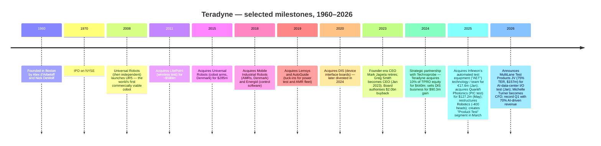
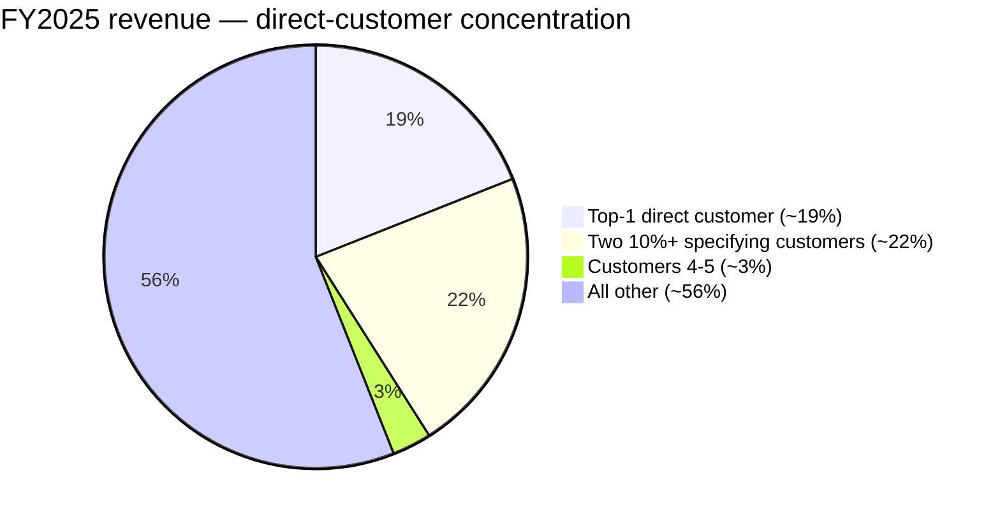
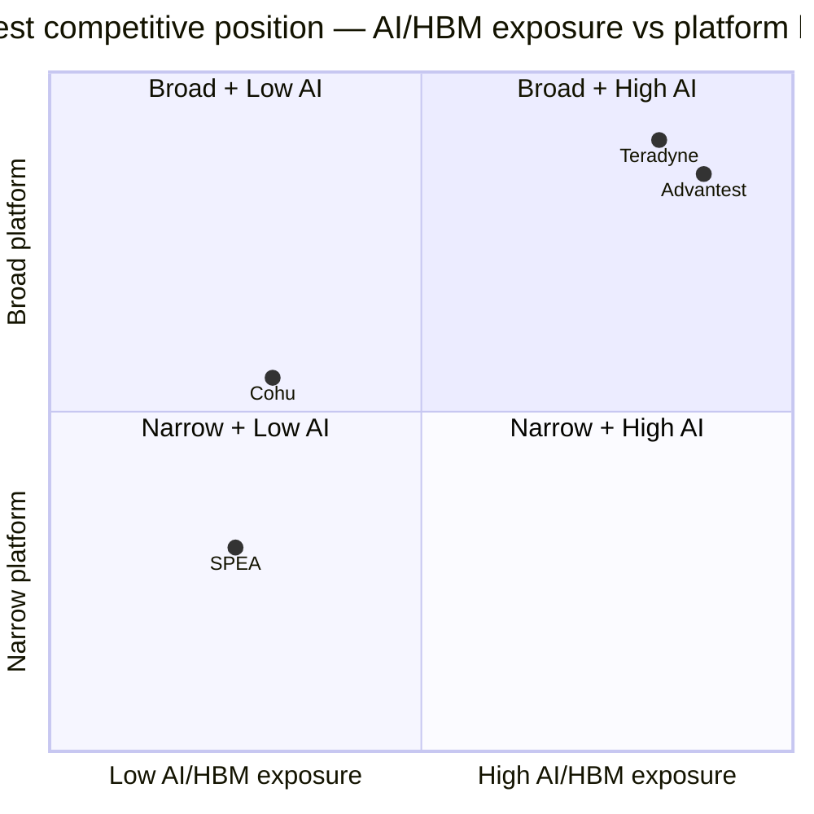

# Teradyne, Inc. (NASDAQ: TER) — Initiation of Coverage

**Date:** 2026-05-20
**Ticker:** NASDAQ: TER
**Headquarters:** North Reading, Massachusetts, USA
**Founded:** 1960
**Coverage analyst note:** Initiation report. All numbers are sourced from primary filings (SEC EDGAR 10-K, 10-Q, 8-K), Teradyne IR materials, or market-data providers cited inline. No estimates are dressed as facts; any modeled figure is labelled as such.

> **Update — Q1 2026 results, record quarter; AI now ~70% of revenue (2026-04-28):** Teradyne reported Q1 2026 revenue of **$1,282 million (+87% YoY)** with GAAP EPS of **$2.53** and non-GAAP EPS of **$2.56**, both well above the high end of prior guidance. Management disclosed that approximately **70% of Q1 2026 revenue was tied to AI-related demand** across compute (SoC test for hyperscaler ASICs and VIP designs), memory (HBM/DRAM final test) and AI-data-center I/O. Q2 2026 guidance was initiated at **$1,150–$1,250 million revenue** and non-GAAP EPS of **$1.86–$2.15** (sequentially lighter than Q1's blowout but still ~70%+ YoY).
> Source: [Teradyne Q1 2026 8-K / Press Release, 2026-04-29](https://www.sec.gov/Archives/edgar/data/0000097210/000119312526188706/ter-ex99_1.htm).

## Table of Contents

1. Company Overview
2. Company History
3. Management Team
4. Products & Services
5. Customers & Go-to-Market
6. Industry Overview
7. Competitive Landscape
8. Market Opportunity (TAM)
9. Risk Assessment

References

---

## 1. Company Overview

Teradyne, Inc. is a Massachusetts-incorporated, Nasdaq-listed (ticker TER) designer and manufacturer of **automated test equipment (ATE)** for semiconductors and electronic systems, plus a global **industrial-robotics** business built around the Universal Robots (UR) collaborative robotic arms and the Mobile Industrial Robots (MiR) autonomous mobile robots ([Teradyne 2025 10-K, Item 1: Business](https://www.sec.gov/Archives/edgar/data/0000097210/000119312526059002/d885618d10k.htm)). The company was founded in 1960 by MIT classmates Alex d'Arbeloff and Nick DeWolf, IPO'd in 1970, and today operates from 600 Riverpark Drive, North Reading, MA. It employed approximately **6,600 people** as of 31 December 2025, with 2,200 in the United States; the largest non-US populations are in the Philippines (19% of workforce), Denmark (10%, mainly Universal Robots & MiR), Costa Rica (7%), China (7%) and Taiwan (5%) ([2025 10-K § Human Capital](https://www.sec.gov/Archives/edgar/data/0000097210/000119312526059002/d885618d10k.htm)).

**Reporting segments (revised March 2025).** In Q1 2025, Teradyne reorganised into three reportable segments by combining the legacy circuit-board test (formerly part of "System Test"), defense & aerospace test, and the LitePoint wireless test business into a new **Product Test** segment, leaving:

1. **Semiconductor Test** — the FLEX / UltraFLEX / UltraFLEXplus family (SoC test), the J750 (microcontroller / image sensor test), the ETS / Eagle platforms (analog / power), the Magnum family (memory test including HBM and DRAM final test), and the Integrated System Test ("IST") group (system-level test plus HDD/SSD storage testers).
2. **Product Test** — circuit-board test, LitePoint wireless test, defense & aerospace test, and (from May 2025) Quantifi Photonics PIC test.
3. **Robotics** — Universal Robots cobot arms and Mobile Industrial Robots autonomous mobile robots (AMRs).

Source: [2025 10-K § Item 1 Business / Item 7 MD&A](https://www.sec.gov/Archives/edgar/data/0000097210/000119312526059002/d885618d10k.htm).

**FY2025 financial scale.** Consolidated revenue of **$3,190.0 million (+13.1% YoY)**, GAAP gross margin **58.2%**, GAAP operating margin **20.4%**, and GAAP net income of **$555.5 million** (calculated from segment pre-tax of $653.3m less $79.3m tax plus equity income; reconciles to 17.4% net margin per the 10-K MD&A) ([2025 10-K § Item 7 MD&A](https://www.sec.gov/Archives/edgar/data/0000097210/000119312526059002/d885618d10k.htm)). Semiconductor Test contributed **79%** of revenue (FY25 $2,523.7m, +18.8% YoY), Product Test **11%** ($358.0m, +8.1%) and Robotics **10%** ($308.3m, -15.5%). Sales to customers outside the United States were **89%** of revenue in FY25, up from 87% in FY24 and 84% in FY23.

**Q1 2026 inflection.** Revenue jumped to **$1,282.5m (+87% YoY)**, of which $1,111m was Semiconductor Test, $91m Robotics, and $80m Product Test ([Q1 2026 8-K Press Release, 2026-04-29](https://www.sec.gov/Archives/edgar/data/0000097210/000119312526188706/ter-ex99_1.htm)). CEO Greg Smith framed the result as a vindication of the "wafer-to-AI-data-center" strategy: **~70% of Q1 revenue was AI-related** across compute (SoC test for hyperscaler training ASICs and VIP customers), memory (HBM and DRAM final test share gains), and (prospectively) the MultiLane Test Products joint venture for AI-data-center I/O test announced in January 2026.

Source: [Teradyne 2025 10-K MD&A](https://www.sec.gov/Archives/edgar/data/0000097210/000119312526059002/d885618d10k.htm); [Q1 2026 8-K, 2026-04-29](https://www.sec.gov/Archives/edgar/data/0000097210/000119312526188706/ter-ex99_1.htm); [2024 10-K MD&A](https://www.sec.gov/Archives/edgar/data/0000097210/000095017025023784/ter-20241231.htm).

### Valuation snapshot

| Metric | Value | Note |
|---|---|---|
| Stock price (2026-05-19 close) | **USD 322.09** | NASDAQ: TER |
| Market capitalisation | **~USD 50.3 bn** | 156.5m diluted shares × USD 322 |
| Diluted shares outstanding | 156,555,950 | per [2025 10-K cover page, as of 2026-02-16](https://www.sec.gov/Archives/edgar/data/0000097210/000119312526059002/d885618d10k.htm) |
| Cash & marketable securities | USD 393.9m | Mar 29, 2026 ([Q1 2026 balance sheet](https://www.sec.gov/Archives/edgar/data/0000097210/000119312526188706/ter-ex99_1.htm)) |
| Short-term debt | USD 0 | $200m credit-facility drawing repaid in Q1 2026 |
| TTM diluted EPS (Dec 2025) | USD 3.48 | per [GuruFocus](https://www.gurufocus.com/term/pettm/TER) |
| **TTM P/E** | **~92.7×** | [Companies Market Cap](https://companiesmarketcap.com/teradyne/pe-ratio/), 2026-05 |
| Alt. P/E reading | 59.4× | [Robinhood, May 2026](https://robinhood.com/us/en/stocks/TER/) — uses a partially forward-looking earnings base |
| **TTM P/S** | **~3.3× rev / ~15.8× LTM ann. rev base** | TTM revenue rolling: ~$3.79bn → P/S 13.3×; using 4-quarter trailing ending Q1'26 (3,190 - 685.7 + 1,282.5 = $3,786.8m) → 50.3/3.79 = **13.3×** ([Macrotrends](https://www.macrotrends.net/stocks/charts/TER/teradyne/price-sales)) |
| 3-yr P/E range (approx.) | ~22× (FY23 trough) — ~95× (May 2026 peak) | per [Macrotrends](https://www.macrotrends.net/stocks/charts/TER/teradyne/price-sales) and [GuruFocus](https://www.gurufocus.com/term/pettm/TER) |
| 10-yr median P/E | 26.5× | [GuruFocus](https://www.gurufocus.com/term/pettm/TER) |

**How to read these multiples.** TER's TTM P/E of ~92× is **337% above the 10-year median** of 26.5× ([GuruFocus](https://www.gurufocus.com/term/pettm/TER)) and screens visually as a "growth-stock" multiple, not a "cyclical-equipment" multiple. Three things are happening simultaneously: (i) the **denominator is anchored to a trough year** — TTM EPS still includes the soft H1 2025 quarters before the AI-test ramp; consensus FY26 EPS is materially higher (Q1 alone delivered $2.56 non-GAAP, an annualized $10+), so on a forward basis the multiple compresses to roughly the **30–35×** zone; (ii) the **market is pricing TER as a primary AI-infrastructure beneficiary**, alongside KLAC (50× TTM, [FinanceCharts](https://www.financecharts.com/stocks/KLAC/value/pe-ratio)) and Advantest (50× — see Section 7), with the multiple expansion tracking the share of revenue tied to AI (35% in H1'25 → 70% in Q1'26 per management); and (iii) **Cohu trades at no meaningful P/E** because it is loss-making (FY25 net loss USD 74m, [Cohu 8-K](https://www.sec.gov/Archives/edgar/data/0000021535/000143774926003937/ex_919868.htm)). Net-net: TER's TTM P/E reflects a re-rating driven by AI/HBM positioning, but the forward 26E P/E is closer to ~30× — still rich vs the historical median and demanding sustained AI-test growth to justify. If AI compute orders pause for a quarter or two (the SoC-test business is famously order-lumpy), the multiple could compress quickly.

### Peer valuation (TTM, May 2026)

Source: [GuruFocus TER P/E](https://www.gurufocus.com/term/pettm/TER); [Google Finance Advantest 6857](https://www.google.com/finance/beta/quote/6857:TYO); [FinanceCharts KLAC](https://www.financecharts.com/stocks/KLAC/value/pe-ratio); [Cohu 8-K FY25](https://www.sec.gov/Archives/edgar/data/0000021535/000143774926003937/ex_919868.htm); [Macrotrends TER P/S](https://www.macrotrends.net/stocks/charts/TER/teradyne/price-sales).

---

## 2. Company History

Teradyne was founded in **1960** by Alex d'Arbeloff and Nick DeWolf, two MIT graduates working on instrumentation for the early commercial semiconductor industry. The company built the first commercially successful go/no-go semiconductor tester in 1961 and went public on the New York Stock Exchange in 1970 (it now trades on NASDAQ under ticker TER) ([2025 10-K § Investor Information](https://www.sec.gov/Archives/edgar/data/0000097210/000119312526059002/d885618d10k.htm)). For its first four decades it was almost purely a test-equipment company; the modern Teradyne — a dual platform combining ATE and industrial robotics — is largely a product of a decade of M&A starting with the 2011 acquisition of LitePoint and the **2015 acquisition of Universal Robots** for $285m.

Source: [2025 10-K § Item 7 MD&A and Notes](https://www.sec.gov/Archives/edgar/data/0000097210/000119312526059002/d885618d10k.htm); [Robot Report — Teradyne Robotics revenue rises 2026](https://www.therobotreport.com/teradyne-robotics-revenue-rises-start-2026/); [Q1 2026 8-K](https://www.sec.gov/Archives/edgar/data/0000097210/000119312526188706/ter-ex99_1.htm).

**Three strategic pivots define the modern Teradyne.**

First, the **2011–2015 diversification away from pure ATE** — the LitePoint deal added wireless test, and the Universal Robots deal opened a structurally faster-growing industrial robotics franchise. Mark Jagiela (CEO 2014–2022) was the architect; the explicit rationale was to hedge the famously cyclical SoC-test business with an industrial-automation platform whose adoption curve was earlier-innings. By FY18 Robotics was already running near $260m revenue.

Second, the **2024 Technoprobe strategic partnership** — Teradyne sold the DIS (device interface boards) business to Technoprobe (the world's #1 wafer-probe-card vendor) for $90.3m gain and simultaneously acquired a 10% equity interest in Technoprobe for roughly $440m ([2025 10-K § Note J / Investments](https://www.sec.gov/Archives/edgar/data/0000097210/000119312526059002/d885618d10k.htm)). The aim was a vertical alignment with the probe-card layer of the SoC test stack as die complexity scaled to 2nm and below, and as multi-die HBM-rich SoCs proliferated. Teradyne now equity-accounts for Technoprobe's earnings.

Third, the **2025–2026 "wafer-to-AI-data-center" positioning** — three deals (AET from Infineon, Quantifi Photonics for PIC test, MultiLane for AI I/O test) plus a Robotics restructuring (severance for ~400 employees, $24.3m charge) repositioned the company around an AI-data-center value chain that spans SoC test (UltraFLEXplus + AET), HBM/memory test (Magnum), silicon photonics test (Quantifi), high-speed I/O test (MultiLane JV), system-level test (IST), and complementary intra-fab automation (UR + MiR). Q1 2026's 70% AI-related revenue print is the first hard validation of that thesis.

The Robotics segment has been the disappointment — it shrank from $376m in FY22 to $308m in FY25 (-18% cumulative), reflecting the European industrial slowdown, slow cobot adoption versus pre-COVID hype, and competitive pressure from low-cost Chinese cobot vendors (Aubo, Jaka, Techman). FY25 saw Q2-Q4 sequential growth and Q1 2026 sustained the level at $91m, the first evidence that the restructuring (-400 heads, focus on logistics/ecommerce/electronics verticals) is bearing fruit.

---

## 3. Management Team

### Gregory S. (Greg) Smith — President & Chief Executive Officer (CEO since Jan 2023)

Greg Smith took the helm on **January 31, 2023** when his predecessor Mark Jagiela retired ([Teradyne 10-K Exhibit 10.18 / 10.21, 2022](https://www.sec.gov/Archives/edgar/data/0000097210/000119312526059002/d885618d10k.htm); [Reuters, 2023 succession announcement](https://www.reuters.com/)). Smith joined Teradyne in 2016 as President of the Semiconductor Test business after a long career at LSI Logic / Avago / Broadcom, where he ran the storage SoC business and built deep relationships with the same hyperscaler and IDM customers that now drive TER's AI-test demand. He is also a Teradyne director. As Semi Test president (2016–2022) he led the UltraFLEXplus product cycle that is now the workhorse for AI compute SoC testing; that product roadmap — and his relationships with the lead-edge designers of AI training ASICs — is arguably the single most important asset on TER's balance sheet today. Comp structure: heavily equity-linked, with TSR-based performance restricted stock units (PRSUs) under the 2006 Equity and Cash Compensation Incentive Plan as the largest component ([2025 10-K Exhibit 10.29 / 10.30](https://www.sec.gov/Archives/edgar/data/0000097210/000119312526059002/d885618d10k.htm)). Strategic agenda in his first ~3 years has been: (i) double-down on AI compute and HBM test, (ii) execute the Technoprobe and MultiLane partnerships to vertically integrate the test stack around AI workloads, (iii) restructure Robotics into a leaner organisation focused on logistics / ecommerce / electronics verticals, and (iv) sustained capital return (FY25: $778m back to shareholders). The first three points are working; Robotics is still proving itself.

### Michelle Turner — Vice President, Chief Financial Officer & Treasurer (since Oct 27, 2025)

Turner is a **recent hire** — her employment and change-in-control agreements are both dated **October 27, 2025** ([2025 10-K Exhibits 10.44, 10.45](https://www.sec.gov/Archives/edgar/data/0000097210/000119312526059002/d885618d10k.htm)). She replaced long-tenured CFO **Sanjay Mehta** (CFO since May 2019; offer letter 2019-02-08, separation September 2025 — see Exhibits 10.31–10.34). Turner signs both the 10-K and Q1 2026 10-Q. Her prior experience is not detailed in the 10-K, but the rapid stabilisation of capital-return mechanics in Q1 2026 (debt repaid, dividend raised from $0.12 to $0.13, ERP migration on track) suggests a clean handover. As of the report date, public bio detail on Turner is thinner than would be ideal — a flag for the next proxy statement (DEF 14A).

### Bradford (Brad) Robbins — President, Semiconductor Test segment (since 2014)

Robbins joined Teradyne in September 2014 ([2025 10-K Exhibit 10.27 / 10.28](https://www.sec.gov/Archives/edgar/data/0000097210/000119312526059002/d885618d10k.htm)) and runs the largest segment by revenue (79% of FY25). Prior career in semiconductor capital equipment leadership roles. Robbins owns the AI compute test relationships day-to-day; the AET acquisition from Infineon, finalized January 31, 2025, was executed under his organisation.

### Ujjwal Kumar (departed 2025) → new Robotics leadership

Kumar, hired June 27, 2023 as Group President of Robotics ([2025 10-K Exhibit 10.37](https://www.sec.gov/Archives/edgar/data/0000097210/000119312526059002/d885618d10k.htm)), departed under a Separation & Release Agreement dated August 28, 2025 ([Exhibit 10.43](https://www.sec.gov/Archives/edgar/data/0000097210/000119312526059002/d885618d10k.htm)) — the same restructuring window in which 400 Robotics employees received severance. The new Robotics leadership is being formed under Smith's direct oversight; the Q4 2025 sequential growth and the Q1 2026 stabilisation indicate the segment is again moving in the right direction, but the leadership transition is a watch-item.

### Board of Directors

The 2026 board comprises **nine directors**, eight of whom are non-employees and presumed independent under Nasdaq rules ([2025 10-K Signatures, 2026-02-19](https://www.sec.gov/Archives/edgar/data/0000097210/000119312526059002/d885618d10k.htm)):

- **Paul J. Tufano** — Chair of the Board (formerly Benchmark Electronics CEO and Alcatel-Lucent CFO)
- **Gregory Smith** — CEO and Director
- **Peter Herweck** — former CEO of AVEVA / Schneider Electric senior executive
- **Mercedes Johnson** — former CFO of Avago Technologies / Lam Research
- **Ernest E. Maddock** — former CFO of Micron Technology
- **Marilyn Matz** — Paradigm4 founder / former Vertica
- **Bridget van Kralingen** — former IBM Senior Vice President
- **Drew Henry** — former Cisco / NVIDIA executive
- **Dr. Necip Sayiner** — semiconductor industry veteran (former Intersil CEO)

The board is unusually deep in semiconductor / electronics operating experience — three former CFOs of comparable scale (Tufano, Johnson, Maddock) plus a former NVIDIA executive (Henry) and former Intersil CEO (Sayiner). For a company that just bet its multiple on AI compute test, this is a useful concentration of expertise.

### Governance and capital return

- **Share repurchase authorisation:** $2.0bn approved January 2023; $1,297.3m cumulative spend through Dec 2025, leaving **$691m remaining** ([2025 10-K § Material Cash Requirements](https://www.sec.gov/Archives/edgar/data/0000097210/000119312526059002/d885618d10k.htm)).
- **Dividend:** Raised from $0.12 to **$0.13/share quarterly** in January 2026 (8% increase).
- **FY25 capital return:** $702.1m of buybacks at avg. $112.21/share + $76.3m of dividends = **$778.4m total** (24% of FY25 revenue).
- **No dual-class structure; no super-voting shares.** Insider ownership is modest (single-digit %), comp is heavily equity-linked with TSR-based PRSUs.
- **PWC** is the auditor (no auditor change in the period reviewed) ([2025 10-K Exhibit 23.1](https://www.sec.gov/Archives/edgar/data/0000097210/000119312526059002/d885618d10k.htm)).

### Track record synthesis

Smith inherited a business at a cyclical trough (FY23 revenue $2.68bn, down from $3.16bn in FY22) and has driven it to a record run-rate ($1.28bn quarter) in eight quarters. The capital-allocation discipline has been credible — $702m of buybacks in FY25 was net of $250m of credit-facility draws, signaling confidence in cash generation — and the M&A list (Quantifi, AET, MultiLane, Technoprobe stake) is tightly themed around AI infrastructure rather than empire-building. The big gap is Robotics: three CEOs (Jagiela's tenure → Kumar → post-Kumar) in five years suggests the segment has not yet found a stable operating model, and the FY25 -15.5% revenue decline plus the $24.3m severance charge are a reminder that the long-thesis ("cobot adoption inflection") has been pushed out for at least a third time.

---

## 4. Products & Services

Teradyne's product portfolio sits in three reportable segments. The tree below maps families to products. Detail and competitive-advantage assessment follow.

```mermaid
graph TD
    A[Teradyne] --> B[Semiconductor Test 79% of FY25 rev]
    A --> C[Product Test 11%]
    A --> D[Robotics 10%]

    B --> B1[FLEX Test Platform - SoC]
    B1 --> B1a[UltraFLEXplus PACE arch.]
    B1 --> B1b[UltraFLEX]
    B1 --> B1c[FLEX]
    B --> B2[J750 - microcontroller / image sensor]
    B2 --> B2a[IP750 Image Sensor]
    B --> B3[Magnum - memory test]
    B3 --> B3a[Magnum 7 - flash/DRAM/HBM/MCP]
    B3 --> B3b[Magnum EPIC - final test]
    B --> B4[ETS / Eagle - analog/power]
    B4 --> B4a[ETS-88 SiC/GaN]
    B4 --> B4b[ETS-800]
    B --> B5[Integrated System Test IST]
    B5 --> B5a[SLT - system-level test]
    B5 --> B5b[HDD/SSD testers]
    B --> B6[AET ex-Infineon, Jan-25]
    B --> B7[MLTP JV - AI I/O test, 2026]

    C --> C1[LitePoint Wireless Test]
    C --> C2[Circuit-board test]
    C --> C3[Defense & Aerospace test]
    C --> C4[Quantifi Photonics PIC test, May-25]

    D --> D1[Universal Robots cobot arms]
    D1 --> D1a[UR3e, UR7e, UR8 Long, UR12e, UR15, UR16e, UR18, UR20, UR30]
    D1 --> D1b[PolyScope SW / UR+ ecosystem]
    D --> D2[Mobile Industrial Robots AMRs]
    D2 --> D2a[MiR250, MiR600, MiR1350]
    D2 --> D2b[MiR1200 Pallet Jack]
```

### Semiconductor Test (FY25 revenue $2,523.7m, +18.8% YoY)

**FLEX / UltraFLEX / UltraFLEXplus** — SoC test platform. The **UltraFLEXplus** uses Teradyne's proprietary **PACE™ architecture** and the **IG-XL™ software OS** ([2025 10-K § Products § Semiconductor Test](https://www.sec.gov/Archives/edgar/data/0000097210/000119312526059002/d885618d10k.htm)). UltraFLEXplus is the flagship for **AI compute SoCs** — i.e. training and inference ASICs designed by hyperscalers (the "vertically integrated producers" or VIPs that management cites: Google TPU, Amazon Trainium/Inferentia, Microsoft Maia, Meta MTIA — TER does not name them, but the industry context makes the customer set clear) and merchant-AI players. The FLEX architecture is also the workhorse at OSATs (ASE, Amkor, KYEC, SPIL) testing devices designed by Fabless customers. **Competitive-advantage verdict: yes — technology + switching costs.** The IG-XL software ecosystem is a 25-year-old codebase that customers have invested heavily in for test-program development; switching SoC test platforms means re-validating thousands of device-specific test programs, a multi-quarter, multi-million-dollar engineering project. Closest competitor: **Advantest V93000** (currently the volume leader for AI test, per [Mordor Intelligence semiconductor-test-equipment report](https://www.mordorintelligence.com/industry-reports/semiconductor-test-equipment-market)); Teradyne has been winning back share in 2025–2026 on the back of the PACE architecture and the AET (ex-Infineon) acquisition. **Compare:** at parity on AI compute throughput, modest lead in test-program-reuse / total-cost-of-test economics.

**J750 / IP750** — microcontroller and image-sensor test. The J750 platform tests **high-volume MCUs**, **image sensors** (CMOS image sensors for smartphones, automotive ADAS, etc.), and similar mass-market devices. Teradyne disclosed continued investment in new J750 instrument modules for "high-end microcontrollers and the latest generation of image sensors" ([2025 10-K](https://www.sec.gov/Archives/edgar/data/0000097210/000119312526059002/d885618d10k.htm)). **Verdict: yes — scale + ecosystem.** J750 is the de-facto industry standard for MCU production test, with installed-base lock-in at virtually every major MCU IDM. Closest competitor: Advantest **T2000** and Cohu **Diamondx**. Compare: ahead on installed-base reach, at parity on cost-per-pin economics.

**Magnum platform — memory test (flash, DRAM, HBM).** **Magnum 7** for parallel memory test across flash, DRAM, HBM and multi-chip packages; **Magnum EPIC** is the company's full final-test memory platform ([2025 10-K § Products](https://www.sec.gov/Archives/edgar/data/0000097210/000119312526059002/d885618d10k.htm)). Management disclosed that the FY25 memory-test business "remained stable despite a smaller overall market, supported by share gains in high bandwidth memory (HBM) and DRAM final test applications." **Verdict: partial.** Memory test is a duopoly between Advantest (dominant in DRAM/HBM wafer test at SK hynix, Samsung, Micron) and Teradyne (final/system-level test). The HBM ramp is a tailwind for both; Teradyne is a clear #2 with share-gain momentum but is unlikely to displace Advantest's incumbency at the wafer-test step.

**ETS / Eagle platforms — analog, power, SiC/GaN.** ETS handles **analog/mixed-signal** for mobile, automotive, computer peripherals, data-center power delivery. **ETS-88** addresses **SiC and GaN power devices** (vehicle electrification, data-center power). **ETS-800** for high-complexity power devices in automotive/industrial/consumer. **Verdict: partial.** Power-device test is a more fragmented market with competitors like Cohu, SPEA, and a long tail of regional vendors; Teradyne's Eagle platform has a strong position in SiC/GaN, but margins are lower than the SoC business.

**Integrated System Test (IST) — SLT + HDD/SSD.** System-level test ("SLT") for advanced AI/HPC SoCs that need final post-package validation in a server-like environment; plus **HDD/SSD testers** for the storage industry. IST grew sharply in FY25 alongside the AI compute ramp — the company highlighted "Integrated System Test primarily related to system level testers" as a key driver of the +18.8% Semi Test growth. **Verdict: yes — technology lead.** Teradyne is the recognised leader in SLT for high-pin-count AI compute devices; Cohu and Advantest are credible but smaller in SLT.

**AET (ex-Infineon, Jan 2025) and Quantifi Photonics (May 2025).** Two tuck-ins that broaden the SoC and PIC test footprints. AET, based in Regensburg, Germany, was Infineon's internal ATE technology team; it was acquired for **€17.6m (~$18.3m)** and now serves Infineon directly as a customer ([2025 10-K § Item 7 MD&A](https://www.sec.gov/Archives/edgar/data/0000097210/000119312526059002/d885618d10k.htm)). Quantifi Photonics, acquired **May 31, 2025 for $127.2m**, is a leader in photonic integrated circuit (PIC) test — Teradyne plans to integrate Quantifi's technology into the UltraFLEXplus platform for co-packaged-optics testing as silicon photonics ramps in AI data centers.

**MultiLane Test Products JV (announced Jan 29, 2026; expected close H1 2026).** Teradyne will invest ~$157m for a **75% stake** in a JV with MultiLane (a high-speed I/O test specialist) to address AI-data-center high-speed I/O testing (224G+ SerDes, CXL, NVLink-class interconnects). This is an explicit play on the "everything talks to everything" test problem inside AI server racks ([2025 10-K § Item 1 / § Item 7 MD&A](https://www.sec.gov/Archives/edgar/data/0000097210/000119312526059002/d885618d10k.htm)).

### Product Test (FY25 revenue $358.0m, +8.1% YoY)

Created in March 2025 by combining circuit-board test (ICT/AOI), LitePoint wireless test, and defense & aerospace test. Quantifi (PIC test) sits here too. FY25 growth was driven primarily by **defense & aerospace** — Teradyne supplies test instrumentation to U.S. defense primes and allied programs (specific customers not disclosed in the 10-K, but management noted "strength in defense and aerospace applications" was the swing factor).

- **LitePoint Wireless Test.** Tests Wi-Fi 6/6E/7, Bluetooth, UWB, cellular (5G NR), and increasingly Wi-Fi-on-glass-substrate modules. Used in customer-final-test of consumer mobile devices, IoT, and automotive connectivity. **Verdict: yes — IP + scale**, but exposure to consumer/handset cycles. Closest competitor: Keysight, Rohde & Schwarz, Anritsu.
- **Defense & Aerospace test.** Catch-all for high-reliability electronics test instrumentation. Smaller in absolute dollars but high-margin and counter-cyclical relative to consumer ATE.
- **Quantifi (PIC).** Early innings; revenue contribution small in FY25 but strategically positioned for the silicon-photonics / co-packaged-optics ramp.

### Robotics (FY25 revenue $308.3m, -15.5% YoY)

**Universal Robots (UR) — collaborative robotic arms.** Founded in 2005 in Odense, Denmark; acquired by Teradyne in 2015 for $285m. UR launched the world's first commercially viable cobot (UR5) in 2008 and has now sold **over 110,000 cobots worldwide** ([2025 10-K § Products § Robotics](https://www.sec.gov/Archives/edgar/data/0000097210/000119312526059002/d885618d10k.htm)). Product range covers reaches from ~500mm (UR3e) to 1,750mm (UR20) and payloads from ~3kg to 30kg (UR30), including the newer **UR8 Long**, **UR15**, **UR18**. Differentiation: **PolyScope** intuitive programming software, **average payback of 12–18 months**, and the **UR+ ecosystem** of certified end-of-arm tooling / kits / integrations. **Verdict: yes — brand + ecosystem + installed base.** UR holds ~**39% global cobot market share** ([Globalgrowthinsights / Fortune Business Insights, 2025–26 cobot reports](https://www.fortunebusinessinsights.com/industry-reports/collaborative-robots-market-101692)), making it the clear category leader. Competitors include traditional industrial robot makers (KUKA, ABB, FANUC, Yaskawa, Staubli — entering cobots) and Asian newcomers (Techman, Doosan, Jaka, AUBO, Han's). The moat is real but eroding — Chinese cobots are 30–50% cheaper at comparable specs, and UR's growth has stalled.

**Mobile Industrial Robots (MiR) — autonomous mobile robots (AMRs).** Acquired 2018. **Over 11,000 AMRs sold globally** ([2025 10-K](https://www.sec.gov/Archives/edgar/data/0000097210/000119312526059002/d885618d10k.htm)). Product line: **MiR250, MiR600, MiR1350**, plus the **MiR1200 Pallet Jack**. Average payback 12–24 months. **Verdict: partial.** Competitive in indoor manufacturing/logistics AMRs, but the broader AMR/AGV market is highly fragmented and includes well-funded competitors (Omron, Locus, 6 River Systems / Shopify, OTTO Motors / Rockwell, Hai Robotics, HikRobot, Geek+, Quicktron) and price-aggressive Chinese players (HikRobot, Agilox, Junion).

**Robotics revenue trajectory.**

Source: [Teradyne 2025 10-K § Item 7 MD&A](https://www.sec.gov/Archives/edgar/data/0000097210/000119312526059002/d885618d10k.htm); [Q1 2026 8-K, 2026-04-29](https://www.sec.gov/Archives/edgar/data/0000097210/000119312526188706/ter-ex99_1.htm); quarterly cadence reconciled to FY25 segment total of $308.3m.

### Flagship vs long-tail and recent launches

The 1–3 products driving 2025–2026 revenue are unambiguously: (i) **UltraFLEXplus for AI compute SoC test**, (ii) **Magnum / IST for HBM and SLT**, and (iii) eventually **MultiLane JV** for AI I/O. These three together account for the dominant share of the segment's ~$2.5bn FY25 and the lion's share of the Q1 2026 surge. Recent launches: AET integration (Jan 2025); Quantifi PIC integration into UltraFLEXplus (announced May 2025); MultiLane JV (Jan 2026). Sunset / wind-down: DIS device-interface-boards business was sold to Technoprobe in May 2024.

---

## 5. Customers & Go-to-Market

### Customer concentration — material and rising

Teradyne discloses customer concentration in its 10-K in two flavours: **specifying customers** (OEMs / IDMs / Fabless that drive the platform choice) and **purchasing customers** (often OSATs that physically buy the equipment for the specifier). In FY25 the company disclosed:

| Year | Top-5 direct customer share | 10%+ customers | Top single direct customer |
|---|---|---|---|
| **FY2025** | **44%** | 2 specifying customers @ 12% and 10%; 1 direct purchaser @ 19% (incl. specified rev.) | ~19% |
| FY2024 | 36% | 1 specifying customer (Samsung) @ 12.5% | Samsung 12.5% |
| FY2023 | 32% | 1 (Texas Instruments) @ 10% | TI 10% |

Source: [2025 10-K § Sales and Distribution](https://www.sec.gov/Archives/edgar/data/0000097210/000119312526059002/d885618d10k.htm); [2024 10-K MD&A](https://www.sec.gov/Archives/edgar/data/0000097210/000095017025023784/ter-20241231.htm).

Source: [2025 10-K § Item 1 Business / § Item 7 MD&A](https://www.sec.gov/Archives/edgar/data/0000097210/000119312526059002/d885618d10k.htm).

**Interpretation.** The top-5 share jumped from 36% to **44% in a single year** — a meaningful **concentration risk** that maps directly to the AI compute / HBM ramp. The 19% direct purchaser is almost certainly an **OSAT acting on behalf of one or more hyperscaler / merchant AI customers**. The two 10%+ specifying customers are unnamed in the FY25 10-K (unlike FY24 which named Samsung explicitly, or FY23 which named TI); the absence of names alongside the 12% and 10% disclosures is unusual and could reflect customer-confidentiality obligations referenced in the risk factors. **We flag this as a material risk in Section 9.**

The geographic mix corroborates the AI/HBM read-through: **Taiwan jumped from 21% of revenue in FY24 to 36% in FY25** (TSMC and the SoC OSATs in Taiwan including ASE, KYEC, SPIL), while **Korea collapsed from 25% to 14%** (Samsung capex pause and shift of HBM testing geography); **Japan dropped from 6% to 2%** ([2025 10-K § Item 7 MD&A](https://www.sec.gov/Archives/edgar/data/0000097210/000119312526059002/d885618d10k.htm)).

Source: [Teradyne 2025 10-K § Item 7 MD&A](https://www.sec.gov/Archives/edgar/data/0000097210/000119312526059002/d885618d10k.htm).

### Channel and sales model

- **Semiconductor Test, Product Test:** Direct sales force globally; deal sizes range from single units (~$3–5m for an UltraFLEXplus configuration) to multi-system fleet orders ($30–100m+ for capacity ramps). Sales cycles 6–18 months from spec-in to delivery.
- **Robotics:** Sold **principally through distributors and OEM systems-integrators** ([2025 10-K § Sales](https://www.sec.gov/Archives/edgar/data/0000097210/000119312526059002/d885618d10k.htm)). The UR+ ecosystem and UR-Academy program are core to channel enablement. ASP per cobot $30–60k, payback 12–18 months.
- **Manufacturing:** Test products manufactured primarily by contract manufacturers with significant operations in **Malaysia**; Robotics manufactured in-house at the **Odense (Denmark)** and **U.S. (MiR)** facilities ([2025 10-K § Sales and Distribution](https://www.sec.gov/Archives/edgar/data/0000097210/000119312526059002/d885618d10k.htm)).

### Named customers and validation

Direct customer naming in the 10-K is limited: **Samsung** (12.5% in FY24), **Texas Instruments** (10% in FY23), **Infineon** (now both a customer and the source of AET). Customers regularly publicly associated with Teradyne via industry press / Teradyne IR include TSMC, ASE, Amkor, SPIL, KYEC, Micron, SK hynix (memory test wins), MediaTek, Qualcomm, Analog Devices, NXP, and ST. For Robotics: BMW, Ford, Toyota, JLR, Continental, Foxconn and numerous SMB / mid-market manufacturing accounts.

---

## 6. Industry Overview

Teradyne plays in two distinct industries: **automated semiconductor test equipment (ATE)** for the semiconductor industry, and **industrial robotics** (specifically the cobot and AMR subcategories).

### ATE industry

**Definition and scope.** ATE refers to capital equipment used to test semiconductor devices at one or more of the wafer test (probe), final/package test, and system-level test stages. It is one of the smaller, but more profitable, sub-categories of semiconductor capital equipment — distinct from wafer-fab equipment (lithography, deposition, etch) where the giants are ASML, Applied Materials, Lam, KLA, and Tokyo Electron.

**Market size.** Multiple research firms size the **semiconductor test equipment** market at **~$16bn in 2026**, growing at ~6% CAGR to $21–22bn by 2031 ([Mordor Intelligence — Semiconductor Test Equipment Market, 2025](https://www.mordorintelligence.com/industry-reports/semiconductor-test-equipment-market)). The broader **Automated Test Equipment (ATE)** market — which includes board / wireless / aerospace test — is sized at **~$9.8bn in 2026** with ~6.8% CAGR ([Business Research Insights, 2025](https://www.businessresearchinsights.com/market-reports/semiconductor-test-equipment-market-122755)). Definitions vary across reports; the directional consensus is mid-single-digit secular growth with strong cyclicality.

**Structure.** Three vendors hold roughly **~55% of the ATE market**: Advantest (~31%, leveraging the V93000 in SoC and a strong DRAM/HBM wafer-test franchise), **Teradyne (~23%)**, and Cohu (~6–8% in handlers + analog/MCU test) ([Mordor Intelligence, 2025](https://www.mordorintelligence.com/industry-reports/semiconductor-test-equipment-market)). The remainder is fragmented across SPEA, MicroProbe / FormFactor (probe cards rather than testers), and regional Asian vendors.

**Growth drivers in the current cycle.**

1. **AI compute SoCs.** Training and inference ASICs from hyperscalers and merchant-AI players (NVIDIA, AMD, Broadcom-designed ASICs, Marvell-designed ASICs, Google TPU, Amazon Trainium, etc.) are characterized by extreme die area (>800 mm² reticle-limited), 2.5D/3D packaging (CoWoS, EMIB, Foveros), and ultra-tight binning to maximise yield-of-good-parts at $30–50k die ASPs. This drives test intensity per device 3–5× higher than legacy compute SoCs.
2. **HBM stack test.** HBM3 → HBM3e → HBM4 demand from NVIDIA / AMD / hyperscaler accelerators is driving SK hynix, Samsung and Micron capacity expansions. HBM requires both wafer-test (KGSD — known-good-stacked-die) and final test, much of which falls to Advantest's wafer-test platforms but also drives Magnum / EPIC orders at Teradyne.
3. **Advanced packaging system-level test (SLT).** Multi-die packages (chiplets, 2.5D, 3D) cannot be fully characterised at wafer or package test alone — SLT in a server-like socket has become standard for high-end SoCs. This is structurally favourable for Teradyne's IST group.
4. **Silicon photonics / co-packaged optics.** The next wave of AI rack interconnect (Lightmatter, Ayar Labs, hyperscaler-internal silicon photonics) will require PIC test — Quantifi's specialty.
5. **Power devices (SiC, GaN).** EV electrification and data-center power delivery; addressed by ETS-88 / ETS-800.

**Regulatory environment.** Subject to extensive **U.S. export controls**, particularly toward China customers; Teradyne's 10-K explicitly notes "compliance with these laws has limited our sales and likely will continue to limit sales to certain customers in the future" ([2025 10-K § Regulatory Environment](https://www.sec.gov/Archives/edgar/data/0000097210/000119312526059002/d885618d10k.htm)). Tariffs (current administration) introduce additional friction; management notes "current trade restrictions are limiting our ability to be competitive, particularly in certain markets, where some competitors are not subjected to the same restrictions" — a clear reference to Chinese vendors not subject to U.S. export controls.

**Dynamics.** ATE is moderately consolidated (top-3 ~55%) and highly cyclical (orders fluctuate ±30% in a typical 18–24-month cycle). Buyer power is concentrated at a small number of leading-edge designers (NVIDIA, AMD, Broadcom, Marvell, Apple, Qualcomm, MediaTek, Samsung, Intel, Micron, SK hynix, TSMC, Samsung Foundry, Infineon, NXP, ST). Switching costs are very high (multi-year software ecosystem investment).

### Industrial robotics — cobots and AMRs

**Definition.** Cobots are collaborative robotic arms designed to work safely alongside humans (with force-limit, vision and proximity sensing); AMRs are wheeled autonomous platforms that navigate dynamic warehouse / factory environments without fixed guidance infrastructure.

**Market size.** Estimates of the **global cobot market in 2026** range from **~$2.3bn (Mordor)** to **~$3.4bn (FMI)** to **~$2.95bn (multiple)** ([Fortune Business Insights, 2025](https://www.fortunebusinessinsights.com/industry-reports/collaborative-robots-market-101692); [Mordor Intelligence, 2025](https://www.mordorintelligence.com/industry-reports/collaborative-robot-market); [MarketsAndMarkets, 2024](https://www.marketsandmarkets.com/Market-Reports/collaborative-robot-market-194541294.html)). CAGR forecasts span a very wide band (18–40% depending on the timeframe and definition). AMR market is similar order of magnitude.

**Structure.** Cobot share is led by **Universal Robots (~39%)**, with the long tail comprising Techman (Taiwan), Doosan (Korea), Jaka, Aubo, Han's (China), and traditional robot makers (FANUC, KUKA, ABB) entering with their own cobot lines.

**Growth drivers.** Labour shortages in industrial economies, reshoring incentives in the U.S. (CHIPS Act, IRA), e-commerce-driven warehouse buildout, and the long-promised "easy automation for SMBs" thesis (cobots designed to be set-up in hours, not weeks).

**Headwinds.** European industrial slowdown (UR's home market is Europe-heavy); ASP compression from low-cost Chinese cobots; and the fact that the cobot adoption curve has consistently been pushed back versus pre-COVID expectations. Teradyne's Robotics revenue trajectory tells the story: $402m in FY22, $375m in FY23, $365m in FY24, **$308m in FY25 (–15.5%)** — sequential growth resumed in Q4 2025 and held in Q1 2026, but the segment is still ~25% below its FY22 peak.

---

## 7. Competitive Landscape

### Semiconductor Test segment

| Competitor | Profile | Where they compete with Teradyne | Relative position |
|---|---|---|---|
| **Advantest (TSE:6857)** | Tokyo-based ATE leader; ~$10bn revenue run-rate (Mar-quarter $328bn JPY × 4 ≈ ~$9bn USD); 31% global ATE share | **SoC test** (V93000 vs UltraFLEXplus); **memory wafer test** (T5000 series — dominant); GPU/ASIC test for NVIDIA / AMD | Advantest is **#1 in AI/HBM wafer test** today; Teradyne is #2 with momentum in final/SLT, on parity for AI compute SoC |
| **Cohu (NASDAQ:COHU)** | San Diego; handlers, contactors, MCU/analog test; FY25 revenue $453m (loss-making) | **MCU & analog test** (Diamondx vs J750 / ETS); test handlers complementary to all platforms | #3 ATE; struggling on the test-instrument side, stronger on handlers and contactors |
| **KLA Corp (NASDAQ:KLAC)** | $36–37bn revenue (CY25); ~50× P/E, US-listed | **Adjacent**, not direct — process control / inspection / metrology; competes for fab capex dollars; no direct ATE overlap | Not a direct competitor; included only because investors often benchmark TER vs KLAC as "AI/semicap" names |
| **SPEA S.p.A.** | Italy private; analog/mixed-signal & power test | **Power device test** (ETS-88 / ETS-800 competing market) | Niche regional competitor |
| **Internal/in-house ATE** | Some IDMs (e.g. Intel HQ team, Infineon — until AET divestiture) | Custom test platforms for proprietary devices | Limited share, but constant pressure |

### Robotics segment

| Competitor | Type | Differentiator |
|---|---|---|
| **KUKA, ABB, FANUC, Yaskawa, Staubli** | Traditional industrial robots, with cobot lines added | Brand, integrator network, payload range. Cobots are a small share of their revenue |
| **Techman Robot (Taiwan, Quanta Computer subsidiary)** | Cobot pure-play | Integrated vision; aggressive ASP in Asia |
| **Doosan Robotics (Korea)** | Cobot pure-play | Aggressive growth, Korean government support |
| **Jaka, AUBO, Han's (China)** | Cobot vendors | 30–50% lower ASP than UR at comparable specs; rapid share gain in China |
| **Omron, Rockwell (OTTO), HikRobot, Geek+, Quicktron, Agilox** | AMRs/AGVs | Competing directly with MiR |

Source for competitor lists: [Teradyne 2025 10-K § Competition](https://www.sec.gov/Archives/edgar/data/0000097210/000119312526059002/d885618d10k.htm).

### Competitive positioning quadrant

### Teradyne's competitive advantages

1. **IG-XL / FLEX software ecosystem.** Multi-decade installed base of customer-written test programs. Switching is multi-quarter, multi-million-dollar.
2. **UltraFLEXplus PACE architecture.** Designed for the parallelism / pin density of AI compute SoCs; the architecture has won meaningful share back from Advantest at hyperscaler ASIC accounts.
3. **Vertical integration via Technoprobe (probe cards) and MultiLane (AI I/O).** Tighter coupling with the rest of the test stack.
4. **System-Level Test (SLT) lead.** Teradyne's IST group is the recognised leader in SLT for advanced packages, a structurally growing test segment.
5. **Universal Robots brand and ecosystem.** ~39% cobot share; UR+ partner ecosystem; PolyScope SW.

### Competitive vulnerabilities

1. **Memory wafer test concentration at Advantest.** SK hynix and Samsung HBM wafer test is Advantest's stronghold; Teradyne has share-gain momentum but is unlikely to displace Advantest at the wafer-test step.
2. **Robotics segment scale.** ~$300m FY25 is small relative to FANUC (~$5bn), ABB Robotics, or KUKA — Teradyne is sub-scale globally even though UR is the #1 cobot brand.
3. **Customer concentration.** Top-5 at 44% in FY25, a single direct purchaser at 19%.
4. **Export-control headwinds in China.** ~14% of revenue in FY25; Chinese ATE competitors (Hangzhou Changchuan, Wuhan Jingce, Beijing Huafeng) not subject to the same restrictions.

Source: [GuruFocus](https://www.gurufocus.com/term/pettm/TER); [FinanceCharts](https://www.financecharts.com/stocks/KLAC/value/pe-ratio); [Google Finance](https://www.google.com/finance/beta/quote/6857:TYO); [Cohu 8-K FY25](https://www.sec.gov/Archives/edgar/data/0000021535/000143774926003937/ex_919868.htm).

---

## 8. Market Opportunity (TAM)

### TAM build-up (illustrative)

| Segment | 2026 TAM (est.) | Source / methodology |
|---|---|---|
| **Semiconductor Test Equipment** | **~$16.0bn** | [Mordor Intelligence, 2025](https://www.mordorintelligence.com/industry-reports/semiconductor-test-equipment-market); ~6% CAGR to ~$21.6bn by 2031 |
| Memory test (sub-segment of above) | ~$3–4bn | Implied from Advantest/Teradyne segment disclosures |
| SoC test (sub-segment) | ~$8–9bn | Dominant share of ATE market; AI compute is the swing factor |
| **Wireless test (LitePoint addressable)** | ~$1.0–1.2bn | [Business Research Insights, 2025](https://www.businessresearchinsights.com/market-reports/semiconductor-test-equipment-market-122755) |
| **Defense & aerospace test** | ~$1–2bn | Fragmented; no clean single source |
| **PIC test (Quantifi)** | ~$0.2–0.5bn growing fast | Emerging — silicon-photonics ramp |
| **High-speed I/O test (MultiLane JV)** | ~$0.5–1bn | AI-data-center adjacent |
| **Collaborative robots (UR addressable)** | **~$2.3–3.4bn in 2026, growing 18%+ CAGR** | [Fortune Business Insights](https://www.fortunebusinessinsights.com/industry-reports/collaborative-robots-market-101692); [Mordor](https://www.mordorintelligence.com/industry-reports/collaborative-robot-market); [MarketsAndMarkets](https://www.marketsandmarkets.com/Market-Reports/collaborative-robot-market-194541294.html) |
| **AMRs (MiR addressable)** | ~$3–4bn | Multiple industry forecasts |

**Implied total addressable market (2026): ~$27–32bn**, growing ~6% in ATE and ~18–25% in robotics/AMR.

### SAM and SOM

- **Serviceable available market (SAM):** Given Teradyne's product positioning, SAM is roughly the SoC-test + IST/SLT + memory-final-test + LitePoint + cobots + AMRs addressable subsets — likely **$18–22bn in 2026**.
- **Current SOM:** Teradyne's FY25 revenue of $3.19bn implies a **~14–18% share** of SAM; the implied opportunity to grow share — particularly in AI compute SoC test against Advantest, in cobot adoption against Asian newcomers, and in PIC/AI-I/O — is the bull case for sustained mid-teens revenue growth.

### Growth projections

- **ATE secular growth: 6–7% CAGR through 2031** (Mordor base case). However, **AI compute SoC test is the growth pocket** — likely growing 15–25% annually if AI capex sustains, with both Advantest and Teradyne capturing the lion's share.
- **HBM memory test: 20%+ CAGR** through 2028 as HBM3e → HBM4 → HBM5 ramps.
- **Cobots: 18–35% CAGR** depending on source; consensus closer to ~20% CAGR.

### Penetration strategy

Teradyne's deal sequence in 2025–2026 is a textbook penetration playbook:

1. **AET (Jan 2025)** → vertical alignment with Infineon (an automotive / IGBT customer)
2. **Quantifi (May 2025)** → adjacent expansion into PIC test
3. **MultiLane JV (Jan 2026)** → adjacent expansion into AI-data-center I/O test
4. **Technoprobe 10% stake (2024)** → vertical alignment with probe cards
5. **Robotics restructuring (FY25)** → -400 heads, narrowed vertical focus to high-growth ecommerce/logistics

Combined with the cobot installed base (110,000+ units) and Magnum/UltraFLEXplus installed-base lock-in, the playbook is clear: defend ATE share via vertical/horizontal integration around AI workloads, and ride the cobot adoption curve back to growth without further large M&A.

---

## 9. Risk Assessment

### A. Company-specific risks

1. **Customer concentration / "single direct purchaser at 19%."** Top-5 share jumped from 36% (FY24) to **44%** (FY25); two specifying customers each ≥10%; one direct purchaser at 19% (likely an OSAT acting for one or more AI customers). Loss of, or significant decrease in demand from, any one of these would materially impair revenue and margin. Mitigants: long testing-program switching costs; multiple end-customer specifiers behind any given OSAT order; product diversification across SoC, memory, IST. Source: [2025 10-K § Sales and Distribution](https://www.sec.gov/Archives/edgar/data/0000097210/000119312526059002/d885618d10k.htm).

2. **Robotics segment underperformance and management turnover.** Robotics revenue dropped from $376m (FY22) to $308m (FY25), -18% cumulative; Group President Ujjwal Kumar departed in Aug 2025; $24.3m in severance for 400 employees in FY25. The "cobot adoption inflection" thesis has been pushed back three times. Mitigants: Q4 2025 / Q1 2026 sequential stabilisation; UR brand is still the cobot category leader; restructuring should expand contribution margin even at lower revenue. ([2025 10-K § Restructuring](https://www.sec.gov/Archives/edgar/data/0000097210/000119312526059002/d885618d10k.htm)).

3. **CFO transition risk.** Michelle Turner took the CFO seat on Oct 27, 2025; her first full 10-K was the Feb 2026 filing. Capital-allocation, ERP migration, M&A close (MultiLane), and AI-cycle volatility all converge in a single year. Mitigants: clean handover from Sanjay Mehta; experienced finance organisation underneath.

4. **AI compute SoC order lumpiness.** The single biggest revenue lever is now AI compute SoC test orders, which historically arrive in 1–2 quarter lumps tied to a hyperscaler's tape-out timeline. A 1–2 quarter air pocket between AI design cycles is possible. Mitigants: increasing number of AI design centers (8–10+ active hyperscaler/merchant programs); steady SLT/IST consumption.

5. **Product cannibalisation risk in PIC.** Quantifi's PIC test is sold both standalone and integrated into UltraFLEXplus; the strategy could create channel-conflict if not carefully managed. Mitigants: Quantifi was small in FY25 and is still in integration phase.

6. **Goodwill / equity-method exposure to Technoprobe.** ~$522m equity-method investment on the balance sheet (Mar 2026). A material decline in TPRO's earnings (e.g. probe-card cycle downturn) would flow through Teradyne's "Equity in net earnings of affiliate" line. ([Q1 2026 balance sheet](https://www.sec.gov/Archives/edgar/data/0000097210/000119312526188706/ter-ex99_1.htm)).

### B. Industry / market risks

7. **Cyclicality of semiconductor capital equipment.** ATE orders historically swing ±30% peak-to-trough over 18–24-month cycles; the FY22→FY23 revenue decline (-15%) is recent evidence. The current AI cycle is unusually broad-based but not exempt from cyclical risk. Mitigants: broader product range (SoC + memory + IST + Product Test + Robotics) damps cycle amplitude; high-attach service revenue base.

8. **Chinese ATE competition rising.** Hangzhou Changchuan, Wuhan Jingce, Beijing Huafeng and others are scaling rapidly in lower-end test, often subsidized; not subject to U.S. export controls. China customer-site revenue was 14% of TER FY25. Mitigants: Chinese ATE is concentrated in trailing-edge devices where Teradyne is less differentiated anyway.

9. **HBM / memory test share consolidation at Advantest.** Advantest's wafer-test dominance in DRAM/HBM is unlikely to be displaced; if HBM test capex tilts even further toward wafer (away from final/SLT), Teradyne participates less in the upside. Mitigants: management's FY25 commentary that "share gains in HBM and DRAM final test" are continuing.

10. **Cobot ASP compression.** Chinese cobots are 30–50% cheaper at comparable specs; UR's price premium is increasingly hard to defend in price-sensitive Asian markets. Mitigants: PolyScope SW + UR+ ecosystem switching costs; logistics / ecommerce verticals where time-to-deploy matters more than ASP.

### C. Financial risks

11. **Valuation / multiple-compression risk.** TTM P/E of ~92× is **337% above the 10-year median** of 26.5× ([GuruFocus](https://www.gurufocus.com/term/pettm/TER)); P/S ~13× and forward 26E P/E in the high-20s to ~30× still demand sustained AI-test growth. Any disappointment vs the Q1 2026 print (e.g. a soft Q3 2026 if AI orders bunch in H1 2026) could compress the multiple sharply, similar to the H2 2024 → H1 2025 de-rating pattern. Mitigants: AI design pipeline is broad; PIC/MultiLane diversify the AI exposure; consistent capital return ($778m in FY25, dividend raised in Jan 2026).

12. **Negative working-capital outflow on AR ramp.** Q1 2026 accounts receivable jumped to **$1,107.5m** (from $786.9m at YE25), a $322m WC drag in the quarter — typical for a sharp revenue acceleration but worth monitoring for collection quality given the concentrated customer set. ([Q1 2026 balance sheet](https://www.sec.gov/Archives/edgar/data/0000097210/000119312526188706/ter-ex99_1.htm)).

13. **FX exposure on Robotics (USD strengthening).** Majority of Robotics revenue is in EUR (UR is Denmark-domiciled); a stronger USD acts as a direct headwind. Mitigants: FX forward hedging program disclosed in the 10-K.

### D. Macroeconomic / geopolitical risks

14. **US-China export controls and tariffs.** Explicitly cited in the 10-K as "limiting our ability to compete" in certain markets ([2025 10-K § Government Regulations](https://www.sec.gov/Archives/edgar/data/0000097210/000119312526059002/d885618d10k.htm)). Further escalation in semiconductor export controls (logic, memory, or test-equipment-specific) could affect 14% of revenue at risk. Mitigants: customer-site geography is shifting toward Taiwan (36% in FY25), not China.

15. **Taiwan geopolitical risk.** 36% of FY25 revenue, up from 21% in FY24, is to Taiwanese customer sites — primarily TSMC and the SoC OSATs. Any geopolitical disruption to Taiwan would have an outsized effect on Teradyne's revenue. Mitigants: TSMC's Arizona and Japan fabs partially diversify the geographic footprint over time.

---

## References

### Primary filings — SEC EDGAR

- [Teradyne Annual Report (Form 10-K) for the fiscal year ended December 31, 2025, filed 2026-02-19](https://www.sec.gov/Archives/edgar/data/0000097210/000119312526059002/d885618d10k.htm)
- [Teradyne Quarterly Report (Form 10-Q) for the quarter ended March 29, 2026, filed 2026-05-01](https://www.sec.gov/Archives/edgar/data/0000097210/000119312526201058/ter-20260329.htm)
- [Teradyne Q1 2026 Earnings Press Release (Form 8-K, EX-99.1), 2026-04-29](https://www.sec.gov/Archives/edgar/data/0000097210/000119312526188706/ter-ex99_1.htm)
- [Teradyne Q4 2025 Earnings Press Release (Form 8-K, EX-99.1), 2026-02-03](https://www.sec.gov/Archives/edgar/data/0000097210/000119312526034348/ter-ex99_1.htm)
- [Teradyne Annual Report (Form 10-K) for the fiscal year ended December 31, 2024, filed 2025-02-20](https://www.sec.gov/Archives/edgar/data/0000097210/000095017025023784/ter-20241231.htm)
- [Cohu Inc Q1 2026 8-K Earnings Release](https://www.sec.gov/Archives/edgar/data/0000021535/000143774926014188/cohu20260428_8k.htm)
- [Cohu Inc 8-K (FY2025 results)](https://www.sec.gov/Archives/edgar/data/0000021535/000143774926003937/ex_919868.htm)

### Market data and valuation

- [Yahoo Finance — TER quote, May 2026](https://finance.yahoo.com/quote/TER/)
- [GuruFocus — TER TTM P/E](https://www.gurufocus.com/term/pettm/TER)
- [Companies Market Cap — Teradyne P/E](https://companiesmarketcap.com/teradyne/pe-ratio/)
- [Macrotrends — TER Price/Sales](https://www.macrotrends.net/stocks/charts/TER/teradyne/price-sales)
- [Robinhood — TER, May 2026](https://robinhood.com/us/en/stocks/TER/)
- [FinanceCharts — KLAC P/E, May 2026](https://www.financecharts.com/stocks/KLAC/value/pe-ratio)
- [Google Finance — Advantest 6857.T](https://www.google.com/finance/beta/quote/6857:TYO)
- [Companies Market Cap — Advantest market cap](https://companiesmarketcap.com/advantest/marketcap/)

### Industry research (most recent available)

- [Mordor Intelligence — Semiconductor Test Equipment Market Size & Growth to 2031, 2025](https://www.mordorintelligence.com/industry-reports/semiconductor-test-equipment-market)
- [Mordor Intelligence — Collaborative Robot Market, 2025](https://www.mordorintelligence.com/industry-reports/collaborative-robot-market)
- [Fortune Business Insights — Collaborative Robot Market, 2025](https://www.fortunebusinessinsights.com/industry-reports/collaborative-robots-market-101692)
- [Business Research Insights — Semiconductor Test Equipment Market, 2025](https://www.businessresearchinsights.com/market-reports/semiconductor-test-equipment-market-122755)
- [MarketsAndMarkets — Collaborative Robots, 2024](https://www.marketsandmarkets.com/Market-Reports/collaborative-robot-market-194541294.html)

### Trade press and secondary sources

- [The Robot Report — "Teradyne Robotics revenue rises at the start of 2026"](https://www.therobotreport.com/teradyne-robotics-revenue-rises-start-2026/)
- [Manufacturing Dive — "Teradyne reports 'striking' Q4 revenue growth, driven by AI demand"](https://www.manufacturingdive.com/news/teradyne-reports-108m-q4-revenue-driven-by-ai/811234/)
- [Teradyne Investor Relations](https://investors.teradyne.com/)
