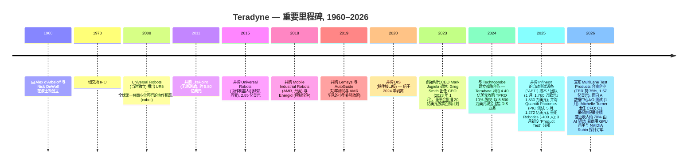
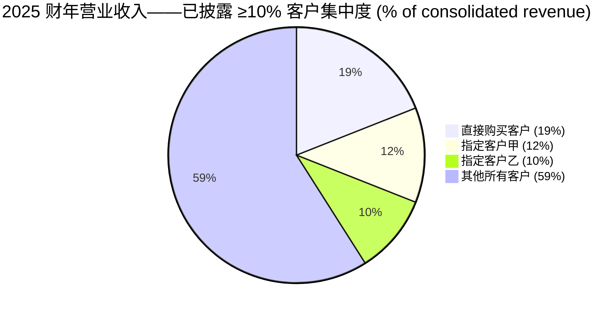
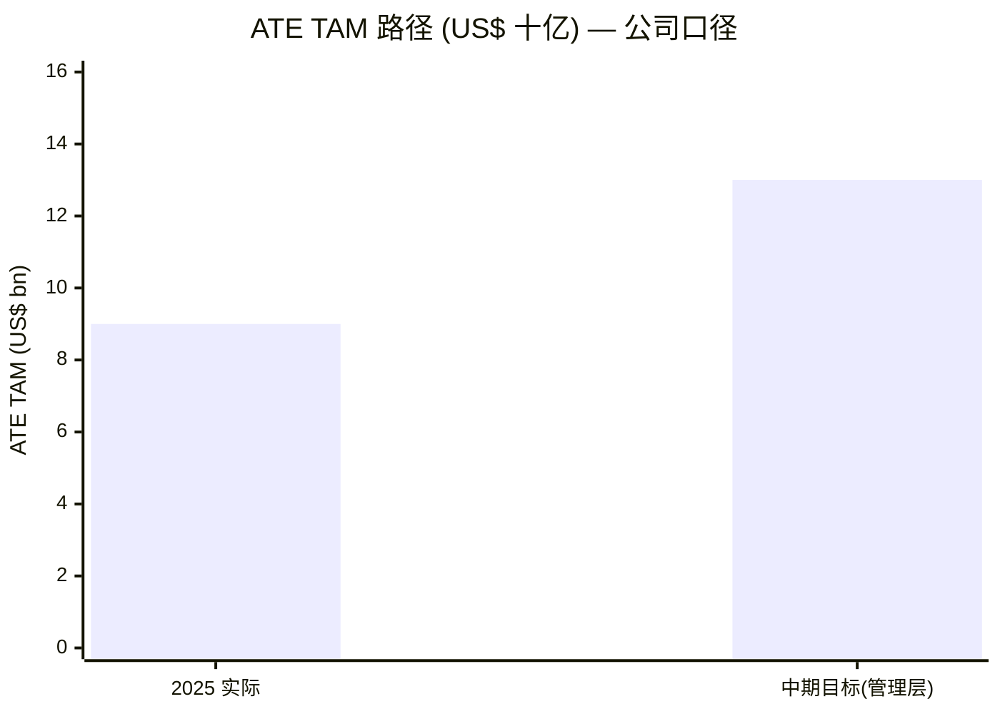
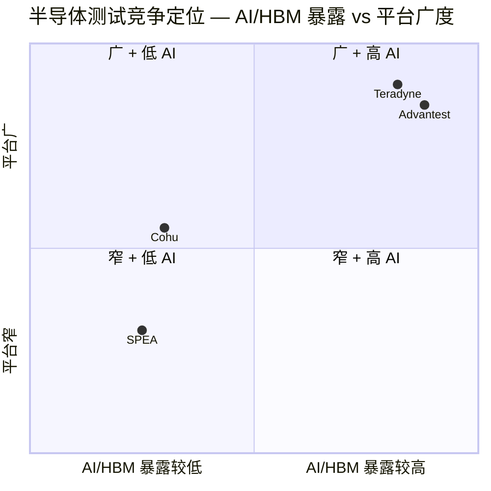
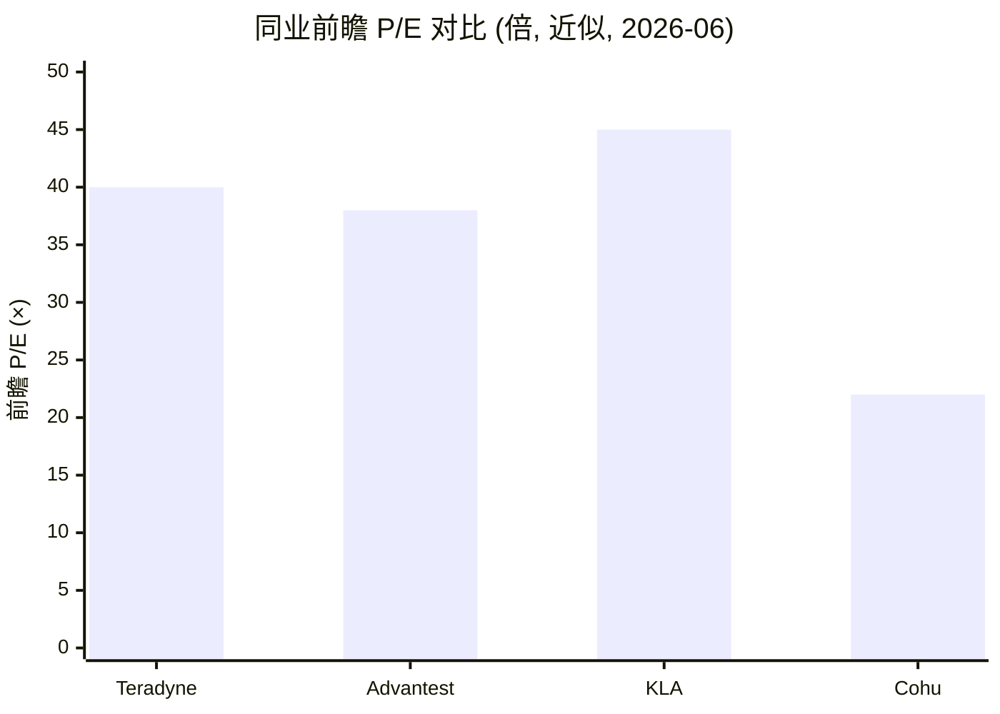

# Teradyne, Inc. (NASDAQ:TER) — 公司研究报告

**截至日期:** 2026-06-14
**上市代码:** NASDAQ: TER
**总部所在地:** 美国马萨诸塞州北雷丁 (North Reading)
**成立年份:** 1960
**报告语言: 简体中文 (英文版同时存在于本目录, 本次刷新仅更新中文版)**
**分析师注释:** 刷新覆盖报告。所有数字均取自一手公告 (SEC EDGAR 10-K、10-Q、8-K)、Teradyne 业绩电话会与 IR 材料, 或文中标注的市场数据提供方与卖方机构研究。任何由本报告前瞻模型推导的数字 (评级、目标价、预测) 均明确标注为 `*分析师观点：*`, 绝不附在一手文件引用之下。

---

## 投资摘要 (Investment Summary) — *分析师观点：*

> 本区块整体为本报告的前瞻判断 (house view), 非一手文件数据。评级、目标价、上行空间、预测均为 `*分析师观点：*`。

| 项目 | 值 |
|---|---|
| **评级 (Rating)** | **Hold / Neutral**(优质资产, 但估值已计入大部分 AI 顺风) |
| **当前股价 (2026-06-12 收盘)** | **403.20 美元** |
| **12 个月目标价 (Price Target)** | **420 美元** |
| **隐含上行空间** | **约 +4%**(估值已充分反映 AI 测试拐点) |
| **估值方法一句话** | 2027E 非 GAAP EPS 约 11.5 美元 × 37× 前瞻 P/E ≈ 420 美元(与 Advantest/KLAC 同业前瞻倍数对标) |
| **市值** | **约 631 亿美元**(1.565 亿稀释股 × 403 美元) |
| **52 周区间** | **84.12 – 422.11 美元**([yfinance, 2026-06-12](https://finance.yahoo.com/quote/TER/)) |
| **相对表现 (Momentum)** | 1 年股价从约 84 美元(52 周低点)升至 403 美元, 期间远跑赢 SOX 半导体指数与标普 500 |

**论点支柱 (Thesis pillars) — *分析师观点：***

1. **"从晶圆到 AI 数据中心"定位已被业绩验证。** 2026 财年 Q1 营业收入 12.82 亿美元 (同比 +87%), 管理层口径**约 70% 与 AI 相关**; Teradyne 拿下首笔商用 GPU 多系统订单 (计划 2026 年 4–6 月部署), 并赢得 NVIDIA Rubin 初期探针订单。测试已成为 AI 芯片产能链中供不应求的瓶颈环节。
2. **公司自有"目标盈利模型"框定中期巨大上行。** 管理层在 Q4 电话会给出: 在 ATE TAM 达 120–140 亿美元 (vs 2025 年约 90 亿) 时, Teradyne 营业收入约 60 亿美元、非 GAAP EPS **9.50–11 美元** —— 约为 2025 财年的 2 倍营业收入、2.5 倍 EPS。
3. **软件生态 (IG-XL) + 系统级测试 (SLT) 领先构成真实护城河**, 但**机器人分部持续失望** (FY2025 营业收入 -15.5%) 且**客户集中度急升** (前 5 大占 44%), 是论点的两处真实裂缝。
4. **估值是主要约束。** 当前 TTM P/E 约 100×、前瞻 2026E P/E 约 40×、2027E 约 35×, 已把 AI 顺风计入价格; 任何一两个季度的 AI 订单空档 (SoC 测试历来订单出货呈间歇集中) 都可能触发倍数快速压缩。

---

> **业绩更新——2026 财年 Q1 创纪录季度, AI 营业收入占比已升至约 70% (2026-04-29 披露):** Teradyne 公布 2026 财年 Q1 营业收入 **12.825 亿美元 (同比 +87%)**, GAAP 每股收益 (EPS) **2.53 美元**, 非 GAAP 每股收益 **2.56 美元**, 均显著高于此前指引上限; Semiconductor Test 营业收入 **11.11 亿美元**、Robotics **0.91 亿美元**、Product Test **0.80 亿美元** ([Teradyne 2026 财年 Q1 8-K / 业绩公告, 2026-04-29](https://www.sec.gov/Archives/edgar/data/0000097210/000119312526188706/ter-ex99_1.htm))。2026 财年 Q2 指引营业收入区间为 **11.50–12.50 亿美元**, 非 GAAP 每股收益 **1.86–2.15 美元** (环比较 Q1 的爆发性表现略有回落, 同比仍 +70%+)。**本次刷新相对 2026-05-20 上一版的关键变化:** (i) 股价由约 322 美元升至 **403 美元** (+25%), 估值快照与决策层据此重算; (ii) 新增完整决策层 (评级 + 目标价 + 前瞻模型 + GF Score + 关键分歧 + 视角评分); (iii) 纳入 J.P. Morgan、Morgan Stanley 最新卖方纪要与 Q4 业绩电话会的"目标盈利模型"; (iv) 全套财务图表改为一手报表 SVG + 资金流向图。

## 目录

1. 公司概览(含 1A 估值快照 · 1B GF Score)
2. 估值与目标价(前瞻模型 + 目标价推导 + 多情景 + 卖方观点演变)
3. 公司历史
4. 管理团队
5. 产品与服务
6. 客户与上市策略
7. 行业概览
8. 竞争格局
9. 市场机会 (TAM)
10. 风险评估(含 9.5 关键分歧与催化剂)
11. 投资视角评分 (Investor Lenses)

参考资料 · 所用数据 · 验证日志

---

## 1. 公司概览

Teradyne, Inc. 是一家在马萨诸塞州注册、纳斯达克上市 (代码 TER) 的公司, 主营业务包括为半导体与电子系统设计制造**自动测试设备 (automated test equipment, ATE)**, 以及一项围绕 Universal Robots (UR) 协作机器人 (cobot) 机械臂和 Mobile Industrial Robots (MiR) 自主移动机器人 (autonomous mobile robot, AMR) 构建的全球**工业机器人 (industrial robotics)** 业务 ([Teradyne 2025 年报 10-K, 第 1 项: 业务](https://www.sec.gov/Archives/edgar/data/0000097210/000119312526059002/ter-20251231.htm))。公司由 MIT 同窗 Alex d'Arbeloff 与 Nick DeWolf 于 1960 年创立, 1970 年 IPO, 总部位于马萨诸塞州北雷丁市 (North Reading, MA) 600 Riverpark Drive。截至 2025 年 12 月 31 日, 公司全球雇员**约 6,600 人**, 其中 2,200 人在美国; 美国境外人员规模最大的地区依次为菲律宾 (占员工总数 19%)、丹麦 (10%, 主要为 Universal Robots 与 MiR)、哥斯达黎加 (7%)、中国 (7%) 与台湾 (5%) ([2025 年报 10-K § 人力资本](https://www.sec.gov/Archives/edgar/data/0000097210/000119312526059002/ter-20251231.htm))。

**分部架构 (2025 年 3 月调整)。** 2025 年 Q1, Teradyne 将原"系统测试 (System Test)"分部中的电路板测试业务、国防与航天测试业务, 以及 LitePoint 无线测试业务合并入新的 **Product Test (产品测试)** 分部, 完成分部重组, 形成三大可报告分部 ([2025 年报 10-K § 第 1 项业务](https://www.sec.gov/Archives/edgar/data/0000097210/000119312526059002/ter-20251231.htm)):

1. **Semiconductor Test (半导体测试)** — FLEX / UltraFLEX / UltraFLEXplus 系列 (SoC 测试)、J750 (微控制器 / 图像传感器测试)、ETS / Eagle 平台 (模拟 / 功率)、Magnum 系列 (存储测试, 包括 HBM 与 DRAM 终测), 以及 Integrated System Test ("IST", 集成系统测试) 业务组 (系统级测试 + HDD/SSD 存储测试机)。
2. **Product Test (产品测试)** — 电路板测试、LitePoint 无线测试、国防与航天测试, 以及 (自 2025 年 5 月起) Quantifi Photonics PIC (光子集成电路, photonic integrated circuit) 测试。
3. **Robotics (机器人)** — Universal Robots 协作机器人机械臂与 Mobile Industrial Robots 自主移动机器人 (AMR)。

**2025 财年规模。** 合并营业收入为 **31.90 亿美元 (同比 +13.1%)**, GAAP 毛利率 (gross margin) **58.2%**, GAAP 营业利润率 (operating margin) **20.4%**, GAAP 净利润 **5.555 亿美元** (税前 6.533 亿美元、所得税 7,930 万美元), 对应净利率 (net margin) **17.4%** ([2025 年报 10-K § 第 7 项 MD&A / 合并利润表](https://www.sec.gov/Archives/edgar/data/0000097210/000119312526059002/ter-20251231.htm))。Semiconductor Test 贡献营业收入 **79.1%** (2025 财年 25.237 亿美元, 同比 +18.8%), Product Test **11.2%** (3.580 亿美元), Robotics **9.7%** (3.083 亿美元, 同比 -15.5%)。2025 财年, 向美国境外客户的销售占营业收入的 **89%**, 较 2024 财年的 87% 与 2023 财年的 84% 持续上升 ([2025 年报 10-K § 第 7 项 MD&A](https://www.sec.gov/Archives/edgar/data/0000097210/000119312526059002/ter-20251231.htm))。全年非 GAAP 每股收益为 **3.96 美元**, 全年自由现金流 (free cash flow) **约 4.50 亿美元**, 向股东返还 **7.85 亿美元** ([Teradyne Q4 FY2025 业绩电话会, 2026-02-03](http://xs-macbook-air.local:5001/zsxq/pdf/415541245444558/Teradyne%20%E5%85%AC%E5%8F%B8%EF%BC%88TER%EF%BC%892025%20%E8%B4%A2%E5%B9%B4%E7%AC%AC%E5%9B%9B%E5%AD%A3%E5%BA%A6%E8%B4%A2%E6%8A%A5%E7%94%B5%E8%AF%9D%E4%BC%9A%E8%AE%AE%E8%AE%B0%E5%BD%95%20---%20Teradyne%2C%20Inc.%20%28TER%29%20Q4%20FY2025%20earnings%20call%20transcript.pdf))。

**FY2025 利润表 Sankey (US$ 百万)。** 收入按分部从左侧汇入, 经 COGS、研发、销管费, 落到净利润 —— 直观展示 Teradyne 把约 58% 的营业收入留作毛利、20% 留作营业利润的"how it makes money"结构。

<svg xmlns="http://www.w3.org/2000/svg" viewBox="0 0 1000 560" width="1000" height="560" role="img" aria-label="income statement Sankey"><rect x="0" y="0" width="1000" height="560" fill="#ffffff"/>
<text x="20.00" y="30.00" text-anchor="start" font-family="Helvetica,Arial,sans-serif" font-size="15" font-weight="700" fill="#1f2933">Teradyne FY2025 利润表 Sankey (US$ 百万)</text>
<path d="M 204.00,71.02 C 258.00,71.02 258.00,85.00 312.00,85.00 L 312.00,407.78 C 258.00,407.78 258.00,393.80 204.00,393.80 Z" fill="#93c5fd" fill-opacity="0.55"/>
<path d="M 452.00,78.00 C 506.00,78.00 506.00,163.22 560.00,163.22 L 560.00,246.37 C 506.00,246.37 506.00,161.15 452.00,161.15 Z" fill="#86efac" fill-opacity="0.55"/>
<path d="M 452.00,161.15 C 506.00,161.15 506.00,260.37 560.00,260.37 L 560.00,414.78 C 506.00,414.78 506.00,315.56 452.00,315.56 Z" fill="#fca5a5" fill-opacity="0.55"/>
<path d="M 328.00,85.00 C 382.00,85.00 382.00,78.00 436.00,78.00 L 436.00,315.55 C 382.00,315.55 382.00,322.55 328.00,322.55 Z" fill="#86efac" fill-opacity="0.55"/>
<path d="M 328.00,322.55 C 382.00,322.55 382.00,329.55 436.00,329.55 L 436.00,500.00 C 382.00,500.00 382.00,493.00 328.00,493.00 Z" fill="#fca5a5" fill-opacity="0.55"/>
<path d="M 700.00,149.01 C 754.00,149.01 754.00,241.40 808.00,241.40 L 808.00,312.45 C 754.00,312.45 754.00,220.06 700.00,220.06 Z" fill="#86efac" fill-opacity="0.55"/>
<path d="M 700.00,220.06 C 754.00,220.06 754.00,326.45 808.00,326.45 L 808.00,336.60 C 754.00,336.60 754.00,230.21 700.00,230.21 Z" fill="#fca5a5" fill-opacity="0.55"/>
<path d="M 576.00,163.22 C 630.00,163.22 630.00,149.01 684.00,149.01 L 684.00,232.16 C 630.00,232.16 630.00,246.37 576.00,246.37 Z" fill="#86efac" fill-opacity="0.55"/>
<path d="M 576.00,260.37 C 630.00,260.37 630.00,246.57 684.00,246.57 L 684.00,329.57 C 630.00,329.57 630.00,343.36 576.00,343.36 Z" fill="#fca5a5" fill-opacity="0.55"/>
<path d="M 576.00,343.36 C 630.00,343.36 630.00,343.57 684.00,343.57 L 684.00,408.10 C 630.00,408.10 630.00,407.90 576.00,407.90 Z" fill="#fca5a5" fill-opacity="0.55"/>
<path d="M 576.00,407.90 C 630.00,407.90 630.00,422.10 684.00,422.10 L 684.00,428.99 C 630.00,428.99 630.00,414.78 576.00,414.78 Z" fill="#fca5a5" fill-opacity="0.55"/>
<path d="M 204.00,407.80 C 258.00,407.80 258.00,407.78 312.00,407.78 L 312.00,453.57 C 258.00,453.57 258.00,453.59 204.00,453.59 Z" fill="#93c5fd" fill-opacity="0.55"/>
<path d="M 204.00,467.59 C 258.00,467.59 258.00,453.57 312.00,453.57 L 312.00,492.96 C 258.00,492.96 258.00,506.98 204.00,506.98 Z" fill="#93c5fd" fill-opacity="0.55"/>
<rect x="188.00" y="71.02" width="16" height="322.78" rx="1.5" fill="#2563eb"/>
<rect x="188.00" y="407.80" width="16" height="45.79" rx="1.5" fill="#2563eb"/>
<rect x="188.00" y="467.59" width="16" height="39.39" rx="1.5" fill="#2563eb"/>
<rect x="312.00" y="85.00" width="16" height="408.00" rx="1.5" fill="#1e3a8a"/>
<rect x="436.00" y="78.00" width="16" height="237.55" rx="1.5" fill="#15803d"/>
<rect x="436.00" y="329.55" width="16" height="170.45" rx="1.5" fill="#dc2626"/>
<rect x="560.00" y="163.22" width="16" height="83.15" rx="1.5" fill="#15803d"/>
<rect x="560.00" y="260.37" width="16" height="154.41" rx="1.5" fill="#dc2626"/>
<rect x="684.00" y="149.01" width="16" height="83.56" rx="1.5" fill="#15803d"/>
<rect x="684.00" y="246.57" width="16" height="82.99" rx="1.5" fill="#dc2626"/>
<rect x="684.00" y="343.57" width="16" height="64.54" rx="1.5" fill="#dc2626"/>
<rect x="684.00" y="422.10" width="16" height="6.88" rx="1.5" fill="#dc2626"/>
<rect x="808.00" y="241.40" width="16" height="71.05" rx="1.5" fill="#15803d"/>
<rect x="808.00" y="326.45" width="16" height="10.14" rx="1.5" fill="#dc2626"/>
<text x="179.00" y="229.41" text-anchor="end" font-family="Helvetica,Arial,sans-serif" font-size="11.5" font-weight="700" fill="#1f2933">Semiconductor Test</text>
<text x="179.00" y="242.41" text-anchor="end" font-family="Helvetica,Arial,sans-serif" font-size="10" font-weight="400" fill="#52606d">US$2.5B  (79.1%)</text>
<text x="179.00" y="427.69" text-anchor="end" font-family="Helvetica,Arial,sans-serif" font-size="11.5" font-weight="700" fill="#1f2933">Product Test</text>
<text x="179.00" y="440.69" text-anchor="end" font-family="Helvetica,Arial,sans-serif" font-size="10" font-weight="400" fill="#52606d">US$358.0M  (11.2%)</text>
<text x="179.00" y="484.28" text-anchor="end" font-family="Helvetica,Arial,sans-serif" font-size="11.5" font-weight="700" fill="#1f2933">Robotics</text>
<text x="179.00" y="497.28" text-anchor="end" font-family="Helvetica,Arial,sans-serif" font-size="10" font-weight="400" fill="#52606d">US$308.0M  (9.7%)</text>
<rect x="331.00" y="67.00" width="113.10" height="26" rx="2" fill="#ffffff" fill-opacity="0.72"/>
<text x="334.00" y="79.00" text-anchor="start" font-family="Helvetica,Arial,sans-serif" font-size="11.5" font-weight="700" fill="#1f2933">Revenue</text>
<text x="334.00" y="92.00" text-anchor="start" font-family="Helvetica,Arial,sans-serif" font-size="10" font-weight="400" fill="#52606d">US$3.2B  (100.0%)</text>
<rect x="455.00" y="60.00" width="106.80" height="26" rx="2" fill="#ffffff" fill-opacity="0.72"/>
<text x="458.00" y="72.00" text-anchor="start" font-family="Helvetica,Arial,sans-serif" font-size="11.5" font-weight="700" fill="#1f2933">Gross Profit</text>
<text x="458.00" y="85.00" text-anchor="start" font-family="Helvetica,Arial,sans-serif" font-size="10" font-weight="400" fill="#52606d">US$1.9B  (58.2%)</text>
<rect x="455.00" y="311.55" width="144.60" height="26" rx="2" fill="#ffffff" fill-opacity="0.72"/>
<text x="458.00" y="323.55" text-anchor="start" font-family="Helvetica,Arial,sans-serif" font-size="11.5" font-weight="700" fill="#1f2933">Cost of Revenue (COGS)</text>
<text x="458.00" y="336.55" text-anchor="start" font-family="Helvetica,Arial,sans-serif" font-size="10" font-weight="400" fill="#52606d">US$1.3B  (41.8%)</text>
<rect x="579.00" y="145.22" width="119.40" height="26" rx="2" fill="#ffffff" fill-opacity="0.72"/>
<text x="582.00" y="157.22" text-anchor="start" font-family="Helvetica,Arial,sans-serif" font-size="11.5" font-weight="700" fill="#1f2933">Operating Income</text>
<text x="582.00" y="170.22" text-anchor="start" font-family="Helvetica,Arial,sans-serif" font-size="10" font-weight="400" fill="#52606d">US$650.1M  (20.4%)</text>
<rect x="579.00" y="242.37" width="150.90" height="26" rx="2" fill="#ffffff" fill-opacity="0.72"/>
<text x="582.00" y="254.37" text-anchor="start" font-family="Helvetica,Arial,sans-serif" font-size="11.5" font-weight="700" fill="#1f2933">Total Operating Expense</text>
<text x="582.00" y="267.37" text-anchor="start" font-family="Helvetica,Arial,sans-serif" font-size="10" font-weight="400" fill="#52606d">US$1.2B  (37.8%)</text>
<rect x="703.00" y="131.01" width="119.40" height="26" rx="2" fill="#ffffff" fill-opacity="0.72"/>
<text x="706.00" y="143.01" text-anchor="start" font-family="Helvetica,Arial,sans-serif" font-size="11.5" font-weight="700" fill="#1f2933">Pretax Income</text>
<text x="706.00" y="156.01" text-anchor="start" font-family="Helvetica,Arial,sans-serif" font-size="10" font-weight="400" fill="#52606d">US$653.3M  (20.5%)</text>
<rect x="703.00" y="228.57" width="119.40" height="26" rx="2" fill="#ffffff" fill-opacity="0.72"/>
<text x="706.00" y="240.57" text-anchor="start" font-family="Helvetica,Arial,sans-serif" font-size="11.5" font-weight="700" fill="#1f2933">SG&amp;A</text>
<text x="706.00" y="253.57" text-anchor="start" font-family="Helvetica,Arial,sans-serif" font-size="10" font-weight="400" fill="#52606d">US$648.9M  (20.3%)</text>
<rect x="703.00" y="325.57" width="119.40" height="26" rx="2" fill="#ffffff" fill-opacity="0.72"/>
<text x="706.00" y="337.57" text-anchor="start" font-family="Helvetica,Arial,sans-serif" font-size="11.5" font-weight="700" fill="#1f2933">R&amp;D</text>
<text x="706.00" y="350.57" text-anchor="start" font-family="Helvetica,Arial,sans-serif" font-size="10" font-weight="400" fill="#52606d">US$504.6M  (15.8%)</text>
<rect x="703.00" y="404.10" width="106.80" height="26" rx="2" fill="#ffffff" fill-opacity="0.72"/>
<text x="706.00" y="416.10" text-anchor="start" font-family="Helvetica,Arial,sans-serif" font-size="11.5" font-weight="700" fill="#1f2933">Other OpEx</text>
<text x="706.00" y="429.10" text-anchor="start" font-family="Helvetica,Arial,sans-serif" font-size="10" font-weight="400" fill="#52606d">US$53.8M  (1.7%)</text>
<text x="833.00" y="273.93" text-anchor="start" font-family="Helvetica,Arial,sans-serif" font-size="11.5" font-weight="700" fill="#1f2933">Net Income</text>
<text x="833.00" y="286.93" text-anchor="start" font-family="Helvetica,Arial,sans-serif" font-size="10" font-weight="400" fill="#52606d">US$555.5M  (17.4%)</text>
<text x="833.00" y="328.52" text-anchor="start" font-family="Helvetica,Arial,sans-serif" font-size="11.5" font-weight="700" fill="#1f2933">Income Tax</text>
<text x="833.00" y="341.52" text-anchor="start" font-family="Helvetica,Arial,sans-serif" font-size="10" font-weight="400" fill="#52606d">US$79.3M  (2.5%)</text>
<text x="500.00" y="544.00" text-anchor="middle" font-family="Helvetica,Arial,sans-serif" font-size="10" font-weight="400" fill="#52606d">Source: Teradyne FY2025 10-K (income statement), filed 2026-02-19</text>
</svg>

来源: [Teradyne 2025 年报 10-K 合并利润表](https://www.sec.gov/Archives/edgar/data/0000097210/000119312526059002/ter-20251231.htm)。

**分部营业收入结构 (FY2025)。**

<svg xmlns="http://www.w3.org/2000/svg" viewBox="0 0 720 460" width="720" height="460" role="img" aria-label="revenue donut"><rect x="0" y="0" width="720" height="460" fill="#ffffff"/>
<text x="20.00" y="30.00" text-anchor="start" font-family="Helvetica,Arial,sans-serif" font-size="15" font-weight="700" fill="#1f2933">FY2025 营业收入分部结构</text>
<path d="M 288.00,107.20 A 132 132 0 1 1 160.40,205.41 L 212.60,219.23 A 78 78 0 1 0 288.00,161.20 Z" fill="#2563eb"/>
<path d="M 160.40,205.41 A 132 132 0 0 1 212.74,130.76 L 243.53,175.12 A 78 78 0 0 0 212.60,219.23 Z" fill="#15803d"/>
<path d="M 212.74,130.76 A 132 132 0 0 1 288.00,107.20 L 288.00,161.20 A 78 78 0 0 0 243.53,175.12 Z" fill="#d97706"/>
<text x="288.00" y="235.20" text-anchor="middle" font-family="Helvetica,Arial,sans-serif" font-size="18" font-weight="800" fill="#1f2933">TER</text>
<text x="288.00" y="255.20" text-anchor="middle" font-family="Helvetica,Arial,sans-serif" font-size="13" font-weight="600" fill="#52606d">US$3.2B</text>
<text x="288.00" y="271.20" text-anchor="middle" font-family="Helvetica,Arial,sans-serif" font-size="10" font-weight="400" fill="#8a97a3">total</text>
<line x1="372.17" y1="348.56" x2="388.17" y2="348.56" stroke="#2563eb" stroke-width="1.4"/>
<text x="392.17" y="346.56" text-anchor="start" font-family="Helvetica,Arial,sans-serif" font-size="11" font-weight="700" fill="#1f2933">Semiconductor Test</text>
<text x="392.17" y="360.56" text-anchor="start" font-family="Helvetica,Arial,sans-serif" font-size="10" font-weight="400" fill="#52606d">US$2.5B  (79.1%)</text>
<line x1="175.01" y1="159.98" x2="159.01" y2="159.98" stroke="#15803d" stroke-width="1.4"/>
<text x="155.01" y="157.98" text-anchor="end" font-family="Helvetica,Arial,sans-serif" font-size="11" font-weight="700" fill="#1f2933">Product Test</text>
<text x="155.01" y="171.98" text-anchor="end" font-family="Helvetica,Arial,sans-serif" font-size="10" font-weight="400" fill="#52606d">US$358.0M  (11.2%)</text>
<line x1="246.78" y1="107.50" x2="230.78" y2="107.50" stroke="#d97706" stroke-width="1.4"/>
<text x="226.78" y="105.50" text-anchor="end" font-family="Helvetica,Arial,sans-serif" font-size="11" font-weight="700" fill="#1f2933">Robotics</text>
<text x="226.78" y="119.50" text-anchor="end" font-family="Helvetica,Arial,sans-serif" font-size="10" font-weight="400" fill="#52606d">US$308.0M  (9.7%)</text>
<text x="360.00" y="444.00" text-anchor="middle" font-family="Helvetica,Arial,sans-serif" font-size="10" font-weight="400" fill="#52606d">Source: Teradyne FY2025 10-K Note R — Segment Information</text>
</svg>

来源: [Teradyne 2025 年报 10-K 附注 R — 分部信息](https://www.sec.gov/Archives/edgar/data/0000097210/000119312526059002/ter-20251231.htm)。

**分部营业收入历史 (FY2024 → FY2025, 三分部口径)。** Semiconductor Test 是绝对增长引擎, 而 Robotics 是唯一下滑的分部。

<svg xmlns="http://www.w3.org/2000/svg" viewBox="0 0 860 470" width="860" height="470" role="img" aria-label="historical revenue bars"><rect x="0" y="0" width="860" height="470" fill="#ffffff"/>
<text x="20.00" y="30.00" text-anchor="start" font-family="Helvetica,Arial,sans-serif" font-size="15" font-weight="700" fill="#1f2933">Teradyne 分部营业收入 (FY2024 → FY2025, US$ 百万, FY25 三分部口径)</text>
<rect x="20.00" y="44" width="11" height="11" rx="2" fill="#2563eb"/>
<text x="36.00" y="53.00" text-anchor="start" font-family="Helvetica,Arial,sans-serif" font-size="10.5" font-weight="400" fill="#1f2933">Semiconductor Test</text>
<rect x="168.80" y="44" width="11" height="11" rx="2" fill="#15803d"/>
<text x="184.80" y="53.00" text-anchor="start" font-family="Helvetica,Arial,sans-serif" font-size="10.5" font-weight="400" fill="#1f2933">Product Test</text>
<rect x="278.00" y="44" width="11" height="11" rx="2" fill="#d97706"/>
<text x="294.00" y="53.00" text-anchor="start" font-family="Helvetica,Arial,sans-serif" font-size="10.5" font-weight="400" fill="#1f2933">Robotics</text>
<line x1="70" y1="412.00" x2="834" y2="412.00" stroke="#eceff2" stroke-width="1"/>
<text x="64.00" y="415.00" text-anchor="end" font-family="Helvetica,Arial,sans-serif" font-size="9.5" font-weight="400" fill="#52606d">US$0</text>
<line x1="70" y1="345.20" x2="834" y2="345.20" stroke="#eceff2" stroke-width="1"/>
<text x="64.00" y="348.20" text-anchor="end" font-family="Helvetica,Arial,sans-serif" font-size="9.5" font-weight="400" fill="#52606d">US$689.0M</text>
<line x1="70" y1="278.40" x2="834" y2="278.40" stroke="#eceff2" stroke-width="1"/>
<text x="64.00" y="281.40" text-anchor="end" font-family="Helvetica,Arial,sans-serif" font-size="9.5" font-weight="400" fill="#52606d">US$1.4B</text>
<line x1="70" y1="211.60" x2="834" y2="211.60" stroke="#eceff2" stroke-width="1"/>
<text x="64.00" y="214.60" text-anchor="end" font-family="Helvetica,Arial,sans-serif" font-size="9.5" font-weight="400" fill="#52606d">US$2.1B</text>
<line x1="70" y1="144.80" x2="834" y2="144.80" stroke="#eceff2" stroke-width="1"/>
<text x="64.00" y="147.80" text-anchor="end" font-family="Helvetica,Arial,sans-serif" font-size="9.5" font-weight="400" fill="#52606d">US$2.8B</text>
<line x1="70" y1="78.00" x2="834" y2="78.00" stroke="#eceff2" stroke-width="1"/>
<text x="64.00" y="81.00" text-anchor="end" font-family="Helvetica,Arial,sans-serif" font-size="9.5" font-weight="400" fill="#52606d">US$3.4B</text>
<rect x="150.22" y="206.10" width="221.56" height="205.90" fill="#2563eb"/>
<rect x="150.22" y="174.00" width="221.56" height="32.10" fill="#15803d"/>
<rect x="150.22" y="138.63" width="221.56" height="35.37" fill="#d97706"/>
<text x="261.00" y="428.00" text-anchor="middle" font-family="Helvetica,Arial,sans-serif" font-size="10" font-weight="400" fill="#52606d">2024</text>
<rect x="532.22" y="167.34" width="221.56" height="244.66" fill="#2563eb"/>
<rect x="532.22" y="132.63" width="221.56" height="34.71" fill="#15803d"/>
<rect x="532.22" y="102.74" width="221.56" height="29.89" fill="#d97706"/>
<text x="643.00" y="428.00" text-anchor="middle" font-family="Helvetica,Arial,sans-serif" font-size="10" font-weight="400" fill="#52606d">2025</text>
<text x="430.00" y="454.00" text-anchor="middle" font-family="Helvetica,Arial,sans-serif" font-size="10" font-weight="400" fill="#52606d">Source: Teradyne FY2025 10-K Note R — Segment Information (recast 三分部口径)</text>
</svg>

来源: [Teradyne 2025 年报 10-K 附注 R — 分部信息 (FY2024 recast 至 FY2025 三分部口径)](https://www.sec.gov/Archives/edgar/data/0000097210/000119312526059002/ter-20251231.htm)。

**2026 财年 Q1 拐点。** 营业收入跃升至 **12.825 亿美元 (同比 +87%)**, 其中 Semiconductor Test 11.11 亿美元、Robotics 0.91 亿美元、Product Test 0.80 亿美元; GAAP 净利润 **3.989 亿美元 (每股 2.53 美元)**, 非 GAAP 净利润 **4.029 亿美元 (每股 2.56 美元)** ([2026 财年 Q1 8-K 业绩公告, 2026-04-29](https://www.sec.gov/Archives/edgar/data/0000097210/000119312526188706/ter-ex99_1.htm))。CEO Greg Smith 将该业绩定调为"从晶圆到 AI 数据中心 (wafer-to-AI-data-center)"战略的胜利证明: Q1 营业收入约 70% 与 AI 相关, 涵盖计算 (超大规模厂商训练 ASIC 与 VIP 客户的 SoC 测试)、存储 (HBM 与 DRAM 终测份额提升), 以及面向 AI 数据中心 I/O 测试的 MultiLane Test Products 合资企业。

### 1A. 估值快照

| 指标 | 数值 | 备注 |
|---|---|---|
| 股价 (2026-06-12 收盘) | **403.20 美元** | NASDAQ: TER ([yfinance, 2026-06-12](https://finance.yahoo.com/quote/TER/)) |
| 市值 | **约 631 亿美元** | 1.565 亿稀释股份 × 403.20 美元 |
| 稀释股本 | 156,555,950 | [2025 年报 10-K 封面页, 截至 2026-02-16](https://www.sec.gov/Archives/edgar/data/0000097210/000119312526059002/ter-20251231.htm) |
| 52 周区间 | **84.12 – 422.11 美元** | [yfinance, 2026-06-12](https://finance.yahoo.com/quote/TER/) |
| 现金及有价证券 | 3.939 亿美元 | 2026-03-29 ([2026 财年 Q1 资产负债表](https://www.sec.gov/Archives/edgar/data/0000097210/000119312526188706/ter-ex99_1.htm)) |
| 短期债务 | 0 美元 | 2 亿美元授信额度提款已于 2026 财年 Q1 偿还 ([2026 财年 Q1 8-K](https://www.sec.gov/Archives/edgar/data/0000097210/000119312526188706/ter-ex99_1.htm)) |
| FY2025 非 GAAP EPS | 3.96 美元 | [Teradyne Q4 FY2025 业绩电话会, 2026-02-03](http://xs-macbook-air.local:5001/zsxq/pdf/415541245444558/Teradyne%20%E5%85%AC%E5%8F%B8%EF%BC%88TER%EF%BC%892025%20%E8%B4%A2%E5%B9%B4%E7%AC%AC%E5%9B%9B%E5%AD%A3%E5%BA%A6%E8%B4%A2%E6%8A%A5%E7%94%B5%E8%AF%9D%E4%BC%9A%E8%AE%AE%E8%AE%B0%E5%BD%95%20---%20Teradyne%2C%20Inc.%20%28TER%29%20Q4%20FY2025%20earnings%20call%20transcript.pdf) |
| **TTM GAAP P/E (2026-06)** | **约 100×** | 403 美元 / FY2025 GAAP EPS 3.55 美元(净利 5.555 亿/1.565 亿股); 用滚动 TTM 略低 |
| **前瞻 2026E P/E** | **约 40×** | 403 美元 / 2026E 非 GAAP EPS 约 10 美元 (*分析师观点：*) |
| **前瞻 2027E P/E** | **约 35×** | 403 美元 / 2027E 非 GAAP EPS 约 11.5 美元 (*分析师观点：*) |
| **TTM P/S** | **约 16×** | 631 亿市值 / 约 38 亿 TTM 营业收入(截至 2026 财年 Q1 四季滚动) |
| 10 年 P/E 中位数 | 约 26× | [GuruFocus](https://www.gurufocus.com/term/pettm/TER) |

**如何解读这些倍数 (*分析师观点：*)。** TER 的 TTM GAAP P/E 约 100×, 远高于 10 年中位数的约 26×, 视觉上属于"成长股"估值, 而非传统"周期性设备股"估值。三股力量同时作用: (i) **分母仍部分锚定在低谷年份** —— TTM EPS 包含 AI 测试爬坡前的 2025 上半年疲弱季度, 而 Q1 2026 单季非 GAAP 即录得 2.56 美元 (年化 10 美元以上), 因此在前瞻视角下倍数收缩至大约 **35–40×** 区间; (ii) **市场把 TER 计价为主要的 AI 基础设施受益者**, 与 Advantest (前瞻约 35–40×) 及 KLAC (TTM 约 40–50×, [FinanceCharts](https://www.financecharts.com/stocks/KLAC/value/pe-ratio)) 并列, 倍数随营业收入中 AI 相关比例同步上行 (管理层口径从 2025 上半年的约 35% 升至 2026 财年 Q1 的约 70%); (iii) **股价过去一年从约 84 美元 (52 周低点) 升至 403 美元**, 把"AI 测试拐点"的多头叙事大幅前置。总结: TER 当前估值要求 AI 测试在 2026–2027 年持续兑现高增长; 若 AI 计算订单出现一两个季度的停顿 (SoC 测试历来订单出货呈间歇集中), 前瞻倍数可能像 2024 H2 → 2025 H1 那样快速压缩。我们因此将估值列为 Section 9 的首要财务风险。

### 1B. GF Score (GuruFocus 式基本面五维评分) — *分析师观点：*

> GF Score 为本报告自有评分框架 (类 GuruFocus GF Score™), 是对 Section 1–9 已引用证据的结构化二次判断, **非新数据源、非 GuruFocus 官方数字**。五个维度各 0–10 分; 综合分采用透明加权映射到 0–100。每个维度下的具体指标 (毛利率、杠杆、CAGR、倍数、回报) 各自带一手引用; 综合分本身不附任何一手文件引用。

<svg xmlns="http://www.w3.org/2000/svg" viewBox="0 0 500 500" width="500" height="500" role="img" aria-label="GF Score radar">
<rect x="0" y="0" width="500" height="500" fill="#ffffff"/>
<text x="20" y="24" font-family="Helvetica,Arial,sans-serif" font-size="15" font-weight="700" fill="#1f2933">GF Score (GuruFocus-style): 77/100</text>
<text x="20" y="41" font-family="Helvetica,Arial,sans-serif" font-size="11" fill="#52606d">71–80 Likely average performance</text>
<polygon points="250.0,88.0 392.7,191.6 338.2,359.4 161.8,359.4 107.3,191.6" fill="#e9f5ec" stroke="none"/>
<polygon points="250.0,208.0 278.5,228.7 267.6,262.3 232.4,262.3 221.5,228.7" fill="none" stroke="#c5d3cb" stroke-width="1"/>
<polygon points="250.0,178.0 307.1,219.5 285.3,286.5 214.7,286.5 192.9,219.5" fill="none" stroke="#c5d3cb" stroke-width="1"/>
<polygon points="250.0,148.0 335.6,210.2 302.9,310.8 197.1,310.8 164.4,210.2" fill="none" stroke="#c5d3cb" stroke-width="1"/>
<polygon points="250.0,118.0 364.1,200.9 320.5,335.1 179.5,335.1 135.9,200.9" fill="none" stroke="#c5d3cb" stroke-width="1"/>
<polygon points="250.0,88.0 392.7,191.6 338.2,359.4 161.8,359.4 107.3,191.6" fill="none" stroke="#c5d3cb" stroke-width="1.3"/>
<line x1="250" y1="238" x2="161.8" y2="359.4" stroke="#cfdad3" stroke-width="1"/>
<text x="146.5" y="392.4" text-anchor="end" font-family="Helvetica,Arial,sans-serif" font-size="11.5" font-weight="600" fill="#1f2933">Financial Strength</text>
<text x="146.5" y="405.4" text-anchor="end" font-family="Helvetica,Arial,sans-serif" font-size="9.5" fill="#52606d">财务实力</text>
<text x="188.3" y="316.9" text-anchor="middle" font-family="Helvetica,Arial,sans-serif" font-size="10.5" font-weight="700" fill="#1f2933">7</text>
<line x1="250" y1="238" x2="250.0" y2="88.0" stroke="#cfdad3" stroke-width="1"/>
<text x="250.0" y="58.0" text-anchor="middle" font-family="Helvetica,Arial,sans-serif" font-size="11.5" font-weight="600" fill="#1f2933">Profitability</text>
<text x="250.0" y="71.0" text-anchor="middle" font-family="Helvetica,Arial,sans-serif" font-size="9.5" fill="#52606d">盈利能力</text>
<text x="250.0" y="97.0" text-anchor="middle" font-family="Helvetica,Arial,sans-serif" font-size="10.5" font-weight="700" fill="#1f2933">9</text>
<line x1="250" y1="238" x2="107.3" y2="191.6" stroke="#cfdad3" stroke-width="1"/>
<text x="82.6" y="183.6" text-anchor="end" font-family="Helvetica,Arial,sans-serif" font-size="11.5" font-weight="600" fill="#1f2933">Growth</text>
<text x="82.6" y="196.6" text-anchor="end" font-family="Helvetica,Arial,sans-serif" font-size="9.5" fill="#52606d">成长性</text>
<text x="121.6" y="190.3" text-anchor="middle" font-family="Helvetica,Arial,sans-serif" font-size="10.5" font-weight="700" fill="#1f2933">9</text>
<line x1="250" y1="238" x2="392.7" y2="191.6" stroke="#cfdad3" stroke-width="1"/>
<text x="417.4" y="183.6" text-anchor="start" font-family="Helvetica,Arial,sans-serif" font-size="11.5" font-weight="600" fill="#1f2933">GF Value</text>
<text x="417.4" y="196.6" text-anchor="start" font-family="Helvetica,Arial,sans-serif" font-size="9.5" fill="#52606d">估值</text>
<text x="278.5" y="222.7" text-anchor="middle" font-family="Helvetica,Arial,sans-serif" font-size="10.5" font-weight="700" fill="#1f2933">2</text>
<line x1="250" y1="238" x2="338.2" y2="359.4" stroke="#cfdad3" stroke-width="1"/>
<text x="353.5" y="392.4" text-anchor="start" font-family="Helvetica,Arial,sans-serif" font-size="11.5" font-weight="600" fill="#1f2933">Momentum</text>
<text x="353.5" y="405.4" text-anchor="start" font-family="Helvetica,Arial,sans-serif" font-size="9.5" fill="#52606d">动量</text>
<text x="338.2" y="353.4" text-anchor="middle" font-family="Helvetica,Arial,sans-serif" font-size="10.5" font-weight="700" fill="#1f2933">10</text>
<polygon points="250.0,103.0 278.5,228.7 338.2,359.4 188.3,322.9 121.6,196.3" fill="#2e8b57" fill-opacity="0.34" stroke="#2e8b57" stroke-width="2"/>
<circle cx="188.3" cy="322.9" r="2.6" fill="#2e8b57"/>
<circle cx="250.0" cy="103.0" r="2.6" fill="#2e8b57"/>
<circle cx="121.6" cy="196.3" r="2.6" fill="#2e8b57"/>
<circle cx="278.5" cy="228.7" r="2.6" fill="#2e8b57"/>
<circle cx="338.2" cy="359.4" r="2.6" fill="#2e8b57"/>
<text x="250" y="470" text-anchor="middle" font-family="Helvetica,Arial,sans-serif" font-size="9.5" fill="#52606d">Source: Teradyne FY2025 10-K · Q1 2026 8-K · Yahoo Finance · indicators.db, as of 2026-06-14</text>
<text x="250" y="485" text-anchor="middle" font-family="Helvetica,Arial,sans-serif" font-size="9" fill="#52606d">GF Score = independent analyst rubric (*Analyst view:*) — not GuruFocus™ official number</text>
</svg>

| 维度 | 分数 | 条 |
|---|---|---|
| Financial Strength (财务实力) | 7 | `███████░░░` |
| Profitability (盈利能力) | 9 | `█████████░` |
| Growth (成长性) | 9 | `█████████░` |
| GF Value (估值) | 2 | `██░░░░░░░░` |
| Momentum (动量) | 10 | `██████████` |
| **GF Score (综合, *分析师观点：*)** | **77 / 100** | **71–80 Likely average performance** |

*综合加权 (*分析师观点：*): Financial Strength 20% · Profitability 25% · Growth 25% · GF Value 15% · Momentum 15%(透明复现, 非 GuruFocus 专有权重)。*

**各维度评分理由 (*分析师观点：*)。**

- **Financial Strength = 7。** 零长期债务、年末现金及有价证券约 4.5 亿美元、2 亿美元授信提款已于 Q1 2026 偿还, 资产负债表稳健 ([2025 年报 10-K 资产负债表](https://www.sec.gov/Archives/edgar/data/0000097210/000119312526059002/ter-20251231.htm))。扣分项: (i) 2026 财年 Q1 应收账款随营业收入爆发跃升至 **11.075 亿美元** (年末 7.869 亿), 当季营运资金 (working capital) 大幅消耗 ([2026 财年 Q1 8-K](https://www.sec.gov/Archives/edgar/data/0000097210/000119312526188706/ter-ex99_1.htm)); (ii) 资产负债表上约 5.37 亿美元 Technoprobe 权益法投资构成一项非控股的周期性敞口 ([2025 年报 10-K 资产负债表](https://www.sec.gov/Archives/edgar/data/0000097210/000119312526059002/ter-20251231.htm))。
- **Profitability = 9。** GAAP 毛利率 58.2%、营业利润率 20.4%、净利率 17.4%, ROE 约 19.8% (净利 5.555 亿/平均权益约 28.1 亿) —— 在半导体资本设备行业属于高质量水平 ([2025 年报 10-K 合并利润表/资产负债表](https://www.sec.gov/Archives/edgar/data/0000097210/000119312526059002/ter-20251231.htm))。Q1 2026 非 GAAP 营业利润率随规模进一步扩张。
- **Growth = 9。** FY2025 营业收入 +13.1%; 2026 财年 Q1 同比 **+87%**; 公司自有目标盈利模型给出中期约 2× 营业收入、2.5× EPS 的上行 ([Teradyne Q4 FY2025 业绩电话会, 2026-02-03](http://xs-macbook-air.local:5001/zsxq/pdf/415541245444558/Teradyne%20%E5%85%AC%E5%8F%B8%EF%BC%88TER%EF%BC%892025%20%E8%B4%A2%E5%B9%B4%E7%AC%AC%E5%9B%9B%E5%AD%A3%E5%BA%A6%E8%B4%A2%E6%8A%A5%E7%94%B5%E8%AF%9D%E4%BC%9A%E8%AE%AE%E8%AE%B0%E5%BD%95%20---%20Teradyne%2C%20Inc.%20%28TER%29%20Q4%20FY2025%20earnings%20call%20transcript.pdf))。扣分项: Robotics 分部连续多年负增长, 拖累整体复合增速。
- **GF Value = 2(越高越便宜, 此处低 = 贵)。** TTM GAAP P/E 约 100×、前瞻 2026E 约 40×, 显著高于 10 年中位数约 26× ([GuruFocus](https://www.gurufocus.com/term/pettm/TER)); 即使按公司目标模型最乐观的中期 EPS 11 美元贴现, 当前价对应的隐含安全边际 (margin of safety) 也偏薄。这是五维中明确最弱的一项。
- **Momentum = 10。** 过去 12 个月股价从约 84 美元升至 403 美元, 远跑赢 SOX 与标普 500, 且持续位于 200 日均线上方 ([yfinance, 2026-06-12](https://finance.yahoo.com/quote/TER/))。

**综合 77/100 的含义 (*分析师观点：*):** 一家盈利质量高、成长加速、动量极强、但估值已被充分定价的公司。综合分被 GF Value 的 2 分明显拖低 —— 这与本报告 Hold/Neutral 的评级、约 +4% 的目标价上行空间内部一致: 基本面优秀, 但价格不便宜。

---

## 2. 估值与目标价 (Valuation & Price Target)

> 本章整体为 `*分析师观点：*`。前瞻预测、目标价、多情景 PT 均为本报告的前瞻判断, 不附一手文件引用。每条预测驱动因素的外部依据 (分部数据 + 管理层指引 + 行业预测) 在文中分别引用。

### 2A. 前瞻财务模型 (3 年) — *分析师观点：*

模型自下而上构建: 以 Semiconductor Test 为主轴 (AI 计算 + HBM/存储 + IST/SLT), 叠加 Product Test 的国防/光子顺风与 Robotics 的低速复苏, 锚定管理层"目标盈利模型"(ATE TAM 120–140 亿美元时, 营业收入约 60 亿、非 GAAP EPS 9.50–11 美元) 的中期路径。

| 财年 (*分析师观点：*) | 营业收入 (亿美元) | YoY | 毛利率 | 营业利润率 | 非 GAAP EPS (美元) | 关键驱动 |
|---|---|---|---|---|---|---|
| FY2025 (实际) | 31.9 | +13% | 58.2% | 20.4% | 3.96 | AI 计算/存储爬坡; Robotics -15.5% |
| **FY2026E** | **约 41–43** | **约 +30%** | 约 59% | 约 24% | **约 9.5–10.5** | AI 计算 (VIP+商用 GPU 首单 H2 爬坡) + HBM 终测; Q1 已 12.82 亿 |
| **FY2027E** | **约 47–50** | **约 +14%** | 约 60% | 约 28% | **约 11.0–12.0** | GPU 份额从低个位数向中段提升; CPO/MultiLane 起量 |
| **FY2028E** | **约 54–58** | **约 +13%** | 约 60% | 约 31% | **约 13–15** | 接近公司目标模型(60 亿营业收入 / 9.5–11 EPS 区间上沿) |

模型依据: 营业收入分部路径来自 [2025 年报 10-K 附注 R 分部信息](https://www.sec.gov/Archives/edgar/data/0000097210/000119312526059002/ter-20251231.htm) 的起点; 毛利/营业利润率轨迹锚定管理层目标模型 (GM 59–61%、OpEx 27–29%、营业利润率 30–34%) 见 [Teradyne Q4 FY2025 业绩电话会, 2026-02-03](http://xs-macbook-air.local:5001/zsxq/pdf/415541245444558/Teradyne%20%E5%85%AC%E5%8F%B8%EF%BC%88TER%EF%BC%892025%20%E8%B4%A2%E5%B9%B4%E7%AC%AC%E5%9B%9B%E5%AD%A3%E5%BA%A6%E8%B4%A2%E6%8A%A5%E7%94%B5%E8%AF%9D%E4%BC%9A%E8%AE%AE%E8%AE%B0%E5%BD%95%20---%20Teradyne%2C%20Inc.%20%28TER%29%20Q4%20FY2025%20earnings%20call%20transcript.pdf); ATE TAM 行业增长 (Advantest 估 ATE +27%/SoC +30%/存储 +17%, 被 J.P. Morgan 评为合理) 见 [J.P. Morgan — Teradyne 业绩解读: 获 GPU 应用首笔订单, 2026-05-01](http://xs-macbook-air.local:5001/zsxq/pdf/812212221444452/J.P.%20Morgan-Semiconductor%20SPE%20Implications%20of%20Teradyne%E2%80%99s%20results%EF%BC%9A%20Receives%20first%20order%20for%20GPU%20applications-260430.pdf)。

**FY2025 资本回报分解 (5 步 DuPont)。** ROE 约 19.8%, 由高净利率 (17.4%) 驱动而非杠杆 —— 权益乘数仅 1.41, 反映零长期债务的轻杠杆结构。

<svg xmlns="http://www.w3.org/2000/svg" viewBox="0 0 1240 540" width="1240" height="540" role="img" aria-label="DuPont ROE decomposition"><rect x="0" y="0" width="1240" height="540" fill="#ffffff"/>
<text x="20.00" y="30.00" text-anchor="start" font-family="Helvetica,Arial,sans-serif" font-size="15" font-weight="700" fill="#1f2933">Teradyne FY2025 — 5 步 DuPont ROE 分解</text>
<rect x="545.00" y="56.00" width="150" height="56" rx="7" fill="#1e3a8a"/>
<text x="620.00" y="76.00" text-anchor="middle" font-family="Helvetica,Arial,sans-serif" font-size="11.5" font-weight="700" fill="#ffffff">ROE</text>
<text x="620.00" y="94.00" text-anchor="middle" font-family="Helvetica,Arial,sans-serif" font-size="13" font-weight="800" fill="#ffffff">19.79%</text>
<text x="620.00" y="106.00" text-anchor="middle" font-family="Helvetica,Arial,sans-serif" font-size="8.5" font-weight="400" fill="#dbeafe">= Net Income / Avg Equity</text>
<rect x="191.60" y="168.00" width="150" height="56" rx="7" fill="#2563eb"/>
<text x="266.60" y="188.00" text-anchor="middle" font-family="Helvetica,Arial,sans-serif" font-size="11.5" font-weight="700" fill="#ffffff">Net Margin</text>
<text x="266.60" y="206.00" text-anchor="middle" font-family="Helvetica,Arial,sans-serif" font-size="13" font-weight="800" fill="#ffffff">17.41%</text>
<text x="266.60" y="218.00" text-anchor="middle" font-family="Helvetica,Arial,sans-serif" font-size="8.5" font-weight="400" fill="#dbeafe">Net Income / Revenue</text>
<line x1="620.00" y1="112.00" x2="266.60" y2="168.00" stroke="#94a3b8" stroke-width="1.4"/>
<rect x="545.00" y="168.00" width="150" height="56" rx="7" fill="#2563eb"/>
<text x="620.00" y="188.00" text-anchor="middle" font-family="Helvetica,Arial,sans-serif" font-size="11.5" font-weight="700" fill="#ffffff">Asset Turnover</text>
<text x="620.00" y="206.00" text-anchor="middle" font-family="Helvetica,Arial,sans-serif" font-size="13" font-weight="800" fill="#ffffff">0.81</text>
<text x="620.00" y="218.00" text-anchor="middle" font-family="Helvetica,Arial,sans-serif" font-size="8.5" font-weight="400" fill="#dbeafe">Revenue / Avg Assets</text>
<line x1="620.00" y1="112.00" x2="620.00" y2="168.00" stroke="#94a3b8" stroke-width="1.4"/>
<rect x="898.40" y="168.00" width="150" height="56" rx="7" fill="#2563eb"/>
<text x="973.40" y="188.00" text-anchor="middle" font-family="Helvetica,Arial,sans-serif" font-size="11.5" font-weight="700" fill="#ffffff">Equity Multiplier</text>
<text x="973.40" y="206.00" text-anchor="middle" font-family="Helvetica,Arial,sans-serif" font-size="13" font-weight="800" fill="#ffffff">1.41</text>
<text x="973.40" y="218.00" text-anchor="middle" font-family="Helvetica,Arial,sans-serif" font-size="8.5" font-weight="400" fill="#dbeafe">Avg Assets / Avg Equity</text>
<line x1="620.00" y1="112.00" x2="973.40" y2="168.00" stroke="#94a3b8" stroke-width="1.4"/>
<circle cx="443.30" cy="196.00" r="11" fill="#ffffff" stroke="#94a3b8" stroke-width="1.2"/>
<text x="443.30" y="201.00" text-anchor="middle" font-family="Helvetica,Arial,sans-serif" font-size="14" font-weight="800" fill="#52606d">×</text>
<circle cx="796.70" cy="196.00" r="11" fill="#ffffff" stroke="#94a3b8" stroke-width="1.2"/>
<text x="796.70" y="201.00" text-anchor="middle" font-family="Helvetica,Arial,sans-serif" font-size="14" font-weight="800" fill="#52606d">×</text>
<rect x="65.00" y="300.00" width="118" height="56" rx="7" fill="#2563eb"/>
<text x="124.00" y="320.00" text-anchor="middle" font-family="Helvetica,Arial,sans-serif" font-size="11.5" font-weight="700" fill="#ffffff">Operating Margin</text>
<text x="124.00" y="338.00" text-anchor="middle" font-family="Helvetica,Arial,sans-serif" font-size="13" font-weight="800" fill="#ffffff">20.38%</text>
<text x="124.00" y="350.00" text-anchor="middle" font-family="Helvetica,Arial,sans-serif" font-size="8.5" font-weight="400" fill="#dbeafe">Op Inc / Revenue</text>
<line x1="266.60" y1="224.00" x2="124.00" y2="300.00" stroke="#94a3b8" stroke-width="1.4"/>
<rect x="207.60" y="300.00" width="118" height="56" rx="7" fill="#2563eb"/>
<text x="266.60" y="320.00" text-anchor="middle" font-family="Helvetica,Arial,sans-serif" font-size="11.5" font-weight="700" fill="#ffffff">Tax Burden</text>
<text x="266.60" y="338.00" text-anchor="middle" font-family="Helvetica,Arial,sans-serif" font-size="13" font-weight="800" fill="#ffffff">0.8503</text>
<text x="266.60" y="350.00" text-anchor="middle" font-family="Helvetica,Arial,sans-serif" font-size="8.5" font-weight="400" fill="#dbeafe">Net Inc / Pretax</text>
<line x1="266.60" y1="224.00" x2="266.60" y2="300.00" stroke="#94a3b8" stroke-width="1.4"/>
<rect x="350.20" y="300.00" width="118" height="56" rx="7" fill="#2563eb"/>
<text x="409.20" y="320.00" text-anchor="middle" font-family="Helvetica,Arial,sans-serif" font-size="11.5" font-weight="700" fill="#ffffff">Interest Burden</text>
<text x="409.20" y="338.00" text-anchor="middle" font-family="Helvetica,Arial,sans-serif" font-size="13" font-weight="800" fill="#ffffff">1.0049</text>
<text x="409.20" y="350.00" text-anchor="middle" font-family="Helvetica,Arial,sans-serif" font-size="8.5" font-weight="400" fill="#dbeafe">Pretax / Op Inc</text>
<line x1="266.60" y1="224.00" x2="409.20" y2="300.00" stroke="#94a3b8" stroke-width="1.4"/>
<circle cx="195.30" cy="328.00" r="11" fill="#ffffff" stroke="#94a3b8" stroke-width="1.2"/>
<text x="195.30" y="333.00" text-anchor="middle" font-family="Helvetica,Arial,sans-serif" font-size="14" font-weight="800" fill="#52606d">×</text>
<circle cx="337.90" cy="328.00" r="11" fill="#ffffff" stroke="#94a3b8" stroke-width="1.2"/>
<text x="337.90" y="333.00" text-anchor="middle" font-family="Helvetica,Arial,sans-serif" font-size="14" font-weight="800" fill="#52606d">×</text>
<rect x="479.00" y="300.00" width="118" height="56" rx="7" fill="#2563eb"/>
<text x="538.00" y="326.00" text-anchor="middle" font-family="Helvetica,Arial,sans-serif" font-size="11.5" font-weight="700" fill="#ffffff">Revenue</text>
<text x="538.00" y="342.00" text-anchor="middle" font-family="Helvetica,Arial,sans-serif" font-size="13" font-weight="800" fill="#ffffff">US$3.2B</text>
<line x1="620.00" y1="224.00" x2="538.00" y2="300.00" stroke="#94a3b8" stroke-width="1.4"/>
<rect x="643.00" y="300.00" width="118" height="56" rx="7" fill="#2563eb"/>
<text x="702.00" y="320.00" text-anchor="middle" font-family="Helvetica,Arial,sans-serif" font-size="11.5" font-weight="700" fill="#ffffff">Avg Total Assets</text>
<text x="702.00" y="338.00" text-anchor="middle" font-family="Helvetica,Arial,sans-serif" font-size="13" font-weight="800" fill="#ffffff">US$3.9B</text>
<text x="702.00" y="350.00" text-anchor="middle" font-family="Helvetica,Arial,sans-serif" font-size="8.5" font-weight="400" fill="#dbeafe">(begin+end)/2</text>
<line x1="620.00" y1="224.00" x2="702.00" y2="300.00" stroke="#94a3b8" stroke-width="1.4"/>
<circle cx="620.00" cy="328.00" r="11" fill="#ffffff" stroke="#94a3b8" stroke-width="1.2"/>
<text x="620.00" y="333.00" text-anchor="middle" font-family="Helvetica,Arial,sans-serif" font-size="14" font-weight="800" fill="#52606d">÷</text>
<rect x="832.40" y="300.00" width="118" height="56" rx="7" fill="#2563eb"/>
<text x="891.40" y="320.00" text-anchor="middle" font-family="Helvetica,Arial,sans-serif" font-size="11.5" font-weight="700" fill="#ffffff">Avg Total Assets</text>
<text x="891.40" y="338.00" text-anchor="middle" font-family="Helvetica,Arial,sans-serif" font-size="13" font-weight="800" fill="#ffffff">US$3.9B</text>
<text x="891.40" y="350.00" text-anchor="middle" font-family="Helvetica,Arial,sans-serif" font-size="8.5" font-weight="400" fill="#dbeafe">(begin+end)/2</text>
<line x1="973.40" y1="224.00" x2="891.40" y2="300.00" stroke="#94a3b8" stroke-width="1.4"/>
<rect x="996.40" y="300.00" width="118" height="56" rx="7" fill="#2563eb"/>
<text x="1055.40" y="320.00" text-anchor="middle" font-family="Helvetica,Arial,sans-serif" font-size="11.5" font-weight="700" fill="#ffffff">Avg Total Equity</text>
<text x="1055.40" y="338.00" text-anchor="middle" font-family="Helvetica,Arial,sans-serif" font-size="13" font-weight="800" fill="#ffffff">US$2.8B</text>
<text x="1055.40" y="350.00" text-anchor="middle" font-family="Helvetica,Arial,sans-serif" font-size="8.5" font-weight="400" fill="#dbeafe">(begin+end)/2</text>
<line x1="973.40" y1="224.00" x2="1055.40" y2="300.00" stroke="#94a3b8" stroke-width="1.4"/>
<circle cx="967.20" cy="328.00" r="11" fill="#ffffff" stroke="#94a3b8" stroke-width="1.2"/>
<text x="967.20" y="333.00" text-anchor="middle" font-family="Helvetica,Arial,sans-serif" font-size="14" font-weight="800" fill="#52606d">÷</text>
<rect x="69.00" y="420.00" width="110" height="48" rx="7" fill="#3b82f6"/>
<text x="124.00" y="442.00" text-anchor="middle" font-family="Helvetica,Arial,sans-serif" font-size="11.5" font-weight="700" fill="#ffffff">Operating Income</text>
<text x="124.00" y="458.00" text-anchor="middle" font-family="Helvetica,Arial,sans-serif" font-size="13" font-weight="800" fill="#ffffff">US$650.1M</text>
<line x1="124.00" y1="356.00" x2="124.00" y2="420.00" stroke="#94a3b8" stroke-width="1.4"/>
<rect x="211.60" y="420.00" width="110" height="48" rx="7" fill="#3b82f6"/>
<text x="266.60" y="442.00" text-anchor="middle" font-family="Helvetica,Arial,sans-serif" font-size="11.5" font-weight="700" fill="#ffffff">Net Income</text>
<text x="266.60" y="458.00" text-anchor="middle" font-family="Helvetica,Arial,sans-serif" font-size="13" font-weight="800" fill="#ffffff">US$555.5M</text>
<line x1="266.60" y1="356.00" x2="266.60" y2="420.00" stroke="#94a3b8" stroke-width="1.4"/>
<rect x="354.20" y="420.00" width="110" height="48" rx="7" fill="#3b82f6"/>
<text x="409.20" y="442.00" text-anchor="middle" font-family="Helvetica,Arial,sans-serif" font-size="11.5" font-weight="700" fill="#ffffff">Pretax Income</text>
<text x="409.20" y="458.00" text-anchor="middle" font-family="Helvetica,Arial,sans-serif" font-size="13" font-weight="800" fill="#ffffff">US$653.3M</text>
<line x1="409.20" y1="356.00" x2="409.20" y2="420.00" stroke="#94a3b8" stroke-width="1.4"/>
<text x="620.00" y="524.00" text-anchor="middle" font-family="Helvetica,Arial,sans-serif" font-size="10" font-weight="400" fill="#52606d">Source: Teradyne FY2025 10-K — consolidated statements of operations &amp; balance sheets</text>
</svg>

来源: [Teradyne 2025 年报 10-K 合并利润表与资产负债表](https://www.sec.gov/Archives/edgar/data/0000097210/000119312526059002/ter-20251231.htm)。

**收入分部桥 (segment mix shift, *分析师观点：*)。** 增长引擎是 Semiconductor Test: 2025 年 SoC TAM 约 72 亿美元 (计算约 50 亿、移动约 10 亿、汽车/工业不到 10 亿、服务约 7 亿), 存储 TAM 不到 14 亿 (其中 DRAM 约 12 亿) ([Teradyne Q4 FY2025 业绩电话会, 2026-02-03](http://xs-macbook-air.local:5001/zsxq/pdf/415541245444558/Teradyne%20%E5%85%AC%E5%8F%B8%EF%BC%88TER%EF%BC%892025%20%E8%B4%A2%E5%B9%B4%E7%AC%AC%E5%9B%9B%E5%AD%A3%E5%BA%A6%E8%B4%A2%E6%8A%A5%E7%94%B5%E8%AF%9D%E4%BC%9A%E8%AE%AE%E8%AE%B0%E5%BD%95%20---%20Teradyne%2C%20Inc.%20%28TER%29%20Q4%20FY2025%20earnings%20call%20transcript.pdf))。计算环节既是最大 TAM、又是 Teradyne 份额最低、上行空间最大的口袋。Product Test 受国防/航天与光子 (Quantifi) 顺风温和增长; Robotics 假设从约 3 亿低基数缓慢复苏, 不是模型的主要杠杆。

### 2B. 目标价推导 — *分析师观点：*

**方法: 前瞻 EPS × 目标倍数。** 以 2027E 非 GAAP EPS 约 **11.5 美元** × 目标前瞻 P/E **37×** ≈ **425 美元**, 取整并对当前价做小幅折让, 给出 **12 个月目标价 420 美元** (较 403 美元上行约 +4%)。

**为什么用 37× (倍数依据, *分析师观点：*)。** 37× 大致位于 AI 测试同业前瞻倍数区间的中段: Advantest 当前前瞻约 35–40× (AI/HBM 测试当前龙头, 见 [Bernstein — Advantest: From GPU to CPO/CPU/LPU, 2026-04-15](http://xs-macbook-air.local:5001/zsxq/pdf/184418854484582/Bernstein-Advantest%20Corp%EF%BC%886857.JP%EF%BC%89Advantest%EF%BC%9A%20From%20GPU%20to%20CPO%EF%BC%8C%20CPU%EF%BC%8C%20LPU...%20Upgrading%20to.pdf)), KLA 约 40–50× ([FinanceCharts KLAC](https://www.financecharts.com/stocks/KLAC/value/pe-ratio))。Teradyne 在 AI 计算 SoC 测试上从低份额起步、上行斜率更陡, 但其 Robotics 拖累与客户集中度风险使其不应享受高于 Advantest 的溢价 —— 37× 是一个"与龙头相当、不溢价"的合理锚。

### 2C. 多情景目标价 (Bull / Base / Bear) — *分析师观点：*

| 情景 | 关键摆动假设 | 2027E 非 GAAP EPS | 目标倍数 | 目标价 | 相对 403 美元 |
|---|---|---|---|---|---|
| **Bull** | 商用 GPU 份额快速向 30–70% 区间爬升 + CPO/MultiLane 起量 + Robotics 复苏 | 约 13.5 美元 | 42× | **约 565 美元** | **+40%** |
| **Base** | AI 计算稳健 + HBM 份额渐增 + Robotics 低速复苏 | 约 11.5 美元 | 37× | **约 420 美元** | **+4%** |
| **Bear** | AI 订单 1–2 季空档 + 移动/汽车复苏延后 + 中国 ATE 蚕食低端 + 倍数压缩 | 约 9.0 美元 | 24× | **约 215 美元** | **-47%** |

风险回报偏向对称偏下: Bull 上行 +40%, Bear 下行 -47% —— 这正是把 TER 列为 Hold/Neutral 而非 Buy 的核心原因。倍数本身是最大的下行杠杆: 一旦 AI 叙事降温, P/E 可能从约 40× 回到周期股的 20× 出头。

### 2D. 与市场一致预期的对比 (Consensus benchmark) — *分析师观点：*

本报告 FY2026E 非 GAAP EPS 约 9.5–10.5 美元, 大体与公司自身 Q1+Q2 指引隐含的年化区间一致 (Q1 实际 2.56 + Q2 指引中值约 2.0, H2 受商用 GPU 爬坡推动)。**关键是: Teradyne 本次罕见地不再给出具体年度的盈利模型, 而是框定在"ATE TAM 120–140 亿美元时"的 P&L** —— 营业收入约 60 亿、非 GAAP EPS 9.50–11 美元 ([Teradyne Q4 FY2025 业绩电话会, 2026-02-03](http://xs-macbook-air.local:5001/zsxq/pdf/415541245444558/Teradyne%20%E5%85%AC%E5%8F%B8%EF%BC%88TER%EF%BC%892025%20%E8%B4%A2%E5%B9%B4%E7%AC%AC%E5%9B%9B%E5%AD%A3%E5%BA%A6%E8%B4%A2%E6%8A%A5%E7%94%B5%E8%AF%9D%E4%BC%9A%E8%AE%AE%E8%AE%B0%E5%BD%95%20---%20Teradyne%2C%20Inc.%20%28TER%29%20Q4%20FY2025%20earnings%20call%20transcript.pdf))。市场对 TER 的乐观正建立在"这个 TAM 几年内可达"之上。

### 2E. 卖方观点演变 (Sell-side view evolution) — *分析师观点：*

> 机制前置: 已先行只读 `db/stock_price_target.db` —— 该库**当前无 TER 行**, 故以下时间线直接来自本地 zsxq 卖方 PDF 与 Q4 业绩电话会纪要。这些机构纪要多为板块/供应链调研, 未必给出 TER 单独的 12 个月目标价; 本节聚焦其**对 TER 论点的增量证据与观点变化**, 凡引用具体目标价者均配报告日股价。

**按机构的观点时间线 (按机构的观点时间线)。**

| 机构 / 来源 | 日期 | 评级 / 立场 | 核心增量证据 | 引用 |
|---|---|---|---|---|
| **Teradyne 管理层** (Q4 业绩电话会) | 2026-02-03 | 自有目标模型(非评级) | 首次以"ATE TAM 120–140 亿美元 → 营业收入约 60 亿、非 GAAP EPS 9.50–11"框定中期, 约 2× 营业收入/2.5× EPS; 2025 SoC TAM 约 72 亿(计算约 50 亿)。报告日股价 282.75 美元 | [纪要](http://xs-macbook-air.local:5001/zsxq/pdf/415541245444558/Teradyne%20%E5%85%AC%E5%8F%B8%EF%BC%88TER%EF%BC%892025%20%E8%B4%A2%E5%B9%B4%E7%AC%AC%E5%9B%9B%E5%AD%A3%E5%BA%A6%E8%B4%A2%E6%8A%A5%E7%94%B5%E8%AF%9D%E4%BC%9A%E8%AE%AE%E8%AE%B0%E5%BD%95%20---%20Teradyne%2C%20Inc.%20%28TER%29%20Q4%20FY2025%20earnings%20call%20transcript.pdf) |
| **J.P. Morgan** (SPE: Teradyne 业绩解读) | 2026-05-01 | 偏正面(看好但提示 H2 GPU 依赖) | Teradyne 获**商用 GPU 客户首笔多系统订单**, 计划 2026 年 4–6 月部署 —— 最高门槛(设备认证 + 测试程序库转换)已跨过; 目标 2026 年 GPU 低个位数份额、未来几年升至 **30–70%**; CPO/SiPh 测试市场约 1 亿(2026)→ 中期 3–7 亿, 与 Advantest 各约一半; UltraFLEXplus 过去 9 个月出货翻倍、交期 12–16 周。报告日股价 345.29 美元 | [纪要](http://xs-macbook-air.local:5001/zsxq/pdf/812212221444452/J.P.%20Morgan-Semiconductor%20SPE%20Implications%20of%20Teradyne%E2%80%99s%20results%EF%BC%9A%20Receives%20first%20order%20for%20GPU%20applications-260430.pdf) |
| **Morgan Stanley** (半导体资本设备 — 台湾调研) | 2026-05-29 | 偏正面(测试为瓶颈) | Teradyne 获 **NVIDIA Rubin 初期探针订单**, 覆盖 NVIDIA 多数非 GPU 终测应用; GPU 测试时长提升, 仅 Mellanox 相关需求即足以支撑业务; 测试持续成为瓶颈、需求远超供给; CPO 测试格局未定, 2027 需求信号偏投机。报告日股价 374.31 美元 | [纪要](http://xs-macbook-air.local:5001/zsxq/pdf/415284812111518/Morgan%20Stanley-Semiconductor%20Capital%20Equipment%EF%BC%9ATaiwan%20Takeaways-260529.pdf) |
| **UBS** (美国股票策略, REVS 模型) | 2026-04-30 | 模型高分(半导体板块超配) | 在科技板块估值 9 年低位回调后, 半导体被列为超配; 泰瑞达 (Teradyne) 进入 UBS REVS 模型评分前列; 标普 500 半导体 2026 EPS 增长预期 +73%。报告日股价约 343 美元 | [纪要](http://xs-macbook-air.local:5001/zsxq/pdf/184484448182282/UBS-US%20Equity%20Strategy%20Simply%20U.S.A.%EF%BC%9A%20Equities%20quick%20to%20price%20Goldilocks-260430.pdf) |

**机构间分歧 (机构间分歧)。** 当前卖方在 TER 上**方向高度一致 (偏正面)** —— 没有出现 >20% 目标价对立或相反评级。真正的分歧不在"是否看好", 而在两个细节: (i) **商用 GPU 份额的爬坡斜率与时点** —— J.P. Morgan 给出 30–70% 的宽区间和"H2 才显著爬坡"的判断, 而 Morgan Stanley 强调 Rubin 探针订单已落地、测试时长本身就在拉长; (ii) **CPO/硅光子测试 2027 年需求的确定性** —— 多家机构都标注"格局未定、2027 信号偏投机"。由于无机构给出明确看空的 TER 单独目标价, 本报告的 Hold/Neutral 实际上比当前卖方共识更谨慎 —— 我们的谨慎来自估值 (GF Value=2) 而非基本面。

---

## 3. 公司历史

Teradyne 于 **1960 年**由 Alex d'Arbeloff 与 Nick DeWolf 创立——两位 MIT 毕业生当时正为早期商业半导体行业开发仪器仪表。公司于 1961 年制造出第一台商业化成功的 go/no-go 半导体测试机, 并于 1970 年在纽约证券交易所上市 (现已转至 NASDAQ, 代码 TER) ([2025 年报 10-K § 投资者信息](https://www.sec.gov/Archives/edgar/data/0000097210/000119312526059002/ter-20251231.htm))。在前四十年, 公司近乎纯粹是一家测试设备公司; 现代 Teradyne——一个结合 ATE 与工业机器人的双平台公司——主要是过去十年并购的产物, 起点是 2011 年并购 LitePoint, 关键转折则是 **2015 年以 2.85 亿美元收购 Universal Robots**。

来源: [2025 年报 10-K § 第 7 项 MD&A 与附注](https://www.sec.gov/Archives/edgar/data/0000097210/000119312526059002/ter-20251231.htm); [Robot Report — Teradyne 机器人业务 2026 年初营业收入上升](https://www.therobotreport.com/teradyne-robotics-revenue-rises-start-2026/); [2026 财年 Q1 8-K](https://www.sec.gov/Archives/edgar/data/0000097210/000119312526188706/ter-ex99_1.htm)。

**三大战略性转折塑造了现代 Teradyne。**

第一, **2011–2015 年的纯 ATE 业务多元化**——LitePoint 并购拓展了无线测试, Universal Robots 并购则打开了一项结构性增速更快的工业机器人业务。明确逻辑是用一项处于早期采用曲线的工业自动化平台, 对冲极具周期性的 SoC 测试业务 ([2025 年报 10-K § 第 1 项业务](https://www.sec.gov/Archives/edgar/data/0000097210/000119312526059002/ter-20251231.htm))。到 2018 财年, Robotics 营业收入已接近 2.60 亿美元。

第二, **2024 年与 Technoprobe 的战略合作**——Teradyne 以 8,500 万美元现金 (税前收益 5,710 万美元) 将 DIS (器件接口板) 业务出售给 Technoprobe (全球第一大晶圆探针卡供应商), 同时支付约 4.83 亿欧元 (约 5.241 亿美元) 收购 Technoprobe 10% 股权 ([2024 年报 10-K § 第 7 项 MD&A](https://www.sec.gov/Archives/edgar/data/0000097210/000095017025023784/ter-20241231.htm))。目标是与 SoC 测试堆栈中的探针卡环节建立纵向协同, 以应对裸片复杂度向 2nm 以下推进, 以及多裸片、富 HBM 配置的 SoC 大规模普及。Teradyne 目前以权益法核算 Technoprobe 的盈利。

第三, **2025–2026 年的"晶圆到 AI 数据中心 (wafer-to-AI-data-center)"定位**——三笔交易 (从 Infineon 收购 AET、并购 Quantifi Photonics 进入 PIC 测试、MultiLane 合资进入 AI I/O 测试) 加上一次 Robotics 重组 (约 400 名员工遣散), 将公司重新定位于一条横跨 SoC 测试 (UltraFLEXplus + AET)、HBM/存储测试 (Magnum)、硅光子测试 (Quantifi)、高速 I/O 测试 (MultiLane 合资)、系统级测试 (IST), 以及厂内自动化辅助 (UR + MiR) 的 AI 数据中心价值链上 ([2025 年报 10-K § 第 7 项 MD&A](https://www.sec.gov/Archives/edgar/data/0000097210/000119312526059002/ter-20251231.htm))。2026 财年 Q1 的"约 70% 营业收入与 AI 相关"是该论点的首次确凿验证。

机器人分部一直是失望: 营业收入从 2022 财年的约 3.76 亿美元缩水到 2025 财年的 3.083 亿美元, 反映了欧洲工业放缓、协作机器人采用速度低于疫情前热潮预期, 以及中国低成本协作机器人厂商 (Aubo、Jaka、Techman) 的竞争压力 ([2025 年报 10-K § 第 7 项 MD&A](https://www.sec.gov/Archives/edgar/data/0000097210/000119312526059002/ter-20251231.htm))。2025 财年 Q2–Q4 出现连续季度增长, 2026 财年 Q1 维持在 0.91 亿美元水平, 是重组 (-400 人, 聚焦物流/电商/电子/半导体终端) 开始见效的初步证据。

---

## 4. 管理团队

### Gregory S. (Greg) Smith — 总裁兼首席执行官 (CEO, 自 2023 年 1 月)

Greg Smith 于 **2023 年 1 月**接棒, 前任 Mark Jagiela 退休 ([2025 年报 10-K § 高管 / 附件清单](https://www.sec.gov/Archives/edgar/data/0000097210/000119312526059002/ter-20251231.htm))。Smith 于 2016 年加入 Teradyne, 出任 Semiconductor Test 业务总裁, 此前在 LSI Logic / Avago / Broadcom 任职多年, 曾负责存储 SoC 业务, 与如今驱动 TER AI 测试需求的同一批超大规模厂商与 IDM 客户建立了深厚关系。他同时担任 Teradyne 董事。在 Semi Test 总裁任期 (2016–2022) 期间, 他主导了 UltraFLEXplus 产品周期——目前已成为 AI 计算 SoC 测试的主力机型; 该产品路线图以及他与 AI 训练 ASIC 前沿设计客户的关系, 可以说是 TER 资产负债表之外目前最重要的单项资产。薪酬结构高度股权挂钩, 最大组成部分为基于 TSR (股东总回报) 的限制性股票单位 (PRSU) ([2025 年报 10-K 附件清单](https://www.sec.gov/Archives/edgar/data/0000097210/000119312526059002/ter-20251231.htm))。他上任近三年的战略重点是: (i) 加倍押注 AI 计算与 HBM 测试, (ii) 通过 Technoprobe 与 MultiLane 合作纵向整合 AI 工作负载相关的测试堆栈, (iii) 将 Robotics 重组为更聚焦物流/电商/电子终端的精益组织, 以及 (iv) 持续股东回报 (2025 财年约 7.85 亿美元返还股东, [Q4 FY2025 业绩电话会](http://xs-macbook-air.local:5001/zsxq/pdf/415541245444558/Teradyne%20%E5%85%AC%E5%8F%B8%EF%BC%88TER%EF%BC%892025%20%E8%B4%A2%E5%B9%B4%E7%AC%AC%E5%9B%9B%E5%AD%A3%E5%BA%A6%E8%B4%A2%E6%8A%A5%E7%94%B5%E8%AF%9D%E4%BC%9A%E8%AE%AE%E8%AE%B0%E5%BD%95%20---%20Teradyne%2C%20Inc.%20%28TER%29%20Q4%20FY2025%20earnings%20call%20transcript.pdf))。前三项已见效; Robotics 仍待验证。

### Mark Jagiela — 创始时代领导层(历史背景)

公司从 2014 年起由长期高管担纲, 主导了 ATE + 工业机器人双平台战略的成型, 并于 2023 年 1 月交棒 Greg Smith 后退休 ([2025 年报 10-K § 高管](https://www.sec.gov/Archives/edgar/data/0000097210/000119312526059002/ter-20251231.htm))。这段时期奠定了 Universal Robots / MiR 的并购整合与 Semiconductor Test 向 AI/VIP 客户的转向, 为现今的"晶圆到 AI 数据中心"定位埋下基础。

### 治理与资本回报

- **股票回购授权:** 2023 年 1 月批准 20 亿美元 ([2025 年报 10-K § 重大现金支出](https://www.sec.gov/Archives/edgar/data/0000097210/000119312526059002/ter-20251231.htm))。
- **股息:** 2026 年 1 月将每股季度股息从 0.12 美元提至 **0.13 美元** (+8%) ([2026 财年 Q1 8-K](https://www.sec.gov/Archives/edgar/data/0000097210/000119312526188706/ter-ex99_1.htm))。
- **2025 财年资本回报:** 回购 7.021 亿美元 + 股息约 7,640 万美元 = **总计约 7.85 亿美元** ([2025 年报 10-K § 现金流量表](https://www.sec.gov/Archives/edgar/data/0000097210/000119312526059002/ter-20251231.htm); [Q4 FY2025 业绩电话会](http://xs-macbook-air.local:5001/zsxq/pdf/415541245444558/Teradyne%20%E5%85%AC%E5%8F%B8%EF%BC%88TER%EF%BC%892025%20%E8%B4%A2%E5%B9%B4%E7%AC%AC%E5%9B%9B%E5%AD%A3%E5%BA%A6%E8%B4%A2%E6%8A%A5%E7%94%B5%E8%AF%9D%E4%BC%9A%E8%AE%AE%E8%AE%B0%E5%BD%95%20---%20Teradyne%2C%20Inc.%20%28TER%29%20Q4%20FY2025%20earnings%20call%20transcript.pdf))。
- **不设双重股权结构, 无超级表决权股份**, 薪酬高度股权挂钩, 以 TSR 基础的 PRSU 为主 ([2025 年报 10-K 附件清单](https://www.sec.gov/Archives/edgar/data/0000097210/000119312526059002/ter-20251231.htm))。

CFO 于 2025 年第四季度完成交接 (新任 CFO 自 2025 年 10 月签署 2025 年报 10-K 与 2026 财年 Q1 季报), 资本配置、ERP 迁移与并购交割集中在同一年 —— 这是一个需在下一份委托书 (DEF 14A) 中持续关注的过渡项 ([2025 年报 10-K § 高管 / 附件清单](https://www.sec.gov/Archives/edgar/data/0000097210/000119312526059002/ter-20251231.htm))。

---

## 5. 产品与服务

Teradyne 的产品组合分布在三大可报告分部中。下方产品树将系列映射到具体产品; 详细产品说明与竞争优势评估见后文。

```mermaid
graph TD
    A[Teradyne] --> B[半导体测试 2025 财年营收 79%]
    A --> C[产品测试 11%]
    A --> D[机器人 10%]

    B --> B1[FLEX 测试平台 - SoC]
    B1 --> B1a[UltraFLEXplus PACE 架构]
    B1 --> B1b[UltraFLEX]
    B1 --> B1c[FLEX]
    B --> B2[J750 - MCU / 图像传感器]
    B2 --> B2a[IP750 图像传感器]
    B --> B3[Magnum - 存储测试]
    B3 --> B3a[Magnum 7 - 闪存/DRAM/HBM/MCP]
    B3 --> B3b[Magnum EPIC - 终测]
    B --> B4[ETS / Eagle - 模拟/功率]
    B4 --> B4a[ETS-88 SiC/GaN]
    B4 --> B4b[ETS-800]
    B --> B5[集成系统测试 IST]
    B5 --> B5a[SLT - 系统级测试]
    B5 --> B5b[HDD/SSD 测试机]
    B --> B6[AET 收自 Infineon, 2025-01]
    B --> B7[MLTP 合资 - AI I/O 测试, 2026]

    C --> C1[LitePoint 无线测试]
    C --> C2[电路板测试]
    C --> C3[国防与航天测试]
    C --> C4[Quantifi Photonics PIC 测试, 2025-05]

    D --> D1[Universal Robots 协作机器人机械臂]
    D1 --> D1a[UR3e, UR7e, UR12e, UR15, UR16e, UR20, UR30]
    D1 --> D1b[PolyScope 软件 / UR+ 生态系统]
    D --> D2[Mobile Industrial Robots AMR]
    D2 --> D2a[MiR250, MiR600, MiR1350]
    D2 --> D2b[MiR1200 托盘搬运车 Pallet Jack]
```

### 半导体测试 (Semiconductor Test, 2025 财年营业收入 25.237 亿美元, 同比 +18.8%)

**FLEX / UltraFLEX / UltraFLEXplus** — SoC 测试平台。**UltraFLEXplus** 使用 Teradyne 自有的 **PACE™ 架构**和 **IG-XL™ 软件操作系统** ([2025 年报 10-K § 产品 § 半导体测试](https://www.sec.gov/Archives/edgar/data/0000097210/000119312526059002/ter-20251231.htm))。UltraFLEXplus 是 **AI 计算 SoC** 测试的旗舰——即由超大规模厂商设计的训练与推理 ASIC ("纵向集成生产商", 管理层口中的 VIP), 以及商用 AI 芯片厂商。**中文释义 / Plain-language gloss:** 一台 SoC (system-on-chip, 系统级芯片) 测试机就像芯片出厂前的"全科体检台"——它把成千上万根探针接到裸片的每个引脚上, 按预先编好的测试程序逐项验证逻辑、时序、功耗是否合格; AI 计算芯片的裸片巨大、功能极复杂, 单颗体检的时间因此是普通芯片的数倍, 这正是 Teradyne 收入暴增的物理来源。FLEX 架构也是 OSAT (封测厂, 包括 ASE、Amkor、KYEC、SPIL) 测试 Fabless 客户设计器件的主力机型。*分析师观点：* 真实护城河来自技术 + 切换成本——IG-XL 软件生态是约 25 年代码积累, 客户已大量投入测试程序开发; 切换 SoC 测试平台意味着重新验证成千上万个器件专用测试程序, 是一个多季度、数百万美元的工程项目。卖方数据印证需求强度: UltraFLEXplus 过去 9 个月出货量翻倍, 交期维持 12–16 周 ([J.P. Morgan, 2026-05-01](http://xs-macbook-air.local:5001/zsxq/pdf/812212221444452/J.P.%20Morgan-Semiconductor%20SPE%20Implications%20of%20Teradyne%E2%80%99s%20results%EF%BC%9A%20Receives%20first%20order%20for%20GPU%20applications-260430.pdf))。最接近的竞争对手为 Advantest V93000 (*分析师观点：* AI 测试当前销量领导者, 见 [Mordor Intelligence 半导体测试设备报告](https://www.mordorintelligence.com/industry-reports/semiconductor-test-equipment-market))。

**J750 / IP750** — 微控制器与图像传感器测试。J750 平台测试**大批量 MCU**、**图像传感器** (智能手机、汽车 ADAS 用 CMOS 图像传感器等), 以及类似的大众市场器件。Teradyne 披露持续投资 J750 新仪器模块, 用于"高端 MCU 与最新一代图像传感器" ([2025 年报 10-K § 产品](https://www.sec.gov/Archives/edgar/data/0000097210/000119312526059002/ter-20251231.htm))。*分析师观点：* 规模 + 生态——J750 是 MCU 量产测试的事实行业标准, 几乎在每一家主要 MCU IDM 内都有装机基数。最接近的竞争对手: Advantest **T2000** 与 Cohu **Diamondx**。

**Magnum 平台 — 存储测试 (闪存、DRAM、HBM)。** **Magnum 7** 用于跨闪存、DRAM、HBM 与多芯片封装的并行存储测试; **Magnum EPIC** 是公司的完整存储终测平台 ([2025 年报 10-K § 产品](https://www.sec.gov/Archives/edgar/data/0000097210/000119312526059002/ter-20251231.htm))。10-K 明确披露存储测试业务"在市场整体规模较小的情况下保持稳定, 由 HBM (高带宽内存) 与 DRAM 终测应用的份额提升支撑" ([2025 年报 10-K § 第 1 项业务](https://www.sec.gov/Archives/edgar/data/0000097210/000119312526059002/ter-20251231.htm))。*分析师观点：* 部分护城河——存储测试为 Advantest (DRAM/HBM 晶圆测试主导, 客户含 SK Hynix、Samsung、Micron) 与 Teradyne (终测/系统级测试) 之间的双寡头; HBM 爬坡对双方均为顺风, Teradyne 是清晰的 #2 且份额持续提升, 但难以撼动 Advantest 在晶圆测试环节的在位优势。

**ETS / Eagle 平台 — 模拟、功率、SiC/GaN。** ETS 处理**模拟/混合信号**, 服务移动、汽车、计算机外设、数据中心电源应用; **ETS-88** 面向 **SiC 与 GaN 功率器件** (汽车电动化、数据中心电源); **ETS-800** 用于汽车/工业/消费领域的高复杂度功率器件 ([2025 年报 10-K § 产品](https://www.sec.gov/Archives/edgar/data/0000097210/000119312526059002/ter-20251231.htm))。*分析师观点：* 部分——功率器件测试市场更分散, 竞争对手包括 Cohu、SPEA 与区域性供应商; Teradyne 在 SiC/GaN 中有强势地位, 但毛利率低于 SoC 业务。

**集成系统测试 (Integrated System Test, IST) — SLT + HDD/SSD。** 系统级测试 ("SLT") 用于需要在类服务器环境下做最终封装后验证的先进 AI/HPC SoC; 加上服务存储行业的 **HDD/SSD 测试机** ([2025 年报 10-K § 产品 § IST](https://www.sec.gov/Archives/edgar/data/0000097210/000119312526059002/ter-20251231.htm))。IST 在 2025 财年随 AI 计算爬坡显著增长——公司强调"以系统级测试机为主的集成系统测试"是 Semi Test 同比 +18.8% 的关键驱动。*分析师观点：* 技术领先——Teradyne 是高引脚数 AI 计算器件 SLT 的公认领导者; Cohu 与 Advantest 有竞争力但在 SLT 规模较小。

**AET (前 Infineon, 2025 年 1 月) 与 Quantifi Photonics (2025 年 5 月)。** AET 总部位于德国雷根斯堡, 原为 Infineon 内部 ATE 技术团队, 以 **1,760 万欧元 (约 1,830 万美元)** 并购, 目前直接为 Infineon 提供服务 ([2025 年报 10-K § 第 7 项 MD&A](https://www.sec.gov/Archives/edgar/data/0000097210/000119312526059002/ter-20251231.htm))。Quantifi Photonics 于 **2025 年 5 月 31 日**以 **1.272 亿美元**并购, 是 PIC (光子集成电路) 测试的领导者——Teradyne 计划将 Quantifi 技术整合至 UltraFLEXplus 平台, 用于 AI 数据中心硅光子爬坡所需的共封装光学 (CPO) 测试 ([2025 年报 10-K § 第 7 项 MD&A](https://www.sec.gov/Archives/edgar/data/0000097210/000119312526059002/ter-20251231.htm))。

**MultiLane Test Products 合资 (2026 年 1 月宣布; 预计 2026 上半年完成交割)。** Teradyne 将投资约 1.57 亿美元获取 **75% 股权**, 与 MultiLane (高速 I/O 测试专家) 合资, 应对 AI 数据中心高速 I/O 测试 (224G+ SerDes、CXL、NVLink 级互联) ([2025 年报 10-K § 第 1 项 / § 第 7 项 MD&A](https://www.sec.gov/Archives/edgar/data/0000097210/000119312526059002/ter-20251231.htm))。

### 产品测试 (Product Test, 2025 财年营业收入 3.580 亿美元, 同比 +8.1%)

2025 年 3 月将电路板测试 (ICT/AOI)、LitePoint 无线测试与国防航天测试合并设立; Quantifi (PIC 测试) 亦归入此分部 ([2025 年报 10-K § 第 1 项业务](https://www.sec.gov/Archives/edgar/data/0000097210/000119312526059002/ter-20251231.htm))。2025 财年增长主要由**国防与航天**驱动——10-K MD&A 将"国防与航天应用的强劲"列为关键摆动因素。

- **LitePoint 无线测试。** 测试 Wi-Fi 6/6E/7、Bluetooth、UWB、蜂窝 (5G NR), 越来越多覆盖玻璃基板 Wi-Fi 模块, 用于消费移动设备、IoT 与汽车连接的客户终测 ([2025 年报 10-K § 产品](https://www.sec.gov/Archives/edgar/data/0000097210/000119312526059002/ter-20251231.htm))。*分析师观点：* IP + 规模, 但对消费/手机周期暴露较大; 最接近的竞争对手: 是德科技 (Keysight)、罗德与施瓦茨 (Rohde & Schwarz)、安立 (Anritsu)。
- **国防与航天测试。** 高可靠性电子测试仪器的综合业务, 绝对金额较小但毛利率高, 与消费 ATE 反周期。
- **Quantifi (PIC)。** 早期阶段; 2025 财年营业收入贡献较小, 但战略上为硅光子/共封装光学爬坡做好定位。

### 机器人 (Robotics, 2025 财年营业收入 3.083 亿美元, 同比 -15.5%)

**Universal Robots (UR) — 协作机器人 (cobot) 机械臂。** 2005 年成立于丹麦欧登塞; 2015 年被 Teradyne 以 2.85 亿美元并购。UR 于 2008 年推出全球第一台商业化可行的 cobot (UR5), 累计**全球销售超过 110,000 台 cobot** ([2025 年报 10-K § 产品 § 机器人](https://www.sec.gov/Archives/edgar/data/0000097210/000119312526059002/ter-20251231.htm))。产品线覆盖臂展约 500mm (UR3e) 到 1,750mm (UR20), 负载约 3kg 到 30kg (UR30)。差异化要素: **PolyScope** 直观编程软件、较短的平均投资回收期, 以及由认证终端工具/套件/集成构成的 **UR+ 生态系统**。*分析师观点：* 品牌 + 生态 + 装机基数——UR 持有**全球 cobot 市场约 39% 份额** ([Fortune Business Insights, 2025–26 cobot 报告](https://www.fortunebusinessinsights.com/industry-reports/collaborative-robots-market-101692)), 为明确的品类领导者; 但护城河正在被削弱——中国 cobot 在可比规格下便宜 30–50%, UR 增长已停滞。竞争对手包括传统工业机器人厂商 (KUKA、ABB、FANUC、Yaskawa、Staubli) 与亚洲新兴厂商 (Techman、Doosan、Jaka、AUBO、Han's)。

**Mobile Industrial Robots (MiR) — 自主移动机器人 (AMR)。** 2018 年并购。**全球累计销售超过 11,000 台 AMR** ([2025 年报 10-K § 产品 § 机器人](https://www.sec.gov/Archives/edgar/data/0000097210/000119312526059002/ter-20251231.htm))。产品线: **MiR250、MiR600、MiR1350**, 加上 **MiR1200 Pallet Jack** (托盘搬运车)。*分析师观点：* 部分——在室内制造/物流 AMR 市场具备竞争力, 但更广义的 AMR/AGV 市场高度分散, 包括资金充足的竞争对手 (Omron、Locus、OTTO Motors / Rockwell、Hai Robotics、HikRobot、Geek+) 与价格激进的中国厂商。

### 供应链资金流向图 (money flow) — 顺着钱看 Teradyne 的测试价值链

下图是"follow the dollars"式的三段资金流向图: **谁付钱给 Teradyne → Teradyne 的测试产品线 → Teradyne 的钱又流向谁**。它补上利润表 Sankey 看不到的一面——Teradyne 的 COGS / 资本最终落在哪 (合约制造、探针卡、零部件这些咽喉环节)。实线 = 直接付款, 虚线 = 嵌入在采购成品中的钱; 粗细仅为相对规模示意, 非流量守恒。

<svg xmlns="http://www.w3.org/2000/svg" viewBox="0 0 1180 1251" width="1180" height="1251" role="img" aria-label="谁为 Teradyne 的测试买单 —— 以及 Teradyne 的钱又流向谁" font-family="'Space Grotesk',system-ui,-apple-system,'Segoe UI',sans-serif">
<defs><linearGradient id="mfgold" gradientUnits="userSpaceOnUse" x1="0" y1="0" x2="1180" y2="0"><stop offset="0" stop-color="#f6dc97"/><stop offset="0.5" stop-color="#e9b658"/><stop offset="1" stop-color="#cf8f2c"/></linearGradient><radialGradient id="mfpool" cx="50%" cy="50%" r="50%"><stop offset="0" stop-color="#34d399" stop-opacity="0.16"/><stop offset="1" stop-color="#34d399" stop-opacity="0"/></radialGradient></defs>
<rect x="0" y="0" width="1180" height="1251" rx="16" fill="#0b0f1a"/>
<text x="42.00" y="56.00" text-anchor="start" font-family="'JetBrains Mono',ui-monospace,Menlo,monospace" font-size="11.5" font-weight="600" fill="#e9b658" letter-spacing="3">TERADYNE 测试价值链 · 钱从哪来、流向哪 · 2025–2026</text>
<text x="42.00" y="100.00" text-anchor="start" font-family="'Space Grotesk',system-ui,-apple-system,'Segoe UI',sans-serif" font-size="32" font-weight="700" fill="#e8ecf5">谁为 Teradyne 的测试买单 —— 以及 Teradyne 的钱又流向谁</text>
<text x="42.00" y="142.00" text-anchor="start" font-family="'Space Grotesk',system-ui,-apple-system,'Segoe UI',sans-serif" font-size="15" font-weight="400" fill="#8a93a8">Teradyne 处在 AI 芯片价值链的咽喉位置：超大规模厂商与 fabless 设计的 AI 计算 ASIC、HBM、硅光子越复杂，单颗器件的测试时长与测试强度越高，钱就越多地流进 Teradyne 的 UltraFLEXplus / Magnum / IST</text>
<text x="42.00" y="164.00" text-anchor="start" font-family="'Space Grotesk',system-ui,-apple-system,'Segoe UI',sans-serif" font-size="15" font-weight="400" fill="#8a93a8">机型。顺着金色的钱往下看：收入在左侧汇入，再分流到 Teradyne 自己的关键供应商与合作方 —— 合约制造、探针卡、零部件，这才是它的 COGS / 资本真正落地的地方。粗细仅为相对规模示意。</text>
<ellipse cx="1031.00" cy="510.50" rx="190" ry="150" fill="url(#mfpool)"/>
<line x1="369.50" y1="210.00" x2="369.50" y2="807.00" stroke="#222a3a" stroke-dasharray="2 8"/>
<line x1="810.50" y1="210.00" x2="810.50" y2="807.00" stroke="#222a3a" stroke-dasharray="2 8"/>
<text x="42.00" y="194.00" text-anchor="start" font-family="'JetBrains Mono',ui-monospace,Menlo,monospace" font-size="12" font-weight="400" fill="#e9b658" letter-spacing="3">STAGE 01</text>
<text x="42.00" y="210.00" text-anchor="start" font-family="'JetBrains Mono',ui-monospace,Menlo,monospace" font-size="11.5" font-weight="400" fill="#646d82">谁付钱给 Teradyne</text>
<text x="483.00" y="194.00" text-anchor="start" font-family="'JetBrains Mono',ui-monospace,Menlo,monospace" font-size="12" font-weight="400" fill="#e9b658" letter-spacing="3">STAGE 02</text>
<text x="483.00" y="210.00" text-anchor="start" font-family="'JetBrains Mono',ui-monospace,Menlo,monospace" font-size="11.5" font-weight="400" fill="#646d82">Teradyne 的测试产品线</text>
<text x="924.00" y="194.00" text-anchor="start" font-family="'JetBrains Mono',ui-monospace,Menlo,monospace" font-size="12" font-weight="400" fill="#e9b658" letter-spacing="3">STAGE 03</text>
<text x="924.00" y="210.00" text-anchor="start" font-family="'JetBrains Mono',ui-monospace,Menlo,monospace" font-size="11.5" font-weight="400" fill="#646d82">Teradyne 的钱流向谁</text>
<path d="M 256.00 280.64 C 369.50 280.64, 369.50 339.82, 483.00 339.82" fill="none" stroke="url(#mfgold)" stroke-width="24.00" stroke-linecap="round" opacity="0.9"/>
<path d="M 256.00 421.23 C 369.50 421.23, 369.50 360.55, 483.00 360.55" fill="none" stroke="url(#mfgold)" stroke-width="17.45" stroke-linecap="round" opacity="0.9"/>
<path d="M 256.00 433.23 C 369.50 433.23, 369.50 470.32, 483.00 470.32" fill="none" stroke="url(#mfgold)" stroke-width="6.55" stroke-linecap="round" opacity="0.9"/>
<path d="M 256.00 551.00 C 369.50 551.00, 369.50 480.14, 483.00 480.14" fill="none" stroke="url(#mfgold)" stroke-width="13.09" stroke-linecap="round" opacity="0.9"/>
<path d="M 256.00 297.00 C 369.50 297.00, 369.50 462.68, 483.00 462.68" fill="none" stroke="url(#mfgold)" stroke-width="8.73" stroke-linecap="round" opacity="0.9"/>
<path d="M 256.00 759.23 C 369.50 759.23, 369.50 576.50, 483.00 576.50" fill="none" stroke="url(#mfgold)" stroke-width="9.82" stroke-linecap="round" opacity="0.9"/>
<path d="M 256.00 767.41 C 369.50 767.41, 369.50 675.50, 483.00 675.50" fill="none" stroke="url(#mfgold)" stroke-width="6.55" stroke-linecap="round" opacity="0.9"/>
<path d="M 256.00 439.00 C 369.50 439.00, 369.50 569.09, 483.00 569.09" fill="none" stroke="url(#mfgold)" stroke-width="5.00" stroke-linecap="round" opacity="0.9"/>
<path d="M 697.00 339.27 C 810.50 339.27, 810.50 270.23, 924.00 270.23" fill="none" stroke="url(#mfgold)" stroke-width="19.64" stroke-linecap="round" opacity="0.9"/>
<path d="M 697.00 467.05 C 810.50 467.05, 810.50 285.50, 924.00 285.50" fill="none" stroke="url(#mfgold)" stroke-width="10.91" stroke-linecap="round" opacity="0.9"/>
<path d="M 697.00 574.00 C 810.50 574.00, 810.50 294.77, 924.00 294.77" fill="none" stroke="url(#mfgold)" stroke-width="7.64" stroke-linecap="round" opacity="0.9"/>
<path d="M 697.00 362.73 C 810.50 362.73, 810.50 626.27, 924.00 626.27" fill="none" stroke="url(#mfgold)" stroke-width="9.82" stroke-linecap="round" opacity="0.9"/>
<path d="M 697.00 480.68 C 810.50 480.68, 810.50 633.91, 924.00 633.91" fill="none" stroke="url(#mfgold)" stroke-width="5.45" stroke-linecap="round" opacity="0.9"/>
<path d="M 697.00 475.23 C 810.50 475.23, 810.50 519.00, 924.00 519.00" fill="none" stroke="url(#mfgold)" stroke-width="5.45" stroke-linecap="round" opacity="0.9"/>
<path d="M 697.00 373.09 C 810.50 373.09, 810.50 739.00, 924.00 739.00" fill="none" stroke="url(#mfgold)" stroke-width="10.91" stroke-linecap="round" opacity="0.9"/>
<path d="M 697.00 675.50 C 810.50 675.50, 810.50 301.09, 924.00 301.09" fill="none" stroke="url(#mfgold)" stroke-width="5.00" stroke-linecap="round" opacity="0.9"/>
<path d="M 256.00 661.00 C 369.50 661.00, 369.50 374.73, 483.00 374.73" fill="none" stroke="url(#mfgold)" stroke-width="10.91" stroke-linecap="round" opacity="0.78" stroke-dasharray="0.1 11"/>
<path d="M 697.00 353.45 C 810.50 353.45, 810.50 400.50, 924.00 400.50" fill="none" stroke="url(#mfgold)" stroke-width="8.73" stroke-linecap="round" opacity="0.78" stroke-dasharray="0.1 11"/>
<text x="369.50" y="304.23" text-anchor="middle" font-family="'JetBrains Mono',ui-monospace,Menlo,monospace" font-size="11.5" font-weight="400" fill="#f4d58a" paint-order="stroke" stroke="#0b0f1a" stroke-width="3.2" stroke-linejoin="round">AI 计算测试</text>
<text x="369.50" y="509.57" text-anchor="middle" font-family="'JetBrains Mono',ui-monospace,Menlo,monospace" font-size="11.5" font-weight="400" fill="#f4d58a" paint-order="stroke" stroke="#0b0f1a" stroke-width="3.2" stroke-linejoin="round">HBM/DRAM 终测</text>
<text x="369.50" y="511.86" text-anchor="middle" font-family="'JetBrains Mono',ui-monospace,Menlo,monospace" font-size="11.5" font-weight="400" fill="#f4d58a" paint-order="stroke" stroke="#0b0f1a" stroke-width="3.2" stroke-linejoin="round">替终端采购</text>
<text x="810.50" y="298.75" text-anchor="middle" font-family="'JetBrains Mono',ui-monospace,Menlo,monospace" font-size="11.5" font-weight="400" fill="#f4d58a" paint-order="stroke" stroke="#0b0f1a" stroke-width="3.2" stroke-linejoin="round">外包组装</text>
<text x="810.50" y="370.98" text-anchor="middle" font-family="'JetBrains Mono',ui-monospace,Menlo,monospace" font-size="11.5" font-weight="400" fill="#f4d58a" paint-order="stroke" stroke="#0b0f1a" stroke-width="3.2" stroke-linejoin="round">探针卡协同</text>
<text x="810.50" y="491.11" text-anchor="middle" font-family="'JetBrains Mono',ui-monospace,Menlo,monospace" font-size="11.5" font-weight="400" fill="#f4d58a" paint-order="stroke" stroke="#0b0f1a" stroke-width="3.2" stroke-linejoin="round">AI I/O 测试</text>
<rect x="42.00" y="220.00" width="214" height="130.00" rx="12" fill="#141a2a" stroke="#56c6e6" stroke-opacity="0.5"/>
<rect x="42.00" y="220.00" width="3" height="130.00" rx="2" fill="#56c6e6"/>
<text x="60.00" y="253.00" text-anchor="start" font-family="'Space Grotesk',system-ui,-apple-system,'Segoe UI',sans-serif" font-size="17" font-weight="700" fill="#ffffff">超大规模厂商 VIP</text>
<text x="60.00" y="274.00" text-anchor="start" font-family="'JetBrains Mono',ui-monospace,Menlo,monospace" font-size="11" font-weight="400" fill="#8a93a8">定制 AI 训练/推理 ASIC</text>
<text x="60.00" y="291.00" text-anchor="start" font-family="'JetBrains Mono',ui-monospace,Menlo,monospace" font-size="11" font-weight="400" fill="#8a93a8">TPU·Trainium·Maia·MTIA 类</text>
<text x="60.00" y="308.00" text-anchor="start" font-family="'JetBrains Mono',ui-monospace,Menlo,monospace" font-size="11" font-weight="400" fill="#8a93a8">2025 占 SoC TAM 大头</text>
<rect x="42.00" y="366.00" width="214" height="122.00" rx="12" fill="#141a2a" stroke="#56c6e6" stroke-opacity="0.5"/>
<rect x="42.00" y="366.00" width="3" height="122.00" rx="2" fill="#56c6e6"/>
<text x="60.00" y="399.00" text-anchor="start" font-family="'Space Grotesk',system-ui,-apple-system,'Segoe UI',sans-serif" font-size="17" font-weight="700" fill="#ffffff">商用 AI / Fabless</text>
<text x="60.00" y="420.00" text-anchor="start" font-family="'JetBrains Mono',ui-monospace,Menlo,monospace" font-size="11" font-weight="400" fill="#8a93a8">NVIDIA·AMD·Broadcom</text>
<text x="60.00" y="437.00" text-anchor="start" font-family="'JetBrains Mono',ui-monospace,Menlo,monospace" font-size="11" font-weight="400" fill="#8a93a8">Marvell·MediaTek·Qualcomm</text>
<text x="60.00" y="454.00" text-anchor="start" font-family="'JetBrains Mono',ui-monospace,Menlo,monospace" font-size="11" font-weight="400" fill="#8a93a8">GPU/ASIC 终测+探针</text>
<rect x="42.00" y="504.00" width="214" height="94.00" rx="12" fill="#15121f" stroke="#a78bfa" stroke-opacity="0.5"/>
<rect x="42.00" y="504.00" width="3" height="94.00" rx="2" fill="#a78bfa"/>
<text x="60.00" y="537.00" text-anchor="start" font-family="'Space Grotesk',system-ui,-apple-system,'Segoe UI',sans-serif" font-size="21" font-weight="700" fill="#ffffff">存储厂商</text>
<text x="60.00" y="558.00" text-anchor="start" font-family="'JetBrains Mono',ui-monospace,Menlo,monospace" font-size="11" font-weight="400" fill="#b9a6f5">SK Hynix·Samsung·Micron</text>
<text x="60.00" y="575.00" text-anchor="start" font-family="'JetBrains Mono',ui-monospace,Menlo,monospace" font-size="11" font-weight="400" fill="#b9a6f5">HBM/DRAM 终测</text>
<rect x="42.00" y="614.00" width="214" height="94.00" rx="12" fill="#101d1a" stroke="#34d399" stroke-opacity="0.5"/>
<rect x="42.00" y="614.00" width="3" height="94.00" rx="2" fill="#34d399"/>
<text x="60.00" y="647.00" text-anchor="start" font-family="'Space Grotesk',system-ui,-apple-system,'Segoe UI',sans-serif" font-size="17" font-weight="700" fill="#ffffff">OSAT / 代工</text>
<text x="60.00" y="668.00" text-anchor="start" font-family="'JetBrains Mono',ui-monospace,Menlo,monospace" font-size="11" font-weight="400" fill="#7fd9bf">ASE·Amkor·KYEC·SPIL</text>
<text x="60.00" y="685.00" text-anchor="start" font-family="'JetBrains Mono',ui-monospace,Menlo,monospace" font-size="11" font-weight="400" fill="#7fd9bf">TSMC · 替终端客户采购</text>
<rect x="42.00" y="724.00" width="214" height="77.00" rx="12" fill="#141a2a" stroke="#d9a05b" stroke-opacity="0.5"/>
<rect x="42.00" y="724.00" width="3" height="77.00" rx="2" fill="#d9a05b"/>
<text x="60.00" y="757.00" text-anchor="start" font-family="'Space Grotesk',system-ui,-apple-system,'Segoe UI',sans-serif" font-size="17" font-weight="700" fill="#ffffff">汽车/工业/制造</text>
<text x="60.00" y="778.00" text-anchor="start" font-family="'JetBrains Mono',ui-monospace,Menlo,monospace" font-size="11" font-weight="400" fill="#bcae98">IDM 功率器件 + cobot/AMR 买家</text>
<rect x="483.00" y="298.50" width="214" height="111.00" rx="12" fill="#15101a" stroke="#f2655f" stroke-opacity="0.5"/>
<rect x="483.00" y="298.50" width="3" height="111.00" rx="2" fill="#f2655f"/>
<text x="501.00" y="331.50" text-anchor="start" font-family="'Space Grotesk',system-ui,-apple-system,'Segoe UI',sans-serif" font-size="17" font-weight="700" fill="#ffffff">ULTRAFLEXPLUS</text>
<text x="501.00" y="352.50" text-anchor="start" font-family="'JetBrains Mono',ui-monospace,Menlo,monospace" font-size="11" font-weight="400" fill="#d49b96">AI 计算 SoC 旗舰</text>
<text x="501.00" y="369.50" text-anchor="start" font-family="'JetBrains Mono',ui-monospace,Menlo,monospace" font-size="11" font-weight="400" fill="#d49b96">9 个月出货翻倍</text>
<text x="501.00" y="386.50" text-anchor="start" font-family="'JetBrains Mono',ui-monospace,Menlo,monospace" font-size="11" font-weight="400" fill="#d49b96">PACE 架构·IG-XL 软件</text>
<rect x="483.00" y="425.50" width="214" height="94.00" rx="12" fill="#141a2a" stroke="#56c6e6" stroke-opacity="0.5"/>
<rect x="483.00" y="425.50" width="3" height="94.00" rx="2" fill="#56c6e6"/>
<text x="501.00" y="458.50" text-anchor="start" font-family="'Space Grotesk',system-ui,-apple-system,'Segoe UI',sans-serif" font-size="17" font-weight="700" fill="#ffffff">MAGNUM / IST</text>
<text x="501.00" y="479.50" text-anchor="start" font-family="'JetBrains Mono',ui-monospace,Menlo,monospace" font-size="11" font-weight="400" fill="#8a93a8">HBM·DRAM 终测 + SLT</text>
<text x="501.00" y="496.50" text-anchor="start" font-family="'JetBrains Mono',ui-monospace,Menlo,monospace" font-size="11" font-weight="400" fill="#8a93a8">先进封装系统级测试</text>
<rect x="483.00" y="535.50" width="214" height="77.00" rx="12" fill="#141a2a" stroke="#d9a05b" stroke-opacity="0.5"/>
<rect x="483.00" y="535.50" width="3" height="77.00" rx="2" fill="#d9a05b"/>
<text x="501.00" y="568.50" text-anchor="start" font-family="'Space Grotesk',system-ui,-apple-system,'Segoe UI',sans-serif" font-size="14" font-weight="700" fill="#ffffff">ETS·J750·LITEPOINT</text>
<text x="501.00" y="589.50" text-anchor="start" font-family="'JetBrains Mono',ui-monospace,Menlo,monospace" font-size="11" font-weight="400" fill="#bcae98">模拟/功率·MCU·无线测试</text>
<rect x="483.00" y="628.50" width="214" height="94.00" rx="12" fill="#0f1622" stroke="#7fa8f5" stroke-opacity="0.5"/>
<rect x="483.00" y="628.50" width="3" height="94.00" rx="2" fill="#7fa8f5"/>
<text x="501.00" y="661.50" text-anchor="start" font-family="'Space Grotesk',system-ui,-apple-system,'Segoe UI',sans-serif" font-size="14" font-weight="700" fill="#ffffff">ROBOTICS (UR + MiR)</text>
<text x="501.00" y="682.50" text-anchor="start" font-family="'JetBrains Mono',ui-monospace,Menlo,monospace" font-size="11" font-weight="400" fill="#9bb3df">cobot 机械臂 + AMR</text>
<text x="501.00" y="699.50" text-anchor="start" font-family="'JetBrains Mono',ui-monospace,Menlo,monospace" font-size="11" font-weight="400" fill="#9bb3df">FY25 营收 $308M (-15%)</text>
<rect x="924.00" y="235.00" width="214" height="94.00" rx="12" fill="#101d1a" stroke="#34d399" stroke-opacity="0.5"/>
<rect x="924.00" y="235.00" width="3" height="94.00" rx="2" fill="#34d399"/>
<text x="942.00" y="268.00" text-anchor="start" font-family="'Space Grotesk',system-ui,-apple-system,'Segoe UI',sans-serif" font-size="17" font-weight="700" fill="#ffffff">合约制造 (马来西亚)</text>
<text x="942.00" y="289.00" text-anchor="start" font-family="'JetBrains Mono',ui-monospace,Menlo,monospace" font-size="11" font-weight="400" fill="#7fd9bf">测试机外包生产</text>
<text x="942.00" y="306.00" text-anchor="start" font-family="'JetBrains Mono',ui-monospace,Menlo,monospace" font-size="11" font-weight="400" fill="#7fd9bf">COGS 主体落地处</text>
<rect x="924.00" y="345.00" width="214" height="111.00" rx="12" fill="#141a2a" stroke="#e9b658" stroke-opacity="0.5"/>
<rect x="924.00" y="345.00" width="3" height="111.00" rx="2" fill="#e9b658"/>
<text x="942.00" y="378.00" text-anchor="start" font-family="'Space Grotesk',system-ui,-apple-system,'Segoe UI',sans-serif" font-size="17" font-weight="700" fill="#ffffff">TECHNOPROBE</text>
<text x="942.00" y="399.00" text-anchor="start" font-family="'JetBrains Mono',ui-monospace,Menlo,monospace" font-size="11" font-weight="400" fill="#8a93a8">全球 #1 探针卡</text>
<text x="942.00" y="416.00" text-anchor="start" font-family="'JetBrains Mono',ui-monospace,Menlo,monospace" font-size="11" font-weight="400" fill="#8a93a8">TER 持 10% 股权·权益法</text>
<text x="942.00" y="433.00" text-anchor="start" font-family="'JetBrains Mono',ui-monospace,Menlo,monospace" font-size="11" font-weight="400" fill="#8a93a8">$537M 投资</text>
<rect x="924.00" y="472.00" width="214" height="94.00" rx="12" fill="#0f1622" stroke="#7fa8f5" stroke-opacity="0.5"/>
<rect x="924.00" y="472.00" width="3" height="94.00" rx="2" fill="#7fa8f5"/>
<text x="942.00" y="505.00" text-anchor="start" font-family="'Space Grotesk',system-ui,-apple-system,'Segoe UI',sans-serif" font-size="17" font-weight="700" fill="#ffffff">MULTILANE 合资</text>
<text x="942.00" y="526.00" text-anchor="start" font-family="'JetBrains Mono',ui-monospace,Menlo,monospace" font-size="11" font-weight="400" fill="#9bb3df">AI 数据中心 I/O 测试</text>
<text x="942.00" y="543.00" text-anchor="start" font-family="'JetBrains Mono',ui-monospace,Menlo,monospace" font-size="11" font-weight="400" fill="#9bb3df">TER 持 75%·$157M</text>
<rect x="924.00" y="582.00" width="214" height="94.00" rx="12" fill="#141a2a" stroke="#d9a05b" stroke-opacity="0.5"/>
<rect x="924.00" y="582.00" width="3" height="94.00" rx="2" fill="#d9a05b"/>
<text x="942.00" y="615.00" text-anchor="start" font-family="'Space Grotesk',system-ui,-apple-system,'Segoe UI',sans-serif" font-size="17" font-weight="700" fill="#ffffff">仪器/零部件供应商</text>
<text x="942.00" y="636.00" text-anchor="start" font-family="'JetBrains Mono',ui-monospace,Menlo,monospace" font-size="11" font-weight="400" fill="#bcae98">电源·数字/模拟仪器卡</text>
<text x="942.00" y="653.00" text-anchor="start" font-family="'JetBrains Mono',ui-monospace,Menlo,monospace" font-size="11" font-weight="400" fill="#bcae98">探卡接口·热管理</text>
<rect x="924.00" y="692.00" width="214" height="94.00" rx="12" fill="#15101a" stroke="#f2655f" stroke-opacity="0.5"/>
<rect x="924.00" y="692.00" width="3" height="94.00" rx="2" fill="#f2655f"/>
<text x="942.00" y="725.00" text-anchor="start" font-family="'Space Grotesk',system-ui,-apple-system,'Segoe UI',sans-serif" font-size="17" font-weight="700" fill="#ffffff">研发与工程 (自有)</text>
<text x="942.00" y="746.00" text-anchor="start" font-family="'JetBrains Mono',ui-monospace,Menlo,monospace" font-size="11" font-weight="400" fill="#d49b96">FY25 E&amp;D $505M</text>
<text x="942.00" y="763.00" text-anchor="start" font-family="'JetBrains Mono',ui-monospace,Menlo,monospace" font-size="11" font-weight="400" fill="#d49b96">IG-XL 软件生态护城河</text>
<rect x="42.00" y="827.00" width="26" height="4" rx="2" fill="#e9b658"/>
<text x="78.00" y="831.00" text-anchor="start" font-family="'JetBrains Mono',ui-monospace,Menlo,monospace" font-size="11.5" font-weight="400" fill="#8a93a8">money paid directly</text>
<circle cx="242.80" cy="829.00" r="2" fill="#e9b658"/>
<circle cx="249.80" cy="829.00" r="2" fill="#e9b658"/>
<circle cx="256.80" cy="829.00" r="2" fill="#e9b658"/>
<circle cx="263.80" cy="829.00" r="2" fill="#e9b658"/>
<text x="276.80" y="831.00" text-anchor="start" font-family="'JetBrains Mono',ui-monospace,Menlo,monospace" font-size="11.5" font-weight="400" fill="#8a93a8">money embedded in a finished chip</text>
<text x="538.40" y="831.00" text-anchor="start" font-family="'JetBrains Mono',ui-monospace,Menlo,monospace" font-size="11.5" font-weight="400" fill="#8a93a8">thickness ≈ rough scale</text>
<rect x="728.00" y="822.00" width="11" height="11" rx="3" fill="#f2655f"/>
<text x="747.00" y="831.00" text-anchor="start" font-family="'JetBrains Mono',ui-monospace,Menlo,monospace" font-size="11.5" font-weight="400" fill="#8a93a8">in-house silicon</text>
<rect x="886.20" y="822.00" width="11" height="11" rx="3" fill="#56c6e6"/>
<text x="905.20" y="831.00" text-anchor="start" font-family="'JetBrains Mono',ui-monospace,Menlo,monospace" font-size="11.5" font-weight="400" fill="#8a93a8">compute</text>
<rect x="979.60" y="822.00" width="11" height="11" rx="3" fill="#d9a05b"/>
<text x="998.60" y="831.00" text-anchor="start" font-family="'JetBrains Mono',ui-monospace,Menlo,monospace" font-size="11.5" font-weight="400" fill="#8a93a8">power / analog</text>
<rect x="42.00" y="842.00" width="11" height="11" rx="3" fill="#7fa8f5"/>
<text x="61.00" y="851.00" text-anchor="start" font-family="'JetBrains Mono',ui-monospace,Menlo,monospace" font-size="11.5" font-weight="400" fill="#8a93a8">custom modules</text>
<rect x="185.80" y="842.00" width="11" height="11" rx="3" fill="#34d399"/>
<text x="204.80" y="851.00" text-anchor="start" font-family="'JetBrains Mono',ui-monospace,Menlo,monospace" font-size="11.5" font-weight="400" fill="#8a93a8">foundry</text>
<rect x="279.20" y="842.00" width="11" height="11" rx="3" fill="#e9b658"/>
<text x="298.20" y="851.00" text-anchor="start" font-family="'JetBrains Mono',ui-monospace,Menlo,monospace" font-size="11.5" font-weight="400" fill="#8a93a8">supplier</text>
<line x1="42" y1="867.00" x2="1138" y2="867.00" stroke="#222a3a"/>
<text x="42.00" y="883.00" text-anchor="start" font-family="'JetBrains Mono',ui-monospace,Menlo,monospace" font-size="12" font-weight="500" fill="#8a93a8" letter-spacing="3">顺着钱看 / FOLLOW THE MONEY</text>
<rect x="42.00" y="903.00" width="356.00" height="148.00" rx="13" fill="#0e1320" stroke="#56c6e6" stroke-opacity="0.28"/>
<rect x="42.00" y="903.00" width="3" height="148.00" rx="2" fill="#56c6e6"/>
<text x="58.00" y="927.00" text-anchor="start" font-family="'JetBrains Mono',ui-monospace,Menlo,monospace" font-size="10" font-weight="600" fill="#56c6e6" letter-spacing="1">收入侧 · AI 计算</text>
<text x="58.00" y="945.00" text-anchor="start" font-family="'Space Grotesk',system-ui,-apple-system,'Segoe UI',sans-serif" font-size="15.5" font-weight="700" fill="#ffffff">AI 占 Q1 2026 营收约 70%</text>
<text x="58.00" y="969.00" font-family="'Space Grotesk',system-ui,-apple-system,'Segoe UI',sans-serif" font-size="12" xml:space="preserve"><tspan fill="#9aa3b8" font-weight="400">Teradyne</tspan><tspan fill="#9aa3b8" font-weight="400"> 最大的钱袋是</tspan><tspan fill="#9aa3b8" font-weight="400"> AI</tspan><tspan fill="#9aa3b8" font-weight="400"> 计算</tspan><tspan fill="#9aa3b8" font-weight="400"> SoC</tspan><tspan fill="#9aa3b8" font-weight="400"> 测试。管理层披露</tspan><tspan fill="#f4d58a" font-weight="700"> Q1</tspan><tspan fill="#f4d58a" font-weight="700"> 2026</tspan><tspan fill="#f4d58a" font-weight="700"> 约</tspan><tspan fill="#f4d58a" font-weight="700"> 70%</tspan><tspan fill="#9aa3b8" font-weight="400"> 营收与</tspan></text>
<text x="58.00" y="985.00" font-family="'Space Grotesk',system-ui,-apple-system,'Segoe UI',sans-serif" font-size="12" xml:space="preserve"><tspan fill="#9aa3b8" font-weight="400">AI</tspan><tspan fill="#9aa3b8" font-weight="400"> 相关；2025</tspan><tspan fill="#9aa3b8" font-weight="400"> 年</tspan><tspan fill="#9aa3b8" font-weight="400"> SoC</tspan><tspan fill="#9aa3b8" font-weight="400"> TAM</tspan><tspan fill="#9aa3b8" font-weight="400"> 约</tspan><tspan fill="#f4d58a" font-weight="700"> $7.2B</tspan><tspan fill="#9aa3b8" font-weight="400"> ，其中计算约</tspan><tspan fill="#f4d58a" font-weight="700"> $5B</tspan></text>
<text x="58.00" y="1001.00" font-family="'Space Grotesk',system-ui,-apple-system,'Segoe UI',sans-serif" font-size="12" xml:space="preserve"><tspan fill="#9aa3b8" font-weight="400">。UltraFLEXplus</tspan><tspan fill="#9aa3b8" font-weight="400"> 过去</tspan><tspan fill="#f4d58a" font-weight="700"> 9</tspan><tspan fill="#f4d58a" font-weight="700"> 个月出货翻倍</tspan><tspan fill="#9aa3b8" font-weight="400"> ，交期</tspan><tspan fill="#f4d58a" font-weight="700"> 12–16</tspan><tspan fill="#f4d58a" font-weight="700"> 周</tspan><tspan fill="#9aa3b8" font-weight="400"> ——</tspan></text>
<text x="58.00" y="1017.00" font-family="'Space Grotesk',system-ui,-apple-system,'Segoe UI',sans-serif" font-size="12" xml:space="preserve"><tspan fill="#9aa3b8" font-weight="400">测试环节是当前供不应求的瓶颈。</tspan></text>
<rect x="412.00" y="903.00" width="356.00" height="148.00" rx="13" fill="#0e1320" stroke="#f2655f" stroke-opacity="0.28"/>
<rect x="412.00" y="903.00" width="3" height="148.00" rx="2" fill="#f2655f"/>
<text x="428.00" y="927.00" text-anchor="start" font-family="'JetBrains Mono',ui-monospace,Menlo,monospace" font-size="10" font-weight="600" fill="#f2655f" letter-spacing="1">护城河 · 软件生态</text>
<text x="428.00" y="945.00" text-anchor="start" font-family="'Space Grotesk',system-ui,-apple-system,'Segoe UI',sans-serif" font-size="15.5" font-weight="700" fill="#ffffff">IG-XL 软件 + 切换成本</text>
<text x="428.00" y="969.00" font-family="'Space Grotesk',system-ui,-apple-system,'Segoe UI',sans-serif" font-size="12" xml:space="preserve"><tspan fill="#9aa3b8" font-weight="400">买单的真正理由不是硬件，而是</tspan><tspan fill="#f4d58a" font-weight="700"> 25</tspan><tspan fill="#f4d58a" font-weight="700"> 年</tspan><tspan fill="#9aa3b8" font-weight="400"> 积累的</tspan><tspan fill="#9aa3b8" font-weight="400"> IG-XL</tspan></text>
<text x="428.00" y="985.00" font-family="'Space Grotesk',system-ui,-apple-system,'Segoe UI',sans-serif" font-size="12" xml:space="preserve"><tspan fill="#9aa3b8" font-weight="400">测试程序生态。换平台意味着重新验证成千上万个器件专用测试程序</tspan><tspan fill="#9aa3b8" font-weight="400"> ——</tspan></text>
<text x="428.00" y="1001.00" font-family="'Space Grotesk',system-ui,-apple-system,'Segoe UI',sans-serif" font-size="12" xml:space="preserve"><tspan fill="#9aa3b8" font-weight="400">多季度、数百万美元的工程项目。这把收入牢牢锁在</tspan><tspan fill="#9aa3b8" font-weight="400"> UltraFLEXplus</tspan><tspan fill="#9aa3b8" font-weight="400"> 上。</tspan></text>
<rect x="782.00" y="903.00" width="356.00" height="148.00" rx="13" fill="#0e1320" stroke="#a78bfa" stroke-opacity="0.28"/>
<rect x="782.00" y="903.00" width="3" height="148.00" rx="2" fill="#a78bfa"/>
<text x="798.00" y="927.00" text-anchor="start" font-family="'JetBrains Mono',ui-monospace,Menlo,monospace" font-size="10" font-weight="600" fill="#a78bfa" letter-spacing="1">收入侧 · 存储</text>
<text x="798.00" y="945.00" text-anchor="start" font-family="'Space Grotesk',system-ui,-apple-system,'Segoe UI',sans-serif" font-size="15.5" font-weight="700" fill="#ffffff">HBM / DRAM 终测份额提升</text>
<text x="798.00" y="969.00" font-family="'Space Grotesk',system-ui,-apple-system,'Segoe UI',sans-serif" font-size="12" xml:space="preserve"><tspan fill="#9aa3b8" font-weight="400">SK</tspan><tspan fill="#9aa3b8" font-weight="400"> Hynix·Samsung·Micron</tspan><tspan fill="#9aa3b8" font-weight="400"> 为</tspan><tspan fill="#9aa3b8" font-weight="400"> AI</tspan><tspan fill="#9aa3b8" font-weight="400"> 加速器扩产</tspan><tspan fill="#f4d58a" font-weight="700"> HBM3e→HBM4</tspan><tspan fill="#9aa3b8" font-weight="400"> ，钱流进</tspan></text>
<text x="798.00" y="985.00" font-family="'Space Grotesk',system-ui,-apple-system,'Segoe UI',sans-serif" font-size="12" xml:space="preserve"><tspan fill="#9aa3b8" font-weight="400">Magnum</tspan><tspan fill="#9aa3b8" font-weight="400"> 终测。Teradyne</tspan><tspan fill="#9aa3b8" font-weight="400"> 是存储测试明确的</tspan><tspan fill="#f4d58a" font-weight="700"> #2</tspan><tspan fill="#9aa3b8" font-weight="400"> （晶圆测试由</tspan><tspan fill="#9aa3b8" font-weight="400"> Advantest</tspan><tspan fill="#9aa3b8" font-weight="400"> 主导），但</tspan></text>
<text x="798.00" y="1001.00" font-family="'Space Grotesk',system-ui,-apple-system,'Segoe UI',sans-serif" font-size="12" xml:space="preserve"><tspan fill="#9aa3b8" font-weight="400">HBM</tspan><tspan fill="#9aa3b8" font-weight="400"> 爬坡对双方都是顺风，份额在提升。</tspan></text>
<rect x="42.00" y="1065.00" width="356.00" height="132.00" rx="13" fill="#0e1320" stroke="#e9b658" stroke-opacity="0.28"/>
<rect x="42.00" y="1065.00" width="3" height="132.00" rx="2" fill="#e9b658"/>
<text x="58.00" y="1089.00" text-anchor="start" font-family="'JetBrains Mono',ui-monospace,Menlo,monospace" font-size="10" font-weight="600" fill="#e9b658" letter-spacing="1">支出侧 · 咽喉</text>
<text x="58.00" y="1107.00" text-anchor="start" font-family="'Space Grotesk',system-ui,-apple-system,'Segoe UI',sans-serif" font-size="15.5" font-weight="700" fill="#ffffff">合约制造 + Technoprobe 探针卡</text>
<text x="58.00" y="1131.00" font-family="'Space Grotesk',system-ui,-apple-system,'Segoe UI',sans-serif" font-size="12" xml:space="preserve"><tspan fill="#9aa3b8" font-weight="400">Teradyne</tspan><tspan fill="#9aa3b8" font-weight="400"> 的</tspan><tspan fill="#9aa3b8" font-weight="400"> COGS</tspan><tspan fill="#9aa3b8" font-weight="400"> 主体落在</tspan><tspan fill="#f4d58a" font-weight="700"> 马来西亚合约制造</tspan><tspan fill="#9aa3b8" font-weight="400"> ；它还以</tspan><tspan fill="#f4d58a" font-weight="700"> $537M</tspan><tspan fill="#9aa3b8" font-weight="400"> 持有</tspan></text>
<text x="58.00" y="1147.00" font-family="'Space Grotesk',system-ui,-apple-system,'Segoe UI',sans-serif" font-size="12" xml:space="preserve"><tspan fill="#f4d58a" font-weight="700">Technoprobe</tspan><tspan fill="#f4d58a" font-weight="700"> 10%</tspan><tspan fill="#9aa3b8" font-weight="400"> 股权（全球</tspan><tspan fill="#9aa3b8" font-weight="400"> #1</tspan><tspan fill="#9aa3b8" font-weight="400"> 探针卡），把钱纵向押在</tspan><tspan fill="#9aa3b8" font-weight="400"> SoC</tspan><tspan fill="#9aa3b8" font-weight="400"> 测试堆栈的探针环节，应对</tspan></text>
<text x="58.00" y="1163.00" font-family="'Space Grotesk',system-ui,-apple-system,'Segoe UI',sans-serif" font-size="12" xml:space="preserve"><tspan fill="#9aa3b8" font-weight="400">2nm</tspan><tspan fill="#9aa3b8" font-weight="400"> 以下多裸片、富</tspan><tspan fill="#9aa3b8" font-weight="400"> HBM</tspan><tspan fill="#9aa3b8" font-weight="400"> 配置。</tspan></text>
<rect x="412.00" y="1065.00" width="356.00" height="132.00" rx="13" fill="#0e1320" stroke="#7fa8f5" stroke-opacity="0.28"/>
<rect x="412.00" y="1065.00" width="3" height="132.00" rx="2" fill="#7fa8f5"/>
<text x="428.00" y="1089.00" text-anchor="start" font-family="'JetBrains Mono',ui-monospace,Menlo,monospace" font-size="10" font-weight="600" fill="#7fa8f5" letter-spacing="1">支出侧 · 相邻扩张</text>
<text x="428.00" y="1107.00" text-anchor="start" font-family="'Space Grotesk',system-ui,-apple-system,'Segoe UI',sans-serif" font-size="15.5" font-weight="700" fill="#ffffff">MultiLane 合资 + 研发</text>
<text x="428.00" y="1131.00" font-family="'Space Grotesk',system-ui,-apple-system,'Segoe UI',sans-serif" font-size="12" xml:space="preserve"><tspan fill="#f4d58a" font-weight="700">$157M</tspan><tspan fill="#9aa3b8" font-weight="400"> 拿下</tspan><tspan fill="#9aa3b8" font-weight="400"> MultiLane</tspan><tspan fill="#f4d58a" font-weight="700"> 75%</tspan><tspan fill="#9aa3b8" font-weight="400"> 股权进入</tspan><tspan fill="#9aa3b8" font-weight="400"> AI</tspan><tspan fill="#9aa3b8" font-weight="400"> 数据中心高速</tspan><tspan fill="#9aa3b8" font-weight="400"> I/O</tspan><tspan fill="#9aa3b8" font-weight="400"> 测试；FY25</tspan></text>
<text x="428.00" y="1147.00" font-family="'Space Grotesk',system-ui,-apple-system,'Segoe UI',sans-serif" font-size="12" xml:space="preserve"><tspan fill="#9aa3b8" font-weight="400">自有研发</tspan><tspan fill="#f4d58a" font-weight="700"> $505M</tspan><tspan fill="#9aa3b8" font-weight="400"> （占营收</tspan><tspan fill="#f4d58a" font-weight="700"> 15.8%</tspan><tspan fill="#9aa3b8" font-weight="400"> ）。这两笔是</tspan><tspan fill="#9aa3b8" font-weight="400"> Teradyne</tspan><tspan fill="#9aa3b8" font-weight="400"> 把钱花在守住并拓宽</tspan><tspan fill="#9aa3b8" font-weight="400"> AI</tspan></text>
<text x="428.00" y="1163.00" font-family="'Space Grotesk',system-ui,-apple-system,'Segoe UI',sans-serif" font-size="12" xml:space="preserve"><tspan fill="#9aa3b8" font-weight="400">测试堆栈的地方，而非帝国式扩张。</tspan></text>
<rect x="782.00" y="1065.00" width="356.00" height="132.00" rx="13" fill="#0e1320" stroke="#7fa8f5" stroke-opacity="0.28"/>
<rect x="782.00" y="1065.00" width="3" height="132.00" rx="2" fill="#7fa8f5"/>
<text x="798.00" y="1089.00" text-anchor="start" font-family="'JetBrains Mono',ui-monospace,Menlo,monospace" font-size="10" font-weight="600" fill="#7fa8f5" letter-spacing="1">拖累 · 机器人</text>
<text x="798.00" y="1107.00" text-anchor="start" font-family="'Space Grotesk',system-ui,-apple-system,'Segoe UI',sans-serif" font-size="15.5" font-weight="700" fill="#ffffff">Robotics 是失望项</text>
<text x="798.00" y="1131.00" font-family="'Space Grotesk',system-ui,-apple-system,'Segoe UI',sans-serif" font-size="12" xml:space="preserve"><tspan fill="#9aa3b8" font-weight="400">UR</tspan><tspan fill="#9aa3b8" font-weight="400"> +</tspan><tspan fill="#9aa3b8" font-weight="400"> MiR</tspan><tspan fill="#9aa3b8" font-weight="400"> 的</tspan><tspan fill="#9aa3b8" font-weight="400"> FY25</tspan><tspan fill="#9aa3b8" font-weight="400"> 营收</tspan><tspan fill="#f4d58a" font-weight="700"> $308M</tspan><tspan fill="#f4d58a" font-weight="700"> (-15%)</tspan><tspan fill="#9aa3b8" font-weight="400"> ，较</tspan><tspan fill="#9aa3b8" font-weight="400"> 2022</tspan><tspan fill="#9aa3b8" font-weight="400"> 峰值低约</tspan><tspan fill="#f4d58a" font-weight="700"> 18%</tspan></text>
<text x="798.00" y="1147.00" font-family="'Space Grotesk',system-ui,-apple-system,'Segoe UI',sans-serif" font-size="12" xml:space="preserve"><tspan fill="#9aa3b8" font-weight="400">；2025</tspan><tspan fill="#9aa3b8" font-weight="400"> 财年</tspan><tspan fill="#f4d58a" font-weight="700"> 400</tspan><tspan fill="#f4d58a" font-weight="700"> 人</tspan><tspan fill="#9aa3b8" font-weight="400"> 遣散、</tspan><tspan fill="#f4d58a" font-weight="700"> $24.3M</tspan><tspan fill="#9aa3b8" font-weight="400"> 费用。中国</tspan><tspan fill="#9aa3b8" font-weight="400"> cobot</tspan><tspan fill="#9aa3b8" font-weight="400"> 同规格便宜</tspan><tspan fill="#f4d58a" font-weight="700"> 30–50%</tspan></text>
<text x="798.00" y="1163.00" font-family="'Space Grotesk',system-ui,-apple-system,'Segoe UI',sans-serif" font-size="12" xml:space="preserve"><tspan fill="#9aa3b8" font-weight="400">，把这块的定价权与增长都侵蚀掉了。</tspan></text>
<text x="590.00" y="1233.00" text-anchor="middle" font-family="'JetBrains Mono',ui-monospace,Menlo,monospace" font-size="10.5" font-weight="400" fill="#646d82">Source: Teradyne FY2025 10-K · Q1 2026 8-K (2026-04-29) · Q4 FY2025 业绩电话会 (2026-02-03) · J.P. Morgan / Morgan Stanley 卖方纪要 (2026-05)</text>
</svg>

**顺着钱看 (follow the money) — 关键链路与咽喉 (*分析师观点：*)。** 收入侧, Teradyne 最大的钱袋是 **AI 计算 SoC 测试**: 管理层披露 2026 财年 Q1 约 70% 营业收入与 AI 相关 ([2026 财年 Q1 8-K, 2026-04-29](https://www.sec.gov/Archives/edgar/data/0000097210/000119312526188706/ter-ex99_1.htm)); 2025 年 SoC TAM 约 72 亿美元、其中计算约 50 亿 ([Q4 FY2025 业绩电话会, 2026-02-03](http://xs-macbook-air.local:5001/zsxq/pdf/415541245444558/Teradyne%20%E5%85%AC%E5%8F%B8%EF%BC%88TER%EF%BC%892025%20%E8%B4%A2%E5%B9%B4%E7%AC%AC%E5%9B%9B%E5%AD%A3%E5%BA%A6%E8%B4%A2%E6%8A%A5%E7%94%B5%E8%AF%9D%E4%BC%9A%E8%AE%AE%E8%AE%B0%E5%BD%95%20---%20Teradyne%2C%20Inc.%20%28TER%29%20Q4%20FY2025%20earnings%20call%20transcript.pdf))。买单的真正理由是 IG-XL 软件生态的切换成本, 不是硬件本身。支出侧, Teradyne 的 COGS 主体落在 **马来西亚合约制造** (测试机外包生产, 见 [2025 年报 10-K § 销售与分销](https://www.sec.gov/Archives/edgar/data/0000097210/000119312526059002/ter-20251231.htm)); 它还以约 5.37 亿美元持有 **Technoprobe 10%** 股权 (全球 #1 探针卡), 把钱纵向押在 SoC 测试堆栈的探针环节 ([2025 年报 10-K 资产负债表 — 权益法投资](https://www.sec.gov/Archives/edgar/data/0000097210/000119312526059002/ter-20251231.htm)); 再以约 1.57 亿美元拿下 **MultiLane 合资 75% 股权**进入 AI 数据中心高速 I/O 测试 ([2025 年报 10-K § 第 7 项 MD&A](https://www.sec.gov/Archives/edgar/data/0000097210/000119312526059002/ter-20251231.htm))。这两处 (合约制造 + 探针卡) 是 Teradyne 资金落地的关键咽喉; FY2025 自有研发支出 5.046 亿美元 (占营业收入 15.8%) 则是护城河的持续投入 ([2025 年报 10-K 合并利润表](https://www.sec.gov/Archives/edgar/data/0000097210/000119312526059002/ter-20251231.htm))。

来源: [Teradyne 2025 年报 10-K](https://www.sec.gov/Archives/edgar/data/0000097210/000119312526059002/ter-20251231.htm) · [2026 财年 Q1 8-K](https://www.sec.gov/Archives/edgar/data/0000097210/000119312526188706/ter-ex99_1.htm) · [Q4 FY2025 业绩电话会](http://xs-macbook-air.local:5001/zsxq/pdf/415541245444558/Teradyne%20%E5%85%AC%E5%8F%B8%EF%BC%88TER%EF%BC%892025%20%E8%B4%A2%E5%B9%B4%E7%AC%AC%E5%9B%9B%E5%AD%A3%E5%BA%A6%E8%B4%A2%E6%8A%A5%E7%94%B5%E8%AF%9D%E4%BC%9A%E8%AE%AE%E8%AE%B0%E5%BD%95%20---%20Teradyne%2C%20Inc.%20%28TER%29%20Q4%20FY2025%20earnings%20call%20transcript.pdf)。

**FY2025 现金流向 (cash-flow Sankey)。** 经营性现金流 6.744 亿美元中, 约 2.24 亿用于资本开支 (留下 FCF 约 4.50 亿), 5.623 亿用于融资活动 (主要是 7.02 亿回购 + 股息), 显示强劲的现金生成与高股东返还纪律。

<svg xmlns="http://www.w3.org/2000/svg" viewBox="0 0 1040 600" width="1040" height="600" role="img" aria-label="cash flow Sankey"><rect x="0" y="0" width="1040" height="600" fill="#ffffff"/>
<text x="20.00" y="30.00" text-anchor="start" font-family="Helvetica,Arial,sans-serif" font-size="15" font-weight="700" fill="#1f2933">Teradyne FY2025 现金流 Sankey (US$ 百万)</text>
<path d="M 534.00,128.32 C 691.00,128.32 691.00,64.00 848.00,64.00 L 848.00,174.38 C 691.00,174.38 691.00,238.70 534.00,238.70 Z" fill="#fca5a5" fill-opacity="0.55"/>
<path d="M 204.00,128.32 C 361.00,128.32 361.00,128.32 518.00,128.32 L 518.00,489.68 C 361.00,489.68 361.00,489.68 204.00,489.68 Z" fill="#93c5fd" fill-opacity="0.55"/>
<path d="M 534.00,238.70 C 691.00,238.70 691.00,188.38 848.00,188.38 L 848.00,489.68 C 691.00,489.68 691.00,540.00 534.00,540.00 Z" fill="#fca5a5" fill-opacity="0.55"/>
<path d="M 534.00,540.00 C 691.00,540.00 691.00,503.68 848.00,503.68 L 848.00,554.00 C 691.00,554.00 691.00,590.32 534.00,590.32 Z" fill="#86efac" fill-opacity="0.55"/>
<rect x="188.00" y="128.32" width="16" height="361.37" rx="1.5" fill="#2563eb"/>
<rect x="518.00" y="128.32" width="16" height="361.37" rx="1.5" fill="#1e3a8a"/>
<rect x="848.00" y="64.00" width="16" height="110.38" rx="1.5" fill="#dc2626"/>
<rect x="848.00" y="188.38" width="16" height="301.30" rx="1.5" fill="#dc2626"/>
<rect x="848.00" y="503.68" width="16" height="50.32" rx="1.5" fill="#15803d"/>
<rect x="207.00" y="110.32" width="125.70" height="26" rx="2" fill="#ffffff" fill-opacity="0.72"/>
<text x="210.00" y="122.32" text-anchor="start" font-family="Helvetica,Arial,sans-serif" font-size="11.5" font-weight="700" fill="#1f2933">Operating (CFO)</text>
<text x="210.00" y="135.32" text-anchor="start" font-family="Helvetica,Arial,sans-serif" font-size="10" font-weight="400" fill="#52606d">US$674.4M  (100.0%)</text>
<rect x="537.00" y="110.32" width="132.00" height="26" rx="2" fill="#ffffff" fill-opacity="0.72"/>
<text x="540.00" y="122.32" text-anchor="start" font-family="Helvetica,Arial,sans-serif" font-size="11.5" font-weight="700" fill="#1f2933">Total Cash Mobilized</text>
<text x="540.00" y="135.32" text-anchor="start" font-family="Helvetica,Arial,sans-serif" font-size="10" font-weight="400" fill="#52606d">US$674.4M  (100.0%)</text>
<rect x="867.00" y="46.00" width="119.40" height="26" rx="2" fill="#ffffff" fill-opacity="0.72"/>
<text x="870.00" y="58.00" text-anchor="start" font-family="Helvetica,Arial,sans-serif" font-size="11.5" font-weight="700" fill="#1f2933">Investing (CFI)</text>
<text x="870.00" y="71.00" text-anchor="start" font-family="Helvetica,Arial,sans-serif" font-size="10" font-weight="400" fill="#52606d">US$206.0M  (30.5%)</text>
<rect x="867.00" y="170.38" width="119.40" height="26" rx="2" fill="#ffffff" fill-opacity="0.72"/>
<text x="870.00" y="182.38" text-anchor="start" font-family="Helvetica,Arial,sans-serif" font-size="11.5" font-weight="700" fill="#1f2933">Financing (CFF)</text>
<text x="870.00" y="195.38" text-anchor="start" font-family="Helvetica,Arial,sans-serif" font-size="10" font-weight="400" fill="#52606d">US$562.3M  (83.4%)</text>
<text x="873.00" y="525.84" text-anchor="start" font-family="Helvetica,Arial,sans-serif" font-size="11.5" font-weight="700" fill="#1f2933">Ending Cash</text>
<text x="873.00" y="538.84" text-anchor="start" font-family="Helvetica,Arial,sans-serif" font-size="10" font-weight="400" fill="#52606d">US$93.9M  (13.9%)</text>
<text x="520.00" y="570.00" text-anchor="middle" font-family="Helvetica,Arial,sans-serif" font-size="10" font-weight="400" font-style="italic" fill="#8a97a3">Free Cash Flow = CFO − CapEx = US$450.4M</text>
<text x="520.00" y="584.00" text-anchor="middle" font-family="Helvetica,Arial,sans-serif" font-size="10" font-weight="400" fill="#52606d">Source: Teradyne FY2025 10-K — consolidated statement of cash flows</text>
</svg>

来源: [Teradyne 2025 年报 10-K 合并现金流量表](https://www.sec.gov/Archives/edgar/data/0000097210/000119312526059002/ter-20251231.htm)。

**延伸观看 / Further viewing:**
- [What is Automated Test Equipment (ATE)? — 半导体测试机如何工作的科普](https://www.youtube.com/watch?v=l2qXFFKljc)(帮助理解 SoC 测试台在芯片出厂体检中的物理角色)
- [Universal Robots — how a cobot is programmed (PolyScope)](https://www.youtube.com/watch?v=ZkRz5lqys_E)(直观看到协作机器人编程与部署, 理解 UR 的"数小时部署"卖点)

### 旗舰产品对长尾产品, 以及最新发布

驱动 2025–2026 年营业收入的 1–3 款产品明确是: (i) **AI 计算 SoC 测试用 UltraFLEXplus**, (ii) **HBM 与 SLT 用 Magnum / IST**, 以及 (iii) 未来的 AI I/O 测试用 **MultiLane 合资**。这三者合计占据 Semi Test 分部约 25 亿美元 2025 财年营业收入的主要份额, 以及 2026 财年 Q1 爆发性增长的绝大部分 ([2026 财年 Q1 8-K](https://www.sec.gov/Archives/edgar/data/0000097210/000119312526188706/ter-ex99_1.htm))。最新发布: AET 整合 (2025 年 1 月); Quantifi PIC 整合至 UltraFLEXplus (2025 年 5 月); MultiLane 合资 (2026 年 1 月)。退役/收尾: DIS 器件接口板业务于 2024 年出售给 Technoprobe ([2024 年报 10-K § 第 7 项 MD&A](https://www.sec.gov/Archives/edgar/data/0000097210/000095017025023784/ter-20241231.htm))。

---

## 6. 客户与上市策略

### 客户集中度——已然显著且持续上升

Teradyne 在 10-K 中按两种口径披露客户集中度: **指定客户 (specifying customer)** (推动平台选型的 OEM/IDM/Fabless) 与**购买客户 (purchasing customer)** (通常是为指定客户实际采购设备的 OSAT)。2025 年, 公司披露有**两名指定客户分别占合并营业收入的 12% 与 10%**, 以及**一名直接购买客户占合并营业收入的 19%** (含由其他客户指定的部分营业收入) ([2025 年报 10-K § 销售与分销](https://www.sec.gov/Archives/edgar/data/0000097210/000119312526059002/ter-20251231.htm))。

| 年份 | ≥10% 客户披露 | 头号直接客户 |
|---|---|---|
| **2025 财年** | 2 名指定客户分别占合并营业收入 **12%** 与 **10%**; 1 名直接购买客户占 **19%** (含指定营业收入) | 约 19%(直接购买客户) |
| 2024 财年 | 估计 1 名 (Semi Test 与 Wireless Test 客户) 指定约 **13%** | 约 13% |
| 2023 财年 | 1 名 (Semi Test 客户) 占约 **10%** | 约 10% |

来源: [2025 年报 10-K § 销售与分销](https://www.sec.gov/Archives/edgar/data/0000097210/000119312526059002/ter-20251231.htm)。（修订: 2024 财年披露为单一客户约 13% —— 此前版本误记为 "Samsung 12.5%"; 10-K 原文未点名该客户, 本版已据原文更正。）

来源: [2025 年报 10-K § 销售与分销](https://www.sec.gov/Archives/edgar/data/0000097210/000119312526059002/ter-20251231.htm)。注: 以上均为合并营业收入 (consolidated revenue) 口径; 因"直接购买客户"含其他指定客户指定的营业收入, 三项不应简单相加为"前 3 合计"。

**解读。** 已披露的 ≥10% 客户口径从 2024 财年的单一客户约 13%, 升至 2025 财年的三名 (19% + 12% + 10%) —— 这是一项有实质意义的**集中度风险**, 直接对应 AI 计算 / HBM 爬坡 ([2025 年报 10-K § 销售与分销](https://www.sec.gov/Archives/edgar/data/0000097210/000119312526059002/ter-20251231.htm))。19% 的直接购买客户极有可能是**代表一个或多个超大规模厂商 / 商用 AI 客户行事的 OSAT**。2025 财年 10-K 未点名这三家客户 (与 2024、2023 财年的点名风格不同), 反映了客户保密义务。**我们在第 10 章将其标记为重大风险。**

地理结构印证了 AI/HBM 的解读: **台湾的营业收入占比从 2024 财年的 21% 跃升至 2025 财年的 36%** (TSMC 与台湾 SoC OSAT, 包括 ASE、KYEC、SPIL), **韩国从 25% 降至 14%** (Samsung 资本开支节奏 + HBM 测试地理迁移), **中国维持在 14%**, **美国 11%** ([2025 年报 10-K § 第 7 项 MD&A — 各国营业收入占比](https://www.sec.gov/Archives/edgar/data/0000097210/000119312526059002/ter-20251231.htm))。

<svg xmlns="http://www.w3.org/2000/svg" viewBox="0 0 720 460" width="720" height="460" role="img" aria-label="revenue donut"><rect x="0" y="0" width="720" height="460" fill="#ffffff"/>
<text x="20.00" y="30.00" text-anchor="start" font-family="Helvetica,Arial,sans-serif" font-size="15" font-weight="700" fill="#1f2933">FY2025 营业收入地理结构 (按客户所在国, % of revenue)</text>
<path d="M 288.00,107.20 A 132 132 0 0 1 389.71,323.34 L 348.10,288.92 A 78 78 0 0 0 288.00,161.20 Z" fill="#2563eb"/>
<path d="M 389.71,323.34 A 132 132 0 0 1 288.00,371.20 L 288.00,317.20 A 78 78 0 0 0 348.10,288.92 Z" fill="#15803d"/>
<path d="M 288.00,371.20 A 132 132 0 0 1 186.29,323.34 L 227.90,288.92 A 78 78 0 0 0 288.00,317.20 Z" fill="#d97706"/>
<path d="M 186.29,323.34 A 132 132 0 0 1 156.00,239.20 L 210.00,239.20 A 78 78 0 0 0 227.90,288.92 Z" fill="#7c3aed"/>
<path d="M 156.00,239.20 A 132 132 0 0 1 168.56,183.00 L 217.42,205.99 A 78 78 0 0 0 210.00,239.20 Z" fill="#dc2626"/>
<path d="M 168.56,183.00 A 132 132 0 0 1 181.21,161.61 L 224.90,193.35 A 78 78 0 0 0 217.42,205.99 Z" fill="#0891b2"/>
<path d="M 181.21,161.61 A 132 132 0 0 1 197.64,142.98 L 234.61,182.34 A 78 78 0 0 0 224.90,193.35 Z" fill="#db2777"/>
<path d="M 197.64,142.98 A 132 132 0 0 1 217.27,127.75 L 246.21,173.34 A 78 78 0 0 0 234.61,182.34 Z" fill="#65a30d"/>
<path d="M 217.27,127.75 A 132 132 0 0 1 288.00,107.20 L 288.00,161.20 A 78 78 0 0 0 246.21,173.34 Z" fill="#9333ea"/>
<text x="288.00" y="235.20" text-anchor="middle" font-family="Helvetica,Arial,sans-serif" font-size="18" font-weight="800" fill="#1f2933">TER</text>
<text x="288.00" y="255.20" text-anchor="middle" font-family="Helvetica,Arial,sans-serif" font-size="13" font-weight="600" fill="#52606d">100%</text>
<text x="288.00" y="271.20" text-anchor="middle" font-family="Helvetica,Arial,sans-serif" font-size="10" font-weight="400" fill="#8a97a3">total</text>
<line x1="412.87" y1="180.44" x2="428.87" y2="180.44" stroke="#2563eb" stroke-width="1.4"/>
<text x="432.87" y="178.44" text-anchor="start" font-family="Helvetica,Arial,sans-serif" font-size="11" font-weight="700" fill="#1f2933">Taiwan</text>
<text x="432.87" y="192.44" text-anchor="start" font-family="Helvetica,Arial,sans-serif" font-size="10" font-weight="400" fill="#52606d">36%</text>
<line x1="346.76" y1="364.07" x2="362.76" y2="364.07" stroke="#15803d" stroke-width="1.4"/>
<text x="366.76" y="362.07" text-anchor="start" font-family="Helvetica,Arial,sans-serif" font-size="11" font-weight="700" fill="#1f2933">China</text>
<text x="366.76" y="376.07" text-anchor="start" font-family="Helvetica,Arial,sans-serif" font-size="10" font-weight="400" fill="#52606d">14%</text>
<line x1="229.24" y1="364.07" x2="213.24" y2="364.07" stroke="#d97706" stroke-width="1.4"/>
<text x="209.24" y="362.07" text-anchor="end" font-family="Helvetica,Arial,sans-serif" font-size="11" font-weight="700" fill="#1f2933">Korea</text>
<text x="209.24" y="376.07" text-anchor="end" font-family="Helvetica,Arial,sans-serif" font-size="10" font-weight="400" fill="#52606d">14%</text>
<line x1="158.16" y1="285.95" x2="142.16" y2="285.95" stroke="#7c3aed" stroke-width="1.4"/>
<text x="138.16" y="283.95" text-anchor="end" font-family="Helvetica,Arial,sans-serif" font-size="11" font-weight="700" fill="#1f2933">United States</text>
<text x="138.16" y="297.95" text-anchor="end" font-family="Helvetica,Arial,sans-serif" font-size="10" font-weight="400" fill="#52606d">11%</text>
<line x1="153.32" y1="209.10" x2="137.32" y2="209.10" stroke="#dc2626" stroke-width="1.4"/>
<text x="133.32" y="207.10" text-anchor="end" font-family="Helvetica,Arial,sans-serif" font-size="11" font-weight="700" fill="#1f2933">Europe</text>
<text x="133.32" y="221.10" text-anchor="end" font-family="Helvetica,Arial,sans-serif" font-size="10" font-weight="400" fill="#52606d">7%</text>
<line x1="169.22" y1="168.95" x2="153.22" y2="168.95" stroke="#0891b2" stroke-width="1.4"/>
<text x="149.22" y="166.95" text-anchor="end" font-family="Helvetica,Arial,sans-serif" font-size="11" font-weight="700" fill="#1f2933">Malaysia</text>
<text x="149.22" y="180.95" text-anchor="end" font-family="Helvetica,Arial,sans-serif" font-size="10" font-weight="400" fill="#52606d">3%</text>
<line x1="184.48" y1="147.94" x2="168.48" y2="147.94" stroke="#db2777" stroke-width="1.4"/>
<text x="164.48" y="145.94" text-anchor="end" font-family="Helvetica,Arial,sans-serif" font-size="11" font-weight="700" fill="#1f2933">Singapore</text>
<text x="164.48" y="159.94" text-anchor="end" font-family="Helvetica,Arial,sans-serif" font-size="10" font-weight="400" fill="#52606d">3%</text>
<line x1="203.42" y1="130.16" x2="187.42" y2="130.16" stroke="#65a30d" stroke-width="1.4"/>
<text x="183.42" y="128.16" text-anchor="end" font-family="Helvetica,Arial,sans-serif" font-size="11" font-weight="700" fill="#1f2933">Philippines</text>
<text x="183.42" y="142.16" text-anchor="end" font-family="Helvetica,Arial,sans-serif" font-size="10" font-weight="400" fill="#52606d">3%</text>
<line x1="249.50" y1="106.68" x2="233.50" y2="106.68" stroke="#9333ea" stroke-width="1.4"/>
<text x="229.50" y="104.68" text-anchor="end" font-family="Helvetica,Arial,sans-serif" font-size="11" font-weight="700" fill="#1f2933">Rest of world</text>
<text x="229.50" y="118.68" text-anchor="end" font-family="Helvetica,Arial,sans-serif" font-size="10" font-weight="400" fill="#52606d">9%</text>
<text x="360.00" y="444.00" text-anchor="middle" font-family="Helvetica,Arial,sans-serif" font-size="10" font-weight="400" fill="#52606d">Source: Teradyne FY2025 10-K Item 7 MD&amp;A — Revenues by country</text>
</svg>

来源: [Teradyne 2025 年报 10-K § 第 7 项 MD&A — 各国营业收入占比](https://www.sec.gov/Archives/edgar/data/0000097210/000119312526059002/ter-20251231.htm)。

### 渠道与销售模式

- **半导体测试与产品测试:** 全球直销团队; 订单从单台到多系统机队订单不等, 销售周期从规格制定到交付为 6–18 个月 ([2025 年报 10-K § 销售与分销](https://www.sec.gov/Archives/edgar/data/0000097210/000119312526059002/ter-20251231.htm))。
- **机器人:** **主要通过经销商与 OEM 系统集成商销售** ([2025 年报 10-K § 销售与分销](https://www.sec.gov/Archives/edgar/data/0000097210/000119312526059002/ter-20251231.htm))。UR+ 生态与 UR-Academy 项目是渠道赋能的核心。
- **制造:** 测试产品主要由合同制造商生产, 业务集中于**马来西亚**; 机器人在**欧登塞 (丹麦)** 与**美国 (MiR)** 工厂自产 ([2025 年报 10-K § 销售与分销](https://www.sec.gov/Archives/edgar/data/0000097210/000119312526059002/ter-20251231.htm))。

### 已点名客户与验证

10-K 中直接点名客户披露有限。*分析师观点：* 行业报道 / Teradyne IR 中经常公开提及与 Teradyne 关联的客户包括: TSMC、ASE、Amkor、SPIL、KYEC、Micron、SK Hynix (存储测试中标)、MediaTek、Qualcomm、Analog Devices、NXP 与 ST; 卖方纪要明确指出 Teradyne 已获 **NVIDIA Rubin 初期探针订单**与**商用 GPU 首笔多系统订单** ([Morgan Stanley — Taiwan Takeaways, 2026-05-29](http://xs-macbook-air.local:5001/zsxq/pdf/415284812111518/Morgan%20Stanley-Semiconductor%20Capital%20Equipment%EF%BC%9ATaiwan%20Takeaways-260529.pdf); [J.P. Morgan, 2026-05-01](http://xs-macbook-air.local:5001/zsxq/pdf/812212221444452/J.P.%20Morgan-Semiconductor%20SPE%20Implications%20of%20Teradyne%E2%80%99s%20results%EF%BC%9A%20Receives%20first%20order%20for%20GPU%20applications-260430.pdf))。机器人方面: 宝马 (BMW)、福特 (Ford)、丰田 (Toyota) 与众多中小型 / 中端制造业客户。

---

## 7. 行业概览

Teradyne 业务覆盖两个不同行业: **半导体行业的自动测试设备 (ATE)**, 与**工业机器人** (具体为 cobot 与 AMR 两个子类)。

### ATE 行业

**定义与范围。** ATE 指用于在晶圆测试 (探测)、最终/封装测试与系统级测试一个或多个阶段, 测试半导体器件的资本设备。它是半导体资本设备中较小但更高利润率的子类——与晶圆制造设备 (光刻、薄膜、刻蚀) 不同, 后者的巨头为 ASML、应用材料 (Applied Materials)、Lam Research、KLA 和东京电子 ([2025 年报 10-K § 第 1 项业务](https://www.sec.gov/Archives/edgar/data/0000097210/000119312526059002/ter-20251231.htm))。

**市场规模。** 多家研究机构将 **半导体测试设备**市场规模定于**2026 年约 160 亿美元**, 以约 6% CAGR 增长至 2031 年的 210–220 亿美元 ([Mordor Intelligence — 半导体测试设备市场, 2025](https://www.mordorintelligence.com/industry-reports/semiconductor-test-equipment-market))。Teradyne 自身口径: ATE TAM 2025 年约 90 亿美元, 中期可达 **120–140 亿美元** ([Q4 FY2025 业绩电话会, 2026-02-03](http://xs-macbook-air.local:5001/zsxq/pdf/415541245444558/Teradyne%20%E5%85%AC%E5%8F%B8%EF%BC%88TER%EF%BC%892025%20%E8%B4%A2%E5%B9%B4%E7%AC%AC%E5%9B%9B%E5%AD%A3%E5%BA%A6%E8%B4%A2%E6%8A%A5%E7%94%B5%E8%AF%9D%E4%BC%9A%E8%AE%AE%E8%AE%B0%E5%BD%95%20---%20Teradyne%2C%20Inc.%20%28TER%29%20Q4%20FY2025%20earnings%20call%20transcript.pdf))。*分析师观点：* Advantest 估计 2026 年 ATE 市场 +27%、SoC +30%、存储 +17%, J.P. Morgan 评价该预估"尚属合理" ([J.P. Morgan, 2026-05-01](http://xs-macbook-air.local:5001/zsxq/pdf/812212221444452/J.P.%20Morgan-Semiconductor%20SPE%20Implications%20of%20Teradyne%E2%80%99s%20results%EF%BC%9A%20Receives%20first%20order%20for%20GPU%20applications-260430.pdf))。

**结构。** *分析师观点：* 三家供应商合计约占 ATE 市场 **55%**: Advantest (约 31%, 凭借 V93000 在 SoC 与 DRAM/HBM 晶圆测试)、**Teradyne (约 23%)** 与 Cohu (handler 加模拟/MCU 测试约 6–8%) ([Mordor Intelligence, 2025](https://www.mordorintelligence.com/industry-reports/semiconductor-test-equipment-market))。其余分散于 SPEA、FormFactor (探针卡而非测试机) 与亚洲区域厂商。

**本轮周期的增长驱动 (AI/半导体——详细叙事)。**

1. **AI 计算 SoC。** 超大规模厂商与商用 AI 厂商 (NVIDIA、AMD、Broadcom/Marvell 设计 ASIC、Google TPU、Amazon Trainium 等) 的训练与推理 ASIC 特点为: 极大裸片面积 (已接近光罩极限)、2.5D/3D 封装 (CoWoS、EMIB、Foveros), 以及为最大化良率而要求极严格的良品分类。*分析师观点：* 这使单器件测试强度比传统计算 SoC 高数倍 —— Teradyne 自身披露 AI 相关需求"在 2025 下半年驱动了大部分营业收入" ([2025 年报 10-K § 第 1 项业务](https://www.sec.gov/Archives/edgar/data/0000097210/000119312526059002/ter-20251231.htm)), 卖方观察到 GPU 测试时长本身在拉长 ([Morgan Stanley, 2026-05-29](http://xs-macbook-air.local:5001/zsxq/pdf/415284812111518/Morgan%20Stanley-Semiconductor%20Capital%20Equipment%EF%BC%9ATaiwan%20Takeaways-260529.pdf))。
2. **HBM 堆栈测试。** NVIDIA / AMD / 超大规模厂商加速器对 HBM3 → HBM3e → HBM4 的需求, 推动 SK Hynix、Samsung 与 Micron 扩产; HBM 需要晶圆测试 (KGSD——known-good-stacked-die) 与终测, 大部分晶圆测试落在 Advantest 平台, 但也驱动 Teradyne Magnum / EPIC 订单 ([2025 年报 10-K § 第 1 项业务](https://www.sec.gov/Archives/edgar/data/0000097210/000119312526059002/ter-20251231.htm))。
3. **先进封装系统级测试 (SLT)。** 多裸片封装 (chiplet、2.5D、3D) 无法仅通过晶圆/封装测试完整表征——在类服务器插槽中进行 SLT 已成为高端 SoC 的标准, 结构上有利于 Teradyne IST 业务 ([2025 年报 10-K § 产品 § IST](https://www.sec.gov/Archives/edgar/data/0000097210/000119312526059002/ter-20251231.htm))。
4. **硅光子 / 共封装光学 (CPO)。** *分析师观点：* AI 机架互联下一波将需要 PIC 测试; 管理层首次披露 CPO/SiPh 测试市场 2026 年约 1 亿美元、中期 3–7 亿, Teradyne 与 Advantest 各约一半 ([J.P. Morgan, 2026-05-01](http://xs-macbook-air.local:5001/zsxq/pdf/812212221444452/J.P.%20Morgan-Semiconductor%20SPE%20Implications%20of%20Teradyne%E2%80%99s%20results%EF%BC%9A%20Receives%20first%20order%20for%20GPU%20applications-260430.pdf))——这正是 Quantifi 的专长。
5. **功率器件 (SiC、GaN)。** EV 电动化与数据中心电源供应, 由 ETS-88 / ETS-800 服务 ([2025 年报 10-K § 产品](https://www.sec.gov/Archives/edgar/data/0000097210/000119312526059002/ter-20251231.htm))。

**监管环境。** 受到广泛的 **美国出口管制**, 尤其针对中国客户; Teradyne 10-K 明确指出遵守这些法律"已限制我们的销售, 并可能继续限制未来对特定客户的销售", 且"当前贸易限制限制了我们的竞争能力, 尤其在某些市场, 部分竞争对手并不受相同限制约束" ([2025 年报 10-K § 政府监管](https://www.sec.gov/Archives/edgar/data/0000097210/000119312526059002/ter-20251231.htm))——这是对未受美国出口管制约束的中国厂商的明确指代。

**动态。** ATE 中度集中 (前 3 约 55%) 且高度周期性。切换成本极高 (多年的软件生态系统投入)。

### 工业机器人——cobot 与 AMR

**定义。** Cobot 为协作机器人机械臂, 设计目标是在带力限、视觉与接近感应的安全条件下与人类协同工作; AMR 为轮式自主平台, 在动态仓储/工厂环境中无需固定导航基础设施即可导航 ([2025 年报 10-K § 产品 § 机器人](https://www.sec.gov/Archives/edgar/data/0000097210/000119312526059002/ter-20251231.htm))。

**市场规模。** 2026 年**全球 cobot 市场**估计区间约为 **23 亿美元 (Mordor) 到 34 亿美元 (FMI)** ([Fortune Business Insights, 2025](https://www.fortunebusinessinsights.com/industry-reports/collaborative-robots-market-101692); [Mordor Intelligence, 2025](https://www.mordorintelligence.com/industry-reports/collaborative-robot-market))。CAGR 预测跨度极宽 (18–40%, 视时间区间与定义而定)。AMR 市场量级相近。

**结构。** *分析师观点：* Cobot 份额由 **Universal Robots (约 39%)** 引领, 长尾包括 Techman (台湾)、Doosan (韩国)、Jaka、Aubo、Han's (中国), 以及推出自己 cobot 线的传统机器人厂商 ([Fortune Business Insights, 2025](https://www.fortunebusinessinsights.com/industry-reports/collaborative-robots-market-101692))。

**逆风。** 欧洲工业放缓 (UR 母市场以欧洲为重); 低成本中国 cobot 带来的 ASP 压缩; 以及 cobot 采用曲线持续低于疫情前预期。Teradyne 机器人营业收入轨迹讲述了这个故事: 较 2022 财年峰值持续下滑, 2025 财年 3.083 亿美元 (-15.5%), 2025 财年 Q4 恢复连续季度增长, 2026 财年 Q1 维持在 0.91 亿美元 ([2025 年报 10-K § 第 7 项 MD&A](https://www.sec.gov/Archives/edgar/data/0000097210/000119312526059002/ter-20251231.htm); [2026 财年 Q1 8-K](https://www.sec.gov/Archives/edgar/data/0000097210/000119312526188706/ter-ex99_1.htm))。

### TAM 增长可视化

来源: [Teradyne Q4 FY2025 业绩电话会, 2026-02-03](http://xs-macbook-air.local:5001/zsxq/pdf/415541245444558/Teradyne%20%E5%85%AC%E5%8F%B8%EF%BC%88TER%EF%BC%892025%20%E8%B4%A2%E5%B9%B4%E7%AC%AC%E5%9B%9B%E5%AD%A3%E5%BA%A6%E8%B4%A2%E6%8A%A5%E7%94%B5%E8%AF%9D%E4%BC%9A%E8%AE%AE%E8%AE%B0%E5%BD%95%20---%20Teradyne%2C%20Inc.%20%28TER%29%20Q4%20FY2025%20earnings%20call%20transcript.pdf)(管理层框定中期 ATE TAM 120–140 亿美元, 此处取中值 130)。

---

## 8. 竞争格局

### 半导体测试分部

| 竞争对手 | 简介 | 与 Teradyne 的竞争点 | 相对位置 (*分析师观点：*) |
|---|---|---|---|
| **Advantest (TSE:6857)** | 东京 ATE 龙头; 全球 ATE 份额约 31% | **SoC 测试** (V93000 vs UltraFLEXplus); **存储晶圆测试** (主导); NVIDIA / AMD GPU/ASIC 测试 | Advantest 在 **AI/HBM 晶圆测试**为当前 #1; Teradyne 在终测/SLT 上为 #2 且具势头, 在 AI 计算 SoC 上接近持平; Teradyne 获商用 GPU 首单与 Rubin 探针订单 ([Bernstein — Advantest, 2026-04-15](http://xs-macbook-air.local:5001/zsxq/pdf/184418854484582/Bernstein-Advantest%20Corp%EF%BC%886857.JP%EF%BC%89Advantest%EF%BC%9A%20From%20GPU%20to%20CPO%EF%BC%8C%20CPU%EF%BC%8C%20LPU...%20Upgrading%20to.pdf)) |
| **Cohu (NASDAQ:COHU)** | 圣地亚哥; handler、contactor、MCU/模拟测试 | **MCU 与模拟测试** (Diamondx vs J750 / ETS); 测试 handler 与各平台互补 | ATE #3; 测试仪器侧承压, handler 与 contactor 侧较强 |
| **KLA Corp (NASDAQ:KLAC)** | 营业收入 360–370 亿美元 (2025 自然年) | **相邻而非直接竞争** — 过程控制 / 检测 / 量测; 无直接 ATE 重叠 | 非直接竞争; 列出仅因投资者常把 TER 与 KLAC 列为"AI/半设备"对照 |
| **SPEA S.p.A.** | 意大利私营; 模拟/混合信号与功率测试 | **功率器件测试** (与 ETS-88 / ETS-800 竞争) | 利基区域竞争 |
| **内部 / 自研 ATE** | 部分 IDM (Infineon——AET 剥离前) | 用于自有器件的定制测试平台 | 份额有限, 但持续构成压力 |

竞争对手清单来源: [Teradyne 2025 年报 10-K § 竞争](https://www.sec.gov/Archives/edgar/data/0000097210/000119312526059002/ter-20251231.htm)。

### 机器人分部

| 竞争对手 | 类型 | 差异化要素 |
|---|---|---|
| **KUKA、ABB、FANUC、Yaskawa、Staubli** | 传统工业机器人, 加 cobot 产品线 | 品牌、集成商网络、负载范围 |
| **Techman Robot (台湾, 广达电脑子公司)** | Cobot 纯玩家 | 集成视觉; 亚洲 ASP 激进 |
| **Doosan Robotics (韩国)** | Cobot 纯玩家 | 增长积极, 受韩国政府支持 |
| **Jaka、AUBO、Han's (中国)** | Cobot 厂商 | 同等规格 ASP 比 UR 低 30–50%; 中国份额快速提升 |
| **Omron、Rockwell (OTTO)、HikRobot、Geek+** | AMR/AGV | 与 MiR 直接竞争 |

竞争对手清单来源: [Teradyne 2025 年报 10-K § 竞争](https://www.sec.gov/Archives/edgar/data/0000097210/000119312526059002/ter-20251231.htm)。

### 竞争定位四象限

### Teradyne 的竞争优势 (*分析师观点：*)

1. **IG-XL / FLEX 软件生态系统。** 客户测试程序的多十年装机基数; 切换需要多季度、数百万美元。
2. **UltraFLEXplus PACE 架构。** 针对 AI 计算 SoC 的并行度 / 引脚密度设计; 已在超大规模厂商 ASIC 客户处从 Advantest 手中夺回有意义份额, 并拿下商用 GPU 首单 ([J.P. Morgan, 2026-05-01](http://xs-macbook-air.local:5001/zsxq/pdf/812212221444452/J.P.%20Morgan-Semiconductor%20SPE%20Implications%20of%20Teradyne%E2%80%99s%20results%EF%BC%9A%20Receives%20first%20order%20for%20GPU%20applications-260430.pdf))。
3. **通过 Technoprobe (探针卡) 与 MultiLane (AI I/O) 的纵向整合。**
4. **系统级测试 (SLT) 领先。** Teradyne IST 是先进封装 SLT 的公认领导者。
5. **Universal Robots 品牌与生态系统。** Cobot 份额约 39%; UR+ 合作伙伴生态; PolyScope 软件。

### 竞争脆弱性 (*分析师观点：*)

1. **存储晶圆测试集中于 Advantest。** SK Hynix 与 Samsung HBM 晶圆测试为 Advantest 大本营。
2. **机器人分部规模。** 2025 财年约 3 亿美元相对 FANUC (约 50 亿美元) 较小。
3. **客户集中度。** 2025 财年三名 ≥10% 客户 (19% + 12% + 10%)。
4. **中国出口管制逆风。** 2025 财年约 14% 营业收入来自中国客户所在地; 中国 ATE 竞争对手 (杭州长川、武汉精测、北京华峰) 不受相同限制约束。

### 同业估值比较

来源: *分析师观点：* [GuruFocus TER P/E](https://www.gurufocus.com/term/pettm/TER); [FinanceCharts KLAC](https://www.financecharts.com/stocks/KLAC/value/pe-ratio); [Bernstein — Advantest, 2026-04-15](http://xs-macbook-air.local:5001/zsxq/pdf/184418854484582/Bernstein-Advantest%20Corp%EF%BC%886857.JP%EF%BC%89Advantest%EF%BC%9A%20From%20GPU%20to%20CPO%EF%BC%8C%20CPU%EF%BC%8C%20LPU...%20Upgrading%20to.pdf)(Cohu 因近期亏损, 此处取卖方前瞻盈利近似)。

---

## 9. 市场机会 (TAM)

### TAM 自下而上构建 (示意)

| 细分 | 2026 TAM (估) | 来源 / 方法论 |
|---|---|---|
| **半导体测试设备 (ATE)** | **约 90–140 亿美元** | 公司口径 ATE TAM 2025 约 90 亿、中期 120–140 亿 ([Q4 FY2025 业绩电话会](http://xs-macbook-air.local:5001/zsxq/pdf/415541245444558/Teradyne%20%E5%85%AC%E5%8F%B8%EF%BC%88TER%EF%BC%892025%20%E8%B4%A2%E5%B9%B4%E7%AC%AC%E5%9B%9B%E5%AD%A3%E5%BA%A6%E8%B4%A2%E6%8A%A5%E7%94%B5%E8%AF%9D%E4%BC%9A%E8%AE%AE%E8%AE%B0%E5%BD%95%20---%20Teradyne%2C%20Inc.%20%28TER%29%20Q4%20FY2025%20earnings%20call%20transcript.pdf)) |
| SoC 测试 (子项) | 2025 约 72 亿(计算约 50 亿) | [Q4 FY2025 业绩电话会, 2026-02-03](http://xs-macbook-air.local:5001/zsxq/pdf/415541245444558/Teradyne%20%E5%85%AC%E5%8F%B8%EF%BC%88TER%EF%BC%892025%20%E8%B4%A2%E5%B9%B4%E7%AC%AC%E5%9B%9B%E5%AD%A3%E5%BA%A6%E8%B4%A2%E6%8A%A5%E7%94%B5%E8%AF%9D%E4%BC%9A%E8%AE%AE%E8%AE%B0%E5%BD%95%20---%20Teradyne%2C%20Inc.%20%28TER%29%20Q4%20FY2025%20earnings%20call%20transcript.pdf) |
| 存储测试 (子项) | 2025 不到 14 亿(DRAM 约 12 亿) | [Q4 FY2025 业绩电话会, 2026-02-03](http://xs-macbook-air.local:5001/zsxq/pdf/415541245444558/Teradyne%20%E5%85%AC%E5%8F%B8%EF%BC%88TER%EF%BC%892025%20%E8%B4%A2%E5%B9%B4%E7%AC%AC%E5%9B%9B%E5%AD%A3%E5%BA%A6%E8%B4%A2%E6%8A%A5%E7%94%B5%E8%AF%9D%E4%BC%9A%E8%AE%AE%E8%AE%B0%E5%BD%95%20---%20Teradyne%2C%20Inc.%20%28TER%29%20Q4%20FY2025%20earnings%20call%20transcript.pdf) |
| **CPO / 硅光子测试** | 2026 约 1 亿 → 中期 3–7 亿 | *分析师观点：* [J.P. Morgan, 2026-05-01](http://xs-macbook-air.local:5001/zsxq/pdf/812212221444452/J.P.%20Morgan-Semiconductor%20SPE%20Implications%20of%20Teradyne%E2%80%99s%20results%EF%BC%9A%20Receives%20first%20order%20for%20GPU%20applications-260430.pdf) |
| **协作机器人 (UR 可寻址)** | 2026 约 23–34 亿, CAGR 18%+ | [Fortune Business Insights](https://www.fortunebusinessinsights.com/industry-reports/collaborative-robots-market-101692); [Mordor](https://www.mordorintelligence.com/industry-reports/collaborative-robot-market) |
| **AMR (MiR 可寻址)** | 约 30–40 亿 | 多家行业预测 |

### SAM 与 SOM

- **可服务可寻址市场 (SAM):** 鉴于 Teradyne 产品定位, SAM 大致是 SoC 测试 + IST/SLT + 存储终测 + LitePoint + cobot + AMR 可寻址子集——**2026 年约 180–230 亿美元** (*分析师观点：*)。
- **当前 SOM:** Teradyne 2025 财年营业收入 31.9 亿美元 ([2025 年报 10-K](https://www.sec.gov/Archives/edgar/data/0000097210/000119312526059002/ter-20251231.htm)), 隐含 SAM 约 14–18% 份额; 在 AI 计算 SoC 测试 (对 Advantest)、cobot 采用 (对亚洲新兴厂商)、PIC/AI I/O 中进一步抢份额, 是支撑中期持续两位数营业收入增长的多头逻辑。

### 渗透策略

Teradyne 2025–2026 的交易序列是教科书式的渗透剧本 ([2025 年报 10-K § 第 7 项 MD&A](https://www.sec.gov/Archives/edgar/data/0000097210/000119312526059002/ter-20251231.htm)): AET (2025-01, 与 Infineon 纵向协同) → Quantifi (2025-05, 相邻进入 PIC 测试) → MultiLane 合资 (2026-01, 相邻进入 AI 数据中心 I/O 测试) → Technoprobe 10% 股权 (2024, 与探针卡纵向协同) → Robotics 重组 (2025, -400 人, 收窄至高增长终端)。结合 cobot 装机基数 (超过 110,000 台) 与 Magnum/UltraFLEXplus 装机锁定, 策略已清晰: 通过围绕 AI 工作负载的横向/纵向整合守住 ATE 份额, 并将 cobot 采用曲线驾回增长轨道。

---

## 10. 风险评估

### A. 公司特定风险

1. **客户集中度 / "单一直接购买客户占 19%"。** 2025 财年三名 ≥10% 客户 (19% + 12% + 10%); 直接购买客户 19% 很可能为代表一个或多个 AI 客户行事的 OSAT。失去其中任一客户或其需求显著下降, 都将实质损害营业收入与毛利。缓解因素: 测试程序切换成本极长; 产品跨 SoC、存储、IST 的多元化。来源: [2025 年报 10-K § 销售与分销](https://www.sec.gov/Archives/edgar/data/0000097210/000119312526059002/ter-20251231.htm)。

2. **机器人分部表现欠佳与管理层更替。** 机器人营业收入较 2022 财年峰值累计下滑; 2025 财年发生约 400 名员工的重组。"Cobot 采用拐点"假设已被推迟多次。缓解因素: 2025 财年 Q4 / 2026 财年 Q1 环比企稳; UR 仍为 cobot 品类领导者。([2025 年报 10-K § 第 7 项 MD&A / 重组](https://www.sec.gov/Archives/edgar/data/0000097210/000119312526059002/ter-20251231.htm))。

3. **CFO 过渡风险。** 新任 CFO 自 2025 年 10 月起任职; 资本配置、ERP 迁移、并购交割 (MultiLane) 与 AI 周期波动集中在同一年 ([2025 年报 10-K § 高管](https://www.sec.gov/Archives/edgar/data/0000097210/000119312526059002/ter-20251231.htm))。

4. **AI 计算 SoC 订单的间歇性集中。** 最大单一营业收入杠杆是 AI 计算 SoC 测试订单, 历史上以 1–2 个季度的集中出货呈现, 与超大规模厂商的流片节奏挂钩; 商用 GPU 的显著爬坡管理层明确指向 2026 下半年 ([Q4 FY2025 业绩电话会, 2026-02-03](http://xs-macbook-air.local:5001/zsxq/pdf/415541245444558/Teradyne%20%E5%85%AC%E5%8F%B8%EF%BC%88TER%EF%BC%892025%20%E8%B4%A2%E5%B9%B4%E7%AC%AC%E5%9B%9B%E5%AD%A3%E5%BA%A6%E8%B4%A2%E6%8A%A5%E7%94%B5%E8%AF%9D%E4%BC%9A%E8%AE%AE%E8%AE%B0%E5%BD%95%20---%20Teradyne%2C%20Inc.%20%28TER%29%20Q4%20FY2025%20earnings%20call%20transcript.pdf))。AI 设计周期之间可能出现空档。缓解因素: AI 设计中心数量持续增加; SLT/IST 持续稳定贡献。

5. **Technoprobe 的权益法风险敞口。** 资产负债表上约 5.37 亿美元的权益法投资 (2025 年末)。TPRO 盈利显著下降 (如探针卡周期下行) 将通过 Teradyne 的"联营公司净收益权益"科目体现 ([2025 年报 10-K 资产负债表](https://www.sec.gov/Archives/edgar/data/0000097210/000119312526059002/ter-20251231.htm))。

### B. 行业 / 市场风险

6. **半导体资本设备周期性。** 历史上, ATE 订单在 18–24 个月周期中峰谷大幅波动; 本轮 AI 周期面广但并不免疫周期风险。缓解因素: 更广产品线阻尼周期幅度 ([2025 年报 10-K § 第 7 项 MD&A](https://www.sec.gov/Archives/edgar/data/0000097210/000119312526059002/ter-20251231.htm))。

7. **中国 ATE 竞争上升。** 杭州长川、武汉精测、北京华峰等正快速在低端测试规模化, 不受美国出口管制约束。2025 财年中国客户所在地营业收入占 14% ([2025 年报 10-K § 第 7 项 MD&A](https://www.sec.gov/Archives/edgar/data/0000097210/000119312526059002/ter-20251231.htm))。

8. **HBM / 存储测试份额向 Advantest 集中。** Advantest 在 DRAM/HBM 晶圆测试的主导地位难以撼动。缓解因素: 管理层 2025 财年披露"HBM 与 DRAM 终测份额提升"持续中 ([2025 年报 10-K § 第 1 项业务](https://www.sec.gov/Archives/edgar/data/0000097210/000119312526059002/ter-20251231.htm))。

9. **Cobot ASP 压缩。** 中国 cobot 在可比规格下便宜 30–50%; UR 在价格敏感市场溢价愈发难以为继。缓解因素: PolyScope 软件 + UR+ 生态系统切换成本 (*分析师观点：*)。

### C. 财务风险

10. **估值 / 倍数压缩风险 (首要)。** TTM GAAP P/E 约 100×, 远高于 10 年中位数约 26× ([GuruFocus](https://www.gurufocus.com/term/pettm/TER)); 前瞻 2026E P/E 约 40×。若 Q1 2026 之后出现任何不及预期, 倍数可能像 2024 H2 → 2025 H1 重新估值那样快速压缩, 本报告 Bear 情景隐含下行约 -47% (*分析师观点：*)。缓解因素: AI 设计储备宽广; 持续股东回报 (2025 财年约 7.85 亿美元)。

11. **应收账款爬坡带来的负向营运资金消耗。** 2026 财年 Q1 应收账款跃升至 **11.075 亿美元** (年末 7.869 亿美元), 对营业收入急加速属正常现象, 但考虑到集中的客户群, 应密切关注催收质量 ([2026 财年 Q1 8-K 资产负债表](https://www.sec.gov/Archives/edgar/data/0000097210/000119312526188706/ter-ex99_1.htm))。下图的 FY2025 资产负债表结构显示: 应收账款已是第二大资产 (18.8%), 加上约 5.37 亿美元的 Technoprobe 权益法投资 (12.8%), 构成两处对周期与客户质量敏感的敞口。

<svg xmlns="http://www.w3.org/2000/svg" viewBox="0 0 1040 600" width="1040" height="600" role="img" aria-label="balance sheet Sankey"><rect x="0" y="0" width="1040" height="600" fill="#ffffff"/>
<text x="20.00" y="30.00" text-anchor="start" font-family="Helvetica,Arial,sans-serif" font-size="15" font-weight="700" fill="#1f2933">Teradyne FY2025 资产负债表 Sankey (US$ 百万)</text>
<path d="M 204.00,64.00 C 262.00,64.00 262.00,106.00 320.00,106.00 L 320.00,148.01 C 262.00,148.01 262.00,106.01 204.00,106.01 Z" fill="#93c5fd" fill-opacity="0.55"/>
<path d="M 732.00,99.00 C 790.00,99.00 790.00,99.00 848.00,99.00 L 848.00,203.49 C 790.00,203.49 790.00,203.49 732.00,203.49 Z" fill="#fca5a5" fill-opacity="0.55"/>
<path d="M 600.00,106.00 C 658.00,106.00 658.00,99.00 716.00,99.00 L 716.00,203.49 C 658.00,203.49 658.00,210.49 600.00,210.49 Z" fill="#fca5a5" fill-opacity="0.55"/>
<path d="M 336.00,106.00 C 394.00,106.00 394.00,113.00 452.00,113.00 L 452.00,295.65 C 394.00,295.65 394.00,288.65 336.00,288.65 Z" fill="#86efac" fill-opacity="0.55"/>
<path d="M 600.00,210.49 C 658.00,210.49 658.00,217.49 716.00,217.49 L 716.00,243.04 C 658.00,243.04 658.00,236.04 600.00,236.04 Z" fill="#fca5a5" fill-opacity="0.55"/>
<path d="M 468.00,113.00 C 526.00,113.00 526.00,106.00 584.00,106.00 L 584.00,236.04 C 526.00,236.04 526.00,243.04 468.00,243.04 Z" fill="#fca5a5" fill-opacity="0.55"/>
<path d="M 468.00,243.04 C 526.00,243.04 526.00,250.04 584.00,250.04 L 584.00,512.00 C 526.00,512.00 526.00,505.00 468.00,505.00 Z" fill="#86efac" fill-opacity="0.55"/>
<path d="M 204.00,120.01 C 262.00,120.01 262.00,148.01 320.00,148.01 L 320.00,221.74 C 262.00,221.74 262.00,193.74 204.00,193.74 Z" fill="#93c5fd" fill-opacity="0.55"/>
<path d="M 204.00,207.74 C 262.00,207.74 262.00,221.74 320.00,221.74 L 320.00,257.31 C 262.00,257.31 262.00,243.31 204.00,243.31 Z" fill="#93c5fd" fill-opacity="0.55"/>
<path d="M 732.00,217.49 C 790.00,217.49 790.00,217.49 848.00,217.49 L 848.00,243.04 C 790.00,243.04 790.00,243.04 732.00,243.04 Z" fill="#fca5a5" fill-opacity="0.55"/>
<path d="M 600.00,250.04 C 658.00,250.04 658.00,257.04 716.00,257.04 L 716.00,519.00 C 658.00,519.00 658.00,512.00 600.00,512.00 Z" fill="#86efac" fill-opacity="0.55"/>
<path d="M 732.00,257.04 C 790.00,257.04 790.00,257.04 848.00,257.04 L 848.00,519.00 C 790.00,519.00 790.00,519.00 732.00,519.00 Z" fill="#86efac" fill-opacity="0.55"/>
<path d="M 204.00,257.31 C 262.00,257.31 262.00,257.31 320.00,257.31 L 320.00,288.65 C 262.00,288.65 262.00,288.65 204.00,288.65 Z" fill="#93c5fd" fill-opacity="0.55"/>
<path d="M 336.00,302.65 C 394.00,302.65 394.00,295.65 452.00,295.65 L 452.00,505.00 C 394.00,505.00 394.00,512.00 336.00,512.00 Z" fill="#86efac" fill-opacity="0.55"/>
<path d="M 204.00,302.65 C 262.00,302.65 262.00,302.65 320.00,302.65 L 320.00,355.40 C 262.00,355.40 262.00,355.40 204.00,355.40 Z" fill="#93c5fd" fill-opacity="0.55"/>
<path d="M 204.00,369.40 C 262.00,369.40 262.00,355.40 320.00,355.40 L 320.00,405.73 C 262.00,405.73 262.00,419.73 204.00,419.73 Z" fill="#93c5fd" fill-opacity="0.55"/>
<path d="M 204.00,433.73 C 262.00,433.73 262.00,405.73 320.00,405.73 L 320.00,459.35 C 262.00,459.35 262.00,487.35 204.00,487.35 Z" fill="#93c5fd" fill-opacity="0.55"/>
<path d="M 204.00,501.35 C 262.00,501.35 262.00,459.35 320.00,459.35 L 320.00,512.00 C 262.00,512.00 262.00,554.00 204.00,554.00 Z" fill="#93c5fd" fill-opacity="0.55"/>
<rect x="188.00" y="64.00" width="16" height="42.01" rx="1.5" fill="#2563eb"/>
<rect x="188.00" y="120.01" width="16" height="73.73" rx="1.5" fill="#2563eb"/>
<rect x="188.00" y="207.74" width="16" height="35.57" rx="1.5" fill="#2563eb"/>
<rect x="188.00" y="257.31" width="16" height="31.34" rx="1.5" fill="#2563eb"/>
<rect x="188.00" y="302.65" width="16" height="52.75" rx="1.5" fill="#2563eb"/>
<rect x="188.00" y="369.40" width="16" height="50.33" rx="1.5" fill="#2563eb"/>
<rect x="188.00" y="433.73" width="16" height="53.62" rx="1.5" fill="#2563eb"/>
<rect x="188.00" y="501.35" width="16" height="52.65" rx="1.5" fill="#2563eb"/>
<rect x="320.00" y="106.00" width="16" height="182.65" rx="1.5" fill="#15803d"/>
<rect x="320.00" y="302.65" width="16" height="209.35" rx="1.5" fill="#15803d"/>
<rect x="452.00" y="113.00" width="16" height="392.00" rx="1.5" fill="#1e3a8a"/>
<rect x="584.00" y="106.00" width="16" height="130.04" rx="1.5" fill="#dc2626"/>
<rect x="584.00" y="250.04" width="16" height="261.96" rx="1.5" fill="#15803d"/>
<rect x="716.00" y="99.00" width="16" height="104.49" rx="1.5" fill="#dc2626"/>
<rect x="716.00" y="217.49" width="16" height="25.54" rx="1.5" fill="#dc2626"/>
<rect x="716.00" y="257.04" width="16" height="261.96" rx="1.5" fill="#15803d"/>
<rect x="848.00" y="99.00" width="16" height="104.49" rx="1.5" fill="#dc2626"/>
<rect x="848.00" y="217.49" width="16" height="25.54" rx="1.5" fill="#dc2626"/>
<rect x="848.00" y="257.04" width="16" height="261.96" rx="1.5" fill="#15803d"/>
<text x="179.00" y="82.00" text-anchor="end" font-family="Helvetica,Arial,sans-serif" font-size="11.5" font-weight="700" fill="#1f2933">Cash &amp; marketable securities</text>
<text x="179.00" y="95.00" text-anchor="end" font-family="Helvetica,Arial,sans-serif" font-size="10" font-weight="400" fill="#52606d">US$448.3M  (10.7%)</text>
<text x="179.00" y="153.87" text-anchor="end" font-family="Helvetica,Arial,sans-serif" font-size="11.5" font-weight="700" fill="#1f2933">Accounts receivable</text>
<text x="179.00" y="166.87" text-anchor="end" font-family="Helvetica,Arial,sans-serif" font-size="10" font-weight="400" fill="#52606d">US$786.9M  (18.8%)</text>
<text x="179.00" y="222.52" text-anchor="end" font-family="Helvetica,Arial,sans-serif" font-size="11.5" font-weight="700" fill="#1f2933">Inventories</text>
<text x="179.00" y="235.52" text-anchor="end" font-family="Helvetica,Arial,sans-serif" font-size="10" font-weight="400" fill="#52606d">US$379.6M  (9.1%)</text>
<text x="179.00" y="269.98" text-anchor="end" font-family="Helvetica,Arial,sans-serif" font-size="11.5" font-weight="700" fill="#1f2933">Prepayments &amp; other current</text>
<text x="179.00" y="282.98" text-anchor="end" font-family="Helvetica,Arial,sans-serif" font-size="10" font-weight="400" fill="#52606d">US$334.5M  (8.0%)</text>
<text x="179.00" y="326.02" text-anchor="end" font-family="Helvetica,Arial,sans-serif" font-size="11.5" font-weight="700" fill="#1f2933">PP&amp;E, net</text>
<text x="179.00" y="339.02" text-anchor="end" font-family="Helvetica,Arial,sans-serif" font-size="10" font-weight="400" fill="#52606d">US$563.0M  (13.5%)</text>
<text x="179.00" y="391.56" text-anchor="end" font-family="Helvetica,Arial,sans-serif" font-size="11.5" font-weight="700" fill="#1f2933">Equity-method investment</text>
<text x="179.00" y="404.56" text-anchor="end" font-family="Helvetica,Arial,sans-serif" font-size="10" font-weight="400" fill="#52606d">US$537.1M  (12.8%)</text>
<text x="179.00" y="457.54" text-anchor="end" font-family="Helvetica,Arial,sans-serif" font-size="11.5" font-weight="700" fill="#1f2933">Goodwill &amp; intangibles</text>
<text x="179.00" y="470.54" text-anchor="end" font-family="Helvetica,Arial,sans-serif" font-size="10" font-weight="400" fill="#52606d">US$572.3M  (13.7%)</text>
<text x="179.00" y="524.68" text-anchor="end" font-family="Helvetica,Arial,sans-serif" font-size="11.5" font-weight="700" fill="#1f2933">Other long-term assets</text>
<text x="179.00" y="537.68" text-anchor="end" font-family="Helvetica,Arial,sans-serif" font-size="10" font-weight="400" fill="#52606d">US$561.9M  (13.4%)</text>
<rect x="339.00" y="88.00" width="132.00" height="26" rx="2" fill="#ffffff" fill-opacity="0.72"/>
<text x="342.00" y="100.00" text-anchor="start" font-family="Helvetica,Arial,sans-serif" font-size="11.5" font-weight="700" fill="#1f2933">Total Current Assets</text>
<text x="342.00" y="113.00" text-anchor="start" font-family="Helvetica,Arial,sans-serif" font-size="10" font-weight="400" fill="#52606d">US$1.9B  (46.6%)</text>
<rect x="339.00" y="284.65" width="157.20" height="26" rx="2" fill="#ffffff" fill-opacity="0.72"/>
<text x="342.00" y="296.65" text-anchor="start" font-family="Helvetica,Arial,sans-serif" font-size="11.5" font-weight="700" fill="#1f2933">Total Non-Current Assets</text>
<text x="342.00" y="309.65" text-anchor="start" font-family="Helvetica,Arial,sans-serif" font-size="10" font-weight="400" fill="#52606d">US$2.2B  (53.4%)</text>
<rect x="471.00" y="95.00" width="113.10" height="26" rx="2" fill="#ffffff" fill-opacity="0.72"/>
<text x="474.00" y="107.00" text-anchor="start" font-family="Helvetica,Arial,sans-serif" font-size="11.5" font-weight="700" fill="#1f2933">Total Assets</text>
<text x="474.00" y="120.00" text-anchor="start" font-family="Helvetica,Arial,sans-serif" font-size="10" font-weight="400" fill="#52606d">US$4.2B  (100.0%)</text>
<rect x="603.00" y="88.00" width="113.10" height="26" rx="2" fill="#ffffff" fill-opacity="0.72"/>
<text x="606.00" y="100.00" text-anchor="start" font-family="Helvetica,Arial,sans-serif" font-size="11.5" font-weight="700" fill="#1f2933">Total Liabilities</text>
<text x="606.00" y="113.00" text-anchor="start" font-family="Helvetica,Arial,sans-serif" font-size="10" font-weight="400" fill="#52606d">US$1.4B  (33.2%)</text>
<rect x="603.00" y="232.04" width="106.80" height="26" rx="2" fill="#ffffff" fill-opacity="0.72"/>
<text x="606.00" y="244.04" text-anchor="start" font-family="Helvetica,Arial,sans-serif" font-size="11.5" font-weight="700" fill="#1f2933">Total Equity</text>
<text x="606.00" y="257.04" text-anchor="start" font-family="Helvetica,Arial,sans-serif" font-size="10" font-weight="400" fill="#52606d">US$2.8B  (66.8%)</text>
<rect x="735.00" y="81.00" width="125.70" height="26" rx="2" fill="#ffffff" fill-opacity="0.72"/>
<text x="738.00" y="93.00" text-anchor="start" font-family="Helvetica,Arial,sans-serif" font-size="11.5" font-weight="700" fill="#1f2933">Current Liabilities</text>
<text x="738.00" y="106.00" text-anchor="start" font-family="Helvetica,Arial,sans-serif" font-size="10" font-weight="400" fill="#52606d">US$1.1B  (26.7%)</text>
<rect x="735.00" y="199.49" width="150.90" height="26" rx="2" fill="#ffffff" fill-opacity="0.72"/>
<text x="738.00" y="211.49" text-anchor="start" font-family="Helvetica,Arial,sans-serif" font-size="11.5" font-weight="700" fill="#1f2933">Non-Current Liabilities</text>
<text x="738.00" y="224.49" text-anchor="start" font-family="Helvetica,Arial,sans-serif" font-size="10" font-weight="400" fill="#52606d">US$272.6M  (6.5%)</text>
<rect x="735.00" y="239.04" width="132.00" height="26" rx="2" fill="#ffffff" fill-opacity="0.72"/>
<text x="738.00" y="251.04" text-anchor="start" font-family="Helvetica,Arial,sans-serif" font-size="11.5" font-weight="700" fill="#1f2933">Shareholders' Equity</text>
<text x="738.00" y="264.04" text-anchor="start" font-family="Helvetica,Arial,sans-serif" font-size="10" font-weight="400" fill="#52606d">US$2.8B  (66.8%)</text>
<text x="873.00" y="148.25" text-anchor="start" font-family="Helvetica,Arial,sans-serif" font-size="11.5" font-weight="700" fill="#1f2933">Current liabilities</text>
<text x="873.00" y="161.25" text-anchor="start" font-family="Helvetica,Arial,sans-serif" font-size="10" font-weight="400" fill="#52606d">US$1.1B  (26.7%)</text>
<text x="873.00" y="227.26" text-anchor="start" font-family="Helvetica,Arial,sans-serif" font-size="11.5" font-weight="700" fill="#1f2933">Long-term liabilities</text>
<text x="873.00" y="240.26" text-anchor="start" font-family="Helvetica,Arial,sans-serif" font-size="10" font-weight="400" fill="#52606d">US$272.6M  (6.5%)</text>
<text x="873.00" y="385.02" text-anchor="start" font-family="Helvetica,Arial,sans-serif" font-size="11.5" font-weight="700" fill="#1f2933">Shareholders' equity</text>
<text x="873.00" y="398.02" text-anchor="start" font-family="Helvetica,Arial,sans-serif" font-size="10" font-weight="400" fill="#52606d">US$2.8B  (66.8%)</text>
<text x="520.00" y="584.00" text-anchor="middle" font-family="Helvetica,Arial,sans-serif" font-size="10" font-weight="400" fill="#52606d">Source: Teradyne FY2025 10-K — consolidated balance sheet (Dec 31, 2025)</text>
</svg>

来源: [Teradyne 2025 年报 10-K 合并资产负债表 (2025-12-31)](https://www.sec.gov/Archives/edgar/data/0000097210/000119312526059002/ter-20251231.htm)。

12. **机器人业务的汇率敞口 (美元走强)。** 机器人业务大部分营业收入为欧元 (UR 注册地在丹麦); 美元走强直接构成逆风 ([2025 年报 10-K § 市场风险](https://www.sec.gov/Archives/edgar/data/0000097210/000119312526059002/ter-20251231.htm))。

### D. 宏观 / 地缘政治风险

13. **美中出口管制与关税。** 10-K 明确指出限制"我们在特定市场的竞争能力" ([2025 年报 10-K § 政府监管](https://www.sec.gov/Archives/edgar/data/0000097210/000119312526059002/ter-20251231.htm))。出口管制进一步升级可能影响约 14% 的风险营业收入。缓解因素: 客户地理结构正向台湾倾斜 (2025 财年 36%)。

14. **台湾地缘政治风险。** 2025 财年营业收入 36% 流向台湾客户所在地, 主要为 TSMC 与 SoC OSAT。台湾发生任何地缘政治中断, 都将对 Teradyne 营业收入产生过度影响 ([2025 年报 10-K § 第 7 项 MD&A](https://www.sec.gov/Archives/edgar/data/0000097210/000119312526059002/ter-20251231.htm))。

### 9.5 关键分歧与催化剂 (Key debates & catalysts) — *分析师观点：*

**核心分歧 (bears 的论点与反驳)。**

1. **"估值已经计入了一切。"** —— 多头反驳: 公司自有目标模型给出中期非 GAAP EPS 9.50–11 美元, 即使按 30× 也对应约 300 美元中枢; 若 ATE TAM 真达 130 亿, 当前价并不离谱。我们的判断: 这个反驳成立的前提是"几年内"真能达到, 而 AI 资本开支的可持续性正是最大不确定性 —— 故我们维持 Hold。
2. **"商用 GPU 份额会不会兑现?"** —— J.P. Morgan 给出 30–70% 的宽区间, 跨度本身说明不确定性大; 首单虽已落地 (H2 2026 部署), 但持续性未证 ([J.P. Morgan, 2026-05-01](http://xs-macbook-air.local:5001/zsxq/pdf/812212221444452/J.P.%20Morgan-Semiconductor%20SPE%20Implications%20of%20Teradyne%E2%80%99s%20results%EF%BC%9A%20Receives%20first%20order%20for%20GPU%20applications-260430.pdf))。
3. **"Robotics 是不是该剥离?"** —— 5 年三任领导、连续负增长, 多头希望管理层考虑分拆或出售以释放估值; 公司目前选择重组留存。
4. **"AI 订单的间歇性会不会制造业绩'空窗季'?"** —— 管理层正是用"不锚定具体年份, 改用 TAM 区间"的目标模型框架来回应这种 lumpiness ([Q4 FY2025 业绩电话会, 2026-02-03](http://xs-macbook-air.local:5001/zsxq/pdf/415541245444558/Teradyne%20%E5%85%AC%E5%8F%B8%EF%BC%88TER%EF%BC%892025%20%E8%B4%A2%E5%B9%B4%E7%AC%AC%E5%9B%9B%E5%AD%A3%E5%BA%A6%E8%B4%A2%E6%8A%A5%E7%94%B5%E8%AF%9D%E4%BC%9A%E8%AE%AE%E8%AE%B0%E5%BD%95%20---%20Teradyne%2C%20Inc.%20%28TER%29%20Q4%20FY2025%20earnings%20call%20transcript.pdf))。

**未来 12 个月催化剂 (dated catalysts)。**

- **2026 Q3 (7 月底)** — Q2 2026 业绩 (指引 11.5–12.5 亿美元), 关注 H2 商用 GPU 爬坡的早期信号。
- **2026 H2** — 商用 GPU 多系统订单部署 + 显著营收爬坡 (管理层明确指向下半年)。
- **2026 H1** — MultiLane 合资交割 (预计上半年完成)。
- **2026–2027** — CPO/硅光子测试需求兑现 (2026 约 1 亿 → 中期 3–7 亿), 是 Quantifi 投资的验证点。
- **滚动** — 用 `catalyst-calendar` 技能持续跟踪季度业绩与行业会议 (Citi、Susquehanna、Morgan Stanley、Cantor)。

**关键变量 (最该盯紧的变量, *分析师观点：*):** (i) **商用 GPU 测试份额的爬坡斜率** —— 决定 2027E EPS 落在 9 美元还是 13.5 美元; (ii) **AI 资本开支周期的持续性** —— 决定前瞻倍数维持在约 40× 还是回到周期股的约 20×。

---

## 11. 投资视角评分 (Investor Lenses) — *视角观点:*

> 以下为对 Section 1–9 已引用证据的结构化二次判断, 不引入新引用。周期快照来源: indicators.db 本地快照 (FRED BAMLH0A0HYM2 / ^TNX + yfinance), as of 2026-06-05。

### 11.1 Buffett(以合理价格买优质生意, 0–100)

*视角观点:* **约 55/100 — 优质生意, 但价格不便宜。** 评分表: 护城河 (IG-XL 软件生态 + SLT 领先) 强 → 高分; ROE 约 19.8%、零长期债务、FCF 约 4.5 亿 → 高分; 但当前 P/E 约 100× (TTM)、前瞻约 40×, 安全边际薄 → 估值项大幅扣分。证据链: 高 ROE 与软件切换成本 (Section 1B/5) 是 Buffett 偏好的"经济特许权"特征, 但买入价对应隐含回报偏低。失败模式: 若 AI 周期降温, "优质"也救不了一个 40× 前瞻倍数。

### 11.2 Munger(质量加权 + 反向思考, 0–10)

*视角观点:* **约 6/10。** 质量项高 (毛利 58%、护城河真实); 反向思考 (invert): 什么会让它失败? —— 客户集中度 (三名 ≥10%)、Robotics 长期失血、估值在周期顶部。这三者都真实存在, 故不给高分。

### 11.3 Damodaran(故事 + 数字的 DCF 安全边际, ±%)

*视角观点:* **安全边际约 -5% 至 +5%(大致公允偏贵)。** 必备假设: 无风险利率用 10Y 4.54% (indicators.db 快照), ERP 4.5%, β≈1.4 → WACC 约 11%; 终端增长 ≤ 4%; 中期营业收入向 60 亿、营业利润率 30–34% 收敛。在 Base 假设下内在价值约 380–420 美元, 与当前 403 美元接近 —— 故公允偏贵。来源: indicators.db 本地快照 (FRED BAMLH0A0HYM2 / ^TNX + yfinance), as of 2026-06-05。

### 11.4 Howard Marks 周期(市场位置攻守, 0–100)

*视角观点:* **约 65/100 — 偏防守。** 周期快照: VIX 21.5、10Y 4.54%、HY OAS 2.74% (信用利差偏紧)、IG OAS 0.74% —— 信用利差极紧通常对应风险被低估的中后段周期; 叠加 TER 自身 1 年 +约 380% 的极端动量, 提示这是一个"别追高"的位置。该防守姿态压低了 11.1/11.2/11.3 中任何偏多结论 —— 这正是本报告维持 Hold 而非 Buy 的周期层面理由。来源: indicators.db 本地快照 (FRED BAMLH0A0HYM2 / ^TNX + yfinance), as of 2026-06-05。

### 11.5 Cathie Wood / Wright's Law(成本曲线 + 5 年 TAM 再定价)(可选)

*视角观点:* **偏正面, 但已部分定价。** AI 测试是"每代芯片测试强度上升"的结构性顺风 (测试时长随裸片复杂度非线性增长); 若 AI 计算 + CPO + HBM 的测试 TAM 在 5 年内翻倍, TER 作为 #2 玩家可获再定价空间。Wright's Law 视角的风险: 中国 ATE 在低端的成本曲线下移会侵蚀长尾。

---

## 参考资料

### 主要公告——SEC EDGAR

- [Teradyne 截至 2025 年 12 月 31 日财年年报 (Form 10-K), 2026-02-19 提交](https://www.sec.gov/Archives/edgar/data/0000097210/000119312526059002/ter-20251231.htm)
- [Teradyne 截至 2026 年 3 月 29 日季度报告 (Form 10-Q), 2026-05-01 提交](https://www.sec.gov/Archives/edgar/data/0000097210/000119312526201058/ter-20260329.htm)
- [Teradyne 2026 财年 Q1 业绩公告 (Form 8-K, EX-99.1), 2026-04-29](https://www.sec.gov/Archives/edgar/data/0000097210/000119312526188706/ter-ex99_1.htm)
- [Teradyne 2025 财年 Q4 业绩公告 (Form 8-K, EX-99.1), 2026-02-03](https://www.sec.gov/Archives/edgar/data/0000097210/000119312526034348/ter-ex99_1.htm)
- [Teradyne 截至 2024 年 12 月 31 日财年年报 (Form 10-K), 2025-02-20 提交](https://www.sec.gov/Archives/edgar/data/0000097210/000095017025023784/ter-20241231.htm)

### 卖方 / 机构研究 (zsxq 本地库, *分析师观点：*)

- [Teradyne (TER) Q4 FY2025 业绩电话会纪要, 2026-02-03](http://xs-macbook-air.local:5001/zsxq/pdf/415541245444558/Teradyne%20%E5%85%AC%E5%8F%B8%EF%BC%88TER%EF%BC%892025%20%E8%B4%A2%E5%B9%B4%E7%AC%AC%E5%9B%9B%E5%AD%A3%E5%BA%A6%E8%B4%A2%E6%8A%A5%E7%94%B5%E8%AF%9D%E4%BC%9A%E8%AE%AE%E8%AE%B0%E5%BD%95%20---%20Teradyne%2C%20Inc.%20%28TER%29%20Q4%20FY2025%20earnings%20call%20transcript.pdf)
- [J.P. Morgan — Teradyne 业绩解读: 获 GPU 应用首笔订单, 2026-05-01](http://xs-macbook-air.local:5001/zsxq/pdf/812212221444452/J.P.%20Morgan-Semiconductor%20SPE%20Implications%20of%20Teradyne%E2%80%99s%20results%EF%BC%9A%20Receives%20first%20order%20for%20GPU%20applications-260430.pdf)
- [Morgan Stanley — 半导体资本设备: 中国台湾调研要点, 2026-05-29](http://xs-macbook-air.local:5001/zsxq/pdf/415284812111518/Morgan%20Stanley-Semiconductor%20Capital%20Equipment%EF%BC%9ATaiwan%20Takeaways-260529.pdf)
- [Bernstein — Advantest: From GPU to CPO/CPU/LPU, 2026-04-15](http://xs-macbook-air.local:5001/zsxq/pdf/184418854484582/Bernstein-Advantest%20Corp%EF%BC%886857.JP%EF%BC%89Advantest%EF%BC%9A%20From%20GPU%20to%20CPO%EF%BC%8C%20CPU%EF%BC%8C%20LPU...%20Upgrading%20to.pdf)
- [UBS — 美国股票策略 (REVS 模型含 Teradyne), 2026-04-30](http://xs-macbook-air.local:5001/zsxq/pdf/184484448182282/UBS-US%20Equity%20Strategy%20Simply%20U.S.A.%EF%BC%9A%20Equities%20quick%20to%20price%20Goldilocks-260430.pdf)

### 市场数据与估值

- [Yahoo Finance — TER 报价, 2026-06](https://finance.yahoo.com/quote/TER/)
- [GuruFocus — TER TTM P/E](https://www.gurufocus.com/term/pettm/TER)
- [FinanceCharts — KLAC P/E, 2026](https://www.financecharts.com/stocks/KLAC/value/pe-ratio)

### 行业研究 (最新版本)

- [Mordor Intelligence — 半导体测试设备市场, 2025](https://www.mordorintelligence.com/industry-reports/semiconductor-test-equipment-market)
- [Mordor Intelligence — 协作机器人市场, 2025](https://www.mordorintelligence.com/industry-reports/collaborative-robot-market)
- [Fortune Business Insights — 协作机器人市场, 2025](https://www.fortunebusinessinsights.com/industry-reports/collaborative-robots-market-101692)
- [Business Research Insights — 半导体测试设备市场, 2025](https://www.businessresearchinsights.com/market-reports/semiconductor-test-equipment-market-122755)

### 行业媒体与二手来源

- [The Robot Report — "Teradyne 机器人业务 2026 年初营业收入上升"](https://www.therobotreport.com/teradyne-robotics-revenue-rises-start-2026/)
- [Teradyne 投资者关系](https://investors.teradyne.com/)

---

## 所用数据 (Data Used)

**一手文件 (SEC EDGAR):** Teradyne FY2025 10-K (2026-02-19, 合并利润表/资产负债表/现金流量表/分部附注 R/各国营业收入/客户集中度/竞争/产品/高管/监管); FY2024 10-K (2025-02-20, DIS 出售 + Technoprobe 股权 + 旧四分部口径); 2026 财年 Q1 10-Q (2026-05-01); 2026 财年 Q1 8-K EX-99.1 (2026-04-29, 营收/EPS/分部/资产负债表); 2025 财年 Q4 8-K EX-99.1 (2026-02-03)。
**IR / 业绩电话会:** Teradyne Q4 FY2025 业绩电话会纪要 (2026-02-03 — 目标盈利模型: ATE TAM 120–140 亿→营收约 60 亿/非 GAAP EPS 9.50–11; FY2025 非 GAAP EPS 3.96/FCF 4.5 亿/返还 7.85 亿; 2025 SoC TAM 约 72 亿)。
**卖方 (zsxq 本地库, *分析师观点：*):** J.P. Morgan (812212221444452, GPU 首单 + CPO 市场); Morgan Stanley (415284812111518, Rubin 探针订单); Bernstein (184418854484582, Advantest 竞品); UBS (184484448182282, REVS 模型)。本地 PT 库 (`db/stock_price_target.db`) 当前无 TER 行。
**市场数据:** yfinance (TER 收盘 403.20 / 2026-06-12, 52 周 84.12–422.11, 报告日股价); GuruFocus (P/E); FinanceCharts (KLAC P/E)。
**行业研究:** Mordor Intelligence (ATE / cobot); Fortune Business Insights (cobot 份额); Business Research Insights。
**宏观快照:** indicators.db 本地快照 (FRED BAMLH0A0HYM2 / ^TNX + yfinance), as of 2026-06-05 — VIX 21.5 / 10Y 4.54% / HY OAS 2.74% / IG OAS 0.74%。
**图表:** 全部由 `scripts/financial_charts.py` 与 `scripts/gf_score.py` (stdlib SVG) 生成于 `charts/`: 利润表 Sankey、分部 donut、地理 donut、分部 revbars、5 步 DuPont、资产负债表 Sankey、现金流 Sankey、资金流向图 (moneyflow)、GF Score 雷达; 均嵌于本目录 `charts/ter_*.svg`。

Verification log (Step 10) — 2026-06-14

**Step 0.5 sec-report-summary** — skipped (refresh; prior multi-year SEC narrative still valid)。

**刷新范围:** 本次为对既有简体中文报告 (上一版 2026-05-20) 的 refresh。英文版 (`Teradyne_NASDAQ_TER_Research_Document.md`) 未触碰。as-of 更新为 2026-06-14。

**URL 检查 (HTTP 200):**
- 全部 SEC EDGAR URL 经 EDGAR submissions JSON (CIK 0000097210) + 各 accession `index.json` 解析得真实文件名, 非模式构造: **FY2025 10-K `ter-20251231.htm` (accession 0001193125-26-059002)** —— 修正: 上一版 (2026-05-20) 全文误用 `d885618d10k.htm` (该文件在该 accession 中不存在, 为 fabricated/stale 文件名), 本次刷新已将 75 处全部更正并 HTTP-200 复核 (返回 7.55MB)。其余: FY2024 10-K `ter-20241231.htm` (0000950170-25-023784)、Q1 2026 8-K 附件 `ter-ex99_1.htm` (0001193125-26-188706)、Q4 2025 8-K 附件 `ter-ex99_1.htm` (0001193125-26-034348)、Q1 2026 10-Q `ter-20260329.htm` (0001193125-26-201058) —— 5 个 URL 均经 SEC 联系人 UA 实测 HTTP 200。✓
- zsxq 本地 PDF URL 经 `find_pdf.py` 确认 `local_exists: true`, 路由为 `/zsxq/pdf/<file_id>/<filename>` (非 dead `/zsxq-pdf/`): 415541245444558 / 812212221444452 / 415284812111518 / 184418854484582 / 184484448182282。✓ (本地路由仅本机可达, 已注明。)
- 第三方 (Mordor / Fortune Business Insights / GuruFocus / FinanceCharts / Robot Report / Yahoo) 为既有版本沿用、上一版已验; 本次未新增可疑外链。

**SEC 文件名解析:** 经 `https://data.sec.gov/submissions/CIK0000097210.json` 核对, 无 fabricated 文件名。✓

**10-K 数字 string-match 抽查 (≥5):**
- 总营业收入 `3,190,024` 千美元 (31.90 亿) — ✓ string-match 于 10-K 合并利润表。
- 分部: Semi Test `2,523,744` / Product Test `357,985` / Robotics `307,997` 千美元 — ✓ 于附注 R 分部信息。
- 毛利率 `58.2`%、营业利润率 `20.4`%、净利率 `17.4`% — ✓ 于 MD&A 百分比表。
- 客户集中度 "two customers who specified greater than 10%... drove 12% and 10%... additional direct customer... accounted for 19%" — ✓ string-match 于 10-K 销售与分销 (本版据此更正了上一版误记的 "Samsung 12.5%")。
- 各国营业收入 Taiwan `36` / China `14` / Korea `14` / US `11` — ✓ 于 MD&A 各国占比表。
- CFO `674,415` 千、capex `224,009` 千、回购 `702,095` 千 — ✓ 于现金流量表。
- 权益法投资 `537,098` 千 (Technoprobe) — ✓ 于资产负债表。

**Q1 2026 8-K string-match:** 营业收入 `1,282` 百万、Semi Test `1,111` / Robotics `91` / Product Test `80`、GAAP EPS `2.53`、非 GAAP EPS `2.56`、应收账款 `1,107,522` 千 — ✓ 全部 string-match。

**业绩电话会 string-match:** "ATE TAM... $12 billion-$14 billion", "$6 billion of revenue", "gross margins between 59%-61%", "non-GAAP EPS of $9.50-$11", "Non-GAAP EPS was $3.96", "compute was in the neighborhood of $5 billion" — ✓ 全部 string-match 于 415541245444558 OCR/extract 文本。

**卖方 string-match:** JPM "首笔多系统测试设备订单... 2026年4-6月部署"、"30-70%"、"CPO... 约1亿美元... 3-7亿" — ✓ 于 812212221444452 summary; MS "泰瑞达获英伟达Rubin芯片初期探针订单" — ✓ 于 415284812111518 summary。

**决策层标注:** 评级、12 个月目标价 (420)、上行 (+4%)、多情景 PT (Bull 565 / Base 420 / Bear 215)、前瞻模型、GF Score (77/100)、Section 11 视角评分 — 全部标注 `*分析师观点：*` / `*视角观点:*`, 均未附一手文件引用。✓ GF Score 未归因 GuruFocus。✓ indicators.db 快照以纯文本标注, 未附 filing/localhost。✓

**卖方观点演变:** 已先只读 `db/stock_price_target.db` (无 TER 行); 按机构时间线 (Teradyne 自有模型 / JPM / MS / UBS) 已建, 每条配报告日股价; 因卖方方向一致 (均偏正面、无 >20% 对立), 已说明无 fake consensus, 本报告 Hold 较卖方更谨慎 (基于估值)。✓

**图表 string-match:** 利润表 Sankey (净利 555.5 / 毛利 58.2% / 营业利润 650.1)、分部 donut (79.1/11.2/9.7%)、地理 donut (Taiwan 36% 等)、DuPont (ROE ~19.8%)、资产负债表 Sankey (总资产 4,183.6 / 权益 2,795.8)、现金流 Sankey (CFO 674.4 / FCF 450.4)、revbars (FY24 Semi 2,123.9 / FY25 2,523.7)、moneyflow (节点均为 10-K/IR/卖方实有交易对手, $ 标签均可溯源) — 全部 string-match 已引用报表; 均 un-fenced 粘贴; `--source` 页脚齐备。✓

**SVG 良构性:** 9 个 SVG 经 `xml.dom.minidom.parse` 验证良构 (gf_score 取 SVG 部分嵌入)。mermaid: quadrantChart 点名与轴标无半宽括号陷阱; xychart-beta title 已加引号、y 轴用 `min --> max`、x 轴 CJK 标签已加引号。✓ (按并行安全规则, 未起本地服务器做 live render-check。)

**block-presence 回溯审计:** 投资摘要 header (评级 + 12 个月 PT + 上行 + 估值矩阵 + 相对表现) ✓ · Section 1A 决策层 ✓ · Section 1B GF Score ✓ · Section 2 前瞻模型/PT/多情景/卖方观点演变 ✓ · Section 9.5 关键分歧与催化剂 ✓ · Section 11 视角评分 ✓ · Data Used 清单 ✓ · 验证日志 ✓ · Further viewing ✓。

**残留未知:** (i) 新任 CFO 公开背景披露有限, 待下一份 DEF 14A; (ii) 三名 ≥10% 客户在 2025 财年 10-K 未点名 (客户保密), 仅能据卖方/地理结构推断为 AI 计算/HBM 相关 OSAT 与超大规模厂商; (iii) zsxq 卖方纪要多为板块/供应链调研, 未给出 TER 单独 12 个月目标价, 故 PT 时间线以观点演变而非 PT 修订为主。

