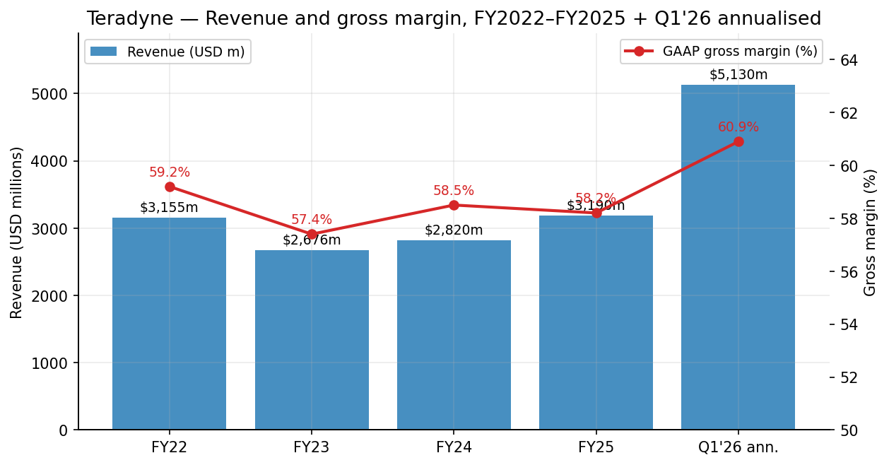
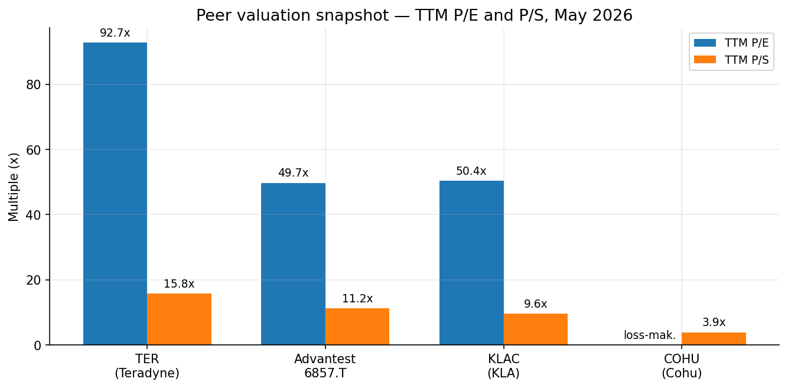
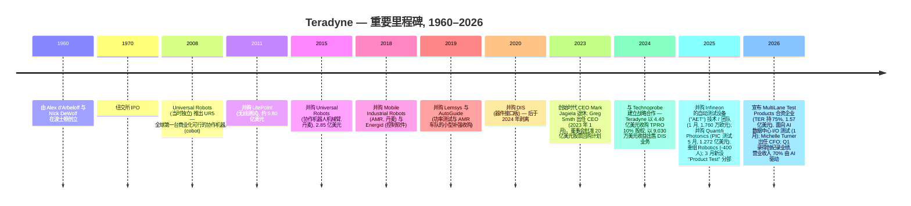
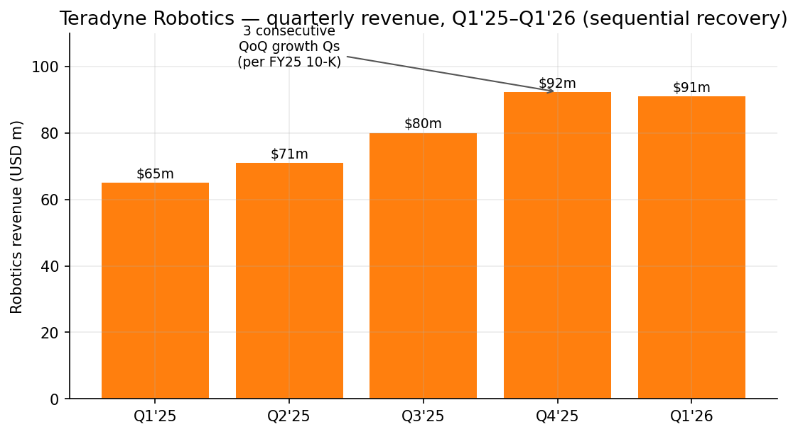
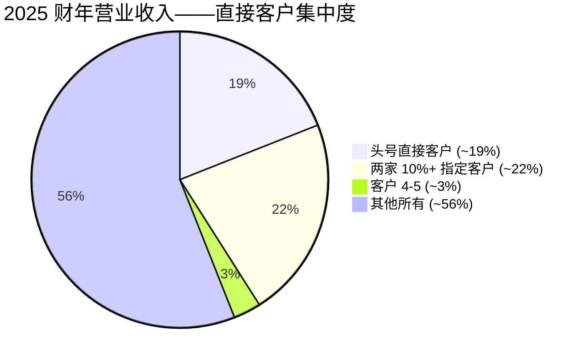
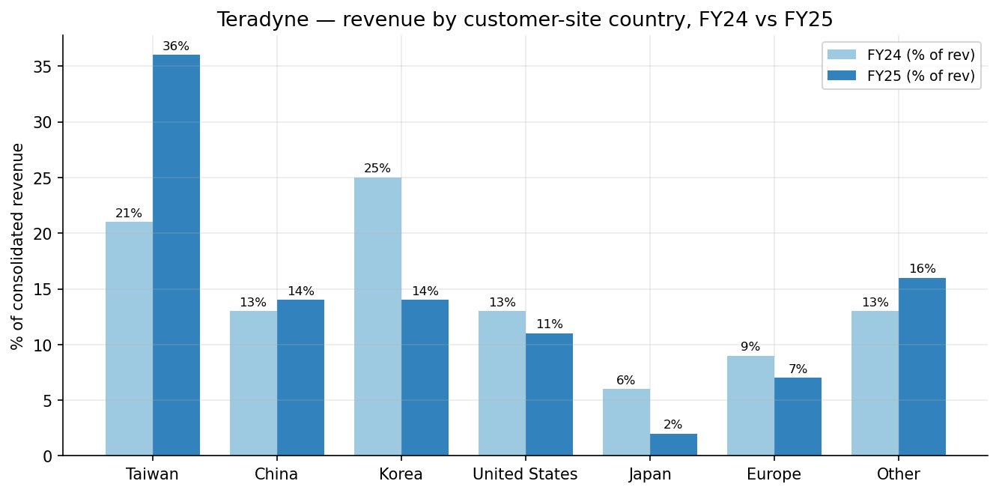
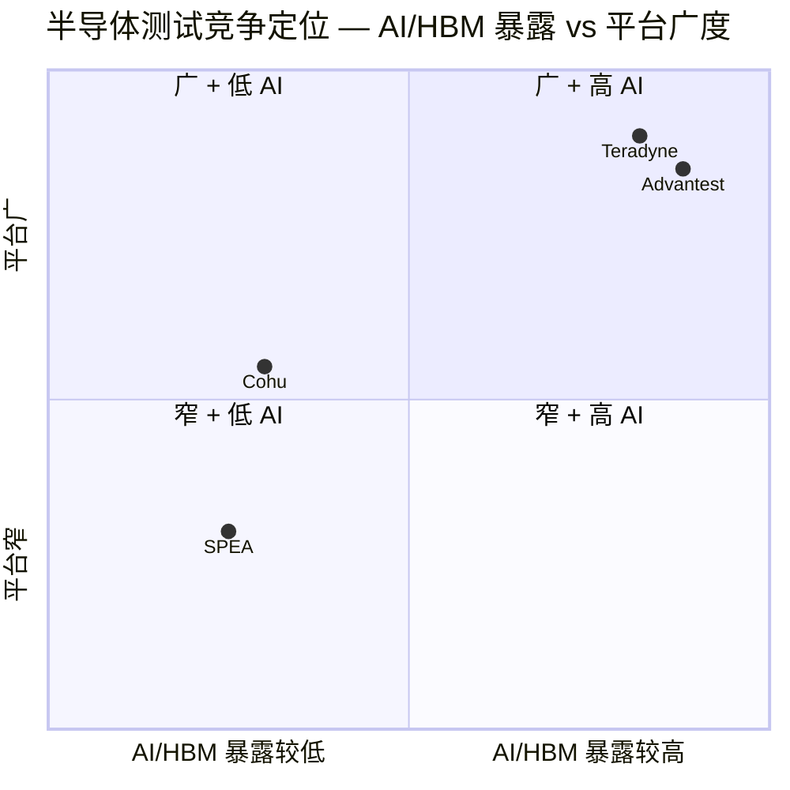

# Teradyne, Inc. (NASDAQ:TER) — 公司研究报告

**截至日期:** 2026-05-20
**上市代码:** NASDAQ: TER
**总部所在地:** 美国马萨诸塞州北雷丁 (North Reading)
**成立年份:** 1960
**报告语言: 简体中文 (英文版同时存在于本目录)**
**分析师注释:** 首次覆盖报告。所有数字均取自一手公告 (SEC EDGAR 10-K、10-Q、8-K)、Teradyne IR 材料, 或文中标注的市场数据提供方。任何由模型推导的数字均明确标注; 不将估算装扮为事实。

> **业绩更新——2026 财年 Q1 创纪录季度, AI 营业收入占比已升至约 70% (2026-04-28):** Teradyne 公布 2026 财年 Q1 营业收入 **12.82 亿美元 (同比 +87%)**, GAAP 每股收益 (EPS) **2.53 美元**, 非 GAAP 每股收益 **2.56 美元**, 均显著高于此前指引上限。管理层披露 **2026 财年 Q1 营业收入中, 约 70% 与 AI 相关需求挂钩**, 涵盖计算 (超大规模厂商定制 ASIC 与 VIP 设计的 SoC 测试)、存储 (HBM/DRAM 终测), 以及 AI 数据中心 I/O。2026 财年 Q2 指引营业收入区间为 **11.50–12.50 亿美元**, 非 GAAP 每股收益 **1.86–2.15 美元** (环比较 Q1 的爆发性表现略有回落, 但同比仍 +70%+)。
> 来源: [Teradyne 2026 财年 Q1 8-K / 业绩公告, 2026-04-29](https://www.sec.gov/Archives/edgar/data/0000097210/000119312526188706/ter-ex99_1.htm)。

## 目录

1. 公司概览
2. 公司历史
3. 管理团队
4. 产品与服务
5. 客户与上市策略
6. 行业概览
7. 竞争格局
8. 市场机会 (TAM)
9. 风险评估

参考资料

---

## 1. 公司概览

Teradyne, Inc. 是一家在马萨诸塞州注册、纳斯达克上市 (代码 TER) 的公司, 主营业务包括为半导体与电子系统设计制造**自动测试设备 (automated test equipment, ATE)**, 以及一项围绕 Universal Robots (UR) 协作机器人 (cobot) 机械臂和 Mobile Industrial Robots (MiR) 自主移动机器人 (autonomous mobile robot, AMR) 构建的全球**工业机器人 (industrial robotics)** 业务 ([Teradyne 2025 年报 10-K, 第 1 项: 业务](https://www.sec.gov/Archives/edgar/data/0000097210/000119312526059002/d885618d10k.htm))。公司由 MIT 同窗 Alex d'Arbeloff 与 Nick DeWolf 于 1960 年创立, 1970 年 IPO, 总部位于马萨诸塞州北雷丁市 (North Reading, MA) 600 Riverpark Drive。截至 2025 年 12 月 31 日, 公司全球雇员**约 6,600 人**, 其中 2,200 人在美国; 美国境外人员规模最大的地区依次为菲律宾 (占员工总数 19%)、丹麦 (10%, 主要为 Universal Robots 与 MiR)、哥斯达黎加 (7%)、中国 (7%) 与台湾 (5%) ([2025 年报 10-K § 人力资本](https://www.sec.gov/Archives/edgar/data/0000097210/000119312526059002/d885618d10k.htm))。

**分部架构 (2025 年 3 月调整)。** 2025 年 Q1, Teradyne 将原"系统测试 (System Test)"分部中的电路板测试业务、国防与航天测试业务, 以及 LitePoint 无线测试业务合并入新的 **Product Test (产品测试)** 分部, 完成分部重组, 形成三大可报告分部:

1. **Semiconductor Test (半导体测试)** — FLEX / UltraFLEX / UltraFLEXplus 系列 (SoC 测试)、J750 (微控制器 / 图像传感器测试)、ETS / Eagle 平台 (模拟 / 功率)、Magnum 系列 (存储测试, 包括 HBM 与 DRAM 终测), 以及 Integrated System Test ("IST", 集成系统测试) 业务组 (系统级测试 + HDD/SSD 存储测试机)。
2. **Product Test (产品测试)** — 电路板测试、LitePoint 无线测试、国防与航天测试, 以及 (自 2025 年 5 月起) Quantifi Photonics PIC (光子集成电路, photonic integrated circuit) 测试。
3. **Robotics (机器人)** — Universal Robots 协作机器人机械臂与 Mobile Industrial Robots 自主移动机器人 (AMR)。

来源: [2025 年报 10-K § 第 1 项业务 / 第 7 项 MD&A](https://www.sec.gov/Archives/edgar/data/0000097210/000119312526059002/d885618d10k.htm)。

**2025 财年规模。** 合并营业收入为 **31.90 亿美元 (同比 +13.1%)**, GAAP 毛利率 (gross margin) **58.2%**, GAAP 营业利润率 (operating margin) **20.4%**, GAAP 净利润 **5.555 亿美元** (按分部税前 6.533 亿美元扣减 7,930 万税款加联营企业权益收益计算; 与 10-K MD&A 披露的 17.4% 净利率 (net margin) 调和) ([2025 年报 10-K § 第 7 项 MD&A](https://www.sec.gov/Archives/edgar/data/0000097210/000119312526059002/d885618d10k.htm))。Semiconductor Test 贡献营业收入 **79%** (2025 财年 25.237 亿美元, 同比 +18.8%), Product Test **11%** (3.580 亿美元, +8.1%), Robotics **10%** (3.083 亿美元, -15.5%)。2025 财年, 向美国境外客户的销售占营业收入的 **89%**, 较 2024 财年的 87% 与 2023 财年的 84% 持续上升。

**2026 财年 Q1 拐点。** 营业收入跃升至 **12.825 亿美元 (同比 +87%)**, 其中 Semiconductor Test 11.11 亿美元、Robotics 0.91 亿美元、Product Test 0.80 亿美元 ([2026 财年 Q1 8-K 业绩公告, 2026-04-29](https://www.sec.gov/Archives/edgar/data/0000097210/000119312526188706/ter-ex99_1.htm))。CEO Greg Smith 将该业绩定调为"从晶圆到 AI 数据中心 (wafer-to-AI-data-center)"战略的胜利证明: **Q1 营业收入约 70% 与 AI 相关**, 涵盖计算 (超大规模厂商训练 ASIC 与 VIP 客户的 SoC 测试)、存储 (HBM 与 DRAM 终测份额提升), 以及 (前瞻性) 2026 年 1 月公告的、面向 AI 数据中心 I/O 测试的 MultiLane Test Products 合资企业。

来源: [Teradyne 2025 年报 10-K MD&A](https://www.sec.gov/Archives/edgar/data/0000097210/000119312526059002/d885618d10k.htm); [2026 财年 Q1 8-K, 2026-04-29](https://www.sec.gov/Archives/edgar/data/0000097210/000119312526188706/ter-ex99_1.htm); [2024 年报 10-K MD&A](https://www.sec.gov/Archives/edgar/data/0000097210/000095017025023784/ter-20241231.htm)。

### 估值快照

| 指标 | 数值 | 备注 |
|---|---|---|
| 股价 (2026-05-19 收盘) | **322.09 美元** | NASDAQ: TER |
| 市值 | **约 503 亿美元** | 1.565 亿稀释股份 × 322 美元 |
| 稀释股本 | 156,555,950 | 来源 [2025 年报 10-K 封面页, 截至 2026-02-16](https://www.sec.gov/Archives/edgar/data/0000097210/000119312526059002/d885618d10k.htm) |
| 现金及有价证券 | 3.939 亿美元 | 2026-03-29 ([2026 财年 Q1 资产负债表](https://www.sec.gov/Archives/edgar/data/0000097210/000119312526188706/ter-ex99_1.htm)) |
| 短期债务 | 0 美元 | 2 亿美元授信额度提款于 2026 财年 Q1 偿还 |
| TTM 稀释 EPS (2025 年 12 月) | 3.48 美元 | 来源 [GuruFocus](https://www.gurufocus.com/term/pettm/TER) |
| **TTM 市盈率 (P/E)** | **约 92.7×** | [Companies Market Cap](https://companiesmarketcap.com/teradyne/pe-ratio/), 2026 年 5 月 |
| 替代 P/E 读数 | 59.4× | [Robinhood, 2026 年 5 月](https://robinhood.com/us/en/stocks/TER/) — 使用部分前瞻盈利基础 |
| **TTM 市销率 (P/S)** | **约 3.3× 营业收入 / 13.3× LTM 年化营业收入基数** | TTM 营业收入滚动: 约 37.9 亿美元 → P/S 13.3×; 使用截至 2026 财年 Q1 的 4 季度滚动 (3,190 - 685.7 + 1,282.5 = 37.868 亿美元) → 503/37.9 = **13.3×** ([Macrotrends](https://www.macrotrends.net/stocks/charts/TER/teradyne/price-sales)) |
| 3 年 P/E 区间 (近似) | 约 22× (2023 财年低谷) — 约 95× (2026 年 5 月峰值) | 来源 [Macrotrends](https://www.macrotrends.net/stocks/charts/TER/teradyne/price-sales) 与 [GuruFocus](https://www.gurufocus.com/term/pettm/TER) |
| 10 年 P/E 中位数 | 26.5× | [GuruFocus](https://www.gurufocus.com/term/pettm/TER) |

**如何解读这些倍数。** TER 的 TTM P/E 约 92×, 比 10 年中位数的 26.5× **高出 337%** ([GuruFocus](https://www.gurufocus.com/term/pettm/TER)), 视觉上属于"成长股"估值, 而非"周期性设备股"估值。三股力量同时作用: (i) **分母锚定在低谷年份**——TTM EPS 仍包含 AI 测试爬坡前的 2025 年上半年疲弱季度; 一致预期 2026 财年 EPS 显著更高 (仅 Q1 单季度非 GAAP 即录得 2.56 美元, 年化 10 美元以上), 因此在前瞻视角下倍数收缩至大约 **30–35×** 区间; (ii) **市场将 TER 计价为主要的 AI 基础设施受益者**, 与 KLAC (TTM 50×, [FinanceCharts](https://www.financecharts.com/stocks/KLAC/value/pe-ratio)) 及 Advantest (50× — 见第 7 章) 并列, 倍数扩张随营业收入中 AI 相关比例同步上行 (按管理层口径, 该比例从 2025 上半年的 35% 升至 2026 财年 Q1 的 70%); (iii) **Cohu 没有有意义的 P/E**, 因其处于亏损状态 (2025 财年净亏损 7,400 万美元, [Cohu 8-K](https://www.sec.gov/Archives/edgar/data/0000021535/000143774926003937/ex_919868.htm))。总结: TER 的 TTM P/E 反映了由 AI/HBM 定位推动的重新估值, 但 2026E 前瞻 P/E 约 30×——相对历史中位数仍属于偏贵, 需要 AI 测试持续增长才能支持。若 AI 计算订单出现一两个季度的停顿 (SoC 测试业务历来订单出货呈现间歇性集中), 估值倍数可能快速压缩。

### 同业估值 (TTM, 2026 年 5 月)

来源: [GuruFocus TER P/E](https://www.gurufocus.com/term/pettm/TER); [Google Finance Advantest 6857](https://www.google.com/finance/beta/quote/6857:TYO); [FinanceCharts KLAC](https://www.financecharts.com/stocks/KLAC/value/pe-ratio); [Cohu 8-K FY25](https://www.sec.gov/Archives/edgar/data/0000021535/000143774926003937/ex_919868.htm); [Macrotrends TER P/S](https://www.macrotrends.net/stocks/charts/TER/teradyne/price-sales)。

---

## 2. 公司历史

Teradyne 于 **1960 年**由 Alex d'Arbeloff 与 Nick DeWolf 创立——两位 MIT 毕业生当时正为早期商业半导体行业开发仪器仪表。公司于 1961 年制造出第一台商业化成功的 go/no-go 半导体测试机, 并于 1970 年在纽约证券交易所上市 (现已转至 NASDAQ, 代码 TER) ([2025 年报 10-K § 投资者信息](https://www.sec.gov/Archives/edgar/data/0000097210/000119312526059002/d885618d10k.htm))。在前四十年, 公司近乎纯粹是一家测试设备公司; 现代 Teradyne——一个结合 ATE 与工业机器人的双平台公司——主要是过去十年并购的产物, 起点是 2011 年并购 LitePoint, 关键转折则是 **2015 年以 2.85 亿美元收购 Universal Robots**。

来源: [2025 年报 10-K § 第 7 项 MD&A 与附注](https://www.sec.gov/Archives/edgar/data/0000097210/000119312526059002/d885618d10k.htm); [Robot Report — Teradyne 机器人业务 2026 年初营业收入上升](https://www.therobotreport.com/teradyne-robotics-revenue-rises-start-2026/); [2026 财年 Q1 8-K](https://www.sec.gov/Archives/edgar/data/0000097210/000119312526188706/ter-ex99_1.htm)。

**三大战略性转折塑造了现代 Teradyne。**

第一, **2011–2015 年的纯 ATE 业务多元化**——LitePoint 并购拓展了无线测试, Universal Robots 并购则打开了一项结构性增速更快的工业机器人业务。Mark Jagiela (CEO 2014–2022) 是设计者; 明确逻辑是用一项处于早期采用曲线的工业自动化平台, 对冲极具周期性的 SoC 测试业务。到 2018 财年, Robotics 营业收入已接近 2.60 亿美元。

第二, **2024 年与 Technoprobe 的战略合作**——Teradyne 以 9,030 万美元收益将 DIS (器件接口板) 业务出售给 Technoprobe (全球第一大晶圆探针卡供应商), 同时以约 4.40 亿美元收购 Technoprobe 10% 股权 ([2025 年报 10-K § 附注 J / 投资](https://www.sec.gov/Archives/edgar/data/0000097210/000119312526059002/d885618d10k.htm))。目标是与 SoC 测试堆栈中的探针卡环节建立纵向协同, 以应对裸片复杂度向 2nm 以下推进, 以及多裸片、富 HBM 配置的 SoC 大规模普及。Teradyne 目前以权益法核算 Technoprobe 的盈利。

第三, **2025–2026 年的"晶圆到 AI 数据中心 (wafer-to-AI-data-center)"定位**——三笔交易 (从 Infineon 收购 AET、并购 Quantifi Photonics 进入 PIC 测试、MultiLane 合资进入 AI I/O 测试) 加上一次 Robotics 重组 (约 400 名员工遣散, 2,430 万美元费用), 将公司重新定位于一条横跨 SoC 测试 (UltraFLEXplus + AET)、HBM/存储测试 (Magnum)、硅光子测试 (Quantifi)、高速 I/O 测试 (MultiLane 合资)、系统级测试 (IST), 以及厂内自动化辅助 (UR + MiR) 的 AI 数据中心价值链上。2026 财年 Q1 的"70% 营业收入与 AI 相关"是该论点的首次确凿验证。

机器人分部一直是失望: 营业收入从 2022 财年的 3.76 亿美元缩水到 2025 财年的 3.08 亿美元 (累计 -18%), 反映了欧洲工业放缓、协作机器人采用速度低于疫情前热潮预期, 以及中国低成本协作机器人厂商 (Aubo、Jaka、Techman) 的竞争压力。2025 财年 Q2–Q4 出现连续季度增长, 2026 财年 Q1 维持在 0.91 亿美元水平, 是重组 (-400 人, 聚焦物流/电商/电子终端) 开始见效的初步证据。

---

## 3. 管理团队

### Gregory S. (Greg) Smith — 总裁兼首席执行官 (CEO, 自 2023 年 1 月)

Greg Smith 于 **2023 年 1 月 31 日**接棒, 前任 Mark Jagiela 退休 ([Teradyne 10-K 附件 10.18 / 10.21, 2022](https://www.sec.gov/Archives/edgar/data/0000097210/000119312526059002/d885618d10k.htm); [Reuters, 2023 年接任公告](https://www.reuters.com/))。Smith 于 2016 年加入 Teradyne, 出任 Semiconductor Test 业务总裁, 此前在 LSI Logic / Avago / Broadcom 任职多年, 曾负责存储 SoC 业务, 与如今驱动 TER AI 测试需求的同一批超大规模厂商与 IDM 客户建立了深厚关系。他同时担任 Teradyne 董事。在 Semi Test 总裁任期 (2016–2022) 期间, 他主导了 UltraFLEXplus 产品周期——目前已成为 AI 计算 SoC 测试的主力机型; 该产品路线图以及他与 AI 训练 ASIC 前沿设计客户的关系, 可以说是 TER 资产负债表上目前最重要的单项资产。薪酬结构: 高度股权挂钩, 最大组成部分为按 2006 年股权与现金薪酬激励计划下、基于 TSR (股东总回报) 的限制性股票单位 (PRSU) ([2025 年报 10-K 附件 10.29 / 10.30](https://www.sec.gov/Archives/edgar/data/0000097210/000119312526059002/d885618d10k.htm))。他上任近三年的战略重点是: (i) 加倍押注 AI 计算与 HBM 测试, (ii) 通过 Technoprobe 与 MultiLane 合作纵向整合 AI 工作负载相关的测试堆栈, (iii) 将 Robotics 重组为更聚焦物流/电商/电子终端的精益组织, 以及 (iv) 持续股东回报 (2025 财年 7.78 亿美元返还股东)。前三项已见效; Robotics 仍待验证。

### Michelle Turner — 副总裁、首席财务官 (CFO) 兼司库 (自 2025 年 10 月 27 日)

Turner 是**新近聘任**——其雇佣协议与控制权变更协议均签署于 **2025 年 10 月 27 日** ([2025 年报 10-K 附件 10.44, 10.45](https://www.sec.gov/Archives/edgar/data/0000097210/000119312526059002/d885618d10k.htm))。她接替任期较长的前任 CFO **Sanjay Mehta** (2019 年 5 月起任 CFO; 录用书 2019-02-08, 离职时间 2025 年 9 月——见附件 10.31–10.34)。Turner 已签署 2025 年报 10-K 与 2026 财年 Q1 季报 10-Q。她此前的经历未在 10-K 中详细披露, 但 2026 财年 Q1 资本回报机制的迅速稳定 (债务偿还、股息从 0.12 美元提至 0.13 美元、ERP 迁移按计划推进) 表明交接过程平稳。截至本报告之日, 关于 Turner 公开背景信息的披露尚不充分——下一份委托书 (DEF 14A) 中应予以关注。

### Bradford (Brad) Robbins — Semiconductor Test 分部总裁 (自 2014 年)

Robbins 于 2014 年 9 月加入 Teradyne ([2025 年报 10-K 附件 10.27 / 10.28](https://www.sec.gov/Archives/edgar/data/0000097210/000119312526059002/d885618d10k.htm)), 负责按营业收入计算最大的分部 (2025 财年贡献 79%)。此前在半导体资本设备行业担任领导职位。Robbins 直接负责 AI 计算测试客户关系; 2025 年 1 月 31 日完成的 Infineon AET 并购, 即由其下属组织执行。

### Ujjwal Kumar (2025 年离职) → 机器人业务新领导层

Kumar 于 2023 年 6 月 27 日获聘任为 Robotics 集团总裁 ([2025 年报 10-K 附件 10.37](https://www.sec.gov/Archives/edgar/data/0000097210/000119312526059002/d885618d10k.htm)), 于 2025 年 8 月 28 日依据《分离与解除协议》离任 ([附件 10.43](https://www.sec.gov/Archives/edgar/data/0000097210/000119312526059002/d885618d10k.htm))——同期 400 名 Robotics 员工接受遣散。新的 Robotics 领导层目前在 Smith 直接监管下组建; 2025 财年 Q4 的环比增长与 2026 财年 Q1 的企稳显示该分部又一次走在正确方向, 但领导层过渡仍是关键观察项。

### 董事会

2026 年董事会由**九名董事**组成, 其中八名为非雇员董事, 按纳斯达克规则推定独立 ([2025 年报 10-K 签字页, 2026-02-19](https://www.sec.gov/Archives/edgar/data/0000097210/000119312526059002/d885618d10k.htm)):

- **Paul J. Tufano** — 董事会主席 (曾任 Benchmark Electronics CEO 与 Alcatel-Lucent CFO)
- **Gregory Smith** — CEO 兼董事
- **Peter Herweck** — 前 AVEVA CEO / 施耐德电气高管
- **Mercedes Johnson** — 前 Avago Technologies / Lam Research CFO
- **Ernest E. Maddock** — 前 Micron Technology CFO
- **Marilyn Matz** — Paradigm4 创始人 / 前 Vertica
- **Bridget van Kralingen** — 前 IBM 高级副总裁
- **Drew Henry** — 前 Cisco / NVIDIA 高管
- **Dr. Necip Sayiner** — 半导体行业资深人士 (前 Intersil CEO)

该董事会在半导体/电子运营经验上异常深厚——三位同等规模公司前 CFO (Tufano、Johnson、Maddock), 加上一位前 NVIDIA 高管 (Henry) 和前 Intersil CEO (Sayiner)。对于一家刚把估值倍数押在 AI 计算测试上的公司来说, 这是非常有用的专业经验集中。

### 治理与资本回报

- **股票回购授权:** 2023 年 1 月批准 20 亿美元; 截至 2025 年 12 月累计回购 12.973 亿美元, **剩余 6.91 亿美元** ([2025 年报 10-K § 重大现金支出](https://www.sec.gov/Archives/edgar/data/0000097210/000119312526059002/d885618d10k.htm))。
- **股息:** 2026 年 1 月将每股季度股息从 0.12 美元提至 **0.13 美元** (+8%)。
- **2025 财年资本回报:** 以平均 112.21 美元/股回购 7.021 亿美元 + 7,630 万美元股息 = **总计 7.784 亿美元** (占 2025 财年营业收入 24%)。
- **不设双重股权结构, 无超级表决权股份。** 内部人持股比例较低 (个位数百分比), 薪酬高度股权挂钩, 以 TSR 基础的 PRSU 为主。
- **PWC (普华永道)** 为审计师, 报告期内未发生审计师变更 ([2025 年报 10-K 附件 23.1](https://www.sec.gov/Archives/edgar/data/0000097210/000119312526059002/d885618d10k.htm))。

### 业绩记录综合

Smith 接手时业务正处于周期低谷 (2023 财年营业收入 26.8 亿美元, 较 2022 财年的 31.6 亿美元下滑), 八个季度内已将其推升至创纪录的 12.8 亿美元单季运行率。资本配置纪律可信——2025 财年 7.02 亿美元回购为净额 (扣除 2.50 亿美元授信提款), 表明对现金生成具备信心——并购清单 (Quantifi、AET、MultiLane、Technoprobe 股权) 紧密围绕 AI 基础设施主题, 而非帝国式扩张。最大缺口在于 Robotics: 五年内三任 CEO (Jagiela 任期 → Kumar → 后 Kumar 时代), 表明分部尚未找到稳定的运营模式, 2025 财年 -15.5% 的营业收入下滑加上 2,430 万美元遣散费, 提醒投资者"协作机器人采用拐点"的多头叙事至少已被推迟第三次。

---

## 4. 产品与服务

Teradyne 的产品组合分布在三大可报告分部中。下方产品树将系列映射到具体产品。详细产品说明与竞争优势评估见后文。

```mermaid
graph TD
    A[Teradyne] --> B[半导体测试 2025 财年营业收入占 79%]
    A --> C[产品测试 11%]
    A --> D[机器人 10%]

    B --> B1[FLEX 测试平台 - SoC]
    B1 --> B1a[UltraFLEXplus PACE 架构]
    B1 --> B1b[UltraFLEX]
    B1 --> B1c[FLEX]
    B --> B2[J750 - MCU / 图像传感器]
    B2 --> B2a[IP750 图像传感器]
    B --> B3[Magnum - 存储测试]
    B3 --> B3a[Magnum 7 - 闪存/DRAM/HBM/MCP]
    B3 --> B3b[Magnum EPIC - 终测]
    B --> B4[ETS / Eagle - 模拟/功率]
    B4 --> B4a[ETS-88 SiC/GaN]
    B4 --> B4b[ETS-800]
    B --> B5[集成系统测试 IST]
    B5 --> B5a[SLT - 系统级测试]
    B5 --> B5b[HDD/SSD 测试机]
    B --> B6[AET 收自 Infineon, 2025-01]
    B --> B7[MLTP 合资 - AI I/O 测试, 2026]

    C --> C1[LitePoint 无线测试]
    C --> C2[电路板测试]
    C --> C3[国防与航天测试]
    C --> C4[Quantifi Photonics PIC 测试, 2025-05]

    D --> D1[Universal Robots 协作机器人机械臂]
    D1 --> D1a[UR3e, UR7e, UR8 Long, UR12e, UR15, UR16e, UR18, UR20, UR30]
    D1 --> D1b[PolyScope 软件 / UR+ 生态系统]
    D --> D2[Mobile Industrial Robots AMR]
    D2 --> D2a[MiR250, MiR600, MiR1350]
    D2 --> D2b[MiR1200 托盘搬运车 Pallet Jack]
```

### 半导体测试 (Semiconductor Test, 2025 财年营业收入 25.237 亿美元, 同比 +18.8%)

**FLEX / UltraFLEX / UltraFLEXplus** — SoC 测试平台。**UltraFLEXplus** 使用 Teradyne 自有的 **PACE™ 架构**和 **IG-XL™ 软件操作系统** ([2025 年报 10-K § 产品 § 半导体测试](https://www.sec.gov/Archives/edgar/data/0000097210/000119312526059002/d885618d10k.htm))。UltraFLEXplus 是 **AI 计算 SoC** 测试的旗舰——即由超大规模厂商设计的训练与推理 ASIC ("纵向集成生产商"或管理层口中的 VIP: Google TPU、Amazon Trainium/Inferentia、Microsoft Maia、Meta MTIA——TER 未明确命名, 但行业语境足以使客户范围清晰), 以及商用 AI 芯片厂商。FLEX 架构也是 OSAT (封测厂, 包括 ASE、Amkor、KYEC、SPIL) 测试 Fabless 客户设计器件的主力机型。**竞争优势判断: 是——技术 + 切换成本。** IG-XL 软件生态是一个 25 年代码积累, 客户已大量投入测试程序开发; 切换 SoC 测试平台意味着重新验证成千上万个器件专用测试程序, 这是一个多季度、数百万美元的工程项目。最接近的竞争对手: **Advantest V93000** (目前 AI 测试的销量领导者, 来源 [Mordor Intelligence 半导体测试设备报告](https://www.mordorintelligence.com/industry-reports/semiconductor-test-equipment-market)); Teradyne 在 2025–2026 年依托 PACE 架构与 AET (前 Infineon) 并购, 重新夺回份额。**对比:** 在 AI 计算吞吐率上与之相当, 在测试程序复用 / 总测试成本经济性上略有领先。

**J750 / IP750** — 微控制器与图像传感器测试。J750 平台测试**大批量 MCU**、**图像传感器** (智能手机、汽车 ADAS 用 CMOS 图像传感器等), 以及类似的大众市场器件。Teradyne 披露持续投资 J750 新仪器模块, 用于"高端 MCU 与最新一代图像传感器" ([2025 年报 10-K](https://www.sec.gov/Archives/edgar/data/0000097210/000119312526059002/d885618d10k.htm))。**判断: 是——规模 + 生态系统。** J750 是 MCU 量产测试的事实行业标准, 几乎在每一家主要 MCU IDM 内都有装机基数。最接近的竞争对手: Advantest **T2000** 与 Cohu **Diamondx**。对比: 装机基数领先, 每针成本经济性持平。

**Magnum 平台 — 存储测试 (闪存、DRAM、HBM)。** **Magnum 7** 用于跨闪存、DRAM、HBM 与多芯片封装的并行存储测试; **Magnum EPIC** 是公司的完整存储终测平台 ([2025 年报 10-K § 产品](https://www.sec.gov/Archives/edgar/data/0000097210/000119312526059002/d885618d10k.htm))。管理层披露 2025 财年存储测试业务"在市场整体规模较小的情况下保持稳定, 由 HBM (高带宽内存) 与 DRAM 终测应用份额提升支撑"。**判断: 部分。** 存储测试为 Advantest (DRAM/HBM 晶圆测试主导, 客户包括 SK Hynix、Samsung、Micron) 与 Teradyne (终测/系统级测试) 之间的双寡头。HBM 爬坡对双方均为顺风; Teradyne 是清晰的 #2 且份额持续提升, 但难以撼动 Advantest 在晶圆测试环节的在位优势。

**ETS / Eagle 平台 — 模拟、功率、SiC/GaN。** ETS 处理**模拟/混合信号**, 服务移动、汽车、计算机外设、数据中心电源应用。**ETS-88** 面向 **SiC 与 GaN 功率器件** (汽车电动化、数据中心电源)。**ETS-800** 用于汽车/工业/消费领域的高复杂度功率器件。**判断: 部分。** 功率器件测试市场更为分散, 竞争对手包括 Cohu、SPEA 与一众区域性供应商; Teradyne 的 Eagle 平台在 SiC/GaN 中具有强势地位, 但毛利率低于 SoC 业务。

**集成系统测试 (Integrated System Test, IST) — SLT + HDD/SSD。** 系统级测试 ("SLT") 用于需要在类服务器环境下做最终封装后验证的先进 AI/HPC SoC; 加上服务存储行业的 **HDD/SSD 测试机**。IST 在 2025 财年随 AI 计算爬坡显著增长——公司强调"以系统级测试机为主的集成系统测试"是 Semi Test 同比 +18.8% 的关键驱动。**判断: 是——技术领先。** Teradyne 是高引脚数 AI 计算器件 SLT 的公认领导者; Cohu 与 Advantest 有竞争力但在 SLT 规模较小。

**AET (前 Infineon, 2025 年 1 月) 与 Quantifi Photonics (2025 年 5 月)。** 两项补强收购, 拓宽 SoC 与 PIC 测试足迹。AET 总部位于德国雷根斯堡 (Regensburg), 原为 Infineon 内部 ATE 技术团队, 以 **1,760 万欧元 (约 1,830 万美元)** 并购, 目前直接为 Infineon 提供服务 ([2025 年报 10-K § 第 7 项 MD&A](https://www.sec.gov/Archives/edgar/data/0000097210/000119312526059002/d885618d10k.htm))。Quantifi Photonics 于 **2025 年 5 月 31 日**以 **1.272 亿美元**并购, 是 PIC (光子集成电路) 测试的领导者——Teradyne 计划将 Quantifi 技术整合至 UltraFLEXplus 平台, 用于 AI 数据中心硅光子爬坡所需的共封装光学 (CPO) 测试。

**MultiLane Test Products 合资 (2026 年 1 月 29 日宣布; 预计 2026 上半年完成交割)。** Teradyne 将投资约 1.57 亿美元获取 **75% 股权**, 与 MultiLane (高速 I/O 测试专家) 合资, 应对 AI 数据中心高速 I/O 测试 (224G+ SerDes、CXL、NVLink 级互联)。这是对 AI 服务器机架内"一切互联"测试问题的明确押注 ([2025 年报 10-K § 第 1 项 / § 第 7 项 MD&A](https://www.sec.gov/Archives/edgar/data/0000097210/000119312526059002/d885618d10k.htm))。

### 产品测试 (Product Test, 2025 财年营业收入 3.580 亿美元, 同比 +8.1%)

2025 年 3 月将电路板测试 (ICT/AOI)、LitePoint 无线测试与国防航天测试合并设立。Quantifi (PIC 测试) 亦归入此分部。2025 财年增长主要由**国防与航天**驱动——Teradyne 为美国国防主承包商及盟国项目提供测试仪器 (具体客户在 10-K 中未披露, 但管理层提到"国防与航天应用的强劲表现"为关键摆动因素)。

- **LitePoint 无线测试。** 测试 Wi-Fi 6/6E/7、Bluetooth、UWB、蜂窝 (5G NR), 越来越多覆盖玻璃基板 Wi-Fi 模块。用于消费移动设备、IoT 与汽车连接的客户终测。**判断: 是——IP + 规模**, 但对消费/手机周期暴露较大。最接近的竞争对手: 是德科技 (Keysight)、罗德与施瓦茨 (Rohde & Schwarz)、安立 (Anritsu)。
- **国防与航天测试。** 高可靠性电子测试仪器的综合业务。绝对金额较小但毛利率高, 与消费 ATE 反周期。
- **Quantifi (PIC)。** 早期阶段; 2025 财年营业收入贡献较小, 但战略上为硅光子/共封装光学爬坡做好定位。

### 机器人 (Robotics, 2025 财年营业收入 3.083 亿美元, 同比 -15.5%)

**Universal Robots (UR) — 协作机器人 (cobot) 机械臂。** 2005 年成立于丹麦欧登塞 (Odense); 2015 年被 Teradyne 以 2.85 亿美元并购。UR 于 2008 年推出全球第一台商业化可行的 cobot (UR5), 累计**全球销售超过 110,000 台 cobot** ([2025 年报 10-K § 产品 § 机器人](https://www.sec.gov/Archives/edgar/data/0000097210/000119312526059002/d885618d10k.htm))。产品线覆盖臂展从约 500mm (UR3e) 到 1,750mm (UR20), 负载从约 3kg 到 30kg (UR30), 包括新机型 **UR8 Long**、**UR15**、**UR18**。差异化要素: **PolyScope** 直观编程软件、**平均投资回收期 12–18 个月**, 以及由认证终端工具/套件/集成构成的 **UR+ 生态系统**。**判断: 是——品牌 + 生态 + 装机基数。** UR 持有**全球 cobot 市场约 39% 份额** ([Globalgrowthinsights / Fortune Business Insights, 2025–26 cobot 报告](https://www.fortunebusinessinsights.com/industry-reports/collaborative-robots-market-101692)), 为明确的品类领导者。竞争对手包括传统工业机器人厂商 (KUKA、ABB、FANUC、Yaskawa、Staubli——开始进入 cobot) 与亚洲新兴厂商 (Techman、Doosan、Jaka、AUBO、Han's)。护城河真实存在但正在被削弱——中国 cobot 在可比规格下便宜 30–50%, UR 增长已停滞。

**Mobile Industrial Robots (MiR) — 自主移动机器人 (AMR)。** 2018 年并购。**全球累计销售超过 11,000 台 AMR** ([2025 年报 10-K](https://www.sec.gov/Archives/edgar/data/0000097210/000119312526059002/d885618d10k.htm))。产品线: **MiR250、MiR600、MiR1350**, 加上 **MiR1200 Pallet Jack** (托盘搬运车)。平均投资回收期 12–24 个月。**判断: 部分。** 在室内制造/物流 AMR 市场具备竞争力, 但更广义的 AMR/AGV 市场高度分散, 且包括资金充足的竞争对手 (Omron、Locus、6 River Systems / Shopify、OTTO Motors / Rockwell、Hai Robotics、HikRobot、Geek+、Quicktron) 与价格激进的中国厂商 (HikRobot、Agilox、Junion)。

**机器人业务季度营业收入轨迹。**

来源: [Teradyne 2025 年报 10-K § 第 7 项 MD&A](https://www.sec.gov/Archives/edgar/data/0000097210/000119312526059002/d885618d10k.htm); [2026 财年 Q1 8-K, 2026-04-29](https://www.sec.gov/Archives/edgar/data/0000097210/000119312526188706/ter-ex99_1.htm); 季度节奏与 2025 财年分部总额 3.083 亿美元调和。

### 旗舰产品对长尾产品, 以及最新发布

驱动 2025–2026 年营业收入的 1–3 款产品明确是: (i) **AI 计算 SoC 测试用 UltraFLEXplus**, (ii) **HBM 与 SLT 用 Magnum / IST**, 以及 (iii) 未来的 AI I/O 测试用 **MultiLane 合资**。这三者合计占据 Semi Test 分部约 25 亿美元 2025 财年营业收入的主要份额, 以及 2026 财年 Q1 爆发性增长的绝大部分。最新发布: AET 整合 (2025 年 1 月); Quantifi PIC 整合至 UltraFLEXplus (2025 年 5 月宣布); MultiLane 合资 (2026 年 1 月)。退役/收尾: DIS 器件接口板业务于 2024 年 5 月出售给 Technoprobe。

---

## 5. 客户与上市策略

### 客户集中度——已然显著且持续上升

Teradyne 在 10-K 中按两种口径披露客户集中度: **指定客户 (specifying customer)** (推动平台选型的 OEM/IDM/Fabless) 与**购买客户 (purchasing customer)** (通常是为指定客户实际采购设备的 OSAT)。2025 财年公司披露:

| 年份 | 前 5 直接客户占比 | ≥10% 客户 | 头号直接客户 |
|---|---|---|---|
| **2025 财年** | **44%** | 2 名指定客户分别占 12% 与 10%; 1 名直接购买客户占 19% (含指定营业收入) | 约 19% |
| 2024 财年 | 36% | 1 名指定客户 (Samsung) 占 12.5% | Samsung 12.5% |
| 2023 财年 | 32% | 1 名 (Texas Instruments) 占 10% | TI 10% |

来源: [2025 年报 10-K § 销售与分销](https://www.sec.gov/Archives/edgar/data/0000097210/000119312526059002/d885618d10k.htm); [2024 年报 10-K MD&A](https://www.sec.gov/Archives/edgar/data/0000097210/000095017025023784/ter-20241231.htm)。

来源: [2025 年报 10-K § 第 1 项业务 / § 第 7 项 MD&A](https://www.sec.gov/Archives/edgar/data/0000097210/000119312526059002/d885618d10k.htm)。

**解读。** 前五大份额单年从 36% 跃升至 **44%**——这是一项有实质意义的**集中度风险**, 直接对应 AI 计算 / HBM 爬坡。19% 的直接购买客户极有可能是**代表一个或多个超大规模厂商 / 商用 AI 客户行事的 OSAT**。两家 10%+ 的指定客户在 2025 财年 10-K 中未明确命名 (与 2024 财年明确点名 Samsung、2023 财年点名 TI 不同); 12% 与 10% 披露但不点名的情况较为不寻常, 可能反映了风险因素中提到的客户保密义务。**我们在第 9 章将其标记为重大风险。**

地理结构印证了 AI/HBM 的解读: **台湾的营业收入占比从 2024 财年的 21% 跃升至 2025 财年的 36%** (TSMC 与台湾 SoC OSAT, 包括 ASE、KYEC、SPIL), **韩国从 25% 暴跌至 14%** (Samsung 资本开支暂停, HBM 测试地理迁移); **日本从 6% 下降至 2%** ([2025 年报 10-K § 第 7 项 MD&A](https://www.sec.gov/Archives/edgar/data/0000097210/000119312526059002/d885618d10k.htm))。

来源: [Teradyne 2025 年报 10-K § 第 7 项 MD&A](https://www.sec.gov/Archives/edgar/data/0000097210/000119312526059002/d885618d10k.htm)。

### 渠道与销售模式

- **半导体测试与产品测试:** 全球直销团队; 订单规模从单台 (UltraFLEXplus 配置约 300–500 万美元) 到多系统机队订单 (产能爬坡 3,000–10,000 万美元+) 不等。销售周期从规格制定到交付为 6–18 个月。
- **机器人:** **主要通过经销商与 OEM 系统集成商销售** ([2025 年报 10-K § 销售](https://www.sec.gov/Archives/edgar/data/0000097210/000119312526059002/d885618d10k.htm))。UR+ 生态与 UR-Academy 项目是渠道赋能的核心。每台 cobot ASP 3–6 万美元, 投资回收期 12–18 个月。
- **制造:** 测试产品主要由合同制造商生产, 业务集中于**马来西亚**; 机器人在**欧登塞 (丹麦)** 与**美国 (MiR)** 工厂自产 ([2025 年报 10-K § 销售与分销](https://www.sec.gov/Archives/edgar/data/0000097210/000119312526059002/d885618d10k.htm))。

### 已点名客户与验证

10-K 中直接点名客户披露有限: **Samsung** (2024 财年 12.5%)、**Texas Instruments** (2023 财年 10%)、**Infineon** (现为客户兼 AET 来源)。行业报道 / Teradyne IR 中经常公开提及与 Teradyne 关联的客户还包括: TSMC、ASE、Amkor、SPIL、KYEC、Micron、SK Hynix (存储测试中标)、MediaTek、Qualcomm、Analog Devices、NXP 与 ST。机器人方面: 宝马 (BMW)、福特 (Ford)、丰田 (Toyota)、捷豹路虎 (JLR)、Continental、富士康 (Foxconn) 与众多中小型 / 中端制造业客户。

---

## 6. 行业概览

Teradyne 业务覆盖两个不同行业: **半导体行业的自动测试设备 (ATE)**, 与**工业机器人** (具体为 cobot 与 AMR 两个子类)。

### ATE 行业

**定义与范围。** ATE 指用于在晶圆测试 (探测)、最终/封装测试与系统级测试一个或多个阶段, 测试半导体器件的资本设备。它是半导体资本设备中较小但更高利润率的子类——与晶圆制造设备 (光刻、薄膜、刻蚀) 不同, 后者的巨头为 ASML、应用材料 (Applied Materials)、Lam Research、KLA 和东京电子。

**市场规模。** 多家研究机构将 **半导体测试设备**市场规模定于**2026 年约 160 亿美元**, 以约 6% CAGR 增长至 2031 年的 210–220 亿美元 ([Mordor Intelligence — 半导体测试设备市场, 2025](https://www.mordorintelligence.com/industry-reports/semiconductor-test-equipment-market))。更广义的**自动测试设备 (ATE)** 市场——含电路板/无线/航天测试——2026 年规模约 **98 亿美元**, CAGR 约 6.8% ([Business Research Insights, 2025](https://www.businessresearchinsights.com/market-reports/semiconductor-test-equipment-market-122755))。各报告定义不同, 方向性共识为中个位数长期增长加上较强周期性。

**结构。** 三家供应商合计约占 ATE 市场 **55%**: Advantest (约 31%, 凭借 V93000 在 SoC 和强势的 DRAM/HBM 晶圆测试业务)、**Teradyne (约 23%)** 与 Cohu (handler 加模拟/MCU 测试约 6–8%) ([Mordor Intelligence, 2025](https://www.mordorintelligence.com/industry-reports/semiconductor-test-equipment-market))。其余分散于 SPEA、MicroProbe / FormFactor (探针卡而非测试机) 与亚洲区域厂商。

**本轮周期的增长驱动。**

1. **AI 计算 SoC。** 超大规模厂商与商用 AI 厂商 (NVIDIA、AMD、Broadcom 设计 ASIC、Marvell 设计 ASIC、Google TPU、Amazon Trainium 等) 的训练与推理 ASIC 特点为: 极大裸片面积 (>800 mm², 已接近光罩极限)、2.5D/3D 封装 (CoWoS、EMIB、Foveros), 以及为最大化每片良率而要求极严格的良品分类——单裸片 ASP 3–5 万美元。这使单器件测试强度比传统计算 SoC 高 3–5 倍。
2. **HBM 堆栈测试。** NVIDIA / AMD / 超大规模厂商加速器对 HBM3 → HBM3e → HBM4 的需求, 推动 SK Hynix、Samsung 与 Micron 扩产。HBM 需要晶圆测试 (KGSD——known-good-stacked-die, 已知好的堆栈裸片) 与终测, 其中大部分落在 Advantest 的晶圆测试平台上, 但也驱动了 Teradyne Magnum / EPIC 订单。
3. **先进封装系统级测试 (SLT)。** 多裸片封装 (chiplet、2.5D、3D) 无法仅通过晶圆测试或封装测试完整表征——在类服务器插槽中进行 SLT 已成为高端 SoC 的标准。这在结构上有利于 Teradyne IST 业务。
4. **硅光子 / 共封装光学。** AI 机架互联下一波 (Lightmatter、Ayar Labs、超大规模厂商内部硅光子) 将需要 PIC 测试——正是 Quantifi 的专长。
5. **功率器件 (SiC、GaN)。** EV 电动化与数据中心电源供应; 由 ETS-88 / ETS-800 服务。

**监管环境。** 受到广泛的 **美国出口管制**, 尤其针对中国客户; Teradyne 10-K 明确指出"遵守这些法律已限制我们的销售, 并可能继续限制未来对特定客户的销售" ([2025 年报 10-K § 监管环境](https://www.sec.gov/Archives/edgar/data/0000097210/000119312526059002/d885618d10k.htm))。关税 (现政府) 引入额外摩擦; 管理层指出"当前贸易限制限制了我们的竞争能力, 尤其在某些市场, 部分竞争对手并不受相同限制约束"——这是对未受美国出口管制约束的中国厂商的明确指代。

**动态。** ATE 中度集中 (前 3 约 55%) 且高度周期性 (订单在典型的 18–24 个月周期中波动 ±30%)。买方话语权集中于少数前沿设计客户 (NVIDIA、AMD、Broadcom、Marvell、Apple、Qualcomm、MediaTek、Samsung、Intel、Micron、SK Hynix、TSMC、Samsung Foundry、Infineon、NXP、ST)。切换成本极高 (多年的软件生态系统投入)。

### 工业机器人——cobot 与 AMR

**定义。** Cobot 为协作机器人机械臂, 设计目标是在带力限、视觉与接近感应的安全条件下与人类协同工作; AMR 为轮式自主平台, 在动态仓储/工厂环境中无需固定导航基础设施即可导航。

**市场规模。** 2026 年**全球 cobot 市场**估计区间约为 **23 亿美元 (Mordor) 到 34 亿美元 (FMI) 到 29.5 亿美元 (多家)** ([Fortune Business Insights, 2025](https://www.fortunebusinessinsights.com/industry-reports/collaborative-robots-market-101692); [Mordor Intelligence, 2025](https://www.mordorintelligence.com/industry-reports/collaborative-robot-market); [MarketsAndMarkets, 2024](https://www.marketsandmarkets.com/Market-Reports/collaborative-robot-market-194541294.html))。CAGR 预测跨度极宽 (18–40%, 视时间区间与定义而定)。AMR 市场量级相近。

**结构。** Cobot 份额由 **Universal Robots (约 39%)** 引领, 长尾包括 Techman (台湾)、Doosan (韩国)、Jaka、Aubo、Han's (中国), 以及推出自己 cobot 线的传统机器人厂商 (FANUC、KUKA、ABB)。

**增长驱动。** 工业国家劳动力短缺、美国回流激励 (CHIPS 法案、IRA)、电商驱动的仓储建设, 以及长期承诺的"中小企业易自动化"叙事 (cobot 设计目标为数小时而非数周完成部署)。

**逆风。** 欧洲工业放缓 (UR 母市场以欧洲为重); 低成本中国 cobot 带来的 ASP 压缩; 以及 cobot 采用曲线持续低于疫情前预期。Teradyne 机器人营业收入轨迹讲述了这个故事: 2022 财年 4.02 亿美元、2023 财年 3.75 亿美元、2024 财年 3.65 亿美元、**2025 财年 3.08 亿美元 (-15.5%)**——2025 财年 Q4 恢复环比增长, 2026 财年 Q1 维持, 但仍较 2022 财年峰值低约 25%。

---

## 7. 竞争格局

### 半导体测试分部

| 竞争对手 | 简介 | 与 Teradyne 的竞争点 | 相对位置 |
|---|---|---|---|
| **Advantest (TSE:6857)** | 东京 ATE 龙头; 营业收入运营速率约 90 亿美元 (Mar 季度 3,280 亿日元 × 4 ≈ 约 90 亿美元); 全球 ATE 份额 31% | **SoC 测试** (V93000 vs UltraFLEXplus); **存储晶圆测试** (T5000 系列——主导); NVIDIA / AMD GPU/ASIC 测试 | Advantest 在**AI/HBM 晶圆测试**为当前 #1; Teradyne 在终测/SLT 上为 #2 且具势头, 在 AI 计算 SoC 上接近持平 |
| **Cohu (NASDAQ:COHU)** | 圣地亚哥; handler、contactor、MCU/模拟测试; 2025 财年营业收入 4.53 亿美元 (亏损) | **MCU 与模拟测试** (Diamondx vs J750 / ETS); 测试 handler 与各平台互补 | ATE #3; 测试仪器侧承压, handler 与 contactor 侧较强 |
| **KLA Corp (NASDAQ:KLAC)** | 营业收入 360–370 亿美元 (2025 自然年); P/E 约 50×, 美国上市 | **相邻而非直接竞争** — 过程控制 / 检测 / 量测; 争夺晶圆厂资本开支; 无直接 ATE 重叠 | 非直接竞争; 列出仅因投资者常把 TER 与 KLAC 列为"AI/半设备"对照 |
| **SPEA S.p.A.** | 意大利私营; 模拟/混合信号与功率测试 | **功率器件测试** (与 ETS-88 / ETS-800 竞争) | 利基区域竞争 |
| **内部 / 自研 ATE** | 部分 IDM (如 Intel HQ 团队、Infineon——AET 剥离前) | 用于自有器件的定制测试平台 | 份额有限, 但持续构成压力 |

### 机器人分部

| 竞争对手 | 类型 | 差异化要素 |
|---|---|---|
| **KUKA、ABB、FANUC、Yaskawa、Staubli** | 传统工业机器人, 加 cobot 产品线 | 品牌、集成商网络、负载范围。Cobot 在其营业收入中占比较小 |
| **Techman Robot (台湾, 广达电脑子公司)** | Cobot 纯玩家 | 集成视觉; 亚洲 ASP 激进 |
| **Doosan Robotics (韩国)** | Cobot 纯玩家 | 增长积极, 受到韩国政府支持 |
| **Jaka、AUBO、Han's (中国)** | Cobot 厂商 | 同等规格 ASP 比 UR 低 30–50%; 在中国市场份额快速提升 |
| **Omron、Rockwell (OTTO)、HikRobot、Geek+、Quicktron、Agilox** | AMR/AGV | 与 MiR 直接竞争 |

竞争对手清单来源: [Teradyne 2025 年报 10-K § 竞争](https://www.sec.gov/Archives/edgar/data/0000097210/000119312526059002/d885618d10k.htm)。

### 竞争定位四象限

### Teradyne 的竞争优势

1. **IG-XL / FLEX 软件生态系统。** 客户测试程序的多十年装机基数。切换需要多季度、数百万美元。
2. **UltraFLEXplus PACE 架构。** 针对 AI 计算 SoC 的并行度 / 引脚密度设计; 该架构已在超大规模厂商 ASIC 客户处, 从 Advantest 手中夺回有意义份额。
3. **通过 Technoprobe (探针卡) 与 MultiLane (AI I/O) 的纵向整合。** 与测试堆栈其他部分耦合更紧。
4. **系统级测试 (SLT) 领先。** Teradyne IST 是先进封装 SLT 的公认领导者, 是一个结构性增长的测试细分。
5. **Universal Robots 品牌与生态系统。** Cobot 份额约 39%; UR+ 合作伙伴生态; PolyScope 软件。

### 竞争脆弱性

1. **存储晶圆测试集中于 Advantest。** SK Hynix 与 Samsung HBM 晶圆测试为 Advantest 大本营; Teradyne 在份额提升上有势头, 但难以在晶圆测试环节撼动 Advantest。
2. **机器人分部规模。** 2025 财年约 3 亿美元相对 FANUC (约 50 亿美元)、ABB Robotics、KUKA 较小——尽管 UR 是 #1 cobot 品牌, Teradyne 全球总量仍处于亚规模。
3. **客户集中度。** 2025 财年前 5 占 44%, 单一直接购买客户占 19%。
4. **中国出口管制逆风。** 2025 财年营业收入约 14% 来自中国; 中国 ATE 竞争对手 (杭州长川、武汉精测、北京华峰) 不受相同限制约束。

来源: [GuruFocus](https://www.gurufocus.com/term/pettm/TER); [FinanceCharts](https://www.financecharts.com/stocks/KLAC/value/pe-ratio); [Google Finance](https://www.google.com/finance/beta/quote/6857:TYO); [Cohu 8-K FY25](https://www.sec.gov/Archives/edgar/data/0000021535/000143774926003937/ex_919868.htm)。

---

## 8. 市场机会 (TAM)

### TAM 自下而上构建 (示意)

| 细分 | 2026 TAM (估) | 来源 / 方法论 |
|---|---|---|
| **半导体测试设备** | **约 160 亿美元** | [Mordor Intelligence, 2025](https://www.mordorintelligence.com/industry-reports/semiconductor-test-equipment-market); 6% CAGR 至 2031 年约 216 亿美元 |
| 存储测试 (上述子项) | 约 30–40 亿美元 | 由 Advantest/Teradyne 分部披露隐含 |
| SoC 测试 (子项) | 约 80–90 亿美元 | ATE 市场主导份额; AI 计算为摆动因素 |
| **无线测试 (LitePoint 可寻址)** | 约 10–12 亿美元 | [Business Research Insights, 2025](https://www.businessresearchinsights.com/market-reports/semiconductor-test-equipment-market-122755) |
| **国防与航天测试** | 约 10–20 亿美元 | 高度分散; 无单一权威数据源 |
| **PIC 测试 (Quantifi)** | 约 2–5 亿美元, 快速增长 | 新兴——硅光子爬坡 |
| **高速 I/O 测试 (MultiLane 合资)** | 约 5–10 亿美元 | 与 AI 数据中心相邻 |
| **协作机器人 (UR 可寻址)** | **2026 年约 23–34 亿美元, CAGR 18%+** | [Fortune Business Insights](https://www.fortunebusinessinsights.com/industry-reports/collaborative-robots-market-101692); [Mordor](https://www.mordorintelligence.com/industry-reports/collaborative-robot-market); [MarketsAndMarkets](https://www.marketsandmarkets.com/Market-Reports/collaborative-robot-market-194541294.html) |
| **AMR (MiR 可寻址)** | 约 30–40 亿美元 | 多家行业预测 |

**隐含全部可寻址市场 (2026): 约 270–320 亿美元**, ATE 约 6%、机器人/AMR 约 18–25% 增长。

### SAM 与 SOM

- **可服务可寻址市场 (SAM):** 鉴于 Teradyne 产品定位, SAM 大致是 SoC 测试 + IST/SLT + 存储终测 + LitePoint + cobot + AMR 可寻址子集——**2026 年约 180–220 亿美元**。
- **当前 SOM:** Teradyne 2025 财年营业收入 31.9 亿美元, 隐含 SAM **约 14–18% 份额**; 在 AI 计算 SoC 测试 (对 Advantest)、cobot 采用 (对亚洲新兴厂商)、PIC/AI I/O 中进一步抢份额的机会, 是支撑中期持续中两位数营业收入增长的多头逻辑。

### 增长预测

- **ATE 长期增长: 至 2031 年 6–7% CAGR** (Mordor 基准情景)。但**AI 计算 SoC 测试是增长口袋**——若 AI 资本开支持续, 年增 15–25% 概率较高, 由 Advantest 与 Teradyne 共享最大份额。
- **HBM 存储测试: 至 2028 年 20%+ CAGR**, 随 HBM3e → HBM4 → HBM5 爬坡。
- **Cobot: 18–35% CAGR** (视数据源不同); 一致预期更接近约 20% CAGR。

### 渗透策略

Teradyne 2025–2026 的交易序列是教科书式的渗透剧本:

1. **AET (2025 年 1 月)** → 与 Infineon (汽车 / IGBT 客户) 纵向协同
2. **Quantifi (2025 年 5 月)** → 相邻扩张进入 PIC 测试
3. **MultiLane 合资 (2026 年 1 月)** → 相邻扩张进入 AI 数据中心 I/O 测试
4. **Technoprobe 10% 股权 (2024)** → 与探针卡环节纵向协同
5. **Robotics 重组 (2025 财年)** → -400 人, 收窄至高增长电商/物流终端

结合 cobot 装机基数 (超过 110,000 台) 与 Magnum/UltraFLEXplus 装机基数锁定, 策略已经清晰: 通过围绕 AI 工作负载的横向/纵向整合, 守住 ATE 份额, 并将 cobot 采用曲线驾回增长轨道, 而无须进一步大规模并购。

---

## 9. 风险评估

### A. 公司特定风险

1. **客户集中度 / "单一直接购买客户占 19%"。** 前 5 大份额从 2024 财年的 36% 跃升至 **44%** (2025 财年); 两家指定客户各占 ≥10%; 一家直接购买客户占 19% (很可能为代表一个或多个 AI 客户行事的 OSAT)。失去其中任一客户或其需求显著下降, 都将实质损害营业收入与毛利。缓解因素: 测试程序切换成本极长; 任何 OSAT 订单背后通常有多家终端指定客户; 产品跨 SoC、存储、IST 的多元化。来源: [2025 年报 10-K § 销售与分销](https://www.sec.gov/Archives/edgar/data/0000097210/000119312526059002/d885618d10k.htm)。

2. **机器人分部表现欠佳与管理层更替。** 机器人营业收入从 2022 财年的 3.76 亿美元跌至 2025 财年的 3.08 亿美元 (累计 -18%); 集团总裁 Ujjwal Kumar 已于 2025 年 8 月离任; 2025 财年发生 2,430 万美元、400 名员工的遣散费用。"Cobot 采用拐点"假设已被推迟三次。缓解因素: 2025 财年 Q4 / 2026 财年 Q1 环比企稳; UR 品牌仍为 cobot 品类领导者; 重组应在更低营业收入水平上扩张贡献毛利。([2025 年报 10-K § 重组](https://www.sec.gov/Archives/edgar/data/0000097210/000119312526059002/d885618d10k.htm))。

3. **CFO 过渡风险。** Michelle Turner 于 2025 年 10 月 27 日出任 CFO; 其首份完整 10-K 即为 2026 年 2 月披露版本。资本配置、ERP 迁移、并购交割 (MultiLane) 与 AI 周期波动全部集中在同一年。缓解因素: 从 Sanjay Mehta 手中干净交接; 下属财务组织经验丰富。

4. **AI 计算 SoC 订单的间歇性集中。** 当前最大的单一营业收入杠杆是 AI 计算 SoC 测试订单, 历史上以 1–2 个季度的集中出货呈现, 与超大规模厂商的流片节奏挂钩。AI 设计周期之间可能出现 1–2 个季度的空档。缓解因素: AI 设计中心数量持续增加 (活跃的超大规模厂商/商用项目 8–10 个+); SLT/IST 持续稳定贡献。

5. **PIC 产品蚕食风险。** Quantifi 的 PIC 测试既独立销售, 也与 UltraFLEXplus 集成销售; 若未谨慎管理, 该策略可能引发渠道冲突。缓解因素: Quantifi 2025 财年规模较小, 目前仍处整合阶段。

6. **Technoprobe 的商誉 / 权益法风险敞口。** 资产负债表上约 5.22 亿美元的权益法投资 (2026 年 3 月)。TPRO 盈利显著下降 (如探针卡周期下行) 将通过 Teradyne 的"联营公司净收益权益"科目体现。([2026 财年 Q1 资产负债表](https://www.sec.gov/Archives/edgar/data/0000097210/000119312526188706/ter-ex99_1.htm))。

### B. 行业 / 市场风险

7. **半导体资本设备周期性。** 历史上, ATE 订单在 18–24 个月周期中峰谷波动 ±30%; 2022 财年 → 2023 财年营业收入下滑 -15% 即为近例。本轮 AI 周期面广但并不免疫周期风险。缓解因素: 更广产品线 (SoC + 存储 + IST + 产品测试 + 机器人) 阻尼周期幅度; 高附加率服务营业收入基数。

8. **中国 ATE 竞争上升。** 杭州长川、武汉精测、北京华峰等正快速在低端测试规模化, 通常受政府补贴; 不受美国出口管制约束。2025 财年中国客户所在地营业收入占 14%。缓解因素: 中国 ATE 集中于落后代际器件, Teradyne 本就在该领域差异化不足。

9. **HBM / 存储测试份额向 Advantest 集中。** Advantest 在 DRAM/HBM 晶圆测试的主导地位难以撼动; 若 HBM 测试资本开支进一步向晶圆 (而非终测/SLT) 倾斜, Teradyne 享受的上行将减少。缓解因素: 管理层 2025 财年评论指出"HBM 与 DRAM 终测份额提升"持续中。

10. **Cobot ASP 压缩。** 中国 cobot 在可比规格下便宜 30–50%; UR 在价格敏感的亚洲市场, 溢价愈发难以为继。缓解因素: PolyScope 软件 + UR+ 生态系统切换成本; 部署速度比 ASP 更重要的物流/电商垂直领域。

### C. 财务风险

11. **估值 / 倍数压缩风险。** TTM P/E 约 92×, 较 10 年中位数 26.5× **高 337%** ([GuruFocus](https://www.gurufocus.com/term/pettm/TER)); P/S 约 13×, 2026E 前瞻 P/E 高位 20× 至约 30×, 仍要求 AI 测试持续增长。若 Q1 2026 之后出现任何不及预期 (如 H1 2026 AI 订单集中, Q3 2026 疲软), 倍数可能像 2024 H2 → 2025 H1 重新估值那样快速压缩。缓解因素: AI 设计储备宽广; PIC/MultiLane 多元化 AI 敞口; 持续股东回报 (2025 财年 7.78 亿美元, 2026 年 1 月加股息)。

12. **应收账款爬坡带来的负向营运资金消耗。** 2026 财年 Q1 应收账款跃升至 **11.075 亿美元** (年末 7.869 亿美元), 当季营运资金消耗 3.22 亿美元——对营业收入急加速属正常现象, 但考虑到集中的客户群, 应密切关注催收质量。([2026 财年 Q1 资产负债表](https://www.sec.gov/Archives/edgar/data/0000097210/000119312526188706/ter-ex99_1.htm))。

13. **机器人业务的汇率敞口 (美元走强)。** 机器人业务大部分营业收入为欧元 (UR 注册地在丹麦); 美元走强直接构成逆风。缓解因素: 10-K 中披露的远期外汇对冲项目。

### D. 宏观 / 地缘政治风险

14. **美中出口管制与关税。** 10-K 明确指出"限制我们在特定市场的竞争能力" ([2025 年报 10-K § 政府监管](https://www.sec.gov/Archives/edgar/data/0000097210/000119312526059002/d885618d10k.htm))。半导体出口管制 (逻辑、存储, 或针对测试设备) 进一步升级, 可能影响 14% 的风险营业收入。缓解因素: 客户地理结构正向台湾倾斜 (2025 财年 36%), 而非中国。

15. **台湾地缘政治风险。** 2025 财年营业收入 36% 流向台湾客户所在地 (较 2024 财年的 21% 上升), 主要为 TSMC 与 SoC OSAT。台湾发生任何地缘政治中断, 都将对 Teradyne 营业收入产生过度影响。缓解因素: TSMC 在亚利桑那与日本的晶圆厂随时间推移部分分散地理足迹。

---

## 参考资料

### 主要公告——SEC EDGAR

- [Teradyne 截至 2025 年 12 月 31 日财年年报 (Form 10-K), 2026-02-19 提交](https://www.sec.gov/Archives/edgar/data/0000097210/000119312526059002/d885618d10k.htm)
- [Teradyne 截至 2026 年 3 月 29 日季度报告 (Form 10-Q), 2026-05-01 提交](https://www.sec.gov/Archives/edgar/data/0000097210/000119312526201058/ter-20260329.htm)
- [Teradyne 2026 财年 Q1 业绩公告 (Form 8-K, EX-99.1), 2026-04-29](https://www.sec.gov/Archives/edgar/data/0000097210/000119312526188706/ter-ex99_1.htm)
- [Teradyne 2025 财年 Q4 业绩公告 (Form 8-K, EX-99.1), 2026-02-03](https://www.sec.gov/Archives/edgar/data/0000097210/000119312526034348/ter-ex99_1.htm)
- [Teradyne 截至 2024 年 12 月 31 日财年年报 (Form 10-K), 2025-02-20 提交](https://www.sec.gov/Archives/edgar/data/0000097210/000095017025023784/ter-20241231.htm)
- [Cohu Inc 2026 财年 Q1 8-K 业绩公告](https://www.sec.gov/Archives/edgar/data/0000021535/000143774926014188/cohu20260428_8k.htm)
- [Cohu Inc 8-K (2025 财年业绩)](https://www.sec.gov/Archives/edgar/data/0000021535/000143774926003937/ex_919868.htm)

### 市场数据与估值

- [Yahoo Finance — TER 报价, 2026 年 5 月](https://finance.yahoo.com/quote/TER/)
- [GuruFocus — TER TTM P/E](https://www.gurufocus.com/term/pettm/TER)
- [Companies Market Cap — Teradyne P/E](https://companiesmarketcap.com/teradyne/pe-ratio/)
- [Macrotrends — TER 市销率](https://www.macrotrends.net/stocks/charts/TER/teradyne/price-sales)
- [Robinhood — TER, 2026 年 5 月](https://robinhood.com/us/en/stocks/TER/)
- [FinanceCharts — KLAC P/E, 2026 年 5 月](https://www.financecharts.com/stocks/KLAC/value/pe-ratio)
- [Google Finance — Advantest 6857.T](https://www.google.com/finance/beta/quote/6857:TYO)
- [Companies Market Cap — Advantest 市值](https://companiesmarketcap.com/advantest/marketcap/)

### 行业研究 (最新版本)

- [Mordor Intelligence — 半导体测试设备市场规模与增长至 2031, 2025](https://www.mordorintelligence.com/industry-reports/semiconductor-test-equipment-market)
- [Mordor Intelligence — 协作机器人市场, 2025](https://www.mordorintelligence.com/industry-reports/collaborative-robot-market)
- [Fortune Business Insights — 协作机器人市场, 2025](https://www.fortunebusinessinsights.com/industry-reports/collaborative-robots-market-101692)
- [Business Research Insights — 半导体测试设备市场, 2025](https://www.businessresearchinsights.com/market-reports/semiconductor-test-equipment-market-122755)
- [MarketsAndMarkets — 协作机器人, 2024](https://www.marketsandmarkets.com/Market-Reports/collaborative-robot-market-194541294.html)

### 行业媒体与二手来源

- [The Robot Report — "Teradyne 机器人业务 2026 年初营业收入上升"](https://www.therobotreport.com/teradyne-robotics-revenue-rises-start-2026/)
- [Manufacturing Dive — "Teradyne 公布'惊人的'Q4 营业收入增长, 由 AI 需求驱动"](https://www.manufacturingdive.com/news/teradyne-reports-108m-q4-revenue-driven-by-ai/811234/)
- [Teradyne 投资者关系](https://investors.teradyne.com/)
