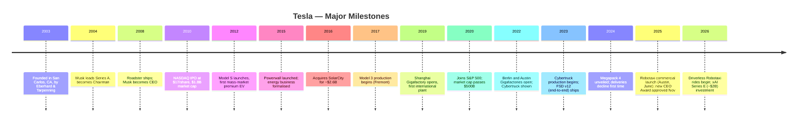
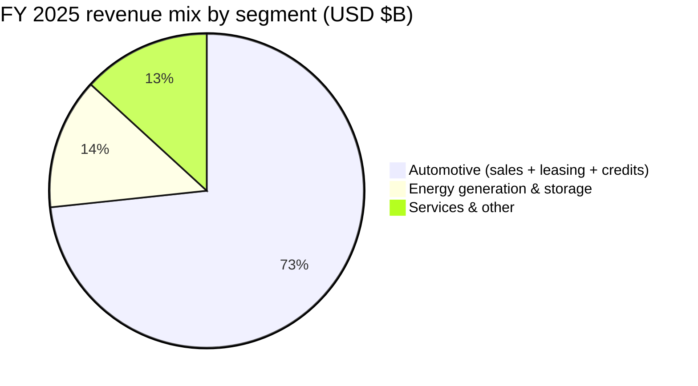
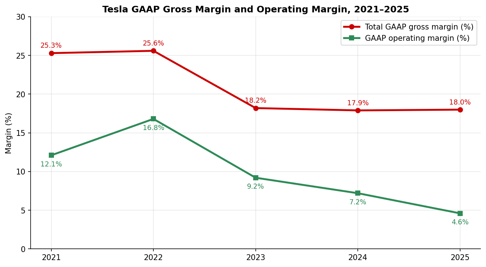
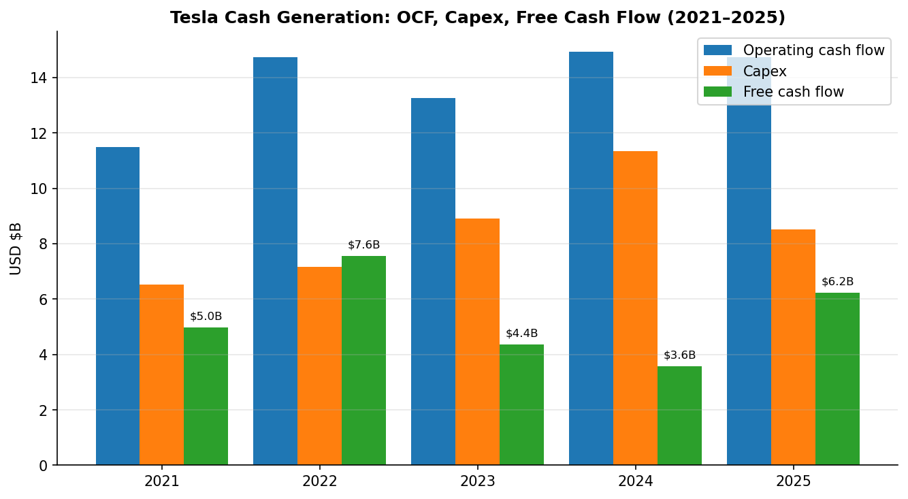

# Tesla, Inc. (NASDAQ: TSLA) — Initiation of Coverage

**Report date:** 2026-05-20
**Listing:** NASDAQ Global Select Market, ticker TSLA
**Sector:** Consumer Discretionary / Auto Manufacturers (with growing Energy & AI exposure)
**Headquarters:** 1 Tesla Road, Austin, Texas, USA
**Fiscal year-end:** December 31

> **Update — 2025 CEO Performance Award approved (2025-11-06):** At the 2025 Annual Meeting, shareholders approved a new performance-based equity award for CEO Elon Musk consisting of 12 tranches of stock options that vest only if Tesla achieves extraordinary operating and market-cap milestones — including raising market capitalisation from roughly USD 1.5T to USD 8.5T, delivering 20 million vehicles, deploying 1 million Robotaxis, and reaching USD 400B in adjusted EBITDA. The new package replaces the legal limbo that followed the Delaware Chancery Court's rescission of his 2018 award. Source: [Tesla 2025 Proxy Statement / DEFA14A material, 2025-09-05](https://www.sec.gov/Archives/edgar/data/0001318605/000110465925090884/tm252289d15_defa14a.htm); summary in [Tesla Q4 & FY 2025 Update, 2026-01-28](https://www.sec.gov/Archives/edgar/data/0001318605/000162828026003837/exhibit991.htm).

---

## Table of Contents

1. Company Overview
2. Company History
3. Management Team
4. Products & Services
5. Customers & Go-to-Market
6. Industry Overview
7. Competitive Landscape
8. Market Opportunity (TAM)
9. Risk Assessment
10. References

---

## 1. Company Overview

Tesla, Inc. designs, develops, manufactures, sells, and leases high-performance, fully-electric vehicles and stationary energy generation-and-storage systems, and is investing aggressively to extend its franchise into autonomous mobility (Robotaxi), humanoid robotics (Optimus), and custom AI silicon. The mission statement in the most recent Annual Report on Form 10-K is to "build a world of amazing abundance," with the strategic emphasis shifting from "the world's leading sustainable-energy company" to a "physical AI" platform ([Tesla 2025 10-K, Item 1 Business](https://www.sec.gov/Archives/edgar/data/0001318605/000162828026003952/tsla-20251231-gen.pdf)).

**Business model.** Revenue today still comes almost entirely from hardware:

| Segment | FY 2025 revenue (USD M) | % of total | YoY |
|---|---|---|---|
| Automotive (sales, leasing, regulatory credits) | 69,526 | 73.3% | −10% |
| Energy generation & storage (Megapack, Powerwall, solar) | 12,771 | 13.5% | +27% |
| Services & other (used vehicles, parts, Supercharging, insurance, merch) | 12,530 | 13.2% | +19% |
| **Total** | **94,827** | 100% | −3% |

Source: [Tesla Q4 & FY 2025 Update (8-K Ex. 99.1), 2026-01-28, p. 5](https://www.sec.gov/Archives/edgar/data/0001318605/000162828026003837/exhibit991.htm).

Tesla sells direct to consumers through its own retail and online channels in every major market — it has long been the most prominent direct-to-consumer holdout in an industry built on franchised dealers. Energy and Megapack are sold direct and through channel partners; the Supercharger network is monetised through paid sessions (and increasingly through NACS access by third-party automakers).

**Geography.** Tesla is now a genuinely global company. Vehicles are produced in California (Fremont), Texas (Austin), Shanghai (China), and Brandenburg (Berlin, Germany), with installed automotive capacity of roughly 2.35 million vehicles per year — Shanghai >950k Model 3/Y, Fremont >550k Model 3/Y plus 100k Model S/X, Berlin >375k Model Y, and Austin >250k Model Y plus >125k Cybertruck ([Q4 & FY 2025 Update, p. 8](https://www.sec.gov/Archives/edgar/data/0001318605/000162828026003837/exhibit991.htm)). FY 2025 deliveries were 1,636,129 vehicles, with the company calling out a record quarter in the APAC region in Q4-25.

**Scale.** Tesla closed FY 2025 with 134,785 employees worldwide ([Tesla 2025 10-K, Item 1, Human Capital Resources](https://www.sec.gov/Archives/edgar/data/0001318605/000162828026003952/tsla-20251231-gen.pdf)), 1,553 Tesla retail/service locations, and 8,182 Supercharger stations with 77,682 connectors. Cumulative deliveries since inception crossed 8.9 million vehicles, the worldwide installed Powerwall base passed 1 million units, and cumulative energy storage deployments reached 103 GWh.

**Margin & cash profile.** Total GAAP gross margin re-rated downward over 2023–2024 as Tesla cut prices to defend volumes, then stabilised at ~18% in FY 2025 even as deliveries fell — the mix shift toward energy storage (which now runs at ~30% GAAP gross margin) and Services has cushioned the auto compression. GAAP operating margin compressed to 4.6% in FY 2025 from a peak 16.8% in FY 2022 because (i) auto ASPs fell, (ii) operating expense grew 23% YoY on AI/robotics R&D plus higher legal-restructuring expense, and (iii) Q1-25 carried a one-off restructuring charge.

Free cash flow paradoxically *improved* — to USD 6.22B in FY 2025 from USD 3.58B in FY 2024 — because Tesla cut capex by 25% YoY (USD 8.5B vs. USD 11.3B) as the wave of greenfield factories was completed and the focus shifted to maximising utilisation of existing footprint ([Q4 & FY 2025 Update, p. 5](https://www.sec.gov/Archives/edgar/data/0001318605/000162828026003837/exhibit991.htm)). Cash, cash equivalents and investments stood at USD 44.06B at year-end 2025, up USD 7.5B YoY, providing a war chest for Cybercab, Optimus, AI training compute, and the recent USD ~2B Series E investment in xAI announced January 2026.

*Source: [Tesla Q4 & FY 2025 Update, p. 5](https://www.sec.gov/Archives/edgar/data/0001318605/000162828026003837/exhibit991.htm).*

**Valuation snapshot (as of 18-May-2026).**

| Metric | Value | Source |
|---|---|---|
| Share price | USD ~409 | [financecharts.com TSLA P/E history](https://www.financecharts.com/stocks/TSLA/value/pe-ratio) |
| Market cap | USD ~1.52T | [stockanalysis.com TSLA market cap, May 2026](https://stockanalysis.com/stocks/tsla/) |
| TTM P/E | 341–393× | [GuruFocus TSLA P/E (TTM), 12-May-2026: 393.4×](https://www.gurufocus.com/term/pettm/TSLA); [financecharts.com, 18-May-2026: 341.7×](https://www.financecharts.com/stocks/TSLA/value/pe-ratio) |
| TTM P/S | ~16.0× | Implied: USD 1,518B mkt cap ÷ USD 94.8B FY 2025 revenue |
| EV/Adj. EBITDA | ~100× | Implied: net cash position + market cap / FY 2025 adj. EBITDA USD 14.6B |
| 10-yr median P/E | 158.94× | [GuruFocus](https://www.gurufocus.com/term/pettm/TSLA) — current trades **147% above median** |

**Interpretation — why is the P/E so extreme?** Tesla's TTM P/E around 340–400× is more than 12× the auto-peer median (BYD 30×, GM 28×, Ford 11× — see Section 7). Three drivers stand out, none of them mutually exclusive:

1. **Earnings are temporarily depressed.** FY 2025 GAAP net income of USD 3.79B (−46% YoY) sits well below the FY 2023 peak of USD 15.0B. Operating margin compressed from 16.8% (2022) to 4.6% (2025) on price cuts, restructuring charges, and a 39% YoY jump in Q4-25 operating expense partly tied to the new CEO Performance Award and AI/robotics R&D. Forward P/E based on consensus 2026E EPS is in the high-double digits — still rich, but more digestible.
2. **Narrative / sector-proxy premium.** The market is pricing Tesla as a Robotaxi + Optimus + Megapack + AI inference compute compound story, not as a 1.6 million-unit-per-year automaker. Management's own framing — "we further expanded our mission and continued our transition from a hardware-centric business to a physical AI company" ([Q4 & FY 2025 Update, p. 3](https://www.sec.gov/Archives/edgar/data/0001318605/000162828026003837/exhibit991.htm)) — actively reinforces this. The 2025 CEO Performance Award milestones embed a USD 8.5T market-cap target, an explicit anchor for that thesis.
3. **Optionality on autonomy.** With Robotaxi now removing safety monitors in Austin (January 2026) and FSD V14 deployed across the customer fleet, sell-side bull cases ascribe meaningful multiples to a future high-margin software/services stream that has barely begun to monetise. Cumulative FSD subscriptions hit 1.1 million at end-2025 (up 38% YoY).

The valuation is sensitive to all three. A re-acceleration of auto earnings would compress the multiple through the denominator; a Robotaxi setback or Optimus disappointment could compress it through the numerator. **We treat the multiple as a material risk** and revisit it in Section 9.

---

## 2. Company History

Tesla Motors was incorporated on 1 July 2003 by Martin Eberhard and Marc Tarpenning to commercialise lithium-ion-powered electric sports cars. Elon Musk joined the Series A in February 2004 with a USD 6.5M cheque, took the chairman seat, and became CEO in 2008 during a near-bankruptcy moment after the 2008 financial crisis. The company has been founder-led — in spirit if not in formal founder title — by Musk ever since. The original "Master Plan" (Musk, 2006) outlined a four-step cascade: build a low-volume luxury car (Roadster) → use proceeds to fund a higher-volume luxury car (Model S) → fund an affordable car (Model 3) → all the while sell zero-emission electricity generation systems.

**Strategic pivots.** Three reshaped the company in the last decade:

- **The 2016 SolarCity acquisition** (~USD 2.6B in stock) folded a residential solar installer founded by Musk's cousins into Tesla. Critics called it a bailout; the litigation that followed survived a 2022 Delaware ruling that exonerated Musk personally. The bigger consequence was vertical integration with energy storage, which has since become Tesla's fastest-growing segment.
- **The 2020–2022 manufacturing footprint expansion.** Building Shanghai (operational 2019), Berlin (2022) and Austin (2022) within roughly three years took Tesla from a single-factory automaker to a four-factory global manufacturer, while also bringing 4680 cell, structural battery pack, gigacasting, and dry-electrode innovations into production.
- **The 2023–2025 pivot from "EV company" to "physical AI" company.** Beginning in late 2023, capital and talent were redirected toward FSD end-to-end neural-net training, Cortex (in-house training cluster in Texas), Dojo (initially internal training silicon, since restructured around H100/H200 plus custom AI5/AI6 inference chips), Optimus humanoid robots, and the Robotaxi service. The Q4 2025 letter is explicit: "2025 marked a critical year for Tesla as we further expanded our mission and continued our transition from a hardware-centric business to a physical AI company" ([Q4 & FY 2025 Update, p. 3](https://www.sec.gov/Archives/edgar/data/0001318605/000162828026003837/exhibit991.htm)).

**Acquisitions (selected):** SolarCity (2016, energy/solar); Maxwell Technologies (2019, dry-electrode and ultracapacitors, divested 2021); Grohmann Engineering (2017, German automation); SilLion (2021, battery cells); ATW Automation (2021, battery-pack assembly). Tesla has historically grown through organic engineering rather than M&A.

**Recent developments (2025–2026).** The Robotaxi service launched in Austin in June 2025 with paid rides at a flat USD 4.20 fee, initially with a safety monitor; the safety monitor was removed in selected vehicles in January 2026 ([CNBC, 2026-01-22](https://www.cnbc.com/2026/01/22/musk-says-tesla-takes-safety-supervisors-out-of-some-austin-robotaxis.html)). Tesla refreshed the Model Y (the "Juniper" refresh) in early 2025 and rolled additional Model Y variants through Q4-25. In January 2026, Tesla agreed to invest ~USD 2B in xAI's Series E preferred and signed an AI-collaboration framework agreement; the deal was disclosed in the Q4-25 update letter. The 2025 CEO Performance Award was approved on 6 November 2025 (see banner above).

---

## 3. Management Team

### Elon Musk — Chief Executive Officer, Product Architect, "Technoking"

Musk, 54, has been Tesla's CEO since 2008 and is by any measure the most consequential individual in the firm's history. He owns roughly 12–13% of Tesla common (pre-2025 Performance Award), is co-founder and CEO of SpaceX, owns and runs X (formerly Twitter), founded xAI, and is the largest shareholder of Neuralink and The Boring Company. He led Tesla through (i) the 2008 cash crisis that closed at a price of ~USD 1.50/share on a split-adjusted basis, (ii) the 2017–2018 Model 3 "production hell" that he described as "the most painful time of [his] career," and (iii) the 2020–2022 build-out from one factory to four. Under his tenure as CEO, deliveries grew from ~2,500 (2008, Roadster only) to 1.64 million (FY 2025), and Tesla became the world's most valuable automaker by market capitalisation. Pre-Tesla he co-founded Zip2 (sold to Compaq for USD 307M in 1999) and X.com / PayPal (sold to eBay for USD 1.5B in 2002), and went on to found SpaceX in 2002.

Education: undergraduate degrees in Physics and Economics from the University of Pennsylvania (1997); spent two days enrolled at Stanford's PhD programme in applied physics before founding Zip2. Musk's compensation has been the focus of two major Delaware battles. The original 2018 award — twelve performance milestone tranches that vested in full as Tesla's market cap reached USD 650B — was rescinded by the Delaware Chancery Court in January 2024 (Tornetta v. Musk). Tesla redomiciled to Texas in June 2024 and on 3 September 2025 the Board granted Musk a 423,743,904-share interim equity award; the new 2025 CEO Performance Award was put before shareholders on 6 November 2025 and approved, with 12 tranches that vest only against extraordinary operating and market-cap milestones — USD 8.5T market cap, 20 million cumulative vehicles, 1 million Robotaxis, USD 400B in adjusted EBITDA ([Tesla 2025 Proxy / DEFA14A material, 2025-09-05](https://www.sec.gov/Archives/edgar/data/0001318605/000110465925090884/tm252289d15_defa14a.htm)). The package contains no salary and no cash bonus. The interim award (granted before the performance award was approved) was specifically structured as a placeholder to be cancelled if the performance award passed. Public profile: extremely active on X (~210M followers), polarising political and policy commentary, regularly featured on podcasts and earnings calls. Musk's attention is the most contested resource in the management mix — between Tesla, SpaceX, xAI and X — and is regularly cited by sell-side analysts as a Tesla-specific governance risk.

### Vaibhav Taneja — Chief Financial Officer

Taneja, 47, became CFO in August 2023 after a long internal climb. He joined Tesla in 2017 as part of the SolarCity integration team (he had previously been SolarCity's Corporate Controller). He served as Tesla's Chief Accounting Officer from 2019, where he led the firm through the 2020 inclusion in the S&P 500, the 2022 three-for-one stock split, the first-ever convertible debt repayment in cash, and the build-out of Berlin/Austin. Before SolarCity he spent 17 years at PricewaterhouseCoopers in India and the US. He is a Chartered Accountant (ICAI, India) and holds a B.Comm from Delhi University. His communication style on earnings calls is notably tighter than the Zach Kirkhorn era — focusing on cash flow, gross margin bridges, and capex discipline. He owns ~0.03% of common shares.

### Tom Zhu — Senior Vice President, Automotive (Global)

Zhu, ~46, runs the global automotive business including all four vehicle factories, sales, deliveries, and service. He joined Tesla in 2014 to lead the Asia-Pacific region, drove the Shanghai Gigafactory from groundbreaking (Jan 2019) to first vehicle (Dec 2019, a record 10 months for a 1M-sq-m plant), and was elevated to global head of production in 2022. Zhu is widely credited internally with the operational excellence that made Shanghai the lowest-cost Tesla plant. Pre-Tesla he spent years in real estate and infrastructure in China. He is one of the most material executives to the auto thesis — particularly in APAC, which set a quarterly delivery record in Q4-25.

### Ashok Elluswamy — Director, Autopilot & FSD Software

Elluswamy joined Tesla in 2014 as the first hire for the Autopilot programme and has led FSD software ever since. He is the only operating-level executive named alongside Musk in the FSD-related sections of recent investor letters, reflecting how central FSD is to the AI thesis. His public profile is low; education includes Master's degrees from Carnegie Mellon (robotics) and the College of Engineering, Guindy (Chennai). With Andrej Karpathy gone (2022, returned to OpenAI), Elluswamy is the most senior AI engineering manager remaining inside Tesla.

### Governance footer

- **Board.** Per the 2025 proxy, the Board has 8 directors: Robyn Denholm (independent Chair, ex-Telstra CFO/COO), Elon Musk, Ira Ehrenpreis, Joe Gebbia (Airbnb co-founder, joined 2022), James Murdoch, Kimbal Musk (Elon's brother — non-independent), JB Straubel (Tesla co-founder, now Redwood Materials CEO), and Kathleen Wilson-Thompson. Independence ratio is 5/8 by Tesla's own classification; critics (notably ISS and Glass Lewis) have repeatedly downgraded Tesla on board independence over the years, citing Kimbal Musk's familial relationship and Ehrenpreis/Denholm's tenure.
- **Insider ownership.** Approximately 13% of common stock prior to the 2025 award; if the new 2025 Performance Award fully vests, Musk's ownership could approach the mid-20% range, with potential supervoting characteristics depending on the final terms.
- **Comp structure.** Almost entirely equity-based for the CEO; cash compensation for other named officers is modest relative to peer-group large-cap auto/tech CEOs and is heavily weighted toward stock options and RSUs.
- **Related-party transactions / governance flags.** The xAI ~USD 2B investment in January 2026 is a related-party transaction (Musk controls xAI). The 2025 CEO Performance Award is the most heavily-litigated executive comp package in US public-company history. Other historical flags: SolarCity 2016 acquisition litigation; the 2018 "funding secured" tweet that led to an SEC settlement; the 2024 Delaware redomiciling.

### Management track record

Strong overall. Musk has delivered on the most aggressive items of the 2006 and 2016 Master Plans — Roadster, Model S, Model 3, Powerwall, Megapack, Shanghai, Berlin/Austin, Cybertruck, end-to-end FSD, and the launch of a commercial Robotaxi service — though invariably late versus original timelines (Cybertruck slipped four years; Roadster v2 still not in production a decade after announcement; FSD "Level 5" has been "one year away" since 2016). The CFO and operating bench (Taneja, Zhu) is internally promoted and battle-tested. The two open questions are (i) how Musk's attention is divided across his other ventures and (ii) the absence of a publicly designated successor — both of which are baked into the valuation discussion in Section 9.

---

## 4. Products & Services

Tesla's product portfolio is organised around three operating pillars: Automotive, Energy Generation & Storage, and AI / Services. The 2025 10-K reportable-segment grouping uses just two ("automotive" and "energy generation and storage"), with Services rolled into Automotive for segment reporting.

```mermaid
graph TD
    T[Tesla, Inc.]
    T --> A[Automotive segment]
    T --> E[Energy & Storage segment]
    T --> AI[AI / Services overlay]

    A --> A1[Model 3 — mid-size sedan]
    A --> A2[Model Y — compact SUV, best-seller]
    A --> A3[Model S — full-size sedan]
    A --> A4[Model X — mid-size SUV]
    A --> A5[Cybertruck — full-size pickup]
    A --> A6[Cybercab — 2-seat autonomous, 2026 ramp]
    A --> A7[Tesla Semi — class-8 truck, 1H-26 ramp]
    A --> A8[Roadster v2 — in development]

    E --> E1[Powerwall 3 — home storage]
    E --> E2[Megapack 2XL — utility-scale]
    E --> E3[Megapack 3 / Megablock — 2026]
    E --> E4[Solar Roof / Solar Panels]
    E --> E5[Autobidder, Powerhub — software]

    AI --> AI1[FSD Supervised — v14]
    AI --> AI2[Robotaxi — Austin + 7 expansion metros]
    AI --> AI3[Optimus humanoid — Gen 3 in 2026]
    AI --> AI4[AI4 / AI5 / AI6 inference chips]
    AI --> AI5[Cortex 1/2 training compute]
    AI --> AI6[Supercharger network — 8,182 stations]
    AI --> AI7[Tesla Insurance]
```

### Automotive — five vehicles in production, three more in ramp/dev

- **Model Y (≥75% of unit deliveries).** Tesla's flagship and now the best-selling vehicle in the world in 2023 by some measures. The 2025 refresh ("Juniper") improved efficiency, ride quality, and infotainment; in Q4-25 Tesla launched additional Model Y variants including standard and performance. Built in Fremont, Shanghai, Berlin and Austin. **Competitive verdict: strong, but eroding.** Moat type: cost leadership + brand + Supercharger access + software (OTA + FSD upsell). Evidence: highest-volume EV ever; best-in-class Euro NCAP small SUV rating 2025 ([Q4 & FY 2025 Update, p. 15](https://www.sec.gov/Archives/edgar/data/0001318605/000162828026003837/exhibit991.htm)); auto gross margin ex-credits improved sequentially in Q4-25. Closest competitor product: BYD Sealion 07, Xpeng G6, Volkswagen ID.4, BMW iX1 — **the Model Y is no longer cheaper than equivalent BYD/Xpeng products in China**, which is the largest EV market.
- **Model 3.** The mass-market sedan; refreshed (Highland) in 2023. Won best-in-class Euro NCAP large family car 2025 ([same Q4 update](https://www.sec.gov/Archives/edgar/data/0001318605/000162828026003837/exhibit991.htm)). Built in Fremont and Shanghai. **Competitive verdict: at parity in the US, behind in China.** Moat type: brand + Supercharger + software. Evidence: still the #1 selling EV sedan in the US in 2024; in China loses unit volume to BYD Seal, Xpeng P7+, Zeekr 001.
- **Model S / Model X (combined ~5% of unit deliveries).** Premium sedan and SUV; production capped at 100k/yr combined in Fremont. Volume has structurally declined since the Model 3/Y price overlap. **Competitive verdict: legacy halo products; weak unit economics now relative to refreshed competitors (Lucid Air, Mercedes EQS, BMW i7).** Tesla has not refreshed the platform meaningfully since 2021.
- **Cybertruck.** Stainless-steel exterior, 250k-unit/yr capacity at Austin per the operational summary. Production began Nov 2023; Q4-25 "other models" deliveries (Cybertruck + S + X + Semi) totalled 11,642 units, suggesting Cybertruck full-year 2025 volume in the low tens of thousands — well below Musk's original 250k–500k aspirations. **Competitive verdict: differentiated product (no direct head-to-head) but commercially underperforming.** Closest competitors: Ford F-150 Lightning, Rivian R1T, GMC Hummer EV. Multiple recalls in 2024–2025 and customer complaints about door alignment and software bugs have weighed on the brand premium.
- **Cybercab.** Two-seat purpose-built autonomous vehicle; tooling at Austin underway; volume production targeted to start 1H 2026 per the latest update letter. Cold-weather testing photographed in Alaska in Q4-25.
- **Tesla Semi.** Class-8 long-haul truck; production tooling in Nevada; volume ramp targeted 1H 2026; Megacharger network sites planned. Customer fleet limited to date (PepsiCo, Walmart, Sysco pilot units).
- **Roadster v2.** In design development at Nevada. Originally announced 2017 with promised 2020 delivery. Now slipped multiple times.

### Energy Generation & Storage — record FY 2025

- **Megapack.** Utility-scale lithium-ion battery (Lithium Iron Phosphate chemistry primarily) sold to grid operators, IPPs and hyperscalers. **The fastest-growing thing inside Tesla.** Megapack 3 and Megablock production planned to begin at the Houston Megafactory in 2026 ([Q4 & FY 2025 Update, p. 8](https://www.sec.gov/Archives/edgar/data/0001318605/000162828026003837/exhibit991.htm)). Installed capacity: California 40 GWh, Shanghai 40 GWh, Texas under construction. **Competitive verdict: strong scale and cost leadership advantage.** Energy & Storage gross profit hit a record USD 1.1B in Q4-25, "the fifth consecutive record quarter." Moat type: scale (cell sourcing, balance-of-plant integration, Autobidder dispatching software), regulatory/certification (qualified for ISO grid interconnect across jurisdictions), and brand. Closest competitor: Fluence, Sungrow, CATL TENER, BYD Cube T28, LG Energy Solution / Wartsila Gridsolv.
- **Powerwall 3.** Residential and small-commercial lithium-ion home storage. Installed base passed 1 million units in 2025; the global Powerwall network supported "more than 89,000 Virtual Power Plant events across over 1 million installed units" in 2025, saving homeowners over USD 1B in electricity bills per Tesla. Powerwall capacity is >6 GWh/yr at Nevada. **Competitive verdict: leader in the US**; behind BYD and Sungrow in some emerging markets.
- **Solar Roof / Solar Panels.** Lowest-growth product line; volume is small (sub-segment is not separately broken out in the 2025 update). Tesla has de-emphasised solar in its capital plan since 2022.
- **Autobidder / Powerhub.** Real-time energy control and optimisation platforms for storage assets. Embedded in Megapack/Powerwall sales but generates incremental software revenue.

### AI / Services overlay

- **FSD (Supervised).** Driver-assist software; v14 deployed end-2025 with end-to-end foundation model trained on customer and Robotaxi data. Active FSD subscriptions: 1.1 million at end-2025, up 38% YoY ([Q4 & FY 2025 Update, p. 6](https://www.sec.gov/Archives/edgar/data/0001318605/000162828026003837/exhibit991.htm)). Pricing: USD 99/month subscription in the US (up-front sale option being sunset). Approved in the US, Canada, Mexico, China (Map data-limited rollout), and as of Q4-25 South Korea (1 million km driven in first month). Pending regulatory approval in Europe with consumer ride-along events in Italy, Germany, France, Switzerland. **Competitive verdict: ahead in real-world miles, behind Waymo on full Level-4 unsupervised.** Cumulative FSD miles driven crossed several billion miles by end-2025 per the cumulative chart in the update letter.
- **Robotaxi.** Launched June 2025 in Austin. Safety monitor removed January 2026 in selected vehicles. Planned expansion: Bay Area (already operating as supervised ride-hail with airport service from October 2025), Dallas, Houston, Phoenix, Miami, Orlando, Tampa, Las Vegas — all 1H 2026 per the update letter. Pricing: started at flat USD 4.20/ride; subsequent dynamic pricing.
- **Optimus.** Humanoid robot; Gen 3 ("first design meant for mass production") to be unveiled Q1 2026. Production line installation begun for start of production "before the end of 2026," with planned eventual capacity of 1 million robots/year. **Highest narrative-premium item in the stock.** Direct competitors: Figure AI, Apptronik, Agility Robotics, 1X, BYD humanoid programme, Xiaomi CyberOne, Boston Dynamics Atlas.
- **AI inference silicon — AI5 and AI6.** Custom in-house chips for vehicle/Robotaxi autonomy. AI5 production planned 2027 with claimed "50× improvement in performance relative to AI4 thanks to 10× raw compute, 9× memory capacity and 5× hardened block quantization and softmax function." AI6 planned 2028. Successor logic to the original "Hardware 4" Autopilot computer.
- **Cortex training compute.** In-house training cluster at Gigafactory Texas. Cortex 1 capacity ">100k H100-equivalent GPUs" at end-2025; Cortex 2 under construction with on-site H100-equivalents planned to more than double in 1H 2026.
- **Supercharger network.** 8,182 stations, 77,682 connectors at end-2025 (+17% / +19% YoY). NACS (North American Charging Standard) became the de-facto US fast-charging interface, with most major OEMs adopting NACS in 2023–2025 — turning Tesla's network into a multi-OEM toll booth. **Competitive verdict: dominant moat.**
- **Tesla Insurance.** Telematic auto insurance now offered in multiple US states including Florida (added Q4-25). Discounted for FSD-enabled driving — "the more you drive with FSD (Supervised) enabled, the bigger the discount" ([Q4 & FY 2025 Update, p. 11](https://www.sec.gov/Archives/edgar/data/0001318605/000162828026003837/exhibit991.htm)).

### Flagship vs. long-tail

The **Model Y is the single most important product** — it carries the auto P&L. **Megapack is the second flagship**, growing 27% YoY in 2025 with structural tailwinds from data-centre electricity demand. **FSD/Robotaxi/Optimus are the narrative flagships** that drive the multiple. Everything else (Model S/X, solar roof, Tesla Semi pre-ramp, Roadster v2) is long-tail.

### Recent launches & sunsets (last 12 months)

- **Launched:** Model Y refresh + performance/standard variants; FSD v14; Robotaxi commercial service (June 2025); driverless Robotaxi rides (January 2026); Powerwall 3 broader rollout; lithium refinery pilot production (the first US spodumene-to-lithium-hydroxide refinery); 4680 cell with dry-electrode anode and cathode made in Austin; FSD launched in South Korea.
- **Sunset/in transition:** Up-front FSD purchase option being phased out in favour of monthly subscriptions; the original Dojo D1 silicon programme was widely reported as restructured in 2024–2025 in favour of more H100-based plus AI5/AI6 inference focus.

*Source: Tesla quarterly production & delivery 8-Ks: [Q1 2024](https://www.sec.gov/Archives/edgar/data/0001318605/000095017024040274/tsla-ex99_1.htm), [Q2 2024](https://www.sec.gov/Archives/edgar/data/0001318605/000162828024030714/exhibit991.htm), [Q3 2024](https://www.sec.gov/Archives/edgar/data/0001318605/000162828024041816/ex991.htm), [Q4 2024](https://www.sec.gov/Archives/edgar/data/0001318605/000162828025000007/exhibit991.htm); [Q1 2025](https://www.sec.gov/Archives/edgar/data/0001318605/000162828025016070/exhibit9911.htm), [Q2 2025](https://www.sec.gov/Archives/edgar/data/0001318605/000162828025033842/exhibit99111.htm), [Q3 2025](https://www.sec.gov/Archives/edgar/data/0001318605/000162828025043530/exhibit991111.htm), [Q4 2025](https://www.sec.gov/Archives/edgar/data/0001318605/000162828026000016/exhibit9914.htm).*

---

## 5. Customers & Go-to-Market

Tesla's customers split into three quite different cohorts:

1. **Retail vehicle buyers (≈73% of revenue).** Individuals, mostly upper-middle-class households across the US, China, Europe, Canada, Australia, and increasingly Southeast Asia and the Middle East. The bulk are owners of one vehicle; Tesla does not break out demographic mix, but third-party survey data consistently shows the median Model 3/Y buyer in the US has a household income of USD 130–150k and is 35–55 years old.
2. **Commercial fleet and ride-hail (small but growing).** Hertz, Avis, Uber drivers, last-mile delivery operators (Amazon Rivian competition notwithstanding) buy modest fleets; the Tesla Semi has a marquee buyer list (PepsiCo, Walmart, Sysco, Saia, US Foods) but volumes have been pilot-scale to date. Robotaxi inverts this — Tesla becomes the fleet operator rather than the supplier.
3. **Energy customers.** Utilities, independent power producers, hyperscalers (data centres), industrial off-takers, and residential homeowners. Megapack customers include named utilities and IPPs — Tesla does not generally disclose individual project counterparties at the same granularity as Fluence does.

### Customer concentration — low, but the *channel* mix is concentrating

The Tesla 2025 10-K does not name any individual customer as ≥10% of consolidated revenue. ASC 280-10-50-42 disclosure was not triggered for FY 2025, in line with prior years. Geographic mix from the 2025 10-K segment note shows the US is roughly 47–50% of revenue, China ~22%, rest-of-world ~25–28%, with the US share rising as North American Robotaxi/Cybertruck/FSD revenue grows ([Tesla 2025 10-K, Item 7 MD&A](https://www.sec.gov/Archives/edgar/data/0001318605/000162828026003952/tsla-20251231-gen.pdf)). Regulatory credits — historically a major non-customer revenue stream (~USD 2.8B in 2024) — are a real concentration risk: a single change in CAFE / ZEV / EU CO₂ rules could compress earnings sharply (see Section 9).

*Source: [Tesla Q4 & FY 2025 Update, p. 5](https://www.sec.gov/Archives/edgar/data/0001318605/000162828026003837/exhibit991.htm).*

### Distribution & go-to-market

- **Direct-to-consumer retail.** 1,553 Tesla retail and service locations worldwide at year-end 2025 (+14% YoY). The only mass-market automaker that has not used franchised dealers; multiple US states still litigate the legality of this. The Tesla website and mobile app are the primary buying channel.
- **Supercharger network.** 8,182 stations / 77,682 connectors. Now monetised through NACS partnerships with most non-Tesla OEMs (Ford, GM, Rivian, Hyundai/Kia, BMW, Mercedes, Honda, Nissan, Stellantis, Toyota all have NACS announcements). Pure-play charging-network operators (EVgo, ChargePoint) trade at small fractions of Tesla's multiple — the Supercharger network embedded inside Tesla likely carries no implicit valuation in the auto multiple.
- **Direct sales for Energy.** Megapack is sold direct to utilities and IPPs through Tesla's Industrial Sales team; Powerwall is sold through certified installers and the Tesla retail network.
- **Tesla Insurance & FSD subscription.** Pure software/financial-services attach to existing vehicle owners. Insurance is rolled out state-by-state in the US.
- **Robotaxi.** Operated by Tesla via the Robotaxi iOS app; in selected metros only (the planned coverage map: Austin live, Bay Area supervised, Dallas/Houston/Phoenix/Miami/Orlando/Tampa/Las Vegas in 1H 2026).

### Sales cycle and pricing strategy

Auto retail is fast (online order → delivery in 1–8 weeks depending on configuration and region); Megapack sales have multi-quarter procurement cycles with typical project sign → commercial-operation gaps of 12–24 months. Tesla disclosed an energy backlog implicitly through its capacity expansion narrative; the Q4-25 update calls out "record Q4 & FY'25 energy storage deployments" of 14.2 GWh in Q4 and 46.7 GWh for the year — capacity is the binding constraint, not demand. Pricing in auto has been aggressively cut since 2022: ASPs declined materially through 2024–2025 to defend share against Chinese competition, and "automotive sales declined sequentially, [but] gross margin (even when excluding the impact of regulatory credits) improved" in Q4-25.

### Customer case studies (named)

- **APAC Q4 record.** Tesla called out APAC delivery records (Q4-25) without naming individual countries; third-party data points to Japan, South Korea (FSD launched with 1M km driven in first month) and Australia.
- **Megapack at Moss Landing 2.0 / Frankfurt grid / UK Aggreko.** Tesla's IR Megapack project map (tesla.com/megapack) lists multi-hundred-MWh deployments with utility partners across California, Hawaii, UK, Germany, Australia.
- **PepsiCo / Walmart / Sysco** for Tesla Semi pilot fleets.
- **Tesla Insurance.** Available in CA, TX, AZ, CO, IL, MD, MN, NV, OH, OR, UT, VA and now FL. Telematic-based; tied to FSD-enabled driving discounts.

---

## 6. Industry Overview

Tesla competes in three overlapping markets — passenger battery-electric vehicles (BEV), stationary battery energy storage (BESS), and autonomous-mobility / AI robotics — each with very different size, structure, and competitive dynamics.

### Global BEV market

In 2025 global plug-in EV sales (BEV + PHEV) were on the order of **18–19 million units**, of which roughly 12–13 million were pure BEVs, up from ~10.6 million in 2024 (BloombergNEF and IEA 2025/2026 outlooks). China accounts for ~60% of global BEV demand, Europe ~22%, North America ~10%, rest-of-world ~8%. EV penetration of new passenger-vehicle sales has reached 50%+ in China in late 2025, ~22% in Europe, ~12–13% in the US, and below 5% in most emerging markets. NAICS 336111 (Automobile Manufacturing) is the relevant code for US classification; the EV sub-segment has been growing at a ~28% CAGR over 2020–2025 and is projected by IEA to continue at ~20% through 2030, though the curve is bending as price-sensitive markets normalise.

**Growth drivers**:
- Cost decline: lithium-ion battery pack prices fell ~14% in 2024 to ~USD 115/kWh (BNEF) and are projected to cross USD 100/kWh in 2026–2027.
- LFP penetration: ~50% of global EV battery chemistry by 2025, materially lowering cell cost vs. NMC.
- Policy: EU CO₂ regulation tightening through 2030; US IRA Section 30D battery component sourcing rules in flux post-2025 election; China NEV credit/dual-credit regime continuing.
- Charging infrastructure: NACS standardisation in North America; Megawatt charging for heavy-duty (Tesla Semi); CCS2/CHAdeMO globally.
- ICE phase-out commitments: UK 2030/2035, EU 2035, CA 2035 — all subject to political revision.

**Headwinds**:
- 2024–2025 saw the first material slowdown in EV growth in mature markets (US, Germany, Sweden) as subsidies were cut; growth has re-accelerated in 2026 on lower battery cost.
- US tariffs on Chinese EVs and EV components rose to 100% on Chinese-built vehicles and ~25–50% on Chinese battery components in late 2024 (continuing).
- European tariffs on Chinese-built EVs (10–35%, by manufacturer) imposed October 2024.

### Stationary battery energy storage market

BloombergNEF estimates **2025 global BESS deployments at ~210–230 GWh**, more than double 2023 (~95 GWh), with annual installations projected to reach 500+ GWh by 2030. The market is being pulled by two simultaneous demand vectors — (i) variable-renewable integration on power grids, and (ii) AI data-centre load growth that requires grid-tied storage to bridge thermal-plant ramp constraints. Tesla's Q4-25 update explicitly cites the second: "As AI infrastructure drives rapid load growth, Megapack helps to, among other things, increase utilisation of existing generation and transmission capacity, resulting in a more efficient use of the electric grid" ([Tesla 2025 10-K](https://www.sec.gov/Archives/edgar/data/0001318605/000162828026003952/tsla-20251231-gen.pdf)). With Tesla's FY 2025 deployments at 46.7 GWh, Tesla's share of global BESS is in the **mid-teens to ~20%** — the largest single vendor.

### Autonomous-mobility & robotics

This is a TAM-defining-itself market. Global ride-hailing was a ~USD 250B revenue market in 2025 (Uber, Lyft, DiDi, Bolt, Grab, etc.) — but autonomous ride-hailing has barely begun. Waymo (Alphabet) is doing ~250k paid rides/week (early 2026); Tesla Robotaxi is in its first full year of operation; Pony.ai, Baidu Apollo, and WeRide operate in Chinese cities. Strategy & Bain forecasts the global autonomous ride-hail TAM at USD 800B–USD 1.5T by 2035.

Humanoid robots are even earlier. Goldman Sachs Research (Jan 2024) put the long-run humanoid TAM at USD 38B by 2035 in a bull case; Morgan Stanley (Sep 2024) revised that to USD 357B by 2050; Tesla, Figure AI, Apptronik, 1X, Agility, Boston Dynamics, Unitree, Xpeng Iron and Xiaomi CyberOne are competing for the same workflows (factory pick-and-place, last-mile, eldercare). None has reached commercial scale yet.

### Structure

- **Auto:** Capital-intensive; oligopolistic at the top (Toyota, VW, GM, Stellantis, Ford, Hyundai-Kia, BYD, Tesla); fragmented in EV (200+ Chinese OEMs in 2020 → ~25 viable as of 2025 post-shakeout). Barriers: capital, software/AI talent, charging network, brand. Supplier power: high in cells (CATL, LG, BYD, Panasonic, Samsung SDI); declining in semiconductors as 2021–2023 shortages eased.
- **BESS:** Fragmenting at the integrator level (Tesla, Fluence, Sungrow, BYD, CATL TENER, LG, Wartsila Gridsolv, NEXTracker, ENGIE EPS), consolidating at the cell level (CATL ~37% global share, BYD ~16%, LG/Samsung/SK ~15% combined per SNE Research).
- **Autonomy & robotics:** Concentrated at the top tier — Waymo, Tesla, Cruise (winding down), Apollo, Pony — but lots of capital chasing humanoid (Figure AI raised USD 1.5B+ pre-money valuation USD 39B, Q1 2026).

### Regulatory environment

The regulatory map is the single most material 2026–2028 swing factor:
- **US IRA Section 30D EV consumer credit (USD 7,500)** — partially eliminated for higher-income buyers in the 2025 reconciliation bill; further changes possible in 2026–2027.
- **US Section 45X advanced-manufacturing PTC** — material to Tesla's domestic cell and EV production economics; survived 2025 reform with modifications.
- **US NHTSA + state-level autonomous-vehicle frameworks** — California permits, Texas (no specific permit), New York (now permitting). Patchwork creates rollout risk.
- **EU CO₂ standards** — 2025 fleet target tightened; 2030 step-down; 2035 ICE phase-out under political pressure.
- **China NEV mandate** continuing; tariff retaliation possible.
- **Tariffs.** US-China auto tariffs at 100% on Chinese-made EVs and 25–50% on components; the EU 10–35% Chinese-EV countervailing duty applies through 2029 unless renegotiated; UK and Canada currently aligned with US.

---

## 7. Competitive Landscape

Tesla's competitive set is fragmenting across the three operating pillars:

| Pillar | Direct competitors | Indirect / emerging |
|---|---|---|
| Mass-market BEV | BYD, Volkswagen Group, Geely (Zeekr, Polestar), Hyundai/Kia, Stellantis, GM, Ford | NIO, Xpeng, Li Auto (US-listed Chinese EV pure plays), Rivian, Lucid |
| Premium/luxury BEV | Mercedes-Benz EQ, BMW i, Audi e-tron, Porsche Taycan, Lucid, Rivian R1 series | Genesis, Cadillac IQ, Range Rover EV |
| Stationary storage | Fluence, Sungrow, BYD, CATL TENER, LG Energy Solution, Wartsila Gridsolv | Stem Inc, Powin (Ch11 in 2025), Form Energy (long-duration), Hithium |
| Autonomy | Waymo (Alphabet), Mobileye (Intel), Cruise (winding down), Pony.ai, Baidu Apollo, WeRide | Aurora Innovation, Plus, Kodiak |
| Humanoid robotics | Figure AI, Apptronik, Agility Robotics, 1X, Boston Dynamics, Unitree | Xiaomi CyberOne, Xpeng Iron, BYD humanoid, Sanctuary AI |

### Positioning vs. legacy automakers

**vs. GM, Ford, Stellantis, VW**. Tesla's auto-segment GAAP margins compressed sharply in 2023–2025 but remain above all of these on operating margin (TSLA 4.6% FY 2025; GM 6.0%, Ford 0–2%, Stellantis ~5%, VW Group ~5%). On software/services share of revenue, Tesla is an order of magnitude ahead. On unit volume, Tesla at 1.64M is below VW Group (~9.3M), Toyota (~10.9M), GM (~5.7M) but materially ahead of Lucid, Rivian, NIO, Xpeng, Li Auto individually. On battery cost / vertical integration, Tesla matches BYD as a leader and is ahead of every Western OEM. **The bigger competitive challenge is not the West — it's China.**

### Positioning vs. Chinese EV makers

**BYD** is the only auto company in the world with comparable EV scale to Tesla — BYD sold ~4.3M new-energy vehicles in 2025 (including PHEVs), versus Tesla's 1.64M pure BEVs. BYD is fully vertically integrated (cells, motors, power electronics, semiconductors via subsidiary BYD Semi). BYD is profitable, growing at ~25% YoY, and trades at a TTM P/E of ~30× ([GuruFocus BYDDF, May 2026](https://www.gurufocus.com/term/pettm/BYDDF)). BYD has been blocked from the US auto market by 100% tariffs but is rapidly expanding in Europe (Hungary plant), Brazil (former Ford plant), Thailand (Rayong plant), Indonesia.

**Xpeng, NIO, Li Auto** are smaller (each ~200–500k unit deliveries/yr) but moving fast on autonomous driving (Xpeng XNGP, NIO NIO Pilot+, Li Auto AD Max). NIO and Xpeng are still unprofitable on a TTM basis — both show N/M P/E and trade primarily on price-to-sales (NIO ~1.2×; Xpeng ~1.5×; estimates from companiesmarketcap.com data).

**Zeekr (Geely)** and **AITO (Huawei-tied)** are growing fast in the China premium and luxury segments.

### Positioning vs. autonomy specialists

**Waymo (Alphabet)** is the only operator running clearly Level-4 unsupervised at meaningful scale today — by Q1 2026 Waymo reported ~250k paid rides/week across San Francisco, Phoenix, Austin, Los Angeles, and Atlanta. Tesla's Robotaxi just removed safety monitors on selected vehicles in Austin in January 2026; Tesla has more total miles driven (because every customer car contributes), but Waymo has more Level-4 unsupervised miles. **Camera-only vs. LiDAR+camera+radar**: Tesla's vision-only stack is cheaper to ship at scale but has more failure modes in adverse weather. Tesla bears argue that Tesla can scale Robotaxi cheaper; Tesla bulls already price in mass-deployment in 2026–2028.

### Stationary storage competitive position

Tesla's Megapack competes on (i) energy density and footprint per MWh, (ii) Autobidder grid-revenue optimisation software (which Fluence's Mosaic is the closest analogue to), (iii) installation speed, (iv) brand. Fluence (NASDAQ:FLNC, joint venture between Siemens and AES) is the closest western pure-play and reported FY 2024 (Sep year-end) revenue of USD 2.7B at low-single-digit GM. Sungrow (SHA:300274) — the largest Chinese PV inverter + BESS combined vendor — is growing the fastest and is now arguably the most profitable BESS competitor at ~16% net margin.

### Competitive advantages

1. **Brand and pricing power in mature markets** — Tesla remains the highest unaided-recall EV brand in the US, Australia, Canada, UK.
2. **Vertical integration** — cells (4680 in Austin, partner supply from CATL/Panasonic/LG), powertrains, software, Supercharger network, retail, insurance, financing. Few competitors approach this depth.
3. **Software and OTA capability** — over a decade of customer-fleet OTA history.
4. **AI infrastructure** — Cortex training compute >100k H100-equivalents; FSD data collection from ~7M+ customer vehicles globally.
5. **Supercharger network** — 8,182 stations is the single largest globally-integrated DC fast-charging network; NACS adoption monetises it.
6. **Manufacturing scale** — 2.35M units/yr installed capacity globally with ability to absorb chemistry mix shifts.
7. **Energy/Megapack execution** — five consecutive record quarters of Energy gross profit.

### Competitive vulnerabilities

1. **Aging line-up.** Model S/X unchanged in fundamentals since 2021. Model 3/Y refreshes maintained competitiveness but did not extend the lead. No truly new mass-market product at <USD 25k price point has launched.
2. **China share loss.** BYD, Xpeng, Li Auto are gaining share inside China at Tesla's expense.
3. **FSD execution slippage.** Multiple promises have slipped years. Customers who paid USD 8,000+ for FSD years ago have not yet received the Level-4 product originally promised.
4. **Cybertruck commercial under-delivery.** Volume well below original targets.
5. **Key-person risk.** Musk's attention is divided across SpaceX, xAI, X, Neuralink.
6. **Regulatory exposure.** Loss of US IRA EV credit, EU CO₂ revision, US-China tariff retaliation, NHTSA action on FSD/Robotaxi all materially affect earnings.

*Sources: TSLA [GuruFocus 12-May-2026](https://www.gurufocus.com/term/pettm/TSLA), [financecharts.com 18-May-2026](https://www.financecharts.com/stocks/TSLA/value/pe-ratio); BYD [GuruFocus 13-May-2026](https://www.gurufocus.com/term/pettm/BYDDF); Ford and GM [financecharts.com, May 2026](https://www.financecharts.com/stocks/F/value/pe-ratio); NIO [Yahoo Finance, Feb 2026](https://finance.yahoo.com/quote/NIO/key-statistics/); Li Auto and XPEV per company-published statistics pages.*

---

## 8. Market Opportunity (TAM)

We size Tesla's serviceable market in three vectors that match the operating pillars.

**Automotive TAM.** Global new-passenger-vehicle market was ~85M units in 2025 at an average wholesale ASP of ~USD 22k = ~USD 1.9T market value (IHS/S&P Global Mobility). EV penetration of new-vehicle sales is on track for 20–22% global in 2025 (15.8M units) and projected by BloombergNEF to reach 45% by 2030 and 70%+ by 2035. Tesla's serviceable addressable market (ex-China, given tariff exclusion, and ex-segments where Tesla has no product yet such as sub-USD 25k) is ~50M units by 2030 — and Tesla's 2030 unit-target announced by Musk (originally 20M, since softened to "we'll grow") implies ~30% of the global ex-China BEV market. The realistic 2030 share is more likely 8–15%.

**Energy storage TAM.** Global BESS deployments are projected at ~500–550 GWh by 2030 and ~1 TWh+ by 2035 (BNEF). At an industry-average system cost of ~USD 250/kWh in 2030, that's a USD 125B+ annual hardware TAM, plus another USD 30–50B in software/services (Autobidder-equivalent grid-revenue optimisation). Tesla's 2025 share of ~20% would translate to USD 25–35B in revenue if it can hold share — already ~3× Tesla's 2025 Energy revenue.

**Autonomy and humanoid TAM.** Ark Invest projects USD 8–10T in cumulative robotaxi revenue by 2030 (extreme upside case). McKinsey is more conservative at USD 300–400B in 2030 robotaxi revenue globally, growing to USD 1.5T+ by 2040. Morgan Stanley's 2024 humanoid robotics note puts the long-run global humanoid market at USD 357B by 2050 in a bull case. Tesla bull cases ascribe USD 1T+ of Tesla market-cap value to a successful Robotaxi + Optimus combination; Tesla bear cases ascribe close to zero.

**SAM/SOM commentary.** The SAM for Tesla auto is more narrowly the ~30M-unit BEV + PHEV passenger-vehicle market in non-China markets (since BYD has captured China at the price points Tesla competes in, and Chinese-made Teslas face tariffs in EU/US going forward — though Tesla still produces in Shanghai for export to other markets such as Australia, Japan, Korea, India). The Tesla 2025 CEO Award explicit milestone of 20M vehicles delivered cumulative implies that Tesla expects to ship something close to that over the next 10 years; FY 2025 cumulative was 8.9M. To hit 20M cumulative by 2033, Tesla needs ~1.4M units/yr average — close to current run-rate.

*Source: [Tesla Q4 & FY 2025 Update, p. 7](https://www.sec.gov/Archives/edgar/data/0001318605/000162828026003837/exhibit991.htm).*

### Penetration strategy

- **Auto:** finish Cybercab ramp 1H 2026; Tesla Semi 1H 2026 ramp; future "next-gen platform" (sub-Model 3 platform) likely ~USD 25–30k price point — though delivery date has slipped multiple times. Continue Megapack capacity build to ride AI data-centre load growth.
- **Energy:** Megapack 3 + Megablock at Houston Megafactory in 2026; new Shanghai Megapack expansion; Powerwall VPP scale-out.
- **AI/Robotaxi:** geographic expansion to 7 additional metros in 1H 2026; FSD approval in Europe (Italy/Germany/France pilots underway) and broader China.
- **Optimus:** start of production before end-2026; line-of-sight to "1 million robots/yr" eventual capacity.
- **xAI partnership:** the January 2026 ~USD 2B Series E investment plus framework agreement opens potential commercialisation of xAI's Grok models inside Tesla vehicles (already partially deployed) and a long-tail of joint AI products.

---

## 9. Risk Assessment

### Company-specific risks

**1. Key-person risk (Musk).** Musk runs Tesla, SpaceX, xAI, X, Neuralink, and The Boring Company simultaneously. The CEO Performance Award structure (no salary, 100% equity) is designed to align him to Tesla, but the time-allocation question persists. Mitigants: deep operating bench (Taneja, Zhu, Elluswamy), Board oversight (Robyn Denholm as Chair). **Impact: high.** A sudden Musk exit or further attention dilution would likely re-rate the multiple sharply lower.

**2. Robotaxi rollout slippage.** Driverless rides started in Austin January 2026 but in "a few vehicles" mixed with monitored fleet; the planned 7-metro expansion is 1H 2026. Any high-profile incident would draw NHTSA action and slow rollout. Mitigants: graduated rollout, Tesla retains override capability through telematics. **Impact: medium-high.**

**3. Optimus execution risk.** Gen 3 unveiled Q1 2026; start of production end-2026 is aggressive. Tesla has not yet shown a Gen 3 working under live customer conditions. Mitigants: capital ample; Tesla can absorb delays.

**4. Cybertruck under-performance.** Production volume well below original 250k–500k targets. Costly to fix at scale. Mitigants: Cybertruck capacity can be reallocated to Model Y if demand sustains; not material to overall earnings.

**5. China market share erosion.** Tesla's China unit share has been declining since 2023 as BYD, Xpeng, Li Auto, Zeekr, AITO gain. Tesla cut prices repeatedly. Shanghai factory remains profitable at scale but APAC pricing pressure is structural. Mitigants: APAC ex-China growing (Q4-25 record); Tesla Semi/Megapack are global.

**6. FSD legal exposure.** Multiple wrongful-death and consumer-protection lawsuits pending. NHTSA has open investigations dating to 2024 (~USD 2M of vehicle fleet recalls handled OTA). Mitigants: OTA fix capability, established settlement playbook.

### Industry/market risks

**7. Subsidy and tax-credit changes.** The US IRA Section 30D consumer credit was partly rolled back in 2025; further changes possible. EU CO₂ relaxation under political pressure. Loss of USD 7,500 credit reduces ASPs to consumers; producer-side 45X credit is also under review. **Impact: medium.** Tesla has been the largest single beneficiary of regulatory credits revenue — about USD 2.76B in 2024 (per Tesla 2024 10-K) and a similar magnitude in 2025; **a sustained reduction in regulatory credits is material to earnings.**

**8. Tariff escalation.** US 100% tariff on Chinese-built EVs and 25–50% on components is now permanent under the 2024–2025 US-China trade régime. Tesla benefits in the US (no Chinese-made BYDs to compete with) but is hurt in markets where Chinese OEMs are tariff-protected (China itself, ASEAN, Latam). Mitigants: Tesla local production in three regions.

**9. AI capex sector rotation.** A correction in the broader AI capex cycle (Magnificent-Seven multiple compression) could rotate capital out of Tesla even with no Tesla-specific news. Mitigants: Tesla's earnings have less AI-capex exposure than its multiple implies.

### Financial risks

**10. Multiple compression.** Tesla's TTM P/E of 341–393× sits at 147% above the 10-year median per GuruFocus. A reversion toward even 100× still represents ~70% multiple compression. Mitigants: forward P/E narrower; energy + services margins improving. **This is the most material risk for total-return investors at current entry prices.**

**11. Operating-margin re-rating.** Operating margin compressed from 16.8% (2022) to 4.6% (2025). The Street consensus is for re-acceleration toward 8–9% in 2026 on Robotaxi monetisation and energy growth; a failure to deliver would compress earnings further.

**12. Regulatory-credit revenue cliff.** As ICE OEMs catch up on CO₂ targets, third-party demand for Tesla's regulatory-credit transfers declines. ZEV/CAFE credit revenue is largely high-margin pass-through; a step-down (already underway in 2025–2026) directly reduces gross profit dollar-for-dollar.

### Macroeconomic risks

**13. Recession sensitivity.** Auto demand is cyclical. A US/Europe recession in 2026–2027 would compress unit volumes and ASPs simultaneously. Mitigants: Tesla's cash position (USD 44B) is large enough to weather a multi-year recession.

**14. Interest-rate / cost-of-capital sensitivity.** Higher-for-longer rates compress consumer auto financing demand and raise discount rates on long-duration cash flows (Robotaxi/Optimus). Mitigants: Tesla holds substantial net cash and earns interest income.

---

*Source: [Tesla Q4 & FY 2025 Update, p. 5](https://www.sec.gov/Archives/edgar/data/0001318605/000162828026003837/exhibit991.htm).*

*Source: [Tesla Q4 & FY 2025 Update, p. 5](https://www.sec.gov/Archives/edgar/data/0001318605/000162828026003837/exhibit991.htm).*

---

## 10. References

### Primary — Tesla SEC filings (local cache: `/Users/x/projects/financial_agent/financial_reports/TSLA/`)

- [Tesla 2025 Form 10-K (filed 2026-01-29, period 2025-12-31)](https://www.sec.gov/Archives/edgar/data/0001318605/000162828026003952/tsla-20251231-gen.pdf) — primary source for business description, segment reporting, competition, human-capital, properties, risk factors, MD&A.
- [Tesla Q4 & FY 2025 Update (8-K Ex. 99.1), filed 2026-01-28](https://www.sec.gov/Archives/edgar/data/0001318605/000162828026003837/exhibit991.htm) — primary source for the FY 2025 financial summary, segment revenue, energy deployments, Robotaxi metrics, manufacturing capacity table, AI infrastructure table, outlook section.
- [Tesla Q3 2025 10-Q, filed 2025-10-23](https://www.sec.gov/Archives/edgar/data/0001318605/000162828025045968) — interim quarterly financials, segment disclosure.
- [Tesla Q2 2025 10-Q, filed 2025-07-24](https://www.sec.gov/Archives/edgar/data/0001318605/000162828025035806).
- [Tesla Q1 2025 10-Q, filed 2025-04-23](https://www.sec.gov/Archives/edgar/data/0001318605/000162828025018911).
- [Tesla 2024 10-K/A (amended), filed 2025-04-30](https://www.sec.gov/Archives/edgar/data/0001318605/000110465925042659) — amendment to 2024 10-K incorporating Part III items.
- [Tesla Form 8-K, 2026-01-02 — Q4 2025 production & delivery release](https://www.sec.gov/Archives/edgar/data/0001318605/000162828026000016/exhibit9914.htm).
- [Tesla Form 8-K, 2025-10-02 — Q3 2025 production & delivery release](https://www.sec.gov/Archives/edgar/data/0001318605/000162828025043530/exhibit991111.htm).
- [Tesla Form 8-K, 2025-07-02 — Q2 2025 production & delivery release](https://www.sec.gov/Archives/edgar/data/0001318605/000162828025033842/exhibit99111.htm).
- [Tesla Form 8-K, 2025-04-02 — Q1 2025 production & delivery release](https://www.sec.gov/Archives/edgar/data/0001318605/000162828025016070/exhibit9911.htm).
- [Tesla 2024 production & delivery releases — Q1 2024](https://www.sec.gov/Archives/edgar/data/0001318605/000095017024040274/tsla-ex99_1.htm), [Q2 2024](https://www.sec.gov/Archives/edgar/data/0001318605/000162828024030714/exhibit991.htm), [Q3 2024](https://www.sec.gov/Archives/edgar/data/0001318605/000162828024041816/ex991.htm), [Q4 2024](https://www.sec.gov/Archives/edgar/data/0001628280/000162828025000007/exhibit991.htm).
- [Tesla DEFA14A material — 2025 CEO Performance Award, 2025-09-05](https://www.sec.gov/Archives/edgar/data/0001318605/000110465925090884/tm252289d15_defa14a.htm).
- [Tesla 8-K, 2025-08-04 — Interim CEO Award disclosure](https://www.sec.gov/Archives/edgar/data/0001318605/000110465925073263/tm2522385d1_ex99-1.htm).

### Market data and valuation

- [GuruFocus — Tesla TTM P/E (May 2026)](https://www.gurufocus.com/term/pettm/TSLA).
- [financecharts.com — Tesla P/E ratio history (May 2026)](https://www.financecharts.com/stocks/TSLA/value/pe-ratio).
- [stockanalysis.com — Tesla statistics](https://stockanalysis.com/stocks/tsla/statistics/).
- [Yahoo Finance — TSLA quote and key statistics](https://finance.yahoo.com/quote/TSLA/key-statistics/).
- [GuruFocus — BYDDF TTM P/E (May 2026)](https://www.gurufocus.com/term/pettm/BYDDF).
- [financecharts.com — Ford (F) P/E ratio](https://www.financecharts.com/stocks/F/value/pe-ratio).
- [financecharts.com — General Motors (GM) P/E ratio](https://www.financecharts.com/stocks/GM/value/pe-ratio).
- [companiesmarketcap.com — Ford P/S ratio](https://companiesmarketcap.com/ford/ps-ratio/).
- [companiesmarketcap.com — General Motors P/S ratio](https://companiesmarketcap.com/general-motors/ps-ratio/).
- [Yahoo Finance — NIO key statistics (Feb 2026)](https://finance.yahoo.com/quote/NIO/key-statistics/).
- [Simply Wall St — NIO valuation page](https://simplywall.st/stocks/us/automobiles/nyse-nio/nio/valuation).
- [stockanalysis.com — NIO statistics](https://stockanalysis.com/stocks/nio/statistics/).
- [Macrotrends — XPeng (XPEV) P/E ratio](https://www.macrotrends.net/stocks/charts/XPEV/xpeng/pe-ratio).
- [Public.com — General Motors P/E](https://public.com/stocks/gm/pe-ratio).

### Industry data and secondary sources

- [BloombergNEF — 2024 Lithium-Ion Battery Price Survey, December 2024](https://about.bnef.com/blog/lithium-ion-battery-pack-prices-see-largest-drop-since-2017-falling-to-115-per-kilowatt-hour-bloombergnef/) — battery pack price ~USD 115/kWh in 2024.
- [IEA — Global EV Outlook 2025 (April 2025)](https://www.iea.org/reports/global-ev-outlook-2025) — EV sales and penetration trajectory.
- [SNE Research — Global battery cell market share 2024–2025](https://www.sneresearch.com/) — CATL ~37%, BYD ~16%, Korean three ~15%.
- [Morgan Stanley — "Humanoid: The USD 357B humanoid market" (Sep 2024)](https://www.morganstanley.com/ideas/humanoid-robot-market-5-trillion-by-2050) — Morgan Stanley humanoid TAM estimate.
- [Reuters / Electrek / TechCrunch — Tesla Robotaxi safety-monitor removal coverage, 2026-01-22](https://techcrunch.com/2026/01/22/tesla-launches-robotaxi-rides-in-austin-with-no-human-safety-driver/).
- [CNBC, 2026-01-22 — "Musk says Tesla taking safety supervisors out of some Austin Robotaxis"](https://www.cnbc.com/2026/01/22/musk-says-tesla-takes-safety-supervisors-out-of-some-austin-robotaxis.html).
- [Electrek, 2026-01-22 — Tesla Robotaxi without safety monitor in Austin](https://electrek.co/2026/01/22/tesla-starts-robotaxi-rides-without-safety-monitor-in-austin-what-you-need-to-know/).
- [Teslarati, 2026-01 — Public Robotaxi rides with no Safety Monitor](https://www.teslarati.com/tesla-launches-robotaxi-rides-in-austin-with-no-safety-monitor/).
- [StockTitan summary — Tesla 2025 CEO Award details (10-K coverage)](https://www.stocktitan.net/sec-filings/TSLA/10-k-a-tesla-inc-amends-annual-report-3615ff64a985.html).
- [Statista — Tesla revenue by segment 2025](https://www.statista.com/statistics/314741/revenue-of-tesla-by-segment/).
- [InsideEVs — Tesla Q3 2024 earnings analysis](https://insideevs.com/news/738209/tesla-q3-2024-earnings-profit/).

### Charts (locally generated)

All chart PNGs are stored in `/Users/x/projects/financial_agent/reports/charts/` and were produced from the matching Python scripts in the same directory:

- `tsla_revenue_segments.png` — segment revenue 2021–2025
- `tsla_deliveries_quarterly.png` — quarterly deliveries 2024–2025
- `tsla_gross_margin.png` — GAAP gross and operating margin 2021–2025
- `tsla_fcf_capex.png` — OCF / capex / FCF 2021–2025
- `tsla_energy_storage.png` — annual energy storage deployments 2021–2025
- `tsla_peer_valuation.png` — TTM P/E and P/S vs. peers
