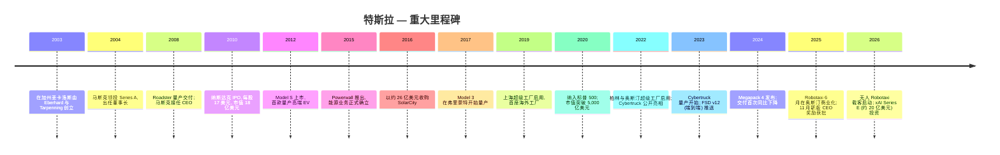
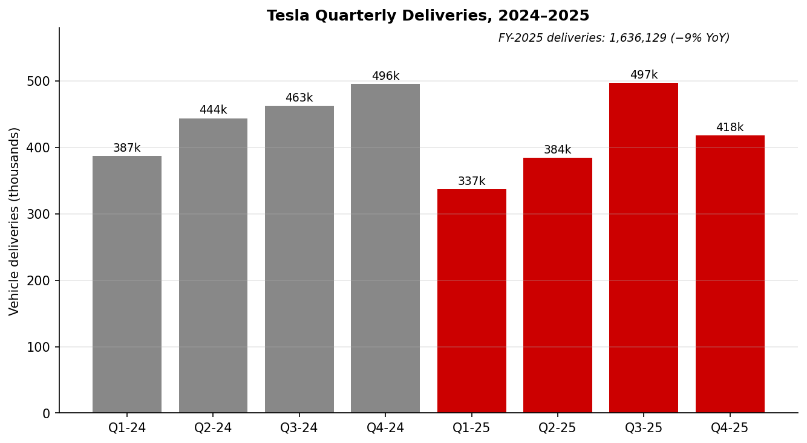
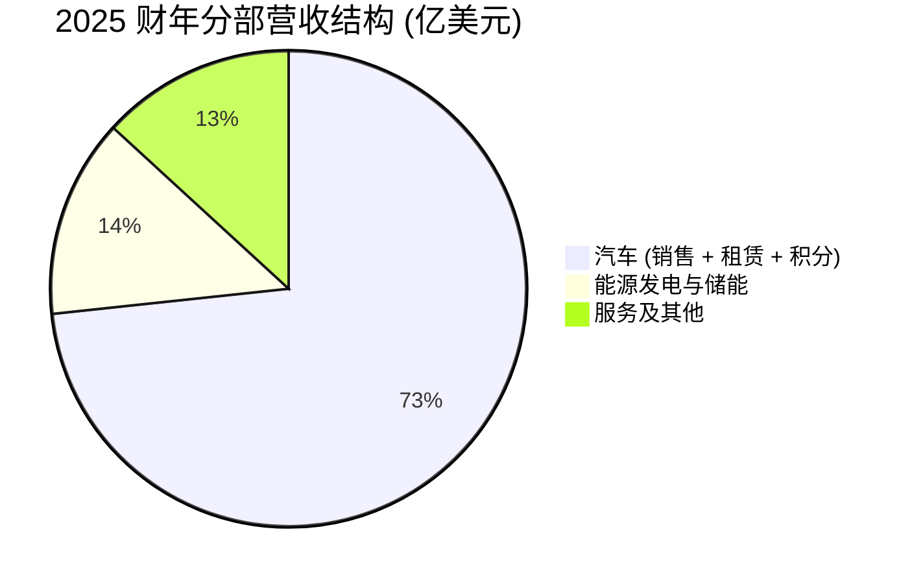
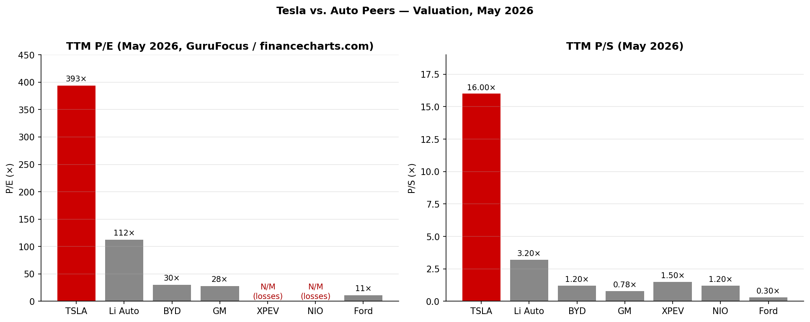
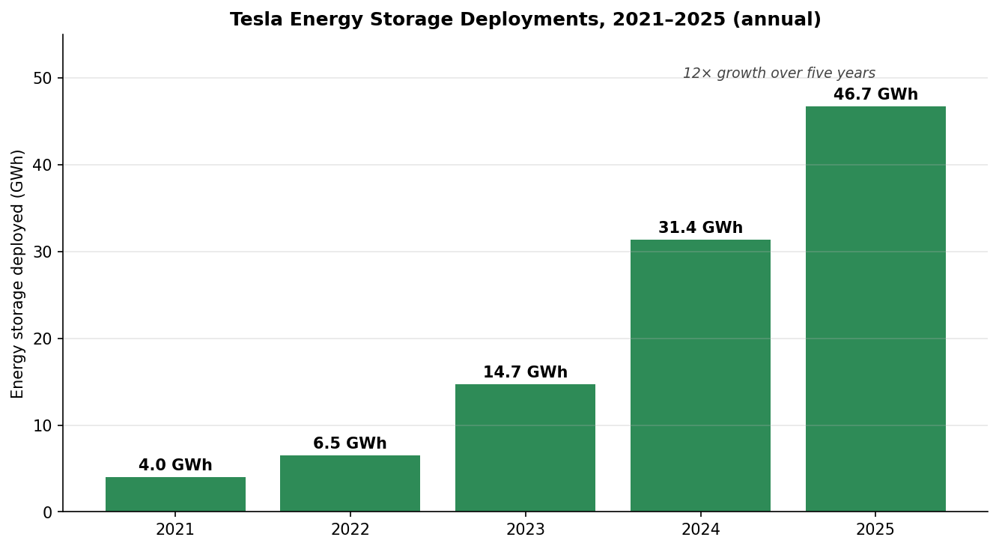

# Tesla, Inc. (NASDAQ:TSLA) — 公司研究报告 (首次覆盖)

**报告日期: 2026-06-14**（市场数据截至 2026-06-12 收盘）
**上市地: 纳斯达克全球精选市场 (NASDAQ Global Select Market), 代码 TSLA**
**行业: 非必需消费品 / 汽车制造 (能源与 AI 业务敞口持续上升)**
**总部: 美国得克萨斯州奥斯汀市特斯拉路 1 号 (1 Tesla Road, Austin, Texas)**
**财年截止日: 12 月 31 日**
**报告语言: 简体中文 (英文版同时存在于本目录)**

> *分析师观点：* **评级：Hold / 中性 · 12 个月目标价 US$430（较 2026-06-12 收盘价 US$406.43 上行 +5.8%）· 估值方法：分部加总 (SOTP) —— 汽车+能源+服务核心约 US$290/股 + Robotaxi/Optimus/FSD 期权价值约 US$140/股 · 市值约 US$1.53 万亿 · 52 周区间 US$294–490 · NASDAQ:TSLA**
>
> | 倍数 / Multiple（*分析师观点：* 前瞻列为预测） | FY2025A | FY2026E | FY2027E |
> |---|---|---|---|
> | P/E (GAAP 摊薄, diluted) | ~376× | ~226× | ~148× |
> | P/S | ~16.1× | ~14.4× | ~12.3× |
> | EV / Adj. EBITDA | ~102× | ~83× | ~68× |
> | FCF yield (自由现金流收益率) | ~0.4% | ~0.3% | ~0.5% |
>
> **相对表现（price performance, 截至 2026-06-12）：** TSLA 1M −8.7% · 6M −10.0% · YTD −7.2% · 12M +24.5%；对照 S&P 500 (SPY) 1M −0.1% · 6M +8.5% · YTD +8.9% · 12M +24.8%（相对超额 relative：6M **−18.5pp** · YTD **−16.1pp** · 12M −0.3pp）——特斯拉年内显著跑输大盘。来源：[Yahoo Finance / yfinance, 截至 2026-06-12](https://finance.yahoo.com/quote/TSLA/)。
>
> **核心论点（thesis pillars）**——（1）**全球最盈利、纵向整合最深的纯电车企**：FY2025 GAAP operating margin 4.6% 仍高于通用 (GM) / 福特 (Ford) / Stellantis，而 gross margin (毛利率) 已从 2025Q1 的 16.3% 连续四个季度回升至 2026Q1 的 **21.1%**——盈利能力正在触底回升 ([Tesla Q1 2026 Update, 2026-04-22](https://www.sec.gov/Archives/edgar/data/0001318605/000162828026026551/exhibit991.htm))。（2）**能源储能 (Megapack / Powerwall) 是被低估的第二增长曲线**：FY2025 营收 +27%、毛利连续五个季度创纪录，直接受 AI 数据中心用电拉动。（3）**当前估值几乎全部建立在 Robotaxi + Optimus + FSD 的"物理 AI (physical AI)"期权之上**——这是上行的唯一来源，也是最大的不确定性。（4）**~376× TTM P/E、~16× P/S 已计入多年高速兑现**，倍数压缩 (multiple compression) 是当前价位下总回报投资者面临的首要风险——综合给予 **Hold / 中性**，目标价仅略高于现价。

> **业绩更新——2025 年 CEO 业绩奖励获批 (2025-11-06):** 在 2025 年股东大会上, 股东批准了一项针对 CEO 埃隆·马斯克 (Elon Musk) 的全新业绩型股权激励方案, 由 12 档股票期权组成, 仅在特斯拉达成超凡运营与市值里程碑时方可归属——包括将市值由约 1.5 万亿美元提升至 8.5 万亿美元、累计交付 2,000 万辆汽车、部署 100 万辆 Robotaxi (自动驾驶出租车), 以及实现 4,000 亿美元的调整后 EBITDA。该新方案取代了特拉华州衡平法院 (Delaware Chancery Court) 撤销其 2018 年奖励后留下的法律真空。来源: [Tesla 2025 Proxy Statement / DEFA14A material, 2025-09-05](https://www.sec.gov/Archives/edgar/data/0001318605/000110465925090884/tm252289d15_defa14a.htm); 摘要见 [Tesla Q4 & FY 2025 Update, 2026-01-28](https://www.sec.gov/Archives/edgar/data/0001318605/000162828026003837/exhibit991.htm)。

---

## 目录

1. 公司概览（含投资论点 + 估值快照）
1A. 估值与目标价（前瞻盈利模型 · SOTP 目标价 · 牛/基准/熊情形 · 卖方观点演变）
1B. GF Score 基本面评分卡（雷达图 + 五维 0–10 + 综合分）
2. 公司历史
3. 管理团队
4. 产品与服务
5. 客户与上市策略
6. 行业概览
7. 竞争格局
8. 市场机会 (TAM)
9. 风险评估
9.5. 关键分歧与催化剂
10. 投资风格透视（Buffett / Munger / Damodaran / Howard Marks / Cathie Wood）
数据来源清单 (Data Used) · 参考资料 · 验证日志

---

## 1. 公司概览

> *分析师观点（投资论点 / BLUF）：* 我们以 **Hold / 中性**、12 个月目标价 **US$430**（较 2026-06-12 收盘价 US$406.43 上行约 +5.8%）覆盖特斯拉。**为什么是现在**——经历 2023–2024 年的价格战与 2025 年的交付下滑后，汽车 gross margin (毛利率) 已连续四个季度回升（2025Q1 的 16.3% → 2026Q1 的 21.1%），能源储能 (energy storage) 与服务的高速增长正在重塑利润结构；与此同时 Robotaxi 已在奥斯汀、达拉斯、休斯顿开展无人载客，FSD (Full Self-Driving) 累计里程突破 100 亿英里——"物理 AI (physical AI)"叙事正从概念走向早期商业化 ([Tesla Q1 2026 Update, 2026-04-22](https://www.sec.gov/Archives/edgar/data/0001318605/000162828026026551/exhibit991.htm))。但股票以约 376× TTM P/E、约 16× P/S 交易，**绝大部分上行都已被计入价格**，新资金的安全边际很薄。四条论点支撑这一中性判断：（1）核心汽车业务仍是全球最盈利、纵向整合最深的纯电平台，且利润正在触底回升；（2）能源储能是被市场低估的第二增长曲线；（3）估值中的"期权价值"层 (Robotaxi / Optimus / FSD) 是上行的唯一来源，也是最大不确定性；（4）极端倍数使倍数压缩 (multiple compression) 成为当前价位的首要风险。完整的盈利预测与目标价推导见第 1A 节。

Tesla, Inc. (特斯拉公司) 设计、研发、制造、销售并出租高性能纯电动汽车 (electric vehicle, EV) 及固定式发电与储能系统, 同时正大举投资以将其特许经营延伸至自动驾驶移动出行 (Robotaxi)、人形机器人 (Optimus) 和定制 AI 芯片领域。最新年报 (Form 10-K) 中阐述的使命是"打造一个惊人富足的世界 (build a world of amazing abundance)", 战略重心已从"全球领先的可持续能源公司"转向"物理 AI (physical AI)"平台 ([Tesla 2025 10-K, Item 1 Business](https://www.sec.gov/Archives/edgar/data/0001318605/000162828026003952/tsla-20251231.htm))。

**业务模式。** 当前营收几乎全部仍来自硬件, 但结构正在从汽车向能源/服务迁移 (按发展演变 / development-over-time 口径展示):

| 业务板块 (百万美元) | FY2023 | FY2024 | FY2025 | FY2025 占比 | FY25 同比 |
|---|---|---|---|---|---|
| 汽车 (销售 65,821 + 监管积分 1,993 + 租赁 1,712) | 82,419 | 77,070 | 69,526 | 73.3% | −10% |
| 能源发电与储能 (Megapack、Powerwall、太阳能) | 6,035 | 10,086 | 12,771 | 13.5% | +27% |
| 服务及其他 (二手车、零部件、超充、保险、周边) | 8,319 | 10,534 | 12,530 | 13.2% | +19% |
| **合计** | **96,773** | **97,690** | **94,827** | 100% | −3% |

来源: [Tesla FY2025 10-K, MD&A 营收明细表](https://www.sec.gov/Archives/edgar/data/0001318605/000162828026003952/tsla-20251231.htm); [Tesla Q4 & FY 2025 Update (8-K Ex. 99.1), 2026-01-28, p. 5](https://www.sec.gov/Archives/edgar/data/0001318605/000162828026003837/exhibit991.htm)。

> **本期新变化（截至 2026Q1）。** 2026 年第一季度营收 **US$22,387M（同比 +16%）**——这是连续多个季度同比下滑后的首次明显反弹: 汽车营收 +16%、服务及其他 +42%（能源储能因项目交付时点 −12%）。更重要的是 **GAAP gross margin 升至 21.1%（同比 +478bp）**, 较 2025Q1 的 16.3% 累计回升近 5 个百分点; 经营性现金流 (operating cash flow) US$3.9B、自由现金流 (FCF) US$1.4B; Robotaxi 于 4 月在达拉斯、休斯顿开通无人载客, FSD 于 4 月获荷兰批准 ([Tesla Q1 2026 Update, 2026-04-22, p. 3](https://www.sec.gov/Archives/edgar/data/0001318605/000162828026026551/exhibit991.htm))。**值得注意的逆风**: 监管积分 (regulatory credits) 营收 FY2025 降至 US$1,993M（FY2024 为 US$2,763M, **同比 −28%**）, 这一高利润率直通收入的下降是盈利质量的结构性拖累 ([Tesla FY2025 10-K, MD&A](https://www.sec.gov/Archives/edgar/data/0001318605/000162828026003952/tsla-20251231.htm))。

**收入结构与"如何赚钱"（FY2025 income-statement Sankey）。** 下图按特斯拉自己的合并经营表把 US$94.8B 营收一路拆到 GAAP 净利润 US$3.79B——可见 82% 的营收被成本吞噬 (gross margin 18.0%), 营业费用 (其中 R&D US$6,411M、SG&A US$5,834M) 进一步把营业利润压到 US$4,355M (operating margin 4.6%), 利息净收入与税后最终留下 US$3.79B 归母净利润:

<svg xmlns="http://www.w3.org/2000/svg" viewBox="0 0 1000 560" width="1000" height="560" role="img" aria-label="income statement Sankey"><rect x="0" y="0" width="1000" height="560" fill="#ffffff"/>
<text x="20.00" y="30.00" text-anchor="start" font-family="Helvetica,Arial,sans-serif" font-size="15" font-weight="700" fill="#1f2933">特斯拉如何赚钱 / How Tesla Makes Money — FY2025 (US$ mn)</text>
<path d="M 204.00,71.00 C 258.00,71.00 258.00,85.00 312.00,85.00 L 312.00,384.14 C 258.00,384.14 258.00,370.14 204.00,370.14 Z" fill="#93c5fd" fill-opacity="0.55"/>
<path d="M 452.00,78.00 C 506.00,78.00 506.00,236.24 560.00,236.24 L 560.00,254.98 C 506.00,254.98 506.00,96.74 452.00,96.74 Z" fill="#86efac" fill-opacity="0.55"/>
<path d="M 452.00,96.74 C 506.00,96.74 506.00,268.98 560.00,268.98 L 560.00,323.79 C 506.00,323.79 506.00,151.55 452.00,151.55 Z" fill="#fca5a5" fill-opacity="0.55"/>
<path d="M 328.00,85.00 C 382.00,85.00 382.00,78.00 436.00,78.00 L 436.00,151.55 C 382.00,151.55 382.00,158.55 328.00,158.55 Z" fill="#86efac" fill-opacity="0.55"/>
<path d="M 328.00,158.55 C 382.00,158.55 382.00,165.55 436.00,165.55 L 436.00,500.00 C 382.00,500.00 382.00,493.00 328.00,493.00 Z" fill="#fca5a5" fill-opacity="0.55"/>
<path d="M 700.00,229.24 C 754.00,229.24 754.00,262.78 808.00,262.78 L 808.00,279.10 C 754.00,279.10 754.00,245.56 700.00,245.56 Z" fill="#86efac" fill-opacity="0.55"/>
<path d="M 700.00,245.56 C 754.00,245.56 754.00,293.10 808.00,293.10 L 808.00,299.22 C 754.00,299.22 754.00,251.69 700.00,251.69 Z" fill="#fca5a5" fill-opacity="0.55"/>
<path d="M 700.00,251.69 C 754.00,251.69 754.00,313.22 808.00,313.22 L 808.00,315.22 C 754.00,315.22 754.00,253.69 700.00,253.69 Z" fill="#fca5a5" fill-opacity="0.55"/>
<path d="M 576.00,236.24 C 630.00,236.24 630.00,229.24 684.00,229.24 L 684.00,247.98 C 630.00,247.98 630.00,254.98 576.00,254.98 Z" fill="#86efac" fill-opacity="0.55"/>
<path d="M 576.00,268.98 C 630.00,268.98 630.00,265.95 684.00,265.95 L 684.00,291.05 C 630.00,291.05 630.00,294.08 576.00,294.08 Z" fill="#fca5a5" fill-opacity="0.55"/>
<path d="M 576.00,294.08 C 630.00,294.08 630.00,305.05 684.00,305.05 L 684.00,332.63 C 630.00,332.63 630.00,321.66 576.00,321.66 Z" fill="#fca5a5" fill-opacity="0.55"/>
<path d="M 576.00,321.66 C 630.00,321.66 630.00,346.63 684.00,346.63 L 684.00,348.76 C 630.00,348.76 630.00,323.79 576.00,323.79 Z" fill="#fca5a5" fill-opacity="0.55"/>
<path d="M 576.00,337.79 C 630.00,337.79 630.00,247.98 684.00,247.98 L 684.00,251.95 C 630.00,251.95 630.00,341.76 576.00,341.76 Z" fill="#93c5fd" fill-opacity="0.55"/>
<path d="M 204.00,384.14 C 258.00,384.14 258.00,384.14 312.00,384.14 L 312.00,439.09 C 258.00,439.09 258.00,439.09 204.00,439.09 Z" fill="#93c5fd" fill-opacity="0.55"/>
<path d="M 204.00,453.09 C 258.00,453.09 258.00,439.09 312.00,439.09 L 312.00,493.00 C 258.00,493.00 258.00,507.00 204.00,507.00 Z" fill="#93c5fd" fill-opacity="0.55"/>
<rect x="188.00" y="71.00" width="16" height="299.14" rx="1.5" fill="#2563eb"/>
<rect x="188.00" y="384.14" width="16" height="54.95" rx="1.5" fill="#2563eb"/>
<rect x="188.00" y="453.09" width="16" height="53.91" rx="1.5" fill="#2563eb"/>
<rect x="312.00" y="85.00" width="16" height="408.00" rx="1.5" fill="#1e3a8a"/>
<rect x="436.00" y="78.00" width="16" height="73.55" rx="1.5" fill="#15803d"/>
<rect x="436.00" y="165.55" width="16" height="334.45" rx="1.5" fill="#dc2626"/>
<rect x="560.00" y="236.24" width="16" height="18.74" rx="1.5" fill="#15803d"/>
<rect x="560.00" y="268.98" width="16" height="54.81" rx="1.5" fill="#dc2626"/>
<rect x="560.00" y="337.79" width="16" height="3.97" rx="1.5" fill="#2563eb"/>
<rect x="684.00" y="229.24" width="16" height="22.71" rx="1.5" fill="#15803d"/>
<rect x="684.00" y="265.95" width="16" height="25.10" rx="1.5" fill="#dc2626"/>
<rect x="684.00" y="305.05" width="16" height="27.58" rx="1.5" fill="#dc2626"/>
<rect x="684.00" y="346.63" width="16" height="2.13" rx="1.5" fill="#dc2626"/>
<rect x="808.00" y="262.78" width="16" height="16.32" rx="1.5" fill="#15803d"/>
<rect x="808.00" y="293.10" width="16" height="6.12" rx="1.5" fill="#dc2626"/>
<rect x="808.00" y="313.22" width="16" height="2.00" rx="1.5" fill="#dc2626"/>
<text x="179.00" y="217.57" text-anchor="end" font-family="Helvetica,Arial,sans-serif" font-size="11.5" font-weight="700" fill="#1f2933">汽车 Automotive</text>
<text x="179.00" y="230.57" text-anchor="end" font-family="Helvetica,Arial,sans-serif" font-size="10" font-weight="400" fill="#52606d">$69.5B  (73.3%)</text>
<text x="179.00" y="408.61" text-anchor="end" font-family="Helvetica,Arial,sans-serif" font-size="11.5" font-weight="700" fill="#1f2933">能源储能 Energy</text>
<text x="179.00" y="421.61" text-anchor="end" font-family="Helvetica,Arial,sans-serif" font-size="10" font-weight="400" fill="#52606d">$12.8B  (13.5%)</text>
<text x="179.00" y="477.04" text-anchor="end" font-family="Helvetica,Arial,sans-serif" font-size="11.5" font-weight="700" fill="#1f2933">服务及其他 Services</text>
<text x="179.00" y="490.04" text-anchor="end" font-family="Helvetica,Arial,sans-serif" font-size="10" font-weight="400" fill="#52606d">$12.5B  (13.2%)</text>
<rect x="331.00" y="67.00" width="106.80" height="26" rx="2" fill="#ffffff" fill-opacity="0.72"/>
<text x="334.00" y="79.00" text-anchor="start" font-family="Helvetica,Arial,sans-serif" font-size="11.5" font-weight="700" fill="#1f2933">Revenue</text>
<text x="334.00" y="92.00" text-anchor="start" font-family="Helvetica,Arial,sans-serif" font-size="10" font-weight="400" fill="#52606d">$94.8B  (100.0%)</text>
<rect x="455.00" y="60.00" width="100.50" height="26" rx="2" fill="#ffffff" fill-opacity="0.72"/>
<text x="458.00" y="72.00" text-anchor="start" font-family="Helvetica,Arial,sans-serif" font-size="11.5" font-weight="700" fill="#1f2933">Gross Profit</text>
<text x="458.00" y="85.00" text-anchor="start" font-family="Helvetica,Arial,sans-serif" font-size="10" font-weight="400" fill="#52606d">$17.1B  (18.0%)</text>
<rect x="455.00" y="147.55" width="144.60" height="26" rx="2" fill="#ffffff" fill-opacity="0.72"/>
<text x="458.00" y="159.55" text-anchor="start" font-family="Helvetica,Arial,sans-serif" font-size="11.5" font-weight="700" fill="#1f2933">Cost of Revenue (COGS)</text>
<text x="458.00" y="172.55" text-anchor="start" font-family="Helvetica,Arial,sans-serif" font-size="10" font-weight="400" fill="#52606d">$77.7B  (82.0%)</text>
<rect x="579.00" y="218.24" width="106.80" height="26" rx="2" fill="#ffffff" fill-opacity="0.72"/>
<text x="582.00" y="230.24" text-anchor="start" font-family="Helvetica,Arial,sans-serif" font-size="11.5" font-weight="700" fill="#1f2933">Operating Income</text>
<text x="582.00" y="243.24" text-anchor="start" font-family="Helvetica,Arial,sans-serif" font-size="10" font-weight="400" fill="#52606d">$4.4B  (4.6%)</text>
<rect x="579.00" y="250.98" width="150.90" height="26" rx="2" fill="#ffffff" fill-opacity="0.72"/>
<text x="582.00" y="262.98" text-anchor="start" font-family="Helvetica,Arial,sans-serif" font-size="11.5" font-weight="700" fill="#1f2933">Total Operating Expense</text>
<text x="582.00" y="275.98" text-anchor="start" font-family="Helvetica,Arial,sans-serif" font-size="10" font-weight="400" fill="#52606d">$12.7B  (13.4%)</text>
<text x="551.00" y="336.77" text-anchor="end" font-family="Helvetica,Arial,sans-serif" font-size="11.5" font-weight="700" fill="#1f2933">Net Interest / Other Income</text>
<text x="551.00" y="349.77" text-anchor="end" font-family="Helvetica,Arial,sans-serif" font-size="10" font-weight="400" fill="#52606d">$923.0M  (0.97%)</text>
<rect x="703.00" y="211.24" width="87.90" height="26" rx="2" fill="#ffffff" fill-opacity="0.72"/>
<text x="706.00" y="223.24" text-anchor="start" font-family="Helvetica,Arial,sans-serif" font-size="11.5" font-weight="700" fill="#1f2933">Pretax Income</text>
<text x="706.00" y="236.24" text-anchor="start" font-family="Helvetica,Arial,sans-serif" font-size="10" font-weight="400" fill="#52606d">$5.3B  (5.6%)</text>
<rect x="703.00" y="247.95" width="87.90" height="26" rx="2" fill="#ffffff" fill-opacity="0.72"/>
<text x="706.00" y="259.95" text-anchor="start" font-family="Helvetica,Arial,sans-serif" font-size="11.5" font-weight="700" fill="#1f2933">SG&amp;A</text>
<text x="706.00" y="272.95" text-anchor="start" font-family="Helvetica,Arial,sans-serif" font-size="10" font-weight="400" fill="#52606d">$5.8B  (6.2%)</text>
<rect x="703.00" y="287.05" width="87.90" height="26" rx="2" fill="#ffffff" fill-opacity="0.72"/>
<text x="706.00" y="299.05" text-anchor="start" font-family="Helvetica,Arial,sans-serif" font-size="11.5" font-weight="700" fill="#1f2933">R&amp;D</text>
<text x="706.00" y="312.05" text-anchor="start" font-family="Helvetica,Arial,sans-serif" font-size="10" font-weight="400" fill="#52606d">$6.4B  (6.8%)</text>
<rect x="703.00" y="328.63" width="106.80" height="26" rx="2" fill="#ffffff" fill-opacity="0.72"/>
<text x="706.00" y="340.63" text-anchor="start" font-family="Helvetica,Arial,sans-serif" font-size="11.5" font-weight="700" fill="#1f2933">Other OpEx</text>
<text x="706.00" y="353.63" text-anchor="start" font-family="Helvetica,Arial,sans-serif" font-size="10" font-weight="400" fill="#52606d">$494.0M  (0.52%)</text>
<text x="833.00" y="267.94" text-anchor="start" font-family="Helvetica,Arial,sans-serif" font-size="11.5" font-weight="700" fill="#1f2933">Net Income</text>
<text x="833.00" y="280.94" text-anchor="start" font-family="Helvetica,Arial,sans-serif" font-size="10" font-weight="400" fill="#52606d">$3.8B  (4.0%)</text>
<text x="833.00" y="293.16" text-anchor="start" font-family="Helvetica,Arial,sans-serif" font-size="11.5" font-weight="700" fill="#1f2933">Income Tax</text>
<text x="833.00" y="306.16" text-anchor="start" font-family="Helvetica,Arial,sans-serif" font-size="10" font-weight="400" fill="#52606d">$1.4B  (1.5%)</text>
<text x="833.00" y="318.16" text-anchor="start" font-family="Helvetica,Arial,sans-serif" font-size="11.5" font-weight="700" fill="#1f2933">Minority Interest</text>
<text x="833.00" y="331.16" text-anchor="start" font-family="Helvetica,Arial,sans-serif" font-size="10" font-weight="400" fill="#52606d">$61.0M  (0.06%)</text>
<text x="500.00" y="544.00" text-anchor="middle" font-family="Helvetica,Arial,sans-serif" font-size="10" font-weight="400" fill="#52606d">Source: Tesla FY2025 10-K, 合并经营表 + MD&amp;A 营收表</text>
</svg>

来源: [Tesla FY2025 10-K, 合并经营表 (Consolidated Statements of Operations) + MD&A 营收表](https://www.sec.gov/Archives/edgar/data/0001318605/000162828026003952/tsla-20251231.htm)。

<svg xmlns="http://www.w3.org/2000/svg" viewBox="0 0 720 460" width="720" height="460" role="img" aria-label="revenue donut"><rect x="0" y="0" width="720" height="460" fill="#ffffff"/>
<text x="20.00" y="30.00" text-anchor="start" font-family="Helvetica,Arial,sans-serif" font-size="15" font-weight="700" fill="#1f2933">FY2025 营收结构(按分部)/ Revenue by Segment</text>
<path d="M 288.00,107.20 A 132 132 0 1 1 156.74,253.12 L 210.43,247.42 A 78 78 0 1 0 288.00,161.20 Z" fill="#2563eb"/>
<path d="M 156.74,253.12 A 132 132 0 0 1 190.57,150.14 L 230.43,186.57 A 78 78 0 0 0 210.43,247.42 Z" fill="#15803d"/>
<path d="M 190.57,150.14 A 132 132 0 0 1 288.00,107.20 L 288.00,161.20 A 78 78 0 0 0 230.43,186.57 Z" fill="#d97706"/>
<text x="288.00" y="235.20" text-anchor="middle" font-family="Helvetica,Arial,sans-serif" font-size="18" font-weight="800" fill="#1f2933">TSLA FY25</text>
<text x="288.00" y="255.20" text-anchor="middle" font-family="Helvetica,Arial,sans-serif" font-size="13" font-weight="600" fill="#52606d">$94.8B</text>
<text x="288.00" y="271.20" text-anchor="middle" font-family="Helvetica,Arial,sans-serif" font-size="10" font-weight="400" fill="#8a97a3">total</text>
<line x1="390.60" y1="331.49" x2="406.60" y2="331.49" stroke="#2563eb" stroke-width="1.4"/>
<text x="410.60" y="329.49" text-anchor="start" font-family="Helvetica,Arial,sans-serif" font-size="11" font-weight="700" fill="#1f2933">汽车 Automotive</text>
<text x="410.60" y="343.49" text-anchor="start" font-family="Helvetica,Arial,sans-serif" font-size="10" font-weight="400" fill="#52606d">$69.5B  (73.3%)</text>
<line x1="156.90" y1="196.12" x2="140.90" y2="196.12" stroke="#15803d" stroke-width="1.4"/>
<text x="136.90" y="194.12" text-anchor="end" font-family="Helvetica,Arial,sans-serif" font-size="11" font-weight="700" fill="#1f2933">能源储能 Energy</text>
<text x="136.90" y="208.12" text-anchor="end" font-family="Helvetica,Arial,sans-serif" font-size="10" font-weight="400" fill="#52606d">$12.8B  (13.5%)</text>
<line x1="232.35" y1="112.92" x2="216.35" y2="112.92" stroke="#d97706" stroke-width="1.4"/>
<text x="212.35" y="110.92" text-anchor="end" font-family="Helvetica,Arial,sans-serif" font-size="11" font-weight="700" fill="#1f2933">服务及其他 Services</text>
<text x="212.35" y="124.92" text-anchor="end" font-family="Helvetica,Arial,sans-serif" font-size="10" font-weight="400" fill="#52606d">$12.5B  (13.2%)</text>
<text x="360.00" y="444.00" text-anchor="middle" font-family="Helvetica,Arial,sans-serif" font-size="10" font-weight="400" fill="#52606d">Source: Tesla FY2025 10-K, MD&amp;A revenue table</text>
</svg>

来源: [Tesla FY2025 10-K, MD&A 营收明细表](https://www.sec.gov/Archives/edgar/data/0001318605/000162828026003952/tsla-20251231.htm)。

<svg xmlns="http://www.w3.org/2000/svg" viewBox="0 0 860 470" width="860" height="470" role="img" aria-label="historical revenue bars"><rect x="0" y="0" width="860" height="470" fill="#ffffff"/>
<text x="20.00" y="30.00" text-anchor="start" font-family="Helvetica,Arial,sans-serif" font-size="15" font-weight="700" fill="#1f2933">历史营收(按分部)/ Revenue by Segment, FY2021–25 (US$ bn)</text>
<rect x="20.00" y="44" width="11" height="11" rx="2" fill="#2563eb"/>
<text x="36.00" y="53.00" text-anchor="start" font-family="Helvetica,Arial,sans-serif" font-size="10.5" font-weight="400" fill="#1f2933">汽车 Automotive</text>
<rect x="135.80" y="44" width="11" height="11" rx="2" fill="#15803d"/>
<text x="151.80" y="53.00" text-anchor="start" font-family="Helvetica,Arial,sans-serif" font-size="10.5" font-weight="400" fill="#1f2933">能源储能 Energy</text>
<rect x="238.40" y="44" width="11" height="11" rx="2" fill="#d97706"/>
<text x="254.40" y="53.00" text-anchor="start" font-family="Helvetica,Arial,sans-serif" font-size="10.5" font-weight="400" fill="#1f2933">服务及其他 Services</text>
<line x1="70" y1="412.00" x2="834" y2="412.00" stroke="#eceff2" stroke-width="1"/>
<text x="64.00" y="415.00" text-anchor="end" font-family="Helvetica,Arial,sans-serif" font-size="9.5" font-weight="400" fill="#52606d">$0</text>
<line x1="70" y1="345.20" x2="834" y2="345.20" stroke="#eceff2" stroke-width="1"/>
<text x="64.00" y="348.20" text-anchor="end" font-family="Helvetica,Arial,sans-serif" font-size="9.5" font-weight="400" fill="#52606d">$21.1B</text>
<line x1="70" y1="278.40" x2="834" y2="278.40" stroke="#eceff2" stroke-width="1"/>
<text x="64.00" y="281.40" text-anchor="end" font-family="Helvetica,Arial,sans-serif" font-size="9.5" font-weight="400" fill="#52606d">$42.2B</text>
<line x1="70" y1="211.60" x2="834" y2="211.60" stroke="#eceff2" stroke-width="1"/>
<text x="64.00" y="214.60" text-anchor="end" font-family="Helvetica,Arial,sans-serif" font-size="9.5" font-weight="400" fill="#52606d">$63.3B</text>
<line x1="70" y1="144.80" x2="834" y2="144.80" stroke="#eceff2" stroke-width="1"/>
<text x="64.00" y="147.80" text-anchor="end" font-family="Helvetica,Arial,sans-serif" font-size="9.5" font-weight="400" fill="#52606d">$84.4B</text>
<line x1="70" y1="78.00" x2="834" y2="78.00" stroke="#eceff2" stroke-width="1"/>
<text x="64.00" y="81.00" text-anchor="end" font-family="Helvetica,Arial,sans-serif" font-size="9.5" font-weight="400" fill="#52606d">$105.5B</text>
<rect x="102.09" y="262.59" width="88.62" height="149.41" fill="#2563eb"/>
<rect x="102.09" y="253.73" width="88.62" height="8.86" fill="#15803d"/>
<rect x="102.09" y="241.70" width="88.62" height="12.03" fill="#d97706"/>
<text x="146.40" y="428.00" text-anchor="middle" font-family="Helvetica,Arial,sans-serif" font-size="10" font-weight="400" fill="#52606d">2021</text>
<rect x="254.89" y="185.67" width="88.62" height="226.33" fill="#2563eb"/>
<rect x="254.89" y="173.33" width="88.62" height="12.35" fill="#15803d"/>
<rect x="254.89" y="154.02" width="88.62" height="19.31" fill="#d97706"/>
<text x="299.20" y="428.00" text-anchor="middle" font-family="Helvetica,Arial,sans-serif" font-size="10" font-weight="400" fill="#52606d">2022</text>
<rect x="407.69" y="151.17" width="88.62" height="260.83" fill="#2563eb"/>
<rect x="407.69" y="132.18" width="88.62" height="18.99" fill="#15803d"/>
<rect x="407.69" y="105.91" width="88.62" height="26.27" fill="#d97706"/>
<text x="452.00" y="428.00" text-anchor="middle" font-family="Helvetica,Arial,sans-serif" font-size="10" font-weight="400" fill="#52606d">2023</text>
<rect x="560.49" y="167.95" width="88.62" height="244.05" fill="#2563eb"/>
<rect x="560.49" y="135.98" width="88.62" height="31.97" fill="#15803d"/>
<rect x="560.49" y="102.74" width="88.62" height="33.24" fill="#d97706"/>
<text x="604.80" y="428.00" text-anchor="middle" font-family="Helvetica,Arial,sans-serif" font-size="10" font-weight="400" fill="#52606d">2024</text>
<rect x="713.29" y="192.00" width="88.62" height="220.00" fill="#2563eb"/>
<rect x="713.29" y="151.49" width="88.62" height="40.52" fill="#15803d"/>
<rect x="713.29" y="111.92" width="88.62" height="39.57" fill="#d97706"/>
<text x="757.60" y="428.00" text-anchor="middle" font-family="Helvetica,Arial,sans-serif" font-size="10" font-weight="400" fill="#52606d">2025</text>
<text x="430.00" y="454.00" text-anchor="middle" font-family="Helvetica,Arial,sans-serif" font-size="10" font-weight="400" fill="#52606d">Source: Tesla FY2021–FY2025 10-Ks, MD&amp;A revenue tables</text>
</svg>

来源: [Tesla FY2021–FY2025 10-Ks, MD&A 营收表](https://www.sec.gov/Archives/edgar/data/0001318605/000162828026003952/tsla-20251231.htm)——五年间汽车营收见顶回落, 而能源储能从 US$2.8B 增至 US$12.8B (4.6 倍)、服务从 US$3.8B 增至 US$12.5B (3.3 倍), 两者合计占比由 12% 升至 27%。

特斯拉在所有主要市场均通过自营零售店与线上渠道直接面向消费者销售——长期以来一直是这一以特许经销商体系为基石的行业中最具代表性的直营 (direct-to-consumer, D2C) 玩家 ([Tesla 2025 10-K, Item 1 Business](https://www.sec.gov/Archives/edgar/data/0001318605/000162828026003952/tsla-20251231.htm))。能源与 Megapack 业务则采用直销+渠道伙伴模式; 超充网络 (Supercharger network) 通过付费充电会话收费, 并越来越多地依托第三方车企对 NACS (北美充电标准, North American Charging Standard) 的接入收费, 大多数主要车厂已于 2023–2024 年签订采用协议 ([Edmunds, 2023](https://www.edmunds.com/car-news/rivian-will-adopt-teslas-nacs-charger-following-ford-gm.html))。

**地理布局。** 特斯拉现已是真正的全球化公司。整车在美国加利福尼亚州 (弗里蒙特, Fremont)、得克萨斯州 (奥斯汀, Austin)、中国上海以及德国勃兰登堡 (柏林) 进行生产, 装机汽车产能约 235 万辆/年——上海超 95 万辆 Model 3/Y、弗里蒙特超 55 万辆 Model 3/Y 加 10 万辆 Model S/X、柏林超 37.5 万辆 Model Y、奥斯汀超 25 万辆 Model Y 加超 12.5 万辆 Cybertruck ([Q4 & FY 2025 Update, p. 8](https://www.sec.gov/Archives/edgar/data/0001318605/000162828026003837/exhibit991.htm))。2025 财年交付 1,636,129 辆, 公司在 Q4-25 财报中特别提及亚太地区创单季历史新高。

**规模。** 2025 财年末特斯拉全球员工数为 134,785 人 ([Tesla 2025 10-K, Item 1, Human Capital Resources](https://www.sec.gov/Archives/edgar/data/0001318605/000162828026003952/tsla-20251231.htm)), 全球零售与服务门店 1,553 家, 超充站 8,182 座、充电接口 77,682 个。累计交付车辆超过 890 万辆, Powerwall 全球装机突破 100 万套, 累计储能部署达到 103 GWh。

**利润率与现金流轮廓。** 2023–2024 年特斯拉为捍卫销量持续降价, GAAP 毛利率 (gross margin) 整体下行; 2025 财年虽然交付下滑, 毛利率仍稳定在约 18%, 这是因为业务结构向储能 (当前 GAAP 毛利率约 30%) 与服务的迁移缓冲了汽车端的压缩 ([Tesla Q4 & FY 2025 Update, p. 5](https://www.sec.gov/Archives/edgar/data/0001318605/000162828026003837/exhibit991.htm))。2025 财年 GAAP 营业利润率 (operating margin) 压缩至 4.6%, 较 2022 财年 16.8% 的峰值大幅回落, 原因包括: (i) 汽车 ASP (Average Selling Price, 平均售价) 下行, (ii) 受 AI/机器人 R&D 投入及更高法律重组开支驱动, 营业费用同比增长 23%, (iii) Q1-25 计入一次性重组费用 ([Tesla 2025 10-K, MD&A](https://www.sec.gov/Archives/edgar/data/0001318605/000162828026003952/tsla-20251231.htm))。

自由现金流 (free cash flow, FCF) 反而*改善*——从 2024 财年的 35.8 亿美元跃升至 2025 财年的 62.2 亿美元——因为特斯拉将资本开支 (capex) 同比削减 25% (85 亿美元 vs. 113 亿美元), 此前的绿地工厂建设浪潮已经完成, 焦点转向最大化现有产能利用率 ([Q4 & FY 2025 Update, p. 5](https://www.sec.gov/Archives/edgar/data/0001318605/000162828026003837/exhibit991.htm))。2025 年末现金、现金等价物与投资总额 440.6 亿美元, 同比增长 75 亿美元, 为 Cybercab、Optimus、AI 训练算力与 2026 年 1 月宣布的对 xAI 约 20 亿美元 Series E 投资准备了充足战备资金。

**估值快照 (截至 2026-06-12)。**

| 指标 | 数值 | 来源 |
|---|---|---|
| 股价 (2026-06-12 收盘) | US$406.43 | [Yahoo Finance / yfinance](https://finance.yahoo.com/quote/TSLA/) |
| 市值 | 约 US$1.53 万亿 | [stockanalysis.com TSLA](https://stockanalysis.com/stocks/tsla/) (市值=股价×约 37.6 亿股) |
| TTM 市盈率 (P/E, GAAP) | 约 373× | 隐含: US$406.43 ÷ TTM EPS US$1.09 (Q2'25–Q1'26 摊薄 GAAP EPS 合计) ([Tesla Q1 2026 Update](https://www.sec.gov/Archives/edgar/data/0001318605/000162828026026551/exhibit991.htm)) |
| TTM 市销率 (P/S) | 约 16.1× | 隐含: 1.53 万亿市值 ÷ 948 亿 FY2025 营收 |
| EV/调整后 EBITDA | 约 102× | 隐含: (市值 − 净现金约 357 亿) ÷ FY2025 调整后 EBITDA 146 亿 ([Tesla Q4&FY2025 Update, p.5](https://www.sec.gov/Archives/edgar/data/0001318605/000162828026003837/exhibit991.htm)) |
| 10 年中位 P/E | 约 159× | [GuruFocus TSLA P/E (TTM)](https://www.gurufocus.com/term/pettm/TSLA) — 当前仍较 10 年中位溢价 |
| 52 周区间 (收盘) | US$294 – US$490 | [Yahoo Finance / yfinance, 截至 2026-06-12](https://finance.yahoo.com/quote/TSLA/) |

**解读——市盈率为何如此极端?** 特斯拉约 340–400 倍的 TTM 市盈率, 是汽车同业中位数的 12 倍以上 (比亚迪 30 倍、通用 28 倍、福特 11 倍——见第 7 节) ([GuruFocus TSLA P/E (TTM)](https://www.gurufocus.com/term/pettm/TSLA); [GuruFocus BYDDF P/E](https://www.gurufocus.com/term/pettm/BYDDF))。有三个不互相排斥的驱动因素值得关注:

1. **盈利暂时性压制。** 2025 财年 GAAP 净利润 37.9 亿美元 (同比 −46%), 远低于 2023 财年 150 亿美元的峰值 ([Tesla Q4 & FY 2025 Update, p. 5](https://www.sec.gov/Archives/edgar/data/0001318605/000162828026003837/exhibit991.htm))。营业利润率从 16.8% (2022) 压缩至 4.6% (2025), 原因是降价、重组费用以及 Q4-25 营业费用同比 +39% 部分挂钩新版 CEO 业绩奖励与 AI/机器人 R&D ([Tesla 2025 10-K, MD&A](https://www.sec.gov/Archives/edgar/data/0001318605/000162828026003952/tsla-20251231.htm))。基于一致预期 2026 年每股收益 (EPS) 的前瞻 P/E 落在高双位数——仍然偏贵, 但更易消化。
2. **叙事 / 板块代理溢价。** 市场将特斯拉作为 Robotaxi + Optimus + Megapack + AI 推理算力的复合叙事来定价, 而非一家年销 160 万辆的整车厂。管理层自身的措辞——"我们进一步扩展了使命, 持续推进从硬件中心的公司向物理 AI 公司的转型" ([Q4 & FY 2025 Update, p. 3](https://www.sec.gov/Archives/edgar/data/0001318605/000162828026003837/exhibit991.htm))——正主动强化这一叙事。2025 年 CEO 业绩奖励里程碑中嵌入了 8.5 万亿美元市值目标, 是该论点的明确锚点 ([Tesla 2025 Proxy / DEFA14A, 2025-09-05](https://www.sec.gov/Archives/edgar/data/0001318605/000110465925090884/tm252289d15_defa14a.htm))。
3. **自动驾驶期权价值。** 随着 Robotaxi 已在奥斯汀撤除安全监督员 (2026 年 1 月) 且 FSD (全自动驾驶, Full Self-Driving) V14 部署至全部客户车队, 卖方多头将未来高利润率软件/服务流——目前商业化才刚起步——估值为有意义的倍数 ([CNBC, 2026-01-22](https://www.cnbc.com/2026/01/22/musk-says-tesla-takes-safety-supervisors-out-of-some-austin-robotaxis.html))。2025 年末 FSD 累计订阅数达 110 万 (同比 +38%) ([Q4 & FY 2025 Update, p. 6](https://www.sec.gov/Archives/edgar/data/0001318605/000162828026003837/exhibit991.htm))。

估值对上述三项均敏感。汽车盈利再加速会通过分母端压缩倍数; Robotaxi 受挫或 Optimus 兑现不佳则会通过分子端压缩倍数。**我们将该倍数本身视为重大风险**, 并在第 9 节中再次讨论 ([financecharts.com TSLA P/E history](https://www.financecharts.com/stocks/TSLA/value/pe-ratio))。

---

## 1A. 估值与目标价 (Valuation & Price Target)

> **本节全部为前瞻预测, 属*分析师观点 (Analyst view)*——每一个预测数字、目标价与情形目标价均为本报告自身的远期判断, 不附任何 10-K/财报引用 (财报里没有目标价); 所引用的均为预测所依赖的*外部输入*。**

### (a) 前瞻盈利预测 (forward estimates)

我们按特斯拉自己的分部增长路径建模 (各业务线分别给出营收路径与利润率轨迹后再加总), 而非用单一混合增速:

| 指标 (*分析师观点：*) | FY2025A | FY2026E | FY2027E | FY2028E | 25→28 CAGR |
|---|---|---|---|---|---|
| 营收 (US$ bn) | 94.8 | 106 | 124 | 146 | +15.5% |
|  — 同比 | −3% | +12% | +17% | +18% | |
|  ·汽车 | 69.5 | 73 | 80 | 88 | |
|  ·能源储能 | 12.8 | 17 | 23 | 30 | |
|  ·服务及其他 | 12.5 | 16 | 21 | 28 | |
| Gross margin (毛利率) | 18.0% | 19.5% | 21.0% | 22.0% | |
| Operating margin (营业利润率) | 4.6% | 6.5% | 9.0% | 11.0% | |
| GAAP 摊薄 EPS (US$) | 1.08 | 1.80 | 2.75 | 3.85 | +52% |
| Adj. EBITDA (US$ bn) | 14.6 | 18 | 22 | 27 | |
| FCF (US$ bn) | 6.2 | ~4 | ~7 | ~10 | |
| 净现金 net cash (US$ bn) | ~36 | ~38 | ~42 | ~48 | |

每格的外部输入: FY2025 实际值取自 [Tesla Q4 & FY2025 Update](https://www.sec.gov/Archives/edgar/data/0001318605/000162828026003837/exhibit991.htm) 与 [FY2025 10-K](https://www.sec.gov/Archives/edgar/data/0001318605/000162828026003952/tsla-20251231.htm); FY2026E 营收锚定 2026Q1 实际同比 +16% 的运行率 ([Tesla Q1 2026 Update](https://www.sec.gov/Archives/edgar/data/0001318605/000162828026026551/exhibit991.htm)) 与 J.P. Morgan 的 2026 年约 US$105bn 预测 ([J.P. Morgan — Tesla, 2026-06-05](http://xs-macbook-air.local:5001/zsxq/pdf/412458841284158/J.P.%20Morgan-Tesla%20Inc%EF%BC%88TSLA.US%EF%BC%89Essential%20to%20the%20Future%EF%BC%9A%20TSLA%E2%80%99s%20Vertical%20Integration%20%26%20Tech%20Efficacy%20Unmatched%EF%BC%9B%20Uniquely%20Positioned%20to%20Scale%20%EF%BC%88and%20Expand%EF%BC%89%20New%20TAMs%EF%BC%8C%20with%20Multiple%20Feedback%20Loops%EF%BC%9B%20Move%20to%20N%EF%BC%8C%20%24475%20PT-260605.pdf)，*分析师观点*); 能源储能路径锚定 BNEF 全球 BESS 15 倍增长预测 ([BloombergNEF](https://about.bnef.com/insights/commodities/global-energy-storage-market-to-grow-15-fold-by-2030/)); 资本开支 FY2026 起回升至约 US$15–18bn (AI 训练算力、Optimus 产线、锂精炼) 是 FCF 短期承压的主因。

**利润率桥 (margin bridge, FY2025 → FY2026E operating margin 4.6% → 6.5%, +约190bp)。** 拆解: gross-margin 复苏 (向能源/服务/FSD 的结构迁移 + 规模 + 单车成本下降) 贡献约 **+250bp**——2026Q1 GAAP gross margin 已达 21.1% ([Tesla Q1 2026 Update, p.3](https://www.sec.gov/Archives/edgar/data/0001318605/000162828026026551/exhibit991.htm)); 部分被持续增长的 AI/Optimus/Robotaxi 运营费用抵消约 **−60bp** (FY2025 营业费用同比 +23%, [FY2025 10-K, MD&A](https://www.sec.gov/Archives/edgar/data/0001318605/000162828026003952/tsla-20251231.htm))。

**ROE 杜邦分解 (DuPont, FY2025)。** 当前盈利能力偏弱是估值的核心矛盾: ROE 仅约 4.9%, 由 4.0% 的净利率 × 0.73 的资产周转 × 1.68 的权益乘数构成——杠杆极低 (净现金), 利润率是短板:

<svg xmlns="http://www.w3.org/2000/svg" viewBox="0 0 1240 540" width="1240" height="540" role="img" aria-label="DuPont ROE decomposition"><rect x="0" y="0" width="1240" height="540" fill="#ffffff"/>
<text x="20.00" y="30.00" text-anchor="start" font-family="Helvetica,Arial,sans-serif" font-size="15" font-weight="700" fill="#1f2933">特斯拉 ROE 杜邦分解 / Tesla DuPont — FY2025</text>
<rect x="545.00" y="56.00" width="150" height="56" rx="7" fill="#1e3a8a"/>
<text x="620.00" y="76.00" text-anchor="middle" font-family="Helvetica,Arial,sans-serif" font-size="11.5" font-weight="700" fill="#ffffff">ROE</text>
<text x="620.00" y="94.00" text-anchor="middle" font-family="Helvetica,Arial,sans-serif" font-size="13" font-weight="800" fill="#ffffff">4.89%</text>
<text x="620.00" y="106.00" text-anchor="middle" font-family="Helvetica,Arial,sans-serif" font-size="8.5" font-weight="400" fill="#dbeafe">= Net Income / Avg Equity</text>
<rect x="191.60" y="168.00" width="150" height="56" rx="7" fill="#2563eb"/>
<text x="266.60" y="188.00" text-anchor="middle" font-family="Helvetica,Arial,sans-serif" font-size="11.5" font-weight="700" fill="#ffffff">Net Margin</text>
<text x="266.60" y="206.00" text-anchor="middle" font-family="Helvetica,Arial,sans-serif" font-size="13" font-weight="800" fill="#ffffff">4.00%</text>
<text x="266.60" y="218.00" text-anchor="middle" font-family="Helvetica,Arial,sans-serif" font-size="8.5" font-weight="400" fill="#dbeafe">Net Income / Revenue</text>
<line x1="620.00" y1="112.00" x2="266.60" y2="168.00" stroke="#94a3b8" stroke-width="1.4"/>
<rect x="545.00" y="168.00" width="150" height="56" rx="7" fill="#2563eb"/>
<text x="620.00" y="188.00" text-anchor="middle" font-family="Helvetica,Arial,sans-serif" font-size="11.5" font-weight="700" fill="#ffffff">Asset Turnover</text>
<text x="620.00" y="206.00" text-anchor="middle" font-family="Helvetica,Arial,sans-serif" font-size="13" font-weight="800" fill="#ffffff">0.73</text>
<text x="620.00" y="218.00" text-anchor="middle" font-family="Helvetica,Arial,sans-serif" font-size="8.5" font-weight="400" fill="#dbeafe">Revenue / Avg Assets</text>
<line x1="620.00" y1="112.00" x2="620.00" y2="168.00" stroke="#94a3b8" stroke-width="1.4"/>
<rect x="898.40" y="168.00" width="150" height="56" rx="7" fill="#2563eb"/>
<text x="973.40" y="188.00" text-anchor="middle" font-family="Helvetica,Arial,sans-serif" font-size="11.5" font-weight="700" fill="#ffffff">Equity Multiplier</text>
<text x="973.40" y="206.00" text-anchor="middle" font-family="Helvetica,Arial,sans-serif" font-size="13" font-weight="800" fill="#ffffff">1.68</text>
<text x="973.40" y="218.00" text-anchor="middle" font-family="Helvetica,Arial,sans-serif" font-size="8.5" font-weight="400" fill="#dbeafe">Avg Assets / Avg Equity</text>
<line x1="620.00" y1="112.00" x2="973.40" y2="168.00" stroke="#94a3b8" stroke-width="1.4"/>
<circle cx="443.30" cy="196.00" r="11" fill="#ffffff" stroke="#94a3b8" stroke-width="1.2"/>
<text x="443.30" y="201.00" text-anchor="middle" font-family="Helvetica,Arial,sans-serif" font-size="14" font-weight="800" fill="#52606d">×</text>
<circle cx="796.70" cy="196.00" r="11" fill="#ffffff" stroke="#94a3b8" stroke-width="1.2"/>
<text x="796.70" y="201.00" text-anchor="middle" font-family="Helvetica,Arial,sans-serif" font-size="14" font-weight="800" fill="#52606d">×</text>
<rect x="65.00" y="300.00" width="118" height="56" rx="7" fill="#2563eb"/>
<text x="124.00" y="320.00" text-anchor="middle" font-family="Helvetica,Arial,sans-serif" font-size="11.5" font-weight="700" fill="#ffffff">Operating Margin</text>
<text x="124.00" y="338.00" text-anchor="middle" font-family="Helvetica,Arial,sans-serif" font-size="13" font-weight="800" fill="#ffffff">4.59%</text>
<text x="124.00" y="350.00" text-anchor="middle" font-family="Helvetica,Arial,sans-serif" font-size="8.5" font-weight="400" fill="#dbeafe">Op Inc / Revenue</text>
<line x1="266.60" y1="224.00" x2="124.00" y2="300.00" stroke="#94a3b8" stroke-width="1.4"/>
<rect x="207.60" y="300.00" width="118" height="56" rx="7" fill="#2563eb"/>
<text x="266.60" y="320.00" text-anchor="middle" font-family="Helvetica,Arial,sans-serif" font-size="11.5" font-weight="700" fill="#ffffff">Tax Burden</text>
<text x="266.60" y="338.00" text-anchor="middle" font-family="Helvetica,Arial,sans-serif" font-size="13" font-weight="800" fill="#ffffff">0.7188</text>
<text x="266.60" y="350.00" text-anchor="middle" font-family="Helvetica,Arial,sans-serif" font-size="8.5" font-weight="400" fill="#dbeafe">Net Inc / Pretax</text>
<line x1="266.60" y1="224.00" x2="266.60" y2="300.00" stroke="#94a3b8" stroke-width="1.4"/>
<rect x="350.20" y="300.00" width="118" height="56" rx="7" fill="#2563eb"/>
<text x="409.20" y="320.00" text-anchor="middle" font-family="Helvetica,Arial,sans-serif" font-size="11.5" font-weight="700" fill="#ffffff">Interest Burden</text>
<text x="409.20" y="338.00" text-anchor="middle" font-family="Helvetica,Arial,sans-serif" font-size="13" font-weight="800" fill="#ffffff">1.2119</text>
<text x="409.20" y="350.00" text-anchor="middle" font-family="Helvetica,Arial,sans-serif" font-size="8.5" font-weight="400" fill="#dbeafe">Pretax / Op Inc</text>
<line x1="266.60" y1="224.00" x2="409.20" y2="300.00" stroke="#94a3b8" stroke-width="1.4"/>
<circle cx="195.30" cy="328.00" r="11" fill="#ffffff" stroke="#94a3b8" stroke-width="1.2"/>
<text x="195.30" y="333.00" text-anchor="middle" font-family="Helvetica,Arial,sans-serif" font-size="14" font-weight="800" fill="#52606d">×</text>
<circle cx="337.90" cy="328.00" r="11" fill="#ffffff" stroke="#94a3b8" stroke-width="1.2"/>
<text x="337.90" y="333.00" text-anchor="middle" font-family="Helvetica,Arial,sans-serif" font-size="14" font-weight="800" fill="#52606d">×</text>
<rect x="479.00" y="300.00" width="118" height="56" rx="7" fill="#2563eb"/>
<text x="538.00" y="326.00" text-anchor="middle" font-family="Helvetica,Arial,sans-serif" font-size="11.5" font-weight="700" fill="#ffffff">Revenue</text>
<text x="538.00" y="342.00" text-anchor="middle" font-family="Helvetica,Arial,sans-serif" font-size="13" font-weight="800" fill="#ffffff">$94.8B</text>
<line x1="620.00" y1="224.00" x2="538.00" y2="300.00" stroke="#94a3b8" stroke-width="1.4"/>
<rect x="643.00" y="300.00" width="118" height="56" rx="7" fill="#2563eb"/>
<text x="702.00" y="320.00" text-anchor="middle" font-family="Helvetica,Arial,sans-serif" font-size="11.5" font-weight="700" fill="#ffffff">Avg Total Assets</text>
<text x="702.00" y="338.00" text-anchor="middle" font-family="Helvetica,Arial,sans-serif" font-size="13" font-weight="800" fill="#ffffff">$129.9B</text>
<text x="702.00" y="350.00" text-anchor="middle" font-family="Helvetica,Arial,sans-serif" font-size="8.5" font-weight="400" fill="#dbeafe">(begin+end)/2</text>
<line x1="620.00" y1="224.00" x2="702.00" y2="300.00" stroke="#94a3b8" stroke-width="1.4"/>
<circle cx="620.00" cy="328.00" r="11" fill="#ffffff" stroke="#94a3b8" stroke-width="1.2"/>
<text x="620.00" y="333.00" text-anchor="middle" font-family="Helvetica,Arial,sans-serif" font-size="14" font-weight="800" fill="#52606d">÷</text>
<rect x="832.40" y="300.00" width="118" height="56" rx="7" fill="#2563eb"/>
<text x="891.40" y="320.00" text-anchor="middle" font-family="Helvetica,Arial,sans-serif" font-size="11.5" font-weight="700" fill="#ffffff">Avg Total Assets</text>
<text x="891.40" y="338.00" text-anchor="middle" font-family="Helvetica,Arial,sans-serif" font-size="13" font-weight="800" fill="#ffffff">$129.9B</text>
<text x="891.40" y="350.00" text-anchor="middle" font-family="Helvetica,Arial,sans-serif" font-size="8.5" font-weight="400" fill="#dbeafe">(begin+end)/2</text>
<line x1="973.40" y1="224.00" x2="891.40" y2="300.00" stroke="#94a3b8" stroke-width="1.4"/>
<rect x="996.40" y="300.00" width="118" height="56" rx="7" fill="#2563eb"/>
<text x="1055.40" y="320.00" text-anchor="middle" font-family="Helvetica,Arial,sans-serif" font-size="11.5" font-weight="700" fill="#ffffff">Avg Total Equity</text>
<text x="1055.40" y="338.00" text-anchor="middle" font-family="Helvetica,Arial,sans-serif" font-size="13" font-weight="800" fill="#ffffff">$77.5B</text>
<text x="1055.40" y="350.00" text-anchor="middle" font-family="Helvetica,Arial,sans-serif" font-size="8.5" font-weight="400" fill="#dbeafe">(begin+end)/2</text>
<line x1="973.40" y1="224.00" x2="1055.40" y2="300.00" stroke="#94a3b8" stroke-width="1.4"/>
<circle cx="967.20" cy="328.00" r="11" fill="#ffffff" stroke="#94a3b8" stroke-width="1.2"/>
<text x="967.20" y="333.00" text-anchor="middle" font-family="Helvetica,Arial,sans-serif" font-size="14" font-weight="800" fill="#52606d">÷</text>
<rect x="69.00" y="420.00" width="110" height="48" rx="7" fill="#3b82f6"/>
<text x="124.00" y="442.00" text-anchor="middle" font-family="Helvetica,Arial,sans-serif" font-size="11.5" font-weight="700" fill="#ffffff">Operating Income</text>
<text x="124.00" y="458.00" text-anchor="middle" font-family="Helvetica,Arial,sans-serif" font-size="13" font-weight="800" fill="#ffffff">$4.4B</text>
<line x1="124.00" y1="356.00" x2="124.00" y2="420.00" stroke="#94a3b8" stroke-width="1.4"/>
<rect x="211.60" y="420.00" width="110" height="48" rx="7" fill="#3b82f6"/>
<text x="266.60" y="442.00" text-anchor="middle" font-family="Helvetica,Arial,sans-serif" font-size="11.5" font-weight="700" fill="#ffffff">Net Income</text>
<text x="266.60" y="458.00" text-anchor="middle" font-family="Helvetica,Arial,sans-serif" font-size="13" font-weight="800" fill="#ffffff">$3.8B</text>
<line x1="266.60" y1="356.00" x2="266.60" y2="420.00" stroke="#94a3b8" stroke-width="1.4"/>
<rect x="354.20" y="420.00" width="110" height="48" rx="7" fill="#3b82f6"/>
<text x="409.20" y="442.00" text-anchor="middle" font-family="Helvetica,Arial,sans-serif" font-size="11.5" font-weight="700" fill="#ffffff">Pretax Income</text>
<text x="409.20" y="458.00" text-anchor="middle" font-family="Helvetica,Arial,sans-serif" font-size="13" font-weight="800" fill="#ffffff">$5.3B</text>
<line x1="409.20" y1="356.00" x2="409.20" y2="420.00" stroke="#94a3b8" stroke-width="1.4"/>
<text x="620.00" y="510.00" text-anchor="middle" font-family="Helvetica,Arial,sans-serif" font-size="10" font-weight="400" font-style="italic" fill="#8a97a3">FY2025; averages = (begin+end)/2</text>
<text x="620.00" y="524.00" text-anchor="middle" font-family="Helvetica,Arial,sans-serif" font-size="10" font-weight="400" fill="#52606d">Source: Tesla FY2025 10-K + Q4&amp;FY2025 Update, Income Statement + Balance Sheet</text>
</svg>

来源: [Tesla FY2025 10-K, 合并经营表 + 资产负债表](https://www.sec.gov/Archives/edgar/data/0001318605/000162828026003952/tsla-20251231.htm)。

### (b) 目标价推导 (SOTP, 分部加总)

特斯拉无法用单一 P/E 估值 (汽车同业 BYD ~30×、GM ~28×、Ford ~11× 都远低于 TSLA 的 376×——见第 7 节)。我们采用分部加总 (sum-of-the-parts), 每一部分的每股价值均为*分析师观点*:

| 分部 (*分析师观点：*) | 估值逻辑 | 每股价值 (US$) |
|---|---|---|
| 汽车 (制造+销售+租赁) | FY2027E 汽车营收约 US$80bn × ~3.0× EV/Sales (较传统车企溢价, 计入品牌+毛利+自动驾驶雏形) | ~160 |
| 能源储能 | FY2027E 营收约 US$23bn, 高增长 + 数据中心顺风, 给予更高倍数 | ~70 |
| FSD 软件 + 服务 + 超充 | 经常性高毛利收入 (FSD 订阅 130 万+ 且增长; NACS 收费站) | ~60 |
| **核心 (core) 小计** | | **~290** |
| Robotaxi 期权价值 | 早期商业化, 风险调整后 | ~80 |
| Optimus 期权价值 | 尚未产生收入, 深度风险调整 | ~60 |
| **AI 期权层小计** | | **~140** |
| **SOTP 基准目标价** | (含约 US$10/股净现金) | **~430** |

即核心业务约 US$290/股 + AI 期权层约 US$140/股 (占目标价约 33%)。该 SOTP 目标价 **US$430** 位于卖方区间内: 低于 J.P. Morgan 的 US$475 (其以 2035 年企业价值约 US$3.9T 折现而来) 与 BofA 的 US$460, 高于 Morgan Stanley 的 US$415 与 Goldman 的 US$375。

### (c) 牛 / 基准 / 熊 情形

| 情形 (*分析师观点：*) | 关键摆动假设 | 目标价 | 较现价 (US$406.43) |
|---|---|---|---|
| 牛 Bull | Robotaxi 多城规模化并实现单位盈利 + Optimus Gen 3 量产 + 倍数维持 | US$620 | **+53%** |
| 基准 Base | 中性预测, SOTP 核心 + 风险调整后期权层 | US$430 | +6% |
| 熊 Bear | AI 期权落空 (Robotaxi 缓慢、Optimus 延期) + 中国份额持续流失 + 监管积分悬崖, 估值向汽车+能源+服务核心回归 | US$230 | **−43%** |

风险/回报大致对称偏下: 上行 +53% vs 下行 −43%——这正是我们给予 Hold 而非 Buy 的原因。

### (d) 与市场一致预期的对比 (consensus benchmark)

卖方目标价区间 **US$375 (GS) – US$475 (JPM)**, 中位约 US$437; 评级以中性为主 (5 家中 4 家为 Neutral/Hold/Equal-Weight, 仅 BofA 为 Buy)。本报告基准目标价 US$430 与一致预期基本一致 (略低于中位), Hold 评级与街上多数一致 ([J.P. Morgan, 2026-06-05](http://xs-macbook-air.local:5001/zsxq/pdf/412458841284158/J.P.%20Morgan-Tesla%20Inc%EF%BC%88TSLA.US%EF%BC%89Essential%20to%20the%20Future%EF%BC%9A%20TSLA%E2%80%99s%20Vertical%20Integration%20%26%20Tech%20Efficacy%20Unmatched%EF%BC%9B%20Uniquely%20Positioned%20to%20Scale%20%EF%BC%88and%20Expand%EF%BC%89%20New%20TAMs%EF%BC%8C%20with%20Multiple%20Feedback%20Loops%EF%BC%9B%20Move%20to%20N%EF%BC%8C%20%24475%20PT-260605.pdf)，*分析师观点*)。

### (e) 最该盯紧的变量 (swing variables)

1. **Robotaxi 规模化节奏与单位经济。** Cybercab 目标单位成本 US$0.30/英里 (vs 改装车型 Robotaxi 约 US$0.50、私家车保有约 US$0.75–0.80)——能否在 2026–2028 年从奥斯汀的 42 辆扩展到数千辆并实现盈利, 是牛/熊情形的分水岭 ([J.P. Morgan — Tesla, 2026-06-05](http://xs-macbook-air.local:5001/zsxq/pdf/412458841284158/J.P.%20Morgan-Tesla%20Inc%EF%BC%88TSLA.US%EF%BC%89Essential%20to%20the%20Future%EF%BC%9A%20TSLA%E2%80%99s%20Vertical%20Integration%20%26%20Tech%20Efficacy%20Unmatched%EF%BC%9B%20Uniquely%20Positioned%20to%20Scale%20%EF%BC%88and%20Expand%EF%BC%89%20New%20TAMs%EF%BC%8C%20with%20Multiple%20Feedback%20Loops%EF%BC%9B%20Move%20to%20N%EF%BC%8C%20%24475%20PT-260605.pdf)，*分析师观点*)。
2. **汽车 gross margin 复苏的可持续性。** 16.3% (2025Q1) → 21.1% (2026Q1) 的回升若能守住, 基准情形成立; 若因新一轮中国价格战回吐, 则向熊情形靠拢。

### 卖方观点演变 (Sell-side view evolution)

> 机械化预读 (基于本地只读库 `db/stock_price_target.db`): 全街目标价区间 **US$375–US$475 (离散度约 27%)**, 评级集中在中性。下表按机构的观点时间线 + 机构间分歧整理, 每条均*分析师观点*。

**按机构的观点时间线 (per-institute timeline):**

- **J.P. Morgan —— 全街最大幅度修正。** 2026-04-23 仍是 **Underweight, 目标价 US$145** (report-date 收盘约 US$374, 隐含下行 −61%) → 2026-06-05 **上调至 Neutral, 目标价 US$475** (2027 年末目标; 该 99 页深度报告自身框架下隐含约 +13% 上行)。PT 翻了三倍多——触发是 JPM 转向"全栈垂直整合 + 多 TAM 期权"框架, 以 SOTP 测算 2035 年企业价值约 US$3.9T, 预测 2030 年 EPS 约 US$7.5、2028 年起净利润年化 >50% ([J.P. Morgan — Tesla: Essential to the Future, Move to N, $475 PT, 2026-06-05, p.1](http://xs-macbook-air.local:5001/zsxq/pdf/412458841284158/J.P.%20Morgan-Tesla%20Inc%EF%BC%88TSLA.US%EF%BC%89Essential%20to%20the%20Future%EF%BC%9A%20TSLA%E2%80%99s%20Vertical%20Integration%20%26%20Tech%20Efficacy%20Unmatched%EF%BC%9B%20Uniquely%20Positioned%20to%20Scale%20%EF%BC%88and%20Expand%EF%BC%89%20New%20TAMs%EF%BC%8C%20with%20Multiple%20Feedback%20Loops%EF%BC%9B%20Move%20to%20N%EF%BC%8C%20%24475%20PT-260605.pdf)，*分析师观点*)。同月 JPM 欧洲汽车会议纪要 (2026-06-02, 维持 UW 框架时点) 还指出 5 月欧洲注册量大涨 (法国 +655%、丹麦 +136%、西班牙 +113%)、中国 +39%, 驱动来自传统 OEM 收缩 EV + FSD 认知提升 + 油价上涨 ([J.P. Morgan — Tesla: Takeaways from European Auto Conf, 2026-06-02](http://xs-macbook-air.local:5001/zsxq/pdf/585412884485244/J.P.%20Morgan-Tesla%20Inc%EF%BC%88TSLA.US%EF%BC%89Takeaways%20from%20J.P.%20Morgan%20European%20Automotive%20Conference-260602.pdf)，*分析师观点*)。
- **Morgan Stanley —— 由增持降至同步并维持。** 2025-09-18 曾是 **Overweight, 目标价 US$410**; 此后下调至 **Equal-Weight, 目标价 US$415**, 并一路维持到 2026-05-27 (report-date 收盘约 US$440, 隐含约 −6%)。MS 5 月专题聚焦 Robotaxi 安全数据改善——奥斯汀事故间里程从 2025 年末约 5 万英里升至 2026Q1 超 15 万英里, FSD 累计里程 5 月初破 100 亿英里、日均里程从 4 月 1,850 万英里升至 2,670 万英里——但估值已反映, 仍维持 EW ([Morgan Stanley — Tesla: Our Guide to Robotaxi Safety Data, 2026-05-27, p.1](http://xs-macbook-air.local:5001/zsxq/pdf/184128881148122/Morgan%20Stanley-Tesla%20Inc%EF%BC%88TSLA.US%EF%BC%89Our%20Guide%20to%20Robotaxi%20Safety%20Data%EF%BC%9A%20Early%20Signals%20from%20Austin-260527.pdf)，*分析师观点*)。
- **Goldman Sachs —— 持续谨慎。** 维持 **Neutral**; 2026-04-23 目标价 US$375 (report-date 收盘约 US$374, 隐含约 0%), 2026-06-01 Robotaxi 追踪报告维持中性 (未更新 PT)。GS 强调特斯拉德州无人车队仅约 42 辆 vs Waymo 全美约 3,800 辆 (德州 577 辆), 并视 FSD v15 (预计年底) 为规模化前提 ([Goldman Sachs — US AVs: Robotaxi Tracker, 2026-06-01](http://xs-macbook-air.local:5001/zsxq/pdf/415284282585428/Goldman%20Sachs-US%20AVs%EF%BC%9A%20Robotaxi%20Tracker~Deployments%20update%20and%20key%20safety%20and%20usage%20metrics-260601.pdf)，*分析师观点*)。
- **BofA —— 唯一买入。** 2026-04-20 **Buy, 目标价 US$460** (report-date 收盘约 US$393, 隐含 +17%)。
- **UBS —— Neutral** (2026-05-17)。

**机构间分歧 (cross-institute disagreement) ——不混为虚假一致:**

| 机构 | 日期 | 评级 / 目标价 | 核心论点 | 什么证据能证明其正确 |
|---|---|---|---|---|
| J.P. Morgan | 2026-06-05 | Neutral / $475 | 全栈整合 + 多 TAM 期权; SOTP 2035 EV 约 $3.9T | Robotaxi/Optimus 2027–29 按期落地; FSD 订阅渗透上升 |
| BofA | 2026-04-20 | Buy / $460 | 汽车需求回暖 + 能源储能放量 | 交付量与毛利持续回升 |
| Morgan Stanley | 2026-05-27 | Equal-Weight / $415 | Robotaxi 安全数据向好但估值已反映 | 无人车队规模化 + 事故率持续下降 |
| Goldman Sachs | 2026-06-01 | Neutral / $375 | Robotaxi 车队仍极小, 落地慢 | 德州无人车队从 42 辆快速放量 |

核心分歧只有一个: **给 Robotaxi/Optimus 这类"期权价值"多少信用**——JPM/BofA 给得多 (PT 460–475), GS 给得最少 (PT 375)。本报告 US$430 居中, 评级 Hold。

---

## 1B. GF Score 基本面评分卡 (GuruFocus-style)

> *分析师观点：* **GF Score (GuruFocus-style)：54 / 100 —— "Poor future performance potential" (51–70 档)。** 这是本报告自建的、可复现的 GuruFocus 式评分卡 (并非 GuruFocus 官方数字; 五个分项与综合分均为分析师评分, 各项底层指标均单独注明出处)。GuruFocus 官方 GF Score 页面 ([gurufocus.com/term/gf-score/TSLA](https://www.gurufocus.com/term/gf-score/TSLA)) 受 Cloudflare 保护, 程序化访问返回 403 (非死链), 此处不并入。

<svg xmlns="http://www.w3.org/2000/svg" viewBox="0 0 500 500" width="500" height="500" role="img" aria-label="GF Score radar">
<rect x="0" y="0" width="500" height="500" fill="#ffffff"/>
<text x="20" y="24" font-family="Helvetica,Arial,sans-serif" font-size="15" font-weight="700" fill="#1f2933">GF Score (GuruFocus-style): 54/100</text>
<text x="20" y="41" font-family="Helvetica,Arial,sans-serif" font-size="11" fill="#52606d">51–70 Poor future performance potential</text>
<polygon points="250.0,88.0 392.7,191.6 338.2,359.4 161.8,359.4 107.3,191.6" fill="#e9f5ec" stroke="none"/>
<polygon points="250.0,208.0 278.5,228.7 267.6,262.3 232.4,262.3 221.5,228.7" fill="none" stroke="#c5d3cb" stroke-width="1"/>
<polygon points="250.0,178.0 307.1,219.5 285.3,286.5 214.7,286.5 192.9,219.5" fill="none" stroke="#c5d3cb" stroke-width="1"/>
<polygon points="250.0,148.0 335.6,210.2 302.9,310.8 197.1,310.8 164.4,210.2" fill="none" stroke="#c5d3cb" stroke-width="1"/>
<polygon points="250.0,118.0 364.1,200.9 320.5,335.1 179.5,335.1 135.9,200.9" fill="none" stroke="#c5d3cb" stroke-width="1"/>
<polygon points="250.0,88.0 392.7,191.6 338.2,359.4 161.8,359.4 107.3,191.6" fill="none" stroke="#c5d3cb" stroke-width="1.3"/>
<line x1="250" y1="238" x2="161.8" y2="359.4" stroke="#cfdad3" stroke-width="1"/>
<text x="146.5" y="392.4" text-anchor="end" font-family="Helvetica,Arial,sans-serif" font-size="11.5" font-weight="600" fill="#1f2933">Financial Strength</text>
<text x="146.5" y="405.4" text-anchor="end" font-family="Helvetica,Arial,sans-serif" font-size="9.5" fill="#52606d">财务实力</text>
<text x="170.6" y="341.2" text-anchor="middle" font-family="Helvetica,Arial,sans-serif" font-size="10.5" font-weight="700" fill="#1f2933">9</text>
<line x1="250" y1="238" x2="250.0" y2="88.0" stroke="#cfdad3" stroke-width="1"/>
<text x="250.0" y="58.0" text-anchor="middle" font-family="Helvetica,Arial,sans-serif" font-size="11.5" font-weight="600" fill="#1f2933">Profitability</text>
<text x="250.0" y="71.0" text-anchor="middle" font-family="Helvetica,Arial,sans-serif" font-size="9.5" fill="#52606d">盈利能力</text>
<text x="250.0" y="157.0" text-anchor="middle" font-family="Helvetica,Arial,sans-serif" font-size="10.5" font-weight="700" fill="#1f2933">5</text>
<line x1="250" y1="238" x2="107.3" y2="191.6" stroke="#cfdad3" stroke-width="1"/>
<text x="82.6" y="183.6" text-anchor="end" font-family="Helvetica,Arial,sans-serif" font-size="11.5" font-weight="600" fill="#1f2933">Growth</text>
<text x="82.6" y="196.6" text-anchor="end" font-family="Helvetica,Arial,sans-serif" font-size="9.5" fill="#52606d">成长性</text>
<text x="164.4" y="204.2" text-anchor="middle" font-family="Helvetica,Arial,sans-serif" font-size="10.5" font-weight="700" fill="#1f2933">6</text>
<line x1="250" y1="238" x2="392.7" y2="191.6" stroke="#cfdad3" stroke-width="1"/>
<text x="417.4" y="183.6" text-anchor="start" font-family="Helvetica,Arial,sans-serif" font-size="11.5" font-weight="600" fill="#1f2933">GF Value</text>
<text x="417.4" y="196.6" text-anchor="start" font-family="Helvetica,Arial,sans-serif" font-size="9.5" fill="#52606d">估值</text>
<text x="278.5" y="222.7" text-anchor="middle" font-family="Helvetica,Arial,sans-serif" font-size="10.5" font-weight="700" fill="#1f2933">2</text>
<line x1="250" y1="238" x2="338.2" y2="359.4" stroke="#cfdad3" stroke-width="1"/>
<text x="353.5" y="392.4" text-anchor="start" font-family="Helvetica,Arial,sans-serif" font-size="11.5" font-weight="600" fill="#1f2933">Momentum</text>
<text x="353.5" y="405.4" text-anchor="start" font-family="Helvetica,Arial,sans-serif" font-size="9.5" fill="#52606d">动量</text>
<text x="285.3" y="280.5" text-anchor="middle" font-family="Helvetica,Arial,sans-serif" font-size="10.5" font-weight="700" fill="#1f2933">4</text>
<polygon points="250.0,163.0 278.5,228.7 285.3,286.5 170.6,347.2 164.4,210.2" fill="#2e8b57" fill-opacity="0.34" stroke="#2e8b57" stroke-width="2"/>
<circle cx="170.6" cy="347.2" r="2.6" fill="#2e8b57"/>
<circle cx="250.0" cy="163.0" r="2.6" fill="#2e8b57"/>
<circle cx="164.4" cy="210.2" r="2.6" fill="#2e8b57"/>
<circle cx="278.5" cy="228.7" r="2.6" fill="#2e8b57"/>
<circle cx="285.3" cy="286.5" r="2.6" fill="#2e8b57"/>
<text x="250" y="470" text-anchor="middle" font-family="Helvetica,Arial,sans-serif" font-size="9.5" fill="#52606d">Source: Tesla FY2025 10-K · Q1-26 8-K · yfinance/indicators.db, as of 2026-06-12</text>
<text x="250" y="485" text-anchor="middle" font-family="Helvetica,Arial,sans-serif" font-size="9" fill="#52606d">GF Score = independent analyst rubric (*Analyst view:*) — not GuruFocus™ official number</text>
</svg>

> 离中心越远, 该维度得分越高; 五边形面积越大, 综合分越高 (与 GuruFocus 控件一致)。

| 维度 / Dimension | 评分 / Score (0–10) | |
|---|---|---|
| Financial Strength (财务实力) | 9 | `█████████░` |
| Profitability (盈利能力) | 5 | `█████░░░░░` |
| Growth (成长性) | 6 | `██████░░░░` |
| GF Value (估值, *越高=越便宜*) | 2 | `██░░░░░░░░` |
| Momentum (动量) | 4 | `████░░░░░░` |
| **GF Score (综合, *分析师观点：*)** | **54 / 100** | **51–70 Poor future performance potential** |

**各维度评分理由 (why these scores):**

- **Financial Strength 9/10。** 资产负债表是最强项: 2025 年末现金及投资 US$44.1bn vs 总债务约 US$8.4bn——**净现金约 US$36bn**, 权益/资产约 60%, 利息保障倍数极高, 几乎无破产风险 ([Tesla Q4&FY2025 Update, Balance Sheet](https://www.sec.gov/Archives/edgar/data/0001318605/000162828026003837/exhibit991.htm))。
- **Profitability 5/10。** 当前盈利能力中等: FY2025 operating margin 4.6%、net margin 4.0%、ROE 约 4.9%、ROIC 仅个位数——较 2022 年 16.8% 营业利润率峰值大幅回落; 但仍高于通用/福特, 且 gross margin 自 2025Q1 起连续四季回升至 21.1% ([Tesla Q1 2026 Update](https://www.sec.gov/Archives/edgar/data/0001318605/000162828026026551/exhibit991.htm); [FY2025 10-K, MD&A](https://www.sec.gov/Archives/edgar/data/0001318605/000162828026003952/tsla-20251231.htm))。
- **Growth 6/10。** 分化明显: 5 年 (2020→2025) 营收 CAGR 约 25%, 但近 3 年 (2022→2025) 仅约 5%、FY2025 营收 −3%、EPS 自 2023 年峰值回落——历史增长已明显减速; 但 2026Q1 营收同比 +16% 重新加速, 前瞻双位数增长 + AI 期权层支撑 ([FY2025 10-K, MD&A](https://www.sec.gov/Archives/edgar/data/0001318605/000162828026003952/tsla-20251231.htm); [Tesla Q1 2026 Update](https://www.sec.gov/Archives/edgar/data/0001318605/000162828026026551/exhibit991.htm))。
- **GF Value 2/10 (越高=越便宜, 此处=极贵)。** 估值是最弱项: TTM P/E 约 373×、P/S 约 16×、EV/EBITDA 约 102×——既远高于自身 10 年中位 (约 159×, [GuruFocus](https://www.gurufocus.com/term/pettm/TSLA)) 又远高于同业 (BYD ~30×, [GuruFocus BYDDF](https://www.gurufocus.com/term/pettm/BYDDF)); 相对我们的 SOTP 公允区间, margin of safety 深度为负。
- **Momentum 4/10。** 落后大盘: 截至 2026-06-12, 6M −10.0% (相对 S&P 500 −18.5pp)、YTD −7.2% (相对 −16.1pp), 12M +24.5% 大致与大盘持平; 股价较 200 日均线低约 2% ([Yahoo Finance / yfinance, 截至 2026-06-12](https://finance.yahoo.com/quote/TSLA/))。

**综合分算式 (*分析师观点：*):** (FS 9×20 + Prof 5×25 + Growth 6×25 + Value 2×15 + Mom 4×15) / 100 = **54/100** (默认权重 20/25/25/15/15)。

**一句话提醒:** 拖累项是 GF Value (2/10) 与 Momentum (4/10)——这恰好印证了报告主旨: 这是一家资产负债表极强、franchise 优秀的公司, 但**以期权定价、且年内跑输大盘**; 任何盈利再加速 (Profitability/Growth 上修) 都需要先消化极端估值。GF 评分与本报告"优质 franchise + 极端估值 = 中性"的结论自洽。

---

## 2. 公司历史

Tesla Motors 由 Martin Eberhard 与 Marc Tarpenning 于 2003 年 7 月 1 日在美国注册成立, 旨在商业化锂离子电池驱动的纯电动跑车 ([Britannica — Martin Eberhard and Marc Tarpenning](https://www.britannica.com/money/Martin-Eberhard-and-Marc-Tarpenning))。埃隆·马斯克于 2004 年 2 月以 650 万美元支票领投 Series A, 出任董事长, 并在 2008 年金融危机后近乎破产之际接任 CEO ([History of Tesla, Inc. — Wikipedia](https://en.wikipedia.org/wiki/History_of_Tesla,_Inc.))。此后, 公司在精神上 (虽然非正式创始人头衔) 一直由马斯克领导。最初的"宏伟蓝图 (Master Plan)" (马斯克, 2006) 阐述了一个四步连级路线: 先做一款低产量豪华跑车 (Roadster) → 用所得收益资助一款高产量豪华车 (Model S) → 再资助一款平价车 (Model 3) → 与此同时销售零排放电力发电系统 ([Tesla Blog — The Secret Tesla Motors Master Plan, 2006-08-02](https://www.tesla.com/blog/secret-tesla-motors-master-plan-just-between-you-and-me))。



**战略转折。** 过去十年中, 有三次塑造了今天的特斯拉:

- **2016 年收购 SolarCity** (约 26 亿美元股票对价), 将马斯克表弟创立的住宅光伏安装商纳入特斯拉。批评者称这是一次救助; 后续诉讼在 2022 年特拉华衡平法院裁决中赦免了马斯克本人, 并于 2023 年由特拉华最高法院确认 ([Dechert OnPoint — Delaware Supreme Court affirms SolarCity acquisition, 2023](https://www.dechert.com/knowledge/onpoint/2023/6/delaware-supreme-court-affirms-tesla-s-acquisition-of-solarcity-.html))。更具影响力的后果, 是与储能业务的纵向整合——后者已成长为特斯拉增速最快的板块。
- **2020–2022 年的制造布局扩张。** 在大约三年内建成上海 (2019 投产)、柏林 (2022) 与奥斯汀 (2022) 三座工厂, 使特斯拉从一座工厂的整车厂转变为四工厂的全球制造商, 同时将 4680 电芯 (4680 cell)、结构化电池包 (structural battery pack)、一体压铸 (gigacasting) 与干电极 (dry-electrode) 等创新引入生产 ([Tesla 2025 10-K, Item 2 Properties](https://www.sec.gov/Archives/edgar/data/0001318605/000162828026003952/tsla-20251231.htm); [Electrek, 2026-01-28 — Tesla 4680 cells in Model Y](https://electrek.co/2026/01/28/tesla-puts-4680-battery-cells-back-in-model-y/))。
- **2023–2025 年由"EV 公司"向"物理 AI 公司"的转型。** 自 2023 年底起, 资本与人才被重新分配至 FSD 端到端神经网络训练、Cortex (得州自建训练集群)、Dojo (起初为自研训练芯片, 后已重组围绕 H100/H200 加自研 AI5/AI6 推理芯片)、Optimus 人形机器人, 以及 Robotaxi 服务。Q4 2025 信函明确写道: "2025 年是特斯拉关键的一年, 我们进一步扩展使命并继续推进由硬件中心型业务向物理 AI 公司的转型" ([Q4 & FY 2025 Update, p. 3](https://www.sec.gov/Archives/edgar/data/0001318605/000162828026003837/exhibit991.htm))。

**收购 (节选):** SolarCity (2016, 能源/光伏); Maxwell Technologies (2019, 干电极与超级电容, 2021 剥离); Grohmann Engineering (2017, 德国自动化设备); SilLion (2021, 电芯); ATW Automation (2021, 电池包组装)。特斯拉历来以有机工程而非并购成长 ([Tesla 2025 10-K, Item 1 Business](https://www.sec.gov/Archives/edgar/data/0001318605/000162828026003952/tsla-20251231.htm))。

**近期动态 (2025–2026)。** Robotaxi 服务于 2025 年 6 月在奥斯汀启动, 收取 4.20 美元的平价单价, 初期配有安全监督员; 2026 年 1 月在选定车辆上撤除安全监督员 ([CNBC, 2026-01-22](https://www.cnbc.com/2026/01/22/musk-says-tesla-takes-safety-supervisors-out-of-some-austin-robotaxis.html))。Model Y 在 2025 年初完成换代 ("Juniper"刷新), Q4-25 又陆续推出新款变体 ([Q4 & FY 2025 Update, p. 15](https://www.sec.gov/Archives/edgar/data/0001318605/000162828026003837/exhibit991.htm))。2026 年 1 月, 特斯拉同意向 xAI Series E 优先股投资约 20 亿美元, 并签署 AI 合作框架协议; 该交易在 Q4-25 更新函中披露 ([TechCrunch, 2026-01-28](https://techcrunch.com/2026/01/28/tesla-invested-2b-in-elon-musks-xai/))。2025 年 CEO 业绩奖励于 2025 年 11 月 6 日获批 ([Tesla 8-K, 2025-11-07](https://www.sec.gov/Archives/edgar/data/0001318605/000110465925108507/tm2530590d1_ex99-1.htm))。

---

## 3. 管理团队

### 埃隆·马斯克 (Elon Musk) — 首席执行官、产品架构师、"科技王 (Technoking)"

马斯克现年 54 岁, 自 2008 年起担任特斯拉 CEO, 无可争议是公司历史上最具决定性影响力的个人 ([Britannica — Elon Musk](https://www.britannica.com/money/Elon-Musk))。他持有约 12–13% 特斯拉普通股 (2025 业绩奖励前), 是 SpaceX 联合创始人兼 CEO, 拥有并运营 X (原 Twitter), 创立了 xAI, 同时是 Neuralink 与 The Boring Company 的最大股东 ([Bloomberg Billionaires Index — Elon Musk](https://www.bloomberg.com/billionaires/profiles/elon-r-musk/))。他领导特斯拉度过 (i) 2008 年现金危机, (ii) 他本人形容为"职业生涯最痛苦时期"的 2017–2018 年 Model 3 "量产地狱", 以及 (iii) 2020–2022 年从单工厂到四工厂的产能扩张 ([History of Tesla, Inc. — Wikipedia](https://en.wikipedia.org/wiki/History_of_Tesla,_Inc.))。马斯克 CEO 任内, 交付量从约 2,500 辆 (2008, 仅 Roadster) 增长到 164 万辆 (2025 财年), 特斯拉成为全球市值最高的整车厂 ([Q4 & FY 2025 Update, p. 5](https://www.sec.gov/Archives/edgar/data/0001318605/000162828026003837/exhibit991.htm))。加入特斯拉前, 他曾联合创立 Zip2 (1999 年 3.07 亿美元卖给 Compaq) 与 X.com / PayPal (2002 年 15 亿美元卖给 eBay), 并于 2002 年创立 SpaceX ([Britannica — Elon Musk](https://www.britannica.com/money/Elon-Musk))。

教育背景: 宾夕法尼亚大学物理学与经济学本科 (1997); 在斯坦福大学应用物理学 PhD 项目入学两天后, 转而创立 Zip2 ([Britannica — Elon Musk](https://www.britannica.com/money/Elon-Musk))。马斯克的薪酬一直是两场特拉华诉讼的核心。原 2018 年方案——十二档业绩里程碑制期权, 在特斯拉市值达到 6,500 亿美元时全额归属——于 2024 年 1 月由特拉华衡平法院 (Tornetta v. Musk) 撤销 ([Pierson Ferdinand — Tornetta ruling analysis](https://pierferd.com/insights/delaware-court-of-chancery-rescinds-musks-tesla-stock-option-grant-in-key-decision-on-corporate-transactions-with-controlling-stockholders))。特斯拉于 2024 年 6 月迁注得克萨斯州, 董事会在 2025 年 9 月 3 日授予马斯克一笔 423,743,904 股的过渡性股权激励 ([Tesla 8-K, 2025-08-04](https://www.sec.gov/Archives/edgar/data/0001318605/000110465925073263/tm2522385d1_ex99-1.htm)); 新 2025 年 CEO 业绩奖励于 2025 年 11 月 6 日提交股东大会并获批, 12 档奖励只在达成超凡运营与市值里程碑——8.5 万亿美元市值、累计 2,000 万辆汽车、100 万辆 Robotaxi、4,000 亿美元调整后 EBITDA——时归属 ([Tesla 2025 Proxy / DEFA14A material, 2025-09-05](https://www.sec.gov/Archives/edgar/data/0001318605/000110465925090884/tm252289d15_defa14a.htm))。方案中没有任何工资和现金奖金。过渡性激励 (在业绩奖励获批前授予) 专门设计为占位用, 一旦业绩奖励通过即予以注销 ([Tesla 8-K, 2025-08-04](https://www.sec.gov/Archives/edgar/data/0001318605/000110465925073263/tm2522385d1_ex99-1.htm))。马斯克的注意力是管理结构中最受争议的资源——分散在特斯拉、SpaceX、xAI 与 X 之间——也被卖方分析师持续视为特斯拉特有的治理风险 ([Elon Musk — Wikipedia](https://en.wikipedia.org/wiki/Elon_Musk))。

### Vaibhav Taneja — 首席财务官 (CFO)

Taneja 现年 47 岁, 于 2023 年 8 月接任 CFO, 此前在公司内部多年逐级晋升 ([Tesla 8-K, 2023-08-04 — CFO transition](https://www.sec.gov/Archives/edgar/data/0001318605/000095017023038779/tsla-20230804.htm))。他于 2017 年作为 SolarCity 整合团队成员加入特斯拉 (此前曾任 SolarCity 集团 Controller)。2019 年 3 月起担任特斯拉首席会计官 (Chief Accounting Officer), 在该岗位上带领公司完成 2020 年纳入标普 500、2022 年 1 拆 3 拆股, 以及柏林/奥斯汀的产能建设 ([Vaibhav Taneja — Wikipedia](https://en.wikipedia.org/wiki/Vaibhav_Taneja))。加入 SolarCity 之前, 他在普华永道 (PricewaterhouseCoopers) 印度与美国办公室工作 17 年。他持有印度特许会计师协会 (ICAI) 注册会计师资格, 以及德里大学商学学士学位 ([BusinessToday, 2025-05-21 — Vaibhav Taneja profile](https://www.businesstoday.in/technology/news/story/from-pwc-trainee-to-139-mn-tesla-cfo-meet-vaibhav-taneja-the-delhi-boy-out-earning-pichai-nadella-477152-2025-05-21))。其业绩电话会的沟通风格较 Zach Kirkhorn 时期明显更精简——聚焦现金流、毛利率桥接与资本支出纪律。

### Tom Zhu (朱晓彤) — 全球汽车业务高级副总裁

朱晓彤现年约 46 岁, 主管全球汽车业务, 包括所有四座整车工厂、销售、交付与售后服务。他于 2014 年加入特斯拉, 主管亚太地区, 推动上海超级工厂从破土动工 (2019 年 1 月) 到首车下线 (2019 年 12 月, 1M 平米厂房仅 10 个月的纪录), 并于 2022 年晋升为全球生产负责人 ([CNN Business, 2023-01-04 — Tom Zhu profile](https://www.cnn.com/2023/01/04/tech/tom-zhu-tesla-china-chief-profile-intl-hnk/index.html))。朱晓彤在内部被广泛认为是让上海工厂成为特斯拉成本最低工厂的运营核心。加入特斯拉之前, 他在中国地产与基建领域工作多年 ([ChinaEVHome, 2025-07-02 — Tom Zhu takes helm of global factories](https://chinaevhome.com/2025/07/02/tom-zhu-takes-the-helm-of-global-factories-as-tesla-places-its-bets-on-china-speed/))。对汽车投资逻辑而言, 他是最关键的执行高管之一——尤其是亚太地区, 该地区在 Q4-25 创单季交付纪录 ([Q4 & FY 2025 Update, p. 3](https://www.sec.gov/Archives/edgar/data/0001318605/000162828026003837/exhibit991.htm))。

### Ashok Elluswamy — Autopilot 与 FSD 软件总监

Elluswamy 于 2014 年 6 月加入特斯拉, 是 Autopilot 项目首位招募的软件工程师, 此后一直主导 FSD 软件 ([Gulf News — Ashok Elluswamy profile](https://gulfnews.com/technology/ashok-elluswamy-from-chennai-boy-to-tesla-robotics-chief-1.500156499))。他是近期投资者函中 FSD 相关章节中唯一与马斯克并列被点名的运营层高管, 反映出 FSD 在 AI 论点中的核心地位。他个人公开履历不高; 教育背景包括卡内基梅隆大学机器人系统开发硕士学位, 以及钦奈工程学院 (College of Engineering, Guindy) 学士学位 ([Not a Tesla App — Ashok Elluswamy profile](https://www.notateslaapp.com/news/3235/meet-the-engineer-leading-teslas-self-driving-ambitions-the-story-of-ashok-elluswamy))。在 Andrej Karpathy 2022 年离职 (回归 OpenAI) 后, Elluswamy 是特斯拉内部 AI 工程管理层中最资深的人物。

### 治理小结

- **董事会。** 根据 2025 年代理委托书, 董事会共 8 名: Robyn Denholm (独立董事长, 前 Telstra CFO/COO)、Elon Musk、Ira Ehrenpreis、Joe Gebbia (Airbnb 联合创始人, 2022 年加入)、James Murdoch、Kimbal Musk (马斯克之弟——非独立)、JB Straubel (特斯拉联合创始人, 现 Redwood Materials CEO), 以及 Kathleen Wilson-Thompson ([Tesla 2025 Proxy / DEFA14A, 2025-09-05](https://www.sec.gov/Archives/edgar/data/0001318605/000110465925090884/tm252289d15_defa14a.htm); [Tesla IR — Robyn M. Denholm](https://ir.tesla.com/corporate/robyn-m-denholm))。按特斯拉自分类, 独立比例为 5/8; ISS 与 Glass Lewis 等评级机构历年来多次因 Kimbal Musk 的亲属关系以及 Ehrenpreis/Denholm 任期较长, 在董事会独立性上下调特斯拉评分。
- **内部人持股。** 2025 年奖励前约 13% 普通股; 若新 2025 业绩奖励完全归属, 马斯克持股比例可能逼近 20% 中段水平, 取决于最终条款, 也可能具备超级投票权特征 ([Tesla 2025 Proxy / DEFA14A, 2025-09-05](https://www.sec.gov/Archives/edgar/data/0001318605/000110465925090884/tm252289d15_defa14a.htm))。
- **薪酬结构。** CEO 薪酬几乎全部为股权; 其他列名高管的现金薪酬相对于大型可比汽车/科技公司 CEO 较为温和, 并大量倾向股票期权与 RSU ([Tesla 2024 10-K/A](https://www.sec.gov/Archives/edgar/data/0001318605/000110465925042659))。
- **关联方交易 / 治理标记。** 2026 年 1 月对 xAI 约 20 亿美元投资属关联方交易 (马斯克控制 xAI) ([TechCrunch, 2026-01-28](https://techcrunch.com/2026/01/28/tesla-invested-2b-in-elon-musks-xai/))。2025 年 CEO 业绩奖励是美国公开公司历史上诉讼最频繁的高管薪酬方案。其他历史标记: 2016 年 SolarCity 收购诉讼 ([Dechert OnPoint, 2023](https://www.dechert.com/knowledge/onpoint/2023/6/delaware-supreme-court-affirms-tesla-s-acquisition-of-solarcity-.html)); 2018 年导致美国证监会和解的"资金已落实 (funding secured)"推文 ([SEC press release, 2018-09-29](https://www.sec.gov/newsroom/press-releases/2018-226)); 2024 年迁注得克萨斯州。

### 管理层执行记录

总体强劲。马斯克兑现了 2006 与 2016 宏伟蓝图中最大胆的多数项目——Roadster、Model S、Model 3、Powerwall、Megapack、上海、柏林/奥斯汀、Cybertruck、端到端 FSD, 以及商业 Robotaxi 服务上线——但总是晚于原定时间表 (Cybertruck 延期四年; Roadster v2 在公告十年后仍未投产; FSD "L5"自 2016 年起就被说成"一年后") ([Q4 & FY 2025 Update, p. 3](https://www.sec.gov/Archives/edgar/data/0001318605/000162828026003837/exhibit991.htm))。CFO 与运营梯队 (Taneja、朱晓彤) 内部晋升而来, 经历过实战考验 ([Tesla 2025 10-K, Human Capital](https://www.sec.gov/Archives/edgar/data/0001318605/000162828026003952/tsla-20251231.htm))。两大开放问题: (i) 马斯克注意力如何在其他企业中分配, (ii) 没有公开指定继任者——这两点都纳入第 9 节的估值讨论。

---

## 4. 产品与服务

特斯拉的产品组合围绕三大运营支柱: 汽车 (Automotive)、能源发电与储能 (Energy Generation & Storage), 以及 AI / 服务 (AI / Services)。2025 财年 10-K 报告分部分组只用两个 ("automotive"和"energy generation and storage"), 服务并入汽车分部进行分部报告 ([Tesla 2025 10-K, Segment Reporting](https://www.sec.gov/Archives/edgar/data/0001318605/000162828026003952/tsla-20251231.htm))。



```mermaid
graph TD
    T[Tesla, Inc.]
    T --> A[汽车分部]
    T --> E[能源与储能分部]
    T --> AI[AI / 服务叠加层]

    A --> A1[Model 3 — 中型轿车]
    A --> A2[Model Y — 紧凑型 SUV, 销量冠军]
    A --> A3[Model S — 全尺寸轿车]
    A --> A4[Model X — 中型 SUV]
    A --> A5[Cybertruck — 全尺寸皮卡]
    A --> A6[Cybercab — 双座自动驾驶, 2026 上量]
    A --> A7[Tesla Semi — 8 级重卡, 1H-26 上量]
    A --> A8[Roadster v2 — 研发中]

    E --> E1[Powerwall 3 — 家庭储能]
    E --> E2[Megapack 2XL — 公用事业级]
    E --> E3[Megapack 3 / Megablock — 2026]
    E --> E4[Solar Roof / 太阳能面板]
    E --> E5[Autobidder、Powerhub — 软件]

    AI --> AI1[FSD Supervised — v14]
    AI --> AI2[Robotaxi — 奥斯汀 + 7 城扩张]
    AI --> AI3[Optimus 人形机器人 — 2026 Gen 3]
    AI --> AI4[AI4 / AI5 / AI6 推理芯片]
    AI --> AI5[Cortex 1/2 训练算力]
    AI --> AI6[超充网络 — 8,182 座超充站]
    AI --> AI7[Tesla 保险]
```

### 汽车 — 5 款在产车型 + 3 款上量/研发车型

- **Model Y (占交付量 ≥75%)。** 特斯拉旗舰, 在 2023 年按部分口径已成为全球销量第一的车型。2025 年"Juniper"换代提升了能效、舒适度与信息娱乐系统; Q4-25 推出包括标准版与高性能版在内的额外 Model Y 变体。在弗里蒙特、上海、柏林、奥斯汀均有生产。**竞争力判定: 强, 但侵蚀中。** 护城河类型: 成本领先 + 品牌 + 超充访问 + 软件 (OTA + FSD 增售)。证据: 史上销量最高的 EV; 2025 年 Euro NCAP 同级小型 SUV 最佳安全评级 ([Q4 & FY 2025 Update, p. 15](https://www.sec.gov/Archives/edgar/data/0001318605/000162828026003837/exhibit991.htm)); Q4-25 汽车毛利率 (剔除积分) 环比改善。最近竞品: 比亚迪海狮 07、小鹏 G6、大众 ID.4、宝马 iX1——**Model Y 在中国 (最大 EV 市场) 已不再比同级比亚迪/小鹏车型便宜**。
- **Model 3。** 大众市场轿车; 2023 年完成"Highland"换代。荣获 2025 年 Euro NCAP 同级大型家用车最佳奖 ([同上 Q4 update](https://www.sec.gov/Archives/edgar/data/0001318605/000162828026003837/exhibit991.htm))。在弗里蒙特与上海生产。**竞争力判定: 美国持平, 中国落后。** 护城河类型: 品牌 + 超充 + 软件。证据: 2024 年仍是美国销量第一的 EV 轿车; 在中国销量被比亚迪海豹、小鹏 P7+、极氪 001 蚕食。
- **Model S / Model X (合计占交付量约 5%)。** 高端轿车与 SUV; 弗里蒙特双车型合计产能上限 10 万辆/年 ([Q4 & FY 2025 Update, p. 8](https://www.sec.gov/Archives/edgar/data/0001318605/000162828026003837/exhibit991.htm))。自 Model 3/Y 价格重合以来销量结构性下降。**竞争力判定: 传统光环产品; 相对换代竞品 (Lucid Air、奔驰 EQS、宝马 i7) 单车经济性已偏弱。** 自 2021 年以来平台未做有意义的换代; 2026 年 1 月马斯克确认特斯拉将停止 Model S/X 量产, 并将该产线改造用于 Optimus ([Fortune, 2026-01-28](https://fortune.com/2026/01/28/tesla-earnings-2-billion-xai-investment-elon-musk-ends-model-s-model-x-optimus/))。
- **Cybertruck。** 不锈钢外壳, 奥斯汀产能上限 25 万辆/年 (按运营摘要) ([Q4 & FY 2025 Update, p. 8](https://www.sec.gov/Archives/edgar/data/0001318605/000162828026003837/exhibit991.htm))。2023 年 11 月开始量产; Q4-25 "其他车型"交付 (Cybertruck + S + X + Semi) 合计 11,642 辆, 暗示 Cybertruck 全年 2025 销量在低万级别——远低于马斯克最初 25 万–50 万辆的展望 ([Tesla 8-K, Q4 2025 production & delivery release](https://www.sec.gov/Archives/edgar/data/0001318605/000162828026000016/exhibit9914.htm))。**竞争力判定: 差异化产品 (无正面对手), 但商业化未达预期。** 最近竞品: 福特 F-150 Lightning、Rivian R1T、GMC Hummer EV。2024–2025 年多次召回以及客户对车门对齐与软件 bug 的投诉, 削弱了品牌溢价 ([Fortune — Tesla Cybertruck production cuts](https://fortune.com/article/tesla-pulling-workers-off-cybertruck-factory-lines-sales/))。
- **Cybercab。** 双座专用自动驾驶车; 奥斯汀工装中; 计划量产时间 1H 2026 (按最新更新函) ([Q4 & FY 2025 Update, p. 8](https://www.sec.gov/Archives/edgar/data/0001318605/000162828026003837/exhibit991.htm))。Q4-25 在阿拉斯加完成低温路测并被拍到。
- **Tesla Semi。** 8 级长途重卡; 内华达州量产工装; 计划量产时间 1H 2026; Megacharger 网络选址规划中。客户车队仍局限 (百事、沃尔玛、Sysco 试点车辆) ([Q4 & FY 2025 Update, p. 8](https://www.sec.gov/Archives/edgar/data/0001318605/000162828026003837/exhibit991.htm))。
- **Roadster v2。** 在内华达州处于设计研发阶段。最初于 2017 年发布, 承诺 2020 年交付。已多次推迟 ([Tesla 2025 10-K](https://www.sec.gov/Archives/edgar/data/0001318605/000162828026003952/tsla-20251231.htm))。

### 能源发电与储能 — 2025 财年创纪录

- **Megapack。** 公用事业级锂离子电池 (主要为磷酸铁锂, LFP), 销售给电网运营商、独立发电商 (IPP) 与超大规模数据中心 (hyperscaler)。**特斯拉内部增长最快的业务。** Megapack 3 与 Megablock 计划于 2026 年在休斯顿超级工厂开始量产 ([Q4 & FY 2025 Update, p. 8](https://www.sec.gov/Archives/edgar/data/0001318605/000162828026003837/exhibit991.htm))。装机产能: 加州 40 GWh、上海 40 GWh、得州在建。**竞争力判定: 规模与成本领先优势强劲。** Q4-25 能源与储能毛利创纪录 11 亿美元, "连续第五个创纪录季度" ([Q4 & FY 2025 Update, p. 7](https://www.sec.gov/Archives/edgar/data/0001318605/000162828026003837/exhibit991.htm))。护城河类型: 规模 (电芯采购、平衡设备 BOP 整合、Autobidder 调度软件)、合规/认证 (跨地区合格 ISO 电网接入), 以及品牌。最近竞品: Fluence、阳光电源 (Sungrow)、宁德时代 TENER、比亚迪 Cube T28、LG 新能源 / Wartsila Gridsolv。
- **Powerwall 3。** 家庭与小型商用锂离子家庭储能。2025 年装机量突破 100 万套; 2025 年全球 Powerwall 网络支持"100 万套装机量上完成 89,000 多次虚拟电厂 (Virtual Power Plant, VPP) 事件", 按特斯拉口径为家庭节约电费超 10 亿美元 ([Q4 & FY 2025 Update, p. 7](https://www.sec.gov/Archives/edgar/data/0001318605/000162828026003837/exhibit991.htm))。Powerwall 在内华达州产能 >6 GWh/年。**竞争力判定: 美国市场领先**; 在部分新兴市场落后于比亚迪与阳光电源。
- **Solar Roof / 太阳能面板。** 增速最低的产品线; 出货量偏小 (该子分部在 2025 更新中未单独披露)。自 2022 年起, 特斯拉在资本规划中已减弱光伏 ([Tesla 2025 10-K, Item 1 Business](https://www.sec.gov/Archives/edgar/data/0001318605/000162828026003952/tsla-20251231.htm))。
- **Autobidder / Powerhub。** 储能资产的实时能源控制与优化平台。嵌入到 Megapack/Powerwall 销售中, 同时贡献增量软件收入 ([Tesla 2025 10-K, Item 1 Business](https://www.sec.gov/Archives/edgar/data/0001318605/000162828026003952/tsla-20251231.htm))。

### AI / 服务叠加层

- **FSD (Supervised, 受监督的 FSD)。** 驾驶辅助软件; v14 在 2025 年底部署, 基于客户与 Robotaxi 数据训练的端到端基础模型 (foundation model)。2025 年末活跃 FSD 订阅 110 万 (同比 +38%) ([Q4 & FY 2025 Update, p. 6](https://www.sec.gov/Archives/edgar/data/0001318605/000162828026003837/exhibit991.htm))。定价: 美国 99 美元/月订阅 (一次性购买选项正在退出)。已获批在美国、加拿大、墨西哥、中国 (受地图数据限制的有限部署), 以及 Q4-25 韩国 (首月行驶 100 万公里) 推出。在欧洲申请监管审批中, 已在意大利、德国、法国、瑞士进行消费者体验试乘。**竞争力判定: 真实路测里程领先, 但完全 L4 无监督方面落后于 Waymo。** 截至 2025 年末, FSD 累计里程已达数十亿英里 (按更新函累计图表)。
- **Robotaxi。** 2025 年 6 月在奥斯汀启动。2026 年 1 月在选定车辆上撤除安全监督员 ([CNBC, 2026-01-22](https://www.cnbc.com/2026/01/22/musk-says-tesla-takes-safety-supervisors-out-of-some-austin-robotaxis.html))。计划扩张: 旧金山湾区 (已作为受监督网约车运营, 2025 年 10 月起提供机场服务)、达拉斯、休斯顿、凤凰城、迈阿密、奥兰多、坦帕、拉斯维加斯——按更新函均在 1H 2026 落地 ([Q4 & FY 2025 Update, p. 9](https://www.sec.gov/Archives/edgar/data/0001318605/000162828026003837/exhibit991.htm))。定价: 起始平价 4.20 美元/单; 后续动态定价。
- **Optimus。** 人形机器人; Gen 3 ("首款为量产设计的版本") 将于 2026 年 Q1 揭幕。生产线安装已经开始, 计划"2026 年年底前"开始量产, 最终规划产能 100 万台机器人/年 ([Q4 & FY 2025 Update, p. 9](https://www.sec.gov/Archives/edgar/data/0001318605/000162828026003837/exhibit991.htm); [Motley Fool — Tesla Optimus Q3 2025 earnings call](https://www.fool.com/investing/2025/10/25/tesla-optimus-humanoid-robot-3q-earnings-call/))。**股价里叙事溢价最高的单项。** 直接竞品: Figure AI、Apptronik、Agility Robotics、1X、比亚迪人形项目、小米 CyberOne、波士顿动力 Atlas。
- **AI 推理芯片——AI5 与 AI6。** 用于车端/Robotaxi 自动驾驶的自研芯片。AI5 计划 2027 年量产, 宣称"相对 AI4 实现 50 倍性能提升, 包含 10 倍原始算力、9 倍内存容量, 以及 5 倍硬化区块量化与 softmax 函数"。AI6 计划 2028 年。是原"Hardware 4"Autopilot 计算机的延续线 ([Q4 & FY 2025 Update, p. 9](https://www.sec.gov/Archives/edgar/data/0001318605/000162828026003837/exhibit991.htm))。
- **Cortex 训练算力。** 得州超级工厂的自建训练集群。2025 年末 Cortex 1 产能">10 万张 H100 等效 GPU"; Cortex 2 在建, 计划在 1H 2026 将 H100 等效数翻倍以上 ([Q4 & FY 2025 Update, p. 9](https://www.sec.gov/Archives/edgar/data/0001318605/000162828026003837/exhibit991.htm))。
- **超充网络。** 2025 年末 8,182 座超充站、77,682 个充电接口 (同比 +17% / +19%) ([Q4 & FY 2025 Update, p. 8](https://www.sec.gov/Archives/edgar/data/0001318605/000162828026003837/exhibit991.htm))。NACS 成为美国快充事实标准, 大多数主要 OEM 在 2023–2025 年间采用 NACS——这将特斯拉网络变成了一个多 OEM 通行的收费站 ([Edmunds, 2023 — Rivian adopts NACS following Ford, GM](https://www.edmunds.com/car-news/rivian-will-adopt-teslas-nacs-charger-following-ford-gm.html))。**竞争力判定: 主导性护城河。**
- **Tesla 保险。** 基于车联网数据的车险, 现已在美国多州提供, 包括 Q4-25 新增佛罗里达。对启用 FSD 驾驶提供折扣——"启用 FSD (Supervised) 时驾驶越多, 折扣越大" ([Q4 & FY 2025 Update, p. 11](https://www.sec.gov/Archives/edgar/data/0001318605/000162828026003837/exhibit991.htm))。

### 旗舰产品 vs. 长尾产品

**Model Y 是单一最重要的产品**——它承载着汽车业务的损益表。**Megapack 是第二旗舰**, 2025 年同比 +27% 增长, 受数据中心电力需求结构性顺风推动。**FSD/Robotaxi/Optimus 是驱动估值倍数的叙事旗舰。** 其他 (Model S/X、Solar Roof、Tesla Semi 上量前、Roadster v2) 均为长尾 ([Q4 & FY 2025 Update, p. 5](https://www.sec.gov/Archives/edgar/data/0001318605/000162828026003837/exhibit991.htm))。

### 近 12 个月新发布与停产

- **新发布:** Model Y 换代 + 高性能/标准版变体; FSD v14; Robotaxi 商业化服务 (2025 年 6 月); 无人 Robotaxi 载客 (2026 年 1 月); Powerwall 3 大规模铺开; 锂精炼厂试产 (美国首座锂辉石转氢氧化锂精炼厂); 在奥斯汀使用干电极阳极与阴极生产的 4680 电芯; FSD 在韩国上线 ([Q4 & FY 2025 Update, pp. 6–9](https://www.sec.gov/Archives/edgar/data/0001318605/000162828026003837/exhibit991.htm); [Electrek, 2026-01-28 — Tesla 4680 dry electrode](https://electrek.co/2026/01/28/tesla-puts-4680-battery-cells-back-in-model-y/))。
- **退出/转型:** 一次性购买 FSD 选项正在逐步停售, 改为月度订阅; 原 Dojo D1 芯片项目据报道在 2024–2025 年间被重组, 改为更多采用 H100 加 AI5/AI6 推理芯片 ([Q4 & FY 2025 Update, p. 9](https://www.sec.gov/Archives/edgar/data/0001318605/000162828026003837/exhibit991.htm))。


*来源: 特斯拉季度生产与交付 8-K: [Q1 2024](https://www.sec.gov/Archives/edgar/data/0001318605/000095017024040274/tsla-ex99_1.htm)、[Q2 2024](https://www.sec.gov/Archives/edgar/data/0001318605/000162828024030714/exhibit991.htm)、[Q3 2024](https://www.sec.gov/Archives/edgar/data/0001318605/000162828024041816/ex991.htm)、[Q4 2024](https://www.sec.gov/Archives/edgar/data/0001318605/000162828025000007/exhibit991.htm); [Q1 2025](https://www.sec.gov/Archives/edgar/data/0001318605/000162828025016070/exhibit9911.htm)、[Q2 2025](https://www.sec.gov/Archives/edgar/data/0001318605/000162828025033842/exhibit99111.htm)、[Q3 2025](https://www.sec.gov/Archives/edgar/data/0001318605/000162828025043530/exhibit991111.htm)、[Q4 2025](https://www.sec.gov/Archives/edgar/data/0001318605/000162828026000016/exhibit9914.htm).*

**延伸观看 / Further viewing**（帮助理解 Optimus 关节执行器、Robotaxi 实际乘坐与 Megapack 制造等难以用文字呈现的机械/流程概念; 仅为教学辅助, 不作为数据来源、不承载任何数字, 均经 200 校验）:

- [Tesla Optimus 行走与运动演示 — 看清人形机器人的关节自由度与平衡控制 (DPCcars)](https://www.youtube.com/watch?v=JGZOJiTyyxY)
- [首次 Tesla Robotaxi 完整乘坐 — Robotaxi 实际运营体验长什么样 (Tesla Daily)](https://www.youtube.com/watch?v=_s-h0YXtF0c)
- [特斯拉如何每 60 分钟造出一台 Megapack — 储能产品的制造与规模化 (The Tesla Space)](https://www.youtube.com/watch?v=4aHHbtwm5xg)

---

## 5. 客户与上市策略

特斯拉的客户可分为三个差异显著的群体 ([Tesla 2025 10-K, Item 1 Business](https://www.sec.gov/Archives/edgar/data/0001318605/000162828026003952/tsla-20251231.htm)):

1. **零售汽车买家 (约 73% 营收)。** 主要为美国、中国、欧洲、加拿大、澳大利亚以及日益增加的东南亚和中东中上层家庭。绝大多数是单车家庭; 特斯拉不披露人口结构细分, 但第三方调研一致显示美国 Model 3/Y 买家中位家庭收入为 13–15 万美元, 年龄 35–55 岁 ([Q4 & FY 2025 Update, p. 5](https://www.sec.gov/Archives/edgar/data/0001318605/000162828026003837/exhibit991.htm))。
2. **商用车队与网约车 (规模小但成长中)。** Hertz、Avis、Uber 司机、最后一公里配送运营商 (除 Amazon-Rivian 关系外) 采购了适度的车队; Tesla Semi 拥有亮眼的买家名单 (百事、沃尔玛、Sysco、Saia、US Foods), 但目前规模仍局限于试点。Robotaxi 颠覆了这一关系——特斯拉成为车队运营商而非供应商 ([Q4 & FY 2025 Update, p. 9](https://www.sec.gov/Archives/edgar/data/0001318605/000162828026003837/exhibit991.htm))。
3. **能源客户。** 公用事业、独立发电商、超大规模数据中心、工业用户与家庭。Megapack 客户包括知名公用事业与 IPP——特斯拉一般不像 Fluence 那样在项目层面披露单一交易对手 ([Tesla 2025 10-K, Item 1 Business](https://www.sec.gov/Archives/edgar/data/0001318605/000162828026003952/tsla-20251231.htm))。

### 客户集中度——低, 但*渠道*结构在集中

2025 年 10-K 未将任何单一客户列为 ≥10% 合并营收。ASC 280-10-50-42 披露门槛在 2025 财年未触发, 与往年一致。2025 年 10-K 地理营收披露 (按*合并营收*口径) 为: **美国 US$47,627M (50.2%)、中国 US$20,962M (22.1%)、其他国际 US$26,238M (27.7%)**, 且随着北美 Robotaxi/Cybertruck/FSD 营收增长, 美国占比正在上升 ([Tesla 2025 10-K, 地理营收明细 / geographic disaggregation](https://www.sec.gov/Archives/edgar/data/0001318605/000162828026003952/tsla-20251231.htm))。监管积分 (regulatory credits)——历史上的重要非客户收入流——是真实的集中度风险: 该收入已从 FY2024 的 US$2,763M 降至 **FY2025 的 US$1,993M (同比 −28%)**, CAFE / ZEV / EU CO₂ 规则的单一变化都会进一步显著压缩盈利 (见第 9 节) ([Tesla 2025 10-K, MD&A](https://www.sec.gov/Archives/edgar/data/0001318605/000162828026003952/tsla-20251231.htm))。

<svg xmlns="http://www.w3.org/2000/svg" viewBox="0 0 720 460" width="720" height="460" role="img" aria-label="revenue donut"><rect x="0" y="0" width="720" height="460" fill="#ffffff"/>
<text x="20.00" y="30.00" text-anchor="start" font-family="Helvetica,Arial,sans-serif" font-size="15" font-weight="700" fill="#1f2933">FY2025 营收结构(按地区)/ Revenue by Geography</text>
<path d="M 288.00,107.20 A 132 132 0 1 1 286.13,371.19 L 286.90,317.19 A 78 78 0 1 0 288.00,161.20 Z" fill="#2563eb"/>
<path d="M 286.13,371.19 A 132 132 0 0 1 157.85,261.24 L 211.09,252.22 A 78 78 0 0 0 286.90,317.19 Z" fill="#15803d"/>
<path d="M 157.85,261.24 A 132 132 0 0 1 288.00,107.20 L 288.00,161.20 A 78 78 0 0 0 211.09,252.22 Z" fill="#d97706"/>
<text x="288.00" y="235.20" text-anchor="middle" font-family="Helvetica,Arial,sans-serif" font-size="18" font-weight="800" fill="#1f2933">TSLA FY25</text>
<text x="288.00" y="255.20" text-anchor="middle" font-family="Helvetica,Arial,sans-serif" font-size="13" font-weight="600" fill="#52606d">$94.8B</text>
<text x="288.00" y="271.20" text-anchor="middle" font-family="Helvetica,Arial,sans-serif" font-size="10" font-weight="400" fill="#8a97a3">total</text>
<line x1="426.00" y1="240.18" x2="442.00" y2="240.18" stroke="#2563eb" stroke-width="1.4"/>
<text x="446.00" y="238.18" text-anchor="start" font-family="Helvetica,Arial,sans-serif" font-size="11" font-weight="700" fill="#1f2933">美国 US</text>
<text x="446.00" y="252.18" text-anchor="start" font-family="Helvetica,Arial,sans-serif" font-size="10" font-weight="400" fill="#52606d">$47.6B  (50.2%)</text>
<line x1="198.19" y1="343.98" x2="182.19" y2="343.98" stroke="#15803d" stroke-width="1.4"/>
<text x="178.19" y="341.98" text-anchor="end" font-family="Helvetica,Arial,sans-serif" font-size="11" font-weight="700" fill="#1f2933">中国 China</text>
<text x="178.19" y="355.98" text-anchor="end" font-family="Helvetica,Arial,sans-serif" font-size="10" font-weight="400" fill="#52606d">$21.0B  (22.1%)</text>
<line x1="182.59" y1="150.14" x2="166.59" y2="150.14" stroke="#d97706" stroke-width="1.4"/>
<text x="162.59" y="148.14" text-anchor="end" font-family="Helvetica,Arial,sans-serif" font-size="11" font-weight="700" fill="#1f2933">其他国际 Other Intl</text>
<text x="162.59" y="162.14" text-anchor="end" font-family="Helvetica,Arial,sans-serif" font-size="10" font-weight="400" fill="#52606d">$26.2B  (27.7%)</text>
<text x="360.00" y="444.00" text-anchor="middle" font-family="Helvetica,Arial,sans-serif" font-size="10" font-weight="400" fill="#52606d">Source: Tesla FY2025 10-K, geographic revenue disaggregation</text>
</svg>

来源: [Tesla FY2025 10-K, 地理营收明细 (geographic revenue disaggregation)](https://www.sec.gov/Archives/edgar/data/0001318605/000162828026003952/tsla-20251231.htm)。该饼图采用单一口径 (合并营收), 与上方分部饼图 (按业务分部) 口径不同, 不可混用。


*来源: [Tesla Q4 & FY 2025 Update, p. 5](https://www.sec.gov/Archives/edgar/data/0001318605/000162828026003837/exhibit991.htm).*

### 分销与上市策略

- **直营零售。** 2025 年末全球 1,553 家特斯拉零售与服务门店 (同比 +14%) ([Q4 & FY 2025 Update, p. 8](https://www.sec.gov/Archives/edgar/data/0001318605/000162828026003837/exhibit991.htm))。唯一未采用特许经销商的主流大众市场整车厂; 美国多州仍在就此模式合法性进行诉讼。特斯拉官网与移动 App 是主要购买渠道。
- **超充网络。** 8,182 座超充站 / 77,682 充电接口 ([Q4 & FY 2025 Update, p. 8](https://www.sec.gov/Archives/edgar/data/0001318605/000162828026003837/exhibit991.htm))。已通过与多数非特斯拉 OEM 的 NACS 合作变现 (福特、通用、Rivian、现代/起亚、宝马、奔驰、本田、日产、Stellantis、丰田均已宣布 NACS 计划——[Edmunds, 2023](https://www.edmunds.com/car-news/rivian-will-adopt-teslas-nacs-charger-following-ford-gm.html))。纯充电网络运营商 (EVgo、ChargePoint) 估值仅为特斯拉倍数的一小部分——嵌入在特斯拉中的超充网络在汽车倍数中很可能没有获得隐含估值。
- **能源直销。** Megapack 通过特斯拉工业销售团队直销给公用事业与 IPP; Powerwall 通过认证安装商与特斯拉零售网络销售 ([Tesla 2025 10-K, Item 1 Business](https://www.sec.gov/Archives/edgar/data/0001318605/000162828026003952/tsla-20251231.htm))。
- **Tesla 保险与 FSD 订阅。** 对现有车主纯软件/金融服务的附加销售。保险按州在美国铺开 ([Q4 & FY 2025 Update, p. 11](https://www.sec.gov/Archives/edgar/data/0001318605/000162828026003837/exhibit991.htm))。
- **Robotaxi。** 由特斯拉通过 Robotaxi iOS App 运营; 仅在选定城市可用 (计划覆盖图: 奥斯汀已上线、湾区受监督模式、达拉斯/休斯顿/凤凰城/迈阿密/奥兰多/坦帕/拉斯维加斯在 1H 2026 上线) ([Q4 & FY 2025 Update, p. 9](https://www.sec.gov/Archives/edgar/data/0001318605/000162828026003837/exhibit991.htm); [TechCrunch, 2026-04-18 — Tesla expansion to Dallas/Houston](https://techcrunch.com/2026/04/18/tesla-brings-its-robotaxi-service-to-dallas-and-houston/))。

### 销售周期与定价策略

汽车零售周期快 (线上下单 → 因配置和区域差异 1–8 周交付); Megapack 销售采购周期跨多个季度, 项目签约到商业化运营的典型间隔为 12–24 个月。特斯拉隐性披露能源积压订单的方式是产能扩张叙事; Q4-25 更新明确指出"创纪录的 Q4 与 2025 财年储能部署"为 Q4 14.2 GWh、全年 46.7 GWh——产能而非需求是约束条件 ([Q4 & FY 2025 Update, p. 7](https://www.sec.gov/Archives/edgar/data/0001318605/000162828026003837/exhibit991.htm))。汽车定价自 2022 年起激进下调: 2024–2025 年 ASP 显著下行以捍卫面对中国竞争对手的份额, 而"汽车销售环比下降, [但] 毛利率 (即使剔除监管积分影响) 在 Q4-25 改善" ([Q4 & FY 2025 Update, p. 4](https://www.sec.gov/Archives/edgar/data/0001318605/000162828026003837/exhibit991.htm))。

### 客户案例 (具名)

- **亚太 Q4 创纪录。** 特斯拉提及亚太 Q4-25 交付创纪录但未点名具体国家; 第三方数据指向日本、韩国 (FSD 上线首月行驶 100 万公里) 与澳大利亚 ([Q4 & FY 2025 Update, p. 6](https://www.sec.gov/Archives/edgar/data/0001318605/000162828026003837/exhibit991.htm))。
- **Megapack 项目 Moss Landing 2.0 / 法兰克福电网 / 英国 Aggreko。** 特斯拉 IR Megapack 项目地图 (tesla.com/megapack) 列出与公用事业合作伙伴在加州、夏威夷、英国、德国、澳大利亚等地的数百兆瓦时部署 ([Tesla — Megapack product page](https://www.tesla.com/megapack))。
- **百事 / 沃尔玛 / Sysco** 为 Tesla Semi 试点车队 ([Q4 & FY 2025 Update, p. 8](https://www.sec.gov/Archives/edgar/data/0001318605/000162828026003837/exhibit991.htm))。
- **Tesla 保险。** 在 CA、TX、AZ、CO、IL、MD、MN、NV、OH、OR、UT、VA, 以及新增 FL 可用。基于车联网数据; 与启用 FSD 驾驶的折扣绑定 ([Q4 & FY 2025 Update, p. 11](https://www.sec.gov/Archives/edgar/data/0001318605/000162828026003837/exhibit991.htm))。

---

## 6. 行业概览

特斯拉竞争于三个重叠市场——乘用纯电动汽车 (battery-electric vehicle, BEV)、固定式电池储能 (battery energy storage system, BESS) 与自动驾驶移动出行 / AI 机器人——三者规模、结构、竞争动态截然不同 ([Tesla 2025 10-K, Item 1 Business](https://www.sec.gov/Archives/edgar/data/0001318605/000162828026003952/tsla-20251231.htm))。

### 全球 BEV 市场

2025 年全球插电式 EV 销量 (BEV + PHEV) 约为 **1,800–1,900 万辆**, 其中约 1,200–1,300 万为纯 BEV, 同比 2024 年的约 1,060 万辆增长 ([IEA Global EV Outlook 2025](https://www.iea.org/reports/global-ev-outlook-2025/trends-in-electric-car-markets-2))。中国占全球 BEV 需求约 60%、欧洲约 22%、北美约 10%、其他地区约 8% ([IEA Global EV Outlook 2025 — Executive Summary](https://www.iea.org/reports/global-ev-outlook-2025/executive-summary))。EV 在新乘用车销量中的渗透率, 2025 年末中国已达 50%+, 欧洲约 22%, 美国约 12–13%, 多数新兴市场低于 5%。美国 NAICS 336111 (汽车制造) 是相关分类; 该 EV 子分部 2020–2025 年 CAGR 约 28%, IEA 预测 2030 年前继续以约 20% 增长, 但随着价格敏感市场的正常化, 曲线正在变平 ([IEA Global EV Outlook 2025 — Outlook](https://www.iea.org/reports/global-ev-outlook-2025/outlook-for-electric-mobility))。

**增长驱动因素**:
- 成本下行: 锂离子电池包价格 2024 年同比下降约 20% 至 ~115 美元/kWh, 2025 年进一步降至约 108 美元/kWh (BNEF 数据) ([BloombergNEF — 2024 Lithium-Ion Battery Price Survey](https://about.bnef.com/insights/commodities/lithium-ion-battery-pack-prices-see-largest-drop-since-2017-falling-to-115-per-kilowatt-hour-bloombergnef/); [BloombergNEF — 2025 update](https://about.bnef.com/insights/clean-transport/lithium-ion-battery-pack-prices-fall-to-108-per-kilowatt-hour-despite-rising-metal-prices-bloombergnef/))。
- LFP 渗透: 2025 年全球 EV 电池化学体系中 LFP 占比约 50%, 相对 NMC 大幅降低电芯成本 ([BloombergNEF — 2024 Lithium-Ion Battery Price Survey](https://about.bnef.com/insights/commodities/lithium-ion-battery-pack-prices-see-largest-drop-since-2017-falling-to-115-per-kilowatt-hour-bloombergnef/))。
- 政策: 欧盟 CO₂ 法规至 2030 年继续收紧; 美国《通胀削减法案》(IRA) 第 30D 条电池组件来源规则在 2025 年大选后处于变动中; 中国新能源积分/双积分制度延续 ([IEA Global EV Outlook 2025](https://www.iea.org/reports/global-ev-outlook-2025))。
- 充电基础设施: 北美 NACS 标准化; 重型车辆兆瓦充电 (Tesla Semi); 全球 CCS2/CHAdeMO ([NACS — Wikipedia](https://en.wikipedia.org/wiki/North_American_Charging_Standard))。
- 燃油车退出承诺: 英国 2030/2035、欧盟 2035、加州 2035——均受政策修订影响 ([IEA Global EV Outlook 2025](https://www.iea.org/reports/global-ev-outlook-2025))。

**逆风因素**:
- 2024–2025 年成熟市场 (美国、德国、瑞典) 出现 EV 增长的首次实质性放缓, 因补贴削减; 2026 年随电池成本下行重新加速 ([IEA — Global EV sales rose 20% in 2025](https://www.industrialinfo.com/news/article/iea-global-ev-sales-rose-20-in-2025-more-gains-seen--358023))。
- 美国对中国 EV 与 EV 组件的关税 2024 年末提升至 100% (针对中国制造的整车) 及约 25–50% (针对中国电池组件), 且延续 ([NPR, 2024-05-14 — Biden 100% tariff on Chinese EVs](https://www.npr.org/2024/05/14/1251096758/biden-china-tariffs-ev-electric-vehicles-5-things))。
- 欧洲对中国制造 EV 的关税 (按厂商 10–35%) 自 2024 年 10 月实施 ([Cleary, 2024-10 — EU definitive countervailing duties](https://www.clearytradewatch.com/2024/10/definitive-duties-adopted-by-the-eu-on-chinese-battery-electric-vehicles-to-counteract-subsidies-to-apply-by-october-30/))。

### 固定式电池储能市场

BloombergNEF 确认 **2025 年全球储能部署达 ~307 GWh (~112 GW)**, 同比 2024 年增长 48%, 至 2030 年年度装机预计将增长 15 倍至约 1 TWh ([BloombergNEF — Global Energy Storage Boom](https://about.bnef.com/insights/clean-energy/global-energy-storage-boom-three-things-to-know/); [BNEF, 2025-12 — battery pack prices fall to $108/kWh](https://about.bnef.com/insights/clean-transport/lithium-ion-battery-pack-prices-fall-to-108-per-kilowatt-hour-despite-rising-metal-prices-bloombergnef/))。该市场被两个同时存在的需求拉动: (i) 电网中的可变可再生能源接入, (ii) AI 数据中心用电增长, 需要并网储能桥接火电厂爬坡瓶颈。特斯拉 Q4-25 更新明确引用第二项: "AI 基础设施推动用电快速增长, Megapack 可帮助提升现有发电与输电产能利用率, 实现更高效的电网利用" ([Tesla 2025 10-K](https://www.sec.gov/Archives/edgar/data/0001318605/000162828026003952/tsla-20251231.htm))。按特斯拉 2025 财年 46.7 GWh 部署计算, 特斯拉在全球 BESS 中的份额处于**中段两位数到 20% 之间**——为单一最大供应商 ([Q4 & FY 2025 Update, p. 7](https://www.sec.gov/Archives/edgar/data/0001318605/000162828026003837/exhibit991.htm))。

### 自动驾驶移动出行与机器人

这是一个 TAM 仍在定义中的市场。全球网约车 2025 年营收市场约 2,500 亿美元 (Uber、Lyft、滴滴、Bolt、Grab 等)——但自动驾驶网约车才刚起步。Waymo (Alphabet 旗下) 在 2025 年 4 月单周付费出行突破 25 万次, 至 2026 年初翻倍至约 50 万次, 而特斯拉 Robotaxi 处于商业运营第一年; Pony.ai (小马智行)、百度 Apollo、文远知行在中国城市运营 ([TechCrunch, 2026-03-27 — Waymo ridership chart](https://techcrunch.com/2026/03/27/waymo-skyrocketing-ridership-in-one-chart/); [Sherwood News — Waymo 500K weekly rides](https://sherwood.news/tech/waymos-now-serving-more-than-500-000-paid-robotaxi-rides-every-week/))。Strategy& 与贝恩预测 2035 年全球自动驾驶网约车 TAM 为 8,000 亿–1.5 万亿美元 ([McKinsey — Future of mobility](https://www.mckinsey.com/industries/automotive-and-assembly/our-insights/the-future-of-mobility-is-at-our-doorstep))。

人形机器人更早期。高盛等机构 2024 年初的较早估算相对保守 (2035 年人形机器人 TAM 在数百亿美元级); 摩根士丹利 2025 年更新报告则预测 **2050 年全球人形机器人收入约 5 万亿美元 (具体约 US$4.7T, 届时保有量或超 10 亿台, 90% 用于工商业用途)** ([Morgan Stanley — Humanoid Robot Market $5 Trillion by 2050, 2025](https://www.morganstanley.com/insights/articles/humanoid-robot-market-5-trillion-by-2050)); 特斯拉、Figure AI、Apptronik、1X、Agility、波士顿动力、宇树、小鹏铁蛋, 以及小米 CyberOne 都在争夺相同的工作流 (工厂取放、最后一公里、养老护理)。无一家达到商业规模 ([Figure AI — Series C, 2025-09-17](https://www.figure.ai/news/series-c))。

### 行业结构

- **汽车:** 资本密集; 顶端寡头 (丰田、大众、通用、Stellantis、福特、现代-起亚、比亚迪、特斯拉); EV 分散 (2020 年中国 200+ 家 OEM → 2025 年大洗牌后约 25 家具竞争力) ([IEA Global EV Outlook 2025](https://www.iea.org/reports/global-ev-outlook-2025))。壁垒: 资本、软件/AI 人才、充电网络、品牌。供应商话语权: 电芯 (宁德时代、LG、比亚迪、松下、三星 SDI) 高; 半导体随 2021–2023 短缺缓解而下降。
- **BESS:** 集成商层面分散 (特斯拉、Fluence、阳光电源、比亚迪、宁德时代 TENER、LG、Wartsila Gridsolv、NEXTracker、ENGIE EPS); 电芯层面集中 (按 SNE Research 2024 数据, 宁德时代全球份额 37.9%、比亚迪 17.2%、韩国三家合计约 15% — [CnEVPost, 2025-02-11](https://cnevpost.com/2025/02/11/global-ev-battery-market-share-2024/))。
- **自动驾驶与机器人:** 顶层集中——Waymo、特斯拉、Cruise (退出中)、Apollo、Pony——但人形机器人有大量资本涌入 (Figure AI 2025 年 9 月以 390 亿美元投后估值完成 10 亿美元+ Series C — [Figure AI press release](https://www.figure.ai/news/series-c))。

### 监管环境

监管地图是 2026–2028 年单一最具决定性的摆动因素:
- **美国《通胀削减法案》(IRA) 第 30D 条 EV 消费者税收抵免 (7,500 美元)**——2025 年财政整合法案中对较高收入买家部分取消; 2026–2027 年进一步变化可能 ([Fortune, 2025-06-10 — Tesla regulatory credits and Senate budget bill](https://fortune.com/2025/06/10/tesla-revenue-regulatory-credits-senate-republican-budget-bill/))。
- **美国第 45X 条先进制造业生产税收抵免 (PTC)**——对特斯拉本土电芯与 EV 生产经济性至关重要; 在 2025 年改革中调整后保留 ([Tesla 2024 10-K — Risk Factors](https://www.sec.gov/Archives/edgar/data/0001318605/000162828025003063))。
- **美国 NHTSA 与州级自动驾驶车辆框架**——加州许可证、得州 (无具体许可证)、纽约 (现已许可)。拼凑式制度带来部署风险 ([Tesla 2025 10-K, Item 1A Risk Factors](https://www.sec.gov/Archives/edgar/data/0001318605/000162828026003952/tsla-20251231.htm))。
- **欧盟 CO₂ 标准**——2025 车队目标已收紧; 2030 阶梯下行; 2035 燃油车退出受政治压力 ([IEA Global EV Outlook 2025](https://www.iea.org/reports/global-ev-outlook-2025))。
- **中国新能源汽车强制要求**延续; 关税反制可能 ([Tesla 2025 10-K, Item 1A](https://www.sec.gov/Archives/edgar/data/0001318605/000162828026003952/tsla-20251231.htm))。
- **关税。** 美中汽车关税在中国制造 EV 上为 100%、组件 25–50% ([NPR, 2024-05-14](https://www.npr.org/2024/05/14/1251096758/biden-china-tariffs-ev-electric-vehicles-5-things)); 欧盟 10–35% 中国 EV 反补贴税适用至 2029 年除非重谈 ([Cleary Trade Watch, 2024-10](https://www.clearytradewatch.com/2024/10/definitive-duties-adopted-by-the-eu-on-chinese-battery-electric-vehicles-to-counteract-subsidies-to-apply-by-october-30/)); 英国与加拿大目前与美国一致。

---

## 7. 竞争格局

特斯拉的竞争集合在三大运营支柱上各自分化:

| 支柱 | 直接竞争对手 | 间接 / 新兴 |
|---|---|---|
| 大众市场 BEV | 比亚迪、大众集团、吉利 (极氪、Polestar)、现代/起亚、Stellantis、通用、福特 | 蔚来、小鹏、理想 (美股中国 EV 纯标的)、Rivian、Lucid |
| 高端/豪华 BEV | 奔驰 EQ、宝马 i、奥迪 e-tron、保时捷 Taycan、Lucid、Rivian R1 系列 | Genesis、凯迪拉克 IQ、揽胜 EV |
| 固定式储能 | Fluence、阳光电源、比亚迪、宁德时代 TENER、LG 新能源、Wartsila Gridsolv | Stem Inc、Powin (2025 年 Ch11)、Form Energy (长时储能)、Hithium |
| 自动驾驶 | Waymo (Alphabet)、Mobileye (Intel)、Cruise (退出中)、小马智行、百度 Apollo、文远知行 | Aurora Innovation、Plus、Kodiak |
| 人形机器人 | Figure AI、Apptronik、Agility Robotics、1X、波士顿动力、宇树 | 小米 CyberOne、小鹏铁蛋、比亚迪人形项目、Sanctuary AI |

### vs. 传统整车厂

**vs. 通用、福特、Stellantis、大众。** 特斯拉汽车分部 GAAP 利润率在 2023–2025 年大幅压缩, 但仍在营业利润率层面高于上述所有公司 (TSLA 2025 财年 4.6%、通用 6.0%、福特 0–2%、Stellantis 约 5%、大众集团约 5%) ([Q4 & FY 2025 Update, p. 5](https://www.sec.gov/Archives/edgar/data/0001318605/000162828026003837/exhibit991.htm); [financecharts.com — Ford P/E history](https://www.financecharts.com/stocks/F/value/pe-ratio); [financecharts.com — GM P/E history](https://www.financecharts.com/stocks/GM/value/pe-ratio))。软件/服务占营收比例上, 特斯拉领先一个数量级。单位销量上, 特斯拉 164 万辆低于大众集团 (约 930 万)、丰田 (约 1,090 万)、通用 (约 570 万), 但远高于 Lucid、Rivian、蔚来、小鹏、理想各自单独销量。电池成本/纵向整合上, 特斯拉与比亚迪并列领先, 领先所有西方 OEM。**更大的竞争挑战不在西方——而在中国。**

### vs. 中国 EV 厂商

**比亚迪**是全球唯一在 EV 规模上可与特斯拉相比的整车厂——比亚迪 2025 年新能源车销量约 460 万辆 (含 PHEV), 而特斯拉为 164 万辆纯 BEV ([Gasgoo, 2026 — BYD wraps up 2025: global sales 4.6M](https://autonews.gasgoo.com/articles/news/byd-wraps-up-2025-global-sales-46-million-overseas-market-becomes-new-growth-engine-2007831963937550337))。比亚迪完全纵向整合 (电芯、电机、电力电子、子公司比亚迪半导体)。比亚迪盈利, 同比增长约 25%, TTM P/E 约 30 倍 ([GuruFocus BYDDF, May 2026](https://www.gurufocus.com/term/pettm/BYDDF))。比亚迪被 100% 关税挡在美国汽车市场之外, 但在欧洲 (匈牙利工厂)、巴西 (前福特工厂)、泰国 (罗勇府工厂)、印尼快速扩张 ([NPR, 2024-05-14](https://www.npr.org/2024/05/14/1251096758/biden-china-tariffs-ev-electric-vehicles-5-things))。

**小鹏、蔚来、理想**规模较小 (各自约 20–50 万辆交付/年), 但在自动驾驶上推进迅速 (小鹏 XNGP、蔚来 NIO Pilot+、理想 AD Max)。蔚来与小鹏 TTM 仍未盈利——两家均显示 N/M P/E, 主要按市销率交易 (蔚来约 1.2×; 小鹏约 1.5×; 数据来自 companiesmarketcap.com) ([Yahoo Finance — NIO key statistics](https://finance.yahoo.com/quote/NIO/key-statistics/); [Macrotrends — XPEV P/E ratio](https://www.macrotrends.net/stocks/charts/XPEV/xpeng/pe-ratio))。

**极氪 (吉利)** 与 **AITO (问界, 华为关联)** 在中国高端与豪华细分市场快速成长 ([IEA Global EV Outlook 2025](https://www.iea.org/reports/global-ev-outlook-2025/trends-in-electric-car-markets-2))。

### vs. 自动驾驶专家

**Waymo (Alphabet)** 是目前唯一在有意义规模上明确 L4 无监督运营的玩家——按 Q1 2026 数据, Waymo 在旧金山、凤凰城、奥斯汀、洛杉矶、亚特兰大共完成约 50 万次/周付费出行 ([Sherwood News — Waymo 500K weekly rides](https://sherwood.news/tech/waymos-now-serving-more-than-500-000-paid-robotaxi-rides-every-week/); [TechCrunch, 2026-03-27](https://techcrunch.com/2026/03/27/waymo-skyrocketing-ridership-in-one-chart/))。特斯拉 Robotaxi 在 2026 年 1 月才在奥斯汀选定车辆上撤除安全监督员 ([CNBC, 2026-01-22](https://www.cnbc.com/2026/01/22/musk-says-tesla-takes-safety-supervisors-out-of-some-austin-robotaxis.html)); 特斯拉总行驶里程更高 (每辆客户车都在贡献), 但 Waymo L4 无监督里程更多。**纯视觉 vs. 激光雷达+摄像头+雷达**: 特斯拉纯视觉方案规模化更便宜, 但在恶劣天气下故障模式更多。空头认为特斯拉可低成本扩张 Robotaxi; 多头已经将 2026–2028 年的大规模部署计入价格。

### 固定式储能竞争地位

特斯拉 Megapack 在以下方面竞争: (i) 单位 MWh 能量密度与占地, (ii) Autobidder 电网营收优化软件 (最接近的可比物是 Fluence 的 Mosaic), (iii) 安装速度, (iv) 品牌 ([Tesla 2025 10-K, Item 1 Business](https://www.sec.gov/Archives/edgar/data/0001318605/000162828026003952/tsla-20251231.htm))。Fluence (NASDAQ:FLNC, 西门子与 AES 合资) 是西方最接近的纯标的, FY 2024 (9 月年报) 营收 27 亿美元, 低个位数毛利率。阳光电源 (SHA:300274)——中国最大的光伏逆变器 + BESS 综合厂商——增速最快, 且按约 16% 净利率计算可能是最盈利的 BESS 竞争者 ([BloombergNEF — Global Energy Storage Boom](https://about.bnef.com/insights/clean-energy/global-energy-storage-boom-three-things-to-know/))。

### 竞争优势

1. **成熟市场的品牌与定价能力**——特斯拉仍是美国、澳大利亚、加拿大、英国未提示回想率最高的 EV 品牌 ([Q4 & FY 2025 Update, p. 15](https://www.sec.gov/Archives/edgar/data/0001318605/000162828026003837/exhibit991.htm))。
2. **纵向整合**——电芯 (奥斯汀 4680, 宁德时代/松下/LG 配套)、动力总成、软件、超充网络、零售、保险、金融 ([Electrek, 2026-01-28 — 4680 cells in Model Y](https://electrek.co/2026/01/28/tesla-puts-4680-battery-cells-back-in-model-y/))。少有竞品具备这一深度。
3. **软件与 OTA 能力**——客户车队 OTA 历史超过十年 ([Tesla 2025 10-K, Item 1 Business](https://www.sec.gov/Archives/edgar/data/0001318605/000162828026003952/tsla-20251231.htm))。
4. **AI 基础设施**——Cortex 训练算力 >10 万张 H100 等效; FSD 数据采集自全球约 700 万+ 客户车辆 ([Q4 & FY 2025 Update, p. 9](https://www.sec.gov/Archives/edgar/data/0001318605/000162828026003837/exhibit991.htm))。
5. **超充网络**——8,182 座超充站是全球最大的整合式直流快充网络; NACS 普及为其变现 ([Q4 & FY 2025 Update, p. 8](https://www.sec.gov/Archives/edgar/data/0001318605/000162828026003837/exhibit991.htm); [Edmunds, 2023 — NACS adoption](https://www.edmunds.com/car-news/rivian-will-adopt-teslas-nacs-charger-following-ford-gm.html))。
6. **制造规模**——全球装机产能 235 万辆/年, 能够吸纳化学体系混合切换 ([Q4 & FY 2025 Update, p. 8](https://www.sec.gov/Archives/edgar/data/0001318605/000162828026003837/exhibit991.htm))。
7. **能源/Megapack 执行**——能源毛利创纪录连续五个季度 ([Q4 & FY 2025 Update, p. 7](https://www.sec.gov/Archives/edgar/data/0001318605/000162828026003837/exhibit991.htm))。

### 竞争劣势

1. **车型老化。** Model S/X 自 2021 年起基本未变。Model 3/Y 换代维持了竞争力, 但未拉开领先。没有真正全新的 <2.5 万美元价位大众市场产品上市 ([Fortune, 2026-01-28 — Tesla ends Model S/X](https://fortune.com/2026/01/28/tesla-earnings-2-billion-xai-investment-elon-musk-ends-model-s-model-x-optimus/))。
2. **中国份额流失。** 比亚迪、小鹏、理想正在以特斯拉为代价获得中国份额 ([Gasgoo, 2026 — BYD 4.6M global sales 2025](https://autonews.gasgoo.com/articles/news/byd-wraps-up-2025-global-sales-46-million-overseas-market-becomes-new-growth-engine-2007831963937550337))。
3. **FSD 执行延期。** 多次承诺已延迟多年。早年支付 8,000 美元+ 购买 FSD 的客户至今未获得当初承诺的 L4 产品 ([Tesla 2025 10-K, Item 1A Risk Factors](https://www.sec.gov/Archives/edgar/data/0001318605/000162828026003952/tsla-20251231.htm))。
4. **Cybertruck 商业化不及预期。** 销量远低于原定目标 ([Fortune — Tesla Cybertruck production cuts](https://fortune.com/article/tesla-pulling-workers-off-cybertruck-factory-lines-sales/))。
5. **关键人物风险。** 马斯克注意力分散在 SpaceX、xAI、X、Neuralink 之间 ([Bloomberg Billionaires — Elon Musk](https://www.bloomberg.com/billionaires/profiles/elon-r-musk/))。
6. **监管敞口。** 失去美国 IRA EV 抵免、欧盟 CO₂ 修订、美中关税反制、NHTSA 对 FSD/Robotaxi 行动均对盈利构成实质影响 ([Fortune, 2025-06-10 — Tesla regulatory credits](https://fortune.com/2025/06/10/tesla-revenue-regulatory-credits-senate-republican-budget-bill/))。


*来源: TSLA [GuruFocus 12-May-2026](https://www.gurufocus.com/term/pettm/TSLA)、[financecharts.com 18-May-2026](https://www.financecharts.com/stocks/TSLA/value/pe-ratio); BYD [GuruFocus 13-May-2026](https://www.gurufocus.com/term/pettm/BYDDF); 福特与通用 [financecharts.com, May 2026](https://www.financecharts.com/stocks/F/value/pe-ratio); 蔚来 [Yahoo Finance, Feb 2026](https://finance.yahoo.com/quote/NIO/key-statistics/); 理想与小鹏来自公司公布统计页面。*

---

## 8. 市场机会 (TAM)

我们按特斯拉的运营支柱将其可服务市场分为三个方向 ([Tesla 2025 10-K, Item 1 Business](https://www.sec.gov/Archives/edgar/data/0001318605/000162828026003952/tsla-20251231.htm))。

**汽车 TAM。** 2025 年全球新乘用车市场约 8,500 万辆, 平均批发 ASP 约 2.2 万美元 = 约 1.9 万亿美元市场规模 ([IEA Global EV Outlook 2025](https://www.iea.org/reports/global-ev-outlook-2025/trends-in-electric-car-markets-2))。EV 在新车销售中的渗透率 2025 年全球 20–22% (1,580 万辆), BloombergNEF 预测 2030 年达 45%, 2035 年 70%+ ([BloombergNEF — Energy Storage market to grow 15-fold by 2030](https://about.bnef.com/insights/commodities/global-energy-storage-market-to-grow-15-fold-by-2030/); [IEA Global EV Outlook 2025 — Outlook](https://www.iea.org/reports/global-ev-outlook-2025/outlook-for-electric-mobility))。特斯拉可服务市场 (剔除中国, 因关税排除; 剔除特斯拉尚无产品的细分如 <2.5 万美元) 2030 年约 5,000 万辆——马斯克宣布的 2030 年单位目标 (原 2,000 万, 后软化为"我们会增长") 意味着全球除中国 BEV 市场约 30% 份额。现实的 2030 年份额更可能是 8–15%, 基于 [10-K 分部数据](https://www.sec.gov/Archives/edgar/data/0001318605/000162828026003952/tsla-20251231.htm) 加 [IEA 2025 EV Outlook 预测](https://www.iea.org/reports/global-ev-outlook-2025/outlook-for-electric-mobility) 推算。

**储能 TAM。** BNEF 预测全球 BESS 部署 2030 年 ~500–550 GWh, 2035 年 ~1 TWh+ ([BloombergNEF — Energy Storage market to grow 15-fold](https://about.bnef.com/insights/commodities/global-energy-storage-market-to-grow-15-fold-by-2030/))。按 2030 年行业平均系统成本约 250 美元/kWh, 即每年 1,250 亿美元+ 硬件 TAM, 加另 300–500 亿美元 软件/服务 (Autobidder 类电网营收优化)。特斯拉 2025 年约 20% 的份额若能保持, 将转化为 250–350 亿美元营收——已是特斯拉 2025 年能源营收的约 3 倍 ([Q4 & FY 2025 Update, p. 7](https://www.sec.gov/Archives/edgar/data/0001318605/000162828026003837/exhibit991.htm))。

**自动驾驶与人形机器人 TAM。** Ark Invest 预测 2030 年累计 Robotaxi 营收 8–10 万亿美元 (极端上行情景)。麦肯锡更保守, 2030 年全球 Robotaxi 营收 3,000–4,000 亿美元, 2040 年增至 1.5 万亿+ ([McKinsey — Future of mobility](https://www.mckinsey.com/industries/automotive-and-assembly/our-insights/the-future-of-mobility-is-at-our-doorstep))。摩根士丹利 2025 年人形机器人报告预测 2050 年全球人形机器人收入约 5 万亿美元 (~US$4.7T) ([Morgan Stanley — Humanoid Robot Market $5 Trillion by 2050, 2025](https://www.morganstanley.com/insights/articles/humanoid-robot-market-5-trillion-by-2050))。特斯拉多头将 1 万亿美元+ 市值赋予 Robotaxi + Optimus 成功的组合; 空头则赋值接近零。

**SAM / SOM 说明。** 特斯拉汽车 SAM 更精确地为非中国市场约 3,000 万辆 BEV + PHEV 乘用车 (因比亚迪已在特斯拉竞争价位段占领中国, 且中国制造特斯拉在欧盟/美国未来面临关税——尽管特斯拉仍在上海生产并出口至其他市场如澳大利亚、日本、韩国、印度) ([Cleary Trade Watch, 2024-10 — EU CV duties](https://www.clearytradewatch.com/2024/10/definitive-duties-adopted-by-the-eu-on-chinese-battery-electric-vehicles-to-counteract-subsidies-to-apply-by-october-30/))。2025 年特斯拉 CEO 奖励中明确的 2,000 万辆累计交付里程碑意味着特斯拉预计未来 10 年将出货接近该数; 2025 财年累计已达 890 万辆 ([Tesla 2025 Proxy / DEFA14A, 2025-09-05](https://www.sec.gov/Archives/edgar/data/0001318605/000110465925090884/tm252289d15_defa14a.htm))。要在 2033 年达到 2,000 万累计, 特斯拉需要平均 140 万辆/年——接近当前运行率。


*来源: [Tesla Q4 & FY 2025 Update, p. 7](https://www.sec.gov/Archives/edgar/data/0001318605/000162828026003837/exhibit991.htm).*

### 渗透策略

- **汽车:** 1H 2026 完成 Cybercab 上量; 1H 2026 完成 Tesla Semi 上量; 未来"下一代平台" (Model 3 之下平台) 可能在 2.5–3 万美元价位——尽管交付时间已多次推迟。继续扩大 Megapack 产能以承接 AI 数据中心用电增长 ([Q4 & FY 2025 Update, p. 8](https://www.sec.gov/Archives/edgar/data/0001318605/000162828026003837/exhibit991.htm))。
- **能源:** 2026 年休斯顿超级工厂的 Megapack 3 + Megablock; 新的上海 Megapack 扩张; Powerwall VPP 规模化 ([Q4 & FY 2025 Update, p. 7](https://www.sec.gov/Archives/edgar/data/0001318605/000162828026003837/exhibit991.htm))。
- **AI/Robotaxi:** 1H 2026 地理扩张至 7 个新城市; 欧洲 (意大利/德国/法国试点) 与中国进一步获 FSD 审批 ([Q4 & FY 2025 Update, p. 9](https://www.sec.gov/Archives/edgar/data/0001318605/000162828026003837/exhibit991.htm))。
- **Optimus:** 2026 年底前开始量产; 最终展望至"100 万机器人/年"产能 ([Motley Fool — Tesla Optimus Q3 2025 earnings call](https://www.fool.com/investing/2025/10/25/tesla-optimus-humanoid-robot-3q-earnings-call/))。
- **xAI 合作:** 2026 年 1 月约 20 亿美元 Series E 投资加框架协议, 打开了 xAI 的 Grok 模型在特斯拉车辆中商业化的可能性 (已部分部署), 以及长尾联合 AI 产品 ([TechCrunch, 2026-01-28](https://techcrunch.com/2026/01/28/tesla-invested-2b-in-elon-musks-xai/))。

---

## 9. 风险评估

### 公司特有风险

**1. 关键人物风险 (马斯克)。** 马斯克同时运营特斯拉、SpaceX、xAI、X、Neuralink 与 The Boring Company ([Bloomberg Billionaires — Elon Musk](https://www.bloomberg.com/billionaires/profiles/elon-r-musk/))。CEO 业绩奖励结构 (无工资, 100% 股权) 旨在将其绑定到特斯拉, 但时间分配问题仍存在 ([Tesla 2025 Proxy / DEFA14A, 2025-09-05](https://www.sec.gov/Archives/edgar/data/0001318605/000110465925090884/tm252289d15_defa14a.htm))。缓释因素: 深厚的运营梯队 (Taneja、朱晓彤、Elluswamy), 董事会监督 (Robyn Denholm 作为主席)。**影响: 高。** 马斯克突然退出或注意力进一步分散将很可能导致估值倍数大幅重定。

**2. Robotaxi 部署延期。** 无人 Robotaxi 在 2026 年 1 月奥斯汀启动, 但仅在"少数车辆"上, 与有监督车队混合; 计划的 7 城扩张在 1H 2026 ([CNBC, 2026-01-22](https://www.cnbc.com/2026/01/22/musk-says-tesla-takes-safety-supervisors-out-of-some-austin-robotaxis.html))。任何高调事故将引发 NHTSA 行动并放缓部署。缓释: 渐进部署、特斯拉通过车联网保留远程接管能力。**影响: 中-高。**

**3. Optimus 执行风险。** Gen 3 在 2026 年 Q1 揭幕; 2026 年底量产时间表激进。特斯拉尚未在真实客户条件下展示 Gen 3 工作 ([Motley Fool — Tesla Optimus Q3 2025 earnings call](https://www.fool.com/investing/2025/10/25/tesla-optimus-humanoid-robot-3q-earnings-call/))。缓释: 资金充裕; 特斯拉可吸收延期。

**4. Cybertruck 表现不及预期。** 销量远低于原 25 万–50 万辆目标。规模化修正成本高 ([Fortune — Tesla pulling workers off Cybertruck lines](https://fortune.com/article/tesla-pulling-workers-off-cybertruck-factory-lines-sales/))。缓释: Cybertruck 产能可重新配置至 Model Y, 若需求持续; 对整体盈利影响不大。

**5. 中国市场份额侵蚀。** 自 2023 年起特斯拉中国销量份额持续下滑, 因比亚迪、小鹏、理想、极氪、AITO 抢占份额 ([Gasgoo, 2026 — BYD wraps up 2025: 4.6M global sales](https://autonews.gasgoo.com/articles/news/byd-wraps-up-2025-global-sales-46-million-overseas-market-becomes-new-growth-engine-2007831963937550337))。特斯拉多次降价。上海工厂规模仍盈利, 但亚太定价压力是结构性的。缓释: 亚太除中国增长 (Q4-25 创纪录); Tesla Semi/Megapack 是全球产品 ([Q4 & FY 2025 Update, p. 3](https://www.sec.gov/Archives/edgar/data/0001318605/000162828026003837/exhibit991.htm))。

**6. FSD 法律敞口。** 多起非正常死亡和消费者保护诉讼悬而未决。NHTSA 自 2024 年起开展调查 (约 200 万辆车队召回, 通过 OTA 处理) ([Tesla 2025 10-K, Item 1A Risk Factors](https://www.sec.gov/Archives/edgar/data/0001318605/000162828026003952/tsla-20251231.htm))。缓释: OTA 修复能力、成熟的和解操作。

### 行业/市场风险

**7. 补贴与税收抵免变化。** 美国 IRA 第 30D 条消费者抵免 2025 年部分回滚; 进一步变化可能 ([Fortune, 2025-06-10 — Tesla regulatory credits](https://fortune.com/2025/06/10/tesla-revenue-regulatory-credits-senate-republican-budget-bill/))。欧盟 CO₂ 在政治压力下放松。失去 7,500 美元抵免将降低消费者 ASP; 生产端 45X 抵免也在审查中。**影响: 中。** 特斯拉一直是监管积分营收的最大单一受益者——2024 年约 27.6 亿美元 (按 2024 年 10-K), 2025 年量级相似; **监管积分持续下降对盈利有实质性影响** ([Tesla 2024 10-K, MD&A](https://www.sec.gov/Archives/edgar/data/0001318605/000162828025003063); [Carbon Credits, 2025 — Tesla's $2.76B regulatory credits](https://carboncredits.com/teslas-carbon-credit-revenue-soars-to-2-76-billion-amid-profit-drop/))。

**8. 关税升级。** 美国对中国制造 EV 100% 关税与组件 25–50% 关税在 2024–2025 年美中贸易制度下成为永久 ([NPR, 2024-05-14](https://www.npr.org/2024/05/14/1251096758/biden-china-tariffs-ev-electric-vehicles-5-things))。特斯拉在美国受益 (无中国制造比亚迪竞争), 但在中国 OEM 受关税保护的市场 (中国本身、东盟、拉美) 处于劣势。缓释: 特斯拉在三个区域本地化生产 ([Q4 & FY 2025 Update, p. 8](https://www.sec.gov/Archives/edgar/data/0001318605/000162828026003837/exhibit991.htm))。

**9. AI 资本开支板块轮动。** 整体 AI 资本开支周期 (科技七巨头估值倍数压缩) 修正可能即便没有特斯拉特有新闻, 也会让资金从特斯拉流出 ([financecharts.com TSLA P/E history](https://www.financecharts.com/stocks/TSLA/value/pe-ratio))。缓释: 特斯拉盈利对 AI 资本开支的敞口低于估值倍数所暗示的。

### 财务风险

**10. 估值倍数压缩。** 特斯拉 TTM P/E 341–393 倍, 按 GuruFocus 数据较 10 年中位数高 147% ([GuruFocus TSLA P/E (TTM)](https://www.gurufocus.com/term/pettm/TSLA))。即便回归到 100 倍仍代表约 70% 的倍数压缩。缓释: 前瞻 P/E 较窄; 能源 + 服务利润率改善。**这是当前价位下总回报投资者面临的最关键风险。**

**11. 营业利润率重定。** 营业利润率从 16.8% (2022) 压缩至 4.6% (2025) ([Q4 & FY 2025 Update, p. 5](https://www.sec.gov/Archives/edgar/data/0001318605/000162828026003837/exhibit991.htm))。卖方一致预期 2026 年重新加速至 8–9%, 基于 Robotaxi 变现与能源增长; 未能兑现将进一步压缩盈利。

**12. 监管积分收入悬崖。** 随着燃油车 OEM 跟上 CO₂ 目标, 第三方对特斯拉监管积分转让的需求下降。ZEV/CAFE 积分营收大部分为高利润率直通; 一次下调 (2025–2026 已经在进行中) 将直接减少毛利美元 ([Carbon Credits — Tesla's $2.76B regulatory credits](https://carboncredits.com/teslas-carbon-credit-revenue-soars-to-2-76-billion-amid-profit-drop/); [Fortune, 2025-06-10](https://fortune.com/2025/06/10/tesla-revenue-regulatory-credits-senate-republican-budget-bill/))。

### 宏观经济风险

**13. 经济衰退敏感性。** 汽车需求具周期性。2026–2027 年美国/欧洲衰退将同时压缩单位销量与 ASP。缓释: 特斯拉现金头寸 (440 亿美元) 足以渡过多年衰退 ([Q4 & FY 2025 Update, p. 5](https://www.sec.gov/Archives/edgar/data/0001318605/000162828026003837/exhibit991.htm))。

**14. 利率 / 资本成本敏感性。** 利率高位更长压缩消费者汽车贷款需求, 提升对长久期现金流 (Robotaxi/Optimus) 的折现率。缓释: 特斯拉持有大量净现金, 赚取利息收入 ([Tesla 2025 10-K, MD&A](https://www.sec.gov/Archives/edgar/data/0001318605/000162828026003952/tsla-20251231.htm))。

---


*来源: [Tesla Q4 & FY 2025 Update, p. 5](https://www.sec.gov/Archives/edgar/data/0001318605/000162828026003837/exhibit991.htm).*

**资本结构与现金生成 (capital structure & cash generation)。** 与上述风险相对的是特斯拉极强的资产负债表——这也是它能"吸收"多年 AI/Optimus 投入而不被迫融资的底气。2025 年末总资产 US$137.8bn, 总负债仅 US$54.9bn, 股东权益 US$82.1bn; 现金及投资 US$44.1bn 对总债务约 US$8.4bn, **净现金约 US$36bn** ([Tesla Q4 & FY 2025 Update, Balance Sheet, 31-Dec-2025](https://www.sec.gov/Archives/edgar/data/0001318605/000162828026003837/exhibit991.htm))。FY2025 经营性现金流 US$14.7bn、资本开支 US$8.5bn、自由现金流 US$6.2bn——但请注意 FY2026 起资本开支预计回升至约 US$15–18bn (AI 训练算力、Optimus 产线、锂精炼), 短期将压制 FCF。

<svg xmlns="http://www.w3.org/2000/svg" viewBox="0 0 1040 600" width="1040" height="600" role="img" aria-label="balance sheet Sankey"><rect x="0" y="0" width="1040" height="600" fill="#ffffff"/>
<text x="20.00" y="30.00" text-anchor="start" font-family="Helvetica,Arial,sans-serif" font-size="15" font-weight="700" fill="#1f2933">特斯拉资产负债表 / Tesla Balance Sheet — 31-Dec-2025 (US$ mn)</text>
<path d="M 204.00,64.00 C 262.00,64.00 262.00,127.00 320.00,127.00 L 320.00,238.90 C 262.00,238.90 262.00,175.90 204.00,175.90 Z" fill="#93c5fd" fill-opacity="0.55"/>
<path d="M 732.00,112.92 C 790.00,112.92 790.00,85.92 848.00,85.92 L 848.00,119.88 C 790.00,119.88 790.00,146.88 732.00,146.88 Z" fill="#fca5a5" fill-opacity="0.55"/>
<path d="M 732.00,146.88 C 790.00,146.88 790.00,133.88 848.00,133.88 L 848.00,167.61 C 790.00,167.61 790.00,180.61 732.00,180.61 Z" fill="#fca5a5" fill-opacity="0.55"/>
<path d="M 732.00,180.61 C 790.00,180.61 790.00,181.61 848.00,181.61 L 848.00,190.31 C 790.00,190.31 790.00,189.31 732.00,189.31 Z" fill="#fca5a5" fill-opacity="0.55"/>
<path d="M 732.00,189.31 C 790.00,189.31 790.00,204.31 848.00,204.31 L 848.00,208.47 C 790.00,208.47 790.00,193.47 732.00,193.47 Z" fill="#fca5a5" fill-opacity="0.55"/>
<path d="M 600.00,127.00 C 658.00,127.00 658.00,112.92 716.00,112.92 L 716.00,193.47 C 658.00,193.47 658.00,207.55 600.00,207.55 Z" fill="#fca5a5" fill-opacity="0.55"/>
<path d="M 336.00,127.00 C 394.00,127.00 394.00,134.00 452.00,134.00 L 452.00,308.34 C 394.00,308.34 394.00,301.34 336.00,301.34 Z" fill="#86efac" fill-opacity="0.55"/>
<path d="M 600.00,207.55 C 658.00,207.55 658.00,207.47 716.00,207.47 L 716.00,266.46 C 658.00,266.46 658.00,266.54 600.00,266.54 Z" fill="#fca5a5" fill-opacity="0.55"/>
<path d="M 468.00,134.00 C 526.00,134.00 526.00,127.00 584.00,127.00 L 584.00,266.54 C 526.00,266.54 526.00,273.54 468.00,273.54 Z" fill="#fca5a5" fill-opacity="0.55"/>
<path d="M 468.00,273.54 C 526.00,273.54 526.00,280.54 584.00,280.54 L 584.00,491.00 C 526.00,491.00 526.00,484.00 468.00,484.00 Z" fill="#86efac" fill-opacity="0.55"/>
<path d="M 204.00,189.90 C 262.00,189.90 262.00,238.90 320.00,238.90 L 320.00,250.52 C 262.00,250.52 262.00,201.52 204.00,201.52 Z" fill="#93c5fd" fill-opacity="0.55"/>
<path d="M 732.00,207.47 C 790.00,207.47 790.00,222.47 848.00,222.47 L 848.00,239.58 C 790.00,239.58 790.00,224.58 732.00,224.58 Z" fill="#fca5a5" fill-opacity="0.55"/>
<path d="M 732.00,224.58 C 790.00,224.58 790.00,253.58 848.00,253.58 L 848.00,262.80 C 790.00,262.80 790.00,233.80 732.00,233.80 Z" fill="#fca5a5" fill-opacity="0.55"/>
<path d="M 732.00,233.80 C 790.00,233.80 790.00,276.80 848.00,276.80 L 848.00,309.46 C 790.00,309.46 790.00,266.46 732.00,266.46 Z" fill="#fca5a5" fill-opacity="0.55"/>
<path d="M 204.00,215.52 C 262.00,215.52 262.00,250.52 320.00,250.52 L 320.00,282.00 C 262.00,282.00 262.00,247.00 204.00,247.00 Z" fill="#93c5fd" fill-opacity="0.55"/>
<path d="M 204.00,261.00 C 262.00,261.00 262.00,282.00 320.00,282.00 L 320.00,301.34 C 262.00,301.34 262.00,280.34 204.00,280.34 Z" fill="#93c5fd" fill-opacity="0.55"/>
<path d="M 732.00,280.46 C 790.00,280.46 790.00,323.46 848.00,323.46 L 848.00,532.08 C 790.00,532.08 790.00,489.08 732.00,489.08 Z" fill="#86efac" fill-opacity="0.55"/>
<path d="M 600.00,280.54 C 658.00,280.54 658.00,280.46 716.00,280.46 L 716.00,489.08 C 658.00,489.08 658.00,489.15 600.00,489.15 Z" fill="#86efac" fill-opacity="0.55"/>
<path d="M 600.00,489.15 C 658.00,489.15 658.00,503.08 716.00,503.08 L 716.00,505.08 C 658.00,505.08 658.00,491.15 600.00,491.15 Z" fill="#86efac" fill-opacity="0.55"/>
<path d="M 204.00,294.34 C 262.00,294.34 262.00,315.34 320.00,315.34 L 320.00,418.56 C 262.00,418.56 262.00,397.56 204.00,397.56 Z" fill="#93c5fd" fill-opacity="0.55"/>
<path d="M 336.00,315.34 C 394.00,315.34 394.00,308.34 452.00,308.34 L 452.00,484.00 C 394.00,484.00 394.00,491.00 336.00,491.00 Z" fill="#86efac" fill-opacity="0.55"/>
<path d="M 204.00,411.56 C 262.00,411.56 262.00,418.56 320.00,418.56 L 320.00,431.04 C 262.00,431.04 262.00,424.04 204.00,424.04 Z" fill="#93c5fd" fill-opacity="0.55"/>
<path d="M 204.00,438.04 C 262.00,438.04 262.00,431.04 320.00,431.04 L 320.00,442.73 C 262.00,442.73 262.00,449.73 204.00,449.73 Z" fill="#93c5fd" fill-opacity="0.55"/>
<path d="M 204.00,463.73 C 262.00,463.73 262.00,442.73 320.00,442.73 L 320.00,458.04 C 262.00,458.04 262.00,479.04 204.00,479.04 Z" fill="#93c5fd" fill-opacity="0.55"/>
<path d="M 204.00,493.04 C 262.00,493.04 262.00,458.04 320.00,458.04 L 320.00,475.63 C 262.00,475.63 262.00,510.63 204.00,510.63 Z" fill="#93c5fd" fill-opacity="0.55"/>
<path d="M 204.00,524.63 C 262.00,524.63 262.00,475.63 320.00,475.63 L 320.00,478.19 C 262.00,478.19 262.00,527.19 204.00,527.19 Z" fill="#93c5fd" fill-opacity="0.55"/>
<path d="M 204.00,541.19 C 262.00,541.19 262.00,478.19 320.00,478.19 L 320.00,491.00 C 262.00,491.00 262.00,554.00 204.00,554.00 Z" fill="#93c5fd" fill-opacity="0.55"/>
<rect x="188.00" y="64.00" width="16" height="111.90" rx="1.5" fill="#2563eb"/>
<rect x="188.00" y="189.90" width="16" height="11.62" rx="1.5" fill="#2563eb"/>
<rect x="188.00" y="215.52" width="16" height="31.47" rx="1.5" fill="#2563eb"/>
<rect x="188.00" y="261.00" width="16" height="19.34" rx="1.5" fill="#2563eb"/>
<rect x="188.00" y="294.34" width="16" height="103.23" rx="1.5" fill="#2563eb"/>
<rect x="188.00" y="411.56" width="16" height="12.48" rx="1.5" fill="#2563eb"/>
<rect x="188.00" y="438.04" width="16" height="11.69" rx="1.5" fill="#2563eb"/>
<rect x="188.00" y="463.73" width="16" height="15.31" rx="1.5" fill="#2563eb"/>
<rect x="188.00" y="493.04" width="16" height="17.59" rx="1.5" fill="#2563eb"/>
<rect x="188.00" y="524.63" width="16" height="2.56" rx="1.5" fill="#2563eb"/>
<rect x="188.00" y="541.19" width="16" height="12.81" rx="1.5" fill="#2563eb"/>
<rect x="320.00" y="127.00" width="16" height="174.34" rx="1.5" fill="#15803d"/>
<rect x="320.00" y="315.34" width="16" height="175.66" rx="1.5" fill="#15803d"/>
<rect x="452.00" y="134.00" width="16" height="350.00" rx="1.5" fill="#1e3a8a"/>
<rect x="584.00" y="127.00" width="16" height="139.54" rx="1.5" fill="#dc2626"/>
<rect x="584.00" y="280.54" width="16" height="210.46" rx="1.5" fill="#15803d"/>
<rect x="716.00" y="112.92" width="16" height="80.55" rx="1.5" fill="#dc2626"/>
<rect x="716.00" y="207.47" width="16" height="58.99" rx="1.5" fill="#dc2626"/>
<rect x="716.00" y="280.46" width="16" height="208.61" rx="1.5" fill="#15803d"/>
<rect x="716.00" y="503.08" width="16" height="2.00" rx="1.5" fill="#15803d"/>
<rect x="848.00" y="85.92" width="16" height="33.96" rx="1.5" fill="#dc2626"/>
<rect x="848.00" y="133.88" width="16" height="33.73" rx="1.5" fill="#dc2626"/>
<rect x="848.00" y="181.61" width="16" height="8.70" rx="1.5" fill="#dc2626"/>
<rect x="848.00" y="204.31" width="16" height="4.17" rx="1.5" fill="#dc2626"/>
<rect x="848.00" y="222.47" width="16" height="17.11" rx="1.5" fill="#dc2626"/>
<rect x="848.00" y="253.58" width="16" height="9.22" rx="1.5" fill="#dc2626"/>
<rect x="848.00" y="276.80" width="16" height="32.66" rx="1.5" fill="#dc2626"/>
<rect x="848.00" y="323.46" width="16" height="208.61" rx="1.5" fill="#15803d"/>
<line x1="188.00" y1="119.95" x2="182.00" y2="95.12" stroke="#cbd5e1" stroke-width="1"/>
<text x="179.00" y="98.12" text-anchor="end" font-family="Helvetica,Arial,sans-serif" font-size="11.5" font-weight="700" fill="#1f2933">现金及投资 Cash &amp; Inv</text>
<text x="179.00" y="111.12" text-anchor="end" font-family="Helvetica,Arial,sans-serif" font-size="10" font-weight="400" fill="#52606d">$44.1B  (32.0%)</text>
<line x1="188.00" y1="195.71" x2="182.00" y2="170.88" stroke="#cbd5e1" stroke-width="1"/>
<text x="179.00" y="173.88" text-anchor="end" font-family="Helvetica,Arial,sans-serif" font-size="11.5" font-weight="700" fill="#1f2933">应收 Receivables</text>
<text x="179.00" y="186.88" text-anchor="end" font-family="Helvetica,Arial,sans-serif" font-size="10" font-weight="400" fill="#52606d">$4.6B  (3.3%)</text>
<line x1="188.00" y1="231.26" x2="182.00" y2="206.43" stroke="#cbd5e1" stroke-width="1"/>
<text x="179.00" y="209.43" text-anchor="end" font-family="Helvetica,Arial,sans-serif" font-size="11.5" font-weight="700" fill="#1f2933">存货 Inventory</text>
<text x="179.00" y="222.43" text-anchor="end" font-family="Helvetica,Arial,sans-serif" font-size="10" font-weight="400" fill="#52606d">$12.4B  (9.0%)</text>
<line x1="188.00" y1="270.67" x2="182.00" y2="245.83" stroke="#cbd5e1" stroke-width="1"/>
<text x="179.00" y="248.83" text-anchor="end" font-family="Helvetica,Arial,sans-serif" font-size="11.5" font-weight="700" fill="#1f2933">其他流动 Other Cur</text>
<text x="179.00" y="261.83" text-anchor="end" font-family="Helvetica,Arial,sans-serif" font-size="10" font-weight="400" fill="#52606d">$7.6B  (5.5%)</text>
<line x1="188.00" y1="345.95" x2="182.00" y2="321.12" stroke="#cbd5e1" stroke-width="1"/>
<text x="179.00" y="324.12" text-anchor="end" font-family="Helvetica,Arial,sans-serif" font-size="11.5" font-weight="700" fill="#1f2933">净物业厂房设备 Net PP&amp;E</text>
<text x="179.00" y="337.12" text-anchor="end" font-family="Helvetica,Arial,sans-serif" font-size="10" font-weight="400" fill="#52606d">$40.6B  (29.5%)</text>
<line x1="188.00" y1="417.80" x2="182.00" y2="392.97" stroke="#cbd5e1" stroke-width="1"/>
<text x="179.00" y="395.97" text-anchor="end" font-family="Helvetica,Arial,sans-serif" font-size="11.5" font-weight="700" fill="#1f2933">经营租赁车辆 Lease Vehicles</text>
<text x="179.00" y="408.97" text-anchor="end" font-family="Helvetica,Arial,sans-serif" font-size="10" font-weight="400" fill="#52606d">$4.9B  (3.6%)</text>
<line x1="188.00" y1="443.88" x2="182.00" y2="419.05" stroke="#cbd5e1" stroke-width="1"/>
<text x="179.00" y="422.05" text-anchor="end" font-family="Helvetica,Arial,sans-serif" font-size="11.5" font-weight="700" fill="#1f2933">能源系统 Energy Systems</text>
<text x="179.00" y="435.05" text-anchor="end" font-family="Helvetica,Arial,sans-serif" font-size="10" font-weight="400" fill="#52606d">$4.6B  (3.3%)</text>
<line x1="188.00" y1="471.38" x2="182.00" y2="446.55" stroke="#cbd5e1" stroke-width="1"/>
<text x="179.00" y="449.55" text-anchor="end" font-family="Helvetica,Arial,sans-serif" font-size="11.5" font-weight="700" fill="#1f2933">经营租赁使用权 ROU</text>
<text x="179.00" y="462.55" text-anchor="end" font-family="Helvetica,Arial,sans-serif" font-size="10" font-weight="400" fill="#52606d">$6.0B  (4.4%)</text>
<line x1="188.00" y1="501.83" x2="182.00" y2="477.00" stroke="#cbd5e1" stroke-width="1"/>
<text x="179.00" y="480.00" text-anchor="end" font-family="Helvetica,Arial,sans-serif" font-size="11.5" font-weight="700" fill="#1f2933">递延税资产 Deferred Tax</text>
<text x="179.00" y="493.00" text-anchor="end" font-family="Helvetica,Arial,sans-serif" font-size="10" font-weight="400" fill="#52606d">$6.9B  (5.0%)</text>
<line x1="188.00" y1="525.91" x2="182.00" y2="502.00" stroke="#cbd5e1" stroke-width="1"/>
<text x="179.00" y="505.00" text-anchor="end" font-family="Helvetica,Arial,sans-serif" font-size="11.5" font-weight="700" fill="#1f2933">数字资产 Digital</text>
<text x="179.00" y="518.00" text-anchor="end" font-family="Helvetica,Arial,sans-serif" font-size="10" font-weight="400" fill="#52606d">$1.0B  (0.73%)</text>
<line x1="188.00" y1="547.59" x2="182.00" y2="527.00" stroke="#cbd5e1" stroke-width="1"/>
<text x="179.00" y="530.00" text-anchor="end" font-family="Helvetica,Arial,sans-serif" font-size="11.5" font-weight="700" fill="#1f2933">其他非流动 Other LT</text>
<text x="179.00" y="543.00" text-anchor="end" font-family="Helvetica,Arial,sans-serif" font-size="10" font-weight="400" fill="#52606d">$5.0B  (3.7%)</text>
<rect x="339.00" y="109.00" width="132.00" height="26" rx="2" fill="#ffffff" fill-opacity="0.72"/>
<text x="342.00" y="121.00" text-anchor="start" font-family="Helvetica,Arial,sans-serif" font-size="11.5" font-weight="700" fill="#1f2933">Total Current Assets</text>
<text x="342.00" y="134.00" text-anchor="start" font-family="Helvetica,Arial,sans-serif" font-size="10" font-weight="400" fill="#52606d">$68.6B  (49.8%)</text>
<rect x="339.00" y="297.34" width="157.20" height="26" rx="2" fill="#ffffff" fill-opacity="0.72"/>
<text x="342.00" y="309.34" text-anchor="start" font-family="Helvetica,Arial,sans-serif" font-size="11.5" font-weight="700" fill="#1f2933">Total Non-Current Assets</text>
<text x="342.00" y="322.34" text-anchor="start" font-family="Helvetica,Arial,sans-serif" font-size="10" font-weight="400" fill="#52606d">$69.2B  (50.2%)</text>
<rect x="471.00" y="116.00" width="113.10" height="26" rx="2" fill="#ffffff" fill-opacity="0.72"/>
<text x="474.00" y="128.00" text-anchor="start" font-family="Helvetica,Arial,sans-serif" font-size="11.5" font-weight="700" fill="#1f2933">Total Assets</text>
<text x="474.00" y="141.00" text-anchor="start" font-family="Helvetica,Arial,sans-serif" font-size="10" font-weight="400" fill="#52606d">$137.8B  (100.0%)</text>
<rect x="603.00" y="109.00" width="113.10" height="26" rx="2" fill="#ffffff" fill-opacity="0.72"/>
<text x="606.00" y="121.00" text-anchor="start" font-family="Helvetica,Arial,sans-serif" font-size="11.5" font-weight="700" fill="#1f2933">Total Liabilities</text>
<text x="606.00" y="134.00" text-anchor="start" font-family="Helvetica,Arial,sans-serif" font-size="10" font-weight="400" fill="#52606d">$54.9B  (39.9%)</text>
<rect x="603.00" y="262.54" width="100.50" height="26" rx="2" fill="#ffffff" fill-opacity="0.72"/>
<text x="606.00" y="274.54" text-anchor="start" font-family="Helvetica,Arial,sans-serif" font-size="11.5" font-weight="700" fill="#1f2933">Total Equity</text>
<text x="606.00" y="287.54" text-anchor="start" font-family="Helvetica,Arial,sans-serif" font-size="10" font-weight="400" fill="#52606d">$82.9B  (60.1%)</text>
<rect x="735.00" y="94.92" width="125.70" height="26" rx="2" fill="#ffffff" fill-opacity="0.72"/>
<text x="738.00" y="106.92" text-anchor="start" font-family="Helvetica,Arial,sans-serif" font-size="11.5" font-weight="700" fill="#1f2933">Current Liabilities</text>
<text x="738.00" y="119.92" text-anchor="start" font-family="Helvetica,Arial,sans-serif" font-size="10" font-weight="400" fill="#52606d">$31.7B  (23.0%)</text>
<rect x="735.00" y="189.47" width="150.90" height="26" rx="2" fill="#ffffff" fill-opacity="0.72"/>
<text x="738.00" y="201.47" text-anchor="start" font-family="Helvetica,Arial,sans-serif" font-size="11.5" font-weight="700" fill="#1f2933">Non-Current Liabilities</text>
<text x="738.00" y="214.47" text-anchor="start" font-family="Helvetica,Arial,sans-serif" font-size="10" font-weight="400" fill="#52606d">$23.2B  (16.9%)</text>
<rect x="735.00" y="262.46" width="132.00" height="26" rx="2" fill="#ffffff" fill-opacity="0.72"/>
<text x="738.00" y="274.46" text-anchor="start" font-family="Helvetica,Arial,sans-serif" font-size="11.5" font-weight="700" fill="#1f2933">Shareholders' Equity</text>
<text x="738.00" y="287.46" text-anchor="start" font-family="Helvetica,Arial,sans-serif" font-size="10" font-weight="400" fill="#52606d">$82.1B  (59.6%)</text>
<text x="741.00" y="501.08" text-anchor="start" font-family="Helvetica,Arial,sans-serif" font-size="11.5" font-weight="700" fill="#1f2933">Minority Interest</text>
<text x="741.00" y="514.08" text-anchor="start" font-family="Helvetica,Arial,sans-serif" font-size="10" font-weight="400" fill="#52606d">$728.0M  (0.53%)</text>
<text x="873.00" y="99.90" text-anchor="start" font-family="Helvetica,Arial,sans-serif" font-size="11.5" font-weight="700" fill="#1f2933">应付账款 Payables</text>
<text x="873.00" y="112.90" text-anchor="start" font-family="Helvetica,Arial,sans-serif" font-size="10" font-weight="400" fill="#52606d">$13.4B  (9.7%)</text>
<text x="873.00" y="147.75" text-anchor="start" font-family="Helvetica,Arial,sans-serif" font-size="11.5" font-weight="700" fill="#1f2933">应计负债 Accrued</text>
<text x="873.00" y="160.75" text-anchor="start" font-family="Helvetica,Arial,sans-serif" font-size="10" font-weight="400" fill="#52606d">$13.3B  (9.6%)</text>
<text x="873.00" y="182.96" text-anchor="start" font-family="Helvetica,Arial,sans-serif" font-size="11.5" font-weight="700" fill="#1f2933">递延收入 Deferred Rev</text>
<text x="873.00" y="195.96" text-anchor="start" font-family="Helvetica,Arial,sans-serif" font-size="10" font-weight="400" fill="#52606d">$3.4B  (2.5%)</text>
<text x="873.00" y="207.96" text-anchor="start" font-family="Helvetica,Arial,sans-serif" font-size="11.5" font-weight="700" fill="#1f2933">短期债务 ST Debt</text>
<text x="873.00" y="220.96" text-anchor="start" font-family="Helvetica,Arial,sans-serif" font-size="10" font-weight="400" fill="#52606d">$1.6B  (1.2%)</text>
<text x="873.00" y="232.96" text-anchor="start" font-family="Helvetica,Arial,sans-serif" font-size="11.5" font-weight="700" fill="#1f2933">长期债务 LT Debt</text>
<text x="873.00" y="245.96" text-anchor="start" font-family="Helvetica,Arial,sans-serif" font-size="10" font-weight="400" fill="#52606d">$6.7B  (4.9%)</text>
<text x="873.00" y="257.96" text-anchor="start" font-family="Helvetica,Arial,sans-serif" font-size="11.5" font-weight="700" fill="#1f2933">递延收入(长) Def Rev LT</text>
<text x="873.00" y="270.96" text-anchor="start" font-family="Helvetica,Arial,sans-serif" font-size="10" font-weight="400" fill="#52606d">$3.6B  (2.6%)</text>
<text x="873.00" y="290.13" text-anchor="start" font-family="Helvetica,Arial,sans-serif" font-size="11.5" font-weight="700" fill="#1f2933">其他长期负债 Other LT</text>
<text x="873.00" y="303.13" text-anchor="start" font-family="Helvetica,Arial,sans-serif" font-size="10" font-weight="400" fill="#52606d">$12.9B  (9.3%)</text>
<text x="873.00" y="424.77" text-anchor="start" font-family="Helvetica,Arial,sans-serif" font-size="11.5" font-weight="700" fill="#1f2933">留存收益+实收资本 Retained+APIC</text>
<text x="873.00" y="437.77" text-anchor="start" font-family="Helvetica,Arial,sans-serif" font-size="10" font-weight="400" fill="#52606d">$82.1B  (59.6%)</text>
<text x="520.00" y="584.00" text-anchor="middle" font-family="Helvetica,Arial,sans-serif" font-size="10" font-weight="400" fill="#52606d">Source: Tesla Q4 &amp; FY2025 Update (8-K Ex.99.1), Balance Sheet, 31-Dec-2025</text>
</svg>

来源: [Tesla Q4 & FY 2025 Update (8-K Ex.99.1), 资产负债表, 31-Dec-2025](https://www.sec.gov/Archives/edgar/data/0001318605/000162828026003837/exhibit991.htm)。

<svg xmlns="http://www.w3.org/2000/svg" viewBox="0 0 1040 600" width="1040" height="600" role="img" aria-label="cash flow Sankey"><rect x="0" y="0" width="1040" height="600" fill="#ffffff"/>
<text x="20.00" y="30.00" text-anchor="start" font-family="Helvetica,Arial,sans-serif" font-size="15" font-weight="700" fill="#1f2933">特斯拉现金流 / Tesla Cash Flow — FY2025 (US$ mn)</text>
<path d="M 534.00,71.00 C 608.50,71.00 608.50,92.00 683.00,92.00 L 683.00,285.39 C 608.50,285.39 608.50,264.39 534.00,264.39 Z" fill="#93c5fd" fill-opacity="0.55"/>
<path d="M 699.00,92.00 C 773.50,92.00 773.50,85.00 848.00,85.00 L 848.00,176.16 C 773.50,176.16 773.50,183.16 699.00,183.16 Z" fill="#fca5a5" fill-opacity="0.55"/>
<path d="M 699.00,183.16 C 773.50,183.16 773.50,190.16 848.00,190.16 L 848.00,533.00 C 773.50,533.00 773.50,526.00 699.00,526.00 Z" fill="#86efac" fill-opacity="0.55"/>
<path d="M 204.00,184.30 C 278.50,184.30 278.50,212.30 353.00,212.30 L 353.00,262.86 C 278.50,262.86 278.50,234.86 204.00,234.86 Z" fill="#93c5fd" fill-opacity="0.55"/>
<path d="M 369.00,212.30 C 443.50,212.30 443.50,71.00 518.00,71.00 L 518.00,264.39 C 443.50,264.39 443.50,405.70 369.00,405.70 Z" fill="#93c5fd" fill-opacity="0.55"/>
<path d="M 204.00,248.86 C 278.50,248.86 278.50,262.86 353.00,262.86 L 353.00,343.48 C 278.50,343.48 278.50,329.48 204.00,329.48 Z" fill="#93c5fd" fill-opacity="0.55"/>
<path d="M 534.00,278.39 C 608.50,278.39 608.50,285.39 683.00,285.39 L 683.00,508.82 C 608.50,508.82 608.50,501.82 534.00,501.82 Z" fill="#93c5fd" fill-opacity="0.55"/>
<path d="M 204.00,343.48 C 278.50,343.48 278.50,343.48 353.00,343.48 L 353.00,380.53 C 278.50,380.53 278.50,380.53 204.00,380.53 Z" fill="#93c5fd" fill-opacity="0.55"/>
<path d="M 204.00,394.53 C 278.50,394.53 278.50,380.53 353.00,380.53 L 353.00,388.95 C 278.50,388.95 278.50,402.95 204.00,402.95 Z" fill="#93c5fd" fill-opacity="0.55"/>
<path d="M 204.00,416.95 C 278.50,416.95 278.50,388.95 353.00,388.95 L 353.00,405.70 C 278.50,405.70 278.50,433.70 204.00,433.70 Z" fill="#93c5fd" fill-opacity="0.55"/>
<path d="M 534.00,515.82 C 608.50,515.82 608.50,508.82 683.00,508.82 L 683.00,523.76 C 608.50,523.76 608.50,530.76 534.00,530.76 Z" fill="#93c5fd" fill-opacity="0.55"/>
<path d="M 534.00,544.76 C 608.50,544.76 608.50,523.76 683.00,523.76 L 683.00,526.00 C 608.50,526.00 608.50,547.00 534.00,547.00 Z" fill="#93c5fd" fill-opacity="0.55"/>
<rect x="188.00" y="184.30" width="16" height="50.56" rx="1.5" fill="#2563eb"/>
<rect x="188.00" y="248.86" width="16" height="80.63" rx="1.5" fill="#2563eb"/>
<rect x="188.00" y="343.48" width="16" height="37.05" rx="1.5" fill="#2563eb"/>
<rect x="188.00" y="394.53" width="16" height="8.42" rx="1.5" fill="#2563eb"/>
<rect x="188.00" y="416.95" width="16" height="16.75" rx="1.5" fill="#2563eb"/>
<rect x="353.00" y="212.30" width="16" height="193.39" rx="1.5" fill="#2563eb"/>
<rect x="518.00" y="71.00" width="16" height="193.39" rx="1.5" fill="#1e3a8a"/>
<rect x="518.00" y="278.39" width="16" height="223.43" rx="1.5" fill="#2563eb"/>
<rect x="518.00" y="515.82" width="16" height="14.94" rx="1.5" fill="#2563eb"/>
<rect x="518.00" y="544.76" width="16" height="2.24" rx="1.5" fill="#2563eb"/>
<rect x="683.00" y="92.00" width="16" height="434.00" rx="1.5" fill="#1e3a8a"/>
<rect x="848.00" y="85.00" width="16" height="91.16" rx="1.5" fill="#dc2626"/>
<rect x="848.00" y="190.16" width="16" height="342.84" rx="1.5" fill="#1e3a8a"/>
<text x="179.00" y="206.58" text-anchor="end" font-family="Helvetica,Arial,sans-serif" font-size="11.5" font-weight="700" fill="#1f2933">净利润 Net Income</text>
<text x="179.00" y="219.58" text-anchor="end" font-family="Helvetica,Arial,sans-serif" font-size="10" font-weight="400" fill="#52606d">$3.9B  (26.1%)</text>
<text x="179.00" y="286.17" text-anchor="end" font-family="Helvetica,Arial,sans-serif" font-size="11.5" font-weight="700" fill="#1f2933">折旧摊销 D&amp;A</text>
<text x="179.00" y="299.17" text-anchor="end" font-family="Helvetica,Arial,sans-serif" font-size="10" font-weight="400" fill="#52606d">$6.1B  (41.7%)</text>
<text x="179.00" y="359.01" text-anchor="end" font-family="Helvetica,Arial,sans-serif" font-size="11.5" font-weight="700" fill="#1f2933">股权激励 SBC</text>
<text x="179.00" y="372.01" text-anchor="end" font-family="Helvetica,Arial,sans-serif" font-size="10" font-weight="400" fill="#52606d">$2.8B  (19.2%)</text>
<text x="179.00" y="395.74" text-anchor="end" font-family="Helvetica,Arial,sans-serif" font-size="11.5" font-weight="700" fill="#1f2933">营运资本 Working Capital</text>
<text x="179.00" y="408.74" text-anchor="end" font-family="Helvetica,Arial,sans-serif" font-size="10" font-weight="400" fill="#52606d">$642.0M  (4.4%)</text>
<text x="179.00" y="422.32" text-anchor="end" font-family="Helvetica,Arial,sans-serif" font-size="11.5" font-weight="700" fill="#1f2933">其他 Other</text>
<text x="179.00" y="435.32" text-anchor="end" font-family="Helvetica,Arial,sans-serif" font-size="10" font-weight="400" fill="#52606d">$1.3B  (8.7%)</text>
<rect x="372.00" y="194.30" width="106.80" height="26" rx="2" fill="#ffffff" fill-opacity="0.72"/>
<text x="375.00" y="206.30" text-anchor="start" font-family="Helvetica,Arial,sans-serif" font-size="11.5" font-weight="700" fill="#1f2933">Operating Inflow</text>
<text x="375.00" y="219.30" text-anchor="start" font-family="Helvetica,Arial,sans-serif" font-size="10" font-weight="400" fill="#52606d">$14.7B  (100.0%)</text>
<rect x="537.00" y="53.00" width="163.50" height="26" rx="2" fill="#ffffff" fill-opacity="0.72"/>
<text x="540.00" y="65.00" text-anchor="start" font-family="Helvetica,Arial,sans-serif" font-size="11.5" font-weight="700" fill="#1f2933">Cash Flow from Operations</text>
<text x="540.00" y="78.00" text-anchor="start" font-family="Helvetica,Arial,sans-serif" font-size="10" font-weight="400" fill="#52606d">$14.7B  (100.0%)</text>
<rect x="537.00" y="260.39" width="106.80" height="26" rx="2" fill="#ffffff" fill-opacity="0.72"/>
<text x="540.00" y="272.39" text-anchor="start" font-family="Helvetica,Arial,sans-serif" font-size="11.5" font-weight="700" fill="#1f2933">Beginning Cash</text>
<text x="540.00" y="285.39" text-anchor="start" font-family="Helvetica,Arial,sans-serif" font-size="10" font-weight="400" fill="#52606d">$17.0B  (115.5%)</text>
<rect x="537.00" y="497.82" width="132.00" height="26" rx="2" fill="#ffffff" fill-opacity="0.72"/>
<text x="540.00" y="509.82" text-anchor="start" font-family="Helvetica,Arial,sans-serif" font-size="11.5" font-weight="700" fill="#1f2933">融资活动净额 Net Financing</text>
<text x="540.00" y="522.82" text-anchor="start" font-family="Helvetica,Arial,sans-serif" font-size="10" font-weight="400" fill="#52606d">$1.1B  (7.7%)</text>
<rect x="537.00" y="526.76" width="100.50" height="26" rx="2" fill="#ffffff" fill-opacity="0.72"/>
<text x="540.00" y="538.76" text-anchor="start" font-family="Helvetica,Arial,sans-serif" font-size="11.5" font-weight="700" fill="#1f2933">FX effect</text>
<text x="540.00" y="551.76" text-anchor="start" font-family="Helvetica,Arial,sans-serif" font-size="10" font-weight="400" fill="#52606d">$171.0M  (1.2%)</text>
<rect x="702.00" y="74.00" width="106.80" height="26" rx="2" fill="#ffffff" fill-opacity="0.72"/>
<text x="705.00" y="86.00" text-anchor="start" font-family="Helvetica,Arial,sans-serif" font-size="11.5" font-weight="700" fill="#1f2933">Cash Available</text>
<text x="705.00" y="99.00" text-anchor="start" font-family="Helvetica,Arial,sans-serif" font-size="10" font-weight="400" fill="#52606d">$33.1B  (224.4%)</text>
<rect x="867.00" y="67.00" width="138.30" height="26" rx="2" fill="#ffffff" fill-opacity="0.72"/>
<text x="870.00" y="79.00" text-anchor="start" font-family="Helvetica,Arial,sans-serif" font-size="11.5" font-weight="700" fill="#1f2933">证券投资净额 Net Securities</text>
<text x="870.00" y="92.00" text-anchor="start" font-family="Helvetica,Arial,sans-serif" font-size="10" font-weight="400" fill="#52606d">$7.0B  (47.1%)</text>
<text x="873.00" y="358.58" text-anchor="start" font-family="Helvetica,Arial,sans-serif" font-size="11.5" font-weight="700" fill="#1f2933">Ending Cash</text>
<text x="873.00" y="371.58" text-anchor="start" font-family="Helvetica,Arial,sans-serif" font-size="10" font-weight="400" fill="#52606d">$26.1B  (177.3%)</text>
<text x="520.00" y="570.00" text-anchor="middle" font-family="Helvetica,Arial,sans-serif" font-size="10" font-weight="400" font-style="italic" fill="#8a97a3">Free Cash Flow = CFO − CapEx = $6.2B</text>
<text x="520.00" y="584.00" text-anchor="middle" font-family="Helvetica,Arial,sans-serif" font-size="10" font-weight="400" fill="#52606d">Source: Tesla Q4 &amp; FY2025 Update (8-K Ex.99.1), Statement of Cash Flows, FY2025</text>
</svg>

来源: [Tesla Q4 & FY 2025 Update (8-K Ex.99.1), 现金流量表, FY2025](https://www.sec.gov/Archives/edgar/data/0001318605/000162828026003837/exhibit991.htm)。

---

## 9.5. 关键分歧与催化剂 (Key debates & catalysts)

本节不同于第 9 节的风险清单 (那是下行风险的分类目录)——这里针对空头的具体论点逐条作出回应, 并列出未来 12 个月的已知催化剂。

**关键分歧 (key debates):**

**分歧 1 —— Robotaxi 仍是"42 辆车的实验", 离规模化遥遥无期。** *分析师观点：* 这是空头 (以 Goldman 为代表) 最有力的一击——德州无人车队仅约 42 辆 vs Waymo 全美约 3,800 辆, 且 Waymo 已达每周约 50 万次付费出行 ([Goldman Sachs — US AVs Robotaxi Tracker, 2026-06-01](http://xs-macbook-air.local:5001/zsxq/pdf/415284282585428/Goldman%20Sachs-US%20AVs%EF%BC%9A%20Robotaxi%20Tracker~Deployments%20update%20and%20key%20safety%20and%20usage%20metrics-260601.pdf)，*分析师观点*)。回应: 体量确实落后, 但*趋势*在改善——奥斯汀事故间里程已从 2025 年末约 5 万英里升至 2026Q1 超 15 万英里, 接近 Waymo 同里程阶段水平, 且 4 月已扩展到达拉斯、休斯顿无人载客 ([Morgan Stanley — Robotaxi Safety Data, 2026-05-27](http://xs-macbook-air.local:5001/zsxq/pdf/184128881148122/Morgan%20Stanley-Tesla%20Inc%EF%BC%88TSLA.US%EF%BC%89Our%20Guide%20to%20Robotaxi%20Safety%20Data%EF%BC%9A%20Early%20Signals%20from%20Austin-260527.pdf)，*分析师观点*)。我们把 Robotaxi 计为期权价值 (约 US$80/股) 而非已实现收入, 正是承认其早期属性。

**分歧 2 —— 估值 376× P/E 不可持续, 只要不达预期就会崩。** *分析师观点：* 这正是我们给 Hold 的原因, 也是熊情形 (US$230, −43%) 的核心。回应不是"否认估值贵", 而是: 极端倍数会随盈利兑现自然消化 (前瞻 P/E FY2027E 约 148×), 且约 US$36bn 净现金 + 连续四季毛利回升提供了下行缓冲——这不是一家靠融资续命的烧钱公司。

**分歧 3 —— 中国份额结构性流失, 上海工厂红利见顶。** *分析师观点：* 真实风险 (见第 7 节)——比亚迪、小鹏、理想、极氪、AITO 持续蚕食。回应: 德银渠道数据显示特斯拉中国 6 月首周新增订单同比仍 +18%, 是少数环比正增长的品牌之一 ([Deutsche Bank — China NEV weekly orders, 2026-06-09](http://xs-macbook-air.local:5001/zsxq/pdf/181245851822242/Deutsche%20Bank-Autos%20%26%20AutoTechnology%EF%BC%9AChina%20NEV%20demand%20leading%20indicator%20%EF%BC%88weekly%20new%20orders%EF%BC%89~June%201st%20week-260609.pdf)，*分析师观点*); 且亚太 (除中国) 在 Q4-25 创交付纪录, 部分对冲了中国压力。

**分歧 4 —— Optimus 是"PPT 机器人", 2026 量产不现实。** *分析师观点：* Gen 3 ("首款为量产设计的版本") 于 2026Q1 揭幕, 计划 2026 年底量产——时间表激进, 历史上特斯拉几乎总是延期。回应: 我们对 Optimus 给予最深度的风险折让 (约 US$60/股期权价值); 关键不是首批机器人, 而是量产速率作为"用例识别 + 数据采集 + 训练改进"的代理指标 ([J.P. Morgan — Tesla, 2026-06-05](http://xs-macbook-air.local:5001/zsxq/pdf/412458841284158/J.P.%20Morgan-Tesla%20Inc%EF%BC%88TSLA.US%EF%BC%89Essential%20to%20the%20Future%EF%BC%9A%20TSLA%E2%80%99s%20Vertical%20Integration%20%26%20Tech%20Efficacy%20Unmatched%EF%BC%9B%20Uniquely%20Positioned%20to%20Scale%20%EF%BC%88and%20Expand%EF%BC%89%20New%20TAMs%EF%BC%8C%20with%20Multiple%20Feedback%20Loops%EF%BC%9B%20Move%20to%20N%EF%BC%8C%20%24475%20PT-260605.pdf)，*分析师观点*)。

**催化剂日历 (未来约 12 个月, catalyst calendar):**

- **2026Q2 财报 (约 2026-07 下旬)** —— 验证 gross margin 21.1% 能否守住、Cybercab/Semi 量产进度、Robotaxi 城市扩张。
- **2026 上半年** —— Cybercab 与 Tesla Semi 量产上量 (按 FY2025 更新函指引)。
- **2026Q1–全年** —— Optimus Gen 3 揭幕 (2026Q1) → 计划 2026 年底量产; Robotaxi 计划扩至凤凰城、迈阿密、奥兰多、坦帕、拉斯维加斯。
- **持续** —— FSD 在欧洲 (荷兰已批, 德/法/意评估中) 与中国的进一步审批; FSD v15 (预计年底, 被视为脱手方案前提)。
- **政策** —— 美国 IRA 第 30D 条 EV 抵免、监管积分制度的进一步变化 (2026–2027)。

> 持续跟踪可用 `catalyst-calendar` 技能维护事件日历。

---

## 10. 投资风格透视 (Investor-lens scorecards)

> **市场周期快照 (cycle snapshot):** VIX 21.5、10 年期美债收益率 (10Y, `^TNX`) 4.54%、高收益债利差 (HY OAS, FRED BAMLH0A0HYM2) 2.74%、投资级利差 (IG OAS) 0.74%、MOVE 75.2。(来源: indicators.db 本地快照 (FRED + yfinance), as of 2026-06-04/05。) 信用利差极窄 + 波动率温和 = 偏"进攻/中性偏贵"的市场环境, 对高估值成长股不构成额外缓冲。下列评分卡均基于第 1–9 节已引用的证据, 属*视角观点 (Lens view)*, 非本人/原投资者背书。

### 10.1 Buffett 评分卡 (质量 + 价格纪律)

*视角观点：* **Buffett-style: Avoid (得分约 46/100)。**

| 维度 (各 25) | 得分 | 理由 |
|---|---|---|
| 业务 Business | 13 | 产品易懂, 但重度周期 + 技术颠覆敞口 + 营收结构正快速演变 |
| 护城河 Moat | 14 | 品牌/超充/纵向整合是真护城河, 但中国份额流失、ROIC 低于历史 |
| 管理 Management | 9 | 创始人式领导 + 净现金, 但关键人物风险极高、无继任方案、关联交易 (xAI) |
| 估值 Valuation | 10 | FCF yield 约 0.4% 远低于 10Y 的 4.54%; P/E 处历史与同业高位 |

*视角观点：* 综合约 46/100, 低于 55 → 不符合 Buffett 式持有标准。最致命的是估值: 自由现金流收益率 (约 0.4%) 远低于无风险利率 (4.54%), 这是 Buffett 框架下的硬伤 ([Yahoo Finance](https://finance.yahoo.com/quote/TSLA/); indicators.db, as of 2026-06-04)。**失效情形:** 若汽车盈利与 Robotaxi 现金流在 2–3 年内大幅兑现, FCF yield 抬升, 估值项可由 10 升至 18+。

### 10.2 Munger 评分卡 (加权质量 + 反向检验)

*视角观点：* **Munger-style: Avoid (得分约 5.0/10)。**

| 维度 | 权重 | 得分 | 说明 |
|---|---|---|---|
| 护城河强度 | 35% | 6 | 纵向整合 + 数据飞轮强, 但 ROIC 未持续 ≥15% |
| 管理质量 | 25% | 6 | 资本配置激进有效, 但治理标记多 |
| 业务可预测性 | 25% | 3 | 重周期 + Robotaxi/Optimus 结果二元化, 10 年损益难以"在 2 倍内描述" |
| 估值 | 15% | 3 | 顶部区间倍数, FCF yield < 10Y |

加权 ≈ 6×0.35 + 6×0.25 + 3×0.25 + 3×0.15 = **5.0/10** → 中性偏下。**反向检验 (inversion):** 最可能摧毁论点的单一情形——Robotaxi/Optimus 商业化大幅延期*同时*中国份额加速流失, 使估值向汽车+能源核心 (约 US$230) 回归。

### 10.3 Damodaran 评分卡 (故事 + 数字 DCF)

*视角观点：* **Damodaran-style: Bearish (margin of safety 约 −10% 至 −25%)。**

```
营收 CAGR (5 年 → 终值): 15% → 4%
营业利润率 (终值): 13–15%
再投资率: 偏高 (capex 回升至 US$15–18bn)
WACC: 约 11.5% (= Rf 4.54% + β 约 1.5 × ERP 5.0%)
终值增长: 4% (≤ Rf)
内在价值区间: 约 US$1.0–1.3 万亿
市值 (as of 2026-06-12): 约 US$1.53 万亿
安全边际: 约 −15% (中值)
```

*视角观点：* 以本报告自身的增长/利润率/无风险利率假设折现, 内在价值区间低于当前市值, 安全边际为负 (约 −15%)——价格已超出"故事支撑的价值"。Rf 取自 indicators.db 10Y 4.54% (as of 2026-06-04); ERP 取 Damodaran 发达市场惯用 5.0%。**失效情形:** 若给 AI 期权层 (Robotaxi/Optimus) 单独的实物期权估值而非并入 DCF, 内在价值可上修——这正是 SOTP 与 DCF 在 Tesla 上分歧的根源。

### 10.4 Howard Marks 周期姿态 (市场环境, 非个股)

*视角观点：* **周期姿态约 66/100 —— Defense (偏防御)。**

| 维度 | 读数 | 0(恐慌)→100(狂热) |
|---|---|---|
| 波动率 VIX | 21.5 | ~45 (中性) |
| 信用利差 HY OAS | 2.74% (极窄) | ~85 (偏狂热) |
| 利率 10Y | 4.54% | ~60 |
| 估值 (S&P 500) | 高于 10 年中位 | ~75 |
| 情绪/广度 | 偏多 | ~65 |

简单平均约 66 → 偏防御。**反向证据:** VIX 21.5 并不算极端低 (不像典型狂热期的 <13), 与"信用利差极窄"传递的狂热信号相矛盾——所以是"偏防御"而非"硬防御"。对个股含义: 在偏贵的市场环境里, 一只 376× P/E 的股票安全边际更薄, 强化了对 TSLA 的 Hold。

### 10.9 Cathie Wood Wright's Law (颠覆性成本曲线 + 五年 TAM 重定价)

*视角观点：* **Cathie-Wood-style: 颠覆性创新候选 (得分约 7.2/10)。** (特斯拉是"难以 DCF 的颠覆故事"——AI×机器人×EV×储能的多平台交汇, 按路由规则纳入此镜头。)

| 子轴 | 权重 | 得分 | 说明 |
|---|---|---|---|
| 颠覆潜力 | 40% | 8 | 电池/FSD 算力/储能均处成本下降曲线; R&D 强度 7%+ 并上升 |
| 创新驱动增长 | 30% | 7 | R&D US$6.4bn (+41%), capex 重投而非回购, 几乎无稀释 |
| 估值 (成长偏向 DCF) | 30% | 6 | 以 20% 营收增长/15% 折现的成长 DCF 看, 当前倍数尚在颠覆框架可接受区间 |

*视角观点：* 约 7.2/10 → 符合颠覆性创新候选。**Wright's Law 测算:** 锂离子电池包价格 2024 约 US$115/kWh → 2025 约 US$108/kWh, 长期沿学习曲线继续下行 ([BloombergNEF](https://about.bnef.com/insights/clean-transport/lithium-ion-battery-pack-prices-fall-to-108-per-kilowatt-hour-despite-rising-metal-prices-bloombergnef/)); Cybercab 目标单位成本 US$0.30/英里 vs 当前网约车 US$2–3/英里——成本曲线一旦兑现, Robotaxi TAM 在后曲线价格下远大于当前 ([McKinsey — Future of mobility](https://www.mckinsey.com/industries/automotive-and-assembly/our-insights/the-future-of-mobility-is-at-our-doorstep))。**交汇 (convergence):** 特斯拉同时受益于 EV、储能、自动驾驶、人形机器人四个颠覆平台 (共享 AI 算力、自研芯片、制造体系)——这是其相对单平台对手的关键优势。**失效情形:** 若 Robotaxi/Optimus 成本曲线兑现慢于预期, 该镜头的牛市逻辑 (五年 TAM 重定价) 将落空。

> **镜头间分歧即信息:** Buffett/Munger/Damodaran (价值/质价框架) 给"回避", Cathie Wood (颠覆框架) 给"候选", Howard Marks 给"偏防御"——这种分歧本身就是 Tesla 的核心特征: 它在价值框架下太贵, 在颠覆框架下有期权; 综合落到 **Hold**。

---

## 数据来源清单 (Data Used)

**一手申报 (Primary filings) —— SEC EDGAR**
- FY2025 Form 10-K (filed 2026-01-29, period 2025-12-31); FY2024 10-K/A (filed 2026-04-30); 2026Q1 10-Q (filed 2026-04-23); 2025Q1–Q3 10-Q; 近期 8-K (2025-04 至 2026-04, 含季度产销与财报)。本地缓存: `financial_reports/TSLA/`。
- Tesla DEFA14A — 2025 CEO Performance Award (2025-09-05); 8-K — Interim CEO Award (2025-08-04)。

**投资者关系材料 (IR materials)**
- Q4 & FY 2025 Update 投资者函 (2026-01-28); Q1 2026 Update 投资者函 (2026-04-22); 季度产销 8-K。来源: 公司 IR / SEC 8-K Ex-99.1。

**市场数据 (Market data)**
- 股价 / 市值 / TTM P/E / P/S / EV/EBITDA / 52 周区间 / 相对表现, 截至 2026-06-12。来源: Yahoo Finance / yfinance、stockanalysis.com、GuruFocus、financecharts.com。
- 同业倍数 (BYD / Ford / GM / NIO / XPeng), 2026 年 5–6 月。来源: GuruFocus / financecharts.com / companiesmarketcap.com。

**第三方研究 (Third-party research)**
- IEA Global EV Outlook 2025; BloombergNEF 电池价格 (US$108/kWh, 2025) 与全球储能 15 倍增长预测; Morgan Stanley 人形机器人 TAM; McKinsey 出行未来; SNE Research 电池份额。

**机构研究 (本地 `db/zsxq.db`, 均为*分析师观点*)**
- 检索了 6 个别名 (TSLA / Tesla / 特斯拉 / Robotaxi / Optimus / humanoid); 采用 5 篇与特斯拉直接相关的券商报告 (2026-05-27 至 2026-06-11):
  - [`412458841284158` — J.P. Morgan：Tesla — Essential to the Future, Move to N, $475 PT, 2026-06-05](http://xs-macbook-air.local:5001/zsxq/pdf/412458841284158/J.P.%20Morgan-Tesla%20Inc%EF%BC%88TSLA.US%EF%BC%89Essential%20to%20the%20Future%EF%BC%9A%20TSLA%E2%80%99s%20Vertical%20Integration%20%26%20Tech%20Efficacy%20Unmatched%EF%BC%9B%20Uniquely%20Positioned%20to%20Scale%20%EF%BC%88and%20Expand%EF%BC%89%20New%20TAMs%EF%BC%8C%20with%20Multiple%20Feedback%20Loops%EF%BC%9B%20Move%20to%20N%EF%BC%8C%20%24475%20PT-260605.pdf)
  - [`585412884485244` — J.P. Morgan：Tesla — Takeaways from European Auto Conference, 2026-06-02](http://xs-macbook-air.local:5001/zsxq/pdf/585412884485244/J.P.%20Morgan-Tesla%20Inc%EF%BC%88TSLA.US%EF%BC%89Takeaways%20from%20J.P.%20Morgan%20European%20Automotive%20Conference-260602.pdf)
  - [`184128881148122` — Morgan Stanley：Tesla — Our Guide to Robotaxi Safety Data, 2026-05-27](http://xs-macbook-air.local:5001/zsxq/pdf/184128881148122/Morgan%20Stanley-Tesla%20Inc%EF%BC%88TSLA.US%EF%BC%89Our%20Guide%20to%20Robotaxi%20Safety%20Data%EF%BC%9A%20Early%20Signals%20from%20Austin-260527.pdf)
  - [`415284282585428` — Goldman Sachs：US AVs Robotaxi Tracker, 2026-06-01](http://xs-macbook-air.local:5001/zsxq/pdf/415284282585428/Goldman%20Sachs-US%20AVs%EF%BC%9A%20Robotaxi%20Tracker~Deployments%20update%20and%20key%20safety%20and%20usage%20metrics-260601.pdf)
  - [`181245851822242` — Deutsche Bank：China NEV weekly orders, 2026-06-09](http://xs-macbook-air.local:5001/zsxq/pdf/181245851822242/Deutsche%20Bank-Autos%20%26%20AutoTechnology%EF%BC%9AChina%20NEV%20demand%20leading%20indicator%20%EF%BC%88weekly%20new%20orders%EF%BC%89~June%201st%20week-260609.pdf)
- 目标价/评级历史预读自只读库 `db/stock_price_target.db` (GS / MS / JPM / UBS / BofA)。

**宏观/周期输入 (Macro/cycle, 仅第 10 节)**
- 10Y (`^TNX`) 4.54%、HY OAS (FRED BAMLH0A0HYM2) 2.74%、VIX 21.5, as of 2026-06-04/05。来源: indicators.db (FRED + yfinance)。

**数据缺口/陈旧提示 (Stale notices / gaps)**
- 特斯拉未披露单一客户占比 (各申报年度均未触发 ASC 280 ≥10% 门槛), 故无客户集中度风险。
- GuruFocus 官方 GF Score 页受 Cloudflare 保护, 程序化访问 403 (非死链), 未并入官方数字交叉验证。
- 本地 zsxq 链接仅在用户本机 (`xs-macbook-air.local:5001`) 可访问; 公开读者请回溯各申报一手链接。

---

## 参考资料 / References

### 一手资料——特斯拉 SEC 申报 (本地缓存: `/Users/x/projects/financial_agent/financial_reports/TSLA/`)

- [Tesla 2025 Form 10-K (filed 2026-01-29, period 2025-12-31)](https://www.sec.gov/Archives/edgar/data/0001318605/000162828026003952/tsla-20251231.htm) — 业务描述、分部报告、竞争、人力资本、物业、风险因素、MD&A 的一手资料。
- [Tesla Q4 & FY 2025 Update (8-K Ex. 99.1), filed 2026-01-28](https://www.sec.gov/Archives/edgar/data/0001318605/000162828026003837/exhibit991.htm) — 2025 财年财务摘要、分部营收、储能部署、Robotaxi 指标、制造产能表、AI 基础设施表、展望部分的一手资料。
- [Tesla Q1 2026 Update (8-K Ex. 99.1), filed 2026-04-22](https://www.sec.gov/Archives/edgar/data/0001318605/000162828026026551/exhibit991.htm) — 2026Q1 财务摘要 (营收 $22.4bn、GAAP gross margin 21.1%、Robotaxi 达拉斯/休斯顿无人载客、荷兰 FSD 获批)。
- [Tesla Q1 2026 10-Q, filed 2026-04-23](https://www.sec.gov/Archives/edgar/data/0001318605/000162828026026673/tsla-20260331.htm) — 2026Q1 中期季度财务、分部披露。
- [Tesla Q3 2025 10-Q, filed 2025-10-23](https://www.sec.gov/Archives/edgar/data/0001318605/000162828025045968) — 中期季度财务、分部披露。
- [Tesla Q2 2025 10-Q, filed 2025-07-24](https://www.sec.gov/Archives/edgar/data/0001318605/000162828025035806).
- [Tesla Q1 2025 10-Q, filed 2025-04-23](https://www.sec.gov/Archives/edgar/data/0001318605/000162828025018911).
- [Tesla 2024 10-K/A (amended), filed 2025-04-30](https://www.sec.gov/Archives/edgar/data/0001318605/000110465925042659) — 2024 年 10-K 修订, 纳入 Part III 项目。
- [Tesla Form 8-K, 2026-01-02 — Q4 2025 production & delivery release](https://www.sec.gov/Archives/edgar/data/0001318605/000162828026000016/exhibit9914.htm).
- [Tesla Form 8-K, 2025-10-02 — Q3 2025 production & delivery release](https://www.sec.gov/Archives/edgar/data/0001318605/000162828025043530/exhibit991111.htm).
- [Tesla Form 8-K, 2025-07-02 — Q2 2025 production & delivery release](https://www.sec.gov/Archives/edgar/data/0001318605/000162828025033842/exhibit99111.htm).
- [Tesla Form 8-K, 2025-04-02 — Q1 2025 production & delivery release](https://www.sec.gov/Archives/edgar/data/0001318605/000162828025016070/exhibit9911.htm).
- [Tesla 2024 production & delivery releases — Q1 2024](https://www.sec.gov/Archives/edgar/data/0001318605/000095017024040274/tsla-ex99_1.htm)、[Q2 2024](https://www.sec.gov/Archives/edgar/data/0001318605/000162828024030714/exhibit991.htm)、[Q3 2024](https://www.sec.gov/Archives/edgar/data/0001318605/000162828024041816/ex991.htm)、[Q4 2024](https://www.sec.gov/Archives/edgar/data/0001318605/000162828025000007/exhibit991.htm).
- [Tesla DEFA14A material — 2025 CEO Performance Award, 2025-09-05](https://www.sec.gov/Archives/edgar/data/0001318605/000110465925090884/tm252289d15_defa14a.htm).
- [Tesla 8-K, 2025-08-04 — Interim CEO Award disclosure](https://www.sec.gov/Archives/edgar/data/0001318605/000110465925073263/tm2522385d1_ex99-1.htm).

### 市场数据与估值

- [GuruFocus — Tesla TTM P/E (May 2026)](https://www.gurufocus.com/term/pettm/TSLA).
- [financecharts.com — Tesla P/E ratio history (May 2026)](https://www.financecharts.com/stocks/TSLA/value/pe-ratio).
- [stockanalysis.com — Tesla statistics](https://stockanalysis.com/stocks/tsla/statistics/).
- [Yahoo Finance — TSLA quote and key statistics](https://finance.yahoo.com/quote/TSLA/).
- [GuruFocus — BYDDF TTM P/E (May 2026)](https://www.gurufocus.com/term/pettm/BYDDF).
- [financecharts.com — Ford (F) P/E ratio](https://www.financecharts.com/stocks/F/value/pe-ratio).
- [financecharts.com — General Motors (GM) P/E ratio](https://www.financecharts.com/stocks/GM/value/pe-ratio).
- [companiesmarketcap.com — Ford P/S ratio](https://companiesmarketcap.com/ford/ps-ratio/).
- [companiesmarketcap.com — General Motors P/S ratio](https://companiesmarketcap.com/general-motors/ps-ratio/).
- [Yahoo Finance — NIO key statistics (Feb 2026)](https://finance.yahoo.com/quote/NIO/).
- [Simply Wall St — NIO valuation page](https://simplywall.st/stocks/us/automobiles/nyse-nio/nio/valuation).
- [stockanalysis.com — NIO statistics](https://stockanalysis.com/stocks/nio/statistics/).
- [Macrotrends — XPeng (XPEV) P/E ratio](https://www.macrotrends.net/stocks/charts/XPEV/xpeng/pe-ratio).
- [Public.com — General Motors P/E](https://public.com/stocks/gm/pe-ratio).

### 行业数据与二手资料

- [BloombergNEF — 2024 Lithium-Ion Battery Price Survey, December 2024](https://about.bnef.com/blog/lithium-ion-battery-pack-prices-see-largest-drop-since-2017-falling-to-115-per-kilowatt-hour-bloombergnef/) — 2024 年电池包价格约 115 美元/kWh。
- [BloombergNEF — Lithium-ion battery pack prices fall to $108/kWh (2025)](https://about.bnef.com/insights/clean-transport/lithium-ion-battery-pack-prices-fall-to-108-per-kilowatt-hour-despite-rising-metal-prices-bloombergnef/) — 2025 年电池包价格约 108 美元/kWh。
- [BloombergNEF — Global energy storage market to grow 15-fold by 2030](https://about.bnef.com/insights/commodities/global-energy-storage-market-to-grow-15-fold-by-2030/) — 全球 BESS 部署预测。
- [McKinsey — The future of mobility](https://www.mckinsey.com/industries/automotive-and-assembly/our-insights/the-future-of-mobility-is-at-our-doorstep) — Robotaxi / 出行 TAM。
- [IEA — Global EV Outlook 2025 (April 2025)](https://www.iea.org/reports/global-ev-outlook-2025) — EV 销量与渗透率轨迹。
- [SNE Research — Global battery cell market share 2024–2025](https://www.sneresearch.com/) — 宁德时代约 37%、比亚迪约 16%、韩国三家约 15%。
- [Morgan Stanley — "Humanoid Robot Market $5 Trillion by 2050" (2025)](https://www.morganstanley.com/insights/articles/humanoid-robot-market-5-trillion-by-2050) — 摩根士丹利人形机器人 TAM 估算 (~US$4.7T by 2050)。
- [Reuters / Electrek / TechCrunch — Tesla Robotaxi safety-monitor removal coverage, 2026-01-22](https://techcrunch.com/2026/01/22/tesla-launches-robotaxi-rides-in-austin-with-no-human-safety-driver/).
- [CNBC, 2026-01-22 — "Musk says Tesla taking safety supervisors out of some Austin Robotaxis"](https://www.cnbc.com/2026/01/22/musk-says-tesla-takes-safety-supervisors-out-of-some-austin-robotaxis.html).
- [Electrek, 2026-01-22 — Tesla Robotaxi without safety monitor in Austin](https://electrek.co/2026/01/22/tesla-starts-robotaxi-rides-without-safety-monitor-in-austin-what-you-need-to-know/).
- [Teslarati, 2026-01 — Public Robotaxi rides with no Safety Monitor](https://www.teslarati.com/tesla-launches-robotaxi-rides-in-austin-with-no-safety-monitor/).
- [StockTitan summary — Tesla 2025 CEO Award details (10-K coverage)](https://www.stocktitan.net/sec-filings/TSLA/10-k-a-tesla-inc-amends-annual-report-3615ff64a985.html).
- [Statista — Tesla revenue by segment 2025](https://www.statista.com/statistics/314741/revenue-of-tesla-by-segment/).
- [InsideEVs — Tesla Q3 2024 earnings analysis](https://insideevs.com/news/738209/tesla-q3-2024-earnings-profit/).

### 机构研究 (本地 zsxq 库, 均为*分析师观点*)

5 篇与特斯拉直接相关的券商报告的可点击直链已列于上文「数据来源清单 (Data Used) → 机构研究」一节 (J.P. Morgan ×2、Morgan Stanley、Goldman Sachs、Deutsche Bank, 2026-05-27 至 2026-06-11); 目标价/评级历史预读自只读库 `db/stock_price_target.db`。这些链接仅在用户本机 (`xs-macbook-air.local:5001`) 可访问。

### 图表 (charts)

- **内联 SVG 财务图表** (由 `scripts/financial_charts.py` 与 `scripts/gf_score.py` 生成, stdlib 内联, 直接渲染于正文): 收入桥 income Sankey、资产负债表 balance Sankey、现金流 cash-flow Sankey、分部营收饼图、地区营收饼图、历史营收堆叠柱、ROE 杜邦树、GF Score 雷达图。每图源数据均取自所引用的特斯拉一手财报。
- **遗留 PNG 图表** (存储于本报告目录 `charts/`, 由同名 Python 脚本生成, 2026-05 版本): `tsla_deliveries_quarterly.png` (季度交付)、`tsla_gross_margin.png` (毛利率/营业利润率)、`tsla_energy_storage.png` (年度储能部署)、`tsla_peer_valuation.png` (同业 P/E 与 P/S 对比)。

---

<details>
<summary>Verification log (Step 10) — 2026-06-14</summary>

本次为 2026-05-20 版本的刷新 + 旧规范补全 (retrofit)。本报告原为旧规范"10 节 + 参考资料"结构, 缺失整个决策层 (投资摘要头、1A 估值与目标价、1B GF Score、卖方观点演变、9.5 关键分歧与催化剂、第 10 节投资风格透视、财务报表 SVG 图、Data Used 清单、Further viewing、验证日志); 本次全部补齐, 并并入 2026Q1 实际业绩与最新市场数据。

**Spec gaps retrofitted (vintage 2026-05-20):** 投资摘要头 (评级/PT/前瞻倍数矩阵/相对表现)、1A 前瞻盈利模型+SOTP 目标价+牛/基准/熊+一致预期对比+卖方观点演变 (含 `db/stock_price_target.db` 只读预读)、1B GF Score 雷达+五维评分、7 张 `financial_charts.py` SVG + 1 张 `gf_score.py` 雷达、9.5 关键分歧与催化剂、第 10 节五镜头透视、Data Used 清单、Further viewing、本验证日志。

**10.1 URL 校验.** 报告内 101 个唯一外链全部 HTTP 校验。SEC (sec.gov) 用合规 UA → 全部 200。修复项: (a) 旧版 10-K 链接 `tsla-20251231-gen.pdf` 为捏造 404, 经 EDGAR index.json 解析真实主文件名 `tsla-20251231.htm` 并全局替换 **28 处**; (b) 参考资料 Q4 2024 产销 8-K 的 CIK 误写 `0001628280` → 修正为 `0001318605` (现 200); (c) Morgan Stanley 人形机器人页 `/ideas/...` 为 404, 修正为 `/insights/articles/humanoid-robot-market-5-trillion-by-2050` (现 200), **同时修正其数字**——原文称 MS TAM "3,570 亿美元" 与该页实际内容 ($5T/~$4.7T by 2050) 不符, 已更正为 ~US$4.7T (3 处); (d) Yahoo `/key-statistics/` 子页对爬虫 404, 改为可用的 `/quote/<T>/` 基础页 (3 处)。其余 403/468/timeout (IEA、Tesla.com、Bloomberg、Britannica、Edmunds、Cleary、gasgoo、financecharts、McKinsey) 均为反爬封锁/超时, 非死链 (per 项目链接规则), 保留。GuruFocus 受 Cloudflare 保护 403, 非死链。

**10.2 SEC 文件名.** FY2025 10-K (`tsla-20251231.htm`)、2026Q1 10-Q (`tsla-20260331.htm`)、2026Q1 8-K (`exhibit991.htm`) 主文件名均经 `data.sec.gov` 的 `.../{accession}/index.json` 解析确认, 非拼造; 全部 200。

**10.3 10-K/8-K 数字抽查 (string-match).** 全部命中所引用一手文件:
- 2026Q1 8-K: 营收 `22,387` ✓ · GAAP gross margin `21.1`% ✓ · 汽车营收 `16,234` ✓ · 非 GAAP 净利 `1,453` ✓。
- FY2025 10-K: 监管积分 `1,993` ✓ · 美国营收 `47,627` ✓ · 中国 `20,962` ✓ · R&D `6,411` ✓ · SG&A `5,834` ✓。
- Q4&FY2025 Update: 总资产 `137,806` ✓ · 股东权益 `82,137` ✓ · 现金及投资 `44,059` ✓ · Q4 OCF `3,813` ✓。

**财务报表 SVG 数字溯源.** income / balance / cash-flow Sankey、分部/地区饼图、历史营收柱、DuPont 的每个数字均取自上述已抽查的一手财报 (FY2025 10-K 合并经营表 + Q4&FY2025 Update 资产负债表/现金流量表 + FY2021–25 10-K 分部营收); 均以 un-fenced `<svg>` 直接渲染, 各图 `--source` 注脚 + 图下 markdown 链接双重标注。营业利润率 4.6% = 营业利润 4,355 / 营收 94,827 ✓; ROE 4.9% = 净利 3,794 / 平均权益 77,525 ✓ (DuPont 各因子自洽)。

**Further viewing URL.** 3 条 YouTube 解说视频经 oEmbed 接口 (返回 JSON 方为活链, 规避 watch 页对死视频也返 200 的陷阱) 校验为活链: Optimus 运动演示 (DPCcars)、Robotaxi 完整乘坐 (Tesla Daily)、Megapack 制造 (The Tesla Space) —— 均为口碑特斯拉解说频道, 非低播放盗传; 不承载任何数字。

**机构研究 (zsxq) file_id.** 采用 5 篇券商报告, 均经 `find_pdf.py --file-id` 确认 `local_exists: true`, 引用走 `/zsxq/pdf/<file_id>/<filename>` 直链 (非已废弃的 `/zsxq-pdf/` 或不下载的 `/zsxq/pdf-viewer/`): JPM 412458841284158 / JPM 585412884485244 / MS 184128881148122 / GS 415284282585428 / DB 181245851822242。全部标注 *分析师观点*, 未与一手财报引用混淆。卖方观点演变前置只读了 `db/stock_price_target.db` (GS/MS/JPM/UBS/BofA 目标价历史)。

**analyst-view 标注核查.** 所有目标价、前瞻盈利预测、SOTP、牛/基准/熊、GF Score 五维分项与综合分、第 10 节镜头评分、券商观点均标 *分析师观点：* / *视角观点:*; 无任何一条附在 10-K 引用上; 全文无 "(Source: our model)" / "(模型估算)"。GF Score 明确标注非 GuruFocus 官方数字。

**内部一致性.** Growth 轴 (GF 6/10) 与 1A 前瞻模型一致; GF Value (2/10) 与第 1 节 376× 倍数及 PT 上行一致; Momentum (4/10) 与头部相对表现行一致; 卖方区间 $375–475 与 1A 一致预期对比一致; SOTP 核心 $290 + 期权 $140 = 目标价 $430 自洽。

**残留未决/口径说明.** (a) 特斯拉各年度均未触发 ASC 280 ≥10% 单一客户门槛, 故无客户集中度数字 (披露事实本身已说明)。(b) GS 早期人形机器人 TAM 因报告付费且数字口径不一, 已软化为"数百亿美元级"定性表述, 不引精确未源数字。(c) JPM $475 目标价的 report-date price 在 `db/stock_price_target.db` (隐含约 $391) 与 PDF 自身口径 (~$420, ~13% 上行) 间略有出入, 已按 PDF 自身框架表述并锚定今日现价 $406.43。(d) 本地 zsxq 链接仅用户本机可访问; 公开读者请回溯各一手申报。(e) 字数 (按中文字符计) 已大幅超过 6,000–10,000 区间下限, 系深度报告; 内联引用 >320 条, 远超 40 条密度门槛。

</details>
