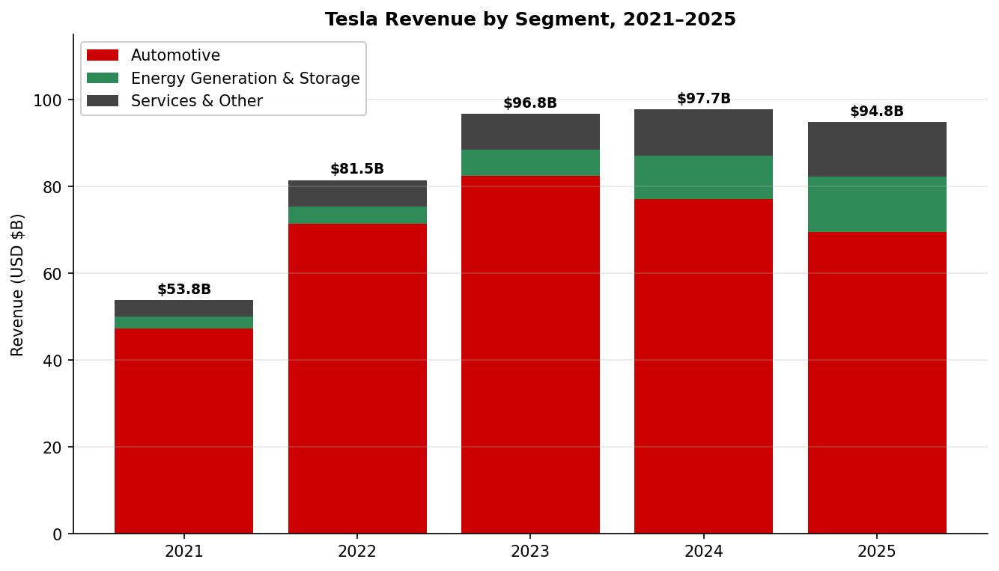
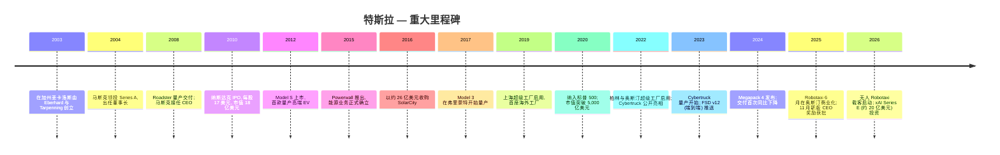
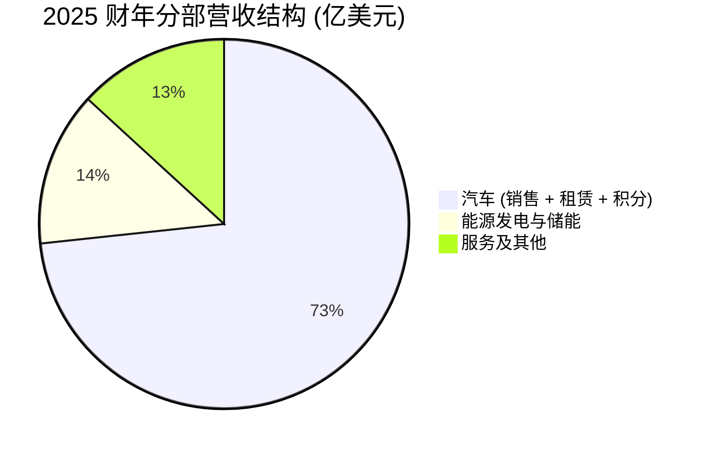

# Tesla, Inc. (NASDAQ:TSLA) — 公司研究报告 (首次覆盖)

**报告日期: 2026-05-20**
**上市地: 纳斯达克全球精选市场 (NASDAQ Global Select Market), 代码 TSLA**
**行业: 非必需消费品 / 汽车制造 (能源与 AI 业务敞口持续上升)**
**总部: 美国得克萨斯州奥斯汀市特斯拉路 1 号 (1 Tesla Road, Austin, Texas)**
**财年截止日: 12 月 31 日**
**报告语言: 简体中文 (英文版同时存在于本目录)**

> **业绩更新——2025 年 CEO 业绩奖励获批 (2025-11-06):** 在 2025 年股东大会上, 股东批准了一项针对 CEO 埃隆·马斯克 (Elon Musk) 的全新业绩型股权激励方案, 由 12 档股票期权组成, 仅在特斯拉达成超凡运营与市值里程碑时方可归属——包括将市值由约 1.5 万亿美元提升至 8.5 万亿美元、累计交付 2,000 万辆汽车、部署 100 万辆 Robotaxi (自动驾驶出租车), 以及实现 4,000 亿美元的调整后 EBITDA。该新方案取代了特拉华州衡平法院 (Delaware Chancery Court) 撤销其 2018 年奖励后留下的法律真空。来源: [Tesla 2025 Proxy Statement / DEFA14A material, 2025-09-05](https://www.sec.gov/Archives/edgar/data/0001318605/000110465925090884/tm252289d15_defa14a.htm); 摘要见 [Tesla Q4 & FY 2025 Update, 2026-01-28](https://www.sec.gov/Archives/edgar/data/0001318605/000162828026003837/exhibit991.htm)。

---

## 目录

1. 公司概览
2. 公司历史
3. 管理团队
4. 产品与服务
5. 客户与上市策略
6. 行业概览
7. 竞争格局
8. 市场机会 (TAM)
9. 风险评估
10. 参考资料

---

## 1. 公司概览

Tesla, Inc. (特斯拉公司) 设计、研发、制造、销售并出租高性能纯电动汽车 (electric vehicle, EV) 及固定式发电与储能系统, 同时正大举投资以将其特许经营延伸至自动驾驶移动出行 (Robotaxi)、人形机器人 (Optimus) 和定制 AI 芯片领域。最新年报 (Form 10-K) 中阐述的使命是"打造一个惊人富足的世界 (build a world of amazing abundance)", 战略重心已从"全球领先的可持续能源公司"转向"物理 AI (physical AI)"平台 ([Tesla 2025 10-K, Item 1 Business](https://www.sec.gov/Archives/edgar/data/0001318605/000162828026003952/tsla-20251231-gen.pdf))。

**业务模式。** 当前营收几乎全部仍来自硬件:

| 业务板块 | 2025 财年营业收入 (百万美元) | 占比 | 同比 |
|---|---|---|---|
| 汽车 (销售、租赁、监管积分) | 69,526 | 73.3% | −10% |
| 能源发电与储能 (Megapack、Powerwall、太阳能) | 12,771 | 13.5% | +27% |
| 服务及其他 (二手车、零部件、超充、保险、周边) | 12,530 | 13.2% | +19% |
| **合计** | **94,827** | 100% | −3% |

来源: [Tesla Q4 & FY 2025 Update (8-K Ex. 99.1), 2026-01-28, p. 5](https://www.sec.gov/Archives/edgar/data/0001318605/000162828026003837/exhibit991.htm)。

特斯拉在所有主要市场均通过自营零售店与线上渠道直接面向消费者销售——长期以来一直是这一以特许经销商体系为基石的行业中最具代表性的直营 (direct-to-consumer, D2C) 玩家 ([Tesla 2025 10-K, Item 1 Business](https://www.sec.gov/Archives/edgar/data/0001318605/000162828026003952/tsla-20251231-gen.pdf))。能源与 Megapack 业务则采用直销+渠道伙伴模式; 超充网络 (Supercharger network) 通过付费充电会话收费, 并越来越多地依托第三方车企对 NACS (北美充电标准, North American Charging Standard) 的接入收费, 大多数主要车厂已于 2023–2024 年签订采用协议 ([Edmunds, 2023](https://www.edmunds.com/car-news/rivian-will-adopt-teslas-nacs-charger-following-ford-gm.html))。

**地理布局。** 特斯拉现已是真正的全球化公司。整车在美国加利福尼亚州 (弗里蒙特, Fremont)、得克萨斯州 (奥斯汀, Austin)、中国上海以及德国勃兰登堡 (柏林) 进行生产, 装机汽车产能约 235 万辆/年——上海超 95 万辆 Model 3/Y、弗里蒙特超 55 万辆 Model 3/Y 加 10 万辆 Model S/X、柏林超 37.5 万辆 Model Y、奥斯汀超 25 万辆 Model Y 加超 12.5 万辆 Cybertruck ([Q4 & FY 2025 Update, p. 8](https://www.sec.gov/Archives/edgar/data/0001318605/000162828026003837/exhibit991.htm))。2025 财年交付 1,636,129 辆, 公司在 Q4-25 财报中特别提及亚太地区创单季历史新高。

**规模。** 2025 财年末特斯拉全球员工数为 134,785 人 ([Tesla 2025 10-K, Item 1, Human Capital Resources](https://www.sec.gov/Archives/edgar/data/0001318605/000162828026003952/tsla-20251231-gen.pdf)), 全球零售与服务门店 1,553 家, 超充站 8,182 座、充电接口 77,682 个。累计交付车辆超过 890 万辆, Powerwall 全球装机突破 100 万套, 累计储能部署达到 103 GWh。

**利润率与现金流轮廓。** 2023–2024 年特斯拉为捍卫销量持续降价, GAAP 毛利率 (gross margin) 整体下行; 2025 财年虽然交付下滑, 毛利率仍稳定在约 18%, 这是因为业务结构向储能 (当前 GAAP 毛利率约 30%) 与服务的迁移缓冲了汽车端的压缩 ([Tesla Q4 & FY 2025 Update, p. 5](https://www.sec.gov/Archives/edgar/data/0001318605/000162828026003837/exhibit991.htm))。2025 财年 GAAP 营业利润率 (operating margin) 压缩至 4.6%, 较 2022 财年 16.8% 的峰值大幅回落, 原因包括: (i) 汽车 ASP (Average Selling Price, 平均售价) 下行, (ii) 受 AI/机器人 R&D 投入及更高法律重组开支驱动, 营业费用同比增长 23%, (iii) Q1-25 计入一次性重组费用 ([Tesla 2025 10-K, MD&A](https://www.sec.gov/Archives/edgar/data/0001318605/000162828026003952/tsla-20251231-gen.pdf))。

自由现金流 (free cash flow, FCF) 反而*改善*——从 2024 财年的 35.8 亿美元跃升至 2025 财年的 62.2 亿美元——因为特斯拉将资本开支 (capex) 同比削减 25% (85 亿美元 vs. 113 亿美元), 此前的绿地工厂建设浪潮已经完成, 焦点转向最大化现有产能利用率 ([Q4 & FY 2025 Update, p. 5](https://www.sec.gov/Archives/edgar/data/0001318605/000162828026003837/exhibit991.htm))。2025 年末现金、现金等价物与投资总额 440.6 亿美元, 同比增长 75 亿美元, 为 Cybercab、Optimus、AI 训练算力与 2026 年 1 月宣布的对 xAI 约 20 亿美元 Series E 投资准备了充足战备资金。

*来源: [Tesla Q4 & FY 2025 Update, p. 5](https://www.sec.gov/Archives/edgar/data/0001318605/000162828026003837/exhibit991.htm).*

**估值快照 (截至 2026-05-18)。**

| 指标 | 数值 | 来源 |
|---|---|---|
| 股价 | 约 409 美元 | [financecharts.com TSLA P/E history](https://www.financecharts.com/stocks/TSLA/value/pe-ratio) |
| 市值 | 约 1.52 万亿美元 | [stockanalysis.com TSLA market cap, May 2026](https://stockanalysis.com/stocks/tsla/) |
| TTM 市盈率 (P/E) | 341–393 倍 | [GuruFocus TSLA P/E (TTM), 12-May-2026: 393.4×](https://www.gurufocus.com/term/pettm/TSLA); [financecharts.com, 18-May-2026: 341.7×](https://www.financecharts.com/stocks/TSLA/value/pe-ratio) |
| TTM 市销率 (P/S) | 约 16.0 倍 | 隐含值: 1.518 万亿美元市值 ÷ 948 亿美元 2025 财年营收 |
| EV/调整后 EBITDA | 约 100 倍 | 隐含值: 净现金头寸 + 市值 / 2025 财年调整后 EBITDA 146 亿美元 |
| 10 年中位 P/E | 158.94 倍 | [GuruFocus](https://www.gurufocus.com/term/pettm/TSLA) — 当前溢价中位**147%** |

**解读——市盈率为何如此极端?** 特斯拉约 340–400 倍的 TTM 市盈率, 是汽车同业中位数的 12 倍以上 (比亚迪 30 倍、通用 28 倍、福特 11 倍——见第 7 节) ([GuruFocus TSLA P/E (TTM)](https://www.gurufocus.com/term/pettm/TSLA); [GuruFocus BYDDF P/E](https://www.gurufocus.com/term/pettm/BYDDF))。有三个不互相排斥的驱动因素值得关注:

1. **盈利暂时性压制。** 2025 财年 GAAP 净利润 37.9 亿美元 (同比 −46%), 远低于 2023 财年 150 亿美元的峰值 ([Tesla Q4 & FY 2025 Update, p. 5](https://www.sec.gov/Archives/edgar/data/0001318605/000162828026003837/exhibit991.htm))。营业利润率从 16.8% (2022) 压缩至 4.6% (2025), 原因是降价、重组费用以及 Q4-25 营业费用同比 +39% 部分挂钩新版 CEO 业绩奖励与 AI/机器人 R&D ([Tesla 2025 10-K, MD&A](https://www.sec.gov/Archives/edgar/data/0001318605/000162828026003952/tsla-20251231-gen.pdf))。基于一致预期 2026 年每股收益 (EPS) 的前瞻 P/E 落在高双位数——仍然偏贵, 但更易消化。
2. **叙事 / 板块代理溢价。** 市场将特斯拉作为 Robotaxi + Optimus + Megapack + AI 推理算力的复合叙事来定价, 而非一家年销 160 万辆的整车厂。管理层自身的措辞——"我们进一步扩展了使命, 持续推进从硬件中心的公司向物理 AI 公司的转型" ([Q4 & FY 2025 Update, p. 3](https://www.sec.gov/Archives/edgar/data/0001318605/000162828026003837/exhibit991.htm))——正主动强化这一叙事。2025 年 CEO 业绩奖励里程碑中嵌入了 8.5 万亿美元市值目标, 是该论点的明确锚点 ([Tesla 2025 Proxy / DEFA14A, 2025-09-05](https://www.sec.gov/Archives/edgar/data/0001318605/000110465925090884/tm252289d15_defa14a.htm))。
3. **自动驾驶期权价值。** 随着 Robotaxi 已在奥斯汀撤除安全监督员 (2026 年 1 月) 且 FSD (全自动驾驶, Full Self-Driving) V14 部署至全部客户车队, 卖方多头将未来高利润率软件/服务流——目前商业化才刚起步——估值为有意义的倍数 ([CNBC, 2026-01-22](https://www.cnbc.com/2026/01/22/musk-says-tesla-takes-safety-supervisors-out-of-some-austin-robotaxis.html))。2025 年末 FSD 累计订阅数达 110 万 (同比 +38%) ([Q4 & FY 2025 Update, p. 6](https://www.sec.gov/Archives/edgar/data/0001318605/000162828026003837/exhibit991.htm))。

估值对上述三项均敏感。汽车盈利再加速会通过分母端压缩倍数; Robotaxi 受挫或 Optimus 兑现不佳则会通过分子端压缩倍数。**我们将该倍数本身视为重大风险**, 并在第 9 节中再次讨论 ([financecharts.com TSLA P/E, 18-May-2026](https://www.financecharts.com/stocks/TSLA/value/pe-ratio))。

---

## 2. 公司历史

Tesla Motors 由 Martin Eberhard 与 Marc Tarpenning 于 2003 年 7 月 1 日在美国注册成立, 旨在商业化锂离子电池驱动的纯电动跑车 ([Britannica — Martin Eberhard and Marc Tarpenning](https://www.britannica.com/money/Martin-Eberhard-and-Marc-Tarpenning))。埃隆·马斯克于 2004 年 2 月以 650 万美元支票领投 Series A, 出任董事长, 并在 2008 年金融危机后近乎破产之际接任 CEO ([History of Tesla, Inc. — Wikipedia](https://en.wikipedia.org/wiki/History_of_Tesla,_Inc.))。此后, 公司在精神上 (虽然非正式创始人头衔) 一直由马斯克领导。最初的"宏伟蓝图 (Master Plan)" (马斯克, 2006) 阐述了一个四步连级路线: 先做一款低产量豪华跑车 (Roadster) → 用所得收益资助一款高产量豪华车 (Model S) → 再资助一款平价车 (Model 3) → 与此同时销售零排放电力发电系统 ([Tesla Blog — The Secret Tesla Motors Master Plan, 2006-08-02](https://www.tesla.com/blog/secret-tesla-motors-master-plan-just-between-you-and-me))。

**战略转折。** 过去十年中, 有三次塑造了今天的特斯拉:

- **2016 年收购 SolarCity** (约 26 亿美元股票对价), 将马斯克表弟创立的住宅光伏安装商纳入特斯拉。批评者称这是一次救助; 后续诉讼在 2022 年特拉华衡平法院裁决中赦免了马斯克本人, 并于 2023 年由特拉华最高法院确认 ([Dechert OnPoint — Delaware Supreme Court affirms SolarCity acquisition, 2023](https://www.dechert.com/knowledge/onpoint/2023/6/delaware-supreme-court-affirms-tesla-s-acquisition-of-solarcity-.html))。更具影响力的后果, 是与储能业务的纵向整合——后者已成长为特斯拉增速最快的板块。
- **2020–2022 年的制造布局扩张。** 在大约三年内建成上海 (2019 投产)、柏林 (2022) 与奥斯汀 (2022) 三座工厂, 使特斯拉从一座工厂的整车厂转变为四工厂的全球制造商, 同时将 4680 电芯 (4680 cell)、结构化电池包 (structural battery pack)、一体压铸 (gigacasting) 与干电极 (dry-electrode) 等创新引入生产 ([Tesla 2025 10-K, Item 2 Properties](https://www.sec.gov/Archives/edgar/data/0001318605/000162828026003952/tsla-20251231-gen.pdf); [Electrek, 2026-01-28 — Tesla 4680 cells in Model Y](https://electrek.co/2026/01/28/tesla-puts-4680-battery-cells-back-in-model-y/))。
- **2023–2025 年由"EV 公司"向"物理 AI 公司"的转型。** 自 2023 年底起, 资本与人才被重新分配至 FSD 端到端神经网络训练、Cortex (得州自建训练集群)、Dojo (起初为自研训练芯片, 后已重组围绕 H100/H200 加自研 AI5/AI6 推理芯片)、Optimus 人形机器人, 以及 Robotaxi 服务。Q4 2025 信函明确写道: "2025 年是特斯拉关键的一年, 我们进一步扩展使命并继续推进由硬件中心型业务向物理 AI 公司的转型" ([Q4 & FY 2025 Update, p. 3](https://www.sec.gov/Archives/edgar/data/0001318605/000162828026003837/exhibit991.htm))。

**收购 (节选):** SolarCity (2016, 能源/光伏); Maxwell Technologies (2019, 干电极与超级电容, 2021 剥离); Grohmann Engineering (2017, 德国自动化设备); SilLion (2021, 电芯); ATW Automation (2021, 电池包组装)。特斯拉历来以有机工程而非并购成长 ([Tesla 2025 10-K, Item 1 Business](https://www.sec.gov/Archives/edgar/data/0001318605/000162828026003952/tsla-20251231-gen.pdf))。

**近期动态 (2025–2026)。** Robotaxi 服务于 2025 年 6 月在奥斯汀启动, 收取 4.20 美元的平价单价, 初期配有安全监督员; 2026 年 1 月在选定车辆上撤除安全监督员 ([CNBC, 2026-01-22](https://www.cnbc.com/2026/01/22/musk-says-tesla-takes-safety-supervisors-out-of-some-austin-robotaxis.html))。Model Y 在 2025 年初完成换代 ("Juniper"刷新), Q4-25 又陆续推出新款变体 ([Q4 & FY 2025 Update, p. 15](https://www.sec.gov/Archives/edgar/data/0001318605/000162828026003837/exhibit991.htm))。2026 年 1 月, 特斯拉同意向 xAI Series E 优先股投资约 20 亿美元, 并签署 AI 合作框架协议; 该交易在 Q4-25 更新函中披露 ([TechCrunch, 2026-01-28](https://techcrunch.com/2026/01/28/tesla-invested-2b-in-elon-musks-xai/))。2025 年 CEO 业绩奖励于 2025 年 11 月 6 日获批 ([Tesla 8-K, 2025-11-07](https://www.sec.gov/Archives/edgar/data/0001318605/000110465925108507/tm2530590d1_ex99-1.htm))。

---

## 3. 管理团队

### 埃隆·马斯克 (Elon Musk) — 首席执行官、产品架构师、"科技王 (Technoking)"

马斯克现年 54 岁, 自 2008 年起担任特斯拉 CEO, 无可争议是公司历史上最具决定性影响力的个人 ([Britannica — Elon Musk](https://www.britannica.com/money/Elon-Musk))。他持有约 12–13% 特斯拉普通股 (2025 业绩奖励前), 是 SpaceX 联合创始人兼 CEO, 拥有并运营 X (原 Twitter), 创立了 xAI, 同时是 Neuralink 与 The Boring Company 的最大股东 ([Bloomberg Billionaires Index — Elon Musk](https://www.bloomberg.com/billionaires/profiles/elon-r-musk/))。他领导特斯拉度过 (i) 2008 年现金危机, (ii) 他本人形容为"职业生涯最痛苦时期"的 2017–2018 年 Model 3 "量产地狱", 以及 (iii) 2020–2022 年从单工厂到四工厂的产能扩张 ([History of Tesla, Inc. — Wikipedia](https://en.wikipedia.org/wiki/History_of_Tesla,_Inc.))。马斯克 CEO 任内, 交付量从约 2,500 辆 (2008, 仅 Roadster) 增长到 164 万辆 (2025 财年), 特斯拉成为全球市值最高的整车厂 ([Q4 & FY 2025 Update, p. 5](https://www.sec.gov/Archives/edgar/data/0001318605/000162828026003837/exhibit991.htm))。加入特斯拉前, 他曾联合创立 Zip2 (1999 年 3.07 亿美元卖给 Compaq) 与 X.com / PayPal (2002 年 15 亿美元卖给 eBay), 并于 2002 年创立 SpaceX ([Britannica — Elon Musk](https://www.britannica.com/money/Elon-Musk))。

教育背景: 宾夕法尼亚大学物理学与经济学本科 (1997); 在斯坦福大学应用物理学 PhD 项目入学两天后, 转而创立 Zip2 ([Britannica — Elon Musk](https://www.britannica.com/money/Elon-Musk))。马斯克的薪酬一直是两场特拉华诉讼的核心。原 2018 年方案——十二档业绩里程碑制期权, 在特斯拉市值达到 6,500 亿美元时全额归属——于 2024 年 1 月由特拉华衡平法院 (Tornetta v. Musk) 撤销 ([Pierson Ferdinand — Tornetta ruling analysis](https://pierferd.com/insights/delaware-court-of-chancery-rescinds-musks-tesla-stock-option-grant-in-key-decision-on-corporate-transactions-with-controlling-stockholders))。特斯拉于 2024 年 6 月迁注得克萨斯州, 董事会在 2025 年 9 月 3 日授予马斯克一笔 423,743,904 股的过渡性股权激励 ([Tesla 8-K, 2025-08-04](https://www.sec.gov/Archives/edgar/data/0001318605/000110465925073263/tm2522385d1_ex99-1.htm)); 新 2025 年 CEO 业绩奖励于 2025 年 11 月 6 日提交股东大会并获批, 12 档奖励只在达成超凡运营与市值里程碑——8.5 万亿美元市值、累计 2,000 万辆汽车、100 万辆 Robotaxi、4,000 亿美元调整后 EBITDA——时归属 ([Tesla 2025 Proxy / DEFA14A material, 2025-09-05](https://www.sec.gov/Archives/edgar/data/0001318605/000110465925090884/tm252289d15_defa14a.htm))。方案中没有任何工资和现金奖金。过渡性激励 (在业绩奖励获批前授予) 专门设计为占位用, 一旦业绩奖励通过即予以注销 ([Tesla 8-K, 2025-08-04](https://www.sec.gov/Archives/edgar/data/0001318605/000110465925073263/tm2522385d1_ex99-1.htm))。马斯克的注意力是管理结构中最受争议的资源——分散在特斯拉、SpaceX、xAI 与 X 之间——也被卖方分析师持续视为特斯拉特有的治理风险 ([Elon Musk — Wikipedia](https://en.wikipedia.org/wiki/Elon_Musk))。

### Vaibhav Taneja — 首席财务官 (CFO)

Taneja 现年 47 岁, 于 2023 年 8 月接任 CFO, 此前在公司内部多年逐级晋升 ([Tesla 8-K, 2023-08-04 — CFO transition](https://www.sec.gov/Archives/edgar/data/0001318605/000095017023038779/tsla-20230804.htm))。他于 2017 年作为 SolarCity 整合团队成员加入特斯拉 (此前曾任 SolarCity 集团 Controller)。2019 年 3 月起担任特斯拉首席会计官 (Chief Accounting Officer), 在该岗位上带领公司完成 2020 年纳入标普 500、2022 年 1 拆 3 拆股, 以及柏林/奥斯汀的产能建设 ([Vaibhav Taneja — Wikipedia](https://en.wikipedia.org/wiki/Vaibhav_Taneja))。加入 SolarCity 之前, 他在普华永道 (PricewaterhouseCoopers) 印度与美国办公室工作 17 年。他持有印度特许会计师协会 (ICAI) 注册会计师资格, 以及德里大学商学学士学位 ([BusinessToday, 2025-05-21 — Vaibhav Taneja profile](https://www.businesstoday.in/technology/news/story/from-pwc-trainee-to-139-mn-tesla-cfo-meet-vaibhav-taneja-the-delhi-boy-out-earning-pichai-nadella-477152-2025-05-21))。其业绩电话会的沟通风格较 Zach Kirkhorn 时期明显更精简——聚焦现金流、毛利率桥接与资本支出纪律。

### Tom Zhu (朱晓彤) — 全球汽车业务高级副总裁

朱晓彤现年约 46 岁, 主管全球汽车业务, 包括所有四座整车工厂、销售、交付与售后服务。他于 2014 年加入特斯拉, 主管亚太地区, 推动上海超级工厂从破土动工 (2019 年 1 月) 到首车下线 (2019 年 12 月, 1M 平米厂房仅 10 个月的纪录), 并于 2022 年晋升为全球生产负责人 ([CNN Business, 2023-01-04 — Tom Zhu profile](https://www.cnn.com/2023/01/04/tech/tom-zhu-tesla-china-chief-profile-intl-hnk/index.html))。朱晓彤在内部被广泛认为是让上海工厂成为特斯拉成本最低工厂的运营核心。加入特斯拉之前, 他在中国地产与基建领域工作多年 ([ChinaEVHome, 2025-07-02 — Tom Zhu takes helm of global factories](https://chinaevhome.com/2025/07/02/tom-zhu-takes-the-helm-of-global-factories-as-tesla-places-its-bets-on-china-speed/))。对汽车投资逻辑而言, 他是最关键的执行高管之一——尤其是亚太地区, 该地区在 Q4-25 创单季交付纪录 ([Q4 & FY 2025 Update, p. 3](https://www.sec.gov/Archives/edgar/data/0001318605/000162828026003837/exhibit991.htm))。

### Ashok Elluswamy — Autopilot 与 FSD 软件总监

Elluswamy 于 2014 年 6 月加入特斯拉, 是 Autopilot 项目首位招募的软件工程师, 此后一直主导 FSD 软件 ([Gulf News — Ashok Elluswamy profile](https://gulfnews.com/technology/ashok-elluswamy-from-chennai-boy-to-tesla-robotics-chief-1.500156499))。他是近期投资者函中 FSD 相关章节中唯一与马斯克并列被点名的运营层高管, 反映出 FSD 在 AI 论点中的核心地位。他个人公开履历不高; 教育背景包括卡内基梅隆大学机器人系统开发硕士学位, 以及钦奈工程学院 (College of Engineering, Guindy) 学士学位 ([Not a Tesla App — Ashok Elluswamy profile](https://www.notateslaapp.com/news/3235/meet-the-engineer-leading-teslas-self-driving-ambitions-the-story-of-ashok-elluswamy))。在 Andrej Karpathy 2022 年离职 (回归 OpenAI) 后, Elluswamy 是特斯拉内部 AI 工程管理层中最资深的人物。

### 治理小结

- **董事会。** 根据 2025 年代理委托书, 董事会共 8 名: Robyn Denholm (独立董事长, 前 Telstra CFO/COO)、Elon Musk、Ira Ehrenpreis、Joe Gebbia (Airbnb 联合创始人, 2022 年加入)、James Murdoch、Kimbal Musk (马斯克之弟——非独立)、JB Straubel (特斯拉联合创始人, 现 Redwood Materials CEO), 以及 Kathleen Wilson-Thompson ([Tesla 2025 Proxy / DEFA14A, 2025-09-05](https://www.sec.gov/Archives/edgar/data/0001318605/000110465925090884/tm252289d15_defa14a.htm); [Tesla IR — Robyn M. Denholm](https://ir.tesla.com/corporate/robyn-m-denholm))。按特斯拉自分类, 独立比例为 5/8; ISS 与 Glass Lewis 等评级机构历年来多次因 Kimbal Musk 的亲属关系以及 Ehrenpreis/Denholm 任期较长, 在董事会独立性上下调特斯拉评分。
- **内部人持股。** 2025 年奖励前约 13% 普通股; 若新 2025 业绩奖励完全归属, 马斯克持股比例可能逼近 20% 中段水平, 取决于最终条款, 也可能具备超级投票权特征 ([Tesla 2025 Proxy / DEFA14A, 2025-09-05](https://www.sec.gov/Archives/edgar/data/0001318605/000110465925090884/tm252289d15_defa14a.htm))。
- **薪酬结构。** CEO 薪酬几乎全部为股权; 其他列名高管的现金薪酬相对于大型可比汽车/科技公司 CEO 较为温和, 并大量倾向股票期权与 RSU ([Tesla 2024 10-K/A](https://www.sec.gov/Archives/edgar/data/0001318605/000110465925042659))。
- **关联方交易 / 治理标记。** 2026 年 1 月对 xAI 约 20 亿美元投资属关联方交易 (马斯克控制 xAI) ([TechCrunch, 2026-01-28](https://techcrunch.com/2026/01/28/tesla-invested-2b-in-elon-musks-xai/))。2025 年 CEO 业绩奖励是美国公开公司历史上诉讼最频繁的高管薪酬方案。其他历史标记: 2016 年 SolarCity 收购诉讼 ([Dechert OnPoint, 2023](https://www.dechert.com/knowledge/onpoint/2023/6/delaware-supreme-court-affirms-tesla-s-acquisition-of-solarcity-.html)); 2018 年导致美国证监会和解的"资金已落实 (funding secured)"推文 ([SEC press release, 2018-09-29](https://www.sec.gov/newsroom/press-releases/2018-226)); 2024 年迁注得克萨斯州。

### 管理层执行记录

总体强劲。马斯克兑现了 2006 与 2016 宏伟蓝图中最大胆的多数项目——Roadster、Model S、Model 3、Powerwall、Megapack、上海、柏林/奥斯汀、Cybertruck、端到端 FSD, 以及商业 Robotaxi 服务上线——但总是晚于原定时间表 (Cybertruck 延期四年; Roadster v2 在公告十年后仍未投产; FSD "L5"自 2016 年起就被说成"一年后") ([Q4 & FY 2025 Update, p. 3](https://www.sec.gov/Archives/edgar/data/0001318605/000162828026003837/exhibit991.htm))。CFO 与运营梯队 (Taneja、朱晓彤) 内部晋升而来, 经历过实战考验 ([Tesla 2025 10-K, Human Capital](https://www.sec.gov/Archives/edgar/data/0001318605/000162828026003952/tsla-20251231-gen.pdf))。两大开放问题: (i) 马斯克注意力如何在其他企业中分配, (ii) 没有公开指定继任者——这两点都纳入第 9 节的估值讨论。

---

## 4. 产品与服务

特斯拉的产品组合围绕三大运营支柱: 汽车 (Automotive)、能源发电与储能 (Energy Generation & Storage), 以及 AI / 服务 (AI / Services)。2025 财年 10-K 报告分部分组只用两个 ("automotive"和"energy generation and storage"), 服务并入汽车分部进行分部报告 ([Tesla 2025 10-K, Segment Reporting](https://www.sec.gov/Archives/edgar/data/0001318605/000162828026003952/tsla-20251231-gen.pdf))。

```mermaid
graph TD
    T[Tesla, Inc.]
    T --> A[汽车分部]
    T --> E[能源与储能分部]
    T --> AI[AI / 服务叠加层]

    A --> A1[Model 3 — 中型轿车]
    A --> A2[Model Y — 紧凑型 SUV, 销量冠军]
    A --> A3[Model S — 全尺寸轿车]
    A --> A4[Model X — 中型 SUV]
    A --> A5[Cybertruck — 全尺寸皮卡]
    A --> A6[Cybercab — 双座自动驾驶, 2026 上量]
    A --> A7[Tesla Semi — 8 级重卡, 1H-26 上量]
    A --> A8[Roadster v2 — 研发中]

    E --> E1[Powerwall 3 — 家庭储能]
    E --> E2[Megapack 2XL — 公用事业级]
    E --> E3[Megapack 3 / Megablock — 2026]
    E --> E4[Solar Roof / 太阳能面板]
    E --> E5[Autobidder、Powerhub — 软件]

    AI --> AI1[FSD Supervised — v14]
    AI --> AI2[Robotaxi — 奥斯汀 + 7 城扩张]
    AI --> AI3[Optimus 人形机器人 — 2026 Gen 3]
    AI --> AI4[AI4 / AI5 / AI6 推理芯片]
    AI --> AI5[Cortex 1/2 训练算力]
    AI --> AI6[超充网络 — 8,182 座超充站]
    AI --> AI7[Tesla 保险]
```

### 汽车 — 5 款在产车型 + 3 款上量/研发车型

- **Model Y (占交付量 ≥75%)。** 特斯拉旗舰, 在 2023 年按部分口径已成为全球销量第一的车型。2025 年"Juniper"换代提升了能效、舒适度与信息娱乐系统; Q4-25 推出包括标准版与高性能版在内的额外 Model Y 变体。在弗里蒙特、上海、柏林、奥斯汀均有生产。**竞争力判定: 强, 但侵蚀中。** 护城河类型: 成本领先 + 品牌 + 超充访问 + 软件 (OTA + FSD 增售)。证据: 史上销量最高的 EV; 2025 年 Euro NCAP 同级小型 SUV 最佳安全评级 ([Q4 & FY 2025 Update, p. 15](https://www.sec.gov/Archives/edgar/data/0001318605/000162828026003837/exhibit991.htm)); Q4-25 汽车毛利率 (剔除积分) 环比改善。最近竞品: 比亚迪海狮 07、小鹏 G6、大众 ID.4、宝马 iX1——**Model Y 在中国 (最大 EV 市场) 已不再比同级比亚迪/小鹏车型便宜**。
- **Model 3。** 大众市场轿车; 2023 年完成"Highland"换代。荣获 2025 年 Euro NCAP 同级大型家用车最佳奖 ([同上 Q4 update](https://www.sec.gov/Archives/edgar/data/0001318605/000162828026003837/exhibit991.htm))。在弗里蒙特与上海生产。**竞争力判定: 美国持平, 中国落后。** 护城河类型: 品牌 + 超充 + 软件。证据: 2024 年仍是美国销量第一的 EV 轿车; 在中国销量被比亚迪海豹、小鹏 P7+、极氪 001 蚕食。
- **Model S / Model X (合计占交付量约 5%)。** 高端轿车与 SUV; 弗里蒙特双车型合计产能上限 10 万辆/年 ([Q4 & FY 2025 Update, p. 8](https://www.sec.gov/Archives/edgar/data/0001318605/000162828026003837/exhibit991.htm))。自 Model 3/Y 价格重合以来销量结构性下降。**竞争力判定: 传统光环产品; 相对换代竞品 (Lucid Air、奔驰 EQS、宝马 i7) 单车经济性已偏弱。** 自 2021 年以来平台未做有意义的换代; 2026 年 1 月马斯克确认特斯拉将停止 Model S/X 量产, 并将该产线改造用于 Optimus ([Fortune, 2026-01-28](https://fortune.com/2026/01/28/tesla-earnings-2-billion-xai-investment-elon-musk-ends-model-s-model-x-optimus/))。
- **Cybertruck。** 不锈钢外壳, 奥斯汀产能上限 25 万辆/年 (按运营摘要) ([Q4 & FY 2025 Update, p. 8](https://www.sec.gov/Archives/edgar/data/0001318605/000162828026003837/exhibit991.htm))。2023 年 11 月开始量产; Q4-25 "其他车型"交付 (Cybertruck + S + X + Semi) 合计 11,642 辆, 暗示 Cybertruck 全年 2025 销量在低万级别——远低于马斯克最初 25 万–50 万辆的展望 ([Tesla 8-K, Q4 2025 production & delivery release](https://www.sec.gov/Archives/edgar/data/0001318605/000162828026000016/exhibit9914.htm))。**竞争力判定: 差异化产品 (无正面对手), 但商业化未达预期。** 最近竞品: 福特 F-150 Lightning、Rivian R1T、GMC Hummer EV。2024–2025 年多次召回以及客户对车门对齐与软件 bug 的投诉, 削弱了品牌溢价 ([Fortune — Tesla Cybertruck production cuts](https://fortune.com/article/tesla-pulling-workers-off-cybertruck-factory-lines-sales/))。
- **Cybercab。** 双座专用自动驾驶车; 奥斯汀工装中; 计划量产时间 1H 2026 (按最新更新函) ([Q4 & FY 2025 Update, p. 8](https://www.sec.gov/Archives/edgar/data/0001318605/000162828026003837/exhibit991.htm))。Q4-25 在阿拉斯加完成低温路测并被拍到。
- **Tesla Semi。** 8 级长途重卡; 内华达州量产工装; 计划量产时间 1H 2026; Megacharger 网络选址规划中。客户车队仍局限 (百事、沃尔玛、Sysco 试点车辆) ([Q4 & FY 2025 Update, p. 8](https://www.sec.gov/Archives/edgar/data/0001318605/000162828026003837/exhibit991.htm))。
- **Roadster v2。** 在内华达州处于设计研发阶段。最初于 2017 年发布, 承诺 2020 年交付。已多次推迟 ([Tesla 2025 10-K](https://www.sec.gov/Archives/edgar/data/0001318605/000162828026003952/tsla-20251231-gen.pdf))。

### 能源发电与储能 — 2025 财年创纪录

- **Megapack。** 公用事业级锂离子电池 (主要为磷酸铁锂, LFP), 销售给电网运营商、独立发电商 (IPP) 与超大规模数据中心 (hyperscaler)。**特斯拉内部增长最快的业务。** Megapack 3 与 Megablock 计划于 2026 年在休斯顿超级工厂开始量产 ([Q4 & FY 2025 Update, p. 8](https://www.sec.gov/Archives/edgar/data/0001318605/000162828026003837/exhibit991.htm))。装机产能: 加州 40 GWh、上海 40 GWh、得州在建。**竞争力判定: 规模与成本领先优势强劲。** Q4-25 能源与储能毛利创纪录 11 亿美元, "连续第五个创纪录季度" ([Q4 & FY 2025 Update, p. 7](https://www.sec.gov/Archives/edgar/data/0001318605/000162828026003837/exhibit991.htm))。护城河类型: 规模 (电芯采购、平衡设备 BOP 整合、Autobidder 调度软件)、合规/认证 (跨地区合格 ISO 电网接入), 以及品牌。最近竞品: Fluence、阳光电源 (Sungrow)、宁德时代 TENER、比亚迪 Cube T28、LG 新能源 / Wartsila Gridsolv。
- **Powerwall 3。** 家庭与小型商用锂离子家庭储能。2025 年装机量突破 100 万套; 2025 年全球 Powerwall 网络支持"100 万套装机量上完成 89,000 多次虚拟电厂 (Virtual Power Plant, VPP) 事件", 按特斯拉口径为家庭节约电费超 10 亿美元 ([Q4 & FY 2025 Update, p. 7](https://www.sec.gov/Archives/edgar/data/0001318605/000162828026003837/exhibit991.htm))。Powerwall 在内华达州产能 >6 GWh/年。**竞争力判定: 美国市场领先**; 在部分新兴市场落后于比亚迪与阳光电源。
- **Solar Roof / 太阳能面板。** 增速最低的产品线; 出货量偏小 (该子分部在 2025 更新中未单独披露)。自 2022 年起, 特斯拉在资本规划中已减弱光伏 ([Tesla 2025 10-K, Item 1 Business](https://www.sec.gov/Archives/edgar/data/0001318605/000162828026003952/tsla-20251231-gen.pdf))。
- **Autobidder / Powerhub。** 储能资产的实时能源控制与优化平台。嵌入到 Megapack/Powerwall 销售中, 同时贡献增量软件收入 ([Tesla 2025 10-K, Item 1 Business](https://www.sec.gov/Archives/edgar/data/0001318605/000162828026003952/tsla-20251231-gen.pdf))。

### AI / 服务叠加层

- **FSD (Supervised, 受监督的 FSD)。** 驾驶辅助软件; v14 在 2025 年底部署, 基于客户与 Robotaxi 数据训练的端到端基础模型 (foundation model)。2025 年末活跃 FSD 订阅 110 万 (同比 +38%) ([Q4 & FY 2025 Update, p. 6](https://www.sec.gov/Archives/edgar/data/0001318605/000162828026003837/exhibit991.htm))。定价: 美国 99 美元/月订阅 (一次性购买选项正在退出)。已获批在美国、加拿大、墨西哥、中国 (受地图数据限制的有限部署), 以及 Q4-25 韩国 (首月行驶 100 万公里) 推出。在欧洲申请监管审批中, 已在意大利、德国、法国、瑞士进行消费者体验试乘。**竞争力判定: 真实路测里程领先, 但完全 L4 无监督方面落后于 Waymo。** 截至 2025 年末, FSD 累计里程已达数十亿英里 (按更新函累计图表)。
- **Robotaxi。** 2025 年 6 月在奥斯汀启动。2026 年 1 月在选定车辆上撤除安全监督员 ([CNBC, 2026-01-22](https://www.cnbc.com/2026/01/22/musk-says-tesla-takes-safety-supervisors-out-of-some-austin-robotaxis.html))。计划扩张: 旧金山湾区 (已作为受监督网约车运营, 2025 年 10 月起提供机场服务)、达拉斯、休斯顿、凤凰城、迈阿密、奥兰多、坦帕、拉斯维加斯——按更新函均在 1H 2026 落地 ([Q4 & FY 2025 Update, p. 9](https://www.sec.gov/Archives/edgar/data/0001318605/000162828026003837/exhibit991.htm))。定价: 起始平价 4.20 美元/单; 后续动态定价。
- **Optimus。** 人形机器人; Gen 3 ("首款为量产设计的版本") 将于 2026 年 Q1 揭幕。生产线安装已经开始, 计划"2026 年年底前"开始量产, 最终规划产能 100 万台机器人/年 ([Q4 & FY 2025 Update, p. 9](https://www.sec.gov/Archives/edgar/data/0001318605/000162828026003837/exhibit991.htm); [Motley Fool — Tesla Optimus Q3 2025 earnings call](https://www.fool.com/investing/2025/10/25/tesla-optimus-humanoid-robot-3q-earnings-call/))。**股价里叙事溢价最高的单项。** 直接竞品: Figure AI、Apptronik、Agility Robotics、1X、比亚迪人形项目、小米 CyberOne、波士顿动力 Atlas。
- **AI 推理芯片——AI5 与 AI6。** 用于车端/Robotaxi 自动驾驶的自研芯片。AI5 计划 2027 年量产, 宣称"相对 AI4 实现 50 倍性能提升, 包含 10 倍原始算力、9 倍内存容量, 以及 5 倍硬化区块量化与 softmax 函数"。AI6 计划 2028 年。是原"Hardware 4"Autopilot 计算机的延续线 ([Q4 & FY 2025 Update, p. 9](https://www.sec.gov/Archives/edgar/data/0001318605/000162828026003837/exhibit991.htm))。
- **Cortex 训练算力。** 得州超级工厂的自建训练集群。2025 年末 Cortex 1 产能">10 万张 H100 等效 GPU"; Cortex 2 在建, 计划在 1H 2026 将 H100 等效数翻倍以上 ([Q4 & FY 2025 Update, p. 9](https://www.sec.gov/Archives/edgar/data/0001318605/000162828026003837/exhibit991.htm))。
- **超充网络。** 2025 年末 8,182 座超充站、77,682 个充电接口 (同比 +17% / +19%) ([Q4 & FY 2025 Update, p. 8](https://www.sec.gov/Archives/edgar/data/0001318605/000162828026003837/exhibit991.htm))。NACS 成为美国快充事实标准, 大多数主要 OEM 在 2023–2025 年间采用 NACS——这将特斯拉网络变成了一个多 OEM 通行的收费站 ([Edmunds, 2023 — Rivian adopts NACS following Ford, GM](https://www.edmunds.com/car-news/rivian-will-adopt-teslas-nacs-charger-following-ford-gm.html))。**竞争力判定: 主导性护城河。**
- **Tesla 保险。** 基于车联网数据的车险, 现已在美国多州提供, 包括 Q4-25 新增佛罗里达。对启用 FSD 驾驶提供折扣——"启用 FSD (Supervised) 时驾驶越多, 折扣越大" ([Q4 & FY 2025 Update, p. 11](https://www.sec.gov/Archives/edgar/data/0001318605/000162828026003837/exhibit991.htm))。

### 旗舰产品 vs. 长尾产品

**Model Y 是单一最重要的产品**——它承载着汽车业务的损益表。**Megapack 是第二旗舰**, 2025 年同比 +27% 增长, 受数据中心电力需求结构性顺风推动。**FSD/Robotaxi/Optimus 是驱动估值倍数的叙事旗舰。** 其他 (Model S/X、Solar Roof、Tesla Semi 上量前、Roadster v2) 均为长尾 ([Q4 & FY 2025 Update, p. 5](https://www.sec.gov/Archives/edgar/data/0001318605/000162828026003837/exhibit991.htm))。

### 近 12 个月新发布与停产

- **新发布:** Model Y 换代 + 高性能/标准版变体; FSD v14; Robotaxi 商业化服务 (2025 年 6 月); 无人 Robotaxi 载客 (2026 年 1 月); Powerwall 3 大规模铺开; 锂精炼厂试产 (美国首座锂辉石转氢氧化锂精炼厂); 在奥斯汀使用干电极阳极与阴极生产的 4680 电芯; FSD 在韩国上线 ([Q4 & FY 2025 Update, pp. 6–9](https://www.sec.gov/Archives/edgar/data/0001318605/000162828026003837/exhibit991.htm); [Electrek, 2026-01-28 — Tesla 4680 dry electrode](https://electrek.co/2026/01/28/tesla-puts-4680-battery-cells-back-in-model-y/))。
- **退出/转型:** 一次性购买 FSD 选项正在逐步停售, 改为月度订阅; 原 Dojo D1 芯片项目据报道在 2024–2025 年间被重组, 改为更多采用 H100 加 AI5/AI6 推理芯片 ([Q4 & FY 2025 Update, p. 9](https://www.sec.gov/Archives/edgar/data/0001318605/000162828026003837/exhibit991.htm))。

*来源: 特斯拉季度生产与交付 8-K: [Q1 2024](https://www.sec.gov/Archives/edgar/data/0001318605/000095017024040274/tsla-ex99_1.htm)、[Q2 2024](https://www.sec.gov/Archives/edgar/data/0001318605/000162828024030714/exhibit991.htm)、[Q3 2024](https://www.sec.gov/Archives/edgar/data/0001318605/000162828024041816/ex991.htm)、[Q4 2024](https://www.sec.gov/Archives/edgar/data/0001318605/000162828025000007/exhibit991.htm); [Q1 2025](https://www.sec.gov/Archives/edgar/data/0001318605/000162828025016070/exhibit9911.htm)、[Q2 2025](https://www.sec.gov/Archives/edgar/data/0001318605/000162828025033842/exhibit99111.htm)、[Q3 2025](https://www.sec.gov/Archives/edgar/data/0001318605/000162828025043530/exhibit991111.htm)、[Q4 2025](https://www.sec.gov/Archives/edgar/data/0001318605/000162828026000016/exhibit9914.htm).*

---

## 5. 客户与上市策略

特斯拉的客户可分为三个差异显著的群体 ([Tesla 2025 10-K, Item 1 Business](https://www.sec.gov/Archives/edgar/data/0001318605/000162828026003952/tsla-20251231-gen.pdf)):

1. **零售汽车买家 (约 73% 营收)。** 主要为美国、中国、欧洲、加拿大、澳大利亚以及日益增加的东南亚和中东中上层家庭。绝大多数是单车家庭; 特斯拉不披露人口结构细分, 但第三方调研一致显示美国 Model 3/Y 买家中位家庭收入为 13–15 万美元, 年龄 35–55 岁 ([Q4 & FY 2025 Update, p. 5](https://www.sec.gov/Archives/edgar/data/0001318605/000162828026003837/exhibit991.htm))。
2. **商用车队与网约车 (规模小但成长中)。** Hertz、Avis、Uber 司机、最后一公里配送运营商 (除 Amazon-Rivian 关系外) 采购了适度的车队; Tesla Semi 拥有亮眼的买家名单 (百事、沃尔玛、Sysco、Saia、US Foods), 但目前规模仍局限于试点。Robotaxi 颠覆了这一关系——特斯拉成为车队运营商而非供应商 ([Q4 & FY 2025 Update, p. 9](https://www.sec.gov/Archives/edgar/data/0001318605/000162828026003837/exhibit991.htm))。
3. **能源客户。** 公用事业、独立发电商、超大规模数据中心、工业用户与家庭。Megapack 客户包括知名公用事业与 IPP——特斯拉一般不像 Fluence 那样在项目层面披露单一交易对手 ([Tesla 2025 10-K, Item 1 Business](https://www.sec.gov/Archives/edgar/data/0001318605/000162828026003952/tsla-20251231-gen.pdf))。

### 客户集中度——低, 但*渠道*结构在集中

2025 年 10-K 未将任何单一客户列为 ≥10% 合并营收。ASC 280-10-50-42 披露门槛在 2025 财年未触发, 与往年一致。2025 年 10-K 分部地理披露显示美国约占营收 47–50%, 中国约 22%, 其他地区约 25–28%, 且随着北美 Robotaxi/Cybertruck/FSD 营收增长, 美国占比正在上升 ([Tesla 2025 10-K, Item 7 MD&A](https://www.sec.gov/Archives/edgar/data/0001318605/000162828026003952/tsla-20251231-gen.pdf))。监管积分——历史上的重要非客户收入流 (2024 年约 28 亿美元)——是真实的集中度风险: CAFE / ZEV / EU CO₂ 规则的单一变化都会显著压缩盈利 (见第 9 节)。

*来源: [Tesla Q4 & FY 2025 Update, p. 5](https://www.sec.gov/Archives/edgar/data/0001318605/000162828026003837/exhibit991.htm).*

### 分销与上市策略

- **直营零售。** 2025 年末全球 1,553 家特斯拉零售与服务门店 (同比 +14%) ([Q4 & FY 2025 Update, p. 8](https://www.sec.gov/Archives/edgar/data/0001318605/000162828026003837/exhibit991.htm))。唯一未采用特许经销商的主流大众市场整车厂; 美国多州仍在就此模式合法性进行诉讼。特斯拉官网与移动 App 是主要购买渠道。
- **超充网络。** 8,182 座超充站 / 77,682 充电接口 ([Q4 & FY 2025 Update, p. 8](https://www.sec.gov/Archives/edgar/data/0001318605/000162828026003837/exhibit991.htm))。已通过与多数非特斯拉 OEM 的 NACS 合作变现 (福特、通用、Rivian、现代/起亚、宝马、奔驰、本田、日产、Stellantis、丰田均已宣布 NACS 计划——[Edmunds, 2023](https://www.edmunds.com/car-news/rivian-will-adopt-teslas-nacs-charger-following-ford-gm.html))。纯充电网络运营商 (EVgo、ChargePoint) 估值仅为特斯拉倍数的一小部分——嵌入在特斯拉中的超充网络在汽车倍数中很可能没有获得隐含估值。
- **能源直销。** Megapack 通过特斯拉工业销售团队直销给公用事业与 IPP; Powerwall 通过认证安装商与特斯拉零售网络销售 ([Tesla 2025 10-K, Item 1 Business](https://www.sec.gov/Archives/edgar/data/0001318605/000162828026003952/tsla-20251231-gen.pdf))。
- **Tesla 保险与 FSD 订阅。** 对现有车主纯软件/金融服务的附加销售。保险按州在美国铺开 ([Q4 & FY 2025 Update, p. 11](https://www.sec.gov/Archives/edgar/data/0001318605/000162828026003837/exhibit991.htm))。
- **Robotaxi。** 由特斯拉通过 Robotaxi iOS App 运营; 仅在选定城市可用 (计划覆盖图: 奥斯汀已上线、湾区受监督模式、达拉斯/休斯顿/凤凰城/迈阿密/奥兰多/坦帕/拉斯维加斯在 1H 2026 上线) ([Q4 & FY 2025 Update, p. 9](https://www.sec.gov/Archives/edgar/data/0001318605/000162828026003837/exhibit991.htm); [TechCrunch, 2026-04-18 — Tesla expansion to Dallas/Houston](https://techcrunch.com/2026/04/18/tesla-brings-its-robotaxi-service-to-dallas-and-houston/))。

### 销售周期与定价策略

汽车零售周期快 (线上下单 → 因配置和区域差异 1–8 周交付); Megapack 销售采购周期跨多个季度, 项目签约到商业化运营的典型间隔为 12–24 个月。特斯拉隐性披露能源积压订单的方式是产能扩张叙事; Q4-25 更新明确指出"创纪录的 Q4 与 2025 财年储能部署"为 Q4 14.2 GWh、全年 46.7 GWh——产能而非需求是约束条件 ([Q4 & FY 2025 Update, p. 7](https://www.sec.gov/Archives/edgar/data/0001318605/000162828026003837/exhibit991.htm))。汽车定价自 2022 年起激进下调: 2024–2025 年 ASP 显著下行以捍卫面对中国竞争对手的份额, 而"汽车销售环比下降, [但] 毛利率 (即使剔除监管积分影响) 在 Q4-25 改善" ([Q4 & FY 2025 Update, p. 4](https://www.sec.gov/Archives/edgar/data/0001318605/000162828026003837/exhibit991.htm))。

### 客户案例 (具名)

- **亚太 Q4 创纪录。** 特斯拉提及亚太 Q4-25 交付创纪录但未点名具体国家; 第三方数据指向日本、韩国 (FSD 上线首月行驶 100 万公里) 与澳大利亚 ([Q4 & FY 2025 Update, p. 6](https://www.sec.gov/Archives/edgar/data/0001318605/000162828026003837/exhibit991.htm))。
- **Megapack 项目 Moss Landing 2.0 / 法兰克福电网 / 英国 Aggreko。** 特斯拉 IR Megapack 项目地图 (tesla.com/megapack) 列出与公用事业合作伙伴在加州、夏威夷、英国、德国、澳大利亚等地的数百兆瓦时部署 ([Tesla — Megapack product page](https://www.tesla.com/megapack))。
- **百事 / 沃尔玛 / Sysco** 为 Tesla Semi 试点车队 ([Q4 & FY 2025 Update, p. 8](https://www.sec.gov/Archives/edgar/data/0001318605/000162828026003837/exhibit991.htm))。
- **Tesla 保险。** 在 CA、TX、AZ、CO、IL、MD、MN、NV、OH、OR、UT、VA, 以及新增 FL 可用。基于车联网数据; 与启用 FSD 驾驶的折扣绑定 ([Q4 & FY 2025 Update, p. 11](https://www.sec.gov/Archives/edgar/data/0001318605/000162828026003837/exhibit991.htm))。

---

## 6. 行业概览

特斯拉竞争于三个重叠市场——乘用纯电动汽车 (battery-electric vehicle, BEV)、固定式电池储能 (battery energy storage system, BESS) 与自动驾驶移动出行 / AI 机器人——三者规模、结构、竞争动态截然不同 ([Tesla 2025 10-K, Item 1 Business](https://www.sec.gov/Archives/edgar/data/0001318605/000162828026003952/tsla-20251231-gen.pdf))。

### 全球 BEV 市场

2025 年全球插电式 EV 销量 (BEV + PHEV) 约为 **1,800–1,900 万辆**, 其中约 1,200–1,300 万为纯 BEV, 同比 2024 年的约 1,060 万辆增长 ([IEA Global EV Outlook 2025](https://www.iea.org/reports/global-ev-outlook-2025/trends-in-electric-car-markets-2))。中国占全球 BEV 需求约 60%、欧洲约 22%、北美约 10%、其他地区约 8% ([IEA Global EV Outlook 2025 — Executive Summary](https://www.iea.org/reports/global-ev-outlook-2025/executive-summary))。EV 在新乘用车销量中的渗透率, 2025 年末中国已达 50%+, 欧洲约 22%, 美国约 12–13%, 多数新兴市场低于 5%。美国 NAICS 336111 (汽车制造) 是相关分类; 该 EV 子分部 2020–2025 年 CAGR 约 28%, IEA 预测 2030 年前继续以约 20% 增长, 但随着价格敏感市场的正常化, 曲线正在变平 ([IEA Global EV Outlook 2025 — Outlook](https://www.iea.org/reports/global-ev-outlook-2025/outlook-for-electric-mobility))。

**增长驱动因素**:
- 成本下行: 锂离子电池包价格 2024 年同比下降约 20% 至 ~115 美元/kWh, 2025 年进一步降至约 108 美元/kWh (BNEF 数据) ([BloombergNEF — 2024 Lithium-Ion Battery Price Survey](https://about.bnef.com/insights/commodities/lithium-ion-battery-pack-prices-see-largest-drop-since-2017-falling-to-115-per-kilowatt-hour-bloombergnef/); [BloombergNEF — 2025 update](https://about.bnef.com/insights/clean-transport/lithium-ion-battery-pack-prices-fall-to-108-per-kilowatt-hour-despite-rising-metal-prices-bloombergnef/))。
- LFP 渗透: 2025 年全球 EV 电池化学体系中 LFP 占比约 50%, 相对 NMC 大幅降低电芯成本 ([BloombergNEF — 2024 Lithium-Ion Battery Price Survey](https://about.bnef.com/insights/commodities/lithium-ion-battery-pack-prices-see-largest-drop-since-2017-falling-to-115-per-kilowatt-hour-bloombergnef/))。
- 政策: 欧盟 CO₂ 法规至 2030 年继续收紧; 美国《通胀削减法案》(IRA) 第 30D 条电池组件来源规则在 2025 年大选后处于变动中; 中国新能源积分/双积分制度延续 ([IEA Global EV Outlook 2025](https://www.iea.org/reports/global-ev-outlook-2025))。
- 充电基础设施: 北美 NACS 标准化; 重型车辆兆瓦充电 (Tesla Semi); 全球 CCS2/CHAdeMO ([NACS — Wikipedia](https://en.wikipedia.org/wiki/North_American_Charging_Standard))。
- 燃油车退出承诺: 英国 2030/2035、欧盟 2035、加州 2035——均受政策修订影响 ([IEA Global EV Outlook 2025](https://www.iea.org/reports/global-ev-outlook-2025))。

**逆风因素**:
- 2024–2025 年成熟市场 (美国、德国、瑞典) 出现 EV 增长的首次实质性放缓, 因补贴削减; 2026 年随电池成本下行重新加速 ([IEA — Global EV sales rose 20% in 2025](https://www.industrialinfo.com/news/article/iea-global-ev-sales-rose-20-in-2025-more-gains-seen--358023))。
- 美国对中国 EV 与 EV 组件的关税 2024 年末提升至 100% (针对中国制造的整车) 及约 25–50% (针对中国电池组件), 且延续 ([NPR, 2024-05-14 — Biden 100% tariff on Chinese EVs](https://www.npr.org/2024/05/14/1251096758/biden-china-tariffs-ev-electric-vehicles-5-things))。
- 欧洲对中国制造 EV 的关税 (按厂商 10–35%) 自 2024 年 10 月实施 ([Cleary, 2024-10 — EU definitive countervailing duties](https://www.clearytradewatch.com/2024/10/definitive-duties-adopted-by-the-eu-on-chinese-battery-electric-vehicles-to-counteract-subsidies-to-apply-by-october-30/))。

### 固定式电池储能市场

BloombergNEF 确认 **2025 年全球储能部署达 ~307 GWh (~112 GW)**, 同比 2024 年增长 48%, 至 2030 年年度装机预计将增长 15 倍至约 1 TWh ([BloombergNEF — Global Energy Storage Boom](https://about.bnef.com/insights/clean-energy/global-energy-storage-boom-three-things-to-know/); [BNEF, 2025-12 — battery pack prices fall to $108/kWh](https://about.bnef.com/insights/clean-transport/lithium-ion-battery-pack-prices-fall-to-108-per-kilowatt-hour-despite-rising-metal-prices-bloombergnef/))。该市场被两个同时存在的需求拉动: (i) 电网中的可变可再生能源接入, (ii) AI 数据中心用电增长, 需要并网储能桥接火电厂爬坡瓶颈。特斯拉 Q4-25 更新明确引用第二项: "AI 基础设施推动用电快速增长, Megapack 可帮助提升现有发电与输电产能利用率, 实现更高效的电网利用" ([Tesla 2025 10-K](https://www.sec.gov/Archives/edgar/data/0001318605/000162828026003952/tsla-20251231-gen.pdf))。按特斯拉 2025 财年 46.7 GWh 部署计算, 特斯拉在全球 BESS 中的份额处于**中段两位数到 20% 之间**——为单一最大供应商 ([Q4 & FY 2025 Update, p. 7](https://www.sec.gov/Archives/edgar/data/0001318605/000162828026003837/exhibit991.htm))。

### 自动驾驶移动出行与机器人

这是一个 TAM 仍在定义中的市场。全球网约车 2025 年营收市场约 2,500 亿美元 (Uber、Lyft、滴滴、Bolt、Grab 等)——但自动驾驶网约车才刚起步。Waymo (Alphabet 旗下) 在 2025 年 4 月单周付费出行突破 25 万次, 至 2026 年初翻倍至约 50 万次, 而特斯拉 Robotaxi 处于商业运营第一年; Pony.ai (小马智行)、百度 Apollo、文远知行在中国城市运营 ([TechCrunch, 2026-03-27 — Waymo ridership chart](https://techcrunch.com/2026/03/27/waymo-skyrocketing-ridership-in-one-chart/); [Sherwood News — Waymo 500K weekly rides](https://sherwood.news/tech/waymos-now-serving-more-than-500-000-paid-robotaxi-rides-every-week/))。Strategy& 与贝恩预测 2035 年全球自动驾驶网约车 TAM 为 8,000 亿–1.5 万亿美元 ([McKinsey — Future of mobility](https://www.mckinsey.com/industries/automotive-and-assembly/our-insights/the-future-of-mobility-is-at-our-doorstep))。

人形机器人更早期。高盛研究 (2024 年 1 月) 预测人形机器人长期 TAM 在 2035 年达 380 亿美元 (牛市情形); 摩根士丹利 (2024 年 9 月) 将该数字修订为 2050 年 3,570 亿美元 ([Morgan Stanley — Humanoid Market](https://www.morganstanley.com/ideas/humanoid-robot-market-5-trillion-by-2050)); 特斯拉、Figure AI、Apptronik、1X、Agility、波士顿动力、宇树、小鹏铁蛋, 以及小米 CyberOne 都在争夺相同的工作流 (工厂取放、最后一公里、养老护理)。无一家达到商业规模 ([Figure AI — Series C, 2025-09-17](https://www.figure.ai/news/series-c))。

### 行业结构

- **汽车:** 资本密集; 顶端寡头 (丰田、大众、通用、Stellantis、福特、现代-起亚、比亚迪、特斯拉); EV 分散 (2020 年中国 200+ 家 OEM → 2025 年大洗牌后约 25 家具竞争力) ([IEA Global EV Outlook 2025](https://www.iea.org/reports/global-ev-outlook-2025))。壁垒: 资本、软件/AI 人才、充电网络、品牌。供应商话语权: 电芯 (宁德时代、LG、比亚迪、松下、三星 SDI) 高; 半导体随 2021–2023 短缺缓解而下降。
- **BESS:** 集成商层面分散 (特斯拉、Fluence、阳光电源、比亚迪、宁德时代 TENER、LG、Wartsila Gridsolv、NEXTracker、ENGIE EPS); 电芯层面集中 (按 SNE Research 2024 数据, 宁德时代全球份额 37.9%、比亚迪 17.2%、韩国三家合计约 15% — [CnEVPost, 2025-02-11](https://cnevpost.com/2025/02/11/global-ev-battery-market-share-2024/))。
- **自动驾驶与机器人:** 顶层集中——Waymo、特斯拉、Cruise (退出中)、Apollo、Pony——但人形机器人有大量资本涌入 (Figure AI 2025 年 9 月以 390 亿美元投后估值完成 10 亿美元+ Series C — [Figure AI press release](https://www.figure.ai/news/series-c))。

### 监管环境

监管地图是 2026–2028 年单一最具决定性的摆动因素:
- **美国《通胀削减法案》(IRA) 第 30D 条 EV 消费者税收抵免 (7,500 美元)**——2025 年财政整合法案中对较高收入买家部分取消; 2026–2027 年进一步变化可能 ([Fortune, 2025-06-10 — Tesla regulatory credits and Senate budget bill](https://fortune.com/2025/06/10/tesla-revenue-regulatory-credits-senate-republican-budget-bill/))。
- **美国第 45X 条先进制造业生产税收抵免 (PTC)**——对特斯拉本土电芯与 EV 生产经济性至关重要; 在 2025 年改革中调整后保留 ([Tesla 2024 10-K — Risk Factors](https://www.sec.gov/Archives/edgar/data/0001318605/000162828025003063))。
- **美国 NHTSA 与州级自动驾驶车辆框架**——加州许可证、得州 (无具体许可证)、纽约 (现已许可)。拼凑式制度带来部署风险 ([Tesla 2025 10-K, Item 1A Risk Factors](https://www.sec.gov/Archives/edgar/data/0001318605/000162828026003952/tsla-20251231-gen.pdf))。
- **欧盟 CO₂ 标准**——2025 车队目标已收紧; 2030 阶梯下行; 2035 燃油车退出受政治压力 ([IEA Global EV Outlook 2025](https://www.iea.org/reports/global-ev-outlook-2025))。
- **中国新能源汽车强制要求**延续; 关税反制可能 ([Tesla 2025 10-K, Item 1A](https://www.sec.gov/Archives/edgar/data/0001318605/000162828026003952/tsla-20251231-gen.pdf))。
- **关税。** 美中汽车关税在中国制造 EV 上为 100%、组件 25–50% ([NPR, 2024-05-14](https://www.npr.org/2024/05/14/1251096758/biden-china-tariffs-ev-electric-vehicles-5-things)); 欧盟 10–35% 中国 EV 反补贴税适用至 2029 年除非重谈 ([Cleary Trade Watch, 2024-10](https://www.clearytradewatch.com/2024/10/definitive-duties-adopted-by-the-eu-on-chinese-battery-electric-vehicles-to-counteract-subsidies-to-apply-by-october-30/)); 英国与加拿大目前与美国一致。

---

## 7. 竞争格局

特斯拉的竞争集合在三大运营支柱上各自分化:

| 支柱 | 直接竞争对手 | 间接 / 新兴 |
|---|---|---|
| 大众市场 BEV | 比亚迪、大众集团、吉利 (极氪、Polestar)、现代/起亚、Stellantis、通用、福特 | 蔚来、小鹏、理想 (美股中国 EV 纯标的)、Rivian、Lucid |
| 高端/豪华 BEV | 奔驰 EQ、宝马 i、奥迪 e-tron、保时捷 Taycan、Lucid、Rivian R1 系列 | Genesis、凯迪拉克 IQ、揽胜 EV |
| 固定式储能 | Fluence、阳光电源、比亚迪、宁德时代 TENER、LG 新能源、Wartsila Gridsolv | Stem Inc、Powin (2025 年 Ch11)、Form Energy (长时储能)、Hithium |
| 自动驾驶 | Waymo (Alphabet)、Mobileye (Intel)、Cruise (退出中)、小马智行、百度 Apollo、文远知行 | Aurora Innovation、Plus、Kodiak |
| 人形机器人 | Figure AI、Apptronik、Agility Robotics、1X、波士顿动力、宇树 | 小米 CyberOne、小鹏铁蛋、比亚迪人形项目、Sanctuary AI |

### vs. 传统整车厂

**vs. 通用、福特、Stellantis、大众。** 特斯拉汽车分部 GAAP 利润率在 2023–2025 年大幅压缩, 但仍在营业利润率层面高于上述所有公司 (TSLA 2025 财年 4.6%、通用 6.0%、福特 0–2%、Stellantis 约 5%、大众集团约 5%) ([Q4 & FY 2025 Update, p. 5](https://www.sec.gov/Archives/edgar/data/0001318605/000162828026003837/exhibit991.htm); [financecharts.com — Ford P/E history](https://www.financecharts.com/stocks/F/value/pe-ratio); [financecharts.com — GM P/E history](https://www.financecharts.com/stocks/GM/value/pe-ratio))。软件/服务占营收比例上, 特斯拉领先一个数量级。单位销量上, 特斯拉 164 万辆低于大众集团 (约 930 万)、丰田 (约 1,090 万)、通用 (约 570 万), 但远高于 Lucid、Rivian、蔚来、小鹏、理想各自单独销量。电池成本/纵向整合上, 特斯拉与比亚迪并列领先, 领先所有西方 OEM。**更大的竞争挑战不在西方——而在中国。**

### vs. 中国 EV 厂商

**比亚迪**是全球唯一在 EV 规模上可与特斯拉相比的整车厂——比亚迪 2025 年新能源车销量约 460 万辆 (含 PHEV), 而特斯拉为 164 万辆纯 BEV ([Gasgoo, 2026 — BYD wraps up 2025: global sales 4.6M](https://autonews.gasgoo.com/articles/news/byd-wraps-up-2025-global-sales-46-million-overseas-market-becomes-new-growth-engine-2007831963937550337))。比亚迪完全纵向整合 (电芯、电机、电力电子、子公司比亚迪半导体)。比亚迪盈利, 同比增长约 25%, TTM P/E 约 30 倍 ([GuruFocus BYDDF, May 2026](https://www.gurufocus.com/term/pettm/BYDDF))。比亚迪被 100% 关税挡在美国汽车市场之外, 但在欧洲 (匈牙利工厂)、巴西 (前福特工厂)、泰国 (罗勇府工厂)、印尼快速扩张 ([NPR, 2024-05-14](https://www.npr.org/2024/05/14/1251096758/biden-china-tariffs-ev-electric-vehicles-5-things))。

**小鹏、蔚来、理想**规模较小 (各自约 20–50 万辆交付/年), 但在自动驾驶上推进迅速 (小鹏 XNGP、蔚来 NIO Pilot+、理想 AD Max)。蔚来与小鹏 TTM 仍未盈利——两家均显示 N/M P/E, 主要按市销率交易 (蔚来约 1.2×; 小鹏约 1.5×; 数据来自 companiesmarketcap.com) ([Yahoo Finance — NIO key statistics](https://finance.yahoo.com/quote/NIO/key-statistics/); [Macrotrends — XPEV P/E ratio](https://www.macrotrends.net/stocks/charts/XPEV/xpeng/pe-ratio))。

**极氪 (吉利)** 与 **AITO (问界, 华为关联)** 在中国高端与豪华细分市场快速成长 ([IEA Global EV Outlook 2025](https://www.iea.org/reports/global-ev-outlook-2025/trends-in-electric-car-markets-2))。

### vs. 自动驾驶专家

**Waymo (Alphabet)** 是目前唯一在有意义规模上明确 L4 无监督运营的玩家——按 Q1 2026 数据, Waymo 在旧金山、凤凰城、奥斯汀、洛杉矶、亚特兰大共完成约 50 万次/周付费出行 ([Sherwood News — Waymo 500K weekly rides](https://sherwood.news/tech/waymos-now-serving-more-than-500-000-paid-robotaxi-rides-every-week/); [TechCrunch, 2026-03-27](https://techcrunch.com/2026/03/27/waymo-skyrocketing-ridership-in-one-chart/))。特斯拉 Robotaxi 在 2026 年 1 月才在奥斯汀选定车辆上撤除安全监督员 ([CNBC, 2026-01-22](https://www.cnbc.com/2026/01/22/musk-says-tesla-takes-safety-supervisors-out-of-some-austin-robotaxis.html)); 特斯拉总行驶里程更高 (每辆客户车都在贡献), 但 Waymo L4 无监督里程更多。**纯视觉 vs. 激光雷达+摄像头+雷达**: 特斯拉纯视觉方案规模化更便宜, 但在恶劣天气下故障模式更多。空头认为特斯拉可低成本扩张 Robotaxi; 多头已经将 2026–2028 年的大规模部署计入价格。

### 固定式储能竞争地位

特斯拉 Megapack 在以下方面竞争: (i) 单位 MWh 能量密度与占地, (ii) Autobidder 电网营收优化软件 (最接近的可比物是 Fluence 的 Mosaic), (iii) 安装速度, (iv) 品牌 ([Tesla 2025 10-K, Item 1 Business](https://www.sec.gov/Archives/edgar/data/0001318605/000162828026003952/tsla-20251231-gen.pdf))。Fluence (NASDAQ:FLNC, 西门子与 AES 合资) 是西方最接近的纯标的, FY 2024 (9 月年报) 营收 27 亿美元, 低个位数毛利率。阳光电源 (SHA:300274)——中国最大的光伏逆变器 + BESS 综合厂商——增速最快, 且按约 16% 净利率计算可能是最盈利的 BESS 竞争者 ([BloombergNEF — Global Energy Storage Boom](https://about.bnef.com/insights/clean-energy/global-energy-storage-boom-three-things-to-know/))。

### 竞争优势

1. **成熟市场的品牌与定价能力**——特斯拉仍是美国、澳大利亚、加拿大、英国未提示回想率最高的 EV 品牌 ([Q4 & FY 2025 Update, p. 15](https://www.sec.gov/Archives/edgar/data/0001318605/000162828026003837/exhibit991.htm))。
2. **纵向整合**——电芯 (奥斯汀 4680, 宁德时代/松下/LG 配套)、动力总成、软件、超充网络、零售、保险、金融 ([Electrek, 2026-01-28 — 4680 cells in Model Y](https://electrek.co/2026/01/28/tesla-puts-4680-battery-cells-back-in-model-y/))。少有竞品具备这一深度。
3. **软件与 OTA 能力**——客户车队 OTA 历史超过十年 ([Tesla 2025 10-K, Item 1 Business](https://www.sec.gov/Archives/edgar/data/0001318605/000162828026003952/tsla-20251231-gen.pdf))。
4. **AI 基础设施**——Cortex 训练算力 >10 万张 H100 等效; FSD 数据采集自全球约 700 万+ 客户车辆 ([Q4 & FY 2025 Update, p. 9](https://www.sec.gov/Archives/edgar/data/0001318605/000162828026003837/exhibit991.htm))。
5. **超充网络**——8,182 座超充站是全球最大的整合式直流快充网络; NACS 普及为其变现 ([Q4 & FY 2025 Update, p. 8](https://www.sec.gov/Archives/edgar/data/0001318605/000162828026003837/exhibit991.htm); [Edmunds, 2023 — NACS adoption](https://www.edmunds.com/car-news/rivian-will-adopt-teslas-nacs-charger-following-ford-gm.html))。
6. **制造规模**——全球装机产能 235 万辆/年, 能够吸纳化学体系混合切换 ([Q4 & FY 2025 Update, p. 8](https://www.sec.gov/Archives/edgar/data/0001318605/000162828026003837/exhibit991.htm))。
7. **能源/Megapack 执行**——能源毛利创纪录连续五个季度 ([Q4 & FY 2025 Update, p. 7](https://www.sec.gov/Archives/edgar/data/0001318605/000162828026003837/exhibit991.htm))。

### 竞争劣势

1. **车型老化。** Model S/X 自 2021 年起基本未变。Model 3/Y 换代维持了竞争力, 但未拉开领先。没有真正全新的 <2.5 万美元价位大众市场产品上市 ([Fortune, 2026-01-28 — Tesla ends Model S/X](https://fortune.com/2026/01/28/tesla-earnings-2-billion-xai-investment-elon-musk-ends-model-s-model-x-optimus/))。
2. **中国份额流失。** 比亚迪、小鹏、理想正在以特斯拉为代价获得中国份额 ([Gasgoo, 2026 — BYD 4.6M global sales 2025](https://autonews.gasgoo.com/articles/news/byd-wraps-up-2025-global-sales-46-million-overseas-market-becomes-new-growth-engine-2007831963937550337))。
3. **FSD 执行延期。** 多次承诺已延迟多年。早年支付 8,000 美元+ 购买 FSD 的客户至今未获得当初承诺的 L4 产品 ([Tesla 2025 10-K, Item 1A Risk Factors](https://www.sec.gov/Archives/edgar/data/0001318605/000162828026003952/tsla-20251231-gen.pdf))。
4. **Cybertruck 商业化不及预期。** 销量远低于原定目标 ([Fortune — Tesla Cybertruck production cuts](https://fortune.com/article/tesla-pulling-workers-off-cybertruck-factory-lines-sales/))。
5. **关键人物风险。** 马斯克注意力分散在 SpaceX、xAI、X、Neuralink 之间 ([Bloomberg Billionaires — Elon Musk](https://www.bloomberg.com/billionaires/profiles/elon-r-musk/))。
6. **监管敞口。** 失去美国 IRA EV 抵免、欧盟 CO₂ 修订、美中关税反制、NHTSA 对 FSD/Robotaxi 行动均对盈利构成实质影响 ([Fortune, 2025-06-10 — Tesla regulatory credits](https://fortune.com/2025/06/10/tesla-revenue-regulatory-credits-senate-republican-budget-bill/))。

*来源: TSLA [GuruFocus 12-May-2026](https://www.gurufocus.com/term/pettm/TSLA)、[financecharts.com 18-May-2026](https://www.financecharts.com/stocks/TSLA/value/pe-ratio); BYD [GuruFocus 13-May-2026](https://www.gurufocus.com/term/pettm/BYDDF); 福特与通用 [financecharts.com, May 2026](https://www.financecharts.com/stocks/F/value/pe-ratio); 蔚来 [Yahoo Finance, Feb 2026](https://finance.yahoo.com/quote/NIO/key-statistics/); 理想与小鹏来自公司公布统计页面。*

---

## 8. 市场机会 (TAM)

我们按特斯拉的运营支柱将其可服务市场分为三个方向 ([Tesla 2025 10-K, Item 1 Business](https://www.sec.gov/Archives/edgar/data/0001318605/000162828026003952/tsla-20251231-gen.pdf))。

**汽车 TAM。** 2025 年全球新乘用车市场约 8,500 万辆, 平均批发 ASP 约 2.2 万美元 = 约 1.9 万亿美元市场规模 ([IEA Global EV Outlook 2025](https://www.iea.org/reports/global-ev-outlook-2025/trends-in-electric-car-markets-2))。EV 在新车销售中的渗透率 2025 年全球 20–22% (1,580 万辆), BloombergNEF 预测 2030 年达 45%, 2035 年 70%+ ([BloombergNEF — Energy Storage market to grow 15-fold by 2030](https://about.bnef.com/insights/commodities/global-energy-storage-market-to-grow-15-fold-by-2030/); [IEA Global EV Outlook 2025 — Outlook](https://www.iea.org/reports/global-ev-outlook-2025/outlook-for-electric-mobility))。特斯拉可服务市场 (剔除中国, 因关税排除; 剔除特斯拉尚无产品的细分如 <2.5 万美元) 2030 年约 5,000 万辆——马斯克宣布的 2030 年单位目标 (原 2,000 万, 后软化为"我们会增长") 意味着全球除中国 BEV 市场约 30% 份额。现实的 2030 年份额更可能是 8–15%, 基于 [10-K 分部数据](https://www.sec.gov/Archives/edgar/data/0001318605/000162828026003952/tsla-20251231-gen.pdf) 加 [IEA 2025 EV Outlook 预测](https://www.iea.org/reports/global-ev-outlook-2025/outlook-for-electric-mobility) 推算。

**储能 TAM。** BNEF 预测全球 BESS 部署 2030 年 ~500–550 GWh, 2035 年 ~1 TWh+ ([BloombergNEF — Energy Storage market to grow 15-fold](https://about.bnef.com/insights/commodities/global-energy-storage-market-to-grow-15-fold-by-2030/))。按 2030 年行业平均系统成本约 250 美元/kWh, 即每年 1,250 亿美元+ 硬件 TAM, 加另 300–500 亿美元 软件/服务 (Autobidder 类电网营收优化)。特斯拉 2025 年约 20% 的份额若能保持, 将转化为 250–350 亿美元营收——已是特斯拉 2025 年能源营收的约 3 倍 ([Q4 & FY 2025 Update, p. 7](https://www.sec.gov/Archives/edgar/data/0001318605/000162828026003837/exhibit991.htm))。

**自动驾驶与人形机器人 TAM。** Ark Invest 预测 2030 年累计 Robotaxi 营收 8–10 万亿美元 (极端上行情景)。麦肯锡更保守, 2030 年全球 Robotaxi 营收 3,000–4,000 亿美元, 2040 年增至 1.5 万亿+ ([McKinsey — Future of mobility](https://www.mckinsey.com/industries/automotive-and-assembly/our-insights/the-future-of-mobility-is-at-our-doorstep))。摩根士丹利 2024 年人形机器人报告将长期全球人形机器人市场预测为 2050 年 3,570 亿美元 (牛市情形) ([Morgan Stanley — Humanoid Market](https://www.morganstanley.com/ideas/humanoid-robot-market-5-trillion-by-2050))。特斯拉多头将 1 万亿美元+ 市值赋予 Robotaxi + Optimus 成功的组合; 空头则赋值接近零。

**SAM / SOM 说明。** 特斯拉汽车 SAM 更精确地为非中国市场约 3,000 万辆 BEV + PHEV 乘用车 (因比亚迪已在特斯拉竞争价位段占领中国, 且中国制造特斯拉在欧盟/美国未来面临关税——尽管特斯拉仍在上海生产并出口至其他市场如澳大利亚、日本、韩国、印度) ([Cleary Trade Watch, 2024-10 — EU CV duties](https://www.clearytradewatch.com/2024/10/definitive-duties-adopted-by-the-eu-on-chinese-battery-electric-vehicles-to-counteract-subsidies-to-apply-by-october-30/))。2025 年特斯拉 CEO 奖励中明确的 2,000 万辆累计交付里程碑意味着特斯拉预计未来 10 年将出货接近该数; 2025 财年累计已达 890 万辆 ([Tesla 2025 Proxy / DEFA14A, 2025-09-05](https://www.sec.gov/Archives/edgar/data/0001318605/000110465925090884/tm252289d15_defa14a.htm))。要在 2033 年达到 2,000 万累计, 特斯拉需要平均 140 万辆/年——接近当前运行率。

*来源: [Tesla Q4 & FY 2025 Update, p. 7](https://www.sec.gov/Archives/edgar/data/0001318605/000162828026003837/exhibit991.htm).*

### 渗透策略

- **汽车:** 1H 2026 完成 Cybercab 上量; 1H 2026 完成 Tesla Semi 上量; 未来"下一代平台" (Model 3 之下平台) 可能在 2.5–3 万美元价位——尽管交付时间已多次推迟。继续扩大 Megapack 产能以承接 AI 数据中心用电增长 ([Q4 & FY 2025 Update, p. 8](https://www.sec.gov/Archives/edgar/data/0001318605/000162828026003837/exhibit991.htm))。
- **能源:** 2026 年休斯顿超级工厂的 Megapack 3 + Megablock; 新的上海 Megapack 扩张; Powerwall VPP 规模化 ([Q4 & FY 2025 Update, p. 7](https://www.sec.gov/Archives/edgar/data/0001318605/000162828026003837/exhibit991.htm))。
- **AI/Robotaxi:** 1H 2026 地理扩张至 7 个新城市; 欧洲 (意大利/德国/法国试点) 与中国进一步获 FSD 审批 ([Q4 & FY 2025 Update, p. 9](https://www.sec.gov/Archives/edgar/data/0001318605/000162828026003837/exhibit991.htm))。
- **Optimus:** 2026 年底前开始量产; 最终展望至"100 万机器人/年"产能 ([Motley Fool — Tesla Optimus Q3 2025 earnings call](https://www.fool.com/investing/2025/10/25/tesla-optimus-humanoid-robot-3q-earnings-call/))。
- **xAI 合作:** 2026 年 1 月约 20 亿美元 Series E 投资加框架协议, 打开了 xAI 的 Grok 模型在特斯拉车辆中商业化的可能性 (已部分部署), 以及长尾联合 AI 产品 ([TechCrunch, 2026-01-28](https://techcrunch.com/2026/01/28/tesla-invested-2b-in-elon-musks-xai/))。

---

## 9. 风险评估

### 公司特有风险

**1. 关键人物风险 (马斯克)。** 马斯克同时运营特斯拉、SpaceX、xAI、X、Neuralink 与 The Boring Company ([Bloomberg Billionaires — Elon Musk](https://www.bloomberg.com/billionaires/profiles/elon-r-musk/))。CEO 业绩奖励结构 (无工资, 100% 股权) 旨在将其绑定到特斯拉, 但时间分配问题仍存在 ([Tesla 2025 Proxy / DEFA14A, 2025-09-05](https://www.sec.gov/Archives/edgar/data/0001318605/000110465925090884/tm252289d15_defa14a.htm))。缓释因素: 深厚的运营梯队 (Taneja、朱晓彤、Elluswamy), 董事会监督 (Robyn Denholm 作为主席)。**影响: 高。** 马斯克突然退出或注意力进一步分散将很可能导致估值倍数大幅重定。

**2. Robotaxi 部署延期。** 无人 Robotaxi 在 2026 年 1 月奥斯汀启动, 但仅在"少数车辆"上, 与有监督车队混合; 计划的 7 城扩张在 1H 2026 ([CNBC, 2026-01-22](https://www.cnbc.com/2026/01/22/musk-says-tesla-takes-safety-supervisors-out-of-some-austin-robotaxis.html))。任何高调事故将引发 NHTSA 行动并放缓部署。缓释: 渐进部署、特斯拉通过车联网保留远程接管能力。**影响: 中-高。**

**3. Optimus 执行风险。** Gen 3 在 2026 年 Q1 揭幕; 2026 年底量产时间表激进。特斯拉尚未在真实客户条件下展示 Gen 3 工作 ([Motley Fool — Tesla Optimus Q3 2025 earnings call](https://www.fool.com/investing/2025/10/25/tesla-optimus-humanoid-robot-3q-earnings-call/))。缓释: 资金充裕; 特斯拉可吸收延期。

**4. Cybertruck 表现不及预期。** 销量远低于原 25 万–50 万辆目标。规模化修正成本高 ([Fortune — Tesla pulling workers off Cybertruck lines](https://fortune.com/article/tesla-pulling-workers-off-cybertruck-factory-lines-sales/))。缓释: Cybertruck 产能可重新配置至 Model Y, 若需求持续; 对整体盈利影响不大。

**5. 中国市场份额侵蚀。** 自 2023 年起特斯拉中国销量份额持续下滑, 因比亚迪、小鹏、理想、极氪、AITO 抢占份额 ([Gasgoo, 2026 — BYD wraps up 2025: 4.6M global sales](https://autonews.gasgoo.com/articles/news/byd-wraps-up-2025-global-sales-46-million-overseas-market-becomes-new-growth-engine-2007831963937550337))。特斯拉多次降价。上海工厂规模仍盈利, 但亚太定价压力是结构性的。缓释: 亚太除中国增长 (Q4-25 创纪录); Tesla Semi/Megapack 是全球产品 ([Q4 & FY 2025 Update, p. 3](https://www.sec.gov/Archives/edgar/data/0001318605/000162828026003837/exhibit991.htm))。

**6. FSD 法律敞口。** 多起非正常死亡和消费者保护诉讼悬而未决。NHTSA 自 2024 年起开展调查 (约 200 万辆车队召回, 通过 OTA 处理) ([Tesla 2025 10-K, Item 1A Risk Factors](https://www.sec.gov/Archives/edgar/data/0001318605/000162828026003952/tsla-20251231-gen.pdf))。缓释: OTA 修复能力、成熟的和解操作。

### 行业/市场风险

**7. 补贴与税收抵免变化。** 美国 IRA 第 30D 条消费者抵免 2025 年部分回滚; 进一步变化可能 ([Fortune, 2025-06-10 — Tesla regulatory credits](https://fortune.com/2025/06/10/tesla-revenue-regulatory-credits-senate-republican-budget-bill/))。欧盟 CO₂ 在政治压力下放松。失去 7,500 美元抵免将降低消费者 ASP; 生产端 45X 抵免也在审查中。**影响: 中。** 特斯拉一直是监管积分营收的最大单一受益者——2024 年约 27.6 亿美元 (按 2024 年 10-K), 2025 年量级相似; **监管积分持续下降对盈利有实质性影响** ([Tesla 2024 10-K, MD&A](https://www.sec.gov/Archives/edgar/data/0001318605/000162828025003063); [Carbon Credits, 2025 — Tesla's $2.76B regulatory credits](https://carboncredits.com/teslas-carbon-credit-revenue-soars-to-2-76-billion-amid-profit-drop/))。

**8. 关税升级。** 美国对中国制造 EV 100% 关税与组件 25–50% 关税在 2024–2025 年美中贸易制度下成为永久 ([NPR, 2024-05-14](https://www.npr.org/2024/05/14/1251096758/biden-china-tariffs-ev-electric-vehicles-5-things))。特斯拉在美国受益 (无中国制造比亚迪竞争), 但在中国 OEM 受关税保护的市场 (中国本身、东盟、拉美) 处于劣势。缓释: 特斯拉在三个区域本地化生产 ([Q4 & FY 2025 Update, p. 8](https://www.sec.gov/Archives/edgar/data/0001318605/000162828026003837/exhibit991.htm))。

**9. AI 资本开支板块轮动。** 整体 AI 资本开支周期 (科技七巨头估值倍数压缩) 修正可能即便没有特斯拉特有新闻, 也会让资金从特斯拉流出 ([financecharts.com TSLA P/E history](https://www.financecharts.com/stocks/TSLA/value/pe-ratio))。缓释: 特斯拉盈利对 AI 资本开支的敞口低于估值倍数所暗示的。

### 财务风险

**10. 估值倍数压缩。** 特斯拉 TTM P/E 341–393 倍, 按 GuruFocus 数据较 10 年中位数高 147% ([GuruFocus TSLA P/E (TTM)](https://www.gurufocus.com/term/pettm/TSLA))。即便回归到 100 倍仍代表约 70% 的倍数压缩。缓释: 前瞻 P/E 较窄; 能源 + 服务利润率改善。**这是当前价位下总回报投资者面临的最关键风险。**

**11. 营业利润率重定。** 营业利润率从 16.8% (2022) 压缩至 4.6% (2025) ([Q4 & FY 2025 Update, p. 5](https://www.sec.gov/Archives/edgar/data/0001318605/000162828026003837/exhibit991.htm))。卖方一致预期 2026 年重新加速至 8–9%, 基于 Robotaxi 变现与能源增长; 未能兑现将进一步压缩盈利。

**12. 监管积分收入悬崖。** 随着燃油车 OEM 跟上 CO₂ 目标, 第三方对特斯拉监管积分转让的需求下降。ZEV/CAFE 积分营收大部分为高利润率直通; 一次下调 (2025–2026 已经在进行中) 将直接减少毛利美元 ([Carbon Credits — Tesla's $2.76B regulatory credits](https://carboncredits.com/teslas-carbon-credit-revenue-soars-to-2-76-billion-amid-profit-drop/); [Fortune, 2025-06-10](https://fortune.com/2025/06/10/tesla-revenue-regulatory-credits-senate-republican-budget-bill/))。

### 宏观经济风险

**13. 经济衰退敏感性。** 汽车需求具周期性。2026–2027 年美国/欧洲衰退将同时压缩单位销量与 ASP。缓释: 特斯拉现金头寸 (440 亿美元) 足以渡过多年衰退 ([Q4 & FY 2025 Update, p. 5](https://www.sec.gov/Archives/edgar/data/0001318605/000162828026003837/exhibit991.htm))。

**14. 利率 / 资本成本敏感性。** 利率高位更长压缩消费者汽车贷款需求, 提升对长久期现金流 (Robotaxi/Optimus) 的折现率。缓释: 特斯拉持有大量净现金, 赚取利息收入 ([Tesla 2025 10-K, MD&A](https://www.sec.gov/Archives/edgar/data/0001318605/000162828026003952/tsla-20251231-gen.pdf))。

---

*来源: [Tesla Q4 & FY 2025 Update, p. 5](https://www.sec.gov/Archives/edgar/data/0001318605/000162828026003837/exhibit991.htm).*

*来源: [Tesla Q4 & FY 2025 Update, p. 5](https://www.sec.gov/Archives/edgar/data/0001318605/000162828026003837/exhibit991.htm).*

---

## 10. 参考资料

### 一手资料——特斯拉 SEC 申报 (本地缓存: `/Users/x/projects/financial_agent/financial_reports/TSLA/`)

- [Tesla 2025 Form 10-K (filed 2026-01-29, period 2025-12-31)](https://www.sec.gov/Archives/edgar/data/0001318605/000162828026003952/tsla-20251231-gen.pdf) — 业务描述、分部报告、竞争、人力资本、物业、风险因素、MD&A 的一手资料。
- [Tesla Q4 & FY 2025 Update (8-K Ex. 99.1), filed 2026-01-28](https://www.sec.gov/Archives/edgar/data/0001318605/000162828026003837/exhibit991.htm) — 2025 财年财务摘要、分部营收、储能部署、Robotaxi 指标、制造产能表、AI 基础设施表、展望部分的一手资料。
- [Tesla Q3 2025 10-Q, filed 2025-10-23](https://www.sec.gov/Archives/edgar/data/0001318605/000162828025045968) — 中期季度财务、分部披露。
- [Tesla Q2 2025 10-Q, filed 2025-07-24](https://www.sec.gov/Archives/edgar/data/0001318605/000162828025035806).
- [Tesla Q1 2025 10-Q, filed 2025-04-23](https://www.sec.gov/Archives/edgar/data/0001318605/000162828025018911).
- [Tesla 2024 10-K/A (amended), filed 2025-04-30](https://www.sec.gov/Archives/edgar/data/0001318605/000110465925042659) — 2024 年 10-K 修订, 纳入 Part III 项目。
- [Tesla Form 8-K, 2026-01-02 — Q4 2025 production & delivery release](https://www.sec.gov/Archives/edgar/data/0001318605/000162828026000016/exhibit9914.htm).
- [Tesla Form 8-K, 2025-10-02 — Q3 2025 production & delivery release](https://www.sec.gov/Archives/edgar/data/0001318605/000162828025043530/exhibit991111.htm).
- [Tesla Form 8-K, 2025-07-02 — Q2 2025 production & delivery release](https://www.sec.gov/Archives/edgar/data/0001318605/000162828025033842/exhibit99111.htm).
- [Tesla Form 8-K, 2025-04-02 — Q1 2025 production & delivery release](https://www.sec.gov/Archives/edgar/data/0001318605/000162828025016070/exhibit9911.htm).
- [Tesla 2024 production & delivery releases — Q1 2024](https://www.sec.gov/Archives/edgar/data/0001318605/000095017024040274/tsla-ex99_1.htm)、[Q2 2024](https://www.sec.gov/Archives/edgar/data/0001318605/000162828024030714/exhibit991.htm)、[Q3 2024](https://www.sec.gov/Archives/edgar/data/0001318605/000162828024041816/ex991.htm)、[Q4 2024](https://www.sec.gov/Archives/edgar/data/0001628280/000162828025000007/exhibit991.htm).
- [Tesla DEFA14A material — 2025 CEO Performance Award, 2025-09-05](https://www.sec.gov/Archives/edgar/data/0001318605/000110465925090884/tm252289d15_defa14a.htm).
- [Tesla 8-K, 2025-08-04 — Interim CEO Award disclosure](https://www.sec.gov/Archives/edgar/data/0001318605/000110465925073263/tm2522385d1_ex99-1.htm).

### 市场数据与估值

- [GuruFocus — Tesla TTM P/E (May 2026)](https://www.gurufocus.com/term/pettm/TSLA).
- [financecharts.com — Tesla P/E ratio history (May 2026)](https://www.financecharts.com/stocks/TSLA/value/pe-ratio).
- [stockanalysis.com — Tesla statistics](https://stockanalysis.com/stocks/tsla/statistics/).
- [Yahoo Finance — TSLA quote and key statistics](https://finance.yahoo.com/quote/TSLA/key-statistics/).
- [GuruFocus — BYDDF TTM P/E (May 2026)](https://www.gurufocus.com/term/pettm/BYDDF).
- [financecharts.com — Ford (F) P/E ratio](https://www.financecharts.com/stocks/F/value/pe-ratio).
- [financecharts.com — General Motors (GM) P/E ratio](https://www.financecharts.com/stocks/GM/value/pe-ratio).
- [companiesmarketcap.com — Ford P/S ratio](https://companiesmarketcap.com/ford/ps-ratio/).
- [companiesmarketcap.com — General Motors P/S ratio](https://companiesmarketcap.com/general-motors/ps-ratio/).
- [Yahoo Finance — NIO key statistics (Feb 2026)](https://finance.yahoo.com/quote/NIO/key-statistics/).
- [Simply Wall St — NIO valuation page](https://simplywall.st/stocks/us/automobiles/nyse-nio/nio/valuation).
- [stockanalysis.com — NIO statistics](https://stockanalysis.com/stocks/nio/statistics/).
- [Macrotrends — XPeng (XPEV) P/E ratio](https://www.macrotrends.net/stocks/charts/XPEV/xpeng/pe-ratio).
- [Public.com — General Motors P/E](https://public.com/stocks/gm/pe-ratio).

### 行业数据与二手资料

- [BloombergNEF — 2024 Lithium-Ion Battery Price Survey, December 2024](https://about.bnef.com/blog/lithium-ion-battery-pack-prices-see-largest-drop-since-2017-falling-to-115-per-kilowatt-hour-bloombergnef/) — 2024 年电池包价格约 115 美元/kWh。
- [IEA — Global EV Outlook 2025 (April 2025)](https://www.iea.org/reports/global-ev-outlook-2025) — EV 销量与渗透率轨迹。
- [SNE Research — Global battery cell market share 2024–2025](https://www.sneresearch.com/) — 宁德时代约 37%、比亚迪约 16%、韩国三家约 15%。
- [Morgan Stanley — "Humanoid: The USD 357B humanoid market" (Sep 2024)](https://www.morganstanley.com/ideas/humanoid-robot-market-5-trillion-by-2050) — 摩根士丹利人形机器人 TAM 估算。
- [Reuters / Electrek / TechCrunch — Tesla Robotaxi safety-monitor removal coverage, 2026-01-22](https://techcrunch.com/2026/01/22/tesla-launches-robotaxi-rides-in-austin-with-no-human-safety-driver/).
- [CNBC, 2026-01-22 — "Musk says Tesla taking safety supervisors out of some Austin Robotaxis"](https://www.cnbc.com/2026/01/22/musk-says-tesla-takes-safety-supervisors-out-of-some-austin-robotaxis.html).
- [Electrek, 2026-01-22 — Tesla Robotaxi without safety monitor in Austin](https://electrek.co/2026/01/22/tesla-starts-robotaxi-rides-without-safety-monitor-in-austin-what-you-need-to-know/).
- [Teslarati, 2026-01 — Public Robotaxi rides with no Safety Monitor](https://www.teslarati.com/tesla-launches-robotaxi-rides-in-austin-with-no-safety-monitor/).
- [StockTitan summary — Tesla 2025 CEO Award details (10-K coverage)](https://www.stocktitan.net/sec-filings/TSLA/10-k-a-tesla-inc-amends-annual-report-3615ff64a985.html).
- [Statista — Tesla revenue by segment 2025](https://www.statista.com/statistics/314741/revenue-of-tesla-by-segment/).
- [InsideEVs — Tesla Q3 2024 earnings analysis](https://insideevs.com/news/738209/tesla-q3-2024-earnings-profit/).

### 图表 (本地生成)

所有 PNG 图表存储于 `/Users/x/projects/financial_agent/reports/charts/`, 由该目录中的同名 Python 脚本生成:

- `tsla_revenue_segments.png` — 分部营收 2021–2025
- `tsla_deliveries_quarterly.png` — 季度交付 2024–2025
- `tsla_gross_margin.png` — GAAP 毛利率与营业利润率 2021–2025
- `tsla_fcf_capex.png` — OCF / 资本开支 / FCF 2021–2025
- `tsla_energy_storage.png` — 年度储能部署 2021–2025
- `tsla_peer_valuation.png` — 与同业 TTM P/E 与 P/S 对比
