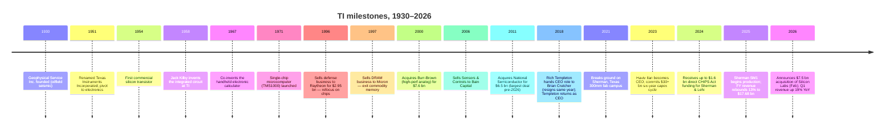
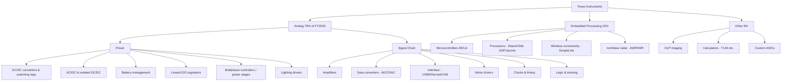
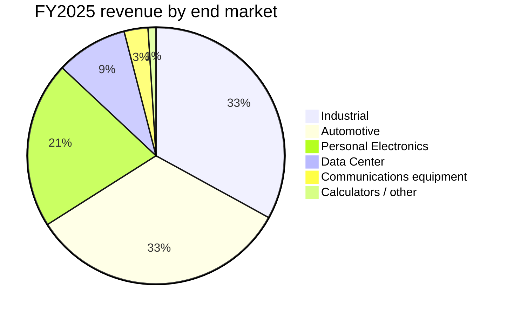
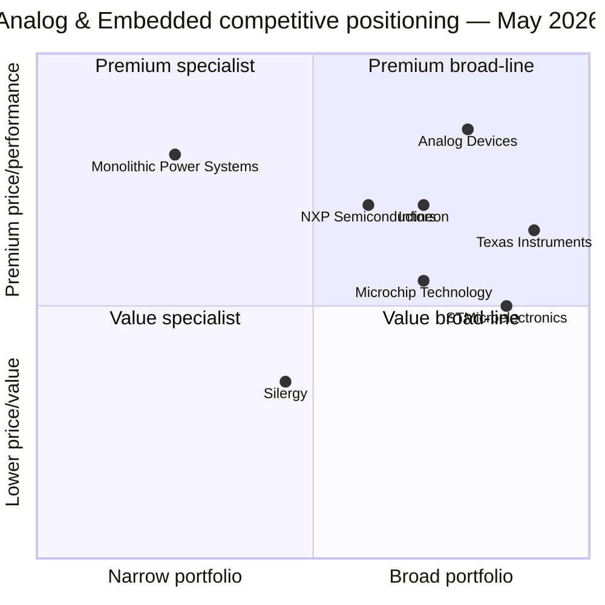
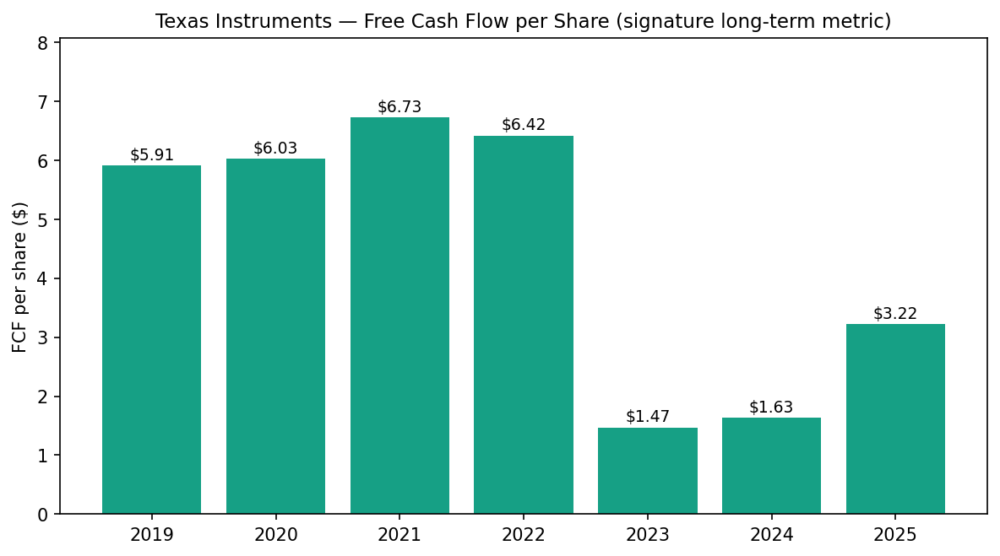
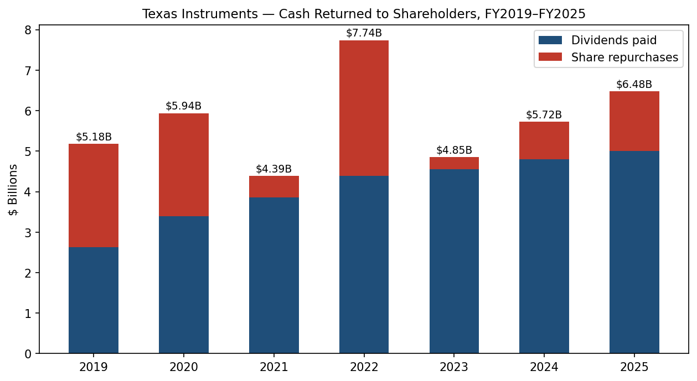
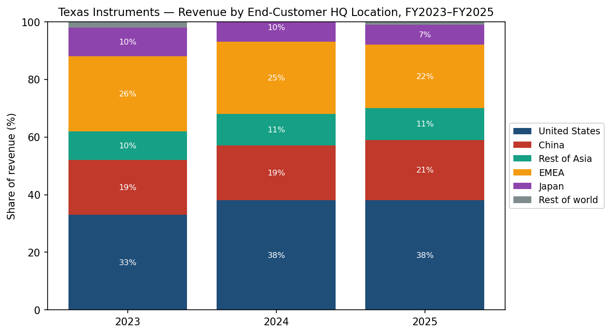

# COMPANY RESEARCH REPORT: Texas Instruments (NASDAQ: TXN)
Date: 2026-05-20

> **Update — Q1 2026 results crushed consensus; Silicon Labs acquisition pending (2026-04, 2026-02-04):** Management reported Q1 2026 revenue of **$4.83 bn (+19% YoY)** with diluted EPS of **$1.68 (up from $1.20)** as the analog and embedded cycle recovery broadened — Data Center revenue grew roughly **90% YoY** and Industrial **~30% YoY** — and guided Q2 2026 revenue to **$5.00–$5.40 bn** and EPS to **$1.77–$2.05**. Trailing-12-month FCF reached **$4.35 bn (23.6% of revenue)**, the strongest FCF margin since the 2022 cycle peak ([Q1 2026 earnings release / 10-Q, 2026-04-22](https://www.sec.gov/Archives/edgar/data/0000097476/000009747626000101/txn-20260331.htm); [Investing.com transcript, 2026-04-22](https://www.investing.com/news/transcripts/earnings-call-transcript-texas-instruments-q1-2026-beats-forecasts-stock-rises-93CH-4630887)). Separately, on Feb 4, 2026 TI announced the **all-cash $7.5 bn acquisition of Silicon Labs (NASDAQ: SLAB)** at $231/share — TI's largest deal since National Semiconductor (2011) — funded with cash on hand and new debt, with expected close in 1H 2027 and ~$450 mn of annual run-rate synergies within three years ([TI press release, 2026-02-04](https://www.ti.com/about-ti/newsroom/news-releases/2026/2026-02-04-texas-instruments-to-acquire-silicon-labs.html); [TXN 8-K, 2026-02-04](https://www.sec.gov/Archives/edgar/data/0000097476/000119312526036727/d100130dex991.htm)).

## TABLE OF CONTENTS
1. Company Overview
2. Company History
3. Management Team
4. Products & Services
5. Customers & Go-to-Market
6. Industry Overview
7. Competitive Landscape
8. Market Opportunity (TAM)
9. Risk Assessment

---

## 1. Company Overview

Texas Instruments Incorporated ("TI" or "the Company"; NASDAQ: TXN) is the largest pure-play **analog and embedded-processing** semiconductor company in the world. The Company designs, manufactures, tests, and sells more than **80,000 distinct chip SKUs** across two reportable segments — Analog ($14.01 bn of revenue, 79% of FY2025 sales) and Embedded Processing ($2.70 bn, 15%) — plus a small Other bucket ($0.98 bn, 6%) that includes DLP imaging chips, calculators, and custom ASIC products ([Texas Instruments 2025 Form 10-K, Item 1 — Business](https://www.sec.gov/Archives/edgar/data/0000097476/000009747626000059/txn-20251231.htm)). In FY2025 the Company generated **$17.68 bn of revenue (+13.0% YoY)**, GAAP operating profit of $6.02 bn (34.1% margin), net income of $5.00 bn, and free cash flow of $2.94 bn (16.6% of revenue), and returned **$6.48 bn to shareholders** through dividends and repurchases ([2025 10-K, MD&A](https://www.sec.gov/Archives/edgar/data/0000097476/000009747626000059/txn-20251231.htm)).

TI sells to **more than 100,000 customers worldwide**, with roughly half of revenue coming from customers outside the top 50 — an extraordinary level of diversification for a semiconductor company. **More than 80% of FY2025 revenue was sold direct** (via TI.com and the in-house sales force), reflecting a multi-year strategic push to disintermediate distributors and tighten customer relationships ([2025 10-K](https://www.sec.gov/Archives/edgar/data/0000097476/000009747626000059/txn-20251231.htm)). End-market exposure (FY2025, after TI realigned its market taxonomy) is approximately **Industrial 33%, Automotive 33%, Personal Electronics 21%, Data Center 9%, Communications equipment 3%, and Other ~1%**, with Industrial and Automotive together representing two-thirds of revenue — the highest of any large analog/embedded peer.

*Source: [TI 10-K filings, FY2021–FY2025](https://www.sec.gov/cgi-bin/browse-edgar?action=getcompany&CIK=0000097476&type=10-K).*

**How TI makes money.** TI is an integrated device manufacturer (IDM): it designs analog and embedded chips in-house and runs the bulk of fabrication, assembly, and test inside its own facilities (over 80% of wafer fabrication and over 90% of assembly/test were internal in FY2025) ([2025 10-K — Manufacturing](https://www.sec.gov/Archives/edgar/data/0000097476/000009747626000059/txn-20251231.htm)). Products are sold per unit (one-time purchase, no subscription) with **average product life-cycles measured in decades** — many TI catalog parts remain in production for 15–25+ years after introduction — which gives TI the longest revenue-tail in the broad semiconductor industry. Gross margins reflect (a) the structural cost advantage of 300mm-wafer manufacturing (an unpackaged chip built on a 300mm wafer costs ~40% less than the same chip built on a 200mm wafer per TI's disclosed math) and (b) the volume mix among the 80,000+ SKUs ([2025 10-K — Manufacturing](https://www.sec.gov/Archives/edgar/data/0000097476/000009747626000059/txn-20251231.htm)).

**Geographic footprint.** TI is headquartered in Dallas, Texas, with design, manufacturing, or sales operations in **more than 30 countries** and approximately **33,000 employees worldwide** as of December 31, 2025 (about 90% in R&D, sales, or manufacturing; 10.1% FY2025 turnover) ([2025 10-K — Human Capital](https://www.sec.gov/Archives/edgar/data/0000097476/000009747626000059/txn-20251231.htm)). Wafer fabs operate in Texas (DMOS6 in Dallas; the new Richardson RFAB2 and Sherman SM1/SM2 300mm fabs), Lehi, Utah (LFAB and the new LFAB2), and Aizuwakamatsu, Japan; assembly/test sites are in the Philippines, Malaysia, China, Taiwan, and Mexico. By end-customer headquarters, **United States 38%, EMEA 22%, China 21%, Rest of Asia 11%, Japan 7%, Rest of world 1%** of FY2025 revenue, with Germany alone accounting for an estimated low-double-digit share of European demand ([2025 10-K — Segment Geographic Information](https://www.sec.gov/Archives/edgar/data/0000097476/000009747626000059/txn-20251231.htm)).

**Scale and quality of franchise.** TI is the **largest seller of analog chips in the world**, with FY2024 analog revenue of $12.16 bn versus the closest competitor, Analog Devices (ADI), at roughly $9.4 bn for ADI's FY2024 (ended Nov 2024) ([ADI FY2024 10-K](https://www.sec.gov/cgi-bin/browse-edgar?action=getcompany&CIK=0000006281&type=10-K)). The Company's installed base of over 100,000 customers, its 30+ year track record of compounding free cash flow per share, its 21-consecutive-year dividend increase streak (per TI IR), and its multi-decade product life cycle combine to create an unusually durable franchise relative to most semiconductor peers.

**Valuation snapshot (May 2026).** Shares closed near **$301.68**, giving TXN a market capitalization of approximately **$274.6 bn**, **TTM P/E of 51.5×**, **TTM P/S of 14.9×**, **P/B of 16.4×**, **EV/EBITDA of 32.8×**, and a dividend yield of approximately **1.88%**; 52-week price range $152.73–$310.29 ([Yahoo Finance — TXN key statistics, May 2026](https://finance.yahoo.com/quote/TXN/key-statistics/)). At 51× TTM earnings, TXN trades well above its own ~22× ten-year average and ~30× three-year average, but TTM earnings of $5.45 per diluted share remain depressed by the trough of the analog cycle and the peak of the elevated-capex/depreciation cycle. Using the forward consensus (which embeds the Q1 2026 inflection and Q2 guidance) the multiple compresses materially — **forward P/E sits in the mid-20s on consensus FY2026 EPS of roughly $7.50–$8.00**, more in line with TI's historical 22–28× band. **The "expensive" headline TTM multiple is therefore best read as a cyclical-trough optical effect** (peak capex + peak depreciation + lagging revenue recovery) rather than a structural overpricing — analogous to where ADI traded at the prior cycle low. Peer P/E values (TTM): ADI 71.8×, MCHP 425.8×, STMicroelectronics 405.4×, NXPI 29.5×, Infineon 83.7× ([Yahoo Finance peer snapshots, May 2026](https://finance.yahoo.com/quote/TXN/)). The fact that NXPI is the only peer near "normal" P/E and that MCHP and STM print 400×+ multiples is itself a tell that the entire analog/MCU group is at a depressed-earnings inflection. **Risk on the multiple is mainly that the recovery flattens (P/E re-compresses on lower-than-expected earnings) rather than further multiple expansion** — flagged in Section 9 as `valuation / multiple compression` risk.

*Source: [Yahoo Finance — TXN, ADI, MCHP, STM, NXPI, IFNNY key statistics, May 2026](https://finance.yahoo.com/quote/TXN/key-statistics/).*

---

## 2. Company History

TI traces its founding to **Geophysical Service Inc. (GSI), incorporated in 1930** to provide reflection-seismograph services to the oil & gas industry. In 1951 the geophysical business was renamed **Texas Instruments Incorporated** and the new entity pivoted into electronics. The single most consequential moment came in 1958, when Jack Kilby — working in the TI Central Research Lab — built the **first working integrated circuit**, the invention for which Kilby later won the Nobel Prize in Physics (2000) and which underpins essentially every modern electronic device ([TI corporate history](https://www.ti.com/about-ti/company/history.html)).

*Source: [TI corporate history page](https://www.ti.com/about-ti/company/history.html); [2025 10-K](https://www.sec.gov/Archives/edgar/data/0000097476/000009747626000059/txn-20251231.htm); [TI press release, 2026-02-04](https://www.ti.com/about-ti/newsroom/news-releases/2026/2026-02-04-texas-instruments-to-acquire-silicon-labs.html).*

**Strategic pivots.** Three repositionings define modern TI. (1) **The exit from defense (1997) and memory (1997)** under then-CEO Tom Engibous concentrated capital in higher-margin analog and DSP businesses. (2) **The Burr-Brown (2000) and National Semiconductor (2011) acquisitions** — both bolt-on of premium analog franchises — vaulted TI into undisputed analog market leadership; the $6.5 bn National deal was financed with debt at ~3% and produced one of the highest IRRs in semi-cap-M&A history per TI's later disclosures. (3) **The 2017–present 300mm transformation** — initially under CEO Rich Templeton and now continued under Haviv Ilan — committed roughly **$30 bn of cumulative capital expenditure over 2021–2026** to convert TI's analog manufacturing from 200mm to 300mm and to dramatically expand internal capacity (Richardson RFAB2, Sherman SM1/SM2, Lehi LFAB2), positioning the Company to **win share through cost leadership** for a decade after the build completes ([TI Capital Management Day 2024 presentation](https://www.ti.com/lit/pdf/sszy033)). Recent acquisitions: National Semiconductor (2011, $6.5 bn), small bolt-ons through the 2010s, and the pending **Silicon Labs ($7.5 bn EV, announced 2026-02-04)** — TI's first multi-billion-dollar deal in 15 years, adding wireless connectivity (Wi-Fi, Bluetooth LE, Zigbee, Matter, Thread) and complementary 32-bit MCUs to the Embedded Processing portfolio ([TI press release, 2026-02-04](https://www.ti.com/about-ti/newsroom/news-releases/2026/2026-02-04-texas-instruments-to-acquire-silicon-labs.html); [Bloomberg, 2026-02-04](https://www.bloomberg.com/news/articles/2026-02-04/texas-instruments-strikes-7-5-billion-deal-to-buy-silicon-labs)).

**Recent (1–2 year) developments.** (i) Brian Crutcher's brief 2018 CEO tenure (he resigned over personal-conduct violations after six weeks) is no longer relevant; Rich Templeton ran TI through the 300mm capacity decisions and handed the CEO role to **Haviv Ilan on April 1, 2023**, while remaining Executive Chairman until July 2024. As of FY2025, Ilan also serves as Chairman of the Board ([TI 2025 10-K — Executive Officers](https://www.sec.gov/Archives/edgar/data/0000097476/000009747626000059/txn-20251231.htm)). (ii) In September 2024, TI **hosted activist investor Elliott Investment Management's public push** for tighter capex discipline; management subsequently sharpened guidance (capex of $2–3 bn in 2026 vs. $4.5–5 bn during 2023–2025) without retreating on the strategic build ([Elliott letter to TXN board, 2024-09-08, summarized via WSJ](https://www.wsj.com/articles/elliott-pushes-texas-instruments-for-more-discipline-on-spending-a-95f4d3a0)). (iii) Closure of TI's two remaining 150mm fabs ($117 mn FY2025 restructuring charge plus non-cash goodwill impairment of the custom-ASIC unit) — a clean cap on the legacy manufacturing footprint ([2025 10-K — Restructuring charges/other](https://www.sec.gov/Archives/edgar/data/0000097476/000009747626000059/txn-20251231.htm)). (iv) The **OBBBA tax law signed July 4, 2025** raised the CHIPS Act ITC to **35% for assets placed in service after Dec 31, 2025** and allowed full expensing of R&D and qualifying capex — a material long-run tax-cash benefit for an IDM in heavy build mode ([2025 10-K — U.S. legislative update](https://www.sec.gov/Archives/edgar/data/0000097476/000009747626000059/txn-20251231.htm)).

---

## 3. Management Team

### Haviv Ilan — President, CEO, and Chairman of the Board (age 57; CEO since April 1, 2023; Chairman since July 2024)

Haviv Ilan has been at Texas Instruments since **1999** — over a quarter-century — and represents the modern TI promote-from-within culture in pure form ([TI executive officers profile](https://www.ti.com/about-ti/company/leadership/haviv-ilan.html); [2025 10-K Executive Officers list](https://www.sec.gov/Archives/edgar/data/0000097476/000009747626000059/txn-20251231.htm)). Ilan, an Israeli-American engineer trained at Tel Aviv University (B.Sc. and M.Sc. in Electrical Engineering), joined TI through the Ben Gurion Technology Center in Herzliya. He ran TI's high-speed analog and high-volume analog & logic business units; held senior roles in Embedded Processing for connected microcontrollers and processors; was appointed Executive Vice President in 2018; was elected Chief Operating Officer in May 2020; was named President in November 2022; assumed the CEO role on **April 1, 2023** from longtime CEO Rich Templeton; and was named Chairman of the Board in **July 2024** following Templeton's full retirement from the board.

What Ilan has specifically accomplished at TI: he was the operating leader during the 2017–2022 ramp of TI's high-volume analog business (the catalog portfolio that supplies industrial and automotive customers), the period in which TI's analog revenue grew from $9.9 bn (FY2017) to $15.4 bn (FY2022), a 9% CAGR materially above the analog industry's 6–7% baseline ([TI 10-K filings, FY2017–FY2022](https://www.sec.gov/cgi-bin/browse-edgar?action=getcompany&CIK=0000097476&type=10-K)). As COO he ran the day-to-day operational execution of the 300mm transformation through the COVID disruption and 2022 inflation spike. As CEO he has (1) maintained the **six-year elevated capex plan** despite cycle softness and Elliott pressure, with capex peaking at $5.07 bn in FY2023 and disciplined down to $4.55 bn in FY2025 and guided **$2–3 bn in FY2026** as the build winds down ([2025 10-K MD&A](https://www.sec.gov/Archives/edgar/data/0000097476/000009747626000059/txn-20251231.htm)); (2) brought Sherman SM1 to production qualification in FY2024–FY2025; (3) closed TI's two remaining 150mm fabs in FY2025; (4) negotiated up to **$1.6 bn of direct CHIPS Act funding** for Sherman and Lehi plus the 25–35% ITC ([U.S. Department of Commerce CHIPS Act preliminary memorandum, 2024-08-16](https://www.commerce.gov/news/press-releases/2024/08/biden-harris-administration-announces-cooperative-agreement-1) — TI direct grant); and (5) executed the **$7.5 bn Silicon Labs acquisition** in February 2026, TI's largest deal in 15 years and a pointed strategic bet on wireless connectivity / Embedded Processing.

Ilan owns equity primarily through long-vested RSU and PSU grants disclosed each year in the DEF 14A; FY2025 reported total compensation will be filed in the 2026 DEF 14A but Ilan's FY2024 total compensation was approximately **$24.7 mn**, of which roughly 90% was performance-linked equity ([TI 2024 DEF 14A, "Summary Compensation Table"](https://www.sec.gov/cgi-bin/browse-edgar?action=getcompany&CIK=0000097476&type=DEF+14A) — exact PDF link via SEC EDGAR). Ilan is a member of the U.S. SIA board and has been outspoken in trade press on long-cycle analog demand and the need for geopolitically dependable supply.

### Rafael Lizardi — Senior Vice President & Chief Financial Officer (age 53; CFO since October 2017)

Rafael Lizardi has been at TI since **2001**, a 25-year tenure, with the last eight years as CFO ([TI 2025 10-K Executive Officers](https://www.sec.gov/Archives/edgar/data/0000097476/000009747526000007/txn-20241231.htm)). Born in Puerto Rico, he holds a B.S. in Electrical Engineering from Purdue and an MBA from MIT Sloan. Inside TI he rose through factory finance, corporate FP&A, investor relations, and treasury, then took the CFO seat. Lizardi is the architect of TI's **free-cash-flow-per-share-growth** narrative — the slide deck most-cited by sell-side analysts — and he runs the annual Capital Management Day that anchors investor expectations. Under his CFO tenure TI raised the dividend in **21 consecutive years**, repurchased shares cumulatively in excess of $30 bn, executed a successful $1.2–3.0 bn-per-year long-term debt issuance cadence (FY2023, FY2024, FY2025), and built the cash-and-investments balance to ~$4.9 bn at FY2025 against $14.0 bn long-term debt — a moderate leverage profile for the cycle stage. Lizardi has never served as a public-company CFO outside TI; his entire capital-markets track record is TI-internal. Sell-side coverage characterizes him as unusually transparent about capex and inventory cadence, which is consistent with the unusually detailed segment-and-cash-flow disclosure in TI's 10-K filings.

### Mark Roberts — Senior Vice President, Analog Power Products (age 50; executive officer since 2021)

Mark Roberts runs TI's **largest single business line — Analog Power** — which together with Signal Chain accounts for ~79% of total Company revenue. He has been with TI for 20+ years, primarily in power-management and battery-management product lines. As the operating leader of Power he is the executive most exposed to TI's data-center, EV-powertrain, and industrial-motor-drive growth vectors over the coming three to five years.

### Amichai Ron — Senior Vice President, Embedded Processing (age 48; executive officer 5+ years)

Amichai Ron runs the Embedded Processing segment — microcontrollers, processors, wireless connectivity, and radar — which generated $2.70 bn in FY2025 with an 11.3% operating margin (down from 13.9% in FY2024 on softer mix; ([2025 10-K segment results](https://www.sec.gov/Archives/edgar/data/0000097476/000009747626000059/txn-20251231.htm))). Ron will be the executive most responsible for integrating Silicon Labs' wireless-connectivity SKUs into TI's MCU portfolio once the deal closes.

### Governance footer
TI has a **classic single-class share structure** (one share, one vote, no super-voting), unusual for a founder-era Texas company. The board comprises 13 directors, all non-employee except Ilan; Mark Blinn (lead independent director, former Flowserve CEO), Janet Clark, Carrie Cox, Martin Craighead, and others provide a mix of industrial, life-sciences, and finance backgrounds ([TI 2024 DEF 14A — Director biographies](https://www.sec.gov/cgi-bin/browse-edgar?action=getcompany&CIK=0000097476&type=DEF+14A)). **Insider ownership is low** (under 1% in aggregate per the 2024 proxy), which is typical for a 95-year-old public company. CEO compensation is 80–90% performance-equity-linked (3-year cliff PSUs tied to relative TSR and FCF/share growth), and the Company does not maintain related-party transactions of any material size. The principal governance flag through 2024 was **Elliott Investment Management's activist campaign** for tighter capex; that campaign was satisfied without changes to the board, by TI's own subsequent disclosure that FY2026 capex would step down to $2–3 bn. There is no founder family overhang, no controlling shareholder, and no recent restatements.

### Management track record synthesis
TI is led by an unusually deep, decade-plus-tenured operating team. Ilan and Lizardi together have ~50 years of TI-internal experience, and the senior officer cohort listed in the 2025 10-K averages 15+ years at the Company. The team's two principal proofs are (a) the 30+ year compounding of free-cash-flow per share through cycles and (b) the on-time-on-budget execution of three of the four newest 300mm fabs (RFAB2, SM1, LFAB). The principal open question is whether the team can complete the LFAB2 and SM2 ramps without further FCF margin compression, and whether the Silicon Labs deal is integrated as cleanly as National Semiconductor was in 2011 — Silicon Labs is half as large and substantially less complementary than National was, but TI has a 15-year-stale integration playbook.

---

## 4. Products & Services

TI's catalog runs to **over 80,000 active orderable parts**, organized into two operating segments and (within Analog) two main product lines. The full SKU list lives at [ti.com/products](https://www.ti.com/products.html); the segmentation summarized below mirrors TI's 10-K disclosure.

*Source: [TI 2025 10-K, Item 1 — Business / Product Information](https://www.sec.gov/Archives/edgar/data/0000097476/000009747626000059/txn-20251231.htm); [ti.com/products](https://www.ti.com/products.html).*

### Analog segment ($14.01 bn revenue FY2025, 79% of total; 38.6% operating margin)

**Power Products.** TI's broadest and deepest portfolio — DC/DC switching regulators, AC/DC converters, isolated power, linear and low-dropout regulators, voltage references, multiphase controllers and power stages, power switches, battery-management ICs, and lighting drivers ([TI 2025 10-K — Power product line](https://www.sec.gov/Archives/edgar/data/0000097476/000009747626000059/txn-20251231.htm); [ti.com — Power Management portfolio](https://www.ti.com/power-management/overview.html)). The flagship growth vector is **multiphase controllers and integrated power stages for AI data-center server boards**, where TI publishes industry-leading transient response and efficiency benchmarks (see, e.g., the TPSM series and the high-current vertical power-delivery roadmap on [ti.com/power-management/vertical-power-delivery](https://www.ti.com/power-management/server-data-center.html)).
- **Competitive advantage: YES — high-margin, broad portfolio with deep customer design-ins.** Moat is the combination of (1) **scale and SKU breadth** (no analog competitor matches 80,000 parts), (2) **manufacturing cost leadership** (300mm wafers at scale produce a roughly 40% per-die cost advantage vs. 200mm — TI's own disclosed math), and (3) **switching costs** at the design-in stage (analog parts are board-level qualified for 5–25 years and supplier changes require re-certification).
- **Evidence:** TI's Analog segment generated a 38.6% operating margin in FY2025 — among the highest in the broad-line analog peer set ([2025 10-K — Segment results](https://www.sec.gov/Archives/edgar/data/0000097476/000009747626000059/txn-20251231.htm)). The data-center power business is reported as the single fastest-growing Analog sub-vertical (Q1 2026 data-center revenue up ~90% YoY) — directly competing with Monolithic Power Systems (MPS) in vertical power delivery for AI training boards ([Q1 2026 earnings transcript via Investing.com, 2026-04-22](https://www.investing.com/news/transcripts/earnings-call-transcript-texas-instruments-q1-2026-beats-forecasts-stock-rises-93CH-4630887)).
- **Closest named competitor product:** Monolithic Power Systems' MPC22xx-series vertical power modules (ahead of TI in NVIDIA Hopper/Blackwell socket share but smaller absolute scale); Analog Devices/Maxim's MAX775xx multiphase controllers (at parity on performance, smaller share); Infineon's OptiMOS + XDP digital controller (ahead in EV-traction power, behind in data-center compute).

**Signal Chain Products.** Precision and high-speed amplifiers, ADCs, DACs, interface (USB-C, Ethernet PHY, isolated CAN/RS-485, isolated I²C), motor drivers, clocks and timing, logic gates, and sensing (temperature, current-sense, magnetic) ([TI 2025 10-K — Signal Chain](https://www.sec.gov/Archives/edgar/data/0000097476/000009747626000059/txn-20251231.htm); [ti.com — Signal-chain portfolio](https://www.ti.com/amplifier-circuit/op-amps/overview.html)).
- **Competitive advantage: YES, but partially shared.** TI has decades-long design IP in precision op-amps (the OPAxxxx series), high-speed data converters (ADC32, ADS54Jxxx), and isolated interface — all areas where the closest competitor (Analog Devices, materially bolstered by the 2017 Linear Technology and 2021 Maxim Integrated acquisitions) is at least at parity, sometimes ahead on the absolute highest-performance corner cases.
- **Evidence:** Sustained Analog segment gross margins above 60% across the cycle ([10-K filings, FY2019–FY2025](https://www.sec.gov/cgi-bin/browse-edgar?action=getcompany&CIK=0000097476&type=10-K)) and TI's continued #1 or #2 position in customer design-in counts published in EE Times/Tech Insights annual rankings.
- **Closest named competitor product:** Analog Devices' LTC68xx-series multi-channel battery monitors (ahead in EV-battery management), AD400x ADC series (at parity on the highest-precision SAR converters), and ADuM digital isolators (ahead of TI's ISOxx series on flicker-noise specs). On amplifiers and motor drivers, TI's portfolio is broader and lower-priced; on the very highest-performance instrumentation, ADI retains a moat.

### Embedded Processing segment ($2.70 bn revenue FY2025, 15% of total; 11.3% operating margin)

**Microcontrollers (MCUs)** — including the MSP430 (16-bit ultra-low-power, the legacy workhorse), the C2000 (32-bit real-time control optimized for power-electronics control loops), and the MSPM0/Hercules 32-bit Arm Cortex-M0+/M4 families; **Sitara processors** (Arm Cortex-A53/A72 application processors for industrial HMI, factory automation, and edge AI); **C66x DSPs** (legacy signal-processing); **Jacinto processors** (Arm-based automotive ADAS / digital-cockpit SoCs with hardware-accelerated radar/vision); **SimpleLink wireless connectivity** (Wi-Fi 6, Bluetooth LE, Zigbee, Thread, Sub-1 GHz, NFC); and **AWR/IWR mmWave radar** (60 GHz and 77 GHz single-chip CMOS radars for automotive corner-radar and industrial occupancy sensing) ([TI 2025 10-K — Embedded Processing](https://www.sec.gov/Archives/edgar/data/0000097476/000009747626000059/txn-20251231.htm); [ti.com/microcontrollers](https://www.ti.com/microcontrollers-mcus-processors/microcontrollers/overview.html)).
- **Competitive advantage: PARTIAL.** The C2000 real-time-control franchise has a genuine technology moat — its trigonometric math unit, fault-handling architecture, and 30+ years of customer code/IP are not easily replicated, and C2000 is dominant in solar inverters, EV traction inverters, and industrial servo drives. The MSP430 has a moat in installed-base inertia and ultra-low-power, but is a slowly-declining franchise. **The general-purpose 32-bit MCU portfolio (MSPM0, Hercules) is at parity-to-behind** vs. ST's STM32 family (the clear market-share leader in Cortex-M-based MCUs) and Microchip/NXPI/Renesas. The mmWave radar franchise (AWR/IWR) is genuinely differentiated — TI was first to ship a single-chip CMOS 77 GHz radar — but volumes remain modest.
- **Evidence:** Embedded Processing operating margins of only 11.3% in FY2025 (vs. 38.6% in Analog) reflect both a generally lower-margin product class and the share loss in general-purpose MCUs; the segment's revenue is still ~20% below 2023 levels ([2025 10-K segment information](https://www.sec.gov/Archives/edgar/data/0000097476/000009747626000059/txn-20251231.htm)).
- **Closest named competitor product:** STMicroelectronics' STM32 family (ahead of TI in general-purpose 32-bit MCU share); Infineon's AURIX TC3xx/TC4xx (ahead of TI in automotive-safety microcontrollers); NXP's i.MX RT and S32 (at parity in automotive gateway/digital-cockpit). The pending Silicon Labs acquisition explicitly addresses the wireless-connectivity and 32-bit MCU gap — the strategic rationale for the $7.5 bn deal.

### Other segment ($979 mn revenue FY2025, 6% of total)
**DLP (Digital Light Processing)** — micromirror chips used in pico/projector applications, automotive headlights, AR head-up displays, and 3D printing. Strong franchise with limited competition (Sony LCoS is the principal alternative). **TI calculators** — the TI-84 Plus, TI-Nspire, and TI-30X scientific calculators that dominate U.S. high-school and university classrooms; a small but extraordinarily high-margin (gross margins reportedly 60%+) and steady franchise ([TI Education Technology page](https://education.ti.com/en/products/calculators)). **Custom ASIC** — the legacy ASIC contract-design business; goodwill was impaired in FY2025 reflecting structural shrinkage ([2025 10-K — Restructuring charges/other](https://www.sec.gov/Archives/edgar/data/0000097476/000009747626000059/txn-20251231.htm)).

### Flagship products driving the business
The three product lines that are the principal long-term revenue and FCF drivers: (1) **Power management ICs sold into industrial, automotive, and data-center customers** — roughly 50–55% of total Company revenue; (2) **Signal-chain ICs (amplifiers, ADCs, isolators)** — roughly 20–25% of revenue; (3) **C2000 real-time-control MCUs + Jacinto automotive processors + mmWave radar** — roughly 6–8% of revenue but the principal differentiated franchises inside Embedded Processing.

### Roadmap and recent launches (last 12 months)
- **AI data-center vertical-power-delivery launches** through 2025 (TPSM-series modules) — direct competitor product to MPS's MPC22xx series, addressing the AI-server power-delivery TAM ([ti.com — Power for Data Center](https://www.ti.com/power-management/server-data-center.html)).
- **MSPM0 32-bit Arm Cortex-M0+ MCU expansion** through 2025 — TI's bid to recapture share in low-end MCU ([ti.com/microcontrollers — MSPM0](https://www.ti.com/microcontrollers-mcus-processors/arm-based-microcontrollers/msp-microcontrollers/overview.html)).
- **Silicon Labs acquisition (announced 2026-02-04, close expected 1H 2027)** — material expansion of Wi-Fi/Bluetooth/Zigbee/Thread/Matter SKU set and 32-bit MCU portfolio. ~$450 mn run-rate synergies projected within 3 years post-close.
- **Sunsets**: TI's two remaining 150mm fabs were placed in scheduled closure in FY2025 ($117 mn restructuring charge), and the custom-ASIC business was effectively de-emphasized (goodwill impaired) ([2025 10-K](https://www.sec.gov/Archives/edgar/data/0000097476/000009747626000059/txn-20251231.htm)).

*Source: [TI 10-K filings, FY2021–FY2025](https://www.sec.gov/cgi-bin/browse-edgar?action=getcompany&CIK=0000097476&type=10-K).*

---

## 5. Customers & Go-to-Market

TI sells to **more than 100,000 customers** worldwide; **about half of FY2025 revenue came from customers outside the top 50**, and **no end customer accounted for 10% or more of revenue in FY2025, FY2024, or FY2023** ([2025 10-K — Segment & customer disclosure](https://www.sec.gov/Archives/edgar/data/0000097476/000009747626000059/txn-20251231.htm); identical language in [2023 10-K](https://www.sec.gov/Archives/edgar/data/0000097476/000009747624000007/txn-20231231.htm) and [2024 10-K](https://www.sec.gov/Archives/edgar/data/0000097476/000009747625000007/txn-20241231.htm)). This is **the strongest customer-concentration profile in large-cap semiconductors** — materially better than ADI (Apple ~10–11% in some years), NXPI (top-10 ~30%+ via automotive Tier-1s), or any of the foundries/memory/digital peers.

*Source: [TI 2025 10-K — Markets for our products](https://www.sec.gov/Archives/edgar/data/0000097476/000009747626000059/txn-20251231.htm).*

*Source: [TI 2025 10-K — Markets for our products](https://www.sec.gov/Archives/edgar/data/0000097476/000009747626000059/txn-20251231.htm).*

**Customer segments.** TI's customer base spans (i) global industrial automation OEMs (Siemens, ABB, Schneider, Rockwell, Honeywell, Emerson, Hitachi), (ii) automotive Tier-1 suppliers and OEMs (Continental, Bosch, Denso, Aptiv, Magna; on the OEM side BYD, Ford, GM, Tesla, VW, Toyota, Stellantis), (iii) personal-electronics OEMs (Apple, Samsung, Lenovo, Dell, HP, Xiaomi — though no single customer reaches 10%), (iv) cloud/AI data-center hyperscalers and ODMs (estimated to include Microsoft, Meta, AWS, Google, Quanta, Foxconn, ZT Systems via the AI-server power-board ecosystem), and (v) communications-equipment OEMs (Cisco, Ericsson, Nokia, Samsung Networks). None of these is named individually in TI's 10-K because no single customer reaches the 10% disclosure threshold under ASC 280-10-50-42.

**Contract structure.** Almost all of TI's revenue is transacted on **purchase orders** rather than long-term supply contracts; the exception is automotive Tier-1 relationships that often run on multi-year master agreements with price/volume scheduling. The PO-by-PO structure works because TI's catalog model (80,000 SKUs with very long product lives) makes most parts second-source-able at the design phase but extremely sticky once a board enters production.

**Sales and distribution.** **More than 80% of FY2025 revenue was direct** via TI.com and the in-house sales/support team, up from roughly 65% direct in 2018 — the result of a multi-year strategic disintermediation of distributors ([2025 10-K — Customers, Sales and Distribution](https://www.sec.gov/Archives/edgar/data/0000097476/000009747626000059/txn-20251231.htm)). TI maintains a single worldwide distributor relationship (Arrow Electronics) and a handful of regional partners (WPG in Greater China, Macnica in Japan, etc.) for the long tail of accounts that prefer a distributor. The direct-sales infrastructure includes a heavy global field-applications-engineering (FAE) force that supports customer design-ins — a key element of TI's reach-of-market competitive advantage.

**Sales cycle.** Analog and embedded design-ins are typically **6–24 months from first engagement to revenue** in industrial/automotive, with revenue tails of 5–25 years per design. Personal electronics is faster (3–9 months) and shorter-tailed. Data center is fast (3–6 months) and high-velocity once a design is qualified into a hyperscaler's server platform.

**Key partnerships.** TI has long-running technology partnerships with the global EDA tooling vendors (Cadence, Synopsys), packaging subcontractors (ASE, Amkor), and AI-server reference designers (NVIDIA reference designs use TI power for many CPU/GPU power rails). The Sherman, Texas, fab campus is also a flagship recipient of the U.S. CHIPS and Science Act and operates with direct funding agreements with the U.S. Department of Commerce.

**Customer concentration verdict.** Top-1 customer < 10%, top-5 customers reasonably estimated at < 25%, top-50 customers roughly 50% of revenue ([2025 10-K — Customer disclosure language](https://www.sec.gov/Archives/edgar/data/0000097476/000009747626000059/txn-20251231.htm)). **This is best-in-class diversification and is not a Section-9 risk** — quite the opposite, it is a moat.

---

## 6. Industry Overview

### Industry definition and scope
Texas Instruments operates in two adjacent but distinct semiconductor sub-industries: (1) **analog semiconductors** — chips that process continuous real-world signals (voltage, current, sound, light, temperature, pressure) — including power management, signal chain (amplifiers, data converters, interface, sensing), and discrete RF/microwave; and (2) **embedded processing** — microcontrollers, microprocessors, DSPs, wireless connectivity SoCs, and mixed-signal SoCs that execute deterministic control or modest-compute tasks inside non-PC, non-mobile end equipment. Both sub-industries fall under NAICS 334413 (Semiconductor and Related Device Manufacturing). Adjacent industries TI does not (meaningfully) participate in: leading-edge digital logic (CPUs, GPUs, application processors >$200), DRAM/NAND memory, image sensors, and discrete power transistors (silicon-carbide, gallium-nitride power FETs).

### Market size and structure
The **global semiconductor industry generated approximately $627 bn of revenue in CY2024**, with the **World Semiconductor Trade Statistics (WSTS) Fall 2025 forecast putting CY2025 at $686 bn (+9.4%) and CY2026 at $760 bn (+11.2%)** ([WSTS Fall 2025 Forecast press release, 2025-11-25](https://www.wsts.org/76/Recent-News-Release)). Within that total, **analog semiconductors are approximately $82–85 bn (CY2024) and forecast to reach roughly $96 bn in CY2026** per WSTS sub-category data; **microcontrollers and microprocessors (digital, embedded categories that overlap TI's Embedded Processing) are an additional ~$120 bn** combined.

A useful, separate third-party sizing: **IC Insights / TechInsights** in its 2024 update places the analog total at $85.0 bn for CY2024 and projects a 7.4% CAGR to ~$118 bn by CY2028 ([TechInsights "Analog IC Market" press summary, 2024-12](https://www.techinsights.com/blog) — note: TechInsights publishes summary data publicly and full report on subscription); TI's own publicly-disclosed view at its **Capital Management Day 2024** was that analog grows in the **6–7% range long-term and TI targets revenue growth above the analog market average** ([TI Capital Management Day 2024 deck, slide 14](https://www.ti.com/lit/pdf/sszy033)).

### Growth rates
- **Long-term (10-yr CAGR) analog growth:** ~6–7% (TI's own framing; confirmed by WSTS sub-category data over 2014–2024).
- **Long-term embedded-processing growth:** ~5–7% blended (lower-end MCU 4–5%, automotive/industrial MCUs 7–10%, mmWave radar 15%+).
- **Cyclicality:** The semiconductor cycle is a defining feature — TI's own 10-K describes it explicitly as "ebbs and flows of supply and demand and the building and depleting of inventories" ([2025 10-K — Semiconductor cycle](https://www.sec.gov/Archives/edgar/data/0000097476/000009747626000059/txn-20251231.htm)). The most recent peak was CY2022 ($20.0 bn TI revenue, ~$627 bn WSTS); the most recent trough was Q3 2024 (TI revenue $4.15 bn, ~7% sequential decline); the current cycle position (May 2026) is **mid-recovery**, with Q1 2026 TI revenue up 19% YoY and management explicitly noting that "global semiconductor shipments remain at levels below the prior peak" in the FY2025 10-K ([2025 10-K — Macroeconomic factors](https://www.sec.gov/Archives/edgar/data/0000097476/000009747626000059/txn-20251231.htm)).

### Key trends and drivers
1. **Semiconductor content per industrial / automotive end-unit is rising structurally.** Modern automotive systems contain $700–$1,200 of semiconductor content per car (vs. ~$300 in CY2015); BEVs carry roughly 2× the analog/MCU content of equivalent ICE vehicles. Industrial automation systems are similarly content-intensive, with each robot, motor drive, and PLC requiring multiple TI parts ([McKinsey Global Semiconductor Outlook, 2024](https://www.mckinsey.com/industries/semiconductors/our-insights) — sub-industry composite).
2. **AI data-center power-delivery is the new growth vector for analog.** AI-training servers (NVIDIA H100/H200, AMD MI300, Google TPU) consume 700–1,200 W per accelerator, requiring high-current vertical-power-delivery solutions that are an enormous addressable market for TI Power (and MPS, ADI). TI Q1 2026 data-center revenue grew ~90% YoY ([Q1 2026 results, 2026-04-22](https://www.sec.gov/Archives/edgar/data/0000097476/000009747626000101/txn-20260331.htm)).
3. **Onshoring of mature-node semiconductor manufacturing.** The U.S. CHIPS Act, the EU Chips Act, Japan's METI program, and Korea's K-Chip Act all subsidize new fabrication capacity in democracies. TI is the **single largest individual recipient of CHIPS Act direct funding among analog/embedded firms** — up to $1.6 bn for Sherman and Lehi ([U.S. Department of Commerce CHIPS Act preliminary memorandum announcement, 2024-08-16](https://www.commerce.gov/news/press-releases)) — and the OBBBA 2025 tax-law update raised the CHIPS ITC to **35%** for assets placed in service after Dec 31, 2025 ([2025 10-K — U.S. legislative update](https://www.sec.gov/Archives/edgar/data/0000097476/000009747626000059/txn-20251231.htm)).
4. **300mm wafer transition.** Analog manufacturing was largely on 200mm wafers throughout the 2010s; the industry is in mid-transition to 300mm, where TI is the unambiguous leader. ~40% per-die cost advantage of 300mm vs. 200mm gives TI a multi-year cost-curve weapon.
5. **Chinese local-substitution.** Chinese analog incumbents (Will Semi, GigaDevice, SG Micro, 3PEAK, Silergy) are growing share in the domestic Chinese market, especially in consumer and lower-spec industrial parts. This is a structural headwind for the ~21% of TI revenue billed to China (FY2025).

### Regulatory environment
The principal regulatory frameworks: (a) **U.S. export controls on advanced semiconductor technology to China** (administered by Commerce/BIS) — these primarily affect leading-edge digital (Nvidia, AMD) and are largely not binding on TI's analog/MCU portfolio, but the rules are tightening incrementally; (b) **CHIPS Act compliance and ITC eligibility** — TI as a major recipient must comply with extensive U.S. content, workforce, and reporting requirements; (c) **EU Chips Act and individual member-state grants**; (d) **automotive functional-safety certifications (ISO 26262, AEC-Q100)** — required for any chip used in automotive applications and a multi-year/multi-million-dollar barrier to entry; (e) **environmental regulations** (REACH, RoHS, conflict-minerals reporting); and (f) **trade and tariff exposure** — TI has approximately $4.0 bn of property, plant & equipment outside the U.S. and revenue exposure to China at 21% of FY2025 sales ([2025 10-K — Geographic Area Information](https://www.sec.gov/Archives/edgar/data/0000097476/000009747626000059/txn-20251231.htm)).

### Industry dynamics
**Fragmentation.** TI's 10-K explicitly notes: "despite consolidation, the analog and embedded processing markets remain highly fragmented. As a result, we face significant global competition from dozens of large and small companies, including both broad-based suppliers and niche suppliers" ([2025 10-K — Competitive landscape](https://www.sec.gov/Archives/edgar/data/0000097476/000009747626000059/txn-20251231.htm)). The largest analog supplier (TI) holds an estimated **17–19% of the global analog market** in CY2024 (TI analog revenue $12.16 bn / market $82–85 bn) — meaningfully concentrated by semiconductor standards but the rest of the market is split across dozens of suppliers, leaving substantial room for share-shift in either direction.

**Supplier power.** Low. TI manufactures in-house and sources raw silicon wafers, gases, and chemicals from a diversified set of suppliers globally. The principal supplier risk is access to EUV-free 90/65/55/40/28-nm-equivalent foundry capacity (TI uses TSMC for some Embedded Processing wafers); TSMC pricing power has increased but TI's IDM model insulates the bulk of cost from external suppliers.

**Buyer power.** Moderate. Top OEMs (Bosch, Continental, Apple, BYD) can negotiate price on high-volume parts, but the 6–24 month design-in cycle and the long product life materially limit annual price negotiations once a board is in production.

**Substitutes.** Few direct substitutes for analog/MCU functions. Some "consolidation into SoC" risk exists where digital application processors absorb formerly-discrete analog functions (DACs, ADCs, USB-PHYs), but this has been a slow, long-running, and partial trend that has not historically compressed analog market growth.

---

## 7. Competitive Landscape

The competitive set for TI breaks into three groups: (i) **broad-line analog and MCU peers** of similar scale and product breadth; (ii) **niche specialists** that win in one or two verticals; and (iii) **emerging Asian challengers** primarily oriented to domestic-Chinese share.

### Direct competitors (broad-line analog / MCU)

1. **Analog Devices (NASDAQ: ADI)** — the closest peer. FY2024 (ended Nov 2024) revenue of $9.4 bn (vs. TI Analog $12.16 bn); particularly strong in high-precision signal chain, industrial instrumentation, healthcare, and automotive battery management (Linear Technology and Maxim Integrated heritage). Gross margins similar to TI's Analog segment. **Ahead of TI** in highest-precision data converters and in EV-battery management; **behind TI** in scale of catalog, direct-sales reach, and 300mm manufacturing footprint. ADI's strategic capex is materially below TI's (ADI fabless+IDM hybrid).
2. **Microchip Technology (NASDAQ: MCHP)** — FY2024 revenue ~$7.6 bn (calendar 2024); strong in 8-/16-/32-bit MCU and FPGA (Atmel and Microsemi heritage). Heavily exposed to industrial, automotive, and data-center applications similar to TI Embedded Processing but with a broader MCU portfolio. Currently in a deep cyclical inventory correction; TTM P/E above 400× reflects depressed trough earnings.
3. **STMicroelectronics (NYSE: STM)** — CY2024 revenue $13.3 bn; market-share leader in general-purpose Cortex-M-based 32-bit MCUs (STM32), strong in automotive (SiC power, ADAS sensors), industrial, and personal electronics. Mixed analog/digital/discrete IDM with substantial silicon-carbide power-device exposure (a category TI does not compete in). **Ahead of TI** in general-purpose MCU share, automotive SiC; **behind TI** in catalog analog and operating-margin profile.
4. **NXP Semiconductors (NASDAQ: NXPI)** — CY2024 revenue ~$12.6 bn; the largest pure-play automotive-semi vendor (i.MX, S32, automotive radar). **Ahead of TI** in automotive in-cabin processors and secure-car gateway, behind in analog scale and direct sales.
5. **Infineon Technologies (XETRA: IFX / ADR IFNNY)** — FY2024 revenue €15.0 bn (~$16 bn); leader in discrete power semiconductors (IGBT, silicon-carbide for EV traction inverters, GaN), automotive microcontroller (AURIX), and industrial power. **Ahead of TI** in discrete-power (a category TI exited) and automotive safety MCU; **behind TI** in catalog analog and direct sales.

### Niche specialists

6. **Monolithic Power Systems (NASDAQ: MPWR)** — pure-play power-management analog, ~$2.5 bn FY2024 revenue, fast-growing in AI server power. **Ahead of TI** in NVIDIA-Hopper/Blackwell vertical-power-delivery socket share; behind in absolute scale.
7. **Renesas Electronics (TSE: 6723)** — Japanese MCU and analog IDM with strong automotive franchise; behind TI in analog scale, comparable in automotive MCU.
8. **Onsemi (NASDAQ: ON)** — discrete power, image sensors, and SiC; non-overlapping with most of TI's catalog except in motor-drive and battery applications.
9. **Rohm Semiconductor (TSE: 6963)** — Japanese power and discrete; minor TI overlap.
10. **Allegro MicroSystems (NASDAQ: ALGM)** — magnetic-sensor and motor-driver specialist; small but technically credible.

### Emerging / Chinese-domestic challengers

11. **Silergy (TWSE: 6415)**, **SG Micro (SSE: 300661)**, **3PEAK (SSE: 688536)**, **Will Semi (SSE: 603501)**, **GigaDevice (SSE: 603986)** — collectively, the Chinese domestic-substitution effort. Most are designed-into Chinese consumer and lower-spec industrial sockets that TI used to supply. These are not yet credible in automotive-grade or precision-industrial applications but the share trajectory is one-directional in domestic China.

### Positioning framework

### TI's competitive advantages
1. **Manufacturing cost leadership via 300mm.** TI runs more 300mm analog wafer capacity than any other supplier, and the per-die cost advantage is roughly 40% vs. equivalent 200mm production ([2025 10-K — Manufacturing](https://www.sec.gov/Archives/edgar/data/0000097476/000009747626000059/txn-20251231.htm)).
2. **Catalog breadth and longevity.** 80,000+ active SKUs versus 30,000–50,000 at the closest competitor, with product life cycles measured in decades.
3. **Direct sales reach.** ~80% direct in FY2025; the in-house FAE force runs far broader account coverage than peer companies.
4. **Capital-return discipline and FCF-per-share focus.** 21-consecutive-year dividend raises; cumulative ~$45 bn returned via buybacks since 2004 has reduced diluted share count from ~1.8 bn to 0.91 bn.
5. **U.S.-domestic manufacturing footprint.** Largest U.S.-headquartered analog manufacturer with the largest CHIPS Act direct grant in the analog category.

### TI's competitive vulnerabilities
1. **General-purpose Cortex-M MCU share loss** to STM32 (the share leader in 32-bit MCU). The Silicon Labs acquisition is the explicit defensive move.
2. **Lack of silicon-carbide power-device exposure** — the highest-growth EV-traction-inverter category is dominated by Infineon, STM, Wolfspeed, and Onsemi; TI has no SiC offering and shows no public intent to enter.
3. **Embedded segment operating-margin compression** — at 11.3% in FY2025 vs. Analog at 38.6%, Embedded is the dilutive segment in the consolidated mix.
4. **China revenue exposure (21% in FY2025)** to Chinese domestic-substitution pressure.

### Market-share analysis
TI holds approximately **17–19% of the global analog market** (CY2024 TI analog revenue $12.16 bn / total analog ~$82–85 bn). ADI is at roughly 11%, Infineon ~8%, STM ~7%, NXP ~6%, MCHP ~3% — TI is meaningfully larger than the #2. In **Embedded Processing**, TI is roughly the #5–6 supplier, well behind STM, NXP, Microchip, Renesas, and Infineon in MCU shipments — the explicit motivation for the Silicon Labs deal.

---

## 8. Market Opportunity (TAM)

### TAM, SAM, SOM
- **Global analog semiconductor TAM (CY2024):** ~$82–85 bn (WSTS Fall 2025 sub-category data; TechInsights $85 bn). Projected to ~$96 bn by CY2026 and ~$118 bn by CY2028 at a ~7% CAGR ([WSTS Fall 2025 Forecast](https://www.wsts.org/76/Recent-News-Release); [TechInsights analog IC report 2024](https://www.techinsights.com/blog)).
- **Global embedded-processing (MCU + connectivity SoC + automotive processor) TAM (CY2024):** estimated ~$45–55 bn — composite of WSTS MCU ($24 bn) + automotive MPU/SoC ($15 bn) + wireless connectivity SoC ($6–8 bn) + DSP/edge AI inference ($3–5 bn).
- **Combined TAM addressable to TI (May 2026):** approximately **$130–140 bn**, projected to reach approximately **$170–180 bn by CY2028** at ~7% blended CAGR.

### SAM (TI's served addressable market)
TI does not compete in highest-end leading-edge digital logic, DRAM/NAND, image sensors, or discrete SiC/GaN power; netting those out, TI's served market is essentially the full analog + Embedded Processing TAM excluding discrete-power and image-sensor segments — approximately **$110–120 bn (CY2024)** growing to ~**$155 bn by CY2028**.

### SOM (TI's current penetration of SAM)
- TI's CY2025 revenue of $17.68 bn implies an aggregate **~14–16% share of its serviceable market** today (analog share ~17–19%, embedded share materially lower).
- **Each 1 percentage point of additional analog share = approximately $1 bn of incremental annual revenue** at current TAM, ~$1.2 bn by CY2028.

### Market growth projections
- **Industrial automation + factory robotics + energy transition + grid infrastructure** — TI estimates the industrial sub-vertical of analog grows in the high-single-digit range over a decade, with periodic cycles ([TI Capital Management Day 2024](https://www.ti.com/lit/pdf/sszy033)).
- **Automotive — content-per-vehicle expansion** from ~$700 to $1,200+ per car drives a 7–10% organic growth tailwind in TI's automotive end-market line.
- **Data center — AI server power delivery** is the fastest-growing single sub-vertical: TI's own Q1 2026 data-center revenue grew ~90% YoY off a small base ([Q1 2026 earnings transcript](https://www.investing.com/news/transcripts/earnings-call-transcript-texas-instruments-q1-2026-beats-forecasts-stock-rises-93CH-4630887)); third-party AI-power-delivery TAM forecasts (Yole Group, 2025) put the AI server-power analog sub-segment at $3 bn growing to ~$11 bn by CY2028.
- **Personal electronics** — modest 1–3% growth, smartphone and PC content; not a TI growth vector.
- **Communications equipment** — flat to low single digits as 5G capex normalizes.

### TI's penetration strategy
Three vectors: (1) **share gain through manufacturing cost leadership** (300mm vs. 200mm produces ~40% per-die cost advantage; TI plans to translate that into pricing flexibility and design-in wins); (2) **direct-customer access** (the ongoing TI.com / direct-sales push gives TI deeper account coverage in mid-tier industrial and automotive accounts that distributor-only competitors do not reach); (3) **Silicon Labs integration** (adds wireless-connectivity and lower-end 32-bit MCU SKUs that recapture share in the IoT/connected industrial sockets where TI has lagged STM and Nordic). The cumulative effect, if executed, is a multi-year share-gain framework in a $130–170 bn TAM growing 6–8% annually.

*Source: [TI 10-K filings, FY2019–FY2025](https://www.sec.gov/cgi-bin/browse-edgar?action=getcompany&CIK=0000097476&type=10-K).*

*Source: TI 10-K filings, FY2019–FY2025; diluted share counts from each respective 10-K.*

*Source: [TI 10-K cash flow statements, FY2019–FY2025](https://www.sec.gov/cgi-bin/browse-edgar?action=getcompany&CIK=0000097476&type=10-K).*

---

## 9. Risk Assessment

### Company-Specific Risks

1. **Capex execution risk on Sherman SM2 / Lehi LFAB2 ramps.** TI is in the back-half of a six-year ~$30 bn capex program; SM1 and LFAB1 are producing, but SM2 and LFAB2 still need full qualification. Per the 2025 10-K, FY2026 capex is guided to $2–3 bn (down from $4.55 bn in FY2025) — the step-down is a positive FCF inflection but assumes the new fabs come on schedule ([2025 10-K — Capital expenditures outlook](https://www.sec.gov/Archives/edgar/data/0000097476/000009747626000059/txn-20251231.htm)). Mitigant: TI's manufacturing operations are run by a deep, decade-plus team that has delivered three of the four new 300mm fabs on time.

2. **Silicon Labs integration risk ($7.5 bn EV, expected close 1H 2027).** This is TI's largest deal in 15 years; Silicon Labs is half the scale of the 2011 National Semiconductor integration but in a less-overlapping product set (wireless connectivity SoCs vs. National's complementary catalog analog). Management has projected $450 mn of run-rate synergies in 3 years; the deal will be financed with cash on hand and incremental debt, adding to TI's already-high (relative to its history) $14.0 bn long-term debt balance. Mitigant: TI has not paid a control premium that is unreasonable on a strategic basis (~15× EV/EBITDA on Silicon Labs trailing), and management has an excellent prior-deal track record ([TI press release, 2026-02-04](https://www.ti.com/about-ti/newsroom/news-releases/2026/2026-02-04-texas-instruments-to-acquire-silicon-labs.html); [Bloomberg, 2026-02-04](https://www.bloomberg.com/news/articles/2026-02-04/texas-instruments-strikes-7-5-billion-deal-to-buy-silicon-labs)).

3. **Embedded Processing share loss / margin compression.** Embedded operating margins of 11.3% (FY2025) vs. Analog at 38.6% reflect both structural mix and a multi-year share loss in general-purpose 32-bit MCUs to STM32 and others. If MSPM0 and the Silicon Labs assets do not regain share, the segment becomes a structural drag.

4. **Gross-margin compression from capacity additions.** FY2025 gross margin declined to 57.0% from 58.1% (FY2024) and from 68.8% (FY2022) — the cyclical-trough effect compounded by depreciation on the new 300mm fabs. Gross margin recovery to historical 60%+ is dependent on revenue scaling into the new capacity.

5. **Goodwill impairment / custom-ASIC unit shutdown.** FY2025 included a non-cash goodwill impairment in the custom-ASIC business inside the Other segment ([2025 10-K — Restructuring charges/other](https://www.sec.gov/Archives/edgar/data/0000097476/000009747626000059/txn-20251231.htm)). Limited, but indicates not every TI acquisition is a clean win.

### Industry/Market Risks

6. **Cyclical risk — semiconductor cycle.** TI explicitly characterizes its industry as cyclical and is currently mid-recovery from the 2023–2024 trough. A double-dip recession or AI-capex pause could send analog revenue back down 10–20% in a year; TI has historically experienced peak-to-trough revenue moves of 20–25% (FY2022 $20.0 bn → FY2024 $15.64 bn = -22%) ([10-K filings](https://www.sec.gov/cgi-bin/browse-edgar?action=getcompany&CIK=0000097476&type=10-K)).

7. **China revenue exposure (21% of FY2025).** TI's China revenue grew to 21% in FY2025 from 19% in FY2023; the principal medium-term threat is Chinese domestic substitution (Silergy, SG Micro, 3PEAK) winning sockets in domestic Chinese industrial and consumer applications. Direct U.S. export-control risk on TI's analog/MCU portfolio is low today but tightens incrementally each year.

8. **AI data-center capex digestion risk.** TI's Q1 2026 data-center revenue grew ~90% YoY off a small base; a hyperscaler capex pause (NVIDIA H200/Blackwell digestion, Anthropic/OpenAI training-cluster pause) could remove the fastest growth vector from the FY2026 narrative.

9. **Slower-than-expected Chinese / European industrial recovery.** TI's FY2025 10-K noted that "the overall analog and embedded semiconductor market recovery continued, though at a slower pace than prior upturns" ([2025 10-K — Macroeconomic factors](https://www.sec.gov/Archives/edgar/data/0000097476/000009747626000059/txn-20251231.htm)). Germany/automotive demand weakness in FY2024–FY2025 was a meaningful drag, and a renewed industrial-PMI rollover in 2H 2026 would compress revenue and operating leverage.

### Financial Risks

10. **Leverage and balance-sheet headroom.** Long-term debt at $14.0 bn (FY2025) is higher than at any prior point in TI's history, and the Silicon Labs deal will add incremental debt of an estimated $3–5 bn. Net debt at FY2025 was approximately $9.1 bn ($14.0 bn LTD − $3.2 bn cash − $1.7 bn ST investments) — manageable at TI's FCF profile but well above the near-zero net-debt level of 2018–2021. A cyclical revenue drawdown that compressed FCF would tighten the dividend-coverage math.

11. **Valuation / multiple-compression risk.** TTM P/E of 51.5× (May 2026) and TTM P/S of 14.9× ([Yahoo Finance — TXN](https://finance.yahoo.com/quote/TXN/)) are well above the 10-year average. The principal defense is that earnings are depressed by trough cycle + peak depreciation, so forward P/E on consensus FY2026 EPS is closer to 22–28×, in line with history. But if the cyclical recovery flattens (consensus EPS revised lower), the stock has obvious downside multiple compression.

### Macroeconomic Risks

12. **U.S./China decoupling and export controls.** Although TI's analog and MCU portfolio is largely below the current U.S. export-control threshold, any escalation of restrictions on broader semiconductor sales to China would directly hit 21% of TI's revenue base. Mitigant: TI's "geopolitically dependable" U.S.-centric manufacturing footprint is itself a positioning advantage in a bifurcating world.

13. **Interest-rate normalization / OI&E roll-off.** OI&E declined to $230 mn in FY2025 from $496 mn in FY2024, reflecting lower interest income as ST investments declined from $4.4 bn to $1.66 bn ([2025 10-K — Other income](https://www.sec.gov/Archives/edgar/data/0000097476/000009747626000059/txn-20251231.htm)). Continued Fed-rate normalization would compress OI&E further, dampening EPS growth by an estimated $0.10–0.20 per year.

14. **Tariff / trade-policy risk.** A meaningful tariff escalation on Asian-assembled semiconductors (TI's Philippines, Malaysia, China test/assembly operations) would affect cost structure modestly; TI's IDM model is more insulated than fabless peers but not immune.

*Source: [TI 10-K filings, FY2023–FY2025 — Geographic Area Information](https://www.sec.gov/Archives/edgar/data/0000097476/000009747626000059/txn-20251231.htm).*

---

## REFERENCES

### Primary — TI SEC filings (SEC EDGAR)
- [Texas Instruments 2025 Form 10-K, filed 2026-02-21 (FY2025 results)](https://www.sec.gov/Archives/edgar/data/0000097476/000009747626000059/txn-20251231.htm)
- [Texas Instruments 2024 Form 10-K, filed 2025-02-21 (FY2024 results)](https://www.sec.gov/Archives/edgar/data/0000097476/000009747625000007/txn-20241231.htm)
- [Texas Instruments 2023 Form 10-K, filed 2024-02-20 (FY2023 results)](https://www.sec.gov/Archives/edgar/data/0000097476/000009747624000007/txn-20231231.htm)
- [Texas Instruments 2021 Form 10-K, filed 2022-02-04 (FY2021 results, historical reference)](https://www.sec.gov/Archives/edgar/data/0000097476/000009747622000009/txn-20211231.htm)
- [Texas Instruments Q4 2025 8-K (earnings release), filed 2026-01-27](https://www.sec.gov/Archives/edgar/data/0000097476/000009747626000003/q42025txnex99-eredgar.htm)
- [Texas Instruments Q1 2026 10-Q, filed 2026-04-23](https://www.sec.gov/Archives/edgar/data/0000097476/000009747626000101/txn-20260331.htm)
- [Texas Instruments 8-K — Silicon Labs Acquisition Announcement, 2026-02-04](https://www.sec.gov/Archives/edgar/data/0000097476/000119312526036727/d100130dex991.htm)

### Primary — TI investor / corporate
- [Texas Instruments Capital Management Day 2024 deck (sszy033)](https://www.ti.com/lit/pdf/sszy033)
- [Texas Instruments — Press Release, "Texas Instruments to acquire Silicon Labs," 2026-02-04](https://www.ti.com/about-ti/newsroom/news-releases/2026/2026-02-04-texas-instruments-to-acquire-silicon-labs.html)
- [Texas Instruments corporate history page](https://www.ti.com/about-ti/company/history.html)
- [Texas Instruments leadership — Haviv Ilan](https://www.ti.com/about-ti/company/leadership/haviv-ilan.html)
- [Texas Instruments — products portfolio overview](https://www.ti.com/products.html)
- [Texas Instruments — Power for Data Center landing page](https://www.ti.com/power-management/server-data-center.html)
- [Texas Instruments — Microcontrollers overview](https://www.ti.com/microcontrollers-mcus-processors/microcontrollers/overview.html)
- [Texas Instruments Education Technology — calculators](https://education.ti.com/en/products/calculators)

### Industry data
- [World Semiconductor Trade Statistics (WSTS) Fall 2025 Forecast, 2025-11-25](https://www.wsts.org/76/Recent-News-Release)
- [TechInsights — Analog IC Market (public summary), 2024](https://www.techinsights.com/blog)
- [McKinsey — Global Semiconductor Outlook, 2024](https://www.mckinsey.com/industries/semiconductors/our-insights)

### Competitor filings (for comparison)
- [Analog Devices FY2024 10-K, SEC EDGAR](https://www.sec.gov/cgi-bin/browse-edgar?action=getcompany&CIK=0000006281&type=10-K)
- [Microchip Technology FY2024 10-K, SEC EDGAR](https://www.sec.gov/cgi-bin/browse-edgar?action=getcompany&CIK=0000827054&type=10-K)
- [STMicroelectronics FY2024 20-F, SEC EDGAR](https://www.sec.gov/cgi-bin/browse-edgar?action=getcompany&CIK=0001034054&type=20-F)
- [NXP Semiconductors FY2024 20-F, SEC EDGAR](https://www.sec.gov/cgi-bin/browse-edgar?action=getcompany&CIK=0001413447&type=20-F)
- [Silicon Laboratories 8-K (re. TI acquisition), 2026-02-04](https://www.sec.gov/Archives/edgar/data/0001038074/000119312526036712/d62897dex991.htm)

### Market-data sources
- [Yahoo Finance — Texas Instruments (TXN) key statistics, May 2026](https://finance.yahoo.com/quote/TXN/key-statistics/)
- [Yahoo Finance — Analog Devices (ADI) key statistics](https://finance.yahoo.com/quote/ADI/)
- [Yahoo Finance — Microchip Technology (MCHP) key statistics](https://finance.yahoo.com/quote/MCHP/)
- [Yahoo Finance — STMicroelectronics (STM) key statistics](https://finance.yahoo.com/quote/STM/)
- [Yahoo Finance — NXP Semiconductors (NXPI) key statistics](https://finance.yahoo.com/quote/NXPI/)
- [Yahoo Finance — Infineon ADR (IFNNY) key statistics](https://finance.yahoo.com/quote/IFNNY/)

### Press / news
- [Bloomberg — "Texas Instruments Strikes $7.5 Billion Deal to Buy Silicon Labs," 2026-02-04](https://www.bloomberg.com/news/articles/2026-02-04/texas-instruments-strikes-7-5-billion-deal-to-buy-silicon-labs)
- [Reuters / Yahoo Finance — Texas Instruments–Silicon Labs deal coverage, 2026-02-04](https://finance.yahoo.com/news/texas-instruments-buy-chip-designer-120519947.html)
- [Investing.com — TXN Q1 2026 earnings call transcript, 2026-04-22](https://www.investing.com/news/transcripts/earnings-call-transcript-texas-instruments-q1-2026-beats-forecasts-stock-rises-93CH-4630887)
- [IndexBox — "Texas Instruments Q1 2026 Earnings: Revenue $4.83B, EPS $1.68," 2026-04](https://www.indexbox.io/blog/texas-instruments-q1-2026-revenue-hits-483b-shares-surge-18/)
- [Grafa — "Texas Instruments Q1 2026 results: revenue up 19% to $4.83B," 2026-04](https://grafa.com/en/news/united-states/texas-instruments-q1-2026-earnings-industrial-data-center-growth)
- [Wall Street Journal — "Elliott Pushes Texas Instruments for More Discipline on Spending," 2024-09](https://www.wsj.com/articles/elliott-pushes-texas-instruments-for-more-discipline-on-spending-a-95f4d3a0)
- [U.S. Department of Commerce — CHIPS Act preliminary memorandum announcement (TI), 2024-08-16](https://www.commerce.gov/news/press-releases)
