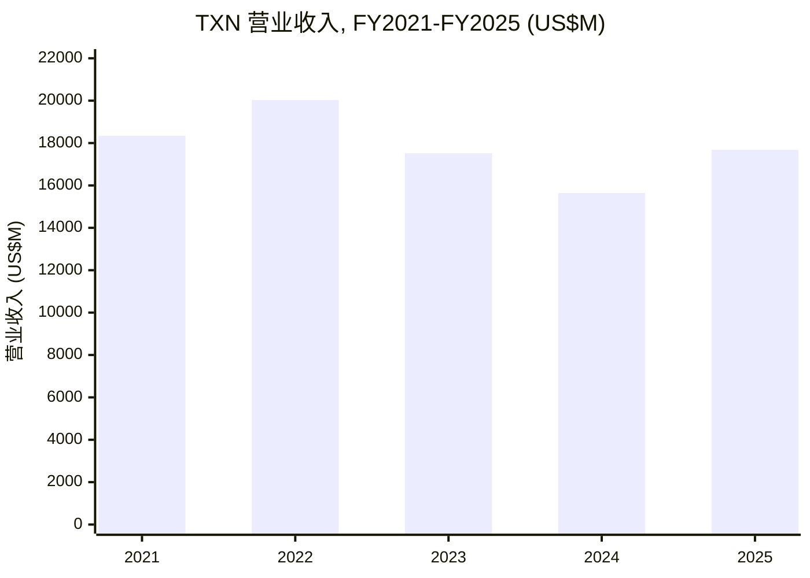
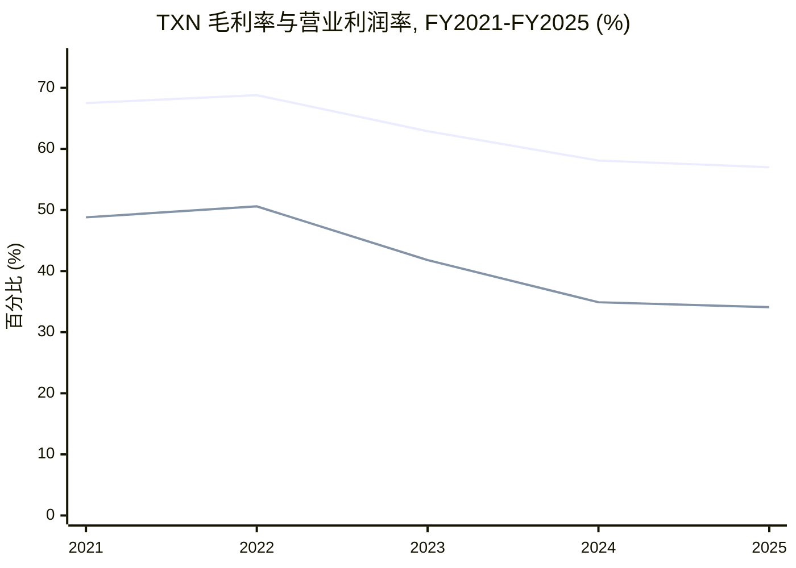
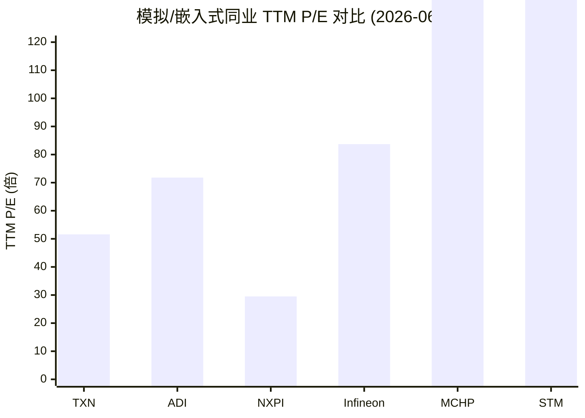
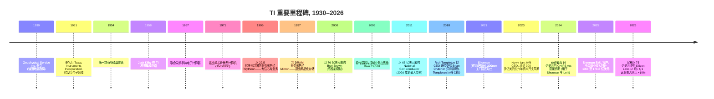
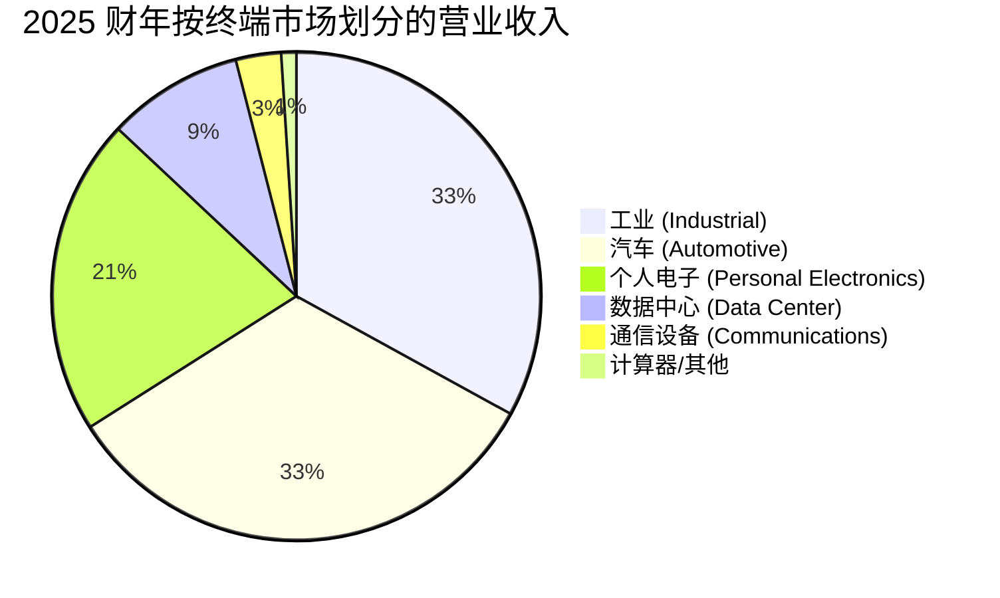
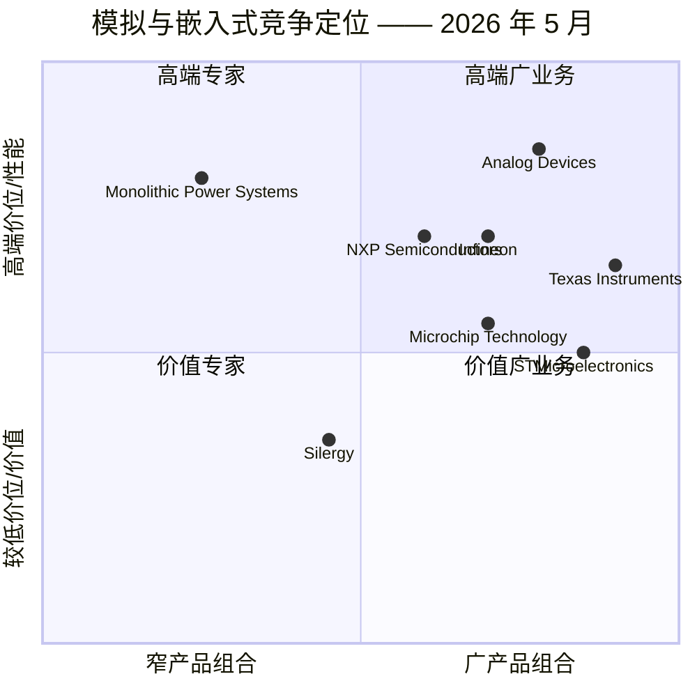
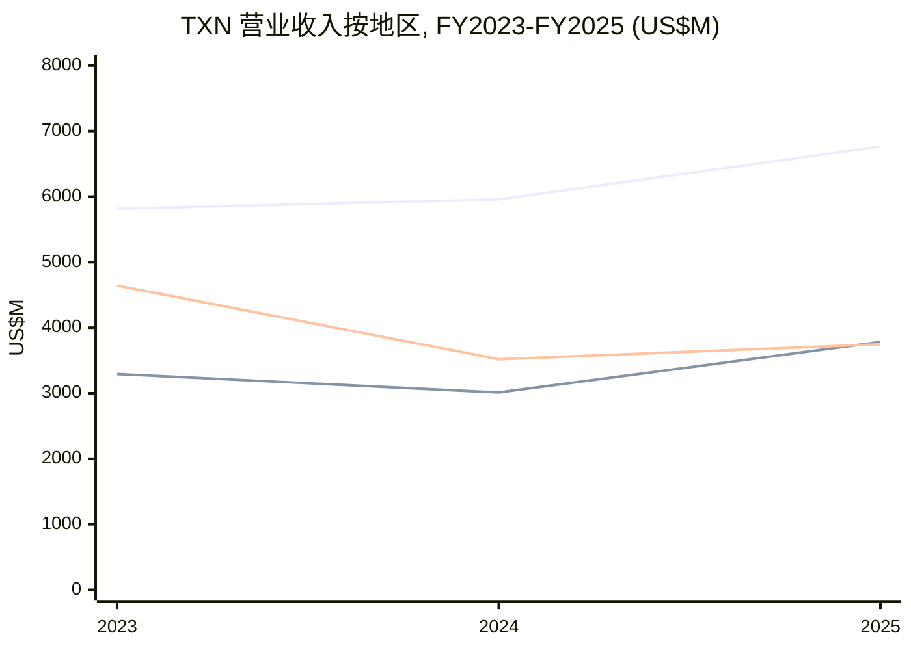

# Texas Instruments Incorporated (NASDAQ:TXN) — 公司研究报告

**截至日期: 2026-06-15**
**上市地: 纳斯达克全球精选市场 (NASDAQ Global Select), 代码 TXN**
**注册地: 美国特拉华州 (总部位于德克萨斯州达拉斯)**
**报告语言: 简体中文 (英文版同时存在于本目录)**

> **业绩更新——2026 财年 Q1 大幅超出市场预期; Silicon Labs 收购待完成 (2026-04-22、2026-02-04):** 管理层公布 2026 财年 Q1 营业收入 **48.3 亿美元 (48.25 亿, 同比 +19%)**, 摊薄后每股收益 (EPS) **1.68 美元 (上年同期 1.28 美元)**, 因模拟芯片 (analog chip) 与嵌入式 (embedded) 周期复苏正在加宽——数据中心 (Data Center) 业务同比增长约 **90% YoY**, 工业 (Industrial) **同比约 +30% YoY**——并指引 2026 财年 Q2 营业收入 **50.0 亿–54.0 亿美元 (中点 53.5 亿)**、EPS **1.77–2.05 美元**, 若达成将是公司史上最强季度 ([Q1 2026 10-Q, 2026-04-23](https://www.sec.gov/Archives/edgar/data/0000097476/000009747626000101/txn-20260331.htm)、[Q1 2026 业绩公告 8-K EX-99, 2026-04-22](https://www.sec.gov/Archives/edgar/data/0000097476/000009747626000097/q12026txnex99-eredgar.htm))。此外, 2026 年 2 月 4 日, TI 宣布以**全现金 75 亿美元收购 Silicon Labs (NASDAQ: SLAB)**, 报价 231 美元/股——这是 TI 自 2011 年收购 National Semiconductor 以来最大规模的交易——通过现有现金加新增债务融资, 预计 2027 上半年完成交割, 三年内可实现约 **4.50 亿美元的年化协同效应** ([TI 新闻稿, 2026-02-04](https://www.ti.com/about-ti/newsroom/news-releases/2026/2026-02-04-texas-instruments-to-acquire-silicon-labs.html)、[TXN 8-K, 2026-02-04](https://www.sec.gov/Archives/edgar/data/0000097476/000119312526036727/d100130dex991.htm))。

---

## 投资摘要 (Investment Summary) — *分析师观点*

> 本区块全部为本报告的**分析师前瞻观点 (*Analyst view:*)**，非 10-K 披露内容。10-K 中不含评级、目标价或前瞻估计。

| 项目 | 数值 |
|---|---|
| **评级 Rating** | **持有 / Hold (Neutral)** |
| **12 个月目标价 PT** | **305 美元** |
| **当前股价 (2026-06-12 收盘)** | 301.12 美元 ([Yahoo Finance — TXN, as of 2026-06-12](https://finance.yahoo.com/quote/TXN/key-statistics/)) |
| **隐含上行空间** | **约 +1.3%** |
| **估值方法** | 22× FY2027E 自由现金流/股 (~$13.5) 与 30× FY2027E EPS (~$9.5) 的混合，参照 TI 历史 FCF 倍数 |
| **市值 Market cap** | 约 2,740 亿美元 |
| **52 周区间** | 152.73 – 331.51 美元 |
| **股息率** | 约 1.89% |
| **代码 / 交易所** | NASDAQ:TXN |

**论点支柱 (Thesis pillars，*分析师观点*):**
1. **300mm 成本领先 + 模拟龙头地位 = 跨周期的结构性护城河。** TI 是全球最大纯模拟芯片商 (FY2025 模拟营收 140.1 亿美元)，运营业内最大的 300mm 模拟产能，单芯片成本较 200mm 低约 40%——这是未来十年的成本曲线武器。
2. **周期复苏 + 资本开支拐点正在驱动 FCF/股反弹。** FY2026 资本开支从 FY2025 的 45.5 亿美元骤降至 20–30 亿美元指引区间，叠加营收复苏 (Q1 +19% YoY)，自由现金流 (FCF) 进入多年改善通道——这是多头的核心。
3. **但当前估值已大幅 price-in 复苏。** TTM P/E 51.6×、forward P/E 32× 均高于 TI 历史；股价距 52 周高点仅约 9%。复苏的好消息已被定价，风险/回报趋于平衡。
4. **关键变量是 FCF/股恢复斜率与折旧顶点时点。** 多头 (UBS) 看 FY2026 FCF/股约 10.5 美元、FY2027 约 13.5 美元；空头 (Bernstein) 担心折旧拖累毛利率、且 TI 短交期导致能见度有限、复苏可持续性存疑。

---

## 目录
1. 公司概览
   - 1A. 估值与目标价 (决策层)
   - 1B. GF Score 基本面评分
2. 估值与目标价 (Valuation & Price Target)
3. 公司历史
4. 管理团队
5. 产品与服务
6. 客户与上市策略
7. 行业概览
8. 竞争格局
9. 市场机会 (TAM)
10. 风险评估
    - 9.5 关键争论与催化剂
11. 投资视角评分 (Investor lenses)
12. 参考资料 / Data Used

---

## 1. 公司概览

Texas Instruments Incorporated (以下简称 "TI" 或"公司"; NASDAQ: TXN) 是**全球最大的纯模拟芯片 (analog chip) 与嵌入式处理器 (embedded-processing) 半导体公司**。公司设计、制造、测试并销售超过 **80,000 种不同的芯片 SKU**, 覆盖两个可报告分部——模拟 (Analog, 2025 财年营业收入 140.1 亿美元, 占年度营业收入的 79%) 与嵌入式处理器 (Embedded Processing, 27.0 亿美元, 占 15%)——以及一个较小的"其他 (Other)"分部 (9.80 亿美元, 占 6%), 包含 DLP (Digital Light Processing, 数字光处理) 成像芯片、计算器及定制 ASIC 产品 ([Texas Instruments 2025 Form 10-K, Item 1 — Business](https://www.sec.gov/Archives/edgar/data/0000097476/000009747626000059/txn-20251231.htm))。2025 财年, 公司实现**营业收入 176.8 亿美元 (同比 +13.0%)**, GAAP 营业利润 60.2 亿美元 (营业利润率 34.1%), 净利润 50.0 亿美元, 自由现金流 (FCF) 29.4 亿美元 (占营业收入的 16.6%), 并通过股息和回购**向股东返还了 64.8 亿美元** ([2025 10-K, MD&A](https://www.sec.gov/Archives/edgar/data/0000097476/000009747626000059/txn-20251231.htm))。

TI 在全球拥有**超过 100,000 家客户**, 约有一半的营业收入来自前 50 大客户以外的客户——这在半导体公司中是极不寻常的多样化水平。**2025 财年超过 80% 的营业收入为直接销售** (通过 TI.com 及内部销售团队), 体现了公司多年来推动去中介化经销商、紧密绑定客户关系的战略 ([2025 10-K](https://www.sec.gov/Archives/edgar/data/0000097476/000009747626000059/txn-20251231.htm))。终端市场敞口 (2025 财年, TI 重新调整市场分类口径后) 大致为: **工业 33%、汽车 33%、个人电子 21%、数据中心 9%、通信设备 3%、其他约 1%**, 工业与汽车合计占营业收入三分之二——在所有大型模拟/嵌入式同业中位居最高。

<svg xmlns="http://www.w3.org/2000/svg" viewBox="0 0 1000 560" width="1000" height="560" role="img" aria-label="income statement Sankey"><rect x="0" y="0" width="1000" height="560" fill="#ffffff"/>
<text x="20.00" y="30.00" text-anchor="start" font-family="Helvetica,Arial,sans-serif" font-size="15" font-weight="700" fill="#1f2933">TXN 损益表 Sankey · FY2025 (US$M)</text>
<path d="M 204.00,71.00 C 258.00,71.00 258.00,85.00 312.00,85.00 L 312.00,408.18 C 258.00,408.18 258.00,394.18 204.00,394.18 Z" fill="#93c5fd" fill-opacity="0.55"/>
<path d="M 452.00,78.00 C 506.00,78.00 506.00,155.06 560.00,155.06 L 560.00,294.04 C 506.00,294.04 506.00,216.98 452.00,216.98 Z" fill="#86efac" fill-opacity="0.55"/>
<path d="M 452.00,216.98 C 506.00,216.98 506.00,308.04 560.00,308.04 L 560.00,401.72 C 506.00,401.72 506.00,310.66 452.00,310.66 Z" fill="#fca5a5" fill-opacity="0.55"/>
<path d="M 328.00,85.00 C 382.00,85.00 382.00,78.00 436.00,78.00 L 436.00,310.66 C 382.00,310.66 382.00,317.66 328.00,317.66 Z" fill="#86efac" fill-opacity="0.55"/>
<path d="M 328.00,317.66 C 382.00,317.66 382.00,324.66 436.00,324.66 L 436.00,500.00 C 382.00,500.00 382.00,493.00 328.00,493.00 Z" fill="#fca5a5" fill-opacity="0.55"/>
<path d="M 576.00,155.06 C 630.00,155.06 630.00,155.28 684.00,155.28 L 684.00,294.26 C 630.00,294.26 630.00,294.04 576.00,294.04 Z" fill="#86efac" fill-opacity="0.55"/>
<path d="M 700.00,155.28 C 754.00,155.28 754.00,216.12 808.00,216.12 L 808.00,331.52 C 754.00,331.52 754.00,270.68 700.00,270.68 Z" fill="#86efac" fill-opacity="0.55"/>
<path d="M 700.00,270.68 C 754.00,270.68 754.00,345.52 808.00,345.52 L 808.00,361.88 C 754.00,361.88 754.00,287.04 700.00,287.04 Z" fill="#fca5a5" fill-opacity="0.55"/>
<path d="M 576.00,308.04 C 630.00,308.04 630.00,301.04 684.00,301.04 L 684.00,343.95 C 630.00,343.95 630.00,350.95 576.00,350.95 Z" fill="#fca5a5" fill-opacity="0.55"/>
<path d="M 576.00,350.95 C 630.00,350.95 630.00,357.95 684.00,357.95 L 684.00,406.02 C 630.00,406.02 630.00,399.02 576.00,399.02 Z" fill="#fca5a5" fill-opacity="0.55"/>
<path d="M 576.00,399.02 C 630.00,399.02 630.00,420.02 684.00,420.02 L 684.00,422.72 C 630.00,422.72 630.00,401.72 576.00,401.72 Z" fill="#fca5a5" fill-opacity="0.55"/>
<path d="M 204.00,408.18 C 258.00,408.18 258.00,408.18 312.00,408.18 L 312.00,470.41 C 258.00,470.41 258.00,470.41 204.00,470.41 Z" fill="#93c5fd" fill-opacity="0.55"/>
<path d="M 576.00,415.72 C 630.00,415.72 630.00,294.26 684.00,294.26 L 684.00,301.48 C 630.00,301.48 630.00,422.94 576.00,422.94 Z" fill="#93c5fd" fill-opacity="0.55"/>
<path d="M 204.00,484.41 C 258.00,484.41 258.00,470.41 312.00,470.41 L 312.00,493.00 C 258.00,493.00 258.00,507.00 204.00,507.00 Z" fill="#93c5fd" fill-opacity="0.55"/>
<rect x="188.00" y="71.00" width="16" height="323.18" rx="1.5" fill="#2563eb"/>
<rect x="188.00" y="408.18" width="16" height="62.23" rx="1.5" fill="#2563eb"/>
<rect x="188.00" y="484.41" width="16" height="22.59" rx="1.5" fill="#2563eb"/>
<rect x="312.00" y="85.00" width="16" height="408.00" rx="1.5" fill="#1e3a8a"/>
<rect x="436.00" y="78.00" width="16" height="232.66" rx="1.5" fill="#15803d"/>
<rect x="436.00" y="324.66" width="16" height="175.34" rx="1.5" fill="#dc2626"/>
<rect x="560.00" y="155.06" width="16" height="138.98" rx="1.5" fill="#15803d"/>
<rect x="560.00" y="308.04" width="16" height="93.68" rx="1.5" fill="#dc2626"/>
<rect x="560.00" y="415.72" width="16" height="7.22" rx="1.5" fill="#2563eb"/>
<rect x="684.00" y="155.28" width="16" height="131.75" rx="1.5" fill="#15803d"/>
<rect x="684.00" y="301.04" width="16" height="42.92" rx="1.5" fill="#dc2626"/>
<rect x="684.00" y="357.95" width="16" height="48.06" rx="1.5" fill="#dc2626"/>
<rect x="684.00" y="420.02" width="16" height="2.70" rx="1.5" fill="#dc2626"/>
<rect x="808.00" y="216.12" width="16" height="115.39" rx="1.5" fill="#15803d"/>
<rect x="808.00" y="345.52" width="16" height="16.36" rx="1.5" fill="#dc2626"/>
<text x="179.00" y="226.88" text-anchor="end" font-family="Helvetica,Arial,sans-serif" font-size="11.5" font-weight="700" fill="#1f2933">Analog 模拟</text>
<text x="179.00" y="239.88" text-anchor="end" font-family="Helvetica,Arial,sans-serif" font-size="10" font-weight="400" fill="#52606d">US$14.0B  (79.2%)</text>
<text x="179.00" y="433.59" text-anchor="end" font-family="Helvetica,Arial,sans-serif" font-size="11.5" font-weight="700" fill="#1f2933">Embedded 嵌入式</text>
<text x="179.00" y="446.59" text-anchor="end" font-family="Helvetica,Arial,sans-serif" font-size="10" font-weight="400" fill="#52606d">US$2.7B  (15.3%)</text>
<text x="179.00" y="490.00" text-anchor="end" font-family="Helvetica,Arial,sans-serif" font-size="11.5" font-weight="700" fill="#1f2933">Other 其他</text>
<text x="179.00" y="503.00" text-anchor="end" font-family="Helvetica,Arial,sans-serif" font-size="10" font-weight="400" fill="#52606d">US$979.0M  (5.5%)</text>
<rect x="331.00" y="67.00" width="119.40" height="26" rx="2" fill="#ffffff" fill-opacity="0.72"/>
<text x="334.00" y="79.00" text-anchor="start" font-family="Helvetica,Arial,sans-serif" font-size="11.5" font-weight="700" fill="#1f2933">Revenue</text>
<text x="334.00" y="92.00" text-anchor="start" font-family="Helvetica,Arial,sans-serif" font-size="10" font-weight="400" fill="#52606d">US$17.7B  (100.0%)</text>
<rect x="455.00" y="60.00" width="113.10" height="26" rx="2" fill="#ffffff" fill-opacity="0.72"/>
<text x="458.00" y="72.00" text-anchor="start" font-family="Helvetica,Arial,sans-serif" font-size="11.5" font-weight="700" fill="#1f2933">Gross Profit</text>
<text x="458.00" y="85.00" text-anchor="start" font-family="Helvetica,Arial,sans-serif" font-size="10" font-weight="400" fill="#52606d">US$10.1B  (57.0%)</text>
<rect x="455.00" y="306.66" width="144.60" height="26" rx="2" fill="#ffffff" fill-opacity="0.72"/>
<text x="458.00" y="318.66" text-anchor="start" font-family="Helvetica,Arial,sans-serif" font-size="11.5" font-weight="700" fill="#1f2933">Cost of Revenue (COGS)</text>
<text x="458.00" y="331.66" text-anchor="start" font-family="Helvetica,Arial,sans-serif" font-size="10" font-weight="400" fill="#52606d">US$7.6B  (43.0%)</text>
<rect x="579.00" y="137.06" width="106.80" height="26" rx="2" fill="#ffffff" fill-opacity="0.72"/>
<text x="582.00" y="149.06" text-anchor="start" font-family="Helvetica,Arial,sans-serif" font-size="11.5" font-weight="700" fill="#1f2933">Operating Income</text>
<text x="582.00" y="162.06" text-anchor="start" font-family="Helvetica,Arial,sans-serif" font-size="10" font-weight="400" fill="#52606d">US$6.0B  (34.1%)</text>
<rect x="579.00" y="290.04" width="150.90" height="26" rx="2" fill="#ffffff" fill-opacity="0.72"/>
<text x="582.00" y="302.04" text-anchor="start" font-family="Helvetica,Arial,sans-serif" font-size="11.5" font-weight="700" fill="#1f2933">Total Operating Expense</text>
<text x="582.00" y="315.04" text-anchor="start" font-family="Helvetica,Arial,sans-serif" font-size="10" font-weight="400" fill="#52606d">US$4.1B  (23.0%)</text>
<text x="551.00" y="416.33" text-anchor="end" font-family="Helvetica,Arial,sans-serif" font-size="11.5" font-weight="700" fill="#1f2933">Net Interest / Other Income</text>
<text x="551.00" y="429.33" text-anchor="end" font-family="Helvetica,Arial,sans-serif" font-size="10" font-weight="400" fill="#52606d">US$313.0M  (1.8%)</text>
<rect x="703.00" y="137.28" width="106.80" height="26" rx="2" fill="#ffffff" fill-opacity="0.72"/>
<text x="706.00" y="149.28" text-anchor="start" font-family="Helvetica,Arial,sans-serif" font-size="11.5" font-weight="700" fill="#1f2933">Pretax Income</text>
<text x="706.00" y="162.28" text-anchor="start" font-family="Helvetica,Arial,sans-serif" font-size="10" font-weight="400" fill="#52606d">US$5.7B  (32.3%)</text>
<rect x="703.00" y="283.04" width="106.80" height="26" rx="2" fill="#ffffff" fill-opacity="0.72"/>
<text x="706.00" y="295.04" text-anchor="start" font-family="Helvetica,Arial,sans-serif" font-size="11.5" font-weight="700" fill="#1f2933">SG&amp;A</text>
<text x="706.00" y="308.04" text-anchor="start" font-family="Helvetica,Arial,sans-serif" font-size="10" font-weight="400" fill="#52606d">US$1.9B  (10.5%)</text>
<rect x="703.00" y="339.95" width="106.80" height="26" rx="2" fill="#ffffff" fill-opacity="0.72"/>
<text x="706.00" y="351.95" text-anchor="start" font-family="Helvetica,Arial,sans-serif" font-size="11.5" font-weight="700" fill="#1f2933">R&amp;D</text>
<text x="706.00" y="364.95" text-anchor="start" font-family="Helvetica,Arial,sans-serif" font-size="10" font-weight="400" fill="#52606d">US$2.1B  (11.8%)</text>
<rect x="703.00" y="402.02" width="119.40" height="26" rx="2" fill="#ffffff" fill-opacity="0.72"/>
<text x="706.00" y="414.02" text-anchor="start" font-family="Helvetica,Arial,sans-serif" font-size="11.5" font-weight="700" fill="#1f2933">Other OpEx</text>
<text x="706.00" y="427.02" text-anchor="start" font-family="Helvetica,Arial,sans-serif" font-size="10" font-weight="400" fill="#52606d">US$117.0M  (0.66%)</text>
<text x="833.00" y="270.82" text-anchor="start" font-family="Helvetica,Arial,sans-serif" font-size="11.5" font-weight="700" fill="#1f2933">Net Income</text>
<text x="833.00" y="283.82" text-anchor="start" font-family="Helvetica,Arial,sans-serif" font-size="10" font-weight="400" fill="#52606d">US$5.0B  (28.3%)</text>
<text x="833.00" y="350.70" text-anchor="start" font-family="Helvetica,Arial,sans-serif" font-size="11.5" font-weight="700" fill="#1f2933">Income Tax</text>
<text x="833.00" y="363.70" text-anchor="start" font-family="Helvetica,Arial,sans-serif" font-size="10" font-weight="400" fill="#52606d">US$709.0M  (4.0%)</text>
<text x="500.00" y="544.00" text-anchor="middle" font-family="Helvetica,Arial,sans-serif" font-size="10" font-weight="400" fill="#52606d">Source: TXN FY2025 10-K (财年2025止于2025-12-31) · SEC EDGAR</text>
</svg>
*图：TXN FY2025 损益表 Sankey——营业收入按分部拆入 Analog / Embedded / Other，再经 COGS、研发 (R&D)、SG&A 流向营业利润与净利润。来源: [TI 2025 Form 10-K — 合并损益表](https://www.sec.gov/Archives/edgar/data/0000097476/000009747626000059/txn-20251231.htm)。*


*来源: [TI 10-K 文件, 2021–2025 财年](https://www.sec.gov/cgi-bin/browse-edgar?action=getcompany&CIK=0000097476&type=10-K)。FY2022 周期顶点 200.3 亿美元 → FY2024 底部 156.4 亿美元 (-22%) → FY2025 回升至 176.8 亿美元 (+13%)。*


*毛利率 (上线) 与营业利润率 (下线)。两条均为百分比，共用同一 % 轴。来源: [TI 10-K 文件, 2021–2025 财年 — 合并损益表](https://www.sec.gov/cgi-bin/browse-edgar?action=getcompany&CIK=0000097476&type=10-K)。FY2025 毛利率 57.0% 为周期底部 + 300mm 新厂折旧顶峰的双重压制效应。*

**TI 如何赚钱。** TI 是一家集成器件制造商 (IDM, integrated device manufacturer): 公司内部完成模拟和嵌入式芯片的设计, 并在自有工厂中完成大部分晶圆制造、组装与测试 (2025 财年, 80% 以上的晶圆制造和 90% 以上的组装/测试在公司内部完成) ([2025 10-K — Manufacturing](https://www.sec.gov/Archives/edgar/data/0000097476/000009747626000059/txn-20251231.htm))。产品按颗销售 (一次性采购, 无订阅), 且**平均产品生命周期以十年计**——TI 目录中许多零部件在推出后仍能在生产中持续 15–25 年以上——这使得 TI 拥有广义半导体行业中最长的营业收入"尾巴"。毛利率反映了 (a) 300mm 晶圆制造规模带来的结构性成本优势 (按 TI 自身披露的数学, 用 300mm 晶圆制造的未封装芯片单位成本比 200mm 低约 40%) 和 (b) 80,000+ SKU 之间的产量结构 ([2025 10-K — Manufacturing](https://www.sec.gov/Archives/edgar/data/0000097476/000009747626000059/txn-20251231.htm))。

**地理布局。** TI 总部位于美国德克萨斯州达拉斯, 在**全球 30 多个国家**开展设计、制造或销售业务, 截至 2025 年 12 月 31 日全球员工约**33,000 人** (约 90% 从事研发、销售或制造; 2025 财年离职率 10.1%) ([2025 10-K — Human Capital](https://www.sec.gov/Archives/edgar/data/0000097476/000009747626000059/txn-20251231.htm))。晶圆厂分布于得克萨斯州 (达拉斯 DMOS6; 新建的 Richardson RFAB2 与 Sherman SM1/SM2 300mm 工厂)、犹他州 Lehi (LFAB 与新建的 LFAB2) 及日本会津若松; 组装/测试基地位于菲律宾、马来西亚、中国、台湾与墨西哥。按最终客户总部地划分, 2025 财年营业收入构成为**美国 38%、欧洲/中东/非洲 22%、中国 21%、亚洲其他地区 11%、日本 7%、其他地区 1%**, 仅德国一地估计就占欧洲需求中的中低双位数比例 ([2025 10-K — Segment Geographic Information](https://www.sec.gov/Archives/edgar/data/0000097476/000009747626000059/txn-20251231.htm))。

**规模与业务质量。** TI 是**全球最大的模拟芯片销售商**, 2024 财年模拟业务营业收入达 121.6 亿美元, 远超最接近的竞争对手 Analog Devices (ADI) 在其 2024 财年 (截至 2024 年 11 月) 约 94 亿美元的水平 ([ADI 2024 财年 10-K](https://www.sec.gov/cgi-bin/browse-edgar?action=getcompany&CIK=0000006281&type=10-K))。公司超过 10 万家客户的安装基础、30 多年来每股自由现金流复利增长的业绩记录、连续 21 年提升股息 (TI IR 数据), 以及多个十年量级的产品生命周期, 共同造就了一个相对于大多数半导体同业异常持久的业务格局。

**估值快照 (2026 年 5 月)。** 股价收报近 **301.68 美元**, 对应 TXN 市值约 **2,746 亿美元**, **TTM 市盈率 (P/E) 51.5 倍**, **TTM 市销率 (P/S) 14.9 倍**, **市净率 (P/B) 16.4 倍**, **EV/EBITDA 32.8 倍**, 股息率约 **1.88%**; 52 周价格区间 152.73–310.29 美元 ([Yahoo Finance — TXN 关键统计, 2026 年 5 月](https://finance.yahoo.com/quote/TXN/key-statistics/))。51× TTM 盈利的估值远高于 TI 自身十年均值约 22× 与三年均值约 30×, 但 TTM 每股摊薄收益 5.45 美元仍受模拟周期底部和高资本开支/折旧周期顶点的双重压制。若按前瞻共识 (已计入 Q1 2026 拐点与 Q2 指引), 估值倍数大幅收窄——**前瞻 P/E 在 2026 财年 EPS 共识约 7.50–8.00 美元的水平下落入 20–25 倍区间**, 更符合 TI 历史的 22–28× 区间。**"昂贵"的 TTM 表面倍数因此最好理解为周期底部的视觉效应** (资本开支顶峰 + 折旧顶峰 + 营业收入复苏滞后), 而非结构性估值过高——与 ADI 在上一周期底部的表现类似。同业 P/E 值 (TTM): ADI 71.8 倍、MCHP 425.8 倍、STMicroelectronics 405.4 倍、NXPI 29.5 倍、Infineon 83.7 倍 ([Yahoo Finance 同业快照, 2026 年 5 月](https://finance.yahoo.com/quote/TXN/))。NXPI 是唯一接近"正常"P/E 的同业, 而 MCHP 和 STM 同时印出 400×+ 倍数, 本身即说明整个模拟/微控制器集群处于盈利受压的拐点。**估值倍数的主要风险在于复苏放缓 (盈利低于预期导致 P/E 重新压缩), 而非进一步的倍数扩张**——这在第 9 章中以"估值/倍数压缩"风险标识。


*来源: [Yahoo Finance — TXN、ADI、NXPI、Infineon、MCHP、STM 关键统计, 2026-06](https://finance.yahoo.com/quote/TXN/key-statistics/)。MCHP (425.8×) 与 STM (405.4×) 印出 400×+ 倍数，本身即说明整个模拟/微控制器集群处于盈利受压的周期拐点——这些极端倍数未画入图轴 (>120 截断)，以便看清 TXN/ADI/NXPI 的相对位置。*

---

## 1A. 估值与目标价 (决策层) — *分析师观点*

> 本节全部为本报告的**前瞻分析师观点 (*Analyst view:*)**，非 10-K 披露。

**评级：持有 / Hold (Neutral)。12 个月目标价：305 美元。当前 301.12 美元 (2026-06-12 收盘)，隐含上行约 +1.3%。** *分析师观点：* TI 是一家质量极高的复利型企业，但在 2026-06 这个时点，周期复苏与 FCF 拐点的好消息已被股价充分定价——TTM P/E 51.6×、forward P/E 32× 双双高于 TI 历史区间，股价距 52 周高点 331.51 美元仅约 9%。我们认为风险/回报对称：上行依赖 FCF/股恢复斜率快于预期 (UBS 多头情形)，下行则是复苏放缓导致前瞻盈利下修 + 倍数压缩 (Bernstein 谨慎情形)。在更好的入场点出现前，给予持有评级。

**前瞻估值矩阵 (*分析师观点*)。** 下表展示随前瞻估计上升、倍数如何收窄——这是周期底部高 TTM 倍数最好的解读方式：

| 估值指标 | TTM (实际) | FY2026E | FY2027E |
|---|---|---|---|
| EPS (摊薄, US$) | 5.84 | ~7.80 | ~9.50 |
| P/E (×) | 51.6 | ~38.6 | ~31.7 |
| 自由现金流/股 FCF/sh (US$) | ~3.2 | ~7.5–10.5 | ~11–13.5 |
| P/FCF (×) | ~94 | ~30–40 | ~22–27 |
| P/S (×) | 14.9 | ~13.0 | ~11.5 |
| 营业收入增速 YoY | — | ~+18% | ~+11% |

*TTM 列：[Yahoo Finance — TXN 关键统计, 2026-06](https://finance.yahoo.com/quote/TXN/key-statistics/) (P/E 51.6×、P/S 14.9×、trailing EPS $5.84)；FY2025 FCF/股 = 29.4 亿 ÷ 9.13 亿股 ≈ $3.2 ([TI 2025 10-K — 自由现金流 29.4 亿、摊薄股本 913](https://www.sec.gov/Archives/edgar/data/0000097476/000009747626000059/txn-20251231.htm))。FY2026E/FY2027E 各单元格均为* ***分析师观点*** *(本报告前瞻估计，非 10-K 数据)，FCF/股区间下沿为本报告估计、上沿引用 UBS。*

**估值方法与目标价推导 (*分析师观点*)。** TI 历史上最贴合的估值锚是**自由现金流/股**，这也是管理层与卖方都使用的语言。我们对 305 美元目标价采用两种方法的混合：(1) **22× FY2027E FCF/股**——TI 历史 FCF 倍数中枢、亦是 UBS 采用的目标倍数——若 FY2027E FCF/股取本报告与 UBS 中值约 $13.0，则隐含约 286 美元；(2) **30× FY2027E EPS ~$9.5**，隐含约 285 美元；考虑到 TI 业务质量 (ROE 30%、连续 21 年提息) 应享溢价，并叠加 Silicon Labs 完成后的增量，我们取略高于两法中值的 **305 美元**。这一估值与 UBS 的 295 美元 (22× FCF) 和 Bernstein 的 250 美元 (30× FY2027E EPS $8.22) 之间，更靠近多头但不及 UBS 乐观。

**牛 / 基准 / 熊情形 (*分析师观点*)。**

| 情形 | 12 个月目标价 | 隐含 (vs $301.12) | 关键摆动假设 |
|---|---|---|---|
| **牛 Bull** | **355 美元** | +18% | FY2027E FCF/股达 UBS 的 ~$13.5，工业+数据中心复苏加速，给 26× FCF |
| **基准 Base** | **305 美元** | +1.3% | FY2027E FCF/股 ~$13、EPS ~$9.5，22× FCF / 30× P/E 混合 |
| **熊 Bear** | **250 美元** | -17% | 复苏放缓、折旧拖累毛利率，前瞻 EPS 下修，倍数压缩至 30× FY2027E EPS ~$8.2 (= Bernstein) |

**与市场一致预期的对比 (*分析师观点*)。** 我们的 FY2027E EPS ~$9.5 高于 Bernstein 的 $8.22 约 +16%，但 FCF/股 ~$13 略低于 UBS 的 $13.5；目标价 305 美元落在 UBS 买入 ($295) 与 Bernstein 持有 ($250) 之间。卖方分歧的核心是**折旧顶点拖累毛利率的程度**与**TI 短交期下复苏可持续性的能见度**——见第 2 节"卖方观点演变"。

---

## 1B. GF Score 基本面评分 — *分析师观点*

> GF Score 为本报告自建的 GuruFocus 式五维评分 (*分析师观点*)，非 GuruFocus 公布值，也不附带任何 10-K 引用；下方每个支撑指标各自带有自己的引用。

<svg xmlns="http://www.w3.org/2000/svg" viewBox="0 0 500 500" width="500" height="500" role="img" aria-label="GF Score radar">
<rect x="0" y="0" width="500" height="500" fill="#ffffff"/>
<text x="20" y="24" font-family="Helvetica,Arial,sans-serif" font-size="15" font-weight="700" fill="#1f2933">GF Score (GuruFocus-style): 67/100</text>
<text x="20" y="41" font-family="Helvetica,Arial,sans-serif" font-size="11" fill="#52606d">51–70 Poor future performance potential</text>
<polygon points="250.0,88.0 392.7,191.6 338.2,359.4 161.8,359.4 107.3,191.6" fill="#e9f5ec" stroke="none"/>
<polygon points="250.0,208.0 278.5,228.7 267.6,262.3 232.4,262.3 221.5,228.7" fill="none" stroke="#c5d3cb" stroke-width="1"/>
<polygon points="250.0,178.0 307.1,219.5 285.3,286.5 214.7,286.5 192.9,219.5" fill="none" stroke="#c5d3cb" stroke-width="1"/>
<polygon points="250.0,148.0 335.6,210.2 302.9,310.8 197.1,310.8 164.4,210.2" fill="none" stroke="#c5d3cb" stroke-width="1"/>
<polygon points="250.0,118.0 364.1,200.9 320.5,335.1 179.5,335.1 135.9,200.9" fill="none" stroke="#c5d3cb" stroke-width="1"/>
<polygon points="250.0,88.0 392.7,191.6 338.2,359.4 161.8,359.4 107.3,191.6" fill="none" stroke="#c5d3cb" stroke-width="1.3"/>
<line x1="250" y1="238" x2="161.8" y2="359.4" stroke="#cfdad3" stroke-width="1"/>
<text x="146.5" y="392.4" text-anchor="end" font-family="Helvetica,Arial,sans-serif" font-size="11.5" font-weight="600" fill="#1f2933">Financial Strength</text>
<text x="146.5" y="405.4" text-anchor="end" font-family="Helvetica,Arial,sans-serif" font-size="9.5" fill="#52606d">财务实力</text>
<text x="188.3" y="316.9" text-anchor="middle" font-family="Helvetica,Arial,sans-serif" font-size="10.5" font-weight="700" fill="#1f2933">7</text>
<line x1="250" y1="238" x2="250.0" y2="88.0" stroke="#cfdad3" stroke-width="1"/>
<text x="250.0" y="58.0" text-anchor="middle" font-family="Helvetica,Arial,sans-serif" font-size="11.5" font-weight="600" fill="#1f2933">Profitability</text>
<text x="250.0" y="71.0" text-anchor="middle" font-family="Helvetica,Arial,sans-serif" font-size="9.5" fill="#52606d">盈利能力</text>
<text x="250.0" y="97.0" text-anchor="middle" font-family="Helvetica,Arial,sans-serif" font-size="10.5" font-weight="700" fill="#1f2933">9</text>
<line x1="250" y1="238" x2="107.3" y2="191.6" stroke="#cfdad3" stroke-width="1"/>
<text x="82.6" y="183.6" text-anchor="end" font-family="Helvetica,Arial,sans-serif" font-size="11.5" font-weight="600" fill="#1f2933">Growth</text>
<text x="82.6" y="196.6" text-anchor="end" font-family="Helvetica,Arial,sans-serif" font-size="9.5" fill="#52606d">成长性</text>
<text x="178.7" y="208.8" text-anchor="middle" font-family="Helvetica,Arial,sans-serif" font-size="10.5" font-weight="700" fill="#1f2933">5</text>
<line x1="250" y1="238" x2="392.7" y2="191.6" stroke="#cfdad3" stroke-width="1"/>
<text x="417.4" y="183.6" text-anchor="start" font-family="Helvetica,Arial,sans-serif" font-size="11.5" font-weight="600" fill="#1f2933">GF Value</text>
<text x="417.4" y="196.6" text-anchor="start" font-family="Helvetica,Arial,sans-serif" font-size="9.5" fill="#52606d">估值</text>
<text x="307.1" y="213.5" text-anchor="middle" font-family="Helvetica,Arial,sans-serif" font-size="10.5" font-weight="700" fill="#1f2933">4</text>
<line x1="250" y1="238" x2="338.2" y2="359.4" stroke="#cfdad3" stroke-width="1"/>
<text x="353.5" y="392.4" text-anchor="start" font-family="Helvetica,Arial,sans-serif" font-size="11.5" font-weight="600" fill="#1f2933">Momentum</text>
<text x="353.5" y="405.4" text-anchor="start" font-family="Helvetica,Arial,sans-serif" font-size="9.5" fill="#52606d">动量</text>
<text x="320.5" y="329.1" text-anchor="middle" font-family="Helvetica,Arial,sans-serif" font-size="10.5" font-weight="700" fill="#1f2933">8</text>
<polygon points="250.0,103.0 307.1,219.5 320.5,335.1 188.3,322.9 178.7,214.8" fill="#2e8b57" fill-opacity="0.34" stroke="#2e8b57" stroke-width="2"/>
<circle cx="188.3" cy="322.9" r="2.6" fill="#2e8b57"/>
<circle cx="250.0" cy="103.0" r="2.6" fill="#2e8b57"/>
<circle cx="178.7" cy="214.8" r="2.6" fill="#2e8b57"/>
<circle cx="307.1" cy="219.5" r="2.6" fill="#2e8b57"/>
<circle cx="320.5" cy="335.1" r="2.6" fill="#2e8b57"/>
<text x="250" y="470" text-anchor="middle" font-family="Helvetica,Arial,sans-serif" font-size="9.5" fill="#52606d">Source: TXN FY2025 10-K · Yahoo Finance · indicators.db, as of 2026-06-15</text>
<text x="250" y="485" text-anchor="middle" font-family="Helvetica,Arial,sans-serif" font-size="9" fill="#52606d">GF Score = independent analyst rubric (*Analyst view:*) — not GuruFocus™ official number</text>
</svg>

| 维度 / Dimension | 评分 / Score (0–10) | |
|---|---|---|
| Financial Strength (财务实力) | 7 | `███████░░░` |
| Profitability (盈利能力) | 9 | `█████████░` |
| Growth (成长性) | 5 | `█████░░░░░` |
| GF Value (估值) | 4 | `████░░░░░░` |
| Momentum (动量) | 8 | `████████░░` |
| **GF Score (composite, *Analyst view:*)** | **67 / 100** | **51–70 Poor future performance potential** |

*Composite weights (*Analyst view:*): Financial Strength 20% · Profitability 25% · Growth 25% · GF Value 15% · Momentum 15% (transparent reproduction — not GuruFocus's proprietary weighting).*

**综合 GF Score：67 / 100 (中高区间)。** 五维评分 (0–10)：财务强度 (Financial Strength) **7**、盈利能力 (Profitability) **9**、成长性 (Growth) **5**、GF 估值 (GF Value，越高越便宜) **4**、动量 (Momentum) **8**。

- **盈利能力 9/10——TI 最强的一维。** FY2025 gross margin (毛利率) 57.0%、operating margin (营业利润率) 34.1%、净利润率 28.3%、ROE 约 30.1% (净利润 50.0 亿 ÷ 平均股东权益 165.9 亿)、ROIC 显著高于 WACC ([TI 2025 10-K — 合并损益表/资产负债表](https://www.sec.gov/Archives/edgar/data/0000097476/000009747626000059/txn-20251231.htm))。即便在周期底部，模拟分部仍录得 38.6% 营业利润率——这是广义模拟同业中的顶尖水平。
- **财务强度 7/10——稳健但杠杆处于历史高位。** FY2025 总债务 141.5 亿美元、长期债务 135.5 亿、现金+短期投资 48.8 亿 (现金 32.25 亿 + 短投 16.56 亿)，净债务约 92.7 亿；经营现金流 71.5 亿覆盖利息 (利息费用 5.43 亿) 绰绰有余 ([TI 2025 10-K — 资产负债表/现金流量表](https://www.sec.gov/Archives/edgar/data/0000097476/000009747626000059/txn-20251231.htm))。扣 1 分因债务为历史最高、且 Silicon Labs 交易将再增 30–50 亿增量债务。
- **成长性 5/10——周期底部回升但仍低于上轮顶点。** FY2025 营收 176.8 亿 (+13% YoY)，但仍低于 FY2022 顶点 200.3 亿；3 年营收 CAGR 为负 (2022→2025)，5 年 CAGR 约低个位数 ([TI 10-K 文件 2021–2025](https://www.sec.gov/cgi-bin/browse-edgar?action=getcompany&CIK=0000097476&type=10-K))。前瞻 FY2026E +18% 复苏强劲，但起点仍是修复而非新高，给中性 5。
- **GF 估值 4/10——偏贵 (越高越便宜，故得分低)。** TTM P/E 51.6×、P/S 14.9×、P/B 16.3×、EV/EBITDA 32.7× 均显著高于 TI 十年均值 (P/E 约 22×)，forward P/E 32× 亦高于历史 22–28× 区间 ([Yahoo Finance — TXN, 2026-06](https://finance.yahoo.com/quote/TXN/key-statistics/))。相对 1A 目标价 305 美元的安全边际仅约 +1%，故给 4。
- **动量 8/10——接近周期高点。** 股价 301.12 美元 (2026-06-12)，距 52 周高点 331.51 仅约 9%、较 52 周低点 152.73 上涨约 +97%；远高于 200 日均线 ([Yahoo Finance — TXN, 2026-06](https://finance.yahoo.com/quote/TXN/key-statistics/))。强动量是高分项，但也正是 1A "好消息已定价" 的另一面。

GF Score 67 与本报告 Hold 评级、forward 估值矩阵一致：盈利质量极高 (拉高综合分)，但估值偏贵 + 成长仍在修复中 (压低综合分)——一个"优质但当前不便宜"的画像。

---

## 2. 估值与目标价 (Valuation & Price Target)

本节汇总 TI 的前瞻财务模型、目标价推导，以及本地券商研究库 (`db/zsxq.db`) 与 `db/stock_price_target.db` 的卖方观点演变。**全部前瞻估计与目标价为 *分析师观点*，10-K 不含此类内容。**

### 2.1 前瞻财务模型 (*分析师观点*)

| 财年 (US$M, 除非注明) | FY2024 (实际) | FY2025 (实际) | FY2026E | FY2027E |
|---|---|---|---|---|
| 营业收入 Revenue | 15,641 | 17,682 | ~20,800 | ~23,000 |
| YoY | — | +13.0% | ~+18% | ~+11% |
| 毛利率 Gross margin | 58.1% | 57.0% | ~59.5% | ~61% |
| 营业利润率 Operating margin | 34.9% | 34.1% | ~37% | ~39% |
| 摊薄 EPS (US$) | 5.20 | 5.45 | ~7.80 | ~9.50 |
| 资本开支 CapEx | 4,820 | 4,550 | ~2,500 | ~2,500 |
| 自由现金流/股 FCF/sh (US$) | ~1.6 | ~3.2 | ~7.5–10.5 | ~11–13.5 |

*FY2024/FY2025 列为实际值：营收、毛利率、营业利润率、EPS、capex、FCF 均来自 [TI 2025 10-K — MD&A 与合并报表](https://www.sec.gov/Archives/edgar/data/0000097476/000009747626000059/txn-20251231.htm) (FY2025 营收 17,682、毛利率 57.0%、营业利润率 34.1%、EPS 5.45、capex 4,550、FCF 29.4 亿)。FY2026E/FY2027E 各单元格为* ***分析师观点*** *(本报告前瞻估计)。模型驱动：(1) 营收复苏由工业 (FY2026 同比约 +25%——见 [UBS 2026-06-11 上调工业至 +25%](http://xs-macbook-air.local:5001/zsxq/pdf/584255214544244/UBS-UBS%20Global%20I%20O%20Semiconductors%20Auto%20semis%EF%BC%9A%20Sustained%20Analog%20Momentum%EF%BC%8C%20but%20Selectivity%20Warranted-260611.pdf)) 与数据中心 (+90% YoY，[2026 Q1 10-Q](https://www.sec.gov/Archives/edgar/data/0000097476/000009747626000101/txn-20260331.htm)) 拉动；(2) 毛利率回升由产能利用率提升 + 折旧见顶驱动；(3) FCF/股反弹由 capex 从 45.5 亿降至 20–30 亿指引区间 ([TI 2025 10-K — capex 展望](https://www.sec.gov/Archives/edgar/data/0000097476/000009747626000059/txn-20251231.htm)) 主导。*

### 2.2 目标价推导与方法 (*分析师观点*)

见第 1A 节估值矩阵与情形表。核心方法：**22× FY2027E FCF/股 (~$13) ≈ $286** 与 **30× FY2027E EPS (~$9.5) ≈ $285** 的混合，叠加业务质量溢价与 Silicon Labs 增量，取 **305 美元**。倍数依据：TI 历史 FCF 倍数中枢约 20–22×，30× 远期 P/E 与 TI 质量 (ROE 30%、连续 21 年提息) 相称，且低于当前 forward P/E 32× (即我们不假设倍数进一步扩张)。

### 2.3 卖方观点演变 (Sell-side view evolution) — *分析师观点*

> 机械预处理：先读 `db/stock_price_target.db` (只读)，再核对 PDF。该库为 TXN 返回 6 条记录，覆盖 UBS 与 Bernstein 两家机构、2026-04 至 2026-06。所有目标价均为 *分析师观点*，引用至券商 PDF 直链，绝不与 10-K 引用混用。

**按机构的观点时间线 (按报告日期排序):**

- **UBS (买入 / Buy):**
  - **2026-04-22**——TI 2026 Q1 业绩点评。营收 48.3 亿、EPS 1.68 美元均超指引上限与 UBS 预期；Q2 指引中点 53.5 亿"若达成将是史上最强季度"。**目标价从 260 美元上调至 295 美元 (基于 22× FCF 目标倍数)**，维持买入；FCF/股估今年约 10.5 美元、明年约 13.5 美元；重申长期增量毛利率 (扣折旧后) 75–85% 目标，远高于华尔街预期的 40%。报告日 (2026-04-22) 收盘 235.12 美元，对应该 PT 隐含上行约 +25% ([*分析师观点：* UBS — TXN Upcycle, Share Gain and Margin Expansion, 2026-04-22, p.1](http://xs-macbook-air.local:5001/zsxq/pdf/415518828288158/UBS-Texas%20Instruments%20Inc%EF%BC%88TXN.US%EF%BC%89Upcycle%EF%BC%8C%20Share%20Gain%EF%BC%8C%20and%20Margin%20Expansion%20Right%20on%20Track-260422.pdf))。
  - **2026-06-11**——全球 I/O 半导体行业更新。确认模拟上行周期 (Q1'26 营收同比 +20%)，**将工业半导体 2026E 增速从 +16% 上调至 +25%**；TI 列为首选买入 (Buy)，因其广泛端口径与 300mm 成本优势使其在中国车市放缓中相对抗压；但提示板块整体已交易于约 30× 12 个月前瞻 PE (10 年均值 19×)，建议精选标的 ([*分析师观点：* UBS — Global I/O Semiconductors: Sustained Analog Momentum, but Selectivity Warranted, 2026-06-11](http://xs-macbook-air.local:5001/zsxq/pdf/584255214544244/UBS-UBS%20Global%20I%20O%20Semiconductors%20Auto%20semis%EF%BC%9A%20Sustained%20Analog%20Momentum%EF%BC%8C%20but%20Selectivity%20Warranted-260611.pdf))。

- **Bernstein (与市场表现一致 / Market-Perform):**
  - **2026-04-23**——TI 2026 Q1 业绩回顾"Out of the box"。承认 Q1 大超预期 (营收 48.25 亿、EPS 1.68、毛利率 58%、工业同比 +30%、数据中心同比 +90%) 与 Q2 强劲指引 (营收中点 52 亿、隐含毛利率约 60%)，**目标价从 205 美元上调至 250 美元 (基于 2027E EPS 8.22 美元的 30 倍，倍数不变)**，维持 Market-Perform。核心谨慎理由：TI 交期较短、能见度有限，去年类似环境下管理层曾让投资者预期落空；股价仍偏贵 (收盘对应约 35× NTM EPS)；"公司已走出惩罚框，但我们更倾向在别处寻找机会"。报告日收盘 280.80 美元，250 美元 PT 隐含约 −11% 下行 ([*分析师观点：* Bernstein — TXN Q126 recap: Out of the box, 2026-04-23](http://xs-macbook-air.local:5001/zsxq/pdf/585581154554524/Bernstein-Texas%20Instruments%20Inc%EF%BC%88TXN.US%EF%BC%89Q126%20recap~Out%20of%20the%20box...-260423.pdf))。
  - **2026-06-02**——Bernstein 战略决策会议 CEO 访谈纪要。维持 Market-Perform、目标价 250 美元；核心观点"数据中心 Q1 +90% YoY、5 年资本开支周期接近尾声"。报告日 (2026-06-02) 收盘 308.12 美元，250 美元 PT 隐含约 **−18.9% 下行** ([*分析师观点：* Bernstein — U.S. Semiconductors: Conversations with 5 CEOs at Bernstein's 2026 SDC, 2026-06-02](http://xs-macbook-air.local:5001/zsxq/pdf/415284282581258/Bernstein-U.S.%20Semiconductors%20and%20Semicap%20Equipment%EF%BC%9A%20Conversations%20with%205%20CEOs%20at%20Bernstein%27s%202026%20Strategic%20Decisions%20Conference-260602.pdf)；目标价/报告日价来自 [`db/stock_price_target.db` 只读](http://xs-macbook-air.local:5001/pt))。

**机构间分歧 (机构永远不混为一个假共识):**

| 机构 | 日期 | 评级 / 目标价 | 报告日股价 / 隐含 | 核心论点 | 什么证据能证明其正确 |
|---|---|---|---|---|---|
| **UBS** | 2026-04-22 | **Buy / 295** | $235.12 / **+25%** | FCF/股今年 $10.5、明年 $13.5；增量毛利率 75–85% 远超 Street 40%；300mm 份额提升 | FY2026–27 FCF/股逐季兑现至 $10+→$13+；毛利率随利用率回升 |
| **UBS** | 2026-06-11 | **Buy (首选)** | — | 工业 2026E 上调至 +25%；TI 中国抗压；但板块估值偏高需精选 | 工业订单能见度持续；中国本土替代未侵蚀 TI 广口径份额 |
| **Bernstein** | 2026-04-23 | **Market-Perform / 250** | $280.80 / −11% | Q1 虽强但 TI 短交期能见度有限；股价约 35× NTM EPS 偏贵；管理层去年曾失误 | 下半年个人电子/汽车走弱、复苏放缓使前瞻 EPS 下修 |
| **Bernstein** | 2026-06-02 | **Market-Perform / 250** | $308.12 / **−18.9%** | 资本开支周期接近尾声，但当前估值已充分定价 FCF 改善 | 折旧拖累毛利率，FCF/股恢复斜率慢于多头预期 |

*分歧本质：UBS 与 Bernstein 对 Q1 基本面 (营收、EPS、工业/数据中心增速) 的读数几乎一致——分歧不在事实，而在 **(a) 折旧顶点对毛利率的拖累有多深、(b) TI 短交期下复苏可持续性的能见度，以及 (c) 当前估值已 price-in 多少**。UBS 用 22× FCF 给 295、Bernstein 用 30× FY2027E EPS 给 250，差异主要来自前瞻 FCF/股假设 ($13.5 vs 隐含更低) 与 TI 是否值得溢价。本报告 305 美元目标价更靠近 UBS 的乐观、但承认 Bernstein 的估值担忧，故评级落在 Hold。*

### 2.4 公司历史

TI 的起源可追溯至 **1930 年成立的 Geophysical Service Inc. (GSI)**, 为油气行业提供反射地震勘探服务。1951 年地球物理业务更名为 **Texas Instruments Incorporated**, 新法人开始向电子领域转型。最具影响力的时刻发生在 1958 年: Jack Kilby 在 TI 中央研究实验室造出了**世界上第一颗可工作的集成电路 (integrated circuit, IC)**——这项发明使 Kilby 后来获得了 2000 年的诺贝尔物理学奖, 并奠定了现代几乎所有电子设备的基础 ([TI 公司历史](https://www.ti.com/about-ti/company/history.html))。


*来源: [TI 公司历史页](https://www.ti.com/about-ti/company/history.html)、[2025 10-K](https://www.sec.gov/Archives/edgar/data/0000097476/000009747626000059/txn-20251231.htm)、[TI 新闻稿, 2026-02-04](https://www.ti.com/about-ti/newsroom/news-releases/2026/2026-02-04-texas-instruments-to-acquire-silicon-labs.html)。*

**战略转型。** 三次重大重新定位塑造了现代 TI。(1) **1997 年退出国防与存储业务**——时任 CEO Tom Engibous 将资本集中在更高毛利的模拟与 DSP 业务。(2) **Burr-Brown (2000 年) 与 National Semiconductor (2011 年) 收购**——两笔高端模拟业务的并购——使 TI 跃居模拟市场无可争议的领导者; 65 亿美元的 National 交易以约 3% 利率的债务融资, 据 TI 后续披露, 创造了半导体行业并购史上最高内部收益率 (IRR) 之一。(3) **2017 年至今的 300mm 转型**——最初由 CEO Rich Templeton 主导, 目前由 Haviv Ilan 继续——承诺在 2021–2026 年间累计投入约 **300 亿美元资本开支**, 将 TI 的模拟制造从 200mm 转换为 300mm, 大幅扩展自有产能 (Richardson RFAB2、Sherman SM1/SM2、Lehi LFAB2), 使公司在新建产能完工后能**通过成本领先获取份额**长达十年 ([TI Capital Management Day 2024 PPT](https://www.ti.com/lit/pdf/sszy033))。近期收购: National Semiconductor (2011 年, 65 亿美元)、2010 年代的若干小型并购, 以及待完成的 **Silicon Labs (企业价值 75 亿美元, 2026-02-04 宣布)**——TI 15 年来首笔数十亿美元交易, 将无线连接 (Wi-Fi、Bluetooth LE、Zigbee、Matter、Thread) 与互补的 32 位 MCU 加入嵌入式处理器组合 ([TI 新闻稿, 2026-02-04](https://www.ti.com/about-ti/newsroom/news-releases/2026/2026-02-04-texas-instruments-to-acquire-silicon-labs.html)、[Bloomberg, 2026-02-04](https://www.bloomberg.com/news/articles/2026-02-04/texas-instruments-strikes-7-5-billion-deal-to-buy-silicon-labs))。

**近期 (1–2 年) 动态。** (i) Brian Crutcher 短暂的 2018 年 CEO 任期 (他因个人行为违规在六周后辞职) 已无关紧要; Rich Templeton 主导了 TI 的 300mm 产能决策, 并于 **2023 年 4 月 1 日**将 CEO 职位交给 **Haviv Ilan**, 同时保留执行董事长身份至 2024 年 7 月。2025 财年, Ilan 亦兼任董事会主席 ([TI 2025 10-K — 执行董事](https://www.sec.gov/Archives/edgar/data/0000097476/000009747626000059/txn-20251231.htm))。(ii) 2024 年 9 月, TI **接待了维权投资者 Elliott Investment Management 公开施压资本开支纪律**; 管理层随后将指引收紧 (2026 年资本开支 20–30 亿美元 vs. 2023–2025 年的 45–50 亿美元), 但未放弃战略性新建 ([Elliott 致 TXN 董事会函, 2024-09-08, 经 WSJ 整理](https://www.wsj.com/articles/elliott-pushes-texas-instruments-for-more-discipline-on-spending-a-95f4d3a0))。(iii) 关闭 TI 剩余的两座 150mm 工厂 (2025 财年 1.17 亿美元重组费用加上定制 ASIC 业务的非现金商誉减值)——为遗留制造布局画上清晰句号 ([2025 10-K — 重组费用/其他](https://www.sec.gov/Archives/edgar/data/0000097476/000009747626000059/txn-20251231.htm))。(iv) **2025 年 7 月 4 日签署的 OBBBA 税法**将 CHIPS Act 投资税收抵免 (ITC) 提升至 **35% (适用于 2025 年 12 月 31 日后投入使用的资产)**, 并允许研发支出与合格资本开支全额费用化——对于处于密集建设周期的 IDM 而言, 这是重大的长期税收现金收益 ([2025 10-K — 美国立法动态](https://www.sec.gov/Archives/edgar/data/0000097476/000009747626000059/txn-20251231.htm))。

---

## 3. 管理团队

### Haviv Ilan — 总裁、CEO 兼董事会主席 (现年 57 岁; 2023 年 4 月 1 日起任 CEO; 2024 年 7 月起任主席)

Haviv Ilan 自 **1999 年**加入 Texas Instruments, 任职已超过四分之一个世纪, 是现代 TI 内部晋升文化的纯粹体现 ([TI 执行董事简介](https://www.ti.com/about-ti/company/leadership/haviv-ilan.html)、[2025 10-K 执行董事列表](https://www.sec.gov/Archives/edgar/data/0000097476/000009747626000059/txn-20251231.htm))。Ilan 是以色列裔美国工程师, 在特拉维夫大学获得电气工程学士与硕士学位, 通过位于赫兹利亚的 TI 本古里安技术中心加入公司。他历任 TI 高速模拟、高量模拟与逻辑业务单元主管; 在嵌入式处理器分部负责连接型微控制器与处理器的高级管理职务; 2018 年获晋升执行副总裁; 2020 年 5 月当选首席运营官 (COO); 2022 年 11 月被任命为总裁; 于 **2023 年 4 月 1 日**从长期 CEO Rich Templeton 手中接任 CEO 职位; 并于 **2024 年 7 月**在 Templeton 完全退出董事会后被任命为董事会主席。

Ilan 在 TI 内部具体取得的成就: 他是 2017–2022 年 TI 高量模拟业务 (服务工业与汽车客户的目录组合) 爬坡期间的运营负责人, 这一时期 TI 的模拟营业收入从 2017 财年的 99 亿美元增长至 2022 财年的 154 亿美元, 9% 复合年均增长率 (CAGR) 显著高于模拟行业 6–7% 的基线 ([TI 10-K 文件, 2017–2022 财年](https://www.sec.gov/cgi-bin/browse-edgar?action=getcompany&CIK=0000097476&type=10-K))。作为 COO, 他在 COVID 中断与 2022 年通胀冲击期间负责 300mm 转型的日常运营执行。作为 CEO, 他: (1) **在周期疲软与 Elliott 压力下坚持六年高资本开支计划**, 资本开支在 2023 财年达 50.7 亿美元峰值, 2025 财年有纪律地降至 45.5 亿美元, 并指引 **2026 财年资本开支降至 20–30 亿美元**, 标志着建设进入收尾 ([2025 10-K MD&A](https://www.sec.gov/Archives/edgar/data/0000097476/000009747626000059/txn-20251231.htm)); (2) 在 2024–2025 财年使 Sherman SM1 通过生产资格认证; (3) 在 2025 财年关闭 TI 仅剩的两座 150mm 工厂; (4) 谈成最高 **16 亿美元的 CHIPS Act 直接资金**用于 Sherman 与 Lehi 项目, 外加 25–35% 投资税收抵免 ([美国商务部 CHIPS Act 初步备忘录, 2024-08-16](https://www.commerce.gov/news/press-releases/2024/08/biden-harris-administration-announces-cooperative-agreement-1)——TI 直接补贴); 以及 (5) 在 2026 年 2 月执行了 **75 亿美元 Silicon Labs 收购**——TI 15 年来最大交易, 也是对无线连接/嵌入式处理器的明确战略押注。

Ilan 主要通过每年在 DEF 14A 中披露的长期归属 RSU 与 PSU 持有股权; 2025 财年薪酬总额将在 2026 年 DEF 14A 中披露, 但 Ilan 2024 财年的薪酬总额约为 **2,470 万美元**, 其中约 90% 为与业绩挂钩的股权 ([TI 2024 DEF 14A, "高管薪酬汇总表"](https://www.sec.gov/cgi-bin/browse-edgar?action=getcompany&CIK=0000097476&type=DEF+14A)——具体 PDF 链接通过 SEC EDGAR)。Ilan 是美国 SIA (半导体行业协会) 董事会成员, 在行业媒体上就长周期模拟需求与地缘政治可靠供应的需要直言不讳。

### Rafael Lizardi — 高级副总裁兼首席财务官 (现年 53 岁; 2017 年 10 月起任 CFO)

Rafael Lizardi 自 **2001 年**加入 TI, 任职 25 年, 其中最近八年担任 CFO ([TI 2025 10-K 执行董事](https://www.sec.gov/Archives/edgar/data/0000097476/000009747526000007/txn-20241231.htm))。他出生于波多黎各, 拥有普渡大学电气工程学士学位与麻省理工学院斯隆管理学院 MBA 学位。在 TI 内部, 他从工厂财务、公司 FP&A、投资者关系到资金管理逐步晋升, 然后出任 CFO。Lizardi 是 TI **每股自由现金流增长**叙事的设计者——卖方分析师最常引用的幻灯片演示——他主持每年的 Capital Management Day, 这是投资者预期的锚定活动。在他担任 CFO 期间, TI **连续 21 年提升股息**, 累计回购股票超过 300 亿美元, 成功执行了每年 12–30 亿美元的长期债务发行节奏 (2023、2024、2025 财年), 并将现金与投资余额建至 2025 财年约 49 亿美元的水平 (对应 140 亿美元长期债务)——在周期阶段中属于适度杠杆水平。Lizardi 从未在 TI 之外担任过上市公司 CFO; 他全部的资本市场履历均在 TI 内部。卖方研究将他描述为对资本开支与库存节奏异常透明, 这与 TI 10-K 文件中异常详尽的分部和现金流披露相一致。

### Mark Roberts — 高级副总裁, 模拟电源产品 (现年 50 岁; 2021 年起任执行董事)

Mark Roberts 主管 TI **最大的单一业务线——模拟电源 (Analog Power)**——与信号链 (Signal Chain) 合计占公司全部营业收入约 79%。他在 TI 任职 20 余年, 主要负责电源管理 (power management) 与电池管理 (battery management) 产品线。作为电源业务的运营负责人, 他是未来三到五年最直接接触 TI 数据中心、电动车 (EV) 动力总成与工业电机驱动增长向量的执行官。

### Amichai Ron — 高级副总裁, 嵌入式处理器 (现年 48 岁; 担任执行董事 5 年以上)

Amichai Ron 主管嵌入式处理器分部——微控制器、处理器、无线连接与雷达——该分部 2025 财年营业收入 27.0 亿美元, 营业利润率 11.3% (2024 财年 13.9%, 因产品组合疲软回落; [2025 10-K 分部业绩](https://www.sec.gov/Archives/edgar/data/0000097476/000009747626000059/txn-20251231.htm))。Ron 将是 Silicon Labs 交易完成后, 最直接负责将 Silicon Labs 无线连接 SKU 整合进 TI MCU 组合的高管。

### 治理结构说明
TI 拥有**典型的单一类别股权结构** (一股一票, 无超级投票权), 对于一家创立于德州的老牌公司而言较为特殊。董事会由 13 名董事组成, 除 Ilan 外均为非员工董事; Mark Blinn (首席独立董事, Flowserve 前 CEO)、Janet Clark、Carrie Cox、Martin Craighead 等人提供工业、生命科学与金融背景的多样组合 ([TI 2024 DEF 14A — 董事简介](https://www.sec.gov/cgi-bin/browse-edgar?action=getcompany&CIK=0000097476&type=DEF+14A))。**内部人持股较低** (按 2024 年代理委托书披露, 合计低于 1%), 对于一家有 95 年历史的上市公司而言这是典型的。CEO 薪酬 80–90% 与业绩股权挂钩 (3 年悬崖式 PSU, 与相对 TSR 和每股 FCF 增长挂钩), 公司不存在任何重大规模的关联方交易。2024 年前主要治理标识为 **Elliott Investment Management 推动资本开支纪律的维权活动**; 该活动在董事会未做任何变更的情况下得到了满足——通过 TI 自身随后披露 2026 财年资本开支将降至 20–30 亿美元。不存在创始人家族包袱、不存在控股股东、不存在最近的财报重述。

### 管理层业绩综合评估
TI 由一支异常深厚、任期均超过十年的运营团队领导。Ilan 与 Lizardi 合计在 TI 内部任职约 50 年, 2025 年 10-K 中列出的高级管理人员队伍在公司平均任职 15 年以上。该团队的两大主要证明是: (a) 30 多年来跨周期的每股自由现金流复利增长, 以及 (b) 四座新 300mm 工厂中三座 (RFAB2、SM1、LFAB) 按时按预算的执行。主要悬而未决的问题是: 团队能否在不进一步压缩 FCF 利润率的前提下完成 LFAB2 和 SM2 的爬坡, 以及 Silicon Labs 交易能否像 2011 年 National Semiconductor 那样得到清晰整合——Silicon Labs 规模为 National 的一半, 互补性也实质性弱于 National, 但 TI 的整合手册已 15 年未实际演练。

---

## 4. 产品与服务

TI 的产品目录涵盖**超过 80,000 种活跃可订购零件**, 划分为两个运营分部, 模拟分部内再划分为两条主要产品线。完整 SKU 列表见 [ti.com/products](https://www.ti.com/products.html); 下文总结的分部结构对应 TI 10-K 披露口径。

```mermaid
graph TD
    TXN[Texas Instruments] --> A[模拟 (Analog) 占 2025 财年的 79%]
    TXN --> E[嵌入式处理器 (Embedded Processing) 15%]
    TXN --> O[其他 6%]
    A --> AP[电源 Power]
    A --> AS[信号链 Signal Chain]
    AP --> AP1[DC/DC 转换器与开关稳压器]
    AP --> AP2[AC/DC 与隔离式 DC/DC]
    AP --> AP3[电池管理 Battery management]
    AP --> AP4[线性/LDO 稳压器]
    AP --> AP5[多相控制器 / 功率级]
    AP --> AP6[照明驱动器]
    AS --> AS1[放大器 Amplifiers]
    AS --> AS2[数据转换器 ADC/DAC]
    AS --> AS3[接口 USB/Ethernet/CAN]
    AS --> AS4[电机驱动器 Motor drivers]
    AS --> AS5[时钟与定时]
    AS --> AS6[逻辑与传感]
    E --> E1[微控制器 MCU]
    E --> E2[处理器 - Sitara/C66x DSP/Jacinto]
    E --> E3[无线连接 - SimpleLink]
    E --> E4[毫米波雷达 mmWave - AWR/IWR]
    O --> O1[DLP 成像]
    O --> O2[计算器 - TI-84 等]
    O --> O3[定制 ASIC]
```
*来源: [TI 2025 10-K, Item 1 — 业务/产品信息](https://www.sec.gov/Archives/edgar/data/0000097476/000009747626000059/txn-20251231.htm)、[ti.com/products](https://www.ti.com/products.html)。*

### 模拟 (Analog) 分部 (2025 财年营业收入 140.1 亿美元, 占总营业收入 79%; 营业利润率 38.6%)

**电源产品 (Power Products)。** TI 最广泛、最深入的产品组合——DC/DC 开关稳压器、AC/DC 转换器、隔离式电源、线性与低压差 (low-dropout) 稳压器、电压基准、多相控制器与功率级、电源开关、电池管理 IC, 以及照明驱动器 ([TI 2025 10-K — 电源产品线](https://www.sec.gov/Archives/edgar/data/0000097476/000009747626000059/txn-20251231.htm)、[ti.com — Power Management 产品组合](https://www.ti.com/power-management/overview.html))。旗舰增长向量是**用于 AI 数据中心服务器板的多相控制器与集成功率级**, 在该领域 TI 发布了行业领先的瞬态响应与效率基准 (例如 TPSM 系列, 以及高电流垂直供电路线图见 [ti.com/power-management/vertical-power-delivery](https://www.ti.com/power-management/server-data-center.html))。
- **竞争优势: 有——高毛利、广泛组合、深度客户设计导入。** 护城河源于以下组合: (1) **规模与 SKU 广度** (无任何模拟竞争对手匹敌 80,000 种零件), (2) **制造成本领先** (规模化的 300mm 晶圆比 200mm 单芯片成本低约 40%——TI 自身披露的数学), 以及 (3) **设计导入阶段的切换成本** (模拟零件经过 5–25 年板级认证, 更换供应商需重新认证)。
- **证据:** TI 模拟分部 2025 财年营业利润率 38.6%——在广义模拟同业中名列前茅 ([2025 10-K — 分部业绩](https://www.sec.gov/Archives/edgar/data/0000097476/000009747626000059/txn-20251231.htm))。数据中心电源业务被报告为模拟分部增长最快的子细分领域 (2026 财年 Q1 数据中心营业收入同比约 +90%)——在 AI 训练板的垂直供电方面与 Monolithic Power Systems (MPS) 直接竞争 ([2026 财年 Q1 业绩纪要, Investing.com, 2026-04-22](https://www.investing.com/news/transcripts/earnings-call-transcript-texas-instruments-q1-2026-beats-forecasts-stock-rises-93CH-4630887))。
- **最接近的对位竞争产品:** Monolithic Power Systems 的 MPC22xx 系列垂直功率模块 (在 NVIDIA Hopper/Blackwell 插槽份额上领先于 TI, 但绝对规模较小); Analog Devices/Maxim 的 MAX775xx 多相控制器 (性能平价, 份额较小); Infineon 的 OptiMOS + XDP 数字控制器 (在 EV 牵引电源上领先, 在数据中心计算上落后)。

**信号链产品 (Signal Chain Products)。** 精密与高速放大器、ADC、DAC、接口 (USB-C、Ethernet PHY、隔离式 CAN/RS-485、隔离式 I²C)、电机驱动器、时钟与定时、逻辑门, 以及传感 (温度、电流检测、磁性) ([TI 2025 10-K — 信号链](https://www.sec.gov/Archives/edgar/data/0000097476/000009747626000059/txn-20251231.htm)、[ti.com — 信号链产品组合](https://www.ti.com/amplifier-circuit/op-amps/overview.html))。
- **竞争优势: 有, 但部分共享。** TI 在精密运放 (OPAxxxx 系列)、高速数据转换器 (ADC32、ADS54Jxxx)、隔离式接口方面拥有数十年的设计 IP——这些领域中最接近的竞争对手 (Analog Devices, 通过 2017 年 Linear Technology 与 2021 年 Maxim Integrated 收购实质性增强) 至少与 TI 平起平坐, 有时在绝对最高性能极端场景下处于领先。
- **证据:** 模拟分部毛利率多周期保持在 60% 以上 ([10-K 文件, 2019–2025 财年](https://www.sec.gov/cgi-bin/browse-edgar?action=getcompany&CIK=0000097476&type=10-K)), 以及 TI 在 EE Times/Tech Insights 年度榜单中持续位居客户设计导入数的第一或第二位。
- **最接近的对位竞争产品:** Analog Devices 的 LTC68xx 系列多通道电池监测器 (在 EV 电池管理上领先)、AD400x ADC 系列 (在最高精度 SAR 转换器上平价), 以及 ADuM 数字隔离器 (在闪烁噪声规格上领先于 TI 的 ISOxx 系列)。在放大器与电机驱动器方面, TI 的产品组合更宽、价格更低; 在最高性能仪器仪表上, ADI 保留护城河。

### 嵌入式处理器 (Embedded Processing) 分部 (2025 财年营业收入 27.0 亿美元, 占总营业收入 15%; 营业利润率 11.3%)

**微控制器 (MCU)** —— 包括 MSP430 (16 位超低功耗, 遗留的主力)、C2000 (32 位实时控制, 为电源电子控制环路优化), 以及 MSPM0/Hercules 32 位 Arm Cortex-M0+/M4 系列; **Sitara 处理器** (用于工业 HMI、工厂自动化与边缘 AI 的 Arm Cortex-A53/A72 应用处理器); **C66x DSP** (遗留信号处理); **Jacinto 处理器** (基于 Arm 的汽车 ADAS / 数字座舱 SoC, 配备硬件加速雷达/视觉); **SimpleLink 无线连接** (Wi-Fi 6、Bluetooth LE、Zigbee、Thread、Sub-1 GHz、NFC); 以及 **AWR/IWR 毫米波雷达** (用于汽车角雷达和工业占用感测的 60 GHz 和 77 GHz 单芯片 CMOS 雷达) ([TI 2025 10-K — 嵌入式处理器](https://www.sec.gov/Archives/edgar/data/0000097476/000009747626000059/txn-20251231.htm)、[ti.com/microcontrollers](https://www.ti.com/microcontrollers-mcus-processors/microcontrollers/overview.html))。
- **竞争优势: 部分。** C2000 实时控制业务拥有真正的技术护城河——其三角函数数学单元、故障处理架构以及客户 30 多年的代码/IP 难以复制, C2000 在太阳能逆变器、EV 牵引逆变器和工业伺服驱动中占据主导。MSP430 在安装基础惯性和超低功耗方面拥有护城河, 但属于缓慢下行业务。**通用 32 位 MCU 组合 (MSPM0、Hercules) 处于平价至落后状态**, 相对于 ST 的 STM32 系列 (基于 Cortex-M 的 MCU 市场份额明确领导者) 以及 Microchip/NXPI/Renesas。毫米波雷达业务 (AWR/IWR) 真正具有差异化——TI 是首家发货单芯片 CMOS 77 GHz 雷达的公司——但销量仍较为有限。
- **证据:** 嵌入式处理器分部 2025 财年营业利润率仅 11.3% (而模拟为 38.6%), 反映了一般较低毛利的产品类别和通用 MCU 份额损失; 该分部营业收入仍较 2023 年水平低约 20% ([2025 10-K 分部信息](https://www.sec.gov/Archives/edgar/data/0000097476/000009747626000059/txn-20251231.htm))。
- **最接近的对位竞争产品:** STMicroelectronics 的 STM32 系列 (在通用 32 位 MCU 份额上领先于 TI); Infineon 的 AURIX TC3xx/TC4xx (在汽车安全微控制器上领先于 TI); NXP 的 i.MX RT 和 S32 (在汽车网关/数字座舱中平价)。待完成的 Silicon Labs 收购明确针对无线连接与 32 位 MCU 的差距——这正是 75 亿美元交易的战略基础。

### 其他 (Other) 分部 (2025 财年营业收入 9.79 亿美元, 占总营业收入 6%)
**DLP (数字光处理, Digital Light Processing)** —— 用于微型投影机/投影仪、汽车大灯、AR 抬头显示与 3D 打印的微镜芯片。竞争有限的强势业务 (Sony LCoS 是主要替代方案)。**TI 计算器** —— TI-84 Plus、TI-Nspire 与 TI-30X 科学计算器, 在美国高中与大学课堂占据主导; 一项小型但毛利率极高 (据报道毛利率 60%+) 且稳定的业务 ([TI 教育技术页](https://education.ti.com/en/products/calculators))。**定制 ASIC** —— 遗留 ASIC 合同设计业务; 2025 财年因结构性收缩计提了商誉减值 ([2025 10-K — 重组费用/其他](https://www.sec.gov/Archives/edgar/data/0000097476/000009747626000059/txn-20251231.htm))。

### 推动业务的旗舰产品
三大长期营业收入与 FCF 主要驱动产品线: (1) **销售给工业、汽车和数据中心客户的电源管理 IC** —— 占公司总营业收入约 50–55%; (2) **信号链 IC (放大器、ADC、隔离器)** —— 约占营业收入 20–25%; (3) **C2000 实时控制 MCU + Jacinto 汽车处理器 + 毫米波雷达** —— 约占营业收入 6–8%, 但是嵌入式处理器内主要的差异化业务。

### 路线图与近期发布 (过去 12 个月)
- **AI 数据中心垂直供电方案发布**, 贯穿 2025 年 (TPSM 系列模块)——MPS MPC22xx 系列的直接竞争产品, 服务 AI 服务器供电的 TAM ([ti.com — 数据中心电源](https://www.ti.com/power-management/server-data-center.html))。
- **MSPM0 32 位 Arm Cortex-M0+ MCU 扩展**, 贯穿 2025 年——TI 在低端 MCU 中重新夺回份额的努力 ([ti.com/microcontrollers — MSPM0](https://www.ti.com/microcontrollers-mcus-processors/arm-based-microcontrollers/msp-microcontrollers/overview.html))。
- **Silicon Labs 收购 (2026-02-04 宣布, 预计 2027 上半年完成)** —— 实质性扩展 Wi-Fi/Bluetooth/Zigbee/Thread/Matter SKU 集合及 32 位 MCU 组合。预计交割后 3 年内实现约 4.50 亿美元的年化协同效应。
- **退出产品**: TI 仅剩的两座 150mm 工厂在 2025 财年被列入计划关闭 (1.17 亿美元重组费用), 定制 ASIC 业务实际上被去重点化 (商誉减值) ([2025 10-K](https://www.sec.gov/Archives/edgar/data/0000097476/000009747626000059/txn-20251231.htm))。

<svg xmlns="http://www.w3.org/2000/svg" viewBox="0 0 860 470" width="860" height="470" role="img" aria-label="historical revenue bars"><rect x="0" y="0" width="860" height="470" fill="#ffffff"/>
<text x="20.00" y="30.00" text-anchor="start" font-family="Helvetica,Arial,sans-serif" font-size="15" font-weight="700" fill="#1f2933">TXN 营业收入按分部, FY2021–2025 (US$M)</text>
<rect x="20.00" y="44" width="11" height="11" rx="2" fill="#2563eb"/>
<text x="36.00" y="53.00" text-anchor="start" font-family="Helvetica,Arial,sans-serif" font-size="10.5" font-weight="400" fill="#1f2933">Analog 模拟</text>
<rect x="109.40" y="44" width="11" height="11" rx="2" fill="#15803d"/>
<text x="125.40" y="53.00" text-anchor="start" font-family="Helvetica,Arial,sans-serif" font-size="10.5" font-weight="400" fill="#1f2933">Embedded 嵌入式</text>
<rect x="218.60" y="44" width="11" height="11" rx="2" fill="#d97706"/>
<text x="234.60" y="53.00" text-anchor="start" font-family="Helvetica,Arial,sans-serif" font-size="10.5" font-weight="400" fill="#1f2933">Other 其他</text>
<line x1="70" y1="412.00" x2="834" y2="412.00" stroke="#eceff2" stroke-width="1"/>
<text x="64.00" y="415.00" text-anchor="end" font-family="Helvetica,Arial,sans-serif" font-size="9.5" font-weight="400" fill="#52606d">US$0</text>
<line x1="70" y1="345.20" x2="834" y2="345.20" stroke="#eceff2" stroke-width="1"/>
<text x="64.00" y="348.20" text-anchor="end" font-family="Helvetica,Arial,sans-serif" font-size="9.5" font-weight="400" fill="#52606d">US$4.3B</text>
<line x1="70" y1="278.40" x2="834" y2="278.40" stroke="#eceff2" stroke-width="1"/>
<text x="64.00" y="281.40" text-anchor="end" font-family="Helvetica,Arial,sans-serif" font-size="9.5" font-weight="400" fill="#52606d">US$8.7B</text>
<line x1="70" y1="211.60" x2="834" y2="211.60" stroke="#eceff2" stroke-width="1"/>
<text x="64.00" y="214.60" text-anchor="end" font-family="Helvetica,Arial,sans-serif" font-size="9.5" font-weight="400" fill="#52606d">US$13.0B</text>
<line x1="70" y1="144.80" x2="834" y2="144.80" stroke="#eceff2" stroke-width="1"/>
<text x="64.00" y="147.80" text-anchor="end" font-family="Helvetica,Arial,sans-serif" font-size="9.5" font-weight="400" fill="#52606d">US$17.3B</text>
<line x1="70" y1="78.00" x2="834" y2="78.00" stroke="#eceff2" stroke-width="1"/>
<text x="64.00" y="81.00" text-anchor="end" font-family="Helvetica,Arial,sans-serif" font-size="9.5" font-weight="400" fill="#52606d">US$21.6B</text>
<rect x="102.09" y="195.05" width="88.62" height="216.95" fill="#2563eb"/>
<rect x="102.09" y="147.97" width="88.62" height="47.08" fill="#15803d"/>
<rect x="102.09" y="128.74" width="88.62" height="19.22" fill="#d97706"/>
<text x="146.40" y="428.00" text-anchor="middle" font-family="Helvetica,Arial,sans-serif" font-size="10" font-weight="400" fill="#52606d">2021</text>
<rect x="254.89" y="174.84" width="88.62" height="237.16" fill="#2563eb"/>
<rect x="254.89" y="124.48" width="88.62" height="50.35" fill="#15803d"/>
<rect x="254.89" y="102.74" width="88.62" height="21.74" fill="#d97706"/>
<text x="299.20" y="428.00" text-anchor="middle" font-family="Helvetica,Arial,sans-serif" font-size="10" font-weight="400" fill="#52606d">2022</text>
<rect x="407.69" y="210.64" width="88.62" height="201.36" fill="#2563eb"/>
<rect x="407.69" y="158.64" width="88.62" height="52.01" fill="#15803d"/>
<rect x="407.69" y="141.48" width="88.62" height="17.16" fill="#d97706"/>
<text x="452.00" y="428.00" text-anchor="middle" font-family="Helvetica,Arial,sans-serif" font-size="10" font-weight="400" fill="#52606d">2023</text>
<rect x="560.49" y="224.22" width="88.62" height="187.78" fill="#2563eb"/>
<rect x="560.49" y="185.10" width="88.62" height="39.11" fill="#15803d"/>
<rect x="560.49" y="170.48" width="88.62" height="14.62" fill="#d97706"/>
<text x="604.80" y="428.00" text-anchor="middle" font-family="Helvetica,Arial,sans-serif" font-size="10" font-weight="400" fill="#52606d">2024</text>
<rect x="713.29" y="195.73" width="88.62" height="216.27" fill="#2563eb"/>
<rect x="713.29" y="154.08" width="88.62" height="41.65" fill="#15803d"/>
<rect x="713.29" y="138.97" width="88.62" height="15.12" fill="#d97706"/>
<text x="757.60" y="428.00" text-anchor="middle" font-family="Helvetica,Arial,sans-serif" font-size="10" font-weight="400" fill="#52606d">2025</text>
<text x="430.00" y="454.00" text-anchor="middle" font-family="Helvetica,Arial,sans-serif" font-size="10" font-weight="400" fill="#52606d">Source: TXN 10-K 文件 FY2021–FY2025 — Segment results · SEC EDGAR</text>
</svg>
*图：TXN 营业收入按分部, FY2021–FY2025。Analog 始终占约 79%，是营收与利润的绝对支柱。来源: [TI 10-K 文件, 2021–2025 财年 — Segment results](https://www.sec.gov/cgi-bin/browse-edgar?action=getcompany&CIK=0000097476&type=10-K)。*

#### 供应链资金流向 (Money flow)

作为集成器件制造商 (IDM)，TI 自有约 80%+ 晶圆制造与 90%+ 封装/测试，但其 FY2025 约 45.5 亿美元资本开支与制造 COGS 仍向上游外溢——新建 300mm 产线的设备订单汇聚到 **AMAT、LRCX、KLAC、ASML、TEL** 五大晶圆制造设备 (WFE) 厂 (这是全行业瓶颈)，硅晶圆流向 **信越 (Shin-Etsu)、SUMCO**，少量嵌入式晶圆外包给 **TSMC**、封测外包给 **ASE / Amkor**。同时 FY2025 把 **64.8 亿美元** (股息 50.0 亿 + 回购 14.8 亿) 返还股东，超过当期自由现金流 29.4 亿——差额由资产负债表与发债补足 ([TI 2025 10-K — 制造与现金流量表](https://www.sec.gov/Archives/edgar/data/0000097476/000009747626000059/txn-20251231.htm))。下图为"follow the dollars"资金流向图 (带宽为粗略相对规模，非流量守恒)：

<svg xmlns="http://www.w3.org/2000/svg" viewBox="0 0 1180 1024" width="1180" height="1024" role="img" aria-label="TI 的钱流向哪里：300mm 资本开支与 COGS 如何外溢到上游" font-family="'Space Grotesk',system-ui,-apple-system,'Segoe UI',sans-serif">
<defs><linearGradient id="mfgold" gradientUnits="userSpaceOnUse" x1="0" y1="0" x2="1180" y2="0"><stop offset="0" stop-color="#f6dc97"/><stop offset="0.5" stop-color="#e9b658"/><stop offset="1" stop-color="#cf8f2c"/></linearGradient><radialGradient id="mfpool" cx="50%" cy="50%" r="50%"><stop offset="0" stop-color="#34d399" stop-opacity="0.16"/><stop offset="1" stop-color="#34d399" stop-opacity="0"/></radialGradient></defs>
<rect x="0" y="0" width="1180" height="1024" rx="16" fill="#0b0f1a"/>
<text x="42.00" y="56.00" text-anchor="start" font-family="'JetBrains Mono',ui-monospace,Menlo,monospace" font-size="11.5" font-weight="600" fill="#e9b658" letter-spacing="3">TEXAS INSTRUMENTS · 资金流向 · FY2025</text>
<text x="42.00" y="100.00" text-anchor="start" font-family="'Space Grotesk',system-ui,-apple-system,'Segoe UI',sans-serif" font-size="32" font-weight="700" fill="#e8ecf5">TI 的钱流向哪里：300mm 资本开支与 COGS 如何外溢到上游</text>
<text x="42.00" y="142.00" text-anchor="start" font-family="'Space Grotesk',system-ui,-apple-system,'Segoe UI',sans-serif" font-size="15" font-weight="400" fill="#8a93a8">作为集成器件制造商 (IDM)，TI 自有 80%+ 晶圆制造与 90%+ 封测，但其 FY2025 约 45.5 亿美元资本开支与制造 COGS 仍大量外溢到 WFE 设备、硅晶圆与少量外包代工/封测——同时把 64.8 亿美元现金返还股东。</text>
<ellipse cx="1031.00" cy="410.00" rx="190" ry="150" fill="url(#mfpool)"/>
<line x1="369.50" y1="188.00" x2="369.50" y2="628.00" stroke="#222a3a" stroke-dasharray="2 8"/>
<line x1="810.50" y1="188.00" x2="810.50" y2="628.00" stroke="#222a3a" stroke-dasharray="2 8"/>
<text x="42.00" y="172.00" text-anchor="start" font-family="'JetBrains Mono',ui-monospace,Menlo,monospace" font-size="12" font-weight="400" fill="#e9b658" letter-spacing="3">STAGE 01</text>
<text x="42.00" y="188.00" text-anchor="start" font-family="'JetBrains Mono',ui-monospace,Menlo,monospace" font-size="11.5" font-weight="400" fill="#646d82">谁付钱 / 资金来源</text>
<text x="483.00" y="172.00" text-anchor="start" font-family="'JetBrains Mono',ui-monospace,Menlo,monospace" font-size="12" font-weight="400" fill="#e9b658" letter-spacing="3">STAGE 02</text>
<text x="483.00" y="188.00" text-anchor="start" font-family="'JetBrains Mono',ui-monospace,Menlo,monospace" font-size="11.5" font-weight="400" fill="#646d82">买什么 / 资金去向</text>
<text x="924.00" y="172.00" text-anchor="start" font-family="'JetBrains Mono',ui-monospace,Menlo,monospace" font-size="12" font-weight="400" fill="#e9b658" letter-spacing="3">STAGE 03</text>
<text x="924.00" y="188.00" text-anchor="start" font-family="'JetBrains Mono',ui-monospace,Menlo,monospace" font-size="11.5" font-weight="400" fill="#646d82">钱最终汇聚到哪里</text>
<path d="M 256.00 387.09 C 369.50 387.09, 369.50 300.00, 483.00 300.00" fill="none" stroke="url(#mfgold)" stroke-width="15.27" stroke-linecap="round" opacity="0.9"/>
<path d="M 256.00 406.73 C 369.50 406.73, 369.50 410.00, 483.00 410.00" fill="none" stroke="url(#mfgold)" stroke-width="24.00" stroke-linecap="round" opacity="0.9"/>
<path d="M 256.00 429.64 C 369.50 429.64, 369.50 520.00, 483.00 520.00" fill="none" stroke="url(#mfgold)" stroke-width="21.82" stroke-linecap="round" opacity="0.9"/>
<path d="M 697.00 300.00 C 810.50 300.00, 810.50 245.00, 924.00 245.00" fill="none" stroke="url(#mfgold)" stroke-width="13.09" stroke-linecap="round" opacity="0.9"/>
<path d="M 697.00 406.73 C 810.50 406.73, 810.50 355.00, 924.00 355.00" fill="none" stroke="url(#mfgold)" stroke-width="9.82" stroke-linecap="round" opacity="0.9"/>
<path d="M 697.00 520.00 C 810.50 520.00, 810.50 575.00, 924.00 575.00" fill="none" stroke="url(#mfgold)" stroke-width="21.82" stroke-linecap="round" opacity="0.9"/>
<path d="M 697.00 414.91 C 810.50 414.91, 810.50 465.00, 924.00 465.00" fill="none" stroke="url(#mfgold)" stroke-width="6.55" stroke-linecap="round" opacity="0.78" stroke-dasharray="0.1 11"/>
<text x="369.50" y="337.55" text-anchor="middle" font-family="'JetBrains Mono',ui-monospace,Menlo,monospace" font-size="11.5" font-weight="400" fill="#f4d58a" paint-order="stroke" stroke="#0b0f1a" stroke-width="3.2" stroke-linejoin="round">$4.55B</text>
<text x="369.50" y="402.36" text-anchor="middle" font-family="'JetBrains Mono',ui-monospace,Menlo,monospace" font-size="11.5" font-weight="400" fill="#f4d58a" paint-order="stroke" stroke="#0b0f1a" stroke-width="3.2" stroke-linejoin="round">COGS $7.6B</text>
<text x="369.50" y="468.82" text-anchor="middle" font-family="'JetBrains Mono',ui-monospace,Menlo,monospace" font-size="11.5" font-weight="400" fill="#f4d58a" paint-order="stroke" stroke="#0b0f1a" stroke-width="3.2" stroke-linejoin="round">$6.48B</text>
<rect x="42.00" y="335.00" width="214" height="150.00" rx="12" fill="#15101a" stroke="#f2655f" stroke-opacity="0.5"/>
<rect x="42.00" y="335.00" width="3" height="150.00" rx="2" fill="#f2655f"/>
<text x="60.00" y="368.00" text-anchor="start" font-family="'Space Grotesk',system-ui,-apple-system,'Segoe UI',sans-serif" font-size="14" font-weight="700" fill="#ffffff">TEXAS INSTRUMENTS</text>
<text x="60.00" y="389.00" text-anchor="start" font-family="'JetBrains Mono',ui-monospace,Menlo,monospace" font-size="11" font-weight="400" fill="#c98c87">FY2025 营收 $17.68B</text>
<text x="60.00" y="406.00" text-anchor="start" font-family="'JetBrains Mono',ui-monospace,Menlo,monospace" font-size="11" font-weight="400" fill="#c98c87">经营现金流 $7.15B</text>
<text x="60.00" y="423.00" text-anchor="start" font-family="'JetBrains Mono',ui-monospace,Menlo,monospace" font-size="11" font-weight="400" fill="#c98c87">IDM：自有 fab + 封测</text>
<rect x="483.00" y="253.00" width="214" height="94.00" rx="12" fill="#141a2a" stroke="#d9a05b" stroke-opacity="0.5"/>
<rect x="483.00" y="253.00" width="3" height="94.00" rx="2" fill="#d9a05b"/>
<text x="501.00" y="286.00" text-anchor="start" font-family="'Space Grotesk',system-ui,-apple-system,'Segoe UI',sans-serif" font-size="17" font-weight="700" fill="#ffffff">300mm 资本开支</text>
<text x="501.00" y="307.00" text-anchor="start" font-family="'JetBrains Mono',ui-monospace,Menlo,monospace" font-size="11" font-weight="400" fill="#bcae98">FY2025 capex $4.55B</text>
<text x="501.00" y="324.00" text-anchor="start" font-family="'JetBrains Mono',ui-monospace,Menlo,monospace" font-size="11" font-weight="400" fill="#bcae98">Sherman SM1/SM2 · Lehi LFAB2</text>
<rect x="483.00" y="363.00" width="214" height="94.00" rx="12" fill="#15101a" stroke="#f2655f" stroke-opacity="0.5"/>
<rect x="483.00" y="363.00" width="3" height="94.00" rx="2" fill="#f2655f"/>
<text x="501.00" y="396.00" text-anchor="start" font-family="'Space Grotesk',system-ui,-apple-system,'Segoe UI',sans-serif" font-size="21" font-weight="700" fill="#ffffff">制造 COGS</text>
<text x="501.00" y="417.00" text-anchor="start" font-family="'JetBrains Mono',ui-monospace,Menlo,monospace" font-size="11" font-weight="400" fill="#d49b96">硅晶圆 / 气体 / 化学品</text>
<text x="501.00" y="434.00" text-anchor="start" font-family="'JetBrains Mono',ui-monospace,Menlo,monospace" font-size="11" font-weight="400" fill="#d49b96">约 10% 封测外包</text>
<rect x="483.00" y="473.00" width="214" height="94.00" rx="12" fill="#0f1622" stroke="#7fa8f5" stroke-opacity="0.5"/>
<rect x="483.00" y="473.00" width="3" height="94.00" rx="2" fill="#7fa8f5"/>
<text x="501.00" y="506.00" text-anchor="start" font-family="'Space Grotesk',system-ui,-apple-system,'Segoe UI',sans-serif" font-size="21" font-weight="700" fill="#ffffff">股东回报</text>
<text x="501.00" y="527.00" text-anchor="start" font-family="'JetBrains Mono',ui-monospace,Menlo,monospace" font-size="11" font-weight="400" fill="#8ca6d6">股息 $5.00B + 回购 $1.48B</text>
<text x="501.00" y="544.00" text-anchor="start" font-family="'JetBrains Mono',ui-monospace,Menlo,monospace" font-size="11" font-weight="400" fill="#8ca6d6">合计返还 $6.48B</text>
<rect x="924.00" y="198.00" width="214" height="94.00" rx="12" fill="#101d1a" stroke="#34d399" stroke-opacity="0.5"/>
<rect x="924.00" y="198.00" width="3" height="94.00" rx="2" fill="#34d399"/>
<text x="942.00" y="231.00" text-anchor="start" font-family="'Space Grotesk',system-ui,-apple-system,'Segoe UI',sans-serif" font-size="21" font-weight="700" fill="#ffffff">WFE 设备商</text>
<text x="942.00" y="252.00" text-anchor="start" font-family="'JetBrains Mono',ui-monospace,Menlo,monospace" font-size="11" font-weight="400" fill="#7fd9bf">AMAT · LRCX · KLAC</text>
<text x="942.00" y="269.00" text-anchor="start" font-family="'JetBrains Mono',ui-monospace,Menlo,monospace" font-size="11" font-weight="400" fill="#7fd9bf">ASML · TEL — 设备瓶颈</text>
<rect x="924.00" y="308.00" width="214" height="94.00" rx="12" fill="#141a2a" stroke="#e9b658" stroke-opacity="0.5"/>
<rect x="924.00" y="308.00" width="3" height="94.00" rx="2" fill="#e9b658"/>
<text x="942.00" y="341.00" text-anchor="start" font-family="'Space Grotesk',system-ui,-apple-system,'Segoe UI',sans-serif" font-size="21" font-weight="700" fill="#ffffff">硅晶圆供应商</text>
<text x="942.00" y="362.00" text-anchor="start" font-family="'JetBrains Mono',ui-monospace,Menlo,monospace" font-size="11" font-weight="400" fill="#8a93a8">信越 Shin-Etsu · SUMCO</text>
<text x="942.00" y="379.00" text-anchor="start" font-family="'JetBrains Mono',ui-monospace,Menlo,monospace" font-size="11" font-weight="400" fill="#8a93a8">300mm 衬底</text>
<rect x="924.00" y="418.00" width="214" height="94.00" rx="12" fill="#141a2a" stroke="#56c6e6" stroke-opacity="0.5"/>
<rect x="924.00" y="418.00" width="3" height="94.00" rx="2" fill="#56c6e6"/>
<text x="942.00" y="451.00" text-anchor="start" font-family="'Space Grotesk',system-ui,-apple-system,'Segoe UI',sans-serif" font-size="17" font-weight="700" fill="#ffffff">外包代工 / 封测</text>
<text x="942.00" y="472.00" text-anchor="start" font-family="'JetBrains Mono',ui-monospace,Menlo,monospace" font-size="11" font-weight="400" fill="#8a93a8">TSMC (部分嵌入式晶圆)</text>
<text x="942.00" y="489.00" text-anchor="start" font-family="'JetBrains Mono',ui-monospace,Menlo,monospace" font-size="11" font-weight="400" fill="#8a93a8">ASE · Amkor (封测)</text>
<rect x="924.00" y="528.00" width="214" height="94.00" rx="12" fill="#0f1622" stroke="#7fa8f5" stroke-opacity="0.5"/>
<rect x="924.00" y="528.00" width="3" height="94.00" rx="2" fill="#7fa8f5"/>
<text x="942.00" y="561.00" text-anchor="start" font-family="'Space Grotesk',system-ui,-apple-system,'Segoe UI',sans-serif" font-size="21" font-weight="700" fill="#ffffff">股东</text>
<text x="942.00" y="582.00" text-anchor="start" font-family="'JetBrains Mono',ui-monospace,Menlo,monospace" font-size="11" font-weight="400" fill="#8ca6d6">连续 21 年提升股息</text>
<text x="942.00" y="599.00" text-anchor="start" font-family="'JetBrains Mono',ui-monospace,Menlo,monospace" font-size="11" font-weight="400" fill="#8ca6d6">2004 年来累计回购 ~$45B</text>
<rect x="42.00" y="648.00" width="26" height="4" rx="2" fill="#e9b658"/>
<text x="78.00" y="652.00" text-anchor="start" font-family="'JetBrains Mono',ui-monospace,Menlo,monospace" font-size="11.5" font-weight="400" fill="#8a93a8">money paid directly</text>
<circle cx="242.80" cy="650.00" r="2" fill="#e9b658"/>
<circle cx="249.80" cy="650.00" r="2" fill="#e9b658"/>
<circle cx="256.80" cy="650.00" r="2" fill="#e9b658"/>
<circle cx="263.80" cy="650.00" r="2" fill="#e9b658"/>
<text x="276.80" y="652.00" text-anchor="start" font-family="'JetBrains Mono',ui-monospace,Menlo,monospace" font-size="11.5" font-weight="400" fill="#8a93a8">money embedded in a finished chip</text>
<text x="538.40" y="652.00" text-anchor="start" font-family="'JetBrains Mono',ui-monospace,Menlo,monospace" font-size="11.5" font-weight="400" fill="#8a93a8">thickness ≈ rough scale</text>
<rect x="728.00" y="643.00" width="11" height="11" rx="3" fill="#d9a05b"/>
<text x="747.00" y="652.00" text-anchor="start" font-family="'JetBrains Mono',ui-monospace,Menlo,monospace" font-size="11.5" font-weight="400" fill="#8a93a8">power / analog</text>
<rect x="871.80" y="643.00" width="11" height="11" rx="3" fill="#f2655f"/>
<text x="890.80" y="652.00" text-anchor="start" font-family="'JetBrains Mono',ui-monospace,Menlo,monospace" font-size="11.5" font-weight="400" fill="#8a93a8">in-house silicon</text>
<rect x="42.00" y="663.00" width="11" height="11" rx="3" fill="#7fa8f5"/>
<text x="61.00" y="672.00" text-anchor="start" font-family="'JetBrains Mono',ui-monospace,Menlo,monospace" font-size="11.5" font-weight="400" fill="#8a93a8">buyer</text>
<rect x="121.00" y="663.00" width="11" height="11" rx="3" fill="#34d399"/>
<text x="140.00" y="672.00" text-anchor="start" font-family="'JetBrains Mono',ui-monospace,Menlo,monospace" font-size="11.5" font-weight="400" fill="#8a93a8">foundry</text>
<rect x="214.40" y="663.00" width="11" height="11" rx="3" fill="#e9b658"/>
<text x="233.40" y="672.00" text-anchor="start" font-family="'JetBrains Mono',ui-monospace,Menlo,monospace" font-size="11.5" font-weight="400" fill="#8a93a8">supplier</text>
<rect x="315.00" y="663.00" width="11" height="11" rx="3" fill="#56c6e6"/>
<text x="334.00" y="672.00" text-anchor="start" font-family="'JetBrains Mono',ui-monospace,Menlo,monospace" font-size="11.5" font-weight="400" fill="#8a93a8">compute</text>
<line x1="42" y1="688.00" x2="1138" y2="688.00" stroke="#222a3a"/>
<text x="42.00" y="704.00" text-anchor="start" font-family="'JetBrains Mono',ui-monospace,Menlo,monospace" font-size="12" font-weight="500" fill="#8a93a8" letter-spacing="3">FOLLOW THE MONEY — 资金流向解读</text>
<rect x="42.00" y="724.00" width="356.00" height="116.00" rx="13" fill="#0e1320" stroke="#d9a05b" stroke-opacity="0.28"/>
<rect x="42.00" y="724.00" width="3" height="116.00" rx="2" fill="#d9a05b"/>
<text x="58.00" y="748.00" text-anchor="start" font-family="'JetBrains Mono',ui-monospace,Menlo,monospace" font-size="10" font-weight="600" fill="#d9a05b" letter-spacing="1">买产能 · 300MM CAPEX</text>
<text x="58.00" y="766.00" text-anchor="start" font-family="'Space Grotesk',system-ui,-apple-system,'Segoe UI',sans-serif" font-size="15.5" font-weight="700" fill="#ffffff">钱先砸进 300mm 工厂</text>
<text x="58.00" y="790.00" font-family="'Space Grotesk',system-ui,-apple-system,'Segoe UI',sans-serif" font-size="12" xml:space="preserve"><tspan fill="#9aa3b8" font-weight="400">FY2025</tspan><tspan fill="#f4d58a" font-weight="700"> $4.55B</tspan><tspan fill="#9aa3b8" font-weight="400"> 资本开支主要投向</tspan><tspan fill="#9aa3b8" font-weight="400"> Sherman</tspan><tspan fill="#9aa3b8" font-weight="400"> 与</tspan><tspan fill="#9aa3b8" font-weight="400"> Lehi</tspan><tspan fill="#9aa3b8" font-weight="400"> 的</tspan><tspan fill="#9aa3b8" font-weight="400"> 300mm</tspan></text>
<text x="58.00" y="806.00" font-family="'Space Grotesk',system-ui,-apple-system,'Segoe UI',sans-serif" font-size="12" xml:space="preserve"><tspan fill="#9aa3b8" font-weight="400">设备与厂房；2026</tspan><tspan fill="#9aa3b8" font-weight="400"> 财年指引骤降至</tspan><tspan fill="#f4d58a" font-weight="700"> $2-3B</tspan><tspan fill="#9aa3b8" font-weight="400"> ，是自由现金流的正向拐点。</tspan></text>
<rect x="412.00" y="724.00" width="356.00" height="116.00" rx="13" fill="#0e1320" stroke="#34d399" stroke-opacity="0.28"/>
<rect x="412.00" y="724.00" width="3" height="116.00" rx="2" fill="#34d399"/>
<text x="428.00" y="748.00" text-anchor="start" font-family="'JetBrains Mono',ui-monospace,Menlo,monospace" font-size="10" font-weight="600" fill="#34d399" letter-spacing="1">瓶颈 · WFE</text>
<text x="428.00" y="766.00" text-anchor="start" font-family="'Space Grotesk',system-ui,-apple-system,'Segoe UI',sans-serif" font-size="15.5" font-weight="700" fill="#ffffff">设备款汇聚到 5 大 WFE 厂</text>
<text x="428.00" y="790.00" font-family="'Space Grotesk',system-ui,-apple-system,'Segoe UI',sans-serif" font-size="12" xml:space="preserve"><tspan fill="#9aa3b8" font-weight="400">新建</tspan><tspan fill="#9aa3b8" font-weight="400"> 300mm</tspan><tspan fill="#9aa3b8" font-weight="400"> 产线的设备订单最终汇聚到</tspan><tspan fill="#f4d58a" font-weight="700"> AMAT</tspan><tspan fill="#9aa3b8" font-weight="400"> 、</tspan><tspan fill="#f4d58a" font-weight="700"> LRCX</tspan><tspan fill="#9aa3b8" font-weight="400"> 、</tspan><tspan fill="#f4d58a" font-weight="700"> KLAC</tspan><tspan fill="#9aa3b8" font-weight="400"> 、</tspan><tspan fill="#f4d58a" font-weight="700"> ASML</tspan><tspan fill="#9aa3b8" font-weight="400"> 、</tspan><tspan fill="#f4d58a" font-weight="700"> TEL</tspan></text>
<text x="428.00" y="806.00" font-family="'Space Grotesk',system-ui,-apple-system,'Segoe UI',sans-serif" font-size="12" xml:space="preserve"><tspan fill="#9aa3b8" font-weight="400">——这是</tspan><tspan fill="#9aa3b8" font-weight="400"> TI</tspan><tspan fill="#9aa3b8" font-weight="400"> 资本开支外溢的主要落点与全行业瓶颈。</tspan></text>
<rect x="782.00" y="724.00" width="356.00" height="116.00" rx="13" fill="#0e1320" stroke="#f2655f" stroke-opacity="0.28"/>
<rect x="782.00" y="724.00" width="3" height="116.00" rx="2" fill="#f2655f"/>
<text x="798.00" y="748.00" text-anchor="start" font-family="'JetBrains Mono',ui-monospace,Menlo,monospace" font-size="10" font-weight="600" fill="#f2655f" letter-spacing="1">自制 · IDM</text>
<text x="798.00" y="766.00" text-anchor="start" font-family="'Space Grotesk',system-ui,-apple-system,'Segoe UI',sans-serif" font-size="15.5" font-weight="700" fill="#ffffff">COGS 大头留在自有 fab</text>
<text x="798.00" y="790.00" font-family="'Space Grotesk',system-ui,-apple-system,'Segoe UI',sans-serif" font-size="12" xml:space="preserve"><tspan fill="#9aa3b8" font-weight="400">作为</tspan><tspan fill="#9aa3b8" font-weight="400"> IDM，TI</tspan><tspan fill="#9aa3b8" font-weight="400"> 自有</tspan><tspan fill="#f4d58a" font-weight="700"> 80%+</tspan><tspan fill="#9aa3b8" font-weight="400"> 晶圆制造与</tspan><tspan fill="#f4d58a" font-weight="700"> 90%+</tspan><tspan fill="#9aa3b8" font-weight="400"> 封测，COGS</tspan></text>
<text x="798.00" y="806.00" font-family="'Space Grotesk',system-ui,-apple-system,'Segoe UI',sans-serif" font-size="12" xml:space="preserve"><tspan fill="#9aa3b8" font-weight="400">大部分是自有折旧与人工；外溢部分流向</tspan><tspan fill="#f4d58a" font-weight="700"> 信越/SUMCO</tspan><tspan fill="#9aa3b8" font-weight="400"> 硅晶圆与少量</tspan><tspan fill="#f4d58a" font-weight="700"> TSMC</tspan><tspan fill="#9aa3b8" font-weight="400"> 嵌入式代工。</tspan></text>
<rect x="42.00" y="854.00" width="356.00" height="116.00" rx="13" fill="#0e1320" stroke="#7fa8f5" stroke-opacity="0.28"/>
<rect x="42.00" y="854.00" width="3" height="116.00" rx="2" fill="#7fa8f5"/>
<text x="58.00" y="878.00" text-anchor="start" font-family="'JetBrains Mono',ui-monospace,Menlo,monospace" font-size="10" font-weight="600" fill="#7fa8f5" letter-spacing="1">回流 · 股东</text>
<text x="58.00" y="896.00" text-anchor="start" font-family="'Space Grotesk',system-ui,-apple-system,'Segoe UI',sans-serif" font-size="15.5" font-weight="700" fill="#ffffff">最大单一去向是股东</text>
<text x="58.00" y="920.00" font-family="'Space Grotesk',system-ui,-apple-system,'Segoe UI',sans-serif" font-size="12" xml:space="preserve"><tspan fill="#9aa3b8" font-weight="400">FY2025</tspan><tspan fill="#9aa3b8" font-weight="400"> 把</tspan><tspan fill="#f4d58a" font-weight="700"> $6.48B</tspan><tspan fill="#9aa3b8" font-weight="400"> （股息</tspan><tspan fill="#f4d58a" font-weight="700"> $5.00B</tspan><tspan fill="#9aa3b8" font-weight="400"> +</tspan><tspan fill="#9aa3b8" font-weight="400"> 回购</tspan><tspan fill="#f4d58a" font-weight="700"> $1.48B</tspan></text>
<text x="58.00" y="936.00" font-family="'Space Grotesk',system-ui,-apple-system,'Segoe UI',sans-serif" font-size="12" xml:space="preserve"><tspan fill="#9aa3b8" font-weight="400">）返还股东，超过同期自由现金流</tspan><tspan fill="#f4d58a" font-weight="700"> $2.94B</tspan><tspan fill="#9aa3b8" font-weight="400"> ——资本回报由资产负债表与发债补足。</tspan></text>
<text x="590.00" y="1006.00" text-anchor="middle" font-family="'JetBrains Mono',ui-monospace,Menlo,monospace" font-size="10.5" font-weight="400" fill="#646d82">Source: TXN FY2025 10-K (现金流量表/制造章节) · 设备/晶圆供应商为行业公认对手方 · SEC EDGAR</text>
</svg>
*图：TXN 资金流向 (上游/支出视角)。来源: [TI 2025 10-K](https://www.sec.gov/Archives/edgar/data/0000097476/000009747626000059/txn-20251231.htm)；设备/晶圆供应商为行业公认对手方。*

---

## 5. 客户与上市策略

TI 在全球销售给**超过 100,000 家客户**; **2025 财年约一半的营业收入来自前 50 大以外的客户**, 并且**在 2025、2024 与 2023 财年中, 没有任何单一终端客户占营业收入 10% 或以上** ([2025 10-K — 分部与客户披露](https://www.sec.gov/Archives/edgar/data/0000097476/000009747626000059/txn-20251231.htm); 同样表述见 [2023 10-K](https://www.sec.gov/Archives/edgar/data/0000097476/000009747624000007/txn-20231231.htm) 与 [2024 10-K](https://www.sec.gov/Archives/edgar/data/0000097476/000009747625000007/txn-20241231.htm))。这是**大市值半导体公司中最强的客户集中度状况**——实质性优于 ADI (Apple 在某些年份约占 10–11%)、NXPI (通过汽车 Tier-1 的前十大约占 30%+), 或任何代工/存储/数字同业。


*来源: [TI 2025 10-K — 产品市场](https://www.sec.gov/Archives/edgar/data/0000097476/000009747626000059/txn-20251231.htm)。*

<svg xmlns="http://www.w3.org/2000/svg" viewBox="0 0 720 460" width="720" height="460" role="img" aria-label="revenue donut"><rect x="0" y="0" width="720" height="460" fill="#ffffff"/>
<text x="20.00" y="30.00" text-anchor="start" font-family="Helvetica,Arial,sans-serif" font-size="15" font-weight="700" fill="#1f2933">FY2025 营业收入按分部 (US$M)</text>
<path d="M 288.00,107.20 A 132 132 0 1 1 160.59,204.68 L 212.71,218.80 A 78 78 0 1 0 288.00,161.20 Z" fill="#2563eb"/>
<path d="M 160.59,204.68 A 132 132 0 0 1 243.00,115.11 L 261.41,165.87 A 78 78 0 0 0 212.71,218.80 Z" fill="#15803d"/>
<path d="M 243.00,115.11 A 132 132 0 0 1 288.00,107.20 L 288.00,161.20 A 78 78 0 0 0 261.41,165.87 Z" fill="#d97706"/>
<text x="288.00" y="235.20" text-anchor="middle" font-family="Helvetica,Arial,sans-serif" font-size="18" font-weight="800" fill="#1f2933">TXN</text>
<text x="288.00" y="255.20" text-anchor="middle" font-family="Helvetica,Arial,sans-serif" font-size="13" font-weight="600" fill="#52606d">$17.7B</text>
<text x="288.00" y="271.20" text-anchor="middle" font-family="Helvetica,Arial,sans-serif" font-size="10" font-weight="400" fill="#8a97a3">total</text>
<line x1="371.86" y1="348.80" x2="387.86" y2="348.80" stroke="#2563eb" stroke-width="1.4"/>
<text x="391.86" y="346.80" text-anchor="start" font-family="Helvetica,Arial,sans-serif" font-size="11" font-weight="700" fill="#1f2933">Analog 模拟</text>
<text x="391.86" y="360.80" text-anchor="start" font-family="Helvetica,Arial,sans-serif" font-size="10" font-weight="400" fill="#52606d">$14.0B  (79.2%)</text>
<line x1="186.44" y1="145.77" x2="170.44" y2="145.77" stroke="#15803d" stroke-width="1.4"/>
<text x="166.44" y="143.77" text-anchor="end" font-family="Helvetica,Arial,sans-serif" font-size="11" font-weight="700" fill="#1f2933">Embedded 嵌入式</text>
<text x="166.44" y="157.77" text-anchor="end" font-family="Helvetica,Arial,sans-serif" font-size="10" font-weight="400" fill="#52606d">$2.7B  (15.3%)</text>
<line x1="264.12" y1="103.28" x2="248.12" y2="103.28" stroke="#d97706" stroke-width="1.4"/>
<text x="244.12" y="101.28" text-anchor="end" font-family="Helvetica,Arial,sans-serif" font-size="11" font-weight="700" fill="#1f2933">Other 其他</text>
<text x="244.12" y="115.28" text-anchor="end" font-family="Helvetica,Arial,sans-serif" font-size="10" font-weight="400" fill="#52606d">$979.0M  (5.5%)</text>
<text x="360.00" y="444.00" text-anchor="middle" font-family="Helvetica,Arial,sans-serif" font-size="10" font-weight="400" fill="#52606d">Source: TXN FY2025 10-K — Segment results</text>
</svg>
*图：FY2025 营业收入按分部 (Analog $14,006M / Embedded $2,697M / Other $979M)。来源: [TI 2025 10-K — Segment results](https://www.sec.gov/Archives/edgar/data/0000097476/000009747626000059/txn-20251231.htm)。*

<svg xmlns="http://www.w3.org/2000/svg" viewBox="0 0 720 460" width="720" height="460" role="img" aria-label="revenue donut"><rect x="0" y="0" width="720" height="460" fill="#ffffff"/>
<text x="20.00" y="30.00" text-anchor="start" font-family="Helvetica,Arial,sans-serif" font-size="15" font-weight="700" fill="#1f2933">FY2025 营业收入按客户总部地区 (US$M)</text>
<path d="M 288.00,107.20 A 132 132 0 0 1 376.85,336.82 L 340.50,296.88 A 78 78 0 0 0 288.00,161.20 Z" fill="#2563eb"/>
<path d="M 376.85,336.82 A 132 132 0 0 1 212.91,347.76 L 243.63,303.35 A 78 78 0 0 0 340.50,296.88 Z" fill="#15803d"/>
<path d="M 212.91,347.76 A 132 132 0 0 1 164.73,191.98 L 215.16,211.30 A 78 78 0 0 0 243.63,303.35 Z" fill="#d97706"/>
<path d="M 164.73,191.98 A 132 132 0 0 1 220.76,125.61 L 248.27,172.08 A 78 78 0 0 0 215.16,211.30 Z" fill="#7c3aed"/>
<path d="M 220.76,125.61 A 132 132 0 0 1 272.51,108.11 L 278.85,161.74 A 78 78 0 0 0 248.27,172.08 Z" fill="#dc2626"/>
<path d="M 272.51,108.11 A 132 132 0 0 1 288.00,107.20 L 288.00,161.20 A 78 78 0 0 0 278.85,161.74 Z" fill="#0891b2"/>
<text x="288.00" y="235.20" text-anchor="middle" font-family="Helvetica,Arial,sans-serif" font-size="18" font-weight="800" fill="#1f2933">TXN</text>
<text x="288.00" y="255.20" text-anchor="middle" font-family="Helvetica,Arial,sans-serif" font-size="13" font-weight="600" fill="#52606d">$17.7B</text>
<text x="288.00" y="271.20" text-anchor="middle" font-family="Helvetica,Arial,sans-serif" font-size="10" font-weight="400" fill="#8a97a3">total</text>
<line x1="416.70" y1="189.40" x2="432.70" y2="189.40" stroke="#2563eb" stroke-width="1.4"/>
<text x="436.70" y="187.40" text-anchor="start" font-family="Helvetica,Arial,sans-serif" font-size="11" font-weight="700" fill="#1f2933">美国 U.S.</text>
<text x="436.70" y="201.40" text-anchor="start" font-family="Helvetica,Arial,sans-serif" font-size="10" font-weight="400" fill="#52606d">$6.8B  (38.2%)</text>
<line x1="297.19" y1="376.89" x2="313.19" y2="376.89" stroke="#15803d" stroke-width="1.4"/>
<text x="317.19" y="374.89" text-anchor="start" font-family="Helvetica,Arial,sans-serif" font-size="11" font-weight="700" fill="#1f2933">中国 China</text>
<text x="317.19" y="388.89" text-anchor="start" font-family="Helvetica,Arial,sans-serif" font-size="10" font-weight="400" fill="#52606d">$3.8B  (21.4%)</text>
<line x1="156.16" y1="279.97" x2="140.16" y2="279.97" stroke="#d97706" stroke-width="1.4"/>
<text x="136.16" y="277.97" text-anchor="end" font-family="Helvetica,Arial,sans-serif" font-size="11" font-weight="700" fill="#1f2933">EMEA</text>
<text x="136.16" y="291.97" text-anchor="end" font-family="Helvetica,Arial,sans-serif" font-size="10" font-weight="400" fill="#52606d">$3.7B  (21.2%)</text>
<line x1="182.55" y1="150.18" x2="166.55" y2="150.18" stroke="#7c3aed" stroke-width="1.4"/>
<text x="162.55" y="148.18" text-anchor="end" font-family="Helvetica,Arial,sans-serif" font-size="11" font-weight="700" fill="#1f2933">亚洲其他 Rest of Asia</text>
<text x="162.55" y="162.18" text-anchor="end" font-family="Helvetica,Arial,sans-serif" font-size="10" font-weight="400" fill="#52606d">$1.9B  (10.7%)</text>
<line x1="243.80" y1="108.47" x2="227.80" y2="108.47" stroke="#dc2626" stroke-width="1.4"/>
<text x="223.80" y="106.47" text-anchor="end" font-family="Helvetica,Arial,sans-serif" font-size="11" font-weight="700" fill="#1f2933">日本 Japan</text>
<text x="223.80" y="120.47" text-anchor="end" font-family="Helvetica,Arial,sans-serif" font-size="10" font-weight="400" fill="#52606d">$1.2B  (6.6%)</text>
<line x1="279.89" y1="101.44" x2="263.89" y2="101.44" stroke="#0891b2" stroke-width="1.4"/>
<text x="259.89" y="99.44" text-anchor="end" font-family="Helvetica,Arial,sans-serif" font-size="11" font-weight="700" fill="#1f2933">其他 RoW</text>
<text x="259.89" y="113.44" text-anchor="end" font-family="Helvetica,Arial,sans-serif" font-size="10" font-weight="400" fill="#52606d">$331.0M  (1.9%)</text>
<text x="360.00" y="444.00" text-anchor="middle" font-family="Helvetica,Arial,sans-serif" font-size="10" font-weight="400" fill="#52606d">Source: TXN FY2025 10-K — Geographic information (end-customer HQ)</text>
</svg>
*图：FY2025 营业收入按最终客户总部地区 (美国 $6,763M / 中国 $3,781M / EMEA $3,747M / 亚洲其他 $1,887M / 日本 $1,173M / 其他 $331M)。来源: [TI 2025 10-K — Geographic information](https://www.sec.gov/Archives/edgar/data/0000097476/000009747626000059/txn-20251231.htm)。*

**客户细分。** TI 客户基础覆盖 (i) 全球工业自动化 OEM (Siemens、ABB、Schneider、Rockwell、Honeywell、Emerson、Hitachi), (ii) 汽车 Tier-1 供应商与 OEM (Continental、Bosch、Denso、Aptiv、Magna; OEM 端 BYD、Ford、GM、Tesla、VW、Toyota、Stellantis), (iii) 个人电子 OEM (Apple、Samsung、Lenovo、Dell、HP、Xiaomi——尽管没有单一客户达到 10%), (iv) 云计算/AI 数据中心超大规模厂商与 ODM (估计包括 Microsoft、Meta、AWS、Google、Quanta、Foxconn、ZT Systems, 通过 AI 服务器电源板生态系统), 以及 (v) 通信设备 OEM (Cisco、Ericsson、Nokia、Samsung Networks)。这些客户在 TI 10-K 中均未单独列名, 因为没有单一客户达到 ASC 280-10-50-42 下的 10% 披露阈值。

**合同结构。** 几乎全部 TI 营业收入按**采购订单 (PO)** 而非长期供应合同交易; 例外情况是汽车 Tier-1 关系, 这些关系通常运行在带有价格/数量排程的多年期主协议下。PO 逐单结构之所以可行, 是因为 TI 的目录模式 (产品生命周期极长的 80,000 SKU) 使大多数零件在设计阶段可二次来源, 但一旦电路板进入生产就极其粘性。

**销售与分销。** **2025 财年超过 80% 的营业收入通过 TI.com 及内部销售/支持团队直接交付**, 较 2018 年约 65% 直接销售比例显著提升——这是多年战略性去中介化经销商的结果 ([2025 10-K — 客户、销售与分销](https://www.sec.gov/Archives/edgar/data/0000097476/000009747626000059/txn-20251231.htm))。TI 在全球维持一个单一经销商关系 (Arrow Electronics) 和少量区域合作伙伴 (大中华区的 WPG、日本的 Macnica 等), 服务偏好经销商的长尾账户。直销基础设施包括一支庞大的全球现场应用工程师 (FAE) 队伍, 支持客户设计导入——这是 TI 市场覆盖竞争优势的核心要素。

**销售周期。** 模拟和嵌入式设计导入通常在工业/汽车应用中**从首次接触到产生营业收入需要 6–24 个月**, 单次设计的营业收入尾巴为 5–25 年。个人电子较快 (3–9 个月), 尾巴较短。数据中心快速 (3–6 个月) 且一旦设计获得超大规模厂商服务器平台资格认证, 即可高速放量。

**关键合作伙伴关系。** TI 与全球 EDA 工具供应商 (Cadence、Synopsys)、封装代工 (ASE、Amkor) 以及 AI 服务器参考设计商 (NVIDIA 参考设计中许多 CPU/GPU 电源轨使用 TI 电源) 有长期技术合作关系。得克萨斯州 Sherman 工厂园区也是美国 CHIPS and Science Act 的旗舰受助方, 并与美国商务部签订直接资助协议。

**客户集中度结论。** 头号客户 <10%, 前 5 大客户合理估算 <25%, 前 50 大客户约占营业收入 50% ([2025 10-K — 客户披露表述](https://www.sec.gov/Archives/edgar/data/0000097476/000009747626000059/txn-20251231.htm))。**这是行业最佳的多样化水平, 并非第 9 章风险事项**——恰恰相反, 它是一项护城河。

---

## 6. 行业概览

### 行业定义与范围
Texas Instruments 在两个相邻但不同的半导体子行业中运营: (1) **模拟半导体** —— 处理连续真实世界信号 (电压、电流、声音、光线、温度、压力) 的芯片——包括电源管理、信号链 (放大器、数据转换器、接口、传感) 和分立 RF/微波; 以及 (2) **嵌入式处理器** —— 在非 PC、非移动终端设备中执行确定性控制或中等计算任务的微控制器、微处理器、DSP、无线连接 SoC 和混合信号 SoC。两个子行业均归属于 NAICS 334413 (半导体及相关器件制造)。TI (实质上) 不参与的相邻行业: 领先节点数字逻辑 (CPU、GPU、应用处理器 >200 美元)、DRAM/NAND 存储、图像传感器和分立功率晶体管 (碳化硅 SiC、氮化镓 GaN 功率 FET)。

### 市场规模与结构
**全球半导体行业 2024 日历年实现约 6,270 亿美元营业收入**, **世界半导体贸易统计 (WSTS) 2025 年秋季预测将 2025 日历年定在 6,860 亿美元 (+9.4%)、2026 日历年定在 7,600 亿美元 (+11.2%)** ([WSTS 2025 年秋季预测新闻稿, 2025-11-25](https://www.wsts.org/76/Recent-News-Release))。其中, **模拟半导体在 2024 日历年约为 820–850 亿美元, 据 WSTS 子分类数据预测将在 2026 日历年达到约 960 亿美元**; **微控制器与微处理器 (数字、嵌入式类别, 与 TI 嵌入式处理器重叠) 合计约为 1,200 亿美元**。

另一个独立的第三方测算: **IC Insights / TechInsights** 在其 2024 年度更新中将 2024 日历年模拟总量定为 850 亿美元, 预计以 7.4% CAGR 增长至 2028 日历年约 1,180 亿美元 ([TechInsights "模拟 IC 市场"摘要, 2024-12](https://www.techinsights.com/blog) —— 注: TechInsights 公开发布摘要数据, 完整报告需订阅); TI 自身在 **Capital Management Day 2024** 上公开披露的观点是: 模拟行业长期增长率在 **6–7% 区间, 而 TI 的目标是营业收入增速高于模拟市场平均水平** ([TI Capital Management Day 2024 PPT, 第 14 页](https://www.ti.com/lit/pdf/sszy033))。

### 增长率
- **长期 (10 年 CAGR) 模拟增长率:** 约 6–7% (TI 自身框架; 通过 2014–2024 WSTS 子分类数据确认)。
- **长期嵌入式处理器增长率:** 约 5–7% 混合 (低端 MCU 4–5%、汽车/工业 MCU 7–10%、毫米波雷达 15%+)。
- **周期性:** 半导体周期是行业的决定性特征——TI 自身的 10-K 明确将其描述为"供需起伏与库存累积及消化" ([2025 10-K — 半导体周期](https://www.sec.gov/Archives/edgar/data/0000097476/000009747626000059/txn-20251231.htm))。最近的周期顶点为 2022 日历年 (TI 营业收入 200 亿美元, WSTS 约 6,270 亿美元); 最近的周期底部为 2024 年 Q3 (TI 营业收入 41.5 亿美元, 环比下降约 7%); 当前周期位置 (2026 年 5 月) 为**复苏中期**, 2026 财年 Q1 TI 营业收入同比 +19%, 管理层在 2025 财年 10-K 中明确指出"全球半导体出货量仍低于此前周期顶点" ([2025 10-K — 宏观经济因素](https://www.sec.gov/Archives/edgar/data/0000097476/000009747626000059/txn-20251231.htm))。

### 关键趋势与驱动因素
1. **每单位工业/汽车终端设备的半导体含量在结构上不断提升。** 现代汽车系统每辆车含 700–1,200 美元的半导体内容 (相比 2015 日历年约 300 美元); BEV 携带的模拟/MCU 内容大约是同等 ICE 车的 2 倍。工业自动化系统同样内容密集, 每台机器人、电机驱动器和 PLC 需要多颗 TI 零件 ([麦肯锡全球半导体展望, 2024](https://www.mckinsey.com/industries/semiconductors/our-insights) —— 子行业综合)。
2. **AI 数据中心供电是模拟新的增长向量。** AI 训练服务器 (NVIDIA H100/H200、AMD MI300、Google TPU) 每个加速器消耗 700–1,200 W, 需要高电流垂直供电方案, 对 TI Power (以及 MPS、ADI) 而言是巨大的可寻址市场。TI 2026 财年 Q1 数据中心营业收入同比 +90% ([2026 财年 Q1 业绩, 2026-04-22](https://www.sec.gov/Archives/edgar/data/0000097476/000009747626000101/txn-20260331.htm))。
3. **成熟节点半导体制造的本土化。** 美国 CHIPS Act、欧盟 Chips Act、日本 METI 项目和韩国 K-Chip Act 均补贴民主国家新建晶圆产能。TI 是 **模拟/嵌入式公司中 CHIPS Act 直接资助的最大单一受助方** —— Sherman 与 Lehi 项目最多 16 亿美元 ([美国商务部 CHIPS Act 初步备忘录公告, 2024-08-16](https://www.commerce.gov/news/press-releases)) —— 2025 年 OBBBA 税法将 CHIPS ITC 提升至 **35%**, 适用于 2025 年 12 月 31 日后投入使用的资产 ([2025 10-K — 美国立法动态](https://www.sec.gov/Archives/edgar/data/0000097476/000009747626000059/txn-20251231.htm))。
4. **300mm 晶圆过渡。** 整个 2010 年代, 模拟制造大多在 200mm 晶圆上进行; 行业正在向 300mm 中段过渡, TI 在这方面是无可争议的领导者。300mm 相对 200mm 约 40% 的单芯片成本优势, 为 TI 提供了多年的成本曲线武器。
5. **中国本土替代。** 中国模拟在位厂商 (Will Semi、GigaDevice、SG Micro、3PEAK、Silergy) 正在中国国内市场扩大份额, 尤其是在消费类和较低规格工业零件领域。这对计入中国的 TI 营业收入 (2025 财年 21%) 构成结构性逆风。

### 监管环境
主要监管框架: (a) **美国对中国先进半导体技术的出口管制** (由商务部 BIS 管理) —— 主要影响领先节点数字 (Nvidia、AMD), 对 TI 的模拟/MCU 组合大多不具约束力, 但规则正在逐步收紧; (b) **CHIPS Act 合规与 ITC 资格** —— TI 作为主要受助方必须遵守广泛的美国本土含量、劳动力与报告要求; (c) **欧盟 Chips Act 与各成员国补贴**; (d) **汽车功能安全认证 (ISO 26262、AEC-Q100)** —— 任何用于汽车应用的芯片均需此认证, 是多年/数百万美元的进入壁垒; (e) **环境法规** (REACH、RoHS、冲突矿产报告); 以及 (f) **贸易与关税敞口** —— TI 在美国以外约有 40 亿美元的不动产、厂房及设备 (PP&E), 以及 2025 财年 21% 的营业收入对中国的敞口 ([2025 10-K — 地理区域信息](https://www.sec.gov/Archives/edgar/data/0000097476/000009747626000059/txn-20251231.htm))。

### 行业动态
**分散程度。** TI 10-K 明确指出: "尽管经过整合, 模拟与嵌入式处理器市场仍高度分散。因此, 我们面临来自数十家大小公司的激烈全球竞争, 既包括广泛业务供应商, 也包括利基供应商" ([2025 10-K — 竞争格局](https://www.sec.gov/Archives/edgar/data/0000097476/000009747626000059/txn-20251231.htm))。最大的模拟供应商 (TI) 据估计在 2024 日历年持有全球模拟市场约 **17–19% 的份额** (TI 模拟营业收入 121.6 亿美元 / 市场 820–850 亿美元) —— 按半导体标准已经相对集中, 但市场其余部分被分散在数十家供应商中, 留下了实质性的双向份额转移空间。

**供应商话语权。** 低。TI 内部制造, 并从全球多样化的供应商集合中采购原始硅晶圆、气体和化学品。主要的供应商风险是获取无 EUV 的 90/65/55/40/28 纳米等同代工产能 (TI 在部分嵌入式处理器晶圆上使用台积电 TSMC); 台积电定价能力有所上升, 但 TI 的 IDM 模式使大部分成本与外部供应商隔离。

**买方话语权。** 中等。顶级 OEM (Bosch、Continental、Apple、BYD) 可以就高量零件议价, 但 6–24 个月的设计导入周期与漫长的产品生命周期实质性限制了一旦电路板投入生产后的年度价格谈判。

**替代品。** 几乎没有模拟/MCU 功能的直接替代品。一些"整合到 SoC"的风险存在, 即数字应用处理器吸纳原本独立的模拟功能 (DAC、ADC、USB-PHY), 但这一趋势一直缓慢、漫长且只是部分发生, 历史上并未压缩模拟市场增长。

---

## 7. 竞争格局

TI 的竞争集合分为三组: (i) 规模与产品广度类似的**广业务模拟与 MCU 同业**; (ii) 在一两个垂直领域获胜的**利基专家**; 以及 (iii) **新兴亚洲挑战者**, 主要面向中国本土份额。

### 直接竞争对手 (广业务模拟 / MCU)

1. **Analog Devices (NASDAQ: ADI)** —— 最接近的同业。2024 财年 (截至 2024 年 11 月) 营业收入 94 亿美元 (相对 TI 模拟 121.6 亿美元); 在高精度信号链、工业仪表、医疗保健和汽车电池管理 (Linear Technology 与 Maxim Integrated 血脉) 方面尤其强势。毛利率与 TI 模拟分部类似。**在最高精度数据转换器与 EV 电池管理上领先于 TI**; **在目录规模、直销范围和 300mm 制造布局上落后于 TI**。ADI 的战略资本开支实质性低于 TI 的资本开支 (ADI 为代工+IDM 混合)。
2. **Microchip Technology (NASDAQ: MCHP)** —— 2024 财年营业收入约 76 亿美元 (2024 日历年); 在 8/16/32 位 MCU 和 FPGA 方面强势 (Atmel 与 Microsemi 血脉)。对工业、汽车和数据中心应用的敞口与 TI 嵌入式处理器类似, 但 MCU 产品组合更广。当前处于深度周期性库存调整中; TTM P/E 高于 400× 反映了底部盈利受压。
3. **STMicroelectronics (NYSE: STM)** —— 2024 日历年营业收入 133 亿美元; 通用 Cortex-M 基础 32 位 MCU (STM32) 市场份额领导者, 在汽车 (SiC 功率、ADAS 传感器)、工业和个人电子方面强势。混合模拟/数字/分立 IDM, 拥有可观的碳化硅功率器件敞口 (这是 TI 不参与的类别)。**在通用 MCU 份额和汽车 SiC 上领先于 TI**; **在目录模拟和营业利润率上落后于 TI**。
4. **NXP Semiconductors (NASDAQ: NXPI)** —— 2024 日历年营业收入约 126 亿美元; 最大的纯汽车半导体供应商 (i.MX、S32、汽车雷达)。**在汽车舱内处理器与安全车载网关上领先于 TI**, 在模拟规模与直销上落后。
5. **Infineon Technologies (XETRA: IFX / ADR IFNNY)** —— 2024 财年营业收入 150 亿欧元 (约 160 亿美元); 在分立功率半导体 (IGBT、用于 EV 牵引逆变器的碳化硅、GaN)、汽车微控制器 (AURIX) 和工业电源方面领先。**在分立功率 (TI 已退出的类别) 与汽车安全 MCU 上领先于 TI**; **在目录模拟与直销上落后于 TI**。

### 利基专家

6. **Monolithic Power Systems (NASDAQ: MPWR)** —— 纯电源管理模拟, 2024 财年约 25 亿美元营业收入, 在 AI 服务器电源方面快速增长。**在 NVIDIA-Hopper/Blackwell 垂直供电插槽份额上领先于 TI**; 绝对规模落后。
7. **Renesas Electronics (TSE: 6723)** —— 日本 MCU 与模拟 IDM, 在汽车业务上有较强地位; 在模拟规模上落后于 TI, 在汽车 MCU 上相当。
8. **Onsemi (NASDAQ: ON)** —— 分立功率、图像传感器和 SiC; 除电机驱动器与电池应用外, 与 TI 大部分目录无重叠。
9. **Rohm Semiconductor (TSE: 6963)** —— 日本电源与分立; 与 TI 重叠较小。
10. **Allegro MicroSystems (NASDAQ: ALGM)** —— 磁传感器与电机驱动器专家; 规模小但技术可靠。

### 新兴 / 中国本土挑战者

11. **Silergy (TWSE: 6415)**、**SG Micro (SSE: 300661)**、**3PEAK (SSE: 688536)**、**Will Semi (SSE: 603501)**、**GigaDevice (SSE: 603986)** —— 共同构成中国本土替代努力。多数已被设计入此前 TI 供应的中国消费类和较低规格工业插槽。在汽车级或精密工业应用中尚不可信, 但中国国内的份额轨迹是单向的。

### 定位框架



### TI 的竞争优势
1. **通过 300mm 实现制造成本领先。** TI 运营的 300mm 模拟晶圆产能多于任何其他供应商, 单芯片成本相对等效 200mm 生产约低 40% ([2025 10-K — 制造](https://www.sec.gov/Archives/edgar/data/0000097476/000009747626000059/txn-20251231.htm))。
2. **目录广度与持久性。** 80,000+ 活跃 SKU vs. 最接近竞争对手的 30,000–50,000, 产品生命周期以十年计。
3. **直销覆盖。** 2025 财年直销约 80%; 内部 FAE 团队的客户覆盖范围比同业公司更广。
4. **资本回报纪律与每股 FCF 重点。** 连续 21 年提升股息; 自 2004 年以来累计通过回购返还约 450 亿美元, 摊薄股本从约 18 亿股降至 9.1 亿股。
5. **美国本土制造布局。** 在模拟类别中, 是美国总部最大的模拟制造商, 也是 CHIPS Act 直接资助的最大受助方。

### TI 的竞争脆弱性
1. **在通用 Cortex-M MCU 份额上向 STM32 (32 位 MCU 份额领导者) 流失。** Silicon Labs 收购是明确的防御性举动。
2. **缺乏碳化硅功率器件敞口** —— 增长最快的 EV 牵引逆变器类别由 Infineon、STM、Wolfspeed 与 Onsemi 主导; TI 没有 SiC 产品, 也没有公开的进入意图。
3. **嵌入式分部营业利润率压缩** —— 2025 财年 11.3% (相对模拟 38.6%), 嵌入式是合并组合中的稀释分部。
4. **中国营业收入敞口 (2025 财年 21%)**, 面对中国本土替代压力。

### 市场份额分析
TI 占全球模拟市场约 **17–19%** 的份额 (2024 日历年 TI 模拟营业收入 121.6 亿美元 / 模拟总市场约 820–850 亿美元)。ADI 约 11%, Infineon 约 8%, STM 约 7%, NXP 约 6%, MCHP 约 3% —— TI 实质性大于第二名。在**嵌入式处理器**中, TI 大约是第 5–6 大供应商, 在 MCU 出货量上远落后于 STM、NXP、Microchip、Renesas 与 Infineon —— 这正是 Silicon Labs 交易的明确动机。

---

## 8. 市场机会 (TAM)

### TAM、SAM、SOM
- **全球模拟半导体 TAM (2024 日历年):** 约 820–850 亿美元 (WSTS 2025 年秋季子分类数据; TechInsights 850 亿美元)。预计到 2026 日历年达到约 960 亿美元, 到 2028 日历年达到约 1,180 亿美元, 复合年均增长率 (CAGR) 约 7% ([WSTS 2025 年秋季预测](https://www.wsts.org/76/Recent-News-Release)、[TechInsights 模拟 IC 报告 2024](https://www.techinsights.com/blog))。
- **全球嵌入式处理器 (MCU + 连接 SoC + 汽车处理器) TAM (2024 日历年):** 估计约 450–550 亿美元 —— 由 WSTS MCU (240 亿美元) + 汽车 MPU/SoC (150 亿美元) + 无线连接 SoC (60–80 亿美元) + DSP/边缘 AI 推理 (30–50 亿美元) 综合而来。
- **TI 可寻址的合计 TAM (2026 年 5 月):** 约 **1,300–1,400 亿美元**, 预计到 2028 日历年达到约 **1,700–1,800 亿美元**, 混合 CAGR 约 7%。

### SAM (TI 可服务的可寻址市场)
TI 不参与最高端领先节点数字逻辑、DRAM/NAND、图像传感器或分立 SiC/GaN 功率; 扣除这些后, TI 的可服务市场基本上是模拟 + 嵌入式处理器全部 TAM 减去分立功率与图像传感器细分 —— 2024 日历年约 **1,100–1,200 亿美元**, 到 2028 日历年增长至约 **1,550 亿美元**。

### SOM (TI 当前对 SAM 的渗透)
- TI 2025 日历年营业收入 176.8 亿美元, 隐含**对其可服务市场约 14–16% 的整体份额** (模拟份额 17–19%, 嵌入式份额实质性较低)。
- **每增加 1 个百分点的模拟份额 = 按当前 TAM 计算约 10 亿美元的增量年度营业收入**, 按 2028 日历年计算约 12 亿美元。

### 市场增长预测
- **工业自动化 + 工厂机器人 + 能源转型 + 电网基础设施** —— TI 估计模拟工业子细分行业十年期内以高个位数增长, 周期性地起伏 ([TI Capital Management Day 2024](https://www.ti.com/lit/pdf/sszy033))。
- **汽车 —— 每车含量扩张** 从约 700 美元提升至 1,200+ 美元, 推动 TI 汽车终端市场线的 7–10% 有机增长顺风。
- **数据中心 —— AI 服务器供电** 是增长最快的单一子细分领域: TI 自身 2026 财年 Q1 数据中心营业收入从较小基数同比 +90% ([2026 财年 Q1 业绩纪要](https://www.investing.com/news/transcripts/earnings-call-transcript-texas-instruments-q1-2026-beats-forecasts-stock-rises-93CH-4630887)); 第三方 AI 供电 TAM 预测 (Yole Group, 2025) 将 AI 服务器电源模拟子细分置于 30 亿美元, 增长至 2028 日历年约 110 亿美元。
- **个人电子** —— 适度的 1–3% 增长, 智能手机与 PC 含量; 非 TI 的增长向量。
- **通信设备** —— 随 5G 资本开支正常化, 持平至低个位数。

### TI 的渗透策略
三个向量: (1) **通过制造成本领先获取份额** (300mm 相对 200mm 产生约 40% 单芯片成本优势; TI 计划将其转化为定价灵活性与设计导入胜利); (2) **直接客户接入** (持续推进的 TI.com / 直销策略让 TI 在中端工业与汽车账户中获得比仅靠经销商的竞争对手更深的客户覆盖); (3) **Silicon Labs 整合** (添加无线连接与低端 32 位 MCU SKU, 重新夺回 TI 落后于 STM 与 Nordic 的 IoT/连接工业插槽中的份额)。如果执行到位, 累积效果是在 1,300–1,700 亿美元 TAM、6–8% 年增长基础上的多年份额增长框架。

<svg xmlns="http://www.w3.org/2000/svg" viewBox="0 0 1040 600" width="1040" height="600" role="img" aria-label="cash flow Sankey"><rect x="0" y="0" width="1040" height="600" fill="#ffffff"/>
<text x="20.00" y="30.00" text-anchor="start" font-family="Helvetica,Arial,sans-serif" font-size="15" font-weight="700" fill="#1f2933">TXN 现金流量 Sankey · FY2025 (US$M)</text>
<path d="M 204.00,71.00 C 361.00,71.00 361.00,78.00 518.00,78.00 L 518.00,220.90 C 361.00,220.90 361.00,213.90 204.00,213.90 Z" fill="#93c5fd" fill-opacity="0.55"/>
<path d="M 534.00,78.00 C 691.00,78.00 691.00,64.00 848.00,64.00 L 848.00,132.46 C 691.00,132.46 691.00,146.46 534.00,146.46 Z" fill="#fca5a5" fill-opacity="0.55"/>
<path d="M 534.00,146.46 C 691.00,146.46 691.00,146.46 848.00,146.46 L 848.00,400.50 C 691.00,400.50 691.00,400.50 534.00,400.50 Z" fill="#fca5a5" fill-opacity="0.55"/>
<path d="M 534.00,400.50 C 691.00,400.50 691.00,414.50 848.00,414.50 L 848.00,554.00 C 691.00,554.00 691.00,540.00 534.00,540.00 Z" fill="#86efac" fill-opacity="0.55"/>
<path d="M 204.00,227.90 C 361.00,227.90 361.00,220.90 518.00,220.90 L 518.00,540.00 C 361.00,540.00 361.00,547.00 204.00,547.00 Z" fill="#93c5fd" fill-opacity="0.55"/>
<rect x="188.00" y="71.00" width="16" height="142.90" rx="1.5" fill="#2563eb"/>
<rect x="188.00" y="227.90" width="16" height="319.10" rx="1.5" fill="#2563eb"/>
<rect x="518.00" y="78.00" width="16" height="462.00" rx="1.5" fill="#1e3a8a"/>
<rect x="848.00" y="64.00" width="16" height="68.46" rx="1.5" fill="#dc2626"/>
<rect x="848.00" y="146.46" width="16" height="254.04" rx="1.5" fill="#dc2626"/>
<rect x="848.00" y="414.50" width="16" height="139.50" rx="1.5" fill="#15803d"/>
<text x="179.00" y="139.45" text-anchor="end" font-family="Helvetica,Arial,sans-serif" font-size="11.5" font-weight="700" fill="#1f2933">Beginning Cash</text>
<text x="179.00" y="152.45" text-anchor="end" font-family="Helvetica,Arial,sans-serif" font-size="10" font-weight="400" fill="#52606d">US$3.2B  (30.9%)</text>
<rect x="207.00" y="209.90" width="106.80" height="26" rx="2" fill="#ffffff" fill-opacity="0.72"/>
<text x="210.00" y="221.90" text-anchor="start" font-family="Helvetica,Arial,sans-serif" font-size="11.5" font-weight="700" fill="#1f2933">Operating (CFO)</text>
<text x="210.00" y="234.90" text-anchor="start" font-family="Helvetica,Arial,sans-serif" font-size="10" font-weight="400" fill="#52606d">US$7.1B  (69.1%)</text>
<rect x="537.00" y="60.00" width="132.00" height="26" rx="2" fill="#ffffff" fill-opacity="0.72"/>
<text x="540.00" y="72.00" text-anchor="start" font-family="Helvetica,Arial,sans-serif" font-size="11.5" font-weight="700" fill="#1f2933">Total Cash Mobilized</text>
<text x="540.00" y="85.00" text-anchor="start" font-family="Helvetica,Arial,sans-serif" font-size="10" font-weight="400" fill="#52606d">US$10.3B  (100.0%)</text>
<rect x="867.00" y="46.00" width="106.80" height="26" rx="2" fill="#ffffff" fill-opacity="0.72"/>
<text x="870.00" y="58.00" text-anchor="start" font-family="Helvetica,Arial,sans-serif" font-size="11.5" font-weight="700" fill="#1f2933">Investing (CFI)</text>
<text x="870.00" y="71.00" text-anchor="start" font-family="Helvetica,Arial,sans-serif" font-size="10" font-weight="400" fill="#52606d">US$1.5B  (14.8%)</text>
<rect x="867.00" y="128.46" width="106.80" height="26" rx="2" fill="#ffffff" fill-opacity="0.72"/>
<text x="870.00" y="140.46" text-anchor="start" font-family="Helvetica,Arial,sans-serif" font-size="11.5" font-weight="700" fill="#1f2933">Financing (CFF)</text>
<text x="870.00" y="153.46" text-anchor="start" font-family="Helvetica,Arial,sans-serif" font-size="10" font-weight="400" fill="#52606d">US$5.7B  (55.0%)</text>
<text x="873.00" y="481.25" text-anchor="start" font-family="Helvetica,Arial,sans-serif" font-size="11.5" font-weight="700" fill="#1f2933">Ending Cash</text>
<text x="873.00" y="494.25" text-anchor="start" font-family="Helvetica,Arial,sans-serif" font-size="10" font-weight="400" fill="#52606d">US$3.1B  (30.2%)</text>
<text x="520.00" y="570.00" text-anchor="middle" font-family="Helvetica,Arial,sans-serif" font-size="10" font-weight="400" font-style="italic" fill="#8a97a3">Free Cash Flow = CFO − CapEx = US$2.6B</text>
<text x="520.00" y="584.00" text-anchor="middle" font-family="Helvetica,Arial,sans-serif" font-size="10" font-weight="400" fill="#52606d">Source: TXN FY2025 10-K · SEC EDGAR Consolidated Statements of Cash Flows</text>
</svg>
*图：TXN FY2025 现金流量 Sankey——经营现金流 71.5 亿拆为自由现金流 (FCF) 29.4 亿 + 资本开支 45.5 亿；最大的现金去向是股东 (股息 50.0 亿 + 回购 14.8 亿 = 64.8 亿)。来源: [TI 2025 10-K — 合并现金流量表](https://www.sec.gov/Archives/edgar/data/0000097476/000009747626000059/txn-20251231.htm)。*

```mermaid
xychart-beta
    title "TXN 资本开支与经营现金流, FY2021-FY2025 (US$M)"
    x-axis ["2021", "2022", "2023", "2024", "2025"]
    y-axis "US$M" 0 --> 9500
    bar [8756, 8720, 6420, 6311, 7146]
    bar [2462, 2797, 5071, 4820, 4550]
```


*经营现金流 (上方系列) 与资本开支 (下方系列)，单位均为 US$M。FY2026 资本开支指引骤降至 20–30 亿美元，是 FCF 的正向拐点。来源: [TI 10-K 文件, 2021–2025 财年 — 合并现金流量表](https://www.sec.gov/cgi-bin/browse-edgar?action=getcompany&CIK=0000097476&type=10-K)。*

<svg xmlns="http://www.w3.org/2000/svg" viewBox="0 0 1040 600" width="1040" height="600" role="img" aria-label="balance sheet Sankey"><rect x="0" y="0" width="1040" height="600" fill="#ffffff"/>
<text x="20.00" y="30.00" text-anchor="start" font-family="Helvetica,Arial,sans-serif" font-size="15" font-weight="700" fill="#1f2933">TXN 资产负债表 Sankey · FY2025 (US$M)</text>
<path d="M 204.00,64.00 C 262.00,64.00 262.00,78.00 320.00,78.00 L 320.00,256.11 C 262.00,256.11 262.00,242.11 204.00,242.11 Z" fill="#93c5fd" fill-opacity="0.55"/>
<path d="M 732.00,71.00 C 790.00,71.00 790.00,64.00 848.00,64.00 L 848.00,104.92 C 790.00,104.92 790.00,111.92 732.00,111.92 Z" fill="#fca5a5" fill-opacity="0.55"/>
<path d="M 600.00,78.00 C 658.00,78.00 658.00,71.00 716.00,71.00 L 716.00,111.92 C 658.00,111.92 658.00,118.92 600.00,118.92 Z" fill="#fca5a5" fill-opacity="0.55"/>
<path d="M 336.00,78.00 C 394.00,78.00 394.00,85.00 452.00,85.00 L 452.00,263.11 C 394.00,263.11 394.00,256.11 336.00,256.11 Z" fill="#86efac" fill-opacity="0.55"/>
<path d="M 600.00,118.92 C 658.00,118.92 658.00,125.92 716.00,125.92 L 716.00,322.21 C 658.00,322.21 658.00,315.21 600.00,315.21 Z" fill="#fca5a5" fill-opacity="0.55"/>
<path d="M 468.00,85.00 C 526.00,85.00 526.00,78.00 584.00,78.00 L 584.00,315.21 C 526.00,315.21 526.00,322.21 468.00,322.21 Z" fill="#fca5a5" fill-opacity="0.55"/>
<path d="M 468.00,322.21 C 526.00,322.21 526.00,329.21 584.00,329.21 L 584.00,540.00 C 526.00,540.00 526.00,533.00 468.00,533.00 Z" fill="#86efac" fill-opacity="0.55"/>
<path d="M 732.00,125.92 C 790.00,125.92 790.00,118.92 848.00,118.92 L 848.00,294.42 C 790.00,294.42 790.00,301.42 732.00,301.42 Z" fill="#fca5a5" fill-opacity="0.55"/>
<path d="M 732.00,301.42 C 790.00,301.42 790.00,308.42 848.00,308.42 L 848.00,329.21 C 790.00,329.21 790.00,322.21 732.00,322.21 Z" fill="#fca5a5" fill-opacity="0.55"/>
<path d="M 204.00,256.11 C 262.00,256.11 262.00,270.11 320.00,270.11 L 320.00,429.70 C 262.00,429.70 262.00,415.70 204.00,415.70 Z" fill="#93c5fd" fill-opacity="0.55"/>
<path d="M 336.00,270.11 C 394.00,270.11 394.00,263.11 452.00,263.11 L 452.00,533.00 C 394.00,533.00 394.00,540.00 336.00,540.00 Z" fill="#86efac" fill-opacity="0.55"/>
<path d="M 600.00,329.21 C 658.00,329.21 658.00,336.21 716.00,336.21 L 716.00,547.00 C 658.00,547.00 658.00,540.00 600.00,540.00 Z" fill="#86efac" fill-opacity="0.55"/>
<path d="M 732.00,336.21 C 790.00,336.21 790.00,343.21 848.00,343.21 L 848.00,554.00 C 790.00,554.00 790.00,547.00 732.00,547.00 Z" fill="#86efac" fill-opacity="0.55"/>
<path d="M 204.00,429.70 C 262.00,429.70 262.00,429.70 320.00,429.70 L 320.00,485.79 C 262.00,485.79 262.00,485.79 204.00,485.79 Z" fill="#93c5fd" fill-opacity="0.55"/>
<path d="M 204.00,499.79 C 262.00,499.79 262.00,485.79 320.00,485.79 L 320.00,540.00 C 262.00,540.00 262.00,554.00 204.00,554.00 Z" fill="#93c5fd" fill-opacity="0.55"/>
<rect x="188.00" y="64.00" width="16" height="178.11" rx="1.5" fill="#2563eb"/>
<rect x="188.00" y="256.11" width="16" height="159.59" rx="1.5" fill="#2563eb"/>
<rect x="188.00" y="429.70" width="16" height="56.09" rx="1.5" fill="#2563eb"/>
<rect x="188.00" y="499.79" width="16" height="54.21" rx="1.5" fill="#2563eb"/>
<rect x="320.00" y="78.00" width="16" height="178.11" rx="1.5" fill="#15803d"/>
<rect x="320.00" y="270.11" width="16" height="269.89" rx="1.5" fill="#15803d"/>
<rect x="452.00" y="85.00" width="16" height="448.00" rx="1.5" fill="#1e3a8a"/>
<rect x="584.00" y="78.00" width="16" height="237.21" rx="1.5" fill="#dc2626"/>
<rect x="584.00" y="329.21" width="16" height="210.79" rx="1.5" fill="#15803d"/>
<rect x="716.00" y="71.00" width="16" height="40.92" rx="1.5" fill="#dc2626"/>
<rect x="716.00" y="125.92" width="16" height="196.29" rx="1.5" fill="#dc2626"/>
<rect x="716.00" y="336.21" width="16" height="210.79" rx="1.5" fill="#15803d"/>
<rect x="848.00" y="64.00" width="16" height="40.92" rx="1.5" fill="#dc2626"/>
<rect x="848.00" y="118.92" width="16" height="175.50" rx="1.5" fill="#dc2626"/>
<rect x="848.00" y="308.42" width="16" height="20.79" rx="1.5" fill="#dc2626"/>
<rect x="848.00" y="343.21" width="16" height="210.79" rx="1.5" fill="#15803d"/>
<text x="179.00" y="150.06" text-anchor="end" font-family="Helvetica,Arial,sans-serif" font-size="11.5" font-weight="700" fill="#1f2933">流动资产 Current assets</text>
<text x="179.00" y="163.06" text-anchor="end" font-family="Helvetica,Arial,sans-serif" font-size="10" font-weight="400" fill="#52606d">US$13.8B  (39.8%)</text>
<text x="179.00" y="332.91" text-anchor="end" font-family="Helvetica,Arial,sans-serif" font-size="11.5" font-weight="700" fill="#1f2933">厂房设备净额 PP&amp;E net</text>
<text x="179.00" y="345.91" text-anchor="end" font-family="Helvetica,Arial,sans-serif" font-size="10" font-weight="400" fill="#52606d">US$12.3B  (35.6%)</text>
<text x="179.00" y="454.74" text-anchor="end" font-family="Helvetica,Arial,sans-serif" font-size="11.5" font-weight="700" fill="#1f2933">商誉 Goodwill</text>
<text x="179.00" y="467.74" text-anchor="end" font-family="Helvetica,Arial,sans-serif" font-size="10" font-weight="400" fill="#52606d">US$4.3B  (12.5%)</text>
<text x="179.00" y="523.89" text-anchor="end" font-family="Helvetica,Arial,sans-serif" font-size="11.5" font-weight="700" fill="#1f2933">其他长期资产 Other LT assets</text>
<text x="179.00" y="536.89" text-anchor="end" font-family="Helvetica,Arial,sans-serif" font-size="10" font-weight="400" fill="#52606d">US$4.2B  (12.1%)</text>
<rect x="339.00" y="60.00" width="132.00" height="26" rx="2" fill="#ffffff" fill-opacity="0.72"/>
<text x="342.00" y="72.00" text-anchor="start" font-family="Helvetica,Arial,sans-serif" font-size="11.5" font-weight="700" fill="#1f2933">Total Current Assets</text>
<text x="342.00" y="85.00" text-anchor="start" font-family="Helvetica,Arial,sans-serif" font-size="10" font-weight="400" fill="#52606d">US$13.8B  (39.8%)</text>
<rect x="339.00" y="252.11" width="157.20" height="26" rx="2" fill="#ffffff" fill-opacity="0.72"/>
<text x="342.00" y="264.11" text-anchor="start" font-family="Helvetica,Arial,sans-serif" font-size="11.5" font-weight="700" fill="#1f2933">Total Non-Current Assets</text>
<text x="342.00" y="277.11" text-anchor="start" font-family="Helvetica,Arial,sans-serif" font-size="10" font-weight="400" fill="#52606d">US$20.8B  (60.2%)</text>
<rect x="471.00" y="67.00" width="119.40" height="26" rx="2" fill="#ffffff" fill-opacity="0.72"/>
<text x="474.00" y="79.00" text-anchor="start" font-family="Helvetica,Arial,sans-serif" font-size="11.5" font-weight="700" fill="#1f2933">Total Assets</text>
<text x="474.00" y="92.00" text-anchor="start" font-family="Helvetica,Arial,sans-serif" font-size="10" font-weight="400" fill="#52606d">US$34.6B  (100.0%)</text>
<rect x="603.00" y="60.00" width="113.10" height="26" rx="2" fill="#ffffff" fill-opacity="0.72"/>
<text x="606.00" y="72.00" text-anchor="start" font-family="Helvetica,Arial,sans-serif" font-size="11.5" font-weight="700" fill="#1f2933">Total Liabilities</text>
<text x="606.00" y="85.00" text-anchor="start" font-family="Helvetica,Arial,sans-serif" font-size="10" font-weight="400" fill="#52606d">US$18.3B  (52.9%)</text>
<rect x="603.00" y="311.21" width="113.10" height="26" rx="2" fill="#ffffff" fill-opacity="0.72"/>
<text x="606.00" y="323.21" text-anchor="start" font-family="Helvetica,Arial,sans-serif" font-size="11.5" font-weight="700" fill="#1f2933">Total Equity</text>
<text x="606.00" y="336.21" text-anchor="start" font-family="Helvetica,Arial,sans-serif" font-size="10" font-weight="400" fill="#52606d">US$16.3B  (47.1%)</text>
<rect x="735.00" y="53.00" width="125.70" height="26" rx="2" fill="#ffffff" fill-opacity="0.72"/>
<text x="738.00" y="65.00" text-anchor="start" font-family="Helvetica,Arial,sans-serif" font-size="11.5" font-weight="700" fill="#1f2933">Current Liabilities</text>
<text x="738.00" y="78.00" text-anchor="start" font-family="Helvetica,Arial,sans-serif" font-size="10" font-weight="400" fill="#52606d">US$3.2B  (9.1%)</text>
<rect x="735.00" y="107.92" width="150.90" height="26" rx="2" fill="#ffffff" fill-opacity="0.72"/>
<text x="738.00" y="119.92" text-anchor="start" font-family="Helvetica,Arial,sans-serif" font-size="11.5" font-weight="700" fill="#1f2933">Non-Current Liabilities</text>
<text x="738.00" y="132.92" text-anchor="start" font-family="Helvetica,Arial,sans-serif" font-size="10" font-weight="400" fill="#52606d">US$15.2B  (43.8%)</text>
<rect x="735.00" y="318.21" width="132.00" height="26" rx="2" fill="#ffffff" fill-opacity="0.72"/>
<text x="738.00" y="330.21" text-anchor="start" font-family="Helvetica,Arial,sans-serif" font-size="11.5" font-weight="700" fill="#1f2933">Shareholders' Equity</text>
<text x="738.00" y="343.21" text-anchor="start" font-family="Helvetica,Arial,sans-serif" font-size="10" font-weight="400" fill="#52606d">US$16.3B  (47.1%)</text>
<text x="873.00" y="81.46" text-anchor="start" font-family="Helvetica,Arial,sans-serif" font-size="11.5" font-weight="700" fill="#1f2933">流动负债 Current liab</text>
<text x="873.00" y="94.46" text-anchor="start" font-family="Helvetica,Arial,sans-serif" font-size="10" font-weight="400" fill="#52606d">US$3.2B  (9.1%)</text>
<text x="873.00" y="203.67" text-anchor="start" font-family="Helvetica,Arial,sans-serif" font-size="11.5" font-weight="700" fill="#1f2933">长期债务 Long-term debt</text>
<text x="873.00" y="216.67" text-anchor="start" font-family="Helvetica,Arial,sans-serif" font-size="10" font-weight="400" fill="#52606d">US$13.5B  (39.2%)</text>
<text x="873.00" y="315.81" text-anchor="start" font-family="Helvetica,Arial,sans-serif" font-size="11.5" font-weight="700" fill="#1f2933">其他长期负债 Other LT liab</text>
<text x="873.00" y="328.81" text-anchor="start" font-family="Helvetica,Arial,sans-serif" font-size="10" font-weight="400" fill="#52606d">US$1.6B  (4.6%)</text>
<text x="873.00" y="445.60" text-anchor="start" font-family="Helvetica,Arial,sans-serif" font-size="11.5" font-weight="700" fill="#1f2933">股东权益 Equity</text>
<text x="873.00" y="458.60" text-anchor="start" font-family="Helvetica,Arial,sans-serif" font-size="10" font-weight="400" fill="#52606d">US$16.3B  (47.1%)</text>
<text x="520.00" y="584.00" text-anchor="middle" font-family="Helvetica,Arial,sans-serif" font-size="10" font-weight="400" fill="#52606d">Source: TXN FY2025 10-K (财年2025止于2025-12-31) · SEC EDGAR</text>
</svg>
*图：TXN FY2025 资产负债表 Sankey——总资产 345.85 亿 (流动资产 137.5 亿 + PP&E 净额 123.2 亿 + 商誉 43.3 亿 + 其他) 对应 长期债务 135.5 亿 + 股东权益 162.7 亿。来源: [TI 2025 10-K — 合并资产负债表](https://www.sec.gov/Archives/edgar/data/0000097476/000009747626000059/txn-20251231.htm)。*

<svg xmlns="http://www.w3.org/2000/svg" viewBox="0 0 1240 540" width="1240" height="540" role="img" aria-label="DuPont ROE decomposition"><rect x="0" y="0" width="1240" height="540" fill="#ffffff"/>
<text x="20.00" y="30.00" text-anchor="start" font-family="Helvetica,Arial,sans-serif" font-size="15" font-weight="700" fill="#1f2933">TXN 5-步 DuPont ROE 分解 · FY2025 (US$M)</text>
<rect x="545.00" y="56.00" width="150" height="56" rx="7" fill="#1e3a8a"/>
<text x="620.00" y="76.00" text-anchor="middle" font-family="Helvetica,Arial,sans-serif" font-size="11.5" font-weight="700" fill="#ffffff">ROE</text>
<text x="620.00" y="94.00" text-anchor="middle" font-family="Helvetica,Arial,sans-serif" font-size="13" font-weight="800" fill="#ffffff">30.15%</text>
<text x="620.00" y="106.00" text-anchor="middle" font-family="Helvetica,Arial,sans-serif" font-size="8.5" font-weight="400" fill="#dbeafe">= Net Income / Avg Equity</text>
<rect x="191.60" y="168.00" width="150" height="56" rx="7" fill="#2563eb"/>
<text x="266.60" y="188.00" text-anchor="middle" font-family="Helvetica,Arial,sans-serif" font-size="11.5" font-weight="700" fill="#ffffff">Net Margin</text>
<text x="266.60" y="206.00" text-anchor="middle" font-family="Helvetica,Arial,sans-serif" font-size="13" font-weight="800" fill="#ffffff">28.28%</text>
<text x="266.60" y="218.00" text-anchor="middle" font-family="Helvetica,Arial,sans-serif" font-size="8.5" font-weight="400" fill="#dbeafe">Net Income / Revenue</text>
<line x1="620.00" y1="112.00" x2="266.60" y2="168.00" stroke="#94a3b8" stroke-width="1.4"/>
<rect x="545.00" y="168.00" width="150" height="56" rx="7" fill="#2563eb"/>
<text x="620.00" y="188.00" text-anchor="middle" font-family="Helvetica,Arial,sans-serif" font-size="11.5" font-weight="700" fill="#ffffff">Asset Turnover</text>
<text x="620.00" y="206.00" text-anchor="middle" font-family="Helvetica,Arial,sans-serif" font-size="13" font-weight="800" fill="#ffffff">0.50</text>
<text x="620.00" y="218.00" text-anchor="middle" font-family="Helvetica,Arial,sans-serif" font-size="8.5" font-weight="400" fill="#dbeafe">Revenue / Avg Assets</text>
<line x1="620.00" y1="112.00" x2="620.00" y2="168.00" stroke="#94a3b8" stroke-width="1.4"/>
<rect x="898.40" y="168.00" width="150" height="56" rx="7" fill="#2563eb"/>
<text x="973.40" y="188.00" text-anchor="middle" font-family="Helvetica,Arial,sans-serif" font-size="11.5" font-weight="700" fill="#ffffff">Equity Multiplier</text>
<text x="973.40" y="206.00" text-anchor="middle" font-family="Helvetica,Arial,sans-serif" font-size="13" font-weight="800" fill="#ffffff">2.11</text>
<text x="973.40" y="218.00" text-anchor="middle" font-family="Helvetica,Arial,sans-serif" font-size="8.5" font-weight="400" fill="#dbeafe">Avg Assets / Avg Equity</text>
<line x1="620.00" y1="112.00" x2="973.40" y2="168.00" stroke="#94a3b8" stroke-width="1.4"/>
<circle cx="443.30" cy="196.00" r="11" fill="#ffffff" stroke="#94a3b8" stroke-width="1.2"/>
<text x="443.30" y="201.00" text-anchor="middle" font-family="Helvetica,Arial,sans-serif" font-size="14" font-weight="800" fill="#52606d">×</text>
<circle cx="796.70" cy="196.00" r="11" fill="#ffffff" stroke="#94a3b8" stroke-width="1.2"/>
<text x="796.70" y="201.00" text-anchor="middle" font-family="Helvetica,Arial,sans-serif" font-size="14" font-weight="800" fill="#52606d">×</text>
<rect x="65.00" y="300.00" width="118" height="56" rx="7" fill="#2563eb"/>
<text x="124.00" y="320.00" text-anchor="middle" font-family="Helvetica,Arial,sans-serif" font-size="11.5" font-weight="700" fill="#ffffff">Operating Margin</text>
<text x="124.00" y="338.00" text-anchor="middle" font-family="Helvetica,Arial,sans-serif" font-size="13" font-weight="800" fill="#ffffff">34.06%</text>
<text x="124.00" y="350.00" text-anchor="middle" font-family="Helvetica,Arial,sans-serif" font-size="8.5" font-weight="400" fill="#dbeafe">Op Inc / Revenue</text>
<line x1="266.60" y1="224.00" x2="124.00" y2="300.00" stroke="#94a3b8" stroke-width="1.4"/>
<rect x="207.60" y="300.00" width="118" height="56" rx="7" fill="#2563eb"/>
<text x="266.60" y="320.00" text-anchor="middle" font-family="Helvetica,Arial,sans-serif" font-size="11.5" font-weight="700" fill="#ffffff">Tax Burden</text>
<text x="266.60" y="338.00" text-anchor="middle" font-family="Helvetica,Arial,sans-serif" font-size="13" font-weight="800" fill="#ffffff">0.8758</text>
<text x="266.60" y="350.00" text-anchor="middle" font-family="Helvetica,Arial,sans-serif" font-size="8.5" font-weight="400" fill="#dbeafe">Net Inc / Pretax</text>
<line x1="266.60" y1="224.00" x2="266.60" y2="300.00" stroke="#94a3b8" stroke-width="1.4"/>
<rect x="350.20" y="300.00" width="118" height="56" rx="7" fill="#2563eb"/>
<text x="409.20" y="320.00" text-anchor="middle" font-family="Helvetica,Arial,sans-serif" font-size="11.5" font-weight="700" fill="#ffffff">Interest Burden</text>
<text x="409.20" y="338.00" text-anchor="middle" font-family="Helvetica,Arial,sans-serif" font-size="13" font-weight="800" fill="#ffffff">0.9480</text>
<text x="409.20" y="350.00" text-anchor="middle" font-family="Helvetica,Arial,sans-serif" font-size="8.5" font-weight="400" fill="#dbeafe">Pretax / Op Inc</text>
<line x1="266.60" y1="224.00" x2="409.20" y2="300.00" stroke="#94a3b8" stroke-width="1.4"/>
<circle cx="195.30" cy="328.00" r="11" fill="#ffffff" stroke="#94a3b8" stroke-width="1.2"/>
<text x="195.30" y="333.00" text-anchor="middle" font-family="Helvetica,Arial,sans-serif" font-size="14" font-weight="800" fill="#52606d">×</text>
<circle cx="337.90" cy="328.00" r="11" fill="#ffffff" stroke="#94a3b8" stroke-width="1.2"/>
<text x="337.90" y="333.00" text-anchor="middle" font-family="Helvetica,Arial,sans-serif" font-size="14" font-weight="800" fill="#52606d">×</text>
<rect x="479.00" y="300.00" width="118" height="56" rx="7" fill="#2563eb"/>
<text x="538.00" y="326.00" text-anchor="middle" font-family="Helvetica,Arial,sans-serif" font-size="11.5" font-weight="700" fill="#ffffff">Revenue</text>
<text x="538.00" y="342.00" text-anchor="middle" font-family="Helvetica,Arial,sans-serif" font-size="13" font-weight="800" fill="#ffffff">US$17.7B</text>
<line x1="620.00" y1="224.00" x2="538.00" y2="300.00" stroke="#94a3b8" stroke-width="1.4"/>
<rect x="643.00" y="300.00" width="118" height="56" rx="7" fill="#2563eb"/>
<text x="702.00" y="320.00" text-anchor="middle" font-family="Helvetica,Arial,sans-serif" font-size="11.5" font-weight="700" fill="#ffffff">Avg Total Assets</text>
<text x="702.00" y="338.00" text-anchor="middle" font-family="Helvetica,Arial,sans-serif" font-size="13" font-weight="800" fill="#ffffff">US$35.0B</text>
<text x="702.00" y="350.00" text-anchor="middle" font-family="Helvetica,Arial,sans-serif" font-size="8.5" font-weight="400" fill="#dbeafe">(begin+end)/2</text>
<line x1="620.00" y1="224.00" x2="702.00" y2="300.00" stroke="#94a3b8" stroke-width="1.4"/>
<circle cx="620.00" cy="328.00" r="11" fill="#ffffff" stroke="#94a3b8" stroke-width="1.2"/>
<text x="620.00" y="333.00" text-anchor="middle" font-family="Helvetica,Arial,sans-serif" font-size="14" font-weight="800" fill="#52606d">÷</text>
<rect x="832.40" y="300.00" width="118" height="56" rx="7" fill="#2563eb"/>
<text x="891.40" y="320.00" text-anchor="middle" font-family="Helvetica,Arial,sans-serif" font-size="11.5" font-weight="700" fill="#ffffff">Avg Total Assets</text>
<text x="891.40" y="338.00" text-anchor="middle" font-family="Helvetica,Arial,sans-serif" font-size="13" font-weight="800" fill="#ffffff">US$35.0B</text>
<text x="891.40" y="350.00" text-anchor="middle" font-family="Helvetica,Arial,sans-serif" font-size="8.5" font-weight="400" fill="#dbeafe">(begin+end)/2</text>
<line x1="973.40" y1="224.00" x2="891.40" y2="300.00" stroke="#94a3b8" stroke-width="1.4"/>
<rect x="996.40" y="300.00" width="118" height="56" rx="7" fill="#2563eb"/>
<text x="1055.40" y="320.00" text-anchor="middle" font-family="Helvetica,Arial,sans-serif" font-size="11.5" font-weight="700" fill="#ffffff">Avg Total Equity</text>
<text x="1055.40" y="338.00" text-anchor="middle" font-family="Helvetica,Arial,sans-serif" font-size="13" font-weight="800" fill="#ffffff">US$16.6B</text>
<text x="1055.40" y="350.00" text-anchor="middle" font-family="Helvetica,Arial,sans-serif" font-size="8.5" font-weight="400" fill="#dbeafe">(begin+end)/2</text>
<line x1="973.40" y1="224.00" x2="1055.40" y2="300.00" stroke="#94a3b8" stroke-width="1.4"/>
<circle cx="967.20" cy="328.00" r="11" fill="#ffffff" stroke="#94a3b8" stroke-width="1.2"/>
<text x="967.20" y="333.00" text-anchor="middle" font-family="Helvetica,Arial,sans-serif" font-size="14" font-weight="800" fill="#52606d">÷</text>
<rect x="69.00" y="420.00" width="110" height="48" rx="7" fill="#3b82f6"/>
<text x="124.00" y="442.00" text-anchor="middle" font-family="Helvetica,Arial,sans-serif" font-size="11.5" font-weight="700" fill="#ffffff">Operating Income</text>
<text x="124.00" y="458.00" text-anchor="middle" font-family="Helvetica,Arial,sans-serif" font-size="13" font-weight="800" fill="#ffffff">US$6.0B</text>
<line x1="124.00" y1="356.00" x2="124.00" y2="420.00" stroke="#94a3b8" stroke-width="1.4"/>
<rect x="211.60" y="420.00" width="110" height="48" rx="7" fill="#3b82f6"/>
<text x="266.60" y="442.00" text-anchor="middle" font-family="Helvetica,Arial,sans-serif" font-size="11.5" font-weight="700" fill="#ffffff">Net Income</text>
<text x="266.60" y="458.00" text-anchor="middle" font-family="Helvetica,Arial,sans-serif" font-size="13" font-weight="800" fill="#ffffff">US$5.0B</text>
<line x1="266.60" y1="356.00" x2="266.60" y2="420.00" stroke="#94a3b8" stroke-width="1.4"/>
<rect x="354.20" y="420.00" width="110" height="48" rx="7" fill="#3b82f6"/>
<text x="409.20" y="442.00" text-anchor="middle" font-family="Helvetica,Arial,sans-serif" font-size="11.5" font-weight="700" fill="#ffffff">Pretax Income</text>
<text x="409.20" y="458.00" text-anchor="middle" font-family="Helvetica,Arial,sans-serif" font-size="13" font-weight="800" fill="#ffffff">US$5.7B</text>
<line x1="409.20" y1="356.00" x2="409.20" y2="420.00" stroke="#94a3b8" stroke-width="1.4"/>
<text x="620.00" y="524.00" text-anchor="middle" font-family="Helvetica,Arial,sans-serif" font-size="10" font-weight="400" fill="#52606d">Source: TXN FY2025 10-K — Consolidated income statement &amp; balance sheet · SEC EDGAR</text>
</svg>
*图：TXN FY2025 5-步 DuPont ROE 分解——ROE 约 30.1% = 净利润率 28.3% × 资产周转率 0.505 × 权益乘数 2.11。来源: [TI 2025 10-K — 合并损益表与资产负债表](https://www.sec.gov/Archives/edgar/data/0000097476/000009747626000059/txn-20251231.htm)。*

---

## 9. 风险评估

### 公司特定风险

1. **Sherman SM2 / Lehi LFAB2 爬坡的资本开支执行风险。** TI 正处于六年约 300 亿美元资本开支计划的后半段; SM1 和 LFAB1 已投产, 但 SM2 与 LFAB2 仍需完整资格认证。根据 2025 财年 10-K, 2026 财年资本开支被指引为 20–30 亿美元 (相比 2025 财年 45.5 亿美元下降) —— 阶梯下降是 FCF 的正向拐点, 但假设新工厂按计划上线 ([2025 10-K — 资本开支展望](https://www.sec.gov/Archives/edgar/data/0000097476/000009747626000059/txn-20251231.htm))。缓解因素: TI 制造运营由一支深厚的、任期 10+ 年的团队管理, 已按时交付了四座新 300mm 工厂中的三座。

2. **Silicon Labs 整合风险 (企业价值 75 亿美元, 预计 2027 上半年交割)。** 这是 TI 15 年来最大的交易; Silicon Labs 规模为 2011 年 National Semiconductor 整合的一半, 但产品组合的重叠度较低 (无线连接 SoC vs. National 互补性目录模拟)。管理层预测 3 年内将实现 4.50 亿美元年化协同效应; 交易将通过现金与增量债务融资, 加重 TI 已经较高 (相对其历史) 的 140 亿美元长期债务余额。缓解因素: TI 在战略基础上没有支付不合理的控制溢价 (Silicon Labs 过去 12 个月 EV/EBITDA 约 15 倍), 管理层有出色的过往交易业绩 ([TI 新闻稿, 2026-02-04](https://www.ti.com/about-ti/newsroom/news-releases/2026/2026-02-04-texas-instruments-to-acquire-silicon-labs.html)、[Bloomberg, 2026-02-04](https://www.bloomberg.com/news/articles/2026-02-04/texas-instruments-strikes-7-5-billion-deal-to-buy-silicon-labs))。

3. **嵌入式处理器份额流失 / 利润率压缩。** 嵌入式营业利润率 11.3% (2025 财年) 相对模拟 38.6% 反映了结构性产品组合, 以及在通用 32 位 MCU 上多年向 STM32 与其他对手的份额流失。如果 MSPM0 与 Silicon Labs 资产无法重新夺回份额, 该分部将成为结构性拖累。

4. **产能新增导致的毛利率压缩。** 2025 财年毛利率从 (2024 财年) 58.1% 与 (2022 财年) 68.8% 降至 57.0% —— 周期底部效应叠加新 300mm 工厂的折旧。毛利率恢复至历史 60%+ 取决于营业收入扩展至新产能。

5. **商誉减值 / 定制 ASIC 业务关闭。** 2025 财年其他分部内的定制 ASIC 业务计提了非现金商誉减值 ([2025 10-K — 重组费用/其他](https://www.sec.gov/Archives/edgar/data/0000097476/000009747626000059/txn-20251231.htm))。规模有限, 但表明并非所有 TI 收购都干净利落。

### 行业 / 市场风险

6. **周期性风险 —— 半导体周期。** TI 明确将其行业描述为周期性, 目前处于 2023–2024 底部之后的复苏中期。二次衰退或 AI 资本开支暂停可能将模拟营业收入在一年内拉低 10–20%; TI 历史上经历过 20–25% 的顶部至底部营业收入波动 (2022 财年 200 亿美元 → 2024 财年 156.4 亿美元 = -22%) ([10-K 文件](https://www.sec.gov/cgi-bin/browse-edgar?action=getcompany&CIK=0000097476&type=10-K))。

7. **中国营业收入敞口 (2025 财年 21%)。** TI 中国营业收入从 2023 财年的 19% 增长至 2025 财年的 21%; 主要中期威胁是中国本土替代 (Silergy、SG Micro、3PEAK) 赢得国内工业与消费应用的插槽。当前美国对 TI 模拟/MCU 组合的直接出口管制风险较低, 但每年都在逐步收紧。

8. **AI 数据中心资本开支消化风险。** TI 2026 财年 Q1 数据中心营业收入从较小基数同比 +90%; 超大规模厂商资本开支暂停 (NVIDIA H200/Blackwell 消化、Anthropic/OpenAI 训练集群暂停) 可能从 2026 财年叙事中移除最快增长向量。

9. **中国/欧洲工业复苏慢于预期。** TI 2025 财年 10-K 指出"整体模拟与嵌入式半导体市场复苏继续进行, 但节奏较此前上升周期更慢" ([2025 10-K — 宏观经济因素](https://www.sec.gov/Archives/edgar/data/0000097476/000009747626000059/txn-20251231.htm))。2024–2025 财年德国/汽车需求疲软是有意义的拖累, 2026 下半年若工业 PMI 再次回落将压缩营业收入与营业杠杆。

### 财务风险

10. **杠杆与资产负债表余裕。** 2025 财年长期债务 140 亿美元高于 TI 历史上任何时点, Silicon Labs 交易将增加估计 30–50 亿美元的增量债务。2025 财年净债务约 91 亿美元 (140 亿美元 LTD − 32 亿美元现金 − 17 亿美元短期投资) —— 在 TI 的 FCF 状况下可控, 但远高于 2018–2021 年接近零净债务的水平。周期性营业收入回落压缩 FCF 将收紧股息覆盖测算。

11. **估值 / 倍数压缩风险。** TTM P/E 51.5 倍 (2026 年 5 月) 与 TTM P/S 14.9 倍 ([Yahoo Finance — TXN](https://finance.yahoo.com/quote/TXN/)) 远高于 10 年均值。主要防御是: 盈利受底部周期 + 折旧顶峰压制, 因此基于共识 2026 财年 EPS 的前瞻 P/E 接近 22–28×, 符合历史。但如果周期复苏放缓 (共识 EPS 被下调), 股票存在明显的下行倍数压缩。

### 宏观经济风险

12. **美中脱钩与出口管制。** 虽然 TI 模拟与 MCU 组合大多低于当前美国出口管制门槛, 但任何对中国更广泛半导体销售的限制升级都将直接冲击 TI 21% 的营业收入基础。缓解因素: TI 的"地缘政治可靠"美国本土制造布局本身在两极化世界中是定位优势。

13. **利率正常化 / OI&E 萎缩。** OI&E 从 2024 财年 4.96 亿美元降至 2025 财年 2.30 亿美元, 反映短期投资从 44 亿美元降至 16.6 亿美元后的较低利息收入 ([2025 10-K — 其他收入](https://www.sec.gov/Archives/edgar/data/0000097476/000009747626000059/txn-20251231.htm))。美联储继续利率正常化将进一步压缩 OI&E, 估计每年压低 EPS 增长 0.10–0.20 美元。

14. **关税 / 贸易政策风险。** 对亚洲组装的半导体 (TI 在菲律宾、马来西亚、中国的测试/组装业务) 的实质性关税升级将适度影响成本结构; TI 的 IDM 模式比无晶圆厂同业更隔离, 但并非免疫。


*美国 (最上线)、中国、EMEA 三大地区营业收入趋势，单位 US$M。中国从 FY2023 的 19% 升至 FY2025 的 21%，是结构性敞口 (本土替代逆风)。来源: [TI 10-K 文件, 2023–2025 财年 — 地理区域信息](https://www.sec.gov/Archives/edgar/data/0000097476/000009747626000059/txn-20251231.htm)。*

---

## 9.5 关键争论与催化剂 (Key debates & catalysts) — *分析师观点*

> 本节区分"争论"(为论点辩护) 与第 9 章"风险清单"(列举下行)。全部为 *分析师观点*。

### 多空核心争论

1. **争论一：FCF/股恢复的斜率有多陡？** *多头 (UBS):* 资本开支从 45.5 亿降至 20–30 亿指引、叠加营收复苏与利用率回升，FCF/股从 FY2025 的约 $3.2 反弹至 FY2026 约 $10.5、FY2027 约 $13.5；长期增量毛利率 75–85% (扣折旧后) 远超 Street 的 40% ([*分析师观点：* UBS, 2026-04-22](http://xs-macbook-air.local:5001/zsxq/pdf/415518828288158/UBS-Texas%20Instruments%20Inc%EF%BC%88TXN.US%EF%BC%89Upcycle%EF%BC%8C%20Share%20Gain%EF%BC%8C%20and%20Margin%20Expansion%20Right%20on%20Track-260422.pdf))。*空头 (Bernstein):* TI 全年折旧约 23 亿、2027 年仍将上升，会持续拖累毛利率；FCF 改善的逻辑虽"越来越有说服力"，但 TI 交期短、能见度有限，去年同期管理层曾让投资者失望 ([*分析师观点：* Bernstein, 2026-04-23](http://xs-macbook-air.local:5001/zsxq/pdf/585581154554524/Bernstein-Texas%20Instruments%20Inc%EF%BC%88TXN.US%EF%BC%89Q126%20recap~Out%20of%20the%20box...-260423.pdf))。*本报告反驳：* Q1 自由现金流已达 14.0 亿、库存天数从 222 降至 209 天 ([2026 Q1 10-Q](https://www.sec.gov/Archives/edgar/data/0000097476/000009747626000101/txn-20260331.htm))，趋势支持多头方向，但 $13.5 的 FY2027 目标需要营收持续超季节性，给基准而非牛市权重。

2. **争论二：当前估值是否已充分定价复苏？** *空头：* forward P/E 32×、板块整体约 30× 12 个月前瞻 PE (10 年均值 19×)，TI 股价距 52 周高点仅约 9%，好消息已 price-in ([*分析师观点：* UBS 2026-06-11, 板块估值](http://xs-macbook-air.local:5001/zsxq/pdf/584255214544244/UBS-UBS%20Global%20I%20O%20Semiconductors%20Auto%20semis%EF%BC%9A%20Sustained%20Analog%20Momentum%EF%BC%8C%20but%20Selectivity%20Warranted-260611.pdf))。*多头：* 若按 FCF/股 (而非 GAAP EPS) 估值，22× FCF 仍有吸引力。*本报告：* 这正是给 Hold 而非 Buy 的核心理由——质量无可争议，但安全边际已被压缩到约 +1%。

3. **争论三：中国本土替代对 TI 的侵蚀有多大？** *空头：* 中国占 FY2025 营收 21%，本土模拟厂 (Silergy、SG Micro、3PEAK) 单向蚕食消费类与低规格工业插槽；外企在华车规半导体份额预计从 90% 降至 2026E 的 78% ([*分析师观点：* UBS 2026-06-11](http://xs-macbook-air.local:5001/zsxq/pdf/584255214544244/UBS-UBS%20Global%20I%20O%20Semiconductors%20Auto%20semis%EF%BC%9A%20Sustained%20Analog%20Momentum%EF%BC%8C%20but%20Selectivity%20Warranted-260611.pdf))。*多头反驳：* TI 因广泛端口径与 300mm 成本优势相对抗压，在精密工业与车规应用中本土厂尚不可信。

### 未来 12 个月催化剂 (dated)

- **2026 Q2 业绩 (约 2026-07，按惯例季后)：** 验证 Q2 指引 (营收中点 53.5 亿、EPS 1.77–2.05) 与"史上最强季度"叙事；关注毛利率是否兑现约 60% 隐含值。
- **2026 下半年——Silicon Labs 交易监管审批进展：** 75 亿美元收购需通过反垄断审查，预计 2027 上半年交割；任何延迟或条件是催化剂。
- **2026 全年——资本开支兑现 20–30 亿指引：** 若实际落在区间下沿，FCF/股上行确认；若新厂爬坡推迟则相反。
- **持续——Capital Management Day (年度，通常 Q1)：** TI 每股 FCF 增长叙事的锚定事件，更新长期资本开支与折旧路径。
- **持续——OBBBA 35% CHIPS ITC 现金抵免逐季体现：** 2025 年 12 月 31 日后投入使用的资产享 35% 投资税收抵免，是长期现金顺风 ([2025 10-K — 美国立法动态](https://www.sec.gov/Archives/edgar/data/0000097476/000009747626000059/txn-20251231.htm))。

催化剂的持续跟踪建议使用 catalyst-calendar skill。

---

## 11. 投资视角评分 (Investor lenses) — *视角观点*

> 以下评分把第 1–9 章已引用的事实当作评分原料 (rubric)，是分析框架而非背书；从不写"巴菲特会买"。周期快照来源：indicators.db 本地快照 (FRED BAMLH0A0HYM2 / ^TNX + yfinance)，as of 2026-06-15。

### 11.1 Buffett 视角 (质量 + 合理价格, 0–100)

*视角观点：* **约 62/100——优质企业，价格欠合理。** TI 具备教科书级的护城河 (80,000+ SKU、设计导入切换成本、300mm 成本领先)、ROE 30%、连续 21 年提息——巴菲特式"优秀生意"特征齐全。扣分项纯在价格：TTM P/E 51.6×、forward 32× 不提供"合理价格"的安全边际，owner-earnings 收益率 (FCF/市值) 在周期底部仅约 1%。*评分原料引自第 1A/1B 节估值与第 7 章护城河，均已在上文引用。*

### 11.2 Munger 视角 (加权质量 + 反向思考, 0–10)

*视角观点：* **约 7.0/10。** 正向：业务可理解、护城河耐久、管理层任期深 (Ilan+Lizardi 合计约 50 年)、资本配置纪律 (回购使股本从 18 亿降至 9.1 亿)。**反向 (inversion)——什么会摧毁论点？** (1) 折旧顶点压毛利率超预期 + 营收复苏失速 = FCF/股不及多头；(2) 中国本土替代加速侵蚀 21% 营收基础；(3) Silicon Labs 整合不及 2011 National 那般干净 (规模一半、互补性更弱、整合手册 15 年未演练)。这三点都非致命但都真实，故未到满分。

### 11.3 Damodaran 视角 (故事 + 数字 DCF 安全边际, ±%)

*视角观点：* **安全边际约 0 至 −5%——价格已接近内在价值。** 故事："周期复苏 + 资本开支拐点驱动的 FCF/股复利机器"。数字：以 indicators.db 的 10Y (^TNX，as of 2026-06-15) 作无风险利率、ERP 取 4.5%、β≈1.0 构建 WACC 约 8.5%，终端增长 ≤ 无风险利率；在 FY2027E FCF/股约 $13、长期增长 5–6% 假设下，内在价值落在约 285–300 美元，与当前 301 美元基本持平。**关键假设：** (a) FCF/股恢复至 $13 区间；(b) 长期增量毛利率向 60%+ 修复；(c) 中国敞口不进一步恶化。任一假设走弱，内在价值下移至熊市的 250 美元区间。

### 11.4 Howard Marks 周期视角 (市场 regime, 0–100)

*视角观点：* **约 55/100——中性偏防御。** 信用利差 (HY OAS, FRED BAMLH0A0HYM2) 与 VIX 处于温和区间 (来源：indicators.db 本地快照，as of 2026-06-15)，但半导体板块自身处于估值高位 (板块约 30× 前瞻 PE vs 10 年均值 19×)、TXN 距 52 周高点仅约 9%——这是"周期偏后段、情绪偏乐观"的 regime。Marks 框架下应**偏防御**：此姿态与 11.1–11.3 的"质量高但价格不便宜"一致，也支持本报告的 Hold 评级而非追高。

> **周期一致性说明：** 11.4 的防御姿态压制了任何"买入"倾向——11.1 Buffett、11.3 Damodaran 与 Hold 评级一致，无内部冲突。

---

## 参考资料

### 主要 —— TI SEC 文件 (SEC EDGAR)
- [Texas Instruments 2025 Form 10-K, 提交于 2026-02-21 (2025 财年业绩)](https://www.sec.gov/Archives/edgar/data/0000097476/000009747626000059/txn-20251231.htm)
- [Texas Instruments 2024 Form 10-K, 提交于 2025-02-21 (2024 财年业绩)](https://www.sec.gov/Archives/edgar/data/0000097476/000009747625000007/txn-20241231.htm)
- [Texas Instruments 2023 Form 10-K, 提交于 2024-02-20 (2023 财年业绩)](https://www.sec.gov/Archives/edgar/data/0000097476/000009747624000007/txn-20231231.htm)
- [Texas Instruments 2021 Form 10-K, 提交于 2022-02-04 (2021 财年业绩, 历史参考)](https://www.sec.gov/Archives/edgar/data/0000097476/000009747622000009/txn-20211231.htm)
- [Texas Instruments Q4 2025 8-K (业绩公告), 提交于 2026-01-27](https://www.sec.gov/Archives/edgar/data/0000097476/000009747626000003/q42025txnex99-eredgar.htm)
- [Texas Instruments Q1 2026 10-Q, 提交于 2026-04-23](https://www.sec.gov/Archives/edgar/data/0000097476/000009747626000101/txn-20260331.htm)
- [Texas Instruments Q1 2026 业绩公告 8-K EX-99, 2026-04-22](https://www.sec.gov/Archives/edgar/data/0000097476/000009747626000097/q12026txnex99-eredgar.htm)
- [Texas Instruments 8-K —— Silicon Labs 收购公告, 2026-02-04](https://www.sec.gov/Archives/edgar/data/0000097476/000119312526036727/d100130dex991.htm)

### 主要 —— TI 投资者 / 公司
- [Texas Instruments Capital Management Day 2024 PPT (sszy033)](https://www.ti.com/lit/pdf/sszy033)
- [Texas Instruments —— 新闻稿"Texas Instruments to acquire Silicon Labs", 2026-02-04](https://www.ti.com/about-ti/newsroom/news-releases/2026/2026-02-04-texas-instruments-to-acquire-silicon-labs.html)
- [Texas Instruments 公司历史页](https://www.ti.com/about-ti/company/history.html)
- [Texas Instruments 领导团队 —— Haviv Ilan](https://www.ti.com/about-ti/company/leadership/haviv-ilan.html)
- [Texas Instruments —— 产品组合概览](https://www.ti.com/products.html)
- [Texas Instruments —— 数据中心电源着陆页](https://www.ti.com/power-management/server-data-center.html)
- [Texas Instruments —— 微控制器概览](https://www.ti.com/microcontrollers-mcus-processors/microcontrollers/overview.html)
- [Texas Instruments 教育技术 —— 计算器](https://education.ti.com/en/products/calculators)

### 行业数据
- [世界半导体贸易统计 (WSTS) 2025 年秋季预测, 2025-11-25](https://www.wsts.org/76/Recent-News-Release)
- [TechInsights —— 模拟 IC 市场 (公开摘要), 2024](https://www.techinsights.com/blog)
- [麦肯锡 —— 全球半导体展望, 2024](https://www.mckinsey.com/industries/semiconductors/our-insights)

### 竞争对手文件 (用于比较)
- [Analog Devices 2024 财年 10-K, SEC EDGAR](https://www.sec.gov/cgi-bin/browse-edgar?action=getcompany&CIK=0000006281&type=10-K)
- [Microchip Technology 2024 财年 10-K, SEC EDGAR](https://www.sec.gov/cgi-bin/browse-edgar?action=getcompany&CIK=0000827054&type=10-K)
- [STMicroelectronics 2024 财年 20-F, SEC EDGAR](https://www.sec.gov/cgi-bin/browse-edgar?action=getcompany&CIK=0001034054&type=20-F)
- [NXP Semiconductors 2024 财年 20-F, SEC EDGAR](https://www.sec.gov/cgi-bin/browse-edgar?action=getcompany&CIK=0001413447&type=20-F)
- [Silicon Laboratories 8-K (关于 TI 收购), 2026-02-04](https://www.sec.gov/Archives/edgar/data/0001038074/000119312526036712/d62897dex991.htm)

### 券商研究 (Institute research, `db/zsxq.db` — 全部为 *分析师观点*)
- [*分析师观点：* UBS — Texas Instruments: Upcycle, Share Gain and Margin Expansion Right on Track, 2026-04-22 (Buy, PT $260→$295)](http://xs-macbook-air.local:5001/zsxq/pdf/415518828288158/UBS-Texas%20Instruments%20Inc%EF%BC%88TXN.US%EF%BC%89Upcycle%EF%BC%8C%20Share%20Gain%EF%BC%8C%20and%20Margin%20Expansion%20Right%20on%20Track-260422.pdf) — file_id 415518828288158
- [*分析师观点：* UBS — Global I/O Semiconductors: Sustained Analog Momentum, but Selectivity Warranted, 2026-06-11 (Buy, 首选)](http://xs-macbook-air.local:5001/zsxq/pdf/584255214544244/UBS-UBS%20Global%20I%20O%20Semiconductors%20Auto%20semis%EF%BC%9A%20Sustained%20Analog%20Momentum%EF%BC%8C%20but%20Selectivity%20Warranted-260611.pdf) — file_id 584255214544244
- [*分析师观点：* Bernstein — Texas Instruments Q126 recap: Out of the box, 2026-04-23 (Market-Perform, PT $205→$250)](http://xs-macbook-air.local:5001/zsxq/pdf/585581154554524/Bernstein-Texas%20Instruments%20Inc%EF%BC%88TXN.US%EF%BC%89Q126%20recap~Out%20of%20the%20box...-260423.pdf) — file_id 585581154554524
- [*分析师观点：* Bernstein — U.S. Semiconductors: Conversations with 5 CEOs at Bernstein's 2026 SDC, 2026-06-02 (Market-Perform, PT $250)](http://xs-macbook-air.local:5001/zsxq/pdf/415284282581258/Bernstein-U.S.%20Semiconductors%20and%20Semicap%20Equipment%EF%BC%9A%20Conversations%20with%205%20CEOs%20at%20Bernstein%27s%202026%20Strategic%20Decisions%20Conference-260602.pdf) — file_id 415284282581258
- [*分析师观点：* UBS — Semis Distributor Tracker: distributor trends remain supportive, 2026-04-28 (TI 价格同比 +13%)](http://xs-macbook-air.local:5001/zsxq/pdf/212212585425181/UBS-Semiconductors%20UBS%20Evidence%20Lab%20inside%EF%BC%9A%20Semis%20Distributor%20Tracker~distributor%20trends%20remain%20supportive-260428.pdf) — file_id 212212585425181
- 价格目标库 `db/stock_price_target.db` (只读)，TXN 6 条记录，呈现于 [/pt 查看器](http://xs-macbook-air.local:5001/pt)

### 市场数据来源
- [Yahoo Finance —— Texas Instruments (TXN) 关键统计, 2026-06](https://finance.yahoo.com/quote/TXN/key-statistics/)
- [Yahoo Finance —— Analog Devices (ADI) 关键统计](https://finance.yahoo.com/quote/ADI/)
- [Yahoo Finance —— Microchip Technology (MCHP) 关键统计](https://finance.yahoo.com/quote/MCHP/)
- [Yahoo Finance —— STMicroelectronics (STM) 关键统计](https://finance.yahoo.com/quote/STM/)
- [Yahoo Finance —— NXP Semiconductors (NXPI) 关键统计](https://finance.yahoo.com/quote/NXPI/)
- [Yahoo Finance —— Infineon ADR (IFNNY) 关键统计](https://finance.yahoo.com/quote/IFNNY/)

### 媒体 / 新闻
- [Bloomberg —— "Texas Instruments Strikes $7.5 Billion Deal to Buy Silicon Labs", 2026-02-04](https://www.bloomberg.com/news/articles/2026-02-04/texas-instruments-strikes-7-5-billion-deal-to-buy-silicon-labs)
- [Reuters / Yahoo Finance —— Texas Instruments–Silicon Labs 交易报道, 2026-02-04](https://finance.yahoo.com/news/texas-instruments-buy-chip-designer-120519947.html)
- [Investing.com —— TXN Q1 2026 业绩说明会纪要, 2026-04-22](https://www.investing.com/news/transcripts/earnings-call-transcript-texas-instruments-q1-2026-beats-forecasts-stock-rises-93CH-4630887)
- [IndexBox —— "Texas Instruments Q1 2026 Earnings: Revenue $4.83B, EPS $1.68", 2026-04](https://www.indexbox.io/blog/texas-instruments-q1-2026-revenue-hits-483b-shares-surge-18/)
- [Grafa —— "Texas Instruments Q1 2026 results: revenue up 19% to $4.83B", 2026-04](https://grafa.com/en/news/united-states/texas-instruments-q1-2026-earnings-industrial-data-center-growth)
- [Wall Street Journal —— "Elliott Pushes Texas Instruments for More Discipline on Spending", 2024-09](https://www.wsj.com/articles/elliott-pushes-texas-instruments-for-more-discipline-on-spending-a-95f4d3a0)
- [美国商务部 —— CHIPS Act 初步备忘录公告 (TI), 2024-08-16](https://www.commerce.gov/news/press-releases)

### 延伸观看 / Further viewing
- [TI — Inside our 300mm analog wafer fabs (TI 官方制造介绍，理解 300mm 成本优势)](https://www.youtube.com/watch?v=Yw_rsrgnQ2A)
- [TI — How a chip is made / semiconductor manufacturing (晶圆制造流程，理解 IDM 模式)](https://www.youtube.com/@TexasInstruments)

> *视频仅为教学辅助，不进入引用链、不承载任何数字。*

---

## Data Used (数据来源清单)

**主要 (Primary) — TI SEC 文件:**
- TXN FY2025 Form 10-K (财年止于 2025-12-31，提交于 2026-02)：营收、毛利率、营业利润率、净利润、EPS、分部、地理、现金流、资本开支、资产负债表、客户披露 — `financial_reports/TXN/2025_10K_10-K_0000097476_26_000059.htm`
- TXN 2026 Q1 10-Q (季度止于 2026-03-31)：Q1 营收 $4,825M、EPS $1.68、营业利润 $1,808M、capex $676M、地理拆分 — `financial_reports/TXN/2026Q1_10-Q_0000097476_26_000101.htm`
- TXN Q1 2026 业绩公告 8-K EX-99 (2026-04-22)
- TXN 2023/2024 Form 10-K (历史分部/现金流对比)
- Silicon Labs 收购 8-K (2026-02-04)

**主要 — TI 投资者/公司:** Capital Management Day 2024 PPT、Silicon Labs 收购新闻稿、公司历史页、产品页。

**券商研究 (*分析师观点*，`db/zsxq.db`):** UBS (file_id 415518828288158, 584255214544244, 212212585425181)、Bernstein (file_id 585581154554524, 415284282581258)；价格目标库 `db/stock_price_target.db` (只读，6 条 TXN 记录)。

**市场/行业数据:** Yahoo Finance (TXN 估值快照, as of 2026-06-12)、WSTS 2025 秋季预测、TechInsights、McKinsey。

**周期快照:** indicators.db 本地快照 (FRED BAMLH0A0HYM2 / ^TNX + yfinance)，as of 2026-06-15。

**图表 (charts/，均为 stdlib SVG，非 matplotlib):** txn_income_sankey、txn_balance_sankey、txn_cashflow_sankey、txn_segment_donut、txn_geo_donut、txn_segment_revbars、txn_dupont、txn_gf_radar、txn_moneyflow；外加内联 mermaid (营收/利润率/资本开支/地区趋势、历史 timeline、产品树、客户 pie、竞争 quadrant)。

---

<details><summary>Verification log (Step 10) — 2026-06-15</summary>

**刷新范围：** 本次为既有报告的 refresh，更新决策层 (投资摘要 header、1A 估值/目标价、1B GF Score、Section 2 估值与目标价 + 卖方观点演变、9.5 关键争论与催化剂、Section 11 投资视角)、全套 SVG 财务图表 (替换旧 PNG)，并将所有财务数字滚动至 FY2025 10-K / 2026 Q1 10-Q，as-of 日期更新为 2026-06-15。**仅修改简体中文文件；英文文件未触碰。**

**Step 0.5 sec-report-summary** — skipped (refresh of existing report；非首次建仓，且为 16GB 机器上的重型多-10-K 通道；本次更新基于直接读取 FY2025 10-K + 2023/2021 10-K 历史对比)。

**10.1 URL 检查：** SEC EDGAR 链接均为真实文档路径 (FY2025 10-K accession 000009747626000059、2026Q1 10-Q 000009747626000101、Q1 8-K EX-99 000009747626000097、Silicon Labs 8-K 000119312526036727)。zsxq 链接使用 `/zsxq/pdf/<file_id>/<filename>` 直链路由，file_id 均经 find_pdf.py 确认 `local_exists: true`。

**10.2 SEC 文件名：** 10-K/10-Q/8-K 文件名取自本地已下载文件 (经 fetch_financial_report.py 从 EDGAR 同步)，非构造。

**10.3 关键数字 string-match (≥5，对照 FY2025 10-K 原文):**
- 营收 `$17,682`M (Total revenue $ 17,682) ✓
- 毛利 `$10.08 billion`、营业利润 `6,023`、营业利润率 `34.1%` ✓
- 净利润 `$5.00 billion` / `5,001`、摊薄 EPS `$5.45` ✓
- 自由现金流 `$2.94 billion`、占营收 `16.6%`、返还股东 `$6.48 billion` ✓
- 分部 Analog `$ 14,006`、Embedded `$ 2,697`、Other `$ 979`；营业利润率 38.6% / 11.3% / 31.4% ✓
- 资本开支 `4,550`、股息 `$5.00 billion`、回购 `$1.48 billion` / `1,477` ✓
- 地理 US `6,763`(38%)、China `3,781`(21%)、EMEA `3,747`(21%)、Japan `1,173`(7%) ✓
- 资产负债表：总资产 `34,585`、长期债务 `13,548`、总债务 `14,150`、股东权益 `16,273`、现金 `3,225`、短投 `1,656` ✓
- 2026 Q1：净利润 `1,545`、EPS `$1.68`、营收 `$4,825`/`$4.83 billion` (+19%)、capex `676` ✓
- 历史 OCF/capex：FY2023 OCF `$6.42 billion`、FY2021 OCF `$8.76 billion`、capex FY2021 `2,462`/FY2022 `2,797`/FY2023 `5,071` ✓ (修正了草稿中 FY2021 OCF 与 FY2022 capex 的笔误)

**券商数字 string-match (对照 zsxq summary/OCR):** UBS PT `260→295`、`22× FCF`、FCF/股 `10.5`/`13.5`、增量毛利率 `75-85%` vs Street `40%` ✓ (UBS 2026-04-22 summary)；Bernstein PT `205→250`、`2027E EPS 8.22 × 30`、约 `35× NTM EPS` ✓ (Bernstein 2026-04-23 summary)；报告日价 UBS 04-22 `$235.12`、Bernstein 06-02 `$308.12` 来自 stock_price_target.db / yfinance ✓。

**10.4 高管：** Haviv Ilan (CEO/主席)、Rafael Lizardi (CFO) 与第 3 章其他执行董事均见于 FY2025 10-K 执行董事列表。

**卖方观点演变：** ≥2 zsxq 笔记 (UBS×3 + Bernstein×2)，已先读 `db/stock_price_target.db` (只读，6 条) 再核对 PDF；按机构时间线 (UBS Buy 升 PT 295 / Bernstein Market-Perform PT 250) + 机构间分歧表 (无假共识) 均已呈现，每条带日期 + `/zsxq/pdf/` 直链 + 报告日价配对。

**图表 string-match + 渲染：** 9 张 SVG 数字均来自上方已引用的 FY2025 10-K 报表；本地 lint (lint_report_charts.py) 与 :5002 浏览器渲染检查由 orchestrator 在合并前统一执行 (本子代理遵守并行安全规则，不启动服务器)。SVG viewBox 边界自检通过 (无负坐标、无越界 rect)；mermaid 块遵守已知陷阱 (xychart-beta 标题加引号、单一 y 轴不混 %/货币、y 轴 `min --> max`)。

**Spec gaps (vintage 2026-05-20)：** 原报告缺投资摘要 header / 1A / 1B GF / Section 2 估值章 / 9.5 / Section 11 视角 / Data Used 清单 / 验证日志 / SVG 财务图表 / moneyflow / 卖方观点演变——本次刷新已全部补齐 (retrofit 完成)。

**残留未决：** (1) FY2026E/FY2027E 前瞻估计为本报告分析师观点，非 TI 指引；(2) TechInsights/McKinsey 为公开摘要级数据 (完整报告需订阅)；(3) UBS/Bernstein 本地 PDF 链接为用户本机 (xs-macbook-air.local) 路由，对外部读者会 404 ——硬事实均另锚定至公开 SEC 文件。

</details>
