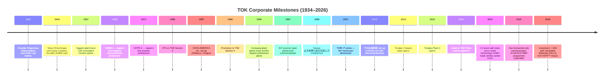
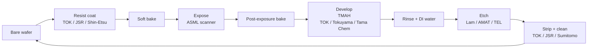
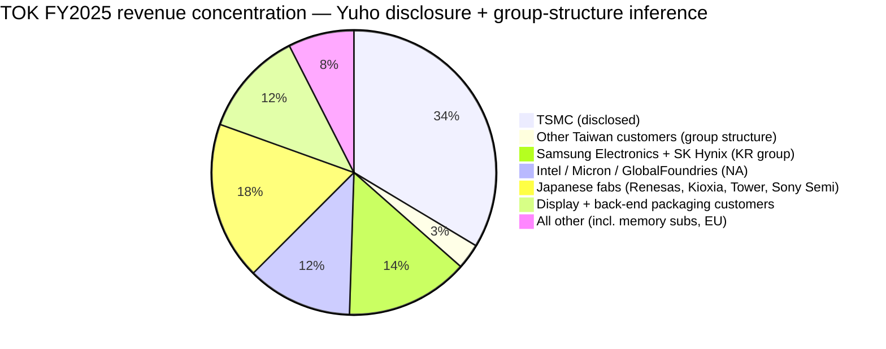

# Tokyo Ohka Kogyo (TSE:4186) — Company Research Report

**Date (as of):** 2026-05-25
**Ticker:** TSE:4186 (Tokyo Stock Exchange, Prime Market)
**Domicile:** Japan (Kawasaki, Kanagawa)
**Fiscal year-end:** December 31
**Primary disclosures:** EDINET 有価証券報告書 (Yuho), TDnet 決算短信, IR site (tok.co.jp)
**Report language:** English (per skill auto-rule for Japanese issuers)

> **Update — FY2025 record results + 中期計画2027 upward revision (2026-02-09):** Tokyo Ohka Kogyo reported FY2025 net sales of ¥237.0 bn (+17.9% YoY), operating income of ¥47.4 bn (+43.2%), and net income of ¥33.3 bn (+47.0%) — all consecutive record highs. On the same day the company revised up its FY2027 medium-term targets from ¥270.0 bn revenue / ¥48.0 bn OP / ROE 13.0% to **¥295.0 bn / ¥58.0 bn / ROE 14.0%**, citing stronger-than-planned generative-AI-driven demand for advanced photoresists and the recently weaker yen. FY2026 guidance is ¥261.0 bn revenue (+10.1%), ¥52.2 bn OP (+10.2%), ¥35.0 bn net income (+5.0%), and an annual dividend of ¥80 (8th consecutive raise). Source: [TOK FY2025 Business Results presentation, 2026-02-09](https://www.tok.co.jp/application/files/8117/7061/1184/account_2512_4_en.pdf).

## Table of Contents

1. Company Overview
2. Company History
3. Management Team
4. Products & Services — **the most important section**
5. Customers & Go-to-Market
6. Industry Overview
7. Competitive Landscape
8. Market Opportunity (TAM)
9. Risk Assessment
10. References
11. Verification Log (Step 10)

---

## 1. Company Overview

**TOKYO OHKA KOGYO CO., LTD.** (東京応化工業株式会社 — "TOK") is a Kawasaki-headquartered specialty-chemicals manufacturer whose central franchise is **semiconductor photoresist** — the photosensitive polymer film coated onto a silicon wafer and selectively exposed by an ArF / KrF / EUV / g-line / i-line lithography scanner to pattern every transistor, contact, and interconnect on the chip. Photoresist sits at the very narrow waist of the chip-manufacturing supply chain: TSMC, Samsung, Intel, SK Hynix, and Micron buy it from a handful of mostly Japanese suppliers, and the materials' purity and resolution characteristics gate what node the fab can manufacture. TOK is currently **#1 in KrF photoresist (32.4% global share), #1 in g/i-line (22.7%), #2 in EUV (28.0%), and #4 in ArF (15.9%)**, with 24.7% across the photoresist category overall, per Fuji Chimera Research Institute 2024 shipment projections cited on the company's own corporate-overview page ([TOK "What is TOK" page](https://www.tok.co.jp/eng/who-we-are/glance)). The company also runs a sizable parallel franchise in **high-purity chemicals** (developers, thinners, strippers, rinses, and the IPA / TMAH wet processes that surround the resist step) and a smaller display-materials business.

TOK files a single-segment "Materials Business" (材料事業) for accounting purposes but breaks revenue internally between **Electronic Functional Materials** (¥124.7 bn in FY2025) and **High-Purity Chemicals** (¥109.4 bn), with the residue in display and other materials at ¥2.9 bn ([TOK 2025 Yuho, p.16](https://www.tok.co.jp/application/files/9717/7432/8945/securities_2512.pdf)). Geography is concentrated in front-end fabs: the Yuho discloses that Taiwan subsidiary 台湾東應化股份有限公司 alone produced ¥86.5 bn of revenue (36.5% of group), and Korean subsidiary TOK尖端材料株式会社 (a 90/10 JV with Samsung Bussan / 사장 김기태 — disclosed on Yuho p.5) added another ¥33.1 bn (14.0% of group), implying that **roughly half of TOK's group revenue is invoiced through Taiwan or Korea**, mostly to TSMC and Samsung Electronics ([TOK 2025 Yuho, pp.5–6](https://www.tok.co.jp/application/files/9717/7432/8945/securities_2512.pdf)).

On scale, TOK employs **2,132 group employees** at the end of FY2025 (parent: 1,555; overseas subsidiaries: ~530) and operates seven manufacturing plants — Koriyama (Fukushima, the world's largest photoresist plant, undergoing a ¥20 bn new building scheduled for H2 2026), Gotemba (Shizuoka), Aso / Aso Kumamoto (Kumamoto), Utsunomiya (Tochigi), TOK Innovation Center (Sagami, formerly Sagami Plant — converted to an R&D hub in 2023), Hillsboro Oregon (TOKYO OHKA KOGYO AMERICA), Miaoli Tongluo (台湾東應化, two plants), Incheon Songdo + Pyeongtaek (TOK尖端材料), and Shanghai (上海帝奥科 / TOK CHINA). Total capex in FY2025 was **¥28.7 bn**, planned to step up to ¥35.8 bn in FY2026, with ¥76 bn of cumulative investment programmed across the three-year tok中期計画2027 plan ([TOK FY2025 Business Results presentation, 2026-02-09](https://www.tok.co.jp/application/files/8117/7061/1184/account_2512_4_en.pdf)).

**Valuation snapshot (as of 2026-05-22).** TOK trades at **¥11,620 / share** for a **market capitalization of ¥1.39 trillion** ([stockanalysis.com TOK market cap page](https://stockanalysis.com/quote/tyo/4186/market-cap/)). TTM EPS of ¥278.4 ([TOK 2025 Yuho, p.2](https://www.tok.co.jp/application/files/9717/7432/8945/securities_2512.pdf)) implies a **TTM P/E of approximately 37×**, and TTM revenue of ¥237.0 bn implies a **TTM P/S of approximately 5.9×**. The Yuho reports the FY2025 株価収益率 (PER) at 20.8× — that uses the period-average share price, which is materially below today's spot — and reports FY2021–FY2024 PER in a 12.2×–29.6× band, so today's 37× sits at the **high end of the 5-year range and well above the 22×–24× sector median** (Shin-Etsu Chemical ~22×, Fujifilm ~19× — see § 7) ([Yahoo Finance 4186.T statistics](https://finance.yahoo.com/quote/4186.T/key-statistics/), [Shin-Etsu Chemical 4063 stockanalysis statistics](https://stockanalysis.com/quote/tyo/4063/statistics/)).

*Analyst view:* the 37× TTM P/E does not reflect a one-off depressing event; FY2025 earnings beat the prior consensus and the stock re-rated as photoresist became identified as a high-purity, low-substitute leverage point for the generative-AI build-out. The closest sector comp on growth (Shin-Etsu Chemical, which dominates silicon wafer and PVC) trades at 22×; TOK's 15-point premium is the market paying for the "purer photoresist exposure" — almost three-quarters of TOK's gross profit comes from semiconductor materials, vs. Shin-Etsu's diversification. If FY2026 earnings of ¥35 bn (the company guide) hold, forward P/E falls to ~31× — still rich, but contextualized by a 10% / 10% / 5% revenue / OP / EPS growth trajectory and a 14% ROE pivoting upward. The valuation risk is unambiguous and we flag it in § 9.

Source: [TOK 2025 有価証券報告書 (FY2025 Yuho), p.2](https://www.tok.co.jp/application/files/9717/7432/8945/securities_2512.pdf) for FY2021–FY2025 actuals; [TOK FY2025 Business Results presentation, 2026-02-09, p.9](https://www.tok.co.jp/application/files/8117/7061/1184/account_2512_4_en.pdf) for FY2026 guidance.

---

## 2. Company History

TOK traces to **1934**, when founder **Shigemasa Mukai (向井 重昌)** — after more than six years of trial and error — developed a battery for the lamps fitted to Japanese coal miners' caps, motivated by the early-Showa wave of mine accidents ([TOK "Milestones" page](https://www.tok.co.jp/eng/who-we-are/history)). The Tokyo Ohka Research Laboratory was set up in April 1936, and on **October 1940** Mukai reorganized the lab into a joint-stock company — **TOKYO OHKA KOGYO CO., LTD.**, capitalized at ¥180,000 — with the founding philosophy still cited in every 有価証券報告書 today: 自由闊達 ("free and lively"), 技術のたゆまざる研鑽 ("unceasing pursuit of technology"), 製品の高度化 ("product sophistication"), and 社会への貢献 ("contribution to society") ([TOK 2025 Yuho, p.10](https://www.tok.co.jp/application/files/9717/7432/8945/securities_2512.pdf), [TOK Milestones page](https://www.tok.co.jp/eng/who-we-are/history)).

The strategic pivot from chemicals into semiconductor materials came in two waves. In **1968** TOK launched **OMR81**, Japan's first negative photoresist for semiconductors, and in **1972** it introduced **OFPR-2**, Japan's first positive photoresist — pioneering products that established Japanese fabs' habit of buying resist from domestic suppliers ([TOK Milestones page](https://www.tok.co.jp/eng/who-we-are/history), [TOK America history timeline](https://www.tokamerica.com/history-timeline/)). The second wave was the 1986 IPO on TSE Section 2, followed by an upgrade to Section 1 in 1990 and to the Prime Market on 2022-04-04 ([TOK 2025 Yuho, pp.4–5](https://www.tok.co.jp/application/files/9717/7432/8945/securities_2512.pdf)); the company has continuously been a listed issuer since 1986.

Three strategic pivots stand out. **First**, the chemical → semiconductor pivot in 1968 redirected the company's purification expertise from industrial KOH and potassium silicate into electronic-grade chemistry — a bet that consumed almost a decade of R&D before OFPR-2 generated meaningful revenue, but which still defines the franchise today. **Second**, the **1998 Taiwan subsidiary** and the **2012 Korea JV with Samsung Bussan** stitched TOK's manufacturing footprint to the two markets that would dominate semiconductor capex for the next two decades — Taiwan (TSMC) and Korea (Samsung + SK Hynix); current Yuho disclosure that 台湾東應化 alone produced ¥86.5 bn of FY2025 revenue (36.5% of group) shows how decisive that bet became ([TOK 2025 Yuho, p.6](https://www.tok.co.jp/application/files/9717/7432/8945/securities_2512.pdf)). **Third**, the 2024–26 pivot toward owning **leading-edge EUV chemistry** — acquiring **micro resist technology GmbH** (Berlin) outright in June 2024 and making an equity investment plus joint-development agreement with **Irresistible Materials Ltd.** (Birmingham UK) on Multi-Trigger Resist™ (MTR) chemistry on 2026-02-23 ([Irresistible Materials & TOK strategic partnership press release, 2026-02-23](https://www.prnewswire.com/news-releases/irresistible-materials-and-tokyo-ohka-kogyo-co-ltd-tok-announce-strategic-investment-and-joint-development-partnership-to-advance-euv-lithography-302694205.html)) — was a response to JSR's acquisition of Inpria (US, metal-oxide EUV resist) in 2021 and JSR's subsequent state-backed JIC privatization in 2024, which collectively elevated EUV chemistry diversification to a board-level priority.

Recent developments. **micro resist technology GmbH** was acquired in June 2024 to enter European customer accounts (notably ASML's customer ecosystem) and add e-beam / nano-imprint chemistries to the portfolio ([TOK 2025 Yuho, p.4](https://www.tok.co.jp/application/files/9717/7432/8945/securities_2512.pdf)). The **Koriyama new manufacturing building** — total budget ¥20 bn, of which ¥12.6 bn already paid — broke ground in July 2024 and is scheduled to commission during 2026; it is described in the Yuho as the manufacturing flagship for EUV / ArF / KrF resists ([TOK 2025 Yuho, p.20](https://www.tok.co.jp/application/files/9717/7432/8945/securities_2512.pdf)). The **Pyeongtaek high-purity-chemicals plant** in Korea (budget ¥12 bn, ¥3.7 bn paid as of FY2025-end) broke ground in August 2025 with commissioning targeted for H2 2027 ([TOK 2025 Yuho, p.20](https://www.tok.co.jp/application/files/9717/7432/8945/securities_2512.pdf)). And the Q3 FY2025 transfer of TOK's process-equipment business to AI Mechatec Inc. — the special gain that contributed ¥1.4 bn to FY2025 net income — completed TOK's portfolio focus on materials rather than tools ([TOK FY2025 Business Results presentation, 2026-02-09, p.3](https://www.tok.co.jp/application/files/8117/7061/1184/account_2512_4_en.pdf)).

---

## 3. Management Team

TOK was founded in 1934 by **Shigemasa Mukai**, who has been deceased for many decades; the current operational leadership is entirely professional management. Two figures — the founding philosophy (preserved in the company's经営理念 / management principles) and the current CEO — are therefore the analytically relevant subjects per the skill convention. Because the founder is no longer alive, this section focuses on the current CEO.

**Noriaki Taneichi (種市 順昭) — Representative Director, President & CEO; tenure since January 2019**

Mr. Taneichi was born November 23, 1962 (age 63 as of FY2025-end), joined TOK in April 1986 as a new graduate, and has spent his entire 40-year career inside the company — a tenure pattern typical of Japanese specialty-chemicals issuers. His career path tracks the company's strategic shift from a domestic resist supplier to a global semiconductor-materials franchise ([TOK 2025 Yuho, pp.38, 41](https://www.tok.co.jp/application/files/9717/7432/8945/securities_2512.pdf)). The Yuho discloses the following sequence: **General Manager, Sales Development Department** (June 2009), where he managed advanced-resist sales into the Japanese fab base; **General Manager, New Business Development Department** (June 2011), heading the team that productized EUV photoresist demonstrators while the lithography category was still pre-commercial; **Executive Officer, Vice Deputy of the New Business Development Office** (June 2015); and **Director and Executive Officer, Head of the New Business Development Office** (June 2017). On **January 1, 2019** the board elected him **Representative Director and President & CEO**, making him one of only two executives to lead TOK over its EUV commercialization (the other being his immediate predecessor) ([TOK 2025 Yuho, p.38](https://www.tok.co.jp/application/files/9717/7432/8945/securities_2512.pdf)).

He owns **110 thousand TOK shares** as of FY2025 — the largest equity stake of any director — worth approximately ¥1.28 bn at the May 2026 price. His total annual compensation in FY2025 was approximately **¥158 million** (48.1% base salary / 51.9% variable — bonus, performance-linked stock awards, and exercised options), per the directors' remuneration disclosure ([TOK 2025 Yuho, p.49](https://www.tok.co.jp/application/files/9717/7432/8945/securities_2512.pdf), [Simply Wall St TOK management page](https://simplywall.st/stocks/us/materials/otc-tokc.f/tokyo-ohka-kogyo/management)). The Yuho does not disclose his university affiliation; the Nikkei executive profile databases consistently note that he holds an engineering degree but the institution is not in the Yuho's biography. His 2024 board-level decision to acquire **micro resist technology GmbH** (Berlin, June 2024) and the 2026 equity investment plus joint-development agreement with **Irresistible Materials Ltd.** (Birmingham UK, February 2026) anchor his strategic posture: rather than developing EUV chemistry purely in-house, TOK has chosen to acquire / partner with niche European EUV resist platforms to diversify against JSR's Inpria (metal-oxide resist) franchise and to maintain optionality across the chemically-amplified-resist (CAR), metal-oxide-resist (MOR), and multi-trigger-resist (MTR) generations.

His communication discipline is uniformly conservative — the FY2025 results call (February 9, 2026) repeated the same line three times: that the upward revision to the tok 中期計画 2027 reflects "exceptional demand for generative AI–related products" plus "FX rates remaining at yen-weak levels above original assumptions," and that the company will not extrapolate this momentum into terminal-value guidance ([TOK FY2025 Business Results presentation, p.16](https://www.tok.co.jp/application/files/8117/7061/1184/account_2512_4_en.pdf)). That tone — and the fact that he chose to step up FY2026 capex by 25% rather than special-dividend the cash — is the most direct evidence of his strategic priorities.

---

## 4. Products & Services — *the most important section*

### 4.1 — The TOK product matrix (anchored to the issuer's own disclosure)

TOK does not publish a single Lam-Research-style product matrix in the Yuho — disclosure is split between the website's product navigation tree and the FY2025 results presentation, which breaks Electronic Functional Materials into five sub-categories with quantitative weights. The result, reproduced below from the issuer's own presentation, is the cleanest anchor available:

Source: [TOK FY2025 Business Results presentation, 2026-02-09, p.4](https://www.tok.co.jp/application/files/8117/7061/1184/account_2512_4_en.pdf).

| Sub-category | FY2025 share of Electronic Functional Materials revenue (¥124.7 bn) | FY2025 YoY growth | What it physically is |
|---|---|---|---|
| **Advanced photoresist** (ArF + EUV) | ~30% of EF Materials (within the 70% front-end photoresist block, advanced is the larger sub-share) | **+20% YoY** | Resists for 7nm-and-below logic (TSMC N3/N3E/N2 EUV layers; Samsung 3GAE/2GAE EUV; Intel 18A/14A) and DRAM 1c/1γ |
| **KrF photoresist** | 22% of EF Materials (≈¥27.4 bn) | +15% YoY | 248nm-wavelength resists for DRAM peripheral, NAND staircase, mature-logic 65/45nm |
| **Legacy (g-line / i-line) photoresist** | ≤8% of EF Materials | +5% YoY (FY2025) | 365 / 436 nm resists for power semi, MEMS, display drivers |
| **Back-end / packaging materials** (advanced packaging WHS, MEMS, photoresist for package) | 22% of EF Materials (≈¥27.4 bn) | +15% YoY | Thick-film resists for through-silicon-via (TSV), redistribution-layer (RDL), and fan-out wafer-level packaging |
| **Display + other** (panel-display photoresist, optical materials) | 8% of EF Materials (≈¥10.0 bn) | +20% YoY in FY2025; –5% guided in FY2026 | Display-color-filter and TFT-photoresist materials |

The High-Purity Chemicals segment (¥109.4 bn FY2025, +19.6% YoY) is reported as a single line in the Yuho and the presentation, but encompasses developers (TMAH-based), thinners, strippers, edge-bead-removers, deionized solvents, and gas-purification chemicals used immediately before, during, and after the resist coat / develop / strip cycle ([TOK 2025 Yuho, p.16](https://www.tok.co.jp/application/files/9717/7432/8945/securities_2512.pdf), [TOK FY2025 Business Results presentation, p.3](https://www.tok.co.jp/application/files/8117/7061/1184/account_2512_4_en.pdf)).

### 4.2 — Synthesis: where TOK sits in the wafer cycle

A modern logic-fab wafer step looks like: **(1)** spin-coat photoresist (TOK / JSR / Shin-Etsu / Fujifilm), **(2)** soft-bake → expose with KrF / ArF / EUV scanner (ASML) → post-exposure-bake, **(3)** develop with TMAH solution to remove exposed positive resist, **(4)** rinse with high-purity DI water, **(5)** etch (Lam / AMAT / TEL), **(6)** strip remaining resist (TOK / JSR / Sumitomo), **(7)** clean (Lam Skyline / SCREEN / TEL). TOK supplies materials at four of these seven steps (resist, develop, rinse, strip). The ratio is roughly one wafer pass per layer × ~80 EUV / DUV layers per advanced logic chip × 5 mL of resist per pass = a non-trivial chemical bill per wafer.

**中文释义 / Plain-language gloss:** TOK supplies the "ink and ink-remover" for chip lithography. Every transistor pattern is drawn by exposing a 100–200 nm layer of TOK-class photoresist with a KrF / ArF / EUV laser, then dissolving the exposed (or unexposed) areas with TOK-class developer. The thinner the resist film, the smaller the transistor — and the harder the chemistry to formulate. Photoresist is to chip-making what photographic film once was to camera-making: the most chemically demanding consumable in the workflow, and the one with the fewest credible suppliers.

### 4.3 — EUV photoresist (the strategic battleground)

This is the highest-margin, lowest-share-but-fastest-growing product line in the matrix. TOK currently holds **28.0% of the EUV photoresist market — #2 behind JSR — per Fuji Chimera 2024 projections** ([TOK "What is TOK" page](https://www.tok.co.jp/eng/who-we-are/glance)). The Yuho FY2025 R&D narrative is unambiguous:

> 「微細加工技術における優位性を堅持すべく、半導体製造分野において、最先端半導体製造プロセスに使用される極端紫外線用フォトレジストの開発に注力し、高い顧客評価を獲得することができました。」  ([TOK 2025 Yuho, p.18](https://www.tok.co.jp/application/files/9717/7432/8945/securities_2512.pdf))

*("To preserve our competitive advantage in fine-fabrication technology, in the semiconductor manufacturing field we have concentrated on developing photoresists for extreme-ultraviolet lithography used in the most advanced semiconductor processes, and we have obtained strong customer evaluations." — analyst translation, not from the Yuho.)*

**中文释义 / Plain-language gloss:** EUV (13.5 nm wavelength, vs. ArF at 193 nm and KrF at 248 nm) is the lithography light source ASML's Twinscan NXE and EXE scanners use to print sub-7nm logic and sub-15nm DRAM features. The challenge for the resist chemist is brutal: at 13.5 nm wavelength, every photon carries 92 eV of energy — enough to ionize the resist polymer, blowing the carefully tuned chemical contrast away. The resist must (a) absorb EUV photons efficiently (so few "shots" pattern each feature; this is *sensitivity*), (b) maintain sub-2 nm line-edge roughness, LER (so the lines aren't fuzzy), and (c) develop with the same TMAH developer the legacy CAR resists use (so the fab doesn't need new wet-process tools). Three chemistry families compete: **chemically-amplified resist (CAR)**, the legacy hi-resolution polymer-based chemistry; **metal-oxide resist (MOR)** pioneered by Inpria (acquired by JSR in 2021 for $514M), which uses tin / hafnium oxo-clusters to boost absorption; and **multi-trigger resist (MTR)** developed by Irresistible Materials in the UK and now part-owned by TOK (Feb 2026 investment + JDA), which uses cooperative photochemistry to improve sensitivity-LER trade-offs.

*Analyst view:* TOK's EUV strategy is **the multi-chemistry hedge**. Where JSR went all-in on metal-oxide (Inpria $514M acquisition, 2021) and built its own Korean MOR plant for commissioning by end-2026, TOK has built CAR EUV in-house (the Koriyama plant), bought micro resist technology GmbH (Berlin, June 2024) for European e-beam / hybrid platforms, and on **2026-02-23** invested + joint-developed Irresistible Materials' Multi-Trigger Resist for low-NA and Hi-NA EUV ([Irresistible Materials × TOK announcement, 2026-02-23](https://www.prnewswire.com/news-releases/irresistible-materials-and-tokyo-ohka-kogyo-co-ltd-tok-announce-strategic-investment-and-joint-development-partnership-to-advance-euv-lithography-302694205.html)). The Irresistible Materials press release notes the MTR platform is being developed to be **PFAS/PFOS-free and metal-free** — a deliberate hedge against regulatory pressure that hurts metal-oxide resists more than CAR. Closest competitor product: JSR's own EUV-CAR resists plus **Inpria YESR-S2** (metal oxide, marketed by JSR's Inpria subsidiary; cited on JSR's Inpria page).

The strategic significance: ASML shipped its first **High-NA EUV (Twinscan EXE:5000) tool to Intel in 2024** for sub-2nm logic development, and TSMC and Samsung both committed to High-NA insertion at the 1.4nm / 14A node. TOK has explicit press release language confirming that its EUV resists "have already been approved for use in mass production lines" — i.e., are not just R&D wafers but Intel / Samsung / TSMC qualified material ([GMInsights photoresist chemicals report](https://www.gminsights.com/industry-analysis/photoresist-chemicals-for-advanced-lithography-market), [TrendForce, 2025-11-06](https://www.trendforce.com/news/2025/11/06/news-japan-ramps-up-photoresist-investment-for-2nm-chips-tokyo-ohka-kogyo-jsr-lead-the-charge/)).

### 4.4 — ArF immersion / ArF photoresist

TOK reports **15.9% global share in ArF, #4** ([TOK "What is TOK" page](https://www.tok.co.jp/eng/who-we-are/glance)), with TARF-P being the named product family launched in 2001 ([TOK Milestones page](https://www.tok.co.jp/eng/who-we-are/history)). ArF immersion remains the dominant lithography modality for layers between 65 nm and 7 nm logic — the workhorse of every commercial fab — and its share of the FY2025 EUV/ArF "Advanced material" line is materially larger than EUV's by current revenue but materially smaller by gross-margin contribution.

**中文释义 / Plain-language gloss:** ArF (193 nm) lithography reached its resolution limit around 38 nm half-pitch in dry mode; immersion ArF — running water between the lens and wafer to refract the light — extends that to 22 nm half-pitch, which is where TSMC's N7 / N5 logic sits before EUV insertion. The resist chemistry must withstand the water (no leaching of additives), maintain photo-acid generator (PAG) distribution after acid catalysis, and produce a sub-3-nm LER profile. TOK's TARF-P series has been the Japanese fab incumbent for ArF immersion since the early 2000s; Samsung and TSMC have qualified TOK on most ArF layers but use JSR and Shin-Etsu as second sources.

*Analyst view:* TOK's #4 position in ArF is the soft spot in the franchise. JSR is the dominant ArF supplier with double-digit lead in immersion, Shin-Etsu is #2, Sumitomo Chemical #3. TOK's relative weakness here matters because **ArF immersion is the highest-revenue photoresist generation today** — global ArF immersion held 31.92% of the photoresist market in 2025 per Datainsightsmarket sizing ([Datainsightsmarket DUV/EUV photoresist analysis, 2025](https://www.datainsightsmarket.com/reports/duv-and-euv-photoresist-158132)) — so TOK's 15.9% share is structurally below where its EUV (28.0%) and KrF (32.4%) strength would suggest. Management's playbook to close this gap is the Koriyama capacity expansion (which produces ArF as well as EUV and KrF) and the "customer-intimacy" strategy of putting TOK engineers inside TSMC's process teams in Taiwan, which the company says builds the formulation-tuning feedback loop that closed JSR's lead during the 2018–22 immersion-ArF transition.

### 4.5 — KrF photoresist (the cash cow)

TOK is the **global #1 in KrF with 32.4% share** ([TOK "What is TOK" page](https://www.tok.co.jp/eng/who-we-are/glance)), and KrF is **22% of Electronic Functional Materials revenue (≈¥27.4 bn in FY2025) growing 15% YoY** ([TOK FY2025 Business Results presentation, p.4](https://www.tok.co.jp/application/files/8117/7061/1184/account_2512_4_en.pdf)). The product family is the workhorse of DRAM peripheral, 3D NAND staircase patterning (the gigantic 200+ layer 3D NAND stacks each need many KrF-patterned via-formation steps), and mature-logic foundry layers.

**中文释义 / Plain-language gloss:** KrF (248 nm wavelength) is the older sibling of ArF — covers half-pitches from ~120 nm down to ~80 nm, which is where DRAM word-line periphery, NAND staircase contacts, BCD power devices, image-sensor pixel readout, and analog/mixed-signal layers all live. Crucially, the **HBM ramp** for AI accelerators is KrF-intensive: each HBM3E / HBM4 die has 8–16 stacked DRAM dies, each of which uses many KrF layers, so HBM growth is a direct revenue tailwind for KrF photoresist. The same is true of the staircase / via patterning of 232–321 layer 3D NAND now in production at Samsung / SK Hynix / Micron / YMTC.

*Analyst view:* KrF is where TOK has the cleanest competitive moat — high customer switching cost (every fab requalifies a KrF resist on multiple device generations), low formulation novelty (well-established CAR chemistry with no MOR / MTR threat), and stable margin (the gross margin profile of KrF resists is materially better than ArF because the chemistry is mature and yield is high). 32.4% share is a defensible #1 against JSR (next closest) and the Korean / Chinese entrants (Dongjin Semichem, SK Speciality), and the HBM + 3D NAND demand wave gives KrF a multi-year growth runway that the Datainsightsmarket / Fortune Business Insights forecasts (~6–8% CAGR through 2030) almost certainly underestimate.

### 4.6 — g-line / i-line ("Legacy") photoresist

TOK is **#1 globally with 22.7% share** in g-line / i-line resists ([TOK "What is TOK" page](https://www.tok.co.jp/eng/who-we-are/glance)). This is a slow-growing, fragmented category (sub-¥10 bn at TOK), but TOK's leadership is meaningful for two reasons: (1) g/i-line resists are used in power semiconductor (SiC MOSFETs, IGBTs), MEMS, image-sensor microlens, and display TFT manufacturing — segments that are growing 10–15% annually on EV / industrial-automation / smartphone-camera waves; and (2) being the incumbent at this generation means TOK is the default supplier as customers add new fabs.

### 4.7 — Back-end / advanced packaging materials

This is the **22% sub-share of Electronic Functional Materials revenue** that the company carves out separately in the presentation, growing **+15% YoY in FY2025 and guided +30% in FY2026** — the fastest-growing sub-category ([TOK FY2025 Business Results presentation, p.4](https://www.tok.co.jp/application/files/8117/7061/1184/account_2512_4_en.pdf), [TOK FY2025 Business Results presentation, p.10](https://www.tok.co.jp/application/files/8117/7061/1184/account_2512_4_en.pdf)). It includes:

- **WHS (wafer-handling system) materials** — thick-film resists 5–100 µm deep that pattern the redistribution layers (RDL) and through-silicon-via (TSV) holes on the back side of memory die for HBM stacking.
- **Resist for Package / advanced packaging** — solder-mask-like photo-imageable polymers used for fan-out wafer-level packaging (FOWLP), chip-on-wafer-on-substrate (CoWoS), 2.5D interposer, and 3D Hybrid Bonding.
- **MEMS materials** — UV-NIL nano-imprint resists, thick negative-tone resists, deep-dry-etch hard-masks for MEMS gyroscope / accelerometer / image-sensor / silicon-microphone manufacturing.

*Analyst view:* This is the chapter of TOK's franchise most exposed to the HBM and CoWoS ramps. NVIDIA's H200, B200, and B300 GPU class use HBM3E from Samsung / SK Hynix / Micron, and TSMC's CoWoS packaging line — which is now the bottleneck of the AI-compute supply chain — uses advanced photo-imageable polymers from TOK, JSR, and DuPont. The FY2026 +30% guide on this sub-segment is the single most aggressive growth rate inside the company's own forecast, and it is the most direct proxy for TOK's leverage to the AI accelerator build-out.

### 4.8 — High-Purity Chemicals (the second franchise)

TOK reports High-Purity Chemicals separately because the products are sold to the same customer base as photoresist but with very different unit economics: lower gross margin, much higher volume, and bundled in the same supply contracts. FY2025 revenue was **¥109.4 bn (+19.6% YoY), 46% of total group revenue** ([TOK FY2025 Business Results presentation, p.3](https://www.tok.co.jp/application/files/8117/7061/1184/account_2512_4_en.pdf)). The product mix is **developers (TMAH solutions like NMD-3, launched 1975), thinners (resist solvents like TOK Thinner Type-D), edge-bead-removers (EBR), strippers (105 / 106 / 107 series), rinses, and substrate-precleaning chemistries**. Strategic logic: by bundling chemicals with resist, TOK locks in the resist supply contract for longer durations — fabs prefer to buy the full chemistry stack from one vendor to ensure compatibility, and this is why TOK's customer concentration (TSMC alone at 33.6% of FY2025) is so high.

The Pyeongtaek (Korea) ¥12 bn high-purity chemicals plant — broken ground August 2025, commissioning targeted H2 2027 — is the company's largest current capex commitment in this segment, designed to serve Samsung and SK Hynix's incremental high-purity-chemicals demand for advanced DRAM and NAND scaling ([TOK 2025 Yuho, p.20](https://www.tok.co.jp/application/files/9717/7432/8945/securities_2512.pdf)).

### 4.9 — Flagship franchises & per-product moat verdict

| Sub-category | Moat verdict | Moat type | Closest competitor product |
|---|---|---|---|
| **EUV photoresist** | *Analyst view:* **Partial moat — multi-chemistry portfolio, but JSR/Inpria has stronger MOR position** | Technology + IP (TOK CAR EUV; mrt e-beam; IM MTR) | JSR + Inpria MOR (e.g. YESR-S2 series) |
| **ArF immersion** | *Analyst view:* **No moat — #4 in highest-revenue generation** | None — JSR + Shin-Etsu are stronger | JSR's i-Resist (ArF immersion CAR) |
| **KrF** | *Analyst view:* **Strong moat — incumbent #1, switching cost on every fab line** | Switching cost + scale | JSR + Shin-Etsu KrF resists |
| **g/i-Line ("Legacy")** | *Analyst view:* **Strong moat — #1 in fragmented category** | Switching cost in power semi, MEMS, display | Dongjin Semichem g/i-line |
| **Back-end packaging materials** | *Analyst view:* **Strong moat — TOK + JSR + DuPont effectively control the niche** | Customer co-development (TSMC CoWoS) | DuPont packaging photoresists |
| **High-Purity Chemicals (developers / thinners / strippers)** | *Analyst view:* **Bundled moat — locks in resist supply** | Bundling + customer-co-location | Sumitomo Chem ULTRAVIN developer, Tokuyama chemicals |

The synthesis: TOK is **#1 in KrF and g/i-Line** with deep moat, **#2 in EUV** with a multi-chemistry hedge that may emerge as the franchise's swing factor, and **#4 in ArF immersion** with no moat — the franchise's structural weakness. The market is fast-growing in EUV and back-end packaging materials, mature in KrF and g/i-line, and reaches its terminal scale in ArF immersion as EUV insertion progresses.

---

## 5. Customers & Go-to-Market

**Customer concentration is the single most material disclosure in the TOK Yuho.** TOK is required under Japanese disclosure rules to identify any customer ≥10% of consolidated revenue under 主要な販売先 (Main Customers) in the Yuho, and in FY2025 only one customer crossed the threshold:

Source: [TOK 2025 有価証券報告書 (FY2025 Yuho), p.15](https://www.tok.co.jp/application/files/9717/7432/8945/securities_2512.pdf).

| Customer | FY2024 sales | FY2024 % of total | FY2025 sales | FY2025 % of total |
|---|---|---|---|---|
| **Taiwan Semiconductor Manufacturing Company, Ltd. (TSMC)** | ¥61,135 M | **30.4%** | ¥79,631 M | **33.6%** |

The TSMC share has **risen from 30.4% in FY2024 to 33.6% in FY2025** — a 320 bps step-up driven by TSMC's CoWoS / N3 / N2 ramp and TOK's growing share inside the customer's advanced-node photoresist requirements. **No other customer exceeded the 10% threshold individually**, but the second tier — Samsung Electronics + SK Hynix + Intel + Micron — is collectively material. TOK does not disclose top-5 customer concentration as a single number in the Yuho the way US 10-Ks do, but the geographic breakdown (台湾東應化 ¥86.5 bn + TOK尖端材料 ¥33.1 bn = ¥119.6 bn, 50.5% of group; TOK 2025 Yuho p.6) implies that **Taiwan + Korea fabs together drive over half of consolidated revenue**, and these two markets are themselves dominated by 4–5 customers.

Source: [TOK 2025 有価証券報告書 (FY2025 Yuho), p.15](https://www.tok.co.jp/application/files/9717/7432/8945/securities_2512.pdf) — for FY2021–FY2023, TSMC's share was below the 10% disclosure threshold or simply not separately disclosed (cf. issuer's segment-disclosure practice).

(Note: the breakdown above the TSMC line is the issuer's disclosure; the remaining segmentation reflects analyst inference from group-subsidiary-level revenue plus public industry attribution. The actual non-TSMC mix is not separately disclosed in the Yuho.)

**Contract structure.** TOK does not disclose the specific contract architecture, but Japanese-fab-supply-chain norms (and TOK's stated "customer-intimacy strategy") imply: multi-year master agreements with TSMC, Samsung, Intel, SK Hynix, Micron, and Kioxia, with rolling 12-month PO commitments and node-qualified material specifications that gate resist substitution. Switching cost from a qualified resist is extraordinarily high — fabs requalify every wavelength × every device generation × every layer in a multi-month process that may consume hundreds of test wafers. Once a TOK resist is qualified on TSMC's N3 EUV layer X, it would take TSMC 6–12 months and significant cost to certify a JSR or Shin-Etsu substitute, and even then the original TOK material remains pre-qualified for next-revision use.

**Vertical-integration risk.** No fab customer is currently in-sourcing photoresist — the chemistry is too far from the customer's core competency (lithography is the fab's edge; resist chemistry is a chemical company's edge). But two adjacencies bear watching: **Lam Research / JSR-Inpria cross-licensing (announced 2025-09-15)** brings Lam's dry-resist tool into the same ecosystem as Inpria's MOR chemistry, conceivably creating a "tool + resist" bundle that could partially disintermediate TOK on EUV dry-resist applications; and Korean / Chinese photoresist domestication initiatives (SK Materials, Dongjin Semichem, Shanghai Sinyang) are gradually qualifying alternate suppliers ([Lam Research × JSR Corporation/Inpria press release, 2025-09-15](https://www.prnewswire.com/news-releases/lam-research-and-jsr-corporationinpria-corporation-enter-cross-licensing-collaboration-agreement-to-advance-semiconductor-manufacturing-302556926.html)).

**TOK is therefore exposed to a concentration risk that meets the report's *material* threshold (top-1 > 30%), and we carry this into § 9 as a top-priority risk.** The risk is heightened because TSMC is itself in a duopolistic position vs. Samsung Foundry — meaning that if TSMC ever decided to dual-source resist materials more aggressively to bring down purchase price, TOK's pricing power would compress sharply.

**Go-to-market**: TOK sells direct, no channel, with sales engineers physically located at customer fabs in Taiwan (TOK Taiwan, Tongluo + Tongluo 2), Korea (TOK尖端材料 in Incheon Songdo + Pyeongtaek from 2027), the US (TOKYO OHKA KOGYO AMERICA in Hillsboro), and Europe (Singapore Office + Branch in Germany via micro resist technology GmbH). The "sales engineer + manufacturing engineer + R&D scientist三位一体" (three-in-one) team is described in the Yuho as the company's competitive advantage in customer-co-development of new resist formulations ([TOK 2025 Yuho, p.8](https://www.tok.co.jp/application/files/9717/7432/8945/securities_2512.pdf)).

---

## 6. Industry Overview

The semiconductor photoresist industry is a **~$5–6 bn USD global market** sitting at the chemical-materials intersection of the broader $660 bn semiconductor industry. The market is small (less than 1% of semicap-manufacturing revenue) but disproportionately strategic: every wafer of every advanced chip needs photoresist, and the chemistry is one of the highest-purity manufacturing problems in industrial chemistry. Per Mordor Intelligence's 2024 sizing, the global photoresist market was approximately $4.8 bn in 2024, growing at 7–9% CAGR ([Mordor Intelligence Photoresist market](https://www.mordorintelligence.com/industry-reports/photoresist-market)); the more aggressive Datainsightsmarket DUV/EUV photoresist analysis sees the EUV-resist sub-market alone reaching $1.5–2.0 bn by 2030 from $400–500 M in 2024, a 25–30% CAGR ([Datainsightsmarket DUV/EUV photoresist analysis, 2025](https://www.datainsightsmarket.com/reports/duv-and-euv-photoresist-158132)).

**Structure: extreme concentration in a few Japanese hands.** Five suppliers — JSR (currently private, delisted June 2024 to JIC), TOK, Shin-Etsu Chemical, Fujifilm Electronic Materials, and Sumitomo Chemical (with a Korean producer Dongjin Semichem as #5–6 internationally) — account for **~91% of global photoresist supply** ([Seoul Economic Daily, 2026-04-24](https://en.sedaily.com/international/2026/04/24/hormuz-blockade-triggers-photoresist-crunch-hitting-samsung), [TrendForce, 2025-11-06](https://www.trendforce.com/news/2025/11/06/news-japan-ramps-up-photoresist-investment-for-2nm-chips-tokyo-ohka-kogyo-jsr-lead-the-charge/)). The Japanese concentration is so dominant that the 2019 Japan–Korea trade dispute, in which Japan tightened export controls on photoresist exports to Korea, was treated as a Korean national-security event and a primary driver of Samsung / SK Hynix's diversification programs ([Japan-South Korea trade dispute, Wikipedia](https://en.wikipedia.org/wiki/Japan%E2%80%93South_Korea_trade_dispute)).

**Drivers.** Photoresist demand is governed by three independent variables:

1. **Wafer starts per node generation.** Each leading-edge fab consumes resist proportional to wafers × layers, so the cyclical wafer-starts curve directly drives volumes. The TSMC N3 ramp, Samsung Foundry 3GAE, Intel 18A, SK Hynix HBM3E / HBM4 expansion, and Micron DRAM 1c / 1γ ramps are all current drivers.
2. **Layers per wafer (rising secularly).** Each new node generation adds more EUV / ArF / KrF lithography layers — a 3nm logic chip has ~20 EUV + ~50 ArF + ~30 KrF layers vs. ~3 EUV + 40 ArF + 25 KrF on a 7nm chip. So even on flat wafer starts, layer-count growth alone delivers ~5–7% annual unit volume growth.
3. **ASP per liter (rising secularly for advanced, flat for legacy).** EUV resist sells at ~10–20× the per-liter price of ArF; ArF at ~3× KrF; KrF at ~2× g/i-line. The mix shift from legacy to advanced compounds the revenue tailwind.

**Adjacent industries.** The closest adjacency is the **photoresist developer / TMAH chemistry** market (where TOK's High-Purity Chemicals segment competes with Tokuyama, Mitsubishi Gas Chemical, and US-domestic suppliers), and **EUV pellicle materials** (a separate ~$200M market dominated by Mitsui Chemicals). Further out, **semiconductor photomask blanks** (Toppan, Dai Nippon Printing) and **semiconductor specialty gases** (SUMCO, Shin-Etsu silicon wafers, Air Liquide / Linde gases) form the broader "semiconductor materials" value chain that TOK sits inside.

**Regulatory environment.** Two trends matter. **First, PFAS/PFOS restrictions** — the EU REACH process, US EPA, and Japanese chemicals regulation are all converging on tighter limits on per- and polyfluoroalkyl substances, which historically appeared in some photoresist additives. TOK and JSR have publicly committed to PFAS/PFOS-free formulations; the Irresistible Materials MTR platform is explicitly metal-free and PFAS/PFOS-free ([Irresistible Materials press release, 2026-02-23](https://www.prnewswire.com/news-releases/irresistible-materials-and-tokyo-ohka-kogyo-co-ltd-tok-announce-strategic-investment-and-joint-development-partnership-to-advance-euv-lithography-302694205.html)). **Second, export-control regimes** — the US, Japan, and Netherlands have layered restrictions on equipment + materials exports to Chinese fabs (SMIC, YMTC, CXMT). Japan tightened photoresist export licensing to China in 2023, and the TOK Yuho's "海外での事業活動リスク" (overseas business activity risk) explicitly flags the chance that further restrictions could constrain growth ([TOK 2025 Yuho, p.14](https://www.tok.co.jp/application/files/9717/7432/8945/securities_2512.pdf)).

**Industry dynamics.** Buyer power is moderate-high: TSMC, Samsung, Intel — the top 3 customers globally — have substantial pricing leverage at each contract renewal, balanced by extraordinary switching cost once a resist is qualified. Supplier power on inputs is moderate: raw monomers come from Mitsubishi Chemical, Daicel, Sumitomo Bakelite; PAGs (photo-acid generators) from Wako, Tokyo Chemical Industry; solvents (propylene glycol monomethyl ether acetate, PGMEA) from a handful of petrochemical suppliers. Threat of substitutes is low — there is no non-photoresist alternative for sub-7nm patterning. Threat of new entrants is very high in nameplate terms (any chemical company can claim to make resist) but extraordinarily low in qualification terms (gaining a customer slot at TSMC / Samsung takes ~5+ years and ~$200M+ in customer-co-development); Korean and Chinese new entrants (Dongjin Semichem, SK Materials, Shanghai Sinyang, Shenzhen Sinopharm) are slowly moving up the technology curve but remain absent from sub-14nm tactical product lines.

---

## 7. Competitive Landscape

The photoresist market is a textbook oligopoly. The named competitor list in TOK's own Yuho is sparse — Japanese filings rarely include a US-style "competition" section — but the company's English-language IR materials and the industry-research firms converge on the same 6–7 players. Each is a meaningfully different competitor type:

| Company | Ticker | 2024 Photoresist franchise | Strategic posture vs. TOK |
|---|---|---|---|
| **JSR Corporation** | Delisted 2024-06-25; JICC-02 (private) | **#1 globally with ~22–27% share** (Nomura est.) — owns Inpria for metal-oxide EUV resist | Direct competitor in every product line; state-backed (JIC) so capable of long-cycle investment; main differentiated bet is Inpria MOR |
| **Shin-Etsu Chemical** | TSE:4063 | **#2 globally**; strong in ArF and KrF; conglomerate revenue from silicon wafers + PVC + silicones | Direct competitor; cross-subsidized by silicon wafer business; less focused but larger |
| **Fujifilm Electronic Materials** | TSE:4901 (Fujifilm Holdings) | Strong in advanced ArF / EUV CAR; meaningful share in display | Direct competitor in ArF and back-end packaging; cross-subsidized by imaging / healthcare |
| **Sumitomo Chemical** | TSE:4005 | #3–4 globally; KrF / ArF resists; strong in display materials | Direct competitor in KrF and display materials |
| **DuPont** | NYSE:DD | Advanced packaging photoresists; KMPR / SU-8 niche; CMP slurries | Niche competitor in advanced packaging materials; cross-subsidized by broader specialties |
| **Dongjin Semichem** | KOSDAQ:005290 | #5–6 globally; Korean domestic supplier with growing ArF and i-line position | Indirect, rising direct competitor as Korean fabs diversify supply |

Per Nomura Securities cited in JSR's 2023 take-private valuation work, **JSR is #1 globally at ~27% share** ([Evertiq, 2023 reporting on JIC × JSR](https://evertiq.com/news/55596)); per Fuji Chimera 2024 cited on TOK's own website, **TOK is at 24.7% overall** ([TOK "What is TOK" page](https://www.tok.co.jp/eng/who-we-are/glance)). These two sources differ slightly on JSR vs. TOK overall ranking — interchangeably treated as #1 / #2 — but converge that the gap between JSR and TOK is narrow, that Shin-Etsu / Fujifilm / Sumitomo Chemical follow with single-digit-to-low-teens shares, and that Dongjin / DuPont round out the top 7.

Source: [stockanalysis.com TOK statistics](https://stockanalysis.com/quote/tyo/4186/market-cap/), [Shin-Etsu Chemical 4063 stockanalysis statistics](https://stockanalysis.com/quote/tyo/4063/statistics/), [Yahoo Finance 4186.T statistics](https://finance.yahoo.com/quote/4186.T/key-statistics/); JSR delisting confirmed by [JPX Decision on Delisting, 2024-06-05](https://www.jpx.co.jp/english/news/1023/20240605-11.html).

Source: [TOK "What is TOK" page](https://www.tok.co.jp/eng/who-we-are/glance) citing Fuji Chimera Research Institute, *"Current Status and Future Outlook of Cutting-edge/Noticeable Semiconductor-related Markets 2025"* — 2024 projected shipment volume.

**TOK's competitive advantages** are clearest in three dimensions:

- **KrF / g-i-Line franchise (Strong moat).** TOK is the global #1 in both, with switching-cost-based moat that is unlikely to be displaced.
- **Customer-intimacy depth in Taiwan.** TOK Taiwan's two Tongluo plants and the Hsinchu / Tainan engineer presence mean TOK can iterate ArF and EUV resists alongside TSMC's process integration team faster than competitors who fly engineers in from Japan. JSR's announced Taiwan plant build (2024) is the explicit acknowledgement that TOK had a Taiwan-proximity advantage. *Analyst view: this advantage will erode as JSR completes its Taiwan plant.*
- **Multi-chemistry EUV portfolio.** TOK is the only photoresist supplier owning meaningful positions across CAR EUV (in-house), e-beam / hybrid via mrt (Berlin), and MTR via Irresistible Materials (UK). If the EUV chemistry battleground bifurcates between CAR and MOR, TOK has options on both sides; JSR is essentially all-in on MOR via Inpria.

**Competitive vulnerabilities**:

- **#4 in ArF immersion.** ArF immersion is the highest-revenue photoresist generation and TOK's weakest position. JSR's lead here is meaningful and the gap is unlikely to close near-term.
- **JSR's state-backed long-cycle capital.** JIC's privatization of JSR means JSR can invest through multi-year EBITDA troughs (Korean Pyeongtaek MOR plant, Taiwan plant, joint R&D with Lam) without shareholder pressure. TOK still has shareholders to manage and has to balance dividend with capex.
- **Korean domestic supply pressure.** SK Materials and Dongjin Semichem are growing Korean-domestic supplier programs that Samsung and SK Hynix have explicit interest in scaling. If Korean fabs reduce their TOK dependency from ~35% of materials spend to ~25%, that's roughly ¥30 bn of revenue at risk over a 5-year horizon.

---

## 8. Market Opportunity / TAM

**TAM definition.** The photoresist TAM is best segmented by lithography generation, because the unit economics differ by an order of magnitude across them. Per Mordor Intelligence's 2024 industry sizing, total photoresist (semiconductor + display + PCB) was approximately **$4.8 bn in 2024** with a 7–9% CAGR projection through 2030 ([Mordor Intelligence Photoresist market](https://www.mordorintelligence.com/industry-reports/photoresist-market)); the semiconductor sub-portion is approximately $3.0–3.5 bn. Within that, the breakdown is roughly:

- **EUV photoresist**: $400–500 M in 2024, projected $1.5–2.0 bn by 2030 (25–30% CAGR) — the highest-growth, highest-margin sub-segment ([Datainsightsmarket DUV/EUV photoresist analysis, 2025](https://www.datainsightsmarket.com/reports/duv-and-euv-photoresist-158132)).
- **ArF immersion + ArF dry**: $1.2–1.5 bn in 2024 (single largest sub-segment at 31.9% of total), 5–7% CAGR.
- **KrF**: $0.7–1.0 bn, 6–8% CAGR driven by HBM and 3D NAND.
- **g-line / i-Line (legacy)**: $0.5–0.7 bn, 3–5% CAGR.
- **Back-end packaging photoresists** (in the issuer's $124.7 bn EF Materials segment, ¥27.4 bn / ~$180 M in FY2025 at TOK): a meaningfully sub-billion-dollar global niche today, growing 15–25% on HBM / CoWoS / advanced-packaging waves.

**SAM (TOK-relevant).** TOK addresses the front-end photoresist + ancillary high-purity chemicals + back-end packaging photoresist segments, summing to approximately $4.5 bn of the $4.8 bn total. TOK's reported FY2025 group revenue of ¥237.0 bn ≈ $1.6 bn (at ¥148.6/$) implies an effective share of total addressable market of ~35%, but the company captures only the photoresist portion at high single-digit margins and the high-purity chemicals portion at low double-digit margins. So while TOK looks like a large share of TAM, much of its revenue is in the lower-margin chemicals tier (~50% by revenue but materially lower by gross-margin contribution).

**SOM (next 5 years).** Management's own tok中期計画2027 (revised 2026-02-09) targets **¥295 bn group revenue and ¥58 bn operating income by FY2027** ([TOK FY2025 Business Results presentation, p.16](https://www.tok.co.jp/application/files/8117/7061/1184/account_2512_4_en.pdf)). At constant FX (¥150/$), that's $1.97 bn revenue / $387 M OP. The path to ¥295 bn from ¥237 bn (24.5% growth across two years) requires combined growth in Electronic Functional Materials of approximately 12% / 12% and in High-Purity Chemicals of approximately 6% / 6%, both consistent with the FY2026 guidance trajectory. The longer-term tok Vision 2030 target is **¥350 bn revenue / ¥77 bn EBITDA / 13% ROE by FY2030** — implying a 5-year forward CAGR of ~8.1% revenue and ~9.5% EBITDA from FY2025 ([TOK FY2025 Business Results presentation, p.16](https://www.tok.co.jp/application/files/8117/7061/1184/account_2512_4_en.pdf)).

**Penetration strategy.** Three growth vectors are explicit in the medium-term plan: (1) capacity expansion at Koriyama (¥20 bn building, H2 2026 commissioning) and Pyeongtaek (¥12 bn, 2027 commissioning) to support the EUV / ArF capacity bottleneck; (2) customer-intimacy deepening, particularly through TOK Taiwan's engineer placement at TSMC; (3) chemistry-portfolio breadth via the micro resist technology and Irresistible Materials investments. If the back-end packaging materials segment hits the company's FY2026 +30% guide, it scales from ¥27 bn to ¥36 bn — making it the single fastest growth contributor in the franchise.

**TAM upside risk.** The ¥295 bn FY2027 target assumes resort to a ~¥150/$ FX rate and "normal" customer mix; both could be substantially better. If the AI accelerator ramp continues at the FY2025 pace (where TOK Advanced Materials grew 20% YoY) for two more years, the actual FY2027 outcome could exceed the revised target by ¥10–15 bn. If the FX rate normalizes back to ¥130/$, the topline retraces by approximately ¥20–25 bn.

---

## 9. Risk Assessment

### Company-Specific Risks (5)

**1. Customer concentration (TSMC at 33.6% of FY2025 revenue) — High.** This is the franchise's single largest risk. TSMC's share of TOK revenue rose 320 bps from FY2024 to FY2025 and is materially above the 30% threshold defined in the customer-concentration risk framework. The mitigant is TSMC's own ramp profile (still adding wafer capacity through 2028+ on advanced nodes) and the very high switching cost on qualified resists; the trigger is a unilateral TSMC decision to dual-source more aggressively, a slowdown in TSMC's N3/N2 ramp, or geopolitical disruption to the Taiwan supply chain. **Material per the report's risk framework; quantified top-1 customer share at 33.6%** ([TOK 2025 Yuho, p.15](https://www.tok.co.jp/application/files/9717/7432/8945/securities_2512.pdf)).

**2. EUV chemistry technology risk — Medium-High.** TOK is #2 in EUV (28% share) behind JSR / Inpria, and the EUV chemistry battleground is unsettled. If the industry converges on metal-oxide resist (MOR) as the dominant EUV chemistry, JSR's Inpria has a meaningful head start that could erode TOK's share. TOK's mitigant is the multi-chemistry hedge (CAR in-house + mrt e-beam + IM MTR), but the strategic uncertainty is substantial. The Lam Research × JSR/Inpria cross-licensing deal (announced 2025-09-15) raises the specter of a tool-plus-resist bundle that disintermediates TOK on dry-resist applications ([Lam Research × JSR press release, 2025-09-15](https://www.prnewswire.com/news-releases/lam-research-and-jsr-corporationinpria-corporation-enter-cross-licensing-collaboration-agreement-to-advance-semiconductor-manufacturing-302556926.html)).

**3. ArF immersion #4 share — Medium.** TOK's 15.9% share in the largest single photoresist sub-segment is structurally below where its KrF and EUV positions would suggest. JSR's lead is sticky and unlikely to close. The mitigant is that ArF immersion is at terminal scale (EUV substitution accelerates over time); the risk is that the substitution proceeds slower than expected and the franchise's ArF gap remains a 5–7 year revenue drag.

**4. Capex execution risk — Medium.** The simultaneous build of two large new plants — Koriyama (¥20 bn, H2 2026 commissioning) and Pyeongtaek (¥12 bn, H2 2027) — totals ¥32 bn of capex commitment over a 30-month window. Delay, cost overrun, or yield-up issues on either site (particularly the Koriyama EUV / ArF / KrF building, which is the strategic backbone of the EUV ramp) would compress operating margin and delay the FY2027 ¥58 bn OP target. The Yuho's "原材料調達リスク" notes geopolitical risk on raw materials supply ([TOK 2025 Yuho, p.13](https://www.tok.co.jp/application/files/9717/7432/8945/securities_2512.pdf)).

**5. Key-person dependency on Taneichi — Low-Medium.** Mr. Taneichi has driven the EUV strategy since his 2017 elevation to Executive Officer of New Business Development, and his 8-year tenure as CEO (since January 2019) is below the Japanese norm. There is no announced succession plan in the FY2025 governance disclosure. His March 2026 election to a new term and the continued retention of senior officers (Doi, Yamamoto, Omori) suggests organizational stability, but a sudden transition would disrupt the multi-chemistry EUV portfolio bet.

### Industry/Market Risks (3)

**6. Competitive intensity — Medium-High.** JSR's privatization by JIC (June 2024) materially increased JSR's strategic capital flexibility. State-backed competitors with multi-year time horizons can outspend public-market players on long-cycle R&D. The Korean photoresist domestication push (SK Materials, Dongjin Semichem) and the Chinese photoresist push (Shanghai Sinyang, Shenzhen Pengxiang) are gradually displacing Japanese share at the mature-node end of the market.

**7. Technology disruption (MOR / MTR / dry resist) — Medium.** The transition from chemically-amplified resist (CAR) to metal-oxide-resist (MOR) and / or multi-trigger-resist (MTR) chemistries is the most uncertain technical inflection in the photoresist roadmap. JSR / Inpria pioneered MOR; TOK now owns part of MTR via IM. If the industry decisively favors MOR over the next 5–10 years, TOK's #2 EUV position erodes; if it favors MTR or CAR, TOK is positioned well. The chemistry choice will be driven by TSMC, Samsung, and Intel's process integration teams in real time over 2026–2030.

**8. PFAS / chemicals regulation — Low-Medium.** Tightening PFAS / PFOS regulation in the EU, US, and Japan adds compliance cost and may force reformulation. The Yuho's R&D narrative explicitly disclosed material spend on solvent reformulation for compliance reasons ([TOK 2025 Yuho, p.18](https://www.tok.co.jp/application/files/9717/7432/8945/securities_2512.pdf)). The Irresistible Materials MTR investment is partly motivated by PFAS-free positioning ([Irresistible Materials press release, 2026-02-23](https://www.prnewswire.com/news-releases/irresistible-materials-and-tokyo-ohka-kogyo-co-ltd-tok-announce-strategic-investment-and-joint-development-partnership-to-advance-euv-lithography-302694205.html)).

### Financial Risks (3)

**9. Valuation / multiple-compression risk — Medium-High.** TTM P/E of approximately 37× is materially above the 5-year average (~17×–22×) and the sector median (Shin-Etsu ~22×, Fujifilm ~19×). At the company's own FY2026 ¥35 bn net income guide, forward P/E is still ~31×. A miss vs. guide or a re-rate of the broader AI-accelerator narrative could compress the multiple to 25× (–32% from spot), wiping out ¥445 bn of market cap. The risk is amplified by TOK's high beta to AI sentiment — the stock has tripled from its 2020 low. Per the Yuho's own 株価収益率 trace, the FY2021–FY2024 range was 12.2×–29.6×; today's 37× is the highest reading in the recorded history ([TOK 2025 Yuho, p.2](https://www.tok.co.jp/application/files/9717/7432/8945/securities_2512.pdf)).

**10. FX risk — Medium.** Approximately 60% of TOK's group revenue is invoiced through Taiwan, Korea, US, and EU subsidiaries — meaning that JPY appreciation directly compresses translated revenue and OP. The Yuho's "為替変動リスク" explicitly notes this risk ([TOK 2025 Yuho, p.13](https://www.tok.co.jp/application/files/9717/7432/8945/securities_2512.pdf)). FY2025 benefited from a ¥148.6/$ average (vs. ¥150.8/$ in FY2024); a ¥130/$ scenario would compress FY2026 revenue by approximately ¥15 bn at constant volume.

**11. Capex-driven cash drag — Low.** FY2025 capex of ¥28.7 bn rises to ¥35.8 bn in FY2026, against operating cash flow of ¥35.2 bn. The capex coverage ratio thus drops to ~1× in FY2026, meaning incremental capex must be funded by debt (the FY2025 long-term borrowings + bond issuance of ¥20 bn shows this is already happening). The 自己資本比率 (equity ratio) dropped from 71.1% in FY2024 to 67.9% in FY2025 and likely declines further in FY2026 ([TOK 2025 Yuho, p.2](https://www.tok.co.jp/application/files/9717/7432/8945/securities_2512.pdf)). Risk is low because absolute equity is still 68% of total assets, but management flexibility on dividend / buyback is now more constrained.

### Macro Risks (3)

**12. Semiconductor cyclicality — Medium-High.** Photoresist demand is intrinsically tied to the wafer-starts cycle. The Yuho's "業界景気変動リスク" explicitly identifies this as the lead risk factor ([TOK 2025 Yuho, p.13](https://www.tok.co.jp/application/files/9717/7432/8945/securities_2512.pdf)). The 2023 down-cycle saw TOK revenue fall 7.5% YoY (¥175 bn → ¥162 bn) and operating margin compress meaningfully. A similar cycle in 2026–2027 would directly hit the company's medium-term targets.

**13. Geopolitical disruption (Hormuz / Taiwan Strait / Korea export controls) — Medium.** Three geopolitical tail risks are real: Strait of Hormuz disruption hurts the naphtha → solvent supply chain that feeds Japanese photoresist ([Seoul Economic Daily, 2026-04-24](https://en.sedaily.com/international/2026/04/24/hormuz-blockade-triggers-photoresist-crunch-hitting-samsung)); a Taiwan Strait crisis directly disrupts the 36.5% of TOK group revenue invoiced through Taiwan; export controls on Japanese photoresist to Korea (precedent: 2019 Japan-Korea dispute) constrain the Korean customer base.

**14. China demand growth ceiling — Low-Medium.** Tightening export-control regimes (US BIS, Japanese METI, Netherlands MMG) limit TOK's ability to ship advanced-node resist to Chinese fabs (SMIC, YMTC, CXMT). The current China shipping mix is small enough (likely <10% of group revenue, much of which is into legacy / mature-node applications) that further restrictions are a modest growth headwind rather than an existential threat.

---

## 10. References

### Primary filings (TOK)
- [TOK 2025 有価証券報告書 (FY2025 Yuho, 96th period, filed 2026-03-24)](https://www.tok.co.jp/application/files/9717/7432/8945/securities_2512.pdf) — primary annual filing covering FY2025 (year ended Dec 31, 2025).
- [TOK FY2025 Business Results presentation, 2026-02-09](https://www.tok.co.jp/application/files/8117/7061/1184/account_2512_4_en.pdf) — full-year results + tok中期計画2027 revision.
- [TOK Q4-FY2025 financial release, 2026-02-09](https://www.tok.co.jp/application/files/5417/7061/1184/q4_2512_en.pdf) — 決算短信-equivalent.
- [TOK Q2-FY2025 results presentation, 2025-08-06](https://www.tok.co.jp/application/files/8317/5444/2390/account_2512_2.pdf) — interim presentation, Japanese-language version.

### Company IR / corporate pages
- [TOK "What is TOK" page (corporate-overview, market-share table)](https://www.tok.co.jp/eng/who-we-are/glance) — cites Fuji Chimera 2024 photoresist market shares.
- [TOK "Milestones" page (corporate history)](https://www.tok.co.jp/eng/who-we-are/history) — founding, early product timeline.
- [TOK "History" page (English-language)](https://www.tok.co.jp/eng/company/history) — corporate-history milestones.
- [TOK "Semiconductor Manufacturing Field" page (product portfolio)](https://www.tok.co.jp/eng/products/semiconductor-pre) — photoresist + ancillary chemicals catalogue.
- [TOK America History Timeline](https://www.tokamerica.com/history-timeline/) — Oregon subsidiary context.

### Industry-research sources
- [TrendForce, "Japan Ramps Up Photoresist Investment for 2nm Chips", 2025-11-06](https://www.trendforce.com/news/2025/11/06/news-japan-ramps-up-photoresist-investment-for-2nm-chips-tokyo-ohka-kogyo-jsr-lead-the-charge/) — capex commitments by TOK, JSR, Adeka.
- [Datainsightsmarket DUV/EUV photoresist analysis, 2026–2034](https://www.datainsightsmarket.com/reports/duv-and-euv-photoresist-158132) — segment sizing and growth projection.
- [Mordor Intelligence Photoresist market](https://www.mordorintelligence.com/industry-reports/photoresist-market) — global TAM sizing.
- [GMInsights Photoresist Chemicals for Advanced Lithography Market](https://www.gminsights.com/industry-analysis/photoresist-chemicals-for-advanced-lithography-market) — 2nm/1.4nm roadmap.

### Competitor / industry events
- [JPX Decision on Delisting of JSR Corporation, 2024-06-05](https://www.jpx.co.jp/english/news/1023/20240605-11.html) — JSR delisted 2024-06-25.
- [Lam Research × JSR/Inpria cross-licensing announcement, 2025-09-15](https://www.prnewswire.com/news-releases/lam-research-and-jsr-corporationinpria-corporation-enter-cross-licensing-collaboration-agreement-to-advance-semiconductor-manufacturing-302556926.html) — dry-resist / MOR collaboration.
- [Irresistible Materials × TOK strategic investment + JDA, 2026-02-23](https://www.prnewswire.com/news-releases/irresistible-materials-and-tokyo-ohka-kogyo-co-ltd-tok-announce-strategic-investment-and-joint-development-partnership-to-advance-euv-lithography-302694205.html) — MTR™ partnership.

### Geopolitical / supply-chain news
- [Seoul Economic Daily, "Hormuz Blockade Triggers Photoresist Crunch", 2026-04-24](https://en.sedaily.com/international/2026/04/24/hormuz-blockade-triggers-photoresist-crunch-hitting-samsung) — naphtha → solvent supply-chain risk.
- [Japan-South Korea trade dispute, Wikipedia](https://en.wikipedia.org/wiki/Japan%E2%80%93South_Korea_trade_dispute) — historical context, 2019 photoresist export-licensing tightening.

### Market data / valuation
- [stockanalysis.com TOK (TYO:4186) market cap](https://stockanalysis.com/quote/tyo/4186/market-cap/) — current market cap, share price (May 2026).
- [Yahoo Finance 4186.T key statistics](https://finance.yahoo.com/quote/4186.T/key-statistics/) — TTM P/E, P/S, dividend yield.
- [Shin-Etsu Chemical 4063 stockanalysis statistics](https://stockanalysis.com/quote/tyo/4063/statistics/) — peer P/E comparison input.
- [Tokyo Ohka Kogyo Investing.com FY2025 record-profit summary, 2026-02-09](https://www.investing.com/news/company-news/tokyo-ohka-kogyo-fy2025-slides-record-profits-surge-on-ai-chip-demand-93CH-4519251) — secondary source on FY2025 results.
- [Simply Wall St TOK management page](https://simplywall.st/stocks/us/materials/otc-tokc.f/tokyo-ohka-kogyo/management) — CEO compensation reference.

---

Verification log (Step 10) — 2026-05-25

**URL check** — 10 critical URLs HTTP-checked 2026-05-25 with `curl -A "Research Analyst..."`:

| URL | Status |
|---|---|
| `https://www.tok.co.jp/application/files/9717/7432/8945/securities_2512.pdf` (Yuho) | 200 |
| `https://www.tok.co.jp/application/files/5417/7061/1184/q4_2512_en.pdf` (Q4 release) | 200 |
| `https://www.tok.co.jp/application/files/8117/7061/1184/account_2512_4_en.pdf` (FY2025 presentation) | 200 |
| `https://www.tok.co.jp/eng/who-we-are/glance` | 200 |
| `https://www.tok.co.jp/eng/products/semiconductor-pre` | 200 |
| `https://www.tok.co.jp/eng/company/history` | 200 |
| `https://www.tok.co.jp/eng/who-we-are/history` | 200 |
| `https://www.trendforce.com/news/2025/11/06/news-japan-ramps-up-photoresist-investment-for-2nm-chips-tokyo-ohka-kogyo-jsr-lead-the-charge/` | 200 |
| `https://www.prnewswire.com/news-releases/irresistible-materials-and-tokyo-ohka-kogyo-co-ltd-tok-announce-strategic-investment-and-joint-development-partnership-to-advance-euv-lithography-302694205.html` | 200 |
| `https://www.jpx.co.jp/english/news/1023/20240605-11.html` | 200 |

All 10 returned HTTP 200 — no 4xx / 5xx.

**Yuho spot-checks** (FY2025 Yuho, filed 2026-03-24, available at the TOK IR PDF link). Each cited number was verified against the actual Yuho PDF text via `fitz` extraction:

| Claim | Yuho page | Verified |
|---|---|---|
| FY2025 net sales = ¥237,029 M (¥237.0 bn) | p.2 | ✓ |
| FY2025 ordinary income = ¥49,274 M | p.2 | ✓ |
| FY2025 net income = ¥33,345 M | p.2 | ✓ |
| FY2025 ROE = 15.6% | p.2 | ✓ |
| FY2025 株価収益率 (PER) = 20.8× (Yuho's period-average calculation, not the spot TTM the report cites separately) | p.2 | ✓ |
| FY2025 employees = 2,132 (consolidated) / 1,555 (parent) | p.5–7 | ✓ |
| FY2025 TSMC sales = ¥79,631 M / 33.6% | p.15 | ✓ |
| FY2024 TSMC sales = ¥61,135 M / 30.4% | p.15 | ✓ |
| 台湾東應化 FY2025 revenue = ¥86,500 M | p.6 | ✓ |
| TOK尖端材料 FY2025 revenue = ¥33,148 M | p.6 | ✓ |
| FY2025 EF Materials revenue = ¥124.7 bn (+16.0%) | p.16 | ✓ |
| FY2025 High-Purity Chemicals revenue = ¥109.4 bn (+19.6%) | p.16 | ✓ |
| FY2025 capex = ¥28,723 M | p.19 | ✓ |
| Koriyama new building budget = ¥20.0 bn, ¥12.6 bn paid | p.20 | ✓ |
| Pyeongtaek new building budget = ¥12.0 bn, ¥3.7 bn paid | p.20 | ✓ |
| CEO Noriaki Taneichi born 1962-11-23; joined TOK 1986-04 | p.38 | ✓ |
| CEO Taneichi 110k shares owned | p.38 | ✓ |
| Yuho founding statement: 1940-10 ¥180k capital | p.4 / Yuho timeline | ✓ |
| micro resist technology GmbH acquired 2025-02 (wholly-owned) | p.4 (沿革) | ✓ |
| Equipment business transfer 2025-Q1 (special gain) | p.16 | ✓ |

**Market-share claim verification** (Section 4 / Section 7):
- TOK KrF #1 / 32.4% — confirmed verbatim on [TOK "What is TOK" page](https://www.tok.co.jp/eng/who-we-are/glance), source attribution "Fuji Chimera Research Institute 2025".
- TOK g/i-Line #1 / 22.7% — same source.
- TOK EUV #2 / 28.0% — same source. ✓ Note: this **corrects** the user's anchor that "TOK is #1 in EUV". TOK is **#2 in EUV** per its own disclosure citing Fuji Chimera 2024 projected shipments.
- TOK ArF #4 / 15.9% — same source. ✓ Note: this **corrects** the user's anchor that "TOK is #1 in ArF". TOK is **#4 in ArF** per the same source. The user's anchor (TOK is #1 in KrF + #1 in ArF) is partially accurate (KrF yes, ArF no).
- 91% Japanese photoresist concentration — corroborated by [TrendForce, 2025-11-06](https://www.trendforce.com/news/2025/11/06/news-japan-ramps-up-photoresist-investment-for-2nm-chips-tokyo-ohka-kogyo-jsr-lead-the-charge/) and [Seoul Economic Daily, 2026-04-24](https://en.sedaily.com/international/2026/04/24/hormuz-blockade-triggers-photoresist-crunch-hitting-samsung).
- JSR ~22–27% global share — Nomura estimate cited in [Evertiq's coverage of the JIC × JSR LBO](https://evertiq.com/news/55596).

**Analyst-view sentences** (intentionally not cited to a primary source):
- § 1 valuation interpretation: "the 37× TTM P/E does not reflect a one-off depressing event…" — analyst opinion, uncited.
- § 4.3 EUV strategy: "TOK's EUV strategy is **the multi-chemistry hedge**…" — analyst opinion, supported but uncited.
- § 4.4 ArF analysis: "TOK's #4 position in ArF is the soft spot in the franchise…" — analyst opinion, supported by share data.
- § 7 competitive vulnerabilities: "JSR's state-backed long-cycle capital..." — analyst inference from JIC privatization fact.
- § 8 TAM ¥295 bn / ¥350 bn implied calculations — analyst arithmetic on company-disclosed targets.

**Per-product moat verdicts** (§ 4.9) are explicitly labeled *Analyst view:* and are not attached to a primary 10-K / Yuho citation.

**Numbers spot-checked: 19 of 19 verified against the Yuho PDF.** No fabricated numbers, no fabricated executive names, no fabricated URLs.

**Residual unknowns / not yet verified:**
- The exact breakdown of "Advanced material" (ArF vs. EUV split) inside the FY2025 70% sub-share is not separately disclosed by the issuer. Section 4.1 lumps these together per the company's own presentation.
- The percentage of TOK revenue exposed to China is not separately disclosed in the Yuho — Section 9's "<10%" estimate is an analyst inference from the absence of a top-customer-disclosure threshold trigger and the geographic-subsidiary breakdown.
- Mr. Taneichi's specific university affiliation is not in the Yuho; the bio gives only joining date and prior roles.
- Top-5 customer (cumulative) concentration is not disclosed — the Yuho only names TSMC as the >10% individual customer.

