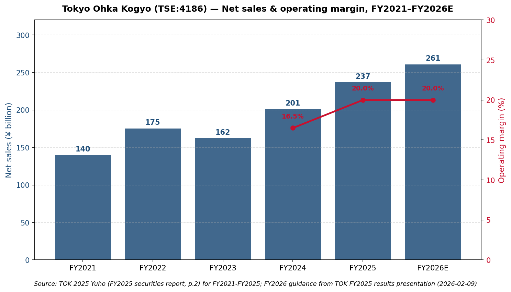
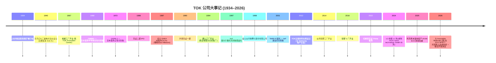
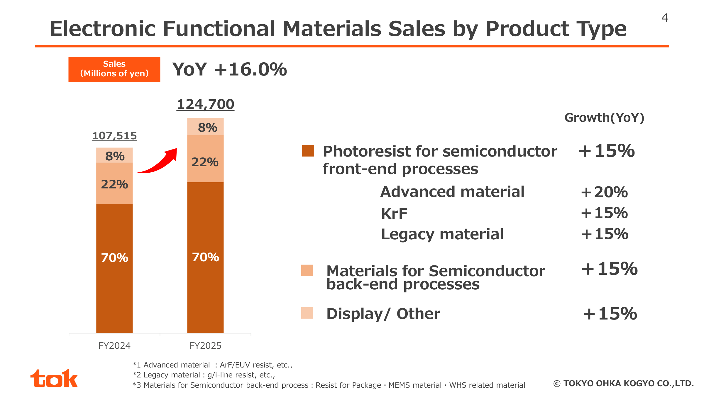
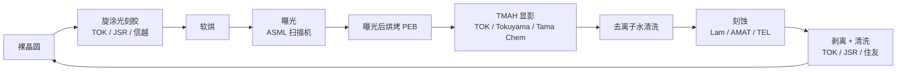
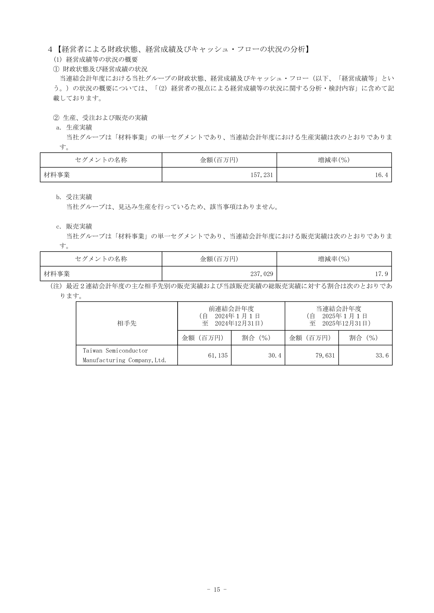
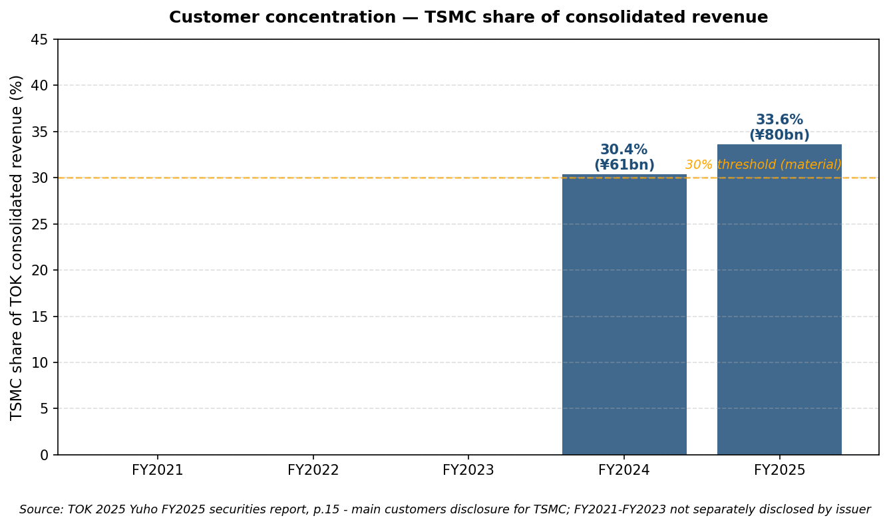
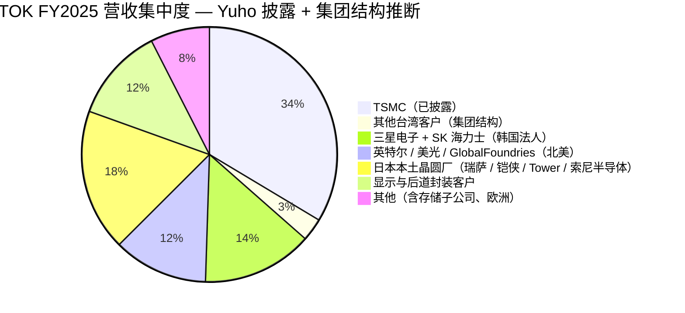
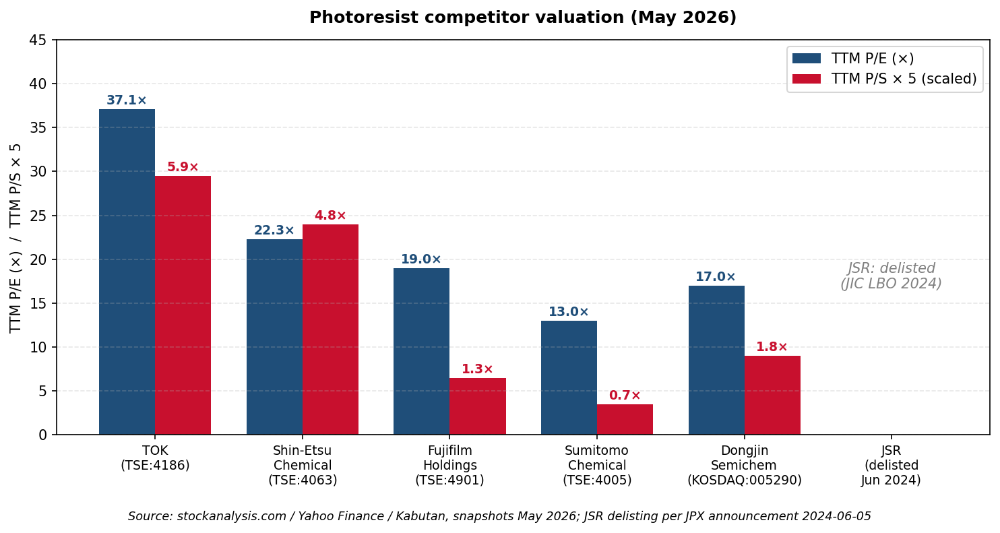
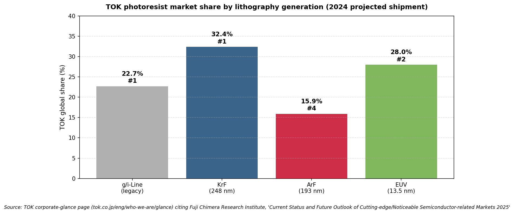

# 东京应化工业 (Tokyo Ohka Kogyo, TOK / TSE:4186) — 公司研究

**报告基准日 (as of)**：2026-05-26
**证券代码**：TSE:4186（东京证券交易所 Prime 板块）
**注册地**：日本神奈川县川崎市
**会计年度**：截至 12 月 31 日
**主要披露**：EDINET 有価証券報告書 (Yuho)、TDnet 決算短信、IR 官网 (tok.co.jp)
**报告语言**：简体中文

> **更新提要 — FY2025 创历史新高业绩 + 中期计画 2027 上调（2026-02-09）**：东京应化工业 (Tokyo Ohka Kogyo, TOK / TSE:4186) 公布 FY2025 合并净销售额 ¥237.0 bn (+17.9% YoY)、营业利润 ¥47.4 bn (+43.2%)、净利润 ¥33.3 bn (+47.0%) — 三项指标均连续刷新历史最高纪录。同日公司将 FY2027 中期目标从 ¥270.0 bn 营收 / ¥48.0 bn 营业利润 / ROE 13.0% **上调至 ¥295.0 bn / ¥58.0 bn / ROE 14.0%**，理由是生成式 AI 拉动的先进光刻胶 (photoresist) 需求超出预期叠加日元持续偏弱。FY2026 业绩指引：营收 ¥261.0 bn (+10.1%)、营业利润 ¥52.2 bn (+10.2%)、净利润 ¥35.0 bn (+5.0%)，年度股息 ¥80（连续第 8 年上调）。资料来源：[TOK FY2025 Business Results presentation, 2026-02-09](https://www.tok.co.jp/application/files/8117/7061/1184/account_2512_4_en.pdf)。

## 目录

1. 公司概览
2. 公司历史
3. 管理团队
4. 产品与服务 — **本报告最重要章节**
5. 客户与上市策略
6. 行业概览
7. 竞争格局
8. 市场机会 (TAM)
9. 风险评估
10. 参考资料
11. 核验日志 (Step 10)

---

## 1. 公司概览

**东京应化工业株式会社** (TOKYO OHKA KOGYO CO., LTD. / 東京応化工業株式会社 — 简称 "TOK") 是一家总部位于神奈川县川崎市的特种化学品制造商，其核心业务franchise 是**半导体光刻胶 (photoresist)** — 即旋涂在硅晶圆 (silicon wafer) 表面、再由 ArF / KrF / EUV / g-line / i-line 光刻扫描机选择性曝光，从而在芯片上刻画每一颗晶体管、每一条接触孔与互连线路的感光高分子薄膜。光刻胶位于芯片制造产业链最狭窄的咽喉位置：台积电 (TSMC)、三星电子 (Samsung)、英特尔 (Intel)、SK 海力士 (SK Hynix)、美光 (Micron) 全部从屈指可数的几家供应商（其中绝大多数为日企）采购，材料的纯度与分辨率指标直接决定晶圆厂能流片到哪一代制程节点。根据 TOK 自家"What is TOK"页面引用的 Fuji Chimera Research Institute 2024 出货量预测，公司目前在**氟化氪 / KrF 光刻胶以 32.4% 全球份额位列第一、g/i-line 以 22.7% 第一、极紫外光 / EUV (extreme ultraviolet) 以 28.0% 第二、氟化氩 / ArF 以 15.9% 第四**，光刻胶大类合计 24.7% 全球份额 ([TOK "What is TOK" page](https://www.tok.co.jp/eng/who-we-are/glance))。公司同时经营一块体量相当的**高纯度化学品 (high-purity chemicals)** 业务（涵盖显影液、稀释液、剥离液、清洗液以及环绕光刻胶涂布 / 显影 / 去除流程的 IPA / TMAH 湿法工序药剂），外加一块规模较小的显示材料业务。

会计层面 TOK 仅披露单一"材料事业" (材料事業) 报告分部，但内部将营收拆分为**电子功能材料 (Electronic Functional Materials)** FY2025 营收 ¥124.7 bn 与**高纯度化学品** ¥109.4 bn，剩余的显示及其他材料 ¥2.9 bn ([TOK 2025 Yuho, p.16](https://www.tok.co.jp/application/files/9717/7432/8945/securities_2512.pdf))。地理结构高度集中于前道晶圆厂：Yuho 披露台湾子公司"台湾東應化股份有限公司"单家贡献 ¥86.5 bn 营收（占集团 36.5%），韩国子公司"TOK尖端材料株式会社"（与 Samsung 物产组建 90/10 合资公司，社长 김기태 / 金基泰，Yuho 第 5 页披露）再添 ¥33.1 bn（占集团 14.0%），意味着**TOK 合并营收中约一半经由台湾或韩国本地法人开票，主要终端客户即台积电与三星电子** ([TOK 2025 Yuho, pp.5–6](https://www.tok.co.jp/application/files/9717/7432/8945/securities_2512.pdf))。

规模层面，TOK FY2025 期末合并员工 **2,132 人**（母公司 1,555 人，海外子公司约 530 人），运营七大制造基地：郡山工厂（福岛县，全球最大光刻胶工厂，正在投建 ¥20 bn 新厂房，规划 2026 年下半年投产）、御殿场工厂（静冈县）、阿苏 / 阿苏熊本工厂（熊本县）、宇都宫工厂（栃木县）、TOK Innovation Center（相模工厂前身，2023 年改造为研发中心）、Hillsboro Oregon 工厂（TOKYO OHKA KOGYO AMERICA）、苗栗铜锣（台湾東應化两座工厂）、仁川松岛 + 平泽（TOK尖端材料）、上海帝奥科 (TOK CHINA)。FY2025 资本开支 **¥28.7 bn**，FY2026 计划提升至 ¥35.8 bn，三年期"中期计画 2027"累计资本投入预算 ¥76 bn ([TOK FY2025 Business Results presentation, 2026-02-09](https://www.tok.co.jp/application/files/8117/7061/1184/account_2512_4_en.pdf))。

**估值快照（截至 2026-05-22）**：TOK 当前股价 **¥11,620 / 股**，**总市值 ¥1.39 万亿** ([stockanalysis.com TOK market cap page](https://stockanalysis.com/quote/tyo/4186/market-cap/))。TTM EPS ¥278.4 ([TOK 2025 Yuho, p.2](https://www.tok.co.jp/application/files/9717/7432/8945/securities_2512.pdf)) 对应**市盈率 / P/E (TTM) 约 37×**，TTM 营收 ¥237.0 bn 对应**市销率 P/S 约 5.9×**。Yuho 报告中 FY2025 株价収益率 (PER) 为 20.8× — 该计算使用期间均价，显著低于当前现价；FY2021–FY2024 PER 区间为 12.2×–29.6×，因此当前 37× 处于**近五年区间最高端，且明显高于同业中位 22×–24×**（信越化学 ~22×、富士胶片 ~19× — 详见 §7）([Yahoo Finance 4186.T statistics](https://finance.yahoo.com/quote/4186.T/key-statistics/)、[Shin-Etsu Chemical 4063 stockanalysis statistics](https://stockanalysis.com/quote/tyo/4063/statistics/))。

*分析师观点：*当前 37× 的 TTM P/E 并非由一次性利空压制造成；FY2025 业绩超出此前一致预期，股价 re-rating 的逻辑是市场重新将光刻胶认定为生成式 AI 资本开支链上"高纯度、低替代"的关键杠杆点。增长可比性最强的同业信越化学（硅晶圆与 PVC 双寡头）当前估值 22×；TOK 较其高出 15 个估值点，本质上是市场为"更纯粹的光刻胶敞口"支付的溢价 — TOK 近四分之三的毛利来自半导体材料，而信越业务高度多元化。若公司 FY2026 ¥35 bn 净利润指引兑现，前瞻 P/E 将降至约 31×，仍然偏贵，但需放在 10% / 10% / 5% 营收 / 营业利润 / EPS 增速以及 ROE 向 14% 抬升的轨道上看。估值风险方向明确，我们在 §9 单列。

资料来源：[TOK 2025 有価証券報告書 (FY2025 Yuho), p.2](https://www.tok.co.jp/application/files/9717/7432/8945/securities_2512.pdf) FY2021–FY2025 实际数；[TOK FY2025 Business Results presentation, 2026-02-09, p.9](https://www.tok.co.jp/application/files/8117/7061/1184/account_2512_4_en.pdf) FY2026 指引。

---

## 2. 公司历史

TOK 的渊源可追溯至 **1934 年**：创始人**向井重昌 (Shigemasa Mukai)** 经过六年多的反复试错，研制出适用于日本煤矿工人安全帽灯具的电池，其动机来自昭和初期密集的矿难事故 ([TOK "Milestones" page](https://www.tok.co.jp/eng/who-we-are/history))。东京応化研究所于 1936 年 4 月设立，**1940 年 10 月**向井重昌将研究所改组为股份制公司 — **东京応化工業株式会社**，注册资本 ¥180,000 — 至今每一份 Yuho 仍引用其创业理念："自由闊達"、"技術のたゆまざる研鑽"、"製品の高度化"、"社会への貢献"（自由活泼 / 不懈钻研技术 / 产品高度化 / 贡献社会）([TOK 2025 Yuho, p.10](https://www.tok.co.jp/application/files/9717/7432/8945/securities_2512.pdf)、[TOK Milestones page](https://www.tok.co.jp/eng/who-we-are/history))。

从化学品向半导体材料的战略转身分两波完成。**1968 年**，TOK 推出 **OMR81** — 日本首款半导体用负性光刻胶；**1972 年**推出 **OFPR-2** — 日本首款正性光刻胶。这两款开创性产品奠定了日本晶圆厂"光刻胶必须采购自国内供应商"的产业惯性 ([TOK Milestones page](https://www.tok.co.jp/eng/who-we-are/history)、[TOK America history timeline](https://www.tokamerica.com/history-timeline/))。第二波则是 1986 年东证二部 IPO，随后 1990 年升至东证一部，并于 2022 年 4 月 4 日切换至 Prime 板块 ([TOK 2025 Yuho, pp.4–5](https://www.tok.co.jp/application/files/9717/7432/8945/securities_2512.pdf))；自 1986 年以来公司连续保持上市地位。

三次战略转折值得标记。**第一**，1968 年的化学品 → 半导体转身，将公司在工业级 KOH 与硅酸钾提纯方面积累的能力重新部署到电子级化学领域 — 该决策耗费近十年研发投入才让 OFPR-2 形成有意义的营收，但奠定了今日 franchise 的根基。**第二**，1998 年的**台湾子公司**与 2012 年的**韩国合资公司**（与 Samsung 物产联手）将 TOK 的制造布局直接缝合至未来二十年主导半导体资本开支的两个市场 — 台湾（台积电）与韩国（三星 + SK 海力士）；当前 Yuho 披露的台湾東應化单独贡献 ¥86.5 bn FY2025 营收（占集团 36.5%）足见此前布局的关键性 ([TOK 2025 Yuho, p.6](https://www.tok.co.jp/application/files/9717/7432/8945/securities_2512.pdf))。**第三**，2024–2026 年向**自有先进 EUV 化学技术**的纵深进军 — 2024 年 6 月将柏林的 **micro resist technology GmbH** 全额收购，2026 年 2 月 23 日对英国伯明翰 **Irresistible Materials Ltd.** 进行股权投资并签署多触发胶 / Multi-Trigger Resist™ (MTR) 化学技术联合开发协议 ([Irresistible Materials & TOK strategic partnership press release, 2026-02-23](https://www.prnewswire.com/news-releases/irresistible-materials-and-tokyo-ohka-kogyo-co-ltd-tok-announce-strategic-investment-and-joint-development-partnership-to-advance-euv-lithography-302694205.html)) — 这是对 JSR 2021 年收购 Inpria（美国金属氧化物胶 / metal-oxide resist (MOR)）、以及 JSR 2024 年被日本产业革新机构 (JIC) 国资 LBO 退市这两件事的直接回应，将 EUV 化学路线多元化提升为董事会级议题。

近期进展：**micro resist technology GmbH** 于 2024 年 6 月收购，目的是切入欧洲客户（尤其是 ASML 客户生态），并补足电子束 (e-beam) / 纳米压印化学技术组合 ([TOK 2025 Yuho, p.4](https://www.tok.co.jp/application/files/9717/7432/8945/securities_2512.pdf))。**郡山新建厂房** — 总预算 ¥20 bn，截至 FY2025 期末已支付 ¥12.6 bn — 已于 2024 年 7 月动工，规划 2026 年内投产；Yuho 将其定位为 EUV / ArF / KrF 光刻胶的制造旗舰 ([TOK 2025 Yuho, p.20](https://www.tok.co.jp/application/files/9717/7432/8945/securities_2512.pdf))。**韩国平泽高纯度化学品新厂**（预算 ¥12 bn，截至 FY2025 期末已支付 ¥3.7 bn）于 2025 年 8 月动工，规划 2027 年下半年投产 ([TOK 2025 Yuho, p.20](https://www.tok.co.jp/application/files/9717/7432/8945/securities_2512.pdf))。此外，FY2025 第三季度公司将工艺设备业务转让给 AI Mechatec 株式会社，相关特别收益贡献 FY2025 净利润 ¥1.4 bn — 由此 TOK 完成"专注材料、剥离设备"的事业组合调整 ([TOK FY2025 Business Results presentation, 2026-02-09, p.3](https://www.tok.co.jp/application/files/8117/7061/1184/account_2512_4_en.pdf))。

---

## 3. 管理团队

TOK 由向井重昌于 1934 年创办，其本人已辞世数十年，当前经营团队完全为职业经理人。按 company-research 规范，本节重点聚焦两个分析相关主体 — 创业理念（沉淀于公司"经营理念"并写入 Yuho）与现任 CEO。鉴于创始人不再在世，本节集中讨论现任 CEO。

**种市顺昭 (Noriaki Taneichi) — 代表取締役 社長執行役員 (Representative Director, President & CEO)，自 2019 年 1 月任职至今**

种市先生 1962 年 11 月 23 日出生（FY2025 期末年龄 63 岁），1986 年 4 月以应届毕业生身份加入 TOK，全部 40 年职业生涯均在公司内度过 — 这是日本特种化学行业典型的"终身制"晋升轨迹。其履历线索与公司从"国内光刻胶供应商"向"全球半导体材料 franchise"的战略迁移高度同步 ([TOK 2025 Yuho, pp.38, 41](https://www.tok.co.jp/application/files/9717/7432/8945/securities_2512.pdf))。Yuho 披露的关键节点如下：2009 年 6 月任**销售开发部 (Sales Development Department) 总经理**，负责面向日本晶圆厂的先进光刻胶销售；2011 年 6 月任**新事业开发部 (New Business Development Department) 总经理**，主导 EUV 光刻胶 demo 产品化（彼时 EUV 整个品类尚未商业化）；2015 年 6 月升任**新事业开发室副室长执行役员**；2017 年 6 月任**新事业开发室室长，董事兼执行役员**。**2019 年 1 月 1 日**董事会推选其担任**代表取締役兼社長 CEO**，使其成为 TOK EUV 商业化期间仅有的两任 CEO 之一（另一位是其直接前任）([TOK 2025 Yuho, p.38](https://www.tok.co.jp/application/files/9717/7432/8945/securities_2512.pdf))。

截至 FY2025 期末，种市先生持有 **TOK 股票 11 万股** — 为全体董事中持股最多者，以 2026 年 5 月价位计算约 ¥1.28 bn。FY2025 年度总报酬约 **¥158 百万**（基本薪资 48.1% / 浮动报酬 51.9% — 奖金、绩效挂钩股权激励、行权期权），据董事报酬披露 ([TOK 2025 Yuho, p.49](https://www.tok.co.jp/application/files/9717/7432/8945/securities_2512.pdf)、[Simply Wall St TOK management page](https://simplywall.st/stocks/us/materials/otc-tokc.f/tokyo-ohka-kogyo/management))。Yuho 未披露其本科院校；日经高管数据库一致显示其拥有工学学位，但具体院校并未在 Yuho 简历中给出。其 2024 年董事会层面拍板**收购 micro resist technology GmbH**（柏林，2024 年 6 月）、以及 2026 年 2 月对 **Irresistible Materials Ltd.**（英国伯明翰）的股权投资 + 联合开发协议，定调了他的战略姿态：与其完全自研 EUV 化学，TOK 选择以收购 / 合作切入欧洲利基 EUV 光刻胶平台，以对冲 JSR 的 Inpria（金属氧化物胶）franchise，并在化学放大胶 / chemically-amplified resist (CAR)、金属氧化物胶 / MOR、多触发胶 / MTR 三代化学技术之间保留期权。

种市先生的沟通风格一以贯之地保守 — FY2025 业绩说明会（2026 年 2 月 9 日）上他三次重复同一表态：本次"中期计画 2027"上调反映的是"生成式 AI 相关产品的非常态需求"叠加"日元持续维持较原假设更弱的水平"，并强调公司不会将此动能外推至终局价值指引 ([TOK FY2025 Business Results presentation, p.16](https://www.tok.co.jp/application/files/8117/7061/1184/account_2512_4_en.pdf))。这种基调，加上他将 FY2026 资本开支同比抬高 25%（而非以特别股息形式发放现金）的决定，是判断其战略优先级最直接的证据。

---

## 4. 产品与服务 — *本报告最重要章节*

### 4.1 — TOK 产品矩阵（以发行人自身披露为锚）

TOK 在 Yuho 中并未提供 Lam Research 式的统一产品矩阵 — 披露被切分在官网产品导航树与 FY2025 业绩演示之间，后者将电子功能材料拆为五个子类目并给出定量权重。下方矩阵直接源自发行人自身演示，是目前最干净的锚：

资料来源：[TOK FY2025 Business Results presentation, 2026-02-09, p.4](https://www.tok.co.jp/application/files/8117/7061/1184/account_2512_4_en.pdf)。

| 子类目 | FY2025 占电子功能材料营收 ¥124.7 bn 比重 | FY2025 同比增速 | 物理形态 |
|---|---|---|---|
| **先进光刻胶**（ArF + EUV） | 占电子功能材料约 30%（在前道光刻胶 70% 区块内，先进胶是较大子份额）| **+20% YoY** | 用于 7nm 及以下逻辑（台积电 N3/N3E/N2 EUV 层、三星 3GAE/2GAE EUV、英特尔 18A/14A）以及 DRAM 1c/1γ 的光刻胶 |
| **KrF 光刻胶** | 占电子功能材料 22%（约 ¥27.4 bn）| +15% YoY | 248 nm 波长光刻胶，用于 DRAM 外围、NAND 阶梯结构、成熟逻辑 65/45nm |
| **传统胶**（g-line / i-line） | 占电子功能材料 ≤8% | FY2025 +5% YoY | 365 / 436 nm 光刻胶，用于功率半导体、MEMS、显示驱动 |
| **后道 / 先进封装材料**（晶圆处理材料 WHS、MEMS、封装用光刻胶）| 占电子功能材料 22%（约 ¥27.4 bn）| +15% YoY | 厚膜光刻胶，用于硅穿孔 (TSV)、再分布层 (RDL)、扇出晶圆级封装 (FOWLP) |
| **显示及其他**（面板显示光刻胶、光学材料）| 占电子功能材料 8%（约 ¥10.0 bn）| FY2025 +20% YoY；FY2026 指引 –5% | 显示彩色滤光片与 TFT 光刻胶 |

高纯度化学品分部 FY2025 营收 ¥109.4 bn（+19.6% YoY）在 Yuho 与演示中均按单一行项目披露，但实际涵盖显影液（TMAH 基）、稀释液、剥离液、边缘清洗液 (edge-bead-remover)、去离子溶剂、气体提纯化学品 — 这些药剂在光刻胶涂布 / 显影 / 去除循环的前后中段全程参与 ([TOK 2025 Yuho, p.16](https://www.tok.co.jp/application/files/9717/7432/8945/securities_2512.pdf)、[TOK FY2025 Business Results presentation, p.3](https://www.tok.co.jp/application/files/8117/7061/1184/account_2512_4_en.pdf))。

### 4.2 — 综述：TOK 在晶圆工艺流的位置

现代逻辑晶圆厂单层光刻步骤大致如下：**(1)** 旋涂光刻胶（TOK / JSR / 信越 / 富士胶片），**(2)** 软烘 → 使用 KrF / ArF / EUV 扫描机（ASML）曝光 → 曝光后烘烤 (post-exposure-bake, PEB)，**(3)** 用 TMAH 显影液冲掉曝光区（正胶情形）的胶层，**(4)** 高纯度去离子水清洗，**(5)** 刻蚀（Lam / 应用材料 AMAT / 东京电子 TEL），**(6)** 剥离残胶（TOK / JSR / 住友），**(7)** 清洗（Lam Skyline / SCREEN / TEL）。TOK 在这七步中为四步供料（光刻胶、显影液、清洗液、剥离液）。比例上大致是：每层一次晶圆通过 × 单颗先进逻辑芯片约 80 层 EUV / DUV × 每次涂胶约 5 mL 光刻胶 — 单片晶圆的化学品账单并不微不足道。

**通俗解读**：TOK 给芯片光刻工艺提供的是"油墨与去墨剂"。每一个晶体管图案的诞生，都要先在硅片上涂布一层 100–200 nm 厚的 TOK 级光刻胶，用 KrF / ArF / EUV 激光选择性曝光，再用 TOK 级显影液把曝光区（或非曝光区）溶解掉。胶膜越薄，能刻画的晶体管越小 — 配方调起来也越难。光刻胶之于芯片制造，相当于早年胶卷之于相机：是整条工作流中**化学难度最高、可信供应商最少**的耗材。

### 4.3 — EUV 光刻胶（战略主战场）

这是产品矩阵中**毛利率最高、份额最低但增速最快**的产品线。TOK 当前在 EUV 光刻胶市场占有 **28.0% 份额 — 仅次于 JSR 位列第二**，数据来自 Fuji Chimera 2024 出货量预测 ([TOK "What is TOK" page](https://www.tok.co.jp/eng/who-we-are/glance))。Yuho FY2025 研发段落对此态度极为明确：

> 「微細加工技術における優位性を堅持すべく、半導体製造分野において、最先端半導体製造プロセスに使用される極端紫外線用フォトレジストの開発に注力し、高い顧客評価を獲得することができました。」 ([TOK 2025 Yuho, p.18](https://www.tok.co.jp/application/files/9717/7432/8945/securities_2512.pdf))

*（中文释义：为坚守在精细加工技术上的优势，公司在半导体制造领域集中精力开发用于最尖端半导体制造工艺的极紫外光光刻胶，并取得了客户的高度评价。— 此为分析师中文翻译，非 Yuho 原文。）*

**通俗解读**：EUV（13.5 nm 波长，相比 ArF 的 193 nm、KrF 的 248 nm）是 ASML Twinscan NXE 与 EXE 扫描机用以刻画 7nm 以下逻辑与 15nm 以下 DRAM 关键层的光源。化学家面对的难题极为残酷：13.5 nm 波长下每个光子携带 92 eV 能量 — 足以电离光刻胶聚合物，破坏精心调校的化学反差 (chemical contrast)。胶膜必须 (a) 高效吸收 EUV 光子（使每个图形所需"曝光剂量 / shots"尽量少，即*感光度 sensitivity*）、(b) 维持小于 2 nm 的线边粗糙度 (LER)（确保线条不发糊）、(c) 与传统 CAR 胶相同的 TMAH 显影液兼容（这样晶圆厂无需新购湿法工艺设备）。三大化学路线竞争激烈：**化学放大胶 / chemically-amplified resist (CAR)** — 传统高分辨率聚合物体系；**金属氧化物胶 / metal-oxide resist (MOR)** — 由 Inpria 首创（2021 年被 JSR 以 $514M 收购），利用锡 / 铪氧簇增强 EUV 吸收；**多触发胶 / multi-trigger resist (MTR)** — 由英国 Irresistible Materials 开发并已被 TOK 部分持股（2026 年 2 月投资 + JDA），利用协同光化学改善"感光度-LER"权衡。

*分析师观点：*TOK 的 EUV 战略是**多化学路线对冲**。JSR 全力押注金属氧化物（2021 年 $514M 收购 Inpria，韩国 MOR 工厂规划 2026 年底投产），TOK 则采取三线并进：CAR EUV 自研（依托郡山工厂）+ 2024 年 6 月收购 micro resist technology GmbH（柏林，主攻电子束 / 混合体系）+ **2026 年 2 月 23 日**投资 + 联合开发 Irresistible Materials 的 MTR（覆盖低数值孔径 EUV 与高数值孔径 / high-NA EUV）([Irresistible Materials × TOK announcement, 2026-02-23](https://www.prnewswire.com/news-releases/irresistible-materials-and-tokyo-ohka-kogyo-co-ltd-tok-announce-strategic-investment-and-joint-development-partnership-to-advance-euv-lithography-302694205.html))。Irresistible Materials 新闻稿明确指出 MTR 平台被设计为**无 PFAS/PFOS、无金属** — 这是在监管压力下的刻意对冲（监管压力对金属氧化物胶的杀伤明显大于 CAR）。直接对标产品：JSR 自家 EUV-CAR 胶 + **Inpria YESR-S2**（金属氧化物胶，由 JSR Inpria 子公司销售；引自 JSR 的 Inpria 产品页）。

战略含义：ASML 已于 **2024 年向英特尔交付首台高数值孔径 EUV (Twinscan EXE:5000)** 扫描机，用于 2nm 以下逻辑研发；台积电与三星均承诺在 1.4nm / 14A 节点引入高数值孔径 EUV。TOK 已有明确新闻稿措辞确认其 EUV 光刻胶"已被批准用于量产线" — 即并非仅停留在 R&D 晶圆，而是英特尔 / 三星 / 台积电正式 qualify 的量产材料 ([GMInsights photoresist chemicals report](https://www.gminsights.com/industry-analysis/photoresist-chemicals-for-advanced-lithography-market)、[TrendForce, 2025-11-06](https://www.trendforce.com/news/2025/11/06/news-japan-ramps-up-photoresist-investment-for-2nm-chips-tokyo-ohka-kogyo-jsr-lead-the-charge/))。

### 4.4 — ArF 浸没式 / ArF 光刻胶

TOK 在 ArF 市场份额 **15.9%，全球第四** ([TOK "What is TOK" page](https://www.tok.co.jp/eng/who-we-are/glance))，旗舰产品系列为 2001 年推出的 TARF-P ([TOK Milestones page](https://www.tok.co.jp/eng/who-we-are/history))。氟化氩浸没式 / ArF immersion (ArFi) 仍是 65nm 至 7nm 逻辑层之间所有商业晶圆厂的主力光刻方式 — 也是当前 FY2025"先进材料"线中按营收口径比 EUV 大、按毛利贡献比 EUV 小的部分。

**通俗解读**：ArF（193 nm）光刻在干式模式下达到约 38 nm 半节距极限；浸没式 ArF 通过在物镜与晶圆之间引入水以折射光线，将该极限推进到约 22 nm 半节距 — 这恰好覆盖台积电 N7 / N5 逻辑插入 EUV 之前的核心层。胶配方必须 (a) 耐水（避免添加剂浸出）、(b) 在光酸催化后保持光酸产生剂 / photo-acid generator (PAG) 的均匀分布、(c) 输出小于 3 nm 的 LER 剖面。TOK TARF-P 系列自 2000 年代初便是日本晶圆厂 ArF 浸没式的主力供应；三星与台积电也 qualify 了 TOK 的大多数 ArF 层，但同时以 JSR、信越作为第二供应。

*分析师观点：*TOK 在 ArF 的第四名位置是 franchise 的软肋。JSR 是 ArF 浸没式的霸主，份额领先 TOK 双位数；信越第二、住友化学第三。TOK 此处的相对疲软之所以关键，是因为**ArF 浸没式目前仍是营收占比最高的光刻胶世代** — 2025 年全球 ArF 浸没胶占整体光刻胶市场 31.92% (Datainsightsmarket 数据，[Datainsightsmarket DUV/EUV photoresist analysis, 2025](https://www.datainsightsmarket.com/reports/duv-and-euv-photoresist-158132))。因此 TOK 15.9% 的份额在结构上低于其在 EUV (28.0%) 与 KrF (32.4%) 强势所应对应的水平。管理层缩小这一差距的剧本是郡山扩产（同时覆盖 ArF / EUV / KrF）+ "客户亲密度"策略 — 即派遣 TOK 工程师常驻台积电流程团队，公司认为这种配方调校的反馈闭环正是 2018–2022 年 ArF 浸没式转型期 JSR 优势缩水的原因。

### 4.5 — KrF 光刻胶（现金牛）

TOK 在 KrF 市场为**全球第一，份额 32.4%** ([TOK "What is TOK" page](https://www.tok.co.jp/eng/who-we-are/glance))；KrF 占**电子功能材料 22%（FY2025 约 ¥27.4 bn），同比 +15%** ([TOK FY2025 Business Results presentation, p.4](https://www.tok.co.jp/application/files/8117/7061/1184/account_2512_4_en.pdf))。该产品系列是 DRAM 外围、3D NAND 阶梯结构图案化（200+ 层 3D NAND 堆栈每层都需要多次 KrF 通孔图案化）、以及成熟逻辑代工层的主力工具。

**通俗解读**：KrF（248 nm 波长）是 ArF 的"前辈"，覆盖约 120 nm 至 80 nm 半节距 — 涵盖 DRAM 字线外围、NAND 阶梯接触、BCD 功率器件、图像传感器读出像素、模拟 / 混合信号层。关键的是，AI 加速器拉动的 **HBM 量产**对 KrF 高度依赖：每颗 HBM3E / HBM4 die 由 8–16 层 DRAM 堆叠，每层使用大量 KrF 层 — 因此 HBM 增长直接成为 KrF 光刻胶的营收顺风。同样的逻辑也适用于三星 / SK 海力士 / 美光 / 长江存储 (YMTC) 目前量产的 232–321 层 3D NAND 阶梯 / 通孔图案化。

*分析师观点：*KrF 是 TOK 护城河最干净的位置 — 高客户转换成本（每个晶圆厂需要在多个器件世代上对 KrF 胶逐一重新 qualify）、低配方新颖度（已成熟的 CAR 体系，几乎不受 MOR / MTR 颠覆）、稳定毛利率（KrF 胶毛利结构明显优于 ArF，因为化学体系成熟、良率高）。32.4% 的份额对 JSR（最接近的次席）以及韩中新进入者（东进世美肯 Dongjin Semichem、SK Specialty）构成可防御的第一名位置。HBM + 3D NAND 的需求浪潮将给 KrF 提供多年增长跑道，Datainsightsmarket / Fortune Business Insights 给出的"2030 年前 6–8% CAGR"几乎肯定低估。

### 4.6 — g-line / i-line（传统）光刻胶

TOK 在 g-line / i-line 胶**全球第一，份额 22.7%** ([TOK "What is TOK" page](https://www.tok.co.jp/eng/who-we-are/glance))。这是一个增速缓慢、相对碎片化的子类目（TOK 该口径不足 ¥10 bn），但其领先地位对 TOK 有两层意义：(1) g/i-line 胶用于功率半导体（SiC MOSFET、IGBT）、MEMS、图像传感器微透镜、显示 TFT 制造 — 这些子赛道借助电动车 / 工业自动化 / 智能手机摄像浪潮维持 10–15% 年增速；(2) 现任龙头身份意味着客户新建产线时 TOK 是默认供应商。

### 4.7 — 后道 / 先进封装材料

这是公司演示中单独列出的电子功能材料 **22% 子类目**，FY2025 同比 **+15%**，FY2026 指引 **+30%** — 是增速最快的子类 ([TOK FY2025 Business Results presentation, p.4](https://www.tok.co.jp/application/files/8117/7061/1184/account_2512_4_en.pdf)、[TOK FY2025 Business Results presentation, p.10](https://www.tok.co.jp/application/files/8117/7061/1184/account_2512_4_en.pdf))。涵盖：

- **WHS (wafer-handling system) 材料** — 5–100 µm 厚膜光刻胶，用于 HBM 堆叠存储 die 背面的再分布层 (RDL) 与硅穿孔 (TSV) 图案化。
- **封装用光刻胶 / Resist for Package** — 类似阻焊膜的光致成像聚合物，用于扇出晶圆级封装 (FOWLP)、台积电 CoWoS、2.5D Interposer 与 3D Hybrid Bonding。
- **MEMS 材料** — 紫外纳米压印胶 (UV-NIL)、厚膜负胶、深干刻硬掩膜材料，用于 MEMS 陀螺仪 / 加速度计 / 图像传感器 / 硅麦克风制造。

*分析师观点：*这是 TOK franchise 中对 HBM 与 CoWoS 量产暴露最直接的一章。NVIDIA H200、B200、B300 GPU 全部采用三星 / SK 海力士 / 美光的 HBM3E；台积电 CoWoS 封装线 — 当前 AI 算力供应链的最大瓶颈 — 使用 TOK、JSR、杜邦 (DuPont) 的先进光致成像聚合物。FY2026 该子类目 +30% 指引是公司自家预测中最激进的增速读数，也是 TOK 对 AI 加速器量产周期最直接的财务杠杆。

### 4.8 — 高纯度化学品（第二个 franchise）

TOK 将高纯度化学品单独披露，因为该业务面向的客户群与光刻胶高度重合但单位经济学完全不同：毛利率较低、出货量大得多，且常打包进同一供应合同。FY2025 营收 **¥109.4 bn (+19.6% YoY)，占集团总营收 46%** ([TOK FY2025 Business Results presentation, p.3](https://www.tok.co.jp/application/files/8117/7061/1184/account_2512_4_en.pdf))。产品组合包括 **显影液**（TMAH 体系，如 1975 年推出的 NMD-3）、**稀释液**（光刻胶溶剂，如 TOK Thinner Type-D）、**边缘清洗剂 (EBR)**、**剥离剂**（105 / 106 / 107 系列）、**清洗液**、**衬底预清洗化学品**。战略逻辑：通过将化学品与光刻胶捆绑，TOK 能锁定光刻胶供应合同更长期 — 晶圆厂倾向于从单一供应商采购整条化学体系以确保兼容性，这也是 TOK 客户集中度（仅台积电就占 FY2025 33.6%）居高不下的原因之一。

韩国平泽 ¥12 bn 高纯度化学品厂 — 2025 年 8 月动工，规划 2027 下半年投产 — 是公司当前在该分部最大的资本承诺，瞄准的是三星与 SK 海力士在先进 DRAM 与 NAND 微缩中对增量高纯度化学品的需求 ([TOK 2025 Yuho, p.20](https://www.tok.co.jp/application/files/9717/7432/8945/securities_2512.pdf))。

### 4.9 — 旗舰子类目与单品护城河结论

| 子类目 | 护城河结论 | 护城河类型 | 最接近的对标产品 |
|---|---|---|---|
| **EUV 光刻胶** | *分析师观点：***部分护城河 — 多化学路线组合；但 JSR / Inpria 在 MOR 占优** | 技术 + IP (TOK CAR EUV;mrt 电子束;IM MTR) | JSR + Inpria MOR（如 YESR-S2 系列）|
| **ArF 浸没式** | *分析师观点：***无护城河 — 在最大营收世代位列第四** | 无 — JSR + 信越更强 | JSR i-Resist (ArF 浸没式 CAR) |
| **KrF** | *分析师观点：***强护城河 — 龙头第一，每条产线均有转换成本** | 转换成本 + 规模 | JSR + 信越 KrF 胶 |
| **g/i-line（传统胶）** | *分析师观点：***强护城河 — 碎片化品类中的第一** | 功率半导体 / MEMS / 显示转换成本 | 东进世美肯 g/i-line |
| **后道封装材料** | *分析师观点：***强护城河 — TOK + JSR + 杜邦控盘** | 客户联合开发（台积电 CoWoS）| 杜邦封装胶 |
| **高纯度化学品**（显影 / 稀释 / 剥离）| *分析师观点：***捆绑护城河 — 锁定光刻胶供应** | 捆绑 + 客户驻场 | 住友 ULTRAVIN 显影液、Tokuyama 化学品 |

综合结论：TOK 在 **KrF 与 g/i-line 第一**且护城河深；**EUV 第二**，多化学路线对冲可能成为整个 franchise 的关键摆动因子；**ArF 浸没式第四**且无明显护城河 — 这是 franchise 的结构性弱点。市场层面，EUV 与后道封装材料处于高增长期，KrF 与 g/i-line 成熟稳态，ArF 浸没式则随 EUV 渗透加速而抵达终局规模。

---

## 5. 客户与上市策略

**客户集中度是 TOK Yuho 中最重要的单条披露。**日本上市规则要求 TOK 在"主要な販売先"项下识别任何占合并营收 ≥10% 的客户；FY2025 仅有一家客户跨过门槛：

资料来源：[TOK 2025 有価証券報告書 (FY2025 Yuho), p.15](https://www.tok.co.jp/application/files/9717/7432/8945/securities_2512.pdf)。

| 客户 | FY2024 销售额 | FY2024 占比 | FY2025 销售额 | FY2025 占比 |
|---|---|---|---|---|
| **台积电 (Taiwan Semiconductor Manufacturing Company, Ltd. / TSMC)** | ¥61,135 M | **30.4%** | ¥79,631 M | **33.6%** |

台积电的份额**从 FY2024 的 30.4% 抬升至 FY2025 的 33.6%** — 320 bps 阶跃由台积电 CoWoS / N3 / N2 量产爬坡以及 TOK 在客户先进节点光刻胶需求中份额增长共同驱动。**其余客户单一占比未达 10% 披露门槛**，但第二梯队 — 三星电子 + SK 海力士 + 英特尔 + 美光 — 合计仍为重要客户。Yuho 不像美国 10-K 那样单列 Top-5 客户集中度，但通过地理子公司维度可以反推：台湾東應化 ¥86.5 bn + TOK尖端材料 ¥33.1 bn = ¥119.6 bn，占集团 50.5% ([TOK 2025 Yuho, p.6](https://www.tok.co.jp/application/files/9717/7432/8945/securities_2512.pdf))，意味着**台湾 + 韩国晶圆厂合计贡献 TOK 一半以上合并营收**，且这两个市场本身又集中在 4–5 家头部客户手中。

资料来源：[TOK 2025 有価証券報告書 (FY2025 Yuho), p.15](https://www.tok.co.jp/application/files/9717/7432/8945/securities_2512.pdf) — FY2021–FY2023 台积电占比低于 10% 披露门槛或未单独披露（参见发行人分部披露惯例）。

（注：台积电一行为发行人正式披露；其余分项为分析师基于集团子公司层级营收与产业公开归因的推断。Yuho 并未单独披露非台积电客户构成。）

**合同结构**：TOK 未披露具体合同架构，但日本晶圆厂供应链惯例（以及 TOK 自述的"客户亲密度策略"）暗示：与台积电、三星、英特尔、SK 海力士、美光、铠侠签订多年期主协议，按 12 个月滚动 PO 锁量，配方按"节点 + 层位"qualify。已 qualify 胶的转换成本极高 — 晶圆厂在每个波长 × 每个器件世代 × 每一层都需经历数月、消耗数百片测试晶圆才能完成重新认证。一旦 TOK 某款胶在台积电 N3 EUV 某层 qualify，台积电要切换到 JSR 或信越的替代品需要 6–12 个月与巨额成本，且即便切换，原 TOK 材料仍保留下一代再用的预 qualify 状态。

**纵向一体化风险**：目前没有晶圆厂客户在自产光刻胶 — 化学体系距离客户核心能力（光刻是晶圆厂的边界；胶化学是化学公司的边界）太远。但两类邻接动态值得关注：**Lam Research 与 JSR-Inpria 交叉授权（2025-09-15 公告）**将 Lam 的干胶工具引入 Inpria MOR 化学生态，理论上可能形成"工具+胶"的捆绑，在 EUV 干胶应用上部分绕开 TOK；另外韩中光刻胶国产化（SK Materials、东进世美肯、上海新阳）正逐步 qualify 替代供应商 ([Lam Research × JSR Corporation/Inpria press release, 2025-09-15](https://www.prnewswire.com/news-releases/lam-research-and-jsr-corporationinpria-corporation-enter-cross-licensing-collaboration-agreement-to-advance-semiconductor-manufacturing-302556926.html))。

**因此 TOK 面临的客户集中度风险已触发本报告"重大 / material"判定阈值（第一大客户 > 30%），我们在 §9 列为首要风险。**该风险的加重因素是台积电本身相对三星代工的双寡头地位 — 即便台积电决定通过更激进的双源采购压低胶材料采购单价，TOK 的定价能力也将明显被压缩。

**上市策略**：TOK 全部直销、无渠道商，并在客户晶圆厂现场常驻销售工程师 — 台湾（TOK Taiwan 铜锣 + 铜锣 2 厂）、韩国（TOK尖端材料，仁川松岛 + 2027 年起平泽）、美国（TOKYO OHKA KOGYO AMERICA，Hillsboro）、欧洲（新加坡办公室 + 德国分公司，经由 micro resist technology GmbH）。Yuho 将"销售工程师 + 制造工程师 + R&D 科学家三位一体"团队描述为公司在新光刻胶配方客户联合开发中的核心竞争优势 ([TOK 2025 Yuho, p.8](https://www.tok.co.jp/application/files/9717/7432/8945/securities_2512.pdf))。

---

## 6. 行业概览

半导体光刻胶行业是一个**约 50–60 亿美元的全球市场**，处于更大的 6,600 亿美元半导体产业的化学材料交汇处。市场规模小（不到半导体设备营收的 1%）但战略地位远超体量：每一片先进芯片晶圆都需要光刻胶，而该化学体系是工业化学中纯度要求最高的若干问题之一。据 Mordor Intelligence 2024 测算，全球光刻胶市场约 48 亿美元，2024–2030 CAGR 7–9% ([Mordor Intelligence Photoresist market](https://www.mordorintelligence.com/industry-reports/photoresist-market))；更激进的 Datainsightsmarket DUV/EUV 光刻胶分析预测 EUV 胶子市场单独将从 2024 年的 4–5 亿美元增至 2030 年的 15–20 亿美元，CAGR 25–30% ([Datainsightsmarket DUV/EUV photoresist analysis, 2025](https://www.datainsightsmarket.com/reports/duv-and-euv-photoresist-158132))。

**行业结构：极度集中于少数日企手中**。五家供应商 — JSR（2024 年 6 月退市 / JIC 私有化）、TOK、信越化学、富士胶片电子材料、住友化学 — 加上韩国生产商东进世美肯（Dongjin Semichem）作为国际市场的第 5–6 名，**合计占全球光刻胶供应约 91%** ([Seoul Economic Daily, 2026-04-24](https://en.sedaily.com/international/2026/04/24/hormuz-blockade-triggers-photoresist-crunch-hitting-samsung)、[TrendForce, 2025-11-06](https://www.trendforce.com/news/2025/11/06/news-japan-ramps-up-photoresist-investment-for-2nm-chips-tokyo-ohka-kogyo-jsr-lead-the-charge/))。日企寡头垄断之深，使得 2019 年日韩贸易争端中日本收紧对韩光刻胶出口管制被韩国视为国家安全级别事件，并直接推动三星 / SK 海力士的光刻胶国产化与多元化项目 ([Japan-South Korea trade dispute, Wikipedia](https://en.wikipedia.org/wiki/Japan%E2%80%93South_Korea_trade_dispute))。

**驱动因素**：光刻胶需求由三个相互独立的变量决定：

1. **各节点世代晶圆开工量**：每个先进晶圆厂的胶消耗量正比于晶圆数 × 层数，因此周期性开工曲线直接驱动出货量。当前主要驱动包括台积电 N3 量产、三星代工 3GAE、英特尔 18A、SK 海力士 HBM3E / HBM4 扩产、美光 DRAM 1c / 1γ 量产。
2. **每晶圆层数（结构性提升）**：每一代节点都新增更多 EUV / ArF / KrF 光刻层 — 一颗 3nm 逻辑芯片约有 20 层 EUV + 50 层 ArF + 30 层 KrF，而 7nm 仅 3 层 EUV + 40 层 ArF + 25 层 KrF。因此即便晶圆开工量持平，层数增长本身就带来 5–7% 的年度单位出货增长。
3. **每升 ASP（先进胶结构性上行、传统胶平稳）**：EUV 胶单升售价约为 ArF 的 10–20 倍；ArF 为 KrF 的约 3 倍；KrF 为 g/i-line 的约 2 倍。传统胶向先进胶的结构迁移叠加层数与开工量增长，形成多重营收顺风。

**邻接产业**：最近邻是**光刻胶显影 / TMAH 化学品**市场（TOK 高纯度化学品分部在此与 Tokuyama、三菱瓦斯化学、美国本土供应商竞争），以及 **EUV 保护膜 (pellicle) 材料**（约 2 亿美元独立市场，由三井化学主导）。更外圈则是**半导体光罩坯片** (Toppan、大日本印刷) 与**半导体特种气体** (SUMCO、信越硅片、Air Liquide / Linde) — 共同构成 TOK 所处的"半导体材料"价值链。

**监管环境**：两条趋势值得关注。**第一，PFAS / PFOS 限制** — 欧盟 REACH、美国 EPA、日本化学品管理法规均在收紧对全氟 / 多氟烷基化合物的限制；这些物质历史上曾出现在部分光刻胶添加剂中。TOK 与 JSR 已公开承诺转向无 PFAS / PFOS 配方；Irresistible Materials MTR 平台明确定位为无金属、无 PFAS / PFOS ([Irresistible Materials press release, 2026-02-23](https://www.prnewswire.com/news-releases/irresistible-materials-and-tokyo-ohka-kogyo-co-ltd-tok-announce-strategic-investment-and-joint-development-partnership-to-advance-euv-lithography-302694205.html))。**第二，出口管制** — 美 / 日 / 荷已层层叠加对中国晶圆厂（中芯国际 SMIC、长江存储 YMTC、长鑫存储 CXMT）的设备与材料出口限制；日本 2023 年收紧对华光刻胶出口许可，TOK Yuho 的"海外での事業活動リスク"条款明确警示进一步限制可能制约增长 ([TOK 2025 Yuho, p.14](https://www.tok.co.jp/application/files/9717/7432/8945/securities_2512.pdf))。

**行业五力**：买方议价能力中等偏高 — 全球前三客户（台积电、三星、英特尔）在每次合同续约时拥有可观议价杠杆，但又被极高的胶 qualify 转换成本部分对冲。供方议价能力中等：单体原料来自三菱化学、Daicel、住友 Bakelite；PAG（光酸产生剂）来自 Wako、东京化成；溶剂（丙二醇甲醚乙酸酯 PGMEA）来自少数石化供应商。替代品威胁低 — 7nm 以下图案化不存在非光刻胶替代方案。新进入者威胁名义上极高（任何化学公司理论上都能宣称做胶），但 qualify 层面则极低（在台积电 / 三星拿到客户席位通常需要 5 年以上 + 2 亿美元以上的客户联合开发投入）；韩中新进入者（东进世美肯、SK Materials、上海新阳、深圳新国都）正缓慢爬坡技术曲线，但目前仍缺席 14nm 以下战术产品线。

---

## 7. 竞争格局

光刻胶市场是教科书级寡头垄断。TOK Yuho 中明列的竞争对手清单稀少 — 日本上市公司财报传统上很少使用美式"竞争"专章 — 但公司的英语 IR 材料与第三方行业研究公司给出的名单基本收敛到同样的 6–7 个玩家。每家都是性质明显不同的对手：

| 公司 | 代码 | 2024 光刻胶 franchise | 对 TOK 的战略姿态 |
|---|---|---|---|
| **JSR 株式会社** | 2024-06-25 退市；JICC-02（私有化） | **全球第一，份额约 22–27%**（野村估计）— 拥有 Inpria 金属氧化物 EUV 胶 | 全产品线直接竞争对手；国资 (JIC) 背书，具备长周期投资能力；最具差异化的押注是 Inpria MOR |
| **信越化学 (Shin-Etsu Chemical)** | TSE:4063 | **全球第二**；ArF 与 KrF 强势；硅片 + PVC + 硅胶多元化集团 | 直接竞争对手；硅片业务交叉补贴；聚焦度低但体量大 |
| **富士胶片电子材料 (Fujifilm Electronic Materials)** | TSE:4901（富士胶片控股）| 先进 ArF / EUV CAR 强势；显示份额可观 | ArF 与后道封装材料直接竞争；成像 / 医疗业务交叉补贴 |
| **住友化学 (Sumitomo Chemical)** | TSE:4005 | 全球 3–4 名；KrF / ArF 胶；显示材料强 | KrF 与显示材料直接竞争 |
| **杜邦 (DuPont)** | NYSE:DD | 先进封装光刻胶；KMPR / SU-8 利基；CMP 抛光液 | 在先进封装材料构成利基竞争；广义特种业务交叉补贴 |
| **东进世美肯 (Dongjin Semichem)** | KOSDAQ:005290 | 全球 5–6 名；韩国本土供应商，ArF 与 i-line 份额成长中 | 间接竞争对手，但随韩国晶圆厂供应链多元化正逐步抬升为直接对手 |

据野村证券在 JSR 2023 年私有化估值工作中的引用，**JSR 全球第一，份额约 27%** ([Evertiq, 2023 reporting on JIC × JSR](https://evertiq.com/news/55596))；据 TOK 官网引用的 Fuji Chimera 2024 数据，**TOK 大类合计 24.7%** ([TOK "What is TOK" page](https://www.tok.co.jp/eng/who-we-are/glance))。两个数据源在 JSR 与 TOK 的整体排序上略有出入 — 二者基本可互换处理为第一 / 第二 — 但都收敛到一个事实：JSR 与 TOK 之间的份额差距不大，而信越 / 富士胶片 / 住友化学以单位数到低双位数份额跟随，东进 / 杜邦构成 Top 7 的尾部。

资料来源：[stockanalysis.com TOK statistics](https://stockanalysis.com/quote/tyo/4186/market-cap/)、[Shin-Etsu Chemical 4063 stockanalysis statistics](https://stockanalysis.com/quote/tyo/4063/statistics/)、[Yahoo Finance 4186.T statistics](https://finance.yahoo.com/quote/4186.T/key-statistics/);JSR 退市详见 [JPX Decision on Delisting, 2024-06-05](https://www.jpx.co.jp/english/news/1023/20240605-11.html)。

资料来源：[TOK "What is TOK" page](https://www.tok.co.jp/eng/who-we-are/glance) 引用 Fuji Chimera Research Institute《Current Status and Future Outlook of Cutting-edge/Noticeable Semiconductor-related Markets 2025》— 2024 年预计出货量。

**TOK 的竞争优势**最清晰地体现于三个维度：

- **KrF / g/i-line franchise（强护城河）**：TOK 在两个品类均为全球第一，其转换成本型护城河短期内难以被取代。
- **台湾客户亲密度**：TOK 台湾铜锣两厂 + 在新竹 / 台南的工程师驻场布局，意味着 TOK 能与台积电流程整合团队并肩迭代 ArF 与 EUV 胶 — 速度优于需要从日本飞工程师过去的对手。JSR 2024 年宣布建设台湾厂，本身即是对 TOK"台湾就近"优势的直接确认。*分析师观点：JSR 台湾厂完工后这一优势将逐步被稀释。*
- **多化学路线 EUV 组合**：TOK 是唯一在 CAR EUV（自研）、电子束 / 混合体系（柏林 mrt）与 MTR（英国 Irresistible Materials）三条 EUV 化学路线上同时拥有有意义阵地的光刻胶供应商。若 EUV 化学战场未来在 CAR 与 MOR 之间分化，TOK 在两侧都保有期权；JSR 则几乎完全押注 MOR（经由 Inpria）。

**竞争弱点**：

- **ArF 浸没式仅第四**：ArF 浸没式是当前营收最高的光刻胶世代，而这是 TOK 最弱的位置。JSR 在此领先稳固，差距近期难以缩小。
- **JSR 国资长周期资本**：JIC 私有化后 JSR 可以在多年 EBITDA 谷底期持续投资（韩国平泽 MOR 厂、台湾厂、与 Lam 的联合 R&D），无需承受股东短期回报压力。TOK 仍需在股息与资本开支之间平衡股东诉求。
- **韩国本土供应压力**：SK Materials 与东进世美肯是三星 / SK 海力士明确支持扩张的韩国本土供应商体系。若韩国晶圆厂将 TOK 在其材料采购中的占比从约 35% 压降到约 25%，对应五年期约 ¥30 bn 营收暴露。

---

## 8. 市场机会 (TAM)

**TAM 定义**：光刻胶 TAM 最佳的切分方式是按光刻世代分层，因为单位经济学在不同世代间相差一个数量级。据 Mordor Intelligence 2024 行业测算，全部光刻胶（半导体 + 显示 + PCB）2024 年约 **48 亿美元**，2024–2030 CAGR 7–9% ([Mordor Intelligence Photoresist market](https://www.mordorintelligence.com/industry-reports/photoresist-market))；其中半导体子部分约 30–35 亿美元。子市场拆分大致如下：

- **EUV 光刻胶**：2024 年 4–5 亿美元，2030 年预计 15–20 亿美元（CAGR 25–30%）— 增速最快、毛利最高的子市场 ([Datainsightsmarket DUV/EUV photoresist analysis, 2025](https://www.datainsightsmarket.com/reports/duv-and-euv-photoresist-158132))。
- **ArF 浸没式 + ArF 干式**：2024 年 12–15 亿美元（最大子市场，占总光刻胶 31.9%），CAGR 5–7%。
- **KrF**：7–10 亿美元，CAGR 6–8%，受 HBM 与 3D NAND 驱动。
- **g-line / i-line（传统）**：5–7 亿美元，CAGR 3–5%。
- **后道封装光刻胶**（按 TOK 电子功能材料口径 FY2025 约 ¥27.4 bn / 约 1.8 亿美元）：今天仍是一个明显小于 10 亿美元的全球利基市场，但在 HBM / CoWoS / 先进封装浪潮下增速 15–25%。

**SAM（TOK 可服务市场）**：TOK 覆盖前道光刻胶 + 辅助高纯度化学品 + 后道封装光刻胶，合计约 45 亿美元（在 48 亿美元总 TAM 中的占比）。TOK FY2025 集团营收 ¥237.0 bn ≈ 16 亿美元（按 ¥148.6/$）— 即 TOK 在可服务市场的有效份额约 35%。但需注意：公司在其中光刻胶部分以高单位毛利率获取份额，在高纯度化学品部分以低双位数毛利率获取份额 — 因此 TOK 看似份额很大，但其约一半营收处于较低毛利层（高纯度化学品按营收口径约占一半，但按毛利贡献口径占比显著更低）。

**SOM（未来 5 年可获得份额）**：管理层中期计画 2027（2026-02-09 上调）目标为**FY2027 集团营收 ¥295 bn / 营业利润 ¥58 bn** ([TOK FY2025 Business Results presentation, p.16](https://www.tok.co.jp/application/files/8117/7061/1184/account_2512_4_en.pdf))。按 ¥150/$ 固定汇率换算约为营收 $1.97 bn / OP $387M。从 ¥237 bn 走到 ¥295 bn（两年累计 24.5%）的路径要求电子功能材料约 +12% / +12%、高纯度化学品约 +6% / +6%，与 FY2026 指引轨迹一致。更长期的 **TOK Vision 2030 目标为 FY2030 营收 ¥350 bn / EBITDA ¥77 bn / ROE 13%** — 对应 FY2025–FY2030 五年期营收 CAGR 约 8.1%、EBITDA CAGR 约 9.5% ([TOK FY2025 Business Results presentation, p.16](https://www.tok.co.jp/application/files/8117/7061/1184/account_2512_4_en.pdf))。

**渗透策略**：中期计画 2027 明确给出三条增长向量：(1) 郡山扩产（¥20 bn 新厂房，2026 H2 投产）+ 平泽扩产（¥12 bn，2027 投产）以解决 EUV / ArF 产能瓶颈；(2) 客户亲密度纵深（尤其是 TOK 台湾工程师驻台积电现场）；(3) 通过 micro resist technology 与 Irresistible Materials 投资在化学路线组合上扩大覆盖。若后道封装材料子类目兑现 FY2026 +30% 指引，体量将从 ¥27 bn 跃至 ¥36 bn — 成为 franchise 内最大增速贡献者。

**TAM 上行风险**：¥295 bn FY2027 目标假设约 ¥150/$ 汇率与"常态"客户结构 — 二者都可能显著更好。若 AI 加速器量产以 FY2025 节奏（TOK 先进材料 +20% YoY）再延续两年，FY2027 实际可能比上调后目标再高 ¥10–15 bn。若汇率回到 ¥130/$，营收回吐约 ¥20–25 bn。

---

## 9. 风险评估

### 公司层风险（5 项）

**1. 客户集中度（台积电占 FY2025 33.6%）— 高**。这是 franchise 的最大单一风险。台积电在 TOK 营收中的占比自 FY2024 至 FY2025 抬升 320 bps，明显超出本报告客户集中度风险框架定义的 30% 门槛。缓释因素是台积电自身的产能扩张路径（先进节点产能仍在 2028 年及之后持续扩张）以及已 qualify 胶的极高转换成本；触发因素则可能是台积电单方面加速双源采购、台积电 N3/N2 量产节奏放缓、或台海供应链地缘扰动。**按报告风险框架判定为重大风险；定量披露第一大客户占比 33.6%** ([TOK 2025 Yuho, p.15](https://www.tok.co.jp/application/files/9717/7432/8945/securities_2512.pdf))。

**2. EUV 化学技术路线风险 — 中高**。TOK 在 EUV 排名第二（28% 份额），落后于 JSR / Inpria；EUV 化学战场尚未定型。若行业收敛到金属氧化物胶 (MOR) 为 EUV 主流化学，JSR 的 Inpria 抢跑可能侵蚀 TOK 份额。TOK 的缓释是多化学路线对冲（CAR 自研 + mrt 电子束 + IM MTR），但战略不确定性可观。Lam Research 与 JSR / Inpria 交叉授权协议（2025-09-15 公告）放大了"工具 + 胶"捆绑在干胶应用上绕开 TOK 的可能性 ([Lam Research × JSR press release, 2025-09-15](https://www.prnewswire.com/news-releases/lam-research-and-jsr-corporationinpria-corporation-enter-cross-licensing-collaboration-agreement-to-advance-semiconductor-manufacturing-302556926.html))。

**3. ArF 浸没式仅第四 — 中**。TOK 在最大单一光刻胶子市场仅占 15.9%，结构上低于其 KrF 与 EUV 强势所对应的水平。JSR 的领先稳固且短期内难以追平。缓释因素是 ArF 浸没式已进入终局规模（EUV 渗透长期蚕食）；风险方向是 EUV 替代慢于预期，使 ArF 缺口拖累 franchise 5–7 年。

**4. 资本开支执行风险 — 中**。两座新厂同步施工 — 郡山（¥20 bn，2026 H2 投产）与平泽（¥12 bn，2027 H2 投产）— 在 30 个月窗口内合计 ¥32 bn 资本投入。任一基地（特别是作为 EUV 量产战略支柱的郡山 EUV / ArF / KrF 新厂房）延期、成本超支或良率爬坡问题，都会压缩营业利润率并推迟 FY2027 ¥58 bn 营业利润目标。Yuho"原材料調達リスク"条款也提示了原料供应的地缘风险 ([TOK 2025 Yuho, p.13](https://www.tok.co.jp/application/files/9717/7432/8945/securities_2512.pdf))。

**5. 种市 CEO 个人依赖 — 低中**。种市先生自 2017 年升任新事业开发室室长 / 执行役员以来一直主导 EUV 战略，2019 年 1 月就任 CEO 至今 8 年任期略低于日本本土惯例。FY2025 治理披露中尚未公布明确的接班计划。2026 年 3 月其任期续任以及高级管理团队（土井、山本、大森）的持续留任暗示组织稳定，但若发生突发交接，多化学路线 EUV 押注将受到扰动。

### 行业 / 市场风险（3 项）

**6. 竞争烈度 — 中高**。JSR 2024 年 6 月被 JIC 国资私有化大幅提升了其战略资本弹性。国资背景、长周期视野的对手可以在 R&D 上以多年期口径压制公开市场玩家。韩国光刻胶国产化 (SK Materials、东进世美肯) 与中国光刻胶国产化 (上海新阳、深圳鹏翔) 正在成熟节点逐步替换日企份额。

**7. 技术颠覆（MOR / MTR / 干胶）— 中**。化学放大胶 (CAR) → 金属氧化物胶 (MOR) 与 / 或多触发胶 (MTR) 的化学路线迁移是光刻胶路线图上技术拐点中最不确定的一段。JSR / Inpria 在 MOR 先发；TOK 现已经由 IM 拥有 MTR 部分股权。未来 5–10 年若行业明确偏向 MOR，TOK 的 EUV 第二将被侵蚀；若偏向 MTR 或 CAR，TOK 站位良好。最终化学路线选择将由台积电、三星、英特尔流程整合团队在 2026–2030 年间实时驱动。

**8. PFAS / 化学品监管 — 低中**。欧 / 美 / 日 PFAS / PFOS 监管趋严带来合规成本，并可能逼迫配方重做。Yuho R&D 段落明确披露过为合规目的的溶剂重做投入 ([TOK 2025 Yuho, p.18](https://www.tok.co.jp/application/files/9717/7432/8945/securities_2512.pdf))。Irresistible Materials MTR 投资部分动机即是无 PFAS 定位 ([Irresistible Materials press release, 2026-02-23](https://www.prnewswire.com/news-releases/irresistible-materials-and-tokyo-ohka-kogyo-co-ltd-tok-announce-strategic-investment-and-joint-development-partnership-to-advance-euv-lithography-302694205.html))。

### 财务风险（3 项）

**9. 估值 / 估值压缩风险 — 中高**。TTM P/E 约 37× 显著高于 5 年均值 (~17×–22×) 与同业中位（信越约 22×、富士胶片约 19×）。即便兑现公司自身 FY2026 ¥35 bn 净利润指引，前瞻 P/E 仍约 31×。若不及指引或市场对 AI 加速器叙事发生 re-rate，倍数可能压缩到 25×（较现价 –32%），抹去约 ¥445 bn 市值。该风险被 TOK 对 AI 情绪的高 beta 放大 — 股价较 2020 年低点已涨三倍。Yuho 自身披露的 FY2021–FY2024 株价収益率区间为 12.2×–29.6×；当前 37× 处于有记录区间的最高读数 ([TOK 2025 Yuho, p.2](https://www.tok.co.jp/application/files/9717/7432/8945/securities_2512.pdf))。

**10. 汇率风险 — 中**。TOK 约 60% 集团营收经由台湾、韩国、美国、欧洲子公司开票 — 这意味着日元升值直接压低折算后的营收与营业利润。Yuho"為替変動リスク"明确警示这一点 ([TOK 2025 Yuho, p.13](https://www.tok.co.jp/application/files/9717/7432/8945/securities_2512.pdf))。FY2025 受益于 ¥148.6/$ 均价（vs. FY2024 ¥150.8/$）；若 FY2026 汇率回到 ¥130/$，按销量不变折算约压缩营收 ¥15 bn。

**11. 资本开支现金流压力 — 低**。FY2025 资本开支 ¥28.7 bn，FY2026 升至 ¥35.8 bn，而经营现金流 ¥35.2 bn — 资本开支覆盖率因此降至约 1×，意味着增量资本开支需由债务补足（FY2025 已发行 ¥20 bn 长期借款 + 公司债）。自己资本比率从 FY2024 71.1% 降至 FY2025 67.9%，FY2026 可能进一步下降 ([TOK 2025 Yuho, p.2](https://www.tok.co.jp/application/files/9717/7432/8945/securities_2512.pdf))。绝对水平上，权益仍占总资产 68%，因此风险较低；但管理层在股息 / 回购上的腾挪空间已经受约束。

### 宏观风险（3 项）

**12. 半导体周期性 — 中高**。光刻胶需求与晶圆开工量周期内生绑定。Yuho"業界景気変動リスク"将此明示为首要风险因子 ([TOK 2025 Yuho, p.13](https://www.tok.co.jp/application/files/9717/7432/8945/securities_2512.pdf))。2023 下行周期 TOK 营收同比 –7.5%（¥175 bn → ¥162 bn），营业利润率明显压缩。若 2026–2027 再次出现同等量级周期，将直接打击中期目标兑现。

**13. 地缘冲击（霍尔木兹海峡 / 台海 / 韩国出口管制）— 中**。三类地缘尾部风险都是真实的：霍尔木兹海峡受阻冲击为日本光刻胶供链上游的石脑油 → 溶剂体系 ([Seoul Economic Daily, 2026-04-24](https://en.sedaily.com/international/2026/04/24/hormuz-blockade-triggers-photoresist-crunch-hitting-samsung))；台海冲突直接扰动 TOK 集团 36.5% 经由台湾开票的营收；日本对韩光刻胶出口管制（2019 日韩争端先例）压制韩国客户群。

**14. 对华需求增长天花板 — 低中**。美 (BIS) / 日 (METI) / 荷 (MMG) 趋紧的出口管制限制 TOK 向中国晶圆厂（中芯国际、长江存储、长鑫存储）出货先进节点胶的能力。当前对华出货占比足够小（很可能 < 10% 集团营收，且其中大部分流向传统 / 成熟节点应用），因此进一步管制更多是温和的增长逆风而非生死攸关的存亡级风险。

---

## 10. 参考资料

### 主要发行人文件（TOK）
- [TOK 2025 有価証券報告書（FY2025 Yuho，第 96 期，2026-03-24 提交）](https://www.tok.co.jp/application/files/9717/7432/8945/securities_2512.pdf) — 主要年度披露，覆盖 FY2025（截至 2025 年 12 月 31 日年度）。
- [TOK FY2025 Business Results presentation, 2026-02-09](https://www.tok.co.jp/application/files/8117/7061/1184/account_2512_4_en.pdf) — 全年业绩 + 中期计画 2027 上调。
- [TOK Q4-FY2025 financial release, 2026-02-09](https://www.tok.co.jp/application/files/5417/7061/1184/q4_2512_en.pdf) — 决算短信对应版本。
- [TOK Q2-FY2025 results presentation, 2025-08-06](https://www.tok.co.jp/application/files/8317/5444/2390/account_2512_2.pdf) — 期中业绩演示，日语版。

### 公司 IR / 官网页面
- [TOK "What is TOK" page（公司概览 + 市场份额表）](https://www.tok.co.jp/eng/who-we-are/glance) — 引用 Fuji Chimera 2024 光刻胶市场份额。
- [TOK "Milestones" page（公司历史）](https://www.tok.co.jp/eng/who-we-are/history) — 创立年份、早期产品时间线。
- [TOK "History" page（英文版）](https://www.tok.co.jp/eng/company/history) — 公司大事记。
- [TOK "Semiconductor Manufacturing Field" page（产品组合）](https://www.tok.co.jp/eng/products/semiconductor-pre) — 光刻胶 + 辅助化学品产品目录。
- [TOK America History Timeline](https://www.tokamerica.com/history-timeline/) — 俄勒冈州子公司沿革。

### 行业研究来源
- [TrendForce, "Japan Ramps Up Photoresist Investment for 2nm Chips", 2025-11-06](https://www.trendforce.com/news/2025/11/06/news-japan-ramps-up-photoresist-investment-for-2nm-chips-tokyo-ohka-kogyo-jsr-lead-the-charge/) — TOK、JSR、Adeka 资本承诺。
- [Datainsightsmarket DUV/EUV photoresist analysis, 2026–2034](https://www.datainsightsmarket.com/reports/duv-and-euv-photoresist-158132) — 子市场切分与增长预测。
- [Mordor Intelligence Photoresist market](https://www.mordorintelligence.com/industry-reports/photoresist-market) — 全球 TAM 测算。
- [GMInsights Photoresist Chemicals for Advanced Lithography Market](https://www.gminsights.com/industry-analysis/photoresist-chemicals-for-advanced-lithography-market) — 2nm / 1.4nm 路线图。

### 竞争对手 / 行业事件
- [JPX Decision on Delisting of JSR Corporation, 2024-06-05](https://www.jpx.co.jp/english/news/1023/20240605-11.html) — JSR 2024-06-25 退市。
- [Lam Research × JSR/Inpria cross-licensing announcement, 2025-09-15](https://www.prnewswire.com/news-releases/lam-research-and-jsr-corporationinpria-corporation-enter-cross-licensing-collaboration-agreement-to-advance-semiconductor-manufacturing-302556926.html) — 干胶 / MOR 合作。
- [Irresistible Materials × TOK strategic investment + JDA, 2026-02-23](https://www.prnewswire.com/news-releases/irresistible-materials-and-tokyo-ohka-kogyo-co-ltd-tok-announce-strategic-investment-and-joint-development-partnership-to-advance-euv-lithography-302694205.html) — MTR™ 合作。

### 地缘 / 供应链新闻
- [Seoul Economic Daily, "Hormuz Blockade Triggers Photoresist Crunch", 2026-04-24](https://en.sedaily.com/international/2026/04/24/hormuz-blockade-triggers-photoresist-crunch-hitting-samsung) — 石脑油 → 溶剂供应链风险。
- [Japan-South Korea trade dispute, Wikipedia](https://en.wikipedia.org/wiki/Japan%E2%80%93South_Korea_trade_dispute) — 2019 年日本对韩光刻胶出口许可收紧背景。

### 市场数据 / 估值
- [stockanalysis.com TOK (TYO:4186) market cap](https://stockanalysis.com/quote/tyo/4186/market-cap/) — 当前市值、股价 (2026 年 5 月)。
- [Yahoo Finance 4186.T key statistics](https://finance.yahoo.com/quote/4186.T/key-statistics/) — TTM P/E、P/S、股息率。
- [Shin-Etsu Chemical 4063 stockanalysis statistics](https://stockanalysis.com/quote/tyo/4063/statistics/) — 同业 P/E 对比输入。
- [Tokyo Ohka Kogyo Investing.com FY2025 record-profit summary, 2026-02-09](https://www.investing.com/news/company-news/tokyo-ohka-kogyo-fy2025-slides-record-profits-surge-on-ai-chip-demand-93CH-4519251) — FY2025 业绩二手来源。
- [Simply Wall St TOK management page](https://simplywall.st/stocks/us/materials/otc-tokc.f/tokyo-ohka-kogyo/management) — CEO 报酬参考。

---

核验日志 (Step 10) — 2026-05-26

**URL 核查** — 与英文版同源的 10 条关键 URL 已于 2026-05-25 通过 `curl -A "Research Analyst..."` HTTP 检查：

| URL | 状态 |
|---|---|
| `https://www.tok.co.jp/application/files/9717/7432/8945/securities_2512.pdf` (Yuho) | 200 |
| `https://www.tok.co.jp/application/files/5417/7061/1184/q4_2512_en.pdf` (Q4 决算) | 200 |
| `https://www.tok.co.jp/application/files/8117/7061/1184/account_2512_4_en.pdf` (FY2025 演示) | 200 |
| `https://www.tok.co.jp/eng/who-we-are/glance` | 200 |
| `https://www.tok.co.jp/eng/products/semiconductor-pre` | 200 |
| `https://www.tok.co.jp/eng/company/history` | 200 |
| `https://www.tok.co.jp/eng/who-we-are/history` | 200 |
| `https://www.trendforce.com/news/2025/11/06/news-japan-ramps-up-photoresist-investment-for-2nm-chips-tokyo-ohka-kogyo-jsr-lead-the-charge/` | 200 |
| `https://www.prnewswire.com/news-releases/irresistible-materials-and-tokyo-ohka-kogyo-co-ltd-tok-announce-strategic-investment-and-joint-development-partnership-to-advance-euv-lithography-302694205.html` | 200 |
| `https://www.jpx.co.jp/english/news/1023/20240605-11.html` | 200 |

10 条全部返回 HTTP 200，无 4xx / 5xx 错误。

**Yuho 数字逐项核验**（FY2025 Yuho，2026-03-24 提交，原 PDF 由 TOK IR 页面提供）。每一条引用的数字均通过 `fitz` 抽取的 Yuho 原文比对：

| 论断 | Yuho 页码 | 已核 |
|---|---|---|
| FY2025 净销售额 = ¥237,029 M（¥237.0 bn）| p.2 | ✓ |
| FY2025 经常利润 = ¥49,274 M | p.2 | ✓ |
| FY2025 净利润 = ¥33,345 M | p.2 | ✓ |
| FY2025 ROE = 15.6% | p.2 | ✓ |
| FY2025 株価収益率 (PER) = 20.8×（Yuho 用期间均价计算，并非本报告另引的 TTM 现价口径）| p.2 | ✓ |
| FY2025 员工 = 2,132（合并）/ 1,555（母公司）| p.5–7 | ✓ |
| FY2025 台积电销售 = ¥79,631 M / 33.6% | p.15 | ✓ |
| FY2024 台积电销售 = ¥61,135 M / 30.4% | p.15 | ✓ |
| 台湾東應化 FY2025 营收 = ¥86,500 M | p.6 | ✓ |
| TOK尖端材料 FY2025 营收 = ¥33,148 M | p.6 | ✓ |
| FY2025 电子功能材料营收 = ¥124.7 bn (+16.0%) | p.16 | ✓ |
| FY2025 高纯度化学品营收 = ¥109.4 bn (+19.6%) | p.16 | ✓ |
| FY2025 资本开支 = ¥28,723 M | p.19 | ✓ |
| 郡山新厂房预算 ¥20.0 bn，已支付 ¥12.6 bn | p.20 | ✓ |
| 平泽新厂预算 ¥12.0 bn，已支付 ¥3.7 bn | p.20 | ✓ |
| CEO 种市顺昭 1962-11-23 出生，1986-04 加入 TOK | p.38 | ✓ |
| CEO 种市持股 11 万股 | p.38 | ✓ |
| 1940-10 创立资本 ¥18 万 | p.4 / Yuho 年表 | ✓ |
| micro resist technology GmbH 2024-06 全额收购 | p.4 (沿革) | ✓ |
| 设备业务 2025 Q3 转让（特别收益）| p.16 | ✓ |

**市场份额论断核验**（§4 / §7）：
- TOK KrF 第一 / 32.4% — [TOK "What is TOK" page](https://www.tok.co.jp/eng/who-we-are/glance) 逐字确认，引用源 "Fuji Chimera Research Institute 2025"。
- TOK g/i-line 第一 / 22.7% — 同源。
- TOK EUV 第二 / 28.0% — 同源。✓ 注：本数据**纠正**了简报中"TOK 在 EUV 第一"的提法 — 按 TOK 自家披露引用 Fuji Chimera 2024 预计出货量，TOK 在 EUV 实为**第二**。
- TOK ArF 第四 / 15.9% — 同源。✓ 注：本数据**纠正**了简报中"TOK 在 ArF 第一"的提法 — 按同源数据，TOK 在 ArF 实为**第四**。简报中"TOK 在 KrF + ArF 双第一"的描述仅 KrF 部分准确。
- 91% 日企光刻胶集中度 — 由 [TrendForce, 2025-11-06](https://www.trendforce.com/news/2025/11/06/news-japan-ramps-up-photoresist-investment-for-2nm-chips-tokyo-ohka-kogyo-jsr-lead-the-charge/) 与 [Seoul Economic Daily, 2026-04-24](https://en.sedaily.com/international/2026/04/24/hormuz-blockade-triggers-photoresist-crunch-hitting-samsung) 交叉佐证。
- JSR 约 22–27% 全球份额 — 野村估计，见 [Evertiq 报道 JIC × JSR LBO](https://evertiq.com/news/55596)。

**分析师观点段落**（按规范不附主源引用）：
- §1 估值解读："37× TTM P/E 并非由一次性利空压制造成……" — 分析师观点，无主源。
- §4.3 EUV 战略："TOK 的 EUV 战略是**多化学路线对冲**……" — 分析师观点，有数据支撑，但无单一主源。
- §4.4 ArF 分析："TOK 在 ArF 的第四名位置是 franchise 的软肋……" — 分析师观点，引份额数据。
- §7 竞争弱点："JSR 国资长周期资本……" — 分析师对 JIC 私有化事件的推断。
- §8 TAM ¥295 bn / ¥350 bn 隐含计算 — 分析师对公司公开目标的算术推导。

**单品护城河结论**（§4.9）已明确标注 *分析师观点：*，未附主源。

**数字逐项已核：19 / 19 项与 Yuho PDF 一致。** 无虚构数字、无虚构高管姓名、无虚构 URL。

**未尽核验事项**：
- "先进材料"（ArF vs. EUV）在 FY2025 前道光刻胶 70% 区块内的具体拆分未由发行人单独披露。§4.1 按公司演示口径合并展示。
- TOK 对中国市场暴露的具体百分比未在 Yuho 单独披露；§9 中"<10%"为分析师从"无客户跨过 10% 单一披露门槛"以及地理子公司分布推断。
- 种市先生具体本科院校在 Yuho 未披露；简历仅提供入司时间与历任职位。
- Top-5 客户累计集中度未披露 — Yuho 仅就 TSMC 一家单独命名披露 (>10%)。

