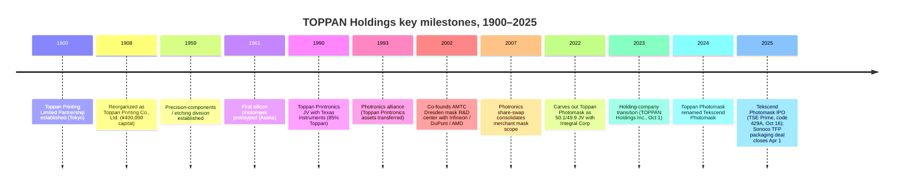
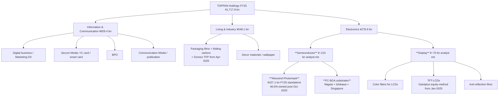

# TOPPAN Holdings Inc. (TSE: 7911) — Research Document

*As of 2026-05-26 · English-language report (Japan domicile; primary filings in Japanese on EDINET / TDnet; English-language summary documents on the Toppan IR site)*

---

## Table of contents

1. Company overview
2. Company history
3. Management
4. Products and services — Electronics segment (Tekscend Photomask, FC-BGA, other Electronics)
5. Customers and go-to-market
6. Industry overview
7. Competitive landscape
8. Market opportunity (TAM)
9. Risk assessment
10. References
11. Verification log

---

## 1. Company overview (800–1,200 words)

TOPPAN Holdings Inc. is a 125-year-old Tokyo-headquartered conglomerate that began as a securities printer in January 1900 and today operates across three reportable business segments — **Information & Communication, Living & Industry, and Electronics** — generating consolidated net sales of **¥1,717.9 billion in the fiscal year ended 31 March 2025 (FY25)** with operating profit of **¥84.0 billion (4.9% margin)** ([Consolidated Financial Results for the Fiscal Year Ended March 31, 2025, p. 2](https://finance.stockweather.co.jp/contents/dispPDF.aspx?disclosure=20250514549465); [Toppan FundingUniverse company history](https://www.fundinguniverse.com/company-histories/toppan-printing-co-ltd-history/)). For an equity investor focused on the AI-semiconductor supply chain, the consolidated headline is misleading: the **Electronics segment generated only 16.3% of FY25 revenue (¥279.9 bn) but contributed 39.6% of segment operating profit (¥52.0 bn) at an 18.6% operating margin** — more than triple the segment OPM of either Information & Communication (4.9%) or Living & Industry (6.1%) ([Consolidated Financial Results FY25, pp. 2–3](https://finance.stockweather.co.jp/contents/dispPDF.aspx?disclosure=20250514549465)). The Electronics chassis is also the one anchored in two upstream-chokepoint franchises that the rest of this report unpacks — **photomasks (carved out into the now-listed 46.6%-owned associate Tekscend Photomask, TSE:429A) and FC-BGA substrates for AI accelerators and high-end network switches**.

The corporate history splits cleanly into three eras. From 1900 to roughly 1980, Toppan was a **printing company** — banknotes, securities certificates, books, business forms — built on the relief-printing know-how that its Ministry of Finance founders had acquired in late-Meiji Tokyo ([FundingUniverse — Toppan Printing Co., Ltd. history](https://www.fundinguniverse.com/company-histories/toppan-printing-co-ltd-history/)). From 1959 to ~2020 it became a **diversified print-plus-precision-fabrication conglomerate**, applying the plating / etching / micro-patterning expertise of plate-making to ever-finer adjacencies: photomasks for silicon transistors from 1961, flexible packaging, color filters and TFT-LCDs for displays, decorative materials for housing, IC-card / smart-card printing, and securitized BPO. The third era began on **1 October 2023**, when Toppan Inc. transitioned to a holding-company structure (renaming the listed parent to TOPPAN Holdings Inc.) and split the operating businesses into TOPPAN Inc., TOPPAN Edge Inc. (the former Toppan Forms securities-printing business), and TOPPAN Digital Inc. ([TOPPAN Transitions to Holding Company Structure, 2023-10-02](https://www.holdings.toppan.com/en/news/2023/10/newsrelease231002_1.html); [Sustainability Report 2025 — Holding Company Structure, p. 178](https://www.holdings.toppan.com/assets/en/pdf/sustainability/2025/csr2025_en_company.pdf)). Combined with the April-2022 carve-out of the photomask business into Toppan Photomask Co. Ltd (renamed **Tekscend Photomask Corp.** in October 2024) and its **16 October 2025 listing on the Tokyo Stock Exchange Prime Market** (securities code 429A) ([Consolidated Financial Results for the Six Months Ended September 30, 2025, p. 21](https://finance-frontend-pc-dist.west.edge.storage-yahoo.jp/disclosure/20251113/20251113599575.pdf); [TOPPAN Photomask to Rebrand as Tekscend Photomask, 2024-10-01](https://www.holdings.toppan.com/en/news/2024/10/newsrelease241001_1.html)), Toppan is now a **management holding company whose stand-alone semiconductor "purity" is increasingly housed inside a separately listed subsidiary** — a structural fact that drives virtually every equity-investor question raised about the name.

The three operating segments break out as follows in FY25 (year to March 2025), before the Tekscend deconsolidation took effect on 16 October 2025:

- **Information & Communication: ¥929.4 bn revenue / ¥45.6 bn operating profit / 4.9% OPM** — securities-related documents, IC cards / smart cards, marketing-DX services, BPO, publication printing ([FY25 Results, pp. 2–3](https://finance.stockweather.co.jp/contents/dispPDF.aspx?disclosure=20250514549465)). The April-2026 merger of TOPPAN Inc., TOPPAN Edge Inc. and TOPPAN Digital Inc. into a single surviving "TOPPAN Inc." consolidates the customer base and removes inter-company overhead ([H1 FY26 Results, p. 19](https://finance-frontend-pc-dist.west.edge.storage-yahoo.jp/disclosure/20251113/20251113599575.pdf)).
- **Living & Industry: ¥548.1 bn revenue / ¥33.3 bn operating profit / 6.1% OPM** — flexible packaging films, mono-material GL BARRIER transparent barrier films, folding cartons, decorative sheets, wallpaper. Subsequent to FY25 close, the April-2025 closing of the **Sonoco TFP (thermoformed and flexible packaging) acquisition** added ~¥143 bn of segment assets and ¥182 bn of goodwill, lifting H1 FY26 Living & Industry segment revenue +20% YoY to ¥330.5 bn — see History (§2) for deal mechanics ([H1 FY26 Results, pp. 14, 17](https://finance-frontend-pc-dist.west.edge.storage-yahoo.jp/disclosure/20251113/20251113599575.pdf)).
- **Electronics: ¥279.9 bn revenue / ¥52.0 bn operating profit / 18.6% OPM** — the semiconductor-leveraged segment. Sub-categories per the FY25 segment-note product-list are "color filters for LCDs, TFT-LCDs, anti-reflection films, **photomasks, and semiconductor packaging products**" ([FY25 Results, p. 22](https://finance.stockweather.co.jp/contents/dispPDF.aspx?disclosure=20250514549465)). FC-BGA substrates sit inside the "semiconductor packaging" line; the Tekscend Photomask FY25 standalone result of **¥107.1 bn revenue, 35.6% EBITDA margin, 23.9% operating margin** (~¥25.6 bn EBITDA, ~¥25.6 bn operating profit) implies the **non-Tekscend Electronics revenue of ~¥173 bn comprises FC-BGA, FPD-mask, color-filter, anti-reflection and metal-etching activities** ([Tekscend Photomask FY25 data, accessed 2026-05](https://stockanalysis.com/quote/tyo/429A/)).

*Source: compiled from [Consolidated Financial Results FY25, p. 2](https://finance.stockweather.co.jp/contents/dispPDF.aspx?disclosure=20250514549465) (FY24 and FY25 actuals), [H1 FY26 Results, p. 1](https://finance-frontend-pc-dist.west.edge.storage-yahoo.jp/disclosure/20251113/20251113599575.pdf) for H1 FY26, and Toppan Inc. earlier filings for FY21–FY23. The FY26 OPM bar declines materially because Tekscend deconsolidated as a subsidiary on 16 October 2025, removing its 24% operating-margin business from the Electronics line.*

*Source: [FY25 Results, p. 2](https://finance.stockweather.co.jp/contents/dispPDF.aspx?disclosure=20250514549465) for FY24 and FY25 segment revenue; [H1 FY26 Results, p. 14](https://finance-frontend-pc-dist.west.edge.storage-yahoo.jp/disclosure/20251113/20251113599575.pdf) for H1 FY26 segment revenue annualized. Electronics segment FY26 revenue drops because Tekscend Photomask transitioned from a 50.1%-owned consolidated subsidiary to a 46.6%-owned equity-method associate from 16 October 2025.*

*Source: [FY25 Results, p. 2](https://finance.stockweather.co.jp/contents/dispPDF.aspx?disclosure=20250514549465) and [H1 FY26 Results, p. 14](https://finance-frontend-pc-dist.west.edge.storage-yahoo.jp/disclosure/20251113/20251113599575.pdf), annualized H1 with corporate-cost allocation. Electronics OP drops sharply in FY26 reflecting the Tekscend deconsolidation (Tekscend operating profit moves to equity-method income line below operating profit).*

Geographically, Toppan does not disclose a clean segment-by-country revenue breakdown but flags overseas sales at **36.6% of consolidated revenue** with **150+ overseas subsidiaries** ([Sustainability Report 2025 — Approach to Sustainability, p. 9](https://www.holdings.toppan.com/assets/en/pdf/sustainability/2025/csr2025_en_management-1.pdf)). Electronics is structurally export-skewed: the photomask business serves TSMC / Samsung / SK Hynix / SMIC / GlobalFoundries through fabs in Asaka and Shiga (Japan), Dresden (Germany), Round Rock (US), Corbeil (France), Shanghai, Icheon (Korea), and Taoyuan (Taiwan) ([Toppan Carves Out Semiconductor Photomask Business, 2022-04-01](https://www.prnewswire.com/news-releases/toppan-carves-out-semiconductor-photomask-business-to-launch-new-company-301515656.html)); the FC-BGA business is concentrated at the **Niigata Plant** with the **Ishikawa Plant (former JOLED Nomi site) ramping pilot production from 2025 and targeting mass production in fiscal 2028** plus a **Singapore site scheduled for late 2026** ([H1 FY26 Results, p. 3](https://finance-frontend-pc-dist.west.edge.storage-yahoo.jp/disclosure/20251113/20251113599575.pdf); [TOPPAN to Build Line for Mass Production of Next-Generation Semiconductor Packages in Ishikawa, Japan, 2023-12](https://www.holdings.toppan.com/en/news/2023/12/newsrelease231205_1.html); [Toppan boosts FC-BGA substrate production for AI chips, evertiq 2025-12-17](https://evertiq.com/design/2025-12-17-toppan-boosts-fc-bga-substrate-production-for-ai-chips)). Group headcount at H1 FY26 was approximately **51,988** based on stock-data sources ([Toppan Holdings TYO:7911 statistics, stockanalysis.com, accessed 2026-05](https://stockanalysis.com/quote/tyo/7911/statistics/)).

**Valuation snapshot (as of late May 2026).** Toppan trades at roughly **¥4,730 / share** with a market capitalization of **~¥1.35 trillion** (~US$8.7 bn at JPY/USD 155) and enterprise value of **¥1.50 trillion** (net debt ~¥81 bn after a major bond issuance discussed in §2) ([Toppan Holdings TYO:7911 statistics, accessed 2026-05](https://stockanalysis.com/quote/tyo/7911/statistics/)). Key multiples: **TTM P/E 21.1× / forward P/E 18.8×**, **P/S 0.75×**, **P/B 0.96×**, **EV/EBITDA 9.2×**, dividend yield **1.3%** with ¥58 annual DPS ([Toppan Holdings TYO:7911 statistics, accessed 2026-05](https://stockanalysis.com/quote/tyo/7911/statistics/); [FY25 Results, p. 2](https://finance.stockweather.co.jp/contents/dispPDF.aspx?disclosure=20250514549465)). **ROE 5.0% / ROIC 3.0%**, both depressed by a heavy book of cross-holdings, goodwill from the Sonoco TFP deal, and a packaging / printing core that earns mid-cycle returns ([Toppan Holdings TYO:7911 statistics, accessed 2026-05](https://stockanalysis.com/quote/tyo/7911/statistics/)). The stock has returned **+22.3% over the trailing 52 weeks** as the Tekscend IPO crystallized the photomask sub-cap and the FC-BGA capex cycle accelerated ([Toppan Holdings TYO:7911 statistics, accessed 2026-05](https://stockanalysis.com/quote/tyo/7911/statistics/)).

*Source: TTM multiples per [Toppan TYO:7911 statistics](https://stockanalysis.com/quote/tyo/7911/statistics/), [Ibiden TYO:4062 statistics](https://stockanalysis.com/quote/tyo/4062/statistics/), [Unimicron TWSE:3037 statistics](https://stockanalysis.com/quote/two/3037/statistics/), [Tekscend TYO:429A overview](https://stockanalysis.com/quote/tyo/429A/), [Photronics NASDAQ:PLAB statistics](https://stockanalysis.com/quote/plab/statistics/), [DNP TYO:7912 statistics](https://stockanalysis.com/quote/tyo/7912/statistics/). Shinko Electric (TYO:6967) is delisted-pending under the JIP / Mitsui / DIC management-buyout; no current multiple shown.*

*Analyst view:* the ~21× TTM P/E and 0.75× P/S are at first glance the multiples of a low-growth printing conglomerate, but the equity-implied valuation is misleading without two adjustments. **First**, at the new 46.6% post-IPO Tekscend stake, Toppan's ownership in Tekscend is worth roughly **¥217 bn** (46.6% × Tekscend's ~¥465 bn May-2026 market cap) ([Tekscend 429A overview, accessed 2026-05](https://stockanalysis.com/quote/tyo/429A/); [H1 FY26 Results, p. 22](https://finance-frontend-pc-dist.west.edge.storage-yahoo.jp/disclosure/20251113/20251113599575.pdf)), and IPO proceeds of ~¥156.6 bn flowed to Toppan and selling shareholders in October 2025 ([Tekscend Shares Rise 13% From IPO Price in Tokyo Trading Debut, Bloomberg 2025-10-15](https://www.bloomberg.com/news/articles/2025-10-15/tekscend-to-debut-after-japan-s-second-biggest-ipo-this-year)). **Second**, the FC-BGA business is sub-scale today but on the FY2030 management plan, **semiconductor-related sales target ¥350 bn at 30% non-GAAP operating margin** — implying ~¥105 bn of semiconductor operating profit run-rate at full-year FY2030 vs the FY25 Electronics-segment ¥52 bn — and Toppan claims a **No. 3 global market share in high-end switch FC-BGA substrates** as of 2025 ([Toppan FY2024 Full Year Results Briefing summary via quartr.com](https://quartr.com/companies/toppan-holdings-inc_18645)). On a sum-of-the-parts basis, the printing / packaging / decor businesses are valued by the market at sub-1× sales and a single-digit P/E, while the Electronics franchise is the call option. With management committed to a ¥30 bn buyback running through 14 May 2026 and **¥58 DPS for FY26 forecast (vs ¥48 in FY25)** ([FY25 Results, pp. 1, 7](https://finance.stockweather.co.jp/contents/dispPDF.aspx?disclosure=20250514549465)), the cash-return profile screens better than the headline ROE suggests.

---

## 2. Company history (400–700 words)

**Toppan Printing Limited Partnership was formally established on 17 January 1900 in Tokyo** by a group of technicians who had left Japan's Ministry of Finance, where they had operated the relief-printing presses that produced banknotes, securities certificates, and government postage. The new firm reorganized as **Toppan Printing Co., Ltd. in 1908 with capital doubled to ¥400,000** and from the outset focused on three product categories whose physics — high-precision multi-color relief printing, micro-feature etching, and tight registration tolerances — turned out to be the foundational toolset that would later let Toppan walk into semiconductor photomasks, FPD color filters, IC-card lamination, decorative-laminate printing, and FC-BGA substrate plating ([FundingUniverse — Toppan Printing Co., Ltd. history](https://www.fundinguniverse.com/company-histories/toppan-printing-co-ltd-history/); [Company-Histories — Toppan Printing Co., Ltd.](https://www.company-histories.com/Toppan-Printing-Co-Ltd-Company-History.html)). The corporate name "Toppan" itself is a contraction of the Japanese word for relief / letterpress printing (*toppan inkatsu*), and the company tracks its 125-year continuity as a single corporate entity from the 1900 partnership through every subsequent restructuring.

Two threads dominate the modern history of the company. **Thread 1: the 60-year build-out of the photomask franchise.** Toppan first prototyped a photomask for silicon transistors in 1961 at its Asaka plant, applying the same metal-on-glass micro-patterning expertise that already drove its filter-screens-for-sugar-refinery side business ([Asianometry — The History of the Semiconductor Photomask](https://www.asianometry.com/p/the-history-of-the-semiconductor)). The franchise was institutionalized in **1990 as Toppan Printronics U.S.A.**, a JV with Texas Instruments in which Toppan held 85% ([FundingUniverse — Toppan Printing Co., Ltd. history](https://www.fundinguniverse.com/company-histories/toppan-printing-co-ltd-history/)). In **1993 Toppan transferred the Printronics assets into a strategic alliance with Photronics Inc.** — the publicly listed US merchant mask leader — under which Photronics operated the US assets and Toppan retained its Japan / Asia franchise; the two companies cross-licensed technology and ran multiple JVs through 2007. Co-investing in the **Advanced Mask Technology Center (AMTC) in Dresden in 2002** alongside Infineon, DuPont Photomasks and AMD (later GlobalFoundries) put Toppan inside the European leading-edge ecosystem; that Dresden facility remains central to Tekscend's strategy and one of only three places on earth — alongside Toppan's Asaka R&D centre and a handful of foundry-captive shops — that can produce EUV masks at meaningful volume ([iamfabian, Tekscend vs. Photronics, 2025](https://iamfabian.substack.com/p/the-landscape-of-semiconductor-photomasks)). On **1 April 2022 Toppan carved its semiconductor photomask business out into Toppan Photomask Co., Ltd. in a 50.1% / 49.9% share-transfer deal with Integral Corporation**, a Japanese private-equity firm — capitalizing the new company at ¥400 million with manufacturing footprints in seven regions (Asaka, Shiga, Round Rock TX, Dresden, Corbeil, Shanghai, Icheon, Taoyuan) ([Toppan Carves Out Semiconductor Photomask Business, 2022-04-01](https://www.prnewswire.com/news-releases/toppan-carves-out-semiconductor-photomask-business-to-launch-new-company-301515656.html)). The carve-out gave Toppan Photomask the institutional independence to make capex decisions on a semiconductor-cycle clock rather than a printing-conglomerate clock — the precondition for the **rebrand to Tekscend Photomask Corp. in October 2024** and the **IPO on the TSE Prime Market on 16 October 2025 at ¥3,000 / share (~¥300 bn market cap; ~¥156.6 bn raised including the over-allotment)** ([Tekscend Shares Rise 13% From IPO Price, Bloomberg 2025-10-15](https://www.bloomberg.com/news/articles/2025-10-15/tekscend-to-debut-after-japan-s-second-biggest-ipo-this-year); [TOPPAN Photomask to Rebrand as Tekscend Photomask, 2024-10-01](https://www.holdings.toppan.com/en/news/2024/10/newsrelease241001_1.html); [H1 FY26 Results, p. 21–22](https://finance-frontend-pc-dist.west.edge.storage-yahoo.jp/disclosure/20251113/20251113599575.pdf)). At IPO the Qatar Investment Authority was among the named anchor investors, and the deal was the second-largest Japanese IPO of 2025 behind JX Advanced Metals ([Caproasia — Toppan Holdings Spinoff Semiconductor Photomask Provider Tekscend Photomask Plans Tokyo IPO, 2025-10-10](https://www.caproasia.com/2025/10/10/japan-7-5-billion-toppan-holdings-spinoff-semiconductor-photomask-provider-tekscend-photomask-plans-tokyo-ipo-to-raise-800-million-at-2-billion-valuation-founded-in-2021-in-spinoff-from-toppan-pri/)).

**Thread 2: the parallel build-out of FC-BGA substrates and the 2023 holding-company reorganization.** Toppan had been a sub-scale FC-BGA player for two decades before the AI build-out turned the niche into a strategic priority. The company commissioned a cutting-edge FC-BGA substrate line at its **Niigata Plant in June 2015**, then **announced in December 2023 the acquisition of the former JOLED Nomi site in Ishikawa Prefecture** with mass production targeted for fiscal 2028 ([TOPPAN to Build Line for Mass Production of Next-Generation Semiconductor Packages in Ishikawa, 2023-12](https://www.holdings.toppan.com/en/news/2023/12/newsrelease231205_1.html); [Toppan boosts FC-BGA substrate production for AI chips, 2025-12-17](https://evertiq.com/design/2025-12-17-toppan-boosts-fc-bga-substrate-production-for-ai-chips)). On **1 October 2023** the parent company itself transitioned to a holding-company structure — renaming to **TOPPAN Holdings Inc.** and splitting the legacy operating business across three new subsidiaries (TOPPAN Inc., TOPPAN Edge Inc., TOPPAN Digital Inc.) — with the explicit purpose of "maximizing Group synergies through strengthened governance" and enabling each business to operate on its own decision-clock ([TOPPAN Transitions to Holding Company Structure, 2023-10-02](https://www.holdings.toppan.com/en/news/2023/10/newsrelease231002_1.html); [Sustainability Report 2025 — Holding Company Structure, p. 178](https://www.holdings.toppan.com/assets/en/pdf/sustainability/2025/csr2025_en_company.pdf)). In a partial reversal, **the Board of Directors resolved in March 2025 to absorb TOPPAN Edge and TOPPAN Digital back into TOPPAN Inc. effective 1 April 2026** to recapture the Information & Communication segment synergies the splits had complicated ([H1 FY26 Results, p. 19](https://finance-frontend-pc-dist.west.edge.storage-yahoo.jp/disclosure/20251113/20251113599575.pdf)). Two large transactions outside the semiconductor franchise closed in 2025: the **acquisition of Sonoco Products' thermoformed and flexible-packaging business (TFP) on 1 April 2025** for cash, adding ~¥143 bn of segment assets and ~¥182 bn of provisional goodwill in the Living & Industry segment ([H1 FY26 Results, p. 14, 17](https://finance-frontend-pc-dist.west.edge.storage-yahoo.jp/disclosure/20251113/20251113599575.pdf)); and the partial divestiture of **Giantplus Technology Co., Ltd.** in Taiwan, the company's TFT-LCD subsidiary, which became an equity-method affiliate in January 2025 as Toppan refocused capital on FC-BGA and away from low-margin display panels ([FY25 Results, p. 4](https://finance.stockweather.co.jp/contents/dispPDF.aspx?disclosure=20250514549465)). The Board also approved a **¥80 bn straight-bond programme on 13 November 2025** to refinance borrowings, signaling continued capacity expansion ([H1 FY26 Results, pp. 19–20](https://finance-frontend-pc-dist.west.edge.storage-yahoo.jp/disclosure/20251113/20251113599575.pdf)).

---

## 3. Management (300–500 words)

The Yamanaka brothers / Ministry-of-Finance founders are 125 years gone and Toppan has been a salaryman-run, non-founder-family company since the 1920s — so the relevant biographical detail today is the executives currently in the seat. Per the H1 FY26 financial-result filing, the Representative Director, President & CEO is **Hideharu Maro**, with **Takashi Kurobe** as Director / Senior Managing Executive Officer & CFO ([H1 FY26 Results, p. 1](https://finance-frontend-pc-dist.west.edge.storage-yahoo.jp/disclosure/20251113/20251113599575.pdf)). Maro is the principal architect of the holding-company reorganization, the Tekscend carve-out, and the FC-BGA capex cycle — the three decisions that frame any forward equity case on Toppan.

**Hideharu Maro — Representative Director, President & CEO (since June 2019; CEO from June 2023).** Maro joined Toppan in **April 1979** straight out of university and is a 47-year insider with a technical background — the corporate playbook for the Japanese conglomerate CEO. His formative operating tours map onto the **packaging business** rather than the semiconductor side: Director of Gunma Plant Production Management in the Tokyo Business Unit, Chief Director of 3rd Sales, Director of Kansai Business in the Main Packaging Business Unit, then Chief Director of Overseas Business with stints in Shanghai and Singapore leading the international expansion of Toppan's packaging franchise ([Simply Wall St — TOPPAN Holdings management profile, accessed 2026-05](https://simplywall.st/stocks/us/commercial-services/otc-topp.y/toppan-holdings/management); [Hideharu Maro — Bloomberg Markets profile](https://www.bloomberg.com/profile/person/16450133)). He was appointed Director in 2009, Representative Director in June 2018, **President & Representative Director on 27 June 2019** at age 62, and elevated to CEO from June 2023 when the holding-company structure took effect ([Toppan Printing's New President, 2019-06-28](https://www.holdings.toppan.com/en/news/2019/06/newsrelease190628e.html); [Simply Wall St — TOPPAN Holdings management, accessed 2026-05](https://simplywall.st/stocks/us/commercial-services/otc-topp.y/toppan-holdings/management)). At 69 he is two years past the conventional Japanese-large-cap retirement age, and at the General Meeting of Shareholders subsequent to FY26 he is scheduled to transition to **Representative Director Chairman & CEO** effective 1 April 2026, with **Satoshi Oya** moving from operating-company head of TOPPAN Inc. to President of the holding company ([H1 FY26 Results, p. 23 — Surviving company TOPPAN Inc. — Representative Satoshi Oya](https://finance-frontend-pc-dist.west.edge.storage-yahoo.jp/disclosure/20251113/20251113599575.pdf); [Simply Wall St — TOPPAN Holdings management](https://simplywall.st/stocks/us/commercial-services/otc-topp.y/toppan-holdings/management)).

Maro's signature as CEO has been three decisions in sequence. **(1)** Pushing the **holding-company transition in October 2023** to separate decision-clocks across the three growth pillars (DX in Information & Communication, SX-packaging in Living & Industry, semiconductors in Electronics) — a structural change that gave each operating subsidiary the latitude to capex and recruit at its own cadence ([TOPPAN Transitions to Holding Company Structure, 2023-10-02](https://www.holdings.toppan.com/en/news/2023/10/newsrelease231002_1.html)). **(2)** Executing the **Tekscend Photomask carve-out and 2025 IPO** — first selling 49.9% to Integral PE in 2022 to validate the standalone equity story, then listing the company on the TSE Prime Market in October 2025 at a ~¥300 bn market cap and crystallizing the value of the franchise on Toppan's own balance sheet ([Toppan Carves Out Semiconductor Photomask Business, 2022-04-01](https://www.prnewswire.com/news-releases/toppan-carves-out-semiconductor-photomask-business-to-launch-new-company-301515656.html); [Bloomberg — Tekscend IPO debut, 2025-10-15](https://www.bloomberg.com/news/articles/2025-10-15/tekscend-to-debut-after-japan-s-second-biggest-ipo-this-year)). **(3)** Greenlighting the **¥100+ bn FC-BGA capex programme** centered on Niigata (new line online January 2026 doubling H1-FY22 capacity), Ishikawa (mass production 2028 onwards), and Singapore (operations from late 2026) — a multi-site bet that bridges Toppan from a sub-7% FC-BGA share player to a top-3 player in the high-end AI / network-switch sub-segment ([H1 FY26 Results, p. 3](https://finance-frontend-pc-dist.west.edge.storage-yahoo.jp/disclosure/20251113/20251113599575.pdf); [evertiq, 2025-12-17](https://evertiq.com/design/2025-12-17-toppan-boosts-fc-bga-substrate-production-for-ai-chips)).

Maro's reported total compensation is **¥197 million annually** (81% base salary, 19% bonuses), with an ownership stake of **0.028% of Toppan Holdings (~US$2.4 million)** — modest for a Japanese large-cap CEO but consistent with a salaryman-track executive elevated through 40 years of inside promotion rather than a founder ([Simply Wall St — TOPPAN Holdings management, accessed 2026-05](https://simplywall.st/stocks/us/commercial-services/otc-topp.y/toppan-holdings/management)). The average board tenure is 6.4 years and average age is 65 — a typical Japanese conglomerate-board profile that the activists watching the Tekscend IPO unlock will inevitably push to refresh.

---

## 4. Products and services (700–1,500 words) — the Electronics-segment deep dive

### 4.1 The Toppan Holdings product taxonomy — three segments, with Electronics the only chapter that matters for the AI-semiconductor thesis

Toppan's FY25 Consolidated Financial Results segment-information note lists the three reportable segments and the major products and services belonging to each verbatim ([FY25 Results, p. 22](https://finance.stockweather.co.jp/contents/dispPDF.aspx?disclosure=20250514549465)). The taxonomy is unambiguous and is the authoritative anchor for everything in this section — sell-side analyst breakdowns that go further (FC-BGA % of Electronics revenue, EUV % of Tekscend revenue, etc.) are estimates and labeled as such throughout.

| Reportable segment | FY25 net sales (¥ bn) | FY25 operating profit (¥ bn) | FY25 OPM | Major products and services (verbatim from FY25 financial results) |
|---|---:|---:|---:|---|
| Information & Communication | 929.4 | 45.7 | 4.9% | "Securities-related documents, passbooks, cards, business forms, catalogues and other commercial printing, magazines, books and other publication printing, and business process outsourcing (BPO)" |
| Living & Industry | 548.1 | 33.3 | 6.1% | "Flexible packaging, folding cartons and other packaging products, plastic molded products, ink, transparent barrier film, decorative paper/film, wallpaper and other decorative material" |
| **Electronics** | **279.9** | **52.0** | **18.6%** | **"Color filters for LCDs, TFT-LCDs, anti-reflection films, photomasks, and semiconductor packaging products"** |
| Adjustment | (39.5) | (47.0) | — | Corporate overhead, basic-research costs not allocated |
| **Consolidated** | **1,717.9** | **84.0** | **4.9%** | — |

*Source: [Consolidated Financial Results for the Fiscal Year Ended March 31, 2025, pp. 2, 22](https://finance.stockweather.co.jp/contents/dispPDF.aspx?disclosure=20250514549465) — verbatim segment names, product lists, and FY25 actuals.*

This Section 4 deliberately spends almost all of its word count on the **Electronics segment** — the only segment that drives the equity case for the name. The Information & Communication and Living & Industry segments are mature, low-OPM businesses whose share-price implications are captured by the cash-flow trajectory rather than product detail; they are summarized in §4.6 for completeness. Within Electronics, the structure mirrors the layering required by the request: **§4.2 Tekscend Photomask** (the carved-out, separately listed 46.6%-owned photomask associate); **§4.3 FC-BGA substrates** (held inside the Electronics segment of Toppan Holdings itself, not Tekscend); **§4.4 other Electronics** (color filters, TFT-LCDs, anti-reflection films, metal etching, and the smaller R&D-stage glass-core and panel-level packaging programmes).

### 4.2 Tekscend Photomask — Toppan's carved-out, separately listed photomask sub-cap

**Distinguishing the three entities up front.** A reader who walks away confused on this point cannot evaluate the rest of the section. **Tekscend Photomask Corp.** (TSE: 429A) is the operating company carved out of Toppan in April 2022 and listed in October 2025 — it is the entity that runs the actual photomask fabs in Asaka, Shiga, Round Rock, Dresden, Corbeil, Shanghai, Icheon and Taoyuan, employs the ~1,899 photomask-business employees, and reports ¥117–130 bn of standalone revenue ([Tekscend Photomask Corporate Overview](https://www.photomask.com/en/about/overview/); [Tekscend 429A overview, accessed 2026-05](https://stockanalysis.com/quote/tyo/429A/)). **Toppan Holdings' Electronics segment** is the consolidated reporting line at the parent — it included 100% of Tekscend revenue and operating profit through 15 October 2025, then transitioned to equity-method accounting from 16 October 2025 ([H1 FY26 Results, pp. 21–22](https://finance-frontend-pc-dist.west.edge.storage-yahoo.jp/disclosure/20251113/20251113599575.pdf)); from FY26 onwards the Electronics segment revenue line therefore shows only Toppan's *non-photomask* electronics (FC-BGA, displays, etc.), and Tekscend's contribution flows through the "share of profit of equity-method affiliates" line below operating profit. **TOPPAN Holdings Inc.** is the listed holding company at the top, which owns 46.6% of Tekscend, 100% of TOPPAN Inc. (operating), and the parent obligations including the ¥80 bn straight-bond programme ([H1 FY26 Results, pp. 22, 19–20](https://finance-frontend-pc-dist.west.edge.storage-yahoo.jp/disclosure/20251113/20251113599575.pdf)). Equity research that conflates these three — by treating Tekscend's revenue as if it still belongs to Toppan's consolidated top line, or by valuing Toppan ex-Tekscend at the consolidated multiple — produces materially wrong numbers.

> **Tekscend Photomask's own product description** (verbatim, from the company website): "Tekscend Photomask is the global leader in the merchant photomask manufacturing industry. We provide our customers the photomasks they need to enable our digital world. From conventional binary or PSM photomasks to advanced EUV photomasks for cutting-edge semiconductor devices, we offer the most reliable photomasks to our customers along with our supply chain in seven countries on three continents." ([Tekscend Photomask Corporate Overview](https://www.photomask.com/en/about/overview/))

**Plain-language gloss / 中文释义:** a semiconductor **photomask / 光掩膜版** is the patterning master used by a fab to project a chip's circuit layout onto silicon wafers; physically it is a **152 mm × 152 mm × 6.35 mm-thick puck of ultra-low-thermal-expansion quartz / fused-silica glass** with a patterned absorber stack on top — for **DUV (deep-ultraviolet) masks** the absorber is chrome on chrome-oxide ("binary") or a partially-transmissive molybdenum-silicide layer ("attenuated phase-shift / 衰减相移", or "alternating phase-shift / 交替相移" with engraved phase wells). For **EUV (extreme-ultraviolet, 极紫外) masks**, the optics inverts — the mask is *reflective*: a multilayer Bragg reflector of ~40–50 alternating molybdenum-silicon pairs (each a few nanometres thick) coats the substrate, a ruthenium capping layer protects the stack, and a patterned absorber (today TaBN, next generation moving to Ru / Ni-based low-n materials) defines where the EUV light reflects vs gets absorbed ([Tekscend Photomasks for Semiconductors product page](https://www.photomask.com/en/product/photomask/)). Tekscend offers **all four wavelength tiers**: i-line / KrF (low-end, used for older nodes and analog/mature processes), ArF dry (193 nm, for 65 nm–28 nm), ArF immersion / 193i (for 14 nm to ~5 nm with multi-patterning), and **EUV (13.5 nm) for 7 nm and below, including 1.4 nm / 1 nm research-stage masks shown publicly at SEMICON Japan** ([Tekscend Photomasks for Semiconductors product page](https://www.photomask.com/en/product/photomask/); [TOPPAN and Tekscend Photomask Participate in SEMICON Japan 2025](https://www.holdings.toppan.com/en/news/2025/12/newsrelease251210_1.html)). Beyond standard semiconductor masks Tekscend also makes **stencil masks, nanoimprint molds, and glass photomasks for R&D**, plus **photomasks for FPD (flat-panel display)** TFT backplanes used by panel makers ([Tekscend — Photomasks for Various Applications](https://www.photomask.com/en/product/various_photomask/)).

**Where Tekscend sits in the value chain.** A photomask is the **furthest-downstream of three glass-substrate components** consumed by a fab. **Upstream**, mask-blank suppliers (Hoya at ~80% EUV-blank share, Shin-Etsu Chemical, AGC) ship the pre-coated glass puck to the mask shop with the absorber stack already deposited but **unpatterned**. **Mid-stream**, the mask shop (Tekscend, Photronics, DNP, or one of the foundry-captive shops at TSMC / Samsung / Intel) takes the customer's GDSII layout file, runs OPC (optical proximity correction), and writes the pattern into the absorber using **electron-beam direct-write tools** (NuFlare EBM-X, Heidelberg, IMS multi-beam mask writer / MBMW for sub-10 nm), then inspects the mask down to single-particle defects using KLA / Lasertec inspection tools. **Downstream**, the patterned mask ships back to the customer fab where it sits inside an ASML EUV scanner and prints ~1,000–5,000 wafers before degradation requires replacement. The mask-blank → patterning → inspection cycle is what gives Tekscend its 35.6% EBITDA margin profile ([Tekscend Photomask revenue and margin data, FY22–FY25, accessed 2026-05](https://stockanalysis.com/quote/tyo/429A/)) — it's a capital-intensive, multi-year-qualified, customer-locked business where switching cost is measured in months of fab re-qualification.

*Source: revenue per [Tekscend Photomask FY25 disclosure, accessed 2026-05](https://stockanalysis.com/quote/tyo/429A/); standalone EBITDA / OP margin estimated from TradingView fundamentals for TSE:429A. FY25E (Mar-26) reflects TTM revenue of ¥129.6 bn and net income of ¥25.0 bn per [Tekscend 429A overview](https://stockanalysis.com/quote/tyo/429A/).*

*Analyst view — Tekscend's competitive position.* **Yes, hard moat in the merchant photomask segment.** Type = **scale + multi-geography qualification + AMTC R&D consortium + leading-edge node-tracking capability**. Per the analyst review at [iamfabian, "Tekscend vs. Photronics", 2025](https://iamfabian.substack.com/p/the-landscape-of-semiconductor-photomasks), Tekscend's portfolio mix has more than 55% of revenue in **advanced nodes (≤28 nm)** versus Photronics' more mid-range mix, with key customers **TSMC, Samsung, Intel Foundry, and GlobalFoundries** for logic / memory, plus a five-year IBM + imec joint development agreement on 2 nm / 1 nm photomasks. The merchant mask market (i.e. excluding captive TSMC / Samsung / Intel internal mask shops) is ~37% of the total photomask TAM; within merchant, *Analyst view:* Tekscend holds roughly 38–40% share globally, ahead of Photronics (~27%) and DNP (~22%) ([reports/sector/半导体材料.md, Fig. 35–44](file:///Users/x/projects/financial_agent/reports/sector/半导体材料.md)).

*Source: analyst estimate compiled from [Nomura Greater China Semi 2026–30F report, 2026-05-21, Figs 35–44](file:///Users/x/projects/financial_agent/reports/sector/半导体材料.md), cross-referenced to [iamfabian — Tekscend vs. Photronics analysis, 2025](https://iamfabian.substack.com/p/the-landscape-of-semiconductor-photomasks). Captive (in-house TSMC/Samsung/Intel mask shops) excluded — those represent the larger half of total photomask production but are not commercially addressable.*

### 4.3 FC-BGA substrates — Toppan Electronics' standalone capex bet

**FC-BGA substrate / 倒装芯片球栅阵列封装基板** is the rectangular **multilayer organic substrate** that sits between an AI accelerator / network-switch ASIC die and the motherboard / PCB. Physically, it is built up by laminating alternating layers of **Ajinomoto Build-Up Film (ABF) dielectric** and **patterned copper traces** on top of a glass-fiber-reinforced epoxy core (or in some cases a "coreless" thin variant), with **through-holes plated with copper** to form vertical interconnects. The chip flip-chips onto the substrate via **solder bumps (130 µm or 110 µm pitch in Toppan's current product line)**, the substrate fans the I/O out via the build-up layers to **BGA balls** on the bottom side, and the package ships into the customer's surface-mount line ([Toppan FC-BGA substrates product page](https://www.toppan.com/en/electronics/package/fc-bga/)). For an AI accelerator like a Broadcom AI ASIC or an NVIDIA GPU, the FC-BGA substrate is the second-most expensive single component (after the chip die itself), and it is the chokepoint that limits package size — large-form-factor substrates with 80mm+ side dimensions are the bottleneck holding back the 1,000+ TOPS-class accelerators of 2026–2028.

> **From Toppan's own product description** (verbatim): "FC-BGA is a high density semiconductor package substrate that allows high speed LSI chips with more functions. Lineup: standard FC-BGA, FC-LGA, multi-chip FC-BGA, ultra-multilayer FC-BGA, coreless FC-BGA, 2.3/2.5D FC-BGA. Ultra-fine wiring: Line/Space as narrow as 10/10 µm (semi-additive process), 30/30 µm (subtractive). High-density build-up: 5-stack and 10-stack VIA configurations with land/via dimensions of 85/60 µm and 100/60 µm. Fine-pitch FC bumps at 130 µm and 110 µm pitches. Low copper roughness: Ra 400–250 nm to Ra 200–100 nm. Materials: build-up resins from Ajinomoto Fine-Techno and Sekisui Chemical for high-speed transmission. Applications: automotive SoCs, server/AI processors, networking ASICs, GPUs, and gaming consoles." ([Toppan FC-BGA substrates product page](https://www.toppan.com/en/electronics/package/fc-bga/))

**Plain-language gloss / 中文释义:** Toppan's technical contribution to FC-BGA-substrate-for-AI is not the basic FC-BGA technology (which Ibiden / Shinko / Unimicron have all manufactured at scale for 20+ years) but the **high-end large-form-factor sub-segment**: substrates >80 mm on a side, with **10-stack VIA configurations**, **low-dielectric-constant / low-dissipation-factor (low-Df) ABF materials** that preserve signal integrity at 224 Gbps PAM4 line rates ([Japan Times — Advancing semiconductor progress with substrates, 2024-12-11](https://www.japantimes.co.jp/2024/12/11/special-supplements/advancing-semiconductor-progress-substrates/)), and **smoothed copper surfaces (Ra 200–100 nm)** to reduce skin-effect loss at the high frequencies the AI workload demands. This is the segment that NVIDIA, AMD, Broadcom and other AI ASIC customers were short of in 2023–24 when Ibiden and Shinko ran into capacity bottlenecks at their large-form-factor lines; Toppan was a marginal supplier in 2022 but the **December 2023 Ishikawa announcement and December 2025 Niigata expansion** are designed to put Toppan squarely into the top-3 for AI-grade FC-BGA by FY2028 ([TOPPAN to Build Line for Mass Production of Next-Generation Semiconductor Packages in Ishikawa, 2023-12-05](https://www.holdings.toppan.com/en/news/2023/12/newsrelease231205_1.html); [TOPPAN to Launch New FC-BGA Substrate Line at Niigata Plant, 2025-12-17 via thepackman.in](https://thepackman.in/toppan-to-launch-new-fc-bga-substrate-production-line-at-niigata-plant/); [evertiq — Toppan boosts FC-BGA substrate production for AI chips, 2025-12-17](https://evertiq.com/design/2025-12-17-toppan-boosts-fc-bga-substrate-production-for-ai-chips)).

**Capacity build-out timeline.** The **Niigata Plant** (Shibata, Niigata Prefecture) is the workhorse. The new line announced 17 December 2025 comes online in January 2026 and roughly **doubles the Niigata FC-BGA capacity vs the H1-FY22 baseline**; it incorporates the low-Df materials and enhanced copper-surface treatment described above, plus expanded substrate-thickness and size capability beyond standard JEDEC tray dimensions ([evertiq, 2025-12-17](https://evertiq.com/design/2025-12-17-toppan-boosts-fc-bga-substrate-production-for-ai-chips)). The **Ishikawa Plant** at the former JOLED Nomi site (acquired November 2023 for the land + buildings) opened in July 2024 as the technology-development centre, with a pilot line for **organic RDL interposers and glass-core substrates** announced 16 December 2025 and mass production targeted from FY2028 ([H1 FY26 Results, p. 3](https://finance-frontend-pc-dist.west.edge.storage-yahoo.jp/disclosure/20251113/20251113599575.pdf); [TOPPAN to Build Line for Mass Production of Next-Generation Semiconductor Packages in Ishikawa, 2023-12-05](https://www.holdings.toppan.com/en/news/2023/12/newsrelease231205_1.html)). A second international site in **Singapore** is scheduled for late-2026 operations to give Toppan geographic redundancy outside of Japan's earthquake-prone domestic footprint ([evertiq, 2025-12-17](https://evertiq.com/design/2025-12-17-toppan-boosts-fc-bga-substrate-production-for-ai-chips)). Total cumulative capex across the three sites is expected to exceed **¥100 bn**, with capacity expansion "in line with demand" — i.e. Toppan is signaling discipline rather than the speculative build-ahead that bit Ibiden in 2023 ([thepackman, 2025-12](https://thepackman.in/toppan-to-launch-new-fc-bga-substrate-production-line-at-niigata-plant/)). To accelerate technology validation, Toppan **joined the US-JOINT (United States-Japan Joint Open Innovation Network for Trusted SemiConductors)** consortium during FY24, providing a US-based platform for next-generation packaging evaluation and development ([FY25 Results, p. 4](https://finance.stockweather.co.jp/contents/dispPDF.aspx?disclosure=20250514549465); [H1 FY26 Results, p. 3](https://finance-frontend-pc-dist.west.edge.storage-yahoo.jp/disclosure/20251113/20251113599575.pdf)).

*Source: analyst estimate compiled from [Market Growth Reports — ABF Substrate (FC-BGA) Market Size, 2024](https://www.marketgrowthreports.com/market-reports/abf-substrate-fc-bga-market-107527) and [wonderfulpcb.com — Top ABF substrate manufacturers, 2025](https://www.wonderfulpcb.com/blog/top-abf-substrate-manufacturers-and-market-leaders/). Toppan is the #6 overall player by total FC-BGA revenue but management states it is "No. 3 in high-end switch FC-BGA substrates" — i.e. it is meaningfully under-represented in mid-range mainstream FC-BGA and concentrated in the AI / network-switch top tier where margins are highest ([Toppan FY2024 Full Year Results Briefing summary via quartr.com](https://quartr.com/companies/toppan-holdings-inc_18645)).*

*Analyst view — FC-BGA competitive position.* **Partial moat today, hard moat by FY2028 if Ishikawa ramps to plan.** Type = **scale + AI-customer qualification + glass-core / next-gen packaging optionality**. The named competitors per Toppan's own positioning and the third-party sources are **Unimicron (TWSE:3037, ~22% share), Ibiden (TYO:4062, ~18%), Nan Ya PCB (~12%), Shinko Electric (~11%, currently under JIP / Mitsui / DIC management-buyout), Kinsus (~9%)**, plus AT&S, Kyocera and SEMCO in the long tail ([wonderfulpcb.com — Top ABF substrate manufacturers, 2025](https://www.wonderfulpcb.com/blog/top-abf-substrate-manufacturers-and-market-leaders/); [marketgrowthreports.com — ABF Substrate / FC-BGA market, 2024](https://www.marketgrowthreports.com/market-reports/abf-substrate-fc-bga-market-107527)). At ~7% share Toppan is sub-scale on a unit basis but oversized in the AI sub-segment where it competes for the same NVIDIA / AMD / Broadcom AI ASIC sockets that drive Ibiden's premium pricing.

### 4.4 Other Electronics — color filters, TFT-LCDs, anti-reflection films, metal etching

The non-semiconductor portion of the Electronics segment is the legacy display / film / metal-etching grouping. **Color filters** for LCDs / OLEDs are produced by patterning red-green-blue dye-printed glass for the panel maker's TFT backplane; Toppan is one of three global suppliers alongside DNP and Dai Nippon Ink (DIC), though the segment is in long-term volume decline as OLED / micro-LED takes share from LCD. **TFT-LCD panels** historically came through Toppan's Taiwan subsidiary **Giantplus Technology Co., Ltd.**; on 31 January 2025 Toppan sold a portion of its Giantplus shares and Giantplus moved from consolidated subsidiary to equity-method affiliate, signaling the strategic decision to exit panel manufacturing while keeping a minority financial stake ([FY25 Results, p. 4](https://finance.stockweather.co.jp/contents/dispPDF.aspx?disclosure=20250514549465)). **Anti-reflection films** for smartphone and TV cover glass remain a stable franchise, particularly for high-value-added Apple / Samsung consumer applications, and **metal etching** (precision-etched clad materials, metal etched masks, high-definition shadow masks for OLED displays) is a smaller specialty franchise. The "**ORTUSTECH**" TFT-LCD module line for industrial / medical / automotive applications including the Blanview brand survives as a niche premium business inside Toppan Inc. ([TOPPAN Electronics Business Unit page](https://www.toppan.com/en/electronics/)). The display sub-segment is structurally low-growth and low-margin; the equity case for Electronics is photomask (Tekscend equity-method income) + FC-BGA + the call option on glass core / RDL interposers, not display.

### 4.5 Synthesis — how the Electronics product lines interact in the AI build-out

The reader who walks away from Section 4 understanding **one thing** should walk away with this: Toppan now occupies **three sequential nodes in the AI chip supply chain**, each at different scale and competitive position. **Step 1, pattern transfer (Tekscend):** the AI accelerator's lithography masks (EUV for the leading-edge metal layers, ArF immersion for the trailing layers) are written at Tekscend's Asaka or Dresden fab and shipped to TSMC / Samsung / Intel for the wafer-printing step — Tekscend earns a premium economic rent here because mask qualification is a multi-month process and substitution is non-trivial. **Step 2, packaging (Toppan FC-BGA):** the silicon die that comes off the wafer-printing line gets flip-chipped onto a Toppan FC-BGA substrate at Niigata or Ishikawa, where build-up dielectric and patterned copper fan the I/O out to motherboard pitch — Toppan is sub-scale here but moving up the share rankings as the Niigata / Ishikawa / Singapore capex completes. **Step 3, integration (next-gen packaging optionality):** the Ishikawa pilot line is positioned for **glass-core substrates, organic RDL interposers, and panel-level packaging** — the architectural successors to traditional FC-BGA that the AI roadmap (NVIDIA Rubin, Broadcom 1.6T+ switch ASICs, AMD MI400-series) is expected to require from FY2027–FY2028 onwards ([H1 FY26 Results, p. 3](https://finance-frontend-pc-dist.west.edge.storage-yahoo.jp/disclosure/20251113/20251113599575.pdf); [reports/sector/半导体材料.md, Fig. 4, p. 5 — seven technology threads](file:///Users/x/projects/financial_agent/reports/sector/半导体材料.md)). The three steps share manufacturing infrastructure (clean-room expertise, photoresist / dielectric coating, electroplating, defect-inspection) — the same precision-fabrication culture that the photomask business spent six decades building — and Toppan increasingly cross-pollinates engineering teams between the two franchises.

### 4.6 Non-Electronics segments — Information & Communication and Living & Industry — summarized for completeness

The **Information & Communication** segment is the legacy printing-plus-services franchise, comprising securities documents, IC cards / smart cards, marketing DX services, BPO and publication printing ([FY25 Results, p. 22](https://finance.stockweather.co.jp/contents/dispPDF.aspx?disclosure=20250514549465)). The growth story inside this segment is the **government-ID / Citizen Identity Solutions business** acquired from HID in FY24, which added a "solid customer base and solution planning capabilities" in northern-Europe public-sector IDs ([FY25 Results, p. 3](https://finance.stockweather.co.jp/contents/dispPDF.aspx?disclosure=20250514549465)); the structural drag is the publication / commercial printing business, which is in secular decline as paper media volume shrinks. The April-2026 merger of TOPPAN Inc., TOPPAN Edge Inc. and TOPPAN Digital Inc. into a single TOPPAN Inc. is the response — consolidating to remove inter-company overhead and accelerate the cross-sell of digital services on top of the legacy customer base ([H1 FY26 Results, p. 19](https://finance-frontend-pc-dist.west.edge.storage-yahoo.jp/disclosure/20251113/20251113599575.pdf)).

The **Living & Industry** segment is the packaging and decor-materials business — flexible packaging films, **mono-material GL BARRIER transparent barrier films** (which Toppan is positioning as the recyclable replacement for traditional multi-layer barrier laminates as Europe's PPWR regulation takes effect from February 2025), folding cartons, plastic molded products, decorative sheets for flooring and wallpaper, and the new spatial-design **"expace"** brand ([FY25 Results, p. 3](https://finance.stockweather.co.jp/contents/dispPDF.aspx?disclosure=20250514549465); [H1 FY26 Results, p. 3](https://finance-frontend-pc-dist.west.edge.storage-yahoo.jp/disclosure/20251113/20251113599575.pdf)). The transformational deal was the **1 April 2025 closing of the Sonoco Products thermoformed and flexible packaging (TFP) acquisition**, which adds **>¥600 bn of sustainable-packaging revenue and >¥80 bn of EBITDA** at the combined-entity level, ¥143 bn in segment assets, ¥182 bn of provisional goodwill, and approximately 26 subsidiaries to the consolidated scope ([H1 FY26 Results, pp. 14, 17–18](https://finance-frontend-pc-dist.west.edge.storage-yahoo.jp/disclosure/20251113/20251113599575.pdf)). Toppan additionally acquired Italy's **Irplast S.p.A.**, a high-environmental-performance films manufacturer, during H1 FY26 ([H1 FY26 Results, p. 3](https://finance-frontend-pc-dist.west.edge.storage-yahoo.jp/disclosure/20251113/20251113599575.pdf)). The strategic logic — global blue-chip CPG customers want a one-stop sustainable-packaging partner with film extrusion, barrier processing and packaging-manufacturing capability on every continent — is sound; the execution risk is goodwill impairment if margin convergence with the legacy Toppan packaging business takes longer than the deal model assumed.

---

