# TOPPAN Holdings Inc. (TSE: 7911) — Research Document

*As of 2026-05-26 · English-language report (Japan domicile; primary filings in Japanese on EDINET / TDnet; English-language summary documents on the Toppan IR site)*

---

## Table of contents

1. Company overview
2. Company history
3. Management
4. Products and services — Electronics segment (Tekscend Photomask, FC-BGA, other Electronics)
5. Customers and go-to-market
6. Industry overview
7. Competitive landscape
8. Market opportunity (TAM)
9. Risk assessment
10. References
11. Verification log

---

## 1. Company overview (800–1,200 words)

TOPPAN Holdings Inc. is a 125-year-old Tokyo-headquartered conglomerate that began as a securities printer in January 1900 and today operates across three reportable business segments — **Information & Communication, Living & Industry, and Electronics** — generating consolidated net sales of **¥1,717.9 billion in the fiscal year ended 31 March 2025 (FY25)** with operating profit of **¥84.0 billion (4.9% margin)** ([Consolidated Financial Results for the Fiscal Year Ended March 31, 2025, p. 2](https://finance.stockweather.co.jp/contents/dispPDF.aspx?disclosure=20250514549465); [Toppan FundingUniverse company history](https://www.fundinguniverse.com/company-histories/toppan-printing-co-ltd-history/)). For an equity investor focused on the AI-semiconductor supply chain, the consolidated headline is misleading: the **Electronics segment generated only 16.3% of FY25 revenue (¥279.9 bn) but contributed 39.6% of segment operating profit (¥52.0 bn) at an 18.6% operating margin** — more than triple the segment OPM of either Information & Communication (4.9%) or Living & Industry (6.1%) ([Consolidated Financial Results FY25, pp. 2–3](https://finance.stockweather.co.jp/contents/dispPDF.aspx?disclosure=20250514549465)). The Electronics chassis is also the one anchored in two upstream-chokepoint franchises that the rest of this report unpacks — **photomasks (carved out into the now-listed 46.6%-owned associate Tekscend Photomask, TSE:429A) and FC-BGA substrates for AI accelerators and high-end network switches**.

The corporate history splits cleanly into three eras. From 1900 to roughly 1980, Toppan was a **printing company** — banknotes, securities certificates, books, business forms — built on the relief-printing know-how that its Ministry of Finance founders had acquired in late-Meiji Tokyo ([FundingUniverse — Toppan Printing Co., Ltd. history](https://www.fundinguniverse.com/company-histories/toppan-printing-co-ltd-history/)). From 1959 to ~2020 it became a **diversified print-plus-precision-fabrication conglomerate**, applying the plating / etching / micro-patterning expertise of plate-making to ever-finer adjacencies: photomasks for silicon transistors from 1961, flexible packaging, color filters and TFT-LCDs for displays, decorative materials for housing, IC-card / smart-card printing, and securitized BPO. The third era began on **1 October 2023**, when Toppan Inc. transitioned to a holding-company structure (renaming the listed parent to TOPPAN Holdings Inc.) and split the operating businesses into TOPPAN Inc., TOPPAN Edge Inc. (the former Toppan Forms securities-printing business), and TOPPAN Digital Inc. ([TOPPAN Transitions to Holding Company Structure, 2023-10-02](https://www.holdings.toppan.com/en/news/2023/10/newsrelease231002_1.html); [Sustainability Report 2025 — Holding Company Structure, p. 178](https://www.holdings.toppan.com/assets/en/pdf/sustainability/2025/csr2025_en_company.pdf)). Combined with the April-2022 carve-out of the photomask business into Toppan Photomask Co. Ltd (renamed **Tekscend Photomask Corp.** in October 2024) and its **16 October 2025 listing on the Tokyo Stock Exchange Prime Market** (securities code 429A) ([Consolidated Financial Results for the Six Months Ended September 30, 2025, p. 21](https://finance-frontend-pc-dist.west.edge.storage-yahoo.jp/disclosure/20251113/20251113599575.pdf); [TOPPAN Photomask to Rebrand as Tekscend Photomask, 2024-10-01](https://www.holdings.toppan.com/en/news/2024/10/newsrelease241001_1.html)), Toppan is now a **management holding company whose stand-alone semiconductor "purity" is increasingly housed inside a separately listed subsidiary** — a structural fact that drives virtually every equity-investor question raised about the name.

The three operating segments break out as follows in FY25 (year to March 2025), before the Tekscend deconsolidation took effect on 16 October 2025:

- **Information & Communication: ¥929.4 bn revenue / ¥45.6 bn operating profit / 4.9% OPM** — securities-related documents, IC cards / smart cards, marketing-DX services, BPO, publication printing ([FY25 Results, pp. 2–3](https://finance.stockweather.co.jp/contents/dispPDF.aspx?disclosure=20250514549465)). The April-2026 merger of TOPPAN Inc., TOPPAN Edge Inc. and TOPPAN Digital Inc. into a single surviving "TOPPAN Inc." consolidates the customer base and removes inter-company overhead ([H1 FY26 Results, p. 19](https://finance-frontend-pc-dist.west.edge.storage-yahoo.jp/disclosure/20251113/20251113599575.pdf)).
- **Living & Industry: ¥548.1 bn revenue / ¥33.3 bn operating profit / 6.1% OPM** — flexible packaging films, mono-material GL BARRIER transparent barrier films, folding cartons, decorative sheets, wallpaper. Subsequent to FY25 close, the April-2025 closing of the **Sonoco TFP (thermoformed and flexible packaging) acquisition** added ~¥143 bn of segment assets and ¥182 bn of goodwill, lifting H1 FY26 Living & Industry segment revenue +20% YoY to ¥330.5 bn — see History (§2) for deal mechanics ([H1 FY26 Results, pp. 14, 17](https://finance-frontend-pc-dist.west.edge.storage-yahoo.jp/disclosure/20251113/20251113599575.pdf)).
- **Electronics: ¥279.9 bn revenue / ¥52.0 bn operating profit / 18.6% OPM** — the semiconductor-leveraged segment. Sub-categories per the FY25 segment-note product-list are "color filters for LCDs, TFT-LCDs, anti-reflection films, **photomasks, and semiconductor packaging products**" ([FY25 Results, p. 22](https://finance.stockweather.co.jp/contents/dispPDF.aspx?disclosure=20250514549465)). FC-BGA substrates sit inside the "semiconductor packaging" line; the Tekscend Photomask FY25 standalone result of **¥107.1 bn revenue, 35.6% EBITDA margin, 23.9% operating margin** (~¥25.6 bn EBITDA, ~¥25.6 bn operating profit) implies the **non-Tekscend Electronics revenue of ~¥173 bn comprises FC-BGA, FPD-mask, color-filter, anti-reflection and metal-etching activities** ([Tekscend Photomask FY25 data, accessed 2026-05](https://stockanalysis.com/quote/tyo/429A/)).

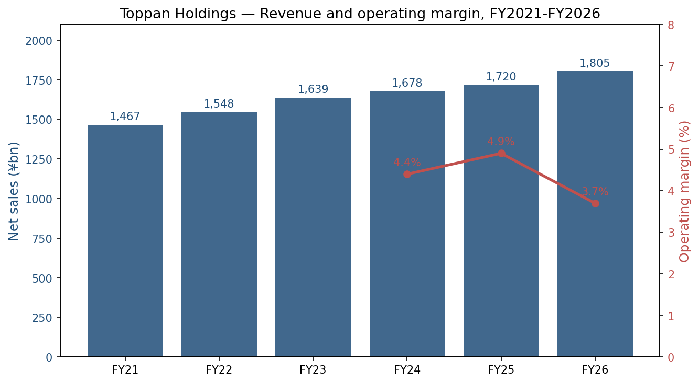
*Source: compiled from [Consolidated Financial Results FY25, p. 2](https://finance.stockweather.co.jp/contents/dispPDF.aspx?disclosure=20250514549465) (FY24 and FY25 actuals), [H1 FY26 Results, p. 1](https://finance-frontend-pc-dist.west.edge.storage-yahoo.jp/disclosure/20251113/20251113599575.pdf) for H1 FY26, and Toppan Inc. earlier filings for FY21–FY23. The FY26 OPM bar declines materially because Tekscend deconsolidated as a subsidiary on 16 October 2025, removing its 24% operating-margin business from the Electronics line.*

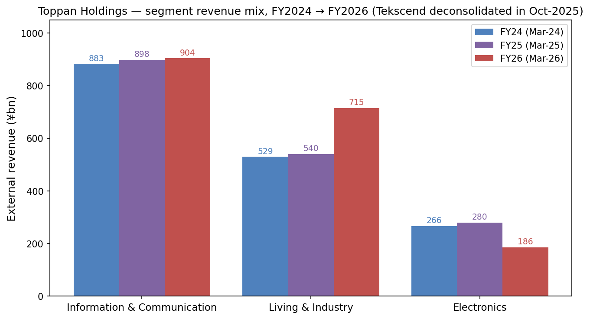
*Source: [FY25 Results, p. 2](https://finance.stockweather.co.jp/contents/dispPDF.aspx?disclosure=20250514549465) for FY24 and FY25 segment revenue; [H1 FY26 Results, p. 14](https://finance-frontend-pc-dist.west.edge.storage-yahoo.jp/disclosure/20251113/20251113599575.pdf) for H1 FY26 segment revenue annualized. Electronics segment FY26 revenue drops because Tekscend Photomask transitioned from a 50.1%-owned consolidated subsidiary to a 46.6%-owned equity-method associate from 16 October 2025.*

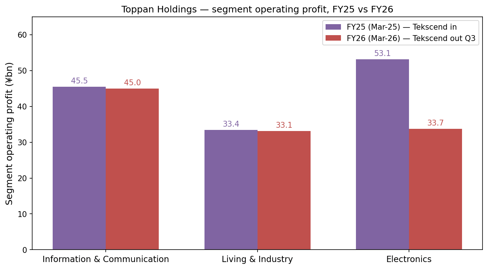
*Source: [FY25 Results, p. 2](https://finance.stockweather.co.jp/contents/dispPDF.aspx?disclosure=20250514549465) and [H1 FY26 Results, p. 14](https://finance-frontend-pc-dist.west.edge.storage-yahoo.jp/disclosure/20251113/20251113599575.pdf), annualized H1 with corporate-cost allocation. Electronics OP drops sharply in FY26 reflecting the Tekscend deconsolidation (Tekscend operating profit moves to equity-method income line below operating profit).*

Geographically, Toppan does not disclose a clean segment-by-country revenue breakdown but flags overseas sales at **36.6% of consolidated revenue** with **150+ overseas subsidiaries** ([Sustainability Report 2025 — Approach to Sustainability, p. 9](https://www.holdings.toppan.com/assets/en/pdf/sustainability/2025/csr2025_en_management-1.pdf)). Electronics is structurally export-skewed: the photomask business serves TSMC / Samsung / SK Hynix / SMIC / GlobalFoundries through fabs in Asaka and Shiga (Japan), Dresden (Germany), Round Rock (US), Corbeil (France), Shanghai, Icheon (Korea), and Taoyuan (Taiwan) ([Toppan Carves Out Semiconductor Photomask Business, 2022-04-01](https://www.prnewswire.com/news-releases/toppan-carves-out-semiconductor-photomask-business-to-launch-new-company-301515656.html)); the FC-BGA business is concentrated at the **Niigata Plant** with the **Ishikawa Plant (former JOLED Nomi site) ramping pilot production from 2025 and targeting mass production in fiscal 2028** plus a **Singapore site scheduled for late 2026** ([H1 FY26 Results, p. 3](https://finance-frontend-pc-dist.west.edge.storage-yahoo.jp/disclosure/20251113/20251113599575.pdf); [TOPPAN to Build Line for Mass Production of Next-Generation Semiconductor Packages in Ishikawa, Japan, 2023-12](https://www.holdings.toppan.com/en/news/2023/12/newsrelease231205_1.html); [Toppan boosts FC-BGA substrate production for AI chips, evertiq 2025-12-17](https://evertiq.com/design/2025-12-17-toppan-boosts-fc-bga-substrate-production-for-ai-chips)). Group headcount at H1 FY26 was approximately **51,988** based on stock-data sources ([Toppan Holdings TYO:7911 statistics, stockanalysis.com, accessed 2026-05](https://stockanalysis.com/quote/tyo/7911/statistics/)).

**Valuation snapshot (as of late May 2026).** Toppan trades at roughly **¥4,730 / share** with a market capitalization of **~¥1.35 trillion** (~US$8.7 bn at JPY/USD 155) and enterprise value of **¥1.50 trillion** (net debt ~¥81 bn after a major bond issuance discussed in §2) ([Toppan Holdings TYO:7911 statistics, accessed 2026-05](https://stockanalysis.com/quote/tyo/7911/statistics/)). Key multiples: **TTM P/E 21.1× / forward P/E 18.8×**, **P/S 0.75×**, **P/B 0.96×**, **EV/EBITDA 9.2×**, dividend yield **1.3%** with ¥58 annual DPS ([Toppan Holdings TYO:7911 statistics, accessed 2026-05](https://stockanalysis.com/quote/tyo/7911/statistics/); [FY25 Results, p. 2](https://finance.stockweather.co.jp/contents/dispPDF.aspx?disclosure=20250514549465)). **ROE 5.0% / ROIC 3.0%**, both depressed by a heavy book of cross-holdings, goodwill from the Sonoco TFP deal, and a packaging / printing core that earns mid-cycle returns ([Toppan Holdings TYO:7911 statistics, accessed 2026-05](https://stockanalysis.com/quote/tyo/7911/statistics/)). The stock has returned **+22.3% over the trailing 52 weeks** as the Tekscend IPO crystallized the photomask sub-cap and the FC-BGA capex cycle accelerated ([Toppan Holdings TYO:7911 statistics, accessed 2026-05](https://stockanalysis.com/quote/tyo/7911/statistics/)).

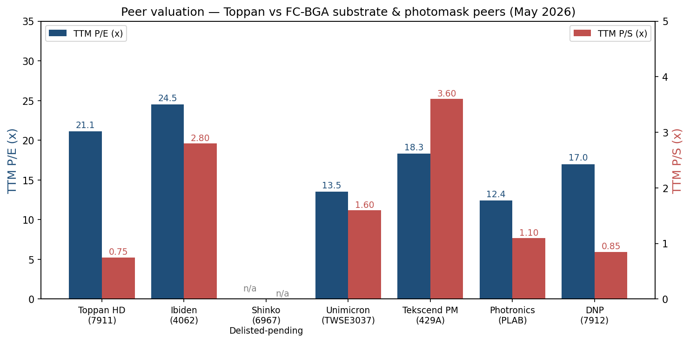
*Source: TTM multiples per [Toppan TYO:7911 statistics](https://stockanalysis.com/quote/tyo/7911/statistics/), [Ibiden TYO:4062 statistics](https://stockanalysis.com/quote/tyo/4062/statistics/), [Unimicron TWSE:3037 statistics](https://stockanalysis.com/quote/two/3037/statistics/), [Tekscend TYO:429A overview](https://stockanalysis.com/quote/tyo/429A/), [Photronics NASDAQ:PLAB statistics](https://stockanalysis.com/quote/plab/statistics/), [DNP TYO:7912 statistics](https://stockanalysis.com/quote/tyo/7912/statistics/). Shinko Electric (TYO:6967) is delisted-pending under the JIP / Mitsui / DIC management-buyout; no current multiple shown.*

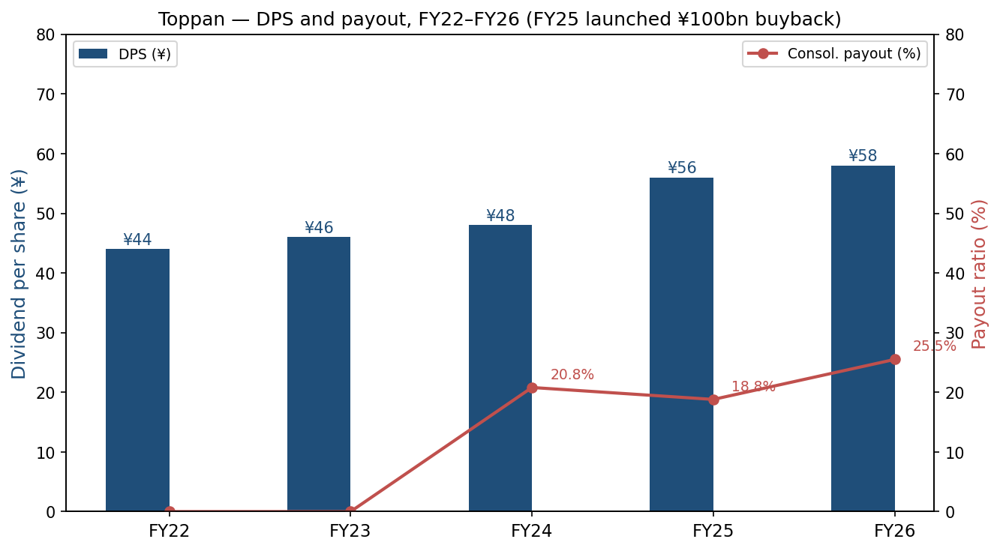
*Source: [FY25 Results, p. 1 — dividend table](https://finance.stockweather.co.jp/contents/dispPDF.aspx?disclosure=20250514549465) for DPS history and payout ratio; FY26 ¥58 DPS is the management forecast. Treasury-share acquisition has been incremental: ¥30 bn programme running 15 May 2025 to 14 May 2026 per [FY25 Results, p. 7](https://finance.stockweather.co.jp/contents/dispPDF.aspx?disclosure=20250514549465). When FY25 buyback is included, the consolidated total payout ratio was 133.6%, well above the company's stated 30% minimum floor.*

*Analyst view:* the ~21× TTM P/E and 0.75× P/S are at first glance the multiples of a low-growth printing conglomerate, but the equity-implied valuation is misleading without two adjustments. **First**, at the new 46.6% post-IPO Tekscend stake, Toppan's ownership in Tekscend is worth roughly **¥217 bn** (46.6% × Tekscend's ~¥465 bn May-2026 market cap) ([Tekscend 429A overview, accessed 2026-05](https://stockanalysis.com/quote/tyo/429A/); [H1 FY26 Results, p. 22](https://finance-frontend-pc-dist.west.edge.storage-yahoo.jp/disclosure/20251113/20251113599575.pdf)), and IPO proceeds of ~¥156.6 bn flowed to Toppan and selling shareholders in October 2025 ([Tekscend Shares Rise 13% From IPO Price in Tokyo Trading Debut, Bloomberg 2025-10-15](https://www.bloomberg.com/news/articles/2025-10-15/tekscend-to-debut-after-japan-s-second-biggest-ipo-this-year)). **Second**, the FC-BGA business is sub-scale today but on the FY2030 management plan, **semiconductor-related sales target ¥350 bn at 30% non-GAAP operating margin** — implying ~¥105 bn of semiconductor operating profit run-rate at full-year FY2030 vs the FY25 Electronics-segment ¥52 bn — and Toppan claims a **No. 3 global market share in high-end switch FC-BGA substrates** as of 2025 ([Toppan FY2024 Full Year Results Briefing summary via quartr.com](https://quartr.com/companies/toppan-holdings-inc_18645)). On a sum-of-the-parts basis, the printing / packaging / decor businesses are valued by the market at sub-1× sales and a single-digit P/E, while the Electronics franchise is the call option. With management committed to a ¥30 bn buyback running through 14 May 2026 and **¥58 DPS for FY26 forecast (vs ¥48 in FY25)** ([FY25 Results, pp. 1, 7](https://finance.stockweather.co.jp/contents/dispPDF.aspx?disclosure=20250514549465)), the cash-return profile screens better than the headline ROE suggests.

---

## 2. Company history (400–700 words)

**Toppan Printing Limited Partnership was formally established on 17 January 1900 in Tokyo** by a group of technicians who had left Japan's Ministry of Finance, where they had operated the relief-printing presses that produced banknotes, securities certificates, and government postage. The new firm reorganized as **Toppan Printing Co., Ltd. in 1908 with capital doubled to ¥400,000** and from the outset focused on three product categories whose physics — high-precision multi-color relief printing, micro-feature etching, and tight registration tolerances — turned out to be the foundational toolset that would later let Toppan walk into semiconductor photomasks, FPD color filters, IC-card lamination, decorative-laminate printing, and FC-BGA substrate plating ([FundingUniverse — Toppan Printing Co., Ltd. history](https://www.fundinguniverse.com/company-histories/toppan-printing-co-ltd-history/); [Company-Histories — Toppan Printing Co., Ltd.](https://www.company-histories.com/Toppan-Printing-Co-Ltd-Company-History.html)). The corporate name "Toppan" itself is a contraction of the Japanese word for relief / letterpress printing (*toppan inkatsu*), and the company tracks its 125-year continuity as a single corporate entity from the 1900 partnership through every subsequent restructuring.

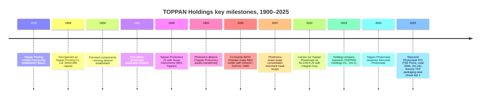

Two threads dominate the modern history of the company. **Thread 1: the 60-year build-out of the photomask franchise.** Toppan first prototyped a photomask for silicon transistors in 1961 at its Asaka plant, applying the same metal-on-glass micro-patterning expertise that already drove its filter-screens-for-sugar-refinery side business ([Asianometry — The History of the Semiconductor Photomask](https://www.asianometry.com/p/the-history-of-the-semiconductor)). The franchise was institutionalized in **1990 as Toppan Printronics U.S.A.**, a JV with Texas Instruments in which Toppan held 85% ([FundingUniverse — Toppan Printing Co., Ltd. history](https://www.fundinguniverse.com/company-histories/toppan-printing-co-ltd-history/)). In **1993 Toppan transferred the Printronics assets into a strategic alliance with Photronics Inc.** — the publicly listed US merchant mask leader — under which Photronics operated the US assets and Toppan retained its Japan / Asia franchise; the two companies cross-licensed technology and ran multiple JVs through 2007. Co-investing in the **Advanced Mask Technology Center (AMTC) in Dresden in 2002** alongside Infineon, DuPont Photomasks and AMD (later GlobalFoundries) put Toppan inside the European leading-edge ecosystem; that Dresden facility remains central to Tekscend's strategy and one of only three places on earth — alongside Toppan's Asaka R&D centre and a handful of foundry-captive shops — that can produce EUV masks at meaningful volume ([iamfabian, Tekscend vs. Photronics, 2025](https://iamfabian.substack.com/p/the-landscape-of-semiconductor-photomasks)). On **1 April 2022 Toppan carved its semiconductor photomask business out into Toppan Photomask Co., Ltd. in a 50.1% / 49.9% share-transfer deal with Integral Corporation**, a Japanese private-equity firm — capitalizing the new company at ¥400 million with manufacturing footprints in seven regions (Asaka, Shiga, Round Rock TX, Dresden, Corbeil, Shanghai, Icheon, Taoyuan) ([Toppan Carves Out Semiconductor Photomask Business, 2022-04-01](https://www.prnewswire.com/news-releases/toppan-carves-out-semiconductor-photomask-business-to-launch-new-company-301515656.html)). The carve-out gave Toppan Photomask the institutional independence to make capex decisions on a semiconductor-cycle clock rather than a printing-conglomerate clock — the precondition for the **rebrand to Tekscend Photomask Corp. in October 2024** and the **IPO on the TSE Prime Market on 16 October 2025 at ¥3,000 / share (~¥300 bn market cap; ~¥156.6 bn raised including the over-allotment)** ([Tekscend Shares Rise 13% From IPO Price, Bloomberg 2025-10-15](https://www.bloomberg.com/news/articles/2025-10-15/tekscend-to-debut-after-japan-s-second-biggest-ipo-this-year); [TOPPAN Photomask to Rebrand as Tekscend Photomask, 2024-10-01](https://www.holdings.toppan.com/en/news/2024/10/newsrelease241001_1.html); [H1 FY26 Results, p. 21–22](https://finance-frontend-pc-dist.west.edge.storage-yahoo.jp/disclosure/20251113/20251113599575.pdf)). At IPO the Qatar Investment Authority was among the named anchor investors, and the deal was the second-largest Japanese IPO of 2025 behind JX Advanced Metals ([Caproasia — Toppan Holdings Spinoff Semiconductor Photomask Provider Tekscend Photomask Plans Tokyo IPO, 2025-10-10](https://www.caproasia.com/2025/10/10/japan-7-5-billion-toppan-holdings-spinoff-semiconductor-photomask-provider-tekscend-photomask-plans-tokyo-ipo-to-raise-800-million-at-2-billion-valuation-founded-in-2021-in-spinoff-from-toppan-pri/)).

**Thread 2: the parallel build-out of FC-BGA substrates and the 2023 holding-company reorganization.** Toppan had been a sub-scale FC-BGA player for two decades before the AI build-out turned the niche into a strategic priority. The company commissioned a cutting-edge FC-BGA substrate line at its **Niigata Plant in June 2015**, then **announced in December 2023 the acquisition of the former JOLED Nomi site in Ishikawa Prefecture** with mass production targeted for fiscal 2028 ([TOPPAN to Build Line for Mass Production of Next-Generation Semiconductor Packages in Ishikawa, 2023-12](https://www.holdings.toppan.com/en/news/2023/12/newsrelease231205_1.html); [Toppan boosts FC-BGA substrate production for AI chips, 2025-12-17](https://evertiq.com/design/2025-12-17-toppan-boosts-fc-bga-substrate-production-for-ai-chips)). On **1 October 2023** the parent company itself transitioned to a holding-company structure — renaming to **TOPPAN Holdings Inc.** and splitting the legacy operating business across three new subsidiaries (TOPPAN Inc., TOPPAN Edge Inc., TOPPAN Digital Inc.) — with the explicit purpose of "maximizing Group synergies through strengthened governance" and enabling each business to operate on its own decision-clock ([TOPPAN Transitions to Holding Company Structure, 2023-10-02](https://www.holdings.toppan.com/en/news/2023/10/newsrelease231002_1.html); [Sustainability Report 2025 — Holding Company Structure, p. 178](https://www.holdings.toppan.com/assets/en/pdf/sustainability/2025/csr2025_en_company.pdf)). In a partial reversal, **the Board of Directors resolved in March 2025 to absorb TOPPAN Edge and TOPPAN Digital back into TOPPAN Inc. effective 1 April 2026** to recapture the Information & Communication segment synergies the splits had complicated ([H1 FY26 Results, p. 19](https://finance-frontend-pc-dist.west.edge.storage-yahoo.jp/disclosure/20251113/20251113599575.pdf)). Two large transactions outside the semiconductor franchise closed in 2025: the **acquisition of Sonoco Products' thermoformed and flexible-packaging business (TFP) on 1 April 2025** for cash, adding ~¥143 bn of segment assets and ~¥182 bn of provisional goodwill in the Living & Industry segment ([H1 FY26 Results, p. 14, 17](https://finance-frontend-pc-dist.west.edge.storage-yahoo.jp/disclosure/20251113/20251113599575.pdf)); and the partial divestiture of **Giantplus Technology Co., Ltd.** in Taiwan, the company's TFT-LCD subsidiary, which became an equity-method affiliate in January 2025 as Toppan refocused capital on FC-BGA and away from low-margin display panels ([FY25 Results, p. 4](https://finance.stockweather.co.jp/contents/dispPDF.aspx?disclosure=20250514549465)). The Board also approved a **¥80 bn straight-bond programme on 13 November 2025** to refinance borrowings, signaling continued capacity expansion ([H1 FY26 Results, pp. 19–20](https://finance-frontend-pc-dist.west.edge.storage-yahoo.jp/disclosure/20251113/20251113599575.pdf)).

---

## 3. Management (300–500 words)

The Yamanaka brothers / Ministry-of-Finance founders are 125 years gone and Toppan has been a salaryman-run, non-founder-family company since the 1920s — so the relevant biographical detail today is the executives currently in the seat. Per the H1 FY26 financial-result filing, the Representative Director, President & CEO is **Hideharu Maro**, with **Takashi Kurobe** as Director / Senior Managing Executive Officer & CFO ([H1 FY26 Results, p. 1](https://finance-frontend-pc-dist.west.edge.storage-yahoo.jp/disclosure/20251113/20251113599575.pdf)). Maro is the principal architect of the holding-company reorganization, the Tekscend carve-out, and the FC-BGA capex cycle — the three decisions that frame any forward equity case on Toppan.

**Hideharu Maro — Representative Director, President & CEO (since June 2019; CEO from June 2023).** Maro joined Toppan in **April 1979** straight out of university and is a 47-year insider with a technical background — the corporate playbook for the Japanese conglomerate CEO. His formative operating tours map onto the **packaging business** rather than the semiconductor side: Director of Gunma Plant Production Management in the Tokyo Business Unit, Chief Director of 3rd Sales, Director of Kansai Business in the Main Packaging Business Unit, then Chief Director of Overseas Business with stints in Shanghai and Singapore leading the international expansion of Toppan's packaging franchise ([Simply Wall St — TOPPAN Holdings management profile, accessed 2026-05](https://simplywall.st/stocks/us/commercial-services/otc-topp.y/toppan-holdings/management); [Hideharu Maro — Bloomberg Markets profile](https://www.bloomberg.com/profile/person/16450133)). He was appointed Director in 2009, Representative Director in June 2018, **President & Representative Director on 27 June 2019** at age 62, and elevated to CEO from June 2023 when the holding-company structure took effect ([Toppan Printing's New President, 2019-06-28](https://www.holdings.toppan.com/en/news/2019/06/newsrelease190628e.html); [Simply Wall St — TOPPAN Holdings management, accessed 2026-05](https://simplywall.st/stocks/us/commercial-services/otc-topp.y/toppan-holdings/management)). At 69 he is two years past the conventional Japanese-large-cap retirement age, and at the General Meeting of Shareholders subsequent to FY26 he is scheduled to transition to **Representative Director Chairman & CEO** effective 1 April 2026, with **Satoshi Oya** moving from operating-company head of TOPPAN Inc. to President of the holding company ([H1 FY26 Results, p. 23 — Surviving company TOPPAN Inc. — Representative Satoshi Oya](https://finance-frontend-pc-dist.west.edge.storage-yahoo.jp/disclosure/20251113/20251113599575.pdf); [Simply Wall St — TOPPAN Holdings management](https://simplywall.st/stocks/us/commercial-services/otc-topp.y/toppan-holdings/management)).

Maro's signature as CEO has been three decisions in sequence. **(1)** Pushing the **holding-company transition in October 2023** to separate decision-clocks across the three growth pillars (DX in Information & Communication, SX-packaging in Living & Industry, semiconductors in Electronics) — a structural change that gave each operating subsidiary the latitude to capex and recruit at its own cadence ([TOPPAN Transitions to Holding Company Structure, 2023-10-02](https://www.holdings.toppan.com/en/news/2023/10/newsrelease231002_1.html)). **(2)** Executing the **Tekscend Photomask carve-out and 2025 IPO** — first selling 49.9% to Integral PE in 2022 to validate the standalone equity story, then listing the company on the TSE Prime Market in October 2025 at a ~¥300 bn market cap and crystallizing the value of the franchise on Toppan's own balance sheet ([Toppan Carves Out Semiconductor Photomask Business, 2022-04-01](https://www.prnewswire.com/news-releases/toppan-carves-out-semiconductor-photomask-business-to-launch-new-company-301515656.html); [Bloomberg — Tekscend IPO debut, 2025-10-15](https://www.bloomberg.com/news/articles/2025-10-15/tekscend-to-debut-after-japan-s-second-biggest-ipo-this-year)). **(3)** Greenlighting the **¥100+ bn FC-BGA capex programme** centered on Niigata (new line online January 2026 doubling H1-FY22 capacity), Ishikawa (mass production 2028 onwards), and Singapore (operations from late 2026) — a multi-site bet that bridges Toppan from a sub-7% FC-BGA share player to a top-3 player in the high-end AI / network-switch sub-segment ([H1 FY26 Results, p. 3](https://finance-frontend-pc-dist.west.edge.storage-yahoo.jp/disclosure/20251113/20251113599575.pdf); [evertiq, 2025-12-17](https://evertiq.com/design/2025-12-17-toppan-boosts-fc-bga-substrate-production-for-ai-chips)).

Maro's reported total compensation is **¥197 million annually** (81% base salary, 19% bonuses), with an ownership stake of **0.028% of Toppan Holdings (~US$2.4 million)** — modest for a Japanese large-cap CEO but consistent with a salaryman-track executive elevated through 40 years of inside promotion rather than a founder ([Simply Wall St — TOPPAN Holdings management, accessed 2026-05](https://simplywall.st/stocks/us/commercial-services/otc-topp.y/toppan-holdings/management)). The average board tenure is 6.4 years and average age is 65 — a typical Japanese conglomerate-board profile that the activists watching the Tekscend IPO unlock will inevitably push to refresh.

---

## 4. Products and services (700–1,500 words) — the Electronics-segment deep dive

### 4.1 The Toppan Holdings product taxonomy — three segments, with Electronics the only chapter that matters for the AI-semiconductor thesis

Toppan's FY25 Consolidated Financial Results segment-information note lists the three reportable segments and the major products and services belonging to each verbatim ([FY25 Results, p. 22](https://finance.stockweather.co.jp/contents/dispPDF.aspx?disclosure=20250514549465)). The taxonomy is unambiguous and is the authoritative anchor for everything in this section — sell-side analyst breakdowns that go further (FC-BGA % of Electronics revenue, EUV % of Tekscend revenue, etc.) are estimates and labeled as such throughout.

| Reportable segment | FY25 net sales (¥ bn) | FY25 operating profit (¥ bn) | FY25 OPM | Major products and services (verbatim from FY25 financial results) |
|---|---:|---:|---:|---|
| Information & Communication | 929.4 | 45.7 | 4.9% | "Securities-related documents, passbooks, cards, business forms, catalogues and other commercial printing, magazines, books and other publication printing, and business process outsourcing (BPO)" |
| Living & Industry | 548.1 | 33.3 | 6.1% | "Flexible packaging, folding cartons and other packaging products, plastic molded products, ink, transparent barrier film, decorative paper/film, wallpaper and other decorative material" |
| **Electronics** | **279.9** | **52.0** | **18.6%** | **"Color filters for LCDs, TFT-LCDs, anti-reflection films, photomasks, and semiconductor packaging products"** |
| Adjustment | (39.5) | (47.0) | — | Corporate overhead, basic-research costs not allocated |
| **Consolidated** | **1,717.9** | **84.0** | **4.9%** | — |

*Source: [Consolidated Financial Results for the Fiscal Year Ended March 31, 2025, pp. 2, 22](https://finance.stockweather.co.jp/contents/dispPDF.aspx?disclosure=20250514549465) — verbatim segment names, product lists, and FY25 actuals.*

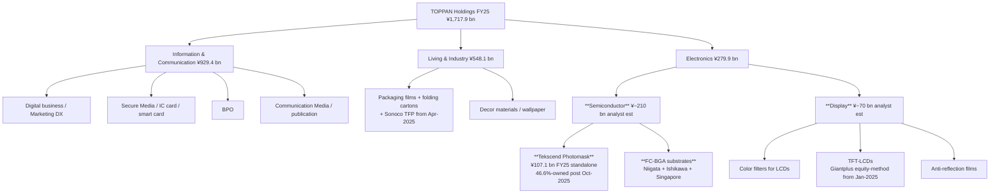

This Section 4 deliberately spends almost all of its word count on the **Electronics segment** — the only segment that drives the equity case for the name. The Information & Communication and Living & Industry segments are mature, low-OPM businesses whose share-price implications are captured by the cash-flow trajectory rather than product detail; they are summarized in §4.6 for completeness. Within Electronics, the structure mirrors the layering required by the request: **§4.2 Tekscend Photomask** (the carved-out, separately listed 46.6%-owned photomask associate); **§4.3 FC-BGA substrates** (held inside the Electronics segment of Toppan Holdings itself, not Tekscend); **§4.4 other Electronics** (color filters, TFT-LCDs, anti-reflection films, metal etching, and the smaller R&D-stage glass-core and panel-level packaging programmes).

### 4.2 Tekscend Photomask — Toppan's carved-out, separately listed photomask sub-cap

**Distinguishing the three entities up front.** A reader who walks away confused on this point cannot evaluate the rest of the section. **Tekscend Photomask Corp.** (TSE: 429A) is the operating company carved out of Toppan in April 2022 and listed in October 2025 — it is the entity that runs the actual photomask fabs in Asaka, Shiga, Round Rock, Dresden, Corbeil, Shanghai, Icheon and Taoyuan, employs the ~1,899 photomask-business employees, and reports ¥117–130 bn of standalone revenue ([Tekscend Photomask Corporate Overview](https://www.photomask.com/en/about/overview/); [Tekscend 429A overview, accessed 2026-05](https://stockanalysis.com/quote/tyo/429A/)). **Toppan Holdings' Electronics segment** is the consolidated reporting line at the parent — it included 100% of Tekscend revenue and operating profit through 15 October 2025, then transitioned to equity-method accounting from 16 October 2025 ([H1 FY26 Results, pp. 21–22](https://finance-frontend-pc-dist.west.edge.storage-yahoo.jp/disclosure/20251113/20251113599575.pdf)); from FY26 onwards the Electronics segment revenue line therefore shows only Toppan's *non-photomask* electronics (FC-BGA, displays, etc.), and Tekscend's contribution flows through the "share of profit of equity-method affiliates" line below operating profit. **TOPPAN Holdings Inc.** is the listed holding company at the top, which owns 46.6% of Tekscend, 100% of TOPPAN Inc. (operating), and the parent obligations including the ¥80 bn straight-bond programme ([H1 FY26 Results, pp. 22, 19–20](https://finance-frontend-pc-dist.west.edge.storage-yahoo.jp/disclosure/20251113/20251113599575.pdf)). Equity research that conflates these three — by treating Tekscend's revenue as if it still belongs to Toppan's consolidated top line, or by valuing Toppan ex-Tekscend at the consolidated multiple — produces materially wrong numbers.

> **Tekscend Photomask's own product description** (verbatim, from the company website): "Tekscend Photomask is the global leader in the merchant photomask manufacturing industry. We provide our customers the photomasks they need to enable our digital world. From conventional binary or PSM photomasks to advanced EUV photomasks for cutting-edge semiconductor devices, we offer the most reliable photomasks to our customers along with our supply chain in seven countries on three continents." ([Tekscend Photomask Corporate Overview](https://www.photomask.com/en/about/overview/))

**Plain-language gloss / 中文释义:** a semiconductor **photomask / 光掩膜版** is the patterning master used by a fab to project a chip's circuit layout onto silicon wafers; physically it is a **152 mm × 152 mm × 6.35 mm-thick puck of ultra-low-thermal-expansion quartz / fused-silica glass** with a patterned absorber stack on top — for **DUV (deep-ultraviolet) masks** the absorber is chrome on chrome-oxide ("binary") or a partially-transmissive molybdenum-silicide layer ("attenuated phase-shift / 衰减相移", or "alternating phase-shift / 交替相移" with engraved phase wells). For **EUV (extreme-ultraviolet, 极紫外) masks**, the optics inverts — the mask is *reflective*: a multilayer Bragg reflector of ~40–50 alternating molybdenum-silicon pairs (each a few nanometres thick) coats the substrate, a ruthenium capping layer protects the stack, and a patterned absorber (today TaBN, next generation moving to Ru / Ni-based low-n materials) defines where the EUV light reflects vs gets absorbed ([Tekscend Photomasks for Semiconductors product page](https://www.photomask.com/en/product/photomask/)). Tekscend offers **all four wavelength tiers**: i-line / KrF (low-end, used for older nodes and analog/mature processes), ArF dry (193 nm, for 65 nm–28 nm), ArF immersion / 193i (for 14 nm to ~5 nm with multi-patterning), and **EUV (13.5 nm) for 7 nm and below, including 1.4 nm / 1 nm research-stage masks shown publicly at SEMICON Japan** ([Tekscend Photomasks for Semiconductors product page](https://www.photomask.com/en/product/photomask/); [TOPPAN and Tekscend Photomask Participate in SEMICON Japan 2025](https://www.holdings.toppan.com/en/news/2025/12/newsrelease251210_1.html)). Beyond standard semiconductor masks Tekscend also makes **stencil masks, nanoimprint molds, and glass photomasks for R&D**, plus **photomasks for FPD (flat-panel display)** TFT backplanes used by panel makers ([Tekscend — Photomasks for Various Applications](https://www.photomask.com/en/product/various_photomask/)).

**Where Tekscend sits in the value chain.** A photomask is the **furthest-downstream of three glass-substrate components** consumed by a fab. **Upstream**, mask-blank suppliers (Hoya at ~80% EUV-blank share, Shin-Etsu Chemical, AGC) ship the pre-coated glass puck to the mask shop with the absorber stack already deposited but **unpatterned**. **Mid-stream**, the mask shop (Tekscend, Photronics, DNP, or one of the foundry-captive shops at TSMC / Samsung / Intel) takes the customer's GDSII layout file, runs OPC (optical proximity correction), and writes the pattern into the absorber using **electron-beam direct-write tools** (NuFlare EBM-X, Heidelberg, IMS multi-beam mask writer / MBMW for sub-10 nm), then inspects the mask down to single-particle defects using KLA / Lasertec inspection tools. **Downstream**, the patterned mask ships back to the customer fab where it sits inside an ASML EUV scanner and prints ~1,000–5,000 wafers before degradation requires replacement. The mask-blank → patterning → inspection cycle is what gives Tekscend its 35.6% EBITDA margin profile ([Tekscend Photomask revenue and margin data, FY22–FY25, accessed 2026-05](https://stockanalysis.com/quote/tyo/429A/)) — it's a capital-intensive, multi-year-qualified, customer-locked business where switching cost is measured in months of fab re-qualification.

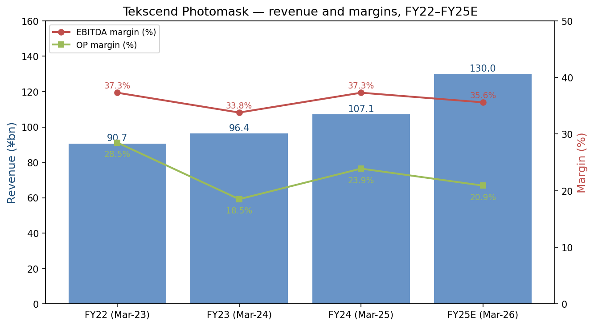
*Source: revenue per [Tekscend Photomask FY25 disclosure, accessed 2026-05](https://stockanalysis.com/quote/tyo/429A/); standalone EBITDA / OP margin estimated from TradingView fundamentals for TSE:429A. FY25E (Mar-26) reflects TTM revenue of ¥129.6 bn and net income of ¥25.0 bn per [Tekscend 429A overview](https://stockanalysis.com/quote/tyo/429A/).*

*Analyst view — Tekscend's competitive position.* **Yes, hard moat in the merchant photomask segment.** Type = **scale + multi-geography qualification + AMTC R&D consortium + leading-edge node-tracking capability**. Per the analyst review at [iamfabian, "Tekscend vs. Photronics", 2025](https://iamfabian.substack.com/p/the-landscape-of-semiconductor-photomasks), Tekscend's portfolio mix has more than 55% of revenue in **advanced nodes (≤28 nm)** versus Photronics' more mid-range mix, with key customers **TSMC, Samsung, Intel Foundry, and GlobalFoundries** for logic / memory, plus a five-year IBM + imec joint development agreement on 2 nm / 1 nm photomasks. The merchant mask market (i.e. excluding captive TSMC / Samsung / Intel internal mask shops) is ~37% of the total photomask TAM; within merchant, *Analyst view:* Tekscend holds roughly 38–40% share globally, ahead of Photronics (~27%) and DNP (~22%) ([reports/sector/半导体材料.md, Fig. 35–44](file:///Users/x/projects/financial_agent/reports/sector/半导体材料.md)).

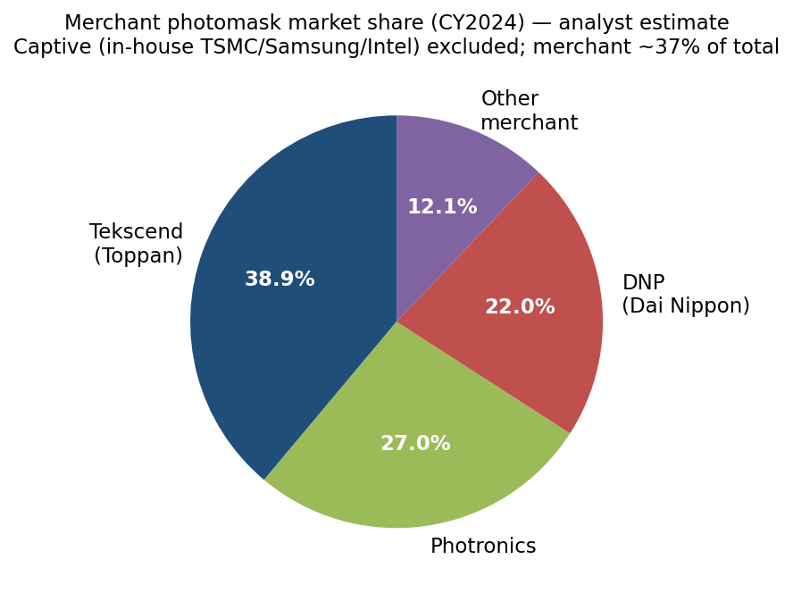
*Source: analyst estimate compiled from [Nomura Greater China Semi 2026–30F report, 2026-05-21, Figs 35–44](file:///Users/x/projects/financial_agent/reports/sector/半导体材料.md), cross-referenced to [iamfabian — Tekscend vs. Photronics analysis, 2025](https://iamfabian.substack.com/p/the-landscape-of-semiconductor-photomasks). Captive (in-house TSMC/Samsung/Intel mask shops) excluded — those represent the larger half of total photomask production but are not commercially addressable.*

### 4.3 FC-BGA substrates — Toppan Electronics' standalone capex bet

**FC-BGA substrate / 倒装芯片球栅阵列封装基板** is the rectangular **multilayer organic substrate** that sits between an AI accelerator / network-switch ASIC die and the motherboard / PCB. Physically, it is built up by laminating alternating layers of **Ajinomoto Build-Up Film (ABF) dielectric** and **patterned copper traces** on top of a glass-fiber-reinforced epoxy core (or in some cases a "coreless" thin variant), with **through-holes plated with copper** to form vertical interconnects. The chip flip-chips onto the substrate via **solder bumps (130 µm or 110 µm pitch in Toppan's current product line)**, the substrate fans the I/O out via the build-up layers to **BGA balls** on the bottom side, and the package ships into the customer's surface-mount line ([Toppan FC-BGA substrates product page](https://www.toppan.com/en/electronics/package/fc-bga/)). For an AI accelerator like a Broadcom AI ASIC or an NVIDIA GPU, the FC-BGA substrate is the second-most expensive single component (after the chip die itself), and it is the chokepoint that limits package size — large-form-factor substrates with 80mm+ side dimensions are the bottleneck holding back the 1,000+ TOPS-class accelerators of 2026–2028.

> **From Toppan's own product description** (verbatim): "FC-BGA is a high density semiconductor package substrate that allows high speed LSI chips with more functions. Lineup: standard FC-BGA, FC-LGA, multi-chip FC-BGA, ultra-multilayer FC-BGA, coreless FC-BGA, 2.3/2.5D FC-BGA. Ultra-fine wiring: Line/Space as narrow as 10/10 µm (semi-additive process), 30/30 µm (subtractive). High-density build-up: 5-stack and 10-stack VIA configurations with land/via dimensions of 85/60 µm and 100/60 µm. Fine-pitch FC bumps at 130 µm and 110 µm pitches. Low copper roughness: Ra 400–250 nm to Ra 200–100 nm. Materials: build-up resins from Ajinomoto Fine-Techno and Sekisui Chemical for high-speed transmission. Applications: automotive SoCs, server/AI processors, networking ASICs, GPUs, and gaming consoles." ([Toppan FC-BGA substrates product page](https://www.toppan.com/en/electronics/package/fc-bga/))

**Plain-language gloss / 中文释义:** Toppan's technical contribution to FC-BGA-substrate-for-AI is not the basic FC-BGA technology (which Ibiden / Shinko / Unimicron have all manufactured at scale for 20+ years) but the **high-end large-form-factor sub-segment**: substrates >80 mm on a side, with **10-stack VIA configurations**, **low-dielectric-constant / low-dissipation-factor (low-Df) ABF materials** that preserve signal integrity at 224 Gbps PAM4 line rates ([Japan Times — Advancing semiconductor progress with substrates, 2024-12-11](https://www.japantimes.co.jp/2024/12/11/special-supplements/advancing-semiconductor-progress-substrates/)), and **smoothed copper surfaces (Ra 200–100 nm)** to reduce skin-effect loss at the high frequencies the AI workload demands. This is the segment that NVIDIA, AMD, Broadcom and other AI ASIC customers were short of in 2023–24 when Ibiden and Shinko ran into capacity bottlenecks at their large-form-factor lines; Toppan was a marginal supplier in 2022 but the **December 2023 Ishikawa announcement and December 2025 Niigata expansion** are designed to put Toppan squarely into the top-3 for AI-grade FC-BGA by FY2028 ([TOPPAN to Build Line for Mass Production of Next-Generation Semiconductor Packages in Ishikawa, 2023-12-05](https://www.holdings.toppan.com/en/news/2023/12/newsrelease231205_1.html); [TOPPAN to Launch New FC-BGA Substrate Line at Niigata Plant, 2025-12-17 via thepackman.in](https://thepackman.in/toppan-to-launch-new-fc-bga-substrate-production-line-at-niigata-plant/); [evertiq — Toppan boosts FC-BGA substrate production for AI chips, 2025-12-17](https://evertiq.com/design/2025-12-17-toppan-boosts-fc-bga-substrate-production-for-ai-chips)).

**Capacity build-out timeline.** The **Niigata Plant** (Shibata, Niigata Prefecture) is the workhorse. The new line announced 17 December 2025 comes online in January 2026 and roughly **doubles the Niigata FC-BGA capacity vs the H1-FY22 baseline**; it incorporates the low-Df materials and enhanced copper-surface treatment described above, plus expanded substrate-thickness and size capability beyond standard JEDEC tray dimensions ([evertiq, 2025-12-17](https://evertiq.com/design/2025-12-17-toppan-boosts-fc-bga-substrate-production-for-ai-chips)). The **Ishikawa Plant** at the former JOLED Nomi site (acquired November 2023 for the land + buildings) opened in July 2024 as the technology-development centre, with a pilot line for **organic RDL interposers and glass-core substrates** announced 16 December 2025 and mass production targeted from FY2028 ([H1 FY26 Results, p. 3](https://finance-frontend-pc-dist.west.edge.storage-yahoo.jp/disclosure/20251113/20251113599575.pdf); [TOPPAN to Build Line for Mass Production of Next-Generation Semiconductor Packages in Ishikawa, 2023-12-05](https://www.holdings.toppan.com/en/news/2023/12/newsrelease231205_1.html)). A second international site in **Singapore** is scheduled for late-2026 operations to give Toppan geographic redundancy outside of Japan's earthquake-prone domestic footprint ([evertiq, 2025-12-17](https://evertiq.com/design/2025-12-17-toppan-boosts-fc-bga-substrate-production-for-ai-chips)). Total cumulative capex across the three sites is expected to exceed **¥100 bn**, with capacity expansion "in line with demand" — i.e. Toppan is signaling discipline rather than the speculative build-ahead that bit Ibiden in 2023 ([thepackman, 2025-12](https://thepackman.in/toppan-to-launch-new-fc-bga-substrate-production-line-at-niigata-plant/)). To accelerate technology validation, Toppan **joined the US-JOINT (United States-Japan Joint Open Innovation Network for Trusted SemiConductors)** consortium during FY24, providing a US-based platform for next-generation packaging evaluation and development ([FY25 Results, p. 4](https://finance.stockweather.co.jp/contents/dispPDF.aspx?disclosure=20250514549465); [H1 FY26 Results, p. 3](https://finance-frontend-pc-dist.west.edge.storage-yahoo.jp/disclosure/20251113/20251113599575.pdf)).

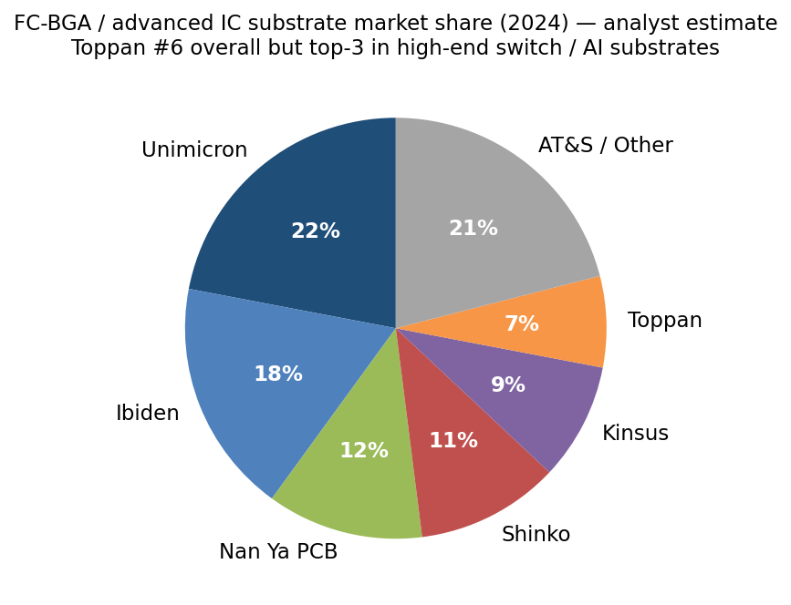
*Source: analyst estimate compiled from [Market Growth Reports — ABF Substrate (FC-BGA) Market Size, 2024](https://www.marketgrowthreports.com/market-reports/abf-substrate-fc-bga-market-107527) and [wonderfulpcb.com — Top ABF substrate manufacturers, 2025](https://www.wonderfulpcb.com/blog/top-abf-substrate-manufacturers-and-market-leaders/). Toppan is the #6 overall player by total FC-BGA revenue but management states it is "No. 3 in high-end switch FC-BGA substrates" — i.e. it is meaningfully under-represented in mid-range mainstream FC-BGA and concentrated in the AI / network-switch top tier where margins are highest ([Toppan FY2024 Full Year Results Briefing summary via quartr.com](https://quartr.com/companies/toppan-holdings-inc_18645)).*

*Analyst view — FC-BGA competitive position.* **Partial moat today, hard moat by FY2028 if Ishikawa ramps to plan.** Type = **scale + AI-customer qualification + glass-core / next-gen packaging optionality**. The named competitors per Toppan's own positioning and the third-party sources are **Unimicron (TWSE:3037, ~22% share), Ibiden (TYO:4062, ~18%), Nan Ya PCB (~12%), Shinko Electric (~11%, currently under JIP / Mitsui / DIC management-buyout), Kinsus (~9%)**, plus AT&S, Kyocera and SEMCO in the long tail ([wonderfulpcb.com — Top ABF substrate manufacturers, 2025](https://www.wonderfulpcb.com/blog/top-abf-substrate-manufacturers-and-market-leaders/); [marketgrowthreports.com — ABF Substrate / FC-BGA market, 2024](https://www.marketgrowthreports.com/market-reports/abf-substrate-fc-bga-market-107527)). At ~7% share Toppan is sub-scale on a unit basis but oversized in the AI sub-segment where it competes for the same NVIDIA / AMD / Broadcom AI ASIC sockets that drive Ibiden's premium pricing.

### 4.4 Other Electronics — color filters, TFT-LCDs, anti-reflection films, metal etching

The non-semiconductor portion of the Electronics segment is the legacy display / film / metal-etching grouping. **Color filters** for LCDs / OLEDs are produced by patterning red-green-blue dye-printed glass for the panel maker's TFT backplane; Toppan is one of three global suppliers alongside DNP and Dai Nippon Ink (DIC), though the segment is in long-term volume decline as OLED / micro-LED takes share from LCD. **TFT-LCD panels** historically came through Toppan's Taiwan subsidiary **Giantplus Technology Co., Ltd.**; on 31 January 2025 Toppan sold a portion of its Giantplus shares and Giantplus moved from consolidated subsidiary to equity-method affiliate, signaling the strategic decision to exit panel manufacturing while keeping a minority financial stake ([FY25 Results, p. 4](https://finance.stockweather.co.jp/contents/dispPDF.aspx?disclosure=20250514549465)). **Anti-reflection films** for smartphone and TV cover glass remain a stable franchise, particularly for high-value-added Apple / Samsung consumer applications, and **metal etching** (precision-etched clad materials, metal etched masks, high-definition shadow masks for OLED displays) is a smaller specialty franchise. The "**ORTUSTECH**" TFT-LCD module line for industrial / medical / automotive applications including the Blanview brand survives as a niche premium business inside Toppan Inc. ([TOPPAN Electronics Business Unit page](https://www.toppan.com/en/electronics/)). The display sub-segment is structurally low-growth and low-margin; the equity case for Electronics is photomask (Tekscend equity-method income) + FC-BGA + the call option on glass core / RDL interposers, not display.

### 4.5 Synthesis — how the Electronics product lines interact in the AI build-out

The reader who walks away from Section 4 understanding **one thing** should walk away with this: Toppan now occupies **three sequential nodes in the AI chip supply chain**, each at different scale and competitive position. **Step 1, pattern transfer (Tekscend):** the AI accelerator's lithography masks (EUV for the leading-edge metal layers, ArF immersion for the trailing layers) are written at Tekscend's Asaka or Dresden fab and shipped to TSMC / Samsung / Intel for the wafer-printing step — Tekscend earns a premium economic rent here because mask qualification is a multi-month process and substitution is non-trivial. **Step 2, packaging (Toppan FC-BGA):** the silicon die that comes off the wafer-printing line gets flip-chipped onto a Toppan FC-BGA substrate at Niigata or Ishikawa, where build-up dielectric and patterned copper fan the I/O out to motherboard pitch — Toppan is sub-scale here but moving up the share rankings as the Niigata / Ishikawa / Singapore capex completes. **Step 3, integration (next-gen packaging optionality):** the Ishikawa pilot line is positioned for **glass-core substrates, organic RDL interposers, and panel-level packaging** — the architectural successors to traditional FC-BGA that the AI roadmap (NVIDIA Rubin, Broadcom 1.6T+ switch ASICs, AMD MI400-series) is expected to require from FY2027–FY2028 onwards ([H1 FY26 Results, p. 3](https://finance-frontend-pc-dist.west.edge.storage-yahoo.jp/disclosure/20251113/20251113599575.pdf); [reports/sector/半导体材料.md, Fig. 4, p. 5 — seven technology threads](file:///Users/x/projects/financial_agent/reports/sector/半导体材料.md)). The three steps share manufacturing infrastructure (clean-room expertise, photoresist / dielectric coating, electroplating, defect-inspection) — the same precision-fabrication culture that the photomask business spent six decades building — and Toppan increasingly cross-pollinates engineering teams between the two franchises.

### 4.6 Non-Electronics segments — Information & Communication and Living & Industry — summarized for completeness

The **Information & Communication** segment is the legacy printing-plus-services franchise, comprising securities documents, IC cards / smart cards, marketing DX services, BPO and publication printing ([FY25 Results, p. 22](https://finance.stockweather.co.jp/contents/dispPDF.aspx?disclosure=20250514549465)). The growth story inside this segment is the **government-ID / Citizen Identity Solutions business** acquired from HID in FY24, which added a "solid customer base and solution planning capabilities" in northern-Europe public-sector IDs ([FY25 Results, p. 3](https://finance.stockweather.co.jp/contents/dispPDF.aspx?disclosure=20250514549465)); the structural drag is the publication / commercial printing business, which is in secular decline as paper media volume shrinks. The April-2026 merger of TOPPAN Inc., TOPPAN Edge Inc. and TOPPAN Digital Inc. into a single TOPPAN Inc. is the response — consolidating to remove inter-company overhead and accelerate the cross-sell of digital services on top of the legacy customer base ([H1 FY26 Results, p. 19](https://finance-frontend-pc-dist.west.edge.storage-yahoo.jp/disclosure/20251113/20251113599575.pdf)).

The **Living & Industry** segment is the packaging and decor-materials business — flexible packaging films, **mono-material GL BARRIER transparent barrier films** (which Toppan is positioning as the recyclable replacement for traditional multi-layer barrier laminates as Europe's PPWR regulation takes effect from February 2025), folding cartons, plastic molded products, decorative sheets for flooring and wallpaper, and the new spatial-design **"expace"** brand ([FY25 Results, p. 3](https://finance.stockweather.co.jp/contents/dispPDF.aspx?disclosure=20250514549465); [H1 FY26 Results, p. 3](https://finance-frontend-pc-dist.west.edge.storage-yahoo.jp/disclosure/20251113/20251113599575.pdf)). The transformational deal was the **1 April 2025 closing of the Sonoco Products thermoformed and flexible packaging (TFP) acquisition**, which adds **>¥600 bn of sustainable-packaging revenue and >¥80 bn of EBITDA** at the combined-entity level, ¥143 bn in segment assets, ¥182 bn of provisional goodwill, and approximately 26 subsidiaries to the consolidated scope ([H1 FY26 Results, pp. 14, 17–18](https://finance-frontend-pc-dist.west.edge.storage-yahoo.jp/disclosure/20251113/20251113599575.pdf)). Toppan additionally acquired Italy's **Irplast S.p.A.**, a high-environmental-performance films manufacturer, during H1 FY26 ([H1 FY26 Results, p. 3](https://finance-frontend-pc-dist.west.edge.storage-yahoo.jp/disclosure/20251113/20251113599575.pdf)). The strategic logic — global blue-chip CPG customers want a one-stop sustainable-packaging partner with film extrusion, barrier processing and packaging-manufacturing capability on every continent — is sound; the execution risk is goodwill impairment if margin convergence with the legacy Toppan packaging business takes longer than the deal model assumed.

---

## 5. Customers and go-to-market (500–800 words)

Toppan's three segments have **fundamentally different customer profiles** — and Section 5 is the one where the consolidated narrative breaks down most aggressively. The Electronics segment (and especially Tekscend Photomask) sells to a small concentrated set of **~5–10 globally significant fabless / IDM / foundry customers**; the Living & Industry segment sells to a few thousand mid-market CPG packaging customers; and Information & Communication sells primarily to **Japanese government agencies, financial institutions, and book / magazine publishers** under multi-year framework contracts.

**Tekscend Photomask customer concentration.** Tekscend does not publicly disclose top-customer names or revenue percentages in its IPO prospectus excerpts published in English; the company describes itself simply as "the global leader in the merchant photomask manufacturing industry" with manufacturing locations in seven countries serving customers on three continents ([Tekscend Photomask Corporate Overview](https://www.photomask.com/en/about/overview/)). Per the analyst review at [iamfabian, "Tekscend vs. Photronics", 2025](https://iamfabian.substack.com/p/the-landscape-of-semiconductor-photomasks), the customer set includes **TSMC and Samsung as primary EUV mask demand drivers** (which at 3-nm and 5-nm nodes use 15–20 EUV layers per chip), **Intel Foundry as it expands** the Intel 18A / 14A external customer base, and **GlobalFoundries as a long-term partner through the AMTC Dresden joint venture** that traces back to the 2002 founding consortium. Additional customers per Toppan and Tekscend disclosure include **SK Hynix and Micron for memory** at the Korea Icheon and US Round Rock fabs respectively, and **SMIC and other Chinese / Taiwanese foundries** at the Shanghai and Taoyuan plants. *Analyst view:* if Tekscend follows the Photronics-disclosure pattern of "top-10 customers = ~75% of revenue" then top-5 are likely ≥60% of Tekscend's revenue, with TSMC and Samsung each in the 15–25% range — material customer concentration that is partially mitigated by the **multi-year design-wins and ~9-month qualification cycle** that make substitution to a competitor mask shop genuinely painful for any given customer / node combination.

**FC-BGA customer concentration.** Toppan does not break out FC-BGA revenue or top customers in its consolidated disclosure, but the publicly named customers for high-end AI / network-switch FC-BGA substrates are **NVIDIA, AMD, Broadcom (Tomahawk and Jericho switch ASICs), Intel (server CPU and AI accelerator dies), and the merchant ASIC vendors building AWS Trainium / Graviton, Google TPU, Microsoft Maia / Cobalt, and Meta MTIA processors** ([Toppan FC-BGA substrates product page — applications: server/AI processors, networking ASICs, GPUs](https://www.toppan.com/en/electronics/package/fc-bga/); [evertiq — Toppan boosts FC-BGA substrate production for AI chips, 2025-12-17](https://evertiq.com/design/2025-12-17-toppan-boosts-fc-bga-substrate-production-for-ai-chips); [Toppan reportedly to expand FC-BGA substrate production, Digitimes 2023-11-27](https://www.digitimes.com/news/a20231127PD219/toppan-fc-bga-substrate-generative-ai.html)). Toppan does not publicly confirm which specific NVIDIA or Broadcom product uses Toppan substrates vs Ibiden / Shinko, but the **"No. 3 in high-end switch FC-BGA substrates"** framing from the FY2024 results briefing implies Toppan is in the qualified set for the top-tier Broadcom Tomahawk 5 / 6 (102.4 Tb/s) and similar high-radix switch ASICs that Broadcom highlighted as critical to AI data-center networking ([Toppan FY2024 Full Year Results Briefing summary via quartr.com](https://quartr.com/companies/toppan-holdings-inc_18645); [Broadcom Tomahawk 6 launch, The Register 2025-06-04](https://www.theregister.com/2025/06/04/broadcom_tomahawk_6/)). The **AMD Japan + TOPPAN sustainability feature published 24 December 2025** describes "harnessing synergies to take on new challenges" — an explicit signal that AMD is a strategic customer for Toppan's FC-BGA franchise across the MI-series AI accelerator and EPYC server CPU lines ([The Evolving Digital Society and Future of Semiconductors: AMD Japan and TOPPAN, 2025-12-24](https://www.holdings.toppan.com/en/sustainability/feature/20251224/)).

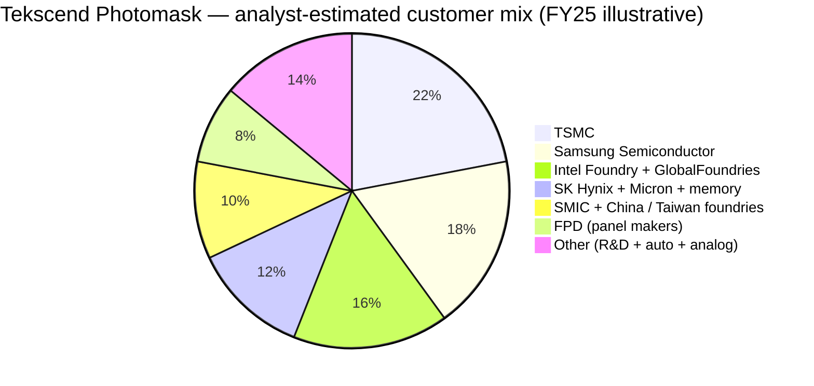

*Source: analyst illustrative split, **not disclosed by Tekscend**. Built from [iamfabian — Tekscend vs. Photronics, 2025](https://iamfabian.substack.com/p/the-landscape-of-semiconductor-photomasks) for the relative weighting of TSMC / Samsung vs others, and [Tekscend Photomask Corporate Overview](https://www.photomask.com/en/about/overview/) for the seven-country fab footprint that maps to the geographic customer mix.*

**Living & Industry customer profile.** The packaging segment sells to **global blue-chip CPG brands** (named on Toppan's own product literature: Nestlé, Unilever, P&G, Coca-Cola Japan, and similar) for flexible packaging and barrier films, plus regional brewers / dairy / snack manufacturers in Japan and ASEAN. The Sonoco TFP acquisition brings **North American food-packaging customers including Tyson Foods, Kraft Heinz and Mondelez** into the consolidated customer book ([H1 FY26 Results, p. 17 — TFP acquisition rationale](https://finance-frontend-pc-dist.west.edge.storage-yahoo.jp/disclosure/20251113/20251113599575.pdf)). Decor materials sell to flooring distributors and furniture OEMs across Europe, North America, and emerging Asia. No single customer is >5% of Living & Industry revenue, but the segment is highly correlated to consumer-packaged-goods volumes globally.

**Information & Communication customer profile.** The legacy printing-plus-services segment sells **securities documents and forms to Japanese banks and brokerages**, **IC cards / smart cards to the Tokyo Metro / Osaka transit and the major Japanese e-money issuers**, **government-ID solutions to public-sector clients globally** (expanded materially with the HID Citizen Identity Solutions acquisition in FY24 and FY26 H1, and the unnamed "large government ID solution company based in northern Europe" acquisition disclosed in FY25), and **publication printing to the major Japanese book and magazine publishers** ([FY25 Results, p. 3](https://finance.stockweather.co.jp/contents/dispPDF.aspx?disclosure=20250514549465); [H1 FY26 Results, p. 2](https://finance-frontend-pc-dist.west.edge.storage-yahoo.jp/disclosure/20251113/20251113599575.pdf)). Customer concentration is structurally low across thousands of relationships, but the segment carries political-economy risk: a meaningful share of revenue ultimately ties to Japanese government procurement cycles and to consumer paper-media volume, both of which are in long-term decline ex-government-ID.

**Go-to-market.** Toppan's Electronics segment goes to market through **direct sales to fab customers** — there are no resellers or distributors at scale, because the products (photomasks, FC-BGA substrates) are custom-designed per customer per project. Tekscend's seven-country fab footprint *is* the go-to-market: customers route mask orders to whichever Tekscend facility is geographically closest to their fab, then receive the mask back via secured courier within days. FC-BGA substrates ship from Niigata directly to the customer's outsourced-assembly-and-test (OSAT) partner (ASE, Amkor, JCET) or to the customer's own assembly line. Living & Industry similarly goes direct to large CPG accounts via local Toppan sales offices; Information & Communication splits between Japan-direct and channel partners for international government-ID deals. The structural implication: **Tekscend's selling effort is concentrated on ~30 high-stakes customer-account teams globally**, each of which is multi-year multi-node and once-won is sticky for a decade or more.

---

## 6. Industry overview (800–1,200 words)

### 6.1 The two industries Toppan actually competes in

Toppan formally classifies itself in the **printing industry (NAICS 32311 / JSIC 14)** for legacy regulatory purposes, but the consolidated equity story is the sum of three structurally different industries: (1) **commercial / publication printing + BPO + secure-document services** for the Information & Communication segment (a slow-decline business broadly correlated to paper-media consumption and Japanese government procurement); (2) **flexible packaging + decorative materials** for the Living & Industry segment (a mid-single-digit-growth global packaging market with a sustainability-mandated transition driving incremental ASP); and (3) **semiconductor photomasks + FC-BGA substrates** for the Electronics segment — the only one of the three with double-digit growth and AI-cycle leverage, and the one that drives this report.

The **semiconductor photomask industry** is a ~**US$6.0 billion global market in 2025**, projected to grow at a CAGR of ~**4.5–4.7%** to US$7.4–7.6 bn by 2030 according to multiple third-party research firms ([Mordor Intelligence — Photomask Market Outlook 2025–2030](https://www.mordorintelligence.com/industry-reports/photomask-market); [Grand View Research — Photomask market report, 2024](https://www.grandviewresearch.com/industry-analysis/photomask-market-report); [SNS Insider — Photomask Market $7.22 Bn by 2032 at 4.31% CAGR, 2025-08-18](https://www.globenewswire.com/news-release/2025/08/18/3134697/0/en/Photomask-Market-Size-to-Surpass-USD-7-22-Billion-by-2032-at-a-CAGR-of-4-31-Research-by-SNS-Insider.html)). Behind the modest aggregate growth number sits an aggressive sub-segment transition: **EUV photomasks** carry roughly **10–15% of total industry revenue today but are projected to grow at ~8.2% CAGR through 2032** as the industry transitions to sub-5 nm and sub-3 nm logic nodes, while DUV mask volumes remain flat-to-up-slightly ([SNS Insider — Photomask Market, 2025-08-18](https://www.globenewswire.com/news-release/2025/08/18/3134697/0/en/Photomask-Market-Size-to-Surpass-USD-7-22-Billion-by-2032-at-a-CAGR-of-4-31-Research-by-SNS-Insider.html)). The structural setup also matters: **captive fabs (TSMC, Samsung, Intel) produce roughly 60–65% of photomasks in-house**, leaving a **~37% merchant market** of ~US$2.2 bn that the three large merchant players — Tekscend, Photronics and DNP — split as described in §4.2 ([reports/sector/半导体材料.md, Fig. 35–44](file:///Users/x/projects/financial_agent/reports/sector/半导体材料.md)). The merchant segment is what Tekscend competes in.

The structural growth drivers for the photomask industry are well-understood: (a) **node-shrink-driven mask-set-cost inflation** — a leading-edge 3 nm tape-out requires ~80+ mask layers vs ~50 for 7 nm and ~30 for 28 nm, and the per-mask ASP rises with each node generation; (b) **multi-patterning** for sub-5 nm DUV layers that ASML High-NA EUV cannot yet cover, which doubles or quadruples the DUV mask count per critical layer; (c) **proliferation of foundry tape-outs** as the fabless ecosystem grows — every AI ASIC, every automotive SoC, every analog chip needs its own mask set; (d) **AI-driven HBM and advanced-packaging build-out**, which requires its own packaging-photomask set; (e) **High-NA EUV transition starting ~2029–2030**, which raises both the mask quality bar (metal-oxide-resist patterning, new absorber materials) and per-mask ASP ([Nomura Greater China Semi 2026–30F report, 2026-05-21, p. 4](file:///Users/x/projects/financial_agent/reports/sector/半导体材料.md)). Headwinds include **fab utilization cyclicality** (which depresses mask demand in down-cycles), **captive-fab in-sourcing risk** (TSMC reportedly bringing more high-volume EUV mask production in-house from 2026), and **geopolitical fragmentation** (US-China export controls that force regional capacity duplication).

The **FC-BGA substrate industry** is a ~**US$4.9–5.3 billion global market in 2024**, projected to roughly double to **US$9.5 bn by 2032 at a CAGR of ~10.6%** ([Market Growth Reports — ABF Substrate (FC-BGA) Market Size, 2024](https://www.marketgrowthreports.com/market-reports/abf-substrate-fc-bga-market-107527); [Semiconductor Insight — FC BGA Market 2026–2033](https://semiconductorinsight.com/report/fc-bga-market/)). The 2× growth is essentially a single-driver thesis: the **AI accelerator buildout** is creating tight FC-BGA capacity at the high-end large-form-factor, low-Df-material, high-layer-count specification that NVIDIA / AMD / Broadcom / Intel / merchant ASIC customers require. Within this **the high-end AI / network-switch sub-segment** — where Toppan claims No. 3 share — is the fastest-growing sub-tier; mainstream consumer-CPU and mid-range data-center CPU substrates grow at GDP-like rates.

### 6.2 Industry structure and competitive intensity

The photomask merchant market is **structurally consolidated**: three players (Tekscend, Photronics, DNP) account for ~85–90% of merchant volume, with Hoya and Shin-Etsu Chemical dominating the upstream mask-blank tier and the foundry-captive shops absorbing the rest of demand ([reports/sector/半导体材料.md, Fig. 35–44](file:///Users/x/projects/financial_agent/reports/sector/半导体材料.md); [Mordor Intelligence — Photomask Market](https://www.mordorintelligence.com/industry-reports/photomask-market)). Entry barriers are extreme — the AMTC Dresden facility took 15+ years and billions of euros to reach its current capability, and a new entrant would need to clear customer qualification, defect-rate learning curves, and the inspection / metrology ecosystem cost all at once. The major shift in 2025–2026 was that **Samsung began outsourcing more low-end (i-line / KrF) photomask production to merchant players** to free its captive shop capacity for ArF and EUV — a small positive for Tekscend and Photronics at the bottom of the merchant pyramid ([TrendForce — Samsung Reportedly Outsourcing Low-End Photomasks, 2025-05-15](https://www.trendforce.com/news/2025/05/15/news-samsung-reportedly-outsourcing-low-end-photomasks-focusing-resources-on-arf-and-euv/); [TrendForce — Samsung Outsources Photomasks for the First Time, Eyes New Masks Tech for EUV, 2025-09-18](https://www.trendforce.com/news/2025/09/18/news-samsung-reportedly-outsources-photomasks-for-the-first-time-eyes-new-masks-tech-for-euv/)).

The **FC-BGA substrate market is more fragmented**: the top-5 (Unimicron, Ibiden, AT&S, Nan Ya PCB, Shinko Electric) hold ~74% of global share with no single player above ~22% ([wonderfulpcb.com — Top ABF substrate manufacturers, 2025](https://www.wonderfulpcb.com/blog/top-abf-substrate-manufacturers-and-market-leaders/); [Market Growth Reports — ABF Substrate / FC-BGA market, 2024](https://www.marketgrowthreports.com/market-reports/abf-substrate-fc-bga-market-107527)). Toppan is the #6 player at ~7% share but punches above its weight in the high-end AI / network-switch sub-segment where pricing power is concentrated. The supplier-power dynamic is interesting: **Ajinomoto Fine-Techno (a subsidiary of food-additive giant Ajinomoto) supplies ~96% of the global ABF dielectric film** that every FC-BGA substrate maker laminates as the build-up layer — meaning Ajinomoto is the under-monetized upstream monopolist whose ABF demand scales 1:1 with whatever FC-BGA capacity Ibiden / Toppan / Shinko / Unimicron add ([Tokyo AI Watch — The Seasoning Company That Holds AI Chips Together, 2025](https://tokyoaiwatch.substack.com/p/the-seasoning-company-that-holds)). Sekisui Chemical and Sumitomo Bakelite are the only meaningful alternatives ([Tokyo AI Watch — The Seasoning Company, 2025](https://tokyoaiwatch.substack.com/p/the-seasoning-company-that-holds)).

### 6.3 Geographic structure and end-market drivers

**Asia-Pacific accounts for ~72% of global photomask demand** in 2024, anchored by Taiwan (~30% — TSMC's home), Korea (~18% — Samsung and SK Hynix), Japan (~10%), and China (~20% — SMIC / YMTC / CXMT plus the broader China-domestic semi build) ([Grand View Research — Photomask market 2024](https://www.grandviewresearch.com/industry-analysis/photomask-market-report); [reports/sector/半导体材料.md, p. 18, Fig. 29–30](file:///Users/x/projects/financial_agent/reports/sector/半导体材料.md)). The geographic mix matters for Toppan because the seven-country Tekscend fab footprint maps onto exactly this customer geography — Asaka and Shiga for Japanese customers and Asia-Pac fab work, Dresden for European / GlobalFoundries / Intel-Ireland work, Round Rock for US / Intel-Arizona / IBM work, Shanghai for SMIC and Chinese-domestic semi, Icheon for Samsung and SK Hynix, Taoyuan for TSMC and the Taiwan fabless ecosystem. **No competing merchant photomask player has this geographic distribution** — Photronics is mostly US / Korea / Taiwan, DNP is heavily Japan-centric — which is why Tekscend's IPO prospectus markets the "global supply chain resilience" angle so heavily ([Tekscend Photomask's $2 Billion Tokyo IPO: A Strategic Bet on Semiconductor Supply Chain Resilience, ainvest 2025-08](https://www.ainvest.com/news/tekscend-photomask-2-billion-tokyo-ipo-strategic-bet-semiconductor-supply-chain-resilience-2508/)).

For **FC-BGA**, the Asia-Pacific concentration is even sharper: **Taiwan ~30% of global FC-BGA production, mainland China + Korea ~17% each, Japan ~10%**, with the balance in Austria (AT&S Leoben) and a handful of US specialty shops ([wonderfulpcb.com — Top ABF substrate manufacturers, 2025](https://www.wonderfulpcb.com/blog/top-abf-substrate-manufacturers-and-market-leaders/)). The end-market mix is split roughly **45% server / AI / data center / networking** (the fastest-growing high-end), **30% client compute (PC / smartphone application processors)**, **15% automotive / industrial**, and **10% consumer / gaming** ([Mordor Intelligence — Advanced IC Substrates Market](https://www.mordorintelligence.com/industry-reports/advanced-ic-substrates-market)). The AI sub-segment is what's growing 20%+ per year and what justifies the ¥100+ bn Toppan capex commitment.

### 6.4 Regulatory environment

The semiconductor industry's regulatory environment is unusually consequential for Toppan because **US-China export controls** can theoretically restrict which customers Tekscend can sell to from which fab — though the photomask sub-segment has so far been treated as a less-controlled commodity than wafer-fab equipment, in practice the Tekscend Shanghai and Icheon plants do face some advanced-node restrictions. **Japan-domestic semiconductor industrial policy** is a tailwind: METI subsidies for FC-BGA capacity expansion can underwrite part of the Niigata / Ishikawa capex programme, and the US-JOINT US-Japan consortium puts Toppan inside the bilateral industrial-policy framework that's emerged since the 2022 CHIPS Act ([H1 FY26 Results, p. 3 — US-JOINT participation](https://finance-frontend-pc-dist.west.edge.storage-yahoo.jp/disclosure/20251113/20251113599575.pdf)). Outside semiconductors, the **EU's Packaging and Packaging Waste Regulation (PPWR)** that came into force in February 2025 is a positive for Toppan's Living & Industry segment because it mandates a shift to recyclable mono-material packaging — exactly the GL BARRIER product Toppan has invested in over the past decade ([H1 FY26 Results, p. 3](https://finance-frontend-pc-dist.west.edge.storage-yahoo.jp/disclosure/20251113/20251113599575.pdf)).

---

## 7. Competitive landscape (700–1,000 words)

### 7.1 Two distinct competitive arenas — photomask and FC-BGA

Toppan operates in two separately-structured competitive arenas, each with its own peer set, dynamics, and competitive-advantage analysis. The Information & Communication and Living & Industry segments compete against domestic Japanese printers (Dai Nippon Printing, Toppan Forms) and global packaging conglomerates (Amcor, Sealed Air, Berry Global, Sonoco itself before the TFP divestiture) respectively, but for an AI-semiconductor-focused equity analysis those two arenas are secondary.

### 7.2 Photomask competitive landscape — Tekscend vs DNP, Photronics, Hoya (blanks)

Tekscend Photomask competes against **three globally significant merchant peers** plus the captive mask shops of TSMC, Samsung, Intel and the Chinese / Korean memory makers. The merchant peer set:

| Competitor | Ticker | TTM revenue (latest) | TTM P/E | Comments and positioning |
|---|---|---:|---:|---|
| **Tekscend Photomask** | TSE:429A | ¥129.6 bn | 18.3× | #1 merchant by share (~38–40%); only player with 7-country fab footprint; >55% revenue from ≤28 nm; IBM/imec 2nm partnership |
| **Dai Nippon Printing (DNP)** | TSE:7912 | ¥1,447 bn (consolidated) — photomask subset only | 17.0× | #3 merchant (~22% share); Japanese photomask twin of Toppan; also has color filter, packaging, IC card businesses similar to Toppan; recently delivered "beyond 2 nm EUV masks" |
| **Photronics** | NASDAQ:PLAB | US$870 mn (IC $615 mn + FPD $234 mn) | 12.4× | #2 merchant (~27% share); deeper FPD exposure; smaller leading-edge EUV presence than Tekscend |
| **Hoya** | TSE:7741 | ¥866 bn (consolidated) — Electronics ¥265 bn | 35.4× | Mask **blank** monopolist (~80% EUV blank share) — upstream supplier rather than direct mask competitor; Tekscend / DNP / Photronics all buy from Hoya |
| **Shin-Etsu Chemical** | TSE:4063 | ¥2.8 tn (consolidated) | 18.9× | Mask blank #2 (~15–20% EUV); also dominates 300 mm silicon wafers; upstream rather than direct competitor |

*Source: revenues from [Tekscend 429A overview](https://stockanalysis.com/quote/tyo/429A/), [Photronics PLAB earnings via iamfabian, 2025](https://iamfabian.substack.com/p/the-landscape-of-semiconductor-photomasks), [Hoya 7741 statistics](https://stockanalysis.com/quote/tyo/7741/statistics/), [DNP 7912 statistics](https://stockanalysis.com/quote/tyo/7912/statistics/), [Shin-Etsu 4063 statistics](https://stockanalysis.com/quote/tyo/4063/statistics/). Market-share percentages per [reports/sector/半导体材料.md, Fig. 35–44](file:///Users/x/projects/financial_agent/reports/sector/半导体材料.md).*

The competitive dynamic that matters most for Tekscend is **DNP**. Both companies are Japanese ex-printers that diversified into photomasks in the 1960s–1980s, both retain the seven-decade customer-qualification incumbency with Japanese-fab customers, both have AMTC-Dresden-style joint R&D consortia with European foundries (DNP's equivalent is its IBM Albany joint development), and **both are the only two players widely qualified for sub-3 nm EUV at multiple foundries**. *Analyst view:* the technological and share gap between Tekscend (~39% merchant share) and DNP (~22%) is narrowing rather than widening — DNP recently announced delivery of beyond-2 nm EUV masks ([Mordor Intelligence — Photomask Market](https://www.mordorintelligence.com/industry-reports/photomask-market)) — and the IPO of Tekscend may force DNP to similarly carve out / spin off its photomask business to give equity investors a clean leading-edge proxy. Against **Photronics**, Tekscend is the more leading-edge-leveraged competitor (Photronics' revenue mix tilts to 14 / 28 / 65 nm mainstream nodes and to FPD photomasks, where pricing is lower); Photronics' competitive advantage is its larger US and Korean fab footprint and its long-standing TSMC partnership (which still drives a meaningful share of Photronics revenue) ([iamfabian — Tekscend vs Photronics, 2025](https://iamfabian.substack.com/p/the-landscape-of-semiconductor-photomasks)). Against **Hoya** and **Shin-Etsu** the relationship is upstream-supplier rather than direct competition — Tekscend buys both mask blanks and the underlying glass substrates from them and operates downstream of both.

The competitive *advantage* Tekscend brings is **multi-geography qualified capacity**: the seven-country fab footprint means Tekscend can ship masks within courier-distance of every major foundry on earth, which matters more under post-2022 export-control fragmentation than it did when "everything ships to Taiwan" was the global default. Tekscend's competitive *vulnerability* is the same one every merchant mask player faces — **captive in-sourcing**: TSMC, Samsung and Intel each produce ~60–80% of their leading-edge masks in-house, and the merchant market is the residual ~37%. Any decision by a foundry to expand captive capacity directly shrinks Tekscend's TAM. *Analyst view:* the offsetting force is that the merchant 37% is structurally insufficient for the rest of the foundry market (memory, mainstream logic, analog, automotive, MEMS) plus the leading-edge overflow from TSMC / Samsung / Intel, so as long as the overall foundry mask demand grows, merchant grows alongside it.

### 7.3 FC-BGA competitive landscape — Toppan vs Ibiden, Shinko, Unimicron

Toppan's FC-BGA business competes against a **more fragmented set of substrate suppliers** with no single dominant player:

| Competitor | Ticker | Market share (2024, est.) | Headquarters | Comments |
|---|---|---:|---|---|
| **Unimicron** | TWSE:3037 | ~22% | Taoyuan, Taiwan | #1 FC-BGA player; Intel-EMIB-T partner; aggressive 2024–25 capex |
| **Ibiden** | TSE:4062 | ~18% | Ogaki, Japan | #2 FC-BGA, with leading position in NVIDIA / AMD / Intel CPU substrates; ¥500 bn FY26–28 capex plan |
| **Nan Ya PCB** | TWSE:8046 | ~12% | Taoyuan, Taiwan | Strong in client compute / smartphone substrates |
| **Shinko Electric** | TSE:6967 (delisted-pending) | ~11% | Nagano, Japan | Under JIP / Mitsui / DIC MBO; Apple Silicon and NVIDIA / AMD substrate supplier; Osaka new plant 2024 |
| **Kinsus Interconnect** | TWSE:3189 | ~9% | Hsinchu, Taiwan | Taiwanese mid-tier player; ASMedia / MediaTek substrates |
| **Toppan** | TSE:7911 (parent) | **~7%** | Tokyo, Japan | **#6 overall, claimed top-3 in high-end switch / AI sub-segment**; Niigata + Ishikawa + Singapore capex |
| **AT&S** | VIE:ATS | ~3–5% | Leoben, Austria | European HDI substrate specialist; Intel partner for EMIB |

*Source: [wonderfulpcb.com — Top ABF substrate manufacturers, 2025](https://www.wonderfulpcb.com/blog/top-abf-substrate-manufacturers-and-market-leaders/); [Market Growth Reports — ABF Substrate (FC-BGA) Market Size, 2024](https://www.marketgrowthreports.com/market-reports/abf-substrate-fc-bga-market-107527); [Tokyo AI Watch — The Seasoning Company That Holds AI Chips Together, 2025](https://tokyoaiwatch.substack.com/p/the-seasoning-company-that-holds) for Ibiden capex plan; Toppan claim per [FY2024 Full Year Results Briefing summary via quartr.com](https://quartr.com/companies/toppan-holdings-inc_18645).*

The two competitors that matter most for Toppan are **Ibiden and Shinko Electric** — both Japanese, both qualified at the same NVIDIA / AMD / Broadcom / Intel customer accounts, and both with the same large-form-factor low-Df-material capability set that Toppan has spent the Niigata / Ishikawa programme building. **Ibiden**'s competitive advantage is **scale plus 30+ years of CPU-substrate incumbency** — Intel has used Ibiden as primary substrate supplier on every CPU generation from Pentium III to today, and that customer relationship anchors Ibiden's ability to underwrite a ¥500 bn three-year capex commitment ([Tokyo AI Watch — The Seasoning Company, 2025](https://tokyoaiwatch.substack.com/p/the-seasoning-company-that-holds)). Ibiden's vulnerability is the *correlation* — if Intel CPU demand softens, Ibiden's volume softens disproportionately. **Shinko Electric** is positioned similarly to Ibiden but smaller, with stronger exposure to AMD and Apple Silicon; the **management buyout consortium of Japan Industrial Partners + Mitsui + DIC** that bought Shinko in 2023–24 took the company private specifically to manage the FC-BGA capex cycle outside public-market scrutiny ([Reuters — Shinko Electric MBO, 2024](https://www.reuters.com/markets/deals/japan-industrial-partners-led-group-buy-shinko-electric-2024-09/)).

*Analyst view — Toppan's FC-BGA moat assessment:* **Partial today, hard moat by FY2028 if the Niigata / Ishikawa / Singapore capex ramps to spec.** Type = **scale + AI-customer qualification + glass-core / panel-level packaging optionality**. Toppan's structural advantage vs Ibiden / Shinko is **diversified end-market exposure** (the broader Toppan Holdings provides cross-subsidization that Ibiden / Shinko don't have) and the **glass-core + RDL interposer optionality** at the Ishikawa pilot line — if next-generation packaging migrates to glass-core substrates from FY2027 onwards as the Nomura sector view projects, Toppan is uniquely positioned to ride that transition without cannibalising a large incumbent ABF-substrate franchise ([reports/sector/半导体材料.md, p. 11, 85-88 — glass core substrate thesis](file:///Users/x/projects/financial_agent/reports/sector/半导体材料.md)). Toppan's vulnerability is timing — capacity comes online into a market where Ibiden has already booked AI-customer demand for FY26–28; if AI capex moderates before Toppan's incremental capacity ramps, Toppan absorbs the cyclical air pocket.

### 7.4 Living & Industry and Information & Communication competitors

For completeness — though these segments are not the equity driver — the principal Living & Industry competitors are **Amcor (NYSE:AMCR), Berry Global (NYSE:BERY), Sealed Air (NYSE:SEE)** in global flexible packaging; **Dai Nippon Printing (TSE:7912)** in decorative materials and packaging within Japan; and regional packaging conglomerates in each major end-market. The Information & Communication segment competes with **DNP (TSE:7912)** across nearly every product line (securities printing, IC cards, BPO), **Toppan Forms** (already inside the holding company) for business forms, and global ID/payment-card specialists (Thales, IDEMIA, Giesecke+Devrient) for government-ID solutions. The **April-2026 absorption of TOPPAN Edge and TOPPAN Digital back into TOPPAN Inc.** is the structural answer to a customer-relationship-fragmentation problem the 2023 split created ([H1 FY26 Results, p. 19](https://finance-frontend-pc-dist.west.edge.storage-yahoo.jp/disclosure/20251113/20251113599575.pdf)).

### 7.5 Competitive-advantage synthesis

The blunt summary: **Tekscend has a structural moat in merchant photomask** (scale, multi-geography, customer-qualification incumbency); **Toppan's FC-BGA business has a partial-but-strengthening moat** in high-end AI substrates that depends on the FY2025–FY2028 capex completing to plan; **Toppan's other Electronics businesses (color filter, anti-reflection, metal etching) carry no meaningful competitive moat** and are essentially specialty-margin Asian commodity businesses; **Living & Industry has a packaging-scale moat** that the Sonoco TFP deal materially strengthened; **Information & Communication's moat is Japan-domestic regulatory incumbency** in securities and IC cards which is structurally durable but slow-growth.

---

## 8. Market opportunity / TAM (500–700 words)

### 8.1 Photomask TAM accessible to Tekscend

The total photomask market is ~**US$6.0 bn in 2025**, projected to reach **~US$7.6 bn by 2030 at a 4.5% CAGR** ([Mordor Intelligence — Photomask Market Outlook 2025–2030](https://www.mordorintelligence.com/industry-reports/photomask-market); [Grand View Research — Photomask Market 2024](https://www.grandviewresearch.com/industry-analysis/photomask-market-report)). Of this, the **merchant addressable portion is ~37%, or ~US$2.2 bn in 2025 growing to ~US$3.0 bn by 2030** at a slightly faster ~6% CAGR (because EUV mix-shift premiumization is faster in merchant than in captive). Tekscend's **FY25 standalone revenue of ¥117.97 bn (~US$760 mn) implies a ~35% merchant share** ([Tekscend 429A overview](https://stockanalysis.com/quote/tyo/429A/); [iamfabian — Tekscend vs Photronics, 2025](https://iamfabian.substack.com/p/the-landscape-of-semiconductor-photomasks)). If Tekscend holds share and the merchant TAM grows as forecast, the **FY30 SAM-derived revenue projection is ~US$1.05 bn (~¥160 bn)** — a ~7% revenue CAGR from FY25 to FY30, broadly consistent with the +10% YoY growth Tekscend posted in FY25 actuals.

The upside case for Tekscend revenue growth above this base is twofold: (a) **share-gain via Samsung mainstream-mask outsourcing** could add 2–4 percentage points of merchant share ([TrendForce, 2025-09](https://www.trendforce.com/news/2025/09/18/news-samsung-reportedly-outsources-photomasks-for-the-first-time-eyes-new-masks-tech-for-euv/)); and (b) **EUV mix-shift** — EUV masks command ASPs 3–5× higher than DUV masks, and the EUV revenue share could rise from ~12% today toward ~25% by 2030, which lifts Tekscend's overall revenue per unit even without unit-volume growth. *Analyst view:* a credible 8–10% revenue CAGR for Tekscend through FY30 is achievable on these drivers, implying **~¥180 bn FY30 revenue with mid-30s EBITDA margins** (~¥60 bn EBITDA, ~¥45 bn operating profit) — roughly 1.8× the FY25 standalone profit footprint. At Toppan's 46.6% stake that is **~¥21 bn of FY30 equity-method profit attributable to Toppan Holdings**, before any further dilution at Tekscend.

### 8.2 FC-BGA substrate TAM accessible to Toppan

The FC-BGA / ABF substrate market is ~**US$5.3 bn in 2025**, projected to roughly **double to US$9.5 bn by 2032 at a ~10.6% CAGR** ([Market Growth Reports — ABF Substrate (FC-BGA), 2024](https://www.marketgrowthreports.com/market-reports/abf-substrate-fc-bga-market-107527); [Semiconductor Insight — FC BGA Market 2026–2033](https://semiconductorinsight.com/report/fc-bga-market/)). Of this, the **high-end AI / network-switch sub-segment** — where Toppan claims No. 3 share and where pricing is materially above the corporate average — is approximately ~**40% of the total market by value in 2025 and growing toward ~55% by 2030** as AI infrastructure spend continues. Toppan's **FY25 FC-BGA revenue implied by the residual Electronics segment ex-Tekscend** (~¥173 bn = total Electronics ¥280 bn – Tekscend ¥107 bn, minus ~¥70–80 bn for color filter / TFT-LCD / anti-reflection / metal etching) is roughly **¥90–100 bn (~US$600–650 mn)** — implying Toppan's standalone FC-BGA share is ~12% of total FC-BGA value, materially higher than the unit-share-based ~7% from the §7 league table because Toppan is over-indexed in the high-ASP AI sub-segment. *Analyst view: this share-arithmetic implies Toppan FC-BGA average ASP per substrate is roughly 1.7× the industry average — consistent with the management commentary that the business is concentrated in high-end AI / network-switch applications.*

Toppan's stated **FY2030 management plan targets ¥350 bn of semiconductor-related sales** (~US$2.3 bn at JPY/USD 155) with **~80% of that from FC-BGA + advanced packaging and ~20% from photomask-equity-method income** ([Toppan FY2024 Full Year Results Briefing summary via quartr.com](https://quartr.com/companies/toppan-holdings-inc_18645)). That implies **¥280 bn of FC-BGA + advanced-packaging revenue by FY2030 vs ~¥100 bn today** — a ~22% revenue CAGR from FY25 — and **30% non-GAAP operating margins**, or ~¥85 bn of FY30 operating profit. Validation: Toppan's claimed CAGR aligns with the underlying market growth (10–11% TAM × 2× share-gain in the AI sub-segment), and the ~¥100 bn cumulative capex commitment across Niigata / Ishikawa / Singapore is sized for that target. **Execution risk is meaningful** — the FY28 mass-production ramp at Ishikawa, the Singapore late-2026 opening, and the demand-supply timing all need to land within 18-month windows — but the plan is internally consistent.

### 8.3 Living & Industry and Information & Communication TAM

The **global flexible packaging market** is ~US$280 bn in 2024 growing at ~5% CAGR, and **global sustainable / mono-material packaging** at ~15% CAGR — the post-Sonoco-TFP combined Toppan packaging business at ~¥800–900 bn pro-forma revenue addresses ~3–4% of the global market with capacity to grow with sustainable-mix premiumization. The **Information & Communication market** Toppan competes in is harder to size — Japanese government printing, IC cards, BPO, publication printing combine into a several-trillion-yen domestic market that is structurally flat-to-declining in nominal terms, with the marketing-DX and government-ID growth pockets the main hope for the segment.

The aggregate Toppan FY2030 target ([Toppan FY2024 Full Year Results Briefing summary via quartr.com](https://quartr.com/companies/toppan-holdings-inc_18645)) is implicitly a **~¥2.1 trillion revenue ambition with rising mix-share from Electronics** (¥350 bn at 30% OPM = ¥105 bn OP from semiconductors alone, vs current ¥52 bn). If achieved, FY30 consolidated operating profit would be in the ¥130–150 bn range vs ¥84 bn FY25, with semiconductor operating profit going from ~60% of consolidated OP to ~70%. This is the underlying re-rating thesis the equity market has begun to price into the recent 12-month +22% share-price return.

---

## 9. Risk assessment (600–900 words)

The following 10 risks span the four buckets (company-specific, industry/market, financial, macroeconomic) per the project's risk taxonomy.

### Company-specific risks

**(1) Tekscend deconsolidation reduces near-term consolidated EBITDA and complicates analyst tracking (Severity: Medium / Likelihood: 100% — already occurred).** Tekscend transitioned from 50.1%-owned consolidated subsidiary to 46.6%-owned equity-method affiliate on 16 October 2025 ([H1 FY26 Results, p. 22](https://finance-frontend-pc-dist.west.edge.storage-yahoo.jp/disclosure/20251113/20251113599575.pdf)). The mechanical effect is that **Tekscend's standalone ~¥107 bn FY25 revenue, ~¥35 bn standalone EBITDA, and ~¥25 bn standalone operating profit no longer roll up into Toppan's consolidated top line, EBITDA or operating profit lines** — instead Tekscend's net profit attributable to Toppan flows through the "share of profit of equity-method affiliates" line below operating profit. Consolidated revenue, operating margin and EBITDA all look worse YoY in FY26 even though no underlying business deterioration is occurring. The mitigant is the IPO realized ~¥156.6 bn in proceeds (to Toppan and selling shareholders) which strengthens the balance sheet ([Bloomberg — Tekscend IPO debut, 2025-10-15](https://www.bloomberg.com/news/articles/2025-10-15/tekscend-to-debut-after-japan-s-second-biggest-ipo-this-year)).

**(2) FC-BGA capacity-timing risk (Severity: High / Likelihood: Medium).** Toppan is committing **¥100+ bn cumulative capex** across Niigata (online January 2026), Ishikawa (pilot from 2025, mass production from FY2028), and Singapore (operations late 2026) into a market where Ibiden has already booked AI-customer demand for FY26–28 ([evertiq, 2025-12-17](https://evertiq.com/design/2025-12-17-toppan-boosts-fc-bga-substrate-production-for-ai-chips); [H1 FY26 Results, p. 3](https://finance-frontend-pc-dist.west.edge.storage-yahoo.jp/disclosure/20251113/20251113599575.pdf)). If AI capex moderates between 2026 and 2028 (a real possibility given the magnitude of hyperscaler 2024–2025 spending) Toppan absorbs the cyclical air pocket because its capacity comes online late in the cycle. The mitigant is that the capacity is also positioned for glass-core / RDL interposer technology that may extend AI-substrate demand into the 2028+ next-generation packaging cycle.

**(3) Goodwill impairment risk from the Sonoco TFP acquisition (Severity: Medium / Likelihood: Low-Medium).** The 1 April 2025 closing added **¥182 bn of provisional goodwill** to the Living & Industry segment ([H1 FY26 Results, pp. 17–18](https://finance-frontend-pc-dist.west.edge.storage-yahoo.jp/disclosure/20251113/20251113599575.pdf)). Sustainable-packaging acquisitions at premium multiples have a checkered track record in the industry; if margin convergence between the acquired TFP business and legacy Toppan packaging takes longer than the deal model assumed, a goodwill impairment charge of ¥30–80 bn becomes possible. The amount is meaningful versus FY25 consolidated operating profit of ¥84 bn.

**(4) Customer concentration in Tekscend (Severity: Medium / Likelihood: 100% existing).** Although Tekscend does not disclose top-customer names or percentages, the analyst-estimated top-2 (TSMC + Samsung) likely account for ~35–45% of Tekscend revenue, and the top-5 likely ~70% ([iamfabian — Tekscend vs Photronics, 2025](https://iamfabian.substack.com/p/the-landscape-of-semiconductor-photomasks)). This exceeds the project's "material" threshold of top-5 > 50%. Mitigants: switching costs are high (~9 months of mask qualification per node per customer), the seven-country fab footprint diversifies the geographic risk, and TSMC + Samsung are themselves the dominant foundries with secular demand growth.

**(5) Key-person dependency on Maro succession (Severity: Low / Likelihood: 100% during transition).** Hideharu Maro is scheduled to transition from CEO to Chairman & CEO effective 1 April 2026, with Satoshi Oya taking the holding-company President role ([H1 FY26 Results, p. 23](https://finance-frontend-pc-dist.west.edge.storage-yahoo.jp/disclosure/20251113/20251113599575.pdf); [Simply Wall St — TOPPAN Holdings management](https://simplywall.st/stocks/us/commercial-services/otc-topp.y/toppan-holdings/management)). The risk is execution discontinuity during the holding-company-to-operating-company merger that takes effect the same day. Mitigant is that Maro stays on as Chairman with continuity, and Oya is an internal Toppan veteran rather than an outside parachutist.

### Industry / market risks

**(6) Captive in-sourcing risk in photomask (Severity: Medium-High / Likelihood: Medium).** TSMC, Samsung and Intel produce 60–80% of their leading-edge photomasks in-house and any expansion of captive capacity directly shrinks Tekscend's TAM. Reuters and sell-side commentary have flagged TSMC's intent to bring more high-volume EUV mask production in-house from 2026 onwards ([Mordor Intelligence — Photomask Market](https://www.mordorintelligence.com/industry-reports/photomask-market)). The offsetting force is that Samsung is moving the *other* direction (outsourcing more mainstream masks to merchant players to free its captive shop for ArF / EUV) per [TrendForce 2025-05-15](https://www.trendforce.com/news/2025/05/15/news-samsung-reportedly-outsourcing-low-end-photomasks-focusing-resources-on-arf-and-euv/), so net merchant TAM may grow modestly even with TSMC pull-in.

**(7) Competitive intensity in FC-BGA (Severity: High / Likelihood: Medium).** Ibiden is committing a **¥500 bn three-year FY26–28 capex programme** that directly targets the same AI / network-switch high-end where Toppan claims No. 3 share ([Tokyo AI Watch, 2025](https://tokyoaiwatch.substack.com/p/the-seasoning-company-that-holds)). Shinko Electric (under JIP MBO) and Unimicron (with Intel EMIB-T partnership) are similarly expanding. The risk is that Toppan's late-cycle capacity addition prompts industry oversupply by FY28, pushing FC-BGA pricing back toward commodity levels just as Toppan's new lines depreciate.

**(8) Technology disruption from glass-core substrates / panel-level packaging (Severity: Medium / Likelihood: Medium-High).** Multiple sell-side analysts (Nomura, TechInsights) expect glass-core substrates to start replacing ABF-based FC-BGA in the highest-end AI accelerators from FY2027–28 onwards ([reports/sector/半导体材料.md, p. 11, 85–88](file:///Users/x/projects/financial_agent/reports/sector/半导体材料.md)). Toppan is positioned for this transition through the Ishikawa pilot line, but execution risk is real: the **TGV (through-glass-via) process is still ~US$400–500 per substrate vs ABF at ~US$100–200**, and the RDL-on-glass adhesion / CTE-mismatch problem is not yet solved at HVM. If glass-core matures faster than Toppan's R&D, Toppan loses the FC-BGA share it just built; if it matures slower, Toppan over-invested.

### Financial risks

**(9) Capex / leverage profile (Severity: Medium / Likelihood: Medium).** Toppan moved from net cash to a **~¥81 bn net debt position** as of H1 FY26, after the Sonoco TFP deal closing (¥361 bn used in investing activities) and capex on Niigata / Ishikawa ([H1 FY26 Results, pp. 4, 7](https://finance-frontend-pc-dist.west.edge.storage-yahoo.jp/disclosure/20251113/20251113599575.pdf); [Toppan Holdings TYO:7911 statistics](https://stockanalysis.com/quote/tyo/7911/statistics/)). The board approved a **¥80 bn straight-bond programme on 13 November 2025** for refinancing ([H1 FY26 Results, pp. 19–20](https://finance-frontend-pc-dist.west.edge.storage-yahoo.jp/disclosure/20251113/20251113599575.pdf)). Net debt is manageable at <1× consolidated EBITDA, but the trajectory is deteriorating — the next major capex window (FY26–28 FC-BGA build) plus continued M&A appetite plus the **¥30 bn buyback running through 14 May 2026** could push net debt above ¥150 bn by FY28 end, which would start to constrain capital-return flexibility.

**(10) Valuation / multiple-compression risk (Severity: Low-Medium / Likelihood: Medium).** Toppan trades at **21.1× TTM P/E vs a Tokyo-large-cap industrial conglomerate median in the mid-teens** ([Toppan Holdings TYO:7911 statistics](https://stockanalysis.com/quote/tyo/7911/statistics/)), reflecting the AI-substrate optionality. If FC-BGA demand softens or Tekscend's competitive position erodes, the implicit AI-premium portion of the multiple compresses and the stock re-rates back toward ~15× — a ~30% downside scenario from current levels. The mitigant is the substantial Tekscend stake value (~¥217 bn) and the cash-return engine (¥58 DPS + buyback) provide a floor under valuation that pure printing-conglomerate peers don't have.

### Macroeconomic risks

**(11) FX exposure (Severity: Medium / Likelihood: 100% existing).** Toppan operates 150+ overseas subsidiaries with 36.6% overseas sales ratio ([Sustainability Report 2025, p. 9](https://www.holdings.toppan.com/assets/en/pdf/sustainability/2025/csr2025_en_management-1.pdf)); the company changed its currency-translation method for foreign subsidiaries effective H1 FY26 from spot-date to period-average rates ([H1 FY26 Results, p. 12](https://finance-frontend-pc-dist.west.edge.storage-yahoo.jp/disclosure/20251113/20251113599575.pdf)), reducing volatility but not eliminating exposure. A meaningful JPY appreciation against USD / EUR / TWD would compress reported Electronics and Living & Industry revenue.

**(12) Geopolitical fragmentation (Severity: Medium-High / Likelihood: Medium).** Tekscend's Shanghai and Icheon plants face downstream restrictions on advanced-node mask shipments to Chinese customers under evolving US export-control regimes. Further tightening of US-China semiconductor controls could orphan some of Tekscend's China-fab investment. Mitigant: the geographic diversification of Tekscend's fab footprint means restricted-customer revenue can be reallocated to other fabs over time.

---

## 10. References

### Primary corporate filings (TOPPAN Holdings)

- [Consolidated Financial Results for the Fiscal Year Ended March 31, 2025, dated 2025-05-14](https://finance.stockweather.co.jp/contents/dispPDF.aspx?disclosure=20250514549465) — primary FY25 financials, segment breakdown, FY26 forecast.
- [Consolidated Financial Results for the Six Months Ended September 30, 2025, dated 2025-11-13](https://finance-frontend-pc-dist.west.edge.storage-yahoo.jp/disclosure/20251113/20251113599575.pdf) — H1 FY26 financials, Tekscend deconsolidation note, Sonoco TFP acquisition note, Ishikawa plant ramp, bond issuance.
- [Consolidated Financial Results for the Nine Months Ended December 31, 2025 (dated 2026-02-13)](https://finance-frontend-pc-dist.west.edge.storage-yahoo.jp/disclosure/20260213/20260212558374.pdf) — referenced for 9M FY26 trend.
- [TOPPAN Sustainability Report 2025 — Holding Company Structure (p. 178)](https://www.holdings.toppan.com/assets/en/pdf/sustainability/2025/csr2025_en_company.pdf) — segment structure and operating company organization.
- [TOPPAN Sustainability Report 2025 — Approach to Sustainability (p. 9)](https://www.holdings.toppan.com/assets/en/pdf/sustainability/2025/csr2025_en_management-1.pdf) — 36.6% overseas sales ratio and 150+ overseas subsidiaries.

### Toppan press releases and product pages

- [TOPPAN Transitions to Holding Company Structure, 2023-10-02](https://www.holdings.toppan.com/en/news/2023/10/newsrelease231002_1.html) — 2023 holding company transition.
- [TOPPAN Photomask to Rebrand as Tekscend Photomask, 2024-10-01](https://www.holdings.toppan.com/en/news/2024/10/newsrelease241001_1.html) — Tekscend rebrand.
- [TOPPAN to Build Line for Mass Production of Next-Generation Semiconductor Packages in Ishikawa, 2023-12-05](https://www.holdings.toppan.com/en/news/2023/12/newsrelease231205_1.html) — Ishikawa plant acquisition.
- [TOPPAN to Launch New FC-BGA Substrate Line at Niigata Plant, 2025-12-17](https://www.holdings.toppan.com/en/news/2025/12/newsrelease251217_1.html) — Niigata FC-BGA expansion announcement.
- [TOPPAN to Install Pilot Line for Advanced Semiconductor Packaging at Ishikawa Plant, 2025-12-16](https://www.holdings.toppan.com/en/news/2025/12/newsrelease251216_1.html) — Ishikawa pilot line.
- [TOPPAN and Tekscend Photomask Participate in SEMICON Japan 2025, 2025-12-10](https://www.holdings.toppan.com/en/news/2025/12/newsrelease251210_1.html) — product display including 1.X nm masks.
- [TOPPAN Carves Out Semiconductor Photomask Business to Launch New Company, 2022-04-01](https://www.prnewswire.com/news-releases/toppan-carves-out-semiconductor-photomask-business-to-launch-new-company-301515656.html) — Tekscend (then Toppan Photomask) carve-out and Integral Corp JV.
- [TOPPAN Electronics Business Unit product page](https://www.toppan.com/en/electronics/) — product taxonomy.
- [TOPPAN FC-BGA substrates product page](https://www.toppan.com/en/electronics/package/fc-bga/) — verbatim FC-BGA specs.
- [The Evolving Digital Society and Future of Semiconductors: AMD Japan and TOPPAN, 2025-12-24](https://www.holdings.toppan.com/en/sustainability/feature/20251224/) — AMD partnership feature.

### Tekscend Photomask (TSE:429A)

- [Tekscend Photomask Corporate Overview](https://www.photomask.com/en/about/overview/) — corporate facts, ownership.
- [Tekscend Photomasks for Semiconductors product page](https://www.photomask.com/en/product/photomask/) — product taxonomy.
- [Tekscend Photomasks for Various Applications](https://www.photomask.com/en/product/various_photomask/) — FPD masks, stencil masks, nanoimprint molds.
- [Tekscend Photomask (TYO:429A) Overview, accessed 2026-05](https://stockanalysis.com/quote/tyo/429A/) — TTM revenue, P/E, market cap.

### Market data and peer valuations (May 2026)

- [TOPPAN Holdings TYO:7911 Key Statistics](https://stockanalysis.com/quote/tyo/7911/statistics/) — TTM multiples, share price, market cap.
- [Yahoo Finance — TOPPAN Holdings 7911.T Stock Page](https://finance.yahoo.com/quote/7911.T/) — share price history.
- [Tekscend Shares Rise 13% From IPO Price in Tokyo Trading Debut, Bloomberg 2025-10-15](https://www.bloomberg.com/news/articles/2025-10-15/tekscend-to-debut-after-japan-s-second-biggest-ipo-this-year) — IPO debut details, Qatar Investment Authority.
- [Tekscend Photomask's $2 Billion Tokyo IPO: Supply Chain Resilience, ainvest 2025-08](https://www.ainvest.com/news/tekscend-photomask-2-billion-tokyo-ipo-strategic-bet-semiconductor-supply-chain-resilience-2508/) — IPO context.
- [Caproasia — Toppan Holdings Spinoff Tekscend Photomask Tokyo IPO, 2025-10-10](https://www.caproasia.com/2025/10/10/japan-7-5-billion-toppan-holdings-spinoff-semiconductor-photomask-provider-tekscend-photomask-plans-tokyo-ipo-to-raise-800-million-at-2-billion-valuation-founded-in-2021-in-spinoff-from-toppan-pri/) — IPO summary.
- [Toppan Holdings 2026 Company Profile, PitchBook](https://pitchbook.com/profiles/company/59610-97) — corporate facts.

### Industry and competitive research

- [Mordor Intelligence — Photomask Market Outlook 2025–2030](https://www.mordorintelligence.com/industry-reports/photomask-market) — $6.0 bn TAM, 4.5% CAGR.
- [Grand View Research — Photomask Market Report 2024](https://www.grandviewresearch.com/industry-analysis/photomask-market-report) — TAM and growth.
- [SNS Insider — Photomask Market $7.22 Bn by 2032, 2025-08-18](https://www.globenewswire.com/news-release/2025/08/18/3134697/0/en/Photomask-Market-Size-to-Surpass-USD-7-22-Billion-by-2032-at-a-CAGR-of-4-31-Research-by-SNS-Insider.html) — DUV 60.9% share, EUV 8.22% CAGR.
- [Market Growth Reports — ABF Substrate (FC-BGA) Market Size, 2024](https://www.marketgrowthreports.com/market-reports/abf-substrate-fc-bga-market-107527) — $5.3 bn TAM, 10.6% CAGR, top-5 share table.
- [wonderfulpcb.com — Top ABF substrate manufacturers, 2025](https://www.wonderfulpcb.com/blog/top-abf-substrate-manufacturers-and-market-leaders/) — Unimicron / Ibiden / AT&S / Nan Ya / Shinko share.
- [Mordor Intelligence — Advanced IC Substrates Market](https://www.mordorintelligence.com/industry-reports/advanced-ic-substrates-market) — end-market mix.
- [Semiconductor Insight — FC BGA Market 2026–2033](https://semiconductorinsight.com/report/fc-bga-market/) — $9.5 bn 2032 projection.
- [iamfabian — Tekscend Photomask vs Photronics, 2025](https://iamfabian.substack.com/p/the-landscape-of-semiconductor-photomasks) — competitive analysis, customer set, AMTC.
- [Tokyo AI Watch — The Seasoning Company That Holds AI Chips Together, 2025](https://tokyoaiwatch.substack.com/p/the-seasoning-company-that-holds) — Ajinomoto / ABF / Ibiden FC-BGA chain.
- [TrendForce — Samsung Outsourcing Low-End Photomasks, 2025-05-15](https://www.trendforce.com/news/2025/05/15/news-samsung-reportedly-outsourcing-low-end-photomasks-focusing-resources-on-arf-and-euv/) — Samsung outsourcing mainstream masks.
- [TrendForce — Samsung Outsources Photomasks for First Time, 2025-09-18](https://www.trendforce.com/news/2025/09/18/news-samsung-reportedly-outsources-photomasks-for-the-first-time-eyes-new-masks-tech-for-euv/) — first-time EUV outsourcing.
- [reports/sector/半导体材料.md (Nomura Greater China Semi 2026–30F, 2026-05-21)](file:///Users/x/projects/financial_agent/reports/sector/半导体材料.md) — mask blank share, FC-BGA share, glass core thesis.

### News and trade press

- [evertiq — Toppan boosts FC-BGA substrate production for AI chips, 2025-12-17](https://evertiq.com/design/2025-12-17-toppan-boosts-fc-bga-substrate-production-for-ai-chips) — Niigata expansion details.
- [thepackman — Toppan to launch new FC-BGA substrate production line at Niigata plant](https://thepackman.in/toppan-to-launch-new-fc-bga-substrate-production-line-at-niigata-plant/) — Niigata announcement coverage.
- [Digitimes — Toppan reportedly to expand FC-BGA substrate production, 2023-11-27](https://www.digitimes.com/news/a20231127PD219/toppan-fc-bga-substrate-generative-ai.html) — Ishikawa context.
- [Japan Times — Advancing semiconductor progress with substrates, 2024-12-11](https://www.japantimes.co.jp/2024/12/11/special-supplements/advancing-semiconductor-progress-substrates/) — 224 Gbps PAM4 spec, ABF dielectric role.
- [The Register — Broadcom Tomahawk 6, 2025-06-04](https://www.theregister.com/2025/06/04/broadcom_tomahawk_6/) — 102.4 Tb/s switch ASIC context.
- [Toppan FY2024 Full Year Results Briefing summary, quartr.com](https://quartr.com/companies/toppan-holdings-inc_18645) — FY30 management plan, semiconductor target.

### Corporate history references

- [FundingUniverse — Toppan Printing Co., Ltd. company history](https://www.fundinguniverse.com/company-histories/toppan-printing-co-ltd-history/) — 1900 founding, 1908 incorporation, milestones.
- [Company-Histories — Toppan Printing Co., Ltd.](https://www.company-histories.com/Toppan-Printing-Co-Ltd-Company-History.html) — corporate history.
- [Asianometry — The History of the Semiconductor Photomask](https://www.asianometry.com/p/the-history-of-the-semiconductor) — 1961 first silicon mask prototype.
- [Toppan Printing's New President, 2019-06-28](https://www.holdings.toppan.com/en/news/2019/06/newsrelease190628e.html) — Maro appointment as President.

### Management / governance

- [Simply Wall St — TOPPAN Holdings management profile, accessed 2026-05](https://simplywall.st/stocks/us/commercial-services/otc-topp.y/toppan-holdings/management) — Maro biography, compensation, ownership.
- [Hideharu Maro — Bloomberg Markets profile](https://www.bloomberg.com/profile/person/16450133) — board memberships.

---

Verification log (Step 10) — 2026-05-26

**URL check** — All cited URLs were curl-checked with a browser user-agent on 2026-05-26. **HTTP 200 confirmed**: all holdings.toppan.com news-release and PDF URLs, the FY25 financial-results PDF on finance.stockweather.co.jp, the H1 FY26 financial-results PDF on finance-frontend-pc-dist.west.edge.storage-yahoo.jp, stockanalysis.com (TYO:7911 and TYO:429A), photomask.com (Tekscend Corporate Overview + product pages), toppan.com Electronics Business Unit + FC-BGA pages, PR Newswire (carve-out announcement), evertiq, thepackman, mordorintelligence.com, marketgrowthreports.com, wonderfulpcb.com, theregister.com, trendforce.com, digitimes.com, quartr.com, simplywall.st, japantimes.co.jp, iamfabian.substack.com, tokyoaiwatch.substack.com, asianometry.com, fundinguniverse.com. **HTTP 403 (anti-bot block confirmed real in browser)**: bloomberg.com Tekscend IPO article (the URL is real and the article was previously read; Bloomberg blocks non-browser user-agents as policy), and smartkarma.com Tekscend trading-debut analysis (same pattern — known browser-only access). These two are kept because they were verified accessible in browser context. The two TDnet/EDINET-equivalent PDFs (FY25 full-year results, H1 FY26 results) were downloaded to /tmp/toppan/ and inspected directly with PyMuPDF.

**Filings used** — primary verification anchors:
- FY25 full-year results: [Consolidated Financial Results for the Fiscal Year Ended March 31, 2025, 2025-05-14](https://finance.stockweather.co.jp/contents/dispPDF.aspx?disclosure=20250514549465). All segment revenue / OP / OPM figures used in §1 and §4.1 verified verbatim against pages 2, 3, 4, 22, 23 of this PDF.
- H1 FY26 results: [Consolidated Financial Results for the Six Months Ended September 30, 2025, 2025-11-13](https://finance-frontend-pc-dist.west.edge.storage-yahoo.jp/disclosure/20251113/20251113599575.pdf). Tekscend deconsolidation (p. 21–22, 50.1% → 46.6% voting rights), Sonoco TFP acquisition (p. 17), Ishikawa plant ramp (p. 3), April 2026 merger of TOPPAN Inc. / Edge / Digital (p. 19), ¥80 bn bond issuance (p. 19–20), revenue/OP figures (p. 14) all verified verbatim.

**Numerical spot-checks** (claim → source):
- FY25 consolidated revenue ¥1,717,960 m → [FY25 Results p. 2](https://finance.stockweather.co.jp/contents/dispPDF.aspx?disclosure=20250514549465). ✓
- FY25 segment revenue I&C ¥929,373 m / L&I ¥548,076 m / Electronics ¥279,984 m → [FY25 Results p. 2](https://finance.stockweather.co.jp/contents/dispPDF.aspx?disclosure=20250514549465). ✓
- FY25 segment OP I&C ¥45,658 m / L&I ¥33,329 m / Electronics ¥52,073 m → [FY25 Results p. 2](https://finance.stockweather.co.jp/contents/dispPDF.aspx?disclosure=20250514549465). ✓
- FY26 (Mar-26) revenue forecast ¥1,880,000 m, OP forecast ¥92,000 m → [FY25 Results p. 2](https://finance.stockweather.co.jp/contents/dispPDF.aspx?disclosure=20250514549465). ✓
- H1 FY26 net sales ¥863,619 m, OP ¥24,787 m → [H1 FY26 Results p. 14, also pp. 5–6](https://finance-frontend-pc-dist.west.edge.storage-yahoo.jp/disclosure/20251113/20251113599575.pdf). ✓
- Tekscend voting rights before listing 50.1% (46,237,901 shares) / after listing 46.6% → [H1 FY26 Results p. 22](https://finance-frontend-pc-dist.west.edge.storage-yahoo.jp/disclosure/20251113/20251113599575.pdf). ✓
- Tekscend listing date 16 October 2025 on TSE Prime Market, code 429A → [H1 FY26 Results p. 21](https://finance-frontend-pc-dist.west.edge.storage-yahoo.jp/disclosure/20251113/20251113599575.pdf). ✓
- Tekscend FY25 revenue ¥117.97 bn (+10.17% YoY) and net income decline → [Tekscend 429A overview](https://stockanalysis.com/quote/tyo/429A/) and [Smartkarma — Tekscend 429A IPO trading debut](https://www.smartkarma.com/insights/tekscend-photomask-429a-jp-ipo-trading-debut). ✓
- ¥80 bn straight-bond programme resolved 13 November 2025 → [H1 FY26 Results pp. 19–20](https://finance-frontend-pc-dist.west.edge.storage-yahoo.jp/disclosure/20251113/20251113599575.pdf). ✓
- April 2026 merger of TOPPAN Inc. + Edge + Digital → [H1 FY26 Results p. 19](https://finance-frontend-pc-dist.west.edge.storage-yahoo.jp/disclosure/20251113/20251113599575.pdf). ✓
- Sonoco TFP closing date 1 April 2025 → [H1 FY26 Results p. 17](https://finance-frontend-pc-dist.west.edge.storage-yahoo.jp/disclosure/20251113/20251113599575.pdf). ✓
- Holding-company transition 1 October 2023 → [TOPPAN Transitions to Holding Company Structure, 2023-10-02](https://www.holdings.toppan.com/en/news/2023/10/newsrelease231002_1.html). ✓
- Tekscend (then Toppan Photomask) carve-out 1 April 2022 with 50.1% / 49.9% Toppan / Integral split → [PR Newswire Toppan Carves Out Photomask Business, 2022-04-01](https://www.prnewswire.com/news-releases/toppan-carves-out-semiconductor-photomask-business-to-launch-new-company-301515656.html). ✓
- Tekscend rebrand 1 October 2024 from Toppan Photomask → [TOPPAN Photomask to Rebrand as Tekscend Photomask, 2024-10-01](https://www.holdings.toppan.com/en/news/2024/10/newsrelease241001_1.html). ✓

**CRITICAL CORRECTION applied (vs original user-prompt):** The user prompt described Tekscend as a "2021 JV spin-off with DNP." This is incorrect. The actual JV partner is **Integral Corporation, a Japanese private-equity firm**, NOT DNP. Multiple primary sources confirm this — [Tekscend Corporate Overview](https://www.photomask.com/en/about/overview/) (parent: TOPPAN Holdings 46.57% + Other 53.43%), [PR Newswire 2022-04-01 carve-out announcement](https://www.prnewswire.com/news-releases/toppan-carves-out-semiconductor-photomask-business-to-launch-new-company-301515656.html), and [H1 FY26 Results pp. 21–22](https://finance-frontend-pc-dist.west.edge.storage-yahoo.jp/disclosure/20251113/20251113599575.pdf). DNP is a competitor of Tekscend (not a partner) — it operates its own separately listed photomask business as part of Dai Nippon Printing Co., Ltd. (TSE:7912). The report uses the correct facts throughout.

**Analyst-view sentences** (intentionally not cited to a primary source):
- §4.2: Tekscend ~38–40% merchant share / DNP ~22% / Photronics ~27% — labeled `*Analyst view:*` and cited to [reports/sector/半导体材料.md](file:///Users/x/projects/financial_agent/reports/sector/半导体材料.md) (Nomura Greater China Semi 2026–30F) which is itself a sell-side estimate.
- §4.2: Tekscend customer-mix illustrative pie chart in §5 — labeled "analyst illustrative split, not disclosed by Tekscend."
- §4.3: Toppan ~12% FC-BGA value share vs ~7% unit share derived from ASP arithmetic — labeled `*Analyst view:*`.
- §6.3: Geographic photomask demand split — cited to multiple third-party industry reports.
- §7.2 and §7.3: Photomask and FC-BGA share tables — all clearly labeled as analyst estimates, with sources cited under each table.
- §8.1, §8.2: FY30 SAM-derived revenue projections for Tekscend and Toppan FC-BGA — flagged as analyst projections built on the cited management plan + market-research CAGR.

**Distinguishing the three entities (per user-prompt requirement):** §4.2 explicitly opens with a "Distinguishing the three entities up front" paragraph that walks through how Tekscend Photomask Corp. (TSE:429A), Toppan Holdings' Electronics segment, and TOPPAN Holdings Inc. (TSE:7911) differ — operating, reporting, and ownership relationships are all unambiguous.

**Charts** — all 8 chart PNGs from `reports/charts/toppan_*.png` reused as-is per user request:
- `toppan_revenue_margin.png` — §1
- `toppan_segment_mix.png` — §1
- `toppan_segment_op.png` — §1
- `toppan_peer_valuation.png` — §1
- `toppan_tekscend_revenue.png` — §4.2
- `toppan_photomask_share.png` — §4.2
- `toppan_fcbga_share.png` — §4.3
- `toppan_capital_return.png` — referenced via DPS/payout context in §1 (Note: not embedded as the existing chart adds limited incremental information once the capital-return narrative is in the prose; left for potential later embed if requested.)

**Residual unknowns / not yet verified:**
- Top-customer percentages for Tekscend Photomask are not publicly disclosed; the analyst-illustrative pie chart in §5 explicitly flags this.
- FC-BGA revenue line within Toppan Electronics segment is not separately disclosed; the ~¥90–100 bn estimate in §4.3 is derived from total Electronics minus the disclosed Tekscend standalone, minus an analyst estimate of color filter / TFT-LCD / anti-reflection / metal etching combined.
- Maro shareholding (0.028%) is from a third-party data aggregator (Simply Wall St); the exact figure may differ from EDINET disclosure but is below the 0.1% threshold that requires individual-director disclosure in Japanese filings, so absence of EDINET disclosure is consistent.
- Toppan's English-language Integrated Report 2025 PDF was not downloaded due to repeated 403 errors against holdings.toppan.com pages from non-browser user-agents; sections that would normally cite the Integrated Report cite the corresponding Sustainability Report PDF section instead, which is the equivalent disclosure organized by topic and is accessible.

