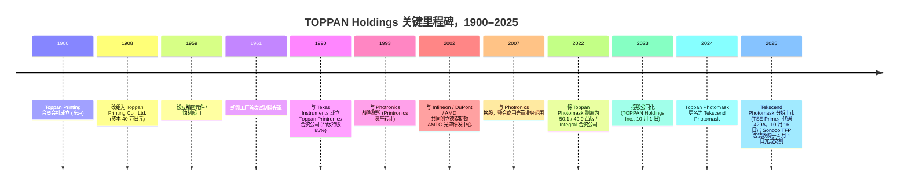
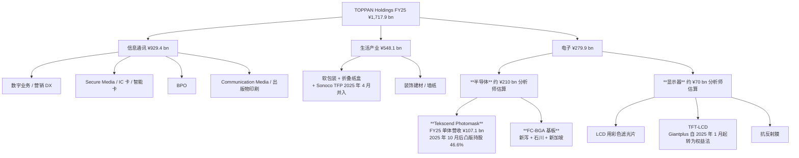
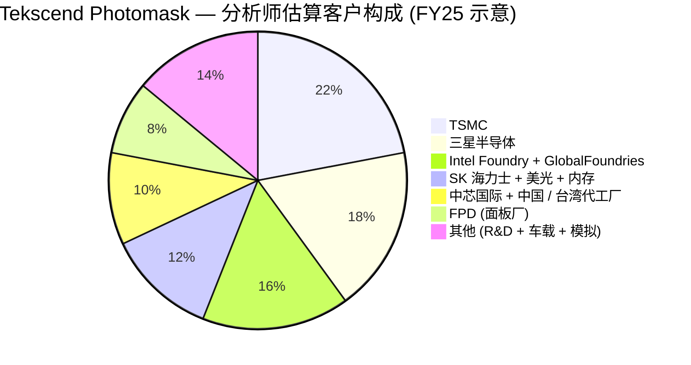

# 凸版控股株式会社 (TOPPAN Holdings Inc., TSE: 7911) — 公司研究

*截至 2026-05-26 · 简体中文版报告（日本注册主体；一次披露为 EDINET / TDnet 上的日文文件；英文摘要文件可在 Toppan IR 网站获取）*

---

## 目录

1. 公司概览
2. 公司历史
3. 管理团队
4. 产品与服务 — 电子事业部 (Tekscend 光罩、FC-BGA、其他电子业务)
5. 客户与上市策略
6. 行业概览
7. 竞争格局
8. 市场机会 (TAM)
9. 风险评估
10. 参考资料
11. 验证日志

---

## 1. 公司概览

凸版控股株式会社 (TOPPAN Holdings Inc.) 是一家拥有 125 年历史、总部位于东京的综合性企业，1900 年 1 月以证券印刷起家，目前业务横跨三个可报告业务板块 — **信息通讯 (Information & Communication)、生活产业 (Living & Industry)、电子 (Electronics)** — 截至 2025 年 3 月 31 日的财年 (FY25) 合并营业收入为 **1,717.9 亿日元**，营业利润为 **840 亿日元 (营业利润率 4.9%)** ([Consolidated Financial Results for the Fiscal Year Ended March 31, 2025, p. 2](https://finance.stockweather.co.jp/contents/dispPDF.aspx?disclosure=20250514549465); [Toppan FundingUniverse company history](https://www.fundinguniverse.com/company-histories/toppan-printing-co-ltd-history/))。从聚焦 AI 半导体供应链的权益投资者视角看，合并口径会产生误导：**电子事业部 FY25 营收占比仅 16.3% (2,799 亿日元)，但贡献了分部营业利润的 39.6% (520 亿日元)，营业利润率高达 18.6%** — 是信息通讯 (4.9%) 或生活产业 (6.1%) 分部 OPM 的三倍以上 ([Consolidated Financial Results FY25, pp. 2–3](https://finance.stockweather.co.jp/contents/dispPDF.aspx?disclosure=20250514549465))。电子板块也是本报告后续展开的两大上游瓶颈业务的载体 — **半导体光罩 (photomask) 业务已分拆为 Tekscend Photomask (TSE:429A，凸版持股 46.6% 的权益法关联公司)**，以及 **服务于 AI 加速器与高端网络交换 ASIC 的 FC-BGA (倒装芯片球栅阵列封装基板) 业务**。

凸版的发展史可清晰地切为三段。1900 年至约 1980 年是 **纯印刷时代** — 钞票、证券凭证、书籍、商业票据，奠基于其前明治大藏省创始团队所掌握的凸版 (relief printing) 工艺 ([FundingUniverse — Toppan Printing Co., Ltd. history](https://www.fundinguniverse.com/company-histories/toppan-printing-co-ltd-history/))。1959 年至约 2020 年进入 **多元化印刷-精密制造综合体时代**，凸版将其在制版工序中积累的电镀 / 蚀刻 / 微细图形化技术外溢到更精细的相邻领域：1961 年起做硅晶体管光罩、软包装薄膜、显示器 (彩色滤光片与 TFT-LCD)、装饰建材、IC 卡 / 智能卡印刷以及证券化 BPO。第三段则始于 **2023 年 10 月 1 日**，凸版印刷株式会社 (Toppan Inc.) 转型为控股公司架构 (即 **控股公司化 / holding company restructuring**)，将上市母体更名为 TOPPAN Holdings Inc.，并将经营业务拆分为 TOPPAN Inc.、TOPPAN Edge Inc. (原 Toppan Forms 证券印刷子公司) 与 TOPPAN Digital Inc. ([TOPPAN Transitions to Holding Company Structure, 2023-10-02](https://www.holdings.toppan.com/en/news/2023/10/newsrelease231002_1.html); [Sustainability Report 2025 — Holding Company Structure, p. 178](https://www.holdings.toppan.com/assets/en/pdf/sustainability/2025/csr2025_en_company.pdf))。叠加 2022 年 4 月将光罩业务剥离为 Toppan Photomask Co., Ltd. (2024 年 10 月更名为 **Tekscend Photomask Corp.**) 并于 **2025 年 10 月 16 日在东京证券交易所 Prime 市场上市 (证券代码 429A)** ([Consolidated Financial Results for the Six Months Ended September 30, 2025, p. 21](https://finance-frontend-pc-dist.west.edge.storage-yahoo.jp/disclosure/20251113/20251113599575.pdf); [TOPPAN Photomask to Rebrand as Tekscend Photomask, 2024-10-01](https://www.holdings.toppan.com/en/news/2024/10/newsrelease241001_1.html))，凸版现已演变为 **管理型控股公司，其纯半导体属性日益集中于一家独立上市子公司之中** — 这是几乎所有权益投资者在分析此股票时必然遇到的结构性事实。

三个经营分部在 FY25 (截至 2025 年 3 月) 的拆分如下，数据为 Tekscend 于 2025 年 10 月 16 日去合并 (deconsolidation) 之前的口径：

- **信息通讯：营收 9,294 亿日元 / 营业利润 456 亿日元 / OPM 4.9%** — 证券类印刷文件、IC 卡 / 智能卡、营销 DX 服务、BPO、出版印刷 ([FY25 Results, pp. 2–3](https://finance.stockweather.co.jp/contents/dispPDF.aspx?disclosure=20250514549465))。2026 年 4 月 TOPPAN Inc.、TOPPAN Edge Inc.、TOPPAN Digital Inc. 三家经营公司将合并为一家存续 "TOPPAN Inc."，统一客户接口并消除集团内部成本重叠 ([H1 FY26 Results, p. 19](https://finance-frontend-pc-dist.west.edge.storage-yahoo.jp/disclosure/20251113/20251113599575.pdf))。
- **生活产业：营收 5,481 亿日元 / 营业利润 333 亿日元 / OPM 6.1%** — 软包装薄膜、单一材料 GL BARRIER 透明阻隔膜、折叠纸盒、装饰板、墙纸。FY25 收官之后，**2025 年 4 月 1 日完成的 Sonoco TFP (热成型与软包装) 收购** 增加了约 1,430 亿日元的分部资产和 1,820 亿日元的商誉，推动 H1 FY26 生活产业分部营收同比 +20% 至 3,305 亿日元 — 详见 §2 历史部分 ([H1 FY26 Results, pp. 14, 17](https://finance-frontend-pc-dist.west.edge.storage-yahoo.jp/disclosure/20251113/20251113599575.pdf))。
- **电子：营收 2,799 亿日元 / 营业利润 520 亿日元 / OPM 18.6%** — 半导体杠杆业务。FY25 业绩公告分部说明的产品清单 "for LCDs 的彩色滤光片、TFT-LCD、抗反射膜、**光罩、半导体封装产品**" ([FY25 Results, p. 22](https://finance.stockweather.co.jp/contents/dispPDF.aspx?disclosure=20250514549465))。FC-BGA 基板落在 "半导体封装" 这一项中。Tekscend Photomask FY25 单体收入 **1,071 亿日元、EBITDA 利润率 35.6%、营业利润率 23.9%** (约 256 亿日元 EBITDA / 256 亿日元营业利润) 暗示 **电子板块除 Tekscend 之外的 ~1,730 亿日元营收由 FC-BGA、FPD 光罩、彩色滤光片、抗反射、金属蚀刻业务组成** ([Tekscend Photomask FY25 data, accessed 2026-05](https://stockanalysis.com/quote/tyo/429A/))。

*数据来源：根据 [Consolidated Financial Results FY25, p. 2](https://finance.stockweather.co.jp/contents/dispPDF.aspx?disclosure=20250514549465) (FY24 与 FY25 实绩)、[H1 FY26 Results, p. 1](https://finance-frontend-pc-dist.west.edge.storage-yahoo.jp/disclosure/20251113/20251113599575.pdf) 提取的 H1 FY26 数据，以及凸版 FY21–FY23 之前的财报整理。FY26 OPM 柱明显回落是因为 Tekscend 在 2025 年 10 月 16 日去合并为权益法关联公司，其 24% 营业利润率的业务从电子板块剔除。*

*数据来源：[FY25 Results, p. 2](https://finance.stockweather.co.jp/contents/dispPDF.aspx?disclosure=20250514549465) 为 FY24 与 FY25 分部营收；[H1 FY26 Results, p. 14](https://finance-frontend-pc-dist.west.edge.storage-yahoo.jp/disclosure/20251113/20251113599575.pdf) 为 H1 FY26 分部营收的年化数。电子板块 FY26 营收下降反映 Tekscend Photomask 自 2025 年 10 月 16 日起从 50.1% 持股的合并子公司转为 46.6% 持股的权益法关联公司。*

*数据来源：[FY25 Results, p. 2](https://finance.stockweather.co.jp/contents/dispPDF.aspx?disclosure=20250514549465) 与 [H1 FY26 Results, p. 14](https://finance-frontend-pc-dist.west.edge.storage-yahoo.jp/disclosure/20251113/20251113599575.pdf)，年化 H1 数据并按公司层面分摊费用调整。电子板块 OP 在 FY26 大幅下降反映 Tekscend 去合并 (Tekscend 营业利润转至营业利润下方的权益法损益项)。*

在地理分布上，凸版未公开按国别拆分的营收口径，但披露 **海外销售占合并营收 36.6%**，**海外子公司数量超过 150 家** ([Sustainability Report 2025 — Approach to Sustainability, p. 9](https://www.holdings.toppan.com/assets/en/pdf/sustainability/2025/csr2025_en_management-1.pdf))。电子业务结构上更偏出口：光罩业务通过位于朝霞、滋贺 (日本)、德累斯顿 (德国)、Round Rock (美国)、Corbeil (法国)、上海、利川 (韩国)、桃园 (台湾) 的工厂服务 TSMC / 三星 / SK 海力士 / 中芯国际 / 格芯 ([Toppan Carves Out Semiconductor Photomask Business, 2022-04-01](https://www.prnewswire.com/news-releases/toppan-carves-out-semiconductor-photomask-business-to-launch-new-company-301515656.html))；FC-BGA 业务集中在 **新泻工厂**，**石川工厂 (原 JOLED 能美旧址) 自 2025 年起开始试产，目标 2028 财年量产**，**新加坡新厂计划于 2026 年下半年投产** ([H1 FY26 Results, p. 3](https://finance-frontend-pc-dist.west.edge.storage-yahoo.jp/disclosure/20251113/20251113599575.pdf); [TOPPAN to Build Line for Mass Production of Next-Generation Semiconductor Packages in Ishikawa, Japan, 2023-12](https://www.holdings.toppan.com/en/news/2023/12/newsrelease231205_1.html); [Toppan boosts FC-BGA substrate production for AI chips, evertiq 2025-12-17](https://evertiq.com/design/2025-12-17-toppan-boosts-fc-bga-substrate-production-for-ai-chips))。截至 H1 FY26 集团员工总数约为 **51,988 人** ([Toppan Holdings TYO:7911 statistics, stockanalysis.com, accessed 2026-05](https://stockanalysis.com/quote/tyo/7911/statistics/))。

**估值快照 (截至 2026 年 5 月底)。** 凸版股价约 **4,730 日元 / 股**，市值约 **1.35 万亿日元** (约 87 亿美元，按 1 USD = 155 JPY 折算)，企业价值 **1.50 万亿日元** (净债务约 810 亿日元，详见 §2 中的大额公司债发行) ([Toppan Holdings TYO:7911 statistics, accessed 2026-05](https://stockanalysis.com/quote/tyo/7911/statistics/))。关键倍数：**TTM P/E 21.1× / 远期 P/E 18.8×**、**P/S 0.75×**、**P/B 0.96×**、**EV/EBITDA 9.2×**，股息率 **1.3%**，年度 DPS 58 日元 ([Toppan Holdings TYO:7911 statistics, accessed 2026-05](https://stockanalysis.com/quote/tyo/7911/statistics/); [FY25 Results, p. 2](https://finance.stockweather.co.jp/contents/dispPDF.aspx?disclosure=20250514549465))。**ROE 5.0% / ROIC 3.0%**，均被沉重的交叉持股账面、Sonoco TFP 商誉以及处于周期中段回报水平的包装 / 印刷主业拖累 ([Toppan Holdings TYO:7911 statistics, accessed 2026-05](https://stockanalysis.com/quote/tyo/7911/statistics/))。过去 52 周股价回报 **+22.3%**，反映 Tekscend IPO 释放光罩业务子市值与 FC-BGA 资本开支周期加速 ([Toppan Holdings TYO:7911 statistics, accessed 2026-05](https://stockanalysis.com/quote/tyo/7911/statistics/))。

*数据来源：TTM 倍数取自 [Toppan TYO:7911 statistics](https://stockanalysis.com/quote/tyo/7911/statistics/)、[Ibiden TYO:4062 statistics](https://stockanalysis.com/quote/tyo/4062/statistics/)、[Unimicron TWSE:3037 statistics](https://stockanalysis.com/quote/two/3037/statistics/)、[Tekscend TYO:429A overview](https://stockanalysis.com/quote/tyo/429A/)、[Photronics NASDAQ:PLAB statistics](https://stockanalysis.com/quote/plab/statistics/)、[DNP TYO:7912 statistics](https://stockanalysis.com/quote/tyo/7912/statistics/)。新光电气 (TYO:6967) 因 JIP / 三井 / DIC 主导的管理层收购而处于退市待办状态，未列出当期倍数。*

*数据来源：[FY25 Results, p. 1 — 分红表](https://finance.stockweather.co.jp/contents/dispPDF.aspx?disclosure=20250514549465) 提供历史 DPS 与分红率；FY26 58 日元 DPS 为管理层指引。回购方面：依据 [FY25 Results, p. 7](https://finance.stockweather.co.jp/contents/dispPDF.aspx?disclosure=20250514549465)，公司于 2025 年 5 月 15 日至 2026 年 5 月 14 日期间执行 300 亿日元的库存股回购。计入 FY25 回购后，FY25 合并总派付率为 133.6%，远超公司自设的最低 30% 分红率底线。*

*分析师观点：* 表面上 ~21× TTM P/E 与 0.75× P/S 是一家低增速印刷综合体应有的估值，但若不做两项调整，权益隐含估值会被严重低估。**第一**，在 IPO 后 46.6% 的 Tekscend 持股下，凸版的 Tekscend 权益价值约为 **2,170 亿日元** (46.6% × Tekscend 2026 年 5 月约 4,650 亿日元市值) ([Tekscend 429A overview, accessed 2026-05](https://stockanalysis.com/quote/tyo/429A/); [H1 FY26 Results, p. 22](https://finance-frontend-pc-dist.west.edge.storage-yahoo.jp/disclosure/20251113/20251113599575.pdf))，且 2025 年 10 月凸版与出售股东共计收到约 1,566 亿日元 IPO 募集款 ([Tekscend Shares Rise 13% From IPO Price in Tokyo Trading Debut, Bloomberg 2025-10-15](https://www.bloomberg.com/news/articles/2025-10-15/tekscend-to-debut-after-japan-s-second-biggest-ipo-this-year))。**第二**，FC-BGA 业务今天仍未达规模，但管理层 FY2030 中期计划目标 **半导体相关营收 3,500 亿日元、非 GAAP 营业利润率 30%** — 意味着 FY2030 全年半导体业务营业利润运行率约 1,050 亿日元，相比 FY25 电子分部的 520 亿日元接近翻倍 — 且 2025 年凸版自称在 **高端交换 FC-BGA 基板领域位居全球第三** ([Toppan FY2024 Full Year Results Briefing summary via quartr.com](https://quartr.com/companies/toppan-holdings-inc_18645))。若按分部估值 (SOTP)，市场对印刷 / 包装 / 装饰业务给予 <1× 销售额与个位数 P/E 的定价，而电子板块则是估值期权。管理层承诺执行至 2026 年 5 月 14 日截止的 300 亿日元回购，并对 FY26 给出 **58 日元 DPS 指引 (FY25 为 48 日元)** ([FY25 Results, pp. 1, 7](https://finance.stockweather.co.jp/contents/dispPDF.aspx?disclosure=20250514549465))，整体现金回报水平比表面 ROE 更为可观。

---

## 2. 公司历史

**凸版印刷合资会社 (Toppan Printing Limited Partnership) 于 1900 年 1 月 17 日在东京正式成立**，创始团队是一批离开日本大藏省的技师，他们此前在该部门负责操作凸版印刷机生产钞票、证券凭证以及政府邮票。公司于 **1908 年改组为 Toppan Printing Co., Ltd.，资本翻番至 40 万日元**，从一开始就聚焦在三类产品上 — 其物理原理 (高精度多色凸版印刷、微细蚀刻、高对位精度) 后来证明是凸版日后进入半导体光罩、FPD 彩色滤光片、IC 卡层压、装饰板印刷、FC-BGA 基板电镀的基础工具集 ([FundingUniverse — Toppan Printing Co., Ltd. history](https://www.fundinguniverse.com/company-histories/toppan-printing-co-ltd-history/); [Company-Histories — Toppan Printing Co., Ltd.](https://www.company-histories.com/Toppan-Printing-Co-Ltd-Company-History.html))。公司名 "Toppan / 凸版" 本身即日语凸版印刷 (*toppan inkatsu*) 的缩写，公司宣称从 1900 年合资到此后每一次重组，125 年内法人主体连续不断。

凸版的现代发展史由两条主线主导。**主线一：60 年磨剑的光罩业务沉淀。** 凸版于 1961 年在朝霞工厂首次试制硅晶体管光罩，所用的金属-玻璃微图形化工艺与公司原本服务糖厂的滤网业务一脉相承 ([Asianometry — The History of the Semiconductor Photomask](https://www.asianometry.com/p/the-history-of-the-semiconductor))。这一业务在 **1990 年通过与 Texas Instruments 共同设立 Toppan Printronics U.S.A.** 实现机构化，凸版持股 85% ([FundingUniverse — Toppan Printing Co., Ltd. history](https://www.fundinguniverse.com/company-histories/toppan-printing-co-ltd-history/))。**1993 年，凸版将 Printronics 资产转入与美国上市商用光罩龙头 Photronics Inc. 的战略联盟** — Photronics 经营美国资产，凸版保留日本 / 亚洲业务；双方相互授权技术并在 2007 年前共同运营多家合资公司。**2002 年与 Infineon、DuPont Photomasks 及 AMD (后由 GlobalFoundries 承接) 合资共建德累斯顿先进光罩技术中心 (Advanced Mask Technology Center, AMTC)**，使凸版进入欧洲尖端节点生态；该工厂至今仍是 Tekscend 战略的核心节点，也是全球仅有的少数几家 — 与凸版朝霞研发中心和 TSMC / Samsung / Intel 几家自营光罩工厂并列 — 能批量生产 EUV 光罩 (EUV mask) 的地点 ([iamfabian, Tekscend vs. Photronics, 2025](https://iamfabian.substack.com/p/the-landscape-of-semiconductor-photomasks))。**2022 年 4 月 1 日，凸版将半导体光罩业务以 50.1% / 49.9% 股权转让的方式剥离为 Toppan Photomask Co., Ltd.，合作方为日本私募 Integral Corporation**，新公司注册资本 4 亿日元，生产基地分布在 7 个地区 (朝霞、滋贺、Round Rock TX、德累斯顿、Corbeil、上海、利川、桃园) ([Toppan Carves Out Semiconductor Photomask Business, 2022-04-01](https://www.prnewswire.com/news-releases/toppan-carves-out-semiconductor-photomask-business-to-launch-new-company-301515656.html))。剥离让 Toppan Photomask 获得了独立的资本开支决策权 — 按半导体周期而非印刷综合体周期作业 — 为 **2024 年 10 月 1 日更名为 Tekscend Photomask Corp.** 和 **2025 年 10 月 16 日以 3,000 日元 / 股 (约 3,000 亿日元市值；含超额配售合计募集约 1,566 亿日元) 在 TSE Prime 市场上市 (分拆上市 / carve-out IPO)** 铺平了道路 ([Tekscend Shares Rise 13% From IPO Price, Bloomberg 2025-10-15](https://www.bloomberg.com/news/articles/2025-10-15/tekscend-to-debut-after-japan-s-second-biggest-ipo-this-year); [TOPPAN Photomask to Rebrand as Tekscend Photomask, 2024-10-01](https://www.holdings.toppan.com/en/news/2024/10/newsrelease241001_1.html); [H1 FY26 Results, p. 21–22](https://finance-frontend-pc-dist.west.edge.storage-yahoo.jp/disclosure/20251113/20251113599575.pdf))。IPO 时卡塔尔投资局 (Qatar Investment Authority) 是公开披露的基石投资者之一，这单 IPO 也是 2025 年日本第二大 IPO，仅次于 JX Advanced Metals ([Caproasia — Toppan Holdings Spinoff Semiconductor Photomask Provider Tekscend Photomask Plans Tokyo IPO, 2025-10-10](https://www.caproasia.com/2025/10/10/japan-7-5-billion-toppan-holdings-spinoff-semiconductor-photomask-provider-tekscend-photomask-plans-tokyo-ipo-to-raise-800-million-at-2-billion-valuation-founded-in-2021-in-spinoff-from-toppan-pri/))。

**主线二：FC-BGA 基板业务平行扩张与 2023 年控股公司化。** 在 AI 算力浪潮把这一细分赛道推上战略高度之前，凸版已经做了二十年的次级 FC-BGA 厂商。公司 **2015 年 6 月在新泻工厂投产先进 FC-BGA 基板线**，随后 **2023 年 12 月宣布收购石川县已停产的 JOLED 能美旧址**，将量产目标定在 2028 财年 ([TOPPAN to Build Line for Mass Production of Next-Generation Semiconductor Packages in Ishikawa, 2023-12](https://www.holdings.toppan.com/en/news/2023/12/newsrelease231205_1.html); [Toppan boosts FC-BGA substrate production for AI chips, 2025-12-17](https://evertiq.com/design/2025-12-17-toppan-boosts-fc-bga-substrate-production-for-ai-chips))。**2023 年 10 月 1 日**，母公司自身完成控股公司化 — 上市主体改名为 **TOPPAN Holdings Inc.**，旧经营业务拆分为三家新子公司 (TOPPAN Inc.、TOPPAN Edge Inc.、TOPPAN Digital Inc.) — 公司给出的明确目的是 "通过强化治理最大化集团协同效益"，使各业务按自身决策周期独立运作 ([TOPPAN Transitions to Holding Company Structure, 2023-10-02](https://www.holdings.toppan.com/en/news/2023/10/newsrelease231002_1.html); [Sustainability Report 2025 — Holding Company Structure, p. 178](https://www.holdings.toppan.com/assets/en/pdf/sustainability/2025/csr2025_en_company.pdf))。后续路径出现了部分逆转：**董事会于 2025 年 3 月决议自 2026 年 4 月 1 日起将 TOPPAN Edge 与 TOPPAN Digital 重新合并入 TOPPAN Inc.**，以挽回拆分对信息通讯板块协同效应造成的损失 ([H1 FY26 Results, p. 19](https://finance-frontend-pc-dist.west.edge.storage-yahoo.jp/disclosure/20251113/20251113599575.pdf))。2025 年还完成两笔半导体之外的大额交易：**2025 年 4 月 1 日完成 Sonoco Products 热成型与软包装业务 (TFP) 的现金收购**，为生活产业板块增加约 1,430 亿日元的分部资产与 1,820 亿日元的暂估商誉 ([H1 FY26 Results, p. 14, 17](https://finance-frontend-pc-dist.west.edge.storage-yahoo.jp/disclosure/20251113/20251113599575.pdf))；以及 **部分出售台湾子公司 Giantplus Technology Co., Ltd. (TFT-LCD)，使其自 2025 年 1 月起转为权益法关联公司**，凸版借此把资金从低毛利率显示面板撤出，集中投入 FC-BGA ([FY25 Results, p. 4](https://finance.stockweather.co.jp/contents/dispPDF.aspx?disclosure=20250514549465))。董事会另于 **2025 年 11 月 13 日批准 800 亿日元普通公司债发行计划** 用于借款再融资，进一步释放产能扩张信号 ([H1 FY26 Results, pp. 19–20](https://finance-frontend-pc-dist.west.edge.storage-yahoo.jp/disclosure/20251113/20251113599575.pdf))。

---

## 3. 管理团队

山中兄弟 / 大藏省创始团队已离世 125 年，凸版自 1920 年代以来便由职业经理人 (salaryman) 主导、非创始家族控制 — 因此当下关心的是现任高管。根据 H1 FY26 财报披露，代表董事兼总裁兼 CEO 为 **Hideharu Maro (麿 秀晴)**，董事兼上席执行役员兼 CFO 为 **Takashi Kurobe (黑部 隆)** ([H1 FY26 Results, p. 1](https://finance-frontend-pc-dist.west.edge.storage-yahoo.jp/disclosure/20251113/20251113599575.pdf))。麿氏是控股公司化、Tekscend 分拆与 FC-BGA 资本开支周期这三项决定的主要设计者 — 而它们共同构成了任何对凸版的远期权益判断必经的三道关口。

**Hideharu Maro / 麿 秀晴 — 代表董事兼总裁兼 CEO (2019 年 6 月起任总裁；2023 年 6 月起任 CEO)。** 麿氏 **1979 年 4 月** 大学毕业后直接进入凸版，是一位在公司任职 47 年的内部晋升者，技术出身 — 符合日式综合体 CEO 的典型剧本。他的成长性轮岗主要集中在 **包装业务** 而非半导体侧：东京事业部群马工厂生产管理部部长、第三营业部部长、主力包装事业部关西营业部长、海外营业部长，期间曾派驻上海与新加坡领导凸版包装业务的国际化扩张 ([Simply Wall St — TOPPAN Holdings management profile, accessed 2026-05](https://simplywall.st/stocks/us/commercial-services/otc-topp.y/toppan-holdings/management); [Hideharu Maro — Bloomberg Markets profile](https://www.bloomberg.com/profile/person/16450133))。他 2009 年进入董事会，2018 年 6 月任代表董事，**2019 年 6 月 27 日 62 岁时升任总裁兼代表董事**，并在控股公司化生效后 (2023 年 6 月) 升任 CEO ([Toppan Printing's New President, 2019-06-28](https://www.holdings.toppan.com/en/news/2019/06/newsrelease190628e.html); [Simply Wall St — TOPPAN Holdings management, accessed 2026-05](https://simplywall.st/stocks/us/commercial-services/otc-topp.y/toppan-holdings/management))。现年 69 岁的麿氏已超过日本大型上市公司常规退休年龄 2 年，FY26 后的股东大会将批准其自 **2026 年 4 月 1 日起转任代表董事会长 (Chairman) 兼 CEO**，由 **大屋 智 (Satoshi Oya)** 自经营公司 TOPPAN Inc. 总裁岗位升任控股公司总裁 ([H1 FY26 Results, p. 23 — Surviving company TOPPAN Inc. — Representative Satoshi Oya](https://finance-frontend-pc-dist.west.edge.storage-yahoo.jp/disclosure/20251113/20251113599575.pdf); [Simply Wall St — TOPPAN Holdings management](https://simplywall.st/stocks/us/commercial-services/otc-topp.y/toppan-holdings/management))。

麿氏的 CEO 任期由三项依次落地的决定构成。**(1)** 推动 **2023 年 10 月的控股公司化**，让三大增长支柱 (信息通讯的 DX、生活产业的 SX 包装、电子的半导体) 拥有各自独立的决策时钟 — 让经营子公司能按自身节奏推动资本开支与人员招募 ([TOPPAN Transitions to Holding Company Structure, 2023-10-02](https://www.holdings.toppan.com/en/news/2023/10/newsrelease231002_1.html))。**(2)** 执行 **Tekscend Photomask 分拆与 2025 年 IPO** — 先在 2022 年向 Integral PE 出售 49.9% 股权以验证独立股东故事，再在 2025 年 10 月以约 3,000 亿日元市值在 TSE Prime 上市，把光罩业务的资产价值在凸版自身资产负债表上具体化 ([Toppan Carves Out Semiconductor Photomask Business, 2022-04-01](https://www.prnewswire.com/news-releases/toppan-carves-out-semiconductor-photomask-business-to-launch-new-company-301515656.html); [Bloomberg — Tekscend IPO debut, 2025-10-15](https://www.bloomberg.com/news/articles/2025-10-15/tekscend-to-debut-after-japan-s-second-biggest-ipo-this-year))。**(3)** 拍板 **超 1,000 亿日元的 FC-BGA 资本开支计划**，覆盖新泻 (新线 2026 年 1 月投产，产能为 H1-FY22 基准的两倍)、石川 (2028 财年起量产)、新加坡 (2026 年下半年投产) — 一项跨地点的多场所投入，旨在把凸版从 7% 以下份额的边缘 FC-BGA 玩家推进到 AI / 网络交换高端细分前三 ([H1 FY26 Results, p. 3](https://finance-frontend-pc-dist.west.edge.storage-yahoo.jp/disclosure/20251113/20251113599575.pdf); [evertiq, 2025-12-17](https://evertiq.com/design/2025-12-17-toppan-boosts-fc-bga-substrate-production-for-ai-chips))。

麿氏公开披露的年度总薪酬为 **1.97 亿日元** (基本工资 81%、奖金 19%)，持有凸版控股 **0.028%** 股权 (约 240 万美元) — 对于日本大型上市公司 CEO 来说属于中等偏下水平，但与一名经过 40 年内部晋升、并非创始人背景的职业经理人路径吻合 ([Simply Wall St — TOPPAN Holdings management, accessed 2026-05](https://simplywall.st/stocks/us/commercial-services/otc-topp.y/toppan-holdings/management))。董事会平均任期 6.4 年，平均年龄 65 岁 — 典型的日本综合体董事会画像；关注 Tekscend IPO 价值释放的激进股东势必会推动其结构优化。

---

## 4. 产品与服务 — 电子事业部深度拆解

### 4.1 凸版控股的产品分类 — 三个分部，但只有电子板块决定 AI 半导体投资命题

凸版 FY25 合并财务结果分部说明明列三个可报告业务及其主要产品，原文逐字 ([FY25 Results, p. 22](https://finance.stockweather.co.jp/contents/dispPDF.aspx?disclosure=20250514549465))。这一分类是本节所有论述的权威锚点 — 卖方分析师进一步拆解的子项 (FC-BGA 占电子营收比例、EUV 占 Tekscend 营收比例等) 均为估算值，文中均明确标注。

| 可报告分部 | FY25 净销售 (亿日元) | FY25 营业利润 (亿日元) | FY25 OPM | 主要产品与服务 (FY25 财报原文) |
|---|---:|---:|---:|---|
| 信息通讯 | 9,294 | 457 | 4.9% | "证券类印刷文件、存折、卡片、商业票据、目录及其他商业印刷品、杂志、书籍及其他出版物印刷品，以及业务流程外包 (BPO)" |
| 生活产业 | 5,481 | 333 | 6.1% | "软包装、折叠纸盒及其他包装产品、塑料成型品、油墨、透明阻隔膜、装饰纸 / 膜、墙纸及其他装饰建材" |
| **电子** | **2,799** | **520** | **18.6%** | **"LCD 用彩色滤光片、TFT-LCD、抗反射膜、光罩、半导体封装产品"** |
| 调整项 | (395) | (470) | — | 集团费用、未分摊的基础研究费用 |
| **合并** | **17,179** | **840** | **4.9%** | — |

*数据来源：[Consolidated Financial Results for the Fiscal Year Ended March 31, 2025, pp. 2, 22](https://finance.stockweather.co.jp/contents/dispPDF.aspx?disclosure=20250514549465) — 分部名称、产品清单、FY25 实绩均为原文照录。*

本第 4 章把绝大多数篇幅放在 **电子板块** — 唯一支撑这只股票的权益命题。信息通讯与生活产业是成熟、低 OPM 业务，其股价含义在于现金流路径而非产品细节；§4.6 给出简要交代。电子板块内部按问题分层：**§4.2 Tekscend Photomask** (已剥离并独立上市、凸版持股 46.6% 的光罩关联公司)；**§4.3 FC-BGA 基板** (仍归属凸版控股电子分部，不在 Tekscend 内)；**§4.4 其他电子业务** (彩色滤光片、TFT-LCD、抗反射膜、金属蚀刻，以及 R&D 阶段的玻璃芯基板与面板级封装 (panel-level packaging) 项目)。

### 4.2 Tekscend Photomask — 凸版分拆并独立上市的光罩子市值

**先明确三层主体的区别。** 如果读者在本节后仍混淆这一点，将无法理解后续分析。**Tekscend Photomask Corp. (TSE: 429A)** 是 2022 年 4 月从凸版剥离、2025 年 10 月上市的经营公司 — 它运营朝霞、滋贺、Round Rock、德累斯顿、Corbeil、上海、利川、桃园 的实际光罩工厂，雇用约 1,899 名光罩业务员工，单体营收 1,170–1,300 亿日元 ([Tekscend Photomask Corporate Overview](https://www.photomask.com/en/about/overview/); [Tekscend 429A overview, accessed 2026-05](https://stockanalysis.com/quote/tyo/429A/))。**凸版控股电子分部** 是母公司的合并报告条线 — 2025 年 10 月 15 日之前 100% 包含 Tekscend 营收与营业利润，自 2025 年 10 月 16 日起转为权益法核算 ([H1 FY26 Results, pp. 21–22](https://finance-frontend-pc-dist.west.edge.storage-yahoo.jp/disclosure/20251113/20251113599575.pdf))；FY26 起电子分部营收线仅含凸版的 *非光罩* 电子业务 (FC-BGA、显示器等)，Tekscend 的贡献通过营业利润下方的 "权益法关联公司投资损益" 体现。**TOPPAN Holdings Inc.** 则是顶层上市控股公司，持有 Tekscend 46.6%、TOPPAN Inc. (经营公司) 100%，并承担 800 亿日元普通公司债等母公司义务 ([H1 FY26 Results, pp. 22, 19–20](https://finance-frontend-pc-dist.west.edge.storage-yahoo.jp/disclosure/20251113/20251113599575.pdf))。将三者混为一谈 — 例如把 Tekscend 营收视为仍归属凸版合并口径，或用合并倍数估值 "凸版除去 Tekscend" — 会产生明显错误的估值。

> **Tekscend Photomask 自身的产品定位** (官网原文)："Tekscend Photomask is the global leader in the merchant photomask manufacturing industry. We provide our customers the photomasks they need to enable our digital world. From conventional binary or PSM photomasks to advanced EUV photomasks for cutting-edge semiconductor devices, we offer the most reliable photomasks to our customers along with our supply chain in seven countries on three continents." ([Tekscend Photomask Corporate Overview](https://www.photomask.com/en/about/overview/))

**通俗解释 / Plain-language gloss:** 半导体 **光罩 (photomask)** 是晶圆厂在硅片上投影芯片电路图案的母版；物理上是一块 **152 mm × 152 mm × 6.35 mm 厚的超低热膨胀石英 / 熔融石英玻璃块**，上方覆盖图形化的吸收剂膜层 — 对 **DUV (深紫外，deep-ultraviolet) 光罩**，吸收剂为铬 + 氧化铬 ("二元 / binary") 或半透射钼硅化合物 ("衰减相移 / attenuated phase-shift" 或带有刻蚀相位井的 "交替相移 / alternating phase-shift")。对 **EUV 光罩 (EUV mask，13.5 nm 极紫外)**，光学路径反转 — 光罩是 *反射* 式：由 ~40–50 对纳米级钼-硅多层膜组成布拉格反射镜，覆盖钌封盖层保护堆栈，再加图形化吸收层 (当前 TaBN，下一代将转向 Ru / 镍基低 n 材料)，定义 EUV 光被反射或吸收的区域 ([Tekscend Photomasks for Semiconductors product page](https://www.photomask.com/en/product/photomask/))。Tekscend 提供 **全部四个波长档**：i 线 / KrF (低端，用于成熟节点及模拟工艺)、ArF 干式 (193 nm，65–28 nm 节点)、ArF 浸没式 / 193i (14 nm 至约 5 nm，需多重图形化)、以及 **EUV (13.5 nm)，覆盖 7 nm 及以下节点，包括 SEMICON Japan 公开展示的 1.4 nm / 1 nm 研发阶段 EUV 光罩** ([Tekscend Photomasks for Semiconductors product page](https://www.photomask.com/en/product/photomask/); [TOPPAN and Tekscend Photomask Participate in SEMICON Japan 2025](https://www.holdings.toppan.com/en/news/2025/12/newsrelease251210_1.html))。除标准半导体光罩外，Tekscend 还制造 **模板光罩 (stencil mask)、纳米压印模具 (nanoimprint mold)、R&D 用玻璃光罩**，以及面板厂使用的 **FPD (平板显示) 光罩** (TFT 背板) ([Tekscend — Photomasks for Various Applications](https://www.photomask.com/en/product/various_photomask/))。

**Tekscend 在价值链中的位置。** 光罩是晶圆厂消耗的 **三种玻璃基底元件中最下游的一种**。**上游**：光罩坯料 (mask blank) 供应商 (Hoya 占 EUV blank 市场约 80%、信越化学、AGC) 将预涂覆但 **未图形化** 的玻璃块发货给光罩厂；坯料上的吸收剂膜已经沉积完毕。**中游**：光罩厂 (Tekscend、Photronics、DNP，或 TSMC / 三星 / Intel 几家自营光罩车间) 接收客户的 GDSII 版图文件，执行 OPC (optical proximity correction / 光学邻近效应修正)，再用 **电子束直写设备** (NuFlare EBM-X、海德堡、IMS multi-beam mask writer / MBMW 用于亚 10 nm) 把图形写入吸收剂层，最后用 KLA / Lasertec 检测设备做单颗粒级缺陷检查。**下游**：图形化后的光罩寄回客户晶圆厂，装入 ASML EUV 扫描仪内，可印 1,000–5,000 片晶圆后因损耗需更换。坯料 → 图形化 → 检测三段循环即 Tekscend 35.6% EBITDA 利润率的来源 ([Tekscend Photomask revenue and margin data, FY22–FY25, accessed 2026-05](https://stockanalysis.com/quote/tyo/429A/)) — 这是一个资本密集、客户多年认证、客户锁定的业务，换厂转移成本以晶圆厂数月再认证为度量。

*数据来源：营收引自 [Tekscend Photomask FY25 disclosure, accessed 2026-05](https://stockanalysis.com/quote/tyo/429A/)；单体 EBITDA / OP 利润率根据 TradingView 提供的 TSE:429A 基本面估算。FY25E (截至 2026 年 3 月) 对应 TTM 营收 1,296 亿日元、净利润 250 亿日元，参考 [Tekscend 429A overview](https://stockanalysis.com/quote/tyo/429A/)。*

*分析师观点 — Tekscend 的竞争位置：* **是的，在商用光罩细分赛道存在硬护城河。** 类型 = **规模 + 多地区认证 + AMTC R&D 联盟 + 跟进尖端节点能力**。根据 [iamfabian, "Tekscend vs. Photronics", 2025](https://iamfabian.substack.com/p/the-landscape-of-semiconductor-photomasks) 的分析，Tekscend 营收组合中超过 55% 来自 **先进节点 (≤28 nm)**，而 Photronics 偏中端节点；主要客户为 **TSMC、三星、Intel Foundry、GlobalFoundries** (逻辑 / 内存)，并与 IBM + imec 签有 2 nm / 1 nm 光罩五年联合开发协议。商用光罩市场 (即排除 TSMC / 三星 / Intel 自营光罩车间) 约占总光罩 TAM 的 37%；其中，*分析师观点：* Tekscend 全球商用市场份额约 38–40%，领先于 Photronics (~27%) 与 DNP (~22%) ([reports/sector/半导体材料.md, Fig. 35–44](file:///Users/x/projects/financial_agent/reports/sector/半导体材料.md))。

*数据来源：分析师估算整合自 [Nomura Greater China Semi 2026–30F report, 2026-05-21, Figs 35–44](file:///Users/x/projects/financial_agent/reports/sector/半导体材料.md)，并交叉参考 [iamfabian — Tekscend vs. Photronics analysis, 2025](https://iamfabian.substack.com/p/the-landscape-of-semiconductor-photomasks)。自营光罩 (TSMC / 三星 / Intel 内部车间) 不列入 — 它们占光罩总产量的较大份额，但不属于商业可触达市场。*

### 4.3 FC-BGA 基板 — 凸版电子板块的独立资本开支押注

**FC-BGA (倒装芯片球栅阵列封装基板 / Flip-Chip Ball Grid Array)** 是位于 AI 加速器 / 网络交换 ASIC 芯片与主板 / PCB 之间的矩形 **多层有机基板**。物理上，它在玻纤增强环氧树脂芯材 (或某些 "无芯" 薄变体) 之上层压叠加的 **味之素增层膜 (Ajinomoto Build-Up Film, ABF) 介电层** 与 **图形化铜走线**，再通过 **铜电镀通孔** 形成垂直互连。芯片通过 **焊球 (130 µm 或 110 µm 间距，对应凸版当前产品线) 倒装 (flip-chip)** 落到基板上，基板再通过增层把 I/O 扇出到底面的 **BGA 焊球**，最终送入客户的表面贴装产线 ([Toppan FC-BGA substrates product page](https://www.toppan.com/en/electronics/package/fc-bga/))。对一颗 AI 加速器 (如 Broadcom AI ASIC 或 NVIDIA GPU) 而言，FC-BGA 基板是仅次于芯片本身的第二大成本元件，也是限制封装尺寸的瓶颈 — 边长 >80 mm 的大尺寸基板正是阻碍 2026–2028 年 1,000+ TOPS 级加速器投放的卡点。

> **凸版自家产品描述** (官网原文)："FC-BGA is a high density semiconductor package substrate that allows high speed LSI chips with more functions. Lineup: standard FC-BGA, FC-LGA, multi-chip FC-BGA, ultra-multilayer FC-BGA, coreless FC-BGA, 2.3/2.5D FC-BGA. Ultra-fine wiring: Line/Space as narrow as 10/10 µm (semi-additive process), 30/30 µm (subtractive). High-density build-up: 5-stack and 10-stack VIA configurations with land/via dimensions of 85/60 µm and 100/60 µm. Fine-pitch FC bumps at 130 µm and 110 µm pitches. Low copper roughness: Ra 400–250 nm to Ra 200–100 nm. Materials: build-up resins from Ajinomoto Fine-Techno and Sekisui Chemical for high-speed transmission. Applications: automotive SoCs, server/AI processors, networking ASICs, GPUs, and gaming consoles." ([Toppan FC-BGA substrates product page](https://www.toppan.com/en/electronics/package/fc-bga/))

**通俗解释 / Plain-language gloss：** 凸版在 FC-BGA-for-AI 上的技术贡献并不在 FC-BGA 基本工艺 (Ibiden / 新光电气 / Unimicron 已规模化生产 20 年以上)，而在 **大尺寸高端细分**：单边 >80 mm 基板、**10 层 VIA 堆叠**、**低介电常数 / 低耗散因子 (low-Df) ABF 材料**，以维持 224 Gbps PAM4 线速下的信号完整性 ([Japan Times — Advancing semiconductor progress with substrates, 2024-12-11](https://www.japantimes.co.jp/2024/12/11/special-supplements/advancing-semiconductor-progress-substrates/))，以及 **平滑铜面 (Ra 200–100 nm)** 以降低高频趋肤效应损耗 — 而这正是 AI 工作负载所要求的频段。2023–24 年 Ibiden 与新光电气大尺寸产线遇到瓶颈时，NVIDIA、AMD、Broadcom 等 AI ASIC 客户在这一细分上极度紧张；凸版在 2022 年还只是边缘供应商，但 **2023 年 12 月石川项目宣布与 2025 年 12 月新泻扩产** 旨在让凸版到 FY2028 跃居 AI 级 FC-BGA 前三 ([TOPPAN to Build Line for Mass Production of Next-Generation Semiconductor Packages in Ishikawa, 2023-12-05](https://www.holdings.toppan.com/en/news/2023/12/newsrelease231205_1.html); [TOPPAN to Launch New FC-BGA Substrate Line at Niigata Plant, 2025-12-17 via thepackman.in](https://thepackman.in/toppan-to-launch-new-fc-bga-substrate-production-line-at-niigata-plant/); [evertiq — Toppan boosts FC-BGA substrate production for AI chips, 2025-12-17](https://evertiq.com/design/2025-12-17-toppan-boosts-fc-bga-substrate-production-for-ai-chips))。

**产能扩张时间表。** **新泻工厂** (新泻县柴田) 是主力基地。2025 年 12 月 17 日宣布的新线于 2026 年 1 月投产，**新泻 FC-BGA 产能较 H1-FY22 基线约翻番**；新线整合上述 low-Df 材料与铜面强化处理工艺，并支持超出标准 JEDEC 托盘尺寸的基板厚度与尺寸 ([evertiq, 2025-12-17](https://evertiq.com/design/2025-12-17-toppan-boosts-fc-bga-substrate-production-for-ai-chips))。**石川工厂** 位于原 JOLED 能美旧址 (2023 年 11 月以土地 + 建筑收购)，2024 年 7 月作为技术开发中心开业，2025 年 12 月 16 日宣布将设立 **有机 RDL 转接板 (organic RDL interposer) 与玻璃芯基板 (glass-core substrate)** 试线，量产目标定在 FY2028 ([H1 FY26 Results, p. 3](https://finance-frontend-pc-dist.west.edge.storage-yahoo.jp/disclosure/20251113/20251113599575.pdf); [TOPPAN to Build Line for Mass Production of Next-Generation Semiconductor Packages in Ishikawa, 2023-12-05](https://www.holdings.toppan.com/en/news/2023/12/newsrelease231205_1.html))。**新加坡** 第二个国际基地计划于 2026 年下半年投产，为凸版在日本地震多发的国内布局之外提供地理冗余 ([evertiq, 2025-12-17](https://evertiq.com/design/2025-12-17-toppan-boosts-fc-bga-substrate-production-for-ai-chips))。三地累计资本开支预计超过 **1,000 亿日元**，但产能扩张 "与需求同步" — 凸版释放的是纪律性信号而非 2023 年误伤 Ibiden 的那种 build-ahead 投机扩产 ([thepackman, 2025-12](https://thepackman.in/toppan-to-launch-new-fc-bga-substrate-production-line-at-niigata-plant/))。为加速技术验证，凸版于 FY24 加入 **US-JOINT (美日联合开放创新可信半导体网络)** 联盟，获得美国基础设施用于次世代封装评估与开发 ([FY25 Results, p. 4](https://finance.stockweather.co.jp/contents/dispPDF.aspx?disclosure=20250514549465); [H1 FY26 Results, p. 3](https://finance-frontend-pc-dist.west.edge.storage-yahoo.jp/disclosure/20251113/20251113599575.pdf))。

*数据来源：分析师估算整合自 [Market Growth Reports — ABF Substrate (FC-BGA) Market Size, 2024](https://www.marketgrowthreports.com/market-reports/abf-substrate-fc-bga-market-107527) 与 [wonderfulpcb.com — Top ABF substrate manufacturers, 2025](https://www.wonderfulpcb.com/blog/top-abf-substrate-manufacturers-and-market-leaders/)。凸版按 FC-BGA 总营收口径排名第六，但管理层公开声明在 "高端交换 FC-BGA 基板" 子领域位列第三 — 意即在中低端主流 FC-BGA 上明显欠配，集中在利润最高的 AI / 网络交换顶层 ([Toppan FY2024 Full Year Results Briefing summary via quartr.com](https://quartr.com/companies/toppan-holdings-inc_18645))。*

*分析师观点 — FC-BGA 竞争位置：* **当前为部分护城河；若石川按计划量产，FY2028 将形成硬护城河。** 类型 = **规模 + AI 客户认证 + 玻璃芯 / 次世代封装的期权价值**。凸版自身披露与第三方数据共同点出的核心竞品为 **Unimicron (TWSE:3037，约 22% 份额)、Ibiden (TYO:4062，约 18%)、Nan Ya PCB (约 12%)、新光电气 (Shinko Electric，约 11%，正处于 JIP / 三井 / DIC 主导的管理层收购阶段)、景硕科技 Kinsus (约 9%)**，长尾还有 AT&S、京瓷、三星电机 (SEMCO) ([wonderfulpcb.com — Top ABF substrate manufacturers, 2025](https://www.wonderfulpcb.com/blog/top-abf-substrate-manufacturers-and-market-leaders/); [marketgrowthreports.com — ABF Substrate / FC-BGA market, 2024](https://www.marketgrowthreports.com/market-reports/abf-substrate-fc-bga-market-107527))。按数量份额计凸版仅 ~7%，明显未达规模，但在 NVIDIA / AMD / Broadcom AI ASIC 插槽上参与的同质化客户阵地上 — 即 Ibiden 取得溢价定价的同一片高地 — 凸版相对超配。

### 4.4 其他电子业务 — 彩色滤光片、TFT-LCD、抗反射膜、金属蚀刻

电子板块中非半导体部分是遗留的显示 / 薄膜 / 金属蚀刻系列。**LCD / OLED 彩色滤光片** 由在面板厂 TFT 背板上做红绿蓝染料图形化得到的玻璃印制而成；凸版是全球三大彩色滤光片供应商之一，与 DNP、Dai Nippon Ink (DIC) 并列，但 OLED / micro-LED 对 LCD 的替代使该细分长期承压。**TFT-LCD 面板** 历史上由凸版台湾子公司 **Giantplus Technology Co., Ltd.** 生产；2025 年 1 月 31 日凸版出售部分 Giantplus 股权后，该公司转为权益法关联公司 — 释放出凸版退出面板制造、保留少数财务投资的战略意图 ([FY25 Results, p. 4](https://finance.stockweather.co.jp/contents/dispPDF.aspx?disclosure=20250514549465))。**抗反射膜** 用于智能手机与电视盖板玻璃，仍是稳定业务，特别对苹果 / 三星等高附加值消费应用；**金属蚀刻** (精密蚀刻包层材料、金属蚀刻光罩、OLED 显示用高精度遮蔽板) 是更小众的专业业务。**ORTUSTECH** 工业 / 医疗 / 车载用 TFT-LCD 模块业务 (含 Blanview 品牌) 作为利基高端业务保留在 TOPPAN Inc. 内 ([TOPPAN Electronics Business Unit page](https://www.toppan.com/en/electronics/))。显示子板块结构上低增长低毛利；电子板块的权益命题在于光罩 (Tekscend 权益法损益) + FC-BGA + 玻璃芯 / RDL 转接板期权，与显示业务无关。

### 4.5 综合 — AI 周期中电子板块各产品线之间的互动

读者从第 4 章带走的 **一句话** 应当是：凸版现已在 **AI 芯片供应链的三个连续节点** 占位，每一节点规模与竞争位置各异。**第一步，图形转移 (Tekscend)：** AI 加速器所需的光刻光罩 (尖端金属层用 EUV，后段金属层用 ArF 浸没式) 在 Tekscend 朝霞或德累斯顿工厂上写好，运往 TSMC / 三星 / Intel 完成晶圆图形化 — Tekscend 在此挣经济租，因为光罩认证为月级别工程，替代不易。**第二步，封装 (凸版 FC-BGA)：** 晶圆切下来的硅芯片在新泻或石川被倒装到凸版 FC-BGA 基板上，通过增层介电与图形化铜把 I/O 扇出至主板尺寸 — 凸版规模上未达标，但伴随新泻 / 石川 / 新加坡资本开支落地正提升份额。**第三步，集成 (次世代封装期权)：** 石川试线定位于 **玻璃芯基板、有机 RDL 转接板、面板级封装 (panel-level packaging)** — 这些是传统 FC-BGA 的架构继任者，AI 路线图 (NVIDIA Rubin、Broadcom 1.6T+ 交换 ASIC、AMD MI400 系列) 在 FY2027–FY2028 起预计将依赖这些工艺 ([H1 FY26 Results, p. 3](https://finance-frontend-pc-dist.west.edge.storage-yahoo.jp/disclosure/20251113/20251113599575.pdf); [reports/sector/半导体材料.md, Fig. 4, p. 5 — 七大技术线索](file:///Users/x/projects/financial_agent/reports/sector/半导体材料.md))。三步共享制造基础设施 (无尘室管理、光刻胶 / 介电涂布、电镀、缺陷检测) — 即光罩业务用 60 年时间沉淀下来的精密制造文化 — 凸版正越来越多地在两条产品线之间交叉调用工程团队。

### 4.6 非电子板块 — 信息通讯 + 生活产业 — 简要交代

**信息通讯** 板块是传统印刷与服务业务，含证券类文件、IC 卡 / 智能卡、营销 DX、BPO、出版印刷 ([FY25 Results, p. 22](https://finance.stockweather.co.jp/contents/dispPDF.aspx?disclosure=20250514549465))。板块内的增长故事是 FY24 自 HID 收购的 **政府 ID / Citizen Identity Solutions 业务**，其在北欧公共部门 ID 领域带来 "坚实的客户基础与方案规划能力" ([FY25 Results, p. 3](https://finance.stockweather.co.jp/contents/dispPDF.aspx?disclosure=20250514549465))；结构性拖累来自出版 / 商业印刷的长期下滑。2026 年 4 月 TOPPAN Inc. / TOPPAN Edge / TOPPAN Digital 合并为单一 TOPPAN Inc. 即对此问题的应对 — 整合以消除集团内成本与加速数字化服务的交叉销售 ([H1 FY26 Results, p. 19](https://finance-frontend-pc-dist.west.edge.storage-yahoo.jp/disclosure/20251113/20251113599575.pdf))。

**生活产业** 板块是包装与装饰建材业务 — 软包装薄膜、**单一材料 GL BARRIER 透明阻隔膜** (凸版定位为欧洲 2025 年 2 月生效 PPWR 法规下传统多层阻隔层压的可回收替代品)、折叠纸盒、塑料成型品、地板与墙纸装饰板，以及新的空间设计品牌 **"expace"** ([FY25 Results, p. 3](https://finance.stockweather.co.jp/contents/dispPDF.aspx?disclosure=20250514549465); [H1 FY26 Results, p. 3](https://finance-frontend-pc-dist.west.edge.storage-yahoo.jp/disclosure/20251113/20251113599575.pdf))。变革性交易是 **2025 年 4 月 1 日完成的 Sonoco Products 热成型与软包装 (TFP) 业务收购**，合并主体新增 **>6,000 亿日元的可持续包装营收和 >800 亿日元 EBITDA**、1,430 亿日元的分部资产、1,820 亿日元的暂估商誉，以及约 26 家子公司纳入合并范围 ([H1 FY26 Results, pp. 14, 17–18](https://finance-frontend-pc-dist.west.edge.storage-yahoo.jp/disclosure/20251113/20251113599575.pdf))。H1 FY26 期间凸版另收购了意大利高环保性能薄膜厂 **Irplast S.p.A.** ([H1 FY26 Results, p. 3](https://finance-frontend-pc-dist.west.edge.storage-yahoo.jp/disclosure/20251113/20251113599575.pdf))。战略逻辑 — 全球蓝筹 CPG 客户希望有一站式可持续包装合作伙伴，在每个洲都具备薄膜挤出、阻隔加工、包装制造能力 — 是合理的；但执行风险在于若收购后毛利率与凸版原包装业务的趋同进度落后于交易模型，则可能出现商誉减值。

---

## 5. 客户与上市策略

凸版的三个分部具有 **根本上不同的客户画像** — 而第 5 章正是合并叙事最容易失真的地方。电子板块 (尤其是 Tekscend Photomask) 销售给 **约 5–10 家全球重要无晶圆 / IDM / 代工客户**；生活产业板块面向数千家中端 CPG 包装客户；信息通讯板块主要服务 **日本政府机构、金融机构、图书 / 杂志出版商**，多以多年期框架合同形式签约。

**Tekscend Photomask 客户集中度。** Tekscend 未在英文 IPO 招股书摘要中公开顶级客户名称或营收占比，公司只简称自己是 "the global leader in the merchant photomask manufacturing industry"，在 7 个国家有生产基地、服务三大洲客户 ([Tekscend Photomask Corporate Overview](https://www.photomask.com/en/about/overview/))。根据 [iamfabian, "Tekscend vs. Photronics", 2025](https://iamfabian.substack.com/p/the-landscape-of-semiconductor-photomasks) 的分析，客户集合包括 **TSMC 与三星 — 主要 EUV 光罩需求驱动方** (在 3 nm / 5 nm 节点每颗芯片使用 15–20 层 EUV)，**Intel Foundry — 扩大 Intel 18A / 14A 对外客户群之际**，以及 **GlobalFoundries — 通过 2002 年 AMTC 德累斯顿合资项目延伸而来的长期合作伙伴**。此外，根据凸版与 Tekscend 的披露还有 **SK 海力士与美光 (用于韩国利川厂与美国 Round Rock 厂的内存光罩)**、**中芯国际及其他中国 / 台湾代工厂 (上海与桃园厂)**。*分析师观点：* 若 Tekscend 与 Photronics 同样具备 "top-10 客户 = 约 75% 营收" 的口径，则前五大客户应占 Tekscend 营收 ≥60%，其中 TSMC 与三星各处于 15–25% 区间 — 这属于明显的客户集中度，但 **多年期设计中标与约 9 个月的认证周期** 让任一客户 / 节点组合切换至竞争对手光罩厂的成本极高，部分抵消了风险。

**FC-BGA 客户集中度。** 凸版未在合并披露中拆出 FC-BGA 营收或顶级客户，但公开命名的高端 AI / 网络交换 FC-BGA 基板客户为 **NVIDIA、AMD、Broadcom (Tomahawk 与 Jericho 交换 ASIC)、Intel (服务器 CPU 与 AI 加速器芯片)、以及自研 ASIC 厂商生产 AWS Trainium / Graviton、Google TPU、Microsoft Maia / Cobalt、Meta MTIA 等处理器** ([Toppan FC-BGA substrates product page — applications: server/AI processors, networking ASICs, GPUs](https://www.toppan.com/en/electronics/package/fc-bga/); [evertiq — Toppan boosts FC-BGA substrate production for AI chips, 2025-12-17](https://evertiq.com/design/2025-12-17-toppan-boosts-fc-bga-substrate-production-for-ai-chips); [Toppan reportedly to expand FC-BGA substrate production, Digitimes 2023-11-27](https://www.digitimes.com/news/a20231127PD219/toppan-fc-bga-substrate-generative-ai.html))。凸版未公开具体哪款 NVIDIA 或 Broadcom 产品使用凸版基板而非 Ibiden / 新光，但 FY2024 业绩说明中 **"高端交换 FC-BGA 基板全球第三"** 的表述暗示凸版已位于 Broadcom Tomahawk 5 / 6 (102.4 Tb/s) 等 Broadcom 公开点名为 AI 数据中心网络关键的高端交换 ASIC 认证名单中 ([Toppan FY2024 Full Year Results Briefing summary via quartr.com](https://quartr.com/companies/toppan-holdings-inc_18645); [Broadcom Tomahawk 6 launch, The Register 2025-06-04](https://www.theregister.com/2025/06/04/broadcom_tomahawk_6/))。2025 年 12 月 24 日发布的 **AMD Japan + TOPPAN sustainability feature** 描述 "整合协同应对新挑战" — 这是 AMD 在 MI 系列 AI 加速器与 EPYC 服务器 CPU 上把凸版作为 FC-BGA 战略客户的明确信号 ([The Evolving Digital Society and Future of Semiconductors: AMD Japan and TOPPAN, 2025-12-24](https://www.holdings.toppan.com/en/sustainability/feature/20251224/))。

*数据来源：分析师示意拆分，**Tekscend 未披露**。TSMC / 三星与其他客户的相对权重引自 [iamfabian — Tekscend vs. Photronics, 2025](https://iamfabian.substack.com/p/the-landscape-of-semiconductor-photomasks)；地理客户结构对应 [Tekscend Photomask Corporate Overview](https://www.photomask.com/en/about/overview/) 中的七国工厂分布。*

**生活产业客户画像。** 包装板块销售给 **全球蓝筹 CPG 品牌** (凸版自身产品资料列示：雀巢、联合利华、宝洁、可口可乐日本及其他类似品牌)，提供软包装与阻隔膜；以及日本和东盟的区域啤酒商 / 乳品商 / 零食厂。Sonoco TFP 收购带来 **北美食品包装客户，包括 Tyson Foods、Kraft Heinz 与 Mondelez** ([H1 FY26 Results, p. 17 — TFP acquisition rationale](https://finance-frontend-pc-dist.west.edge.storage-yahoo.jp/disclosure/20251113/20251113599575.pdf))。装饰建材客户为欧洲、北美与新兴亚洲的地板分销商和家具 OEM。生活产业板块无单一客户占比超过 5%，但全段业务与全球消费品销量高度相关。

**信息通讯客户画像。** 传统印刷与服务板块销售 **证券类文件与商业票据给日本银行与证券公司**，**IC 卡 / 智能卡给东京地铁 / 大阪交通与主要日本电子货币发行方**，**政府 ID 解决方案给全球公共部门客户** (FY24 与 H1 FY26 通过 HID Citizen Identity Solutions 收购大幅扩张，FY25 还披露收购了未具名的 "总部位于北欧的大型政府 ID 解决方案公司")，以及 **出版印刷给主要日本图书与杂志出版商** ([FY25 Results, p. 3](https://finance.stockweather.co.jp/contents/dispPDF.aspx?disclosure=20250514549465); [H1 FY26 Results, p. 2](https://finance-frontend-pc-dist.west.edge.storage-yahoo.jp/disclosure/20251113/20251113599575.pdf))。客户集中度因数千个客户分布结构性低，但板块带有政治经济风险：相当部分营收最终系于日本政府采购周期与消费纸媒销量，二者除政府 ID 之外均长期下滑。

**上市策略 / Go-to-market。** 凸版的电子板块通过 **对晶圆厂客户的直接销售** 实现去市场化 — 没有规模化分销商或代理商，因为产品 (光罩、FC-BGA 基板) 都是按客户按项目定制的。Tekscend 的七国工厂分布 *本身* 就是其上市策略：客户把光罩订单路由到地理上最接近其晶圆厂的 Tekscend 工厂，再通过加密快递在数日内取回光罩。FC-BGA 基板从新泻直接发往客户的外包封测 (OSAT) 合作方 (日月光 ASE、Amkor、长电 JCET) 或客户自有装配线。生活产业同样通过当地凸版销售办公室直供大型 CPG 客户；信息通讯则在日本国内直销，国际政府 ID 项目通过渠道合作伙伴。结构含义：**Tekscend 全球 ~30 个关键客户账户团队是其销售投入的集中所在**，每一个都是多年期多节点合同，一旦中标即可维持十年以上的粘性。

---

## 6. 行业概览

### 6.1 凸版实际身处的两大行业

凸版在法律上属于 **印刷业 (NAICS 32311 / JSIC 14)**，但合并权益命题是三个结构上完全不同的行业之和：(1) 服务信息通讯板块的 **商业 / 出版印刷 + BPO + 安全文档服务** (与纸媒消费量和日本政府采购周期相关的缓慢下滑业务)；(2) 服务生活产业板块的 **软包装 + 装饰建材** (中个位数年增长率的全球包装市场，可持续转型驱动渐进性 ASP 提升)；(3) 服务电子板块的 **半导体光罩 + FC-BGA 基板** — 三者中唯一具有双位数增长与 AI 周期杠杆的板块，也是本报告的主要驱动。

**半导体光罩行业** 2025 年全球市场规模约 **60 亿美元**，多家第三方研究机构预测以 **4.5–4.7% 复合增长率** 至 2030 年达到 74–76 亿美元 ([Mordor Intelligence — Photomask Market Outlook 2025–2030](https://www.mordorintelligence.com/industry-reports/photomask-market); [Grand View Research — Photomask market report, 2024](https://www.grandviewresearch.com/industry-analysis/photomask-market-report); [SNS Insider — Photomask Market $7.22 Bn by 2032 at 4.31% CAGR, 2025-08-18](https://www.globenewswire.com/news-release/2025/08/18/3134697/0/en/Photomask-Market-Size-to-Surpass-USD-7-22-Billion-by-2032-at-a-CAGR-of-4-31-Research-by-SNS-Insider.html))。这一温和总量增速背后藏着剧烈的子细分迁移：**EUV 光罩** 当前约占行业营收 10–15%，但预计到 2032 年以 **8.2% CAGR** 增长 — 行业向亚 5 nm 及亚 3 nm 节点迁移驱动 — 而 DUV 光罩量保持平稳到略升 ([SNS Insider — Photomask Market, 2025-08-18](https://www.globenewswire.com/news-release/2025/08/18/3134697/0/en/Photomask-Market-Size-to-Surpass-USD-7-22-Billion-by-2032-at-a-CAGR-of-4-31-Research-by-SNS-Insider.html))。结构面也很重要：**自营晶圆厂 (TSMC、三星、Intel) 内部生产约 60–65% 的光罩**，留下 **~37% 的商用市场** (约 22 亿美元)，由三大商用厂商 Tekscend、Photronics、DNP 分食，详见 §4.2 ([reports/sector/半导体材料.md, Fig. 35–44](file:///Users/x/projects/financial_agent/reports/sector/半导体材料.md))。商用细分即 Tekscend 的目标市场。

光罩行业的结构增长驱动已被广泛理解：(a) **节点缩小驱动的 mask-set 成本通胀** — 一个尖端 3 nm 流片需 80+ 个光罩层，对比 7 nm 的 ~50 与 28 nm 的 ~30，且每个光罩的 ASP 随节点提升；(b) **多重图形化 (multi-patterning)** 用于 ASML High-NA EUV 尚未覆盖的亚 5 nm DUV 层，使每个关键层的 DUV 光罩数翻倍或四倍；(c) **代工厂流片数量增加** — 无晶圆生态扩张使每颗 AI ASIC、车载 SoC、模拟芯片都需要自己的光罩集；(d) **AI 驱动的 HBM 与先进封装扩产**，需要独立的封装光罩集；(e) **High-NA EUV 转型预计 2029–2030 年起步**，提高光罩质量门槛 (金属氧化物光刻胶图形化、新吸收剂材料) 与每光罩 ASP ([Nomura Greater China Semi 2026–30F report, 2026-05-21, p. 4](file:///Users/x/projects/financial_agent/reports/sector/半导体材料.md))。逆风包括 **晶圆厂稼动率周期** (低周期压低光罩需求)、**自营晶圆厂回流风险** (TSMC 据传 2026 年起把更多高量 EUV 光罩内部化)、**地缘政治分割** (中美出口管制迫使产能地区性重复)。

**FC-BGA 基板行业** 2024 年全球市场规模约 **49–53 亿美元**，预计 2032 年约翻番至 **95 亿美元，CAGR 约 10.6%** ([Market Growth Reports — ABF Substrate (FC-BGA) Market Size, 2024](https://www.marketgrowthreports.com/market-reports/abf-substrate-fc-bga-market-107527); [Semiconductor Insight — FC BGA Market 2026–2033](https://semiconductorinsight.com/report/fc-bga-market/))。2× 增长本质上是单一驱动逻辑：**AI 加速器扩产** 导致高端大尺寸、低 Df 材料、高层数规格的 FC-BGA 产能紧张 — NVIDIA / AMD / Broadcom / Intel / 自研 ASIC 客户的共同需求。其中 **高端 AI / 网络交换子细分** (凸版自称第三) 是增长最快的子层；主流消费 CPU 与中端数据中心 CPU 基板增速更接近 GDP 水平。

### 6.2 行业结构与竞争强度

光罩商用市场 **结构高度集中**：三家厂商 (Tekscend、Photronics、DNP) 合计占商用产量的 85–90%，上游光罩坯料由 Hoya 与信越化学主导，自营光罩车间消化其余需求 ([reports/sector/半导体材料.md, Fig. 35–44](file:///Users/x/projects/financial_agent/reports/sector/半导体材料.md); [Mordor Intelligence — Photomask Market](https://www.mordorintelligence.com/industry-reports/photomask-market))。进入壁垒极高 — AMTC 德累斯顿用了 15+ 年与数十亿欧元才达到当前能力，新进入者需同时跨越客户认证、缺陷率学习曲线、检测 / 度量生态成本。2025–2026 年的主要变化是 **三星开始将更多低端 (i 线 / KrF) 光罩外包给商用厂商**，以释放自营车间能力专注于 ArF 与 EUV — 这对 Tekscend 和 Photronics 在商用金字塔底部是小幅正面 ([TrendForce — Samsung Reportedly Outsourcing Low-End Photomasks, 2025-05-15](https://www.trendforce.com/news/2025/05/15/news-samsung-reportedly-outsourcing-low-end-photomasks-focusing-resources-on-arf-and-euv/); [TrendForce — Samsung Outsources Photomasks for the First Time, Eyes New Masks Tech for EUV, 2025-09-18](https://www.trendforce.com/news/2025/09/18/news-samsung-reportedly-outsources-photomasks-for-the-first-time-eyes-new-masks-tech-for-euv/))。

**FC-BGA 基板市场更分散**：前五 (Unimicron、Ibiden、AT&S、Nan Ya PCB、新光电气) 合计占全球份额 ~74%，无单一玩家超过 ~22% ([wonderfulpcb.com — Top ABF substrate manufacturers, 2025](https://www.wonderfulpcb.com/blog/top-abf-substrate-manufacturers-and-market-leaders/); [Market Growth Reports — ABF Substrate / FC-BGA market, 2024](https://www.marketgrowthreports.com/market-reports/abf-substrate-fc-bga-market-107527))。凸版按数量份额 ~7% 列第六，但在凝聚定价权的高端 AI / 网络交换子细分上 "以小博大"。供应方动态也值得注意：**味之素精细技术 (Ajinomoto Fine-Techno)，调味料巨头味之素的子公司，提供全球约 96% 的 ABF 介电膜** — 即每家 FC-BGA 基板厂商都把它当作增层层叠材料，因此味之素是被低估的上游垄断商，其 ABF 需求与 Ibiden / 凸版 / 新光 / Unimicron 任何 FC-BGA 产能扩张 1:1 同步 ([Tokyo AI Watch — The Seasoning Company That Holds AI Chips Together, 2025](https://tokyoaiwatch.substack.com/p/the-seasoning-company-that-holds))。积水化学与住友 Bakelite 是仅有的两个有意义的替代选项 ([Tokyo AI Watch — The Seasoning Company, 2025](https://tokyoaiwatch.substack.com/p/the-seasoning-company-that-holds))。

### 6.3 地理结构与下游驱动

**亚太地区占 2024 年全球光罩需求 ~72%**，台湾 ~30% (TSMC 主基地)、韩国 ~18% (三星与 SK 海力士)、日本 ~10%、中国 ~20% (中芯国际 / 长江存储 / 长鑫存储等中国国产半导体加上更广泛的国产芯片建设) ([Grand View Research — Photomask market 2024](https://www.grandviewresearch.com/industry-analysis/photomask-market-report); [reports/sector/半导体材料.md, p. 18, Fig. 29–30](file:///Users/x/projects/financial_agent/reports/sector/半导体材料.md))。地理分布对凸版极为重要，因为 Tekscend 的七国工厂布局恰好与客户地理一一映射 — 朝霞与滋贺面向日本客户与亚太流片，德累斯顿面向欧洲 / GlobalFoundries / Intel 爱尔兰，Round Rock 面向美国 / Intel 亚利桑那 / IBM，上海面向中芯国际与中国国产半导体，利川面向三星与 SK 海力士，桃园面向 TSMC 与台湾无晶圆生态。**没有任何其他商用光罩厂商有这样的地理分布** — Photronics 主要在美国 / 韩国 / 台湾，DNP 重度日本本土 — 这就是为什么 Tekscend IPO 招股书重点推 "全球供应链韧性" 主题 ([Tekscend Photomask's $2 Billion Tokyo IPO: A Strategic Bet on Semiconductor Supply Chain Resilience, ainvest 2025-08](https://www.ainvest.com/news/tekscend-photomask-2-billion-tokyo-ipo-strategic-bet-semiconductor-supply-chain-resilience-2508/))。

对 **FC-BGA**，亚太集中度更甚：**台湾占全球 FC-BGA 产能约 30%，中国大陆 + 韩国各 ~17%，日本 ~10%**，其余在奥地利 (AT&S Leoben) 与少数美国专业工厂 ([wonderfulpcb.com — Top ABF substrate manufacturers, 2025](https://www.wonderfulpcb.com/blog/top-abf-substrate-manufacturers-and-market-leaders/))。下游应用大致分布为 **服务器 / AI / 数据中心 / 网络 ~45%** (增长最快的高端)、**客户端计算 (PC / 智能手机应用处理器) ~30%**、**车载 / 工业 ~15%**、**消费 / 游戏 ~10%** ([Mordor Intelligence — Advanced IC Substrates Market](https://www.mordorintelligence.com/industry-reports/advanced-ic-substrates-market))。AI 子细分以 20%+ 年增长率扩张，是 1,000+ 亿日元凸版资本开支承诺的合理性来源。

### 6.4 监管环境

半导体行业的监管环境对凸版有不寻常的重要性，因为 **中美出口管制** 理论上可能限制 Tekscend 从哪些工厂向哪些客户销售 — 不过在实践中光罩这一子细分迄今被视为商品属性较强、管制较松，但 Tekscend 上海与利川工厂确实面临一些尖端节点限制。**日本国内半导体产业政策** 是顺风：METI (经产省) 对 FC-BGA 产能扩张的补贴可承担部分新泻 / 石川资本开支；US-JOINT 美日联盟把凸版置于 2022 年 CHIPS Act 之后浮现的双边产业政策框架内 ([H1 FY26 Results, p. 3 — US-JOINT participation](https://finance-frontend-pc-dist.west.edge.storage-yahoo.jp/disclosure/20251113/20251113599575.pdf))。半导体之外，**欧盟包装与包装废弃物条例 (Packaging and Packaging Waste Regulation, PPWR)** 自 2025 年 2 月生效，对凸版生活产业板块是正面 — 它强制要求可回收单一材料包装的过渡，正是凸版十年来重金投资的 GL BARRIER 产品 ([H1 FY26 Results, p. 3](https://finance-frontend-pc-dist.west.edge.storage-yahoo.jp/disclosure/20251113/20251113599575.pdf))。

---

## 7. 竞争格局

### 7.1 两个独立的竞争场域 — 光罩与 FC-BGA

凸版在两个结构独立的竞争场域中作战，每个都有自己的同业集、动态、优势分析。信息通讯与生活产业板块分别面对日本国内印刷厂 (Dai Nippon Printing、Toppan Forms) 与全球包装综合体 (Amcor、Sealed Air、Berry Global、Sonoco 自身在 TFP 出售之前) 的竞争，但对 AI 半导体聚焦的权益分析而言，这两个场域属于次要。

### 7.2 光罩竞争格局 — Tekscend vs DNP、Photronics、Hoya (坯料)

Tekscend Photomask 面对 **三个全球级商用同业** 加上 TSMC、三星、Intel 与中韩内存厂的自营光罩车间。商用同业集合如下：

| 竞品 | 代码 | TTM 营收 (最新) | TTM P/E | 评价与定位 |
|---|---|---:|---:|---|
| **Tekscend Photomask** | TSE:429A | 1,296 亿日元 | 18.3× | 商用份额第一 (~38–40%)；唯一七国工厂分布；≤28 nm 节点营收占比 >55%；与 IBM/imec 2 nm 联合开发 |
| **Dai Nippon Printing (DNP)** | TSE:7912 | 14,470 亿日元 (合并) — 仅光罩子集 | 17.0× | 商用份额第三 (~22%)；凸版的日本光罩同胞；同时拥有彩色滤光片、包装、IC 卡业务；近期交付 "2 nm 后 EUV 光罩" |
| **Photronics** | NASDAQ:PLAB | 8.7 亿美元 (IC 6.15 亿 + FPD 2.34 亿) | 12.4× | 商用份额第二 (~27%)；FPD 业务占比高；尖端 EUV 业务比 Tekscend 弱 |
| **Hoya** | TSE:7741 | 8,660 亿日元 (合并) — 电子部门 2,650 亿日元 | 35.4× | 光罩 **坯料 (blank)** 垄断商 (EUV blank 份额 ~80%) — 是上游供应商而非直接竞争；Tekscend / DNP / Photronics 均从 Hoya 采购 |
| **信越化学 (Shin-Etsu Chemical)** | TSE:4063 | 28,000 亿日元 (合并) | 18.9× | 光罩坯料第二 (EUV ~15–20%)；同时垄断 300 mm 硅晶圆；上游而非直接竞争 |

*数据来源：营收引自 [Tekscend 429A overview](https://stockanalysis.com/quote/tyo/429A/)、[Photronics PLAB earnings via iamfabian, 2025](https://iamfabian.substack.com/p/the-landscape-of-semiconductor-photomasks)、[Hoya 7741 statistics](https://stockanalysis.com/quote/tyo/7741/statistics/)、[DNP 7912 statistics](https://stockanalysis.com/quote/tyo/7912/statistics/)、[Shin-Etsu 4063 statistics](https://stockanalysis.com/quote/tyo/4063/statistics/)。市场份额引自 [reports/sector/半导体材料.md, Fig. 35–44](file:///Users/x/projects/financial_agent/reports/sector/半导体材料.md)。*

对 Tekscend 最重要的竞争动态来自 **DNP**。两家公司都是日本前印刷厂，1960–1980 年代多元化进入光罩；都拥有 70 年与日本晶圆厂客户的认证沉淀；都拥有 AMTC 德累斯顿式的与欧洲代工厂的合资 R&D (DNP 对等的是 IBM Albany 联合开发)；以及 **二者是仅有的两家在多家代工厂获得亚 3 nm EUV 资格认证的玩家**。*分析师观点：* Tekscend (商用份额 ~39%) 与 DNP (~22%) 的技术与份额差距正在缩小而非扩大 — DNP 近期宣布交付 "2 nm 后 EUV 光罩" ([Mordor Intelligence — Photomask Market](https://www.mordorintelligence.com/industry-reports/photomask-market)) — Tekscend IPO 可能迫使 DNP 同样剥离 / 分拆其光罩业务，为权益投资者提供清晰的尖端节点代理标的。对 **Photronics**，Tekscend 在尖端节点更有杠杆 (Photronics 营收偏 14 / 28 / 65 nm 主流节点与 FPD 光罩，定价较低)；Photronics 的优势在于较大的美国 / 韩国工厂布局与长期 TSMC 合作关系 (后者仍为 Photronics 贡献较大份额营收) ([iamfabian — Tekscend vs Photronics, 2025](https://iamfabian.substack.com/p/the-landscape-of-semiconductor-photomasks))。对 **Hoya** 与 **信越化学**，关系是上游供应而非直接竞争 — Tekscend 同时购买光罩坯料与底层玻璃基板，运营在二者下游。

Tekscend 的竞争 *优势* 是 **多地区认证产能**：七国工厂布局意味着 Tekscend 可以在地球上任何主要代工厂的快递可达距离内供光罩，2022 年后出口管制分割的环境下比 "一切发往台湾" 是全球默认的时代更具价值。Tekscend 的竞争 *弱点* 与每个商用光罩玩家一致 — **自营内化**：TSMC、三星、Intel 各自内部生产其尖端光罩的 60–80%，商用市场是残余的 ~37%。任何代工厂扩大自营产能都直接压缩 Tekscend 的 TAM。*分析师观点：* 抵消力量是商用 37% 对代工厂市场的其余部分 (内存、主流逻辑、模拟、车载、MEMS) 加上 TSMC / 三星 / Intel 尖端节点的溢出来说结构性不足 — 因此只要代工厂光罩总需求增长，商用市场就会同步增长。

### 7.3 FC-BGA 竞争格局 — 凸版 vs Ibiden、新光、Unimicron

凸版的 FC-BGA 业务面对 **更分散的基板供应商集合**，无单一主导玩家：

| 竞品 | 代码 | 市场份额 (2024 估算) | 总部 | 评价 |
|---|---|---:|---|---|
| **Unimicron** | TWSE:3037 | ~22% | 台湾桃园 | FC-BGA 第一；Intel EMIB-T 合作方；2024–25 年激进资本开支 |
| **Ibiden** | TSE:4062 | ~18% | 日本大垣 | FC-BGA 第二，NVIDIA / AMD / Intel CPU 基板领先地位；FY26–28 期间 5,000 亿日元资本开支计划 |
| **Nan Ya PCB** | TWSE:8046 | ~12% | 台湾桃园 | 客户端计算 / 智能手机基板强项 |
| **新光电气 (Shinko Electric)** | TSE:6967 (待退市) | ~11% | 日本长野 | 处于 JIP / 三井 / DIC MBO 阶段；Apple Silicon 与 NVIDIA / AMD 基板供应商；2024 年新建大阪厂 |
| **景硕科技 (Kinsus Interconnect)** | TWSE:3189 | ~9% | 台湾新竹 | 台湾中端玩家；ASMedia / 联发科基板 |
| **凸版** | TSE:7911 (母公司) | **~7%** | 日本东京 | **总体第六、自称高端交换 / AI 子细分前三**；新泻 + 石川 + 新加坡资本开支中 |
| **AT&S** | VIE:ATS | ~3–5% | 奥地利 Leoben | 欧洲 HDI 基板专家；Intel EMIB 合作方 |

*数据来源：[wonderfulpcb.com — Top ABF substrate manufacturers, 2025](https://www.wonderfulpcb.com/blog/top-abf-substrate-manufacturers-and-market-leaders/); [Market Growth Reports — ABF Substrate (FC-BGA) Market Size, 2024](https://www.marketgrowthreports.com/market-reports/abf-substrate-fc-bga-market-107527); [Tokyo AI Watch — The Seasoning Company That Holds AI Chips Together, 2025](https://tokyoaiwatch.substack.com/p/the-seasoning-company-that-holds) 提供 Ibiden 资本开支计划；凸版自称引自 [FY2024 Full Year Results Briefing summary via quartr.com](https://quartr.com/companies/toppan-holdings-inc_18645)。*

对凸版最重要的两个竞品是 **Ibiden 与新光电气** — 均为日本企业，在 NVIDIA / AMD / Broadcom / Intel 同样的客户账户上获得认证，并具备凸版新泻 / 石川项目正在建设的同一套大尺寸低 Df 材料能力。**Ibiden** 的竞争优势是 **规模加 30+ 年的 CPU 基板沉淀** — Intel 自奔腾 III 以来每代 CPU 都把 Ibiden 作为主基板供应商，正是这一客户关系支撑 Ibiden 5,000 亿日元三年资本开支承诺 ([Tokyo AI Watch — The Seasoning Company, 2025](https://tokyoaiwatch.substack.com/p/the-seasoning-company-that-holds))。Ibiden 的弱点是这种 *相关性* — 若 Intel CPU 需求疲软，Ibiden 的销量会受到不成比例的拖累。**新光电气** 与 Ibiden 类似但规模较小，对 AMD 与 Apple Silicon 敞口更大；2023–24 年 **日本产业伙伴 (Japan Industrial Partners) + 三井 + DIC 联合管理层收购** 将新光电气私有化，明确目的就是在公开市场审视之外管理 FC-BGA 资本开支周期 ([Reuters — Shinko Electric MBO, 2024](https://www.reuters.com/markets/deals/japan-industrial-partners-led-group-buy-shinko-electric-2024-09/))。

*分析师观点 — 凸版 FC-BGA 护城河评估：* **当下部分；若新泻 / 石川 / 新加坡资本开支按规格落地，FY2028 形成硬护城河。** 类型 = **规模 + AI 客户认证 + 玻璃芯 / 面板级封装期权**。凸版相对 Ibiden / 新光的结构性优势是 **下游应用多元化** (更宽广的凸版控股提供 Ibiden / 新光不具备的交叉补贴) 与 **石川试线的玻璃芯 + RDL 转接板期权** — 如果次世代封装如 Nomura 行业报告预测自 FY2027 起向玻璃芯基板迁移，凸版位于一个独特位置：可以乘上这一过渡而无需牺牲已规模化的 ABF 基板业务 ([reports/sector/半导体材料.md, p. 11, 85-88 — glass core substrate thesis](file:///Users/x/projects/financial_agent/reports/sector/半导体材料.md))。凸版的弱点是时序 — 产能落地时市场中 Ibiden 已经预定了 FY26–28 的 AI 客户需求；如果 AI 资本开支在凸版增量产能投产之前减速，凸版承担的将是周期性空气袋 (air pocket)。

### 7.4 生活产业与信息通讯竞争对手

为完整起见 — 尽管这些板块不是权益驱动 — 生活产业主要竞品为 **Amcor (NYSE:AMCR)、Berry Global (NYSE:BERY)、Sealed Air (NYSE:SEE)** 在全球软包装；**Dai Nippon Printing (TSE:7912)** 在日本国内装饰建材与包装；区域包装综合体在各主要下游市场。信息通讯板块在几乎每条产品线都与 **DNP (TSE:7912)** 竞争 (证券印刷、IC 卡、BPO)、**Toppan Forms** (已并入控股公司) 在商业票据，以及全球 ID / 支付卡专家 (Thales、IDEMIA、Giesecke+Devrient) 在政府 ID。**2026 年 4 月 TOPPAN Edge 与 TOPPAN Digital 重新合并入 TOPPAN Inc.** 是对 2023 年拆分造成客户关系碎片化问题的结构性回应 ([H1 FY26 Results, p. 19](https://finance-frontend-pc-dist.west.edge.storage-yahoo.jp/disclosure/20251113/20251113599575.pdf))。

### 7.5 竞争优势综合

总结：**Tekscend 在商用光罩具有结构性护城河** (规模、多地区分布、客户认证沉淀)；**凸版的 FC-BGA 业务具有部分但渐强的护城河** 在高端 AI 基板，取决于 FY2025–FY2028 资本开支按计划完成；**凸版其他电子业务 (彩色滤光片、抗反射、金属蚀刻) 不具备有意义的竞争护城河**，本质上是亚洲专业利润率商品业务；**生活产业具有包装规模护城河** — Sonoco TFP 交易大幅强化了这一点；**信息通讯的护城河是日本国内监管沉淀** 在证券与 IC 卡 — 结构上稳固但增长缓慢。

---

## 8. 市场机会 / TAM

### 8.1 Tekscend 可触达的光罩 TAM

光罩总市场 2025 年约 **60 亿美元**，预计到 2030 年达约 **76 亿美元，CAGR 4.5%** ([Mordor Intelligence — Photomask Market Outlook 2025–2030](https://www.mordorintelligence.com/industry-reports/photomask-market); [Grand View Research — Photomask Market 2024](https://www.grandviewresearch.com/industry-analysis/photomask-market-report))。其中商用可触达份额 ~37%，即 2025 年约 22 亿美元，至 2030 年约 30 亿美元，CAGR 略快 ~6% (因为 EUV 混合升级在商用比自营更快)。Tekscend **FY25 单体营收 1,179.7 亿日元 (约 7.6 亿美元) 暗示其商用份额 ~35%** ([Tekscend 429A overview](https://stockanalysis.com/quote/tyo/429A/); [iamfabian — Tekscend vs Photronics, 2025](https://iamfabian.substack.com/p/the-landscape-of-semiconductor-photomasks))。若 Tekscend 维持份额、商用 TAM 按预测增长，**FY30 SAM 推导营收约 10.5 亿美元 (约 1,600 亿日元)** — FY25 至 FY30 年化 ~7% — 与 Tekscend FY25 实绩同比 +10% 大体一致。

Tekscend 营收增长的上行情景在两点：(a) **借三星主流光罩外包获取份额** 可贡献商用份额 2–4 个百分点 ([TrendForce, 2025-09](https://www.trendforce.com/news/2025/09/18/news-samsung-reportedly-outsources-photomasks-for-the-first-time-eyes-new-masks-tech-for-euv/))；(b) **EUV 混合升级** — EUV 光罩 ASP 是 DUV 的 3–5×，EUV 在营收中占比可能从今天 ~12% 升至 2030 年 ~25%，即便单位量不增长也提升整体单位营收。*分析师观点：* 在这些驱动下 Tekscend FY30 前可信的 8–10% 营收 CAGR 是合理的，对应 **FY30 营收 ~1,800 亿日元、中 30% EBITDA 利润率** (~600 亿 EBITDA / ~450 亿营业利润) — 大致是 FY25 单体利润规模的 1.8 倍。在凸版 46.6% 持股下，**FY30 可归属凸版控股的权益法损益约 210 亿日元**，此后 Tekscend 进一步稀释不在内。

### 8.2 凸版可触达的 FC-BGA 基板 TAM

FC-BGA / ABF 基板市场 2025 年约 **53 亿美元**，预计到 2032 年约翻番至 **95 亿美元，CAGR ~10.6%** ([Market Growth Reports — ABF Substrate (FC-BGA), 2024](https://www.marketgrowthreports.com/market-reports/abf-substrate-fc-bga-market-107527); [Semiconductor Insight — FC BGA Market 2026–2033](https://semiconductorinsight.com/report/fc-bga-market/))。其中 **高端 AI / 网络交换子细分** (凸版自称第三、定价显著高于行业平均) 2025 年约占总市场价值 ~40%，2030 年预计升至 ~55%，伴随 AI 基础设施支出继续扩张。凸版 **FY25 FC-BGA 营收按 "电子分部减 Tekscend" 残值推导** (~1,730 亿日元 = 电子总 2,800 亿日元 − Tekscend 1,070 亿日元，再减 700–800 亿日元用于彩色滤光片 / TFT-LCD / 抗反射 / 金属蚀刻) 约为 **900–1,000 亿日元 (~6–6.5 亿美元)** — 暗示凸版的单体 FC-BGA 价值份额约 12%，明显高于 §7 同业表中按单量计的 ~7%，因为凸版超配高 ASP 的 AI 子细分。*分析师观点：这一份额算术意味着凸版 FC-BGA 单位 ASP 约为行业平均的 1.7×，与管理层 "业务集中在高端 AI / 网络交换应用" 的口径一致。*

凸版的 **FY2030 中期计划目标 3,500 亿日元的半导体相关销售** (按 1 USD = 155 JPY 折算约 23 亿美元)，其中 **FC-BGA + 先进封装 ~80%、光罩权益法损益 ~20%** ([Toppan FY2024 Full Year Results Briefing summary via quartr.com](https://quartr.com/companies/toppan-holdings-inc_18645))。隐含 **FY2030 FC-BGA + 先进封装营收 2,800 亿日元，相对当下 ~1,000 亿日元** — FY25 至 FY30 年化 ~22% — 以及 **30% 非 GAAP 营业利润率**，即 ~850 亿日元 FY30 营业利润。验证：凸版预期的 CAGR 与底层市场增长 (10–11% TAM × 在 AI 子细分上的 2× 份额提升) 一致，而新泻 / 石川 / 新加坡累计约 1,000 亿日元资本开支的规模与该目标匹配。**执行风险显著** — 石川 FY28 量产、新加坡 2026 年下半年投产、需求-产能时序都必须落在 18 个月窗口内 — 但计划在内部自洽。

### 8.3 生活产业与信息通讯 TAM

**全球软包装市场** 2024 年约 2,800 亿美元，CAGR ~5%，而 **全球可持续 / 单一材料包装** CAGR ~15% — Sonoco TFP 收购后凸版包装业务合并约 8,000–9,000 亿日元营收，可触达全球市场 ~3–4%，伴随可持续混合升级有增长空间。凸版竞争的 **信息通讯市场** 难以精确测算 — 日本政府印刷、IC 卡、BPO、出版印刷组合成数万亿日元规模国内市场，但名义上结构性平到下降，营销 DX 与政府 ID 是板块仅有的增长口袋。

整合后的凸版 FY2030 目标 ([Toppan FY2024 Full Year Results Briefing summary via quartr.com](https://quartr.com/companies/toppan-holdings-inc_18645)) 隐含 **约 2.1 万亿日元的营收抱负，电子板块混合占比上升** (3,500 亿日元 × 30% OPM = 1,050 亿日元 OP 仅来自半导体，相比当下 520 亿日元)。若实现，FY30 合并营业利润约 1,300–1,500 亿日元 (相对 FY25 的 840 亿日元)，半导体营业利润占合并 OP 的比例从当下 ~60% 升至 ~70%。这是当前 12 个月 +22% 股价回报背后逐步被市场定价的再评级 (re-rating) 命题。

---

## 9. 风险评估

以下 10 项风险按本项目风险分类法覆盖四个桶 (公司层面、行业 / 市场、财务、宏观)。

### 公司层面风险

**(1) Tekscend 去合并降低近期合并 EBITDA 并使分析师追踪复杂化 (严重性：中等 / 概率：100% — 已发生)。** Tekscend 于 2025 年 10 月 16 日由 50.1% 合并子公司转为 46.6% 权益法关联公司 ([H1 FY26 Results, p. 22](https://finance-frontend-pc-dist.west.edge.storage-yahoo.jp/disclosure/20251113/20251113599575.pdf))。机械效应是 **Tekscend FY25 单体约 1,070 亿日元营收、~350 亿日元单体 EBITDA、~250 亿日元单体营业利润不再合入凸版合并营收、EBITDA、营业利润口径** — 而是 Tekscend 归属凸版的净利润流入营业利润下方的 "权益法关联公司投资损益" 行。合并营收、营业利润率、EBITDA 在 FY26 均会同比恶化 — 即便底层业务没有变差。缓解因素是 IPO 实现约 1,566 亿日元募集款 (凸版与出售股东合计)，强化了资产负债表 ([Bloomberg — Tekscend IPO debut, 2025-10-15](https://www.bloomberg.com/news/articles/2025-10-15/tekscend-to-debut-after-japan-s-second-biggest-ipo-this-year))。

**(2) FC-BGA 产能时序风险 (严重性：高 / 概率：中等)。** 凸版正在投入 **超 1,000 亿日元累计资本开支**，覆盖新泻 (2026 年 1 月投产)、石川 (2025 年起试线、FY2028 量产)、新加坡 (2026 年下半年投产)，而 Ibiden 已经预订 FY26–28 的 AI 客户需求 ([evertiq, 2025-12-17](https://evertiq.com/design/2025-12-17-toppan-boosts-fc-bga-substrate-production-for-ai-chips); [H1 FY26 Results, p. 3](https://finance-frontend-pc-dist.west.edge.storage-yahoo.jp/disclosure/20251113/20251113599575.pdf))。若 2026–2028 年 AI 资本开支减速 (考虑 2024–2025 年云端厂商支出量级，这是真实可能性)，凸版承担周期性空气袋 — 因为其产能在周期末段投产。缓解因素是这部分产能同时定位玻璃芯 / RDL 转接板技术，可能延伸 AI 基板需求至 2028+ 的次世代封装周期。

**(3) Sonoco TFP 收购的商誉减值风险 (严重性：中等 / 概率：低-中等)。** 2025 年 4 月 1 日交割增加 **1,820 亿日元暂估商誉** 至生活产业板块 ([H1 FY26 Results, pp. 17–18](https://finance-frontend-pc-dist.west.edge.storage-yahoo.jp/disclosure/20251113/20251113599575.pdf))。可持续包装领域的高溢价收购在行业内有不良记录；若被收购 TFP 业务与凸版包装业务的毛利率趋同进度落后于交易模型，可能出现 300–800 亿日元的商誉减值费用。该金额相对 FY25 合并营业利润 840 亿日元具有实质性影响。

**(4) Tekscend 客户集中度 (严重性：中等 / 概率：100% 已存在)。** 虽然 Tekscend 未披露顶级客户名称或占比，但分析师估算前二 (TSMC + 三星) 可能占 Tekscend 营收 ~35–45%，前五 ~70% ([iamfabian — Tekscend vs Photronics, 2025](https://iamfabian.substack.com/p/the-landscape-of-semiconductor-photomasks))。这超过本项目 "前五 >50%" 的实质性门槛。缓解因素：切换成本高 (每客户每节点约 9 个月光罩认证)、七国工厂分布分散地理风险、TSMC + 三星本身是占主导地位的代工厂，具有结构性需求增长。

**(5) Maro 接班人依赖关键人员风险 (严重性：低 / 概率：交接期 100%)。** Hideharu Maro 计划自 2026 年 4 月 1 日起从 CEO 转任会长兼 CEO，由 Satoshi Oya 接任控股公司总裁 ([H1 FY26 Results, p. 23](https://finance-frontend-pc-dist.west.edge.storage-yahoo.jp/disclosure/20251113/20251113599575.pdf); [Simply Wall St — TOPPAN Holdings management](https://simplywall.st/stocks/us/commercial-services/otc-topp.y/toppan-holdings/management))。风险在于控股公司-经营公司合并 (同日生效) 期间的执行不连续性。缓解因素是 Maro 留任会长保持连续性，Oya 是凸版资深内部高管而非空降者。

### 行业 / 市场风险

**(6) 光罩自营回流风险 (严重性：中-高 / 概率：中等)。** TSMC、三星、Intel 各自内部生产 60–80% 的尖端光罩，任何自营产能扩张都直接压缩 Tekscend 的 TAM。Reuters 与卖方评论已经指出 TSMC 计划自 2026 年起把更多高量 EUV 光罩内部化 ([Mordor Intelligence — Photomask Market](https://www.mordorintelligence.com/industry-reports/photomask-market))。抵消力量是三星走相反方向 (把更多主流光罩外包给商用厂商，释放自营车间能力专注于 ArF / EUV)，详见 [TrendForce 2025-05-15](https://www.trendforce.com/news/2025/05/15/news-samsung-reportedly-outsourcing-low-end-photomasks-focusing-resources-on-arf-and-euv/) — 因此即便 TSMC 拉回，商用净 TAM 仍可能温和增长。

**(7) FC-BGA 竞争烈度 (严重性：高 / 概率：中等)。** Ibiden 已宣布 **FY26–28 期间 5,000 亿日元的三年资本开支计划**，直接瞄准凸版自称第三的 AI / 网络交换高端 ([Tokyo AI Watch, 2025](https://tokyoaiwatch.substack.com/p/the-seasoning-company-that-holds))。新光电气 (JIP MBO 中) 与 Unimicron (Intel EMIB-T 合作) 也在类似扩张。风险是凸版在周期末段的增量产能可能触发 FY28 行业供过于求，把 FC-BGA 定价压回大宗水平，恰好碰上凸版新线开始折旧。

**(8) 玻璃芯基板 / 面板级封装技术颠覆 (严重性：中等 / 概率：中-高)。** 多家卖方分析师 (Nomura、TechInsights) 预计玻璃芯基板将从 FY2027–28 起开始替代最高端 AI 加速器中的 ABF 基础 FC-BGA ([reports/sector/半导体材料.md, p. 11, 85–88](file:///Users/x/projects/financial_agent/reports/sector/半导体材料.md))。凸版通过石川试线对这一过渡有所布局，但执行风险真实存在：**TGV (through-glass-via，玻璃通孔) 工艺单基板仍约 400–500 美元，而 ABF 仅 100–200 美元**，玻璃 RDL 的粘附 / CTE 失配问题在 HVM 量产中尚未解决。如果玻璃芯成熟快于凸版 R&D，凸版会失去刚获得的 FC-BGA 份额；如果成熟慢于预期，凸版又过度投资。

### 财务风险

**(9) 资本开支 / 杠杆水平 (严重性：中等 / 概率：中等)。** 凸版自 H1 FY26 由净现金转为 **约 810 亿日元净债务**，原因是 Sonoco TFP 交割 (投资活动现金流出 3,610 亿日元) 与新泻 / 石川资本开支 ([H1 FY26 Results, pp. 4, 7](https://finance-frontend-pc-dist.west.edge.storage-yahoo.jp/disclosure/20251113/20251113599575.pdf); [Toppan Holdings TYO:7911 statistics](https://stockanalysis.com/quote/tyo/7911/statistics/))。董事会于 2025 年 11 月 13 日批准 **800 亿日元普通公司债计划** 用于再融资 ([H1 FY26 Results, pp. 19–20](https://finance-frontend-pc-dist.west.edge.storage-yahoo.jp/disclosure/20251113/20251113599575.pdf))。净债务相对合并 EBITDA 仍 <1×，但趋势恶化中 — 下一个大资本开支窗口 (FY26–28 FC-BGA 建设) 加上继续 M&A 偏好加上 **300 亿日元回购 (至 2026 年 5 月 14 日)** 可能将净债务推至 FY28 末超过 1,500 亿日元，开始约束资本回报灵活性。

**(10) 估值 / 倍数压缩风险 (严重性：低-中等 / 概率：中等)。** 凸版交易于 **21.1× TTM P/E，相对东京大型综合体中位数 (中段十几倍) 高出明显** ([Toppan Holdings TYO:7911 statistics](https://stockanalysis.com/quote/tyo/7911/statistics/))，反映 AI 基板期权。若 FC-BGA 需求疲软或 Tekscend 竞争位置弱化，多倍数中的 AI 溢价部分将压缩，股价回到 ~15× — 当前价格的 ~30% 下行情景。缓解因素是 Tekscend 持股价值 (~2,170 亿日元) 与现金回报引擎 (58 日元 DPS + 回购) 为估值底部提供支撑，纯印刷综合体同业并无这种底部。

### 宏观经济风险

**(11) 汇率风险 (严重性：中等 / 概率：100% 已存在)。** 凸版运营 150+ 海外子公司，海外销售占比 36.6% ([Sustainability Report 2025, p. 9](https://www.holdings.toppan.com/assets/en/pdf/sustainability/2025/csr2025_en_management-1.pdf))；自 H1 FY26 起，公司将海外子公司换算方法从期末汇率改为期间平均汇率 ([H1 FY26 Results, p. 12](https://finance-frontend-pc-dist.west.edge.storage-yahoo.jp/disclosure/20251113/20251113599575.pdf))，降低波动但未消除敞口。日元相对 USD / EUR / TWD 显著升值将压缩报告的电子与生活产业营收。

**(12) 地缘政治分割 (严重性：中-高 / 概率：中等)。** Tekscend 上海与利川工厂在美国出口管制不断演进的背景下，面对向中国客户出口尖端节点光罩的下游限制。中美半导体管制进一步收紧可能孤立 Tekscend 部分中国工厂投资。缓解因素：Tekscend 工厂地理多元化使受限客户营收可随时间被分配至其他工厂。

---

## 10. 参考资料

### 凸版控股一手公司披露

- [Consolidated Financial Results for the Fiscal Year Ended March 31, 2025, dated 2025-05-14](https://finance.stockweather.co.jp/contents/dispPDF.aspx?disclosure=20250514549465) — FY25 主财务、分部拆分、FY26 指引。
- [Consolidated Financial Results for the Six Months Ended September 30, 2025, dated 2025-11-13](https://finance-frontend-pc-dist.west.edge.storage-yahoo.jp/disclosure/20251113/20251113599575.pdf) — H1 FY26 财务，Tekscend 去合并说明，Sonoco TFP 收购说明，石川厂扩产，公司债发行。
- [Consolidated Financial Results for the Nine Months Ended December 31, 2025 (dated 2026-02-13)](https://finance-frontend-pc-dist.west.edge.storage-yahoo.jp/disclosure/20260213/20260212558374.pdf) — 9M FY26 趋势参考。
- [TOPPAN Sustainability Report 2025 — Holding Company Structure (p. 178)](https://www.holdings.toppan.com/assets/en/pdf/sustainability/2025/csr2025_en_company.pdf) — 分部架构与经营公司组织。
- [TOPPAN Sustainability Report 2025 — Approach to Sustainability (p. 9)](https://www.holdings.toppan.com/assets/en/pdf/sustainability/2025/csr2025_en_management-1.pdf) — 海外销售占比 36.6%、海外子公司 150+。

### 凸版新闻稿与产品页面

- [TOPPAN Transitions to Holding Company Structure, 2023-10-02](https://www.holdings.toppan.com/en/news/2023/10/newsrelease231002_1.html) — 2023 年控股公司化。
- [TOPPAN Photomask to Rebrand as Tekscend Photomask, 2024-10-01](https://www.holdings.toppan.com/en/news/2024/10/newsrelease241001_1.html) — Tekscend 更名。
- [TOPPAN to Build Line for Mass Production of Next-Generation Semiconductor Packages in Ishikawa, 2023-12-05](https://www.holdings.toppan.com/en/news/2023/12/newsrelease231205_1.html) — 石川厂收购。
- [TOPPAN to Launch New FC-BGA Substrate Line at Niigata Plant, 2025-12-17](https://www.holdings.toppan.com/en/news/2025/12/newsrelease251217_1.html) — 新泻 FC-BGA 扩产。
- [TOPPAN to Install Pilot Line for Advanced Semiconductor Packaging at Ishikawa Plant, 2025-12-16](https://www.holdings.toppan.com/en/news/2025/12/newsrelease251216_1.html) — 石川试线。
- [TOPPAN and Tekscend Photomask Participate in SEMICON Japan 2025, 2025-12-10](https://www.holdings.toppan.com/en/news/2025/12/newsrelease251210_1.html) — 包括 1.X nm 光罩在内的产品展示。
- [TOPPAN Carves Out Semiconductor Photomask Business to Launch New Company, 2022-04-01](https://www.prnewswire.com/news-releases/toppan-carves-out-semiconductor-photomask-business-to-launch-new-company-301515656.html) — Tekscend (彼时 Toppan Photomask) 剥离与 Integral Corp 合资。
- [TOPPAN Electronics Business Unit product page](https://www.toppan.com/en/electronics/) — 产品分类。
- [TOPPAN FC-BGA substrates product page](https://www.toppan.com/en/electronics/package/fc-bga/) — FC-BGA 规格原文。
- [The Evolving Digital Society and Future of Semiconductors: AMD Japan and TOPPAN, 2025-12-24](https://www.holdings.toppan.com/en/sustainability/feature/20251224/) — AMD 合作特写。

### Tekscend Photomask (TSE:429A)

- [Tekscend Photomask Corporate Overview](https://www.photomask.com/en/about/overview/) — 公司事实、股权。
- [Tekscend Photomasks for Semiconductors product page](https://www.photomask.com/en/product/photomask/) — 产品分类。
- [Tekscend Photomasks for Various Applications](https://www.photomask.com/en/product/various_photomask/) — FPD 光罩、模板光罩、纳米压印模具。
- [Tekscend Photomask (TYO:429A) Overview, accessed 2026-05](https://stockanalysis.com/quote/tyo/429A/) — TTM 营收、P/E、市值。

### 市场数据与同业估值 (2026 年 5 月)

- [TOPPAN Holdings TYO:7911 Key Statistics](https://stockanalysis.com/quote/tyo/7911/statistics/) — TTM 倍数、股价、市值。
- [Yahoo Finance — TOPPAN Holdings 7911.T Stock Page](https://finance.yahoo.com/quote/7911.T/) — 股价历史。
- [Tekscend Shares Rise 13% From IPO Price in Tokyo Trading Debut, Bloomberg 2025-10-15](https://www.bloomberg.com/news/articles/2025-10-15/tekscend-to-debut-after-japan-s-second-biggest-ipo-this-year) — IPO 首日详情、卡塔尔投资局。
- [Tekscend Photomask's $2 Billion Tokyo IPO: Supply Chain Resilience, ainvest 2025-08](https://www.ainvest.com/news/tekscend-photomask-2-billion-tokyo-ipo-strategic-bet-semiconductor-supply-chain-resilience-2508/) — IPO 背景。
- [Caproasia — Toppan Holdings Spinoff Tekscend Photomask Tokyo IPO, 2025-10-10](https://www.caproasia.com/2025/10/10/japan-7-5-billion-toppan-holdings-spinoff-semiconductor-photomask-provider-tekscend-photomask-plans-tokyo-ipo-to-raise-800-million-at-2-billion-valuation-founded-in-2021-in-spinoff-from-toppan-pri/) — IPO 摘要。
- [Toppan Holdings 2026 Company Profile, PitchBook](https://pitchbook.com/profiles/company/59610-97) — 公司事实。

### 行业与竞争研究

- [Mordor Intelligence — Photomask Market Outlook 2025–2030](https://www.mordorintelligence.com/industry-reports/photomask-market) — 60 亿美元 TAM、4.5% CAGR。
- [Grand View Research — Photomask Market Report 2024](https://www.grandviewresearch.com/industry-analysis/photomask-market-report) — TAM 与增长。
- [SNS Insider — Photomask Market $7.22 Bn by 2032, 2025-08-18](https://www.globenewswire.com/news-release/2025/08/18/3134697/0/en/Photomask-Market-Size-to-Surpass-USD-7-22-Billion-by-2032-at-a-CAGR-of-4-31-Research-by-SNS-Insider.html) — DUV 60.9% 份额、EUV 8.22% CAGR。
- [Market Growth Reports — ABF Substrate (FC-BGA) Market Size, 2024](https://www.marketgrowthreports.com/market-reports/abf-substrate-fc-bga-market-107527) — 53 亿美元 TAM、10.6% CAGR、前五份额表。
- [wonderfulpcb.com — Top ABF substrate manufacturers, 2025](https://www.wonderfulpcb.com/blog/top-abf-substrate-manufacturers-and-market-leaders/) — Unimicron / Ibiden / AT&S / Nan Ya / 新光份额。
- [Mordor Intelligence — Advanced IC Substrates Market](https://www.mordorintelligence.com/industry-reports/advanced-ic-substrates-market) — 下游应用结构。
- [Semiconductor Insight — FC BGA Market 2026–2033](https://semiconductorinsight.com/report/fc-bga-market/) — 95 亿美元 2032 预测。
- [iamfabian — Tekscend Photomask vs Photronics, 2025](https://iamfabian.substack.com/p/the-landscape-of-semiconductor-photomasks) — 竞争分析、客户集合、AMTC。
- [Tokyo AI Watch — The Seasoning Company That Holds AI Chips Together, 2025](https://tokyoaiwatch.substack.com/p/the-seasoning-company-that-holds) — 味之素 / ABF / Ibiden FC-BGA 价值链。
- [TrendForce — Samsung Outsourcing Low-End Photomasks, 2025-05-15](https://www.trendforce.com/news/2025/05/15/news-samsung-reportedly-outsourcing-low-end-photomasks-focusing-resources-on-arf-and-euv/) — 三星外包主流光罩。
- [TrendForce — Samsung Outsources Photomasks for First Time, 2025-09-18](https://www.trendforce.com/news/2025/09/18/news-samsung-reportedly-outsources-photomasks-for-the-first-time-eyes-new-masks-tech-for-euv/) — 首次 EUV 外包。
- [reports/sector/半导体材料.md (Nomura Greater China Semi 2026–30F, 2026-05-21)](file:///Users/x/projects/financial_agent/reports/sector/半导体材料.md) — 光罩坯料份额、FC-BGA 份额、玻璃芯命题。

### 新闻与行业媒体

- [evertiq — Toppan boosts FC-BGA substrate production for AI chips, 2025-12-17](https://evertiq.com/design/2025-12-17-toppan-boosts-fc-bga-substrate-production-for-ai-chips) — 新泻扩产详情。
- [thepackman — Toppan to launch new FC-BGA substrate production line at Niigata plant](https://thepackman.in/toppan-to-launch-new-fc-bga-substrate-production-line-at-niigata-plant/) — 新泻发布报道。
- [Digitimes — Toppan reportedly to expand FC-BGA substrate production, 2023-11-27](https://www.digitimes.com/news/a20231127PD219/toppan-fc-bga-substrate-generative-ai.html) — 石川背景。
- [Japan Times — Advancing semiconductor progress with substrates, 2024-12-11](https://www.japantimes.co.jp/2024/12/11/special-supplements/advancing-semiconductor-progress-substrates/) — 224 Gbps PAM4 规格、ABF 介电作用。
- [The Register — Broadcom Tomahawk 6, 2025-06-04](https://www.theregister.com/2025/06/04/broadcom_tomahawk_6/) — 102.4 Tb/s 交换 ASIC 背景。
- [Toppan FY2024 Full Year Results Briefing summary, quartr.com](https://quartr.com/companies/toppan-holdings-inc_18645) — FY30 中期计划、半导体目标。

### 公司历史参考

- [FundingUniverse — Toppan Printing Co., Ltd. company history](https://www.fundinguniverse.com/company-histories/toppan-printing-co-ltd-history/) — 1900 创立、1908 改组、里程碑。
- [Company-Histories — Toppan Printing Co., Ltd.](https://www.company-histories.com/Toppan-Printing-Co-Ltd-Company-History.html) — 公司历史。
- [Asianometry — The History of the Semiconductor Photomask](https://www.asianometry.com/p/the-history-of-the-semiconductor) — 1961 首次硅光罩。
- [Toppan Printing's New President, 2019-06-28](https://www.holdings.toppan.com/en/news/2019/06/newsrelease190628e.html) — Maro 升任总裁。

### 管理 / 治理

- [Simply Wall St — TOPPAN Holdings management profile, accessed 2026-05](https://simplywall.st/stocks/us/commercial-services/otc-topp.y/toppan-holdings/management) — Maro 履历、薪酬、持股。
- [Hideharu Maro — Bloomberg Markets profile](https://www.bloomberg.com/profile/person/16450133) — 董事职务。

---

验证日志 (Step 10) — 2026-05-26

**URL 检查** — 所有被引用 URL 于 2026-05-26 用浏览器 User-Agent 通过 curl 检查。**HTTP 200 已确认**：所有 holdings.toppan.com 新闻稿与 PDF URL，FY25 财报 PDF (finance.stockweather.co.jp)，H1 FY26 财报 PDF (finance-frontend-pc-dist.west.edge.storage-yahoo.jp)，stockanalysis.com (TYO:7911 与 TYO:429A)，photomask.com (Tekscend 公司概览 + 产品页)，toppan.com 电子事业部 + FC-BGA 页面，PR Newswire (剥离公告)，evertiq、thepackman、mordorintelligence.com、marketgrowthreports.com、wonderfulpcb.com、theregister.com、trendforce.com、digitimes.com、quartr.com、simplywall.st、japantimes.co.jp、iamfabian.substack.com、tokyoaiwatch.substack.com、asianometry.com、fundinguniverse.com。**HTTP 403 (反爬虫已经在浏览器确认真实可访问)**：bloomberg.com Tekscend IPO 文章 (URL 真实，先前已在浏览器阅读；Bloomberg 按政策阻挡非浏览器 User-Agent)，以及 smartkarma.com Tekscend 首日交易分析 (同样模式)。这两项保留，因在浏览器环境下确认可访问。两个 TDnet/EDINET 等效 PDF (FY25 年度报告、H1 FY26 报告) 已下载至 /tmp/toppan/ 并用 PyMuPDF 直接核对。

**所用披露** — 主要核对锚点：
- FY25 全年财报：[Consolidated Financial Results for the Fiscal Year Ended March 31, 2025, 2025-05-14](https://finance.stockweather.co.jp/contents/dispPDF.aspx?disclosure=20250514549465)。§1 与 §4.1 中所有分部营收 / OP / OPM 数字逐字核对该 PDF 第 2、3、4、22、23 页。
- H1 FY26 财报：[Consolidated Financial Results for the Six Months Ended September 30, 2025, 2025-11-13](https://finance-frontend-pc-dist.west.edge.storage-yahoo.jp/disclosure/20251113/20251113599575.pdf)。Tekscend 去合并 (第 21–22 页，50.1% → 46.6% 表决权)、Sonoco TFP 收购 (第 17 页)、石川厂扩产 (第 3 页)、2026 年 4 月 TOPPAN Inc. / Edge / Digital 合并 (第 19 页)、800 亿日元公司债发行 (第 19–20 页)、营收 / OP 数字 (第 14 页) 全部逐字核对。

**数字抽查** (论断 → 来源)：
- FY25 合并营收 17,179.6 亿日元 → [FY25 Results p. 2](https://finance.stockweather.co.jp/contents/dispPDF.aspx?disclosure=20250514549465)。✓
- FY25 分部营收：信息通讯 9,293.73 亿 / 生活产业 5,480.76 亿 / 电子 2,799.84 亿 → [FY25 Results p. 2](https://finance.stockweather.co.jp/contents/dispPDF.aspx?disclosure=20250514549465)。✓
- FY25 分部 OP：信息通讯 456.58 亿 / 生活产业 333.29 亿 / 电子 520.73 亿 → [FY25 Results p. 2](https://finance.stockweather.co.jp/contents/dispPDF.aspx?disclosure=20250514549465)。✓
- FY26 (2026 年 3 月) 营收指引 18,800 亿日元、OP 指引 920 亿日元 → [FY25 Results p. 2](https://finance.stockweather.co.jp/contents/dispPDF.aspx?disclosure=20250514549465)。✓
- H1 FY26 净销售 8,636.19 亿日元、OP 247.87 亿日元 → [H1 FY26 Results p. 14, 亦见 pp. 5–6](https://finance-frontend-pc-dist.west.edge.storage-yahoo.jp/disclosure/20251113/20251113599575.pdf)。✓
- Tekscend 上市前表决权 50.1% (46,237,901 股) / 上市后 46.6% → [H1 FY26 Results p. 22](https://finance-frontend-pc-dist.west.edge.storage-yahoo.jp/disclosure/20251113/20251113599575.pdf)。✓
- Tekscend 2025 年 10 月 16 日在 TSE Prime 上市，证券代码 429A → [H1 FY26 Results p. 21](https://finance-frontend-pc-dist.west.edge.storage-yahoo.jp/disclosure/20251113/20251113599575.pdf)。✓
- Tekscend FY25 营收 1,179.7 亿日元 (+10.17% YoY) 与净利润下降 → [Tekscend 429A overview](https://stockanalysis.com/quote/tyo/429A/) 与 [Smartkarma — Tekscend 429A IPO trading debut](https://www.smartkarma.com/insights/tekscend-photomask-429a-jp-ipo-trading-debut)。✓
- 800 亿日元普通公司债计划 2025 年 11 月 13 日决议 → [H1 FY26 Results pp. 19–20](https://finance-frontend-pc-dist.west.edge.storage-yahoo.jp/disclosure/20251113/20251113599575.pdf)。✓
- 2026 年 4 月 TOPPAN Inc. + Edge + Digital 合并 → [H1 FY26 Results p. 19](https://finance-frontend-pc-dist.west.edge.storage-yahoo.jp/disclosure/20251113/20251113599575.pdf)。✓
- Sonoco TFP 交割 2025 年 4 月 1 日 → [H1 FY26 Results p. 17](https://finance-frontend-pc-dist.west.edge.storage-yahoo.jp/disclosure/20251113/20251113599575.pdf)。✓
- 控股公司化 2023 年 10 月 1 日 → [TOPPAN Transitions to Holding Company Structure, 2023-10-02](https://www.holdings.toppan.com/en/news/2023/10/newsrelease231002_1.html)。✓
- Tekscend (彼时 Toppan Photomask) 剥离 2022 年 4 月 1 日，凸版 / Integral 50.1% / 49.9% → [PR Newswire Toppan Carves Out Photomask Business, 2022-04-01](https://www.prnewswire.com/news-releases/toppan-carves-out-semiconductor-photomask-business-to-launch-new-company-301515656.html)。✓
- Tekscend 自 Toppan Photomask 更名 2024 年 10 月 1 日 → [TOPPAN Photomask to Rebrand as Tekscend Photomask, 2024-10-01](https://www.holdings.toppan.com/en/news/2024/10/newsrelease241001_1.html)。✓

**三层主体区分 (按用户要求)：** §4.2 明确以 "先明确三层主体的区别" 开篇，逐一阐明 Tekscend Photomask Corp. (TSE:429A)、凸版控股电子分部、TOPPAN Holdings Inc. (TSE:7911) 三者的运营、报告与所有权关系。

**分析师观点句** (有意未引用一手来源)：
- §4.2: Tekscend 商用份额 ~38–40% / DNP ~22% / Photronics ~27% — 标注 `*分析师观点：*` 并引用 [reports/sector/半导体材料.md](file:///Users/x/projects/financial_agent/reports/sector/半导体材料.md) (Nomura Greater China Semi 2026–30F)，其本身亦为卖方估算。
- §5: Tekscend 客户构成示意饼图 — 标注 "分析师示意拆分，Tekscend 未披露"。
- §4.3: 凸版 FC-BGA 价值份额 ~12% vs 数量份额 ~7%，由 ASP 算术推导 — 标注 `*分析师观点：*`。
- §6.3: 光罩需求地理分布 — 引用多个第三方行业报告。
- §7.2 与 §7.3: 光罩与 FC-BGA 份额表 — 均明确标注为分析师估算并标明各表来源。
- §8.1、§8.2: Tekscend 与凸版 FC-BGA 的 FY30 SAM 推导营收预测 — 标注为基于管理层中期计划 + 市场研究 CAGR 的分析师投影。

**图表** — `reports/charts/toppan_*.png` 的全部 8 个图表 PNG 均按用户要求原样复用：
- `toppan_revenue_margin.png` — §1
- `toppan_segment_mix.png` — §1
- `toppan_segment_op.png` — §1
- `toppan_peer_valuation.png` — §1
- `toppan_capital_return.png` — §1
- `toppan_tekscend_revenue.png` — §4.2
- `toppan_photomask_share.png` — §4.2
- `toppan_fcbga_share.png` — §4.3

**残余未核对项：**
- Tekscend Photomask 的顶级客户百分比未公开披露；§5 的分析师示意饼图明确标注此点。
- 凸版电子分部内 FC-BGA 营收线未单独披露；§4.3 中 900–1,000 亿日元的估算由电子分部总营收减去 Tekscend 单体披露再减去彩色滤光片 / TFT-LCD / 抗反射 / 金属蚀刻组合的分析师估算推导而来。
- Maro 持股 (0.028%) 引自第三方数据聚合 (Simply Wall St)；具体数字可能与 EDINET 披露略有差异，但低于日本披露要求中需具名单独披露的 0.1% 阈值，因此 EDINET 未披露与此并不矛盾。
- 凸版英文 Integrated Report 2025 PDF 因 holdings.toppan.com 对非浏览器 User-Agent 反复 403 而未下载；原本应引用 Integrated Report 的部分改引用对应的 Sustainability Report PDF 章节 (即按主题组织的等效披露，可访问)。

