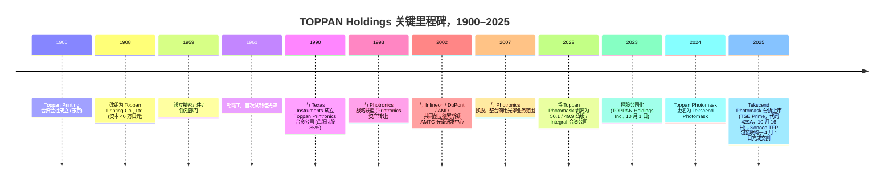
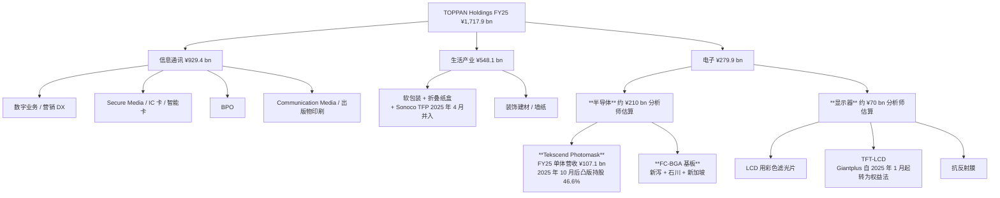

# 凸版控股株式会社 (TOPPAN Holdings Inc., TSE: 7911) — 公司研究

*截至 2026-05-26 · 简体中文版报告（日本注册主体；一次披露为 EDINET / TDnet 上的日文文件；英文摘要文件可在 Toppan IR 网站获取）*

---

## 目录

1. 公司概览
2. 公司历史
3. 管理团队
4. 产品与服务 — 电子事业部 (Tekscend 光罩、FC-BGA、其他电子业务)
5. 客户与上市策略
6. 行业概览
7. 竞争格局
8. 市场机会 (TAM)
9. 风险评估
10. 参考资料
11. 验证日志

---

## 1. 公司概览

凸版控股株式会社 (TOPPAN Holdings Inc.) 是一家拥有 125 年历史、总部位于东京的综合性企业，1900 年 1 月以证券印刷起家，目前业务横跨三个可报告业务板块 — **信息通讯 (Information & Communication)、生活产业 (Living & Industry)、电子 (Electronics)** — 截至 2025 年 3 月 31 日的财年 (FY25) 合并营业收入为 **1,717.9 亿日元**，营业利润为 **840 亿日元 (营业利润率 4.9%)** ([Consolidated Financial Results for the Fiscal Year Ended March 31, 2025, p. 2](https://finance.stockweather.co.jp/contents/dispPDF.aspx?disclosure=20250514549465); [Toppan FundingUniverse company history](https://www.fundinguniverse.com/company-histories/toppan-printing-co-ltd-history/))。从聚焦 AI 半导体供应链的权益投资者视角看，合并口径会产生误导：**电子事业部 FY25 营收占比仅 16.3% (2,799 亿日元)，但贡献了分部营业利润的 39.6% (520 亿日元)，营业利润率高达 18.6%** — 是信息通讯 (4.9%) 或生活产业 (6.1%) 分部 OPM 的三倍以上 ([Consolidated Financial Results FY25, pp. 2–3](https://finance.stockweather.co.jp/contents/dispPDF.aspx?disclosure=20250514549465))。电子板块也是本报告后续展开的两大上游瓶颈业务的载体 — **半导体光罩 (photomask) 业务已分拆为 Tekscend Photomask (TSE:429A，凸版持股 46.6% 的权益法关联公司)**，以及 **服务于 AI 加速器与高端网络交换 ASIC 的 FC-BGA (倒装芯片球栅阵列封装基板) 业务**。

凸版的发展史可清晰地切为三段。1900 年至约 1980 年是 **纯印刷时代** — 钞票、证券凭证、书籍、商业票据，奠基于其前明治大藏省创始团队所掌握的凸版 (relief printing) 工艺 ([FundingUniverse — Toppan Printing Co., Ltd. history](https://www.fundinguniverse.com/company-histories/toppan-printing-co-ltd-history/))。1959 年至约 2020 年进入 **多元化印刷-精密制造综合体时代**，凸版将其在制版工序中积累的电镀 / 蚀刻 / 微细图形化技术外溢到更精细的相邻领域：1961 年起做硅晶体管光罩、软包装薄膜、显示器 (彩色滤光片与 TFT-LCD)、装饰建材、IC 卡 / 智能卡印刷以及证券化 BPO。第三段则始于 **2023 年 10 月 1 日**，凸版印刷株式会社 (Toppan Inc.) 转型为控股公司架构 (即 **控股公司化 / holding company restructuring**)，将上市母体更名为 TOPPAN Holdings Inc.，并将经营业务拆分为 TOPPAN Inc.、TOPPAN Edge Inc. (原 Toppan Forms 证券印刷子公司) 与 TOPPAN Digital Inc. ([TOPPAN Transitions to Holding Company Structure, 2023-10-02](https://www.holdings.toppan.com/en/news/2023/10/newsrelease231002_1.html); [Sustainability Report 2025 — Holding Company Structure, p. 178](https://www.holdings.toppan.com/assets/en/pdf/sustainability/2025/csr2025_en_company.pdf))。叠加 2022 年 4 月将光罩业务剥离为 Toppan Photomask Co., Ltd. (2024 年 10 月更名为 **Tekscend Photomask Corp.**) 并于 **2025 年 10 月 16 日在东京证券交易所 Prime 市场上市 (证券代码 429A)** ([Consolidated Financial Results for the Six Months Ended September 30, 2025, p. 21](https://finance-frontend-pc-dist.west.edge.storage-yahoo.jp/disclosure/20251113/20251113599575.pdf); [TOPPAN Photomask to Rebrand as Tekscend Photomask, 2024-10-01](https://www.holdings.toppan.com/en/news/2024/10/newsrelease241001_1.html))，凸版现已演变为 **管理型控股公司，其纯半导体属性日益集中于一家独立上市子公司之中** — 这是几乎所有权益投资者在分析此股票时必然遇到的结构性事实。

三个经营分部在 FY25 (截至 2025 年 3 月) 的拆分如下，数据为 Tekscend 于 2025 年 10 月 16 日去合并 (deconsolidation) 之前的口径：

- **信息通讯：营收 9,294 亿日元 / 营业利润 456 亿日元 / OPM 4.9%** — 证券类印刷文件、IC 卡 / 智能卡、营销 DX 服务、BPO、出版印刷 ([FY25 Results, pp. 2–3](https://finance.stockweather.co.jp/contents/dispPDF.aspx?disclosure=20250514549465))。2026 年 4 月 TOPPAN Inc.、TOPPAN Edge Inc.、TOPPAN Digital Inc. 三家经营公司将合并为一家存续 "TOPPAN Inc."，统一客户接口并消除集团内部成本重叠 ([H1 FY26 Results, p. 19](https://finance-frontend-pc-dist.west.edge.storage-yahoo.jp/disclosure/20251113/20251113599575.pdf))。
- **生活产业：营收 5,481 亿日元 / 营业利润 333 亿日元 / OPM 6.1%** — 软包装薄膜、单一材料 GL BARRIER 透明阻隔膜、折叠纸盒、装饰板、墙纸。FY25 收官之后，**2025 年 4 月 1 日完成的 Sonoco TFP (热成型与软包装) 收购** 增加了约 1,430 亿日元的分部资产和 1,820 亿日元的商誉，推动 H1 FY26 生活产业分部营收同比 +20% 至 3,305 亿日元 — 详见 §2 历史部分 ([H1 FY26 Results, pp. 14, 17](https://finance-frontend-pc-dist.west.edge.storage-yahoo.jp/disclosure/20251113/20251113599575.pdf))。
- **电子：营收 2,799 亿日元 / 营业利润 520 亿日元 / OPM 18.6%** — 半导体杠杆业务。FY25 业绩公告分部说明的产品清单 "for LCDs 的彩色滤光片、TFT-LCD、抗反射膜、**光罩、半导体封装产品**" ([FY25 Results, p. 22](https://finance.stockweather.co.jp/contents/dispPDF.aspx?disclosure=20250514549465))。FC-BGA 基板落在 "半导体封装" 这一项中。Tekscend Photomask FY25 单体收入 **1,071 亿日元、EBITDA 利润率 35.6%、营业利润率 23.9%** (约 256 亿日元 EBITDA / 256 亿日元营业利润) 暗示 **电子板块除 Tekscend 之外的 ~1,730 亿日元营收由 FC-BGA、FPD 光罩、彩色滤光片、抗反射、金属蚀刻业务组成** ([Tekscend Photomask FY25 data, accessed 2026-05](https://stockanalysis.com/quote/tyo/429A/))。

*数据来源：根据 [Consolidated Financial Results FY25, p. 2](https://finance.stockweather.co.jp/contents/dispPDF.aspx?disclosure=20250514549465) (FY24 与 FY25 实绩)、[H1 FY26 Results, p. 1](https://finance-frontend-pc-dist.west.edge.storage-yahoo.jp/disclosure/20251113/20251113599575.pdf) 提取的 H1 FY26 数据，以及凸版 FY21–FY23 之前的财报整理。FY26 OPM 柱明显回落是因为 Tekscend 在 2025 年 10 月 16 日去合并为权益法关联公司，其 24% 营业利润率的业务从电子板块剔除。*

*数据来源：[FY25 Results, p. 2](https://finance.stockweather.co.jp/contents/dispPDF.aspx?disclosure=20250514549465) 为 FY24 与 FY25 分部营收；[H1 FY26 Results, p. 14](https://finance-frontend-pc-dist.west.edge.storage-yahoo.jp/disclosure/20251113/20251113599575.pdf) 为 H1 FY26 分部营收的年化数。电子板块 FY26 营收下降反映 Tekscend Photomask 自 2025 年 10 月 16 日起从 50.1% 持股的合并子公司转为 46.6% 持股的权益法关联公司。*

*数据来源：[FY25 Results, p. 2](https://finance.stockweather.co.jp/contents/dispPDF.aspx?disclosure=20250514549465) 与 [H1 FY26 Results, p. 14](https://finance-frontend-pc-dist.west.edge.storage-yahoo.jp/disclosure/20251113/20251113599575.pdf)，年化 H1 数据并按公司层面分摊费用调整。电子板块 OP 在 FY26 大幅下降反映 Tekscend 去合并 (Tekscend 营业利润转至营业利润下方的权益法损益项)。*

在地理分布上，凸版未公开按国别拆分的营收口径，但披露 **海外销售占合并营收 36.6%**，**海外子公司数量超过 150 家** ([Sustainability Report 2025 — Approach to Sustainability, p. 9](https://www.holdings.toppan.com/assets/en/pdf/sustainability/2025/csr2025_en_management-1.pdf))。电子业务结构上更偏出口：光罩业务通过位于朝霞、滋贺 (日本)、德累斯顿 (德国)、Round Rock (美国)、Corbeil (法国)、上海、利川 (韩国)、桃园 (台湾) 的工厂服务 TSMC / 三星 / SK 海力士 / 中芯国际 / 格芯 ([Toppan Carves Out Semiconductor Photomask Business, 2022-04-01](https://www.prnewswire.com/news-releases/toppan-carves-out-semiconductor-photomask-business-to-launch-new-company-301515656.html))；FC-BGA 业务集中在 **新泻工厂**，**石川工厂 (原 JOLED 能美旧址) 自 2025 年起开始试产，目标 2028 财年量产**，**新加坡新厂计划于 2026 年下半年投产** ([H1 FY26 Results, p. 3](https://finance-frontend-pc-dist.west.edge.storage-yahoo.jp/disclosure/20251113/20251113599575.pdf); [TOPPAN to Build Line for Mass Production of Next-Generation Semiconductor Packages in Ishikawa, Japan, 2023-12](https://www.holdings.toppan.com/en/news/2023/12/newsrelease231205_1.html); [Toppan boosts FC-BGA substrate production for AI chips, evertiq 2025-12-17](https://evertiq.com/design/2025-12-17-toppan-boosts-fc-bga-substrate-production-for-ai-chips))。截至 H1 FY26 集团员工总数约为 **51,988 人** ([Toppan Holdings TYO:7911 statistics, stockanalysis.com, accessed 2026-05](https://stockanalysis.com/quote/tyo/7911/statistics/))。

**估值快照 (截至 2026 年 5 月底)。** 凸版股价约 **4,730 日元 / 股**，市值约 **1.35 万亿日元** (约 87 亿美元，按 1 USD = 155 JPY 折算)，企业价值 **1.50 万亿日元** (净债务约 810 亿日元，详见 §2 中的大额公司债发行) ([Toppan Holdings TYO:7911 statistics, accessed 2026-05](https://stockanalysis.com/quote/tyo/7911/statistics/))。关键倍数：**TTM P/E 21.1× / 远期 P/E 18.8×**、**P/S 0.75×**、**P/B 0.96×**、**EV/EBITDA 9.2×**，股息率 **1.3%**，年度 DPS 58 日元 ([Toppan Holdings TYO:7911 statistics, accessed 2026-05](https://stockanalysis.com/quote/tyo/7911/statistics/); [FY25 Results, p. 2](https://finance.stockweather.co.jp/contents/dispPDF.aspx?disclosure=20250514549465))。**ROE 5.0% / ROIC 3.0%**，均被沉重的交叉持股账面、Sonoco TFP 商誉以及处于周期中段回报水平的包装 / 印刷主业拖累 ([Toppan Holdings TYO:7911 statistics, accessed 2026-05](https://stockanalysis.com/quote/tyo/7911/statistics/))。过去 52 周股价回报 **+22.3%**，反映 Tekscend IPO 释放光罩业务子市值与 FC-BGA 资本开支周期加速 ([Toppan Holdings TYO:7911 statistics, accessed 2026-05](https://stockanalysis.com/quote/tyo/7911/statistics/))。

*数据来源：TTM 倍数取自 [Toppan TYO:7911 statistics](https://stockanalysis.com/quote/tyo/7911/statistics/)、[Ibiden TYO:4062 statistics](https://stockanalysis.com/quote/tyo/4062/statistics/)、[Unimicron TWSE:3037 statistics](https://stockanalysis.com/quote/two/3037/statistics/)、[Tekscend TYO:429A overview](https://stockanalysis.com/quote/tyo/429A/)、[Photronics NASDAQ:PLAB statistics](https://stockanalysis.com/quote/plab/statistics/)、[DNP TYO:7912 statistics](https://stockanalysis.com/quote/tyo/7912/statistics/)。新光电气 (TYO:6967) 因 JIP / 三井 / DIC 主导的管理层收购而处于退市待办状态，未列出当期倍数。*

*数据来源：[FY25 Results, p. 1 — 分红表](https://finance.stockweather.co.jp/contents/dispPDF.aspx?disclosure=20250514549465) 提供历史 DPS 与分红率；FY26 58 日元 DPS 为管理层指引。回购方面：依据 [FY25 Results, p. 7](https://finance.stockweather.co.jp/contents/dispPDF.aspx?disclosure=20250514549465)，公司于 2025 年 5 月 15 日至 2026 年 5 月 14 日期间执行 300 亿日元的库存股回购。计入 FY25 回购后，FY25 合并总派付率为 133.6%，远超公司自设的最低 30% 分红率底线。*

*分析师观点：* 表面上 ~21× TTM P/E 与 0.75× P/S 是一家低增速印刷综合体应有的估值，但若不做两项调整，权益隐含估值会被严重低估。**第一**，在 IPO 后 46.6% 的 Tekscend 持股下，凸版的 Tekscend 权益价值约为 **2,170 亿日元** (46.6% × Tekscend 2026 年 5 月约 4,650 亿日元市值) ([Tekscend 429A overview, accessed 2026-05](https://stockanalysis.com/quote/tyo/429A/); [H1 FY26 Results, p. 22](https://finance-frontend-pc-dist.west.edge.storage-yahoo.jp/disclosure/20251113/20251113599575.pdf))，且 2025 年 10 月凸版与出售股东共计收到约 1,566 亿日元 IPO 募集款 ([Tekscend Shares Rise 13% From IPO Price in Tokyo Trading Debut, Bloomberg 2025-10-15](https://www.bloomberg.com/news/articles/2025-10-15/tekscend-to-debut-after-japan-s-second-biggest-ipo-this-year))。**第二**，FC-BGA 业务今天仍未达规模，但管理层 FY2030 中期计划目标 **半导体相关营收 3,500 亿日元、非 GAAP 营业利润率 30%** — 意味着 FY2030 全年半导体业务营业利润运行率约 1,050 亿日元，相比 FY25 电子分部的 520 亿日元接近翻倍 — 且 2025 年凸版自称在 **高端交换 FC-BGA 基板领域位居全球第三** ([Toppan FY2024 Full Year Results Briefing summary via quartr.com](https://quartr.com/companies/toppan-holdings-inc_18645))。若按分部估值 (SOTP)，市场对印刷 / 包装 / 装饰业务给予 <1× 销售额与个位数 P/E 的定价，而电子板块则是估值期权。管理层承诺执行至 2026 年 5 月 14 日截止的 300 亿日元回购，并对 FY26 给出 **58 日元 DPS 指引 (FY25 为 48 日元)** ([FY25 Results, pp. 1, 7](https://finance.stockweather.co.jp/contents/dispPDF.aspx?disclosure=20250514549465))，整体现金回报水平比表面 ROE 更为可观。

---

## 2. 公司历史

**凸版印刷合资会社 (Toppan Printing Limited Partnership) 于 1900 年 1 月 17 日在东京正式成立**，创始团队是一批离开日本大藏省的技师，他们此前在该部门负责操作凸版印刷机生产钞票、证券凭证以及政府邮票。公司于 **1908 年改组为 Toppan Printing Co., Ltd.，资本翻番至 40 万日元**，从一开始就聚焦在三类产品上 — 其物理原理 (高精度多色凸版印刷、微细蚀刻、高对位精度) 后来证明是凸版日后进入半导体光罩、FPD 彩色滤光片、IC 卡层压、装饰板印刷、FC-BGA 基板电镀的基础工具集 ([FundingUniverse — Toppan Printing Co., Ltd. history](https://www.fundinguniverse.com/company-histories/toppan-printing-co-ltd-history/); [Company-Histories — Toppan Printing Co., Ltd.](https://www.company-histories.com/Toppan-Printing-Co-Ltd-Company-History.html))。公司名 "Toppan / 凸版" 本身即日语凸版印刷 (*toppan inkatsu*) 的缩写，公司宣称从 1900 年合资到此后每一次重组，125 年内法人主体连续不断。

凸版的现代发展史由两条主线主导。**主线一：60 年磨剑的光罩业务沉淀。** 凸版于 1961 年在朝霞工厂首次试制硅晶体管光罩，所用的金属-玻璃微图形化工艺与公司原本服务糖厂的滤网业务一脉相承 ([Asianometry — The History of the Semiconductor Photomask](https://www.asianometry.com/p/the-history-of-the-semiconductor))。这一业务在 **1990 年通过与 Texas Instruments 共同设立 Toppan Printronics U.S.A.** 实现机构化，凸版持股 85% ([FundingUniverse — Toppan Printing Co., Ltd. history](https://www.fundinguniverse.com/company-histories/toppan-printing-co-ltd-history/))。**1993 年，凸版将 Printronics 资产转入与美国上市商用光罩龙头 Photronics Inc. 的战略联盟** — Photronics 经营美国资产，凸版保留日本 / 亚洲业务；双方相互授权技术并在 2007 年前共同运营多家合资公司。**2002 年与 Infineon、DuPont Photomasks 及 AMD (后由 GlobalFoundries 承接) 合资共建德累斯顿先进光罩技术中心 (Advanced Mask Technology Center, AMTC)**，使凸版进入欧洲尖端节点生态；该工厂至今仍是 Tekscend 战略的核心节点，也是全球仅有的少数几家 — 与凸版朝霞研发中心和 TSMC / Samsung / Intel 几家自营光罩工厂并列 — 能批量生产 EUV 光罩 (EUV mask) 的地点 ([iamfabian, Tekscend vs. Photronics, 2025](https://iamfabian.substack.com/p/the-landscape-of-semiconductor-photomasks))。**2022 年 4 月 1 日，凸版将半导体光罩业务以 50.1% / 49.9% 股权转让的方式剥离为 Toppan Photomask Co., Ltd.，合作方为日本私募 Integral Corporation**，新公司注册资本 4 亿日元，生产基地分布在 7 个地区 (朝霞、滋贺、Round Rock TX、德累斯顿、Corbeil、上海、利川、桃园) ([Toppan Carves Out Semiconductor Photomask Business, 2022-04-01](https://www.prnewswire.com/news-releases/toppan-carves-out-semiconductor-photomask-business-to-launch-new-company-301515656.html))。剥离让 Toppan Photomask 获得了独立的资本开支决策权 — 按半导体周期而非印刷综合体周期作业 — 为 **2024 年 10 月 1 日更名为 Tekscend Photomask Corp.** 和 **2025 年 10 月 16 日以 3,000 日元 / 股 (约 3,000 亿日元市值；含超额配售合计募集约 1,566 亿日元) 在 TSE Prime 市场上市 (分拆上市 / carve-out IPO)** 铺平了道路 ([Tekscend Shares Rise 13% From IPO Price, Bloomberg 2025-10-15](https://www.bloomberg.com/news/articles/2025-10-15/tekscend-to-debut-after-japan-s-second-biggest-ipo-this-year); [TOPPAN Photomask to Rebrand as Tekscend Photomask, 2024-10-01](https://www.holdings.toppan.com/en/news/2024/10/newsrelease241001_1.html); [H1 FY26 Results, p. 21–22](https://finance-frontend-pc-dist.west.edge.storage-yahoo.jp/disclosure/20251113/20251113599575.pdf))。IPO 时卡塔尔投资局 (Qatar Investment Authority) 是公开披露的基石投资者之一，这单 IPO 也是 2025 年日本第二大 IPO，仅次于 JX Advanced Metals ([Caproasia — Toppan Holdings Spinoff Semiconductor Photomask Provider Tekscend Photomask Plans Tokyo IPO, 2025-10-10](https://www.caproasia.com/2025/10/10/japan-7-5-billion-toppan-holdings-spinoff-semiconductor-photomask-provider-tekscend-photomask-plans-tokyo-ipo-to-raise-800-million-at-2-billion-valuation-founded-in-2021-in-spinoff-from-toppan-pri/))。

**主线二：FC-BGA 基板业务平行扩张与 2023 年控股公司化。** 在 AI 算力浪潮把这一细分赛道推上战略高度之前，凸版已经做了二十年的次级 FC-BGA 厂商。公司 **2015 年 6 月在新泻工厂投产先进 FC-BGA 基板线**，随后 **2023 年 12 月宣布收购石川县已停产的 JOLED 能美旧址**，将量产目标定在 2028 财年 ([TOPPAN to Build Line for Mass Production of Next-Generation Semiconductor Packages in Ishikawa, 2023-12](https://www.holdings.toppan.com/en/news/2023/12/newsrelease231205_1.html); [Toppan boosts FC-BGA substrate production for AI chips, 2025-12-17](https://evertiq.com/design/2025-12-17-toppan-boosts-fc-bga-substrate-production-for-ai-chips))。**2023 年 10 月 1 日**，母公司自身完成控股公司化 — 上市主体改名为 **TOPPAN Holdings Inc.**，旧经营业务拆分为三家新子公司 (TOPPAN Inc.、TOPPAN Edge Inc.、TOPPAN Digital Inc.) — 公司给出的明确目的是 "通过强化治理最大化集团协同效益"，使各业务按自身决策周期独立运作 ([TOPPAN Transitions to Holding Company Structure, 2023-10-02](https://www.holdings.toppan.com/en/news/2023/10/newsrelease231002_1.html); [Sustainability Report 2025 — Holding Company Structure, p. 178](https://www.holdings.toppan.com/assets/en/pdf/sustainability/2025/csr2025_en_company.pdf))。后续路径出现了部分逆转：**董事会于 2025 年 3 月决议自 2026 年 4 月 1 日起将 TOPPAN Edge 与 TOPPAN Digital 重新合并入 TOPPAN Inc.**，以挽回拆分对信息通讯板块协同效应造成的损失 ([H1 FY26 Results, p. 19](https://finance-frontend-pc-dist.west.edge.storage-yahoo.jp/disclosure/20251113/20251113599575.pdf))。2025 年还完成两笔半导体之外的大额交易：**2025 年 4 月 1 日完成 Sonoco Products 热成型与软包装业务 (TFP) 的现金收购**，为生活产业板块增加约 1,430 亿日元的分部资产与 1,820 亿日元的暂估商誉 ([H1 FY26 Results, p. 14, 17](https://finance-frontend-pc-dist.west.edge.storage-yahoo.jp/disclosure/20251113/20251113599575.pdf))；以及 **部分出售台湾子公司 Giantplus Technology Co., Ltd. (TFT-LCD)，使其自 2025 年 1 月起转为权益法关联公司**，凸版借此把资金从低毛利率显示面板撤出，集中投入 FC-BGA ([FY25 Results, p. 4](https://finance.stockweather.co.jp/contents/dispPDF.aspx?disclosure=20250514549465))。董事会另于 **2025 年 11 月 13 日批准 800 亿日元普通公司债发行计划** 用于借款再融资，进一步释放产能扩张信号 ([H1 FY26 Results, pp. 19–20](https://finance-frontend-pc-dist.west.edge.storage-yahoo.jp/disclosure/20251113/20251113599575.pdf))。

---

## 3. 管理团队

山中兄弟 / 大藏省创始团队已离世 125 年，凸版自 1920 年代以来便由职业经理人 (salaryman) 主导、非创始家族控制 — 因此当下关心的是现任高管。根据 H1 FY26 财报披露，代表董事兼总裁兼 CEO 为 **Hideharu Maro (麿 秀晴)**，董事兼上席执行役员兼 CFO 为 **Takashi Kurobe (黑部 隆)** ([H1 FY26 Results, p. 1](https://finance-frontend-pc-dist.west.edge.storage-yahoo.jp/disclosure/20251113/20251113599575.pdf))。麿氏是控股公司化、Tekscend 分拆与 FC-BGA 资本开支周期这三项决定的主要设计者 — 而它们共同构成了任何对凸版的远期权益判断必经的三道关口。

**Hideharu Maro / 麿 秀晴 — 代表董事兼总裁兼 CEO (2019 年 6 月起任总裁；2023 年 6 月起任 CEO)。** 麿氏 **1979 年 4 月** 大学毕业后直接进入凸版，是一位在公司任职 47 年的内部晋升者，技术出身 — 符合日式综合体 CEO 的典型剧本。他的成长性轮岗主要集中在 **包装业务** 而非半导体侧：东京事业部群马工厂生产管理部部长、第三营业部部长、主力包装事业部关西营业部长、海外营业部长，期间曾派驻上海与新加坡领导凸版包装业务的国际化扩张 ([Simply Wall St — TOPPAN Holdings management profile, accessed 2026-05](https://simplywall.st/stocks/us/commercial-services/otc-topp.y/toppan-holdings/management); [Hideharu Maro — Bloomberg Markets profile](https://www.bloomberg.com/profile/person/16450133))。他 2009 年进入董事会，2018 年 6 月任代表董事，**2019 年 6 月 27 日 62 岁时升任总裁兼代表董事**，并在控股公司化生效后 (2023 年 6 月) 升任 CEO ([Toppan Printing's New President, 2019-06-28](https://www.holdings.toppan.com/en/news/2019/06/newsrelease190628e.html); [Simply Wall St — TOPPAN Holdings management, accessed 2026-05](https://simplywall.st/stocks/us/commercial-services/otc-topp.y/toppan-holdings/management))。现年 69 岁的麿氏已超过日本大型上市公司常规退休年龄 2 年，FY26 后的股东大会将批准其自 **2026 年 4 月 1 日起转任代表董事会长 (Chairman) 兼 CEO**，由 **大屋 智 (Satoshi Oya)** 自经营公司 TOPPAN Inc. 总裁岗位升任控股公司总裁 ([H1 FY26 Results, p. 23 — Surviving company TOPPAN Inc. — Representative Satoshi Oya](https://finance-frontend-pc-dist.west.edge.storage-yahoo.jp/disclosure/20251113/20251113599575.pdf); [Simply Wall St — TOPPAN Holdings management](https://simplywall.st/stocks/us/commercial-services/otc-topp.y/toppan-holdings/management))。

麿氏的 CEO 任期由三项依次落地的决定构成。**(1)** 推动 **2023 年 10 月的控股公司化**，让三大增长支柱 (信息通讯的 DX、生活产业的 SX 包装、电子的半导体) 拥有各自独立的决策时钟 — 让经营子公司能按自身节奏推动资本开支与人员招募 ([TOPPAN Transitions to Holding Company Structure, 2023-10-02](https://www.holdings.toppan.com/en/news/2023/10/newsrelease231002_1.html))。**(2)** 执行 **Tekscend Photomask 分拆与 2025 年 IPO** — 先在 2022 年向 Integral PE 出售 49.9% 股权以验证独立股东故事，再在 2025 年 10 月以约 3,000 亿日元市值在 TSE Prime 上市，把光罩业务的资产价值在凸版自身资产负债表上具体化 ([Toppan Carves Out Semiconductor Photomask Business, 2022-04-01](https://www.prnewswire.com/news-releases/toppan-carves-out-semiconductor-photomask-business-to-launch-new-company-301515656.html); [Bloomberg — Tekscend IPO debut, 2025-10-15](https://www.bloomberg.com/news/articles/2025-10-15/tekscend-to-debut-after-japan-s-second-biggest-ipo-this-year))。**(3)** 拍板 **超 1,000 亿日元的 FC-BGA 资本开支计划**，覆盖新泻 (新线 2026 年 1 月投产，产能为 H1-FY22 基准的两倍)、石川 (2028 财年起量产)、新加坡 (2026 年下半年投产) — 一项跨地点的多场所投入，旨在把凸版从 7% 以下份额的边缘 FC-BGA 玩家推进到 AI / 网络交换高端细分前三 ([H1 FY26 Results, p. 3](https://finance-frontend-pc-dist.west.edge.storage-yahoo.jp/disclosure/20251113/20251113599575.pdf); [evertiq, 2025-12-17](https://evertiq.com/design/2025-12-17-toppan-boosts-fc-bga-substrate-production-for-ai-chips))。

麿氏公开披露的年度总薪酬为 **1.97 亿日元** (基本工资 81%、奖金 19%)，持有凸版控股 **0.028%** 股权 (约 240 万美元) — 对于日本大型上市公司 CEO 来说属于中等偏下水平，但与一名经过 40 年内部晋升、并非创始人背景的职业经理人路径吻合 ([Simply Wall St — TOPPAN Holdings management, accessed 2026-05](https://simplywall.st/stocks/us/commercial-services/otc-topp.y/toppan-holdings/management))。董事会平均任期 6.4 年，平均年龄 65 岁 — 典型的日本综合体董事会画像；关注 Tekscend IPO 价值释放的激进股东势必会推动其结构优化。

---

## 4. 产品与服务 — 电子事业部深度拆解

### 4.1 凸版控股的产品分类 — 三个分部，但只有电子板块决定 AI 半导体投资命题

凸版 FY25 合并财务结果分部说明明列三个可报告业务及其主要产品，原文逐字 ([FY25 Results, p. 22](https://finance.stockweather.co.jp/contents/dispPDF.aspx?disclosure=20250514549465))。这一分类是本节所有论述的权威锚点 — 卖方分析师进一步拆解的子项 (FC-BGA 占电子营收比例、EUV 占 Tekscend 营收比例等) 均为估算值，文中均明确标注。

| 可报告分部 | FY25 净销售 (亿日元) | FY25 营业利润 (亿日元) | FY25 OPM | 主要产品与服务 (FY25 财报原文) |
|---|---:|---:|---:|---|
| 信息通讯 | 9,294 | 457 | 4.9% | "证券类印刷文件、存折、卡片、商业票据、目录及其他商业印刷品、杂志、书籍及其他出版物印刷品，以及业务流程外包 (BPO)" |
| 生活产业 | 5,481 | 333 | 6.1% | "软包装、折叠纸盒及其他包装产品、塑料成型品、油墨、透明阻隔膜、装饰纸 / 膜、墙纸及其他装饰建材" |
| **电子** | **2,799** | **520** | **18.6%** | **"LCD 用彩色滤光片、TFT-LCD、抗反射膜、光罩、半导体封装产品"** |
| 调整项 | (395) | (470) | — | 集团费用、未分摊的基础研究费用 |
| **合并** | **17,179** | **840** | **4.9%** | — |

*数据来源：[Consolidated Financial Results for the Fiscal Year Ended March 31, 2025, pp. 2, 22](https://finance.stockweather.co.jp/contents/dispPDF.aspx?disclosure=20250514549465) — 分部名称、产品清单、FY25 实绩均为原文照录。*

本第 4 章把绝大多数篇幅放在 **电子板块** — 唯一支撑这只股票的权益命题。信息通讯与生活产业是成熟、低 OPM 业务，其股价含义在于现金流路径而非产品细节；§4.6 给出简要交代。电子板块内部按问题分层：**§4.2 Tekscend Photomask** (已剥离并独立上市、凸版持股 46.6% 的光罩关联公司)；**§4.3 FC-BGA 基板** (仍归属凸版控股电子分部，不在 Tekscend 内)；**§4.4 其他电子业务** (彩色滤光片、TFT-LCD、抗反射膜、金属蚀刻，以及 R&D 阶段的玻璃芯基板与面板级封装 (panel-level packaging) 项目)。

### 4.2 Tekscend Photomask — 凸版分拆并独立上市的光罩子市值

**先明确三层主体的区别。** 如果读者在本节后仍混淆这一点，将无法理解后续分析。**Tekscend Photomask Corp. (TSE: 429A)** 是 2022 年 4 月从凸版剥离、2025 年 10 月上市的经营公司 — 它运营朝霞、滋贺、Round Rock、德累斯顿、Corbeil、上海、利川、桃园 的实际光罩工厂，雇用约 1,899 名光罩业务员工，单体营收 1,170–1,300 亿日元 ([Tekscend Photomask Corporate Overview](https://www.photomask.com/en/about/overview/); [Tekscend 429A overview, accessed 2026-05](https://stockanalysis.com/quote/tyo/429A/))。**凸版控股电子分部** 是母公司的合并报告条线 — 2025 年 10 月 15 日之前 100% 包含 Tekscend 营收与营业利润，自 2025 年 10 月 16 日起转为权益法核算 ([H1 FY26 Results, pp. 21–22](https://finance-frontend-pc-dist.west.edge.storage-yahoo.jp/disclosure/20251113/20251113599575.pdf))；FY26 起电子分部营收线仅含凸版的 *非光罩* 电子业务 (FC-BGA、显示器等)，Tekscend 的贡献通过营业利润下方的 "权益法关联公司投资损益" 体现。**TOPPAN Holdings Inc.** 则是顶层上市控股公司，持有 Tekscend 46.6%、TOPPAN Inc. (经营公司) 100%，并承担 800 亿日元普通公司债等母公司义务 ([H1 FY26 Results, pp. 22, 19–20](https://finance-frontend-pc-dist.west.edge.storage-yahoo.jp/disclosure/20251113/20251113599575.pdf))。将三者混为一谈 — 例如把 Tekscend 营收视为仍归属凸版合并口径，或用合并倍数估值 "凸版除去 Tekscend" — 会产生明显错误的估值。

> **Tekscend Photomask 自身的产品定位** (官网原文)："Tekscend Photomask is the global leader in the merchant photomask manufacturing industry. We provide our customers the photomasks they need to enable our digital world. From conventional binary or PSM photomasks to advanced EUV photomasks for cutting-edge semiconductor devices, we offer the most reliable photomasks to our customers along with our supply chain in seven countries on three continents." ([Tekscend Photomask Corporate Overview](https://www.photomask.com/en/about/overview/))

**通俗解释 / Plain-language gloss:** 半导体 **光罩 (photomask)** 是晶圆厂在硅片上投影芯片电路图案的母版；物理上是一块 **152 mm × 152 mm × 6.35 mm 厚的超低热膨胀石英 / 熔融石英玻璃块**，上方覆盖图形化的吸收剂膜层 — 对 **DUV (深紫外，deep-ultraviolet) 光罩**，吸收剂为铬 + 氧化铬 ("二元 / binary") 或半透射钼硅化合物 ("衰减相移 / attenuated phase-shift" 或带有刻蚀相位井的 "交替相移 / alternating phase-shift")。对 **EUV 光罩 (EUV mask，13.5 nm 极紫外)**，光学路径反转 — 光罩是 *反射* 式：由 ~40–50 对纳米级钼-硅多层膜组成布拉格反射镜，覆盖钌封盖层保护堆栈，再加图形化吸收层 (当前 TaBN，下一代将转向 Ru / 镍基低 n 材料)，定义 EUV 光被反射或吸收的区域 ([Tekscend Photomasks for Semiconductors product page](https://www.photomask.com/en/product/photomask/))。Tekscend 提供 **全部四个波长档**：i 线 / KrF (低端，用于成熟节点及模拟工艺)、ArF 干式 (193 nm，65–28 nm 节点)、ArF 浸没式 / 193i (14 nm 至约 5 nm，需多重图形化)、以及 **EUV (13.5 nm)，覆盖 7 nm 及以下节点，包括 SEMICON Japan 公开展示的 1.4 nm / 1 nm 研发阶段 EUV 光罩** ([Tekscend Photomasks for Semiconductors product page](https://www.photomask.com/en/product/photomask/); [TOPPAN and Tekscend Photomask Participate in SEMICON Japan 2025](https://www.holdings.toppan.com/en/news/2025/12/newsrelease251210_1.html))。除标准半导体光罩外，Tekscend 还制造 **模板光罩 (stencil mask)、纳米压印模具 (nanoimprint mold)、R&D 用玻璃光罩**，以及面板厂使用的 **FPD (平板显示) 光罩** (TFT 背板) ([Tekscend — Photomasks for Various Applications](https://www.photomask.com/en/product/various_photomask/))。

**Tekscend 在价值链中的位置。** 光罩是晶圆厂消耗的 **三种玻璃基底元件中最下游的一种**。**上游**：光罩坯料 (mask blank) 供应商 (Hoya 占 EUV blank 市场约 80%、信越化学、AGC) 将预涂覆但 **未图形化** 的玻璃块发货给光罩厂；坯料上的吸收剂膜已经沉积完毕。**中游**：光罩厂 (Tekscend、Photronics、DNP，或 TSMC / 三星 / Intel 几家自营光罩车间) 接收客户的 GDSII 版图文件，执行 OPC (optical proximity correction / 光学邻近效应修正)，再用 **电子束直写设备** (NuFlare EBM-X、海德堡、IMS multi-beam mask writer / MBMW 用于亚 10 nm) 把图形写入吸收剂层，最后用 KLA / Lasertec 检测设备做单颗粒级缺陷检查。**下游**：图形化后的光罩寄回客户晶圆厂，装入 ASML EUV 扫描仪内，可印 1,000–5,000 片晶圆后因损耗需更换。坯料 → 图形化 → 检测三段循环即 Tekscend 35.6% EBITDA 利润率的来源 ([Tekscend Photomask revenue and margin data, FY22–FY25, accessed 2026-05](https://stockanalysis.com/quote/tyo/429A/)) — 这是一个资本密集、客户多年认证、客户锁定的业务，换厂转移成本以晶圆厂数月再认证为度量。

*数据来源：营收引自 [Tekscend Photomask FY25 disclosure, accessed 2026-05](https://stockanalysis.com/quote/tyo/429A/)；单体 EBITDA / OP 利润率根据 TradingView 提供的 TSE:429A 基本面估算。FY25E (截至 2026 年 3 月) 对应 TTM 营收 1,296 亿日元、净利润 250 亿日元，参考 [Tekscend 429A overview](https://stockanalysis.com/quote/tyo/429A/)。*

*分析师观点 — Tekscend 的竞争位置：* **是的，在商用光罩细分赛道存在硬护城河。** 类型 = **规模 + 多地区认证 + AMTC R&D 联盟 + 跟进尖端节点能力**。根据 [iamfabian, "Tekscend vs. Photronics", 2025](https://iamfabian.substack.com/p/the-landscape-of-semiconductor-photomasks) 的分析，Tekscend 营收组合中超过 55% 来自 **先进节点 (≤28 nm)**，而 Photronics 偏中端节点；主要客户为 **TSMC、三星、Intel Foundry、GlobalFoundries** (逻辑 / 内存)，并与 IBM + imec 签有 2 nm / 1 nm 光罩五年联合开发协议。商用光罩市场 (即排除 TSMC / 三星 / Intel 自营光罩车间) 约占总光罩 TAM 的 37%；其中，*分析师观点：* Tekscend 全球商用市场份额约 38–40%，领先于 Photronics (~27%) 与 DNP (~22%) ([reports/sector/半导体材料.md, Fig. 35–44](file:///Users/x/projects/financial_agent/reports/sector/半导体材料.md))。

*数据来源：分析师估算整合自 [Nomura Greater China Semi 2026–30F report, 2026-05-21, Figs 35–44](file:///Users/x/projects/financial_agent/reports/sector/半导体材料.md)，并交叉参考 [iamfabian — Tekscend vs. Photronics analysis, 2025](https://iamfabian.substack.com/p/the-landscape-of-semiconductor-photomasks)。自营光罩 (TSMC / 三星 / Intel 内部车间) 不列入 — 它们占光罩总产量的较大份额，但不属于商业可触达市场。*

### 4.3 FC-BGA 基板 — 凸版电子板块的独立资本开支押注

**FC-BGA (倒装芯片球栅阵列封装基板 / Flip-Chip Ball Grid Array)** 是位于 AI 加速器 / 网络交换 ASIC 芯片与主板 / PCB 之间的矩形 **多层有机基板**。物理上，它在玻纤增强环氧树脂芯材 (或某些 "无芯" 薄变体) 之上层压叠加的 **味之素增层膜 (Ajinomoto Build-Up Film, ABF) 介电层** 与 **图形化铜走线**，再通过 **铜电镀通孔** 形成垂直互连。芯片通过 **焊球 (130 µm 或 110 µm 间距，对应凸版当前产品线) 倒装 (flip-chip)** 落到基板上，基板再通过增层把 I/O 扇出到底面的 **BGA 焊球**，最终送入客户的表面贴装产线 ([Toppan FC-BGA substrates product page](https://www.toppan.com/en/electronics/package/fc-bga/))。对一颗 AI 加速器 (如 Broadcom AI ASIC 或 NVIDIA GPU) 而言，FC-BGA 基板是仅次于芯片本身的第二大成本元件，也是限制封装尺寸的瓶颈 — 边长 >80 mm 的大尺寸基板正是阻碍 2026–2028 年 1,000+ TOPS 级加速器投放的卡点。

> **凸版自家产品描述** (官网原文)："FC-BGA is a high density semiconductor package substrate that allows high speed LSI chips with more functions. Lineup: standard FC-BGA, FC-LGA, multi-chip FC-BGA, ultra-multilayer FC-BGA, coreless FC-BGA, 2.3/2.5D FC-BGA. Ultra-fine wiring: Line/Space as narrow as 10/10 µm (semi-additive process), 30/30 µm (subtractive). High-density build-up: 5-stack and 10-stack VIA configurations with land/via dimensions of 85/60 µm and 100/60 µm. Fine-pitch FC bumps at 130 µm and 110 µm pitches. Low copper roughness: Ra 400–250 nm to Ra 200–100 nm. Materials: build-up resins from Ajinomoto Fine-Techno and Sekisui Chemical for high-speed transmission. Applications: automotive SoCs, server/AI processors, networking ASICs, GPUs, and gaming consoles." ([Toppan FC-BGA substrates product page](https://www.toppan.com/en/electronics/package/fc-bga/))

**通俗解释 / Plain-language gloss：** 凸版在 FC-BGA-for-AI 上的技术贡献并不在 FC-BGA 基本工艺 (Ibiden / 新光电气 / Unimicron 已规模化生产 20 年以上)，而在 **大尺寸高端细分**：单边 >80 mm 基板、**10 层 VIA 堆叠**、**低介电常数 / 低耗散因子 (low-Df) ABF 材料**，以维持 224 Gbps PAM4 线速下的信号完整性 ([Japan Times — Advancing semiconductor progress with substrates, 2024-12-11](https://www.japantimes.co.jp/2024/12/11/special-supplements/advancing-semiconductor-progress-substrates/))，以及 **平滑铜面 (Ra 200–100 nm)** 以降低高频趋肤效应损耗 — 而这正是 AI 工作负载所要求的频段。2023–24 年 Ibiden 与新光电气大尺寸产线遇到瓶颈时，NVIDIA、AMD、Broadcom 等 AI ASIC 客户在这一细分上极度紧张；凸版在 2022 年还只是边缘供应商，但 **2023 年 12 月石川项目宣布与 2025 年 12 月新泻扩产** 旨在让凸版到 FY2028 跃居 AI 级 FC-BGA 前三 ([TOPPAN to Build Line for Mass Production of Next-Generation Semiconductor Packages in Ishikawa, 2023-12-05](https://www.holdings.toppan.com/en/news/2023/12/newsrelease231205_1.html); [TOPPAN to Launch New FC-BGA Substrate Line at Niigata Plant, 2025-12-17 via thepackman.in](https://thepackman.in/toppan-to-launch-new-fc-bga-substrate-production-line-at-niigata-plant/); [evertiq — Toppan boosts FC-BGA substrate production for AI chips, 2025-12-17](https://evertiq.com/design/2025-12-17-toppan-boosts-fc-bga-substrate-production-for-ai-chips))。

**产能扩张时间表。** **新泻工厂** (新泻县柴田) 是主力基地。2025 年 12 月 17 日宣布的新线于 2026 年 1 月投产，**新泻 FC-BGA 产能较 H1-FY22 基线约翻番**；新线整合上述 low-Df 材料与铜面强化处理工艺，并支持超出标准 JEDEC 托盘尺寸的基板厚度与尺寸 ([evertiq, 2025-12-17](https://evertiq.com/design/2025-12-17-toppan-boosts-fc-bga-substrate-production-for-ai-chips))。**石川工厂** 位于原 JOLED 能美旧址 (2023 年 11 月以土地 + 建筑收购)，2024 年 7 月作为技术开发中心开业，2025 年 12 月 16 日宣布将设立 **有机 RDL 转接板 (organic RDL interposer) 与玻璃芯基板 (glass-core substrate)** 试线，量产目标定在 FY2028 ([H1 FY26 Results, p. 3](https://finance-frontend-pc-dist.west.edge.storage-yahoo.jp/disclosure/20251113/20251113599575.pdf); [TOPPAN to Build Line for Mass Production of Next-Generation Semiconductor Packages in Ishikawa, 2023-12-05](https://www.holdings.toppan.com/en/news/2023/12/newsrelease231205_1.html))。**新加坡** 第二个国际基地计划于 2026 年下半年投产，为凸版在日本地震多发的国内布局之外提供地理冗余 ([evertiq, 2025-12-17](https://evertiq.com/design/2025-12-17-toppan-boosts-fc-bga-substrate-production-for-ai-chips))。三地累计资本开支预计超过 **1,000 亿日元**，但产能扩张 "与需求同步" — 凸版释放的是纪律性信号而非 2023 年误伤 Ibiden 的那种 build-ahead 投机扩产 ([thepackman, 2025-12](https://thepackman.in/toppan-to-launch-new-fc-bga-substrate-production-line-at-niigata-plant/))。为加速技术验证，凸版于 FY24 加入 **US-JOINT (美日联合开放创新可信半导体网络)** 联盟，获得美国基础设施用于次世代封装评估与开发 ([FY25 Results, p. 4](https://finance.stockweather.co.jp/contents/dispPDF.aspx?disclosure=20250514549465); [H1 FY26 Results, p. 3](https://finance-frontend-pc-dist.west.edge.storage-yahoo.jp/disclosure/20251113/20251113599575.pdf))。

*数据来源：分析师估算整合自 [Market Growth Reports — ABF Substrate (FC-BGA) Market Size, 2024](https://www.marketgrowthreports.com/market-reports/abf-substrate-fc-bga-market-107527) 与 [wonderfulpcb.com — Top ABF substrate manufacturers, 2025](https://www.wonderfulpcb.com/blog/top-abf-substrate-manufacturers-and-market-leaders/)。凸版按 FC-BGA 总营收口径排名第六，但管理层公开声明在 "高端交换 FC-BGA 基板" 子领域位列第三 — 意即在中低端主流 FC-BGA 上明显欠配，集中在利润最高的 AI / 网络交换顶层 ([Toppan FY2024 Full Year Results Briefing summary via quartr.com](https://quartr.com/companies/toppan-holdings-inc_18645))。*

*分析师观点 — FC-BGA 竞争位置：* **当前为部分护城河；若石川按计划量产，FY2028 将形成硬护城河。** 类型 = **规模 + AI 客户认证 + 玻璃芯 / 次世代封装的期权价值**。凸版自身披露与第三方数据共同点出的核心竞品为 **Unimicron (TWSE:3037，约 22% 份额)、Ibiden (TYO:4062，约 18%)、Nan Ya PCB (约 12%)、新光电气 (Shinko Electric，约 11%，正处于 JIP / 三井 / DIC 主导的管理层收购阶段)、景硕科技 Kinsus (约 9%)**，长尾还有 AT&S、京瓷、三星电机 (SEMCO) ([wonderfulpcb.com — Top ABF substrate manufacturers, 2025](https://www.wonderfulpcb.com/blog/top-abf-substrate-manufacturers-and-market-leaders/); [marketgrowthreports.com — ABF Substrate / FC-BGA market, 2024](https://www.marketgrowthreports.com/market-reports/abf-substrate-fc-bga-market-107527))。按数量份额计凸版仅 ~7%，明显未达规模，但在 NVIDIA / AMD / Broadcom AI ASIC 插槽上参与的同质化客户阵地上 — 即 Ibiden 取得溢价定价的同一片高地 — 凸版相对超配。

### 4.4 其他电子业务 — 彩色滤光片、TFT-LCD、抗反射膜、金属蚀刻

电子板块中非半导体部分是遗留的显示 / 薄膜 / 金属蚀刻系列。**LCD / OLED 彩色滤光片** 由在面板厂 TFT 背板上做红绿蓝染料图形化得到的玻璃印制而成；凸版是全球三大彩色滤光片供应商之一，与 DNP、Dai Nippon Ink (DIC) 并列，但 OLED / micro-LED 对 LCD 的替代使该细分长期承压。**TFT-LCD 面板** 历史上由凸版台湾子公司 **Giantplus Technology Co., Ltd.** 生产；2025 年 1 月 31 日凸版出售部分 Giantplus 股权后，该公司转为权益法关联公司 — 释放出凸版退出面板制造、保留少数财务投资的战略意图 ([FY25 Results, p. 4](https://finance.stockweather.co.jp/contents/dispPDF.aspx?disclosure=20250514549465))。**抗反射膜** 用于智能手机与电视盖板玻璃，仍是稳定业务，特别对苹果 / 三星等高附加值消费应用；**金属蚀刻** (精密蚀刻包层材料、金属蚀刻光罩、OLED 显示用高精度遮蔽板) 是更小众的专业业务。**ORTUSTECH** 工业 / 医疗 / 车载用 TFT-LCD 模块业务 (含 Blanview 品牌) 作为利基高端业务保留在 TOPPAN Inc. 内 ([TOPPAN Electronics Business Unit page](https://www.toppan.com/en/electronics/))。显示子板块结构上低增长低毛利；电子板块的权益命题在于光罩 (Tekscend 权益法损益) + FC-BGA + 玻璃芯 / RDL 转接板期权，与显示业务无关。

### 4.5 综合 — AI 周期中电子板块各产品线之间的互动

读者从第 4 章带走的 **一句话** 应当是：凸版现已在 **AI 芯片供应链的三个连续节点** 占位，每一节点规模与竞争位置各异。**第一步，图形转移 (Tekscend)：** AI 加速器所需的光刻光罩 (尖端金属层用 EUV，后段金属层用 ArF 浸没式) 在 Tekscend 朝霞或德累斯顿工厂上写好，运往 TSMC / 三星 / Intel 完成晶圆图形化 — Tekscend 在此挣经济租，因为光罩认证为月级别工程，替代不易。**第二步，封装 (凸版 FC-BGA)：** 晶圆切下来的硅芯片在新泻或石川被倒装到凸版 FC-BGA 基板上，通过增层介电与图形化铜把 I/O 扇出至主板尺寸 — 凸版规模上未达标，但伴随新泻 / 石川 / 新加坡资本开支落地正提升份额。**第三步，集成 (次世代封装期权)：** 石川试线定位于 **玻璃芯基板、有机 RDL 转接板、面板级封装 (panel-level packaging)** — 这些是传统 FC-BGA 的架构继任者，AI 路线图 (NVIDIA Rubin、Broadcom 1.6T+ 交换 ASIC、AMD MI400 系列) 在 FY2027–FY2028 起预计将依赖这些工艺 ([H1 FY26 Results, p. 3](https://finance-frontend-pc-dist.west.edge.storage-yahoo.jp/disclosure/20251113/20251113599575.pdf); [reports/sector/半导体材料.md, Fig. 4, p. 5 — 七大技术线索](file:///Users/x/projects/financial_agent/reports/sector/半导体材料.md))。三步共享制造基础设施 (无尘室管理、光刻胶 / 介电涂布、电镀、缺陷检测) — 即光罩业务用 60 年时间沉淀下来的精密制造文化 — 凸版正越来越多地在两条产品线之间交叉调用工程团队。

### 4.6 非电子板块 — 信息通讯 + 生活产业 — 简要交代

**信息通讯** 板块是传统印刷与服务业务，含证券类文件、IC 卡 / 智能卡、营销 DX、BPO、出版印刷 ([FY25 Results, p. 22](https://finance.stockweather.co.jp/contents/dispPDF.aspx?disclosure=20250514549465))。板块内的增长故事是 FY24 自 HID 收购的 **政府 ID / Citizen Identity Solutions 业务**，其在北欧公共部门 ID 领域带来 "坚实的客户基础与方案规划能力" ([FY25 Results, p. 3](https://finance.stockweather.co.jp/contents/dispPDF.aspx?disclosure=20250514549465))；结构性拖累来自出版 / 商业印刷的长期下滑。2026 年 4 月 TOPPAN Inc. / TOPPAN Edge / TOPPAN Digital 合并为单一 TOPPAN Inc. 即对此问题的应对 — 整合以消除集团内成本与加速数字化服务的交叉销售 ([H1 FY26 Results, p. 19](https://finance-frontend-pc-dist.west.edge.storage-yahoo.jp/disclosure/20251113/20251113599575.pdf))。

**生活产业** 板块是包装与装饰建材业务 — 软包装薄膜、**单一材料 GL BARRIER 透明阻隔膜** (凸版定位为欧洲 2025 年 2 月生效 PPWR 法规下传统多层阻隔层压的可回收替代品)、折叠纸盒、塑料成型品、地板与墙纸装饰板，以及新的空间设计品牌 **"expace"** ([FY25 Results, p. 3](https://finance.stockweather.co.jp/contents/dispPDF.aspx?disclosure=20250514549465); [H1 FY26 Results, p. 3](https://finance-frontend-pc-dist.west.edge.storage-yahoo.jp/disclosure/20251113/20251113599575.pdf))。变革性交易是 **2025 年 4 月 1 日完成的 Sonoco Products 热成型与软包装 (TFP) 业务收购**，合并主体新增 **>6,000 亿日元的可持续包装营收和 >800 亿日元 EBITDA**、1,430 亿日元的分部资产、1,820 亿日元的暂估商誉，以及约 26 家子公司纳入合并范围 ([H1 FY26 Results, pp. 14, 17–18](https://finance-frontend-pc-dist.west.edge.storage-yahoo.jp/disclosure/20251113/20251113599575.pdf))。H1 FY26 期间凸版另收购了意大利高环保性能薄膜厂 **Irplast S.p.A.** ([H1 FY26 Results, p. 3](https://finance-frontend-pc-dist.west.edge.storage-yahoo.jp/disclosure/20251113/20251113599575.pdf))。战略逻辑 — 全球蓝筹 CPG 客户希望有一站式可持续包装合作伙伴，在每个洲都具备薄膜挤出、阻隔加工、包装制造能力 — 是合理的；但执行风险在于若收购后毛利率与凸版原包装业务的趋同进度落后于交易模型，则可能出现商誉减值。

---
