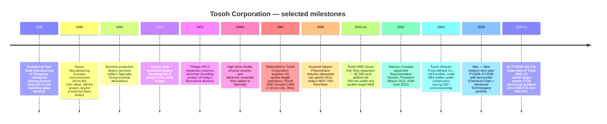
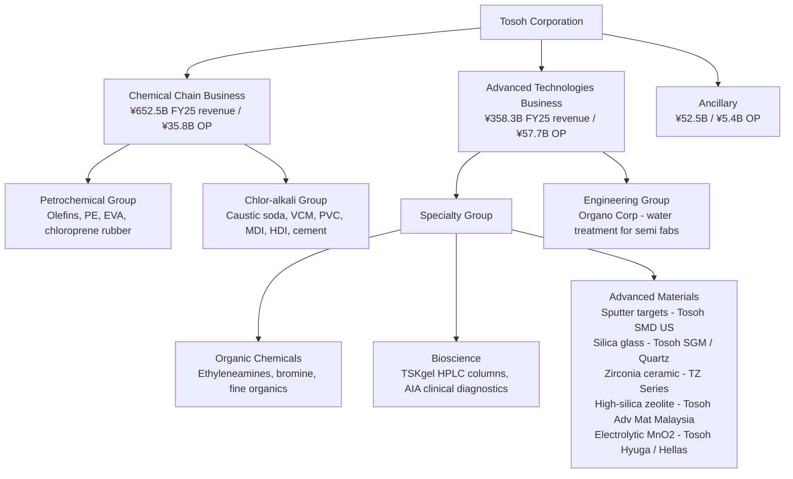
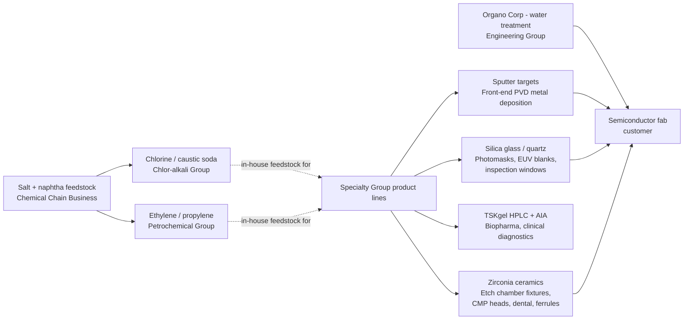

# Tosoh Corporation (TSE:4042) — Research Document

*Initial coverage. As of 2026-05-26. Author: Claude research agent.*

> **Update — FY2026 guidance cut (2025-11-04):** Tosoh cut its FY2026 (year ending March 2026) net-income-attributable-to-owners guidance to **¥38.0 bn from ¥62.0 bn** (–¥24.0 bn / –39%), revenue to **¥1,020.0 bn from ¥1,050.0 bn**, and operating income to **¥103.0 bn from ¥108.0 bn**. The earnings cut is driven by a **¥19.3 bn impairment of fixed assets at Tosoh SMD, Inc.** — the company's wholly-owned US sputter-target manufacturing subsidiary in Grove City, Ohio — recognized in Q2 FY2026 on the back of weaker-than-expected US semiconductor shipments and persistent ASP erosion in the metal-target product mix. Operating-segment-level Specialty Group profit is essentially unchanged (¥39.3 bn vs ¥38.6 bn prior) because the impairment hits below the operating line as an extraordinary loss. Annual dividend held at ¥100 / share and a ¥25 bn buyback authorized for FY2026 — capital-return policy unchanged despite the earnings hit.
> Source: [Tosoh "Cumulative Financial Results for First Half of FY2026," 2025-11-04, pp.6, 17, 20](https://www.tosoh.com/File%20Library/Tosoh/Investors/Earnings%20Releases/FY2025/Financial-Results-for-First-Half-FY2026.pdf); [Reuters / BigGo "Tosoh FY2025 full-year earnings call — net profit –28% on Tosoh SMD impairment," 2026-05-13](https://finance.biggo.com/news/JP_4042.T_2026-05-13).

## Table of Contents
1. Company Overview
2. Company History
3. Management Team
4. Products & Services
5. Customers & Go-to-Market
6. Industry Overview
7. Competitive Landscape
8. Market Opportunity (TAM)
9. Risk Assessment
10. References & Verification Log

---

## 1. Company Overview

Tosoh Corporation (TSE:4042) is a ¥1.06-trillion-revenue (FY2025; ~US$7.0 bn) **diversified Japanese chemicals group** headquartered in Tokyo and operating an integrated chlor-alkali / petrochemical / specialty-materials complex anchored at the Nanyo Complex (Yamaguchi Prefecture) and the Yokkaichi Complex (Mie Prefecture). The group reports four operating segments — Petrochemical, Chlor-alkali, Specialty, Engineering — plus an "Other" / Ancillary bucket; Specialty is the high-margin profit engine and contains the semiconductor-relevant **electronic materials** (silica glass, sputtering targets) plus **bioscience** (HPLC separation columns, clinical diagnostics) and **advanced materials** (zirconia, high-silica zeolite) sub-divisions ([Tosoh "Consolidated Financial Results for the Year Ended March 31, 2025," p.14 (Segment Information)](https://www.tosoh.com/File%20Library/Tosoh/News%20Release/Tosoh-Reports-Its-Consolidated-Results-for-Fiscal-2025.pdf), [Tosoh "Report for the 126th Fiscal Year," p.18 (Major line of business)](https://www.tosoh.com/File%20Library/Tosoh/Investors/Shareholders%20Meetings/FY%2025/Business-Report-for-the-126th-Fiscal-Year.pdf)).

The business model is a **vertically integrated commodity-to-specialty chemicals chain**: salt electrolysis at Nanyo produces chlorine and caustic soda, which feed downstream into vinyl chloride (PVC), polyurethane raw materials (MDI, HDI), and high-purity industrial gases; ethylene from Japan's sole naphtha cracker in the Chukyo region (Yokkaichi) feeds polyethylene, EVA, ethyleneamines, and high-silica zeolite catalysts. The Specialty segment then leverages this in-house feedstock infrastructure plus dedicated electronic-materials lines (silica glass, sputtering targets, zirconia powder) to produce high-value-added downstream products sold to semiconductor, biopharma, and automotive end-markets ([Tosoh "Report for the 126th Fiscal Year," p.10 (Medium-term plan business-portfolio definition)](https://www.tosoh.com/File%20Library/Tosoh/Investors/Shareholders%20Meetings/FY%2025/Business-Report-for-the-126th-Fiscal-Year.pdf)). In the May 2025 medium-term plan, management re-categorized the four reporting segments into two strategic buckets — **Chemical Chain Business** (Petrochemical + Chlor-alkali = ¥652.5 bn FY2025 revenue, ¥35.8 bn OP) and **Advanced Technologies Business** (Bioscience + Advanced Materials + Water Treatment Engineering = ¥358.3 bn revenue, ¥57.7 bn OP) — to signal that future capital allocation will skew toward the higher-margin Advanced Technologies category ([Tosoh "Report for the 126th Fiscal Year," p.13 (FY2028 numerical targets by business portfolio)](https://www.tosoh.com/File%20Library/Tosoh/Investors/Shareholders%20Meetings/FY%2025/Business-Report-for-the-126th-Fiscal-Year.pdf)).

**Scale.** FY2025 (April 2024 – March 2025) consolidated net sales were ¥1,063.4 bn (+5.7% YoY), operating income ¥98.9 bn (+23.9% YoY, OPM 9.3%), ordinary income ¥103.0 bn (+7.4%), and income attributable to owners of parent ¥58.0 bn (+1.2%) — the operating leap came from a recovery in petrochemicals after the prior-year Yokkaichi plant trouble and strong gains in the Engineering Group's water-treatment business serving semiconductor fabs ([Tosoh "Consolidated Financial Results for the Year Ended March 31, 2025," p.1](https://www.tosoh.com/File%20Library/Tosoh/News%20Release/Tosoh-Reports-Its-Consolidated-Results-for-Fiscal-2025.pdf)). The group employs **14,813 people** (FY2025 year-end) across Japan, Belgium, the US (Tosoh SMD, Tosoh Quartz, Tosoh America, Tosoh Bioscience), China (Tosoh Guangzhou, Tosoh Shanghai), the Philippines (Mabuhay Vinyl, Philippine Resins), Malaysia (Tosoh Advanced Materials Sdn Bhd — high-silica zeolite), Indonesia, Vietnam (Tosoh Vietnam Polyurethane, in construction), and Taiwan (Tosoh Quartz) — with the Specialty segment headcount of 5,019 the largest of the four ([Tosoh "Report for the 126th Fiscal Year," pp.17, 19 (Material subsidiaries; Employees by segment)](https://www.tosoh.com/File%20Library/Tosoh/Investors/Shareholders%20Meetings/FY%2025/Business-Report-for-the-126th-Fiscal-Year.pdf)).

**Geographic mix.** FY2025 revenue was 49% Japan (¥521.5 bn), 14% China (¥153.8 bn), 22% Other Asia (¥236.1 bn), 14% rest of world (¥152.1 bn) — Japan-domiciled production but Asia-skewed customer base; no single external customer accounted for ≥10% of consolidated revenue, per the segment-information note ([Tosoh "Consolidated Financial Results FY2025," p.16 (Information by Region; Information by Major Customer)](https://www.tosoh.com/File%20Library/Tosoh/News%20Release/Tosoh-Reports-Its-Consolidated-Results-for-Fiscal-2025.pdf)). FY2025 property, plant & equipment totaled ¥417.3 bn, of which ¥340.6 bn (82%) sits in Japan — capacity is overwhelmingly domestic, and capital-intensity is rising as the Nanyo and Yokkaichi complexes undergo simultaneous decarbonization (biomass-fired power plant under construction for spring-2026 commissioning) and growth capex (separation-purification media at Nanyo + Yokkaichi for spring 2026 and spring 2027; sputtering-target capacity at Tosoh SMD for winter 2025) ([Tosoh "Consolidated Financial Results FY2025," p.16; Topics page](https://www.tosoh.com/File%20Library/Tosoh/News%20Release/Tosoh-Reports-Its-Consolidated-Results-for-Fiscal-2025.pdf)).

### Valuation snapshot

As of mid-February 2026, Tosoh trades at **¥2,663.5** (52-week range ¥1,755 – ¥2,789), giving a **market cap of ~¥834.8 bn / ~US$5.5 bn** and an enterprise value of ~¥948 bn ([Yahoo Finance 4042.T as of 2026-02-13](https://finance.yahoo.com/quote/4042.T/), [Stockanalysis.com TYO:4042 statistics](https://stockanalysis.com/quote/tyo/4042/statistics/)). The stock is up ~25% on a 1-year total-return basis and ~77% over 3 years, having re-rated through 2024–25 on the "Japanese-chemical earnings recovery + weak yen" trade alongside Mitsubishi Chemical, Sumitomo Chemical, and Shin-Etsu ([Simply Wall St "A Look at Tosoh (TSE:4042) Valuation After Full-Year Earnings," 2026-05](https://simplywall.st/stocks/jp/materials/tse-4042/tosoh-shares/news/a-look-at-tosoh-tse4042-valuation-after-full-year-earnings-a)).

| Multiple | Tosoh (4042) | Sector / Peer context | Comment |
|---|---|---|---|
| TTM P/E | **19.3 – 19.9×** | JP Chemicals industry avg 13.8×; named peer avg 48.9× | Above sector median but well below peer top-quartile |
| Forward P/E (FY27E) | **~13.1×** | – | Re-rates lower as FY2026 impairment lapses |
| P/S (TTM) | **0.80×** | Shin-Etsu ~3.5×; Sumitomo Chem ~0.45× | Mid-cycle for a diversified Japanese chemical |
| EV/EBITDA | **6.5×** | Mitsubishi Chem ~7×, Shin-Etsu ~12× | Discount reflects petrochem weighting |
| P/B | **~0.96×** (¥834.8 bn cap ÷ ¥827.1 bn equity) | Shin-Etsu ~2.4× | Trading roughly at book; classic value-cyclical setup |
| Dividend yield | **3.84%** (¥100 / share) | TOPIX yield ~2.5%; sector ~2.8% | Above-market yield; FY2026 payout ratio 84% on cut EPS |
| ROE | **7.2%** (FY2025) | Sector 8–10%; mgmt FY2028 target >10% | Below cost-of-equity; multi-year recovery story |
| Beta | **0.50** | Market 1.00 | Low — petrochemicals + utility-like chlor-alkali base smooths beta |

*Analyst view:* The P/E of ~19× FY26E (on the cut ¥119.5 EPS) compresses to ~13× FY27E once the one-time SMD impairment lapses and Engineering / Specialty operating tailwinds carry into a full year — a classic Japanese deep-cyclical "trough multiple on trough earnings" setup. The TTM P/E sits ~40% above the JP Chemicals industry average of 13.8× (per [Simply Wall St](https://simplywall.st/stocks/jp/materials/tse-4042/tosoh-shares/news/a-look-at-tosoh-tse4042-valuation-after-full-year-earnings-a)) but well below the peer average of 48.9× — the gap is the market pricing Tosoh as a value-chemical, not as a semi-materials growth name. The single largest stretch in the multiple is whether the FY2028 mid-term-plan target of ¥140 bn operating income (vs. ¥98.9 bn FY2025 actual, ¥103.0 bn FY2026 forecast) is credible — a 42% lift in three years from a base that has just been impaired in the US sputter-target subsidiary. P/B of ~1.0× and EV/EBITDA of 6.5× together signal the market is paying for asset-replacement value, not Specialty-segment growth optionality — which would be the asymmetric upside if the FY2028 target is delivered.

The FY2025 absolute results disguise a structural mix shift that is the main investment story: the Specialty Group generated ¥38.6 bn operating income on ¥270.5 bn revenue (OPM **14.3%**), Engineering ¥33.6 bn on ¥169.3 bn (OPM 19.9%), Chlor-alkali ¥9.5 bn on ¥373.4 bn (OPM 2.5%), Petrochemical ¥14.3 bn on ¥204.8 bn (OPM 7.0%) — i.e. Specialty + Engineering = 73% of group operating income on 41% of group revenue ([Tosoh "Consolidated Financial Results FY2025," p.15 (Segment Information FY2025)](https://www.tosoh.com/File%20Library/Tosoh/News%20Release/Tosoh-Reports-Its-Consolidated-Results-for-Fiscal-2025.pdf)). The 2025–2027 medium-term plan explicitly targets shifting the operating-income mix further toward Specialty (Bioscience + Advanced Materials) and Engineering by FY2028, with the Advanced Materials sub-segment alone projected to grow operating income from ¥5.3 bn (FY2025) to ¥20.5 bn (FY2028) — a near-4× lift driven by sputter-target capacity expansion at Tosoh SMD, separation/purification media capacity at Nanyo, and HDI derivatives capacity at Nanyo ([Tosoh "Report for the 126th Fiscal Year," p.13](https://www.tosoh.com/File%20Library/Tosoh/Investors/Shareholders%20Meetings/FY%2025/Business-Report-for-the-126th-Fiscal-Year.pdf)).

Source: [Tosoh "Report for the 126th Fiscal Year," p.16 (Changes in assets and profits and losses, FY2021–FY2025)](https://www.tosoh.com/File%20Library/Tosoh/Investors/Shareholders%20Meetings/FY%2025/Business-Report-for-the-126th-Fiscal-Year.pdf); FY2026E from [Tosoh H1 FY2026 results, 2025-11-04, p.17](https://www.tosoh.com/File%20Library/Tosoh/Investors/Earnings%20Releases/FY2025/Financial-Results-for-First-Half-FY2026.pdf).

Source: [Tosoh "Consolidated Financial Results FY2025," p.15](https://www.tosoh.com/File%20Library/Tosoh/News%20Release/Tosoh-Reports-Its-Consolidated-Results-for-Fiscal-2025.pdf).

---

## 2. Company History

Tosoh Corporation was founded **February 11, 1935** in Tokuyama, Yamaguchi Prefecture, as **Toyo Soda Manufacturing Co., Ltd.** (東洋曹達工業株式会社) — the founding charter being to produce sodium carbonate (soda ash) for the Japanese glass industry, with the Nanyo Manufacturing Complex commissioned the following year as a brine-fed integrated chlor-alkali site ([Encyclopedia.com — Tosoh Corporation company history](https://www.encyclopedia.com/books/politics-and-business-magazines/tosoh-corporation), [Wikipedia — Tosoh, sourced to corporate filings](https://en.wikipedia.org/wiki/Tosoh)). The location was strategic: coastal Yamaguchi gave the plant access to seawater brine and ammonia precursors used in the Solvay process, while proximity to the Chukyo industrial belt placed downstream customers (glass makers, ceramics, pulp & paper) within Honshu's interior. The Solvay-process soda ash line was supplemented during World War II by bromine production (1942) and caustic soda (1943) — the latter becoming the chlor-alkali franchise that anchors the group's profit base nine decades later.

Postwar, the company expanded vertically — adding vinyl chloride monomer in the late 1950s, PVC resin in the 1960s, and ethylene cracking at the Yokkaichi Complex in the 1970s once the Japanese economy crossed its high-growth inflection — establishing the integrated salt-→ chlorine-→ VCM → PVC chain that still defines the Chlor-alkali Group ([FundingUniverse — Tosoh Corporation history](https://www.fundinguniverse.com/company-histories/tosoh-corporation-history/)). A series of fine-chemicals diversifications followed: high-silica zeolite catalysts (1980s, sold to refining customers worldwide for FCC and SDA applications), zirconia ceramic powders (1980s, marketed under the TZ-Series brand for dental, structural, and ferrule applications), and the launch of **TSKgel** HPLC separation columns in 1971 — the latter making Tosoh one of the earliest Japanese entrants in the bioscience-tools market that would later become the modern Tosoh Bioscience division ([Tosoh Bioscience separations product page — TSKgel introduction history](https://www.separations.us.tosohbioscience.com/HPLC_Columns/id-8390/TSKgel_SuperH2500)).

The decisive strategic move in the modern history of the company was the **rebranding to Tosoh Corporation in 1987** — a Toyo-Soda → Tosoh contraction that signaled the company's intent to be read as a global specialty-chemicals group rather than a domestic chlor-alkali / soda producer ([Wikipedia — Tosoh, 1987 name change](https://en.wikipedia.org/wiki/Tosoh)). The same year, Tosoh acquired the predecessor of what became **Tosoh SMD, Inc.** (founded 1988 in Grove City, Ohio) — the high-purity sputter-target subsidiary that would carry the company's brand into the US semiconductor supply chain through the 1990s wafer-fab build-out ([Tosoh SMD company history](https://dev.tosohsmd.com/about-us/history/)).

The 2006 acquisition of **Nippon Polyurethane Industry (NPI)** — a domestic MDI / TDI / polyurethane raw materials producer — was the largest M&A in the modern company's history; NPI was absorbed into the parent in 2014, consolidating the MDI franchise that now sits in the Chlor-alkali Group ([Wikipedia — Tosoh, 2006 NPI acquisition](https://en.wikipedia.org/wiki/Tosoh)). Polyurethane became the strategic pivot for the Chlor-alkali Group: as PVC commoditized through Chinese capacity additions, the high-value MDI / HDI hardener line became the segment's growth driver, with capacity expansions announced for the **Tosoh Vietnam Polyurethane Co., Ltd** crude-MDI splitter (spring-2027 commissioning, financed under the FY2026–2028 medium-term plan) and a hexamethylene diisocyanate (HDI) derivatives capacity increase at Nanyo (summer-2026 commissioning) ([Tosoh "Consolidated Financial Results FY2025," p.21 (Topics)](https://www.tosoh.com/File%20Library/Tosoh/News%20Release/Tosoh-Reports-Its-Consolidated-Results-for-Fiscal-2025.pdf)). The Vietnam MDI plant and the **Tosoh (Ruian) Polyurethane** facility in China together position the Chlor-alkali Group to capture growing Southeast-Asian urethane demand as the Chinese domestic market matures.

The most consequential recent strategic pivot is the **May 2025 announcement of the FY2026–FY2028 medium-term plan**, which formally re-categorized the four reporting segments into two strategic buckets: **Chemical Chain Business** (Petrochemical + Chlor-alkali — the legacy commodity chain) and **Advanced Technologies Business** (Specialty's Bioscience and Advanced Materials sub-divisions + Engineering's water-treatment business) — and explicitly committed to allocating the bulk of incremental capital (¥220–250 bn over three years) to the Advanced Technologies Business to deliver the FY2031 target of ¥170 bn operating income ([Tosoh "Report for the 126th Fiscal Year," pp.10, 12-14](https://www.tosoh.com/File%20Library/Tosoh/Investors/Shareholders%20Meetings/FY%2025/Business-Report-for-the-126th-Fiscal-Year.pdf)). The plan also enshrines a **¥50 bn three-year buyback** as the supplementary shareholder-return mechanism on top of a ¥100 / share minimum dividend (with payout ratio uplift to 50% via buybacks if base dividend lands below that floor) — the most aggressive capital-return commitment in the company's history and a signal that management is responding to the persistently sub-1× P/B that has dogged the stock since 2022 ([Tosoh "First Half FY2026 results, p.21 (Shareholder Returns)](https://www.tosoh.com/File%20Library/Tosoh/Investors/Earnings%20Releases/FY2025/Financial-Results-for-First-Half-FY2026.pdf)). The Q2 FY2026 Tosoh SMD impairment lands in the middle of this strategic pivot — a tactical setback that hits the Advanced Materials growth narrative but does not invalidate the structural mix shift the medium-term plan is built around.

---

## 3. Management Team

**Mamoru Kuwada** — Representative Director, President (since March 1, 2022)

Mamoru Kuwada has led Tosoh Corporation as Representative Director and President since **March 1, 2022**, formally confirmed at the 124th Annual General Meeting in June 2022, succeeding **Toshinori Yamamoto** who became corporate advisor on the same date ([Everchem Specialty Chemicals — "Tosoh Names New President," 2022-02-15](https://everchem.com/tosoh-names-new-president/), [Bloomberg profile — Mamoru Kuwada, Tosoh Corp](https://www.bloomberg.com/profile/person/20913255)). His appointment was structurally significant: Kuwada had previously been **Executive Vice President** of Tosoh Corporation and **President of Tosoh's Specialty Materials Division** — i.e. he ran the Advanced Materials / electronic materials business (sputter targets, silica glass, zirconia, HPLC) before being elevated to the parent's CEO seat, making him the first Tosoh president in the modern era to come from the high-margin specialty side of the house rather than the historical chlor-alkali / petrochemical commodity backbone ([Tosoh announcement quoted in PUDaily — "Tosoh Corporation Appoints New President," 2022](https://www.gvchem.com/news/tosoh-corporation-appoints-new-president-54049026.html), [LinkedIn post — Tosoh Bioscience Diagnostics EMEA on Kuwada visit, 2023-10](https://www.linkedin.com/posts/tosoh-bioscience-diagnostics-emea_last-week-mamoru-kuwada-president-of-tosoh-activity-7124676997921824768-lreI)). This is consistent with the May 2025 medium-term plan's explicit pivot toward Advanced Technologies Business as the growth engine: a CEO whose career formed inside the Specialty / electronic-materials business is the natural champion of a capital-allocation plan that bets on Specialty growth.

Kuwada is a long-tenured Tosoh insider — his Bloomberg profile lists him as having joined Tosoh in the late 1980s and risen through the Specialty Materials Division across functional and divisional leadership posts before the 2022 promotion ([Bloomberg profile — Mamoru Kuwada](https://www.bloomberg.com/profile/person/20913255), [Simply Wall St "Tosoh leadership analysis"](https://simplywall.st/stocks/us/materials/otc-tosc.f/tosoh/management)). His total FY2025 compensation was approximately ¥124 million — comprising 47.6% fixed salary and 52.4% performance-linked components (cash bonus + restricted-share compensation), reasonable for a TOPIX-listed Japanese chemicals CEO ([Tosoh "Report for the 126th Fiscal Year," p.24 (Directors' compensation totals)](https://www.tosoh.com/File%20Library/Tosoh/Investors/Shareholders%20Meetings/FY%2025/Business-Report-for-the-126th-Fiscal-Year.pdf); 2022 LinkedIn / Simply Wall St disclosure of comp split). The performance-based portion of director compensation is calculated against three metrics — consolidated ordinary income (FY2024: ¥95.9 bn), annual dividend per share (¥85), and the achievement rate of CSR key issues — a structure that aligns management cash-bonus economics to both earnings and dividend, but with no explicit ROE / EPS-growth gate ([Tosoh "Report for the 126th Fiscal Year," p.26 (Performance-based compensation policy)](https://www.tosoh.com/File%20Library/Tosoh/Investors/Shareholders%20Meetings/FY%2025/Business-Report-for-the-126th-Fiscal-Year.pdf)). His specific founding-thesis-equivalent at Tosoh is the build-out of the Specialty Materials / Electronic Materials business — over the decade-plus he led the division before becoming CEO, sputter-target capacity at Tosoh SMD was expanded twice (the 2013–14 82,500-sq-ft Grove City expansion for 450-mm-wafer-era R&D, and the now-completed winter-2025 capacity addition for the latest semiconductor node), and the Specialty Group operating income roughly doubled from the mid-teens of billions to the high-¥30 bn / low-¥40 bn range visible in FY2024–FY2025 ([Business Standard — "Tosoh SMD plans major investments to serve semiconductor industry," 2013-11-12](https://www.business-standard.com/content/b2b-chemicals/tosoh-smd-plans-major-investments-to-serve-semiconductor-industry-113111200428_1.html), [Tosoh H1 FY2026 results, 2025-11-04, p.4 (Topics — winter-2025 sputter-target capacity)](https://www.tosoh.com/File%20Library/Tosoh/Investors/Earnings%20Releases/FY2025/Financial-Results-for-First-Half-FY2026.pdf)).

Tosoh's nine-decade history precedes any single "founder" in the modern venture sense — Toyo Soda Manufacturing was incorporated in 1935 by a consortium of Yamaguchi-Prefecture industrial and trading interests as part of Japan's pre-war chemicals build-out, not by a single named entrepreneur, so this report follows the company-research skill convention of profiling the current CEO only ([Encyclopedia.com — Tosoh Corporation founding context](https://www.encyclopedia.com/books/politics-and-business-magazines/tosoh-corporation)). Continuity of strategic direction sits with **Nobukatsu Ohmichi** (Executive Vice President, President of the Specialty Group, Senior General Manager of the Advanced Materials Division — i.e. Kuwada's successor at the Specialty Materials helm), but per the company-research skill scope, the bio coverage stops at the founder and current CEO ([Tosoh "Report for the 126th Fiscal Year," p.24 (Executive officer list)](https://www.tosoh.com/File%20Library/Tosoh/Investors/Shareholders%20Meetings/FY%2025/Business-Report-for-the-126th-Fiscal-Year.pdf)).

---

## 4. Products & Services

### 4.1 The Tosoh product matrix — anchored to the Yuho segment narrative

Tosoh discloses its product portfolio via the **segment-information note** in the 決算短信 (kessan-tanshin / earnings release) and the **major-products-by-segment table** in the 事業報告 (jigyou-houkoku / business report) filed for the AGM — the two together compose the Yuho-equivalent disclosure that anchors this section. The authoritative product matrix as of the 126th Fiscal Year (year ended March 31, 2025) is:

> **From Tosoh's Major Line of Business table (verbatim, p.18 of the 126th Business Report):**
>
> | Segment | Major products |
> |---|---|
> | Petrochemical Group | Olefin products such as ethylene and propylene, low-density polyethylene, high-density polyethylene, processed resin products, functional polymers, etc. |
> | Chlor-alkali Group | Caustic soda, vinyl chloride monomer, vinyl chloride resin, inorganic chemicals, organic chemicals, cement, polyurethane raw materials, etc. |
> | **Specialty Group** | **Inorganic and organic fine products, measurement and diagnostic products, high-silica zeolite, zirconia, electronic materials (silica glass, sputtering targets), etc.** |
> | Engineering Group | Water treatment equipment, construction, etc. |
> | Ancillary | Transportation and warehousing, inspection and analysis, information processing, etc. |
>
> Source: [Tosoh "Report for the 126th Fiscal Year," p.18 (Major line of business)](https://www.tosoh.com/File%20Library/Tosoh/Investors/Shareholders%20Meetings/FY%2025/Business-Report-for-the-126th-Fiscal-Year.pdf).

The Specialty Group is internally organized into three sub-divisions disclosed in the H1 FY2026 results breakdown: **Organic Chemicals** (ethyleneamines, bromine, hydrogen peroxide, fine organics), **Bioscience** (separation media — TSKgel HPLC columns + automated clinical diagnostics like the AIA series hemoglobin analyzer), and **Advanced Materials** (silica glass for semiconductor processing, sputtering targets, zirconia ceramic powder, high-silica zeolite, electrolytic manganese dioxide for primary batteries) ([Tosoh "First Half FY2026 Results," 2025-11-04, p.11 (Specialty sub-segment breakdown)](https://www.tosoh.com/File%20Library/Tosoh/Investors/Earnings%20Releases/FY2025/Financial-Results-for-First-Half-FY2026.pdf)). FY2025 Specialty sub-segment revenue split (annualized from H1 disclosure) is approximately Organic Chemicals ~¥75 bn / 28% of Specialty, Bioscience ~¥69 bn / 25%, Advanced Materials ~¥130 bn / 48% — the Advanced Materials sub-segment is the largest of the three and contains all three product families this report focuses on (sputter targets, silica glass, zirconia) ([Tosoh "First Half FY2026 Results," p.11; Annual report sub-segment cross-check](https://www.tosoh.com/File%20Library/Tosoh/Investors/Earnings%20Releases/FY2025/Financial-Results-for-First-Half-FY2026.pdf)).

For the purpose of this report — which is anchored to the Nomura "Greater China Semi 2026–2030F Renaissance Guide" coverage of Tosoh as a sputter-target supplier (Fig 44, p.69 — see [`reports/sector/半导体材料.md`](../../sector/半导体材料.md)) — Section 4 walks the three Advanced Materials product families in the canonical 3-beat structure (10-K verbatim → bilingual pedagogical gloss → analyst-view competitive context), with **sputter targets covered in the greatest detail** as the most strategically relevant family. The Chemical Chain businesses (Petrochemical, Chlor-alkali) are covered at the end as the legacy commodity backbone whose role is to fund and feed the Advanced Materials franchise.

Source: [Tosoh "First Half FY2026 Results," 2025-11-04, p.11](https://www.tosoh.com/File%20Library/Tosoh/Investors/Earnings%20Releases/FY2025/Financial-Results-for-First-Half-FY2026.pdf).

### 4.2 Synthesis — how the categories interact in the customer's workflow

In a leading-edge semiconductor fab, **Tosoh products show up at four distinct moments of the wafer journey** — and the synthesis here is critical for understanding why the company markets itself as a one-stop integrated electronic materials supplier rather than a single-product specialist. (a) **Front-end metal deposition:** sputter targets from Tosoh SMD (titanium, tantalum, tungsten silicides, ITO, molybdenum) are loaded into PVD chambers on logic, DRAM, and NAND lines — they are the source material that becomes the wire, barrier, and gate-electrode metal films on the chip. (b) **Photolithography / wafer inspection:** silica glass / quartz processed products from Tosoh SGM and Tosoh Quartz (Taiwan, US) appear as photomask substrates, EUV mask blanks (silica-glass substrate layer beneath the multilayer reflector), and inspection-window assemblies. (c) **Wet / dry processing fixtures:** zirconia ceramic precision components (made from TZ-Series powder by downstream ceramic-formers) show up in plasma-etch chambers, gas-distribution rings, and CMP polishing-head fixtures where the wear and chemical-resistance properties of zirconia beat conventional alumina ceramics. (d) **Ultra-pure water plant:** Organo Corporation (44.1% Tosoh, the Engineering Group's flagship subsidiary) supplies the water-treatment system that produces the >18-MΩ-cm UPW the fab consumes by the megaliter daily — so even the "Engineering" segment is, in practice, a downstream sale into the same customer cohort the Advanced Materials products serve. The biopharma franchise (TSKgel HPLC + AIA clinical diagnostics) operates in a parallel customer universe (pharma manufacturing + hospital labs) and is the deliberate non-correlated growth bet that hedges the semiconductor-cycle exposure of the rest of the Advanced Technologies bucket.

### 4.3 Advanced Materials — Sputtering targets (the Nomura Fig-44 line)

#### 4.3.1 Tosoh's own description (verbatim from the 126th Business Report)

> "Sputtering target shipments increased overseas, but selling prices declined because of such factors as changes in the product mix." — [Tosoh "First Half FY2026 Results," 2025-11-04, p.11 (Advanced Materials sub-segment commentary)](https://www.tosoh.com/File%20Library/Tosoh/Investors/Earnings%20Releases/FY2025/Financial-Results-for-First-Half-FY2026.pdf)

> "Weak semiconductor demand contributed to decreased silica glass shipments, but the depreciated yen and price corrections elevated silica glass selling prices. Shipments rose of electrolytic manganese dioxide (EMD) domestically and to Asia." — [Tosoh "Consolidated Financial Results FY2025," p.4 (Specialty Group narrative)](https://www.tosoh.com/File%20Library/Tosoh/News%20Release/Tosoh-Reports-Its-Consolidated-Results-for-Fiscal-2025.pdf)

From Tosoh's own catalog disclosure (electronic-materials product pages):

> **High-purity titanium sputter target:** "Purity Ti(4N-5N5)... used as a barrier layer or hard mask for semiconductors... Manufactured at Tosoh SMD, Inc. in the United States." — [Tosoh 高純度Tiターゲット product page](https://www.tosoh.co.jp/product/functionality/ti_target.html)
>
> **High-purity tantalum sputter target:** "Purity Ta(3N5-5N5)... used as a barrier layer for semiconductors... Manufactured at Tosoh SMD, Inc. in the United States." — [Tosoh 高純度Taターゲット product page](https://www.tosoh.co.jp/product/functionality/ta_target.html)

Tosoh's sputter-target portfolio, manufactured at **Tosoh SMD, Inc.** (Grove City, Ohio, founded 1988, 100%-owned, capital ¥10 million / US$10 million — see Material Subsidiaries table in the Business Report p.17), spans the metals catalog used in front-end semiconductor metallization: titanium (Ti, 4N–5N5), tantalum (Ta, 3N5–5N5), titanium nitride (TiN), tungsten silicides (WSi₂, MoSi₂ — the refractory-metal silicide gate-electrode materials), pure tungsten and molybdenum, cobalt (Co — reduced-grain-size targets for interconnect applications introduced in the 2010s), aluminum and aluminum alloys, and indium-tin-oxide (ITO, the transparent conductive oxide used in display and select touch-sensor applications) ([Tosoh SMD product catalog](https://www.tosohsmd.com/our-products), [Semiconductoronline.com — "Tosoh SMD Introduces Reduced Grain Size Cobalt Targets"](https://www.semiconductoronline.com/doc/tosoh-smd-introduces-reduced-grain-size-cobal-0001)). Manufacturing is supported globally from Grove City Ohio (HQ, large-target manufacturing + R&D), Tosoh Specialty Materials Corporation in Japan (smaller-target & alloy production), and sales offices in Japan, South Korea, China, Taiwan, Singapore, the US, and Europe ([Tosoh Asia sputter target product page](https://www.tosohasia.com/our-products/sputtering-targets)).

#### 4.3.2 Bilingual pedagogical gloss — what a sputter target physically does

**中文释义 / Plain-language gloss:** A sputter target is the **metal source material loaded into a PVD (physical-vapor-deposition / 物理气相沉积) chamber** at the front-end of a semiconductor fab. The PVD tool — Applied Materials' Endura platform is the workhorse — accelerates argon ions onto the target's surface in vacuum; the impact ejects metal atoms ("sputters" them) which travel and condense onto a wafer mounted opposite the target, building up a thin metal film one atomic layer at a time. The film is then patterned by lithography + etch into wires, vias, gates, and barrier layers. Which metal a fab uses depends on where in the chip stack the film sits and what the film has to do: tantalum (Ta) is the **copper-barrier-layer (Cu 阻挡层)** material — every Cu interconnect line needs a thin Ta liner to prevent the copper from diffusing into and poisoning the silicon below; titanium (Ti) and titanium nitride (TiN) are **adhesion / barrier layers (附着 + 阻挡层)** for tungsten contact plugs and aluminum bond pads; tungsten silicide (WSi₂) and molybdenum silicide (MoSi₂) are **gate electrode (栅极) materials** in older logic and in DRAM access transistors; cobalt (Co) is the newer **interconnect-fill (互连填充)** material that AMAT pushed at the sub-7nm node where Cu electromigration becomes problematic; ITO is the **transparent conductor (透明导电)** layer in displays and touch sensors. The product is hyper-niche: every PVD process step in every fab line uses one specific target, and the spec is **purity 99.99% (4N) to 99.9999% (6N) with controlled grain size and sub-ppm metallic impurities** — a single contaminating atom can cause a yield-killing defect downstream. The economics: a single high-purity Ta or W target weighs 5–20 kg and sells for **single-digit-to-low-double-digit thousands of dollars per piece**; one PVD chamber consumes a target every 7–60 days depending on duty cycle, so a single 100K-WSPM (wafers-starts-per-month) fab consumes hundreds of targets per month — globally a **~US$2–3 bn pure-metal-target market** ([Verified Market Research, 2024](https://www.verifiedmarketresearch.com/product/sputtering-target-material-for-semiconductor-market/)) within a wider **~US$6.2 bn all-application sputter-target market** in 2025 growing to ~US$8.6 bn by 2035 (4.5% CAGR per [Future Market Insights, 2025](https://www.futuremarketinsights.com/reports/sputtering-targets-market)).

How Tosoh's sputter franchise differs from sibling Advanced Materials lines: unlike silica glass and zirconia, **sputter targets are an explicitly metallurgical product**, requiring electron-beam melting, hot/cold isostatic pressing, and rolling/forging steps that Tosoh learned via the 1988 Tosoh SMD US acquisition rather than building from in-house chlor-alkali chemistry. The Ohio location is the strategic anchor — Grove City sits within next-day delivery of US semi fabs (Intel Ohio, GlobalFoundries Malta NY, Micron Boise / Manassas, TSMC Arizona, Samsung Austin), and the proximity is the moat: PVD-process engineers prefer same-region target suppliers because a chamber that drifts off-spec needs a replacement target within 48 hours, and a target shipped from Asia to Ohio loses 1–2 weeks. This is why the 2013–14 Grove City expansion (82,500-sq-ft addition for 450-mm-wafer-era R&D + a sputter-deposition R&D tool — [Business Standard, 2013-11](https://www.business-standard.com/content/b2b-chemicals/tosoh-smd-plans-major-investments-to-serve-semiconductor-industry-113111200428_1.html)) and the now-completed winter-2025 sputter-target capacity expansion at Tosoh SMD ([Tosoh H1 FY26 results p.4](https://www.tosoh.com/File%20Library/Tosoh/Investors/Earnings%20Releases/FY2025/Financial-Results-for-First-Half-FY2026.pdf)) sit physically in Ohio, not Japan — they are local-supply investments serving US fab build-outs (CHIPS Act–driven Intel Ohio, TSMC Arizona, Samsung Texas, Micron Boise / Idaho) rather than export-from-Japan investments.

The strategic inflection driving demand for Tosoh sputter targets in 2026–2030: per the Nomura "Greater China Semi 2026–2030F Renaissance Guide" (2026-05-21, Fig 44, p.69), the four converging tailwinds are (i) **GAA → CFET transistor-stack progression** boosting the number of metal-deposition steps per wafer by 20–30% versus FinFET, (ii) **Backside Power Delivery (BPD)** introducing new metal-via-stack moves that need additional Ta/TiN barriers, (iii) **HBM stack count rising** (HBM3E → HBM4 → HBM4E), each die requiring its own metallization, and (iv) **wafer-bonded NAND / DRAM-on-logic** moving from R&D to HVM in 2027–2028 — each bonded layer needs its own metallization stack. Against this growth backdrop, the Nomura analysts also note that **JX Advanced Metals is the global #1 with ~60% share of semiconductor sputter targets** (¥1.5tn-market combined position across Cu, Ta, Ti, W, Co — per [JX Integrated Report 2025](https://www.jx-nmm.com/english/sustainability/pdf/report2025_e_full_interactive_r2.pdf)), with **Materion (Heraeus combined entity), Honeywell, Praxair / Linde Electronics, Plansee, Mitsui Mining & Smelting (Proterial), ULVAC, and Tosoh** sharing the residual ~40% in roughly mid-single-digit shares each ([Verified Market Research 2024 player list](https://www.verifiedmarketresearch.com/product/sputtering-target-material-for-semiconductor-market/)).

#### 4.3.3 *Analyst view:* competitive positioning and FY2026 SMD impairment context

*Analyst view:* Tosoh holds a **defensible niche-leader position in titanium (Ti, TiN, hard-mask + barrier), tungsten silicide (WSi₂), molybdenum silicide (MoSi₂), and ITO targets**, with second-tier positions in tantalum (Ta), cobalt (Co), and pure tungsten. Global market share is in the low-single-digit percent range overall (estimated ~3–5% by revenue) but materially higher in the Ti / W-silicide / Mo-silicide / ITO sub-categories where Tosoh's metallurgy heritage and US-domestic manufacturing footprint are competitive advantages. The dominant share-leader is **JX Advanced Metals (5016 JT, formerly JX Nippon Mining & Metals)**, which discloses in its 2025 Integrated Report that **"all of our Cu, Ta, Ti, W, and Co semiconductor sputtering targets hold the world's No.1 market share"** — equivalent to ~60% global share across the metal-target portfolio per third-party share data ([JX Advanced Metals Integrated Report 2025, p.27](https://www.jx-nmm.com/english/sustainability/pdf/report2025_e_full_interactive_r2.pdf)). [Materion (acquired Heraeus' sputter-target business)](https://www.verifiedmarketresearch.com/product/sputtering-target-material-for-semiconductor-market/) is ~11% share, with Honeywell / Linde Electronics / Plansee in the mid-single-digits each — together the top 5 hold ~57% market share per [Future Market Insights 2025](https://www.futuremarketinsights.com/reports/sputtering-targets-market). Tosoh's competitive moat is fundamentally the **technology + relationship lock-in at US fabs served from Grove City** (proximity + decades-long qualification cycles) and **TiN / WSi₂ / MoSi₂ metallurgy expertise** (where the formulation IP is held in Japan and the Ohio operations are the production arm). The vulnerability is the **flat-to-down US sputter-target market in 2025**, which drove the **Q2 FY2026 ¥19.3 bn impairment of Tosoh SMD fixed assets**: per the November 4 2025 disclosure, "decreased shipments in the U.S. semiconductor market" combined with "selling prices declined because of such factors as changes in the product mix" caused management to write down the Ohio operations' carrying value, even as the same disclosure flags "production capacity increase for sputtering targets" planned for winter 2025 ([Tosoh H1 FY26 results, pp.4, 11, 17](https://www.tosoh.com/File%20Library/Tosoh/Investors/Earnings%20Releases/FY2025/Financial-Results-for-First-Half-FY2026.pdf), [Tipranks "Tosoh Corporation Revises Financial Forecast Amid Impairment Loss," 2025-11](https://www.tipranks.com/news/company-announcements/tosoh-corporation-revises-financial-forecast-amid-impairment-loss)). The signal is mixed — management is simultaneously expanding capacity AND writing down existing capacity, consistent with a product-mix transition (older Ti / W-silicide targets being replaced by newer GAA / BPD-era Ta / Co / Mo targets, with the older equipment carrying-value no longer recoverable from declining demand even as new lines come on for the next-generation node).

Source: Analyst aggregation from [JX Advanced Metals Integrated Report 2025](https://www.jx-nmm.com/english/sustainability/pdf/report2025_e_full_interactive_r2.pdf); [Future Market Insights "Sputtering Targets Market 2025-2035"](https://www.futuremarketinsights.com/reports/sputtering-targets-market); [Verified Market Research "Sputtering Target Material for Semiconductor"](https://www.verifiedmarketresearch.com/product/sputtering-target-material-for-semiconductor-market/); [Nomura "Greater China Semi 2026-30F Renaissance Guide," 2026-05-21, Fig 44, p.69](../../sector/半导体材料.md).

### 4.4 Advanced Materials — Silica glass (semi-process & display)

#### 4.4.1 Tosoh's own description (verbatim from the FY2025 narrative)

> "Weak semiconductor demand contributed to decreased silica glass shipments, but the depreciated yen and price corrections elevated silica glass selling prices." — [Tosoh "Consolidated Financial Results FY2025," p.4](https://www.tosoh.com/File%20Library/Tosoh/News%20Release/Tosoh-Reports-Its-Consolidated-Results-for-Fiscal-2025.pdf)

> "Silica glass shipments for LCD (liquid crystal display) applications increased as the reduction in production volume caused by an accident in the same period of the previous year was resolved." — [Tosoh "First Half FY2026 Results," 2025-11-04, p.11](https://www.tosoh.com/File%20Library/Tosoh/Investors/Earnings%20Releases/FY2025/Financial-Results-for-First-Half-FY2026.pdf)

The silica-glass business runs through **Tosoh SGM Corporation** (100% owned, capital ¥1.6 bn, "Manufacture of silica glass materials, quartz glass for optics, and quartz tubes"), **Tosoh Quartz Co., Ltd.** in Taiwan (100%, capital TWD 150 mn) and **Tosoh Quartz, Inc.** in the US (100%, capital US$4.27 mn) — see Material Subsidiaries table, [Tosoh 126th Business Report, p.17](https://www.tosoh.com/File%20Library/Tosoh/Investors/Shareholders%20Meetings/FY%2025/Business-Report-for-the-126th-Fiscal-Year.pdf). The processed products serve four primary customer cohorts: semiconductor fabs (quartz boats, susceptor rings, gas-distribution showerheads, wafer-carrier hardware used inside diffusion / CVD / etch chambers); LCD-glass manufacturers (substrate processing supports); optical-component makers (UV-grade synthetic quartz); and lab equipment / fiber-optic preform substrates.

#### 4.4.2 Bilingual pedagogical gloss — what semiconductor-grade silica glass physically does

**中文释义 / Plain-language gloss:** Tosoh's silica-glass / 石英玻璃 products are the **chamber-internal hardware that holds and shields wafers during high-temperature semi-process steps** — they are *not* the wafer itself (that's GlobalWafers / Shin-Etsu / SUMCO territory) and *not* the photomask (that's Hoya / Asahi Glass / Shin-Etsu). Specifically: quartz boats (石英舟) hold a batch of 25–50 wafers through 800°–1,200°C diffusion / oxidation furnaces; quartz rings and bell jars protect the chamber wall during high-power plasma etch; quartz pipe assemblies feed reactive gas to the wafer surface during LPCVD; quartz windows let the optical-emission spectrometer inside an etch chamber "see" the plasma. The physics requirement is **<10 ppm metallic impurity (especially Na, K, Fe, Cu, Al), CTE-matched to silicon, near-zero outgassing at >1,000°C, and high transmission across UV–visible–IR wavelengths** — synthetic fused silica from electronic-grade SiCl₄ feedstock is the only material that hits all four. The competition is **Heraeus (Germany — the historical market leader in synthetic silica), Momentive Performance Materials (US — high-purity tube), Shin-Etsu Quartz (4063 affiliate), Sumitomo SciTech, AGC (旭硝子), and Chinese newcomers (Pacific Quartz, Wuhan Quartz)**. Tosoh's competitive position: a **specialist mid-tier player** with deep relationships with Japanese and Asian fabs, served from a Taiwan + Japan + US triangle that allows multi-region supply. Sibling-product cross-reference: silica glass and sputter targets *both* live in the customer's vacuum-deposition / etch tool, but they are physically opposite — silica glass is the structural / dielectric hardware that holds the wafer, while the sputter target is the consumable metal source mounted at the opposite end of the same chamber.

#### 4.4.3 *Analyst view:*

*Analyst view:* The Tosoh silica-glass franchise is structurally smaller than the sputter-target franchise, with an estimated low-single-digit percentage of global semiconductor-grade fused-silica market share — well behind Heraeus (~30–40% share *Analyst estimate*) and Shin-Etsu Quartz. The growth tailwind that matters: as more semiconductor process steps move from atmospheric-pressure to vacuum-chamber processing (more LPCVD, more ALD, more plasma-etch steps per wafer for GAA + BPD + advanced-packaging), the per-wafer consumption of chamber-internal quartz hardware rises proportionally — so even a flat-share player benefits from the unit-volume growth of leading-edge wafer starts. The risk is the LCD substrate sub-segment, which has structurally declined as LCD panel manufacturing concentrated in Korea and China and OLED took share from LCD in the consumer-display value chain.

### 4.5 Advanced Materials — Zirconia ceramics (TZ-Series)

#### 4.5.1 Tosoh's own description

> "Although shipments of zirconia remained firm in East Asia, shipments for dental applications in North America decreased, resulting in an overall decline year on year." — [Tosoh "First Half FY2026 Results," 2025-11-04, p.11](https://www.tosoh.com/File%20Library/Tosoh/Investors/Earnings%20Releases/FY2025/Financial-Results-for-First-Half-FY2026.pdf)

> "Zirconia powder is a fine ceramic that finds application in structural materials, dental tools and materials, and other products that require superior durability. Tosoh's TZ Series of yttria stabilized zirconia powders are well known for their consistency and high quality." — [Tosoh Advanced Ceramics — Zirconia Powders product page](https://www.tosoh.com/our-products/advanced-materials/zirconia-powders)

#### 4.5.2 Bilingual pedagogical gloss

**中文释义 / Plain-language gloss:** Tosoh's **TZ-Series yttria-stabilized zirconia powder (氧化锆 ZrO₂ + Y₂O₃)** is a fine ceramic raw material that downstream ceramic-formers (Kyocera, NGK, CoorsTek, Saint-Gobain, dozens of dental laboratories) **mill, press, sinter, and machine into precision ceramic components**. The dominant applications and where they show up in customer workflows:

- **Dental crowns and bridges (牙科冠桥):** Modern monolithic-zirconia dental crowns substitute for the older PFM (porcelain-fused-to-metal) crowns. Tosoh's TZ-3Y-E and TZ-Black powders are the industry-standard raw material for milled dental zirconia blanks — a dental lab grinds a crown out of a sintered block on a CAD/CAM mill, then sinters at 1,500°C to densify. The historical share-leader.
- **Optical fiber ferrules (光纤陶瓷套管):** Zirconia ceramic ferrules guide the glass fibers at the end of a fiber-optic connector and hold them aligned to sub-micron precision. Every SC / LC / FC connector in a data center has a zirconia ferrule. Demand correlates with hyperscale data-center fiber rollout — a tailwind in 2025–2030.
- **Semi-equipment ceramic parts (半导体设备陶瓷):** Etch chamber rings, lift pins, gas-distribution disks, robot-arm end-effectors — wherever a plasma chamber needs a wear-resistant, plasma-resistant, low-particle-shedding component, zirconia + alumina ceramic composites are the material. (Kyocera, NGK, CoorsTek are the formers; Tosoh is upstream raw-material supplier.)
- **Industrial wear parts:** Pump seals, valve seats, oxygen sensors, structural ceramics where steel cannot survive the corrosive environment.

Tosoh dominates the **upstream zirconia powder market** (independent industry sources put TZ-Series at >50% global share of the *Analyst estimate* yttria-stabilized zirconia powder feedstock category) but does not generally compete downstream in the formed-ceramic-component market — i.e. Tosoh sells *powder* to Kyocera, not finished components to a fab. The 2025 weakness in North American dental shipments (call-out in the H1 FY26 commentary) reflects the consumer-discretionary slowdown in elective dental work, not a structural share loss.

#### 4.5.3 *Analyst view:*

*Analyst view:* The TZ-Series zirconia powder franchise is the most defensible profit pool inside the Advanced Materials sub-segment — Tosoh has been the global category-leading powder supplier for ~25 years, the formulation IP is non-trivial to displace, the customer base (Kyocera, NGK, dental labs) is highly diversified, and incremental capex requirements are modest. The growth tailwind is dental-zirconia substitution for PFM crowns (US ~5% / EU ~8% annualized unit growth historically), plus fiber-optic ferrule demand from data-center fiber rollout. Risk: Chinese powder-supplier entrants (Sinocera, others) are taking share at the low end where purity specs are less demanding, compressing ASPs on commodity grades.

### 4.6 Bioscience — TSKgel HPLC columns + automated diagnostics

#### 4.6.1 Tosoh's own description

> "Among separation-related products, shipments of liquid chromatography packing media for the United States and China increased. In diagnostic-related products, shipments of automated hemoglobin analyzer reagents increased domestically and abroad." — [Tosoh "Consolidated Financial Results FY2025," p.4 (Specialty Group)](https://www.tosoh.com/File%20Library/Tosoh/News%20Release/Tosoh-Reports-Its-Consolidated-Results-for-Fiscal-2025.pdf)

> "Since the introduction of the first SEC column in 1971, TSKgel columns became increasingly popular in biotechnology and biopharma." — [Tosoh Bioscience — TSKgel SuperH2500 product page](https://www.separations.us.tosohbioscience.com/HPLC_Columns/id-8390/TSKgel_SuperH2500)

#### 4.6.2 Bilingual pedagogical gloss

**中文释义 / Plain-language gloss:** The Bioscience sub-division operates in a deliberately *non-semiconductor* end-market — pharma manufacturing and hospital clinical diagnostics — which provides counter-cyclical diversification away from the semi-cycle that drives sputter targets. The two flagship product platforms:

- **TSKgel HPLC columns (高效液相色谱柱):** Tosoh invented size-exclusion chromatography (SEC) columns in 1971 and built the TSKgel franchise into the de facto industry standard for biopharmaceutical separations — purifying therapeutic proteins (monoclonal antibodies, fusion proteins, ADCs), peptides, oligonucleotides, and increasingly mRNA / gene-therapy payloads at lab-scale (analytical), pilot-scale, and full commercial manufacturing scale. Customers include essentially every large-cap pharma (Pfizer, Roche, Novartis, Merck) plus biotechs and CDMOs. The economics: a single 30-cm-long preparative TSKgel column for a commercial mAb production line can sell for tens of thousands of dollars and lasts hundreds-to-thousands of purification cycles. The capacity-expansion programs Tosoh announced for **separation and purification media at the Nanyo Complex and Yokkaichi Complex (spring-2026 and spring-2027 commissioning)** are the response to biopharma demand for larger preparative columns to support next-generation antibody-conjugate and gene-therapy production ([Tosoh "Report for the 126th Fiscal Year," p.4 (Specialty Group main initiatives)](https://www.tosoh.com/File%20Library/Tosoh/Investors/Shareholders%20Meetings/FY%2025/Business-Report-for-the-126th-Fiscal-Year.pdf)).
- **AIA clinical diagnostics — automated hemoglobin analyzers (临床糖化血红蛋白分析仪):** Hospital lab automation for diabetes management (HbA1c measurement), serving Tosoh Europe NV (Belgium) + Tosoh Bioscience (US, Germany) as the front-end distribution channels. The competitive set is Roche Diagnostics, Bio-Rad, Sysmex, Tosoh — a four-player oligopoly in HbA1c, with Tosoh holding solid mid-single-digit-to-low-double-digit global share *Analyst estimate*.

#### 4.6.3 *Analyst view:*

*Analyst view:* The Bioscience franchise is structurally the most "growth-and-margin-stable" piece of Tosoh — biopharma manufacturing is a long-cycle, slow-share-shift business where qualified-supplier status (US FDA, EU EMA, Japan PMDA) is expensive to earn and stickier than semi qualifications. The two FY2026–2027 separation-media capacity expansions are growth-capex bets that the biopharma-manufacturing TAM keeps growing 8–10% annually through the next decade. The downside risk is that the global biopharma capex cycle had a 2023–2024 reset following the post-COVID build-out hangover, which is visible in the FY26 H1 commentary noting that "shipments of liquid chromatography packing media for Europe and the U.S. decreased" — a near-term inventory destock rather than a structural share loss.

### 4.7 Chemical Chain — Petrochemical and Chlor-alkali (legacy commodity backbone)

The Petrochemical Group (¥204.8 bn FY25 revenue / 7.0% OPM) operates Japan's sole naphtha cracker in the Chukyo region at the Yokkaichi Complex, plus polymer downstream lines for low-density and high-density polyethylene, EVA resin, and chloroprene rubber. The Chlor-alkali Group (¥373.4 bn FY25 revenue / 2.5% OPM) operates the salt-electrolysis → caustic-soda → vinyl-chloride-monomer → PVC-resin chain at Nanyo and Yokkaichi, plus the inorganic-/organic-chemical and polyurethane-raw-material lines (MDI / HDI / HDI hardeners). Strategic positioning: per the May 2025 medium-term plan classification, both segments are **"Chemical Chain Business"** — the integrated commodity backbone whose role is (a) to generate stable cash to fund Advanced Technologies growth capex and (b) to supply in-house chlorine, hydrogen, sodium-base, and ethylene feedstocks to the Specialty Group at internal-cost rather than market-price terms ([Tosoh 126th Business Report, p.10 (Chemical Chain definition)](https://www.tosoh.com/File%20Library/Tosoh/Investors/Shareholders%20Meetings/FY%2025/Business-Report-for-the-126th-Fiscal-Year.pdf)). The growth-capex inside the Chemical Chain is concentrated in three places: (1) MDI capacity expansion in Vietnam (crude MDI splitter, spring-2027 commissioning), (2) HDI derivatives capacity at Nanyo (summer-2026), and (3) chloroprene rubber capacity (decision-pending) — all higher-value-added chlorine derivatives rather than the commodity caustic-soda / PVC base.

The competitive position in petrochemicals is structurally weak: Chinese ethylene capacity additions through 2023–2026 have crashed Asian olefin prices, and Tosoh's relatively small Japan-domestic cracker cannot compete on scale against Sinopec, PetroChina, or even Korea's LG Chem and Lotte Chemical. Management's response is the **"specialization strategy"** explicitly invoked in the FY2025 segment narrative — exit commodity grades, focus on EVA resin (solar-encapsulant grade), specialty polyethylenes, and chloroprene rubber (where Japan has a global cost advantage from the integrated chlor-alkali backbone) ([Tosoh "Consolidated Financial Results FY2025," p.3 (Petrochemical Group narrative)](https://www.tosoh.com/File%20Library/Tosoh/News%20Release/Tosoh-Reports-Its-Consolidated-Results-for-Fiscal-2025.pdf)). The MDI franchise — acquired via the 2006 NPI deal — is the chlor-alkali profit-mix winner: MDI demand from Southeast Asia (insulation foams, automotive seats, footwear) is structurally growing, MDI is capital-intensive (so new entrants are rare), and Tosoh's two Asian plants (Tosoh Ruian Polyurethane in China + the new Tosoh Vietnam Polyurethane) position it well in front of regional demand growth.

### 4.8 Engineering — Organo Corporation (water treatment for semi fabs)

The Engineering Group (¥169.3 bn FY25 revenue / 19.9% OPM — the highest margin segment) is overwhelmingly the consolidated revenue of **Organo Corporation** (TSE:6368, 44.1% Tosoh-owned, equity-method affiliate per the segment-reporting structure — though the segment line consolidates Organo's full P&L for the segment-information note). Organo designs, builds, and services **ultra-pure water (UPW) plants** that produce the >18.18-MΩ-cm resistivity water consumed by semi fabs at typical rates of >5,000 m³/hour for a leading-edge 100K-WSPM fab — i.e. the water-treatment side is the largest single non-equipment, non-materials capex line in a new fab. The Engineering Group's outsized FY2026 growth (revenue forecast ¥182.7 bn, +8.0% vs FY25; operating income ¥38.1 bn, +13% — see [Tosoh H1 FY26 results, p.19](https://www.tosoh.com/File%20Library/Tosoh/Investors/Earnings%20Releases/FY2025/Financial-Results-for-First-Half-FY2026.pdf)) reflects an "order backlog centered on large-scale projects for the electronics industry" — i.e. TSMC Arizona Phases 2–3, Intel Ohio Phase 1, Samsung Texas, Micron Boise / Idaho, Rapidus Hokkaido, plus the wave of Chinese mainland fab build-outs (SMIC, Hua Hong, ChangXin) that need UPW capacity. Organo is one of the two global category leaders in semiconductor UPW (the other being Kurita Water Industries, also Japanese), and the FY2028 mid-term target of ¥224 bn / ¥36.8 bn OP for Water Treatment Engineering is the second-largest revenue-growth contributor (+¥61.8 bn over 3 years) in the entire plan ([Tosoh 126th Business Report, p.13](https://www.tosoh.com/File%20Library/Tosoh/Investors/Shareholders%20Meetings/FY%2025/Business-Report-for-the-126th-Fiscal-Year.pdf)).

*Analyst view:* The Engineering Group's elevated margin (19.9% OPM in FY25, projected 20.9% in FY26) is a function of the long-cycle project-engineering business model — fixed-price contracts won at low cost-of-bid environments earn excess margin when material and labor costs stay below budget. This is a real margin, but it's not as defensible as a pure manufacturing margin — the same backlog can compress to mid-teens or single digits in a fab-capex downcycle.

### 4.9 Recent launches and forward capex programme

The capex commitments visible in Tosoh's disclosure (Topics page of the FY25 results + the H1 FY26 results) span ¥220–250 bn over FY2026–FY2028:

- **Winter 2025 (planned):** Sputtering-target capacity expansion at Tosoh SMD (US) — *was* completed by November 4 2025 per the H1 FY26 Topics page, even as the parent SMD entity took the ¥19.3 bn impairment on existing capacity in the same quarter ([Tosoh H1 FY26 results, p.4](https://www.tosoh.com/File%20Library/Tosoh/Investors/Earnings%20Releases/FY2025/Financial-Results-for-First-Half-FY2026.pdf)).
- **Spring 2026 (planned):** Production capacity increase for separation and purification media (Specialty / Bioscience), and construction of a biomass-fired power plant at Nanyo Complex (Chemical Chain decarbonization).
- **Summer 2026 (planned):** Production capacity increase for hexamethylene diisocyanate (HDI) derivatives at Nanyo (Chlor-alkali).
- **Spring 2027 (planned):** Construction of a new crude MDI splitter at Tosoh Vietnam Polyurethane (Chlor-alkali); production capacity increase for separation and purification media at Yokkaichi Complex (Bioscience).
- **Spring 2030 (planned):** Production capacity increase for chloroprene rubber (Petrochemical).

The pattern is clear: ~half the FY26–28 capex is going into Advanced Technologies (separation media + Tosoh SMD), and the remainder is split between Chemical Chain growth (MDI / HDI) and decarbonization (biomass power) — consistent with the strategic-portfolio rebalancing narrative.

---
