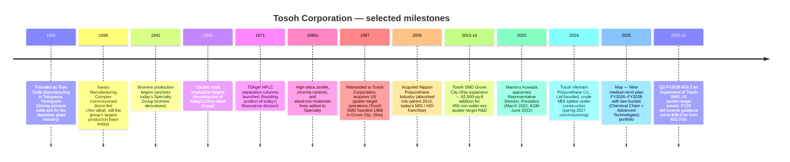

# Tosoh Corporation (TSE:4042) — Research Document

*Initial coverage. As of 2026-05-26. Author: Claude research agent.*

> **Update — FY2026 guidance cut (2025-11-04):** Tosoh cut its FY2026 (year ending March 2026) net-income-attributable-to-owners guidance to **¥38.0 bn from ¥62.0 bn** (–¥24.0 bn / –39%), revenue to **¥1,020.0 bn from ¥1,050.0 bn**, and operating income to **¥103.0 bn from ¥108.0 bn**. The earnings cut is driven by a **¥19.3 bn impairment of fixed assets at Tosoh SMD, Inc.** — the company's wholly-owned US sputter-target manufacturing subsidiary in Grove City, Ohio — recognized in Q2 FY2026 on the back of weaker-than-expected US semiconductor shipments and persistent ASP erosion in the metal-target product mix. Operating-segment-level Specialty Group profit is essentially unchanged (¥39.3 bn vs ¥38.6 bn prior) because the impairment hits below the operating line as an extraordinary loss. Annual dividend held at ¥100 / share and a ¥25 bn buyback authorized for FY2026 — capital-return policy unchanged despite the earnings hit.
> Source: [Tosoh "Cumulative Financial Results for First Half of FY2026," 2025-11-04, pp.6, 17, 20](https://www.tosoh.com/File%20Library/Tosoh/Investors/Earnings%20Releases/FY2025/Financial-Results-for-First-Half-FY2026.pdf); [Reuters / BigGo "Tosoh FY2025 full-year earnings call — net profit –28% on Tosoh SMD impairment," 2026-05-13](https://finance.biggo.com/news/JP_4042.T_2026-05-13).

## Table of Contents
1. Company Overview
2. Company History
3. Management Team
4. Products & Services
5. Customers & Go-to-Market
6. Industry Overview
7. Competitive Landscape
8. Market Opportunity (TAM)
9. Risk Assessment
10. References & Verification Log

---

## 1. Company Overview

Tosoh Corporation (TSE:4042) is a ¥1.06-trillion-revenue (FY2025; ~US$7.0 bn) **diversified Japanese chemicals group** headquartered in Tokyo and operating an integrated chlor-alkali / petrochemical / specialty-materials complex anchored at the Nanyo Complex (Yamaguchi Prefecture) and the Yokkaichi Complex (Mie Prefecture). The group reports four operating segments — Petrochemical, Chlor-alkali, Specialty, Engineering — plus an "Other" / Ancillary bucket; Specialty is the high-margin profit engine and contains the semiconductor-relevant **electronic materials** (silica glass, sputtering targets) plus **bioscience** (HPLC separation columns, clinical diagnostics) and **advanced materials** (zirconia, high-silica zeolite) sub-divisions ([Tosoh "Consolidated Financial Results for the Year Ended March 31, 2025," p.14 (Segment Information)](https://www.tosoh.com/File%20Library/Tosoh/News%20Release/Tosoh-Reports-Its-Consolidated-Results-for-Fiscal-2025.pdf), [Tosoh "Report for the 126th Fiscal Year," p.18 (Major line of business)](https://www.tosoh.com/File%20Library/Tosoh/Investors/Shareholders%20Meetings/FY%2025/Business-Report-for-the-126th-Fiscal-Year.pdf)).

The business model is a **vertically integrated commodity-to-specialty chemicals chain**: salt electrolysis at Nanyo produces chlorine and caustic soda, which feed downstream into vinyl chloride (PVC), polyurethane raw materials (MDI, HDI), and high-purity industrial gases; ethylene from Japan's sole naphtha cracker in the Chukyo region (Yokkaichi) feeds polyethylene, EVA, ethyleneamines, and high-silica zeolite catalysts. The Specialty segment then leverages this in-house feedstock infrastructure plus dedicated electronic-materials lines (silica glass, sputtering targets, zirconia powder) to produce high-value-added downstream products sold to semiconductor, biopharma, and automotive end-markets ([Tosoh "Report for the 126th Fiscal Year," p.10 (Medium-term plan business-portfolio definition)](https://www.tosoh.com/File%20Library/Tosoh/Investors/Shareholders%20Meetings/FY%2025/Business-Report-for-the-126th-Fiscal-Year.pdf)). In the May 2025 medium-term plan, management re-categorized the four reporting segments into two strategic buckets — **Chemical Chain Business** (Petrochemical + Chlor-alkali = ¥652.5 bn FY2025 revenue, ¥35.8 bn OP) and **Advanced Technologies Business** (Bioscience + Advanced Materials + Water Treatment Engineering = ¥358.3 bn revenue, ¥57.7 bn OP) — to signal that future capital allocation will skew toward the higher-margin Advanced Technologies category ([Tosoh "Report for the 126th Fiscal Year," p.13 (FY2028 numerical targets by business portfolio)](https://www.tosoh.com/File%20Library/Tosoh/Investors/Shareholders%20Meetings/FY%2025/Business-Report-for-the-126th-Fiscal-Year.pdf)).

**Scale.** FY2025 (April 2024 – March 2025) consolidated net sales were ¥1,063.4 bn (+5.7% YoY), operating income ¥98.9 bn (+23.9% YoY, OPM 9.3%), ordinary income ¥103.0 bn (+7.4%), and income attributable to owners of parent ¥58.0 bn (+1.2%) — the operating leap came from a recovery in petrochemicals after the prior-year Yokkaichi plant trouble and strong gains in the Engineering Group's water-treatment business serving semiconductor fabs ([Tosoh "Consolidated Financial Results for the Year Ended March 31, 2025," p.1](https://www.tosoh.com/File%20Library/Tosoh/News%20Release/Tosoh-Reports-Its-Consolidated-Results-for-Fiscal-2025.pdf)). The group employs **14,813 people** (FY2025 year-end) across Japan, Belgium, the US (Tosoh SMD, Tosoh Quartz, Tosoh America, Tosoh Bioscience), China (Tosoh Guangzhou, Tosoh Shanghai), the Philippines (Mabuhay Vinyl, Philippine Resins), Malaysia (Tosoh Advanced Materials Sdn Bhd — high-silica zeolite), Indonesia, Vietnam (Tosoh Vietnam Polyurethane, in construction), and Taiwan (Tosoh Quartz) — with the Specialty segment headcount of 5,019 the largest of the four ([Tosoh "Report for the 126th Fiscal Year," pp.17, 19 (Material subsidiaries; Employees by segment)](https://www.tosoh.com/File%20Library/Tosoh/Investors/Shareholders%20Meetings/FY%2025/Business-Report-for-the-126th-Fiscal-Year.pdf)).

**Geographic mix.** FY2025 revenue was 49% Japan (¥521.5 bn), 14% China (¥153.8 bn), 22% Other Asia (¥236.1 bn), 14% rest of world (¥152.1 bn) — Japan-domiciled production but Asia-skewed customer base; no single external customer accounted for ≥10% of consolidated revenue, per the segment-information note ([Tosoh "Consolidated Financial Results FY2025," p.16 (Information by Region; Information by Major Customer)](https://www.tosoh.com/File%20Library/Tosoh/News%20Release/Tosoh-Reports-Its-Consolidated-Results-for-Fiscal-2025.pdf)). FY2025 property, plant & equipment totaled ¥417.3 bn, of which ¥340.6 bn (82%) sits in Japan — capacity is overwhelmingly domestic, and capital-intensity is rising as the Nanyo and Yokkaichi complexes undergo simultaneous decarbonization (biomass-fired power plant under construction for spring-2026 commissioning) and growth capex (separation-purification media at Nanyo + Yokkaichi for spring 2026 and spring 2027; sputtering-target capacity at Tosoh SMD for winter 2025) ([Tosoh "Consolidated Financial Results FY2025," p.16; Topics page](https://www.tosoh.com/File%20Library/Tosoh/News%20Release/Tosoh-Reports-Its-Consolidated-Results-for-Fiscal-2025.pdf)).

### Valuation snapshot

As of mid-February 2026, Tosoh trades at **¥2,663.5** (52-week range ¥1,755 – ¥2,789), giving a **market cap of ~¥834.8 bn / ~US$5.5 bn** and an enterprise value of ~¥948 bn ([Yahoo Finance 4042.T as of 2026-02-13](https://finance.yahoo.com/quote/4042.T/), [Stockanalysis.com TYO:4042 statistics](https://stockanalysis.com/quote/tyo/4042/statistics/)). The stock is up ~25% on a 1-year total-return basis and ~77% over 3 years, having re-rated through 2024–25 on the "Japanese-chemical earnings recovery + weak yen" trade alongside Mitsubishi Chemical, Sumitomo Chemical, and Shin-Etsu ([Simply Wall St "A Look at Tosoh (TSE:4042) Valuation After Full-Year Earnings," 2026-05](https://simplywall.st/stocks/jp/materials/tse-4042/tosoh-shares/news/a-look-at-tosoh-tse4042-valuation-after-full-year-earnings-a)).

| Multiple | Tosoh (4042) | Sector / Peer context | Comment |
|---|---|---|---|
| TTM P/E | **19.3 – 19.9×** | JP Chemicals industry avg 13.8×; named peer avg 48.9× | Above sector median but well below peer top-quartile |
| Forward P/E (FY27E) | **~13.1×** | – | Re-rates lower as FY2026 impairment lapses |
| P/S (TTM) | **0.80×** | Shin-Etsu ~3.5×; Sumitomo Chem ~0.45× | Mid-cycle for a diversified Japanese chemical |
| EV/EBITDA | **6.5×** | Mitsubishi Chem ~7×, Shin-Etsu ~12× | Discount reflects petrochem weighting |
| P/B | **~0.96×** (¥834.8 bn cap ÷ ¥827.1 bn equity) | Shin-Etsu ~2.4× | Trading roughly at book; classic value-cyclical setup |
| Dividend yield | **3.84%** (¥100 / share) | TOPIX yield ~2.5%; sector ~2.8% | Above-market yield; FY2026 payout ratio 84% on cut EPS |
| ROE | **7.2%** (FY2025) | Sector 8–10%; mgmt FY2028 target >10% | Below cost-of-equity; multi-year recovery story |
| Beta | **0.50** | Market 1.00 | Low — petrochemicals + utility-like chlor-alkali base smooths beta |

*Analyst view:* The P/E of ~19× FY26E (on the cut ¥119.5 EPS) compresses to ~13× FY27E once the one-time SMD impairment lapses and Engineering / Specialty operating tailwinds carry into a full year — a classic Japanese deep-cyclical "trough multiple on trough earnings" setup. The TTM P/E sits ~40% above the JP Chemicals industry average of 13.8× (per [Simply Wall St](https://simplywall.st/stocks/jp/materials/tse-4042/tosoh-shares/news/a-look-at-tosoh-tse4042-valuation-after-full-year-earnings-a)) but well below the peer average of 48.9× — the gap is the market pricing Tosoh as a value-chemical, not as a semi-materials growth name. The single largest stretch in the multiple is whether the FY2028 mid-term-plan target of ¥140 bn operating income (vs. ¥98.9 bn FY2025 actual, ¥103.0 bn FY2026 forecast) is credible — a 42% lift in three years from a base that has just been impaired in the US sputter-target subsidiary. P/B of ~1.0× and EV/EBITDA of 6.5× together signal the market is paying for asset-replacement value, not Specialty-segment growth optionality — which would be the asymmetric upside if the FY2028 target is delivered.

The FY2025 absolute results disguise a structural mix shift that is the main investment story: the Specialty Group generated ¥38.6 bn operating income on ¥270.5 bn revenue (OPM **14.3%**), Engineering ¥33.6 bn on ¥169.3 bn (OPM 19.9%), Chlor-alkali ¥9.5 bn on ¥373.4 bn (OPM 2.5%), Petrochemical ¥14.3 bn on ¥204.8 bn (OPM 7.0%) — i.e. Specialty + Engineering = 73% of group operating income on 41% of group revenue ([Tosoh "Consolidated Financial Results FY2025," p.15 (Segment Information FY2025)](https://www.tosoh.com/File%20Library/Tosoh/News%20Release/Tosoh-Reports-Its-Consolidated-Results-for-Fiscal-2025.pdf)). The 2025–2027 medium-term plan explicitly targets shifting the operating-income mix further toward Specialty (Bioscience + Advanced Materials) and Engineering by FY2028, with the Advanced Materials sub-segment alone projected to grow operating income from ¥5.3 bn (FY2025) to ¥20.5 bn (FY2028) — a near-4× lift driven by sputter-target capacity expansion at Tosoh SMD, separation/purification media capacity at Nanyo, and HDI derivatives capacity at Nanyo ([Tosoh "Report for the 126th Fiscal Year," p.13](https://www.tosoh.com/File%20Library/Tosoh/Investors/Shareholders%20Meetings/FY%2025/Business-Report-for-the-126th-Fiscal-Year.pdf)).

Source: [Tosoh "Report for the 126th Fiscal Year," p.16 (Changes in assets and profits and losses, FY2021–FY2025)](https://www.tosoh.com/File%20Library/Tosoh/Investors/Shareholders%20Meetings/FY%2025/Business-Report-for-the-126th-Fiscal-Year.pdf); FY2026E from [Tosoh H1 FY2026 results, 2025-11-04, p.17](https://www.tosoh.com/File%20Library/Tosoh/Investors/Earnings%20Releases/FY2025/Financial-Results-for-First-Half-FY2026.pdf).

Source: [Tosoh "Consolidated Financial Results FY2025," p.15](https://www.tosoh.com/File%20Library/Tosoh/News%20Release/Tosoh-Reports-Its-Consolidated-Results-for-Fiscal-2025.pdf).

---

## 2. Company History

Tosoh Corporation was founded **February 11, 1935** in Tokuyama, Yamaguchi Prefecture, as **Toyo Soda Manufacturing Co., Ltd.** (東洋曹達工業株式会社) — the founding charter being to produce sodium carbonate (soda ash) for the Japanese glass industry, with the Nanyo Manufacturing Complex commissioned the following year as a brine-fed integrated chlor-alkali site ([Encyclopedia.com — Tosoh Corporation company history](https://www.encyclopedia.com/books/politics-and-business-magazines/tosoh-corporation), [Wikipedia — Tosoh, sourced to corporate filings](https://en.wikipedia.org/wiki/Tosoh)). The location was strategic: coastal Yamaguchi gave the plant access to seawater brine and ammonia precursors used in the Solvay process, while proximity to the Chukyo industrial belt placed downstream customers (glass makers, ceramics, pulp & paper) within Honshu's interior. The Solvay-process soda ash line was supplemented during World War II by bromine production (1942) and caustic soda (1943) — the latter becoming the chlor-alkali franchise that anchors the group's profit base nine decades later.

Postwar, the company expanded vertically — adding vinyl chloride monomer in the late 1950s, PVC resin in the 1960s, and ethylene cracking at the Yokkaichi Complex in the 1970s once the Japanese economy crossed its high-growth inflection — establishing the integrated salt-→ chlorine-→ VCM → PVC chain that still defines the Chlor-alkali Group ([FundingUniverse — Tosoh Corporation history](https://www.fundinguniverse.com/company-histories/tosoh-corporation-history/)). A series of fine-chemicals diversifications followed: high-silica zeolite catalysts (1980s, sold to refining customers worldwide for FCC and SDA applications), zirconia ceramic powders (1980s, marketed under the TZ-Series brand for dental, structural, and ferrule applications), and the launch of **TSKgel** HPLC separation columns in 1971 — the latter making Tosoh one of the earliest Japanese entrants in the bioscience-tools market that would later become the modern Tosoh Bioscience division ([Tosoh Bioscience separations product page — TSKgel introduction history](https://www.separations.us.tosohbioscience.com/HPLC_Columns/id-8390/TSKgel_SuperH2500)).

The decisive strategic move in the modern history of the company was the **rebranding to Tosoh Corporation in 1987** — a Toyo-Soda → Tosoh contraction that signaled the company's intent to be read as a global specialty-chemicals group rather than a domestic chlor-alkali / soda producer ([Wikipedia — Tosoh, 1987 name change](https://en.wikipedia.org/wiki/Tosoh)). The same year, Tosoh acquired the predecessor of what became **Tosoh SMD, Inc.** (founded 1988 in Grove City, Ohio) — the high-purity sputter-target subsidiary that would carry the company's brand into the US semiconductor supply chain through the 1990s wafer-fab build-out ([Tosoh SMD company history](https://dev.tosohsmd.com/about-us/history/)).

The 2006 acquisition of **Nippon Polyurethane Industry (NPI)** — a domestic MDI / TDI / polyurethane raw materials producer — was the largest M&A in the modern company's history; NPI was absorbed into the parent in 2014, consolidating the MDI franchise that now sits in the Chlor-alkali Group ([Wikipedia — Tosoh, 2006 NPI acquisition](https://en.wikipedia.org/wiki/Tosoh)). Polyurethane became the strategic pivot for the Chlor-alkali Group: as PVC commoditized through Chinese capacity additions, the high-value MDI / HDI hardener line became the segment's growth driver, with capacity expansions announced for the **Tosoh Vietnam Polyurethane Co., Ltd** crude-MDI splitter (spring-2027 commissioning, financed under the FY2026–2028 medium-term plan) and a hexamethylene diisocyanate (HDI) derivatives capacity increase at Nanyo (summer-2026 commissioning) ([Tosoh "Consolidated Financial Results FY2025," p.21 (Topics)](https://www.tosoh.com/File%20Library/Tosoh/News%20Release/Tosoh-Reports-Its-Consolidated-Results-for-Fiscal-2025.pdf)). The Vietnam MDI plant and the **Tosoh (Ruian) Polyurethane** facility in China together position the Chlor-alkali Group to capture growing Southeast-Asian urethane demand as the Chinese domestic market matures.

The most consequential recent strategic pivot is the **May 2025 announcement of the FY2026–FY2028 medium-term plan**, which formally re-categorized the four reporting segments into two strategic buckets: **Chemical Chain Business** (Petrochemical + Chlor-alkali — the legacy commodity chain) and **Advanced Technologies Business** (Specialty's Bioscience and Advanced Materials sub-divisions + Engineering's water-treatment business) — and explicitly committed to allocating the bulk of incremental capital (¥220–250 bn over three years) to the Advanced Technologies Business to deliver the FY2031 target of ¥170 bn operating income ([Tosoh "Report for the 126th Fiscal Year," pp.10, 12-14](https://www.tosoh.com/File%20Library/Tosoh/Investors/Shareholders%20Meetings/FY%2025/Business-Report-for-the-126th-Fiscal-Year.pdf)). The plan also enshrines a **¥50 bn three-year buyback** as the supplementary shareholder-return mechanism on top of a ¥100 / share minimum dividend (with payout ratio uplift to 50% via buybacks if base dividend lands below that floor) — the most aggressive capital-return commitment in the company's history and a signal that management is responding to the persistently sub-1× P/B that has dogged the stock since 2022 ([Tosoh "First Half FY2026 results, p.21 (Shareholder Returns)](https://www.tosoh.com/File%20Library/Tosoh/Investors/Earnings%20Releases/FY2025/Financial-Results-for-First-Half-FY2026.pdf)). The Q2 FY2026 Tosoh SMD impairment lands in the middle of this strategic pivot — a tactical setback that hits the Advanced Materials growth narrative but does not invalidate the structural mix shift the medium-term plan is built around.

---

## 3. Management Team

**Mamoru Kuwada** — Representative Director, President (since March 1, 2022)

Mamoru Kuwada has led Tosoh Corporation as Representative Director and President since **March 1, 2022**, formally confirmed at the 124th Annual General Meeting in June 2022, succeeding **Toshinori Yamamoto** who became corporate advisor on the same date ([Everchem Specialty Chemicals — "Tosoh Names New President," 2022-02-15](https://everchem.com/tosoh-names-new-president/), [Bloomberg profile — Mamoru Kuwada, Tosoh Corp](https://www.bloomberg.com/profile/person/20913255)). His appointment was structurally significant: Kuwada had previously been **Executive Vice President** of Tosoh Corporation and **President of Tosoh's Specialty Materials Division** — i.e. he ran the Advanced Materials / electronic materials business (sputter targets, silica glass, zirconia, HPLC) before being elevated to the parent's CEO seat, making him the first Tosoh president in the modern era to come from the high-margin specialty side of the house rather than the historical chlor-alkali / petrochemical commodity backbone ([Tosoh announcement quoted in PUDaily — "Tosoh Corporation Appoints New President," 2022](https://www.gvchem.com/news/tosoh-corporation-appoints-new-president-54049026.html), [LinkedIn post — Tosoh Bioscience Diagnostics EMEA on Kuwada visit, 2023-10](https://www.linkedin.com/posts/tosoh-bioscience-diagnostics-emea_last-week-mamoru-kuwada-president-of-tosoh-activity-7124676997921824768-lreI)). This is consistent with the May 2025 medium-term plan's explicit pivot toward Advanced Technologies Business as the growth engine: a CEO whose career formed inside the Specialty / electronic-materials business is the natural champion of a capital-allocation plan that bets on Specialty growth.

Kuwada is a long-tenured Tosoh insider — his Bloomberg profile lists him as having joined Tosoh in the late 1980s and risen through the Specialty Materials Division across functional and divisional leadership posts before the 2022 promotion ([Bloomberg profile — Mamoru Kuwada](https://www.bloomberg.com/profile/person/20913255), [Simply Wall St "Tosoh leadership analysis"](https://simplywall.st/stocks/us/materials/otc-tosc.f/tosoh/management)). His total FY2025 compensation was approximately ¥124 million — comprising 47.6% fixed salary and 52.4% performance-linked components (cash bonus + restricted-share compensation), reasonable for a TOPIX-listed Japanese chemicals CEO ([Tosoh "Report for the 126th Fiscal Year," p.24 (Directors' compensation totals)](https://www.tosoh.com/File%20Library/Tosoh/Investors/Shareholders%20Meetings/FY%2025/Business-Report-for-the-126th-Fiscal-Year.pdf); 2022 LinkedIn / Simply Wall St disclosure of comp split). The performance-based portion of director compensation is calculated against three metrics — consolidated ordinary income (FY2024: ¥95.9 bn), annual dividend per share (¥85), and the achievement rate of CSR key issues — a structure that aligns management cash-bonus economics to both earnings and dividend, but with no explicit ROE / EPS-growth gate ([Tosoh "Report for the 126th Fiscal Year," p.26 (Performance-based compensation policy)](https://www.tosoh.com/File%20Library/Tosoh/Investors/Shareholders%20Meetings/FY%2025/Business-Report-for-the-126th-Fiscal-Year.pdf)). His specific founding-thesis-equivalent at Tosoh is the build-out of the Specialty Materials / Electronic Materials business — over the decade-plus he led the division before becoming CEO, sputter-target capacity at Tosoh SMD was expanded twice (the 2013–14 82,500-sq-ft Grove City expansion for 450-mm-wafer-era R&D, and the now-completed winter-2025 capacity addition for the latest semiconductor node), and the Specialty Group operating income roughly doubled from the mid-teens of billions to the high-¥30 bn / low-¥40 bn range visible in FY2024–FY2025 ([Business Standard — "Tosoh SMD plans major investments to serve semiconductor industry," 2013-11-12](https://www.business-standard.com/content/b2b-chemicals/tosoh-smd-plans-major-investments-to-serve-semiconductor-industry-113111200428_1.html), [Tosoh H1 FY2026 results, 2025-11-04, p.4 (Topics — winter-2025 sputter-target capacity)](https://www.tosoh.com/File%20Library/Tosoh/Investors/Earnings%20Releases/FY2025/Financial-Results-for-First-Half-FY2026.pdf)).

Tosoh's nine-decade history precedes any single "founder" in the modern venture sense — Toyo Soda Manufacturing was incorporated in 1935 by a consortium of Yamaguchi-Prefecture industrial and trading interests as part of Japan's pre-war chemicals build-out, not by a single named entrepreneur, so this report follows the company-research skill convention of profiling the current CEO only ([Encyclopedia.com — Tosoh Corporation founding context](https://www.encyclopedia.com/books/politics-and-business-magazines/tosoh-corporation)). Continuity of strategic direction sits with **Nobukatsu Ohmichi** (Executive Vice President, President of the Specialty Group, Senior General Manager of the Advanced Materials Division — i.e. Kuwada's successor at the Specialty Materials helm), but per the company-research skill scope, the bio coverage stops at the founder and current CEO ([Tosoh "Report for the 126th Fiscal Year," p.24 (Executive officer list)](https://www.tosoh.com/File%20Library/Tosoh/Investors/Shareholders%20Meetings/FY%2025/Business-Report-for-the-126th-Fiscal-Year.pdf)).

---
