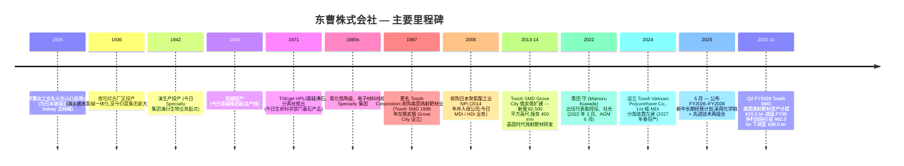
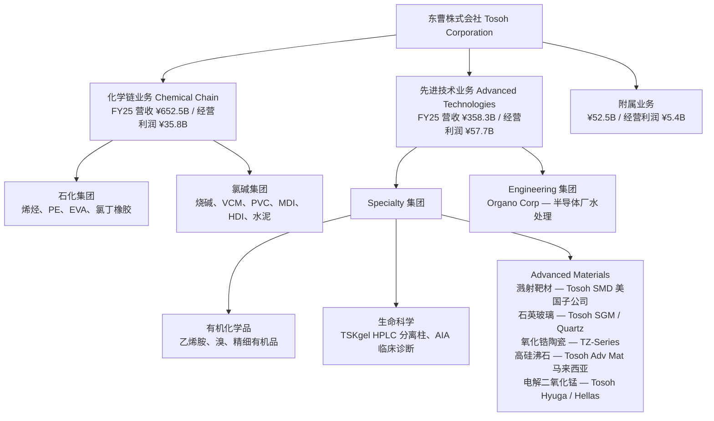
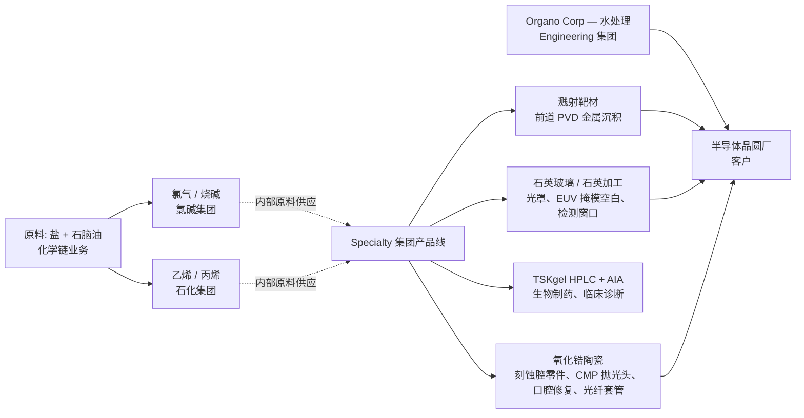

# Tosoh Corporation 东曹株式会社 (TSE:4042) — 公司研究

*首次覆盖。截至 2026-05-26。作者:Claude 研究代理。*

> **更新 — FY2026 业绩指引下调 (2025-11-04):** 东曹将 FY2026 (截至 2026 年 3 月) 归属母公司股东净利润指引由 **¥62.0 亿** (注:本报告中"亿"按日元习惯指 10 亿;¥62.0 bn) 下调至 **¥38.0 bn (–¥24.0 bn / –39%)**;营业收入由 **¥1,050.0 bn 降至 ¥1,020.0 bn**;营业利润由 **¥108.0 bn 降至 ¥103.0 bn**。本次下调的核心驱动因素是 **Tosoh SMD 美国子公司 (位于俄亥俄州 Grove City、100% 控股的溅射靶材 (sputter target) 制造子公司) 计提 ¥19.3 bn 固定资产减值** —— 在 Q2 FY2026 确认,反映美国半导体出货低于预期以及金属靶材产品结构中持续的 ASP (销售单价) 侵蚀。Specialty Group (Specialty 业务集团) 分部经营利润几乎不变 (¥39.3 bn vs 此前 ¥38.6 bn),因为减值在经营利润线以下作为非经常性损失列示。年度股息维持 ¥100 / 股,FY2026 授权 ¥25 bn 回购 —— 在盈利下调背景下,资本回报政策保持不变。
> 资料来源:[Tosoh"FY2026 上半期累计经营业绩",2025-11-04,pp.6, 17, 20](https://www.tosoh.com/File%20Library/Tosoh/Investors/Earnings%20Releases/FY2025/Financial-Results-for-First-Half-FY2026.pdf);[Reuters / BigGo"东曹 FY2025 全年业绩电话会 —— 净利润因 Tosoh SMD 减值同比 –28%",2026-05-13](https://finance.biggo.com/news/JP_4042.T_2026-05-13)。

## 目录
1. 公司概览
2. 公司沿革
3. 管理团队
4. 产品与服务
5. 客户与市场进入策略
6. 行业概览
7. 竞争格局
8. 市场机会 (TAM)
9. 风险评估
10. 参考资料与核验日志

---

## 1. 公司概览

东曹株式会社 (TSE:4042) 是一家 FY2025 营业收入 ¥1.06 万亿日元 (约合 70 亿美元) 的 **日本多元化化学集团**,总部位于东京,运营以南阳综合厂区 (Nanyo Complex,山口县) 与四日市综合厂区 (Yokkaichi Complex,三重县) 为核心的氯碱-石化-精细化学一体化生产平台。集团按四大经营分部披露 —— 石化、氯碱、Specialty、Engineering —— 另设"其他/附属"业务;Specialty 是高毛利的利润引擎,内含半导体相关 **电子材料** (石英玻璃、溅射靶材)、**生命科学** (HPLC 分离柱、临床诊断) 与 **Advanced Materials (先进材料)** (氧化锆陶瓷 (zirconia ceramics)、高硅沸石) 三大子板块 ([Tosoh"截至 2025 年 3 月 31 日财年合并经营业绩",p.14 (分部信息)](https://www.tosoh.com/File%20Library/Tosoh/News%20Release/Tosoh-Reports-Its-Consolidated-Results-for-Fiscal-2025.pdf);[Tosoh"第 126 期事業報告書",p.18 (主要事業)](https://www.tosoh.com/File%20Library/Tosoh/Investors/Shareholders%20Meetings/FY%2025/Business-Report-for-the-126th-Fiscal-Year.pdf))。

公司商业模式是一条 **由大宗化学品向高附加值特化品延伸的纵向一体化产业链**:南阳厂区盐电解出氯气与烧碱 (caustic soda),向下游对接氯乙烯单体 (VCM)/PVC / 聚氯乙烯 (polyvinyl chloride)、聚氨酯原料 (MDI、HDI) 与高纯工业气体;四日市的中京地区日本唯一的石脑油裂解装置生产乙烯,供应聚乙烯、EVA、乙烯胺与高硅沸石催化剂。Specialty 分部依托内部原料平台,叠加专用的电子材料产线 (石英玻璃、溅射靶材、氧化锆粉) 生产面向半导体、生物制药、汽车终端的高附加值产品 ([Tosoh"第 126 期事業報告書",p.10 (中长期经营计划 (mid-term plan) 业务组合定义)](https://www.tosoh.com/File%20Library/Tosoh/Investors/Shareholders%20Meetings/FY%2025/Business-Report-for-the-126th-Fiscal-Year.pdf))。2025 年 5 月公布的中长期经营计划中,公司将四大报告分部重新归并为两大战略组合 —— **Chemical Chain Business / 化学链业务** (石化 + 氯碱 = FY2025 收入 ¥652.5 bn,经营利润 ¥35.8 bn) 与 **Advanced Technologies Business / 先进技术业务** (生命科学 + Advanced Materials + 水处理工程 = 收入 ¥358.3 bn,经营利润 ¥57.7 bn) —— 用以表明未来资本配置将向更高利润率的 Advanced Technologies 组合倾斜 ([Tosoh"第 126 期事業報告書",p.13 (按业务组合的 FY2028 数值目标)](https://www.tosoh.com/File%20Library/Tosoh/Investors/Shareholders%20Meetings/FY%2025/Business-Report-for-the-126th-Fiscal-Year.pdf))。

**规模。** FY2025 (2024 年 4 月 – 2025 年 3 月) 合并净销售额 ¥1,063.4 bn (同比 +5.7%),经营利润 ¥98.9 bn (同比 +23.9%,OPM 9.3%),经常性利润 ¥103.0 bn (+7.4%),归属母公司净利润 ¥58.0 bn (+1.2%) —— 经营利润的跃升源于上一年度四日市装置故障后石化业务的恢复,以及面向半导体晶圆厂的 Engineering Group (Engineering 业务集团) 水处理业务的强劲增长 ([Tosoh"FY2025 合并经营业绩",p.1](https://www.tosoh.com/File%20Library/Tosoh/News%20Release/Tosoh-Reports-Its-Consolidated-Results-for-Fiscal-2025.pdf))。集团 FY2025 末雇员合计 **14,813 人**,分布于日本、比利时、美国 (Tosoh SMD 美国子公司、Tosoh Quartz、Tosoh America、Tosoh Bioscience)、中国 (东曹广州、东曹上海)、菲律宾 (Mabuhay Vinyl、Philippine Resins)、马来西亚 (Tosoh Advanced Materials Sdn Bhd — 高硅沸石)、印度尼西亚、越南 (Tosoh Vietnam Polyurethane,在建) 与中国台湾 (Tosoh Quartz) —— 其中 Specialty 分部 5,019 人,是四大分部中规模最大的 ([Tosoh"第 126 期事業報告書",pp.17, 19 (重要子公司;按分部员工数)](https://www.tosoh.com/File%20Library/Tosoh/Investors/Shareholders%20Meetings/FY%2025/Business-Report-for-the-126th-Fiscal-Year.pdf))。

**地域结构。** FY2025 销售构成:日本 49% (¥521.5 bn)、中国 14% (¥153.8 bn)、其他亚洲 22% (¥236.1 bn)、其他地区 14% (¥152.1 bn) —— 日本本地生产、亚洲客户主导,分部信息附注中明确披露无任何外部客户合并收入占比 ≥10% ([Tosoh"FY2025 合并经营业绩",p.16 (地域信息;主要客户信息)](https://www.tosoh.com/File%20Library/Tosoh/News%20Release/Tosoh-Reports-Its-Consolidated-Results-for-Fiscal-2025.pdf))。FY2025 不动产、厂房与设备账面值 ¥417.3 bn,其中 ¥340.6 bn (82%) 位于日本 —— 产能高度集中于本土,资本密集度因南阳、四日市同时推进低碳化 (生物质发电站在建,计划 2026 年春投产) 与增长性资本开支 (南阳与四日市的分离纯化介质产能,分别于 2026 年春与 2027 年春投产;Tosoh SMD 溅射靶材产能,2025 年冬投产) 而上升 ([Tosoh"FY2025 合并经营业绩",p.16;Topics 页](https://www.tosoh.com/File%20Library/Tosoh/News%20Release/Tosoh-Reports-Its-Consolidated-Results-for-Fiscal-2025.pdf))。

### 估值快照

截至 2026 年 2 月中旬,东曹股价 **¥2,663.5** (52 周区间 ¥1,755 – ¥2,789),对应 **市值约 ¥834.8 bn / 约 55 亿美元**,企业价值约 ¥948 bn ([Yahoo Finance 4042.T,2026-02-13](https://finance.yahoo.com/quote/4042.T/);[Stockanalysis.com TYO:4042 statistics](https://stockanalysis.com/quote/tyo/4042/statistics/))。股价过去 1 年总回报约 +25%,3 年累计约 +77%,在 2024–25 年伴随三菱化学、住友化学、信越的"日本化学盈利复苏 + 弱日元"主题完成估值重估 ([Simply Wall St"全年业绩之后看东曹 (TSE:4042) 估值",2026-05](https://simplywall.st/stocks/jp/materials/tse-4042/tosoh-shares/news/a-look-at-tosoh-tse4042-valuation-after-full-year-earnings-a))。

| 倍数 | 东曹 (4042) | 行业 / 同业参考 | 说明 |
|---|---|---|---|
| TTM P/E | **19.3 – 19.9×** | 日本化学行业均值 13.8×;指定同业均值 48.9× | 高于行业中位数,但远低于同业上四分位 |
| 远期 P/E (FY27E) | **约 13.1×** | – | FY2026 一次性减值过去后估值下行 |
| P/S (TTM) | **0.80×** | 信越约 3.5×;住友化学约 0.45× | 多元化日本化学的中周期水平 |
| EV/EBITDA | **6.5×** | 三菱化学约 7×,信越约 12× | 折价反映石化权重 |
| P/B | **约 0.96×** (¥834.8 bn 市值 ÷ ¥827.1 bn 股东权益) | 信越约 2.4× | 大致按账面值交易,典型价值-周期布局 |
| 股息收益率 | **3.84%** (¥100 / 股) | TOPIX 约 2.5%;行业约 2.8% | 高于市场,FY2026 派息率 84% (按下调后 EPS) |
| ROE | **7.2%** (FY2025) | 行业 8–10%;管理层 FY2028 目标 >10% | 低于股权成本,多年期复苏故事 |
| Beta | **0.50** | 大盘 1.00 | 偏低 —— 石化 + 公用事业属性的氯碱基底拉低系统性风险 |

*Analyst view (分析师观点):* FY26E ~19× 的 P/E (基于下调后 ¥119.5 EPS) 在 FY27E 压缩至约 13× —— 一旦 SMD 一次性减值不再重演,Engineering / Specialty 经营顺风延续一整年,是典型的日本深度周期"低估值×低利润"组合。TTM P/E 比日本化学行业均值 13.8× 高出约 40% (参见 [Simply Wall St](https://simplywall.st/stocks/jp/materials/tse-4042/tosoh-shares/news/a-look-at-tosoh-tse4042-valuation-after-full-year-earnings-a)),但远低于同业均值 48.9× —— 这一差距正是市场把东曹定价为"价值型化学股"、而非"半导体材料成长股"的结果。估值中最具弹性的单一变量是中长期经营计划 FY2028 ¥140 bn 经营利润目标 (vs FY2025 实际 ¥98.9 bn、FY2026 预测 ¥103.0 bn) 的可信度 —— 在已对美国溅射靶材子公司计提减值的基础上,三年内提升 42%。P/B 约 1.0× 与 EV/EBITDA 6.5× 共同发出信号:市场只在为资产重置价值付费,并没有为 Specialty 分部的增长可选性付费 —— 这正是若 FY2028 目标得到兑现,所将释放的非对称上行空间。

FY2025 的绝对数字背后,真正的投资故事是结构性产品组合再平衡:Specialty Group 在 ¥270.5 bn 营业收入上录得 ¥38.6 bn 经营利润 (OPM **14.3%**);Engineering 在 ¥169.3 bn 收入上录得 ¥33.6 bn (OPM 19.9%);氯碱在 ¥373.4 bn 上录得 ¥9.5 bn (OPM 2.5%);石化在 ¥204.8 bn 上录得 ¥14.3 bn (OPM 7.0%) —— 也就是 Specialty + Engineering 以 41% 的集团营收贡献了 73% 的经营利润 ([Tosoh"FY2025 合并经营业绩",p.15 (FY2025 分部信息)](https://www.tosoh.com/File%20Library/Tosoh/News%20Release/Tosoh-Reports-Its-Consolidated-Results-for-Fiscal-2025.pdf))。2025–2027 中长期经营计划明确把 FY2028 经营利润结构进一步向 Specialty (生命科学 + Advanced Materials) 与 Engineering 倾斜,其中 Advanced Materials 子分部单独的经营利润目标由 FY2025 的 ¥5.3 bn 提升至 FY2028 的 ¥20.5 bn —— 接近 4 倍的跃升,由 Tosoh SMD 溅射靶材扩产、南阳分离/纯化介质扩产以及 HDI 衍生品扩产共同驱动 ([Tosoh"第 126 期事業報告書",p.13](https://www.tosoh.com/File%20Library/Tosoh/Investors/Shareholders%20Meetings/FY%2025/Business-Report-for-the-126th-Fiscal-Year.pdf))。

资料来源:[Tosoh"第 126 期事業報告書",p.16 (FY2021–FY2025 资产、损益变化)](https://www.tosoh.com/File%20Library/Tosoh/Investors/Shareholders%20Meetings/FY%2025/Business-Report-for-the-126th-Fiscal-Year.pdf);FY2026E 取自 [Tosoh"FY2026 上半期累计经营业绩",2025-11-04,p.17](https://www.tosoh.com/File%20Library/Tosoh/Investors/Earnings%20Releases/FY2025/Financial-Results-for-First-Half-FY2026.pdf)。

资料来源:[Tosoh"FY2025 合并经营业绩",p.15](https://www.tosoh.com/File%20Library/Tosoh/News%20Release/Tosoh-Reports-Its-Consolidated-Results-for-Fiscal-2025.pdf)。

---

## 2. 公司沿革

东曹株式会社于 **1935 年 2 月 11 日** 在山口县德山以 **東洋曹達工業株式会社 (Toyo Soda Manufacturing Co., Ltd.)** 名义创立 —— 设立初衷是为日本玻璃工业生产碳酸钠 (纯碱),并于次年建成南阳综合厂区,作为以海水盐为原料的氯碱一体化基地 ([Encyclopedia.com — 东曹公司沿革](https://www.encyclopedia.com/books/politics-and-business-magazines/tosoh-corporation);[Wikipedia — 东曹,引证企业披露](https://en.wikipedia.org/wiki/Tosoh))。选址带有明显战略考量:山口沿海一带,工厂可使用海水卤水和氨原料 (Solvay 法关键投入),同时贴近中京工业带,内陆下游客户 (玻璃、陶瓷、纸浆造纸) 触手可及。Solvay 法纯碱产线在二战期间相继扩展为溴 (1942) 与烧碱 (1943) —— 后者即九十年后仍支撑集团利润基底的氯碱业务起点。

战后,公司沿垂直一体化方向扩张 —— 1950 年代末进入氯乙烯单体,1960 年代进入 PVC 树脂,1970 年代在日本经济进入高增长拐点后,于四日市综合厂区上马乙烯裂解装置,确立至今支撑氯碱集团的"盐 → 氯 → VCM → PVC"完整产业链 ([FundingUniverse — 东曹公司沿革](https://www.fundinguniverse.com/company-histories/tosoh-corporation-history/))。随后一系列精细化学多元化举措接续展开:1980 年代推出高硅沸石催化剂 (面向全球 FCC 与 SDA 应用的炼油客户)、氧化锆陶瓷粉 (TZ-Series 系列,面向口腔、结构件、套管等应用),以及 1971 年推出的 **TSKgel HPLC 分离柱** —— 使东曹成为日本最早进入生命科学工具市场、最终壮大为今日 Tosoh Bioscience 部门的厂商之一 ([Tosoh Bioscience separations 产品页 — TSKgel 推出历史](https://www.separations.us.tosohbioscience.com/HPLC_Columns/id-8390/TSKgel_SuperH2500))。

公司现代史上最关键的战略举措是 **1987 年品牌更名为 Tosoh Corporation** —— 由 Toyo-Soda → Tosoh 的缩写,既宣告东曹意图作为全球特化品集团被外界识别,也告别"国内氯碱/纯碱厂商"的旧标签 ([Wikipedia — 东曹,1987 年更名](https://en.wikipedia.org/wiki/Tosoh))。同年,东曹收购 **Tosoh SMD, Inc.** 美国子公司前身 (后于 1988 年在俄亥俄州 Grove City 正式设立) —— 此后这家高纯度溅射靶材子公司随 1990 年代美国晶圆厂建设潮承载东曹品牌进入美国半导体供应链 ([Tosoh SMD 公司沿革](https://dev.tosohsmd.com/about-us/history/))。

2006 年对 **日本聚氨酯工业 (Nippon Polyurethane Industry / NPI)** 的并购 —— 一家国内 MDI / TDI / 聚氨酯原料生产商 —— 是现代东曹史上规模最大的 M&A;NPI 于 2014 年并入母公司,集中了如今归于氯碱集团的 MDI 业务 ([Wikipedia — 东曹,2006 年 NPI 收购](https://en.wikipedia.org/wiki/Tosoh))。聚氨酯由此成为氯碱集团的战略支点:中国产能扩张让 PVC 逐步走向大宗化,高附加值的 MDI / HDI 硬化剂线则成为分部的增长引擎,公司已公告 **Tosoh Vietnam Polyurethane Co., Ltd** 粗 MDI 分馏装置 (2027 年春投产,纳入 FY2026–2028 中长期经营计划资本支出)、南阳综合厂区 HDI 衍生品产能扩张 (2026 年夏投产) ([Tosoh"FY2025 合并经营业绩",p.21 (Topics)](https://www.tosoh.com/File%20Library/Tosoh/News%20Release/Tosoh-Reports-Its-Consolidated-Results-for-Fiscal-2025.pdf))。越南 MDI 装置与中国的 **Tosoh (Ruian) Polyurethane** 共同卡位东南亚聚氨酯需求增长 —— 中国本土市场已步入成熟。

近年最具决定性的战略转向是 **2025 年 5 月公布的 FY2026–FY2028 中长期经营计划**:把四大报告分部正式重组为两大战略组合 —— **化学链业务** (石化 + 氯碱,即传统大宗产业链) 与 **先进技术业务** (Specialty 内的生命科学与 Advanced Materials 子板块 + Engineering 内的水处理) —— 并明确承诺将三年内增量资本支出 ¥220–250 bn 的主要部分配置给先进技术业务,以兑现 FY2031 ¥170 bn 经营利润目标 ([Tosoh"第 126 期事業報告書",pp.10, 12-14](https://www.tosoh.com/File%20Library/Tosoh/Investors/Shareholders%20Meetings/FY%2025/Business-Report-for-the-126th-Fiscal-Year.pdf))。计划同时把 **¥50 bn 三年回购** 写入股东回报政策,作为 ¥100 / 股最低股息基础上的补充机制 (若基础股息低于派息率 50% 的下限,则通过回购把派息率拉至 50%) —— 这是公司历史上最激进的资本回报承诺,也意在回应自 2022 年以来长期低于 1× P/B 的估值困境 ([Tosoh"FY2026 上半期累计经营业绩",p.21 (股东回报)](https://www.tosoh.com/File%20Library/Tosoh/Investors/Earnings%20Releases/FY2025/Financial-Results-for-First-Half-FY2026.pdf))。Q2 FY2026 Tosoh SMD 减值恰好发生在这一战略转向中段 —— 是对 Advanced Materials 增长叙事的战术挫折,但并不否定中长期经营计划所赖以建立的结构性产品组合再平衡。

---

## 3. 管理团队

**桑田 守 (Mamoru Kuwada)** — 代表取缔役、社长 (自 2022 年 3 月 1 日起任职)

桑田守于 **2022 年 3 月 1 日** 出任东曹代表取缔役、社长,并于 2022 年 6 月第 124 期股东大会上获得正式确认,接替同日转任公司顾问的前任社长 **山本 寿宣 (Toshinori Yamamoto)** ([Everchem Specialty Chemicals — "Tosoh 任命新社长",2022-02-15](https://everchem.com/tosoh-names-new-president/);[Bloomberg 简历 — 桑田守、东曹](https://www.bloomberg.com/profile/person/20913255))。这一人事任命具有重要的结构性意义:桑田守此前担任东曹 **副社长** 与 **Specialty Materials Division (特种材料事业部)** 负责人 —— 即在升任母公司 CEO 之前,他长期主管 Advanced Materials / 电子材料业务 (溅射靶材、石英玻璃、氧化锆、HPLC),由此成为东曹现代史上首位出身高毛利特化品端、而非来自传统氯碱 / 石化大宗产业链端的社长 ([Tosoh 官方公告,经 PUDaily 转发 — "东曹任命新社长",2022](https://www.gvchem.com/news/tosoh-corporation-appoints-new-president-54049026.html);[LinkedIn — Tosoh Bioscience Diagnostics EMEA 谈桑田守 2023 年 10 月访问](https://www.linkedin.com/posts/tosoh-bioscience-diagnostics-emea_last-week-mamoru-kuwada-president-of-tosoh-activity-7124676997921824768-lreI))。这与 2025 年 5 月中长期经营计划明确把先进技术业务作为增长引擎的资本配置取向高度一致:由 Specialty / 电子材料业务体系内成长起来的 CEO,正是押注 Specialty 增长的最合适旗手。

桑田守是典型的东曹内部成长型高管 —— 据 Bloomberg 简历,他于 1980 年代末加入东曹,在 Specialty Materials Division 内部跨越多个职能与事业部负责人岗位,直至 2022 年升任 ([Bloomberg 简历 — 桑田守](https://www.bloomberg.com/profile/person/20913255);[Simply Wall St "东曹管理层分析"](https://simplywall.st/stocks/us/materials/otc-tosc.f/tosoh/management))。其 FY2025 总薪酬约 ¥124 mn,固定薪 47.6%、绩效挂钩部分 (现金奖金 + 限制性股权激励) 52.4% —— 对 TOPIX 上市的日本化学公司 CEO 而言属于合理水平 ([Tosoh"第 126 期事業報告書",p.24 (董事薪酬合计)](https://www.tosoh.com/File%20Library/Tosoh/Investors/Shareholders%20Meetings/FY%2025/Business-Report-for-the-126th-Fiscal-Year.pdf);2022 年 LinkedIn / Simply Wall St 披露的薪酬构成)。董事绩效薪酬挂钩三项指标 —— 合并经常性利润 (FY2024:¥95.9 bn)、每股年度股息 (¥85) 与 CSR 关键议题达成率 —— 这一结构把管理层现金奖金与盈利、股息政策绑定,但不含明确的 ROE / EPS 增长门槛 ([Tosoh"第 126 期事業報告書",p.26 (绩效薪酬政策)](https://www.tosoh.com/File%20Library/Tosoh/Investors/Shareholders%20Meetings/FY%2025/Business-Report-for-the-126th-Fiscal-Year.pdf))。其在东曹的"准创始命题"是 Specialty Materials / 电子材料业务的扩张 —— 在他主管事业部的十余年间,Tosoh SMD 溅射靶材产能完成两轮扩建 (2013–14 年 Grove City 82,500 平方英尺扩建,服务 450 mm 晶圆研发;2025 年冬投产的最新一轮节点扩建),Specialty Group 经营利润由十几亿日元区间近翻倍至 FY2024–FY2025 的 ¥30+ bn 至 ¥40+ bn 区间 ([Business Standard — "Tosoh SMD 大幅投资服务半导体行业",2013-11-12](https://www.business-standard.com/content/b2b-chemicals/tosoh-smd-plans-major-investments-to-serve-semiconductor-industry-113111200428_1.html);[Tosoh FY26 上半期业绩,2025-11-04,p.4 (Topics — 2025 年冬溅射靶材产能)](https://www.tosoh.com/File%20Library/Tosoh/Investors/Earnings%20Releases/FY2025/Financial-Results-for-First-Half-FY2026.pdf))。

东曹九十年历史先于任何现代意义上的"单一创始人" —— 1935 年东洋曹达工业由山口县一批工业与商社利益方共同发起,作为战前日本化学工业整体布局的一部分,而非由具名企业家独自创立。本报告因此遵循公司研究 skill 的常规做法,仅聚焦在任 CEO 简历 ([Encyclopedia.com — 东曹创立背景](https://www.encyclopedia.com/books/politics-and-business-magazines/tosoh-corporation))。Specialty 战略方向的延续性由 **大道 信克 (Nobukatsu Ohmichi)** 承担 —— 现任副社长、Specialty Group 总裁、Advanced Materials 事业部长,即桑田守在 Specialty Materials 主管位置上的继任者 —— 但按公司研究 skill 的覆盖范围,本节人物部分至现任 CEO 为止 ([Tosoh"第 126 期事業報告書",p.24 (执行官名单)](https://www.tosoh.com/File%20Library/Tosoh/Investors/Shareholders%20Meetings/FY%2025/Business-Report-for-the-126th-Fiscal-Year.pdf))。

---

## 4. 产品与服务

### 4.1 东曹产品矩阵 —— 以有価証券報告書 / 决算短信叙事为锚

东曹通过 **決算短信 (kessan-tanshin / 季度业绩公告)** 中的分部信息附注与 **事業報告書 (jigyou-houkoku / 提交至股东大会的年度业务报告)** 中"主要事業"分部产品对照表披露其产品组合 —— 两者共同构成本节所依赖的 Yuho (有価証券報告書) 等效披露。截至第 126 期 (截至 2025 年 3 月 31 日财年) 的权威产品矩阵如下:

> **取自东曹"主要事業"分部对照表 (第 126 期事業報告書 p.18,原文逐字翻译):**
>
> | 分部 | 主要产品 |
> |---|---|
> | 石化集团 (Petrochemical Group) | 乙烯、丙烯等烯烃产品,低密度聚乙烯、高密度聚乙烯、加工树脂产品、功能高分子等 |
> | 氯碱集团 (Chlor-alkali Group) | 烧碱、氯乙烯单体、氯乙烯树脂、无机化学品、有机化学品、水泥、聚氨酯原料等 |
> | **Specialty 集团** | **无机/有机精细化学产品、测量与诊断产品、高硅沸石、氧化锆陶瓷 (zirconia ceramics)、电子材料 (石英玻璃、溅射靶材 (sputter target)) 等** |
> | Engineering 集团 | 水处理设备、工程建设等 |
> | 附属 | 运输与仓储、检验与分析、信息处理等 |
>
> 资料来源:[Tosoh"第 126 期事業報告書",p.18 (主要事業)](https://www.tosoh.com/File%20Library/Tosoh/Investors/Shareholders%20Meetings/FY%2025/Business-Report-for-the-126th-Fiscal-Year.pdf)。

Specialty 集团内部按 H1 FY2026 业绩披露的子板块拆分,组织为三大子事业部:**有机化学品** (乙烯胺、溴、过氧化氢、精细有机品)、**生命科学** (分离介质 — TSKgel HPLC 分离柱 + AIA 全自动血红蛋白分析仪等临床诊断) 与 **Advanced Materials (先进材料)** (用于半导体工艺的石英玻璃、溅射靶材、氧化锆陶瓷粉、高硅沸石、用于一次电池的电解二氧化锰) ([Tosoh"FY2026 上半期累计经营业绩",2025-11-04,p.11 (Specialty 子板块拆分)](https://www.tosoh.com/File%20Library/Tosoh/Investors/Earnings%20Releases/FY2025/Financial-Results-for-First-Half-FY2026.pdf))。FY2025 Specialty 子板块收入构成 (由 H1 披露年化推算) 约为:有机化学品 ~¥75 bn / 28%、生命科学 ~¥69 bn / 25%、Advanced Materials ~¥130 bn / 48% —— Advanced Materials 是三大子板块中最大、并涵盖本报告聚焦的三大产品族 (溅射靶材、石英玻璃、氧化锆陶瓷) 的子分部 ([Tosoh"FY2026 上半期累计经营业绩",p.11;年报子板块交叉验证](https://www.tosoh.com/File%20Library/Tosoh/Investors/Earnings%20Releases/FY2025/Financial-Results-for-First-Half-FY2026.pdf))。

本报告锚定野村"大中华半导体 2026-2030F 复兴指南"对东曹作为溅射靶材供应商的覆盖 (Fig 44,p.69 —— 见 [`reports/sector/半导体材料.md`](../../sector/半导体材料.md));因此第 4 节按照标准三段式 (Yuho 原文 → 中文 / 教学解释 → *Analyst view* 竞争语境) 走完 Advanced Materials 三大产品族,**溅射靶材一族给予最详细的覆盖**,因为其战略相关性最高。Chemical Chain 业务 (石化、氯碱) 放在最后,以传统大宗产业链作为收尾,定位是为 Advanced Materials 提供现金与内部原料的支柱。

资料来源:[Tosoh"FY2026 上半期累计经营业绩",2025-11-04,p.11](https://www.tosoh.com/File%20Library/Tosoh/Investors/Earnings%20Releases/FY2025/Financial-Results-for-First-Half-FY2026.pdf)。

### 4.2 综合 —— 各品类在客户生产流程中的衔接关系

在一座先进半导体晶圆厂里,**东曹产品在晶圆旅程的四个不同节点出现** —— 这种综合视角是理解东曹为何把自己定位为"一站式集成电子材料供应商"而非单一产品专家的关键。(a) **前道金属沉积:** Tosoh SMD 生产的溅射靶材 (钛 / 氮化钛 (Ti / TiN)、钽、钨硅化物 (W silicide)、ITO 透明导电膜、钼) 装入 PVD (Physical Vapor Deposition / 物理气相沉积) 腔体,用于逻辑、DRAM 与 NAND 产线 —— 它们就是变成芯片上互连金属线、阻挡层、栅极电极的源材料。(b) **光刻 / 晶圆检测:** Tosoh SGM 与 Tosoh Quartz (中国台湾、美国) 生产的石英玻璃 / 石英加工件作为光罩基板、EUV 掩模空白 (多层反射膜下方的石英玻璃衬底层) 与检测窗口组件出现。(c) **湿 / 干法工艺夹具:** TZ-Series 粉料经下游陶瓷成型厂 (京瓷、NGK、CoorsTek、圣戈班) 制成的氧化锆陶瓷精密零件出现在等离子刻蚀腔、气体分布环、CMP 抛光头夹具等部位 —— 在这些场景里氧化锆陶瓷在耐磨与耐化学性能上压过传统氧化铝陶瓷。(d) **超纯水站:** 东曹持股 44.1% 的 Organo (Engineering 集团旗舰子公司) 提供晶圆厂每日动辄消耗数千万升、电阻率 >18 MΩ·cm 的超纯水生产系统 —— 因此即便是"Engineering"分部,本质上也是面向 Advanced Materials 同一类客户的下游销售。Bioscience 板块 (TSKgel HPLC + AIA 临床诊断) 平行于另一客户宇宙 (制药生产 + 医院检验科),是公司对冲半导体周期暴露、有意构建的非相关增长押注。

### 4.3 Advanced Materials — 溅射靶材 (野村 Fig-44 主线产品)

#### 4.3.1 东曹自身的描述 (取自第 126 期事業報告書原文)

> "Sputtering target shipments increased overseas, but selling prices declined because of such factors as changes in the product mix." (溅射靶材海外出货量增加,但因产品结构调整等因素销售价格下降) —— [Tosoh"FY2026 上半期累计经营业绩",2025-11-04,p.11 (Advanced Materials 子板块业绩点评)](https://www.tosoh.com/File%20Library/Tosoh/Investors/Earnings%20Releases/FY2025/Financial-Results-for-First-Half-FY2026.pdf)

> "Weak semiconductor demand contributed to decreased silica glass shipments, but the depreciated yen and price corrections elevated silica glass selling prices. Shipments rose of electrolytic manganese dioxide (EMD) domestically and to Asia." (半导体需求疲弱拖累石英玻璃出货下降,但弱日元与价格调整推高石英玻璃售价;电解二氧化锰国内及亚洲出货上升) —— [Tosoh"FY2025 合并经营业绩",p.4 (Specialty 集团叙述)](https://www.tosoh.com/File%20Library/Tosoh/News%20Release/Tosoh-Reports-Its-Consolidated-Results-for-Fiscal-2025.pdf)

取自东曹自身产品目录披露 (电子材料产品页):

> **高纯度钛溅射靶材:** "Purity Ti(4N-5N5)... used as a barrier layer or hard mask for semiconductors... Manufactured at Tosoh SMD, Inc. in the United States." (纯度 4N–5N5 的钛靶用作半导体阻挡层或硬掩膜,由 Tosoh SMD 美国子公司生产) —— [Tosoh 高純度Tiターゲット 产品页](https://www.tosoh.co.jp/product/functionality/ti_target.html)
>
> **高纯度钽溅射靶材:** "Purity Ta(3N5-5N5)... used as a barrier layer for semiconductors... Manufactured at Tosoh SMD, Inc. in the United States." (纯度 3N5–5N5 的钽靶用作半导体阻挡层,由 Tosoh SMD 美国子公司生产) —— [Tosoh 高純度Taターゲット 产品页](https://www.tosoh.co.jp/product/functionality/ta_target.html)

东曹的溅射靶材产品组合,集中由 **Tosoh SMD 美国子公司 (FY26 ¥19.3bn 减值)** (位于俄亥俄州 Grove City,1988 年设立,100% 控股,资本金 ¥10 mn / 1,000 万美元 —— 详见事業報告書 p.17 重要子公司表) 制造,覆盖半导体前道金属化所需的几乎全部金属体系:钛 (Ti,4N–5N5)、钽 (Ta,3N5–5N5)、氮化钛 (TiN)、钨硅化物 / 钼硅化物 (W silicide / Mo silicide — 即耐火金属硅化物栅电极材料)、纯钨与钼、钴 (Co — 2010 年代为互连填充推出的细晶粒钴靶)、铝及铝合金,以及 ITO 透明导电膜 (Indium Tin Oxide,用于显示与部分触摸传感) ([Tosoh SMD 产品目录](https://www.tosohsmd.com/our-products);[Semiconductoronline.com — "Tosoh SMD 推出细晶粒钴靶"](https://www.semiconductoronline.com/doc/tosoh-smd-introduces-reduced-grain-size-cobal-0001))。全球生产支撑体系包括俄亥俄 Grove City (总部、大尺寸靶材生产 + 研发)、日本国内的 Tosoh Specialty Materials Corporation (小尺寸靶材与合金生产),以及覆盖日本、韩国、中国大陆、中国台湾、新加坡、美国、欧洲的销售办公室 ([Tosoh Asia 溅射靶材产品页](https://www.tosohasia.com/our-products/sputtering-targets))。

#### 4.3.2 中文教学释义 —— 溅射靶材的物理工作原理

**中文释义 / Plain-language gloss:** 溅射靶材是 **装入半导体前道 PVD (Physical Vapor Deposition / 物理气相沉积) 腔体的金属源材料**。PVD 设备 —— 应用材料 (Applied Materials) 的 Endura 平台是行业主力机型 —— 在真空中加速氩离子轰击靶材表面,撞击把金属原子"溅射"剥离,这些原子在真空中飞行后凝结到对面晶圆上,逐原子层堆积成薄膜;薄膜随后由光刻 + 刻蚀工艺加工成互连线、过孔、栅极、阻挡层。具体使用哪一种金属取决于其在芯片堆叠中的位置和功能:钽 (Ta) 是 **铜互连阻挡层 (Cu barrier)** 材料 —— 每一条 Cu 互连线都需要一层薄 Ta 衬底,防止铜原子扩散污染下方硅;钛 (Ti) 与氮化钛 (TiN) 作为 **附着 + 阻挡层** 用于钨接触塞与铝压焊点;钨硅化物 (WSi₂) 与钼硅化物 (MoSi₂) 是较早期逻辑工艺与 DRAM 存取晶体管的 **栅电极** 材料;钴 (Co) 是 AMAT 在 7 nm 以下节点推动的 **互连填充** 新材料 —— 此时 Cu 电迁移开始成为问题;ITO 是显示与触摸传感的 **透明导电** 层。产品极度细分:每座晶圆厂每条产线每一步 PVD 工艺用的都是一种特定靶材,规格上要求 **纯度 99.99% (4N) 到 99.9999% (6N) 之间,晶粒尺寸受控,亚 ppm 级金属杂质** —— 哪怕一个污染原子就可能在下游导致致命的良率缺陷。经济层面:一块高纯 Ta 或 W 靶重量在 5–20 kg,单价 **数千到低两位数千美元/枚**;一台 PVD 腔体根据满载率每 7–60 天换一次靶,因此一座 100K-WSPM (每月晶圆投片量) 晶圆厂月消耗数百枚靶 —— 全球对应 **20–30 亿美元的纯金属靶市场** ([Verified Market Research,2024](https://www.verifiedmarketresearch.com/product/sputtering-target-material-for-semiconductor-market/));再往外扩,2025 年全应用溅射靶市场规模约 **62 亿美元**,到 2035 年增长至 86 亿美元 (4.5% CAGR,见 [Future Market Insights,2025](https://www.futuremarketinsights.com/reports/sputtering-targets-market))。

东曹溅射靶材业务与同一板块下其他 Advanced Materials 产品的不同之处:与石英玻璃、氧化锆陶瓷不同,**溅射靶材是典型的冶金型产品**,需要电子束熔炼、热/冷等静压、轧制 / 锻造等步骤 —— 东曹通过 1988 年收购 Tosoh SMD 美国子公司获得这一工艺体系,而非从内部氯碱化学起家自建。俄亥俄选址是战略锚点 —— Grove City 距美国主要晶圆厂 (Intel Ohio、GlobalFoundries Malta NY、Micron Boise / Manassas、TSMC Arizona、Samsung Austin) 一个工作日内可送达,这种邻近性正是护城河:PVD 工艺工程师更偏好同区域的靶材供应商,因为一台腔体一旦工艺漂移就需要 48 小时内拿到替换靶,从亚洲到俄亥俄的运输要花掉 1–2 周。这也是为什么 2013–14 年 Grove City 扩建 (新增 82,500 平方英尺,服务 450 mm 晶圆研发 + 一台沉积研发设备 —— [Business Standard,2013-11](https://www.business-standard.com/content/b2b-chemicals/tosoh-smd-plans-major-investments-to-serve-semiconductor-industry-113111200428_1.html)) 与刚于 2025 年冬完成的 Tosoh SMD 溅射靶材扩产 ([Tosoh FY26 上半期业绩 p.4](https://www.tosoh.com/File%20Library/Tosoh/Investors/Earnings%20Releases/FY2025/Financial-Results-for-First-Half-FY2026.pdf)) 都落在俄亥俄而非日本本土 —— 这是面向美国晶圆厂建设潮 (CHIPS 法案驱动的 Intel Ohio、TSMC Arizona、Samsung Texas、Micron Boise / Idaho) 的本地供给投资,而非从日本出口的投资。

2026–2030 年驱动东曹溅射靶材需求的战略拐点:据野村"大中华半导体 2026–2030F 复兴指南"(2026-05-21,Fig 44,p.69),四个同时收敛的顺风因素是 (i) **GAA → CFET 晶体管堆叠演进** 将每片晶圆的金属沉积步骤数较 FinFET 提升 20–30%;(ii) **背面供电 (Backside Power Delivery / BPD)** 引入新的金属-过孔堆叠组合,需要更多 Ta/TiN 阻挡层;(iii) **HBM 堆叠层数提升** (HBM3E → HBM4 → HBM4E),每个 die 都需要独立金属化;(iv) **晶圆键合 NAND / DRAM-on-logic** 在 2027–2028 年从研发走向量产 —— 每个键合层需要独立金属化堆叠。在此增长背景之上,野村分析师同时指出 **JX Advanced Metals 是全球溅射靶材龙头,半导体溅射靶份额约 60%** (Cu、Ta、Ti、W、Co 多品类合并位于约 ¥1.5 万亿日元市场的首位,详见 [JX 综合报告 2025](https://www.jx-nmm.com/english/sustainability/pdf/report2025_e_full_interactive_r2.pdf)),**Materion (与 Heraeus 合并实体)、霍尼韦尔、Praxair / Linde Electronics、Plansee、三井金属矿业 (Proterial)、ULVAC、东曹** 共同分享剩余约 40% 份额,各家份额大致在中个位数 ([Verified Market Research 2024 玩家名单](https://www.verifiedmarketresearch.com/product/sputtering-target-material-for-semiconductor-market/))。

#### 4.3.3 *Analyst view (分析师观点):* 竞争格局与 FY2026 SMD 减值背景

*Analyst view:* 东曹在 **钛 (Ti、TiN、硬掩膜 + 阻挡层)、钨硅化物 (WSi₂)、钼硅化物 (MoSi₂)、ITO 透明导电膜** 上具有可防御的"细分赛道领导者"地位,在钽 (Ta)、钴 (Co)、纯钨等品类上居二线水平。全球半导体溅射靶按收入计的整体份额估计在低个位数百分比 (3–5%),但在 Ti / W-silicide / Mo-silicide / ITO 子品类上明显更高 —— 这正是公司冶金基因与美国本土制造布局形成竞争优势的环节。市场龙头是 **JX Advanced Metals (5016 JT,前 JX 日鉱日石金属)**,其 2025 综合报告披露 **"我们 Cu、Ta、Ti、W、Co 半导体溅射靶在全球均位列第一"** —— 在金属靶品类内对应约 60% 的全球份额 ([JX Advanced Metals 综合报告 2025,p.27](https://www.jx-nmm.com/english/sustainability/pdf/report2025_e_full_interactive_r2.pdf))。[Materion (收购了 Heraeus 溅射靶业务)](https://www.verifiedmarketresearch.com/product/sputtering-target-material-for-semiconductor-market/) 约 11% 份额,霍尼韦尔 / Linde Electronics / Plansee 各家在中个位数;前 5 大合计约 57% 份额 ([Future Market Insights 2025](https://www.futuremarketinsights.com/reports/sputtering-targets-market))。东曹竞争护城河本质是 **Grove City 服务美国晶圆厂的技术 + 客户关系锁定** (邻近性 + 多年的认证周期) + **TiN / WSi₂ / MoSi₂ 冶金 know-how** (配方 IP 留在日本,俄亥俄是制造臂)。漏洞是 **2025 年美国溅射靶市场持平至下行**,这正是 **Q2 FY2026 ¥19.3 bn Tosoh SMD 固定资产减值** 的导火索:据 2025 年 11 月 4 日披露,"美国半导体市场出货下降"叠加"产品结构调整等因素导致销售价格下降",促使管理层下调俄亥俄业务的账面价值;同一披露中又指出"溅射靶材产能扩张"已于 2025 年冬完成 ([Tosoh FY26 上半期业绩,pp.4, 11, 17](https://www.tosoh.com/File%20Library/Tosoh/Investors/Earnings%20Releases/FY2025/Financial-Results-for-First-Half-FY2026.pdf);[Tipranks "东曹因减值损失修正业绩预测",2025-11](https://www.tipranks.com/news/company-announcements/tosoh-corporation-revises-financial-forecast-amid-impairment-loss))。信号呈现矛盾性 —— 同一座工厂在扩产的同时计提了减值,合乎产品结构过渡的逻辑:旧款 Ti / W-silicide 靶面对的需求下行至无法回收账面值,新款 GAA / BPD 节点用 Ta / Co / Mo 靶产能正同步上线。

资料来源:分析师整合自 [JX Advanced Metals 综合报告 2025](https://www.jx-nmm.com/english/sustainability/pdf/report2025_e_full_interactive_r2.pdf);[Future Market Insights"溅射靶市场 2025-2035"](https://www.futuremarketinsights.com/reports/sputtering-targets-market);[Verified Market Research"半导体用溅射靶材料"](https://www.verifiedmarketresearch.com/product/sputtering-target-material-for-semiconductor-market/);[野村"大中华半导体 2026-30F 复兴指南",2026-05-21,Fig 44,p.69](../../sector/半导体材料.md)。

### 4.4 Advanced Materials — 石英玻璃 (半导体工艺 & 显示)

#### 4.4.1 东曹自身的描述 (取自 FY2025 业绩点评)

> "Weak semiconductor demand contributed to decreased silica glass shipments, but the depreciated yen and price corrections elevated silica glass selling prices." —— [Tosoh"FY2025 合并经营业绩",p.4](https://www.tosoh.com/File%20Library/Tosoh/News%20Release/Tosoh-Reports-Its-Consolidated-Results-for-Fiscal-2025.pdf)

> "Silica glass shipments for LCD (liquid crystal display) applications increased as the reduction in production volume caused by an accident in the same period of the previous year was resolved." —— [Tosoh"FY2026 上半期累计经营业绩",2025-11-04,p.11](https://www.tosoh.com/File%20Library/Tosoh/Investors/Earnings%20Releases/FY2025/Financial-Results-for-First-Half-FY2026.pdf)

石英玻璃业务通过 **Tosoh SGM Corporation** (100% 控股,资本金 ¥1.6 bn,"石英玻璃材料、光学用石英玻璃、石英玻璃管制造")、中国台湾的 **Tosoh Quartz Co., Ltd.** (100%,资本金 TWD 150 mn) 以及 **Tosoh Quartz, Inc.** 美国 (100%,资本金 427 万美元) 运营 —— 详见重要子公司表,[Tosoh 第 126 期事業報告書,p.17](https://www.tosoh.com/File%20Library/Tosoh/Investors/Shareholders%20Meetings/FY%2025/Business-Report-for-the-126th-Fiscal-Year.pdf)。其加工产品服务四类主要客户:半导体晶圆厂 (用于扩散 / CVD / 刻蚀腔体内的石英舟、衬环、气体分布喷淋头、晶圆载具);LCD 玻璃制造商 (基板加工支撑件);光学元件厂 (UV 级合成石英);以及实验设备 / 光纤预制棒衬底。

#### 4.4.2 中文教学释义 —— 半导体级石英玻璃的物理作用

**中文释义 / Plain-language gloss:** 东曹石英玻璃产品是 **半导体工艺高温步骤中托住、保护晶圆的腔体内硬件** —— 它 *不是* 晶圆本身 (那是 GlobalWafers / 信越 / SUMCO 的地盘),也 *不是* 光罩 (那是 HOYA / 旭硝子 / 信越的地盘)。具体而言:石英舟在 800–1,200 ℃ 扩散 / 氧化炉中一次承载 25–50 片晶圆;石英环与钟罩在高功率等离子刻蚀中保护腔壁;石英管路在 LPCVD 中向晶圆面输送反应气体;石英窗口让 OES (光发射光谱) 看穿等离子。物理上,这一材料要求 **<10 ppm 金属杂质 (尤其 Na、K、Fe、Cu、Al)、与硅 CTE 匹配、>1,000 ℃ 下几乎零出气、UV–可见–IR 全谱段高透过率** —— 由电子级 SiCl₄ 制得的合成熔融石英是唯一能同时满足这四项的材料。竞争方包括 **Heraeus (德国,合成石英的历史龙头)、Momentive Performance Materials (美国,高纯石英管)、信越石英 (4063 关联)、Sumitomo SciTech、AGC (旭硝子) 以及中国新进入者 (太平洋石英、武汉石英)**。东曹定位为 **专门型中等梯队玩家**,与日本及亚洲晶圆厂关系深厚,以中国台湾 + 日本 + 美国三角布局支撑多区供应。与同板块产品的关联:石英玻璃与溅射靶材 *都* 出现在客户的真空沉积 / 刻蚀设备内,但位置正好相对 —— 石英玻璃是托住晶圆的结构 / 介质硬件,溅射靶则是装在腔体另一端、作为消耗品的金属源。

#### 4.4.3 *Analyst view:*

*Analyst view:* 东曹石英玻璃业务规模结构上小于溅射靶材业务,在全球半导体级熔融石英市场份额估计在低个位数百分比 —— 明显落后于 Heraeus (~30–40% 份额,*Analyst estimate*) 与信越石英。真正的增长顺风是:随着半导体工艺步骤越来越多地从常压走向真空腔 (更多 LPCVD、更多 ALD、更多面向 GAA + BPD + 先进封装的等离子刻蚀步骤),每片晶圆消耗的腔体内石英硬件正按比例上升 —— 即便份额持平的玩家,也会随先进节点晶圆投片量的上升获得单位量增长。风险在于 LCD 衬底子板块 —— 这一子市场已结构性下行,LCD 面板制造高度集中至韩国与中国大陆,且 OLED 在消费显示价值链中逐步取代 LCD。

### 4.5 Advanced Materials — 氧化锆陶瓷 (TZ-Series)

#### 4.5.1 东曹自身的描述

> "Although shipments of zirconia remained firm in East Asia, shipments for dental applications in North America decreased, resulting in an overall decline year on year." —— [Tosoh"FY2026 上半期累计经营业绩",2025-11-04,p.11](https://www.tosoh.com/File%20Library/Tosoh/Investors/Earnings%20Releases/FY2025/Financial-Results-for-First-Half-FY2026.pdf)

> "Zirconia powder is a fine ceramic that finds application in structural materials, dental tools and materials, and other products that require superior durability. Tosoh's TZ Series of yttria stabilized zirconia powders are well known for their consistency and high quality." —— [Tosoh Advanced Ceramics — 氧化锆粉末产品页](https://www.tosoh.com/our-products/advanced-materials/zirconia-powders)

#### 4.5.2 中文教学释义

**中文释义 / Plain-language gloss:** 东曹 **TZ-Series 钇稳定氧化锆陶瓷粉末 (氧化锆 ZrO₂ + Y₂O₃)** 是精细陶瓷原料,下游陶瓷成型厂 (京瓷、NGK、CoorsTek、圣戈班,以及数十家牙科实验室) **以铣磨、压制、烧结、加工** 工序制成精密陶瓷部件。主要应用与其在客户流程中的位置如下:

- **牙科冠桥 (dental crowns and bridges):** 现代单体氧化锆牙冠正在替代旧式 PFM (porcelain-fused-to-metal) 烤瓷牙冠。东曹 TZ-3Y-E、TZ-Black 等粉料是行业标准的牙科氧化锆生坯原料 —— 牙科实验室用 CAD/CAM 铣床从烧结块上铣出牙冠,再在 1,500 ℃ 致密化烧结。东曹是此项历史份额龙头。
- **光纤陶瓷套管 (optical fiber ferrules):** 氧化锆陶瓷套管在光纤连接器末端引导玻璃光纤,使其对准至亚微米精度。数据中心每一根 SC / LC / FC 连接器都用一颗氧化锆套管,需求和大型云厂商光纤铺设密切相关 —— 2025–2030 年的顺风。
- **半导体设备陶瓷部件 (semi-equipment ceramic parts):** 刻蚀腔环、举升销、气体分布盘、机械手末端执行器 —— 凡是等离子腔需要耐磨、抗等离子、低颗粒脱落的部件,都用氧化锆 + 氧化铝陶瓷复合材料 (京瓷、NGK、CoorsTek 是成型厂,东曹是上游原料供应商)。
- **工业耐磨件:** 泵密封、阀座、氧传感器、不锈钢无法生存的腐蚀环境下的结构陶瓷。

东曹在 **氧化锆粉末上游市场占据主导** (独立行业资料显示 TZ-Series 在钇稳定氧化锆粉料原料类别中全球份额 >50%,*Analyst estimate*),但通常不在下游成型陶瓷部件市场参与竞争 —— 即东曹卖 *粉料* 给京瓷,而不是把成品零件卖给晶圆厂。2025 年北美牙科出货走弱 (H1 FY26 评注) 反映的是择期牙科消费的可支配性放缓,而非结构性份额流失。

#### 4.5.3 *Analyst view:*

*Analyst view:* TZ-Series 氧化锆粉是 Advanced Materials 子板块中最具防御性的利润池 —— 东曹已担任此品类全球龙头约 25 年,配方 IP 难以撼动,客户群 (京瓷、NGK、牙科实验室) 高度分散,边际资本支出要求不高。增长顺风是牙科氧化锆替代 PFM 烤瓷牙冠 (美国年化 5% / 欧洲年化 8% 单位增长的历史均值),再加上数据中心光纤铺设带来的光纤陶瓷套管需求。风险在于中国氧化锆粉供应商 (国瓷材料 Sinocera 等) 在低端纯度规格上抢份额,压缩大宗品级 ASP。

### 4.6 Bioscience — TSKgel HPLC 分离柱 + 全自动诊断

#### 4.6.1 东曹自身的描述

> "Among separation-related products, shipments of liquid chromatography packing media for the United States and China increased. In diagnostic-related products, shipments of automated hemoglobin analyzer reagents increased domestically and abroad." —— [Tosoh"FY2025 合并经营业绩",p.4 (Specialty 集团)](https://www.tosoh.com/File%20Library/Tosoh/News%20Release/Tosoh-Reports-Its-Consolidated-Results-for-Fiscal-2025.pdf)

> "Since the introduction of the first SEC column in 1971, TSKgel columns became increasingly popular in biotechnology and biopharma." —— [Tosoh Bioscience — TSKgel SuperH2500 产品页](https://www.separations.us.tosohbioscience.com/HPLC_Columns/id-8390/TSKgel_SuperH2500)

#### 4.6.2 中文教学释义

**中文释义 / Plain-language gloss:** Bioscience 子事业部刻意运营于 *非半导体* 终端 —— 制药生产与医院临床诊断 —— 由此提供对溅射靶等业务半导体周期的反相关多元化对冲。两大旗舰产品平台:

- **TSKgel HPLC 分离柱 (高效液相色谱柱):** 东曹于 1971 年发明 SEC (Size-Exclusion Chromatography / 体积排阻色谱) 柱并把 TSKgel 系列建成生物制药分离的事实标准 —— 在分析、中试与商业规模上纯化治疗性蛋白质 (单抗、融合蛋白、ADC)、多肽、寡核苷酸,以及越来越多的 mRNA / 基因治疗药物。客户基本覆盖所有大市值制药 (辉瑞、罗氏、诺华、默克),并包括各类生物科技与 CDMO 公司。经济模型:一根 30 cm 长的商业级 mAb 制备 TSKgel 柱售价以万美元计,可使用数百至数千次纯化循环。东曹在 **南阳与四日市厂区分离/纯化介质扩产计划 (分别于 2026 年春、2027 年春投产)** 正是对生物制药行业下一代 ADC 与基因治疗大柱需求的回应 ([Tosoh"第 126 期事業報告書",p.4 (Specialty 集团主要举措)](https://www.tosoh.com/File%20Library/Tosoh/Investors/Shareholders%20Meetings/FY%2025/Business-Report-for-the-126th-Fiscal-Year.pdf))。
- **AIA 临床诊断 — 自动血红蛋白分析仪 (临床糖化血红蛋白分析仪):** 医院检验科糖尿病管理用 (HbA1c 测定) 的检验自动化,通过 Tosoh Europe NV (比利时) + Tosoh Bioscience (美国、德国) 作为前端渠道分销。竞争方为罗氏诊断、Bio-Rad、希森美康 (Sysmex)、东曹 —— HbA1c 四家寡占,东曹占稳定的中个位数至低双位数全球份额 (*Analyst estimate*)。

#### 4.6.3 *Analyst view:*

*Analyst view:* Bioscience 业务在结构上是东曹最"增长 + 毛利稳定"的板块 —— 生物制药生产是长周期、份额迁移缓慢的行业,合格供应商资质 (美国 FDA、欧盟 EMA、日本 PMDA) 投入大、粘性远高于半导体认证。FY2026–2027 两项分离介质扩产是押注生物制药生产 TAM 在下一个十年保持 8–10% 年增长。下行风险是全球生物制药资本开支周期在 2023–2024 年经历了后疫情建设高峰之后的回调,这在 H1 FY26 评注"欧美液相色谱填料出货下降"中可见 —— 短周期去库,而非结构性份额流失。

### 4.7 化学链 — 石化与氯碱 (传统大宗化学产业链)

石化集团 (FY25 营收 ¥204.8 bn / OPM 7.0%) 在四日市综合厂区运营日本中京地区唯一的石脑油裂解装置,以及低密度与高密度聚乙烯、EVA 树脂、氯丁橡胶等聚合物下游线。氯碱集团 (FY25 营收 ¥373.4 bn / OPM 2.5%) 在南阳与四日市运营"盐电解 → 烧碱 → 氯乙烯单体 → PVC 树脂"链条,以及无机/有机化学、聚氨酯原料 (MDI / HDI / HDI 硬化剂) 等产品线。战略定位:按 2025 年 5 月中长期经营计划分类,两个分部同属 **"化学链业务"** —— 一体化大宗骨干的角色是 (a) 产出稳定现金以支撑先进技术增长性资本开支;(b) 以内部成本而非市场价向 Specialty 集团供应自有的氯、氢、钠基、乙烯等原料 ([Tosoh 第 126 期事業報告書,p.10 (化学链定义)](https://www.tosoh.com/File%20Library/Tosoh/Investors/Shareholders%20Meetings/FY%2025/Business-Report-for-the-126th-Fiscal-Year.pdf))。化学链内部的增长性资本开支集中三处:(1) 越南 MDI 扩产 (粗 MDI 分馏装置,2027 年春投产);(2) 南阳 HDI 衍生品扩产 (2026 年夏);(3) 氯丁橡胶产能 (尚未定案) —— 均属于附加值更高的氯衍生品,而非传统的烧碱 / PVC 大宗基底。

石化板块结构性竞争力偏弱:2023–2026 年中国乙烯产能持续投放压垮了亚洲烯烃价格,东曹规模较小的日本本土裂解装置难以与中石化、中石油、甚至韩国 LG 化学、乐天化学拼规模。管理层的对策是 FY2025 分部业绩评论中明确提到的 **"专业化战略"** —— 退出大宗品种,聚焦 EVA 树脂 (光伏胶膜级)、特种聚乙烯、氯丁橡胶 (在一体化氯碱链支持下日本有全球成本优势) ([Tosoh"FY2025 合并经营业绩",p.3 (石化集团评述)](https://www.tosoh.com/File%20Library/Tosoh/News%20Release/Tosoh-Reports-Its-Consolidated-Results-for-Fiscal-2025.pdf))。MDI 业务 (2006 年 NPI 收购获得) 是氯碱产品组合中的赢家:东南亚 MDI 需求 (保温泡沫、汽车座椅、鞋材) 结构性增长,MDI 资本密集 (新进入者罕见),东曹在亚洲的两座工厂 (中国瑞安、新增越南) 良好卡位于区域需求增长。

### 4.8 Engineering — Organo Corporation (服务半导体厂的水处理)

Engineering 集团 (FY25 营收 ¥169.3 bn / OPM 19.9% —— 集团内利润率最高的分部) 几乎完全等同于 **Organo Corporation** (TSE:6368,东曹持股 44.1%,按权益法核算;不过在分部信息口径下,该公司 P&L 整体合并进 Engineering 分部线)。Organo 设计、建造并维护 **超纯水 (Ultra-Pure Water / UPW) 系统**,产出晶圆厂消耗的 >18.18 MΩ·cm 电阻率水 —— 一座 100K-WSPM 的先进节点晶圆厂每小时消耗超 5,000 m³ 此类水 —— 即水处理是新建晶圆厂内除主设备与材料以外的最大单一资本开支项。Engineering 集团 FY2026 高增长 (营收预测 ¥182.7 bn,vs FY25 +8.0%;经营利润 ¥38.1 bn,+13% —— 见 [Tosoh FY26 上半期业绩,p.19](https://www.tosoh.com/File%20Library/Tosoh/Investors/Earnings%20Releases/FY2025/Financial-Results-for-First-Half-FY2026.pdf)) 反映"以电子工业为中心的大型项目订单积压" —— 即 TSMC Arizona Phases 2–3、Intel Ohio Phase 1、Samsung Texas、Micron Boise / Idaho、Rapidus 北海道,以及中国大陆晶圆厂建设潮 (中芯国际、华虹宏力、长鑫存储) 对超纯水产能的需求。Organo 是半导体超纯水的全球两大龙头之一 (另一是日本的栗田工业 Kurita Water),FY2028 中长期经营计划目标 ¥224 bn / ¥36.8 bn 经营利润 (水处理 Engineering) 是整个计划中第二大单一营收增长贡献项 (+¥61.8 bn 三年) ([Tosoh 第 126 期事業報告書,p.13](https://www.tosoh.com/File%20Library/Tosoh/Investors/Shareholders%20Meetings/FY%2025/Business-Report-for-the-126th-Fiscal-Year.pdf))。

*Analyst view:* Engineering 集团高毛利 (FY25 OPM 19.9%,FY26 预测 20.9%) 是项目工程长周期商业模式所致 —— 在低成本投标环境下中标的固定价格合同,在材料与人工成本低于预算时产生超额毛利。这是真实的毛利,但其防御性弱于纯制造毛利 —— 同一份订单积压在晶圆厂资本开支下行周期里可能压缩至中位数甚至个位数。

### 4.9 近期投产与未来资本开支计划

按东曹披露 (FY25 业绩公告 Topics 页 + H1 FY26 业绩公告),FY2026–FY2028 资本开支计划合计 ¥220–250 bn,主要节点:

- **2025 年冬 (计划):** Tosoh SMD (美国) 溅射靶材产能扩张 — 截至 2025 年 11 月 4 日 H1 FY26 Topics 页已确认完成,同一季度母公司 SMD 实体却对现有产能计提 ¥19.3 bn 减值 ([Tosoh FY26 上半期业绩,p.4](https://www.tosoh.com/File%20Library/Tosoh/Investors/Earnings%20Releases/FY2025/Financial-Results-for-First-Half-FY2026.pdf))。
- **2026 年春 (计划):** 分离 / 纯化介质 (Specialty / Bioscience) 产能扩张,以及南阳综合厂区生物质发电站建设 (化学链低碳化)。
- **2026 年夏 (计划):** 南阳 HDI 衍生品产能扩张 (氯碱)。
- **2027 年春 (计划):** Tosoh Vietnam Polyurethane 粗 MDI 分馏装置新建 (氯碱);四日市分离 / 纯化介质产能扩张 (Bioscience)。
- **2030 年春 (计划):** 氯丁橡胶产能扩张 (石化)。

模式很清晰:FY26–28 资本开支约一半投向先进技术 (分离介质 + Tosoh SMD),其余在化学链增长 (MDI / HDI) 与低碳化 (生物质发电) 之间分配 —— 与战略组合再平衡叙事一致。

---
