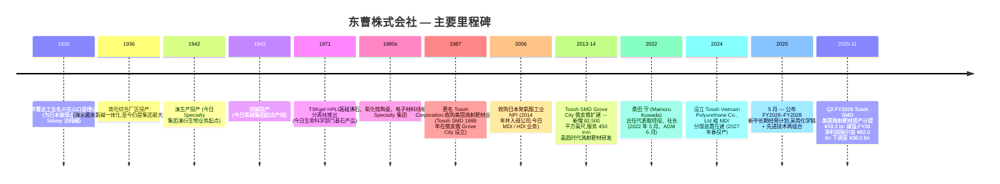

# Tosoh Corporation 东曹株式会社 (TSE:4042) — 公司研究

*首次覆盖。截至 2026-05-26。作者:Claude 研究代理。*

> **更新 — FY2026 业绩指引下调 (2025-11-04):** 东曹将 FY2026 (截至 2026 年 3 月) 归属母公司股东净利润指引由 **¥62.0 亿** (注:本报告中"亿"按日元习惯指 10 亿;¥62.0 bn) 下调至 **¥38.0 bn (–¥24.0 bn / –39%)**;营业收入由 **¥1,050.0 bn 降至 ¥1,020.0 bn**;营业利润由 **¥108.0 bn 降至 ¥103.0 bn**。本次下调的核心驱动因素是 **Tosoh SMD 美国子公司 (位于俄亥俄州 Grove City、100% 控股的溅射靶材 (sputter target) 制造子公司) 计提 ¥19.3 bn 固定资产减值** —— 在 Q2 FY2026 确认,反映美国半导体出货低于预期以及金属靶材产品结构中持续的 ASP (销售单价) 侵蚀。Specialty Group (Specialty 业务集团) 分部经营利润几乎不变 (¥39.3 bn vs 此前 ¥38.6 bn),因为减值在经营利润线以下作为非经常性损失列示。年度股息维持 ¥100 / 股,FY2026 授权 ¥25 bn 回购 —— 在盈利下调背景下,资本回报政策保持不变。
> 资料来源:[Tosoh"FY2026 上半期累计经营业绩",2025-11-04,pp.6, 17, 20](https://www.tosoh.com/File%20Library/Tosoh/Investors/Earnings%20Releases/FY2025/Financial-Results-for-First-Half-FY2026.pdf);[Reuters / BigGo"东曹 FY2025 全年业绩电话会 —— 净利润因 Tosoh SMD 减值同比 –28%",2026-05-13](https://finance.biggo.com/news/JP_4042.T_2026-05-13)。

## 目录
1. 公司概览
2. 公司沿革
3. 管理团队
4. 产品与服务
5. 客户与市场进入策略
6. 行业概览
7. 竞争格局
8. 市场机会 (TAM)
9. 风险评估
10. 参考资料与核验日志

---

## 1. 公司概览

东曹株式会社 (TSE:4042) 是一家 FY2025 营业收入 ¥1.06 万亿日元 (约合 70 亿美元) 的 **日本多元化化学集团**,总部位于东京,运营以南阳综合厂区 (Nanyo Complex,山口县) 与四日市综合厂区 (Yokkaichi Complex,三重县) 为核心的氯碱-石化-精细化学一体化生产平台。集团按四大经营分部披露 —— 石化、氯碱、Specialty、Engineering —— 另设"其他/附属"业务;Specialty 是高毛利的利润引擎,内含半导体相关 **电子材料** (石英玻璃、溅射靶材)、**生命科学** (HPLC 分离柱、临床诊断) 与 **Advanced Materials (先进材料)** (氧化锆陶瓷 (zirconia ceramics)、高硅沸石) 三大子板块 ([Tosoh"截至 2025 年 3 月 31 日财年合并经营业绩",p.14 (分部信息)](https://www.tosoh.com/File%20Library/Tosoh/News%20Release/Tosoh-Reports-Its-Consolidated-Results-for-Fiscal-2025.pdf);[Tosoh"第 126 期事業報告書",p.18 (主要事業)](https://www.tosoh.com/File%20Library/Tosoh/Investors/Shareholders%20Meetings/FY%2025/Business-Report-for-the-126th-Fiscal-Year.pdf))。

公司商业模式是一条 **由大宗化学品向高附加值特化品延伸的纵向一体化产业链**:南阳厂区盐电解出氯气与烧碱 (caustic soda),向下游对接氯乙烯单体 (VCM)/PVC / 聚氯乙烯 (polyvinyl chloride)、聚氨酯原料 (MDI、HDI) 与高纯工业气体;四日市的中京地区日本唯一的石脑油裂解装置生产乙烯,供应聚乙烯、EVA、乙烯胺与高硅沸石催化剂。Specialty 分部依托内部原料平台,叠加专用的电子材料产线 (石英玻璃、溅射靶材、氧化锆粉) 生产面向半导体、生物制药、汽车终端的高附加值产品 ([Tosoh"第 126 期事業報告書",p.10 (中长期经营计划 (mid-term plan) 业务组合定义)](https://www.tosoh.com/File%20Library/Tosoh/Investors/Shareholders%20Meetings/FY%2025/Business-Report-for-the-126th-Fiscal-Year.pdf))。2025 年 5 月公布的中长期经营计划中,公司将四大报告分部重新归并为两大战略组合 —— **Chemical Chain Business / 化学链业务** (石化 + 氯碱 = FY2025 收入 ¥652.5 bn,经营利润 ¥35.8 bn) 与 **Advanced Technologies Business / 先进技术业务** (生命科学 + Advanced Materials + 水处理工程 = 收入 ¥358.3 bn,经营利润 ¥57.7 bn) —— 用以表明未来资本配置将向更高利润率的 Advanced Technologies 组合倾斜 ([Tosoh"第 126 期事業報告書",p.13 (按业务组合的 FY2028 数值目标)](https://www.tosoh.com/File%20Library/Tosoh/Investors/Shareholders%20Meetings/FY%2025/Business-Report-for-the-126th-Fiscal-Year.pdf))。

**规模。** FY2025 (2024 年 4 月 – 2025 年 3 月) 合并净销售额 ¥1,063.4 bn (同比 +5.7%),经营利润 ¥98.9 bn (同比 +23.9%,OPM 9.3%),经常性利润 ¥103.0 bn (+7.4%),归属母公司净利润 ¥58.0 bn (+1.2%) —— 经营利润的跃升源于上一年度四日市装置故障后石化业务的恢复,以及面向半导体晶圆厂的 Engineering Group (Engineering 业务集团) 水处理业务的强劲增长 ([Tosoh"FY2025 合并经营业绩",p.1](https://www.tosoh.com/File%20Library/Tosoh/News%20Release/Tosoh-Reports-Its-Consolidated-Results-for-Fiscal-2025.pdf))。集团 FY2025 末雇员合计 **14,813 人**,分布于日本、比利时、美国 (Tosoh SMD 美国子公司、Tosoh Quartz、Tosoh America、Tosoh Bioscience)、中国 (东曹广州、东曹上海)、菲律宾 (Mabuhay Vinyl、Philippine Resins)、马来西亚 (Tosoh Advanced Materials Sdn Bhd — 高硅沸石)、印度尼西亚、越南 (Tosoh Vietnam Polyurethane,在建) 与中国台湾 (Tosoh Quartz) —— 其中 Specialty 分部 5,019 人,是四大分部中规模最大的 ([Tosoh"第 126 期事業報告書",pp.17, 19 (重要子公司;按分部员工数)](https://www.tosoh.com/File%20Library/Tosoh/Investors/Shareholders%20Meetings/FY%2025/Business-Report-for-the-126th-Fiscal-Year.pdf))。

**地域结构。** FY2025 销售构成:日本 49% (¥521.5 bn)、中国 14% (¥153.8 bn)、其他亚洲 22% (¥236.1 bn)、其他地区 14% (¥152.1 bn) —— 日本本地生产、亚洲客户主导,分部信息附注中明确披露无任何外部客户合并收入占比 ≥10% ([Tosoh"FY2025 合并经营业绩",p.16 (地域信息;主要客户信息)](https://www.tosoh.com/File%20Library/Tosoh/News%20Release/Tosoh-Reports-Its-Consolidated-Results-for-Fiscal-2025.pdf))。FY2025 不动产、厂房与设备账面值 ¥417.3 bn,其中 ¥340.6 bn (82%) 位于日本 —— 产能高度集中于本土,资本密集度因南阳、四日市同时推进低碳化 (生物质发电站在建,计划 2026 年春投产) 与增长性资本开支 (南阳与四日市的分离纯化介质产能,分别于 2026 年春与 2027 年春投产;Tosoh SMD 溅射靶材产能,2025 年冬投产) 而上升 ([Tosoh"FY2025 合并经营业绩",p.16;Topics 页](https://www.tosoh.com/File%20Library/Tosoh/News%20Release/Tosoh-Reports-Its-Consolidated-Results-for-Fiscal-2025.pdf))。

### 估值快照

截至 2026 年 2 月中旬,东曹股价 **¥2,663.5** (52 周区间 ¥1,755 – ¥2,789),对应 **市值约 ¥834.8 bn / 约 55 亿美元**,企业价值约 ¥948 bn ([Yahoo Finance 4042.T,2026-02-13](https://finance.yahoo.com/quote/4042.T/);[Stockanalysis.com TYO:4042 statistics](https://stockanalysis.com/quote/tyo/4042/statistics/))。股价过去 1 年总回报约 +25%,3 年累计约 +77%,在 2024–25 年伴随三菱化学、住友化学、信越的"日本化学盈利复苏 + 弱日元"主题完成估值重估 ([Simply Wall St"全年业绩之后看东曹 (TSE:4042) 估值",2026-05](https://simplywall.st/stocks/jp/materials/tse-4042/tosoh-shares/news/a-look-at-tosoh-tse4042-valuation-after-full-year-earnings-a))。

| 倍数 | 东曹 (4042) | 行业 / 同业参考 | 说明 |
|---|---|---|---|
| TTM P/E | **19.3 – 19.9×** | 日本化学行业均值 13.8×;指定同业均值 48.9× | 高于行业中位数,但远低于同业上四分位 |
| 远期 P/E (FY27E) | **约 13.1×** | – | FY2026 一次性减值过去后估值下行 |
| P/S (TTM) | **0.80×** | 信越约 3.5×;住友化学约 0.45× | 多元化日本化学的中周期水平 |
| EV/EBITDA | **6.5×** | 三菱化学约 7×,信越约 12× | 折价反映石化权重 |
| P/B | **约 0.96×** (¥834.8 bn 市值 ÷ ¥827.1 bn 股东权益) | 信越约 2.4× | 大致按账面值交易,典型价值-周期布局 |
| 股息收益率 | **3.84%** (¥100 / 股) | TOPIX 约 2.5%;行业约 2.8% | 高于市场,FY2026 派息率 84% (按下调后 EPS) |
| ROE | **7.2%** (FY2025) | 行业 8–10%;管理层 FY2028 目标 >10% | 低于股权成本,多年期复苏故事 |
| Beta | **0.50** | 大盘 1.00 | 偏低 —— 石化 + 公用事业属性的氯碱基底拉低系统性风险 |

*Analyst view (分析师观点):* FY26E ~19× 的 P/E (基于下调后 ¥119.5 EPS) 在 FY27E 压缩至约 13× —— 一旦 SMD 一次性减值不再重演,Engineering / Specialty 经营顺风延续一整年,是典型的日本深度周期"低估值×低利润"组合。TTM P/E 比日本化学行业均值 13.8× 高出约 40% (参见 [Simply Wall St](https://simplywall.st/stocks/jp/materials/tse-4042/tosoh-shares/news/a-look-at-tosoh-tse4042-valuation-after-full-year-earnings-a)),但远低于同业均值 48.9× —— 这一差距正是市场把东曹定价为"价值型化学股"、而非"半导体材料成长股"的结果。估值中最具弹性的单一变量是中长期经营计划 FY2028 ¥140 bn 经营利润目标 (vs FY2025 实际 ¥98.9 bn、FY2026 预测 ¥103.0 bn) 的可信度 —— 在已对美国溅射靶材子公司计提减值的基础上,三年内提升 42%。P/B 约 1.0× 与 EV/EBITDA 6.5× 共同发出信号:市场只在为资产重置价值付费,并没有为 Specialty 分部的增长可选性付费 —— 这正是若 FY2028 目标得到兑现,所将释放的非对称上行空间。

FY2025 的绝对数字背后,真正的投资故事是结构性产品组合再平衡:Specialty Group 在 ¥270.5 bn 营业收入上录得 ¥38.6 bn 经营利润 (OPM **14.3%**);Engineering 在 ¥169.3 bn 收入上录得 ¥33.6 bn (OPM 19.9%);氯碱在 ¥373.4 bn 上录得 ¥9.5 bn (OPM 2.5%);石化在 ¥204.8 bn 上录得 ¥14.3 bn (OPM 7.0%) —— 也就是 Specialty + Engineering 以 41% 的集团营收贡献了 73% 的经营利润 ([Tosoh"FY2025 合并经营业绩",p.15 (FY2025 分部信息)](https://www.tosoh.com/File%20Library/Tosoh/News%20Release/Tosoh-Reports-Its-Consolidated-Results-for-Fiscal-2025.pdf))。2025–2027 中长期经营计划明确把 FY2028 经营利润结构进一步向 Specialty (生命科学 + Advanced Materials) 与 Engineering 倾斜,其中 Advanced Materials 子分部单独的经营利润目标由 FY2025 的 ¥5.3 bn 提升至 FY2028 的 ¥20.5 bn —— 接近 4 倍的跃升,由 Tosoh SMD 溅射靶材扩产、南阳分离/纯化介质扩产以及 HDI 衍生品扩产共同驱动 ([Tosoh"第 126 期事業報告書",p.13](https://www.tosoh.com/File%20Library/Tosoh/Investors/Shareholders%20Meetings/FY%2025/Business-Report-for-the-126th-Fiscal-Year.pdf))。

资料来源:[Tosoh"第 126 期事業報告書",p.16 (FY2021–FY2025 资产、损益变化)](https://www.tosoh.com/File%20Library/Tosoh/Investors/Shareholders%20Meetings/FY%2025/Business-Report-for-the-126th-Fiscal-Year.pdf);FY2026E 取自 [Tosoh"FY2026 上半期累计经营业绩",2025-11-04,p.17](https://www.tosoh.com/File%20Library/Tosoh/Investors/Earnings%20Releases/FY2025/Financial-Results-for-First-Half-FY2026.pdf)。

资料来源:[Tosoh"FY2025 合并经营业绩",p.15](https://www.tosoh.com/File%20Library/Tosoh/News%20Release/Tosoh-Reports-Its-Consolidated-Results-for-Fiscal-2025.pdf)。

---

## 2. 公司沿革

东曹株式会社于 **1935 年 2 月 11 日** 在山口县德山以 **東洋曹達工業株式会社 (Toyo Soda Manufacturing Co., Ltd.)** 名义创立 —— 设立初衷是为日本玻璃工业生产碳酸钠 (纯碱),并于次年建成南阳综合厂区,作为以海水盐为原料的氯碱一体化基地 ([Encyclopedia.com — 东曹公司沿革](https://www.encyclopedia.com/books/politics-and-business-magazines/tosoh-corporation);[Wikipedia — 东曹,引证企业披露](https://en.wikipedia.org/wiki/Tosoh))。选址带有明显战略考量:山口沿海一带,工厂可使用海水卤水和氨原料 (Solvay 法关键投入),同时贴近中京工业带,内陆下游客户 (玻璃、陶瓷、纸浆造纸) 触手可及。Solvay 法纯碱产线在二战期间相继扩展为溴 (1942) 与烧碱 (1943) —— 后者即九十年后仍支撑集团利润基底的氯碱业务起点。

战后,公司沿垂直一体化方向扩张 —— 1950 年代末进入氯乙烯单体,1960 年代进入 PVC 树脂,1970 年代在日本经济进入高增长拐点后,于四日市综合厂区上马乙烯裂解装置,确立至今支撑氯碱集团的"盐 → 氯 → VCM → PVC"完整产业链 ([FundingUniverse — 东曹公司沿革](https://www.fundinguniverse.com/company-histories/tosoh-corporation-history/))。随后一系列精细化学多元化举措接续展开:1980 年代推出高硅沸石催化剂 (面向全球 FCC 与 SDA 应用的炼油客户)、氧化锆陶瓷粉 (TZ-Series 系列,面向口腔、结构件、套管等应用),以及 1971 年推出的 **TSKgel HPLC 分离柱** —— 使东曹成为日本最早进入生命科学工具市场、最终壮大为今日 Tosoh Bioscience 部门的厂商之一 ([Tosoh Bioscience separations 产品页 — TSKgel 推出历史](https://www.separations.us.tosohbioscience.com/HPLC_Columns/id-8390/TSKgel_SuperH2500))。

公司现代史上最关键的战略举措是 **1987 年品牌更名为 Tosoh Corporation** —— 由 Toyo-Soda → Tosoh 的缩写,既宣告东曹意图作为全球特化品集团被外界识别,也告别"国内氯碱/纯碱厂商"的旧标签 ([Wikipedia — 东曹,1987 年更名](https://en.wikipedia.org/wiki/Tosoh))。同年,东曹收购 **Tosoh SMD, Inc.** 美国子公司前身 (后于 1988 年在俄亥俄州 Grove City 正式设立) —— 此后这家高纯度溅射靶材子公司随 1990 年代美国晶圆厂建设潮承载东曹品牌进入美国半导体供应链 ([Tosoh SMD 公司沿革](https://dev.tosohsmd.com/about-us/history/))。

2006 年对 **日本聚氨酯工业 (Nippon Polyurethane Industry / NPI)** 的并购 —— 一家国内 MDI / TDI / 聚氨酯原料生产商 —— 是现代东曹史上规模最大的 M&A;NPI 于 2014 年并入母公司,集中了如今归于氯碱集团的 MDI 业务 ([Wikipedia — 东曹,2006 年 NPI 收购](https://en.wikipedia.org/wiki/Tosoh))。聚氨酯由此成为氯碱集团的战略支点:中国产能扩张让 PVC 逐步走向大宗化,高附加值的 MDI / HDI 硬化剂线则成为分部的增长引擎,公司已公告 **Tosoh Vietnam Polyurethane Co., Ltd** 粗 MDI 分馏装置 (2027 年春投产,纳入 FY2026–2028 中长期经营计划资本支出)、南阳综合厂区 HDI 衍生品产能扩张 (2026 年夏投产) ([Tosoh"FY2025 合并经营业绩",p.21 (Topics)](https://www.tosoh.com/File%20Library/Tosoh/News%20Release/Tosoh-Reports-Its-Consolidated-Results-for-Fiscal-2025.pdf))。越南 MDI 装置与中国的 **Tosoh (Ruian) Polyurethane** 共同卡位东南亚聚氨酯需求增长 —— 中国本土市场已步入成熟。

近年最具决定性的战略转向是 **2025 年 5 月公布的 FY2026–FY2028 中长期经营计划**:把四大报告分部正式重组为两大战略组合 —— **化学链业务** (石化 + 氯碱,即传统大宗产业链) 与 **先进技术业务** (Specialty 内的生命科学与 Advanced Materials 子板块 + Engineering 内的水处理) —— 并明确承诺将三年内增量资本支出 ¥220–250 bn 的主要部分配置给先进技术业务,以兑现 FY2031 ¥170 bn 经营利润目标 ([Tosoh"第 126 期事業報告書",pp.10, 12-14](https://www.tosoh.com/File%20Library/Tosoh/Investors/Shareholders%20Meetings/FY%2025/Business-Report-for-the-126th-Fiscal-Year.pdf))。计划同时把 **¥50 bn 三年回购** 写入股东回报政策,作为 ¥100 / 股最低股息基础上的补充机制 (若基础股息低于派息率 50% 的下限,则通过回购把派息率拉至 50%) —— 这是公司历史上最激进的资本回报承诺,也意在回应自 2022 年以来长期低于 1× P/B 的估值困境 ([Tosoh"FY2026 上半期累计经营业绩",p.21 (股东回报)](https://www.tosoh.com/File%20Library/Tosoh/Investors/Earnings%20Releases/FY2025/Financial-Results-for-First-Half-FY2026.pdf))。Q2 FY2026 Tosoh SMD 减值恰好发生在这一战略转向中段 —— 是对 Advanced Materials 增长叙事的战术挫折,但并不否定中长期经营计划所赖以建立的结构性产品组合再平衡。

---

## 3. 管理团队

**桑田 守 (Mamoru Kuwada)** — 代表取缔役、社长 (自 2022 年 3 月 1 日起任职)

桑田守于 **2022 年 3 月 1 日** 出任东曹代表取缔役、社长,并于 2022 年 6 月第 124 期股东大会上获得正式确认,接替同日转任公司顾问的前任社长 **山本 寿宣 (Toshinori Yamamoto)** ([Everchem Specialty Chemicals — "Tosoh 任命新社长",2022-02-15](https://everchem.com/tosoh-names-new-president/);[Bloomberg 简历 — 桑田守、东曹](https://www.bloomberg.com/profile/person/20913255))。这一人事任命具有重要的结构性意义:桑田守此前担任东曹 **副社长** 与 **Specialty Materials Division (特种材料事业部)** 负责人 —— 即在升任母公司 CEO 之前,他长期主管 Advanced Materials / 电子材料业务 (溅射靶材、石英玻璃、氧化锆、HPLC),由此成为东曹现代史上首位出身高毛利特化品端、而非来自传统氯碱 / 石化大宗产业链端的社长 ([Tosoh 官方公告,经 PUDaily 转发 — "东曹任命新社长",2022](https://www.gvchem.com/news/tosoh-corporation-appoints-new-president-54049026.html);[LinkedIn — Tosoh Bioscience Diagnostics EMEA 谈桑田守 2023 年 10 月访问](https://www.linkedin.com/posts/tosoh-bioscience-diagnostics-emea_last-week-mamoru-kuwada-president-of-tosoh-activity-7124676997921824768-lreI))。这与 2025 年 5 月中长期经营计划明确把先进技术业务作为增长引擎的资本配置取向高度一致:由 Specialty / 电子材料业务体系内成长起来的 CEO,正是押注 Specialty 增长的最合适旗手。

桑田守是典型的东曹内部成长型高管 —— 据 Bloomberg 简历,他于 1980 年代末加入东曹,在 Specialty Materials Division 内部跨越多个职能与事业部负责人岗位,直至 2022 年升任 ([Bloomberg 简历 — 桑田守](https://www.bloomberg.com/profile/person/20913255);[Simply Wall St "东曹管理层分析"](https://simplywall.st/stocks/us/materials/otc-tosc.f/tosoh/management))。其 FY2025 总薪酬约 ¥124 mn,固定薪 47.6%、绩效挂钩部分 (现金奖金 + 限制性股权激励) 52.4% —— 对 TOPIX 上市的日本化学公司 CEO 而言属于合理水平 ([Tosoh"第 126 期事業報告書",p.24 (董事薪酬合计)](https://www.tosoh.com/File%20Library/Tosoh/Investors/Shareholders%20Meetings/FY%2025/Business-Report-for-the-126th-Fiscal-Year.pdf);2022 年 LinkedIn / Simply Wall St 披露的薪酬构成)。董事绩效薪酬挂钩三项指标 —— 合并经常性利润 (FY2024:¥95.9 bn)、每股年度股息 (¥85) 与 CSR 关键议题达成率 —— 这一结构把管理层现金奖金与盈利、股息政策绑定,但不含明确的 ROE / EPS 增长门槛 ([Tosoh"第 126 期事業報告書",p.26 (绩效薪酬政策)](https://www.tosoh.com/File%20Library/Tosoh/Investors/Shareholders%20Meetings/FY%2025/Business-Report-for-the-126th-Fiscal-Year.pdf))。其在东曹的"准创始命题"是 Specialty Materials / 电子材料业务的扩张 —— 在他主管事业部的十余年间,Tosoh SMD 溅射靶材产能完成两轮扩建 (2013–14 年 Grove City 82,500 平方英尺扩建,服务 450 mm 晶圆研发;2025 年冬投产的最新一轮节点扩建),Specialty Group 经营利润由十几亿日元区间近翻倍至 FY2024–FY2025 的 ¥30+ bn 至 ¥40+ bn 区间 ([Business Standard — "Tosoh SMD 大幅投资服务半导体行业",2013-11-12](https://www.business-standard.com/content/b2b-chemicals/tosoh-smd-plans-major-investments-to-serve-semiconductor-industry-113111200428_1.html);[Tosoh FY26 上半期业绩,2025-11-04,p.4 (Topics — 2025 年冬溅射靶材产能)](https://www.tosoh.com/File%20Library/Tosoh/Investors/Earnings%20Releases/FY2025/Financial-Results-for-First-Half-FY2026.pdf))。

东曹九十年历史先于任何现代意义上的"单一创始人" —— 1935 年东洋曹达工业由山口县一批工业与商社利益方共同发起,作为战前日本化学工业整体布局的一部分,而非由具名企业家独自创立。本报告因此遵循公司研究 skill 的常规做法,仅聚焦在任 CEO 简历 ([Encyclopedia.com — 东曹创立背景](https://www.encyclopedia.com/books/politics-and-business-magazines/tosoh-corporation))。Specialty 战略方向的延续性由 **大道 信克 (Nobukatsu Ohmichi)** 承担 —— 现任副社长、Specialty Group 总裁、Advanced Materials 事业部长,即桑田守在 Specialty Materials 主管位置上的继任者 —— 但按公司研究 skill 的覆盖范围,本节人物部分至现任 CEO 为止 ([Tosoh"第 126 期事業報告書",p.24 (执行官名单)](https://www.tosoh.com/File%20Library/Tosoh/Investors/Shareholders%20Meetings/FY%2025/Business-Report-for-the-126th-Fiscal-Year.pdf))。

---
