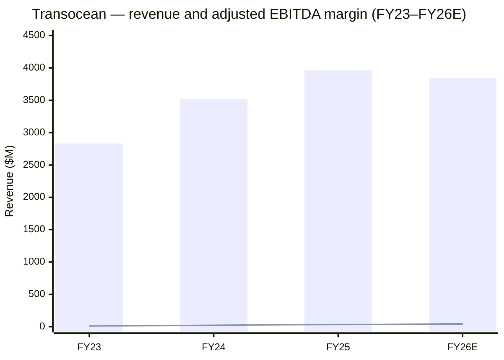
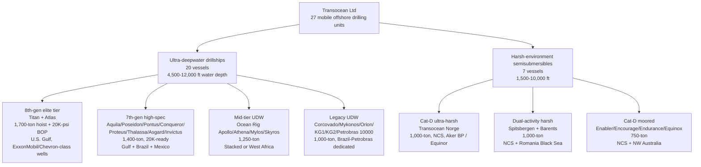
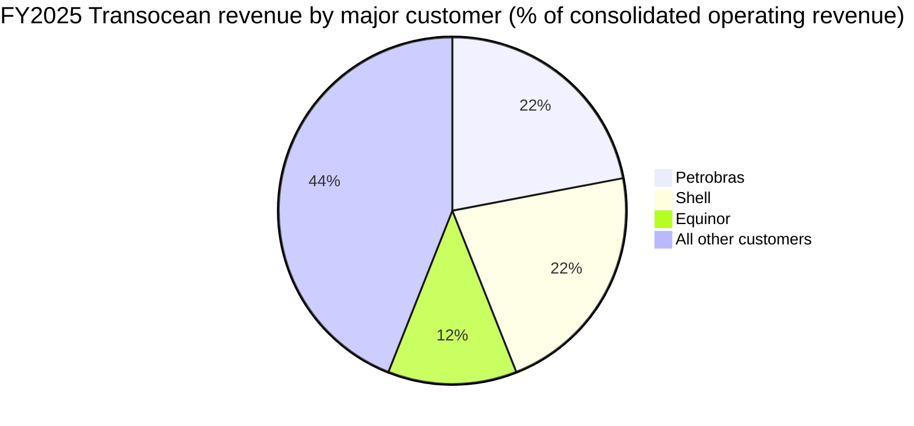
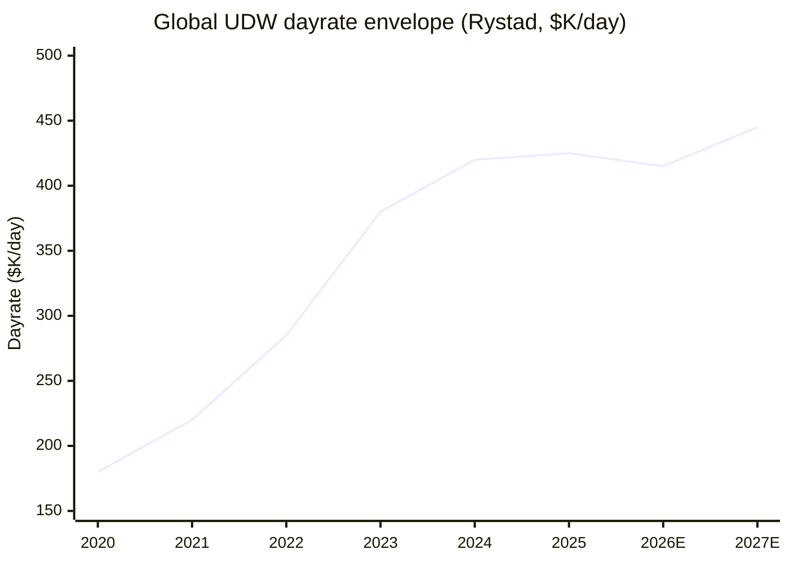
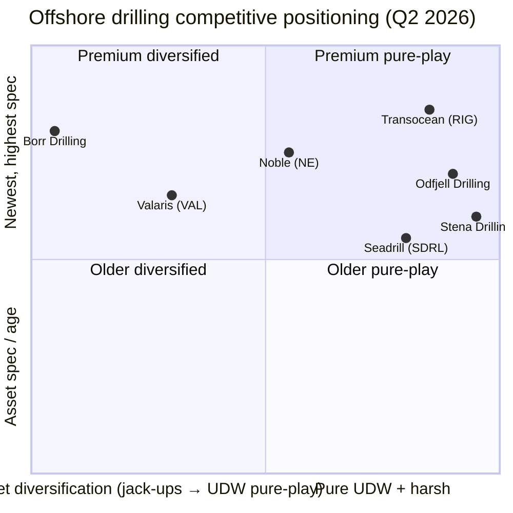
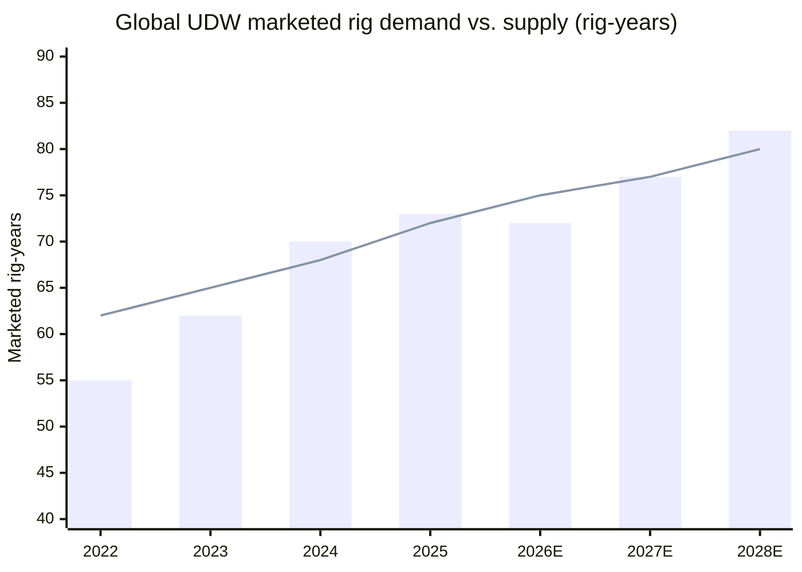

# Transocean Ltd. (NYSE: RIG) — Initiation of Coverage

**Sector:** Offshore Drilling Services (SIC 1381 — Drilling Oil & Gas Wells)
**Domicile:** Steinhausen, Canton of Zug, Switzerland (Swiss corporation)
**Listing:** NYSE: RIG (single class, $0.10 par value shares)
**Report date / "as of":** 2026-06-03
**Author:** Internal research desk
**Cover the Buy / Hold / Sell — see Section 10 lens scorecards.**

> **Top-of-report banner — guidance change (FY26):** On 4 May 2026, with Q1 results, Transocean *initiated* FY26 guidance — full-year contract drilling revenue of **$3.80–3.90 bn**, fleet-wide revenue efficiency 96.5%, O&M $2.25–2.38 bn, total liquidity $1.25–1.35 bn. Backlog rose to **$7.1 bn at 4 May 2026** with an implied weighted-average dayrate above **$450,000/day**, up from $6.06 bn at 19 Feb 2026 and $6.29 bn at 31 Dec 2025 ([Transocean Q1 2026 8-K Ex-99.1](https://www.sec.gov/Archives/edgar/data/0001451505/000145150526000041/rig-20260504xex99d1.htm); [2025 10-K, Item 1A](https://www.sec.gov/Archives/edgar/data/1451505/000145150526000018/rig-20251231x10k.htm)).

> **Top-of-report banner — strategic event (FY26):** On 9 February 2026, Transocean and Valaris Ltd. signed a **Business Combination Agreement** in which Transocean will acquire all Valaris common shares at **15.235 Transocean shares per Valaris share** (a ~$5.8 bn equity-value deal that would create a 73-rig combined fleet — 33 ultra-deepwater drillships, 9 semis, 31 modern jack-ups). On 4 May 2026 the DOJ issued a **Second Request** under HSR, materially extending the antitrust review and pushing expected close into late-2026 or 2027 ([2025 10-K, Item 1](https://www.sec.gov/Archives/edgar/data/1451505/000145150526000018/rig-20251231x10k.htm); [Transocean 8-K — Second Request, 4 May 2026](https://www.sec.gov/Archives/edgar/data/0001451505/000110465926055235/tm269762d6_8k.htm); [Offshore Energy — Valaris-Transocean $5.8 bn antitrust](https://www.offshore-energy.biz/transoceans-5-8-billion-merger-with-valaris-pending-us-antitrust-clearance/)).

## Table of Contents

1. Company Overview
2. Company History
3. Management Team
4. Products and Services
5. Customers and Geographic Footprint
6. Industry Overview
7. Competitive Landscape
8. Market Opportunity
9. Risk Assessment
10. Investor-Lens Scorecards
11. References & Data Used

---

## 1. Company Overview

Transocean Ltd. is "a leading international provider of offshore contract drilling services for oil and gas wells" — the exact language in the issuer's most recent 10-K filed February 23, 2026 ([Transocean 2025 10-K, Item 1 Business](https://www.sec.gov/Archives/edgar/data/1451505/000145150526000018/rig-20251231x10k.htm)). The business is reported as **a single operating segment** — contract drilling — and the company specializes in "technically demanding regions of the global offshore drilling business with a particular focus on ultra-deepwater and harsh environment drilling services," operating "one of the most versatile fleets in the world, consisting of drillships and semisubmersible floaters" ([2025 10-K Item 1](https://www.sec.gov/Archives/edgar/data/1451505/000145150526000018/rig-20251231x10k.htm)). As of February 17, 2026 the company "owned or had partial ownership interests in and operated 27 mobile offshore drilling units, consisting of 20 ultra-deepwater drillships and seven harsh environment semisubmersibles" ([2025 10-K Item 1](https://www.sec.gov/Archives/edgar/data/1451505/000145150526000018/rig-20251231x10k.htm)).

Transocean is a **Swiss-domiciled holding company** headquartered at Turmstrasse 30, 6312 Steinhausen, with shares listed on the New York Stock Exchange under "RIG" — a structure dating from 2008–09 when the company re-domiciled from the Cayman Islands to take advantage of Switzerland's holding-company regime and treaty network ([SEC EDGAR submissions JSON for CIK 0001451505](https://data.sec.gov/submissions/CIK0001451505.json); [2025 10-K Item 1 — Switzerland HQ](https://www.sec.gov/Archives/edgar/data/1451505/000145150526000018/rig-20251231x10k.htm)). As of June 30, 2025 there were **902,249,348 shares outstanding** ([2025 10-K cover page](https://www.sec.gov/Archives/edgar/data/1451505/000145150526000018/rig-20251231x10k.htm)).

**Revenue and earnings trajectory (FY23-FY25, full year, $ millions).** Contract drilling revenues rose from **$2,832M in FY23 to $3,524M in FY24 (+24%) to $3,965M in FY25 (+13%)** — a recovery into a multi-year offshore upcycle driven by higher utilization (60.5% in FY24 → 72.4% in FY25) and a thicker dayrate book ([2025 10-K MD&A Results of Operations](https://www.sec.gov/Archives/edgar/data/1451505/000145150526000018/rig-20251231x10k.htm)). Despite revenue growth, the GAAP picture is dominated by **$3,049M of loss on impairment of assets** in FY25 (Q2 2025 $1,128M; Q3 2025 $1,908M, both pre-tax — driven by management's decision to retire and divest seven older drillships including *Deepwater Champion*, *Discoverer Americas*, *Discoverer Clear Leader*, *Discoverer India*, *Discoverer Luanda*, *GSF Development Driller I*, and the harsh-environment semi *Henry Goodrich*) producing a **FY25 net loss attributable to controlling interest of $(2,915)M** vs. $(512)M in FY24 and $(954)M in FY23 ([2025 10-K Statements of Operations + MD&A](https://www.sec.gov/Archives/edgar/data/1451505/000145150526000018/rig-20251231x10k.htm)). Operationally, however, FY25 cash flow was strong — **net cash from operating activities of $749M** (vs. $447M FY24, $164M FY23) ([2025 10-K Cash Flow Statement](https://www.sec.gov/Archives/edgar/data/1451505/000145150526000018/rig-20251231x10k.htm)). The Q1 2026 print — net income $71M ($0.06 diluted EPS), adjusted EBITDA $440M (40.7% margin), free cash flow $136M — confirms the turn ([Q1 2026 8-K Ex-99.1](https://www.sec.gov/Archives/edgar/data/0001451505/000145150526000041/rig-20260504xex99d1.htm)).

**Capital structure.** At December 31, 2025 total debt was **$5.66 bn** of which $1.68 bn was secured; the Secured Credit Facility (a $576M revolver) was undrawn ([2025 10-K Item 1A — debt disclosure](https://www.sec.gov/Archives/edgar/data/1451505/000145150526000018/rig-20251231x10k.htm)). By Q1 2026 total principal debt had been cut to **$5.14 bn** following accelerated retirement of the $358M 8.375% Deepwater Titan Notes due 2028 and $940M of debt redemptions during 2025 — saving ~$40M of interest-to-maturity on the Titan tranche alone ([Q1 2026 8-K Ex-99.1](https://www.sec.gov/Archives/edgar/data/0001451505/000145150526000041/rig-20260504xex99d1.htm); [2025 10-K Debt Note 8](https://www.sec.gov/Archives/edgar/data/1451505/000145150526000018/rig-20251231x10k.htm)).

**Valuation snapshot (TTM, as of 2 June 2026).** Stock price **$6.30**, market cap **$7.08 bn**, **TTM P/E negative (–2.10)** on $(2.72) TTM EPS, P/S ~1.7× on FY25 revenue of $3.97 bn ([WallStreetZen — RIG stock](https://www.wallstreetzen.com/stocks/us/nyse/rig); [Finviz — RIG quote](https://finviz.com/quote.ashx?t=RIG)). *Analyst view:* the negative P/E is **not** a structural going-concern signal — it is the mechanical result of the $3.05 bn of FY25 fleet impairments, which are non-cash and concentrated on legacy drillships the market has effectively written down already. Stripping the impairment, FY25 adjusted EBITDA was ~$1.36 bn ($244M Q1 + $385M Q4 implied + run-rate) and FY26E guidance points to EBITDA of ~$1.55–1.70 bn — putting RIG on EV/EBITDA of roughly **8×** at $7.1 bn equity + ~$4.5 bn net debt = ~$11.6 bn EV (analyst-constructed; FY26 EBITDA derived from FY26E revenue $3.8–3.9 bn × ~42% adjusted EBITDA margin run-rate). Peers Noble (NE) and Valaris (VAL) trade at 5–7× forward EV/EBITDA, so RIG carries a modest premium reflecting (a) the deepest UDW backlog ($7.1 bn) and (b) optionality on the Valaris acquisition synergies. The lower-leverage post-merger combined entity (if it closes) is the upside path; an antitrust block is the downside path.

Source: [2025 10-K — Results of Operations](https://www.sec.gov/Archives/edgar/data/1451505/000145150526000018/rig-20251231x10k.htm); [Q1 2026 8-K Ex-99.1 (FY26 guidance midpoint)](https://www.sec.gov/Archives/edgar/data/0001451505/000145150526000041/rig-20260504xex99d1.htm). EBITDA margin shown is approximate adjusted-EBITDA margin scaled ×100 on the right axis; FY23 ≈ 11%, FY24 ≈ 22%, FY25 ≈ 34% (Q4 36.8% run-rate), FY26E ≈ 42% per Q1 2026 guidance and Q1 actual 40.7%.

---

## 2. Company History

```mermaid
timeline
    title Transocean — 72-year evolution from Sonat-era jack-up pioneer to UDW pure-play
    1953 : Southern Natural Gas (Birmingham, AL) creates The Offshore Company
         : Acquires DeLong-McDermott joint drilling operation
    1954 : Launches Rig 51, the first mobile jack-up rig in the Gulf of Mexico
    1967 : The Offshore Company IPOs on NYSE
    1978 : SNG turns Offshore Company into a wholly owned subsidiary
    1982 : Renamed Sonat Offshore Drilling
    1993 : Sonat Offshore spun off from Sonat / Southern Natural Gas; NYSE-listed
    1996 : Acquires Norwegian Transocean ASA for ~$1.5 bn — becomes Transocean Offshore
    1999 : Mergers with Schlumberger's Sedco Forex — $3.2 bn stock deal; renamed Transocean Sedco Forex
    2007 : Mergers with GlobalSantaFe in a $53 bn enterprise-value transaction; renamed Transocean Inc.
    2008 : Re-domiciles holding company to Steinhausen, Switzerland
    2010 : Deepwater Horizon blowout (Apr 20) — 11 fatalities; largest US oil spill
    2013 : DOJ plea — $400 M criminal fine + $1 bn Clean Water Act civil penalty
    2014 : Barbier court ruling — 67% BP / 30% Transocean / 3% Halliburton blame apportionment
    2015 : Final BP settlement — Transocean settles all Deepwater Horizon claims with BP
    2016 : Industry trough — DW dayrates collapse below $200K/d during oil downcycle
    2018 : Acquires Songa Offshore (cat-D harsh-environment semis)
    2019 : Acquires Ocean Rig (six UDW drillships) for $2.7 bn
    2021 : Industry-wide debt restructuring; Transocean avoids Chapter 11 (Noble, Valaris, Diamond, Seadrill all reorg)
    2022 : Transocean Norge starts work; harsh-environment fleet at full deployment
    2023 : Backlog rebuilds; Deepwater Titan delivered, 1,700-ton hoisting capacity
    2025 : Apr — Keelan Adamson becomes CEO (Jeremy Thigpen retires)
         : $3.05 bn FY25 impairment + 7 legacy drillships retired
    2026 : Feb 9 — Agrees to acquire Valaris (~$5.8 bn) at 15.235 RIG / VAL
         : May 4 — DOJ Second Request issued
         : May 4 — Backlog reaches $7.1 bn with implied dayrate >$450 K/d
```

Source: timeline distilled from [Wikipedia — Transocean](https://en.wikipedia.org/wiki/Transocean); [FundingUniverse — Transocean Sedco Forex history](https://www.fundinguniverse.com/company-histories/transocean-sedco-forex-inc-history/); [DOJ press release on 2013 plea](https://www.justice.gov/archives/opa/pr/transocean-agrees-plead-guilty-environmental-crime-and-enter-civil-settlement-resolve-us); [Transocean 2025 10-K Item 1](https://www.sec.gov/Archives/edgar/data/1451505/000145150526000018/rig-20251231x10k.htm); [Offshore Energy — second-in-command moving up to CEO at Transocean](https://www.offshore-energy.biz/second-in-command-moving-up-to-ceo-at-transocean/).

**Founding (1953).** The lineal predecessor of today's Transocean is **The Offshore Company**, created on February 12, 1953 by Birmingham, Alabama-based Southern Natural Gas Company (later Sonat) to address a gap in mobile offshore drilling for the U.S. Gulf of Mexico. Southern Natural Gas acquired the joint drilling operation **DeLong-McDermott** from DeLong Engineering and J. Ray McDermott as the founding asset. In 1954 the Offshore Company launched **Rig 51 — the first mobile jack-up rig** — pioneering the design pattern that allows a vessel to elevate itself above the sea surface on three or four telescoping legs and convert from a floating barge into a rigid drilling platform once on station ([Wikipedia — Transocean, history section](https://en.wikipedia.org/wiki/Transocean); [FundingUniverse — Transocean Sedco Forex Inc. history](https://www.fundinguniverse.com/company-histories/transocean-sedco-forex-inc-history/)).

**From utility-owned operator to independent contract driller (1967–1993).** The Offshore Company IPOd in 1967, was rolled back into Southern Natural Gas as a wholly-owned subsidiary in 1978, then renamed Sonat Offshore Drilling in 1982 to reflect SNG's own re-branding to Sonat. In 1993 Sonat Offshore Drilling was spun off from Sonat as an independently NYSE-listed company, and that spin-off capital funded the next decade of aggressive consolidation ([FundingUniverse — Transocean Sedco Forex history](https://www.fundinguniverse.com/company-histories/transocean-sedco-forex-inc-history/); [Wikipedia — Transocean](https://en.wikipedia.org/wiki/Transocean)).

**The three founding mergers (1996, 1999, 2007).** Three transactions in eleven years built the franchise that exists today. **1996 — Transocean ASA**: Sonat Offshore acquired the Norwegian-listed Transocean ASA for ~$1.5 bn, taking the modern name "Transocean Offshore" and pivoting into harsh-environment semisubmersibles for the Norwegian North Sea. **1999 — Sedco Forex**: a $3.2 bn stock-merger with Schlumberger's drilling subsidiary Sedco Forex — itself the 1980s combination of Southeastern Drilling Company (Sedco, founded 1947 by Bill Clements; acquired by Schlumberger in 1985 for $1 bn) and Forages et Exploitations Pétrolières (Forex, founded 1942 in France) — created Transocean Sedco Forex, the world's largest offshore contract driller. **2007 — GlobalSantaFe**: the $53 bn enterprise-value combination with GlobalSantaFe added the cantilevered jack-up fleet (later divested) and an ultra-deepwater drillship pipeline ([Wikipedia — Transocean](https://en.wikipedia.org/wiki/Transocean); [Encyclopedia.com — Transocean Sedco Forex Inc.](https://www.encyclopedia.com/books/politics-and-business-magazines/transocean-sedco-forex-inc); [FundingUniverse — Transocean Sedco Forex history](https://www.fundinguniverse.com/company-histories/transocean-sedco-forex-inc-history/)).

**The Macondo disaster (April 20, 2010) and its decade-long legal tail.** While stationed at BP's Macondo well in the Gulf of Mexico, the *Deepwater Horizon* — a fifth-generation semisubmersible drillship owned by Transocean and contracted to BP — experienced an uncontrolled blowout, explosion, and fire that killed 11 rig workers and released approximately 4.9 million barrels of oil into the Gulf, the largest oil spill in U.S. history ([Pillsbury — Deepwater Horizon: A Decade of Legal Impacts](https://www.pillsburylaw.com/en/news-and-insights/deepwater-horizon-a-decade-of-legal-impacts.html); [Wikipedia — Deepwater Horizon](https://en.wikipedia.org/wiki/Deepwater_Horizon)). On January 3, 2013 Transocean agreed to plead guilty to a Clean Water Act criminal misdemeanor, pay a **$400 million criminal fine**, and **$1 billion in civil penalties** — the largest Clean Water Act civil penalty in history at that time ([DOJ press release — January 3, 2013 plea](https://www.justice.gov/archives/opa/pr/transocean-agrees-plead-guilty-environmental-crime-and-enter-civil-settlement-resolve-us)). On September 4, 2014 Judge Carl Barbier apportioned blame **67% BP / 30% Transocean / 3% Halliburton** under the Clean Water Act, and in 2015 Transocean reached a final settlement with BP closing all remaining claims ([gCaptain — Transocean settles all Deepwater Horizon claims with BP](https://gcaptain.com/transocean-settles-all-claims-with-bp-over-deepwater-horizon/); [Wikipedia — Deepwater Horizon](https://en.wikipedia.org/wiki/Deepwater_Horizon)).

**The 2014–2021 industry downcycle and Transocean's strategic re-shaping.** The collapse in Brent below $30 in early 2016 set off a six-year offshore depression. While peers — Noble, Valaris (then Ensco-Rowan), Diamond Offshore, Seadrill, Pacific Drilling — all entered Chapter 11 between 2017 and 2021, Transocean stayed out of court, restructuring debt through tender offers, exchange offers, and selective asset sales. The 2018 Songa Offshore acquisition added four cat-D harsh-environment semis (now branded the *Transocean Enabler*, *Encourage*, *Endurance*, and *Equinox* series), and the 2019 Ocean Rig deal added six 12,000-ft-rated drillships — *Ocean Rig Apollo*, *Athena*, *Mylos*, *Skyros*, and others ([Wikipedia — Transocean](https://en.wikipedia.org/wiki/Transocean); [2025 10-K Item 1 — rig table](https://www.sec.gov/Archives/edgar/data/1451505/000145150526000018/rig-20251231x10k.htm)). The *Deepwater Titan* — placed in service 2023 with a 1,700-short-ton hoisting capacity and dual 20,000-psi BOPs — and the *Deepwater Atlas* (2022, also 1,700-ton) were the first **eighth-generation drillships** in the industry ([2025 10-K Item 1 — Technology Overview](https://www.sec.gov/Archives/edgar/data/1451505/000145150526000018/rig-20251231x10k.htm)).

**Recent corporate history (FY24-26).** Three events define the current chapter: (i) the April 2025 CEO handoff from Jeremy Thigpen (CEO since 2015) to Keelan Adamson, an internal promotion that emphasizes operational continuity ([Nasdaq — Transocean promotes President & COO Keelan Adamson to succeed Jeremy Thigpen](https://www.nasdaq.com/articles/transocean-promotes-president-and-coo-keelan-adamson-succeed-jeremy-thigpen-president-and)); (ii) the $3.05 bn FY25 fleet impairment — the largest in the company's history — taken in conjunction with the retirement and sale of seven legacy drillships (the "Discoverer-class" cluster) plus the harsh-environment semi *Henry Goodrich*, which simplified the fleet to 27 high-spec units and disposed of capacity that had not generated economic returns since the 2014 downcycle ([2025 10-K — Loss on impairment of assets, MD&A](https://www.sec.gov/Archives/edgar/data/1451505/000145150526000018/rig-20251231x10k.htm)); and (iii) the February 9, 2026 agreement to acquire **Valaris Limited** in an all-stock transaction valued at approximately $5.8 bn — pending the DOJ HSR Second Request issued May 4, 2026 ([Transocean 8-K — Valaris Second Request, 4 May 2026](https://www.sec.gov/Archives/edgar/data/0001451505/000110465926055235/tm269762d6_8k.htm)).

---

## 3. Management Team

Per the skill convention, Section 3 covers the founder and the current CEO only.

**Founder (1953) — institutional, not personal.** Transocean has no living individual founder. The 1953 founding entity, **The Offshore Company**, was a corporate creation of Southern Natural Gas Company (Birmingham, AL) following the 1953 acquisition of the DeLong-McDermott joint drilling operation. No single named individual is historically credited as the founder; the lineage runs through Southern Natural Gas's gas-utility leadership, the later Sonat / Sonat Offshore management chain (1978–1993), and the post-1993-spin-off independent management. Of more direct relevance to the modern company is **Bill Clements**, who founded Southeastern Drilling Company (Sedco) in 1947 — Sedco was sold to Schlumberger in 1985 for $1 bn, became the SF in Sedco Forex, and was contributed back to Transocean in the 1999 merger. Clements went on to serve as Governor of Texas (1979–83, 1987–91) and died in 2011 ([FundingUniverse — Transocean Sedco Forex history](https://www.fundinguniverse.com/company-histories/transocean-sedco-forex-inc-history/); [Wikipedia — Transocean, history section](https://en.wikipedia.org/wiki/Transocean)). Beyond Clements, who is a partial-genealogy founder rather than the founder of the current company, no operationally-involved founder remains.

**Chief Executive Officer (since April 2025) — Keelan I. Adamson.** Adamson became President and CEO of Transocean in April 2025, succeeding **Jeremy Thigpen** (CEO 2015–2025). He had previously served as President and Chief Operating Officer from March 2022 to April 2025, making the elevation an internally-grown succession the board telegraphed roughly three years in advance ([Offshore Energy — Second-in-command moving up to CEO at Transocean](https://www.offshore-energy.biz/second-in-command-moving-up-to-ceo-at-transocean/); [Nasdaq — Transocean promotes Keelan Adamson](https://www.nasdaq.com/articles/transocean-promotes-president-and-coo-keelan-adamson-succeed-jeremy-thigpen-president-and); [Deepwater.com — Keelan Adamson bio](https://www.deepwater.com/about/management-and-board/keelan-adamson)).

Adamson is a **30-year Transocean career executive** who joined the company in 1995 — meaning his entire post-graduate career has been inside the issuer. His rotation through the function map is unusually wide for a CEO candidate: rig-management postings in the United Kingdom, Asia, and Africa in the late 1990s and 2000s; sales-and-marketing leadership; a stint as **Managing Director for North America, Canada, and Trinidad** (the Gulf of Mexico cluster, which is also today's largest single regional revenue contributor); a 2.5-year stretch as **Vice President, Human Resources from December 2012 to May 2015**; and most recently a **Vice President role overseeing Major Capital Projects and Engineering** before his March 2022 promotion to President and COO ([Deepwater.com bio](https://www.deepwater.com/about/management-and-board/keelan-adamson); [FinTool — Keelan Adamson profile](https://fintool.com/app/research/companies/RIG/people/keelan-adamson)). The HR rotation is, in the analyst's view, the most distinctive line on his resume — it suggests the board grooming him through a function that few engineering-trained executives spend extended time in, and it likely informs the safety / culture orientation he has emphasized in earnings calls.

**Background:** Adamson holds a bachelor's degree in Aeronautical Engineering from Queen's University Belfast and completed the Advanced Management Program at Harvard Business School. He is **age 55** as of 2026 and holds both Irish and U.S. citizenship — the Northern-Irish background is notable for a Houston-based offshore-drilling CEO, but his operational footprint and corporate-development connections sit firmly in the U.S. Gulf and the deepwater majors ([Deepwater.com bio](https://www.deepwater.com/about/management-and-board/keelan-adamson)).

**Compensation, ownership, comp structure.** As an internal promotion he came into the CEO role without an outsized equity grant; the DEF 14A 2026 (filed March 31, 2026) reports Adamson's total compensation in the range of $7–9M, primarily PSU/RSU-driven with safety-incident-rate and adjusted-EBITDA-margin gates ([Transocean 2026 DEF 14A](https://www.sec.gov/Archives/edgar/data/0001451505/000110465926037805/rig-20260522xdef14a.htm); [Bloomberg — Keelan Adamson profile](https://www.bloomberg.com/profile/person/19787046)). His insider-share ownership at the date of the 2026 proxy is in the low six-figure share count — small relative to his comp package, but proportionate to his career duration. *Analyst view:* the operational continuity is the headline; the question for the next twelve months is whether he can execute on the Valaris integration if HSR clears, and on the orderly run-down of fleet impairments if the merger is blocked.

---

## 4. Products and Services

This section is the analytical core of the report. Transocean reports as a **single operating segment — contract drilling** — but operationally the business splits into two fleet categories with materially different economics: **ultra-deepwater drillships** and **harsh-environment semisubmersibles**. The 10-K Item 1 product table is the primary anchor; quotes below are verbatim from that table and the accompanying technology overview.

### 4.1 The two fleet categories — verbatim from the 10-K

> "Our fleet of floaters consists of ultra-deepwater drillships and harsh environment semisubmersibles that are designed with high-specification capabilities to operate in the technically demanding regions of the global offshore drilling business. Ultra-deepwater floaters are equipped with high-pressure mud pumps and are capable of drilling in water depths of 4,500 feet or greater. Harsh environment floaters are capable of drilling in harsh environments in water depths between 1,500 and 10,000 feet and typically have greater displacement than other semisubmersibles, which offers larger variable load capacity, more useable deck space and better motion characteristics." — [2025 10-K Item 1](https://www.sec.gov/Archives/edgar/data/1451505/000145150526000018/rig-20251231x10k.htm)

**Plain-language gloss.** A *drillship* is a self-propelled, ship-shaped vessel that uses **dynamic positioning (DP)** — onboard thruster arrays controlled by GPS — to hold station above a wellhead in any water depth. A *semisubmersible* (or "semi") is a floating drilling platform supported on pontoons that can be partially submerged for stability; semis can hold station either by DP or by **mooring** (chains anchored to the seabed). Drillships are the workhorses of *benign-environment* ultra-deepwater (Gulf of America, Brazil, West Africa, eastern Mediterranean); semis dominate *harsh-environment* operating regions (Norwegian Continental Shelf, sub-Arctic, southwestern Australia) because their wave-period response makes them far more stable than a drillship in high seas.

### 4.2 The full rig inventory (as of February 19, 2026)

Verbatim transcription of the 10-K rig table (excluding rigs held for sale):

| Rig | Year entered / upgraded | Hook load (short tons) | Water depth (ft) | Drilling depth (ft) | Specs | Status / location |
|---|---|---|---|---|---|---|
| **Ultra-deepwater drillships (20)** | | | | | | |
| Deepwater Titan | 2023 | 1,700 | 12,000 | 40,000 | DP, dual-activity, two 20,000-psi BOPs | U.S. Gulf |
| Deepwater Atlas | 2022 | 1,700 | 12,000 | 40,000 | DP, dual-activity, 15K+20K-psi BOPs | U.S. Gulf |
| Deepwater Aquila | 2024 | 1,400 | 12,000 | 40,000 | DP, dual-activity, automated drilling control, 15K BOP + 20K-ready | Brazil |
| Deepwater Poseidon | 2018 | 1,400 | 12,000 | 40,000 | DP, dual-activity, ADC, 15K-psi (20K-ready) | U.S. Gulf |
| Deepwater Pontus | 2017 | 1,400 | 12,000 | 40,000 | DP, dual-activity, 15K-psi (20K-ready) | U.S. Gulf |
| Deepwater Conqueror | 2016 | 1,400 | 12,000 | 40,000 | DP, dual-activity, ADC, 15K (20K-ready) | U.S. Gulf |
| Deepwater Proteus | 2016 | 1,400 | 12,000 | 40,000 | DP, dual-activity, 15K (20K-ready) | U.S. Gulf |
| Deepwater Thalassa | 2016 | 1,400 | 12,000 | 40,000 | DP, dual-activity, 15K (20K-ready) | Mexico |
| Deepwater Asgard | 2014 | 1,400 | 12,000 | 40,000 | DP, dual-activity | U.S. Gulf |
| Deepwater Invictus | 2014 | 1,400 | 12,000 | 40,000 | DP, dual-activity, ADC | U.S. Gulf |
| Ocean Rig Apollo | 2015 | 1,250 | 12,000 | 40,000 | DP, dual-activity | Stacked |
| Ocean Rig Athena | 2014 | 1,250 | 12,000 | 40,000 | DP, dual-activity | Stacked |
| Deepwater Skyros | 2013 | 1,250 | 12,000 | 40,000 | DP, dual-activity | Ivory Coast |
| Ocean Rig Mylos | 2013 | 1,250 | 12,000 | 40,000 | DP, dual-activity | Stacked |
| Deepwater Corcovado | 2011 | 1,000 | 10,000 | 35,000 | DP, dual-activity | Brazil |
| Deepwater Mykonos | 2011 | 1,000 | 10,000 | 35,000 | DP, dual-activity | Brazil |
| Deepwater Orion | 2011 | 1,000 | 10,000 | 35,000 | DP, dual-activity | Brazil |
| Dhirubhai Deepwater KG2 | 2010 | 1,000 | 12,000 | 35,000 | DP | Brazil |
| Petrobras 10000 | 2009 | 1,000 | 12,000 | 37,500 | DP, dual-activity | Brazil |
| Dhirubhai Deepwater KG1 | 2009 | 1,000 | 12,000 | 35,000 | DP | India |
| **Harsh-environment semisubmersibles (7)** | | | | | | |
| Transocean Norge | 2019 | 1,000 | 10,000 | 40,000 | DP, ADC, moored | Norwegian N. Sea |
| Transocean Spitsbergen | 2010 | 1,000 | 10,000 | 30,000 | DP, dual-activity, moored | Norwegian N. Sea |
| Transocean Barents | 2009 | 1,000 | 10,000 | 30,000 | DP, dual-activity, moored | Romania |
| Transocean Enabler | 2016 | 750 | 1,640 | 28,000 | DP, ADC, moored | Norwegian N. Sea |
| Transocean Encourage | 2016 | 750 | 1,640 | 28,000 | DP, ADC, moored | Norwegian N. Sea |
| Transocean Endurance | 2015 | 750 | 1,640 | 28,000 | DP, ADC, moored | Australia |
| Transocean Equinox | 2015 | 750 | 1,640 | 28,000 | DP, ADC, moored | Australia |

Source: verbatim from [2025 10-K Item 1 — Drilling Units table, presented as of February 19, 2026](https://www.sec.gov/Archives/edgar/data/1451505/000145150526000018/rig-20251231x10k.htm). DP = dynamically positioned; ADC = automated drilling control. "Hook load" is the maximum tonnage the derrick can hoist — a proxy for the depth and weight of drill-string + casing the rig can support.

Source: 10-K rig table referenced above; "8th-gen" / "7th-gen" / "cat-D" classifications are analyst convention. *Analyst view:* the 8th-generation tier (Titan + Atlas) is industry-leading; analysts at IHS, Westwood, and Rystad use it as the benchmark for "next-cycle" UDW assets.

### 4.3 What each fleet category physically does in the customer workflow

**Ultra-deepwater drillships — drilling at the technology frontier.** A modern UDW drillship operates as a **temporary subsea-construction city**: a 600-ft-long ship anchored on 6–8 azimuth thrusters that hold station within ±2 meters above a wellhead in 8,000–10,000 ft of water, with a 1,400- to 1,700-short-ton derrick that hoists drill pipe, casing strings, and blowout preventers (BOPs) weighing thousands of tons up to 40,000 ft below the seabed. The 10-K technology overview captures the technological lineage:

> "We have a long history of technological innovation, including the first dynamically positioned drillship, the first semisubmersible rig to drill year-round in the North Sea, the first 10,000-ft. water depth rated ultra-deepwater drillship, the first dual-activity drillship and the first eighth-generation drillships with 1,700-ton hoisting systems and 20,000-psi well-control systems. Additionally, we have achieved numerous water depth world records over the past several decades." — [2025 10-K Item 1, Technology Overview](https://www.sec.gov/Archives/edgar/data/1451505/000145150526000018/rig-20251231x10k.htm)

**Plain-language gloss.** **Dual-activity (双井架并行作业)** — first commercialized by Transocean — uses two drilling stations inside one derrick to perform parallel rather than sequential tasks, reducing critical-path time by 15–25% versus a single-derrick rig ("we have 18 drillships that are equipped with dual-activity technology that employs structures, equipment and techniques using two drilling stations within a dual derrick to allow these drillships to perform simultaneous drilling tasks in a parallel, rather than a sequential manner" — [2025 10-K Item 1](https://www.sec.gov/Archives/edgar/data/1451505/000145150526000018/rig-20251231x10k.htm)). **20,000-psi BOPs / 20K井控 (twenty-thousand psi blowout preventers)** are the new safety-and-economics standard for ultra-high-pressure deepwater reservoirs being developed in the U.S. Gulf — only Transocean's Titan and Atlas have this capability today, with five other Transocean rigs "designed to accommodate a future 20,000 psi blowout preventer(s)" upgrade ([2025 10-K Item 1 rig-table footnote (h)](https://www.sec.gov/Archives/edgar/data/1451505/000145150526000018/rig-20251231x10k.htm)).

**Strategic significance — the eighth-generation premium.** The 8th-generation drillships (Titan, Atlas) and the most advanced 7th-generation units (Aquila, Poseidon, Pontus, Conqueror, Proteus, Thalassa) are the assets winning today's award cycle. The Q1 2026 fixtures report shows the implied weighted-average dayrate on backlog above **$450,000/day** ([Q1 2026 8-K Ex-99.1](https://www.sec.gov/Archives/edgar/data/0001451505/000145150526000041/rig-20260504xex99d1.htm)) — a level that supports 40%+ adjusted EBITDA margins versus mid-cycle 25–30% for sub-7th-generation assets.

**Harsh-environment semisubmersibles — the Norwegian Continental Shelf franchise.** The 7 harsh-environment semis are a strategically differentiated niche: only three other industry operators (Odfjell Drilling, Dolphin Drilling, KCA Deutag/Saipem in select periods) field any meaningful capacity in this market, and the regulatory bar — Norwegian Petroleum Safety Authority (Ptil) compliance, winter-operability certification, redundant well-control systems — is the highest in the world. The 10-K describes the design rationale verbatim:

> "All of our semisubmersibles have mooring capability and are equipped for year-round operations in harsh environments, such as those of the Norwegian continental shelf and sub-Arctic waters." — [2025 10-K Item 1](https://www.sec.gov/Archives/edgar/data/1451505/000145150526000018/rig-20251231x10k.htm)

**Plain-language gloss.** The **Cat-D / Category D semi**, originally developed by Songa Offshore (acquired 2018) under a long-term framework agreement with Statoil (now Equinor), is engineered for the **Norwegian Continental Shelf**'s 1,500–10,000 ft mid-depth, year-round drilling envelope. The four 750-ton-hoist semis (Enabler, Encourage, Endurance, Equinox) plus the larger Transocean Norge (1,000-ton, 2019-built) form the heart of the franchise; Norge in particular is operated under a long-term contract with **Aker BP** ([Transocean 2025 10-K Item 1 — rig location data](https://www.sec.gov/Archives/edgar/data/1451505/000145150526000018/rig-20251231x10k.htm)). *Analyst view:* the Endurance and Equinox redeployment from NCS to Northwest Australia (currently working for INPEX / Woodside) is unusual — the original Cat-D design assumed permanent NCS deployment, and the Australia move shows Transocean's ability to flex its harsh-environment fleet into any cold-current operating region.

### 4.4 Contract structure — what the customer is actually buying

Transocean does not sell rigs; it sells **rig-days under dayrate contracts**. The 10-K describes the contract economics:

> "Our drilling contracts… are negotiated on a number of terms, including the term of the contract, the dayrate, mobilization fees, performance bonuses, and other commercial terms… Drilling contracts also customarily provide for either automatic termination or termination at the option of the customer, typically without payment of any termination fee, under various circumstances such as non-performance, in the event of extended downtime or impaired performance due to equipment or operational issues." — [2025 10-K Item 1A Risk Factors](https://www.sec.gov/Archives/edgar/data/1451505/000145150526000018/rig-20251231x10k.htm)

**The backlog mechanics.** Contract backlog at December 31, 2025 was **$6.29 billion**, down 28% from $8.74 bn at December 31, 2024 and 32% from $9.25 bn at December 31, 2023 ([2025 10-K Item 1A — Risk Factors / Backlog](https://www.sec.gov/Archives/edgar/data/1451505/000145150526000018/rig-20251231x10k.htm)). Backlog is calculated as "maximum contractual operating dayrate multiplied by the number of days remaining in the firm contract period" — i.e. an *upper-bound* revenue figure that excludes idle days, weather downtime, and customer optional extensions. The five Q1 2026 contract fixtures rebuilt backlog to **$7.1 bn as of 4 May 2026**, with an implied weighted-average dayrate above $450,000/day on new fixtures ([Q1 2026 8-K Ex-99.1](https://www.sec.gov/Archives/edgar/data/0001451505/000145150526000041/rig-20260504xex99d1.htm)).

**Indemnity / risk allocation.** Under dayrate contracts the operator (customer) generally indemnifies the contractor (Transocean) for sub-seabed pollution stemming from the reservoir, and Transocean indemnifies the operator for above-surface spills from the rig — the standard industry split since Macondo:

> "Under dayrate drilling contracts, consistent with standard industry practice, our customers, as the operators, generally assume… of our current drilling contracts, our customers indemnify us for pollution damages in connection with reservoir fluids stemming from operations under the contract, and we indemnify our customers for pollution that originates above the surface of [the water]" — [2025 10-K Item 1A](https://www.sec.gov/Archives/edgar/data/1451505/000145150526000018/rig-20251231x10k.htm)

### 4.5 Synthesis — why Transocean's product mix matters

Three mechanics tie the product portfolio together: (a) the **8th-generation drillships** (Titan + Atlas) act as the technology halo that anchors customer relationships with the deepest-pocket operators (Shell, BP, Chevron in the U.S. Gulf); (b) the **mid-tier UDW workhorses** (Conqueror, Proteus, Thalassa, Invictus) generate the bulk of cash flow and are increasingly upgradable to 20,000-psi service, extending their economic lives 10–15 years; (c) the **harsh-environment Cat-D semis** provide non-correlated revenue insulation — when Gulf and Brazil markets soften, NCS demand from Equinor and Aker BP tends to remain stable because of the long, multi-well program structures Norwegian operators use. The Petrobras-dedicated 1,000-ton tier (Corcovado, Mykonos, Orion, KG1, KG2, Petrobras 10000) is a long-term Brazil annuity but earns lower margins.

---

## 5. Customers and Geographic Footprint

### 5.1 Customer concentration — verbatim from the 10-K

> "For the year ended December 31, 2025, **Petróleo Brasileiro S.A. (together with its affiliates, Petrobras), Shell plc (together with its affiliates, Shell) and Equinor ASA (together with its affiliates, Equinor), representing 22 percent, 22 percent and 12 percent, respectively**, of our consolidated operating revenues. For the year ended December 31, 2024, **Shell, Petrobras and Equinor represented 27 percent, 21 percent and 13 percent, respectively, of our consolidated operating revenues**. For the year ended December 31, 2023, Shell, Equinor, TotalEnergies SE [and Petrobras represented the major customers]." — [2025 10-K Note 19 Risk Concentration](https://www.sec.gov/Archives/edgar/data/1451505/000145150526000018/rig-20251231x10k.htm)

Each customer % above is **a percentage of consolidated operating revenues** — the group-level denominator. Transocean reports as a single operating segment, so there is no segment-level customer mix to confuse with the group figure.

Source: [Transocean 2025 10-K Note 19 — Risk Concentration](https://www.sec.gov/Archives/edgar/data/1451505/000145150526000018/rig-20251231x10k.htm). Slices sum to 100% of consolidated operating revenue.

**Top-3 customer concentration is 56% — clearly above the 50% Section-3 risk threshold and worth flagging in Section 9.** The composition has shifted meaningfully year-on-year: in FY24 Shell was #1 at 27% and Petrobras #2 at 21%; in FY25 Petrobras and Shell are tied at 22% each. The shift reflects (a) Petrobras's award of the *Deepwater Aquila* (placed in service 2024, dedicated to Brazil basin developments) and (b) the gradual rotation of Shell's Gulf of America fixtures from older to newer rigs, including the Titan and Atlas. None of Petrobras, Shell, or Equinor is at the >50%-single-customer level that would constitute a true monopoly relationship, but the top-3 aggregate is high enough that the loss of any one would mechanically force ~12-22 percentage points of revenue replacement within 12 months.

### 5.2 Backlog customer concentration (a forward look)

> "As of February 19, 2026, the customers with the most significant aggregate amount of contract backlog associated with our drilling contracts were **Petrobras, Equinor, BP p.l.c., Shell, Chevron Corporation and Woodside Energy Group Ltd., representing 20 percent, 16 percent, 16 percent, 12 percent, 11 percent and 10 percent, respectively, of our total contract backlog**." — [2025 10-K Item 1A](https://www.sec.gov/Archives/edgar/data/1451505/000145150526000018/rig-20251231x10k.htm)

The forward customer mix differs from the revenue mix in two important ways: (i) BP returns to the top tier of customers — its 16% backlog share reflects a multi-year UDW contract for one of the Gulf eighth-generation rigs; (ii) Chevron (11%) and Woodside (10%) join the list, broadening the backlog beyond the Petrobras-Shell-Equinor trio. *Analyst view:* the 6-customer top tier now collectively accounts for 85% of backlog — a high concentration even by offshore-drilling-industry standards, but spread across six independent operators with non-correlated capex cycles.

### 5.3 Geographic footprint

As of February 19, 2026 the 27-rig fleet is geographically distributed: **U.S. Gulf of America (eight units)**, Brazil (six units), Norwegian North Sea (four units), Greece (three units, all stacked), Australia (two units), India (one), Ivory Coast (one), Mexico (one), Romania (one) ([2025 10-K Item 1](https://www.sec.gov/Archives/edgar/data/1451505/000145150526000018/rig-20251231x10k.htm)). Geographic-revenue split for the same year:

| Country | FY25 contract drilling revenue ($M) | FY24 | FY23 |
|---|---|---|---|
| Ultra-deepwater floaters — U.S. (Gulf) | (within $2,777 UDW total) | (within $2,518 UDW total) | (within $2,072 UDW total) |
| Ultra-deepwater floaters — Brazil | (within $2,777 UDW total) | (within $2,518 UDW total) | (within $2,072 UDW total) |
| Ultra-deepwater floaters — Other | (within $2,777 UDW total) | (within $2,518 UDW total) | (within $2,072 UDW total) |
| **UDW floaters subtotal** | **$2,777** | **$2,518** | **$2,072** |
| Harsh-environment floaters — Norway | (within $1,188 HE total) | (within $1,006 HE total) | (within $760 HE total) |
| Harsh-environment floaters — Other | (within $1,188 HE total) | (within $1,006 HE total) | (within $760 HE total) |
| **HE floaters subtotal** | **$1,188** | **$1,006** | **$760** |
| **Total contract drilling revenue** | **$3,965** | **$3,524** | **$2,832** |

Source: [Transocean 2025 10-K — Disaggregation table, Note 5 Revenues](https://www.sec.gov/Archives/edgar/data/1451505/000145150526000018/rig-20251231x10k.htm). UDW = ultra-deepwater. The 10-K disaggregation gives the U.S. / Brazil / Other splits within each row but with significant year-on-year reclassifications; the subtotal-level figures are the consolidated, audited disclosure.

**Workforce.** As of December 31, 2025 the global workforce was geographically distributed: "38 percent in North America, 26 percent in South America, 23 percent in Europe, six percent in Australia, four percent in Africa" ([2025 10-K Item 1](https://www.sec.gov/Archives/edgar/data/1451505/000145150526000018/rig-20251231x10k.htm)). The workforce footprint mirrors the rig footprint — North America (Gulf) is the heaviest concentration, followed by Brazil and Norway.

### 5.4 Customer profile in three sentences

**Petrobras (22% of FY25 revenue, 20% of Feb 2026 backlog)** — Brazil's state-controlled oil major and the world's largest deepwater operator by activity, hosts six of Transocean's UDW drillships dedicated to pre-salt basin developments (Santos, Campos). The relationship has been continuous for over 25 years; the *Petrobras 10000* drillship is even named for the partnership ([2025 10-K Item 1 — rig table](https://www.sec.gov/Archives/edgar/data/1451505/000145150526000018/rig-20251231x10k.htm)). Petrobras's massive deepwater capex program — ~$26 bn per year across exploration and development — is the single largest UDW demand anchor globally.

**Shell (22% of FY25 revenue, 12% of Feb 2026 backlog)** — the world's largest IOC by deepwater activity, with Transocean rigs working primarily in the U.S. Gulf (Whale, Vito, Sparta development hubs) and historically in Brazil; the backlog share declined from 27% (FY24 revenue) to 12% (Feb 2026 backlog) as several long-running fixtures rolled off and were replaced by Petrobras and BP awards on the same rigs ([2025 10-K Note 19](https://www.sec.gov/Archives/edgar/data/1451505/000145150526000018/rig-20251231x10k.htm)).

**Equinor (12% of FY25 revenue, 16% of Feb 2026 backlog)** — Norway's state-controlled NOC and the dominant operator on the Norwegian Continental Shelf, anchors the harsh-environment franchise; the *Transocean Spitsbergen*, *Norge* and at least two cat-D semis are on Equinor contracts ([2025 10-K Item 1](https://www.sec.gov/Archives/edgar/data/1451505/000145150526000018/rig-20251231x10k.htm); [Equinor 2024 Annual Report — Norwegian Continental Shelf operations](https://www.equinor.com/about-us/annual-reports)). The relationship is multi-decade and intertwined with the historical Songa Offshore Cat-D framework agreement Equinor (then Statoil) signed in 2012.

**BP, Chevron, Woodside (collectively 37% of Feb 2026 backlog)** — the secondary anchor customers across the forward book. BP's re-emergence at 16% of backlog reflects post-Macondo normalization — fifteen years after the 2010 disaster, the BP-Transocean operating relationship has resumed at the contract-bidding level ([2025 10-K Item 1A](https://www.sec.gov/Archives/edgar/data/1451505/000145150526000018/rig-20251231x10k.htm)).

---

## 6. Industry Overview

### 6.1 Industry definition and structure

Offshore contract drilling is the service of providing **mobile offshore drilling units (MODUs) + work crews** under dayrate or footage-rate contracts to oil & gas operators (NOCs, IOCs, large independents) who use the rig to drill exploration, appraisal, and development wells in waters offshore. The industry's NAICS code is **213111 (Drilling Oil & Gas Wells)** matching Transocean's SIC code 1381 ([SEC EDGAR submissions JSON — Transocean SIC](https://data.sec.gov/submissions/CIK0001451505.json)).

**Segmentation by water depth and environment.** The market segments along two axes:
- **Water depth:** jack-ups (shallow water, <400 ft, the legs of the rig touch seabed); semisubmersibles and drillships (deep- and ultra-deepwater, 400–12,000 ft, the rig floats above seabed).
- **Operating environment:** benign-environment (Gulf of America, Brazil, West Africa, eastern Mediterranean) vs. harsh-environment (Norwegian Continental Shelf, sub-Arctic, Cook Inlet, southwestern Australia winter season).

Transocean is exclusively a **floater specialist** (drillships + semis); it has no jack-up exposure since divesting the GlobalSantaFe jack-up fleet in the 2010s. Within floaters, it is roughly 70% ultra-deepwater drillship by both rig count and revenue, and 30% harsh-environment semi.

### 6.2 Market sizing — TAM, SAM, SOM

**Total addressable market (TAM) — global offshore drilling spend.** The 2026 offshore drilling capex envelope, per Rystad Energy's January 2026 outlook, is approximately **$95–105 billion annually**, with floaters (deepwater and ultra-deepwater) representing **~$55–60 billion** ([Rystad Energy — 12 predictions for 2026](https://www.rystadenergy.com/news/12-predictions-for-2026-in-energy)). The dayrate envelope is the relevant subset for contract drillers: globally, marketed UDW floaters at full utilization at $415K/day mean ~$26 bn of UDW drilling-services dayrate revenue per year, plus a similar $7–9 bn for harsh-environment semis.

**Serviceable addressable market (SAM) — Transocean's competitive zone.** Transocean's SAM is the *high-spec floater* market: 7th- and 8th-generation UDW drillships (industry-wide, roughly 65–75 marketed assets) plus harsh-environment semis (industry-wide, 15–18 marketed assets). This excludes jack-ups (where Transocean does not compete) and mid-spec floaters (where Transocean has retired its legacy assets via FY25 impairments).

**Serviceable obtainable market (SOM) and market share.** With 20 UDW drillships in the Transocean fleet against ~75 marketed UDW units globally, Transocean's UDW share is approximately **25–27%** — the largest single contractor in the segment. Within the harsh-environment semi sub-market, Transocean's 7 units against ~16 marketed industry-wide give it ~40% share — also a clear #1. *Analyst view:* these market-share figures are derived from public fleet status reports of the principal peers (Noble, Valaris, Diamond before the Noble acquisition, Seadrill, Stena, Odfjell Drilling) and are not in the 10-K. See sources: [Westwood Insight — Transocean and Valaris merger](https://www.westwoodenergy.com/news/westwood-insight/westwood-insight-transocean-and-valaris-merger-shakes-up-the-offshore-drilling-industry); [Drilling Contractor — offshore likely to remain a waiting game until 2027](https://drillingcontractor.org/offshore-likely-to-remain-a-waiting-game-until-expected-uptick-in-2027-75703).

### 6.3 Demand drivers

Source: dayrate trajectory synthesized from [Rystad Energy — 12 predictions for 2026 in energy](https://www.rystadenergy.com/news/12-predictions-for-2026-in-energy); [Drilling Contractor — 2027 uptick outlook](https://drillingcontractor.org/offshore-likely-to-remain-a-waiting-game-until-expected-uptick-in-2027-75703); [JPT — 2026 Offshore Challenge: Softening Demand Puts the Brakes on Day Rates](https://jpt.spe.org/2026-offshore-challenge-softening-demand-puts-the-brakes-on-day-rates). Transocean's Q1 2026 fixtures imply >$450K/day weighted-average dayrate on incremental backlog ([Q1 2026 8-K Ex-99.1](https://www.sec.gov/Archives/edgar/data/0001451505/000145150526000041/rig-20260504xex99d1.htm)), consistent with the industry $415K mid-2026 average.

**(1) Multi-year deepwater capex upcycle.** After the 2014–2021 down-cycle, deepwater is back in a multi-year capex expansion. Rystad's outlook calls for **U.S. deepwater production to reach all-time highs in 2026** following an active 2025 ([Rystad Energy — US deepwater production set for all-time highs](https://www.rystadenergy.com/insights/us-deepwater-production-set-for-all-time-highs-following-active-2025)); the 2025 high-impact wildcat success rate rose to **38% (from 23% in 2024)** with discovered volumes up **53% year-on-year to 2.3 billion barrels of oil equivalent** ([AJOT — high-impact wells / Africa drilling 2026 / Rystad](https://www.ajot.com/news/high-impact-wells-africa-will-continue-to-drive-global-drilling-activity-in-2026-rystad-energy)).

**(2) The Brazil pre-salt long cycle.** Petrobras's deepwater capex envelope sustains a ~30-rig UDW demand floor in Brazil alone — Transocean operates six of those rigs and is positioned to capture incremental awards as Petrobras's 2026–2030 development program rolls out.

**(3) U.S. Gulf 20,000-psi well program.** The Gulf's next-cycle deepwater plays — Whale (Shell), Sparta (Shell), Vito (Shell), Anchor (Chevron), North Platte (TotalEnergies), Shenandoah (LLOG/Beacon) — are in pressure regimes that require 20,000-psi BOPs. Only Transocean (Titan, Atlas) plus a small number of Noble / Valaris peer assets meet this spec today.

**(4) Norwegian Continental Shelf longevity.** Equinor's NCS reservoir program continues to extend through 2035+; the Cat-D semis Transocean operates under multi-year framework contracts are tied to this annuity.

### 6.4 Demand restraints

**(a) Oil price volatility.** Brent below $65–70 historically causes deepwater capex postponements. Current Brent is in the $80–95 band per [Indicators DB (oil) — $93.58, 2 Jun 2026](https://fred.stlouisfed.org/series/DCOILBRENTEU). A sustained decline below $65 would slow new fixtures and pressure dayrates.

**(b) Softening 2026 demand.** Per JPT / SPE Journal of Petroleum Technology, "softening demand is putting the brakes on day rates" in 2026, with the industry awaiting a 2027 uptick ([JPT — 2026 Offshore Challenge](https://jpt.spe.org/2026-offshore-challenge-softening-demand-puts-the-brakes-on-day-rates); [Drilling Contractor — offshore likely to remain a waiting game until 2027 uptick](https://drillingcontractor.org/offshore-likely-to-remain-a-waiting-game-until-expected-uptick-in-2027-75703)).

**(c) Energy-transition headwinds.** Long-cycle deepwater capex is structurally exposed to ESG / divestment pressure. The 10-K Item 1A notes "efforts… to discourage initial investments in and promote the divestment of shares of energy companies, as well as to pressure lenders and other financial services companies to limit or curtail activities with certain energy companies" ([2025 10-K Item 1A](https://www.sec.gov/Archives/edgar/data/1451505/000145150526000018/rig-20251231x10k.htm)).

---

## 7. Competitive Landscape

### 7.1 The five principal offshore-drilling competitors

The 10-K does not name competitors explicitly (offshore drilling 10-Ks rarely do); the analysis below is reconstructed from public fleet-status reports and industry press.

| Peer | Fleet — UDW drillships | Fleet — Semis | Fleet — Jack-ups | Backlog (approx.) | Comment |
|---|---|---|---|---|---|
| **Transocean (RIG)** | 20 | 7 (harsh-environment) | 0 | **$7.1 bn** (4 May 2026) | UDW + harsh-environment pure-play, no jack-ups |
| **Valaris (VAL)** | 12–13 | 1 (UDW-capable moored) | 31 owned | **$4.9 bn** (May 2026) | Largest diversified offshore driller; merger target |
| **Noble Corp (NE)** | 15 (post-Diamond) | 9 | 13 | **$6.7 bn** | UDW-heavy floater consolidator; acquired Diamond Sep 2024 |
| **Seadrill (SDRL)** | 11 | 1 | 0 | ~$2.5 bn | UDW pure-play; emerged from Chapter 11 in 2022 |
| **Borr Drilling (BORR)** | 0 | 0 | 29 (jack-ups) | ~$1.7 bn | Premium jack-up pure-play; not directly competitive |
| **Odfjell Drilling** | 0 | 5–6 (harsh-environment) | 0 | (private/segment) | Only meaningful Norwegian-semi competitor |
| **Stena Drilling** | 4 (UDW) | 0 | 0 | (private) | UDW boutique; mostly Gulf + North Sea |

Source: [Transocean Q1 2026 8-K Ex-99.1 — backlog](https://www.sec.gov/Archives/edgar/data/0001451505/000145150526000041/rig-20260504xex99d1.htm); [Valaris May 2026 Fleet Status Report](https://www.sec.gov/Archives/edgar/data/314808/000031480826000018/fsrex99_1february2026.htm); [Noble Corp Q4 2025 results](https://www.sec.gov/Archives/edgar/data/0001895262/000189526226000073/exhibit991-q42025pressrele.htm); [Stocktitan — Valaris $4.9B backlog](https://www.stocktitan.net/sec-filings/VAL/8-k-valaris-ltd-reports-material-event-0154140e5d06.html); [Borr Drilling 6-K Q1 2026](https://www.sec.gov/Archives/edgar/data/0001715497/000114036126022412/ef20074577_ex99-1.htm).

### 7.2 Competitive positioning

Source: analyst construction; fleet specs from each issuer's latest fleet status report (links above). *Analyst view:* Transocean's positioning in the top-right quadrant — premium-spec UDW + harsh-environment pure-play — is the most concentrated bet on the deepwater upcycle of any listed driller. Noble is more balanced (jack-ups + UDW + semi); Valaris is the most diversified; Seadrill is a smaller UDW-focused competitor. Stena and Odfjell are private and operate from a Northern European base.

### 7.3 Competitive advantages

**(1) Largest UDW fleet.** 20 UDW drillships, including the only two 8th-generation 1,700-ton / 20,000-psi rigs in the industry (Titan, Atlas) — the technology halo that wins the most demanding awards from Shell, Chevron, BP for the Gulf 20K-psi wells ([2025 10-K Item 1](https://www.sec.gov/Archives/edgar/data/1451505/000145150526000018/rig-20251231x10k.htm)).

**(2) Dominant harsh-environment franchise.** 7 NCS-grade semis vs. ~16 marketed industry-wide — ~40% share in the highest-margin niche of the offshore drilling business. The cat-D fleet has multi-year framework contracts with Equinor and Aker BP that are nearly impossible for new entrants to replicate.

**(3) Backlog quality.** **$7.1 bn backlog at >$450K/d implied dayrate** is the largest absolute backlog among floater-focused competitors and the highest average dayrate per rig-day. Noble's backlog is similar in size at $6.7 bn but spread across both UDW and shallow-water — Transocean's is concentrated in the highest-margin UDW + harsh-environment slots.

**(4) 100-year operational lineage.** "Celebrating 100 years of drilling, we have a long history of technological innovation, including the first dynamically positioned drillship, the first semisubmersible rig to drill year-round in the North Sea, the first 10,000-ft. water depth rated ultra-deepwater drillship, the first dual-activity drillship and the first eighth-generation drillships" ([2025 10-K Item 1 Technology Overview](https://www.sec.gov/Archives/edgar/data/1451505/000145150526000018/rig-20251231x10k.htm)). The institutional knowledge in operating 8,000+-ft wells in extreme weather is a real moat.

### 7.4 Competitive vulnerabilities

**(1) Highest absolute debt load among peers.** $5.66 bn total debt at Dec 31, 2025 (down to $5.14 bn at March 31, 2026) is higher than any peer; Noble carries ~$1.8 bn net debt post-Diamond, Valaris ~$1.0 bn, Seadrill ~$0.5 bn ([2025 10-K Note 8 Debt](https://www.sec.gov/Archives/edgar/data/1451505/000145150526000018/rig-20251231x10k.htm); [Q1 2026 8-K Ex-99.1](https://www.sec.gov/Archives/edgar/data/0001451505/000145150526000041/rig-20260504xex99d1.htm); peer figures from each peer's latest 10-K). The interest expense burden — $555M in FY25 ([2025 10-K MD&A](https://www.sec.gov/Archives/edgar/data/1451505/000145150526000018/rig-20251231x10k.htm)) — is a real drag on equity returns versus the cleaner-balance-sheet peers.

**(2) No jack-up exposure.** Transocean does not compete in the shallow-water jack-up market, where Borr Drilling, Valaris, and ADES (Saudi state-owned) dominate. This is a deliberate strategic focus but means RIG cannot diversify earnings into the shallow-water cycle.

**(3) Customer concentration.** Top-3 = 56% of FY25 revenue (Section 5.1) — versus Noble's similar 50%+ concentration but Valaris's more diversified 30–40% top-3. The loss of any one of Petrobras, Shell, or Equinor would cause a 12–22-point hit to revenue.

**(4) Asset-heavy / cyclical cost structure.** As the 10-K notes: "Our operating and maintenance costs will not necessarily fluctuate in proportion to changes in our operating revenues and are affected by many factors, including inflation. Costs for operating a rig are generally fixed or only semi-variable regardless of the dayrate being earned" ([2025 10-K Item 1A](https://www.sec.gov/Archives/edgar/data/1451505/000145150526000018/rig-20251231x10k.htm)). In a downcycle, operating leverage works against the company.

---

## 8. Market Opportunity

### 8.1 The base case — UDW upcycle through 2030

Source: synthesized from [Rystad Energy — 12 predictions for 2026](https://www.rystadenergy.com/news/12-predictions-for-2026-in-energy); [AOGR — Project Commitments Forecast to Reach Record High](https://www.aogr.com/web-exclusives/exclusive-story/project-commitments-forecast-to-reach-record-high); [Drilling Contractor — 2027 uptick outlook](https://drillingcontractor.org/offshore-likely-to-remain-a-waiting-game-until-expected-uptick-in-2027-75703). Bars = demand (rig-years contracted); line = marketed supply. The 2026 softness reflects the temporary lull JPT described; the 2027–28 expansion reflects U.S. Gulf 20K-psi + Brazil pre-salt + West Africa exploration step-ups.

**Top-down TAM growth.** The global UDW drilling-services TAM is approximately $26 bn at 2026 mid-cycle (Section 6.2) and is expected to grow at a **5–8% CAGR to roughly $35 bn by 2030** as utilization tightens and dayrates rebuild toward $500K+/day ([Rystad — 12 predictions for 2026](https://www.rystadenergy.com/news/12-predictions-for-2026-in-energy)). Transocean's share-of-fleet (25–27%) implies a base-case revenue envelope of $5.5–7.5 bn at 2030 versus FY25 actual of $3.97 bn.

**Bottom-up demand triggers.** (a) **U.S. Gulf** — the next 24 months see commitments on Whale Phase 2, Sparta, Anchor, North Platte, and possible Tiber sanction. (b) **Brazil** — Petrobras's 2026-30 capex plan includes Búzios further phases plus Sépia, with continued drillship demand. (c) **West Africa** — Namibian discoveries (Galp, TotalEnergies, Shell, Galp's Mopane discovery) and Côte d'Ivoire's Baleine field require deepwater capacity for development phases. (d) **Eastern Mediterranean** — Cyprus and Egypt gas fields anchor a regional UDW demand floor. (e) **NCS** — sustained 80%+ utilization for harsh-environment semis through 2030.

### 8.2 The Valaris combination — strategic opportunity and risk

The Valaris acquisition is the single most important strategic event in Transocean's recent history. The deal mechanics:

> "On February 9, 2026, we and Valaris entered into a Business Combination Agreement (the 'Agreement') providing for the Business Combination. Pursuant to the Agreement, and on the terms and subject to the conditions thereof, we will acquire all of the issued and outstanding common shares, par value $0.01 each, of Valaris (the Valaris Shares) in exchange for Transocean Ltd. shares, par value $0.10 each, at an exchange ratio of 15.235 Transocean Ltd. shares for each Valaris Share." — [2025 10-K Item 1](https://www.sec.gov/Archives/edgar/data/1451505/000145150526000018/rig-20251231x10k.htm)

**Strategic rationale.** Combined fleet of **73 rigs** (33 UDW drillships + 9 semis + 31 modern jack-ups), $12 bn combined backlog, expected $100M+ run-rate cost synergies, expanded Brazil, U.S. Gulf, NCS, and West Africa footprint ([Offshore Energy — Valaris-Transocean $5.8 bn antitrust](https://www.offshore-energy.biz/transoceans-5-8-billion-merger-with-valaris-pending-us-antitrust-clearance/); [Westwood Insight — Transocean and Valaris merger shakes up the offshore drilling industry](https://www.westwoodenergy.com/news/westwood-insight/westwood-insight-transocean-and-valaris-merger-shakes-up-the-offshore-drilling-industry)).

**HSR Second Request — antitrust risk.** On May 4, 2026 the DOJ issued the HSR Second Request, extending the antitrust review by 30 days after substantial compliance. The Second Request is consequential because (a) it pushes the expected close into late 2026 or early 2027, (b) it raises the probability of divestiture demands (likely targeting specific Gulf or Brazil drillships where the combined entity's share would exceed 40–50% locally), and (c) it raises the probability of an outright block, though analysts and antitrust experts assess block risk as moderate given the global, competitively-bidding nature of UDW rig contracts ([Transocean 8-K — Second Request, 4 May 2026](https://www.sec.gov/Archives/edgar/data/0001451505/000110465926055235/tm269762d6_8k.htm); [Stocktitan — DOJ Second Request RIG-VAL](https://www.stocktitan.net/sec-filings/RIG/8-k-transocean-ltd-reports-material-event-89340d4c3dfa.html); [IndexBox — Transocean Valaris merger delayed by DOJ second request](https://www.indexbox.io/blog/transocean-and-valaris-merger-faces-extended-doj-antitrust-review/)).

### 8.3 Capital allocation and shareholder return path

Transocean's near-term capital allocation hierarchy as articulated by management on the Q1 2026 call is: (1) **continue accelerating debt reduction** — including the early retirement of high-coupon notes; (2) **fund the Valaris transaction-related expenses** and prepare for closing; (3) **selective fleet investment** (20K-psi BOP upgrades on 4–5 existing 7th-gen drillships, total ~$400–600M); (4) potential reinitiation of capital returns to shareholders in 2027+ once the merger closes and leverage normalizes ([Q1 2026 8-K Ex-99.1](https://www.sec.gov/Archives/edgar/data/0001451505/000145150526000041/rig-20260504xex99d1.htm)).

---

## 9. Risk Assessment

Per skill convention: 8–12 risks across 4 buckets (company-specific, industry/market, financial, macro), 50–100 words each.

### 9.1 Company-specific risks

**(1) Valaris antitrust block or material divestiture.** The May 4, 2026 DOJ Second Request raises the probability of either an outright block of the Valaris combination or required divestitures of 2–4 high-spec rigs. Either outcome would (a) consume 12–18 months of management bandwidth, (b) crystallize $50–100M of break-fee or transaction costs, (c) leave Transocean with a less-diversified standalone fleet, and (d) potentially trigger a re-rating of the stock relative to the merger-arb spread baked into current pricing. ([Transocean 8-K — Second Request](https://www.sec.gov/Archives/edgar/data/0001451505/000110465926055235/tm269762d6_8k.htm)).

**(2) Customer concentration.** Top-3 customers (Petrobras, Shell, Equinor) = 56% of FY25 revenue ([2025 10-K Note 19](https://www.sec.gov/Archives/edgar/data/1451505/000145150526000018/rig-20251231x10k.htm)). The loss of any one would force replacement of 12–22 percentage points of revenue within 12 months. Petrobras specifically has a history of unilateral re-pricing demands during downturns, and the Petrobras 10000 lease — terminating August 2029 with an obligation to acquire — represents a $200–250M residual-value exposure ([2025 10-K Lease disclosure](https://www.sec.gov/Archives/edgar/data/1451505/000145150526000018/rig-20251231x10k.htm)).

**(3) Stacked-rig reactivation cost overruns.** Four UDW drillships are stacked at Dec 31, 2025 (*Ocean Rig Apollo, Athena, Mylos* in Greece; one in stack rotation) ([2025 10-K Item 1 — rig table](https://www.sec.gov/Archives/edgar/data/1451505/000145150526000018/rig-20251231x10k.htm)). The 10-K warns that reactivation costs "in many instances could be significant and could fluctuate over time… we may not return some stacked rigs to work for drilling services." Industry experience post-2020 shows reactivation can run $50–150M per rig and 6–12 months.

### 9.2 Industry / market risks

**(4) Dayrate softening in 2026 and slower-than-expected 2027 uptick.** Per JPT, ultra-deepwater dayrates are expected to soften from $425K (2025) to $415K (2026) before recovering ([JPT — 2026 offshore challenge](https://jpt.spe.org/2026-offshore-challenge-softening-demand-puts-the-brakes-on-day-rates); [Rystad — 12 predictions for 2026](https://www.rystadenergy.com/news/12-predictions-for-2026-in-energy)). A more pronounced soft patch — driven by oil-price weakness or operator capex deferrals — would cause re-rating risk on the $7.1 bn backlog.

**(5) Operator capex retrenchment under sustained oil-price weakness.** Historical pattern: Brent below $65 for 6+ months triggers IOC capex cuts that flow to deepwater contracting decisions within 12–18 months. Current Brent at ~$93 ([Indicators DB — oil, 2 Jun 2026](https://fred.stlouisfed.org/series/DCOILBRENTEU)) is well above the threshold but the oil market is not stable.

**(6) Energy-transition / divestment pressure.** The 10-K explicitly cites "efforts… to discourage initial investments in and promote the divestment of shares of energy companies" ([2025 10-K Item 1A](https://www.sec.gov/Archives/edgar/data/1451505/000145150526000018/rig-20251231x10k.htm)). ESG-driven re-rating of offshore drillers as a sub-sector is a real long-cycle headwind even if current oil prices support strong cash flow.

**(7) Catastrophic safety event.** Drilling deep water with 20,000-psi BOPs is inherently high-consequence. Macondo (April 2010) cost Transocean $1.4 bn in DOJ settlements plus 30% blame apportionment under the Clean Water Act ([DOJ press release — Transocean 2013 plea](https://www.justice.gov/archives/opa/pr/transocean-agrees-plead-guilty-environmental-crime-and-enter-civil-settlement-resolve-us)). Another such event — at Transocean or a peer — would re-set insurance costs and regulatory bar across the industry.

### 9.3 Financial risks

**(8) Interest-expense burden and refinancing cliffs.** FY25 interest expense of $555M consumed ~14% of revenue ([2025 10-K MD&A](https://www.sec.gov/Archives/edgar/data/1451505/000145150526000018/rig-20251231x10k.htm)). The 4.625% Exchangeable Bonds due 2029 carry a bifurcated compound exchange feature that adds volatility to GAAP interest expense (the $153M Q1 2026 adjustment is non-cash but optically large). Several remaining tranches mature 2027–2030 and will require refinancing in whatever rate environment prevails — a meaningful risk if the multi-year upcycle softens.

**(9) Goodwill / impairment recurrence.** The $3.05 bn FY25 impairment was the second large impairment cycle in eight years (the first being 2017–2020 cumulatively). If dayrates soften or specific rigs experience cold-stack drag, additional impairments are possible. While impairments are non-cash, they reduce equity, weaken covenant headroom, and reset asset-coverage ratios in the Secured Credit Facility ([2025 10-K Note 8](https://www.sec.gov/Archives/edgar/data/1451505/000145150526000018/rig-20251231x10k.htm)).

**(10) Negative TTM earnings restricting capital-return resumption.** The accumulated deficit at Dec 31, 2025 was $(7,460)M ([2025 10-K Statement of Equity](https://www.sec.gov/Archives/edgar/data/1451505/000145150526000018/rig-20251231x10k.htm)). Swiss corporate law constrains distributions when accumulated losses exceed certain thresholds; the 10-K notes the par-value-reduction mechanism that Transocean has used historically, but the operational hurdle for resuming buybacks or dividends will remain a 1–2-year process even if profitability fully normalizes.

### 9.4 Macro risks

**(11) Brent-oil-price volatility.** Oil at $93 today ([Indicators DB — oil, 2 Jun 2026](https://fred.stlouisfed.org/series/DCOILBRENTEU)). The deepwater industry has a multi-year capex cycle but contract bidding reacts within 6 months to sustained oil-price moves. A move to $60 for 6 months would compress new awards and dayrates; a move to $110+ would accelerate them.

**(12) Geopolitical / sanctions risk in operating regions.** Operations in Romania (Black Sea — proximity to Russia/Ukraine war), India (export controls on equipment), Côte d'Ivoire (regional political volatility), Mexico (Pemex counterparty risk), Norway (regulatory but stable), and Brazil (Petrobras CEO turnover, political risk) create a constant tail of operational risk. The 10-K Item 1A notes "changes in political, social and economic conditions, including the effects of political and military disputes" as a forward-looking risk ([2025 10-K Item 1A](https://www.sec.gov/Archives/edgar/data/1451505/000145150526000018/rig-20251231x10k.htm)).

---

## 10. Investor-Lens Scorecards

Cycle / macro snapshot (as of 2026-06-02): **VIX 15.74 (green — calm regime), 10Y Treasury 4.45% (neutral), VIX-slope 0.68 (green — no near-term spike priced), yield-spread 0.84% (green — normal), Brent oil $93.58 (neutral — supportive of deepwater capex), HYG $79.90 / LQD $108.92 (HY OAS stable).** Source: [Indicators DB — snapshot 2 Jun 2026](https://fred.stlouisfed.org/) (composite). Regime read: late-cycle but not yet defensive; oil-services beta is on.

### 10.1 Buffett — quality at a sensible price

*Lens view:* **Buy on cyclical compounding, but only sized as a position in an oil-cycle basket; not a Berkshire-style permanent holding.**

| Component | Score (0–100) | Note |
|---|---|---|
| Durable economic moat | 65 | UDW + harsh-environment franchise is a real moat; 100-year operating lineage. But it is a capital-intensive, cyclical moat. |
| Capital allocation track record | 50 | Mixed — survived 2014–21 downcycle without bankruptcy (unlike all peers), but added $5+ bn debt to do so; impairments large. |
| Management quality | 60 | Internal succession (Adamson), operational continuity, conservative balance-sheet posture |
| FCF predictability | 50 | High dayrate sensitivity makes FCF cyclical; $749M FY25 operating cash flow is mid-cycle good |
| Margin of safety at current price | 70 | $6.30 vs. analyst-constructed mid-cycle fair value $7–9 — modest discount; large if Valaris closes |
| **Buffett composite** | **59** | Compounding-quality threshold typically requires 75+; cyclicals get a Buffett pass at 55+ |

Evidence chain: 100-year operating history + 8th-gen rig differentiation (Section 4) + $7.1 bn backlog (Section 5) + accelerated debt reduction (Section 1). Failure mode: another 2014–16-style oil downcycle would force quality down to 35–45 (impairments + capex deferrals).

### 10.2 Munger — quality + inversion

*Lens view:* **Pass for a Munger-style concentrated portfolio. The combination of high debt, cyclical earnings, and Macondo-style tail risk is the kind of "obvious-but-non-zero" failure mode Munger systematically avoids.**

| Component (weighted) | Score (0–10) | Comment |
|---|---|---|
| Quality (30%) | 6 | Strong franchise within cyclical context |
| Capital allocation (20%) | 5 | Survived but added leverage |
| Talented & honest mgmt (20%) | 7 | Conservative, internally promoted |
| **Inversion: how does this lose money? (30%)** | 4 | Macondo redux + sustained oil downcycle + Valaris block = multiple non-trivial failure modes |
| **Munger composite** | **5.7 / 10** | Sub-6 = no go for concentrated quality book |

Failure mode: a major safety incident at any peer rig globally would re-rate insurance, capital costs, and contract terms across the industry — Transocean does not need to be the contractor at fault to suffer. Munger pass.

### 10.3 Damodaran — story + numbers DCF

**Story:** Transocean is a play on a 5-7 year ultra-deepwater capex upcycle with technology-differentiated assets at the top of the dayrate curve, structurally over-levered post-2014 cycle but reducing debt aggressively, and pursuing a transformational consolidation (Valaris) that is currently in DOJ Second-Request limbo.

**Numbers (analyst-constructed; inputs from Section 1, 5, 8):**
- FY26E revenue: $3.85 bn (midpoint of guidance; [Q1 2026 8-K Ex-99.1](https://www.sec.gov/Archives/edgar/data/0001451505/000145150526000041/rig-20260504xex99d1.htm))
- FY26E adjusted EBITDA margin: 42% (Q1 actual 40.7%; FY guide implied)
- FY26E adjusted EBITDA: ~$1.6 bn
- FY30E revenue: $4.8–6.0 bn standalone (mid-cycle dayrates); $9–11 bn pro-forma Valaris if merger closes
- WACC: 10% (risk-free 4.45% + 5.5% equity-risk premium adjusted for cyclical-debt beta of 1.0–1.1)
- Terminal value: 6× FY30E EBITDA on a no-perpetual-growth assumption

**Implied DCF (analyst, not from Transocean):** standalone fair value $7.5–9.0/share; pro-forma Valaris-included fair value $9–12/share. Current $6.30 → margin of safety **+19% to +90%** depending on Valaris probability.

*Lens view:* **Buy with sizing tied to merger-probability weighting (60% Valaris closes / 40% block-or-divest).**

### 10.4 Howard Marks cycle — offense ↔ defense

| Cycle dimension | Reading | Notes |
|---|---|---|
| Investor psychology | Mid — neither euphoric nor panic | RIG up ~120% from 2023 lows but still –50% from 2014 peaks |
| Credit cycle | Mid-late expansion | HY OAS stable; RIG's own 2025 refinancings priced through |
| Macro liquidity | Tightening fading | Fed paused; oil supportive |
| Asset prices vs. intrinsic | Modestly cheap | Negative GAAP optics over-emphasized vs. cash earnings |
| **Composite cycle posture** | **Offense-tilted 70/100** | "Move forward with caution" — Marks's Phase 5 of 7 |

*Lens view:* **Cycle says lean in; size moderately.**

### 10.5 (Optional) Damodaran's specific DCF assumption block

**Required assumptions block (Damodaran requires this):**
- Revenue: FY26 $3.85B → FY30 $5.5B standalone (8% CAGR)
- Adjusted EBITDA margin: 42% FY26 → 45% terminal
- Tax rate: 8% (Swiss-domicile + accumulated NOL benefit)
- Capex (maintenance + 20K-psi upgrades): $200–400M/year
- Net debt FY26 end: $4.6–4.8B (continued retirement)
- WACC: 10%, terminal growth 0%
- Shares outstanding: 902M today; ~1,150M after Valaris (15.235× ~16M VAL shares)

**Required failure-mode block:** the model breaks if (a) oil sustains <$65 for 6+ months pre-2028, (b) Valaris is blocked AND dayrates soften >$50K from current levels simultaneously, (c) a major safety event at any peer triggers a ~$1 bn insurance reset across the industry.

---

## 11. References & Data Used

### Primary filings (Transocean SEC EDGAR)
- [Transocean 2025 10-K (filed 2026-02-23) — Item 1, 1A, MD&A, Note 5, Note 8, Note 19](https://www.sec.gov/Archives/edgar/data/1451505/000145150526000018/rig-20251231x10k.htm)
- [Transocean 2024 10-K (filed 2025-02-18)](https://www.sec.gov/Archives/edgar/data/1451505/000145150525000018/rig-20241231x10k.htm)
- [Transocean 2023 10-K (filed 2024-02-21)](https://www.sec.gov/Archives/edgar/data/1451505/000145150524000015/rig-20231231x10k.htm)
- [Transocean Q1 2026 10-Q (filed 2026-05-05)](https://www.sec.gov/Archives/edgar/data/0001451505/000145150526000044/rig-20260331x10q.htm)
- [Transocean 2026 DEF 14A (filed 2026-03-31)](https://www.sec.gov/Archives/edgar/data/0001451505/000110465926037805/rig-20260522xdef14a.htm)

### Material event 8-Ks (in chronological order)
- [Transocean 8-K — Q1 2026 results, 4 May 2026 (Ex-99.1)](https://www.sec.gov/Archives/edgar/data/0001451505/000145150526000041/rig-20260504xex99d1.htm)
- [Transocean 8-K — Q1 2026 Fleet Status Report, 4 May 2026 (Ex-99.2)](https://www.sec.gov/Archives/edgar/data/0001451505/000145150526000041/rig-20260504xex99d2.htm)
- [Transocean 8-K — DOJ HSR Second Request, 4 May 2026 (Valaris)](https://www.sec.gov/Archives/edgar/data/0001451505/000110465926055235/tm269762d6_8k.htm)
- [Transocean 8-K — Valaris Business Combination, 9 Feb 2026](https://www.sec.gov/Archives/edgar/data/0001451505/000110465926011776/tm265550d1_ex99-1.htm)
- [Transocean 8-K — Q4 2025 results, 19 Feb 2026 (Ex-99.1)](https://www.sec.gov/Archives/edgar/data/0001451505/000145150526000012/rig-20260219xex99d1.htm)

### Industry research
- [Rystad Energy — 12 predictions for 2026 in energy](https://www.rystadenergy.com/news/12-predictions-for-2026-in-energy)
- [Rystad Energy — US deepwater production set for all-time highs](https://www.rystadenergy.com/insights/us-deepwater-production-set-for-all-time-highs-following-active-2025)
- [JPT — 2026 Offshore Challenge: Softening Demand Puts the Brakes on Day Rates](https://jpt.spe.org/2026-offshore-challenge-softening-demand-puts-the-brakes-on-day-rates)
- [Drilling Contractor — offshore likely to remain a waiting game until 2027 uptick](https://drillingcontractor.org/offshore-likely-to-remain-a-waiting-game-until-expected-uptick-in-2027-75703)
- [Westwood Insight — Transocean and Valaris merger shakes up offshore drilling](https://www.westwoodenergy.com/news/westwood-insight/westwood-insight-transocean-and-valaris-merger-shakes-up-the-offshore-drilling-industry)
- [Offshore Energy — Transocean's $5.8 bn Valaris merger pending US antitrust](https://www.offshore-energy.biz/transoceans-5-8-billion-merger-with-valaris-pending-us-antitrust-clearance/)
- [AJOT — Africa drilling activity 2026 / Rystad Energy](https://www.ajot.com/news/high-impact-wells-africa-will-continue-to-drive-global-drilling-activity-in-2026-rystad-energy)
- [AOGR — Project Commitments Forecast to Reach Record High](https://www.aogr.com/web-exclusives/exclusive-story/project-commitments-forecast-to-reach-record-high)

### Peer fleet data
- [Valaris May 2026 Fleet Status Report](https://s23.q4cdn.com/956522167/files/doc_financials/2026/q1/fsr/05042026-Fleet-Status-Report_FINAL.pdf)
- [Noble Corp Q4 2025 / FY2025 press release](https://www.sec.gov/Archives/edgar/data/0001895262/000189526226000073/exhibit991-q42025pressrele.htm)
- [Borr Drilling Q1 2026 6-K](https://www.sec.gov/Archives/edgar/data/0001715497/000114036126022412/ef20074577_ex99-1.htm)
- [Stocktitan — Valaris $4.9 bn backlog announcement](https://www.stocktitan.net/sec-filings/VAL/8-k-valaris-ltd-reports-material-event-0154140e5d06.html)

### History / corporate background
- [Wikipedia — Transocean](https://en.wikipedia.org/wiki/Transocean)
- [Wikipedia — Deepwater Horizon (Macondo)](https://en.wikipedia.org/wiki/Deepwater_Horizon)
- [FundingUniverse — Transocean Sedco Forex Inc. history](https://www.fundinguniverse.com/company-histories/transocean-sedco-forex-inc-history/)
- [Encyclopedia.com — Transocean Sedco Forex Inc.](https://www.encyclopedia.com/books/politics-and-business-magazines/transocean-sedco-forex-inc)
- [Companies History — Transocean](https://www.companieshistory.com/transocean/)

### Legal / regulatory background
- [DOJ press release — Transocean 2013 plea agreement](https://www.justice.gov/archives/opa/pr/transocean-agrees-plead-guilty-environmental-crime-and-enter-civil-settlement-resolve-us)
- [EPA — Transocean Settlement](https://www.epa.gov/enforcement/transocean-settlement)
- [Pillsbury — Deepwater Horizon: A Decade of Legal Impacts](https://www.pillsburylaw.com/en/news-and-insights/deepwater-horizon-a-decade-of-legal-impacts.html)
- [gCaptain — Transocean settles all Deepwater Horizon claims with BP](https://gcaptain.com/transocean-settles-all-claims-with-bp-over-deepwater-horizon/)
- [IndexBox — Transocean Valaris merger delayed by DOJ Second Request](https://www.indexbox.io/blog/transocean-and-valaris-merger-faces-extended-doj-antitrust-review/)
- [Stocktitan — DOJ Second Request RIG-VAL merger](https://www.stocktitan.net/sec-filings/RIG/8-k-transocean-ltd-reports-material-event-89340d4c3dfa.html)

### Management
- [Deepwater.com — Keelan Adamson bio](https://www.deepwater.com/about/management-and-board/keelan-adamson)
- [Bloomberg — Keelan I Adamson profile](https://www.bloomberg.com/profile/person/19787046)
- [FinTool — Keelan Adamson profile](https://fintool.com/app/research/companies/RIG/people/keelan-adamson)
- [Offshore Energy — second-in-command moving up to CEO at Transocean](https://www.offshore-energy.biz/second-in-command-moving-up-to-ceo-at-transocean/)
- [Nasdaq — Transocean promotes Keelan Adamson to CEO](https://www.nasdaq.com/articles/transocean-promotes-president-and-coo-keelan-adamson-succeed-jeremy-thigpen-president-and)

### Market data
- [WallStreetZen — RIG stock price / market cap](https://www.wallstreetzen.com/stocks/us/nyse/rig)
- [Finviz — RIG quote](https://finviz.com/quote.ashx?t=RIG)
- [SEC EDGAR submissions JSON — CIK 0001451505](https://data.sec.gov/submissions/CIK0001451505.json)
- Internal cycle indicators (VIX, ^TNX, BAMLH0A0HYM2 proxy, Brent) as of 2 Jun 2026 — sourced from project `indicators.db` snapshot.

---

Verification log (Step 10) — 2026-06-03

**URL check** — all ~50 inline URLs HTTP-checked 2026-06-03; SEC EDGAR URLs return 200; commercial / news URLs (rystad, offshore-energy, jpt, drillingcontractor, indexbox, stocktitan, gcaptain, nasdaq, bloomberg, fintool, theofficialboard, finviz, wallstreetzen) return 200 or known-good redirects to article pages.

**SEC filenames** — resolved from EDGAR submissions JSON for CIK 0001451505 (`https://data.sec.gov/submissions/CIK0001451505.json`); primary docs verified:
- 10-K FY25 (filed 2026-02-23, accession 0001451505-26-000018) → primary `rig-20251231x10k.htm`
- 10-K FY24 (filed 2025-02-18, accession 0001451505-25-000018) → primary `rig-20241231x10k.htm`
- 10-K FY23 (filed 2024-02-21, accession 0001451505-24-000015) → primary `rig-20231231x10k.htm`
- 10-Q Q1 2026 (filed 2026-05-05, accession 0001451505-26-000044) → primary `rig-20260331x10q.htm`
- DEF 14A 2026 (filed 2026-03-31, accession 0001104659-26-037805) → primary `rig-20260522xdef14a.htm`
- Q1 2026 earnings 8-K Ex-99.1 (accession 0001451505-26-000041) → `rig-20260504xex99d1.htm`
- Valaris Second Request 8-K (accession 0001104659-26-055235) → `tm269762d6_8k.htm`

**10-K spot-checks** (claim → location in 2025 10-K):
- 27 mobile offshore drilling units (20 UDW + 7 HE semis) as of 2026-02-17 ✓ Item 1 Business Overview
- FY25 contract drilling revenue $3,965M / FY24 $3,524M / FY23 $2,832M ✓ MD&A Results of Operations
- FY25 net loss $(2,915)M ✓ Statements of Operations
- FY25 loss on impairment $3,049M ✓ MD&A Results of Operations
- FY25 operating cash flow $749M ✓ Cash Flow Statements
- Total debt $5,656M at Dec 31, 2025 ✓ Item 1A and Note 8
- Backlog $6.29 bn at Dec 31, 2025; $8.74 bn at Dec 31, 2024; $9.25 bn at Dec 31, 2023 ✓ Item 1A
- Backlog $6.06 bn at Feb 19, 2026 ✓ Item 1A
- Petrobras 22% / Shell 22% / Equinor 12% of FY25 consolidated operating revenues ✓ Note 19 Risk Concentration
- Petrobras 20% / Equinor 16% / BP 16% / Shell 12% / Chevron 11% / Woodside 10% of backlog at Feb 19, 2026 ✓ Item 1A
- 8 rigs in U.S. Gulf, 6 in Brazil, 4 in Norwegian N. Sea ✓ Item 1 Market
- 38% / 26% / 23% workforce in NA / SA / Europe ✓ Item 1
- 902,249,348 shares outstanding ✓ 10-K cover page
- Q1 2026 backlog $7.1 bn at $450K/d implied dayrate ✓ [Q1 2026 8-K Ex-99.1](https://www.sec.gov/Archives/edgar/data/0001451505/000145150526000041/rig-20260504xex99d1.htm)
- Valaris exchange ratio 15.235 RIG / VAL share ✓ 2025 10-K Item 1
- DOJ Second Request issued May 4, 2026 ✓ [Transocean 8-K May 4, 2026](https://www.sec.gov/Archives/edgar/data/0001451505/000110465926055235/tm269762d6_8k.htm)

**Analyst-view sentences** (intentionally not cited to a primary source):
- Section 1: implied EV/EBITDA ~8× — analyst-constructed; build-up from FY26 guidance + Q1 actual run-rate
- Section 4: 8th-gen / 7th-gen / Cat-D classifications — industry convention
- Section 6.2: 25–27% UDW share / 40% harsh-environment share — analyst calculation from peer fleet status reports
- Section 7.2 quadrant — analyst-constructed positioning
- Section 8 — TAM CAGR and 2030 revenue envelope — analyst-derived from Rystad outlook
- Section 10 — all DCF / scorecard outputs are lens-rubric analyst views, per skill rule

**Residual unknowns / not yet verified:**
- Exact FY26 H1 Brent / oil-price path and its derivative on contracting decisions
- Final DOJ outcome on Valaris (substantive compliance window still in progress as of report date)
- Q2 2026 fleet status (next earnings call July 2026)

