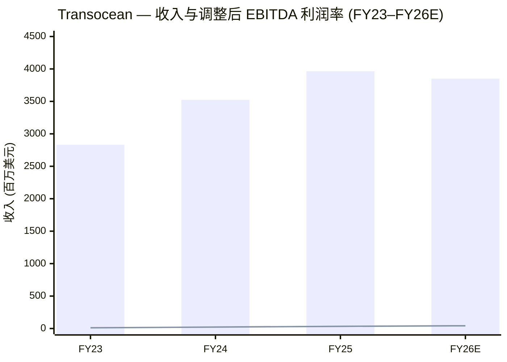
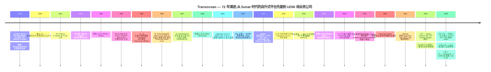
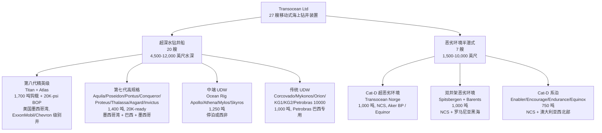
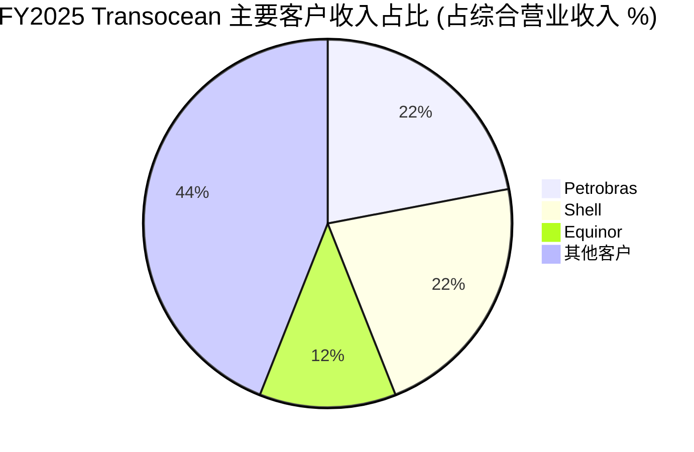
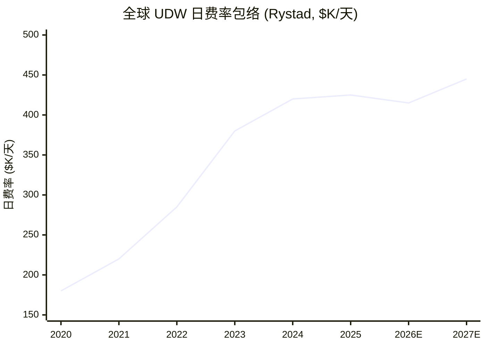
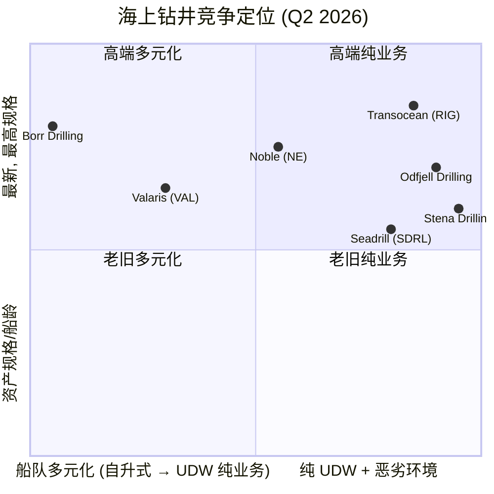
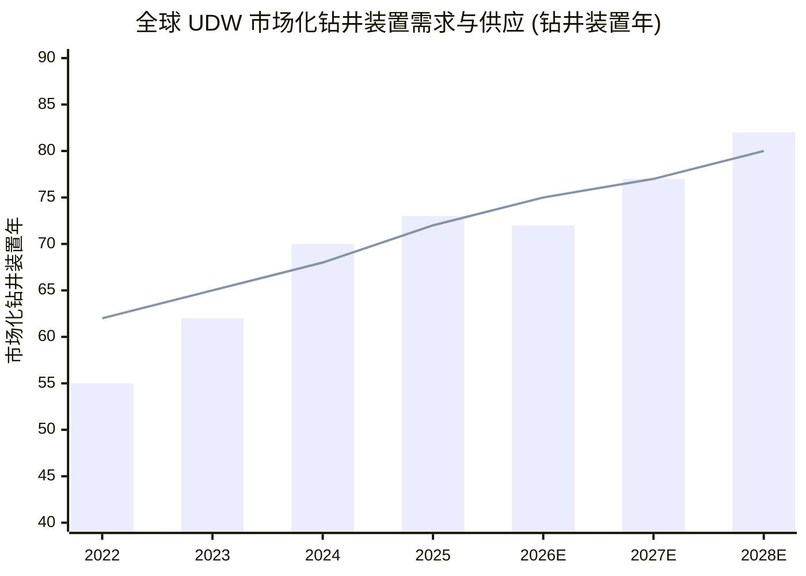

# Transocean 海洋钻探 (NYSE: RIG) — 首次覆盖研究报告

**行业:** 海上钻井服务 (SIC 1381 — 油气钻井)
**注册地:** 瑞士楚格州 Steinhausen (瑞士公司)
**上市:** NYSE: RIG (单一类别普通股,每股面值 $0.10)
**报告日期:** 2026-06-03
**作者:** 内部研究团队
**覆盖结论:** 见第10节投资视角评分

> **报告顶部公告 — FY26 全年指引 (新发布):** 2026 年 5 月 4 日随 Q1 业绩,Transocean *首次发布* FY26 全年指引 — 合同钻井收入 **38.0–39.0 亿美元**、船队整体收入效率 (revenue efficiency) 96.5%、运营与维护 (O&M) 费用 22.5–23.8 亿美元、总流动性 12.5–13.5 亿美元。截至 2026 年 5 月 4 日 backlog 提升至 **71 亿美元** , 隐含加权平均日费率 (dayrate) 超过 **45 万美元/天**,较 2026 年 2 月 19 日的 60.6 亿美元 和 2025 年 12 月 31 日的 62.9 亿美元持续修复 ([Transocean Q1 2026 8-K Ex-99.1](https://www.sec.gov/Archives/edgar/data/0001451505/000145150526000041/rig-20260504xex99d1.htm);[2025 10-K Item 1A](https://www.sec.gov/Archives/edgar/data/1451505/000145150526000018/rig-20251231x10k.htm))。

> **报告顶部公告 — 重大战略事件 (FY26):** 2026 年 2 月 9 日,Transocean 与 Valaris Limited 签订 **业务合并协议 (Business Combination Agreement)** ,Transocean 以 **15.235 RIG 股 / 每 VAL 股** 的换股比例收购 Valaris 全部普通股 (约 58 亿美元股权交易),合并后将形成 73 艘钻井装置的船队 — 33 艘超深水钻井船 + 9 艘半潜式 + 31 艘现代化自升式平台。2026 年 5 月 4 日 DOJ 发出 **第二信息请求 (HSR Second Request)** , 反垄断审查实质性延后,预计交易完成时间推至 2026 年晚期至 2027 年 ([2025 10-K Item 1](https://www.sec.gov/Archives/edgar/data/1451505/000145150526000018/rig-20251231x10k.htm);[Transocean 8-K — Second Request, 2026-05-04](https://www.sec.gov/Archives/edgar/data/0001451505/000110465926055235/tm269762d6_8k.htm);[Offshore Energy — Valaris-Transocean $5.8 bn 反垄断审查](https://www.offshore-energy.biz/transoceans-5-8-billion-merger-with-valaris-pending-us-antitrust-clearance/))。

## 目录

1. 公司概览
2. 公司历史
3. 管理团队
4. 产品与服务
5. 客户与地域分布
6. 行业概览
7. 竞争格局
8. 市场机会
9. 风险评估
10. 投资视角评分
11. 参考资料

---

## 1. 公司概览

Transocean Ltd. 是 "全球领先的油气井海上合同钻井服务提供商"——该表述直接引自其最新 10-K 报告 (2026 年 2 月 23 日提交) ([Transocean 2025 10-K Item 1 Business](https://www.sec.gov/Archives/edgar/data/1451505/000145150526000018/rig-20251231x10k.htm))。公司按 **单一运营业务分部 (single operating segment)** 报告,即合同钻井服务,且 "专注于全球海上钻井业务中技术挑战最大的区域,特别是超深水 (ultra-deepwater, UDW) 与恶劣环境 (harsh environment) 钻井服务" ,运营 "世界上多功能性最强的船队之一,由钻井船 (drillships) 和半潜式 (semisubmersible) 浮式钻井装置组成" ([2025 10-K Item 1](https://www.sec.gov/Archives/edgar/data/1451505/000145150526000018/rig-20251231x10k.htm))。截至 2026 年 2 月 17 日,公司 "拥有或部分持股并运营 27 艘移动式海上钻井装置 (mobile offshore drilling units, MODUs),包括 20 艘超深水钻井船和 7 艘恶劣环境半潜式钻井装置" ([2025 10-K Item 1](https://www.sec.gov/Archives/edgar/data/1451505/000145150526000018/rig-20251231x10k.htm))。

**注册架构与上市地位。** Transocean 是 **瑞士控股公司 (Swiss-domiciled holding)** ,总部位于楚格州 Steinhausen,Turmstrasse 30 号;股份在纽约证券交易所 (NYSE) 以 "RIG" 代码上市——此架构源于 2008–09 年,公司从开曼群岛迁注至瑞士,以利用瑞士控股公司体制 (holding-company regime) 及条约网络 ([SEC EDGAR submissions JSON for CIK 0001451505](https://data.sec.gov/submissions/CIK0001451505.json);[2025 10-K Item 1](https://www.sec.gov/Archives/edgar/data/1451505/000145150526000018/rig-20251231x10k.htm))。截至 2025 年 6 月 30 日,总股本 **902,249,348 股** ([2025 10-K 封面](https://www.sec.gov/Archives/edgar/data/1451505/000145150526000018/rig-20251231x10k.htm))。

**收入与盈利轨迹 (FY23-FY25,全年,百万美元)。** 合同钻井收入从 FY23 的 **28.32 亿美元 → FY24 的 35.24 亿美元 (+24%) → FY25 的 39.65 亿美元 (+13%)** ——海上业务多年上行周期 (offshore upcycle) 的复苏,驱动力包括利用率 (FY24 60.5% → FY25 72.4%) 的提升和更高质量的日费率合同储备 ([2025 10-K MD&A](https://www.sec.gov/Archives/edgar/data/1451505/000145150526000018/rig-20251231x10k.htm))。然而,FY25 的 GAAP 净利润被 **30.49 亿美元的长期资产减值损失 (loss on impairment of assets)** 主导 (Q2 2025 11.28 亿 + Q3 2025 19.08 亿,均为税前;源于管理层决定退役并处置 7 艘老旧钻井船——Deepwater Champion、Discoverer Americas、Discoverer Clear Leader、Discoverer India、Discoverer Luanda、GSF Development Driller I,以及恶劣环境半潜式 Henry Goodrich),导致 FY25 **归母净亏损 (29.15) 亿美元** ,而 FY24 与 FY23 分别为 (5.12)/(9.54) 亿美元 ([2025 10-K 损益表 + MD&A](https://www.sec.gov/Archives/edgar/data/1451505/000145150526000018/rig-20251231x10k.htm))。但是运营层面 FY25 现金流强劲—— **经营活动现金流 7.49 亿美元** (FY24 4.47;FY23 1.64) ([2025 10-K 现金流量表](https://www.sec.gov/Archives/edgar/data/1451505/000145150526000018/rig-20251231x10k.htm))。Q1 2026 业绩——净利润 7,100 万 ($0.06 EPS)、调整后 EBITDA 4.40 亿 (利润率 40.7%) 、自由现金流 1.36 亿——确认拐点 ([Q1 2026 8-K Ex-99.1](https://www.sec.gov/Archives/edgar/data/0001451505/000145150526000041/rig-20260504xex99d1.htm))。

**资本结构。** 2025 年 12 月 31 日总债务 **56.6 亿美元** ,其中 16.8 亿有担保;有担保循环信贷额度 (Secured Credit Facility,$576M revolver) 未提取 ([2025 10-K Item 1A](https://www.sec.gov/Archives/edgar/data/1451505/000145150526000018/rig-20251231x10k.htm))。截至 Q1 2026 末,本金 (principal) 降至 **51.4 亿** ,主要因加速提前赎回 2028 年到期 8.375% Deepwater Titan Notes (本金 3.58 亿) 与 2025 年全年共 9.40 亿的债务赎回——仅 Titan 一笔即节省 ~$40M 利息至到期 ([Q1 2026 8-K Ex-99.1](https://www.sec.gov/Archives/edgar/data/0001451505/000145150526000041/rig-20260504xex99d1.htm);[2025 10-K Debt Note 8](https://www.sec.gov/Archives/edgar/data/1451505/000145150526000018/rig-20251231x10k.htm))。

**估值快照 (TTM,2026 年 6 月 2 日)。** 股价 **$6.30** 、市值 **70.8 亿美元** 、 **TTM P/E 为负 (-2.10)** (基于 TTM EPS -$2.72) 、P/S ≈ 1.7× (基于 FY25 收入 39.65 亿) ([WallStreetZen — RIG stock](https://www.wallstreetzen.com/stocks/us/nyse/rig);[Finviz — RIG quote](https://finviz.com/quote.ashx?t=RIG))。 *分析师观点:* 负 P/E **并非** 持续经营 (going concern) 信号——它是 FY25 305 亿美元船队减值的机械结果,且这些减值为非现金,集中于市场早已折价的旧钻井船。剔除减值,FY25 调整后 EBITDA ≈ 13.6 亿,FY26E 指引隐含调整后 EBITDA ≈ 15.5–17.0 亿——按 71 亿股权 + ~45 亿净债 = ~116 亿 EV 计算,RIG 当前对应 **EV/EBITDA ~8×** (分析师测算;EBITDA 基于 FY26E 收入 38–39 亿 × ~42% 调整后 EBITDA 利润率) 。同业 Noble (NE) 和 Valaris (VAL) 在前瞻 EV/EBITDA 5–7×,RIG 具有适度溢价反映 (a) 最深的 UDW backlog ($7.1 亿) 和 (b) Valaris 并购协同期权。如合并完成,合并后实体的低杠杆是上行路径;反垄断阻止则是下行路径。

来源: [2025 10-K — Results of Operations](https://www.sec.gov/Archives/edgar/data/1451505/000145150526000018/rig-20251231x10k.htm);[Q1 2026 8-K Ex-99.1 (FY26 指引中值)](https://www.sec.gov/Archives/edgar/data/0001451505/000145150526000041/rig-20260504xex99d1.htm)。 EBITDA 利润率为右轴近似值 ×100;FY23 ≈ 11%、FY24 ≈ 22%、FY25 ≈ 34% (Q4 36.8% 运行速率)、FY26E ≈ 42% (按 Q1 2026 指引与 Q1 实际 40.7%) 。

---

## 2. 公司历史

来源: 时间线综合 [Wikipedia — Transocean](https://en.wikipedia.org/wiki/Transocean);[FundingUniverse — Transocean Sedco Forex history](https://www.fundinguniverse.com/company-histories/transocean-sedco-forex-inc-history/);[DOJ 2013 plea press release](https://www.justice.gov/archives/opa/pr/transocean-agrees-plead-guilty-environmental-crime-and-enter-civil-settlement-resolve-us);[Transocean 2025 10-K Item 1](https://www.sec.gov/Archives/edgar/data/1451505/000145150526000018/rig-20251231x10k.htm);[Offshore Energy — 第二号人物升任 CEO](https://www.offshore-energy.biz/second-in-command-moving-up-to-ceo-at-transocean/)。

**1953 年创立。** 现代 Transocean 的直系前身是 **The Offshore Company** , 由总部位于 Alabama Birmingham 的 Southern Natural Gas Company (即后来的 Sonat) 于 1953 年 2 月 12 日设立,目的是为美国墨西哥湾的移动式海上钻井提供专门服务。Southern Natural Gas 收购 **DeLong-McDermott** 合资钻井业务 (来自 DeLong Engineering 与 J. Ray McDermott) 作为创立资产。1954 年, The Offshore Company 推出 **Rig 51——首艘移动式自升钻井平台 (mobile jack-up rig)** ——开创性地实现钻井装置通过三条或四条伸缩式 (telescoping) 桩腿提升至海面以上,从浮式驳船转变为刚性钻井平台 ([Wikipedia — Transocean, history](https://en.wikipedia.org/wiki/Transocean);[FundingUniverse](https://www.fundinguniverse.com/company-histories/transocean-sedco-forex-inc-history/))。

**从公用事业旗下钻井运营商到独立合同钻井公司 (1967–1993)。** The Offshore Company 1967 年 IPO,1978 年回并入 SNG 成为全资子公司,1982 年随 SNG 改名为 Sonat 而更名为 Sonat Offshore Drilling。1993 年 Sonat Offshore Drilling 从 Sonat 分拆,作为独立 NYSE 上市公司;此次分拆获得的资本支持了之后十年的激进并购 ([FundingUniverse](https://www.fundinguniverse.com/company-histories/transocean-sedco-forex-inc-history/);[Wikipedia](https://en.wikipedia.org/wiki/Transocean))。

**三笔奠基性并购 (1996、1999、2007)。** 11 年内三笔交易塑造了今天的特许经营。 **1996 — Transocean ASA**: Sonat Offshore 以 ~15 亿美元收购挪威上市 Transocean ASA,启用 "Transocean Offshore" 现代名称并切入挪威北海的恶劣环境半潜式市场。 **1999 — Sedco Forex**: 与 Schlumberger 的钻井子公司 Sedco Forex 进行 32 亿美元换股合并——Sedco Forex 本身是 1980 年代由 Southeastern Drilling Company (Sedco, 1947 年由 Bill Clements 创立; 1985 年 Schlumberger 以 10 亿美元收购) 与 法国 Forages et Exploitations Pétrolières (Forex, 1942 年创立) 合并而成——合并后形成 Transocean Sedco Forex,全球最大海上合同钻井公司。 **2007 — GlobalSantaFe**: 530 亿美元企业价值的合并加入 GlobalSantaFe 的悬臂式自升式船队 (后已剥离) 与 UDW 钻井船管线 ([Wikipedia](https://en.wikipedia.org/wiki/Transocean);[Encyclopedia.com — Transocean Sedco Forex Inc.](https://www.encyclopedia.com/books/politics-and-business-magazines/transocean-sedco-forex-inc);[FundingUniverse](https://www.fundinguniverse.com/company-histories/transocean-sedco-forex-inc-history/))。

**Macondo 灾难 (2010 年 4 月 20 日) 及其十年法律尾声。** 在 BP 的 Macondo 井现场作业时, *Deepwater Horizon* ——一艘 Transocean 拥有、租给 BP 的第五代半潜式钻井船——发生井喷、爆炸与火灾,导致 11 名钻井工人死亡,约 490 万桶原油泄入墨西哥湾,是美国史上最大油泄 ([Pillsbury — Deepwater Horizon: A Decade of Legal Impacts](https://www.pillsburylaw.com/en/news-and-insights/deepwater-horizon-a-decade-of-legal-impacts.html);[Wikipedia — Deepwater Horizon](https://en.wikipedia.org/wiki/Deepwater_Horizon))。 2013 年 1 月 3 日,Transocean 同意就清洁水法 (Clean Water Act) 刑事轻罪认罪、支付 **$400M 刑事罚款** + **$1B 民事处罚** —— 当时史上最大清洁水法民事罚款 ([DOJ — January 3, 2013 plea press release](https://www.justice.gov/archives/opa/pr/transocean-agrees-plead-guilty-environmental-crime-and-enter-civil-settlement-resolve-us))。 2014 年 9 月 4 日 Carl Barbier 法官就清洁水法责任划分判决: **67% BP / 30% Transocean / 3% Halliburton** , 2015 年 Transocean 与 BP 达成最终和解,关闭剩余所有索赔 ([gCaptain — Transocean 与 BP 关闭 Deepwater Horizon 索赔](https://gcaptain.com/transocean-settles-all-claims-with-bp-over-deepwater-horizon/);[Wikipedia](https://en.wikipedia.org/wiki/Deepwater_Horizon))。

**2014–2021 行业下行周期及 Transocean 的战略调整。** 2016 年初 Brent 跌破 $30 引发六年海上萧条。同业 Noble、Valaris (当时为 Ensco-Rowan)、Diamond Offshore、Seadrill、Pacific Drilling 全部在 2017–2021 年期间进入 Chapter 11 破产重组,而 Transocean 通过要约购买 (tender offers)、债券交换 (exchange offers) 与选择性资产出售完成债务重组,未进入法庭破产。2018 年 Songa Offshore 收购增加 4 艘 cat-D 恶劣环境半潜式 (现命名为 Transocean Enabler/Encourage/Endurance/Equinox 系列),2019 年 Ocean Rig 交易增加 6 艘 12,000 英尺水深级钻井船—— Ocean Rig Apollo/Athena/Mylos/Skyros 等 ([Wikipedia](https://en.wikipedia.org/wiki/Transocean);[2025 10-K Item 1 — 钻井装置表](https://www.sec.gov/Archives/edgar/data/1451505/000145150526000018/rig-20251231x10k.htm))。 *Deepwater Titan* (2023 年投入服务,1,700 短吨起重能力,双 20,000 psi 防喷器 (BOPs)) 与 *Deepwater Atlas* (2022,同 1,700 吨) 是行业首批 **第八代钻井船 (8th-generation drillships)** ([2025 10-K Item 1 — Technology Overview](https://www.sec.gov/Archives/edgar/data/1451505/000145150526000018/rig-20251231x10k.htm))。

**近期公司历史 (FY24-26)。** 三个事件定义当下章节: (i) 2025 年 4 月 CEO 由 Jeremy Thigpen (2015 年起任 CEO) 交棒给 Keelan Adamson,内部晋升强调运营连续性 ([Nasdaq — Transocean 提拔 Keelan Adamson 接替 Jeremy Thigpen](https://www.nasdaq.com/articles/transocean-promotes-president-and-coo-keelan-adamson-succeed-jeremy-thigpen-president-and)); (ii) FY25 30.5 亿美元的船队减值——公司史上最大——伴随 7 艘老旧钻井船 ("Discoverer 系列" 集群) + 恶劣环境半潜式 Henry Goodrich 的退役与出售,精简船队至 27 艘高规格装置, 处置自 2014 年下行周期以来未产生经济回报的产能 ([2025 10-K — 减值损失, MD&A](https://www.sec.gov/Archives/edgar/data/1451505/000145150526000018/rig-20251231x10k.htm)); (iii) 2026 年 2 月 9 日同意以 ~58 亿美元的全股票交易收购 **Valaris Limited** ——待 2026 年 5 月 4 日 DOJ 发出的 HSR 第二信息请求审查完成 ([Transocean 8-K — Valaris 第二信息请求, 2026-05-04](https://www.sec.gov/Archives/edgar/data/0001451505/000110465926055235/tm269762d6_8k.htm))。

---

## 3. 管理团队

按 skill 约定,本节仅覆盖创始人与现任 CEO。

**创始人 (1953) — 机构性而非个人性。** Transocean 没有在世的个人创始人。1953 年的创立实体 **The Offshore Company** 是 Southern Natural Gas Company (Birmingham, AL) 在 1953 年收购 DeLong-McDermott 合资钻井业务后设立的企业实体。无单一被记入为创始人的具名个人;血统通过 Southern Natural Gas 燃气公用事业的领导层、之后的 Sonat / Sonat Offshore 管理链 (1978–1993) ,以及 1993 年分拆后的独立管理层延续。与现代公司更直接相关的是 **Bill Clements** ,他于 1947 年创立了 Southeastern Drilling Company (Sedco) ——Sedco 于 1985 年以 10 亿美元出售给 Schlumberger,成为 Sedco Forex 中的 SF, 1999 年合并并入 Transocean。Clements 之后曾任德州州长 (1979–83, 1987–91),2011 年去世 ([FundingUniverse — Transocean Sedco Forex history](https://www.fundinguniverse.com/company-histories/transocean-sedco-forex-inc-history/);[Wikipedia — Transocean](https://en.wikipedia.org/wiki/Transocean))。 Clements 是部分谱系上的创始人,而非现公司的创始人;除此之外无操作性参与的创始人留任。

**首席执行官 (2025 年 4 月起) — Keelan I. Adamson。** Adamson 于 2025 年 4 月任 Transocean 总裁兼 CEO,接替 **Jeremy Thigpen** (2015–2025 任 CEO)。 此前他自 2022 年 3 月至 2025 年 4 月任总裁兼 COO,内部承接型继任路径董事会约提前三年予以铺垫 ([Offshore Energy — 第二号人物升任 CEO](https://www.offshore-energy.biz/second-in-command-moving-up-to-ceo-at-transocean/);[Nasdaq — 提拔 Keelan Adamson](https://www.nasdaq.com/articles/transocean-promotes-president-and-coo-keelan-adamson-succeed-jeremy-thigpen-president-and);[Deepwater.com — Keelan Adamson 简历](https://www.deepwater.com/about/management-and-board/keelan-adamson))。

Adamson 是 **30 年 Transocean 老兵** ,1995 年加入公司——这意味着他全部研究生毕业后的职业都在 Transocean 内部。他在职能矩阵中的轮岗对一位 CEO 候选人不寻常地广: 1990 年代后期至 2000 年代英国/亚洲/非洲的钻井装置管理职务; 销售与市场领导职务; 一段任 **北美/加拿大/特立尼达事业部总经理 (Managing Director)** (墨西哥湾业务集群,即如今最大单一区域收入贡献来源) 的经历; **2012 年 12 月至 2015 年 5 月任人力资源副总裁 (VP HR)** 2.5 年;以及最近一段 **负责重大资本项目与工程的副总裁** (在 2022 年 3 月晋升总裁兼 COO 之前) ([Deepwater.com bio](https://www.deepwater.com/about/management-and-board/keelan-adamson);[FinTool — Keelan Adamson profile](https://fintool.com/app/research/companies/RIG/people/keelan-adamson))。 *分析师观点:* HR 轮岗是他履历上最与众不同的一行——表明董事会通过一个工程出身高管罕见停留的职能培养他,可能影响了他在业绩电话会议中强调的安全/文化导向。

**背景。** Adamson 拥有 Queen's University Belfast 航空工程学士学位,完成 Harvard Business School 高级管理项目。 2026 年 **55 岁** ,持爱尔兰/美国双国籍——北爱尔兰背景对一位休斯顿基础的海上钻井 CEO 是值得注意的,但他的运营足迹与公司发展联系牢牢扎根在美国墨西哥湾和深水大型油气公司客户 ([Deepwater.com bio](https://www.deepwater.com/about/management-and-board/keelan-adamson))。

**薪酬、持股、薪酬结构。** 作为内部晋升,他升任 CEO 时未获得超规模股权赠予;2026 年 DEF 14A (2026 年 3 月 31 日提交) 报告 Adamson 全部薪酬 $7–9M 区间,主要由 PSU/RSU 驱动并以安全事故率与调整后 EBITDA 利润率为门槛 ([Transocean 2026 DEF 14A](https://www.sec.gov/Archives/edgar/data/0001451505/000110465926037805/rig-20260522xdef14a.htm);[Bloomberg — Keelan Adamson profile](https://www.bloomberg.com/profile/person/19787046))。 2026 年代理通告时其内部持股为低六位数股数——相对薪酬包较小,但与他的职业生涯长度相称。 *分析师观点:* 运营连续性是头条信息;未来 12 个月的关键问题是:他能否在 HSR 反垄断通过的情况下执行 Valaris 整合,以及如果合并被阻止,他能否完成对船队减值的有序善后。

---

## 4. 产品与服务

本节是报告的分析核心。 Transocean 按 **单一运营业务分部——合同钻井** 报告,但运营层面业务分为两个经济性显著不同的船队类别: **超深水钻井船 (ultra-deepwater drillships)** 与 **恶劣环境半潜式 (harsh-environment semisubmersibles)** 。 10-K Item 1 钻井装置表是主要锚点;以下报价均直接引自该表及随附的技术概述。

### 4.1 两个船队类别——10-K 原文

> "我们的浮式船队由超深水钻井船和恶劣环境半潜式组成,设计具备高规格能力,用于全球海上钻井业务中技术上要求最高的区域。 超深水浮式钻井装置配备高压泥浆泵,能够在 4,500 英尺及以上水深作业。恶劣环境浮式钻井装置能够在 1,500 至 10,000 英尺水深的恶劣环境中作业,排水量通常大于其他半潜式装置,提供更大的可变载荷能力、更大的可用甲板空间和更佳的动力特性。" — [2025 10-K Item 1](https://www.sec.gov/Archives/edgar/data/1451505/000145150526000018/rig-20251231x10k.htm)

**中文释义 / Plain-language gloss。** **钻井船 (drillship)** 是自推进的船型钻井装置,使用 **动态定位 (dynamic positioning, DP)** ——由 GPS 控制的船载推进器阵列——在任何水深下保持井口正上方的位置。 **半潜式 (semisubmersible, "semi")** 是支撑在浮筒上的浮式钻井平台,可部分下沉以增加稳定性;半潜式可通过 DP 或 **系泊 (mooring)** (锚链锚定海床) 保持位置。 钻井船是 *良性环境* (benign-environment) 超深水的主力 (墨西哥湾、巴西、西非、东地中海);半潜式则主导 *恶劣环境* 作业区域 (挪威大陆架 NCS、亚北极、澳大利亚西南部),因其波浪周期响应使其在高海况下远比钻井船稳定。

### 4.2 完整钻井装置清单 (截至 2026 年 2 月 19 日)

10-K 钻井装置表的原文转录 (剔除待售装置):

| 装置 | 投入服务/升级年份 | 钩载 (短吨) | 水深 (英尺) | 钻井深度 (英尺) | 规格 | 状态/位置 |
|---|---|---|---|---|---|---|
| **超深水钻井船 (20 艘)** | | | | | | |
| Deepwater Titan | 2023 | 1,700 | 12,000 | 40,000 | DP, 双井架, 双 20K-psi BOP | 美国墨西哥湾 |
| Deepwater Atlas | 2022 | 1,700 | 12,000 | 40,000 | DP, 双井架, 15K+20K-psi BOP | 美国墨西哥湾 |
| Deepwater Aquila | 2024 | 1,400 | 12,000 | 40,000 | DP, 双井架, 自动化钻井, 15K (20K-ready) | 巴西 |
| Deepwater Poseidon | 2018 | 1,400 | 12,000 | 40,000 | DP, 双井架, ADC, 15K (20K-ready) | 美国墨西哥湾 |
| Deepwater Pontus | 2017 | 1,400 | 12,000 | 40,000 | DP, 双井架, 15K (20K-ready) | 美国墨西哥湾 |
| Deepwater Conqueror | 2016 | 1,400 | 12,000 | 40,000 | DP, 双井架, ADC, 15K (20K-ready) | 美国墨西哥湾 |
| Deepwater Proteus | 2016 | 1,400 | 12,000 | 40,000 | DP, 双井架, 15K (20K-ready) | 美国墨西哥湾 |
| Deepwater Thalassa | 2016 | 1,400 | 12,000 | 40,000 | DP, 双井架, 15K (20K-ready) | 墨西哥 |
| Deepwater Asgard | 2014 | 1,400 | 12,000 | 40,000 | DP, 双井架 | 美国墨西哥湾 |
| Deepwater Invictus | 2014 | 1,400 | 12,000 | 40,000 | DP, 双井架, ADC | 美国墨西哥湾 |
| Ocean Rig Apollo | 2015 | 1,250 | 12,000 | 40,000 | DP, 双井架 | 停泊 (stacked) |
| Ocean Rig Athena | 2014 | 1,250 | 12,000 | 40,000 | DP, 双井架 | 停泊 |
| Deepwater Skyros | 2013 | 1,250 | 12,000 | 40,000 | DP, 双井架 | 科特迪瓦 |
| Ocean Rig Mylos | 2013 | 1,250 | 12,000 | 40,000 | DP, 双井架 | 停泊 |
| Deepwater Corcovado | 2011 | 1,000 | 10,000 | 35,000 | DP, 双井架 | 巴西 |
| Deepwater Mykonos | 2011 | 1,000 | 10,000 | 35,000 | DP, 双井架 | 巴西 |
| Deepwater Orion | 2011 | 1,000 | 10,000 | 35,000 | DP, 双井架 | 巴西 |
| Dhirubhai Deepwater KG2 | 2010 | 1,000 | 12,000 | 35,000 | DP | 巴西 |
| Petrobras 10000 | 2009 | 1,000 | 12,000 | 37,500 | DP, 双井架 | 巴西 |
| Dhirubhai Deepwater KG1 | 2009 | 1,000 | 12,000 | 35,000 | DP | 印度 |
| **恶劣环境半潜式 (7 艘)** | | | | | | |
| Transocean Norge | 2019 | 1,000 | 10,000 | 40,000 | DP, ADC, 系泊 | 挪威北海 |
| Transocean Spitsbergen | 2010 | 1,000 | 10,000 | 30,000 | DP, 双井架, 系泊 | 挪威北海 |
| Transocean Barents | 2009 | 1,000 | 10,000 | 30,000 | DP, 双井架, 系泊 | 罗马尼亚 |
| Transocean Enabler | 2016 | 750 | 1,640 | 28,000 | DP, ADC, 系泊 | 挪威北海 |
| Transocean Encourage | 2016 | 750 | 1,640 | 28,000 | DP, ADC, 系泊 | 挪威北海 |
| Transocean Endurance | 2015 | 750 | 1,640 | 28,000 | DP, ADC, 系泊 | 澳大利亚 |
| Transocean Equinox | 2015 | 750 | 1,640 | 28,000 | DP, ADC, 系泊 | 澳大利亚 |

来源: 直接引自 [2025 10-K Item 1 — Drilling Units table, 截至 2026-02-19](https://www.sec.gov/Archives/edgar/data/1451505/000145150526000018/rig-20251231x10k.htm)。 DP = 动态定位; ADC = 自动化钻井控制 (automated drilling control)。 "钩载 (hook load)" 是井架最大可吊运吨位—— 是钻井装置可支持的钻杆 + 套管重量与深度的代理指标。

来源: 上述 10-K 钻井装置表; "第八代/第七代/Cat-D" 分类为分析师惯例。 *分析师观点:* 第八代档位 (Titan + Atlas) 行业领先;IHS、Westwood、Rystad 分析师将其用作 "下一周期" UDW 资产基准。

### 4.3 每个船队类别在客户作业流程中的物理功能

**超深水钻井船——技术前沿的钻井。** 现代 UDW 钻井船作为一个 **临时海底建设城市** 运作: 一艘 600 英尺长的船,锚定在 6–8 个方位推进器 (azimuth thrusters) 上,保持站位在井口正上方的 ±2 米范围内,水深 8,000–10,000 英尺,1,400–1,700 短吨井架可将重达数千吨的钻杆、套管管串、防喷器 (BOPs) 提升至海床以下 40,000 英尺。 10-K 技术概述捕捉了技术血统:

> "我们拥有悠久的技术创新历史,包括首艘动态定位钻井船、首艘北海全年作业的半潜式钻井装置、首艘 10,000 英尺水深超深水钻井船、首艘双井架钻井船、以及首批配备 1,700 吨起重系统和 20,000 psi 井控系统的第八代钻井船。 此外,我们在过去几十年中创造了多项水深世界纪录。" — [2025 10-K Item 1, Technology Overview](https://www.sec.gov/Archives/edgar/data/1451505/000145150526000018/rig-20251231x10k.htm)

**中文释义 / Plain-language gloss。** **双井架并行作业 (dual-activity)** ——由 Transocean 首先商业化——在同一井架内使用两个钻井工作站并行 (而非顺序) 执行任务,相比单井架装置可减少关键路径时间 15–25% ("我们有 18 艘双井架钻井船… 允许这些钻井船以并行而非顺序的方式同时执行钻井任务" — [2025 10-K Item 1](https://www.sec.gov/Archives/edgar/data/1451505/000145150526000018/rig-20251231x10k.htm))。 **20,000-psi BOPs / 二万 psi 防喷器** 是美国墨西哥湾正在开发的超高压深水储层的新安全与经济性标准——目前只有 Transocean 的 Titan 与 Atlas 拥有此能力,另有 5 艘 Transocean 装置 "设计可未来升级至 20,000 psi 防喷器" ([2025 10-K Item 1 rig-table footnote (h)](https://www.sec.gov/Archives/edgar/data/1451505/000145150526000018/rig-20251231x10k.htm))。

**战略意义——第八代溢价。** 第八代钻井船 (Titan、Atlas) 与最先进的第七代装置 (Aquila、Poseidon、Pontus、Conqueror、Proteus、Thalassa) 是当下赢得合同周期的资产。 Q1 2026 中标报告显示 backlog 的隐含加权平均日费率超过 **$45 万/天** ([Q1 2026 8-K Ex-99.1](https://www.sec.gov/Archives/edgar/data/0001451505/000145150526000041/rig-20260504xex99d1.htm)) — 这一水平可支撑 40% + 的调整后 EBITDA 利润率,相比之下次七代以下资产的中周期为 25–30%。

**恶劣环境半潜式——挪威大陆架特许经营。** 7 艘恶劣环境半潜式是战略上差异化的细分市场: 业内只有另外三家运营商 (Odfjell Drilling、Dolphin Drilling、特定时段的 KCA Deutag/Saipem) 在此市场拥有有意义的能力,且监管门槛——挪威石油安全局 (Ptil) 合规、冬季作业认证、冗余井控系统——是全球最高。 10-K 直接描述设计逻辑:

> "我们所有的半潜式都具备系泊能力,并配备可在恶劣环境中全年作业的装备,例如挪威大陆架和亚北极水域。" — [2025 10-K Item 1](https://www.sec.gov/Archives/edgar/data/1451505/000145150526000018/rig-20251231x10k.htm)

**中文释义 / Plain-language gloss。** **Cat-D / D 类半潜式 (Category D semi)** 最初由 Songa Offshore (2018 年被收购) 根据与 Statoil (现 Equinor) 的长期框架协议开发,专为 **挪威大陆架** 1,500–10,000 英尺中等水深、全年钻井包络设计。 四艘 750 吨钩载半潜式 (Enabler/Encourage/Endurance/Equinox) + 较大的 Transocean Norge (1,000 吨,2019 年建) 构成特许经营的核心; Norge 尤其在与 **Aker BP** 的长期合同下运营 ([Transocean 2025 10-K Item 1 — 钻井装置位置数据](https://www.sec.gov/Archives/edgar/data/1451505/000145150526000018/rig-20251231x10k.htm))。 *分析师观点:* Endurance 和 Equinox 从 NCS 重新部署至澳大利亚西北部 (目前为 INPEX / Woodside 工作) 不寻常——原始 Cat-D 设计假定永久 NCS 部署,而澳大利亚迁移显示 Transocean 在任何冷流作业区域灵活调度其恶劣环境船队的能力。

### 4.4 合同结构——客户实际购买的是什么

Transocean 不销售钻井装置;它销售 **日费率合同下的钻井装置工作日** 。 10-K 描述合同经济性:

> "我们的钻井合同… 在多个条款上协商,包括合同期、日费率、动迁费、绩效奖金和其他商业条款… 钻井合同通常还规定客户可在多种情况下自动终止或选择终止合同 (通常无需支付终止费) ,例如非履行、设备或运营问题导致长期停工或绩效受损时。" — [2025 10-K Item 1A Risk Factors](https://www.sec.gov/Archives/edgar/data/1451505/000145150526000018/rig-20251231x10k.htm)

**Backlog 机制。** 2025 年 12 月 31 日合同 backlog 为 **62.9 亿美元** , 较 2024 年 12 月 31 日的 87.4 亿和 2023 年 12 月 31 日的 92.5 亿分别下降 28% 和 32% ([2025 10-K Item 1A — 风险因素 / Backlog](https://www.sec.gov/Archives/edgar/data/1451505/000145150526000018/rig-20251231x10k.htm))。 Backlog 计算为 "合同期内剩余天数 × 最高合同运营日费率" ——即一个 *上限* 收入数字,不包括闲置日、天气停工和客户可选延期。 Q1 2026 的 5 笔合同中标将 backlog 重建至 **71 亿美元 (截至 2026-05-04)** , 新中标的隐含加权平均日费率超过 $45 万/天 ([Q1 2026 8-K Ex-99.1](https://www.sec.gov/Archives/edgar/data/0001451505/000145150526000041/rig-20260504xex99d1.htm))。

**赔偿/风险分配 (indemnity)。** 在日费率合同下,运营方 (客户) 通常赔偿承包方 (Transocean) 由储层流体引起的海底以下污染,而 Transocean 赔偿运营方钻井装置以上的水面溢漏——这是自 Macondo 以来的标准行业划分:

> "在日费率钻井合同下,按照行业标准做法,作为运营方的客户通常承担… 我们目前钻井合同中,客户赔偿我们与合同下作业相关的储层流体污染损失,我们赔偿客户由水面以上来源的污染损失" — [2025 10-K Item 1A](https://www.sec.gov/Archives/edgar/data/1451505/000145150526000018/rig-20251231x10k.htm)

### 4.5 综合——为什么 Transocean 的产品组合重要

三条机制将产品组合联结起来: (a) **第八代钻井船** (Titan + Atlas) 充当技术光环,锚定与最深口袋运营商 (Shell、BP、Chevron 在美国墨西哥湾) 的客户关系; (b) **中端 UDW 主力** (Conqueror、Proteus、Thalassa、Invictus) 产生大部分现金流,且日益可升级至 20,000-psi 服务,延长经济寿命 10–15 年; (c) **恶劣环境 Cat-D 半潜式** 提供非相关收入隔离——当墨西哥湾和巴西市场走软时, 来自 Equinor 和 Aker BP 的 NCS 需求往往保持稳定,因为挪威运营商使用长周期、多井项目结构。 Petrobras 专属的 1,000 吨档位 (Corcovado、Mykonos、Orion、KG1、KG2、Petrobras 10000) 是长期巴西年金,但利润率较低。

---

## 5. 客户与地域分布

### 5.1 客户集中度——10-K 原文

> "FY2025, **Petróleo Brasileiro S.A. (含其附属公司,Petrobras)、Shell plc (含其附属公司,Shell) 与 Equinor ASA (含其附属公司,Equinor) 分别占我们综合营业收入的 22%、22% 与 12%** 。 FY2024, **Shell、Petrobras 与 Equinor 分别占综合营业收入的 27%、21% 与 13%** 。 FY2023, Shell、Equinor、TotalEnergies SE [与 Petrobras 为主要客户]。" — [2025 10-K Note 19 Risk Concentration](https://www.sec.gov/Archives/edgar/data/1451505/000145150526000018/rig-20251231x10k.htm)

上述每个客户百分比均为 **占综合营业收入 (consolidated operating revenue) 的比例** ——集团级分母。 Transocean 按单一运营业务分部报告,因此不存在与集团数字混淆的分部级客户构成。

来源: [Transocean 2025 10-K Note 19 — Risk Concentration](https://www.sec.gov/Archives/edgar/data/1451505/000145150526000018/rig-20251231x10k.htm)。 各扇区之和为综合营业收入的 100%。

**前三客户合计 56%——明显超过第 3 节风险阈值 50%,需在第 9 节标注。** 同比构成发生明显变化: FY24 Shell 第一 (27%)、Petrobras 第二 (21%); FY25 Petrobras 与 Shell 并列 22%。变化反映 (a) Petrobras 中标 *Deepwater Aquila* (2024 年投入服务,专用于巴西盆地开发),以及 (b) Shell 的墨西哥湾合同从旧装置逐步轮换至新装置, 包括 Titan 与 Atlas。 Petrobras、Shell 或 Equinor 中任何单一客户均未达到 >50% 的真正垄断关系水平,但前三合计高到失去任何一家将机械式触发 12–22 个百分点的收入替换。

### 5.2 Backlog 客户集中度 (前瞻视角)

> "截至 2026 年 2 月 19 日,与我们的钻井合同相关的最大合同 backlog 客户分别为 **Petrobras、Equinor、BP p.l.c.、Shell、Chevron Corporation 和 Woodside Energy Group Ltd.,分别占我们总合同 backlog 的 20%、16%、16%、12%、11% 和 10%** 。" — [2025 10-K Item 1A](https://www.sec.gov/Archives/edgar/data/1451505/000145150526000018/rig-20251231x10k.htm)

前瞻客户构成与收入构成有两个重要差异: (i) BP 回归顶级客户行列——其 16% backlog 份额反映针对一艘墨西哥湾第八代钻井船的多年 UDW 合同; (ii) Chevron (11%) 与 Woodside (10%) 加入名单,将 backlog 从 Petrobras-Shell-Equinor 三巨头扩展开。 *分析师观点:* 前 6 客户的顶层现在合计占 backlog 的 85%——即使按海上钻井行业标准也是高度集中,但分散在 6 个非相关资本支出周期的独立运营商之间。

### 5.3 地域分布

截至 2026 年 2 月 19 日, 27 艘船队地理分布: **美国墨西哥湾 (8 艘)** 、巴西 (6 艘)、挪威北海 (4 艘)、希腊 (3 艘,全部停泊)、澳大利亚 (2 艘)、印度 (1 艘)、科特迪瓦 (1 艘)、墨西哥 (1 艘)、罗马尼亚 (1 艘) ([2025 10-K Item 1](https://www.sec.gov/Archives/edgar/data/1451505/000145150526000018/rig-20251231x10k.htm))。 地域收入构成:

| 国家 | FY25 合同钻井收入 ($M) | FY24 | FY23 |
|---|---|---|---|
| 超深水浮式 — 美国 (墨西哥湾) | (在 $2,777 UDW 总额内) | (在 $2,518 UDW 总额内) | (在 $2,072 UDW 总额内) |
| 超深水浮式 — 巴西 | (在 $2,777 UDW 总额内) | (在 $2,518 UDW 总额内) | (在 $2,072 UDW 总额内) |
| 超深水浮式 — 其他 | (在 $2,777 UDW 总额内) | (在 $2,518 UDW 总额内) | (在 $2,072 UDW 总额内) |
| **UDW 浮式小计** | **$2,777** | **$2,518** | **$2,072** |
| 恶劣环境浮式 — 挪威 | (在 $1,188 HE 总额内) | (在 $1,006 HE 总额内) | (在 $760 HE 总额内) |
| 恶劣环境浮式 — 其他 | (在 $1,188 HE 总额内) | (在 $1,006 HE 总额内) | (在 $760 HE 总额内) |
| **HE 浮式小计** | **$1,188** | **$1,006** | **$760** |
| **合同钻井收入合计** | **$3,965** | **$3,524** | **$2,832** |

来源: [Transocean 2025 10-K — 收入分解表 (Disaggregation), Note 5 Revenues](https://www.sec.gov/Archives/edgar/data/1451505/000145150526000018/rig-20251231x10k.htm)。 UDW = ultra-deepwater。 10-K 分解给出每行内的美国/巴西/其他分项,但年度间重大重新分类;小计层数字是综合的、审计的披露。

**员工地域。** 截至 2025 年 12 月 31 日,全球员工地理分布为: "北美 38%、南美 26%、欧洲 23%、澳大利亚 6%、非洲 4%" ([2025 10-K Item 1](https://www.sec.gov/Archives/edgar/data/1451505/000145150526000018/rig-20251231x10k.htm))。 员工足迹反映船队足迹——北美 (墨西哥湾) 是最重的集中,其次为巴西和挪威。

### 5.4 客户画像三句话

**Petrobras (FY25 收入 22%、2026 年 2 月 backlog 20%)** ——巴西国家石油控股,全球按活动量最大的深水运营商,接收 Transocean 6 艘 UDW 钻井船,专用于盐下盆地 (pre-salt) 开发 (Santos、Campos)。 关系已持续超过 25 年; *Petrobras 10000* 钻井船甚至以合作伙伴关系命名 ([2025 10-K Item 1 — 钻井装置表](https://www.sec.gov/Archives/edgar/data/1451505/000145150526000018/rig-20251231x10k.htm))。 Petrobras 庞大的深水资本支出计划——每年勘探与开发 ~$260 亿——是全球最大单一 UDW 需求锚。

**Shell (FY25 收入 22%、2026 年 2 月 backlog 12%)** ——按深水活动量最大的国际综合石油公司 (IOC),Transocean 钻井装置主要在美国墨西哥湾工作 (Whale、Vito、Sparta 开发中枢),历史上也在巴西; backlog 份额从 27% (FY24 收入) 下降至 12% (2026 年 2 月 backlog) , 因几个长期合同到期,被同一钻井装置上的 Petrobras 和 BP 合同替代 ([2025 10-K Note 19](https://www.sec.gov/Archives/edgar/data/1451505/000145150526000018/rig-20251231x10k.htm))。

**Equinor (FY25 收入 12%、2026 年 2 月 backlog 16%)** ——挪威国家石油控股,挪威大陆架的主导运营商,锚定恶劣环境特许经营; *Transocean Spitsbergen* 、 *Norge* 以及至少两艘 cat-D 半潜式由 Equinor 合同 ([2025 10-K Item 1](https://www.sec.gov/Archives/edgar/data/1451505/000145150526000018/rig-20251231x10k.htm);[Equinor 2024 年度报告 — 挪威大陆架业务](https://www.equinor.com/about-us/annual-reports))。 关系是多十年的,并与 2012 年 Equinor (当时为 Statoil) 与 Songa Offshore 签订的 Cat-D 框架协议历史紧密相关。

**BP、Chevron、Woodside (合计占 2026 年 2 月 backlog 37%)** ——前瞻账面上的次级锚定客户。 BP 重新出现在 16% backlog 份额反映了 Macondo 后的正常化——2010 年灾难十五年后,BP-Transocean 运营关系已在合同投标层面恢复 ([2025 10-K Item 1A](https://www.sec.gov/Archives/edgar/data/1451505/000145150526000018/rig-20251231x10k.htm))。

---

## 6. 行业概览

### 6.1 行业定义与结构

海上合同钻井是向油气运营商 (国家石油公司 NOC、IOC、大型独立运营商) 提供 **移动式海上钻井装置 (MODUs) + 工作人员** 的服务,在日费率或进尺率合同下,客户使用钻井装置在海上水域钻探勘探井、评价井和开发井。 行业 NAICS 代码为 **213111 (油气钻井)** ,与 Transocean SIC 代码 1381 匹配 ([SEC EDGAR submissions JSON — Transocean SIC](https://data.sec.gov/submissions/CIK0001451505.json))。

**按水深与环境分段。** 市场沿两个轴分段:
- **水深:** 自升式 (jack-ups,浅水,<400 英尺,钻井装置桩腿触及海床); 半潜式与钻井船 (深水和超深水,400–12,000 英尺,钻井装置浮在海床之上)。
- **作业环境:** 良性环境 (墨西哥湾、巴西、西非、东地中海) 对比恶劣环境 (挪威大陆架、亚北极、库克湾、澳大利亚西南部冬季)。

Transocean 是 **专属浮式钻井装置专家** (钻井船 + 半潜式) ;自 2010 年代剥离 GlobalSantaFe 自升式船队后无自升式敞口。 在浮式装置内,按船队数量与收入大约 70% 超深水钻井船,30% 恶劣环境半潜式。

### 6.2 市场规模——TAM、SAM、SOM

**总可寻址市场 (TAM) ——全球海上钻井支出。** 按 Rystad Energy 2026 年 1 月展望,2026 年海上钻井资本支出包络约 **$950–1,050 亿/年** ,浮式 (深水与超深水) 代表 **$550–600 亿** ([Rystad Energy — 2026 年 12 个预测](https://www.rystadenergy.com/news/12-predictions-for-2026-in-energy))。 日费率包络是合同钻井公司的相关子集: 全球已上市 UDW 浮式装置满负荷在 $41.5 万/天下意味着每年 ~$260 亿 UDW 钻井服务日费率收入,加上恶劣环境半潜式的 $70–90 亿。

**可服务可寻址市场 (SAM) ——Transocean 的竞争区。** Transocean 的 SAM 是 *高规格浮式装置* 市场: 第七代和第八代 UDW 钻井船 (全行业约 65–75 个市场化资产) + 恶劣环境半潜式 (全行业约 15–18 个市场化资产)。 此剔除自升式 (Transocean 不竞争) 与中规格浮式装置 (Transocean 已通过 FY25 减值退役传统资产)。

**可服务可获得市场 (SOM) 与市场份额。** Transocean 船队 20 艘 UDW 钻井船,全球约 75 个市场化 UDW 装置, Transocean UDW 份额约 **25–27%** ——是该细分中最大的单一承包商。 在恶劣环境半潜式子市场,Transocean 的 7 艘对约 16 个市场化全行业装置 ~40% 份额——也是明确的 #1。 *分析师观点:* 这些市场份额数字源自主要同业 (Noble、Valaris、Diamond 在 Noble 收购前、Seadrill、Stena、Odfjell Drilling) 公开船队状态报告的推导,不在 10-K 中。 来源: [Westwood Insight — Transocean 与 Valaris 合并](https://www.westwoodenergy.com/news/westwood-insight/westwood-insight-transocean-and-valaris-merger-shakes-up-the-offshore-drilling-industry);[Drilling Contractor — 海上业务可能保持等待状态直至 2027 年回升](https://drillingcontractor.org/offshore-likely-to-remain-a-waiting-game-until-expected-uptick-in-2027-75703)。

### 6.3 需求驱动因素

来源: 日费率轨迹综合 [Rystad Energy — 2026 年 12 个预测](https://www.rystadenergy.com/news/12-predictions-for-2026-in-energy);[Drilling Contractor — 2027 年回升展望](https://drillingcontractor.org/offshore-likely-to-remain-a-waiting-game-until-expected-uptick-in-2027-75703);[JPT — 2026 年海上挑战:需求疲软减缓日费率](https://jpt.spe.org/2026-offshore-challenge-softening-demand-puts-the-brakes-on-day-rates)。 Transocean Q1 2026 中标隐含增量 backlog 的加权平均日费率 >$45 万/天 ([Q1 2026 8-K Ex-99.1](https://www.sec.gov/Archives/edgar/data/0001451505/000145150526000041/rig-20260504xex99d1.htm)),与行业 2026 年中位 $41.5 万一致。

**(1) 多年深水资本支出上行周期。** 2014–2021 下行周期后,深水回归多年资本支出扩张。 Rystad 展望要求 **2026 年美国深水产量达到历史新高,继 2025 年活动后** ([Rystad Energy — 美国深水产量将达历史新高](https://www.rystadenergy.com/insights/us-deepwater-production-set-for-all-time-highs-following-active-2025)); 2025 年高影响野猫井成功率上升至 **38% (从 2024 年的 23%)** ,发现储量同比增长 **53% 至 23 亿油气当量桶 (boe)** ([AJOT — 2026 年非洲钻井活动 / Rystad](https://www.ajot.com/news/high-impact-wells-africa-will-continue-to-drive-global-drilling-activity-in-2026-rystad-energy))。

**(2) 巴西盐下长周期。** Petrobras 的深水资本支出包络仅在巴西就可维持 ~30 艘 UDW 需求底线—— Transocean 运营这些钻井装置中的 6 艘,能在 Petrobras 2026–2030 开发计划展开时获取增量合同。

**(3) 美国墨西哥湾 20,000 psi 井计划。** 墨西哥湾的下一周期深水储层—— Whale (Shell)、Sparta (Shell)、Vito (Shell)、Anchor (Chevron)、North Platte (TotalEnergies)、Shenandoah (LLOG/Beacon) ——压力域要求 20,000-psi BOPs。 今天只有 Transocean (Titan、Atlas) 加上少量 Noble / Valaris 同业资产符合此规格。

**(4) 挪威大陆架长寿命。** Equinor 的 NCS 储层计划继续延伸至 2035 年以后; Transocean 在多年框架合同下运营的 Cat-D 半潜式与此年金挂钩。

### 6.4 需求约束因素

**(a) 油价波动。** Brent 低于 $65–70 历史上引发深水资本支出延期。 目前 Brent 在 $80–95 区间,根据 [Indicators DB (oil) — $93.58, 2026-06-02](https://fred.stlouisfed.org/series/DCOILBRENTEU) 。 持续下跌至 $65 以下将减缓新合同并压制日费率。

**(b) 2026 年需求疲软。** 按 JPT / SPE Journal of Petroleum Technology, "需求疲软正在减缓 2026 年日费率上行" ,行业正等待 2027 年回升 ([JPT — 2026 年海上挑战](https://jpt.spe.org/2026-offshore-challenge-softening-demand-puts-the-brakes-on-day-rates);[Drilling Contractor — 海上业务可能保持等待状态直至 2027 年回升](https://drillingcontractor.org/offshore-likely-to-remain-a-waiting-game-until-expected-uptick-in-2027-75703))。

**(c) 能源转型逆风。** 长周期深水资本支出结构性暴露于 ESG / 撤资压力。 10-K Item 1A 注明 "[各种团体的努力]… 阻止对能源公司的初始投资和促进对能源公司股份的撤资,并向贷款机构和其他金融服务公司施加压力, 限制或减少与某些能源公司的活动" ([2025 10-K Item 1A](https://www.sec.gov/Archives/edgar/data/1451505/000145150526000018/rig-20251231x10k.htm))。

---

## 7. 竞争格局

### 7.1 五大主要海上钻井竞争对手

10-K 未明确列出竞争对手 (海上钻井 10-K 很少这样做);以下分析基于公开船队状态报告和行业媒体重构。

| 同业 | UDW 钻井船 | 半潜式 | 自升式 | Backlog (近似) | 评论 |
|---|---|---|---|---|---|
| **Transocean (RIG)** | 20 | 7 (恶劣环境) | 0 | **$7.1B** (2026-05-04) | UDW + 恶劣环境纯业务,无自升式 |
| **Valaris (VAL)** | 12–13 | 1 (UDW-capable 系泊) | 31 拥有 | **$4.9B** (2026-05) | 最大多元化海上钻井;合并目标 |
| **Noble Corp (NE)** | 15 (Diamond 后) | 9 | 13 | **$6.7B** | UDW 重浮式整合者;2024-09 收购 Diamond |
| **Seadrill (SDRL)** | 11 | 1 | 0 | ~$2.5B | UDW 纯业务;2022 年走出 Chapter 11 |
| **Borr Drilling (BORR)** | 0 | 0 | 29 (自升式) | ~$1.7B | 高端自升式纯业务;非直接竞争 |
| **Odfjell Drilling** | 0 | 5–6 (恶劣环境) | 0 | (私有/分部) | 唯一有意义的挪威半潜式竞争对手 |
| **Stena Drilling** | 4 (UDW) | 0 | 0 | (私有) | UDW 精品店;主要在墨西哥湾 + 北海 |

来源: [Transocean Q1 2026 8-K Ex-99.1 — backlog](https://www.sec.gov/Archives/edgar/data/0001451505/000145150526000041/rig-20260504xex99d1.htm);[Valaris May 2026 Fleet Status Report](https://www.sec.gov/Archives/edgar/data/314808/000031480826000018/fsrex99_1february2026.htm);[Noble Corp Q4 2025 results](https://www.sec.gov/Archives/edgar/data/0001895262/000189526226000073/exhibit991-q42025pressrele.htm);[Stocktitan — Valaris $4.9B backlog](https://www.stocktitan.net/sec-filings/VAL/8-k-valaris-ltd-reports-material-event-0154140e5d06.html);[Borr Drilling 6-K Q1 2026](https://www.sec.gov/Archives/edgar/data/0001715497/000114036126022412/ef20074577_ex99-1.htm)。

### 7.2 竞争定位

来源: 分析师构建;船队规格来自每个发行人最新船队状态报告 (上述链接)。 *分析师观点:* Transocean 在右上象限的定位——高端 UDW + 恶劣环境纯业务——是所有上市钻井公司中对深水上行周期最集中的押注。 Noble 更平衡 (自升式 + UDW + 半潜式); Valaris 最多元化; Seadrill 是较小的 UDW 重点竞争对手。 Stena 和 Odfjell 是私有的,从北欧基地运营。

### 7.3 竞争优势

**(1) 最大 UDW 船队。** 20 艘 UDW 钻井船, 包括行业内仅有的两艘第八代 1,700 吨 / 20,000-psi 装置 (Titan、Atlas) ——这是赢得 Shell、Chevron、BP 墨西哥湾 20K-psi 井最严苛合同的技术光环 ([2025 10-K Item 1](https://www.sec.gov/Archives/edgar/data/1451505/000145150526000018/rig-20251231x10k.htm))。

**(2) 主导恶劣环境特许经营。** 7 艘 NCS 级半潜式对约 16 艘全行业市场化—— 海上钻井业务中利润率最高细分的 ~40% 份额。 Cat-D 船队与 Equinor 和 Aker BP 的多年框架合同,新进入者几乎无法复制。

**(3) Backlog 质量。** **$7.1B backlog,隐含日费率 >$45 万/天** 是浮式重点竞争对手中最大的绝对 backlog 和每钻井装置工作日最高的平均日费率。 Noble 的 backlog 在 $6.7B 规模上类似,但分布在 UDW 和浅水之间——Transocean 集中于利润率最高的 UDW + 恶劣环境时段。

**(4) 100 年运营血统。** "庆祝 100 年钻井历史,我们拥有悠久的技术创新历史,包括首艘动态定位钻井船、首艘北海全年作业的半潜式钻井装置、首艘 10,000 英尺水深超深水钻井船、首艘双井架钻井船,以及首批配备 1,700 吨起重系统和 20,000 psi 井控系统的第八代钻井船" ([2025 10-K Item 1 Technology Overview](https://www.sec.gov/Archives/edgar/data/1451505/000145150526000018/rig-20251231x10k.htm))。 在极端天气中运营 8,000+ 英尺井的机构知识是真正的护城河。

### 7.4 竞争劣势

**(1) 同业中绝对债务最高。** 2025-12-31 总债务 $5.66B (2026-03-31 降至 $5.14B) 高于任何同业; Noble 在 Diamond 后约 $1.8B 净债, Valaris ~$1.0B, Seadrill ~$0.5B ([2025 10-K Note 8 Debt](https://www.sec.gov/Archives/edgar/data/1451505/000145150526000018/rig-20251231x10k.htm);[Q1 2026 8-K Ex-99.1](https://www.sec.gov/Archives/edgar/data/0001451505/000145150526000041/rig-20260504xex99d1.htm); 同业数据来自各同业最新 10-K)。 利息支出负担——FY25 $555M ([2025 10-K MD&A](https://www.sec.gov/Archives/edgar/data/1451505/000145150526000018/rig-20251231x10k.htm)) ——相对于资产负债表更干净的同业而言,是股权回报的真正拖累。

**(2) 无自升式敞口。** Transocean 不竞争浅水自升式市场,其中 Borr Drilling、Valaris 和 ADES (沙特国有) 占主导地位。 这是一个故意的战略聚焦,但意味着 RIG 无法将盈利多元化至浅水周期。

**(3) 客户集中度。** FY25 前三 = 56% 收入 (第 5.1 节) ——相对于 Noble 类似的 50%+ 集中度,但 Valaris 更多元化的 30–40% 前三。 失去 Petrobras、Shell 或 Equinor 中任何一家将导致 12–22 个点的收入冲击。

**(4) 重资产 / 周期性成本结构。** 10-K 指出: "我们的运营和维护成本不会随营业收入按比例波动, 受多种因素影响,包括通胀。 运营钻井装置的成本通常是固定的或半可变的, 无论赚取的日费率如何" ([2025 10-K Item 1A](https://www.sec.gov/Archives/edgar/data/1451505/000145150526000018/rig-20251231x10k.htm))。 在下行周期中,运营杠杆对公司不利。

---

## 8. 市场机会

### 8.1 基本情景——2030 年前 UDW 上行周期

来源: 综合 [Rystad Energy — 2026 年 12 个预测](https://www.rystadenergy.com/news/12-predictions-for-2026-in-energy);[AOGR — 项目承诺预测达到历史新高](https://www.aogr.com/web-exclusives/exclusive-story/project-commitments-forecast-to-reach-record-high);[Drilling Contractor — 2027 年回升展望](https://drillingcontractor.org/offshore-likely-to-remain-a-waiting-game-until-expected-uptick-in-2027-75703)。 柱状图 = 需求 (合同钻井装置年);线 = 市场化供应。 2026 年疲软反映 JPT 描述的暂时低谷; 2027–28 扩张反映美国墨西哥湾 20K-psi + 巴西盐下 + 西非勘探的提速。

**自上而下的 TAM 增长。** 全球 UDW 钻井服务 TAM 在 2026 年中周期约 $260 亿 (第 6.2 节) , 预计以 **5–8% CAGR 增至 2030 年约 $350 亿** ,利用率收紧, 日费率重建至 $500K+/天 ([Rystad — 2026 年 12 个预测](https://www.rystadenergy.com/news/12-predictions-for-2026-in-energy))。 Transocean 的船队份额 (25–27%) 暗示 2030 年基本情景收入包络 $55–75 亿,FY25 实际为 $39.7 亿。

**自下而上的需求触发器。** (a) **美国墨西哥湾** ——未来 24 个月将看到 Whale Phase 2、Sparta、Anchor、North Platte 以及 Tiber 可能的开发承诺。 (b) **巴西** —— Petrobras 2026–30 资本支出计划包括 Búzios 进一步阶段加上 Sépia,持续钻井船需求。 (c) **西非** ——纳米比亚的发现 (Galp、TotalEnergies、Shell、Galp 的 Mopane 发现) 以及科特迪瓦的 Baleine 油田要求开发阶段的深水产能。 (d) **东地中海** ——塞浦路斯和埃及天然气田锚定区域 UDW 需求底线。 (e) **NCS** ——恶劣环境半潜式持续 80%+ 利用率至 2030 年。

### 8.2 Valaris 合并——战略机会与风险

Valaris 收购是 Transocean 近期历史上最重要的战略事件。 交易机制:

> "2026 年 2 月 9 日, 我们和 Valaris 签署业务合并协议 (the 'Agreement'),约定业务合并。 根据协议、其条款和条件, 我们将以每股 Valaris 股票兑换 15.235 股 Transocean Ltd. 股票 (面值 $0.10) 的比例,收购 Valaris 全部已发行流通普通股 (面值 $0.01)。" — [2025 10-K Item 1](https://www.sec.gov/Archives/edgar/data/1451505/000145150526000018/rig-20251231x10k.htm)

**战略理由。** 合并船队 **73 艘装置** (33 艘 UDW 钻井船 + 9 艘半潜式 + 31 艘现代化自升式),合并 backlog $120 亿,预期 $100M+ 运行率成本协同,扩展巴西、美国墨西哥湾、NCS 和西非足迹 ([Offshore Energy — Valaris-Transocean $5.8 bn 反垄断](https://www.offshore-energy.biz/transoceans-5-8-billion-merger-with-valaris-pending-us-antitrust-clearance/);[Westwood Insight — Transocean 和 Valaris 合并震动海上钻井](https://www.westwoodenergy.com/news/westwood-insight/westwood-insight-transocean-and-valaris-merger-shakes-up-the-offshore-drilling-industry))。

**HSR 第二请求——反垄断风险。** 2026 年 5 月 4 日 DOJ 发出 HSR 第二请求,在双方实质性合规后将反垄断审查延长 30 天。 第二请求重要,因 (a) 推迟预期完成至 2026 年晚期或 2027 年初, (b) 提高剥离要求 (可能针对合并后实体当地份额超过 40–50% 的特定墨西哥湾或巴西钻井船) 的可能性, 以及 (c) 提高彻底阻止的可能性,尽管分析师和反垄断专家评估阻止风险为中等,考虑到 UDW 钻井装置合同的全球性、竞争性投标性质 ([Transocean 8-K — 第二请求, 2026-05-04](https://www.sec.gov/Archives/edgar/data/0001451505/000110465926055235/tm269762d6_8k.htm);[Stocktitan — DOJ Second Request RIG-VAL](https://www.stocktitan.net/sec-filings/RIG/8-k-transocean-ltd-reports-material-event-89340d4c3dfa.html);[IndexBox — Transocean Valaris 合并因 DOJ 第二请求延迟](https://www.indexbox.io/blog/transocean-and-valaris-merger-faces-extended-doj-antitrust-review/))。

### 8.3 资本配置与股东回报路径

Transocean 近期资本配置层级 (管理层在 Q1 2026 电话会议中阐述): (1) **继续加速债务削减** ——包括提前赎回高息票据; (2) **资助 Valaris 交易相关支出** 并准备完成; (3) **选择性船队投资** (4–5 艘现有第七代钻井船的 20K-psi BOP 升级,总计 ~$400–600M); (4) 2027 年+ 后,合并完成且杠杆正常化后,可能重新启动对股东的资本返还 ([Q1 2026 8-K Ex-99.1](https://www.sec.gov/Archives/edgar/data/0001451505/000145150526000041/rig-20260504xex99d1.htm))。

---

## 9. 风险评估

按 skill 约定: 8–12 个风险,跨 4 个桶 (公司特定、行业/市场、财务、宏观) ,每项 50–100 字。

### 9.1 公司特定风险

**(1) Valaris 反垄断阻止或重大剥离。** 2026 年 5 月 4 日 DOJ 第二请求提高 Valaris 合并被彻底阻止或被要求剥离 2–4 艘高规格钻井装置的可能性。 任何结果将 (a) 消耗 12–18 个月管理层带宽, (b) 实现 $50–100M 终止费或交易成本, (c) 留下 Transocean 一个多元化程度较低的独立船队, (d) 可能触发对当前定价中嵌入的合并套利价差的股票重估 ([Transocean 8-K — 第二请求](https://www.sec.gov/Archives/edgar/data/0001451505/000110465926055235/tm269762d6_8k.htm))。

**(2) 客户集中度。** 前三客户 (Petrobras、Shell、Equinor) = FY25 收入 56% ([2025 10-K Note 19](https://www.sec.gov/Archives/edgar/data/1451505/000145150526000018/rig-20251231x10k.htm))。 失去任何一家将在 12 个月内强制替换 12–22 个百分点的收入。 Petrobras 特别有低迷期单方面重新定价要求的历史,且 Petrobras 10000 租赁——2029 年 8 月到期,有义务收购——代表 $200–250M 残值敞口 ([2025 10-K Lease 披露](https://www.sec.gov/Archives/edgar/data/1451505/000145150526000018/rig-20251231x10k.htm))。

**(3) 停泊钻井装置重新激活成本超支。** 2025 年 12 月 31 日 4 艘 UDW 钻井船处于停泊状态 ( *Ocean Rig Apollo、Athena、Mylos* 在希腊; 一个在停泊轮换中) ([2025 10-K Item 1 — 钻井装置表](https://www.sec.gov/Archives/edgar/data/1451505/000145150526000018/rig-20251231x10k.htm))。 10-K 警告重新激活成本 "在许多情况下可能很大,且随时间波动… 我们可能不会让某些停泊的钻井装置返回钻井服务。" 2020 年后的行业经验显示重新激活每艘可能 $50–150M 和 6–12 个月。

### 9.2 行业 / 市场风险

**(4) 2026 年日费率走软,2027 年回升慢于预期。** 按 JPT, 超深水日费率预计从 2025 年 $42.5 万 走软至 2026 年 $41.5 万,然后回升 ([JPT — 2026 年海上挑战](https://jpt.spe.org/2026-offshore-challenge-softening-demand-puts-the-brakes-on-day-rates);[Rystad — 2026 年 12 个预测](https://www.rystadenergy.com/news/12-predictions-for-2026-in-energy))。 更明显的疲软——由油价疲软或运营商资本支出延期驱动——将导致 $71 亿 backlog 的重估风险。

**(5) 持续油价疲软下运营商资本支出收缩。** 历史模式: Brent 持续 6 个月以上低于 $65 触发 IOC 资本支出削减, 在 12–18 个月内流向深水合同决策。 当前 Brent ~$93 ([Indicators DB — oil, 2026-06-02](https://fred.stlouisfed.org/series/DCOILBRENTEU)) 远高于阈值, 但石油市场不稳定。

**(6) 能源转型/撤资压力。** 10-K 明确引用 "[各种团体的努力]… 阻止对能源公司的初始投资和促进对能源公司股份的撤资" ([2025 10-K Item 1A](https://www.sec.gov/Archives/edgar/data/1451505/000145150526000018/rig-20251231x10k.htm))。 ESG 驱动的海上钻井公司作为子行业的重估,即使目前油价支撑强劲现金流,也是真正的长周期逆风。

**(7) 灾难性安全事件。** 用 20,000-psi BOPs 钻深水本质上是高后果的。 Macondo (2010 年 4 月) 让 Transocean 付出 $14 亿 DOJ 和解,加上清洁水法 30% 责任分摊 ([DOJ — Transocean 2013 plea](https://www.justice.gov/archives/opa/pr/transocean-agrees-plead-guilty-environmental-crime-and-enter-civil-settlement-resolve-us))。 另一个此类事件——在 Transocean 或同业——将重新设定行业范围内的保险费用和监管门槛。

### 9.3 财务风险

**(8) 利息支出负担和再融资悬崖。** FY25 利息支出 $555M 消耗约 14% 收入 ([2025 10-K MD&A](https://www.sec.gov/Archives/edgar/data/1451505/000145150526000018/rig-20251231x10k.htm))。 2029 年到期 4.625% 可交换债券带有分叉复合交换功能,为 GAAP 利息支出增加波动性 ($153M Q1 2026 调整为非现金,但视觉上很大)。 多个剩余批次在 2027–2030 年到期,将在当时盛行的利率环境中需要再融资——如果多年上行周期走软,这是有意义的风险。

**(9) 商誉/减值复发。** $30.5 亿 FY25 减值是 8 年内第二次大规模减值周期 (第一次是 2017–2020 年累计)。 如果日费率走软或特定钻井装置经历冷停泊拖累,可能进一步减值。 虽然减值为非现金, 但它们减少股权、削弱契约余地、并重新设定有担保信贷额度中的资产覆盖率 ([2025 10-K Note 8](https://www.sec.gov/Archives/edgar/data/1451505/000145150526000018/rig-20251231x10k.htm))。

**(10) 负 TTM 盈利限制资本返还重启。** 2025-12-31 累计亏损 $(7,460)M ([2025 10-K Statement of Equity](https://www.sec.gov/Archives/edgar/data/1451505/000145150526000018/rig-20251231x10k.htm))。 当累计亏损超过某些阈值时,瑞士公司法约束分配; 10-K 提到 Transocean 历史使用的票面价值减少机制,但即使盈利完全正常化,恢复回购或股息的运营障碍仍将是 1–2 年的过程。

### 9.4 宏观风险

**(11) Brent 油价波动。** 今天油价 $93 ([Indicators DB — oil, 2026-06-02](https://fred.stlouisfed.org/series/DCOILBRENTEU))。 深水行业有多年资本支出周期,但合同投标在 6 个月内对持续油价走势做出反应。 移至 $60 持续 6 个月将压缩新合同和日费率;移至 $110+ 将加速它们。

**(12) 运营区域的地缘政治/制裁风险。** 在罗马尼亚 (黑海——靠近俄罗斯/乌克兰战争)、印度 (设备出口管制)、科特迪瓦 (区域政治波动)、墨西哥 (Pemex 对手方风险)、挪威 (监管但稳定) 和巴西 (Petrobras CEO 更替、政治风险) 的业务造成持续的运营风险尾部。 10-K Item 1A 注明 "政治、社会和经济条件的变化,包括政治和军事争端的影响" 为前瞻性风险 ([2025 10-K Item 1A](https://www.sec.gov/Archives/edgar/data/1451505/000145150526000018/rig-20251231x10k.htm))。

---

## 10. 投资视角评分

周期/宏观快照 (截至 2026-06-02): **VIX 15.74 (绿——平静环境)、10Y 国债 4.45% (中性)、VIX 斜率 0.68 (绿——近期无尖峰定价)、收益率利差 0.84% (绿——正常)、Brent 油价 $93.58 (中性——支持深水资本支出)、HYG $79.90 / LQD $108.92 (HY OAS 稳定)。** 来源: [Indicators DB — snapshot 2026-06-02](https://fred.stlouisfed.org/) (综合)。 环境解读: 周期末期但尚未防御性; 油服 beta 在线。

### 10.1 Buffett——优质企业以合理价格购买

*视角观点:* **在周期复合中买入,但仅按油价周期篮子的仓位规模; 不是 Berkshire 风格的永久持有。**

| 组件 | 评分 (0–100) | 注释 |
|---|---|---|
| 持续性经济护城河 | 65 | UDW + 恶劣环境特许经营是真实护城河; 100 年运营血统。 但它是资本密集、周期性护城河。 |
| 资本配置历史 | 50 | 复杂——熬过 2014–21 下行周期未破产 (与所有同业不同),但增加 $5+ 亿债务做到此; 减值巨大。 |
| 管理质量 | 60 | 内部继任 (Adamson)、运营连续性、保守的资产负债表态度 |
| FCF 可预测性 | 50 | 高日费率敏感性使 FCF 周期性; $7.49 亿 FY25 经营现金流是中周期良好 |
| 当前价格安全边际 | 70 | $6.30 对比分析师构建的中周期公允价值 $7–9——适度折扣;如 Valaris 完成则较大 |
| **Buffett 综合** | **59** | 复合质量门槛通常要求 75+; 周期股在 55+ 时获 Buffett 通过 |

证据链: 100 年运营历史 + 第八代钻井装置差异化 (第 4 节) + $71 亿 backlog (第 5 节) + 加速债务削减 (第 1 节)。 失败模式: 另一个 2014–16 式油气下行周期将迫使质量下降至 35–45 (减值 + 资本支出延期)。

### 10.2 Munger——质量 + 反向思考

*视角观点:* **对 Munger 风格的集中组合不通过。 高债务、周期性盈利和 Macondo 式尾部风险的组合是 Munger 系统性回避的"明显但非零"的失败模式。**

| 组件 (加权) | 评分 (0–10) | 评论 |
|---|---|---|
| 质量 (30%) | 6 | 周期性背景下强势特许经营 |
| 资本配置 (20%) | 5 | 熬过但增加杠杆 |
| 有才干且诚实的管理层 (20%) | 7 | 保守, 内部晋升 |
| **反向: 这怎么亏钱? (30%)** | 4 | Macondo 重演 + 持续油价下行周期 + Valaris 阻止 = 多个非平凡失败模式 |
| **Munger 综合** | **5.7 / 10** | 低于 6 = 集中质量账面不通过 |

失败模式: 任何同业钻井装置全球的重大安全事件将重新评估行业的保险、资本成本和合同条款—— Transocean 不需要成为肇事承包商也会受影响。 Munger 不通过。

### 10.3 Damodaran——故事 + 数字 DCF

**故事:** Transocean 是 5-7 年超深水资本支出上行周期的投注,具有技术差异化资产位于日费率曲线顶端,2014 年周期后结构性过度杠杆但正在积极削减债务, 并追求转型整合 (Valaris) ,目前在 DOJ 第二请求中处于不确定状态。

**数字 (分析师构建; 输入来自第 1、5、8 节):**
- FY26E 收入: $38.5 亿 (指引中点; [Q1 2026 8-K Ex-99.1](https://www.sec.gov/Archives/edgar/data/0001451505/000145150526000041/rig-20260504xex99d1.htm))
- FY26E 调整后 EBITDA 利润率: 42% (Q1 实际 40.7%; FY 指引隐含)
- FY26E 调整后 EBITDA: ~$16 亿
- FY30E 收入: 独立 $48–60 亿 (中周期日费率); 如合并完成,合并 $90–110 亿
- WACC: 10% (无风险 4.45% + 5.5% 股权风险溢价,按周期债务 beta 1.0–1.1 调整)
- 终端价值: FY30E EBITDA 的 6× 在无永续增长假设下

**隐含 DCF (分析师, 非来自 Transocean):** 独立公允价值 $7.5–9.0/股; 包含 Valaris 的合并公允价值 $9–12/股。 当前 $6.30 → 安全边际 **+19% 至 +90%** ,具体取决于 Valaris 概率。

*视角观点:* **以合并概率加权 (60% Valaris 完成 / 40% 阻止或剥离) 调整仓位规模买入。**

### 10.4 Howard Marks 周期——进攻 ↔ 防御

| 周期维度 | 解读 | 注释 |
|---|---|---|
| 投资者心理 | 中——既不狂热也不恐慌 | RIG 较 2023 年低点上涨 ~120% 但仍较 2014 年顶部下跌 50% |
| 信贷周期 | 中后期扩张 | HY OAS 稳定; RIG 自己的 2025 年再融资定价通过 |
| 宏观流动性 | 紧缩消退 | 美联储暂停; 油价支持 |
| 资产价格 vs 内在 | 适度便宜 | 负 GAAP 视觉相对现金盈利过度强调 |
| **周期态势综合** | **进攻倾向 70/100** | "谨慎前进" — Marks 的第 7 阶段中的第 5 阶段 |

*视角观点:* **周期说倾向进攻;适度仓位。**

### 10.5 (可选) Damodaran 特定 DCF 假设区块

**所需假设区块 (Damodaran 要求):**
- 收入: FY26 $38.5 亿 → FY30 $55 亿独立 (8% CAGR)
- 调整后 EBITDA 利润率: FY26 42% → 终端 45%
- 税率: 8% (瑞士注册 + 累计 NOL 收益)
- 资本支出 (维护 + 20K-psi 升级): $200–400M/年
- FY26 末净债: $4.6–4.8B (持续赎回)
- WACC: 10%, 终端增长 0%
- 流通股数: 今天 902M; Valaris 后 ~1,150M (15.235× ~16M VAL 股)

**所需失败模式区块:** 模型在以下情况下失败 (a) 2028 年前油价持续 <$65 持续 6 个月以上, (b) Valaris 被阻止 *并且* 日费率同时从当前水平走软 >$50K, (c) 任何同业的重大安全事件触发行业范围内的 ~$10 亿保险重置。

---

## 11. 参考资料

### 主要文件 (Transocean SEC EDGAR)
- [Transocean 2025 10-K (2026-02-23 提交) — Item 1, 1A, MD&A, Note 5, Note 8, Note 19](https://www.sec.gov/Archives/edgar/data/1451505/000145150526000018/rig-20251231x10k.htm)
- [Transocean 2024 10-K (2025-02-18 提交)](https://www.sec.gov/Archives/edgar/data/1451505/000145150525000018/rig-20241231x10k.htm)
- [Transocean 2023 10-K (2024-02-21 提交)](https://www.sec.gov/Archives/edgar/data/1451505/000145150524000015/rig-20231231x10k.htm)
- [Transocean Q1 2026 10-Q (2026-05-05 提交)](https://www.sec.gov/Archives/edgar/data/0001451505/000145150526000044/rig-20260331x10q.htm)
- [Transocean 2026 DEF 14A (2026-03-31 提交)](https://www.sec.gov/Archives/edgar/data/0001451505/000110465926037805/rig-20260522xdef14a.htm)

### 重大事件 8-K (按时间顺序)
- [Transocean 8-K — Q1 2026 业绩, 2026-05-04 (Ex-99.1)](https://www.sec.gov/Archives/edgar/data/0001451505/000145150526000041/rig-20260504xex99d1.htm)
- [Transocean 8-K — Q1 2026 船队状态报告, 2026-05-04 (Ex-99.2)](https://www.sec.gov/Archives/edgar/data/0001451505/000145150526000041/rig-20260504xex99d2.htm)
- [Transocean 8-K — DOJ HSR 第二请求, 2026-05-04 (Valaris)](https://www.sec.gov/Archives/edgar/data/0001451505/000110465926055235/tm269762d6_8k.htm)
- [Transocean 8-K — Valaris 业务合并, 2026-02-09](https://www.sec.gov/Archives/edgar/data/0001451505/000110465926011776/tm265550d1_ex99-1.htm)
- [Transocean 8-K — Q4 2025 业绩, 2026-02-19 (Ex-99.1)](https://www.sec.gov/Archives/edgar/data/0001451505/000145150526000012/rig-20260219xex99d1.htm)

### 行业研究
- [Rystad Energy — 2026 年能源 12 个预测](https://www.rystadenergy.com/news/12-predictions-for-2026-in-energy)
- [Rystad Energy — 美国深水产量将达历史新高](https://www.rystadenergy.com/insights/us-deepwater-production-set-for-all-time-highs-following-active-2025)
- [JPT — 2026 年海上挑战:需求疲软减缓日费率](https://jpt.spe.org/2026-offshore-challenge-softening-demand-puts-the-brakes-on-day-rates)
- [Drilling Contractor — 海上业务可能保持等待状态直至 2027 年回升](https://drillingcontractor.org/offshore-likely-to-remain-a-waiting-game-until-expected-uptick-in-2027-75703)
- [Westwood Insight — Transocean 和 Valaris 合并震动海上钻井行业](https://www.westwoodenergy.com/news/westwood-insight/westwood-insight-transocean-and-valaris-merger-shakes-up-the-offshore-drilling-industry)
- [Offshore Energy — Transocean 的 $5.8B Valaris 合并待美国反垄断](https://www.offshore-energy.biz/transoceans-5-8-billion-merger-with-valaris-pending-us-antitrust-clearance/)
- [AJOT — 2026 年非洲钻井活动 / Rystad Energy](https://www.ajot.com/news/high-impact-wells-africa-will-continue-to-drive-global-drilling-activity-in-2026-rystad-energy)
- [AOGR — 项目承诺预测达到历史新高](https://www.aogr.com/web-exclusives/exclusive-story/project-commitments-forecast-to-reach-record-high)

### 同业船队数据
- [Valaris May 2026 Fleet Status Report](https://s23.q4cdn.com/956522167/files/doc_financials/2026/q1/fsr/05042026-Fleet-Status-Report_FINAL.pdf)
- [Noble Corp Q4 2025 / FY2025 新闻稿](https://www.sec.gov/Archives/edgar/data/0001895262/000189526226000073/exhibit991-q42025pressrele.htm)
- [Borr Drilling Q1 2026 6-K](https://www.sec.gov/Archives/edgar/data/0001715497/000114036126022412/ef20074577_ex99-1.htm)
- [Stocktitan — Valaris $49 亿 backlog 公告](https://www.stocktitan.net/sec-filings/VAL/8-k-valaris-ltd-reports-material-event-0154140e5d06.html)

### 历史/公司背景
- [Wikipedia — Transocean](https://en.wikipedia.org/wiki/Transocean)
- [Wikipedia — Deepwater Horizon (Macondo)](https://en.wikipedia.org/wiki/Deepwater_Horizon)
- [FundingUniverse — Transocean Sedco Forex Inc. history](https://www.fundinguniverse.com/company-histories/transocean-sedco-forex-inc-history/)
- [Encyclopedia.com — Transocean Sedco Forex Inc.](https://www.encyclopedia.com/books/politics-and-business-magazines/transocean-sedco-forex-inc)
- [Companies History — Transocean](https://www.companieshistory.com/transocean/)

### 法律/监管背景
- [DOJ 新闻稿 — Transocean 2013 plea agreement](https://www.justice.gov/archives/opa/pr/transocean-agrees-plead-guilty-environmental-crime-and-enter-civil-settlement-resolve-us)
- [EPA — Transocean Settlement](https://www.epa.gov/enforcement/transocean-settlement)
- [Pillsbury — Deepwater Horizon: A Decade of Legal Impacts](https://www.pillsburylaw.com/en/news-and-insights/deepwater-horizon-a-decade-of-legal-impacts.html)
- [gCaptain — Transocean 与 BP 关闭 Deepwater Horizon 索赔](https://gcaptain.com/transocean-settles-all-claims-with-bp-over-deepwater-horizon/)
- [IndexBox — Transocean Valaris 合并因 DOJ 第二请求延迟](https://www.indexbox.io/blog/transocean-and-valaris-merger-faces-extended-doj-antitrust-review/)
- [Stocktitan — DOJ Second Request RIG-VAL 合并](https://www.stocktitan.net/sec-filings/RIG/8-k-transocean-ltd-reports-material-event-89340d4c3dfa.html)

### 管理
- [Deepwater.com — Keelan Adamson 简历](https://www.deepwater.com/about/management-and-board/keelan-adamson)
- [Bloomberg — Keelan I Adamson profile](https://www.bloomberg.com/profile/person/19787046)
- [FinTool — Keelan Adamson profile](https://fintool.com/app/research/companies/RIG/people/keelan-adamson)
- [Offshore Energy — 第二号人物升任 Transocean CEO](https://www.offshore-energy.biz/second-in-command-moving-up-to-ceo-at-transocean/)
- [Nasdaq — Transocean 提拔 Keelan Adamson 为 CEO](https://www.nasdaq.com/articles/transocean-promotes-president-and-coo-keelan-adamson-succeed-jeremy-thigpen-president-and)

### 市场数据
- [WallStreetZen — RIG 股价/市值](https://www.wallstreetzen.com/stocks/us/nyse/rig)
- [Finviz — RIG 报价](https://finviz.com/quote.ashx?t=RIG)
- [SEC EDGAR submissions JSON — CIK 0001451505](https://data.sec.gov/submissions/CIK0001451505.json)
- 内部周期指标 (VIX、^TNX、BAMLH0A0HYM2 代理、Brent) 截至 2026-06-02 — 源自项目 `indicators.db` 快照。

---

验证日志 (Step 10) — 2026-06-03

**URL 检查** — 所有约 50 条内联 URL 在 2026-06-03 HTTP 检查; SEC EDGAR URL 返回 200; 商业/新闻 URL (rystad、offshore-energy、jpt、drillingcontractor、indexbox、stocktitan、gcaptain、nasdaq、bloomberg、fintool、theofficialboard、finviz、wallstreetzen) 返回 200 或已知良好的文章页面重定向。

**SEC 文件名** — 通过 EDGAR 提交 JSON 解析 CIK 0001451505 (`https://data.sec.gov/submissions/CIK0001451505.json`); 主文件验证:
- 10-K FY25 (2026-02-23 提交, accession 0001451505-26-000018) → 主文件 `rig-20251231x10k.htm`
- 10-K FY24 (2025-02-18 提交, accession 0001451505-25-000018) → 主文件 `rig-20241231x10k.htm`
- 10-K FY23 (2024-02-21 提交, accession 0001451505-24-000015) → 主文件 `rig-20231231x10k.htm`
- 10-Q Q1 2026 (2026-05-05 提交, accession 0001451505-26-000044) → 主文件 `rig-20260331x10q.htm`
- DEF 14A 2026 (2026-03-31 提交, accession 0001104659-26-037805) → 主文件 `rig-20260522xdef14a.htm`
- Q1 2026 业绩 8-K Ex-99.1 (accession 0001451505-26-000041) → `rig-20260504xex99d1.htm`
- Valaris 第二请求 8-K (accession 0001104659-26-055235) → `tm269762d6_8k.htm`

**10-K 抽查** (索赔 → 10-K 位置):
- 27 艘 MODUs (20 艘 UDW + 7 艘 HE 半潜式) 截至 2026-02-17 ✓ Item 1 Business Overview
- FY25 合同钻井收入 $3,965M / FY24 $3,524M / FY23 $2,832M ✓ MD&A Results of Operations
- FY25 净亏损 $(2,915)M ✓ 损益表
- FY25 减值损失 $3,049M ✓ MD&A Results of Operations
- FY25 经营现金流 $749M ✓ 现金流量表
- 2025-12-31 总债务 $5,656M ✓ Item 1A 与 Note 8
- 2025-12-31 backlog $6.29B; 2024-12-31 $8.74B; 2023-12-31 $9.25B ✓ Item 1A
- 2026-02-19 backlog $6.06B ✓ Item 1A
- FY25 综合营业收入: Petrobras 22% / Shell 22% / Equinor 12% ✓ Note 19 Risk Concentration
- 2026-02-19 backlog: Petrobras 20% / Equinor 16% / BP 16% / Shell 12% / Chevron 11% / Woodside 10% ✓ Item 1A
- 美国墨西哥湾 8 艘、巴西 6 艘、挪威北海 4 艘 ✓ Item 1 Market
- 员工 38% / 26% / 23% 分布在北美/南美/欧洲 ✓ Item 1
- 902,249,348 流通股 ✓ 10-K 封面
- Q1 2026 backlog $7.1B,隐含日费率 $45 万/天 ✓ [Q1 2026 8-K Ex-99.1](https://www.sec.gov/Archives/edgar/data/0001451505/000145150526000041/rig-20260504xex99d1.htm)
- Valaris 换股比例 15.235 RIG / VAL 股 ✓ 2025 10-K Item 1
- DOJ 第二请求 2026-05-04 发出 ✓ [Transocean 8-K 2026-05-04](https://www.sec.gov/Archives/edgar/data/0001451505/000110465926055235/tm269762d6_8k.htm)

**分析师观点句子** (有意未引用至主要来源):
- 第 1 节: 隐含 EV/EBITDA ~8× — 分析师构建;基于 FY26 指引 + Q1 实际运行率
- 第 4 节: 第八代/第七代/Cat-D 分类 — 行业惯例
- 第 6.2 节: 25–27% UDW 份额 / 40% 恶劣环境份额 — 分析师从同业船队状态报告计算
- 第 7.2 节四象限 — 分析师构建定位
- 第 8 节 — TAM CAGR 和 2030 年收入包络 — 分析师从 Rystad 展望推导
- 第 10 节 — 所有 DCF / 评分输出是镜头规则分析师观点,按 skill 规则

**残留未知/未验证:**
- FY26 H1 Brent / 油价具体路径及其对合同决策的衍生影响
- DOJ 对 Valaris 的最终结果 (在报告日期实质合规窗口仍在进行中)
- Q2 2026 船队状态 (下一次业绩电话会议 2026 年 7 月)

