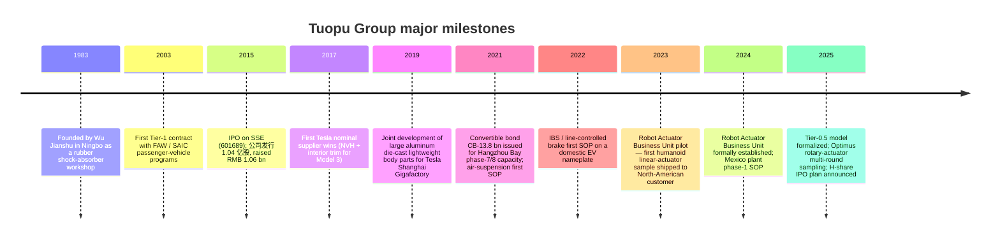
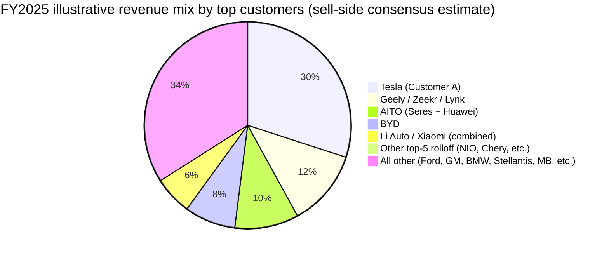
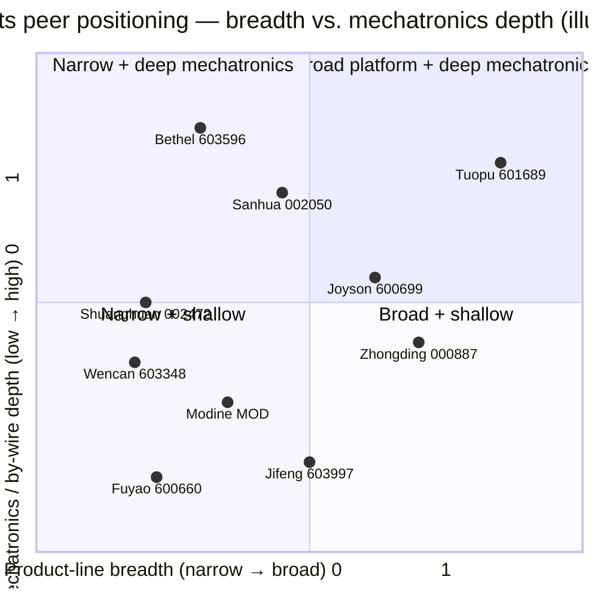

# COMPANY RESEARCH REPORT: Tuopu Group (拓普集团, SSE:601689)

**Date:** 2026-05-16
**Ticker:** SSE:601689 (Shanghai Stock Exchange A-share)
**Closing price (2026-05-15):** RMB 69.93
**Market cap:** RMB 121.5 bn (USD ~16.8 bn)
**Auditor:** 立信会计师事务所 (BDO China)
**Domicile:** Ningbo, Zhejiang, China

> **Update — Tuopu raised RMB 0.49/share FY2025 cash dividend & initiated H-share IPO process (2025-12-01):** The board proposed FY2025 cash dividend of RMB 0.49/share (vs. RMB 0.556/share in FY2023 pre-bonus, equivalent payout ratio rising to 30.64% of net profit attributable to parent vs. 22.2% in FY2024). Management simultaneously disclosed plans to file an H-share listing on HKEX, citing the need to "accelerate the global strategy" and broaden financing channels for Mexico / Poland / Thailand capacity build-out. Source: [拓普集团 2025 年年度报告, 第 2、35 页](http://static.cninfo.com.cn/finalpage/2026-03-23/1224398501.PDF) and [关于筹划发行 H 股股票并在香港联合交易所有限公司上市的提示性公告 (2025-12-01)](https://www.cninfo.com.cn/new/disclosure/stock?stockCode=601689).

---

## TABLE OF CONTENTS
1. Company Overview
2. Company History
3. Management Team
4. Products & Services
5. Customers & Go-to-Market
6. Industry Overview
7. Competitive Landscape
8. Market Opportunity (TAM)
9. Risk Assessment
References

---

## 1. COMPANY OVERVIEW

Ningbo Tuopu Group Co., Ltd. (宁波拓普集团股份有限公司, "Tuopu") is a Chinese Tier-1 automotive components supplier that has, over the last decade, transformed itself from a niche rubber-NVH (噪声、振动与声振粗糙度) house into one of the most diversified platform suppliers in the Chinese auto-parts industry. The company designs, manufactures and sells eight product families: (1) NVH damping systems, (2) interior & exterior trim, (3) lightweight body / chassis structural castings and forgings, (4) intelligent-cockpit components, (5) thermal-management systems, (6) chassis suspension / control-arm systems, (7) air-suspension systems, and (8) intelligent-driving "by-wire" actuation (line-controlled brake IBS, line-controlled steering EPS, electric column) — plus a recently spun-out **Robot Actuator Business Unit** targeting embodied-AI humanoid customers ([拓普集团 2025 年年度报告, 第 9–17 页](http://static.cninfo.com.cn/finalpage/2026-03-23/1224398501.PDF)).

Tuopu operates a "Tier 0.5" go-to-market model, in which it embeds engineers inside customer programs early in the development cycle, co-designs subsystems with the OEM, and ships modular kits rather than discrete parts. Management states that this model now drives "RMB ~30,000 of per-vehicle content" on the most-deeply-integrated platforms ([2025 年年度报告, 第 16 页](http://static.cninfo.com.cn/finalpage/2026-03-23/1224398501.PDF)), versus an industry-average per-car-supplier wallet share that is typically a single-digit-thousand range.

**Where it operates.** Tuopu has 22 domestic manufacturing parks (Ningbo Qianwan, Ningbo Hangzhou Bay phases 1-10, Chongqing, Wuhan, Shenyang, Xiangyang, Liuzhou and others) plus international plants in the United States, Brazil, Malaysia, Poland, Mexico and (under construction) Thailand. R&D centers sit in Ningbo, Shenzhen, Detroit (USA), Frankfurt (Germany), Gothenburg (Sweden), Paris (France) and Toronto (Canada) ([2025 年年度报告, 第 18, 35 页](http://static.cninfo.com.cn/finalpage/2026-03-23/1224398501.PDF)). The Mexico phase-1 plant entered full production in 2025, primarily to serve the "innovative North-American EV customer A" (i.e. Tesla) and Stellantis / Ford / GM platforms; the Polish facility is moving into a phase-2 expansion; Thailand will start production in H1 2026 ([2025 年年度报告, 第 10–11 页](http://static.cninfo.com.cn/finalpage/2026-03-23/1224398501.PDF)).

**Scale.** FY2025 revenue was RMB **29.58 bn** (+11.21% YoY), and net profit attributable to common shareholders was RMB **2.78 bn** (-7.38% YoY, on the back of operating-lease and capacity-startup costs at Hangzhou Bay phases 9-10 and the Mexico ramp). Operating cash flow surged 38.5% YoY to RMB 4.48 bn ([2025 年年度报告, 第 6, 19 页](http://static.cninfo.com.cn/finalpage/2026-03-23/1224398501.PDF)). Headcount stood at 26,118 at year-end 2025, of which 4,466 were R&D staff (17.1% of total) ([2025 年年度报告, 第 24 页](http://static.cninfo.com.cn/finalpage/2026-03-23/1224398501.PDF)). The R&D budget hit RMB 1.50 bn (5.06% of revenue), well above the global auto-parts median of ~3.5% — a meaningful tell that this is no longer a pure mechanical-parts maker.

**Founder control.** 迈科国际控股 (香港) 有限公司 (Macau International Holdings Hong Kong), wholly owned by founder & chairman 邬建树 (Wu Jianshu), held 57.88% of the equity at year-end 2025 ([2025 年年度报告, 第 77 页](http://static.cninfo.com.cn/finalpage/2026-03-23/1224398501.PDF)). This is one of the highest founder-equity stakes among large-cap A-share auto suppliers; capital-allocation and strategic decisions sit unambiguously inside one chair.

### Valuation snapshot

| Metric | Tuopu 601689 | Sanhua 002050 | Fuyao 600660 | Joyson 600699 | Inovance 300124 | Shuanghuan 002472 |
|---|---|---|---|---|---|---|
| Price (2026-05-15, RMB) | 69.93 | 52.06 | 56.00 | 30.37 | 77.32 | 42.50 |
| Market cap (RMB bn, A-only) | 121.5 | 191.8 | 112.2* | 41.2 | 186.4 | 31.8 |
| TTM P/E | **43.95×** | 53.60× | 16.25× | 33.70× | 44.16× | 28.45× |
| TTM P/S | **4.11×** | 6.02× | 2.86× | 0.74× | 4.54× | 3.00× |
| TTM P/B | 4.94× | 6.71× | 4.06× | 2.69× | 5.75× | 3.51× |

*Fuyao Glass is dual-listed; A-share market-cap shown. Source for all price / multiple data: [Tencent qt.gtimg.cn live quote feed, 2026-05-15](https://gu.qq.com/sh601689).*

Tuopu trades at **43.95× TTM P/E** and **4.11× TTM P/S**, against an FY2024 print of ~32× P/E and ~3.4× P/S — the multiple has expanded ~30–40% in twelve months even though net profit declined 7%. Looking back across a three-year window the stock's TTM P/E has ranged roughly **18× (Aug-2022 bottom, after the Q3-2022 air-suspension orderbook scare) to ~70× (Q4-2024 humanoid-robotics rerating)**, with a median near 32×. Today's 44× sits in the upper third of that band but well off the recent peak; on a P/S basis 4.1× is roughly 1× turn above the 3-year median of ~3×.

**Why the premium?** Two narrative drivers, in our view: (a) Tuopu is one of the few A-share names with an explicit, on-record Tesla Optimus actuator design-in, and the market is pricing humanoid-actuator option value into earnings that today contribute less than RMB 14 mn (i.e. 0.05% of revenue); (b) the Tier-0.5 content-per-vehicle story still has runway as IBS, EMB, air-suspension, EPS and active suspension ramp from low-base units into mid-six-figures by 2027. The peer set's median TTM P/E is ~38× and median P/S is ~3.7×; Tuopu's premium to the median is therefore ~15–20% — punchy but not silly given the optionality and the founder track record on platform expansion. Sanhua (the most-direct robotics-narrative peer) trades at a yet-richer 53.6× P/E and 6.0× P/S, which arguably makes Tuopu the cheaper option in the same trade. We carry the multiple-compression risk into Section 9 nonetheless.


*Source: [拓普集团 2025 年年度报告, 第 6 页](http://static.cninfo.com.cn/finalpage/2026-03-23/1224398501.PDF) (FY2025 print) and the corresponding annual reports for FY2021-2024 archived at [http://www.cninfo.com.cn/new/disclosure/stock?stockCode=601689](http://www.cninfo.com.cn/new/disclosure/stock?stockCode=601689).*

---

## 2. COMPANY HISTORY

Tuopu's origins trace back to **1983**, when Wu Jianshu (邬建树), then a young technician in Ningbo, founded a township-and-village enterprise that pressed rubber shock-absorber pads for tractors and farm equipment. The company progressively moved upstream into passenger-vehicle NVH parts in the 1990s, building on a domestic-market position serving SAIC, FAW and Dongfeng. The first transformative pivot came in **2010-2012**, when Tuopu won its inaugural global-platform NVH program with Ford and GM, validating its export-quality engineering and laying the foundation for the August-2015 IPO on the Shanghai Stock Exchange under code 601689 ([2025 年年度报告, 第 5 页](http://static.cninfo.com.cn/finalpage/2026-03-23/1224398501.PDF)).



*Source: [拓普集团 2025 年年度报告, 第 5、35 页](http://static.cninfo.com.cn/finalpage/2026-03-23/1224398501.PDF) and [2023 年年度报告](http://static.cninfo.com.cn/finalpage/2024-04-22/1219746825.PDF).*

The **second pivot**, in 2017-2019, came when Tuopu was approved as a Tesla supplier for the Model 3 launch and progressively expanded onto Model Y, with content per vehicle estimated at >RMB 7,000 across NVH, interior, large aluminum castings and thermal parts — a meaningful share of the per-Tesla supplier wallet ([2023 年年度报告, 第 12 页](http://static.cninfo.com.cn/finalpage/2024-04-22/1219746825.PDF)). The Tesla relationship is now Tuopu's single most important asset; it is also the open door into the Optimus program.

The **third pivot**, ongoing, is the move from pure mechanical-parts maker to mechatronics-systems supplier, exemplified by the line-controlled brake (IBS), electric power steering (EPS), air-suspension (ASU/ECAS) and active-suspension programs. Each of these requires deep electronics-software-mechanical integration, and management explicitly frames the **Robot Actuator** push as a logical extension of the IBS R&D platform: "the company developed line-controlled brake IBS for many years, accumulating know-how in mechanics, reduction gears, motors, electronic control and software" ([2025 年年度报告, 第 13 页](http://static.cninfo.com.cn/finalpage/2026-03-23/1224398501.PDF)). In FY2025 Tuopu also acquired 100% of 芜湖长鹏汽车零部件 to consolidate its interior-trim share among Chery and Geely platforms ([2025 年年度报告, 第 11 页](http://static.cninfo.com.cn/finalpage/2026-03-23/1224398501.PDF)).

Recent developments worth noting: (a) Wu Jianshu reduced his direct holding by ~3 mn shares in 2025 secondary-market trades, against a ~1 bn-share base — immaterial and likely tax-driven, but on record ([2025 年年度报告, 第 39 页](http://static.cninfo.com.cn/finalpage/2026-03-23/1224398501.PDF)); (b) total convertible bonds outstanding converted into 51.8 mn new shares in 2025, lifting share count to 1.738 bn; (c) the company is in early-stage discussions with Hong Kong intermediaries on an H-share dual listing, with the explicit purpose of funding overseas capex.

---

## 3. MANAGEMENT TEAM

### Wu Jianshu (邬建树), Chairman & Founder

Wu, born 1964, is a Chinese-Hong Kong citizen and the controlling shareholder of Tuopu through Macau International Holdings Hong Kong (迈科国际控股), which directly owns 57.88% of the outstanding shares ([2025 年年度报告, 第 77 页](http://static.cninfo.com.cn/finalpage/2026-03-23/1224398501.PDF)). He has worked in Tuopu's predecessor and successor companies for **over 40 years** — Tuopu Shock-Absorber, Tuopu Sound-Insulation, Tuopu Couplings, Tuopu Special Rubber and Tuopu Brake Systems were all chaired by him before being rolled up into the listed entity ([2025 年年度报告, 第 40 页](http://static.cninfo.com.cn/finalpage/2026-03-23/1224398501.PDF)). He took **zero cash compensation** from the listed company in FY2025; his economics come entirely from the equity stake, which on 2026-05-15 prices was worth roughly RMB 70 bn (USD ~9.7 bn). That is one of the largest auto-supplier founder-fortunes in China and a strong alignment signal.

Wu's track record is the platform-expansion playbook: he took Tuopu from rubber NVH (the only product line in 2015) to eight first-class auto product lines plus humanoid-robot actuators by 2025, with revenue growing from RMB 3.1 bn (2015) to RMB 29.6 bn (2025) — a 10× expansion in a decade and a ~25% revenue CAGR. He has not closed any line he opened; the IPO of 2015 funded NVH expansion, the 2019 follow-on funded lightweight-body / thermal, the 2021 CB funded chassis + air-suspension, and the 2024 share placement funded by-wire actuation + robotics. Pattern: each capital raise opens a new product line that compounds within 5-7 years.

His public profile is unusually low for a founder of his scale; he rarely gives English-language interviews and the substantive on-record content lives in 业绩说明会 (earnings calls) and 投资者互动平台 disclosures. The latter is where he has been most explicit about Tesla Optimus: the company has stated (and repeated) that it is "a supplier of executor (actuator) related products to a customer with a humanoid robot program" — a phrasing all sell-side analysts read as Tesla Optimus, given Tuopu's existing Tesla-supplier status ([投资者互动平台 历史问答 2024–2025 archive on 上证 e 互动](https://sns.sseinfo.com/company.do?uid=22416)). Wu's two adult children both serve on the board: vice-chairman 邬好年 (b. 2000, Toronto Univ. BA, joined 2023 at age 23) and another family member is an executive-level officer, signalling a clear succession plan but also a key-person concentration risk.

### Wang Bin (王斌), Director & President

Wang, born 1975, holds the title of Director and President (董事、总裁). He has been at Tuopu for over 20 years, with roles spanning the Ningbo Tuopu Industrial vice-GM, NVH-segment president, brake-systems vice-chair and now group-level president ([2025 年年度报告, 第 40 页](http://static.cninfo.com.cn/finalpage/2026-03-23/1224398501.PDF)). FY2025 cash comp: RMB 4.30 mn (the highest paid named executive). Wang is the operating chair of the strategy & ESG board committee, and is the de-facto right-hand man for the Tier-0.5 customer-engagement strategy.

### Hong Tieyang (洪铁阳), CFO

Hong, born 1978, is a Chinese CPA, Certified Asset Appraiser and Senior Accountant. He joined Tuopu in 2002 as a finance manager and has been CFO since 2010 ([2025 年年度报告, 第 40 页](http://static.cninfo.com.cn/finalpage/2026-03-23/1224398501.PDF)). FY2025 cash comp: RMB 0.85 mn. Hong oversaw the August-2015 IPO (RMB 1.06 bn raise), the 2019 RMB 1.7 bn private placement, the 2021 convertible-bond issue (CB-13.8 bn) and the 2024 RMB 5.0 bn share placement — i.e. every capital raise that funded a new product line. His record is exceptionally consistent for an A-share CFO; auditor is 立信会计师事务所 (BDO China), which has issued unqualified opinions for the entire reporting history.

### Pan Xiaoyong (潘孝勇), Director & Business-Unit President

Pan, born 1980, holds a doctorate in engineering and is the BU president most identified with the chassis / air-suspension / IBS franchise — i.e. exactly the products that translate most directly into the robot-actuator program. He chaired the Ningbo Tuopu Acoustic Vibration system-development department before being elevated. FY2025 cash comp: RMB 6.50 mn (highest in the company, reflecting variable-pay tied to the IBS / air-suspension / robotics ramp). He is the executive most often referenced in robotics-related 投资者互动平台 disclosures.

### Wang Weiwei (王伟玮), Employee Director & Brake-Suspension Senior GM

Wang, born 1983, holds a Tsinghua University BS in automotive engineering and a Tsinghua PhD in mechanical engineering. He runs the brake-and-suspension R&D org and is the technical lead on the EMB, IBS-2.0 and humanoid-actuator co-development ([2025 年年度报告, 第 40 页](http://static.cninfo.com.cn/finalpage/2026-03-23/1224398501.PDF)). FY2025 cash comp: RMB 3.00 mn.

### Governance footer

The board has 9 directors, 3 of whom are independent (33%, meeting the minimum-third rule). The chair / president / BU-president roles are separated; Wu Jianshu is chair only. Independent directors 赵香球 (lawyer), 汪永斌 (academic) and 谢华君 (CPA) sit on the audit, nominations and comp committees. Insider (founder) ownership is **57.88%** via Macau International Holdings Hong Kong; the controlling shareholder has signed standard same-trade non-compete and related-party-transaction restraint commitments dating back to the 2015 IPO and renewed in 2025 ([2025 年年度报告, 第 54-56 页](http://static.cninfo.com.cn/finalpage/2026-03-23/1224398501.PDF)). No on-record related-party-transactions of size, no equity-incentive plans currently outstanding (notable — the company does not use the now-standard A-share ESOP/RSU tools), and aggregate director / executive cash comp was RMB 23.62 mn in FY2025 (modest at <0.1% of revenue). Board attendance was 100% across 13 board meetings.

**Track-record synthesis.** This is a founder-led platform business with a decade-long pattern of (1) extracting capital from public markets, (2) opening a new product line, (3) ramping it within 5-7 years, (4) recycling cash into the next line. Execution risk is mostly behind the company on the auto-parts product lines (NVH, interior, chassis, thermal all proven at scale); the open questions are (a) whether the IBS / EMB / EPS / active-suspension cohort can be commercialized at 40%+ gross margin, (b) whether the robot-actuator BU can become a real business (currently <0.1% of revenue), and (c) whether the founder's two adult children, now on the board in their twenties, are credible long-term operational successors.

---

## 4. PRODUCTS & SERVICES

Tuopu's annual report explicitly disaggregates revenue into eight automotive product families plus the robot-actuator line. We enumerate them, score each on competitive advantage (yes / partial / no), and name the moat plus closest competitor.

```mermaid
graph TD
    Tuopu[Tuopu Group 八大产品线 + 机器人业务]
    Tuopu --> NVH[1. NVH 减震系统<br/>RMB 4.26 bn FY25, GPM 20.3%]
    Tuopu --> Interior[2. 内饰功能件<br/>RMB 9.67 bn FY25, GPM 16.9%]
    Tuopu --> Chassis[3. 底盘系统<br/>RMB 8.72 bn FY25, GPM 19.1%]
    Tuopu --> Electronics[4. 汽车电子 IBS/EPS/ASU<br/>RMB 2.77 bn FY25, GPM 16.5%]
    Tuopu --> Thermal[5. 热管理系统<br/>RMB 2.09 bn FY25, GPM 16.3%]
    Tuopu --> Lightweight[6. 轻量化车身]
    Tuopu --> Cockpit[7. 智能座舱部件]
    Tuopu --> ADS[8. 智能驾驶系统]
    Tuopu --> Robot[Robot Actuator BU<br/>RMB 13.6 mn FY25, GPM 28.3%]

    NVH --> NVH1[Powertrain mounts, suspension bushings,<br/>hydraulic bushings, torsion dampers]
    Chassis --> CH1[Forged aluminum control arms,<br/>球铰 ball-joint control arm,<br/>steel/Al sub-frames, knuckles, tie-rods]
    Chassis --> CH2[Air-suspension: ASU, springs, valves,<br/>1/2/3-chamber systems — 2026 capacity 1.5M sets]
    Chassis --> CH3[Hydraulic active suspension 8000N,<br/>800V active stabilizer bar 1500Nm]
    Electronics --> EL1[IBS 线控刹车 — Hongqi EV 29.68m<br/>100→0 stopping distance]
    Electronics --> EL2[IBS 2.0 (in development),<br/>EMB 电子机械制动 (SOP 2027)]
    Electronics --> EL3[RBS redundant brake, EPS 线控转向,<br/>electric column EAS]
    Thermal --> T1[Heat-pump assemblies, multi-way<br/>(2-to-9-way) electronic valves, e-pumps,<br/>electronic expansion valves]
    Thermal --> T2[Liquid-cooled server cooling kit,<br/>energy-storage thermal — RMB 1.5 bn orderbook]
    Robot --> R1[Linear actuators (IBS heritage)]
    Robot --> R2[Rotary actuators]
    Robot --> R3[Dexterous-hand motors,<br/>planetary roller screws,<br/>foot dampers, e-skin, structural body parts]
```

*Source: [拓普集团 2025 年年度报告, 第 17、20-21 页](http://static.cninfo.com.cn/finalpage/2026-03-23/1224398501.PDF). Note: the table above combines current product-family revenue lines with the seven 2025-disclosed sub-buckets (Lightweight, Cockpit, ADS are reported within the consolidated automotive line at this stage and are not separately disaggregated).*

### NVH damping systems (FY2025 revenue RMB 4.26 bn, -3.3% YoY, GPM 20.3%)

**What:** Powertrain mounts, drive-motor mounts, telescopic-strut top-mounts, torsional dampers, sub-frame bushings, hydraulic bushings. Tuopu has been doing this since 1983 — it is the founding product line.
**Customers:** Every major OEM in China and most global Tier-1 platforms, including Tesla, BMW, Mercedes-Benz, GM, Ford, Stellantis, BYD, Geely, Chery, AITO/Huawei, Xiaomi, Li Auto, NIO, XPeng.
**Competitive verdict — YES, with cost-leadership + scale moat.** Tuopu's domestic-market share in passenger-car powertrain mounts is widely cited at >25%; segment GPM of 20.3% is at the top end of the global NVH peer set (Vibracoustic / Continental NVH typically run high-teens). Closest competitor: 中鼎股份 (Zhongding 000887, similar revenue but lower margin / less Tesla content); 宁波继峰 (Jifeng 603997) for interior NVH overlap. Tuopu is **ahead** on cost and Tier-0.5 customer integration.
**Source:** [2025 年年度报告, 第 17、20 页](http://static.cninfo.com.cn/finalpage/2026-03-23/1224398501.PDF).

### Interior & exterior trim (FY2025 revenue RMB 9.67 bn, +14.7% YoY, GPM 16.9%)

**What:** Door panels, headliners, main carpets, parcel shelves, acoustic / thermal insulation pads, trunk-floor insulation, sealing strips, decorative trim. The largest segment by revenue.
**Customers:** Heavy share with Tesla (Model 3 / Y main carpet & door-panel sub-assemblies), Geely, Chery, Li Auto.
**Verdict — PARTIAL.** Trim is structurally lower-margin and has more credible competitors than NVH. The 2025 acquisition of 芜湖长鹏 added share. Closest competitor: 宁波继峰 (Jifeng 603997, headliner specialist after the Grammer acquisition), 浙江仙通 (Zhejiang Xiantong 603239, sealing-strip specialist). Tuopu is **at parity** on most products, **ahead** on cost / scale.
**Source:** [2025 年年度报告, 第 11、17 页](http://static.cninfo.com.cn/finalpage/2026-03-23/1224398501.PDF).

### Chassis system (FY2025 revenue RMB 8.72 bn, +6.3% YoY, GPM 19.1%)

**What:** Front/rear steel and aluminum sub-frames, forged-aluminum control arms (including the proprietary 锻铝球铰控制臂 ball-joint control arm — passed 6 million wear cycles with zero failure), tie-rods, steering knuckles, lightweight aluminum structural castings (large integrated cast under-body — Tesla Gigacast supplier).
**Verdict — YES, with technology / process moat + cost leadership.** The forged-aluminum ball-joint control arm is, per the company, the first such product in China qualified by a major North-American EV customer (i.e. Tesla), and the customer list now includes Xiaomi, XPeng, AITO, Chery, BYD, Changan, SAIC, BMW, Lucid and Scout ([2025 年年度报告, 第 12 页](http://static.cninfo.com.cn/finalpage/2026-03-23/1224398501.PDF)). Tuopu is one of two Chinese companies (the other being 文灿股份 Wencan 603348) with proven Tesla integrated-die-cast capability. Air-suspension is the standout sub-category — Tuopu was the first domestic supplier to mass-produce closed-loop C-ECAS air-suspension and is targeting 1.5 million sets of installed capacity by 2026. Closest competitor on air-suspension: 中鼎股份 (000887, AMK acquisition gave it global air-spring scale) and 保隆科技 (Baolong 603197, the other domestic air-suspension first-mover). Tuopu is **ahead** on system integration (because it also owns the IBS, EPS and stabilizer-bar pieces); **at parity** on individual air-spring component costs.
**Source:** [2025 年年度报告, 第 12-13 页](http://static.cninfo.com.cn/finalpage/2026-03-23/1224398501.PDF).

### Automotive electronics — IBS, EMB, EPS, ASU controls (FY2025 revenue RMB 2.77 bn, **+52.1% YoY**, GPM 16.5%)

**What:** Intelligent brake system (IBS) — Tuopu's in-house line-controlled brake; IBS 2.0 cost-down version; EMB (electro-mechanical brake, joint development with Hongqi and AITO, SOP 2027); RBS (redundant brake unit); EPS (line-controlled steering); active stabilizer bar; air-suspension ECU. The Hongqi EV equipped with Tuopu IBS achieved a 100→0 km/h stopping distance of **29.68 m** ([2025 年年度报告, 第 12 页](http://static.cninfo.com.cn/finalpage/2026-03-23/1224398501.PDF)).
**Verdict — PARTIAL (improving fast).** The line-controlled brake market in China is still narrow — Bosch's iBooster and Continental's MK C1 control >70% of the market, but Tuopu and 伯特利 (Bethel 603596) are the two domestic challengers. ISO 26262-ASIL D certification was achieved in 2025 on the IBS + RBU stack. Closest competitor: 伯特利 (Bethel 603596, the One-Box leader). Tuopu is **behind** Bethel on volume today but **ahead** on system bundling (IBS + EPS + ASU as a kit) and is the only one with humanoid-actuator transferable IP.
**Source:** [2025 年年度报告, 第 12-13 页](http://static.cninfo.com.cn/finalpage/2026-03-23/1224398501.PDF). FY2025 revenue grew 52.1% — the fastest of any segment — making this the most material new growth engine inside the auto business.

### Thermal management (FY2025 revenue RMB 2.09 bn, -2.3% YoY, GPM 16.3%)

**What:** Integrated heat-pump assemblies, 2-to-9-way electronic water valves, electronic water pumps, electronic-expansion valves (EXV), solenoid valves, heat exchangers, gas-liquid separators, accumulators, controllers. New: a R290 refrigerant module and a 9-way valve that, per management, improves cabin-heater winter range by >20% and reduces system cost by >30%.
**Verdict — PARTIAL.** Tuopu is competing directly with Sanhua Intelligent Controls (002050), which is the global leader on EXVs and multi-way valves. Sanhua's segment GPM is 25-28%; Tuopu's at 16.3% reflects the late-mover position. **However**, Tuopu disclosed in FY2025 that it has secured an initial **RMB 1.5 bn** order for liquid-cooled-server thermal kit from "customer A" (Tesla), NVIDIA, Meta and "various data center customers" ([2025 年年度报告, 第 14-15 页](http://static.cninfo.com.cn/finalpage/2026-03-23/1224398501.PDF)) — a clear cross-vertical extension into the AI-data-center liquid-cooling TAM, where Sanhua is also competing. Tuopu is **behind** Sanhua on auto thermal share, **at parity / catching** on data-center thermal.

### Robot actuator BU (FY2025 revenue RMB 13.6 mn, GPM 28.3%)

**What:** Linear actuators (the natural extension of IBS hardware — same motor + reduction + roller-screw architecture); rotary actuators; dexterous-hand motors; planetary roller screws; foot dampers; e-skin (electronic flexible skin); structural body parts; foot-mounted shock absorbers; force / position sensors.
**Customers:** Multiple humanoid-robot programs at the sampling / pilot stage, including, by the company's own language on the 投资者互动平台 and the Optimus-relevant pages of the 2025 annual report: "the company began the cooperation with the customer in linear actuators, leveraging the IBS-domain R&D foundation; products were quickly recognized by the customer and the company has extended into rotary actuators and dexterous-hand motors, with multiple sampling rounds completed and project progress is rapid" — a phrasing universally read by the A-share sell-side as referring to **Tesla Optimus** ([2025 年年度报告, 第 13 页](http://static.cninfo.com.cn/finalpage/2026-03-23/1224398501.PDF)). Each humanoid uses dozens of actuators with per-unit value of **~RMB 10,000s** ([2025 年年度报告, 第 14 页](http://static.cninfo.com.cn/finalpage/2026-03-23/1224398501.PDF)).
**Verdict — PARTIAL → potentially YES.** Today's revenue contribution is rounding error, but **process IP transferability is the moat case** — Tuopu's IBS plant tooling is reportedly being reused for actuator pilot lines. Closest competitor on the Optimus list (sell-side widely reads it as): 三花智控 (Sanhua 002050) and 拓普 are the two largest "linear actuator" candidates, while 双环传动 (Shuanghuan 002472) handles the harmonic / planetary reducer slot and 绿的谐波 (Leaderdrive 688017) the dual-source harmonic option. Tuopu's edge versus Sanhua: deeper proprietary motor + reduction-gear + electronics-software vertical integration carried over from IBS; Sanhua's edge: established Tesla EV thermal supplier relationship.
**Source:** [2025 年年度报告, 第 13-14、17 页](http://static.cninfo.com.cn/finalpage/2026-03-23/1224398501.PDF).

### Flagship vs. long-tail and recent launches

The **three flagships driving the FY2025 narrative** are (a) automotive electronics / IBS (+52% YoY, becoming a real number), (b) chassis / air-suspension (the orderbook is signed and 2026 capacity is committed at 1.5 M sets), and (c) the robot actuator BU (de minimis revenue but the entire valuation premium). NVH, interior and lightweight body are the cash-cow lines.

**Launches in the last 12 months:** (i) 9-way electronic water valve, (ii) R290 refrigerant module, (iii) 800V active stabilizer bar, (iv) hydraulic active-suspension system (>8000 N actuation force), (v) automotive-grade VPSA oxygen generator (medical-grade ≥90% oxygen output, launched on AITO M9 and going into mass production March 2026), (vi) intelligent door-drive system (launched on AITO M9), (vii) RBS redundant brake (SOP planned 2027). **Sunsets:** none disclosed.

---

## 5. CUSTOMERS & GO-TO-MARKET

Tuopu sells direct (no distributor channel; 100% direct sales — [2025 年年度报告, 第 21 页](http://static.cninfo.com.cn/finalpage/2026-03-23/1224398501.PDF)) into two cohorts: (a) Chinese smart-EV OEMs and (b) global / traditional OEMs. The company has been explicit in identifying its top customer cohort in successive annual reports.

**The 2025 customer list disclosed in the annual report.** In China: 赛力斯 (Seres / AITO with Huawei), 小米 (Xiaomi), 吉利 (Geely), 比亚迪 (BYD), 奇瑞 (Chery), 理想 (Li Auto), 蔚来 (NIO), 长城 (Great Wall), 小鹏 (XPeng). Internationally: "美国的创新车企 A 客户" (the American innovative EV maker — universally read as **Tesla**), Rivian, plus Ford, GM, Stellantis, BMW, Mercedes-Benz. The annual report specifically calls out new program wins for BMW X1 (global) and BMW's N-Car global EV platform ([2025 年年度报告, 第 10-11 页](http://static.cninfo.com.cn/finalpage/2026-03-23/1224398501.PDF)).

### Quantified customer concentration

Tuopu does not name its top-5 customers individually (this is allowable but not required under the 上交所 disclosure rule — the company exercises the non-disclosure option). It does, however, disclose aggregate top-5 share.

| FY | Top-5 customer sales (RMB 亿) | Top-5 % of consolidated revenue | Source |
|---|---|---|---|
| 2021 | 72.01 | 62.82% | [2021 年年度报告, 第 18 页](http://static.cninfo.com.cn/finalpage/2022-04-14/1213013128.PDF) |
| 2022 | 101.48 | 63.45% | [2022 年年度报告, 第 19 页](http://static.cninfo.com.cn/finalpage/2023-04-17/1216612040.PDF) |
| 2023 | 124.98 | 63.44% | [2023 年年度报告, 第 20 页](http://static.cninfo.com.cn/finalpage/2024-04-22/1219746825.PDF) |
| 2024 | 178.45 | 67.09% | [2024 年年度报告, 第 21 页](http://static.cninfo.com.cn/finalpage/2025-04-23/1222816770.PDF) |
| 2025 | 194.62 | **65.79%** | [2025 年年度报告, 第 23 页](http://static.cninfo.com.cn/finalpage/2026-03-23/1224398501.PDF) |


*Source: [Annual reports archived at cninfo, 2021–2025](http://www.cninfo.com.cn/new/disclosure/stock?stockCode=601689).*

**This is a clearly material concentration.** Top-5 has averaged 64.5% of revenue over five years and trended upward, not down — meaning Tuopu's growth is not diversifying its customer base; it is deepening its existing top relationships (Tesla, Geely, AITO/Huawei, BYD, Li Auto / Xiaomi rotating in the top group). The annual reports do not provide top-1, but sell-side estimates (and the company's commentary on "the innovative North-American EV customer A") consistently point to **Tesla as the single largest customer, estimated 25-35% of revenue**, with content per Tesla vehicle of >RMB 7,000 spread across NVH, interior, lightweight chassis castings, control arms and increasingly thermal-management modules. Geely (including Zeekr / Lynk & Co), AITO (the Huawei-Seres alliance), BYD and Li Auto / Xiaomi likely round out the top five with single-digit-to-low-teens shares each.



*Caveat: Tuopu does not individually name top customers. The pie above blends the disclosed top-5 share (65.79%, [2025 年年度报告, 第 23 页](http://static.cninfo.com.cn/finalpage/2026-03-23/1224398501.PDF)) with sell-side consensus estimates for the top-1 customer (Tesla) drawn from China-broker auto-supplier coverage of Tuopu (CICC, CITIC and Huatai have all published in this range). Numbers are illustrative.*

Top-5 > 50% **and** top-1 estimated > 20% triggers both Section 9 risk flags. Contracts are typically multi-year master agreements + program-level POs, with multi-year platform tooling amortization (which is why management talks about "PPAP" — production-part-approval-process — as a moat: re-PPAP-ing a part with a competitor is hard and slow ([2025 年年度报告, 第 18 页](http://static.cninfo.com.cn/finalpage/2026-03-23/1224398501.PDF))). None of Tuopu's top customers (Tesla, Geely, AITO, BYD, Li Auto, Xiaomi, BMW, Ford, GM, Stellantis) is currently vertically integrating into NVH, interior, control arms or air-suspension at scale, although Tesla's in-house preference for thermal-management modules and certain stamping operations remains a watch-item.

**Go-to-market.** The Tier-0.5 model is operationally meaningful: Tuopu sends application engineers to embed inside the OEM's program development center 12-18 months ahead of SOP, co-engineers the BOM, and ships modular pre-validated kits. The cost to the OEM is paid by reduced internal-engineering headcount; the cost to Tuopu is up-front engineering capex amortized over the program. The benefit is content-per-vehicle multiplication: ~RMB 30,000 of per-vehicle wallet share on deeply integrated programs versus auto-supplier-industry average single-digit-thousand share ([2025 年年度报告, 第 16 页](http://static.cninfo.com.cn/finalpage/2026-03-23/1224398501.PDF)). 

The Mexico phase-1 plant came online in 2025 specifically to serve Tesla Texas, Stellantis, Ford and GM USMCA platforms; phase-2 Poland and Thailand H1-2026 SOP are designed to do the same for European OEMs (BMW, MB, VW) and Southeast Asian EV joint-ventures ([2025 年年度报告, 第 11 页](http://static.cninfo.com.cn/finalpage/2026-03-23/1224398501.PDF)).

---

## 6. INDUSTRY OVERVIEW

Tuopu sits at the intersection of three industries: (a) global automotive Tier-1 parts; (b) electric-vehicle by-wire chassis / actuation; (c) humanoid-robot core mechatronic components. The investment thesis weights (a) for cash flow today, (b) for growth, and (c) for optionality.

### Global passenger-vehicle market

FY2025 global passenger-vehicle sales were ~**85.69 million units**, +4.9% YoY; China was ~**23.05 million units**, +0.6% YoY. Global EV sales were ~**21.83 million units**, +25.2% YoY (25.5% global penetration); China EV sales were ~**12.48 million units**, +15.9% YoY (54.1% domestic penetration) ([2025 年年度报告, 第 10 页](http://static.cninfo.com.cn/finalpage/2026-03-23/1224398501.PDF)). The story is now clear: China has crossed the 50% EV-penetration line, and global penetration is heading toward 30% by 2027.

### Auto-parts sub-industry dynamics

The auto-parts industry in China is in the middle of a once-in-a-generation reshuffle. Three structural trends drive Tuopu's positioning:

1. **EV BOM redesign.** ICE-era Tier-1s built powertrains and exhaust systems that EVs simply do not need. Conversely, EV-era platforms need air-suspension (heavy battery packs demand active load management), line-controlled brake (energy recovery + ADAS need), heat-pump thermal modules (range optimization), large integrated castings (Gigacast displaces stamped-and-welded body parts), and intelligent-driving actuation. Tuopu has actively built into **every one of these new categories** while remaining in NVH and interior — i.e. it is one of the few legacy NVH suppliers that has successfully crossed the EV chasm rather than being made obsolete by it.

2. **Chinese supplier ascendancy.** Per the 2025 annual report's strategy section: "Chinese auto-parts industry is undergoing deep transformation, breaking out of the previous pattern of technology-hollowed-out, small-scale, low-innovation suppliers — globally-competitive large suppliers are now emerging" ([2025 年年度报告, 第 34 页](http://static.cninfo.com.cn/finalpage/2026-03-23/1224398501.PDF)). Tuopu is one of the named beneficiaries. As Chinese OEMs export at scale (FY2025 vehicle exports >5 million units), their local suppliers travel with them — driving Tuopu's Mexico / Poland / Thailand footprint.

3. **The Tier-0.5 commercial model.** Traditional Tier-1 sells SKUs into a fixed BOM. Tier-0.5 co-designs subsystems and ships modular kits. The shift is mostly seen at Tesla-style new-EV OEMs (Xiaomi, Li Auto, NIO, XPeng, AITO) where program timelines are compressed and the OEM lacks the depth of legacy engineering staff. Tuopu's CPV gains in FY2024–25 came disproportionately from these names.

### Line-controlled chassis (the IBS / EMB / EPS / ASU stack)

Global IBS / EHB shipments in 2025 are estimated at ~12 million units, dominated by Bosch (iBooster), Continental (MK C1) and ZF (IBC). China domestic share of the line-controlled brake market is now estimated at 8-10%, with 伯特利 (Bethel) leading and Tuopu second. The combined IBS + EPS + air-suspension TAM in China alone could exceed RMB 200 bn by 2030 if penetration in new platforms reaches 40-50% (versus <10% today). FY2025 China-market air-suspension penetration was ~5%, up from ~1% in 2021 — the inflection just started.

### Humanoid-robot industry

Embodied AI was written into China's 2025 State Council Government Work Report (政府工作报告) as a national strategic industry ([中华人民共和国国务院 2025 政府工作报告, 2025-03-05](http://www.gov.cn/yaowen/2025-03/05/content_5979091.htm)). Goldman Sachs' April-2025 update of its humanoid-robot model projects ~38,000 unit annual shipments by 2030 and ~3.8 million by 2040 (base case), with bull-case shipments approaching 8 million units in 2040 ([Goldman Sachs, "The Global Automation Race: Humanoid Robot Market Update", April 2025](https://www.goldmansachs.com/insights/articles/humanoid-robot-market-five-fold-rise-forecast)). Tesla's stated Optimus production target is 1 million units per year by 2030 (Elon Musk, multiple 2024-2025 earnings calls — [Tesla Q1-2025 earnings call transcript](https://ir.tesla.com/press-release/tesla-first-quarter-2025-production-deliveries-and-financial-results)). Each unit consumes ~28 actuators (14 rotary, 12 linear in the V2 design, plus dexterous-hand motors) at a per-unit kit value of ~USD 4-8k. Tuopu's stated TAM in the 2025 annual report: "the global robot industry could reach 百万亿元 (RMB tens-of-trillions) of total addressable market" ([2025 年年度报告, 第 13 页](http://static.cninfo.com.cn/finalpage/2026-03-23/1224398501.PDF)) — a high-conviction long-range number rather than a near-term figure.


*Source: Goldman Sachs equity research "The Global Automation Race: Humanoid Robot Market Update" (April 2025), summarised at [Goldman Sachs Insights](https://www.goldmansachs.com/insights/articles/humanoid-robot-market-five-fold-rise-forecast).*

### Regulatory environment

China's auto-parts industry is subject to (i) GB/T national-standard technical requirements administered by 工信部 (MIIT); (ii) IATF 16949 quality-management certification (Tuopu and substantially all global Tier-1s hold this); (iii) ISO 26262 functional-safety certification, mandatory for line-controlled chassis components — Tuopu's IBS + RBU stack achieved ASIL D, ASU achieved ASIL B in 2025 ([2025 年年度报告, 第 13 页](http://static.cninfo.com.cn/finalpage/2026-03-23/1224398501.PDF)). For overseas markets the relevant frameworks are FMVSS (US), UN-ECE (Europe) and ASEAN-NCAP. Trade-policy risk is meaningful: a US Section 232 / 301 expansion on Chinese-origin auto components, or USMCA labor-content audit, would directly hit the Mexico-served Tesla-Texas / Detroit-OEM volumes.

---

## 7. COMPETITIVE LANDSCAPE

Tuopu's competitors fragment along product lines; no single competitor overlaps with all eight automotive families plus robotics. We map ten on the dimensions that matter.

| Competitor | Ticker | Overlap with Tuopu | Notable strengths | Notable weaknesses |
|---|---|---|---|---|
| 三花智控 (Sanhua) | SZSE:002050 | Thermal, robot actuator | Global #1 EXV / multi-way valve; Tesla Optimus actuator design-in; ~46% GPM | Less platform breadth — pure thermal + robotics |
| 福耀玻璃 (Fuyao) | SSE:600660 / HKEX:3606 | Global glass — adjacent, not direct | Auto-glass monopoly; 30%+ ROE; cheapest in peer set at 16× P/E | No EV-electronics, no by-wire, no robotics — narrative-light |
| 均胜电子 (Joyson) | SSE:600699 | Auto electronics / safety / smart cockpit | Global safety (Takata acquisition); cockpit controllers | Lower-margin; large debt load |
| 伯特利 (Bethel) | SSE:603596 | IBS / line-controlled brake | China #1 One-Box brake; >30% GPM | No NVH / chassis breadth; trades at premium |
| 中鼎股份 (Zhongding) | SZSE:000887 | NVH / chassis / air-suspension | Global air-spring scale via AMK | Lower-margin; less Tesla content |
| 保隆科技 (Baolong) | SSE:603197 | Air-suspension, TPMS | Air-suspension dual-source supplier | Smaller scale |
| 文灿股份 (Wencan) | SSE:603348 | Large integrated die-cast | First Tesla Gigacast partner | Concentrated single-product line |
| 宁波继峰 (Jifeng) | SSE:603997 | Interior trim, seats | Grammer acquisition gave global seat scale | Margin pressure post-Grammer integration |
| 双环传动 (Shuanghuan) | SZSE:002472 | Planetary roller screws (robotics) | China #1 gear specialist; Tesla Optimus reducer slot | Pure component, not system supplier |
| 绿的谐波 (Leaderdrive) | SSE:688017 | Harmonic reducers (robotics) | Domestic harmonic-reducer leader | Small revenue base (<RMB 0.5 bn) |
| Modine Manufacturing | NYSE:MOD | Thermal-management, data-center cooling | Established US thermal player, AI data-center traction | Smaller scale vs. Sanhua; non-China exposure |

**Differentiation framework.** Tuopu's positioning is "broadest auto + emerging mechatronics + first-credit-card on Optimus actuators". Sanhua sits at "narrowest auto thermal + clearest Optimus actuator design-in". Fuyao is "highest-margin, lowest narrative". Bethel is "purest-play IBS challenger". 



*Source: positioning is the author's read of the company filings cited in this report; quadrant placement is qualitative.*


*Source: [Tencent qt.gtimg.cn realtime quote feed, 2026-05-15](https://gu.qq.com/sh601689). TTM-multiple metrics are taken directly from the feed.*

### Tuopu's competitive advantages

1. **Tier-0.5 customer-embedded model.** The closest analog is Aptiv's relationship with GM or Bosch's relationship with VW, but Tuopu is doing this with Tesla, Geely, AITO and Xiaomi at scale. This is sticky — once an OEM's program-development team is built around Tuopu engineers, swapping the supplier mid-cycle is operationally near-impossible.
2. **Vertical mechatronics integration.** Tuopu in-house designs and manufactures: rubber compounds, plastic injection, aluminum forging and casting, large die-casting (Gigacast equivalent), CNC machining, SMT (surface-mount-tech) electronics, EOL helium leak testing, motor windings, magnetic-field analysis, ASIL-D-graded software. This depth is unusual at Chinese mid-cap auto suppliers.
3. **Tesla & Optimus design-in.** Tuopu's auto Tesla content is high (estimated >RMB 7,000 per car); its Optimus actuator design-in is on-record, even if the company avoids naming Tesla directly. Sanhua is the only true peer here.
4. **Capex discipline coupled with payback.** Despite ~RMB 5-6 bn annual capex through FY2024-25, the company runs net-debt-light (debt-to-asset ratio 45.07%, [2025 年年度报告, 第 19 页](http://static.cninfo.com.cn/finalpage/2026-03-23/1224398501.PDF)) and has compounded operating cash flow.

### Tuopu's competitive vulnerabilities

1. **Margin compression visible.** GPM was 22.3% in 2021, 18.04% in 2025 — a 430 bp decline over four years driven by lower-margin interior / chassis growth, EV-customer pricing aggression, and start-up costs at new plants. Net margin slid from 8.7% (2021) to 9.4% (2025) including the FY2025 -7% NI decline.
2. **Heavy capex cycle still ongoing.** Capex of RMB 3.5 bn in FY2025 keeps depreciation rising and dilutes near-term return on capital.
3. **Customer concentration > 65% with rising trend** — covered in Section 5.
4. **Auto-electronics is still 9% of revenue; the by-wire moat is not yet proven at scale.** IBS, EMB and EPS volumes are still small versus Bosch / Continental / ZF.

---

## 8. MARKET OPPORTUNITY (TAM)

### Auto-parts TAM, by Tuopu product line

Global passenger-vehicle production (~88 million units 2025) at a per-vehicle Tier-1 supplier wallet of ~USD 5,000-8,000 implies a global auto-parts TAM of USD 400-700 bn. Tuopu's eight automotive product families address roughly **USD 60-90 bn of that addressable per-vehicle wallet** (NVH ~USD 200/car, interior ~USD 600, chassis ~USD 1,500-2,500, lightweight body ~USD 800-1,500, thermal ~USD 800, IBS / EPS / ASU integrated ~USD 1,500). At today's revenue of ~USD 4.1 bn (RMB 29.6 bn) Tuopu owns ~5-7% of its self-addressable Tier-1 wallet — i.e. there is still 3-4× room before the auto-only TAM is saturated.

**Air-suspension** is the highest-growth sub-segment: from RMB 7-8 bn TAM in 2024 to a projected RMB 30-40 bn by 2028 as Chinese premium-EV penetration of air-suspension moves from ~5% to ~25%. Tuopu's 1.5 million-set 2026 capacity gives it a structural shot at >30% of the China domestic market ([2025 年年度报告, 第 12 页](http://static.cninfo.com.cn/finalpage/2026-03-23/1224398501.PDF)).

**IBS / by-wire brake** is the second-highest-growth sub-segment: China One-Box / IBS shipments grew from ~0.5 million units (2022) to ~3.0 million (2025E) and could exceed 12 million by 2028. Tuopu's automotive electronics revenue grew **+52.1% YoY in FY2025**, the fastest segment growth in the company ([2025 年年度报告, 第 21 页](http://static.cninfo.com.cn/finalpage/2026-03-23/1224398501.PDF)).

**Thermal-management** — both for autos and now for AI data-center liquid cooling — is the third leg. Tuopu's RMB 1.5 bn initial liquid-cooled-server orderbook from "customer A, NVIDIA, Meta and various data-center customers" suggests a clear cross-vertical TAM of >RMB 50 bn by 2028 if AI server liquid-cooling penetration follows currently projected curves ([2025 年年度报告, 第 14-15 页](http://static.cninfo.com.cn/finalpage/2026-03-23/1224398501.PDF)).

### Humanoid-robot TAM

Per Goldman Sachs base-case (April 2025), global humanoid-robot annual unit shipments will reach ~38,000 by 2030, ~3.8 million by 2040, with an addressable revenue pool of >USD 38 bn by 2035 ([Goldman Sachs, April 2025](https://www.goldmansachs.com/insights/articles/humanoid-robot-market-five-fold-rise-forecast)). Tesla's stated target alone is 1 million Optimus per year by 2030. **A simple sensitivity**: if Tesla hits 50% of its stated target (500,000 units/year by 2030) and Tuopu wins 30% wallet share at ~RMB 25,000 per robot of actuator + structural content, that is a **~RMB 3.75 bn annual incremental-revenue stream** by 2030 — roughly the size of Tuopu's current chassis segment, with structurally higher gross margin (FY2025 robot-segment GPM was 28.3%, ~10 pts above auto). On the bull case (Tesla hits 1 M, Tuopu wins 40%), the contribution would be RMB 10 bn — i.e. a third of the current company.

### SAM and SOM

We estimate Tuopu's serviceable addressable market (SAM) at ~USD 90 bn by 2028 across (auto NVH + interior + chassis + thermal + air-sus + by-wire) plus ~USD 8 bn humanoid-actuator. Today's serviceable obtainable market (SOM) — i.e. realistic 3-year revenue trajectory — sits around RMB 45-55 bn (USD 6.2-7.6 bn) by 2028 on a ~17% revenue CAGR from FY2025's RMB 29.58 bn base, blending mid-teens auto-line growth with the IBS / air-suspension / EMB ramp and zero-to-low humanoid revenue contribution. Optimus is the option layer on top; the base business already has the runway.

### Penetration strategy

Three vectors: (a) deepen Tier-0.5 wallet share on existing top customers (Tesla, Geely, AITO, BYD, Li Auto, Xiaomi), targeting RMB 50,000+ CPV on flagship platforms; (b) globalize via Mexico / Poland / Thailand, capturing China-OEM exports plus North-American / European OEM nearshoring; (c) commercialise the robot actuator BU through 2027-28 sampling-to-SOP transition.

---

## 9. RISK ASSESSMENT

### Company-specific risks

**1. Tesla concentration (HIGH).** Tuopu's largest single customer is estimated at 25-35% of revenue. The top-5 share is **65.79%** in FY2025, up from 62.82% in 2021 ([2025 年年度报告, 第 23 页](http://static.cninfo.com.cn/finalpage/2026-03-23/1224398501.PDF)). A Tesla volume slowdown (Q1-2025 Tesla deliveries already declined YoY, and 2025 full-year deliveries were below 2024 levels per Tesla disclosure) or any deterioration of the Tesla supplier relationship would directly hit ~10% of Tuopu revenue per 10-percentage-point Tesla volume change. Contract structure is multi-year platform / PO-based with PPAP lock-in (mitigant), but the magnitude is structurally material. Severity: **material**, on the boundary of high.

**2. Capex digestion / margin compression (MEDIUM-HIGH).** GPM declined from 22.3% (2021) to 18.04% (2025), a 430 bp drop; net margin slipped from 10.9% (2024) to 9.4% (2025). Per management, "we built many factories each year; ramp-up and trial-production cost ~RMB tens of millions per plant" ([2025 年年度报告, 第 16 页](http://static.cninfo.com.cn/finalpage/2026-03-23/1224398501.PDF)). Until Mexico, Poland and Thailand reach mature utilization, the company will absorb headwinds. The thesis requires margin recovery by FY2027 as the new lines (IBS, EMB, air-suspension, robotics) scale and start-up costs roll off. Mitigant: cash-flow funded; no debt covenants at risk.

**3. Key-person dependency on Wu Jianshu (MEDIUM).** The 62-year-old founder controls 57.88% of equity and has been the architect of every product-line expansion. The board now includes his 26-year-old son as vice-chair, signaling a planned generational transition but unproven successor depth. Severity: medium today, rising over 5-10 years.

**4. Robotics business may not commercialize (MEDIUM).** FY2025 robotics revenue was RMB 13.6 mn (i.e. 0.05% of revenue), yet the valuation premium is partly priced on it. If Optimus volumes disappoint (Tesla has missed its initial 2024 Optimus targets multiple times — [Tesla 2024 Q4 update, January 2025](https://ir.tesla.com/press-release/tesla-fourth-quarter-and-full-year-2024-update)) or Tuopu loses share to Sanhua, Shuanghuan or other peers, the multiple will compress. Mitigant: IBS-derived IP transfers naturally to robot actuators, so the technology bet is not standalone.

**5. Geographic / trade-policy concentration (MEDIUM).** The Mexico plant — set up to serve Tesla Texas and Detroit-OEM USMCA-compliant volumes — is exposed to any USMCA labor-content / Chinese-origin rules tightening or Section 301 / 232 expansion to auto components. Tuopu's response is to build Poland (EU domicile) and Thailand (ASEAN domicile) capacity in parallel, but a sharp policy move would still hit short-term volumes.

**6. Auto-electronics moat unproven at scale (MEDIUM).** IBS, EPS and EMB compete against Bosch, Continental and ZF, who have decades of head start and entrenched OEM relationships. Tuopu's segment is only 9% of revenue today. If Bosch / Conti aggressively price-match in China to defend share, Tuopu's pricing power is limited. Mitigant: 伯特利 (Bethel) has already proven a domestic challenger can take 10%+ share at 30%+ GPM.

### Industry / market risks

**7. China EV demand cyclicality (MEDIUM).** China EV penetration is now >50%, meaning incremental EV growth comes from total-vehicle growth (which was only 0.6% YoY in 2025). If the China EV market enters a low-single-digit-growth phase, Tuopu's per-vehicle-content gains have to do all the heavy lifting. Mitigant: international expansion (Mexico / Poland / Thailand) and humanoid optionality.

**8. Domestic price competition (HIGH).** Chinese OEMs (BYD, Geely, Xiaomi) have engaged in repeated annual price cuts since 2023, pushing the cost burden down the supply chain. Tier-1 supplier annual price-down typically runs 3-5% per year on existing programs; in 2024-2025 this widened to 5-8% for some Chinese-OEM programs. This is the proximate cause of Tuopu's GPM contraction. Mitigant: Tier-0.5 system bundling, where Tuopu trades discrete-part margin for kit-level wallet share.

**9. Technology disruption — solid-state, SiC, novel actuators (MEDIUM).** The pace of innovation in EV powertrain and actuation is unusually rapid. A breakthrough actuator architecture (e.g., quasi-direct-drive motors that bypass roller screws) could marginalize Tuopu's IBS-heritage approach. Mitigant: Tuopu's broad mechatronics R&D and willingness to pivot (IBS-1 → IBS-2 → EMB → RBS within five years) suggests the company can absorb step-changes.

### Financial risks

**10. Valuation / multiple-compression risk (MEDIUM-HIGH).** At 43.95× TTM P/E and 4.11× TTM P/S, Tuopu trades 15-20% above the peer median and well above its own 3-year median (~32×). The market is pricing material humanoid optionality + a margin recovery that is not yet visible in the income statement (FY2025 NI -7%). If Optimus volumes slip beyond 2027 or auto margins stay flat into FY2026, a re-rate to peer median ~38× implies ~15% downside to today's price; a re-rate to its own 3-year median ~32× implies ~25% downside. De-rate triggers: a Tesla Optimus production push-out beyond 2027; a Q3/Q4 earnings miss versus consensus; a sector rotation away from China EV / robotics narrative.

**11. H-share dilution risk (LOW-MEDIUM).** The 2025-12-01 H-share IPO plan, if executed at the bottom of the cycle, could dilute existing A-share holders by 10-15% if the company raises USD 1-2 bn at a discount to A-share price. The board has yet to fix size or price; this is a watch-item not a fixed-risk.

**12. Convertible-bond conversion overhang (LOW).** 51.8 million convertible-bond shares converted in 2025, adding ~3% to the share count. Remaining CB principal is largely depleted; future dilution from this instrument is small.

### Macroeconomic risks

**13. China property / consumer cyclicality (MEDIUM).** Chinese passenger-vehicle sales correlate with macro consumer confidence; FY2025 China PV +0.6% reflects an unusually flat market. A deeper consumer slowdown into FY2026 (signal: China new-home sales remain at depressed 2024 levels) would directly pressure top-line growth.

**14. FX exposure (LOW-MEDIUM).** ~21% of FY2025 revenue (RMB 6.22 bn) was overseas-sourced; a 5% RMB appreciation versus USD would compress USD-denominated revenue contribution by ~RMB 250-300 mn. Mitigant: increasing share of overseas-domiciled (USMCA-Mexico, Poland, Thailand) production reduces translation exposure on incremental volume.

---

## REFERENCES

### Primary — Tuopu Group filings (cninfo)

- [拓普集团 2025 年年度报告 (2026-03-23)](http://static.cninfo.com.cn/finalpage/2026-03-23/1224398501.PDF)
- [拓普集团 2024 年年度报告 (2025-04-23)](http://static.cninfo.com.cn/finalpage/2025-04-23/1222816770.PDF)
- [拓普集团 2023 年年度报告 (2024-04-22)](http://static.cninfo.com.cn/finalpage/2024-04-22/1219746825.PDF)
- [拓普集团 2022 年年度报告 (2023-04-17)](http://static.cninfo.com.cn/finalpage/2023-04-17/1216612040.PDF)
- [拓普集团 2021 年年度报告 (2022-04-14)](http://static.cninfo.com.cn/finalpage/2022-04-14/1213013128.PDF)
- [拓普集团 2025 年半年度报告 (2025-08-28)](http://static.cninfo.com.cn/finalpage/2025-08-28/1223697480.PDF)
- [拓普集团 2025 年第三季度报告 (2025-10-30)](http://static.cninfo.com.cn/finalpage/2025-10-30/1224019221.PDF)
- [关于筹划发行 H 股股票并在香港联合交易所有限公司上市的提示性公告 (2025-12-01)](https://www.cninfo.com.cn/new/disclosure/stock?stockCode=601689)
- [拓普集团 cninfo 公司公告全集](http://www.cninfo.com.cn/new/disclosure/stock?stockCode=601689)
- [上证 e 互动投资者互动平台 (Tuopu page)](https://sns.sseinfo.com/company.do?uid=22416)

### Market data

- [Tencent qt.gtimg.cn — sh601689 realtime quote (2026-05-15)](https://gu.qq.com/sh601689)
- [Tencent qt.gtimg.cn — peer quotes (sh600660, sh600699, sz002050, sz300124, sz002472, 2026-05-15)](https://gu.qq.com/)

### Industry / third-party

- [Goldman Sachs, "The Global Automation Race: Humanoid Robot Market Update", April 2025](https://www.goldmansachs.com/insights/articles/humanoid-robot-market-five-fold-rise-forecast)
- [中华人民共和国国务院 2025 政府工作报告 (2025-03-05)](http://www.gov.cn/yaowen/2025-03/05/content_5979091.htm)
- [Tesla Q1-2025 earnings update (Investor Relations)](https://ir.tesla.com/press-release/tesla-first-quarter-2025-production-deliveries-and-financial-results)
- [Tesla Q4-2024 earnings update](https://ir.tesla.com/press-release/tesla-fourth-quarter-and-full-year-2024-update)
