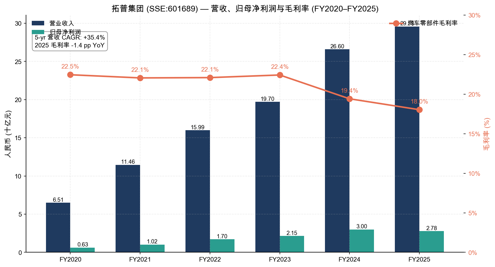
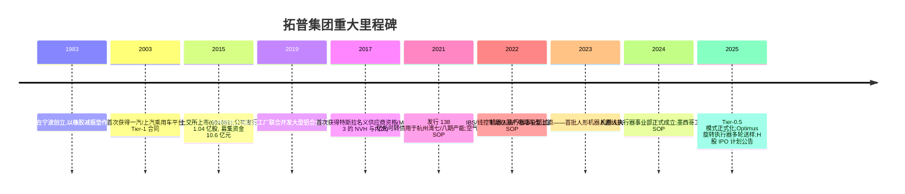
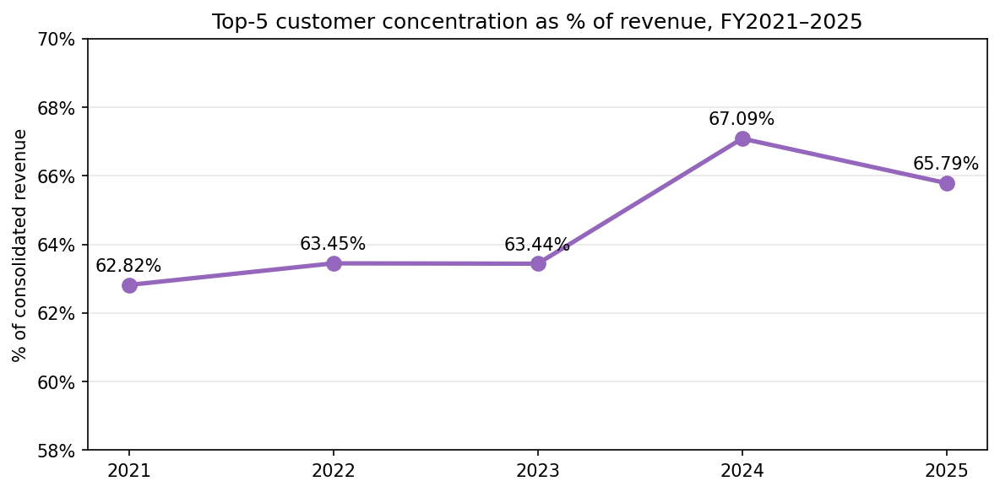
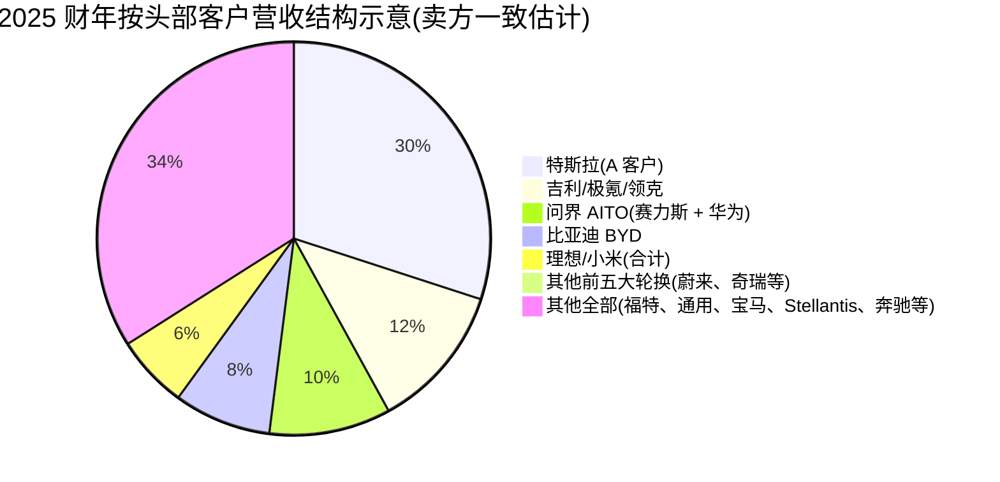
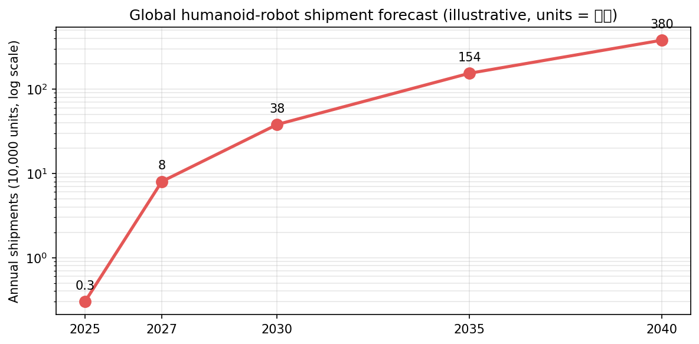
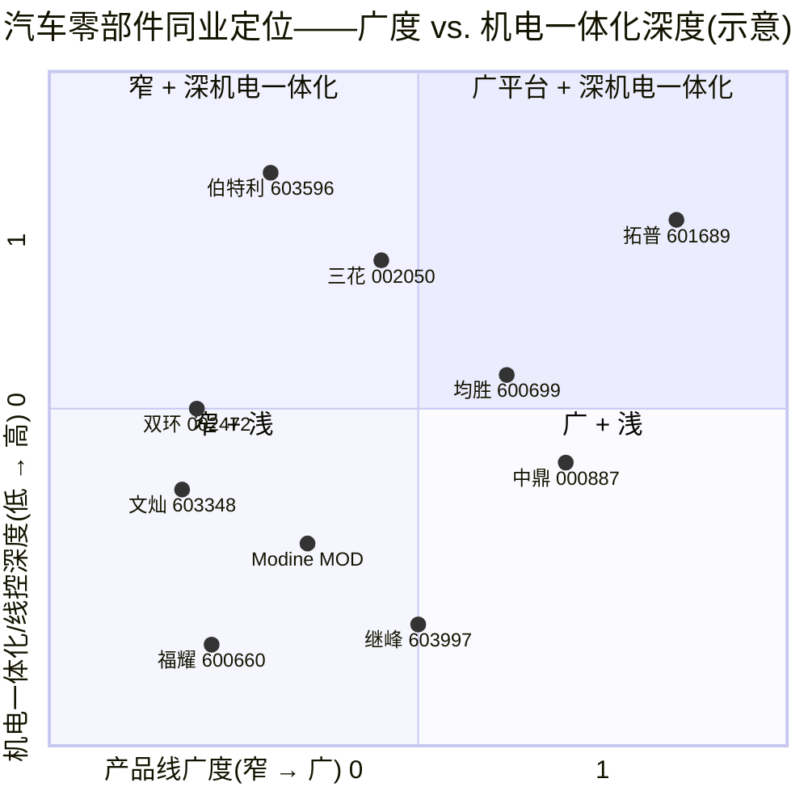
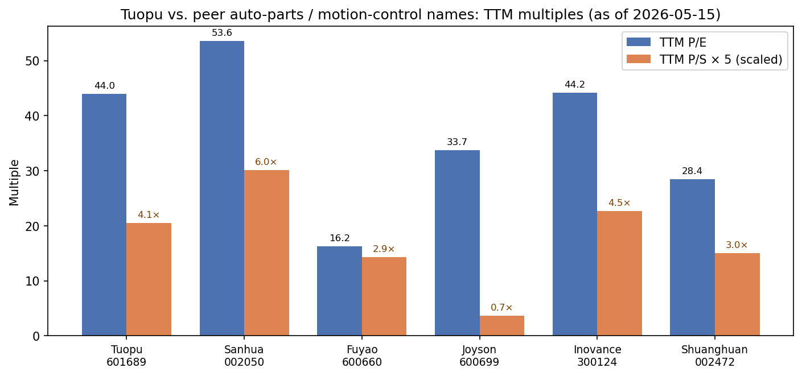

# 公司研究报告:拓普集团(Tuopu Group,SSE:601689)

**日期:** 2026-05-16
**股票代码:** SSE:601689(上海证券交易所 A 股)
**收盘价(2026-05-15):** 人民币 69.93 元
**总市值:** 人民币 1,215 亿元(约合 168 亿美元)
**审计机构:** 立信会计师事务所(BDO China)
**注册地:** 中国浙江省宁波市

> **更新——拓普上调 2025 财年每股现金分红至 0.49 元并启动 H 股 IPO 流程(2025-12-01):** 董事会提议 2025 财年现金分红为每股 0.49 元(对比 2023 财年送股前的每股 0.556 元;归属母公司净利润对应的派息率由 2024 财年的 22.2% 上调至 30.64%)。管理层同步披露计划在港交所发行 H 股上市的方案,并表示需要"加速全球化战略",拓宽融资渠道以支持墨西哥/波兰/泰国产能的扩建。来源:[拓普集团 2025 年年度报告, 第 2、35 页](http://static.cninfo.com.cn/finalpage/2026-03-23/1224398501.PDF) 以及 [关于筹划发行 H 股股票并在香港联合交易所有限公司上市的提示性公告 (2025-12-01)](https://www.cninfo.com.cn/new/disclosure/stock?stockCode=601689)。

---

## 目录
1. 公司概览
2. 公司历史
3. 管理团队
4. 产品与服务
5. 客户与市场进入策略
6. 行业概览
7. 竞争格局
8. 市场机会(TAM)
9. 风险评估
参考文献

---

## 1. 公司概览

宁波拓普集团股份有限公司(以下简称"拓普")是一家中国 Tier-1 汽车零部件供应商,在过去十年间从一家以橡胶 NVH(噪声、振动与声振粗糙度)为主的细分企业,转型为中国汽车零部件行业中产品线最为多元化的平台型供应商之一。公司设计、制造并销售八大产品系列:(1)NVH 减振系统;(2)内外饰件;(3)轻量化车身/底盘结构铸件与锻件;(4)智能座舱部件;(5)热管理系统;(6)底盘悬架/控制臂系统;(7)空气悬架系统;(8)智能驾驶"线控"执行机构(线控制动 IBS、线控转向 EPS、电动转向柱)——以及最近独立设立的**机器人执行器事业部**,瞄准具身智能人形机器人客户([拓普集团 2025 年年度报告, 第 9–17 页](http://static.cninfo.com.cn/finalpage/2026-03-23/1224398501.PDF))。

拓普采用"Tier 0.5"的市场进入模式:在客户项目开发早期就将工程师嵌入到客户项目内部,与 OEM 联合设计子系统,并以模块化总成而非单一零部件交付。管理层表示,该模式在整合度最深的平台上已贡献"单车配套金额约 3 万元人民币"([2025 年年度报告, 第 16 页](http://static.cninfo.com.cn/finalpage/2026-03-23/1224398501.PDF)),远高于行业平均单车单一供应商钱包份额通常仅为单位数千元的水平。

**经营布局。** 拓普在国内拥有 22 个制造园区(宁波前湾、宁波杭州湾一期至十期、重庆、武汉、沈阳、襄阳、柳州等),并在美国、巴西、马来西亚、波兰、墨西哥设有海外工厂,泰国工厂在建。研发中心分布于宁波、深圳、底特律(美国)、法兰克福(德国)、哥德堡(瑞典)、巴黎(法国)和多伦多(加拿大)([2025 年年度报告, 第 18、35 页](http://static.cninfo.com.cn/finalpage/2026-03-23/1224398501.PDF))。墨西哥一期工厂已于 2025 年全面投产,主要服务"北美创新车企 A 客户"(即 Tesla 特斯拉)以及 Stellantis(斯泰兰蒂斯)/Ford(福特)/GM(通用)平台;波兰工厂正在推进二期扩建;泰国工厂将于 2026 年上半年投产([2025 年年度报告, 第 10–11 页](http://static.cninfo.com.cn/finalpage/2026-03-23/1224398501.PDF))。

**规模。** 2025 财年营业收入为 **295.8 亿元人民币**(同比 +11.21%),归属于普通股股东的净利润为 **27.8 亿元人民币**(同比 -7.38%,主要受经营性租赁费用以及杭州湾九期、十期与墨西哥工厂产能爬坡费用拖累)。经营性现金流同比大幅增长 38.5%,达到 44.8 亿元人民币([2025 年年度报告, 第 6、19 页](http://static.cninfo.com.cn/finalpage/2026-03-23/1224398501.PDF))。截至 2025 年末员工总数为 26,118 人,其中研发人员 4,466 人(占比 17.1%)([2025 年年度报告, 第 24 页](http://static.cninfo.com.cn/finalpage/2026-03-23/1224398501.PDF))。研发投入达 15.0 亿元人民币,占营业收入 5.06%,显著高于全球汽车零部件行业 ~3.5% 的中位数水平——这是一个非常有意义的信号,表明公司已不再是单纯的机械零部件制造商。

**创始人控股。** 由创始人兼董事长邬建树全资控股的迈科国际控股(香港)有限公司,截至 2025 年末持有公司 57.88% 的股权([2025 年年度报告, 第 77 页](http://static.cninfo.com.cn/finalpage/2026-03-23/1224398501.PDF))。这是 A 股大市值汽车零部件供应商中,创始人持股比例最高之一;资本配置与战略决策完全集中于一位董事长手中。

### 估值快照

| 指标 | 拓普 601689 | 三花智控 002050 | 福耀玻璃 600660 | 均胜电子 600699 | 汇川 300124 | 双环传动 002472 |
|---|---|---|---|---|---|---|
| 收盘价(2026-05-15,元) | 69.93 | 52.06 | 56.00 | 30.37 | 77.32 | 42.50 |
| 总市值(A 股,亿元) | 1,215 | 1,918 | 1,122* | 412 | 1,864 | 318 |
| TTM 市盈率 | **43.95×** | 53.60× | 16.25× | 33.70× | 44.16× | 28.45× |
| TTM 市销率 | **4.11×** | 6.02× | 2.86× | 0.74× | 4.54× | 3.00× |
| TTM 市净率 | 4.94× | 6.71× | 4.06× | 2.69× | 5.75× | 3.51× |

*福耀玻璃为 A+H 两地上市,此处仅列示 A 股市值。全部价格/估值倍数数据来源:[腾讯 qt.gtimg.cn 实时行情接口, 2026-05-15](https://gu.qq.com/sh601689)。*

拓普目前交易于 **TTM 市盈率 43.95 倍**、**TTM 市销率 4.11 倍**,而 2024 财年对应数据约为 32 倍 P/E 和 3.4 倍 P/S——尽管净利润同比下滑 7%,但估值倍数在过去 12 个月已扩张约 30–40%。回看过去三年,该股 TTM 市盈率区间大致在 **18 倍(2022 年 8 月底部,2022 年三季度空气悬架订单担忧之后)至约 70 倍(2024 年四季度人形机器人重估)** 之间,中位数约 32 倍。当前 44 倍位于该区间的上三分之一,但距近期高点仍有距离;按 P/S 计 4.1 倍,较 3 年中位数约 3 倍高出约 1 倍。

**为何享有溢价?** 我们认为有两大叙事驱动:(a)拓普是 A 股中少数明确、有公开记录拿下 Tesla 特斯拉 Optimus 执行器设计入选(design-in)的标的,而市场正在为人形机器人执行器的期权价值给当前贡献不到 1,400 万元(即营收 0.05%)的业务定价;(b)Tier-0.5 单车配套金额(CPV)增长故事仍有空间——随着 IBS、EMB、空气悬架、EPS 与主动悬架从低基数放量至 2027 年的中-六位数级别;同行中位数 TTM P/E 约 38 倍、P/S 约 3.7 倍,拓普相对中位数溢价约 15–20%——较为激进但考虑到期权价值及创始人在平台扩张方面的过往业绩,并非不合理。三花智控(最直接的机器人叙事同业)更贵,P/E 53.6 倍、P/S 6.0 倍——这反而使拓普在同一交易主题下成为更便宜的选择。但我们仍在第 9 节列示估值压缩风险。



*来源:[拓普集团 2025 年年度报告, 第 6 页](http://static.cninfo.com.cn/finalpage/2026-03-23/1224398501.PDF)(2025 财年数据)以及 2021–2024 财年对应年度报告,存档于 [http://www.cninfo.com.cn/new/disclosure/stock?stockCode=601689](http://www.cninfo.com.cn/new/disclosure/stock?stockCode=601689)。*

---

## 2. 公司历史

拓普的渊源可追溯至 **1983 年**,当时身为宁波年轻技术员的邬建树创立了一家乡镇企业,生产用于拖拉机和农用设备的橡胶减振垫。20 世纪 90 年代,公司逐步向乘用车 NVH 部件领域上移,依托服务上汽、一汽、东风的国内市场地位发展壮大。第一次具有变革意义的转型发生在 **2010–2012 年**,拓普首次拿下了与 Ford 福特和 GM 通用的全球平台 NVH 项目,验证了其出口质量级工程能力,为 2015 年 8 月在上交所以 601689 为代码 IPO 上市奠定了基础([2025 年年度报告, 第 5 页](http://static.cninfo.com.cn/finalpage/2026-03-23/1224398501.PDF))。



*来源:[拓普集团 2025 年年度报告, 第 5、35 页](http://static.cninfo.com.cn/finalpage/2026-03-23/1224398501.PDF) 及 [2023 年年度报告](http://static.cninfo.com.cn/finalpage/2024-04-22/1219746825.PDF)。*

**第二次转型**发生在 2017–2019 年,当时拓普通过审核成为 Tesla 特斯拉 Model 3 上市的供应商,并逐步扩展至 Model Y,单车配套金额估计超过 7,000 元人民币,横跨 NVH、内饰、大型铝合金铸件及热管理部件——在特斯拉单车供应商钱包中占据可观份额([2023 年年度报告, 第 12 页](http://static.cninfo.com.cn/finalpage/2024-04-22/1219746825.PDF))。特斯拉关系如今是拓普最重要的单一资产,也是其进入 Optimus 项目的敲门砖。

**第三次转型**正在进行中:从纯机械件制造商向机电一体化系统供应商演进,典型代表是线控制动(IBS)、电动助力转向(EPS)、空气悬架(ASU/ECAS)以及主动悬架项目。每一项业务都需要深度的电子-软件-机械集成,管理层明确将**机器人执行器**业务定位为 IBS 研发平台的自然延伸:"公司多年深耕线控制动 IBS,在机械、减速齿轮、电机、电控以及软件方面积累了丰富的 know-how"([2025 年年度报告, 第 13 页](http://static.cninfo.com.cn/finalpage/2026-03-23/1224398501.PDF))。2025 财年拓普还收购了芜湖长鹏汽车零部件 100% 股权,以整合其在奇瑞、吉利平台的内饰份额([2025 年年度报告, 第 11 页](http://static.cninfo.com.cn/finalpage/2026-03-23/1224398501.PDF))。

值得关注的近期动态:(a)邬建树于 2025 年通过二级市场交易减持约 300 万股(占约 10 亿股基数比例可忽略),性质不重大,可能与税务相关,但已留有记录([2025 年年度报告, 第 39 页](http://static.cninfo.com.cn/finalpage/2026-03-23/1224398501.PDF));(b)2025 年累计可转债转换为 5,180 万股新股,使总股本上升至 17.38 亿股;(c)公司目前正与香港中介机构进行 H 股双重上市的初期讨论,明确目的是为海外资本支出提供资金。

---

## 3. 管理团队

### 邬建树,董事长兼创始人

邬建树生于 1964 年,中国香港籍,通过迈科国际控股(香港)直接持有拓普 57.88% 的流通股股权,是公司控股股东([2025 年年度报告, 第 77 页](http://static.cninfo.com.cn/finalpage/2026-03-23/1224398501.PDF))。他在拓普及其前身公司任职**逾 40 年**——拓普减振器、拓普隔音、拓普联轴器、拓普特种橡胶及拓普制动系统均由其担任董事长,最后整合进上市主体([2025 年年度报告, 第 40 页](http://static.cninfo.com.cn/finalpage/2026-03-23/1224398501.PDF))。2025 财年他在上市公司**未领取任何现金薪酬**;其经济利益完全来自股权,以 2026 年 5 月 15 日股价计算,该股权价值约 700 亿元人民币(约合 97 亿美元)。这是中国大型汽车零部件供应商创始人财富中最大者之一,是非常强烈的利益绑定信号。

邬建树的过往业绩体现了平台扩张的剧本:他将拓普从 2015 年仅有橡胶 NVH 一条产品线,带到 2025 年的八大一级汽车产品线 + 人形机器人执行器,营收从 2015 年的 31 亿元人民币增长到 2025 年的 296 亿元人民币——十年扩大 10 倍,营收复合增长率约 25%。他从未关闭任何已开辟的产品线:2015 年 IPO 资金用于 NVH 扩产,2019 年增发资金用于轻量化车身/热管理,2021 年可转债资金用于底盘和空气悬架,2024 年定向增发资金用于线控执行机构 + 机器人。规律一致:每一次资本运作都开启一条新产品线,并在 5–7 年内实现规模化。

他的公众曝光度异常低,几乎不接受英文媒体采访,具有实质内容的公开信息主要存在于业绩说明会及投资者互动平台披露之中。后者是他对 Tesla 特斯拉 Optimus 表达最明确的渠道:公司多次声明"是某具有人形机器人项目客户的执行器(executor)相关产品供应商"——一种所有卖方分析师都解读为指向 Tesla 特斯拉 Optimus 的措辞,因为拓普已经是特斯拉供应商([投资者互动平台 历史问答 2024–2025 archive on 上证 e 互动](https://sns.sseinfo.com/company.do?uid=22416))。邬建树的两位成年子女均在董事会任职:副董事长邬好年(2000 年生,多伦多大学学士,2023 年 23 岁加入)、另一位家族成员担任执行级高管,体现出明确的接班规划,但也带来关键人物集中风险。

### 王斌,董事兼总裁

王斌生于 1975 年,现任董事兼总裁。他在拓普任职逾 20 年,先后担任宁波拓普工业副总经理、NVH 板块总裁、制动系统副董事长,现任集团总裁([2025 年年度报告, 第 40 页](http://static.cninfo.com.cn/finalpage/2026-03-23/1224398501.PDF))。2025 财年现金薪酬为 430 万元人民币,是公司具名披露中最高的执行级薪酬。王斌是战略与 ESG 委员会的运营主席,也是 Tier-0.5 客户深耕策略事实上的二把手。

### 洪铁阳,首席财务官

洪铁阳生于 1978 年,中国注册会计师、注册资产评估师及高级会计师。2002 年以财务经理身份加入拓普,2010 年起任 CFO([2025 年年度报告, 第 40 页](http://static.cninfo.com.cn/finalpage/2026-03-23/1224398501.PDF))。2025 财年现金薪酬为 85 万元人民币。洪铁阳主导了 2015 年 8 月 IPO(募集 10.6 亿元)、2019 年 17 亿元非公开发行、2021 年可转债发行(138 亿元)以及 2024 年 50 亿元定向增发——即每一次为新产品线提供资金的资本运作。他的业绩在 A 股 CFO 中持续性极为出色;审计机构立信会计师事务所(BDO China)在公司整个披露历史中均出具无保留意见。

### 潘孝勇,董事兼事业部总裁

潘孝勇生于 1980 年,工学博士,是与底盘/空气悬架/IBS 业务最为绑定的事业部总裁——即与机器人执行器业务转化最直接相关的产品线。他在被晋升前曾担任宁波拓普声振系统开发部总监。2025 财年现金薪酬为 650 万元人民币(公司最高,反映其变动薪酬与 IBS/空气悬架/机器人放量的挂钩)。他也是投资者互动平台机器人相关披露中最常被引用的高管。

### 王伟玮,职工董事兼制动悬架高级总经理

王伟玮生于 1983 年,清华大学汽车工程学士、清华大学机械工程博士。他负责制动悬架研发组织,是 EMB、IBS-2.0 及人形机器人执行器联合开发的技术负责人([2025 年年度报告, 第 40 页](http://static.cninfo.com.cn/finalpage/2026-03-23/1224398501.PDF))。2025 财年现金薪酬为 300 万元人民币。

### 公司治理小结

董事会共有 9 名董事,其中 3 名为独立董事(占比 33%,符合三分之一最低规则)。董事长/总裁/事业部总裁三者职责分离;邬建树仅任董事长。独立董事赵香球(律师)、汪永斌(学者)及谢华君(注册会计师)分别在审计、提名及薪酬委员会任职。内部人(创始人)持股比例为 **57.88%**,通过迈科国际控股(香港)持有;控股股东已签署同业不竞争及关联交易克制承诺,该类承诺始于 2015 年 IPO 时并已于 2025 年续签([2025 年年度报告, 第 54-56 页](http://static.cninfo.com.cn/finalpage/2026-03-23/1224398501.PDF))。没有任何金额重大的关联交易记录,且当前不存在任何在册股权激励计划(值得关注——公司未使用当前 A 股已普及的 ESOP/RSU 工具),董事及高管现金薪酬合计为 2,362 万元人民币(占营业收入比例较低,不到 0.1%)。13 次董事会会议出席率均为 100%。

**过往业绩综述。** 这是一家以创始人为主导的平台型企业,长达十年呈现以下规律:(1)从公开市场募集资金;(2)开辟新产品线;(3)在 5–7 年内放量;(4)再将现金循环投入到下一条产品线。汽车零部件主要产品线(NVH、内饰、底盘、热管理均已规模化验证)的执行风险大部分已经过去;尚待回答的问题包括:(a)IBS/EMB/EPS/主动悬架等新一代产品组合能否实现 40%+ 的毛利商业化;(b)机器人执行器事业部是否能够成长为实质性的业务(目前贡献营收不到 0.1%);(c)创始人两位 20 多岁、目前已经进入董事会的成年子女是否能够成为可靠的长期运营接班人。

---

## 4. 产品与服务

拓普的年度报告将营收明确拆分为八条汽车产品线 + 机器人执行器产品线。我们逐条列举,并就竞争优势(强/部分/无)打分,标注护城河及最接近的竞争对手。

```mermaid
graph TD
    Tuopu[拓普集团 八大产品线 + 机器人业务]
    Tuopu --> NVH[1. NVH 减震系统<br/>2025 财年 42.6 亿元, 毛利率 20.3%]
    Tuopu --> Interior[2. 内饰功能件<br/>2025 财年 96.7 亿元, 毛利率 16.9%]
    Tuopu --> Chassis[3. 底盘系统<br/>2025 财年 87.2 亿元, 毛利率 19.1%]
    Tuopu --> Electronics[4. 汽车电子 IBS/EPS/ASU<br/>2025 财年 27.7 亿元, 毛利率 16.5%]
    Tuopu --> Thermal[5. 热管理系统<br/>2025 财年 20.9 亿元, 毛利率 16.3%]
    Tuopu --> Lightweight[6. 轻量化车身]
    Tuopu --> Cockpit[7. 智能座舱部件]
    Tuopu --> ADS[8. 智能驾驶系统]
    Tuopu --> Robot[机器人执行器事业部<br/>2025 财年 0.136 亿元, 毛利率 28.3%]

    NVH --> NVH1[动力总成悬置、悬架衬套、<br/>液压衬套、扭转减振器]
    Chassis --> CH1[锻铝控制臂、<br/>球铰 ball-joint control arm、<br/>钢/铝副车架、转向节、拉杆]
    Chassis --> CH2[空气悬架:ASU、空簧、阀门、<br/>1/2/3 腔系统 — 2026 年产能 150 万套]
    Chassis --> CH3[液压主动悬架 8000N、<br/>800V 主动稳定杆 1500Nm]
    Electronics --> EL1[IBS 线控刹车 — 红旗 EV 29.68m<br/>100→0 制动距离]
    Electronics --> EL2[IBS 2.0(研发中)、<br/>EMB 电子机械制动(2027 SOP)]
    Electronics --> EL3[RBS 冗余制动、EPS 线控转向、<br/>电动转向柱 EAS]
    Thermal --> T1[热泵总成、多通(2 到 9 通)电子阀、<br/>电子水泵、电子膨胀阀]
    Thermal --> T2[液冷服务器冷却套件、<br/>储能热管理 — 15 亿元订单]
    Robot --> R1[直线执行器(源自 IBS 经验)]
    Robot --> R2[旋转执行器]
    Robot --> R3[灵巧手电机、<br/>行星滚柱丝杠、<br/>足部减振器、电子皮肤、结构件]
```

*来源:[拓普集团 2025 年年度报告, 第 17、20-21 页](http://static.cninfo.com.cn/finalpage/2026-03-23/1224398501.PDF)。注:上表将当前披露的产品族营收线与 2025 年披露的七个细分桶相结合(轻量化、智能座舱、ADS 在此阶段仍合并在汽车类整体披露中,未单独拆分)。*

### NVH 减振系统(2025 财年营收 42.6 亿元,同比 -3.3%,毛利率 20.3%)

**产品:** 动力总成悬置、驱动电机悬置、伸缩支柱顶端悬置、扭转减振器、副车架衬套、液压衬套。拓普自 1983 年以来即从事此项业务,是其起家产品线。
**客户:** 中国所有主要 OEM 以及大多数全球 Tier-1 平台,包括 Tesla 特斯拉、BMW 宝马、Mercedes-Benz 奔驰、GM 通用、Ford 福特、Stellantis、比亚迪 BYD、吉利、奇瑞、AITO 问界/华为、小米、理想、蔚来、小鹏。
**竞争评判 — 强,具备成本领先 + 规模护城河。** 拓普在国内乘用车动力总成悬置的市场份额普遍被引用为大于 25%;板块毛利率 20.3% 位于全球 NVH 同业的最高端(Vibracoustic / Continental 大陆 NVH 通常运行于高 teens 水平)。最接近竞争对手:中鼎股份 000887(营收规模类似但毛利较低/特斯拉份额较少);宁波继峰 603997(在内饰 NVH 方面有重叠)。拓普在成本和 Tier-0.5 客户整合方面**领先**。
**来源:** [2025 年年度报告, 第 17、20 页](http://static.cninfo.com.cn/finalpage/2026-03-23/1224398501.PDF)。

### 内外饰件(2025 财年营收 96.7 亿元,同比 +14.7%,毛利率 16.9%)

**产品:** 门板、顶棚、主地毯、后置物板、隔音/隔热垫、行李厢隔音、密封条、装饰条。营收规模最大的板块。
**客户:** 特斯拉占比较大(Model 3 / Y 主地毯及门板分总成)、吉利、奇瑞、理想。
**评判 — 部分。** 内饰结构性毛利较低,且相比 NVH 有更可信的竞争对手。2025 年收购芜湖长鹏强化了份额。最接近竞争对手:宁波继峰 603997(收购 Grammer 后成为顶棚专家)、浙江仙通 603239(密封条专家)。拓普在多数产品上**与对手持平**,在成本/规模上**领先**。
**来源:** [2025 年年度报告, 第 11、17 页](http://static.cninfo.com.cn/finalpage/2026-03-23/1224398501.PDF)。

### 底盘系统(2025 财年营收 87.2 亿元,同比 +6.3%,毛利率 19.1%)

**产品:** 前/后钢制及铝制副车架、锻铝控制臂(包括自有专利的锻铝球铰控制臂——通过 600 万次磨损循环、零失效)、拉杆、转向节、轻量化铝合金结构铸件(大型一体化铸造车身底板——特斯拉 Gigacast 供应商)。
**评判 — 强,兼具技术/工艺护城河 + 成本领先优势。** 公司表示,该锻铝球铰控制臂是中国首款获得某北美主要电动车客户(即 Tesla 特斯拉)资质认证的同类产品,客户名单目前已扩展至小米、小鹏、问界 AITO、奇瑞、比亚迪 BYD、长安、上汽、BMW 宝马、Lucid 及 Scout([2025 年年度报告, 第 12 页](http://static.cninfo.com.cn/finalpage/2026-03-23/1224398501.PDF))。拓普是仅有的两家具备特斯拉一体化压铸能力认证的中国企业之一(另一家为文灿股份 603348)。空气悬架是最亮眼的细分领域——拓普是国内最早实现闭环 C-ECAS 空气悬架量产的供应商,目标 2026 年装机产能达 150 万套。空气悬架方面最接近竞争对手:中鼎股份 000887(收购 AMK 后获得全球空气弹簧规模)以及保隆科技 603197(国内另一家空气悬架早期先发企业)。拓普在系统集成方面**领先**(因为它还拥有 IBS、EPS 及稳定杆配套件);在单一空气弹簧组件成本上**与对手持平**。
**来源:** [2025 年年度报告, 第 12-13 页](http://static.cninfo.com.cn/finalpage/2026-03-23/1224398501.PDF)。

### 汽车电子 — IBS、EMB、EPS、ASU 控制(2025 财年营收 27.7 亿元,**同比 +52.1%**,毛利率 16.5%)

**产品:** 智能制动系统(IBS)——拓普自研线控制动;IBS 2.0 降本版本;EMB(电子机械制动,与一汽红旗、AITO 问界联合开发,2027 年 SOP);RBS(冗余制动单元);EPS(线控转向);主动稳定杆;空气悬架 ECU。装备拓普 IBS 的红旗 EV 实现了 100→0 km/h 的制动距离 **29.68 米**([2025 年年度报告, 第 12 页](http://static.cninfo.com.cn/finalpage/2026-03-23/1224398501.PDF))。
**评判 — 部分(快速改善)。** 中国线控制动市场目前仍较窄——博世(Bosch)iBooster 与大陆(Continental)MK C1 控制大于 70% 的市场,但拓普与伯特利 603596 是两家国内挑战者。2025 年 IBS + RBU 协议栈实现了 ISO 26262-ASIL D 认证。最接近竞争对手:伯特利 603596(One-Box 领导者)。拓普在出货量上**落后于**伯特利,但在系统打包(IBS + EPS + ASU 套件)方面**领先**,且是唯一具有可迁移至人形机器人执行器知识产权的厂商。
**来源:** [2025 年年度报告, 第 12-13 页](http://static.cninfo.com.cn/finalpage/2026-03-23/1224398501.PDF)。2025 财年营收同比增长 52.1%——是所有板块中增速最快的——使其成为汽车业务内最重要的新增长引擎。

### 热管理(2025 财年营收 20.9 亿元,同比 -2.3%,毛利率 16.3%)

**产品:** 集成热泵总成、2 至 9 通电子水阀、电子水泵、电子膨胀阀(EXV)、电磁阀、热交换器、气液分离器、储液器、控制器。新品:R290 制冷剂模组以及一款 9 通阀,根据管理层描述,该 9 通阀使车舱加热冬季续航提升大于 20%,系统成本下降大于 30%。
**评判 — 部分。** 拓普在该领域直接与三花智控(002050)竞争,后者是全球 EXV 与多通阀的领导者。三花板块毛利率为 25–28%;拓普 16.3% 的毛利率反映出晚进入者地位。**然而**,拓普在 2025 财年披露已获得来自"A 客户"(特斯拉)、NVIDIA(英伟达)、Meta(美塔)及"多家数据中心客户"的液冷服务器热管理套件初始订单 **15 亿元**([2025 年年度报告, 第 14-15 页](http://static.cninfo.com.cn/finalpage/2026-03-23/1224398501.PDF))——这是向 AI 数据中心液冷 TAM 的明确跨垂直延伸,而三花同样在该领域竞争。拓普在汽车热管理份额上**落后**三花,在数据中心热管理上**持平/正在追赶**。

### 机器人执行器事业部(2025 财年营收 0.136 亿元,毛利率 28.3%)

**产品:** 直线执行器(IBS 硬件的自然延伸——相同的电机 + 减速 + 滚柱丝杠架构);旋转执行器;灵巧手电机;行星滚柱丝杠;足部减振器;电子皮肤(柔性电子皮肤);结构件;脚部减振器;力/位置传感器。
**客户:** 多个处于送样/试点阶段的人形机器人项目。根据公司在投资者互动平台和 2025 年年度报告 Optimus 相关章节的措辞:"公司在直线执行器与客户开始合作,依托 IBS 领域的研发基础;产品迅速获得客户认可,公司已扩展到旋转执行器与灵巧手电机,完成多轮送样,项目推进迅速"——这是 A 股卖方普遍解读为指向 **Tesla 特斯拉 Optimus** 的措辞([2025 年年度报告, 第 13 页](http://static.cninfo.com.cn/finalpage/2026-03-23/1224398501.PDF))。每台人形机器人使用数十个执行器,单个价值约**数万元人民币**([2025 年年度报告, 第 14 页](http://static.cninfo.com.cn/finalpage/2026-03-23/1224398501.PDF))。
**评判 — 部分 → 有望升级为强。** 当前营收贡献仅为四舍五入误差,但**工艺 IP 的可迁移性才是护城河逻辑**——据报道拓普的 IBS 工厂工装正在被复用于执行器试制线。Optimus 名单中的最接近竞争对手(卖方普遍解读):三花智控 002050 与拓普是最大的两个"直线执行器"候选者,双环传动 002472 负责谐波/行星减速器槽位,绿的谐波 688017 提供谐波减速器双源选项。拓普相比三花的优势:从 IBS 业务延续下来的电机 + 减速器 + 电子-软件深度纵向整合;三花的优势:已建立的特斯拉电动车热管理供应商关系。
**来源:** [2025 年年度报告, 第 13-14、17 页](http://static.cninfo.com.cn/finalpage/2026-03-23/1224398501.PDF)。

### 旗舰产品 vs. 长尾及近期新品

**驱动 2025 财年叙事的三大旗舰**为:(a)汽车电子/IBS(同比 +52%,正在成为有实质规模的数字);(b)底盘/空气悬架(订单已落定,2026 年产能锁定在 150 万套);(c)机器人执行器事业部(营收微不足道但贡献全部估值溢价)。NVH、内饰及轻量化车身为现金牛业务线。

**近 12 个月推出的产品:**(i)9 通电子水阀;(ii)R290 制冷剂模组;(iii)800V 主动稳定杆;(iv)液压主动悬架系统(执行力大于 8000N);(v)车规级 VPSA 制氧机(医疗级 ≥90% 氧气输出,搭载问界 M9,2026 年 3 月量产);(vi)智能车门驱动系统(搭载问界 M9);(vii)RBS 冗余制动(计划 2027 年 SOP)。**淘汰产品:** 未披露。

---

## 5. 客户与市场进入策略

拓普采用直销模式(无经销商渠道,100% 直销——[2025 年年度报告, 第 21 页](http://static.cninfo.com.cn/finalpage/2026-03-23/1224398501.PDF)),客户分为两大阵营:(a)中国智能电动车 OEM;(b)全球/传统 OEM。公司在历年年度报告中均明确披露其头部客户阵营。

**2025 年年度报告披露的客户清单。** 国内:赛力斯(Seres,与华为合作的问界 AITO)、小米、吉利、比亚迪 BYD、奇瑞、理想、蔚来、长城、小鹏。国际:"美国的创新车企 A 客户"(即北美创新车企——普遍解读为 **Tesla 特斯拉**)、Rivian,加上 Ford 福特、GM 通用、Stellantis、BMW 宝马、Mercedes-Benz 奔驰。年度报告特别提到新拿下的 BMW X1(全球版)及 BMW 全球 EV 平台 N-Car 项目([2025 年年度报告, 第 10-11 页](http://static.cninfo.com.cn/finalpage/2026-03-23/1224398501.PDF))。

### 客户集中度量化

拓普未单独列示前五大客户(根据上交所信息披露规则属于可选项,公司选择不披露)。但公司披露了前五大客户的合计份额。

| 财年 | 前五大客户销售额(亿元) | 占合并营收比 | 来源 |
|---|---|---|---|
| 2021 | 72.01 | 62.82% | [2021 年年度报告, 第 18 页](http://static.cninfo.com.cn/finalpage/2022-04-14/1213013128.PDF) |
| 2022 | 101.48 | 63.45% | [2022 年年度报告, 第 19 页](http://static.cninfo.com.cn/finalpage/2023-04-17/1216612040.PDF) |
| 2023 | 124.98 | 63.44% | [2023 年年度报告, 第 20 页](http://static.cninfo.com.cn/finalpage/2024-04-22/1219746825.PDF) |
| 2024 | 178.45 | 67.09% | [2024 年年度报告, 第 21 页](http://static.cninfo.com.cn/finalpage/2025-04-23/1222816770.PDF) |
| 2025 | 194.62 | **65.79%** | [2025 年年度报告, 第 23 页](http://static.cninfo.com.cn/finalpage/2026-03-23/1224398501.PDF) |



*来源:[cninfo 存档的 2021–2025 年年度报告](http://www.cninfo.com.cn/new/disclosure/stock?stockCode=601689)。*

**这是非常明显的实质性集中度。** 前五大客户占营收的比例过去 5 年平均为 64.5%,趋势是向上而非向下——意味着拓普的增长并未在扩大客户基础,而是在深化现有头部关系(特斯拉、吉利、问界 AITO/华为、比亚迪 BYD、理想/小米在头部圈轮换)。年度报告未披露第一大客户,但卖方估算(以及公司关于"北美创新车企 A 客户"的措辞)一致指向**特斯拉是单一最大客户,估计占营收的 25-35%**,单车特斯拉配套金额超过 7,000 元人民币,涵盖 NVH、内饰、轻量化底盘铸件、控制臂以及日益增长的热管理模块。吉利(含极氪/领克)、问界 AITO(华为-赛力斯联盟)、比亚迪 BYD 与理想/小米可能各自以个位数到低双位数的份额构成其余前五大。



*说明:拓普未具名披露其单一客户。上图将公开披露的前五大份额(65.79%,[2025 年年度报告, 第 23 页](http://static.cninfo.com.cn/finalpage/2026-03-23/1224398501.PDF))与卖方对头部客户(特斯拉)的一致估计相结合,该估计基于中金、中信及华泰对拓普汽车零部件的覆盖。数据仅作示意。*

前五大客户占比 > 50% **且**第一大客户估计 > 20%,触发第 9 节双重风险信号。合同通常为多年期主协议 + 项目级 PO,带有多年期平台模具摊销(因此管理层将 "PPAP"——生产件批准程序——视为护城河:与竞争对手重新进行 PPAP 既难且慢,[2025 年年度报告, 第 18 页](http://static.cninfo.com.cn/finalpage/2026-03-23/1224398501.PDF))。拓普的头部客户(特斯拉、吉利、问界、比亚迪 BYD、理想、小米、宝马、福特、通用、Stellantis)目前没有规模化向 NVH、内饰、控制臂或空气悬架领域纵向整合的动向,但特斯拉在热管理模块和某些冲压工序方面的自制偏好仍是观察项。

**市场进入策略。** Tier-0.5 模式在运营层面非常具有实质意义:拓普在 SOP 之前 12–18 个月将应用工程师派驻到 OEM 项目开发中心,与客户共同设计 BOM,并交付经过预验证的模块化套件。OEM 的成本支出体现为内部工程师人数的削减;拓普的成本则是前置工程资本支出,在项目周期内摊销。其收益在于单车配套金额的倍增:在深度整合项目上单车钱包份额约 3 万元人民币,远高于汽车零部件行业平均的单位数千元水平([2025 年年度报告, 第 16 页](http://static.cninfo.com.cn/finalpage/2026-03-23/1224398501.PDF))。

墨西哥一期工厂已于 2025 年投产,专门服务特斯拉得州、Stellantis、福特和通用的 USMCA 平台;波兰二期工厂以及泰国 2026 年上半年 SOP 设计目的相同,服务欧洲 OEM(宝马、奔驰、大众)及东南亚电动车合资企业([2025 年年度报告, 第 11 页](http://static.cninfo.com.cn/finalpage/2026-03-23/1224398501.PDF))。

---

## 6. 行业概览

拓普处于三大行业的交叉点:(a)全球汽车 Tier-1 零部件;(b)电动车线控底盘/执行机构;(c)人形机器人核心机电组件。投资逻辑中,(a)代表当前现金流,(b)代表增长,(c)代表期权价值。

### 全球乘用车市场

2025 财年全球乘用车销售约 **8,569 万辆**,同比 +4.9%;中国市场约 **2,305 万辆**,同比 +0.6%。全球电动车销量约 **2,183 万辆**,同比 +25.2%(全球渗透率 25.5%);中国电动车销量约 **1,248 万辆**,同比 +15.9%(国内渗透率 54.1%)([2025 年年度报告, 第 10 页](http://static.cninfo.com.cn/finalpage/2026-03-23/1224398501.PDF))。脉络已经清晰:中国已突破 50% 的电动车渗透率门槛,全球渗透率有望在 2027 年逼近 30%。

### 汽车零部件子行业动态

中国汽车零部件行业正处于一代人难遇的重组之中。三大结构性趋势驱动拓普的定位:

1. **电动车 BOM 重设计。** 传统内燃机时代的 Tier-1 厂商生产电动车不再需要的动力总成与排气系统。反之,电动车平台需要空气悬架(承载电池包重量需要主动负载管理)、线控制动(能量回收 + ADAS 需求)、热泵热管理模组(优化续航)、大型一体压铸件(Gigacast 替代冲压焊接车身)以及智能驾驶执行机构。拓普已积极进入**上述每一个新品类**,同时保留 NVH 和内饰业务——这意味着它是为数不多成功跨越电动车鸿沟、而非被电动车浪潮淘汰的传统 NVH 供应商之一。

2. **中国供应商崛起。** 引用 2025 年年度报告战略章节:"中国汽车零部件行业正在经历深度变革,正在打破此前技术空心、规模小、创新不足的格局——具备全球竞争力的大型供应商正在涌现"([2025 年年度报告, 第 34 页](http://static.cninfo.com.cn/finalpage/2026-03-23/1224398501.PDF))。拓普是被点名的受益者之一。随着中国 OEM 大规模出口(2025 财年整车出口超过 500 万辆),其本土供应商也随之出海——这正是拓普墨西哥/波兰/泰国布局的驱动因素。

3. **Tier-0.5 商业模式。** 传统 Tier-1 将 SKU 卖入既定 BOM。Tier-0.5 共同设计子系统并交付模块化套件。这一转变主要发生在特斯拉风格的新势力电动车 OEM(小米、理想、蔚来、小鹏、问界),它们的项目周期被压缩,且 OEM 缺乏传统工程师的深度储备。2024–25 年拓普单车配套金额的增长不成比例地来自这些品牌。

### 线控底盘(IBS / EMB / EPS / ASU 协议栈)

2025 年全球 IBS / EHB 出货量估计约 1,200 万套,主要由博世 Bosch(iBooster)、大陆 Continental(MK C1)与采埃孚 ZF(IBC)垄断。中国线控制动市场的国产化率目前估计约 8–10%,伯特利领先,拓普次之。如果新平台 IBS + EPS + 空气悬架的渗透率从今天的不到 10% 提升到 40–50%,仅中国市场至 2030 年的合并 TAM 即可超过 2,000 亿元人民币。2025 年中国空气悬架渗透率约 5%,较 2021 年的约 1% 已经提升——拐点刚刚开始。

### 人形机器人行业

具身智能已被写入中国国务院 2025 年政府工作报告作为国家战略性产业([中华人民共和国国务院 2025 政府工作报告, 2025-03-05](http://www.gov.cn/yaowen/2025-03/05/content_5979091.htm))。Goldman Sachs(高盛)2025 年 4 月更新的人形机器人模型预测,2030 年全球年度出货量约 38,000 台,到 2040 年达约 380 万台(基本情形),牛市情形下 2040 年出货量接近 800 万台([Goldman Sachs, "The Global Automation Race: Humanoid Robot Market Update", April 2025](https://www.goldmansachs.com/insights/articles/humanoid-robot-market-five-fold-rise-forecast))。Tesla 特斯拉公开的 Optimus 产量目标为 2030 年每年 100 万台(Elon Musk 马斯克在 2024–2025 多次财报电话会上所述——[Tesla Q1-2025 earnings call transcript](https://ir.tesla.com/press-release/tesla-first-quarter-2025-production-deliveries-and-financial-results))。每台 Optimus 使用约 28 个执行器(V2 设计中包括 14 个旋转、12 个直线,加上灵巧手电机),单台套件价值约 4,000–8,000 美元。拓普在 2025 年年度报告中表述的 TAM:"全球机器人产业可达百万亿元(数十万亿元人民币)的潜在市场空间"([2025 年年度报告, 第 13 页](http://static.cninfo.com.cn/finalpage/2026-03-23/1224398501.PDF))——这是长期愿景而非近期数字。



*来源:Goldman Sachs(高盛)股票研究 "The Global Automation Race: Humanoid Robot Market Update"(2025 年 4 月),概述见 [Goldman Sachs Insights](https://www.goldmansachs.com/insights/articles/humanoid-robot-market-five-fold-rise-forecast)。*

### 监管环境

中国汽车零部件行业受到以下监管:(i)由工信部(MIIT)管理的 GB/T 国家标准技术要求;(ii)IATF 16949 质量管理体系认证(拓普及绝大多数全球 Tier-1 持有);(iii)ISO 26262 功能安全认证,线控底盘产品强制要求——拓普 IBS + RBU 协议栈于 2025 年获得 ASIL D,ASU 获得 ASIL B([2025 年年度报告, 第 13 页](http://static.cninfo.com.cn/finalpage/2026-03-23/1224398501.PDF))。海外市场对应法规分别为 FMVSS(美国)、UN-ECE(欧洲)及 ASEAN-NCAP。贸易政策风险颇为可观:针对中国原产汽车零部件的美国 232 / 301 条款扩大,或对 USMCA 劳工含量的审查,均可能直接冲击为特斯拉得州工厂/底特律 OEM 服务的墨西哥产能。

---

## 7. 竞争格局

拓普的竞争对手按产品线分散分布;没有任何单一竞争对手与拓普的全部八大汽车产品线 + 机器人业务存在重叠。我们从关键维度梳理 10 个对手。

| 竞争对手 | 代码 | 与拓普重叠领域 | 主要优势 | 主要劣势 |
|---|---|---|---|---|
| 三花智控(Sanhua) | SZSE:002050 | 热管理、机器人执行器 | 全球 EXV/多通阀第一;特斯拉 Optimus 执行器入选;毛利率约 46% | 平台广度有限——纯热管理 + 机器人 |
| 福耀玻璃(Fuyao) | SSE:600660 / HKEX:3606 | 全球汽车玻璃——相邻而非直接重叠 | 汽车玻璃寡头垄断;ROE 30%+;同业中最便宜,16 倍 P/E | 无电动车电子、无线控、无机器人——缺乏叙事 |
| 均胜电子(Joyson) | SSE:600699 | 汽车电子/安全/智能座舱 | 全球安全(收购 Takata);座舱控制器 | 毛利较低;债务负担较重 |
| 伯特利(Bethel) | SSE:603596 | IBS/线控制动 | 中国 One-Box 制动第一;毛利率 30%+ | 无 NVH/底盘的产品线广度;估值偏贵 |
| 中鼎股份(Zhongding) | SZSE:000887 | NVH/底盘/空气悬架 | 通过收购 AMK 具备全球空气弹簧规模 | 毛利较低;特斯拉份额较少 |
| 保隆科技(Baolong) | SSE:603197 | 空气悬架、胎压监测 TPMS | 空气悬架双源供应商 | 规模较小 |
| 文灿股份(Wencan) | SSE:603348 | 大型一体压铸件 | 特斯拉 Gigacast 首个合作方 | 产品线集中,单一品类 |
| 宁波继峰(Jifeng) | SSE:603997 | 内饰、座椅 | 收购 Grammer 获得全球座椅规模 | 收购 Grammer 后整合带来的毛利压力 |
| 双环传动(Shuanghuan) | SZSE:002472 | 行星滚柱丝杠(机器人) | 中国齿轮专家第一;特斯拉 Optimus 减速器槽位 | 纯零部件,非系统供应商 |
| 绿的谐波(Leaderdrive) | SSE:688017 | 谐波减速器(机器人) | 国产谐波减速器领导者 | 营收基数较小(<5 亿元) |
| Modine Manufacturing | NYSE:MOD | 热管理、数据中心冷却 | 老牌美国热管理厂商,AI 数据中心拓展中 | 规模小于三花;非中国市场敞口 |

**差异化框架。** 拓普的定位是"汽车产品线最广 + 新兴机电一体化深 + Optimus 执行器先发"。三花的定位是"汽车热管理最专注 + Optimus 执行器入选最明确"。福耀是"毛利最高、叙事最弱"。伯特利是"最纯粹的 IBS 挑战者"。



*来源:定位为作者基于本报告所引公司公告所做的解读,象限位置为定性判断。*



*来源:[腾讯 qt.gtimg.cn 实时行情接口, 2026-05-15](https://gu.qq.com/sh601689)。TTM 估值倍数指标直接取自该接口。*

### 拓普的竞争优势

1. **Tier-0.5 客户嵌入模式。** 最接近的类比是 Aptiv 安波福与 GM 通用的关系或博世与大众的关系,但拓普已经与 Tesla 特斯拉、吉利、问界 AITO 及小米建立了规模化的同类关系。该模式黏性极强——一旦 OEM 项目开发团队围绕拓普工程师组织起来,在项目周期中途更换供应商在运营上几乎不可行。
2. **机电一体化纵向整合。** 拓普自有内部设计与制造能力涵盖:橡胶配方、塑料注塑、铝合金锻造与铸造、大型压铸(Gigacast 同级)、CNC 加工、SMT(表面贴装)电子、EOL 氦检漏、电机绕组、磁场分析,以及 ASIL-D 级软件。这种深度在中国中型汽车零部件供应商中并不常见。
3. **特斯拉与 Optimus 设计入选。** 拓普特斯拉汽车单车配套金额高(估计 >7,000 元人民币);其 Optimus 执行器入选有公开记录,即便公司刻意回避具名提及特斯拉。三花是这一维度上唯一真正的同业。
4. **资本支出纪律性强且回报可观。** 尽管 2024–25 财年年度资本支出约 50–60 亿元,公司净负债较轻(资产负债率 45.07%,[2025 年年度报告, 第 19 页](http://static.cninfo.com.cn/finalpage/2026-03-23/1224398501.PDF)),且经营性现金流持续复合增长。

### 拓普的竞争脆弱性

1. **毛利率压缩可见。** 毛利率 2021 年为 22.3%,2025 年降至 18.04%——四年内下滑 430 基点,主因是较低毛利的内饰/底盘业务增长、电动车客户价格压力以及新工厂启动成本。净利润率从 2021 年的 8.7% 滑落至 2025 年的 9.4%(含 2025 财年净利润 -7% 的下滑)。
2. **重资本支出周期仍在持续。** 2025 财年资本支出 35 亿元,使折旧持续上升并稀释短期资本回报率。
3. **客户集中度大于 65% 且呈上升趋势** — 见第 5 节。
4. **汽车电子仍仅占营收 9%;线控护城河尚未规模化验证。** IBS、EMB 与 EPS 出货量相较于博世/大陆/采埃孚仍较小。

---

## 8. 市场机会(TAM)

### 按拓普产品线划分的汽车零部件 TAM

全球乘用车产量约 8,800 万辆(2025 年)× 单车 Tier-1 供应商钱包约 5,000–8,000 美元 ⇒ 全球汽车零部件 TAM 约 4,000–7,000 亿美元。拓普八大汽车产品线大致覆盖**其中可达单车钱包的 600–900 亿美元**(NVH 约 200 美元/车、内饰约 600、底盘约 1,500–2,500、轻量化车身约 800–1,500、热管理约 800、IBS / EPS / ASU 集成约 1,500)。以今天约 41 亿美元(296 亿元)的营收衡量,拓普占自有可达 Tier-1 钱包的 5–7%——也就是说仅就汽车业务而言,饱和前仍有 3–4 倍空间。

**空气悬架**是增速最高的细分领域:从 2024 年 70–80 亿元 TAM 增长至 2028 年预计 300–400 亿元,因为中国高端电动车空气悬架渗透率由约 5% 提升至约 25%。拓普 2026 年 150 万套产能赋予其在中国国内市场夺取 30%+ 份额的结构性机会([2025 年年度报告, 第 12 页](http://static.cninfo.com.cn/finalpage/2026-03-23/1224398501.PDF))。

**IBS / 线控制动**是增速第二的细分领域:中国 One-Box / IBS 出货量从 2022 年约 50 万套增长至 2025 年预计 300 万套,2028 年可能超过 1,200 万套。2025 财年拓普汽车电子板块营收同比 **+52.1%**,是公司增速最快的业务板块([2025 年年度报告, 第 21 页](http://static.cninfo.com.cn/finalpage/2026-03-23/1224398501.PDF))。

**热管理**——既服务汽车业务,也开始进入 AI 数据中心液冷领域——是第三条腿。拓普已获得来自"A 客户、英伟达 NVIDIA、Meta 美塔及多家数据中心客户"的 15 亿元液冷服务器初始订单,显示若 AI 服务器液冷渗透率沿当前预测曲线提升,2028 年明确的跨垂直 TAM 可超过 500 亿元([2025 年年度报告, 第 14-15 页](http://static.cninfo.com.cn/finalpage/2026-03-23/1224398501.PDF))。

### 人形机器人 TAM

根据高盛 2025 年 4 月的基本情形预测,全球人形机器人年度出货量将于 2030 年达到约 38,000 台,2040 年达约 380 万台,可达营收池规模 2035 年超过 380 亿美元([Goldman Sachs, April 2025](https://www.goldmansachs.com/insights/articles/humanoid-robot-market-five-fold-rise-forecast))。仅特斯拉对外公开的目标即为 2030 年每年 100 万台 Optimus。**简单敏感性测算**:若特斯拉实现其公开目标的 50%(2030 年达 500,000 台/年),且拓普拿下 30% 的钱包份额,每台机器人执行器 + 结构件配套金额约 25,000 元,则**每年增量营收约 37.5 亿元人民币**——大致相当于拓普当前底盘板块规模,且结构性毛利更高(2025 财年机器人板块毛利率 28.3%,比汽车高出约 10 个百分点)。在乐观情形下(特斯拉达到 100 万台、拓普拿下 40%),贡献将达 100 亿元——相当于当前公司规模的三分之一。

### SAM 与 SOM

我们估算拓普到 2028 年的可服务市场(SAM)约为 900 亿美元,涵盖(汽车 NVH + 内饰 + 底盘 + 热管理 + 空气悬架 + 线控)加上约 80 亿美元的人形机器人执行器。今日的可服务可获取市场(SOM)——即未来 3 年现实的营收路径——约为 2028 年 450–550 亿元(62–76 亿美元),对应自 2025 财年 296 亿元基数起约 17% 的营收复合增长率,组合中包括汽车业务的中-teens 增长以及 IBS / 空气悬架 / EMB 的放量与极低基数到低基数的人形机器人贡献。Optimus 是叠加在其上的期权层;基础业务本身已具备增长跑道。

### 渗透路径

三大方向:(a)在现有头部客户(特斯拉、吉利、问界 AITO、比亚迪 BYD、理想、小米)上深化 Tier-0.5 钱包份额,目标旗舰平台单车配套金额超过 50,000 元;(b)通过墨西哥/波兰/泰国实现全球化,承接中国 OEM 出口及北美/欧洲 OEM 的近岸采购;(c)在 2027–28 年间推动机器人执行器事业部从送样向 SOP 阶段过渡,实现商业化。

---

## 9. 风险评估

### 公司特定风险

**1. 特斯拉依赖度风险(高)。** 拓普单一最大客户估计占营收的 25-35%。前五大客户占比 2025 财年为 **65.79%**,较 2021 年的 62.82% 上升([2025 年年度报告, 第 23 页](http://static.cninfo.com.cn/finalpage/2026-03-23/1224398501.PDF))。特斯拉销量放缓(2025 年第一季度特斯拉交付量已经同比下滑,根据特斯拉披露 2025 全年交付量低于 2024 年水平)或特斯拉供应商关系任何恶化均会直接冲击拓普约 10% 的营收(对应特斯拉销量每 10 个百分点变动)。合同结构为多年期平台/PO 协议,带有 PPAP 锁定(缓释因素),但量级在结构上仍重大。严重程度:**重大**,处于高风险边界。

**2. 资本支出消化/毛利率压缩(中-高)。** 毛利率由 2021 年的 22.3% 降至 2025 年的 18.04%,下降 430 基点;净利润率由 2024 年的 10.9% 下滑至 2025 年的 9.4%。管理层表示,"我们每年新建多家工厂;每家工厂的爬坡和试制成本约数千万元"([2025 年年度报告, 第 16 页](http://static.cninfo.com.cn/finalpage/2026-03-23/1224398501.PDF))。在墨西哥、波兰、泰国达到成熟稼动率之前,公司将持续吸收此类压力。投资逻辑要求 2027 财年随着新产品线(IBS、EMB、空气悬架、机器人)放量、启动成本结束,毛利率回升。缓释因素:现金流为正,无债务契约风险。

**3. 邬建树关键人物依赖(中)。** 62 岁的创始人控股 57.88% 股权,是每一次产品线扩张的总设计师。董事会目前已纳入其 26 岁的儿子担任副董事长,体现出一定的代际接班规划,但接班人深度尚未得到验证。严重程度:目前为中,5–10 年内将逐步上升。

**4. 机器人业务可能无法商业化(中)。** 2025 财年机器人营收为 1,360 万元(即营收的 0.05%),但估值溢价中部分已定价于此。若 Optimus 销量未达预期(特斯拉已多次未达成初始 2024 Optimus 目标——[Tesla 2024 Q4 update, January 2025](https://ir.tesla.com/press-release/tesla-fourth-quarter-and-full-year-2024-update))或拓普份额输给三花、双环传动或其他同行,估值倍数将面临压缩。缓释因素:IBS 衍生 IP 可自然迁移至机器人执行器,技术押注并非孤立。

**5. 地理/贸易政策集中度(中)。** 墨西哥工厂——专为服务特斯拉得州工厂与底特律 OEM 的 USMCA 合规产量而建——面临 USMCA 劳工含量/中国原产规则收紧或对汽车零部件 232/301 条款扩大的敞口。拓普的应对是同步建设波兰(欧盟原产地)与泰国(东盟原产地)产能,但激进的政策动作仍会冲击短期产量。

**6. 汽车电子护城河尚未规模化验证(中)。** IBS、EPS、EMB 与博世、大陆、采埃孚竞争——后者拥有数十年的领先优势及根深蒂固的 OEM 关系。拓普该板块目前仅占营收 9%。如果博世/大陆在中国激进降价以捍卫份额,拓普的定价能力受限。缓释因素:伯特利已经证明国产挑战者可以在 30%+ 毛利下拿下 10%+ 的份额。

### 行业/市场风险

**7. 中国电动车需求周期性(中)。** 中国电动车渗透率目前已经超过 50%,意味着电动车的增量增长来自整车增长(2025 年仅同比 +0.6%)。如果中国电动车市场进入低单位数增长阶段,拓普单车配套金额的提升必须独立承担全部任务。缓释因素:国际扩张(墨西哥/波兰/泰国)及人形机器人期权价值。

**8. 国内价格竞争(高)。** 中国 OEM(比亚迪 BYD、吉利、小米)自 2023 年起反复发动年度价格战,将成本压力转移至供应链下游。Tier-1 供应商年度降价通常在 3–5%;2024–2025 部分中国 OEM 项目降价扩大至 5–8%。这是拓普毛利率压缩的直接原因。缓释因素:Tier-0.5 系统打包模式,即拓普以单一零部件毛利换取套件级钱包份额。

**9. 技术颠覆——固态电池、SiC 碳化硅、新型执行器(中)。** 电动车动力总成与执行机构的创新速度异常迅猛。新型执行器架构(例如绕过滚柱丝杠的准直驱电机)的突破可能边缘化拓普源于 IBS 的技术路线。缓释因素:拓普广泛的机电一体化研发布局以及五年内 IBS-1 → IBS-2 → EMB → RBS 的迭代意愿表明公司具备吸收技术阶跃的能力。

### 财务风险

**10. 估值/倍数压缩风险(中-高)。** 当前 43.95 倍 TTM P/E 和 4.11 倍 TTM P/S,拓普较同业中位数高 15–20%,远高于自身 3 年中位数(约 32 倍)。市场已定价了重大人形机器人期权价值 + 利润表上尚未体现的毛利率修复(2025 财年净利润 -7%)。如果 Optimus 销量推后到 2027 年以后,或 2026 财年汽车毛利率持续平淡,重估到同业中位数约 38 倍意味着距今价 ~15% 的下行风险;重估到自身 3 年中位数约 32 倍则意味着 ~25% 下行。下调触发因素:特斯拉 Optimus 量产推迟到 2027 年以后;Q3/Q4 业绩低于一致预期;市场板块从中国电动车/机器人叙事中轮动。

**11. H 股摊薄风险(低-中)。** 2025 年 12 月 1 日的 H 股 IPO 计划如果在周期底部执行,假设公司以低于 A 股价的折扣募集 10–20 亿美元,可能稀释现 A 股股东 10–15%。董事会尚未确定规模或定价;这是观察项而非已落定风险。

**12. 可转债转股悬挂风险(低)。** 2025 年已有 5,180 万股可转债转股,使总股本增加约 3%。剩余可转债本金大体已经消耗完毕;该工具未来摊薄空间较小。

### 宏观经济风险

**13. 中国房地产/消费周期性(中)。** 中国乘用车销量与宏观消费信心相关;2025 财年中国乘用车 +0.6% 反映出市场异常平淡。若 2026 财年消费进一步放缓(信号:中国新房销售仍保持在 2024 年低位)将直接压制营收增长。

**14. 汇率敞口(低-中)。** 2025 财年约 21% 营收(62.2 亿元)来自海外;人民币兑美元升值 5% 将压缩美元计价营收贡献约 2.5–3 亿元。缓释因素:海外产地(USMCA 墨西哥、波兰、泰国)产能比重上升降低增量产量上的折算敞口。

---

## 参考文献

### 一手——拓普集团公告(cninfo)

- [拓普集团 2025 年年度报告 (2026-03-23)](http://static.cninfo.com.cn/finalpage/2026-03-23/1224398501.PDF)
- [拓普集团 2024 年年度报告 (2025-04-23)](http://static.cninfo.com.cn/finalpage/2025-04-23/1222816770.PDF)
- [拓普集团 2023 年年度报告 (2024-04-22)](http://static.cninfo.com.cn/finalpage/2024-04-22/1219746825.PDF)
- [拓普集团 2022 年年度报告 (2023-04-17)](http://static.cninfo.com.cn/finalpage/2023-04-17/1216612040.PDF)
- [拓普集团 2021 年年度报告 (2022-04-14)](http://static.cninfo.com.cn/finalpage/2022-04-14/1213013128.PDF)
- [拓普集团 2025 年半年度报告 (2025-08-28)](http://static.cninfo.com.cn/finalpage/2025-08-28/1223697480.PDF)
- [拓普集团 2025 年第三季度报告 (2025-10-30)](http://static.cninfo.com.cn/finalpage/2025-10-30/1224019221.PDF)
- [关于筹划发行 H 股股票并在香港联合交易所有限公司上市的提示性公告 (2025-12-01)](https://www.cninfo.com.cn/new/disclosure/stock?stockCode=601689)
- [拓普集团 cninfo 公司公告全集](http://www.cninfo.com.cn/new/disclosure/stock?stockCode=601689)
- [上证 e 互动投资者互动平台(拓普页面)](https://sns.sseinfo.com/company.do?uid=22416)

### 行情数据

- [腾讯 qt.gtimg.cn — sh601689 实时行情(2026-05-15)](https://gu.qq.com/sh601689)
- [腾讯 qt.gtimg.cn — 同业行情(sh600660、sh600699、sz002050、sz300124、sz002472, 2026-05-15)](https://gu.qq.com/)

### 行业/第三方

- [Goldman Sachs, "The Global Automation Race: Humanoid Robot Market Update", April 2025](https://www.goldmansachs.com/insights/articles/humanoid-robot-market-five-fold-rise-forecast)
- [中华人民共和国国务院 2025 政府工作报告 (2025-03-05)](http://www.gov.cn/yaowen/2025-03/05/content_5979091.htm)
- [Tesla Q1-2025 earnings update (Investor Relations)](https://ir.tesla.com/press-release/tesla-first-quarter-2025-production-deliveries-and-financial-results)
- [Tesla Q4-2024 earnings update](https://ir.tesla.com/press-release/tesla-fourth-quarter-and-full-year-2024-update)
