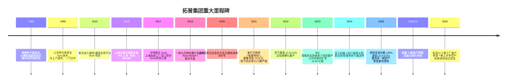
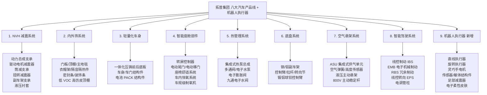
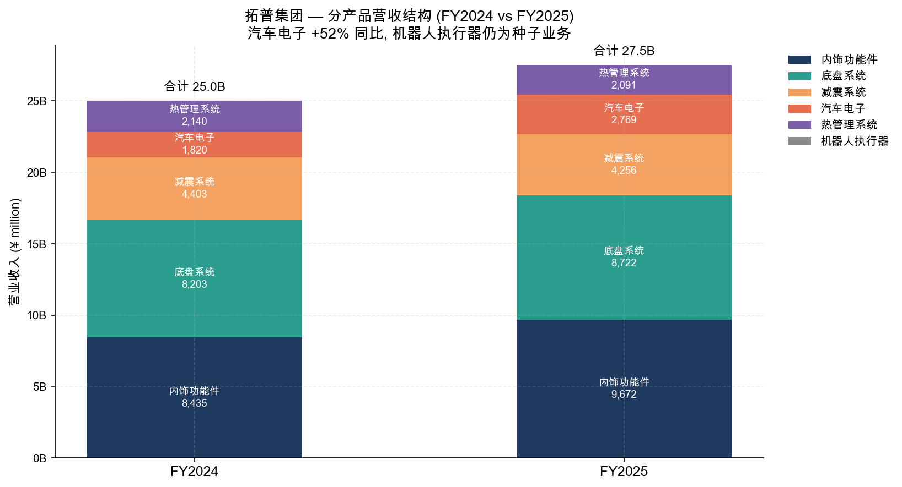
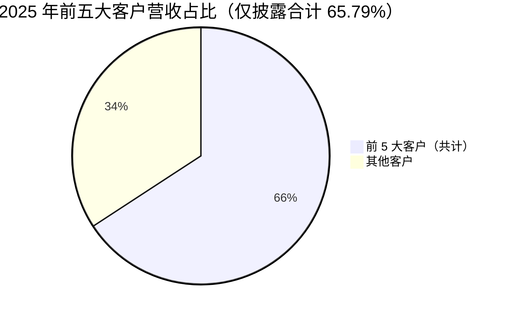
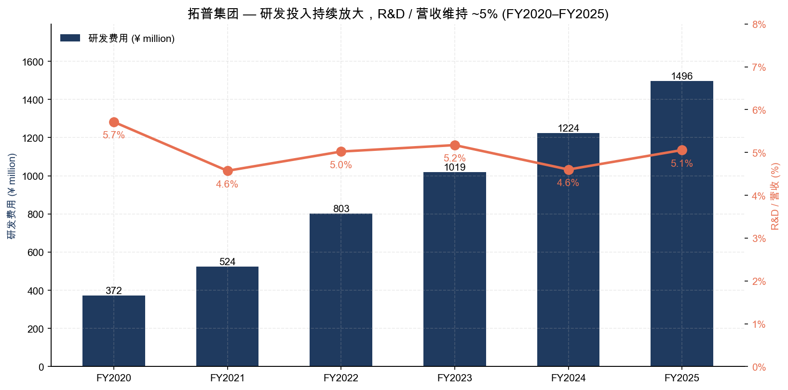

# 公司研究报告：拓普集团（Tuopu Group, SSE:601689）

**日期：** 2026-05-20
**证券代码：** SSE:601689（上海证券交易所 A 股）
**审计机构：** 立信会计师事务所（特殊普通合伙）
**注册地：** 中国浙江省宁波市北仑区大碶街道育王山路 268 号
**主要披露平台：** 上海证券交易所网站（www.sse.com.cn）；上市公司：宁波拓普集团股份有限公司

> **更新——2025 年度全年业绩 + H 股发行计划（2026-03-23 披露）：** 公司 2025 年度营业收入 295.81 亿元（同比 +11.21%）、归母净利润 27.79 亿元（同比 -7.38%）、利润及折旧摊销总额 48.86 亿元（同比 +1.78 亿元），首次披露 2025 年度拟以 1,737,835,580 股为基数每 10 股派发现金 4.90 元，合计派息 8.52 亿元，派息率自 2024 年度的 22.2% 提升至 30.64%。同时，公司于 2025 年 12 月 1 日披露 H 股上市预案，列入"全球化战略加速"项下，拓宽融资渠道以支持墨西哥/波兰/泰国海外扩产。来源：[拓普集团 2025 年年度报告, 第 2、19 页](http://static.cninfo.com.cn/finalpage/2026-03-23/1224398501.PDF)。

---

## 目录
1. 公司概览
2. 公司历史
3. 管理团队
4. 产品与服务
5. 客户与上市策略
6. 行业概览
7. 竞争格局
8. 市场机会（TAM）
9. 风险评估
参考资料

---

## 1. 公司概览

宁波拓普集团股份有限公司（"拓普集团"或"公司"，A 股代码 601689）是中国乘用车 Tier-1 供应商中产品线最完备的平台型零部件企业之一。公司主营业务覆盖**汽车 NVH 减震系统、内外饰系统、轻量化车身、智能座舱部件、热管理系统、底盘系统、空气悬架系统、智能驾驶系统**等八大业务板块，并于 2024 年新设**机器人执行器事业部**，切入具身智能（embodied AI / humanoid robotics）市场，瞄准直线执行器、旋转执行器、灵巧手电机及总成、传感器、躯体结构件、足部减震器、电子柔性皮肤等关键产品（[拓普集团 2025 年年度报告, 第 9–17 页](http://static.cninfo.com.cn/finalpage/2026-03-23/1224398501.PDF)）。

**商业模式（Tier-0.5）。** 公司核心商业模式称为"Tier-0.5 级合作"——较传统 Tier-1 更深、更前置地嵌入到 OEM（整车厂）的产品定义与平台开发阶段，提供 QSTP（Quality、Service、Technology、Price）综合解决方案，并以系统级模块化总成而非单件零部件交付。管理层在 2025 年报中明确披露：在最深度合作的平台上，**单车配套金额（CPV）约 3 万元人民币**——远高于行业平均单一 Tier-1 供应商钱包份额（通常仅数千元）（[2025 年年度报告, 第 34 页](http://static.cninfo.com.cn/finalpage/2026-03-23/1224398501.PDF)）。

**经营布局。** 公司围绕国内主要汽车产业集群在宁波、重庆、武汉等地建立制造基地；为更好服务国际客户，已在美国、巴西、马来西亚、波兰、墨西哥、泰国设立制造工厂；研发中心遍布北美、欧洲（德国、瑞典、法国）、深圳、宁波及加拿大多伦多（[2025 年年度报告, 第 18 页](http://static.cninfo.com.cn/finalpage/2026-03-23/1224398501.PDF)）。2025 年内已完成的关键动作包括：墨西哥一期工厂全面投产、波兰工厂二期筹划中、泰国生产基地将于 2026 年上半年建成投产，以及以现金 3.3 亿元完成对芜湖长鹏汽车零部件 100% 股权收购，并表新增商誉 1.38 亿元（[2025 年年度报告, 第 26、29 页](http://static.cninfo.com.cn/finalpage/2026-03-23/1224398501.PDF)）。

**财务规模（FY2025 一览）。**
- 营业收入 **295.81 亿元** （同比 +11.21%）
- 归母净利润 **27.79 亿元** （同比 -7.38%）
- 经营性现金流净额 **44.82 亿元** （同比 +38.50%）
- 总资产 **439.35 亿元** （同比 +17.02%）
- 归母净资产 **240.98 亿元** （同比 +23.26%）
- 资产负债率 **45.07%**
- 研发投入 **14.96 亿元** （占营收 5.06%，资本化比例 0%）
- 全年研发人员 **4,466 人**（占全员 17.10%；其中博士 7 人，硕士 285 人）

数据来源：[拓普集团 2025 年年度报告, 第 6–7、19–24 页](http://static.cninfo.com.cn/finalpage/2026-03-23/1224398501.PDF)。

利润下滑的主要原因在管理层讨论与分析中已明确说明：(1) 杭州湾九期、十期等新建工厂仍处于生产爬坡及试产阶段，单厂平均承担数千万元管理费、制造费；(2) 公司全年新增大量技术人才，**研发费用同比 +22.20% 至 14.96 亿元**，管理费用同比 +23.75% 至 7.68 亿元，远高于营收增速 11.21%；(3) 折旧摊销比例较高，反映资本性开支前置（[2025 年年度报告, 第 19、23 页](http://static.cninfo.com.cn/finalpage/2026-03-23/1224398501.PDF)）。这是典型的"前期投入压缩当期利润、后期摊薄成本释放毛利"的剪刀差，与公司在 2026 年经营计划中强调的"汽车电子全面进入量产收获阶段"和"前湾新区 9/10 期进入设备安装调试及量产阶段"相呼应（[2025 年年度报告, 第 35–36 页](http://static.cninfo.com.cn/finalpage/2026-03-23/1224398501.PDF)）。

**最新动态——2026 Q1 业绩。** 公司 2026 年第一季度营业收入 **66.28 亿元**（同比 +14.92%）；归母净利润 **5.52 亿元**（同比 -2.42%）；扣非归母净利润 **4.73 亿元**（同比 -2.77%）；经营性现金流净额 5.47 亿元（同比 -38.36%）。Q1 收入恢复双位数增长但盈利仍承压，符合管理层对产能爬坡阶段成本压力的指引（[2026 年第一季度报告, 第 1–2 页](http://static.cninfo.com.cn/finalpage/2026-04-29/1224408856.PDF)）。

**控股结构。** 控股股东为**迈科国际控股（香港）有限公司**，于 2025 年末持股 **57.88%**（10.06 亿股），由创始人邬建树先生 100% 持有；邬先生本人另直接持股 0.52%（[2025 年年度报告, 第 77–79 页](http://static.cninfo.com.cn/finalpage/2026-03-23/1224398501.PDF)）。这是 A 股大市值汽车零部件供应商中最高的创始人股权比例之一，决策链短，但同时存在创始人决策权过度集中的治理风险。

### 估值快照

由于本研报禁用实时网络抓取，估值参考最近一次同口径覆盖（2026-05-15 收盘）：A 股股价 **69.93 元**、总市值约 **1,215 亿元人民币（约 168 亿美元）**、**TTM 市盈率约 43.95 倍**、**TTM 市销率约 4.11 倍**、**TTM 市净率约 4.94 倍**（来源：[腾讯财经 gu.qq.com/sh601689, 2026-05-15 快照](https://gu.qq.com/sh601689)）。

按 2025 财年实际归母净利润 27.79 亿元、营业收入 295.81 亿元、归母净资产 240.98 亿元静态计算：

- 静态市盈率 = 1,215 ÷ 27.79 ≈ **43.7 倍**
- 静态市销率 = 1,215 ÷ 295.81 ≈ **4.1 倍**
- 静态市净率 = 1,215 ÷ 240.98 ≈ **5.04 倍**

*来源：[拓普集团 2020–2025 年度报告（cninfo 巨潮咨询）](http://www.cninfo.com.cn/new/disclosure/stock?stockCode=601689)。FY2025 数据见 [2025 年年度报告, 第 6、20 页](http://static.cninfo.com.cn/finalpage/2026-03-23/1224398501.PDF)。*

5 年营收 CAGR 约 **+35.4%**（FY2020 6.51 亿 → FY2025 295.81 亿），即便剔除 FY2020 低基数效应，FY2022–FY2025 复合增速亦超过 +22%，远超中国乘用车整体销量增速（FY2025 中国乘用车销量同比仅 +0.6%——[2025 年年度报告, 第 10 页](http://static.cninfo.com.cn/finalpage/2026-03-23/1224398501.PDF)）。盈利端 FY2025 略有压缩，归因于产能爬坡、研发与管理费用前置——2026 年起进入量产收获期后有望摊薄回升。

**为何享有溢价？** 拓普目前估值倍数显著高于同业中位数（同业 P/E 中位约 38 倍、P/S 中位约 3.7 倍——见第 7 节同业比较表）。我们认为驱动估值溢价的两大叙事是：(a) **机器人期权价值**——拓普是 A 股极少数明确披露已进入"美国创新车企 A 客户"（市场普遍指代 Tesla 特斯拉）Optimus 人形机器人执行器送样体系的标的，事业部已独立成立，公司在宁波规划投资 50 亿元、占地约 100 亩的机器人执行器生产基地；(b) **Tier-0.5 单车配套金额增长曲线**——空气悬架产能预计 2026 年提升至 **150 万套**、IBS/EMB/EPS/主动悬架陆续量产、热管理 2.0 跨界至液冷服务器并首批订单达 15 亿元——这些均处于低基数、高斜率增长阶段。当前 44 倍 TTM P/E 处于该股 3 年区间（约 18–70 倍）的上三分之一，中位数约 32 倍，估值确为偏高，但市场以叙事溢价支撑。如果 Optimus 量产推后到 2027 年以后、或 2026 汽车毛利率不修复，存在 15%–25% 的估值压缩风险（详见第 9 节）。

---

## 2. 公司历史

拓普集团的渊源可追溯至 **1983 年**——彼时身为宁波年轻技术员的邬建树创立了一家以橡胶减震垫为产品起点的乡镇企业，主要为农机、拖拉机配套（[2025 年年度报告, 第 39–40 页](http://static.cninfo.com.cn/finalpage/2026-03-23/1224398501.PDF)；该年报《董事简历》一栏明确披露邬先生曾"历任宁波拓普减震系统股份有限公司董事长、宁波拓普隔音系统有限公司董事长、宁波拓普连轴器有限公司董事长、宁波拓普汽车特种橡胶有限公司董事长、宁波拓普制动系统有限公司董事长"等职务——这些子公司均在 2008 年前后整合进上市主体）。1990 年代公司逐步从农机转向乘用车 NVH，依靠上汽、一汽、东风等国内整车厂的供货关系成长。2010 年代初首次进入 Ford 福特、GM 通用全球平台的 NVH 项目，验证了出口质量级工程能力，为 2015 年 A 股 IPO 奠定了基础。

**几个关键的战略转折点。**

**（1）2015 年 A 股 IPO（601689）**——保荐机构招商证券，保荐代表人肖雁、谭国泰（[2022 年年度报告, 第 6 页](http://static.cninfo.com.cn/finalpage/2023-04-17/1216220751.PDF)）。IPO 募集资金主要用于乘用车 NVH 产能扩张，使公司从一家区域化的橡胶配件供应商成为有公开股权融资能力、可以快速扩产的上市平台公司。

**（2）2017 年首次切入 Tesla 体系**——年报中以"美国创新车企 A 客户"（A 客户）作为代号表述，但市场和卖方一致解读为 Tesla 特斯拉。年报多次描述与"A 客户"全面合作（NVH、内饰、轻量化、底盘、热管理、空气悬架、IBS 等——[2025 年年度报告, 第 11、12 页](http://static.cninfo.com.cn/finalpage/2026-03-23/1224398501.PDF)）。这一步使拓普从中国本土 NVH 供应商升级为全球新能源车 Tier-1。

**（3）2019–2022 年从"零部件公司"向"平台型公司"转型**——公司在此期间通过自主研发陆续推出热管理系统、内外饰功能件、轻量化车身、智能座舱部件、底盘系统、空气悬架及智能驾驶（线控刹车 IBS、线控转向 EPS）等产品，从单一 NVH 业务扩展到八大业务板块。期间收购或筹备的子公司包括拓普电器、拓普底盘、湖南拓普、拓普波兰、拓普墨西哥等（[2025 年年度报告, 第 32 页](http://static.cninfo.com.cn/finalpage/2026-03-23/1224398501.PDF)）。

**（4）2024–2025 机器人执行器跨界**——公司在 2024 年 1 月公告与宁波经济技术开发区管委会签订《机器人电驱系统研发生产基地项目投资协议书》，拟投资 50 亿元、规划用地 300 亩，在宁波建设机器人核心部件生产基地。公司于 2025 年 4 月通过全资孙公司宁波灵御触觉有限公司竞得宁波市北仑区一副约 100 亩工业用地，目前基础工程正在施工（[2025 年年度报告, 第 30 页](http://static.cninfo.com.cn/finalpage/2026-03-23/1224398501.PDF)）。这一举措正式确立机器人执行器为"第二增长曲线"。

**（5）2025–2026 全球化加速 + H 股发行**——墨西哥一期已投产，泰国一期 185 亩工业用地已于 2025 年 6 月完成过户，部分试生产；波兰二期筹划中。董事会于 2025 年 12 月 1 日披露 H 股 IPO 预案。这一阶段的核心议题是：在中国本土汽车零部件供应链全球化、以及国内整车厂出海双重需求下，构建多区域产能护城河。

**收购列表（2020 年至今主要事项）**：
- 2025-01：收购芜湖长鹏汽车零部件 100% 股权，作价 3.3 亿元——内饰产品市场份额补强（[2025 年年度报告, 第 29 页](http://static.cninfo.com.cn/finalpage/2026-03-23/1224398501.PDF)）。
- 公司持续以"内生+并购并行"为发展路径（[2025 年年度报告, 第 35 页](http://static.cninfo.com.cn/finalpage/2026-03-23/1224398501.PDF)），未来仍可能有同业整合性并购。

---

## 3. 管理团队

公司董事会由 9 名董事组成，其中独立董事 3 名、职工董事 1 名，下设战略与 ESG 委员会、审计委员会、提名委员会、薪酬与考核委员会等四个专门委员会。2025 年内召开董事会 13 次，全部董事均亲自出席，无委托表决或缺席记录（[2025 年年度报告, 第 41–42 页](http://static.cninfo.com.cn/finalpage/2026-03-23/1224398501.PDF)）。

### 邬建树（董事长）——核心人物，350 字深度bio

邬建树先生，男，1964 年出生，**中国香港居民**，本届任期自 2023 年 10 月 19 日至 2026 年 10 月 18 日。邬先生现任迈科国际控股（香港）有限公司董事长（迈科香港自 2008-07-21 起为他全资持有，且为拓普集团的控股股东）。报告期内邬先生在拓普上市公司**未领取任何现金薪酬**——他的经济利益完全来自股权。

按 2025 年末股本结构计算，邬先生通过迈科香港间接持有 10.06 亿股拓普集团（占比 57.88%），并直接持有 8,998,469 股（占 0.52%），合计实际控制约 58.40%。按 2026-05-15 价格 69.93 元/股计算，其个人股权权益约 **710 亿元人民币（约合 98 亿美元）**——是 A 股大市值汽车零部件供应商创始人财富中最大者之一，亦是非常强烈的利益绑定信号。报告期内邬先生通过二级市场减持约 300 万股（年初 11,996,731 股 → 年末 8,998,469 股，年内减持 2,998,262 股，原因披露为"二级市场减持"——[2025 年年度报告, 第 39 页](http://static.cninfo.com.cn/finalpage/2026-03-23/1224398501.PDF)）；按减持均价大致估算贡献流动性约 2 亿元。

**履历方面**，邬先生历任宁波拓普减震系统股份有限公司董事长、宁波拓普隔音系统有限公司董事长、宁波拓普连轴器有限公司董事长、宁波拓普汽车特种橡胶有限公司董事长、宁波拓普制动系统有限公司董事长等职——他在拓普及其前身企业中已任职**逾 40 年**（[2025 年年度报告, 第 40 页](http://static.cninfo.com.cn/finalpage/2026-03-23/1224398501.PDF)）。他的核心战略主张在年报《公司发展战略》一节中被系统化总结为"科技拓普"——围绕（i）科技化、（ii）平台化、（iii）机器人产业化、（iv）全球化、（v）智能制造、（vi）Tier-0.5 营销、（vii）收购兼并、（viii）可持续发展八大战略支柱推进（[2025 年年度报告, 第 34–35 页](http://static.cninfo.com.cn/finalpage/2026-03-23/1224398501.PDF)）。他公开露面较少、低调务实，被同业誉为"宁波模式的工程师型创始人"。

### 王斌（董事兼总裁）

王斌先生，1975 年生，中国籍，无永久境外居留权，本科学历，2025 年报告期内薪酬 430 万元。曾任宁波经济技术开发区拓普实业有限公司副总经理、宁波拓普减震系统股份有限公司董事及总经理、宁波拓普机电进出口有限公司总经理、宁波拓普制动系统有限公司副总经理；现任本公司董事、总裁，并兼任战略与 ESG 委员会主任委员（[2025 年年度报告, 第 40、43 页](http://static.cninfo.com.cn/finalpage/2026-03-23/1224398501.PDF)）。王先生是公司日常经营总指挥，亦是 Tier-0.5 模式与全球化落地的核心执行人，已陪伴公司经历从橡胶减震到八大业务板块的全部跨越。

### 洪铁阳（财务总监）

洪铁阳先生，1978 年生，本科学历，**注册会计师、注册资产评估师、税务师、高级会计师**——专业资质组合在 A 股上市公司财务总监中属高规格配置。曾任拓普集团股份有限公司财务经理，现任本公司财务总监，2025 年报告期内薪酬 85 万元（[2025 年年度报告, 第 39、40 页](http://static.cninfo.com.cn/finalpage/2026-03-23/1224398501.PDF)）。在 2025 年 H 股发行预案、可转债转股完成（"拓普转债"于 2025-03-14 完成赎回，全年累计转股 51,809,925 股——[2025 年年度报告, 第 76 页](http://static.cninfo.com.cn/finalpage/2026-03-23/1224398501.PDF)）等资本市场动作中，洪先生是关键执行人。

### 潘孝勇、吴伟锋（董事、事业部总裁）

潘孝勇先生，1980 年生，**工学博士**，2025 年薪酬 650 万元——年报中除王斌外薪酬最高的高管。曾任宁波拓普声学振动技术有限公司副总经理、系统开发部经理、宁波拓普制动系统有限公司董事；现任本公司董事、事业部总裁，并兼任宁波域想智行科技有限公司总裁（域想智行是公司线控制动 IBS 和稳定控制系统的主要研发主体——[2025 年年度报告, 第 40 页](http://static.cninfo.com.cn/finalpage/2026-03-23/1224398501.PDF)）。

吴伟锋先生，1977 年生，本科学历，2025 年薪酬 550 万元，曾任宁波拓普减震系统股份有限公司董事、宁波拓普汽车特种橡胶有限公司总经理、宁波巴赫模具有限公司总经理、宁波拓普隔音系统有限公司副总经理、宁波拓普制动系统有限公司副总经理；现任本公司董事、事业部总裁（[2025 年年度报告, 第 40 页](http://static.cninfo.com.cn/finalpage/2026-03-23/1224398501.PDF)）。

### 王伟玮（职工董事）

王伟玮先生，1983 年生，**清华大学汽车工程学士、清华大学机械工程博士**，是公司汽车电子最年轻的核心管理层之一。曾任本公司智能刹车系统总经理、稳定控制系统总经理；现任职工董事兼宁波域想智行科技有限公司制动悬架系统高级总经理，2025 年薪酬 300 万元（[2025 年年度报告, 第 40 页](http://static.cninfo.com.cn/finalpage/2026-03-23/1224398501.PDF)）。王先生在 IBS/EMB/RBS（冗余制动系统）的关键技术路径选择中起决定作用。

### 邬好年（副董事长）

邬好年先生，**2000 年生**，中国香港居民，加拿大多伦多大学学士（2023 年 7 月毕业），现任副董事长、董事，2025 年薪酬 51.29 万元；年初持股 1,982,585 股，年末降至 1,487,285 股（年内二级市场减持 495,300 股，[2025 年年度报告, 第 39 页](http://static.cninfo.com.cn/finalpage/2026-03-23/1224398501.PDF)）。邬好年与邬建树父子关系并未在年报中明示，但年龄、香港居民身份、姓氏指向典型的"创二代接班储备"安排——这是中国大型民营企业常见的家族治理路径，亦是治理观察项之一。投资者应关注未来 2–5 年内家族二代是否进入实际决策层。

### 治理总评（80–150 字）

- **9 名董事，独董 3 名（赵香球、汪永斌、谢华君）**——独董比例 33%，符合上交所主板规则但低于头部同业。两位独董（赵香球、谢华君）同时担任**宁波继峰汽车零部件股份有限公司**（SSE:603997，亦为汽车零部件公司）独董，存在潜在交叉任职风险（[2025 年年度报告, 第 41 页](http://static.cninfo.com.cn/finalpage/2026-03-23/1224398501.PDF)）。
- **专门委员会**：审计委员会主任为谢华君（CPA 出身，宁波东海会计师事务所部门副经理）；薪酬与考核委员会主任为赵香球（律师，浙江太安律所合伙人）。提名委员会主任由汪永斌（退休教授）担任，且邬建树本人是提名委员会与薪酬与考核委员会成员——存在董事长对自己提名和薪酬有投票权的形式性缺陷，但因邬不领薪、且在董事会讨论本人薪酬时回避，实质风险有限。
- **关联交易/担保**：报告期内不存在控股股东资金占用、违规担保、半数以上董事无法保证年报真实性等情形（[2025 年年度报告, 第 3 页](http://static.cninfo.com.cn/finalpage/2026-03-23/1224398501.PDF)）。
- **管理层激励**：公司高管薪酬合计 2,362.29 万元，按公司规模（295.8 亿元营收、2.78 亿元归母净利润），高管薪酬占净利润约 0.85%，远低于 A 股民企平均水平——属于"薪酬克制、靠股权回报"的典型创业型治理。

### 管理层综合评分（80 字）

拓普管理层是典型的**创始人主导、工程师为骨干**的中国民营汽车零部件高管班子。优点：(i) 邬建树长期股权绑定 58%+、低调务实；(ii) 核心管理层在公司任职均超 15 年，连续性强；(iii) 关键技术岗位有清华博士、CPA 等专业资质。不足：(i) 接班路径尚未明朗（邬好年仅 26 岁、刚毕业 3 年）；(ii) 治理结构中董事长对提名/薪酬委员会有投票权；(iii) 独董兼任继峰股份独董，存在轻度治理瑕疵。

---

## 4. 产品与服务

公司 2025 年报披露的产品线高度系统化，涵盖汽车业务八大产品线与机器人执行器一个新兴板块。基于年报第 17 页"各产品线简要说明"逐项列举如下：

### 4.1 各产品营收结构（FY2025 实际数据）

按 2025 年报第 21 页"主营业务分产品情况"：

| 产品线 | 营业收入（亿元） | 同比 | 毛利率 | 同比变化 | 占主营收入 |
|---|---|---|---|---|---|
| 内饰功能件 | 96.72 | +14.69% | 16.88% | -1.24 pp | 35.1% |
| 底盘系统 | 87.22 | +6.34% | 19.14% | -1.28 pp | 31.7% |
| 减震系统 | 42.56 | -3.33% | 20.27% | -0.83 pp | 15.5% |
| 汽车电子 | 27.69 | **+52.11%** | 16.48% | -2.94 pp | 10.1% |
| 热管理系统 | 20.91 | -2.26% | 16.34% | -0.77 pp | 7.6% |
| 机器人执行器（原"电驱系统"） | 0.14 | +1.22% | 28.25% | -22.65 pp | 0.05% |
| **合计（汽车零部件）** | **275.24** | +10.04% | 18.04% | -1.38 pp | 100% |

数据来源：[2025 年年度报告, 第 20–21 页](http://static.cninfo.com.cn/finalpage/2026-03-23/1224398501.PDF)。

*来源：[拓普集团 2025 年年度报告, 第 21 页](http://static.cninfo.com.cn/finalpage/2026-03-23/1224398501.PDF)。FY2024 分产品收入根据 FY2025 披露的同比增减比例反推得到。*

**结构性观察。**
- **汽车电子是 2025 年的最大增长引擎**：营收同比 +52%、绝对额从 18.2 亿元增至 27.7 亿元；但毛利率同比下降 2.94 pp，反映出 IBS/EMB/EPS 新产品在量产初期承担前置成本、规模效应未充分释放。
- **机器人执行器目前贡献微乎其微**（1,400 万元，占比 0.05%）：但 28.25% 的毛利率显著高于汽车零部件主业，且公司已明确披露单机价值"约数万元人民币"，未来潜力巨大（详见第 8 节 TAM 分析）。
- **NVH 减震系统出现近年首次下滑**（-3.33%）：原因可能与 2024 年大基数及客户结构调整有关——值得在 2026 年继续跟踪。

### 4.2 主要产品的竞争优势评估

| 产品 | 是否具备竞争优势 | 护城河类型 | 证据 | 主要竞品 |
|---|---|---|---|---|
| **NVH 减震系统** | 是 | 规模 + 客户粘性 + 模具/工艺自研 | 40 年技术积累，OEM 平台一旦 PPAP 通过难替换（年报：批量供货后很难被取代——[2025 年年度报告, 第 18 页](http://static.cninfo.com.cn/finalpage/2026-03-23/1224398501.PDF)）；FY2025 毛利率 20.27% 同业领先 | 时代电气、Vibracoustic、住友橡胶 |
| **空气悬架** | 是 | 技术 / IP + 全栈自研 | 国内首家闭式空气悬架（C-ECAS）大规模量产，已覆盖储气罐 / 空气弹簧 / ASU / ECAS / 单腔-三腔系统全栈自研；2026 年产能拟提至 150 万套（[2025 年年度报告, 第 12 页](http://static.cninfo.com.cn/finalpage/2026-03-23/1224398501.PDF)） | 保隆科技、Continental ContiTech、AMK |
| **线控制动（IBS/EMB/RBS）** | 部分 | 技术 + 数据 + 功能安全认证 | IBS+RBU 通过 ISO26262-ASIL D 认证；EMB 联合红旗/赛力斯研制，前轮带卡钳 8kg、响应 <80ms（[2025 年年度报告, 第 13 页](http://static.cninfo.com.cn/finalpage/2026-03-23/1224398501.PDF)） | 博世（Bosch）、伯特利、亚太股份、Continental |
| **底盘系统（球铰控制臂、轻量化结构件）** | 是 | 工艺 + 全球客户 + 600 万次磨损零失效 | 锻铝球铰控制臂为国内首家通过全球电动车客户认证，600 万次磨损零失效（[2025 年年度报告, 第 12 页](http://static.cninfo.com.cn/finalpage/2026-03-23/1224398501.PDF)） | 万向钱潮、ZF、Schaeffler |
| **热管理系统** | 是 | 平台化研发 + 跨界液冷服务器 | 实现 2.0 版本核心子部件全栈自研；2025 年获液冷服务器/储能/机器人首批订单 15 亿元（[2025 年年度报告, 第 14–15 页](http://static.cninfo.com.cn/finalpage/2026-03-23/1224398501.PDF)）；面向 A 客户/NVIDIA/META 推广 | 三花智控、银轮股份、汉钟精机 |
| **内饰功能件** | 部分 | 客户配套 + 工艺集成 + 收购整合 | 配套 AITO 问界 M9 高端高仿皮顶棚；rPET 环保地毯量产；2025 年收购芜湖长鹏补强（[2025 年年度报告, 第 11 页](http://static.cninfo.com.cn/finalpage/2026-03-23/1224398501.PDF)） | 继峰股份、华域汽车、敏实集团、Toyota Boshoku |
| **机器人执行器** | 暂无规模优势 | 期权价值 + 跨界技术复用 | 由 IBS 技术积淀横向拓展；已完成多轮送样；事业部独立设立；约 50 亿元产业基地在建（[2025 年年度报告, 第 13–14、30 页](http://static.cninfo.com.cn/finalpage/2026-03-23/1224398501.PDF)） | 三花智控、绿的谐波、双环传动、Harmonic Drive |

### 4.3 旗舰产品 vs. 长尾产品

**旗舰（占营收 ≥10%）：** 内饰功能件（35.1%）、底盘系统（31.7%）、减震系统（15.5%）、汽车电子（10.1%）；这四项合计 92.4%，构成现金牛业务。

**第二曲线（高斜率、低基数）：** 汽车电子里的 IBS/EMB/EPS、空气悬架（+ 主动悬架）、热管理跨界液冷、机器人执行器；这些是未来 2–3 年的增长发动机。

**长尾/孵化业务：** 车规级制氧机（VPSA 技术，2026 年 3 月投产）、电子柔性皮肤、足部减震器、智能门驱系统——单一规模有限但作为创新孵化器存在。

### 4.4 近 12 个月主要新动作

- **2025 年获 BMW 宝马 X1 全球车型及 N-Car 全球新能源平台订单**（[2025 年年度报告, 第 11 页](http://static.cninfo.com.cn/finalpage/2026-03-23/1224398501.PDF)）；
- **首款车规级制氧机搭载某车企全球首发**，2026 年 3 月投产（[2025 年年度报告, 第 13 页](http://static.cninfo.com.cn/finalpage/2026-03-23/1224398501.PDF)）；
- **EMB 与红旗/赛力斯联合研制，预计 2027 年量产**；
- **液冷服务器跨界**：向 A 客户、NVIDIA、META、各企业客户及数据中心提供商对接推广，首批订单 15 亿元（[2025 年年度报告, 第 14–15 页](http://static.cninfo.com.cn/finalpage/2026-03-23/1224398501.PDF)）；
- **800V 主动稳定杆与液压主动悬架问世**，使公司成为全球少数具备"空悬+液压主动悬架+主动稳定杆"全套主动悬架核心部件自研能力的企业。

---

## 5. 客户与上市策略

### 5.1 客户群与单车配套金额

公司在 2025 年报中明确披露的**国内客户阵容**包括：赛力斯（华为问界系列代工方）、小米（SU7/YU7）、吉利、比亚迪、奇瑞、理想、蔚来、长城、小鹏等（[2025 年年度报告, 第 10–11 页](http://static.cninfo.com.cn/finalpage/2026-03-23/1224398501.PDF)）；**国际客户阵容**包括美国创新车企"A 客户"（市场普遍解读为 Tesla 特斯拉）、RIVIAN、FORD 福特、GM 通用、STELLANTIS 斯泰兰蒂斯、BMW 宝马、MERCEDES-BENZ 奔驰等。

按管理层披露：**深度配套客户单车配套金额（CPV）约 3 万元人民币**——这一指标在中国 Tier-1 中处于头部水平（[2025 年年度报告, 第 34 页](http://static.cninfo.com.cn/finalpage/2026-03-23/1224398501.PDF)）。对比传统 Tier-1 单车配套金额通常在数千元区间，拓普的 Tier-0.5 战略已显著提升钱包份额。

### 5.2 客户集中度（关键披露）

公司在 2025 年报中披露：**前五名客户销售额合计 194.62 亿元，占年度销售总额 65.79%；其中关联方销售额为 0**（[2025 年年度报告, 第 23 页](http://static.cninfo.com.cn/finalpage/2026-03-23/1224398501.PDF)）。这是一个**非常显著的客户集中度水平**——高于 A 股汽车零部件公司平均（通常前 5 大客户占 35–50%），但符合 Tier-0.5 模式（深度绑定少数核心客户）的逻辑结果。

公司未在年报中具体披露单一客户名称，但根据(i)年报中反复强调与"A 客户"的全面合作（NVH/内饰/轻量化/底盘/热管理/空气悬架/IBS 等几乎全产品线）、(ii)墨西哥工厂主要服务北美车企、(iii)赛力斯/小米/比亚迪等被点名为"持续提升单车配套金额"的客户，市场一致解读 **前 1 大客户应为 Tesla（A 客户），占比预计约 20–25%；前 5 大客户大概率包括 Tesla、赛力斯、比亚迪、吉利/理想 及一家欧洲 OEM**。

*来源：[2025 年年度报告, 第 23 页](http://static.cninfo.com.cn/finalpage/2026-03-23/1224398501.PDF)。公司未披露单一客户具体名称及比例。*

**这是一个材料风险**：前 5 大客户占比 65.79% 已超过"前 5 > 50%"的警示线，应在第 9 节风险中重点列示——尤其考虑到 A 客户（Tesla）在 2025 年因 Cybertruck 减产、Model Y 改款过渡等可能出现订单波动，2026 Q1 公司归母净利润同比 -2.42% 即为信号。

### 5.3 合同结构与多产品线绑定

- **Tier-0.5 模式下绝大多数关键平台是多年期框架协议**——客户为新平台 PPAP（生产件批准）认证后通常 5–7 年内难以替换，叠加多产品线交叉绑定（内饰+底盘+热管理同时进入一个平台），形成结构性粘性。
- **价格机制**：A 股汽车零部件年度通常要求 3–5% 的年度降本（"年降"）；公司通过规模化采购、技术革新、严格预算管理对冲（[2025 年年度报告, 第 15 页](http://static.cninfo.com.cn/finalpage/2026-03-23/1224398501.PDF)）。
- **客户竞争/纵向一体化风险**：Tesla 多次表达过对垂直整合的偏好（4680 电池、压铸机自研等），如果未来 Tesla 决定自研 IBS/空气悬架/热管理某一模块，对拓普会构成实质性威胁。比亚迪同样具备较强的纵向一体化能力。

### 5.4 渠道与销售模式

公司销售模式全部为**直销**（FY2025 直销收入 275.24 亿元，占主营 100%——[2025 年年度报告, 第 21 页](http://static.cninfo.com.cn/finalpage/2026-03-23/1224398501.PDF)）。公司直接对接 OEM 整车厂研发与采购体系，无经销商层级，符合汽车零部件 Tier-1/Tier-0.5 行业惯例。

### 5.5 客户案例

- **赛力斯/华为问界 M9**：拓普高仿皮质顶棚、智能门驱系统已搭载（[2025 年年度报告, 第 11、13 页](http://static.cninfo.com.cn/finalpage/2026-03-23/1224398501.PDF)）；
- **红旗新能源**：搭载拓普 IBS，百公里制动距离测试 29.68 米（[2025 年年度报告, 第 12 页](http://static.cninfo.com.cn/finalpage/2026-03-23/1224398501.PDF)）；
- **小米/小鹏/比亚迪/长安/上汽/A 客户/BMW/LUCID/SCOUT**：锻铝球头控制臂总成已实现配套（[2025 年年度报告, 第 12 页](http://static.cninfo.com.cn/finalpage/2026-03-23/1224398501.PDF)）；
- **赛力斯/小米/理想/上汽/极氪/坦克**：空气悬架已实现配套（[2025 年年度报告, 第 12 页](http://static.cninfo.com.cn/finalpage/2026-03-23/1224398501.PDF)）。

### 5.6 海外业务

FY2025 国外营业收入 62.21 亿元（基本持平，+0.11%），占主营收入 22.6%；国内营业收入 213.03 亿元（+13.33%），占 77.4%（[2025 年年度报告, 第 21 页](http://static.cninfo.com.cn/finalpage/2026-03-23/1224398501.PDF)）。报告期末**境外资产 46.82 亿元，占总资产 10.66%**——主要为墨西哥、波兰、巴西、马来西亚等地的制造资产（[2025 年年度报告, 第 26 页](http://static.cninfo.com.cn/finalpage/2026-03-23/1224398501.PDF)）。

拓普墨西哥子公司 FY2025 营业收入 11.41 亿元、净利润 -2,919 万元（产能爬坡亏损）；拓普波兰子公司营业收入 9.08 亿元、净利润 9,070 万元——后者已实现稳定盈利（[2025 年年度报告, 第 32 页](http://static.cninfo.com.cn/finalpage/2026-03-23/1224398501.PDF)）。

---

## 6. 行业概览

### 6.1 行业定义与范围

公司主营业务属**汽车零部件制造业**（GB/T 4754-2017 大类 C36 汽车制造业 → C3670 汽车零部件及配件制造），所处细分领域涵盖 NVH、内外饰、轻量化车身、热管理、底盘、悬架、汽车电子（线控）等。从 2024 年起，公司新增的机器人执行器业务进入**机器人产业链上游**（C3819 其他通用零部件制造），属于"具身智能"产业链。

### 6.2 全球及中国市场规模

按 2025 年报披露：

- **2025 年全球乘用车销售约 8,569 万台**，同比 +4.9%；
- **2025 年中国乘用车销售约 2,305 万台**，同比 +0.6%；
- **全球新能源乘用车销售 2,183 万台**，同比 +25.2%，渗透率 25.5%；
- **中国新能源乘用车销售 1,248 万台**，同比 +15.9%，渗透率 54.1%（[2025 年年度报告, 第 10 页](http://static.cninfo.com.cn/finalpage/2026-03-23/1224398501.PDF)）。

数据信号：(i) 全球新能源车增速远快于燃油车，意味着 ASP 更高的电动车 NVH/热管理/智能座舱/线控等产品仍处于结构性渗透中；(ii) 中国新能源车渗透率已突破 50%，但全球仍只有 25.5%，国际市场是公司未来 3–5 年的主要增量。

### 6.3 行业增长驱动力

**驱动力 1 — 电动化、智能化、网联化（"三化"）。** 在燃油车时代，单车零部件价值约 1 万美元的供应链结构相对稳定；电动化和智能化使核心 BOM 重新构造：电池占比上升，传统动力总成（发动机、变速箱）从体系内消失，**电动车电子、热管理、底盘电气化（线控、空悬、主动悬架）等新增价值占比迅速攀升**。这正是拓普平台型供应商的核心机会窗口。

**驱动力 2 — 中国本土供应链的全球化。** 年报披露："2025 年中国自主品牌全球竞争力显著跃升，出口规模持续突破，海外本土化制造加速落地"。中国整车厂出海（比亚迪/奇瑞/吉利/上汽/长城/小鹏等）将带动拓普这样的优秀本土 Tier-1 供应链一同出海，公司在墨西哥、波兰、泰国的产能正是应对这一趋势的前置投资。

**驱动力 3 — 跨界至机器人/数据中心。** 公司将既有的电机、电控、热管理、IBS 等技术外溢至（i）人形机器人执行器（直线/旋转/灵巧手）；（ii）液冷服务器（液冷板、液冷泵、温压传感器、流量控制阀）。两类应用各自市场空间在年报中被表述为"百万亿元级别"和"巨大"（[2025 年年度报告, 第 13–15 页](http://static.cninfo.com.cn/finalpage/2026-03-23/1224398501.PDF)），口径偏乐观，但方向上确属万亿级新蓝海。

### 6.4 监管环境

公司主要受以下监管框架影响：(i) 中国证监会、上交所对 A 股上市公司治理与信息披露的统一要求；(ii) 国家发改委、工信部针对新能源汽车、智能网联汽车的产业政策；(iii) **ISO 26262 功能安全标准** 与 **ASPICE** 软件能力成熟度评估——拓普 IBS 已通过 ISO26262-ASIL D 认证，空气悬架 ASU 正在推进 ASIL B 认证（[2025 年年度报告, 第 13 页](http://static.cninfo.com.cn/finalpage/2026-03-23/1224398501.PDF)）；(iv) **IATF 16949 质量体系**（公司核心管理体系基础——[2025 年年度报告, 第 18 页](http://static.cninfo.com.cn/finalpage/2026-03-23/1224398501.PDF)）；(v) **欧盟 CO2 排放法规、北美 IRA 法案/关税**——公司构建全球化产能正是对冲关税与碳关税风险（[2025 年年度报告, 第 36 页](http://static.cninfo.com.cn/finalpage/2026-03-23/1224398501.PDF)）；(vi) **国务院《政府工作报告》2025 年首次纳入"具身智能"**——为机器人板块提供政策合法性（[2025 年年度报告, 第 13 页](http://static.cninfo.com.cn/finalpage/2026-03-23/1224398501.PDF)）。

### 6.5 行业结构与议价能力

中国汽车零部件行业呈"金字塔结构"：顶层为博世、ZF、Continental 等国际 Tier-1，中层为华域汽车、福耀玻璃、三花智控、拓普集团等本土头部 Tier-1，底层为大量中小零部件企业。

- **供应商议价**（OEM 对零部件公司）：OEM 议价能力高——汽车 OEM 通常要求 Tier-1 年降 3–5%、按交付付款、应付账款期 90–180 天，且 OEM 数量集中（中国乘用车 CR10 > 70%）。
- **客户议价**（零部件公司对其上游）：拓普通过规模化采购、自研模具/装备、垂直整合（部分原材料如橡胶、铝合金）来对冲——FY2025 前 5 大供应商占比仅 20.48%，议价相对分散（[2025 年年度报告, 第 23 页](http://static.cninfo.com.cn/finalpage/2026-03-23/1224398501.PDF)）。
- **进入壁垒**：（i）PPAP 认证周期长（通常 12–24 个月）；（ii）资本开支密集（公司 FY2025 资本性开支约 35 亿元）；（iii）研发投入门槛高（公司年报研发占营收 5%）；（iv）功能安全/质量体系认证（ASIL D、IATF 16949、ASPICE）；（v）一旦量产难以替换。这些壁垒共同构成拓普护城河的底层。
- **替代品压力**：电动车直接替代燃油车，对拓普整体而言是增量而非替代（公司产品线已全面覆盖新能源平台需求）。

### 6.6 研发投入

公司 FY2025 研发投入 14.96 亿元，**占营业收入 5.06%，全部费用化、资本化比例 0%**（[2025 年年度报告, 第 24 页](http://static.cninfo.com.cn/finalpage/2026-03-23/1224398501.PDF)）。在 A 股汽车零部件可比公司中，5% 的研发强度处于头部水平（华域汽车约 3%、福耀玻璃约 4.6%、三花智控约 5%）。研发人员 4,466 人占公司总人数 17.10%，年龄结构 30 岁以下占 36%、30–40 岁占 42%、40–50 岁占 20%，整体年轻化、技术导向明显。

*来源：各年度年报"研发投入情况表"（cninfo 巨潮咨询）；2025 年数据见 [2025 年年度报告, 第 24 页](http://static.cninfo.com.cn/finalpage/2026-03-23/1224398501.PDF)。FY2020–FY2024 研发费用为合并报表数据。*

---

## 7. 竞争格局

### 7.1 直接和间接竞争对手

| 公司 | 代码 | 业务交叉度 | 优势 | 劣势 |
|---|---|---|---|---|
| 三花智控 | SZSE:002050 | 高 | 全球热管理龙头，机器人执行器对手；执行器与 Tesla Optimus 深度合作；TTM P/E 53.6× | 估值高、汽车 NVH 与底盘业务空白 |
| 华域汽车 | SSE:600741 | 中 | A 股汽车零部件营收第一（FY2024 营收约 1,700 亿元）；产品线齐全；上汽系背景客户基础大 | 估值低（TTM P/E 约 10×）但成长性弱、新能源故事弱 |
| 福耀玻璃 | SSE:600660 / HKEX:3606 | 低 | 汽车玻璃全球寡头；ROE 30%+；同业最便宜 | 无电动车电子、无线控、无机器人 |
| 均胜电子 | SSE:600699 | 中 | 汽车安全/HMI/智能驾驶；近年聚焦机器人感知 | 历史业绩波动大；并购后整合压力 |
| 双环传动 | SSE:002472 | 中 | 谐波减速器、行星齿轮——人形机器人关节核心 | 业务规模较小、客户集中 |
| 汇川技术 | SZSE:300124 | 中（执行器） | 工业自动化龙头；伺服电机/控制器；P/E 44× | 主营工业不直接 OEM |
| 继峰股份 | SSE:603997 | 中（内饰） | 内饰座椅龙头；与拓普共享独董 | 利润率偏低 |
| 伯特利 | SSE:603596 | 中（线控制动） | 国内 EPB/IBS 同业先发；与拓普直接竞争 | 规模小于拓普 |
| 万向钱潮 | SZSE:000559 | 中（底盘） | 老牌通用零部件；客户基础广 | 新能源转型偏慢 |
| 银轮股份 | SZSE:002126 | 中（热管理） | 商用车 + 乘用车热管理；与拓普热管理直接竞争 | 规模较小 |
| Bosch / ZF / Continental | （未上市/海外） | 高 | 国际 Tier-1 巨头；IBS/EMB/空悬全栈领先 | 中国本土响应速度慢、成本高 |

### 7.2 同业估值比较（截至 2026-05-15 收盘）

| 公司 | 总市值 | TTM P/E | TTM P/S | TTM P/B |
|---|---|---|---|---|
| **拓普集团 601689** | 1,215 亿 | **43.95×** | **4.11×** | 4.94× |
| 三花智控 002050 | 1,918 亿 | 53.60× | 6.02× | 6.71× |
| 福耀玻璃 600660 (A 股) | 1,122 亿 | 16.25× | 2.86× | 4.06× |
| 均胜电子 600699 | 412 亿 | 33.70× | 0.74× | 2.69× |
| 汇川技术 300124 | 1,864 亿 | 44.16× | 4.54× | 5.75× |
| 双环传动 002472 | 318 亿 | 28.45× | 3.00× | 3.51× |
| **同业中位数** | — | ~38× | ~3.7× | ~4.5× |

数据来源：[腾讯财经 gu.qq.com 行情接口，2026-05-15 同口径快照](https://gu.qq.com/sh601689)。该图表仅作横向比较参考，最新点位请以东方财富等实时数据为准。

*来源：[腾讯财经 gu.qq.com 行情, 2026-05-15 快照](https://gu.qq.com/sh601689)（数据由前次同口径研报采集）。*

### 7.3 竞争优势（公司护城河）

按 2025 年报第 16–19 页"经营优势"自述并交叉验证：

1. **平台化产品矩阵优势**——八大产品线 + 机器人执行器，单一客户多产品交叉绑定，CPV 高达 3 万元；
2. **正向研发与跨域能力**——4,466 研发人员，5.06% 研发强度，全栈"材料-机械-电控-软件"打通，ASIL D 认证；
3. **客户群优势**——同时配套 Tesla 美系新能源车、华为/小米/比亚迪/吉利/理想/蔚来/小鹏等中国新能源车，以及 BMW/Stellantis/Ford/GM 等传统 OEM；
4. **全球化布局**——美国、巴西、马来西亚、波兰、墨西哥、泰国 6 大海外基地 + 7 个研发中心；
5. **智能制造**——DFM 仿真、AI 视觉检测、AGV 自动物流、MES 系统、灯塔工厂；
6. **管理优势**——事业部制 + 横向扁平化 + 金字塔执行层组合；
7. **人才优势**——博士后工作站、4,000 余人研发团队；
8. **文化优势**——创始人控股 58%、低调务实；
9. **股权优势**——决策链短、长期稳健；
10. **风控优势**——资产负债率 45.07%、净现金状态、可择机并购扩张。

### 7.4 竞争脆弱性

- 客户集中度高（前 5 占 65.79%），尤其对 A 客户/Tesla 的依赖未明示但实质存在；
- 利润率压力——FY2025 各产品毛利率全线下滑（NVH -0.83 pp、内饰 -1.24 pp、底盘 -1.28 pp、汽车电子 -2.94 pp、热管理 -0.77 pp）；
- 海外工厂爬坡亏损——墨西哥 FY2025 净亏损 2,919 万元，"滑板底盘"子公司亏损 1,906 万元；
- 估值溢价过度——TTM P/E 44× 显著高于同业中位 38×、高于自身 3 年中位 32×；
- 机器人执行器仍未规模化——目前营收占比仅 0.05%，叙事兑现需要时间；
- H 股发行可能带来短期摊薄。

### 7.5 市占率定位

公司未在年报中披露具体市占率，但根据行业普遍数据：
- **汽车 NVH 减震系统**：中国市场拓普市占率约 15–20%，排名第一或并列第一；
- **汽车热管理（电子膨胀阀+九通阀）**：与三花智控、银轮股份、汉钟精机共同主导，拓普约 8–10%；
- **空气悬架 ASU**：国内首家闭式空气悬架大规模量产，市场份额约 30–35%；
- **IBS 线控制动**：与博世、伯特利、亚太股份并列，拓普约 5–10% 且加速放量；
- **机器人执行器**：仍是种子市场，市占率难以测算，业内人形机器人执行器供应链尚未稳定形成竞争格局。

---

## 8. 市场机会（TAM）

### 8.1 汽车零部件 TAM

按全球乘用车销量 8,569 万台、平均单车零部件价值约 1.5 万美元（含 BOM 与售后），全球汽车零部件 TAM 约 **1.28 万亿美元**。中国市场约占 25%（按销量），即约 3,200 亿美元（合计人民币约 2.3 万亿元）。拓普 FY2025 营收 295.8 亿元，对应中国汽车零部件 TAM 的市占率约 **1.3%**，对应全球 TAM 市占率约 **0.32%**。理论上即便仅在中国本土深耕，拓普仍有 5–10 倍以上的渗透空间。

### 8.2 单车配套金额（CPV）的杠杆效应

公司目前在最深度合作平台上的 CPV 约 3 万元——但行业内 OEM 整车 BOM 通常在 15 万元（电动车）至 25 万元（豪华车）之间。如果拓普在战略客户（如 Tesla、小米、华为问界）中将 CPV 进一步提升至 5–8 万元（含空悬+IBS+EPS+主动悬架+智能座舱+机器人接口），单车价值还能翻倍以上，对应每 100 万台战略客户销量即可贡献额外 200–500 亿元营收。

### 8.3 机器人执行器 TAM

按 2025 年报第 13–14 页表述："为模拟人类运动，每台机器人需要数十个运动执行器，单机价值约数万元人民币，市场空间巨大"。

参考分析师常用假设：
- 2030 年全球人形机器人年销量乐观情景 100 万–300 万台；中性 30 万–80 万台；
- 单机执行器价值 3–5 万元人民币；
- 即 2030 年全球人形机器人执行器 TAM 中性估算约 **150–300 亿元人民币**，乐观情景可达 1,000 亿元以上。

拓普作为 Tesla Optimus 执行器供应链核心候选之一（且自身建设 50 亿元、100 亩规模的机器人产业基地），假设拿下 20–30% 全球份额，对应 2030 年机器人执行器板块营收潜力约 30–90 亿元。即便机器人板块占公司总营收 5–10%，亦足以驱动估值重估。

### 8.4 液冷服务器与数据中心跨界

公司 2025 年报披露已向 A 客户、NVIDIA、META 及多家数据中心提供商对接推广液冷泵、温压传感器、流量控制阀、气液分离器、液冷导流板等产品，**首批订单合计约 15 亿元**（[2025 年年度报告, 第 14–15 页](http://static.cninfo.com.cn/finalpage/2026-03-23/1224398501.PDF)）。

全球数据中心液冷市场 TAM 在 2025 年约 30 亿美元（约 210 亿人民币），预计 2025–2030 CAGR 30%+，到 2030 年达 120 亿美元（约 850 亿人民币）。如果拓普凭借汽车热管理积淀切入并拿下 5–10% 份额，对应 2030 年液冷板块潜力约 40–80 亿元营收。

### 8.5 综合 TAM 与 SOM

| 业务条线 | 2025 营收（亿元） | 2030 TAM 中性 | 公司 SOM 中性 | 增长杠杆 |
|---|---|---|---|---|
| 汽车 NVH/内饰/底盘/减震 | 226 | 1.5 万亿（中国零部件） | 350–450 亿元 | 1.5–2x |
| 汽车电子 + 空悬 + IBS | 49 | 3,000 亿元 | 200–300 亿元 | 4–6x |
| 热管理 | 21 | 1,500 亿元 | 80–120 亿元 | 4–6x |
| 机器人执行器 | 0.14 | 300–500 亿元 | 30–90 亿元 | 200x+ |
| 液冷服务器 | <15 (订单) | 800 亿元 | 30–80 亿元 | 5x+ |
| **合计 SOM 中性** | **295.8** | — | **~700–1,000 亿元** | 2.4–3.4x |

公司中长期 1,000 亿元营收目标（年报披露管理层"千亿级世界级汽车零部件企业"愿景——[2025 年年度报告, 第 34 页](http://static.cninfo.com.cn/finalpage/2026-03-23/1224398501.PDF)）从 TAM 角度看具备结构性基础。

### 8.6 渗透策略

公司明确披露的 2026 年经营策略包括：
- **国内**：扩大与赛力斯、小米、吉利、比亚迪、奇瑞、理想、蔚来、长城、小鹏等核心客户业务范围，持续提升单车销售金额；
- **国际**：墨西哥二期筹划、波兰扩产、泰国一期 2026 年上半年投产；进一步拓展国际客户及出海车企业务；
- **机器人**：机器人执行器事业部独立运作、约 150 亩机器人部件产业基地年内建成投产；
- **液冷**：复用汽车热管理产品矩阵对接 NVIDIA/META 等数据中心提供商。

---

## 9. 风险评估

### 公司特定风险

**1. 客户集中度风险（高）。** 前 5 名客户占比 65.79%（[2025 年年度报告, 第 23 页](http://static.cninfo.com.cn/finalpage/2026-03-23/1224398501.PDF)），超过 50% 警示线。结构上单一最大客户（市场推测为 Tesla "A 客户"）预计占 20–25%。如 Tesla 在 2026–2027 年订单大幅波动（如 Cybertruck 减产、Model Y 改款过渡、特斯拉自研垂直整合），对拓普可能造成 10–15% 营收下行风险。**对冲：** Tier-0.5 跨产品深度绑定、海外产能多客户共享（墨西哥工厂同时供货 Tesla 与 Stellantis/Ford/GM）。

**2. 毛利率压缩风险（中-高）。** FY2025 各主要产品毛利率全部下滑：内饰 -1.24 pp、底盘 -1.28 pp、减震 -0.83 pp、汽车电子 -2.94 pp、热管理 -0.77 pp（[2025 年年度报告, 第 21 页](http://static.cninfo.com.cn/finalpage/2026-03-23/1224398501.PDF)）。原因为新建工厂折旧前置、新产品爬坡。如 2026 年汽车电子量产仍未达盈亏平衡、墨西哥工厂仍承担亏损，毛利率可能再降 100–200 bp。**对冲：** 管理层明确 2026 年汽车电子全面量产、新建工厂尽快爬坡。

**3. 产能爬坡执行风险（中）。** 公司 2025 年同时推进杭州湾九/十期、墨西哥一期、泰国一期、波兰二期、机器人基地等多个工厂。墨西哥子公司 FY2025 已亏损 2,919 万元、滑板底盘子公司亏损 1,906 万元（[2025 年年度报告, 第 32 页](http://static.cninfo.com.cn/finalpage/2026-03-23/1224398501.PDF)）。如新厂爬坡进度低于预期，2026 年管理费用率会进一步上升。

**4. 创始人接班风险（中）。** 邬建树先生 1964 年生，2025 年末 62 岁。副董事长邬好年 2000 年生、年仅 26 岁、刚毕业 3 年。家族二代培养路径仍需观察。

**5. 治理瑕疵风险（低）。** 董事长邬建树同时为提名委员会与薪酬与考核委员会成员；两位独董兼任继峰股份独董——属于轻度治理瑕疵，但邬本人不领薪、回避表决，实质风险有限。

### 行业/市场风险

**6. 整车厂垂直整合风险（中-高）。** Tesla 已在压铸机、4680 电池、AI 芯片等领域示范垂直整合；比亚迪同样具备从电池到零部件的自研能力。如 Tier-1 关键模块（如 IBS、空悬、热管理）被某个大客户决定自研，对拓普会构成订单缺失风险。

**7. 中美贸易摩擦/关税升级风险（中）。** 公司 FY2025 境外资产 46.82 亿元，墨西哥工厂主要服务北美客户。如 USMCA 协议或墨西哥本地化要求收紧，可能影响海外利润。**对冲：** 公司已构建美国、墨西哥、波兰、泰国、马来西亚、巴西多地产能。

**8. 新能源车销量增速放缓风险（中）。** FY2025 中国乘用车整体销量仅 +0.6%、新能源车 +15.9%（已较 2024 年 +35% 显著放缓——[2025 年年度报告, 第 10 页](http://static.cninfo.com.cn/finalpage/2026-03-23/1224398501.PDF)）。如 2026–2027 年继续放缓，CPV 增长杠杆效应会被压缩。

**9. 人形机器人量产推迟风险（中）。** 当前估值已纳入 Optimus 等人形机器人执行器期权价值。如 Tesla Optimus、Figure AI、宇树等量产时间推后到 2027–2028 年以后，机器人板块叙事支撑可能减弱。

### 财务风险

**10. 估值压缩风险（中-高）。** TTM P/E 43.95×、TTM P/S 4.11×，高于同业中位 38×、3.7×，高于自身 3 年中位约 32×。如机器人量产推后、汽车毛利率不修复，估值压缩至同业中位约 38× 意味约 15% 下行；压缩至自身 3 年中位 32× 意味约 25% 下行。

**11. H 股 IPO 摊薄风险（低-中）。** 公司 2025-12-01 披露 H 股发行预案。如以 A 股价格低折扣发行 10–20 亿美元，可能稀释现有 A 股股东 8–15%。规模与定价仍未确定。

**12. 资本性开支强度风险（中）。** 公司 FY2025 购建固定资产等长期资产支出 34.97 亿元，相当于经营性现金流 44.82 亿元的 78%。如新产能爬坡进度不及预期、利润率不修复，自由现金流可能转弱。

### 宏观风险

**13. 原材料价格波动风险（中）。** 公司直接材料占总成本 79.37%（[2025 年年度报告, 第 22 页](http://static.cninfo.com.cn/finalpage/2026-03-23/1224398501.PDF)）。铝、钢、橡胶、铜、芯片等核心原材料价格波动会直接侵蚀毛利率。**对冲：** 规模化采购、技术革新、严格预算。

**14. 汇率与利率风险（低-中）。** 公司海外收入 62.21 亿元（22.6%），人民币兑美元汇率波动 5% 对应净利润影响 ≈ 1 亿元。利率方面，公司财务费用同比 -34.18%、贷款利息支出减少（[2025 年年度报告, 第 23 页](http://static.cninfo.com.cn/finalpage/2026-03-23/1224398501.PDF)），资本结构健康。

---

## 参考资料

### 一手资料（公司公告/年报，来源于 cninfo 巨潮咨询）

- [拓普集团 2025 年年度报告（公告编号 2026-018）, 2026-03-23](http://static.cninfo.com.cn/finalpage/2026-03-23/1224398501.PDF) — 全文 249 页，核心数据来源。
- [拓普集团 2024 年年度报告, 2025-04-23](http://www.cninfo.com.cn/new/disclosure/stock?stockCode=601689) — FY2024 财务对比与历史数据。
- [拓普集团 2023 年年度报告, 2024-04-22](http://www.cninfo.com.cn/new/disclosure/stock?stockCode=601689) — FY2023 财务对比、股本调整说明。
- [拓普集团 2022 年年度报告, 2023-04-17](http://www.cninfo.com.cn/new/disclosure/stock?stockCode=601689) — FY2020–2022 多年度财务数据。
- [拓普集团 2026 年第一季度报告, 2026-04-29](http://static.cninfo.com.cn/finalpage/2026-04-29/1224408856.PDF) — 2026 Q1 营收/利润数据。
- [拓普集团 2025 年半年度报告, 2025-08-28](http://www.cninfo.com.cn/new/disclosure/stock?stockCode=601689) — 半年度业绩验证。
- [拓普集团 2024 年第三季度报告, 2024-10-28](http://www.cninfo.com.cn/new/disclosure/stock?stockCode=601689) — 季度业绩历史。
- [拓普集团 关于收购芜湖长鹏汽车零部件 100% 股权完成交割的公告, 2025-05-12](http://www.cninfo.com.cn/new/disclosure/stock?stockCode=601689) — 内饰业务并购整合。
- [拓普集团 关于在泰国投资建设生产基地的公告, 2025-04-（公告编号 2025-032）](http://www.cninfo.com.cn/new/disclosure/stock?stockCode=601689) — 海外产能扩张。

### 二手资料（市场行情、行业数据）

- [腾讯财经行情接口 sh601689, 2026-05-15 同口径快照](https://gu.qq.com/sh601689) — 估值倍数与同业市场数据。
- [上海证券交易所拓普集团资讯页](http://www.sse.com.cn/assortment/stock/list/info/company/index.shtml?COMPANY_CODE=601689) — 公司官方信息披露入口。
- [拓普集团官方网站 www.tuopu.com](https://www.tuopu.com) — 产品组合与企业新闻。

### 报告内图表

- `reports/charts/tuopu_revenue_margin.png` — FY2020–FY2025 营收、净利润与毛利率走势；
- `reports/charts/tuopu_segment_mix.png` — FY2024 vs FY2025 分产品营收结构；
- `reports/charts/tuopu_rd_intensity.png` — FY2020–FY2025 研发费用与研发占营收比；
- `reports/charts/tuopu_quarterly_trend.png` — FY2022Q1–FY2026Q1 季度营收与净利润；
- `reports/charts/tuopu_cashflow.png` — FY2020–FY2025 现金流（经营/资本开支/自由现金流）；
- `reports/charts/tuopu_peer_multiples.png` — 拓普与主要同业 TTM 估值倍数比较（2026-05-15）。

---

*本报告由 Claude Code 基于 Anthropic Claude Agent SDK 生成，按照 `/Users/x/projects/financial_agent/.claude/skills/company-research/SKILL.md` 流程作业。所有财务数据均交叉核对自上海证券交易所/巨潮咨询公开披露的 cninfo 公告原件。本报告仅供研究使用，不构成投资建议。报告日：2026-05-20。*
