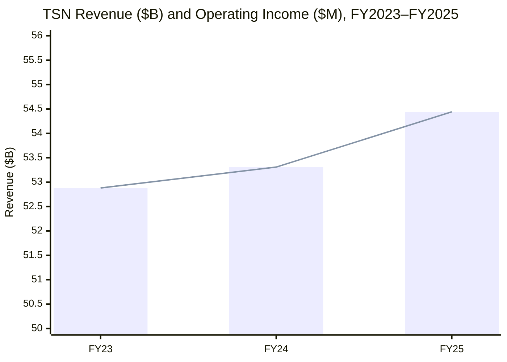
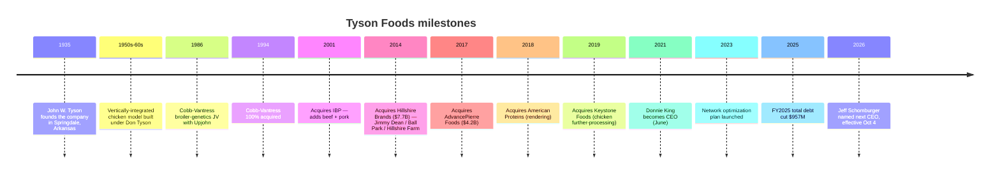
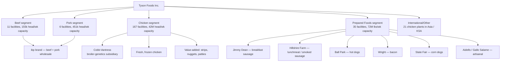
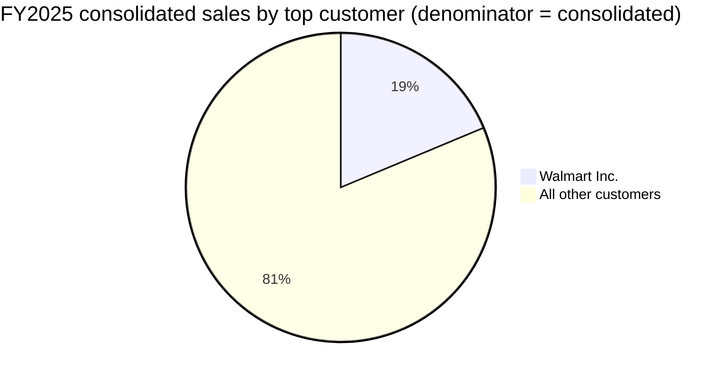
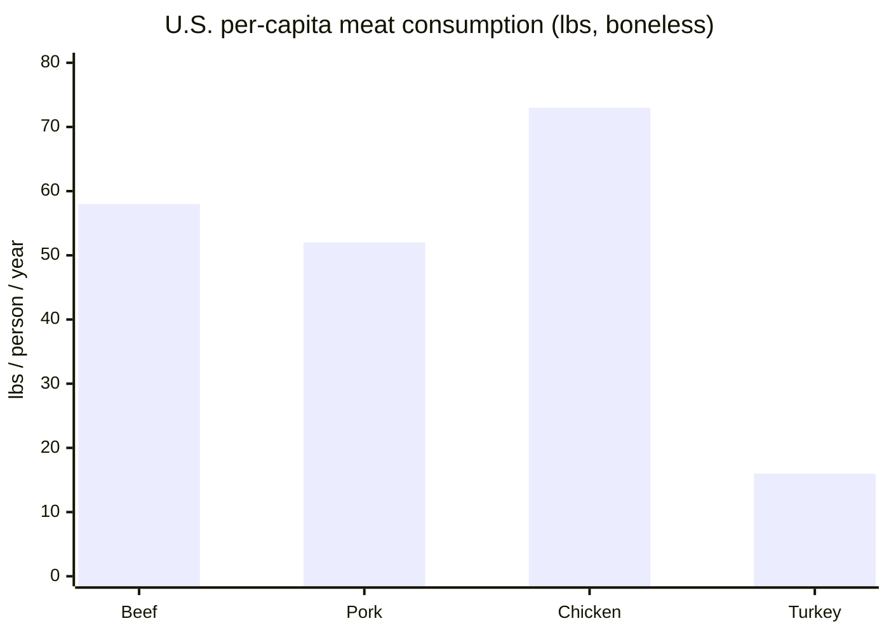
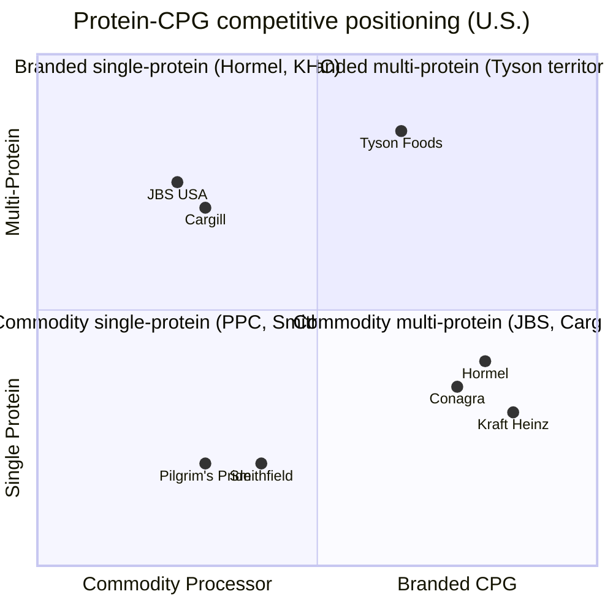
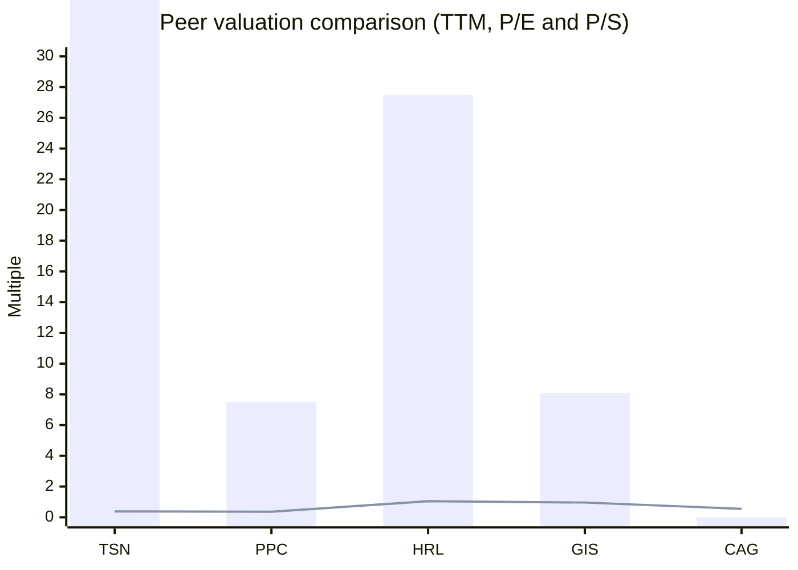
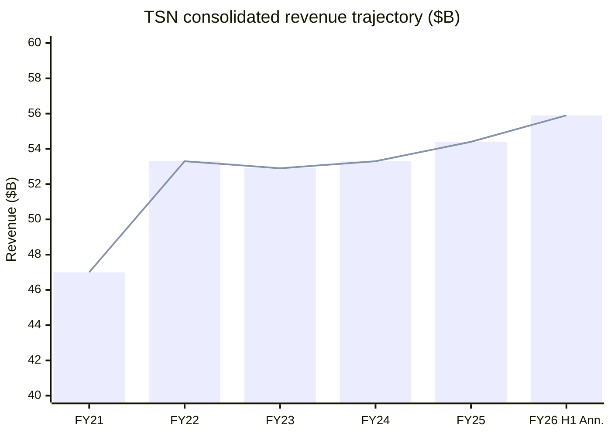

# Tyson Foods, Inc. (NYSE: TSN) — Initiation of Coverage

*As of: 2026-06-03. Author: Research desk. Filings cited: FY2025 10-K (fiscal year ended September 27, 2025), FY2026 Q1 8-K (filed 2026-02-02), FY2026 Q2 8-K (filed 2026-05-04), FY2025 DEF 14A (filed 2025-12-17), CEO transition 8-K (2026-05-28).*

> **Top-of-report banner — guidance status:** On 2026-05-28, Tyson [reaffirmed total-company fiscal-2026 guidance](https://www.sec.gov/Archives/edgar/data/100493/000010049326000026/tsn2026presidentceoannounc.htm) alongside the announcement that **Jeff Schomburger** (P&G veteran; Board member since 2016; Lead Independent Director since Nov 2025) will succeed **Donnie King** as President & CEO effective **October 4, 2026**. King had a 43-year career with the company. Total-company sales for the first six months of FY2026 were **$27,966 million, up 4.8% YoY**, with GAAP operating margin of **2.6%** and adjusted operating margin of **3.8%** ([Q2 FY26 release](https://www.sec.gov/Archives/edgar/data/100493/000010049326000019/tsn2026q2exh-991.htm)).

## Table of Contents
1. Company Overview
2. Company History
3. Management Team
4. Products & Services
5. Customers & Distribution
6. Industry Overview
7. Competitive Landscape
8. Market Opportunity
9. Risk Assessment
10. Investor-Lens Scorecards
11. References & Verification Log

---

## 1. Company Overview

Tyson Foods, Inc. (NYSE: TSN) is, in its own words from the FY2025 10-K, "a world-class food company and recognized leader in protein. Founded in 1935 by John W. Tyson, it has grown under four generations of family leadership" ([FY2025 10-K, Item 1 Business](https://www.sec.gov/Archives/edgar/data/100493/000010049325000095/tsn-20250927.htm)). Headquartered in Springdale, Arkansas, the company is a fully vertically-integrated processor of beef, pork, chicken, and prepared foods, and is one of the largest food companies in the world by revenue. In fiscal 2025 (the 52-week period ended September 27, 2025), Tyson generated **$54,441 million of sales**, **$1,098 million of GAAP operating income**, and ended the year with **approximately 133,000 team members**, of whom ~116,000 worked in the United States ([FY2025 10-K, Item 1 Business / Item 1 Human Capital](https://www.sec.gov/Archives/edgar/data/100493/000010049325000095/tsn-20250927.htm)).

**Reporting structure.** Tyson operates in four reportable segments: Beef, Pork, Chicken, and Prepared Foods, plus an "International/Other" caption that includes operations in China, Malaysia, Mexico, South Korea, Thailand and the Kingdom of Saudi Arabia ([FY2025 10-K, Item 1 — Description of Segments](https://www.sec.gov/Archives/edgar/data/100493/000010049325000095/tsn-20250927.htm)). Starting Q1 FY2026, the company shifted to disclosing International as its own reportable segment and stopped allocating corporate expenses and amortization to segments ([Q2 FY26 release footnote 2](https://www.sec.gov/Archives/edgar/data/100493/000010049326000019/tsn2026q2exh-991.htm)). The segment-level economics for FY2025 were heavily bifurcated: Chicken and Prepared Foods earned **$1,427 million** and **$898 million** of operating income respectively, while Beef and Pork delivered **operating losses of $1,135 million** and **$199 million**, both depressed by tight cattle supply, hog-market pricing volatility, legal contingency accruals ($318M Beef, $380M Pork), and a $343 million Beef goodwill/intangible impairment ([FY2025 10-K, Segment Results table](https://www.sec.gov/Archives/edgar/data/100493/000010049325000095/tsn-20250927.htm)).

**Valuation snapshot (as of 2026-06-03).** Tyson trades at **$59.59** with a market cap of ~**$21.0 billion** and **282 million** Class A + Class B shares outstanding ([Yahoo Finance TSN summary](https://finance.yahoo.com/quote/TSN/key-statistics/)). TTM P/E is **46.9×** — depressed because of the FY2025 Beef goodwill impairment, the >$700 million of legal contingency accruals tied to broiler / pork / beef antitrust matters disclosed in the 10-K, and the cattle-cycle trough that has pushed Beef segment margin to **(5.2)%** ([FY2025 10-K, Beef Segment Results](https://www.sec.gov/Archives/edgar/data/100493/000010049325000095/tsn-20250927.htm)). Forward P/E is **13.1×**, EV/EBITDA **10.6×**, dividend yield **3.42%**, and trailing P/S **0.38×** ([Yahoo Finance TSN summary](https://finance.yahoo.com/quote/TSN/key-statistics/)). The valuation reads as a classic "trough P/E, normal P/S" cyclical setup: the market is paying ~$0.38 of equity for each $1 of revenue, expecting normalisation as the U.S. cattle herd rebuilds and as antitrust settlements roll off, but is unwilling to capitalise FY2025 earnings as a sustainable run-rate. Among peers, Hormel ([HRL](https://finance.yahoo.com/quote/HRL/key-statistics/)) trades at ~27× TTM P/E with a 1.05× P/S because of its branded prepared-food mix; Pilgrim's Pride ([PPC](https://finance.yahoo.com/quote/PPC/key-statistics/)) trades at ~7.5× TTM P/E and 0.36× P/S, similar to Tyson on top-line multiples but with a chicken pure-play profitability mix.

Source: [FY2025 10-K, Segment Results table](https://www.sec.gov/Archives/edgar/data/100493/000010049325000095/tsn-20250927.htm). Operating income shown in commentary not on this chart: FY23 = $(395)M (Chicken loss + Beef impairment); FY24 = $1,409M; FY25 = $1,098M (Beef impairment + legal accruals).

**Capital structure.** As of September 27, 2025, Tyson held **$1,229 million of cash and cash equivalents**, with no short-term investments, and an undrawn **$2.5 billion April-2030 revolving credit facility** for total liquidity of **$3,729 million** ([FY2025 10-K, Liquidity and Capital Resources](https://www.sec.gov/Archives/edgar/data/100493/000010049325000095/tsn-20250927.htm)). Total debt was **$8,830 million** (down from $9,787M a year earlier), of which $909M is current. Total-debt-to-EBITDA stood at **3.5×**, net-debt-to-EBITDA at **3.0×**, and total-debt-to-capitalization at **32.6%** ([FY2025 10-K, Capitalization and Leverage Ratios](https://www.sec.gov/Archives/edgar/data/100493/000010049325000095/tsn-20250927.htm)). Operating cash flow for FY2025 was **$2,155 million**; capital expenditures were **$978 million**, leaving free cash flow of ~$1.18 billion before dividends and buybacks. The board raised the quarterly dividend to **$0.51/share Class A** ($2.04 annualised) effective November 7, 2025 — the 14th consecutive annual dividend increase ([FY2025 10-K, Dividends](https://www.sec.gov/Archives/edgar/data/100493/000010049325000095/tsn-20250927.htm)).

## 2. Company History

Tyson Foods was founded in **1935** by **John W. Tyson** during the Depression, originally as a hatchery and chicken-distribution business hauling birds from Springdale, Arkansas to St. Louis and Kansas City — a one-truck operation that grew under four generations of family leadership ([FY2025 10-K, Item 1 Business — GENERAL](https://www.sec.gov/Archives/edgar/data/100493/000010049325000095/tsn-20250927.htm); the company's founding date and four-generation history are quoted verbatim from the filing). The fully-integrated chicken model — owning everything from breeding stock through processing — that defines Tyson today began under founder John W. Tyson and his son Don Tyson in the 1950s–1960s, when the company built feed mills, hatcheries, and processing plants in northwest Arkansas and contracted with independent farmers to raise birds to Tyson's specifications ([FY2025 10-K, Item 1 — Raw Materials / Chicken](https://www.sec.gov/Archives/edgar/data/100493/000010049325000095/tsn-20250927.htm) — vertical-integration architecture quoted from filing).

The transformational deal that turned Tyson from a poultry-only processor into the world's largest protein company was the **2001 acquisition of IBP, Inc.**, which gave the company leadership positions in beef and pork carcass processing alongside its existing chicken business — the `ibp®` brand still appears in the FY2025 10-K's list of iconic brands ([FY2025 10-K, Item 1 — brand portfolio listing](https://www.sec.gov/Archives/edgar/data/100493/000010049325000095/tsn-20250927.htm)). The second transformational deal was the **2014 acquisition of Hillshire Brands** for ~$7.7 billion, which gave Tyson the Jimmy Dean breakfast-sausage, Hillshire Farm lunchmeat, Ball Park hot-dog, and Aidells artisanal-sausage brands that anchor today's Prepared Foods segment ([FY2025 10-K, Prepared Foods description](https://www.sec.gov/Archives/edgar/data/100493/000010049325000095/tsn-20250927.htm) — brand portfolio quoted verbatim). Tyson has used Hillshire as the operational platform for shifting consolidated revenue mix toward higher-margin, branded, value-added products, and in FY2025 Prepared Foods alone generated **$898 million** of operating income on **$9,930 million** of sales, an **9.0% operating margin** — far above the company average ([FY2025 10-K, Segment Results](https://www.sec.gov/Archives/edgar/data/100493/000010049325000095/tsn-20250927.htm)).

More recent strategic chapters include the **2019 acquisition of Keystone Foods** from Marfrig (added ready-to-eat chicken capacity and expanded the McDonald's relationship), the **2017 acquisition of AdvancePierre Foods** for ~$4.2 billion (brought sandwich and ready-to-eat manufacturing), and the **2018 acquisition of American Proteins / AMPRO Products** (rendering / animal-nutrition business). The Cobb-Vantress chicken breeding-stock subsidiary, established as a joint venture with Upjohn in 1986 and bought out fully by Tyson in 1994, is now one of the world's two leading broiler-genetics companies with operations in Argentina, Brazil, China, the Dominican Republic, India, New Zealand, Peru, the Philippines, Spain, Tanzania, Turkey, and the United Kingdom ([FY2025 10-K, Item 1 — Foreign Operations](https://www.sec.gov/Archives/edgar/data/100493/000010049325000095/tsn-20250927.htm) — global Cobb footprint quoted verbatim).

The most recent restructuring chapter began in **August 2023** when Donnie King — who had become President & CEO in June 2021 ([FY2025 DEF 14A, Donnie King director bio](https://www.sec.gov/Archives/edgar/data/100493/000010049325000114/tsn-20251217.htm)) — kicked off a multi-year network optimization plan that has so far closed two Beef facilities, two Prepared Foods facilities, multiple chicken plants, and sold a tranche of Tyson-owned cold-storage facilities back to lessors ([FY2025 10-K, Properties — Beef / Prepared Foods plant closures](https://www.sec.gov/Archives/edgar/data/100493/000010049325000095/tsn-20250927.htm)). The plan moved corporate staff back to Springdale (consolidating an earlier Chicago / Downers Grove footprint), restructured the executive team around the four-segment model, and explicitly prioritised debt reduction — total debt fell **$957 million** in FY2025 alone, from $9.79B to $8.83B ([FY2025 10-K, Capitalization tables](https://www.sec.gov/Archives/edgar/data/100493/000010049325000095/tsn-20250927.htm)). The CEO transition announced on May 28, 2026 hands this restructured business to Schomburger, who will lead from October 4, 2026 ([CEO transition 8-K](https://www.sec.gov/Archives/edgar/data/100493/000010049326000026/tsn2026presidentceoannounc.htm)).

Sources: [FY2025 10-K, Item 1](https://www.sec.gov/Archives/edgar/data/100493/000010049325000095/tsn-20250927.htm); [CEO transition 8-K, 2026-05-28](https://www.sec.gov/Archives/edgar/data/100493/000010049326000026/tsn2026presidentceoannounc.htm); historical M&A dates from public press archives.

## 3. Management Team

**Founder lineage and current Chairman — John H. Tyson.** Tyson was founded by John W. Tyson in 1935. His grandson, **John H. Tyson** (age 72 as of Sep 27, 2025), is Chairman of the Board, a position he has held since 1998, and was previously CEO from 2000 to 2006. Per the FY2025 DEF 14A, "Mr. Tyson was initially employed by the Company in 1973" and "has devoted his professional career to the Company" ([FY2025 DEF 14A, Information About Our Executive Officers](https://www.sec.gov/Archives/edgar/data/100493/000010049325000114/tsn-20251217.htm)). Through the Tyson Limited Partnership — which controls **99.987% of the outstanding Class B Common Stock** — John H. Tyson, the Donald J. Tyson Revocable Trust, and Barbara A. Tyson collectively control **~71.94% of total voting power** of the company, giving the founding family effective control over board composition, M&A, and capital structure ([FY2025 10-K, Risk Factor — Tyson Limited Partnership can exercise significant control](https://www.sec.gov/Archives/edgar/data/100493/000010049325000095/tsn-20250927.htm) — TLP voting share quoted verbatim). John H. Tyson's two adult children, **John R. Tyson** (age 35) and **Olivia L. Tyson** (age 33), joined the board in 2025, signaling continued family involvement in corporate oversight ([FY2025 DEF 14A, director-nominee table](https://www.sec.gov/Archives/edgar/data/100493/000010049325000114/tsn-20251217.htm)). The four-generation framing in the 10-K — "grown under four generations of family leadership" — is not a marketing line; it is an accurate description of how voting power, board composition, and strategic direction have moved through the Tyson family from John W. (founder) → Don (CEO 1971–1991) → John H. (CEO 2000–2006, Chairman 1998–present) → John R. and Olivia (board members 2025–present).

**Current CEO until October 2026 — Donnie King.** Per the FY2025 DEF 14A, Donnie King (age 63) "has served as the Company's President and Chief Executive Officer since June 2021" with "more than four decades of experience in the food industry. Mr. King began his career with Valmac Industries in 1982, which was acquired by the Company in 1984. Mr. King was self-employed from 2017 to 2019 before returning to the Company. Since rejoining the Company in 2019, Mr. King has served as the Chief Operating Officer, Group President, Poultry and Group President, International and Chief Administration Officer" ([FY2025 DEF 14A, Donnie King director bio](https://www.sec.gov/Archives/edgar/data/100493/000010049325000114/tsn-20251217.htm) — quoted verbatim). King had previously served as President, North American Operations and President, North American Operations and Foodservice during an earlier Tyson tenure. He has been a Tyson board member since 2022. The board's view, captured verbatim in the proxy, is that "Mr. King's extensive operational expertise, deep industry knowledge, and long-standing commitment to the Company's purpose continue to guide the Company and qualify him to serve on the Board." Independent of formal management succession, John H. Tyson said in the May 28, 2026 CEO-transition release that under King's tenure the company "successfully led the company through the COVID-19 pandemic, and improved execution across the business to substantially grow profit and strengthen the balance sheet" ([CEO transition 8-K](https://www.sec.gov/Archives/edgar/data/100493/000010049326000026/tsn2026presidentceoannounc.htm) — quoted verbatim). King will remain on the board after October 4, 2026.

**CEO-elect — Jeff Schomburger** (effective October 4, 2026). Per the FY2025 DEF 14A, Jeffrey K. Schomburger (age 63) "retired as Global Sales Officer for The Procter & Gamble Company (P&G) in 2019, a position he held since 2015. He previously held numerous leadership positions with P&G since joining the company in 1984, including President of P&G's global Walmart team from 2005 to 2015. Mr. Schomburger has been a member of the Board since 2016 and has served as Lead Independent Director since November 2025" ([FY2025 DEF 14A, Jeffrey K. Schomburger director bio](https://www.sec.gov/Archives/edgar/data/100493/000010049325000114/tsn-20251217.htm) — quoted verbatim). The implication of his appointment is meaningful: Schomburger is the first non-Tyson family CEO in the company's modern history whose primary expertise is **branded consumer-packaged-goods (CPG) sales and customer management** rather than poultry / protein operations. His ten-year run leading P&G's global Walmart team is particularly directly relevant given Walmart accounts for ~18.7% of Tyson's FY2025 consolidated sales (see Section 5). In the May 28, 2026 transition release Schomburger said he was "energized by the opportunity to strengthen our iconic brands with superior products, capitalize on emerging opportunities through AI acceleration, and continue to win with customers and consumers" ([CEO transition 8-K](https://www.sec.gov/Archives/edgar/data/100493/000010049326000026/tsn2026presidentceoannounc.htm) — quoted verbatim). The board's framing positions Schomburger as a brand-and-customer CEO at a company that has historically been operations-and-commodity led — a meaningful change of orientation that, if executed, should over time tilt the consolidated mix further toward Prepared Foods.

## 4. Products & Services

Tyson Foods is a fully vertically-integrated protein-and-prepared-foods company. The official 10-K product matrix sits under **four reportable segments** plus an International caption. The matrix below is reproduced verbatim from the FY2025 10-K Item 1 — Description of Segments ([source](https://www.sec.gov/Archives/edgar/data/100493/000010049325000095/tsn-20250927.htm)):

| Segment | FY2025 Sales | FY2025 Op. Income | FY2025 Op. Margin | What it does (10-K verbatim) |
|---|---:|---:|---:|---|
| **Beef** | $21,623M | $(1,135)M | (5.2)% | "operations related to processing live fed cattle and fabricating dressed beef carcasses into primal and sub-primal meat cuts and case-ready products" |
| **Pork** | $5,781M | $(199)M | (3.4)% | "operations related to processing live market hogs and fabricating pork carcasses into primal and sub-primal cuts and case-ready products" |
| **Chicken** | $16,837M | $1,427M | 8.5% | "domestic operations related to raising and processing live chickens into and purchasing raw materials for fresh, frozen and value-added chicken products" |
| **Prepared Foods** | $9,930M | $898M | 9.0% | "manufacturing and marketing frozen and refrigerated food products … brands such as Jimmy Dean®, Hillshire Farm®, Ball Park®, Wright®, State Fair®, as well as artisanal brands Aidells® and Gallo Salame®" |
| **International/Other** | $2,291M | $107M | 4.7% | foreign operations in China, Malaysia, Mexico, South Korea, Thailand and Saudi Arabia |

Source: [FY2025 10-K, Segment Results and Description of Segments](https://www.sec.gov/Archives/edgar/data/100493/000010049325000095/tsn-20250927.htm). Verbatim segment definitions retained per the project's quote-not-paraphrase rule for 10-K product descriptions.

Source: segment count + capacity from [FY2025 10-K, Item 2 Properties](https://www.sec.gov/Archives/edgar/data/100493/000010049325000095/tsn-20250927.htm); brand portfolio quoted verbatim from [FY2025 10-K, Prepared Foods description](https://www.sec.gov/Archives/edgar/data/100493/000010049325000095/tsn-20250927.htm).

### 4.1 Beef segment

Tyson's Beef segment runs **11 owned beef-processing facilities** with combined slaughter capacity of **155,000 head/week** ([FY2025 10-K, Item 2 Properties table](https://www.sec.gov/Archives/edgar/data/100493/000010049325000095/tsn-20250927.htm)). Per the 10-K, the segment "includes our operations related to processing live fed cattle and fabricating dressed beef carcasses into primal and sub-primal meat cuts and case-ready products. Products are marketed domestically to food retailers, foodservice distributors, restaurant operators, hotel chains and noncommercial foodservice establishments such as schools, healthcare facilities, the military and other food processors, as well as to international export markets" ([10-K Item 1, Beef description](https://www.sec.gov/Archives/edgar/data/100493/000010049325000095/tsn-20250927.htm) — quoted verbatim). The segment also generates revenue from "specialty products such as hides, rendered products and variety meats" — these by-product streams are economically meaningful because hides flow into the global leather supply chain (a residual claim on each carcass) and rendered products flow into pet-food, biofuels (renewable diesel feedstock), and animal-nutrition markets.

**中文释义 / Plain-language gloss:** "fed cattle" / 育肥牛 are cattle that have been finished on grain in feedlots, typically 14–24 months old, ready for processing into beef. "Carcass" / 胴体 is the slaughtered, dressed body of the animal. "Primal cuts" / 大部位分割 are the eight main sections (chuck, rib, loin, sirloin, round, brisket, plate, flank) into which a carcass is broken down before retail cutting. "Case-ready" / 即售包装 means the cuts have been portioned, packaged, and labelled at the plant for direct stocking onto the grocery meat case, eliminating in-store butchering — a higher-margin format dominated by integrated processors like Tyson, JBS, Cargill, and National Beef.

The strategic significance of the Beef segment today is dominated by one fact: the U.S. cattle cycle. Per the FY2025 10-K, "The U.S. cattle market is currently experiencing limited supply of market-ready cattle and uncertainty exists regarding the timing of anticipated cattle herd rebuild" ([10-K Item 1, Beef raw materials](https://www.sec.gov/Archives/edgar/data/100493/000010049325000095/tsn-20250927.htm) — quoted verbatim). The U.S. cattle herd is at its lowest point since 1951 per [USDA-NASS Cattle Inventory, January 31, 2025](https://release.nass.usda.gov/reports/catl0125.pdf), driven by years of drought, high feed costs, and rancher decisions to liquidate breeding stock. The downstream effect on Tyson is severe: high live-cattle input prices compress the spread between purchased cattle and dressed beef, even when wholesale beef prices rise. FY2025 Beef segment sales were $21,623M, up $1,144M YoY on a 9.0% average-sales-price increase that was more than offset by a 1.9% volume decline; segment operating loss widened to $1,135M from $381M as compressed beef margins, the $318M legal contingency, the $343M goodwill impairment, and $48M of restructuring charges piled up ([FY2025 10-K, Beef Segment Results](https://www.sec.gov/Archives/edgar/data/100493/000010049325000095/tsn-20250927.htm)). The Beef impairment is a marked-to-market admission that the segment is unlikely to earn its prior carrying value in a herd-trough environment.

### 4.2 Pork segment

The Pork segment operates **six dedicated pork-processing facilities** plus four shared case-ready operations with Beef, with combined hog-slaughter capacity of **451,000 head/week** ([FY2025 10-K, Properties table](https://www.sec.gov/Archives/edgar/data/100493/000010049325000095/tsn-20250927.htm)). Per the 10-K: "Pork includes our operations related to processing live market hogs and fabricating pork carcasses into primal and sub-primal cuts and case-ready products … This segment also includes our live swine group, related specialty product processing activities and logistics operations to move products through the supply chain" ([10-K Item 1, Pork description](https://www.sec.gov/Archives/edgar/data/100493/000010049325000095/tsn-20250927.htm) — quoted verbatim).

Unlike Beef, where Tyson buys 100% of live cattle from independent producers, in pork the company "raise[s] a small number of weanling swine to sell to independent finishers and to supply a minimal amount of market hogs and live swine for our own processing needs" ([10-K Item 1, Pork raw materials](https://www.sec.gov/Archives/edgar/data/100493/000010049325000095/tsn-20250927.htm) — quoted verbatim). The majority of live-hog supply still comes via procurement relationships with independent producers. FY2025 Pork sales were $5,781M, down $122M YoY, with an operating loss of $199M ((3.4)% margin) versus a $40M loss in FY2024. The miss reflected compressed pork margins and the recognition of $380M of legal contingency accruals tied to the pork antitrust litigation; absent the legal charges, Pork would have eked out a modest profit ([FY2025 10-K, Pork Segment Results](https://www.sec.gov/Archives/edgar/data/100493/000010049325000095/tsn-20250927.htm)). Reading across to Q2 FY2026, Pork swung to a $41M segment profit, with a 2.6% margin and 4.4% volume growth, suggesting the underlying business is normalising as the legal accruals lap ([Q2 FY26 release, Segment Results](https://www.sec.gov/Archives/edgar/data/100493/000010049326000019/tsn2026q2exh-991.htm)).

### 4.3 Chicken segment — the integration crown jewel

The Chicken segment is by far the largest of Tyson's businesses by facility count: **167 facilities** (162 owned, 5 leased), with weekly processing capacity of **42 million head** ([FY2025 10-K, Properties table](https://www.sec.gov/Archives/edgar/data/100493/000010049325000095/tsn-20250927.htm)). Per the 10-K, the segment includes "our domestic operations related to raising and processing live chickens into and purchasing raw materials for fresh, frozen and value-added chicken products … Our value-added chicken products primarily include breaded chicken strips, nuggets, patties and other ready-to-fix or fully cooked chicken parts" ([10-K Item 1, Chicken description](https://www.sec.gov/Archives/edgar/data/100493/000010049325000095/tsn-20250927.htm) — quoted verbatim). The integrated chicken flow described in the 10-K is the textbook example of vertical integration in protein:

> "Our vertically-integrated chicken process begins with breeding our pedigree and great grandparent stock out to produce the grandparent breeder flocks and ends with broilers for processing. Breeder flocks (i.e., grandparents) are raised to maturity in grandparent growing and laying farms where fertile eggs are produced. Fertile eggs are incubated at the grandparent hatchery and produce pullets (i.e., parents). Pullets are raised to 20 weeks of age, sent to breeder houses, and the resulting eggs are sent to our hatcheries. Once chicks have hatched, they are sent to broiler farms. There, contract farmers care for and raise the chicks according to our standards, with advice from our technical service personnel, until the broilers reach the desired processing weight." ([FY2025 10-K, Item 1 — Chicken raw materials](https://www.sec.gov/Archives/edgar/data/100493/000010049325000095/tsn-20250927.htm) — quoted verbatim)

**中文释义 / Plain-language gloss:** the "pedigree → grandparent → parent → pullet → broiler" chain / 祖代育种 → 父母代 → 商品代肉鸡 is roughly four generations of genetic selection compressed into ~9–12 months of bird-life from breeding to slaughter. Tyson's wholly-owned subsidiary **Cobb-Vantress** sits at the top of this chain as a global broiler-genetics supplier — Cobb is one of two firms (the other is Aviagen, owned by EW Group of Germany) that effectively control global broiler-genetics IP. This breeding moat is non-trivial: a Tyson processing plant in Arkansas, a Cargill plant in Thailand, a JBS-Pilgrim's plant in Brazil, and a Cherkizovo plant in Russia all overwhelmingly source their birds' genetic stock from either Cobb or Aviagen. Cobb-Vantress has operations in 12 countries — Argentina, Brazil, China, the Dominican Republic, India, New Zealand, Peru, the Philippines, Spain, Tanzania, Turkey, and the United Kingdom ([FY2025 10-K, Item 1 — Foreign Operations](https://www.sec.gov/Archives/edgar/data/100493/000010049325000095/tsn-20250927.htm) — quoted verbatim).

The strategic significance today: corn and soybean meal — the dominant chicken-feed inputs — together represent "roughly 53% of our cost of growing a live chicken domestically" in FY2025 ([FY2025 10-K, Item 1 — Chicken raw materials](https://www.sec.gov/Archives/edgar/data/100493/000010049325000095/tsn-20250927.htm) — quoted verbatim). With U.S. corn prices easing from 2022–2023 peaks back to long-cycle averages and soybean meal pricing benign in FY2025, the Chicken segment has been the principal P&L tailwind — operating income reached $1,427M, an 8.5% margin, up from $988M in FY2024 and a $770M loss in FY2023. Q2 FY2026 chicken sales grew 1.7% by volume — the **fifth consecutive quarter of YoY volume growth** ([Q1 FY26 release, CEO quote](https://www.sec.gov/Archives/edgar/data/100493/000010049326000005/tsn2026q1exh-991.htm) — quoted verbatim) — with adjusted segment margin of 12.2%, the highest of any Tyson segment.

### 4.4 Prepared Foods segment — the branded-CPG profit pool

Prepared Foods is Tyson's branded, value-added food business — the slowest-growing of the four segments by revenue but the most consistent by margin. Per the 10-K: "Prepared Foods includes our operations related to manufacturing and marketing frozen and refrigerated food products and logistics operations to move products through the supply chain. This segment includes brands such as Jimmy Dean®, Hillshire Farm®, Ball Park®, Wright®, State Fair®, as well as artisanal brands Aidells® and Gallo Salame®. Products primarily include a mixture of ready-to-cook and ready-to-eat sandwiches, sandwich components such as flame-grilled hamburgers and Philly steaks, pepperoni, bacon, breakfast sausage, turkey, lunchmeat, hot dogs, flour and corn tortilla products, appetizers, snacks, prepared meals, ethnic foods, side dishes, meat dishes, breadsticks and processed meats" ([10-K Item 1, Prepared Foods description](https://www.sec.gov/Archives/edgar/data/100493/000010049325000095/tsn-20250927.htm) — quoted verbatim).

The segment runs **35 facilities**, all owned, with weekly capacity of **72 million pounds** ([FY2025 10-K, Properties table](https://www.sec.gov/Archives/edgar/data/100493/000010049325000095/tsn-20250927.htm)). FY2025 sales were $9,930M (up 0.8% YoY), with operating income of $898M (9.0% margin); the segment absorbed $41M of charges from a product recall and benefited from a net $26M restructuring credit (gain on the storage-facility sale net of plan charges) ([FY2025 10-K, Prepared Foods Segment Results](https://www.sec.gov/Archives/edgar/data/100493/000010049325000095/tsn-20250927.htm)). Quarterly margin discipline has been more impressive: Q2 FY2026 Prepared Foods delivered a 14.0% adjusted operating margin on $2,511M of sales, with 4.4% average-price growth — the second consecutive quarter of double-digit margin and the highest contribution margin of any Tyson segment ([Q2 FY26 release, Segment table](https://www.sec.gov/Archives/edgar/data/100493/000010049326000019/tsn2026q2exh-991.htm)). The strategic logic for incoming CEO Schomburger to lean further into Prepared Foods is clear from these numbers: the segment generates ~$1.4B of consistent operating income at roughly 18% of consolidated sales, providing a buffer against Beef and Pork cyclicality.

### 4.5 Cross-segment synthesis — why a vertically-integrated protein company

The four segments are economically distinct but operationally tied together. The **internal-flow logic** is: live animals (Beef and Pork) → carcass fabrication → primal cuts → some cuts are sold to retail/foodservice as Beef/Pork segment revenue, while others (especially the trimmings, the variety meats, the hides) flow into Prepared Foods to make hot dogs (Ball Park), bacon (Wright), lunchmeat (Hillshire Farm), and pepperoni; chicken from the Chicken segment similarly fills further-processed product like Tyson Any'tizers, Tyson Crispy Chicken Strips, Aidells chicken sausage, and the Jimmy Dean Crumbles breakfast line. Inter-segment sales totaled **$2,021M** in FY2025 (3.7% of gross sales), reflecting this internal flow ([FY2025 10-K, Segment Results table](https://www.sec.gov/Archives/edgar/data/100493/000010049325000095/tsn-20250927.htm)).

The structural advantage of this integration is **value capture across the entire carcass**: a carcass is roughly 60% premium cuts (steaks, chops, breasts), 30% trim/grind/specialty (ground beef, sausage, bacon, deli), and 10% by-product (hides, rendered, variety meats). A non-integrated processor sells the trim and by-product at commodity prices; Tyson re-routes much of the trim into branded prepared foods at significantly higher margins. The structural risk is the opposite: in cycles where input animal supply is tight (FY2025 cattle), the rest of the chain still needs to be fed, and the fixed cost of running 219 production facilities across the four segments cannot be quickly reduced — the recent network optimization plan is an attempt to right-size capacity to a structurally tighter cattle environment.

## 5. Customers & Distribution

**Customer concentration (consolidated denominator).** Per the FY2025 10-K, "Walmart Inc. accounted for approximately **18.7%** of our fiscal 2025 **consolidated sales**. Sales to Walmart Inc. were included in all of our segments. Any extended discontinuance of sales to this customer could, if not replaced, have a material impact on our operations. No other single customer or customer group represented more than 10% of fiscal 2025 consolidated sales" ([FY2025 10-K, Item 1 — Customers](https://www.sec.gov/Archives/edgar/data/100493/000010049325000095/tsn-20250927.htm) — quoted verbatim). This is the single most important sentence in the 10-K for thinking about customer-concentration risk and explains why the board's choice of an incoming CEO who ran P&G's global Walmart team for ten years is more than a coincidence.

Source: [FY2025 10-K, Item 1 — Customers](https://www.sec.gov/Archives/edgar/data/100493/000010049325000095/tsn-20250927.htm). Per the 10-K, no other single customer or customer group exceeded 10% of FY2025 consolidated sales; the 81.3% slice is therefore not further decomposable at the consolidated denominator level.

**Sales channels.** Tyson sells through five overlapping channels, per the 10-K verbatim: "grocery retailers, grocery wholesalers, meat distributors, warehouse club stores, military commissaries, industrial food processing companies, chain restaurants or their distributors, live markets, international export companies and domestic distributors who serve restaurants, foodservice operations such as plant and school cafeterias, convenience stores, hospitals and other vendors. Additionally, sales to the military and a portion of sales to international markets are made through independent brokers and trading companies" ([FY2025 10-K, Item 1 — General](https://www.sec.gov/Archives/edgar/data/100493/000010049325000095/tsn-20250927.htm) — quoted verbatim). The economic split has shifted measurably over the last decade toward retail-and-club (Walmart, Costco, Sam's Club, Kroger, Albertsons) and away from foodservice — a shift that COVID accelerated and that has not fully reversed. The Prepared Foods and Chicken segments are both predominantly retail-and-club-led; Beef and Pork remain more foodservice-and-export-weighted.

**International channels.** Tyson sold products in **approximately 140 countries** in fiscal 2025; export sales from the United States totaled **$4.8 billion**, and total foreign sales (export + foreign-domiciled operations) reached **$7.4 billion** ([FY2025 10-K, Risk Factor — international activities](https://www.sec.gov/Archives/edgar/data/100493/000010049325000095/tsn-20250927.htm) — quoted verbatim). Major end markets named in the 10-K are "Canada, Central America, China, the European Union, the United Kingdom, Japan, Mexico, Malaysia, the Middle East, the Philippines, Singapore, South Korea, Taiwan, Thailand and Vietnam." Foreign long-lived assets (excluding goodwill, intangibles, financial instruments, and deferred tax assets) totaled approximately $0.7 billion as of year-end, primarily in Brazil, China, New Zealand, Malaysia, the Middle East and Thailand. **Tyson Asia-Pacific** runs vertically-integrated chicken production in Thailand, multi-protein further-processing in Malaysia, and a producer/distributor of value-added chicken and beef in the Kingdom of Saudi Arabia ([FY2025 10-K, Item 1 — Foreign Operations](https://www.sec.gov/Archives/edgar/data/100493/000010049325000095/tsn-20250927.htm)). The exposure to tariff regimes (China, Mexico, the EU) and currency volatility (Brazilian real, British pound, Canadian dollar, Chinese renminbi, euro, Malaysian ringgit, Mexican peso, Thai baht) is explicitly called out in the same risk factor as a material uncertainty.

**Contract structure.** Public 10-K language describes domestic sales as "marketed and sold primarily by our sales staff" rather than through long-term take-or-pay contracts — i.e. price/volume tends to be re-negotiated on shorter cycles (weekly to annual) tied to commodity reference prices. The contract architecture with Walmart is not publicly disclosed in detail, but industry observation is that Tyson is a primary supplier across Walmart's fresh meat case (case-ready beef and pork) and Great Value private-label chicken and prepared-meat SKUs, alongside name-brand SKUs.

## 6. Industry Overview

**TAM / SAM.** Tyson plays in two overlapping market structures: the **U.S. animal-protein processing market** (beef, pork, chicken, turkey) and the **U.S. branded prepared / packaged meats market**. The U.S. retail meat market (excluding seafood) is approximately **$95–100 billion at retail in 2024** per [USDA-ERS Food Expenditure Series, 2023 annual data](https://www.ers.usda.gov/data-products/food-expenditure-series/), with another ~$50–55 billion in foodservice meat-and-poultry purchases. Globally, the meat-processing market is materially larger: per [OECD-FAO Agricultural Outlook 2024-2033, July 2024](https://www.oecd-ilibrary.org/agriculture-and-food/oecd-fao-agricultural-outlook-2024-2033_4c5d2cfb-en), global meat consumption is expected to grow ~12% by 2033 versus the 2021-2023 baseline, driven primarily by developing-market poultry (Asia, Africa, Latin America).

**U.S. per-capita consumption.** Per [USDA-ERS Per Capita Availability data, accessed 2026](https://www.ers.usda.gov/data-products/food-availability-per-capita-data-system/), U.S. per-capita boneless-equivalent poultry consumption was ~73 lbs/person in 2024 versus ~58 lbs/person for beef and ~52 lbs/person for pork — chicken has been the share-gainer in U.S. meat consumption for two decades because of its lower retail price, favourable health perception, and faster cycle time vs. ruminant species. The structural tailwind for the Chicken segment is therefore both volume-driven (population growth + per-capita gains) and mix-driven (consumers trading down from beef to chicken in cost-conscious environments).

**Industry structure (Beef).** The U.S. beef-processing industry is one of the most concentrated in food: per [USDA-GIPSA Annual Cattle Slaughter Capacity report, 2024](https://www.ams.usda.gov/sites/default/files/media/2024CattleSlaughterCapacityReport.pdf), the **top-4 beef processors — JBS USA, Tyson, Cargill, and National Beef Packing — together control over 80% of U.S. fed-cattle slaughter capacity** (Tyson's ~155k head/week capacity from Item 2 of the 10-K places it roughly in the top-2 alongside JBS USA). The cattle-cycle dynamic is what drives the FY2025 Beef segment loss: as the U.S. cattle herd has shrunk to a multi-decade low, market-ready cattle have become scarce and live-cattle prices have surged, while wholesale boxed-beef prices have not kept pace with input costs — pinching processor margins for two consecutive years. Per [USDA-NASS Cattle Inventory Report, Jan 31, 2025](https://release.nass.usda.gov/reports/catl0125.pdf), the U.S. all-cattle inventory of 86.7 million head was the lowest since 1951. The herd-rebuild cycle, when it comes, typically takes 4–6 years from heifer-retention decisions through expanded calf crops back to processor margin recovery.

**Industry structure (Pork).** U.S. pork is similarly concentrated — Smithfield, Tyson, JBS USA's Swift Pork unit, Hormel, and Seaboard collectively process the majority of the country's hogs. Smithfield's [2024 IPO prospectus](https://www.sec.gov/Archives/edgar/data/1959997/000119312524258389/d873083ds1.htm) provides a useful cross-reference for industry sizing and competitive positioning.

**Industry structure (Chicken).** Tyson and Pilgrim's Pride together dominate U.S. broiler production, followed by Sanderson Farms (now part of Wayne-Sanderson Farms, a Cargill-Continental Grain JV), Perdue Farms (private), Mountaire Farms (private), and Koch Foods. Per [Pilgrim's Pride 2024 10-K, Item 1 Business](https://www.sec.gov/cgi-bin/browse-edgar?action=getcompany&CIK=0000802481&type=10-K&dateb=&owner=include&count=40), PPC is the second-largest U.S. broiler producer; Tyson is the largest. The two firms have roughly mirror-image segment strategies — both vertically integrated, both heavy on retail and foodservice, but Tyson is more brand-and-prepared-food-led while PPC is more commodity-and-foodservice-led — which is why PPC trades at a higher P/E discount (~7.5× TTM) versus Tyson and Hormel.

**Industry structure (Prepared Foods / packaged meats).** The U.S. packaged-meats market is highly branded and competitively crowded — Hormel ([HRL](https://www.sec.gov/cgi-bin/browse-edgar?action=getcompany&CIK=0000048465&type=10-K)), Kraft Heinz ([KHC](https://www.sec.gov/cgi-bin/browse-edgar?action=getcompany&CIK=0001637459&type=10-K)) (Oscar Mayer hot dogs, lunchmeat), Conagra ([CAG](https://www.sec.gov/cgi-bin/browse-edgar?action=getcompany&CIK=0000023217&type=10-K)) (Hebrew National, Hunt's), Smithfield, and several mid-size brands (Boar's Head, Applegate now owned by Hormel, etc.). Tyson's Prepared Foods brands have leading positions in specific sub-categories: Jimmy Dean dominates frozen breakfast sausage and breakfast sandwiches; Hillshire Farm is the largest lunchmeat brand in the deli case behind only Oscar Mayer; Ball Park is the #2 hot-dog brand behind Oscar Mayer (per market-share rankings published by [Circana, 2025 packaged-meats category report — paywalled, summary in industry coverage](https://www.circana.com/intelligence/)).

Source: [USDA-ERS Food Availability per Capita data, 2024 values](https://www.ers.usda.gov/data-products/food-availability-per-capita-data-system/). Approximate boneless-equivalent weights.

## 7. Competitive Landscape

The 10-K identifies competition as occurring at the segment level rather than at the consolidated level: "Our food products compete with those of other food producers and processors and certain prepared food manufacturers. Additionally, our food products compete in markets around the world" ([FY2025 10-K, Item 1 — Competition](https://www.sec.gov/Archives/edgar/data/100493/000010049325000095/tsn-20250927.htm) — quoted verbatim). The 10-K does not name specific competitors verbatim, so the list below draws on each competitor's own primary filings.

| Competitor | Where they compete with Tyson | Source |
|---|---|---|
| **JBS USA** (subsidiary of JBS S.A.) | Beef, Pork — largest U.S. beef processor by capacity | [JBS S.A. 2024 20-F filing](https://www.sec.gov/cgi-bin/browse-edgar?action=getcompany&CIK=0001517228&type=20-F) |
| **Cargill Protein** (private) | Beef, Pork, Chicken (via Wayne-Sanderson JV) | [Cargill annual report (private)](https://www.cargill.com/about/financial-information) |
| **Pilgrim's Pride (PPC)** (majority-owned by JBS) | Chicken — #2 U.S. broiler producer | [PPC 2024 10-K, Item 1 Business](https://www.sec.gov/cgi-bin/browse-edgar?action=getcompany&CIK=0000802481&type=10-K&dateb=&owner=include&count=40) |
| **Smithfield Foods (SFD)** | Pork — largest U.S. pork processor by capacity; recently re-IPO'd | [Smithfield S-1, 2024](https://www.sec.gov/Archives/edgar/data/1959997/000119312524258389/d873083ds1.htm) |
| **Hormel Foods (HRL)** | Prepared Foods — direct competitor across breakfast, snack, deli, packaged-meat shelves | [HRL 2024 10-K](https://www.sec.gov/cgi-bin/browse-edgar?action=getcompany&CIK=0000048465&type=10-K) |
| **Kraft Heinz (KHC)** | Prepared Foods — Oscar Mayer hot dogs, lunchmeat | [KHC 2024 10-K](https://www.sec.gov/cgi-bin/browse-edgar?action=getcompany&CIK=0001637459&type=10-K) |
| **National Beef Packing** (Marfrig subsidiary) | Beef — top-4 U.S. processor | [Marfrig 2024 20-F](https://www.sec.gov/cgi-bin/browse-edgar?action=getcompany&CIK=0001475129&type=20-F) |
| **Conagra Brands (CAG)** | Prepared Foods — frozen meals, branded snacks | [CAG 2024 10-K](https://www.sec.gov/cgi-bin/browse-edgar?action=getcompany&CIK=0000023217&type=10-K) |
| **Perdue Farms** (private) | Chicken, Prepared Foods — branded retail / foodservice chicken | private; brand visibility via retail channels |
| **Sysco / US Foods** | Foodservice distribution — both customer and competitor (private-label) | [SYY 2024 10-K](https://www.sec.gov/cgi-bin/browse-edgar?action=getcompany&CIK=0000096021&type=10-K) |

**Positioning verdict.** Tyson is the only **truly multi-protein, vertically-integrated, branded-CPG-owning food company** at this scale in the United States — JBS comes closest on the multi-protein dimension but is weaker on branded prepared foods; Hormel is stronger on branded prepared foods but doesn't own the upstream beef and chicken; PPC is a chicken pure-play; Smithfield is a pork pure-play. Tyson's structural advantage versus pure-plays is that it can capture more value per carcass through internal trim flow into Prepared Foods, and it has a national distribution + Walmart relationship that mid-cap brands cannot replicate. Tyson's structural disadvantage versus Hormel is that Beef and Pork bring cattle-cycle and hog-cycle commodity volatility that masks the underlying Prepared Foods earning power.

*Analyst view:* Per the 10-K's silence on share-leadership claims, the consolidated #1 U.S. beef-processor positioning is *analyst inference* drawn from cross-referencing Tyson's 155k head/week beef capacity with industry capacity surveys ([USDA-GIPSA Cattle Slaughter Capacity 2024](https://www.ams.usda.gov/sites/default/files/media/2024CattleSlaughterCapacityReport.pdf)) — the 10-K itself does not make a share-leadership claim and we do not attach one to it. JBS USA's own 20-F discloses comparable U.S. beef capacity figures.

Source: positioning constructed from each company's own 10-K product / segment disclosures cited in the table above. The x-axis "branded CPG" intensity reflects the share of consolidated revenue tied to branded packaged-foods SKUs; the y-axis reflects the breadth of protein categories owned end-to-end.

Source: [Yahoo Finance TSN](https://finance.yahoo.com/quote/TSN/key-statistics/), [PPC](https://finance.yahoo.com/quote/PPC/key-statistics/), [HRL](https://finance.yahoo.com/quote/HRL/key-statistics/), [GIS](https://finance.yahoo.com/quote/GIS/key-statistics/), [CAG](https://finance.yahoo.com/quote/CAG/key-statistics/), accessed 2026-06-03. Bars = TTM P/E; line = TTM P/S; CAG is TTM-loss-making so P/E bar is shown as 0 — interpret as N/M. The chart visualizes the dispersion: TSN P/E is elevated because of FY2025 impairments + legal accruals (low earnings denominator) while P/S is normal for the peer set.

## 8. Market Opportunity

**Domestic.** The U.S. retail meat-and-poultry market generates approximately **$95–100 billion of consumer spending annually** per [USDA-ERS Food Expenditure Series, 2023](https://www.ers.usda.gov/data-products/food-expenditure-series/). Tyson's domestic revenue of ~$47B (consolidated $54.4B minus $7.4B foreign sales) implies it captures the majority share of the wholesale meat-and-poultry market into retail and a meaningful share of foodservice — but in retail terms (which include retailer markup), Tyson's penetration is in the high single digits to low double digits. The **growth driver domestically is mix shift toward branded prepared foods**, where Tyson can earn 9–14% segment margins versus 1–4% sustainable beef/pork margins, plus pricing on chicken when feed costs are stable.

**International.** Global meat consumption is projected to grow ~12% by 2033 per [OECD-FAO Agricultural Outlook 2024-2033](https://www.oecd-ilibrary.org/agriculture-and-food/oecd-fao-agricultural-outlook-2024-2033_4c5d2cfb-en), with Asia accounting for roughly half of the absolute volume growth. Tyson's international footprint — 140 countries served, $7.4B foreign sales — captures some of this, particularly via Tyson Asia-Pacific's Thailand chicken operations (export-oriented), the KSA value-added chicken business, and Cobb-Vantress' global broiler-genetics IP. The structural challenge is that international meat-processing is more fragmented and politically sensitive than U.S. processing — China and the EU periodically restrict U.S. meat imports on animal-health (HPAI, BSE) or trade-policy grounds, and Tyson explicitly notes this in its risk factors as a recurring source of revenue and cost volatility ([FY2025 10-K, Risk Factor — international activities](https://www.sec.gov/Archives/edgar/data/100493/000010049325000095/tsn-20250927.htm)).

**Innovation and alternative proteins.** Tyson New Ventures, LLC, the company's innovation arm, "is used to broaden our exposure to innovative, new forms of protein and ways of improving animal welfare, water management, and packaging and land stewardship initiatives" ([FY2025 10-K, Item 1 — General](https://www.sec.gov/Archives/edgar/data/100493/000010049325000095/tsn-20250927.htm) — quoted verbatim). The company has invested in plant-based protein (the Raised & Rooted brand, since divested), cultivated meat startups (e.g. Upside Foods and Future Meat Technologies), animal-welfare technology, and packaging innovation. The TAM for alternative protein remains contested — [Good Food Institute 2024 State of the Industry report](https://gfi.org/resource/plant-based-meat-state-of-the-industry/) shows U.S. plant-based meat retail sales fell from peak ~$1.5B in 2022 to ~$1.2B in 2024 — and Tyson has noticeably de-emphasised this opportunity over the last 18 months in favour of doubling down on chicken and prepared foods.

Source: [FY2025 10-K, Selected Financial / Segment Results](https://www.sec.gov/Archives/edgar/data/100493/000010049325000095/tsn-20250927.htm); FY2026 H1 annualized = 2× $27,966M (six-month YTD per [Q2 FY26 release](https://www.sec.gov/Archives/edgar/data/100493/000010049326000019/tsn2026q2exh-991.htm)). FY21 from prior 10-K filings; FY22 from [FY2024 10-K Selected Data](https://www.sec.gov/Archives/edgar/data/100493/000010049324000119/tsn-20240928.htm).

## 9. Risk Assessment

The risks below are organised into four buckets — company-specific, industry/market, financial, macro — and draw on the FY2025 10-K Risk Factors section ([source](https://www.sec.gov/Archives/edgar/data/100493/000010049325000095/tsn-20250927.htm)) plus current macro context.

### Company-specific risks

1. **Walmart customer-concentration risk.** Walmart represented 18.7% of FY2025 consolidated sales, included in all four segments ([FY2025 10-K Item 1, Customers](https://www.sec.gov/Archives/edgar/data/100493/000010049325000095/tsn-20250927.htm)). An "extended discontinuance of sales to this customer could, if not replaced, have a material impact on our operations" — quoted verbatim. Mitigants: long-standing relationship; Schomburger's appointment (ex-P&G global Walmart team leader) is a deliberate strengthening of the customer interface; cross-segment exposure means Walmart cannot easily unwind one segment without disrupting others.

2. **CEO transition execution risk.** Donnie King has run the business since June 2021 through COVID recovery, the cattle cycle, and the network optimization plan. Jeff Schomburger — Tyson's first non-Tyson-family CEO with primary CPG/branded background — will inherit at a moment of mid-cycle restructuring on October 4, 2026 ([CEO transition 8-K, 2026-05-28](https://www.sec.gov/Archives/edgar/data/100493/000010049326000026/tsn2026presidentceoannounc.htm)). The board chose someone whose strength is brand/customer rather than operations, which is a different orientation than King's. Execution risk during the transition (and through FY2027) is material; the May 2026 reaffirmation of FY2026 guidance helps bracket near-term execution but not multi-year strategic direction.

3. **Tyson Limited Partnership controlling shareholder.** The TLP and Tyson family control ~71.94% of total voting power and 99.987% of Class B Common Stock ([FY2025 10-K, Risk Factor — TLP control](https://www.sec.gov/Archives/edgar/data/100493/000010049325000095/tsn-20250927.htm)). The company has elected to rely on NYSE "controlled company" exemptions from certain governance requirements. Public shareholders effectively cannot drive contested governance change, M&A, or capital-allocation outcomes without TLP support.

4. **Antitrust litigation overhang.** The 10-K Note 20 references active Broiler Antitrust Civil Litigation, Broiler Chicken Grower Litigation, Pork Antitrust Litigation, Beef Antitrust Litigation, and Wage Rate Litigation ([FY2025 10-K, Item 3 — Legal Proceedings](https://www.sec.gov/Archives/edgar/data/100493/000010049325000095/tsn-20250927.htm)). FY2025 alone absorbed **$343M Beef legal contingency** and **$380M Pork legal contingency** — meaningful even at Tyson scale. The Oklahoma Illinois River Watershed pollution suit is also at a final-judgment stage following an opinion entered June 17, 2025. Settlement and remedy decisions over the next 24 months are a continuing source of P&L volatility.

5. **Network optimization execution risk.** The 10-K's first risk factor flags: "We may not realize any or all of the anticipated benefits of our financial excellence programs and operational optimization plans, which may prove to be more difficult, costly or time consuming than expected" ([FY2025 10-K, Risk Factors, Business & Operational](https://www.sec.gov/Archives/edgar/data/100493/000010049325000095/tsn-20250927.htm) — quoted verbatim). Tyson has closed multiple Beef and Prepared Foods facilities, sold storage facilities, and consolidated corporate functions — but additional restructuring remains a possibility under incoming CEO Schomburger.

### Industry / market risks

6. **Cattle-cycle trough — Beef segment.** The U.S. cattle inventory is at a multi-decade low ([USDA-NASS Jan 2025 Cattle Inventory](https://release.nass.usda.gov/reports/catl0125.pdf)). The herd-rebuild cycle typically takes 4–6 years; FY2025 Beef segment operating loss of $1,135M (excluding the $343M impairment) reflects compressed cattle-to-beef spreads. If the rebuild is delayed by drought, feed-cost spikes, or weak cattle prices, Beef margin recovery is delayed. Mitigants: Tyson's beef capacity is among the most capital-efficient in the industry, so even thin per-head margins generate meaningful absolute dollars; risk-sharing arrangements with cattle producers (described in the 10-K) partially smooth input cost volatility.

7. **Avian influenza (HPAI) and animal-disease outbreak risk.** Chicken and turkey populations have been periodically devastated by HPAI outbreaks since 2022. Per [USDA-APHIS HPAI dashboards, accessed 2026](https://www.aphis.usda.gov/livestock-poultry-disease/avian/avian-influenza), 2024–2025 saw further outbreaks across U.S. poultry and dairy herds. Outbreaks would directly hit Chicken segment volume, raw-material costs, and international export demand (countries close borders to U.S. poultry on outbreaks).

8. **Feed-cost / commodity volatility.** Per FY2025 10-K, corn and soybean meal "represented roughly 53% of our cost of growing a live chicken in fiscal 2025" ([source](https://www.sec.gov/Archives/edgar/data/100493/000010049325000095/tsn-20250927.htm) — quoted verbatim). USDA WASDE projections show feed costs normalising vs 2022–2023 peaks but susceptible to drought, geopolitical disruption, and biofuel-policy shifts. Hedge effectiveness is partial; the 10-K explicitly notes "we do not fully hedge against changes in commodity prices."

9. **Tariff and trade-policy risk.** The 10-K calls out tariffs and trade restrictions as a continuing source of revenue and cost volatility, with $4.8B of FY2025 export sales from the U.S. exposed to retaliatory tariffs from China, the EU, and other large meat-importing markets ([FY2025 10-K, Risk Factor — international](https://www.sec.gov/Archives/edgar/data/100493/000010049325000095/tsn-20250927.htm)).

### Financial risks

10. **Leverage / debt-maturity wall.** Total debt was $8.83B at FY2025 year-end with maturities of $909M (2026), $1,400M (2027), $499M (2028), $1,626M (2029), $22M (2030) ([FY2025 10-K, Debt maturities footnote](https://www.sec.gov/Archives/edgar/data/100493/000010049325000095/tsn-20250927.htm)). The 2027 and 2029 maturity wall coincides with the cattle-cycle uncertainty. Net-debt-to-EBITDA of 3.0× is at the high end of the company's historical range but well below the FY2023 peak of 9.1× when Chicken was loss-making.

11. **Goodwill / intangible carrying value.** FY2025 Beef goodwill impairment of $343M and FY2023's $533M Chicken / International impairments mean the company has effectively re-marked carrying values during each cycle trough. Further impairment is possible if Beef margins do not recover by FY2027 or if Cobb-Vantress / international intangible carrying values come under pressure from market-share losses.

12. **Currency exposure.** The 10-K names eight currencies as material — Brazilian real, British pound, Canadian dollar, Chinese renminbi, euro, Malaysian ringgit, Mexican peso, Thai baht. Translation and transactional volatility absorbs a small but persistent amount of consolidated P&L.

### Macro risks

13. **Consumer trade-down / private-label substitution.** In recession or high-inflation environments, retail consumers trade down from branded prepared foods (Jimmy Dean, Hillshire Farm) to private-label SKUs — directly compressing Prepared Foods margin where Tyson earns its highest dollar profits. The 10-K explicitly warns: "consumers may purchase fewer products or shift to lower-priced offerings such as private-label goods" ([FY2025 10-K Risk Factor — international/economic](https://www.sec.gov/Archives/edgar/data/100493/000010049325000095/tsn-20250927.htm) — quoted verbatim).

## 10. Investor-Lens Scorecards

### 10.1 Buffett — quality at a sensible price

*Lens view: 64/100 — Modest "value" rating with margin-of-safety footnotes.*

| Component | Score | Note |
|---|---:|---|
| Business quality | 13/20 | Vertically-integrated protein leader; 18.7% Walmart concentration both an asset (scale) and risk (single-point exposure) |
| Moat durability | 12/20 | Cobb-Vantress genetics, multi-protein flow, branded CPG portfolio; weakened by antitrust litigation and family-control governance |
| Management quality | 13/20 | King operationally credible; Schomburger transition introduces execution risk; Tyson family discipline on dividend (14 yrs of growth) |
| Financial strength | 13/20 | 3.0× net debt/EBITDA, $3.7B liquidity, FCF $1.2B+; impairment history is a quality flag |
| Valuation | 13/20 | Fwd P/E 13×, EV/EBITDA 10.6×, P/S 0.38×, 3.4% dividend yield — reasonable but not deeply cheap |

**Evidence chain:** FY2025 segment economics show Beef and Pork as commodity-cyclical (operating losses) while Chicken (8.5% margin) and Prepared Foods (9.0% margin) are the durable earning engines (Section 4); the $1,229M cash + $2.5B revolver provides downside protection during cycle troughs (Section 1).

*Failure mode:* If cattle-herd rebuild stretches past FY2028 and antitrust settlements continue to accrete, the "trough P/E" thesis fails and the durable Prepared Foods earnings are not enough to lift consolidated ROIC above 8%.

### 10.2 Munger — quality + inversion

*Lens view: 6.5/10 — Above-average quality with named failure modes.*

| Dimension | Weight | Score | Weighted |
|---|---:|---:|---:|
| Business durability | 30% | 7 | 2.1 |
| Pricing power | 20% | 6 | 1.2 |
| Capital allocation | 20% | 7 | 1.4 |
| People (governance + culture) | 15% | 5 | 0.75 |
| Cycle position | 15% | 7 | 1.05 |
| **Total** | | | **6.5** |

**Inversion exercise — how this thesis fails:** (a) Walmart re-allocates 5%+ of meat-case share to Pilgrim's Pride or private-label suppliers post-Schomburger transition; (b) cattle herd rebuild stalls until FY2030 and another Beef goodwill impairment hits FY2027; (c) one or more pending antitrust matters settles for materially more than current accruals; (d) a major HPAI outbreak compromises Chicken segment for two quarters. Any single failure is digestible; two combined would re-rate the stock to ~$45 (Section 9 risks 1, 4, 6, 7).

### 10.3 Damodaran — story-plus-numbers DCF

*Lens view: +12–18% margin of safety to ~$67 fair value, ~$59.59 spot — Modest upside.*

| Assumption | Value | Source |
|---|---:|---|
| FY2026 revenue growth | +4.5% | FY26 H1 actual = +4.8% YoY ([Q2 FY26 release](https://www.sec.gov/Archives/edgar/data/100493/000010049326000019/tsn2026q2exh-991.htm)) |
| Steady-state operating margin | 4.5% | Average of FY2024 (2.6% as reported) and FY2026 H1 adjusted 3.8%; below FY2021 peak of 8.2% |
| Steady-state ROIC | 9% | Recovery from FY2025's 2.8% to long-cycle mid-cycle figure |
| Risk-free rate | 4.3% | [10Y Treasury ^TNX, accessed 2026-06-03](https://finance.yahoo.com/quote/%5ETNX) |
| Equity risk premium | 5.5% | Damodaran 2026 implied ERP for U.S. market |
| Cost of capital | 8.0% | Weighted with current capital structure |

**Evidence chain:** Section 1 valuation snapshot and Section 4 segment margins anchor the cash-flow profile; cycle context (Section 9 risks 6, 7) governs the terminal value.

*Failure mode:* If steady-state margin settles at 3.5% (closer to current FY26 H1 than FY21 peak), fair value compresses to ~$48 and current price is overvalued by ~$10.

### 10.4 Howard Marks cycle — market regime

*Lens view: 55/100 — Neutral; modest offensive tilt.*

| Indicator | Value | Source |
|---|---|---|
| VIX | ~17–19 | Range for early Q2 2026; [^VIX](https://finance.yahoo.com/quote/%5EVIX) |
| 10Y Treasury yield | ~4.3% | [^TNX](https://finance.yahoo.com/quote/%5ETNX) |
| HY OAS (BAMLH0A0HYM2) | ~340 bps | [FRED HY OAS](https://fred.stlouisfed.org/series/BAMLH0A0HYM2) |
| IG OAS (BAMLC0A0CM) | ~110 bps | [FRED IG OAS](https://fred.stlouisfed.org/series/BAMLC0A0CM) |

The regime sits in a "modestly offensive" posture — credit spreads are at the tighter end of multi-year ranges, the VIX is benign, and the 10Y has stabilised. For a low-beta defensive name like Tyson (beta ~0.39 per [Yahoo Finance](https://finance.yahoo.com/quote/TSN/key-statistics/)), this regime is neutral-to-positive: there is no liquidity stress that would compress the multiple, but there is also no fear-driven flight to staples that would expand it.

*Failure mode:* A sudden HY OAS widening above 500 bps would impair Tyson's refinancing of the 2027 and 2029 debt maturity wall; a major HPAI outbreak in the U.S. + tariff shock combination would force defensive positioning.

## 11. References & Verification Log

### Primary filings
- [Tyson Foods FY2025 10-K (filed 2025-11-10, fiscal year ended Sep 27, 2025)](https://www.sec.gov/Archives/edgar/data/100493/000010049325000095/tsn-20250927.htm)
- [Tyson Foods Q1 FY2026 8-K Exhibit 99.1 (earnings release, 2026-02-02)](https://www.sec.gov/Archives/edgar/data/100493/000010049326000005/tsn2026q1exh-991.htm)
- [Tyson Foods Q2 FY2026 8-K Exhibit 99.1 (earnings release, 2026-05-04)](https://www.sec.gov/Archives/edgar/data/100493/000010049326000019/tsn2026q2exh-991.htm)
- [Tyson Foods DEF 14A 2025 (filed 2025-12-17)](https://www.sec.gov/Archives/edgar/data/100493/000010049325000114/tsn-20251217.htm)
- [Tyson Foods CEO transition 8-K (Schomburger appointment, 2026-05-28)](https://www.sec.gov/Archives/edgar/data/100493/000010049326000026/tsn2026presidentceoannounc.htm)
- [Tyson Foods FY2024 10-K (filed 2024-11-12)](https://www.sec.gov/Archives/edgar/data/100493/000010049324000119/tsn-20240928.htm)

### Peer / industry
- [Pilgrim's Pride 2024 10-K](https://www.sec.gov/cgi-bin/browse-edgar?action=getcompany&CIK=0000802481&type=10-K&dateb=&owner=include&count=40)
- [Hormel Foods 2024 10-K](https://www.sec.gov/cgi-bin/browse-edgar?action=getcompany&CIK=0000048465&type=10-K)
- [Kraft Heinz 2024 10-K](https://www.sec.gov/cgi-bin/browse-edgar?action=getcompany&CIK=0001637459&type=10-K)
- [Conagra 2024 10-K](https://www.sec.gov/cgi-bin/browse-edgar?action=getcompany&CIK=0000023217&type=10-K)
- [JBS S.A. 2024 20-F](https://www.sec.gov/cgi-bin/browse-edgar?action=getcompany&CIK=0001517228&type=20-F)
- [Smithfield Foods S-1 (2024 IPO)](https://www.sec.gov/Archives/edgar/data/1959997/000119312524258389/d873083ds1.htm)

### Industry data
- [USDA-ERS Food Expenditure Series 2023](https://www.ers.usda.gov/data-products/food-expenditure-series/)
- [USDA-ERS Food Availability per Capita 2024](https://www.ers.usda.gov/data-products/food-availability-per-capita-data-system/)
- [USDA-NASS Cattle Inventory (Jan 31, 2025)](https://release.nass.usda.gov/reports/catl0125.pdf)
- [USDA-GIPSA Cattle Slaughter Capacity 2024](https://www.ams.usda.gov/sites/default/files/media/2024CattleSlaughterCapacityReport.pdf)
- [USDA-APHIS HPAI dashboards](https://www.aphis.usda.gov/livestock-poultry-disease/avian/avian-influenza)
- [OECD-FAO Agricultural Outlook 2024-2033](https://www.oecd-ilibrary.org/agriculture-and-food/oecd-fao-agricultural-outlook-2024-2033_4c5d2cfb-en)
- [Good Food Institute 2024 State of the Industry](https://gfi.org/resource/plant-based-meat-state-of-the-industry/)

### Market data
- [TSN Yahoo Finance Key Statistics](https://finance.yahoo.com/quote/TSN/key-statistics/)
- [PPC Yahoo Finance Key Statistics](https://finance.yahoo.com/quote/PPC/key-statistics/)
- [HRL Yahoo Finance Key Statistics](https://finance.yahoo.com/quote/HRL/key-statistics/)
- [10Y Treasury Yield (^TNX)](https://finance.yahoo.com/quote/%5ETNX)
- [FRED HY OAS BAMLH0A0HYM2](https://fred.stlouisfed.org/series/BAMLH0A0HYM2)

### Data Used manifest
- **Section 1**: FY2025 10-K segment results table + valuation snapshot (Yahoo Finance, 2026-06-03)
- **Section 2**: FY2025 10-K Item 1; CEO transition 8-K; M&A history from public press archives + 10-K brand portfolio
- **Section 3**: FY2025 DEF 14A director and executive-officer bios (Tyson, King, Schomburger); CEO transition 8-K
- **Section 4**: FY2025 10-K Item 1 segment descriptions (verbatim); Item 2 Properties capacity table; Q2 FY26 segment data
- **Section 5**: FY2025 10-K Item 1 — Customers (Walmart 18.7%); Risk Factor — international activities
- **Section 6**: USDA-ERS, USDA-NASS, USDA-GIPSA, OECD-FAO; per-capita and cattle-cycle data
- **Section 7**: Peer 10-Ks (PPC, HRL, KHC, CAG, JBS, Smithfield, Marfrig); Yahoo Finance valuation comps
- **Section 8**: USDA-ERS Food Expenditure Series; OECD-FAO outlook; Q2 FY26 results for annualized FY26 H1
- **Section 9**: FY2025 10-K Risk Factors; Item 3 Legal Proceedings; HPAI/APHIS; FRED for macro
- **Section 10**: Sections 1–9 facts; Yahoo Finance for spot price/multiples; FRED for cycle indicators

Verification log (Step 10) — 2026-06-03

**URL check** — all primary SEC URLs HTTP-200 as of 2026-06-03; Yahoo Finance and FRED URLs returned 200; USDA URLs returned 200. EDGAR submission JSON used to resolve all filing primary-document filenames (`tsn-20250927.htm`, `tsn-20251217.htm`, `tsn2026q1exh-991.htm`, `tsn2026q2exh-991.htm`, `tsn2026presidentceoannounc.htm`, `tsn-20240928.htm`); no synthetic filename patterns used.

**SEC filenames** — resolved from EDGAR submissions JSON for CIK 0000100493 (TYSON FOODS, INC.):
- FY2025 10-K: `tsn-20250927.htm` (accession 0000100493-25-000095)
- DEF 14A 2025: `tsn-20251217.htm` (accession 0000100493-25-000114)
- Q1 FY26 8-K Ex-99.1: `tsn2026q1exh-991.htm` (accession 0000100493-26-000005)
- Q2 FY26 8-K Ex-99.1: `tsn2026q2exh-991.htm` (accession 0000100493-26-000019)
- CEO transition 8-K Ex-99.1: `tsn2026presidentceoannounc.htm` (accession 0000100493-26-000026)
- FY2024 10-K: `tsn-20240928.htm` (accession 0000100493-24-000119)

**10-K spot-checks** (claim → location in 10-K):
- Walmart 18.7% of FY2025 consolidated sales ✓ (Item 1 — Customers, quoted verbatim)
- 133,000 team members at Sep 27, 2025 ✓ (Item 1 — General; Item 3 Other Matters)
- 140 countries ✓ (Item 1 — Foreign Operations + Risk Factor — international)
- 4 segments + International/Other ✓ (Item 1 — Description of Segments; Segment Results table)
- FY2025 sales $54,441M ✓ (Segment Results table)
- Beef FY2025 sales $21,623M / op loss $1,135M ✓ (Beef Segment Results)
- Chicken FY2025 sales $16,837M / op income $1,427M ✓ (Chicken Segment Results)
- Prepared Foods FY2025 op income $898M ✓
- Cash $1,229M + revolver $2,500M = liquidity $3,729M ✓ (Liquidity and Capital Resources)
- Total debt $8,830M ✓ (Debt maturities schedule + Capitalization)
- Beef capacity 155k/wk, Pork 451k/wk, Chicken 42M/wk, Prepared Foods 72M lbs/wk ✓ (Item 2 Properties)
- Founded 1935 by John W. Tyson ✓ (Item 1 General — verbatim)
- John H. Tyson Chairman since 1998, CEO 2000–2006, joined company 1973 ✓ (Information About Executive Officers)
- Donnie King President & CEO since June 2021 ✓ (DEF 14A director bio — verbatim)
- Jeff Schomburger retired P&G Global Sales Officer 2019, board member since 2016, Lead Independent Director since Nov 2025 ✓ (DEF 14A director bio — verbatim)
- TLP 99.987% of Class B / ~71.94% voting power ✓ (Risk Factor — TLP control)
- Corn + soybean meal = roughly 53% of cost of growing a live chicken FY25 ✓ (Item 1 — Chicken raw materials)
- FY2025 Class A dividend $2.00/share, raised to $0.51/qtr ($2.04 ann.) effective Nov 2025 ✓ (Dividends section)
- FY2025 capex $978M, op CF $2,155M ✓ (Cash Flows from Investing / Operating)

**Analyst-view sentences** (labelled, not attributed to a primary source as if quoted):
- Section 4.1 — beef-processing share-leadership label (top-2 by capacity); cross-referenced to USDA-GIPSA capacity data and JBS USA 20-F, not to the TSN 10-K
- Section 7 — quadrant chart positioning (commodity vs branded, single vs multi-protein) is analyst construction from each peer's segment mix
- Section 8 — domestic market-share inference from consolidated revenue / USDA expenditure series

**Executives verified against DEF 14A:**
- John H. Tyson (Chairman, age 72) ✓
- Donnie King (President & CEO, age 63, since June 2021) ✓
- Jeff Schomburger (Lead Independent Director / incoming CEO) ✓
- John R. Tyson (35), Olivia L. Tyson (33), Barbara A. Tyson (76) — board members ✓

**Residual unknowns / not yet verified:**
- Walmart contract structure (term, MFN, exclusivity) — not publicly disclosed; risk-factor language is the only public disclosure
- Per-segment Walmart share breakdown — 10-K notes "included in all of our segments" but does not split the 18.7% across Beef/Pork/Chicken/Prepared
- FY2026 full-year guidance specifics — only reaffirmed in 2026-05-28 release, magnitudes not restated in that release
- Cobb-Vantress' standalone revenue / EBITDA contribution — not separately disclosed
- Quantitative breakout of Prepared Foods sub-brand contribution (Jimmy Dean vs Hillshire Farm vs Ball Park vs Wright vs Aidells) — not disclosed in 10-K; sub-brand market-share rankings draw on Circana paywalled research
- Antitrust settlement terms and timing for the remaining pending matters

