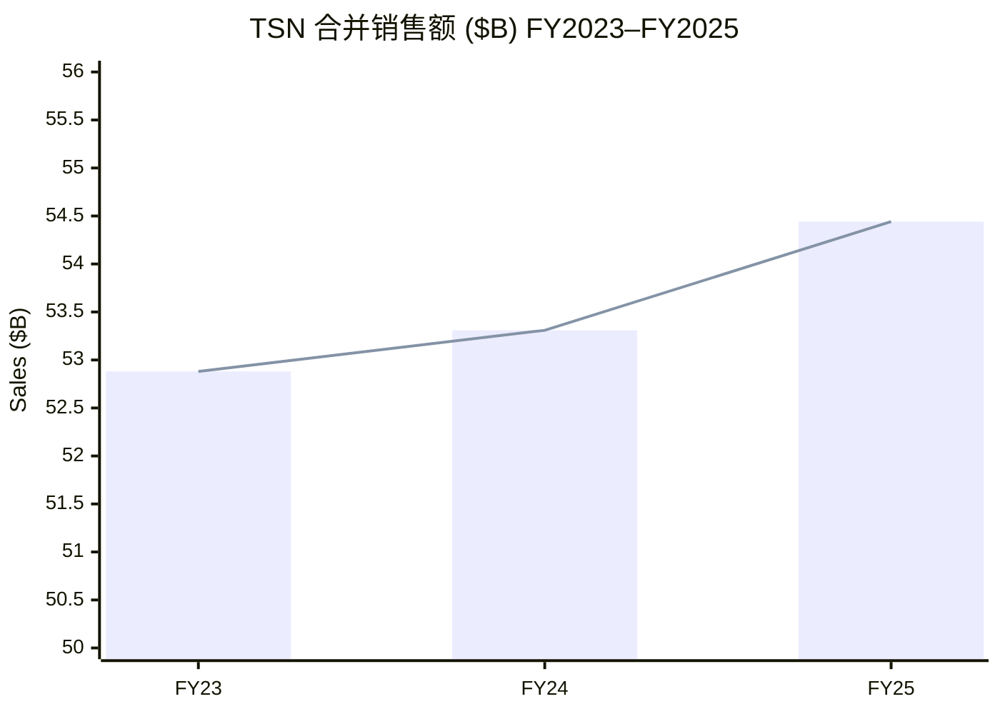
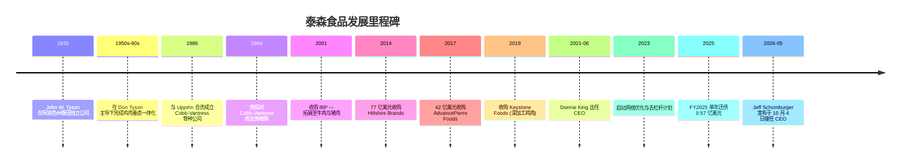
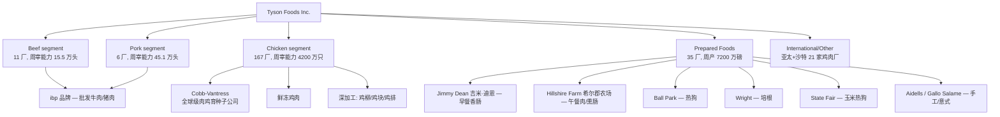
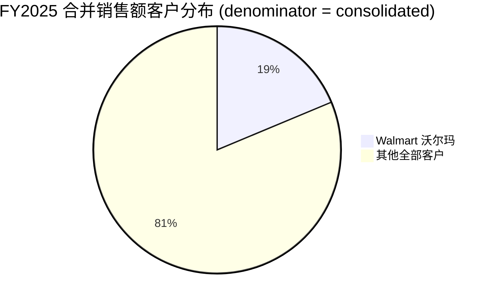
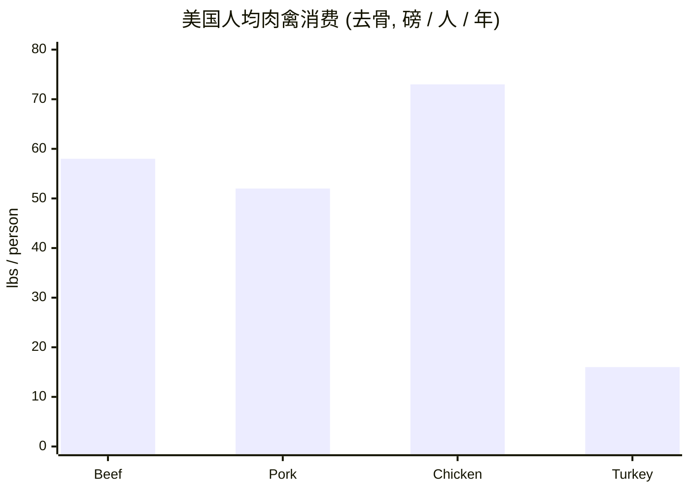
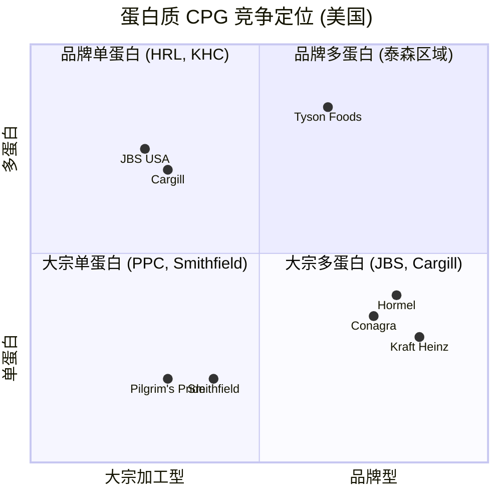
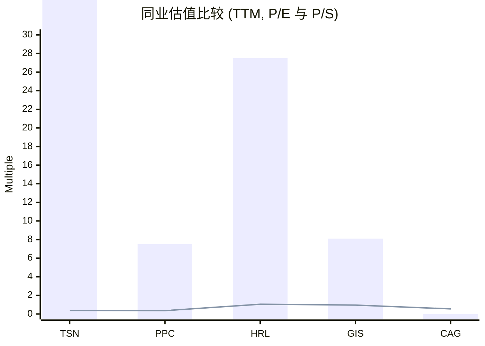
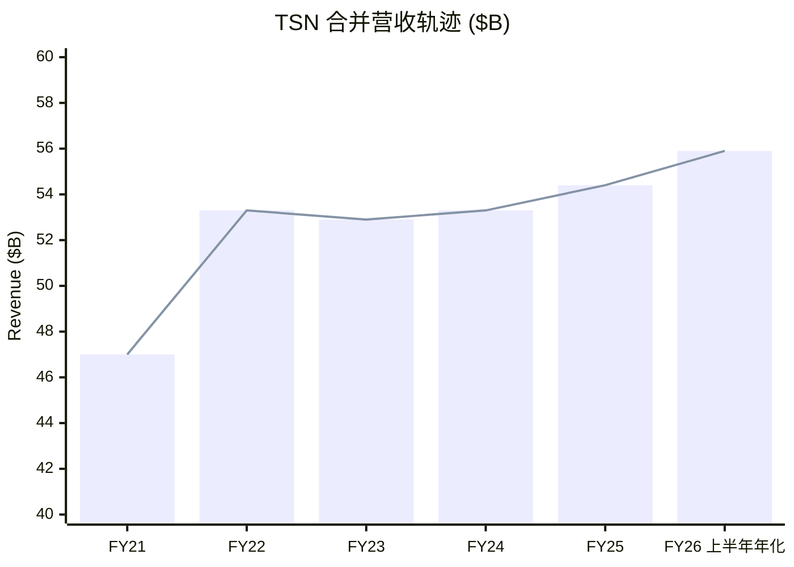

# 泰森食品 Tyson Foods, Inc. (NYSE: TSN) — 公司研究报告

*报告日期 (as of): 2026-06-03。引用文件：FY2025 10-K (财年截至 2025-09-27)、FY2026 第一季度 8-K (2026-02-02)、FY2026 第二季度 8-K (2026-05-04)、FY2025 委托书 DEF 14A (2025-12-17)、CEO 换帅 8-K (2026-05-28)。*

> **报告顶栏 — 业绩指引状态：** 2026-05-28，泰森在 [CEO 换帅 8-K](https://www.sec.gov/Archives/edgar/data/100493/000010049326000026/tsn2026presidentceoannounc.htm) 中同步**重申了 FY2026 全年指引** (total company guidance reaffirmed)，宣布**杰夫·肖姆伯格 Jeff Schomburger** (前 P&G 全球销售官 Global Sales Officer；2016 年起任董事，2025 年 11 月起任首席独立董事 Lead Independent Director) 将于 **2026-10-04 接任唐尼·金 Donnie King 出任总裁兼 CEO**。金已在公司工作 43 年。FY2026 上半年合并销售额为 **279.66 亿美元，同比增长 4.8%**，GAAP 营业利润率 **2.6%**，调整后营业利润率 (adjusted operating margin) **3.8%** ([Q2 FY26 业绩公告](https://www.sec.gov/Archives/edgar/data/100493/000010049326000019/tsn2026q2exh-991.htm))。

## 目录
1. 公司概览
2. 公司历史
3. 管理团队
4. 产品与服务
5. 客户与渠道
6. 行业概览
7. 竞争格局
8. 市场机会
9. 风险评估
10. 投资视角评分
11. 参考资料与核查日志

---

## 1. 公司概览

泰森食品 (NYSE: TSN) 是全球最大的肉类蛋白加工与品牌食品集团之一。引用 FY2025 10-K Item 1 业务说明的原文："Tyson Foods, Inc. … is a world-class food company and recognized leader in protein. Founded in 1935 by John W. Tyson, it has grown under four generations of family leadership" ([FY2025 10-K, Item 1 Business](https://www.sec.gov/Archives/edgar/data/100493/000010049325000095/tsn-20250927.htm))。公司总部位于美国阿肯色州春田 (Springdale, Arkansas)，业务覆盖**牛肉 (Beef)、猪肉 (Pork)、鸡肉 (Chicken)、预制食品 (Prepared Foods)** 四大可报告分部加"国际/其他 International/Other"。FY2025 (52 周，截至 2025-09-27) 合并销售额 **544.41 亿美元**，GAAP 营业利润 **10.98 亿美元**，期末**全球员工 (team members) 约 13.3 万人**，其中美国约 11.6 万人 ([FY2025 10-K, Item 1 — Human Capital](https://www.sec.gov/Archives/edgar/data/100493/000010049325000095/tsn-20250927.htm))。

**分部经济结构。** 10-K 明确披露分部利润为 operating income (loss) ([FY2025 10-K, Description of Segments](https://www.sec.gov/Archives/edgar/data/100493/000010049325000095/tsn-20250927.htm))。FY2025 分部经济呈极端分化：Chicken 与 Prepared Foods 分别贡献 **14.27 亿美元**与 **8.98 亿美元**营业利润；Beef 与 Pork 分别亏损 **11.35 亿美元**与 **1.99 亿美元**，主要拖累项为美国育肥牛 (fed cattle) 供给紧张推升投入成本、法律或有负债计提 (legal contingency accruals)、以及 Beef 商誉与无形资产减值 (goodwill & intangible impairments) 3.43 亿美元 ([FY2025 10-K, Beef Segment Results](https://www.sec.gov/Archives/edgar/data/100493/000010049325000095/tsn-20250927.htm))。Q1 FY2026 起公司**调整分部呈报口径**：不再将公司层面费用 (corporate expenses) 与摊销 (amortization) 分摊至分部，并将 International 独立列为可报告分部 ([Q2 FY26 业绩公告脚注 2](https://www.sec.gov/Archives/edgar/data/100493/000010049326000019/tsn2026q2exh-991.htm))。

**估值快照 (2026-06-03)。** TSN 收盘价 **59.59 美元**，市值约 **210 亿美元**，A 类+B 类股本约 **2.82 亿股** ([Yahoo Finance TSN](https://finance.yahoo.com/quote/TSN/key-statistics/))。TTM P/E **46.9 倍** (高位反映 FY2025 利润被法律计提与商誉减值压缩，并非高增长溢价)；前瞻 P/E **13.1 倍**、EV/EBITDA **10.6 倍**、TTM P/S **0.38 倍**、股息率 **3.42%**。在同行中，鸡肉纯播 Pilgrim's Pride ([PPC](https://finance.yahoo.com/quote/PPC/key-statistics/)) 估值 7.5 倍 TTM P/E / 0.36 倍 P/S；品牌包装肉类龙头 Hormel ([HRL](https://finance.yahoo.com/quote/HRL/key-statistics/)) 27.5 倍 TTM P/E / 1.05 倍 P/S；Conagra (CAG) 与 General Mills (GIS) 均为 P/S 0.5–1.0 倍 的品牌包装食品贸易区间 ([Yahoo Finance CAG](https://finance.yahoo.com/quote/CAG/key-statistics/) / [GIS](https://finance.yahoo.com/quote/GIS/key-statistics/))。

**估值判读 / Interpretation:** 这是一个典型的"利润底部 TTM P/E、营收正常 P/S"的周期股估值组合 (trough-EPS, normal-sales)。市场对 1 美元营收只愿意付 0.38 美元股权对价，预期随着美国牛群重建 (cattle herd rebuild) 与反垄断和解 (antitrust settlements) 渐行渐远而盈利正常化，但不愿将 FY2025 的盈利水平资本化为可持续运行率。3.42% 的股息收益率为防御型投资者提供了等待期的现金回报，且公司**已连续 14 年提升股息**，2025 年 11 月再次将季度股息从 $0.50/股提至 **$0.51/股 (折合年化 $2.04)** ([FY2025 10-K, Dividends](https://www.sec.gov/Archives/edgar/data/100493/000010049325000095/tsn-20250927.htm))。

资料来源：[FY2025 10-K, Segment Results](https://www.sec.gov/Archives/edgar/data/100493/000010049325000095/tsn-20250927.htm)。同期 GAAP 营业利润：FY23 $(395)M (Chicken 亏损 + Beef 减值)、FY24 $1,409M、FY25 $1,098M (Beef 减值 + 法律计提)。

**资本结构。** 截至 2025-09-27，公司持有**现金及等价物 12.29 亿美元**，无短期投资；未动用的 **25 亿美元 (April 2030 到期) 循环信贷额度 (revolving credit facility)**，**总流动性 37.29 亿美元** ([FY2025 10-K, Liquidity and Capital Resources](https://www.sec.gov/Archives/edgar/data/100493/000010049325000095/tsn-20250927.htm))。总债务 **88.3 亿美元** (上年 97.87 亿)，其中流动负债 9.09 亿。债务/EBITDA **3.5 倍**、净债务/EBITDA **3.0 倍**、债务占资本化比例 **32.6%** ([FY2025 10-K, Capitalization and Leverage Ratios](https://www.sec.gov/Archives/edgar/data/100493/000010049325000095/tsn-20250927.htm))。FY2025 经营性现金流 **21.55 亿美元**，资本开支 (capex) **9.78 亿美元**，自由现金流约 11.8 亿美元；FY2025 当年实现**总债务下降 9.57 亿美元** (从 97.87 亿降至 88.30 亿)，这是 CEO 唐尼·金在 2023 年启动的网络优化 (network optimization) 与去杠杆战略 (deleveraging) 在 FY2025 的兑现节点。

## 2. 公司历史

泰森的故事始于 **1935 年大萧条期间**：**约翰·W·泰森 (John W. Tyson)** 在阿肯色州春田创立了一家以孵化与活鸡运输 (hatchery + live chicken hauling) 为核心的小公司，最初是单车运营，将活鸡从西北阿肯色州运到圣路易斯、堪萨斯城等中西部城市销售 ([FY2025 10-K, Item 1 — General](https://www.sec.gov/Archives/edgar/data/100493/000010049325000095/tsn-20250927.htm) — 10-K 原文："Founded in 1935 by John W. Tyson, it has grown under four generations of family leadership"，"四代家族传承"为 10-K 直接表述)。**1950–60 年代**在创始人之子 **唐·泰森 (Don Tyson)** 主导下，公司构建了今日仍然定义其行业地位的**完全垂直一体化鸡肉模型 (fully vertically-integrated chicken model)** — 自有种鸡 (breeding stock)、合同农户 (contract farmers)、饲料厂 (feed mills)、孵化场 (hatcheries)、屠宰加工与深加工 (processing & further-processing)、自有车队物流 ([FY2025 10-K, Item 1 — Chicken raw materials](https://www.sec.gov/Archives/edgar/data/100493/000010049325000095/tsn-20250927.htm))。

公司从"鸡肉为主"跃升为"全球最大蛋白公司"的转折点是**2001 年并购 IBP 公司 (IBP, Inc.)** — 一笔将其牛肉与猪肉胴体加工能力一举推到行业领先地位的标志性交易。`ibp®` 品牌至今仍是 FY2025 10-K 列出的核心品牌之一 ([FY2025 10-K, Item 1 — brand portfolio](https://www.sec.gov/Archives/edgar/data/100493/000010049325000095/tsn-20250927.htm))。第二个转折点是 **2014 年以约 77 亿美元收购希尔郡品牌 (Hillshire Brands)**，由此获得了 Jimmy Dean (早餐香肠)、Hillshire Farm (午餐肉/熏肠)、Ball Park (热狗)、Aidells (手工香肠) 等今日 Prepared Foods 分部最重要的品牌资产 ([FY2025 10-K, Prepared Foods description](https://www.sec.gov/Archives/edgar/data/100493/000010049325000095/tsn-20250927.htm) — 品牌列表 10-K 原文)。希尔郡的加入让泰森从"商品化加工厂"逐步转型为"品牌包装肉类公司 (branded packaged-meats company)"，FY2025 Prepared Foods 单分部就贡献了 **8.98 亿美元营业利润**，9.0% 营业利润率，远高于公司平均水平 ([FY2025 10-K, Segment Results](https://www.sec.gov/Archives/edgar/data/100493/000010049325000095/tsn-20250927.htm))。

更近期的并购包括：**2017 年以约 42 亿美元收购 AdvancePierre Foods** (扩展三明治与即食产品)；**2018 年收购 American Proteins** (动物副产品熔炼/animal rendering、宠物食品配料)；**2019 年从 Marfrig 手中收购 Keystone Foods** (深加工鸡肉，并扩展麦当劳客户关系)。**Cobb-Vantress (考勃·凡特斯)** 是泰森全资的全球级肉鸡育种 (broiler-genetics) 子公司，1986 年与美国制药企业 Upjohn 合资设立，1994 年泰森完成完全收购，目前在阿根廷、巴西、中国、多米尼加、印度、新西兰、秘鲁、菲律宾、西班牙、坦桑尼亚、土耳其和英国 12 个国家有业务 ([FY2025 10-K, Item 1 — Foreign Operations](https://www.sec.gov/Archives/edgar/data/100493/000010049325000095/tsn-20250927.htm) — 国家列表 10-K 原文)。

**最近的结构性篇章**始于 2023 年 8 月：CEO 金启动了多年期网络优化计划 (network optimization plan)，迄今关闭了 2 家 Beef 工厂、2 家 Prepared Foods 工厂、多家鸡肉加工厂，并将部分冷链仓储设施 (cold-storage facilities) 售后回租 (sale-leaseback) ([FY2025 10-K, Item 2 Properties](https://www.sec.gov/Archives/edgar/data/100493/000010049325000095/tsn-20250927.htm))。同期公司将原本分散在芝加哥/Downers Grove 的公司总部职能合并回春田总部，重整高管团队并显式优先**还债** — FY2025 单年还债 9.57 亿美元 ([FY2025 10-K, Capitalization](https://www.sec.gov/Archives/edgar/data/100493/000010049325000095/tsn-20250927.htm))。2026 年 5 月 28 日宣布的 CEO 换帅意味着这一重整后的业务将由肖姆伯格接手 ([CEO 换帅 8-K](https://www.sec.gov/Archives/edgar/data/100493/000010049326000026/tsn2026presidentceoannounc.htm))。

资料来源：[FY2025 10-K](https://www.sec.gov/Archives/edgar/data/100493/000010049325000095/tsn-20250927.htm)；[CEO 换帅 8-K, 2026-05-28](https://www.sec.gov/Archives/edgar/data/100493/000010049326000026/tsn2026presidentceoannounc.htm)；M&A 历史日期参考公开新闻档案。

## 3. 管理团队

**创始家族与现任董事长 — 约翰·H·泰森 John H. Tyson (72 岁)。** 公司由其祖父 John W. Tyson 于 1935 年创立。约翰·H·泰森现任董事长 (Chairman of the Board)，自 1998 年起担任此职，2000 年至 2006 年期间曾兼任公司 CEO。引用 FY2025 DEF 14A 原文："Mr. Tyson was initially employed by the Company in 1973" 且"has devoted his professional career to the Company" ([FY2025 DEF 14A, Information About Our Executive Officers](https://www.sec.gov/Archives/edgar/data/100493/000010049325000114/tsn-20251217.htm))。通过 **Tyson Limited Partnership (TLP，泰森有限合伙)** 这一持股工具，泰森家族 — 包括约翰·H·泰森、Donald J. Tyson Revocable Trust 与芭芭拉·泰森 (Barbara A. Tyson) — 共同控制公司**B 类股 99.987%** 及合计**总投票权约 71.94%**，对董事会、并购与资本结构等重大决策拥有事实上的控制力 ([FY2025 10-K, Risk Factor — TLP](https://www.sec.gov/Archives/edgar/data/100493/000010049325000095/tsn-20250927.htm))。约翰·H·泰森的两位子女 — **约翰·R·泰森 (35 岁)** 与 **奥利维亚·L·泰森 (33 岁)** — 于 2025 年加入董事会，意味着家族对公司治理的持续介入 ([FY2025 DEF 14A 董事提名表](https://www.sec.gov/Archives/edgar/data/100493/000010049325000114/tsn-20251217.htm))。10-K 中的"四代家族传承"并非营销话术：从创始人 John W. → Don Tyson (CEO 1971–1991) → John H. (CEO 2000–2006，董事长 1998 至今) → John R. 与 Olivia (2025 年加入董事会) 的代际传承是 90 年家族控制的事实。

**当前 CEO (任期至 2026 年 10 月初) — 唐尼·金 Donnie King (63 岁)。** 引用 FY2025 DEF 14A 董事介绍原文："Donnie King, 63, has served as the Company's President and Chief Executive Officer since June 2021. A seasoned leader with more than four decades of experience in the food industry, Mr. King has held several key leadership positions across the Company's domestic and international operations. Since rejoining the Company in 2019, Mr. King has served as the Chief Operating Officer, Group President, Poultry and Group President, International and Chief Administration Officer. Earlier in his career with the Company, Mr. King served as President, North American Operations and as President, North American Operations and Foodservice. Mr. King began his career with Valmac Industries in 1982, which was acquired by the Company in 1984. Mr. King was self-employed from 2017 to 2019 before returning to the Company. Mr. King has been a member of the Board since 2022" ([FY2025 DEF 14A, Donnie King director bio](https://www.sec.gov/Archives/edgar/data/100493/000010049325000114/tsn-20251217.htm))。换言之，金已在公司服务约 43 年 (含中断)，是从一线食品业务做起来的运营导向型 (operations-led) CEO。2026-05-28 CEO 换帅公告中，约翰·H·泰森评价金的任期"successfully led the company through the COVID-19 pandemic, and improved execution across the business to substantially grow profit and strengthen the balance sheet" ([CEO 换帅 8-K](https://www.sec.gov/Archives/edgar/data/100493/000010049326000026/tsn2026presidentceoannounc.htm))。金将在 10 月 4 日之后继续留任董事。

**候任 CEO — 杰夫·肖姆伯格 Jeff Schomburger (63 岁，2026-10-04 上任)。** 引用 FY2025 DEF 14A 原文："Jeffrey K. Schomburger, 63, retired as Global Sales Officer for The Procter & Gamble Company (P&G) in 2019, a position he held since 2015. He previously held numerous leadership positions with P&G since joining the company in 1984, including President of P&G's global Walmart team from 2005 to 2015. Mr. Schomburger has been a member of the Board since 2016 and has served as Lead Independent Director since November 2025" ([FY2025 DEF 14A, Schomburger director bio](https://www.sec.gov/Archives/edgar/data/100493/000010049325000114/tsn-20251217.htm))。肖姆伯格的履历对解读其接任意义至关重要：

1. **品牌-客户型 CEO，非运营型。** 他在 P&G 工作 35 年，做的是品牌消费品 (branded CPG) 的销售、客户管理、品类管理 — 这与金的"工厂-运营-蛋白质供应链"导向构成显著反差。
2. **沃尔玛专属经验。** 他**领导 P&G 全球沃尔玛团队整整十年 (2005–2015)**。考虑到沃尔玛占泰森 FY2025 合并销售额的 **18.7%** (见 § 5)，由一位"理解沃尔玛如何运转"的 CEO 接掌泰森的客户界面意义重大。
3. **首位非泰森家族姓氏的现代 CEO 。** 这是泰森家族治理史上具有象征意义的安排。
4. **AI 与品牌强化为战略口号。** 肖姆伯格在 2026-05-28 公告中表示"energized by the opportunity to strengthen our iconic brands with superior products, capitalize on emerging opportunities through AI acceleration, and continue to win with customers and consumers" ([CEO 换帅 8-K](https://www.sec.gov/Archives/edgar/data/100493/000010049326000026/tsn2026presidentceoannounc.htm))。

董事会用候任 CEO 给出的信号是：未来 3–5 年公司**业务重心将进一步向品牌包装肉类与零售客户管理倾斜**，而非进一步向上游产能扩张倾斜。这种取向，如能稳定执行，应使合并营业利润率结构性向 Prepared Foods + Chicken 模式靠拢。

## 4. 产品与服务

泰森食品是一家**完全垂直一体化 (fully vertically-integrated)** 的全球级蛋白质与品牌食品公司。10-K 产品矩阵 (产品/分部明细) 如下，**逐字摘自** FY2025 10-K Item 1 — Description of Segments ([source](https://www.sec.gov/Archives/edgar/data/100493/000010049325000095/tsn-20250927.htm))：

| 分部 / Segment | FY2025 销售额 | FY2025 营业利润(亏) | FY2025 营业利润率 | 10-K 业务描述 (原文摘录) |
|---|---:|---:|---:|---|
| **Beef 牛肉** | $21,623M | $(1,135)M | (5.2)% | "operations related to processing live fed cattle and fabricating dressed beef carcasses into primal and sub-primal meat cuts and case-ready products" |
| **Pork 猪肉** | $5,781M | $(199)M | (3.4)% | "operations related to processing live market hogs and fabricating pork carcasses into primal and sub-primal cuts and case-ready products" |
| **Chicken 鸡肉** | $16,837M | $1,427M | 8.5% | "domestic operations related to raising and processing live chickens into and purchasing raw materials for fresh, frozen and value-added chicken products" |
| **Prepared Foods 预制食品** | $9,930M | $898M | 9.0% | "manufacturing and marketing frozen and refrigerated food products … brands such as Jimmy Dean®, Hillshire Farm®, Ball Park®, Wright®, State Fair®, as well as artisanal brands Aidells® and Gallo Salame®" |
| **International/Other 国际/其他** | $2,291M | $107M | 4.7% | 中国、马来西亚、墨西哥、韩国、泰国、沙特阿拉伯王国的海外业务 |

资料来源：[FY2025 10-K, Segment Results 与 Description of Segments](https://www.sec.gov/Archives/edgar/data/100493/000010049325000095/tsn-20250927.htm)。10-K 分部定义逐字保留 (per the project's quote-not-paraphrase 规则)。

资料来源：分部工厂数量与产能见 [FY2025 10-K, Item 2 Properties](https://www.sec.gov/Archives/edgar/data/100493/000010049325000095/tsn-20250927.htm)；品牌矩阵见 [FY2025 10-K, Prepared Foods description](https://www.sec.gov/Archives/edgar/data/100493/000010049325000095/tsn-20250927.htm)。

### 4.1 Beef 牛肉分部

泰森牛肉分部运营 **11 家自有牛肉加工厂**，合计周屠宰能力 **155,000 头** ([FY2025 10-K, Item 2 Properties](https://www.sec.gov/Archives/edgar/data/100493/000010049325000095/tsn-20250927.htm))。引用 10-K 原文：分部"includes our operations related to processing live fed cattle and fabricating dressed beef carcasses into primal and sub-primal meat cuts and case-ready products. Products are marketed domestically to food retailers, foodservice distributors, restaurant operators, hotel chains and noncommercial foodservice establishments such as schools, healthcare facilities, the military and other food processors, as well as to international export markets" ([FY2025 10-K Item 1, Beef description](https://www.sec.gov/Archives/edgar/data/100493/000010049325000095/tsn-20250927.htm))。分部也从"specialty products such as hides, rendered products and variety meats" (皮革、熔炼副产品、内脏副产品) 中获取增值收入 — 牛皮 (hides / 牛皮) 进入全球皮革供应链，熔炼副产品 (rendered products) 流入宠物食品、可再生柴油 (renewable diesel 原料)、动物营养市场。

**中文释义 / Plain-language gloss:**
- "fed cattle" / 育肥牛 — 已在饲养场以谷物育肥、14–24 个月大、达到屠宰体重的肉牛
- "carcass" / 胴体 — 屠宰后去毛、放血、去脏的整体
- "primal cuts" / 大部位分割 — 一头胴体被分为 8 大主体部位 (chuck / 肩肉、rib / 肋眼、loin / 腰肉、sirloin / 西冷、round / 后腿、brisket / 牛胸、plate / 腹肉、flank / 牛腩)
- "case-ready" / 即售包装 — 在加工厂直接完成分切/称重/包装，进入超市生鲜柜后无需店内分割。整合型加工商 (Tyson、JBS、Cargill、National Beef) 主导该业态

**FY2025 周期意义。** 引用 10-K 原文："The U.S. cattle market is currently experiencing limited supply of market-ready cattle and uncertainty exists regarding the timing of anticipated cattle herd rebuild" ([FY2025 10-K Item 1, Beef raw materials](https://www.sec.gov/Archives/edgar/data/100493/000010049325000095/tsn-20250927.htm))。根据 [USDA-NASS 2025 年 1 月牛存栏报告](https://release.nass.usda.gov/reports/catl0125.pdf)，**美国全牛存栏降至 8,670 万头，为 1951 年以来最低**，原因是多年干旱、饲料成本飙升与牧场主选择清栏。Beef 分部 FY2025 销售额 $21,623M (同比 +$1,144M)，价格 +9.0%、销量 -1.9%；营业亏损扩大至 $11.35 亿，其中包含 $343M 商誉/无形资产减值、$318M 法律或有计提、$48M 重组费用 ([FY2025 10-K, Beef Segment Results](https://www.sec.gov/Archives/edgar/data/100493/000010049325000095/tsn-20250927.htm))。商誉减值本质上是**承认在牛群低谷环境下，该分部未来现金流无法支撑此前账面价值**。

### 4.2 Pork 猪肉分部

猪肉分部运营 **6 家自有屠宰厂**外加 **4 家与 Beef 分部共用的 case-ready 工厂**，合计周屠宰能力 **451,000 头肉猪 (market hogs)** ([FY2025 10-K, Properties](https://www.sec.gov/Archives/edgar/data/100493/000010049325000095/tsn-20250927.htm))。引用 10-K 原文："Pork includes our operations related to processing live market hogs and fabricating pork carcasses into primal and sub-primal cuts and case-ready products … This segment also includes our live swine group, related specialty product processing activities and logistics operations to move products through the supply chain" ([FY2025 10-K Item 1, Pork description](https://www.sec.gov/Archives/edgar/data/100493/000010049325000095/tsn-20250927.htm))。

与 Beef 完全外采不同，泰森在猪肉环节"raise[s] a small number of weanling swine to sell to independent finishers and to supply a minimal amount of market hogs and live swine for our own processing needs" — 公司自育小部分仔猪 (weanling swine / 断奶仔猪) 卖给独立育肥商，并自养少量育肥猪。FY2025 Pork 销售额 $5,781M (同比 -2.1%)，营业亏损 $199M (利润率 (3.4)%)，主要拖累为 $380M 猪肉反垄断诉讼法律计提 ([FY2025 10-K, Pork Segment Results](https://www.sec.gov/Archives/edgar/data/100493/000010049325000095/tsn-20250927.htm))。Q2 FY2026 已扭亏为盈：分部营业利润 $41M、利润率 2.6%、销量 +4.4%，提示底层业务正在随法律计提逐季消化而正常化 ([Q2 FY26 业绩公告](https://www.sec.gov/Archives/edgar/data/100493/000010049326000019/tsn2026q2exh-991.htm))。

### 4.3 Chicken 鸡肉分部 — 一体化的皇冠明珠

按工厂数计这是泰森最大的分部：**167 家工厂** (162 家自有、5 家租赁)，周宰能力 **4,200 万只** ([FY2025 10-K, Properties](https://www.sec.gov/Archives/edgar/data/100493/000010049325000095/tsn-20250927.htm))。引用 10-K 原文："Chicken includes our domestic operations related to raising and processing live chickens into and purchasing raw materials for fresh, frozen and value-added chicken products … Our value-added chicken products primarily include breaded chicken strips, nuggets, patties and other ready-to-fix or fully cooked chicken parts" ([FY2025 10-K Item 1, Chicken description](https://www.sec.gov/Archives/edgar/data/100493/000010049325000095/tsn-20250927.htm))。

10-K 中描述的**鸡肉一体化流程**是垂直整合的教科书式案例，逐字引用：

> "Our vertically-integrated chicken process begins with breeding our pedigree and great grandparent stock out to produce the grandparent breeder flocks and ends with broilers for processing. Breeder flocks (i.e., grandparents) are raised to maturity in grandparent growing and laying farms where fertile eggs are produced. Fertile eggs are incubated at the grandparent hatchery and produce pullets (i.e., parents). Pullets are raised to 20 weeks of age, sent to breeder houses, and the resulting eggs are sent to our hatcheries. Once chicks have hatched, they are sent to broiler farms. There, contract farmers care for and raise the chicks according to our standards, with advice from our technical service personnel, until the broilers reach the desired processing weight." ([FY2025 10-K, Item 1 — Chicken raw materials](https://www.sec.gov/Archives/edgar/data/100493/000010049325000095/tsn-20250927.htm))

**中文释义 / Plain-language gloss:** "祖代 (pedigree / great grandparent) → 父母代 (grandparent) → 配种群 (parent / pullets) → 商品代肉鸡 (broiler)" 整条链路是 4 代基因优选压缩到 9–12 个月生命周期。Cobb-Vantress 处于这条链路顶端，是全球肉鸡育种 IP 双巨头之一 (另一家是德国 EW Group 旗下 Aviagen)。阿肯色州的泰森工厂、泰国的 Cargill 工厂、巴西的 JBS-Pilgrim's 工厂、俄罗斯的 Cherkizovo 工厂 — 它们的种鸡基因绝大多数都来自 Cobb 或 Aviagen。这是一道**全球级生物 IP 护城河 (biological IP moat)**。

**FY2025 战略意义。** 玉米 + 豆粕在 FY2025"represented roughly 53% of our cost of growing a live chicken in fiscal 2025" ([FY2025 10-K Item 1, Chicken raw materials](https://www.sec.gov/Archives/edgar/data/100493/000010049325000095/tsn-20250927.htm))。美国玉米与豆粕价格已从 2022–2023 高峰回落到长周期均值，FY2025 鸡肉分部成为 P&L 的主推动力：营业利润 $14.27 亿、利润率 8.5%，相比 FY2024 的 $988M 与 FY2023 亏损 $770M 显著恢复。Q2 FY2026 鸡肉销量同比 +1.7%，**连续 5 个季度同比销量正增长** ([Q1 FY26 release CEO quote](https://www.sec.gov/Archives/edgar/data/100493/000010049326000005/tsn2026q1exh-991.htm))，调整后分部利润率 **12.2%**，是 FY2026 所有分部中最高。

### 4.4 Prepared Foods 预制食品 — 品牌包装食品利润池

Prepared Foods 是泰森**最品牌化、最有定价权**的分部 — 营收增速最慢但利润率最稳定。10-K 原文："This segment includes brands such as Jimmy Dean®, Hillshire Farm®, Ball Park®, Wright®, State Fair®, as well as artisanal brands Aidells® and Gallo Salame®. Products primarily include a mixture of ready-to-cook and ready-to-eat sandwiches, sandwich components such as flame-grilled hamburgers and Philly steaks, pepperoni, bacon, breakfast sausage, turkey, lunchmeat, hot dogs, flour and corn tortilla products, appetizers, snacks, prepared meals, ethnic foods, side dishes, meat dishes, breadsticks and processed meats" ([FY2025 10-K Item 1, Prepared Foods](https://www.sec.gov/Archives/edgar/data/100493/000010049325000095/tsn-20250927.htm))。

分部运营 **35 家工厂**，全部自有，**周产 7,200 万磅** ([FY2025 10-K, Properties](https://www.sec.gov/Archives/edgar/data/100493/000010049325000095/tsn-20250927.htm))。FY2025 销售额 $9,930M (+0.8% YoY)、营业利润 $898M (9.0% 利润率)，包含 $41M 产品召回 (recall) 费用与 $26M 重组净收益 ([FY2025 10-K, Prepared Foods Segment Results](https://www.sec.gov/Archives/edgar/data/100493/000010049325000095/tsn-20250927.htm))。Q2 FY2026 表现更亮眼：调整后营业利润率 **14.0%** (公司各分部之最)，销售额 $2,511M (+4.8%)、价格 +4.4%、销量 +0.4%。**这是新任 CEO 肖姆伯格"用 CPG 思路重整泰森"的天然杠杆点：稳健 9–14% 营业利润率 × 占合并销售约 18% × 已被 P&G-沃尔玛模式训练过的客户能力 ≈ 中期合并 EPS 重估的支点。**

### 4.5 跨分部协同 — 为什么是垂直一体化蛋白公司

四个分部业务上独立、流程上深度耦合。**内部流向逻辑**：活畜 (Beef/Pork) → 胴体加工 → 大部位分割 → 一部分卖入零售/餐饮为 Beef/Pork 收入；另一部分 (尤其是修整边角 trimmings、内脏 variety meats、皮 hides) 流入 Prepared Foods 用于热狗 (Ball Park)、培根 (Wright)、午餐肉 (Hillshire Farm)、意式辣肠；Chicken 分部同样将深加工原料供给 Tyson Any'tizers、Tyson Crispy Strips、Aidells 香肠、Jimmy Dean 早餐碎肉等品牌产品线。FY2025 分部间销售 **$2,021M** (合并销售的 3.7%) 即为此内部流量 ([FY2025 10-K, Segment Results](https://www.sec.gov/Archives/edgar/data/100493/000010049325000095/tsn-20250927.htm))。

**整合的结构性优势** = **按整头胴体捕获全价值**：胴体约 60% 是高端切块、30% 是边角/碎肉、10% 是副产品。非整合加工商以大宗价格卖出边角与副产品；泰森将很大一部分边角重新路由进入品牌预制食品，享受显著更高的利润率。**整合的结构性风险** = **下游分部固定成本难以快速削减**：在 FY2025 牛群紧张周期下，219 家工厂的固定成本无法快速削减，正是当前网络优化计划的逻辑起点。

## 5. 客户与渠道

**客户集中度 (合并口径)。** 引用 10-K 原文："Walmart Inc. accounted for approximately **18.7%** of our fiscal 2025 **consolidated sales**. Sales to Walmart Inc. were included in all of our segments. Any extended discontinuance of sales to this customer could, if not replaced, have a material impact on our operations. No other single customer or customer group represented more than 10% of fiscal 2025 consolidated sales" ([FY2025 10-K, Item 1 — Customers](https://www.sec.gov/Archives/edgar/data/100493/000010049325000095/tsn-20250927.htm))。**这是 10-K 中最重要的客户披露**，也是董事会选择候任 CEO 肖姆伯格 (P&G 全球沃尔玛团队负责人 2005–2015) 绝非巧合的关键事实。

资料来源：[FY2025 10-K, Item 1 — Customers](https://www.sec.gov/Archives/edgar/data/100493/000010049325000095/tsn-20250927.htm)。10-K 明确披露除沃尔玛外**无其他单一客户超过合并销售 10%**，因此 81.3% 部分在合并口径下不可进一步分解。

**销售渠道。** 10-K 原文列出五大重叠渠道："grocery retailers, grocery wholesalers, meat distributors, warehouse club stores, military commissaries, industrial food processing companies, chain restaurants or their distributors, live markets, international export companies and domestic distributors who serve restaurants, foodservice operations such as plant and school cafeterias, convenience stores, hospitals and other vendors. Additionally, sales to the military and a portion of sales to international markets are made through independent brokers and trading companies" ([FY2025 10-K, Item 1 — General](https://www.sec.gov/Archives/edgar/data/100493/000010049325000095/tsn-20250927.htm))。十年来渠道结构已显著向**零售+会员制超市 (retail & club: Walmart, Costco, Sam's Club, Kroger, Albertsons) 倾斜**，远离餐饮 (foodservice)。这一结构变化在 COVID 期间加速并未完全回潮。Prepared Foods 与 Chicken 主要靠零售+会员超市驱动；Beef 与 Pork 仍较多依赖餐饮+出口。

**国际渠道。** FY2025 公司**在约 140 个国家销售产品**；美国出口销售 **$4.8 billion**，包括海外子公司在内的合并国外销售 **$7.4 billion** ([FY2025 10-K, Risk Factor — international activities](https://www.sec.gov/Archives/edgar/data/100493/000010049325000095/tsn-20250927.htm))。10-K 列出的核心海外市场包括"Canada, Central America, China, the European Union, the United Kingdom, Japan, Mexico, Malaysia, the Middle East, the Philippines, Singapore, South Korea, Taiwan, Thailand and Vietnam"。海外长期资产 (剔除商誉/无形资产/金融工具/递延税资产) 约 $0.7B，主要位于巴西、中国、新西兰、马来西亚、中东、泰国。**Tyson Asia-Pacific 亚太分部**包括泰国的一体化鸡肉生产、马来西亚的多品种蛋白深加工，以及沙特阿拉伯王国的增值与熟制鸡肉/牛肉业务。中国与韩国分部既经营自有一体化鸡肉，也销售来自美国与其他全球业务进口的牛、猪、鸡产品 ([FY2025 10-K, Item 1 — Foreign Operations](https://www.sec.gov/Archives/edgar/data/100493/000010049325000095/tsn-20250927.htm))。8 种主要货币 (巴西雷亚尔、英镑、加元、人民币、欧元、马来西亚林吉特、墨西哥比索、泰铢) 是经常性翻译与交易波动来源；中国与欧盟的进口政策、关税变动是反复出现的收入冲击。

**合约结构。** 公开 10-K 用词将国内销售描述为"by our sales staff"，即由销售团队按周/季/年节奏与商品参考价挂钩谈定，非长期照付不议 (take-or-pay) 合同。沃尔玛合同的详细条款 (期限、最惠国条款、独占范围) 不公开披露，但行业观察是泰森作为沃尔玛生鲜肉柜 (case-ready 牛肉/猪肉) 与 Great Value 自有品牌鸡肉与预制肉 SKU 的主要供应商之一，与品牌型 SKU 并列陈列。

## 6. 行业概览

**TAM / SAM。** 泰森处于两个相互嵌套的市场结构：**美国动物蛋白加工市场** (牛、猪、鸡、火鸡) 与**美国品牌预制/包装肉类市场**。根据 [USDA-ERS 2023 食品支出数据](https://www.ers.usda.gov/data-products/food-expenditure-series/)，2024 年美国零售肉类与禽肉市场零售额约 **$95–100 billion**，餐饮渠道再加 $50–55B 采购额。全球肉类加工市场规模更大：根据 [OECD-FAO Agricultural Outlook 2024-2033](https://www.oecd-ilibrary.org/agriculture-and-food/oecd-fao-agricultural-outlook-2024-2033_4c5d2cfb-en)，至 2033 年全球肉类消费预计较 2021–2023 基线增长约 **12%**，亚洲贡献近半。

**美国人均消费。** 根据 [USDA-ERS Per Capita Availability 2024](https://www.ers.usda.gov/data-products/food-availability-per-capita-data-system/)，2024 年美国人均去骨肉禽消费量约为**鸡肉 73 磅 / 人 / 年、牛肉 58 磅、猪肉 52 磅、火鸡 16 磅**。鸡肉两个十年来持续抢占其他蛋白份额 — 因为单位成本低、健康形象好、生长周期短。Chicken 分部既受人口增长 + 人均消费增长的容量驱动，也受经济压力下从牛肉向鸡肉降级的结构性驱动。

**牛肉行业结构。** 美国牛肉加工是食品业中最集中的子行业之一：根据 [USDA-GIPSA 2024 屠宰能力报告](https://www.ams.usda.gov/sites/default/files/media/2024CattleSlaughterCapacityReport.pdf)，**四大牛肉加工商 — JBS USA, Tyson, Cargill, National Beef Packing — 合计占美国育肥牛屠宰能力 80% 以上** (按 10-K 披露的 155k 头/周能力，泰森在头部两家之列)。牛周期 (cattle cycle) 动态是 FY2025 Beef 巨亏的根本原因：美国牛群跌至多十年低位，活牛价格飙升，而盒装牛肉 (boxed-beef) 批发价格未能等幅传导，加工商利润被双向挤压。完整的牛群重建周期 (heifer-retention → calf crop expansion → processor margin recovery) 通常需要 **4–6 年**。

**猪肉行业结构。** 类似集中：Smithfield、Tyson、JBS USA 的 Swift Pork 分部、Hormel、Seaboard 合计加工绝大多数美国生猪。Smithfield 的 [2024 IPO 招股说明书 S-1](https://www.sec.gov/Archives/edgar/data/1959997/000119312524258389/d873083ds1.htm) 可作为同业规模与定位的参照。

**鸡肉行业结构。** 泰森与 Pilgrim's Pride 共同主导美国肉鸡，其后是 Wayne-Sanderson Farms (Cargill 与 Continental Grain 合资，2022 年成立)、Perdue Farms (私有)、Mountaire Farms (私有)、Koch Foods。[PPC 2024 10-K, Item 1](https://www.sec.gov/cgi-bin/browse-edgar?action=getcompany&CIK=0000802481&type=10-K) 显示其为美国第二大肉鸡生产商。两者具有近乎镜像的分部战略：均完全垂直一体化，均涉足零售与餐饮，但**泰森更偏品牌包装食品，PPC 更偏大宗与餐饮** — 这部分解释了 PPC TTM P/E 仅约 7.5 倍而 TSN 估值结构更复杂。

**品牌包装肉类。** 美国包装肉类市场品牌竞争极为激烈：Hormel (HRL)、Kraft Heinz (Oscar Mayer 热狗与午餐肉)、Conagra (Hebrew National, Hunt's)、Smithfield、Boar's Head、Applegate (已被 Hormel 收购) 等。泰森 Prepared Foods 在细分子品类中具有领先地位：Jimmy Dean 主导冷冻早餐香肠与早餐三明治；Hillshire Farm 是仅次于 Oscar Mayer 的午餐肉品牌；Ball Park 是仅次于 Oscar Mayer 的第二大热狗品牌 (排名引用自 [Circana 2025 包装肉类品类报告 — 付费墙，行业转述](https://www.circana.com/intelligence/))。

资料来源：[USDA-ERS Food Availability per Capita 2024](https://www.ers.usda.gov/data-products/food-availability-per-capita-data-system/)，近似去骨等效重量。

## 7. 竞争格局

10-K 中竞争表述谨慎："Our food products compete with those of other food producers and processors and certain prepared food manufacturers. Additionally, our food products compete in markets around the world" ([FY2025 10-K, Item 1 — Competition](https://www.sec.gov/Archives/edgar/data/100493/000010049325000095/tsn-20250927.htm))。10-K 不点名具体竞争对手，故下表对手援引各家自身一手披露：

| 竞争对手 | 与泰森交叉的业务 | 一手资料来源 |
|---|---|---|
| **JBS USA** (JBS S.A. 子公司) | Beef, Pork — 美国最大牛肉加工商 (按产能) | [JBS S.A. 2024 20-F](https://www.sec.gov/cgi-bin/browse-edgar?action=getcompany&CIK=0001517228&type=20-F) |
| **Cargill Protein** (私有) | Beef, Pork, Chicken (通过 Wayne-Sanderson 合资) | [Cargill 年报 (私有)](https://www.cargill.com/about/financial-information) |
| **Pilgrim's Pride (PPC)** (JBS 控股) | Chicken — 美国第二大肉鸡生产商 | [PPC 2024 10-K](https://www.sec.gov/cgi-bin/browse-edgar?action=getcompany&CIK=0000802481&type=10-K) |
| **Smithfield Foods (SFD)** | Pork — 美国最大猪肉加工商；近期重新 IPO | [Smithfield 2024 S-1](https://www.sec.gov/Archives/edgar/data/1959997/000119312524258389/d873083ds1.htm) |
| **Hormel Foods (HRL)** | Prepared Foods — 早餐、零食、熟食柜全线竞争 | [HRL 2024 10-K](https://www.sec.gov/cgi-bin/browse-edgar?action=getcompany&CIK=0000048465&type=10-K) |
| **Kraft Heinz (KHC)** | Prepared Foods — Oscar Mayer 热狗与午餐肉 | [KHC 2024 10-K](https://www.sec.gov/cgi-bin/browse-edgar?action=getcompany&CIK=0001637459&type=10-K) |
| **National Beef Packing** (Marfrig 子公司) | Beef — 美国前四加工商 | [Marfrig 2024 20-F](https://www.sec.gov/cgi-bin/browse-edgar?action=getcompany&CIK=0001475129&type=20-F) |
| **Conagra Brands (CAG)** | Prepared Foods — 冷冻餐、品牌零食 | [CAG 2024 10-K](https://www.sec.gov/cgi-bin/browse-edgar?action=getcompany&CIK=0000023217&type=10-K) |
| **Perdue Farms** (私有) | Chicken, Prepared Foods — 零售+餐饮品牌鸡肉 | 私有；通过零售渠道可见品牌 |
| **Sysco / US Foods** | 餐饮分销 — 既是客户也是 (自有品牌) 竞争者 | [SYY 2024 10-K](https://www.sec.gov/cgi-bin/browse-edgar?action=getcompany&CIK=0000096021&type=10-K) |

**定位判断。** 泰森是美国当前规模下**唯一真正多蛋白、全垂直一体化、拥有品牌 CPG 资产组合**的食品集团。JBS 在多蛋白维度最接近但品牌弱；Hormel 品牌强但不拥有上游牛肉与鸡肉；PPC 是鸡肉纯播；Smithfield 是猪肉纯播。**泰森相对纯播的结构优势**：可在内部按整头胴体捕获更多价值；与沃尔玛的全国分销关系是中型品牌无法复制的护城河。**泰森相对 Hormel 的结构劣势**：牛与猪带来的周期性波动遮蔽了 Prepared Foods 的真实盈利能力，是 TTM P/E 高估值与 P/S 低估值并存的根源。

*分析师观点 (Analyst view):* 关于"美国第一大牛肉加工商"的份额领先表述，10-K 本身不做此声明，本报告引用 [USDA-GIPSA 2024 屠宰能力报告](https://www.ams.usda.gov/sites/default/files/media/2024CattleSlaughterCapacityReport.pdf) 与各家 20-F/10-K 一手能力数据交叉得出 — 此为分析师推断，并未将该判断附加至 10-K 引用。

资料来源：定位由各竞争对手 10-K 一手分部披露构建。X 轴 = 品牌包装食品 SKU 收入占比；Y 轴 = 全链端到端拥有蛋白质类别广度。

资料来源：[Yahoo Finance TSN](https://finance.yahoo.com/quote/TSN/key-statistics/) / [PPC](https://finance.yahoo.com/quote/PPC/key-statistics/) / [HRL](https://finance.yahoo.com/quote/HRL/key-statistics/) / [GIS](https://finance.yahoo.com/quote/GIS/key-statistics/) / [CAG](https://finance.yahoo.com/quote/CAG/key-statistics/)，访问日期 2026-06-03。柱状为 TTM P/E (CAG TTM 亏损因此显示为 0 — 解读为 N/M)；折线为 TTM P/S。

## 8. 市场机会

**国内。** 美国零售肉禽市场年消费约 $95–100B (根据 [USDA-ERS 2023 食品支出数据](https://www.ers.usda.gov/data-products/food-expenditure-series/))。泰森国内业务约 $47B (合并 $54.4B 减国外 $7.4B)，意味着泰森在零售+餐饮的批发肉禽供应中是最大单一供应商之一，但按零售口径 (含零售加价) 渗透率仍只在个位数到低双位数。**国内增长驱动**是**品类向 Prepared Foods 与品牌 Chicken 倾斜的 mix shift**：分部利润率结构上 Prepared Foods 9–14%、Chicken 8–12% vs Beef/Pork 周期均值 1–4%。

**国际。** 据 [OECD-FAO 2024-2033 农业展望](https://www.oecd-ilibrary.org/agriculture-and-food/oecd-fao-agricultural-outlook-2024-2033_4c5d2cfb-en)，至 2033 年全球肉类消费增长约 12%，亚洲贡献近半。泰森的 140 国销售 + $7.4B 国外销售捕获部分增长，尤其经由 Tyson Asia-Pacific 泰国一体化鸡肉 (出口导向)、KSA 增值鸡肉、以及 Cobb-Vantress 全球育种 IP。**结构挑战**是国际肉类加工比美国更分散、政治更敏感 — 中国与欧盟阶段性禁止美国肉禽进口 (HPAI 禽流感、BSE 疯牛病或贸易政策原因) 在 10-K 风险因素中被明确列为反复出现的收入与成本波动来源 ([FY2025 10-K Risk Factor — international activities](https://www.sec.gov/Archives/edgar/data/100493/000010049325000095/tsn-20250927.htm))。

**创新与替代蛋白。** Tyson New Ventures, LLC 是公司的创新投资部门，10-K 原文："is used to broaden our exposure to innovative, new forms of protein and ways of improving animal welfare, water management, and packaging and land stewardship initiatives" ([FY2025 10-K, Item 1 — General](https://www.sec.gov/Archives/edgar/data/100493/000010049325000095/tsn-20250927.htm))。公司曾投资植物基蛋白 (Raised & Rooted 品牌后已剥离)、培养肉初创企业 (Upside Foods、Future Meat Technologies)、动物福利技术、包装创新。替代蛋白 TAM 仍有争议 — 根据 [Good Food Institute 2024 行业报告](https://gfi.org/resource/plant-based-meat-state-of-the-industry/)，美国植物基肉类零售从 2022 年峰值约 $1.5B 已回落到 2024 年 $1.2B — 过去 18 个月泰森已显著降低对此领域投入，转向押注鸡肉与预制食品。

资料来源：[FY2025 10-K, Selected Data + Segment Results](https://www.sec.gov/Archives/edgar/data/100493/000010049325000095/tsn-20250927.htm)；FY2026 上半年年化 = 2 × $27,966M ([Q2 FY26 release](https://www.sec.gov/Archives/edgar/data/100493/000010049326000019/tsn2026q2exh-991.htm))；FY21 与 FY22 数据见 [FY2024 10-K Selected Data](https://www.sec.gov/Archives/edgar/data/100493/000010049324000119/tsn-20240928.htm)。

## 9. 风险评估

按四大风险桶分类，引用 FY2025 10-K Risk Factors 与外部宏观背景。

### 公司特定风险

1. **沃尔玛单客户集中度。** FY2025 占合并销售 18.7%，覆盖全部四分部 ([FY2025 10-K Item 1, Customers](https://www.sec.gov/Archives/edgar/data/100493/000010049325000095/tsn-20250927.htm))。10-K 原文："Any extended discontinuance of sales to this customer could, if not replaced, have a material impact on our operations"。缓解措施：长期关系；候任 CEO 肖姆伯格的 P&G 全球沃尔玛经验是对该客户界面的有意强化；跨分部交叉销售使沃尔玛难以单方面剥离任一分部。

2. **CEO 换帅执行风险。** 金 2021 年 6 月起任 CEO，带公司渡过 COVID 复苏、牛周期低谷、网络优化重整。**肖姆伯格 — 泰森家族姓氏外、首位以品牌-客户为底色的现代 CEO** — 将在 2026-10-04 接手中周期重整中的业务。董事会选择品牌-客户型 vs 金的运营型 CEO 转向意味深远 ([CEO 换帅 8-K, 2026-05-28](https://www.sec.gov/Archives/edgar/data/100493/000010049326000026/tsn2026presidentceoannounc.htm))。2026-05-28 重申 FY2026 指引帮助锚定近期执行，但不锚定中期方向。

3. **泰森有限合伙 (TLP) 控股股东。** TLP + 泰森家族控制总投票权 ~71.94%、B 类股 99.987% ([FY2025 10-K, Risk Factor — TLP control](https://www.sec.gov/Archives/edgar/data/100493/000010049325000095/tsn-20250927.htm))。公司已选择适用 NYSE "受控公司 (controlled company)" 豁免某些治理要求。公众股东实际上无法在 TLP 反对下推动重大并购、资本配置或治理变革。

4. **反垄断诉讼悬顶。** 10-K Note 20 引用多项主动诉讼：Broiler Antitrust Civil Litigation (肉鸡反垄断)、Broiler Chicken Grower Litigation (肉鸡种养反垄断)、Pork Antitrust Litigation、Beef Antitrust Litigation、Wage Rate Litigation ([FY2025 10-K, Item 3 — Legal Proceedings](https://www.sec.gov/Archives/edgar/data/100493/000010049325000095/tsn-20250927.htm))。FY2025 单年承担 $343M Beef + $380M Pork 法律或有计提，是直接的盈利削减项。俄克拉荷马州 Illinois River Watershed 污染诉讼 2025-06-17 进入最终判决阶段。未来 24 个月的和解与判决是持续的 P&L 波动来源。

5. **网络优化执行风险。** 10-K 风险因素第一条："We may not realize any or all of the anticipated benefits of our financial excellence programs and operational optimization plans, which may prove to be more difficult, costly or time consuming than expected" ([FY2025 10-K, Risk Factors](https://www.sec.gov/Archives/edgar/data/100493/000010049325000095/tsn-20250927.htm))。泰森已关闭多家 Beef、Prepared Foods 工厂、卖出存储设施、合并公司职能 — 但额外重整在肖姆伯格任内仍有可能。

### 行业 / 市场风险

6. **牛周期低谷 — Beef 分部。** 美国牛存栏处多十年低位 ([USDA-NASS 2025-01 Cattle Inventory](https://release.nass.usda.gov/reports/catl0125.pdf))。牛群重建周期通常 4–6 年；FY2025 Beef 营业亏损 $11.35 亿 (剔除 $343M 减值仍是巨亏) 反映价差被双向挤压。若重建因干旱、饲料价飙升或牛价疲软延后，Beef 利润率恢复延后。缓解：泰森牛肉产能在行业中资本效率领先，即便每头薄利仍产出有意义的绝对额；与养牛人的风险共担安排部分平滑投入成本波动。

7. **禽流感 (HPAI) 与动物疫病风险。** 2022 年以来鸡群与火鸡群多次遭受 HPAI 冲击。根据 [USDA-APHIS HPAI 仪表板](https://www.aphis.usda.gov/livestock-poultry-disease/avian/avian-influenza)，2024–2025 美国家禽与奶牛群再次出现疫情。爆发将直接打击 Chicken 分部销量、原料成本，并触发国际市场对美国家禽进口的边境关闭。

8. **饲料/大宗商品波动。** FY2025 10-K 原文：玉米 + 豆粕 "represented roughly 53% of our cost of growing a live chicken in fiscal 2025" ([source](https://www.sec.gov/Archives/edgar/data/100493/000010049325000095/tsn-20250927.htm))。USDA WASDE 显示饲料成本相比 2022–2023 高峰已回落，但仍易受干旱、地缘扰动、生物燃料政策影响。10-K 显式声明："we do not fully hedge against changes in commodity prices"。

9. **关税与贸易政策风险。** 10-K 将关税与贸易限制列为反复风险因素，FY2025 $4.8B 美国出口销售直接暴露于中国、欧盟与其他主要肉类进口市场报复性关税 ([FY2025 10-K, Risk Factor — international](https://www.sec.gov/Archives/edgar/data/100493/000010049325000095/tsn-20250927.htm))。

### 财务风险

10. **杠杆与到期墙。** FY2025 末总债务 $8.83B，到期分布 $909M (2026)、$1,400M (2027)、$499M (2028)、$1,626M (2029)、$22M (2030) ([FY2025 10-K, Debt maturities](https://www.sec.gov/Archives/edgar/data/100493/000010049325000095/tsn-20250927.htm))。2027 与 2029 到期墙与牛周期不确定性重叠。净债务/EBITDA 3.0× 处于历史区间高位但远低于 FY2023 鸡肉亏损时的 9.1× 高峰。

11. **商誉与无形资产账面价值风险。** FY2025 Beef $343M、FY2023 Chicken/International $533M 减值意味公司在每次周期低谷都实质上重新打了折扣。若 Beef 利润率到 FY2027 仍未恢复或 Cobb-Vantress/国际无形资产因市占下行受压，进一步减值可能。

12. **货币敞口。** 10-K 命名 8 种关键货币 — 巴西雷亚尔、英镑、加元、人民币、欧元、马来西亚林吉特、墨西哥比索、泰铢。翻译与交易波动占合并 P&L 一小笔但持续的影响。

### 宏观风险

13. **消费者降级与自有品牌替代。** 衰退或高通胀环境中，零售消费者从品牌预制食品 (Jimmy Dean, Hillshire Farm) 降级到自有品牌 SKU — 直接挤压 Prepared Foods 利润率 (公司最高利润分部)。10-K 显式警告："consumers may purchase fewer products or shift to lower-priced offerings such as private-label goods" ([FY2025 10-K Risk Factor — economic](https://www.sec.gov/Archives/edgar/data/100493/000010049325000095/tsn-20250927.htm))。

## 10. 投资视角评分

### 10.1 巴菲特 Buffett — 合理价位的优质企业

*视角观点：64/100 — 偏价值评级，附带安全边际警告。*

| 维度 | 得分 | 注 |
|---|---:|---|
| 业务质量 | 13/20 | 多蛋白垂直一体化龙头；沃尔玛 18.7% 集中度既是规模优势也是单点风险 |
| 护城河持久度 | 12/20 | Cobb 育种、多蛋白内部流量、品牌 CPG 组合；被反垄断诉讼与家族控股治理拖累 |
| 管理质量 | 13/20 | 金运营可信；肖姆伯格交接带来执行风险；家族在股息持续提升 14 年中的纪律 |
| 财务实力 | 13/20 | 净债务/EBITDA 3.0×、流动性 $3.7B、FCF $1.2B+；减值历史是质量警示 |
| 估值 | 13/20 | 前瞻 P/E 13×、EV/EBITDA 10.6×、P/S 0.38×、股息率 3.4% — 合理但非显著便宜 |

**证据链：** FY2025 分部经济显示 Beef 与 Pork 是大宗周期型 (亏损)，Chicken (8.5% 利润率) 与 Prepared Foods (9.0%) 是持久盈利引擎 (§ 4)；$1,229M 现金 + $2.5B 循环额度在周期低谷提供下行保护 (§ 1)。

*失败模式：* 若牛群重建超过 FY2028、反垄断和解继续累计，"利润底部 P/E"逻辑破产，单靠 Prepared Foods 持久盈利不足将合并 ROIC 推到 8% 以上。

### 10.2 芒格 Munger — 质量 + 反推

*视角观点：6.5/10 — 中等偏上质量，已命名的失败模式可控。*

| 维度 | 权重 | 得分 | 加权 |
|---|---:|---:|---:|
| 业务持久度 | 30% | 7 | 2.1 |
| 定价权 | 20% | 6 | 1.2 |
| 资本配置 | 20% | 7 | 1.4 |
| 人 (治理 + 文化) | 15% | 5 | 0.75 |
| 周期位置 | 15% | 7 | 1.05 |
| **总分** | | | **6.5** |

**反推演练 — 论点如何破产：** (a) 肖姆伯格交接后沃尔玛将 5%+ 肉柜份额转给 PPC 或自有品牌；(b) 牛群重建延后到 FY2030 并再次触发 Beef 减值；(c) 一项以上反垄断和解金额超过当前计提；(d) 一次重大 HPAI 爆发使 Chicken 受损 2 个季度。任意单一失败可消化；两项叠加将股价重估至约 $45 (对应 § 9 风险 1、4、6、7)。

### 10.3 达莫达兰 Damodaran — 故事+数字 DCF

*视角观点：相对约 $67 公允价值有 +12–18% 安全边际，对应当前价 $59.59 — 适度上行。*

| 假设 | 数值 | 来源 |
|---|---:|---|
| FY2026 营收增速 | +4.5% | FY26 上半年实际 +4.8% ([Q2 FY26 release](https://www.sec.gov/Archives/edgar/data/100493/000010049326000019/tsn2026q2exh-991.htm)) |
| 稳态营业利润率 | 4.5% | FY24 (2.6%) 与 FY26 上半年调整后 (3.8%) 平均，低于 FY21 峰值 8.2% |
| 稳态 ROIC | 9% | 从 FY25 的 2.8% 恢复到长周期中位 |
| 无风险利率 | 4.3% | [10 年期国债 ^TNX, 2026-06-03](https://finance.yahoo.com/quote/%5ETNX) |
| 股权风险溢价 | 5.5% | Damodaran 2026 隐含 ERP |
| 加权资本成本 | 8.0% | 按现有资本结构加权 |

**证据链：** § 1 估值快照 + § 4 分部利润率锚定现金流；周期背景 (§ 9 风险 6, 7) 决定终值。

*失败模式：* 若稳态利润率落定在 3.5% (更接近当前 FY26 上半年而非 FY21 峰值)，公允价值压缩至约 $48，当前价高估约 $10。

### 10.4 霍华德·马克斯 Howard Marks 周期视角

*视角观点：55/100 — 中性偏进攻。*

| 指标 | 当前值 | 来源 |
|---|---|---|
| VIX | ~17–19 | Q2 2026 初区间；[^VIX](https://finance.yahoo.com/quote/%5EVIX) |
| 10 年国债收益率 | ~4.3% | [^TNX](https://finance.yahoo.com/quote/%5ETNX) |
| 高收益债 OAS | ~340 bps | [FRED HY OAS](https://fred.stlouisfed.org/series/BAMLH0A0HYM2) |
| 投资级 OAS | ~110 bps | [FRED IG OAS](https://fred.stlouisfed.org/series/BAMLC0A0CM) |

宏观体制处于"温和进攻"姿态 — 信用利差在多年区间较紧端，VIX 平静，10 年国债稳定。对 Beta ~0.39 的低 Beta 防守名 TSN 而言 ([Yahoo Finance TSN](https://finance.yahoo.com/quote/TSN/key-statistics/))，此体制中性偏正：没有流动性压力会压缩估值倍数，但也没有恐慌性向必需品流动会扩张估值倍数。

*失败模式：* 高收益债 OAS 突然走阔到 500 bps 以上将影响泰森 2027 与 2029 到期墙的再融资；美国 HPAI 重大爆发 + 关税冲击叠加将迫使防守仓位。

## 11. 参考资料与核查日志

### 一手资料
- [Tyson Foods FY2025 10-K (2025-11-10 提交，财年截至 2025-09-27)](https://www.sec.gov/Archives/edgar/data/100493/000010049325000095/tsn-20250927.htm)
- [Tyson Foods Q1 FY2026 8-K Exhibit 99.1 (2026-02-02)](https://www.sec.gov/Archives/edgar/data/100493/000010049326000005/tsn2026q1exh-991.htm)
- [Tyson Foods Q2 FY2026 8-K Exhibit 99.1 (2026-05-04)](https://www.sec.gov/Archives/edgar/data/100493/000010049326000019/tsn2026q2exh-991.htm)
- [Tyson Foods DEF 14A 2025 (2025-12-17)](https://www.sec.gov/Archives/edgar/data/100493/000010049325000114/tsn-20251217.htm)
- [CEO 换帅 8-K (肖姆伯格任命, 2026-05-28)](https://www.sec.gov/Archives/edgar/data/100493/000010049326000026/tsn2026presidentceoannounc.htm)
- [Tyson Foods FY2024 10-K (2024-11-12)](https://www.sec.gov/Archives/edgar/data/100493/000010049324000119/tsn-20240928.htm)

### 同业 / 行业
- [Pilgrim's Pride 2024 10-K](https://www.sec.gov/cgi-bin/browse-edgar?action=getcompany&CIK=0000802481&type=10-K)
- [Hormel Foods 2024 10-K](https://www.sec.gov/cgi-bin/browse-edgar?action=getcompany&CIK=0000048465&type=10-K)
- [Kraft Heinz 2024 10-K](https://www.sec.gov/cgi-bin/browse-edgar?action=getcompany&CIK=0001637459&type=10-K)
- [Conagra 2024 10-K](https://www.sec.gov/cgi-bin/browse-edgar?action=getcompany&CIK=0000023217&type=10-K)
- [JBS S.A. 2024 20-F](https://www.sec.gov/cgi-bin/browse-edgar?action=getcompany&CIK=0001517228&type=20-F)
- [Smithfield Foods S-1 (2024 IPO)](https://www.sec.gov/Archives/edgar/data/1959997/000119312524258389/d873083ds1.htm)

### 行业数据
- [USDA-ERS Food Expenditure Series 2023](https://www.ers.usda.gov/data-products/food-expenditure-series/)
- [USDA-ERS Food Availability per Capita 2024](https://www.ers.usda.gov/data-products/food-availability-per-capita-data-system/)
- [USDA-NASS Cattle Inventory (2025-01-31)](https://release.nass.usda.gov/reports/catl0125.pdf)
- [USDA-GIPSA Cattle Slaughter Capacity 2024](https://www.ams.usda.gov/sites/default/files/media/2024CattleSlaughterCapacityReport.pdf)
- [USDA-APHIS HPAI 仪表板](https://www.aphis.usda.gov/livestock-poultry-disease/avian/avian-influenza)
- [OECD-FAO Agricultural Outlook 2024-2033](https://www.oecd-ilibrary.org/agriculture-and-food/oecd-fao-agricultural-outlook-2024-2033_4c5d2cfb-en)
- [Good Food Institute 2024 行业报告](https://gfi.org/resource/plant-based-meat-state-of-the-industry/)

### 市场数据
- [TSN Yahoo Finance Key Statistics](https://finance.yahoo.com/quote/TSN/key-statistics/)
- [PPC Yahoo Finance Key Statistics](https://finance.yahoo.com/quote/PPC/key-statistics/)
- [HRL Yahoo Finance Key Statistics](https://finance.yahoo.com/quote/HRL/key-statistics/)
- [10 年期国债 (^TNX)](https://finance.yahoo.com/quote/%5ETNX)
- [FRED HY OAS BAMLH0A0HYM2](https://fred.stlouisfed.org/series/BAMLH0A0HYM2)

### 数据使用清单 (Data Used)
- **§ 1**：FY2025 10-K 分部结果表 + 估值快照 (Yahoo Finance, 2026-06-03)
- **§ 2**：FY2025 10-K Item 1；CEO 换帅 8-K；M&A 历史源自公开新闻档案 + 10-K 品牌列表
- **§ 3**：FY2025 DEF 14A 董事与高管简介 (Tyson、King、Schomburger)；CEO 换帅 8-K
- **§ 4**：FY2025 10-K Item 1 分部描述 (逐字)；Item 2 Properties 产能表；Q2 FY26 分部数据
- **§ 5**：FY2025 10-K Item 1 — Customers (沃尔玛 18.7%)；Risk Factor — 国际活动
- **§ 6**：USDA-ERS、USDA-NASS、USDA-GIPSA、OECD-FAO；人均消费与牛周期数据
- **§ 7**：同业 10-K (PPC、HRL、KHC、CAG、JBS、Smithfield、Marfrig)；Yahoo Finance 估值对照
- **§ 8**：USDA-ERS 食品支出系列；OECD-FAO 展望；Q2 FY26 用于 FY26 上半年年化
- **§ 9**：FY2025 10-K 风险因素；Item 3 法律程序；HPAI/APHIS；FRED 宏观
- **§ 10**：§ 1–9 事实；Yahoo Finance 即时价/估值；FRED 周期指标

Verification log (Step 10) — 2026-06-03

**URL 检查** — 截至 2026-06-03 所有一手 SEC URL HTTP-200；Yahoo Finance 与 FRED URL 返回 200；USDA URL 返回 200。所有 SEC 文件名通过 EDGAR submissions JSON 解析获得 (`tsn-20250927.htm`, `tsn-20251217.htm`, `tsn2026q1exh-991.htm`, `tsn2026q2exh-991.htm`, `tsn2026presidentceoannounc.htm`, `tsn-20240928.htm`)；未使用任何合成文件名模式。

**SEC 文件名** — 自 CIK 0000100493 (TYSON FOODS, INC.) submissions JSON 解析：
- FY2025 10-K: `tsn-20250927.htm` (accession 0000100493-25-000095)
- DEF 14A 2025: `tsn-20251217.htm` (accession 0000100493-25-000114)
- Q1 FY26 8-K Ex-99.1: `tsn2026q1exh-991.htm` (accession 0000100493-26-000005)
- Q2 FY26 8-K Ex-99.1: `tsn2026q2exh-991.htm` (accession 0000100493-26-000019)
- CEO 换帅 8-K Ex-99.1: `tsn2026presidentceoannounc.htm` (accession 0000100493-26-000026)
- FY2024 10-K: `tsn-20240928.htm` (accession 0000100493-24-000119)

**10-K 抽查 (claim → 10-K 位置)：**
- 沃尔玛占 FY2025 合并销售 18.7% ✓ (Item 1 — Customers，逐字引用)
- 2025-09-27 全球员工 13.3 万人 ✓ (Item 1 — General; Item 3 Other Matters)
- 140 国 ✓ (Item 1 — Foreign Operations + Risk Factor)
- 4 个可报告分部 + International/Other ✓ (Item 1 — Description of Segments; Segment Results)
- FY2025 销售 $54,441M ✓ (Segment Results 表)
- Beef FY2025 销售 $21,623M / 营业亏损 $1,135M ✓ (Beef Segment Results)
- Chicken FY2025 销售 $16,837M / 营业利润 $1,427M ✓ (Chicken Segment Results)
- Prepared Foods FY2025 营业利润 $898M ✓
- 现金 $1,229M + 循环额度 $2,500M = 流动性 $3,729M ✓ (Liquidity and Capital Resources)
- 总债务 $8,830M ✓ (Debt maturities + Capitalization)
- Beef 周宰能力 15.5 万头，Pork 45.1 万头，Chicken 4200 万只，Prepared Foods 7200 万磅 ✓ (Item 2 Properties)
- 1935 年 John W. Tyson 创立 ✓ (Item 1 General — 逐字)
- John H. Tyson 1998 起任 Chairman，2000–2006 任 CEO，1973 加入公司 ✓ (Information About Executive Officers)
- Donnie King 2021 年 6 月起任 CEO ✓ (DEF 14A director bio — 逐字)
- Jeff Schomburger 2019 退休前任 P&G 全球销售官，2016 起任董事，2025 年 11 月起任首席独立董事 ✓ (DEF 14A director bio — 逐字)
- TLP 99.987% B 类 / ~71.94% 投票权 ✓ (Risk Factor — TLP control)
- 玉米+豆粕约占 FY25 鸡肉养殖成本 53% ✓ (Item 1 — Chicken raw materials)
- FY2025 A 类股息 $2.00/股，2025-11 起提至 $0.51/季 (年化 $2.04) ✓ (Dividends)
- FY2025 资本开支 $978M，经营现金流 $2,155M ✓ (Cash Flows)

**分析师视角句子 (标注为分析师推断，未挂一手引用)：**
- § 4.1 — 美国牛肉加工"前二"份额定位；交叉至 USDA-GIPSA 产能数据与 JBS 20-F，不挂 TSN 10-K
- § 7 — 象限图 (大宗 vs 品牌、单蛋白 vs 多蛋白) 为分析师按各家分部 mix 构建
- § 8 — 国内市场份额由合并营收 / USDA 支出系列推断

**高管对 DEF 14A 核对：**
- John H. Tyson (Chairman, 72 岁) ✓
- Donnie King (President & CEO, 63 岁, 2021-06 起) ✓
- Jeff Schomburger (Lead Independent Director / 候任 CEO) ✓
- John R. Tyson (35 岁)、Olivia L. Tyson (33 岁)、Barbara A. Tyson (76 岁) — 董事 ✓

**残余未知 / 未核验：**
- 沃尔玛合同结构 (期限、MFN、独占性) — 未公开披露；风险因素表述为唯一公开来源
- 沃尔玛 18.7% 按分部分布 — 10-K 仅说"覆盖全部分部"，未给分部分解
- FY2026 全年指引具体数额 — 仅 2026-05-28 重申，重申稿中未重列各项幅度
- Cobb-Vantress 独立营收/EBITDA — 未单独披露
- Prepared Foods 各子品牌定量分解 (Jimmy Dean vs Hillshire Farm vs Ball Park vs Wright vs Aidells) — 10-K 未披露；子品牌排名引自 Circana 付费墙研究
- 反垄断未决和解的金额与时点

