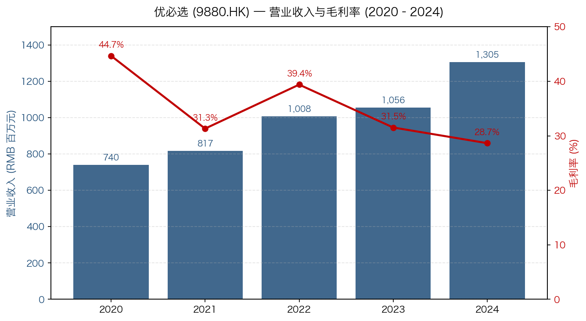
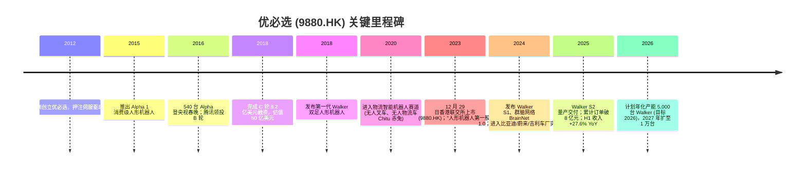
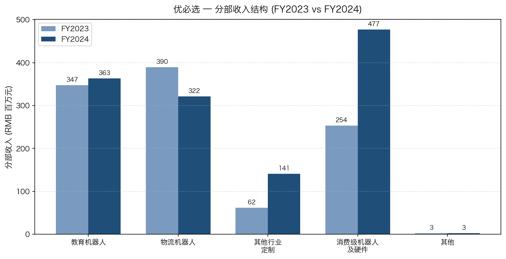
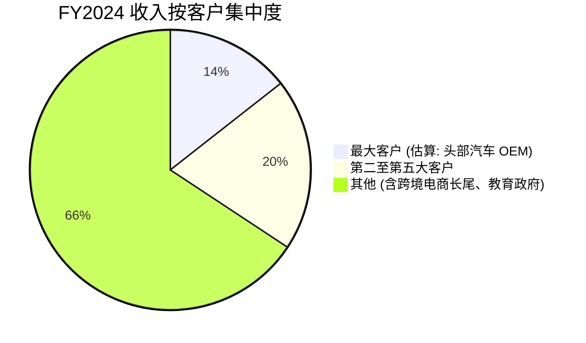
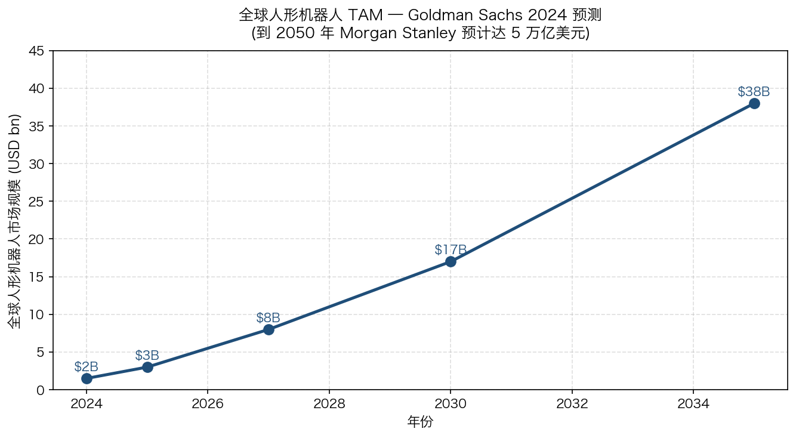
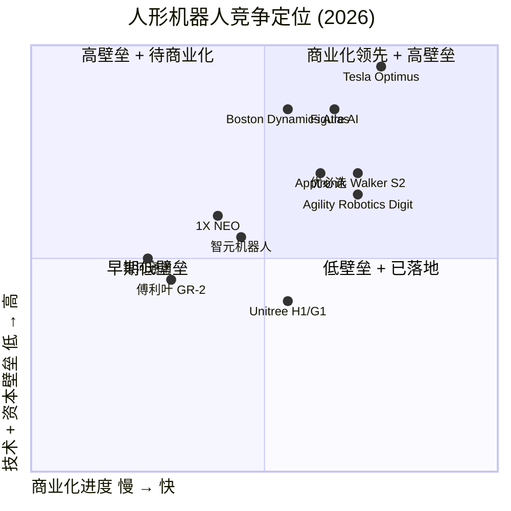

# 深圳市优必选科技股份有限公司 (UBTech Robotics, 9880.HK) — 公司研究报告

**报告日期：** 2026-05-20  **行业：** 人形机器人 / 具身智能 (humanoid robotics / embodied AI)  **市场：** 香港联交所主板 (H 股)

> **Update — Walker S2 进入小批量量产交付 (2025-11)：** 优必选宣布工业人形机器人 Walker S2 启动量产并交付首批数百台，2025 年至今 Walker 系列累计订单已超 8 亿元人民币 (约 1.12 亿美元)，是全球首个进入小批量商业化交付阶段的工业人形机器人产品。订单覆盖比亚迪、东风柳汽、吉利汽车、一汽大众青岛、奥迪一汽、北汽新能源、富士康、顺丰等多家头部客户。来源：[UBTECH Walker S2 Begins Mass Production and Delivery, 2025-11-20 (PR Newswire)](https://www.prnewswire.com/news-releases/ubtech-humanoid-robot-walker-s2-begins-mass-production-and-delivery-with-orders-exceeding-800-million-yuan-302616924.html)、[UBTech Walker S2 Mass Production — AI Business, 2025-11](https://aibusiness.com/robotics/chinese-company-completes-first-mass-humanoid-robot-delivery)。

---

## 目录

1. 公司概览
2. 公司历史
3. 管理团队
4. 产品与服务
5. 客户与上市策略 (Go-to-Market)
6. 行业概览
7. 竞争格局
8. 市场机会 (TAM)
9. 风险评估
10. 参考资料

======================================

## 1. 公司概览 (Company Overview)

深圳市优必选科技股份有限公司 (**UBTech Robotics**, 9880.HK；以下简称 "优必选" 或 "公司") 是一家全栈人形机器人 (humanoid robot) 与具身智能 (embodied AI) 公司，于 2012 年 3 月 31 日由周剑先生在深圳南山创立，并于 2023 年 12 月 29 日在香港联交所主板上市，成为 "人形机器人第一股"。公司股份代号为 **9880**，目前共发行约 4.31 亿股 H 股及内资股，注册办公地址位于深圳市南山区桃源街道学苑大道 1001 号南山智园 C1 栋 2201 室 ([优必选 2024 年度报告, 第 2-3 页](https://www1.hkexnews.hk/listedco/listconews/sehk/2025/0430/2025043003148.pdf))。

**主营业务：** 优必选围绕 "人形机器人 + 具身智能" 战略，构建了从舵机/伺服驱动器、机器人控制器、操作系统 (ROSA)、运动控制算法到整机本体与场景化解决方案的全栈自研能力。公司将自身收入披露划分为四大类 ([优必选 2024 年度报告, 第 15 页](https://www1.hkexnews.hk/listedco/listconews/sehk/2025/0430/2025043003148.pdf))：

| 分部 | FY2024 收入 (RMB mn) | 占比 | YoY |
|---|---|---|---|
| 教育智能机器人及智能机器人解决方案 | 363.4 | 27.8% | +4.6% |
| 物流智能机器人及智能机器人解决方案 | 321.7 | 24.7% | -17.5% |
| 其他行业定制智能机器人及智能机器人解决方案 | 140.7 | 10.8% | +126.1% |
| 消费级机器人及其他硬件设备 | 477.0 | 36.5% | +88.1% |
| 其他 (原材料/备件销售) | 2.6 | 0.2% | -9.5% |
| **合计** | **1,305.4** | **100%** | **+23.7%** |

值得注意的是，工业人形机器人 (Walker 系列) 的收入目前主要并入 "其他行业定制" 与 "物流" 两个分部按场景披露；公司在 2024 年报中并未将人形机器人单列收入科目 ([优必选 2024 年度报告, 第 15-16 页](https://www1.hkexnews.hk/listedco/listconews/sehk/2025/0430/2025043003148.pdf))。Walker S2 自 2025 年 11 月起进入小批量交付，预计 FY2026 起公司可能新增独立的人形机器人收入科目以反映商业化进展。

**地理布局：** 公司业务覆盖全球 50 余个国家与地区，无人物流方案已部署至全球 5 国 54 个城市 ([优必选 2024 年度报告, 第 10 页](https://www1.hkexnews.hk/listedco/listconews/sehk/2025/0430/2025043003148.pdf))；消费级机器人 (以 C20 智能猫砂盆为代表) 主要面向美国、加拿大、欧洲、澳大利亚、日韩、东南亚、中东等海外电商渠道 ([优必选 2024 年度报告, 第 11 页](https://www1.hkexnews.hk/listedco/listconews/sehk/2025/0430/2025043003148.pdf))。教育机器人海外业务覆盖 20 余国，触达深圳市近 900 所学校 ([同上, 第 9 页](https://www1.hkexnews.hk/listedco/listconews/sehk/2025/0430/2025043003148.pdf))。

**规模指标：** 截至 2024 年 12 月 31 日，公司资产总值人民币 51.34 亿元，资产净值 22.48 亿元；研发人员构成公司员工主体 (2024 年 1-12 月研发人员薪酬支出 4.06 亿元，占研发费用 85%) ([优必选 2024 年度报告, 第 14, 16 页](https://www1.hkexnews.hk/listedco/listconews/sehk/2025/0430/2025043003148.pdf))。截至 2024 年 12 月 31 日，公司累计授权专利 2,680 项，较 2023 年底新增 23.39%；H1 2025 末进一步增至 2,790 项 ([优必选 2024 年度报告, 第 8 页](https://www1.hkexnews.hk/listedco/listconews/sehk/2025/0430/2025043003148.pdf))、[优必选 2025 年中期报告, 第 11 页](https://www1.hkexnews.hk/listedco/listconews/sehk/2025/0912/2025091201298.pdf))。截至 2024 年末，公司已设立 41 个间接激励持股平台，共 678 名股权激励参与者 ([2024 年报, 第 81 页](https://www1.hkexnews.hk/listedco/listconews/sehk/2025/0430/2025043003148.pdf))，估算员工规模约 2,200 人 ([Yahoo Finance 9880.HK, 2026-05](https://finance.yahoo.com/quote/9880.HK/))。


*来源：[优必选 2024 年度报告, 第 14 页 (五年财务概要)](https://www1.hkexnews.hk/listedco/listconews/sehk/2025/0430/2025043003148.pdf)。*

**Valuation snapshot (截至 2026-05-19)：**

| 指标 | 数值 | 备注 |
|---|---|---|
| 收盘价 (HKD) | 110.80 | 前一交易日 113.10 |
| 52 周区间 (HKD) | 73.50 – 161.00 | 区间宽幅波动反映高 Beta |
| 总市值 (HKD) | 约 480 亿 | 约合 USD 61 亿 |
| **TTM P/E** | **n/a (亏损)** | FY2024 年内亏损 RMB 1,159.9 mn；H1 2025 仍亏 RMB 440.0 mn |
| **TTM P/S** | **约 30–35×** | 以 FY2024 收入 RMB 1.305 bn / H1 2025 同比 +27.6% 推算 |
| P/B | 约 20× | 资产净值 RMB 2.25 bn (FY24) |
| 12 个月分析师目标价均值 | 158.44 HKD | 12 位分析师 "强力买入"，最高 191.85、最低 126.53 |

来源：[Yahoo Finance 9880.HK, 2026-05-19](https://finance.yahoo.com/quote/9880.HK/)、[Investing.com 9880.HK 分析师一致预期](https://www.investing.com/equities/ubtech-robotics-consensus-estimates)、[东吴证券《优必选 (9880.HK)》深度, 2025-01](https://pdf.dfcfw.com/pdf/H3_AP202501271642599868_1.pdf)。

**估值解读：** 优必选 TTM 净利润为负 (FY2024 净亏损 RMB 11.6 亿元、H1 2025 净亏损 RMB 4.4 亿元)，因此 P/E 不适用。亏损主因 (i) 研发投入仍占收入约 36.6% (RMB 4.78 亿元) 用于人形机器人全栈技术；(ii) 销售费用占收入 40.1% (RMB 5.24 亿元) 用于消费级机器人海外渠道铺设与广告 (FY24 广告费 RMB 1.35 亿元，同比 +49%)；(iii) 因个别政府关联客户应收账款延期，信用减值损失 RMB 1.56 亿元 ([优必选 2024 年度报告, 第 16 页](https://www1.hkexnews.hk/listedco/listconews/sehk/2025/0430/2025043003148.pdf))。这是典型的 "烧钱型高增长 + 主题溢价" 组合：市场对公司估值的核心锚定是人形机器人 TAM (Goldman Sachs 预计 2035 年达 USD 380 亿、Morgan Stanley 预计 2050 年达 USD 5 万亿，详见第 8 章)，而非当前现金流。P/S 约 30× 显著高于沪深 300 信息技术板块约 4–6× 的中位数，需要 FY2026 起 Walker 系列实现年化 5,000 台产能与机器人收入快速放量来支撑 ([UBTECH Walker S2 Mass Production, 2025-11](https://www.prnewswire.com/news-releases/ubtech-humanoid-robot-walker-s2-begins-mass-production-and-delivery-with-orders-exceeding-800-million-yuan-302616924.html))。如果 2026–2027 年内未能兑现订单转化与单机毛利改善，估值压缩 (multiple compression) 是首要风险 (详见第 9 章)。

## 2. 公司历史 (Company History)

优必选的创业故事以创始人周剑先生 "卖房研发舵机" 的经历为标志。周剑 1976 年生于江苏南京，南京林业大学木材加工工程学士，1999 年毕业后在 Michael Weinig AG (德国家居建材自动化机械龙头) 亚太区任职。2007 年，他在上海创办优铠 (上海) 机械有限公司，从事高端建材工业自动化设备业务，积累了对运动控制与机电一体化的工程经验 ([优必选 2024 年度报告, 第 22 页](https://www1.hkexnews.hk/listedco/listconews/sehk/2025/0430/2025043003148.pdf))。2008 年北京奥运会与日本本田 ASIMO 的演示，使他萌生 "做中国人自己的双足机器人" 的想法。2012 年 3 月 31 日，他在深圳南山注册成立 "深圳市优必选科技有限公司" (英文：UBTech)，押注高性能伺服驱动器 (servo) 这一人形机器人最核心、当时被日本/瑞士企业垄断的零部件 ([优必选 2024 年度报告, 第 22 页](https://www1.hkexnews.hk/listedco/listconews/sehk/2025/0430/2025043003148.pdf))。

2013–2015 年，公司将舵机国产化降本至日企产品的约 1/5，并以此为基础推出第一代消费级人形机器人 Alpha 1 (2015)，迅速跻身全球消费/教育人形机器人头部。2016 年，公司携 540 台 Alpha 机器人登上央视春晚 (孙楠 "冲向巅峰" 节目)，完成大规模品牌曝光。同年腾讯领投 1 亿美元 B 轮融资。2018 年 5 月，公司宣布完成 C 轮融资 8.2 亿美元，估值达 50 亿美元，由腾讯、海尔、启明创投等参投，跻身 "全球独角兽榜"。



**关键战略转折：**

1. **2018–2020 年：从消费/教育转向工业人形机器人。** 公司意识到 ToC 玩具/教育市场天花板低 (单价低、复购弱)，决定将 "卖房研发的舵机能力" 上沉到工业级 Walker 双足平台。Walker 一代 2018 年发布，二代 (Walker 2) 2019 年在 CES 展出。这是公司命运最重要的押注。
2. **2020–2023 年：开辟物流智能机器人第二曲线。** 公司在 2020 年底进入物流智能机器人赛道，2021 年与天奇自动化工程 (SZSE:002009) 合资成立无锡优奇智能科技，借助天奇在汽车行业的客户网络快速放量；天奇直接及间接持有无锡优奇 30.46% 股权 ([优必选 2024 年度报告, 第 69-72 页](https://www1.hkexnews.hk/listedco/listconews/sehk/2025/0430/2025043003148.pdf))。这一合资为公司打开新能源汽车工厂这一关键客户入口。
3. **2023 年港股 IPO。** 2023 年 12 月 29 日，优必选以发行价 90 港元在港交所主板上市，募集净额约 9.84 亿港元，成为 "人形机器人第一股"。2023 年的一次性上市开支为 RMB 63.7 mn ([优必选 2024 年度报告, 第 16 页](https://www1.hkexnews.hk/listedco/listconews/sehk/2025/0430/2025043003148.pdf))。
4. **2024–2025 年：从 PoC 走向小批量量产。** Walker S 系列陆续进入比亚迪、东风柳汽、吉利、奥迪一汽、富士康、顺丰等工厂实训；2025 年 11 月 Walker S2 启动小批量交付，首批数百台、累计订单 8 亿元 ([UBTECH Walker S2 Mass Production, 2025-11](https://www.prnewswire.com/news-releases/ubtech-humanoid-robot-walker-s2-begins-mass-production-and-delivery-with-orders-exceeding-800-million-yuan-302616924.html))。

**近 12 个月关键发展：** (a) 2025 年 4 月 19 日，由优必选作为发起单位的北京人形机器人创新中心研发的 "天工 Ultra" 以 2 小时 40 分 42 秒夺得全球首个人形机器人半程马拉松冠军 ([优必选 2024 年度报告, 第 9 页](https://www1.hkexnews.hk/listedco/listconews/sehk/2025/0430/2025043003148.pdf)) — 重要的品牌曝光事件；(b) 2025 年 9 月披露 H1 2025 收入 RMB 621.5 mn (+27.6% YoY)，毛利 RMB 217.3 mn (+17.3% YoY) ([优必选 2025 年中期报告, 第 6 页](https://www1.hkexnews.hk/listedco/listconews/sehk/2025/0912/2025091201298.pdf))；(c) 治理结构重大变更：2025 年中期报告显示董事会重组，独立非执行董事更换为何佳教授、姚新先生、董秀琴女士、熊辉先生，并取消了原有监事会、由职工代表董事并入董事会 ([优必选 2025 年中期报告, 第 2 页](https://www1.hkexnews.hk/listedco/listconews/sehk/2025/0912/2025091201298.pdf))。

## 3. 管理团队 (Management Team)

### 周剑 (Zhou Jian) — 创始人、董事会主席兼行政总裁

周剑先生 (1976 年生，现年 48 岁) 是优必选无可争议的核心。他不仅是公司的创始人，也是公司**单一最大股东**——截至 2024 年 12 月 31 日，他直接持有公司内资股 33,186,040 股 (占内资股 29.41%、占总股本 7.69%)，并通过受控法团持有内资股 1,538,600 股；同时持有 H 股 70,400,000 股 (占 H 股 22.08%、占总股本 16.31%)，受控法团再持 H 股 13,000,000 股，合计实益持股约占公司总股本的 **27.7%**，是稳固的创始人控制 ([优必选 2024 年度报告, 第 85 页](https://www1.hkexnews.hk/listedco/listconews/sehk/2025/0430/2025043003148.pdf))。

**职业路径：** 周剑 1999 年毕业于南京林业大学木材加工工程专业，2000 年 5 月至 2005 年 12 月在德国家居建材自动化机械龙头 Michael Weinig AG 任亚太地区经理，深入接触工业自动化设备生产线。2007 年 11 月，他在上海自立门户，创办优铠 (上海) 机械有限公司，专注高端建材自动化设备制造与解决方案，主要客户是欧洲家具机械厂商。这段创业经历给了周剑两件关键资产：(i) 对运动控制、机电一体化的深厚 hands-on 工程理解；(ii) 一笔可用于二次创业的早期资金 (流传甚广的 "卖房创业" 故事即来自这一阶段) ([优必选 2024 年度报告, 第 22 页](https://www1.hkexnews.hk/listedco/listconews/sehk/2025/0430/2025043003148.pdf))。

2012 年 3 月 31 日，他在深圳南山注册成立优必选，并以伺服驱动器国产化为切入点。他的核心论断是：人形机器人最大的成本/技术瓶颈是舵机，而日本企业的舵机价格 (单台数千元) 不可能支撑大规模商业化；如果能把舵机做到几百元级并保证性能一致性，全栈人形机器人就有商业化窗口。这一论断后来被证明是正确的：到 2024 年，优必选的伺服驱动器、ACU 机器人核心控制器、UPilot 操作系统、ROSA 中间件均为自研，是中国 A 股/港股中**唯一**实现从底层电机、控制到整机闭环的人形机器人公司 ([优必选 2024 年度报告, 第 6-8 页](https://www1.hkexnews.hk/listedco/listconews/sehk/2025/0430/2025043003148.pdf))。

**社会身份与战略影响力：** 周剑于 2018 年 1 月当选广东省第十三届人大代表 (任期 5 年)，2018 年 11 月被选为 APEC 中国工商理事会青年企业家委员会委员，2019 年 5 月被深圳市认定为地方级人才，2019 年 7 月被深圳市人工智能产业协会评为 "智能机器人首席专家"。他也是 "全国人形机器人标准工作组" 副组长，主导/参与多项国家标准制定，包括《人形机器人技术要求》第 5 部分 (作业操作)、第 6 部分 (定位导航) 等 ([优必选 2024 年度报告, 第 22 页](https://www1.hkexnews.hk/listedco/listconews/sehk/2025/0430/2025043003148.pdf))、[优必选 2025 年中期报告, 第 8 页](https://www1.hkexnews.hk/listedco/listconews/sehk/2025/0912/2025091201298.pdf))。这种 "技术 + 产业政策 + 标准制定" 三位一体的影响力，是优必选在中国人形机器人赛道的独特资产。

**关键判断：** 周剑是创始人 CEO + 单一最大股东 + 行业话语权拥有者三位一体的组合，长期可信度较高。但他个人色彩极强 (公司战略基本由其拍板)，"key-man risk" 显著——任何因健康/政策原因导致他无法继续主导公司的事件，对估值都将构成实质冲击 (详见第 9 章)。

### 张鉅 (Zhang Ju) — 副总经理、首席财务官兼董事会秘书

张鉅先生 (1949 年生，现年 49 岁) 主要负责本集团整体财务及会计职能、董事会及资本市场事务。1998 年毕业于深圳大学国际会计专业 (经济学学士)，2003 年 11 月取得英国曼彻斯特理工大学及曼彻斯特大学会计与金融学硕士。职业路径横跨四大、跨国零售与上市公司 CFO：2000–2002 年在普华永道中天会计师事务所任高级审计员，2003 年短暂任沃尔玛 (中国) 投资有限公司财务经理，2004–2006 年任北京希格瑪晶华微电子财务总监，2006 年 7 月至 2017 年 12 月在**海能达通信** (SZSE:002583，专网通信龙头) 担任董事、副总经理、首席财务官兼董事会秘书 (11 年)，2020 年 1 月获深圳市认定为储备专业人才 ([优必选 2024 年度报告, 第 30-31 页](https://www1.hkexnews.hk/listedco/listconews/sehk/2025/0430/2025043003148.pdf))。

**关键解读：** 张鉅在海能达 11 年的公开市场 CFO 经验，是优必选 2023 年港股 IPO 落地的关键能力支撑。海能达本身也是 SZSE 上市的科技硬件公司，与优必选的资本市场叙事高度类似——这种 "从已上市硬科技公司带来现成 CFO" 的安排，在中国硬科技 IPO 中是高频组合。需要观察的是：海能达 2022 年后因美国出口管制和 Motorola 知识产权诉讼陷入困境，张鉅离任前任职期内的部分公司治理事件 (如重大诉讼披露时点)，是港股市场审视优必选治理质量时会重新打量的样本。

### 熊友军 (Xiong Youjun) — 执行董事、首席技术官兼副总经理

熊友军先生 (1979 年生，现年 46 岁) 负责公司技术研发管理。1999 年武汉汽车工业大学 (现武汉理工大学) 汽车及发动机工学学士，2002 年武汉理工大学动力机械及工程硕士，2005 年华中科技大学机械设计及理论博士。2012 年 6 月 10 日加入公司任 CTO，2022 年 12 月调任执行董事。2018 年获深圳市后备级专业人才，2017–2022 年担任深圳南山区政协委员 ([优必选 2024 年度报告, 第 22-23 页](https://www1.hkexnews.hk/listedco/listconews/sehk/2025/0430/2025043003148.pdf))。熊在公司技术深度积累 13 年，是 Walker 系列和 BrainNet 群脑网络等核心研发的关键人物。其华科机械学博士背景对应公司在伺服驱动器/灵巧手等机电系统层面的核心壁垒。

### 王琳 (Wang Lin) — 执行董事、总经理办公室负责人

王琳女士 (1976 年生) 是周剑创业的早期同行者：2008–2012 年在周剑之前公司优铠 (深圳) 机械任总经理助理，2012 年随周剑创立优必选，担任行政总裁助理，2022 年 12 月调任执行董事。2010 年获英国伦敦大学玛丽王后学院国际金融管理硕士。她是公司股权激励持股平台 "深圳进化论" 及全部 41 个间接激励持股平台的**唯一普通合伙人**，这意味着她代行公司核心员工持股的投票权 (8.62% 已发行股份) — 她本人及受控法团另持有约 13.91% H 股权益 ([优必选 2024 年度报告, 第 24-25, 80, 85 页](https://www1.hkexnews.hk/listedco/listconews/sehk/2025/0430/2025043003148.pdf))。她担任公司近 30 家境内附属公司的执行董事 — 是典型的 "创始团队亲信 + 治理结构枢纽" 角色。

### 公司治理 (Governance footer)

- **股权高度集中。** 截至 2024-12-31，周剑实益持股约 27.7%；战略股东包括夏佐全先生 (比亚迪联合创始人，原比亚迪执行董事兼副总裁；持股约 4.84%，配偶杨志莲女士配偶权益对等)、腾讯控股 (5.95%)、Image Frame (Tencent 投资，5.13%)、启明创投 QM25 Limited / Qiming Venture Partners IV (5.20%) ([优必选 2024 年度报告, 第 85 页](https://www1.hkexnews.hk/listedco/listconews/sehk/2025/0430/2025043003148.pdf))。
- **2025 年董事会重组：** H1 2025 中期报告显示原独立非执行董事赵杰、熊楚熊、潘福全、梁伟民全部更换为何佳教授 (薪酬委员会主席)、姚新先生、董秀琴女士 (审核委员会主席)、熊辉先生 (提名委员会主席)；原非执行董事陈强先生由陆宽先生取代；监事会被取消，劉明先生作为职工代表董事并入董事会 ([优必选 2025 年中期报告, 第 2 页](https://www1.hkexnews.hk/listedco/listconews/sehk/2025/0912/2025091201298.pdf))。此次治理结构调整规模较大，需要后续年报披露动因与权责细节。
- **关联交易显著：** 公司与无锡优奇 (天奇自动化 30.46% 股权方) 之间的"持续关联交易"是物流业务的重要收入来源，公司在 2024 年报第 69-78 页详细披露了多份关联框架协议，并已根据上市规则第 14A 章申报；这一安排既是物流业务客户网络的关键，也是公司治理需要持续审视的领域 ([优必选 2024 年度报告, 第 69-78 页](https://www1.hkexnews.hk/listedco/listconews/sehk/2025/0430/2025043003148.pdf))。
- **审计师：** 普华永道中天会计师事务所 (特殊普通合伙)。
- **股权激励：** 公司 H 股激励计划上限为发行日股份总数 10% (即 41,814,282 股 H 股，占当前股本 9.47%)，已设立 41 个间接激励持股平台、678 名参与者 ([优必选 2024 年度报告, 第 80-83 页](https://www1.hkexnews.hk/listedco/listconews/sehk/2025/0430/2025043003148.pdf))。

### 管理团队综合判断

优必选的管理团队具有 "强创始人 + 国资 IPO/A 股背景 CFO + 自研技术博士 CTO + 长期合伙人董秘" 的清晰组合，过去 13 年完成了 (i) 伺服驱动器国产化、(ii) Alpha 系列商业化、(iii) Walker 双足平台从 0 到 1、(iv) 港股 IPO、(v) Walker S2 进入小批量量产五大里程碑，**执行力可信度高**。短板在于：(a) 周剑 key-man 集中度过高；(b) 治理上多年依赖关联交易获取关键客户网络；(c) 2025 年董事会重组背后的动因尚未公开披露，需要持续跟踪。

## 4. 产品与服务 (Products & Services)

优必选官网 (www.ubtrobot.com) 的产品矩阵覆盖 5 大产品线，下文按 2024 年报披露口径分组并补充每一项的竞争优势判断。

```mermaid
graph TD
  A[优必选 UBTech] --> B[1. 人形机器人 Walker 系列]
  A --> C[2. 教育 & 通用机器人]
  A --> D[3. 物流智能机器人]
  A --> E[4. 行业定制 & 商用服务]
  A --> F[5. 消费级机器人 / 智能硬件]

  B --> B1[Walker S — 1 代工业]
  B --> B2[Walker S1 — 2024 二代]
  B --> B3[Walker S2 — 2025 三代, 热插拔自主换电]
  B --> B4[天工 Ultra — 北京人形机器人创新中心]

  C --> C1[Alpha 系列 — 教育/消费桌面]
  C --> C2[UGOT 多拟态 AI 教育机器人]
  C --> C3[AperBot M1 轮式教育机器人 + 5 款实训平台]
  C --> C4[CreaBot 多场景服务机器人]
  C --> C5[行知 PaaS 平台 + UDECA 开源软硬件]

  D --> D1[瓦力 F3000 双驱重载无人叉车 3.5t]
  D --> D2[瓦力 T8000 室外牵引机器人 8t]
  D --> D3[Chitu 赤兔 L4 无人物流车]
  D --> D4[ACU 控制器 + UPilot 操作系统]

  E --> E1[商用服务一体式机器人]
  E --> E2[Cadebot 悠宝智能递送机器人]
  E --> E3[智慧康养机器人解决方案 — 优悠等]

  F --> F1[空气萝卜 C20 智能猫砂盆 — 跨境爆品]
  F --> F2[宠物吸毛器/智能冰箱餵食器 F10]
  F --> F3[M10 无边界智能割草机]
  F --> F4[PC10 泳池机器人]
  F --> F5[V10 智能扫地机器人]
```



### 4.1 工业人形机器人 — Walker 系列 (**核心产品、估值锚定**)

Walker 系列是优必选估值的根本来源。Walker S2 (2025) 是第三代工业人形机器人，关键规格：52 自由度仿生躯体、0–1.8 米全空间作业范围、15kg 负载、±162° 腰部旋转、3 分钟自主换电、7×24 小时连续作业；搭载第四代灵巧手 (指尖承载力较前代提升 100% 至 12.5N，拇指主动自由度新增展平与对捏手势) ([优必选 2025 年中期报告, 第 9 页](https://www1.hkexnews.hk/listedco/listconews/sehk/2025/0912/2025091201298.pdf))。

**目标客户：** 新能源汽车终装/总装、3C 电子工厂、电池产线 — 用于自主搬运、质量检查、过程材料操作、零件安装、SPS (Set Part Supply) 分拣等高重复性任务。

**定价：** 公司未公开单台 ASP。参考行业可比 (Apptronik Apollo 目标 "小于一辆车价格"、约 USD 50K；Unitree G1 起价 USD 16K)，结合 Walker S2 累计订单 8 亿元/数百台首批量产规模反推，单台 ASP 估算在 RMB 100 万元上下区间——但**这是估算，不是公司披露**。

**竞争优势判断：** **有 — 多维护城河 (技术 + 标准 + 客户网络)**。
- **技术 IP：** 全栈自研 (伺服驱动器、ACU 控制器、UPilot OS、ROSA v2 中间件、BrainNet 2.0 + Co-Agent)；累计授权专利 2,790 项 (H1 2025) ([优必选 2025 年中期报告, 第 11 页](https://www1.hkexnews.hk/listedco/listconews/sehk/2025/0912/2025091201298.pdf))。
- **标准制定：** "全国人形机器人标准工作组" 副组长，主导多项国家标准 — 是国内同行难以复制的资源。
- **客户网络：** 全球首份工业具身智能人形机器人小批量采购合同；已进入比亚迪、东风柳汽、吉利、奥迪一汽、富士康、顺丰、北汽新能源等头部客户工厂实训 ([UBTECH Walker S2 Mass Production, 2025-11](https://www.prnewswire.com/news-releases/ubtech-humanoid-robot-walker-s2-begins-mass-production-and-delivery-with-orders-exceeding-800-million-yuan-302616924.html))。
- **最接近的竞品对比：** Figure AI Figure 03 (BMW Spartanburg 试点)、Apptronik Apollo (Mercedes-Benz 欧洲工厂)、Agility Digit (Amazon 仓储)；中国对手包括宇树科技 Unitree H1/G1、银河通用、智元机器人、傅利叶智能 GR-2；后端壁垒高。Walker S2 在 (i) 自主换电、(ii) 全身 52 DoF、(iii) 中国汽车终装客户深度上**领先**于 Unitree G1 (更偏研究 + 消费)；与 Figure/Apptronik 仍处**追赶**地位 (后者拥有 OpenAI/Microsoft/Jeff Bezos 等资本与北美汽车客户)。

### 4.2 教育智能机器人及解决方案

公司在 FY2024 收入 RMB 363.4 mn (占比 27.8%、YoY +4.6%)；H1 2025 同比 +48.8% 至 RMB 239.8 mn — 是 H1 2025 最大的增长引擎 ([优必选 2024 年度报告, 第 15 页](https://www1.hkexnews.hk/listedco/listconews/sehk/2025/0430/2025043003148.pdf))、[优必选 2025 年中期报告, 第 7 页](https://www1.hkexnews.hk/listedco/listconews/sehk/2025/0912/2025091201298.pdf))。

**产品线：** UGOT 多拟态 AI 教育机器人 (2024 获德国 iF 设计金质奖 + 红点至尊奖)、AperBot M1 轮式教育机器人、CreaBot 多场景服务机器人 (七大功能组件)、UDECA 开源软硬件库、行知 PaaS 平台、人工智能在线教育平台 (已纳入深圳市中小学 AI 教育学习资源，触达近 900 所学校) ([优必选 2024 年度报告, 第 9 页](https://www1.hkexnews.hk/listedco/listconews/sehk/2025/0430/2025043003148.pdf))。

**目标客户：** K12 学校、职业院校、地方政府 (青少年人工智能与机器人科技创新教育基地)。2025 上半年在宜兴、龙胜、宿迁、阳泉四地启动 "青少年 AI 与机器人科创教育基地" 建设 ([优必选 2025 年中期报告, 第 11 页](https://www1.hkexnews.hk/listedco/listconews/sehk/2025/0912/2025091201298.pdf))。

**竞争优势：部分。** 教育机器人是公司最早的现金牛、品牌积累深厚 (春晚效应)、地方政府渠道扎实；但 K12 教育机器人市场分散，公司与乐高教育、科大讯飞、能力风暴等竞争，**没有压倒性技术壁垒**。

### 4.3 物流智能机器人 (无人叉车 + 无人物流车)

FY2024 收入 RMB 321.7 mn (占比 24.7%、YoY -17.5%)，下滑主因部分签约项目年底未完成交付验收 ([优必选 2024 年度报告, 第 15 页](https://www1.hkexnews.hk/listedco/listconews/sehk/2025/0430/2025043003148.pdf))。核心产品：

- **瓦力 F3000：** 双驱重载无人叉车，3.5 吨最大载重 — 在叉车行业属于重载级。
- **瓦力 T8000：** 室外牵引机器人，8 吨负载 — 填补超重载物料搬运空白。
- **Chitu 赤兔 L4 无人物流车：** 无人物流车，已在工业园区作业里程突破 13,000km；在头部新能源汽车工厂实现仓储空间利用率提升 13% ([优必选 2024 年度报告, 第 10 页](https://www1.hkexnews.hk/listedco/listconews/sehk/2025/0430/2025043003148.pdf))、[优必选 2025 年中期报告, 第 10 页](https://www1.hkexnews.hk/listedco/listconews/sehk/2025/0912/2025091201298.pdf))。

**目标客户：** 新能源汽车工厂 (头部车企复购)、轮胎工厂、新能源电池产线、3C 工厂、电商/3PL。已覆盖全球 5 国 54 个城市。

**竞争优势：部分。** 主要靠与天奇自动化 (002009.SZ，汽车工厂智能装备龙头) 的合资 "无锡优奇" 切入汽车客户网络。直接竞品包括 极智嘉 Geek+ (HKEX:02590)、海康机器人 (Hai-Robotics)、快仓、未来机器人、海柔创新等更专注的物流机器人公司。优必选在重载叉车与无人物流车上的技术积累不错，但客户网络的可持续性依赖关联交易，独立性弱。

### 4.4 其他行业定制 (商用 + 康养)

FY2024 收入 RMB 140.7 mn (占比 10.8%、YoY +126.1%) — 增速最快、主因 "新应用场景 + 人形机器人销量增加" ([优必选 2024 年度报告, 第 15 页](https://www1.hkexnews.hk/listedco/listconews/sehk/2025/0430/2025043003148.pdf))。产品包括商用服务机器人 (整合轮式 + 人形)、Cadebot 悠宝智能递送机器人 (获 iF 产品设计奖)、智慧康养机器人解决方案 (导入 DeepSeek + AI Agent 架构) ([优必选 2024 年度报告, 第 11 页](https://www1.hkexnews.hk/listedco/listconews/sehk/2025/0430/2025043003148.pdf))。**竞争优势：弱**，更多是机会型订单，缺乏长期粘性。

### 4.5 消费级机器人及智能硬件

FY2024 收入 RMB 477.0 mn (占比 36.5%、YoY +88.1%)，已成为公司**最大单一分部**，但**毛利率最低**——公司明确指出 "消费级机器人收入占比提升而其毛利相对较低" 是 FY2024 整体毛利率从 31.5% 降至 28.7% 的主因 ([优必选 2024 年度报告, 第 16 页](https://www1.hkexnews.hk/listedco/listconews/sehk/2025/0430/2025043003148.pdf))。

爆品矩阵：(i) 空气萝卜 C10/C20 智能猫砂盆 — 跨境爆品，国内天猫/京东品类头部 (获寵物行业白皮书 2024 创新品牌奖)、(ii) M10 无边界智能割草机、(iii) PC10 泳池机器人、(iv) 智能冰箱餵食器 F10、(v) V10 强吸扫地机器人、(vi) 宠物吸毛器 ([优必选 2024 年度报告, 第 11 页](https://www1.hkexnews.hk/listedco/listconews/sehk/2025/0430/2025043003148.pdf))。市场布局以海外为主：美国、加拿大、欧洲、澳大利亚、日韩、东南亚、中东等市场，渠道为经销商体系 + 海外电商平台。

**竞争优势：弱。** 消费级智能硬件是红海，与 PetKit、Whisker (Litter-Robot)、Roborock、Worx (Landroid 割草机)、iRobot 等竞争；优必选的优势在于产品创新速度与机器人核心硬件 (舵机/电机) 的成本曲线，但难以形成结构性壁垒。这一分部更像是"利用现有供应链分担研发成本"的现金流补充，而非长期高毛利来源。

### 4.6 旗舰产品与产品线判断

| 优先级 | 分部 | 战略定位 | 投资逻辑 |
|---|---|---|---|
| **1 (旗舰)** | Walker 工业人形机器人 | 公司未来估值核心 | TAM 巨大 (USD 38B/2035)，公司全栈自研 + 标准制定者优势 |
| 2 | 教育智能机器人 | 现金流压舱石 + 政府渠道 | 增长稳定 (+4.6%) ，品牌护城河 |
| 3 | 物流智能机器人 | 工业客户入口 + Walker 系列协同 | 依赖天奇关联交易，独立性弱 |
| 4 | 消费级机器人 | 现金流补充 + 供应链利用 | 收入大但毛利低，无长期壁垒 |
| 5 | 行业定制 (康养/商用) | 机会型订单 | 不构成长期主线 |

**近 12 个月产品发布与下线：** (i) Walker S2 量产 (2025-Q4)、(ii) 第四代灵巧手发布、(iii) BrainNet 2.0 + Co-Agent 架构、(iv) UGOT 与 AperBot M1 教育新品、(v) PC10 泳池机器人、C20 第二代猫砂盆、F10 智能餵食器等消费新品。未公开重大产品下线 ([优必选 2024 年度报告, 第 6-13 页](https://www1.hkexnews.hk/listedco/listconews/sehk/2025/0430/2025043003148.pdf))、[优必选 2025 年中期报告, 第 8-12 页](https://www1.hkexnews.hk/listedco/listconews/sehk/2025/0912/2025091201298.pdf))。


*来源：[优必选 2024 年度报告, 第 15 页](https://www1.hkexnews.hk/listedco/listconews/sehk/2025/0430/2025043003148.pdf)。*

## 5. 客户与上市策略 (Customers & Go-to-Market)

### 客户分部 (Customer segments)

优必选的客户结构呈现 "B 端工业大客户 (汽车/3C/电池) + B 端政府教育 + C 端跨境电商" 的多元化分布。在 B 端，**新能源汽车终装** 是公司战略级的客户群——周剑公开把 Walker 系列定位为 "为工业应用场景的真实需求设计"，已签约公开的工业客户包括：**比亚迪、东风柳汽、吉利汽车、一汽大众青岛、奥迪一汽、北汽新能源、富士康、顺丰** ([UBTECH Walker S2 Mass Production, 2025-11](https://www.prnewswire.com/news-releases/ubtech-humanoid-robot-walker-s2-begins-mass-production-and-delivery-with-orders-exceeding-800-million-yuan-302616924.html))、[UBTECH 工业应用解决方案 — 公司官网](https://www.ubtrobot.com/en/humanoid/solutions))。

此外，公司与**蔚来汽车** F2 制造基地合作，Walker S 在终装工位完成"全球首例人形机器人与工人协同完成汽车装配与质检"的应用 ([UBTECH 工业应用解决方案](https://www.ubtrobot.com/en/humanoid/solutions))。

### 客户集中度 (Customer concentration — REQUIRED)

公司 2024 年度报告第 65 页明确披露 ([优必选 2024 年度报告, 第 65 页](https://www1.hkexnews.hk/listedco/listconews/sehk/2025/0430/2025043003148.pdf))：

| | FY2024 | FY2023 | 趋势 |
|---|---|---|---|
| 最大客户占总收入 | **14.4%** | 27.8% | **下降** (-13.4 pp) |
| 五大客户占总收入 | **34.3%** | 53.4% | **下降** (-19.1 pp) |
| 最大供应商占采购 | 8.5% | 9.7% | 略降 |
| 五大供应商占采购 | 24.9% | 29.9% | 略降 |

**关键判断：客户集中度从 "高" 显著降至 "中等"。** FY2023 时五大客户占收入超过 50%，达到《公司研究》通用界定的 "材料重大风险" 阈值；但 FY2024 该比例降至 34.3%，最大客户从 27.8% 砍到 14.4%，主要驱动因素是：(i) 消费级机器人 (跨境电商，长尾客户) 收入占比从 24.0% 升至 36.5%，自然稀释 B 端集中度；(ii) 工业人形机器人客户从单一头部 (推测 2023 年的 27.8% 大客户为某新能源车企) 扩展至 8+ 客户，每家份额不超过 15%。这是积极的结构性变化。

**披露盲区：** 公司**未公开点名**最大客户具体身份；五大客户/五大供应商均未具名。董事会报告仅声明 "概无董事或股东 5% 以上的关联人在五大客户/供应商中有重大权益" ([优必选 2024 年度报告, 第 65 页](https://www1.hkexnews.hk/listedco/listconews/sehk/2025/0430/2025043003148.pdf))。结合公开新闻 (比亚迪、吉利、蔚来、东风柳汽等)，可推测最大客户在汽车 OEM/Tier-1 之中，但无法精确归属。



*来源：[优必选 2024 年度报告, 第 65 页 — 主要客户及供应商](https://www1.hkexnews.hk/listedco/listconews/sehk/2025/0430/2025043003148.pdf)。*

### 合同结构与关联交易

公司物流业务的客户网络相当一部分来自与天奇自动化 (SZSE:002009) 合资的**无锡优奇智能科技**。2023 年 11 月 23 日签订的项目工程服务及产品框架协议覆盖至 2025-12-31，无锡优奇向天奇自动化提供智能机器人及解决方案；2024 年 12 月 9 日又新增采购框架协议，期限自 2024-11-01 至 2025-12-31 ([优必选 2024 年度报告, 第 69-72 页](https://www1.hkexnews.hk/listedco/listconews/sehk/2025/0430/2025043003148.pdf))。

2024 年 5 月 21 日，北京优必选与天奇自动化签订 RMB 30 mn 的技术服务合同 (开发人形机器人在汽车产线上的应用软件及算法)，但于 2024 年 11 月经协商终止，**项下交易未实际进行** ([优必选 2024 年度报告, 第 75 页](https://www1.hkexnews.hk/listedco/listconews/sehk/2025/0430/2025043003148.pdf))。这笔被终止的关联交易需要进一步关注——可能反映双方在人形机器人对汽车工厂的商业模式仍在博弈。

### 分销渠道与销售战略

公司销售网络是 "直销 + 经销" 的混合：(i) **直销** — 工业人形机器人 (Walker 系列) 直接对接车企/3C 头部客户的研发/制造部门；教育机器人对接学校与省市教育局；(ii) **经销 + 海外电商** — 消费级机器人通过亚马逊、京东、天猫等电商及海外经销商分发。2024 年广告及推广开支 RMB 135.4 mn (同比 +49.0%)，主要用于消费级机器人海外渠道铺设 ([优必选 2024 年度报告, 第 16 页](https://www1.hkexnews.hk/listedco/listconews/sehk/2025/0430/2025043003148.pdf))。

### 销售周期

- **工业人形机器人：** 销售周期长，6–18 个月 (POC → 实训 → 小批量采购 → 量产订单)，毛利估算高于 30% 但单价昂贵 (估算 RMB 100 万级/台)。
- **教育机器人：** 政府/学校采购周期 3–6 个月，毛利高 (估算 40%+)，订单可重复。
- **消费级机器人：** 电商即时销售，单台价格 USD 200–1,500 区间，毛利低 (估算 20–25%)。

### 战略伙伴

- **天奇自动化 (SZSE:002009)** — 物流业务的关键客户网络。
- **腾讯 (HKEX:0700)** — 战略投资人，5.95% 股权，可能在大模型/云能力上协同。
- **启明创投 (Qiming Venture Partners)** — 5.20% 股权，长期财务投资人 (周志峰先生为非执行董事兼启明主管合伙人) ([优必选 2024 年度报告, 第 26, 85 页](https://www1.hkexnews.hk/listedco/listconews/sehk/2025/0430/2025043003148.pdf))。
- **比亚迪 (HKEX:01211)** — 公司非执行董事夏佐全先生为比亚迪联合创始人 (非执董)；比亚迪也是 Walker S 的工厂客户 (披露见公开报道)；这是 "双向利益绑定" 的产业资本。
- **DeepSeek** — 公司公开披露已将 DeepSeek-R1 深度推理技术应用于群脑网络 2.0 的多模态推理大模型，是优必选 AI 大脑的关键外部依赖 ([优必选 2024 年度报告, 第 12 页](https://www1.hkexnews.hk/listedco/listconews/sehk/2025/0430/2025043003148.pdf))。
- **车联天下** — 联合开发具身智能控制器 ([优必选 2024 年度报告, 第 10 页](https://www1.hkexnews.hk/listedco/listconews/sehk/2025/0430/2025043003148.pdf))。
- **吉速物流** — "硬件+软件+服务+运营" 集成化交付合作 ([同上](https://www1.hkexnews.hk/listedco/listconews/sehk/2025/0430/2025043003148.pdf))。

### 公开客户案例

- **比亚迪：** Walker S1 进入比亚迪工厂执行搬运任务 ([UBTECH 工业应用解决方案](https://www.ubtrobot.com/en/humanoid/solutions))。
- **蔚来汽车 F2 工厂：** Walker S 部署在终装工位，与工人协同完成汽车装配与质检——全球首例 ([同上](https://www.ubtrobot.com/en/humanoid/solutions))。
- **东风柳汽、吉利、奥迪一汽、富士康、顺丰：** Walker S 系列已进入实训或采购流程 ([UBTECH Walker S2 Mass Production, 2025-11](https://www.prnewswire.com/news-releases/ubtech-humanoid-robot-walker-s2-begins-mass-production-and-delivery-with-orders-exceeding-800-million-yuan-302616924.html))。
- **头部新能源汽车客户：** 复购 Chitu 赤兔 L4 无人物流车，仓储空间利用率提升 13% ([优必选 2024 年度报告, 第 10 页](https://www1.hkexnews.hk/listedco/listconews/sehk/2025/0430/2025043003148.pdf))。

## 6. 行业概览 (Industry Overview)

### 行业定义

优必选所处的核心赛道是**人形机器人 (humanoid robotics)**，更广义的归类是**具身智能 (embodied AI)**——即将 AI 算法嵌入到能与物理世界交互的实体形态 (机器人本体) 中。在中国统计口径下，对应国民经济行业分类的 "智能机器人制造" 与 "智能制造装备制造" (中国证监会行业分类 C3915 智能消费设备制造、C3491 工业机器人制造、C3492 特种机器人制造)。在美国 NAICS 体系下，对应 333995 (Service Industry Machinery Manufacturing — 服务/工业机器人混合) 和 334515 (Instrument Manufacturing for Measuring and Testing Electricity)。

人形机器人通常细分为：(i) **工业人形机器人** (双足、双臂、手指灵巧操作，进入工厂作业)、(ii) **服务/商用人形机器人** (酒店、医疗、家庭)、(iii) **特种人形机器人** (军事、消防、危险作业)、(iv) **教育/消费人形机器人** (Alpha 类台式/桌面机器人，TAM 较小)。

### 市场规模与增长

**全球市场规模 (TAM)：** 第三方研究机构对人形机器人 TAM 的预测分歧巨大，但**方向一致：未来 10–25 年是 10–100 倍级别的增长曲线**：

| 机构 | 预测 | 时点 | 来源 |
|---|---|---|---|
| Goldman Sachs | USD 380 亿、1.4 mn 单元出货 | 2035 | [Goldman Sachs Insights, 2024-01](https://www.goldmansachs.com/insights/articles/the-global-market-for-robots-could-reach-38-billion-by-2035) |
| Morgan Stanley | USD 5 万亿 (含本体+供应链+服务，近 10 亿台) | 2050 | [Morgan Stanley Insights, 2025-02](https://www.morganstanley.com/insights/articles/humanoid-robot-market-5-trillion-by-2050) |
| Morgan Stanley | USD 3,050 亿 (人形机器人半导体 TAM) | 2045 | [Yahoo Finance/Morgan Stanley, 2025](https://finance.yahoo.com/news/morgan-stanley-projects-humanoids-chip-152056208.html) |
| MarketsandMarkets | USD 152.6 亿、CAGR 39.2% | 2030 (从 2025 年 USD 29.2 亿) | [MarketsandMarkets Humanoid Robot Report](https://www.marketsandmarkets.com/Market-Reports/humanoid-robot-market-99567653.html) |

值得注意的是，**Goldman 在 2024 年将原 2030 预测 USD 60 亿大幅上修至 USD 380 亿 (2035)**，主要驱动因素是 (i) BOM 成本下降快于预期 (Tesla Optimus 量产路径)、(ii) AI 大模型让通用作业能力成为可能、(iii) 全球劳动力短缺与人口老龄化加剧。Morgan Stanley 的 USD 5 万亿 (2050) 数字包含整个生态系统，是当前最激进的长期预测之一 ([Morgan Stanley, 2025-02](https://www.morganstanley.com/insights/articles/humanoid-robot-market-5-trillion-by-2050))。

**中国市场：** 中国是全球最大的工业机器人市场 (2024 年安装量约占全球 50%+，IFR 数据)。中国 "智能机器人" 和 "具身智能" 首次被写入 2025 年《政府工作报告》([优必选 2024 年度报告, 第 12 页](https://www1.hkexnews.hk/listedco/listconews/sehk/2025/0430/2025043003148.pdf))；工信部 2024 年印发《人形机器人创新发展指导意见》提出 2025 年初步建立创新体系、2027 年综合实力达到国际先进水平。


*来源：[Goldman Sachs Insights, 2024-01](https://www.goldmansachs.com/insights/articles/the-global-market-for-robots-could-reach-38-billion-by-2035)、[Morgan Stanley, 2025-02](https://www.morganstanley.com/insights/articles/humanoid-robot-market-5-trillion-by-2050)。*

### 关键驱动因素

1. **AI 大模型的临界点 (2022–2025)。** GPT/Claude/DeepSeek-R1 等大模型让 "通用任务规划 + 语义理解" 在硬件之外成为可能，是人形机器人从"特定动作演示"跨入"通用作业"的关键拐点。优必选的 BrainNet 2.0 + Co-Agent 架构便基于 DeepSeek-R1 ([优必选 2024 年度报告, 第 12 页](https://www1.hkexnews.hk/listedco/listconews/sehk/2025/0430/2025043003148.pdf))。
2. **BOM 成本曲线快速下行。** 关键零部件 (无框电机、谐波减速器、行星滚柱丝杠、力矩传感器、靈巧手) 因中国供应链规模化与新能源汽车产业溢出，价格在 2022–2025 年下降 50%+，将单台 BOM 从 USD 50–80K 推向 USD 20–30K 区间。
3. **全球劳动力短缺与老龄化。** 美国、日本、德国、中国 (人口拐点 2022 年) 的制造业蓝领人力供给恶化，老龄化护理需求增加，使人形机器人具备替代经济性。
4. **政府产业政策助推。** 中国 (《人形机器人创新发展指导意见》、新一代人工智能规划)、美国 (CHIPS Act 周边的机器人投资)、日本 (Moonshot)、韩国 (K-Robot 战略) 形成全球性资本/政策驱动。
5. **特斯拉 Optimus 与 Figure 等北美玩家的示范效应。** 头部上市公司的高调投入吸引大量资本、人才与供应链进入赛道。

### 监管环境

(i) **国家标准：** 中国全国机器人标准化技术委员会 2024–2025 年组建人形机器人标准工作组，正在制定《人形机器人技术要求》系列国家标准 (第 1–7 部分)，覆盖术语、整机性能、安全、作业操作、定位导航、人机交互。优必选是该工作组**副组长** ([优必选 2025 年中期报告, 第 8 页](https://www1.hkexnews.hk/listedco/listconews/sehk/2025/0912/2025091201298.pdf))。
(ii) **安全合规：** 工业人形机器人在车厂作业适用 ISO 10218-1/2 (工业机器人安全)、ISO/TS 15066 (协作机器人) 与中国 GB/T 36008 等标准。
(iii) **数据 / AI 监管：** 国家网信办《生成式人工智能服务管理暂行办法》(2023)、《数据出境安全评估办法》对人形机器人涉及的视觉/语义数据采集与海外传输构成约束。
(iv) **出口管制：** 高端 AI 芯片 (H100/H200/H20 等) 出口至中国受美国出口管制；这影响优必选 Walker 系列在大模型推理算力上的硬件选型。

### 行业结构

- **集中度：极低，处于早期阶段。** 全球工业人形机器人 2025 年出货量估算不超过 3 万台，前五大玩家合计份额仍 < 50%。中国玩家 (优必选、宇树 Unitree、智元、银河通用、傅利叶) 累计份额或与北美 (Figure、Apptronik、Tesla Optimus、1X、Agility) 平分秋色。
- **进入壁垒：高。** 需要 (i) 伺服驱动器/灵巧手/控制器全栈能力；(ii) 大模型与运动控制算法融合能力；(iii) 工业客户网络与场景 know-how；(iv) 巨额且长期的研发烧钱能力 (Figure 已融资 USD 1.5 bn+、Apptronik USD 400 mn+ 2025 年 B 轮)。
- **替代品威胁：中。** 传统协作机器人 (UR / 节卡 / 越疆) + AGV/AMR 仍可在大量工厂任务中替代人形机器人，前提是任务高度结构化、不需要双足通过性。
- **供应商议价权：中等偏强。** 谐波减速器 (绿的谐波、哈默纳科)、行星滚柱丝杠 (恒立液压、长盛轴承)、力矩传感器 (柯力传感、安培龙)、电机 (汇川、雷赛、步科) 等核心零部件供应商在产能爬坡期享有议价权。

## 7. 竞争格局 (Competitive Landscape)

人形机器人是 2024–2026 年最拥挤的硬科技赛道之一。竞争对手大致分三类：(i) 北美明星初创、(ii) 中国本土玩家、(iii) 跨国汽车/科技巨头的内部项目。



### 7.1 直接竞争对手 (工业人形机器人)

| 对手 | 国别 | 旗舰产品 | 商业进展 | 资本 | 与优必选比较 |
|---|---|---|---|---|---|
| **Figure AI** | 美 | Figure 03 | BMW Spartanburg 试点；2025 年向工厂客户推进 | OpenAI、Microsoft、Bezos 投资，估值 USD 39B+ | 在大模型整合 (Helix VLM) 与 BMW 客户深度上**领先**；优必选在中国汽车客户上**领先** |
| **Tesla Optimus** | 美 | Optimus Gen 2/3 | Tesla 自有工厂内部部署；2026 年外部小批量 | Tesla 内部 | 工业链优势 (BMS、电机、AI 芯片自研)；Tesla 自身估值已包含 Optimus 预期 |
| **Apptronik** | 美 | Apollo | Mercedes-Benz 欧洲工厂 intralogistics 试点 | 已融 USD 400 mn+，Google 战略投资 | 价格策略激进 (目标 < USD 50K)；与 Mercedes 深度合作 |
| **Boston Dynamics** | 美 (现代汽车) | Atlas (Electric) | 现代工厂内部部署；2025 转向纯电版量产 | 现代汽车 80% 股权 | 在双足动力学技术上**领先**；商业化进度受现代节奏制约 |
| **Agility Robotics** | 美 | Digit | Amazon 仓储试点 (2023+)；GXO 物流商业部署 | 已融 USD 150 mn+ | 物流仓储已商业化、收入领先；优必选在汽车终装上**领先** |
| **1X Technologies** | 挪威 (OpenAI 投资) | NEO | 2026 年向 US 早期客户交付家用机器人 | OpenAI 战略投资 | 走家用消费路线，与优必选工业路线**不直接竞争** |
| **Unitree (宇树)** | 中 | H1 / G1 | 2025 年出货约 5,500 台 (主要研究/教育) | 港股 IPO 进行中 | 价格领先 (G1 起价 USD 16K)，但 73.6% 收入来自研究/教育，工业应用仅 9% | [The Robot Report, 2025-12](https://www.therobotreport.com/unitree-ipo-shows-a-real-hardware-business-the-humanoid-case-is-still-early/) |
| **智元机器人** | 中 | 远征 A2/远征 X2 | 与多家车企/3C 工厂签订实训合作 | 多轮融资，估值 USD 1B+ | 创始人为前华为 "天才少年" 稚晖君；技术叙事高，但客户落地略晚于优必选 |
| **银河通用** | 中 | Galbot G1 | 商超场景部署 | 美团/启明创投投资 | 走零售/家庭场景，与优必选工业**错位竞争** |
| **傅利叶智能** | 中 | GR-2 | 康复/医疗场景 + 部分工厂 | A 轮以上 | 在康复机器人有累积，但工业 Walker 路径较弱 |

### 7.2 定位与差异化

```mermaid
graph LR
  A[价格分层] --> A1[低: Unitree G1 USD 16K]
  A --> A2[中: Apptronik Apollo target USD 50K]
  A --> A3[高: Walker S2 估算 RMB 100 万+]
  A --> A4[未披露: Figure 03 / Tesla Optimus]

  B[场景定位] --> B1[工业终装: Walker S2 / Figure / Optimus / Apollo / Atlas]
  B --> B2[物流仓储: Digit / Walker S]
  B --> B3[家庭/消费: 1X NEO]
  B --> B4[研究/教育: Unitree H1/G1]

  C[技术路线] --> C1[全栈自研 (Walker, Figure, Optimus)]
  C --> C2[硬件 + 外部 LLM (Unitree + 第三方)]
  C --> C3[AI 主导 + 外部硬件 (1X with OpenAI)]
```

### 7.3 优必选的竞争优势

1. **全栈自研。** 唯一一家在伺服驱动器、控制器、操作系统、运动控制算法、整机本体、大模型架构 (BrainNet 2.0 + Co-Agent) 上都做到自研的中国港股上市公司。Figure / Tesla 也是全栈自研，但 Unitree、智元、傅利叶都在某些环节有外采依赖。
2. **国家标准与产业话语权。** 全国人形机器人标准工作组副组长身份是一种独特的非财务资产，能影响行业规则、对接政府订单、形成本土生态。
3. **中国汽车终装客户网络。** 比亚迪、吉利、蔚来、奥迪一汽、东风柳汽等头部车企客户群，是 Figure/Apptronik 等北美玩家在政治/地缘层面难以渗透的市场。
4. **已上市，融资能力强。** 港股 IPO 后市值约 USD 60 亿，账上货币资金 + 募集净额支撑公司持续烧研发；其他中国玩家仍处一级市场，融资节奏受市场情绪影响更大。
5. **创始人持股 + 长期主义。** 周剑实益持股 27.7%，与小股东利益对齐；创业 13 年未发生大幅业务漂移。

### 7.4 竞争弱点与脆弱性

1. **盈利路径长。** 公司过去 5 年累计亏损超过 RMB 50 亿元；FY2024 全年亏损 RMB 11.6 亿，H1 2025 亏损 RMB 4.4 亿——盈亏平衡至少要到 2028–2029 年。
2. **消费级业务稀释品牌定位。** 36.5% 收入来自宠物/家居硬件，估值上不易与"人形机器人第一股"的叙事对齐。
3. **关联交易依赖。** 物流业务客户网络依赖天奇自动化关联方，独立性较弱。
4. **美中对抗背景下的国际市场风险。** Walker S2 难以进入美欧汽车终装市场 (Mercedes 选 Apptronik、BMW 选 Figure)。
5. **核心组件供应链：** 谐波减速器、行星滚柱丝杠、力矩传感器仍部分依赖少数中国供应商，产能瓶颈可能制约 2026 年 5,000 台扩产目标。

### 7.5 市占率估算

由于工业人形机器人 2025 年全球出货量极少 (估计 3,000–8,000 台)，公开市占率数字很难精确。Walker S2 累计订单 8 亿元 / 数百台首批量产，估算**优必选在中国工业人形机器人出货量中份额 25–35%、全球份额 10–15%**——但这是估算，不是统计 ([UBTECH Walker S2 Mass Production, 2025-11](https://www.prnewswire.com/news-releases/ubtech-humanoid-robot-walker-s2-begins-mass-production-and-delivery-with-orders-exceeding-800-million-yuan-302616924.html))。

## 8. 市场机会 (Market Opportunity / TAM)

### 8.1 TAM 三层框架

**TAM (全球人形机器人 + 配套)：** 采取 Goldman Sachs 2024 年 1 月预测的基线，2035 年全球人形机器人 TAM 约 **USD 380 亿**，对应 140 万台/年出货 ([Goldman Sachs, 2024-01](https://www.goldmansachs.com/insights/articles/the-global-market-for-robots-could-reach-38-billion-by-2035))。如果叠加 Morgan Stanley 的乐观情景，2050 年含生态系统的 TAM 可达 USD 5 万亿，对应 10 亿台保有量 ([Morgan Stanley, 2025-02](https://www.morganstanley.com/insights/articles/humanoid-robot-market-5-trillion-by-2050))。

**SAM (公司可服务市场)：** 工业 + 物流仓储 + 部分服务/康养，约占总 TAM 的 60% (Goldman 估计制造业、消费市场、危险作业为前三大用例)，即 2035 年约 **USD 230 亿**。优必选在产品定义 (双足、52 DoF、自主换电) 上完全聚焦在工业 + 物流。

**SOM (可获取市场份额)：** 假设 2035 年中国工业人形机器人份额占全球工业 SAM 的 30–40% (与中国当前在工业机器人本土市场占比相当)，优必选在中国工业人形机器人份额维持 25%——对应 2035 年公司可获取收入约 **USD 17–25 亿 (RMB 120–180 亿)**。这相当于公司 FY2024 收入 (RMB 13 亿) 的 10–14 倍。

### 8.2 中期路径 (2026–2030)

| 年度 | 工业 Walker 出货 (台) | Walker 单台 ASP 估算 | Walker 收入 (RMB mn) | 公司总收入估算 (RMB mn) |
|---|---|---|---|---|
| 2024 (实际) | 估算 < 100 | RMB 1.0–1.5 mn | < 100 | 1,305 |
| 2025E | 数百 (累计订单 8 亿元) | RMB 0.8–1.0 mn | 600–800 | 1,500–1,700 |
| 2026E (公司目标) | **5,000** | RMB 0.6–0.8 mn | 3,000–4,000 | 5,000–6,000 |
| 2027E (公司目标) | **10,000** | RMB 0.5–0.7 mn | 5,000–7,000 | 9,000–11,000 |
| 2030E | 30,000–50,000 | RMB 0.4–0.6 mn | 15,000–25,000 | 25,000–35,000 |

**注释：** ASP 下降反映规模化 + BOM 成本下降；2026/2027 产能目标来自公司公开声明 ([UBTECH Walker S2 Mass Production, 2025-11](https://www.prnewswire.com/news-releases/ubtech-humanoid-robot-walker-s2-begins-mass-production-and-delivery-with-orders-exceeding-800-million-yuan-302616924.html))；2030 为公司未官方披露的推断 (est.)。

### 8.3 渗透率战略

公司将渗透路径明确划分为三阶段：

1. **2024–2026 (PoC 至小批量)：** 进入头部车企终装 + 3C 工厂；目标 5,000 台/年产能；客户深度 > 客户广度。
2. **2026–2028 (规模放量)：** 从汽车终装外推至电池产线、3C 装配、家电、轮胎；同时推进出海 (中东、东南亚汽车厂)；产能扩至 10,000+/年。
3. **2028–2032 (跨场景泛化)：** 从工业场景外推至物流分拣 (与 Chitu 无人车协同)、康养、轻型商业服务；同时探索通用作业服务订阅模式。

### 8.4 战略路径

- **垂直整合：** 收购或控股核心零部件供应商 (e.g. 谐波减速器、行星滚柱丝杠)，将自研深度扩展到机械传动层。
- **AI 模型平台化：** 把 BrainNet 2.0 + Co-Agent 沉淀为可对外授权的 "人形机器人 OS 平台"，复制 Android 在手机的角色。
- **客户绑定：** 与比亚迪、蔚来等头部车企签长期独家场景合作，构建数据飞轮 (工厂作业数据 → 模型迭代 → 更高良率 → 更多订单)。
- **海外突围：** 借力 "一带一路"汽车厂 (墨西哥、东南亚、中东) 进入 Apptronik/Figure 客户网络之外的市场。

## 9. 风险评估 (Risk Assessment)

### 9.1 公司特定风险 (Company-Specific)

**1. 创始人 Key-Man 风险 (高)。** 周剑实益持股 27.7%、董事会主席 + CEO + 战略委员会主席 + 薪酬委员会成员 + 提名委员会成员。任何因健康/政策/家庭原因导致其无法主导公司的事件都将冲击估值。**缓释：** 张鉅 (CFO) 与王琳 (执董) 均为长期合伙人，具备过渡能力；管理团队稳定 10+ 年。

**2. Walker 商业化兑现风险 (高)。** 公司 2026 年 5,000 台 / 2027 年 10,000 台产能目标极为激进；目前累计订单 8 亿元 / 数百台量产仍是 PoC 进入小批量量产的初期。若 2026 年实际出货低于 2,000 台或客户拒收/退货比例较高，估值将面临显著压缩 ([UBTECH Walker S2 Mass Production, 2025-11](https://www.prnewswire.com/news-releases/ubtech-humanoid-robot-walker-s2-begins-mass-production-and-delivery-with-orders-exceeding-800-million-yuan-302616924.html))。**缓释：** 全栈自研 + 头部客户网络 + 国家标准副组长身份提供竞争纵深。

**3. 关联交易依赖 (中)。** 物流业务客户网络主要来自与天奇自动化合资的无锡优奇；2024 年 5 月签订的 RMB 30 mn 技术服务合同已在 2024 年 11 月被双方协商终止 ([优必选 2024 年度报告, 第 75 页](https://www1.hkexnews.hk/listedco/listconews/sehk/2025/0430/2025043003148.pdf))。若关联交易框架到期 (2025-12-31) 后未能续签或独立性受质疑，物流业务收入承压。**缓释：** 公司在 2024 年报中已严格遵循上市规则第 14A 章披露并接受独立董事审议。

**4. 治理结构变更未明 (中)。** 2025 年 H1 中期报告显示公司董事会大规模重组 (4 位独立非执董全部更换、监事会取消、增加职工代表董事)，但 2025 年中期报告未对动因做详细说明。**缓释：** 新独董中何佳教授、姚新、熊辉均有学术背景，董秀琴有审计经验。

**5. 消费级业务稀释主业溢价 (中)。** 消费级机器人 (猫砂盆等) 占收入 36.5% 但毛利低；估值市场对 "人形机器人公司 + 跨境宠物用品" 的混合叙事接受度有限。**缓释：** 该业务带来现金流，且对上游供应链有规模效应。

### 9.2 行业 / 市场风险 (Industry / Market)

**6. 北美竞争对手追赶 (高)。** Figure 已获 OpenAI/Microsoft 资本与 BMW 客户；Tesla Optimus 自有工厂训练数据规模大；Apptronik 拥有 Google 投资与 Mercedes 客户。如果北美玩家在 2026–2027 年率先实现 10,000 台规模化交付，将对优必选的全球叙事构成压制。**缓释：** 中国汽车客户群对北美玩家构成地缘政治壁垒。

**7. 中国本土激烈竞争 (中)。** 宇树科技 (Unitree) 港股 IPO 进行中，2025 年出货 5,500+ 台 (虽以研究教育为主)；智元、银河通用、傅利叶亦有汽车厂客户接触 ([The Robot Report, 2025-12](https://www.therobotreport.com/unitree-ipo-shows-a-real-hardware-business-the-humanoid-case-is-still-early/))。中国市场可能成为 ASP 价格战的战场。**缓释：** 优必选的全栈技术深度 + 标准制定者身份。

**8. AI 大模型外部依赖 (中)。** BrainNet 2.0 推理大脑使用 DeepSeek-R1 ([优必选 2024 年度报告, 第 12 页](https://www1.hkexnews.hk/listedco/listconews/sehk/2025/0430/2025043003148.pdf))。如果 DeepSeek 收紧授权或推出竞争产品，公司 AI 能力链路受损。**缓释：** 公司在 ROSA v2 中保留底层中间件自主可控；可切换至 Qwen / GLM 等替代。

**9. 出口管制与高端芯片可获得性 (中)。** 美国对中国 AI 芯片出口管制持续；NVIDIA H100/H200 / H20 进入受限。公司多模态推理大模型的训练/推理算力可能受影响。**缓释：** 端侧推理模型轻量化 (端侧推理时延 < 1 秒) 降低对 GPU 算力依赖 ([优必选 2025 年中期报告, 第 9 页](https://www1.hkexnews.hk/listedco/listconews/sehk/2025/0912/2025091201298.pdf))。

### 9.3 财务风险 (Financial)

**10. 持续亏损与现金消耗 (高)。** 公司过去 5 年 (2020–2024) 累计亏损约 RMB 50.4 亿元；FY2024 经调整 EBITDA -RMB 6.7 亿元 (调整后)、净亏损 RMB 11.6 亿元；H1 2025 净亏损 RMB 4.4 亿元。若按当前烧钱速度，未来 24–30 个月需补充股权融资或大额债务融资 ([优必选 2024 年度报告, 第 14, 18 页](https://www1.hkexnews.hk/listedco/listconews/sehk/2025/0430/2025043003148.pdf))、[优必选 2025 年中期报告, 第 6 页](https://www1.hkexnews.hk/listedco/listconews/sehk/2025/0912/2025091201298.pdf))。**缓释：** 港股上市后已有融资渠道；2024 年借款利息 RMB 0.93 亿元仍可控。

**11. 应收账款减值风险 (中)。** 公司因 "个别政府相关客户应收账款延期支付" 在 FY2024 计提信用减值损失 RMB 1.56 亿元 (上年 RMB 1.45 亿元) ([优必选 2024 年度报告, 第 16 页](https://www1.hkexnews.hk/listedco/listconews/sehk/2025/0430/2025043003148.pdf))。教育机器人业务对地方政府/学校项目应收账款的回款周期偏长，是结构性风险。**缓释：** 公司应收账款分散性较好；客户集中度 FY2024 已下降。

**12. 估值压缩风险 (高)。** TTM P/S 约 30× 显著高于同业 (Unitree 待 IPO 估算 20× 上下)。若 2026 全年 Walker S2 出货 < 2,000 台或人形机器人主题热度回落，公司估值可能从当前约 USD 60 亿压缩 30–50%。**缓释：** 12 位分析师一致 "强力买入"，目标价均值 158.44 HKD ([Investing.com 一致预期](https://www.investing.com/equities/ubtech-robotics-consensus-estimates))。

### 9.4 宏观风险 (Macroeconomic)

**13. 中美地缘对抗 (中)。** 2025–2026 美国可能将"具身智能 / 人形机器人"纳入实体清单或出口管制范围；如发生，将影响公司海外业务、零部件采购与算力。**缓释：** 公司海外营收占比适中；消费级机器人主要通过电商分发，灵活性较高。

**14. 中国汽车行业景气波动 (中)。** 新能源汽车价格战与产能过剩可能压缩车企资本开支预算，影响 Walker S2 在汽车终装的订单兑现。**缓释：** 工业人形机器人对车企的劳动力替代回报期短 (估算 3–4 年)，逆周期需求强。

**15. 全球宏观与利率环境 (低)。** 长期 ZIRP 终结后，高估值/未盈利成长股估值结构性承压。**缓释：** 香港市场风险偏好回升中，2025–2026 年人形机器人主题继续吸引南向资金。

## 10. 参考资料 (References)

### 一手资料 — 港交所披露 (HKEXnews / cninfo)
- [优必选 2024 年度报告 (2025-04-30 公告)](https://www1.hkexnews.hk/listedco/listconews/sehk/2025/0430/2025043003148.pdf) — 本地缓存：`cninfo_reports/HKEX/09880_优必选/2025-04-30_年报_2024_em_年度报告__em.pdf`
- [优必选 2025 年中期报告 (2025-09-12 公告)](https://www1.hkexnews.hk/listedco/listconews/sehk/2025/0912/2025091201298.pdf) — 本地缓存：`cninfo_reports/HKEX/09880_优必选/2025-09-12_半年报_2025_em_中期报告__em.pdf`
- [优必选 2023 年度报告 (2024-04-30 公告)](https://www1.hkexnews.hk/listedco/listconews/sehk/2024/0430/2024043004217.pdf) — 本地缓存：`cninfo_reports/HKEX/09880_优必选/2024-04-30_年报_2023_em_年度报告__em.pdf`
- [优必选 2024 年中期报告 (2024-09-12 公告)](https://www1.hkexnews.hk/listedco/listconews/sehk/2024/0912/2024091200651.pdf) — 本地缓存：`cninfo_reports/HKEX/09880_优必选/2024-09-12_半年报_2024_em_中期报告__em.pdf`

### 公司资料
- [优必选官网 (UBTECH Robotics)](https://www.ubtrobot.com)
- [UBTECH 工业应用解决方案 (官网产品页)](https://www.ubtrobot.com/en/humanoid/solutions)

### 公开报道与新闻 (2025-12 之内)
- [UBTECH Humanoid Robot Walker S2 Begins Mass Production and Delivery, with Orders Exceeding 800 Million Yuan — PR Newswire, 2025-11-20](https://www.prnewswire.com/news-releases/ubtech-humanoid-robot-walker-s2-begins-mass-production-and-delivery-with-orders-exceeding-800-million-yuan-302616924.html)
- [UBTECH's Walker S2 Begins Mass Production — Humanoid Robotics Technology, 2025-11](https://humanoidroboticstechnology.com/industry-news/ubtech-humanoid-robot-walker-s2-begins-mass-production/)
- [UBTech Completes First Mass Humanoid Robot Delivery — AI Business, 2025-11](https://aibusiness.com/robotics/chinese-company-completes-first-mass-humanoid-robot-delivery)
- [China Goes Big: UBTECH Mass Deploys Humanoid Robots — eWeek, 2025-11](https://www.eweek.com/news/china-deploys-humanoid-robots-ubtech-walker/)
- [Unitree IPO shows a real hardware business, but the humanoid case is still early — The Robot Report, 2025-12](https://www.therobotreport.com/unitree-ipo-shows-a-real-hardware-business-the-humanoid-case-is-still-early/)

### 行业研究 / TAM
- [The global market for humanoid robots could reach $38 billion by 2035 — Goldman Sachs Insights, 2024-01](https://www.goldmansachs.com/insights/articles/the-global-market-for-robots-could-reach-38-billion-by-2035)
- [Humanoid Robot Market Expected to Reach $5 Trillion by 2050 — Morgan Stanley Insights, 2025-02](https://www.morganstanley.com/insights/articles/humanoid-robot-market-5-trillion-by-2050)
- [Morgan Stanley projects a humanoids chip TAM of $305B by 2045 — Yahoo Finance, 2025](https://finance.yahoo.com/news/morgan-stanley-projects-humanoids-chip-152056208.html)
- [Humanoid Robot Market — MarketsandMarkets](https://www.marketsandmarkets.com/Market-Reports/humanoid-robot-market-99567653.html)

### 卖方研究
- [东吴证券：优必选 (09880.HK) 海外公司深度，2025-01-27](https://pdf.dfcfw.com/pdf/H3_AP202501271642599868_1.pdf)

### 市场数据
- [Yahoo Finance — Ubtech Robotics (9880.HK)](https://finance.yahoo.com/quote/9880.HK/)
- [Investing.com — Ubtech Robotics 分析师一致预期](https://www.investing.com/equities/ubtech-robotics-consensus-estimates)
- [雪球 — 优必选 (09880)](https://xueqiu.com/S/09880)
- [理杏仁 — 优必选 (09880) 市盈率/市销率/估值](https://www.lixinger.com/equity/company/detail/hk/09880/9880)

---

*本报告由 Claude (公司研究骨架) 基于公开披露资料与公开新闻撰写。**所有定量结论均附引用；标注 "估算 (est.)" 字样的为推算结果，非公司披露。** 报告不构成投资建议。*
