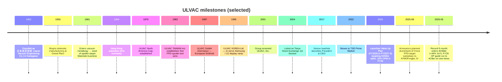
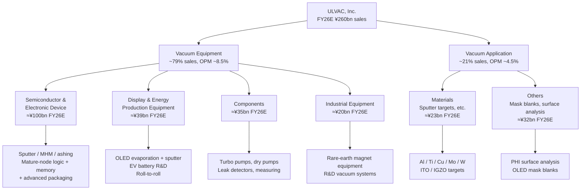

# ULVAC, Inc. (TSE:6728) — Equity Research Initiation

*As of 2026-05-26. Author: Claude research agent. Source language: English. Filings in original language preserved in citations.*

> **Update — FY2026.6 guidance revised (2026-05-12):** Management raised the full-year **orders** outlook by ¥30.0bn to ¥310.0bn (a record) but trimmed the full-year **operating profit** guide from ¥28.5bn to ¥19.0bn (–28.4% YoY) on roughly ¥5.8bn of one-time charges (EV-related doubtful-account allowance, quality remediation in Materials, Q4→FY27 revenue slip). Net sales guide was raised from ¥250bn to ¥260bn (+3.5% YoY) and net profit lifted to ¥18.5bn on a ~¥7.8bn divestiture gain from the planned spin-out of the China FPD-target subsidiary into a Konfoong/Fengke JV. Source: [Consolidated Financial Results for the Nine Months Ended March 31, 2026](https://data.swcms.net/file/ulvac-ir/dam/jcr:06f6f98a-ffc5-4896-93a7-f162c825dfe5/140120260512525783.pdf), [FY2026.6 Q3 Key Q&A](https://ir.ulvac.co.jp/en/ir/library/result/main/00/teaserItems2/0111110/linkList/09/link/3Q_QA_EN.pdf).

## Table of Contents

1. Company Overview
2. Company History
3. Management Team
4. Products & Services
5. Customers & Go-to-Market
6. Industry Overview
7. Competitive Landscape
8. Market Opportunity (TAM)
9. Risk Assessment

References & Verification Log

---

## 1. Company Overview

ULVAC, Inc. (TSE:6728; pronounced "ul-vack" — a coinage of *Ultimate in Vacuum*) is a Japanese capital-equipment maker whose primary identity is **vacuum-coating, sputtering, etching, and vacuum-pump equipment** for flat-panel display (FPD), semiconductor, advanced-packaging, power-device, OLED, EV-battery, and rare-earth-magnet manufacturing — with a smaller but strategically important **vacuum-application materials business** that produces sputter target materials, mask blanks, surface-analysis instruments, and other vacuum-process consumables. The group reports just two segments — **Vacuum Equipment Business** (≈79% of FY2025.6 sales) and **Vacuum Application Business** (≈21%) — and the equipment segment is internally split into four product lines: Semiconductor & electronic-device production equipment, Display & energy-related production equipment, Components (vacuum pumps, measuring instruments, leak detectors), and Industrial equipment ([Consolidated Financial Results for the Fiscal Year Ended June 30, 2025, segment table, pp. 20–22](https://data.swcms.net/file/ulvac-ir/dam/jcr:8e4a9210-5392-4457-bf56-a46c357970fe/140120250813540543.pdf)). The Vacuum Application segment is further split into Materials (~51% of segment) and Others (analytical instruments / mask blanks). The Nomura "Greater China Semi" anchor report (2026-05-21) names ULVAC in Fig. 44 as one of the league-table sputter-target suppliers — but readers should not lose sight of the fact that, for ULVAC, sputter target materials are a sub-business inside an equipment-led franchise, not the primary line ([reports/sector/半导体材料.md](https://github.com/dadachundan/financial_agent/blob/main/reports/sector/%E5%8D%8A%E5%AF%BC%E4%BD%93%E6%9D%90%E6%96%99.md)).

The business model is overwhelmingly **B-to-B project-shipment plus aftermarket**: large vacuum cluster tools (sputter, CVD, etch, ion-implant, OLED evaporation) are sold via direct sales engineers to fabs/panel makers under long lead times (the FY25 backlog at year-end stood at ¥98.4bn for equipment and ¥17.4bn for materials), with a recurring stream of vacuum-pump consumables, spare parts, maintenance contracts, and target-material refills layered on top ([FY25 Financial Results, pp. 2–3, segment narrative](https://data.swcms.net/file/ulvac-ir/dam/jcr:8e4a9210-5392-4457-bf56-a46c357970fe/140120250813540543.pdf)). Roughly 39% of the Vacuum Equipment segment revenue in FY25 was "transferred at a point in time" (= shipments + consumables) and 61% was "transferred over time" (= multi-month equipment build-and-installs recognised by percentage-of-completion); within Vacuum Application the proportion flips — 80% point-in-time (mostly target-material refills) and 20% over-time ([FY25 Segment Note, p. 22](https://data.swcms.net/file/ulvac-ir/dam/jcr:8e4a9210-5392-4457-bf56-a46c357970fe/140120250813540543.pdf)). This split — equipment-cycle-sensitive over-time bookings stacked on top of more granular materials/consumables — is what gives ULVAC the financial profile of a hybrid equipment OEM and consumables franchise.

The group operates globally through 29 consolidated subsidiaries and 8 unconsolidated subs, spanning Japan (HQ in Chigasaki, Kanagawa), Korea (ULVAC KOREA Ltd.), Taiwan (ULVAC TAIWAN Inc., ULCOAT TAIWAN), China (eleven entities across Suzhou, Shanghai, Chengdu, Jingjiang, Shenyang, Hefei, plus the Beijing holding co.), Singapore, Malaysia, the United States (ULVAC Technologies, Physical Electronics USA d/b/a "PHI", TIGOLD), and Germany (ULVAC GmbH, unconsolidated) ([FY25 Financial Results, Scope of Consolidation, pp. 16–17](https://data.swcms.net/file/ulvac-ir/dam/jcr:8e4a9210-5392-4457-bf56-a46c357970fe/140120250813540543.pdf)). FY25 sales by customer location: Japan ¥78.1bn (31%), China ¥86.5bn (34%), South Korea ¥31.5bn (13%), Taiwan ¥28.1bn (11%), and Others ¥27.0bn (11%) — China is the single-largest market, reflecting the heavy use of ULVAC sputter / etch / OLED tools at Chinese FPD makers (BOE, CSOT, Tianma, Visionox) and at mainland fabs (SMIC, YMTC, CXMT, plus mature-node logic foundries) ([FY25 Segment-by-region table, p. 23](https://data.swcms.net/file/ulvac-ir/dam/jcr:8e4a9210-5392-4457-bf56-a46c357970fe/140120250813540543.pdf)).

In FY2025.6 the group posted **net sales of ¥251.2bn (–3.8% YoY), operating profit ¥26.5bn (–10.9%), ordinary profit ¥28.6bn (–4.0%), and profit attributable to owners of parent ¥16.7bn (–17.5%)** — a mid-cycle digestion year off a FY24 peak of ¥261.1bn / ¥29.8bn OP after the strong AI / advanced-packaging-led FY23–FY24 upcycle ([FY25 Financial Results, p. 1](https://data.swcms.net/file/ulvac-ir/dam/jcr:8e4a9210-5392-4457-bf56-a46c357970fe/140120250813540543.pdf)). Operating margin compressed from 11.4% to 10.6%; ROE fell from 9.7% to 7.5%; the equity-to-asset ratio strengthened to 59.6%. Through the first nine months of FY2026.6 (ending March 2026) net sales reached ¥191.6bn (+2.1% YoY) but OP fell ¥6.0bn to ¥14.7bn (–29.1%) on the one-time charges flagged above; the headline number worth focusing on is **orders received of ¥236.2bn, +44.1% YoY** — a record nine-month order intake that signals FY27 (year-ending June 2027) is set up as a meaningful upcycle ([Q3 FY26 Financial Results, p. 2](https://data.swcms.net/file/ulvac-ir/dam/jcr:06f6f98a-ffc5-4896-93a7-f162c825dfe5/140120260512525783.pdf)).

The headcount as of June 2025 was approximately 6,000–7,000 globally (the integrated report places the consolidated group at ~6,800), with R&D centred at Chigasaki and engineering hubs in Suzhou (China) and Cheonan (Korea); annual R&D spend is ~¥10bn or ~4% of sales — modest relative to leading-edge semicap peers like ASML (~15%) but commensurate with ULVAC's mid-range-node and FPD positioning ([2025 ULVAC VALUE REPORT, Financial Data section](https://www.ulvac.co.jp/en/sustainability/report/pdf/2025/2025_ulvac_e_all.pdf); financial-overview chapter, summarised by [ULVAC 2024 Financial Overview PDF](https://www.ulvac.co.jp/en/sustainability/report/pdf/2024/2024_ulvac_e_24.pdf)). The chairman/founder seat is no longer occupied (Hideo Hori, the long-serving honorary chairman who steered the firm's diversification, has passed leadership to professional managers); the current President & CEO since July 2017 is **Setsuo Iwashita**, a long-tenured insider who joined in 1984.

**Valuation snapshot.** As of mid-May 2026, the shares trade around **¥9,587** with a market cap of **¥462.7bn** (≈USD 3.0bn at ¥150/USD); TTM P/E ~38× per TradingView, TTM EPS ¥258, dividend yield ~1.62%; the all-time high of ¥11,450 was set 2024-05-27 and the 12-month return is approximately +97% ([TradingView, TSE:6728](https://www.tradingview.com/symbols/TSE-6728/)). Other databases cite TTM P/E nearer 19–20× using different denominators (Yahoo Finance / Eulerpool basis), so the cleanest read is **forward P/E ≈ 24× the company's own FY26 net-profit guide of ¥18.5bn**, or ≈ 23× the company's FY26 ordinary-profit guide times an implied tax rate. *Analyst view:* the multiple sits at the upper end of Japan-semicap mid-caps (peer median 18–22× FY1) and prices in (a) AI capex tailwind for components / advanced packaging, (b) ULVAC's de-facto-standard share in mature-node MHM sputter and PR ashing, and (c) cost discipline from the Value-Up Plan. If the FY27 order momentum decelerates or the rare-earth magnet capex window closes early, the multiple is exposed to a 20–30% derating to a more typical 16–18× forward — that is the most concrete near-term valuation risk, not a long-term mispricing. The closest peers (Canon Tokki, NIPPON SEISEN, SCREEN, TEL, ASMI, AMAT, LRCX) trade across a wide 15–30× forward range so peer-median pinning gives little signal here.

The thesis a reader should leave Section 1 with: ULVAC is a *vacuum-technology generalist* — equipment, components and materials all leveraging the same vacuum-physics IP — that has chosen NOT to compete with AMAT/LRCX/TEL/ASMI at the leading-logic edge, instead concentrating on (i) mature-node MHM / packaging niches where it owns de-facto-standard share, (ii) FPD/OLED sputter where Canon Tokki and AMAT split the rest of the market with it, (iii) vacuum components (pumps, leak detectors) that benefit from AI-server demand, and (iv) industrial / R&D vacuum tools including the structurally growing rare-earth magnet equipment business. The Nomura "Fig. 44 sputter-target league table" is real but it is one slice of a smaller leg of a larger equipment franchise.

*Source: ULVAC FY2025.6 and prior consolidated results; FY26 figures = company guidance as revised 2026-05-12 ([Q3 FY26 Results, p. 2](https://data.swcms.net/file/ulvac-ir/dam/jcr:06f6f98a-ffc5-4896-93a7-f162c825dfe5/140120260512525783.pdf)).*

---

## 2. Company History

ULVAC was founded on **August 23, 1952** as 日本真空技術株式会社 / *Nippon Shinkū Gijutsu KK* (Japan Vacuum Engineering Co., Ltd.) with paid-in capital of ¥6 million, by a group of vacuum-physics researchers including Dr. **Jin Imachi** (formerly of Tokyo Shibaura Electric / Toshiba), Dr. Chikara Hayashi, and Hideo Shibata, with seed capital from five prominent post-war Kansai business leaders — Konosuke Matsushita of Matsushita Electric, plus Yoshio Osawa, Aiichirō Fujiyama, Tamesaburō Yamamoto, and Gen Hirose ([ULVAC Company History](https://www.ulvac.co.jp/en/company/history/); supplementary detail at [Reference for Business: ULVAC history](https://www.referenceforbusiness.com/history2/97/ULVAC-Inc.html)). The founding purpose was to import US vacuum-system know-how to a rebuilding Japanese industrial base — the firm signed a general agency with NRC Equipment Corporation (US) for technical cooperation, then progressively localised manufacturing at the Omori Plant (1955) and absorbed Toyo Seiki Vacuum Research in 1956 to broaden the in-house equipment line ([Reference for Business, ULVAC history](https://www.referenceforbusiness.com/history2/97/ULVAC-Inc.html)).

*Source: [ULVAC Company History](https://www.ulvac.co.jp/en/company/history/); [2015 sustainability report timeline annex](https://www.ulvac.co.jp/eng/_csr/eco/report/pdf/2015/2.pdf); FY26 milestones from [Q3 FY26 Financial Results, pp. 12–14](https://data.swcms.net/file/ulvac-ir/dam/jcr:06f6f98a-ffc5-4896-93a7-f162c825dfe5/140120260512525783.pdf).*

The first structural pivot was the 1961 entry into vacuum metallurgy, which planted the seed of the sputter-target / vacuum-applied-materials business. From a pure vacuum-engineering project shop, ULVAC layered on the metallurgy of melting, casting, and powder-bonding the high-purity metals (Al, Ti, W, Mo, Cu, Ta, plus ITO/IGZO oxide ceramics) that the very same sputter tools would consume — a structurally elegant bundle that has defined the company's "equipment + material co-sell" pitch to FPD makers for forty years. The second pivot came in the 1980s with the FPD boom: the 1982 Taiwan subsidiary (initially serving Japanese display makers' overseas fabs), 1987 Germany (industrial vacuum coating), and 1995 Korea (to follow Samsung Display and LG Display) built out the global service footprint that today contributes the majority of revenue ([ULVAC Company History](https://www.ulvac.co.jp/en/company/history/)).

A third pivot — the most recent — happened in 2001 with the corporate rename from Nippon Shinkū Gijutsu to "ULVAC, Inc." and the 2004 listing on the TSE 1st Section, formalising the shift from project-shop to publicly-listed equipment OEM. China entered the picture seriously through ULVAC (SUZHOU) Co. and the Hefei and Shenyang manufacturing plants in the late 1990s and 2000s, anchoring the company to the BOE / China Star / Tianma OLED build-out that became China's largest single capex story of the 2010s. The April 2022 move to the TSE Prime Market was administrative (a re-classification rather than a strategic event), and the most recent strategic milestone is the **Value-Up Plan** unveiled in 2025 targeting ¥300bn sales, 35% gross margin and 16% operating margin by FY2026.6 — explicit recognition that the franchise's structural issue is profitability, not top line ([Scripts for Presentation_Material_for_FY2025_EN](https://ir.ulvac.co.jp/en/ir/newsrelease/PressRelease-20250815002/main/0/link/Scripts%20for%20Presentation_Material_for_FY2025_EN_1.pdf)).

The 2025-08 announcement of discussions with Konfoong Materials International (深圳市福工材料 / KFMI, SHE:300666) over an FPD-target JV — and the 2026-05-12 board resolution to actually execute it, transferring 100% of ULVAC Materials (Suzhou) into a Beijing-based JV majority-owned by Fengke Xinchuang (a Beijing private-equity fund) with KFMI and ULVAC as minority partners — closes a long chapter and reframes ULVAC's China materials presence ([Q3 FY26 Financial Results, Important Subsequent Events, pp. 12–14](https://data.swcms.net/file/ulvac-ir/dam/jcr:06f6f98a-ffc5-4896-93a7-f162c825dfe5/140120260512525783.pdf); background at [Yicai Global, 2025-08-14](https://www.yicaiglobal.com/news/kfmi-ulvac-to-integrate-their-flat-panel-display-target-materials-businesses)). The strategic logic is two-fold: (1) China-market FPD target competition (BOE-favoured local supply, KFMI's 40% YoY target sales growth to ¥325M USD-equivalent) has been compressing ULVAC's standalone margins, and (2) consolidating with KFMI lets the JV reach the scale needed to drive cost-down while letting ULVAC harvest a ~¥7.8bn one-time gain. *Analyst view:* this is rationalisation, not retreat — ULVAC retains the sputter-target IP for OLED / IGZO and continues to consume internal target know-how in its own equipment-bundle sales; the JV simply hands the China FPD-target *manufacturing operation* to a more local platform.

Recent developments worth flagging beyond the JV: (i) FY26 orders momentum is the strongest in company history — ¥99.1bn single-quarter Q3 and ¥236.2bn 9-month, driven by MHM sputter for mature-node logic, ashing for advanced packaging, OLED G8.6 retrofits in China, and rare-earth-magnet equipment for the US-led supply-chain-diversification capex (Q3 FY26 Q&A, items 1–8 above); (ii) the rare-earth magnet equipment business is structurally re-rating from a ¥20bn/yr line to a ¥35–45bn/yr line over the next 3–5 years per management; (iii) the AR/VR sputter order initially forecast at ¥16bn was de-scoped to ¥6bn in FY26 due to margin-discipline on Chinese projects — both a positive (price discipline) and a negative (volume miss) signal.

---

## 3. Management Team

**Founder context (anonymous-historical).** Per the [company-research skill](https://github.com/dadachundan/financial_agent/blob/main/.claude/skills/company-research/SKILL.md), only the founder and current CEO get bios. ULVAC's founders — Dr. Jin Imachi (ex-Toshiba vacuum researcher), Dr. Chikara Hayashi and Hideo Shibata — established the company in 1952 and exited operational roles decades ago; none of them retain a board seat today and there is no living-founder CEO situation. The oldest line of operational continuity is in the corporate name itself — the trademark "ULVAC" coined from "*Ultimate in Vacuum*" — and in the Chigasaki headquarters site that has been the engineering anchor for the franchise since the 1960s ([ULVAC Company History](https://www.ulvac.co.jp/en/company/history/)). Because there is no living founder in an active management role, the management chapter focuses solely on the current CEO.

**Setsuo Iwashita — President & Chief Executive Officer.** Mr. Iwashita has been President & CEO since **July 2017** and is the sole executive identified in this report per the skill's "founder + current CEO only" rule. He joined ULVAC in **1984** (a 40+ year career with the firm), and the most consequential rung of his pre-CEO climb was his stint as **Chairman & General Manager of ULVAC (China) Holding Co.** — the role that turned China from a peripheral sales region into the group's largest single revenue market — followed by promotion to **Director and Senior Managing Executive Officer in 2016** ([Bloomberg profile, Setsuo Iwashita](https://www.bloomberg.com/profile/person/17438855); [Crunchbase, Setsuo Iwashita / ULVAC Technologies](https://www.crunchbase.com/person/setsuo-iwashita); [ULVAC Management Structure page](https://www.ulvac.co.jp/en/company/directors_officers/)). The China-operations background is the single most relevant fact for an investor: ULVAC's customer base and revenue mix are now dominated by the very Chinese OLED, mature-node logic, and memory fabs that he spent the late 2000s and 2010s building the local manufacturing and sales footprint for, including the Suzhou, Shanghai, Chengdu, Jingjiang, Shenyang, and Hefei subsidiaries that today employ a meaningful share of the consolidated headcount ([FY25 Financial Results, Scope of Consolidation, pp. 16–17](https://data.swcms.net/file/ulvac-ir/dam/jcr:8e4a9210-5392-4457-bf56-a46c357970fe/140120250813540543.pdf)).

In his eight years as CEO Mr. Iwashita has presided over (i) the 2017–2019 capacity expansion targeting the China OLED and memory ramp, (ii) the COVID-era profitability scare and subsequent V-shaped FY22–FY24 recovery, (iii) the 2025 launch of the **Value-Up Plan** (the explicit ¥300bn / 16% OPM target framework), and (iv) the current strategic decision to **partially divest the China FPD-target manufacturing operation into the KFMI/Fengke JV** rather than continue to subscale-compete with locally-favoured Chinese suppliers — a decision that the Q3 FY26 commentary frames as "shifting resources toward Semiconductor & Electronics while consolidating display-related production in China to optimize production efficiency and further improve profit margins" ([Q3 FY26 Q&A, item 7](https://ir.ulvac.co.jp/en/ir/library/result/main/00/teaserItems2/0111110/linkList/09/link/3Q_QA_EN.pdf)). His own equity stake is small (~0.067% of shares, no controlling-family overhang) and his compensation framework is the standard Japan-mid-cap mix of base salary, bonus tied to ordinary-profit achievement, and a Board Benefit Trust (BBT) restricted-share programme disclosed in the Yuho ([Bloomberg profile cross-reference](https://www.bloomberg.com/profile/person/17438855); [GSA "Get to Know the CEO" interview](https://www.gsaglobal.org/get-to-know-the-ceo-setsuo-iwashita-president-%EF%BC%86-ceo-of-ulvac-inc/) provides an extended public statement of his management philosophy and growth priorities). *Analyst view:* the CEO profile is solid-insider — long-tenured, China-fluent, with credible execution on portfolio reshaping (rare-earth magnet ramp, FPD-target JV) but no leading-edge-semi-equipment ambition, which is both the brand promise and the structural ceiling on what ULVAC will ever try to be.

---

## 4. Products & Services

This is the most important section of the report. ULVAC's primary identity is an **equipment maker** that bundles **materials, components, and analytical instruments** off the same vacuum-technology platform. The two reportable segments — Vacuum Equipment Business and Vacuum Application Business — and the four equipment sub-lines plus two application sub-lines are quoted verbatim from the FY2025.6 Yuho-style filing and the Q3 FY26 supplemental sales table.

### 4.1 The ULVAC segment matrix (verbatim, FY25.6 + Q3 FY26)

ULVAC's own segment-information note describes the two reportable segments as:

> The Vacuum Equipment Business consists of products such as sputtering equipment for LCDs, organic EL production equipment, evaporation roll-to-roll equipment, sputtering equipment for semiconductor production, vacuum pumps, and measuring equipment, and we develop, manufacture, sell, and provide maintenance services for these products. The Vacuum Application Business consists of vacuum-applied products such as sputtering target materials and analytical instrument-related products, and we develop, manufacture, sell, and provide maintenance services for these products.

Source: [FY25 Financial Results, Notes on segment information, p. 21](https://data.swcms.net/file/ulvac-ir/dam/jcr:8e4a9210-5392-4457-bf56-a46c357970fe/140120250813540543.pdf).

The Q3 FY2026.6 supplemental disclosure (9 months ended March 2026) gives the four-way sub-split of Vacuum Equipment and the two-way split of Vacuum Application:

| Segment | Sub-line | 9M FY26.6 sales (¥M) | % of segment | YoY |
|---|---|---:|---:|---:|
| **Vacuum Equipment Business** (¥150,005M total, OP ¥12,769M) | Semiconductor & electronic device production equipment | 63,063 | 42.1% | n.d. (orders ↑) |
|  | Display & energy-related production equipment | 45,469 | 30.3% | up YoY |
|  | Components (vacuum pumps, measuring instruments, power supplies) | 25,954 | 17.3% | steady |
|  | Industrial equipment (incl. rare-earth magnet equipment, leak detectors after reclassification) | 15,519 | 10.3% | up YoY |
| **Vacuum Application Business** (¥41,626M total, OP ¥1,863M) | Materials (sputter targets + related) | 19,860 | 47.7% | up YoY |
|  | Others (surface-analysis instruments, mask blanks) | 21,767 | 52.3% | up YoY |

Source: [Q3 FY26 Financial Results, Supplemental Sales Information, p. 15](https://data.swcms.net/file/ulvac-ir/dam/jcr:06f6f98a-ffc5-4896-93a7-f162c825dfe5/140120260512525783.pdf).

For full FY2025.6, the company also disclosed product-level sales and FY26 forecast (in ¥bn), showing more dramatic mix shifts in the FY26 plan:

| Item | FY25.6 actual | FY26.6 forecast | YoY |
|---|---:|---:|---:|
| Semiconductor & electronic device equipment | 89.3 | 100.5 | **+12.5%** |
| Display & energy-related equipment | 53.1 | 39.0 | **–26.6%** |
| Components | 43.1 | 35.0 | –18.9% |
| Industrial equipment | 13.5 | 20.0 | **+48.6%** |
| Vacuum Application — Materials | 26.6 | 23.5 | –11.7% (FPD JV de-consolidation) |
| Vacuum Application — Others | 25.5 | 32.0 | +25.3% (mask-blanks ramp) |
| **Total** | **251.2** | **250.0** | –0.5% |

Source: [FY25 Financial Results, Net sales forecast by product, p. 6](https://data.swcms.net/file/ulvac-ir/dam/jcr:8e4a9210-5392-4457-bf56-a46c357970fe/140120250813540543.pdf). Note: as of Q3 FY26, sales guidance was lifted to ¥260bn (from ¥250bn) — see top-of-report banner.

### 4.2 Synthesis — how the categories interact in one customer workflow

A FPD or semiconductor fab uses ULVAC products in a **single physical-vapour-deposition (PVD) loop**: ULVAC's **vacuum pumps** (Components) pull the deposition chamber to high vacuum; an ULVAC **sputter or evaporation tool** (Semi/Display equipment) physically delivers a thin film by ejecting atoms from a **sputter target** (Materials) onto the substrate; an ULVAC **leak detector** (Components) confirms chamber integrity; and an ULVAC **surface-analysis instrument** (Others — typically a PHI XPS/Auger system) characterises the deposited film during process-development. The **flagship sale is the equipment** — that's where ULVAC's sales engineers earn their margin — but the **lifetime annuity** is the pump consumables + sputter-target refills + analytical-instrument calibration that follow the equipment install for 5–10 years. This bundled cycle is the structural reason ULVAC's Vacuum Application segment grows even when the Vacuum Equipment segment cycles down: the installed base keeps consuming targets / pump parts / spares regardless of new-tool orders, which is what dampens the equipment-cycle volatility shown in the FY24→FY25→FY26 OP trajectory.

### 4.3 Vacuum Equipment — Semiconductor & Electronic Device Production Equipment (≈42% of equipment segment)

**10-K-equivalent verbatim from FY25.6 Yuho-style filing:**
> In semiconductor and electronic device production equipment, although investment in advanced logic and memory sectors remained robust and the advanced packaging sector also performed well, orders received and net sales declined year on year due to a reactionary decrease in power device investments in Japan and China.

Source: [FY25 Financial Results, p. 2](https://data.swcms.net/file/ulvac-ir/dam/jcr:8e4a9210-5392-4457-bf56-a46c357970fe/140120250813540543.pdf).

**Plain-language gloss:** This sub-line is the **largest single product family** in the group (~¥89bn in FY25 rising to a planned ~¥100bn in FY26) and houses ULVAC's flagship semiconductor sputter equipment for **MHM (Metal Hard Mask, 金属硬掩膜)** — a patterning-stack film used as an etch-resistant cap during deep-etch steps in DRAM capacitor formation and in advanced logic back-end-of-line. The Q3 FY26 Q&A is precise that ULVAC has an "**overwhelming share in MHM for mature nodes**" — what management calls **"de facto standard status"** — built on a proprietary stress-controlled-film-deposition technology that competing AMAT / TEL sputter tools have struggled to match for this specific application ([Q3 FY26 Q&A, item 5](https://ir.ulvac.co.jp/en/ir/library/result/main/00/teaserItems2/0111110/linkList/09/link/3Q_QA_EN.pdf)). Beyond MHM the family also covers **PR ashing (光刻胶灰化 — plasma stripping of photoresist after etch) for WLP and PLP advanced packaging**, and **metal sputter for DRAM/NAND POR (Process of Record, 工艺标准) processes**.

Within this family, the **advanced-packaging ashing tool** is the second pillar — ULVAC describes itself in Q3 FY26 as achieving "de facto standard status in the descum process" of WLP / PLP packaging on the back of its "fine plasma technology" ([Q3 FY26 Q&A, item 5](https://ir.ulvac.co.jp/en/ir/library/result/main/00/teaserItems2/0111110/linkList/09/link/3Q_QA_EN.pdf)). Full-year ashing-equipment orders were raised to ~¥20bn in FY26, with PLP-specific contributions of ¥4–5bn for Taiwanese OSATs and Japanese substrate makers. This makes ULVAC a direct beneficiary of the same AI-GPU-packaging capex wave that drives Besi (hybrid bonding) and Kinik (CMP conditioner for advanced packaging) — though at a smaller dollar scale per tool than the leading-edge plays.

*Analyst view:* ULVAC's competitive advantage in this family is **process-specific niche dominance** rather than horizontal scale: the MHM share and ashing share are real and high (management's "de facto standard" language is unusual for a Japanese filing), but the addressable served market is a thin slice of the broader semi-equipment TAM that AMAT / LRCX / TEL / ASMI compete in. The flagship competitor for general-purpose sputter is **Applied Materials' Endura platform** (cited in [AMAT's own 10-K](https://www.sec.gov/cgi-bin/browse-edgar?action=getcompany&CIK=AMAT&type=10-K) as their primary PVD platform); the flagship competitor for ashing is **Hitachi High-Tech** and **Plasma-Therm**; ULVAC defends share on application-specificity, not platform-versatility. Moat type = **technology (process IP) + switching cost (POR qualification)**; rated **partial-to-strong** within the served niche, **weak** outside it. The decade-long stress-controlled MHM process IP cannot be replicated by a new entrant on a 1–2 year horizon, and the customer-qualification cost for swapping a POR-qualified sputter tool is exactly the same multi-quarter pain that gives LRCX / AMAT their installed-base defensibility.

### 4.4 Vacuum Equipment — Display & Energy-Related Production Equipment (≈30% of equipment segment)

**10-K-equivalent verbatim from FY25.6 Yuho-style filing:**
> While investment in OLEDs for IT panels began to gain momentum, orders received and net sales fell short of the previous year's level, as the adoption of EV batteries for in-vehicle use aimed at achieving smaller size, larger capacity, and improved safety required more time, causing delays in investment.

Source: [FY25 Financial Results, p. 2](https://data.swcms.net/file/ulvac-ir/dam/jcr:8e4a9210-5392-4457-bf56-a46c357970fe/140120250813540543.pdf). Note the name change from "FPD Production Equipment" to "Display & Energy-related Production Equipment" starting July 2025, which folds in EV-battery-related vacuum equipment ([FY25, p. 6 footnote (2)](https://data.swcms.net/file/ulvac-ir/dam/jcr:8e4a9210-5392-4457-bf56-a46c357970fe/140120250813540543.pdf)).

**Plain-language gloss:** This is the historic ULVAC franchise — **sputter and evaporation tools for FPD** (LCD and OLED) panel makers — with EV-battery R&D vacuum equipment recently bolted on. The product line includes the **SOLCIET, SATELLA, and NEW-ZELDA OLED organic-EL production systems** (organic-evaporation chambers used to deposit the emissive organic layer in OLED stacks), **cluster-type PE-CVD systems** (for the inorganic encapsulation films that protect the organic stack from moisture), and **OLED-specific sputter tools** for the ITO / IGZO TFT layers that drive each pixel ([ULVAC GmbH OLED equipment page](https://ulvac.eu/products/equipment/by-application/oled/)). The roll-to-roll evaporation line — vacuum-coating onto continuous polymer or metal-foil web — services touch-panel transparent-electrode and EV-battery-foil markets.

The strategic colour for FY26 is mixed. The **FY26 plan was originally cut from ¥53bn to ¥39bn (–26.6%)** on slower EV battery capex and a paused-out AR/VR sputter project in China ([FY25 Financial Results, p. 6](https://data.swcms.net/file/ulvac-ir/dam/jcr:8e4a9210-5392-4457-bf56-a46c357970fe/140120250813540543.pdf)). But in Q3 FY26 management raised the full-year **orders** outlook to **¥70bn (up ¥30bn vs original plan)** on the back of "new line investments for G8-size OLED from Chinese manufacturers and additional LCD equipment investment projects" ([Q3 FY26 Q&A, item 7](https://ir.ulvac.co.jp/en/ir/library/result/main/00/teaserItems2/0111110/linkList/09/link/3Q_QA_EN.pdf)) — meaning sales will catch up in FY27. The G8.6 (8.7-gen) OLED retrofit cycle at Chinese makers (Visionox, BOE, CSOT) for tablet- and laptop-sized OLED panels is the most concrete near-term catalyst for the line.

*Analyst view:* ULVAC's market position in OLED organic-evaporation equipment is **strong in cluster-type systems for sputter / inorganic layers** but **weak in the all-important emissive-layer linear-source evaporation** where Canon Tokki (private, Canon-owned) has a 70–80%+ share at flagship Korean and Chinese OLED fabs. ULVAC competes with Canon Tokki, **Sunic System (KOSDAQ:171090)**, **Avaco (KOSDAQ:083930)**, and **Applied Materials** for the broader OLED equipment market that totalled approximately USD 1.5bn in 2022 and is projected to reach ~USD 3bn by 2027 at ~15% CAGR ([OLED Deposition Equipment Market report, Market Research Future / DixieGrimes summary](https://github.com/DixieGrimes/Market-Research-Report-List-1/blob/main/oled-deposition-equipment-market.md)). Moat type = **scale + integrated bundle** (ULVAC's sputter + materials + components co-sell to FPD makers is more bundled than competitors); rated **partial — strong in sputter, weak in evaporation**.

### 4.5 Vacuum Equipment — Components (≈17% of equipment segment; AI-server tailwind)

**10-K-equivalent verbatim from FY25.6 Yuho-style filing:**
> In the components business, orders received remained at a high level and net sales exceeded the previous year, supported by strong demand for vacuum pumps, measuring devices, power supply devices, and leak test equipment for cooling systems such as those used in AI servers, semiconductors, electronic devices, and consumer devices.

Source: [FY25 Financial Results, p. 2](https://data.swcms.net/file/ulvac-ir/dam/jcr:8e4a9210-5392-4457-bf56-a46c357970fe/140120250813540543.pdf).

**Plain-language gloss:** Vacuum components are the **mid-cycle smoother** in the ULVAC P&L. The product line covers (i) **turbomolecular pumps and dry pumps** that maintain vacuum in fab process chambers — every ULVAC sputter / etch / CVD tool ships with multiple pumps, and the global installed base of all fab tools (not just ULVAC's) is a perpetual after-market for ULVAC pumps; (ii) **measuring instruments** including vacuum gauges, residual-gas analysers (RGA), and process-monitoring sensors; (iii) **leak detectors** — including the helium mass-spec leak detectors used in fab utilities and, increasingly, in AI-server liquid-cooling-loop QA (every Nvidia H200 / B200 server with liquid cooling needs leak-tested cooling-loop assemblies before shipment, and the leak-test equipment is exactly the same physics as a fab leak detector); and (iv) **power supplies** for plasma-process tools.

The strategic significance is the **AI-server-cooling angle**: with NVIDIA / AMD GPU racks now standardising on liquid cooling (cold-plate or immersion), the manifold / cold-plate assemblies need helium-leak-test 100% before integration, and ULVAC is one of three or four global suppliers of the dedicated test stations. This makes Components a **leveraged play on AI-server unit growth** that does not depend on fab capex cycles — a useful diversifier off the more cyclical equipment lines. The recent reclassification in FY26 that moves leak-testing equipment out of Components and into Industrial Equipment (see §4.6) was a presentational change reflecting the maturing of leak-test as a stand-alone business; the underlying tailwind is unchanged ([Q3 FY26 Financial Results, p. 3](https://data.swcms.net/file/ulvac-ir/dam/jcr:06f6f98a-ffc5-4896-93a7-f162c825dfe5/140120260512525783.pdf)).

*Analyst view:* This line is ULVAC's most defensible. The two principal pump competitors are **Edwards (part of Atlas Copco)** and **Pfeiffer Vacuum (FR:PFV, ~50% Busch-owned)** — both are larger in the open-market pump business but neither bundles with an in-house equipment franchise the way ULVAC does. Moat type = **switching cost + installed-base annuity** (a fab that has standardised on ULVAC pumps for a 200mm or 300mm fab does not rip-and-replace), plus **bundle pull** from the equipment franchise. Rated **strong** within the captive ULVAC installed base, **partial** in open-market pump tenders. The FY26 plan cut to ¥35bn (from ¥43bn FY25) reflects a recoil from the FY24–FY25 peak of fab utility build-outs — not a structural weakening of the franchise.

### 4.6 Vacuum Equipment — Industrial Equipment (≈10% of equipment segment; rare-earth re-rating)

**10-K-equivalent verbatim from FY25.6 Yuho-style filing (mixed — see also Q3 FY26 update):**
> Orders received and net sales declined year on year due to weak demand for high-performance magnet production equipment.

Source: [FY25 Financial Results, p. 2](https://data.swcms.net/file/ulvac-ir/dam/jcr:8e4a9210-5392-4457-bf56-a46c357970fe/140120250813540543.pdf). But the Q3 FY26 update is materially more bullish:

> In the rare earth magnet field, high-performance magnet manufacturing equipment performed strongly as capital investment aimed at diversifying supply chains began in earnest. … leak testing equipment for cooling systems used in air conditioners and AI servers remained steady.

Source: [Q3 FY26 Financial Results, p. 3](https://data.swcms.net/file/ulvac-ir/dam/jcr:06f6f98a-ffc5-4896-93a7-f162c825dfe5/140120260512525783.pdf).

**Plain-language gloss:** Industrial Equipment is the **most interesting structural-growth story** in the FY26 narrative. ULVAC is one of a handful of global suppliers of **vacuum melting / sintering / coating equipment for high-performance NdFeB (neodymium-iron-boron, 钕铁硼) magnets** — the rare-earth permanent magnets used in EV traction motors, wind-turbine generators, robotics actuators, and consumer electronics voice coils. The vacuum-process step is essential because rare-earth metals oxidise instantly at ambient pressure; magnet production requires melting and sintering under inert gas in a controlled-atmosphere furnace.

The strategic inflection is the **US/EU/Japan rare-earth supply-chain-diversification capex**. After two decades of >85% Chinese share in NdFeB production, the US Inflation Reduction Act (IRA) and the EU Critical Raw Materials Act have triggered onshoring projects — MP Materials in Texas, Hitachi Metals / Proterial in Japan and the US, GM-Vacuumschmelze in Germany — each of which buys vacuum melting / sintering / coating equipment from a small set of suppliers including ULVAC. Q3 FY26 management said the line "has historically maintained orders at around ¥20.0 billion" but now "by capturing strong demand for rare-earth magnets and related products, we expect orders to stabilize at the ¥35.0–45.0 billion level over the next 3–5 years" ([Q3 FY26 Q&A, item 8](https://ir.ulvac.co.jp/en/ir/library/result/main/00/teaserItems2/0111110/linkList/09/link/3Q_QA_EN.pdf)). The FY26 sales plan was raised to ¥20bn (vs ¥13.5bn FY25 actual, +48.6%) and FY27–FY28 will see the inflection meaningfully larger.

*Analyst view:* Industrial Equipment goes from "boring legacy line item" to "the most under-discussed bull case for ULVAC". Competitors include **Inductotherm Group**, **Consarc**, **ALD Vacuum Technologies (DE)**, and **Chinese state-owned suppliers** — but the Western-magnet-onshoring projects are explicitly seeking non-Chinese equipment supply, which boxes ULVAC into a privileged competitive set. Moat type = **technology + geopolitical preference**; rated **strong** for the next 3–5 years, with the qualifier that the rare-earth capex window may close once onshore capacity catches up to nameplate. The equipment is also "a high-margin product based on existing technologies" per management — meaning the gross margin profile is the best in the equipment segment, not the worst.

### 4.7 Vacuum Application — Materials (≈48% of application segment; Nomura Fig. 44)

**10-K-equivalent verbatim from FY25.6 Yuho-style filing:**
> Orders received and net sales both increased year on year, primarily owing to the continued high operating rate of FPD and semiconductor and electronic device related plants.

Source: [FY25 Financial Results, p. 3](https://data.swcms.net/file/ulvac-ir/dam/jcr:8e4a9210-5392-4457-bf56-a46c357970fe/140120250813540543.pdf).

**Plain-language gloss:** This is the sub-segment that lands ULVAC in the Nomura "Greater China Semi" Fig. 44 sputter-target league table. ULVAC's Materials business produces **high-purity metal and oxide-ceramic sputter targets** — including aluminium, titanium, copper, molybdenum, tungsten, tantalum, and indium tin oxide (ITO) / indium gallium zinc oxide (IGZO, 铟镓锌氧化物) targets — at manufacturing sites in Japan, Korea (ULVAC KOREA), Taiwan (ULVAC Materials Taiwan, unconsolidated), China (ULVAC Materials Suzhou, being JV'd out 2026-05), and the US (TIGOLD CORPORATION). The targets are consumed inside ULVAC's own sputter equipment and inside competing AMAT / TEL / Canon Tokki sputter chambers at panel and semi fabs. A representative recent product innovation: **bonded sputter targets for OLED and touch displays with 28% better uniformity and 19% lower target-cracking incidence** under high-vacuum conditions ([ICO Optics Sputter Coating Market report citing ULVAC bonded-target spec](https://www.ico-optics.org/sputter-coating-market-growth-to-2035-driven-by-semiconductors-displays/)).

The structural backdrop is what the Nomura report calls **"the materials long re-rating cycle"** ([reports/sector/半导体材料.md](https://github.com/dadachundan/financial_agent/blob/main/reports/sector/%E5%8D%8A%E5%AF%BC%E4%BD%93%E6%9D%90%E6%96%99.md)): GAA logic + High-NA EUV + Backside Power Delivery (BPD) + advanced packaging + glass-core substrates all increase the unit-consumption of sputter target material per wafer (more film layers, more film types, more deep-via fills). The total semiconductor-sputter-target market was estimated at ~USD 4.5bn in 2023 and growing at ~5.8% CAGR per Cognitive Market Research ([Cognitive Market Research, Semiconductor Sputtering Targets](https://www.cognitivemarketresearch.com/semiconductor-sputtering-targets-market-report), 2024 publication). Per Nomura's Fig. 26 from the 2026-05-21 anchor report, sputter targets are ~3% of the ~USD 80bn global semiconductor-materials market — implying a ~USD 2.4bn semi-target slice with another ~USD 2bn for FPD-target — so the addressable target market is ~USD 4–5bn globally ([reports/sector/半导体材料.md](https://github.com/dadachundan/financial_agent/blob/main/reports/sector/%E5%8D%8A%E5%AF%BC%E4%BD%93%E6%9D%90%E6%96%99.md), citing Nomura 2026-05-21 Fig. 26, 35-44).

The most consequential 2026 event for this line is the **partial divestment of the China FPD-target manufacturing operation** — ULVAC Materials (Suzhou) being transferred into a Beijing-based JV (Beijing Fengke Jingsheng Electronic Materials) majority-owned by Fengke Xinchuang fund with KFMI and ULVAC as minority partners, generating a ~¥7.8bn one-time gain in FY26 ([Q3 FY26 Financial Results, Important Subsequent Events, pp. 12–14](https://data.swcms.net/file/ulvac-ir/dam/jcr:06f6f98a-ffc5-4896-93a7-f162c825dfe5/140120260512525783.pdf)). Background: KFMI's own sputter target sales surged 40% to CNY 2.3bn (~USD 325M) in their previous fiscal year, with BOE as anchor customer, and the integration aims at "resource sharing, complementary advantages, and enhanced market competitiveness" for the FPD target sub-market ([Yicai Global, 2025-08-14](https://www.yicaiglobal.com/news/kfmi-ulvac-to-integrate-their-flat-panel-display-target-materials-businesses)). The non-China target operations (Japan, Korea, Taiwan, US) remain wholly inside ULVAC.

*Analyst view:* ULVAC is **a smaller, equipment-integrated sputter-target player** competing against **JX Advanced Metals (TSE:5016, spun out of JX Nippon Mining 2025)**, **Tosoh (TSE:4042)** via Tosoh SMD, **Materion (NYSE:MTRN)**, **Mitsui Mining & Smelting / Mitsui Kinzoku (TSE:5706)**, and **KFMI (SHE:300666)** itself ([Maximize Market Research, sputter target competitor list](https://www.maximizemarketresearch.com/market-report/global-sputtering-target-market/102381/); [Coherent Market Insights, copper sputter target competitor list](https://www.coherentmarketinsights.com/market-insight/copper-sputtering-target-market-6221)). ULVAC's edge is **the equipment-material co-sell to FPD makers** — its sputter targets are sold bundled with the sputter chambers that consume them, which gives it pull-through-share at customers who buy both. It is **not** a sputter-target leader in pure semiconductor (where JX, Tosoh, and Materion are larger), and **not** likely to become one. Moat type = **bundle-pull + technology** for FPD-targets, **partial** for semi-targets; rated **partial** overall in the materials sub-segment. The China-FPD JV restructuring is a tacit admission that standalone scale was not achievable in that geographic-product cell.

### 4.8 Vacuum Application — Others (≈52% of application segment; PHI + mask blanks)

**10-K-equivalent verbatim from FY25.6 Yuho-style filing:**
> Both orders received and net sales increased year on year, mainly due to the contribution from businesses related to surface analyzer equipment and mask blanks for high-definition, high-performance displays.

Source: [FY25 Financial Results, p. 3](https://data.swcms.net/file/ulvac-ir/dam/jcr:8e4a9210-5392-4457-bf56-a46c357970fe/140120250813540543.pdf).

**Plain-language gloss:** "Others" is a mis-leading label for what is actually a **deep portfolio of analytical and specialty-vacuum products**, including **Physical Electronics USA / ULVAC-PHI** (XPS, AES, TOF-SIMS, scanning Auger surface-analysis instruments — the global reference brand for these techniques, alongside Thermo Fisher and Bruker) and **OLED mask blanks for high-definition / high-performance displays** (the metal masks through which OLED organic-evaporation deposits the pixel pattern; the mask itself is fabricated using vacuum-deposition processes that ULVAC supplies). FY26 plan was raised to ¥32bn (+25.3% YoY) reflecting both PHI growth and the OLED mask-blank ramp tied to G8 IT-OLED panel production.

*Analyst view:* The PHI surface-analysis business is a small but extremely defensible niche — Thermo Fisher (US) and Bruker (US/DE) are the principal global competitors, but PHI's XPS install base in semi / metals / pharma research labs is sticky on legacy software and operator-training cost. Mask blanks for OLED are a high-value-add specialty ULVAC defends with its own evaporation and lithography process IP. Moat type = **brand + technology + switching cost**; rated **strong** for surface analysis, **partial** for mask blanks.

### 4.9 Recurring / aftermarket business

Unlike Lam Research (CSBG) or Applied Materials (AGS), ULVAC does not break out a separate "Services" segment — the recurring-revenue stream (spare parts, maintenance contracts, vacuum-pump consumables, target-material refills, surface-analysis instrument calibration) is embedded inside both segments. Indirect evidence: of the FY25 Vacuum Equipment ¥199bn sales, ¥78.5bn (39%) was "transferred at a point in time" (= consumables / spare parts / aftermarket-style transactions), and ¥120.6bn (61%) was "transferred over time" (= multi-month build-and-installs). For Vacuum Application, ¥41.6bn (80%) was point-in-time. Source: [FY25 Financial Results, segment-disaggregation table, p. 22](https://data.swcms.net/file/ulvac-ir/dam/jcr:8e4a9210-5392-4457-bf56-a46c357970fe/140120250813540543.pdf). *Analyst view:* a ULVAC investor should mentally pencil in **~25–30% of group revenue as recurring** even though it is not segmented out — this is what supports the segment-profit floor in down-cycle years (e.g., FY25 vs FY24).

### 4.10 Flagship franchises and recent launches

The three flagship ULVAC product franchises are:

1. **MHM sputter for mature-node logic** — de-facto-standard status per management's own language; the single most defensible commercial position the company has, driving the ¥31bn FY26 logic-orders plan ([Q3 FY26 Q&A, item 5](https://ir.ulvac.co.jp/en/ir/library/result/main/00/teaserItems2/0111110/linkList/09/link/3Q_QA_EN.pdf)).
2. **PR ashing / descum for advanced packaging (WLP + PLP)** — de-facto-standard descum process; ¥20bn FY26 plan; direct AI-GPU-packaging tailwind.
3. **Rare-earth magnet vacuum equipment** — ¥35–45bn structural run-rate over the next 3–5 years; high-margin; aligned with Western supply-chain-diversification capex.

Recent launches in the last 12 months include the bonded sputter targets for OLED with measurable uniformity / yield gains (no specific launch date disclosed in the IR materials read); the leak-test stations for AI-server cooling loops (reclassified into Industrial Equipment from FY26); and the Value-Up Plan's commitment to **modular-design equipment standardisation in Semiconductor & Electronics** for cost reduction ([Q3 FY26 Q&A, item 9](https://ir.ulvac.co.jp/en/ir/library/result/main/00/teaserItems2/0111110/linkList/09/link/3Q_QA_EN.pdf)). The Value-Up Plan also targets a 70% reduction in equipment design lead-time by FY ending June 2031 (currently ~30% of the way there at ~20% reduction).

---

