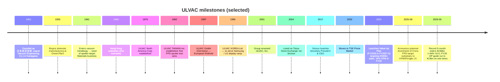

# ULVAC, Inc. (TSE:6728) — Equity Research Initiation

*As of 2026-05-26. Author: Claude research agent. Source language: English. Filings in original language preserved in citations.*

> **Update — FY2026.6 guidance revised (2026-05-12):** Management raised the full-year **orders** outlook by ¥30.0bn to ¥310.0bn (a record) but trimmed the full-year **operating profit** guide from ¥28.5bn to ¥19.0bn (–28.4% YoY) on roughly ¥5.8bn of one-time charges (EV-related doubtful-account allowance, quality remediation in Materials, Q4→FY27 revenue slip). Net sales guide was raised from ¥250bn to ¥260bn (+3.5% YoY) and net profit lifted to ¥18.5bn on a ~¥7.8bn divestiture gain from the planned spin-out of the China FPD-target subsidiary into a Konfoong/Fengke JV. Source: [Consolidated Financial Results for the Nine Months Ended March 31, 2026](https://data.swcms.net/file/ulvac-ir/dam/jcr:06f6f98a-ffc5-4896-93a7-f162c825dfe5/140120260512525783.pdf), [FY2026.6 Q3 Key Q&A](https://ir.ulvac.co.jp/en/ir/library/result/main/00/teaserItems2/0111110/linkList/09/link/3Q_QA_EN.pdf).

## Table of Contents

1. Company Overview
2. Company History
3. Management Team
4. Products & Services
5. Customers & Go-to-Market
6. Industry Overview
7. Competitive Landscape
8. Market Opportunity (TAM)
9. Risk Assessment

References & Verification Log

---

## 1. Company Overview

ULVAC, Inc. (TSE:6728; pronounced "ul-vack" — a coinage of *Ultimate in Vacuum*) is a Japanese capital-equipment maker whose primary identity is **vacuum-coating, sputtering, etching, and vacuum-pump equipment** for flat-panel display (FPD), semiconductor, advanced-packaging, power-device, OLED, EV-battery, and rare-earth-magnet manufacturing — with a smaller but strategically important **vacuum-application materials business** that produces sputter target materials, mask blanks, surface-analysis instruments, and other vacuum-process consumables. The group reports just two segments — **Vacuum Equipment Business** (≈79% of FY2025.6 sales) and **Vacuum Application Business** (≈21%) — and the equipment segment is internally split into four product lines: Semiconductor & electronic-device production equipment, Display & energy-related production equipment, Components (vacuum pumps, measuring instruments, leak detectors), and Industrial equipment ([Consolidated Financial Results for the Fiscal Year Ended June 30, 2025, segment table, pp. 20–22](https://data.swcms.net/file/ulvac-ir/dam/jcr:8e4a9210-5392-4457-bf56-a46c357970fe/140120250813540543.pdf)). The Vacuum Application segment is further split into Materials (~51% of segment) and Others (analytical instruments / mask blanks). The Nomura "Greater China Semi" anchor report (2026-05-21) names ULVAC in Fig. 44 as one of the league-table sputter-target suppliers — but readers should not lose sight of the fact that, for ULVAC, sputter target materials are a sub-business inside an equipment-led franchise, not the primary line ([reports/sector/半导体材料.md](https://github.com/dadachundan/financial_agent/blob/main/reports/sector/%E5%8D%8A%E5%AF%BC%E4%BD%93%E6%9D%90%E6%96%99.md)).

The business model is overwhelmingly **B-to-B project-shipment plus aftermarket**: large vacuum cluster tools (sputter, CVD, etch, ion-implant, OLED evaporation) are sold via direct sales engineers to fabs/panel makers under long lead times (the FY25 backlog at year-end stood at ¥98.4bn for equipment and ¥17.4bn for materials), with a recurring stream of vacuum-pump consumables, spare parts, maintenance contracts, and target-material refills layered on top ([FY25 Financial Results, pp. 2–3, segment narrative](https://data.swcms.net/file/ulvac-ir/dam/jcr:8e4a9210-5392-4457-bf56-a46c357970fe/140120250813540543.pdf)). Roughly 39% of the Vacuum Equipment segment revenue in FY25 was "transferred at a point in time" (= shipments + consumables) and 61% was "transferred over time" (= multi-month equipment build-and-installs recognised by percentage-of-completion); within Vacuum Application the proportion flips — 80% point-in-time (mostly target-material refills) and 20% over-time ([FY25 Segment Note, p. 22](https://data.swcms.net/file/ulvac-ir/dam/jcr:8e4a9210-5392-4457-bf56-a46c357970fe/140120250813540543.pdf)). This split — equipment-cycle-sensitive over-time bookings stacked on top of more granular materials/consumables — is what gives ULVAC the financial profile of a hybrid equipment OEM and consumables franchise.

The group operates globally through 29 consolidated subsidiaries and 8 unconsolidated subs, spanning Japan (HQ in Chigasaki, Kanagawa), Korea (ULVAC KOREA Ltd.), Taiwan (ULVAC TAIWAN Inc., ULCOAT TAIWAN), China (eleven entities across Suzhou, Shanghai, Chengdu, Jingjiang, Shenyang, Hefei, plus the Beijing holding co.), Singapore, Malaysia, the United States (ULVAC Technologies, Physical Electronics USA d/b/a "PHI", TIGOLD), and Germany (ULVAC GmbH, unconsolidated) ([FY25 Financial Results, Scope of Consolidation, pp. 16–17](https://data.swcms.net/file/ulvac-ir/dam/jcr:8e4a9210-5392-4457-bf56-a46c357970fe/140120250813540543.pdf)). FY25 sales by customer location: Japan ¥78.1bn (31%), China ¥86.5bn (34%), South Korea ¥31.5bn (13%), Taiwan ¥28.1bn (11%), and Others ¥27.0bn (11%) — China is the single-largest market, reflecting the heavy use of ULVAC sputter / etch / OLED tools at Chinese FPD makers (BOE, CSOT, Tianma, Visionox) and at mainland fabs (SMIC, YMTC, CXMT, plus mature-node logic foundries) ([FY25 Segment-by-region table, p. 23](https://data.swcms.net/file/ulvac-ir/dam/jcr:8e4a9210-5392-4457-bf56-a46c357970fe/140120250813540543.pdf)).

In FY2025.6 the group posted **net sales of ¥251.2bn (–3.8% YoY), operating profit ¥26.5bn (–10.9%), ordinary profit ¥28.6bn (–4.0%), and profit attributable to owners of parent ¥16.7bn (–17.5%)** — a mid-cycle digestion year off a FY24 peak of ¥261.1bn / ¥29.8bn OP after the strong AI / advanced-packaging-led FY23–FY24 upcycle ([FY25 Financial Results, p. 1](https://data.swcms.net/file/ulvac-ir/dam/jcr:8e4a9210-5392-4457-bf56-a46c357970fe/140120250813540543.pdf)). Operating margin compressed from 11.4% to 10.6%; ROE fell from 9.7% to 7.5%; the equity-to-asset ratio strengthened to 59.6%. Through the first nine months of FY2026.6 (ending March 2026) net sales reached ¥191.6bn (+2.1% YoY) but OP fell ¥6.0bn to ¥14.7bn (–29.1%) on the one-time charges flagged above; the headline number worth focusing on is **orders received of ¥236.2bn, +44.1% YoY** — a record nine-month order intake that signals FY27 (year-ending June 2027) is set up as a meaningful upcycle ([Q3 FY26 Financial Results, p. 2](https://data.swcms.net/file/ulvac-ir/dam/jcr:06f6f98a-ffc5-4896-93a7-f162c825dfe5/140120260512525783.pdf)).

The headcount as of June 2025 was approximately 6,000–7,000 globally (the integrated report places the consolidated group at ~6,800), with R&D centred at Chigasaki and engineering hubs in Suzhou (China) and Cheonan (Korea); annual R&D spend is ~¥10bn or ~4% of sales — modest relative to leading-edge semicap peers like ASML (~15%) but commensurate with ULVAC's mid-range-node and FPD positioning ([2025 ULVAC VALUE REPORT, Financial Data section](https://www.ulvac.co.jp/en/sustainability/report/pdf/2025/2025_ulvac_e_all.pdf); financial-overview chapter, summarised by [ULVAC 2024 Financial Overview PDF](https://www.ulvac.co.jp/en/sustainability/report/pdf/2024/2024_ulvac_e_24.pdf)). The chairman/founder seat is no longer occupied (Hideo Hori, the long-serving honorary chairman who steered the firm's diversification, has passed leadership to professional managers); the current President & CEO since July 2017 is **Setsuo Iwashita**, a long-tenured insider who joined in 1984.

**Valuation snapshot.** As of mid-May 2026, the shares trade around **¥9,587** with a market cap of **¥462.7bn** (≈USD 3.0bn at ¥150/USD); TTM P/E ~38× per TradingView, TTM EPS ¥258, dividend yield ~1.62%; the all-time high of ¥11,450 was set 2024-05-27 and the 12-month return is approximately +97% ([TradingView, TSE:6728](https://www.tradingview.com/symbols/TSE-6728/)). Other databases cite TTM P/E nearer 19–20× using different denominators (Yahoo Finance / Eulerpool basis), so the cleanest read is **forward P/E ≈ 24× the company's own FY26 net-profit guide of ¥18.5bn**, or ≈ 23× the company's FY26 ordinary-profit guide times an implied tax rate. *Analyst view:* the multiple sits at the upper end of Japan-semicap mid-caps (peer median 18–22× FY1) and prices in (a) AI capex tailwind for components / advanced packaging, (b) ULVAC's de-facto-standard share in mature-node MHM sputter and PR ashing, and (c) cost discipline from the Value-Up Plan. If the FY27 order momentum decelerates or the rare-earth magnet capex window closes early, the multiple is exposed to a 20–30% derating to a more typical 16–18× forward — that is the most concrete near-term valuation risk, not a long-term mispricing. The closest peers (Canon Tokki, NIPPON SEISEN, SCREEN, TEL, ASMI, AMAT, LRCX) trade across a wide 15–30× forward range so peer-median pinning gives little signal here.

The thesis a reader should leave Section 1 with: ULVAC is a *vacuum-technology generalist* — equipment, components and materials all leveraging the same vacuum-physics IP — that has chosen NOT to compete with AMAT/LRCX/TEL/ASMI at the leading-logic edge, instead concentrating on (i) mature-node MHM / packaging niches where it owns de-facto-standard share, (ii) FPD/OLED sputter where Canon Tokki and AMAT split the rest of the market with it, (iii) vacuum components (pumps, leak detectors) that benefit from AI-server demand, and (iv) industrial / R&D vacuum tools including the structurally growing rare-earth magnet equipment business. The Nomura "Fig. 44 sputter-target league table" is real but it is one slice of a smaller leg of a larger equipment franchise.

*Source: ULVAC FY2025.6 and prior consolidated results; FY26 figures = company guidance as revised 2026-05-12 ([Q3 FY26 Results, p. 2](https://data.swcms.net/file/ulvac-ir/dam/jcr:06f6f98a-ffc5-4896-93a7-f162c825dfe5/140120260512525783.pdf)).*

---

## 2. Company History

ULVAC was founded on **August 23, 1952** as 日本真空技術株式会社 / *Nippon Shinkū Gijutsu KK* (Japan Vacuum Engineering Co., Ltd.) with paid-in capital of ¥6 million, by a group of vacuum-physics researchers including Dr. **Jin Imachi** (formerly of Tokyo Shibaura Electric / Toshiba), Dr. Chikara Hayashi, and Hideo Shibata, with seed capital from five prominent post-war Kansai business leaders — Konosuke Matsushita of Matsushita Electric, plus Yoshio Osawa, Aiichirō Fujiyama, Tamesaburō Yamamoto, and Gen Hirose ([ULVAC Company History](https://www.ulvac.co.jp/en/company/history/); supplementary detail at [Reference for Business: ULVAC history](https://www.referenceforbusiness.com/history2/97/ULVAC-Inc.html)). The founding purpose was to import US vacuum-system know-how to a rebuilding Japanese industrial base — the firm signed a general agency with NRC Equipment Corporation (US) for technical cooperation, then progressively localised manufacturing at the Omori Plant (1955) and absorbed Toyo Seiki Vacuum Research in 1956 to broaden the in-house equipment line ([Reference for Business, ULVAC history](https://www.referenceforbusiness.com/history2/97/ULVAC-Inc.html)).

*Source: [ULVAC Company History](https://www.ulvac.co.jp/en/company/history/); [2015 sustainability report timeline annex](https://www.ulvac.co.jp/eng/_csr/eco/report/pdf/2015/2.pdf); FY26 milestones from [Q3 FY26 Financial Results, pp. 12–14](https://data.swcms.net/file/ulvac-ir/dam/jcr:06f6f98a-ffc5-4896-93a7-f162c825dfe5/140120260512525783.pdf).*

The first structural pivot was the 1961 entry into vacuum metallurgy, which planted the seed of the sputter-target / vacuum-applied-materials business. From a pure vacuum-engineering project shop, ULVAC layered on the metallurgy of melting, casting, and powder-bonding the high-purity metals (Al, Ti, W, Mo, Cu, Ta, plus ITO/IGZO oxide ceramics) that the very same sputter tools would consume — a structurally elegant bundle that has defined the company's "equipment + material co-sell" pitch to FPD makers for forty years. The second pivot came in the 1980s with the FPD boom: the 1982 Taiwan subsidiary (initially serving Japanese display makers' overseas fabs), 1987 Germany (industrial vacuum coating), and 1995 Korea (to follow Samsung Display and LG Display) built out the global service footprint that today contributes the majority of revenue ([ULVAC Company History](https://www.ulvac.co.jp/en/company/history/)).

A third pivot — the most recent — happened in 2001 with the corporate rename from Nippon Shinkū Gijutsu to "ULVAC, Inc." and the 2004 listing on the TSE 1st Section, formalising the shift from project-shop to publicly-listed equipment OEM. China entered the picture seriously through ULVAC (SUZHOU) Co. and the Hefei and Shenyang manufacturing plants in the late 1990s and 2000s, anchoring the company to the BOE / China Star / Tianma OLED build-out that became China's largest single capex story of the 2010s. The April 2022 move to the TSE Prime Market was administrative (a re-classification rather than a strategic event), and the most recent strategic milestone is the **Value-Up Plan** unveiled in 2025 targeting ¥300bn sales, 35% gross margin and 16% operating margin by FY2026.6 — explicit recognition that the franchise's structural issue is profitability, not top line ([Scripts for Presentation_Material_for_FY2025_EN](https://ir.ulvac.co.jp/en/ir/newsrelease/PressRelease-20250815002/main/0/link/Scripts%20for%20Presentation_Material_for_FY2025_EN_1.pdf)).

The 2025-08 announcement of discussions with Konfoong Materials International (深圳市福工材料 / KFMI, SHE:300666) over an FPD-target JV — and the 2026-05-12 board resolution to actually execute it, transferring 100% of ULVAC Materials (Suzhou) into a Beijing-based JV majority-owned by Fengke Xinchuang (a Beijing private-equity fund) with KFMI and ULVAC as minority partners — closes a long chapter and reframes ULVAC's China materials presence ([Q3 FY26 Financial Results, Important Subsequent Events, pp. 12–14](https://data.swcms.net/file/ulvac-ir/dam/jcr:06f6f98a-ffc5-4896-93a7-f162c825dfe5/140120260512525783.pdf); background at [Yicai Global, 2025-08-14](https://www.yicaiglobal.com/news/kfmi-ulvac-to-integrate-their-flat-panel-display-target-materials-businesses)). The strategic logic is two-fold: (1) China-market FPD target competition (BOE-favoured local supply, KFMI's 40% YoY target sales growth to ¥325M USD-equivalent) has been compressing ULVAC's standalone margins, and (2) consolidating with KFMI lets the JV reach the scale needed to drive cost-down while letting ULVAC harvest a ~¥7.8bn one-time gain. *Analyst view:* this is rationalisation, not retreat — ULVAC retains the sputter-target IP for OLED / IGZO and continues to consume internal target know-how in its own equipment-bundle sales; the JV simply hands the China FPD-target *manufacturing operation* to a more local platform.

Recent developments worth flagging beyond the JV: (i) FY26 orders momentum is the strongest in company history — ¥99.1bn single-quarter Q3 and ¥236.2bn 9-month, driven by MHM sputter for mature-node logic, ashing for advanced packaging, OLED G8.6 retrofits in China, and rare-earth-magnet equipment for the US-led supply-chain-diversification capex (Q3 FY26 Q&A, items 1–8 above); (ii) the rare-earth magnet equipment business is structurally re-rating from a ¥20bn/yr line to a ¥35–45bn/yr line over the next 3–5 years per management; (iii) the AR/VR sputter order initially forecast at ¥16bn was de-scoped to ¥6bn in FY26 due to margin-discipline on Chinese projects — both a positive (price discipline) and a negative (volume miss) signal.

---

## 3. Management Team

**Founder context (anonymous-historical).** Per the [company-research skill](https://github.com/dadachundan/financial_agent/blob/main/.claude/skills/company-research/SKILL.md), only the founder and current CEO get bios. ULVAC's founders — Dr. Jin Imachi (ex-Toshiba vacuum researcher), Dr. Chikara Hayashi and Hideo Shibata — established the company in 1952 and exited operational roles decades ago; none of them retain a board seat today and there is no living-founder CEO situation. The oldest line of operational continuity is in the corporate name itself — the trademark "ULVAC" coined from "*Ultimate in Vacuum*" — and in the Chigasaki headquarters site that has been the engineering anchor for the franchise since the 1960s ([ULVAC Company History](https://www.ulvac.co.jp/en/company/history/)). Because there is no living founder in an active management role, the management chapter focuses solely on the current CEO.

**Setsuo Iwashita — President & Chief Executive Officer.** Mr. Iwashita has been President & CEO since **July 2017** and is the sole executive identified in this report per the skill's "founder + current CEO only" rule. He joined ULVAC in **1984** (a 40+ year career with the firm), and the most consequential rung of his pre-CEO climb was his stint as **Chairman & General Manager of ULVAC (China) Holding Co.** — the role that turned China from a peripheral sales region into the group's largest single revenue market — followed by promotion to **Director and Senior Managing Executive Officer in 2016** ([Bloomberg profile, Setsuo Iwashita](https://www.bloomberg.com/profile/person/17438855); [Crunchbase, Setsuo Iwashita / ULVAC Technologies](https://www.crunchbase.com/person/setsuo-iwashita); [ULVAC Management Structure page](https://www.ulvac.co.jp/en/company/directors_officers/)). The China-operations background is the single most relevant fact for an investor: ULVAC's customer base and revenue mix are now dominated by the very Chinese OLED, mature-node logic, and memory fabs that he spent the late 2000s and 2010s building the local manufacturing and sales footprint for, including the Suzhou, Shanghai, Chengdu, Jingjiang, Shenyang, and Hefei subsidiaries that today employ a meaningful share of the consolidated headcount ([FY25 Financial Results, Scope of Consolidation, pp. 16–17](https://data.swcms.net/file/ulvac-ir/dam/jcr:8e4a9210-5392-4457-bf56-a46c357970fe/140120250813540543.pdf)).

In his eight years as CEO Mr. Iwashita has presided over (i) the 2017–2019 capacity expansion targeting the China OLED and memory ramp, (ii) the COVID-era profitability scare and subsequent V-shaped FY22–FY24 recovery, (iii) the 2025 launch of the **Value-Up Plan** (the explicit ¥300bn / 16% OPM target framework), and (iv) the current strategic decision to **partially divest the China FPD-target manufacturing operation into the KFMI/Fengke JV** rather than continue to subscale-compete with locally-favoured Chinese suppliers — a decision that the Q3 FY26 commentary frames as "shifting resources toward Semiconductor & Electronics while consolidating display-related production in China to optimize production efficiency and further improve profit margins" ([Q3 FY26 Q&A, item 7](https://ir.ulvac.co.jp/en/ir/library/result/main/00/teaserItems2/0111110/linkList/09/link/3Q_QA_EN.pdf)). His own equity stake is small (~0.067% of shares, no controlling-family overhang) and his compensation framework is the standard Japan-mid-cap mix of base salary, bonus tied to ordinary-profit achievement, and a Board Benefit Trust (BBT) restricted-share programme disclosed in the Yuho ([Bloomberg profile cross-reference](https://www.bloomberg.com/profile/person/17438855); [GSA "Get to Know the CEO" interview](https://www.gsaglobal.org/get-to-know-the-ceo-setsuo-iwashita-president-%EF%BC%86-ceo-of-ulvac-inc/) provides an extended public statement of his management philosophy and growth priorities). *Analyst view:* the CEO profile is solid-insider — long-tenured, China-fluent, with credible execution on portfolio reshaping (rare-earth magnet ramp, FPD-target JV) but no leading-edge-semi-equipment ambition, which is both the brand promise and the structural ceiling on what ULVAC will ever try to be.

---

