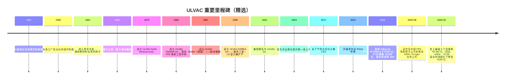

# ULVAC, Inc. (TSE:6728) — 股票研究启动报告

*截至 2026-05-26。作者：Claude 研究代理。原始研究语言：英文版本同步存档于 `ULVAC_TSE6728_Research_Document.md`。引用的日文/英文原始文件标题与链接保留原始语言。*

> **更新 — FY2026.6 业绩指引修订 (2026-05-12)：** 管理层将全年**接单 (orders)** 目标上调 ¥300 亿至 **¥3,100 亿**（创历史新高），但同时将全年**营业利润 (operating profit) 指引从 ¥285 亿下调至 ¥190 亿**（同比 –28.4%），原因是约 ¥58 亿的一次性损失（电动车相关的应收账款坏账准备、真空应用材料业务的质量整改费用、Q4 项目延期至 FY27 收入确认）。营业收入指引从 ¥2,500 亿上调至 ¥2,600 亿（同比 +3.5%），净利润上调至 ¥185 亿（受益于将中国 FPD 溅射靶子公司剥离至 Konfoong/Fengke 合资公司带来的约 ¥78 亿一次性处置收益）。来源：[Consolidated Financial Results for the Nine Months Ended March 31, 2026](https://data.swcms.net/file/ulvac-ir/dam/jcr:06f6f98a-ffc5-4896-93a7-f162c825dfe5/140120260512525783.pdf)、[FY2026.6 Q3 Key Q&A](https://ir.ulvac.co.jp/en/ir/library/result/main/00/teaserItems2/0111110/linkList/09/link/3Q_QA_EN.pdf)。

## 目录

1. 公司概览
2. 公司历史
3. 管理团队
4. 产品与服务
5. 客户与上市策略
6. 行业概览
7. 竞争格局
8. 市场机会 (TAM)
9. 风险评估

参考资料 & 验证日志

---

## 1. 公司概览

ULVAC, Inc.（TSE:6728；日文公司名「アルバック」，英文发音 "ul-vack"——取自 *Ultimate in Vacuum* 「真空之极致」的缩合）是一家日本资本设备制造商，**其首要业务身份是面向平板显示器 (FPD, flat panel display)、半导体、先进封装、功率器件、有机发光二极管 (OLED)、电动车 (EV) 电池及稀土永磁制造的真空镀膜、溅射机 / 沉积机 / 刻蚀机 (sputter / CVD / etch tool) 与真空泵设备制造商**。在更小但战略意义重要的**真空应用材料 (vacuum application materials)** 业务板块中，公司生产溅射靶 (sputter target)、掩膜基板 (mask blank)、表面分析仪及其他真空工艺耗材。集团仅披露两个报告分部——**真空设备 (vacuum equipment) 业务**（FY2025.6 销售占比约 79%）与**真空应用 (vacuum application) 业务**（约 21%）——设备分部内部进一步细分为四个产品线：半导体与电子器件生产设备、显示器与能源相关生产设备、零部件（真空泵、测量仪器、检漏仪）以及工业设备 ([FY2025.6 综合财务业绩, 分部信息, pp. 20–22](https://data.swcms.net/file/ulvac-ir/dam/jcr:8e4a9210-5392-4457-bf56-a46c357970fe/140120250813540543.pdf))。真空应用分部又拆分为材料（占该分部约 51%）与其他（分析仪器 / 掩膜基板）。野村「Greater China Semi」(大中华半导体) 锚定报告 (2026-05-21) 在 Fig. 44 中将 ULVAC 列入了溅射靶供应商联赛榜——但读者必须警惕：对 ULVAC 而言，**溅射靶材料只是设备主导型业务体系中的一个子业务，并非主营业务**，这一点贯穿全报告 ([reports/sector/半导体材料.md](https://github.com/dadachundan/financial_agent/blob/main/reports/sector/%E5%8D%8A%E5%AF%BC%E4%BD%93%E6%9D%90%E6%96%99.md))。

商业模式以**企业级 (B-to-B) 项目交付加售后市场**为绝对主体：大型真空集群工具（溅射机、CVD、刻蚀机、离子注入机 (ion implanter)、OLED 蒸发源 (evaporation source)）通过自有销售工程师直接销售给晶圆厂 / 面板厂，订单交付周期长（FY25 期末设备订单余额 ¥984 亿、材料 ¥174 亿），其上层叠加真空泵耗材、备件、维护合同与溅射靶补充的经常性收入流 ([FY25 财报, pp. 2–3, 分部叙述](https://data.swcms.net/file/ulvac-ir/dam/jcr:8e4a9210-5392-4457-bf56-a46c357970fe/140120250813540543.pdf))。FY25 真空设备分部约 39% 的收入按「时点履行义务」(transferred at a point in time，即出货 + 耗材) 确认，61% 按「时段履行义务」(transferred over time，即多月期设备建造与安装按完工百分比法确认)；真空应用分部的比例则反转——80% 时点（主要为靶材补充），20% 时段 ([FY25 分部注释, p. 22](https://data.swcms.net/file/ulvac-ir/dam/jcr:8e4a9210-5392-4457-bf56-a46c357970fe/140120250813540543.pdf))。这种「设备周期敏感的时段确认 + 颗粒度更细的材料 / 耗材」叠加结构，正是 ULVAC 财务画像兼具设备 OEM 与耗材特许经营双重特征的源头。

集团通过 29 家纳入合并报表的子公司与 8 家未合并子公司在全球范围内运营，覆盖日本（总部位于神奈川县茅崎市）、韩国（ULVAC KOREA Ltd.）、台湾（ULVAC TAIWAN Inc.、ULCOAT TAIWAN）、中国（11 家实体分布于苏州、上海、成都、靖江、沈阳、合肥，加上北京控股公司）、新加坡、马来西亚、美国（ULVAC Technologies、Physical Electronics USA「PHI」、TIGOLD）以及德国（ULVAC GmbH，未合并）([FY25 财报, 合并报表范围, pp. 16–17](https://data.swcms.net/file/ulvac-ir/dam/jcr:8e4a9210-5392-4457-bf56-a46c357970fe/140120250813540543.pdf))。FY25 按客户所在地的销售分布：日本 ¥781 亿 (31%)、中国 ¥865 亿 (34%)、韩国 ¥315 亿 (13%)、台湾 ¥281 亿 (11%)、其他 ¥270 亿 (11%)——中国为单一最大市场，反映了 ULVAC 在中国 FPD 厂商（BOE 京东方、CSOT 华星、Tianma 天马、Visionox 维信诺）及大陆晶圆厂（SMIC 中芯、YMTC 长江存储、CXMT 长鑫存储以及成熟制程逻辑晶圆代工厂）的溅射 / 刻蚀 / OLED 工具的大量配备 ([FY25 分地区销售表, p. 23](https://data.swcms.net/file/ulvac-ir/dam/jcr:8e4a9210-5392-4457-bf56-a46c357970fe/140120250813540543.pdf))。

FY2025.6 集团实现**净销售 ¥2,512 亿（同比 –3.8%）、营业利润 ¥265 亿（同比 –10.9%）、经常利润 ¥286 亿（同比 –4.0%）、归属于母公司股东净利润 ¥167 亿（同比 –17.5%）**——这是 FY24 销售 ¥2,611 亿 / 营业利润 ¥298 亿这一周期高点（受 FY23–FY24 强劲 AI / 先进封装拉动而达到）之后的中周期消化年 ([FY25 财报, p. 1](https://data.swcms.net/file/ulvac-ir/dam/jcr:8e4a9210-5392-4457-bf56-a46c357970fe/140120250813540543.pdf))。营业利润率从 11.4% 收窄至 10.6%；股东权益回报率 (ROE) 从 9.7% 降至 7.5%；权益资产比率改善至 59.6%。FY2026.6 前 9 个月（截至 2026 年 3 月）净销售达 ¥1,916 亿（同比 +2.1%），但营业利润下滑 ¥60 亿至 ¥147 亿（同比 –29.1%），原因即上述一次性损失；真正应当关注的数字是**接单金额 ¥2,362 亿，同比 +44.1%**——史上最强 9 个月接单，预示 FY27（截至 2027 年 6 月的财年）将形成实质性上行周期 ([Q3 FY26 财报, p. 2](https://data.swcms.net/file/ulvac-ir/dam/jcr:06f6f98a-ffc5-4896-93a7-f162c825dfe5/140120260512525783.pdf))。

截至 2025 年 6 月，集团全球员工约 6,000–7,000 人（综合报告将合并集团人数列为约 6,800 人），研发中心位于神奈川茅崎，工程枢纽在中国苏州与韩国天安；年度研发支出约 ¥100 亿，占销售约 4%——相对 ASML 等领先半导体设备同行（约 15%）较为温和，但与 ULVAC 在中端制程与 FPD 的定位相称 ([ULVAC 2025 价值报告 (Integrated Report), 财务数据章节](https://www.ulvac.co.jp/en/sustainability/report/pdf/2025/2025_ulvac_e_all.pdf)；[ULVAC 2024 财务概览 PDF](https://www.ulvac.co.jp/en/sustainability/report/pdf/2024/2024_ulvac_e_24.pdf))。董事长 / 创始人席位已不再设置（执掌多年、推动公司多元化的名誉会长堀英雄已将领导权交予职业经理人）；现任社长兼 CEO 自 2017 年 7 月起为**岩下节男 (Setsuo Iwashita)**，长期内部晋升的高管，1984 年加入公司。

**估值快照。** 截至 2026 年 5 月中旬，股价约 **¥9,587**，市值约 **¥4,627 亿**（按 ¥150/USD 折算约 30 亿美元）；据 TradingView，TTM P/E 约 38×、TTM 每股收益 ¥258、股息率约 1.62%；历史最高价 ¥11,450 创于 2024-05-27，12 个月回报约 +97% ([TradingView, TSE:6728](https://www.tradingview.com/symbols/TSE-6728/))。其他数据库（Yahoo Finance / Eulerpool 口径）报出更接近 19–20× 的 TTM P/E，因此最干净的读法是**按公司自家 FY26 净利润指引 ¥185 亿计的前瞻 P/E ≈ 24×**，或经常利润指引 × 隐含税率约 23×。*分析师观点：* 当前估值处于日本半导体设备中盘股区间的高位（同行中位数 18–22× FY1），定价已隐含（a）AI 资本开支对零部件 / 先进封装的拉动、（b）ULVAC 在成熟制程 MHM 溅射与光刻胶灰化的事实标准 (de facto standard) 份额、（c）Value-Up Plan 价值提升计划的成本纪律。若 FY27 接单动能减速或稀土永磁资本开支窗口提前关闭，估值面临向更典型的 16–18× 前瞻 P/E 下修 20–30% 的风险——这是最具体的近期估值风险，而非长期估值错配。最接近的可比公司（Canon Tokki、NIPPON SEISEN、SCREEN、TEL 东京电子、ASMI、AMAT 应用材料、LRCX 泛林）前瞻 P/E 跨度 15–30× 较宽，因此中位数锚定信号较弱。

读者从第 1 节应当带走的核心论点：ULVAC 是一家**真空技术综合型 (vacuum-technology generalist) 企业**——设备、零部件与材料均基于同一真空物理 IP——它**主动选择不在领先逻辑制程领域与 AMAT / LRCX / TEL / ASMI 正面竞争**，转而聚焦于（i）拥有事实标准份额的成熟制程 MHM / 封装利基；（ii）与 Canon Tokki 及 AMAT 分占余下市场的 FPD/OLED 溅射；（iii）受益于 AI 服务器需求的真空零部件（真空泵、检漏仪）；以及（iv）包含结构性增长的稀土永磁设备业务在内的工业 / 研发用真空工具。野村「Fig. 44 溅射靶联赛榜」的提名是真实存在的，但它仅是更大设备特许经营体系下较小一条腿中的一个切片。

*来源：ULVAC FY2025.6 及历史合并业绩；FY26 数据为 2026-05-12 修订后的公司指引 ([Q3 FY26 财报, p. 2](https://data.swcms.net/file/ulvac-ir/dam/jcr:06f6f98a-ffc5-4896-93a7-f162c825dfe5/140120260512525783.pdf))。*

---

## 2. 公司历史

ULVAC 成立于**1952 年 8 月 23 日**，以「日本真空技術株式会社 / *Nippon Shinkū Gijutsu KK*」(Japan Vacuum Engineering Co., Ltd.) 之名注册，初始实收资本 600 万日元，创始团队为一群真空物理学者，包括井町仁博士 (Dr. Jin Imachi，原东京芝浦电气 / 东芝 (Toshiba) 真空研究员)、林千博士 (Dr. Chikara Hayashi) 与柴田秀夫 (Hideo Shibata)，并由战后关西五位重要财界领袖出资种子资金——松下电器创始人松下幸之助 (Konosuke Matsushita) 以及大泽善夫 (Yoshio Osawa)、藤山爱一郎 (Aiichirō Fujiyama)、山本为三郎 (Tamesaburō Yamamoto)、广濑源 (Gen Hirose) ([ULVAC Company History](https://www.ulvac.co.jp/en/company/history/)；补充细节参见 [Reference for Business: ULVAC history](https://www.referenceforbusiness.com/history2/97/ULVAC-Inc.html))。创业初衷是将美国真空系统技术引入战后重建的日本工业基础——公司与美国 NRC Equipment Corporation 签订总代理协议进行技术合作，随后于 1955 年在大森工厂逐步本地化制造，并于 1956 年吸收合并东洋精机真空研究所 (Toyo Seiki Vacuum Research)，拓宽自产设备产品线 ([Reference for Business, ULVAC history](https://www.referenceforbusiness.com/history2/97/ULVAC-Inc.html))。

*来源：[ULVAC Company History](https://www.ulvac.co.jp/en/company/history/)；[2015 年可持续发展报告时间表附录](https://www.ulvac.co.jp/eng/_csr/eco/report/pdf/2015/2.pdf)；FY26 里程碑取自 [Q3 FY26 财报, pp. 12–14](https://data.swcms.net/file/ulvac-ir/dam/jcr:06f6f98a-ffc5-4896-93a7-f162c825dfe5/140120260512525783.pdf)。*

第一次结构性转型是 1961 年进入真空冶金领域，由此埋下了溅射靶 / 真空应用材料业务的种子。从一家纯粹的真空工程项目作坊起步，ULVAC 在自身用以销售给客户的同款溅射设备所消耗的高纯度金属（铝、钛、钨、钼、铜、钽，以及 ITO / IGZO 透明导电膜的氧化物陶瓷）的熔炼、铸造、粉末键合冶金工艺上层层叠加——一个结构上极为优雅的产品捆绑，正是 ULVAC 四十年来面向 FPD 厂商「设备 + 材料联合销售」推介逻辑的根基。第二次转型发生在 1980 年代 FPD 大爆发时期：1982 年的台湾子公司（初期服务日本显示器厂的海外晶圆厂）、1987 年的德国（工业真空镀膜）、1995 年的韩国（跟随三星显示 (Samsung Display) 与 LG Display）共同构筑了今日贡献集团多数收入的全球服务网络 ([ULVAC Company History](https://www.ulvac.co.jp/en/company/history/))。

第三次转型——也是最近的一次——发生在 2001 年公司由「日本真空技术」更名为「ULVAC, Inc.」并于 2004 年在东证第一部上市，正式完成从项目作坊到上市设备 OEM 的转型。中国市场的真正进入是在 1990 年代末至 2000 年代，通过 ULVAC (SUZHOU) 公司及合肥、沈阳的制造基地完成，使公司与 BOE / China Star / Tianma OLED 扩产形成深度绑定——这成为 2010 年代中国单一资本开支故事中最大的一笔。2022 年 4 月迁至东证 Prime 市场更多是行政重新分类（而非战略事件），最近的战略里程碑是 2025 年发布的 **Value-Up Plan 价值提升计划**，目标到 FY2026.6 实现销售 ¥3,000 亿、毛利率 35%、营业利润率 16%——明确承认公司体系的结构性问题是盈利能力而非营收规模 ([Scripts for Presentation_Material_for_FY2025_EN](https://ir.ulvac.co.jp/en/ir/newsrelease/PressRelease-20250815002/main/0/link/Scripts%20for%20Presentation_Material_for_FY2025_EN_1.pdf))。

2025-08 公告与中国 Konfoong Materials International（深圳市福工材料 / KFMI, SHE:300666）就 FPD 溅射靶合资项目进入磋商，并于 2026-05-12 董事会决议正式执行：将 100% ULVAC Materials (Suzhou) 转入由北京一家私募股权基金 Fengke Xinchuang（丰科鑫创）控股、KFMI 与 ULVAC 作为少数股东的北京合资公司，至此一段长篇章画上句号，并重塑了 ULVAC 在中国材料业务的存在感 ([Q3 FY26 财报, 重要事后事项, pp. 12–14](https://data.swcms.net/file/ulvac-ir/dam/jcr:06f6f98a-ffc5-4896-93a7-f162c825dfe5/140120260512525783.pdf)；背景见 [Yicai Global, 2025-08-14](https://www.yicaiglobal.com/news/kfmi-ulvac-to-integrate-their-flat-panel-display-target-materials-businesses))。战略逻辑有二：（1）中国市场 FPD 溅射靶竞争（BOE 偏好本地供应、KFMI 自身靶材业务 40% 同比增长至约 3.25 亿美元等值）持续压缩 ULVAC 单独经营的利润率；（2）与 KFMI 合并可使合资公司达到推动降本所需的规模，同时让 ULVAC 收获约 ¥78 亿一次性收益。*分析师观点：* 这是合理化重组而非战略撤退——ULVAC 保留 OLED / IGZO 用溅射靶的核心 IP，并继续在自家设备捆绑销售中消化内部靶材知识；合资交易仅是将中国 FPD 溅射靶的*制造业务*交给更本土化的平台运营。

合资交易之外值得标记的近期发展：（i）FY26 接单动能为公司史上最强——Q3 单季 ¥991 亿、9 个月 ¥2,362 亿，受成熟制程逻辑 MHM 溅射、先进封装光刻胶灰化、中国 G8.6 OLED 改造、以及美国主导的供应链多元化资本开支拉动稀土永磁设备等多重驱动 (Q3 FY26 Q&A 第 1–8 项)；（ii）稀土永磁设备业务正从 ¥200 亿 / 年的规模结构性重估至未来 3–5 年 ¥350–450 亿 / 年水平（按管理层口径）；（iii）原本预计 FY26 接单 ¥160 亿的 AR/VR 溅射项目因对中国项目坚持利润纪律而下调至 ¥60 亿——既是正面信号（价格纪律），也是负面信号（销量减少）。

---

## 3. 管理团队

**创始人背景（去名化的历史背景）。** 根据 [公司研究 skill](https://github.com/dadachundan/financial_agent/blob/main/.claude/skills/company-research/SKILL.md) 规则，仅创始人与现任 CEO 享有人物传记。ULVAC 的创始人——井町仁博士（前东芝真空研究员）、林千博士与柴田秀夫——于 1952 年创立公司，数十年前即已退出运营岗位；至今无人留任董事席位，亦不存在「在世创始人兼 CEO」情况。最久的运营连贯线索体现在企业商号本身——商标 ULVAC 取自「*Ultimate in Vacuum*」(真空之极致) 的缩合——以及自 1960 年代起持续担任该特许经营体系工程锚点的茅崎总部所在地 ([ULVAC Company History](https://www.ulvac.co.jp/en/company/history/))。由于目前管理层中并无活跃的创始人，本章节将聚焦于现任 CEO。

**岩下节男 (Setsuo Iwashita)——社长兼首席执行官 (President & CEO)。** 岩下先生自**2017 年 7 月**起担任社长兼 CEO，依 skill「仅创始人 + 现任 CEO」规则，他是本报告所述的唯一高管。他于**1984 年**加入 ULVAC（在公司服务 40 多年），CEO 之前最关键的一段履历是担任 **ULVAC (China) Holding Co. 会长兼总经理**——正是这段任职将中国从一个边缘销售区域转变为集团单一最大收入市场——并于 **2016 年晋升为董事兼专务执行役员 (Director and Senior Managing Executive Officer)** ([Bloomberg 个人资料, Setsuo Iwashita](https://www.bloomberg.com/profile/person/17438855)；[Crunchbase, Setsuo Iwashita / ULVAC Technologies](https://www.crunchbase.com/person/setsuo-iwashita)；[ULVAC 管理层架构页](https://www.ulvac.co.jp/en/company/directors_officers/))。中国运营背景是对投资者最重要的事实：ULVAC 今日的客户基础与收入结构由他在 2000 年代后期至 2010 年代亲手打造的中国本地制造与销售网络所主导的中国 OLED、成熟制程逻辑及存储晶圆厂构成，包括苏州、上海、成都、靖江、沈阳、合肥等数家如今合并员工中相当比例所在的子公司 ([FY25 财报, 合并报表范围, pp. 16–17](https://data.swcms.net/file/ulvac-ir/dam/jcr:8e4a9210-5392-4457-bf56-a46c357970fe/140120250813540543.pdf))。

岩下任 CEO 八年间，主持了（i）2017–2019 年针对中国 OLED 与存储扩产的产能扩张；（ii）COVID-19 期间的盈利能力危机及其后的 FY22–FY24 V 型复苏；（iii）2025 年 **Value-Up Plan 价值提升计划**的发布（明确的 ¥3,000 亿销售 / 16% 营业利润率目标框架）；以及（iv）当前的战略决策——**将中国 FPD 溅射靶制造业务部分剥离至 KFMI / Fengke 合资公司**——而非继续与受本地偏好支持的中国供应商进行次规模竞争。Q3 FY26 评论将这一决策定位为「将资源向半导体与电子领域转移，同时整合中国境内显示器相关生产以优化生产效率并进一步提升利润率」 ([Q3 FY26 Q&A, 第 7 项](https://ir.ulvac.co.jp/en/ir/library/result/main/00/teaserItems2/0111110/linkList/09/link/3Q_QA_EN.pdf))。其本人持股较少（约 0.067%，不存在控股家族遗留），薪酬框架是日本中盘股标准组合：基本工资、与经常利润达成挂钩的奖金、以及在有价证券报告书 (Yuho) 中披露的董事福利信托 (Board Benefit Trust, BBT) 限制性股票计划 ([Bloomberg 个人资料交叉引用](https://www.bloomberg.com/profile/person/17438855)；[GSA「Get to Know the CEO」专访](https://www.gsaglobal.org/get-to-know-the-ceo-setsuo-iwashita-president-%EF%BC%86-ceo-of-ulvac-inc/) 提供了他对管理哲学与增长重点的较长公开陈述)。*分析师观点：* CEO 的画像属于「稳健的内部晋升者」——任期长、中国业务熟练、在组合重塑（稀土永磁扩产、FPD 溅射靶合资）上有可信的执行力，但**没有进入领先半导体设备的野心**——这既是其品牌承诺，也是 ULVAC 未来能尝试成为何种公司的结构性天花板。

---
